# LOCI: SPATIAL LINEAR MEMORY FOR STREAMING WORLD MODELS

Ji Xia1 Tingting Liao1 Xuezhi Liang1 Hao Li2,3 Guangyi Liu1† 1Institute of Foundation Models, Mohamed bin Zayed University of Artificial Intelligence 2Mohamed bin Zayed University of Artificial Intelligence 3Pinscreen

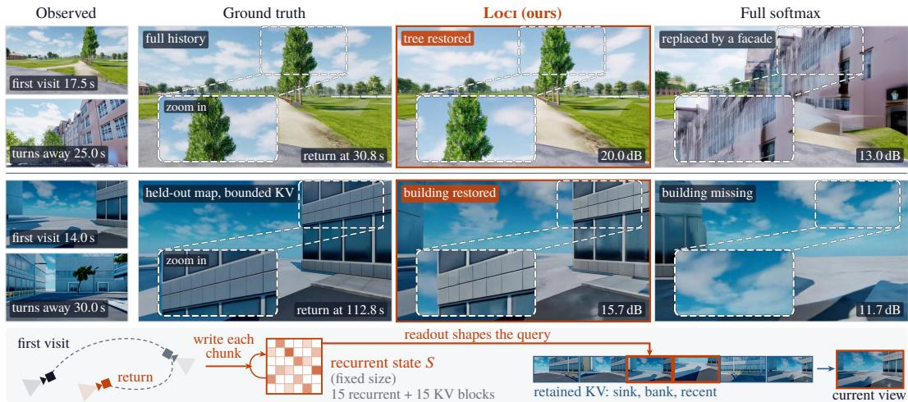  
Figure 1: Returning to a previously seen place. Each model continues the recorded video (top: full history; bottom: held-out Tokyo map, same bounded KV budget). Full softmax, trained with the same recipe, replaces the tree with a facade and loses the building; LOCI restores both (PSNR against ground truth; insets magnify the boxed region). Band: a fixed-size recurrent state shapes the queries into the retained KV (thumbnails: frames the Tokyo run retains).

## ABSTRACT

When a camera revisits a previously observed region, a video world model should reproduce what was there before. This requires both remembering past observations and retrieving the right one for the current viewpoint. Key–value caches preserve visual detail but grow with video length; recurrent memory is compact but compresses history into a fixed-size state, so individual past observations are no longer directly accessible. We introduce LOCI, a hybrid spatial-memory architecture that keeps both representations. In half of the transformer blocks, main attention keeps a key–value cache of past observations; in the other half, it is restricted to the current chunk and complemented by a recurrent linear-attention memory whose reads and writes are conditioned on projective camera geometry, so viewpoint enters both memory addressing and stored content. Recurrent readouts flow into subsequent cache-backed blocks and supply their queries with accumulated scene context. On the public MIND memory benchmark and on held-out recorded trajectories, LOCI reproduces revisited content more faithfully than representative world models and a same-recipe full-softmax model; with full history, it lowers peak memory at equal length by about 30% relative to full softmax. With a bounded bank of retained observations, it streams long videos at constant memory and remains more faithful than full softmax under the same budget. Project page: https://xiaji2021.github.io/LOCI/.

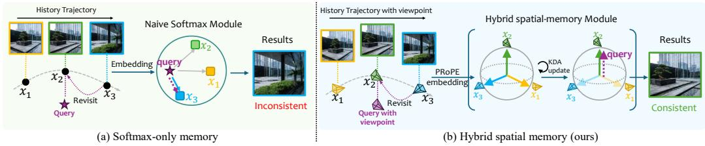  
Figure 2: Key idea of LOCI. Projectively conditioned recurrent memory integrates historical context, while retained KV preserves observation-level detail. Recurrent readouts update the features used by subsequent historical attention, connecting the two representations through the feature stream.

## 1 INTRODUCTION

Camera-controllable video world models now generate long, interactive explorations from actions or camera trajectories (Sun et al., 2026; Wang et al., 2026; Robbyant Team et al., 2026; Zhu et al., 2026; Chen et al., 2026b). Beyond plausible local continuations, such a model must preserve scene structure and appearance when the camera revisits observed regions, even after a prolonged absence. This spatial persistence requires both accurate camera control and historical evidence: the requested viewpoint determines where to look, while previous observations constrain what should appear. Streaming generation is challenging because spatial relevance does not follow temporal recency; an observation outside the recent context may be essential to reconstructing the current view.

Historical attention preserves individually accessible key–value (KV) features, but full-history storage and access costs grow with trajectory length. Selecting historical observations or pose-indexed landmarks reduces the active attention budget (Yu et al., 2025; Xiao et al., 2025; Li et al., 2025b; Xu et al., 2026b; Chen et al., 2026b) but can exclude evidence needed later. Local–global architectures combine fixed-size recurrent states with detailed local attention (Li et al., 2026b; Zhu et al., 2026), but consolidating observations into a state can lose scene-specific detail; as Xue et al. (2026) observe, long-horizon consistency needs both persistent memory and a long context. Retaining his torical KV preserves that detail without guaranteeing its use: the current query must still address relevant evidence, and generation must incorporate it. We keep both traces of the past and let them interact. A camera-conditioned recurrent state summarizes the entire history at fixed size, while retained KV preserves observation-level evidence. Because the recurrent readout is added to the token features from which later layers form their queries, accumulated scene context can direct attention in the retained KV toward observations relevant to the current view.

We introduce LOCI, a hybrid spatial-memory architecture built around this interaction (Fig. 2). We adopt the layer layout of ARL2 (Li et al., 2026a), a text-to-video hybrid, interleaving blocks that combine intra-chunk attention with recurrent memory and blocks that retain historical softmax at tention. In each hybrid block, current tokens read the state established by preceding chunks. A learned gate scales the recurrent readout before it is added to the local-attention output. The resulting features propagate through the network, and subsequent historical-attention blocks construct their queries from them. Recurrent context informs these queries under both full and bounded history. With a bounded bank, the recurrent state additionally carries information from observations whose KV entries have been discarded.

Built on Kimi Delta Attention (Kimi Team et al., 2025), the recurrent path has two adaptations for video scene memory. First, PRoPE (Li et al., 2025a) conditions queries, keys, and values on camera geometry, so what the recurrent memory writes and reads depends on viewpoint. Second, tokenlevel delta corrections revise individual associations, while channel-wise retention is applied once per chunk. This decouples explicit forgetting frequency from spatial token count without coarsening associative updates.

With a 5B backbone, we evaluate fidelity to the recorded video at revisits against representative world models and a full-softmax baseline trained with the same backbone, data, recipe and number of updates. Relative to this baseline, LOCI improves reference PSNR at revisits by 0.62 dB on held-out Unreal Engine trajectories, and by 0.99 dB on set A when both models access the same bounded set of retained observations. On the public MIND benchmark, it is significantly better over full prediction segments under the same bounded budget (PSNR +0.89 dB). Our contributions are threefold:

• We develop a hybrid spatial memory that couples projectively conditioned recurrent integration with direct historical KV access, allowing recurrent context to inform historical queries while preserving observation-level detail. Channel-wise retention is applied once per chunk, so explicit forgetting follows elapsed video time rather than token order; in an extended comparison on MIND, this lowers local error at revisits more than 20 s apart relative to per-token retention (Appendix F).

• We pair the recurrent state, carried over the full history, with a fixed-capacity bank of retained observations for bounded streaming. Under an identical bounded KV budget, the recurrent path improves fidelity over a same-recipe full-softmax model on the MIND memory test (all 50 segments; full-segment PSNR +0.89 dB, 95% interval [+0.64, +1.15], with lower LPIPS and MSE), while generation runs for 300 seconds at constant memory.

• On the public MIND memory benchmark (Ye et al., 2026), LOCI with full-history access, evaluated zero-shot, attains lower MSE and higher PSNR and SSIM than the values reported for GIM-World (Wei et al., 2026), which is trained on MIND. At short-horizon revisits, the hybrid is also more consistent locally than full softmax.

## 2 RELATED WORK

Memory for scene revisits. Explicit-memory world models select past observations for the current view by field-of-view overlap (Yu et al., 2025; Xiao et al., 2025), a surfel index (Li et al., 2025b), or query–key similarity over cached KV (Xu et al., 2026b), or reproject latent patches using depth (Qian et al., 2026). ReWorld (Chen et al., 2026b) retrieves chunks from a pose-indexed landmark bank under a fixed KV budget, and the concurrent WorldCrafter (Yu et al., 2026) compresses selected views into a fixed set of target-view tokens through a pose-guided readout. Training-free methods retrieve by pose or camera similarity (Ma et al., 2026; Yi et al., 2026), curate or recall cached KV by content (Xu et al., 2026a; Wu et al., 2026a), or remap positions so that distant memory stays within the trained range, training-free (Wu et al., 2026b) or with ring-structured training (Xue et al., 2026). LayerRecall (Ding et al., 2026) trains a state-conditioned router that retrieves historical KV and injects it into a fixed set of memory-sensitive layers. Others learn implicit memory (Peng et al., 2026; Wei et al., 2026) or target long-horizon streaming (Sun et al., 2026; Wang et al., 2026). LOCI also keeps observation-level KV, bounded by a bank of diverse views rather than per-target-view retrieval, and adds a recurrent state over the full history whose readout shapes downstream queries without a separate router or objective.

Hybrid recurrent video models. Several video models pair a linear-attention or state-space recurrence (Yang et al., 2025; Kimi Team et al., 2025) with local softmax attention: Hybrid Forcing (Li et al., 2026b) accumulates evicted KV additively, SANA-WM (Zhu et al., 2026) interleaves cameraconditioned Gated DeltaNet, in which all tokens of a latent frame form one recurrent step, with sink-and-window softmax blocks, and Video SSM (Po et al., 2025) uses a block-wise state-space scan. Remote content at a revisit is then available only through the compressed state; Astronex-World (Zhou & Miao, 2026), with the same backbone and PRoPE camera encoding, keeps only an attention sink and a fixed local window without a recurrent path. ARL2 (Li et al., 2026a), a text-to-video conversion recipe without camera control or revisit evaluation, supplies our layer lay out and read-then-commit schedule; instead of converting a trained model, we train the hybrid with chunk-wise diffusion forcing. In LOCI, the recurrent memory writes token by token and applies retention once per chunk; the remaining blocks attend directly to retained observations through queries formed from features that include the camera-conditioned recurrent readout; and revisits are evaluated against recorded ground truth (Appendix E).

Camera conditioning. Building on ray-based camera features (He et al., 2025), every block keeps a UCPE camera-attention branch (Zhang et al., 2026). PRoPE (Li et al., 2025a) was formulated for softmax attention; we apply it inside delta-rule memory, so the state stores associations between camera-transformed keys and values. ViewRope (Xiang et al., 2026) and MeRoPE (Qiao et al., 2026) are rotary alternatives.

## 3 PRELIMINARIES

Kimi Delta Attention. Kimi Delta Attention (KDA) (Kimi Team et al., 2025) keeps a fixed-size state $S \in \mathbb { R } ^ { d _ { k } \times d _ { v } }$ through channel-wise retention and token-level delta corrections. For a normalized key $k _ { t }$ , value $v _ { t } ,$ diagonal retention $D _ { t }$ , and write strength $\beta _ { t } = 2 \sigma ( b _ { t } ) \in ( 0 , 2 )$ in our parameterization,

$$
\widetilde { \boldsymbol { S } } _ { t } = \boldsymbol { D } _ { t } \boldsymbol { S } _ { t - 1 } , \qquad \boldsymbol { S } _ { t } = \widetilde { \boldsymbol { S } } _ { t } + \beta _ { t } \boldsymbol { k } _ { t } \big ( \boldsymbol { v } _ { t } - \widetilde { \boldsymbol { S } } _ { t } ^ { \top } \boldsymbol { k } _ { t } \big ) ^ { \top } .\tag{1}
$$

Retention controls which key channels persist, while the delta residual corrects the value predicted at $k _ { t }$ (Yang et al., 2024; 2025). A query q reads $S ^ { \top } q$ from the available state. Our chunk-wise read-before-write schedule is specified in Sec. 4.2.

Rotary and camera-relative positional encoding. RoPE (Su et al., 2024) rotates queries and keys with $\Phi ( p )$ , where $\Phi ( p _ { i } ) ^ { \top } \Phi ( p _ { j } ) = \Phi ( p _ { j } - p _ { i } )$ makes their interaction depend on relative position. PRoPE (Li et al., 2025a) extends this to camera geometry. Each token has a transform $G _ { i }$ combining its camera projection matrix $P _ { i }$ with patch-level RoPE:

$$
o _ { i } = G _ { i } \sum _ { j } \mathrm { s o f t m a x } _ { j } \left( q _ { i } ^ { \top } G _ { i } G _ { j } ^ { - 1 } k _ { j } \right) G _ { j } ^ { - 1 } v _ { j } .\tag{2}
$$

Camera dependence enters through relative projective transforms $P _ { i } P _ { j } ^ { - 1 }$ , so this attention is invariant to a common change of world coordinates. We apply projective conditioning to recurrent memory.

## 4 LOCI

Architecture. We adapt the 30-block Wan video transformer (Wan Team et al., 2025) to chunkcausal generation. A clean conditioning latent $z _ { 0 }$ is followed by chunks $z _ { c }$ of five latent frames, with camera pose and intrinsics supplied for each frame:

$$
p _ { \theta } ( z _ { 1 : C } \mid z _ { 0 } , \pi _ { 0 : C } ) = \prod _ { c = 1 } ^ { C } p _ { \theta } ( z _ { c } \mid z _ { < c } , \pi _ { 0 : c } ) .\tag{3}
$$

Fifteen hybrid blocks combine intra-chunk softmax attention with recurrent Kimi Delta Attention (KDA) (Kimi Team et al., 2025); the other fifteen retain softmax attention with explicit historical keys and values. All blocks keep an independent UCPE ray-conditioned camera-attention branch (Zhang et al., 2026) (Appendix A). In every block the camera branch attends to the same retained frames as the historical-attention blocks. At an equal retained-frame budget, LOCI thus stores mainattention KV in 15 layers rather than 30 and replaces the other 15 histories with fixed-size states. Camera KV stays in all 30 blocks.

Information follows the current chunk through network depth. At a hybrid block, local attention describes the chunk while a PRoPE-conditioned read supplies recurrent context from preceding chunks. Their gated sum updates the token features. A later historical-attention block forms its queries from these features and reads explicit keys and values from the permitted history. Compressed history therefore shapes the representation used to access retained observations through the ordinary inter-layer path, without a separate state-to-query adapter (Fig. 3).

## 4.1 PROJECTIVE CAMERA ENCODING FOR RECURRENT MEMORY

A previously observed surface can become relevant after a long temporal gap, while a recent observation may face elsewhere; camera geometry thus supplies a cue distinct from temporal proximity. We use PRoPE (Li et al., 2025a) to condition the recurrent queries, keys and values on each token’s camera ray. With world-to-ray transform $E _ { i }$ (first-frame reference, translation divided by $s = 6 )$ and normalized intrinsics ${ \overline { { K } } } _ { i }$ , the projection is $P _ { i } = \mathrm { l i f t } ( \overline { { K } } _ { i } ) E _ { i }$ . The query map $A _ { i }$ applies $P _ { i } ^ { \top }$ and the key and value maps $B _ { i } , C _ { i }$ apply $P _ { i } ^ { - 1 }$ , together with patch rotations, as in Eq. (9). The recurrent features are

$$
\begin{array} { r } { \widehat { q } _ { i } = \mathcal { N } ( A _ { i } q _ { i } ) , \qquad \widehat { k } _ { i } = \mathcal { N } ( B _ { i } k _ { i } ) , \qquad \widetilde { v } _ { i } = C _ { i } v _ { i } , } \end{array}\tag{4}
$$

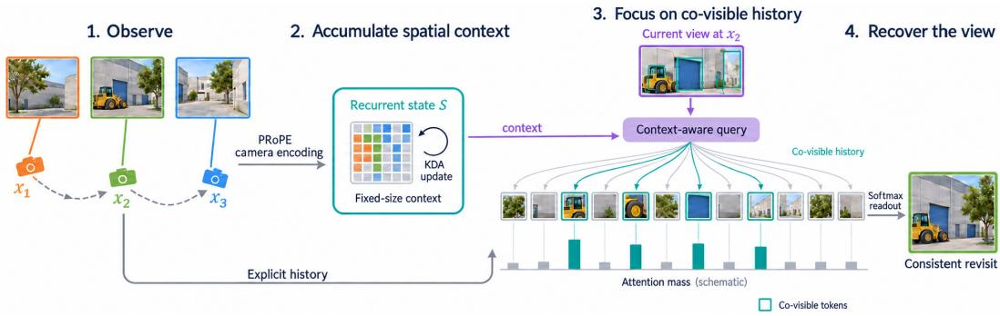  
Figure 3: Conceptual illustration of LOCI. A camera-conditioned recurrent state accumulates context from past observations; at a revisit, its readout shapes the queries with which later historicalattention blocks attend to co-visible retained observations. The layer layout is given in $\mathrm { A p \cdot }$ pendix A.1.

where $\mathcal { N } ( { \boldsymbol { x } } ) = { \boldsymbol { x } } / { \sqrt { \| { \boldsymbol { x } } \| _ { 2 } ^ { 2 } + \epsilon } }$ acts over the full head; the readout is mapped back by $C _ { i } ^ { - 1 }$ . Each projective tile contributes the relative product $q _ { i } ^ { \top } P _ { i } P _ { i } ^ { - 1 } k _ { j }$ to a query–key pairing. We disable temporal rotary encoding only in the KDA branch. All softmax branches keep the backbone’s native encoding (Appendix A.6).

## 4.2 CHUNK-SYNCHRONOUS MEMORY DYNAMICS

Read from the preceding state. For each hybrid block and head, let $S _ { c - 1 } \in \mathbb { R } ^ { d \times d } \left( d = 1 2 8 \right)$ be the key-by-value state available before chunk c. Every token i in the chunk reads this same state, while local softmax handles interactions within the chunk:

$$
r _ { i } = C _ { i } ^ { - 1 } \Big ( d ^ { - 1 / 2 } S _ { c - 1 } ^ { \top } \widehat { q } _ { i } \Big ) , \qquad o _ { i } = W _ { o } \big [ o _ { i } ^ { \mathrm { l o c a l } } + \eta \sigma ( g _ { i } ) r _ { i } \big ] ,\tag{5}
$$

where $o _ { i } ^ { \mathrm { l o c a l } }$ is intra-chunk softmax attention, $g _ { i }$ a learned per-token, per-head gate, and $\eta = 1$ a fixed recurrent branch scale.

Write at token resolution. Starting from $S _ { c - 1 }$ , the tokens of the chunk update the state in sequence with the delta rule, so new observations revise the value already associated with a key:

$$
\begin{array} { r l r } & { \overline { { \boldsymbol { S } } } ^ { ( i ) } = D _ { i } \boldsymbol { S } ^ { ( i - 1 ) } , \qquad \beta _ { i } = 2 \sigma ( b _ { i } ) } & \\ & { \boldsymbol { S } ^ { ( i ) } = \overline { { \boldsymbol { S } } } ^ { ( i ) } + \beta _ { i } \widehat { k } _ { i } \left( \widetilde { \boldsymbol { v } } _ { i } - \overline { { \boldsymbol { S } } } ^ { ( i ) \top } \widehat { k } _ { i } \right) ^ { \top } . } & \end{array}\tag{6}
$$

The scan’s final state becomes $S _ { c } { \mathrm { : } }$ queries read the preceding chunk’s state, while writes retain token resolution (Li et al., 2026a).

Retention once per chunk. Per-token retention, as in KDA for language, makes forgetting a function of raster position rather than elapsed time: tokens of the same frame, observed simultaneously, are attenuated unequally, and mostly the final tokens of a chunk survive in the state. We therefore apply learned diagonal retention $D _ { i }$ only at the first token of each chunk, computed from the chunk’s mean representation, and identity retention elsewhere; see Eq. (10). Explicit forgetting then advances once per chunk, while delta corrections remain token-wise (derivation in Appendix A.6; comparison with per-token retention in Appendix F).

Training and sampling. Training uses chunk-wise diffusion forcing (Chen et al., 2024): only the conditioning latent is clean, and a single full-window forward scans the noised chunks from zero state. During sampling, following ARL2 (Li et al., 2026a), every denoising iteration reads the committed state without modifying it. After the last denoising step of the current chunk, a separate forward on that sample commits the state for the next chunk (timestep zero with full history; t = 100 in the bounded sparse setting). Appendix A.3 summarizes both schedules.

## 4.3 DENSE AND BOUNDED SPARSE HISTORICAL ACCESS

A fixed-size state compresses context; explicit KV preserves selected token-level detail for direct attention. In the dense mode, historical softmax blocks attend over the evaluated prefix. To bound explicit storage during streaming, the sparse mode retains a recent window and a diverse bank of older views, shared by the main and camera branches:

$$
\mathcal F _ { c } = \{ 0 \} \cup B _ { c } \cup \mathcal { R } _ { c } \cup \mathcal { U } _ { c } , \qquad | \mathcal { B } _ { c } | \le 2 0 , \quad | \mathcal { R } _ { c } | \le 8 , \quad | \mathcal { U } _ { c } | = 5 .\tag{7}
$$

The conditioning frame is a sink, $\mathcal { R } _ { c }$ holds the most recent completed frames, and $\mathcal { U } _ { c }$ is the current chunk, so softmax attention sees at most 34 latent frames. The panorama bank $\boldsymbol { B } _ { c }$ is updated from its previous contents and the frames leaving the recent window by a field-of-view coverage criterion that favors earlier observations adding complementary coverage (Appendix A). Discarded observations are not archived. Bank selection leaves the recurrent state intact, so the fixed-size state and bounded bank let generation continue without growing either history store. We analyze storage and per-chunk cost in Appendix A.6.

## 5 EXPERIMENTS

## 5.1 EXPERIMENTAL SETUP

Models and baselines. All our models start from Wan2.2-TI2V-5B (Wan Team et al., 2025) and are trained for 5,000 updates with chunk-wise diffusion forcing. Full softmax keeps softmax attention in all 30 blocks under the identical recipe, data and number of updates. The recurrent branch adds 90.7M parameters (1.7% of 5.38B). Inference uses 50 denoising steps and CFG 1. We run external camera-controlled world models with official weights and default sampling: CaR (Peng et al., 2026), HY-WorldPlay (Sun et al., 2026), Matrix-Game 3.0 (Wang et al., 2026), LingBot-World (Robbyant Team et al., 2026), AlayaWorld (AlayaWorld Team et al., 2026), Alaya-EVOKE (Yin et al., 2026), SANA-WM (Zhu et al., 2026) and SolarWM (Huang et al., 2026). ARL2 (Li et al., 2026a) is reproduced with its conversion recipe. From update 2,000, our main models are trained on a UE-weighted data mixture; a second pair continues on the uniform mixture. Training uses Unreal Engine and CARLA scenes that we rendered (about 98 h) and real walking videos from Sekai (Li et al., 2025c). No MIND data is used. Details are in Appendix B.

Evaluation. The main benchmark is MIND (Ye et al., 2026): a memory segment is supplied as context and the continuation is compared with the recording. We follow its official protocol and evaluate the entire prediction segment; results over the first 20 s are in Appendix D. We list the numbers reported by GIM-World (Wei et al., 2026), which is trained on MIND, as a reference, and evaluate LOCI zero-shot. We also report WBench’s gated camera-return consistency (Ying et al., 2026) and held-out recorded Unreal Engine trajectories with ground truth (Appendix C). A revisit instant is a pose within 0.15 m and 32◦ of an earlier one, reached after at least 8 s and after looking away by 60◦. Metrics are MSE, PSNR, SSIM (Wang et al., 2004) and LPIPS (Zhang et al., 2018). Intervals are 95% bootstrap intervals over clips (10,000 resamples).

## 5.2 COMPARISON WITH SOTA

External models differ in size, training data, sampling steps and how they receive the memory segment (Appendix D.1), so this comparison is a reference under a unified protocol; the controlled comparison in Sec. 5.3 isolates the architecture. On MIND (Table 1), LOCI obtains lower MSE and higher PSNR and SSIM than reported for GIM-World, which is trained on the benchmark’s data, and for Context-as-Memory, FramePack and SSM, with LPIPS below all of them except GIM-World (0.643 vs. 0.630). Among the streaming world models we run with the memory segment as context, several of them larger (8–28B), LOCI is best on all four metrics among those scored on all segments, 1.82 dB PSNR above the strongest (HY-WorldPlay). With bounded sparse history at constant memory, it still has the lowest MSE and the highest PSNR and SSIM of this group. On the 36 segments that CaR completes, LOCI has lower MSE and higher PSNR and SSIM, whereas CaR has lower LPIPS (0.622 vs. 0.630). Table 11 (Appendix F) reports WBench-Navi gated camera-return consistency (Ying et al., 2026). On the held-out recorded trajectories of sets A and B (Appendix C), the ranking holds: at revisit instants LOCI has significantly lower LPIPS than six of the seven externa models we run and significantly higher PSNR than five of them (Table 7; examples in Fig. 4).

Table 1: MIND memory test (first-person). Reference: numbers reported in the GIM-World paper, also evaluated on the entire prediction segment (not re-run by us). Run by us: all models evaluated identically on the entire prediction segment with the official evaluation code; external models use official weights and default sampling, with the memory segment provided as context. n: number of scored segments (Matrix-Game 3.0: one segment failed in the official scorer; LingBot-World: 28B in total, 14B active). ‡CaR: the 36 shortest segments; generation of the 14 longest did not finish (on these 36 segments LOCI obtains 0.0460 / 14.39 / 0.478 / 0.630). Bold: best among models run by us on all segments.
<table><tr><td>Method</td><td>Params</td><td>Trained on MIND</td><td>n</td><td>MSE↓</td><td>PSNR↑</td><td>SSIM↑</td><td>LPIPS↓</td></tr><tr><td>Reference (reported in the GIM-World paper)</td><td></td><td></td><td></td><td></td><td></td><td></td><td></td></tr><tr><td>SSM (Po et al., 2025)</td><td></td><td>√</td><td></td><td>0.0796</td><td>11.96</td><td>0.395</td><td>0.744</td></tr><tr><td>FramePack (Zhang et al., 2025)</td><td></td><td>√</td><td></td><td>0.0764</td><td>12.04</td><td>0.376</td><td>0.706</td></tr><tr><td>Context-as-Memory (Yu et al., 2025)</td><td></td><td>√</td><td></td><td>0.0706</td><td>12.50</td><td>0.392</td><td>0.695</td></tr><tr><td>GIM-World (Wei et al., 2026)</td><td>1.3B</td><td>√</td><td></td><td>0.0614</td><td>13.40</td><td>0.414</td><td>0.630</td></tr><tr><td>Run by us (entire prediction segment)</td><td></td><td></td><td></td><td></td><td></td><td></td><td></td></tr><tr><td>HY-WorldPlay (Sun et al., 2026)</td><td>8B</td><td>×</td><td></td><td>500.0710</td><td>12.54</td><td>0.398</td><td>0.715</td></tr><tr><td>Matrix-Game 3.0 (Wang et al., 2026)</td><td>5B</td><td>×</td><td>49</td><td>0.0866</td><td>11.69</td><td>0.373</td><td>0.666</td></tr><tr><td>AlayaWorld (AlayaWorld Team et al., 2026)</td><td>15B</td><td>X</td><td></td><td>50 0.0908</td><td>11.33</td><td>0.358</td><td>0.683</td></tr><tr><td>Alaya-EVOKE (Yin et al., 2026)</td><td>14B</td><td>X</td><td></td><td>50 0.0884</td><td>11.14</td><td>0.347</td><td>0.710</td></tr><tr><td>LingBot-World (Robbyant Team et al., 2026)</td><td>28B</td><td>X</td><td></td><td>50 0.0955</td><td>11.33</td><td>0.331</td><td>0.703</td></tr><tr><td>CaR‡ (Peng et al., 2026)</td><td>5B</td><td>×</td><td></td><td>36 0.0538</td><td>13.85</td><td>0.458</td><td>0.622</td></tr><tr><td>LoCi (ours)</td><td>5B</td><td>X</td><td></td><td>500.0455</td><td>14.36</td><td>0.464</td><td>0.643</td></tr><tr><td>LoCI (bounded sparse)</td><td>5B</td><td>X</td><td></td><td>500.0622</td><td>13.02</td><td>0.409</td><td>0.679</td></tr></table>

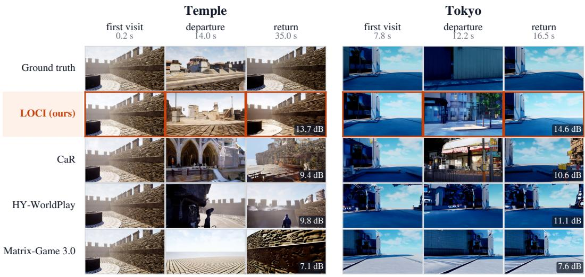  
Figure 4: Qualitative revisit comparison on held-out recorded trajectories (first frame and camera trajectory as input for all methods). Each row is one model; columns show the first visit, a view after the camera has turned away, and the return to the first viewpoint, with the PSNR of the return frame against ground truth. LOCI restores the previously observed scene on return, whereas the other models replace or distort it. For each clip we show the return at which LOCI leads by the largest margin; clip-level averages are in Table 6. Temple Plaza is a training map traversed along a new trajectory; the Tokyo map is not used in training.

## 5.3 ABLATION STUDY

Full softmax vs. hybrid. With identical data, recipe and number of updates, LOCI is significantly better than full softmax on the MIND memory test in all three settings of Table 2 (both data mixtures, both history modes), with significantly lower MSE in each (not shown). Under an identical bounded KV budget, the hybrid raises PSNR by 0.89 dB and is better in 44 of 50 segments, so the gain does not come from storing more history. With full history, it also completes the seven segments (100–

Table 2: Hybrid vs. full softmax with the same backbone, data, recipe and 5,000 updates on the MIND memory test (entire prediction segment; ∆ is the paired mean over segments, LOCI − full softmax, with 95% bootstrap intervals). Bounded: both models access the same fixed set of retained frames (first frame, bank of 20, 8 most recent). Full history: the 32 segments completed by both models (full softmax, run on the 39 shorter segments, exceeds GPU memory on 7 of them).
<table><tr><td></td><td></td><td></td><td colspan="3">PSNR↑</td><td colspan="3">LPIPS↓</td></tr><tr><td>Data mixture</td><td>History</td><td>n</td><td>Softmax</td><td>LocI</td><td>∆ [95% CI]</td><td>Softmax</td><td>LocI</td><td>∆ [95% CI]</td></tr><tr><td>Uniform</td><td>bounded</td><td>50</td><td>12.17</td><td>12.85</td><td>+0.67[+0.42, +0.93]</td><td>0.700</td><td>0.680</td><td>-0.020 [-0.028, -0.011]</td></tr><tr><td>UE-weighted</td><td>bounded</td><td>50</td><td>12.13</td><td>13.02</td><td>+0.89 [+0.64, +1.15]</td><td>0.704</td><td>0.679</td><td>-0.024[-0.034, -0.015]</td></tr><tr><td>UE-weighted</td><td>full</td><td>32</td><td>13.90</td><td>14.25</td><td>+0.35[+0.08, +0.62]</td><td>0.669</td><td>0.641</td><td>-0.029[-0.040, -0.018]</td></tr></table>

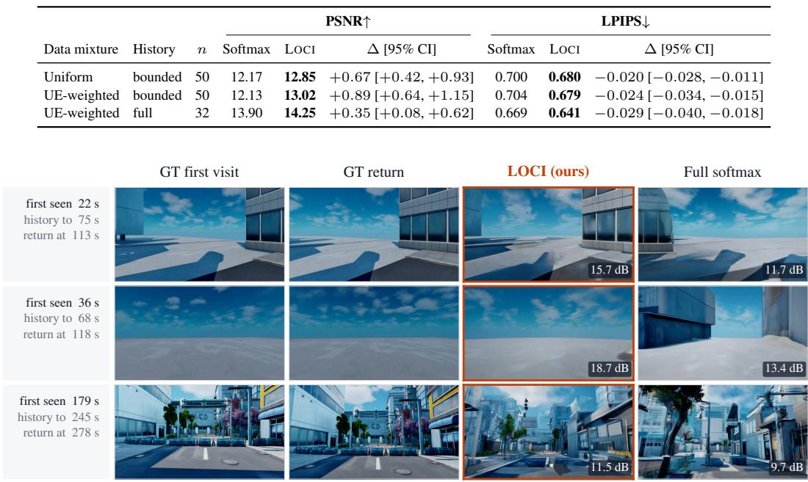  
Figure 5: Long-range recall under the same bounded KV budget. Both models receive the recorded video up to the stated time as history and generate the rest; shown are returns to places first seen more than 60 s earlier, with the PSNR of the generated return frame against the corresponding ground truth. Full softmax, which can only attend to the retained frames, replaces the scene (new buildings, a tree), whereas LOCI restores it. We show three of the four trajectories, each at the return where LOCI leads by the largest margin.

138 s of prediction) on which full softmax runs out of GPU memory. On the recorded sets the same ranking holds against ground truth at revisit instants (Table 7, Appendix C).

Long-range recall under a bounded budget. To test recall well beyond the retained frames, we give both models the first 68–245 s of four held-out recorded trajectories (2 and 5 min) as ground truth history under the same bounded access, and let them generate the remaining 45–60 s, which revisit places first seen at least 60 s earlier. On all four trajectories, LOCI reproduces these returns more faithfully than full softmax (revisit PSNR +0.68 to +1.93 dB, lower LPIPS on each; Fig. 5).

Direct training vs. conversion. Converting the trained full-softmax model into the same hybrid layout with the ARL2 recipe does not reach the directly trained hybrid, and neither converted model exceeds its own teacher (Appendix F).

Local consistency at short-horizon revisits. Frame-level averages dilute localized errors, such as an object that disappears or appears on return. At revisit instants 8–20 s after the first visit, we therefore score the worst 5% of patches by DINOv2 (Oquab et al., 2024) feature distance between the generated and ground-truth revisit frames (Appendix F). On the MIND memory test, this local error is significantly lower for LOCI than for full softmax (−0.073) and lower in 12 of 13 segments with such revisits, whereas whole-frame LPIPS on the same frames does not separate the models. The ranking holds at 1% or 10% and on a shared worst region. Resetting the recurrent state of LOCI at every chunk during inference, all else unchanged, raises this local error (+0.021 [+0.013, +0.028])

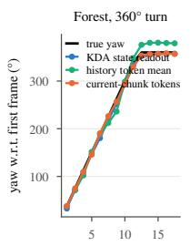  
time (s)

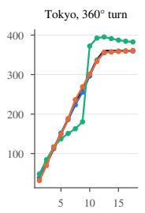  
time (s)

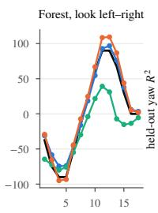  
time (s)

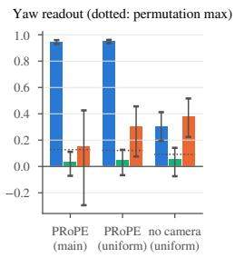  
Figure 6: Linear readout of camera yaw. Left three panels: true yaw and readouts from the KDA state, the mean of past tokens, and the current chunk’s input features (before camera conditioning) on example trajectories. Right: held-out $R ^ { 2 }$ (15-layer mean) for the main model (left group) and, on the uniform-mixture branch with an identical recipe, the recurrent memory with PRoPE (middle) and without camera encoding (right); dotted lines show the maximum over $\dot { 2 0 }$ label permutations.

and blurs the revisit frames (Laplacian-variance sharpness relative to ground truth 0.12 with the reset vs. 0.18 without), each in 15 of 16 segments. This comparison needs only LOCI’s own rollouts and therefore covers three more segments than the paired one. The recurrent state thus contributes to short-horizon fidelity (examples in Fig. 7, Appendix F). Per-token retention, trained under the same recipe (uniform mixture), matches per-chunk retention at these short-range revisits; over all revisits of the MIND prediction segment, per-chunk retention has lower local error, with the gap growing with the revisit interval (Appendix F).

## 5.4 ANALYSIS OF THE RECURRENT STATE

Projective conditioning makes the recurrent state camera-decodable. PRoPE writes camera geometry into the recurrent keys and values. We test whether camera yaw relative to the first frame remains linearly decodable from the accumulated KDA state. We read the state at every chunk boundary from the ninth chunk on (32 designed trajectories; mean over the 15 hybrid layers; cross-validation and bootstrap intervals clustered by trajectory) and obtain held-out $\dot { R } ^ { 2 } = \dot { 0 . 9 4 6 }$ [0.929, 0.960] and a median error of $3 . 6 ^ { \circ }$ (Fig. 6); coordinate-invariant summaries of the state (perhead singular values and norms) retain $R ^ { 2 } = \bar { 0 } . 9 4 1$ . An untrained branch with the same conditioning decodes about as well, so decodability reflects the encoding rather than learned behaviour. Among models trained on the uniform mixture, PRoPE raises this $\ln ^ { 2 } { \mathrm { ~ b y ~ } } + 0 . 6 4 6 \ \left[ + 0 . 5 4 4 , + 0 . 7 4 9 \right]$ over a recurrent memory without camera encoding.

Historical attention concentrates on co-visible content, partly through the readout. We replay the same ground-truth history through both models and compare attention at the same query positions (8 recorded clips, 154 revisit instants, token-level co-visibility from ground-truth depth used only for measurement; Appendix B). Co-visible tokens make up only about 0.1% of the history, yet the 15 softmax layers of LOCI place 11.1% of their history attention on them, versus 10.45% for the same 15 layers of full softmax: an enrichment over uniform attention of 115× vs. 108× (+6.64), higher in all 8 clips. The difference persists when both models see the same retained frames under bounded access $( 8 8 \times \mathrm { ~ v s . ~ } 8 1 \times , + 6 . 8 2 )$ , again in 8 of 8. Zeroing only the cross-chunk readout at inference lowers the co-visible enrichment of the downstream softmax layers (+0.56 for on minus off), most strongly right after a hybrid block (+0.86), and a norm-matched random readout lowers it further: downstream queries use the content of the readout, although zeroing it removes only part of the difference to full softmax. On each model’s own rollouts, LOCI also reconstructs the co-visible region more closely (masked LPIPS 0.597 vs. 0.654, lower at 131 of 154 instants), with the same sign in every tertile of co-visible attention enrichment. Intervals for all these quantities are in Table 5.

## 5.5 LONG-HORIZON GENERATION AND COST

With full history, both models grow in memory and time per chunk until they exhaust the GPU. Replacing half of the historical-KV layers with recurrent state extends the reachable length from

157 s to 225 s and lowers memory at equal length by about 30% (Fig. 8 and Table 12 in Appendix F). LOCI is also faster than full softmax (7.2 vs. 8.1 s per video second over the first 40 s), since half of its layers attend only within the current chunk. Under bounded sparse access, LOCI runs the full 300 s at a constant 23.6 GiB and constant time per chunk, and on the recorded set it scores slightly higher than with full history (Table 13). This is 15% less memory than full softmax under the same access (27.6 GiB), at the same speed: 5.4 s per video second for both on one H200, with an output-preserving optimized implementation of the recurrent branch (Appendix F).

## 6 DISCUSSION AND LIMITATIONS

Limitations. Our held-out trajectories are rendered in Unreal Engine; real-world captures are not evaluated. Absolute fidelity is low for all models (benchmark-average PSNR below 15 dB), so the gains should be read as relative. We study one 5B backbone with a short fine-tuning budget (5,000 updates). The per-token retention comparison (Appendix F) uses an extended metric defined after the short-range comparison. Both models keep an explicit-history camera-attention branch in all 30 blocks, so the recurrent path halves main-attention KV rather than all stored history. The recurrent state is built from noised chunk features in training but committed from generated chunks at inference. Speed parity with full softmax in the bounded sparse mode relies on the optimized implementation of Sec. 5.5.

Conclusion. LOCI combines projective recurrent memory, chunk-level retention, and explicit historical attention in a camera-controlled video model. The architecture keeps both compact spatial context and direct access to retained visual detail, halves the number of main-attention layers that store historical KV, and supports dense and bounded sparse historical access. On the MIND memory benchmark, it has the best MSE, PSNR and SSIM among the world models we evaluate and improves over an identically trained full-softmax model under the same bounded KV budget. With a bounded bank of retained observations, it streams at constant memory.

## ACKNOWLEDGMENTS

We thank Xin Li and Fan Yang for their valuable help with the manuscript and figures, and for insightful discussions.

## REFERENCES

AlayaWorld Team, Kaipeng Zhang, Chuanhao Li, Yifan Zhan, Yongtao Ge, Yuanyang Yin, Jiaming Tan, Kang He, Liaoyuan Fan, Mingliang Zhai, Ruicong Liu, Xiaojie Xu, Xuangeng Chu, Zhen Li, Zhengyuan Lin, Zhixiang Wang, Zian Meng, and Zihui Gao. AlayaWorld: Interactive longhorizon world modeling – full technical report (v1.1). arXiv preprint arXiv:2608.13492, 2026.

Shuai Bai, Yuxuan Cai, Ruizhe Chen, Keqin Chen, Xionghui Chen, Zesen Cheng, Lianghao Deng, Wei Ding, Chang Gao, Chunjiang Ge, Wenbin Ge, Zhifang Guo, Qidong Huang, Jie Huang, Fei Huang, Binyuan Hui, Shutong Jiang, Zhaohai Li, Mingsheng Li, Mei Li, Kaixin Li, Zicheng Lin, Junyang Lin, Xuejing Liu, Jiawei Liu, Chenglong Liu, Yang Liu, Dayiheng Liu, Shixuan Liu, Dunjie Lu, Ruilin Luo, Chenxu Lv, Rui Men, Lingchen Meng, Xuancheng Ren, Xingzhang Ren, Sibo Song, Yuchong Sun, Jun Tang, Jianhong Tu, Jianqiang Wan, Peng Wang, Pengfei Wang, Qiuyue Wang, Yuxuan Wang, Tianbao Xie, Yiheng Xu, Haiyang Xu, Jin Xu, Zhibo Yang, Mingkun Yang, Jianxin Yang, An Yang, Bowen Yu, Fei Zhang, Hang Zhang, Xi Zhang, Bo Zheng, Humen Zhong, Jingren Zhou, Fan Zhou, Jing Zhou, Yuanzhi Zhu, and Ke Zhu. Qwen3-VL technical report. arXiv preprint arXiv:2511.21631, 2025.

Boyuan Chen, Diego Mart´ı Monso, Yilun Du, Max Simchowitz, Russ Tedrake, and Vincent Sitz-´ mann. Diffusion Forcing: Next-token prediction meets full-sequence diffusion. In Advances in Neural Information Processing Systems (NeurIPS), volume 37, pp. 24081–24125, 2024.

Kaijin Chen, Dingkang Liang, Xin Zhou, Yikang Ding, Xiaoqiang Liu, Pengfei Wan, and Xiang Bai. Out of sight but not out of mind: Hybrid memory for dynamic video world models, 2026a. arXiv:2603.25716.

Zhifei Chen, Luozhou Wang, Guibao Shen, Dongyu Yan, Shuai Yang, Tianshuo Xu, Yihua Du, Wei Wang, Tianyi Gui, Lianghua Huang, and Yingcong Chen. ReWorld: An interactive world model with long-horizon memory. arXiv preprint arXiv:2608.23565, 2026b.

Yixuan Ding, Jiahao Kong, Wei Huang, Ruijie Quan, and Yi Yang. LayerRecall: A stateconditioned memory router for long-horizon consistency in video generation. arXiv preprint arXiv:2608.28460, 2026.

Alexey Dosovitskiy, German Ros, Felipe Codevilla, Antonio Lopez, and Vladlen Koltun. CARLA: An open urban driving simulator. In Proceedings of the 1st Annual Conference on Robot Learning (CoRL), volume 78 of Proceedings of Machine Learning Research, pp. 1–16, 2017.

Hao He, Yinghao Xu, Yuwei Guo, Gordon Wetzstein, Bo Dai, Hongsheng Li, and Ceyuan Yang. CameraCtrl: Enabling camera control for video diffusion models. In International Conference on Learning Representations (ICLR), 2025.

Junchao Huang, Guian Fang, Shengju Qian, Xianghao Kong, Zhuoran Zhao, Wei Huang, Yihua Du, Zixin Zhang, Justin Cui, Yuchao Gu, Yukang Chen, Xinting Hu, Tianyu He, Shaoshuai Shi, Zhuotao Tian, Xin Wang, Mike Zheng Shou, and Li Jiang. SolarWM: Open data and scalable training for long-horizon video world models, 2026. arXiv:2609.02886.

Kimi Team, Yu Zhang, Zongyu Lin, Xingcheng Yao, Jiaxi Hu, Fanqing Meng, Chengyin Liu, Xin Men, Songlin Yang, Zhiyuan Li, Wentao Li, Enzhe Lu, Weizhou Liu, Yanru Chen, Weixin Xu, Longhui Yu, Yejie Wang, Yu Fan, Longguang Zhong, Enming Yuan, Dehao Zhang, Yizhi Zhang, T. Y. Liu, Haiming Wang, Shengjun Fang, Weiran He, Shaowei Liu, Yiwei Li, Jianlin Su, Jiezhong Qiu, Bo Pang, Junjie Yan, Zhejun Jiang, Weixiao Huang, Bohong Yin, Jiacheng You, Chu Wei, Zhengtao Wang, Chao Hong, Yutian Chen, Guanduo Chen, Yucheng Wang, Huabin Zheng, Feng Wang, Yibo Liu, Mengnan Dong, Zheng Zhang, Siyuan Pan, Wenhao Wu, Yuhao Wu, Longyu Guan, Jiawen Tao, Guohong Fu, Xinran Xu, Yuzhi Wang, Guokun Lai, Yuxin Wu, Xinyu Zhou, Zhilin Yang, and Yulun Du. Kimi Linear: An expressive, efficient attention architecture, 2025. arXiv:2510.26692.

Kunyang Li, Mubarak Shah, and Yuzhang Shang. Attend locally, remember linearly: Linear attention as cross-frame memory for autoregressive video diffusion. arXiv preprint arXiv:2605.16579, 2026a.

Ruibin Li, Tao Yang, Fangzhou Ai, Tianhe Wu, Shilei Wen, Bingyue Peng, and Lei Zhang. Long-horizon streaming video generation via hybrid attention with decoupled distillation. arXiv preprint arXiv:2604.10103, 2026b.

Ruilong Li, Brent Yi, Junchen Liu, Hang Gao, Yi Ma, and Angjoo Kanazawa. Cameras as relative positional encoding. In Advances in Neural Information Processing Systems (NeurIPS), 2025a. arXiv:2507.10496.

Runjia Li, Philip Torr, Andrea Vedaldi, and Tomas Jakab. VMem: Consistent interactive video scene generation with surfel-indexed view memory. In Proceedings of the IEEE/CVF International Conference on Computer Vision (ICCV), pp. 25690–25699, 2025b.

Zhen Li, Chuanhao Li, Xiaofeng Mao, Shaoheng Lin, Ming Li, Shitian Zhao, Zhaopan Xu, Xinyue Li, Yukang Feng, Jianwen Sun, Zizhen Li, Fanrui Zhang, Jiaxin Ai, Zhixiang Wang, Yuwei Wu, Tong He, Yunde Jia, and Kaipeng Zhang. Sekai: A video dataset towards world exploration. In Advances in Neural Information Processing Systems (NeurIPS), Datasets and Benchmarks Track, volume 38, 2025c.

Wenchao Ma, Changran Liu, Sharon X. Huang, and Haomiao Jiang. Closing the loop: Trainingfree revisit consistency for autoregressive generative rendering. arXiv preprint arXiv:2607.21848, 2026.

Maxime Oquab, Timothee Darcet, Th´ eo Moutakanni, Huy V. Vo, Marc Szafraniec, Vasil Khalidov,´ Pierre Fernandez, Daniel Haziza, Francisco Massa, Alaaeldin El-Nouby, Mido Assran, Nicolas Ballas, Wojciech Galuba, Russell Howes, Po-Yao Huang, Shang-Wen Li, Ishan Misra, Michael Rabbat, Vasu Sharma, Gabriel Synnaeve, Hu Xu, Herve J ´ egou, Julien Mairal, Patrick Labatut,´ Armand Joulin, and Piotr Bojanowski. DINOv2: Learning robust visual features without supervision. Transactions on Machine Learning Research, 2024. URL https://openreview. net/forum?id=a68SUt6zFt.

Zhan Peng, Jie Ma, Huiqiang Sun, Chong Gao, Zhijie Xue, Zhiyu Pan, Zhiguo Cao, Jun Liang, and Jing Li. Compression and retrieval: Implicit memory retrieval for video world models, 2026. arXiv:2606.23105.

Ryan Po, Yotam Nitzan, Richard Zhang, Berlin Chen, Tri Dao, Eli Shechtman, Gordon Wetzstein, and Xun Huang. Long-context state-space video world models. In Proceedings of the IEEE/CVF International Conference on Computer Vision (ICCV), pp. 8733–8744, 2025. doi: 10.1109/ICCV51701.2025.00817.

Runjia Qian, Zile Wang, Jihai Zhang, Kai Zou, Wei Yu, Jiaxing Li, Zexiang Liu, Yaokun Li, Fei Kang, Kaichen Huang, Mengyin An, Haobo Zhang, Biao Jiang, Jiahua Wang, Haofeng Sun, Yang Liu, and Yangguang Li. Matrix-Game 3.5: Enhancing real-time streaming interactive world models with patch memory. arXiv preprint arXiv:2608.29910, 2026.

Zhijian Qiao, Xinjiang Wang, Jiajie Chen, Haoming Huang, Meng Li, Chih-Chung Chou, Jing Wang, and Shaojie Shen. MeRoPE: Metric rotary position embedding for camera-controlled video generation, 2026. arXiv:2609.01252.

Alec Radford, Jong Wook Kim, Chris Hallacy, Aditya Ramesh, Gabriel Goh, Sandhini Agarwal, Girish Sastry, Amanda Askell, Pamela Mishkin, Jack Clark, Gretchen Krueger, and Ilya Sutskever. Learning transferable visual models from natural language supervision. In International Conference on Machine Learning (ICML), 2021.

Robbyant Team, Zelin Gao, Qiuyu Wang, Yanhong Zeng, Jiapeng Zhu, Ka Leong Cheng, Yixuan Li, Hanlin Wang, Yinghao Xu, Shuailei Ma, Yihang Chen, Jie Liu, Yansong Cheng, Yao Yao, Jiayi Zhu, Yihao Meng, Kecheng Zheng, Qingyan Bai, Jingye Chen, Zehong Shen, Yue Yu, Xing Zhu, Yujun Shen, and Hao Ouyang. Advancing open-source world models. arXiv preprint arXiv:2601.20540, 2026.

Jianlin Su, Murtadha Ahmed, Yu Lu, Shengfeng Pan, Wen Bo, and Yunfeng Liu. RoFormer: Enhanced transformer with rotary position embedding. Neurocomputing, 568:127063, 2024. doi: 10.1016/j.neucom.2023.127063.

Wenqiang Sun, Haiyu Zhang, Haoyuan Wang, Junta Wu, Zehan Wang, Zhenwei Wang, Yunhong Wang, Jun Zhang, Tengfei Wang, and Chunchao Guo. WorldPlay: Towards long-term geometric consistency for real-time interactive world modeling. In International Conference on Machine Learning (ICML), 2026.

Wan Team, Ang Wang, Baole Ai, Bin Wen, Chaojie Mao, Chen-Wei Xie, Di Chen, Feiwu Yu, Haiming Zhao, Jianxiao Yang, Jianyuan Zeng, Jiayu Wang, Jingfeng Zhang, Jingren Zhou, Jinkai Wang, Jixuan Chen, Kai Zhu, Kang Zhao, Keyu Yan, Lianghua Huang, Mengyang Feng, Ningyi Zhang, Pandeng Li, Pingyu Wu, Ruihang Chu, Ruili Feng, Shiwei Zhang, Siyang Sun, Tao Fang, Tianxing Wang, Tianyi Gui, Tingyu Weng, Tong Shen, Wei Lin, Wei Wang, Wei Wang, Wenmeng Zhou, Wente Wang, Wenting Shen, Wenyuan Yu, Xianzhong Shi, Xiaoming Huang, Xin Xu, Yan Kou, Yangyu Lv, Yifei Li, Yijing Liu, Yiming Wang, Yingya Zhang, Yitong Huang, Yong Li, You Wu, Yu Liu, Yulin Pan, Yun Zheng, Yuntao Hong, Yupeng Shi, Yutong Feng, Zeyinzi Jiang, Zhen Han, Zhi-Fan Wu, and Ziyu Liu. Wan: Open and advanced large-scale video generative models. arXiv preprint arXiv:2503.20314, 2025.

Zhou Wang, Alan C. Bovik, Hamid R. Sheikh, and Eero P. Simoncelli. Image quality assessment: From error visibility to structural similarity. IEEE Transactions on Image Processing, 13(4): 600–612, 2004.

Zile Wang, Zexiang Liu, Jiaxing Li, Kaichen Huang, Baixin Xu, Fei Kang, Mengyin An, Peiyu Wang, Biao Jiang, Yichen Wei, Yidan Xietian, Jiangbo Pei, Liang Hu, Boyi Jiang, Hua Xue, Zidong Wang, Haofeng Sun, Wei Li, Wanli Ouyang, Xianglong He, Yang Liu, Yangguang Li, and Yahui Zhou. Matrix-Game 3.0: Real-time and streaming interactive world model with longhorizon memory, 2026. arXiv:2604.08995.

Zhengxuan Wei, Xu Guo, Xinghui Li, Xunzhi Xiang, Min Wei, Yiran Zhu, Qiulin Wang, Xintao Wang, Pengfei Wan, Xiangwang Hou, and Qi Fan. Geometry-aware implicit memory for video world models, 2026. arXiv:2606.02436.

Mingqiang Wu, Weilun Feng, Zhefeng Zhang, Haotong Qin, Yuqi Li, Guoxin Fan, Xiaokun Liu, Zhulin An, Libo Huang, Yongjun Xu, and Chuanguang Yang. Echo-Forcing: A scene memory framework for interactive long video generation. arXiv preprint arXiv:2605.16003, 2026a.

Tong Wu, Shuai Yang, Ryan Po, Yinghao Xu, Ziwei Liu, Dahua Lin, and Gordon Wetzstein. Video world models with long-term spatial memory. In Advances in Neural Information Processing Systems (NeurIPS), volume 38, pp. 49371–49393, 2025.

Xindi Wu, Sven Elflein, James Lucas, Olga Russakovsky, Laura Leal-Taixe, Despoina Paschalidou,´ Jonathan Lorraine, and Aljosa O ˇ sep. Addressable memory for video world models. ˇ arXiv preprint arXiv:2608.07408, 2026b.

Chendong Xiang, Jiajun Liu, Jintao Zhang, Xiao Yang, Zhengwei Fang, Shizun Wang, Zijun Wang, Yingtian Zou, Hang Su, and Jun Zhu. Geometry-aware rotary position embedding for consistent video world model, 2026. arXiv:2602.07854.

Zeqi Xiao, Yushi Lan, Yifan Zhou, Wenqi Ouyang, Shuai Yang, Yanhong Zeng, and Xingang Pan. WorldMem: Long-term consistent world simulation with memory. In Advances in Neural Information Processing Systems (NeurIPS), 2025. arXiv:2504.12369.

Haiyang Xu, Zheng Ding, and Zhuowen Tu. RECAP-Forcing: Retaining content appearances for long video generation. arXiv preprint arXiv:2608.26671, 2026a.

Jiacong Xu, Hanwen Jiang, Zhixin Shu, Kalyan Sunkavalli, Vishal M. Patel, and Yiqun Mei. Wonder: Video world model done better, 2026b. arXiv:2607.26037.

Bowen Xue, Brandon Y. Feng, Chenguo Lin, Yuchen Lin, Yujia Zeng, Lvmin Zhang, Maneesh Agrawala, Honglei Yan, and Panwang Pan. Ring Forcing: Towards precise long-term memory for autoregressive video diffusion. arXiv preprint arXiv:2608.26794, 2026.

Songlin Yang, Bailin Wang, Yu Zhang, Yikang Shen, and Yoon Kim. Parallelizing linear transformers with the delta rule over sequence length. In Advances in Neural Information Processing Systems (NeurIPS), 2024. arXiv:2406.06484.

Songlin Yang, Jan Kautz, and Ali Hatamizadeh. Gated delta networks: Improving Mamba2 with delta rule. In International Conference on Learning Representations (ICLR), 2025. arXiv:2412.06464.

Yixuan Ye, Xuanyu Lu, Yuxin Jiang, Yuchao Gu, Rui Zhao, Qiwei Liang, Jiachun Pan, Fengda Zhang, Weijia Wu, and Alex Jinpeng Wang. MIND: Benchmarking memory consistency and action control in world models, 2026. arXiv:2602.08025.

Jung Yi, Minjae Kim, Paul Hyunbin Cho, Wooseok Jang, Sangdoo Yun, and Seungryong Kim. WorldKV: Efficient world memory with world retrieval and compression. arXiv preprint arXiv:2605.22718, 2026.

Yuanyang Yin, Gongxuan Wang, Yifan Zhan, Chuanhao Li, Kaipeng Zhang, and Feng Zhao. Alaya-EVOKE: From linear-scaling supervision to endless world, 2026. arXiv:2608.13546.

Kaining Ying, Hengrui Hu, Siyu Ren, Jiamu Li, Fengjiao Chen, Ziwen Wang, Xuezhi Cao, Xunliang Cai, and Henghui Ding. WBench: A comprehensive multi-turn benchmark for interactive video world model evaluation, 2026. arXiv:2605.25874.

Jiwen Yu, Jianhong Bai, Yiran Qin, Quande Liu, Xintao Wang, Pengfei Wan, Di Zhang, and Xihui Liu. Context as memory: Scene-consistent interactive long video generation with memory retrieval. In Proceedings of the SIGGRAPH Asia 2025 Conference Papers, pp. 1–11, 2025. doi: 10.1145/3757377.3763833.

Wangbo Yu, Kunhao Liu, Wenbo Hu, Shenghai Yuan, Chaoran Feng, Haiyang Zhou, Yukun Huang, Yiran Wang, Wang Zhao, Yingmin Luo, and Ying Shan. WorldCrafter: Consistent video world model with implicit 3D-aware memory. arXiv preprint arXiv:2609.24984, 2026.

Cheng Zhang, Boying Li, Meng Wei, Yan-Pei Cao, Camilo Cruz Gambardella, Dinh Phung, and Jianfei Cai. Unified camera positional encoding for controlled video generation. In Proceedings of the IEEE/CVF Conference on Computer Vision and Pattern Recognition (CVPR), pp. 38027– 38037, 2026.

Lvmin Zhang, Shengqu Cai, Muyang Li, Gordon Wetzstein, and Maneesh Agrawala. Frame context packing and drift prevention in next-frame-prediction video diffusion models. In Advances in Neural Information Processing Systems (NeurIPS), volume 38, pp. 30546–30566, 2025.

Richard Zhang, Phillip Isola, Alexei A. Efros, Eli Shechtman, and Oliver Wang. The unreasonable effectiveness of deep features as a perceptual metric. In IEEE Conference on Computer Vision and Pattern Recognition (CVPR), 2018.

Xin Zhou and Cong Miao. Astronex-World 1.0: Real-time interactive world model foundation. arXiv preprint arXiv:2609.20034, 2026.

Haoyi Zhu, Haozhe Liu, Yuyang Zhao, Tian Ye, Junsong Chen, Jincheng Yu, Tong He, Song Han, and Enze Xie. SANA-WM: Efficient minute-scale world modeling with hybrid linear diffusion transformer, 2026. arXiv:2605.15178.

## A IMPLEMENTATION DETAILS

## A.1 BACKBONE AND FEATURE LAYOUT

The backbone has 30 transformer blocks, 24 heads per block, and head dimension 128. The fifteen hybrid blocks have zero-based indices [2, 4, 6, 7, 8, 9, 11, 13, 14, 16, 23, 24, 25, 27, 28]; the remaining blocks retain historical softmax attention. At $5 1 2 \times 7 6 8$ image resolution, VAE latents have spatial size $3 2 \times 4 8$ with 48 channels. Spatial patchification produces $1 6 \times 2 4 = 3 8 4$ tokens per latent frame. The temporal VAE stride is four. Training windows contain $8 1 = 1 + 1 6 \times 5$ latent frames: one conditioning frame and sixteen future chunks. Each hybrid block carries 24 recurrent states of size $1 2 8 \times 1 2 8$

<table><tr><td>Stored history</td><td>Full softmax</td><td>LoCI</td></tr><tr><td>Main-attention KV layers</td><td>30</td><td>15</td></tr><tr><td>Fixed recurrent-state layers</td><td>0</td><td>15</td></tr><tr><td>Independent camera-attention layers</td><td>30</td><td>30</td></tr></table>

The comparison assumes equal source-frame support, token resolution, and dtype; the camera branch of every block stores the same retained frames as the historical-attention blocks. Weights, working activations, current-chunk storage, and transfer buffers also occupy device memory, so this layer count does not predict a factor-of-two reduction in total device usage.

Ray geometry. Camera poses are expressed relative to the first frame. For recurrent PRoPE, ray transforms are constructed in FP32, their translation is divided by six, and they are composed with normalized pinhole intrinsics. For image width $w ,$ height $h ,$ and horizontal field of view $\theta _ { x } ,$ the intrinsic construction is

$$
f _ { x } = f _ { y } = \frac { w } { 2 \tan ( \theta _ { x } / 2 ) } , \qquad ( c _ { x } , c _ { y } ) = ( w / 2 , h / 2 ) , \qquad \overline { { K } } = \left[ \begin{array} { c c c } { f _ { x } / w } & { 0 } & { c _ { x } / w - 1 / 2 } \\ { 0 } & { f _ { y } / h } & { c _ { y } / h - 1 / 2 } \\ { 0 } & { 0 } & { 1 } \end{array} \right] .\tag{8}
$$

The homogeneous lift appends an identity coordinate. The translation divisor is an encoding scale. The independent UCPE camera-attention branch transforms its own projected queries, keys, values and outputs using the ray-view matrices without this additional intrinsic composition or translation divisor. Its rays still depend on the supplied camera intrinsics.

Head coordinates. The recurrent camera slot is 12:44: four consecutive four-dimensional projective tiles occupy 12:28, followed by horizontal and vertical patch rotations on 28:36 and 36:44. Each eight-dimensional patch rotation pairs the first four coordinates with the last four. Channels 44:128 use the backbone’s 42 adjacent spatial rotary pairs for queries and keys only. Channels 0:12 use identity in the recurrent branch. Writing the two patch rotations together as ${ \bf { \bar { \mathit { R } } } } _ { i } ^ { p }$ and the backbone spatial rotation as $R _ { i } ^ { s }$ , the complete maps are

$$
\begin{array} { r l } & { A _ { i } = I _ { 1 2 } \oplus ( P _ { i } ^ { \top } ) ^ { \oplus 4 } \oplus R _ { i } ^ { p } \oplus R _ { i } ^ { s } , } \\ & { B _ { i } = I _ { 1 2 } \oplus ( P _ { i } ^ { - 1 } ) ^ { \oplus 4 } \oplus R _ { i } ^ { p } \oplus R _ { i } ^ { s } , } \\ & { C _ { i } = I _ { 1 2 } \oplus ( P _ { i } ^ { - 1 } ) ^ { \oplus 4 } \oplus R _ { i } ^ { p } \oplus I _ { 8 4 } . } \end{array}\tag{9}
$$

Here $\oplus$ denotes a block-diagonal sum. The inverse value map $C _ { i } ^ { - 1 }$ decodes the recurrent output. It differs from the inverse key map because values do not carry the backbone spatial rotation.

## A.2 GATES AND STATE EXECUTION

The write gate is one scalar per token and head, $\beta = 2 \sigma ( b ( h ) )$ . For mean block input $\overline { { h } } _ { c }$ and first token $i _ { c } ,$ , log-retention is

$$
\begin{array} { r l } & { \gamma _ { c } = \operatorname* { m a x } \bigr \{ \log \alpha _ { \operatorname* { m i n } } , - \exp ( a ) \ \mathrm { s o f t p l u s } ( W _ { \alpha } \overline { { h } } _ { c } + b _ { \alpha } ) \bigr \} , } \\ & { D _ { i } = \left\{ \begin{array} { l l } { \mathrm { d i a g } ( \exp \gamma _ { c } ) , } & { i = i _ { c } , } \\ { I , } & { i \ne i _ { c } . } \end{array} \right. } \end{array}\tag{10}
$$

The maximum is elementwise, a is learned per head, and $\alpha _ { \mathrm { m i n } } = 0 . 2$ . In this equation, the projection and bias denote their expanded, channel-tied forms. The retention projection produces 64 values per head, repeated over adjacent channel pairs to form the 128 entries of $\gamma _ { c }$ in Eq. (10). This parameter sharing is retained as an implementation choice. Initially the retention projection and a are zero, with $b _ { \alpha } = \mathrm { s o f t p l u s } ^ { - 1 } ( - \log r _ { 0 } )$ for an initial per-chunk retention $r _ { 0 } = 0 . 7$ . Applying the logretention floor once at the start of a chunk gives a multiplicative retention of at least 0.2 at that step; all other steps use identity retention. Learned gates need not remain at their initial values.

The fused delta scan uses a key-by-value state and the update order in $\operatorname { E q . }$ (6): decay first, residual correction second. Each chunk’s readouts are computed from its incoming state before this scan, rather than using the kernel’s within-chunk output sequence. Final states are stored in FP32. In the standard read path, they are cast to the query dtype for the read operation; storing FP32 state does not make the entire readout FP32.

During denoising, temporary state updates operate on a copy and are discarded. Only the separate commit forward after sampling (timestep zero with full history; $t = 1 0 0$ in the bounded sparse setting) commits persistent state. Classifier-free guidance maintains separate state streams for its two conditioning branches. Explicit main and camera caches have a mutable current-chunk tail: its keys and values are refreshed during denoising, then refreshed again from the final generated latent. This tail is distinct from the protected recurrent state. Training uses a forward-local scan of noised features and no additional clean-history commit pass.

## A.3 EXECUTION SCHEDULE

The schedule below applies independently to each hybrid layer. A single forward passes token features through the interleaved network blocks; recurrent state is not passed directly between layers. Historical softmax blocks read their retained KV using queries projected from the current layer’s input representation.

<table><tr><td>Stage</td><td>Recurrent-state operation</td></tr><tr><td>Training input</td><td>Keep the first condition latent clean; independently noise each future chunk. Start a forward-local state at zero.</td></tr><tr><td>Training forward</td><td>In causal chunk order, read the incoming state for all current queries, then scan token-level writes to supply the next chunk&#x27;s state. Discard this local state after</td></tr><tr><td>Inference prefill</td><td>the forward; no separate clean commit is performed. Process the supplied condition at noise level zero to initialize persistent state.</td></tr><tr><td>Denoising a chunk</td><td>Read the same committed incoming state at every noise level. Temporary write results do not replace persistent state.</td></tr><tr><td>After sampling</td><td>If another chunk follows, run the final generated latent through a new forward (timestep zero with full history; diffusion time t = 100, noise level 0.1, in the bounded sparse setting; the conditioning frame uses  $t = 0 )$  and commit its token-</td></tr></table>

Each forward propagates its output through ordinary transformer representations. Consequently, a historical block downstream of a hybrid block can use recurrent context in its queries without a dedicated query-conditioning module.

## A.4 PANORAMA-BANK SELECTION

Each candidate frame j is represented by its camera center $p _ { j }$ and a binary field-of-view mask $M _ { j }$ over 4,096 fixed Fibonacci-sphere directions. A direction is included when it lies within the camera’s rectangular pinhole field of view. This orientation mask does not estimate occlusion or scene depth. For a frame i and a set S, let cov $\begin{array} { r } { ( i , S ) = | M _ { i } \cap \bigcup _ { j \in S , \| p _ { i } - p _ { j } \| _ { 2 } < 6 } M _ { j } | / | M _ { i } | } \end{array}$ be the fraction of i’s directions already seen from retained frames within 6 m. The five frames leaving the recent window are visited in source order. A departing frame f joins the bank only if $1 - \operatorname { c o v } ( f , \{ 0 \} \cup B ) \geq 0 . 3$ i.e. it adds at least 30% new viewing directions. When the bank then exceeds 20 frames, the bank frame with the largest cov $\cdot ( b , \{ 0 \} \cup \joinrel ( B \setminus \{ b \} ) )$ (the most redundant) is evicted, ties removing the newer frame. The rule therefore favors earlier observations that add complementary coverage; the bank is stored in source order. The initial condition is excluded because it has its own sink slot, but it counts toward coverage. At each update at most the previous 20 bank frames plus five departing recent frames are considered. Retention is coverage-based.

For a chunk starting at latent index $u _ { c }$ with h retained history frames (sink, bank and recent window, in source order), the i-th retained frame $( i = 0 , \ldots , h - 1 )$ is assigned main-key time $u _ { c } - h + i \colon$ the retained frames are renumbered compactly immediately before the current chunk, so the recent window keeps its source times and the sink and bank occupy the preceding slots. Current frames retain source times. Camera attention uses the selected observations’ original poses. Main-key time correction applies the target rotary matrix multiplied by the inverse source rotary matrix to the temporal channels 0:44, using the actual stored rotary coefficients. This preserves the distinction between native main-attention coordinates and the recurrent coordinates of Eq. (9). The remaining main-key channels, cached values, and source camera poses are unchanged. The correction is made on the read representation rather than repeatedly rotating canonical cached keys. Retained-frame storage is bounded, whereas maximum executable duration also depends on positional tables and the inference implementation.

## A.5 SCOPE OF THE STREAMING COUNTS

For a fixed number of spatial tokens per frame, dense main-KV storage grows with the retained prefix in all historical-attention layers: 30 for full softmax and 15 for LOCI. Each of the 15 recurrent layers instead stores a fixed $2 4 \times 1 2 8 \times 1 2 8$ state per conditioning stream.

In sparse mode, the sink, bank, recent window, and current chunk together occupy at most 34 latentframe slots in both explicit branches. The bank selects from at most 25 candidates per update, while recurrent state continues independently. For fixed chunk size and denoising schedule, these history operations have bounded work per generated chunk. A C-chunk rollout repeats them C times; output storage and positional tables are separate from the retained-history count.

## A.6 METHOD DETAILS: PROJECTIVE ENCODING, RETENTION, AND STREAMING STORAGE

Projective encoding. The maps A and $B _ { i }$ also retain the backbone’s spatial rotary encoding (Eq. (9)). Values are not L2-normalized; the readout is transformed back by $C _ { i } ^ { - 1 }$ , including the inverse patch rotations. The full-head normalization in Eq. (4) is applied after the geometric transforms. Together with the state update, it makes the recurrent memory a learned geometryconditioned mechanism rather than an invariant projective kernel. Temporal rotary encoding is disabled only in the KDA branch: intra-chunk attention and the historical softmax blocks retain the backbone’s native temporal encoding, and the model remains causal. The independent cameraattention branch retains its own ray-based transform.

Read and fusion. In Eq. (5), head concatenation before the output projection $W _ { o }$ is implicit, and the gate adds the unnormalized memory readout to the local output. Each hybrid block has its own state; the explicit bank stores observation features.

Retention once per chunk. Applying decay at every spatial token would make the number of forgetting steps depend on tokenization as well as elapsed video time. Within a chunk of N tokens, the content written at position i has been attenuated by the $N - i$ later gates when the chunk is committed. Tokens of the same frame, which are observed simultaneously, are therefore retained unequally (by a factor $r ^ { H W - 1 }$ between the first and last token of a frame, and $r ^ { N - 1 }$ across the chunk). With the default per-token retention this leaves almost only the final tokens of the last frame in the state. Even when the per-token rate is chosen so that the product over a chunk matches ours, the first frame of a chunk retains only a fraction $r _ { c } ^ { ( F - 1 ) / F }$ of what the last frame retains $( F$ frames per chunk, $r _ { c }$ the per-chunk retention). Computing one retention per chunk from the chunk mean (Eq. (10)) removes this dependence for explicit retention: all tokens of an observation share the same retention factor, and explicit forgetting advances only with elapsed chunks. The delta-rule correction itself remains order-dependent within a chunk.

Commit pass. The commit forward recomputes the features of the final generated latent chunk; in the bounded sparse setting it runs at diffusion time t = 100 (noise level 0.1) while the conditioning frame still uses t = 0. This pass uses the generated sample, not future ground truth. The terminal chunk needs no commit when there is no subsequent query.

Bank and temporal indexing. The bank selects from the bounded candidate set of Eq. (7); a discarded observation cannot later be retrieved from an external archive. Main historical keys use a bounded temporal indexing scheme for the bank and sink, while camera attention preserves each selected source pose. In the dense mode, camera history covers the same prefix as main attention. We evaluate visual consistency separately from the storage bound.

Streaming resource growth. Table 3 separates fixed recurrent state from explicit history. The sparse policy bounds explicit support in both architectures; recurrent memory adds a compressed path for carrying historical context beyond that support. Let T count latent frames through the current chunk. With token resolution, model width, chunk size, and denoising steps held fixed, dense historical attention reads a growing prefix at each chunk even in the hybrid model. Sparse access bounds both KV supports to at most 34 latent frames, including the current chunk, and recurrent read/write work per chunk is independent of elapsed history.

Table 3: Logical history storage. KV entries denote layers × retained latent-frame support, not bytes; sparse entries are upper bounds. Each recurrent layer contains a fixed set of per-head matrices. These are architecture counts, not measured device-memory ratios.
<table><tr><td>Mode</td><td>Recurrent state</td><td>Main KV</td><td>Camera KV</td></tr><tr><td>Full softmax, dense</td><td>None</td><td> $3 0 \times T$ </td><td> $3 0 \times T$ </td></tr><tr><td>LoCI, dense</td><td>15 fixed layer states</td><td> $1 5 \times T$ </td><td> $3 0 \times T$ </td></tr><tr><td>Full softmax, sparse</td><td>None</td><td> $3 0 \times \operatorname* { m i n } ( T , 3 4 )$ </td><td> $3 0 \times \operatorname* { m i n } ( T , 3 4 )$ </td></tr><tr><td>LoCI, sparse</td><td>15 fixed layer states</td><td> $1 5 \times \operatorname* { m i n } ( T , 3 4 )$ </td><td> $3 0 \times \operatorname* { m i n } ( T , 3 4 )$  </td></tr></table>

Over C chunks, sparse attention and recurrent work accumulate linearly under these fixed settings. Dense prefix attention instead accumulates quadratic history-access work when prefix length grows with C. End-to-end latency and peak device memory also depend on cache placement, transfers, and other model operations, and are measured separately.

## B EVALUATION PROTOCOL

Data, time, and model provenance. Training windows contain 81 latent frames and 321 RGB frames, sampled at stride two from 24-fps recordings: about 26.67 seconds of source time, or about 20 seconds at 16-fps playback. Unless stated otherwise, evaluation durations (generated length, retained history and revisit gaps) are seconds at 16 fps: one latent frame spans 0.25 s and a chunk of five latents 1.25 s. MIND durations follow the benchmark’s own 24-fps clock. Each training and recorded evaluation clip is conditioned on a caption of its first frame produced by Qwen3-VL-8B (Bai et al., 2025); MIND clips use the benchmark’s own descriptions.

Both LOCI and the full-softmax baseline start from the official pretrained Wan2.2-TI2V-5B backbone and are trained for 5,000 updates with an identical recipe: global batch 64, 81-latent training windows, text dropout 0.1, AdamW with a backbone learning rate of $1 0 ^ { - 5 }$ and a camera-branch rate of $5 \times 1 0 ^ { - 5 } ,$ , a 250-update linear warmup followed by cosine decay to $0 . 1 \times$ over the 5,000 updates, zero weight decay, and gradient clipping at 0.3. LOCI also uses a $1 0 ^ { - 4 }$ learning rate for the recurrent branch. From update 2,000 onwards, both models are trained on the same UE-weighted data mixture.

Training data and schedule. The main checkpoints branch at update 2,000 onto a UE-weighted data mixture and continue to 5,000 updates; the uniform-mixture branch is reported as an ablation in Sec. 5.3. Training uses 81-latent windows (about 20 s at 16 fps) drawn from Unreal Engine scenes that we captured and rendered (15,397 windows from 57 maps, 92.8 h of source video), CARLA (Dosovitskiy et al., 2017) towns that we rendered (965 windows, 4 maps, 5.4 h), and real walking videos (the Sekai-Walking subset (Li et al., 2025c) as processed by SolarWM (Huang et al., 2026); no MIND clips). The first 2,000 updates and the uniform-mixture branch use 29,749 windows, 45% of them real video; the UE-weighted branch uses 18,180 windows, 10% of them real video (1,818 windows). The recurrent branch adds 90.7M parameters (1.7% of the 5.38B total); the full-softmax model has the same backbone and camera branch without it.

Test-set details. No source episode of any test clip is used in training. The Forest Gas Station and Tokyo maps and the two maps of the newer UE clips do not appear in training; Hwaseong and Temple Plaza are training maps traversed along new trajectories. Set A comprises all 18 held-out 40 s walk-through clips from six scenes, with no appearance filtering; each clip turns 570–950◦ in total and repeatedly returns to earlier viewpoints, and 16 of the 18 clips contain the 204 revisit instants. Set B adds five held-out 40 s clips selected for frequent returns, with 59–86 revisit instants each. Set C contains 32 designed camera paths (static, straight, spin, look-around, look-around with pitch, out-and-back, square) of 20–40 s from four start frames, without ground truth.

Camera following. Camera following is a validity check rather than a contribution: it verifies that revisit fidelity is obtained while the commanded trajectory is executed. Table 4 reports, on the 32 designed paths of set C, the median rotation error, the median translation-direction error and the ratio of generated to commanded motion magnitude. We estimate them from the generated videos by two-view geometry (SIFT matching and an essential matrix fitted with RANSAC in OpenCV, using the known intrinsics).  
Table 4: Camera following on the designed paths of set C (medians). Mag.: generated / commanded motion magnitude. —: the translation scale of AlayaWorld’s outputs could not be cali brated.
<table><tr><td>Method</td><td>Rot. (°)↓</td><td>Trans.(°)↓</td><td>Mag.→1</td></tr><tr><td>CaR (Peng et al., 2026)</td><td>2.14</td><td>8.0</td><td>0.74</td></tr><tr><td>HY-WorldPlay (Sun et al., 2026)</td><td>2.75</td><td>9.6</td><td>1.38</td></tr><tr><td>Matrix-Game 3.0 (Wang et al., 2026)</td><td>1.33</td><td>6.8</td><td>2.09</td></tr><tr><td>LingBot-World (Robbyant Team et al., 2026)</td><td>0.72</td><td>4.9</td><td>1.06</td></tr><tr><td>AlayaWorld (AlayaWorld Team et al., 2026)</td><td>7.49</td><td></td><td></td></tr><tr><td>SANA-WM (Zhu et al., 2026)</td><td>1.71</td><td>4.5</td><td>3.02</td></tr><tr><td>SolarWM (Huang et al., 2026)</td><td>1.13</td><td>3.8</td><td>3.08</td></tr><tr><td>Full softmax (same recipe)</td><td>0.38</td><td>4.7</td><td>1.05</td></tr><tr><td>LoCI (ours)</td><td>0.35</td><td>4.6</td><td>1.01</td></tr></table>

Dense and sparse access. Dense attention accesses the available generated prefix. The camera branch of every block uses the same retained frames as the historical-attention blocks. Sparse access retains a protected conditioning observation, recent context, and a bounded bank of older observations. A fixed-capacity bank differs from a growing archive from which any old observation can later be recovered. The evaluation protocol records selected source identities, bank capacity, recent context length, camera support, and the positional treatment of retained tokens. The primary twomodel, two-policy comparison uses identical 40-second trajectories; we report 300-second sparse rollouts in Sec. 5.5. Dense and sparse settings preserve each model’s checkpoint and camera encoding. For the measured sparse setting, the maximum active support is 34 latent frames: one conditioning frame, 20 bank frames, 8 recent frames, and five current frames. The field-of-view coverage rule of Appendix A updates the bank: among at most 20 old bank frames plus five departing recent frames, it favors earlier observations that add complementary coverage. Generated frames are committed to history with a single forward at diffusion time t = 100 (noise level 0.1); the conditioning frame is committed at t = 0. Both models use the same selected source identities in all 30 camera-attention layers. At current-chunk start index s with h retained history frames, retained main keys are renumbered compactly to positions $s - h , \ldots , s - 1$ in source order; recent keys therefore retain their source positions. This read-time temporal correction changes neither retained values nor source camera poses. Main KV is host-offloaded for all 30 historical-softmax layers of the baseline and the 15 historical-softmax layers of LOCI, with a 12-GiB GPU staging budget. Camera KV is not host-offloaded.

Co-visible attention estimator. Let $a _ { \ell q k }$ denote attention weights averaged over heads before normalization, for layer ℓ, query $q ,$ , and key k. With historical keys $\mathcal { H } _ { q }$ and geometrically co-visible historical keys $\mathcal { V } _ { q } \subseteq \mathcal { H } _ { q }$ , the within-history mass is

$$
m _ { \ell q } = \frac { \sum _ { k \in \mathcal { V } _ { q } } a _ { \ell q k } } { \sum _ { k \in \mathcal { H } _ { q } } a _ { \ell q k } } .\tag{11}
$$

Queries with zero historical mass are excluded and counted. Query means are aggregated over the same historical-softmax layers in both models, followed by a case mean with its number of probes disclosed. Averaging heads before normalization yields a history-mass-weighted mixture of their conditional allocations. Co-visibility is computed at token level from ground-truth depth, which is used only for measurement and never for generation; clips without depth use a finite-ray proxy and are reported separately. For each probe we also record the total historical attention mass $\begin{array} { r } { h _ { \ell q } = \sum _ { k \in \mathcal { H } _ { q } } a _ { \ell q k } } \end{array}$ and the co-visible candidate fraction $\rho _ { q } = | \mathcal { V } _ { q } | / | \mathcal { H } _ { q } |$ . The former distinguishes a high conditional co-visible allocation from strong use of history overall; the latter describes the available geometric support. Ground-truth history is replayed teacher-forced and attention is read at one denoising step (t = 500) for all tokens of the revisit latent, in the 15 softmax layers of each model. Clips are aggregated with equal weight per revisit instant and intervals are bootstrapped over clips. Table 5 lists the results summarized in Sec. 5.4.

Table 5: Co-visible attention and reconstruction (8 recorded clips, 154 revisit instants; 95% bootstrap intervals over clips). Enrichment: co-visible share of history attention divided by co-visible share of historical tokens.
<table><tr><td>Comparison</td><td>Quantity</td><td>Value [95% CI]</td><td>Count</td></tr><tr><td rowspan="2">LoCI vs. full softmax, full history</td><td>co-visible attention share</td><td>11.1% vs. 10.45%</td><td rowspan="2">8 / 8 clips</td></tr><tr><td>∆ enrichment</td><td>+6.64 [+3.53, +8.45]</td></tr><tr><td rowspan="2">LoCI vs. full softmax, bounded</td><td>co-visible attention share</td><td>9.66% vs. 8.91%</td><td rowspan="2">8 / 8 clips</td></tr><tr><td>∆ enrichment</td><td>+6.82 [+4.67, +7.72]</td></tr><tr><td rowspan="2">Readout on — off (LoCI)</td><td>∆ enrichment, downstream softmax layers</td><td>+0.56[+0.21,+0.77]</td><td rowspan="2"></td></tr><tr><td>∆ enrichment, right after a hybrid block</td><td>+0.86[+0.45, +1.04]</td></tr><tr><td rowspan="2">LoCI vs. full softmax, own rollouts</td><td>masked LPIPS</td><td>0.597 vs. 0.654</td><td rowspan="2">131 / 154 instants</td></tr><tr><td>∆ masked LPIPS</td><td>-0.057[-0.113, -0.024]</td></tr></table>

## C COMPARISON ON HELD-OUT RECORDED TRAJECTORIES

Table 6: Comparison with camera-controlled world models. Revisit: generated vs. ground-truth frames at the revisit instants of 20 clips (16 from set A, 4 from set B). Whole clip: all frames of set A (18 clips). Identity: DINOv2 cosine between revisit and earlier views (set B). Camera following is checked in Appendix B. Ours (full history and bounded sparse) and full softmax average three seeds on set A. Cost: s/v-s is seconds per video second; for our models and full softmax, measured over the first 40 s of a 300 s trajectory on one H200 with the output-preserving implementation of Appendix F. Best in bold.
<table><tr><td rowspan="2">Method</td><td rowspan="2">Params</td><td rowspan="2">Steps</td><td colspan="2">Revisit (A+B)</td><td colspan="3">Whole clip (A)</td><td rowspan="2">Identity</td><td colspan="2">Cost</td></tr><tr><td>PSNR↑</td><td>LPIPS↓</td><td>PSNR↑</td><td>SSIM↑</td><td>LPIPS↓</td><td>DINO↑ s/v-s↓</td><td>GiB↓</td></tr><tr><td>CaR (Peng et al., 2026)</td><td>5B</td><td>50</td><td>9.73</td><td>0.627</td><td>8.89</td><td>0.360</td><td>0.647</td><td>0.679</td><td>31.4</td><td>17.7</td></tr><tr><td>HY-WorldPlay (Sun et al., 2026)</td><td>8B</td><td>4</td><td>10.01</td><td>0.640</td><td>9.70</td><td>0.408</td><td>0.625</td><td>0.519</td><td>14.7</td><td>71.1</td></tr><tr><td>Matrix-Game 3.0 (Wang et al., 2026)</td><td>5B</td><td>3</td><td>8.40</td><td>0.687</td><td>7.85</td><td>0.313</td><td>0.678</td><td>0.626</td><td>6.2</td><td>35.0</td></tr><tr><td>LingBot-World (Robbyant Team et al., 2026)</td><td>28B</td><td>4</td><td>8.70</td><td>0.605</td><td>9.67</td><td>0.442</td><td>0.564</td><td>0.517</td><td>20.5</td><td>88.3</td></tr><tr><td>AlayaWorld (AlayaWorld Team et al., 2026)</td><td>15B</td><td>4</td><td>8.52</td><td>0.646</td><td>8.34</td><td>0.386</td><td>0.640</td><td></td><td>24.9</td><td>137.6</td></tr><tr><td>SANA-WM (Zhu et al., 2026)</td><td>2.6B</td><td>4</td><td>9.63</td><td>0.771</td><td>9.41</td><td>0.265</td><td>0.752</td><td>0.449</td><td>2.4</td><td>49.0</td></tr><tr><td>SolarWM (Huang et al., 2026)</td><td>5B</td><td>4</td><td>7.78</td><td>0.683</td><td>8.04</td><td>0.341</td><td>0.646</td><td>0.459</td><td>8.2</td><td>36.1</td></tr><tr><td>Full softmax (same recipe)</td><td>5B</td><td>50</td><td>10.02</td><td>0.579</td><td>10.28</td><td>0.415</td><td>0.578</td><td>0.659</td><td>8.1</td><td>44.2</td></tr><tr><td>LoCI (ours)</td><td>5B</td><td>50</td><td>10.64</td><td>0.561</td><td>10.63</td><td>0.414</td><td>0.571</td><td>0.796</td><td>7.2</td><td>33.6</td></tr><tr><td>LoCI (bounded sparse)</td><td>5B</td><td>50</td><td>11.21</td><td>0.547</td><td>10.86</td><td>0.441</td><td>0.559</td><td>0.639</td><td>5.4</td><td>23.4</td></tr></table>

Table 6 and Table 7 summarize the comparison on the held-out recorded trajectories. At revisit instants, LOCI produces the frames closest to the ground truth: its revisit LPIPS is significantly lower than that of six of the seven external models, and its revisit PSNR significantly higher than that of five of them, although several of them are larger (8–28B) and use retrieval-based memory. Across all frames of the unfiltered recorded set, LOCI has the highest PSNR, with results stable across seeds (±0.14 dB). Revisit frames are also recognized as the same place most reliably (DINOv2 0.796 vs. at most 0.679 for external models; CLIP (Radford et al., 2021) 0.928 vs. at most 0.900). As a validity check, LOCI executes the commanded camera paths (median rotation error 0.35◦, magnitude ratio 1.01; Appendix B), so its revisit fidelity is not obtained by moving less than commanded. Against the full-softmax model trained with the same data and recipe, the hybrid improves revisit PSNR by 0.62 dB (significant) and identity consistency from 0.659 to 0.796. Bounded access scores higher than full history at revisits on these trajectories, whose history is generated from a single frame, whereas full history scores higher on MIND, whose history is a long recorded segment. Training windows cover at most 81 latent frames (about 20 s); attending to the full self-generated history of a

Table 7: Paired revisit comparison. LOCI minus the other method on the same 20 clips, with 95% bootstrap intervals; ∆LPIPS is other − ours, so positive favors LOCI. Ours lower counts clips with lower LPIPS for LOCI. Bold: interval excludes zero.
<table><tr><td rowspan="2">Versus</td><td>∆PSNR↑</td><td>∆LPIPS↑</td><td rowspan="2">Ours lower</td></tr><tr><td>Mean 95% CI</td><td>Mean 95% CI</td></tr><tr><td>Full softmax (same recipe)</td><td>+0.62 [+0.13, +1.12]</td><td>+0.018 [−0.006, +0.042]</td><td>14 /20</td></tr><tr><td>HY-WorldPlay (Sun et al., 2026)</td><td>+0.63 [−0.49, +1.71]</td><td>+0.079 [+0.037, +0.122]</td><td>14 /20</td></tr><tr><td>CaR (Peng et al., 2026)</td><td>+0.91 [−0.10, +2.16]</td><td>+0.066 [+0.007, +0.128]</td><td>13 / 20</td></tr><tr><td>SANA-WM (Zhu et al., 2026)</td><td>+1.02 [+0.03, +2.04]</td><td>+0.210 [+0.146, +0.276]</td><td>19 / 20</td></tr><tr><td>LingBot-World (Robbyant Team et al., 2026)</td><td>+1.95 [+0.96, +2.99]</td><td>+0.044 [−0.027, +0.112]</td><td>12 /20</td></tr><tr><td>AlayaWorld (AlayaWorld Team et al., 2026)</td><td>+2.12 [+1.20, +3.19]</td><td>+0.085 [+0.021, +0.150]</td><td>15 / 20</td></tr><tr><td>Matrix-Game 3.0 (Wang et al., 2026)</td><td>+2.24 [+1.27, +3.26]</td><td>+0.126 [+0.080, +0.177]</td><td>18 / 20</td></tr><tr><td>SolarWM (Huang et al., 2026)</td><td>+2.86 [+0.62, +4.76]</td><td>+0.122 [+0.028, +0.219]</td><td>15 / 20</td></tr></table>

40 s rollout is therefore further from the training distribution than the bounded set, while a recorded memory segment supplies clean evidence. This likely explains the difference.

## D MIND OVER THE FIRST 20 SECONDS

Table 8 repeats the comparison of Table 1 over the first 20 s of the prediction segment (480 frames at 24 fps) for the models we run, with the same outputs and evaluation code.

Table 8: MIND memory test, first 20 s of the prediction segment. Same models, outputs and scorer as Table 1.
<table><tr><td>Method</td><td>n</td><td>MSE↓</td><td>PSNR↑</td><td>SSIM↑</td><td>LPIPS↓</td></tr><tr><td>HY-WorldPlay (Sun et al., 2026)</td><td>50</td><td>0.0672</td><td>12.84</td><td>0.411</td><td>0.695</td></tr><tr><td>Matrix-Game 3.0 (Wang et al., 2026)</td><td>49</td><td>0.0737</td><td>12.51</td><td>0.387</td><td>0.635</td></tr><tr><td>AlayaWorld (AlayaWorld Team et al., 2026)</td><td>50</td><td>0.0815</td><td>11.97</td><td>0.379</td><td>0.659</td></tr><tr><td>Alaya-EVOKE (Yin et al., 2026)</td><td>50</td><td>0.0814</td><td>11.65</td><td>0.369</td><td>0.687</td></tr><tr><td>LingBot-World (Robbyant Team et al., 2026)</td><td>50</td><td>0.0855</td><td>11.96</td><td>0.363</td><td>0.669</td></tr><tr><td>LoCI (ours)</td><td>50</td><td>0.0478</td><td>14.12</td><td>0.454</td><td>0.635</td></tr><tr><td>LoCI (bounded sparse)</td><td>50</td><td>0.0601</td><td>13.34</td><td>0.432</td><td>0.661</td></tr></table>

## D.1 HOW EACH EXTERNAL BASELINE RECEIVES THE MIND MEMORY SEGMENT

Every external method in Table 1 and Table 8 is given the same memory segment (the raw MIND frames before mark time) and the same target camera path (the continuous ground-truth pose of the prediction segment) as LOCI. Each adapter subclasses or wraps the official inference pipeline without modifying it, and feeds the memory segment through whichever mechanism the official code already exposes for consuming its own generation history (Table 9). The reference rows of Table 1 (SSM, FramePack, Context-as-Memory, GIM-World) are copied from Table 1 of the GIM-World paper (Wei et al., 2026), where all four were trained on MIND data with a Wan2.1 backbone; they are not run through an adapter and are therefore not listed below.

## E RELATION TO HYBRID RECURRENT VIDEO MODELS

Comparison with SANA-WM. SANA-WM interleaves frame-wise Gated DeltaNet with softmax blocks restricted to an attention sink and a local window, so content outside the window is available only through the recurrent state. LOCI keeps observation-level history directly accessible to softmax attention and uses the camera-conditioned recurrent readout as context for its queries. On the recorded trajectories (Table 6), where every model receives the same first frame and camera path, LOCI is better at revisit instants in PSNR (+1.02 dB [+0.03, +2.04]) and LPIPS (0.210 lower, [0.146, 0.276]), with lower LPIPS in 19 of 20 clips, and has higher identity consistency (DINO 0.796 vs. 0.449). SANA-WM’s released pipeline accepts a single conditioning image, so on MIND it receives the last frame of the memory segment; over the entire prediction segment it obtains 0.0856 / 11.18 / 0.345 / 0.743 (MSE / PSNR / SSIM / LPIPS), against 0.0455 / 14.36 / 0.464 / 0.643 for LOCI. SANA-WM is faster (2.4 vs. 7.2 s per video second with full history and 5.4 s with bounded access), with 2.6B parameters and four distilled steps against our 5B and 50 steps.

Table 9: How each external baseline receives the MIND memory segment. Res. / fps: resolution and frame rate of the official pipeline’s own generation. Steps / CFG: sampling steps and classifier-free guidance scale used (distilled checkpoints run CFG-free). No official inference code was modified: every baseline runs through an adapter that subclasses or wraps it unmodified.
<table><tr><td>Method</td><td>Memory-segment feed</td><td>Control signal</td><td>Res. / fps</td><td>Steps / CFG</td></tr><tr><td>HY-WorldPlay (Sun et al., 2026)</td><td>Retrieval-augmented KV-cache: memory GT frames VAE-encoded to clean latents and written into the latent tensor in place of the noise-initialized first chunk; later chunks retrieve by camera-FOV overlap over the full</td><td>Continuous GT pose per predicted frame (no WASD discretization)</td><td>832 ×480, 24 fps</td><td>4 / none</td></tr><tr><td>Matrix- Game 3.0 (Wang et al., 2026)</td><td>latent history (avg. 1141 frames, range 255–2406) Long-range FOV-retrieval bank (x_memory, selected from the official AR history tensors) plus a 16-frame local re-diffusion window; memory GT frames VAE-encoded to clean latents and prefilled into the same history tensors (avg. 1144 frames, range</td><td>Discrete WSAD + mouse actions, quantized from MIND&#x27;s continuous GT poses (12.35 cm/frame translation; yaw</td><td>1280 ×704 native 3 / none (17 fps) → 1280×720 at 24 fps for scoring</td><td></td></tr><tr><td>LingBot-World (Robbyant Team et al., 2026)</td><td>255-2406) Rolling self-attention KV-cache (sink 6 + recent 12 latent frames); the full memory segment is causally VAE-encoded chunk by chunk and written with the same clean-latent (t=0) forward pass the model uses</td><td>±1.5°/frame) Continuous GT pose via Plücker camera embedding</td><td>832×464, 16 fps</td><td>4 / none</td></tr><tr><td>AlayaWorld (AlayaWorld Team et al., 2026)</td><td>(≈3 s) remain in the window Sink (1 frame) + 4-latent history window + 9-frame RGB motion neighbors from the last 25 memory frames, plus the entire memory segment written into a ViGeo spatial point-map bank (top-10 frames retrieved</td><td>Continuous GT camera pose (OpenCV c2w)</td><td>544×960, 24 fps</td><td>4/3.0</td></tr><tr><td>Alaya-EVOKE (Yin et al., 2026)</td><td>per step by target-pose coverage) World-state-library prefill (v2v mode): the entire memory segment and its GT poses are fed to a persistent point-cloud world-state library (per-chunk monocular-depth back-projection); read = pose-indexed</td><td>Continuous GT camera pose</td><td>384×640, 24 fps</td><td>3 / none (guidance 1.0)</td></tr><tr><td>CaR (Peng et al., 2026)</td><td>retrieval, top-8 covisible sources, z-buffer warp Context frames: the entire memory segment (arbitrary length) is VAE-encoded and temporally resampled onto the memory-token grid by the official memory encoder</td><td>Continuous GT camera pose</td><td>480×832,24fps</td><td>50 / 3.0</td></tr></table>

Table 10: Hybrid recurrent video models. How each model is conditioned, which history its softmax attention reaches, what its recurrent path is, and how memory is trained and evaluated.
<table><tr><td></td><td>Task / conditioning</td><td>Softmax access</td><td>Recurrent path</td><td>Training</td><td>Memory evaluation</td></tr><tr><td>Video SSM (Po et al., 2025)</td><td>actions (Memory Maze, Minecraft)</td><td>dense local frame attention</td><td>block-wise state-space scan (per the authors, trading spatial consistency for memory)</td><td>trained on game data</td><td>spatial retrieval on synthetic scenes</td></tr><tr><td>Hybrid Forcing (Li et al., 2026b)</td><td>text-to-video</td><td>local window</td><td>additive linear state of evicted KV</td><td>dense-to-hybrid distillation</td><td></td></tr><tr><td>ARL² (Li et al., 2026a)</td><td>text-to-video, no camera</td><td>current frame (hybrid layers); causal softmax (others)</td><td>gated delta rule with per-token gates</td><td>conversion by layer-output and velocity distillation</td><td>VBench</td></tr><tr><td>SANA-WM (Zhu et al., 2026)</td><td>single image + camera path</td><td>attention sink + local window</td><td>Gated DeltaNet, one recurrent step per latent frame; UCPE camera encoding</td><td>multi-stage training</td><td>revisit vs. another generated frame</td></tr><tr><td>Loci (ours)</td><td>memory segment or first frame + camera path</td><td>all retained observations (full, or first + bank of 20 + 8 most recent)</td><td>KDA, token-wise writes, retention once per chunk, reads from the preceding state; PRoPE on q, k, v</td><td>direct diffusion-forcing training from Wan2.2</td><td>revisit vs. recorded ground truth</td></tr></table>

Video SSM. Retrained on MIND data by the GIM-World authors, Video SSM obtains 0.0796 / 11.96 / 0.395 / 0.744 (Table 1); LOCI, not trained on MIND, obtains 0.0455 / 14.36 / 0.464 / 0.643.

## F ADDITIONAL RESULTS

Table 11: WBench-Navi gated camera-return consistency (camera-controlled navigation cases whose trajectory returns to an earlier view; higher is better). External models: the models evaluated in the WBench paper, with values from its official leaderboard. LOCI: official evaluation code on the same cases.
<table><tr><td>#</td><td>Model</td><td>Score</td><td>#</td><td>Model</td><td>Score</td></tr><tr><td>1</td><td>HY-World 1.5 (Sun et al., 2026)</td><td>84.92</td><td>12</td><td>Wan 2.7</td><td>71.00</td></tr><tr><td>2</td><td>LoCi (ours)</td><td>82.00</td><td>13</td><td>LTX 2.3</td><td>70.17</td></tr><tr><td>3</td><td>Matrix-Game 3.0 (Wang et al., 2026)</td><td>80.37</td><td>14</td><td>LingBot-World (Robbyant Team et al., 2026)</td><td>67.14</td></tr><tr><td>4</td><td>Genie 3</td><td>78.39</td><td>15</td><td>InSpatio-World</td><td>66.47</td></tr><tr><td>5</td><td>Happy Oyster</td><td>75.83</td><td>16</td><td>LongCat-Video</td><td>66.23</td></tr><tr><td>6</td><td>Kling 3.0</td><td>75.14</td><td>17</td><td>Matrix-Game 2.0</td><td>64.51</td></tr><tr><td>7</td><td>HY-Video 1.5</td><td>75.12</td><td>18</td><td>Fantasy-World</td><td>64.23</td></tr><tr><td>8</td><td>Infinite-World</td><td>74.37</td><td>19</td><td>Astra</td><td>63.30</td></tr><tr><td>9</td><td>Cosmos 2.5</td><td>74.32</td><td>20</td><td>Kairos 3.0</td><td>62.01</td></tr><tr><td>10</td><td>Seedance 1.5</td><td>72.42</td><td>21</td><td>HY-GameCraft</td><td>60.51</td></tr><tr><td>11</td><td>YUME 1.5</td><td>71.40</td><td></td><td></td><td></td></tr></table>

Table 12: Peak GPU memory versus generated length (300 s trajectory, one H200; peak allocated, GiB).
<table><tr><td>Model</td><td>History</td><td>Reached</td><td>60s</td><td>120s</td><td>180s</td><td>Max</td></tr><tr><td>Full softmax</td><td>full</td><td>OOM at 157 s</td><td>63.6</td><td>102.8</td><td></td><td>128.8</td></tr><tr><td>LoCI</td><td>full</td><td>OOM at 225 s</td><td>45.5</td><td>69.0</td><td>100.2</td><td>114.9</td></tr><tr><td>Full softmax</td><td>sparse</td><td>300s</td><td>27.4</td><td>27.5</td><td>27.5</td><td>27.6</td></tr><tr><td>LoCI</td><td>sparse</td><td>300 s</td><td>23.4</td><td>23.4</td><td>23.5</td><td>23.6</td></tr></table>

Table 13: Bounded sparse access vs. full history on the recorded set A (16 clips with revisit instants; generated vs. ground truth; seed 42). Sparse: first frame, a bank of 20 retained latents and the 8 most recent latents (identical for both models), with the recurrent state of LOCI carried over the full history.
<table><tr><td></td><td colspan="2">Revisit</td><td colspan="2">Whole clip</td><td>Peak memory</td></tr><tr><td>Model, history access</td><td>PSNR↑</td><td>LPIPS↓</td><td>PSNR↑</td><td>LPIPS↓</td><td>(GiB, grows / constant)</td></tr><tr><td>Full softmax, full history</td><td>10.16</td><td>0.576</td><td>10.18</td><td>0.587</td><td>grows (OOM at 157 s)</td></tr><tr><td>LoCI, full history</td><td>10.67</td><td>0.544</td><td>10.36</td><td>0.577</td><td>grows (OOM at 225 s)</td></tr><tr><td>Full softmax, bounded sparse</td><td>10.15</td><td>0.570</td><td>10.07</td><td>0.578</td><td>27.6, constant</td></tr><tr><td>LoCI, bounded sparse</td><td>11.14</td><td>0.524</td><td>10.49</td><td>0.563</td><td>23.6, constant</td></tr></table>

Local-consistency metric. Frame-level averages dilute localized errors such as an object that disappears or appears on return, which occupy a few percent of the frame. We therefore score, at revisit instants 8–20 s after the first visit (defined from ground-truth poses only), the worst 5% of 14×14 patches by DINOv2 feature distance between the generated and the ground-truth revisit frame, allowing a one-patch displacement (DINOv2-base, last layer, 37×21 patch grid; error = 1− the maximum cosine similarity within ±1 patch at the same location; each model’s own worst patches). On the MIND memory test this local error is significantly lower for LOCI than for full softmax (paired difference −0.073 [−0.095, −0.050], 13 segments with such revisits, lower in 12), whereas the whole-frame LPIPS of the same frames does not separate the models (−0.007 [−0.033, +0.022]);

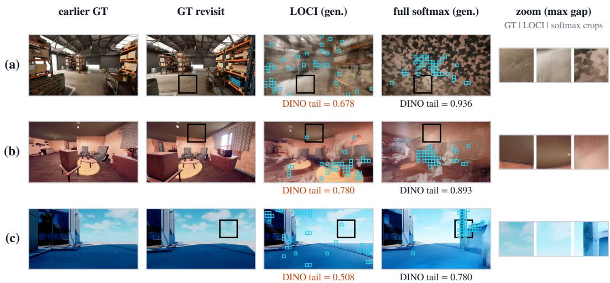  
Figure 7: Localized consistency at short-horizon revisits. Earlier ground-truth view, ground-truth revisit, and the revisit generated by LOCI and by full softmax (same recipe); outlines mark each model’s worst 5% of patches by DINOv2 distance to the ground truth, and the right column zooms into the region where the two models differ most. Instants are chosen by a fixed rule (bright scenes, ranks 1, 3, 5 of the paired difference).

on the recorded sets the local error is lower in 12 of 18 clips (−0.020 [−0.047, −0.000]). This ranking is unchanged when the worst fraction is set to 1% or 10%, or when the two models are scored on a shared worst region. On the MIND memory test, the local-vs-whole-frame gap is itself significant (difference of differences +0.066 [+0.038, +0.095], clip-clustered bootstrap): the hybrid’s advantage over full softmax is concentrated in localized short-horizon fidelity.

Retention once per chunk vs. per token. We train a variant with per-token retention (the KDA default) from the same initialization, with the same data (uniform mixture), recipe and 5,000 updates as the chunk-level model, and compare the two with the same bounded sparse access. Revisits 8– 20 s apart within the first 20 s, as used above, probe only short-range memory and do not separate the two (−0.005 [−0.020, +0.011] on the recorded sets). We therefore extend the metric to every revisit instant over the entire MIND prediction segment, including returns to the memory segment, with at most 60 instants per segment stratified by gap (all 50 segments, 2,928 instants). We defined this extension after the short-range comparison; it is exploratory. Chunk-level retention has lower local error, and the difference grows with the revisit gap (Table 14), consistent with forgetting that follows elapsed video time rather than token position.

Table 14: Per-token minus per-chunk retention: local DINOv2 error at MIND revisit instants over the entire prediction segment, by revisit gap (positive: chunk-level lower; paired over segments, 95% bootstrap intervals).
<table><tr><td>Revisit gap</td><td>Segments</td><td>∆ local error</td><td>Chunk lower</td></tr><tr><td>8-20 s</td><td>26</td><td>+0.0045[-0.0013, +0.0103]</td><td>17 / 26</td></tr><tr><td>20-60 s</td><td>44</td><td>+0.0101[+0.0039, +0.0169]</td><td>28 / 44</td></tr><tr><td>&gt;60s</td><td>35</td><td>+0.0126[+0.0038, +0.0210]</td><td>27 / 35</td></tr><tr><td>All</td><td>50</td><td>+0.0084[+0.0035, +0.0133]</td><td>35 / 50</td></tr></table>

Retention after training. With one decay per chunk computed from the chunk’s content, the perchunk retention of LOCI varies with the input. Training also separates a group of long-memory channels in intermediate layers: after 5,000 updates, 6.4–11.1% of the channels of layers 11, 13 and

23 have mean retention above 0.9 (half-life beyond six chunks), compared with at most 2.1% after   
1,000 updates.

Direct training vs. conversion. Converting the trained full-softmax model into the same hybrid layout with the ARL2 recipe, on real data or on teacher rollouts, does not reach the directly trained hybrid: on the recorded set A, LOCI has higher revisit PSNR (+0.91 [+0.07, +1.74] dB against conversion on real data) and lower revisit LPIPS than both converted models (−0.030 [−0.055, −0.004] and −0.050 [−0.088, −0.009]), and neither converted model exceeds its own teacher. The recurren memory therefore needs to be trained jointly with camera-conditioned generation.

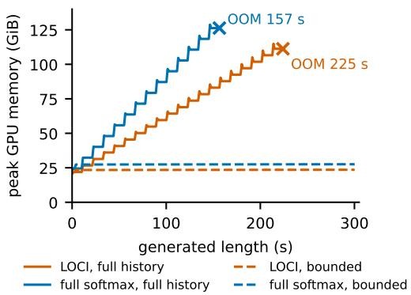  
Figure 8: Cost versus generated length on a 300 s recorded trajectory (single H200, 141 GiB). Peak GPU memory. With full history both models grow until they exhaust the GPU; bounded sparse access keeps memory and per-chunk time flat to 300 s.

Inference implementation of the recurrent branch. Per layer and denoising step, the recurrent read needs about 80× fewer FLOPs than softmax attention over the retained history, but a direct implementation is dominated by the launch overhead of many small operations. Our implementation builds the projective transform once per chunk and shares it across layers, skips the state update that denoising steps compute and discard (only the separate commit pass writes the state), and captures the recurrent branch of each layer in a CUDA graph. The final latents and all committed states are bit-identical to the direct implementation. In the bounded sparse mode on one H200 this gives 5.43 s per video second for LOCI and 5.45 s for full softmax. With full history over the first 40 s, LOCI takes 7.2 s per video second and 33.6 GiB, against 8.1 s and 44.2 GiB for full softmax, since half of its layers attend only within the current chunk.

Cost of external models. Among the compared world models (Table 6 in Appendix C), CaR requires 31.4 s per video second and exceeds GPU memory on long trajectories, and the larger models require 71–138 GiB; HyDRA (Chen et al., 2026a) and SPMem (Wu et al., 2025), which use bidirectional attention within each generated clip, require 175 and 97 s per video second.