# MAGiDif: Sampling the Photospheric Vector Field from UV/EUV Filtergrams

Ruoyu Wang 1 and David Fouhey 1, 2

1New York University, Courant Institute of Mathematical Sciences

2New York University, Tandon School of Engineering

## ABSTRACT

Photospheric vector magnetic fields are foundational to modeling, understanding, and forecasting solar activity. These data are usually produced by inverting and disambiguating the full Stokes vector at multiple passbands, which is demanding. Here, we investigate how well we can estimate photospheric vector magnetograms from UV/EUV filtergrams. This problem is challenging and intrinsically ambiguous without polarization information, as the mapping from UV/EUV intensity to the magnetic field is indirect and ill-posed. We introduce MAGiDif, a machine-learning-based method that uses denoising difusion models to estimate vector magnetograms from UV/EUV filtergrams. As input, MAGiDif takes a stack of filtergrams from the Solar Dynamics Observatory (SDO) / Atmospheric Imaging Assembly (AIA); as output, it is trained to estimate the disambiguated vector magnetogram as seen by Hinode / Solar Optical Telescope-Spectro-Polarimeter (SOT-SP). We show that MAGiDif can accurately mimic the Hinode ground truth. Additionally, we probe MAGiDif’s understanding of the physical structure and magnetic connectivity. On full-disk, we show that it produces plausible structures for active regions. MAGiDif generalizes across solar cycles despite hemispheric polarity reversal, and can be fine-tuned to other EUV instruments including STEREO/EUVI and GOES-R/SUVI. While clearly not a substitute for a dedicated instrument, MAGiDif opens the door to new capabilities.

## 1. INTRODUCTION

In solar physics, high-quality photospheric vector magnetic field measurements underpin our understanding of many solar activities, including space weather forecasting (M. G. Bobra et al. 2014; M. G. Bobra & S. Couvidat 2015; G. Barnes et al. 2016; K. D. Leka et al. 2018), coronal magnetic structure modeling and magnetohydrodynamics (MHD) simulation (T. Wiegelmann & T. Sakurai 2021; C. Jiang et al. 2022), and the evolution of the Sun’s atmosphere (K. D. Leka & G. Barnes 2007; M. C. Cheung & M. L. DeRosa 2012; G. H. Fisher et al. 2012; R. Lionello et al. 2014; T. I. Gombosi et al. 2018; K. Hayashi et al. 2021; P. W. Schuck et al. 2022). However, estimating vector magnetograms usually requires sampling the full Stokes vector (i.e., [I, Q, U, V ]) at multiple wavelengths. These signals are dificult to acquire, especially the linear polarization components Q and U (J. O. Stenflo 1994). As a result, vector magnetograms can be limited in cadence, coverage, or availability across missions. This motivates a complementary approach: evaluating how well vector magnetograms can be estimated from other more widely available observations. Such estimates cannot replace spectropolarimetric measurements, but a reliable estimate would extend the use of existing data archives and provide magnetic field context in settings where direct vector measurements are not available.

UV/EUV intensity maps are a natural starting point because they are abundant and are routinely collected by a broader set of instruments, many of which do not carry spectropolarimeters. Instruments like the Atmospheric Imaging Assembly (AIA; J. R. Lemen et al. (2012)) on SDO, the Extreme Ultraviolet Imager (EUVI; J.-P. Wuelser et al. (2004)) on the twin Solar Terrestrial Relationship Observatory (STEREO; M. L. Kaiser et al. (2008)), the Extreme Ultraviolet Imager (EUI; P. Rochus et al. (2020)) on Solar Orbiter (SO; D. M¨uller et al. (2020)), and the Solar UltraViolet Imager (SUVI; J. M. Darnel et al. (2022)) on the Geostationary Operational Environmental Satellites (GOES-R series; S. M. Hill et al. (2005)) deliver high-cadence, full-disk, multiwavelength observations of the corona over decades.

Unfortunately, there is a fundamentally ambiguous and statistical relationship between UV/EUV intensity and the photospheric magnetic field. First, if one were to flip the field consistently, one would observe identical intensity images (in addition to the 180◦ plane-of-sky ambiguity described by J. Harvey (1969)). Second, most of the UV/EUV light does not originate at the photosphere. Yet, while the relationship is less direct than in Stokes inversion, there is signal. For instance, the known statistical relationship between unsigned flux and intensity (C. Schrijver 1987) has been used to derive total flux from 304˚A data (I. Ugarte-Urra et al. 2015; K. J. Knizhnik et al. 2024). Similarly, due to the low plasma-β of the corona, filtergrams originating in the corona (e.g., 171˚A) trace out magnetic field lines that head down to the photosphere. However, each observation provides an indirect cue that needs to be integrated to constrain the possible photospheric field.

While the polarity ambiguity is intrinsic, it can be empirically mitigated with additional context. Hale’s law (G. E. Hale & S. B. Nicholson 1925) states that the leading polarity of bipolar active regions is opposite in the northern and southern hemispheres, and this pattern reverses between consecutive solar cycles. Given heliographic latitude and solar cycle information as input, a model can often infer the polarity without the need for polarization measurements.

These observations motivate MAGiDif, a learningbased framework that maps UV/EUV filtergrams to heliographic vector magnetic flux density components $\alpha B _ { R } , \ \alpha B _ { \phi }$ , and $\alpha B _ { \theta }$ (where the α denotes that the quantity includes both intrinsic field strength and filling fraction α). MAGiDif takes input from SDO/AIA, due to its mission archive of 15+ years of nearlycomplete, high-quality, filtergrams. MAGiDif is built on denoising difusion models, a recent advance in machine learning that has produced remarkable results in conditional image generation. Unlike regression models that predict a single estimate, difusion models learn to sample from a distribution of possible predictions, producing sharper outputs and enabling uncertainty estimation. MAGiDif is trained to estimate magnetic flux density from Hinode/SOT-SP observations resampled to the SDO/HMI sampling grid. One reason for using Hinode/SOT-SP is entirely practical: its dense sampling of two absorption lines yields highquality magnetograms, which enhances the overall quality of MAGiDif’s output. The other is forward-looking: Hinode/SOT-SP captures only a limited field of view, but many sources of high-quality data will also be nonfull disk, like PHI (S. K. Solanki et al. 2020) for magnetograms outside the Sun-Earth line.

We evaluate MAGiDif on several tests. First, we show its performance on previously unseen regions, including across solar cycles. Second, we probe MAGiDif’s ability to model the correlations in the vector field by analyzing its predicted distribution. Third, we test the model’s generalization ability on full-disk inputs. Finally, we show that MAGiDif can be fine-tuned to other instruments like STEREO/EUVI, GOES–16/SUVI, and GOES–18/SUVI, demonstrating a path toward supplemental vector field estimation from missions without spectropolarimeters. While not a substitute for a dedicated facility that captures spectropolarimetric data and inverts it to produce vector magnetograms, we believe that MAGiDif presents an opportunity to get more from existing data.

## 2. DATA

This work tackles the task of estimating possible Hinode/SOT-SP vector magnetograms from UV/EUV data obtained from SDO/AIA. A full description of the data involved is beyond the scope of the paper, but we give a brief description to make the paper more selfcontained.

The input data from SDO/AIA consist of highcadence, high-resolution filtergram observations, grouped in EUV (94˚A, 131˚A, 171˚A, 193˚A, 211˚A, 304˚A, 335˚A) and UV (1600˚A, 1700˚A) filters. We do not use SDO/AIA’s visible light observation (at 4500˚A). Each filter has a characteristic temperature and height at which much of the light is emitted. These filtergrams are captured near-synchronously at 4096 × 4096 with $0 . 6 { ^ { \prime \prime } }$ sampling and approximately 1. $. 5 ^ { \prime \prime }$ optical resolution. We use the aia.lev1 euv 12s and aia.lev1 uv 24s series, corrected for exposure time and filter degradation following R. Galvez et al. (2019).

The output data are from Hinode/SOT-SP, a scanning-slit spectropolarimeter that sweeps a slit across a scene, capturing dense Stokes profiles of two photospheric spectral lines at a spatial sampling of $0 . 1 6 ^ { \prime \prime }$ Each scan covers roughly 160′′ along the slit with varying scan width, and typically takes about an hour to complete. This dense sampling yields higher-quality vector magnetograms than those from SDO/HMI. The vector magnetic field is estimated from these data with a Stokes inversion technique (B. Lites et al. 2007), followed by ME0 disambiguation (T. R. Metcalf 1994) to yield the 180◦-disambiguated (J. Harvey 1969) heliographic components.

The data are prepared as a co-aligned cutout volume of SDO/AIA filtergrams and Hinode/SOT-SP vector magnetograms. We co-align to the frame of the Helioseismic and Magnetic Imager, HMI (J. Schou et al. 2012) to take advantage of the co-alignments of Hinode/SOT-SP and SDO/HMI done by R. Wang et al. (2024) that account for a pointing error in Hinode/SOT-SP data (D. F. Fouhey et al. 2023). We likewise align the SDO/AIA data to this grid. While Hinode/SOT-SP takes tens of minutes to acquire a scan (resulting in intrinsic temporal misalignment), we let the method handle potential mismatch rather than handle it in data alignment. In addition to the UV/EUV filtergrams, we provide a polarity prior consisting of per-pixel heliographic latitude and a solar cycle indicator (1 for odd cycles and −1 for even cycles) as auxiliary inputs, both derived from the SDO/AIA FITS headers. This prior supplies the positional and temporal context needed to leverage Hale’s law for polarity inference.

The Hinode/SOT-SP observations in our dataset are unfiltered, including active regions, plage, and quiet Sun. We obtain 71,243 pairs of co-registered SDO/AIA intensity images and Hinode/SOT-SP vector magnetograms spanning from 2011 to 2024. Following R. Wang et al. (2024), data are split by acquisition time: the test set consists of years 2016 and 2024, with halfyear bufers on both sides (2015 July - December, 2017 January - June and 2023 July - December) omitted to prevent data leakage from slowly evolving solar structures. The validation set consists of 2015 January - June, 2017 July - December and 2023 January - June, and the remaining data form the training set. After filtering pairs with too small magnetograms to yield a $1 2 8 ^ { \prime \prime } \times 1 2 8 ^ { \prime \prime }$ crop, the training, validation, and test sets consists of 29112, 6137, and 8307 samples, respectively.

We also prepare fine-tuning datasets for generalization to STEREO/EUVI and GOES-R/SUVI. These EUV filtergrams are paired with SuperSynthIA (R. Wang et al. 2024) vector magnetograms (a ML-based method that produces Hinode/SOT-SP-like magnetograms from SDO/HMI data) reprojected to the corresponding instrument’s coordinate grid. A full description of the reprojection, calibration and normalization details appears in Appendix C.4.

## 3. METHOD

We formulate the task of predicting solar vector magnetograms from UV/EUV intensity observations as sampling a photospheric vector magnetogram conditioned on a stack of contemporaneous UV/EUV maps. Let $\mathbf { I } \in \mathbb { R } ^ { H \times W \times C }$ denote the conditioning information, consisting primarily of a stack of co-registered UV/EUV filtergrams, together with auxiliary inputs that provide physical context. Let $\textbf { B } \in \ \mathbb { R } ^ { H \times W }$ ×3 be the corresponding magnetogram components $( \alpha \boldsymbol { B } _ { R } , \alpha \boldsymbol { B } _ { \phi } , \alpha \boldsymbol { B } _ { \theta } )$ . Our goal is to learn a model that can sample $\mathbf { B } _ { n }$ from $p ( \mathbf { B } \ \mid \ \mathbf { I } _ { n } )$ where ${ \mathbf I } _ { n }$ is unseen in training. This formulation allows us to sample multiple plausible magnetograms given the same UV/EUV input.

## 3.1. Difusion Framework

We use denoising difusion probabilistic models $( \mathrm { D D P M s ; \mathrm { J } }$ . Ho et al. (2020)) to learn to model $p ( \mathbf { B } \mid \mathbf { I } )$

These have shown eficacy in generating high fidelity images conditioned on other information, such as text. A full introduction to DDPMs is beyond the scope of the paper, but the reader is directed to the introduction by L. Yang et al. (2024). Briefly, DDPMs consist of two phases: a forward process that corrupts the image by adding Gaussian noise gradually over timesteps $1 , \ldots , T _ { \astrosun }$ and a reverse process where a parametric model $( f _ { \theta } ,$ where θ represents the model’s parameters) is tasked to remove noise. By learning to remove this noise, the parametric model learns the given distribution. Figure 1 provides an overview of the difusion process used by MAGiDif. For clarity, we use magnetogram-space notation in this high-level description of the DDPM framework. In the actual implementation of MAGiDif, the difusion process operates entirely in latent space, as introduced below and detailed in Appendix B. During training, given a data pair (I, B), a timestep t is randomly sampled $t \sim \mathrm { U n i f o r m } \{ 1 , \dots , T \}$ and a noisy magnetogram $\tilde { \mathbf { B } } _ { t }$ is calculated via Equation A2. We fit the model $f _ { \theta }$ to minimize an $\ell _ { 2 }$ objective between the injected noise ϵ and predicted noise $f _ { \theta } ( \tilde { \mathbf { B } } _ { t } , \mathbf { I } , t )$

$$
\mathcal { L } = \mathbb { E } _ { \mathbf { B } _ { 0 } , \epsilon , t } \Vert \epsilon - f _ { \theta } ( \tilde { \mathbf { B } } _ { t } , \mathbf { I } , t ) \Vert ^ { 2 } .\tag{1}
$$

During inference, we start with random gaussian noise $\tilde { \mathbf { B } } _ { T } \sim \mathcal { N } ( 0 , 1 )$ and iteratively (for $t = T , T - 1 , \dots 1 )$ apply the learned denoiser $f _ { \theta }$

In practice, we use several recent innovations to DDPM to improve training stability and eficiency. A full description of technical details appears in Appendix A. Here, we briefly summarize their key steps.

Latent Difusion Model. We adopt the latent diffusion model (LDM) structure (R. Rombach et al. 2022), where the forward and reverse processes are performed in a lower dimensional latent space, reducing spatial size while preserving image fidelity. The latent space is created by a variational autoencoder (VAE; D. P. Kingma & M. Welling (2013)) whose encoder and decoder translate between pixel and latent space representations.

V-objective. We use the v-objective (T. Salimans & J. Ho 2022), where the model predicts a velocity term v (a linear combination of noise ϵ and clean magnetogram $\mathbf { B } _ { 0 } )$ rather than predicting noise ϵ or clean magnetogram $\mathbf { B } _ { 0 }$ alone. This formulation stabilizes training and yields higher sample quality.

Zero Terminal SNR. We enforce zero terminal signal-to-noise ratio following S. Lin et al. (2024), meaning that at timestep T all structured signal are removed, leaving pure noise ${ \bf B } _ { T } = { \bf \epsilon } \epsilon$ . This allows MAGiDif to estimate magnetograms with arbitrary mean intensity, capturing the full dynamic range of solar magnetic field strengths.

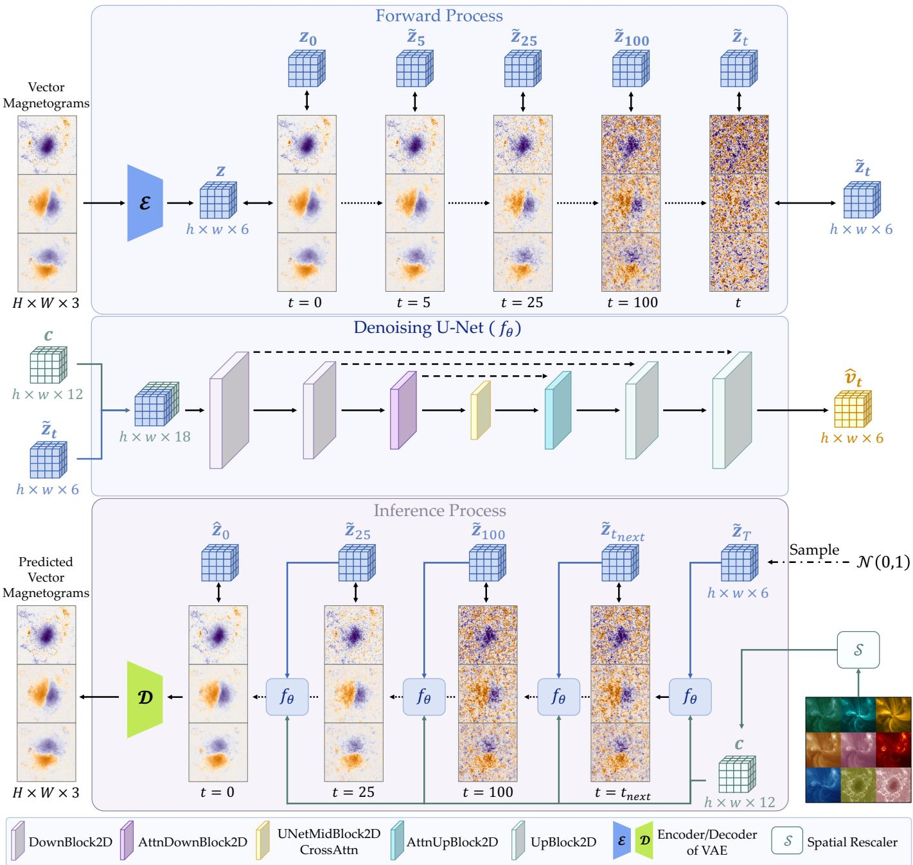  
Figure 1. Architecture of denoising U-Net used in MAGiDif and illustration of the difusion process. The denoising UNet takes noisy latent $\tilde { \mathbf { z } } _ { t }$ at timestep t together with conditioning input c as input and predicts the velocity $\hat { \mathbf { v } } _ { t } - \mathrm { a }$ linear combination of ϵ and $\mathbf { x } _ { \mathrm { 0 } }$ . In the forward process, the frozen VAE encoder maps an input magnetogram to a clean latent z, a timestep $t \in \{ 1 , 2 , \cdots , T \}$ is sampled, and the scheduler corrupts z to $\tilde { \mathbf { z } } _ { t }$ according to its noise schedule. The UNet is trained to regress the corresponding velocity target. At inference, sampling begins from $\tilde { \mathbf { z } } _ { T }$ sampled from Gaussian noise, and iterates the reverse process: at each step the UNet takes noisy latent at current timestep $\tilde { \mathbf { z } } _ { t }$ along with conditioning input c and predicts velocity $\hat { \mathbf { v } } _ { t } .$ . The scheduler then uses $\hat { \mathbf { v } } _ { t }$ to remove noise from $\tilde { \mathbf { z } } _ { t }$ . The final clean latent $\hat { \mathbf { z } } _ { 0 }$ is decoded by the frozen VAE decoder to produce the predicted vector magnetogram. Both the forward and reverse difusion processes operate entirely in latent space. The intermediate states shown in the figure therefore correspond to latent variables, which are decoded by the frozen VAE decoder and displayed in magnetogram space only for visual interpretability.

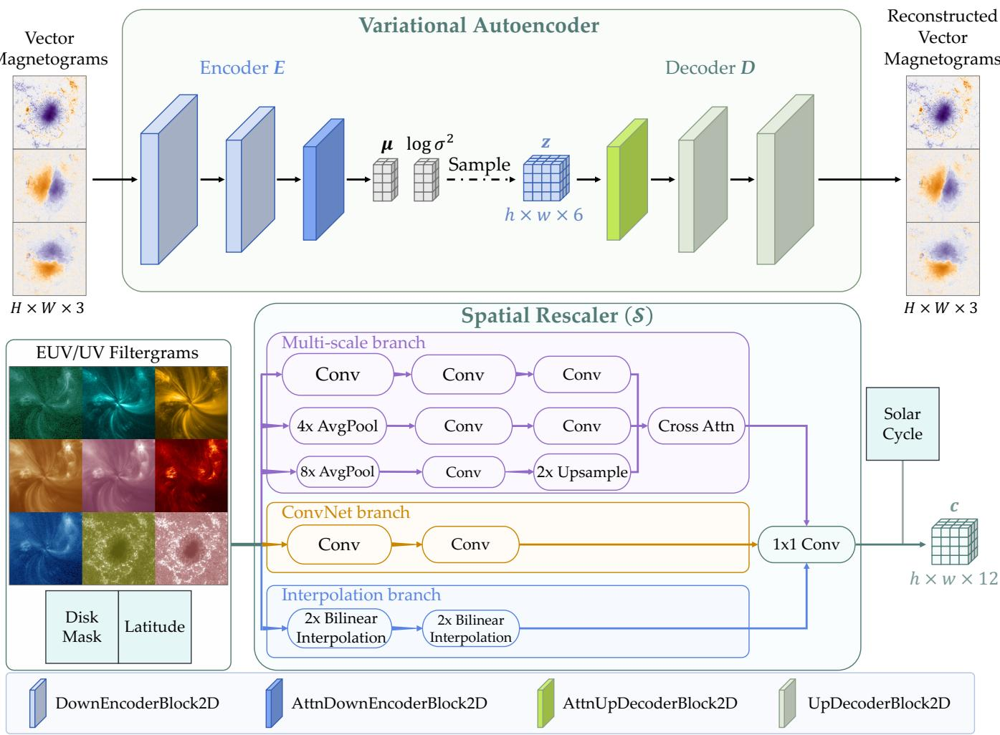  
Figure 2. Architecture of Variational autoencoder and spatial rescaler used in MAGiDif. The VAE consists of an encoder and a decoder: the encoder maps three-component vector magnetograms to a gaussian latent distribution parameterized by mean µ and log-variance log $\sigma ^ { 2 }$ , from which a latent code z is sampled; the decoder reconstructs the magnetogram from z. The spatial rescaler maps UV/EUV filtergrams—concatenated with auxiliary disk-mask and latitude channels—to a conditioning input c at the latent’s spatial resolution, via three parallel branches: a multi-scale convolutional branch with cross-scale attention fusion, a learnable convolution branch, and a bilinear interpolation branch. These branch outputs are concatenated channel-wise and merged by a 1 × 1 convolution.

DDIM Sampling. During inference, we employ the denoising difusion implicit model (DDIM; (J. Song et al. 2022)) sampler, which replaces the original stochastic, Markov inference process with a non-Markov, deterministic update path. This approach enables generating high-fidelity magnetogram predictions in fewer steps.

## 3.2. Model Architecture

MAGiDif consists of three components: a VAE that maps between pixel space and latent space, a spatial rescaler that projects conditioning UV/EUV maps to latent dimension, and a denoising U-Net that estimates latent representation of the clean vector magnetogram. These components are built with the HuggingFace Diffuser library. Figure 1 illustrates the denoising U-Net structure, while Figure 2 details the VAE and spatial rescaler architectures.

VAE. We adopt the AutoencoderKL from the HuggingFace Difuser stable difusion implementation. The encoder consists of two convolutional downsampling blocks followed by a self-attention downsampling block (DownEncoderBlock2D, DownEncoderBlock2D, AttnDownEncoderBlock2D), which progressively compress the input magnetograms into a compact latent representation. The decoder mirrors the structure to reconstruct latent back into pixel space. The latent representation is downsampled by a factor of 4 in height and width and is set to have six channels, balancing reconstruction quality with computational eficiency.

Spatial Rescaler for UV/EUV Filtergrams. The conditioning UV/EUV filtergrams are encoded by a multi-branch neural network designed for eficient spatial downsampling while preserving contextual information across scales. It consists of three parallel processing branches: (1) a multi-scale learnable feature extraction branch that captures feature at 1/4 and $1 / 8$ resolution and then fused through cross-attention, (2) a learnable ConvNet branch, and (3) a traditional interpolation branch. All branches are ultimately concatenated and projected to the desired output dimension. This design enables the module to maintain fine details while capturing broader contextual information during downsampling. It also allows the spatial rescaler to learn on its own which features are important to extract, while still benefiting from context provided by traditional interpolation method.

Denoising U-Net. The denoising backbone adopts UNet2DConditionModel, also from the stable difu sion implementation. The encoder of the denoising U-Net consists of two convolutional downsampling blocks followed by an self-attention downsampling block (DownBlock2D, DownBlock2D, AttnDown-Block2D), enabling the model to gradually reduce spatial dimensions while capturing global context through an attention mechanism. At the bottleneck, we use a UNetMidBlock2DCrossAttn module with no external conditioning. In this configuration, the cross-attention layers reduce to self-attention, allowing the model to capture long-range dependencies within the latent representation while keeping the architecture compatible with potential conditional information for future work. The decoder symmetrically upsamples and fuses features via skip connections. This architecture maintains a balance between local detail preservation and large-scale contextual modeling, which is essential for reconstructing complex magnetic field patterns.

## 3.3. Data Normalization

Machine learning systems generally prefer data to be well normalized for stable and eficient training. Gradient-based optimizers can struggle when feature values vary by orders of magnitude, which can lead to vanishing and exploding gradients. This is exactly the case for both the UV/EUV intensity maps and the vector magnetograms.

For SDO/AIA UV/EUV intensity data, quiet-Sun pixels are typically tens to hundreds counts per second $\mathrm { ( D N ~ s ^ { - 1 } ) }$ , whereas active region pixels can reach several thousand $\mathrm { D N } \mathrm { s } ^ { - 1 }$ . To make this long-tail distribution more suitable for training, we apply a log1p transform, defined as log(1 + x), and then standardize each $S D O / \mathrm { A I A }$ channel using its per-channel mean and standard deviation.

Apart from the UV/EUV filtergrams, the conditioning input includes auxiliary channels that are encoded separately. The disk mask is kept binary. The heliographic latitude map is expressed in degrees, divided by $9 0 °$ to map on-disk values to $[ - 1 , 1 ] ;$ ; of-disk pixels are assigned a value of −2. The solar cycle indicator is encoded as 1 for odd-numbered cycles and −1 for evennumbered cycles. We therefore do not apply additional normalization to these auxiliary channels.

Although less pronounced than the SDO/AIA intensity maps, vector magnetograms are also by nature long-tailed: most pixel values are close to zero, while active-region fields can reach several thousand Mx $\mathrm { c m } ^ { - 2 }$ For each vector magnetic field component, we divide the absolute field strength by 4000 $\mathrm { M x c m ^ { - 2 } }$ , take the square root, and restore the original sign. Thus, a 4000 Mx cm−2 component has unit magnitude after normalization.

## 3.4. Training and Inference Process

We summarize the notation and workflow of MAGiDif for clarity. The full model is denoted F with the denoising U-Net $f _ { \theta }$ parameterized by learnable weights θ. The Variational Autoencoder (VAE) is represented with the encoder-decoder pair (E, D), and the spatial rescaler for encoding conditional UV/EUV filtergrams is denoted as ${ \mathcal { S } } .$ The conditional information, denoted $\mathbf { I } \in \mathbb { R } ^ { H \times W \times 1 2 }$ as described before, is a concatenation of four types of input: (1) nine co-registered SDO/AIA UV/EUV filtergrams; (2) a binary disk mask indicating whether each pixel lies on the solar disk; (3) per-pixel heliographic latitude, computed from the SDO/AIA WCS information; (4) a solar cycle indicator, with value 1 for oddnumbered cycles and −1 for even-numbered cycles. The target vector magnetogram is written as $\mathbf { B } \in \mathbb { R } ^ { H \times W }$ ×3 with the three heliographic vector magnetic field components: $\alpha B _ { \phi }$ (longitudinal); $\alpha B _ { \theta }$ (latitudinal); $\alpha B _ { R }$ (radial). We use $( h , w )$ to denote the spatial dimension of latents for input with shape $( H , W )$ . In our setup, $h = H / 4 , w = W / 4$ , and the latent dimension is set to 6. We denote ˆ as prediction,˜ as noisy.

## 3.4.1. Training of VAE

MAGiDif training begins with the training of a VAE from scratch on $1 2 8 ^ { \prime \prime } \times 1 2 8 ^ { \prime \prime }$ Hinode/SOT-SP vector magnetogram cutouts. Given input magnetogram B, encoder $\mathcal { E }$ maps it to parameters for a Gaussian distribution in latent space, producing mean $\pmb { \mu }$ and log-variance log $\sigma ^ { 2 }$ :

$$
( \pmb { \mu } , \log \pmb { \sigma } ^ { 2 } ) : = \mathcal { E } ( \mathbf { B } )\tag{2}
$$

where the actual variance $\sigma ^ { 2 }$ is essentially $\sigma ^ { 2 } = $ $\exp ( \log \sigma ^ { 2 } )$ . The Gaussian posterior can thus be ex-

pressed as:

$$
q ( \mathbf { z } \mid \mathbf { B } ) = \mathcal { N } ( \mathbf { z } ; \mu , \pmb { \sigma } ^ { 2 } \mathbf { I } )\tag{3}
$$

from which we can sample latent via reparameterization as $\mathbf { z } = \pmb { \mu } + \pmb { \sigma } \odot \pmb { \epsilon }$ where $\epsilon \sim \mathcal { N } ( 0 , 1 )$ . The decoder D then maps the latent back and produces reconstructed magnetogram $\hat { \mathbf { B } } = \mathcal { D } ( \mathbf { z } )$ $\ell _ { 1 }$ and Kullback-Leibler divergence (KL-Divergence; S. Kullback & R. A. Leibler (1951)) loss are used to supervise the training process. The total loss is thus:

$$
\mathcal { L } ( \mathbf { B } ) = \| \mathbf { B } - \hat { \mathbf { B } } \| _ { 1 } + \lambda D _ { K L } ( q ( \mathbf { z } \mid \mathbf { B } ) \parallel \mathcal { N } ( 0 , \mathbf { I } ) )\tag{4}
$$

where λ controls the extent to which we regularize the latent distribution and is set to $1 0 ^ { - 3 }$ , encouraging faithful reconstruction while maintaining well regularized latent space. We found that insuficient KL regularization can leave the VAE reconstructions visually accurate while producing a latent space that is more dificult for the subsequent difusion model training, leading to spurious artifacts in the predicted magnetograms particularly in quiet-Sun. Conversely, excessive regularization overly constrains the latent space, causing the predicted magnetograms to lose fine-scale structure and appear blurry. This objective is optimized using the schedulefree AdamW optimizer (I. Loshchilov & F. Hutter 2017; A. Defazio et al. 2024) for 100 epochs with a batch size of 32, learning rate of 1.44 $\times 1 0 ^ { - 4 } , \epsilon = 1 0 ^ { - 8 }$ and weight decay of 0.01. The full VAE training workflow is discussed in Table 3.

## 3.4.2. Training of Denoising Network

In our latent difusion formulation, the difusion process happens in latent space rather than directly on B, where the VAE is tasked to map the input magnetogram B into a lower-dimensional latent representation $\mathbf { z } \in \mathbb { R } ^ { h \times w \times 6 }$ and from latent back to magnetograms $\hat { \mathbf { B } } = \mathcal { D } ( \mathbf { z } ) \approx \mathbf { B }$ . With the VAE frozen, we train the denoising network jointly with the spatial rescaler $s$ on paired SDO/AIA UV/EUV maps and Hinode/SOT-SP vector magnetogram cutouts of size $1 2 8 ^ { \prime \prime } \times 1 2 8 ^ { \prime \prime }$ (where 128′′ balances data availability and cutout size).

Given input magnetogram B, we first encode it with the VAE encoder $\mathcal { E }$ to obtain its latent representation $\mathbf { z } = \mathcal { E } ( \mathbf { B } )$ . A timestep $t \in \{ 1 , 2 , \cdots , T \}$ is then randomly sampled and we add noise ϵ following the forward process Equation A11 to obtain $\tilde { \mathbf { z } } _ { t }$ , the noisy magnetogram latent at timestep t. The conditioning input I is projected by the spatial rescaler $s$ to an $\mathbb { R } ^ { h \times w \times 1 1 }$ tensor, matching the spatial dimensions of the magnetogram latent z. We then broadcast the solar cycle indicator to latent resolution and concatenate it with the rescaled conditioning input, producing the full conditioning tensor $\mathbf { c } \in \mathbb { R } ^ { h \times w \times 1 2 }$

$\tilde { \mathbf { z } } _ { t }$ and c are then concatenated into a latent of shape $\mathbb { R } ^ { h \times w \times 1 8 }$ and fed to the denoising network $f _ { \theta }$ , which predicts the velocity term $\hat { \mathbf { v } } _ { t } = f _ { \theta } ( \tilde { \mathbf { z } } _ { t } , \mathbf { c } )$ . The velocity term is then compared against the ground truth velocity $\mathbf { v } _ { t }$ to calculate loss. Here, we use $\ell _ { 2 }$ as training objective following standard practice in stable difusion (R. Rombach et al. 2022). This objective is optimized with the schedule-free AdamW optimizer for 100 epochs with batch size of 32, learning rate of $3 . 2 \times 1 0 ^ { - 4 } , \epsilon = 1 0 ^ { - 8 }$ and no weight decay. The full denoising network train ing workflow is discussed in Table 4.

## 3.4.3. Inference Process

With every network frozen, inference process begins with sampling pure Gaussian noise, denoted $\begin{array} { r l } { \tilde { \mathbf { z } } _ { T } } & { { } \sim } \end{array}$ $\mathcal { N } ( 0 , 1 )$ , where T is the total number of difusion steps in the sampling schedule. The conditioning UV/EUV filtergrams are again projected to c. Then, for every timestep update determined by the DDIM difusion scheduler $t  t _ { n e x t }$ , we repeatedly do: [1] Concatenate current noisy latent $\tilde { \mathbf { z } } _ { t }$ with $\mathbf { c . }$ [2] Feed the concatenated latent to denoising network $f _ { \theta }$ and obtain predicted velocity at current timestep $\hat { \mathbf { v } } _ { t }$ . [3] Use difusion scheduler to remove noise from $\tilde { \mathbf { z } } _ { t }$ to obtain cleaner latent $\tilde { \mathbf { z } } _ { t _ { n e x t } } .$

This reverse process is repeated until the initial noise is transformed into a clean latent $\hat { \mathbf { z } } _ { 0 }$ . Finally, the decoder D maps this latent back to the predicted magnetogram $\hat { \mathbf { B } } = \mathcal { D } ( \hat { \mathbf { z } } _ { 0 } )$ . The full inference workflow is discussed in Table 5.

Since the inference process starts from random noise, each individual run produces a distinct sample from the learned conditional distribution $p ( \mathbf { B } \mid \mathbf { I } )$ , which we refer as realizations. By generating k realizations for the same input, we can assess the diversity of plausible magnetograms, estimate per-pixel uncertainty, and infer underlying correlations.

## 4. RESULTS

We now describe the evaluation of MAGiDif on un seen data from five complementary perspectives. First, we assess MAGiDif on a per-pixel basis, treating it purely as a method that takes a set of UV/EUV filtergrams and produces a vector field. Next, we examine whether MAGiDif recovers the correct magnetic polarity. Having analyzed MAGiDif, we then turn to comparing it to a more standard regression approach to test its contribution. We further analyze the distribution learned by MAGiDif. Finally, we evaluate MAGiDif’s generalization ability beyond the training setting, including full-disk observations and data from other instruments.

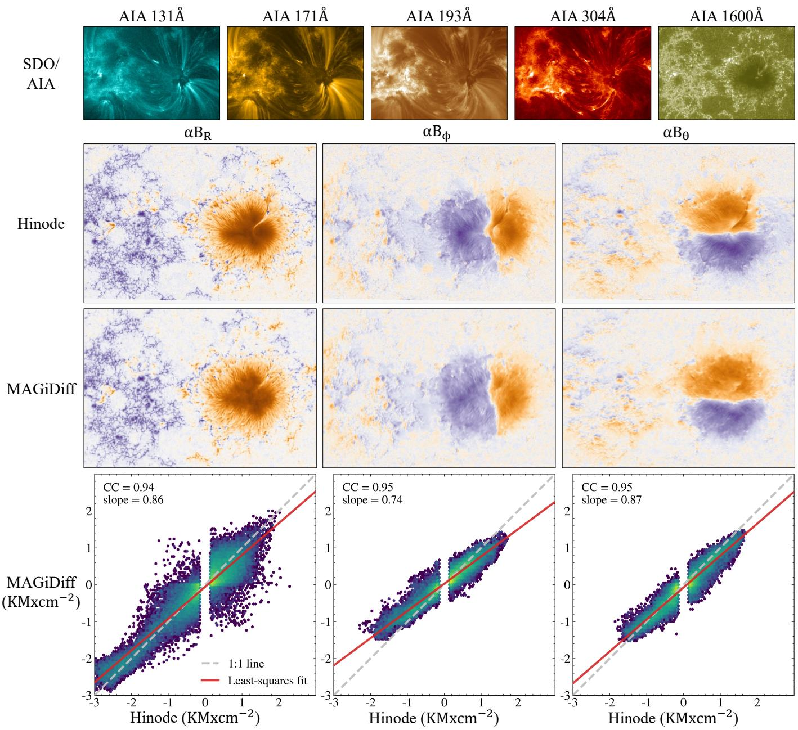

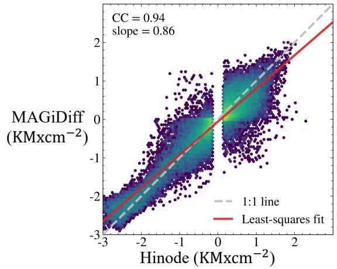

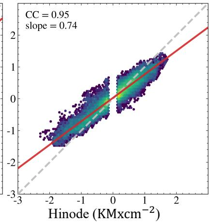

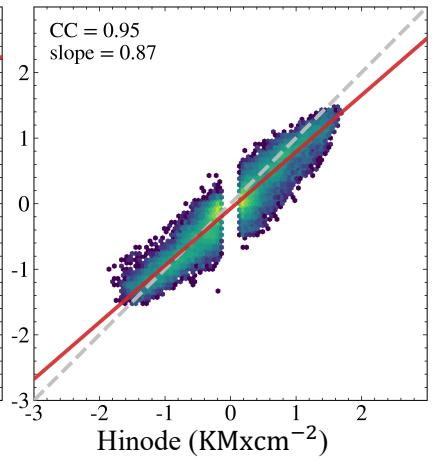  
Figure 3. A qualitative result of MAGiDif on the test set with Hinode/SOT-SP as reference, with the corresponding pixel value distributions. Top row: selected input UV/EUV intensity images, left-to-right SDO/AIA 131˚A, 171˚A, 193˚A, 304˚A, 1600˚A. Middle rows: Hinode/SOT-SP vector magnetogram and MAGiDif prediction, left-to-right $\alpha B _ { R } , \alpha B _ { \phi } , \alpha B _ { \theta }$ Bottom row: hexbin density plot of MAGiDif predictions against Hinode/SOT-SP ground truth. In the hexbin panels, pixels with ground truth absolute value below 150 $\mathrm { M x c m ^ { - 2 } }$ are omitted to prevent low-amplitude quiet-Sun pixels dominating the pixel population. The gray dashed line marks the 1:1 relation and the red line marks the least-squares fit. Each panel also reports the Pearson correlation coeficient (CC) and slope of the best fit line. MAGiDif recovers the dominant magnetic structures and closely mimics Hinode/SOT-SP. In faint plage and quiet-Sun regions, MAGiDif predictions are generally correct but can have reversed polarity and reduced detail. The hexbin panels confirm this agreement quantitatively, in which most pixe density concentrates near the 1:1 relation. Example Date: 2016 April 11, 12:36 TAI. Colormaps: -3000 3000 Mx cm−2 using signed square root $x \mapsto \operatorname { s i g n } ( x ) { \sqrt { | x | } }$ for contrast. Histogram legend: 1 1000 counts, shown logarithmically.

1:1 line Least-squares fit (all pixels) Least-squares fit (correct-sign pixels)  
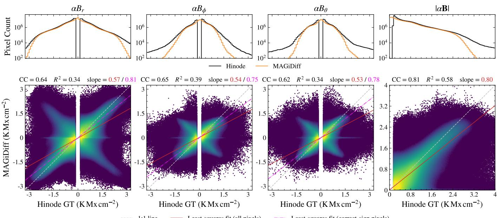  
Figure 4. Pixel-value histograms and hexbin density plots of MAGiDif predictions against Hinode/SOT-SP vector magnetograms on the test set. Each column corresponds to $\alpha B _ { R } , \alpha B _ { \phi } , \alpha B _ { \theta } ,$ , and |αB|. The top panels compare the distributions of MAGiDif predictions and the Hinode/SOT-SP ground truth. The bottom panel shows the corresponding hexbin density plot, together with a gray dashed line marking the 1:1 relation, a red line marking the least-squares fit on all pixels, and a purple dashed line marking the least-squares fit on pixels for which the predicted sign agrees with the ground truth. Each panel lists the Pearson correlation coeficient (CC) and the coeficient of determination $( R ^ { 2 } )$ , both computed over all plotted pixels, together with the slopes of the two fit lines. Density concentrated near the 1:1 line indicates agreement between MAGiDif prediction and ground truth. Deviations from this line are most apparent near the extremes of the ground-truth distribution, where MAGiDif tends to underestimate field strengths. In $\alpha B _ { R } , \alpha B _ { \phi } , \alpha B _ { \theta }$ , a weaker concentration near the $y = - x$ relation indicates pixels for which MAGiDif predicts approximately the correct magnitude but opposite sign. The faint horizontal concentration near $y = 0$ marks pixels for which MAGiDif predictions are close to zero despite having significant ground truth field strengths, usually due to misalignment or small magnetic fields without indications in UV/EUV. To make the trends more apparent, pixels with ground truth absolute value below $1 5 0  { \mathrm { M x c m ^ { - 2 } } }$ are omitted from all panels, since low-amplitude quiet-Sun pixels dominate the full pixel population. Histogram legend: 100 100000 count, shown logarithmically.

## 4.1. Qualitative Results

We first evaluate how well MAGiDif estimates Hinode/SOT-SP-like vector magnetograms from previously unseen UV/EUV observations. As shown in Figure 3, MAGiDif recovers the locations, spatial distribution, and relative field strengths of the dominant magnetic structures observed by Hinode/SOT-SP. The predictions preserve active magnetic structures while reproducing weaker surrounding fields and fine-scale variations in quiet-Sun regions.

To examine the agreement beyond the overall visual appearance, Figure 3 also presents hexbin plots comparing the predicted and Hinode/SOT-SP field values. The predictions show strong agreement with Hinode/SOT-SP over a broad range of field strengths, with a tendency to underestimate the strongest field values.

## 4.2. Test Set Distributional Agreement

We next examine the joint distributions of the pixel values predicted by MAGiDif and the corresponding values in Hinode/SOT-SP magnetograms across the full test set, as shown in Figure 4. Overall, MAGiDif reproduces the broad distributions of the vector field components, with dominant pixel density concentrated along the 1:1 relation. Deviations are mainly seen at the highest field strengths, where MAGiDif tends to underesti mate the most extreme values.

For α ${ \mathrm { \Delta } } _ { \langle } B _ { R } , { \ } \alpha B _ { \phi }$ , and α ${ \bf \nabla } _ { \langle B _ { \theta } }$ , we additionally observe two weaker branches concentrated near the $y ~ = ~ - x$ and $y = 0$ relations. Pixels near the $y = - x$ relation have approximately the correct magnitude but the opposite sign. Visual inspection of the contributing samples suggests two main types of polarity errors, illustrated by representative examples in Figure 15. First, in complex active regions containing multiple magnetic structures with diferent polarities, MAGiDif may assign the wrong polarity to individual structures. Second, MAGiDif may recover the large-scale polarity configuration correctly while assigning incorrect polarity to localized plage regions. Despite the polarity reversal, the predicted magnetic structures remain spatially plausi ble and broadly agree with the ground truth. These errors reflect the dificulty of disambiguating polarity, especially in regions where the UV/EUV observations provide no clear polarity cue.

The $y = 0$ branch corresponds to pixels for which MAGiDif predicts a value near zero despite a nonzero ground truth value. This branch largely arises from two sources. First, MAGiDif fails to recover some relatively weak-field structures, causing the predicted values to collapse toward zero. Second, the dificulty of inferring pixel-accurate magnetic structures can produce small spatial misalignments, causing pixels near magnetic structure boundary to have nonzero ground truth but near-zero predictions. These two error modes reflect the dificulty of using limited and indirect information provided by UV/EUV filtergrams to recover weak magnetic fields and sharp magnetic structure boundaries.

## 4.3. Polarity Agreement

Beyond field strength and spatial structure, we also evaluate a physically important property: whether MAGiDif recovers the correct magnetic polarity. Throughout the results section, we use polarity to refer to the sample-level three-dimensional vector orientation of the vector magnetogram. Here, Bˆ denotes the predicted magnetic field, and −Bˆ denotes the same field with the signs of all three components $( \alpha \boldsymbol { B } _ { R } , \alpha \boldsymbol { B } _ { \phi } , \alpha \boldsymbol { B } _ { \theta } )$ simultaneously flipped.

UV/EUV filtergram intensities are sign-invariant, and therefore are not suficient for determining polarity. Hale’s law (G. E. Hale & S. B. Nicholson 1925) nevertheless could be used to resolve this ambiguity: for bipolar active regions, the expected leading polarity depends on the hemisphere and reverses between successive solar cycles. Thus, UV/EUV filtergrams, heliographic latitude, and solar cycle information may together allow the MAGiDif to infer the correct polarity. Because the SDO/AIA filtergrams are physically corrected for instrumental degradation, solar cycle parity should not, in principle, be inferable from the filtergrams alone. This reasoning motivates us to provide MAGiDif with an explicit polarity prior, consisting of a per-pixel heliographic latitude map and a binary solar cycle indicator.

We quantify polarity agreement using a score, τ , defined as the ratio between the summed square error for the predicted field Bˆ to that of its sign-flipped counterpart −Bˆ , both measured against the ground truth B:

$$
\tau ( \hat { \mathbf { B } } , \mathbf { B } ) : = \frac { \| \hat { \mathbf { B } } - \mathbf { B } \| _ { 2 } ^ { 2 } } { \| - \hat { \mathbf { B } } - \mathbf { B } \| _ { 2 } ^ { 2 } + \delta } ,\tag{5}
$$

where $\delta$ is a small constant included for numerical stability. We compute τ after downsampling the prediction and ground truth by a factor of 4 to reduce sensitivity to pixel-scale misalignment, and restrict the evaluation to pixels with $| \alpha \mathbf { B } | > 1 5 0 \ \mathrm { M x } \mathrm { c m } ^ { - 2 }$ . A value of $\tau < 1$ indicates that the predicted polarity matches the ground truth better than the sign-flipped version; smaller values indicate greater confidence.

## 4.3.1. Efect of the Polarity Prior

To understand how MAGiDif resolves polarity ambiguity, we evaluate three training formulations.

• (MAGiDif ±B) trains MAGiDif to produce both B and −B as equally valid training targets, since both orientations yield the same UV/EUV intensities. Because the training objective has no preference for either orientation, the model should randomly select between the two.

• (MAGiDif No Polarity Prior) uses the real Hinode/SOT-SP magnetogram as the target, without introducing any B vs −B ambiguity into the training objective. Theoretically, UV/EUV inputs contain no direct information that is correlated with photospheric magnetic polarity, so the model should perform close to chance.

• (MAGiDif) is MAGiDif as described in Section 3, including the polarity prior. The polarity prior provides MAGiDif with information that is needed in order to use Hale’s law to estimate the polarity.

We report results in Table 1, comparing all three methods. We additionally provide a qualitative comparison on a representative sample in Figure 5. As expected, MAGiDif ±B produces near-chance performance. Similarly, since MAGiDif has access to information about solar cycle and latitude that permits the use of Hale’s law, it is able to obtain the polarity quite accurately, at 92.7% accuracy. This demonstrates that the network can take advantage of this signal and assign polarities. However, surprisingly MAGiDif No Polarity Prior performs far above chance, at 86.7%. This unexpectedly strong performance motivated us to investigate what provided the missing polarity information.

Our suspicion was that the model was exploiting Hale’s law by implicitly obtaining the information needed to use the law to assign polarity, namely latitude and solar cycle number. We therefore conducted auxiliary experiments to determine if these could be determined from UV/EUV filtergrams. We trained basic ResNet-50 (K. He et al. 2015) models for northern-vssouthern hemisphere and solar cycle 24-vs-25, and evaluated following the split in Section 2.

Table 1. The polarity prior improves MAGiDif’s overall polarity agreement. It is most efective where a clear leading–following polarity pair exists: bipolar β regions gain the most, while unipolar α regions are frequently wrong with or without the prior and the most complex $\beta \gamma \delta$ regions remain dificult. We evaluate MAGiDif with and without the polarity prior on the test set, using one realization per input for each variant. The overall columns report the fraction of predictions with τ below each threshold, where τ is defined in Equation $5 \colon \tau < 1 . 0$ indicates that the predicted polarity agrees with the ground truth better than its sign-flipped counterpart, while $\tau < 0 . 5$ gives a stricter measure of a confident polarity agreement. The remaining columns report the wrong-polarity rate $( \tau \geq 1$ , lower is better) among valid test samples of each Mount Wilson active-region class, where each sample is labeled by the most complex NOAA active region within its valid ground-truth footprint and QS/Plage mark frames with no spotted region. The polarity prior column indicates whether latitude and solar cycle inputs are included during training.
<table><tr><td rowspan="2">Model</td><td rowspan="2">Polarity Prior</td><td colspan="2">Overall polarity ↑</td><td colspan="7">Wrong-polarity rate by AR class ↓</td></tr><tr><td>Pass (τ &lt;1)</td><td>Conf.  $( \tau < 0 . 5 )$ </td><td>QS/Plage</td><td>α</td><td>β</td><td>βδ</td><td> $\beta \gamma$ </td><td> $\beta \gamma \delta$ </td><td>All</td></tr><tr><td>Samples</td><td></td><td></td><td></td><td>1061</td><td>455</td><td>2490</td><td>112</td><td>1099</td><td>1077</td><td>6294</td></tr><tr><td>Distinct NOAA ARs</td><td></td><td></td><td></td><td></td><td>19</td><td>61</td><td>4</td><td>30</td><td>18</td><td>93</td></tr><tr><td>MAGiDiff ±B</td><td>X</td><td>48.7</td><td>41.5</td><td>51.0</td><td>47.7</td><td>50.9</td><td>68.8</td><td>52.3</td><td>51.4</td><td>51.3</td></tr><tr><td>MAGiDiff No Polarity Prior</td><td>X</td><td>86.7</td><td>76.6</td><td>15.3</td><td>20.0</td><td>12.7</td><td>8.9</td><td>10.0</td><td>13.9</td><td>13.3</td></tr><tr><td>MAGiDiff</td><td>√</td><td>92.7</td><td>84.8</td><td>9.1</td><td>8.4</td><td>4.2</td><td>0.0</td><td>8.6</td><td>12.0</td><td>7.3</td></tr></table>

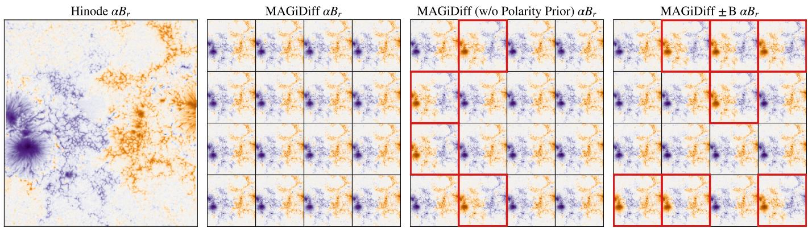  
Figure 5. Representative qualitative comparison of MAGiDif, MAGiDif without polarity prior, and MAGiDif ±B. From left to right, the figure shows the $H i n o d e / \mathrm { S O T } { \cdot } \mathrm { S P } ~ \alpha B _ { R }$ reference, followed by 16 realizations generated by MAGiDif, MAGiDif without polarity prior, and MAGiDif ±B, respectively. Realizations with incorrect polarity are outlined in red Example date: 2016 September 5, 14:48 TAI. Colormaps: -3000 3000 Mx cm−2 following Figure 3.

Northern-vs-southern Hemisphere was relatively easy for the classifier, with 94.7% accuracy and an AUROC of 0.998. Its performance degrades only near the equator, from 97.8% for crops beyond $\pm 2 5 ^ { \circ }$ in heliographic latitude to 73.7% for crops within ±10◦. These results indicate that the classifier exploits geometric cues such as foreshortening and center to limb intensity variations to infer hemisphere.

More surprisingly, the solar cycle classifier reaches 98.5% accuracy and an AUROC of 0.996. This result is unexpected because UV/EUV filtergrams do not encode time, and the SDO/AIA degradation correction is intended to remove long-term instrumental changes. Thus, the solar cycle should not be detectable in, for instance, the average intensity. However, since the instrument throughput has decreased, the signal to noise ratio has changed. As a simplified worked example, consider a light source that at mission start would produce $\mathrm { ~ a ~ } 1 0 0 ~ \mathrm { D N ~ s ^ { - 1 } }$ count on the detector. Assuming a Poisson model, this measurement would have a standard deviation of 10 $\mathrm { D N ~ s ^ { - 1 } }$ . After a 5× degradation in filter performance over the mission, the same light would yield 20 DN $\mathrm { s } ^ { - 1 }$ with a standard deviation of ${ \sqrt { 2 0 } } .$ . The standard degradation correction increases the signal 5×, recovering the original 100 DN $\mathrm { s } ^ { - 1 }$ , but with a final noise strength of $5 \sqrt { 2 0 } = 2 2 . 4 ~ \mathrm { D N } ~ \mathrm { s } ^ { - 1 }$ . The change in noise strength would leave a signature in the images, which would be visible in diferences across the pixels, especially in channels with strong degradation and low count rates.

Channel ablations provide evidence that the network may be doing this. We retested the network while replacing each channel with its dataset mean in order to test dependence. 304˚A has a relatively low count rate and has had a nearly 10× drop in measured strength over the mission. Performance in classifying the solar cycle drops precipitously to an accuracy of 50% when 304˚A is replaced. On the other hand, 1700˚A has remained steady and replacing 1700˚A with the dataset mean has virtually no efect on performance.

Together, these suggest that there are real signals that can be exploited in the passbands after correction, allowing neural networks to infer solar cycle polarity. However, inferring these information indirectly from UV/EUV filtergrams, particularly solar cycle parity from instrument-specific degradation, is less robust than providing it as input directly. We therefore supply MAGiDif with per-pixel heliographic latitude map and a binary solar cycle indicator as polarity prior. And indeed adding this explicit prior further increases overall polarity accuracy.

## 4.3.2. Classification by AR type

To identify the magnetic configurations in which MAGiDif reliably recovers polarity and those in which it fails, we divide the test samples according to Mount Wilson active region class (G. E. Hale et al. 1919; S. A. Jaeggli & A. A. Norton 2016) following the method described in E. Legnaro et al. (2026). Each sample is assigned the class of the most complex NOAA active region (S. A. Jaeggli & A. A. Norton 2016) within its valid ground truth footprint. We further validate candidate associations against the observations using sunspot darkness in SDO/HMI continuum map, plage brightness in co-aligned SDO/AIA 1600˚A filtergram, and magnetogram structure in the ground truth Hinode/SOT-SP vector magnetogram. Samples with no corresponding active region are grouped as quiet sun (QS) or plage. We also exclude near-limb samples for which at least half of the valid pixels have $\mu < 0 . 3 5$ , where $\mu$ is the cosine of the viewing angle. These samples are strongly afected by foreshortening and yield less reliable measurement.

Table 1 reports the wrong polarity rate for each class, defined as the fraction of samples with $\tau \geq 1$ As expected, MAGiDif ±B performs near chance and MAGiDif with polarity prior does the best in all cases. We therefore focus on how performance varies across active region classes.

The clearest improvement occurs for the simple bipolar $\beta$ regions, to which Hale’s law is most directly applicable. The polarity prior also improves polarity recovery for the more complex bipolar $\beta \delta$ and $\beta \gamma$ regions. However, the $\beta \delta$ result should be interpreted cautiously because this class contains only 112 samples from 4 distinct active regions. For the most complex $\beta \gamma \delta$ regions, the improvement is small, as their intermingled multipolar structure usually lacks a well-defined leading-following organization, limiting the applicability of Hale’s law. Surprisingly, MAGiDif also predicts the polarity of unipolar α regions with high accuracy. A plausible explanation is that many α regions are evolved remnants of bipolar regions. The UV/EUV morphology may therefore indicate whether the magnetic structure corresponds to the leading or following part of the orig inal bipolar structure, allowing the usage of Hale’s law.

## 4.4. Comparison with Regression Baseline

We next ask whether this reconstruction requires a stochastic generative model or can instead be achieved with a standard deterministic approach. Because the input filtergrams and target vector magnetograms are spatially aligned, a natural starting point is to formulate the task as image-to-image regression. To this end, we train a regression U-Net using exactly the same training data as MAGiDif with an $\ell _ { 2 }$ objective and compare its predictions with those of MAGiDif. The regression U-Net produces a single deterministic magnetogram for each input, whereas MAGiDif can generate multiple stochastic realizations by sampling from the learned conditional distribution. This distinction is particularly relevant because magnetic structure is only indirectly encoded in the UV/EUV filtergrams, leaving local magnetic field weakly constrained, particularly in weak-field regions. Multiple fine-scale magnetic structure configurations may therefore be consistent with the same input. Under an $\ell _ { 2 }$ objective, the regression model tends to predict the average across these possibilities and therefore loses fine-scale detail. Comparing the two approaches therefore allows us to assess how modeling a conditional distribution, rather than producing a single regression estimate, afects reconstruction accuracy and structural realism.

## 4.4.1. Qualitative Comparison

We begin with qualitative inspection in Figure $6 ,$ where we show MAGiDif and the regression U-Net baseline side by side. MAGiDif produces sharper structures, finer details, and quiet-Sun regions that more closely resemble the Hinode/SOT-SP vector magnetograms. The regression baseline recovers the dominant active structure, but tends to produce smoother and more spatially averaged fields where compact features are weakened, sharp boundaries are softened, and weak-field regions appear overly quiet compared with the Hinode/SOT-SP observations.

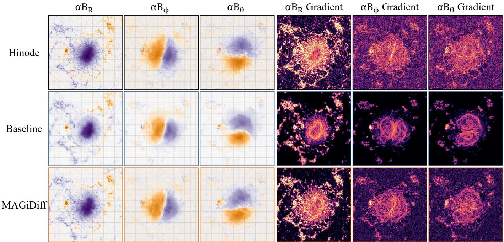  
Figure 6. Qualitative comparison of MAGiDif and Regression U-Net baseline, with the corresponding gradient magnitude maps. Example date: 2016 June 15, 03:36 TAI. Both MAGiDif and the regression baseline accurately predict the large-scale magnetic field structure. However, MAGiDif additionally reproduces the realistic quiet-Sun texture as seen in Hinode/SOT-SP, whereas the regression baseline collapses the quiet Sun to an nonphysically smooth background. The gradient maps show that this smoothing is systematic, where the baseline underestimates the gradient magnitude in every component. Magnetogram colormap: -3000 3000 Mx cm−2 following Figure 3. Gradient magnitude colormap: 0 250 Mx cm−2 pixel−1.

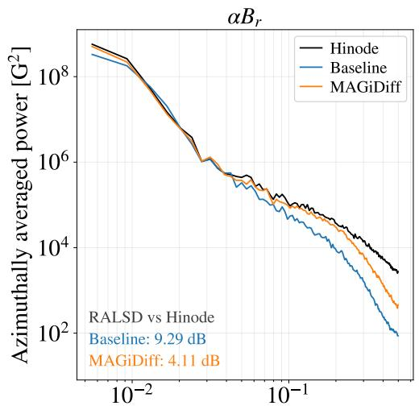

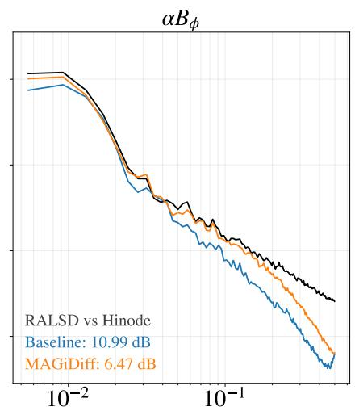

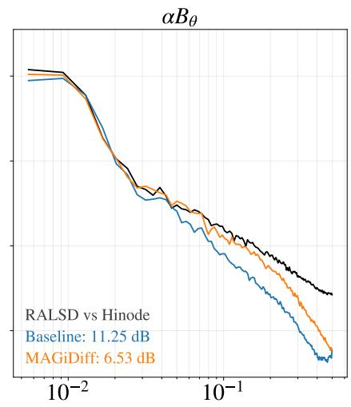  
Spatial frequency [cycles/pixel]  
Figure 7. Power spectrum of MAGiDif, regression U-Net baseline, and Hinode/SOT-SP for sample in Figure 6. All three spectra agree on large scale features, confirming that both models recover the large-scale field. However, they separate at fine scale details, where baseline’s spectra fall from Hinode/SOT-SP while MAGiDif tracks it more closely. The spectra quantify what the gradient maps show qualitatively: the baseline smooths out fine scale details.

The corresponding power spectra in Figure 7 provide complementary frequency-domain evidence. Both models reproduce the large-scale power measured by Hinode/SOT-SP, but the baseline increasingly loses power at finer spatial scale, whereas MAGiDif remains closer to the Hinode/SOT-SP spectrum.

## 4.4.2. Metrics

We next quantify these diferences using metrics that measure both per-pixel accuracy and structural fidelity. Before computing any of the metrics below, we align the polarity of each prediction with the corresponding Hinode/SOT-SP observation by comparing Bˆ with −Bˆ and retaining the one with better fit. This is applied to both models to prevent a small number of predictions with flipped polarity from dominating the metrics. With this, the comparison therefore focuses on the accuracy of the recovered field strengths and spatial structure rather than the polarity recovery, which we evaluate separately in earlier section. For pixel-wise accuracy, we follow R. E. L. Higgins et al. (2022); R. Wang et al. (2024) and report:

1. the mean absolute error (MAE), or the average prediction error

2. the percentage of pixels with absolute error below a fixed threshold $( \% ~ < ~ t ;$ D. Scharstein & R. Szeliski (2002)), with $t = 3 0 0$ $\mathrm { M x c m ^ { - 2 } }$ here. This metric measures the fraction of ”good” pixels whose errors fall below a specified tolerance.

Following R. Wang et al. (2024), we evaluate them on strong-field pixels with $| \alpha \mathbf { B } | > 1 0 0 0 \ \mathrm { M x } \mathrm { c m ^ { - 2 } }$ to avoid having metrics that are dominated by the far more numerous quiet-sun pixels.

These metrics only report pixel-to-pixel accuracy, and so to provide a more holistic picture, we report four additional metrics that capture distributional and structural fidelity.

3. 1-Wasserstein distance $( W _ { 1 } )$ . Also known as the Earth Mover’s Distance (EMD; Y. Rubner et al. (2000)) in computer vision, $W _ { 1 }$ (L. Kantorovitch 1958) measures the minimum transformation cost of transporting probability mass between two distributions. For each field component, we construct empirical one-dimensional distributions from valid pixel values in the prediction and ground truth, and compute the transport cost required to transform one distribution into the other. Thus, $W _ { 1 }$ measures agreement between the predicted and ground truth distributions without considering the spatial locations of individual pixels, where lower values indicate better agreement.

4. ∇-ratio. Spatial gradients characterize the strength and location of local magnetic field variations. Preserving these quantities is important not only for reproducing magnetic structures, but also for downstream calculations of physical quantities based on field derivatives, for example electric current density. ∇-ratio is the ratio of the total gradient magnitude in the prediction to that in the ground truth. It is measured by aggregating gradient magnitude over the entire image, providing a global measure of whether the model preserves the overall level of spatial variation. Values near unity indicate matched overall sharpness, whereas values below unity indicate over-smoothing, and values above unity indicate excessive spatial variation, which may result from overly sharp structures or noise.

5. ∇-MAE. Because ∇-ratio compares only the aggregated gradient magnitudes, predictions can have similar values even when the variations occur at incorrect locations. We therefore also report ∇-MAE, the mean absolute error on per-pixel gradient magnitudes. This metric complements the global ∇-ratio by penalizing discrepancies in the locations and strengths of local spatial variations.

6. Radially averaged logarithmic spectral distance (RALSD). RALSD (L. Harris et al. 2022) compares the predicted and ground truth power spectra, with lower values indicating better agreement. To compute this, we first apply a twodimensional Fourier transform to each sample and calculate the power spectrum as the squared magnitude of the Fourier coeficients. We then azimuthally average the power over concentric rings in frequency space, producing a one-dimensional radial power spectrum indexed by spatial frequency magnitude. RALSD is then computed as the root mean square error, across radial frequency bins, between the predicted and ground truth power spectra after conversion to decibels. For comparability across samples, we compute RALSD on a $1 2 8 ^ { \prime \prime } \times 1 2 8 ^ { \prime \prime }$ cutout centered within the largest fully valid region of each test sample. RALSD therefore measures whether the prediction distributes the correct amount of power across spatial scales, from large-scale magnetic structure to fine-scale details.

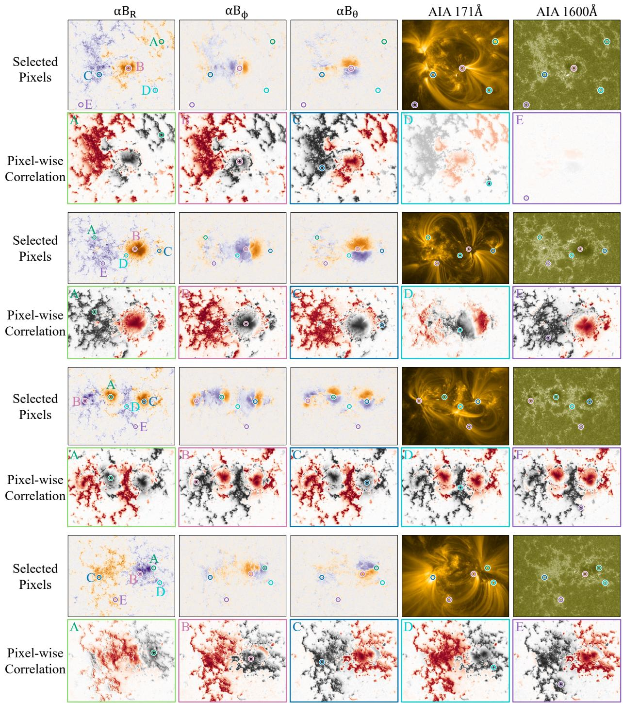  
Figure 8. Pixel-wise correlation map on four test examples from 2016. Dates, top to bottom: Jan 26, 23:12 TAI; Apr 14, 02:48 TAI; Jul $1 9 , 1 6 { : } 4 8 \ \mathrm { T A I } ;$ Oct 08, 09:12 TAI. For each panel: Top Row: Left to right: $\alpha B _ { R } , \alpha B _ { \phi } , \alpha B _ { \theta } ,$ SDO/AIA 171˚A, 1600 ˚A. Bottom Row: Pixel-wise correlation of 5 selected pixels (labeled A-E) with respect to all other pixels. As an example, we discuss results in the first panel with clear correlation clue. The sunspot pixel (B) accurately correlates with the sunspot region and its connected plage. The closed-loop footpoint (C) shows correlations that span the entire loop and show the correct opposite polarity at the conjugate footpoint. The quiet region (E) has near-zero correlations as expected. For reference, we also show ground truth $H i n o d e / \mathrm { S O T } \mathrm { - S P } ~ \alpha B _ { R }$ in Figure 16. Colormaps: $- 3 0 0 0 \ \mathrm { \ l m } \mathrm { - 3 0 0 0 \ M x { c m } ^ { - 2 } }$ for $\alpha B _ { R } , \alpha B _ { \phi } $ , αBθ following Figure $3 ; - 1 \Vdash \emptyset 1$ for correlation maps. (1: correlated; 0: uncorrelated; −1: anti-correlated).

Table 2. MAGiDif matches the regression baseline in per-pixel accuracy while substantially better reproducing the pixel-value distribution, sharpness, and power spectrum of the ground truth. We compare MAGiDif with a regression U-Net baseline on the test set, using one prediction per input: a single sampled realization for MAGiDif and the de terministic output of the baseline; each cell reports Baseline | MAGiDif, with the better value in bold. For each field component, we report the mean absolute error (MAE, lower is better) and the percentage of pixels with error below 300 Mx $\mathrm { c m } ^ { - 2 } \ \mathrm { ( \% < 3 0 0 }$ higher is better), computed over strong-field pixels with $| \mathrm { \overline { { \alpha } } B } | > 1 0 0 0 \ \mathrm { M x } \mathrm { c m } ^ { - 2 }$ . The remaining metrics measure how well predictions reproduce the structure of the ground truth over all valid pixels: $W _ { 1 }$ reports the Wasserstein distance between the predicted and observed pixel-value distributions (lower is better); the ∇-ratio compares the total gradient magnitude of the prediction to that of the ground truth, where values near 1 indicate matched sharpness and values below 1 indicate over-smoothing; ∇-MAE reports the mean absolute error of the gradient magnitude (lower is better); and RALSD reports the radially averaged log-spec tral distance between the predicted and observed power spectra (lower is better), computed on $2 5 6 \times 2 5 6$ crops for comparability. All metrics are computed after aligning the global polarity of each prediction with the Hinode/SOT-SP ground truth.
<table><tr><td>Measures</td><td>Metric</td><td colspan="2"> $\alpha B _ { R }$ </td><td colspan="2"> $\alpha B _ { \phi }$ </td><td colspan="2"> $\alpha B _ { \theta }$ </td><td colspan="2">|αB|</td></tr><tr><td>Strong-field accuracy</td><td> $\mathrm { M A E } \ [ \mathrm { M x } \mathrm { c m } ^ { - 2 } \ ] \ \downarrow$ </td><td>612.5</td><td>575.5</td><td>304.1 |</td><td>304.3</td><td>296.4</td><td>294.6</td><td></td><td>428.6 | 372.8</td></tr><tr><td>Strong-field accuracy</td><td>%&lt;300 ↑</td><td>46.3</td><td>49.1</td><td>69.1</td><td>69.8</td><td>70.6</td><td>71.3</td><td>49.5</td><td>57.0</td></tr><tr><td>Value-distribution match</td><td> $W _ { 1 } \ [ \mathrm { M x } \mathrm { c m } ^ { - 2 } \ ] \ \downarrow$ </td><td>36.6</td><td>14.9</td><td>30.7</td><td>10.5</td><td>32.4</td><td>10.9</td><td>64.8 |</td><td>24.7</td></tr><tr><td>Global sharpness match</td><td>∇-ratio →1</td><td>0.39</td><td>0.73</td><td>0.22</td><td>0.62</td><td>0.21</td><td>0.60</td><td>0.44</td><td>0.71</td></tr><tr><td>Local sharpness accuracy</td><td> $\mathrm { \nabla \cdot M A E \ [ M x \ c m ^ { - 2 } / p x ] \ \downarrow }$ </td><td>41.84</td><td>38.05</td><td>26.92</td><td>20.93</td><td>27.35</td><td>20.96</td><td>35.87 | 34.72</td><td></td></tr><tr><td>Power-spectrum match</td><td>RALSD [dB] ↓</td><td>8.56</td><td>4.25</td><td>11.32</td><td>6.00</td><td>11.55</td><td>5.96</td><td>7.98</td><td>4.04</td></tr></table>

## 4.4.3. Quantitative Results

Table 2 reports the quantitative comparison between the regression baseline and MAGiDif. For a fair comparison with the deterministic regression baseline, we evaluate MAGiDif using a single stochastic realization per input. On strong-field pixels, MAGiDif outperforms the regression baseline on almost all field components. It achieves lower MAE and higher $\% < 3 0 0$ percentage for $\alpha B _ { R } , \ \alpha B _ { \theta } ,$ , and $| \alpha \mathbf { B } |$ , while remaining comparable for $\alpha B _ { \phi } .$ Thus, even in the single realization setting, MAGiDif matches and often exceeds the regression baseline’s performance, measured on a per-pixel basis. The distributional and structural metrics show larger diferences. MAGiDif achieves much lower $W _ { 1 }$ and RALSD, indicating better agreement with Hinode/SOT-SP in both pixel-value distribution and the allocation of power across spatial scales. The ∇-ratio shows that MAGiDif preserves the total gradient magnitude present in Hinode/SOT-SP more closely. The lower ∇-MAE achieved by MAGiDif complements this global comparison by showing better agreement in the strength and location of local spatial variations. Together, these metrics confirm that MAGiDif more faithfully reproduces structural and distributional properties of Hinode/SOT-SP magnetograms.

## 4.5. Statistical Characteristics of the Predictive Distribution

Beyond evaluating individual predictions, we examine whether the predictive distribution learned by MAGiDif respects physical relationships among magnetic structures. In particular, a useful distribution should encode relationships among pixels: pixels belonging to the same magnetic structure should tend to share the same polarity across realizations, pixels rooted at opposite ends of a closed magnetic loop should exhibit opposite polarity, while unrelated quiet-Sun pixels should show little polarity correlation. The probabilistic formulation of MAGiDif allows us to probe these relationships directly by sampling ensembles of realizations.

Recall that we aimed to learn a model that could draw samples from p(B|I). In practice, the model’s inferred distribution is not necessarily equal to the actual conditional distribution (Z. Wu et al. 2024), and so let us denote the model’s actual distribution ˆp(B|I). To quantify the statistical relationship between the two image locations i and $j ,$ , we compute the mean cosine similarity between their magnetic field vectors across realizations:

$$
C _ { i , j } ( { \bf { I } } ) : = \mathbb { E } _ { { \bf B } \sim \hat { p } ( { \bf B } | { \bf { I } } ) } \left[ \left( \frac { { \bf B } _ { i } } { \| { \bf B } _ { i } \| } \right) ^ { \top } \left( \frac { { \bf B } _ { j } } { \| { \bf B } _ { j } \| } \right) \right] ,\tag{6}
$$

where $C _ { i , j } ( \mathbf { I } ) \in [ - 1 , 1 ]$ measures the directional agreement between magnetic field vectors at pixel i and $j .$ $C _ { i , j } ( \mathbf { I } )  1$ means that i and $j$ are correlated, $C _ { i , j } ( { \bf I } ) $ 0 means they are uncorrelated, and $C _ { i , j } ( \mathbf { I } )  - 1$ means they are anti-correlated. We approximate Equation 6 with multiple samples, akin to Monte-Carlo integration.

We show correlation maps of representative samples in Figure 8. These examples show that MAGiDif captures structured nonlocal relationships in the sampled distribution, including intra-plage coherence and correlations that are largely consistent with magnetic connectivity.

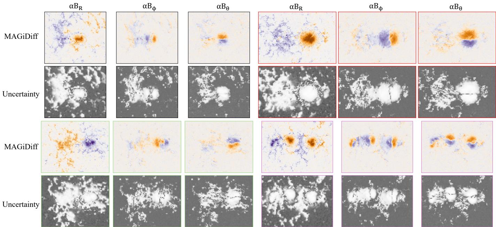  
Figure 9. Uncertainty map for four cutouts in Figure 8. For each sample in Figure 8, we present MAGiDif’s uncertainty estimates, defined as the per-pixel standard deviation divided by the per-pixel mean magnitude (a unitless measure). Example date: 2016 January 26, 23:12 TAI; 2016 April 14, 02:48 TAI; 2016 October 8, 09:12 TAI; 2016 July 19, 16:48 TAI. For each panel: Top Row: Left to right: $\alpha B _ { R } , \alpha B _ { \phi } , \alpha B _ { \theta }$ . Bottom Row: Left to right: Uncertainty map for $\alpha B _ { R } , \alpha B _ { \phi } , \alpha B _ { \theta }$ . Colormaps: $- 3 0 0 0 \mathrm { \ : \Omega } \mathrm { \Omega } \mathrm { \Omega } \mathrm { \Omega } \mathrm { \Omega } \mathrm { \Omega } \mathrm { \Omega } \mathrm { 3 0 0 0 \mathrm { \ : \ : } \mathrm { M x \ : c m ^ { - 2 } } }$ for $\alpha B _ { R } , \alpha B _ { \phi } , \alpha B _ { \theta }$ following Figure 3; 0 2 (unitless) for uncertainty maps.

This correlation structure may be useful even when the full magnetogram prediction is not used directly. For instance, given the polarity of a small set of pixels in an image from surface flux transport models (Y. M. Wang et al. 1989; L. Upton & D. H. Hathaway 2013; R. M. Caplan et al. 2025), the learned correlations could help propagate polarity information to remaining pixels.

This ability to generate a distribution also enables estimation of uncertainty quantification (e.g., the perpixel standard deviation), which is important for applications. Similar to the correlation map analysis, the generative nature of difusion models allows us to draw a large ensemble of realizations and probe the per-pixel uncertainty. Before uncertainty computation, we downsample all realizations to a coarser grid. This reduces sensitivity to co-registration error, limited optical resolution, and temporal mismatch (since the UV/EUV input is near-instantaneous snapshot while the corresponding magnetogram is captured over a one-hour interval). The uncertainty is then quantified as the perpixel standard deviation normalized by its mean magnitude, computed over the set of downsampled realizations. As an example, Figure 9 shows uncertainty map for the four samples in Figure 8.

Our correlation map and uncertainty analysis show that models like MAGiDif can not only predict magnetograms, but also learn the structure of the full output distribution.

## 4.6. Cross Solar Cycle Generalization

We next ask whether MAGiDif can generalize across the polarity reversal between solar cycles. This is a challenging test because, according to Hale’s law, the leading polarity in the northern and southern heliographic hemispheres reverses between solar cycles. It is therefore important to test whether MAGiDif, when trained only on data from one solar cycle, can generalize to other solar cycles.

To test this, we train a separate model using only observations from solar cycle 24 and evaluate it only on solar cycle 25 data. During training, we use a simple polarity-flip augmentation to expose the model to both solar cycle labels while using only solar cycle 24 observations. With probability 0.5, the dataset flips the sign of all three target vector magnetogram components and changes the solar cycle indicator to the solar cycle 25 value, while leaving the UV/EUV inputs and latitude channel unchanged. This augmentation provides examples that mimic solar cycle 25 and helps address the cross cycle generalization dificulty. Apart from this augmentation, training follows the standard MAGiDif procedure.

At test time, solar cycle 25 samples spanning 2020 to 2024 are passed into the model with their true solar cycle indicator. Using the polarity score defined in Equation 5, the model recovers the correct polarity for 89.7% among 16, 201 samples with threshold τ < 1.

With a stricter threshold $\tau < 0 . 5$ , we get a passing rate of 83.3%. Beyond polarity agreement, qualitative inspection shows performance consistent with the original MAGiDif model. These results indicate that MAGiDif can generalize across solar cycles.

## 4.7. Full Disk Generalization

We now evaluate whether MAGiDif can be applied to full-disk UV/EUV observations. This setting is well beyond the model’s training distribution: MAGiDif is trained on co-registered $1 2 8 ^ { \prime \prime } \times 1 2 8 ^ { \prime \prime }$ cutouts, whereas full-disk inference requires the model to handle much larger spatial context, extended plage regions, and the of-disk area. Therefore, some aspects of full-disk prediction of magnetograms are expected to not work — e.g., large-scale plage patches spanning larger regions. Nevertheless, it is unclear whether the method would generalize even to active regions. Indeed, in early development, we found that MAGiDif without a binary disk mask produced spurious magnetogram hallucina tions near disk center when applied directly to full-disk inputs.

In addition to the binary disk mask, we find that two modifications are critical for producing spatially coherent full-disk predictions. First, motivated by resolutiondependent noise scheduling (E. Hoogeboom et al. 2023; P. Esser et al. 2024), we adjust the noise schedule used to train MAGiDif. As image resolution increases, a largescale structure spans more pixels and thus the same perpixel noise level has a weaker efect on the structure since the independent pixel noise averages out over the large number of pixels of the structure. Consequently, a noise schedule tuned on $1 2 8 ^ { \prime \prime } \times 1 2 8 ^ { \prime \prime }$ crops is too weak on full-disk images. We therefore retrain MAGiDif from scratch with the log signal-to-noise ratio lowered by 3.65 nats at every difusion timestep. This shift corresponds to a roughly 6 times larger canvas, making the denoising dificulty more comparable between training and inference time. Second, we adopt a tiled inference procedure motivated by MultiDifusion (O. Bar-Tal et al. 2023). As in standard difusion inference, the process begins with a full-disk canvas of random noise and progressively denoises it into a clean magnetogram. The diference is that, at each denoising step, the canvas is divided into overlapping $2 5 6 ^ { \prime \prime } \times 2 5 6 ^ { \prime \prime }$ windows, and MAGiDif predicts a denoising update for each window using the corresponding UV/EUV observation crop. These updates are averaged in overlapping regions and combined to form a full-disk estimate used in the next denoising step. This procedure allows MAGiDif to operate at a spatial scale close to what it is trained on while producing a spatially coherent full-disk prediction.

As a demonstration of this approach, we show MAGiDif prediction on a full-disk map from 2016 February 5, 07:12 TAI, which lands in the test set time range. We compare against two references. The first is the standard SDO/HMI vector magnetogram product. The second is SuperSynthIA (R. Wang et al. 2024), which uses SDO/HMI Stokes profiles to produce disambiguated magnetograms that resemble Hinode/SOT-SP. SuperSynthIA and SDO/HMI agree in many places, but have some diferences in quiet regions and plage characteristics.

We show results in Figure 10. MAGiDif recovers active-region magnetic structure that broadly resembles both SDO/HMI and SuperSynthIA. The hexbin plots in Figure 18 provide a quantitative comparison with the SuperSynthIA reference: the dominant pixel densities concentrate near the 1:1 relation across all field components. Although the slopes of fitted lines are below unity and might suggest systematic field strength underestimation, closer inspection shows that this disagreement is not uniform across all field strengths. Strong field pixels generally remain close to the 1:1 relation, whereas the dominating weak and intermediate field pixels are more significantly underestimated. These pixels mainly corre spond to plage and weak fields, which are more dificult to recover as their magnetic signals are weaker, more spatially difused, and less constrained by the UV/EUV observations.

The remaining failure occurs primarily in large plage regions, where MAGiDif may assign the wrong polarity to part of a bipolar structure and may produce overly coherent unipolar structure. Although the location and morphology of the plage are preserved, its polarity can be incorrect. We hypothesize that this stems from the training setup: at the $1 2 8 ^ { \prime \prime } \times 1 2 8 ^ { \prime \prime }$ scale, plage regions often appear as locally unipolar patches, so the model has limited context for resolving large-scale plage polarity.

Overall, these results suggest that MAGiDif can generalize beyond Hinode/SOT-SP-sized cutouts, but also highlight the need for additional global context when resolving large-scale structure. In practical applications, this limitation could be mitigated in several ways. One approach is to take polarity from other signals for plage (e.g., in a far-side estimation task, using data from a surface flux transport model). Another approach is to use a hierarchical model that produces global polarity information (e.g., a variant of MAGiDif trained to map from SDO/AIA to SDO/HMI).

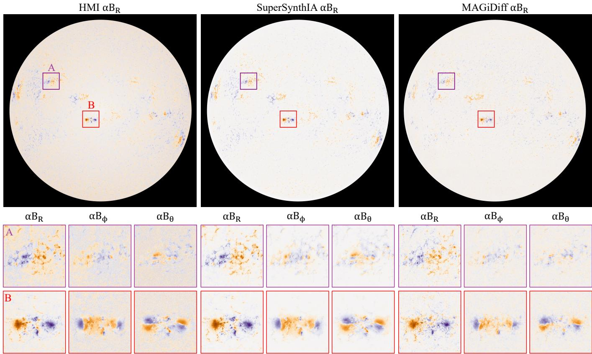  
Figure 10. Full-disk examples from 2016 February 5, 07:12 TAI. Upper Panel: Left to right: $\alpha B _ { R }$ for SDO/HMI, SuperSynthIA, MAGiDif. Bottom Panel: Left to right: αBR, α $B _ { \phi } ,$ αBθ for region A and B. The magnetic field structure inferred by MAGiDif largely mimics those of HMI and SuperSynthIA despite a preferential direction in some large-scale plage. We attribute this artifact to the patch-to-full disk domain gap: MAGiDif is trained only on small, activity-focused patches and thus lacks global context. As a benefit of using higher-quality Hinode/SOT-SP magnetograms as label, MAGiDif quiet region more closely resembles SuperSynthIA quiet region with reduced quiet-Sun noise artifacts. Colormaps: -3000 3000 Mx $\mathrm { c m } ^ { - 2 }$ following Figure 3.

## 4.8. Migration to STEREO/EUVI and GOES/SUVI Data

A primary motivation for MAGiDif is expanding the scope of data that can be obtained by using instruments that lack a spectropolarimeter. We thus test whether MAGiDif can be adapted to two such instruments: the Extreme Ultraviolet Imager onboard STEREO (STEREO/EUVI) and the Solar UltraViolet Imager onboard GOES-R (GOES/SUVI). Both deliver multi-wavelength EUV imagery, but neither has the full SDO/AIA channel set, and both difer from SDO/AIA in photometric calibration, spatial resolution, and pointspread function. In addition, STEREO/EUVI observes the Sun from a substantially diferent vantage point.

This setting is more challenging than the SDO/AIAto-Hinode/SOT-SP task for two main reasons. First, the available EUV passbands primarily originate in the chromosphere, transition region, and corona rather than the photosphere, thus provide only indirect constraints on the photospheric magnetic field. Second, neither STEREO nor GOES provides vector magnetogram measurements, and Hinode/SOT-SP does not provide suficiently dense co-observations to construct paired training sets. Because true STEREO/EUVI far-side predictions cannot be directly validated without simultaneous far-side vector magnetograms, we evaluate the model in a proxy setting in which magnetic supervision is available: we use periods when each EUV instrument has substantial field-of-view overlap with SDO/HMI, generate SuperSynthIA vector magnetograms from the corresponding SDO/HMI Stokes observations, and reproject these magnetograms onto the coordinate grid of the respective instrument. These reprojected Super-SynthIA magnetograms are used as the fine-tuning target and the validation reference. This proxy experiment provides a way to validate whether MAGiDif can generalize to other EUV instruments and recover vector magnetograms from their EUV observations.

We adapt MAGiDif to each instrument using a twostage fine-tuning procedure. First, we fine-tune the

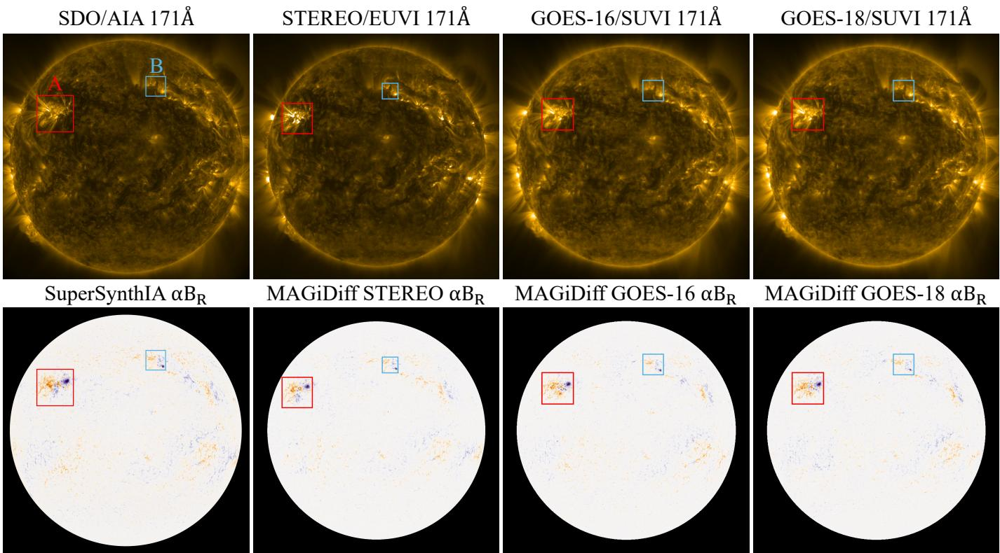  
Figure 11. Full-disk $\alpha B _ { R }$ predictions from MAGiDif across multiple EUV instruments. Top row: Full-disk 171˚A filtergrams from SDO/AIA, STEREO/EUVI, GOES–16/SUVI, and GOES–18/SUVI (left to right). Bottom row: SuperSynthIA $\alpha B _ { R }$ reference followed by MAGiDif $\alpha B _ { R }$ predictions using full-disk STEREO/EUVI, GOES–16/SUVI, and GOES–18/SUVI filtergrams as input (left to right). MAGiDif produces largely accurate full-disk magnetic field estimates across all three instruments, with active regions reproduced well. However, some predictions exhibit a preference for uniform polarity inconsistent with the SuperSynthIA reference, which we attribute to a domain gap arising from training exclusively on cropped regions. Colormaps: -3000 3000 Mx cm−2 following Figure 3. Example Date: 2024 February 22, 04:12 TAI.

VAE on SuperSynthIA magnetograms so that the latent space better matches the target magnetogram distribution. Second, we fine-tune two separate denoising U-Nets for STEREO/EUVI and GOES/SUVI on their corresponding instrument-specific dataset while keeping the VAE frozen. The base model that is fine-tuned upon is trained with the resolution-adjusted noise schedule described in Section 4.7. The resulting full-disk prediction generation also follows the tiled inference procedure. The detailed fine-tuning procedure is provided in Section C.4.

We show qualitative results in Figure 11, which presents full-disk $\alpha B _ { R }$ predictions from the fine-tuned STEREO/EUVI and GOES/SUVI models. We evaluate the models on data from 2024 February 22, 04:12 TAI, which falls within the test-set time range and is selected because the STEREO/EUVI field of view has substantial overlap with both SDO/HMI and GOES/SUVI. Across all three instruments, MAGiDif recovers the dominant active-region magnetic structure and produces full-disk predictions that broadly resemble the Super-SynthIA reference. Some disagreement remains in extended plage regions, where a bipolar structure may be predicted as unipolar, consistent with the limitation discussed in Section 4.7.

We additionally assess the distributional agreement between these full-disk predictions and the SuperSynthIA reference in Figure 19. Because the predictions are inferred solely from EUV observations acquired by diferent instruments, whereas the SuperSynthIA reference is derived from SDO/HMI observations and reprojected onto each instrument’s respective coordinate grid, exact pixel-accurate correspondence is impossible. We therefore examine the pixel-value distributions to assess whether the models recover the overall distribution of magnetic field values. Across all instruments and field components, the predicted distributions broadly follow the corresponding SuperSynthIA distribution, with slight underestimation at strong field strengths, particularly for $\alpha B _ { \phi }$ and $\alpha B _ { \theta }$

To isolate the efect of full-disk domain gap, we compare two inference settings in Figure 12: applying MAGiDif to the full-disk EUV input and then cropping the predicted magnetogram afterward, versus applying MAGiDif directly to the corresponding EUV cutout. With tiled full-disk inference, the two settings produce similar results in both regions, and both recover the dominant magnetic structures well. The zoomins also explain the underestimation of strong-field $\alpha B _ { \phi }$ and $\alpha B _ { \theta }$ pixels for the two GOES/SUVI predictions in Figure 19. In both inference settings, MAGiDif predicts a smaller sunspot than SuperSynthIA, resulting in substantial field strength underestimation for pixels near the sunspot boundary. This underestimation of the size of the active region is not too surprising, since the GOES/SUVI instruments only provide EUV information and have limited direct information about the photosphere. Nonetheless, the results demonstrate that tiled inference can extend the method across the full disk. More broadly, while the size of the active region in the GOES/SUVI data is smaller, its general shape and configuration are consistent with SuperSynthIA. Thus, the results suggest that MAGiDif can be applied to a variety of UV/EUV instruments to produce estimates of the vector magnetic field.

<table><tr><td rowspan="2">MAGiDiff STEREO (Full Disk)</td><td>αBR</td><td>αBφ</td><td>αBθ</td><td>αBR</td><td>αBφ</td><td>αBθ</td></tr><tr><td></td><td></td><td></td><td></td><td></td><td></td></tr><tr><td rowspan="2">MAGiDiff STEREO (Crop) MAGiDiff</td><td></td><td></td><td></td><td></td><td></td><td></td></tr><tr><td></td><td></td><td></td><td></td><td></td><td></td></tr><tr><td>MAGiDiff GOES-16 (Crop)</td><td></td><td></td><td></td><td></td><td></td><td></td></tr><tr><td>MAGiDiff GOES-18 (Full Disk)</td><td></td><td></td><td></td><td></td><td></td><td></td></tr><tr><td>MAGiDiff GOES-18 (Crop)</td><td></td><td></td><td></td><td></td><td></td><td></td></tr><tr><td>SuperSynthIA</td><td></td><td></td><td></td><td></td><td></td><td></td></tr></table>

Figure 12. Zoomed-in view of cutouts from Figure 11. Left to right: $\alpha B _ { R } , \alpha B _ { \phi } , \alpha B _ { \theta }$ for cutout region A and B. Top to bottom: MAGiDif predictions from 3 channel full-disk STEREO/EUVI EUV filtergrams, cropped post-inference to regions A and B (row 1), and inferred directly on the EUV cutouts of the same regions (row 2); same for 5 channel GOES–16/SUVI EUV filtergrams (rows 3 – 4) and 5 channel GOES–18/SUVI EUV filtergrams (rows 5 – 6); SuperSynthIA reference (row 7). Across all three instruments, MAGiDif recovers the dominant magnetic field structures under both inference modes, and the predictions closely resemble the SuperSynthIA reference. Colormaps: $- 3 0 0 0 \mathrm { \ : \Omega } \mathrm { \Omega } \mathrm { \Omega } \mathrm { \Omega } \mathrm { \Omega } \mathrm { \Omega } \mathrm { \Omega } \mathrm { \Omega } \mathrm { \Omega } \mathrm { \Omega } \mathrm { \Omega } \mathrm { \Omega } \mathrm { \Omega } \mathrm { \Omega } \mathrm { \Omega } \mathrm { \Omega } \mathrm { \Omega } \mathrm { \Omega } \mathrm { \Omega } \mathrm { \Omega } \mathrm { \Omega } \mathrm { \Omega } \mathrm { \Omega } \mathrm { \Omega } \mathrm { \Omega } \mathrm { \Omega } \mathrm { \Omega } \mathrm { \Omega } \mathrm { \Omega } \mathrm { \Omega } \mathrm { \Omega } \mathrm { \Omega } \mathrm { \Omega } \mathrm { \Omega } \mathrm { \Omega } \mathrm { \Omega } \mathrm { \Omega } \mathrm { \Omega } \mathrm { \Omega } \mathrm { \Omega } \mathrm { \Omega } \mathrm { \Omega } \mathrm { \Omega } \mathrm { \Omega } \mathrm { \Omega } \mathrm { \Omega } \mathrm { \Omega } \mathrm { \Omega } \mathrm { \Omega } \mathrm { \Omega } \mathrm { \Omega } \mathrm { \Omega } \mathrm { \Omega } \mathrm { \Omega }$ following Figure 3. Example Date: 2024 February 22, 04:12 TAI.

## 5. DISCUSSION

We present MAGiDif, a new approach to estimate photospheric vector magnetic field directly from UV/EUV intensity maps using a deep learning model. MAGiDif is built upon the latent difusion model and is trained on co-registered SDO/AIA and Hinode/SOT-SP observations with 14 years of data. Inspired by prior works (T. Kim et al. 2019; H.-J. Jeong et al. 2020; W. Sun et al. 2022), we extend the focus beyond line-ofsight magnetograms to the full heliographic vector magnetic field components α $B _ { R } , \alpha B _ { \phi } , \alpha B _ { \theta }$ . Qualitative and quantitative evaluations show that MAGiDif produces visually-plausible magnetograms. In cutouts, MAGiDif predictions show strong agreement with Hinode/SOT-SP, capturing both the large-scale structure and fine details.

We propose methods to probe the model beyond standard prediction to examine the richer physical information embedded in the model’s predictive distribution. We further demonstrate that MAGiDif can be adapted to other EUV instruments and shows promising generalization across solar cycles. Full-disk experiments show that MAGiDif can recover the main active-region magnetic structure beyond Hinode/SOT-SP-sized cutouts, while also revealing the need for additional global context to resolve domain gaps.

Many of these results are credited to the breadth of data that is available for learning methods. Hinode/SOT-SP has provided nearly 19 years of highquality data, and SDO/AIA has provided high-cadence, well-calibrated, full-disk filtergrams since 2010. This immense archive of data is absolutely critical for creating a high-quality dataset for training.

Meanwhile, deep learning has unlocked huge potential in solar physics. Traditionally, vector magnetograms can only be inferred using inversion methods like B. Lites et al. (2007); J. Borrero et al. (2011), which require high quality Stokes profiles. These full Stokes profiles are hard to acquire as a spectropolarimeter is required and typically can only be measured with limited cadence and coverage. By contrast, EUV intensity imaging is easier and therefore more common and spans over mul tiple solar cycles. Several studies have demonstrated that models can reasonably infer magnetograms from UV/EUV intensity images, despite the only statistical relationship between UV/EUV intensity and magnetic field maps. Among these eforts, T. Kim et al. (2019) was the first to propose using a conditional GAN to estimate LOS magnetogram from EUV intensity images. Subsequent works - (H.-J. Jeong et al. 2020; J. Deng et al. 2021; W. Sun et al. 2022; H. Jiang et al. 2023; F. Gao et al. 2023; X. Li et al. 2024; R. Jarolim et al. 2025; H.-J. Jeong et al. 2025) - experimented with inputs from various instruments and introduced refinements to the GAN structure like incorporating temporal consistency and multi-channel conditioning. More recently, F. P. Ramunno et al. (2024, 2025); C. Xu et al. (2025) bring difusion into the field but their work primarily focuses on super-resolution of LOS magnetograms and condi tional solar image generation. To the best of our knowledge, MAGiDif is the first difusion-based model to estimate full heliographic vector magnetic field end-to-end from EUV observations. We further probe the model to characterize the physical correlation it learns. We also test cross-instrument transfer to STEREO/EUVI and GOES/SUVI, where MAGiDif shows good generalization ability, suggesting a potential extension to other similar instruments with careful calibration.

Despite its strong performance, MAGiDif naturally inherits several limitations due to its data-driven methodology. First, it depends critically on the accurate co-registration between SDO/AIA UV/EUV intensity map and Hinode/SOT-SP magnetograms. This is difficult as SDO/AIA captures data near instantaneously while Hinode/SOT-SP magnetograms are built up over tens of minutes. Such a temporal disparity means that UV/EUV observation can change dramatically while magnetogram data is being produced, leading to natural mismatch between the pairs. Second, MAGiDif is trained on small, activity-focused cutouts. When applied at full-disk scale, this crop-based training can lead to artifacts like overly coherent unipolar large-scale plage. These failure modes suggest that full-disk prediction requires additional global context beyond what is available in the training cutouts. Third, although the model is provided with a polarity prior that should help resolve the polarity ambiguity, polarity errors can still occur. In many of these failure cases, diferent MAGiDif realizations sample both the correct polarity solution and its sign-flipped counterpart. In other cases, however, the model consistently selects the opposite polarity. These cases indicate that resolving polarity remains imperfect in the current model and could be improved in future work.

Nonetheless, MAGiDif shows the opportunity to generate estimates of the vector magnetic field from other instruments. In combination with other advances in solar physics, we hope to extend the availability of high quality data.

## ACKNOWLEDGMENTS

This work was primarily supported by NASA/MIRO 80NSSC24M0174. This work was supported in part through the NYU IT High Performance Computing resources, services, and staf expertise. The authors thank Dr. KD Leka for a number of helpful comments that greatly improved the manuscript. The authors thank the anonymous reviewer for insightful feedback that improved the paper.

## REFERENCES

Bar-Tal, O., Yariv, L., Lipman, Y., & Dekel, T. 2023, https://arxiv.org/abs/2302.08113

Barnes, G., Leka, K., Schrijver, C., et al. 2016, The Astrophysical Journal, 829, 89

Bobra, M. G., & Couvidat, S. 2015, ApJ, 798, 135, doi: 10.1088/0004-637X/798/2/135

Bobra, M. G., Sun, X., Hoeksema, J. T., et al. 2014, Solar Physics, 289, 3549

Borrero, J., Tomczyk, S., Kubo, M., et al. 2011, Solar Physics, 273, 267

Caplan, R. M., Stulajter, M. M., Linker, J. A., et al. 2025, The Astrophysical Journal Supplement Series, 278, 24, doi: 10.3847/1538-4365/adc080

Cheung, M. C., & DeRosa, M. L. 2012, The Astrophysical Journal, 757, 147

Darnel, J. M., Seaton, D. B., Bethge, C., et al. 2022, Space Weather, 20, e2022SW003044, doi: 10.1029/2022SW003044

Defazio, A., Yang, X. A., Mehta, H., et al. 2024, https://arxiv.org/abs/2405.15682

Deng, J., Song, W., Liu, D., et al. 2021, The Astrophysical Journal, 923, 76, doi: 10.3847/1538-4357/ac2aa2

Esser, P., Kulal, S., Blattmann, A., et al. 2024, arXiv, doi: 10.48550/arXiv.2403.03206

Fisher, G. H., Bercik, D. J., Welsch, B. T., & Hudson, H. S. 2012, SoPh, 277, 59, doi: 10.1007/s11207-011-9907-2

Fouhey, D. F., Higgins, R. E. L., Antiochos, S. K., et al. 2023, ApJS, 264, 49, doi: 10.3847/1538-4365/aca539

Freeland, S., & Handy, B. 1998, Solar Physics, 182, 497, doi: 10.1023/A:1005038224881

Galvez, R., Fouhey, D. F., Jin, M., et al. 2019, The Astrophysical Journal Supplement Series, 242, 7

Gao, F., Liu, T., Sun, W., & Xu, L. 2023, The Astrophysical Journal Supplement Series, 266, 19, doi: 10.3847/1538-4365/accbb9

Gombosi, T. I., van der Holst, B., Manchester, W. B., & Sokolov, I. V. 2018, Living reviews in solar physics, 15, 1

Hale, G. E., Ellerman, F., Nicholson, S. B., & Joy, A. H. 1919, ApJ, 49, 153, doi: 10.1086/142452

Hale, G. E., & Nicholson, S. B. 1925, ApJ, 62, 270, doi: 10.1086/142933

Harris, L., McRae, A. T. T., Chantry, M., Dueben, P. D., & Palmer, T. N. 2022, Journal of Advances in Modeling Earth Systems, 14, e2022MS003120, doi: https://doi.org/10.1029/2022MS003120

Harvey, J. 1969, PhD thesis, University of Colorado, Boulder

Hayashi, K., Abbett, W. P., Cheung, M. C., & Fisher, G. H. 2021, The Astrophysical Journal Supplement Series, 254, 1

He, K., Zhang, X., Ren, S., & Sun, J. 2015, https://arxiv.org/abs/1512.03385

Higgins, R. E. L., Fouhey, D. F., Antiochos, S. K., et al. 2022, The Astrophysical Journal Supplement Series, 259, 24, doi: 10.3847/1538-4365/ac42d5

Hill, S. M., Pizzo, V. J., Balch, C. C., et al. 2005, SoPh, 226, 255, doi: 10.1007/s11207-005-7416-x

Ho, J., Jain, A., & Abbeel, P. 2020, arXiv, doi: 10.48550/arXiv.2006.11239

Hoogeboom, E., Heek, J., & Salimans, T. 2023, arXiv, doi: 10.48550/arXiv.2301.11093

Jaeggli, S. A., & Norton, A. A. 2016, ApJL, 820, L11, doi: 10.3847/2041-8205/820/1/L11

Jarolim, R., Veronig, A. M., P¨otzi, W., & Podladchikova, T. 2025, Nature Communications, 16, 3157, doi: 10.1038/s41467-025-58391-4

Jeong, H.-J., Moon, Y.-J., Park, E., & Lee, H. 2020, The Astrophysical Journal Letters, 903, L25, doi: 10.3847/2041-8213/abc255

Jeong, H.-J., Park, E., Lee, H., et al. 2025, ApJS, 281, 63, doi: 10.3847/1538-4365/ae21b8

Jiang, C., Feng, X., Guo, Y., & Hu, Q. 2022, The Innovation, 3, 100236, doi: https://doi.org/10.1016/j.xinn.2022.100236

Jiang, H., Li, Q., Liu, N., et al. 2023, Solar Physics, 298, 87

Kaiser, M. L., Kucera, T. A., Davila, J. M., et al. 2008, Space Science Reviews, 136, 5, doi: 10.1007/s11214-007-9277-0

Kantorovitch, L. 1958, Management Science, 5, 1. http://www.jstor.org/stable/2626967

Kim, T., Park, E., Lee, H., et al. 2019, Nature Astronomy, 3, 397, doi: 10.1038/s41550-019-0711-5

Kingma, D. P., & Welling, M. 2013, arXiv e-prints, arXiv:1312.6114, doi: 10.48550/arXiv.1312.6114

Knizhnik, K. J., Weberg, M. J., Zaveri, A. S., et al. 2024, The Astrophysical Journal, 969, 154

Kullback, S., & Leibler, R. A. 1951, The Annals of Mathematical Statistics, 22, 79. http://www.jstor.org/stable/2236703

Legnaro, E., Wright, P., Murray, S., et al. 2026, Astronomy & Astrophysics, 710, A91, doi: 10.1051/0004-6361/202558722

Leka, K. D., & Barnes, G. 2007, The Astrophysical Journal, 656, 1173, doi: 10.1086/510282

Leka, K. D., Barnes, G., & Wagner, E. L. 2018, J. Space Weather Space Clim., 8, A25, doi: 10.1051/swsc/2018004

Lemen, J. R., Title, A. M., Akin, D. J., et al. 2012, Solar Physics, 275, 17, doi: 10.1007/s11207-011-9776-8

Li, X., Senthamizh Pavai, V., Shukhobodskaia, D., et al. 2024, Space Weather, 22, e2023SW003499, doi: 10.1029/2023SW003499

Lin, S., Liu, B., Li, J., & Yang, X. 2024, https://arxiv.org/abs/2305.08891

Lionello, R., Velli, M., Downs, C., Linker, J. A., & Miki´c, Z. 2014, Astrophys. J., 796, 111, doi: 10.1088/0004-637X/796/2/111

Lites, B., Casini, R., Garcia, J., & Socas-Navarro, H. 2007, Mem. Soc. Astron. Italiana, 78, 148

Loshchilov, I., & Hutter, F. 2017, CoRR, abs/1711.05101

Metcalf, T. R. 1994, SoPh, 155, 235, doi: 10.1007/BF00680593

M¨uller, D., St. Cyr, O. C., Zouganelis, I., et al. 2020, A&A, 642, A1, doi: 10.1051/0004-6361/202038467

Ramunno, F. P., Hackstein, S., Kinakh, V., et al. 2024, arXiv, doi: 10.48550/arXiv.2404.02552

Ramunno, F. P., Massa, P., Kinakh, V., et al. 2025, arXiv, doi: 10.48550/arXiv.2503.24271

Rochus, P., Auch\`ere, F., Berghmans, D., et al. 2020, A&A, 642, A8, doi: 10.1051/0004-6361/201936663

Rombach, R., Blattmann, A., Lorenz, D., Esser, P., & Ommer, B. 2022, arXiv, doi: 10.48550/arXiv.2112.10752

Rubner, Y., Tomasi, C., & Guibas, L. J. 2000, International Journal of Computer Vision, 40, 99. https://api.semanticscholar.org/CorpusID:14106275

Salimans, T., & Ho, J. 2022, CoRR, abs/2202.00512

Scharstein, D., & Szeliski, R. 2002, IJCV, 47, 7

Schou, J., Scherrer, P. H., Bush, R. I., et al. 2012, Solar Physics, 275, 229, doi: 10.1007/s11207-011-9842-2

Schrijver, C. 1987, Astronomy and Astrophysics (ISSN 0004-6361), vol. 180, no. 1-2, June 1987, p. 241-252., 180, 241

Schuck, P. W., Linton, M. G., Knizhnik, K. J., & Leake, J. E. 2022, The Astrophysical Journal, 936, 94

Solanki, S. K., del Toro Iniesta, J. C., Woch, J., et al. 2020, A&A, 642, A11, doi: 10.1051/0004-6361/201935325

Song, J., Meng, C., & Ermon, S. 2022, arXiv, doi: 10.48550/arXiv.2010.02502

Stenflo, J. O. 1994, Solar magnetic fields: polarized radiation diagnostics, Vol. 189 (Springer Science & Business Media)

Sun, W., Xu, L., Ma, S., et al. 2022, The Astrophysical Journal Supplement Series, 262, 45, doi: 10.3847/1538-4365/ac85c0

Ugarte-Urra, I., Upton, L., Warren, H. P., & Hathaway, D. H. 2015, The Astrophysical Journal, 815, 90

Upton, L., & Hathaway, D. H. 2013, The Astrophysical Journal, 780, 5, doi: 10.1088/0004-637X/780/1/5

Wang, R., Fouhey, D. F., Higgins, R. E. L., et al. 2024, The Astrophysical Journal, 970, 168, doi: 10.3847/1538-4357/ad41e3

Wang, Y. M., Nash, A. G., & Sheeley, N. R. 1989, Science, 245, 712, doi: 10.1126/science.245.4919.712

Wiegelmann, T., & Sakurai, T. 2021, Living Reviews in Solar Physics, 18, 1

Wu, Z., Sun, Y., Chen, Y., et al. 2024, https://arxiv.org/abs/2405.18782

Wuelser, J.-P., Lemen, J. R., Tarbell, T. D., et al. 2004, in Society of Photo-Optical Instrumentation Engineers (SPIE) Conference Series, Vol. 5171, Telescopes and Instrumentation for Solar Astrophysics, ed. S. Fineschi & M. A. Gummin, 111–122, doi: 10.1117/12.506877

Xu, C., Xu, Y., Wang, J. T. L., Li, Q., & Wang, H. 2025, Astronomy & Astrophysics, 697, A110, doi: 10.1051/0004-6361/202453581

Yang, L., Zhang, Z., Song, Y., et al. 2024, https://arxiv.org/abs/2209.00796

## APPENDIX

We now provide additional technical details about the difusion models underlying MAGiDif. We first outline the core difusion formulation and key techniques adopted in this work. Then, we describe the implementation and architecture details of MAGiDif. We conclude by presenting supplementary experiments and analyses that support our claim in the paper.

## A. DIFFUSION MODEL DETAILS

Difusion models lay the foundation for this work, and in this section we provide a concise overview of the underlying framework. We begin with an introduction of the classical formulation of the forward and reverse processes in the original denoising difusion probabilistic model (DDPM, J. Ho et al. (2020)), which defines the basic mechanism of gradually adding and removing noise. Building on that, we then introduce refinements that are central to our implementation.

## A.1. Forward and Reverse Process

In the classical DDPM, the generative process is defined by a pair of Markov chains: a forward noising process that gradually perturbs clean data into noise, and a reverse denoising process that gradually removes noise to recover clean samples.

## A.1.1. Forward Process

The forward difusion process systematically corrupts clean data with Gaussian noise and is only used during training. Starting from an unperturbed image $\mathbf { x } _ { 0 } : = \mathbf { x } .$ , Gaussian noise is gradually injected over a fixed number of steps $t \in \{ 1 , 2 , \cdots , T \}$ . At each step, the transition is controlled by a predefined variance schedule $\{ \beta _ { t } \} _ { t = 1 } ^ { T }$ , where $\beta _ { t } \in ( 0 , 1 )$ determines how much noise is added. Formally, the forward process is a Markov chain in which the next noisy state $\mathbf { x } _ { t }$ is drawn from a Gaussian distribution with mean centered on $\sqrt { 1 - \beta _ { t } } \mathbf { x } _ { t - 1 }$ with variance $\beta _ { t } \mathrm { : }$

$$
q ( \mathbf { x } _ { t } \mid \mathbf { x } _ { t - 1 } ) = { \mathcal { N } } ( \mathbf { x } _ { t } ; { \sqrt { 1 - \beta _ { t } } } \mathbf { x } _ { t - 1 } , \beta _ { t } \mathbf { I } )\tag{A1}
$$

For simplicity, this can be rewritten in closed form as:

$$
\mathbf { x } _ { t } = \sqrt { \overline { { \alpha } } _ { t } } \mathbf { x } _ { 0 } + \sqrt { 1 - \overline { { \alpha } } _ { t } } \epsilon\tag{A2}
$$

where it resembles the Markov process in a single step. The noisy image $\mathbf { x } _ { t }$ can thus be written directly as a linear combination of the clean image $\mathbf { x } _ { \mathrm { 0 } }$ and Gaussian noise $\epsilon \sim \mathcal { N } ( 0 , I )$ , with weights determined by $\overline { { \alpha } } _ { t } : = \Pi _ { s = 1 } ^ { t } 1 - \beta _ { s }$

Intuitively, as t increases, $\mathbf { x } _ { t }$ contains less information from $\mathbf { x } _ { \mathrm { 0 } }$ while more dominant by noise. In the limit $t \to T$ $\mathbf { x } _ { t }$ approaches pure Gaussian noise with no information about the original clean image.

## A.1.2. Reverse Process

While the forward difusion process gradually destroys information in the image, the reverse process defines how to reconstruct clean images from noise. Because the forward process is Gaussian, the reverse process also has an exact Gaussian form:

$$
q ( \mathbf { x } _ { t - 1 } \mid \mathbf { x } _ { t } , \mathbf { x } _ { 0 } ) = \mathcal { N } ( \mathbf { x } _ { t - 1 } ; \tilde { \pmb { \mu } } _ { t } ( \mathbf { x } _ { t } , \mathbf { x } _ { 0 } ) , \tilde { \beta } _ { t } \mathbf { I } )\tag{A3}
$$

with the mean $\tilde { \pmb { \mu } } _ { t } ( { \bf x } _ { t } , { \bf x } _ { 0 } )$ and variance $\tilde { \beta } _ { t }$ defined as:

$$
\tilde { \mu } _ { t } ( \mathbf { x } _ { t } , \mathbf { x } _ { 0 } ) : = \frac { \sqrt { \overline { { \alpha } } _ { t - 1 } } \beta _ { t } } { 1 - \overline { { \alpha } } _ { t } } \mathbf { x } _ { 0 } + \frac { \sqrt { \alpha _ { t } } ( 1 - \overline { { \alpha } } _ { t - 1 } ) } { 1 - \overline { { \alpha } } _ { t } } \mathbf { x } _ { t } \qquad \tilde { \beta } _ { t } : = \frac { 1 - \overline { { \alpha } } _ { t - 1 } } { 1 - \overline { { \alpha } } _ { t } } \beta _ { t }\tag{A4}
$$

However, in practice this is intractable, since the clean image $\mathbf { x } _ { \mathrm { 0 } }$ is unavailable at inference time and thus the mean $\tilde { \pmb { \mu } } _ { t } ( { \bf x } _ { t } , { \bf x } _ { 0 } )$ cannot be computed.

Instead, DDPM approximates this reverse chain by making the network predict the noise ϵ that was added in the forward process, and then recovering an estimate of $\mathbf { x } _ { \mathrm { 0 } }$ using Equation $\mathrm { A 2 }$ . Let $f _ { \theta }$ denote the denoising difusion network with learnable parameters θ. Given a noisy image $\mathbf { x } _ { t }$ at timestep t and the timestep t, the network outputs the predicted noise, which leads to the estimate of $\mathbf { x } _ { 0 } \colon$

$$
\hat { \mathbf { x } } _ { 0 } = \frac { 1 } { \sqrt { \overline { { \alpha _ { t } } } } } ( \mathbf { x } _ { t } - \sqrt { 1 - \overline { { \alpha _ { t } } } } f _ { \theta } ( \mathbf { x } _ { t } , t ) )\tag{A5}
$$

This estimated clean image $\hat { \mathbf { x } } _ { 0 }$ can then be substituted back into Equation A3, yielding an update rule that maps $\mathbf { x } _ { t }$ to a cleaner image $\mathbf { x } _ { t - 1 }$ defined as:

$$
\mathbf { x } _ { t - 1 } = { \frac { 1 } { \sqrt { \alpha _ { t } } } } ( \mathbf { x } _ { t } - { \frac { \beta _ { t } } { \sqrt { 1 - { \overline { { \alpha } } } _ { t } } } } f _ { \theta } ( \mathbf { x } _ { t } , t ) ) + \sigma _ { t } \eta\tag{A6}
$$

where $\pmb { \eta } \sim \mathcal { N } ( 0 , \mathbf { I } )$ is standard Gaussian noise and sampling variance $\sigma _ { t }$ is typically chosen as $\sigma _ { t } ^ { 2 } = \tilde { \beta } _ { t }$ . The stochastic term $\sigma _ { t } \eta$ injects a small amount of noise to help maintain diversity in the reverse process.

Training is therefore performed by minimizing the mean-squared error between the true noise and the network predicted noise at randomly sampled timesteps t ∼ Uniform $\left( \{ 1 , 2 , \ldots , T \} \right)$ .

$$
\mathcal { L } = \mathbb { E } _ { \mathbf { x } _ { 0 } , \epsilon , t } | | \epsilon - f _ { \theta } ( \mathbf { x } _ { t } , t ) | | ^ { 2 }\tag{A7}
$$

This objective teaches the network to provide accurate denoising predictions all noise levels. During inference time, starting from pure Gaussian noise $\mathbf { x } _ { T } \sim \mathcal { N } ( 0 , 1 )$ , the reverse process is applied iteratively to predict noise and update the sample, gradually transforming noise into a clean image.

## A.2. v-prediction parameterization

In addition to directly predicting the noise ϵ or the clean image $\mathbf { x } _ { 0 } .$ , T. Salimans & J. Ho (2022) introduced an alternative parameterization known as v-prediction, which we adopt in MAGiDif. In this formulation, the model predicts a specific linear combination of ϵ and $\mathbf { x } _ { \mathrm { 0 } }$ , which we define as the velocity term v:

$$
\mathbf { v } = \sqrt { \overline { { \alpha } } _ { t } } \epsilon - \sqrt { 1 - \overline { { \alpha } } _ { t } } \mathbf { x } _ { 0 }\tag{A8}
$$

This reparameterization is invertible as given $\textstyle ( \mathbf { x } _ { t } , \mathbf { v } )$ , according to Equation A2, one can recover both $\mathbf { x } _ { \mathrm { 0 } }$ and ϵ. Thus, predicting v is mathematically equivalent to predicting ϵ or $\mathbf { x } _ { \mathrm { 0 } }$ , but with a weighting that yields a better training signa across timesteps as gradients are less dominated by the high-noise or low-noise extremes, improving optimization and sampling quality. The training loss therefore is calculated as:

$$
\mathcal { L } = \mathbb { E } _ { \mathbf { x } _ { 0 } , \epsilon , t } \Vert \mathbf { v } - f _ { \theta } ( \mathbf { x } _ { t } , t ) \Vert ^ { 2 }\tag{A9}
$$

## A.3. DDIM sampling

Whereas DDPM reverse process defines a stochastic Markov chain with Gaussian noise injected at every denoising step, J. Song et al. (2022) introduced Denoising Difusion Implicit Models (DDIM): a deterministic, non-Markovian sampling procedure that uses the same trained denoising network but eliminates per-step noise injection. DDIM also preserves the same distribution of $\mathbf { x } _ { t }$ at each timestep as DDPM, while enabling step-skipping and faster sampling.

Since every noisy state can be expressed as a linear combination of the clean image $\mathbf { x } _ { \mathrm { 0 } }$ and forward process added noise ϵ, the key idea of DDIM is to use the network’s predicted noise $f _ { \theta } ( \mathbf { x } _ { t } , t )$ to estimate the clean image xˆ (via Equation A5) and then recompose a less noisy state $\mathbf { x } _ { s }$ at any earlier timestep $s < t { : }$

$$
\mathbf { x } _ { s } = \sqrt { \bar { \alpha } _ { s } } \hat { \mathbf { x } } _ { 0 } + \sqrt { 1 - \bar { \alpha } _ { s } } f _ { \theta } ( \mathbf { x } _ { t } , t )\tag{A10}
$$

This update rule difers from the DDPM (Equation A6) in that no additional Gaussian noise is injected. As a result, the reverse trajectory from noise to data becomes deterministic and randomness comes from the initial noise only.

In practice, this deterministic formulation allows subsampling of timesteps. Instead of performing the full chain of $T \sim 1 0 0 0$ steps in DDPM, one may select a coarser sequence of $K \ll T$ steps $( \mathrm { e . g . , ~ } K \approx 5 0 )$ and apply the DDIM update rule, substantially reducing the cost of generation while maintaining sample quality.

## A.4. Latent Difusion

Applying difusion directly in pixel space is computationally demanding, as high-dimensional images require large memory and long training times. In addition, pixel space encodes redundant high-frequency variations and sensor noise that are perceptually uninformative, forcing the model to waste capacity on irrelevant details.

To address these challenges, Latent Difusion Models (LDM; R. Rombach et al. (2022)) first compress images into a lower-dimensional latent space using a variational autoencoder (VAE; D. P. Kingma & M. Welling (2013)), and then perform the forward and reverse difusion process in that latent space. A VAE is an encoder-decoder structure: the encoder E maps input images x into a compressed latent representation ${ \bf z } = \mathcal { E } ( { \bf x } )$ , and the decoder D reconstructs the image from its latent $\hat { \mathbf { x } } = \mathcal { D } ( \mathbf { z } )$ . The autoencoder is trained independently first using reconstruction loss and regularization, ensuring that the latent representation preserves semantic content while remaining smooth.

Once the VAE is trained and frozen, the difusion processes operate entirely in latent space, with the image variable x replaced by its latent representation z. For example, the closed-form forward process (Equation A2) now becomes:

$$
\mathbf { z } _ { t } = \sqrt { \overline { { \alpha } } _ { t } } \mathbf { z } _ { 0 } + \sqrt { 1 - \overline { { \alpha } } _ { t } } \epsilon\tag{A11}
$$

and the reverse process follows the same update rule, yielding a denoised latent $\hat { \mathbf { z } } _ { 0 }$ that is finally decoded into image space by the decoder $\hat { \mathbf { x } } = \mathcal { D } ( \hat { \mathbf { z } } _ { 0 } )$

This latent difusion formulation combines the representational power of autoencoders with the generative flexibility of difusion models. By shifting the difusion process into a compressed latent space, it reduces computational cost, improves scalability to high-resolution data, and enhances model’s knowledge on semantically meaningful information. As a result, LDMs achieve better eficiency and robustness, making it a good foundation for MAGiDif.

## B. TRAINING AND INFERENCE PROCESS WALKTHROUGH

In this section, we explain the workflow of MAGiDif, including the training of VAE (Table 3), training of denoising network (Table 4), and the inference process (Table 5). We also show input, output, and output sizes of each step in Tables 3, 4, 5.

Table 3. Training Process of VAE
<table><tr><td>Operation</td><td>Input</td><td>Output</td><td>Output Shape</td></tr><tr><td>Input Vector Magnetogram (B)</td><td>一</td><td></td><td> $N \times 3 \times H \times W$ </td></tr><tr><td>VAE Encoding</td><td>B</td><td> $\mu , \log \sigma ^ { 2 }$ </td><td> $N \times 6 \times h \times w$ </td></tr><tr><td>Latent Sampling</td><td> $\mu , \log \sigma ^ { 2 }$ </td><td>Z</td><td> $N \times 6 \times h \times w$ </td></tr><tr><td>VAE Decoding</td><td>Z</td><td>B</td><td> $N \times 3 \times H \times W$ </td></tr><tr><td>Loss Calculation</td><td>B, B, µ, log  $\sigma ^ { 2 }$ </td><td>L</td><td></td></tr></table>

Table 4. Training Process of Denoising Network
<table><tr><td>Operation</td><td>Input</td><td>Output</td><td>Output Shape</td></tr><tr><td>Input Vector Magnetogram (B)</td><td>1</td><td></td><td> $N \times 3 \times H \times W$ </td></tr><tr><td>VAE Encoding</td><td>B</td><td> $\mathbf { z }$ </td><td> $N \times 6 \times h \times w$ </td></tr><tr><td>Forward Noising Process</td><td>z, €, t</td><td> $\tilde { \mathbf { z } } _ { t }$ </td><td> $N \times 6 \times h \times w$ </td></tr><tr><td>Input Conditioning Information (I)</td><td></td><td></td><td> $N \times 1 1 \times H \times W$ </td></tr><tr><td>Spatial Rescaler Encoding</td><td>I</td><td> $\mathbf { c } _ { \mathrm { { s p } } }$ </td><td> $N \times 1 1 \times h \times w$ </td></tr><tr><td>Input Solar cycle Indicator (s)</td><td></td><td></td><td> $N \times 1 \times h \times w$ </td></tr><tr><td>Concatenation of Conditioning Information</td><td> $\mathbf { c } _ { \mathrm { s p } } , \mathbf { s }$ </td><td> $\mathbf { c }$ </td><td> $N \times 1 2 \times h \times w$ </td></tr><tr><td>Concatenation of latent</td><td> $\tilde { \mathbf { z } } _ { t } , \mathbf { c }$ </td><td> $\mathrm { c a t } ( \tilde { \mathbf { z } } _ { t } , \mathbf { c } )$ </td><td> $N \times 1 8 \times h \times w$ </td></tr><tr><td>Denoising Network Prediction</td><td> $\mathrm { c a t } ( \tilde { \mathbf { z } } _ { t } , \mathbf { c } )$ </td><td> $\hat { \mathbf { v } } _ { t }$ </td><td> $N \times 6 \times h \times w$ </td></tr><tr><td>Loss Calculation</td><td> $\mathbf { v } _ { t } , \hat { \mathbf { v } } _ { t }$ </td><td> $\mathcal { L }$ </td><td></td></tr></table>

Table 5. Inference Process of MAGiDif
<table><tr><td>Operation</td><td>Input</td><td>Output</td><td>Output Shape</td></tr><tr><td>Input Noise  $( \tilde { \mathbf { z } } _ { T } \sim \mathcal { N } ( 0 , 1 ) )$ </td><td>一</td><td></td><td> $N \times 6 \times h \times w$ </td></tr><tr><td>Input Conditioning Information (I)</td><td>一</td><td></td><td> $N \times 1 1 \times H \times W$ </td></tr><tr><td>Spatial Rescaler Encoding</td><td>I</td><td> $\mathbf { c } _ { \mathrm { { s p } } }$ </td><td> $N \times 1 1 \times h \times w$ </td></tr><tr><td>Input Solar cycle Indicator(s)</td><td></td><td></td><td> $N \times 1 \times h \times w$ </td></tr><tr><td>Concatenation of Conditioning Information</td><td> $\mathbf { c } _ { \mathrm { s p } } , \mathbf { s }$ </td><td>C</td><td> $N \times 1 2 \times h \times w$ </td></tr><tr><td>Repeat For Each Timestep  $t  t _ { n e x t } \colon$ </td><td></td><td></td><td></td></tr><tr><td>[1] Concatenation of latent</td><td> $\tilde { \mathbf { z } } _ { t } , \mathbf { c }$ </td><td> $\mathrm { c a t } ( \tilde { \mathbf { z } } _ { t } , \mathbf { c } )$ </td><td> $N \times 1 8 \times h \times w$ </td></tr><tr><td>[2] Denoising Network Prediction</td><td> $\mathrm { c a t } ( \tilde { \mathbf { z } } _ { t } , \mathbf { c } )$ </td><td> $\hat { \mathbf { v } } _ { t }$ </td><td> $N \times 6 \times h \times w$ </td></tr><tr><td>[3] Diffusion Scheduler Update</td><td> $\hat { \mathbf { v } } _ { t } , \tilde { \mathbf { z } } _ { t } , t$ </td><td> $\tilde { \mathbf { z } } _ { t _ { n e x t } }$ </td><td> $N \times 6 \times h \times w$ </td></tr><tr><td>VAE Decoding</td><td> $\hat { \mathbf { z } } _ { 0 }$ </td><td> $\hat { \bf B }$ </td><td> $N \times 3 \times H \times W$ </td></tr></table>

## C. ADDITIONAL EXPERIMENTS DETAILS

For completeness, we provide additional qualitative and quantitative results that supplement the main evaluation of MAGiDif. We show four additional test samples from MAGiDif’s test set; examine the stochastic predictive distribution; and describe the cross-instrument adaption experiments for STEREO/EUVI and GOES/SUVI, including data preprocessing, fine-tuning setup, and test set performance.

## C.1. Additional Qualitative Results

Here, we show some four additional panels of qualitative results for another four cutouts from the 2016 test set in Figure 13 and Figure 14. These panels show that MAGiDif accurately estimates Hinode/SOT-SP like vector magnetograms at various input shapes.

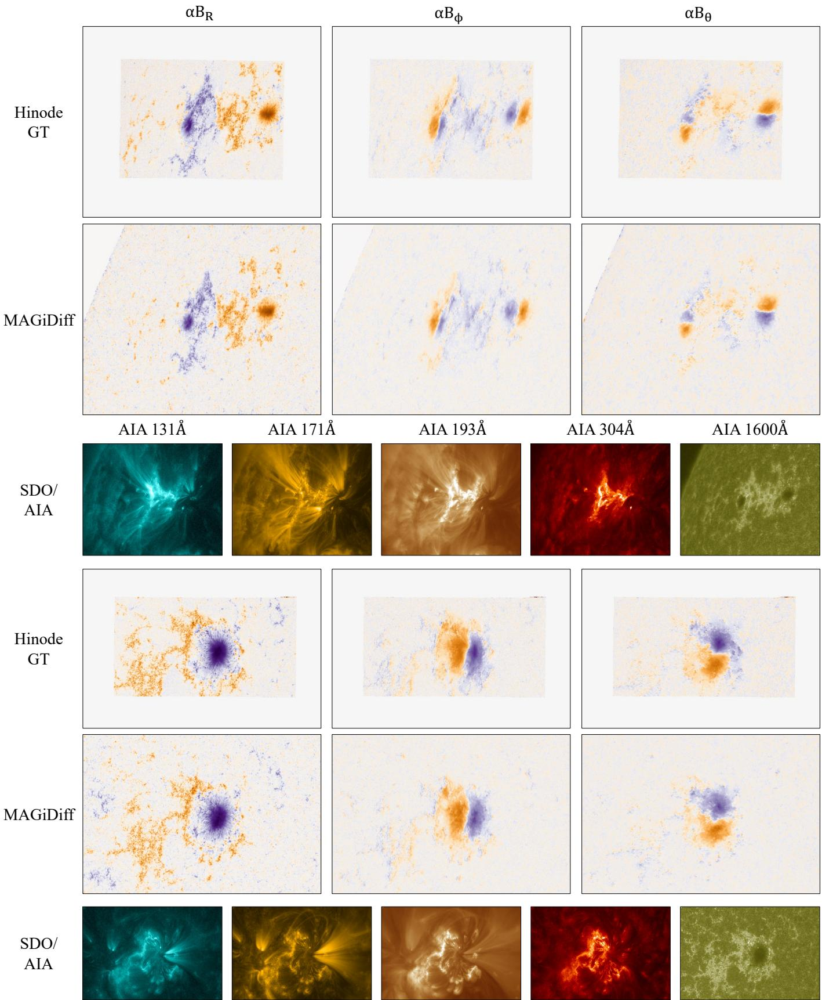  
Figure 13. Additional qualitative results for MAGiDif with Hinode/SOT-SP as reference. Example date: 2016 March 18, 23:36 TAI (upper panel); 2016 May 23, 01:12 TAI (lower panel). Colormaps: -3000 3000 Mx cm−2 following Figure 3.

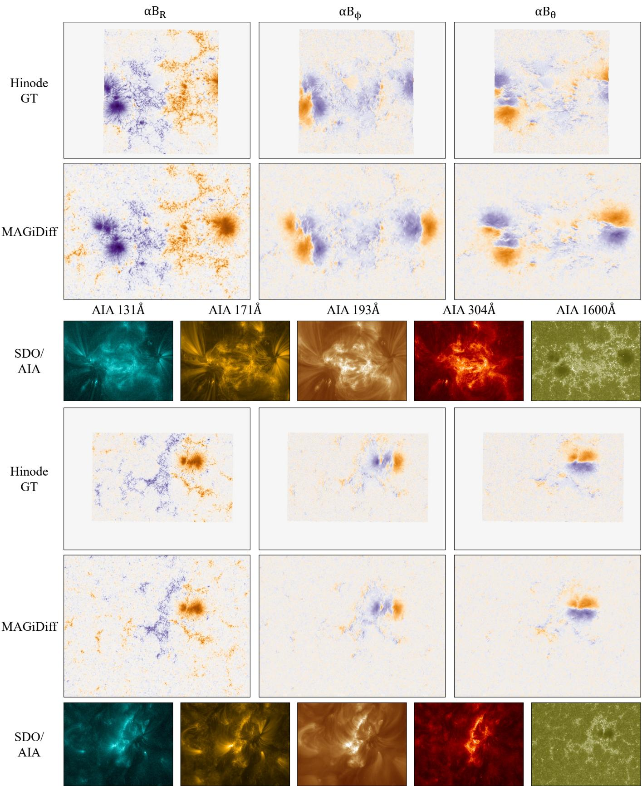  
Figure 14. Additional qualitative results for MAGiDif with Hinode/SOT-SP as reference. Example date: 2016 September 5, 14:24 TAI (upper panel); 2016 November 27, 19:36 TAI (lower panel). Colormaps: -3000 3000 Mx cm−2 following Figure 3.

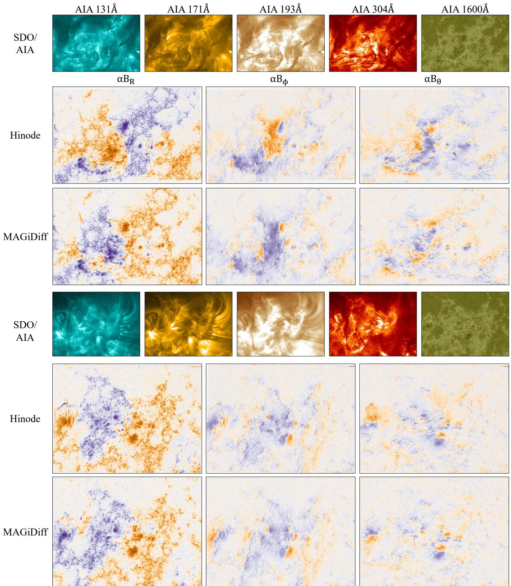  
Figure 15. Representative examples of MAGiDif predictions that contribute to y = −x branch in Figure 4. Example date: 2024 June 5, 08:12 TAI (upper panel); 2024 July 16, 20:00 TAI (lower panel). Colormaps: -3000 3000 Mx cm−2 following Figure 3.

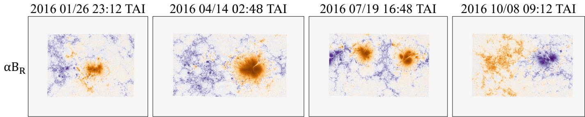  
Figure 16. Ground Truth $\alpha B _ { R }$ for four cutouts in Figure 8. Example dates from left to right: 2016 January 26, 23:12 TAI; 2016 April 14, 02:48 TAI; 2016 July 19, 16:48 TAI; 2016 October 8, 09:12 TAI. Colormap: -3000 3000 Mx cm−2 following Figure 3.

## C.2. Additional Stochastic Sampling Results

The evaluations presented in Section 4.4 use one realization per input in order to compare MAGiDif directly with the deterministic regression baseline. However, as a conditional difusion model, MAGiDif encodes a distribution of plausible magnetograms and is inherently stochastic: for a fixed UV/EUV conditioning input, diferent initial noise can yield diferent realizations drawn from the learned distribution. In this section, we examine this distribution through qualitative comparisons of independent realizations and a quantitative best-of-k analysis.

## C.2.1. Qualitative Comparison between Realizations

We begin with qualitative comparison of these realizations to determine where magnetic structures remain consistent and where stochastic variations occur. Figure 17 shows three independent realizations drawn from the same UV/EUV observations. The realizations recover almost identical large scale magnetic structures and polarity across α $B _ { R } , \alpha B _ { \phi }$ and $\alpha B _ { \theta }$ , indicating that the dominant magnetic structures are well constrained. Meanwhile, small diferences appear in localized weak-field regions, reflecting the stochastic nature of difusion sampling process. This behavior suggests that MAGiDif does not produce arbitrary samples, but instead generates multiple plausible magnetograms that remain consistent in well-constrained regions while allowing variation when the signal is weak or uncertain.

## C.2.2. Quantitative Comparison between Realizations

Given this constrained variation across realizations, we next use a best-of-k analysis to test whether drawing more samples increases the chance of obtaining a realization that more closely matches the Hinode/SOT-SP ground truth. Table 6 reports this evaluation using the same metrics and evaluation method as Table 2. For each sample in the test set, we draw k independent MAGiDif realizations and evaluate the realization with smallest error relative to the Hinode/SOT-SP ground truth.

This best-of-k evaluation is not intended to represent normal inference, where the ground truth is unavailable. Rather, it is a controlled test of the learned predictive distribution: if MAGiDif places probability mass near the ground truth magnetogram, then drawing more samples should increase the chance of obtaining a realization closer to the Hinode/SOT-SP ground truth. This trend is confirmed in Table 6: increasing k leads to consistent improvements in pixel-wise accuracy across all field components. In contrast, the distributional and structural metrics remain largely unchanged. These results indicate that additional sampling can increase the possibility of obtaining a realization that has better per-pixel correspondence with the Hinode/SOT-SP observation while keeping the overall pixel-value distribution, sharpness, and spectral characteristics. Together with Figure 17, these results show that stochastic variations among realizations permit generalization of multiple slightly diferent yet distributionally and structurally constrained magnetograms.

## C.3. Additional Full-Disk Quantitative Results

To quantitatively evaluate MAGiDif on the full-disk sample shown in Figure 10, Figure 18 presents hexbin plots comparing MAGiDif predictions with SuperSynthIA vector magnetograms for the full disk and for region A and B separately.

Realization 1  
Realization 2  
Realization 3  
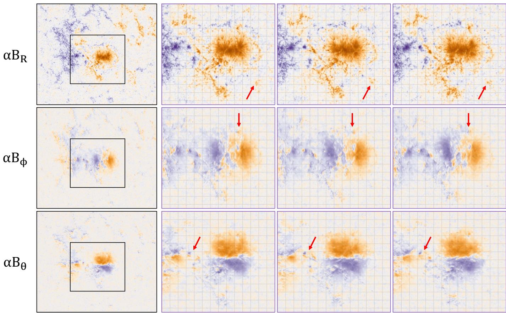  
Figure 17. Consistency of MAGiDif across multiple realizations for a single input. The leftmost column shows the full-field MAGiDif prediction for $\alpha B _ { R } , \alpha B _ { \phi } , \alpha B _ { \theta }$ , with black boxes indicating the zoomed regions. The remaining columns show zoomed-in predictions from three independent realizations generated from the same input. The realizations show consistent magnetic structure and polarity across all three components, while retaining small-scale stochastic variations, an example of which is marked by red arrows. This example demonstrates that, for a fixed input, MAGiDif defines a predictive distribution from which multiple plausible samples can be drawn. These samples remain largely consistent with one another in well-con strained regions, while allowing localized variation where signal is weak. Colormaps: $- 3 0 0 0 \ : \equiv \ : \equiv \ : 3 0 0 0 \ : \ : \mathrm { M x } \ : \mathrm { c m } ^ { - 2 } \ : \ : \mathrm { f o r } \ : \alpha B _ { R } ,$ $\alpha B _ { \phi } , \alpha B _ { \theta }$ following Figure 3. Data: 2016 January 26, 23:12 TAI.

Table 6. Best-of-N selection improves MAGiDif’s per-pixel accuracy with diminishing returns, while a single realization already attains its full structural fidelity. We evaluate MAGiDif on the test set when multiple attempts are permitted: for each input, MAGiDif samples N candidate realizations, and we evaluate the candidate with the smallest error against the Hinode/SOT-SP ground truth. Each cell lists best-of-N for $N = 1 , 4 , 1 6 , 3 2 .$ , with the best value in bold. Metrics follow Table 2: for each field component, MAE (lower is better) and %< 300 (higher is better) are computed over strong-field pixels with $| \alpha \mathbf { B } | > 1 0 0 0 \ \mathrm { M x } \mathrm { c m } ^ { - 2 }$ , while $W _ { 1 } ,$ , the ∇-ratio, ∇-MAE, and RALSD measure how well predictions reproduce the pixel-value distribution, sharpness, and power spectrum of the ground truth over all valid pixels.
<table><tr><td>Metric</td><td colspan="4"> $\overline { { \alpha B _ { R } } }$ </td><td colspan="4"> $\overline { { \alpha B _ { \phi } } }$ </td><td colspan="4"> $\overline { { \alpha B _ { \theta } } }$ </td><td colspan="4"> $\overline { { | \alpha { \bf B } | } }$ </td></tr><tr><td>MAE [Mx cm  $\overline { { ^ { - 2 } \mathrm { ~ l ~ } \downarrow } }$ </td><td>575.5|</td><td>|552.1 |538.4|</td><td>|533.1</td><td></td><td>304.3</td><td>|297.5</td><td>|293.3|</td><td>291.2</td><td>294.6</td><td>|286.3|</td><td>|282.0|</td><td>|280.0</td><td>372.8</td><td>|371.7|</td><td>|370.9</td><td>370.7</td></tr><tr><td>%&lt;300 ↑</td><td>49.1</td><td>49.9</td><td>50.4</td><td>50.6</td><td>69.8</td><td>70.5</td><td>71.0</td><td>71.2</td><td>71.3</td><td>72.1</td><td>72.5</td><td>72.7</td><td>57.0</td><td>57.2</td><td>57.3</td><td>57.4</td></tr><tr><td> $W _ { 1 } \ [ \mathrm { M x } \mathrm { c m } ^ { - 2 } \ ] \ \downarrow$ </td><td>14.9</td><td>15.0</td><td>15.0</td><td>15.1</td><td>10.5</td><td>10.5</td><td>10.5</td><td>10.5</td><td>10.9</td><td>10.9</td><td>10.9</td><td>10.9</td><td>24.7</td><td>24.8</td><td>24.8</td><td>24.9</td></tr><tr><td>∇-ratio →1</td><td>0.73</td><td>0.73</td><td>0.73</td><td>0.73</td><td>0.62</td><td>0.61</td><td>0.61</td><td>0.61</td><td>0.60</td><td>0.60</td><td>0.60</td><td>0.60</td><td>0.71</td><td>0.71</td><td>0.71</td><td>0.71</td></tr><tr><td> $\nabla \mathrm { - } \mathrm { M A E } \ [ \mathrm { M x } \mathrm { c m } ^ { - 2 } / \mathrm { p x } ] \downarrow$ </td><td>38.05|</td><td>|38.01|</td><td>|38.00|</td><td>|37.99</td><td>20.93|</td><td>|20.92|</td><td>|20.91</td><td>|20.91</td><td>20.96|</td><td>|20.95|</td><td>|20.94|</td><td>|20.94</td><td>34.72|</td><td>|34.68|</td><td>|34.67</td><td>|34.66</td></tr><tr><td>RALSD [dB] ↓</td><td>4.25</td><td>4.24</td><td>4.24</td><td>4.24</td><td>6.00</td><td>6.00</td><td>6.00</td><td>6.00</td><td>5.96</td><td>5.97</td><td>5.97</td><td>5.97</td><td>4.04</td><td>4.04</td><td>4.05</td><td>4.04</td></tr></table>

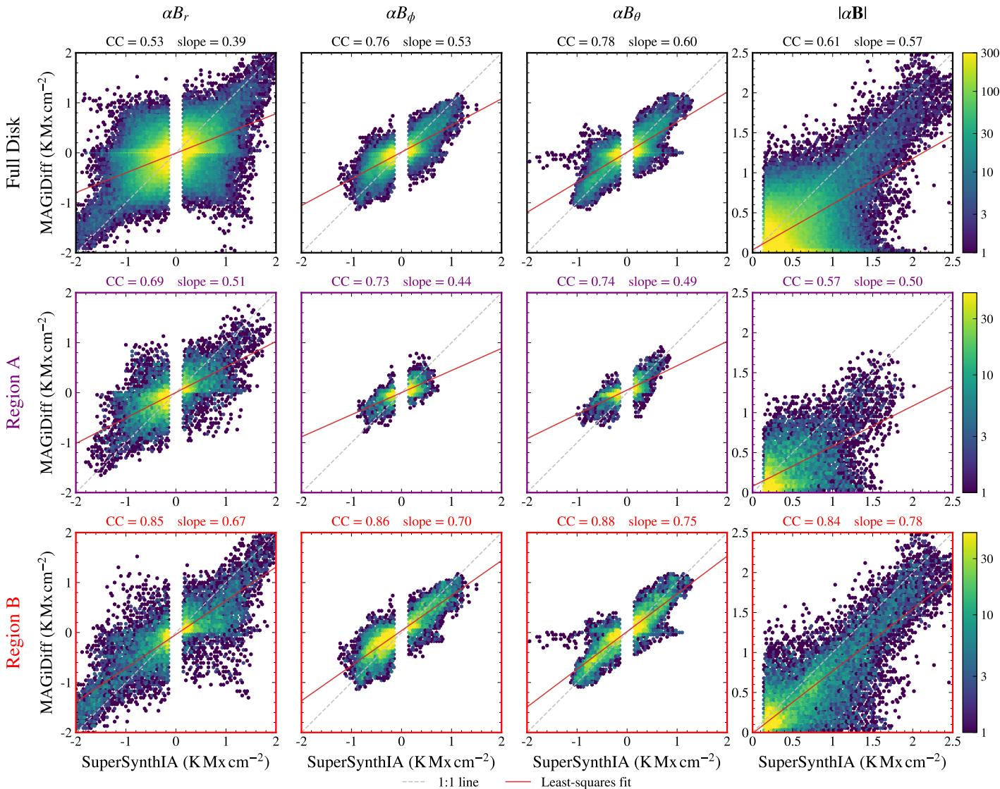  
Figure 18. Hexbin density plots of MAGiDif predictions against SuperSynthIA vector magnetograms for the full-disk sample shown in Figure 10. From left to right, each column corresponds to $x B _ { R } , \alpha B _ { \phi } , \alpha B _ { \theta }$ , and |αB|. From top to bottom, each row shows the hexbin plots for the full-disk, region A, and region B, respectively. Each panel shows the hexbin density together with a gray dashed line marking the 1:1 relation and a red line marking the least-squares fit on all pixels. We also report the Pearson correlation coeficient (CC) and the slope of the fit line on top of each panel. Most of the density concentrates near the 1:1 line, indicating strong agreement between MAGiDif prediction and the reference SuperSynthIA magnetogram, with the strongest agreement observed in the most active region B. Pixels with ground truth absolute value below 150 Mx cm−2 are omitted from all panels to make trends more apparent.

## C.4. Cross-Instrument Fine-Tuning Pipeline

To adapt MAGiDif to EUV instruments other than SDO/AIA, we keep the learning problem fixed and handle instrumental diferences during preprocessing. This preprocessing aims to bring each instrument’s EUV filtergrams into closer agreement with SDO/AIA filtergrams before fine-tuning. For each instrument, we first reproject all filtergrams onto a common grid and resample them to reduce pixel-resolution mismatch with SDO/AIA. We then calibrate the intensities to approximately the SDO/AIA range and set unavailable SDO/AIA channels to zero. The fine-tuned model therefore receives the same conditioning input: SDO/AIA-like EUV filtergrams, an on-disk mask, a heliographic latitude map, and a solar cycle indicator.

Since Hinode/SOT-SP does not co-observe STEREO/EUVI or GOES/SUVI densely enough for paired training, we use SuperSynthIA predictions as the target vector magnetograms. For each EUV observation, we take the nearest

Table 7. On the more challenging STEREO/EUVI cutouts, the fine-tuned MAGiDif still produces reasonable estimates, and best-of-k sampling improves performance. Evaluation setup follows Table 6.
<table><tr><td>Metric</td><td colspan="4"> $\overline { { \alpha B _ { R } } }$ </td><td colspan="4"> $\overline { { \alpha B _ { \phi } } }$ </td><td colspan="4"> $\overline { { \alpha B _ { \theta } } }$ </td><td colspan="4">|αB|</td></tr><tr><td> $\overline { { \mathrm { ~ M A E ~ } [ \mathrm { M x } \mathrm { c m } ^ { - 2 } ] \downarrow } }$ </td><td></td><td>779.0| |726.9|</td><td>|692.1</td><td>|677.6</td><td>355.6</td><td>|335.3|</td><td>|320.4|</td><td>|315.6</td><td>354.7|</td><td>|333.0|</td><td>|317.1</td><td>310.6</td><td>786.3|</td><td>|739.9|7</td><td>702.7</td><td>687.4</td></tr><tr><td> $\% { < } 3 0 0 \uparrow$ </td><td></td><td>22.3</td><td>24.2</td><td>25.1</td><td>51.6</td><td>54.1</td><td>56.3</td><td>56.9</td><td>52.0</td><td>54.7</td><td>56.9</td><td>57.9</td><td>19.5</td><td>22.0</td><td>24.0</td><td>25.0</td></tr><tr><td> $W _ { 1 } \ [ \mathrm { M x } \mathrm { c m } ^ { - 2 } \ ] \ \downarrow$ </td><td></td><td>19.9 9.2 9.3</td><td>9.2</td><td>9.2</td><td>4.6</td><td>4.7</td><td>4.6</td><td>4.5</td><td>4.5</td><td>4.5</td><td>4.5</td><td>4.4</td><td>12.7</td><td>12.8 1</td><td>12.7</td><td>12.6</td></tr><tr><td> $\nabla \mathrm { - r a t i o  1 }$ </td><td>0.75</td><td>0.75</td><td>0.75</td><td>0.75</td><td>0.70</td><td>0.70</td><td>0.70</td><td>0.70</td><td>0.70</td><td>0.69</td><td>0.69</td><td>0.69</td><td>0.76</td><td>0.75</td><td>0.75</td><td>0.75</td></tr><tr><td> $\nabla \mathrm { - } \mathrm { M A E } \ [ \mathrm { M x } \mathrm { c m } ^ { - 2 } / \mathrm { p x } ] \downarrow$ </td><td>18.40|</td><td>|18.28|</td><td>|18.20|</td><td>|18.16</td><td>5.27</td><td>5.21</td><td>5.17</td><td>5.15</td><td>5.51</td><td>5.45</td><td>5.40</td><td>5.39</td><td>18.03</td><td></td><td>|17.91 |17.83</td><td>17.79</td></tr><tr><td>RALSD [dB] ↓</td><td>3.93</td><td>3.93</td><td>3.94</td><td>3.96</td><td>4.73</td><td>4.71</td><td>4.70</td><td>4.70</td><td>4.16</td><td>4.14</td><td>4.14</td><td>4.15</td><td>3.85</td><td>3.85</td><td>3.86</td><td>3.88</td></tr></table>

SuperSynthIA $\alpha B _ { R } , \ \alpha B _ { \phi } , \ \alpha B _ { \theta }$ maps and reproject them onto the corresponding EUV filtergram grid. Because SuperSynthIA follows SDO/HMI αB sign convention, a flip on SuperSynthIA α $B _ { \theta }$ sign is necessary after reprojection to match the Hinode/SOT-SP convention used by the pretrained MAGiDif.

Fine-tuning proceeds in two stages. We first fine-tune the VAE on 256×256 pixel SuperSynthIA vector magnetogram crops so that its latent space is adapted to SuperSynthIA predictions rather than Hinode/SOT-SP magnetograms. This corresponds to approximately $1 5 3 ^ { \prime \prime } \times 1 5 3 ^ { \prime \prime }$ . We then load the pretrained denoising U-Net, replace the original VAE with the SuperSynthIA fine-tuned ${ \mathrm { V A E } } ,$ reset the optimizer, and fine-tune on instrument-specific pairs of EUV filtergrams and target magnetograms using $5 1 2 \times 5 1 2$ pixel crops, corresponding to approximately $3 0 6 ^ { \prime \prime } \times 3 0 6 ^ { \prime \prime }$ , while keeping the VAE frozen. Otherwise, the denoising training setup is unchanged.

During fine-tuning, we also use a sign-flip augmentation analogous to the one used in the cross solar cycle generalization test in Section 4.6. With probability 0.5, the target vector magnetogram is multiplied by −1 and the solar cycle indicator is changed from the current cycle parity to the opposite parity, while the EUV filtergrams and latitude map remain unchanged. This augmentation is included because instrument-specific fine-tuning datasets are relatively small and may not span multiple solar cycles. The remaining preprocessing is instrument specific.

## C.4.1. Adaption to STEREO/EUVI

Intuitively, directly applying MAGiDif trained on SDO/AIA data to STEREO/EUVI filtergrams will not work due to instrumental diferences in field of view, optical resolution, calibration, and degradation. We therefore make several adjustments before fine-tuning. We use data from 2022 to 2024 to construct the fine-tuning dataset because during this period STEREO-A/EUVI is near Earth and has substantial field-of-view overlap with SDO/HMI. This overlap is essential because we use SuperSynthIA predictions as the target vector magnetograms, and SDO/HMI stoke observations are the input to SuperSynthIA.

For the fine-tuning dataset, we use 171˚A, 195˚A, and 304˚A channels because they are the STEREO/EUVI passbands that overlap with SDO/AIA passbands. We sample candidate times at a 4-hour cadence and, because these channels are observed asynchronously on STEREO/EUVI, retain only timestamps for which all three channels are available within 5 minutes. Raw Level-0.5 FITS files are calibrated to Level-1 with SECCHI PREP pipeline in SolarSoft package (S. Freeland & B. Handy 1998), which applies bias subtraction, flat-field correction, and are converted to physical units $\mathrm { D N s ^ { - 1 } }$ . We then reproject the 195˚A and 304˚A maps onto the 171˚A coordinate frame and bilinearly upsample the resulting maps by a factor of 2.67× to match SDO/AIA’s angular pixel scale. We then reproject the SuperSynthIA vector magnetograms onto this upsampled grid. After filtering for valid paired full-disk EUV filtergrams and SuperSynthIA vector magnetograms, the STEREO/EUVI fine-tuning dataset contains 4949 pairs. We split these data temporally: 2022 January through 2023 June for training (2938 pairs), 2023 July through December for validation (523 pairs), and 2024 April through December for testing (1488 pairs).

The main STEREO/EUVI-specific challenge is photometric mismatch. The paired STEREO/EUVI–SDO/AIA intensity distributions are not well matched by a single afine correction, especially in the bright active-region and lowintensity tails. This mismatch is further complicated by long-term STEREO/EUVI degradation: the SECCHI PREP pipeline calibrates the raw data to Level-1, but it does not fully remove long-term changes in instrument sensitivity, so the STEREO/EUVI intensity distribution can vary substantially over the mission. We therefore use a time-varying quantile mapping in log(1 + x) space. The mapping is estimated from about 10 calibration pairs per available month from 2011 through 2025. Each pair consists of STEREO/EUVI and SDO/AIA observations taken close in time. We exclude September 2014 through November 2015 because STEREO-A/EUVI was in solar conjunction and data are unavailable. This leaves 1606 calibration pairs. For each pair, the on-disk pixels are sorted by intensity separately for STEREO/EUVI and SDO/AIA. The 0th, 1st, . . . , 100th percentiles of these sorted intensity values are then recorded for each STEREO/EUVI-to-aia channel pair (STEREO/EUVI 171˚A→ SDO/AIA 171˚A, STEREO/EUVI 195˚A→ SDO/AIA 193˚A, and STEREO/EUVI 304˚A→ SDO/AIA 304˚A). These percentiles form the raw calibration anchors for the lookup table by matching intensity values at the same percentile rank in the two instruments. For example, if the median on-disk STEREO/EUVI 195˚A intensity in a calibration pair is x and the median on-disk SDO/AIA 193˚A intensity in the corresponding SDO/AIA filtergram is y, then the 50th-percentile anchor maps $x \mapsto y .$ . The same procedure is applied to all percentiles, so the mapping matches the full intensity distribution.

Table 8. On strong-field GOES/SUVI cutouts, the fine-tuned MAGiDif produces reasonable estimates, with best-of-k sampling improves performance. Evaluation setup follow Table 6.
<table><tr><td>Metric</td><td colspan="4"> $\overline { { \alpha B _ { R } } }$ </td><td colspan="4"> $\overline { { \alpha B _ { \phi } } }$ </td><td colspan="4"> $\overline { { \alpha B _ { \theta } } }$ </td><td colspan="4"> $\overline { { | \alpha { \bf B } | } }$ </td></tr><tr><td> $\overline { { \mathrm { ~ M A E ~ } [ \mathrm { M x } \mathrm { c m } ^ { - 2 } ] \downarrow } }$ </td><td></td><td>805.0 | |747.6 1</td><td>|709.4|</td><td>|695.9</td><td>348.4|</td><td>|326.0|</td><td>|311.3|</td><td>|306.2</td><td>354.3|</td><td></td><td>|331.4|315.8|</td><td>309.9</td><td>791.7|</td><td>|750.9|</td><td>717.3</td><td>704.2</td></tr><tr><td>%&lt;300↑</td><td></td><td>19.2 21.5</td><td>23.4</td><td>24.1</td><td>53.0</td><td>55.7</td><td>57.7</td><td>58.5</td><td>52.3</td><td>54.9</td><td>57.1</td><td>57.9</td><td>19.3</td><td>21.4</td><td>23.3</td><td>24.1</td></tr><tr><td> $W _ { 1 } \ [ \mathrm { M x } \mathrm { c m } ^ { - 2 } \ ] \ \downarrow$ </td><td></td><td>8.1 8.1</td><td>8.1</td><td>8.0</td><td>4.2</td><td>4.3</td><td>4.2</td><td>4.2</td><td>4.1</td><td>4.1</td><td>4.1</td><td>4.0</td><td>11.4</td><td>11.5 1</td><td>11.4</td><td>11.3</td></tr><tr><td> $\nabla \mathrm { - r a t i o  1 }$ </td><td></td><td>0.78 0.78</td><td>0.78</td><td>0.78</td><td>0.72</td><td>0.71</td><td>0.71</td><td>0.71</td><td>0.72</td><td>0.72</td><td>0.71</td><td>0.72</td><td>0.79</td><td>0.78</td><td>0.78</td><td>0.78</td></tr><tr><td>∇-MAE [Mxcm−2/px] ↓</td><td>19.12|</td><td>18.99</td><td>|18.90|</td><td>|18.86</td><td>5.37</td><td>5.32</td><td>5.27</td><td>5.26</td><td>5.62</td><td>5.56</td><td>5.51</td><td>5.50</td><td>18.73|</td><td></td><td>|18.61 |18.51 </td><td>18.48</td></tr><tr><td>RALSD [dB] ↓</td><td>2.72</td><td>2.73</td><td>2.72</td><td>2.72</td><td>3.70</td><td>3.73</td><td>3.72</td><td>3.72</td><td>3.65</td><td>3.65</td><td>3.65</td><td>3.64</td><td>2.69</td><td>2.70</td><td>2.70</td><td>2.69</td></tr></table>

The calibration anchors are grouped into semiannual time bins. Within each bin and each channel pair, the matched percentile values are median-aggregated to form a stable lookup curve from STEREO/EUVI intensity to SDO/AIA intensity. The curves are smoothed with a three-bin rolling median, and monotonicity is enforced. This produces a lookup curve with 101 breakpoints.

To map a STEREO/EUVI intensity value, we first apply log(1 + x) and then linearly interpolate between the neighboring breakpoints, using linear extrapolation for values outside the stored breakpoint range. This places the STEREO/EUVI values on the same log(1 + x) intensity scale as the SDO/AIA inputs used to pretrain MAGiDif. After this transform, training proceeds with standard SDO/AIA normalization.

This correction reduces the dominant distribution shift associated STEREO/EUVI degradation, but it does not make the model equally reliable at all observation times. Because the fine-tuning dataset is restricted to observation from 2022 through 2024, when STEREO-A/EUVI has substantial overlap with SDO/HMI, we expect the fine-tuned MAGiDif model to be most reliable near this time range. Applying the model to much earlier STEREO/EUVI observations may therefore require additional adjustment, either by extending the fine-tuning dataset to earlier observations or by improving the calibration for long-term STEREO/EUVI intensity changes.

We quantify the fine-tuned MAGiDif performance on the held out test set in Table 7, using SuperSynthIA as the reference.

## C.4.2. Adaption to GOES/SUVI

As a second cross-instrument adaption test, we fine-tune MAGiDif on the Solar Ultraviolet Imager (SUVI) onboard GOES–16/SUVI and GOES–18/SUVI.

For the fine-tuning dataset, we use 94˚A, 131˚A, 171˚A, 195˚A, and 304˚A channels since they are the passbands that overlap with SDO/AIA passbands. We sample the Level-2 FITS products at a 4-hour cadence and require all selected channels to be observed within 10 minutes from each other. For each timestamp, the five GOES/SUVI filtergrams are coaligned to the 171˚A coordinate frame and then bilinearly upsampled by 4.17× to match SDO/AIA’s angular pixe scale. We then reproject the SuperSynthIA vector magnetograms onto the upsampled GOES/SUVI grid.

The fine-tuning dataset spans 2022 through 2024 and contains 7475 data pairs across GOES–16/SUVI and GOES–18/SUVI. After filtering, the train/validation/test datasets contain 3160/1231/2208 samples. As in the STEREO/EUVI fine-tuning experiment, we split the data temporally: 2022 January through 2023 June for training, 2023 July through December for validation, and 2024 April through December for testing.

We use the calibrated Level-2 products directly and normalize the inputs in log(1 + x) space. Since the two satellites are not fully intercalibrated, we compute separate per-channel means and standard deviations for GOES–16/SUVI and GOES–18/SUVI. Fine-tuning is then performed on combined data pairs from both satellites, with each sample normalized using the parameters for its source satellite.

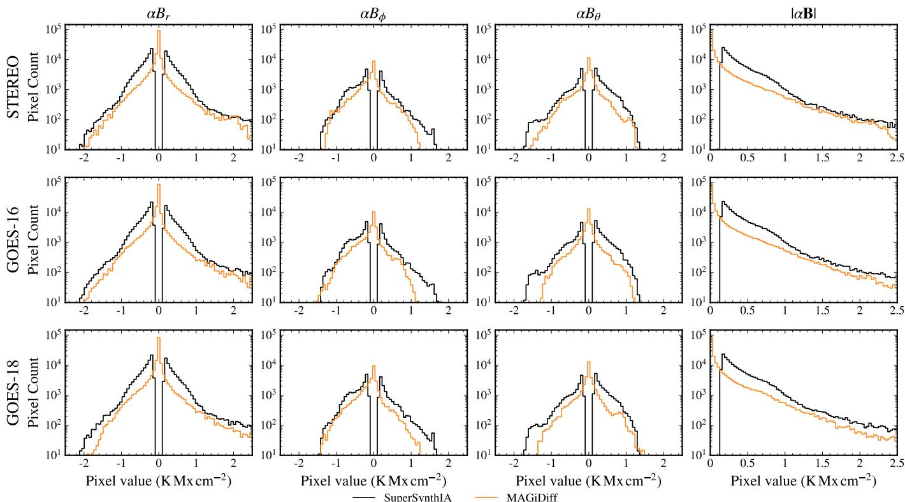  
Figure 19. Pixel-value histograms comparing MAGiDif predictions with the corresponding SuperSynthIA vector magnetograms for the full-disk observation shown in Figure 11. From left to right, each column correspond to $\alpha B _ { R } , \alpha B _ { \phi } , \alpha B _ { \theta }$ , and |αB|. From top to bottom, the row correspond to full-disk STEREO/EUVI, GOES–16/SUVI, and GOES–18/SUVI predictions, respectively.

The fine-tuned MAGiDif performance on the held out test set is evaluated in Table 8, using SuperSynthIA as the reference.

## C.4.3. Additional Quantitative Results

Figure 19 provides an additional quantitative analysis of the full-disk predictions shown in Figure 11, comparing the MAGiDif prediction distributions with those of the corresponding reference SuperSynthIA magnetograms.