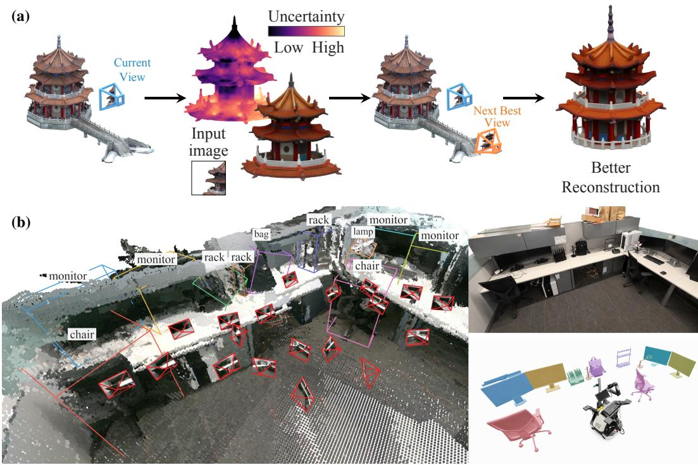
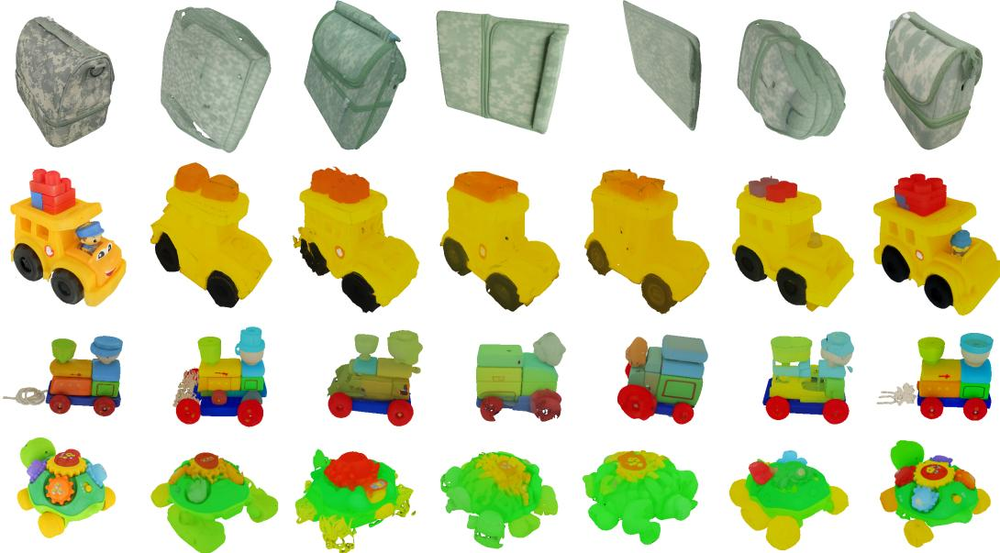
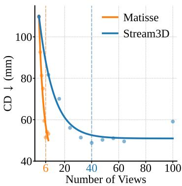
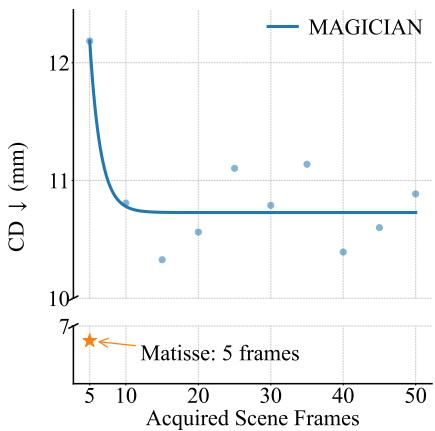
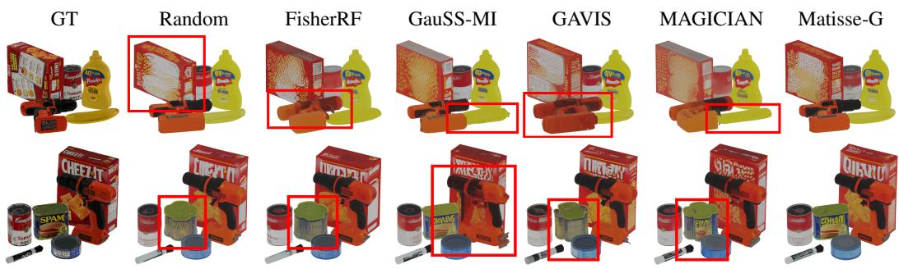
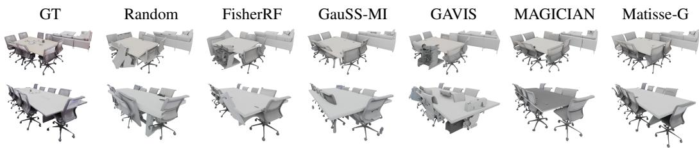
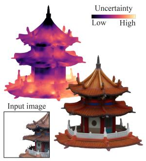
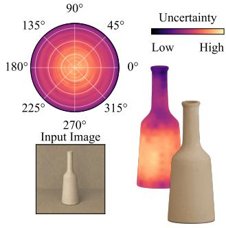
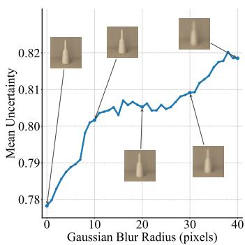

# MATISSE: EVIDENCE-SPACE REASONING FOR ACTIVE 3D RECONSTRUCTION

Xihang Yu1∗, Kaichen Zhou1, Lorenzo Shaikewitz1, Clément Jambon1, Xiao Zhan1 Rajat Talak2, Luca Carlone1

1Massachusetts Institute of Technology 2National University of Singapore

## ABSTRACT

How can a 3D reconstruction system acquire and retain useful information to understand the geometry of a scene from partial views under a limited computation budget? Existing active view acquisition methods typically estimate uncertainty over observed or instantiated geometry, limiting their ability to reason about unseen structure, while long-horizon reconstruction methods often retain redundant observations. We introduce Matisse, a training-free framework that unifies active reconstruction and keyframe selection by leveraging evidence provided by a pretrained generative 3D model. Matisse estimates Evidential Uncertainty from cross-attention evidence associated with 3D latent tokens and derives an Evidential Information Gain to guide both view acquisition and keyframe selection based on the expected reduction in posterior entropy. Matisse supports multi-object scenes through occlusion-aware, object-balanced aggregation and propagates uncertainty through intermediate latents to avoid full reconstruction during planning. Matisse reduces Chamfer distance by 12.7%, 3.8%, and 9.2% on GSO30, YCB-V, and Replica, respectively, relative to the best baseline on each dataset, and achieves a 1.50× end-to-end speedup over the best active reconstruction baseline on GSO30 with the same reconstruction backend. In the GSO30 keyframe selection experiment for long-horizon reconstruction, Matisse achieves comparable Chamfer distance using 14% of the input views compared with Stream3D.

## 1 INTRODUCTION

How can a 3D reconstruction system (Chen et al., 2026; Xiang et al., 2026a; Zhang et al., 2026; Schmid et al., 2026) acquire and retain useful information to understand the geometry of a scene from partial views under a limited computation budget? This question connects two problems across computer vision and robotics: active reconstruction, which selects the next-best-view to acquire, and keyframe selection for long-horizon reconstruction, which selects a subset of views to retain as more frames are collected. Although these problems concern different stages of reconstruction, both require assessing how much information an observation contributes beyond the evidence available.

Existing active reconstruction methods represent scenes using occupancy grids (Zhou et al., 2021; Guédon et al., 2022; 2023), neural radiance fields (Lee et al., 2022; Pan et al., 2022; Yan et al., 2023; Feng et al., 2024), or Gaussian splatting (Jiang et al., 2024; Xie et al., 2025; Li et al., 2025; Chen et al., 2025; Jin et al., 2025; Xue et al., 2026; Jeong et al., 2026; Jun-Seong et al., 2026). These methods typically model uncertainty within the current reconstruction and use it to guide subsequent observations. However, uncertainty defined over observed or instantiated geometry, i.e., reconstruction space, can provide an incomplete account of the priors we might have about unobserved space, resulting in suboptimal view selection. Long-horizon reconstruction using generative models refers to incrementally building and updating a 3D scene with a generative model over an extended sequence of observations. This setting poses a complementary challenge: retaining useful observations while keeping memory use and per-update computation bounded as the input sequence grows. Keyframe selection is a longstanding approach in simultaneous localization and mapping (SLAM) (Mur-Artal et al., 2015; Maggio & Carlone, 2026), but remains less explored in generative reconstruction.

  
Figure 1: Overview of Matisse. (a) Active reconstruction workflow. Given the current observation, Matisse estimates uncertainty over observed and unobserved geometry, selects the next best view, and as more frames are acquired, it decides which keyframes to retain to achieve a more complete reconstruction. (b) Real robot experiment. The aggregated depth point cloud with selected camera views and object bounding boxes (left), alongside the real captured scene image (upper right) and reconstructed object meshes (lower right).

Approaches that jointly incorporate all frames through weighted multi-diffusion (Bar-Tal et al., 2023; Li et al., 2026a) become computationally expensive as the sequence grows. Stream3D (Zhou et al., 2026) addresses memory growth through Adaptive Evidential Memory (AEM). AEM uses cross-attention between image features and 3D query tokens to assign each observation an evidence weight for each token, measuring how strongly that observation supports the token. We refer to these observation-to-token weights, organized over a shared set of spatially aligned 3D tokens, as evidence space. This representation makes it possible to aggregate support from different views at corresponding 3D locations. AEM retains a fixed number of high-evidence frame indices per token, bounding the retained evidence while still processing every incoming frame. Selecting keyframes therefore remains an important opportunity for improving efficiency.

These limitations motivate a shared question: Can a unified evidence-space formulation of scene representation, uncertainty, and information gain guide which observations to acquire and retain? We introduce Matisse, a training-free framework that represents scenes in the evidence space of a pretrained generative 3D model. From this formulation, Matisse derives uncertainty and information gain to guide both active view selection and long-horizon keyframe selection.

First, to quantify how well the acquired observations support each part of the scene, we introduce Evidential Uncertainty (EU). Matisse formulates Adaptive Evidential Memory as a maximum a posteriori (MAP) estimation over 3D latent tokens and derives uncertainty from the posterior covariance. This connects evidence aggregation and uncertainty estimation within a shared, spatially aligned latent representation. Because these tokens represent both observed and generatively completed geometry, EU can characterize uncertainty beyond the currently observed surfaces.

Second, to identify views that provide information beyond the current observations, we introduce Evidential Information Gain (EIG). EIG measures the expected reduction in uncertainty from additional evidence. Inspired by FisherRF’s information-driven planning (Jiang et al., 2024), Matisse models how additional observations can reduce uncertainty. Whereas FisherRF evaluates information gain through a local approximation over reconstruction-space model parameters, Matisse evaluates it in the evidence space incorporating generative scene hypotheses. This allows acquiring and retaining views, while accounting for evidence relevant to both observed and occluded regions.

Third, we develop efficient evidence-space view selection. By defining EU and EIG in evidence space, we score candidate views without expensive mesh generation. Batched GPU-accelerated evaluation further reduces the amortized scoring time to 1.26 ms per candidate.

Fourth, we integrate these components into a scalable reconstruction system. Visibility-aware, objectbalanced aggregation extends the information-gain criterion to multi-object scenes, accounting for occlusion while balancing the contributions of individual objects. An occupancy-stability termination test determines when to stop acquiring observations.

We evaluate Matisse on GSO30 single-object reconstruction (Downs et al., 2022), YCB-V tabletop scenes (Calli et al., 2015), and Replica room-scale environments (Straub et al., 2019). Matisse reduces the Chamfer distance (CD) versus the best prior active-reconstruction baselines by 12.7%, 3.8%, and 9.2%, respectively. On GSO30, it reduces P-FID by 9.6% and runs 1.50× faster than the strongest prior active-view planner using the same Stream3D backend. Beyond active reconstruction, the same EIG criterion enables long-horizon keyframe selection, preserving comparable generation quality while using 14% as many input views as Stream3D. These results establish evidence-space reasoning as a shared foundation for deciding where to acquire and which observations to retain.

## 2 RELATED WORK

Scene Representations for Active Reconstruction. Scene representations have played a central role in active reconstruction. Active reconstruction methods use geometric landmarks and occupancy maps (Sim & Roy, 2005; Bourgault et al., 2002; Stachniss et al., 2005; Carlone et al., 2010; Jadidi et al., 2015; Bircher et al., 2016; Zhou et al., 2021; Guédon et al., 2022; 2023), neural radiance fields (Lee et al., 2022; Pan et al., 2022; Yan et al., 2023; Feng et al., 2024), or Gaussian splatting (Jiang et al., 2024; Xie et al., 2025; Li et al., 2025; Chen et al., 2025; Jin et al., 2025; Xue et al., 2026; Jeong et al., 2026; Jun-Seong et al., 2026) to represent scenes and guide view selection. To reason beyond observed surfaces, learned completion methods predict unobserved geometry (Guédon et al., 2022; 2023; Li et al., 2026b). MAGICIAN (Li et al., 2026b), for example, predicts unseen occupancy and converts it into Gaussian primitives for uncertainty rendering. In contrast, we use a generative 3D foundation model as the reconstruction backbone and maintain the scene as an implicit 3D evidence memory. This formulation provides a learned geometric completion prior for occluded and unobserved regions while permitting efficient uncertainty propagation as new observations arrive.

Uncertainty and Information Gain. Active perception requires an uncertainty measure predicting the utility of candidate observations. Existing methods guide acquisition using uncertainty or confidence measures derived from predictive variance, rendering coverage, transmittance, or geometric support (Pan et al., 2022; Chen et al., 2025; Li et al., 2025; Jin et al., 2025; Xue et al., 2026). However, observing the most uncertain region does not necessarily yield the greatest information gain. Information-driven approaches instead evaluate expected uncertainty reduction (Bourgault et al., 2002; Stachniss et al., 2005; Carlone et al., 2010; Jadidi et al., 2015). FisherRF (Jiang et al., 2024) approximates information gain about reconstruction-model parameters using the curvature of the rendering likelihood, while GauSS-MI (Xie et al., 2025) evaluates mutual information between Gaussian reliability and future observations. However, these formulations remain tied to the instantiated scene representation. FisherRF relies on a local, second-order approximation around the current parameter estimate, while GauSS-MI models the reliability of existing Gaussian primitives. Consequently, they do not explicitly represent the uncertainty or priors over the unobserved portion of the scene. In contrast, we derive uncertainty and information gain from plausible scene completions from a diffusion model. Our formulation is therefore global in scene-hypothesis space, rather than being restricted to a local geometry around the current model parameters.

## 3 PROBLEM SETUP

We study how a 3D reconstruction system can acquire and retain useful information to recover scene geometry from partial views under a limited computation budget. This problem involves two coupled decisions: where to observe next and which observations to retain. At each time step t, a mobile agent acquires an RGB-D observation $( I _ { t } , D _ { t } )$ from camera views $v _ { t }$ with camera pose $c _ { t } \in \mathrm { S E } ( 3 )$ To acquire useful information, the agent selects the next feasible viewpoint $c _ { t + 1 }$ based on its current estimate of the scene geometry. To retain useful information, the system selects keyframes from the observations collected so far for reconstruction.

## 4 PRELIMINARY

3D Generative Model. Recent 3D generative models (Xiang et al., 2025; Chen et al., 2026; Xiang et al., 2026a) use a two-stage pipeline: a sparse-structure (SS) stage predicts coarse occupancy, followed by a structured-latent (SLAT) stage that models geometry and appearance. Both stages represent the object using spatially aligned 3D tokens in a canonical coordinate frame. Let $q \in$ $\{ 1 , \ldots , Q \}$ index the canonical tokens; for example, $Q = 1 6 ^ { 3 } = 4 0 9 6$ in SAM3D.

Adaptive Evidential Memory. Our method builds on Adaptive Evidential Memory (AEM), introduced by Stream3D (Zhou et al., 2026), to combine observations at shared spatial locations in the canonical 3D token grid. For each acquired view $v \in \mathcal { V } _ { t }$ , an evidence weight $M _ { v } [ q ] \ge 0$ measures how strongly the image features support the token at location q. A low weight indicates weak support from that image, as may occur when the corresponding region is occluded or outside the field of view.

For each token, AEM retains up to the D highest evidence weights over all observed views together with the indices of the views that supplied them. These paired entries form the evidence memory $M \in \mathbb { R } ^ { Q \times D }$ and frame-index memory $\boldsymbol { F } \in \mathbb { N } ^ { Q \times D }$ . To select views for reconstruction, tokens vote for views recorded in their frame-index memory, and these votes are aggregated across tokens to choose K views. The resulting set $\mathcal { V } _ { t } ^ { * } \subseteq \mathcal { V } _ { t }$ supplies the features used for reconstruction.

We focus on the sparse-structure stage, which predicts the object’s coarse occupancy (Chen et al., 2026). At each token $q ,$ the selected views contribute latent features $V _ { \theta } ( z _ { t } , v ) [ q ]$ , which are combined using their normalized evidence weights:

$$
\bar { V } _ { \theta } ( z _ { t } ) [ q ] = \sum _ { v \in \mathcal { V } _ { t } ^ { * } } \bar { M } _ { v } [ q ] V _ { \theta } ( z _ { t } , v ) [ q ] , \qquad \bar { M } _ { v } [ q ] = \frac { M _ { v } [ q ] } { \sum _ { u \in \mathcal { V } _ { t } ^ { * } } M _ { u } [ q ] } .\tag{1}
$$

Thus, views with larger evidence weights contribute more strongly to the fused feature at each 3D location. The sparse-structure generator denoises the fused representation and decodes it into an occupancy prediction.

## 5 METHOD

We propose an evidence-space view selection framework for 3D object reconstruction that builds on Stream3D’s canonical evidence memory (Zhou et al., 2026) over sparse 3D tokens. We derive evidential uncertainty from this memory (Section 5.1) and use it to formulate information gain for evaluating candidate views (Section 5.2). We then integrate these quantities into an efficient view-selection system (Section 5.3).

## 5.1 EVIDENTIAL UNCERTAINTY

Our key idea is to interpret Stream3D’s association weights probabilistically: a view that provides stronger support for a 3D token should contribute a more precise estimate of its representation. To formalize this intuition, let $x [ q ] \in \mathbb { R } ^ { d }$ denote the unknown, view-independent representation of canonical token $q .$ . We interpret Stream3D’s association weight $M _ { v } [ q ]$ as indicating how strongly we should trust view v’s observation of token $q .$ Specifically, consider the Gaussian model

$$
p ( x [ q ] ) = \mathcal { N } \bigg ( \mu _ { 0 } , \frac { \sigma ^ { 2 } } { \alpha } I \bigg ) , \qquad p ( V _ { \theta } ( z _ { t } , v ) [ q ] \ | \ x [ q ] ) = \mathcal { N } \bigg ( x [ q ] , \frac { \sigma ^ { 2 } } { M _ { v } [ q ] } I \bigg ) ,\tag{2}
$$

where a view with $M _ { v } [ q ] = 0$ contributes no likelihood term and α $> 0$ is prior pseudo-evidence. This interpretation allows us to derive uncertainty directly from Stream3D’s existing evidence memory. With Gaussian conjugacy, we obtain the following result.

## Theorem 1: MAP Estimate

Define the accumulated evidence score of token q after observing $\mathcal { V } _ { t } ^ { * }$ as

$$
E _ { t } [ q ] : = \sum _ { v \in \mathcal { V } _ { t } ^ { * } } M _ { v } [ q ] ,\tag{3}
$$

where larger values represent stronger or repeated observational support. Given the prior and measurements with likelihoods as in Eq. (2), the resulting token posterior is

$$
\begin{array} { c } { { p ( x [ q ] \mid \mathcal { V } _ { t } ^ { * } ) = \mathcal { N } ( \mu _ { t } [ q ] , \Sigma _ { t } [ q ] ) , } } \\ { { \displaystyle \mu _ { t } [ q ] = \frac { \alpha \mu _ { 0 } + \sum _ { v \in \mathcal { V } _ { t } ^ { * } } { M _ { v } [ q ] V _ { \theta } ( z _ { t } , v ) [ q ] } } { \alpha + E _ { t } [ q ] } , } } \end{array} \Sigma _ { t } [ q ] = \frac { \sigma ^ { 2 } } { \alpha + E _ { t } [ q ] } I .\tag{4}
$$

Its unique maximum-a-posteriori estimate is $x ^ { \mathrm { M A P } } [ q ] = \mu _ { t } [ q ]$

The proof is provided in Appendix A.1.

Connection to Stream3D Fusion. Substituting $\begin{array} { r } { E _ { t } [ q ] = \sum _ { v \in \mathcal { V } _ { t } ^ { * } } M _ { v } [ q ] } \end{array}$ and Eq. (1) into the posterior mean from Theorem 1 gives the exact relation $\begin{array} { r } { \mu _ { t } [ q ] = \frac { \alpha } { \alpha + E _ { t } [ q ] } \mu _ { 0 } + \frac { E _ { t } [ q ] } { \alpha + E _ { t } [ q ] } \bar { V } _ { \theta } ( z _ { t } ) [ q ] } \end{array}$ . When the prior pseudo-evidence is small relative to the accumulated observation evidence, $\alpha \ll E _ { t } [ q ]$ , this relation reduces to $x ^ { \mathrm { M A P } } [ q ] = \mu _ { t } [ q ] \approx { \bar { V } } _ { \theta } ( z _ { t } ) [ q ]$ . Thus, in the evidence-dominated regime, Stream3D’s normalized feature fusion is approximately the MAP estimate of the view-independent canonical token representation in Theorem 1.

Beyond the fused representation, the posterior covariance quantifies the remaining uncertainty in each token. Following the A-optimality criterion (Sim & Roy, 2005), we summarize this uncertainty by the covariance trace and normalize it by its prior value.

## Definition 2: Evidential Uncertainty

Normalizing the posterior variance by its value before any view is observed defines the bounded token uncertainty

$$
U _ { t } [ q ] : = { \frac { \mathrm { t r } \Sigma _ { t } [ q ] } { \mathrm { t r } \Sigma _ { 0 } [ q ] } } = { \frac { \alpha } { \alpha + E _ { t } [ q ] } } .\tag{5}
$$

## 5.2 EVIDENTIAL INFORMATION GAIN

For view selection, we evaluate information gain over the predicted occupied canonical tokens, including those representing generatively completed geometry. All subsequent token sums and visibility sets are restricted to these occupied tokens. For each such token, the Gaussian posterior $p ( x [ q ] \mid ^ { \cdot } \mathcal { V } _ { t } ^ { \ast } ) = \mathcal { N } ( \mu _ { t } [ q ] , \Sigma _ { t } [ q ] )$ allows us to quantify the information gained from a candidate view as the expected reduction in posterior entropy, as formalized below.

## Theorem 3: Evidential Information Gain

For a candidate camera c that contributes evidence $M _ { c } [ q ]$ , define the token-wise information gain as its expected reduction in posterior entropy,

$$
\mathrm { I G } _ { t } ( q , c ) : = H ( x [ q ] \mid \mathcal { V } _ { t } ^ { * } ) - H ( x [ q ] \mid \mathcal { V } _ { t } ^ { * } , c ) = \frac { 1 } { 2 } \log \frac { | \Sigma _ { t } [ q ] | } { | \Sigma _ { t + 1 } [ q ; c ] | } = \frac { d } { 2 } \log \left( 1 + \frac { M _ { c } [ q ] } { \alpha + E _ { t } [ q ] } \right) .\tag{6}
$$

Let $\Omega ( c )$ denote the set of canonical tokens visible from candidate camera c. Assume conditionally independent token latents, small incremental candidate evidence, and the binary-visibility approximation $M _ { c } [ q ] \approx \mathbf { 1 } [ q \in \Omega ( c ) ]$ Then maximizing the candidate information gain is approximated by maximizing

$$
\widehat { \Pi } _ { t } ( c ) : = \sum _ { q \in \Omega ( c ) } U _ { t } [ q ] .\tag{7}
$$

The proof of Theorem 3 is provided in Appendix A.2. We compute $\Omega ( c )$ by projecting the canonical token grid into candidate camera c and applying a depth-buffer visibility test.

## 5.3 EVIDENCE-SPACE VIEW SELECTION

Building on the evidential uncertainty and information gain derived above, we present a view-selection system that combines multi-object aggregation, efficient candidate scoring, and geometric exploration, and stops acquiring views when the reconstruction stabilizes.

Multi-Object Formulation. For a scene containing $N _ { \mathrm { o b j } }$ reconstructed objects, let $\mathcal { Q } _ { t } ^ { ( i ) }$ denote the occupied canonical tokens of object i. We normalize each object’s visible information gain by its token count, $\begin{array} { r } { \widehat { \mathrm { I G } } _ { t } ^ { ( i ) } ( c ) = \sum _ { q \in \Omega ^ { ( i ) } ( c ) } U _ { t } ^ { ( i ) } [ q ] / | \mathcal { Q } _ { t } ^ { ( i ) } | } \end{array}$ , and average across objects to obtain the scenelevel score, $\widehat { \mathrm { I G } } _ { t } ^ { \mathrm { s c e n e } } ( c ) = \sum _ { i = 1 } ^ { N _ { \mathrm { o b j } } } \widehat { \mathrm { I G } } _ { t } ^ { ( i ) } ( c ) / N _ { \mathrm { o b j } }$ . This gives each object equal weight, preventing denser token grids from dominating view selection. The score requires no additional prediction head: it is computed directly from the evidence memory and decreases as evidence accumulates over a fixed set of visible tokens.

Efficient Evidence-Space View Selection. View selection requires only sparse-structure decoding and online uncertainty updates using Eq. (5), avoiding the expensive SLAT stage. We further batch information-gain calculations across candidate views on the GPU, achieving an amortized scoring time of 1.26 ms per candidate.

Occupancy-Stability Termination. We stop acquiring views once the decoded sparse-structure occupancy stabilizes. Let $\mathcal { P } _ { t }$ and $\mathcal { P } _ { t - 1 }$ be the occupied positions in the canonical $6 4 ^ { 3 }$ sparse-structure decoded voxel grid at two consecutive reconstruction steps. For two sets A and $B ,$ , the symmetric difference A $\triangle ^ { \cdot } B : = ( A \setminus B ) \cup ( B \setminus A )$ contains elements belonging to exactly one of the two sets. We measure the relative change as $\Delta _ { t } \stackrel { \cdot } { = } | \mathcal { P } _ { t } \triangle \mathcal { P } _ { t - 1 } | / | \mathcal { P } _ { t } \cup \mathcal { P } _ { t - 1 } |$ and terminate if $\Delta _ { t } < \tau _ { \mathrm { o c c } }$ . We also impose a maximum view budget. The test is applied only when a previous reconstruction exists. For a multi-object scene, it is evaluated independently for each object: converged objects are frozen while active objects continue along the shared camera trajectory.

Exploration Factor. Our approximate information-gain score does not explicitly account for proximity to previously acquired camera poses. To encourage exploration, we weight information gain by viewpoint diversity. Let $S _ { t }$ denote the camera poses acquired by step t and $\rho ( c , c ^ { \prime } )$ the distance between two poses. The distance from candidate c to its nearest acquired pose is $\rho ( c , S _ { t } ) =$ min $_ { c ^ { \prime } \in { \cal S } _ { t } } \rho ( c , c ^ { \prime } )$ . We define the exploration factor as $w ( c ; S _ { t } ) = 1 - \lambda \exp \bigl ( - \rho ( c , S _ { t } ) ^ { 2 } / ( 2 \ell ^ { 2 } ) \bigr )$ where $\lambda$ controls the maximum redundancy penalty and ℓ its distance scale. This factor downweights views near previously acquired poses and approaches one for more distant candidates. Given a user-defined set of feasible camera poses $\mathcal { C } _ { t }$ (see Appendix C.2 for our setup), we select

$$
\widehat { c } _ { t + 1 } = \arg \operatorname* { m a x } _ { c \in \mathcal { C } _ { t } } s _ { t } ( c ) , \qquad s _ { t } ( c ) : = \widehat { \mathrm { I G } } _ { t } ^ { \mathrm { s c e n e } } ( c ) w ( c ;  { S } _ { t } ) .\tag{8}
$$

Beyond this one-step policy, Matisse also supports receding-horizon planning to account for future rewards, as detailed in Appendix B.

Keyframe Selection. For keyframe selection, we apply the same view-selection rule to a given sequence of posed observations, using the camera poses of unselected frames as the candidate set $\mathcal { C } _ { t }$ Starting from an initial frame, we select the frame with the highest score in Eq. (8) and incorporate its observation into the reconstruction to update the evidence memory and uncertainty. We repeat this process with the remaining frames until the occupancy stabilizes or the view budget is reached, retaining the selected frames as keyframes.

## 6 EXPERIMENTS

We evaluate Matisse on geometric and appearance reconstruction in sparse-view 3D reconstruction.   
Sections $_ { 6 . 2 }$ and 6.3 present single-object and multi-object reconstruction results, respectively.   
Section 6.4 presents ablation studies and analyses of evidential uncertainty.

## 6.1 EXPERIMENTAL SETUP

Implementation. Our experiments are run on two NVIDIA 4090 GPUs. We use SAM3D as the generative backbone, applying its four-step shortcut setting in both SS and SLAT stages. We use

GT

Random

FisherRF

GauSS-MI

GAVIS

MAGICIAN

Matisse-G

  
Figure 2: Qualitative comparisons on GSO30. Matisse reconstructs geometry and appearance more faithfully than the other active reconstruction baselines.

Stream3D with its standard settings as the multi-view fusion backbone. Each run starts with one view and makes four online updates, each selecting the best next view and fusing the resulting observation into the reconstruction. For YCB-V, we evaluate robustness to initialization with five separate runs. Each uses a five-view budget and starts from one of five initial views evenly spaced along the dataset trajectory. We set $\alpha = 1$ ; sensitivity to this choice is evaluated in Appendix C.4. For receding-horizon baselines, we use a fixed length $L = 4 .$ , discount $\gamma = 0 . 9$ , and occupancystability threshold $\tau _ { \mathrm { o c c } } = 0 . 1$ . Dataset-specific camera and view-selection settings are provided in Appendix C.2 (Table 5). Matisse-G denotes Matisse with greedy mode and Matisse-RH denotes Matisse with receding-horizon mode. Appendix B has more details on the receding-horizon planner.

Datasets. We use three complementary benchmarks. GSO30 (Downs et al., 2022) contains 30 singleobject scenes from Google Scanned Objects. YCB-V (Calli et al., 2015) contains 12 multi-object scenes, with 55 object instances from 21 categories. Following Yu et al. (2022); Ni et al. (2024; 2026), we use room and office scenes from Replica (Straub et al., 2019), manually selecting 54 objects from eight scenes to evaluate active reconstruction in cluttered environments. All methods start from the same initial observation within each trial.

Baselines. We compare Matisse with single-view feedforward methods SAM3D (Chen et al., 2026) and TRELLIS.2 (Xiang et al., 2026a), as well as TRELLIS.2+M.D., which does multi-diffusion (Bar-Tal et al., 2023) without an evidence memory. For the single-view baselines SAM3D and TRELLIS.2, we use only the initial image provided to the active methods. Our active view selection baselines cover different combinations of learned priors and information gain formulations: GAVIS (Xue et al., 2026) is a state-of-the-art method that uses neither, FisherRF (Jiang et al., 2024) and GauSS-MI (Xie et al., 2025) use information gain without a learned prior, and MAGICIAN (Li et al., 2026b) uses a learned prior without an information gain formulation. We use the standard settings for each baseline, with the same 3,500 iterations whenever 3DGS training is required. We additionally include a random walk planner and occupancy-grid planners inspired by Bircher et al. (2016), using occupancy predictions from the sparse-structure stage of SAM3D. For Replica, we disable MAGICIAN’s beam search module due to its high computational cost in the dense grid sampling setting.

Metrics. We evaluate geometry with Chamfer distance, mask IoU, and P-FID computed from PointNet++ features of reconstructed point clouds following Zhou et al. (2026). GSO30 and YCB-V use bidirectional CD, whereas Replica uses one-sided CD because only partial ground truth meshes exist. We evaluate appearance with PSNR, SSIM and LPIPS following Ni et al. (2026). We also evaluate the end-to-end system runtime. 3DGS methods use their native open-source backends.

Table 1: GSO30 results. Best/second-best values are green/yellow.
<table><tr><td rowspan="2">Backend Method</td><td rowspan="2"></td><td colspan="3">Geometry</td><td colspan="3">Appearance</td><td>Efficiency</td></tr><tr><td>CD (mm) ↓</td><td>IoU ↑</td><td>P-FID↓</td><td>PSNR ↑</td><td>SSIM↑</td><td>LPIPS↓</td><td>Runtime (s) ↓</td></tr><tr><td rowspan="4">Feed-forward</td><td>TRELLIS.2 (Xiang et al., 2026a)</td><td>108.341</td><td>0.554</td><td>82.161</td><td>13.030</td><td>0.821</td><td>0.195</td><td>26.965±14.716</td></tr><tr><td>TRELLIS.2 M.D. (Xiang et al., 2026a)</td><td>115.192</td><td>0.571</td><td>110.274</td><td>13.095</td><td>0.829</td><td>0.192</td><td>62.283±49.878</td></tr><tr><td>SAM3D (Chen et al., 2026)</td><td>79.481</td><td>0.715</td><td>57.440</td><td>14.083</td><td>0.848</td><td>0.173</td><td>3.444±0.980</td></tr><tr><td>FisherRF (Jiang et al., 2024)</td><td>76.267</td><td>0.583</td><td>99.486</td><td>12.031</td><td>0.765</td><td>0.244</td><td>49.121±4.834</td></tr><tr><td rowspan="4">3DGS</td><td>GauSS-MI (Xie et al., 2025)</td><td>100.909</td><td>0.405</td><td>119.429</td><td>8.243</td><td>0.676</td><td>0.350</td><td>44.200±0.627</td></tr><tr><td>GAVIS (Xue et al., 2026)</td><td>92.276</td><td>0.528</td><td>108.910</td><td>10.710</td><td>0.754</td><td>0.263</td><td>100.032±9.184</td></tr><tr><td>MAGICIAN (Li et al., 2026b)</td><td>72.139</td><td>0.676</td><td>71.670</td><td>13.022</td><td>0.793</td><td>0.204</td><td>41.852±0.781</td></tr><tr><td></td><td></td><td></td><td></td><td></td><td></td><td></td><td></td></tr><tr><td rowspan="7">Stream3D</td><td>Random</td><td>62.078</td><td>0.736</td><td>48.456</td><td>14.341</td><td>0.846</td><td>0.169</td><td>16.374±1.566</td></tr><tr><td>Occupancy-F</td><td>70.778</td><td>0.731</td><td>53.528</td><td>14.263</td><td>0.848</td><td>0.168</td><td>16.929±1.870</td></tr><tr><td>Occupancy-RH</td><td>66.404</td><td>0.729</td><td>52.263</td><td>14.296</td><td>0.846</td><td>0.171</td><td>17.390±1.953</td></tr><tr><td>FisherRF (Jiang et al., 2024) GauSS-MI (Xie et al., 2025)</td><td>65.866</td><td>0.716</td><td>53.443 64.831</td><td>13.941</td><td>0.843</td><td>0.176</td><td>55.566±4.329</td></tr><tr><td></td><td>88.676 87.598</td><td>0.686 0.687</td><td>64.394</td><td>13.915 13.894</td><td>0.842</td><td>0.185</td><td>53.878±2.785</td></tr><tr><td>GAVIS (Xue et al., 2026)</td><td></td><td></td><td>50.175</td><td></td><td>0.844</td><td>0.187</td><td>95.679±7.689</td></tr><tr><td>MAGICIAN (Li et al., 2026b)</td><td>63.666</td><td>0.733</td><td></td><td>14.392</td><td>0.848</td><td>0.166</td><td>23.965±2.626</td></tr><tr><td></td><td>Matisse-G (Ours) Matisse-RH (Ours)</td><td>54.167 56.228</td><td>0.765 0.752</td><td>45.354 48.652</td><td>14.542 14.357</td><td>0.849 0.847</td><td>0.159 0.167</td><td>16.023±1.397 16.922±1.714</td></tr></table>

## 6.2 SINGLE-OBJECT RECONSTRUCTION

GSO30. Table 1 shows that Matisse-G leads all six reconstruction metrics, reducing CD by 12.7% versus the strongest baselines. Unlike 3DGS-based methods, it completes unobserved geometry without costly optimization before each selection step (Jiang et al., 2024; Xie et al., 2025; Xue et al., 2026), making it 1.50× faster than the fastest prior active-view planner. MAGICIAN (Li et al., 2026b) avoids online Gaussian optimization, but its beam search repeatedly renders and scores future views, taking 3.96 s per object. Figure 2 shows that Matisse more faithfully reconstructs geometry and appearance across four GSO30 objects.

Keyframe Selection. Figure 3 compares Matisse-G with Stream3D on the GSO30 spiral-view experiment (Zhou et al., 2026). Both methods start from the same observation: Matisse-G selects keyframes from the spiral trajectory, while Stream3D processes the incoming views sequentially. The exponential fits summarize their convergence trends. Matisse-G converges after 7 views, compared with 48 for Stream3D, at a comparable Chamfer distance. An additional keyframe-selection experiment on YCB-V is provided in Appendix C.6.

Figure 3: GSO30 keyframe selection with exponential plateau fits.

## 6.3 MULTI-OBJECT RECONSTRUCTION

YCB-V. Table 2 shows that Matisse remains effective in multi-object scenes. Matisse-G achieves the best CD, IoU, SSIM, and LPIPS, while Matisse-RH achieves the best P-FID and PSNR. Both variants substantially outperform active view selection baselines with 3DGS backends across all six reconstruction metrics. Qualitative comparisons for two YCB-V multi-object scenes are provided in Appendix C.7 (Figure 5). Figure 4 in Appendix C.5 further compares view budgets on YCB-V. Across budgets ranging from 5 to 50 frames, MAGICIAN’s CD remains higher than that of Matisse using only five frames. This highlights a limitation of 3DGS-based reconstruction: adding more views cannot recover fully occluded surfaces, such as those in contact with the ground.

Replica. Table 4 in Appendix C.1 further demonstrates Matisse’s effectiveness in cluttered indoor scenes. Matisse-G achieves the best results across all six reconstruction metrics. Compared with the strongest baseline for each metric, it reduces CD and P-FID by approximately 9.2% and 5.2%, respectively, and improves PSNR by 0.39dB. Qualitative comparisons on Replica are provided in Appendix C.8.

Table 2: YCB-V results. Best/second-best values are green/yellow.
<table><tr><td rowspan="2">Backend Method</td><td rowspan="2"></td><td colspan="3">Geometry</td><td colspan="3">Appearance</td><td>Efficiency</td></tr><tr><td>CD (mm) ↓</td><td>IoU↑</td><td>P-FID↓</td><td>PSNR ↑</td><td>SSIM ↑ LPIPS ↓</td><td></td><td>Runtime (s) ↓</td></tr><tr><td rowspan="4"></td><td>TRELLIS.2 (Xiang et al., 2026a)</td><td>16.768</td><td>0.665</td><td>66.609</td><td>18.658</td><td>0.915</td><td>0.087</td><td>99.969±31.493</td></tr><tr><td>Feed-forward TRELLIS.2+M.D. (Xiang et al., 2026a)</td><td>18.357</td><td>0.634</td><td>76.751</td><td>18.409</td><td>0.914</td><td>0.092</td><td>145.346±52.187</td></tr><tr><td>SAM3D (Chen et al., 2026)</td><td>7.043</td><td>0.869</td><td>22.561</td><td>20.421</td><td>0.922</td><td>0.065</td><td>14.513±3.845</td></tr><tr><td>FisherRF (Jiang et al., 2024)</td><td>18.494</td><td>0.332</td><td>137.698</td><td>16.145</td><td>0.915</td><td>0.104</td><td>109.827±12.062</td></tr><tr><td rowspan="4">3DGS</td><td>GauSS-MI (Xie et al., 2025)</td><td>12.482</td><td>0.421</td><td>116.364</td><td>10.145</td><td>0.802</td><td>0.196</td><td>95.851±9.837</td></tr><tr><td>GAVIS (Xue et al., 2026)</td><td>12.281</td><td>0.681</td><td>106.955</td><td>14.585</td><td>0.884</td><td>0.114</td><td>143.018±20.217</td></tr><tr><td>MAGICIAN (Li et al., 2026b)</td><td>17.515</td><td>0.636</td><td>90.056</td><td>18.006</td><td>0.906</td><td>0.106</td><td>323.777±66.196</td></tr><tr><td></td><td></td><td></td><td></td><td></td><td></td><td></td><td></td></tr><tr><td rowspan="7">Stream3D</td><td>Random</td><td>6.705</td><td>0.877</td><td>21.249</td><td>20.664</td><td>0.923</td><td>0.064</td><td>88.989±19.588</td></tr><tr><td>Occupancy-F</td><td>6.899</td><td>0.878</td><td>22.419</td><td>20.754</td><td>0.923</td><td>0.064</td><td>89.514±20.338</td></tr><tr><td>Occupancy-RH FisherRF (Jiang et al., 2024)</td><td>6.822 7.852</td><td>0.880</td><td>21.731</td><td>20.835</td><td>0.923</td><td>0.063</td><td>89.816±20.810</td></tr><tr><td>GauSS-MI (Xie et al., 2025)</td><td>6.731</td><td>0.853</td><td>25.680 22.039</td><td>20.288</td><td>0.922</td><td>0.069</td><td>149.129±21.070</td></tr><tr><td>GAVIS (Xue et al., 2026)</td><td>7.286</td><td>0.877 0.867</td><td>23.875</td><td>20.614 20.536</td><td>0.922 0.922</td><td>0.064 0.066</td><td>139.062±20.414</td></tr><tr><td>MAGICIAN (Li et al., 2026b)</td><td>7.835</td><td>0.853</td><td>25.421</td><td>20.241</td><td>0.921</td><td>0.068</td><td>157.075±18.749</td></tr><tr><td></td><td></td><td></td><td>21.450</td><td>20.849</td><td>0.923</td><td></td><td>92.614±18.497</td></tr><tr><td></td><td>Matisse-G (Ours) Matisse-RH (Ours)</td><td>6.451 6.474</td><td>0.885 0.885</td><td>21.192</td><td>20.912</td><td>0.923</td><td>0.062 0.063</td><td>88.435±18.932 91.185±20.519</td></tr></table>

Table 3: YCB-V component ablations. Best/second-best values are green/yellow.
<table><tr><td></td><td colspan="3">Geometry</td><td colspan="3">Appearance</td></tr><tr><td>Method</td><td>CD (mm) ↓</td><td>IoU↑</td><td>P-FID↓</td><td>PSNR ↑</td><td>SSIM↑</td><td>LPIPS ↓</td></tr><tr><td>w/o Information Gain</td><td>7.403</td><td>0.866</td><td>23.633</td><td>20.489</td><td>0.921</td><td>0.066</td></tr><tr><td>w/o Explorative Factor</td><td>6.460</td><td>0.884</td><td>20.938</td><td>20.831</td><td>0.923</td><td>0.063</td></tr><tr><td>Matisse-G (Ours)</td><td>6.451</td><td>0.885</td><td>21.450</td><td>20.849</td><td>0.923</td><td>0.062</td></tr><tr><td>Matisse-RH (Ours)</td><td>6.474</td><td>0.885</td><td>21.192</td><td>20.912</td><td>0.923</td><td>0.063</td></tr></table>

## 6.4 ABLATIONS AND ANALYSIS

Contributions of Information Gain and Exploration. We evaluate the contributions of information gain and exploration on YCB-V (Table 3). Removing information gain leads to the largest overall degradation, highlighting its importance for effective view selection. The variant without the explorative factor remains competitive and achieves the best P-FID. However, the full Matisse-G model achieves the best CD, IoU, SSIM, and LPIPS, while Matisse-RH achieves the best PSNR. These results support combining information gain and exploration to improve reconstruction quality.

Sensitivity to Prior Pseudo-Evidence. We find that α = 1 provides the best overall performance, motivating its use in our experiments. Detailed results are provided in Appendix C.4.

Analysis of Evidential Uncertainty. We examine Matisse’s predicted uncertainty from three complementary perspectives: its relationship to visibility, object symmetry, and model confidence as visual detail is lost. The corresponding analyses are provided in Appendix D.

## 7 CONCLUSION

We presented Matisse, a training-free framework that unifies active 3D reconstruction from sparse views and keyframe selection for long-horizon reconstruction using a generative model. Matisse formulates Adaptive Evidential Memory as MAP estimation, derives Evidential Uncertainty from the posterior covariance, and uses Evidential Information Gain to guide view acquisition and retention. Experiments on GSO30, YCB-V, and Replica demonstrate improved reconstruction quality and computational efficiency across object-level and scene-level settings. For long-horizon 3D generation, Matisse preserves comparable generation quality while retaining only one-seventh of the input views.

Together, these results support our central claim: evidence-space reasoning provides a shared founda tion for active acquisition and keyframe selection by quantifying each view’s information contribution conditioned on the current 3D memory. Matisse thus offers a scalable path towards active 3D reconstruction. Limitations are provided in Appendix F.

## REFERENCES

Omer Bar-Tal, Lior Yariv, Yaron Lipman, and Tali Dekel. Multidiffusion: Fusing diffusion paths for controlled image generation. 2023.

Lucas Berry, Axel Brando, and David Meger. Shedding light on large generative networks: Estimating epistemic uncertainty in diffusion models. In The 40th Conference on Uncertainty in Artificial Intelligence, 2024.

Andreas Bircher, Mina Kamel, Kostas Alexis, Helen Oleynikova, and Roland Siegwart. Receding horizon" next-best-view" planner for 3d exploration. In 2016 IEEE international conference on robotics and automation (ICRA), pp. 1462–1468. IEEE, 2016.

Frederic Bourgault, Alexei A Makarenko, Stefan B Williams, Ben Grocholsky, and Hugh F Durrant-Whyte. Information based adaptive robotic exploration. In IEEE/RSJ international conference on intelligent robots and systems, volume 1, pp. 540–545. IEEE, 2002.

Berk Calli, Arjun Singh, Aaron Walsman, Siddhartha Srinivasa, Pieter Abbeel, and Aaron M. Dollar. The YCB object and Model set: Towards common benchmarks for manipulation research. In Intl. Conf. on Advanced Robotics (ICAR), pp. 510–517, Jul. 2015.

Luca Carlone, Jingjing Du, Miguel Kaouk Ng, Basilio Bona, and Marina Indri. An application of kullback-leibler divergence to active slam and exploration with particle filters. In 2010 IEEE/RSJ International Conference on Intelligent Robots and Systems, pp. 287–293. IEEE, 2010.

Liyan Chen, Huangying Zhan, Kevin Chen, Xiangyu Xu, Qingan Yan, Changjiang Cai, and Yi Xu. Activegamer: Active gaussian mapping through efficient rendering. In 2025 IEEE/CVF Conference on Computer Vision and Pattern Recognition (CVPR), pp. 16486–16497. IEEE, 2025.

Xingyu Chen, Fu-Jen Chu, Pierre Gleize, Kevin J Liang, Alexander Sax, Hao Tang, Weiyao Wang, Michelle Guo, Thibaut Hardin, Xiang Li, et al. Sam 3d: 3dfy anything in images. In Proceedings of the IEEE/CVF Conference on Computer Vision and Pattern Recognition, pp. 7220–7232, 2026.

Laura Downs, Anthony Francis, Nate Koenig, Brandon Kinman, Ryan Hickman, Krista Reymann, Thomas B. McHugh, and Vincent Vanhoucke. Google Scanned Objects: A high-quality dataset of 3D scanned household items. In 2022 International Conference on Robotics and Automation (ICRA), 2022. URL https://arxiv.org/abs/2204.11918.

Ziyue Feng, Huangying Zhan, Zheng Chen, Qingan Yan, Xiangyu Xu, Changjiang Cai, Bing Li, Qilun Zhu, and Yi Xu. Naruto: Neural active reconstruction from uncertain target observations. In 2024 IEEE/CVF Conference on Computer Vision and Pattern Recognition (CVPR), pp. 21572–21583. IEEE, 2024.

Gianni Franchi, Nacim Belkhir, Dat Nguyen Trong, Guoxuan Xia, and Andrea Pilzer. Towards understanding and quantifying uncertainty for text-to-image generation. In 2025 IEEE/CVF Conference on Computer Vision and Pattern Recognition (CVPR), pp. 8062–8072. IEEE, 2025.

Antoine Guédon, Pascal Monasse, and Vincent Lepetit. Scone: Surface coverage optimization in unknown environments by volumetric integration. Advances in Neural Information Processing Systems, 35:20731–20743, 2022.

Antoine Guédon, Tom Monnier, Pascal Monasse, and Vincent Lepetit. Macarons: Mapping and coverage anticipation with rgb online self-supervision. In 2023 IEEE/CVF Conference on Computer Vision and Pattern Recognition (CVPR), pp. 940–951. IEEE, 2023.

Matthew D Hoffman, Tuan Anh Le, Pavel Sountsov, Christopher Suter, Ben Lee, Vikash K Mansinghka, and Rif A Saurous. Probnerf: Uncertainty-aware inference of 3d shapes from 2d images. In International Conference on Artificial Intelligence and Statistics, pp. 10425–10444. PMLR, 2023.

Eliahu Horwitz and Yedid Hoshen. Conffusion: Confidence intervals for diffusion models. arXiv preprint arXiv:2211.09795, 2022.

Maani Ghaffari Jadidi, Jaime Valls Miro, and Gamini Dissanayake. Mutual information-based exploration on continuous occupancy maps. In 2015 IEEE/RSJ International Conference on Intelligent Robots and Systems (IROS), pp. 6086–6092. IEEE, 2015.

Metod Jazbec, Eliot Wong-Toi, Guoxuan Xia, Dan Zhang, Eric Nalisnick, and Stephan Mandt. Generative uncertainty in diffusion models. arXiv preprint arXiv:2502.20946, 2025.

Seunghoon Jeong, Eunho Lee, Jeongyun Kim, and Ayoung Kim. Informative object-centric next best view for object-aware 3d gaussian splatting in cluttered scenes. arXiv preprint arXiv:2602.08266, 2026.

Wen Jiang, Boshu Lei, and Kostas Daniilidis. Fisherrf: Active view selection and uncertainty quantification for radiance fields using fisher information. pp. 422–440, 2024.

Liren Jin, Xingguang Zhong, Yue Pan, Jens Behley, Cyrill Stachniss, and Marija Popovic. Activegs:´ Active scene reconstruction using gaussian splatting. IEEE Robotics and Automation Letters, 10 (5):4866–4873, 2025.

Kim Jun-Seong, Tae-Hyun Oh, Eduardo Pérez-Pellitero, and Youngkyoon Jang. Sa-resgs: Self-augmented residual 3d gaussian splatting for next best view selection. arXiv preprint arXiv:2601.03024, 2026.

Bernhard Kerbl, Georgios Kopanas, Thomas Leimkühler, George Drettakis, et al. 3d gaussian splatting for real-time radiance field rendering. ACM Trans. Graph., 42(4):139–1, 2023.

Siqi Kou, Lei Gan, Dequan Wang, Chongxuan Li, and Zhijie Deng. Bayesdiff: Estimating pixelwise uncertainty in diffusion via bayesian inference. In International Conference on Learning Representations, volume 2024, pp. 17046–17063, 2024.

Soomin Lee, Le Chen, Jiahao Wang, Alexander Liniger, Suryansh Kumar, and Fisher Yu. Uncertainty guided policy for active robotic 3d reconstruction using neural radiance fields. IEEE Robotics and Automation Letters, 7(4):12070–12077, 2022.

Baicheng Li, Dong Wu, Jun Li, Shunkai Zhou, Zecui Zeng, Lusong Li, and Hongbin Zha. Mv-sam3d: Adaptive multi-view fusion for layout-aware 3d generation. arXiv preprint arXiv:2603.11633, 2026a.

Shiyao Li, Antoine Guédon, Shizhe Chen, and Vincent Lepetit. Magician: Efficient long-term planning with imagined gaussians for active mapping. In Proceedings ofthe IEEE/CVF Conference on Computer Vision and Pattern Recognition, pp. 21606–21615, 2026b.

Yuetao Li, Zijia Kuang, Ting Li, Qun Hao, Zike Yan, Guyue Zhou, and Shaohui Zhang. Activesplat: High-fidelity scene reconstruction through active gaussian splatting. IEEE Robotics and Automation Letters, 10(8):8099–8106, 2025.

Dominic Maggio and Luca Carlone. Vggt-slam 2.0: Real-time dense feed-forward scene reconstruction. arXiv preprint arXiv:2601.19887, 2026.

Ben Mildenhall, Pratul P Srinivasan, Matthew Tancik, Jonathan T Barron, Ravi Ramamoorthi, and Ren Ng. Nerf: Representing scenes as neural radiance fields for view synthesis. Communications ofthe ACM, 65(1):99–106, 2021.

Raul Mur-Artal, Jose Maria Martinez Montiel, and Juan D Tardos. Orb-slam: A versatile and accurate monocular slam system. IEEE transactions on robotics, 31(5):1147–1163, 2015.

Junfeng Ni, Yixin Chen, Bohan Jing, Nan Jiang, Bin Wang, Bo Dai, Puhao Li, Yixin Zhu, Song-Chun Zhu, and Siyuan Huang. Phyrecon: Physically plausible neural scene reconstruction. 2024.

Junfeng Ni, Yixin Chen, Zhifei Yang, Yu Liu, Ruijie Lu, Song-Chun Zhu, and Siyuan Huang. G4splat: Geometry-guided gaussian splatting with generative prior. In International Conference on Learning Representations, volume 2026, pp. 138924–138951, 2026.

Xuran Pan, Zihang Lai, Shiji Song, and Gao Huang. Activenerf: Learning where to see with uncertainty estimation. In European Conference on Computer Vision, pp. 230–246. Springer, 2022.

Katharina Schmid, Nicolas von Lützow, Jozef Hladky, Angela Dai, and Matthias Nießner. Gen-\` recon: Bridging generative priors for multi-view 3d scene reconstruction. arXiv preprint arXiv:2605.23888, 2026.

Lukas Schmid, Michael Pantic, Raghav Khanna, Lionel Ott, Roland Siegwart, and Juan Nieto. An efficient sampling-based method for online informative path planning in unknown environments. IEEE Robotics and Automation Letters, 5(2):1500–1507, 2020.

Robert Sim and Nicholas Roy. Global a-optimal robot exploration in slam. In Proceedings of the 2005 IEEE international conference on robotics and automation, pp. 661–666. IEEE, 2005.

Cyrill Stachniss, Giorgio Grisetti, and Wolfram Burgard. Information gain-based exploration using rao-blackwellized particle filters. In Robotics: Science and systems, volume 2, pp. 65–72, 2005.

Julian Straub, Thomas Whelan, Lingni Ma, Yufan Chen, Erik Wijmans, Simon Green, Jakob J. Engel, Raul Mur-Artal, Carl Ren, Shobhit Verma, Anton Clarkson, Mingfei Yan, Brian Budge, Yajie Yan, Xiaqing Pan, June Yon, Yuyang Zou, Kimberly Leon, Nigel Carter, Jesus Briales, Tyler Gillingham, Elias Mueggler, Luis Pesqueira, Manolis Savva, Dhruv Batra, Hauke M. Strasdat, Renzo De Nardi, Michael Goesele, Steven Lovegrove, and Richard Newcombe. The Replica dataset: A digital replica of indoor spaces. arXiv preprint arXiv:1906.05797, 2019.

Ayush Tewari, Tianwei Yin, George Cazenavette, Semon Rezchikov, Josh Tenenbaum, Frédo Durand, Bill Freeman, and Vincent Sitzmann. Diffusion with forward models: Solving stochastic inverse problems without direct supervision. Advances in Neural Information Processing Systems, 36: 12349–12362, 2023.

Jiacheng Wang, Zhedong Zheng, Wei Xu, and Ping Liu. Rigi: Rectifying image-to-3d generation inconsistency via uncertainty-aware learning. IEEE Transactions on Image Processing, 2026.

Christopher Wewer, Kevin Raj, Eddy Ilg, Bernt Schiele, and Jan Eric Lenssen. latentsplat: Autoencoding variational gaussians for fast generalizable 3d reconstruction. In European conference on computer vision, pp. 456–473. Springer, 2024.

Jianfeng Xiang, Zelong Lv, Sicheng Xu, Yu Deng, Ruicheng Wang, Bowen Zhang, Dong Chen, Xin Tong, and Jiaolong Yang. Structured 3d latents for scalable and versatile 3d generation. In 2025 IEEE/CVF Conference on Computer Vision and Pattern Recognition (CVPR), pp. 21469–21480. IEEE, 2025.

Jianfeng Xiang, Xiaoxue Chen, Sicheng Xu, Ruicheng Wang, Zelong Lv, Yu Deng, Hongyuan Zhu, Yue Dong, Hao Zhao, Nicholas Jing Yuan, et al. Native and compact structured latents for 3d generation. In Proceedings of the IEEE/CVF Conference on Computer Vision and Pattern Recognition, pp. 14419–14429, 2026a.

Zhengrui Xiang, Jiaqi Wu, Fupeng Sun, Heliang Zheng, and Yingzhen Li. Dvd: Discrete voxel diffusion for 3d generation and editing. arXiv preprint arXiv:2605.07971, 2026b.

Yuhan Xie, Yixi Cai, Yinqiang Zhang, Lei Yang, and Jia Pan. Gauss-mi: Gaussian splatting shannon mutual information for active 3d reconstruction. 2025.

Shangjie Xue, Jesse Dill, Pranay Mathur, Frank Dellaert, Panagiotis Tsiotra, and Danfei Xu. Neural visibility field for uncertainty-driven active mapping. In 2024 IEEE/CVF Conference on Computer Vision and Pattern Recognition (CVPR), pp. 18122–18132. IEEE, 2024.

Shangjie Xue, Jesse Dill, Dhruv Ahuja, Frank Dellaert, Panagiotis Tsiotras, and Danfei Xu. Uncertainty-driven 3d gaussian splatting active mapping via anisotropic visibility field. pp. 5014– 5026, 2026.

Zike Yan, Haoxiang Yang, and Hongbin Zha. Active neural mapping. In 2023 IEEE/CVF International Conference on Computer Vision (ICCV), pp. 10947–10958. IEEE, 2023.

Zehao Yu, Songyou Peng, Michael Niemeyer, Torsten Sattler, and Andreas Geiger. Monosdf: Exploring monocular geometric cues for neural implicit surface reconstruction. Advances in Neural Information Processing Systems (NeurIPS), 2022.

Hao Zhang, Mohamed El Banani, Jen-Hao Cheng, Paul Zhang, Yi Hua, Ben Mildenhall, Christoph Lassner, Narendra Ahuja, and Gengshan Yang. World tracing: Generative pixel-aligned geometry beyond the visible. arXiv preprint arXiv:2606.13652, 2026.

Boyu Zhou, Yichen Zhang, Xinyi Chen, and Shaojie Shen. Fuel: Fast uav exploration using incremental frontier structure and hierarchical planning. IEEE Robotics and Automation Letters, 6 (2):779–786, 2021.

Kaichen Zhou, Zeyang Bai, Xinhai Chang, Mengyu Wang, Paul Liang, and Fangneng Zhan. Stream3d: Sequential multi-view 3d generation via evidential memory. arXiv preprint arXiv:2605.21472, 2026.

## A PROOFS

## A.1 PROOF OF THEOREM 1 (MAP ESTIMATE)

By Bayes’ rule and conditional independence of the observed view features, the negative log-posterior, up to terms independent of $x [ q ]$ , is

$$
\begin{array} { l } { \displaystyle \mathcal { L } ( \boldsymbol { x } [ \boldsymbol { q } ] ) : = - \log p ( \boldsymbol { x } [ \boldsymbol { q } ] \mid \mathcal { V } _ { t } ^ { * } ) + \mathrm { c o n s t . } } \\ { \displaystyle \qquad = \frac { \alpha } { 2 \sigma ^ { 2 } } \| \boldsymbol { x } [ \boldsymbol { q } ] - \mu _ { 0 } \| _ { 2 } ^ { 2 } + \sum _ { v \in \mathcal { V } _ { t } ^ { * } } \frac { M _ { v } [ \boldsymbol { q } ] } { 2 \sigma ^ { 2 } } \| V _ { \theta } ( z _ { t } , v ) [ \boldsymbol { q } ] - \boldsymbol { x } [ \boldsymbol { q } ] \| _ { 2 } ^ { 2 } , } \end{array}\tag{9}
$$

$$
\nabla _ { x [ q ] } \mathcal { L } = \frac { 1 } { \sigma ^ { 2 } } \left( ( \alpha + E _ { t } [ q ] ) x [ q ] - \alpha \mu _ { 0 } - \sum _ { v \in \mathcal { V } _ { t } ^ { \ast } } M _ { v } [ q ] V _ { \theta } ( z _ { t } , v ) [ q ] \right) .
$$

Setting the gradient to zero gives $\begin{array} { r } { x ^ { \mathrm { M A P } } [ q ] = ( \alpha \mu _ { 0 } + \sum _ { v \in \mathcal { V } _ { \neq } ^ { * } } M _ { v } [ q ] V _ { \theta } ( z _ { t } , v ) [ q ] ) / ( \alpha + E _ { t } [ q ] ) = \mu _ { t } [ q ] } \end{array}$ Moreover, $\nabla ^ { 2 } \mathcal { L } = ( \alpha + E _ { t } [ q ] ) I / \sigma ^ { 2 } \succ 0$ because $\alpha > 0 ;$ hence this stationary point is the unique MAP solution. The same expression shows that posterior precision grows additively with Stream3D evidence. □

## A.2 PROOF OF THEOREM 3 (EVIDENTIAL INFORMATION GAIN)

For a d-dimensional Gaussian, $\begin{array} { r } { H ( x ) = \frac { 1 } { 2 } \log ( ( 2 \pi e ) ^ { d } | \Sigma | ) } \end{array}$ . Assimilating candidate c adds $M _ { c } [ q ] / \sigma ^ { 2 }$ to the precision, and therefore $\Sigma _ { t + 1 } [ q ; c ] = \sigma ^ { 2 } I / ( \alpha + E _ { t } [ q ] + M _ { c } [ q ] )$ . Subtracting the two Gaussian entropies proves Eq. (6). Assuming the token latents are conditionally independent, entropy is additive and the view’s total information gain is the sum of its token-wise gains. Define $r _ { q } =$ $M _ { c } [ q ] / ( \alpha + E _ { t } [ q ] )$ . When each candidate supplies a small increment relative to the current precision, Taylor expansion gives

$$
\begin{array} { l } { \displaystyle \mathrm { I G } _ { t } ( c ) = \frac { d } { 2 } \sum _ { q } \log ( 1 + r _ { q } ) } \\ { \displaystyle = \frac { d } { 2 \alpha } \sum _ { q } M _ { c } [ q ] U _ { t } [ q ] + \mathcal { O } \left( \sum _ { q } r _ { q } ^ { 2 } \right) } \\ { \displaystyle \approx \frac { d } { 2 \alpha } \widehat { \mathrm { I G } } _ { t } ( c ) , } \end{array}\tag{10}
$$

where the last line replaces the unknown future association by binary geometric visibility, $M _ { c } [ q ] \approx$ $\mathbf { 1 } [ q \in \Omega ( c ) ]$ ]. We compute $\Omega ( c )$ by projecting the canonical token grid into candidate camera c and applying a depth-buffer visibility test. Since $\bar { d } / ( 2 \alpha ) > 0$ is constant across candidates, removing it does not change the maximizing view. This proves Eq. (7). Equation (7) should therefore be read as a first-order, visibility-based approximation to Bayesian information gain. It avoids predicting the content and confidence of an unobserved image while retaining the desired diminishing return for tokens that are already well supported. □

## B RECEDING-HORIZON PLANNING

To account for future rewards, we use receding-horizon planning (Bircher et al., 2016; Schmid et al., 2020; Li et al., 2026b), at each step searching feasible candidate sequences $\boldsymbol { b } = \left( c _ { 1 } , \ldots , c _ { L } \right)$ of horizon $L , \mathbf { A }$ branch is scored by its discounted cumulative gain,

$$
R _ { t } ( b ) = \sum _ { h = 1 } ^ { L } \gamma ^ { h - 1 } s _ { t } ^ { ( h ) } ( c _ { h } ) ,\tag{11}
$$

where $\gamma \in ( 0 , 1 ]$ is the rollout discount. At depth $h ,$ , the exploration factor includes the acquired cameras and the preceding branch cameras $\left( c _ { 1 } , \ldots , c _ { h - 1 } \right)$ , while the uncertainty gain remains fixed to the current evidence field. We execute only the first view of the best branch,

$$
c _ { t + 1 } = \operatorname { f i r s t } \left[ \arg \operatorname* { m a x } _ { b = ( c _ { 1 } , \ldots , c _ { L } ) } R _ { t } ( b ) \right] ,\tag{12}
$$

then update Stream3D’s evidence memory and replan. Hypothetical views never update the evidence field; only executed observations do so.

## C ADDITIONAL EXPERIMENTAL DETAILS AND RESULTS

## C.1 QUANTITATIVE RESULTS ON REPLICA

Table 4: Results on scene-level Replica dataset.
<table><tr><td rowspan="2"></td><td rowspan="2">Method</td><td colspan="3">Geometry</td><td colspan="3">Appearance</td></tr><tr><td>CD (mm) ↓</td><td>IoU ↑</td><td>P-FID ↓</td><td>PSNR ↑</td><td>SSIM↑</td><td>LPIPS ↓</td></tr><tr><td rowspan="4">3DGS</td><td>FisherRF (Jiang et al., 2024)</td><td>45.186</td><td>0.278</td><td>106.041</td><td>20.712</td><td>0.964</td><td>0.054</td></tr><tr><td>GauSS-MI (Xie et al., 2025)</td><td>34.642</td><td>0.320</td><td>103.467</td><td>11.582</td><td>0.866</td><td>0.121</td></tr><tr><td>GAVIS (Xue et al., 2026)</td><td>32.732</td><td>0.677</td><td>64.571</td><td>21.699</td><td>0.963</td><td>0.038</td></tr><tr><td>MAGICIAN (Li et al., 2026b)</td><td>63.802</td><td>0.556</td><td>79.714</td><td>19.061</td><td>0.948</td><td>0.061</td></tr><tr><td rowspan="6">Stream3D</td><td>Random</td><td>23.820</td><td>0.708</td><td>45.440</td><td>23.816</td><td>0.966</td><td>0.037</td></tr><tr><td>FisherRF (Jiang et al., 2024)</td><td>27.301</td><td>0.713</td><td>49.320</td><td>23.843</td><td>0.966</td><td>0.037</td></tr><tr><td>GauSS-MI (Xie et al., 2025)</td><td>21.028</td><td>0.738</td><td>39.764</td><td>23.876</td><td>0.966</td><td>0.034</td></tr><tr><td>GAVIS (Xue et al., 2026)</td><td>23.395</td><td>0.715</td><td>43.508</td><td>23.789</td><td>0.966</td><td>0.037</td></tr><tr><td>MAGICIAN (Li et al., 2026b)</td><td>23.195</td><td>0.746</td><td>40.243</td><td>24.056</td><td>0.968</td><td>0.032</td></tr><tr><td>Matisse-G (Ours)</td><td>19.103</td><td>0.761</td><td>37.686</td><td>24.448</td><td>0.968</td><td>0.031</td></tr></table>

## C.2 DATASET-SPECIFIC IMPLEMENTATION SETTINGS

Table 5: Dataset-specific implementation settings.
<table><tr><td>Setting</td><td>GSO30</td><td>YCB-V</td><td>Replica</td></tr><tr><td>Action space</td><td>1 m cube</td><td> $3 0 ^ { \circ }$  spherical cap</td><td>6 m cube</td></tr><tr><td>Resolution</td><td> $2 5 6 \times 2 5 6$ </td><td> $6 4 0 \times 4 8 0$ </td><td> $6 4 0 \times 4 8 0$ </td></tr><tr><td>Position sampling</td><td>Cartesian grid</td><td>Equal-area cap</td><td>Cartesian grid</td></tr><tr><td>Viewing direction</td><td></td><td></td><td>Toward object center Toward scene center Toward object center</td></tr><tr><td>Budget</td><td>5 views per object</td><td>5 views per scene</td><td>5 views per object</td></tr><tr><td>Multi-object aggregation</td><td>No</td><td>Yes</td><td>No</td></tr><tr><td>Candidate poses</td><td> $3 \times 3 \times 3$ </td><td>30</td><td> $8 \times 8 \times 8$ </td></tr><tr><td>Distance  $\rho ( c , c ^ { \prime } )$ </td><td> $\| \mathbf { p } _ { c } - \mathbf { p } _ { c ^ { \prime } } \| _ { 2 }$ </td><td> $\operatorname { a r c c o s } ( \mathbf { u } _ { c } ^ { \top } \mathbf { u } _ { c ^ { \prime } } )$ </td><td> $\| \mathbf { p } _ { c } - \mathbf { p } _ { c ^ { \prime } } \| _ { 2 }$ </td></tr><tr><td>Penalty scale l</td><td>0.5 m</td><td> $3 \dot { 0 } ^ { \circ }$ </td><td>0.5 m</td></tr></table>

pc: camera center; $\mathbf { u } _ { c } = ( \mathbf { p } _ { c } - \mathbf { o } ) / \lVert \mathbf { p } _ { c } - \mathbf { o } \rVert _ { 2 } ,$ with scene center o. Distances use metres or degrees; candidate counts precede validity filtering.

Each candidate pose consists of a sampled camera position and an orientation directed toward the object or scene center in the aggregated depth pointmap. For Cartesian sampling, camera positions lie on a regular 3D grid within the specified cube. For YCB-V, we sample 30 camera positions over the spherical cap using equal-area sampling.

## C.3 REAL-WORLD EXPERIMENT

For the real-world demonstration in Figure 1(b), we deploy Matisse on an AgileX Tracer 2.0 mobile robot equipped with an Intel RealSense Depth Camera D455. The system actively captures 19 frames to reconstruct 11 objects. Because a single frame may provide evidence for multiple objects, we score candidate views using the scene-level aggregation described under Multi-Object Formulation in Section 5.3. We partition the objects using a greedy, order-dependent procedure: the first pending object initializes a group, and each subsequent object joins only if its center lies within 0.5 m of every object center already in the group. The resulting groups are processed sequentially.

## C.4 SENSITIVITY TO PRIOR PSEUDO-EVIDENCE

We evaluate four logarithmically spaced values of α under the same GSO30 protocol as the main benchmark. As shown in Table 6, performance varies modestly across the tested values, with α = 1 achieving the best overall results. We therefore use α = 1 as a practical default for all datasets.

Table 6: Sensitivity analysis to prior pseudo-evidence α on GSO30. Green and yellow mark the best and second-best settings; the selected α = 1 row is gray.
<table><tr><td></td><td colspan="3">Geometry</td><td colspan="3">Appearance</td></tr><tr><td>α</td><td>CD (mm)</td><td>IoU↑</td><td>P-FID</td><td>PSNR ↑</td><td>SSIM ↑</td><td>LPIPS ↓</td></tr><tr><td>0.01</td><td>58.855</td><td>0.7568</td><td>48.952</td><td>14.410</td><td>0.8483</td><td>0.1630</td></tr><tr><td>0.1</td><td>57.483</td><td>0.7561</td><td>49.078</td><td>14.379</td><td>0.8480</td><td>0.1633</td></tr><tr><td>1.0</td><td>54.167</td><td>0.7650</td><td>45.354</td><td>14.542</td><td>0.8491</td><td>0.1593</td></tr><tr><td>10.0</td><td>54.673</td><td>0.7593</td><td>47.009</td><td>14.541</td><td>0.8482</td><td>0.1605</td></tr></table>

## C.5 VIEW-BUDGET COMPARISON ON YCB-V

  
Figure 4: View-budget comparison on YCB-V scene 48. Blue points show MAGICIAN’s measured Chamfer distance from 5 to 50 acquired frames; the blue curve is a descriptive exponential decay fit with a plateau. The orange star marks Matisse’s 5-frame result. The broken vertical axis separates the two CD ranges. Lower CD is better.

## C.6 ADDITIONAL KEYFRAME-SELECTION EXPERIMENT

We further compare Matisse-G and Stream3D on the fixed BOP19 challenge trajectories of YCB-V. Both methods start from the first frame in the trajectory. Stream3D then processes the next 23 frames sequentially (24 views total), whereas Matisse-G selects three additional views without replacement from the remaining trajectory (4 views total). Table 7 reports the mean CD in each scene. Matisse-G achieves lower CD on nine of the twelve scenes despite using one sixth as many views. Across all 55 object instances, its mean CD is 6.760 mm, compared with 6.994 mm for Stream3D.

Table 7: Additional keyframe-selection results on YCB-V. Entries are scene-wise CD (mm); the final column is the mean over all 55 instances. Lower is better, and bold marks the better method.
<table><tr><td></td><td colspan="10">YCB-V scene</td><td></td><td></td></tr><tr><td>Method</td><td>48</td><td>49</td><td>50</td><td>51</td><td>52</td><td>53</td><td>54</td><td>55</td><td>56</td><td>57</td><td>58</td><td>59</td><td>Mean</td></tr><tr><td>Stream3D (24 views)</td><td>8.775</td><td>4.872</td><td>12.294</td><td>6.670</td><td>6.833</td><td>4.348</td><td>7.891</td><td>5.648</td><td>7.436</td><td>6.530</td><td>6.785</td><td>5.015</td><td>6.994</td></tr><tr><td>Matisse-G (4 views)</td><td>6.609</td><td>4.588</td><td>13.716</td><td>6.562</td><td>6.722</td><td>4.023</td><td>7.699</td><td>5.685</td><td>6.797</td><td>5.031</td><td>6.482</td><td>5.983</td><td>6.760</td></tr></table>

## C.7 QUALITATIVE RESULTS ON YCB-V

Figure 5 compares reconstructed geometry and appearance for two multi-object scenes against the ground truth.

  
Figure 5: Qualitative comparisons on YCB-V. Rows show scene 50 from the fifth camera and scene 59 from the third camera. Columns show ground truth, Random, FisherRF, GauSS-MI, GAVIS, MAGICIAN, and Matisse-G; all reconstruction methods use the Stream3D backend. Predictions are vertex-colored meshes with registration and selected object-orientation corrections for visualization. Ground-truth geometry appears only in the GT column.

## C.8 QUALITATIVE RESULTS ON REPLICA

Figure 6 compares reconstructed objects in two Replica office scenes. The common viewpoints show differences in the recovered furniture geometry relative to the ground truth.

  
Figure 6: Qualitative mesh comparisons on Replica. Rows show office\_3 (top) and office\_4 (bottom). Columns show ground truth, Random, FisherRF, GauSS-MI, GAVIS, MAGICIAN, and Matisse-G. All reconstruction methods use the Stream3D backend. Registered meshes of the selected objects are shown from a common viewpoint within each row.

## D ANALYSIS OF PREDICTED UNCERTAINTY

We analyze Matisse’s predicted uncertainty from three complementary perspectives: its relationship to visibility, its consistency with object symmetry, and its relationship to model confidence as visual detail is lost.

Visibility. Figure 7(a) illustrates how visibility affects uncertainty. The input image captures only part of the pagoda, with its lower-right region outside the field of view. This unobserved region exhibits higher uncertainty than the visible regions.

Symmetry. We examine whether the predicted uncertainty field reflects the rotational symmetry of a bottle. We compare uncertainty at occupied token locations with that at their counterparts under yaw rotations about the vertical axis. Figure 7(b) shows uncertainty patterns across yaw angles. In the polar plot, the radial axis indexes fixed voxel locations in 3D space, while the angular axis represents the yaw angle. As the object rotates, different object voxels may occupy the same spatial location. Because these voxels are related by the bottle’s rotational symmetry, their uncertainty values remain nearly constant across angles, producing concentric rings in the plot. These results indicate approximate rotational symmetry of the predicted uncertainty field, with small directional differences.

Model Confidence. We examine whether Matisse’s uncertainty reflects reduced model confidence as visual detail is lost. We apply progressively stronger Gaussian blur to the same bottle image and rerun the prediction pipeline with fixed inference settings. As shown in Figure 7(c), mean uncertainty over occupied tokens rises overall from 0.778 for the original image to 0.819 at a blur radius of 40 pixels. Although the increase is not strictly monotonic, the overall trend is consistent with reduced model confidence as image quality degrades.

  
(a) Visibility

  
(b) Symmetry

  
(c) Model Confidence  
Figure 7: Analysis of Matisse’s predicted uncertainty. (a) The pagoda region outside the input image’s field of view exhibits higher uncertainty than visible regions. (b) Uncertainty remains similar at rotationally corresponding locations on the bottle. The concentric rings in the polar plot indicate approximate invariance across yaw angles, consistent with the object’s rotational symmetry. (c) Higher mean uncertainty over occupied tokens is consistent with lower model confidence as Gaussian blur removes visual detail from the bottle image.

## E EXTENDED RELATED WORK

Scene Representations for Active Reconstruction. Scene representations have played a central role in active perception. Early methods reason about geometric landmarks (Sim & Roy, 2005) or probabilistic occupancy grids (Bourgault et al., 2002; Stachniss et al., 2005; Carlone et al., 2010; Jadidi et al., 2015; Bircher et al., 2016; Zhou et al., 2021; Guédon et al., 2022; 2023). While these representations support efficient visibility and information-gain reasoning, their spatial resolution and memory consumption are constrained by discretization.

More recently, implicit neural fields and Gaussian splatting have enabled photorealistic rendering and high-fidelity novel-view synthesis. Active reconstruction methods based on NeRFs (Lee et al., 2022; Pan et al., 2022; Yan et al., 2023; Feng et al., 2024) and Gaussian splats (Jiang et al., 2024; Xie et al., 2025; Li et al., 2025; Chen et al., 2025; Jin et al., 2025; Xue et al., 2026; Jeong et al., 2026; Jun-Seong et al., 2026) use these representations to evaluate candidate observations. However, their predictions are generally reliable only near observed regions, and updating the scene representation often requires expensive iterative optimization after acquiring new observations.

Several methods introduce learned completion priors to reason beyond current observations (Guédon et al., 2022; 2023). Most closely related to our work, Li et al. (2026b) predict occupancy in unseen space, then convert those predictions into Gaussian primitives for uncertainty rendering, thereby avoiding costly online optimization of a Gaussian field. In contrast, we use a generative 3D foundation model as the reconstruction backbone and maintain the scene as an implicit 3D evidence memory. This formulation provides a learned geometric completion prior for occluded and unobserved regions while permitting efficient uncertainty propagation as new observations arrive.

Uncertainty Modeling for Active Reconstruction. Active perception requires an uncertainty measure that can predict the utility of candidate observations. Early approaches maintain probabilistic occupancy maps and select actions according to expected information gain (Bourgault et al., 2002; Stachniss et al., 2005; Carlone et al., 2010; Jadidi et al., 2015; Bircher et al., 2016). Learned occupancy-completion methods can additionally estimate uncertainty in unobserved regions (Guédon et al., 2022; 2023).

More recently, radiance-field representations, including implicit NeRFs (Mildenhall et al., 2021) and explicit 3D Gaussian splats (Kerbl et al., 2023), have enabled photorealistic rendering and high-quality novel-view synthesis. Building on these representations, recent neural reconstruction methods derive uncertainty from various properties of the underlying fields and rendering process. NeRF-based methods usually learn an uncertainty field from reconstruction. Pan et al. (2022) predict color variance; Feng et al. (2024) maintain and update an explicit 3D uncertainty field; and Xue et al. (2024) estimate uncertainty from view-dependent transmittance and learn a spatially smooth uncertainty field. Other methods estimate uncertainty from the behavior or information content of the reconstruction parameters. For example, Yan et al. (2023) estimate SDF variability under parameter perturbations. Some methods derive uncertainty directly from quantities involved in the rendering equation. Lee et al. (2022) use the entropy of volumetric rendering weights.

Gaussian-splatting approaches commonly associate uncertainty or confidence with individual primitives. This includes image-space rendering coverage (Chen et al., 2025), combined 2D and 3D coverage (Li et al., 2025), geometrically computed surfel confidence (Jin et al., 2025), measures based on transmittance and directional view similarity (Xue et al., 2026), and uncertainty primarily derived from occupancy predictions (Li et al., 2026b). These approaches use uncertainty to guide view selection. However, observing the most uncertain region does not necessarily yield the greatest information gain: the value of a candidate view depends on how much it is expected to reduce uncertainty, rather than on the current uncertainty alone.

Most closely related to our work, FisherRF (Jiang et al., 2024) estimates parameter-space information from the curvature of the rendering likelihood and approximates the expected information gain of candidate views. Jun-Seong et al. (2026) combine this formulation with a feed-forward reconstruction prior. GauSS-MI (Xie et al., 2025) takes a different information-theoretic approach: it maintains a Bayesian reliability probability for each Gaussian based on rendering residuals and selects views according to the Shannon mutual information between Gaussian reliability and future observations.

However, these formulations remain tied to the currently instantiated scene representation. FisherRF relies on a local, second-order approximation around the current parameter estimate, while GauSS-MI models the reliability of existing Gaussian primitives. Consequently, they do not explicitly represent a distribution over geometries that may appear in the future.

In contrast, we derive uncertainty and information gain from plausible scene completions induced by a diffusion-based generative model. Our formulation is therefore global in scene-hypothesis space, rather than being restricted to a local geometry around the current model parameters. Moreover, the diffusion prior allows the information-gain objective to account for structural predictability, such as symmetry and geometric regularity, and model confidence, such as out-of-distribution uncertainty.

Uncertainty in Generative Models. Uncertainty estimation for generative models generally follows four strategies: training an auxiliary uncertainty predictor (Horwitz & Hoshen, 2022), constructing an ensemble of independently trained models (Berry et al., 2024), estimating a posterior distribution over model parameters (Kou et al., 2024; Jazbec et al., 2025), or querying an external oracle as an uncertainty evaluator (Franchi et al., 2025). These approaches, however, were developed primarily outside 3D shape reconstruction and do not directly address cross-view uncertainty consistency.

In 3D reconstruction, RIGI (Wang et al., 2026) estimates uncertainty in image space and incorporates an uncertainty-aware objective during training, while LatentSplat (Wewer et al., 2024) explicitly predicts the standard deviation of its outputs. Both approaches require uncertainty-specific model training. ProbNeRF (Hoffman et al., 2023) instead estimates pixel-wise uncertainty at inference time by repeatedly sampling latent codes and model weights using Hamiltonian Monte Carlo. Tewari et al. (2023) similarly estimate pixel-wise uncertainty from multiple generations initialized with different noise samples. Because these methods define uncertainty separately in each rendered image, evaluating a new camera view requires multiple additional model evaluations, making uncertainty estimation costly for active perception.

More recently, Xiang et al. (2026b) estimate occupancy-grid entropy at inference time, but do not aggregate uncertainty consistently across multiple observations and viewpoints. In contrast, our method extracts uncertainty from a pretrained 3D generative foundation model without uncertainty-specific training and fuses it across observations in a shared 3D latent representation. Once constructed, this representation supports consistent and efficient uncertainty evaluation from multiple candidate views. To the best of our knowledge, we are the first to introduce training-free, multi-view uncertainty estimation for a foundational 3D generative model.

## F LIMITATIONS

Matisse builds on an underlying pretrained 3D generator and the fusion mechanism of Stream3D (Zhou et al., 2026). Consequently, its reconstruction quality is limited by the learned generator prior and by the ability of Stream3D to associate and fuse observations accurately. Failures in generating plausible geometry, i.e., sparse-structure stage output, or fusing inconsistent observations can propagate to the uncertainty estimates produced by Matisse and, in turn, to its view-selection and keyframe-retention decisions.