Black slate flooring

Wood planks

# MATLOOM: LAYERED TEXT-TO-MATERIAL GENERATION IN A COMPACT PROGRAM SPACE

Anson Y. Lam, Shuqing Li\* & Michael R. Lyu Department of Computer Science and Engineering The Chinese University of Hong Kong Hong Kong, China {yflam1,sqli21,lyu}@cse.cuhk.edu.hk

Project Page Code

## ABSTRACT

Material generation should produce not only an appearance, but also the rules that construct it. We introduce MATLoOM, a compact, layer-oriented language for text-to-material generation with pretrained language models. Each program composes alpha-masked layers whose shared spatial expressions define coverage and physically based rendering (PBR) channels, making dependencies between patterns, color, and relief explicit. A standalone interpreter evaluates the program into material maps, while the source retains named fields and layer parameters for subsequent authoring. Without task-specific fine-tuning, our pipeline uses parserguided repair and preview-based critique to revise material designs, then searches noise seeds while keeping each candidate's remaining source fixed. On a curated benchmark of 141 prompts evaluated with six backbones, our best-performing configuration achieves higher mean scores than three diffusion baselines on all four flat-layout prompt-alignment metrics. Its initial programs already exceed all three baselines on mean BLIPScore, before critique or seed search. Retained programs have a median length of 21 lines when pooled across backbones. In a blind four-way comparison involving 30 participants and 20 prompts, our renders receive 59.2% of choices, compared with 19.3% for the most-preferred baseline. Compact executable programs thus offer a way to generate prompt-aligned materials while retaining their construction as part of the asset.

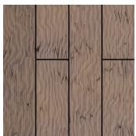

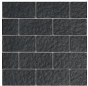

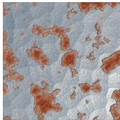  
Hammered rusty metal

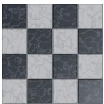  
Black and white marble checker tile

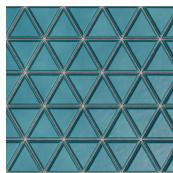  
Triangle ceramic tiles

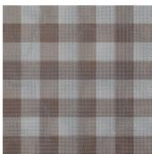  
Brown and white checkered cotton fabric

Figure 1: Selected text-to-material outputs from MATLOOM, rendered in the flat layout. Each render comes from a compact executable material program.

## 1 INTRODUCTION

Material authoring rarely ends with the first render. A designer may ask to widen the grout between tiles, roughen a coating, or change a glaze color while preserving the rest of the surface (Figure 5). Text-to-material diffusion methods generate detailed physically based rendering (PBR) maps (Vecchio et al., 2024; Vecchio, 2026; Kocsis et al., 2025), but their raster outputs do not expose the construction rules behind spatial layout, relief, and reflectance. Procedural programs and graphs keep those rules as operations and parameters (Guerrero et al., 2022; Li et al., 2024; 2025), making the generated asset easier to inspect, re-evaluate, and revise.

Can compact material programs serve as an effective output space for pretrained language models, combining text-to-material fidelity with explicit authoring structure? This question follows a broader line of work on programs as visual representations (Sharma et al., 2018; Jones et al., 2020; Zhang et al., 2025; Wu et al., 2025). For materials, the representation must express coupled decisions: a tile lattice defines both coverage and height, a crack has shape and relief, and a coating changes reflectance only where it is applied. Existing material languages and systems expose different parts of this structure. MDL supports declarative material definitions and layering (Kettner et al., 2015; NVIDIA, 2014); MultiMat serializes Substance graphs in a compact DSL with validation and visual feedback (Belouadi et al., 2026); and Material Apprentice synthesizes procedural materials from text by retrieving expert process traces (Gupta et al., 2026). We study a more restricted point in this design space: a layer-oriented field language between a natural-language request and rendered material maps.

We introduce MATLoOM, a compact language that represents a material as a stack of alpha-masked layers (Figure 1). Each layer assigns PBR channels through expressions over a two-dimensional domain, and named spatial fields can be shared across masks, color, roughness, and height. This design exposes three authoring decisions to the model: which spatial patterns to define, how layers use those patterns, and which stochastic realization of the noise fields to render. A standalone interpreter evaluates the program into material maps at a chosen raster resolution, with pinned noise seeds for repeatable execution within a fixed implementation. The restricted vocabulary trades the breadth of a general graph or shader language for concise programs whose dependencies remain visible in source.

Our synthesis procedure uses that separation to organize inference. A pretrained language model writes and repairs a program using parser feedback. A critic then inspects a fast preview, channel statistics, and source code where configured, and revises the material design. Finally, a text-image scorer selects candidates from the revision trajectory and searches noise seeds while keeping each candidate's other expressions fixed. The same explicit program is therefore the object of generation, repair, critique, selection, seed exploration, and later rendering.

We evaluate MATLoOM on a curated benchmark of 141 prompts with six language-model backbones and three diffusion baselines. Across retained programs from all backbones, the median length is 21 lines. The best configuration exceeds the baselines in mean score on all four flat-layout alignment metrics, and its initial programs already exceed all baselines on mean BLIPScore before critique or seed search. In a blind four-way study with 30 participants and 20 prompts, MATLoOM receives 59.2% of choices, compared with 19.3% for the most-preferred baseline. These results show that compact executable programs can be competitive for prompt-aligned material generation while preserving construction as part of the asset. They do not yet establish a causal advantage over every procedural representation; matched comparisons against alternatives such as direct Blender, MDL, and released procedural systems remain important follow-up tests.

Our contributions are:

• A layered authoring representation. Shared spatial expressions connect coverage and PBR channels through explicit compositing rules, retaining compact source for inspection, parameter edits, and procedural resampling (Section 3).

• A synthesis procedure that separates design from realization. Parser-guided repair and preview-based critique revise programs, while seed search explores stochastic variants of fixed candidate designs without task-specific fine-tuning (Section 4).

• An empirical analysis across backbones and inference stages. A 141-prompt benchmark and a blind preference study show strong prompt alignment against diffusion baselines while exposing backbone dependence and metric disagreement (Section 5).

## 2 RELATED WORK

Image-based material generation. Inverse rendering estimates spatially varying reflectance from photographs (Deschaintre et al., 2018; 2019; Guo et al., 2020; Lopes et al., 2024), and textconditioned systems synthesize PBR maps from language or other visual inputs (He et al., 2023; Vecchio et al., 2024; Vecchio, 2026; Kocsis et al., 2025; Luo et al., 2026). These raster maps support rendering, relighting, and some map-level editing. MATLoOM instead retains an executable source program, so the construction of the maps can be inspected, re-evaluated, and resampled. Our diffusion comparisons therefore test rendered appearance against strong raster baselines, not superiority over procedural generators.

Procedural and program-based material generation. MATch optimizes existing procedural graphs (Shi et al., 2020), MatFormer and conditional MatFormer generate graph structure and parameters (Guerrero et al., 2022; Hu et al., 2023), and ProcMatRL improves image-conditioned parameter prediction (Li et al., 2024). VLMaterial generates Blender Python programs from images with a fine-tuned vision-language model (Li et al., 2025). MultiMat introduces CompactSBS, a compact YAML representation of Substance graphs with visual feedback, validation, and repair, evaluated on image-conditioned and unconditional tasks (Belouadi et al., 2026). MatLayerNet plans layered aging materials with LLM agents and a curated mask library (Cai et al., 2026). Material Apprentice is closest in task definition because it supports text-to-procedural generation and editing by retrieving expert process traces and compiling them into Blender graphs (Gupta et al., 2026). MATLooM focuses on a different representation choice: a restricted field vocabulary with ordered alpha-composited layers, standalone execution, explicit layer parameters, and text-conditioned synthesis by pretrained language models. Direct matched-budget comparisons to Material Apprentice, Blender Python, MDL, and other procedural representations remain future work.

Programs as visual representations, and standards. Graphics-program inference (Ellis et al., 2018), ShapeAssembly (Jones et al., 2020), and Scene Language (Zhang et al., 2025) connect learned generation to editable visual structure. LAPS and LILO show how language can guide reusable program abstractions (Wong et al., 2021; Grand et al., 2024), while grammar prompting provides structured constraints for DSL generation (Wang et al., 2023). Program repair (Xia et al., 2023), iterative critique (Madaan et al., 2023; Gou et al., 2024), and rendered feedback (Wu et al., 2025) are established components. MDL separates declarative material definitions, including layering, from rendering algorithms (Kettner et al., 2015); MaterialX supports portable material graphs (Academy Software Foundation, 2026); and OpenPBR specifies a surface shading model (Portsmouth et al., 2025). MATLooM combines program repair, rendered critique, and execution feedback inside a deliberately smaller material vocabulary. The goal is to measure the costs and benefits of that vocabulary, rather than to claim invention of portable material languages. Table 3 summarizes the task and representation boundaries.

## 3 THE MATLOOM REPRESENTATION

The representation separates editable source from sampled material maps (Figure 2). A program defines spatial fields, assigns them to layer coverage and PBR channels, and evaluates them at a chosen resolution. Layers group coverage with surface properties, named fields expose cross-channel dependencies, and explicit seeds distinguish a design from one stochastic realization.

Why this representation? A material concept such as grout or glaze can affect several properties in one region. Layers keep those properties together, while a shared field lets one motif drive multiple channels. These are inspectable source dependencies, although their effect on generation or editing success still needs matched controls.

Changing explicit seeds explores realizations of a fixed program, but seeded noise can affect coverage, color, and height as well as fine texture.

## 3.1 PROGRAM STRUCTURE

A program has an optional sampling window (View), named expressions (Define), and bottomto-top layers (Materia1). Expressions are fields over the XY plane, with +x right and +y up. Changing raster size re-samples the same source fields, although normals, approximate ambient occlusion, and exported pixels depend on resolution. Listing 1 gives a complete two-layer tile program.

Layer channels and shared fields. Each layer assigns coverage α ∈ [0, 1], base color, roughness, metallicity, emission, other surface-response channels, and height h. Values can be constants or expressions built from transforms, noise, periodic patterns, and shapes. Named definitions form an acyclic graph and can be reused, as when the tile mask drives both coverage and height. Exported channels map to renderer inputs (Burley, 2012; Portsmouth et al., 2025); this is an authoring convention rather than a physically derived coating model. Channel ranges and validation are specified in Appendix Q.2.

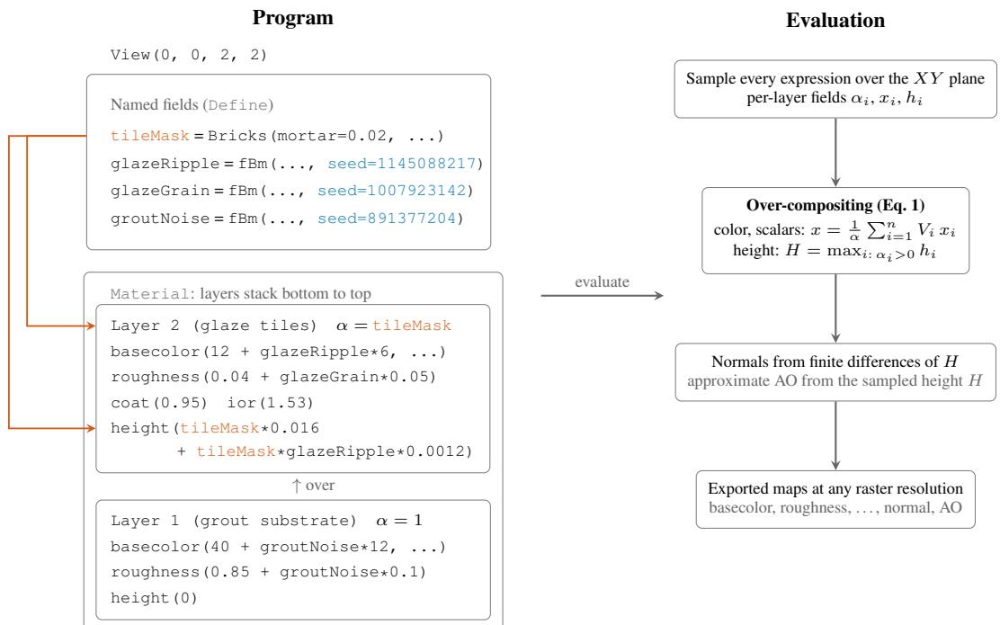  
Figure 2: Overview of the MATLoOM representation using the tile program of Listing 1. A program defines an optional View, reusable fields, and a bottom-to-top Materi al stack. Shared fields couple coverage with color, roughness, or height, explicit noise seeds pin a realization, scalar and color channels use the over rule of Eq. 1, and height uses a separate maximum rule before normals and approximate ambient occlusion are derived. The shared tileMask (orange) drives both the glaze layer's coverage and its height, and explicit noise seed values (blue) pin one stochastic realization.

## 3.2 COMPOSITING SEMANTICS

At each position, let layer 1 be the bottom layer and define the visible coverage of layer i as $V _ { i } =$ αi $\textstyle \prod _ { j = i + 1 } ^ { n } ( 1 - \alpha _ { j } )$ and total coverage as $\begin{array} { r } { \alpha \stackrel { \cdot } { = } 1 - \prod _ { i = 1 } ^ { n } ( 1 - \alpha _ { i } ) } \end{array}$ . For finite layer values, a scalar surface channel x resolves as

$$
x = \left\{ { \begin{array} { l l } { \displaystyle { \frac { 1 } { \alpha } } \sum _ { i = 1 } ^ { n } V _ { i } x _ { i } , } & { \alpha > 0 , } \\ { 0 , } & { \alpha = 0 . } \end{array} } \right.\tag{1}
$$

Since $V _ { i } \geq 0$ and $\textstyle \sum _ { i } V _ { i } = \alpha$ , covered pixels receive a convex blend of layer values. Base color blends in linear light; this rule describes authoring visibility rather than radiative transfer.

Height instead takes the maximum finite height among positively covered layers, or zero if none contributes. Fractional alpha therefore blends surface channels without attenuating relief; edge tapering must be encoded in the height expression.

## 3.3 DEPENDENCIES AND CONTROLLED EDITS

For fixed execution settings, changing only parameters outside a channel's transitive source dependencies preserves its exported map. Its rendered appearance can still change through another channel's effect on shading. Appendix Q.1 gives the formal dependency statement.

In the tile program, the upper layer uses tileMask for coverage and height, so changing mortar width changes grout exposure and tile-edge relief together. The one-case edits in Section 5.4 test such dependencies; they do not establish a general editing advantage.

Inlining named definitions preserves evaluation semantics on the tested programs, enabling a future controlled comparison of source reuse (Appendix Q.4).

## 3.4 EXECUTION AND VALIDATION

The Python engine exports sampled maps, and a TypeScript port supports browser inspection. Parser checks and finite regression tests do not prove numerical validity or successful export for every accepted program (Appendices C and D). Evaluation uses Blender in a head-on flat layout and a staged layout that exposes relief and transmission.

## 4 TEXT-TO-MATERIAL GENERATION

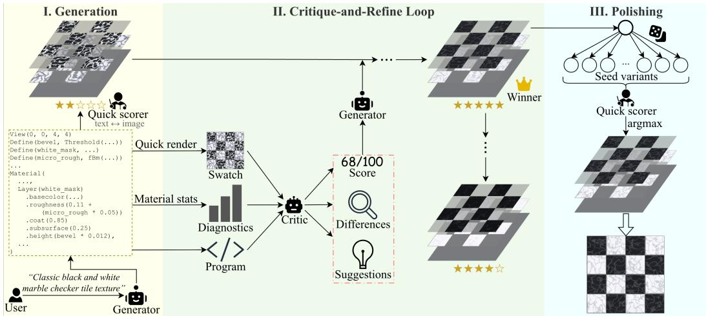  
Figure 3: A visual walkthrough of material authoring. A text request becomes a layered program, whose preview, channel statistics, and source inform critique and revision. Stage III depicts one candidate's seed sweep. The full search applies this sweep to the distinct initial, selected, and final programs (Section 4.3). Each sweep includes its original program and changes only noise seeds. The program excerpt, intermediate appearances, stars, and 68/100 score are schematic illustrations of information flow, not a measured trajectory or evidence of monotonic improvement.

The pipeline generates and repairs a program, revises it using preview feedback, then selects among program designs and their seed variants (Figure 3). Appendix Q.7 gives implementation details.

## 4.1 STAGE I: GENERATION

The language model receives a DSL reference, six examples, and an organic-texture playbook (Appendix O). The parser checks its program's syntax, references, and constructors, returning errors for up to three corrective responses.

Accepted programs are canonicalized, making noise seeds explicit before critique and selection. All 2538 retained main-run conversations completed without aborting and produced renderable final programs under the recorded settings.

## 4.2 STAGE II: CRITIQUE AND REFINEMENT

The critic can receive a quick render, 28 unlit material statistics, and source code with named fields and parameters. The preview shades composited maps and height-derived normals under a fixed directional light.

The critic normally shares the generator's backbone and sampling settings, omitting image input for text-only backbones. Each fresh critique returns a model-assessed match score, visual differences,

and revision suggestions; the generator is asked to preserve unchanged layers and seeds. Five revisions produce $P _ { 0 } , \ldots , P _ { 5 }$ , with one critique per trajectory program and no revision after the last critique.

## 4.3 STAGE III: SELECTION AND SEED SEARCH

A late revision can regress, so the last round is not chosen automatically. Let $q _ { r } ( P , t )$ be the Mobile-CLIP2 (Faghri et al., 2025) score of an $r \times r$ quick render for text t. The selector picks the best of $P _ { 0 } , \ldots , P _ { 5 }$ using $q _ { 5 1 2 }$ , breaking ties toward the earliest round. Seed search uses $q _ { 2 5 6 }$ on the distinct initial, selected, and last programs, indexed by $C = \{ 0 , j , 5 \}$

For each $d \in C$ , let $S _ { K } ( P _ { d } )$ contain the original program and K variants obtained by changing only noise seeds. The returned program is $P ^ { \star } \in \arg \operatorname* { m a x } _ { P \in \bigcup _ { d \in C } } s _ { K } ( P _ { d } ) q _ { \mathrm { s e e d } } ( P , t )$ . With $K = 1 0 0 0 .$ the search scores at most $3 ( K + 1 )$ candidates. Repeated seed references change together, while all non-seed source remains fixed within each candidate sweep. The winner can come from any of the three trajectory positions.

Including each original prevents a decrease in $q _ { \mathrm { s e e d } }$ relative to that candidate pool, but it does not guarantee better external metrics or human preference. Appendices E and I analyze search budgets and proxy mismatch.

## 5 EXPERIMENTS

Our evaluation asks two questions: whether the complete authoring system produces renders that match material descriptions, and whether its recorded programs expose useful post-generation control. We therefore separate prompt-alignment results from evidence about the representation itself. The benchmark, trajectory analysis, and blind study measure rendered appearance; a manual edit case illustrates program-level control for one material. All means average the three recorded runs for each prompt and then average over 141 prompts, unless stated otherwise.

## 5.1 SETUP

The benchmark contains 141 prompts from four public sources: category prompts from Hu et al. (2023) (30), MatSynth descriptions (Vecchio & Deschaintre, 2024) (11), StableMaterials prompts (Vecchio, 2026) (50), and text2fabric descriptions (Deschaintre et al., 2023) (50). Sources with more than 50 descriptions are reduced by farthest-point sampling in sentence-embedding space, with the selected prompt list fixed across methods. This curated benchmark includes figurative and specific motifs, so its average characterizes this prompt distribution rather than material requests in general.

We compare against three released text-to-material-map systems: MatFuse (Vecchio et al., 2024), StableMaterials (Vecchio, 2026), and IntrinsiX (Kocsis et al., 2025). All systems produce 512×512 maps rendered in the same Blender scenes and in both flat and staged layouts. The layouts are useful but not representation-isolated: MATLoOM's height drives geometric displacement, StableMaterials' height drives bump shading, MatFuse and IntrinsiX emit no height map, and only MATLooM exposes transmission. We therefore interpret the comparison as complete-system appearance under the recorded rendering routes (Appendix K).

Prompt alignment is scored with BLIPScore (Li et al., 2023), CLIPScore (Hessel et al., 2021), VQAScore (Lin et al., 2024), and an MLLM judge (claude-sonnet–5, temperature zero), each scaled to [0, 100] with higher better. These are learned visual proxies, not measures of physical accuracy or edit utility. The six MATLoOM backbones each use three recorded authoring runs per prompt with procedural-noise seeds 42, 123, and 2026. Each main run uses an initial generation, 5 critique-revision rounds, trajectory selection, and up to 1000 noise-seed variants for the first, selected, and last programs; this search budget is not matched to the diffusion baselines. For paired inference we use per-prompt run means, two-sided Wilcoxon signed-rank tests, and 10,000-resample percentile bootstrap confidence intervals, with Holm correction over the 24 flagship-versus-baseline contrasts. Because the flagship was selected after comparing all six backbones, these tests remain exploratory.

Table 1: Main comparison on the 141-prompt benchmark under four alignment metrics (mean over three recorded runs, higher is better). Flat and Staged give the two rendering layouts. Our rows use the full three-stage pipeline with the named generator and the same model as critic, with text-only critique for DeepSeek and GLM. Best per layout half in bold.
<table><tr><td></td><td colspan="4">Flat</td><td colspan="4">Staged</td></tr><tr><td>Method</td><td>BLIPScore</td><td>CLIPScore</td><td>VQAScore</td><td>Judge</td><td>BLIPScore</td><td>CLIPScore</td><td>VQAScore</td><td>Judge</td></tr><tr><td>IntrinsiX (Kocsis et al., 2025)</td><td>29.94</td><td>24.29</td><td>43.61</td><td>56.10</td><td>20.96</td><td>21.80</td><td>41.97</td><td>49.60</td></tr><tr><td>MatFuse (Vecchio et al., 2024)</td><td>8.27</td><td>20.12</td><td>30.61</td><td>36.36</td><td>8.58</td><td>19.25</td><td>30.56</td><td>33.63</td></tr><tr><td>StableMaterials (Vecchio, 2026)</td><td>28.57</td><td>25.66</td><td>45.36</td><td>57.41</td><td>21.33</td><td>23.59</td><td>45.53</td><td>54.29</td></tr><tr><td>MATLoOM (gemma-4-26b-a4b-it)</td><td>33.56</td><td>25.46</td><td>47.12</td><td>47.48</td><td>22.07</td><td>22.48</td><td>47.43</td><td>40.17</td></tr><tr><td>MATLoOM (qwen3.6-35b-a3b)</td><td>35.64</td><td>25.70</td><td>46.36</td><td>45.80</td><td>21.93</td><td>22.55</td><td>46.60</td><td>37.47</td></tr><tr><td>MATLoOM (deepseek-v4-flash-0731)</td><td>46.42</td><td>27.29</td><td>51.06</td><td>53.38</td><td>30.49</td><td>23.93</td><td>51.04</td><td>45.11</td></tr><tr><td>MATLoOM (glm-5.2)</td><td>42.44</td><td>26.78</td><td>50.36</td><td>53.88</td><td>27.85</td><td>23.78</td><td>50.50</td><td>46.28</td></tr><tr><td>MATLoOM (gpt-5.6-luna)</td><td>48.78</td><td>27.61</td><td>49.56</td><td>56.80</td><td>31.55</td><td>24.51</td><td>49.75</td><td>47.02</td></tr><tr><td>MATLOOM (gemini-3.6-flash)</td><td>56.06</td><td>28.80</td><td>54.71</td><td>67.01</td><td>36.14</td><td>25.30</td><td>54.26</td><td>57.34</td></tr></table>

## 5.2 PROMPT ALIGNMENT ACROSS METHODS

The strongest configuration, gemini-3.6-flash, has the highest mean on all four alignment metrics in both layouts (Table 1). Against StableMaterials in the flat layout, its mean differences are BLIPScore +27.5 (95% CI [21.8, 33.3]), CLIPScore +3.1, VQAScore +9.3, and judge +9.6, with all four Holm-adjusted p-values below 0.001. Across the three baselines, two layouts, and four metrics, 23 of 24 corrected contrasts remain significant. The exception is the staged judge comparison with StableMaterials: +3.0, 95% CI [—1.2, 7.3], p=0.21. This interval supports neither superiority nor equivalence.

Backbone choice and prompt source both matter. All six program-generating configurations exceed the strongest diffusion baseline on flat BLIPScore, but only the flagship exceeds StableMaterials on mean flat judge score; the other 5 range from 45.8 to 56.8 against 57.4. Per-source means also qualify the aggregate result: the flagship's flat judge score trails StableMaterials on the StableMaterials-source and category prompts, while its overall judge advantage comes from MatSynth and text2fabric (Appendix N). Thus the benchmark supports competitive prompt alignment for the full program-authoring system, while leaving open whether this representation would outperform other executable material languages under matched generation and rendering conditions.

Figure 4 shows selected examples where explicit spatial structure is visible. For holiday wrapping paper, MATLooM produces a repeated diamond-and-star design; for acoustic panels, alternating wedge orientations form a checkerboard with visible relief; for cracked ice, a nested crack network appears over a transmissive sheet. These examples are selected to illustrate structure and channel differences rather than typical performance, and the staged views reflect the unequal routing noted above.

## 5.3 TRAJECTORY AND PROXY BEHAVIOR

The flagship's stored trajectory gives a within-run readout of the authoring loop (Table 2). Round 0 already reaches 48.31 BLIPScore and 61.35 judge in the flat layout, above all three diffusion baselines on those means. Five critique-revision rounds add +3.5 BLIPScore and +6.3 judge, while trajectory selection adds +2.3 BLIPScore over the last revision. The final polished output reaches 56.06 BLIPScore, but its flat judge score is slightly below round 5. The selector beats the last revision on flat BLIPScore in 178 of 423 runs (42%), loses in 137, and ties in 108; it also reduces mean flat judge by about one point. The trajectory therefore improves some alignment proxies while revealing disagreement between the quick selection score and other judgments (Appendix E).

Component diagnostics. We treat the stored component comparisons as exploratory diagnostics rather than ablations. They use one gpt–5. 6–1una run per prompt and a temperature mismatch between the full reference and variants, although they remain paired by prompt. The most useful signal is negative: these records motivate controlled tests of render feedback, source access, prompt aids, and critic choice, but they do not identify isolated component effects (Appendix G).

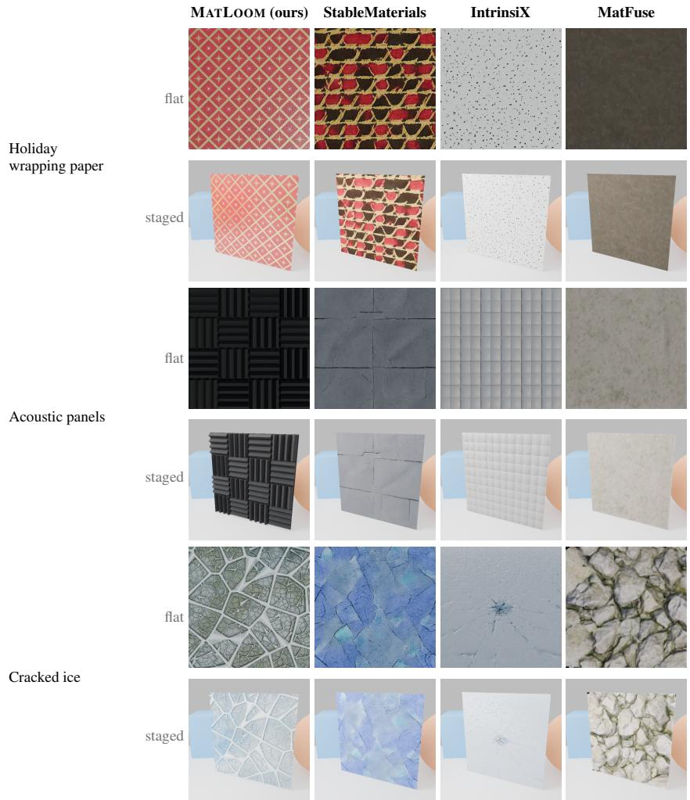  
Figure 4: Qualitative comparison. Each cell stacks the flat layout over the staged layout. The examples were selected to expose structure and channel behavior, not to estimate typical performance or isolate the representation.

Table 2: Stage-wise scores for gemini-3. 6–flash, averaged over 423 runs. Round 0 precedes critique, Round 5 is the last revision, Selected maximizes the quick scorer over the trajectory, and Final additionally searches seeds of the first, selected, and last programs. Best per metric in bold.
<table><tr><td rowspan="2"></td><td colspan="4">Flat</td><td colspan="4">Staged</td></tr><tr><td>BLIPScore</td><td>CLIPScore</td><td>VQAScore</td><td>Judge</td><td>BLIPScore</td><td>CLIPScore</td><td>VQAScore</td><td>Judge</td></tr><tr><td>Stage Round 0</td><td>48.31</td><td>27.70</td><td>53.34</td><td>61.35</td><td>30.95</td><td>24.37</td><td>52.67</td><td>52.98</td></tr><tr><td>Round 5</td><td>51.86</td><td>28.25</td><td>52.93</td><td>67.61</td><td>33.23</td><td>24.91</td><td>53.43</td><td>56.82</td></tr><tr><td>Selected</td><td>54.17</td><td>28.71</td><td>53.97</td><td>66.56</td><td>35.50</td><td>25.25</td><td>54.07</td><td>57.20</td></tr><tr><td>Final (full)</td><td>56.06</td><td>28.80</td><td>54.71</td><td>67.01</td><td>36.14</td><td>25.30</td><td>54.26</td><td>57.34</td></tr></table>

## 5.4 PROGRAM CONTROL IN ONE MATERIAL

Figure 5 illustrates how an authored program can be edited after generation. Starting from the final program for a two-layer tile material, we manually increase the tile roughness offset from 0.04 to 0.75, widen grout by changing the shared mortar parameter from 0.02 to 0.06, and shift tile basecolor offsets to a blue glaze. All other source bytes, including noise seeds and the sampling window, are preserved. At both 256×256 and 1024×1024, repeated evaluation in the recorded environment produces byte-identical previews; roughness and color edits change only their intended composited channels, while the grout edit deliberately propagates through channels that share the named mask (Appendix B). This demonstrates inspectable control for one material, not an editing success rate, an automated editor, or an advantage over alternative program representations.

(25, 75, 140)  
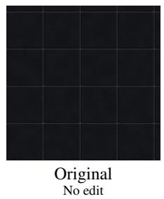

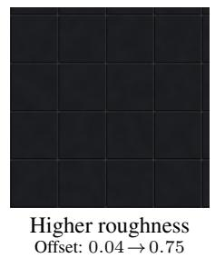

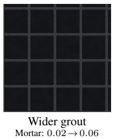

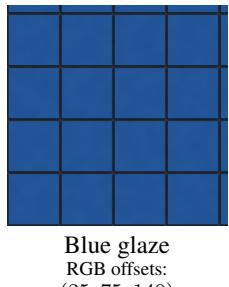  
Figure 5: Explicit edits to one material program. We manually change roughness, a shared grout parameter, or base-color offsets while preserving the remaining source and all three noise seeds. This is one illustrative case, not an automated-edit benchmark.

## 5.5 HUMAN EVALUATION

We ran a blind online preference study over 20 prompts, five from each benchmark source, drawn from the 141-prompt benchmark with a seeded diversity-gated selection (Appendix J). Each trial showed four unlabeled 512×512 flat-layout renders in a 2×2 grid: MATLoOM with the flagship backbone and the StableMaterials, IntrinsiX, and MatFuse outputs, all at procedural seed 123. Thirty volunteers completed all trials, all passed the attention check, and none was excluded.

MATLoOM won 59.2% of the 600 forced choices (95% CI [55.8, 62.7] by participant-cluster bootstrap), ahead of StableMaterials at 19.3%, IntrinsiX at 15.3%, and MatFuse at 6.2%. Every participant chose MATLOOM more often than any one baseline across the 20 trials, with 8–17 MATLOOM choices per participant. Mean fidelity ratings were 4.98 for MATLOOM, 3.60 for StableMaterials, 3.01 for IntrinsiX, and 2.27 for MatFuse. The mean within-trial rating advantage over StableMaterials was 1.37 points on the 1–7 scale (95% participant-cluster bootstrap CI [1.15, 1.61]). The rating advantage over StableMaterials is positive under Wilcoxon signed-rank tests both by prompt (n=20, $\scriptstyle p = 4 . 4 \ \bar { \times } \ 1 0 ^ { - 4 }$ , rank-biserial 0.83) and by participant mean $( \breve { n } { = } 3 0 , p { = } 6 . 5 \times 1 0 ^ { - 7 } )$ . The preference held descriptively for participants with no image-creation experience (60.0% MATLoOM win rate) and those with some experience (58.8%). The study measures prompt-conditioned appearance preference on this subset, not editing utility or physical accuracy.

## 5.6 LIMITATIONS AND THREATS TO VALIDITY

The fixed primitive and channel vocabulary constrains fine microstructure, specific figurative motifs participating media, and arbitrary reflectance models. The benchmark measures prompt alignment, not physical material accuracy, edit success, appearance consistency across resolutions, or causal value of the representation. Holm correction covers the 24 flagship-versus-baseline contrasts, but it does not account for selecting the flagship from six backbones on this benchmark, so these tests remain exploratory. The authoring pipeline uses a substantial and unmatched seed-search budget, and the diffusion baselines do not receive an equalized search or channel-routing treatment. The staged layout combines generation with renderer differences, including displacement, bump, height availability, and transmission. Component comparisons are exploratory because variant runs use one run per prompt (Appendix G); they guide follow-up experiments rather than proving component necessity. Directly testing the representation hypothesis requires controlled generation and editing comparisons against other executable material forms under matched backbones, budgets, and rendering channels.

## 6 CONCLUSION

MATLooM studies text-to-material generation as executable authoring: compact layered programs retain the construction of each rendered asset. On the 141-prompt benchmark, its strongest configuration exceeds three diffusion baselines on all four flat-layout alignment proxies and receives 59.2% of choices in a 30-person blind study over 20 prompts. Stored trajectories show that revision and seed search improve different proxies in different ways. Matched generation and editing comparisons are still needed to isolate the value of this representation from backbone, budget, and renderer effects.

## AI USE STATEMENT

Generative AI is part of the experimental method: hosted language models generate and critique material programs, and a separate multimodal model supplies one evaluation score. AI tools also assisted with code development, literature search and synthesis, and manuscript drafting and editing. The authors take responsibility for the final content, including the cited literature, mathematical statements, reported measurements, participant-study data, and released code.

## ETHICS STATEMENT

This work studies the generation of digital surface materials from text. The release is limited to source code and does not redistribute benchmark prompts, baseline models, or third-party data or model weights, which remain subject to their original licenses. An authoring system may reproduce protected surface designs or generate assets that appear plausible but have unverified physical properties, so rendered appearance should not be treated as a measured material specification. The preference study was voluntary and began with informed consent. Participants could optionally provide an email address for follow-up, so responses were confidential rather than anonymous. The reported analysis excluded the email field and used de-identified responses.

## REPRODUCIBILITY STATEMENT

The representation and compositing rules are specified in Section 3, with an example program and grammar summary in Appendices B and C. We will release the source code, including the engine with its parity fixture suite and the scoring pipeline. Pinned program seeds support repeated evaluation without another language-model call, provided the engine, export settings, and rendering environment are fixed. Cross-engine agreement is tested on a finite fixture set with explicit tolerances and exclusions (Appendix D). The quantitative tables and paired comparisons are computed from the stored per-run scores and the exported study responses (Appendix M).

## REFERENCES

Academy Software Foundation. MaterialX: An open standard for representing rich material and look-development content. https://materialx.org, 2026. Project documentation, accessed September 2026.

Jonas Belouadi, Tamy Boubekeur, and Adrien Kaiser. MultiMat: Multimodal program synthesis for procedural materials using large multimodal models. In International Conference on Learning Representations (ICLR), 2026.

Brent Burley. Physically-based shading at Disney, 2012.

Xingquan Cai, Hao Hu, Jiawei Tang, Chenyu Li, and Yan Hu. MatLayerNet: A multi-agent-based method for text-to-PBR material generation. In Advances in Computer Graphics: 42nd Computer Graphics International Conference, CGI 2025, Hong Kong, China, July 14-18, 2025, Proceedings, Part III, pp. 390–401, Cham, 2026. Springer Nature Switzerland. ISBN 978-3-032-22266-4. doi:10.1007/978-3-032-22267-1\_31.

Valentin Deschaintre, Miika Aittala, Fredo Durand, George Drettakis, and Adrien Bousseau. Singleimage SVBRDF capture with a rendering-aware deep network. ACM Transactions on Graphics (T0G), 37(4):1–15, 2018. doi:10.1145/3197517.3201378.

Valentin Deschaintre, Miika Aittala, Frédo Durand, George Drettakis, and Adrien Bousseau. Flexible SVBRDF capture with a multi-image deep network. Computer Graphics Forum (CGF), 38 (4):1–13, 2019. doi: 10.1111/cgf.13765.

Valentin Deschaintre, Julia Guerrero-Viu, Diego Gutierrez, Tamy Boubekeur, and Belen Masia. The visual language of fabrics. ACM Transactions on Graphics (TOG), 42(4), August 2023. ISSN 0730-0301. doi: 10.1145/3592391.

Kevin Ellis, Daniel Ritchie, Armando Solar-Lezama, and Joshua B. Tenenbaum. Learning to infer graphics programs from hand-drawn images. In Advances in Neural Information Processing Systems (NeurIPS), volume 31, pp. 6062–6071, 2018.

Fartash Faghri, Pavan Kumar Anasosalu Vasu, Cem Koc, Vaishaal Shankar, Alexander Toshev, Oncel Tuzel, and Hadi Pouransari. MobileCLIP2: Improving multi-modal reinforced training. Transactions on Machine Learning Research (TMLR), 2025.

Zhibin Gou, Zhihong Shao, Yeyun Gong, Yelong Shen, Yujiu Yang, Nan Duan, and Weizhu Chen. CRITIC: Large language models can self-correct with tool-interactive critiquing. In International Conference on Learning Representations (ICLR), 2024.

Gabriel Grand, Lionel Wong, Maddy Bowers, Theo X. Olausson, Muxin Liu, Joshua B. Tenenbaum, and Jacob Andreas. LILO: Learning interpretable libraries by compressing and documenting code. In International Conference on Learning Representations (ICLR), 2024.

Paul Guerrero, Miloš Hašan, Kalyan Sunkavalli, Radomír Měch, Tamy Boubekeur, and Niloy J. Mitra. MatFormer: a generative model for procedural materials. ACM Transactions on Graphics (TOG), 41(4), July 2022. ISSN 0730-0301. doi: 10.1145/3528223.3530173.

Yu Guo, Cameron Smith, Miloš Hašan, Kalyan Sunkavalli, and Shuang Zhao. MaterialGAN: reflectance capture using a generative SVBRDF model. ACM Transactions on Graphics (TOG), 39 (6), December 2020. ISSN 0730-0301. doi: 10.1145/3414685.3417779.

Kunal Gupta, Gaurav Joshi, Yen-Ru Chen, Seemandhar Jain, Ishit Mehta, and Manmohan Chandraker. Reflecting process expertise in procedural material generation. In European Conference on Computer Vision (ECCV), volume 17046 of Lecture Notes in Computer Science, pp. 318–336, 2026. doi:10.1007/978-3-032-37281-9\_19.

Nikolaus Hansen. The CMA evolution strategy: A tutorial. arXiv preprint arXiv:1604.00772, 2016.

Zhen He, Jie Guo, Yan Zhang, Qinghao Tu, Mufan Chen, Yanwen Guo, Pengyu Wang, and Wei Dai. Text2Mat: Generating materials from text. In Pacific Graphics Short Papers and Posters, pp. 89–97. The Eurographics Association, 2023. doi: 10.2312/pg.20231275.

Jack Hessel, Ari Holtzman, Maxwell Forbes, Ronan Le Bras, and Yejin Choi. CLIPScore: A reference-free evaluation metric for image captioning. In Marie-Francine Moens, Xuanjing Huang, Lucia Specia, and Scott Wen-tau Yih (eds.), Conference on Empirical Methods in Natural Language Processing (EMNLP), pp. 7514–7528, Online and Punta Cana, Dominican Republic, November 2021. Association for Computational Linguistics. doi: 10.18653/v1/2021.emnlp-main. 595.

Yiwei Hu, Paul Guerrero, Milos Hasan, Holly Rushmeier, and Valentin Deschaintre. Generating procedural materials from text or image prompts. In ACM SIGGRAPH 2023 Conference Proceedings, SIGGRAPH '23, New York, NY, USA, 2023. Association for Computing Machinery. ISBN 9798400701597. doi:10.1145/3588432.3591520.

R. Kenny Jones, Theresa Barton, Xianghao Xu, Kai Wang, Ellen Jiang, Paul Guerrero, Niloy J. Mitra, and Daniel Ritchie. ShapeAssembly: learning to generate programs for 3d shape structure synthesis. ACM Transactions on Graphics (TOG), 39(6), December 2020. ISSN 0730-0301. doi: 10.1145/3414685.3417812.

Lutz Kettner, Matthias Raab, Daniel Seibert, Jan Jordan, and Alexander Keller. The material definition language. In Workshop on Material Appearance Modeling. The Eurographics Association, 2015. doi: 10.2312/mam.20151195.

Peter Kocsis, Lukas Höllein, and Matthias Nießner. IntrinsiX: High-quality PBR generation using image priors. In Advances in Neural Information Processing Systems (NeurIPS), volume 38, pp. 86361–86395, 2025. doi: 10.52202/085713-2605.

Beichen Li, Yiwei Hu, Paul Guerrero, Milos Hasan, Liang Shi, Valentin Deschaintre, and Wojciech Matusik. Procedural material generation with reinforcement learning. ACM Transactions on Graphics (TOG), 43(6), December 2024. ISSN 0730-0301. doi: 10.1145/3687979.

Beichen Li, Rundi Wu, Armando Solar-Lezama, Changxi Zheng, Liang Shi, Bernd Bickel, and Wojciech Matusik. VLMaterial: Procedural material generation with large vision-language models. In International Conference on Learning Representations (ICLR), 2025.

Junnan Li, Dongxu Li, Silvio Savarese, and Steven Hoi. BLIP-2: Bootstrapping language-image pre-training with frozen image encoders and large language models. In International Conference on Machine Learning (ICML), volume 202, pp. 19730–19742. PMLR, 2023.

Zhiqiu Lin, Deepak Pathak, Baiqi Li, Jiayao Li, Xide Xia, Graham Neubig, Pengchuan Zhang, and Deva Ramanan. Evaluating text-to-visual generation with image-to-text generation. In European Conference on Computer Vision (ECCV), volume 15067 of Lecture Notes in Computer Science, pp. 366–384, Cham, 2024. Springer Nature Switzerland. ISBN 978-3-031-72672-9. doi: 10. 1007/978-3-031-72673-6\_20.

Ivan Lopes, Fabio Pizzati, and Raoul de Charette. Material palette: Extraction of materials from a single image. In IEEE/CVF Conference on Computer Vision and Pattern Recognition (CVPR), pp. 4379–4388, 2024. doi: 10.1109/CVPR52733.2024.00419.

Di Luo, Shuhui Yang, Mingxin Yang, Jiawei Lu, Yixuan Tang, Xintong Han, Zhuo Chen, Beibei Wang, and Chunchao Guo. MatPedia: A universal generative foundation for high-fidelity material synthesis. In IEEE/CVF Conference on Computer Vision and Pattern Recognition (CVPR), pp. 8943–8953, 2026.

Aman Madaan, Niket Tandon, Prakhar Gupta, Skyler Hallinan, Luyu Gao, Sarah Wiegreffe, Uri Alon, Nouha Dziri, Shrimai Prabhumoye, Yiming Yang, Shashank Gupta, Bodhisattwa Prasad Majumder, Katherine Hermann, Sean Welleck, Amir Yazdanbakhsh, and Peter Clark. Self-Refine: Iterative refinement with self-feedback. In Advances in Neural Information Processing Systems (NeurIPS), volume 36, pp. 46534–46594, 2023.

NVIDIA. Material definition language (MDL). https://www.nvidia.com/en-us/ design-visualization/technologies/material-definition-language/, 2014. Accessed September 2026.

Jamie Portsmouth, Peter Kutz, and Stephen Hill. OpenPBR: Novel features and implementation details. arXiv preprint arXiv:2512.23696, 2025.

Gopal Sharma, Rishabh Goyal, Difan Liu, Evangelos Kalogerakis, and Subhransu Maji. CSGNet: Neural shape parser for constructive solid geometry. In IEEE/CVF Conference on Computer Vision and Pattern Recognition (CVPR), pp. 5515–5523, 2018.

Liang Shi, Beichen Li, Miloš Hašan, Kalyan Sunkavalli, Tamy Boubekeur, Radomir Mech, and Wojciech Matusik. MATch: differentiable material graphs for procedural material capture. ACM Transactions on Graphics (TOG), 39(6), December 2020. ISSN 0730-0301. doi: 10.1145/3414685.3417781.

Giuseppe Vecchio. StableMaterials: Enhancing diversity in material generation via semi-supervised learning. In IEEE/CVF Conference on Computer Vision and Pattern Recognition (CVPR), pp. 19665–19675, 2026.

Giuseppe Vecchio and Valentin Deschaintre. MatSynth: A modern PBR materials dataset. In IEEE/CVF Conference on Computer Vision and Pattern Recognition (CVPR), pp. 22109–22118, 2024. doi: 10.1109/CVPR52733.2024.02087.

Giuseppe Vecchio, Renato Sortino, Simone Palazzo, and Concetto Spampinato. MatFuse: Controllable material generation with diffusion models. In IEEE/CVF Conference on Computer Vision and Pattern Recognition (CVPR), pp. 4429–4438, Los Alamitos, CA, USA, June 2024. IEEE. doi: 10.1109/CVPR52733.2024.00424.

Bailin Wang, Zi Wang, Xuezhi Wang, Yuan Cao, Rif A. Saurous, and Yoon Kim. Grammar prompting for domain-specific language generation with large language models. In Advances in Neural Information Processing Systems (NeurIPS), volume 36, pp. 65030–65055, 2023. doi: 10.52202/075280-2837.

Lionel Wong, Kevin M. Ellis, Joshua Tenenbaum, and Jacob Andreas. Leveraging language to learn program abstractions and search heuristics. In International Conference on Machine Learning (ICML), volume 139 of Proceedings of Machine Learning Research, pp. 11193–11204. PMLR, 2021.

Ronghuan Wu, Wanchao Su, and Jing Liao. Chat2SVG: Vector graphics generation with large language models and image diffusion models. In IEEE/CVF Conference on Computer Vision and Pattern Recognition (CVPR), pp. 23690–23700, 2025. doi: 10.1109/CVPR52734.2025.02206.

Chunqiu Steven Xia, Yuxiang Wei, and Lingming Zhang. Automated program repair in the era of large pre-trained language models. In IEEE/ACM International Conference on Software Engineering (ICSE), ICSE '23, pp. 1482–1494. IEEE Press, 2023. ISBN 9781665457019. doi: 10.1109/ICSE48619.2023.00129.

Yunzhi Zhang, Zizhang Li, Matt Zhou, Shangzhe Wu, and Jiajun Wu. The scene language: Representing scenes with programs, words, and embeddings. In IEEE/CVF Conference on Computer Vision and Pattern Recognition (CVPR), pp. 24625–24634, 2025. doi: 10.1109/CVPR52734. 2025.02293.

## A POSITIONING AGAINST PRIOR WORK

Table 3 separates the user input, generated representation, and execution requirements of relevant methods and standards. Text conditioning, compact programs, material layers, and visual feedback each have precedents, so the intended comparison is the effect of MATLoOM's restricted layer vocabulary under matched generation and editing conditions.

## B EXAMPLE PROGRAM

Listing 1 gives the program for “black shiny ceramic floor tiles," referenced in Section 3.1. Its text matches the final program in the retained gemini-3.6-flash seed-123 trajectory, ignoring outer whitespace.

```r
View(0, 0, 2, 2)
Define(tileMask, Bricks(brick width=0.48, brick height=0.48, offset=0, mortar=0.02, feather
=0.008))
Define(glazeRipple, fBm(octaves=3, base_freq=7, to_01=True, seed=1145088217))
Define(glazeGrain,fBm(octaves=5,base_freq=35,to_01=True,seed=1007923142))
Define(groutNoise, fBm(octaves=4,base_freq=30, to_01=True, seed=891377204))
Material(
Layer(1)
.basecolor((40 + (groutNoise * 12)), (42 + (groutNoise * 12)), (45 + (groutNoise * 12)))
.roughness((0.85 + (groutNoise * 0.1)))
.height(0),
Layer(tileMask)
.basecolor((12 + (glazeRipple * 6)), (13 + (glazeRipple * 6)), (16 + (glazeRipple * 6)))
.roughness((0.04 + (glazeGrain * 0.05)))
.coat(0.95)
.ior(1.53)
.height(((tileMask * 0.016) + ((tileMask * glazeRipple) * 0.0012)))
)
```

Listing 1: A complete two-layer example program for “"black shiny ceramic floor tiles." Blackglazed tiles composite over a rough gray grout substrate. The tileMask lattice is shared by the upper layer's alpha mask and height expression, so editing that definition updates both fields.

Figure 5 uses this same source with three manually specified edits. Re-evaluating the four programs in the released engine reproduces all eight previews byte-for-byte, so repeated evaluation is byteidentical. At both resolutions, the roughness and color edits change only their respective composited

Table 3: Task and representation boundaries. User conditioning is distinct from textual program encoding: MultiMat consumes compact textual programs during synthesis without evaluating naturallanguage-conditioned generation. Language standards are representation precedents, not learned generation systems. These properties do not imply a quality ranking, and matched generation and editing comparisons remain necessary.
<table><tr><td>Work</td><td>ing</td><td>User condition- Generated representa- Execution depen- Relevant distinction tion</td><td>dence</td><td></td></tr><tr><td>et al., 2024; Vecchio, 2026; Kocsis et al., 2025)</td><td>Raster genera- Text; additional PBR raster maps tors (Vecchio modalities vary</td><td></td><td>Renderer con- Material</td><td>appearance suming the maps without an explicit generative program</td></tr><tr><td>Conditional MatFormer (Hu partial graph et al., 2023)</td><td></td><td>Text, image, or Procedural node graph Substance</td><td>ecosystem</td><td>Prior text-conditioned procedural synthesis</td></tr><tr><td>VLMaterial (Li Image et al., 2025)</td><td></td><td>Python program con- Blender API structing a shader graph</td><td></td><td>Learned image-to- program synthesis</td></tr><tr><td>louadi et al., ditional 2026)</td><td></td><td>MultiMat (Be- Image or uncon- CompactSBS, a com- Substance) pact YAML graph pro- signer gram</td><td></td><td>De- Intermediate visual feedback and incremen- tal validation</td></tr><tr><td>MatLayerNet</td><td>t Text</td><td>over PBR maps</td><td>mask-generator 2026)</td><td>Layer plans, per- MetaGPT multi- Prior language-guided layer parameters, and agent pipeline substrate, texture, and library-derived masks with a curated aging layers (Cai et al.,</td></tr><tr><td>et al., 2026)</td><td>editing instruc- graph</td><td>Material Ap- Text; optional Expert process trace Blender API prentice (Gupta reference image; compiled to a shader</td><td>library</td><td>Closest text-to- procedural system, using process retrieval</td></tr><tr><td>et al., 2015)</td><td>tion program</td><td>MDL (Kettner Author-supplied Declarative material MDL-capable with procedural func- compiler</td><td>renderer</td><td>Portable material lan- or guage with layered scat- tering</td></tr><tr><td>MaterialX</td><td>graph</td><td>tions Author-supplied Material and look- MaterialX- development graph</td><td>capable tools</td><td>Portable graph de- scription and ex- change (Academy Software Foundation,</td></tr><tr><td>MATLOOM</td><td>layer revisions</td><td>Text; subsequent Restricted field expres- Standalone map Studies layer-local au- sions and an ordered executor layer program</td><td></td><td>2026) thoring through an ex- plicit restricted vocabu- lary</td></tr></table>

channels. Widening grout deliberately changes the shared mask and its affected channels. These checks establish the behavior of this case, not an editing-success rate or invariance across resolutions.

## C GRAMMAR SUMMARY

Listing 2 summarizes canonical program syntax in EBNF, with keyword-argument and lexical productions condensed for space. The full specification is included in the implementation's README, while the generator uses an operational language reference and the engine's parser. The regression suite validates the serialization of 30 generated examples against the full grammar and tests selected malformed expressions. This finite test suite does not prove that every parser-accepted program is admitted by the canonical grammar or produces numerically valid fields. Reference resolution and constructor constraints are checked while parsing, and channel values are clamped during evaluation (Section 3.4).

program = [ view ] , { define } , material ;   
view = "View" , "(" , real , "," , real , "," , real , "," , real , ")" ;   
define  = "Define" , "(" , identifier , ", " , expr , ")" ;   
material = "Material" , "(" , [ layer , { ",", layer } ] , ")" ;   
layer = "Layer" , "(" , [ expr ] , ")" , { "." , channel } ;   
channel = "basecolor", "(" , expr, ",", expr, "," , expr , ")"   
I ( "metallic"  "roughness" | "sheen"  "coat" | "transmission"   
"subsurface"  "anisotropy" ) , "(", expr , ")"   
"ior", "(", expr , ")"   
"emissive" , "(", expr , "," , expr , ",", expr , "," , expr , ")"   
"height" , "(", expr, ")";   
expr = term , { ( "+" | "−" ) , term } ;   
term = factor , { ( "\*" | "/" ) , factor } ;   
factor = [ "\_" | "+" ] , power ;   
power = atom , [ "\*\*" , factor ] ;   
atom = number | "pi" | "e" | reference | call | "(" , expr , ")" ;   
reference = identifier ;   
call = ( "X" | "Y" ) , "(" , ") "   
I ( "Abs" | "Sqrt" | "Floor" | "Ceil" | "Sin" | "Cos" ) , "(" , expr , ")"   
i "Log", "(" , expr , [ "," , real ] , ")"   
| ( "Min" | "Max" ) , "(" , expr , ", " , expr , ")"   
i "Threshold" , "(" , expr', { ", " , kwarg } , ")"   
i ( "fBm" | "Worley" | "Bricks" | "Weave")', "(" , [ kwarg , { "," , kwarg } ] , ")"   
|("Translate"| "Scale") "(" , expr , "," , real , "," , real , ")"   
"Rotate" , "(", expr , "," , real , ")"   
i "Fill" , "(" , shape , { ", ", kwarg } , ")"   
i "Stroke" , "(" , shape , "," , pos\_real, [ "," , kwarg ] , ")" ;   
shape = "Rect", "(", real, ",", real , "," , pos\_real , ",", pos\_real ,   
[ "," , non\_neg\_real ] , ")"   
"Ellipse" , "(" , real , "," , real , "," , pos\_real , "," , pos\_real , ")"   
"Path" , "(" , real, ",", real, { "," , segment }, ")" ;   
segment = "LineTo" , "(" , real , "," , real , ")"   
I "CubicTo"', "("', real', ","', real', ",", real , ",", real , "," , real ,   
",", real, ")";   
kwarg = identifier , "=" , ( expr | enum ) ;   
enum = '"euclidean"''"manhattan"''"chebyshev"   
'"F1"'| '"F2"' | '"F2-F1"' | '"F2+F1"   
' "NonZero"'| '"EvenOdd"'  ' "row"' '"column"'  "True" | "False" ;  
Listing 2: Condensed EBNF summary of the layered-material representation, with start symbol program. This listing omits lexical definitions and is not a standalone recognizer specification. The released source contains the full canonical grammar and its regression tests.

## D CROSS-ENGINE PARITY

The Python reference generates expected values for a shared fixture suite, and the TypeScript port is compared against those values. The suite distinguishes exact comparisons, numerical tolerances, and excluded cases rather than asserting universal cross-engine identity.

Exact fixture comparisons. Selected arithmetic operations, leaves, thresholding, hard-edged brick and weave patterns, separable transforms, shape fill decisions, canonical serialization, and packed surface-channel bytes use exact comparisons. Hard-boundary samples are chosen away from shape edges, where coordinate precision can change a fill decision. These checks establish agreement on the sampled cases.

Approximate fixture comparisons. Scalar expressions involving transcendental functions and multi-octave noise use a tolerance of approximately 10-11. Feathered shapes, weave coverage, gridded fBm, and relief use tolerances of approximately 10−6 to 10-⁵ to accommodate float32 storage and evaluation differences. The thresholds are test tolerances, not error bounds proved for arbitrary programs.

Excluded cases and export differences. Worley uses a 64-bit hash in Python and a 32-bit hash in TypeScript, so identical seeds do not imply identical fields for this primitive. The browser's WebGPU preview is outside the cross-engine comparison, while CPU worker backends have separate within-TypeScript parity tests. Browser channel packing quantizes IOR over [1, 3], whereas the Python engine supports IOR values above 3 in its floating-point export. The Python HDR fallback clips negative height values, which require EXR to preserve. These differences limit claims of interchangeable numerical output.

Browser viewer. The viewer loads supported programs and exposes source editing and lighting controls without a DCC application. It provides an execution and inspection interface, rather than evidence that final images match Blender under different shading and lighting. The released source pins the engine revision and includes the fixture suite with its tolerances.

## E REFINEMENT DEPTH, SELECTION, AND POLISH

Table 2 summarizes the flagship trajectory, Table 5 gives its round-wise scores, and Tables 6 and 7 separate selection from seed search. The trajectory improves several mean metrics through round 5, but the round-wise changes are not uniformly monotonic. All reported mean seed-search deltas are positive, ranging from +0.04 to +2.22 points, without implying that every run improves.

The selector's flat BLIPScore win rate against taking the last revision is 178/423 (42.1%), with 137 losses (32.4%) and 108 ties (25.5%). Thus a win rate below 50% does not mean that selection loses on most runs. Its mean flat judge score decreases by 1.04 points relative to the last revision, and the complete pipeline scores 67.01 compared with 67.61 at round 5. The per-metric oracle rows use evaluation scores to choose a different best program for each metric and therefore provide upper bounds, not feasible inference baselines. Figure 8 illustrates a selected trajectory rather than typical monotonic improvement.

Table 4 replays prefixes of the stored seed sweeps without new generation or scoring. For each budget K, the replay retains the best recorded quick score among the originals and the first K variants of each eligible candidate. The gain is nonnegative because the originals remain eligible. Ten variants recover 48% of the full recorded surrogate gain and 500 recover 94%, but these percentages do not establish the same budget tradeoff on held-out metrics or wall time. Table 7 reports external evaluation scores only for the full K=1000 sweeps.

## F RUNTIME ANALYSIS

Table 8 reports recorded wall-clock times for the complete authoring runs, with every stage running sequentially in one process per prompt. For the flagship, the median run takes 4.6 minutes: 40 seconds for the six generation calls, 42 seconds for the six critique calls (one per trajectory program, the last triggering no revision), 1.7 seconds for trajectory selection, and 181 seconds for seed search over 2 or 3 candidates, with the remainder spent on lazy scorer loading and program canonicalization. The initial proposal has a median latency of 11 seconds, and each revision or critique call takes 5 to 7 seconds. Each seed sweep renders 1001 candidates at 256×256 and scores them in a median of 70 seconds, about 70 milliseconds per candidate, covering a preview evaluation and one text-image scorer encode. Critique and trajectory-selection renders use 512×512 previews, and channel statistics are computed on a 128× 128 grid. The seed search is roughly constant across backbones, so end-to-end differences reflect the language-model calls, whose combined medians reach 910 seconds for the slowest backbone. The recorded hardware and scorer-device specifications are unavailable, so these wall-clock figures should not be used as cross-system latency comparisons.

Table 4: Stage III's sweep budget replayed from the stored per-variant quick-scorer scores of the flagship's 423 runs. The gain is the quick-scorer margin over the run's best pre-polish program (median 31.5), in quick-scorer points rather than evaluation metrics, non-negative because the selection keeps the original unless a variant beats it. “Runs at best" is the share of runs whose truncated sweep already contains the full sweep's winner.
<table><tr><td>Budget K</td><td>Mean gain</td><td>% of K=1000</td><td>Runs at best (%)</td></tr><tr><td>1</td><td>+0.25</td><td>18</td><td>0</td></tr><tr><td>10</td><td>+0.68</td><td>48</td><td>1</td></tr><tr><td>50</td><td>+0.96</td><td>67</td><td>6</td></tr><tr><td>100</td><td>+1.07</td><td>75</td><td>9</td></tr><tr><td>250</td><td>+1.21</td><td>85</td><td>22</td></tr><tr><td>500</td><td>+1.34</td><td>94</td><td>50</td></tr><tr><td>1000</td><td>+1.42</td><td>100</td><td>100</td></tr></table>

Table 5: Refinement rounds for gemini-3.6-flash (the Flat and Staged column groups give both layouts, mean over all runs). Round 0 is the initial program's absolute score. Rounds 1–5 are signed deltas from it. Best round per layout half in bold.
<table><tr><td rowspan="2">Round</td><td colspan="4">Flat</td><td colspan="4">Staged</td></tr><tr><td>BLIPScore</td><td>CLIPScore</td><td>VQAScore</td><td>Judge</td><td>BLIPScore</td><td>CLIPScore</td><td>VQAScore</td><td>Judge</td></tr><tr><td>0</td><td>48.31</td><td>27.70</td><td>53.34</td><td>61.35</td><td>30.95</td><td>24.37</td><td>52.67</td><td>52.98</td></tr><tr><td>1</td><td>+1.30</td><td>+0.13</td><td>-0.76</td><td>+3.71</td><td>+0.57</td><td>+0.27</td><td>+0.02</td><td>+1.80</td></tr><tr><td>2</td><td>+1.74</td><td>+0.22</td><td>-0.41</td><td>+4.19</td><td>+1.38</td><td>+0.40</td><td>+0.22</td><td>+2.28</td></tr><tr><td>3</td><td>+1.89</td><td>+0.31</td><td>-0.40</td><td>+3.87</td><td>+1.66</td><td>+0.46</td><td>+0.37</td><td>+3.32</td></tr><tr><td>4</td><td>+2.95</td><td>+0.38</td><td>-0.75</td><td>+3.32</td><td>+2.02</td><td>+0.46</td><td>-0.02</td><td>+3.04</td></tr><tr><td>5</td><td>+3.55</td><td>+0.55</td><td>-0.41</td><td>+6.26</td><td>+2.28</td><td>+0.54</td><td>+0.76</td><td>+3.84</td></tr></table>

Table 6: Quick-scorer selection over the trajectory of gemini-3.6-flash in both layouts. Selected is the MobileCLIP2 argmax over six programs, last uses round 5, and oracle uses each evaluation metric to select its own best program. The oracle is an upper bound unavailable to the deployed selector. Win rate counts strictly higher scores than last, with ties not treated as losses, and ∆ is the mean signed difference.
<table><tr><td colspan="5">Flat</td><td colspan="4">Staged</td></tr><tr><td>Program</td><td>BLIPScore</td><td>CLIPScore</td><td>VQAScore</td><td>Judge</td><td>BLIPScore</td><td>CLIPScore</td><td>VQAScore</td><td>Judge</td></tr><tr><td>First</td><td>48.31</td><td>27.70</td><td>53.34</td><td>61.35</td><td>30.95</td><td>24.37</td><td>52.67</td><td>52.98</td></tr><tr><td>Selected</td><td>54.17</td><td>28.71</td><td>53.97</td><td>66.56</td><td>35.50</td><td>25.25</td><td>54.07</td><td>57.20</td></tr><tr><td>Last</td><td>51.86</td><td>28.25</td><td>52.93</td><td>67.61</td><td>33.23</td><td>24.91</td><td>53.43</td><td>56.82</td></tr><tr><td>Oracle</td><td>64.80</td><td>30.01</td><td>60.71</td><td>79.24</td><td>44.48</td><td>26.31</td><td>60.42</td><td>69.07</td></tr><tr><td>Win rate</td><td>42.1</td><td>41.4</td><td>38.1</td><td>30.5</td><td>42.8</td><td>43.3</td><td>36.4</td><td>35.0</td></tr><tr><td>∆</td><td>+2.31</td><td>+0.45</td><td>+1.04</td><td>-1.04</td><td>+2.27</td><td>+0.34</td><td>+0.64</td><td>+0.38</td></tr></table>

Table 7: Signed mean deltas from seed search (1000 variants, original retained) applied to the first, selected, and last trajectory programs, with a Mean row averaging those 3 conditions. All retained mean deltas are positive, but no per-run or statistical improvement guarantee follows.
<table><tr><td colspan="5">Flat</td><td colspan="4">Staged</td></tr><tr><td>Polished</td><td>BLIPScore</td><td>CLIPScore</td><td>VQAScore</td><td>Judge</td><td>BLIPScore</td><td>CLIPScore</td><td>VQAScore</td><td>Judge</td></tr><tr><td>First</td><td>+2.22</td><td>+0.17</td><td>+0.49</td><td>+0.64</td><td>+0.23</td><td>+0.08</td><td>+0.33</td><td>+0.27</td></tr><tr><td>Selected</td><td>+1.54</td><td>+0.12</td><td>+0.22</td><td>+0.13</td><td>+0.17</td><td>+0.04</td><td>+0.09</td><td>+0.59</td></tr><tr><td>Last</td><td>+1.63</td><td>+0.18</td><td>+0.36</td><td>+0.11</td><td>+1.09</td><td>+0.09</td><td>+0.25</td><td>+0.90</td></tr><tr><td>Mean</td><td>+1.80</td><td>+0.16</td><td>+0.36</td><td>+0.30</td><td>+0.50</td><td>+0.07</td><td>+0.22</td><td>+0.59</td></tr></table>

Table 8: Recorded authoring latency per backbone over 423 runs each, with 3 stochastic runs per prompt. The polish share is the fraction of total wall time spent in Stage III seed search, and p90 is the 90th percentile of that stage's duration.
<table><tr><td>Backbone</td><td>Median total (min)</td><td>Median polish share (%)</td><td>Polish p90 (min)</td></tr><tr><td>gemini-3.6-flash</td><td>4.6</td><td>68</td><td>5.6</td></tr><tr><td>gpt-5.6-luna</td><td>6.3</td><td>43</td><td>5.2</td></tr><tr><td>gemma-4-26b-a4b-it</td><td>7.7</td><td>33</td><td>3.6</td></tr><tr><td>glm-5.2</td><td>10.3</td><td>27</td><td>4.7</td></tr><tr><td>qwen3.6-35b-a3b</td><td>12.8</td><td>20</td><td>3.6</td></tr><tr><td>deepseek-v4-flash-0731</td><td>20.0</td><td>18</td><td>7.2</td></tr></table>

## G EXPLORATORY COMPONENT COMPARISONS

Table 9 retains the configuration comparisons discussed in Section 5.3, using the gpt–5 . 6–1una generator and one authoring run per prompt. The render-only critic has the largest observed flat judge delta (+8.50), and the render-plus-statistics critic has the largest flat BLIPScore delta (+6.96). Paired per-prompt Wilcoxon tests accompany the table: removing the render critique decreases flat BLIPScore (p=0.015) and flat CLIPScore (p<0.001), withholding source code raises the mean in all eight cells and significantly in seven, and comparisons that remain significant after withinconfiguration Bonferroni correction include the flat-judge delta without source access and the judge deltas of the text-only GLM and Gemma critics. These exploratory deltas motivated the paired analysis of Section 5.3, while isolated component effects require identical sampling settings and repeated runs.

Table 9: Exploratory component configurations in both layouts. The first row contains the full reference's absolute means for one authoring run per prompt, and subsequent rows are signed deltas. Diagnostics denotes the material-statistics panel.
<table><tr><td colspan="5">Flat</td><td colspan="4">Staged</td></tr><tr><td>Configuration</td><td>BLIPScore</td><td>CLIPScore</td><td>VQAScore</td><td>Judge</td><td>BLIPScore</td><td>CLIPScore</td><td>VQAScore</td><td>Judge</td></tr><tr><td>Full (ours)</td><td>51.23</td><td>27.53</td><td>50.01</td><td>56.76</td><td>32.90</td><td>24.48</td><td>49.95</td><td>47.60</td></tr><tr><td>w/o playbook</td><td>-4.99</td><td>-0.52</td><td>-1.47</td><td>-0.08</td><td>-4.66</td><td>-0.54</td><td>-1.30</td><td>-1.87</td></tr><tr><td>w/o few-shot</td><td>-1.06</td><td>+0.32</td><td>+1.60</td><td>+0.69</td><td>-2.53</td><td>+0.18</td><td>+2.06</td><td>+2.40</td></tr><tr><td>w/o both</td><td>+0.52</td><td>+0.31</td><td>+0.78</td><td>+0.21</td><td>+0.17</td><td>+0.14</td><td>+0.61</td><td>+0.64</td></tr><tr><td>w/o render critique</td><td>-6.84</td><td>-1.03</td><td>+0.08</td><td>-2.42</td><td>-4.27</td><td>-0.55</td><td>-0.10</td><td>-1.64</td></tr><tr><td>w/o code critique</td><td>+6.96</td><td>+0.99</td><td>+2.57</td><td>+7.59</td><td>+4.10</td><td>+0.96</td><td>+3.06</td><td>+4.72</td></tr><tr><td>w/o diagnostics</td><td>-1.32</td><td>-0.06</td><td>-0.34</td><td>+2.75</td><td>-3.67</td><td>-0.21</td><td>+0.29</td><td>-0.71</td></tr><tr><td>w/o render + code</td><td>-4.10</td><td>+0.30</td><td>+1.32</td><td>+2.12</td><td>-0.83</td><td>+0.29</td><td>+1.43</td><td>+2.05</td></tr><tr><td>w/o render + diag.</td><td>-4.92</td><td>-0.36</td><td>-0.70</td><td>-3.28</td><td>-4.04</td><td>-0.32</td><td>-1.59</td><td>-1.13</td></tr><tr><td>w/o code + diag.</td><td>+2.73</td><td>+1.62</td><td>+2.71</td><td>+8.50</td><td>+3.76</td><td>+1.07</td><td>+2.98</td><td>+4.45</td></tr></table>

## H CROSS-CRITIC STUDY

Table 10 uses gpt –5 . 6–1una as generator and varies the critic, with one authoring run per prompt. DeepSeek and GLM omit image input, so their feedback also differs in modality. Gemini has the largest flat BLIPScore delta (+3.56), while Gemma has the largest judge deltas (+11.53 flat and +13.77 staged). These layout- and metric-dependent rankings do not identify a uniformly best critic.

Table 10: Exploratory cross-critic configurations with the gpt-5.6–luna generator. The reference contains absolute means, and subsequent rows contain signed deltas. Critic modalities differ as described above. Largest observed delta per column is in bold.
<table><tr><td colspan="5">Flat</td><td colspan="4">Staged</td></tr><tr><td>Critic</td><td>BLIPScore</td><td>CLIPScore</td><td>VQAScore</td><td>Judge</td><td>BLIPScore</td><td>CLIPScore</td><td>VQAScore</td><td>Judge</td></tr><tr><td>Self (gpt)</td><td>51.23</td><td>27.53</td><td>50.01</td><td>56.76</td><td>32.90</td><td>24.48</td><td>49.95</td><td>47.60</td></tr><tr><td>Gemini</td><td>+3.56</td><td>+0.99</td><td>+1.74</td><td>+5.08</td><td>+1.77</td><td>+0.83</td><td>+2.01</td><td>+2.99</td></tr><tr><td>DeepSeek</td><td>-0.40</td><td>-0.13</td><td>+1.22</td><td>-2.80</td><td>-0.04</td><td>+0.09</td><td>+1.17</td><td>+0.65</td></tr><tr><td>GLM</td><td>-8.57</td><td>-0.51</td><td>+0.87</td><td>+7.16</td><td>-2.20</td><td>-0.14</td><td>+2.23</td><td>+10.20</td></tr><tr><td>Qwen</td><td>-5.75</td><td>-0.53</td><td>-1.22</td><td>-4.71</td><td>-4.37</td><td>-0.34</td><td>+1.75</td><td>-2.44</td></tr><tr><td>Gemma</td><td>-6.92</td><td>-0.28</td><td>+0.40</td><td>+11.53</td><td>+0.53</td><td>+0.20</td><td>+1.75</td><td>+13.77</td></tr></table>

## I EXPLORATORY PARAMETER SEARCH

An exploratory variant searches continuous numeric literals selected by the engine using CMA-ES (Hansen, 2016), with frequencies in log space, bounded channel weights, and the base layer's alpha and view window excluded. The recorded configuration uses $\sigma _ { 0 } = 0 . 2 5$ and a budget of 500 evaluations per candidate against the quick scorer. Figure 6 shows results from 3 separate runs for “a red brick wall" whose visual ordering differs from their quick-score improvements. The panels are different outputs ordered by the authors’ visual assessment, not successive steps of one optimization trajectory. This is qualitative evidence of proxy mismatch, not a controlled estimate of how often parameter search fails. Stored sweeps for the same prompt quantify the asymmetry: at a matched budget of 500 evaluations, parameter search improved the quick scorer by a mean of +1.6 points, against +0.2 for seed-only search, and 3 of 13 parameter-search candidates failed to improve their start point.

Seed search preserves all non-seed source within each candidate, including explicit lattice parameters, but noise can still affect masks, color, and height enough to reduce visual fidelity. Accepting a candidate only when its quick score improves protects that score, not appearance or external evaluation metrics. The choice of seed-only search is therefore a restriction of the search space rather than a guarantee against degradation. Independent judgments of the stored before-and-after programs are unavailable, so this comparison does not establish which search space gives better perceived materials.

## J USER STUDY PROTOCOL AND RESULTS

We ran a blind online preference study, delivered through Qualtrics in English and Chinese. Twenty prompts, five from each benchmark source, were drawn from the 141-prompt benchmark with a seeded random selection subject to a Jaccard-similarity diversity guard, and the selection was frozen before recruitment. The stimuli reused the seed-123 flat-layout evaluation outputs of the flagship and the three baselines: 80 512×512 renders, each recorded in a trial manifest with its checksum. MAT-LooM occupied each display position in exactly five of the 20 items, the remaining methods filled the other positions at random, and the layout was fixed per prompt rather than redrawn per participant. The session opened with informed consent and a background block recording image-creation experience and self-reported normal color vision. Trial order was randomized per participant in two 10-trial blocks, with an instructed attention check between them. Each trial showed the four unlabeled renders in a 2×2 grid and recorded which image best matched the prompt together with a 1–7 prompt-fidelity rating for every image. Participation was voluntary and began with an informedconsent screen. The questionnaire did not request names, but participants could optionally provide an email address for follow-up, so responses were confidential rather than anonymous. The reported analysis excluded the email field and used de-identified responses.

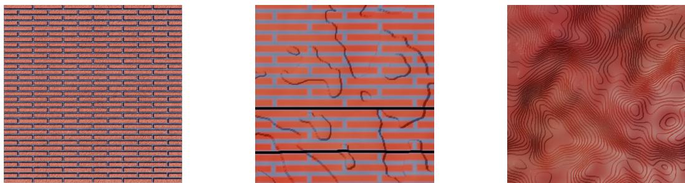  
Figure 6: Three illustrative CMA-ES outputs from separate runs for “a red brick wall" in the flat layout, ordered by the authors' visual assessment rather than by optimization time. Quick-scorer gains over each run's pre-polish program are +2.0, +3.7, and +0.7, with the largest gain belonging to the middle image. The selected images illustrate scorer disagreement and do not establish a general failure rate.

Analysis plan and outcomes. The frozen analysis treated the pooled forced-choice share and the mean rating per method as primary outcomes, with uncertainty estimated by a participant-cluster bootstrap (10,000 resamples), and tested the MATLOOM-versus-StableMaterials rating difference by Wilcoxon signed-rank tests at both the prompt and participant levels. Thirty participants completed the study, all passed the attention check, and none was excluded, leaving 600 paired decisions with no straight-line response patterns. Table 11 reports the outcomes. MATLoOM won 59.2% of forced choices with a mean rating of 4.98, StableMaterials followed at 19.3% and 3.60, IntrinsiX at 15.3% and 3.01, and MatFuse at 6.2% and 2.27. The rating advantage over StableMaterials was positive at both test levels $( p { = } 4 . 4 \times 1 0 ^ { - 4 }$ prompt-level, $\scriptstyle p = 6 . 5 \times 1 0 ^ { - 7 }$ participant-mean), and MAT-LooM was the forced choice on every one of the 20 prompts by at least 4 of the 30 participants. Ten participants (33%) reported no image-creation experience and 20 (67%) reported some, and MAT-Lo0M's win rate was 60.0% in the inexperienced group against StableMaterials' 21.5%, and 58.8% in the experienced group against 18.2%. Median per-trial completion time was 36.5 seconds, and participants gave free-text reasons on 192 of the 600 trials.

Table 11: Blind preference study over 30 participants and 20 prompts. Brackets in both columns give 95% participant-cluster bootstrap intervals. The forced-choice column shares sum to 100% over the 600 trials.
<table><tr><td>Method</td><td>Share of forced choices (%)</td><td>Mean fidelity (1–7)</td><td></td></tr><tr><td>MATLOOM (ours)</td><td>59.2 [55.8, 62.7]</td><td>4.98</td><td>[4.73,5.21]</td></tr><tr><td>StableMaterials</td><td>19.3 [16.5, 22.3]</td><td>3.60</td><td>[3.31,3.89]</td></tr><tr><td>IntrinsiX</td><td>15.3 [13.3, 17.2]</td><td></td><td>3.01 [2.77, 3.26]</td></tr><tr><td>MatFuse</td><td>6.2 [4.3, 8.2]</td><td></td><td>2.27 [2.07, 2.49]</td></tr></table>

Participant and prompt consistency. All 30 participants chose MATLOOM more often than any one baseline over the 20 trials, with 8–17 MATLOOM choices per person. MATLOOM had a unique plurality of choices on 13 of the 20 prompts and tied for plurality on one more. Its mean fidelity rating exceeded StableMaterials on 17 of the 20 prompts. These post-hoc summaries describe the fixed study prompts and participants rather than population-wide unanimity.

Variation across prompt sources. Table 12 shows the pooled forced-choice shares and the paired mean rating difference between MATLoOM and StableMaterials within each prompt source. Each source contributes only five prompts, so these differences are descriptive and should not be interpreted as source-level significance tests.

Table 12: Descriptive user-study results by prompt source. Each row pools five prompts and 150 choices from the same 30 participants. The four method columns give shares of forced choices in percent. Rating gap is the mean paired fidelity rating difference (MATLOOM minus StableMaterials) on the 1–7 scale.
<table><tr><td>Prompt source</td><td>MATLOOM</td><td>StableMaterials</td><td>IntrinsiX</td><td>MatFuse</td><td>Rating gap</td></tr><tr><td>GenProc</td><td>40.7</td><td>35.3</td><td>12.0</td><td>12.0</td><td>+0.35</td></tr><tr><td>MatSynth</td><td>62.0</td><td>8.7</td><td>26.7</td><td>2.7</td><td>+1.95</td></tr><tr><td>StableMaterials</td><td>57.3</td><td>18.7</td><td>17.3</td><td>6.7</td><td>+1.13</td></tr><tr><td>text2fabric</td><td>76.7</td><td>14.7</td><td>5.3</td><td>3.3</td><td>+2.06</td></tr></table>

Prompt-sampling sensitivity. The intervals in Table 11 resample participants while holding the selected prompts fixed. In a post-hoc crossed bootstrap with 10,000 draws, we resampled participants and resampled five prompts within each of the four sources. The resulting 95% interval for MATLoOM's pooled choice share is [47.3, 70.7]%, and the interval for its choice-share margin over StableMaterials is [22.0, 56.3] percentage points. This wider interval reflects variation across the selected prompts and does not establish performance outside their four sources.

## K BASELINE CONFIGURATIONS

Table 13 gives the generation settings recorded for 423 samples per diffusion baseline. MatFuse evaluation selects its released 3\_cfq sampler variant, whose recorded guidance scale is 5.0. The methods share Blender scene functions but have different output channels and routing. StableMaterials height is used for bump shading, whereas MATLOOM height drives geometric displacement, and the compared baseline exports do not provide the transmission channel used in the ice example. Consequently, staged results compare complete systems with these routing choices, rather than isolating the generative representation. A shared-channel evaluation and a StableMaterials displacement control with fixed, documented calibration are needed for that attribution (Section 5.1). Generation uses each system's released weights: StableMaterials from its published model with the LCM sampler, IntrinsiX as the released FLUX.1-dev LoRA, and MatFuse with its released checkpoint and the 3\_cfg sampler. Every per-run sampler setting is recorded in the baseline records, which also record the repositories, checkpoints, sampler settings, and map conventions.

Table 13: Recorded baseline generation settings at 512×512 map resolution and three run labels per prompt. Height-map availability does not imply matched rendering: StableMaterials uses bump shading while MATLOOM uses geometric displacement.
<table><tr><td>Method</td><td>Backbone</td><td>Steps</td><td>Guidance</td><td>Height map</td></tr><tr><td>MatFuse</td><td>latent diffusion</td><td>50</td><td>5.0</td><td>x</td></tr><tr><td>StableMaterials</td><td>SD-class LDM + LCM</td><td>4</td><td>10.0 (LCM)</td><td>√</td></tr><tr><td>IntrinsiX</td><td>FLUX.1-dev + LoRA</td><td>28</td><td>3.5</td><td>x</td></tr><tr><td>MATLoOM (ours)</td><td>LLM program</td><td>n/a</td><td>n/a</td><td>√</td></tr></table>

## L IMAGE-QUALITY DIAGNOSTIC

CLIP-IQA measures an image-quality proxy without using the target prompt and is reported separately from alignment metrics. Table 14 includes every main method and both layouts from the stored result snapshots. StableMaterials has the highest flat-layout mean, while the GLM-based MATLoOM configuration has the highest staged mean. The flagship's alignment gains therefore do not establish uniformly better image quality. These scores also depend on the scene and routing differences described in Appendix K.

Table 14: CLIP-IQA image-quality diagnostic, averaged across 141 prompts and three runs per method, with higher values indicating better predicted image quality. Best mean per layout is in bold. This metric does not measure prompt alignment.
<table><tr><td>Method</td><td>Flat CLIP-IQA</td><td>Staged CLIP-IQA</td></tr><tr><td>IntrinsiX</td><td>46.51</td><td>24.08</td></tr><tr><td>MatFuse</td><td>19.39</td><td>10.68</td></tr><tr><td>StableMaterials</td><td>52.17</td><td>21.27</td></tr><tr><td>MATLoOM (gemma-4-26b-a4b-it)</td><td>47.51</td><td>28.95</td></tr><tr><td>MATLoOM (qwen3.6-35b-a3b)</td><td>44.65</td><td>28.42</td></tr><tr><td>MATLOOM (deepseek-v4-flash-0731)</td><td>49.68</td><td>29.00</td></tr><tr><td>MATLOOM (glm-5.2)</td><td>49.19</td><td>30.12</td></tr><tr><td>MATLOOM (gpt-5.6-luna)</td><td>44.09</td><td>24.25</td></tr><tr><td>MATLOOM (gemini-3.6-flash)</td><td>47.21</td><td>24.63</td></tr></table>

## M RESULT PROVENANCE

The retained result snapshots cover all 141 prompt strings, three run labels, two layouts, and five stored metrics for each of the nine main methods, with no non-finite score values. The run tree contains 2538 main program records, 1974 component and cross-critic records, and 1269 baseline records, and each retained main trajectory contains an initial program, five revisions, and a polished final program. These counts establish completeness of the retained result slots, not the number of attempted generations or first-pass parse success, and the records do not retain failed requests, API request identifiers, or token usage. The benchmark prompt list is reconstructed from the retained raw source pools together with the recorded selection seed.

Every quantitative table in this paper is regenerated from the stored per-run scores. All 2538 baseline scored images (1269 runs in two layouts) are retained, and our scored renders are regenerated on demand from the retained programs by the rendering pipeline in the released code, under the same engine version and export settings. The ablation score file stores per-prompt scalars whose programs and settings are linked through the run tree.

## N PER-SOURCE BREAKDOWN

Table 15 groups the stored flat-layout scores by benchmark source. The flagship has higher BLIP-Score, CLIPScore, and VQAScore means than StableMaterials in each source. Its judge mean is lower on the StableMaterials-source and Hu et al. (2023) prompts, while its largest judge margins come from MatSynth and text2fabric. These descriptive source differences do not isolate representation effects or establish the cause of a prompt-distribution effect.

Table 15: Flat-layout means by benchmark source for the flagship (MATLoOM, final program) and StableMaterials (SM). Best mean per pair is in bold. These descriptive comparisons have no persource significance claim.
<table><tr><td></td><td colspan="2">BLIPScore</td><td colspan="2">CLIPScore</td><td colspan="2">VQAScore</td><td colspan="2">Judge</td></tr><tr><td>Source (n)</td><td>ours</td><td>SM</td><td>ours</td><td>SM</td><td>ours</td><td>SM</td><td>ours</td><td>SM</td></tr><tr><td>Hu et al. (30)</td><td>45.12</td><td>30.30</td><td>27.53</td><td>26.12</td><td>63.50</td><td>58.39</td><td>71.43</td><td>72.59</td></tr><tr><td>MatSynth (11)</td><td>73.72</td><td>28.46</td><td>30.83</td><td>25.05</td><td>59.04</td><td>42.69</td><td>76.30</td><td>38.82</td></tr><tr><td>StableMaterials (50)</td><td>48.24</td><td>34.34</td><td>26.83</td><td>25.17</td><td>43.98</td><td>36.64</td><td>56.35</td><td>59.40</td></tr><tr><td>text2fabric (50)</td><td>66.55</td><td>21.80</td><td>31.09</td><td>26.00</td><td>59.21</td><td>46.85</td><td>72.97</td><td>50.39</td></tr></table>

## O PROMPTS

The system prompt is the operational specification summarized in Section 4.1: a role preamble (verbatim below), the DSL spec (program structure, channel ranges, expression vocabulary, the two

pitfalls), the playbook of Table 16's idioms, six few-shot examples, and output instructions requiring a single <material> block.

Table 16: The organic-texture playbook's 5 idioms, as they appear in the system prompt.
<table><tr><td>Idiom</td><td>Use</td></tr><tr><td>Multi-octave layering</td><td>A low-frequency fBm for broad form plus a high-frequency one for fine grain, reused wherever each scale is needed.</td></tr><tr><td>Anisotropic striation</td><td>fBm/worley with base_freq-x ≠base_freq-y elongates fea- tures along an axis (bark, brushed metal).</td></tr><tr><td>Coordinate-domain warping</td><td>Add a noise to a coordinate term before a Sin pattern to turn band- ing into turbulent stratification, and drive height from the same warped pattern.</td></tr><tr><td>Micro-gloss grain</td><td>A high-frequency, low-amplitude fBm added only to roughness for skin, bark, or stone microstructure.</td></tr><tr><td>Substrate-matrix-first</td><td>Continuous substrate in a bottom Layer (1), discrete features as upper layers whose thresholded masks let the substrate show through.</td></tr></table>

## Role preamble (verbatim).

You are an expert technical artist. You write   
\*\*layered-material DSL\*\* programs: a compact, declarative   
language that compiles deterministically into physically   
based material maps. Given a natural-language description of   
a material, output a program that reproduces it.

One few-shot example (of six, verbatim). The prompt is “Weathered red brick wall with pale mortar."

```r
View(0, 0, 6, 6)
Define(brick, Bricks(brick_width=1, brick_height=0.45, mortar=0.06,feather=0.005))
Define(tone,fBm(octaves=4,base_freq=2.5,to_01=True,seed=7))
Define(grime, Threshold(fBm(octaves=5, base_freq=1.5, to_01=True, seed=15), below_at=0.55,
below_to=0,above_at=0.8, above_to=0.6))
Material(
Layer(1)
.basecolor(175, 170, 160)
.roughness(0.95)
.height((fBm(octaves=3,base_freq=10,to_01=True,seed=2)* 0.02)),
Layer(brick)
.basecolor((150 + (tone * 50)), (55 + (tone * 25)), (45 + (tone * 15)))
.roughness((0.7 +(tone *0.2)))
.height((0.04 +(tone * 0.05))),
Layer(grime)
.basecolor(60,55,50)
.roughness(1)
)
```

Critic output schema (verbatim field descriptions). The critic must return JSON with match\_score (“0-100, how well the image matches the description"), differences (“Concrete visual mismatches between image and description"), and suggestions (“Concrete appearance changes that would improve the match").

## Revision turn (verbatim).

A critic reviewed your material against the original   
description and scored the match XX/100. Their notes:   
{differences + suggestions, bulleted}. Revise the material   
to address these and reply with ONLY the updated   
<material>...</material>. When keeping a layer unchanged,   
copy it exactly, including any seed= values, so its noise   
stays the same.

## P QUALITATIVE FIGURE PROVENANCE

Figure 4 uses selected final outputs from the flagship and baseline runs, recorded in the paper-figure export configuration. The configuration selects the prompts “holiday wrapping paper," “Acoustic panels foam wedges checker tiles,"and “Cracked ice." The displayed row labels shorten these prompts, and each flat/staged pair renders the same selected material output. This is a deliberate selection to expose pattern, relief, and transmission differences, not a random sample or a comparison with matched output-channel routing.

## Q REPRESENTATION AND METHOD DETAILS

## Q.1 FORMAL DEPENDENCY STATEMENT

Let G denote a fixed canonical program structure, z its numeric parameters and explicit seed coordinates, and $F _ { k } ( u ; G , z )$ the evaluated material channel k at position u. Let $D _ { k }$ be the set of coordinates in z that occur in the transitive source dependencies of $F _ { k }$ , including the coverage expressions used in compositing. For two parameter assignments z and $z ^ { \prime }$ under the same engine version, settings, and sampling coordinates, finite deterministic evaluation gives

$$
z _ { D _ { k } } = z _ { D _ { k } } ^ { \prime } \quad \Longrightarrow \quad F _ { k } ( u ; G , z ) = F _ { k } ( u ; G , z ^ { \prime } ) .\tag{2}
$$

This is a consequence of evaluating unchanged dependencies, not a guarantee that an edit produces a perceptually local image change. A roughness edit may alter reflected highlights across the rendered surface even when the color and height maps are unchanged. Conversely, a coverage edit generally enters several composited channels, and a height edit also propagates to derived normals and approximate ambient occlusion.

## Q.2 CHANNEL SEMANTICS AND VALIDATION

Each layer carries coverage $\alpha ~ \in ~ [ 0 , 1 ]$ , sRGB base color in [0, 255], surface-response channels including roughness and metallicity, emission, and height h in coordinate units. Each scalar component may be an expression over position. For finite values, the engine clamps coverage and weights to [0, 1], color to its stated range, index of refraction to at least 1, and emissive strength to nonnegative values. Height is not clamped, and omitted channels take documented defaults. The surface channels correspond to a subset of OpenPBR inputs (Portsmouth et al., 2025) and are mapped to renderer parameters such as the Principled BSDF (Burley, 2012).

Coverage and material channels share arithmetic, coordinate transforms, noise (fBm, Worley), periodic patterns (Bricks, Weave), and filled or stroked shapes. Definitions can refer to earlier definitions, forming an acyclic dependency graph that layer expressions reference. Binary-mask union, intersection, complement, and difference use max(a, b), min(a, b), 1 – a, and a(1 – b). Periodic primitives support tiling over compatible periods. Arbitrary programs and sampling windows need not be seamless.

## Q.3 TILE PROGRAM DEPENDENCIES

Listing 1 makes source dependencies inspectable. Its bottom layer describes grout, while the upper layer uses tileMask as coverage and as a factor in its height expression. Changing the mortar parameter of this shared mask changes both the exposed grout region and the tile relief boundary. The explicit multiplication by ti leMask tapers height at the edge, so the taper comes from the source program rather than the compositing rule.

The upper layer's glazeGrain field appears only in its roughness expression, whereas g1azeRipple appears in both base color and height. With the remaining canonical source and sampling settings fixed, an edit confined to glazeGrain preserves the color and height maps, while an edit to g1azeRipple can change both. These are checkable properties of this program's dependencies, and do not imply that an automatically generated program will choose an equally useful decomposition.

## Q.4 SERIALIZATION CONTROLS

An inlined serialization removes named definitions by replacing every use with a copy of its resolved expression while keeping explicit noise seeds verbatim. Of the 2538 stored initial programs, 2514 (99%) use named definitions, inlining raises source length by a median factor of 1.4, and the inlined form re-parses and exports channel maps byte-identical to the named-field form for every one of these programs. This equivalence lets future generation and editing comparisons vary explicit reuse and serialization length while holding evaluation semantics fixed.

An explicit-channel form without layer grouping has no established equivalent yet. Expanding the layer stack faithfully must preserve the zero-coverage branch, color-space conversion, and separate maximum-height rule, and a generic weighted sum would change the target semantics. Direct Blender, native graph, or other material-generation systems provide complementary end-to-end comparisons, but changing their library and execution interface does not isolate the effect of named fields or layers.

The seed-variant mechanism replaces repeated occurrences of the same numeric seed together, preserving equality groups and all non-seed source within each candidate structure. This is a sourcelevel constraint. Attribute preservation and perceptual diversity still require measurement, especially when a seeded field drives coverage or relief.

## Q.5 EXECUTION DETAILS

The Python reference evaluates fields on a pixel grid and exports maps. A TypeScript port supports browser inspection and editing. A canonicalized program with every stochastic seed explicit, fixed sampling coordinates, and a fixed engine version and settings defines repeatable field evaluations within that engine. Omitted seeds must be resolved before comparing executions or attributing a change to an edit.

Parser checks cover syntax, named references, and constructors, while a finite regression suite checks serialization against the canonical EBNF (Appendix C). Neither establishes finite fields or successful rendering for every accepted program. For example, a well-formed square-root expression can be undefined at some positions. Generator instructions also distinguish color visibility from maximum height and explain that constant height creates no slope, while linear height produces a tilted normal. Finite cross-engine tests have explicit tolerances, differing Worley hashes, and excluded GPU shading (Appendix D). They do not establish identical images across renderers.

## Q.6 ALGORITHMIC OVERVIEW

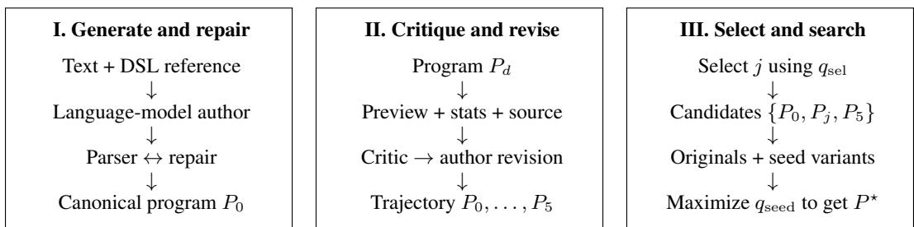  
Evaluation outside the authoring loop: P\* → Blender flat/staged renders → alignment scores.

Figure 7: The three-stage pipeline in Figure 3, summarized algorithmically. I. Generation proposes a program and repairs parser errors. I. Critique and refinement revises it using a quick render, material statistics, and source code where configured. III. Selection and seed search scores the trajectory and explores noise realizations of up to three candidate programs while fixing each candidate's remaining source. The loop uses a lightweight preview renderer and requires no path tracer.

## Q.7 PROMPT, CRITIC, AND RENDERER MECHANICS

The generator receives an operational DSL reference describing structure, channel ranges, expressions, and compositing semantics. Six few-shot examples span one to four layers, and an organictexture playbook supplies idioms such as combining low- and high-frequency fBm fields (Appendix O). The language reference is supplied as context, without constraining the model's tokenlevel decoding.

The quick render evaluates the composited maps and height-derived normals, then shades a head-on swatch under a fixed directional light. It uses approximate Blinn-Phong specular shading, Fresnel, sheen, subsurface, and transmission terms rather than path tracing. It does not reproduce global illumination or physical refraction, so feedback can miss effects that become visible in a staged render. The material statistics contain 28 descriptors of the unlit channel maps, covering albedo, texture, roughness, metallicity, height, normal tilt, occlusion, and other channel summaries. Each statistic is paired with a short definition.

Trajectory selection and seed search both use quick renders, but they score different render resolutions. Both scorer calls use the text template “A photo of t" for a prompt t. Shared preprocessing does not make 512×512 selection inputs equivalent to 256×256 seed-search inputs. Within each seed sweep, all non-seed parameters and structure stay fixed, but the winning output can come from the initial, selected, or final trajectory program.

The preview renderer makes candidate search practical without a path tracer. In the flagship recorded runs, a sweep of 1001 seed variants renders 256×256 previews and scores them in a median of 70 seconds, about 70 milliseconds per candidate, and all stages ran sequentially in one process per prompt. Appendix F reports stage-wise latency for every backbone.

## R ADDITIONAL EXPERIMENTAL ANALYSES

This section provides further protocol and diagnostic details for the evaluation in Section 5.

## R.1 PROTOCOL DETAILS

The representation targets surface appearance through spatial patterns, layers, and material channels. We retain prompts with figurative or highly specific motifs to test where this representation becomes restrictive. Every prompt is evaluated with both rendering layouts, and every scored run is retained in the quantitative tables. The text-only backbones, DeepSeek and GLM, receive code and statistics without the quick render during critique. The retained run tree contains 423 complete conversations per backbone and no aborted attempts; per-turn repair counts are not logged, so first-pass validity within a turn is not measured. The flagship's recorded median authoring time is 4.6 minutes, with a median 68% of time spent in polishing, the Stage III seed search (Appendix F). Compact output size therefore should not be read as cheap authoring.

## R.2 SELECTED REFINEMENT TRAJECTORY

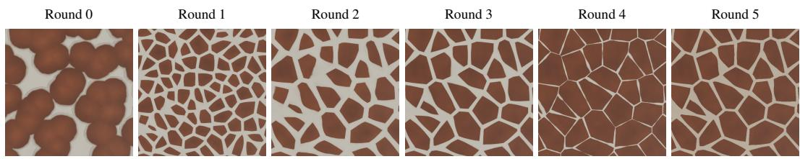  
Figure 8: Selected refinement trajectory for “Giraffe skin with large polygonal patches."The figureselection procedure filters for BLIPScore/judge gains and ranks candidates by visual change. This example's flat BLIPScore rises from 2.8 to 99.8, and its round-5 judge score is 16 points above round 0. The polished final output is omitted because it contains a smudge accepted by the quick scorer. This illustration does not estimate the frequency of successful or monotonic refinement.

In this selected case, rounded and partly merged patches in round 0 become distinct polygons in round 1. Later revisions change polygon scale and boundary width. The sequence shows the type of structural change revision can make in one trajectory, while Table 2 and Appendix E give aggregate score changes.

## R.3 PROXY MISMATCH EXAMPLE

An exploratory parameter-search variant (Appendix I) provides a qualitative diagnostic for proxy mismatch. Three separate runs for “a red brick wall" produce regular brick rows, a wall with broad breaks and irregular cracks, and a wavy texture without recognizable brick rows. The authors' visual ordering differs from the recorded quick-score gains of +2.0, +3.7, and +0.7 points, with the largest quick-score increase assigned to the middle example. This motivates inspecting structural changes alongside proxy scores, but it does not establish a general failure rate for parameter search or guarantee that seed-only search preserves appearance.