# MC-PanDA++: Simpler, Stronger, and More Robust Domain-Adaptive Panoptic Segmentation

Ivan Martinovi´c<sup>1\*</sup>, Josip Sari´c <sup>ˇ</sup> <sup>1,2</sup>, Yuki M. Asano<sup>3</sup>, Siniˇsa Segvi´c <sup>ˇ</sup> <sup>1</sup>

<sup>1</sup>Faculty of Electrical Engineering and Computing, University of Zagreb, Unska 3, 10000 Zagreb, Croatia.

<sup>2</sup>Faculty of Computer and Information Science, University of Ljubljana, Veˇcna Pot 113, 1000 Ljubljana, Slovenia.

<sup>3</sup>Fundamental AI Lab, University of Technology Nuremberg, Dr.-Luise-Herzberg-Straße, 90461 N¨urnberg, Germany.

\*Corresponding author(s). E-mail(s): ivan.martinovic@fer.hr;

Contributing authors: josip.saric@fri.uni-lj.si; yuki.asano@utn.de; sinisa.segvic@fer.hr;

## Abstract

Unsupervised domain adaptation (UDA) reduces the annotation burden in panoptic segmentation by leveraging a cost-efectively labeled source domain (e.g., synthetic) and an unlabeled target domain to bridge the distribution gap. Existing panoptic UDA methods rely on teacher-student consistency learning built upon suboptimal per-pixel segmentation architectures. In contrast, state-of-the-art mask transformers are rarely adopted due to their pronounced vulnerability to confirmation bias in consistency learning, where erroneous teacher predictions are reinforced during training. Our earlier approach, MC-PanDA (Martinovi´c et al. 2024), mitigates this issue through fine-grained confidence estimation, which suppresses gradients from unreliable masks while sampling informative yet reliable locations for loss computation. However, this method entails a complex multi-stage training and requires careful hyperparameter tuning. This work presents MC-PanDA++, which addresses these limitations by introducing: (i) self-supervised vision encoders that provide a stronger and more robust initialization, further reducing the reliance on human annotations, (ii) per-class, self-adapting maskwide loss scaling that stabilizes training and enables the usage of a single set of hyperparameters across domains, and (iii) a single-stage training pipeline that decreases overall conceptual complexity. Together, these improvements result in a conceptually simpler, better-performing, and more robust method for domain-adaptive panoptics. Source code: github.com/martinovicivan/MC-PanDA.

Keywords: Panoptic segmentation, Domain adaptation, Confidence estimation, Domain shift

## 1 Introduction

Panoptic segmentation provides comprehensive scene understanding by assigning each pixel both a semantic category and an instance identity (Kirillov et al. 2019). Recent advances have led to consistent performance improvements, bringing a wide range of practical applications within reach (Cheng et al. 2022; Yu et al. 2022; Li et al. 2023). However, many important domains require application-specific datasets that are very expensive to annotate (Zlateski et al. 2018; Zendel et al. 2019), costing up to 5 hours per image for human experts (Br¨odermann et al. 2024). Furthermore, even standard domains such as driving scenes suffer from the long tail of corner cases that are not easily collected (Zendel et al. 2018; Sakaridis et al. 2021; Uijlings et al. 2022; Zendel et al. 2022), e.g., animals on the road at night.

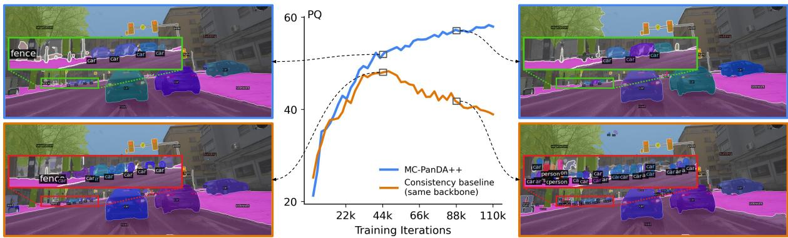  
Fig. 1 Validation Panoptic Quality (PQ) during domain adaptation from Cityscapes to ACDC. Baseline consistency training collapses due to confirmation bias, producing hallucinated false-positive masks, whereas our MC-PanDA++ mitigates this issue through curated consistency learning based on mask confidence estimation.

Synthetic datasets ofer a cost-efective and scalable alternative, allowing controlled simulation of corner cases and yielding extensive labeled training data. Yet, the benefits of synthetic data can only be fully realized if the domain gap between synthetic and real images is properly addressed (Ros et al. 2016; Richter et al. 2016; Kim et al. 2020). This challenge has established unsupervised domain adaptation (UDA) as a critical research direction (Ben-David et al. 2010; Ganin and Lempitsky 2015; Sun and Saenko 2016), as it aims to reduce the domain gap using only unlabeled images from the target domain. Currently, the dominant UDA paradigm is teacher–student consistency learning (Tarvainen and Valpola 2017), efective across numerous downstream tasks (Hoyer et al. 2023; Li et al. 2022), including panoptic segmentation (Mansour et al. 2025). In particular, significant progress has been achieved through various extensions of this paradigm, including auxiliary consistency terms (Huang et al. 2021; Mansour et al. 2025), loss modulation (Saha et al. 2023), and teacher prediction calibration (Zhang et al. 2023).

However, the performance of panoptic UDA methods remains limited by their reliance on suboptimal per-pixel segmentation architectures with separate things and stuf decoders, requiring heuristic post-processing. In contrast, supervised panoptic segmentation is dominated by mask transformers (Cheng et al. 2022; Jain et al. 2023; Wang et al. 2023), which provide a unified solution for both semantic and instance prediction. The limited adoption of mask transformers in UDA context stems from dificult and unstable consistency training as observed by Zhang et al. (2023) and our baseline experiments. We believe that the high capacity of mask transformers makes them particularly susceptible to confirmation bias, which commonly arises in self-training frameworks like consistency learning (Arazo et al. 2020). Therefore, a novel training strategy is essential to unlock the potential of mask transformers in UDA.

To address this challenge, we propose MC-PanDA++, which uses Mask Confidence to guide consistency training in Panoptic Domain Adaptation. In particular, our method associates each teacher-predicted mask with a mask-level confidence measure. Additionally, for every mask, we derive the dense sampling afinity map by blending fine-grained teacher confidence with student uncertainty. Together, these mask-wide confidences and sampling afinities allow us to discourage self-learning in uncertain masks and at locations with inappropriate pixel-level uncertainty. This mechanism is crucial for mitigating confirmation bias, as illustrated in Figure 1. We observe that the validation panoptic quality (PQ) of a standard consistency baseline collapses midtraining, whereas our method maintains a stable learning trajectory. The collapse arises from naive self-training amplifying noise, evident in the baseline predictions (Fig. 1, orange) where the number of hallucinated false-positive masks increases drastically over the course of training. On the other hand, our method (Fig. 1, blue) successfully mitigates this issue through guided self-training based on mask confidence estimation.

In summary, we contribute two novel techniques for domain adaptive panoptic segmentation: mask-wide loss scaling (MLS), which utilizes aggregated region-wide confidence, and confidence-based point filtering (CBPF), which prioritizes learning in points with confident teacher and uncertain student predictions. Experiments on standard benchmarks reveal substantial improvements in the generalization performance. Our method outperforms the state of the art by a large margin, advancing the viability of synthetic data for real-world applications.

MC-PanDA++ is an extension of our earlier ECCV’24 work, MC-PanDA (Martinovi´c et al. 2024), introducing several key contributions: (1) We analyze the robustness of strong self-supervised vision encoders under domain shift and demonstrate their suitability for domainadaptive panoptic segmentation. (2) We significantly streamline the preliminary three-stage MC-PanDA training pipeline into a single-stage design by leveraging robust self-supervised initialization. This simplification reduces the number of hyperparameters and the overall conceptual complexity. (3) We improve mask-wide loss scaling (MLS) by introducing class-dependent and self-adapting confidence thresholding, enabling the use of the same initialization-independent hyperparameters across all experiments. This substantially reduces variance and increases robustness, addressing a key limitation of MC-PanDA. (4) We provide a notably extended experimental study, detailing the evolution from MC-PanDA to MC-PanDA++. Specifically, we present: i) a detailed ablation study showing that our contributions remain efective even with stronger vision encoders, ii) results on two new synthetic-to-real and two new clear-toadverse benchmarks, accompanied by corresponding ablations, iii) analysis of key design choices of our new class-dependent adaptive MLS, demonstrating its efectiveness in increasing stability and reducing sensitivity to the initial hyperparameter value, iv) robustness analysis of CBPF, and v) impact of scaling the vision encoder.

## 2 Related work

Panoptic segmentation. While many realworld applications require both semantic and instance-level segmentation, early research treated these tasks separately. The introduction of panoptic segmentation as a unified formulation (Kirillov et al. 2019) sparked considerable interest in jointly modeling things and stuf classes. Initial approaches extended Mask R-CNN (He et al. 2017) with an additional semantic segmentation branch and explored various fusion strategies for combining the two prediction streams (Kirillov et al. 2019; Li et al. 2018; Xiong et al. 2019; Kirillov et al. 2019). Panoptic-DeepLab (Cheng et al. 2020) advanced this direction by building on a semantic segmentation architecture and introducing class-agnostic instance predictions via center and ofset regression.

Unified panoptic segmentation with Mask Transformers. Recent work has introduced unified transformer-based architectures that represent both things and stuf regions using dense sigmoidal maps called masks (Yu et al. 2022; Cheng et al. 2022; Li et al. 2023). These masks are recovered by scoring dense features with the associated embeddings (Cheng et al. 2021). Mask embeddings are obtained through direct set prediction with an appropriate transformer module (Carion et al. 2020). Beyond simplifying inference, these models currently achieve the state of the art on panoptic segmentation benchmarks (Zhou et al. 2017; Lin et al. 2014). Moreover, recent studies highlight the strong ability of mask transformers to estimate their own prediction uncertainty (Grcic et al. 2023), utilized by several leading methods in dense anomaly detection (Rai et al. 2023; Nayal et al. 2023; Ackermann et al. 2023; Deli´c et al. 2024).

Self-supervised representation learning. Self-supervised learning (SSL) is a pre-training paradigm in which models optimize a pretext task on unlabeled data. Since such data can be collected at scale and without manual labeling, self-supervised models ofer robust and generalizable representations while avoiding the cost, bias, and ambiguity of human annotations. A major line of SSL research includes clusteringbased methods such as DeepCluster (Caron et al. 2018), SeLa (Asano et al. 2020), SwAV (Caron et al. 2020), and DINO (Caron et al. 2021). Extending DINO with masked image modeling (Zhou et al. 2022) and large-scale curated pre-training yields DINOv2 (Oquab et al. 2024), proven to be efective across many downstream tasks (Tolan et al. 2024; Xu et al. 2024). Beyond that, self-supervised foundation models showed great robustness to domain shift (H¨ummer et al. 2024; Wei et al. 2024; Yun et al. 2025). Hence, we initialize our backbone with self-supervised DINOv2, which stabilizes training and enables us to streamline the pipeline from three stages to a single stage. Beyond standard transformers, recent state-space models such as Mamba (Gu and Dao 2024) have been adapted to vision tasks (Zhu et al. 2024; Jiang et al. 2026). Related progress in self-supervised and multimodal visual learning includes remote-sensing super-resolution (Xiao et al. 2023) and multimodal feature fusion (Sheng et al. 2026), which are complementary to our focus on domain-adaptive panoptic segmentation.

Unsupervised domain adaptation for segmentation. Unsupervised domain adaptation (UDA) considers a labeled source domain $\mathcal { D } _ { \mathrm { s r c } }$ and an unlabeled target domain ${ \mathcal { D } } _ { \mathrm { t g t } }$ , assuming access to target-domain images during training. Since the two domains typically exhibit a substantial distribution shift, models trained solely on $\mathcal { D } _ { s r c }$ often generalize poorly to $\mathcal { D } _ { t g t }$ (Zendel et al. 2018; Sakaridis et al. 2021). UDA addresses this by optimizing a joint objective over labeled source data and unlabeled target data (Ben-David et al. 2010; Sun and Saenko 2016):

$$
{ \mathcal { L } } _ { \mathrm { u d a } } = { \mathcal { L } } _ { \mathrm { s r c } } + { \mathcal { L } } _ { \mathrm { t g t } } .\tag{1}
$$

The key challenge is therefore how to construct the target-domain loss ${ \mathcal { L } } _ { \mathrm { t g t } }$ . Recent approaches rely heavily on consistency learning and the Mean Teacher framework (Tarvainen and Valpola 2017), which has shown strong performance in segmentation UDA (Hoyer et al. 2023; Saha et al. 2023). A number of methods further incorporate pixel-level uncertainty to filter or refine pseudo-labels (Zheng and Yang 2021; Zhou et al. 2022). In contrast, our method aggregates region-wide uncertainties, leverages both teacher and student uncertainty, and employs sparse point sampling (Kirillov et al. 2020) rather than per-pixel loss scaling (Zheng and Yang 2021; Zhou et al. 2022).

Domain adaptive panoptic segmentation. Domain-adaptive panoptic segmentation remains far less explored than semantic segmentation, with only a few notable methods. EDAPS (Saha et al. 2023) extends consistency learning with imagewide scaling of the self-supervised loss (Hoyer et al. 2022a; Tranheden et al. 2021; Hoyer et al. 2022b), which aims to stabilize training by reducing gradient magnitudes in images where the teacher is uncertain. However, this strategy can be suboptimal because it uniformly down-weights all pixels, even when uncertainty varies spatially. This issue becomes particularly pronounced when using mixing-based augmentations that paste source content into target images (French et al. 2020; Tranheden et al. 2021). LIDAPS (Mansour et al. 2025) builds upon EDAPS by additionally employing instance mixing from target to source and incorporating CLIP textual embeddings to regularize the semantic branch.

Our work is most closely related to UniDAformer (Zhang et al. 2023), the only prior method exploring domain adaptation with mask transformers. However, UniDAformer relies on handcrafted refinement of teacher predictions and reports its best results using a multi-branch per-pixel architecture, while its mask-transformer variants underperform (cf. Table 1 and (Zhang et al. 2023)). In contrast, we introduce the first panoptic adaptation approach based on regionwide, fine-grained uncertainty estimation. The design is motivated by recent success of mask transformers in dense anomaly detection (Rai et al. 2023; Grcic et al. 2023; Nayal et al. 2023). Our preliminary work, MC-PanDA (Martinovi´c et al. 2024), confirmed this potential, showing that mask transformers paired with fine-grained uncertainty estimation can set new state-of-the-art performance in panoptic domain adaptation.

## 3 MC-PanDA++

We first recap panoptic segmentation with mask transformers in subsection 3.1. Then, we describe a baseline domain adaptation with a mask transformer in 3.2. Subsections 3.3 and 3.4 present our contributions based on per-mask loss modulation and loss subsampling according to pixel-level confidence. Finally, in subsection 3.5 we describe the simplified training pipeline.

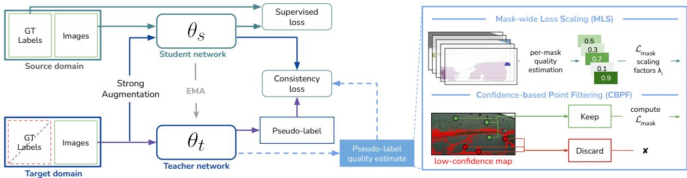  
Fig. 2 Our UDA baseline jointly optimizes the student with a supervised source-domain loss and a target-domain teacher–student consistency loss, thereby exposing it to confirmation bias. MC-PanDA++ mitigates this issue by estimating fine-grained teacher confidence, which guides mask-wide loss scaling and point sampling for loss computation.

## 3.1 Panoptic segmentation with Mask Transformers

Recent methods for scene understanding (Cheng et al. 2022; Li et al. 2023; Yu et al. 2022; Carion et al. 2020) can handle semantic, instance or panoptic segmentation without changing the loss function or the model architecture. These models directly detect instances and stuf segments, and describe them with distinct segmentation masks. The dense feature extractor produces pixel embeddings $E _ { p } ~ \in ~ \mathbb { R } ^ { H \times W \times d }$ , where H and W stand for height and width. The transformer decoder observes the features and classifies each of the N mask queries across (C+1) classes. The (C+1)-th class (no-object) indicates that the corresponding mask is unused in this particular image. The transformer decoder also produces mask embeddings $E _ { m } \in \mathbb { R } ^ { N \times d }$ that identify the corresponding pixel embeddings $E _ { p }$ through dot-product similarity. Combining the two embeddings through generalized matmul and sigmoid activation produces pixel-to-mask assignments $\sigma \in \mathbb { R } ^ { N \times H \times W }$ Thus, each mask is defined with $\sigma _ { i } \in \mathbb { R } ^ { H \times W }$ and class distribution $P _ { i } = ( p _ { i } ^ { ( 1 ) } , p _ { i } ^ { ( 2 ) } , . . . , p _ { i } ^ { ( C + 1 ) } )$

The training process minimizes the difference between the ground truth masks $\{ ( \sigma _ { i } ^ { \mathrm { G T } } , y _ { i } ^ { \mathrm { G T } } ) \} _ { i } ^ { N ^ { \mathrm { G T } } }$ and the predictions $\{ ( \sigma _ { i } , P _ { i } ) \} _ { i } ^ { N }$ The loss computation requires bipartite matching M which maps prediction mask index to the ground truth mask index while minimizing the overall matching cost. Note that the set of ground truth masks has to be extended with empty masks $( \sigma _ { i } ^ { \mathrm { G T } } = \mathbf { 0 } , y _ { i } ^ { \mathrm { G T } } = C + 1 )$ in order to match the number of predictions. Given M, we can compute the loss consisting of recognition

and localization terms:

$$
\mathcal { L } ^ { \mathrm { M T } } = \sum _ { i } ^ { N } \mathcal { L } _ { \mathrm { c l s } } ( P _ { i } , \boldsymbol { y } _ { \mathcal { M } ( i ) } ^ { \mathrm { G T } } ) + \sum _ { \boldsymbol { y } _ { \mathcal { M } ( i ) } ^ { \mathrm { G T } } \neq \boldsymbol { C } + 1 } \mathcal { L } _ { \mathrm { m a s k } } ( \sigma _ { i } , \sigma _ { \mathcal { M } ( i ) } ^ { \mathrm { G T } } )\tag{2}
$$

The recognition terms ${ \mathcal L } _ { \mathrm { c l s } }$ require correct semantic classification, while the localization terms ${ \mathcal { L } } _ { \mathrm { m a s k } }$ optimize per-pixel assignments. Note that ${ \mathcal { L } } _ { \mathrm { m a s k } }$ is computed only for masks matched with non-empty ground truth, and that our source domain loss $\mathcal { L } _ { \mathrm { s r c } }$ from (1) corresponds to $\mathcal { L } ^ { \mathrm { M T } }$ from (2). During inference, each pixel (row, column) is assigned the mask M that maximizes the pixel-level confidence $\rho$ that is expressed as a product of recognition and localization scores:

$$
\begin{array} { l } { { \displaystyle M ( r , c ) = \arg \operatorname* { m a x } _ { i } \rho _ { i , r , c } } } \\ { { \displaystyle \rho _ { i , r , c } = \operatorname* { m a x } _ { y \neq c + 1 } P _ { i } ( y ) \cdot \sigma _ { i } ( r , c ) } } \end{array}\tag{3}
$$

## 3.2 Baseline consistency learning with Mean Teacher

This section presents our baseline panoptic domain adaptation training of mask transformers, as illustrated on the left panel of Figure 2. Each training iteration takes in an equal number of source and target domain images. With ground truth available in the source domain, the corresponding objective $\mathcal { L } _ { \mathrm { s r c } }$ follows the standard supervised mask transformer loss (Eq. 2). For the target domain, we employ Mean Teacher selftraining, since only unlabeled images are available. We feed the teacher with clean images and block the gradients through the corresponding branch.

We perturb the student images with strong augmentations consisting of color jitter (Chen et al. 2020), random application of Gaussian smoothing, and SegMix - our panoptic adaptation of Class-Mix (Olsson et al. 2021; Tranheden et al. 2021). Instead of classes, SegMix samples half of the panoptic segments from a random source image and pastes them atop the target image. We recover the teacher predictions and convert them to hard pseudo-labels consisting of $N ^ { \mathrm { t e a c h } }$ masks defined with the semantic class $y _ { i } ^ { \mathrm { t e a c h } }$ and dense assignment map $\sigma _ { i } ^ { \mathrm { t e a c h } }$ . Finally, we obtain the targetdomain loss $\mathcal { L } _ { \mathrm { t g t } } \left( \mathrm { E q . ~ 1 } \right)$ as the teacher-student consistency loss, defined identically to the mask transformer loss $\mathcal { L } ^ { \mathrm { M T } } \left( \mathrm { E q . ~ 2 } \right)$ , except that the ground truth masks $( \sigma _ { i } ^ { \mathrm { G T } } , y _ { i } ^ { \mathrm { G T } } )$ are replaced with the teacher pseudo-label masks $( \sigma _ { i } ^ { \mathrm { t e a c h } } , y _ { i } ^ { \mathrm { t e a c h } } )$

We set the teacher parameters $\Theta _ { t }$ to the temporal exponential moving average (EMA) of the student parameters $\Theta _ { s }$ (Tarvainen and Valpola 2017). Nevertheless, our baseline students still tend to deteriorate due to noisy pseudo-labels. Moreover, we notice that our baseline teachers produce many false positive masks. Training on such pseudo-labels tends to further amplify the noise due to the Mean Teacher setup, which introduces confirmation bias as the model repeatedly validates its own erroneous predictions.

We tackle this problem by guiding the self learning according to the estimated quality of pseudo-labels, as shown in the right panel of Figure 2. Specifically, we use mask confidence to identify unreliable masks and point sampling locations for loss computation. The following subsections provide more details of our approach.

## 3.3 Mask-wide loss scaling

Our baseline underperforms due to positive feedback loop between the student and the teacher. We propose to alleviate this efect by modulating the per-mask localization term $\mathcal { L } _ { \mathrm { m a s k } }$ of the student loss ${ \mathcal { L } } _ { \mathrm { t g t } }$ with mask-wide teacher confidence $\lambda _ { i }$ . We scale the localization loss as follows:

$$
\begin{array} { r l r } {  { \mathcal { L } _ { \mathrm { l o c } } ^ { \mathrm { M C } } = \sum _ { y _ { \mathcal { M } ( i ) } ^ { \mathrm { t e a c h } } \neq C + 1 } \lambda _ { i } \cdot \mathcal { L } _ { \mathrm { m a s k } } ( \sigma _ { i } , \sigma _ { \mathcal { M } ( i ) } ^ { \mathrm { t e a c h } } ) ; } } \\ & { } & { \lambda _ { i } = \frac { \sum _ { ( r , c ) \in M _ { i } ^ { F } } [ \rho _ { i , r , c } > \tau _ { 1 } ] } { | M _ { i } ^ { F } | } . } \end{array}\tag{4}
$$

Note that $M _ { i } ^ { F }$ represents the foreground locations for mask i, . – Iverson indicator function, and $\tau _ { 1 }$ a threshold. The pixel-level confidence ρ is defined in (3). The mask-wide teacher confidence $\lambda _ { i }$ corresponds to the ratio of the foreground pixels where the pixel-level confidence is larger than the threshold. Intuitively, the maskwide coeficient $\lambda _ { i }$ estimates the quality of a teacher pseudo-mask. Since $\lambda _ { i }$ is the fraction of predicted foreground pixels whose panoptic confidence exceeds $\tau _ { 1 }$ , coherent and confident masks receive larger localization weights. In contrast, incomplete or noisy masks typically contain more low-confidence foreground regions, resulting in smaller $\lambda _ { i }$ and a weaker contribution to the targetdomain consistency loss. Thus, MLS encourages learning from reliable pseudo-masks while downweighting uncertain ones that could otherwise reinforce confirmation bias.

## 3.3.1 Per-class and adaptive thresholding

The previous formulation (4) makes mask-wide loss scaling sensitive to the threshold $\tau _ { 1 }$ . A high threshold can halt learning on the target domain, while a low threshold is overly permissive, allowing noise amplification. Fig. 3 illustrates this sensitivity by showing model performance against diferent values of $\tau _ { 1 }$ . We observe that lower $\tau _ { 1 }$ values lead to substantial drops in PQ and increased variance across random seeds, compared to the default MC-PanDA setting with $\tau _ { 1 } = 0 . 9 9$

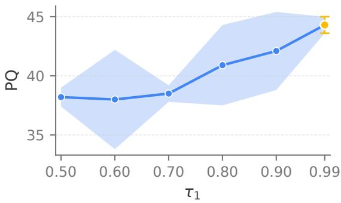  
Fig. 3 Panoptic performance (PQ) on Synthia→Vistas as a function of the initial threshold $\tau _ { 1 } .$ . Each point denotes the mean PQ over three random seeds, with error bars indicating the standard deviation. The orange point marks the default MC-PanDA setting with $\tau _ { 1 } = 0 . 9 9$

Furthermore, using a predetermined, fixed and uniform threshold $\tau _ { 1 }$ across all classes is suboptimal for multiple reasons. First, model confidence is class-dependent. For example, rare and visually ambiguous classes tend to exhibit lower confidence than others, even when their predictions are correct. Second, model confidence evolves during training, starting low and increasing over time. Third, model confidence depends on the degree of domain shift between the source and target domains. Selecting an appropriate fixed $\tau _ { 1 }$ for different training and testing domains is nontrivial, making deployment across domains challenging. Ideally, the training procedure should be robust to the initial choice of the threshold $\tau _ { 1 }$ . However, this is dificult to guarantee if the threshold remains static throughout training.

Hence, we propose to mitigate this instability using adaptive and class-dependent thresholds that evolve during training:

$$
\begin{array} { r l } & { \tau _ { 1 , k } ^ { n } = \alpha \tau _ { 1 , k } ^ { n - 1 } + \left( 1 - \alpha \right) \delta _ { k } ^ { n } , } \\ & { \delta _ { k } ^ { n } = \displaystyle \operatorname* { m a x } _ { i \in \mathcal { T } _ { k } ^ { n } } f \big ( \big \{ \rho _ { i , r , c } \big \vert ( r , c ) \in M _ { i } ^ { F } \big \} \big ) , } \end{array}\tag{5}
$$

where α is the EMA momentum controlling the smoothness of updates, $\mathcal { T } _ { k } ^ { n }$ denotes the set of teacher-predicted instances belonging to class k at the training iteration $n ,$ and $f \big ( \{ \rho _ { i , r , c } \mid ( r , c ) \in M _ { i } ^ { F } \} \big )$ is an instance-wise aggregation (e.g., mean, median, or N-th percentile) of the pixel-level confidence over the foreground region $\bar { M } _ { i } ^ { F }$ of instance i. The update coeficient $\delta _ { k } ^ { n }$ is obtained by first aggregating the panoptic score $\rho _ { i , r , c }$ over the foreground pixels of each mask $M _ { i } ^ { F }$ and then selecting the highest aggregated confidence among all masks of class k in the batch. If $\mathcal { T } _ { k } ^ { n } = \emptyset$ , i.e., if the teacher predicts no mask of class k in the current batch, we skip the update and keep the previous value of $\tau _ { 1 , k }$

Formulation in Eq. 5 introduces per-class thresholds $\tau _ { 1 , k } ^ { n }$ that dynamically adapt to the evolving teacher confidence distribution, improving stability and reducing sensitivity to the initial value. The max-over-instances operation max<sub>i∈I</sub>n is an empirical choice aligned with MLS: it anchors each class threshold to the most confident teacher masks of that class, rather than allowing many low-confidence pseudo-masks to lower the threshold and make MLS overly permissive. Combined with the EMA update, this yields class-specific thresholds that adapt over time while being less sensitive to noisy batch-level fluctuations.

## 3.4 Confidence-based point filtering

Training dense prediction models on highresolution images can be extremely memory intensive. This problem can be alleviated by training on a carefully chosen sample of $N _ { p }$ dense predictions instead of on the whole prediction tensor (Kirillov et al. 2020). The procedure starts by sampling a random oversized set of $3 N _ { p }$ floating-point locations. The initial set is then subsampled by choosing $\beta \cdot N _ { p }$ points with the largest uncertainty $( \beta \in$ $[ 0 , 1 ] )$ , and random $( 1 - \beta ) \cdot N _ { p }$ points. However, such procedure is inappropriate for consistency training. In fact, the teacher and the student will often be uncertain at the same locations since they are presented with the same image (up to a perturbation). Thus, blind favoring of uncertain student points would increase the chance of sampling incorrect pseudo-labels. On the other hand, favouring highly confident points would impair the learning process by providing uninformative gradients. Thus, we propose to favour points with low student and high teacher confidence by means of a dense sampling afinity $A _ { i } { \mathrm { : } }$

$$
\mathrm { A } _ { i } \left( r , c \right) = \left\{ \begin{array} { l l } { - \infty } & { \Phi _ { r , c } ^ { \mathrm { t e a c h } } < \tau _ { 2 } , } \\ { - | s _ { i , r , c } | } & { \mathrm { o t h e r w i s e } . } \end{array} \right.\tag{6}
$$

Note that $\Phi _ { r , c } ^ { \mathrm { t e a c h } }$ denotes the teacher confidence, while $s _ { i , r , c }$ denotes the pre-activation of the student mask-assignment σ. Thus, if the teacher confidence in some point (r,c) is lower than the threshold $\tau _ { 2 }$ , we prevent its sampling by setting the sampling afinity $\mathrm { t o } - \infty$ . When the teacher is confident, the sampling afinity is defined by the negative absolute value of the student pixel-tomask pre-activation, allowing student-uncertain points to be safely prioritized. We estimate the teacher confidence as follows:

$$
\Phi _ { r , c } ^ { \mathrm { t e a c h } } = \operatorname* { m a x } _ { i } \rho _ { i , r , c } ^ { \mathrm { t e a c h } }\tag{7}
$$

This assigns the lowest confidence to the locations that are not claimed by any of the masks, and to the locations claimed by masks with low classification confidence. This formulation of point sampling is conservative as it prevents any mask from training on low confidence teacher predictions.

## 3.5 Simplifying the training pipeline

Our preliminary method MC-PanDA relied on a three-stage training pipeline (Berrada et al. 2024), as illustrated in Figure 4. The first stage initialized the backbone with supervised ImageNet weights, and pre-trained the teacher on the labeled source domain. The second stage applied consistency learning with a fixed teacher (burnin stage) (Berrada et al. 2024), while the third stage employed consistency learning with a Mean Teacher (Tarvainen and Valpola 2017). Beyond

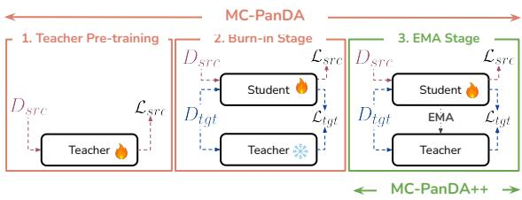  
Fig. 4 MC-PanDA++ simplifies the MC-PanDA training pipeline by removing source-domain pre-training and the teacher burn-in stage.

increasing conceptual complexity, the three-stage training pipeline introduces several stage-specific hyperparameters, such as the duration of teacher pre-training and the length of the burn-in phase. These hyperparameters vary across benchmarks, which makes the method less robust.

Hence, in MC-PanDA++, we simplify this setup to a single-stage training pipeline based on consistency learning with Mean Teacher. To maintain a stable learning curve similar to the three-stage setup, we introduce a simple modification. We initialize the backbone with large-scale self-supervised weights (Oquab et al. 2024), which provide greater robustness than supervised ImageNet pretraining from MC-PanDA. We argue this provides suficient stability to bypass the original stabilization phases, whose main purpose was to mitigate early pseudo-label noise. Moreover, selfsupervised backbone initialization further reduces the reliance on human annotations. In addition to the initialization, when using a single-stage pipeline, we observe that doubling the weight of the supervised $\mathcal { L } _ { \mathrm { m a s k } }$ loss yields a small performance improvement. Overall, single-stage training in MC-PanDA++ eliminates both the conceptual overhead of a staged procedure and the need to tune burn-in hyperparameters, while maintaining stable adaptation performance.

## 4 Experiments

We organize our experimental study as follows. Section 4.1 provides full implementation details, followed by a comparison of MC-PanDA++ against the state of the art on standard benchmarks in Section 4.2. Subsequently, Section 4.3 consolidates the contributions of our preliminary method MC-PanDA and revisits the key design choices. This analysis sets the groundwork for the stepby-step transition to the simpler, stronger and more robust MC-PanDA++ detailed in Section 4.4. Specifically, we: (i) study backbone initialization (4.4.1) and demonstrate the efectiveness of MLS and CBPF under stronger self-supervised initialization (4.4.2–4.4.4); (ii) simplify the original three-stage pipeline to a single-stage (4.4.5); (iii) analyze the efects of per-class adaptive maskwide loss scaling (4.4.6); and (iv) validate the robustness of CBPF (4.4.7). Finally, Section 4.5 reports the complete results of MC-PanDA++ and evaluates the efect of scaling the encoder.

## 4.1 Implementation details

Datasets. We perform experiments on two standard real-world datasets: Cityscapes (Cordts et al. 2016) and Mapillary Vistas (Neuhold et al. 2017). Cityscapes comprises 2975 training and 500 validation images of European urban scenes captured in fair weather and 1024 × 2048 resolution. Vistas contains 18,000 training and 2000 validation images of worldwide scenes under diverse weather and illumination conditions, with a mean resolution of 8.4 MPix. Additionally, we evaluate MC-PanDA++ on clear-to-adverse domain adaptation benchmarks by employing two datasets captured in challenging conditions: ACDC (Sakaridis et al. 2021) and MUSES (Br¨odermann et al. 2024). Both datasets are divided into four conditions: fog, nighttime, rain, and snow. The ACDC training subset comprises 1600 images, while the MUSES training subset includes 1500 images. We report performance on the corresponding validation subsets, which consist of 406 and 250 images, respectively. Following (Martinovi´c et al. 2024; Saha et al. 2023), for synthetic data we consider Synthia (Ros et al. 2016) with 9400 images at 1280 × 760 resolution, and Foggy Cityscapes (Sakaridis et al. 2018) with 2975 training and 500 validation images at 1024 × 2048 resolution and attenuation factor 0.02. Finally, we conduct additional experiments on the recently introduced synthetic dataset UrbanSyn (G´omez et al. 2025), which comprises 7539 training images and serves as an additional source domain. During inspection of Urban-Syn (G´omez et al. 2025), we identified a subset of images with corrupted ground-truth labels, such as regions assigned to clearly incorrect classes. In total, we detected 57 such images and removed them during training. We provide the details of the detection procedure, together with the full list of afected samples in the Appendix A. All experiments that use UrbanSyn as the source domain are conducted on this filtered split, including the source-only baselines and all MC-PanDA++ variants. In Appendix A, we also quantify the impact of this filtering step on the final performance.

Architecture. For both MC-PanDA (Martinovi´c et al. 2024) and MC-PanDA++, we employ the panoptic Mask2Former (Cheng et al. 2022) framework with multi-scale deformable attention (Zhu et al. 2021) in the pixel decoder. The default backbone in MC-PanDA is Swin-B (Liu et al. 2021). In MC-PanDA++, we adopt DINOv2- B as the primary backbone initialization for the majority of experiments, and DINOv2-Large to assess the efectiveness of scaling the encoder. We follow ViTDet (Li et al. 2022) to construct a ViT feature pyramid, and, following Kerssies et al. (2024), resize the patch-embedding kernels to 16×16 for all ViT-based experiments.

Training. We train our models for 110k iterations using batches composed of 2 source and 2 target-domain images. The teacher is updated as the exponential moving average (Tarvainen and Valpola 2017) of the student with a decay factor $\alpha = 0 . 9 9 9$ , and the same α is used for updating the adaptive threshold $\tau _ { 1 } ~ ( \mathrm { E q . ~ 5 } )$ . In contrast to MC-PanDA, MC-PanDA++ uses a single shared set of hyperparameters across all experiments, further demonstrating the robustness of our method. We use AdamW (Loshchilov and Hutter 2019) with an initial learning rate 0.0001 and weight decay 0.05.

We apply random scaling, horizontal flipping, color jittering, and random $5 1 2 \times 1 0 2 4$ cropping in both domains. The target-domain branch in the student receives additional strong augmentations as described in section 3.2. The teacher generates pseudo-labels for the target domain via default panoptic inference (Cheng et al. 2022), and the student is trained with a consistency objective modulated by our mask-wide loss scaling and points sampling procedure. See Appendix B for additional training and augmentation details.

All experiments with the base model variant are conducted on a single A100–40GB GPU, whereas the large variant requires two GPUs. All results are reported as the mean over three runs with diferent random seeds.

Evaluation. We evaluate our models according to panoptic quality (PQ) (Kirillov et al. 2019) that can be factored into segmentation quality (SQ) and recognition quality (RQ). We report PQ for each category (Appendix J), as well as the mean PQ, of the final student model. Synthia (Ros et al. 2016) comprises 16 annotated classes that correspond to a subset of the Cityscapes taxonomy. Consequently, the experiments on Synthia report $\mathrm { P Q } _ { 1 6 }$ as the mean over the 16 Synthia classes.

## 4.2 Comparison with the SotA

We first compare the results of MC-PanDA++ with the state of the art on the four benchmarks commonly used in the domain-adaptive panoptics. Table 1 summarizes the results on standard synthetic-to-real benchmarks. Consistent with our conference findings (Martinovi´c et al. 2024), the original MC-PanDA formulation already surpasses EDAPS (Saha et al. 2023) when equipped with either the MiT-B5 (Xie et al. 2021) or the comparable Swin-B (Liu et al. 2021) backbone. MC-PanDA also exceeds the performance of LIDAPS (Mansour et al. 2025), despite LIDAPS leveraging MiT-B5 combined with CLIP-based (Radford et al. 2021) textual embeddings. To further assess the efect of the backbone, Table 1 also includes our EDAPS and LIDAPS reimplementations with the DINOv2-B backbone, the same encoder as in MC-PanDA++.

Table 1 Comparison with the state of the art on Synthia→Cityscapes and Synthia→Vistas. † indicates our reimplementation of EDAPS using the same Swin-B backbone as in MC-PanDA. ‡ indicates our reimplementation with the same DINOv2-B backbone as in MC-PanDA++. All experiments for MC-PanDA and MC-PanDA++ are averaged over three random seeds.
<table><tr><td rowspan="2">Method</td><td colspan="3"> $\mathrm { S y n t h i a {  } C i t y }$ </td><td colspan="3"> $\mathrm { S y n t h i a } {  } \mathrm { V i s t a s }$ </td></tr><tr><td> $\mathbf { P Q } _ { 1 6 } \overline { { \mathbf { \Lambda } } }$ </td><td> $\mathrm { R Q } _ { 1 6 }$ </td><td> $\mathrm { S Q } _ { 1 6 }$ </td><td> $\mathbf { P Q } _ { 1 6 }$ </td><td> $\mathrm { R Q } _ { 1 6 }$ </td><td> $\mathrm { S Q } _ { 1 6 }$ </td></tr><tr><td>CVRN (Huang et al. 2021)</td><td>32.1</td><td>40.9</td><td>66.6</td><td>21.3</td><td>28.1</td><td>65.3</td></tr><tr><td>UniDAF-DETR (Zhang et al. 2023)</td><td>33.0</td><td>42.2</td><td>64.7</td><td></td><td></td><td></td></tr><tr><td>UniDAF-PSN (Zhang et al. 2023; Kirillov et al. 2019)</td><td>34.2</td><td>44.3</td><td>66.9</td><td></td><td></td><td></td></tr><tr><td>EDAPS (Saha et al. 2023)</td><td>41.2</td><td>53.6</td><td>72.7</td><td>36.6</td><td>46.1</td><td>71.7</td></tr><tr><td>EDAPS† (Saha et al. 2023)</td><td>39.3</td><td>51.4</td><td>73.1</td><td></td><td></td><td></td></tr><tr><td>LIDAPS (Mansour et al. 2025)</td><td>44.8</td><td>57.6</td><td>74.4</td><td>38.0</td><td>47.7</td><td>73.9</td></tr><tr><td>MC-PanDA (Martinović et al. 2024)</td><td>47.4</td><td>59.3</td><td>76.7</td><td>38.7</td><td>49.8</td><td>71.0</td></tr><tr><td>EDAPS‡ (Saha et al. 2023)</td><td>42.0</td><td>54.7</td><td>73.4</td><td>40.5</td><td>51.7</td><td>74.7</td></tr><tr><td>LIDAPS‡ (Mansour et al. 2025)</td><td>44.7</td><td>57.1</td><td>74.4</td><td>37.0</td><td>48.2</td><td>73.8</td></tr><tr><td>MC-PanDA++</td><td>49.6</td><td>62.2</td><td>77.0</td><td>44.8</td><td>56.6</td><td>76.3</td></tr></table>

Table 2 Performance evaluation on Cityscapes→Foggy Cityscapes and Cityscapes→Vistas. All experiments for MC-PanDA and MC-PanDA++ are averaged over three random seeds.
<table><tr><td rowspan="2">Method</td><td colspan="4">Cityscapes→Foggy</td><td colspan="4">Cityscapes→Vistas</td></tr><tr><td> $\mathbf { P Q } _ { 1 6 }$ </td><td> $\mathrm { R Q } _ { 1 6 }$ </td><td> $\mathrm { S Q } _ { 1 6 }$ </td><td> $\mathbf { P Q } _ { 1 9 }$ </td><td> $\mathbf { P Q } _ { 1 6 }$ </td><td> $\mathrm { R Q } _ { 1 6 }$ </td><td> $\mathrm { S Q } _ { 1 6 }$ </td><td> $\mathbf { P Q } _ { 1 9 }$ </td></tr><tr><td>CVRN (Huang et al. 2021)</td><td>35.7</td><td>46.7</td><td>72.7</td><td></td><td>33.5</td><td>42.8</td><td>73.8</td><td></td></tr><tr><td>UniDAF (Zhang et al. 2023)</td><td>37.6</td><td>49.5</td><td>72.9</td><td></td><td></td><td></td><td></td><td></td></tr><tr><td>EDAPS (Saha et al. 2023)</td><td>56.7</td><td>70.5</td><td>79.2</td><td></td><td>41.2</td><td>53.4</td><td>75.9</td><td></td></tr><tr><td>LIDAPS (Mansour et al. 2025)</td><td>59.6</td><td>73.2</td><td>80.2</td><td></td><td>42.6</td><td>54.9</td><td>76.6</td><td></td></tr><tr><td>MC-PanDA (Martinović et al. 2024)</td><td>63.7</td><td>76.3</td><td>82.5</td><td>62.0</td><td>53.8</td><td>66.6</td><td>79.3</td><td>51.7</td></tr><tr><td>MC-PanDA++</td><td>66.6</td><td>79.2</td><td>83.2</td><td>64.7</td><td>55.9</td><td>68.3</td><td>80.3</td><td>54.3</td></tr></table>

This improves some baseline results, but MC-PanDA++ remains ahead on both benchmarks. Additional details required for these reimplementations are provided in Appendix F. Most importantly, our extended MC-PanDA++ improves upon the original MC-PanDA by 2.2 $\mathrm { P Q } _ { 1 6 }$ points on Synthia→Cityscapes and achieves a substantial 6.1 $\mathrm { P Q } _ { 1 6 }$ points gain on the more challenging Synthia→Vistas benchmark.

We provide a detailed compute, memory, and inference-time comparison with LIDAPS in Appendix G. In summary, LIDAPS uses fewer training iterations and therefore requires fewer total GPU-hours, while MC-PanDA++ is faster at inference (3.4 FPS vs. 2.1–2.4 FPS), uses less inference memory (4.0 GiB vs. 6.6–8.2 GiB), and achieves higher final performance.

Table 2 further compares MC-PanDA++ with the state of the art on real-to-adverse (Cityscapes→Foggy Cityscapes) and real-toreal (Cityscapes→Vistas) benchmarks. Consistent with the observations in Table 1, MC-PanDA surpasses both EDAPS and LIDAPS on these two settings. Finally, MC-PanDA++ delivers additional gains over MC-PanDA, improving performance by approximately 2.5 $\mathrm { P Q } _ { 1 9 }$ points on both benchmarks. We provide per-class comparison with the state of the art on both synthetic-to-real and clear-to-adverse benchmarks in the Appendix J.

## 4.3 Ablating MC-PanDA

Before introducing MC-PanDA++, we ablate MC-PanDA (Martinovi´c et al. 2024) and examine alternative formulations of its key components, laying the foundation for the improvements developed in the following sections.

Table 3 Ablation study on Synthia→Cityscapes and Synthia→Vistas with the Swin-B backbone, as originally reported for MC-PanDA (Martinovi´c et al. 2024). Top row corresponds to supervised training on Synthia. We report mean over three random seeds. BC: baseline consistency (section 3.2).
<table><tr><td></td><td></td><td></td><td colspan="2">SYN→City</td><td colspan="2">SYN→Vistas</td></tr><tr><td>BC</td><td> ${ \mathrm { M L S } } _ { . 9 9 }$ </td><td>CBPF</td><td> $\mathrm { P Q } _ { 1 6 }$ </td><td></td><td> $\mathrm { P Q } _ { 1 6 }$ </td><td></td></tr><tr><td></td><td></td><td></td><td> $3 0 . 8 7$ </td><td></td><td> $2 5 . 2 \textrm  ~ \textdegree$ </td><td></td></tr><tr><td></td><td></td><td></td><td> $3 9 . 6 _ { \pm 1 . 5 } \ + 8 . 8$ </td><td></td><td> $3 2 . 2 _ { \pm 0 . 9 } \ + 7 . 0$ </td><td></td></tr><tr><td></td><td>V</td><td></td><td></td><td> $4 4 . 6 { \pm } 0 . 7 \ + 1 3 . 8$ </td><td> $3 7 . 1 { \pm } 1 . 0 \ + 1 1 . 9$ </td><td></td></tr><tr><td>ーメメ</td><td>I√</td><td>&gt;&gt;</td><td></td><td> $4 4 . 1 { \pm } 0 . 2 \ + 1 3 . 3$ </td><td> $3 5 . 1 { \pm } 1 . 3 { \ + } 9 . 9$ </td><td></td></tr><tr><td></td><td></td><td></td><td></td><td> $4 7 . 4 _ { \pm 0 . 8 } + 1 6 . 6$ </td><td> ${ \bf 3 8 . 7 \pm } 1 . 0 + 1 3 . 5$ </td><td></td></tr></table>

Table 3 quantifies the contributions of the proposed Mask-wide Loss Scaling (MLS) and Confidence-based Point Filtering (CBPF) to the panoptic performance $\left( \mathrm { P Q } _ { 1 6 } \right)$ of adapted models on two synthetic-to-real benchmarks: Synthia→Cityscapes and Synthia→Vistas. The first row reports the domain generalization performance of a supervised model trained on Synthia. Our consistency baseline (see 3.2) improves supervised baseline by 8.8 and 7.0 $\mathrm { P Q } _ { 1 6 }$ points on Synthia→Cityscapes and Synthia→Vistas, respectively. Self-training with MLS provides an additional gain of roughly 5 points on both benchmarks, amounting to improvements of approximately 14.0 and 12.0 $\mathrm { P Q } _ { 1 6 }$ points over the supervised baseline. Similarly, CBPF yields gains of about 5.0 and 3.0 $\mathrm { P Q } _ { 1 6 }$ points over the consistency baseline. Combining both components, our complete method reaches 47.4 and 38.7 ${ \mathrm { P Q } } _ { 1 6 } ,$ corresponding to improvements of 16.6 and 13.5 $\mathrm { P Q } _ { 1 6 }$ points over the supervised, and 7.8 and 6.5 $\mathrm { P Q } _ { 1 6 }$ points over the consistency baseline (BC).

We next investigate alternative formulations of our proposed contributions. Table 4 compares our mask-wide loss scaling (MLS) with image-wide loss scaling (ILS), which assigns all masks in an image a single global scaling factor (Saha et al. 2023). The image-wide loss weight is defined as:

$$
\lambda _ { i } = \lambda ^ { \mathrm { I L S } } = \frac { \sum _ { r , c } [ [ \Phi _ { r , c } ^ { \mathrm { t e a c h } } > \tau _ { \mathrm { I L S } } ] ] } { H W } .\tag{8}
$$

We evaluate three ILS thresholds $\tau _ { \mathrm { I L S } } \quad \in \quad$ $\{ 0 . 9 5 , 0 . 9 6 8 , 0 . 9 9 \}$ and report the best-performing configuration $\tau _ { \mathrm { I L S } } = 0 . 9 6 8$ (Saha et al. 2023) as an optimistic baseline. The top section of the table compares ILS and MLS without confidence-based point filtering (CBPF), while the bottom section includes CBPF. We observe a clear advantage of mask-wide loss scaling in both cases. We argue that this happens since ILS down-scales the loss gradients for many valid masks.

Table 5 validates our proposed loss subsampling strategy based on CBPF (cf. 3.4). The baseline point-sampling approach (Kirillov et al. 2020) prioritizes points with high student uncertainty, which increases the likelihood of selecting incorrect pseudo-labels. CBPF mitigates this issue by suppressing training on pixels for which the teacher exhibits low confidence. We further evaluate an alternative formulation of teacher confidence, $\Phi _ { i , r , c } ^ { \mathrm { t e a c h } } = \sigma ( | s _ { i } ^ { \mathrm { t e a c h } } | ) _ { r , c } ,$ where $s _ { i } ^ { \mathrm { t e a c h } }$ denotes the teacher pre-activation for mask i. This variant produces a per-mask confidence estimate, in contrast to our default all-mask formulation (see Eq. 7). We also include a random point-sampling baseline (random sampling, $\beta ~ = ~ 0 . 0 )$ . Our formulation, which aggregates confidence over all masks, outperforms the per-mask variant by 2.7 PQ points. We believe that per-mask underperformance occurs due to over-confident negative mask assignments where many pixels get incorrectly predicted as not belonging to the corresponding mask. See Appendix C for a visual comparison of the all-mask and per-mask strategies.

Table 4 Comparison of image-wide (ILS) and mask-wide loss scaling (MLS) on Synthia→Cityscapes, as originally reported for MC-PanDA (Martinovi´c et al. 2024). We report an optimistic ILS performance as the maximum across three diferent $\tau _ { \mathrm { I L S } }$ thresholds.
<table><tr><td>ILS</td><td>MLS</td><td>CBPF</td><td> $\mathrm { S Q _ { 1 6 } }$ </td><td> $\mathrm { R Q } _ { 1 6 }$ </td><td> $\mathbf { P Q } _ { 1 6 }$ </td></tr><tr><td> $\checkmark$ </td><td></td><td></td><td> $7 3 . 7 { \scriptstyle \pm 0 . 5 }$ </td><td> $5 0 . 5 { \scriptstyle \pm 1 . 1 }$ </td><td> $3 9 . 7 { \scriptstyle \pm 0 . 8 }$ </td></tr><tr><td></td><td>√</td><td></td><td> $7 5 . 3 { \scriptstyle \pm 0 . 2 }$ </td><td> $5 6 . 5 { \scriptstyle \pm 1 . 0 }$ </td><td> $4 4 . 7 _ { \pm 0 . 7 }$ </td></tr><tr><td> $\checkmark$ </td><td></td><td>√</td><td> $7 4 . 8 { \scriptstyle \pm 0 . 4 }$ </td><td> $5 3 . 4 { \scriptstyle \pm 0 . 2 }$ </td><td> $4 2 . 1 { \scriptstyle \pm 0 . 5 }$ </td></tr><tr><td></td><td> $\checkmark$ </td><td>√</td><td> $7 6 . 7 { \scriptstyle \pm 0 . 4 }$ </td><td> $5 9 . 3 _ { \pm 1 . 0 }$ </td><td> $4 7 . 4 { \scriptstyle \pm 0 . 8 }$  </td></tr></table>

Table 5 Validation of loss subsampling with confidence-based point filtering (CBPF) on Synthia→Cityscapes, as originally reported for MC-PanDA (Martinovi´c et al. 2024). The random sampling baseline applies the loss to a random subset of image points.
<table><tr><td>CBPF  $( \tau _ { 2 } = 0 . 8 )$  filtering method</td><td> $\mathrm { S Q } _ { 1 6 }$ </td><td> $\mathrm { R Q } _ { 1 6 }$ </td><td> $\mathbf { P Q } _ { 1 6 }$ </td></tr><tr><td>random sampling</td><td> $7 4 . 9 { \pm } 0 . 1$ </td><td> $5 6 . 1 \pm 1 . 4$ </td><td> $4 4 . 2 \pm 1 . 1$ </td></tr><tr><td>per-mask</td><td> $7 5 . 2 { \scriptstyle \pm 0 . 4 }$ </td><td> $5 6 . 5 { \scriptstyle \pm 0 . 1 }$ </td><td> $4 4 . 7 _ { \pm 0 . 1 }$ </td></tr><tr><td>all-masks  $\left( \mathbf { e q . 7 } \right)$ </td><td> $7 6 . 7 { \scriptstyle \pm 0 . 4 }$ </td><td> $5 9 . 3 { \scriptstyle \pm 1 . 0 }$ </td><td> $4 7 . 4 { \scriptstyle \pm 0 . 8 }$ </td></tr></table>

## 4.4 From MC-PanDA to MC-PanDA++

This section presents the evolution from the preliminary MC-PanDA to the improved MC-PanDA++. We begin by studying backbone initialization and demonstrating that MLS and CBPF remain efective under strong self-supervised encoders. We then extend the evaluation to additional synthetic-to-real and clear-to-adverse benchmarks, further validating the efectiveness of these components. Next, we streamline the original three-stage pipeline into a single-stage design and introduce per-class adaptive mask-wide loss scaling, which stabilizes training and removes sensitivity to the initial threshold. Finally, we demonstrate the robustness of CBPF, completing the transition to the final MC-PanDA++ framework.

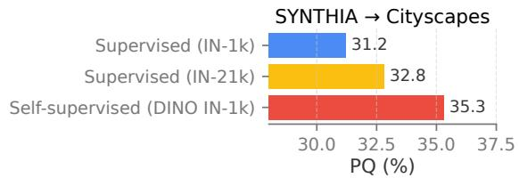  
Fig. 5 Comparison of initialization strategies. MC-PanDA with a self-supervised ViT-B/16 (DINO, IN-1k) yields the best PQ, outperforming supervised ViT-B/16 models pre-trained on ImageNet-1k and even ImageNet-21k. Results are averaged over three seeds.

## 4.4.1 On the backbone choice

We first validate the hypothesis that selfsupervised initialization ofers greater robustness to domain shift than supervised pre-training. To this end, we evaluate the original MC-PanDA (Martinovi´c et al. 2024) using a ViT-B-16 (Dosovitskiy et al. 2021) backbone with three distinct initialization strategies: supervised pre-training on ImageNet-1k (IN-1k) and ImageNet-21k (IN-21k), and selfsupervised DINO (Caron et al. 2021) trained on ImageNet-1k. Figure 5 reports the results on the Synthia→Cityscapes benchmark. The self-supervised DINO initialization outperforms the supervised counterparts, exceeding the IN-1k baseline by 4.2 PQ and even the IN-21k baseline by 2.5 PQ.

After establishing that self-supervised initialization benefits UDA, we evaluate several largescale pretrained encoders to identify the most suitable initialization. To better contrast different pretraining strategies, we consider three families: reconstruction-based self-supervised pretraining, represented by MAE (He et al. 2022); vision-language pretraining, represented by SigLIP2 (Tschannen et al. 2025); and distillationbased self-supervised pretraining, represented by

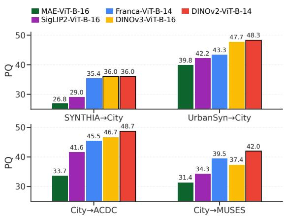  
Fig. 6 Selection of the pretrained backbone. We compare diferent pretraining strategies in a domain-generalization setting across four benchmarks: reconstruction-based selfsupervised pretraining (MAE), vision-language pretraining (SigLIP2), and distillation-based self-supervised pretraining (Franca, DINOv2, and DINOv3).

Franca-B (Venkataramanan et al. 2026), DINOv2- B (Oquab et al. 2024), and DINOv3-B (Sim´eoni et al. 2025). To assess their intrinsic robustness, we compare all encoders in a domain-generalization setting, where models train only on the source domain without access to target-domain images. All experiments use Mask2Former (Cheng et al. 2022) with identical hyperparameters to ensure a fair comparison. Figure 6 summarizes results across four benchmarks: MAE is consistently weaker, suggesting that reconstruction-based pretraining alone provides less robust cross-domain features in our setting. SigLIP2 achieves moderate performance, indicating that vision-language pretraining improves generalization but does not match the strongest self-supervised distillation models. Among the distillation-based methods, DINOv2-B provides the strongest and most consistent domain-generalization performance. We therefore adopt DINOv2-B as the default backbone for all subsequent experiments.

## 4.4.2 MC-PanDA with DINOv2

From this section onwards, all experiments use self-supervised DINOv2 (Oquab et al. 2024) as the backbone. We begin by directly replacing the Swin-B in MC-PanDA with DINOv2-B and evaluate whether our contributions, MLS and CBPF, remain efective under this substantially stronger initialization. Table 6 reports the ablation results on two synthetic-to-real benchmarks: Synthia→Cityscapes and Synthia→Vistas. The first row provides the domain-generalization performance of a model trained only on Synthia. Compared to the supervised Swin-B initialization in Table 3, self-supervised DINOv2-B improves performance by 5.2 and 8.5 $\mathrm { P Q } _ { 1 6 }$ points on the two benchmarks, respectively.

The consistency baseline (BC, row 2) further adds 3.7 $\mathrm { P Q } _ { 1 6 }$ points on Synthia → Cityscapes and maintains a similar performance level to the supervised baseline on Synthia → Vistas. This behavior on Vistas aligns with the self-confirmation and pseudo-label amplification efects discussed in our conference version and illustrated in Fig. 1, which persist even with a stronger backbone.

However, once MLS is introduced, we observe substantial performance gains on both benchmarks, including nearly $1 0 \mathrm { P Q } _ { 1 6 }$ points on Synthia → Vistas. This demonstrates that MLS provides complementary improvements that remain efective even under a state-of-the-art self-supervised initialization. Finally, adding CBPF on top of MLS (last row) yields additional gains of 4.0 and $1 . 4 \mathrm { P Q } _ { 1 6 }$ points on Synthia→Cityscapes and Synthia → Vistas, respectively, confirming that both MLS and CBPF continue to contribute despite the significantly stronger backbone.

## 4.4.3 Improving the synthetic source domain

We further validate the efectiveness of our contributions on benchmarks with a less extreme domain shift. Synthia (Ros et al. 2016) has long served as the standard synthetic source domain in domain adaptive panoptic segmentation, as it was for many years the only dataset providing both semantic and panoptic labels. However, Synthia exhibits two notable limitations: i) its visual appearance is often far from realistic (Fig. 7, top), and ii) it provides annotations for only 16 semantic classes, which do not fully match the standard 19-class Cityscapes taxonomy. Adapting from Synthia to real-world datasets therefore remains a strong indicator of a method’s robustness due to the substantial domain gap. However, a more realistic scenario would likely use synthetic images better aligned with the target domain.

Table 6 Ablation study on Synthia→Cityscapes and Synthia→Vistas with the self-supervised DINOv2 initialization. Top row corresponds to supervised training on Synthia. We report mean $\pm \mathrm { s t d }$ over three random seeds.
<table><tr><td rowspan="2">BC</td><td rowspan="2"> ${ \mathrm { M L S } } _ { . 9 9 }$ </td><td rowspan="2"> $\mathrm { C B P F _ { 0 . 8 } }$ </td><td colspan="2"> $_ \mathrm { S y n \mathrm { \to } C i t y }$ </td><td colspan="2">Syn→Vistas</td></tr><tr><td> $\mathbf { P Q } _ { 1 6 }$ </td><td></td><td> $\mathbf { P Q } _ { 1 6 }$ </td><td></td></tr><tr><td>一</td><td>一</td><td></td><td>36.0</td><td>7</td><td>33.7</td><td>¬</td></tr><tr><td>√</td><td></td><td></td><td> $3 9 . 7 \pm 0 . 9 + 3 . 7$ </td><td></td><td> $3 3 . 6 { \pm } 1 . 6 \mathrm { - } 0 . 1$ </td><td></td></tr><tr><td>√</td><td>√</td><td></td><td> $4 4 . 5 _ { \pm 0 . 6 } + 8 . 5$ </td><td></td><td> $4 2 . 8 _ { \pm 0 . 4 } + 9 . 1$ </td><td></td></tr><tr><td>√</td><td>√</td><td>√</td><td> $4 8 . 5 { \scriptstyle \pm 0 . 4 } + 1 2 . 5$ </td><td></td><td> $4 4 . 2 _ { \pm 0 . 1 } + 1 0 . 5$ </td><td></td></tr></table>

To address such a scenario, we evaluate the recently introduced UrbanSyn dataset (G´omez et al. 2025) as an alternative source domain. As illustrated in Fig. 7, UrbanSyn exhibits substantially higher visual realism. Moreover, UrbanSyn follows the standard 19-class Cityscapes taxonomy, which makes it a natural candidate for an improved synthetic-to-real benchmark.

Table 7 presents the ablation study of MC-PanDA with DINOv2 on the newly introduced benchmarks: UrbanSyn→Cityscapes and UrbanSyn→Vistas. From the table, we observe that MLS and CBPF together improve performance by 8.5 and $6 . 6 ~ \mathrm { \ P Q _ { 1 9 } }$ points over the supervised baseline on UrbanSyn→Cityscapes and UrbanSyn→Vistas, respectively. Compared to the consistency baseline (BC), the combined contributions yield an additional 3.4 $\mathrm { P Q } _ { 1 9 }$ points on both benchmarks. These results indicate that even with a more realistic and better aligned synthetic source domain, our proposed components remain efective and provide consistent gains.

Complementary to improving the adaptation method itself, one can also improve the underlying synthetic source domain. Table 8 examines this efect by comparing the performance of MC-PanDA with DINOv2 when using Synthia or UrbanSyn as the source domain for adaptation to Cityscapes and Vistas. The comparison is reported in $\mathrm { P Q } _ { 1 6 }$ over the 16 classes available in Synthia, which form a subset of the 19 classes in UrbanSyn. We observe gains of 11.3 and $8 . 0 \mathrm { P Q } _ { 1 6 }$ points on Cityscapes and Vistas, respectively, when switching from Synthia to UrbanSyn. These results suggest that, in addition to advancing domain-adaptation methods themselves, improving the quality and realism of the synthetic source domain can yield significant benefits.

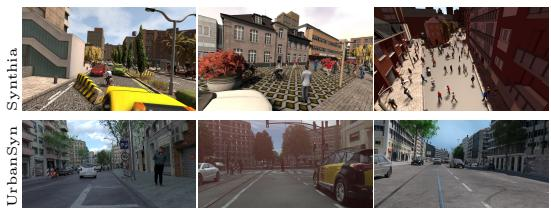  
Fig. 7 Visual comparison between the synthetic datasets Synthia (Ros et al. 2016) (top row) and UrbanSyn (G´omez et al. 2025) (bottom row).

Table 7 Ablation study on UrbanSyn→Cityscapes and UrbanSyn→Vistas with the self-supervised DINOv2 initialization. Top row corresponds to supervised training on UrbanSyn. We report mean<sub>±std</sub> over three random seeds. USyn: UrbanSyn.
<table><tr><td></td><td></td><td></td><td colspan="2"> $\mathrm { U S y n { \to } C i t y }$ </td><td colspan="2">USyn→Vistas</td></tr><tr><td>BC</td><td> ${ \mathrm { M L S } } _ { . 9 9 }$ </td><td> $\mathrm { C B P F _ { 0 . 8 } }$ </td><td> $\mathbf { P Q } _ { 1 9 }$ </td><td></td><td> $\mathbf { P Q } _ { 1 9 }$ </td><td></td></tr><tr><td>一</td><td>一</td><td></td><td>48.3</td><td>7</td><td>42.1</td><td></td></tr><tr><td>√</td><td></td><td></td><td> $5 3 . 4 { \scriptstyle \pm 0 . 8 \ + 5 . 1 }$ </td><td></td><td> $4 5 . 3 { \pm } 1 . 2 \ \ + 3 . 2$ </td><td></td></tr><tr><td>√</td><td>&gt;&gt;</td><td></td><td> $5 4 . 5 { \scriptstyle \pm 0 . 4 } \ + 6 . 2$ </td><td></td><td> $4 7 . 3 _ { \pm 0 . 1 } \ + 5 . 2$ </td><td></td></tr><tr><td>√</td><td></td><td>√</td><td> $5 6 . 8 { \scriptstyle \pm 0 . 7 } + 8 . 5$ </td><td></td><td> $4 8 . 7 _ { \pm 0 . 6 } \ + 6 . 6$ </td><td></td></tr></table>

## 4.4.4 Clear-to-adverse benchmarks

In previous domain-adaptive panoptic segmentation work, Cityscapes→Foggy Cityscapes has been the only benchmark used for clearto-adverse adaptation. Foggy Cityscapes is generated by synthetically adding fog to Cityscapes images, which limits the diversity of adverse conditions being evaluated. To expand this setting, we introduce two new clear-toadverse benchmarks: Cityscapes→ACDC and Cityscapes→MUSES. Figure 8 shows example images from ACDC (Sakaridis et al. 2021) and MUSES (Br¨odermann et al. 2024), while additional details are provided in subsection 4.1.

We further ablate MC-PanDA with DINOv2-B on the two new clear-to-adverse benchmarks and present results in Tab. 9. The consistency baseline (BC) performs 5.5 $\mathrm { P Q } _ { 1 9 }$ points below the supervised model on ACDC, quantitatively confirming the noise amplification efect shown in Fig. 1. In contrast, combining MLS and CBPF yields substantial gains: 6.8 and 10.6 $\mathrm { P Q } _ { 1 9 }$ points over the supervised baseline, and 12.3 and 3.3 $\mathrm { P Q } _ { 1 9 }$ points over consistency baseline (BC) on ACDC and MUSES, respectively.

Table 8 Comparison of MC-PanDA with DINOv2 when using Synthia versus UrbanSyn as the synthetic source domain. Results are reported in $\mathrm { P Q } _ { 1 6 }$ for the 16 classes shared between both datasets.
<table><tr><td>Src. domain</td><td> $\mathbf { P Q } _ { 1 6 }$ </td><td>on City</td><td> $\mathbf { P Q } _ { 1 6 }$ </td><td>on Vistas</td></tr><tr><td>Synthia</td><td> $4 8 . 5 { \pm } 0 . 4$ </td><td> $\urcorner$ </td><td> $4 4 . 2 { \scriptstyle \pm 0 . 1 }$ </td><td>7</td></tr><tr><td>UrbanSyn</td><td> $5 9 . 8 { \scriptstyle \pm 0 . 4 }$ </td><td> $+ 1 1 . 3$ </td><td> $5 2 . 2 _ { \pm 0 . 3 }$ </td><td>+8.0</td></tr></table>

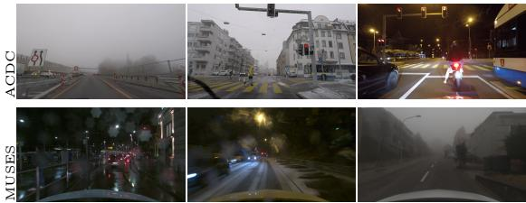  
Fig. 8 Example images from the adverse-condition datasets: ACDC (Sakaridis et al. 2021) (top row) and MUSES (Br¨odermann et al. 2024) (bottom row).

## 4.4.5 Simplifying the training pipeline

After validation of our contributions on multiple benchmarks with the new DINOv2 initialization, we consider reducing the conceptual complexity of our method. As described in Sec. 3.5, we hypothesize that DINOv2 is robust enough to make the preliminary training stabilization phases obsolete. Table 10 explores this by comparing MC-PanDA with DINOv2 using the three-stage versus the simplified single-stage pipeline, both evaluated with a constant MLS threshold $\tau _ { 1 } .$ . The two pipelines achieve comparable performance, while the singlestage version substantially reduces the training complexity. On the other hand, our preliminary experiments with the single-stage MC-PanDA and a Swin backbone failed to converge. These results confirm the stabilizing efect of DINOv2 backbone, which enables a single-stage training pipeline, adopted in all subsequent experiments.

Table 9 Ablation study on Cityscapes→ACDC and Cityscapes→MUSES the self-supervised DINOv2 initialization. Top row corresponds to supervised training on Cityscapes. We report mean $\pm \mathrm { s t d }$ over three random seeds.
<table><tr><td colspan="3"></td><td colspan="2">City→ACDC</td><td colspan="2">City→MUSES</td></tr><tr><td>BC</td><td> ${ \mathrm { M L S } } _ { . 9 9 }$ </td><td> $\mathrm { C B P F _ { 0 . 8 } }$ </td><td> $\mathbf { P Q } _ { 1 9 }$ </td><td></td><td> $\mathbf { P Q } _ { 1 9 }$ </td><td></td></tr><tr><td></td><td></td><td></td><td></td><td> $4 8 . 7  { \mathrm { ~ \textrm ~ { ~ ~ } ~ } }  { \mp }$ </td><td> $4 2 . 0  { \mathrm { ~ \textrm ~ { ~ ~ } ~ } }  { \vec { \tau } }$ </td><td></td></tr><tr><td>V</td><td></td><td></td><td> $4 3 . 3 { \scriptstyle \pm 1 . 2 } - 5 . 5$ </td><td></td><td> $4 9 . 3 { \pm } 0 . 5 + 7 . 3$ </td><td></td></tr><tr><td>&gt;&gt;</td><td>&gt;&gt;</td><td></td><td> $5 3 . 5 { \pm } 1 . 1 \ { + } 4 . 8$ </td><td></td><td> $5 0 . 6 _ { \pm 0 . 7 } + 8 . 7$ </td><td></td></tr><tr><td></td><td></td><td>√</td><td> $5 5 . 5 { \scriptstyle \pm 1 . 0 } + 6 . 8$ </td><td></td><td> $5 2 . 6 { \scriptstyle \pm 0 . 2 } + 1 0 . 6$ </td><td></td></tr></table>

Table 10 Comparison of the original three-stage MC-PanDA pipeline and the simplified single-stage MC-PanDA++ pipeline using a constant $\tau _ { 1 }$
<table><tr><td rowspan="2"># stages</td><td colspan="2">Synthia→Vistas</td><td colspan="2">City→ACDC</td></tr><tr><td> $\tau _ { 1 } = 0 . 9$ </td><td> $\tau _ { 1 } = 0 . 9 9$ </td><td> $\tau _ { 1 } = 0 . 9$ </td><td> $\tau _ { 1 } = 0 . 9 9$ </td></tr><tr><td>three</td><td> $4 2 . 1 _ { \pm 3 . 3 }$ </td><td> $4 4 . 2 _ { \pm 0 . 1 }$ </td><td> $5 2 . 9 { \scriptstyle \pm 1 . 2 }$ </td><td> ${ \bf 5 5 . 5 _ { \pm 1 . 0 } }$ </td></tr><tr><td>single</td><td> $\mathbf { 4 2 . 3 \pm 1 . 7 }$ </td><td> $4 4 . 4 { \scriptstyle \pm 1 . 2 }$ </td><td> ${ \bf 5 4 . 4 } _ { \pm 1 . 1 }$ </td><td> $5 4 . 1 { \pm } 1 . 5 $ </td></tr></table>

To further compare convergence, Table N1 reports intermediate checkpoints on Synthia→Vistas using $\mathrm { D I N O v 2 }$ initialization and a fixed $\tau _ { 1 } =$ 0.99. The single-stage variant follows a very similar convergence trajectory and slightly improves the final checkpoint, while removing the separate source-domain pre-training and fixed-teacher burn-in stages. Since both variants train the same Mask2Former-style architecture, their periteration memory cost is comparable. The main benefit of the single-stage pipeline is therefore reduced conceptual complexity and fewer stagespecific hyperparameters under a similar total iteration budget.

Table N1 Convergence comparison on Synthia→Vistas. Both variants use DINOv2 and a fixed $\tau _ { 1 } = 0 . 9 9$ , isolating the efect of the training pipeline. We report target-domain PQ at diferent training checkpoints, averaged over three random seeds.
<table><tr><td>Checkpoint</td><td>MC-PanDA three-stage</td><td>MC-PanDA single-stage</td></tr><tr><td>50k</td><td>40.8</td><td>41.5</td></tr><tr><td>70k</td><td>42.8</td><td>43.0</td></tr><tr><td>90k</td><td>43.7</td><td>43.9</td></tr><tr><td>110k</td><td>44.2</td><td>44.4</td></tr></table>

## 4.4.6 Per-class adaptive mask-wide loss scaling

This section presents a detailed analysis of our main methodological contribution to the preliminary MC-PanDA: introducing per-class and adaptive mask-wide loss scaling, as described in 3.3.1. Intuitively, model confidence is not uniform across classes due to factors such as class imbalance, varying frequency, and diferences in visual complexity. Therefore, requiring $\tau _ { 1 }$ to be per-class constitutes a natural improvement over the global, constant threshold used in the preliminary MC-PanDA. However, selecting an optimal $\tau _ { 1 }$ separately for each class is non-trivial and quickly becomes intractable. To address this, we make $\tau _ { 1 }$ both, per-class and self-adapting, allowing it to be automatically updated during training and independent of its initial value.

On the robustness of $\tau _ { 1 }$ . We first evaluate the robustness of the mask-confidence threshold by comparing single-stage MC-PanDA with a constant $\tau _ { 1 }$ against our new per-class adaptive $\tau _ { 1 }$ (Table 11) on two benchmarks: Synthia→Vistas and Cityscapes→ACDC. In this experiment, we vary the initial value of $\tau _ { 1 }$ and measure the final target-domain performance.

Two main weaknesses of a constant $\tau _ { 1 }$ emerge: (i) performance fluctuates considerably as $\tau _ { 1 }$ changes, and (ii) for a fixed $\tau _ { 1 }$ , the standard deviation across runs is large, reaching up to 4 PQ points. These instabilities highlight the sensitivity of MC-PanDA to manual threshold selection. In contrast, the per-class adaptive $\tau _ { 1 }$ exhibits: (i) stable performance across diferent starting values, and (ii) substantially reduced variance across runs. Beyond its stability benefits, the adaptive formulation also improves downstream performance by $2 . 8 ~ \mathrm { P Q } _ { 1 6 }$ on Synthia→Vistas and $3 . 0 \ \mathrm { P Q _ { 1 9 } }$ on Cityscapes→ACDC, on average. Thus, perclass self-adapting thresholding not only removes the need to tune $\tau _ { 1 }$ but can also provide further performance gains. Additional experiments on robustness of per-class adaptive $\tau _ { 1 }$ can be found in Table 14, and in an UrbanSyn→Vistas analysis reported in Appendix H.

Figure 9 illustrates the efect of using a perclass adaptive $\tau _ { 1 }$ (starting value equal 0.0) compared to a fixed $\tau _ { 1 } ~ = ~ 0 . 9 9$ (as in the original MC-PanDA) when training the single-stage model. The left panel shows the panoptic quality evolution for three classes: terrain, wall and car. Adaptive thresholding accelerates learning for rare classes such as terrain and wall, and also provides additional late-stage improvements for frequent car class. The middle panel depicts the evolution of adaptive $\tau _ { 1 }$ over training, accompanied by the constant baseline, while the right panel provides a zoomed-in view. Overall, while a fixed $\tau _ { 1 } = 0 . 9 9$ was a reasonable choice in MC-PanDA, making $\tau _ { 1 }$ both per-class and self-adapting can yield further stability and performance gains. We provide an additional rare/frequent-class analysis in Appendix I, where adaptive thresholding improves the average per-class PQ of the five rarest classes by 3.1 points on Cityscapes→ACDC.

Table 11 Comparison of constant and per-class adaptive $\tau _ { 1 }$ for diferent starting values on Synthia→Vistas (top) and Cityscapes→ACDC (bottom), using single-stage MC-PanDA with DINOv2-Base. For each starting value, we report mean<sub>±std</sub> panoptic quality (PQ) over three random seeds. The last column shows the average across all starting values.
<table><tr><td></td><td> $\tau _ { 1 } = 0 . 0$ </td><td> $\tau _ { 1 } = 0 . 5$ </td><td> $\tau _ { 1 } = 0 . 6$ </td><td> $\tau _ { 1 } = 0 . 7$ </td><td> $\tau _ { 1 } = 0 . 8$ </td><td> $\tau _ { 1 } = 0 . 9$ </td><td> $\tau _ { 1 } = 0 . 9 9$ </td><td colspan="2">Avg</td></tr><tr><td colspan="10"> $\mathrm { S y n t h i a } {  } \mathrm { V i s t a s }$ </td></tr><tr><td>constant</td><td></td><td> $4 0 . 3 { \scriptstyle \pm 2 . 8 }$ </td><td> $4 2 . 2 _ { \pm 1 . 6 }$ </td><td> $4 2 . 4 { \scriptstyle \pm 4 . 3 }$ </td><td> $3 7 . 2 { \scriptstyle \pm 2 . 6 }$ </td><td> $4 2 . 3 { \scriptstyle \pm 1 . 7 }$ </td><td> $4 4 . 4 { \scriptstyle \pm 1 . 2 }$ </td><td> $4 1 . 5 { \scriptstyle \pm 2 . 4 }$ </td><td>7</td></tr><tr><td>per-class adaptive</td><td> $4 4 . 8 { \scriptstyle \pm 0 . 1 }$  </td><td> ${ \bf 4 3 . 6 { \scriptstyle \pm 0 . 4 } }$  </td><td> ${ \bf 4 3 . 8 { \scriptstyle \pm 0 . 8 } }$  </td><td> $\mathbf { 4 4 . 6 { \scriptstyle \pm 1 . 0 } }$  </td><td> $4 4 . 7 \pm \bf { 1 . 2 }$ </td><td> $\mathbf { 4 4 . 2 \underline { { + } } 0 . 6 }$ </td><td> ${ \bf 4 4 . 5 { \scriptstyle \pm 0 . 2 } }$ </td><td> $\mathbf { 4 4 . 3 { \scriptstyle \pm 0 . 4 } }$ </td><td>+2.8</td></tr><tr><td colspan="10"> $\mathrm { C i t y s c a p e s { \to } A C D C }$ </td></tr><tr><td>constant</td><td></td><td> $5 3 . 6 { \scriptstyle \pm 2 . 6 }$ </td><td> $5 3 . 5 { \scriptstyle \pm 2 . 0 }$ </td><td> ${ \bf 5 3 . 4 \pm 0 . 5 }$ </td><td> $5 1 . 7 { \scriptstyle \pm 3 . 1 }$ </td><td> $5 4 . 4 { \scriptstyle \pm 1 . 1 }$ </td><td> $5 4 . 1 { \scriptstyle \pm 1 . 5 }$ </td><td> $5 3 . 5 { \scriptstyle \pm 0 . 9 }$ </td><td>7</td></tr><tr><td>per-class adaptive</td><td> $5 6 . 3 { \scriptstyle \pm 0 . 6 }$ </td><td> ${ \bf 5 6 . 6 { \bf _ { \pm 1 . 0 } } }$  </td><td> ${ \bf 5 6 . 6 { \bf _ { \pm 0 . 6 } } }$  </td><td> $5 6 . 5 { \scriptstyle \pm 1 . 1 }$  </td><td> ${ \bf 5 6 . 2 \pm 0 . 3 }$ </td><td> ${ \bf 5 6 . 1 \pm 0 . 7 }$ </td><td> ${ \bf 5 7 . 0 { \bf _ { \pm 0 . 6 } } }$ </td><td> ${ \bf 5 6 . 5 { \bf \underline { { { t } } } 0 . 3 } }$ </td><td>+3.0</td></tr></table>

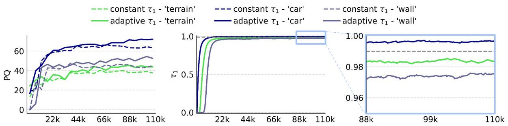  
Fig. 9 Per-class PQ performance (left) and evolution of the adaptive confidence threshold $\tau _ { 1 }$ during training, alongside the constant baseline $\tau _ { 1 } = 0 . 9 9$ (middle), for Cityscapes→ACDC. Per-class adaptive $\tau _ { 1 }$ can accelerate learning for rare classes such as terrain and wall, while also enabling additional late-stage improvements for frequent classes such as car.

On the choice of aggregation function $f .$ For the instance-wise aggregation function f (cf. Eq. 5), we use the third quartile by default. Table 12 further shows that MLS remains robust when employing alternative aggregation functions, such as the mean or median.

Table 12 Diferent aggregation functions f for per-class adaptive τ<sub>1</sub>. We report mean<sub>±std</sub> panoptic quality (PQ) over three random seeds.
<table><tr><td>f</td><td>Synthia→Vistas</td><td>City→ACDC</td></tr><tr><td>mean</td><td> $4 4 . 4 { \scriptstyle \pm 0 . 3 }$ </td><td> $5 4 . 3 { \scriptstyle \pm 1 . 7 }$ </td></tr><tr><td>median</td><td> $4 4 . 8 _ { \pm 1 . 3 }$ </td><td> $5 5 . 2 _ { \pm 0 . 7 }$ </td></tr><tr><td>3. quartile</td><td> ${ \bf 4 4 . 8 _ { \pm 0 . 1 } }$ </td><td> ${ \bf 5 6 . 3 _ { \pm 0 . 6 } }$ </td></tr></table>

On the choice of cross-instance aggregation. Eq. 5 first aggregates pixel-level confidences within each mask using f, and then aggregates across teacher-predicted masks of the same class through the outer $\operatorname* { m a x } _ { i \in \pmb { \mathscr { T } } _ { k } ^ { n } }$ operation. The fixedthreshold analysis in Table 11 suggests that MLS benefits from selective thresholding: lower values of $\tau _ { 1 }$ make the loss scaling more permissive and lead to less stable performance, while high thresholds perform best. This motivates the maxover-instances update, which anchors the adaptive threshold of class k to the most confident teacher masks of that class, rather than allowing many low-confidence pseudo-masks to lower the threshold. To validate this design choice, we compare the default maximum with mean and third-quartile aggregation across instances of the same class, while keeping the instance-wise aggregation f fixed to the third quartile (Table N2). The maximum performs best or tied across all three benchmarks, while mean aggregation is consistently worse. This supports max-over-instances as a simple and efective default for the adaptive MLS threshold update.

Global vs. per-class adaptation. As an alternative to the per-class formulation in Eq. $5 , \tau _ { 1 }$ can also be adapted globally, i.e., using a single threshold shared across all classes. In this case, a single update term $\delta ^ { n }$ is computed over all instances:

Table N2 Efect of the cross-instance aggregation over teacher-predicted masks of the same class in Eq. (5). We keep the instance-wise aggregation f fixed to the third quartile and vary the outer aggregation over instances. We report mean±std PQ over three random seeds.
<table><tr><td>Outer aggregation</td><td></td><td>Syn→Vistas City→ACDC City→MUSES</td><td></td></tr><tr><td>mean</td><td> $4 3 . 5 { \scriptstyle \pm 1 . 7 }$ </td><td> $5 4 . 6 { \scriptstyle \pm 0 . 1 }$ </td><td> $5 2 . 0 { \scriptstyle \pm 0 . 6 }$ </td></tr><tr><td>3. quartile</td><td> $4 3 . 9 { \pm } 0 . 0$ </td><td> $5 6 . 3 { \scriptstyle \pm 0 . 7 }$ </td><td> $5 2 . 0 { \scriptstyle \pm 1 . 2 }$ </td></tr><tr><td>max</td><td> ${ \bf 4 4 . 8 _ { \pm 0 . 1 } }$ </td><td> ${ \bf 5 6 . 3 _ { \pm 0 . 6 } }$ </td><td> ${ \bf 5 2 . 4 _ { \pm 0 . 4 } }$ </td></tr></table>

$$
\delta ^ { n } = \operatorname* { m a x } _ { i \in \mathcal { T } ^ { n } } \ f \left( \left\{ \ \rho _ { i , r , c } \ \middle | \ ( r , c ) \in M _ { i } ^ { F } \right\} \right) ,\tag{9}
$$

where ${ \mathcal { T } } ^ { n }$ denotes the set of all teacher-predicted instances in the batch at the training iteration n. This is diferent from the per-class formulation, which computes the maximum only over instances of class $k \ ( \mathrm { i . e . , } \ i \in \ \mathcal { T } _ { k } ^ { n } )$ . Table 13 compares the global-adaptive and per-class adaptive formulations on the Cityscapes→ACDC benchmark for several initial $\tau _ { 1 }$ values. Per-class adaptation consistently yields higher performance, confirming it as a preferred choice for MC-PanDA++.

Table 13 Comparison of global-adaptive and per-class adaptive $\tau _ { 1 }$ on Cityscapes→ACDC for diferent initial threshold values. We report mean<sub>±std</sub> panoptic quality (PQ) over three random seeds.
<table><tr><td rowspan="2"> $\tau _ { 1 }$ </td><td colspan="3"> $\mathrm { C i t y s c a p e s { \to } A C D C }$   $\left( \mathbf { P Q } _ { 1 9 } \right)$ </td></tr><tr><td> $\tau _ { 1 } = 0 . 0$ </td><td> $\tau _ { 1 } = 0 . 5$ </td><td> $\tau _ { 1 } = 0 . 9 9$ </td></tr><tr><td>global adaptive</td><td> $5 6 . 1 { \scriptstyle \pm 0 . 7 }$ </td><td> $5 5 . 3 { \scriptstyle \pm 0 . 5 }$ </td><td> $5 5 . 4 _ { \pm 1 . 0 }$ </td></tr><tr><td>per-class adaptive</td><td> $5 6 . 3 { \scriptstyle \pm 0 . 6 }$ </td><td> $5 6 . 6 _ { \pm 1 . 0 }$ </td><td> $5 7 . 0 { \scriptstyle \pm 0 . 6 }$ </td></tr></table>

## 4.4.7 Robustness of confidence-based point filtering

Table 14 evaluates the robustness of confidencebased point filtering (CBPF) with respect to the threshold $\tau _ { 2 }$ across three benchmarks: Synthia→Vistas and Cityscapes→{ACDC, MUSES}. For each setting, we vary the initial value of the per-class adaptive $\tau _ { 1 }$ and report $\mathrm { m e a n } _ { \pm \mathrm { s t d } }$ over three random seeds. Across all benchmarks and $\tau _ { 1 }$ initializations, performance remains remarkably stable for $\tau _ { 2 } \in \{ 0 . 7 , 0 . 8 , 0 . 9 \}$ ， with variations typically below 1 PQ pp. This indicates that CBPF is mostly insensitive to the precise choice of $\tau _ { 2 } .$ , and that $\tau _ { 2 } ~ = ~ 0 . 8$ , default value used in MC-PanDA, continues to be a reliable choice in MC-PanDA++. Moreover, given the small diferences observed across values, tuning $\tau _ { 2 }$ ofers negligible additional benefit.

Table 14 Robustness of confidence-based point filtering (CBPF) with respect to the threshold τ<sub>2</sub> on: Synthia→Vistas, Cityscapes→ACDC, and Cityscapes→MUSES, evaluated across diferent initial values of the per-class adaptive $\tau _ { 1 } . \dagger$ marks the default setting used in MC-PanDA++, $\tau _ { 2 } = 0 . 8$
<table><tr><td rowspan="2"></td><td colspan="6">Synthia→Vistas  $\left( \mathrm { P Q } _ { 1 6 } \right)$ </td><td rowspan="2">Avg</td></tr><tr><td> $\tau _ { 1 } =$  0.0</td><td>0.5</td><td>0.6</td><td>0.7</td><td>0.8 0.9</td><td>0.99</td></tr><tr><td> $\tau _ { 2 } { = } 0 . 7$ </td><td>45.2</td><td>44.5</td><td>44.5</td><td>45.1</td><td>45.3 44.8</td><td>45.2</td><td> $4 4 . 9 { \scriptstyle \pm 0 . 3 }$ </td></tr><tr><td> $\tau _ { 2 } { = } 0 . 8 ^ { \dagger }$   $\tau _ { 2 } { = } 0 . 9$ </td><td>44.8 44.4</td><td>43.6</td><td>43.8 45.0</td><td>44.6 44.5</td><td>44.7</td><td>44.2 44.5 43.8</td><td>44.3±0.4  $4 4 . 6 _ { \pm 0 . 4 }$ </td></tr><tr><td></td><td></td><td>45.2</td><td></td><td></td><td>44.8 44.8</td><td></td><td></td></tr><tr><td> $\tau _ { 1 } =$ </td><td>Cityscapes→ACDC 0.0</td><td>0.5</td><td>0.6</td><td>0.7</td><td>0.8</td><td> $\left( \mathbf { P Q } _ { 1 9 } \right)$  0.9 0.99</td><td>Avg</td></tr><tr><td> $\tau _ { 2 } { = } 0 . 7$ </td><td>56.3</td><td>56.3</td><td>56.7</td><td>55.4</td><td></td><td></td><td> $5 6 . 2 _ { \pm 0 . 4 }$ </td></tr><tr><td> $\tau _ { 2 } { = } 0 . 8 ^ { \dagger }$ </td><td>56.3</td><td>56.6</td><td>56.6</td><td>56.6</td><td>55.7 56.6</td><td>56.3 56.1 57.0</td><td>56.5±0.3</td></tr><tr><td> $\tau _ { 2 } { = } 0 . 9$ </td><td>57.0</td><td>56.2</td><td>56.7</td><td>56.6</td><td>56.2 56.7 57.6</td><td>56.8</td><td> $5 6 . 8 { \scriptstyle \pm 0 . 4 }$ </td></tr><tr><td></td><td></td><td></td><td></td><td>Cityscapes→MUSES</td><td></td><td></td><td></td></tr><tr><td>T1=</td><td>0.0</td><td>0.5</td><td>0.6</td><td></td><td></td><td> $\left( \mathrm { P Q } _ { 1 9 } \right)$ </td><td>Avg</td></tr><tr><td> $\tau _ { 2 } { = } 0 . 7$ </td><td></td><td></td><td></td><td>0.7</td><td>0.8</td><td>0.9 0.99</td><td></td></tr><tr><td> $\tau _ { 2 } { = } 0 . 8 ^ { \dagger }$ </td><td>51.9</td><td>51.8</td><td>52.2</td><td>52.4</td><td>52.0</td><td>51.5 52.2</td><td> $5 2 . 0 { \scriptstyle \pm 0 . 3 }$ </td></tr><tr><td></td><td>52.4</td><td>52.1</td><td>52.1</td><td>52.4</td><td>52.7</td><td>52.0 52.6</td><td>52.2±0.3</td></tr><tr><td> $\tau _ { 2 } { = } 0 . 9$ </td><td>52.8</td><td>53.1</td><td>52.8</td><td>52.6</td><td>52.1 52.7</td><td>52.9</td><td> $5 2 . 7 _ { \pm 0 . 3 }$ </td></tr></table>

## 4.5 MC-PanDA++

All components presented in the previous sections culminate to our final method, MC-PanDA++. It uses a strong self-supervised DINOv2, adopts a simplified single-stage training pipeline, and employs per-class adaptive mask-wide loss scaling. The latter substantially improves stability and removes the sensitivity to the initial choice of $\tau _ { 1 }$ which was a key limitation of the preliminary MC-PanDA (Martinovi´c et al. 2024). We initialize $\tau _ { 1 }$ at 0.0 and let it evolve throughout training.

We report the final performance of MC-PanDA++ in Table 15, compare it against the supervised source-only baselines, and evaluate the efect of scaling the encoder from DINOv2- B to DINOv2-L. The consistent improvements observed with the larger encoder further confirm the efectiveness of MC-PanDA++.

Table 15 Overview of the final MC-PanDA++ results across six benchmarks. Improvements over the source-only fine-tuning baseline are shown for reference. All MC-PanDA++ results are reported as $\mathbf { m e a n \pm s t d }$ over three random seeds.
<table><tr><td rowspan="2">Method</td><td rowspan="2">Backbone</td><td colspan="4">Synthia  $\left( \mathrm { P Q } _ { 1 6 } \right)$ </td><td colspan="4">UrbanSyn  $\left( \mathbf { P Q } _ { 1 9 } \right)$ </td><td colspan="4">Cityscapes  $\left( \mathbf { P Q } _ { 1 9 } \right)$ </td></tr><tr><td colspan="2">Cityscapes</td><td colspan="2">Vistas</td><td colspan="2">Cityscapes</td><td colspan="2">Vistas</td><td colspan="2">ACDC</td><td colspan="2">MUSES</td></tr><tr><td>Source-only</td><td>DINOv2-Base</td><td>36.0</td><td>7</td><td>33.7</td><td>7</td><td>48.3</td><td>7</td><td>42.1</td><td>2</td><td>48.7</td><td>7</td><td>42.0</td><td>¬</td></tr><tr><td>MC-PanDA++</td><td>DINOv2-Base</td><td>49.6</td><td>+13.6</td><td>44.8</td><td>+11.1</td><td>57.2</td><td>+8.9</td><td>49.5</td><td>+7.4</td><td>56.3</td><td>+7.6</td><td>52.4</td><td>+10.4</td></tr><tr><td>Source-only</td><td>DINOv2-Large</td><td>39.9</td><td></td><td>37.9</td><td>¬</td><td>51.1</td><td></td><td>45.2 7</td><td></td><td>52.3</td><td></td><td>46.4</td><td>¬</td></tr><tr><td>MC-PanDÅ++</td><td>DINOv2-Large</td><td>54.2</td><td>+14.3</td><td>47.6</td><td>+9.7</td><td>59.1</td><td>+8.0</td><td>52.7</td><td>+7.5</td><td>60.1</td><td>+7.8</td><td>55.6</td><td>+9.2</td></tr></table>

## 5 Qualitative analysis

Figure 10 shows the road and trafic sign masks at two training checkpoints together with their corresponding mask-wide loss-scaling factors $\lambda _ { i } .$ A clear positive correlation emerges between mask quality and the value of $\lambda _ { i } ,$ indicating that MLS efectively suppresses gradients for low-quality masks. This behavior is particularly important during early training, when many pixels are incorrectly excluded from the corresponding mask. We further quantify this qualitative observation in Appendix E by measuring the Spearman correlation between $\lambda _ { i }$ and the groundtruth IoU of matched teacher pseudo-masks on Cityscapes→ACDC. The resulting class-averaged correlation is positive for both stuf and thing classes, with an average of $\rho = 0 . 6 1$ over all 19 classes. This confirms that MLS reliably reflects the true pseudo-mask quality across all classes, supporting its role in mitigating confirmation bias.

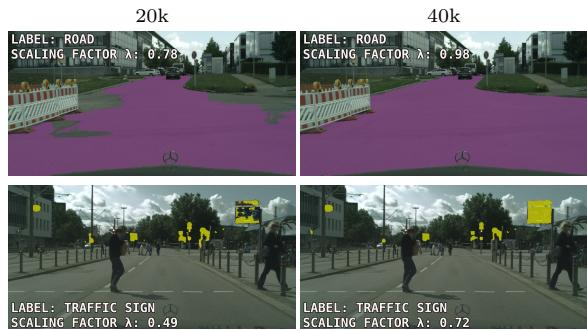  
Fig. 10 Illustration of the MLS factor $\lambda _ { i }$ for two model checkpoints during training, shown here for masks of classes road and traffic sign. As training progresses, the predicted masks become more complete and visually coherent, and the corresponding $\lambda _ { i }$ values increase accordingly. A strong correlation is observed between the value of $\lambda _ { i }$ and the visual quality of the predicted mask.

Figure 11 clearly illustrates how our maskwide loss scaling (MLS) and confidence-based point filtering (CBPF) provide complementary benefits in selecting reliable pixels for domainadaptive learning. Both the person mask (left) and the motorcycle mask (right) fail to capture all of their corresponding pixels, resulting in falsenegative regions. These regions align closely with areas of low sampling afinities (highlighted in red, middle). Together, MLS and CBPF prevent the student model from learning from these erroneous pseudo-labels.

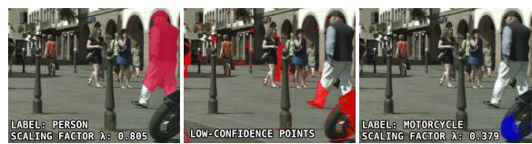  
Fig. 11 Visual example illustrating the complementary roles of Mask-wide Loss Scaling (MLS) and Confidencebased Point Filtering (CBPF) in selecting reliable pixels for domain-adaptive learning, as also illustrated in MC-PanDA (Martinovi´c et al. 2024). The middle image highlights two regions where back-propagation is suppressed due to low sampling afinity. The left and right images show that these regions correspond to false-negative predictions in the person and motorcycle masks, respectively.

Figure 12 shows predictions on a Vistas image from models trained on the synthetic source domains Synthia and UrbanSyn (without adaptation), and compares them with MC-PanDA++. Several observations arise. First, comparing the two source-only models, switching the source domain from Synthia to UrbanSyn already improves segmentation quality (e.g., clearer wall and fence regions), consistent with our findings in Section 4.4.3. Second, comparing source-only results with MC-PanDA++ demonstrates the substantial benefit of the domain adaptation, which produces markedly better predictions, such as correctly identifying distant cars and delivering more coherent wall and fence boundaries.

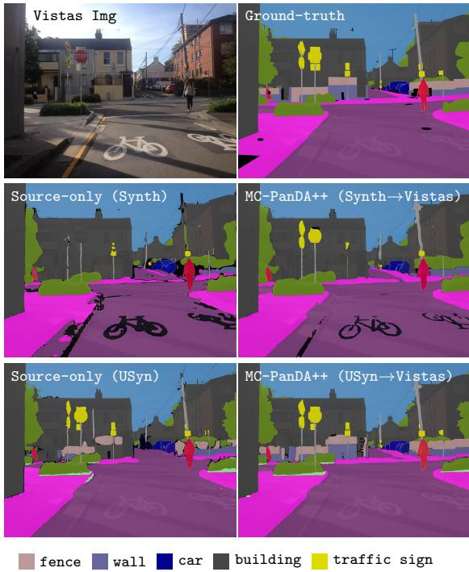  
Fig. 12 Predictions comparison on a Vistas image between source-only models trained on Synthia (middle left) and UrbanSyn (bottom left), and MC-PanDA++ (right). Switching the synthetic source from Synthia to UrbanSyn already yields more coherent predictions, even without adaptation. MC-PanDA++ further improves segmentation, particularly for distant cars, wall/ fence regions, and small traffic signs. Best viewed zoomed in.

Finally, the figure also reveals that certain biases in the synthetic datasets persist even after adaptation. For example, Synthia does not label road markings as road, and this misalignment propagates into the adapted model. This highlights the practical importance of ensuring that source- and target-domain taxonomies are well aligned.

Figure 13 shows predictions of MC-PanDA++ on two adverse-weather examples, compared against a source-only baseline trained exclusively on Cityscapes. Despite never observing groundtruth annotations from adverse conditions, MC-PanDA++ successfully recovers challenging parts: in the top row it detects a barely visible person and produces clearer segmentation of sky, sidewalk, and car regions. In the bottom row, MC-PanDA++ yields substantially more accurate segmentation under snowy and foggy conditions, correctly identifying buildings, distant cars, and traffic lights, among others.

Failure cases. Fig. 14 shows representative failure cases of MC-PanDA++. The left example illustrates source-domain coverage limitations in UrbanSyn→Vistas. When the target domain contains visual concepts that are poorly represented in the source domain, the model can map them to the closest available source-domain categories: sea regions are predicted as road, and boats as cars. The right example shows a nighttime ACDC scene, where distant objects remain dificult to segment due to limited visual evidence. Additional failure cases, including ambiguities such as persons on billboards being segmented as real person instances, are provided in Appendix D.

## 6 Conclusion

In this work, we presented MC-PanDA++, a novel approach for domain-adaptive panoptic segmentation. The proposed framework enables state-of-the-art panoptic architectures based on mask transformers to be efectively trained under domain shift within a teacher-student consistencylearning paradigm. We address the key challenge of such paradigms – confirmation bias – which arises from the repeated reinforcement of incorrect pseudo-labels. To mitigate this, our method prevents learning from unreliable pseudo-labels through mask-wide loss scaling based on a teacher confidence. Furthermore, we introduce a novel point sampling mechanism that prioritizes loss computation in informative locations according to student uncertainty while simultaneously avoiding unreliable locations using teacher confidence.

Compared to our preliminary approach (Martinovi´c et al. 2024), MC-PanDA++ is both more accurate and more robust due to two key advancements. First, it employs class-dependent and selfadapting mask-wide loss scaling, which improves training stability, mitigates sensitivity to the initial confidence threshold, and consistently yields superior performance. Second, it leverages strong self-supervised initialization, which enables the simplification of the original three-stage training design into a streamlined single-stage pipeline, thereby reducing both conceptual complexity and the number of hyperparameters.

MC-PanDA++ sets a new state of the art in panoptic domain adaptation across standard benchmarks. While baseline consistency training sufers from collapse caused by confirmation bias,

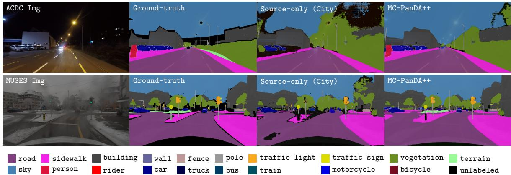  
Fig. 13 Qualitative comparison of MC-PanDA++ against a source-only model (trained solely on Cityscapes) on the clearto-adverse benchmarks City→ACDC (top) and City→MUSES (bottom). MC-PanDA++ yields substantially more accurate segmentations, especially in challenging regions such as person instances in top row and distant cars in bottom row, despite being trained only on clear-weather daytime ground-truth annotations. Best viewed zoomed in.

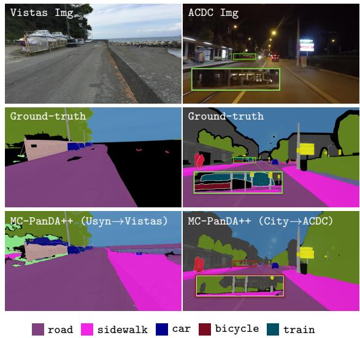  
Fig. 14 Representative failure cases of MC-PanDA++. Left: UrbanSyn→Vistas example illustrating sourcedomain coverage limitations, where target-domain regions such as sea and boats are mapped to the closest available road-scene categories, such as road and car. Right: Cityscapes→ACDC nighttime example, where distant or weakly visible objects, such as train and bicycle regions, remain dificult to segment under limited visual evidence.

MC-PanDA++ maintains a stable learning curve through the proposed confidence-guided training strategy. Comprehensive ablation studies confirm the efectiveness of our contributions across diferent backbones and setups, including synthetic-toreal, real-to-real, and clear-to-adverse scenarios.

We anticipate that MC-PanDA++ will facilitate the broader adoption of panoptic segmentation and support the more reliable deployment of mask transformers in real-world applications. Moreover, its design is inherently compatible with ongoing advancements in backbone pre-training, mask-transformers, and pseudo-label refinement, ensuring its relevance in future research.

Acknowledgements. This work was supported by the Croatian Recovery and Resilience Fund – NextGenerationEU (grant C1.4 R5-I2.01.0001) and the Croatian Science Foundation (grants DOK-NPOO-2023-10-2288 and MOBDOK-2023- 4880). We also acknowledge the advanced computing resources provided by the University of Zagreb University Computing Centre (SRCE). Josip Sari´c has received funding from the Euro-<sup>ˇ</sup> pean Union’s Horizon Europe research and innovation program under the Marie Sklodowska-Curie COFUND Postdoctoral Programme grant agreement No. 101081355-SMASH and from the Republic of Slovenia and the European Union from the European Regional Development Fund.

We thank Jan Snajder, Ivan Grubiˇsi´c,<sup>ˇ</sup> Ryousuke Yamada, and Naomi Kombol for valuable feedback that helped improve the manuscript.

In memory of Siniˇsa Segvi´c, who passed away<sup>ˇ</sup> before this work was published. He will be missed as a dear friend, mentor, and moral compass.

Disclaimer. Co-funded by the European Union. Views and opinions expressed are however those of the author(s) only and do not necessarily reflect those of the European Union or European

Research Executive Agency. Neither the European Union nor the granting authority can be held responsible for them.

Data availability statement. We conduct our experiments on the following publicly available datasets: Cityscapes (Cordts et al. 2016), Mapillary Vistas (Neuhold et al. 2017), Foggy Cityscapes (Sakaridis et al. 2018), ACDC (Sakaridis et al. 2021), MUSES (Br¨odermann et al. 2024), Synthia (Ros et al. 2016) and UrbanSyn (G´omez et al. 2025).

## References

Arazo, E., Ortego, D., Albert, P., O’Connor, N.E., McGuinness, K.: Pseudo-labeling and confirmation bias in deep semi-supervised learning. In: Int. Joint Conf. on Neural Networks, pp. 1–8 (2020)

Asano, Y.M., Rupprecht, C., Vedaldi, A.: Self-labelling via simultaneous clustering and representation learning. In: Int. Conf. Learn. Represent. (2020). https://openreview.net/forum?id=Hyx-jyBFPr

Ackermann, J., Sakaridis, C., Yu, F.: Maskomaly: Zero-shot mask anomaly segmentation. In: Brit. Mach. Vis. Conf. (2023)

Ben-David, S., Blitzer, J., Crammer, K., Kulesza, A., Pereira, F., Vaughan, J.W.: A theory of learning from diferent domains. Machine Learning 79, 151–175 (2010)

Br¨odermann, T., Bruggemann, D., Sakaridis, C., Ta, K., Liagouris, O., Corkill, J., Van Gool, L.: MUSES: The Multi-Sensor Semantic Perception Dataset for Driving under Uncertainty. In: Eur. Conf. Comput. Vis., pp. 21–38 (2024)

Berrada, T., Couprie, C., Alahari, K., Verbeek, J.: Guided distillation for semi-supervised instance segmentation. In: Winter Conf. on Appl. of Comput. Vis., pp. 475–483 (2024)

Caron, M., Bojanowski, P., Joulin, A., Douze, M.: Deep clustering for unsupervised learning of visual features. In: Eur. Conf. Comput. Vis., pp. 139–156 (2018)

Cheng, B., Collins, M.D., Zhu, Y., Liu, T., Huang, T.S., Adam, H., Chen, L.-C.: Panoptic-deeplab: A simple, strong, and fast baseline for bottomup panoptic segmentation. In: IEEE Conf. Comput. Vis. Pattern Recog., pp. 12472–12482 (2020)

Chen, T., Kornblith, S., Norouzi, M., Hinton, G.: A simple framework for contrastive learning of visual representations. In: Int. Conf. Mach. Learn., pp. 1597–1607 (2020)

Caron, M., Misra, I., Mairal, J., Goyal, P., Bojanowski, P., Joulin, A.: Unsupervised learning of visual features by contrasting cluster assignments. In: Adv. Neural Inform. Process. Syst., vol. 33, pp. 9912–9924 (2020)

Carion, N., Massa, F., Synnaeve, G., Usunier, N., Kirillov, A., Zagoruyko, S.: End-to-end object detection with transformers. In: Eur. Conf. Comput. Vis., pp. 213–229 (2020)

Cheng, B., Misra, I., Schwing, A.G., Kirillov, A., Girdhar, R.: Masked-attention Mask Transformer for Universal Image Segmentation. In: IEEE Conf. Comput. Vis. Pattern Recog., pp. 1280–1289 (2022)

Cordts, M., Omran, M., Ramos, S., Rehfeld, T., Enzweiler, M., Benenson, R., Franke, U., Roth, S., Schiele, B.: The Cityscapes Dataset for Semantic Urban Scene Understanding. In: IEEE Conf. Comput. Vis. Pattern Recog., pp. 3213–3223 (2016)

Cheng, B., Schwing, A., Kirillov, A.: Per-pixel classification is not all you need for semantic segmentation. In: Adv. Neural Inform. Process. Syst., vol. 34, pp. 17864–17875 (2021)

Caron, M., Touvron, H., Misra, I., J´egou, H., Mairal, J., Bojanowski, P., Joulin, A.: Emerging properties in self-supervised vision transformers. In: Int. Conf. Comput. Vis., pp. 9630–9640 (2021)

Dosovitskiy, A., Beyer, L., Kolesnikov, A., Weissenborn, D., Zhai, X., Unterthiner, T., Dehghani, M., Minderer, M., Heigold, G., Gelly, S., Uszkoreit, J., Houlsby, N.:

An Image is Worth 16x16 Words: Transformers for Image Recognition at Scale. In: Int. Conf. Learn. Represent. (2021). https://openreview.net/forum?id=YicbFdNTTy

Deli´c, A., Grcic, M., Segvi´c, S.: Outlier detec-<sup>ˇ</sup> tion by ensembling uncertainty with negative objectness. In: Brit. Mach. Vis. Conf. (2024)

French, G., Laine, S., Aila, T., Mackiewicz, M., Finlayson, G.D.: Semi-supervised semantic segmentation needs strong, varied perturbations. In: Brit. Mach. Vis. Conf. (2020)

Gu, A., Dao, T.: Mamba: Linear-time sequence modeling with selective state spaces. In: First Conf. on Language Modeling (2024). https://openreview.net/forum?id=tEYskw1VY2

Ganin, Y., Lempitsky, V.S.: Unsupervised domain adaptation by backpropagation. In: Int. Conf. Mach. Learn., pp. 1180–1189 (2015)

Grcic, M., Saric, J., Segvic, S.: On advantages of mask-level recognition for outlier-aware segmentation. In: IEEE Conf. Comput. Vis. Pattern Recog. Worksh., pp. 2937–2947 (2023)

G´omez, J.L., Silva, M., Seoane, A., Borr\`as, A., Noriega, M., Ros, G., Iglesias-Guitian, J.A., L´opez, A.M.: All for one, and one for all: Urbansyn dataset, the third musketeer of synthetic driving scenes. Neurocomputing 637, 130038 (2025)

He, K., Chen, X., Xie, S., Li, Y., Doll´ar, P., Girshick, R.: Masked autoencoders are scalable vision learners. In: IEEE Conf. Comput. Vis. Pattern Recog., pp. 15979–15988 (2022)

Hoyer, L., Dai, D., Van Gool, L.: Daformer: Improving network architectures and training strategies for domain-adaptive semantic segmentation. In: IEEE Conf. Comput. Vis. Pattern Recog., pp. 9914–9925 (2022)

Hoyer, L., Dai, D., Van Gool, L.: Hrda: Contextaware high-resolution domain-adaptive semantic segmentation. In: Eur. Conf. Comput. Vis., pp. 372–391 (2022)

Hoyer, L., Dai, D., Wang, H., Gool, L.V.: MIC:

masked image consistency for context-enhanced domain adaptation. In: IEEE Conf. Comput. Vis. Pattern Recog., pp. 11721–11732 (2023)

He, K., Gkioxari, G., Doll´ar, P., Girshick, R.: Mask r-cnn. In: Int. Conf. Comput. Vis., pp. 2961–2969 (2017)

Huang, J., Guan, D., Xiao, A., Lu, S.: Crossview regularization for domain adaptive panoptic segmentation. In: IEEE Conf. Comput. Vis. Pattern Recog., pp. 10133–10144 (2021)

H¨ummer, C., Schwonberg, M., Zhou, L., Cao, H., Knoll, A., Gottschalk, H.: Strong but simple: A baseline for domain generalized dense perception by clip-based transfer learning. In: Asian Conf. Comput. Vis., pp. 463–484 (2024)

Jiang, K., Jiang, J., Liu, X., Yao, H., Lin, C.-W.: Ph-mamba: Enhancing mamba with position encoding and harmonized attention for image deraining and beyond. IEEE Trans. Image Process. 35, 1727–1739 (2026)

Jain, J., Li, J., Chiu, M.T., Hassani, A., Orlov, N., Shi, H.: Oneformer: One transformer to rule universal image segmentation. In: IEEE Conf. Comput. Vis. Pattern Recog., pp. 2989–2998 (2023)

Kerssies, T., De Geus, D., Dubbelman, G.: How to benchmark vision foundation models for semantic segmentation? In: IEEE Conf. Comput. Vis. Pattern Recog. Worksh., pp. 1162–1171 (2024)

Kirillov, A., Girshick, R., He, K., Doll´ar, P.: Panoptic feature pyramid networks. In: IEEE Conf. Comput. Vis. Pattern Recog., pp. 6392– 6401 (2019)

Kirillov, A., He, K., Girshick, R., Rother, C., Doll´ar, P.: Panoptic segmentation. In: IEEE Conf. Comput. Vis. Pattern Recog., pp. 9396– 9405 (2019)

Kirillov, A., Wu, Y., He, K., Girshick, R.: Pointrend: Image segmentation as rendering. In: IEEE Conf. Comput. Vis. Pattern Recog., pp. 9796–9805 (2020)

Kim, D., Woo, S., Lee, J., Kweon, I.S.: Video

panoptic segmentation. In: IEEE Conf. Comput. Vis. Pattern Recog., pp. 9856–9865 (2020)

Liu, W., Anguelov, D., Erhan, D., Szegedy, C., Reed, S., Fu, C.-Y., Berg, A.C.: Ssd: Single shot multibox detector. In: Eur. Conf. Comput. Vis., pp. 21–37 (2016)

Li, Y.-J., Dai, X., Ma, C.-Y., Liu, Y.-C., Chen, K., Wu, B., He, Z., Kitani, K., Vajda, P.: Crossdomain adaptive teacher for object detection. In: IEEE Conf. Comput. Vis. Pattern Recog., pp. 7571–7580 (2022)

Loshchilov, I., Hutter, F.: Decoupled weight decay regularization. In: Int. Conf. Learn. Represent. (2019). https://openreview.net/forum?id=Bkg6RiCqY7

Liu, Z., Lin, Y., Cao, Y., Hu, H., Wei, Y., Zhang, Z., Lin, S., Guo, B.: Swin transformer: Hierarchical vision transformer using shifted windows. In: Int. Conf. Comput. Vis., pp. 9992–10002 (2021)

Lin, T.-Y., Maire, M., Belongie, S., Hays, J., Perona, P., Ramanan, D., Doll´ar, P., Zitnick, C.L.: Microsoft coco: Common objects in context. In: Eur. Conf. Comput. Vis., pp. 740–755 (2014)

Li, Y., Mao, H., Girshick, R., He, K.: Exploring plain vision transformer backbones for object detection. In: Eur. Conf. Comput. Vis., pp. 280– 296 (2022)

Li, J., Raventos, A., Bhargava, A., Tagawa, T., Gaidon, A.: Learning to fuse things and stuf. arXiv:1812.01192 (2018)

Li, F., Zhang, H., Xu, H., Liu, S., Zhang, L., Ni, L.M., Shum, H.-Y.: Mask dino: Towards a unified transformer-based framework for object detection and segmentation. In: IEEE Conf. Comput. Vis. Pattern Recog., pp. 3041–3050 (2023)

Martinovi´c, I., Sari´c, J.,<sup>ˇ</sup> Segvi´c, S.: MC-PanDA:<sup>ˇ</sup> Mask Confidence for Panoptic Domain Adaptation. In: Eur. Conf. Comput. Vis., pp. 167–185 (2024)

Mansour, E.A., Unal, O., Saha, S., Bejar, B., Gool,

L.: Language-Guided Instance-Aware Domain-Adaptive Panoptic Segmentation. In: Winter Conf. on Appl. of Comput. Vis., pp. 1637–1648 (2025)

Neuhold, G., Ollmann, T., Rota Bulo, S., Kontschieder, P.: The Mapillary Vistas Dataset for Semantic Understanding of Street Scenes. In: Int. Conf. Comput. Vis., pp. 4990–4999 (2017)

Nayal, N., Yavuz, M., Henriques, J.F., G¨uney, F.: RbA: Segmenting Unknown Regions Rejected by All. In: Int. Conf. Comput. Vis., pp. 711–722 (2023)

Oquab, M., Darcet, T., Moutakanni, T., Vo, H.V., Szafraniec, M., Khalidov, V., Fernandez, P., Haziza, D., Massa, F., El-Nouby, A., et al.: DINOv2: Learning robust visual features without supervision. Trans. Mach. Learn Res. (2024)

Olsson, V., Tranheden, W., Pinto, J., Svensson, L.: Classmix: Segmentation-based data augmentation for semi-supervised learning. In: Winter Conf. on Appl. of Comput. Vis., pp. 1369–1378 (2021)

Rai, S.N., Cermelli, F., Fontanel, D., Masone, C., Caputo, B.: Unmasking anomalies in road-scene segmentation. In: Int. Conf. Comput. Vis., pp. 4014–4023 (2023)

Ren, S., He, K., Girshick, R., Sun, J.: Faster r-cnn: Towards real-time object detection with region proposal networks. IEEE Trans. Pattern Anal. Mach. Intell. 39(6), 1137–1149 (2017)

Radford, A., Kim, J.W., Hallacy, C., Ramesh, A., Goh, G., Agarwal, S., Sastry, G., Askell, A., Mishkin, P., Clark, J., et al.: Learning transferable visual models from natural language supervision. In: Int. Conf. Mach. Learn., pp. 8748–8763 (2021)

Ros, G., Sellart, L., Materzynska, J., Vazquez, D., Lopez, A.M.: The SYNTHIA Dataset: A Large Collection of Synthetic Images for Semantic Segmentation of Urban Scenes. In: IEEE Conf. Comput. Vis. Pattern Recog., pp. 3234–3243 (2016)

Richter, S.R., Vineet, V., Roth, S., Koltun, V.: Playing for Data: Ground Truth from Computer Games. In: Eur. Conf. Comput. Vis., vol. 9906, pp. 102–118 (2016)

Sakaridis, C., Dai, D., Gool, L.V.: ACDC: the adverse conditions dataset with correspondences for semantic driving scene understanding. In: Int. Conf. Comput. Vis., pp. 10745– 10755 (2021)

Sakaridis, C., Dai, D., Van Gool, L.: Semantic foggy scene understanding with synthetic data. Int. J. Comput. Vis. 126, 973–992 (2018)

Saha, S., Hoyer, L., Obukhov, A., Dai, D., Van Gool, L.: EDAPS: Enhanced Domain-Adaptive Panoptic Segmentation. In: Int. Conf. Comput. Vis., pp. 19177–19188 (2023)

Sun, B., Saenko, K.: Deep CORAL: Correlation Alignment for Deep Domain Adaptation. In: Eur. Conf. Comput. Vis. Worksh., vol. 9915, pp. 443–450 (2016)

Sim´eoni, O., Vo, H.V., Seitzer, M., Baldassarre, F., Oquab, M., Jose, C., Khalidov, V., Szafraniec, M., Yi, S., Ramamonjisoa, M., et al.: Dinov3. arXiv:2508.10104 (2025)

Sheng, H., Xuanqi, W., Chang, Z., Jiacheng, W., Pingxia, D., Yuwei, W.: Aigc video detection based on the fusion of spatial-frequency-optical flow multimodal features. Journal of Systems Engineering and Electronics, 1–15 (2026)

Tschannen, M., Gritsenko, A., Wang, X., Naeem, M.F., Alabdulmohsin, I., Parthasarathy, N., Evans, T., Beyer, L., Xia, Y., Mustafa, B., et al.: Siglip 2: Multilingual vision-language encoders with improved semantic understanding, localization, and dense features. arXiv:2502.14786 (2025)

Tranheden, W., Olsson, V., Pinto, J., Svensson, L.: Dacs: Domain adaptation via cross-domain mixed sampling. In: Winter Conf. on Appl. of Comput. Vis., pp. 1378–1388 (2021)

Tarvainen, A., Valpola, H.: Mean teachers are better role models: Weight-averaged consistency targets improve semi-supervised deep learning

results. In: Adv. Neural Inform. Process. Syst., vol. 30, pp. 1195–1204 (2017)

Tolan, J., Yang, H.-I., Nosarzewski, B., Couairon, G., Vo, H.V., Brandt, J., Spore, J., Majumdar, S., Haziza, D., Vamaraju, J., et al.: Very high resolution canopy height maps from rgb imagery using self-supervised vision transformer and convolutional decoder trained on aerial lidar. Remote Sensing of Environment 300, 113888 (2024)

Uijlings, J.R.R., Mensink, T., Ferrari, V.: The Missing Link: Finding Label Relations Across Datasets. In: Eur. Conf. Comput. Vis., pp. 540–556 (2022)

Venkataramanan, S., Pariza, V., Salehi, M., Knobel, L., Ramzi, E., Gidaris, S., Bursuc, A., Asano, Y.M.: Franca: Nested matryoshka clustering for scalable visual representation learning. In: IEEE Conf. Comput. Vis. Pattern Recog., pp. 10533–10544 (2026)

Wei, Z., Chen, L., Jin, Y., Ma, X., Liu, T., Ling, P., Wang, B., Chen, H., Zheng, J.: Stronger fewer & superior: Harnessing vision foundation models for domain generalized semantic segmentation. In: IEEE Conf. Comput. Vis. Pattern Recog., pp. 28619–28630 (2024)

Wang, W., Dai, J., Chen, Z., Huang, Z., Li, Z., Zhu, X., Hu, X., Lu, T., Lu, L., Li, H., et al.: Internimage: Exploring large-scale vision foundation models with deformable convolutions. In: IEEE Conf. Comput. Vis. Pattern Recog., pp. 14408–14419 (2023)

Xiong, Y., Liao, R., Zhao, H., Hu, R., Bai, M., Yumer, E., Urtasun, R.: Upsnet: A unified panoptic segmentation network. In: IEEE Conf. Comput. Vis. Pattern Recog., pp. 8810–8818 (2019)

Xu, H., Usuyama, N., Bagga, J., Zhang, S., Rao, R., Naumann, T., Wong, C., Gero, Z., Gonz´alez, J., Gu, Y., et al.: A whole-slide foundation model for digital pathology from real-world data. Nature 630(8015), 181–188 (2024)

Xie, E., Wang, W., Yu, Z., Anandkumar, A., Alvarez, J.M., Luo, P.: Segformer: Simple and

eficient design for semantic segmentation with transformers. In: Adv. Neural Inform. Process. Syst., vol. 34, pp. 12077–12090 (2021)

Xiao, Y., Yuan, Q., Jiang, K., He, J., Wang, Y., Zhang, L.: From degrade to upgrade: Learning a self-supervised degradation guided adaptive network for blind remote sensing image super-resolution. Information Fusion 96, 297– 311 (2023)

Yun, S., Chae, S., Lee, D., Ro, Y.: SoMA: Singular Value Decomposed Minor Components Adaptation for Domain Generalizable Representation Learning. In: IEEE Conf. Comput. Vis. Pattern Recog., pp. 25602–25612 (2025)

Yu, Q., Wang, H., Qiao, S., Collins, M., Zhu, Y., Adam, H., Yuille, A., Chen, L.-C.: k-means Mask Transformer. In: Eur. Conf. Comput. Vis., pp. 288–307 (2022)

Zhou, Q., Feng, Z., Gu, Q., Cheng, G., Lu, X., Shi, J., Ma, L.: Uncertainty-aware consistency regularization for cross-domain semantic segmentation. Computer Vision and Image Understanding 221, 103448 (2022)

Zendel, O., Honauer, K., Murschitz, M., Steininger, D., Dom´ınguez, G.F.: Wilddash - creating hazard-aware benchmarks. In: Eur. Conf. Comput. Vis., vol. 11210, pp. 407–421 (2018)

Zhang, J., Huang, J., Zhang, X., Lu, S.: UniDAformer: Unified Domain Adaptive Panoptic Segmentation Transformer via Hierarchical Mask Calibration. In: IEEE Conf. Comput. Vis. Pattern Recog., pp. 11227–11237 (2023)

Zlateski, A., Jaroensri, R., Sharma, P., Durand, F.: On the importance of label quality for semantic segmentation. In: IEEE Conf. Comput. Vis. Pattern Recog., pp. 1479–1487 (2018)

Zhu, L., Liao, B., Zhang, Q., Wang, X., Liu, W., Wang, X.: Vision Mamba: Eficient Visual Representation Learning with Bidirectional State Space Model. In: Int. Conf. Mach. Learn., pp. 62429–62442 (2024)

Zendel, O., Murschitz, M., Zeilinger, M., Steininger, D., Abbasi, S., Beleznai, C.: RailSem19: A Dataset for Semantic Rail Scene Understanding. In: IEEE Conf. Comput. Vis. Pattern Recog. Worksh., pp. 1221–1229 (2019)

Zhu, X., Su, W., Lu, L., Li, B., Wang, X., Dai, J.: Deformable DETR: Deformable Transformers for End-to-End Object Detection. In: Int. Conf. Learn. Represent. (2021). https://openreview.net/forum?id=gZ9hCDWe6ke

Zendel, O., Sch¨orghuber, M., Rainer, B., Murschitz, M., Beleznai, C.: Unifying Panoptic Segmentation for Autonomous Driving. In: IEEE Conf. Comput. Vis. Pattern Recog., pp. 21319–21328 (2022)

Zhou, J., Wei, C., Wang, H., Shen, W., Xie, C., Yuille, A., Kong, T.: Image BERT Pre-training with Online Tokenizer. In: Int. Conf. Learn. Represent. (2022). https://openreview.net/forum?id=ydopy-e6Dg

Zheng, Z., Yang, Y.: Rectifying pseudo label learning via uncertainty estimation for domain adaptive semantic segmentation. Int. J. Comput. Vis. 129, 1106–1120 (2021)

Zhou, B., Zhao, H., Puig, X., Fidler, S., Barriuso, A., Torralba, A.: Scene parsing through ade20k dataset. In: IEEE Conf. Comput. Vis. Pattern Recog., pp. 5122–5130 (2017)

## Appendix A UrbanSyn filtering

During an initial inspection of UrbanSyn (G´omez et al. 2025), we identified a small subset of images with clearly corrupted semantic annotations (e.g., mislabeled road or sky regions; see Fig. A1).

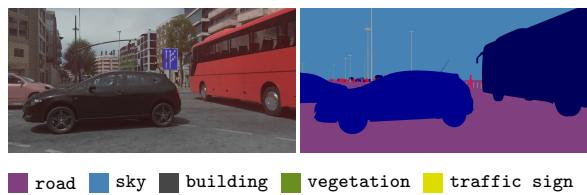  
Fig. A1 Example of a mislabeled UrbanSyn image (ID 7014) where building, vegetation, and traffic sign regions are incorrectly annotated as road or sky.

A closer inspection revealed that these errors were not isolated: a contiguous block of images, from ID 6973 to 7029, contained consistently incorrect labels. Given that UrbanSyn contains approximately 7.5k labeled images, manually inspecting the entire dataset would be infeasible. To systematically verify whether additional corrupted labels existed, we designed the following screening procedure:

1. Apply Mask2Former (M2F) (Cheng et al. 2022), trained on Cityscapes, to all labeled UrbanSyn images.

2. Compute per-image M2F losses for the entire dataset.

3. Select images whose losses fall within the top 10% as potential outliers.

4. Manually inspect these high-loss images to determine whether additional annotation errors are present.

This pipeline successfully re-identified 56 out of the 57 originally known corrupted images and revealed no further mislabeled examples. To avoid supervision noise in our experiments, we therefore removed all images with IDs 6973–7029 from the UrbanSyn labeled training set.

All experiments that use UrbanSyn as the source domain are conducted on this filtered split, including the source-only baselines and all MC-PanDA++ variants. To quantify the efect of this filtering step, Table A1 compares the final performance of MC-PanDA++ with and without removing the corrupted images. The impact is minor: filtering changes the final performance by only +0.2 PQ on UrbanSyn→Cityscapes and +0.3 PQ on UrbanSyn→Vistas, which is within the observed run-to-run variation. Nevertheless, we use the filtered split in all reported experiments to avoid known annotation noise and to provide a clean and reproducible benchmark setup.

Table A1 Impact of UrbanSyn filtering on the final performance of MC-PanDA++. We report mean±std PQ over three random seeds.
<table><tr><td>UrbanSyn filtering</td><td>USyn→City</td><td>USyn→Vistas</td></tr><tr><td></td><td>57.0±0.7</td><td>49.2±0.5</td></tr><tr><td>√</td><td>57.2±0.7</td><td>49.5±0.2</td></tr></table>

## Appendix B Implementation details

## B.1 Data augmentations

We follow the augmentation setup used in MC-PanDA (Martinovi´c et al. 2024), repeated here for completeness. Our baseline image transformations follow the standard Mask2Former (Cheng et al. 2022) pipeline: random resizing with fixed aspect ratio, random cropping, horizontal flipping, and SSD-style color jittering (Liu et al. 2016). All experiments use a crop size of 512 × 1024 pixels. For the shorter image side, we sample uniformly from:

• [512, 2048] for Cityscapes, Foggy Cityscapes, UrbanSyn and Vistas,

• [640, 1408] for Synthia,

• [540, 2160] for ACDC and MUSES.

As in MC-PanDA, color jitter is disabled for the teacher branch. The student branch receives additional strong augmentations implemented via torchvision:

1. ColorJitter(   
brightness=(0.2, 1.8),   
contrast=(0.2, 1.8),   
saturation=(0.2, 1.8),   
hue=(-0.2, 0.2))

2. RandomGrayscale(p=0.2)

$$
\begin{array} { r l } { 3 . } & { \mathtt { R a n d o m A p p 1 y } ( } \\ & { \mathtt { G a u s s i a n B l u r } ( \mathtt { s i g m a = } ( 0 . 1 , \ 2 ) ) , \mathtt { p } { = } 0 . 5 } \\ & { \mathtt { ) } } \end{array}
$$

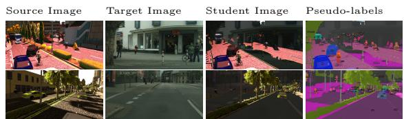  
Fig. A2 Illustration of SegMix during training. For each target image, half of the segments from a labeled source image are randomly selected and pasted onto the target image. This difers from ClassMix, which selects half of the classes and pastes all associated segments.

Finally, we apply SegMix to combine labeled source-domain segments with unlabeled target images, as described in the main manuscript. Figure A2 shows representative training examples from the Synthia→Cityscapes experiment. The first two columns illustrate the augmented source and target images. The last two columns show the corresponding student inputs and pseudo-labels after SegMix, which combine teacher predictions (target domain) with ground-truth annotations (source domain). We note that segmentationheavy source images occasionally dominate the student view, an aspect of segment-oriented mixing that may ofer additional opportunities for future refinement

## B.2 Training hyperparameters

In experiments where Cityscapes or Urban-Syn serve as the source domain, we use 100 Mask2Former queries, following Cheng et al. (2022). For Synthia→\* experiments, we increase the number of queries to 200 due to the substantially larger number of instances per image in Synthia (approximately 152), compared to only 27 in Cityscapes. For point-based loss computation, we follow Cheng et al. (2022) and sample $N _ { p } = 1 1 2 \times 1 1 2$ points, with β = 75% selected from pixels with the highest sampling afinity.

For the domain generalization (source-only) experiments used as supervised baselines, we train for 20k iterations (batch size 4) when the source domain is synthetic, and for 40k iterations when it is real (Cityscapes, ACDC, MUSES). We vary the number of iterations because diferent datasets converge at diferent rates, and using datasetappropriate training durations yields stronger and fairer supervised baselines.

## Appendix C Per-mask vs. All-mask CBPF

Fig. A3 provides a visual comparison between the all-mask confidence-based point filtering (CBPF) used in our method and the per-mask CBPF variant, as discussed in Tab. 5 of the main manuscript. The left and middle columns illustrate the complementary roles of mask-wide loss scaling (MLS) and all-mask CBPF in suppressing unreliable gradients. The transition from the middle to the right column highlights the key limitation of per-mask CBPF: it fails to identify false negative regions that lie far from the predicted mask boundary.

A closer inspection of the top-right example shows that per-mask CBPF incorrectly retains a large number of low-confidence pixels on the lower part of the left leg, which would lead the student to learn from erroneous pseudo-labels. These qualitative observations align with the quantitative results reported in Tab. 5 of the main manuscript, where all-mask CBPF provides a substantial performance advantage over its per-mask counterpart.

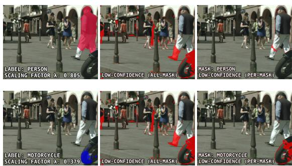  
Fig. A3 Visual comparison of per-mask and all-mask point filtering (cf. Table 5 main manuscript). The top row shows a person mask (left), uncertain pixels retained by all-mask filtering (middle), and those retained by permask filtering (right). The bottom row presents the same intermediate outputs for a motorcycle mask. As originally reported in the supplement of MC-PanDA (Martinovi´c et al. 2024), all-mask filtering more reliably identifies false negative pixel assignments than per-mask filtering, a behavior that complements and explains the quantitative diferences observed in Tab. 5.

## Appendix D Failure cases

Fig. A4 provides additional failure cases complementing Fig. 14 in the main manuscript. The left example further illustrates source-domain coverage limitations in UrbanSyn→Vistas: targetdomain concepts such as snow, which are absent from the source supervision, are mapped to the closest available road-scene classes, such as road and sidewalk. The right example shows an annotation-policy ambiguity, where person depictions on billboards are segmented as person instances.

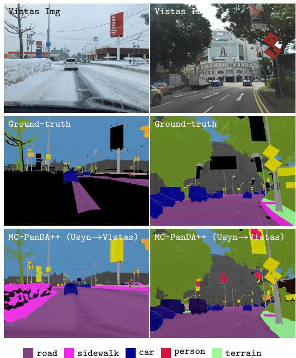  
Fig. A4 Additional failure cases of MC-PanDA++. Left: UrbanSyn→Vistas example illustrating source-domain coverage limitations, where target-domain snow regions are mapped to the closest available road-scene categories, such as road and sidewalk. Right: UrbanSyn→Vistas example illustrating an annotation-policy ambiguity, where person depictions on billboards are segmented as person instances.

## Appendix E MLS and Mask Quality

To further analyze the behavior of MLS, we measure how the mask-wide weight λ relates to the actual quality of teacher pseudo-masks. We analyze teacher predictions from an intermediate checkpoint on all 1600 target-domain (i.e., ACDC) training images. Specifically, for each predicted mask, we compute our mask weight λ<sub>i</sub> and compare it with the IoU between the prediction and its matched ground-truth mask, which we treat as the oracle mask quality. For stuf classes, the correspondence is unambiguous because each class forms a single semantic region per image. For thing classes, we compute correlations only over matched prediction–ground-truth instance pairs.

Table A2 Full per-class Spearman ρ correlation between the MLS weight λ<sub>i</sub> and pseudo-mask quality measured by IoU on Cityscapes→ACDC. For thing classes, correlations are computed over matched prediction–ground-truth instance pairs.
<table><tr><td>Group</td><td>Class</td><td># pairs</td><td>Spearman ρ</td></tr><tr><td>Stuff</td><td>road</td><td>1599</td><td>0.52</td></tr><tr><td></td><td>sidewalk</td><td>1400</td><td>0.65</td></tr><tr><td></td><td>building</td><td>1420</td><td>0.87</td></tr><tr><td></td><td>wall</td><td>848</td><td>0.66</td></tr><tr><td></td><td>fence</td><td>700</td><td>0.59</td></tr><tr><td></td><td>pole</td><td>1587</td><td>0.65</td></tr><tr><td></td><td>tr. light</td><td>784</td><td>0.63</td></tr><tr><td></td><td>tr. sign</td><td>1463</td><td>0.64</td></tr><tr><td></td><td>vegetation</td><td>1572</td><td>0.74</td></tr><tr><td></td><td>terrain</td><td>715</td><td>0.62</td></tr><tr><td></td><td>sky</td><td>1596</td><td>0.83</td></tr><tr><td></td><td>Avg. stuff</td><td></td><td>0.67</td></tr><tr><td>Things</td><td>person</td><td>898</td><td>0.45</td></tr><tr><td></td><td>rider</td><td>73</td><td>0.43</td></tr><tr><td></td><td>car</td><td>4912</td><td>0.70</td></tr><tr><td></td><td>truck</td><td>210</td><td>0.52</td></tr><tr><td></td><td>bus</td><td>62</td><td>0.79</td></tr><tr><td></td><td>train</td><td>88</td><td>0.69</td></tr><tr><td></td><td>motorcycle</td><td>50</td><td>0.21</td></tr><tr><td></td><td>bicycle</td><td>113</td><td>0.42</td></tr><tr><td></td><td>Avg. things</td><td></td><td>0.52</td></tr><tr><td>All</td><td>Avg. all</td><td>一</td><td>0.61</td></tr></table>

Table A2 reports the per-class Spearman correlation. The correlation is positive for both stuf and thing classes, with class-averaged correlations of 0.67 and 0.52, respectively, and 0.61 over all 19 classes. This supports the intended role of $\lambda _ { i }$ as a mask-level quality signal for weighting pseudo-label supervision.

## Appendix F EDAPS/LIDAPS with DINOv2

To better separate the efect of the adaptation method from the efect of backbone initialization, we additionally reproduce EDAPS (Saha et al. 2023) and LIDAPS (Mansour et al. 2025)

with DINOv2-B (Oquab et al. 2024). We use the oficial codebases of both methods and replace the original MiT-B5 (Xie et al. 2021) encoder with DINOv2-B through a ViTDet-style feature pyramid (Li et al. 2022), following the feature extraction strategy used in our implementation. As a sanity check, we first verified that our environment reproduces the original EDAPS and LIDAPS results with the MiT-B5 backbone.

We found that directly replacing MiT-B5 with DINOv2-B leads to unstable training in these dual-branch panoptic architectures. In particular, the Mask R-CNN-style (He et al. 2017) instance branch often collapsed, yielding zero PQ for things classes, while the semantic branch for stuf classes remained partially functional. This observation is also consistent with public implementation reports discussing poor detection or instance-segmentation performance when using DINOv2 weights in Faster R-CNN (Ren et al. 2017) / Mask R-CNN (He et al. 2017) or ViTDetstyle pipelines.<sup>1</sup> While these reports are not controlled benchmarks, they suggest that transferring DINOv2 to two-stage instance-detection architectures may require additional stabilization. We therefore explored several stabilization strategies, including changes to the learning rate, backbone learning-rate multiplier, weight decay, warmup duration, pseudo-label confidence threshold, and normalization layers. Among these, adding GroupNorm to the instance-branch feature pyramid was crucial for stable training. We also found that increasing the crop size from 512×512 to 512×1024 further improved performance for EDAPS on both benchmarks and for LIDAPS on Synthia→Cityscapes.

Table A3 reports the resulting comparison. The DINOv2-B backbone improves some EDAP-S/LIDAPS results, confirming that stronger selfsupervised encoders can also benefit competing methods. Nevertheless, MC-PanDA++ remains ahead on both benchmarks. These results support the conclusion that strong initialization is an important enabling component, but the proposed confidence-guided Mask2Former-based adaptation strategy remains essential for robust UDA panoptic segmentation.

## Appendix G Compute, memory, and inference-time comparison

We compare the computational cost, memory usage, and inference speed of MC-PanDA++ with LIDAPS, the strongest EDAPS-family baseline in Table A4. We report results on Synthia→Cityscapes and measure all runtimes on the same hardware setup, using a single NVIDIA RTX 6000 Ada GPU. For LIDAPS, the training schedule consists of the standard 40k main training stage followed by the 10k instance-mixing stage. For inference, we evaluate 500 Cityscapes images at 1024×2048 resolution and report the mean runtime with data loading excluded.

The comparison highlights the practical tradeof. LIDAPS uses a shorter training schedule and therefore has lower total GPU-hours than the final 110k MC-PanDA++ model, while MC-PanDA++ is faster per training iteration. At a near matchedcompute budget, the 85k checkpoint of MC-PanDA++ already outperforms LIDAPS by +3.8 PQ. At inference, MC-PanDA++ is about 1.4– 1.6× faster, requires substantially less memory, and achieves the best final performance. We also experimented with extending LIDAPS to 110k iterations, but performance even slightly degraded compared with the standard 50k schedule.

## Appendix H Initial $\tau _ { 1 } \textrm { -- }$ robustness

We additionally evaluate the robustness of adaptive class-dependent MLS to the initial value of τ<sub>1</sub> on UrbanSyn→Vistas. Table A5 shows that performance remains stable across a wide range of initial thresholds. The average performance across all tested initial values is $4 9 . 5 _ { \pm 0 . 2 } \ : \mathrm { P Q }$ , confirming the robustness trend observed on Synthia→Vistas (see Table 11), Cityscapes→ACDC (see Table 11), and Cityscapes→MUSES (see Table 14).

Table A3 Extended performance $\left( \mathrm { P Q } _ { 1 6 } \right)$ comparison with EDAPS and LIDAPS on Synthia→Cityscapes and Synthia→Vistas. <sup>‡</sup> denotes our DINOv2-B reimplementations using the oficial codebases, a ViTDet-style feature pyramid, and GroupNorm normalization. For MC-PanDA++, we report the mean over three random seeds.
<table><tr><td>Method</td><td>Encoder / setting</td><td>Synthia→City</td><td>Synthia→Vistas</td></tr><tr><td>EDAPS (Saha et al. 2023)</td><td>MiT-B5</td><td>41.2</td><td>36.6</td></tr><tr><td>LIDAPS (Mansour et al. 2025)</td><td>MiT-B5</td><td>44.8</td><td>38.0</td></tr><tr><td>EDAPS (Saha et al. 2023)</td><td>DINOv2-B, 512×512 crop</td><td>36.1</td><td>38.9</td></tr><tr><td>EDAPS (Saha et al. 2023)</td><td>DINOv2-B, 512×1024 crop</td><td>42.0</td><td>40.5</td></tr><tr><td>LIDAPS (Mansour et al. 2025)</td><td>DINOv2-B, 512×512 crop</td><td>40.2</td><td>37.0</td></tr><tr><td>LIDAPS‡ (Mansour et al. 2025)</td><td>DINOv2-B, 512×1024 crop</td><td>44.7</td><td>35.8</td></tr><tr><td>MC-PanDA++</td><td>DINOv2-B, 512×1024 crop</td><td>49.6</td><td>44.8</td></tr></table>

Table A4 Compute, memory, and inference-time comparison with LIDAPS on Synthia→Cityscapes. For LIDAPS, training includes the 40k main stage and the 10k instance-mixing stage. Inference is measured on 500 Cityscapes images (1024×2048), reporting the mean runtime with data loading excluded. <sup>‡</sup> denotes our DINOv2-B reimplementation of LIDAPS, described in Appendix F.
<table><tr><td rowspan="2">Method</td><td rowspan="2">Backbone</td><td colspan="5">Training</td><td colspan="2">Inference (1024×2048)</td><td rowspan="2">PQ↑</td></tr><tr><td>Iters.</td><td>Crop</td><td>s/iter↓</td><td>GPU-h↓</td><td>Peak mem.↓</td><td>FPS↑</td><td>Peak mem.↓</td></tr><tr><td>LIDAPS</td><td>MiT-B5</td><td>40k+10k</td><td>512×512</td><td>1.77</td><td>24.5</td><td>17.5 GiB</td><td>2.1</td><td>6.6 GiB</td><td>44.8</td></tr><tr><td>LIDAPS</td><td>DINOv2-B</td><td>40k+10k</td><td>512×1024</td><td>1.83</td><td>25.4</td><td>29.2 GiB</td><td>2.4</td><td>8.2 GiB</td><td>44.7</td></tr><tr><td>MC-PanDA++ (85k ckpt.)</td><td>DINOv2-B</td><td>85k</td><td>512×1024</td><td>1.04</td><td>24.6</td><td>24.7 GiB</td><td>3.4</td><td>4.0 GiB</td><td>48.6</td></tr><tr><td>MC-PanDA++ (final)</td><td>DINOv2-B</td><td>110k</td><td>512×1024</td><td>1.04</td><td>31.9</td><td>24.7 GiB</td><td>3.4</td><td>4.0 GiB</td><td>49.6</td></tr></table>

Table A5 Robustness of adaptive class-dependent MLS to initial values of τ on UrbanSyn→Vistas. Each value is averaged over three random seeds. The last column reports the mean and standard deviation across initial τ<sub>1</sub> values.  
```perl
initial τ<sub>1</sub>= 0.0 0.5 0.6 0.7 0.8 0.9 0.99 Avg.
UrbanSyn
49.5 49.2 49.7 49.7 49.3 49.4 49.5 $4 9 . 5 { \scriptstyle \pm 0 . 2 }$
→Vistas
```

## Appendix I Impact of adaptive thresholding on rare classes

To analyze the behavior of the adaptive threshold update under class imbalance, we compare the fixed threshold $\tau _ { 1 } = 0 . 9 9$ with our per-class adaptive threshold on Cityscapes→ACDC. We focus on the five most frequent and five rarest classes, where class frequency is measured as the percentage of source-domain training images in which the class appears at least once. Table A6 reports per-class PQ averaged over three random seeds. Adaptive thresholding improves the average performance of the five most frequent classes by 1.6 PQ and the five rarest classes by 3.1 PQ. Notably, all five rare classes improve, suggesting that the adaptive update alleviates the dificulty of using a single global threshold for classes with substantially diferent frequency and confidence statistics.

## Appendix J Per-class results

As a complement to Tables 1 and 2 in the main manuscript, Table A7 reports per-class panoptic performance of MC-PanDA++ and compares it with state-of-the-art methods across four standard domain adaptation benchmarks.

Table A6 Efect of per-class adaptive thresholding on the five most frequent and five rarest classes for Cityscapes → ACDC. We compare the fixed threshold $\tau _ { 1 } = 0 . 9 9$ with our per-class adaptive threshold. Class frequency, shown in parentheses, is measured as the percentage of source-domain training images in which the class appears at least once. Results are per-class PQ averaged over three random seeds.
<table><tr><td></td><td colspan="10">Five most frequent classes</td><td></td><td></td></tr><tr><td></td><td colspan="2">pole (99.1%)</td><td colspan="2">road (98.6%)</td><td colspan="2">building (98.6%)</td><td colspan="2">vegetation (97.2%)</td><td colspan="2">car (95.2%)</td><td>Avg.</td><td></td></tr><tr><td>fixed  $\tau _ { 1 } = 0 . 9 9$  adaptive τ1</td><td>42.2 44.8</td><td>+2.7</td><td>94.9 95.2</td><td>マ +0.3</td><td>79.6</td><td>マ</td><td>74.5</td><td></td><td>64.1</td><td>マ</td><td>71.0 72.7</td><td>¬</td></tr><tr><td></td><td></td><td></td><td></td><td></td><td>79.8 Five rarest classes</td><td>+0.1</td><td>72.3</td><td>-2.3</td><td>71.4</td><td>+7.3</td><td></td><td>+1.6</td></tr><tr><td colspan="10">train (4.8%) (9.2%) truck (12.1%)</td><td colspan="2"></td><td>Avg.</td><td></td></tr><tr><td>fixed  $\tau _ { 1 } = 0 . 9 9$ </td><td></td><td></td><td>bus</td><td></td><td></td><td></td><td>motorcycle (17.2%)</td><td></td><td>wall</td><td>(32.6%) 2</td><td></td><td></td></tr><tr><td>adaptive τ1</td><td>60.0 62.5</td><td>マ +2.5</td><td>62.0 62.8</td><td>マ +0.8</td><td>40.8 44.1</td><td>マ +3.4</td><td>31.0 35.5</td><td>マ +4.5</td><td>48.9 53.0</td><td>+4.1</td><td>48.5 51.6</td><td>マ +3.1</td></tr></table>

Table A7 Per-class PQ performance evaluation on four standard domain adaptation setups and comparison with the state of the art. All experiments for MC-PanDA and MC-PanDA++ are averaged over three random seeds.
<table><tr><td></td><td>road</td><td>sak</td><td>bun</td><td>wa11</td><td>fece</td><td>Ppoe</td><td>tr. ht</td><td>tr m</td><td>sky</td><td>perrson</td><td></td><td></td><td></td><td>motrce</td><td></td><td></td></tr><tr><td></td><td></td><td></td><td></td><td></td><td></td><td></td><td></td><td>vetttton</td><td></td><td></td><td>rder</td><td>Ccar</td><td>snq</td><td></td><td>byce</td><td> $\mathrm { P Q } _ { 1 6 }$ </td></tr><tr><td>Method</td><td></td><td></td><td></td><td></td><td></td><td></td><td></td><td>Synthia→Cityscapes</td><td></td><td></td><td></td><td></td><td></td><td></td><td></td><td></td></tr><tr><td>CVRN</td><td>86.6</td><td>33.8</td><td>74.6</td><td>3.4</td><td>0.0 0.0</td><td>10.0 7.6</td><td>5.7 9.9</td><td>13.5 80.3</td><td>76.3</td><td>26.0</td><td>18.0</td><td>34.1</td><td>37.4</td><td>7.3</td><td>6.2</td><td>32.1</td></tr><tr><td>UniDAF</td><td>73.7 87.7</td><td>26.5</td><td>71.9</td><td>1.0 1.3</td><td>0.0</td><td>8.1</td><td>9.9</td><td>12.4 81.4</td><td>77.4</td><td>27.4</td><td>23.1</td><td>47.0</td><td>40.9</td><td>12.6</td><td>15.4</td><td>33.0 34.2</td></tr><tr><td>UniDAF-PSN EDAPS</td><td>77.5</td><td>34.0 36.9</td><td>73.2</td><td>17.2</td><td>1.8</td><td>29.2</td><td>6.7 33.5 40.9</td><td>78.2</td><td>74.0</td><td>37.6</td><td>25.3</td><td>40.7</td><td>37.4</td><td>15.0</td><td>18.8</td><td>41.2</td></tr><tr><td></td><td></td><td></td><td>80.1</td><td></td><td></td><td></td><td></td><td>82.6</td><td>80.4</td><td>43.5</td><td>33.8</td><td>45.6</td><td>35.6</td><td>18.0</td><td>2.8</td><td></td></tr><tr><td>LIDAPS</td><td>80.8</td><td>48.8</td><td>80.8</td><td>17.6</td><td>2.5</td><td>29.9 36.3</td><td>34.6 42.9</td><td>82.8</td><td>82.9</td><td>44.4</td><td>40.5</td><td>51.7</td><td>39.2</td><td>27.4</td><td>10.7</td><td>44.8</td></tr><tr><td>MC-PanDA MC-PanDA++</td><td>87.2 89.9</td><td>51.8 63.6</td><td>82.5 84.8</td><td>16.1 24.7</td><td>1.7 3.6</td><td>43.2</td><td>26.1 54.3 34.5</td><td>86.3</td><td>86.4</td><td>48.3</td><td>37.7</td><td>46.9</td><td>45.8</td><td>27.4</td><td>23.9</td><td>47.4</td></tr><tr><td></td><td></td><td></td><td></td><td></td><td></td><td></td><td>42.8 Synthia→Vistas</td><td>82.5</td><td>81.0</td><td>46.8</td><td>36.8</td><td>54.2</td><td>51.1</td><td>27.9</td><td>25.4</td><td>49.6</td></tr><tr><td></td><td colspan="14"></td><td></td><td></td><td></td></tr><tr><td>CVRN EDAPS</td><td>33.4</td><td>7.4</td><td>32.9</td><td>1.6</td><td>0.0</td><td>4.3</td><td>0.4 6.5</td><td>50.8</td><td>76.8</td><td>30.6</td><td>15.2</td><td>44.8</td><td>18.8</td><td>7.9</td><td>9.5</td><td>21.3</td></tr><tr><td></td><td>77.5</td><td>25.3</td><td>59.9</td><td>14.9</td><td>0.0</td><td>27.5</td><td>33.1</td><td>37.1 72.6</td><td>92.2</td><td>32.9</td><td>16.4</td><td>47.5</td><td>31.4</td><td>13.9</td><td>3.7</td><td>36.6</td></tr><tr><td>LIDAPS</td><td>76.5</td><td>25.2</td><td>64.2</td><td>14.0</td><td>0.2</td><td>29.1 39.9</td><td>35.6</td><td>35.3 72.1</td><td>94.4</td><td>33.8</td><td>18.3</td><td>50.3</td><td>33.9</td><td>19.3</td><td>5.9</td><td>38.0</td></tr><tr><td>MC-PanDA MC-PanDA++</td><td>82.7</td><td>26.5</td><td>61.0</td><td>5.5</td><td>0.0 1.2</td><td>39.9</td><td>34.4 42.1</td><td>51.3 62.1</td><td>85.6</td><td>41.9</td><td>11.4</td><td>50.6</td><td>25.1</td><td>23.0</td><td>18.1</td><td>38.7</td></tr><tr><td></td><td>87.6</td><td>55.2</td><td>65.3</td><td>20.9</td><td></td><td></td><td>46.6</td><td>68.4</td><td>91.7</td><td>40.8</td><td>19.1</td><td>54.7</td><td>35.1</td><td>25.2</td><td>23.2</td><td>44.8</td></tr><tr><td>Cityscapes→Foggy</td><td></td><td></td><td></td><td></td><td></td><td></td><td></td><td></td><td></td><td>Cityscapes</td><td></td><td></td><td></td><td></td><td></td><td></td></tr><tr><td>CVRN</td><td>93.6</td><td>52.3</td><td>65.3</td><td>7.5</td><td>15.9</td><td>5.2</td><td>7.4 22.3</td><td>57.8</td><td>48.7</td><td>32.9</td><td>30.9</td><td>49.6</td><td>38.9</td><td>18.0</td><td>25.2</td><td>35.7</td></tr><tr><td>UniDAF EDAPS</td><td>93.9</td><td>53.1</td><td>63.9</td><td>8.7</td><td>14.0</td><td>3.8</td><td>10.0</td><td>26.0 53.5</td><td>49.6</td><td>38.0</td><td>35.4</td><td>57.5</td><td>44.2</td><td>28.9</td><td>29.8</td><td>37.6</td></tr><tr><td></td><td>91.0</td><td>68.5</td><td>80.9</td><td>24.1</td><td>29.0</td><td>50.1</td><td>47.2</td><td>67.0 85.3</td><td>71.8</td><td>50.9</td><td>51.2</td><td>64.7</td><td>47.7</td><td>36.9</td><td>41.5</td><td>56.7</td></tr><tr><td>LIDAPS</td><td>92.3</td><td>70.0</td><td>83.2</td><td>23.8</td><td>31.9</td><td>56.4</td><td>47.7</td><td>68.8 86.6</td><td>72.5</td><td>53.2</td><td>53.6</td><td>68.0</td><td>56.6</td><td>42.8</td><td>45.9</td><td>59.6</td></tr><tr><td>MC-PanDA</td><td>98.0</td><td>80.6</td><td>85.8</td><td>45.7</td><td>43.4 53.4</td><td>60.3 63.4</td><td>49.4</td><td>73.8 87.9</td><td>81.7</td><td>53.5</td><td>47.8</td><td>65.2</td><td>61.6</td><td>40.2</td><td>44.3</td><td>63.7</td></tr><tr><td>MC-PanDA++</td><td>97.9</td><td>82.2</td><td>87.9</td><td>51.7</td><td></td><td>51.3</td><td>72.5</td><td>89.3</td><td>83.0</td><td>53.4</td><td>49.3</td><td>66.3</td><td>72.1</td><td>45.6</td><td>45.7</td><td>66.6</td></tr><tr><td></td><td></td><td></td><td></td><td></td><td></td><td>Cityscapes→Vistas</td><td></td><td></td><td></td><td></td><td></td><td></td><td></td><td></td><td></td><td></td></tr><tr><td>CVRN</td><td>77.3</td><td>21.0</td><td>47.8</td><td>10.5</td><td>13.4 7.5</td><td>14.1</td><td>25.1</td><td>62.1</td><td>86.4</td><td>37.7</td><td>20.4</td><td>55.0</td><td>21.7</td><td>14.3</td><td>21.4</td><td>33.5</td></tr><tr><td>EDAPS</td><td>58.8</td><td>43.4</td><td>57.1</td><td>25.6</td><td>29.1</td><td>34.3</td><td>35.5</td><td>41.2 77.8</td><td>59.1</td><td>35.0</td><td>23.8</td><td>56.7 57.1</td><td>36.0 41.6</td><td>24.3 29.6</td><td>25.5 28.4</td><td>41.2 42.6</td></tr><tr><td>LIDAPS MC-PanDA</td><td>49.1 88.4</td><td>44.3 49.1</td><td>70.1 75.2</td><td>26.5 35.2</td><td>29.9 39.7</td><td>37.4 50.3</td><td>37.2 45.2</td><td>43.2 80.0 54.0 81.1</td><td>46.1 96.2</td><td>35.9 46.1</td><td>25.0 30.1</td></table>