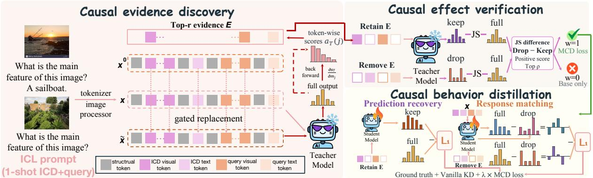
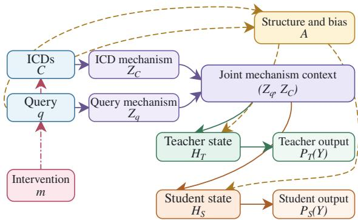
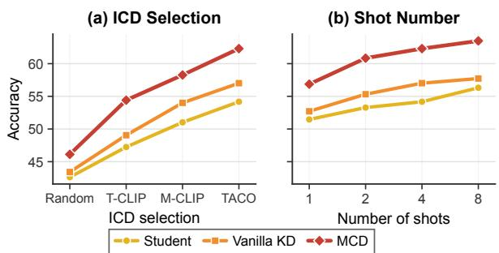
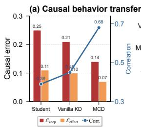
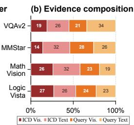
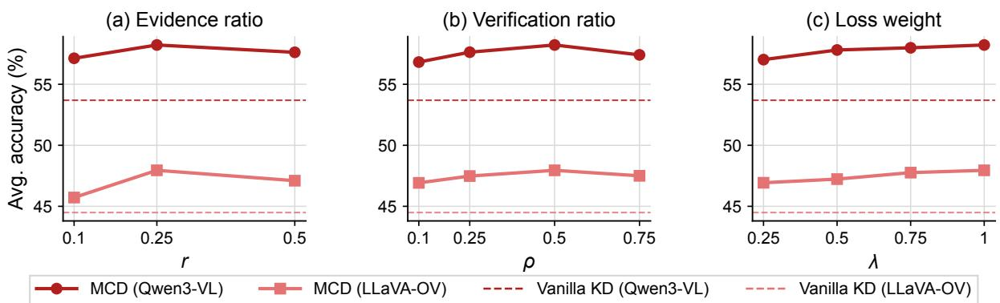

# MCD: Causal Distillation of Multimodal In-Context Learning in Large Vision-language Models

Yanshu Li1, Jiaqian Li1, Canran Xiao1, Xi Xiao2, Tianyang Wang2, Yongtai Liu3 1Brown University, 2University of Alabama at Birmingham, 3Hanyang University Correspondence: yanshu\_li1@brown.edu

## Abstract

Large vision-language models (LVLMs) exhibit strong multimodal in-context learning (ICL) capabilities, yet this ability degrades substantially as model size decreases. Knowledge distillation offers a natural way to bridge this gap, but existing methods primarily align output distributions or hidden representations directly. Such alignment teaches the student what the teacher predicts without revealing which evidence in the complex context causally supports that prediction. Consequently, a student can imitate the teacher’s answer while continuing to rely on language priors, prompt structure, or other spurious cues. To address this limitation, we introduce Multimodal Causal Distillation (MCD), a distillation framework that transfers how a strong teacher uses multimodal evidence during ICL. MCD uses structure-preserving token interventions to identify and verify causal evidence, then transfers how the teacher responds when that evidence is retained or removed. This design connects distillation to the causal patterns by which the model uses contextual evidence during multimodal ICL. Experiments across three LVLM families and seven benchmarks show that MCD improves student performance by 7.23 points on average and outperforms vanilla distillation by 4.68 points, while further analyses confirm the generalizability of these gains.

## 1 Introduction

Large vision-language models (LVLMs) have demonstrated remarkable capabilities in multimodal understanding and reasoning tasks (Liu et al., 2023). An increasingly salient capability is multimodal in-context learning (ICL), in which a model answers a query using a small set of interleaved image-text demonstrations provided in the prompt (Jiang et al., 2024). It provides a flexible way of adapting a general-purpose LVLM to diverse tasks at inference time. Its effectiveness, however, depends strongly on model scale (Zhang et al.,

2023). Larger LVLMs can integrate the query with relevant evidence across multiple demonstrations, whereas smaller models are more susceptible to spurious cues such as language priors and prompt formatting (Zheng et al., 2025). Prior work has sought to improve multimodal ICL through prompt configuration, but its effectiveness remains constrained by the model’s intrinsic capabilities (Li et al., 2024b; Zhang et al., 2023).

Thus, strong-to-weak knowledge distillation offers a better approach to narrowing this capability gap by transferring the behavior of a powerful teacher to a compact student (Hinton et al., 2015). Most existing distillation methods supervise the student by matching the teacher’s output distribution. However, in multimodal ICL with complex context, this pointwise constraint leaves a critical ambiguity unresolved (Xu et al., 2024). The same answer may arise from integrating task-relevant contextual evidence or exploiting superficial correlations, such as textual biases, demonstration order, and outputformat regularities. Consequently, a weak student may match the teacher on training prompts without learning how the teacher uses provided context. Another paradigm distills intermediate attention patterns to provide finer-grained supervision (Kim et al., 2025), but incurs substantial costs on multiimage prompts and introduces additional training instability in multimodal ICL.

To develop a distillation method tailored to multimodal ICL, we study this problem from a causal perspective. Given a query and in-context demonstrations, the model must combine the task specified by the query with mechanism-relevant evidence from the demonstrations. This motivates structure-preserving interventions that modify semantic content and measure the resulting output changes. Causal evidence should preserve the teacher’s prediction when retained and substantially alter it when removed, providing supervision unavailable from the original prompt alone.

However, identifying such evidence without annotations or exhaustive token removal is challenging (Li et al., 2026b), particularly for multi-image prompts, while arbitrary replacements may confound semantic effects with structural corruption.

To this end, we propose Multimodal Causal Distillation (MCD), which transfers how a strong teacher causally uses multimodal evidence during ICL. MCD first separates prompt structure from content-bearing text and visual tokens, then applies attribute-matched replacements that preserve each token’s functional or spatial position while altering its semantics. It uses teacher gradients to identify query and demonstration evidence supporting the teacher’s answer and verifies this evidence through complementary interventions that retain or remove the selected tokens. Valid evidence should preserve the teacher’s prediction when retained and induce a larger output change when removed. MCD transfers both behaviors to the student, thereby teaching evidence sufficiency and causal dependence without requiring mechanism annotations or attention alignment. Extensive experiments with three LVLM families and seven benchmarks demonstrate MCD’s superior performance, validating its effectiveness and generality. Our main contributions can be summarized as follows:

• We propose Multimodal Causal Distillation (MCD), the first distillation framework that formulates multimodal ICL from a causal perspective and transfers how a strong teacher causally uses multimodal evidence, moving beyond output-only alignment.

• MCD combines structure-preserving token interventions, gradient-based evidence discovery, and retain-remove verification to effectively transfer both evidence sufficiency and causal dependence to the student.

• Extensive experiments across three LVLM families and seven benchmarks show that MCD improves student performance by 7.23 on average and outperforms vanilla distillation by 4.68, confirming the generality of causal supervision for multimodal ICL.

## 2 Related Works

Multimodal in-context learning (ICL). Recent LVLMs have evolved into general-purpose systems capable of complex multimodal tasks (Amini et al., 2025). One key capability is multimodal

ICL, which enables models to infer visual grounding rules, output formats, and input-output mappings from a few examples without parameter updates (Baldassini et al., 2024; Sun et al., 2024). However, multimodal ICL remains unstable, especially in smaller models that often rely on textual cues or superficial structural patterns rather than the multimodal context (Li et al., 2026a; Chen et al., 2025a; Xu et al., 2025a; Zheng et al., 2025). Existing approaches primarily optimize prompt configuration and therefore provide limited improvements to the model’s underlying reasoning capabilities (Yang et al., 2024; Fu et al., 2025).

Knowledge distillation. Knowledge distillation transfers knowledge from strong teachers to compact students (Hinton et al., 2015; Gu et al., 2024; Ko et al., 2024) and has recently been extended from LLMs to LVLMs (Wang et al., 2023). Existing methods often model fine-grained interactions between visual and textual tokens (Zhou et al., 2026a). Align-KD aligns cross-modal attention (Feng et al., 2025), and LLaVA-KD introduces relational distillation (Cai et al., 2025b). Meanwhile, CompoDistill attempts to leverage LVLM’s internal attention distributions (Kim et al., 2025). Align-TI (Chen et al., 2026) combines both strategies to capture multiple forms of token interactions. However, their reliance on the teacher’s attention maps may not faithfully capture the causal dependencies. Among LLM distillation methods, LeaF (Guo et al., 2026) moves beyond attention by using interventions to expose teacher–student gradient differences and reveal token interactions. It is effective on long-context text tasks, but its reliance on pruning-based interventions limits its applicability to multimodal ICL.

## 3 Method

## 3.1 Overview

We propose Multimodal Causal Distillation (MCD), illustrated in Fig. 1, to transfer how a strong teacher uses multimodal ICL evidence to a smaller student. We first motivate MCD from a causal perspective in Section 3.2. We then discover mechanism-bearing evidence through structurepreserving interventions in Section 3.3 and verify it using retain-remove tests in Section 3.4. Finally, we transfer evidence sufficiency and causal dependence in Section 3.5 and integrate them with supervised learning and output distillation in Section 3.6.

  
Figure 1: Overview of the proposed Multimodal Causal Distillation (MCD) framework.

## 3.2 Preliminaries and Motivation

## 3.2.1 Vanilla Vision-language Distillation

LVLMs considered in this work follow a widely adopted architecture consisting of a vision encoder, a projector, and an LLM backbone. As discussed in Section $^ { 2 , }$ such models are susceptible to modality bias and sensitive to prompt formatting at smaller scales, leading to substantial deficiencies in multimodal reasoning. These deficiencies become more pronounced in multimodal ICL, which requires complex cross-modal interactions. Formally, the input x of multimodal ICL comprises n in-context demonstrations (ICDs) and a query sample,

$$
\pmb { x } = [ \mathcal { C } ; q ] = \left[ \{ ( I _ { i } , T _ { i } ) \} _ { i = 1 } ^ { n } ; ( \hat { I } , \hat { T } ) \right] ,\tag{1}
$$

where each ICD contains an image $I _ { i }$ and a text segment $T _ { i }$ composed of a question and its answer label. The query contains an image $\hat { I }$ and an unlabeled question $\dot { T } .$ . At inference time, the LVLM is expected to use the task-relevant external knowledge, output format, and input-output mappings conveyed by the ICDs (Li et al., 2025) to infer the answer to the query sample. We refer to this unobserved information as the latent task mechanism.

Given the substantial gap in multimodal ICL capability observed between large-scale LVLMs and their smaller counterparts from the same family (Chen et al., 2025b; Zong et al., 2025), distillation provides a natural way to improve small-scale LVLMs. Let the large-scale teacher define an output distribution $P _ { T }$ , and let $P _ { S } ^ { \theta }$ denote the distribution of a student parameterized by θ. For a training sample $( { \pmb x } , { \pmb y } )$ drawn from D, define $P _ { T , k } = P _ { T } ( \cdot \vert$ $\scriptstyle { \boldsymbol { x } } , { \boldsymbol { y } } _ { < k } )$ and $P _ { S , k } ^ { \theta } = P _ { S } ^ { \theta } ( \cdot \mid x , y _ { < k } )$ . Vanilla output distillation minimizes

$$
\mathcal { L } _ { \mathrm { d i s } } ( \theta ) = \mathbb { E } _ { ( \pmb { x } , \pmb { y } ) \sim \mathcal { D } } \left[ \frac { 1 } { L } \sum _ { k = 1 } ^ { L } D _ { \mathrm { K L } } \left( P _ { T , k } \Big | \Big | P _ { S , k } ^ { \theta } \right) \right] ,\tag{2}
$$

where $\scriptstyle y _ { < k }$ denotes the ground-truth prefix before the k-th decoding step and L is the answer length. It enables the student to imitate the output behavior of a stronger teacher. However, alignment only at the output level provides insufficient supervision for the student to learn how to exploit complex cross-modal semantics, thereby limiting its generalization. To address this limitation, we first conduct a causal analysis of multimodal ICL.

## 3.2.2 A Causal View of Multimodal ICL

Given a prompt $[ { \mathcal { C } } ; q ] .$ , an LVLM must interpret the mechanism indicated by q using the mechanism evidence conveyed by C. This inference process entails a causal dependence: the mechanisms conveyed by the query and ICDs jointly shape the model state and its prediction, while prompt structure and modality bias can provide competing paths to the output. To make these dependencies explicit, we formulate multimodal ICL inference with the causal graph in Fig. 2. For a model $M \in \{ T , S \}$ the inference relations are

$$
\begin{array} { c } { { H _ { M } = f _ { M } ( Z _ { q } , Z _ { \mathcal { C } } , { \pmb A } ) , } } \\ { { P _ { M } ( Y \mid \pmb x ) = p _ { M } ( Y \mid H _ { M } ) . } } \end{array}\tag{3}
$$

Here $Z _ { q }$ and $Z _ { C }$ summarize the latent task mechanism indicated by the query and the evidence conveyed by the ICDs. Their joint effect on $H _ { M }$ represents the model’s mechanism-conditioned use of the prompt, while A captures structural and modality cues induced by prompt construction.

This graph allows us to distinguish the causal pathways underlying multimodal ICL. An intervention m replaces selected query or ICD content upstream of $Z _ { q }$ and $Z _ { C }$ while preserving A. The resulting output change provides a measure of how strongly the model’s prediction depends on the intervened content. In contrast, Eq. (2) aligns the teacher and student only on the observed prompt.

  
Figure 2: Causal graph of multimodal ICL inference. The query and ICDs provide complementary mechanism evidence and jointly shape the model state.

A weak student may match the teacher’s answer while still relying on spurious biases. Thus, effective distillation should transfer the teacher’s causal response to mechanism-bearing evidence in addition to its observed output distribution. To this end, we propose MCD, which employs interventions derived from the causal relations.

## 3.3 Causal Evidence Discovery

First, we intervene on the token-level semantics of $q$ and $\mathcal { C }$ in Fig. 2. We partition the input prompt into structural tokens and candidate tokens $\mathcal { U } ( \pmb { x } ) = \{ u _ { j } \} _ { j = 1 } ^ { N }$ . Structural tokens comprise the template tokens required to execute the prompt and remain unchanged under all interventions. Candidate tokens comprise the content-bearing text and projected visual tokens from both the ICDs and the query. Thus, N is determined by the prompt rather than set as a hyperparameter. For each candidate token $u _ { j }$ , we record attributes used to select its replacement, as detailed in Appendix B.

During preprocessing, each prompt x is randomly paired with another training example $ { \boldsymbol { { x } } } ^ { 0 }$ that has the same prompt layout, and this pairing is reused across all training epochs. For each $u _ { j }$ , we select the token $u _ { j } ^ { 0 }$ from $ { \boldsymbol { { x } } } ^ { 0 }$ with the corresponding attributes. Let $e _ { M , j }$ and $b _ { M , j }$ denote the modelspecific embeddings of $u _ { j }$ and $u _ { j } ^ { 0 }$ , respectively. A scalar gate defines

$$
\widetilde { e } _ { M , j } ( m _ { j } ) = b _ { M , j } + m _ { j } ( e _ { M , j } - b _ { M , j } ) , M \in \{ T , S \} .\tag{4}
$$

Setting $m _ { j } = 1$ retains the original token, while $m _ { j } = 0$ replaces it. The teacher and student use the same original and replacement tokens but encode them with their own input modules. Thus, the intervention changes the token content while preserving the structural and positional properties specified by its attributes, thereby avoiding the introduction of additional biases. In terms of Fig. 2, it changes the inputs to $Z _ { q }$ and $Z _ { C }$ while keeping the structural factors represented by A.

We next identify which candidate tokens causally contribute to the teacher’s predictions in multimodal ICL. The teacher first receives the original prompt and generates a response ${ \bf { \nabla } } _ { { \bf { { y } } } _ { T } } =$ $( y _ { T , 1 } , \dots , y _ { T , L _ { T } } )$ , where $L _ { T }$ denotes the response length. We keep this response and its prefixes fixed when evaluating all interventions and define the teacher score as

$$
s _ { T } ( \pmb { x } ; \pmb { m } ) = \frac { 1 } { L _ { T } } \sum _ { k = 1 } ^ { L _ { T } } \log P _ { T } \left( y _ { T , k } \ | \ \pmb { x } , \pmb { y } _ { T , < k } ; \pmb { m } \right) .\tag{5}
$$

To score all candidate tokens with one backward pass, we sample $\alpha \sim \mathcal { U } ( 0 , 1 )$ and set every gate to α. The importance of $u _ { j }$ is

$$
\begin{array} { c l c r } { \displaystyle { a _ { T } ( j ) = \left. \frac { \partial s _ { T } ( { \pmb x } ; m ) } { \partial m _ { j } } \right| _ { m = \alpha { \bf 1 } } } } \\ { \displaystyle { = \left( e _ { T , j } - b _ { T , j } \right) ^ { \top } \nabla _ { \widetilde { e } _ { T , j } } s _ { T } \big ( { \pmb x } ; \alpha { \bf 1 } \big ) . } } \end{array}\tag{6}
$$

A larger $a _ { T } ( j )$ indicates a stronger local increase in the teacher score when $u _ { j }$ moves from its replacement toward its original content at the sampled interpolation point. We rank the candidate tokens by this score and select

$$
\begin{array} { r } { E = \mathrm { T o p } _ { m _ { E } } \left\{ j : a _ { T } ( j ) > 0 \right\} _ { j = 1 } ^ { N } , } \\ { m _ { E } = \operatorname* { m a x } \left\{ 1 , \lfloor r N \rfloor \right\} , 0 < r < 1 . } \end{array}\tag{7}
$$

where r is the fixed fraction of candidate tokens retained as evidence. Examples with $E = \emptyset$ are not eligible for causal-effect verification and are assigned $w ( { \pmb x } ) = 0$ . The causal role of E is verified next through discrete interventions.

## 3.4 Causal Effect Verification

The gradient score indicates which tokens support the teacher locally, but it does not by itself establish that these tokens determine the teacher’s prediction. We therefore evaluate two complementary prompt variants. The retain-evidence variant keeps the tokens in E and replaces every other candidate token. The remove-evidence variant replaces the tokens in E and keeps every other candidate token. Their gate vectors are

$$
m _ { j } ^ { K } = \mathbf { 1 } [ j \in E ] , m _ { j } ^ { D } = 1 - \mathbf { 1 } [ j \in E ] , m _ { j } ^ { F } = 1 ,\tag{8}
$$

where F denotes the original prompt, K the retainevidence prompt, and D the remove-evidence

prompt. Structural tokens remain unchanged in all three prompt settings.

For $v \in \{ F , K , D \}$ , let

$$
P _ { T , k } ^ { v } = P _ { T } \big ( \cdot \mid \pmb { x } , \pmb { y } _ { T , < k } ; m ^ { v } \big ) .\tag{9}
$$

We measure whether E is sufficient and necessary for the teacher using Jensen–Shannon divergence:

$$
d _ { T } ^ { \mathrm { k e e p } } = \frac { 1 } { L _ { T } } \sum _ { k = 1 } ^ { L _ { T } } D _ { \mathrm { J S } } \left( P _ { T , k } ^ { F } \Vert P _ { T , k } ^ { K } \right) ,\tag{10}
$$

$$
d _ { T } ^ { \mathrm { d r o p } } = \frac { 1 } { L _ { T } } \sum _ { k = 1 } ^ { L _ { T } } D _ { \mathrm { J S } } \left( P _ { T , k } ^ { F } \Vert P _ { T , k } ^ { D } \right) .\tag{11}
$$

A small $d _ { T } ^ { \mathrm { k e e p } }$ means that E alone preserves the teacher’s prediction, while a large $d _ { T } ^ { \mathrm { d r o p } }$ means that removing E changes it. Because both quantities are measured using the same bounded divergence, we combine them directly as follows:

$$
c _ { T } = d _ { T } ^ { \mathrm { d r o p } } - d _ { T } ^ { \mathrm { k e e p } } .\tag{12}
$$

We retain the top fraction $\rho$ of training examples with $c _ { T } > 0$ and assign them $w ( \pmb { x } ) = 1$ . All remaining examples receive $w ( { \pmb x } ) = 0$ and use only the standard supervised terms. Thus, causal supervision is applied only when retaining the selected tokens reproduces the full teacher response more faithfully than removing them. These verified tokens provide an operational link to the latent mechanism because they carry the query and ICD semantics that the teacher actually uses, as evidenced by the causal changes in its prediction when these tokens are intervened upon.

## 3.5 Causal Behavior Distillation

For each accepted example, MCD teaches the student two behaviors established by the verification step. First, the student should recover the teacher’s full-prompt prediction when only E is retained. Second, removing E should change the student prediction in the same way that it changes the teacher prediction. We evaluate both models on the fixed teacher-generated prefixes.

To reduce offline storage, we retain the union of the teacher’s top $K _ { \mathrm { c a c h e } }$ output tokens under $F$ and D at each decoding step and aggregate the remaining probability mass into a single tail entry. We apply the same deterministic aggregation to the student distributions. Let $\bar { P } _ { M , k } ^ { v }$ denote the resulting distribution for model $M \in \{ T , S \}$ and prompt variant $v \in \{ F , K , D \}$ . This representation exactly preserves the total probability mass assigned to the cached support and the aggregated tail, providing a memory-efficient approximation to the corresponding full-vocabulary losses. Conventional distillation probabilities are stored in the same form using a separate support constructed at the ground-truth prefixes.

We define the change caused by removing E:

$$
\begin{array} { r } { \Delta _ { M , k } = \bar { P } _ { M , k } ^ { F } - \bar { P } _ { M , k } ^ { D } . } \end{array}\tag{13}
$$

Using this causal change, we define two causal distillation terms as follows:

$$
\ell _ { \mathrm { k e e p } , k } = \frac { 1 } { 2 } \left\| \bar { P } _ { T , k } ^ { F } - \bar { P } _ { S , k } ^ { K } \right\| _ { 1 } ,\tag{14}
$$

$$
\ell _ { \mathrm { e f f e c t } , k } = \frac { 1 } { 4 } \left\| \Delta _ { T , k } - \Delta _ { S , k } \right\| _ { 1 } .\tag{15}
$$

The first term transfers evidence sufficiency. The second transfers the teacher’s causal response to removing that evidence. Both terms lie in [0, 1]. We combine them to obtain the core MCD loss:

$$
\mathcal { L } _ { \mathrm { M C D } } = \frac { w ( \pmb { x } ) } { 2 L _ { T } } \sum _ { k = 1 } ^ { L _ { T } } \left( \ell _ { \mathrm { k e e p } , k } + \ell _ { \mathrm { e f f e c t } , k } \right) .\tag{16}
$$

Computing both terms for every accepted example would require three student evaluations on teacher-generated prefixes: one each for F, K, and D. We reduce this cost by sampling $z \sim$ Bernoulli(1/2) and optimizing

$$
\widehat { \mathcal { L } } _ { \mathrm { M C D } } = \frac { w ( \pmb { x } ) } { L _ { T } } \sum _ { k = 1 } ^ { L _ { T } } \left[ z \ell _ { \mathrm { k e e p } , k } + ( 1 - z ) \ell _ { \mathrm { e f f e c t } , k } \right] .\tag{17}
$$

When $z = 1$ , the student is evaluated only on $K$ When $z = 0$ , it is evaluated on F and D. Therefore,

$$
\mathbb { E } _ { z } \left[ \widehat { \mathcal { L } } _ { \mathrm { M C D } } \right] = \mathcal { L } _ { \mathrm { M C D } } ,\tag{18}
$$

and each accepted example needs an average of 1.5 student evaluations on teacher-generated prefixes.

## 3.6 Training Objective and Efficiency

The overall training objective combines supervised learning, vanilla distillation, and causal distillation:

$$
\begin{array} { r } { \mathcal { L } = \mathcal { L } _ { \mathrm { s u p } } + \mathcal { L } _ { \mathrm { d i s } } + \lambda \widehat { \mathcal { L } } _ { \mathrm { M C D } } , } \end{array}\tag{19}
$$

where $\mathcal { L } _ { \mathrm { s u p } }$ is the ground-truth cross-entropy and ${ \mathcal { L } } _ { \mathrm { d i s } }$ is defined in Eq. (2). The loss coefficient λ controls the contribution of MCD to the overall training objective. After distillation, the student can reason more effectively over token-level evidence during multimodal ICL inference, improving its ability to utilize complex cross-modal context.

All teacher generations, verification scores, and output distributions are computed once and cached before student training. MCD operates only on input embeddings and output distributions and requires no alignment of attention matrices. Thus, it can be applied to diverse model architectures, such as backbones with linear attention.

## 4 Experiments

## 4.1 Setup

Training data. To construct a high-quality training set for MCD, we first include all samples from three benchmarks specifically designed to evaluate multimodal ICL: VL-ICL (Zong et al., 2025), TrueMICL (Chen et al., 2025b), and SMMILE (Rieff et al., 2025). In their few-shot instances, LVLMs cannot answer the query without first extracting sufficient task information from the corresponding ICDs. We then use TACO (Li et al., 2025) to construct additional multimodal few-shot prompts from HatefulMemes (Kiela et al., 2020), MME-RealWorld (Zhang et al., 2025), BlindTest (Rahmanzadehgervi et al., 2024), VisuLogic (Xu et al., 2025b), and GQA (Hudson and Manning, 2019), further expanding the training set to 90K prompts. Finally, we remove duplicate prompts and retain only those for which the teacher correctly answers the query given the original prompt, resulting in 60K training examples. Among these prompts, 80% contain four ICDs, 10% contain eight ICDs, and 5% each contain one and two ICDs.

Models and benchmarks. We evaluate MCD across three LVLM families: LLaVA-OneVision (Li et al., 2024a), Qwen3-VL (Bai et al., 2025), and Qwen3.5 (Team, 2026). Within each family, MCD distills multimodal ICL capabilities from a larger teacher into a smaller student using official few-shot templates. We evaluate on benchmarks sufficiently out of distribution from the training data so that performance gains reflect causal ICL behavior instead of knowledge transfer alone. We evaluate on VQAv2 (Goyal et al., 2017), VizWiz (Gurari et al., 2018), MMStar (Chen et al., 2024), MathVision (Wang et al., 2024), MDK12 (Zhou et al., 2026b), MMIQ (Cai et al., 2025a), and LogicVista (Xiao et al., 2024). VQAv2 and VizWiz are widely used to evaluate multimodal ICL, while the remaining five benchmarks are frequently adopted in recent evaluations of state-of-the-art LVLMs. For benchmarks with predefined training and test splits, we use the training split as the ICD pool and the test split as the query set. For benchmarks without predefined splits, we partition the samples into ICD and query sets at a ratio of 6:4. We use TACO to configure the ICD sequences, and all main experiments are conducted in the four-shot setting.

Baselines. Following standard evaluation protocols for knowledge distillation, we report the performance of the teacher, the student before and after MCD, and the student trained with vanilla distillation. Since no prior distillation method specifically targets multimodal ICL, we compare MCD with recent methods for general LVLM distillation that can be directly applied to multi-image settings, including LLaVA-KD (Cai et al., 2025b), CompoDistill (Kim et al., 2025), and Align-TI (Chen et al., 2026). For Qwen3.5, the attention-based objectives in Align-TI are applied only to full-attention layers, while CompoDistill is not applied to this model.

Implementation details. We train each model for three epochs using a customized Hugging Face Trainer. We freeze the vision encoder and perform full-parameter supervised fine-tuning on all remaining modules. We set the batch size to 32, λ to 1.0, r to 0.25, ρ to 0.5, and $K _ { \mathrm { c a c h e } }$ to 128. During evaluation, the teacher and student within each model family use greedy decoding with identical inference settings. Given the instability of multimodal ICL, we report the average results over three different random seeds in the main experiments.

## 4.2 Main results

As shown in Table 1, MCD achieves the best student performance on every benchmark, with average scores of 47.95, 58.22, and 66.38 for LLaVA-OneVision, Qwen3-VL, and Qwen3.5, respectively. These results improve upon the original students by 5.42, 6.77, and 9.50 points. Across the three families, MCD also outperforms Vanilla KD by 3.46 to 6.06 points and the strongest specialized baseline, Align-TI, by 1.47 to 2.16 points. Its advantage over Align-TI is particularly pronounced on challenging benchmarks with larger gaps between teacher and student performance, averaging 2.29 points compared with 0.68 points on the remaining benchmarks. This pattern suggests that transferring the teacher’s causal dependence on mechanismbearing evidence becomes increasingly valuable as contextual reasoning grows more complex. Overall, MCD delivers larger gains on reasoning-intensive tasks while maintaining strong performance on general visual question answering. Its improvements across all three model families further demonstrate its applicability to LVLMs with different parameter scales and attention architectures.

<table><tr><td>Model Family</td><td>Model / Method</td><td>VQAv2</td><td>VizWiz</td><td>MMStar</td><td>MathVision</td><td>MDK12</td><td>MMIQ</td><td>LogicVista</td><td>Avg.</td></tr><tr><td rowspan="7">LLaVA-OneVision</td><td>Teacher (72B)</td><td>83.61</td><td>71.87</td><td>61.05</td><td>27.32</td><td>46.57</td><td>28.03</td><td>32.14</td><td>50.08</td></tr><tr><td>Student (7B)</td><td>78.00</td><td>63.32</td><td>51.17</td><td>17.52</td><td>38.78</td><td>23.21</td><td>25.74</td><td>42.53</td></tr><tr><td>+Vanilla KD</td><td>81.29</td><td>67.42</td><td>52.38</td><td>18.46</td><td>40.17</td><td>24.17</td><td>27.53</td><td>44.49</td></tr><tr><td>+LLaVA-KD</td><td>82.61</td><td>69.23</td><td>54.73</td><td>18.77</td><td>41.33</td><td>24.14</td><td>28.95</td><td>45.68</td></tr><tr><td>+CompoDistill</td><td>81.57</td><td>69.45</td><td>53.19</td><td>17.95</td><td>40.63</td><td>23.81</td><td>28.42</td><td>45.00</td></tr><tr><td>+Align-TI</td><td>82.74</td><td>69.89</td><td>55.26</td><td>20.47</td><td>41.73</td><td>26.42</td><td>28.86</td><td>46.48</td></tr><tr><td>+MCD (Ours)</td><td>82.95</td><td>70.17</td><td>57.17</td><td>22.67</td><td>44.82</td><td>27.38</td><td>30.46</td><td>47.95</td></tr><tr><td rowspan="7">Qwen3-VL</td><td>Teacher (32B)</td><td>87.24</td><td>77.78</td><td>76.62</td><td>63.28</td><td>53.81</td><td>37.86</td><td>62.48</td><td>65.58</td></tr><tr><td>Student (2B)</td><td>81.47</td><td>70.92</td><td>58.90</td><td>39.14</td><td>40.75</td><td>29.36</td><td>39.63</td><td>51.45</td></tr><tr><td>+Vanilla KD</td><td>83.72</td><td>75.28</td><td>63.27</td><td>39.92</td><td>42.07</td><td>30.46</td><td>41.10</td><td>53.69</td></tr><tr><td>+LLaVA-KD</td><td>83.96</td><td>75.61</td><td>65.45</td><td>42.17</td><td>45.29</td><td>31.28</td><td>43.34</td><td>55.30</td></tr><tr><td>+CompoDistill</td><td>83.56</td><td>75.42</td><td>63.37</td><td>41.04</td><td>45.60</td><td>30.39</td><td>41.31</td><td>54.38</td></tr><tr><td>+Align-TI</td><td>84.28</td><td>76.27</td><td>65.64</td><td>43.50</td><td>47.43</td><td>33.62</td><td>43.71</td><td>56.35</td></tr><tr><td>+MCD (Ours)</td><td>85.31</td><td>77.04</td><td>67.26</td><td>46.27</td><td>50.32</td><td>36.24</td><td>45.09</td><td>58.22</td></tr><tr><td rowspan="6">Qwen3.5 (non-thinking)</td><td>Teacher (27B)</td><td>92.75</td><td>81.63</td><td>84.12</td><td>78.53</td><td>63.25</td><td>49.29</td><td>71.37</td><td>74.42</td></tr><tr><td>Student (2B)</td><td>84.62</td><td>75.27</td><td>68.35</td><td>42.70</td><td>49.23</td><td>30.61</td><td>47.38</td><td>56.88</td></tr><tr><td>+Vanilla KD</td><td>85.46</td><td>76.35</td><td>71.50</td><td>49.42</td><td>53.28</td><td>33.42</td><td>52.83</td><td>60.32</td></tr><tr><td>+LLaVA-KD</td><td>87.79</td><td>78.21</td><td>74.29</td><td>55.26</td><td>55.62</td><td>36.71</td><td>54.92</td><td>63.26</td></tr><tr><td>+Align-TI</td><td>88.74</td><td>78.00</td><td>76.01</td><td>57.35</td><td>56.97</td><td>37.25</td><td>55.25</td><td>64.22</td></tr><tr><td>+MCD (Ours)</td><td>89.27</td><td>79.24</td><td>78.75</td><td>58.47</td><td>58.53</td><td>40.17</td><td>60.24</td><td>66.38</td></tr></table>

Table 1: Four-shot performance of different models on seven multimodal benchmarks. Bold denotes the best student result within each model family. Avg. denotes the average score across all seven benchmarks.

## 4.3 Ablation Study

We conduct ablation studies and analyses on Qwen3.5 and Qwen3-VL and report results averaged across the two model families.

Robustness across ICL configurations. We first examine whether the improvement of MCD transfers across different ICL prompt configurations. For each query, we ablate both the number of ICDs and the ICD retrieval strategy. To vary the number of ICDs, we additionally construct 1, 2, and 8-shot prompts. To vary retrieval quality, we use random sampling, text-based CLIP similarity (T-CLIP), and joint image-text CLIP similarity (M-CLIP), which generally produce prompts of increasing quality (Li et al., 2024b). Fig. 3 reports the average scores over the seven benchmarks for the original student, Vanilla KD, and MCD. MCD maintains substantial gains over both baselines across diverse configurations, with its performance further improving as prompt quality increases. The comparisons jointly evaluate robustness to the quantity and quality of in-context evidence, demonstrating the broad applicability of MCD across diverse user requirements.

  
Figure 3: Performance under (a) different ICD selection strategies and (b) numbers of ICDs.

Contributions of causal supervision. We next isolate the two causal objectives and the verification procedure. We compare full MCD with its variants that remove either $\ell _ { \mathrm { k e e p } }$ or $\ell _ { \mathrm { e f f e c t } }$ or disable causal-effect verification while retaining both objectives. As shown in Table 2, MCD scores 66.34 on average, dropping to 64.89 without $\ell _ { \mathrm { k e e p } } ,$ 64.36 without $\ell _ { \mathrm { e f f e c t } }$ , and 63.47 without verification. The complementary drops indicate that recovering the teacher prediction from retained evidence and matching its response to evidence removal capture different aspects of causal behavior, with the latter contributing more strongly to reasoning-intensive tasks. The larger degradation without verification further shows that causal supervision is most effective when the selected evidence induces a reliable teacher response, motivating MCD to verify interventions before transferring them to the student.

<table><tr><td>Variant</td><td>VQAv2</td><td>MMStar</td><td>MathVision</td><td> $\mathbf { L o g i c V i s t a }$ </td><td> $\operatorname { A v g } .$ </td></tr><tr><td>Vanilla KD</td><td>84.59</td><td>67.39</td><td>44.67</td><td>46.97</td><td>60.91</td></tr><tr><td>Full MCD</td><td>87.29</td><td>73.01</td><td>52.37</td><td>52.67</td><td>66.34</td></tr><tr><td>w/o  $\ell _ { \mathrm { k e e p } }$ </td><td>86.85</td><td>71.65</td><td>49.83</td><td>51.23</td><td>64.89</td></tr><tr><td>w/o  $\ell _ { \mathrm { e f f e c t } }$ </td><td>86.52</td><td>71.26</td><td>49.25</td><td>50.42</td><td>64.36</td></tr><tr><td>w/o Verification</td><td>85.87</td><td>70.49</td><td>48.02</td><td>49.49</td><td>63.47</td></tr></table>

Table 2: Ablation of the causal objectives and verification procedure.
<table><tr><td>Variant</td><td>VQAv2</td><td>MMStar</td><td>MathVision</td><td>LogicVista</td><td>Avg.</td></tr><tr><td>Random evidence</td><td>84.93</td><td>68.52</td><td>47.27</td><td>48.33</td><td>62.26</td></tr><tr><td>Attention-based evidence</td><td>86.51</td><td>71.08</td><td>49.89</td><td>50.86</td><td>64.59</td></tr><tr><td>Unrestricted replacement</td><td>86.34</td><td>70.49</td><td>48.56</td><td>50.00</td><td>63.85</td></tr><tr><td>Full MCD</td><td>87.29</td><td>73.01</td><td>52.37</td><td>52.67</td><td>66.34</td></tr></table>

Table 3: Ablation of causal evidence discovery.

Design of causal evidence discovery. We then ablate teacher-gradient ranking and attributematched replacement in Table 3. Replacing gradient ranking with random or attention-based selection reduces the average score from 66.34 to 62.26 and 64.59, respectively, while unrestricted replacement yields 63.85. The substantial degradation under random selection confirms that the effectiveness of causal supervision depends on identifying content that meaningfully affects the teacher prediction, while the remaining gap of attention-based selection indicates that teacher-response gradients provide a more direct signal of this dependence. The decline caused by unrestricted replacement further shows the need to preserve the functional and spatial roles of intervened tokens, allowing the measured output change to be attributed to semantic evidence rather than unintended prompt corruption.

## 4.4 Analysis

Causal behavior transfer. We analyze whether MCD transfers the teacher’s response to interventions rather than only its full-prompt prediction. On held-out prompts excluded from evidence screening and training, we apply the same teacherdiscovered evidence and replacements to the original student, Vanilla KD, and MCD. We measure the evidence-sufficiency error $\mathcal { E } _ { \mathrm { k e e p } }$ , causal-response error $\mathcal E _ { \mathrm { e f f e c t } }$ , and Pearson correlation between teacher and student removal effects, as detailed in Appendix D.1. As shown in Fig. 4(a), the original student obtains (0.25, 0.11, 0.39) and Vanilla KD improves these values to (0.21, 0.10, 0.45). MCD further reaches (0.14, 0.07, 0.68), reducing $\mathcal { E } _ { \mathrm { k e e p } }$ and $\mathcal E _ { \mathrm { e f f e c t } }$ by 33.3% and 30.0% relative to Vanilla KD while increasing the correlation by 0.23. These results show that MCD more faithfully reproduces the teacher’s response to evidence interventions and its relative strength across examples.

  
Figure 4: Causal behavior transfer and composition of verified evidence. (a) Evidence-sufficiency error, causal-response error, and Pearson correlation for the original student, Vanilla KD, and MCD. Lower errors and higher correlation indicate closer behavior to the teacher. (b) Composition of verified evidence across four benchmarks.

Composition of causal evidence. We further analyze how verified evidence is distributed across ICD visual, ICD text, query visual, and query text tokens on four representative benchmarks. For each benchmark, we aggregate the fraction of selected tokens from each source and visualize the resulting distribution as a horizontal percentage stacked bar in Fig. 4(b). Query tokens account for 55% and 54% of the evidence on VQAv2 and MMStar, respectively, whereas ICD tokens constitute 58% on MathVision. LogicVista exhibits a nearly balanced division between ICD and query evidence at 52% and 48%. Across modalities, textual evidence is more prominent on VQAv2 and MMStar (60% and 58%), while MathVision and LogicVista maintain nearly even visual–textual compositions. These shifts show that the verified evidence adapts to the task-specific use of the query and ICDs rather than following a fixed source or modality allocation. We provide an efficiency analysis and a failure case study in Appendix D.

## 5 Conclusion

This paper introduced MCD, a framework that transfers multimodal ICL capabilities from largescale LVLMs to smaller LVLMs within the same family. MCD identifies and verifies mechanismbearing evidence through token-level interventions, then transfers its sufficiency and causal influence to the student. Experiments across three LVLM families and seven benchmarks demonstrate consistent improvements over original student models and existing distillation methods. MCD advances the development of compact LVLMs with stronger multimodal reasoning capabilities.

## Limitations

MCD is currently applied within a single LVLM family, where the teacher and student share the same tokenizer and image processor. This assumption ensures that the token-level interventions used for causal evidence discovery and verification refer to comparable input units in both models, so that the retained and removed evidence carries a consistent meaning throughout the distillation pipeline. Although same-family distillation is a common setting in prior LVLM distillation work, extending MCD to cross-family teachers and students, in which tokenization schemes and visual encoders differ, would substantially broaden the range of teacher-student pairs to which our framework applies and represents an important future direction.

A second direction concerns the scope of multimodal scenarios considered in this work. Our experiments focus on standard few-shot ICL prompts with a moderate number of ICDs and a single question-answering query. Extending MCD to more general and complex multi-image regimes, including long-context ICL with many interleaved images, tool-augmented multimodal agents, and settings that require interleaved image-text chainof-thought (CoT) reasoning, is a natural next step. Such extensions would allow the causal supervision provided by MCD to support emerging paradigms such as think-with-image reasoning, where the model must iteratively inspect, reason about, and integrate multiple visual pieces of evidence.

## References

Hadi Amini, Md Jueal Mia, Yasaman Saadati, Ahmed Imteaj, Seyedsina Nabavirazavi, Urmish Thakker, Md Zarif Hossain, Awal Ahmed Fime, and SS Iyengar. 2025. Distributed llms and multimodal large language models: A survey on advances, challenges, and future directions. arXiv preprint arXiv:2503.16585.

Shuai Bai, Yuxuan Cai, Ruizhe Chen, Keqin Chen, Xionghui Chen, Zesen Cheng, Lianghao Deng, Wei Ding, Chang Gao, Chunjiang Ge, and 1 others. 2025. Qwen3-vl technical report. arXiv preprint arXiv:2511.21631.

Folco Bertini Baldassini, Mustafa Shukor, Matthieu Cord, Laure Soulier, and Benjamin Piwowarski. 2024. What makes multimodal in-context learning work? In Proceedings ofthe IEEE/CVF Conference on Computer Vision and Pattern Recognition, pages 1539– 1550.

Huanqia Cai, Yijun Yang, and Winston Hu. 2025a. MM-IQ: Benchmarking human-like abstraction and reasoning in multimodal models. arXiv preprint arXiv:2502.00698.

Yuxuan Cai, Jiangning Zhang, Haoyang He, Xinwei He, Ao Tong, Zhenye Gan, Chengjie Wang, Zhucun Xue, Yong Liu, and Xiang Bai. 2025b. Llava-kd: A framework of distilling multimodal large language models. In Proceedings ofthe IEEE/CVF International Conference on Computer Vision, pages 239–249.

Lin Chen, Jinsong Li, Xiaoyi Dong, Pan Zhang, Yuhang Zang, Zehui Chen, Haodong Duan, Jiaqi Wang, Yu Qiao, Dahua Lin, and 1 others. 2024. Are we on the right way for evaluating large vision-language models? Advances in Neural Information Processing Systems, 37:27056–27087.

Lin Chen, Xiaoke Zhao, Kun Ding, Weiwei Feng, Changtao Miao, Zili Wang, Wenxuan Guo, Ying Wang, Kaiyuan Zheng, Bo Zhang, and 1 others. 2026. Beyond next-token alignment: Distilling multimodal large language models via token interactions. arXiv preprint arXiv:2602.09483.

Shuo Chen, Zhen Han, Bailan He, Jianzhe Liu, Mark Buckley, Yao Qin, Philip Torr, Volker Tresp, and Jindong Gu. 2025a. Can multimodal large language models truly perform multimodal in-context learning? In 2025 IEEE/CVF Winter Conference on Applications ofComputer Vision (WACV), pages 6000– 6010. IEEE.

Shuo Chen, Jianzhe Liu, Zhen Han, Yan Xia, Daniel Cremers, Philip Torr, Volker Tresp, and Jindong Gu. 2025b. True multimodal in-context learning needs attention to the visual context. arXiv preprint arXiv:2507.15807.

Qianhan Feng, Wenshuo Li, Tong Lin, and Xinghao Chen. 2025. Align-kd: Distilling cross-modal alignment knowledge for mobile vision-language large model enhancement. In Proceedings of the IEEE/CVF Conference on Computer Vision and Pattern Recognition, pages 4178–4188.

Honghao Fu, Yuan Ouyang, Kai-Wei Chang, Yiwei Wang, Zi Huang, and Yujun Cai. 2025. Contextnav: Towards agentic multimodal in-context learning. arXiv preprint arXiv:2510.04560.

Yash Goyal, Tejas Khot, Douglas Summers-Stay, Dhruv Batra, and Devi Parikh. 2017. Making the v in vqa matter: Elevating the role of image understanding in visual question answering. In Proceedings of the IEEE conference on computer vision and pattern recognition, pages 6904–6913.

Yuxian Gu, Li Dong, Furu Wei, and Minlie Huang. 2024. Minillm: Knowledge distillation of large language models. In The twelfth international conference on learning representations.

Yiju Guo, Wenkai Yang, Zexu Sun, Ning Ding, Zhiyuan Liu, and Yankai Lin. 2026. Learning to focus: Causal attention distillation via gradient-guided token pruning. Advances in Neural Information Processing Systems, 38:24921–24948.

Danna Gurari, Qing Li, Abigale J Stangl, Anhong Guo, Chi Lin, Kristen Grauman, Jiebo Luo, and Jeffrey P Bigham. 2018. Vizwiz grand challenge: Answering visual questions from blind people. In Proceedings of the IEEE conference on computer vision and pattern recognition, pages 3608–3617.

Geoffrey Hinton, Oriol Vinyals, and Jeff Dean. 2015. Distilling the knowledge in a neural network. arXiv preprint arXiv:1503.02531.

Drew A. Hudson and Christopher D. Manning. 2019. GQA: A new dataset for real-world visual reasoning and compositional question answering. In Proceedings ofthe IEEE/CVF Conference on Computer Vision and Pattern Recognition, pages 6700–6709.

Yixing Jiang, Jeremy Irvin, Ji Hun Wang, Muhammad Ahmed Chaudhry, Jonathan H Chen, and Andrew Y Ng. 2024. Many-shot in-context learning in multimodal foundation models. arXiv preprint arXiv:2405.09798.

Douwe Kiela, Hamed Firooz, Aravind Mohan, Vedanuj Goswami, Amanpreet Singh, Pratik Ringshia, and Davide Testuggine. 2020. The hateful memes challenge: Detecting hate speech in multimodal memes. In Advances in Neural Information Processing Systems, volume 33, pages 2611–2624.

Jiwan Kim, Kibum Kim, Sangwoo Seo, and Chanyoung Park. 2025. Compodistill: Attention distillation for compositional reasoning in multimodal llms. arXiv preprint arXiv:2510.12184.

Jongwoo Ko, Sungnyun Kim, Tianyi Chen, and Se-Young Yun. 2024. Distillm: Towards streamlined distillation for large language models. arXiv preprint arXiv:2402.03898.

Bo Li, Yuanhan Zhang, Dong Guo, Renrui Zhang, Feng Li, Hao Zhang, Kaichen Zhang, Peiyuan Zhang, Yanwei Li, Ziwei Liu, and 1 others. 2024a. Llavaonevision: Easy visual task transfer. arXiv preprint arXiv:2408.03326.

Li Li, Jiawei Peng, Huiyi Chen, Chongyang Gao, and Xu Yang. 2024b. How to configure good incontext sequence for visual question answering. In 2024 IEEE/CVF Conference on Computer Vision and Pattern Recognition (CVPR), pages 26700–26710. IEEE.

Yanshu Li, Jianjiang Yang, Zhennan Shen, Ligong Han, Haoyan Xu, and Ruixiang Tang. 2026a. Catp: Contextually adaptive token pruning for efficient and enhanced multimodal in-context learning. In Proceedings ofthe AAAI Conference on Artificial Intelligence, volume 40, pages 6619–6627.

Yanshu Li, Jianjiang Yang, Ziteng Yang, Bozheng Li, Ligong Han, Hongyang He, Zhengtao Yao, Yingjie Victor Chen, Songlin Fei, Dongfang Liu, and 1 others. 2026b. Make lvlms focus: Context-aware attention modulation for better multimodal in-context learning. In Proceedings of the AAAI Conference on Artificial Intelligence, volume 40, pages 6610–6618.

Yanshu Li, Jianjiang Yang, Tian Yun, Pinyuan Feng, Jinfa Huang, and Ruixiang Tang. 2025. Taco: Enhancing multimodal in-context learning via task mapping-guided sequence configuration. In Proceedings of the 2025 Conference on Empirical Methods in Natural Language Processing, pages 736–763.

Haotian Liu, Chunyuan Li, Qingyang Wu, and Yong Jae Lee. 2023. Visual instruction tuning. Advances in neural information processing systems, 36:34892– 34916.

Pooyan Rahmanzadehgervi, Logan Bolton, Mohammad Reza Taesiri, and Anh Totti Nguyen. 2024. Vision language models are blind. In Computer Vision – ACCV 2024, volume 15476 of Lecture Notes in Computer Science, pages 293–309. Springer.

Melanie Rieff, Maya Varma, Ossian Rabow, Subathra Adithan, Julie Kim, Ken Chang, Hannah Lee, Nidhi Rohatgi, Christian Bluethgen, Mohamed Muneer, Jean-Benoit Delbrouck, and Michael Moor. 2025. SMMILE: An expert-driven benchmark for multimodal medical in-context learning. In Advances in Neural Information Processing Systems, volume 38.

Quan Sun, Yufeng Cui, Xiaosong Zhang, Fan Zhang, Qiying Yu, Yueze Wang, Yongming Rao, Jingjing Liu, Tiejun Huang, and Xinlong Wang. 2024. Generative multimodal models are in-context learners. In Proceedings of the IEEE/CVF conference on computer vision and pattern recognition, pages 14398– 14409.

Qwen Team. 2026. Qwen3.5: Accelerating productivity with native multimodal agents.

Ke Wang, Junting Pan, Weikang Shi, Zimu Lu, Houxing Ren, Aojun Zhou, Mingjie Zhan, and Hongsheng Li. 2024. Measuring multimodal mathematical reasoning with MATH-Vision dataset. In Advances in Neural Information Processing Systems, volume 37.

Tiannan Wang, Wangchunshu Zhou, Yan Zeng, and Xinsong Zhang. 2023. Efficientvlm: Fast and accurate vision-language models via knowledge distillation and modal-adaptive pruning. In Findings ofthe Association for Computational Linguistics: ACL 2023, pages 13899–13913.

Yijia Xiao, Edward Sun, Tianyu Liu, and Wei Wang. 2024. LogicVista: Multimodal LLM logical reasoning benchmark in visual contexts. arXiv preprint arXiv:2407.04973.

Nan Xu, Fei Wang, Sheng Zhang, Hoifung Poon, and Muhao Chen. 2025a. From introspection to best practices: Principled analysis of demonstrations in multimodal in-context learning. In Proceedings of the 2025 Conference of the Nations of the Americas Chapter of the Association for Computational Linguistics: Human Language Technologies (Volume 1: Long Papers), pages 3299–3324.

Shilin Xu, Xiangtai Li, Haobo Yuan, Lu Qi, Yunhai Tong, and Ming-Hsuan Yang. 2024. Llavadi: What matters for multimodal large language models distillation. arXiv preprint arXiv:2407.19409.

Weiye Xu, Jiahao Wang, Weiyun Wang, Zhe Chen, Wengang Zhou, Aijun Yang, Lewei Lu, Houqiang Li, Xiaohua Wang, Xizhou Zhu, Wenhai Wang, Jifeng Dai, and Jinguo Zhu. 2025b. VisuLogic: A benchmark for evaluating visual reasoning in multi-modal large language models. arXiv preprint arXiv:2504.15279.

Xu Yang, Yingzhe Peng, Haoxuan Ma, Shuo Xu, Chi Zhang, Yucheng Han, and Hanwang Zhang. 2024. Lever lm: configuring in-context sequence to lever large vision language models. Advances in Neural Information Processing Systems, 37:100341–100368.

Yifan Zhang, Huanyu Zhang, Haochen Tian, Chaoyou Fu, Shuangqing Zhang, Junfei Wu, Feng Li, Kun Wang, Qingsong Wen, Zhang Zhang, Liang Wang, and Rong Jin. 2025. MME-RealWorld: Could your multimodal LLM challenge high-resolution realworld scenarios that are difficult for humans? In The Thirteenth International Conference on Learning Representations.

Yuanhan Zhang, Kaiyang Zhou, and Ziwei Liu. 2023. What makes good examples for visual in-context learning? Advances in Neural Information Processing Systems, 36:17773–17794.

Xu Zheng, Chenfei Liao, Yuqian Fu, Kaiyu Lei, Yuanhuiyi Lyu, Lutao Jiang, Bin Ren, Jialei Chen, Jiawen Wang, Chengxin Li, and 1 others. 2025. Mllms are deeply affected by modality bias. arXiv preprint arXiv:2505.18657.

Haoyi Zhou, Shuo Li, Tianyu Chen, Qi Song, Chonghan Gao, and Jianxin Li. 2026a. Towards long-window anchoring in vision-language model distillation. In Proceedings of the AAAI Conference on Artificial Intelligence, volume 40, pages 28955–28963.

Pengfei Zhou, Xiaopeng Peng, Fanrui Zhang, Zhaopan Xu, Jiaxin Ai, Yansheng Qiu, Wangbo Zhao, Jiajun Song, Chuanhao Li, Weidong Tang, Zhen Li, Haoquan Zhang, Zizhen Li, Xiaofeng Mao, Yukang Feng, Jianwen Sun, Kai Wang, Xiaojun Chang, Wenqi Shao, and 2 others. 2026b. MDK12-Bench: A multidiscipline benchmark for evaluating reasoning in multimodal large language models. In Proceedings of

the AAAI Conference on Artificial Intelligence, volume 40, pages 28982–28990.

Yongshuo Zong, Ondrej Bohdal, and Timothy Hospedales. 2025. Vl-icl bench: The devil in the details of multimodal in-context learning. In International Conference on Learning Representations, volume 2025, pages 100058–100100.

## A Experimental Setups

## A.1 Training Details

We train each model for three epochs using the AdamW optimizer with a learning rate of 2 × 10−5, a batch size of 32, cosine decay, and linear warmup. The maximum sequence length is set to 4,096. All experiments are conducted on eight NVIDIA H200 GPUs. The training data are detailed below.

VL-ICL. VL-ICL is a benchmark specifically designed to evaluate the multimodal ICL capability of LVLMs. Unlike conventional multimodal benchmarks that mainly probe single-image understanding, its few-shot instances are constructed so that the query cannot be answered without first extracting task information from the accompanying ICDs. It covers a diverse set of subtasks including fine-grained visual concept induction, imageto-text rule discovery, visual-textual binding, and interactive multi-image reasoning, forcing models to infer the underlying task specification, output format, and input-output mapping from the ICDs rather than from the query alone.

TrueMICL. TrueMICL is a benchmark that isolates genuine multimodal ICL from spurious shortcut learning. It rewrites conventional few-shot tasks so that language priors, prompt formatting, and ICD ordering are insufficient to answer the query, and correct predictions require jointly grounding visual content in the ICDs and the query. The benchmark spans multiple task types with tightly controlled ICD-query pairs, enabling a faithful measurement of how well an LVLM integrates crossmodal evidence. Thus, its instances serve as highquality supervision for training procedures that target evidence-driven multimodal ICL behavior.

SMMILE. SMMILE is an expert-driven benchmark for multimodal medical in-context learning. It contains few-shot cases curated by clinical experts across a range of medical imaging modalities and diagnostic tasks, with each query paired with ICDs that convey the intended reasoning pattern rather than lexical shortcuts. The benchmark emphasizes fine-grained visual features, domainspecific terminology, and multi-step clinical reasoning, all of which cannot be inferred from the query image alone. As a domain-specific complement to general-purpose ICL benchmarks, SMMILE probes whether LVLMs can extract and reuse specialized visual evidence provided in ICDs.

HatefulMemes. HatefulMemes is a multimodal classification benchmark for detecting hateful content in internet memes. Each sample pairs an image with an overlaid caption, and the label depends jointly on both modalities: many instances are "benign confounders" whose text or image alone is innocuous but whose combination becomes hateful. This construction penalizes unimodal shortcuts and forces models to reason about the interaction between visual and textual cues.

MME-RealWorld. MME-RealWorld is a largescale multimodal benchmark composed of highresolution real-world images and expert-annotated questions across a broad range of practical scenarios, such as autonomous driving, remote sensing, monitoring, and document understanding. Each question is carefully written to require detailed visual perception and fine-grained reasoning, and the answers cannot be inferred from language priors alone. The benchmark stresses realistic image conditions, spatial precision, and domain-specific knowledge simultaneously.

BlindTest. BlindTest is a diagnostic benchmark that exposes systematic failures of LVLMs on tasks that would be trivial for a sighted human, such as counting overlapping shapes, identifying intersections between lines, or tracing simple paths. Each item consists of a synthetic image and a short question targeting a single, precisely defined visual property. The benchmark deliberately avoids linguistic complexity so that any error can be attributed to visual perception rather than reasoning.

VisuLogic. VisuLogic is a benchmark that evaluates visual logical reasoning through structured diagram-based problems, including quantitative reasoning, spatial reasoning, positional reasoning, attribute reasoning, and stylistic reasoning. Each item presents a set of figures arranged as an analogy or a rule-completion task, and answering it requires inferring an abstract transformation from the visual context alone. Because textual descriptions are minimal, the benchmark is largely immune to language-prior shortcuts.

GQA. GQA is a large-scale visual question answering benchmark built on scene graphs derived from real-world images. Its questions are generated from compositional templates that explicitly target object recognition, attribute prediction, spatial relations, and multi-step reasoning, and each question is paired with a functional program specifying the reasoning steps required. This design yields controlled difficulty and reduced language bias compared with earlier VQA datasets, and it enables fine-grained analysis of model behavior across reasoning types.

## A.2 Benchmarks

In this section, we introduce the seven multimodal benchmarks used in our experiments. For each benchmark, we adopt its official accuracy metric.

VQAv2. VQAv2 is a large-scale visual question answering benchmark that pairs natural images with open-ended questions covering object recognition, attribute prediction, counting, and commonsense reasoning. Each question is balanced with a complementary image that produces a different answer, mitigating language priors and forcing models to attend to visual content. Its scale, coverage, and adversarial balancing make it a standard benchmark for evaluating general visual-language competence. In the multimodal ICL setting, VQAv2 is widely adopted to test whether models can leverage a small set of ICDs to align their answers with the expected format and reasoning pattern.

VizWiz. VizWiz is a visual question answering benchmark collected from blind users, where each question is spoken about a photograph taken by the user. The resulting images often contain motion blur, poor framing, or occlusion, and questions may be ambiguous or even unanswerable. This distribution shift makes VizWiz substantially more challenging than curated benchmarks and demanding of robust cross-modal grounding. It is commonly used to assess whether LVLMs can generalize beyond clean web imagery, and, in ICL evaluation, whether ICDs help models handle noisy inputs and abstain when necessary.

MMStar. MMStar is a vision-indispensable multimodal benchmark carefully filtered to remove samples that can be answered from text alone. Each question spans six core capabilities, including coarse and fine-grained perception, instance reasoning, logical reasoning, science and technology, and mathematics, ensuring that predictions depend on the accompanying image. The samples are hand-verified to avoid data leakage from common pretraining corpora. Its emphasis on genuine visual grounding makes MMStar a strong probe of multimodal reasoning, and it is frequently used in recent evaluations of state-of-the-art LVLMs to distinguish visually competent models from those relying on language priors.

MathVision. MathVision is a benchmark for evaluating mathematical reasoning grounded in images, covering geometry, algebra, combinatorics, and other topics drawn from competition-level problems. Each instance consists of a diagram together with a formal problem statement, requiring the model to interpret visual structure and combine it with symbolic manipulation. The benchmark spans multiple difficulty levels and problem types, providing a stringent test of visual-mathematical reasoning. It is widely used to evaluate the higherorder reasoning ability of LVLMs, particularly whether models can move beyond surface recognition to perform structured, multi-step derivations conditioned on visual input.

MDK12. MDK12 is a multi-discipline benchmark for evaluating reasoning in multimodal large language models across K-12 subjects. Its questions are drawn from real curricula and standardized examinations, and each item combines textual descriptions with diagrams, figures, or tables that are essential to the answer. The benchmark emphasizes long-tail domain knowledge and structured reasoning rather than perceptual pattern matching. Its breadth across disciplines makes it a demanding testbed for measuring whether LVLMs possess the integrated visual, linguistic, and knowledgebased reasoning skills expected of general-purpose multimodal systems.

MMIQ. MMIQ is a multimodal intelligencequotient benchmark that adapts classical IQ-teststyle problems into vision-language tasks. Items include visual analogies, pattern completion, spatial reasoning, and abstract rule induction, each requiring the model to infer latent transformations from a small set of visual elements. Because the questions rely on abstract, non-verbal patterns rather than world knowledge, MMIQ is largely resistant to shortcuts based on textual priors. It is frequently used to evaluate the abstract and analogical reasoning capabilities of LVLMs, complementing benchmarks that emphasize perception or factual recall.

LogicVista. LogicVista is a benchmark for evaluating logical reasoning grounded in visual inputs. It covers deductive, inductive, and abductive reasoning across categories such as syllogisms, propositional logic, spatial logic, and diagrammatic reasoning, with each instance providing a visual scene or figure together with a logical question. Answers cannot be obtained from either the image or the text in isolation, requiring genuine multimodal integration. Its focused design targets a capability that is often underrepresented in general multimodal benchmarks, making it a useful probe of whether LVLMs can perform structured logical inference over visual evidence.

## A.3 Baselines

In this section, we introduce the three baseline methods used in our experiments. For methods that perform distillation in multiple stages, we apply only distillation fine-tuning (DFT) and omit subsequent supervised fine-tuning (SFT) to ensure a fair comparison.

LLaVA-KD. LLaVA-KD extends standard output distillation with relational distillation tailored to LVLMs. In addition to matching the teacher’s output distribution, it aligns pairwise relations between hidden states across samples and modalities, encouraging the student to reproduce the teacher’s overall representation geometry. This relational objective is intended to capture cross-modal structure that pointwise alignment omits.

CompoDistill. CompoDistill focuses on improving the compositional reasoning capability of LVLMs by distilling intermediate attention distributions from the teacher to the student. It aligns attention maps over image and text tokens at selected layers, providing finer-grained supervision than output-only distillation. This design encourages the student to reproduce the teacher’s tokeninteraction pattern rather than merely its final predictions. CompoDistill is included as a representative attention-based distillation baseline.

Align-TI. Align-TI is a recent LVLM distillation method that combines cross-modal alignment and attention distribution matching to capture diverse token interactions. It transfers alignment between textual queries and visual tokens while also aligning the teacher’s attention patterns across selected layers, aiming to reproduce both the semantic and structural aspects of the teacher’s forward pass. It represents the current state of the art among attention-based distillation approaches for LVLMs and, in this work, is adapted to multi-image ICL prompts.

## B Attribute-matched Replacement

For each prompt x, we sample a different training example $ { \boldsymbol { { x } } } ^ { 0 }$ as the source of replacement content. The replacement example is selected once during preprocessing using a deterministic seed derived from the identifier of x and is reused throughout training. For a text token $u _ { j }$ , we define its attributes by its prompt role, textual field, and within-field position. The prompt role indicates whether the token belongs to an ICD or the query, while the textual field distinguishes an ICD question, an ICD answer, and the query question. If the token is the t-th token of a field containing L tokens, its position is normalized as $p _ { j } = ( t + 0 . 5 ) / L$ . We select $u _ { j } ^ { 0 }$ from the same role and textual field in $ { \boldsymbol { { x } } } ^ { 0 }$ with the closest normalized position. When several tokens are equally close, one is selected determinis tically, and an identical token is skipped whenever another valid replacement is available. For a pro jected visual token, the attributes consist of its ICD or query role and its normalized spatial coordinates. Specifically, a token at row h and column w of an $H \times W$ visual-token grid is assigned coordinates $( ( h + 0 . 5 ) / H , ( w + 0 . 5 ) / W )$ . Its replacement is taken from the corresponding image role in $ { \boldsymbol { { x } } } ^ { 0 }$ at the nearest normalized grid location, which reduces to the same row and column when the two grids have identical sizes. For ICD content, the replace ment ICD in $ { \boldsymbol { { x } } } ^ { 0 }$ is sampled uniformly from its ICDs and then used consistently for all tokens belonging to the same original ICD. If the selected example does not contain a valid token with the required role or field, another example is sampled instead of relaxing the matching constraints. The replacement changes only the input embedding at the original token position, leaving sequence length, structural tokens, image boundaries, positional indices, and the attention mask unchanged. For teacher and student models, the same replacement token identity or replacement image location is used, but its embedding $b _ { M , j }$ is independently produced by the embedding and visual projection modules of mode $M \in \{ T , S \}$

## C Additional Ablation Study

## C.1 Sensitivity to Hyperparameters

We study the three hyperparameters that control the coverage, reliability, and strength of causal supervision. The evidence ratio r determines the fraction of candidate tokens selected as evidence, the verification ratio $\rho$ determines the fraction of highest-scoring prompts retained after causal-effect verification, and λ weights the MCD loss relative to conventional supervision. We vary one hyperparameter at a time while fixing the others to their default values, $r = 0 . 2 5 , \rho = 0 . 5 0$ , and $\lambda = 1 . 0$ Fig. 5 reports Qwen3-VL and LLaVA-OneVision separately and the default points correspond to their main results of 58.22 and 47.95.

For the evidence ratio, increasing r from 0.10 to 0.25 improves Qwen3-VL from 57.13 to 58.22 and LLaVA-OneVision from 45.72 to 47.95. Increasing it further to 0.50 reduces the scores to 57.62 and 47.10. Selecting too few tokens can omit complementary query and ICD information, an effect that is particularly pronounced for LLaVA-OneVision, whereas selecting too many introduces weakly relevant content and reduces the contrast between the retain-evidence and remove-evidence prompts. The verification sweep follows a similar single-peak pattern. Moving $\rho$ from 0.10 to 0.50 raises the two scores from 56.82 and 46.92 to 58.22 and 47.95, while retaining 75% of prompts lowers them to 57.41 and 47.50. This result reflects the trade-off between retaining sufficient causal supervision and excluding prompts with weak intervention effects. Finally, increasing λ from 0.25 to 1.0 steadily improves Qwen3-VL from 57.02 to 58.22 and LLaVA-OneVision from 46.93 to 47.95. Both model families exhibit consistent trends, supporting the default configuration as a balanced choice for evidence coverage, verification reliability, and objective strength. MCD also remains robust across different hyperparameter settings.

## C.2 Scope of Causal Supervision

We next determine whether the improvements arise from one dominant modality or prompt component. We restrict evidence discovery and intervention to text tokens, visual tokens, ICD tokens, or query tokens, producing Text-only, Vision-only, ICD-only, and Query-only variants. Each variant uses the same selection ratio within its eligible candidate set, while the original prompt and standard distillation objective remain unchanged. Table 4 shows that Text-only and Vision-only obtain average scores of 64.95 and 64.24, respectively, while ICD-only and Query-only obtain 64.50 and 64.87. The stronger Text-only result reflects the importance of questions and ICD answers for identifying the task mapping, while the remaining improvement of Vision-only confirms that the causal signal is not reducible to language patterns. Query-only performs better than ICD-only because the query directly specifies the prediction target, yet both remain below full MCD at 66.34. The combined result therefore indicates that effective multimodal ICL depends on jointly transferring visual and textual evidence from both the ICDs and the query, matching the causal pathway that motivates MCD.

  
Figure 5: Sensitivity of MCD to three hyperparameters: evidence retention ratio r, verification threshold $\rho ,$ and causal loss weight λ. Results are averaged across the seven evaluation benchmarks. Dashed lines denote Vanilla KD as reference.

<table><tr><td>Variant</td><td>VQAv2</td><td>MMStar</td><td>MathVision</td><td>LogicVista</td><td>Avg.</td></tr><tr><td>Text-only</td><td>86.79</td><td>70.62</td><td>51.18</td><td>51.20</td><td>64.95</td></tr><tr><td>Vision-only</td><td>85.72</td><td>69.85</td><td>50.83</td><td>50.54</td><td>64.24</td></tr><tr><td>ICD-only</td><td>85.94</td><td>70.50</td><td>50.79</td><td>50.76</td><td>64.50</td></tr><tr><td>Query-only</td><td>86.45</td><td>70.28</td><td>51.31</td><td>51.42</td><td>64.87</td></tr><tr><td>Full MCD</td><td>87.29</td><td>73.01</td><td>52.37</td><td>52.67</td><td>66.34</td></tr></table>

Table 4: Ablation of the modality and ICL prompt component receiving causal supervision.

## C.3 Decomposition of Evidence Verification

The main experiments establish the benefit of verification as a whole. We further examine whether its retain-evidence and remove-evidence measurements provide complementary information. To control the amount of causal training data, all verified variants accept the same proportion $\rho$ of examples. Retain-only ranks examples by the similarity between the full and retain-evidence predictions, Remove-only ranks them by the divergence caused by evidence removal, and Joint verification uses their difference as defined in the main method. Table 5 shows that both one-sided criteria improve upon the unverified setting, with Remove-only reaching 65.16 and Retain-only reaching 64.73. Neither criterion alone matches the 66.34 achieved by Joint verification. Retention alone may select evidence that reproduces the answer but is behaviorally redundant, while removal alone may favor destructive perturbations that do not preserve sufficient task information. Their combination requires the same evidence to be sufficient when retained and influential when removed, providing a stricter operational test of the teacher’s causal dependence and explaining the benefit of the two-sided verification design.

<table><tr><td>Variant</td><td>VQAv2</td><td>MMStar</td><td>MathVision</td><td>LogicVista</td><td>Avg.</td></tr><tr><td>No verification</td><td>85.87</td><td>70.49</td><td>48.02</td><td>49.49</td><td>63.47</td></tr><tr><td>Retain-only</td><td>86.35</td><td>71.33</td><td>49.58</td><td>51.64</td><td>64.73</td></tr><tr><td>Remove-only</td><td>86.51</td><td>71.67</td><td>50.25</td><td>52.20</td><td>65.16</td></tr><tr><td>Joint verification</td><td>87.29</td><td>73.01</td><td>52.37</td><td>52.67</td><td>66.34</td></tr></table>

Table 5: Decomposition of the evidence verification criterion. All verified variants retain the same proportion of training examples.

## C.4 Robustness to Replacement Sampling

Because MCD constructs interventions using a randomly selected matched replacement example, we test whether its result depends on one favorable replacement assignment. For Fixed-K, we independently sample K matched replacement examples during preprocessing and average their teacher attributions and intervention responses before selecting and verifying the evidence. We additionally consider epoch-wise resampling, which draws one new replacement for every training epoch and recomputes the corresponding teacher metadata. Table 6 reports the average score under each setting. Increasing K from one to four changes the average score by only 0.19, while teacher preprocessing grows approximately linearly because each additional replacement requires another set of attribution and intervention computations. The changes on individual benchmarks are also small, with Fixed-4 improving over Fixed-1 by at most 0.53 points. In contrast, epoch-wise resampling reaches 65.42, which is 0.92 points below the fixed default, with larger drops on MathVision and LogicVista. Thus, changing the causal target across epochs particularly disrupts tasks that require multistep use of the ICDs. These results show that MCD is insensitive to the fixed replacement assignment and support Fixed-1 as the best balance between performance and preprocessing cost.

<table><tr><td>Sampling strategy</td><td>VQAv2</td><td>MMStar</td><td>MathVision</td><td>LogicVista</td><td>Avg.</td></tr><tr><td>Fixed-1 (default)</td><td>87.29</td><td>73.01</td><td>52.37</td><td>52.67</td><td>66.34</td></tr><tr><td>Fixed-2</td><td>87.14</td><td>73.13</td><td>52.31</td><td>53.12</td><td>66.43</td></tr><tr><td>Fixed-4</td><td>87.42</td><td>72.79</td><td>52.72</td><td>53.20</td><td>66.53</td></tr><tr><td>Epoch-wise resampling</td><td>86.69</td><td>72.31</td><td>51.22</td><td>51.45</td><td>65.42</td></tr></table>

Table 6: Robustness to replacement sampling. Fixed-K averages teacher signals from K independently sampled matched replacements.

## D Additional Analysis

## D.1 Metrics for Causal Behavior Transfer

Let H denote the held-out prompt set. For each $\textbf { \em x } \in \ \mathcal { H }$ , we use the evidence set $E _ { x }$ discovered by the teacher to construct the same full, retainevidence, and remove-evidence prompts for every evaluated student. All models are evaluated on the fixed teacher-generated answer $\widetilde { \pmb { y } } _ { T }$ and its prefixes. Let $L _ { x }$ be its length and let $\bar { P } _ { M , k } ^ { v }$ denote the distribution of model M for prompt variant $v \in \{ F , K , D \}$ using the sparse support and tail aggregation defined in Section 3.5. For an evaluated student M, we compute

$$
e _ { \mathrm { k e e p } } ^ { M } ( \pmb { x } ) = \frac { 1 } { 2 L _ { \pmb { x } } } \sum _ { k = 1 } ^ { L _ { \pmb { x } } } \left\| \bar { P } _ { T , k } ^ { F } - \bar { P } _ { M , k } ^ { K } \right\| _ { 1 } ,\tag{20}
$$

$$
e _ { \mathrm { e f f e c t } } ^ { M } ( \boldsymbol { x } ) = \frac { 1 } { 4 L _ { x } } \sum _ { k = 1 } ^ { L _ { x } } \left. ( \bar { P } _ { T , k } ^ { F } - \bar { P } _ { T , k } ^ { D } ) - ( \bar { P } _ { M , k } ^ { F } - \bar { P } _ { M , k } ^ { D } ) \right. _ { 1 }\tag{21}
$$

The reported errors average these quantities over the held-out set, $\begin{array} { r c l } { \mathcal { E } _ { \mathrm { k e e p } } ^ { M } } & { = } & { | \mathcal { H } | ^ { - \hat { 1 } } \sum _ { \pmb { x } } e _ { \mathrm { k e e p } } ^ { M } ( \pmb { x } ) } \end{array}$ and $\begin{array} { r } { \mathcal { E } _ { \mathrm { e f f e c t } } ^ { M } = | \mathcal { H } | ^ { - 1 } \dot { \sum _ { \pmb { x } } } e _ { \mathrm { e f f e c t } } ^ { M } ( \pmb { x } ) } \end{array}$ . To measure whether the student preserves variation in the strength of the teacher’s intervention response, we define the removal effect

$$
r _ { M } ( \pmb { x } ) = \frac { 1 } { L _ { \pmb { x } } } \sum _ { k = 1 } ^ { L _ { \pmb { x } } } D _ { \mathrm { J S } } \left( \bar { P } _ { M , k } ^ { F } \Vert \bar { P } _ { M , k } ^ { D } \right)\tag{22}
$$

and report the Pearson correlation

$$
\operatorname { C o r r } ( T , M ) = \frac { 1 } { Z _ { T } Z _ { M } } \sum _ { \pmb { x } \in \mathcal { H } } \big ( r _ { T } ( \pmb { x } ) - \mu _ { T } \big ) \big ( r _ { M } ( \pmb { x } ) - \mu _ { M } \big ) ,\tag{23}
$$

$$
Z _ { J } = \left[ \sum _ { \pmb { x } \in \mathcal { H } } \left( r _ { J } ( \pmb { x } ) - \mu _ { J } \right) ^ { 2 } \right] ^ { 1 / 2 } , J \in \{ T , M \} .\tag{24}
$$

## D.2 Efficiency Analysis

Here, we report model evaluations because the three model families use different decoder kernels and model-parallel layouts. This gives a reproducible comparison that is independent of device utilization. Let $F _ { T }$ denote one teacher-forced evaluation of a complete prompt–answer sequence, $B _ { T } ^ { \mathrm { i n } }$ the backward pass required only for the gradient with respect to the input embeddings, and $F _ { S }$ one student evaluation. On the fixed 60K-example training set, Vanilla KD preprocesses one $F _ { T }$ per example. MCD additionally evaluates the interpolated prompt, its input gradient, and the retain- and remove-evidence prompts. Its one-time teacher cost is therefore $4 F _ { T } + B _ { T } ^ { \mathrm { i n } }$ per example when the full-prompt distribution produced during correctness screening is reused. The teacher is then removed from training. At each epoch, the conventional loss uses one $F _ { S }$ . An accepted example uses one additional $F _ { S }$ for the keep objective or two for the effect objective with equal probability. Hence, the expected student cost is

$$
\begin{array} { r } { 1 + \bar { a } \big [ \frac { 1 } { 2 } ( 1 ) + \frac { 1 } { 2 } ( 2 ) \big ] = 1 + 1 . 5 \bar { a } } \end{array}\tag{25}
$$

evaluations per example and epoch. With the realized acceptance rate $\bar { a } = 0 . 5$ , MCD uses $1 . 7 5 F _ { S }$ per epoch, or $5 . 2 5 F _ { S }$ over three epochs, compared with $3 F _ { S }$ for Vanilla KD. The prompt variants are evaluated sequentially, so this increase affects total computation but does not multiply peak activation memory.

We further calculate cache storage from the representation used by the loss. With $K = K _ { \mathrm { c a c h e } } ,$ a Vanilla-KD distribution stores K uint32 token indices, K BF16 probabilities, and one BF16 tail mass, requiring $6 K + 2$ bytes per answer token. For an accepted MCD example, the union of the full- and remove-prompt supports contains at most

<table><tr><td>Method</td><td>Teacher processing</td><td>Teacher in training</td><td>Student evals./epoch</td><td>Student evals./3 epochs</td><td>Cache (GiB)</td><td>Inference cost</td></tr><tr><td>Vanilla KD</td><td>FT once</td><td>No</td><td> $1 . 0 0 F _ { S }$ </td><td>3.00Fs</td><td>0.34</td><td>1.00×</td></tr><tr><td>LLaVA-KD</td><td>FT/epoch</td><td>Yes</td><td> $1 . 0 0 F _ { S }$ </td><td>3.00Fs</td><td></td><td>1.00×</td></tr><tr><td>Align-TI</td><td>FT/epoch</td><td>Yes</td><td> $2 . 0 0 F _ { S }$ </td><td>6.00Fs</td><td></td><td>1.00×</td></tr><tr><td>MCD</td><td> $4 F _ { T } + B _ { T } ^ { \mathrm { i n } }$  once</td><td>No</td><td>1.75Fs</td><td>5.25Fs</td><td>0.80†</td><td>1.00×</td></tr></table>

† Excludes the compact evidence mask, whose exact size is $\textstyle \sum _ { i = 1 } ^ { D } \lceil N _ { i } / 8 \rceil$ bytes. A dash indicates that the original online-teacher implementation does not use an offline teacher cache.

Table 7: Algorithmic efficiency on the fixed 60K-example training set. Counts are per example; the three-epoch column includes only student evaluations. Cache values use $K _ { \mathrm { c a c h e } } = 1 2 8 .$ $\bar { L } = 8 ,$ and $\bar { a } = 0 . 5$ . Inference cost is normalized by the original student.
<table><tr><td>Case type</td><td>Concrete multimodal ICL scenario</td><td>Why the case is challenging</td><td>Potential extension</td></tr><tr><td>Coherence- sensitive intervention</td><td>OCR strings, diagram labels, or relational statements must remain consistent with nearby visual content.</td><td>A structurally matched replacement creates an implausible local image-text pair and induces a response unrelated to the target mechanism.</td><td>Use context-conditioned replacements that preserve local semantic consistency.</td></tr><tr><td>Teacher uncertainty</td><td>Low-quality images, rare mechanisms, or open-ended questions admit uncertain or multiple valid predictions.</td><td>Evidence rankings and removal effects change across valid teacher responses, or the prompt is removed by correctness screening.</td><td>Use multi-response or ensemble verification to marginalize over acceptable teacher predictions.</td></tr></table>

Table 8: Representative challenging cases and potential extensions of MCD in multimodal ICL.

2K indices, and two BF16 distributions are stored on this union. This adds at most 16K + 4 bytes per answer token. For D examples with mean answer length ${ \bar { L } } ,$ the total distribution cache is therefore

$$
C _ { \mathrm { c a c h e } } \leq D \bar { L } \big [ ( 6 K + 2 ) + \bar { a } ( 1 6 K + 4 ) \big ] \ \mathrm { b y t e s } .\tag{26}
$$

For $D = 6 0 , 0 0 0 , K = 1 2 8 , \bar { a } = 0 . 5 ,$ and $\bar { L } = 8 ,$ this is 0.80 GiB; the bit-packed evidence masks add $\textstyle \sum _ { i = 1 } ^ { D } \lceil N _ { i } / 8 \rceil$ bytes. Table 7 summarizes the result. MCD has a larger one-time teacher cost than output KD, but avoids a teacher in the training loop and remains lighter in student evaluations than the two-evaluation token-interaction objective. All methods retain the unmodified student architecture and consequently have identical deployment cost.

## D.3 Failure Case Study

To delineate the current scope of MCD, we examine representative prompts that remain challenging after distillation and summarize two recurring scenarios in Table 8. First, structural matching does not guarantee semantic plausibility. Replacing an OCR string, diagram label, or relational statement with a position-matched token from another example can break local image-text consistency, so part of the output change may reflect an off-manifold prompt rather than removal of the intended mechanism evidence. The verification procedure filters many such cases, while a replacement model conditioned on local visual and textual context could provide more precise interventions. Second, MCD inherits uncertainty from the teacher. For low-quality VizWiz images, rare task mechanisms, or open-ended questions with multiple valid answers, the selected evidence can vary with the teacher response even when several predictions are acceptable. Correctness and causal-effect screening already reduce this noise, while multi-response or ensemble verification could further preserve useful supervision when several teacher predictions are reasonable. These cases do not affect the inference cost or general applicability of MCD, but identify two promising directions for making its causal supervision more context-aware and uncertainty-aware.