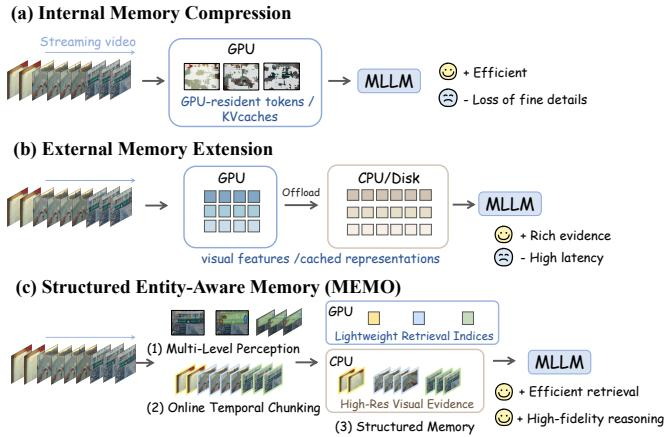
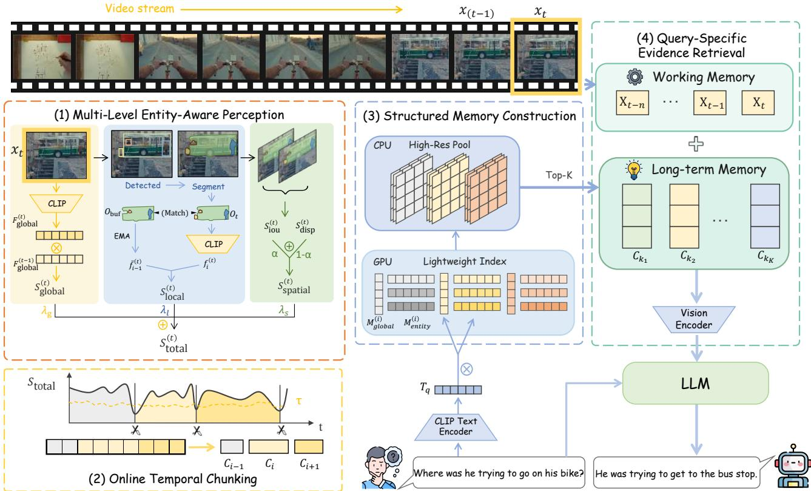
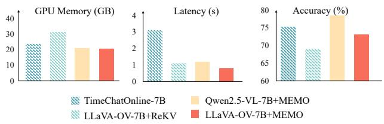
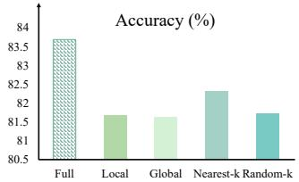
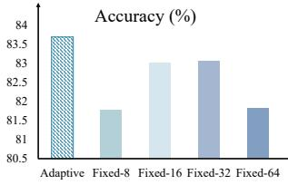

# MEMO: Multi-Level Entity-Aware Memory for Streaming Video Understanding

Yinying Li1,∗ Yuqian Fu2,∗ Yulin Dai1,∗ Jingyu Gong1 Tianwen Qian1,† Xiaoling Wang1,†

1East China Normal University 2King Abdullah University of Science and Technology

## Abstract

Streaming video understanding requires models to process unbounded visual streams while preserving rich visual semantics across vast temporal horizons, posing a fundamental challenge for memory modeling. Existing approaches primarily focus on increasing memory capacity, either by compressing historical information into fixed-size representations or by extending storage beyond GPU memory. However, these methods largely rely on global or coarse-grained representations, inevitably losing finegrained visual information. In this work, we argue that streaming video memory should explicitly encode structured and semantically meaningful representations, particularly at the entity level. To this end, we propose MEMO, a novel framework that models streaming video through multi-level, entity-aware structured memory. MEMO performs multi-level perception to jointly capture global semantics, entity dynamics, and spatial structures, partitioning streaming video into semantically coherent chunks. Each chunk is organized into a structured memory, where lightweight global and entity-level representations serve as retrieval indices, while the corresponding high-resolution visual content is retained separately for on-demand access. At inference time, MEMO performs query-specific retrieval over the structured memory and selectively recalls relevant visual evidence for downstream reasoning. Notably, MEMO is training-free and plug-and-play with existing multimodal large language models. Extensive experiments on StreamingBench and OVO-Bench demonstrate that MEMO consistently improves multiple base models and achieves state-of-the-art performance.

## 1 Introduction

The rapid advancement of Multimodal Large Language Models (MLLMs) [2, 3, 17, 41, 42] has significantly improved video understanding. However, most existing methods [16, 37] rely on an unrealistic assumption that the entire video is pre-recorded and fully accessible at the onset of inference. In real-world scenarios such as embodied navigation [19, 56], autonomous driving [5, 7], live broadcasting [48], and egocentric vision [20, 32, 52, 57], video arrives as a continuous and unbounded stream. This fundamental mismatch motivates the need for streaming video understanding [6].

A few recent works have begun to explore streaming video understanding from the perspective of memory modeling. As illustrated in Figure 1, early approaches primarily rely on internal memory mechanisms, where historical visual information is compressed into GPU-resident representations such as tokens or key-value caches [47, 49]. While such a design enables eficient and lowlatency processing, the limited capacity of GPU memory necessitates aggressive compression, which inevitably leads to information loss. To alleviate memory constraints, subsequent methods extend memory beyond the GPU by leveraging additional storage resources such as CPU or disk. Representative examples include ReKV [9] and LiveVLM [28], which retain more historical information by ofloading visual features or cached representations. However, de spite improving storage capacity, these approaches largely focus on preserving global or coarse-grained visual information, without explicitly modeling finer-grained semantic structures.

  
Figure 1: Comparison of memory paradigms for streaming video understanding. (a) Internal memory compression is eficient but loses fine-grained details. (b) External memory extension retains longer history but relies on coarse-grained evidence. (c) MEMO decouples lightweight structured indices from high-resolution visual evidence.

We argue that efective streaming video understanding requires more than simply increasing memory capacity. To support accurate reasoning over evolving streams, the memory must preserve structured and semantically meaningful representations rather than coarse, weakly organized historical traces. A key step in this direction is to explicitly model entity-level information, since objects constitute the primary carriers of scene semantics and their dynamics provide strong cues for boundaries in event evolution.

Building on this insight, we propose MEMO, a novel framework that organizes streaming video into multi-level, entity-aware structured memory. Rather than relying on coarse or heavily compressed representations, MEMO performs multi-level perception that jointly models global semantics, entity dynamics, and spatial structures. These cues enable robust estimation of temporal continuity, allowing unbounded streams to be dynamically segmented into semantically coherent chunks. Each chunk is represented by global summaries and fine-grained entity features, forming a structured memory that preserves scene context and detailed objectlevel information. To further support eficient and scalable storage,

MEMO adopts a decoupled memory design, where lightweight representations serve as retrieval indices, while high-resolution visual evidence is stored separately for on-demand access. At inference time, MEMO performs query-specific retrieval over the structured memory to identify relevant chunks and selectively recalls their associated visual evidence for reasoning. Importantly, MEMO is training-free and plug-and-play, enabling seamless integration with any MLLM without additional training or optimization.

Extensive experiments demonstrate that MEMO consistently improves performance across multiple base models (e.g., LLaVA-OV-series [17], Qwen-VL-series [2, 3]) and benchmarks (OVO-Bench [29], StreamingBench [21]). Notably, MEMO not only enhances open-source base models but also achieves competitive or even superior performance compared to strong training-based and proprietary systems. For example, when applied to Qwen3-VL-8B, MEMO improves the baseline by 10.5% and surpasses Gemini 1.5 Pro and GPT-based systems by 8.00% and 10.41%, respectively.

In summary, our main contributions are three-fold:

• We propose MEMO, a novel framework that models streaming video through multi-level, entity-aware structured memory, addressing the limitations of existing memory representations for unbounded visual streams.

• We propose a multi-level perception and structuring mechanism that models global semantics, entity dynamics, and spatial structures, enabling robust temporal segmentation into coherent, entity-aware chunks.

• Extensive experiments on StreamingBench and OVO-Bench demonstrate that MEMO consistently outperforms existing methods and achieves state-of-the-art performance.

## 2 Related Work

MLLMs for Video Understanding. Recent multimodal large language models (MLLMs) have achieved remarkable progress in visual understanding by integrating visual perception with language reasoning, demonstrating strong generalization across a wide range of multimodal applications, including visual question answering [4, 18, 23], image captioning [3], and visual grounding tasks such as detection and segmentation [12, 30, 31, 36]. Flagship ones include LLaVA-OneVision-1.5 [1], Qwen3-VL [2], InternVL3.5 [42], VideoLLaMA3 [51]. Building upon this success, many MLLMs natu rally extend to the video domain, e.g., Video-ChatGPT [27], LLaVA-NeXT [22], by processing sampled frames or short clips as sequential visual inputs, enabling joint reasoning over temporal visual tokens. In addition, several recent works [39] are specifically designed for video understanding, incorporating temporal modeling or long-context mechanisms to better capture dynamic visual con tent. Despite these advances, most existing approaches still operate under an ofline paradigm, assuming that the entire video is pre-recorded and fully accessible during inference. This assumption fundamentally limits their applicability in streaming scenarios, where video arrives as a continuous and unbounded sequence and requires incremental, real-time processing.

Streaming Video Understanding. Recent eforts have explored streaming video understanding to enable real-time processing over continuous visual streams [6, 10, 13, 24, 34, 43, 45]. A line of work adopts internal memory mechanisms, where historical visual information is maintained in compressed GPU-resident representations such as tokens or key-value caches. Methods such as Flash-VStream [53] and StreamMem [47] follow this design to support eficient sequential processing. To further mitigate computational overhead during real-time inference, TimeChat-Online [49] prunes visual redundancies via dynamic token dropping and hierarchical compression, similarly, FluxMem [44] introduces a training-free adaptive hierarchical memory to progressively reduce spatiotemporal token redundancy based on intrinsic scene statistics, while StreamingVLM [46] stabilizes generation by maintaining a compact, asymmetric KV cache with attention sinks and sliding windows. Another line of work extends memory beyond the GPU by leveraging external storage (e.g., CPU or disk) to retain richer historical information and retrieve relevant context on demand. Representative methods include ReKV [9], which retrieves historical KV caches from RAM/disk, LiveVLM [28], which further combines compressed KV memory with short- and long-term retrieval, and Vista [26], which organizes streaming history as scene-level memory for selective recall. However, these methods mostly retrieve coarse-grained context units, with limited explicit modeling of finegrained entity structures. Our method instead constructs a multilevel, entity-aware structured memory that explicitly encodes both global context and entity dynamics.

## 3 Methodology

Problem Setup. We consider streaming video understanding under a strict online setting, where video frames arrive sequentially over time. At each time step �, the model receives the current frame �� and performs reasoning based solely on $x _ { t }$ and past observations $\big \{ x _ { 1 } , \dots , x _ { t - 1 } \big \}$ , without access to future frames.

Given a query � at time �, the goal of the MLLM � is to produce an answer $A _ { t }$ by leveraging both the current frame and relevant historical visual information. This requires the model to maintain and continuously update an internal representation of past observations as new frames arrive.

Method Overview. We address streaming video understanding by constructing a multi-level, entity-aware structured memory that supports accurate reasoning over unbounded visual streams. As illustrated in Figure 2, our proposed MEMO framework consists of four key components: (1) Multi-Level Entity-Aware Perception, (2) Online Temporal Chunking, (3) Structured Memory Construction, and (4) Query-Specific Evidence Retrieval.

Overall, given a video stream $\{ x _ { 1 } , . . . , x _ { t } \}$ , MEMO first performs multi-level entity-aware perception to extract complementary visual cues, including global semantic context, local entity features, and spatial structures. Based on these representations, MEMO computes a unified similarity score between the current frame $x _ { t }$ and its historical context, capturing semantic continuity from both global and fine-grained levels. This score guides online temporal chunking to partition the stream into semantically coherent chunks. The resulting chunks are organized by the structured memory construction module into a structured memory, where lightweight multi-level representations serve as retrieval indices and high-resolution visual evidence is preserved separately for on-demand access. Given a query $Q ,$ the query-specific evidence retrieval module selects the most relevant chunks and retrieves their associated visual evidence for downstream reasoning.

  
Figure 2: Overall architecture of MEMO. The streaming pipeline consists of four stages: (1) Multi-Level Entity-Aware Perception extracts global, entity-level, and spatial cues to model semantic continuity; (2) Online Temporal Chunking incrementally partitions the video stream into semantically coherent chunks based on similarity; (3) Structured Memory Construction organizes chunks into a structured memory with lightweight indices and high-resolution visual evidence; and (4) Query-Specific Evidence Retrieval retrieves the most relevant chunks and their associated visual evidence to support downstream reasoning.

## 3.1 Multi-Level Entity-Aware Perception

To handle continuous and unbounded visual streams, MEMO models semantic continuity between the current frame and its recent context through multi-level, entity-aware visual representations. Specifically, we assess semantic consistency from three comple mentary perspectives: global semantics, local object semantics, and spatial structure.

Global semantic similarity. We first define the global semantic similarity $S _ { \mathrm { g l o b a l } } ^ { ( t ) }$ to measure the semantic continuity between two adjacent frames at the whole-frame level. We use CLIP [35] to extract global semantic features for each frame. Let $F _ { \mathrm { g l o b a l } } ^ { ( t - 1 ) } , F _ { \mathrm { g l o b a l } } ^ { ( t ) } \in$ $\mathbb { R } ^ { D }$ denote the global feature vectors of frames $x _ { t - 1 }$ and $x _ { t } ,$ , respectively, where � is the feature dimension. After $L _ { 2 }$ normalization, we compute the cosine similarity as:

$$
S _ { \mathrm { g l o b a l } } ^ { ( t ) } = \frac { 1 + \cos \bigl ( F _ { \mathrm { g l o b a l } } ^ { ( t - 1 ) } , F _ { \mathrm { g l o b a l } } ^ { ( t ) } \bigr ) } { 2 } .\tag{1}
$$

Although global frame-level features capture overall scene semantics, they are often insuficient to characterize changes in key semantic entities. Therefore, we further incorporate entity-level modeling to measure similarity from the perspective of tracked objects. We first employ Grounding DINO [25] for object detection and SAM [15] for segmentation, and then associate objects across frames to assign stable identities. Let $O _ { t }$ denote the set of objects in frame $x _ { t } .$ . For each persistently tracked object, we maintain a historical semantic state in memory. On top of this memory, we define two object-level measures: local semantic continuity $S _ { \mathrm { l o c a l } } ^ { ( t ) }$ and spatial structural continuity $S _ { \mathrm { s p a t i a l } } ^ { ( t ) }$

Local semantic continuity. The local semantic similarity $S _ { \mathrm { l o c a l } } ^ { ( t ) }$ measures the temporal consistency of object appearance. For each object �, we suppress the background using the segmentation mask generated by SAM and extract an object-level CLIP feature, denoted by $f _ { i } ^ { ( t ) }$ . To reduce semantic fluctuations caused by single-frame noise, we maintain a historical semantic state $\bar { f } _ { i } ^ { ( t ) }$ for each object and update it with exponential moving average (EMA):

$$
\bar { f } _ { i } ^ { ( t ) } = \rho f _ { i } ^ { ( t ) } + ( 1 - \rho ) \bar { f } _ { i } ^ { ( t - 1 ) } ,\tag{2}
$$

where $\rho$ is the EMA update coeficient. For objects that can be successfully matched with historical states, we compute the co sine similarity between the current observation and its historical semantic state:

$$
S _ { \mathrm { l o c a l } , i } ^ { ( t ) } = \frac { 1 + \cos \bigl ( f _ { i } ^ { ( t ) } , \bar { f } _ { i } ^ { ( t - 1 ) } \bigr ) } { 2 } .\tag{3}
$$

Considering that diferent objects may contribute unequally to scene semantics, we aggregate object-level scores using object weights $w _ { i } .$ which denote the pixel-area ratio of object �. Thus, $S _ { \mathrm { l o c a l } } ^ { ( t ) }$ is defined as:

$$
S _ { \mathrm { l o c a l } } ^ { ( t ) } = \frac { \sum _ { i \in O _ { t } \cap O _ { \mathrm { b u f } } } w _ { i } S _ { \mathrm { l o c a l } , i } ^ { ( t ) } } { \sum _ { i \in O _ { t } \cap O _ { \mathrm { b u f } } } w _ { i } } - P _ { \mathrm { p e n a l t y } } ^ { ( t ) } ,\tag{4}
$$

where $O _ { \mathrm { b u f } }$ denotes the set of objects stored in the historical bufer, and $O _ { t } \cap O _ { \mathrm { b u f } }$ denotes the set of objects that are both currently visible and successfully aligned with historical memory. The penalty term $P _ { \mathrm { p e n a l t y } } ^ { ( t ) }$ is introduced to account for object-set changes between the current frame and the bufered history.

We formulate a discontinuity penalty to account for both newly appeared objects, defined as $O _ { \mathrm { n e w } } = O _ { t } \setminus O _ { \mathrm { b u f } } .$ , and disappeared objects, defined as $O _ { \mathrm { d i s } } = O _ { \mathrm { b u f } } \ \backslash O _ { t }$ . Intuitively, the emergence of new objects often indicates semantic shifts $( \mathrm { e . g . }$ , shot transitions), whereas object disappearance is more commonly caused by transient factors such as occlusions. To capture this asymmetry, we assign diferent penalty weights $\gamma _ { \mathrm { n e w } } > \gamma _ { \mathrm { d i s } }$ , imposing a stronger penalty on newly appeared objects.

Specifically, the penalty for newly appeared objects is defined as the relative weight ratio of new objects in the current frame. In con trast, temporarily disappeared objects are maintained in a hidden state with a dedicated counter $c _ { k } .$ To enhance robustness against occlusions and tracking jitter, we use a bounded quadratic function $g ( c _ { k } ) = ( \operatorname* { m i n } ( c _ { k } / H _ { \mathrm { h i d } } , 1 ) ) ^ { 2 }$ to progressively increase the penalty with the hidden duration. The overall penalty term is defined as:

$$
P _ { \mathrm { p e n a l t y } } ^ { ( t ) } = \gamma _ { \mathrm { n e w } } \left( { \frac { \sum _ { i \in O _ { \mathrm { n e w } } } w _ { i } } { \sum _ { j \in O _ { t } } w _ { j } } } \right) + \gamma _ { \mathrm { d i s } } \sum _ { k \in O _ { \mathrm { d i s } } } w _ { k } \cdot g ( c _ { k } ) .\tag{5}
$$

where $w _ { i } , w _ { j } ,$ , and $w _ { k }$ denote the respective target’s area proportion relative to the entire frame, and $O _ { t }$ represents the complete set of valid objects in the current frame. These two terms explicitly quantify the discontinuity induced by the emergence of new objects and the prolonged absence of existing ones, respectively. As either term increases, the local semantic continuity score decreases accordingly.

Spatial structural continuity. The spatial similarity $S _ { \mathrm { s p a t i a l } } ^ { ( t ) }$ focuses on geometric continuity between matched objects across adjacent frames. For each successfully matched object, we describe its spatial consistency from two aspects. First, we compare the overlap of its segmented regions in two adjacent frames and obtain the mask intersection-over-union score $\dot { S } _ { \mathrm { i o u } } ^ { ( t ) }$ . Second, we compare the displacement of the object bounding-box center between two frames and obtain the displacement consistency score $S _ { \mathrm { d i s p } } ^ { ( t ) }$ . The final spatial continuity is defined as:

$$
S _ { \mathrm { s p a t i a l } } ^ { ( t ) } = \alpha S _ { \mathrm { i o u } } ^ { ( t ) } + ( 1 - \alpha ) S _ { \mathrm { d i s p } } ^ { ( t ) } ,\tag{6}
$$

where � balances mask overlap and displacement smoothness. Specifically, $S _ { \mathrm { i o u } } ^ { ( t ) }$ is the average mask IoU over matched objects, while $S _ { \mathrm { d i s p } } ^ { ( t ) }$ averages their displacement consistency, computed from the normalized bounding-box center displacement. If no object is matched, both scores are set to zero. We set $\alpha = 0 . 6$ and the maximum displacement tolerance to $d _ { \operatorname* { m a x } } = 0 . 5$

## 3.2 Online Temporal Chunking

After computing the three similarity components, we combine them into an overall similarity score:

$$
S _ { \mathrm { t o t a l } } ^ { ( t ) } = \lambda _ { s } S _ { \mathrm { s p a t i a l } } ^ { ( t ) } + \lambda _ { l } S _ { \mathrm { l o c a l } } ^ { ( t ) } + \lambda _ { g } S _ { \mathrm { g l o b a l } } ^ { ( t ) } ,\tag{7}
$$

where $\lambda _ { s } , \lambda _ { l } ,$ and $\lambda _ { g }$ are hyperparameters.

When a new frame $x _ { t }$ arrives, we compute its corresponding $S _ { \mathrm { t o t a l } } ^ { ( t ) }$ and incorporate it into the currently growing segment. To this end, we maintain an active segment bufer, which stores the continuous frame sequence of the current unfinished segment. The bufer grows as new frames arrive until the system determines that a semantic boundary has been reached. Meanwhile, we maintain a historical statistics window to record recent total similarity scores $S _ { \mathrm { t o t a l } } ^ { ( t - n ) } , \ldots , S _ { \mathrm { t o t a l } } ^ { ( t ) } { } ;$ where � is the window size. Based on the mean $\mu ^ { ( t ) }$ and standard deviation $\boldsymbol { \sigma } ^ { ( t ) }$ within this window, we estimate an adaptive threshold,

$$
\tau ^ { ( t ) } = \mathrm { c l i p } ( \mu ^ { ( t ) } - m \cdot \sigma ^ { ( t ) } , \tau _ { \mathrm { m i n } } , \tau _ { \mathrm { m a x } } ) ,\tag{8}
$$

where � controls the sensitivity to similarity drops, and clip(·) denotes a truncation function that restricts the threshold to lie within $[ \tau _ { \mathrm { m i n } } , \tau _ { \mathrm { m a x } } ]$

Because motion blur, short-term occlusion, and local perception noise may cause transient fluctuations in the similarity score, a single low-similarity observation may not reliably indicate a semantic boundary. We therefore confirm a boundary only when $S _ { \mathrm { t o t a l } } ^ { ( t ) } ~ < ~ \tau ^ { ( t ) }$ persists for $N _ { \mathrm { c o n f i r m } }$ consecutive frames. To further avoid over-segmentation and fragmented chunks, we impose a minimum segment-length constraint. A cut is triggered only when both the low-similarity confirmation and the minimum-length requirement are satisfied.

## 3.3 Structured Memory Construction

For any segmented semantic chunk, we adopt a hierarchical storage strategy:

High-resolution visual evidence. For each chunk $C ^ { ( i ) }$ , we store the original high-resolution visual tensor $X ^ { ( i ) } ~ \in ~ \mathbb { R } ^ { T _ { i } \times H \times W \times 3 } ~ \mathrm { i n }$ CPU memory as visual evidence for downstream fine-grained reasoning. The visual evidence is encoded on demand: only frames sampled from retrieved chunks are processed by the vision encoder of the MLLM $\phi ,$ rather than encoding the entire historical memory. For multi-turn queries, MLLM-specific visual representations are cached after first use and reused when the same evidence is retrieved again.

Lightweight structured memory. On the GPU side, we maintain only compact chunk-level memory: $M ^ { ( i ) } = \langle \mathcal { M } _ { \mathrm { g l o b a l } } ^ { ( i ) } , ~ \mathcal { M } _ { \mathrm { e n t i t y } } ^ { ( i ) } \rangle$

which serve as eficient indices for similarity-based retrieval. Specifically, ${ M _ { \mathrm { g l o b a l } } ^ { ( i ) } }$ denotes the global semantic representation of

chunk $C ^ { ( i ) }$ , which is defined as:

$$
\mathcal { M } _ { \mathrm { g l o b a l } } ^ { ( i ) } = \frac { \sum _ { j = 1 } ^ { T _ { i } } \omega _ { j } F _ { \mathrm { g l o b a l } } ^ { ( j ) } } { \left. \sum _ { j = 1 } ^ { T _ { i } } \omega _ { j } F _ { \mathrm { g l o b a l } } ^ { ( j ) } \right. _ { 2 } } \in \mathbb { R } ^ { D } ,\tag{9}
$$

where $F _ { \mathrm { g l o b a l } } ^ { ( j ) } \in \mathbb { R } ^ { D }$ denotes the global feature of the �-th frame in the current chunk $C ^ { ( i ) }$ , and $\omega _ { j } \propto \mathrm { m a x } ( c , 1 - S _ { \mathrm { t o t a l } } ^ { ( j - 1 ) } )$ is the aggregation weight with a constant �.

For the first frame in each chunk, we set $\omega _ { 1 } = 1$ . Correspondingly, $M _ { \mathrm { e n t i t y } } ^ { ( i ) }$ denotes the entity-level representation of chunk $C ^ { ( i ) }$ , which is defined as:

$$
\mathcal { M } _ { \mathrm { e n t i t y } } ^ { ( i ) } = [ \bar { f } _ { 1 } ^ { ( i ) } , \bar { f } _ { 2 } ^ { ( i ) } , \ldots , \bar { f } _ { N _ { O } ^ { ( i ) } } ^ { ( i ) } ] ^ { \top } \in \mathbb { R } ^ { N _ { O } ^ { ( i ) } \times D } ,\tag{10}
$$

where $\bar { f } _ { n } ^ { ( i ) }$ denotes the preserved EMA semantic state of the �-th core object at the end of chunk $C ^ { ( i ) }$ . In our implementation, only active entities are retained in $M _ { \mathrm { e n t i t y } } ^ { ( i ) } ,$ i.e., entities whose hidden counts do not exceed half of the maximum hidden-frame budget. Notably, the memory footprint of $\boldsymbol { M } ^ { ( i ) }$ is bounded by $O ( D + N _ { O } ^ { ( i ) }$ �), significantly reducing storage and computation costs during large-scale retrieval.

Our default implementation adopts a hybrid storage backend, where lightweight chunk indices remain resident on GPU for eficient retrieval, while raw visual evidence is ofloaded to CPU and encoded on demand. For analysis, we additionally consider two degenerate variants: a GPU-only backend that keeps both indices and visual evidence on GPU, and a $C P U _ { - o n l y }$ backend that stores both components of-GPU. For a fair comparison under bounded device memory, the GPU-only variant evicts the oldest visual evidence once the GPU memory budget is reached, whereas the CPU-only variant keeps the full history of-GPU but incurs additional transfer overhead.

## 3.4 Query-Specific Evidence Retrieval

Given a natural-language query �, we use the CLIP text Encoder to extract the text feature vector $T _ { Q } \in \mathbb { R } ^ { D }$ . The system first performs parallel similarity computation over all lightweight chunk indices. For each candidate chunk $C ^ { ( i ) }$ , we compute the cosine similarity between $T _ { Q }$ and its global summary $\bar { \mathcal { M } } _ { \mathrm { g l o b a l } } ^ { ( i ) } { : }$ , as well as the best local match between $T _ { Q }$ and its entity memory set $M _ { \mathrm { e n t i t y } } ^ { ( i ) }$

$$
\mathrm { S i m } _ { \mathrm { g l o b a l } } ^ { ( i ) } = \cos \bigl ( T _ { Q } , \mathcal { M } _ { \mathrm { g l o b a l } } ^ { ( i ) } \bigr ) , \quad \mathrm { S i m } _ { \mathrm { l o c a l } } ^ { ( i ) } = \operatorname* { m a x } _ { e \in \mathcal { M } _ { \mathrm { e n t i t y } } ^ { ( i ) } } \cos \bigl ( T _ { Q } , e \bigr ) .\tag{11}
$$

The final retrieval score is obtained by linearly combining the two similarity terms:

$$
\mathrm { S c o r e } ( Q , C ^ { ( i ) } ) = \lambda _ { \mathrm { g l o b a l } } \mathrm { S i m } _ { \mathrm { g l o b a l } } ^ { ( i ) } + \lambda _ { \mathrm { l o c a l } } \mathrm { S i m } _ { \mathrm { l o c a l } } ^ { ( i ) } ,\tag{12}
$$

where $\lambda _ { \mathrm { g l o b a l } }$ and $\lambda _ { \mathrm { l o c a l } }$ are weighting hyperparameters. Based on the retrieval scores, we select the Top-� most relevant chunks:

$$
{ \mathcal { R } } _ { K } ( Q ) = \{ C ^ { ( i _ { 1 } ) } , . . . , C ^ { ( i _ { K } ) } \} .
$$

Their associated visual evidence is denoted as:

$$
X _ { \mathrm { r e t } } ( Q ) = \{ X ^ { ( i ) } \mid C ^ { ( i ) } \in \mathcal { R } _ { K } ( Q ) \} .
$$

We further incorporate the pending frames from the current active segment, denoted as $X _ { \mathrm { c u r } }$ . To accommodate the bounded visual context window of the MLLM, we uniformly sample at most $N _ { \mathrm { L L M } }$ frames from both $X _ { \mathrm { r e t } } ( Q )$ and $X _ { \mathrm { c u r } } .$ , yielding the sampled visual inputs $\tilde { X } _ { \mathrm { r e t } } ( Q )$ and $\tilde { X } _ { \mathrm { c u r } }$ . Only these selected frames are processed by the MLLM vision encoder. For previously encoded evidence, the cached MLLM-specific visual representations are directly reused. Finally, the answer $A _ { t }$ is generated as:

$$
A _ { t } = \phi \big ( Q , \tilde { X } _ { \mathrm { r e t } } ( Q ) , \tilde { X } _ { \mathrm { c u r } } \big ) .\tag{13}
$$

## 4 Experiments

## 4.1 Experimental Setup

Datasets. We evaluate MEMO on two online video understanding benchmarks: the real-time subset of StreamingBench [21] and OVO-Bench [29]. StreamingBench evaluates real-time comprehension over continuous video streams, whereas OVO-Bench focuses on timestamp-anchored tasks, including historical retrieval, real-time awareness, and proactive response.

Baselines & Competitors. To verify that MEMO is training-free, plug-and-play, and compatible with diverse MLLM backbones, we evaluate it on four open-source models spanning diferent parameter scales and architectures, including LLaVA-OV-0.5B/7B [17], Qwen2.5-VL-7B [3], and Qwen3-VL-8B [2]. For each backbone, we compare the vanilla model with its MEMO-enhanced version to isolate the performance gains brought by our framework. In addition, we compare MEMO with other representative methods under the same evaluation protocol, grouped into four categories: (1) proprietary MLLMs, including Gemini 1.5 Pro [40] and GPT-4o [14]; (2) open-source ofline video MLLMs, including LongVA [54], LongVU-7B [38], and LLaVA-Video [55]; (3) open-source online MLLMs with additional training, including VideoLLM-online-8B [6], Dispider-7B [33], Flash-VStream-7B [53], ViSpeak [11], TimeChat-Online-7B [49], and StreamForest-7B [50]; and (4) training-free online adaptation methods, including ReKV [9], LiveVLM [28], StreamKV [8], Vista [26], and FluxMem [44].

Implementation Details. As an independent pre-reasoning enhancement module, MEMO requires no parameter updates for the backbone models. For the input configuration, the incoming video stream is uniformly sampled at 1 fps, and the retrieval module retrieves the top $K = 3$ chunks. For the core algorithmic hyperparameters, we empirically set $( \lambda _ { s } , \lambda _ { l } , \lambda _ { g } ) \ = \ ( 0 . 3 5 , 0 . 4 5 , 0 . 2 0 )$ for online chunking and $( \lambda _ { \mathrm { g l o b a l } } , \lambda _ { \mathrm { l o c a l } } ) = ( 0 . 6 , 0 . 4 )$ for retrieval. We set the base frame budget $N _ { \mathrm { L L M } } = 8$ for both the current active segment and the retrieved historical evidence, which strictly caps the total visual input at 16 frames. For entity perception, Grounding DINO uses bounding-box and text thresholds of 0.35 and 0.25, respectively, and cross-frame objects are associated using an IoU threshold of 0.3. We set the EMA coeficient $\rho = 0 . 3$ and the spatial balance coeficient $\alpha = 0 . 6$ . For adaptive chunking, we use a sliding window of $n = 3 0$ with $m = 1 . 3 ,$ and $( \tau _ { \mathrm { m i n } } , \tau _ { \mathrm { m a x } } ) = ( 0 . 1 , 0 . 9 )$ . A boundary is confirmed after $N _ { \mathrm { c o n f i r m } } = 1$ low-similarity frame, with a minimum chunk length of $L _ { \operatorname* { m i n } } = 4$ . The hidden-frame budget is $H _ { \mathrm { h i d } } = 5$ We keep the original video resolution without manual resizing and follow the native visual preprocessing of each backbone. Evaluations are conducted on a computing cluster equipped with NVIDIA A6000 GPUs.

Table 1: Performance comparison on OVO-Bench and StreamingBench.
<table><tr><td rowspan="2">Method</td><td rowspan="2">Frames</td><td rowspan="2"></td><td colspan="6">OVO-Bench real-time</td><td colspan="10">StreamingBench real-time</td><td rowspan="2"></td></tr><tr><td>OCR ACR</td><td>ATR</td><td>STU</td><td></td><td>FPD</td><td>OJR Avg.</td><td>OP</td><td>CR</td><td>CS</td><td>ATP</td><td>EU</td><td>TR</td><td>PR</td><td>SU ACP</td><td>CT</td><td>Avg.</td></tr><tr><td>Proprietary Models</td><td></td><td></td><td></td><td></td><td></td><td></td><td></td><td></td><td></td><td></td><td></td><td></td><td></td><td></td><td></td><td></td><td></td><td></td><td></td></tr><tr><td>Gemini 1.5 Pro [40]</td><td>1 fps</td><td>85.9</td><td>67.0</td><td>79.3</td><td>58.4</td><td>63.4</td><td>62.0</td><td>69.3</td><td>79.0</td><td>80.5</td><td>83.5</td><td>79.7</td><td>80.0</td><td>84.7</td><td>77.8</td><td>64.2</td><td>72.0</td><td>48.7</td><td>75.7</td></tr><tr><td>GPT-40 [14]</td><td>64</td><td>69.8</td><td>64.2</td><td>71.6</td><td>51.1</td><td>70.3</td><td>59.8</td><td>64.5</td><td>77.1</td><td>80.5</td><td>83.9</td><td>76.5</td><td>70.2</td><td>83.8</td><td>66.7</td><td>62.2</td><td>69.1</td><td>49.2</td><td>73.3</td></tr><tr><td colspan="2">Open-source Offline MLLMs</td><td></td><td></td><td></td><td></td><td></td><td></td><td></td><td></td><td></td><td></td><td></td><td></td><td></td><td></td><td></td><td></td><td></td><td></td></tr><tr><td>LongVA [54]</td><td>128</td><td>一</td><td>一</td><td>一</td><td>一</td><td>1</td><td></td><td>一</td><td>70.0</td><td>63.3</td><td>61.2</td><td>70.9</td><td>62.7</td><td>59.5</td><td>61.1</td><td>53.7</td><td>54.7</td><td>34.7</td><td>60.0</td></tr><tr><td>LongVU-7B [38]</td><td>1 fps</td><td>55.7</td><td>49.5</td><td>59.5</td><td>48.3</td><td>68.3</td><td>63.0</td><td>57.4</td><td>一</td><td></td><td>1</td><td></td><td>一</td><td>一</td><td>一</td><td>一</td><td>一</td><td>一</td><td></td></tr><tr><td colspan="2">LLaVA-Video [55] 64</td><td>69.1</td><td>58.7</td><td>68.8</td><td>49.4</td><td>74.3</td><td>59.8</td><td>63.5</td><td>一</td><td>一</td><td>1</td><td>1</td><td>一</td><td>一</td><td>一</td><td>一</td><td>1</td><td>一</td><td>一</td></tr><tr><td colspan="2">Open-source Online MLLMs (Training-Based)</td><td></td><td></td><td></td><td></td><td></td><td></td><td></td><td></td><td></td><td></td><td></td><td></td><td></td><td></td><td></td><td></td><td></td><td></td></tr><tr><td>VideoLLM-online-8B [6]</td><td>2 fps</td><td>8.1</td><td>23.9</td><td>12.1</td><td>14.0</td><td>45.5</td><td>21.2</td><td>20.8</td><td>39.1</td><td>40.1</td><td>34.5</td><td>31.1</td><td>46.0</td><td>32.4</td><td>31.5</td><td>34.2</td><td>42.5</td><td>27.9</td><td>36.0</td></tr><tr><td>Dispider-7B [33]</td><td>1 fps</td><td>57.7</td><td>49.5</td><td>62.1</td><td>44.9</td><td>61.4</td><td>51.6</td><td>54.6</td><td>74.9</td><td>75.5</td><td>74.1</td><td>73.1</td><td>74.4</td><td>59.9</td><td>76.1</td><td>62.9</td><td>62.2</td><td>45.8</td><td>67.6</td></tr><tr><td>Flash-VStream-7B [53]</td><td>1 fps</td><td>25.5</td><td>32.1</td><td>29.3</td><td>33.7</td><td>29.7</td><td>28.8</td><td>29.9</td><td>25.9</td><td>43.6</td><td>24.9</td><td>23.9</td><td>27.3</td><td>13.1</td><td>18.5</td><td>25.2</td><td>23.9</td><td>48.7</td><td>23.2</td></tr><tr><td>ViSpeak [11]</td><td>1 fps</td><td>75.2</td><td>58.7</td><td>71.6</td><td>51.1</td><td>74.3</td><td>66.9</td><td>66.3</td><td>79.8</td><td>88.3</td><td>83.3</td><td>81.1</td><td>76.4</td><td>75.1</td><td>70.4</td><td>65.9</td><td>77.3</td><td>34.2</td><td>74.4</td></tr><tr><td>TimeChat-Online-7B [49]</td><td>1 fps</td><td>75.2</td><td>46.8</td><td>70.7</td><td>47.8</td><td>69.3</td><td>61.4</td><td>61.9</td><td>80.8</td><td>79.7</td><td>80.8</td><td>83.3</td><td>74.8</td><td>78.8</td><td>78.7</td><td>64.2</td><td>68.8</td><td>58.0</td><td>75.3</td></tr><tr><td colspan="2">StreamForest-7B [50] 1 fps</td><td>68.5</td><td>53.2</td><td>71.6</td><td>47.8</td><td>65.4</td><td>60.9</td><td>61.2</td><td>83.1</td><td>82.8</td><td>82.7</td><td>84.3</td><td>77.5</td><td>78.2</td><td>76.9</td><td>69.1</td><td>75.6</td><td>54.4</td><td>77.3</td></tr><tr><td>Open-source Online MLLMs (Training-Free)</td><td></td><td></td><td></td><td></td><td></td><td></td><td></td><td></td><td></td><td></td><td></td><td></td><td></td><td></td><td></td><td></td><td></td><td></td><td></td></tr><tr><td>LLaVA-OneVision-0.5B [17]</td><td>32</td><td>53.7</td><td>53.2</td><td>48.3</td><td>33.7</td><td>60.4</td><td>48.9</td><td>49.7</td><td>71.4</td><td>57.8</td><td>65.9</td><td>69.6</td><td>69.2</td><td>55.8</td><td>57.4</td><td>52.9</td><td>62.0</td><td>16.6</td><td>59.6</td></tr><tr><td>+ReKV [9] +MEMO</td><td>0.5 fps</td><td>41.6 50.3</td><td>45.0 56.9</td><td>50.0</td><td>29.8</td><td>60.4</td><td>35.9</td><td>43.8</td><td>65.1</td><td>60.2</td><td>66.6</td><td>66.0</td><td>66.7</td><td>53.0</td><td>57.4</td><td>48.4</td><td>60.3</td><td>18.1</td><td>57.4</td></tr><tr><td>LLaVA-OneVision-7B [17]</td><td>1 fps</td><td></td><td></td><td>50.9</td><td>37.1</td><td>54.5</td><td>52.7</td><td>50.4</td><td>68.8</td><td>62.5</td><td>66.3</td><td>71.2</td><td>63.7</td><td>56.4</td><td>58.3</td><td>52.0</td><td>62.5</td><td>15.4</td><td>59.5</td></tr><tr><td></td><td>32</td><td>67.8</td><td>55.1</td><td>72.4</td><td>48.3</td><td>72.3</td><td>62.5</td><td>63.1</td><td>80.4</td><td>74.2</td><td>76.0</td><td>80.7</td><td>72.7</td><td>71.7</td><td>67.6</td><td>65.5</td><td>65.7</td><td>45.1</td><td>71.1</td></tr><tr><td>+ReKV [9] +LiveVLM [28]</td><td>0.5 fps</td><td>52.4</td><td>54.1</td><td>69.8</td><td>43.3</td><td>67.3</td><td>57.1</td><td>57.3</td><td>74.4 81.5</td><td>78.9 78.1</td><td>78.6 83.3</td><td>77.1 79.1</td><td>68.3 69.6</td><td>67.9 74.1</td><td>67.6 75.0</td><td>62.6 69.1</td><td>64.3 67.7</td><td>44.6 40.4</td><td>69.1 72.9</td></tr><tr><td>+StreamKV [8]</td><td>0.5 fps 0.5 fps</td><td>一</td><td>一</td><td>1</td><td>一</td><td>一</td></table>

## 4.2 Main Results

From the results presented in Table 1, we draw the following obser vations.

Consistent Improvement over Base Models. As shown in Table 1, MEMO improves the three stronger backbones on both benchmarks without any parameter updates, while maintaining comparable performance on the lightweight LLaVA-OneVision-0.5B back bone. In particular, when integrated with Qwen3-VL-8B, MEMO improves the OVO-Bench score from 70.1% to 76.0% and the StreamingBench score from 73.2% to 83.7%, corresponding to gains of 5.9 % and 10.5 %, respectively. The improvements across diferent model families and scales demonstrate the broad applicability of MEMO. On StreamingBench, the gains introduced by MEMO generally increase with backbone capability. For the LLaVA-OneVision family, MEMO slightly decreases the average accuracy of the 0.5B model by 0.1 %, while improving that of the 7B model by 2.1 pts. Similarly, the improvements increase from 5.2 % with Qwen2.5-VL-7B to 10.5 % with Qwen3-VL-8B. These results suggest that stronger backbones can more efectively exploit the query-relevant evidence provided by MEMO.

Significant Advantages over Existing Methods. With Qwen3- VL-8B as the backbone, MEMO achieves state-of-the-art performance on both benchmarks, surpassing all compared methods. MEMO shows clear advantages over existing training-free methods under the same base model, including ReKV and LiveVLM. For example, on LLaVA-OneVision-7B, MEMO exceeds ReKV by 9.3% on OVO-Bench and 4.1% on StreamingBench. In particular, it outperforms the previous training-based SOTA, StreamForest [50], by 14.8% on OVO-Bench and 6.4% on StreamingBench. These results demonstrate that an efective memory and retrieval mechanism can make lightweight training-free methods highly competitive for streaming video understanding.

Fine-grained Analysis. A finer-grained breakdown reveals that the gains introduced by MEMO are especially pronounced on tasks that require temporally coherent event preservation and fine-grained historical evidence recall. In particular, the improvements in action perception (ACP, +16.6%) and clip summarization (CS, +13.6%) suggest the benefit of Online Temporal Chunking, which better preserves semantically coherent events than fixed-length segmen tation. Meanwhile, the gains in OCR (+12.8%), object recognition (OJR, +4.8%), and attribute perception (ATP, +9.6%) demonstrate the value of Structured Memory Construction and Query-Specific Evidence Retrieval, where $\boldsymbol { M } _ { \mathrm { g l o b a l } } ^ { ( i ) }$ and $M _ { \mathrm { e n t i t y } } ^ { ( i ) }$ provide lightweight yet informative indices for query-relevant evidence retrieval.

  
Figure 3: Comparison of diferent methods in terms of peak GPU memory usage, response latency, and accuracy. All experiments are conducted on a single NVIDIA A6000 GPU.

Table 2: Ablation on perception and memory synergy.
<table><tr><td>Base</td><td>Perception</td><td>Memory</td><td>Acc. (%)</td></tr><tr><td>√</td><td>x</td><td>x</td><td>73.2</td></tr><tr><td>√</td><td>x</td><td>√</td><td> $7 9 . 4 \ + 6 . 2 $ </td></tr><tr><td>√</td><td>√</td><td>x</td><td> $7 7 . 8 \ + 4 . 6$ </td></tr><tr><td>√</td><td>√</td><td>√</td><td> $8 3 . 7 \ + 1 0 . 5 $ </td></tr></table>

## 4.3 Eficiency Analysis

To evaluate the inference eficiency of streaming video understanding, we benchmark the peak allocated GPU memory, end-to-end response latency, and accuracy on StreamingBench using a single NVIDIA A6000 GPU. Here, the response latency is defined as the elapsed time from receiving the input query to generating the complete textual answer, covering the entire pipeline of visual evidence retrieval, visual encoding, and MLLM decoding.

The results in Figure 3 show that our proposed MEMO achieves a strong balance between performance and eficiency. When combined with Qwen2.5-VL-7B, MEMO attains the highest accuracy of 78.5%, while requiring only 21.1 GB ofpeak memory and 1.2 seconds of average latency. Compared with TimeChat-Online, which is also built on Qwen2.5-VL-7B, MEMO improves accuracy by 3.2% while reducing memory consumption and latency by 10.9% and 67.6%, respectively. When applied to LLaVA-OneVision-7B, MEMO further reduces peak memory usage to 20.5 GB and response latency to 0.8 seconds, while still maintaining a competitive accuracy of 73.2%, surpassing ReKV [9] by 4.1% under the same backbone.

To further understand the computational overhead of MEMO, we provide a module-wise latency breakdown in Table 3. The main computational cost comes from the visual perception stage, where CLIP, Grounding DINO, and SAM require 297.60 ms per frame in total. In contrast, the memory update and retrieval modules introduce only marginal overhead, requiring 0.39 ms per frame and 8.08 ms per query, respectively. These results demonstrate that MEMO’s structured memory construction and query-specific retrieval can be eficiently executed under the sampled-stream setting.

Table 3: Latency breakdown of Qwen2.5-VL-7B + MEMO. Ret. and Gen. denote retrieval and generation, respectively.
<table><tr><td colspan="2">Vision / Frame</td><td colspan="2">Memory</td><td colspan="2">LLM / Query</td></tr><tr><td>Module</td><td>ms</td><td>Operation</td><td>ms</td><td>Metric</td><td>ms</td></tr><tr><td>CLIP</td><td>16.56</td><td>Update</td><td>0.39</td><td>TTFT</td><td>598.44</td></tr><tr><td>Grounding DINO</td><td>154.91</td><td>Ret. &amp; Recall</td><td>8.08</td><td>TPOT</td><td>55.02</td></tr><tr><td>SAM</td><td>126.13</td><td></td><td></td><td>Total Gen.</td><td>1367.62</td></tr></table>

Table 4: Ablation on multi-level memory. “Entity-only” relies exclusively on spatial and local cues for chunking and Mentity for retrieval. “Global-only” relies exclusively on global cues for chunking and $M _ { \mathrm { g l o b a l } }$ for retrieval.
<table><tr><td rowspan="2">Variants</td><td colspan="2">Feature Dependency</td><td rowspan="2">Acc. (%)</td></tr><tr><td>Chunking Stage</td><td>Retrieval Stage</td></tr><tr><td>Full Model</td><td> $S _ { \mathrm { s p a t i a l } } + S _ { \mathrm { l o c a l } } + S _ { \mathrm { g l o b a l } }$ </td><td> $M _ { \mathrm { e n t i t y } } + M _ { \mathrm { g l o b a l } }$ </td><td>83.69</td></tr><tr><td>Entity-only</td><td> $S _ { \mathrm { s p a t i a l } } + S _ { \mathrm { l o c a l } }$ </td><td> $M _ { \mathrm { e n t i t y } }$ </td><td>81.77</td></tr><tr><td>Global-only</td><td> $S _ { \mathrm { g l o b a l } }$ </td><td> $M _ { \mathrm { g l o b a l } }$ </td><td>81.31</td></tr></table>

Overall, these results demonstrate that MEMO efectively balances eficiency and accuracy in streaming video understanding. Enabled by its multi-level structured memory and query-aware retrieval mechanism, MEMO supports eficient long-context reasoning without incurring prohibitive inference overhead.

## 4.4 Ablation Studies

To validate the efectiveness of the key components and design choices in MEMO, we conduct comprehensive ablation studies on StreamingBench using Qwen3-VL-8B.

Ablation on the Synergy between Perception and Memory. To disentangle the importance of Perception (entity-aware perception and dynamic chunking) and Memory (structured memory and query-specific retrieval), we construct degraded variants to isolate their individual contributions (Table 2). Concretely, disabling perception regresses dynamic chunking to fixed-length segmentation, while removing memory replaces retrieval with chronological truncation under the same visual budget. The results show that memory only improves over the base model by 6.2%, indicating that explicit memory retrieval efectively mitigates long-term forgetting. Meanwhile, perception only brings a 4.6% gain, suggesting that adaptive perception preserves semantically coherent events more efectively than rigid segmentation. Combining both further boosts performance, revealing strong complementarity.

Ablation on Multi-Level Memory Representations. We evaluate the impact of hierarchical visual memory representations of the overall framework. As detailed in Table 4, stripping the model down to an Entity-only variant (relying exclusively on spatial/local cues for chunking and $M _ { \mathrm { e n t i t y } }$ for retrieval) decreases accuracy to

  
Figure 4: Ablation results for diferent retrieval strategies (left) and temporal chunking strategies (right).

81.77%, while a Global-only configuration further drops the performance to 81.31%. These results validate the core motivation of our multi-level design: global features capture coarse-grained scene contexts, whereas local entity features pinpoint query-relevant, object-centric evidence. Their synergistic integration is beneficial for robust streaming video understanding.

Ablation on Retrieval Strategies. Figure 4 (left) compares diferent memory retrieval strategies. The full retrieval scheme achieves the best performance, highlighting the importance ofjointly exploiting local and global semantics within structured memory for accurate evidence recall. Interestingly, the nearest-� strategy achieves competitive performance (82.32%) by leveraging the natural temporal continuity of video streams, yet it still falls short of the full retrieval strategy. This suggests that while temporal proximity provides a valuable prior, precise memory recall ultimately demands explicit semantic matching. In contrast, random-� retrieval yields only 81.73%, further highlighting the critical role of targeted evidence retrieval.

Ablation on Online Temporal Chunking. Figure 4 (right) compares our adaptive semantic chunking strategy against fixed-length chunking strategies with diferent window sizes. To ensure a fair comparison, the memory extraction and retrieval pipelines remain strictly identical across all configurations. The results show that all fixed-length chunking variants perform worse than our adaptive strategy. Specifically, a narrow fixed window (e.g., 8 frames, dropping to 81.77%) tends to break semantically coherent events into fragmented pieces, disrupting the continuity of critical visual evidence. Conversely, a broad fixed window (e.g., 64 frames, 81.82%) inevitably conflates distinct semantic events into a single chunk, diluting the relevance of the retrieved content to the user query. These findings confirm that our similarity-based dynamic chunking mechanism better aligns with the intrinsic semantic boundaries of streaming videos.

## 5 Limitations

MEMO relies on external detection, segmentation, and short-term object association, so upstream perception errors may propagate to chunking and retrieval. Although multi-level cues mitigate local tracking noise, the current entity-centric indices remain less efective at representing implicit or absence-based scene states. Persistent cross-chunk identity association and memory consolidation for hour- or day-scale streams also remain open problems. Future work will explore explicit scene-state memory, evidence re-ranking, and importance-aware memory consolidation.

## 6 Conclusion

In this work, we study streaming video understanding from the perspective of memory modeling, where the key challenge lies in handling unbounded visual streams while preserving rich semantic information over time. We propose MEMO, a multi-level, entity-aware structured memory framework that organizes streaming video into semantically coherent chunks and represents them using both global context and fine-grained entity-level information. By modeling entity dynamics and decoupling lightweight indexing from high-resolution visual evidence, MEMO enables effective retrieval and reasoning over long video streams. Extensive experiments on StreamingBench and OVO-Bench demonstrate that MEMO consistently improves multiple base models and achieves state-of-the-art performance. We hope this work could highlight the importance of structured memory representation for streaming video understanding and also encourage future research on scalable and semantically grounded memory designs.

## Acknowledgments

This work was supported by the Shanghai Municipal Science and Technology Major Project (No. 2025SHZDZX025G16).

## References

[1] Xiang An, Yin Xie, Kaicheng Yang, Wenkang Zhang, Xiuwei Zhao, Zheng Cheng, Yirui Wang, Songcen Xu, Changrui Chen, Didi Zhu, et al. 2025. Llava-onevision-1.5: Fully open framework for democratized multimodal training. arXiv preprint arXiv:2509.23661 (2025).

[2] Shuai Bai, Yuxuan Cai, Ruizhe Chen, Keqin Chen, Xionghui Chen, Zesen Cheng, Lianghao Deng, Wei Ding, Chang Gao, Chunjiang Ge, et al. 2025. Qwen3-vl technical report. arXiv preprint arXiv:2511.21631 (2025).

[3] Shuai Bai, Keqin Chen, Xuejing Liu, Jialin Wang, Wenbin Ge, Sibo Song, Kai Dang, Peng Wang, Shijie Wang, Jun Tang, Humen Zhong, Yuanzhi Zhu, Mingkun Yang, Zhaohai Li, Jianqiang Wan, Pengfei Wang, Wei Ding, Zheren Fu, Yiheng Xu, Jiabo Ye, Xi Zhang, Tianbao Xie, Zesen Cheng, Hang Zhang, Zhibo Yang, Haiyang Xu, and Junyang Lin. 2025. Qwen2.5-VL Technical Report. arXiv:2502.13923 [cs.CV] https://arxiv.org/abs/2502.13923

[4] Ada-Astrid Balauca, Sanjana Garai, Stefan Balauca, Rasesh Udayakumar Shetty, Naitik Agrawal, Dhwanil Subhashbhai Shah, Yuqian Fu, Xi Wang, Kristina Toutanova, Danda Pani Paudel, et al. 2025. Understanding Museum Exhibits using Vision-Language Reasoning. In 2025 IEEE/CVF International Conference on Computer Vision (ICCV). IEEE, 2227–2238.

[5] Tim Brödermann, Christos Sakaridis, Yuqian Fu, and Luc Van Gool. 2025. Cafuser: Condition-aware multimodal fusion for robust semantic perception of driving scenes. IEEE Robotics and Automation Letters 10, 4 (2025), 3134–3141.

[6] Joya Chen, Zhaoyang Lv, Shiwei Wu, Kevin Qinghong Lin, Chenan Song, Difei Gao, Jia-Wei Liu, Ziteng Gao, Dongxing Mao, and Mike Zheng Shou. 2024. Videollm-online: Online video large language model for streaming video. In Proceedings of the IEEE/CVF Conference on Computer Vision and Pattern Recognition. 18407–18418.

[7] Li Chen, Penghao Wu, Kashyap Chitta, Bernhard Jaeger, Andreas Geiger, and Hongyang Li. 2024. End-to-end autonomous driving: Challenges and frontiers. IEEE Transactions on Pattern Analysis and Machine Intelligence 46, 12 (2024), 10164–10183.

[8] Yilong Chen, Xiang Bai, Zhibin Wang, Chengyu Bai, Yuhan Dai, and Ming Lu. 2026. Streamkv: Streaming video question-answering with segment-based kv cache retrieval and compression. In Proceedings ofthe AAAI Conference on Artificial Intelligence, Vol. 40. 3120–3128.

[9] Shangzhe Di, Zhelun Yu, Guanghao Zhang, Haoyuan Li, Tao Zhong, Hao Cheng, Bolin Li, Wanggui He, Fangxun Shu, and Hao Jiang. 2025. Streaming video question-answering with in-context video kv-cache retrieval. arXiv preprint arXiv:2503.00540 (2025).

[10] Mingkang Dong, Muxin Pu, Jie Li, Bohan Guo, Songruo Chen, Bin Ren, Xu Zheng, Chen Zhao, Tianwen Qian, Mohamed Elhoseiny, et al. 2026. ObjectStream: Latent Objects as Memory Anchors for Streaming Video Understanding. arXiv preprint arXiv:2607.28312 (2026).

[11] Shenghao Fu, Qize Yang, Yuan-Ming Li, Yi-Xing Peng, Kun-Yu Lin, Xihan Wei, Jian-Fang Hu, Xiaohua Xie, and Wei-Shi Zheng. 2025. Vispeak: Visual instruc tion feedback in streaming videos. In Proceedings ofthe IEEE/CVF International

Conference on Computer Vision. 21778–21788.

[12] Yuqian Fu, Runze Wang, Bin Ren, Guolei Sun, Biao Gong, Yanwei Fu, Danda Pani Paudel, Xuanjing Huang, and Luc Van Gool. 2025. Objectrelator: Enabling cross-view object relation understanding across ego-centric and exo-centric perspectives. In 2025 IEEE/CVF International Conference on Computer Vision (ICCV). IEEE, 6530–6540.

[13] Zhenpeng Huang, Xinhao Li, Jiaqi Li, Jing Wang, Xiangyu Zeng, Cheng Liang, Tao Wu, Xi Chen, Liang Li, and Limin Wang. 2025. Online video understanding: Ovbench and videochat-online. In Proceedings of the Computer Vision and Pattern Recognition Conference. 3328–3338.

[14] Aaron Hurst, Adam Lerer, Adam P Goucher, Adam Perelman, Aditya Ramesh, Aidan Clark, AJ Ostrow, Akila Welihinda, Alan Hayes, Alec Radford, et al. 2024. Gpt-4o system card. arXiv preprint arXiv:2410.21276 (2024).

[15] Alexander Kirillov, Eric Mintun, Nikhila Ravi, Hanzi Mao, Chloe Rolland, Laura Gustafson, Tete Xiao, Spencer Whitehead, Alexander C Berg, Wan-Yen Lo, et al. 2023. Segment anything. In Proceedings ofthe IEEE/CVF international conference on computer vision. 4015–4026.

[16] Jie Lei, Linjie Li, Luowei Zhou, Zhe Gan, Tamara L Berg, Mohit Bansal, and Jingjing Liu. 2021. Less is more: Clipbert for video-and-language learning via sparse sampling. In Proceedings ofthe IEEE/CVF conference on computer vision and pattern recognition. 7331–7341.

[17] Bo Li, Yuanhan Zhang, Dong Guo, Renrui Zhang, Feng Li, Hao Zhang, Kaichen Zhang, Peiyuan Zhang, Yanwei Li, Ziwei Liu, et al. 2024. Llava-onevision: Easy visual task transfer. arXiv preprint arXiv:2408.03326 (2024).

[18] KunChang Li, Yinan He, Yi Wang, Yizhuo Li, Wenhai Wang, Ping Luo, Yali Wang, Limin Wang, and Yu Qiao. 2025. Videochat: Chat-centric video understanding. Science China Information Sciences 68, 10 (2025), 200102.

[19] Kailing Li, Tianwen Qian, Lijin Yang, Yuqian Fu, Jingyu Gong, Xiaoling Wang, and Liang He. 2026. Bridging the 2D-3D Gap: A Hierarchical Semantic-Geometric Map for Vision Language Navigation. arXiv preprint arXiv:2606.00095 (2026).

[20] Yanjun Li, Yuqian Fu, Tianwen Qian, Qi’ao Xu, Silong Dai, Danda Pani Paudel, Luc Van Gool, and Xiaoling Wang. 2026. Egocross: Benchmarking multimodal large language models for cross-domain egocentric video question answering. In Proceedings ofthe AAAI Conference on Artificial Intelligence, Vol. 40. 6592–6600.

[21] Junming Lin, Zheng Fang, Chi Chen, Zihao Wan, Fuwen Luo, Peng Li, Yang Liu, and Maosong Sun. 2024. Streamingbench: Assessing the gap for mllms to achieve streaming video understanding. arXiv preprint arXiv:2411.03628 (2024).

[22] Haotian Liu, Chunyuan Li, Yuheng Li, Bo Li, Yuanhan Zhang, Sheng Shen, and Yong Jae Lee. 2024. Llavanext: Improved reasoning, ocr, and world knowledge.

[23] Haotian Liu, Chunyuan Li, Qingyang Wu, and Yong Jae Lee. 2023. Visual instruction tuning. Advances in neural information processing systems 36 (2023), 34892–34916.

[24] Jihao Liu, Zhiding Yu, Shiyi Lan, Shihao Wang, Rongyao Fang, Jan Kautz, Hong sheng Li, and Jose M Alvare. 2024. Streamchat: Chatting with streaming video. arXiv preprint arXiv:2412.08646 (2024).

[25] Shilong Liu, Zhaoyang Zeng, Tianhe Ren, Feng Li, Hao Zhang, Jie Yang, Qing Jiang, Chunyuan Li, Jianwei Yang, Hang Su, et al. 2024. Grounding dino: Marrying dino with grounded pre-training for open-set object detection. In European conference on computer vision. Springer, 38–55.

[26] Haocheng Lu, Nan Zhang, Wei Tao, Xiaoyang Qu, Guokuan Li, Jiguang Wan, and Jianzong Wang. 2026. Vista: Scene-Aware Optimization for Streaming Video Question Answering Under Post-Hoc Queries. In Proceedings ofthe AAAI Conference on Artificial Intelligence, Vol. 40. 7539–7547.

[27] Muhammad Maaz, Hanoona Rasheed, Salman Khan, and Fahad Khan. 2024. Video-chatgpt: Towards detailed video understanding via large vision and language models. In Proceedings ofthe 62nd Annual Meeting ofthe Association for Computational Linguistics (Volume 1: Long Papers). 12585–12602.

[28] Zhenyu Ning, Guangda Liu, Qihao Jin, Wenchao Ding, Minyi Guo, and Jieru Zhao. 2025. Livevlm: Eficient online video understanding via streaming-oriented kv cache and retrieval. arXiv preprint arXiv:2505.15269 (2025).

[29] Junbo Niu, Yifei Li, Ziyang Miao, Chunjiang Ge, Yuanhang Zhou, Qihao He, Xiaoyi Dong, Haodong Duan, Shuangrui Ding, Rui Qian, et al. 2025. Ovo-bench: How far is your video-llms from real-world online video understanding?. In Proceedings of the Computer Vision and Pattern Recognition Conference. 18902– 18913.

[30] Maxime Oquab, Timothée Darcet, Théo Moutakanni, Huy Vo, Marc Szafraniec, Vasil Khalidov, Pierre Fernandez, Daniel Haziza, Francisco Massa, Alaaeldin El-Nouby, et al. 2023. Dinov2: Learning robust visual features without supervision. arXiv preprint arXiv:2304.07193 (2023).

[31] Jiancheng Pan, Runze Wang, Tianwen Qian, Mohammad Mahdi, Yanwei Fu, Xiangyang Xue, Xiaomeng Huang, Luc Van Gool, Danda Pani Paudel, and Yuqian Fu. 2026. V2-SAM: Marrying SAM2 with Multi-Prompt Experts for Cross-View Object Correspondence. In Proceedings ofthe IEEE/CVF Conference on Computer Vision and Pattern Recognition. 16910–16919.

[32] Chiara Plizzari, Gabriele Goletto, Antonino Furnari, Siddhant Bansal, Francesco Ragusa, Giovanni Maria Farinella, Dima Damen, and Tatiana Tommasi. 2024. An Outlook into the Future of Egocentric Vision: C. Plizzari et al. International Journal ofComputer Vision 132, 11 (2024), 4880–4936.

[33] Rui Qian, Shuangrui Ding, Xiaoyi Dong, Pan Zhang, Yuhang Zang, Yuhang Cao, Dahua Lin, and Jiaqi Wang. 2025. Dispider: Enabling video llms with active real-time interaction via disentangled perception, decision, and reaction. In Proceedings of the Computer Vision and Pattern Recognition Conference. 24045– 24055.

[34] Rui Qian, Xiaoyi Dong, Pan Zhang, Yuhang Zang, Shuangrui Ding, Dahua Lin, and Jiaqi Wang. 2024. Streaming long video understanding with large language models. Advances in Neural Information Processing Systems 37 (2024), 119336– 119360.

[35] Alec Radford, Jong Wook Kim, Chris Hallacy, Aditya Ramesh, Gabriel Goh, Sandhini Agarwal, Girish Sastry, Amanda Askell, Pamela Mishkin, Jack Clark, et al. 2021. Learning transferable visual models from natural language supervision. In International conference on machine learning. PmLR, 8748–8763.

[36] Nikhila Ravi, Valentin Gabeur, Yuan-Ting Hu, Ronghang Hu, Chaitanya Ryali, Tengyu Ma, Haitham Khedr, Roman Rädle, Chloe Rolland, Laura Gustafson, et al. 2024. Sam 2: Segment anything in images and videos. arXiv preprint arXiv:2408.00714 (2024).

[37] Kele Shao, Keda Tao, Kejia Zhang, Sicheng Feng, Mu Cai, Yuzhang Shang, Haoxuan You, Can Qin, Yang Sui, and Huan Wang. 2025. When tokens talk too much: A survey of multimodal long-context token compression across images, videos, and audios. arXiv preprint arXiv:2507.20198 (2025).

[38] Xiaoqian Shen, Yunyang Xiong, Changsheng Zhao, Lemeng Wu, Jun Chen, Chenchen Zhu, Zechun Liu, Fanyi Xiao, Balakrishnan Varadarajan, Florian Bordes, et al. 2024. Longvu: Spatiotemporal adaptive compression for long video-language understanding. arXiv preprint arXiv:2410.17434 (2024).

[39] Enxin Song, Wenhao Chai, Guanhong Wang, Yucheng Zhang, Haoyang Zhou, Feiyang Wu, Haozhe Chi, Xun Guo, Tian Ye, Yanting Zhang, et al. 2024. Moviechat: From dense token to sparse memory for long video understand ing. In Proceedings ofthe IEEE/CVF Conference on Computer Vision and Pattern Recognition. 18221–18232.

[40] Gemini Team, Petko Georgiev, Ving Ian Lei, Ryan Burnell, Libin Bai, Anmol Gulati, Garrett Tanzer, Damien Vincent, Zhufeng Pan, Shibo Wang, et al. 2024. Gemini 1.5: Unlocking multimodal understanding across millions of tokens of context. arXiv preprint arXiv:2403.05530 (2024).

[41] Junke Wang, Dongdong Chen, Zuxuan Wu, Chong Luo, Luowei Zhou, Yucheng Zhao, Yujia Xie, Ce Liu, Yu-Gang Jiang, and Lu Yuan. 2022. Omnivl: One founda tion model for image-language and video-language tasks. Advances in neural information processing systems 35 (2022), 5696–5710.

[42] Weiyun Wang, Zhangwei Gao, Lixin Gu, Hengjun Pu, Long Cui, X Wei, Z Liu, L Jing, S Ye, J Shao, et al. 2025. InternVL3. 5: Advancing Open-Source Multimodal Models in Versatility. Reasoning, and Eficiency. arXiv 20252508 (2025).

[43] Yifei Wang, Zhenkai Li, Tianwen Qian, Huanran Zheng, Zheng Wang, Yuqian Fu, and Xiaoling Wang. 2026. Streameqa: Towards streaming video understanding for embodied scenarios. In Proceedings ofthe IEEE/CVF Conference on Computer Vision and Pattern Recognition. 9422–9432.

[44] Yiweng Xie, Bo He, Junke Wang, Xiangyu Zheng, Ziyi Ye, and Zuxuan Wu. 2026. FluxMem: Adaptive Hierarchical Memory for Streaming Video Understanding. arXiv preprint arXiv:2603.02096 (2026).

[45] Haomiao Xiong, Zongxin Yang, Jiazuo Yu, Yunzhi Zhuge, Lu Zhang, Jiawen Zhu, and Huchuan Lu. 2025. Streaming video understanding and multi-round interaction with memory-enhanced knowledge. arXiv preprint arXiv:2501.13468 (2025).

[46] Ruyi Xu, Guangxuan Xiao, Yukang Chen, Liuning He, Kelly Peng, Yao Lu, and Song Han. 2025. Streamingvlm: Real-time understanding for infinite video streams. arXiv preprint arXiv:2510.09608 (2025).

[47] Yanlai Yang, Zhuokai Zhao, Satya Narayan Shukla, Aashu Singh, Shlok Kumar Mishra, Lizhu Zhang, and Mengye Ren. 2025. Streammem: Queryagnostic kv cache memory for streaming video understanding. arXiv preprint arXiv:2508.15717 (2025).

[48] Zhenyu Yang, Kairui Zhang, Yuhang Hu, Bing Wang, Shengsheng Qian, Bin Wen, Fan Yang, Tingting Gao, Weiming Dong, and Changsheng Xu. 2025. LiveStar: Live Streaming Assistant for Real-World Online Video Understanding. arXiv preprint arXiv:2511.05299 (2025).

[49] Linli Yao, Yicheng Li, Yuancheng Wei, Lei Li, Shuhuai Ren, Yuanxin Liu, Kun Ouyang, Lean Wang, Shicheng Li, Sida Li, et al. 2025. Timechat-online: 80% visual tokens are naturally redundant in streaming videos. In Proceedings ofthe 33rd ACM International Conference on Multimedia. 10807–10816.

[50] Xiangyu Zeng, Kefan Qiu, Qingyu Zhang, Xinhao Li, Jing Wang, Jiaxin Li, Ziang Yan, Kun Tian, Meng Tian, Xinhai Zhao, et al. 2025. Streamforest: Eficient online video understanding with persistent event memory. arXiv preprint arXiv:2509.24871 (2025).

[51] Boqiang Zhang, Kehan Li, Zesen Cheng, Zhiqiang Hu, Yuqian Yuan, Guanzheng Chen, Sicong Leng, Yuming Jiang, Hang Zhang, Xin Li, et al. 2025. Videollama 3: Frontier multimodal foundation models for image and video understanding. arXiv preprint arXiv:2501.13106 (2025).

[52] Deheng Zhang, Yuqian Fu, Runyi Yang, Yang Miao, Tianwen Qian, Xu Zheng, Guolei Sun, Ajad Chhatkuli, Xuanjing Huang, Yu-Gang Jiang, et al. 2026. Egonight: Towards egocentric vision understanding at night with a challenging

benchmark. In International Conference on Learning Representations, Vol. 2026. 887–901.

[53] Haoji Zhang, Yiqin Wang, Yansong Tang, Yong Liu, Jiashi Feng, and Xiaojie Jin. 2025. Flash-vstream: Eficient real-time understanding for long video streams. In Proceedings of the IEEE/CVF international conference on computer vision. 21059– 21069.

[54] Peiyuan Zhang, Kaichen Zhang, Bo Li, Guangtao Zeng, Jingkang Yang, Yuanhan Zhang, Ziyue Wang, Haoran Tan, Chunyuan Li, and Ziwei Liu. 2024. Long context transfer from language to vision. arXiv preprint arXiv:2406.16852 (2024).

[55] Yuanhan Zhang, Jinming Wu, Wei Li, Bo Li, Zejun Ma, Ziwei Liu, and Chunyuan Li. 2024. Llava-video: Video instruction tuning with synthetic data. arXiv preprint arXiv:2410.02713 (2024).

[56] Duo Zheng, Shijia Huang, Lin Zhao, Yiwu Zhong, and Liwei Wang. 2024. Towards learning a generalist model for embodied navigation. In Proceedings of the IEEE/CVF Conference on Computer Vision and Pattern Recognition. 13624–13634.

[57] Bingwen Zhu, Yuqian Fu, Qiaole Dong, Guolei Sun, Tianwen Qian, Yuzheng Wu, Danda Pani Paudel, Yanwei Fu, and Xiangyang Xue. 2026. Egosound: Benchmarking sound understanding in egocentric videos. In Proceedings of the IEEE/CVF Conference on Computer Vision and Pattern Recognition. 25589–25598.