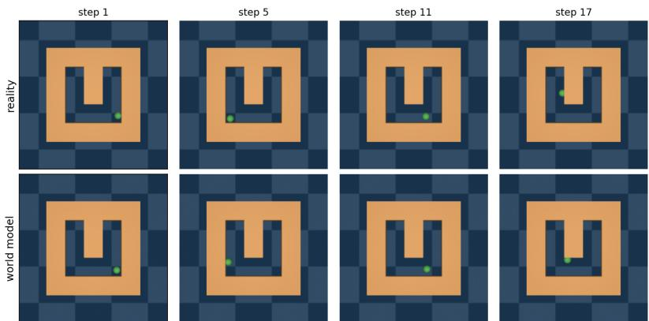
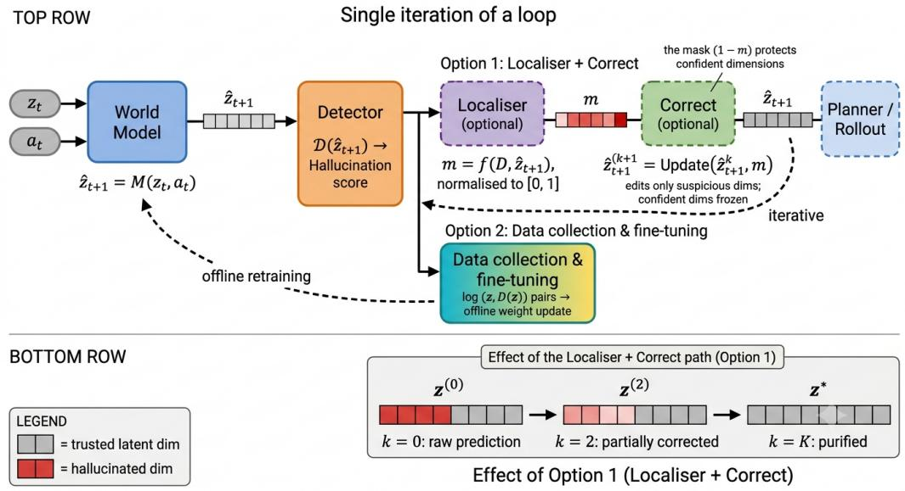
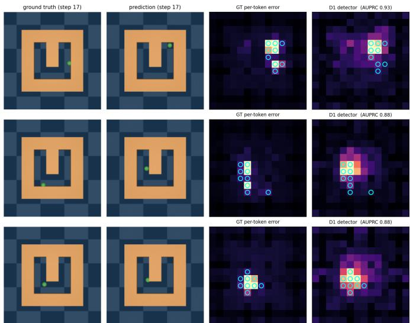

# MEND: Label-Free Detection, Localisation, and Correction of Latent Hallucination in World Models

Ali Alrasheed University of Melbourne Melbourne, Australia ali.alrasheed@student.unimelb.edu.au

James Bailey   
Monash University   
Melbourne, Australia   
james.a.bailey@monash.edu

Aryan Yazdan Parast

University of Melbourne

Melbourne, Australia

Basim Azam University of Melbourne Melbourne, Australia basim.azam@unimelb.edu.au aryan.yazdanparast@student.unimelb.edu.au

Naveed Akhtar University of Melbourne Melbourne, Australia naveed.akhtar1@unimelb.edu.au

Abstract—World Models are appearing as the next major frontier in computer vision. However, their robustness is currently largely unexplored. We identify the phenomenon of hallucination in latent World Models: given a state and an action, the predicted next latent can decode to a scene that never occurs. Because the prediction is statistically ordinary and is fed back autoregressively by the model, the error is both silent and compounding. We study whether such latent hallucination can be detected, localised, and corrected at inference time, on a frozen self-supervised world model in the absence of ground-truth error labels. We introduce Masked Empirical-Bayes Neural Denoising (MEND), a single conditional score network trained by denoising score matching on real transitions, whose score field serves three roles: its magnitude detects hallucination, its per-token field localises it to specific image patches, and it defines an inference-time correction direction. On two navigation environments MEND detects hallucination with an AUROC of up to 0.80 without using actions, exceeding a single-Gaussian density baseline while also localising the error (per-token AUPRC up to 0.87) and correcting it, all from one score field. Our correction reliably reduces single-step latent error and improves predictions. We identify that a part of the error is tangent to the data manifold, hence, we focus on detection and localisation while highlighting promises of the correction.

Index Terms—world models, hallucination detection, score matching, self-supervised learning

## I. INTRODUCTION

World models are an emerging and promising approach to decision making: by imagining, or rolling out, future latent states, they let an agent evaluate the consequences of an action before taking it, and have been shown to solve complex downstream tasks in this way [1]–[3]. Modern world models imagine future not in pixels but in the latent space of a frozen visual predictor, which is efficient but obscure. In that space, a model can produce a next state that is perfectly plausible as a vector of numbers yet decodes to a scene that never happens. For instance, an object jumps across the room, a wall dissolves, or a detail is invented where the future was uncertain. We term this phenomenon latent hallucination. Because the rollout is autoregressive, a hallucinated state is fed back in as context for the next prediction. Hence, this hallucination compounds and its effect on rollout accuracy grows with the imagination horizon (Fig. 1). Because the distortion lives in the latent, it is also silent: nothing on the surface of the prediction reveals that it is wrong, and it surfaces only once the true future arrives, by which point a planner may already have acted on it.

Evaluation of world models has focused mainly on downstream task performance, such as planning success or reward, and much less on whether the imagined rollout itself deviates from reality [1]–[3]. Hallucination has been studied at length for large language models, where a substantial literature now addresses how to detect and reduce fabricated output [4]. Similar phenomena inside world models have received little attention, and how to detect and correct them, is largely unexplored. This paper takes a step in that direction.

Once a reliable detector exists, the most direct way to reduce hallucination is to collect the cases where the model fails and retrain on them. This potential data-driven route is likely to be effective but requires new data and additional training, which is generally not desirable. We instead study an inference-time correction that operates on a frozen model, and introduce a general way of handling hallucination in latent world models as a three-stage loop: detect whether a prediction is hallucinated, localise which parts of it are wrong, and correct those parts (Fig. 2). We instantiate this loop label-free with a single conditional score field and call the resulting method Masked Empirical-Bayes Neural Denoising (MEND).

MEND is a single conditional score network whose score field detects hallucination, its per-token field localises it to image patches, and it defines an inference-time correction direction. We present the correction as a natural extension that complements the stronger detection and localisation findings. Our contributions are:

• A definition and two-type taxonomy of latent hallucination in latent world models, showing the error is spatially sparse: a small subset of tokens carries a disproportionate share of the total error.

• A general detect, localise, and correct loop, instantiated label-free by MEND, a single conditional score field that serves as detector, localiser, and correcter.

  
Fig. 1. Latent hallucination grows with imagination. Free-running a frozen world model on POINTMAZE: the top row is ground truth, the bottom row is the model’s imagined rollout decoded to images. Early on they agree, but by step 17 the imagined agent has drifted to a part of the maze it never visits. The prediction is still a plausible latent; nothing flags the error until the true future is known.

• Detection and localisation on two environments: up to 0.80 detection AUROC without actions, exceeding a single-Gaussian density baseline while also localising the error to specific patches (per-token AUPRC up to 0.87), and robust to the labelling threshold.

• A promising inference-time correction loop, with analysis of what it can and cannot recover.

## II. RELATED WORK

Latent world models. A growing family of world models predicts future states not in pixels but in a learned latent space, and performs planning within that space. DINO-WM [1] predicts in the frozen patch-token space of DINOv2 [5]; joint-embedding predictive architectures [2], end-to-end latent world models such as LeWM [6], and categorical models such as Dreamer [3] follow the same paradigm. This line of work extends earlier world models that plan from pixels or recurrent latent states [7], [8] to recent diffusion-based world models [9]. Despite their architectural differences, these models rely on iterative latent prediction for planning, so prediction errors accumulate over rollout and can eventually lead to hallucination.

Hallucination and uncertainty. Hallucination is well documented for large language models and large vision language models, where a substantial body of work addresses its detection and mitigation [4], [10], [11]. Diffusion-based image and video generation models [12], [13] exhibit related failure modes, producing plausible but incorrect content. Within video generation world models, C3 [14] trains a supervised probe on internal features to estimate dense per-patch confidence for video generation. In contrast, MEND targets latent world models for the first time, requiring no accuracy labels, and computing confidence directly from the predicted latent itself. The resulting confidence signal is differentiable with respect to the prediction, allowing it to be used both for hallucination detection and to guide latent correction. Detecting an implausible prediction is an instance of out-of-distribution detection, addressed with density and score-based criteria [15]– [17], the density-based of which motivates our Gaussian reference [15]. Our correction step follows score- and diffusionbased restoration, where the learned score of a data prior guides the underlying inverse problems [18]–[20].

## III. DEFINITION OF LATENT HALLUCINATION

Setting. In latent world models, a frozen encoder maps an observation to a latent state $z _ { t } ,$ and a frozen predictor maps a short history of states and actions to a predicted next latent $\hat { z } _ { t + 1 } = g ( z _ { t } , a _ { t } )$ . The latent is spatial: it is a grid of tokens, each describing a patch of the scene, so an error can be attributed to a region of the image. A decoder is available to render a latent as an image, and we use it only for inspection. Definition. Given the current latent state $z _ { t }$ and action $a _ { t } ,$ the environment evolves according to its true transition $p ( \cdot \mid$ $z _ { t } , a _ { t } )$ : the actual dynamics of the environment, which an ideal world model reproduces. These dynamics permit a set of valid next states, those consistent with the environment’s physical rules, for instance that the agent cannot pass through a wall. Let $R ( z _ { t } )$ denote the states reachable under any action, and $R ( z _ { t } , a _ { t } ) \subseteq R ( z _ { t } )$ the subset reachable under the action taken. A prediction $\hat { z } _ { t + 1 }$ is hallucinated if it lies outside this set, i.e. it has negligible probability under the true transition, regardless of its prediction error. In general these dynamics may be stochastic, so a single action can admit several valid successors; the environments we study are deterministic, so $R ( z _ { t } , a _ { t } )$ reduces to a single point (Section V).

The same definition extends to imagined rollouts. Let $R _ { k } \left( z _ { t } , a _ { t : t + k - 1 } \right)$ denote the states reachable after k steps under the action sequence $a _ { t : t + k - 1 } . \mathrm { ~ A ~ }$ rollout $\left( \widehat { z } _ { t + 1 } , \ldots , \widehat { z } _ { t + H } \right)$ is hallucination free if $\hat { z } _ { t + k } ~ \in ~ R _ { k }$ for every k. By Markov property, its probability factorises as

$$
p ( \hat { z } _ { t + 1 : t + H } \mid z _ { t } , a _ { t : t + H - 1 } ) = \prod _ { k } p ( \hat { z } _ { t + k + 1 } \mid \hat { z } _ { t + k } , a _ { t + k } ) ,\tag{1}
$$

where each factor is a one step transition of the form above. A single hallucinated step therefore reduces the probability of the entire rollout and, because each prediction conditions on previous predictions, the error accumulates with depth (Fig. 1). Hallucinations fall into two categories:

  
Fig. 2. MEND’s single-iteration pipeline. The world model predicts $\hat { z } _ { t + 1 }$ from $( z _ { t } , a _ { t } )$ and the detector scores it, $\mathcal { D } \big ( \hat { z } _ { t + 1 } \big )$ . Two mitigation paths follow. Option 1 (inference-time correction) uses the localiser to select the suspicious tokens (m) and iteratively move them toward the valid manifold while freezing the confident tokens; Option 2 (data-driven repair) logs the flagged predictions for offline fine-tuning of the world model. Bottom: over K iterations the correction restores the hallucinated tokens (red) to trusted ones (grey).

(S) Unreachable state $( \hat { z } _ { t + 1 } \notin R ( z _ { t } ) )$ . A state that cannot occur under any action, such as an object appearing from nowhere, a wall dissolving, or the agent passing through one. It depends only on $( z _ { t } , \hat { z } _ { t + 1 } )$

(A) Incorrect action outcome $( \hat { z } _ { t + 1 } ^ { \prime } \in R ( z _ { t } ) \setminus R ( z _ { t } , a _ { t } ) )$ The predicted state is reachable, but not under the action that was taken. It depends on the action $a _ { t }$

The error is sparse. Localisation and masked correction are effective only if prediction errors are concentrated rather than uniformly distributed. In our experiments (Section V), this holds for both WALL and POINTMAZE environments. On single-step predictions, the most suspicious fifth of tokens accounts for roughly a third of the total error. During deep free-running rollouts (Fig. 1), the same fifth accounts for over 80 percent. Hallucination is therefore a local phenomenon that becomes increasingly concentrated as it grows, making pertoken localisation and masked correction well suited to the problem.

## IV. METHOD

We first describe the generic detect-localise-correct loop we identify in the context of latent world models to develop a clear foundation of our method. We introduce the proposed label-free instantiation of this framework later.

## A. Detect, localise, and correct loop

Once hallucinations can be detected in a rollout, they can, in principle, be mitigated in two ways. The first is to collect the detected failures and fine-tune the world model on them, since they identify precisely where the learned dynamics are unreliable. This strategy directly improves the model, but it requires a data collection pipeline together with the computational budget for retraining or fine-tuning. In many practical settings, however, retraining is either unavailable or prohibitively expensive. In such cases, it is desirable to reduce hallucination directly at inference time while leaving the world model unchanged (Fig. 2). We therefore formulate a general detect–localise–correct loop for inference-time hallucination mitigation.

The loop begins with a detector that assigns a validity score to a predicted state. The detector itself is intentionally left unspecified: the score may be produced by a single model or by combining multiple models or heuristic indicators. If the same detector is also to support localisation and correction, the score must be differentiable with respect to the predicted state.

Differentiability allows a single score function to serve three complementary roles. First, its value detects hallucination by measuring the validity of the prediction. Second, its gradient with respect to the predicted state naturally localises the error: the tokens whose perturbation would most strongly change the score are precisely those the detector considers most suspicious, eliminating the need for a separate attribution mechanism. Third, the same gradient provides a correction direction. By taking a small optimisation step that reduces the detector score on only the suspicious tokens, the prediction is iteratively refined while leaving the remainder of the latent state unchanged.

One iteration therefore evaluates the detector, identifies the most suspicious tokens from the score gradient, applies a masked correction step to those tokens only, and re-evaluates the updated prediction. This process repeats until the prediction is judged sufficiently valid or a predefined iteration budget is reached (Fig. 2). The mask controls the extent of the edit, trading improved error coverage against unnecessary changes to already correct regions.

The detector, localiser, and corrector need not be separate components. Any differentiable validity score can, in principle, provide all three functions simultaneously. In the remainder of this section we derive such a score and use it as a unified detector, localiser, and corrector.

## B. Masked Empirical-Bayes Neural Denoising

We instantiate the loop with a single differentiable object, the score of a learned conditional density over next states, and name the resulting method MEND (Masked Empirical-Bayes Neural Denoising). The next subsections derive the score (the objective it approximates and the network that estimates it), show how one evaluation of it fills all three roles of the loop, and give the correction procedure in full.

1) Mathematical basis: A world model defines a conditional distribution over the next latent state given the current latent state and action. By Bayes’ rule, this conditional probability can be expressed as - following notational conventions from above:

$$
p ( \hat { z } _ { t + 1 } \mid z _ { t } , a _ { t } ) = \overbrace  \underbrace { p ( \hat { z } _ { t + 1 } \mid z _ { t } ) \ p ( a _ { t } \mid z _ { t } , \hat { z } _ { t + 1 } ) } _ { \underbrace { p ( a _ { t } \mid z _ { t } ) } _ { \mathrm { i n d e p e n d e n t ~ o f } \ \hat { z } _ { t + 1 } } } .\tag{2}
$$

Since the denominator depends only on $\left( \boldsymbol { z } _ { t } , \boldsymbol { a } _ { t } \right)$ , it is constant with respect to the predicted state $\hat { z } _ { t + 1 } \colon \mathrm { ~ i t ~ }$ cancels when comparing candidate predictions at a fixed $\left( \boldsymbol { z } _ { t } , \boldsymbol { a } _ { t } \right)$ and disappears under differentiation. The resulting score is therefore proportional to the product of two conditional densities,

$$
\begin{array} { r } { p ( \hat { z } _ { t + 1 } \mid z _ { t } , a _ { t } ) \propto \underbrace { p ( \hat { z } _ { t + 1 } \mid z _ { t } ) } _ { \mathrm { D 1 : ~ r e a c h a b l e ~ f r o m } ~ z _ { t } } \underbrace { p ( a _ { t } \mid z _ { t } , \hat { z } _ { t + 1 } ) } _ { \mathrm { D 2 : ~ u n d e r ~ t h i s ~ a c t i o n } } . } \end{array}\tag{3}
$$

This decomposition forms the basis of our detector family. Each factor describes a property of the environment dynamics rather than of the world model itself, allowing it to be estimated by a small auxiliary network trained on the same logged transitions as the world model, without requiring any hallucination or accuracy labels. The resulting detectors are therefore self-supervised and world-model-agnostic. They assign high scores to predictions that are likely under the true environment dynamics, regardless of which world model produced them, while low scores indicate likely hallucinations.

The two factors capture complementary evidence. D1, the reachability term $p ( \hat { z } _ { t + 1 } \mid z _ { t } )$ , measures whether the predicted latent state is reachable from the current state under any valid transition, making it sensitive to type S in §III. D2, the action-consistency term $p ( a _ { t } \mid z _ { t } , \hat { z } _ { t + 1 } )$ , measures whether the observed action explains the transition and is therefore sensitive to type A in §III. Under a Gaussian action-noise model, its negative log-likelihood reduces, up to an additive constant, to the residual of an inverse dynamics model,

$$
- \log p ( a _ { t } \mid z _ { t } , \hat { z } _ { t + 1 } ) \propto \| a _ { t } - \operatorname { I n v } ( z _ { t } , \hat { z } _ { t + 1 } ) \| ^ { 2 } .
$$

The Bayes decomposition naturally gives rise to these two complementary detector terms. Their relative effectiveness depends on the inductive biases of the learned world model and its training objective. For example, a model that primarily captures state-to-state transitions may place less emphasis on actions, making the reachability term D1 more informative than the action-consistency term D2. In our deterministic simulators, D1 alone provides strong hallucination detection and localisation, while D2 offers little additional benefit (Section VI). We therefore instantiate the remainder of the framework using D1 only, while still deriving and evaluating D2 as a principled ablation implied by the exact Bayes factorisation.

2) Conditional score network: We instantiate the framework using D1, the reachability density $p ( \hat { z } _ { t + 1 } \mid z _ { t } )$ , and interpret hallucination as removable perturbation of a valid next state. Specifically, we assume that a hallucinated prediction can be written as $\hat { z } _ { t + 1 } \approx z _ { t + 1 } + e ,$ , where $z _ { t + 1 }$ is a valid successor of $z _ { t }$ and e denotes the hallucination error. Rather than estimating the density itself, we estimate its score, the gradient of the log-density, which points in the direction of greatest increase in validity. We therefore learn a conditional score network $s _ { \theta } ( \tilde { z } \mid z _ { t } , \sigma ) \in \mathbb { R } ^ { N \times D }$ , conditioned on the current latent state $z _ { t }$ and on a noise scale $\sigma > 0 .$ , the standard deviation of the Gaussian smoothing introduced below, supplied to the network through a noise-scale embedding.

The network is trained using denoising score matching [21], [22]. Given real transitions $\left( z _ { t } , z _ { t + 1 } \right)$ , we corrupt the true next state with Gaussian noise of scale $\sigma , \tilde { z } = z _ { t + 1 } + \sigma \varepsilon$ , and train the network to predict the score of the corrupted sample by minimizing

$$
\begin{array} { r } { \mathcal { L } ( \theta ) = \mathbb { E } _ { ( z _ { t } , z _ { t + 1 } ) , \sigma , \varepsilon } \ \sigma ^ { 2 } \left\| s _ { \theta } ( z _ { t + 1 } + \sigma \varepsilon \mid z _ { t } , \sigma ) + \varepsilon / \sigma \right\| ^ { 2 } , } \end{array}\tag{4}
$$

where $\varepsilon \sim \mathcal { N } ( 0 , I )$ , the regression target is $- \varepsilon / \sigma ,$ , and the scale $\sigma$ is sampled from a geometric noise schedule. The training noise ε is distinct from the hallucination error $e \colon \varepsilon$ is an isotropic Gaussian corruption used only during training to learn the score, whereas e is the real, possibly non-Gaussian prediction error we detect and correct at inference. As shown by [21], the population minimiser of Eq. (4) is the conditional score ∇ log $q _ { \sigma } ( \tilde { z } \mid z _ { t } )$ of the σ-smoothed density of valid next states. Denoising score matching therefore learns the score field directly, without requiring the normalising constant of $p ( \hat { z } _ { t + 1 } \mid z _ { t } )$ , making estimation of D1 tractable.

This formulation has two properties that make it well suited for hallucination detection and correction. First, the score network is trained exclusively on real transitions and never observes predictions from the world model. It therefore learns the dynamics of the environment rather than the behaviour of a particular predictor, preserving the self-supervised and worldmodel-agnostic interpretation of Eq. (3). Second, although training corrupts states with Gaussian noise, that noise enters only as a smoothing kernel and not as an assumption about the hallucination error: by Eq. (4) the network learns the exact conditional score ∇ log $q _ { \sigma } ( \tilde { z } \mid z _ { t } )$ of the smoothed density of valid next states, and this identity holds at every input, including a predicted state that was never formed by adding Gaussian noise. Evaluated at a prediction $\hat { z } _ { t + 1 }$ , the score measures how, and how strongly, that prediction must move to become more valid.

3) One field, three roles: We now make the three roles concrete. A single evaluation of $s _ { \theta }$ at the prediction $\hat { z } _ { t + 1 }$ yields both the detection score and the localisation map; correction reuses the same network as a short iterative refinement at a smaller noise scale (Section V). The three roles therefore come from one score field rather than three separate components (Fig. 2).

• Detect. The scalar $\mathcal { D } = \Vert s _ { \theta } ( \hat { z } _ { t + 1 } \mid \boldsymbol { z } _ { t } ) \Vert ^ { 2 }$ measures how far $\hat { z } _ { t + 1 }$ is from the set of reachable states. Because a regression-trained predictor makes even its correct outputs mildly atypical, we standardise it against the detector’s statistics on known-correct predictions, $\tilde { \mathcal { D } } =$ $( \mathcal { D } - \mu _ { \mathrm { a c c } } ) / \sigma _ { \mathrm { a c c } } .$ , and use D˜ throughout (Section V).

• Localise. The per-token field $\| \mathbf { \tilde { } { \boldsymbol { s } } } _ { \theta } \big ( \hat { z } _ { t + 1 } \quad | \quad z _ { t } \big ) _ { n } \|$ is a direct estimate of how far each token must move, so no attribution or backward pass is needed.

• Correct. By Tweedie’s formula [23] the posterior mean of the clean state is $\hat { z } _ { t + 1 } + \sigma ^ { 2 } s _ { \theta }$ , so the score is also the correction direction.

The geometry behind the three roles is explicit: for a point at distance r from the reachable set, as $\sigma \to 0$ the score points from $\hat { z } _ { t + 1 }$ toward its nearest valid neighbour with magnitude $r / \sigma ^ { 2 } \left[ 2 4 \right]$ . Detection reads the length of this vector, localisation reads its per-token parts, and correction follows it.

Correction is applied as a short iterative loop - see Algorithm 1. MEND keeps the original prediction $\hat { z } _ { \mathrm { o r i g } }$ as an anchor and, on the first iteration, fixes a support of the top-p% most displaced tokens. Each step then moves this support along the score, a Tweedie displacement toward the valid-state manifold, while a proximal term pulls the edit back toward $\hat { z } _ { \mathrm { o r i g } }$ . The most suspicious tokens therefore move the most and the confident ones stay near their original values. The loop returns the iterate of the lowest standardised score D˜. Two choices matter in practice: the correction scale σ must be small, since larger scales are destructive, and the correction must be reapplied at every step of a rollout, since a single correction may not persist.

## V. EXPERIMENTAL SETUP

Backbone and environments. We use the public frozen DINO WM checkpoints [1]: a DINOv2 ViT-S/14 encoder [5] with N = 196 tokens and $D = 3 8 4$ , and a small predictor. We report on two popular navigation environments, WALL (a Markov predictor with a single history frame) and POINTMAZE (a three-frame history).

Calibration and labelling. We hold out trajectories, run the predictor, and split predictions into correct and incorrect at the median per-token error, giving a balanced set. All detectors and thresholds are defined on this organic-error set. We do not use synthetic corruptions as a headline metric, because denoising score matching is trained to detect exactly such perturbations. The support definition of Section III is not directly observable, so we label with this proxy: in the deterministic environments studied here $R ( z _ { t } , a _ { t } )$ is essentially a single point, so the pertoken error between a prediction and the realised next latent closely tracks whether the prediction lies in the reachable set, and a large error means it has left that set. Under stochastic dynamics this proxy would over-count valid alternative futures, and a reachability-based label would be required.

Algorithm 1 MEND: detect, localise, correct at inference   
Require: state $z _ { t } ,$ , action ${ { a } _ { t } } ,$ predictor $^ { g , }$ score net $s _ { \theta } ,$ correc  
tion scale $\sigma ,$ mask size $p ,$ step $\eta ,$ anchor $\rho ,$ budget K,   
calibration stats $( \mu _ { \mathrm { a c c } } , \sigma _ { \mathrm { a c c } } )$ , thresholds $\tau , \delta$   
1: $\hat { z } _ { \mathrm { o r i g } } \gets g ( z _ { t } , a _ { t } ) ; ~ z \gets \hat { z } _ { \mathrm { o r i g } } ;$ best $ ( z , \infty )$   
2: for $k = 1 , \ldots , K$ do   
3: $G  s _ { \theta } ( z \mid z _ { t } , \sigma )$ one forward pass   
4: $d  \sigma ^ { 2 } \bar { G }$ displacement to nearest valid state   
5: $\tilde { \mathcal { D } } \gets ( \| G \| ^ { 2 } - \mu _ { \mathrm { a c c } } ) / \sigma _ { \mathrm { a c c } }$ detect   
6: $m _ { \mathrm { r a w } } \gets \mathrm { r a n k } ( | d | )$ localise   
7: if $k = 1$ then   
8: $S \gets \{ { \sf t o p } \ p \%$ of $m _ { \mathrm { r a w } } \}$ support frozen   
9: end if   
10: $m  m _ { \mathrm { r a w } } \odot \mathbf { 1 } [ S ]$   
11: $z \gets z + \eta \big ( m \odot d - \rho ( z - \hat { z } _ { \mathrm { o r i g } } ) \big )$ correct   
12: if $\tilde { \mathcal { D } } <$ best. $\tilde { . D }$ then best $ ( z , \tilde { \mathcal { D } } )$   
13: break $\mathbf { i f } \ \tilde { \mathcal { D } } < \tau \ \textbf { o r } \ \| \Delta z \| < \delta$   
14: end for   
15: return best iterate

Metrics. Detection is measured by AUROC of correct versus incorrect predictions. Localisation is measured by per-token AUPRC against the ground-truth error map, with a random baseline of 0.50. Correction is measured by the reduction in latent error and the fraction of predictions improved.

Baselines. For detection, we compare against a single diagonal-Gaussian density fit to valid states, the unimodal special case of feature-space Gaussian-density detectors [15], which serves as a weak density floor. We further compare an inverse-model detector (the action factor of Eq. (2)), a directly conditioned score model that reads the action, and a cross-attention variant that injects the action. Full architectures and training of these variants are given in the supplementary material.

Implementation. The conditional score network is a four-layer token Transformer (six attention heads, feed-forward width 1536, AdaLN noise conditioning; 10.3M parameters, ${ \approx } 0 . 5 3 \times$ a single world-model predictor forward), trained by denoising score matching on roughly 500 held-out trajectories. Detection uses a single large noise scale $\sigma = 0 . 3 9$ , which probes global structure; correction uses a small scale $\sigma = 0 . 0 5$ with step $\eta = 0 . 3$ , anchor weight $\rho = 0 . 1$ , and $K = 1 0$ Tweedie steps $( \sigma > 0 . 0 8$ is destructive).

## VI. DETECTION AND LOCALISATION RESULTS

## A. Across environments

Table I evaluates MEND on both environments. The central observation is that hallucination detection and localisation are related but distinct capabilities that need not improve together.

TABLE I  
MEND (OURS) AGAINST A DIAGONAL-GAUSSIAN DENSITY REFERENCE [15]. DETECTION IS AUROC; THE LAST TWO COLUMNS ARE DETECTION AND LOCALISATION PER-TOKEN AUPRC (RANDOM 0.50).
<table><tr><td rowspan="2">Environment</td><td colspan="2">Detection AUROC</td><td rowspan="2">Det. AUPRC</td><td rowspan="2">Loc. AUPRC</td></tr><tr><td>Ours</td><td>Gauss.</td></tr><tr><td rowspan="3">WALL POINTMAZE</td><td>0.801</td><td>0.648</td><td>0.802</td><td>0.712</td></tr><tr><td>0.691</td><td>0.631</td><td>0.687</td><td>0.874</td></tr><tr><td></td><td></td><td></td><td></td></tr></table>

Detection is a global task that asks whether an entire predicted latent state is plausible, whereas localisation is a spatial task that identifies which latent tokens are responsible for the error. Detection is strongest in environments with sharp, nearly deterministic dynamics, such as WALL, while localisation remains reliable whenever hallucination is concentrated to a subset of tokens, which is true in both environments. In POINTMAZE, the agent occupies only a small region of the scene and its future position is inherently uncertain, reducing the separation between valid and hallucinated predictions and lowering detection AUROC. Even so, the learned score field continues to localise hallucinations accurately (per-token AUPRC 0.87), because the error remains concentrated in a small subset of tokens.

For detection, MEND substantially outperforms the single-Gaussian density floor on WALL and improves on it in POINT-MAZE, demonstrating that hallucination detection requires modelling the multimodal structure of the transition distribution rather than a single-mode density. It achieves this while remaining fully differentiable, so the same object that scores a prediction also localises and corrects it.

The distinguishing advantage of MEND is that a single differentiable object simultaneously provides all three capabilities required by our framework: a global hallucination score for detection, a dense per-token localisation map, and a correction direction for inference-time refinement. A pure detection baseline such as the single-Gaussian density offers only the first of these and therefore cannot support the unified detect–localise–correct framework. This explains the absence of baseline from the last two columns.

Robustness. Detection is stable as the labelling threshold is swept from lenient to strict, and it saturates after a few hundred training trajectories, so the ceiling reflects the environment and frozen backbone rather than a shortage of data (see the supplementary material).

## B. Localisation examples

Fig. 3 shows localisation on the hardest cases: hallucinations produced by free-running the world model deep into a rollout, where the imagined agent has wandered to a part of the maze it never visits. Each row shows the true and predicted frames, the ground-truth per-token error, and the detector score field, which concentrates on exactly the tokens that are wrong. The striking part is the stability with depth. As the rollout runs forward the total error more than doubles, yet the per-token AUPRC barely moves from the first step out to the deepest step the episodes allow. Localisation is therefore robust to depth: even when the whole imagined state has drifted off the manifold, the same signal that flags a hallucination keeps saying where it is, which is what the correction stage acts on. Equivalent deep-rollout examples on WALL are shown in the supplementary material.

  
Fig. 3. Localising deep-rollout hallucinations on POINTMAZE (step 17 of a free-running rollout, where the imagined agent has drifted far from reality). Columns: decoded ground truth, decoded prediction, ground-truth per-token error, and the D1 detector score field (per-token AUPRC annotated). Even when the whole state is far off the manifold the detector still points at the tokens that are wrong. Cyan circles mark the nine most-erroneous tokens.

## VII. ABLATION STUDY AND DISCUSSION

Throughout our experiments, the detector is D1, the reachability factor $p ( \widehat { z } _ { t + 1 } \mid z _ { t } )$ from the Bayes decomposition in Eq. (3), which depends only on the current and predicted latent states. We also evaluate the complementary actionconsistency factor, $\mathrm { D } 2 ~ = ~ p ( a _ { t } ~ \vert ~ z _ { t } , \hat { z } _ { t + 1 } \big )$ , together with a variant that conditions the score network directly on the action. As shown in Table II, neither improves hallucination detection. D2 performs at approximately chance level, while action conditioning matches, but does not exceed, the performance of D1.

This behaviour follows naturally from the deterministic setting. D2 is implemented through an inverse dynamics model, which measures how accurately the observed action can be reconstructed from the predicted transition. Because the world model is itself conditioned on the action, even hallucinated predictions generally remain consistent with that action. Consequently, the inverse dynamics residual is largely independent of whether a prediction is valid or hallucinated, making it a weak detection signal despite accurate action reconstruction.

This observation is specific to deterministic environments rather than a limitation of the Bayes decomposition itself. D2 is the only factor that distinguishes between multiple reachable future states that differ only in the action that produced them. It is therefore expected to become informative in stochastic or multimodal environments, where reachability alone is insufficient to identify the correct transition.

TABLE II  
ABLATION OF DETECTOR VARIANTS ON WALL. VARIANT ARCHITECTURES ARE DETAILED IN THE SUPPLEMENTARY MATERIAL.
<table><tr><td>Detector (WALL)</td><td>AUROC</td></tr><tr><td>Conditional score net (no action) Directly conditioned score, +action (AdaLN) Cross-attention, +action (15M)</td><td>0.801 0.799 0.782</td></tr></table>

TABLE III

SINGLE-STEP CORRECTION. ∆ ERROR IS THE RELATIVE CHANGE IN LATENT ERROR, SO A NEGATIVE VALUE INDICATES IMPROVEMENT; ARROWS MARK THE BETTER DIRECTION.
<table><tr><td>Environment</td><td>∆ error ↓</td><td>% improved ↑</td></tr><tr><td>WALL</td><td>-6.4%</td><td>98.5</td></tr><tr><td>POINTMAZE</td><td>-3.0%</td><td>99.5</td></tr></table>

Conditioning the score network directly on the action likewise provides no benefit. Instead of learning the geometry of reachable latent states, the network can partially rely on the action as a shortcut. Classifier-free guidance confirms this interpretation: removing the action at training time recovers the performance of the action-free model but does not improve upon it.

## A. Correction results

Correction reuses the same score field as a Tweedie step. A single such step reduces latent error on both navigation environments and improves almost every prediction (Table III). Because the Tweedie update is the per-token score field itself, each token moves in proportion to its localisation score: the most suspicious tokens move most and confident ones barely move, so an explicit mask is redundant and we edit the full latent. In an imagined rollout the correction must be reapplied at every step: a single first-step correction washes out immediately, whereas per-step correction sustains a roughly constant reduction with depth (Table IV; depth-resolved curves in the supplementary material).

What correction cannot do. The error decomposes into a component normal to the reachable set and a component tangent to it. Only the normal part is recoverable: a state displaced along the reachable set is a valid alternative future, indistinguishable from the truth for any corrector. The tangent part forms an aleatoric floor that bounds the achievable gain, which is why the reductions are consistent but modest and why mild near-manifold errors are corrected most. We therefore present correction as a feasibility result rather than a solved problem.

## VIII. CONCLUSION

We showed that hallucination is not only a language-model phenomenon but also a measurable property of latent world models, and we studied it on a frozen self-supervised backbone without error labels. Our method, MEND, derives a single conditional score field that does three jobs from one object: it detects hallucination, localises it to the right image patches, and supplies an inference-time correction direction. Detection and localisation are solid and reproducible across two environments and robust to the labelling threshold and the data budget. Correction reliably reduces latent error but is bounded by the part of the error that lies along the data manifold, where no corrector is likely to help. So we present it as a preliminary but promising investigation. The same detection and localisation signal also points to a natural extension: using it to target data collection and repair the world model directly.

TABLE IV  
PER-STEP CORRECTION ON WALL: MEAN PER-TOKEN LATENT ERROR VERSUS ROLLOUT DEPTH (LOWER IS BETTER). PARENTHESES SHOW THE REDUCTION RELATIVE TO NO CORR.
<table><tr><td>Depth</td><td>No corr.</td><td>MEND (D1) ↓</td></tr><tr><td>1</td><td>1.770</td><td> $\overline { { 1 . 6 2 6 \ ( - 8 . 2 \% ) } }$ </td></tr><tr><td>5</td><td>2.370</td><td> $2 . 2 3 7 \ ( - 5 . 6 \% )$ </td></tr><tr><td>9</td><td>2.830</td><td> $2 . 7 3 2 \ ( - 3 . 5 \% )$ </td></tr></table>

In our method, detection and localisation are solid and label-free, and inference-time correction reliably reduces latent error. However, two directions remain open. First, the approach assumes that hallucinations lie off-manifold, which holds for the navigation environments studied here but may not hold when a predictor’s errors stay close to the manifold. Hence, extending the study to stochastic dynamics is a natural next step. Second, correction is established at the representation level, and whether these gains transfer to a downstream controller is left for the future work.

## ACKNOWLEDGEMENTS

Ali Alrasheed is supported by a scholarship from Aramco. Naveed Akhtar is a recipient of the Australian Research Council Discovery Early Career Researcher Award (project # DE230101058), funded by the Australian Government. This research was also supported by The University of Melbourne’s Research Computing Services and the Petascale Campus Initiative.

## REFERENCES

[1] G. Zhou, H. Pan, Y. LeCun, and L. Pinto, “DINO-WM: World models on pre-trained visual features enable zero-shot planning,” arXiv preprint arXiv:2411.04983, 2024.

[2] Y. LeCun, “A path towards autonomous machine intelligence,” OpenReview, 2022, version 0.9.2.

[3] D. Hafner, J. Pasukonis, J. Ba, and T. Lillicrap, “Mastering diverse domains through world models,” arXiv preprint arXiv:2301.04104, 2023.

[4] Z. Ji, N. Lee, R. Frieske, T. Yu, D. Su, Y. Xu, E. Ishii, Y. J. Bang, A. Madotto, and P. Fung, “Survey of hallucination in natural language generation,” ACM Computing Surveys, vol. 55, no. 12, pp. 1–38, 2023.

[5] M. Oquab, T. Darcet, T. Moutakanni, H. Vo, M. Szafraniec, V. Khalidov, P. Fernandez, D. Haziza, F. Massa, A. El-Nouby et al., “DINOv2: Learning robust visual features without supervision,” arXiv preprint arXiv:2304.07193, 2023.

[6] L. Maes, Q. L. Lidec, D. Scieur, Y. LeCun, and R. Balestriero, “LeWorld-Model: Stable end-to-end joint-embedding predictive architecture from pixels,” arXiv preprint arXiv:2603.19312, 2026.

[7] D. Ha and J. Schmidhuber, “Recurrent world models facilitate policy evolution,” Advances in Neural Information Processing Systems, vol. 31, 2018.

[8] D. Hafner, T. Lillicrap, I. Fischer, R. Villegas, D. Ha, H. Lee, and J. Davidson, “Learning latent dynamics for planning from pixels,” in International Conference on Machine Learning. PMLR, 2019, pp. 2555–2565.

[9] E. Alonso, A. Jelley, V. Micheli, A. Kanervisto, A. Storkey, T. Pearce, and F. Fleuret, “Diffusion for world modeling: Visual details matter in Atari,” Advances in Neural Information Processing Systems, vol. 37, pp. 58 757–58 791, 2024.

[10] J. Maynez, S. Narayan, B. Bohnet, and R. McDonald, “On faithfulness and factuality in abstractive summarization,” in Proceedings of the 58th Annual Meeting of the Association for Computational Linguistics, 2020, pp. 1906–1919.

[11] A. Yazdan Parast, P. Hosseini, H. Asadollahzadeh, A. Soltani Moakhar, B. Azam, S. Feizi, and N. Akhtar, “GHOST: Hallucination-inducing image generation for multimodal LLMs,” in The Fourteenth International Conference on Learning Representations, 2026. [Online]. Available: https://openreview.net/forum?id=f4TACE7HhU

[12] J. Ho, A. Jain, and P. Abbeel, “Denoising diffusion probabilistic models,” Advances in Neural Information Processing Systems, vol. 33, pp. 6840– 6851, 2020.

[13] R. Rombach, A. Blattmann, D. Lorenz, P. Esser, and B. Ommer, “High-resolution image synthesis with latent diffusion models,” in Proceedings of the IEEE/CVF Conference on Computer Vision and Pattern Recognition, 2022, pp. 10 684–10 695.

[14] Z. Mei, T. Yin, M. Baker, O. Shorinwa, and A. Majumdar, “World models that know when they don’t know: Controllable video generation with calibrated uncertainty,” arXiv preprint arXiv:2512.05927, 2025.

[15] K. Lee, K. Lee, H. Lee, and J. Shin, “A simple unified framework for detecting out-of-distribution samples and adversarial attacks,” Advances in Neural Information Processing Systems, vol. 31, 2018.

[16] E. Nalisnick, A. Matsukawa, Y. W. Teh, D. Gorur, and B. Lakshminarayanan, “Do deep generative models know what they don’t know?” arXiv preprint arXiv:1810.09136, 2018.

[17] A. Mahmood, J. Oliva, and M. Styner, “Multiscale score matching for out-of-distribution detection,” arXiv preprint arXiv:2010.13132, 2020.

[18] Y. Song, J. Sohl-Dickstein, D. P. Kingma, A. Kumar, S. Ermon, and B. Poole, “Score-based generative modeling through stochastic differential equations,” arXiv preprint arXiv:2011.13456, 2020.

[19] B. Kawar, M. Elad, S. Ermon, and J. Song, “Denoising diffusion restoration models,” Advances in Neural Information Processing Systems, vol. 35, pp. 23 593–23 606, 2022.

[20] H. Chung, J. Kim, M. T. McCann, M. L. Klasky, and J. C. Ye, “Diffusion posterior sampling for general noisy inverse problems,” arXiv preprint arXiv:2209.14687, 2022.

[21] P. Vincent, “A connection between score matching and denoising autoencoders,” Neural Computation, vol. 23, no. 7, pp. 1661–1674, 2011.

[22] Y. Song and S. Ermon, “Generative modeling by estimating gradients of the data distribution,” Advances in Neural Information Processing Systems, vol. 32, 2019.

[23] B. Efron, “Tweedie’s formula and selection bias,” Journal of the American Statistical Association, vol. 106, no. 496, pp. 1602–1614, 2011.

[24] J. Pidstrigach, “Score-based generative models detect manifolds,” Advances in Neural Information Processing Systems, vol. 35, pp. 35 852– 35 865, 2022.