# MRI Super-Resolution with RCDM/WaveMix and Task-Aware Segmentation

Kavitha Viswanathan1, Harsh Choudhary2, and Amit Sethi2

1,2Department of Electrical Engineering, Indian Institute of Technology Bombay, Mumbai 400 076, India

## Abstract

Super-resolution and quality enhancement of 1.5 T brain MRI are normally validated with image-fidelity metrics, although their purpose is to improve downstream analysis. We study whether enhancement improves tissue segmentation, and for which segmenters. We propose an unpaired, physics-guided training pipeline for a lightweight (≤2.5 M parameter) recurrent convolutional enhancer: a six-module stochastic 1.5 T degradation operator, a residual adversarial network that adds scanner-specific texture without moving anatomy, and a cycle-consistent objective with an anti-identity penalty that rules out the copy solution. We then train U-Net, Swin-UNet and wavelet token-mixing segmenters (Jeevan et al., 2023) from scratch on either raw or enhanced 1.5 T images of the same subjects, using identical labels and subject-level splits, for three enhancer variants and two datasets. On ABIDE (41 held-out subjects, FreeSurfer labels) enhancement significantly improves the wavelet segmenter (mean Dice +0.014, Wilcoxon p = 3.5 × 10−5; CSF +0.018, grey matter +0.013), significantly degrades the U-Net (−0.008, p = 5.1 × 10−4) and leaves Swin-UNet unchanged. On IXI, whose labels come from FSL-FAST, enhancement lowers Dice for all nine pairings, almost entirely through CSF; we trace this to spatially implausible CSF voxels in the labels that penalise smoother predictions. Enhancement of low-field MRI should therefore be validated per downstream model and against reliable labels.

Keywords: Low-field MRI ; Super-resolution ; Image enhancement ; Brain tissue segmentation ; Task-based evaluation ; Wavelets

## 1 Introduction

Magnetic field strength largely determines the quality of structural brain MRI. At 3 T the signal-to-noise ratio is roughly twice that at 1.5 T, tissue contrast is higher and partial-volume blurring at tissue boundaries is lower. Yet a large fraction of clinical, longitudinal and multi-site research data has been, and continues to be, acquired at 1.5 T. If 1.5 T images could be mapped to 3 T appearance, analysis tools developed and tuned on 3 T data could be applied to them more reliably. This motivates learned enhancement and super-resolution (SR) of brain MRI (Pham et al., 2017; Chen et al., 2018; Zhao et al., 2021) and image-quality transfer across field strengths (Alexander et al., 2017; Lin et al., 2023; Iglesias et al., 2023).

Most such methods are validated with PSNR, SSIM or perceptual similarity to a reference. These metrics answer whether the output looks like the target, not whether it helps the analysis the target is used for. The distinction matters for two reasons. First, a learned model can raise fidelity while inventing or removing small structures; global metrics barely register this, but a segmentation model will. Second, even an image that is objectively closer to 3 T need not help every downstream model equally, because each model relies on diferent image statistics (Maier-Hein et al., 2024). A fidelity gain is therefore at best a proxy, and its relationship to the downstream task has to be measured.

We measure it for brain tissue segmentation. The question we ask is concrete: if a segmenter is trained and tested on enhanced 1.5 T images instead of the raw 1.5 T images of the same subjects, with the same labels and split, does Dice improve; and does the answer depend on the segmenter and on the label source? Training separate segmenters for each input type, rather than applying a single frozen model, isolates the information content of the enhanced images from the domain shift a frozen model would sufer.

Our contributions are:

1. A physics-guided, unpaired training pipeline for 1.5 T enhancement that combines a six-module stochastic degradation operator, a residual adversarial texture model that cannot move anatomy, and a cycle-consistent objective with an explicit anti-identity penalty (Section 3).

2. A lightweight recurrent convolutional enhancer, adapted from video super-resolution, that treats adjacent slices as frames and has at most 2.5 M parameters (Section 3.3).

3. A controlled segmentation-based evaluation: three enhancer variants crossed with three segmentation backbones, two datasets, subject-level splits, paired non-parametric tests and multiple-comparison correction (Sections 4–5).

4. Two findings with practical consequences: the efect of enhancement is backbone-dependent, positive for a wavelet token-mixing segmenter and negative for a U-Net; and automated labels can reverse its sign (Sections 5–6).

## 2 Related work

Brain MRI super-resolution. Early deep SR for brain MRI used 3D convolutional networks trained on synthetically downsampled high-resolution volumes (Pham et al., 2017); adversarial training and densely connected 3D networks followed (Chen et al., 2018). Self-supervised approaches such as SMORE (Zhao et al., 2021) exploit the higher in-plane resolution of anisotropic acquisitions and avoid external training pairs. All of these report fidelity metrics; downstream efects, when studied, are usually assessed with a single analysis tool.

Image-quality transfer across field strengths. Image-quality transfer learns a mapping from low- to high-quality acquisitions (Alexander et al., 2017), and has been extended to very-low-field MRI with a stochastic degradation model that simulates low-field images from high-field ones (Lin et al., 2023). SynthSR (Iglesias et al., 2023) and SynthSeg (Billot et al., 2023) take a complementary route, training on synthetic images generated from label maps so that models become robust to contrast and resolution. Our degradation operator is in the same spirit as the stochastic simulation of Lin et al. (2023), but targets the 1.5 T to 3 T gap and is combined with a learned residual texture model.

Unpaired and cycle-consistent training. Cycle consistency (Zhu et al., 2017) is the usual tool when paired data are unavailable. A known failure mode is a near-identity mapping that satisfies the cycle constraint trivially. We address it with an explicit penalty on outputs that are not sharper than their input.

Task-based evaluation. The recommendation that validation metrics be chosen according to the downstream use of an algorithm is now established (Maier-Hein et al., 2024). We apply it to enhancement, and show that the conclusion depends on the downstream model and the label source.

## 3 Method

Let $\mathbf { x } \in \mathbb { R } ^ { S \times H \times W }$ be a stack of S adjacent axial 3 T slices, and $\mathbf { c } ( \mathbf { x } )$ its centre slice. The goal is an enhancer G that maps a stack of 1.5 T slices to a 3 T-like centre slice of the same size.

## 3.1 Physics-inspired stochastic degradation

The degradation operator D composes six modules, each applied with probability $p _ { i }$ and with parameters drawn uniformly from the given ranges at every call (Table 1). Each module models one physical diference between 1.5 T and 3 T acquisitions:

Table 1: Stochastic 1.5 T degradation operator. Each module fires with probability p; parameters are drawn uniformly from the ranges.
<table><tr><td>Module</td><td>Parameters</td><td>p</td></tr><tr><td>Anisotropic blur</td><td> $\sigma _ { x y } \in [ 0 . 6 , 1 . 8 ] , \sigma _ { z } \in [ 0 . 8 , 2 . 2 ]$ </td><td>0.95</td></tr><tr><td>k-space (Rician) noise</td><td> $s \in [ 0 . 0 2 , 0 . 0 8 ]$ </td><td>0.90</td></tr><tr><td>Bias field</td><td> $\mathrm { s t r e n g t h } \in [ 0 . 0 5 , 0 . 2 0 ]$ </td><td>0.70</td></tr><tr><td>Intensity remap</td><td> $\gamma \in [ 0 . 8 0 , 1 . 2 5 ] , a \in [ 0 . 8 5 , 1 . 1 5 ]$ </td><td>0.50</td></tr><tr><td>Image-domain noise</td><td> $\sigma \in [ 0 . 0 0 5 , 0 . 0 2 5 ]$ </td><td>0.30</td></tr><tr><td>Partial-volume resampling</td><td> $f \in [ 1 . 3 , 1 . 8 ]$ </td><td>0.40</td></tr></table>

1. Resolution loss: anisotropic Gaussian blur, $\textbf { x } $ ${ \bf x } * \mathcal { G } _ { \sigma _ { x y } , \sigma _ { z } } .$

2. Lower SNR: complex Gaussian noise added in kspace followed by magnitude reconstruction, $\mathbf { x } $ $| \mathcal { F } ^ { - 1 } ( \mathcal { F } \mathbf { x } + \eta ) | , \eta \sim \mathcal { C } \mathcal { N } ( 0 , s ^ { 2 } )$ , which produces the Rician statistics of magnitude images (Gudbjartsson and Patz, 1995).

3. Receive-field inhomogeneity: a smooth multiplicative bias field obtained by bicubic upsampling of a coarse random grid.

4. Contrast diference: a monotone intensity remap $\mathbf { x }  a \mathbf { x } ^ { \gamma }$ that shifts grey–white contrast towards 1.5 T statistics.

5. Residual noise: image-domain Gaussian noise.

6. Partial volume: bicubic down-sampling by a factor f followed by bicubic up-sampling to the original grid.

## 3.2 Residual adversarial texture model

An analytic operator cannot reproduce site- and scanner-specific texture. We therefore learn a residual on top of it,

$$
\begin{array} { r } { \tilde { \mathbf { x } } = \mathrm { c l i p } \big ( \mathcal { D } ( \mathbf { x } ) + R ( \mathcal { D } ( \mathbf { x } ) ) , 0 , 1 \big ) , } \end{array}\tag{1}
$$

where R is an encoder–decoder with six residual blocks, instance normalisation and reflection padding (≈8.4 M parameters). Because R only adds a residual to an image whose geometry is fixed by D, it can alter texture and contrast but has little freedom to move anatomy. A two-scale PatchGAN discriminator (Wang et al., 2018) compares x˜ with real 1.5 T slices using the least-squares adversarial loss (Mao et al., 2017) plus feature matching, with learning rates $2 \times 1 0 ^ { - 4 }$ for R and $1 0 ^ { - 4 }$ for the discriminator. Seeded stochastic passes of D followed by R yield several distinct 1.5 T-like versions of each 3 T volume.

## 3.3 Enhancer architecture

The enhancer is a lightweight recurrent convolutional network originally designed for video SR (Viswanathan et al., 2025). It combines (i) a single-tensor residual memory that carries information across the stack, (ii) a

2D Haar wavelet branch on the centre slice that conditions the fusion blocks on its sub-bands, and (iii) a 3D deformable convolution (Zhu et al., 2019) that aligns neighbouring slices implicitly. For volumes, the “frames” of the group-of-frames (GOF) window are adjacent axial slices, so temporal aggregation becomes through-plane aggregation, and the output has the input resolution. We use three variants: GOF = 3 and GOF = 5 versions (≈2.3 M parameters each), and WaveMix-SR, which adds a small wavelet token-mixing (Jeevan et al., 2023) residual refiner (32 features, 4 blocks, residual scale 0.05; ≤2.5 M parameters in total).

## 3.4 Training objective

The reconstruction loss between a prediction $\hat { y }$ and target $y$ is

$$
\begin{array} { r l } & { \mathcal { L } _ { \mathrm { r e c } } ( \hat { y } , y ) = \Vert \hat { y } - y \Vert _ { 1 } + 0 . 2 \left( 1 - \mathrm { S S I M } ( \hat { y } , y ) \right) } \\ & { \quad + 0 . 0 5 \ell _ { \mathrm { e d g e } } + 0 . 0 3 \ell _ { \mathrm { L a p } } + 0 . 0 1 \ell _ { \mathrm { f r e q } } + 0 . 0 1 \ell _ { \mathrm { c o n } } , } \end{array}\tag{2}
$$

where the last four terms compare image gradients, Laplacians, Fourier magnitudes and local contrast. The full objective is

$$
\mathcal { L } = \mathcal { L } _ { \mathrm { r e c } } ^ { ( 1 ) } + 0 . 5 \mathcal { L } _ { \mathrm { r e c } } ^ { ( 2 ) } + 0 . 5 \mathcal { L } _ { \mathrm { c y c } } + 0 . 1 \mathcal { L } _ { \mathrm { a n t i } } + 0 . 1 \mathcal { L } _ { \mathrm { i d } } .\tag{3}
$$

Paired terms. $\begin{array} { r } { \mathcal { L } _ { \mathrm { r e c } } ^ { ( k ) } = \mathcal { L } _ { \mathrm { r e c } } ( G ( \mathcal { D } _ { k } ( \mathbf { x } ) ) , \mathbf { c } ( \mathbf { x } ) ) } \end{array}$ for two independent random draws $\mathcal { D } _ { 1 } , \mathcal { D } _ { 2 }$ of the operator, which exposes the enhancer to two degradations of the same anatomy per step.

Cycle term. For a GAN-generated 1.5 T stack x˜, the enhanced output is re-degraded and compared with its input,

$$
\mathcal { L } _ { \mathrm { c y c } } = \left\| \mathbf { c } ( \mathcal { D } ( G ( \tilde { \mathbf { x } } ) ) ) - \mathbf { c } ( \tilde { \mathbf { x } } ) \right\| _ { 1 } + 0 . 2 \big ( 1 - \mathrm { S S I M } ( \cdot , \cdot ) \big ) .\tag{4}
$$

It constrains the enhancer on realistic 1.5 T appearance for which no 3 T target exists.

Anti-identity term. $\mathcal { L } _ { \mathrm { c y c } }$ is minimised trivially by an enhancer that returns a slightly smoothed copy of its input. With TV(u) the mean absolute horizontal plus vertical finite diference,

$$
\mathcal { L } _ { \mathrm { a n t i } } = \operatorname* { m a x } \bigl ( 0 , \mathrm { T V } ( \mathbf { c } ( \tilde { \mathbf { x } } ) ) - 0 . 9 5 \mathrm { T V } ( G ( \tilde { \mathbf { x } } ) ) \bigr )\tag{5}
$$

penalises any output that is not at least nearly as sharp as its input; the factor 0.95 leaves room for removing genuine noise.

Identity term. $\mathcal { L } _ { \mathrm { i d } } = \| G ( \mathbf { x } ) - \mathbf { c } ( \mathbf { x } ) \| _ { 1 }$ on clean 3 T input discourages changes to images that are already of high quality.

The cycle and anti-identity terms are enabled after 3 epochs and the identity term after $5 ,$ so that the enhancer first learns the paired mapping.

## 4 Evaluation protocol

## 4.1 Data

ABIDE (Di Martino et al., 2014): multi-site 1.5 T T1-weighted volumes with FreeSurfer-derived (Fischl,

2012) tissue labels. IXI (Imperial College London Biomedical Image Analysis Group, 2025): 1.5 T T1- weighted volumes whose tissue labels are produced by FSL-FAST (Zhang et al., 2001). All volumes are skull stripped, bias-field corrected, resampled to 1 mm3 and intensity-normalised; labels are mapped to background, CSF, grey matter (GM) and white matter (WM).

## 4.2 Segmentation experiment

For each dataset we create one subject-level split (30% test; 15% of the remainder for validation; seed 42), stored and reused for every experiment, so no subject contributes slices to more than one partition. For ABIDE the test set contains 41 subjects. For each backbone and each enhancer variant we train two segmenters from scratch with identical hyper-parameters: raw, trained and tested on real 1.5 T slices, and sr, trained and tested on the enhanced slices of the same subjects, with the same labels. The diference between the two isolates the efect of enhancement on what a segmenter can learn from the images.

The backbones are a U-Net (Ronneberger et al., 2015) (≈0.5 M parameters), a Swin-UNet (Cao et al., 2022) (≈1.7 M) and a wavelet token-mixing segmenter based on WaveMix (Jeevan et al., 2023) (≈0.7 M), chosen to represent convolutional, windowed-attention and wavelet-mixing inductive biases at comparable, small size. As a sanity check on the last, a seven-block configuration of the same segmenter reaches mIoU 0.8156 on a 15-class Cityscapes-style benchmark.

Training uses 2D axial slices (every fifth slice) resized to 128 × 128, class-weighted cross-entropy $( 0 . 0 5 / 0 . 3 5 / 0 . 3 0 / 0 . 3 0$ for background/CSF/GM/WM) plus 0.5×soft Dice loss, AdamW (learning rate $1 0 ^ { - 3 }$ cosine annealing to $1 0 ^ { - 5 }$ , weight decay $1 0 ^ { - 4 } )$ , batch $^ { 8 , }$ up to 50 epochs with early stopping (patience 12) and gradient clipping at 5.

## 4.3 Statistics

Dice and IoU are computed per subject over its test slices. raw and sr are compared with the two-sided paired Wilcoxon signed-rank test (Wilcoxon, 1945); we also report the number of subjects improved. For the 12 backbone×metric tests of the main comparison we apply Bonferroni correction $( \alpha = 0 . 0 5 / 1 2 )$

## 4.4 Enhancer training details

The enhancer is trained with AdamW (cosine schedule over 100 epochs, best validation checkpoint retained; the logged WaveMix-SR run completed 21 epochs; initial learning rate $1 0 ^ { - 4 }$ , cosine annealing), batch size 16 and 8 randomly positioned stacks per volume, seed 42. Fidelity is measured on synthetic 1.5 T/3 T pairs from held-out volumes with PSNR, SSIM and MicroSSIM (Ashesh et al., 2024), which weights small high-contrast structures more heavily than global SSIM.

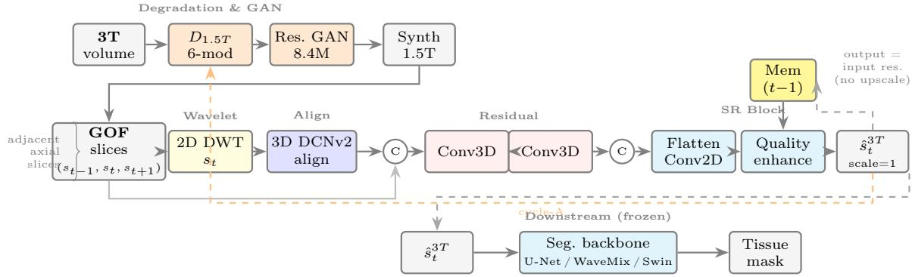  
Figure 1: RCDM enhancer adapted for structural brain MRI. Top: a six-module stochastic degradation operator $D _ { 1 . 5 T }$ and a residual GAN (∼8.4 M params) synthesise 1.5 T-like slices from 3 T volumes. Middle: a group of S adjacent axial slices (GOF = 3 or 5) enters the backbone (Viswanathan et al., 2025): 2D Haar DWT of the centre slice (beige), 3D deformable alignment (blue), Conv3D residual blocks (pink), then flatten, Conv2D and quality-enhancement head (cyan) gated by a memory tensor (yellow). The output has the same resolution as the input (scale = 1: quality enhancement, not spatial upscaling). Dashed orange: cycle-A re-degradation consistency. Bottom: a frozen 3 T-trained segmentation backbone provides the downstream Dice evaluation.

Table 2: Validation fidelity on synthetic 1.5 T/3 T pairs (IXI). Best epoch by SSIM.
<table><tr><td></td><td>PSNR↑</td><td>SSIM↑</td><td>MicroSSIM↑</td></tr><tr><td>Input (epoch 6)</td><td>22.37</td><td>0.790</td><td>0.775</td></tr><tr><td>Best (epoch 6)</td><td>23.85</td><td>0.876</td><td>0.859</td></tr><tr><td>Final (epoch 21)</td><td>23.71</td><td>0.861</td><td>0.844</td></tr></table>

## 5 Results

## 5.1 Reconstruction fidelity

Table 2 reports validation fidelity on held-out synthetic 1.5 T/3 T pairs for the WaveMix-SR run trained on IXI, the only run for which the per-epoch validation log is available. Relative to its degraded input the enhancer gains about 1.4 dB PSNR, 0.086 SSIM and 0.083 MicroSSIM at the best epoch. The absolute values are low because the degradation operator is severe by design and because PSNR is computed over whole slices including background. Fig. 2 shows an example; the residual error concentrates at the cortical ribbon and at vessel and skull boundaries.

## 5.2 Segmentation on ABIDE

Table 3 gives the main comparison for the GOF = 5 enhancer and Fig. 3 the paired diferences. Three outcomes appear on the same subjects and labels. The wavelet segmenter improves in mean Dice (+0.0139, $p = 3 . 5 \times 1 0 ^ { - 5 }$ , 30/41 subjects), CSF (+0.0178, p = $7 . 8 \times 1 0 ^ { - 7 } , 3 6 / 4 1 )$ and GM $( + 0 . 0 1 3 3 , p = 3 . 2 \times 1 0 ^ { - 6 }$ 36/41), The U-Net loses mean Dice $( - 0 . 0 0 7 9 , \ p \ =$ $5 . 1 \times 1 0 ^ { - 4 }$ , only 9/41 improved), mostly through WM $( - 0 . 0 1 5 7 , p = 2 . 0 \times 1 0 ^ { - 3 } )$ . Swin-UNet changes by less than 0.012 on every class and no change is significant. After Bonferroni correction the wavelet-segmenter gains in mDice, CSF and GM and the U-Net losses in mDice and WM remain significant.

Table 3: ABIDE segmentation (GOF = 5 enhancer, n=41). ∆: mean paired diference; k: subjects improved; p: Wilcoxon. Bold: significant after Bonferroni (×12).
<table><tr><td>Metric</td><td> RAW</td><td>SR</td><td>∆ (k)</td><td>p</td></tr><tr><td>U-t</td><td>mDice CSF GM WM</td><td>.867 .898 .838 .867</td><td>.860 .891 .837 -.001 .851 -.016</td><td>−.008 (9) 5.1e-4 -.007 (10) 4.7e-3 (18) .28 (10) 2.0e-3 +.004 (22)</td></tr><tr><td>Sin</td><td>mDice CSF GM WM mDice</td><td>.874 .907 .849 .867 .858</td><td>.878 .903 -.004 .852 +.003 .878 +.012 .872 +.014</td><td>.32 (16) .27 (23) .16 (24) .16 (30) 3.5e-5</td></tr><tr><td>Waix</td><td>CSF GM WM</td><td>.886 .834 .854</td><td>.904 +.018 .847 +.013 .865 +.011 (26)</td><td>(36) 7.8e-7 (36) 3.2e-6 .10</td></tr></table>

## 5.3 Efect of the enhancer variant

Fig. 4 (left) crosses all three enhancer variants with the three backbones. The wavelet-segmenter column contains the two largest gains $( \mathrm { G O F  – 5 : + 0 . 0 1 3 9 }$ ; WaveMix-SR: +0.0083, $p = 7 \times 1 0 ^ { - 4 } )$ , and the only significant loss is GOF-5 with the U-Net. The GOF = 3 enhancer changes no backbone by more than 0.0015, whereas the architecturally almost identical GOF = 5 enhancer changes two backbones significantly in opposite directions.

Fig. 5 shows a representative ABIDE slice.

## 5.4 Segmentation on IXI and label quality

On IXI every pairing loses mean Dice, by 0.028 to 0.048 (Fig. 4, right). For the GOF = 5 enhancer the class-wise changes are nearly identical across backbones: CSF falls by about 0.10, GM changes by less than 0.012 in either direction, and WM is unchanged. A loss that is confined to one class and is the same for three architectures points to the data rather than to any model.

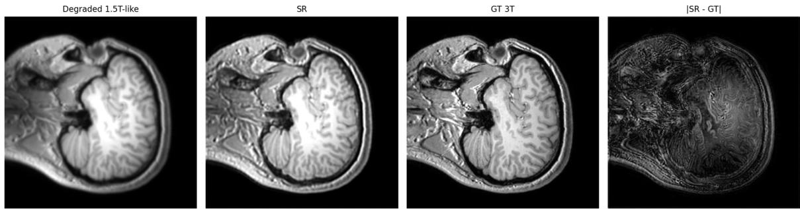  
Figure 2: Synthetic 1.5 T input, enhanced output, 3 T target and absolute error for a held-out slice.

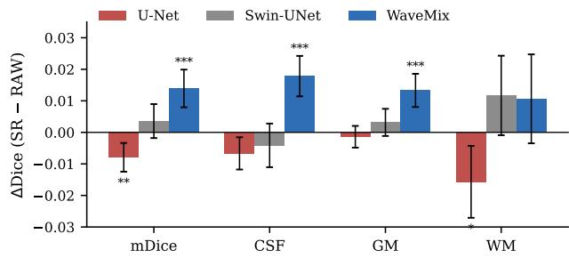  
Figure 3: ABIDE paired ∆Dice (SR−RAW), mean ±95% CI over 41 subjects. Stars: Bonferroni-corrected Wilcoxon p (\* <0.05, \*\* <0.01, \*\*\* <0.001).

Figs. 6 and 7 show the reason. The FSL-FAST labels contain CSF voxels scattered through the brain parenchyma with no counterpart in the image; the raw predictions reproduce some of this speckle, and the sr predictions, trained on smoother images, reproduce less of it. Dice against such labels rewards reproducing label noise. IXI therefore tells us about the labels, not about the enhancer. We also note secondary factors that may contribute: scanner contrast outside the training distribution of the enhancer, the absence of site-specific intensity harmonisation before enhancement, and the 128 × 128 segmentation resolution, which discards part of any boundary improvement.

## 6 Discussion

Fidelity does not predict segmentation benefit. The enhancer raises fidelity on every validation epoch, yet its efect on segmentation ranges from significantly positive to significantly negative depending on the segmenter, and is nil for the GOF = 3 variant. A fidelity gain alone would therefore have predicted none of the downstream outcomes.

Why does the efect depend on the segmenter? The wavelet segmenter, whose token mixing operates on the same Haar sub-bands that the enhancer is conditioned on, gains most, and its gains are in CSF and GM, the classes most afected by partial-volume blurring. One reading is that enhancement restores exactly the band-limited boundary information that a wavelet mixer uses. A second reading fits the data as well: the wavelet segmenter has the lowest raw score, so enhancement may mainly let a weaker model catch up with the others, whose scores it approximately reaches. The U-Net result is harder to explain by either reading; one possibility is that sharper boundaries in the enhanced images no longer coincide with the FreeSurfer boundaries, which were defined on the original 1.5 T geometry, and that a local convolutional model fits those ofsets more closely. Our experiment does not separate these mechanisms. Doing so would require more backbones per family, capacity-matched controls, and labels defined on 3 T scans of the same subjects.

Label quality is part of the evaluation. The IXI result shows that an automated label source can turn a regularising preprocessing step into an apparent failure. A study that used only IXI would have concluded that enhancement harms segmentation; one that used only ABIDE and the wavelet segmenter would have concluded the opposite. Reporting several backbones and checking labels visually are cheap safeguards against both errors.

Limitations. (i) Segmentation is slice-based at 128×128; a 3D evaluation at native resolution is needed. (ii) Within each experiment each segmenter is trained once (seed 42). Across our three experiments, which share the split, the independently retrained raw U-Net and Swin-UNet difer by up to 0.006 mean Dice, comparable to their SR efects but much smaller than the wavelet-segmenter gain; repeated seeds would tighten these estimates. (iii) Fidelity is measured on synthetic pairs only; no paired same-subject 1.5 T/3 T scans were available. (iv) ABIDE labels are FreeSurfer outputs rather than manual annotations. (v) Both cohorts are research datasets; clinical 1.5 T data with pathology were not studied.

## 7 Conclusion

We presented a physics-guided, unpaired training pipeline for a small 1.5 T brain MRI enhancer and evaluated it by what it does to tissue segmentation. Enhancement significantly improved a wavelet tokenmixing segmenter, significantly degraded a U-Net and left a Swin-UNet unchanged on the same subjects and labels, and appeared harmful on a dataset with automated labels for reasons traceable to the labels. Enhancement methods for low-field MRI should be reported with several downstream models, with paired statistics, and against labels whose quality has been checked.

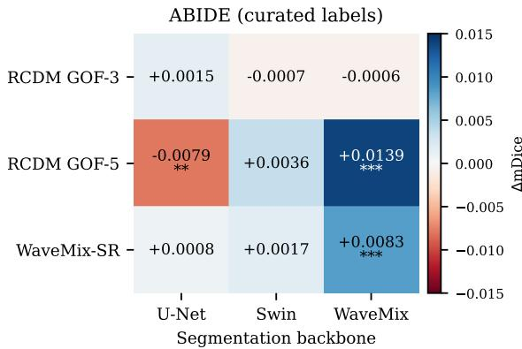

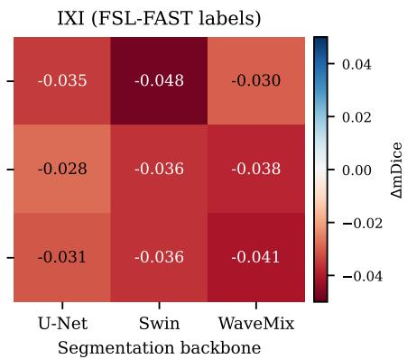

Figure 4: Change in mean Dice for every enhancer variant × segmentation backbone. Left: ABIDE (FreeSurfer labels); stars mark significant paired Wilcoxon tests. Right: IXI (FSL-FAST labels): all pairings lose.  
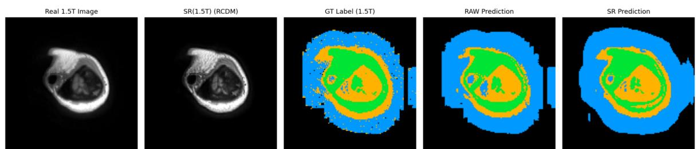  
Figure 5: ABIDE example (axial). From left: real 1.5 T, enhanced, label, RAW prediction, SR prediction (blue CSF, green GM, orange WM).

## Code and data availability

ABIDE and IXI are publicly available from their providers. Code, trained models, data splits and persubject results will be released on GitHub.

## References

Daniel C. Alexander, Darko Zikic, Aurobrata Ghosh, Ryutaro Tanno, Viktor Wottschel, Jiaying Zhang, Enrico Kaden, Tim B. Dyrby, Stamatios N. Sotiropoulos, Hui Zhang, and Antonio Criminisi. Image quality transfer and applications in difusion MRI. NeuroImage, 152:283–298, 2017.

Ashesh Ashesh, Alexander Krull, and Florian Jug. MicroSSIM: Improved structural similarity for comparing microscopy data. arXiv preprint arXiv:2408.08747, 2024.

Benjamin Billot, Douglas N. Greve, Oula Puonti, Axel Thielscher, Koen Van Leemput, Bruce Fischl, Adrian V. Dalca, and Juan Eugenio Iglesias. Synth-Seg: Segmentation of brain MRI scans of any contrast and resolution without retraining. Medical Image Analysis, 86:102789, 2023.

Hu Cao, Yueyue Wang, Joy Chen, Dongsheng Jiang, Xiaopeng Zhang, Qi Tian, and Manning Wang. Swin-

Unet: Unet-like pure transformer for medical image segmentation. In ECCV Workshops, 2022.

Yuhua Chen, Feng Shi, Anthony G. Christodoulou, Yibin Xie, Zhengwei Zhou, and Debiao Li. Eficient and accurate MRI super-resolution using a generative adversarial network and 3D multi-level densely connected network. In Medical Image Computing and Computer Assisted Intervention (MICCAI), volume 11070 of LNCS, pages 91–99, 2018.

Adriana Di Martino, Chao-Gan Yan, Qingyang Li, Erin Denio, Francisco X Castellanos, et al. The autism brain imaging data exchange: Towards a largescale evaluation of the intrinsic brain architecture in autism. Molecular Psychiatry, 19(6):659–667, 2014.

Bruce Fischl. FreeSurfer. NeuroImage, 62(2):774–781,2012.

Hákon Gudbjartsson and Samuel Patz. The Rician distribution of noisy MRI data. Magnetic Resonance in Medicine, 34(6):910–914, 1995.

Juan Eugenio Iglesias, Benjamin Billot, Yaël Balbastre, Colin Magdamo, Steven E. Arnold, Sudeshna Das, Brian L. Edlow, Daniel C. Alexander, Polina Golland, and Bruce Fischl. SynthSR: A public AI tool to turn heterogeneous clinical brain scans into high-resolution T1-weighted images for 3D morphometry. Science Advances, 9(5):eadd3607, 2023.

Imperial College London Biomedical Image Analysis Group. IXI dataset: T1, t2 and pd-weighted

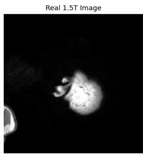

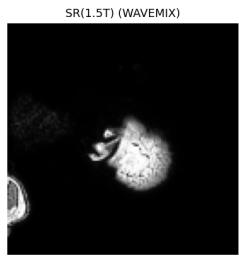

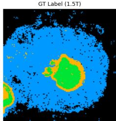

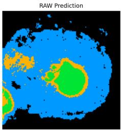

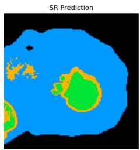

Figure 6: IXI example. From left: real 1.5 T, enhanced, FSL-FAST label, RAW prediction, SR prediction. Isolated CSF voxels (blue) inside tissue in the label are not visible in the image.  
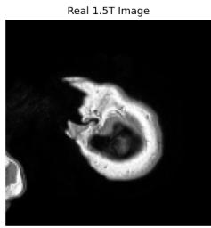

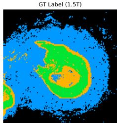

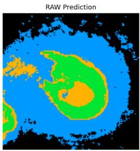

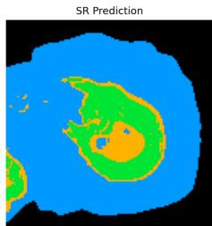  
Figure 7: A second IXI slice with the same layout; the SR prediction is smoother than the label.

brain MRI. https://brain-development.org/ ixi-dataset/, 2025.

Pranav Jeevan, Kavitha Viswanathan, Amit Sethi, et al. Wavemix: A resource-eficient neural network for image analysis. arXiv preprint arXiv:2205.14375, 2023.

Hongxiang Lin, Matteo Figini, Felice D’Arco, Godwin Ogbole, Ryutaro Tanno, Stefano B. Blumberg, Lisa Ronan, Biobele J. Brown, David W. Carmichael, Ikeoluwa Lagunju, Judith Helen Cross, Delmiro Fernandez-Reyes, and Daniel C. Alexander. Low-field magnetic resonance image enhancement via stochastic image quality transfer. Medical Image Analysis, 87:102807, 2023.

Lena Maier-Hein, Annika Reinke, Patrick Godau, et al. Metrics reloaded: recommendations for image analysis validation. Nature Methods, 21(2):195–212, 2024.

Xudong Mao, Qing Li, Haoran Xie, Raymond Y. K. Lau, Zhen Wang, and Stephen Paul Smolley. Least squares generative adversarial networks. In IEEE International Conference on Computer Vision (ICCV), pages 2794–2802, 2017.

Chi-Hieu Pham, Aurélien Ducournau, Ronan Fablet, and François Rousseau. Brain MRI super-resolution using deep 3D convolutional networks. In IEEE International Symposium on Biomedical Imaging (ISBI), pages 197–200, 2017.

Olaf Ronneberger, Philipp Fischer, and Thomas Brox. U-Net: Convolutional networks for biomedical image segmentation. In MICCAI, 2015.

Kavitha Viswanathan, Amit Sethi, Shashwat Pathak, Piyush Bharambe, and Harsh Choudhary. Lowresource video super-resolution with memory,

wavelets, and deformable convolutions. In IEEE/CVF CVPR Workshops, Women in Computer Vision (WiCV), 2025.

Ting-Chun Wang, Ming-Yu Liu, Jun-Yan Zhu, Andrew Tao, Jan Kautz, and Bryan Catanzaro. Highresolution image synthesis and semantic manipulation with conditional GANs. In CVPR, 2018.

Frank Wilcoxon. Individual comparisons by ranking methods. Biometrics Bulletin, 1(6):80–83, 1945.

Yongyue Zhang, Michael Brady, and Stephen Smith. Segmentation of brain MR images through a hidden Markov random field model and the expectationmaximization algorithm. IEEE Transactions on Medical Imaging, 20(1):45–57, 2001.

Can Zhao, Blake E. Dewey, Dzung L. Pham, Peter A. Calabresi, Daniel S. Reich, and Jerry L. Prince. SMORE: A self-supervised anti-aliasing and superresolution algorithm for MRI using deep learning. IEEE Transactions on Medical Imaging, 40(3):805– 817, 2021.

Jun-Yan Zhu, Taesung Park, Phillip Isola, and Alexei A. Efros. Unpaired image-to-image translation using cycle-consistent adversarial networks. In ICCV, 2017.

Xizhou Zhu, Han Hu, Stephen Lin, and Jifeng Dai. Deformable convnets v2: More deformable, better results. In IEEE/CVF Conference on Computer Vision and Pattern Recognition (CVPR), pages 9308–9316, 2019.