# MegaAvatar: Controllable Talking Avatar Generation

Junyao Gao1,2\* Sibo Liu1\* Weidong Zhang1 Cairong Zhao2‡ Jun Zhang1‡ 1Tencent, 2Tongji University

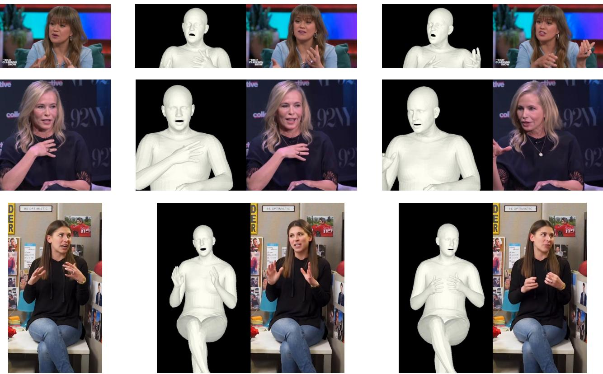  
Reference  
Generated Videos

Figure 1. Videos generated by MegaAvatar. Given a reference image, MegaAvatar generates avatar videos that follow the global motion specified by SMPL-X meshes while producing fine-grained facial expressions synchronized with the input audio.

## Abstract

This report presents MegaAvatar, a controllable talking avatar generation framework built on top of the Wan2.2- TI2V-5B model. Compared with previous talking-avatar methods that mainly rely on audio or reference-image conditioning, we introduce additional SMPL-X-derived 3D guidance, enabling global control over body pose and head motion. Specifically, we render the driving SMPL-X sequence into dense mesh frames and encode them with a lightweight 3D convolutional encoder, whose outputs are injected into the latent tokens to provide overall motion control. Furthermore, we extend Wan2.2-TI2V-5B with

additional audio and face cross-attention modules to enable fine-grained expression control and preserve the input identity, respectively. In addition, we implement an audio-to-SMPL-X model to predict an SMPL-X sequence conditioned on the reference image and input audio, allowing MegaAvatar to support audio-driven inference without user-provided SMPL-Xframes. Experiments show that MegaAvatar achieves high-quality talking avatar generation with controllable body and head motion, speechsynchronized facial expressions, and consistent identity preservation. MegaAvatar also supports inference with flexible resolutions and video lengths. Codes, dataset, models will be avaliable in https://github.com/Jeoyal/ MegaAvatar.

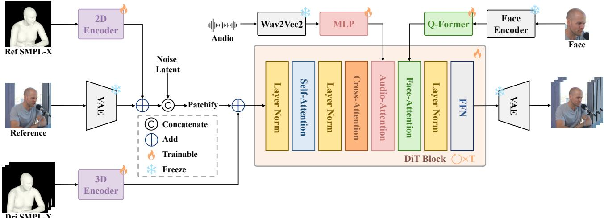  
Figure 2. Overview of MegaAvatar. MegaAvatar incorporates SMPL-X, audio, and face conditions into Wan2.2-TI2V-5B for global motion control, fine-grained facial expression control, and identity preservation, respectively.

## 1. Introduction

Talking avatar generation has attracted increasing attention with the rapid development of video generative models. This task aims to synthesize a realistic and temporally consistent video of a target person, where the generated avatar should preserve the appearance of a reference image while producing natural body motion, head movement, and speech-related facial expressions. Recent diffusion-based video models [2, 9, 15, 19] have significantly improved the visual quality of generated videos, and large-scale video Diffusion Transformers further provide a strong foundation for high-fidelity human video synthesis.

However, existing talking-avatar methods [8, 13, 14, 20] are still limited in controllability. Most previous methods [5, 16, 18] mainly rely on audio for mouth movement and speech synchronization, while lacking explicit control over global movements such as body pose and head motion. As a result, their body and head dynamics are difficult to control precisely.

To address this issue, we present MegaAvatar, a controllable talking avatar generation framework built on top of the Wan2.2-TI2V-5B model1. Compared with previous talking-avatar methods, we introduce additional SMPL-X[11]-derived 3D guidance, enabling global control over body pose and head motion. During training, MegaAvatar extracts SMPL-X mesh frames from the driving video and encodes them with a lightweight 3D convolutional encoder. The encoded SMPL-X features are added to the latent tokens, providing global motion control over body pose and head motion. We also incorporate audio and face conditions through cross-attention modules to enable fine-grained speech-related facial expression control and consistent facial appearance. In addition, we train an audio-to-SMPL-X model to predict an SMPL-X sequence conditioned on the reference image and input audio. At inference time, MegaAvatar supports flexible resolutions and variable video lengths. Moreover, MegaAvatar can operate with only a reference image and an audio clip, or with additional userprovided SMPL-X frames for custom motion control.

Experiments show that MegaAvatar generates highquality talking avatar videos with globally controllable body and head motion, fine-grained audio-driven facial expressions, and stable identity preservation.

## 2. Method

We present the overall architecture of MegaAvatar in Figure 2, which enables controllable talking avatar generation. MegaAvatar achieves this by incorporating three complementary conditioning signals into the powerful imageconditioned generation model Wan2.2-TI2V-5B: 1) SMPL-X, which provides global motion control over body pose and head motion; 2) Audio, which controls fine-grained speech-related facial expressions and mouth dynamics; 3) Face, which preserves the input identity and stabilizes facial appearance. In addition, we train an audio-to-SMPL-X model to enable MegaAvatar to support audio-driven inference without user-provided SMPL-X frames.

SMPL-X. Given a driving video, we extract the SMPL-X sequence with SMPLer-X [3] and refine the face and hand regions based on EMOCA [6] and HaMeR [12], respectively. The refined SMPL-X sequence is rendered into dense mesh frames and encoded by a 3D convolutional encoder, whose outputs are added to the patchified latent tokens to provide global motion control over body pose and head motion. During training, the reference image is randomly sampled from the driving video, VAE-encoded, and prepended as a dedicated reference latent, which serves as the appearance anchor and is excluded from the diffusion target during training. We also render a reference SMPL-X mesh frame from the reference image and encode it with a 2D convolutional encoder, following [17]. The resulting reference feature is added to the reference latent to improve appearance-motion alignment. Both the 3D and 2D convolutional encoders are trainable.

Audio. The audio condition is used to control fine-grained speech-related facial expressions and mouth dynamics. For each training sample, we extract the corresponding audio clip from the driving video and use a pretrained Wav2Vec2 [1] audio encoder to obtain speech features. The extracted audio features are then projected into the hidden dimension of Wan2.2-TI2V-5B and injected into the video diffusion transformer through additional audio cross-attention modules. Instead of using the entire audio clip as a global condition, we adopt frame-level audio conditioning, where each latent frame attends to its temporally aligned audio window. This design provides more accurate audio-visual alignment and encourages the model to generate mouth movements and facial expressions synchronized with the input speech. The Wav2Vec2 encoder is kept frozen, while the audio projection and cross-attention modules are trainable.

Face. The face condition is used to preserve the input identity and stabilize facial appearance during generation. Given the reference image, we crop the face region and extract an identity embedding with a pretrained ArcFace encoder. A Q-Former then converts the identity embedding into identity tokens for face cross-attention, following [16]. These identity tokens are injected into the video diffusion transformer through additional face cross-attention modules. In this way, the model receives an explicit identity condition in addition to the reference image, which helps reduce identity drift and maintain consistent facial appearance across frames. The ArcFace encoder is kept frozen, while the Q-Former and face cross-attention modules are trainable.

Audio-to-SMPL-X. To support audio-driven inference without user-provided SMPL-X frames, we train an audioto-SMPL-X model to generate the corresponding SMPL-X motion sequence from the reference image and input audio. We first estimate the SMPL-X parameters of the reference image and convert the SMPL-X motion into a compact motion representation. Specifically, the upper-body, hands, lower-body/root motion, and face are separately encoded by VQ models, producing part-specific latent representations for full-body motion generation. We then optimize the audio-to-SMPL-X model with a flow-matching objective in the VQ latent space following [10]. Given a clean SMPL-X latent and sampled noise, the Transformer denoiser learns to predict the latent velocity conditioned on WavLM [4] audio features and the encoded SMPL-X representation of the ref-

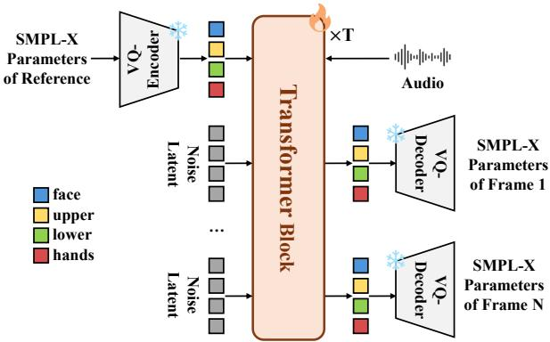

Figure 3. Overview of the audio-to-SMPL-X model. The model predicts SMPL-X motion from the reference SMPL-X and input audio through flow matching in a part-specific VQ latent space.  
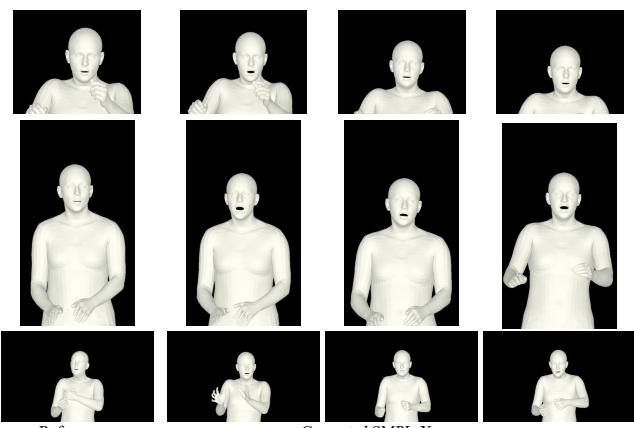  
Reference  
Generated SMPL-X sequences

Figure 4. Qualitative results of the audio-to-SMPL-X model. Given a reference image and input audio, our model generates temporally coherent SMPL-X sequences.

erence image. At inference time, given only a reference image and the input audio, the audio-to-SMPL-X model predicts the corresponding SMPL-X sequence, which is then rendered into dense mesh frames and used as the motion guidance of MegaAvatar.

## 3. Experiments

## 3.1. Implementation Details

Following the data construction pipeline of SpeakerVid-5M [21], we collect SpeakerVid-1M, which contains about 1M video clips and 2,000 hours of talking-human videos. We also process the audio and SMPL-X dense mesh frames for each clip, ensuring that all modalities are temporally aligned at 25 FPS. We further filter a high-quality subset with single-person videos and paired audio, resulting in SpeakerVid-400K for audio and face training. We then train MegaAvatar based on Wan2.2-TI2V-5B with the following three-stage training strategy: In the first stage, we fine-tune the DiT backbone with a rank-128 LoRA [7] and

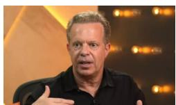

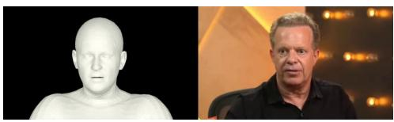

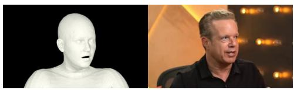

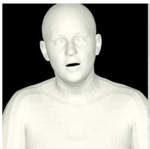

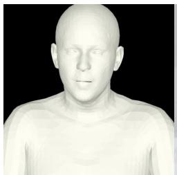

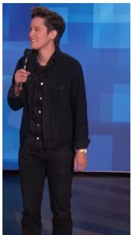

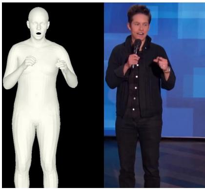

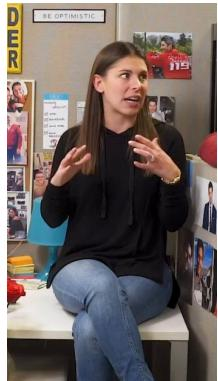

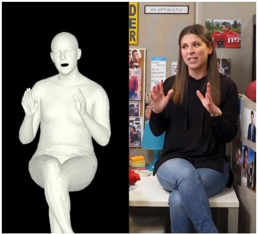

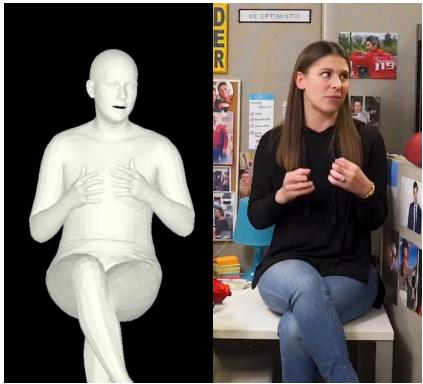

  
Reference

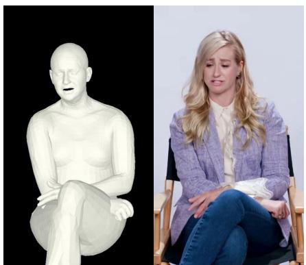  
Generated Videos

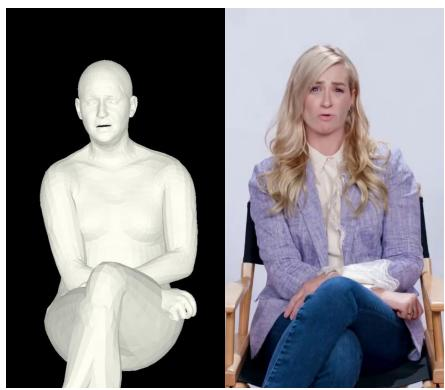  
Figure 5. Qualitative results of MegaAvatar. Each row shows a reference image followed by two SMPL-X meshes and their correspond ing generated frames.

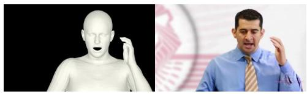

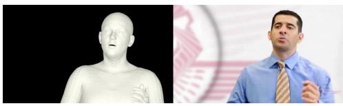

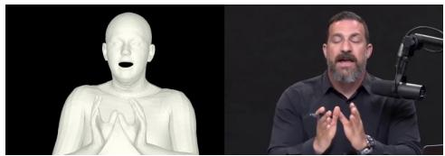

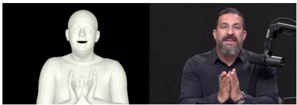

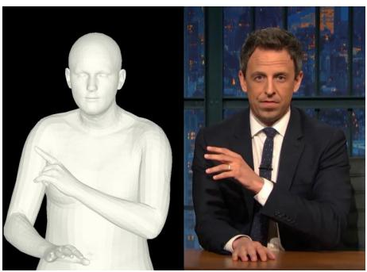

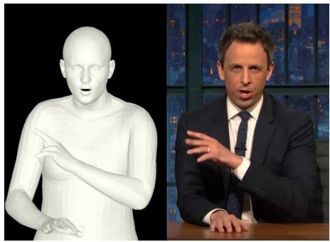

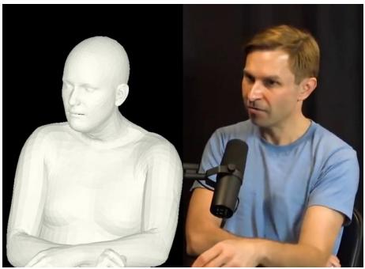

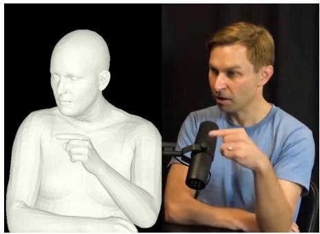

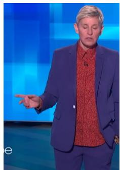  
Reference

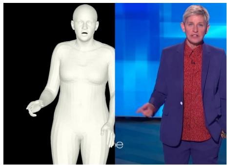

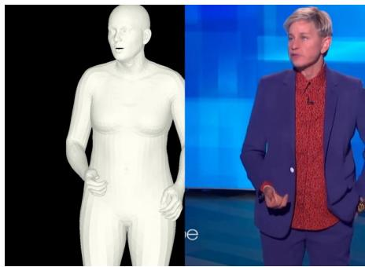  
Generated Videos

Figure 6. Qualitative results of MegaAvatar. Each row shows a reference image followed by two SMPL-X meshes and their correspond ing generated frames.

the 3D and 2D SMPL-X encoders on SpeakerVid-1M to allow the model to follow dense mesh frames for global motion, including overall body pose and head motion. Next, we freeze the learned LoRA parameters and the SMPL-X encoders, and train only the audio projection and audio cross-attention modules on SpeakerVid-400K. To better learn facial expressions and lip dynamics, we increase the flow-matching loss weights on the face and lip regions $( \lambda _ { \mathrm { f a c e } } = 1 . 0 , \lambda _ { \mathrm { l i p } } = 5 . 0 )$ . Finally, we keep all previously trained modules frozen and train only the Q-Former and face cross-attention modules on SpeakerVid-400K to improve identity preservation and stabilize facial appearance across frames. All stages are trained on 16 H20 GPUs with a batch size of 1 per GPU. The SMPL-X, audio, and face stages are trained for 62K, 96K, and 65K steps, respectively. We adopt bucketed training with different spatial resolutions and video lengths, allowing MegaAvatar to support flexible-resolution and variable-length inference.

## 3.2. Qualitative Evaluation

We conduct qualitative evaluation on both the intermediate audio-to-SMPL-X results and the final talking avatar videos. For the audio-to-SMPL-X model, we visualize the predicted SMPL-X sequences as rendered dense mesh frames in Figure 4. The generated SMPL-X frames are temporally smooth and well aligned with the speech rhythm, which enables audio-driven talking avatar generation.

For the final video generation results, MegaAvatar produces high-quality talking avatar videos with clear identity preservation and temporally consistent appearance. As shown in Figure 5 and Figure 6, the generated videos follow the SMPL-X dense mesh guidance for global body and head motion, while the audio condition controls finegrained mouth movements and facial expressions. Moreover, MegaAvatar preserves the input identity and maintains stable facial details throughout the generated video. These results indicate the effectiveness of the proposed MegaAvatar.

## 4. Conclusion

MegaAvatar advances controllable talking avatar generation by incorporating SMPL-X, audio, and face conditions into Wan2.2-TI2V-5B to enable global control over body pose and head motion, fine-grained speech-related facial expressions, and stable facial appearance, respectively. Together with the audio-to-SMPL-X model, MegaAvatar supports both audio-driven generation and user-provided SMPL-X control, providing a simple and effective framework for high-quality and controllable talking avatar generation.

## References

[1] Alexei Baevski, Yuhao Zhou, Abdelrahman Mohamed, and Michael Auli. wav2vec 2.0: A framework for self-supervised learning of speech representations. Advances in neural information processing systems, 33:12449–12460, 2020. 3

[2] Andreas Blattmann, Tim Dockhorn, Sumith Kulal, Daniel Mendelevitch, Maciej Kilian, Dominik Lorenz, Yam Levi, Zion English, Vikram Voleti, Adam Letts, et al. Stable video diffusion: Scaling latent video diffusion models to large datasets. arXiv preprint arXiv:2311.15127, 2023. 2

[3] Zhongang Cai, Wanqi Yin, Ailing Zeng, Chen Wei, Qingping Sun, Wang Yanjun, Hui En Pang, Haiyi Mei, Mingyuan Zhang, Lei Zhang, et al. Smpler-x: Scaling up expressive

human pose and shape estimation. Advances in Neural Information Processing Systems, 36:11454–11468, 2023. 2

[4] Sanyuan Chen, Chengyi Wang, Zhengyang Chen, Yu Wu, Shujie Liu, Zhuo Chen, Jinyu Li, Naoyuki Kanda, Takuya Yoshioka, Xiong Xiao, et al. Wavlm: Large-scale self supervised pre-training for full stack speech processing. IEEE Journal of Selected Topics in Signal Processing, 16 (6):1505–1518, 2022. 3

[5] Jiahao Cui, Hui Li, Yun Zhan, Hanlin Shang, Kaihui Cheng, Yuqi Ma, Shan Mu, Hang Zhou, Jingdong Wang, and Siyu Zhu. Hallo3: Highly dynamic and realistic portrait image animation with video diffusion transformer. In 2025 IEEE/CVF Conference on Computer Vision and Pattern Recognition (CVPR), pages 21086–21095. IEEE, 2025. 2

[6] Radek Daneˇcek, Michael J Black, and Timo Bolkart. Emoca:ˇ Emotion driven monocular face capture and animation. In Proceedings of the IEEE/CVF conference on computer vision and pattern recognition, pages 20311–20322, 2022. 2

[7] Edward J Hu, Yelong Shen, Phillip Wallis, Zeyuan Allen-Zhu, Yuanzhi Li, Shean Wang, Lu Wang, and Weizhu Chen. Lora: Low-rank adaptation of large language models. arXiv preprint arXiv:2106.09685, 2021. 3

[8] Jianwen Jiang, Weihong Zeng, Zerong Zheng, Jiaqi Yang, Chao Liang, Wang Liao, Han Liang, Yuan Zhang, and Mingyuan Gao. Omnihuman-1.5: Instilling an active mind in avatars via cognitive simulation. arXiv preprint arXiv:2508.19209, 2025. 2

[9] Weijie Kong, Qi Tian, Zijian Zhang, Rox Min, Zuozhuo Dai, Jin Zhou, Jiangfeng Xiong, Xin Li, Bo Wu, Jianwei Zhang, et al. Hunyuanvideo: A systematic framework for large video generative models. arXiv preprint arXiv:2412.03603, 2024. 2

[10] Pinxin Liu, Luchuan Song, Junhua Huang, Haiyang Liu, and Chenliang Xu. Gesturelsm: Latent shortcut based cospeech gesture generation with spatial-temporal modeling. In 2025 IEEE/CVF International Conference on Computer Vision (ICCV), pages 10929–10939. IEEE, 2025. 3

[11] Georgios Pavlakos, Vasileios Choutas, Nima Ghorbani, Timo Bolkart, Ahmed A. A. Osman, Dimitrios Tzionas, and Michael J. Black. Expressive body capture: 3d hands, face, and body from a single image. In Proceedings IEEE Conf. on Computer Vision and Pattern Recognition (CVPR), 2019. 2

[12] Georgios Pavlakos, Dandan Shan, Ilija Radosavovic, Angjoo Kanazawa, David Fouhey, and Jitendra Malik. Reconstructing hands in 3D with transformers. In CVPR, 2024. 2

[13] Kling Team, Jialu Chen, Yikang Ding, Zhixue Fang, Kun Gai, Yuan Gao, Kang He, Jingyun Hua, Boyuan Jiang, Ming ming Lao, et al. Klingavatar 2.0 technical report. arXiv preprint arXiv:2512.13313, 2025. 2

[14] Meituan LongCat Team, Xunliang Cai, Meng Cheng, Feng Gao, Zhe Kong, Jiamu Li, Le Li, Weiheng Li, Hongyu Liu, Shuai Tan, et al. Longcat-video-avatar 1.5 technical report. arXiv preprint arXiv:2605.26486, 2026. 2

[15] Team Wan, Ang Wang, Baole Ai, Bin Wen, Chaojie Mao, Chen-Wei Xie, Di Chen, Feiwu Yu, Haiming Zhao, Jianxiao Yang, et al. Wan: Open and advanced large-scale video

generative models. arXiv preprint arXiv:2503.20314, 2025. 2

[16] Mengchao Wang, Qiang Wang, Fan Jiang, Yaqi Fan, Yunpeng Zhang, Yonggang Qi, Kun Zhao, and Mu Xu. Fantasytalking: Realistic talking portrait generation via coherent motion synthesis. In Proceedings of the 33rd ACM International Conference on Multimedia, pages 9891–9900, 2025. 2, 3

[17] Xiang Wang, Shiwei Zhang, Changxin Gao, Jiayu Wang, Xiaoqiang Zhou, Yingya Zhang, Luxin Yan, and Nong Sang. Unianimate: Taming unified video diffusion models for consistent human image animation. Science China Information Sciences, 68(10):200103, 2025. 3

[18] Zunnan Xu, Zhentao Yu, Zixiang Zhou, Jun Zhou, Xiaoyu Jin, Fa-Ting Hong, Xiaozhong Ji, Junwei Zhu, Chengfei Cai, Shiyu Tang, et al. Hunyuanportrait: Implicit condition control for enhanced portrait animation. In 2025 IEEE/CVF Conference on Computer Vision and Pattern Recognition (CVPR), pages 15909–15919. IEEE, 2025. 2

[19] Zhuoyi Yang, Jiayan Teng, Wendi Zheng, Ming Ding, Shiyu Huang, Jiazheng Xu, Yuanming Yang, Wenyi Hong, Xiaohan Zhang, Guanyu Feng, et al. Cogvideox: Text-tovideo diffusion models with an expert transformer. In International Conference on Learning Representations, pages 83048–83077, 2025. 2

[20] Ailing Zeng, Casper Yang, Chauncey Ge, Eddie Zhang, Garvey Xu, Gavin Lin, Gilbert Gu, Jeremy Pi, Leo Li, Mingyi Shi, et al. Lpm 1.0: Video-based character performance model. arXiv preprint arXiv:2604.07823, 2026. 2

[21] Youliang Zhang, Zhaoyang Li, Duomin Wang, Deyu Zhou, Zixin Yin, Xili Dai, Gang Yu, Xiu Li, et al. Speakervid-5m: A large-scale high-quality dataset for audio-visual dyadic interactive human generation. In International Conference on Learning Representations, pages 117896–117926, 2026. 3