# MemLife: Curating and Reasoning over Long-Term Egocentric Video Memories

Guangzhi Xiong<sup>1,2,†,∗</sup>, Xinyuan Zhang<sup>1,†</sup>, Xiao Yang<sup>1</sup>, Hyokun Yun<sup>1</sup>, Kai Zhang<sup>1</sup>, Shiun-Zu Kuo<sup>1</sup>, Hyeonjeong Ha<sup>1,3,∗</sup>, Xilun Chen<sup>1</sup>, Kai Sun<sup>1</sup>, Lucas Liang<sup>1</sup>, Guangqiang Dong<sup>1</sup>, Ejaz Ahmed<sup>1</sup>, Ahmed A Aly<sup>1</sup>, Anuj Kumar<sup>1</sup>, Raffay Hamid<sup>1</sup>, Aidong Zhang<sup>2,†</sup>, Xin Luna Dong<sup>1,†</sup>

<sup>1</sup>Meta Reality Labs, <sup>2</sup>University of Virginia, <sup>3</sup>University of Illinois Urbana-Champaign <sup>∗</sup>Work done at Meta

Long-term egocentric video enables personalized AI assistants to reason about daily life. However, as video histories grow to hundreds of hours spanning months or years, reprocessing raw clips for every query becomes computationally prohibitive. Memory systems ofer a scalable alternative by compacting videos into text representations, but often fail on practical benchmarks: either the memory does not preserve key evidence, or the retriever fails to locate relevant entries due to retrieval competition in growing search spaces. To address these challenges, we introduce MemLife, a multimodal memory system that constructs entity-grounded, first-person text episodes and retrieves them via a timeindexed agentic reader. Without training or query-time video access, MemLife improves over the strongest training-free baseline by 4.6–12.0% across four long-horizon benchmarks. To further improve memory quality, we propose MemOpt, a reinforcement learning framework that optimizes the memory writer to produce faithful, informative, and retrievable memories. MemOpt consistently improves MemLife by 2.7–5.0% across diferent video and question distributions, with gains that generalize across writer and reader backbones and memory systems.

Correspondence: <sup>†</sup>{guangzhi,aidong}@virginia.edu, {dylanz426,lunadong}@meta.com

∞Meta

## 1 Introduction

If an AI assistant could record a user’s life experiences as egocentric videos, captured by wearable devices such as smart glasses and GoPro cameras (Grauman et al., 2022), could it then answer any question the user asks about their past? At first glance, this is a Retrieval-Augmented Generation (RAG) problem over egocentric videos (Yang et al., 2025; Alam et al., 2026). However, question answering (QA) over such dense memories is substantially harder. On the data side, videos accumulate over time to prohibitive volumes, and scenes and events recur with subtle diferences. On the system side, the latency budget for sifting through long, similar memories is tight, and the context window is too small to hold many visual frames. It is therefore crucial to compact raw videos into eficient representations that can serve as the primary source of evidence for downstream tasks. Natural-language text stands out as an appealing choice: orders of magnitude more compact than visual frames, natively consumable by Large Language Models (LLMs), and interpretable to users.

We follow the line of work that converts multimodal video recordings into textual descriptions (Islam et al., 2024; Yang et al., 2025), either to facilitate retrieval of key evidence (Luo et al., 2025; Ren et al., 2026) or to directly support downstream generation (Yeo et al., 2026; Yin et al., 2026). However, deciding what to write poses a fundamental tradeof (Figure 1): aggressive compression may discard information that future questions ask about, whereas conservative compression retains trivial details that dilute retrieval and inflate QA-time processing. Worse, writers may hallucinate content unsupported by the video, planting false evidence. In this paper, we address a critical question for QA over long-term memory: how can a system strike the right balance to remember only what is worth remembering, faithfully, and in a form that is easy to recall?

We answer this question in two steps: we first design a strong writer by hand, then learn a better one. Our first contribution, MemLife, is an agentic memory system whose writer follows two principles. First, it anchors memories in time and grounds entities across modalities, aligning spoken references with the people and objects observed in each episode. Second, it narrates in the first person, matching how users phrase questions about their own lives (e.g., “Where did I put my passport?”) and thereby narrowing the query-memory gap in agentic retrieval. To exploit these memories, MemLife’s reader combines agentic semantic search with time-scoped memory fetching, and presents retrieved episodes in chronological order for reasoning over long histories. In the presence of source videos, the agentic reader selectively invokes video-retrieval tools to sample raw video frames whenever visual details are required. Without writer training or query-time video access, MemLife improves over the strongest training-free baseline by up to 12.0% in accuracy.

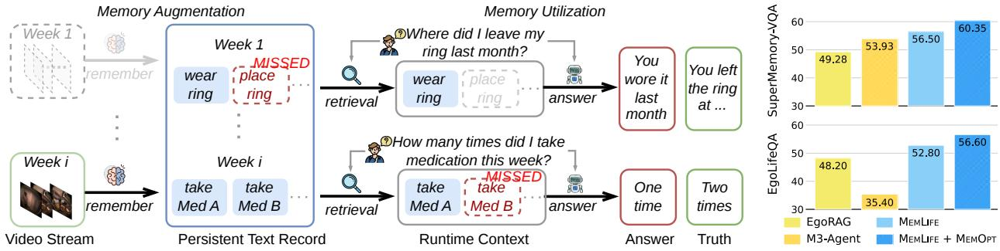  
Figure 1 Failure modes of long-term video memory systems. Dotted objects denote lost information (e.g., Week-1 video is deleted). Systems fail when relevant evidence is omitted during memory writing or missed during retrieval. Our proposed solutions outperform prior state-of-the-art systems.

Our second insight is that learning what to write is, by itself, a powerful lever for long-term memory QA. We therefore take a bold step: rather than applying Reinforcement Learning (RL) to improve final answer quality (Guan et al., 2026; Yan et al., 2026; Wang et al., 2025b; Li et al., 2026), we apply RL only to memory writing, and examine whether this alone improves memory QA. We propose MemOpt, a learning framework that rewards Faithful, Informative, and Retrievable Memories, a reward system we call FIRM. Faithfulness penalizes hallucinated memories unsupported by the source video; informativeness encourages the writer to preserve details critical to answering future questions; and retrievability favors concise descriptions that enable easy and precise retrieval. Although MemOpt trains only the writer and does not rely on supervision from stronger models (Long et al., 2026; Zou et al., 2026), it further improves MemLife by 2.7–5.0%.

Our paper makes the following contributions.

• We introduce MemLife, a multimodal memory system that compresses egocentric videos into time- and entity-anchored, first-person episodes, and reasons over them with a versatile agentic reader.

• We propose MemOpt, a learning framework whose FIRM reward optimizes the memory writer with multi-granular feedback on faithfulness, informativeness, and retrievability, to address the write-time failure modes we identified.

• We show that MemOpt combined with MemLife outperforms the strongest prior baseline by 4.0–17.0%, while reducing the memory size by up to 31× (Appendix E). The trained writer transfers well: it consistently improves accuracy when plugged into other memory systems (e.g., EgoRAG) and backbones, and on out-of-domain videos and question types.

## 2 Related Work

Writing memory over extended video horizons. Memory-augmented video paradigms difer in how they convert continuous streams into persistent representations. Retrieval-oriented systems encode local clips as flat text descriptions or visual-text indexes (Fan et al., 2025; Islam et al., 2024; Luo et al., 2025). To control memory growth, streaming architectures maintain fixed-budget recurrent bufers that continuously compress past frames (Guan et al., 2026; He et al., 2024; Qian et al., 2024; Song et al., 2024; Jin et al., 2025), though they often struggle to preserve distant or fine-grained details. Hierarchical frameworks summarize video streams across temporal tiers (Islam et al., 2024; Yang et al., 2025), while structured memory agents organize representations around entities, events, or scene graphs (Goletto et al., 2025; Long et al., 2026; Ren et al., 2026; Yeo et al., 2026; Yin et al., 2026). However, high-level abstractions sufer from information loss, and graph maintenance becomes computationally prohibitive. Furthermore, prior memory construction relies on heuristic prompt engineering rather than optimizing memory generation via task feedback.

Reading memory across multi-session histories. Personal memory systems rely on readers to locate evidence scattered across extended temporal histories. Passive retrieval-based readers execute single-shot semantic or temporal queries over text indices (Lewis et al., 2020; Luo et al., 2025; Yang et al., 2025; Ren et al., 2026). Recent egocentric architectures introduce specialized access mechanisms—such as Memory Pointer Prompting (Ye et al., 2025) or multi-turn reasoning loops that reformulate queries, fetch time intervals, and inspect visual frames (Yeo et al., 2026; Yin et al., 2026; Gao et al., 2023; Wang et al., 2025a; Tian et al., 2026; Zhang et al., 2025). While efective during inference (Chandrasegaran et al., 2024; Wang et al., 2026b), using multi-turn readers during writer post-training conflates memory quality with reader execution noise. Because task accuracy depends on sampled tool calls, end-to-end task rewards provide a noisy, computationally prohibitive supervision signal for writer optimization.

Training video memory writers. To move beyond heuristic prompt design, recent paradigms train memory writers using learned policies. One direction relies on supervised fine-tuning or imitation learning, distilling memory construction from proprietary demonstrations or QA instructions $( e . g .$ , EgoButler (Yang et al., 2025), M3-Agent (Long et al., 2026)). Another direction employs reinforcement learning, optimizing policies like TaskMem (Zou et al., 2026) and VST (Guan et al., 2026) against downstream task accuracy or QA preferences. However, static distillation restricts writer adaptability, while training purely on end-to-end task rewards introduces severe execution noise from reader reasoning. In contrast, MemOpt provides supervision from verified evidence, source video, and fixed reader actions, decoupling writer post-training from reader execution noise.

## 3 Methodology

## 3.1 Problem Definition and Solution Overview

We begin by defining the Video Memory QA problem. Consider a stream of video (optionally egocentric) $\mathcal { V } = ( c _ { 1 } , \ldots , c _ { T } )$ of $T$ segments. Each segment can be represented as a triplet $c _ { t } = ( F _ { t } , S _ { t } , \tau _ { t } )$ , where $F _ { t }$ denotes the sampled visual frame, $S _ { t }$ denotes the aligned audio transcriptions, and $\tau _ { t } = [ s _ { t } , e _ { t } ]$ denotes the starting and ending time. Memory QA takes a question q arriving at time $\tau _ { q } .$ and provides the answer based on the prior memory fragments:

$$
\mathcal { V } _ { q } = \{ c _ { t } \in \mathcal { V } : e _ { t } \leq \tau _ { q } \} .\tag{1}
$$

Our first solution MemLife converts a video stream into persistent episodic memory and uses an agentic reader to retrieve and reason over relevant entries. Formally, MemLife employs a writer $W _ { \theta }$ with parameters $\theta ;$ the writer generates a textual description $d _ { t }$ for each memory segment $m _ { t } \colon$

$$
d _ { t } \sim W _ { \boldsymbol \theta } ( \cdot \mid F _ { t } , S _ { t } ) , \qquad m _ { t } = ( d _ { t } , \tau _ { t } ) .\tag{2}
$$

Thus, the memory repository stores $\mathcal { M } ( \mathcal { V } ) = \{ m _ { t } \} _ { t = 1 } ^ { T }$ . For a question $q ,$ question answering uses the available memory $\mathcal { M } _ { q } ,$ , optionally with the corresponding source-video history $\gamma _ { q } .$ , where

$$
\mathcal { M } _ { q } = \{ m _ { t } \in \mathcal { M } ( \mathcal { V } ) : e _ { t } \leq \tau _ { q } \} .\tag{3}
$$

Our second solution, MemOpt, is a training framework that improves the memory writer by optimizing its parameters θ. Figure 2 gives the overview of the two solutions.

## 3.2 MemLife System for Memory Writing and Reading

Writer: MemLife separates question-independent memory construction from question-dependent memory access. Because future questions are unknown during writing, each entry must preserve information across modalities and express it in a form that supports later retrieval. The MemLife writer applies three designs for this purpose.

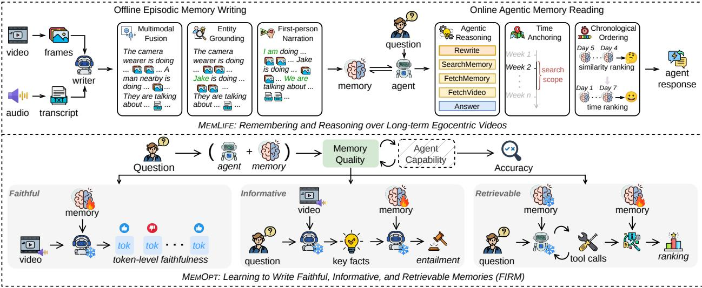  
Figure 2 Overview of MemLife’s episodic writer and time-indexed agentic reader, together with MemOpt’s decomposed writer supervision. Direct source-video access is optional for the reader.

Multimodal fusion. Information needed by future questions may appear in either the visual stream or speech. The writer therefore jointly interprets the frames and transcript such that evidence from both modalities can be preserved in one memory entry.

Entity grounding. A transcript may mention an entity by its name, which provides an important cue for future QA. The writer aligns the speech with the memory segment and uses the identified name to refer to the visual referents in the description.

First-person narration. Memory questions for egocentric videos naturally refer to the user as “I.” The writer therefore adopts the same first-person perspective, making its descriptions easier to match future egocentric questions.

MemLife generates a description and its embedding for every clip independently, such that it avoids sequential dependencies and error propagation, and keeps total computation and storage linear in the recorded history. We also explored conditioning the writer on textual or multimodal context from the preceding segments, but neither variant improves aggregate accuracy (Appendix I).

Reader: The MemLife reader is an agentic system that takes a question q and its timestamp $\tau _ { q }$ as input and operates over multiple rounds by selecting actions from the action space A:

$$
\begin{array} { r l } & { \mathcal { A } = \{ \mathrm { R E W R I T E } ( u , I | q , \tau _ { q } ) , \mathrm { ~ S E A R C H M E M O R Y } ( \bar { M } | u , I , k ) , \mathrm { ~ F E T C H M E M O R Y } ( \bar { M } | I ) , } \\ & { \qquad \mathrm { F E T C H V I D E O } ( \bar { V } | I , f ) , \mathrm { ~ A n S W E R } ( a | q , \bar { M } , \bar { V } ) \} . } \end{array}\tag{4}
$$

With Rewrite, the agent reasons over the current information, and transforms the input $( q , \tau _ { q } )$ into a targeted search query u and/or a time interval I over the history. For a search query $u ,$ SearchMemory conducts the similarity search and returns k relevant entries M<sup>¯</sup> from the stored memories within interval I. With only interval I, the agent can call either FetchMemory, which returns all text memory entries M<sup>¯</sup> within I, or FetchVideo, which returns raw multimodal fragments $\bar { V }$ and $f$ sampled frames within I. Finally, Answer generates the answer a based on retrieval results.

The FetchVideo tool is disabled when source videos are unavailable at reading time. For video-available settings (MemLife-V), we store low-resolution redacted videos due to storage and privacy concerns, and sample limited frames to optimize computation.

## 3.3 MemOpt Framework for Optimizing Memory Writer

MemOpt updates the writer parameters θ through supervision, while keeping the agentic reader fixed. We next present our FIRM reward model, the major recipe to improve memory writing.

Theoretical foundation. The goal of MemOpt is to teach the writer what is worth remembering and which form is easy to recall. We next show the theoretical quantification.

Let Q and A denote a random question and its answer, while $\nu , \mathcal { M } ,$ and $C _ { Q }$ denote the available video history, its corresponding memory, and the context retrieved by the reader for $Q .$ . To isolate the quality of the written memory, we restrict the reader’s evidence source to ${ \mathcal { M } } ,$ excluding direct access to V that could otherwise bypass the memory. Because the writer rewrites V into M, and the reader constructs $C _ { Q }$ only from $( Q , M )$ their joint distribution factorizes as

$$
p ( Q , A , \mathcal { V } , \mathcal { M } , C _ { Q } ) = p ( Q , A , \mathcal { V } ) \cdot p _ { \theta } ( \mathcal { M } \mid \mathcal { V } ) \cdot p ( C _ { Q } \mid Q , \mathcal { M } ) .\tag{5}
$$

Let $H ( | )$ denote conditional entropy and $I ( | )$ conditional mutual information. Under this factorization, the additional uncertainty about the answer A when using the retrieved context $C _ { Q }$ instead of the video history V decomposes exactly as

$$
\underbrace { H ( A \mid Q , C _ { Q } ) - H ( A \mid Q , \mathcal { V } ) } _ { \mathrm { t o t a l ~ i n f o r m a t i o n ~ l o s s } } = \underbrace { I ( A ; \mathcal { V } \mid Q , \mathcal { M } ) } _ { \Delta _ { \mathrm { i n f } } \colon \mathrm { m e m o r y ~ w r i t i n g ~ l o s s } } + \underbrace { I ( A ; \mathcal { M } \mid Q , C _ { Q } ) } _ { \Delta _ { \mathrm { r e t } } \colon \mathrm { m e m o r y ~ r e c a l l ~ l o s s } } .\tag{6}
$$

The equation shows that answer-relevant information can be lost when the writer maps V to ${ \mathcal { M } } \left( \Delta _ { \operatorname* { i n f } } \right)$ and when the reader retrieves $C _ { Q }$ from $\mathcal { M } \left( \Delta _ { \mathrm { r e t } } \right)$ . These gaps motivate the informativeness and retrievability rewards, but do not measure whether M is grounded in V. Unsupported memory can distort the final answer, while final-answer error also reflects answerer reasoning. We therefore assess faithfulness directly against the source video. Appendix K provides the complete derivation.

Faithfulness. Faithfulness asks whether every claim in a candidate is supported by its source segment. Because unsupported content may occupy only a few tokens, the feedback must also identify where it occurs. For candidate $y _ { i } = ( y _ { i , 1 } , . . . , y _ { i , L _ { i } } )$ with $L _ { i }$ generated tokens under examination, we prompt the same frozen model to check the generated memory against its source segment by reproducing supported content exactly and minimally correcting unsupported spans, thereby localizing the grounding feedback. We denote by $p _ { \mathrm { f a i t h } } ( w \mid c , y _ { i } , y _ { i , < t } )$ the probability that the evaluator generates a possible next token w and compute the faithfulness reward as

$$
R _ { \mathrm { f a i t h } , i , t } = 1 - \left[ \operatorname* { m a x } _ { w } p _ { \mathrm { f a i t h } } ( w \mid c , y _ { i } , y _ { i , < t } ) - p _ { \mathrm { f a i t h } } ( y _ { i , t } \mid c , y _ { i } , y _ { i , < t } ) \right] .\tag{7}
$$

The reward lies in [0, 1]. It equals 1 when the candidate token is the evaluator’s most probable continuation and decreases when the evaluator favors a correction.

Informativeness. Informativeness asks whether the candidate itself preserves the answer-relevant evidence supplied by its source segment, independent of reader behavior. We represent the required evidence as a source-grounded key fact and test whether the candidate entails it. A frozen copy of the default writer model serves as both the key-fact extractor and entailment judge. The question and answer are used only to construct the training reward, leaving the writer question-independent.

Formally, let $c = c _ { t }$ be a segment, y be a candidate memory generated by the writer, $\mathcal { Q } ( c )$ denote the set of questions for which c provides verified evidence, and assume each question $q \in \mathcal { Q } ( c )$ is paired with a correct answer $\boldsymbol { a } _ { \boldsymbol { q } } .$ . For each $( q , a _ { q } )$ , the extractor identifies the observed fact $k _ { c , q }$ that supports the answer. Let $P _ { \mathrm { e n t } } ( y \Rightarrow k _ { c , q } )$ denote the judge’s estimated probability that y entails this fact. We average this probability across the relevant questions,

$$
R _ { \mathrm { i n f } } ( c , y ) = \frac { 1 } { | \mathcal { Q } ( c ) | } \sum _ { q \in \mathcal { Q } ( c ) } P _ { \mathrm { e n t } } ( y \Rightarrow k _ { c , q } ) .\tag{8}
$$

Retrievability. Retrievability asks whether the relevant memory can be discovered at QA time. For a pair $( c , y )$ , we approximate $\Delta _ { \mathrm { r e t } }$ by checking whether y is returned for each question in $\mathcal { Q } ( c )$ . For eficiency and

stability, at the start of each epoch, we run the MemLife reader on every training question and cache its memory-access actions. For each candidate $y ,$ we replay these fixed actions to obtain the returned context $\mathcal { C } _ { q } ( y )$ without rerunning reader reasoning. The retrievability reward is

$$
R _ { \mathrm { r e t } } ( c , y ) = \frac { 1 } { | \mathscr { Q } ( c ) | } \sum _ { q \in \mathscr { Q } ( c ) } \mathbf { 1 } [ y \in \mathscr { C } _ { q } ] .\tag{9}
$$

Multi-granular group-relative optimization. For each training segment $c ,$ the writer samples a group $g = \{ y _ { i } \} _ { i = 1 } ^ { G }$ of G candidates. MemOpt combines the three dimensions in FIRM multiplicatively and obtains the reward of token t in candidate i as

$$
x _ { i , t } = R _ { \mathrm { f a i t h } , i , t } R _ { \mathrm { i n f } } ( c , y _ { i } ) R _ { \mathrm { r e t } } ( c , y _ { i } ) .\tag{10}
$$

A token receives high credit only when it is faithful and its memory is informative and retrievable.

Standard group-relative optimization normalizes one scalar reward per candidate and broadcasts the resulting advantage to all of its tokens. MemOpt must instead preserve variation from the token-level faithfulness signal. For candidate $y _ { i }$ with $L _ { i }$ generated tokens, we compute

$$
\bar { x } _ { i } = \frac { 1 } { L _ { i } } \sum _ { t = 1 } ^ { L _ { i } } x _ { i , t } , \qquad \mu _ { g } = \frac { 1 } { G } \sum _ { i = 1 } ^ { G } \bar { x } _ { i } , \qquad \sigma _ { g } ^ { 2 } = \frac { 1 } { G } \sum _ { i = 1 } ^ { G } \frac { 1 } { L _ { i } } \sum _ { t = 1 } ^ { L _ { i } } ( x _ { i , t } - \mu _ { g } ) ^ { 2 } .\tag{11}
$$

Averaging within each candidate before computing the group statistics prevents longer memories from dominating the normalization. The token-level advantage is

$$
\widetilde { A } _ { i , t } = ( x _ { i , t } - \mu _ { g } ) / ( \sigma _ { g } + \epsilon _ { \mathrm { n } } ) ,\tag{12}
$$

where $\epsilon _ { \mathrm { n } }$ stabilizes normalization. Training then follows GRPO (Shao et al., 2024).

## 4 Experiments

## 4.1 Experimental Setup

Datasets. We evaluate on SuperMemory-VQA (Alam et al., 2026), EgoLifeQA (Yang et al., 2025), and two extended settings. SuperMemory-LVQA combines all ten SuperMemory-VQA histories while retaining the original test questions, expanding the retrieval space with cross-subject distractors. EgoLife-EQA tests questions about recurring events whose supporting evidence is manually verified against the source recordings. We train MemOpt on SuperMemory-VQA subjects S1–S6, validate on S7–S8, and test on S9–S10. All other benchmarks are used for test only. More details about data are provided in Appendix A.

Models and baselines. Qwen3.5-9B is used as the backbone for both writer and reader across systems. The generalizability study also evaluates Qwen3.6-27B. Training-free baselines include Video ReCap (Islam et al., 2024), EgoRAG (Yang et al., 2025), Video-RAG (Luo et al., 2025), VideoARM (Yin et al., 2026), EGAgent (Rege et al., 2026), and WorldMM (Yeo et al., 2026). Trained baselines include EgoButler (Yang et al., 2025), VST (Guan et al., 2026), TaskMem (Zou et al., 2026), and M3-Agent (Long et al., 2026). Appendix B provides further details.

Sections 4.2, 4.3, 4.4, 4.5 address the following research questions (RQs):

• RQ1. Does MemLife outperform existing systems on long-term egocentric video memory question answering? Does MemOpt further improve performance?

• RQ2. Do MemLife and MemOpt actually improve memory quality?

• RQ3. How generalizable is MemOpt and its trained writer?

• RQ4. Is each component in MemLife and MemOpt important?

Additional experiments and analyses can be found in the Appendix.

## 4.2 Performance Comparison to Baselines

Among systems without training, MemLife outperforms baselines in accuracy across benchmarks in Table 1. Enabling video access through MemLife-V produces only modest changes, showing that the gains do not depend on revisiting the original recordings. On SuperMemory-LVQA, the methods maintain accuracy close to their SuperMemory-VQA results despite lower annotated recall. While having cross-subject distractors, SuperMemory-LVQA may also contain subject interactions that provide useful context outside annotated evidence, which explains the accuracy-recall inconsistency.

Table 1 Comparison with existing video memory systems. Oracle Context bypasses retrieval by supplying all annotated source-video evidence directly to the reader. MemLife-V permits source-video access. Bold and underlined values mark the best and second-best results within each group.
<table><tr><td rowspan="2">Method</td><td colspan="2">SuperMemory-VQA</td><td colspan="2">EgoLifeQA</td><td colspan="2">SuperMemory-LVQA</td><td colspan="2">EgoLife-EQA</td></tr><tr><td>Accuracy</td><td>Recall</td><td>Accuracy</td><td>Recall</td><td>Accuracy</td><td>Recall</td><td>Accuracy</td><td>Recall</td></tr><tr><td colspan="9">Reference</td></tr><tr><td>Oracle Context</td><td>67.58</td><td>100.00</td><td>66.20</td><td>100.00</td><td>67.58</td><td>100.00</td><td>61.00</td><td>100.00</td></tr><tr><td colspan="9">Without Memory-Writer Training</td></tr><tr><td>Video ReCap</td><td>36.28</td><td>54.01</td><td>35.20</td><td>27.40</td><td>39.17</td><td>16.79</td><td>38.00</td><td>27.00</td></tr><tr><td>EgoRAG</td><td>49.28</td><td>66.79</td><td>48.20</td><td>29.60</td><td>47.51</td><td>47.90</td><td>38.00</td><td>13.00</td></tr><tr><td>Video-RAG</td><td>43.98</td><td>59.54</td><td>38.80</td><td>20.80</td><td>49.28</td><td>35.31</td><td>28.00</td><td>6.00</td></tr><tr><td>VideoARM</td><td>39.33</td><td>70.23</td><td>36.00</td><td>45.60</td><td>40.93</td><td>9.35</td><td>40.00</td><td>58.00</td></tr><tr><td>EGAgent</td><td>43.66</td><td>48.09</td><td>34.00</td><td>21.80</td><td>41.73</td><td>26.53</td><td>26.00</td><td>16.00</td></tr><tr><td>WorldMM</td><td>42.05</td><td>74.62</td><td>42.20</td><td>43.80</td><td>45.91</td><td>24.05</td><td>27.00</td><td>35.00</td></tr><tr><td>MemLife</td><td>56.50</td><td>80.53</td><td>52.80</td><td>48.40</td><td>56.18</td><td>46.18</td><td>52.00</td><td>44.00</td></tr><tr><td>MemLife-V</td><td>57.78</td><td>84.35</td><td>53.20</td><td>50.20</td><td>57.95</td><td>48.47</td><td>50.00</td><td>45.00</td></tr><tr><td colspan="9">With Memory-Writer Training</td></tr><tr><td>EgoButler</td><td>36.92</td><td>49.05</td><td>44.00</td><td>25.00</td><td>38.68</td><td>36.64</td><td>34.00</td><td>18.00</td></tr><tr><td>VST</td><td>37.56</td><td>56.87</td><td>33.60</td><td>3.40</td><td>31.94</td><td>0.00</td><td>36.00</td><td>5.00</td></tr><tr><td>TaskMem</td><td>50.88</td><td>65.08</td><td>46.20</td><td>40.20</td><td>47.83</td><td>29.96</td><td>35.00</td><td>22.00</td></tr><tr><td>M3-Agent</td><td>53.93</td><td>54.20</td><td>35.40</td><td>9.60</td><td>54.90</td><td>13.74</td><td>23.00</td><td>4.00</td></tr><tr><td>MemLife + MemOpt</td><td>60.35 60.83</td><td>81.49</td><td>56.60</td><td>50.60</td><td>58.91</td><td>43.13</td><td>57.00</td><td>41.00</td></tr><tr><td>MemLife-V + MemOpt</td><td></td><td>83.78</td><td>57.60</td><td>53.00</td><td>61.96</td><td>49.62</td><td>57.00</td><td>43.00</td></tr></table>

With writer training, MemOpt improves MemLife accuracy on all benchmarks and outperforms every trained baseline. Although trained only on SuperMemory-VQA, it also improves MemLife performance on the other three benchmarks, demonstrating transfer across video distributions, question types, and memory scales. Recall changes are mixed, indicating the accuracy gains also reflect more answer-useful memory content rather than only retrieving annotated evidence.

## 4.3 Analysis of Memory Quality

To separate retrieval from the quality of stored memory, Figure 3 reports retrieval recall, standard answer accuracy under normal retrieval, and oracle accuracy when evidence-aligned entries are given directly to the reader. Compared with EgoRAG, MemLife improves recall in every category and raises oracle accuracy overall and in most categories, indicating gains in both retrieval and memory content. MemOpt provides category-dependent gains, improving retrieval for some question types and the answer usefulness of stored content for others. Interestingly, on RelationMap, EgoRAG matches the optimized MemLife system in standard accuracy despite lower recall and oracle accuracy. Its normal retrieval may therefore surface alternative useful context outside the annotations, while its evidence-aligned memories do not reliably preserve the relations needed for answering.

Table 2 illustrates how MemOpt changes the stored content. In the first example, the untrained writer mistakes lentils for corn, while MemOpt corrects the object without losing the surrounding action. In the second, the original memory uses a vague pronoun and omits the relevant food, whereas MemOpt identifies the person and records the baked chicken needed to answer the question. These examples show that MemOpt removes unsupported details while making answer-relevant entities and events explicit, improving both faithfulness and informativeness.

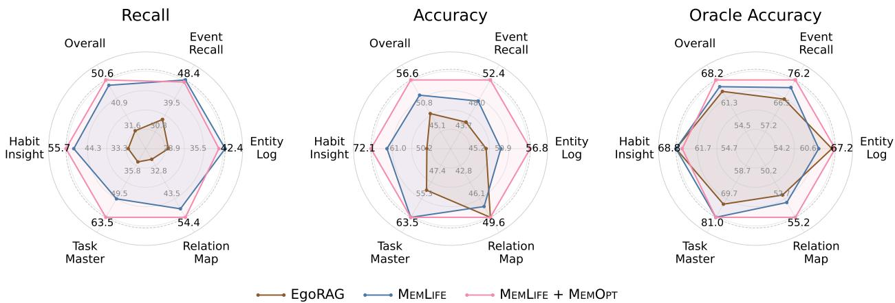  
Figure 3 Memory quality across EgoLifeQA question categories. Oracle accuracy is measured by providing memory entries aligned with annotated evidence directly to the reader.

Table 2 Examples of memory corrections learned through MemOpt. Red highlights errors and yellow highlights corrected content.
<table><tr><td>Frames</td><td></td><td></td><td></td><td></td></tr><tr><td>Question</td><td>Q: [...] Did I add the milk before or after the eggs when making the batter? A: You did not add milk or eggs to the batter; you only added lentils, salt, and spices.</td><td>plan?</td><td>Q: [...] Did I set a reminder for a backup dinner A: No [...] However, you did mention earlier that you have baked chicken available.</td><td></td></tr><tr><td>MEMLIFE</td><td>I am in a kitchen [...] transferyellow corn ker- nels from a small food processor bowl [...] move toward the sink area [...]</td><td>wait for the food [...]</td><td>[...] preparing food [...]theyrespond to my question about being hungry by saying they can</td><td></td></tr><tr><td>MEMLIFE + MEMOPT</td><td>I am in a kitchen [...] yellowish-orange granular material, which appears to becooked lentils to the sink area [...]</td><td>[…..] are not hungry and can wait.</td><td>[...] I am preparing a meal, specifically baked chicken, and offering it toB, who indicates they</td><td></td></tr></table>

## 4.4 Generalizability of MemOpt Training

We then examine whether MemOpt depends on the writer backbone by optimizing both Qwen3.5-9B and Qwen3.6-27B. Table 3 shows that MemOpt improves every writer–reader pairing on both benchmarks. Changing the writer scale produces only modest diferences, indicating that the training benefit does not depend on a particular writer backbone.

The Qwen3.6-27B reader further tests whether the optimized writer transfers beyond the Qwen3.5-9B reader used to collect retrievability supervision. Using the stronger reader substantially raises absolute accuracy for both writers. MemOpt continues to improve every setting, although its gains become smaller with the stronger reader, suggesting that reader capacity can compensate for some deficiencies in written memory while writer optimization remains beneficial.

Table 3 Answer accuracy (%) across writer and reader backbones.
<table><tr><td rowspan="2">Writer</td><td rowspan="2">Training</td><td colspan="2">Qwen3.5-9B Reader</td><td colspan="2">Qwen3.6-27B Reader</td></tr><tr><td>SuperMemory-VQA</td><td>EgoLifeQA</td><td>SuperMemory-VQA</td><td>EgoLifeQA</td></tr><tr><td rowspan="2">Qwen3.5-9B</td><td>Zero-shot</td><td>56.50</td><td>52.80</td><td>66.93</td><td>59.60</td></tr><tr><td>MEMOPT</td><td>60.35</td><td>56.60</td><td>67.90</td><td>60.20</td></tr><tr><td rowspan="2">Qwen3.6-27B</td><td>Zero-shot</td><td>57.14</td><td>55.20</td><td>66.77</td><td>59.80</td></tr><tr><td>MEMOPT</td><td>60.67</td><td>56.60</td><td>68.06</td><td>60.60</td></tr></table>

Beyond backbone changes, we study whether MemOpt transfers across memory systems. We optimize the EgoRAG writer and evaluate the original and optimized memories with both the na tive EgoRAG reader and the MemLife agentic reader. We also evaluate the optimized MemLife writer with the EgoRAG reader. Figure 4 shows that training improves the native EgoRAG pipeline on both benchmarks. Using MemLife to read optimized EgoRAG memories provides further gains, while the highest performance is achieved with the trained MemLife writer.

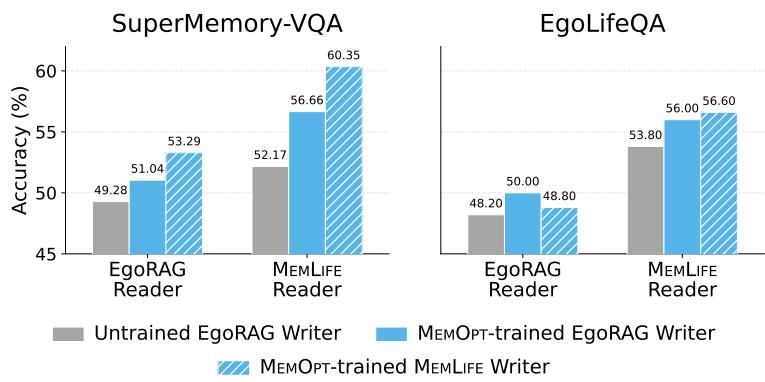  
Figure 4 Generalizability of MemOpt writer training across memory systems.

## 4.5 Ablation Studies

To analyze how diferent components in our proposed methods contribute to the overall performance, we first ablate each component in the writer and reader designs of MemLife, with the results shown in Table 4. For the writer design, we progressively add entity grounding and first-person narration to multimodal fusion, and examine how performance will change.

Table 4 Ablation studies on the writer and reader components in MemLife. Accuracy is reported for SuperMemory-VQA and EgoLifeQA. Recall on the long-term EgoLifeQA task is also reported.
<table><tr><td colspan="9">Writer Ablation</td></tr><tr><td rowspan="2">Multimodal Fusion</td><td rowspan="2">Entity Grounding</td><td rowspan="2">First-person Narration</td><td colspan="2">SuperMemory-VQA</td><td colspan="2">EgoLifeQA</td><td colspan="2">EgoLifeQA Recall</td></tr><tr><td>Zero-shot</td><td>MEMOPT</td><td>Zero-shot</td><td>MEMOPT</td><td>Zero-shot</td><td>MEMOPT</td></tr><tr><td></td><td>X</td><td>X</td><td>52.33</td><td>56.98</td><td>52.80</td><td>52.60</td><td>48.60</td><td>47.00</td></tr><tr><td></td><td>V</td><td>x</td><td>54.09</td><td>59.87</td><td>52.00</td><td>54.40</td><td>45.60</td><td>47.60</td></tr><tr><td></td><td>V</td><td>V</td><td>56.50</td><td>60.35</td><td>52.80</td><td>56.60</td><td>48.40</td><td>50.60</td></tr><tr><td colspan="9">Reader Ablation</td></tr><tr><td>Agentic</td><td>Time</td><td>Chronological</td><td colspan="2">SuperMemory-VQA</td><td colspan="2">EgoLifeQA</td><td colspan="2">EgoLifeQA Recall</td></tr><tr><td>Reasoning</td><td>Anchoring</td><td>Ordering</td><td>Zero-shot</td><td>MEMOPT</td><td>Zero-shot</td><td>MEMOPT</td><td>Zero-shot</td><td>MEMOPT</td></tr><tr><td></td><td>x</td><td></td><td>56.02</td><td>58.27</td><td>50.40</td><td>51.80</td><td>50.60</td><td>48.20</td></tr><tr><td></td><td></td><td></td><td>56.50</td><td>58.59</td><td>50.60</td><td>54.00</td><td>50.00</td><td>50.00</td></tr><tr><td></td><td></td><td>××&gt;</td><td>56.50</td><td>60.35</td><td>52.80</td><td>56.60</td><td>48.40</td><td>50.60</td></tr></table>

From the upper block of Table 4, we observe that entity grounding generally improves accuracy, particularly after MemOpt training, but provides little benefit to recall. First-person narration further improves accuracy and consistently raises EgoLifeQA recall, supporting its role in aligning written memories with wearer-centered queries.

We then ablate the MemLife reader by adding time anchoring and chronological ordering to agentic reasoning. The lower block of Table 4 shows that having time anchoring in the search tool provides its clearest benefit on optimized EgoLifeQA memories, where its accuracy gain is accompanied by higher recall. Chronological ordering further improves accuracy despite small or mixed recall changes, indicating that preserving event order primarily benefits reasoning over retrieved evidence. The complete reader performs best overall, with the largest gains appearing after writer optimization.

For the design of MemOpt, we compare various supervision signals used to train the writer. Table 5 shows that teacher imitation with Qwen3.6-27B provides only modest gains, while final-answer accuracy supervision produces inconsistent changes across benchmarks. Among the proposed reward dimensions, retrievability alone raises recall on both benchmarks but does not consistently improve accuracy. Adding informativeness strongly benefits SuperMemory-VQA, although its gain does not transfer to EgoLifeQA. With faithfulness as a regularizer, the complete objective achieves the highest accuracy on both benchmarks while retaining higher recall than the untrained writer.

Table 5 Comparison of supervision signals used during memory writer training.
<table><tr><td colspan="5">Writer Supervision</td><td colspan="2">SuperMemory-VQA</td><td colspan="2">EgoLifeQA</td></tr><tr><td>Teacher</td><td>Accuracy</td><td>Retrievability</td><td>Informativeness</td><td>Faithfulness</td><td>Accuracy</td><td>Recall</td><td>Accuracy</td><td>Recall</td></tr><tr><td>X</td><td>X</td><td>X</td><td>X</td><td>X</td><td>56.50</td><td>80.53</td><td>52.80</td><td>48.40</td></tr><tr><td>V</td><td>X</td><td>X</td><td>X</td><td>X</td><td>57.78</td><td>83.59</td><td>53.00</td><td>49.00</td></tr><tr><td>X</td><td>V</td><td>X</td><td>X</td><td>X</td><td>57.46</td><td>79.01</td><td>52.60</td><td>47.80</td></tr><tr><td>X</td><td>X</td><td>V</td><td>x</td><td>X</td><td>53.45</td><td>82.63</td><td>54.40</td><td>53.20</td></tr><tr><td>X</td><td>X</td><td>V</td><td>V</td><td>X</td><td>60.03</td><td>84.35</td><td>51.40</td><td>47.60</td></tr><tr><td>X</td><td>X</td><td></td><td>V</td><td>V</td><td>60.35</td><td>81.49</td><td>56.60</td><td>50.60</td></tr></table>

Finally, we perform ablation studies on the faithfulness granularity and reward aggregation strategy used in MemOpt. Following the probability-based judgment used for informativeness, the sequence-level variant assigns every token the same score about whether the complete memory is supported by its source segment. Diferent from multiplicative aggregation, the additive variant sums the three rewards. As shown in Table 6, under additive aggregation, token-level faithfulness maintains similar SuperMemory-VQA accuracy with slightly lower recall, but improves both metrics on out-of-domain EgoLifeQA. With token-level faithfulness fixed, multiplicative aggregation further improves accuracy on both benchmarks, and achieves the best performance overall.

Table 6 Ablation of faithfulness granularity and reward aggregation.
<table><tr><td colspan="2">Training Design</td><td colspan="2">SuperMemory-VQA</td><td colspan="2">EgoLifeQA</td></tr><tr><td>Faithfulness</td><td>Aggregation</td><td>Accuracy</td><td>Recall</td><td>Accuracy</td><td>Recall</td></tr><tr><td>Sequence-level</td><td>Additive</td><td>58.75</td><td>83.78</td><td>55.00</td><td>46.40</td></tr><tr><td>Token-level</td><td>Additive</td><td>58.91</td><td>81.68</td><td>56.00</td><td>49.40</td></tr><tr><td>Token-level</td><td>Multiplicative</td><td>60.35</td><td>81.49</td><td>56.60</td><td>50.60</td></tr></table>

## 5 Conclusion

We introduced MemLife, an agentic memory system for long-term egocentric video that constructs timeand entity-anchored, first-person episodes and accesses them through time-scoped retrieval and chronological evidence organization. We further proposed MemOpt, which applies reinforcement learning only to the memory writer through the FIRM objective for faithful, informative, and retrievable memories. MemLife outperforms state-of-the-art training-free systems, while MemOpt provides further gains that transfer across writer and reader backbones, memory systems, and out-of-domain video and question distributions. Together, the results demonstrate that learning what to remember is an efective and generalizable approach to long-term video question answering.

## References

Samiul Alam, Shakhrul Iman Siam, Michael J. Proulx, James Fort, Richard Newcombe, Hyo Jin Kim, and Mi Zhang. Supermemory-vqa: An egocentric visual question-answering benchmark for long-horizon memory. arXiv preprint arXiv:2606.00825, 2026.

Keshigeyan Chandrasegaran, Agrim Gupta, Lea M. Hadzic, Taran Kota, Jimming He, Cristobal Eyzaguirre, Zane Durante, Manling Li, Jiajun Wu, and Li Fei-Fei. Hourvideo: 1-hour video-language understanding. In Advances in Neural Information Processing Systems, 2024.

Prateek Chhikara, Dev Khant, Saket Aryan, Taranjeet Singh, and Deshraj Yadav. Mem0: Building production-ready ai agents with scalable long-term memory. arXiv preprint arXiv:2504.19413, 2025.

Yue Fan, Xiaojian Ma, Rujie Wu, Yuntao Du, Jiaqi Li, Zhi Gao, and Qing Li. Videoagent: A memory-augmented multimodal agent for video understanding. In Computer Vision – ECCV, 2025.

Difei Gao, Lei Ji, Luowei Zhou, Kevin Qinghong Lin, Joya Chen, Zihan Fan, and Mike Zheng Shou. Assistgpt: A general multi-modal assistant that can plan, execute, inspect, and learn. arXiv preprint arXiv:2306.08640, 2023.

Gabriele Goletto, Tushar Nagarajan, Giuseppe Averta, and Dima Damen. Amego: Active memory from long egocentric videos. In Computer Vision – ECCV, 2025.

Kristen Grauman, Andrew Westbury, Eugene Byrne, Zachary Chavis, Antonino Furnari, Rohit Girdhar, Jackson Hamburger, Hao Jiang, Miao Liu, Xingyu Liu, Miguel Martin, Tushar Nagarajan, Ilija Radosavovic, Santhosh Kumar Ramakrishnan, Fiona Ryan, Jayant Sharma, Michael Wray, Mengmeng Xu, Eric Zhongcong Xu, Chen Zhao, et al. Ego4d: Around the world in 3,000 hours of egocentric video. In Proceedings of the IEEE/CVF Conference on Computer Vision and Pattern Recognition, 2022.

Yiran Guan, Liang Yin, Dingkang Liang, Jianzhong Ju, Zhenbo Luo, Jian Luan, Yuliang Liu, and Xiang Bai. Video streaming thinking: Videollms can watch and think simultaneously. In Computer Vision – ECCV, 2026.

Bo He, Hengduo Li, Young Kyun Jang, Menglin Jia, Xuefei Cao, Ashish Shah, Abhinav Shrivastava, and Ser-Nam Lim. Ma-lmm: Memory-augmented large multimodal model for long-term video understanding. In Proceedings of the IEEE/CVF Conference on Computer Vision and Pattern Recognition, 2024.

Md Mohaiminul Islam, Ngan Ho, Xitong Yang, Tushar Nagarajan, Lorenzo Torresani, and Gedas Bertasius. Video recap: Recursive captioning of hour-long videos. In Proceedings of the IEEE/CVF Conference on Computer Vision and Pattern Recognition, 2024.

Hongbo Jin, Qingyuan Wang, Wenhao Zhang, Yang Liu, and Sijie Cheng. Videomem: Enhancing ultra-long video understanding via adaptive memory management. arXiv preprint arXiv:2512.04540, 2025.

Jiazheng Kang, Mingming Ji, Zhe Zhao, and Ting Bai. Memory OS of AI agent. In Proceedings of the Conference on Empirical Methods in Natural Language Processing, 2025.

Taeil Kim, Kangsan Kim, and Sung Ju Hwang. Agent memory distillation: Empowering small llm agents with hierarchical teacher memory. arXiv preprint arXiv:2608.07169, 2026.

Patrick Lewis, Ethan Perez, Aleksandra Piktus, Fabio Petroni, Vladimir Karpukhin, Naman Goyal, Heinrich Küttler, Mike Lewis, Wen-tau Yih, Tim Rocktäschel, Sebastian Riedel, and Douwe Kiela. Retrieval-augmented generation for knowledge-intensive nlp tasks. In Advances in Neural Information Processing Systems, 2020.

Yilong Li, Suman Banerjee, and Tong Che. Ember: Eficient memory via budgeted evidence retention for long-horizon agents. arXiv preprint arXiv:2606.05894, 2026.

Lin Long, Yichen He, Wentao Ye, Yiyuan Pan, Yuan Lin, Hang Li, Junbo Zhao, and Wei Li. Seeing, listening, remembering, and reasoning: A multimodal agent with long-term memory. In International Conference on Learning Representations, 2026.

Yongdong Luo, Xiawu Zheng, Guilin Li, Shukang Yin, Haojia Lin, Chaoyou Fu, Jinfa Huang, Jiayi Ji, Fei Chao, Jiebo Luo, and Rongrong Ji. Video-rag: Visually-aligned retrieval-augmented long video comprehension. In Advances in Neural Information Processing Systems, 2025.

Charles Packer, Sarah Wooders, Kevin Lin, Vivian Fang, Shishir G. Patil, Ion Stoica, and Joseph E. Gonzalez. Memgpt: Towards llms as operating systems. arXiv preprint arXiv:2310.08560, 2024.

Zhuoshi Pan, Qianhui Wu, Huiqiang Jiang, Xufang Luo, Hao Cheng, Dongsheng Li, Yuqing Yang, Chin-Yew Lin, H. Vicky Zhao, Lili Qiu, and Jianfeng Gao. Secom: On memory construction and retrieval for personalized conversational agents. In International Conference on Learning Representations, 2025.

Joon Sung Park, Joseph O’Brien, Carrie Jun Cai, Meredith Ringel Morris, Percy Liang, and Michael S. Bernstein. Generative agents: Interactive simulacra of human behavior. In Proceedings of the Annual ACM Symposium on User Interface Software and Technology, 2023.

Rui Qian, Xiaoyi Dong, Pan Zhang, Yuhang Zang, Shuangrui Ding, Dahua Lin, and Jiaqi Wang. Streaming long video understanding with large language models. In Advances in Neural Information Processing Systems, 2024.

Aniket Rege, Arka Sadhu, Yuliang Li, Kejie Li, Ramya Korlakai Vinayak, Yuning Chai, Yong Jae Lee, and Hyo Jin Kim. Agentic very long video understanding. In Proceedings of the Annual Meeting of the Association for Computational Linguistics, 2026.

Xubin Ren, Lingrui Xu, Long Xia, Shuaiqiang Wang, Dawei Yin, and Chao Huang. Videorag: Retrieval-augmented generation with extreme long-context videos. In Proceedings of the ACM SIGKDD Conference on Knowledge Discovery and Data Mining, 2026.

Zhihong Shao, Peiyi Wang, Qihao Zhu, Runxin Xu, Junxiao Song, Xiao Bi, Haowei Zhang, Mingchuan Zhang, Y. K. Li, Y. Wu, and Daya Guo. Deepseekmath: Pushing the limits of mathematical reasoning in open language models. arXiv preprint arXiv:2402.03300, 2024.

Zhiyu Shen, Ziming Wu, Fuming Lai, Shaobing Lian, and Yanghui Rao. MemBuilder: Reinforcing LLMs for long-term memory construction via attributed dense rewards. In Proceedings of the Annual Meeting of the Association for Computational Linguistics, 2026.

Enxin Song, Wenhao Chai, Guanhong Wang, Yucheng Zhang, Haoyang Zhou, Feiyang Wu, Haozhe Chi, Xun Guo, Tian Ye, Yanting Zhang, Yan Lu, Jenq-Neng Hwang, and Gaoang Wang. Moviechat: From dense token to sparse memory for long video understanding. In Proceedings of the IEEE/CVF Conference on Computer Vision and Pattern Recognition, 2024.

Shulin Tian, Ruiqi Wang, Hongming Guo, Penghao Wu, Yuhao Dong, Xiuying Wang, Jingkang Yang, Hao Zhang, Hongyuan Zhu, and Ziwei Liu. Ego-r1: Agentic chain-of-tool-thought for ultra-long egocentric video reasoning. IEEE Transactions on Pattern Analysis and Machine Intelligence, 48(10):12116–12131, 2026. doi: 10.1109/TPAMI. 2026.3697367.

Juntong Wang, Haoyue Zhao, guanghui Pan, Xiyuan Wang, Yanbo Wang, Qiyan Deng, and Muhan Zhang. SAGE: A self-evolving agentic graph-memory engine for structure-aware associative memory. In Frontiers in Graph Machine Learning for the Large Model Era, 2026a.

Xiaohan Wang, Yuhui Zhang, Orr Zohar, and Serena Yeung-Levy. Videoagent: Long-form video understanding with large language model as agent. In Computer Vision – ECCV, 2025a.

Yu Wang, Ryuichi Takanobu, Zhiqi Liang, Yuzhen Mao, Yuanzhe Hu, Julian McAuley, and Xiaojian Wu. Mem-α: Learning memory construction via reinforcement learning. arXiv preprint arXiv:2509.25911, 2025b.

Ziyang Wang, Yue Zhang, Shoubin Yu, Ce Zhang, Zengqi Zhao, Jaehong Yoon, Hyunji Lee, Gedas Bertasius, and Mohit Bansal. Egomemreason: A memory-driven reasoning benchmark for long-horizon egocentric video understanding. In Conference on Language Modeling, 2026b.

Wujiang Xu, Zujie Liang, Kai Mei, Hang Gao, Juntao Tan, and Yongfeng Zhang. A-mem: Agentic memory for llm agents. In Advances in Neural Information Processing Systems, 2025.

Sikuan Yan, Xiufeng Yang, Zuchao Huang, Ercong Nie, Zifeng Ding, Zonggen Li, Xiaowen Ma, Jinhe Bi, Kristian Kersting, Jef Z. Pan, Hinrich Schuetze, Volker Tresp, and Yunpu Ma. Memory-r1: Enhancing large language model agents to manage and utilize memories via reinforcement learning. In Proceedings of the Annual Meeting of the Association for Computational Linguistics, 2026.

Jingkang Yang, Shuai Liu, Hongming Guo, Yuhao Dong, Xiamengwei Zhang, Sicheng Zhang, Pengyun Wang, Zitang Zhou, Binzhu Xie, Ziyue Wang, Bei Ouyang, Zhengyu Lin, Marco Cominelli, Zhongang Cai, Bo Li, Yuanhan Zhang, Peiyuan Zhang, Fangzhou Hong, Joerg Widmer, Francesco Gringoli, et al. Egolife: Towards egocentric life assistant. In Proceedings of the IEEE/CVF Conference on Computer Vision and Pattern Recognition, 2025.

Hanrong Ye, Haotian Zhang, Erik Daxberger, Lin Chen, Zongyu Lin, Yanghao Li, Bowen Zhang, Haoxuan You, Dan Xu, Zhe Gan, Jiasen Lu, and Yinfei Yang. MMEgo: Towards building egocentric multimodal LLMs for video QA. In International Conference on Learning Representations, 2025.

Woongyeong Yeo, Kangsan Kim, Jaehong Yoon, and Sung Ju Hwang. Worldmm: Dynamic multimodal memory agent for long video reasoning. In Proceedings of the IEEE/CVF Conference on Computer Vision and Pattern Recognition, 2026.

Yufei Yin, Qianke Meng, Minghao Chen, Jiajun Ding, Zhenwei Shao, and Zhou Yu. Videoarm: Agentic reasoning over hierarchical memory for long-form video understanding. In Proceedings of the IEEE/CVF Conference on Computer Vision and Pattern Recognition, 2026.

Kai Zhang, Xinyuan Zhang, Hongda Jiang, Shiun-Zu Kuo, Hyokun Yun, Ejaz Ahmed, Shereen Oraby, Ziyun Li, Sanat Sharma, Ann Lee, Ahmed A Aly, Anuj Kumar, Rafay Hamid, and Xin Luna Dong. Salimory: Orchestrating cognitive memory for conversational agents. arXiv preprint arXiv:2606.04120, 2026.

Xiaoyi Zhang, Zhaoyang Jia, Zongyu Guo, Jiahao Li, Bin Li, Houqiang Li, and Yan Lu. Deep video discovery: Agentic search with tool use for long-form video understanding. In D. Belgrave, C. Zhang, H. Lin, R. Pascanu, P. Koniusz, M. Ghassemi, and N. Chen, editors, Advances in Neural Information Processing Systems, volume 38, Main Conference, pages 89863–89895. Curran Associates, Inc., 2025. doi: 10.52202/085713-3005. https://proceedings.neurips.cc/ paper\_files/paper/2025/file/8190b210e9808e54ee16263b673a847d-Paper-Conference.pdf.

Wanjun Zhong, Lianghong Guo, Qiqi Gao, He Ye, and Yanlin Wang. Memorybank: Enhancing large language models with long-term memory. In Proceedings of the AAAI Conference on Artificial Intelligence, 2024.

Tao Zou, Yichen He, Tian Qiu, Yuan Lin, and Hang Li. Task-focused memorization for multimodal agents. arXiv preprint arXiv:2605.31075, 2026.

## Appendix

## A Dataset and Baseline Details

## A.1 Datasets and Splits

SuperMemory-VQA contains ten subjects recorded across multiple sessions (Alam et al., 2026). We exclude 82 questions whose annotated evidence refers to source videos unavailable in the public release, leaving 4,771 questions. We partition these questions by subject, using S1–S6 for training, S7–S8 for validation, and S9–S10 for testing. These splits contain 3,425, 723, and 623 questions, respectively. EgoLifeQA contains 500 multiple-choice questions about a continuous seven-day recording (Yang et al., 2025). We use its complete question set only for testing.

SuperMemory-LVQA increases the retrieval space by concatenating the histories of all ten SuperMemory-VQA subjects into one memory store. It retains the 623 questions from the SuperMemory-VQA test split, with the remaining subject histories as additional distractors.

EgoLife-EQA contains 100 test questions about recurring events across multiple days in EgoLife. We identify candidate events from the oficial captions and formulate questions about them. Two annotators independently verify whether each candidate evidence segment supports its question’s annotated answer, reaching 92.1% agreement. They resolve disagreements through discussion, and we discard questions without verified evidence or an unambiguous answer.

Table 7 groups the EgoLife-EQA questions into three categories. Frequency-counting questions ask on which days an activity occurred and may have multiple correct options, such as “On which days during the seven-day period did I go grocery shopping? Choose all that apply.” Routine questions ask what activity typically occurs at a given time of day, such as “What do I usually check on my phone in the morning?” Comparison questions ask which of two activities occurred on more days, such as “Which activity did I do in the bedroom on more days—browsing social media or browsing products online?”

Table 7 Composition of EgoLife-EQA by question type. Correct options, evidence segments, and distinct evidence days are averaged per question.
<table><tr><td>Type</td><td># Questions</td><td># Options</td><td>Avg. Correct Options</td><td>Avg. Evidence Segments</td><td>Avg. Distinct Days</td></tr><tr><td>Frequency counting</td><td>45</td><td>8</td><td>2.33</td><td>2.31</td><td>2.31</td></tr><tr><td>Routine</td><td>31</td><td>2-4</td><td>1.00</td><td>2.97</td><td>2.97</td></tr><tr><td>Comparison</td><td>24</td><td>3</td><td>1.00</td><td>8.04</td><td>5.54</td></tr><tr><td>All</td><td>100</td><td></td><td>1.60</td><td>3.89</td><td>3.29</td></tr></table>

Table 8 compares the scale of the accessible video history and evidence annotations across the four evaluation settings, where only SuperMemory-VQA supplies supervision for MemOpt.

Table 8 Dataset statistics. Video hours and time spans are averaged over the history available to each question. Evidence segments and their total duration are averaged per question.
<table><tr><td>Dataset</td><td># Questions</td><td>Avg. Video Hours</td><td>Avg. Time Span (days)</td><td>Avg. Evidence Segments</td><td>Avg. Evidence Duration (s)</td></tr><tr><td>SuperMemory-VQA</td><td>4771</td><td>3.97</td><td>12.50</td><td>1.34</td><td>57.1</td></tr><tr><td>EgoLifeQA</td><td>500</td><td>22.65</td><td>2.80</td><td>1.10</td><td>32.3</td></tr><tr><td>SuperMemory-LVQA</td><td>623</td><td>47.90</td><td>127.36</td><td>1.24</td><td>56.3</td></tr><tr><td>EgoLife-EQA</td><td>100</td><td>43.06</td><td>6.33</td><td>3.89</td><td>116.7</td></tr></table>

## A.2 Baselines

Without task-specific writer training. Video ReCap recursively builds clip-, segment-, and video-level captions by combining visual features with captions from the preceding hierarchy (Islam et al., 2024). EgoRAG builds clip-, hour-, and day-level memories and retrieves relevant clips using visual and textual similarity (Yang et al., 2025). Video-RAG indexes OCR, ASR, and object-detection text, then provides retrieved text and sampled video frames to a VLM (Luo et al., 2025). The remaining systems perform adaptive multimoda access. VideoARM constructs a query-conditioned hierarchical memory online while inspecting progressively narrower regions of the source video (Yin et al., 2026). EGAgent plans over a temporal entity scene graph with visual-frame and transcript search (Rege et al., 2026). WorldMM iteratively retrieves from multiscale episodic and semantic graphs and a visual memory (Yeo et al., 2026).

With learned memory construction. EgoButler combines EgoRAG with EgoGPT, which is fine-tuned for both visual-audio captioning and question answering (Yang et al., 2025). VST trains a single streaming VideoLLM to generate both textual memory and final answers through supervised fine-tuning and answerbased reinforcement learning (Guan et al., 2026). TaskMem instead optimizes a memorization policy with model-judged quality rewards followed by task-relevance preference learning, leaving QA to a separate answer generator (Zou et al., 2026). M3-Agent trains an entity-centric episodic and semantic memory writer through imitation of synthetic demonstrations, then separately trains its memory-search controller with reinforcement learning (Long et al., 2026).

Evaluation protocol. For EgoButler, VST, and TaskMem, we use the released EgoGPT-7B, VST-32B, and TaskMem-30B checkpoints, respectively,<sup>1</sup> where some have much larger capacity than our tested 9B model. Because M3-Agent does not release a checkpoint, we reproduce its trained memorizer and controller with the same Qwen3.5-9B backbone as our method. All other replaceable model components also use Qwen3.5-9B. Appendix C shows additional experimental results on the reproduced training methods with matched backbone models and training data.

All methods receive the same questions, answer options, and causal video histories, and we recompute their metrics using a common answer parser. The Oracle Context reference in Table 1 bypasses retrieval by directly supplying the answerer with all annotated source-video evidence for each question. Its retrieval recall is therefore 100% by construction. Among baselines without task-specific writer training, Video-RAG, VideoARM, EGAgent, and WorldMM retain query-time access to visual evidence, whereas the default MemLife operates only on written memory. Among learned systems, we implement VST and M3-Agent with models trained on both memory construction and their answering or control components. EgoButler, TaskMem, and MemOpt instead adopt only a trained memory writer while keeping the downstream reader fixed.

## A.3 Evaluation Metrics

Let Q denote the test questions, $A _ { q }$ the set of annotated correct option labels, and $\widehat { A } _ { q }$ the predicted set produced by the answer parser. These sets contain one label for single-choice questions. For multi-select EgoLife-EQA questions, a prediction is correct only if it exactly matches the complete annotated set. We compute answer accuracy over all test questions as

$$
\operatorname { A c c } = { \frac { 1 } { | { \mathcal { Q } } | } } \sum _ { q \in { \mathcal { Q } } } \mathbf { 1 } [ { \widehat { A } } _ { q } = A _ { q } ] .\tag{13}
$$

Retrieval recall is computed over the subset $\mathcal { Q } _ { G } \subseteq \mathcal { Q }$ containing questions with at least one annotated temporal evidence interval. Let $G _ { q }$ and $H _ { q }$ denote the source-indexed temporal intervals annotated for q and returned to the reader, respectively. A question counts as retrieved when at least one returned interval overlaps an annotated interval from the same source video. We compute

$$
\mathrm { R e c a l l } = \frac { 1 } { | { \cal Q } _ { G } | } \sum _ { q \in { \cal Q } _ { G } } { \bf 1 } [ \exists g \in G _ { q } , h \in H _ { q } \ \mathrm { s u c h \ t h a t \ } h \cap g \neq \emptyset ] .\tag{14}
$$

For a single-shot reader, $H _ { q }$ is its retrieved context. For an agentic reader, $H _ { q }$ is the union of evidence returned by all executed search and fetch actions. This union measures the evidence actually available during the interaction rather than evidence recoverable by an unexecuted query.

## B Implementation Details

## B.1 Models and Inference

Both the default MemLife writer and reader use Qwen3.5-9B. The backbone study additionally uses Qwen3.6- 27B as the writer and reader, producing all four combinations of the two models. Each writer generates one memory store per dataset, and that same store is evaluated by both reader backbones. Swapping the reader therefore does not regenerate or alter the memory. All reader weights remain frozen, including during MemOpt training.

The writer processes each 30-second segment independently from eight frames at 704-pixel resolution and its speech transcript. A trailing segment shorter than one second is folded into the preceding segment. Memory descriptions are generated greedily with a maximum of 512 tokens. We embed each description using BAAI/bge-large-en-v1.5 and perform exact inner-product search over normalized embeddings.

At evaluation, the agentic reader can call SearchMemory and FetchMemory for at most ten rounds. Semantic search returns at most 32 entries, while interval-based fetching returns at most 64 entries. The default reader has no access to source video. The MemLife-V variant additionally allows the reader to inspect up to 50 sampled frames and the transcript from a selected temporal interval. Both writer and reader generations use greedy decoding for deterministic results. More details about the writer and reader prompts are in Appendix L.

## B.2 MemOpt Training

All evaluators use Qwen3.5-9B, and both their parameters and the reader parameters remain frozen. We train the writer for three epochs and rebuild the validation memory after each epoch. We select the checkpoint with the highest sum of answer accuracy and retrieval recall on S7–S8, then evaluate it once on each test benchmark. Table 9 summarizes the training configuration.

The Kullback–Leibler regularizer is applied directly to the loss against the frozen initial writer rather than incorporated into the reward, so it does not afect the group-relative advantages. Training rollouts are sampled at temperature 1.0 to provide within-group variation, whereas deployment uses greedy decoding.

## B.3 Retrievability Trace Collection and Replay

At the beginning of each training epoch, we build a memory bank with the current writer and run the frozen agentic reader on every training question associated with at least one verified evidence segment. For each question, we cache the search queries, time intervals, retrieval budgets, and fetched intervals issued before the final answer. These traces are reused to score all candidate memories sampled during that epoch.

To evaluate a candidate y for segment c, we replace only the corresponding entry in the memory bank and replay every cached action associated with questions in Q(c). For a search action, we recompute the candidate’s similarity and rank it against all entries eligible under that action’s causal and temporal constraints. The action returns y only when its rank falls within the recorded retrieval budget. For a fetch action, y is returned when the requested interval contains c. This replay determines membership in $ { \mathcal { C } } _ { q } ( y )$ without executing a new agent reasoning trajectory. The memory bank and traces are rebuilt after each epoch.

## B.4 Token-Level Group-Relative Objective

Equations 11 and 12 define the token advantages used for optimization. We clip each $\widetilde { A } _ { i , t }$ to $[ - \kappa , \kappa ]$ , then recenter and whiten the values over generated response tokens while excluding prompt and padding positions.

Table 9 MemOpt training hyperparameters.
<table><tr><td>Group</td><td>Parameter</td><td>Value</td></tr><tr><td rowspan="4">Sampling</td><td>Group size G (rollouts per segment)</td><td>5</td></tr><tr><td>Rollout temperature / top-p / top-k</td><td>1.0 /  1.0 / disabled</td></tr><tr><td>Maximum prompt length (tokens)</td><td>12,288</td></tr><tr><td>Maximum response length (tokens)</td><td>512</td></tr><tr><td rowspan="4">Optimization</td><td>Learning rate</td><td>1 × 10−⁶</td></tr><tr><td>Weight decay</td><td>0.01</td></tr><tr><td>Learning-rate warmup</td><td>none</td></tr><tr><td>Gradient-norm clip</td><td>1.0</td></tr><tr><td rowspan="4">Objective</td><td>Policy clipping ratio  $\epsilon _ { \mathrm { { p } } }$  (symmetric)</td><td>0.2</td></tr><tr><td>Advantage clip κ</td><td>3.0</td></tr><tr><td>KL penalty β (loss term)</td><td>0.01</td></tr><tr><td>Entropy coefficient</td><td>0</td></tr><tr><td rowspan="4">Schedule</td><td>Segments per optimizer step</td><td>32</td></tr><tr><td>Mini-batch size</td><td>16</td></tr><tr><td>Inner epochs per step</td><td>1</td></tr><tr><td>Training epochs</td><td>3</td></tr></table>

We denote the resulting advantage by $A _ { i , t }$ . Let $\pi _ { \theta _ { \mathrm { o l d } } }$ denote the policy that sampled the current candidates. Its token probability ratio with the updated writer is

$$
\rho _ { i , t } ( \theta ) = \frac { \pi _ { \theta } ( y _ { i , t } \mid c , y _ { i , < t } ) } { \pi _ { \theta _ { \mathrm { o l d } } } ( y _ { i , t } \mid c , y _ { i , < t } ) } .\tag{15}
$$

The MemOpt policy objective is

$$
\begin{array} { r } { \mathcal { L } _ { \mathrm { M e M O p r } } ( \theta ) = - \mathbb { E } _ { c , i , t } \Big [ \operatorname* { m i n } \big ( \rho _ { i , t } ( \theta ) A _ { i , t } , \mathrm { c l i p } ( \rho _ { i , t } ( \theta ) , 1 - \epsilon _ { \mathrm { p } } , 1 + \epsilon _ { \mathrm { p } } ) A _ { i , t } \big ) - \beta \widehat { D } _ { i , t } ^ { \mathrm { K L } } \Big ] , } \end{array}\tag{16}
$$

where $\epsilon _ { \mathrm { { p } } }$ is the policy clipping ratio, $\widehat { D } _ { i , t } ^ { \mathrm { K L } }$ is the per-token Kullback–Leibler estimate between $\pi _ { \theta }$ and the frozen initial writer $\pi _ { \mathrm { r e f } } .$ and $\beta$ controls its strength. Table 9 lists the numerical settings.

## C Controlled Comparison with Trained Baselines

The main comparison uses oficial checkpoints when available, preserving the systems released by their authors but leaving diferences in model scale and training data. We therefore conduct an additional controlled comparison by reproducing VST and TaskMem with Qwen3.5-9B and training them only on the SuperMemory VQA training split used by MemOpt. Their results consequently difer from the released-checkpoint results in Table 1. We repeat the M3-Agent results from that table because its existing reproduction already uses the same backbone and training split.

Table 10 Controlled comparison with trained baselines. All methods use Qwen3.5-9B and task-specific training data only from SuperMemory-VQA. EgoLifeQA is evaluated out of distribution, and bold marks the best result.
<table><tr><td rowspan="2">Method</td><td colspan="2">SuperMemory-VQA</td><td colspan="2">EgoLifeQA</td></tr><tr><td>Accuracy</td><td>Recall</td><td>Accuracy</td><td>Recall</td></tr><tr><td>VST</td><td>56.50</td><td>65.08</td><td>29.40</td><td>7.60</td></tr><tr><td>TaskMem</td><td>48.96</td><td>51.15</td><td>48.20</td><td>35.00</td></tr><tr><td>M3-Agent</td><td>53.93</td><td>54.20</td><td>35.40</td><td>9.60</td></tr><tr><td>MEMLIFE + MEMOPT</td><td>60.35</td><td>81.49</td><td>56.60</td><td>50.60</td></tr></table>

Table 10 shows that MemLife with MemOpt achieves the highest accuracy and recall on both the in-domain SuperMemory-VQA test set and out-of-domain EgoLifeQA. None of these controlled runs uses EgoLifeQA for task-specific training. Moreover, MemOpt updates only the memory writer, whereas VST and M3-Agent also adapt their answering or control components. Together with the primary comparison in Table 1, these results indicate that the gains from MemOpt are not explained by backbone scale or diferences in task-specific training data.

## D Stability Analysis

In the main experiments, we use deterministic decoding across all methods for fairness and reproducibility. To assess stability under stochastic decoding, we repeat inference five times at temperature 1.0 for MemLife, MemLife-V, and EgoRAG, the competing system with the highest average accuracy. Table 11 compares the greedy results from the main evaluation with the mean and standard deviation over five sampled runs.

Table 11 Stability across reader decoding settings. $T = 0 . 0$ reports greedy decoding, while $T = 1 . 0$ reports mean ± standard deviation over five runs.
<table><tr><td rowspan="3">Method</td><td colspan="4">SuperMemory-VQA</td><td colspan="4">EgoLifeQA</td></tr><tr><td colspan="2">Accuracy</td><td colspan="2">Recall</td><td colspan="2">Accuracy</td><td colspan="2">Recall</td></tr><tr><td>T = 0.0</td><td> $T = 1 . 0$ </td><td> $T = 0 . 0$ </td><td> $T = 1 . 0$ </td><td> $T = 0 . 0$ </td><td> $T = 1 . 0$ </td><td> $T = 0 . 0$ </td><td>T = 1.0</td></tr><tr><td>EgoRAG</td><td>49.28</td><td> $4 9 . 1 8 \pm 0 . 9 5$ </td><td>66.79</td><td> $6 6 . 7 9 \pm 0 . 0 0$ </td><td>48.20</td><td> $4 6 . 4 8 \pm 0 . 9 5$ </td><td>29.60</td><td> $2 8 . 8 0 \pm 0 . 0 0$ </td></tr><tr><td>MEMLIFE</td><td>56.50</td><td> $5 5 . 3 1 \pm 1 . 5 3$ </td><td>80.53</td><td> $8 0 . 6 9 \pm 0 . 3 2$ </td><td>52.80</td><td> $5 0 . 1 6 \pm 1 . 8 3$ </td><td>48.40</td><td> $4 7 . 4 8 \pm 1 . 3 6$ </td></tr><tr><td>MEMLIFE-V</td><td>57.78</td><td> $5 8 . 7 8 \pm 0 . 4 1$ </td><td>84.35</td><td> $8 4 . 5 8 \pm 0 . 6 4$ </td><td>53.20</td><td> $5 2 . 4 4 \pm 1 . 7 2$ </td><td>50.20</td><td> $4 9 . 7 2 \pm 0 . 3 0$ </td></tr><tr><td rowspan="3">Method</td><td colspan="4">SuperMemory-LVQA</td><td colspan="4">EgoLife-EQA</td></tr><tr><td colspan="2">Accuracy</td><td colspan="2">Recall</td><td colspan="2">Accuracy</td><td colspan="2">Recall</td></tr><tr><td> $T = 0 . 0$ </td><td> $T = 1 . 0$ </td><td> $T = 0 . 0$ </td><td> $T = 1 . 0$ </td><td></td><td> $T = 0 . 0$ </td><td> $T = 1 . 0$ </td><td> $T = 0 . 0$ </td><td>T = 1.0</td></tr><tr><td>EgoRAG</td><td>47.51</td><td> $4 8 . 0 2 \pm 0 . 4 3$ </td><td>47.90</td><td> $4 8 . 8 5 \pm 0 . 0 0$ </td><td>38.00</td><td> $3 6 . 2 0 \pm 2 . 3 9$ </td><td>13.00</td><td> $1 4 . 0 0 \pm 0 . 0 0$ </td></tr><tr><td>MEMLIFE</td><td>56.18</td><td> $5 5 . 3 1 \pm 0 . 9 1$ </td><td>46.18</td><td> $4 5 . 0 0 \pm 0 . 9 7$ </td><td>52.00</td><td> $5 0 . 8 0 \pm 4 . 6 6$ </td><td>44.00</td><td> $4 2 . 2 0 \pm 2 . 9 5$ </td></tr><tr><td>MEMLIFE-V</td><td>57.95</td><td> $5 8 . 1 7 \pm 1 . 2 4$ </td><td>48.47</td><td> $4 8 . 5 1 \pm 1 . 9 3$ </td><td>50.00</td><td> $5 3 . 2 0 \pm 3 . 2 7$ </td><td>45.00</td><td> $4 5 . 0 0 \pm 0 . 7 1$ </td></tr></table>

The performance ordering remains stable under sampled decoding. MemLife and MemLife-V outperform EgoRAG in accuracy on every benchmark and generally provide higher recall. The gains remain consistent across runs, and the accuracy improvements of MemLife over EgoRAG are significant on all four benchmarks $\left( p < 0 . 0 5 \right)$ . The recall of EgoRAG has a zero standard deviation, since it has a fixed retrieval process instead of using agentic search as MemLife.

## E Efficiency Analysis

Table 12 compares storage and question-time costs across various systems, which are the key eficiency concerns in runtime question answering. Storage is measured over matched source histories and normalized by video duration, while reading time excludes model initialization.

MemLife has the smallest footprint among systems with persistent storage, which has nearly unchanged storage per video hour across the two benchmarks. It also provides the fastest reading time. Its informative text episodes and targeted retrieval typically expose suficient evidence within a few agent rounds, while chronological ordering reduces the subsequent reasoning burden. The default reader also avoids processing source-video tokens at question time. Together, these choices limit unnecessary generation and multimodal processing, helping explain the lower latency relative to baselines with diferent execution patterns.

## F Ablation of Retrievability Approximation

Computing retrievability requires specifying how a future question will access a candidate memory. We compare two approximations. The simplified variant uses the original question directly as a fixed semantic-search query and scores whether the candidate is retrieved. It therefore requires neither a reader policy nor a reader rollout during writer training. Standard MemOpt instead runs the MemLife agentic reader at the beginning of each epoch and collects its memory-access actions. These actions reflect the agent’s reformulated queries and time-scoped retrieval decisions, but remain fixed within the epoch to avoid candidate-dependent variation. After writer training, we evaluate both variants with the standard MemLife agentic reader, which performs multi-round memory access and chronologically orders the retrieved entries before answering.

Table 12 Storage and reading eficiency of training-free video memory systems. Storage is normalized by source-video duration, and reading time is averaged per question. Dashes indicate methods without a persistent memory store.
<table><tr><td rowspan="2">Method</td><td colspan="2">Memory Storage (MB/h)</td><td colspan="2">Reading Speed (s/question)</td></tr><tr><td>SuperMemory-VQA</td><td>EgoLifeQA</td><td>SuperMemory-VQA</td><td>EgoLifeQA</td></tr><tr><td>Video ReCap</td><td>3.86</td><td>3.66</td><td>20.4</td><td>54.2</td></tr><tr><td>EgoRAG</td><td>4.98</td><td>5.49</td><td>33.2</td><td>43.5</td></tr><tr><td>Video-RAG</td><td>1.03</td><td>3.44</td><td>60.9</td><td>76.9</td></tr><tr><td>VideoARM</td><td></td><td></td><td>47.5</td><td>110.4</td></tr><tr><td>EGAgent</td><td>21.50</td><td>22.20</td><td>200.3</td><td>230.7</td></tr><tr><td>WorldMM</td><td>2.09</td><td>3.88</td><td>44.7</td><td>57.1</td></tr><tr><td>MEMLIFE</td><td>0.68</td><td>0.67</td><td>13.1</td><td>20.7</td></tr></table>

Table 13 Efect of the training-time retrievability approximation on answer accuracy (%).
<table><tr><td>Training-time proxy</td><td>SuperMemory-VQA</td><td>EgoLifeQA</td></tr><tr><td>None (zero-shot)</td><td>56.50</td><td>52.80</td></tr><tr><td>Original question</td><td>57.62</td><td>55.40</td></tr><tr><td>Agent actions</td><td>60.35</td><td>56.60</td></tr></table>

Both approximations outperform the zero-shot writer on both benchmarks. The original-question proxy already provides useful supervision without requiring a training-time reader rollout. Agent actions perform best on both datasets, indicating that reformulated queries and time-scoped accesses expose retrieval failures that the original question alone may miss. We therefore use agent actions in the standard MemOpt configuration, while retaining the original-question proxy as a simpler, reader-policy-independent alternative.

## G Reward Dynamics during MemOpt Training

To examine how the three reward signals evolve during optimization, we record their scores over three epochs, comprising 135 training steps. Retrievability and informativeness are averaged across the sampled candidate memories. Since faithfulness is evaluated at the token level, we first take the minimum token score within each candidate and then average these minima across candidates. This conservative aggregation prevents a few unsupported tokens from being obscured by many well-supported ones. In Figure 5, the light curves show the resulting per-step scores, while the bold curves show their smoothed trends.

Following an initial fluctuation, retrievability improves mainly during the early stages of training and stabilizes sooner, although its per-step values remain noisy because they depend on each candidate’s position within the evolving memory store and the cached reader actions. Informativeness and faithfulness improve for longer, indicating that the writer continues to preserve more answer-relevant evidence and produce better-grounded memories. Together, these trends suggest that MemOpt improves all three dimensions without a sustained trade-of in retrievability.

## H Discussion on Memory Reader Training

Although MemOpt focuses on the writer, the agentic reader can also be trained to improve memory access and answer generation. We compare training neither component, the writer alone, the reader alone, and both components. For reader reinforcement learning, the reward is (accuracy + recall)/2. To reduce training cost, we cap trajectories at six interaction rounds, compared with ten rounds at evaluation. A trajectory containing a formatting error or exhausting this budget will receive a reward of −1.

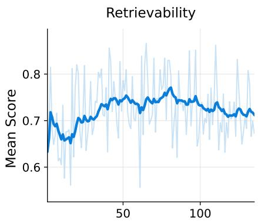

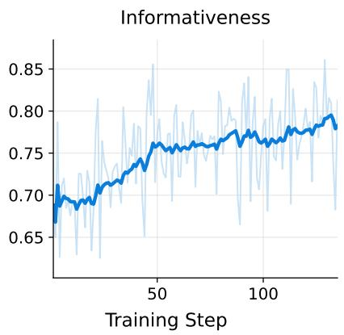  
Figure 5 Dynamics of the three reward signals during MemOpt training.

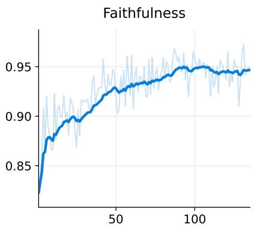

Table 14 Efects of writer and reader training. All values are percentages.
<table><tr><td rowspan="2">Writer trained</td><td rowspan="2">Reader trained</td><td colspan="2">SuperMemory-VQA</td><td colspan="2">EgoLifeQA</td></tr><tr><td>Accuracy</td><td>Recall</td><td>Accuracy</td><td>Recall</td></tr><tr><td>x</td><td>X</td><td>56.50</td><td>80.53</td><td>52.80</td><td>48.40</td></tr><tr><td>V</td><td>X</td><td>60.35</td><td>81.49</td><td>56.60</td><td>50.60</td></tr><tr><td>X</td><td>V</td><td>61.00</td><td>89.50</td><td>51.40</td><td>59.00</td></tr><tr><td></td><td></td><td>63.08</td><td>87.98</td><td>54.20</td><td>56.80</td></tr></table>

Reader training substantially improves both accuracy and recall on the in-domain SuperMemory-VQA benchmark. Adding writer training to the trained reader further improves accuracy with only a small decrease in recall, indicating that the optimized memories preserve more answer-useful information rather than merely maximizing evidence retrieval. On the out-of-domain EgoLifeQA benchmark, reader training still improves recall but does not consistently improve answer accuracy, whereas writer-only training achieves the highest accuracy. This contrast suggests that reader policies more readily specialize to the training question and source-video distributions, as well as the resulting interaction trajectories. Writer training instead improves the persistent memory itself, allowing diferent readers and evaluation settings to benefit from the same higher-quality memory or writing policy. We therefore center MemOpt on writer optimization. Reader training provides complementary in-domain gains, while making these gains consistent under distribution shift remains future work.

## I Predecessor Context for Memory Writing

MemLife writes each video segment independently. To examine whether continuity across adjacent segments benefits memory construction, we compare this design with two alternatives that condition the writer on the immediately preceding segment. The text variant provides both the previous transcript and memory entry, while the multimodal variant additionally provides the previous frames. The independent variant (None) omits the predecessor block and uses the multimodal information from the corresponding segment as the only context.

Table 15 shows that predecessor context produces mixed efects. Text context improves intent and visual recall, while multimodal context improves conversational and intent recall. Both variants reduce performance on in-context retrieval, timeline reconstruction, and object-location memory, and neither improves overall accuracy. We therefore retain independent segment writing, which also avoids sequential dependencies and error propagation during memory construction.

Table 15 Answer accuracy across SuperMemory-VQA question types under diferent forms of predecessor context for memory writing. Bold values indicate the best result in each column.
<table><tr><td>Predecessor Context</td><td>Conversational Memory</td><td>Intent Recall</td><td>In-Context Retrieval</td><td>Timeline Reconstruction</td><td>Object-Location Memory</td><td>Visual Recall</td><td>Overall</td></tr><tr><td>None</td><td>63.41</td><td>77.42</td><td>43.18</td><td>57.41</td><td>52.29</td><td>44.12</td><td>56.50</td></tr><tr><td>Text</td><td>62.60</td><td>86.02</td><td>37.50</td><td>48.15</td><td>45.87</td><td>45.10</td><td>54.25</td></tr><tr><td>Multimodal</td><td>69.92</td><td>82.80</td><td>37.50</td><td>47.22</td><td>46.79</td><td>43.14</td><td>54.90</td></tr></table>

## J Memory from Text and Multimodal Inputs

Text-input agent memory systems maintain persistent information from language-based histories, such as conversations, documents, or natural-language observations. They determine what information to store and how to update, organize, and retrieve it for later use. Existing systems store observations and synthesize reflections (Park et al., 2023), manage tiered memory stores (Packer et al., 2024; Kang et al., 2025), or maintain and consolidate information from conversations (Zhong et al., 2024; Chhikara et al., 2025). Other architectures organize histories through segmentation, compression, or dynamically linked and graph-structured memories (Pan et al., 2025; Xu et al., 2025; Wang et al., 2026a).

Beyond architectural design, recent methods learn what to retain or how to manage memory. They optimize memory operations or construction from downstream feedback (Yan et al., 2026; Wang et al., 2025b), retain source evidence under a fixed budget (Li et al., 2026), or provide denser supervision for diferent stages and components of memory construction and use (Shen et al., 2026; Zhang et al., 2026). Agent Memory Distillation follows a diferent, training-free strategy. It constructs hierarchical procedural memories from successful trajectories generated by a stronger teacher agent (Kim et al., 2026).

In these settings, the source experience has already been expressed as text. Long-term egocentric video introduces an additional challenge before memory management can begin. The writer must identify entities, actions, and speech from raw visual and audio observations, preserve their temporal context, and avoid introducing details unsupported by the source. Once evidence is omitted or incorrectly described at this stage, a downstream text-memory architecture cannot recover it without revisiting the video. Text-input memory systems could therefore complement MemLife by organizing the episodic descriptions after they are written, rather than replacing our system as video-to-text writers.

## K Theoretical Foundation of FIRM

Let Q and A denote a question and its answer, V the available video history, M the memory written from that history, and C the retrieved context. Let $H ( \cdot \mid \cdot )$ and $I ( \cdot ; \cdot | \cdot )$ denote conditional entropy and conditional mutual information. For the memory-only reader, their joint distribution factorizes as

$$
p ( V , Q , A , M , C ) = p ( V , Q , A ) p _ { \theta } ( M \mid V ) p ( C \mid M , Q ) ,
$$

where θ denotes the writer parameters. This restates Equation 5. Because the writer constructs M only from V and the reader constructs C only from M and Q,

$$
I ( A ; M \mid V , Q ) = 0 , \qquad I ( A ; C \mid M , Q ) = 0 .
$$

The memory-quality decomposition then follows as

$$
\begin{array} { r l } & { \quad H ( A \mid C , Q ) - H ( A \mid V , Q ) } \\ & { = I ( A ; V \mid Q ) - I ( A ; C \mid Q ) } \\ & { = \left[ I ( A ; V \mid Q ) - I ( A ; M \mid Q ) \right] + \left[ I ( A ; M \mid Q ) - I ( A ; C \mid Q ) \right] } \\ & { = \left[ I ( A ; V \mid M , Q ) - I ( A ; M \mid V , Q ) \right] + \left[ I ( A ; M \mid C , Q ) - I ( A ; C \mid M , Q ) \right] } \\ & { = I ( A ; V \mid M , Q ) + I ( A ; M \mid C , Q ) . } \end{array}\tag{17}
$$

Applying the chain rule to the two bracketed diferences and substituting the conditional independences above yields the final line. Its two terms are the informativeness and retrievability gaps, respectively.

To relate these gaps to downstream $\mathrm { Q A }$ , let $\hat { A } \sim q _ { \phi } ( \cdot \mid Q , C )$ denote the answerer’s prediction. The quantity $q _ { \phi } ( A \mid Q , C )$ is therefore the probability assigned to the ground-truth answer, while $p _ { \theta } ( A \mid Q , C )$ is its conditional distribution under the joint process above. Taking expectations under $p _ { \theta } ( Q , A , V , M , C )$ , the negative log-likelihood decomposes as

$$
\begin{array} { r l } & { \mathcal { L } _ { \mathrm { N L L } } ( \theta , \phi ) : = \mathbb { E } _ { p _ { \theta } } \big [ - \log q _ { \phi } ( A \mid Q , C ) \big ] } \\ & { \quad \quad = \underbrace { H ( A \mid Q , V ) } _ { \mathrm { i r r e d u c i b l e ~ u n c e r t a i n t y } } + \underbrace { I ( A ; V \mid Q , M ) } _ { \mathrm { i n f o r m a t i v e n e s s ~ g a p } } + \underbrace { I ( A ; M \mid Q , C ) } _ { \mathrm { r e t r i e v a b i l i t y ~ g a p } } } \\ & { \quad \quad \quad + \underbrace { \mathbb { E } _ { p _ { \theta } ( Q , C ) } \mathrm { K L } ( p _ { \theta } ( A \mid Q , C ) \mid \mid q _ { \phi } ( A \mid Q , C ) ) } _ { \mathrm { p r e d i c t i o n ~ m i s m a t e h } } . } \end{array}\tag{18}
$$

Proof. For fixed $( Q , C )$ , averaging $- \log q _ { \phi } ( A \mid Q , C )$ over $A \sim p _ { \theta } ( A \mid Q , C )$ gives their cross-entropy. This equals $H ( A \mid Q , C )$ plus the KL term in Equation 18. Equation 17 expands the conditional entropy as $H ( A \mid Q , V ) + I ( A ; V \mid Q , M ) + I ( A ; M \mid Q , C )$ , yielding the result. ■

The final term is afected by both the memory and the answerer. Unsupported content in $C$ can shift $q _ { \phi }$ away from $p _ { \theta }$ and mislead the answerer, while reasoning errors can produce the same mismatch even when $C$ is fully grounded. It therefore mixes a writer-controlled faithfulness efect with answerer-dependent noise and cannot directly supervise faithfulness. This explains why final-answer feedback gives noisy credit to the writer.

Together, these results motivate the three FIRM signals. Informativeness targets answer-relevant evidence lost during writing, and retrievability targets stored evidence missed during memory access. Faithfulness directly compares the memory with its source, isolating hallucination-related noise without absorbing answerer reasoning error.

For a rigorous assessment of memory quality, MemOpt uses the default MemLife reader during training and disables direct access to the source videos. This prevents the reader from bypassing the written memory when collecting answer-relevant information.

## L Prompt Templates

## L.1 Writer Prompt

Figure 6 shows the complete system instruction and user template used by the MemLife writer. The prompt asks it to preserve visible and spoken evidence, ground named entities in visual observations, and narrate the resulting memory in the first person.

## L.2 Reader System Prompts

Figures 7 and 8 provide the agentic-reader prompts used in our experiments. The reader emits either one tool call or a final answer per round. Outputs that match neither format are treated as parse failures and scored as incorrect. All requested intervals are clipped to the question time, preventing access to future segments.

## L.3 Evaluator Prompts

Figures 9–11 provide the exact templates for grounded key-fact extraction, informativeness evaluation, and faithfulness evaluation. The key-fact extractor and faithfulness evaluator receive eight frames and the transcript of the current 30-second segment, whereas the entailment judge receives only the key fact and candidate memory.

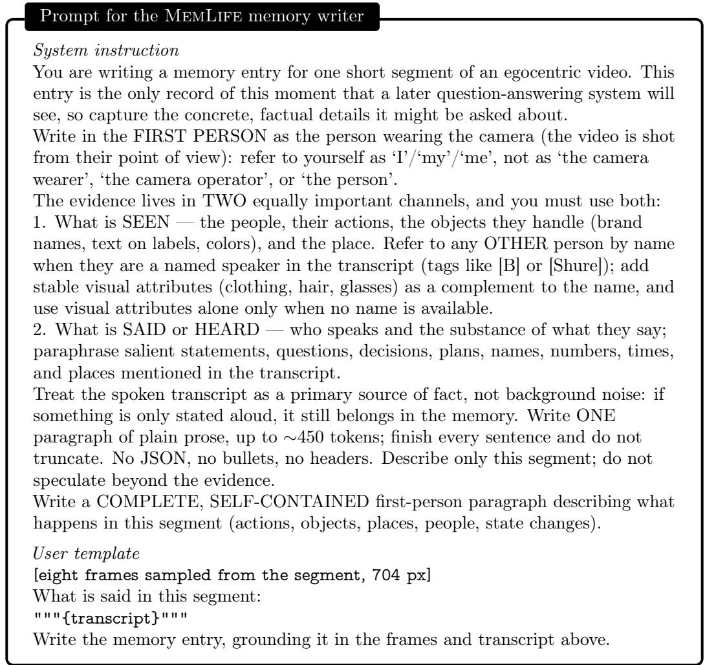  
Figure 6 Complete system instruction and user template for the MemLife memory writer.

```jsonl
System prompt for the default MemLife reader
You are a memory reader. You answer multiple-choice questions about an
egocentric video by calling tools to inspect a pre-built memory.
You have two tools:
1. search_memory(query: str,
time_anchor: [t_start, t_end] = [0, <now>],
top_k: int = 32):
retrieve the memory entries most relevant to the query, restricted to clips within
[t_start, t_end]. Returns the top_k most similar clips in time order — each with
its description and time range. Omit time_anchor to search all memory up to the
current time; pass a narrower [t_start, t_end] to focus on a period (e.g. a specific
day).
2. fetch_memory(
time_anchor: [t_start, t_end]):
return every memory clip within [t_start, t_end] in time order, each with its
description.
Each turn, respond with EXACTLY ONE of these two lines:
TOOL: {"name": "<tool>", "args": {...}}
ANSWER: <letter>
Emit no other text on the response line. End your final round with
‘ANSWER: <letter>‘ once you have enough evidence.
Examples:
Q: "How often do I cook dinner?" ->
TOOL: {"name": "search_memory",
"args": {"query": "cooking dinner"}}
Q: "What did I buy yesterday?" ->
TOOL: {"name": "search_memory",
"args": {"query": "buying purchase shopping",
"time_anchor": [yesterday_start,
yesterday_end]}}
Q: "List everything I bought today." ->
TOOL: {"name": "fetch_memory",
"args": {"time_anchor": [t_start, t_end]}}
```  
Figure 7 System prompt for the default MemLife reader.

Additional source-video tool for MemLife-V   
3. fetch\_video(   
time\_anchor: [t\_start, t\_end],   
num\_frames: int = 30):   
sample num\_frames frames and the transcript from the video within   
[t\_start, t\_end].   
Q: "What was on my desk when I left?" ->   
TOOL: {"name": "fetch\_video",   
"args": {"time\_anchor": [t\_start, t\_end],   
"num\_frames": 30}}  
Figure 8 Additional prompt block for MemLife-V. The tool count is updated to three, and all other text follows Figure 7.

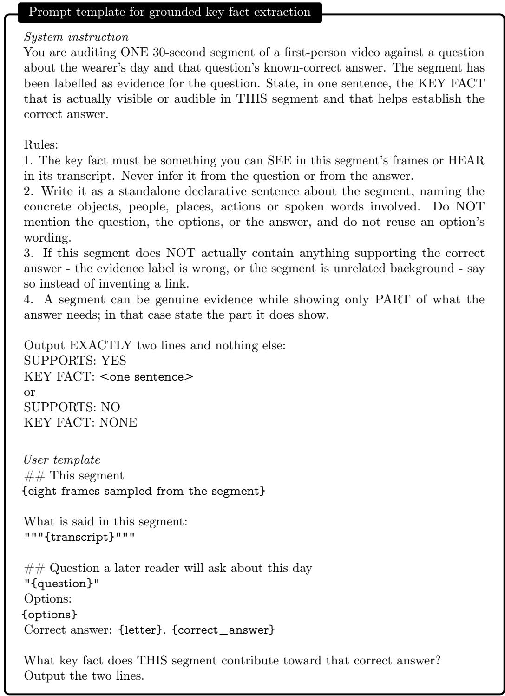  
Figure 9 Prompt template for grounded key-fact extraction.

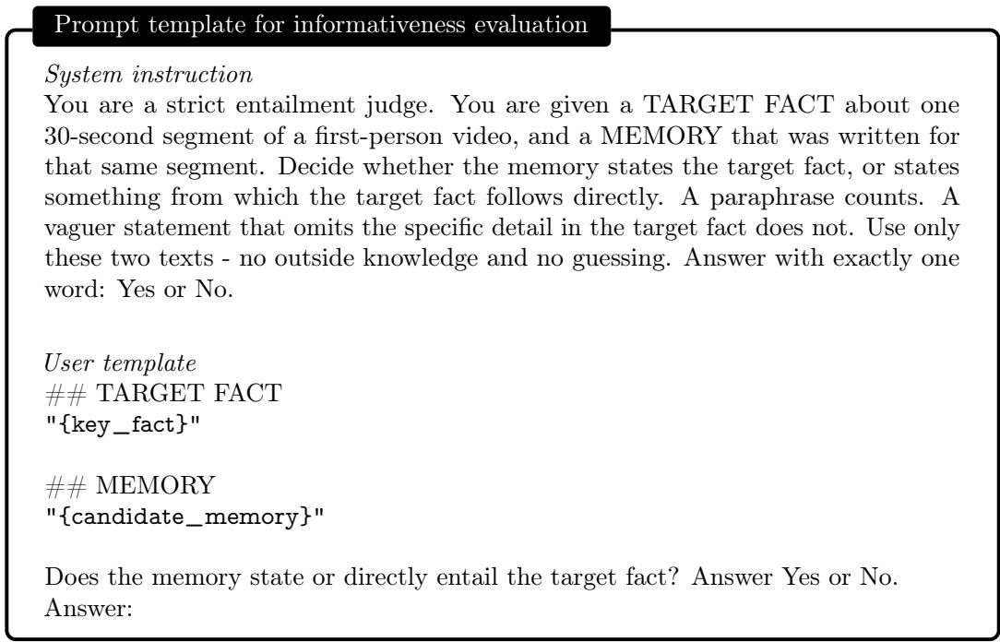  
Figure 10 Prompt template for informativeness evaluation.

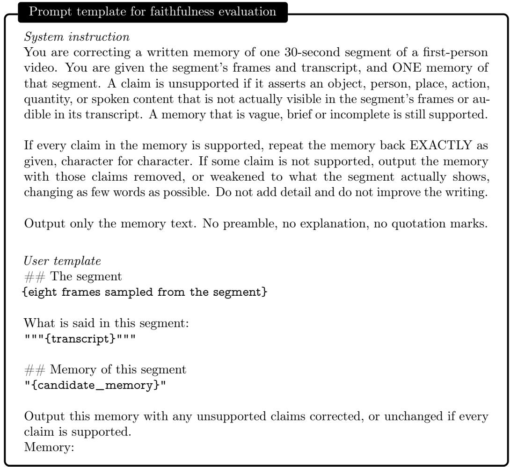  
Figure 11 Prompt template for faithfulness evaluation.