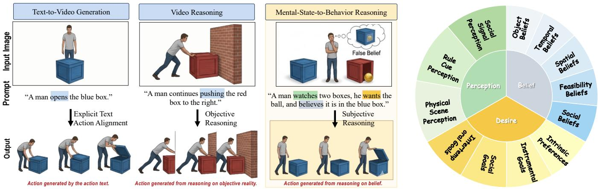
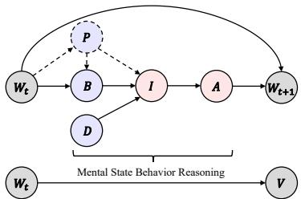
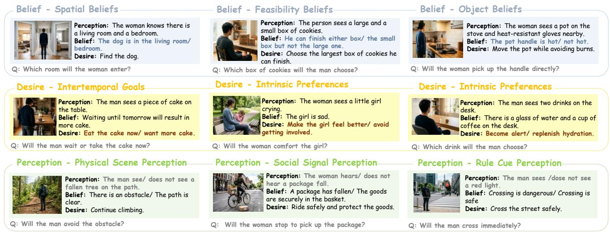
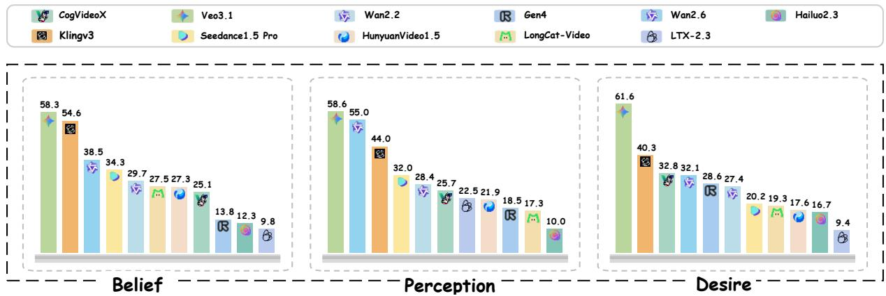
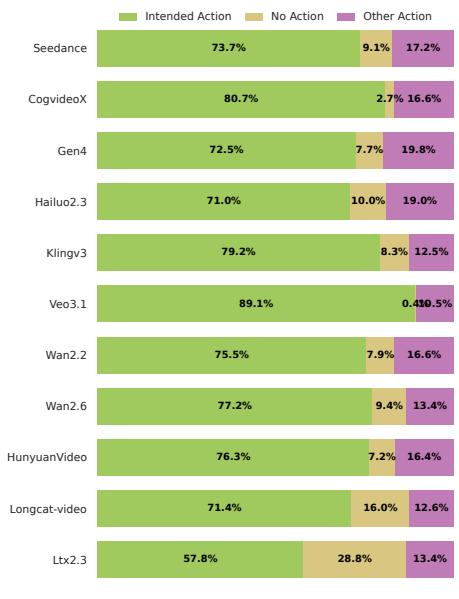
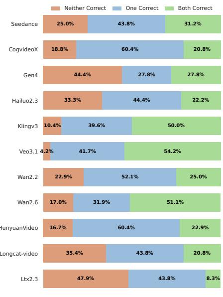
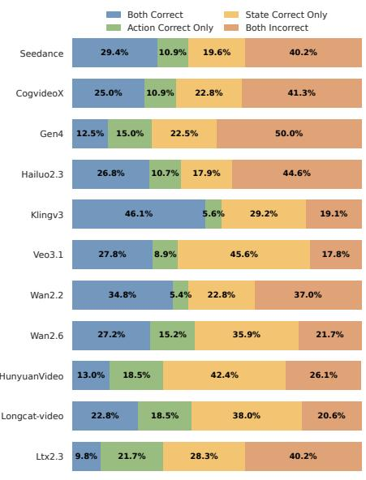
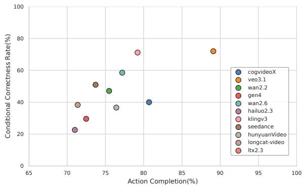

# MindWorldBench: Evaluating Mental-State-to-Behavior Reasoning in Image-to-Video Generation

Ruiqi Li∗   
rqli25@stu.pku.edu.cn   
Peking University   
Beijing, China   
Yuxin Liu   
u202442516@xs.ustb.edu.cn   
University of Science and   
Technology Beijing   
Beijing, China Hanwei Zhu   
hanwei.zhu@ntu.edu.sg   
Nanyang Technological University Singapore, Singapore   
Xuanyi Liu∗   
xuanyi@stu.pku.edu.cn   
Peking University   
Beijing, China   
Feng Xie   
u202442730@xs.ustb.edu.cn   
University of Science and   
Technology Beijing   
Beijing, China

Yizong Wang† wang@pku.edu.cn Peking University Beijing, China

Sijia Li∗   
lisijia@xs.ustb.edu.cn   
University of Science and   
Technology Beijing   
Beijing, China   
Songchao Tan   
sctan@ustb.edu.cn   
University of Science and   
Technology Beijing   
Beijing, China

Chuanmin Jia cmjia@pku.edu.cn Peking University Beijing, China

Haofeng Wang   
hfwang@stu.pku.edu.cn   
Peking University   
Beijing, China   
Shiqi Wang   
shiqwang@cityu.edu.hk   
City University of Hong   
Kong   
Hong Kong, China   
Siwei Ma   
swma@pku.edu.cn   
Peking University   
Beijing, China

## Abstract

Current image-to-video models achieve visual realism and physical plausibility, but reasoning about mental states remains unexplored. Actions are driven by belief, desire, and perception, requiring inference beyond explicit instructions. We introduce MindWorldBench to evaluate mental-state-conditioned video generation. We formalize this as mental-state-to-behavior reasoning, where models generate actions from a world state and latent variables without explicit action prompts. MindWorldBench utilizes Zero-Action Prompting and a counterfactual design with 744 prompts to isolate the causal efects of mental states. An automated pipeline evaluates video quality, commonsense plausibility, and mental-state consistency. Evaluations of 11 models show that despite visual fidelity and physical reasoning, models fail to align behaviors with latent mental states. We identify a failure mode, termed Omniscient Bias, where models default to the objective world state rather than human’s subjective belief. These results demonstrate a disconnect between visual generation and cognitive reasoning, suggesting a need for explicit mental-state modeling in video generation systems. Project website: https://richard2049-lee.github.io/MindWorldBench/

## CCS Concepts

• Computing methodologies → Computer vision; • General and reference → Evaluation.

## Keywords

video generation, image-to-video, mental state reasoning

ACM Reference Format:   
Ruiqi Li, Xuanyi Liu, Sijia Li, Haofeng Wang, Yuxin Liu, Feng Xie, Songchao Tan, Shiqi Wang, Hanwei Zhu, Yizong Wang, Chuanmin Jia, and Siwei Ma. 2026. MindWorldBench: Evaluating Mental-State-to-Behavior Reasoning in Image-to-Video Generation. In Proceedings ofthe 34th ACM International Conference on Multimedia (MM ’26), November 10–14, 2026, Rio de Janeiro, Brazil. ACM, New York, NY, USA, 7 pages. https://doi.org/10.1145/3767308. 3838657

## 1 Introduction

Recent image-to-video (I2V) models excel at synthesizing realistic and temporally coherent dynamics [11, 14, 19, 32, 41]. However, physical realism does not equate to understanding human behavior. Real-world actions are largely driven by unobservable mental states such as perception, belief, and desire. In cognitive science, the ability to reason about such latent states is referred to as Theory of Mind (ToM) [27]. As shown in Figure 1 (Left), a cognitively capable model must prioritize a person’s subjective belief over objective reality. For instance, in a false-belief scenario, the model should generate the man opening an empty box because he believes the object is inside, regardless of where the object actually is. Motivated by this, we introduce mental-state-to-behavior reasoning, where visual actions emerge from latent psychological states rather than explicit directives.

This cognitive dimension remains absent from existing evaluations. As contrasted in Figure 1 (Left), current benchmarks predominantly assess explicit action alignment (e.g., “a man opens a box”) [12] or implicit physical continuation (e.g., predicting a shot’s trajectory) [23]. These settings focus on observable kinematics and fail to isolate mental reasoning from statistical shortcut learning [21]. Models often succeed by memorizing physical priors or associating action verbs with visual outcomes. To gauge the cognitive depth of I2V models, we must shift from physical instruction-following toward mental-state-conditioned behavior generation.

  
Figure 1: Mental-State-to-Behavior Reasoning and the MindWorldBench Taxonomy. (Left) Evolution of Generation Paradigms: Unlike traditional Text-to-Video (explicit instruction alignment) or Video Reasoning (objective physical rules), our paradigm requires models to autonomously deduce behaviors from latent cognitive states. As illustrated, the model must prioritize the man’s subjective belief over objective reality to generate the correct reasoning-driven action. (Right) MindWorldBench Taxonomy: Grounded in the BDI-P framework, we systematically categorize mental variables into three primary dimensions— Perception, Belief, and Desire—to comprehensively evaluate Theory of Mind capabilities in video generation.

To address this gap, we introduce MindWorldBench, the first comprehensive benchmark evaluating ToM capabilities in video generation. We conceptualize this task as a physical-mental de coupling mechanism where the image anchors the World State and the text injects the subjective Mental State. Grounded in the Belief-Desire-Intention (BDI) theory, our benchmark systematically organizes latent variables into a structured taxonomy of Perception, Belief, and Desire (Figure 1, Right). Crucially, MindWorldBench pio neers a “Zero-Action Prompting” strategy. Prompts exclusively describe the character’s internal state without action verbs, forcing models to autonomously deduce logical intent and generate corresponding behaviors.

Single-prompt accuracy cannot distinguish consistent mentalstate tracking from chance success. We therefore construct counterfactual prompt pairs that minimally vary a mental state (e.g., a true versus false belief) while holding the image fixed [7, 36]. Joint success on both prompts provides evidence of counterfactual sensitivity under a controlled visual context. For scalable assessment, we develop an automated large vision model (LVM) pipeline [4, 10, 15, 17, 45], using structured reasoning prompts [15, 30, 39] to evaluate visual quality, commonsense plausibility, intention accuracy, and world-state maintenance. A study on 100 generated videos finds strong agreement with judgments aggregated from 10 human experts.

The evaluation is conducted on the MindWorldBench dataset, comprising 744 expert-designed prompts. We evaluate eleven stateof-the-art models including Veo 3.1, Kling V3, Wan 2.6, and CogVideoX.

Results reveal a dichotomy where models maintain physical common sense but struggle with mental reasoning. Notably, we identify an “Omniscient Bias”. Models frequently fail to decouple their global visual knowledge from the character’s limited perception, generating actions based on objective truth rather than subjective belief.

In summary, our main contributions are threefold:

• A Paradigm Shift in Evaluation: We propose MindWorld-Bench to transition from physical instruction-following to Mental-State-to-Behavior reasoning via BDI theory and Zero-Action Prompting.

• Rigorous Causal Methodology: We construct a decoupled dataset of 372 images and 744 prompts. The counterfactual design isolates latent mental variables and eliminates statistical shortcuts.

• Robust Evaluation and Deep Insights: We establish an LVM-based framework that uncovers cognitive bottlenecks in 11 leading models, identifying the “Omniscient Bias” as a critical challenge for future world simulators.

## 2 Related Work

Video Generation Models and World Simulators The landscape of video generation has been transformed by difusion models and Difusion Transformers [29, 41]. Recent models demonstrate strong capabilities in generating high-fidelity, temporally coherent videos. Excelling at physical dynamics like fluid motion and object permanence, they are increasingly viewed as nascent “world simulators” [2, 19, 44]. However, real-world dynamics are governed by both physics and cognitive intent. While current models successfully simulate the physical consequences of actions, they lack mechanisms to model why these actions are initiated.

Evaluation Benchmarks for Video Generation Numerous benchmarks evaluate video generation models, including VBench series [12, 13, 46], EvalCrafter [21], UI2V-Bench [43] and FETV [22]. These mainly focus on perceptual quality and semantic alignment [20, 46]. By testing if generated videos execute explicit actions described in prompts, they adopt an instruction-following paradigm [3]. This encourages statistical shortcut learning because models map textual verbs to visual priors without understanding causal logic. In contrast, MindWorldBench introduces Zero-Action Prompting and counterfactual testing, shifting the focus from simple action execu tion to deep causal reasoning [5].

Evaluation Dimensions Theory of Mind (ToM) is the cognitive ability to attribute mental states to oneself and others [1]. In AI, ToM is extensively studied using the Belief-Desire-Intention (BDI) framework [8, 9, 25] and textual False Belief tasks for language models [16, 35]. In the visual domain, emerging works explore ToM in vision models but restrict their focus to understanding tasks [26, 31, 37]. The inverse generation task of synthesizing visual behaviors conditioned on latent mental states remains unexplored. MindWorldBench fills this gap by extending the BDI framework into a vision-oriented architecture, establishing the first ToM benchmark for video generation.

## 3 Method

## 3.1 Task Definition

We formalize mental-state-conditioned video generation at two levels: a latent cognitive reasoning level and a video generation level, as the causal graph illustrated in Figure 2.

Theory of Mind Modeling. As shown in the upper part of Figure 2, human behavior is modeled through a latent causal chain grounded in the BDI-P framework. Given an initial world state� , the internal Belief (�) is formed from observations and may be constrained by an optional Perception variable (�), which is introduced only in scenarios involving partial observability or attentional failure. The Desire (�) and Belief (�) jointly determine an unobservable Intention (�), which then leads to a visible Action (�). Together with the physical context ��, this action determines the subsequent world state $W _ { t + 1 } { : }$

$$
p ( W _ { t + 1 } \mid W _ { t } , M ) = p ( W _ { t + 1 } \mid W _ { t } , A ) p ( A \mid I ) p ( I \mid M )\tag{1}
$$

Video Reasoning Paradigm. At the benchmark level, we operationalize this cognitive process as an end-to-end generation task. As shown in the lower part of Figure 2, the latent chain is simplified into a direct mapping from the initial image and mental constraints to the generated video � :

$$
( W _ { t } , { M } ) \xrightarrow { \mathrm { \tiny ~ R e a s o n i n g } } V , \qquad { M } \subseteq \{ P , B , D \}\tag{2}
$$

where $W _ { t }$ is anchored by the input image, and M defines the mentalstate reasoning space. This mapping requires the model to implicitly infer the latent chain from mental state to intention to action. Ac cordingly,

$$
p ( V \mid W _ { t } , { \mathcal { M } } ) = p ( V \mid W _ { t } , A ) ~ p ( A \mid I ) ~ p ( I \mid { \mathcal { M } } )\tag{3}
$$

Unlike traditional action-driven paradigms that provide the action � explicitly, MindWorldBench provides only the high-level mental constraints M. The benchmark therefore evaluates whether a model can map invisible mental states to visible behavioral outcomes.

  
Figure 2: Causal Graph of Mental-State-to-Behavior Generation. Shaded gray nodes (��,� ) are observed visual states. Blue nodes (M = {�, �, �}, �, �) are latent cognitive variables. Models implicitly infer the latent intention � and action � to generate the video �.

## 3.2 Mental-Space Taxonomy

Grounded in the BDI paradigm and Theory of Mind, our taxonomy parameterizes latent cognitive variables across 3 primary dimensions, 12 secondary aspects, and 34 fine-grained sub-dimensions (Figure 1). We structure this hierarchical space as a reasoning pipeline where perceptual constraints inform mental representations:

Perception (P): The Information and Attentional Gateway. Perception serves as the cognitive gateway between the environment and internal knowledge, involving information acquisition and attentional allocation. Spanning environmental, rule, and social cues, this dimension evaluates whether models recognize that the presence of information does not guarantee character awareness. It tests the ability to synthesize reactive behaviors based on successful cognitive uptake versus inattentional blindness.

Belief (B): The Subjective World Model. Belief represents the character’s internal understanding, which may diverge from objective reality. We organize this dimension into physical, temporal, and spatial aspects to test whether models resist omniscient bias. Success requires generating behaviors dictated by the character’s potentially flawed or outdated understanding instead of the globally true state.

Desire (D): The Motivational Driver. Desire parameterizes the goals and preferences that drive action selection. Categorized into immediate preference, functional utility, and social motivation, this dimension assesses the capacity to synthesize goal-directed actions. This ensures generated trajectories are causally aligned with internal utilities and specific target states.

## 3.3 Dataset Construction

MindWorldBench is constructed through a psychology-inspired pipeline grounded in Theory of Mind and BDI-style reasoning. Five experts first design cognitive graphs over world state, perception, belief, desire, intention, and action; each graph is independently reviewed by two experts and retained only after consensus. We then source visual anchors from public repositories or AIGC platforms, filter candidates for the required visual afordances, and avoid identifiable frontal faces. Mental-state prompts are synthesized from the verified image and graph variables while withholding the ground-truth intention, so the generation input does not reveal the target action. A final audit checks image–text consistency, reasoning plausibility, visual renderability/discriminability, and cognitive duplication; more than 2,000 candidates are condensed into 744 expert-curated cases over 372 images.

  
Figure 3: Representative examples from MindWorldBench. The benchmark spans the three mental dimensions: Belief, Desire, and Perception, covering diverse subcategories. Each example shows the generation input (image plus mental-state prompt); the displayed question is evaluation-only and is not provided to the generation model.

The dataset is organized into 3 primary dimensions, 12 secondary categories, and 34 fine-grained sub-dimensions across Perception, Belief, and Desire. Each case specifies a mental-state condition together with candidate behavior and objective world-state constraints; counterfactual pairs keep the image fixed while varying the mental condition.

## 3.4 Evaluation Protocol

To determine whether a generated video exhibits mental-stateconditioned behavior, we adopt an evaluation protocol that jointly assesses video reliability, commonsense validity, behavioral correctness, and world-state consistency.

Evaluation Metrics. We evaluate each generated video using five complementary metrics. Visual Quality and Commonsense Plausibility are scored on 1–5 scales, measuring perceptual reliability and compatibility with basic physical and commonsense knowledge, respectively. Action Occurrence categorizes the out put as one of the two candidate actions or an irrelevant other action. Intention Accuracy (IA) is a binary measure of whether the gen erated action follows the intention implied by the mental-state condition. World-State Maintenance (WS) measures whether the post-action scene remains consistent with the objective world state. IA and WS are reported as percentages over all prompts, whereas Visual Quality and Commonsense Plausibility are arithmetic means over all prompts.

LMM-based Evaluation and Validation. We use Gemini 3.1 Pro as the evaluator and adopt a structured multi-step judging pipeline. For each case, the evaluator identifies the objective world state, the manipulated mental-state condition, and the candidate behaviors before scoring the five metrics using metric-specific rubrics and positive/negative examples. We validated the protocol on 100 generated videos using 10 independent human experts who followed the same evaluation criteria. Human consensus was obtained through majority voting for discrete metrics and mean aggregation for continuous 1–5 ratings. For Visual Quality and Commonsense Plausibility, the LMM achieves PLCC/SRCC values of 0.78/0.76 and 0.81/0.79, respectively. For the binary reasoning metrics, the exact agreement rates are 92% for Intention Accuracy and 89% for World-State Maintenance. These results indicate strong alignment with human judgments, while automated evaluation remains complementary to human assessment.

## 4 Experiments

## 4.1 Experimental Setup

To assess mental-state-conditioned behavior generation, we evaluate eleven Image-to-Video (I2V) systems, spanning closed-source commercial APIs and open-source foundation models: Veo 3.1 [6], KlingV3 [33], Seedance 1.5 Pro [29], Hailuo2.3 [24], Runway Gen4 [28], Wan2.6 [38], Wan2.2 [38], CogVideoX [42], HunyuanVideo1.5 [40], LongCat-Video [34], and LTX2.3 [18]. The evaluation uses 744 expert-designed mental-state prompts, targeting 720p resolution and 5–8 second videos.

## 4.2 Overall Benchmark Results

Table 1 summarizes overall performance on MindWorldBench. Visual Quality and Commonsense Plausibility are relatively strong and tightly clustered, ranging from 3.8–4.4 and 3.8–4.6, respectively. In contrast, Intention Accuracy ranges from 11.9% to 59.5% and World-State Maintenance from 32.5% to 68.3%, showing that current image-to-video models generate visually plausible videos more reliably than they infer mental-state-conditioned behavior while preserving the objective world state.

Table 1: Overall performance comparison on MindWorldBench.
<table><tr><td>Models</td><td>Params</td><td>Visual Quality ↑</td><td>Commonsense Plausibility ↑</td><td>Intention Accuracy ↑</td><td>World-State Maintenance ↑</td></tr><tr><td>Kling [33]</td><td></td><td>4.1</td><td>4.2</td><td>47.2</td><td>66.3</td></tr><tr><td>Veo3.1 [6]</td><td></td><td>3.8</td><td>4.0</td><td>59.5</td><td>61.4</td></tr><tr><td>Seedance1.5Pro [29]</td><td></td><td>4.3</td><td>4.3</td><td>29.3</td><td>52.9</td></tr><tr><td>Gen4 [28]</td><td></td><td>4.0</td><td>3.9</td><td>18.6</td><td>49.4</td></tr><tr><td>Hailuo2.3 [24]</td><td></td><td>3.8</td><td>3.8</td><td>13.0</td><td>32.5</td></tr><tr><td>CogVideoX [42]</td><td>5B</td><td>3.9</td><td>4.0</td><td>27.7</td><td>54.2</td></tr><tr><td>Wan2.6 [38]</td><td>14 B</td><td>4.2</td><td>4.3</td><td>39.0</td><td>59.9</td></tr><tr><td>Wan2.2 [38]</td><td>14 B</td><td>4.4</td><td>4.4</td><td>28.7</td><td>54.0</td></tr><tr><td>HunyuanVideo1.5 [40]</td><td>8B</td><td>4.4</td><td>4.5</td><td>23.0</td><td>68.3</td></tr><tr><td>LongCat-Video [34]</td><td>13.6B</td><td>4.4</td><td>4.6</td><td>22.2</td><td>65.1</td></tr><tr><td>LTX2.3 [18]</td><td>22B</td><td>4.3</td><td>4.5</td><td>11.9</td><td>58.7</td></tr></table>

  
Figure 4: Performance breakdown across the three major mental dimensions: Belief, Perception, and Desire. Diferent model exhibit distinct strengths across dimensions.

Figure 4 breaks down Intention Accuracy across Belief, Perception, and Desire. Veo3.1 achieves the highest IA in all three dimensions, with 58.3%, 58.6%, and 61.6%, respectively. Kling is the closest competitor on Belief and Desire, while Wan2.6 is closest on Perception. These dimension-specific rankings show that aggregate IA can mask uneven reasoning capabilities, motivating the fine-grained diagnostics below.

## 4.3 Diagnostic Analysis of Mental-State Reasoning

We further analyze model outputs to diagnose mental-state reasoning failures (Figures 5–6).

Action Realization and Conditional Intention Correctness. Because mental-state reasoning is observable only through generated behavior, we first examine whether each video contains one of the two task-relevant actions predefined from the controlled variables. The prompt does not explicitly provide these actions; they are derived from the scene and the manipulated mental-state condition and are used only as evaluation targets. Outputs are categorized as Intended Action, No Action, or Other Action. This step checks whether the generated video provides valid behavioral evidence for evaluating intention reasoning. An output without either candidate action cannot reveal whether the model has correctly translated the mental state into behavior, although it does not by itself prove the absence of reasoning.

Among outputs containing one of the two candidate actions, we further measure conditional intention correctness, namely whether the selected action matches the manipulated mental-state condition. Figure 6 reports action completion and conditional correctness jointly. These measurements establish that the generated videos contain suficient and interpretable behavioral evidence for evaluating mental-state reasoning.

Counterfactual Consistency. We next evaluate whether models respond consistently when the mental-state condition changes while the initial image remains fixed. For each counterfactual pair, Both Correct means that the model generates the intended behavior in both conditions, One Correct means that it succeeds in only one condition, and Neither Correct means that it fails in both conditions. Figure 5b shows that Veo3.1 achieves the highest Both Correct rate (54.2%), followed by Wan2.6 (51.1%) and Kling V3 (50.0%). In contrast, LTX2.3 has a Both Correct rate of only 8.3% and the highest Neither Correct rate (47.9%). These results show why pair-level evaluation is stricter than single-prompt accuracy: a model may produce a correct action in one condition without consistently tracking the controlled mental-state variation.

  
(a) Action Types

  
(b) Counterfactual Outcomes

  
(c) Action–State Decomposition

Figure 5: Diagnostic Analysis of Reasoning Failures. (a) Generated action type distribution. (b) Counterfactual paired outcomes. (c) Decomposition of action and world-state results into Both Correct, Action Correct, State Correct, and Both Incorrect.  
  
Figure 6: Action Completion (x-axis) vs. Conditional Correctness (y-axis), illustrating the trade-of between action generation and reasoning accuracy.

Action–State Decomposition. Generating the intended action is not suficient for success: the model must also preserve the objective world state after the action. Figure 5c therefore decomposes each output into four categories: Both Correct, Action Correct Only, State Correct Only, and Both Incorrect. Kling achieves the highest joint success, with 46.1% of outputs classified as Both Correct, followed by Wan2.2 at 34.8% and Seedance at 29.4%. The strongest asymmetry is that State Correct Only is higher than Action Correct Only for most models. For example, Veo3.1 obtains 45.6% versus 8.9%, Wan2.6 obtains 35.9% versus 15.2%, and HunyuanVideo1.5 obtains 42.4% versus 18.5%. This indicates that preserving the visible world state is generally easier than selecting the correct mental-state-conditioned action. Joint failure remains substantial for several systems. Thus, action reasoning and world-state maintenance are related but nonequivalent capabilities, and success on one does not guarantee success on the other.

Overall, current I2V systems remain unreliable at mental-stateto-behavior reasoning. Although the counterfactual design reveals sensitivity to controlled mental-state changes, the low joint success and frequent pair-level failures show that current models cannot yet reliably translate latent mental states into correct actions while maintaining the objective world state.

## 5 Conclusion

We introduce MindWorldBench, a benchmark for evaluating mentalstate-to-behavior reasoning in image-to-video models. Across eleven models, visual quality and commonsense plausibility remain relatively strong, whereas intention accuracy and world-state maintenance are substantially weaker. Diagnostic analyses reveal failures in realizing task-relevant actions, tracking counterfactual mental states, and jointly preserving action correctness and objective world states, highlighting the need for mental-state modeling in future video generation systems.

## Acknowledgments

This work was supported by National Natural Science Foundation of China (62688202, U25B2010, 62502013), Postdoctoral Fellowship Program and China Postdoctoral Science Foundation (BX20250382, 2025M781448), and New Cornerstone Science Foundation through the XPLORER PRIZE.

## References

[1] Michael Bratman. 1987. Intention, plans, and practical reason. (1987).

[2] Tim Brooks, Bill Peebles, Conor Holmes, Will DePue, Craig Donahue, Aditya Ramesh, et al. 2024. Video Generation Models as World Simulators. https: //openai.com/index/video-generation-models-as-world-simulators/. OpenAI technical report, accessed 2026-04-02.

[3] Zefan Cai, Haoyi Qiu, Tianyi Ma, Haozhe Zhao, Gengze Zhou, Kung-Hsiang Huang, Parisa Kordjamshidi, Minjia Zhang, Wen Xiao, Jiuxiang Gu, et al. 2025. MMGR: Multi-Modal Generative Reasoning. arXiv preprint arXiv:2512.14691 (2025).

[4] Xiuyuan Chen, Yuan Lin, Yuchen Zhang, and Weiran Huang. 2024. Autoevalvideo: An automatic benchmark for assessing large vision language models in open-ended video question answering. In European Conference on Computer Vision. Springer, 179–195.

[5] Yuefei Chen, Jiang Liu, Xiaodong Lin, and Ruixiang Tang. 2025. CounterVQA: Evaluating and Improving Counterfactual Reasoning in Vision-Language Models for Video Understanding. arXiv preprint arXiv:2511.19923 (2025).

[6] Jess Gallegos and Thomas Iljic. 2025. Introducing Veo 3.1 and Advanced Capabil ities in Flow. https://blog.google/innovation-and-ai/products/veo-updates-flow/. Published October 15, 2025; accessed August 4, 2026

[7] Jon Gauthier, Jennifer Hu, Ethan Wilcox, Peng Qian, and Roger Levy. 2020. SyntaxGym: An online platform for targeted evaluation of language models. In Proceedings ofthe 58th Annual Meeting ofthe Association for Computational Linguistics: System Demonstrations. 70–76.

[8] Michael Georgef, Barney Pell, Martha Pollack, Milind Tambe, and Michael Wooldridge. 1998. The belief-desire-intention model of agency. In International workshop on agent theories, architectures, and languages. Springer, 1–10.

[9] M Georgef and A Rao. 1991. Modeling rational agents within a BDI-architecture. In Proc. 2nd Int. Conf. on Knowledge Representation and Reasoning (KR’91). Morgan Kaufmann. of, 473–484.

[10] Hui Han, Siyuan Li, Jiaqi Chen, Yiwen Yuan, Yuling Wu, Yufan Deng, Chak Tou Leong, Hanwen Du, Junchen Fu, Youhua Li, et al. 2025. Video-bench: Humanaligned video generation benchmark. In Proceedings ofthe Computer Vision and Pattern Recognition Conference. 18858–18868.

[11] Haoyang Huang, Guoqing Ma, Nan Duan, Xing Chen, Changyi Wan, Ranchen Ming, Tianyu Wang, Bo Wang, Zhiying Lu, Aojie Li, et al. 2025. Step-video-ti2v technical report: A state-of-the-art text-driven image-to-video generation model. arXiv preprint arXiv:2503.11251 (2025).

[12] Ziqi Huang, Yinan He, Jiashuo Yu, Fan Zhang, Chenyang Si, Yuming Jiang, Yuanhan Zhang, Tianxing Wu, Qingyang Jin, Nattapol Chanpaisit, et al. 2024. Vbench: Comprehensive benchmark suite for video generative models. In Proceedings ofthe IEEE/CVF Conference on Computer Vision and Pattern Recognition. 21807– 21818.

[13] Ziqi Huang, Fan Zhang, Xiaojie Xu, Yinan He, Jiashuo Yu, Ziyue Dong, Qianli Ma, Nattapol Chanpaisit, Chenyang Si, Yuming Jiang, et al. 2025. Vbench++: Comprehensive and versatile benchmark suite for video generative models. IEEE Transactions on Pattern Analysis and Machine Intelligence (2025).

[14] Sai Shashank Kalakonda, Shubh Maheshwari, and Ravi Kiran Sarvadevabhatla. 2025. Morag-Multi-Fusion Retrieval Augmented Generation for Human Motion. In 2025 IEEE/CVF Winter Conference on Applications ofComputer Vision (WACV). IEEE, 4564–4573.

[15] Takeshi Kojima, Shixiang Shane Gu, Machel Reid, Yutaka Matsuo, and Yusuke Iwasawa. 2022. Large language models are zero-shot reasoners. Advances in neural information processing systems 35 (2022), 22199–22213.

[16] Michal Kosinski. 2024. Evaluating large language models in theory of mind tasks. Proceedings ofthe National Academy ofSciences 121, 45 (2024), e2405460121.

[17] Jian Li, Weiheng Lu, Hao Fei, Meng Luo, Ming Dai, Min Xia, Yizhang Jin, Zhenye Gan, Ding Qi, Chaoyou Fu, et al. 2024. A survey on benchmarks of multimoda large language models. arXiv preprint arXiv:2408.08632 (2024).

[18] Lightricks. 2026. LTX-2.3 Model Card. https://huggingface.co/Lightricks/LTX-2.3. Accessed: 2026-08-05.

[19] Shaowei Liu, Zhongzheng Ren, Saurabh Gupta, and Shenlong Wang. 2024. Physgen: Rigid-body physics-grounded image-to-video generation. In European Conference on Computer Vision. Springer, 360–378.

[20] Xinxin Liu, Zhaopan Xu, Ming Li, Kai Wang, Yong Jae Lee, and Yuzhang Shang. 2025. Can World Simulators Reason? Gen-ViRe: A Generative Visual Reasoning Benchmark. arXiv preprint arXiv:2511.13853 (2025).

[21] Yaofang Liu, Xiaodong Cun, Xuebo Liu, Xintao Wang, Yong Zhang, Haoxin Chen, Yang Liu, Tieyong Zeng, Raymond Chan, and Ying Shan. 2024. Evalcrafter: Benchmarking and evaluating large video generation models. In Proceedings of the IEEE/CVF conference on computer vision and pattern recognition. 22139–22149.

[22] Yuanxin Liu, Lei Li, Shuhuai Ren, Rundong Gao, Shicheng Li, Sishuo Chen, Xu Sun, and Lu Hou. 2023. Fetv: A benchmark for fine-grained evaluation of opendomain text-to-video generation. Advances in Neural Information Processing Systems 36 (2023), 62352–62387.

[23] Fanqing Meng, Jiaqi Liao, Xinyu Tan, Wenqi Shao, Quanfeng Lu, Kaipeng Zhang, Yu Cheng, Dianqi Li, Yu Qiao, and Ping Luo. 2024. Towards world simulator:

Crafting physical commonsense-based benchmark for video generation. arXiv preprint arXiv:2410.05363 (2024).

[24] MiniMax. 2025. Hailuo 2.3. https://hailuoai.video/zh-Intl. Accessed: 2026-04-02.

[25] Michael C Móra, José G Lopes, Rosa M Viccariz, and Helder Coelho. 1998. BDI models and systems: Reducing the gap. In International Workshop on Agent Theories, Architectures, and Languages. Springer, 11–27.

[26] Lixing Niu, Jiapeng Li, Xingping Yu, Shu Wang, Ruining Feng, Bo Wu, Ping Wei, Yisen Wang, and Lifeng Fan. 2025. Rˆ 3-VQA:" Read the Room" by Video Social Reasoning. arXiv preprint arXiv:2505.04147 (2025).

[27] David Premack and Guy Woodruf. 1978. Does the chimpanzee have a theory of mind? Behavioral and brain sciences 1, 4 (1978), 515–526.

[28] Runway. 2025. Introducing Runway Gen-4. https://runwayml.com/research/ introducing-runway-gen-4 Accessed: 2026-04-02.

[29] Team Seedance, Heyi Chen, Siyan Chen, Xin Chen, Yanfei Chen, Ying Chen, Zhuo Chen, Feng Cheng, Tianheng Cheng, Xinqi Cheng, et al. 2025. Seedance 1.5 pro: A Native Audio-Visual Joint Generation Foundation Model. arXiv preprint arXiv:2512.13507 (2025).

[30] Hao Shao, Shengju Qian, Han Xiao, Guanglu Song, Zhuofan Zong, Letian Wang, Yu Liu, and Hongsheng Li. 2024. Visual cot: Advancing multi-modal language models with a comprehensive dataset and benchmark for chain-of-thought rea soning. Advances in Neural Information Processing Systems 37 (2024), 8612–8642.

[31] Haojun Shi, Suyu Ye, Xinyu Fang, Chuanyang Jin, Leyla Isik, Yen-Ling Kuo, and Tianmin Shu. 2025. Muma-tom: Multi-modal multi-agent theory of mind. In Proceedings ofthe AAAI Conference on Artificial Intelligence, Vol. 39. 1510–1519.

[32] Xiaoyu Shi, Zhaoyang Huang, Fu-Yun Wang, Weikang Bian, Dasong Li, Yi Zhang, Manyuan Zhang, Ka Chun Cheung, Simon See, Hongwei Qin, et al. 2024. Motion i2v: Consistent and controllable image-to-video generation with explicit motion modeling. In ACM SIGGRAPH 2024 Conference Papers. 1–11.

[33] Kling Team,Jialu Chen, Yuanzheng Ci, Xiangyu Du, Zipeng Feng, Kun Gai, Sainan Guo, Feng Han, Jingbin He, Kang He, et al. 2025. Kling-Omni Technical Report. arXiv preprint arXiv:2512.16776 (2025).

[34] Meituan LongCat Team, Xunliang Cai, Qilong Huang, Zhuoliang Kang, Hongyu Li, Shijun Liang, Liya Ma, Siyu Ren, Xiaoming Wei, Rixu Xie, et al. 2025. Longcat video technical report. arXiv preprint arXiv:2510.22200 (2025).

[35] Tomer Ullman. 2023. Large language models fail on trivial alterations to theoryof-mind tasks. arXiv preprint arXiv:2302.08399 (2023).

[36] Jannis Vamvas and Rico Sennrich. 2021. On the limits of minimal pairs in contrastive evaluation. In Proceedings ofthe Fourth BlackboxNLP Workshop on Analyzing and Interpreting Neural Networks for NLP. 58–68.

[37] Emilio Villa-Cueva, SM Ahmed, Rendi Chevi, Jan Christian Blaise Cruz, Kareem Elzeky, Fermin Cristobal, Alham Fikri Aji, Skyler Wang, Rada Mihalcea, and Thamar Solorio. 2025. MOMENTS: A Comprehensive Multimodal Benchmark for Theory of Mind. arXiv preprint arXiv:2507.04415 (2025).

[38] Team Wan, Ang Wang, Baole Ai, Bin Wen, Chaojie Mao, Chen-Wei Xie, Di Chen, Feiwu Yu, Haiming Zhao, Jianxiao Yang, et al. 2025. Wan: Open and advanced large-scale video generative models. arXiv preprint arXiv:2503.20314 (2025).

[39] Jason Wei, Xuezhi Wang, Dale Schuurmans, Maarten Bosma, Fei Xia, Ed Chi, Quoc V Le, Denny Zhou, et al. 2022. Chain-of-thought prompting elicits reasoning in large language models. Advances in neural information processing systems 35 (2022), 24824–24837.

[40] Bing Wu, Chang Zou, Changlin Li, Duojun Huang, Fang Yang, Hao Tan, Jack Peng, Jianbing Wu, Jiangfeng Xiong, Jie Jiang, et al. 2025. Hunyuanvideo 1.5 technical report. arXiv preprint arXiv:2511.18870 (2025).

[41] Zhen Xing, Qijun Feng, Haoran Chen, Qi Dai, Han Hu, Hang Xu, Zuxuan Wu, and Yu-Gang Jiang. 2024. A survey on video difusion models. Comput. Surveys 57, 2 (2024), 1–42.

[42] Zhuoyi Yang, Jiayan Teng, Wendi Zheng, Ming Ding, Shiyu Huang, Jiazheng Xu, Yuanming Yang, Wenyi Hong, Xiaohan Zhang, Guanyu Feng, et al. 2024. Cogvideox: Text-to-video difusion models with an expert transformer. arXiv preprint arXiv:2408.06072 (2024).

[43] Ailing Zhang, Lina Lei, Dehong Kong, Zhixin Wang, Jiaqi Xu, Fenglong Song, Chun-Le Guo, Chang Liu, Fan Li, and Jie Chen. 2025. UI2V-Bench: An Understanding-based Image-to-video Generation Benchmark. arXiv preprint arXiv:2509.24427 (2025).

[44] Chenyu Zhang, Daniil Cherniavskii, Antonios Tragoudaras, Antonios Vozikis, Thijmen Nijdam, Derck WE Prinzhorn, Mark Bodracska, Nicu Sebe, Andrii Zadaianchuk, and Efstratios Gavves. 2025. Morpheus: Benchmarking physical reasoning of video generative models with real physical experiments. arXiv preprint arXiv:2504.02918 (2025).

[45] Zhuosheng Zhang, Aston Zhang, Mu Li, Hai Zhao, George Karypis, and Alex Smola. 2023. Multimodal chain-of-thought reasoning in language models. arXiv preprint arXiv:2302.00923 (2023).

[46] Dian Zheng, Ziqi Huang, Hongbo Liu, Kai Zou, Yinan He, Fan Zhang, Lulu Gu, Yuanhan Zhang, Jingwen He, Wei-Shi Zheng, et al. 2025. Vbench-2.0: Advancing video generation benchmark suite for intrinsic faithfulness. arXiv preprint arXiv:2503.21755 (2025)