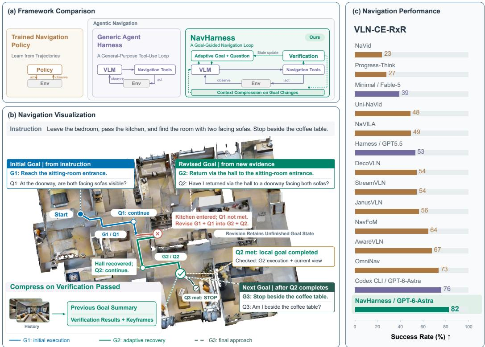
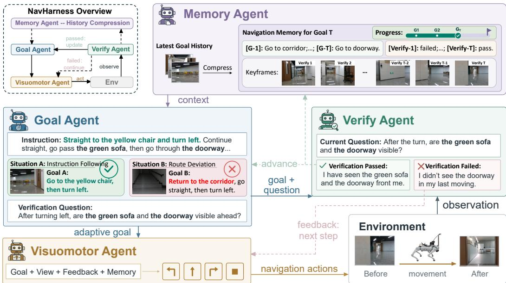
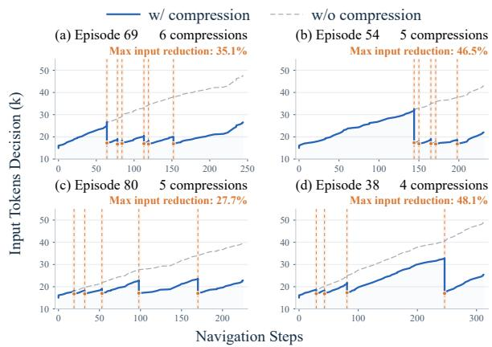
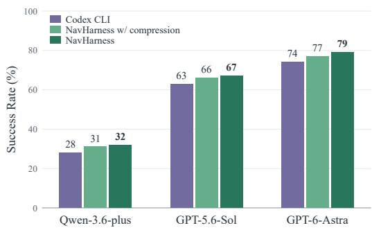
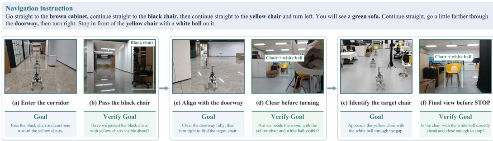
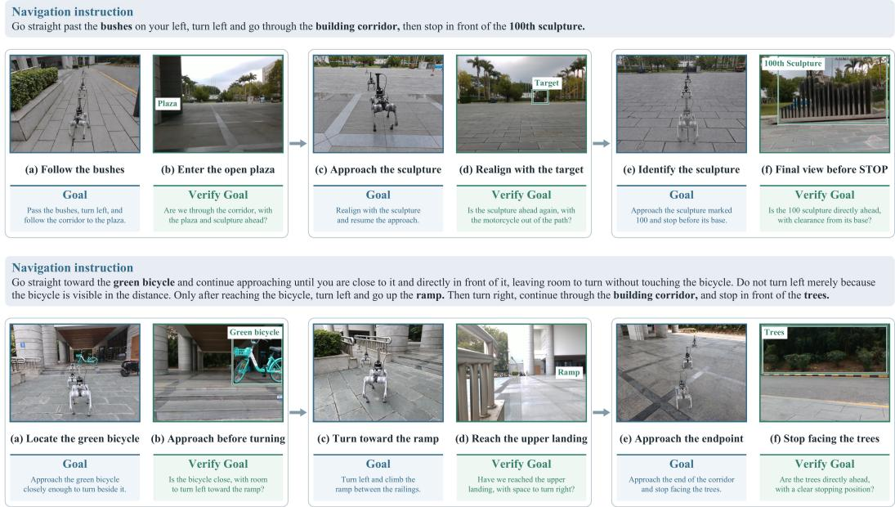
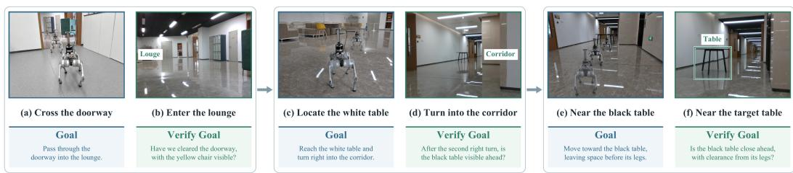
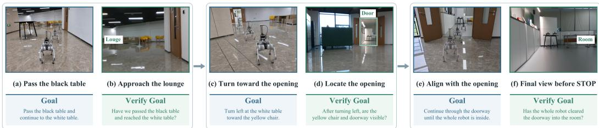
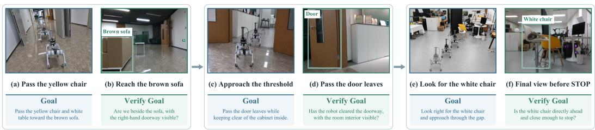
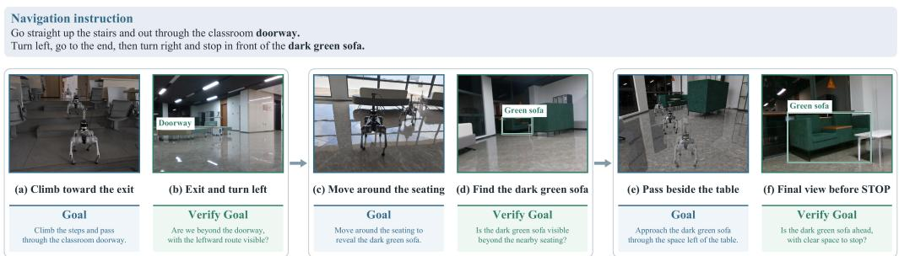

# NAVHARNESS: ADAPTIVE GOALS FORVISION-AND-LANGUAGE NAVIGATION

Haoxiang Shi1,2 Zaijing Li1,2 Muhe Ding1 Xiang Deng1 Yaowei Wang1,2 Liqiang Nie1

1Harbin Institute of Technology (Shenzhen) 2Pengcheng Laboratory

Project Page: https://Navharness.github.io

## ABSTRACT

Vision-Language Navigation (VLN) requires embodied agents to generate actions based on instructions and observations. General-purpose multimodal agents offer a promising basis for this task, but selecting plausible local actions does not ensure that execution remains consistent with the intended route, particularly in longhorizon tasks. Moreover, the accumulated interaction history increases the input required for subsequent decisions, resulting in a significant inference overhead. To this end, we introduce NavHarness, an Agentic VLN framework that includes a Goal Agent that sets adaptive goals for local actions, a Verify Agent that dynamically verifies whether a goal has been completed, a Memory Agent for multimodal context compression, and a Visuomotor Agent to execute adaptive goals. Specifically, the Goal Agent formulates adaptive goals based on the instruction, current observation, and execution history. Then the Visuomotor Agent executes navigation actions to achieve each goal, while the Verify Agent uses a goal-specific verification question to dynamically assess whether the observed outcomes satisfy the intended completion condition. Verified goal completion then marks a boundary for the Memory Agent to compress the corresponding multimodal interaction history while preserving information needed for subsequent navigation. We evaluate navigation on R2R-CE and RxR-CE, examine framework variants across three model backbones, and study context evolution during execution. For Real-World evaluation, NavHarness achieves 83.3% success and 1.51 m navigation error across eight challenging routes evaluated three times each.

## 1 INTRODUCTION

Vision-Language Navigation (VLN) requires an embodied agent to follow natural-language instructions using visual observations (Anderson et al., 2018). In continuous environments, the agent must translate route descriptions into physical movement while avoiding obstacles and recognizing when it has reached the destination (Krantz et al., 2020). Training on large-scale expert trajectories has driven substantial advances in task-specific policies and navigation foundation models (Zhang et al., 2024; Cheng et al., 2025; Qwen Team, 2026). However, an instruction cannot prescribe the appropriate response to every situation encountered during execution. Following the intended route therefore requires an agent to continually interpret new observations in the context of the instruction and adapt its actions as the environment is revealed.

General-purpose multimodal agents offer a promising basis for such adaptive decision-making. Agent frameworks allow models to interleave reasoning, tool use, and environmental feedback (Yao et al., 2023). In VLN, this interaction pattern enables a multimodal model to interpret the current scene, execute movements through navigation tools, and use the resulting observations to guide subsequent decisions. Recent navigation agents have demonstrated the potential of this approach through competitive performance with navigation foundation models (Li et al., 2026; Zhou et al., 2026; Chen et al., 2026). However, deciding what to do at an individual step is only part of the problem. Sustained navigation also requires keeping local execution consistent with the route instruction and managing the information carried forward between decisions.

  
Figure 1: NavHarness connects adaptive goal execution, verified progress, and multimodal memory. Adaptive local goals guide navigation, while goal-specific questions verify whether observed outcomes meet completion conditions. Verified completion marks boundaries for summarizing completed interactions while retaining information for ongoing navigation and recovery. NavHarness significantly outperforms trained policies and other agent frameworks in VLN-CE.

Two challenges arise in this setting. First, locally plausible actions do not ensure consistency with the intended route. Partial observations, detours, and mistaken turns can cause the actual trajectory to diverge from the agent’s assumed progress. Without checking whether an intended local objective has been achieved, the agent may base subsequent decisions on an incorrect interpretation of its progress along the route, allowing deviations to compound over long horizons (Zhou et al., 2026). Second, accumulating interaction history increases inference overhead. Repeatedly including past observations and tool interactions enlarges the input required for subsequent decisions. Indiscriminate truncation, however, can remove landmarks, corrections, or unfinished objectives that remain necessary for navigation and recovery. An explicit distinction between what has been accomplished and what remains unresolved offers a common basis for addressing both challenges.

To this end, we introduce NavHarness, an agentic VLN framework comprising a Goal Agent, a Verify Agent, a Memory Agent, and a Visuomotor Agent (Figure 1). To keep local execution aligned with the route instruction, the framework couples adaptive goal generation with explicit completion verification. The Goal Agent formulates local goals from the instruction, current observation, and execution history, allowing the immediate objective to reflect the situation actually encountered. Each goal is paired with a verification question that specifies an observable completion condition. At each step, the Visuomotor Agent executes actions toward the goal, while the Verify Agent check subsequent observations to assess whether that condition has been satisfied. Verification feedback guides whether to continue execution, advance to the next goal, or revise the objective to recove from a deviation while retaining unfinished task state. This separates goal pursuit from completion assessment, grounding progress updates in observed outcomes rather than issued actions alone.

Moreover, we introduce progress-aware multimodal context compression to limit the growth of interaction history while preserving information needed for navigation. The Memory Agent uses verified goal completion as a boundary for compression, distinguishing completed interactions that can be summarized from context still needed for ongoing execution. It condenses the multimodal history of completed goals into compact summaries that preserve route progress, relevant landmarks, and corrections, while retaining recent evidence for the active goal and carrying unfinished state forward when goals are revised. Subsequent decisions can thus build on prior progress without repeatedly processing the full sequence of past observations and interactions. By coupling compression boundaries and information retention to verified progress, this design reduces the historical context carried into subsequent decisions while avoiding the loss of unresolved objectives and recovery-relevant evidence that indiscriminate truncation can cause.

We evaluate NavHarness on R2R-CE and RxR-CE, compare framework variants across three model backbones, and analyze context evolution during execution. With GPT-6-Astra as backbone, NavHarness achieves success rates (SR) of 79.0% on R2R-CE and 82.5% on RxR-CE, compared with 74.0% and 76.3%, respectively, for Codex CLI using the same backbone. Analyses of execution traces further show that compression reduces decision input at selected navigation stages. In real-world evaluation, NavHarness achieves 83.3% SR and 1.51 m navigation error across eight challenging routes, each evaluated three times.

Our contributions are threefold:

• We introduce NavHarness, an agentic VLN framework that couples adaptive local goals with goal-specific completion verification, grounding progress updates in observed outcomes and supporting continued execution and recovery along the intended route.

• We develop a progress-aware multimodal memory mechanism that uses verified goal completion to define compression boundaries, summarizing completed interactions while preserving the context and unfinished task state needed for subsequent navigation.

• Experimental results on VLN-CE, and Real-World show that the NavHarness outperforms navigation foundation models which trained on large-scale datasets in a zero-shot setting.

## 2 RELATED WORK

## 2.1 FROM NAVIGATION POLICIES TO AGENTS.

Navigation models learn instruction grounding and action selection from trajectories (Zhang et al., 2024; Cheng et al., 2025; Qwen Team, 2026). Language-model systems reason over observations and feedback (Zhou et al., 2024b; Chen et al., 2024), while recent agents control environmental interaction through tool calls (Li et al., 2026; Zhou et al., 2026; Chen et al., 2026). In NavHarness, adaptive goals guide execution, while verified completion governs goal advancement and memory compression. Appendix A provides an extended discussion of the literature.

## 2.2 PROGRESS ASSESSMENT AND RECOVERY.

Progress estimates and backtracking help agents detect and correct deviations (Ma et al., 2019a;b). Recent methods incorporate explicit state reasoning or waypoint-based recovery (Guo et al., 2026; Shi et al., 2025). NavHarness makes each adaptive goal’s completion condition explicit through a verification question. The resulting judgment guides goal continuation, revision, or advancement and identifies completed interaction for compression.

## 2.3 MEMORY AND CONTEXT MANAGEMENT.

Navigation systems retain temporal context, structured memories, or language summaries (Wei et al., 2026; Zeng et al., 2026; Zhou et al., 2024b). Prompt compression and context-utilization studies further motivate selective retention (Pan et al., 2024; Liu et al., 2024). NavHarness ties compression

  
Figure 2: NavHarness framework. Adaptive goals guide execution; observation-based verification provides feedback for the next step and goal revision or advancement. Verified completion triggers multimodal memory compression. The two situations illustrate route following and recovery.

to verified goal completion, preserving current observations and unresolved route information while summarizing completed interaction.

## 3 NAVHARNESS

## 3.1 TASK FORMULATION AND FRAMEWORK OVERVIEW

Given an instruction x and an initial RGB observation $o _ { 0 } ,$ , an embodied agent must navigate to the specified destination in an unfamiliar environment. At interaction step t, it selects an action or short action sequence $a _ { t }$ using the instruction, current view, and history. Execution returns observation $o _ { t + 1 }$ and an execution record. Each step may include several low-level movements.

As shown in Figure 2, NavHarness organizes navigation around adaptive goals with observable completion conditions. The Goal Agent specifies a local goal and its verification question, the Visuomotor Agent executes actions toward the goal, and the Verify Agent assesses the observed outcomes. Verification feedback guides continued execution, goal revision, or advancement to the next goal. Verified completion also defines a boundary for the Memory Agent to compress the corresponding history. The updated memory supplies context for subsequent goal generation, execution, and verification, linking navigation progress to context management.

We denote the active goal by $g _ { k }$ and its verification question by $q _ { k }$ , where k indexes goal updates and t indexes interaction steps. The shared historical context is $c _ { t } = ( m _ { t } , r _ { t } ) \colon$ m contains compressed memory and retained visual evidence, while $r _ { t }$ contains recent interaction records, including available verification feedback. The original instruction and current observation remain available alongside this context.

## 3.2 GOAL AGENT: ADAPTIVE LOCAL GOALS

The Goal Agent generates one local goal at a time, grounding it in the encountered situation:

$$
( g _ { k } , q _ { k } ) = \mathcal { G } ( \boldsymbol { x } , o _ { \tau _ { k } } , c _ { \tau _ { k } } ) ,\tag{1}
$$

where $\tau _ { k }$ is the interaction step at which goal k is established. The goal $g _ { k }$ specifies a desired navigation outcome, while $q _ { k }$ identifies the visual evidence or spatial relation that would support its completion. A goal may span multiple interaction steps, allowing the Visuomotor Agent to adapt its movements to the current view while pursuing the same objective.

When observations or verification feedback indicate that the active goal no longer fits the scene, the Goal Agent formulates a corrective goal from the updated context. Figure 2 illustrates this distinction: a route-following goal directs the agent toward the yellow chair and then to turn left, whereas an unexpected stairway motivates a corrective goal to return to the corridor before resuming the route. The original instruction constrains the revised goal, and unfinished state is carried forward. Goal revision supports recovery without marking an unresolved route stage as complete.

## 3.3 VERIFY AGENT: GOAL-SPECIFIC COMPLETION VERIFICATION

The Verify Agent assesses goal completion after each interaction step, separating outcome assessment from action generation:

$$
p _ { t + 1 } = \mathscr { V } ( x , g _ { k } , q _ { k } , o _ { t + 1 } , c _ { t + 1 } ^ { - } ) .\tag{2}
$$

Here, $c _ { t + 1 } ^ { - }$ includes the latest observation and execution record but excludes the verification judgment being generated. The Verify Agent produces qualitative feedback $p _ { t + 1 }$ that answers $q _ { k }$ , identifies supporting observational evidence, and reports unmet or uncertain conditions. It is instructed to assess completion against the observed outcome, with planned actions and expected landmarks defining the conditions to check. The feedback is then appended to the recent interaction history. For example, in Figure $^ { 2 , }$ a question requiring both the green sofa and the doorway to be visible after a turn remains unsatisfied if only the sofa is observed.

For an incomplete goal, the Verify Agent provides feedback on what remains to be achieved, guiding the Visuomotor Agent’s next interaction. A mismatch between the goal and the scene supports goal revision, while verified completion supports advancement and triggers memory compression. For the final goal, the Verify Agent assesses the instructed stopping condition and informs the stop decision. These judgments are based on the observations available during navigation.

## 3.4 VISUOMOTOR AGENT: GOAL-CONDITIONED EXECUTION

The Visuomotor Agent translates the active goal into navigation actions using the current observation, historical context, and verification feedback:

$$
a _ { t } = \mathcal { E } ( x , g _ { k } , q _ { k } , o _ { t } , c _ { t } , p _ { t } ) ,\tag{3}
$$

where $p _ { t }$ is the latest feedback for the active goal and is empty when no such judgment is available. The action interface supports forward movement, left and right turns, and stopping. A single interaction may execute a short sequence of movements before returning to visual assessment.

The resulting observation and execution record provide evidence for the next verification step and subsequent goal updates. The local goal can thus remain stable across several interactions while actions adapt to new observations and progress feedback.

## 3.5 MEMORY AGENT: PROGRESS-AWARE MULTIMODAL COMPRESSION

To reduce repeated processing of completed interactions, the Memory Agent compresses historical context at verified goal-completion boundaries. Let b denote a step at which goal completion is verified, and let $H _ { b }$ contain the multimodal interaction history accumulated since the previous compression boundary. The agent updates the existing memory m− as

$$
m ^ { + } = \mathcal { M } ( x , m ^ { - } , H _ { b } , g _ { k } , q _ { k } , p _ { b } ) ,\tag{4}
$$

where $g _ { k }$ is the completed goal, $p _ { b }$ is its verification feedback, and $m ^ { + }$ is the updated memory. The update consolidates the completed stage with earlier navigation history into three components: a summary of previously executed goals that records the traversed route, encountered landmarks, and their spatial relations; the associated verification outcomes; and a visual keyframe from each

Table 1: Navigation performance on R2R-CE and RxR-CE. Bold: best reported value per metric; underline: best baseline within each group unless bold. Shaded rows denote NavHarness. M = monocular, P = panorama, D = depth; 3-cam = three fixed RGB cameras. NE is in meters; other metrics are percentages. Results retain their original protocols: SmartWay and AgenticNav use Open-Nav's 100 episodes; Dashes denote unreported or pending results.
<table><tr><td rowspan="2"></td><td rowspan="2">Views Training</td><td rowspan="2"></td><td colspan="3">R2R-CE</td><td rowspan="2"></td><td colspan="4">RxR-CE</td></tr><tr><td>NE↓</td><td>OSR↑ SR↑</td><td>SPL↑</td><td>NE↓</td><td>SR↑</td><td>SPL↑</td><td>nDTW↑</td></tr><tr><td colspan="10">Trained navigation models</td></tr><tr><td>NaVid (Zhang et al., 2024)</td><td>M</td><td>Trained</td><td>5.47</td><td>49.1</td><td>37.4</td><td>35.9</td><td>8.41</td><td>23.8</td><td>21.2</td><td></td></tr><tr><td>NaVILA (Cheng et al., 2025)</td><td>M</td><td>Trained</td><td>5.22</td><td>62.5</td><td>54.0</td><td>49.0</td><td>6.77</td><td>49.3</td><td>44.0</td><td>58.8</td></tr><tr><td>StreamVLN (Wei et al., 2026)</td><td>M</td><td>Trained</td><td>4.90</td><td>63.6</td><td>56.4</td><td>50.2</td><td>5.65</td><td>54.4</td><td>45.4</td><td>63.7</td></tr><tr><td>JanusVLN (Zeng et al., 2026)</td><td>M</td><td>Trained</td><td>4.78</td><td>65.2</td><td>60.5</td><td>56.8</td><td>6.06</td><td>56.2</td><td>47.5</td><td>62.1</td></tr><tr><td>NavFoM (Zhang et al., 2026)</td><td>P</td><td>Trained</td><td>4.61</td><td>72.1</td><td>61.7</td><td>55.3</td><td>4.74</td><td>64.4</td><td>56.2</td><td>65.8</td></tr><tr><td>AwareVLN (Guo et al., 2026)</td><td>M</td><td>Trained</td><td>4.02</td><td>73.5</td><td>65.4</td><td>55.1</td><td>3.95</td><td>67.6</td><td>56.1</td><td>65.7</td></tr><tr><td>OmniNav (Xue et al., 2026)</td><td>M</td><td>Trained</td><td>3.74</td><td>74.6</td><td>69.5</td><td>66.1</td><td>3.77</td><td>73.6</td><td>62.0</td><td></td></tr><tr><td>Qwen-RobotNav-8B (Qwen Team, 2026)</td><td>P</td><td>Trained</td><td>3.53</td><td>78.5</td><td>72.1</td><td>66.6</td><td>3.58</td><td>76.5</td><td>65.7</td><td>72.5</td></tr><tr><td colspan="10">Navigation workflows</td></tr><tr><td>SmartWay / GPT-4o (Shi et al., 2025)</td><td>P+D</td><td>Zero-shot 7.01</td><td></td><td>51.0</td><td>29.0</td><td>22.46</td><td></td><td></td><td></td><td></td></tr><tr><td>SmartWay / GPT-5.5 (Shi et al., 2025)</td><td>P+D</td><td>Zero-shot</td><td>5.16</td><td>60.0</td><td>44.0</td><td>35.04</td><td></td><td></td><td></td><td></td></tr><tr><td>Vesta (Bjorck et al., 2026)</td><td>M</td><td>Trained</td><td>5.16</td><td>61.4</td><td>55.5</td><td>50.8</td><td></td><td></td><td></td><td></td></tr><tr><td>InternVLA-N1 / DualVLN (Wei et al., 2025)</td><td>M</td><td>Trained</td><td>4.05</td><td>70.7</td><td>64.3</td><td>58.5</td><td>4.58</td><td>61.4</td><td>51.8</td><td>70.0</td></tr><tr><td>ABot-N1 (Gong et al., 2026)</td><td>3-cam</td><td>Trained</td><td>3.32</td><td>75.2</td><td>70.9</td><td>67.5</td><td>3.13</td><td>73.9</td><td>63.9</td><td></td></tr><tr><td colspan="10">Agentic VLN systems</td></tr><tr><td>AgenticNav / GPT-5.5 (Li et al., 2026)</td><td>P+D</td><td>Zero-shot 5.19</td><td></td><td>65.0</td><td>55.0</td><td>48.41</td><td></td><td></td><td></td><td></td></tr><tr><td>HarnessVLN / GPT-5.5 (Chen et al., 2026)</td><td>P+D</td><td>Zero-shot</td><td>4.01</td><td>72.7</td><td>60.8</td><td>43.5</td><td>6.42</td><td>53.9</td><td>38.0</td><td>54.8</td></tr><tr><td>Codex CLI / GPT-5.6-Sol</td><td>M</td><td>Zero-shot</td><td>4.75</td><td>70.0</td><td>62.6</td><td>44.5</td><td>9.03</td><td>28.0</td><td>21.0</td><td>41.2</td></tr><tr><td>Codex CLI / GPT-6-Astra</td><td>M</td><td>Zero-shot</td><td>4.49</td><td>75.0</td><td>74.0</td><td>62.5</td><td>3.14</td><td>76.3</td><td>60.0</td><td>71.9</td></tr><tr><td>NavHarness / GPT-5.6-Sol</td><td>M</td><td>Zero-shot</td><td>4.60</td><td>69.5</td><td>67.0</td><td>47.9</td><td>7.28</td><td>34.0</td><td>25.0</td><td>47.0</td></tr><tr><td>NavHarness / GPT-6-Astra</td><td>M</td><td>Zero-shot 3.27</td><td></td><td>81.5</td><td>79.0</td><td>66.6</td><td>2.42</td><td>82.5</td><td>64.7</td><td>73.8</td></tr></table>

verification point. Together, these components retain a compact record of navigation progress and its observational evidence to support subsequent goal generation, execution, and verification.  
After compression, the updated memory replaces the detailed completed segment in the shared context. Subsequent decisions use this memory alongside the original instruction, current observation, and recent interactions. Evidence for the active goal and unfinished task state remains available. Appendix C formalizes the agent state transitions, verification-driven routing, and history replacement, with the complete interaction loop in Algorithm 1.

## 4 EXPERIMENTS

## 4.1 EXPERIMENTAL SETUP

Benchmarks and interface. We evaluate 100 episodes each on R2R-CE and RxR-CE (Krantz et al., 2020; Ku et al., 2020). R2R-CE uses the Open-Nav subset shared by prior agents (Qiao et al., 2025; Shi et al., 2025; Li et al., 2026); RxR-CE generally involves longer routes and more detailed instructions. Codex CLI and NavHarness share backbones, episodes, and observation/action interfaces: both navigate from instructions and forward-facing RGB observations using forward movements, turns, and STOP, without reference trajectories or evaluator feedback.

Metrics. We report navigation error (NE, meters), oracle success rate (OSR), success rate (SR), success weighted by path length (SPL), and normalized dynamic time warping (nDTW). These assess final proximity, entry into the success region, successful termination, path efficiency, and reference-route agreement, respectively. Lower NE is better; other metrics are percentages with higher values preferred. Context consumption complements these measures to assess the cost of retaining navigation history.

Table 2: Navigation quality and context consumption. Cache/Input/Total: $1 0 ^ { 3 }$ tokens per episode. Cache is included in Input. Image/Dec.: mean input images per external decision. Text/Dec.: mean input text length $( 1 0 ^ { 3 }$ characters) per external decision. Total ratio: Goal/Off (%).
<table><tr><td></td><td></td><td></td><td colspan="2">Navigation Quality</td><td colspan="3">Token Consumption</td><td colspan="2">Decision Context</td><td>Compression</td></tr><tr><td>Model</td><td>Harness</td><td>Compress. SR↑ SPL↑</td><td></td><td></td><td>Cache</td><td>Input↓</td><td>Total↓</td><td>Image/Dec.↓</td><td>Text/Dec. (k)↓</td><td>Total ratio (%)↓</td></tr><tr><td colspan="9">R2R-CE</td><td></td></tr><tr><td>GPT-5.6-Sol</td><td>Codex CLI</td><td>Native</td><td>62.6</td><td>44.5</td><td>1351.40</td><td>1398.72</td><td>1410.31</td><td>12.43</td><td>68.99</td><td></td></tr><tr><td></td><td>NavHarness</td><td>Off</td><td>67.0</td><td>47.9</td><td>1234.50</td><td>1334.64</td><td>1345.23</td><td>13.10</td><td>80.57</td><td></td></tr><tr><td></td><td>NavHarness</td><td>Goal</td><td>66.0</td><td>50.3</td><td>770.45</td><td>851.85</td><td>861.82</td><td>11.80</td><td>32.31</td><td>64.06%</td></tr><tr><td>GPT-6-Astra</td><td>Codex CLI</td><td>Native</td><td>74.0</td><td>62.5</td><td>656.30</td><td>687.77</td><td>689.81</td><td>9.42</td><td>73.72</td><td></td></tr><tr><td></td><td>NavHarness</td><td>Off</td><td>79.0</td><td>66.6</td><td>510.55</td><td>577.91</td><td>580.91</td><td>11.28</td><td>81.15</td><td></td></tr><tr><td></td><td>NavHarness</td><td>Goal</td><td>77.0</td><td>65.6</td><td>478.34</td><td>544.82</td><td>548.87</td><td>7.21</td><td>36.12</td><td>94.48%</td></tr><tr><td colspan="9">RxR-CE</td><td></td><td></td></tr><tr><td>GPT-5.6-Sol</td><td>Codex CLI</td><td>Native</td><td>28.0</td><td>21.0</td><td>1946.31</td><td>2017.16</td><td>2027.81</td><td>34.59</td><td>78.65</td><td></td></tr><tr><td></td><td>NavHarness</td><td>Off</td><td>34.0</td><td>25.0</td><td>4008.33</td><td>4277.80</td><td>4298.55</td><td>45.05</td><td>122.09</td><td></td></tr><tr><td></td><td>NavHarness</td><td>Goal</td><td>32.0</td><td>21.9</td><td>1702.70</td><td>1847.59</td><td>1865.92</td><td>18.14</td><td>34.65</td><td>43.41%</td></tr><tr><td>GPT-6-Astra</td><td>Codex CLI</td><td>Native</td><td>76.3</td><td>60.0</td><td>1097.85</td><td>1145.12</td><td>1149.50</td><td>26.67</td><td>81.61</td><td></td></tr><tr><td></td><td>NavHarness</td><td>Off</td><td>82.5</td><td>64.7</td><td>1392.89</td><td>1533.90</td><td>1538.84</td><td>27.26</td><td>105.92</td><td></td></tr><tr><td></td><td>NavHarness</td><td>Goal</td><td>81.0</td><td>58.3</td><td>1326.07</td><td>1467.08</td><td>1476.45</td><td>13.62</td><td>38.50</td><td>95.95%</td></tr></table>

## 4.2 NAVIGATION PERFORMANCE

Comparison settings. Table 1 compares NavHarness with Codex CLI under matched GPT-5.6-Sol and GPT-6-Astra backbones to assess adaptive goals and completion verification. While Memory compression is disabled (Off) in Table 2.

Results and analysis. With GPT-6-Astra, NavHarness achieves 79.0% and 82.5% SR on R2R-CE and RxR-CE, improving over Codex CLI by 5.0 and 6.2 points. SPL increases by 4.1 and 4.7 points, while NE decreases by 1.22 m and 0.72 m. GPT-5.6-Sol likewise gains 4.4 and 6.0 SR points; on RxR-CE, NE falls from 9.03 m to 7.28 m and nDTW rises from 41.2 to 47.0. These improvements, particularly the larger SR gains on RxR-CE, support coupling local execution to observed progress: adaptive goals reflect the encountered scene, while verification grounds advancement in completed outcomes rather than issued actions. Using monocular input in a zero-shot setting, GPT-6-Astrabased NavHarness exceeds Qwen-RobotNav by 6.9 and 6.0 SR points. It leads the reported SR on both benchmarks and NE and nDTW on RxR-CE.

## 4.3 NAVIGATION QUALITY AND CONTEXT EFFICIENCY

Comparison settings and accounting. Table 2 compares Codex CLI’s native context management (Native) with NavHarness without compression (Off) and with verified-completion compression (Goal) on both benchmarks and backbones. Off versus Goal tests the Memory Agent’s addition. Input and Total report mean episode-level tokens (103) across all components, including compression; Input includes cached tokens, and Total adds output. Image/Dec. and Text/Dec. report input images and text length (k characters) per external decision, potentially comprising multiple actions. Total ratio is $\mathrm { \bar { 1 0 0 } } T _ { \mathrm { G o a l } } / T _ { \mathrm { O f f } } ^ { - } ;$ efficiency means exclude incomplete usage records (Appendix D). Figure 3 complements these episode-level measures with decision-input traces for GPT-6-Astra on four RxR-CE episodes.

  
Figure 3: Input context during navigation. Vertical markers indicate compression events; percentages report selected local input reductions, not episode-level savings.

Results and analysis. Goal reduces total tokens in all four settings. GPT-5.6-Sol saves 35.94% on R2R-CE and 56.59% on RxR-CE, with SR decreases of 1 and 2 points relative to Off; R2R-CE SPL improves from 47.9 to 50.3. GPT-6-Astra saves 5.52% and 4.05%, with SR decreases of 2 and 1.5 points and an RxR-CE SPL decline from 64.7 to 58.3, however, compressed SR remains above Native throughout. Text/Dec. falls by 55.5–71.6%, showing that completed-history summaries substantially reduce repeated textual input. Figure 3 reveals the corresponding temporal behavior: compressed traces repeatedly drop at goal-completion boundaries, whereas uncompressed traces continue to grow. The four episodes contain several compressions, with annotated local reductions of 27.7–48.1%. Verified completion thus provides recurring boundaries for consolidating history while retaining context for ongoing navigation. It is worth noting that local reductions differ from cumulative savings, which include internal calls, compression overhead, and subsequent execution. Progress-aware memory therefore reduces decision context, but the overall trade-off depends on the backbone: GPT-5.6-Sol gains substantial savings, whereas GPT-6-Astra shows modest savings and a larger RxR-CE path-efficiency penalty.

## 4.4 FRAMEWORK ABLATION ACROSS BACKBONES

Figure 4 compares Codex CLI with NavHarness, with and without compression, on R2R-CE using Qwen-3.6-plus, GPT-5.6-Sol, and GPT-6-Astra. This tests whether the framework benefits backbones with different baseline capabilities.

Without compression, SR increases from 28%, 63%, and 74% to 32%, 67%, and 79%, respectively. With compression, SR remains higher at 31%, 66%, and 77%. The gains across all three backbones indicate that the benefit of goalguided, verified execution is not confined to the strongest model. Compression preserves part of this advantage. This framework-level comparison does not isolate goal generation from verification.

  
Figure 4: Framework ablation. R2R-CE SR (%), rounded. Plain NavHarness is Off.

## 4.5 REAL-WORLD NAVIGATION

We deploy NavHarness on a Unitree Go2 quadruped using only RGB observations from a front-mounted Intel RealSense D435i (Appendix E). Eight routes with reference lengths of approximately 15–20 m span corridors, sofa areas, classrooms, stairs, laboratories, and outdoor spaces, requiring ordered landmark decisions and scene transitions. Each route is tested three times (24 trials). Table 3 reports SR and mean NE alongside recorded baseline aggregates.

Table 3: Real-world navigation. Baselines use the supplied aggregates; NavHarness uses eight routes with three trials each.
<table><tr><td>Method</td><td>SR (%)↑</td><td>NE (m)↓</td></tr><tr><td>NaVILA</td><td>20.83</td><td>3.91</td></tr><tr><td>AwareVLN</td><td>20.83</td><td>3.89</td></tr><tr><td>StreamVLN</td><td>25.00</td><td>3.78</td></tr><tr><td>JanusVLN</td><td>50.00</td><td>2.34</td></tr><tr><td>NavHarness</td><td>83.30</td><td>1.51</td></tr></table>

NavHarness achieves 83.3% SR and 1.51 m NE, improving over JanusVLN, the strongest listed baseline,

by 33.3 SR points and 0.83 m NE. These results support the real-world effectiveness of NavHarness. The following cases illustrate how observed scene changes during actions inform the assessment of instruction-specific goal completion.

Indoor scene transitions. The indoor route in Figure 5 follows corridor and lounge landmarks to a yellow chair with a white ball. The robot passes the black chair, aligns with the doorway, enters the room, and approaches the target. Crucially, clearing the doorway precedes the right turn, and seeing the chair precedes the final approach. These distinct stages illustrate how goal-specific spatial conditions connect local execution to completion assessment, rather than treating landmark visibility as sufficient progress.

  
Figure 5: Indoor scene transitions. Following ordered landmarks, clearing the doorway before turning, and approaching the yellow chair with a white ball.

Adaptive outdoor navigation. The two routes in Figure 6 test adaptation and ordered progress. The sculpture instruction requires passing the bushes and building corridor before approaching the sculpture; the bicycle instruction requires reaching the green bicycle before turning left onto the ramp, then turning right through the corridor toward the trees. The latter explicitly distinguishes arriving beside a landmark from merely seeing it at a distance.

In the sculpture sequence, the robot realigns with the destination after an obstacle-induced adjustment and resumes its approach. In the bicycle sequence, it approaches the landmark before turning, reaches the upper landing, and continues toward the trees. These behaviors illustrate complementary roles of adaptive goals and verification: the immediate maneuver can change without replacing the global destination, whereas advancement depends on the spatial condition attached to the active goal. Appendix F provides further cases.

  
Figure 6: Adaptive outdoor navigation. Obstacle-responsive goal adaptation toward the sculpture (top) and landmark-conditioned progress toward the trees (bottom).

## 5 LIMITATIONS AND CONCLUSION

NavHarness organizes vision-language navigation around adaptive goals that connect action, verification, and context management. Our central proposal is to use observed task progress both to guide the next objective and to identify completed history that can be summarized. This organization retains the global instruction while allowing execution to respond to the encountered environment.

The current deployment has two practical limitations. First, reliance on remotely served closedsource models incurs substantial inference costs and communication latency, slowing the navigation loop. Second, a single RGB camera provides limited visual coverage: obstacles outside its field of view can remain unobserved, leading to unsafe movements of the quadruped robot. Future work will investigate lightweight VLMs for local deployment to reduce model-serving costs and communication delays, and explore navigation with depth sensing or panoramic observations to improve spatial awareness and obstacle coverage.

## REFERENCES

AMAP CV Lab. ABot-Claw: A foundation for persistent, cooperative, and self-evolving robotic agents. arXiv preprint arXiv:2604.10096, 2026.

Dong An, Hanqing Wang, Wenguan Wang, Zun Wang, Yan Huang, Keji He, and Liang Wang. ETP-Nav: Evolving topological planning for vision-language navigation in continuous environments. IEEE Transactions on Pattern Analysis and Machine Intelligence, 47(7):5130–5145, 2025. doi: 10.1109/TPAMI.2024.3386695. URL https://arxiv.org/abs/2304.03047.

Peter Anderson, Qi Wu, Damien Teney, Jake Bruce, Mark Johnson, Niko Sünderhauf, Ian Reid, Stephen Gould, and Anton van den Hengel. Vision-and-language navigation: Interpreting visually-grounded navigation instructions in real environments. In Proceedings ofthe IEEE Con ference on Computer Vision and Pattern Recognition, pp. 3674–3683, 2018.

Johan Bjorck, Zhiqi Li, Yunze Man, Jing Wang, An-Chieh Cheng, Sifei Liu, Shihao Wang, Zhiding Yu, Abhishek Badki, Stan Birchfield, Valts Blukis, Yevgen Chebotar, Siyi Chen, Sicong Leng, Yu-Cheng Chou, Tianli Ding, Boyi Li, Zhengyi Luo, Hang Su, Jonathan Tremblay, Tingwu Wang, Bowen Wen, Jimmy Wu, Xianghui Xie, Hanrong Ye, Hongxu Yin, K. R. Zentner, Liangyan Gui, Yu-Xiong Wang, Yuke Zhu, Linxi "Jim" Fan, and Jan Kautz. Vesta: A Generalist Embodied Reasoning Model. arXiv preprint arXiv:2606.20905, 2026. URL https://arxiv.org/ abs/2606.20905.

J. Chen, B. Lin, R. Xu, Z. Chai, X. Liang, and K.-Y. Wong. MapGPT: Map-guided prompting with adaptive path planning for vision-and-language navigation. In Proceedings of the 62nd Annual Meeting of the Association for Computational Linguistics (Volume 1: Long Papers), pp. 9796– 9810, 2024.

Shizhe Chen, Pierre-Louis Guhur, Cordelia Schmid, and Ivan Laptev. History aware multimodal transformer for vision-and-language navigation. In Advances in Neural Information Processing Systems, volume 34, 2021. URL https://arxiv.org/abs/2110.13309.

Shizhe Chen, Pierre-Louis Guhur, Makarand Tapaswi, Cordelia Schmid, and Ivan Laptev. Think global, act local: Dual-scale graph transformer for vision-and-language navigation. In IEEE/CVF Conference on Computer Vision and Pattern Recognition, 2022. URL https://arxiv.org/ abs/2202.11742.

Yang Chen, Lirong Che, Zhenyu Huang, Wenbo Fu, Chuang Wang, Xu Cao, Daqi Liu, Yuzhe Yang, Jian Su, and Lan-Zhe Guo. HarnessVLN: Unifying training-free embodied navigation through an agent harness. arXiv preprint arXiv:2609.15195, 2026.

An-Chieh Cheng, Yandong Ji, Zhaojing Yang, Zaitian Gongye, Xueyan Zou, Jan Kautz, Erdem Biyik, Hongxu Yin, Sifei Liu, and Xiaolong Wang. NaVILA: Legged robot vision-languageaction model for navigation. In Robotics: Science and Systems, 2025. doi: 10.15607/RSS.2025. XXI.018. URL https://www.roboticsproceedings.org/rss21/p018.html.

Ruiyan Gong, Yingnan Guo, Junjun Hu, Jintao Kong, Xiaoxu Leng, Tianlun Li, Weize Li, Fei Liu, Zhicheng Liu, Jia Lu, Minghua Luo, Chenlin Ming, Yanfen Shen, Jiyue Tao, Zhengbo Wang, Mingyang Yin, Minqi Gu, Zihao Guan, Wei Guo, Guoqing Liu, Huachong Pang, Menglin Yang, Zeqian Ye, Xiaoxiao Geng, Zhining Gu, Honglin Han, Di Jing, Hongyu Pan, Mingchao Sun, Kuan Yang, Jianfang Zhang, Yanghong Chen, Ye He, Wei Mei, Jiahao Shi, Xiangpo Yang, Yanqing Zhu, Yang Cai, Jingjing Ma, Shihui Su, Zixiao Tang, Linbo Zheng, Zedong Chu, Xiaolong Wu, Wenbin Tang, and Mu Xu. ABot-N1: Toward a General Visual Language Navigation Foundation Model. arXiv preprint arXiv:2607.10383, 2026. URL https://arxiv.org/abs/2607.10383.

Wenxuan Guo, Xiuwei Xu, Yichen Liu, Xiangyu Li, Hang Yin, Huangxing Chen, Wenzhao Zheng, Jianjiang Feng, Jie Zhou, and Jiwen Lu. AwareVLN: Reasoning with self-awareness for visionlanguage navigation. In IEEE/CVF Conference on Computer Vision and Pattern Recognition, pp. 4065–4075, 2026. URL https://arxiv.org/abs/2605.22816.

Yicong Hong, Qi Wu, Yuankai Qi, Cristian Rodriguez-Opazo, and Stephen Gould. VLN BERT: A recurrent vision-and-language BERT for navigation. In IEEE/CVF Conference on Computer Vision and Pattern Recognition, pp. 1643–1653, 2021. URL https://arxiv.org/abs/ 2011.13922.

Yicong Hong, Zun Wang, Qi Wu, and Stephen Gould. Bridging the gap between learning in discrete and continuous environments for vision-and-language navigation. In IEEE/CVF Conference on Computer Vision and Pattern Recognition, 2022. URL https://arxiv.org/abs/2203. 02764.

Wenlong Huang, Fei Xia, Ted Xiao, Harris Chan, Jacky Liang, Pete Florence, Andy Zeng, Jonathan Tompson, Igor Mordatch, Yevgen Chebotar, Pierre Sermanet, Tomas Jackson, Noah Brown, Linda Luu, Sergey Levine, Karol Hausman, and Brian Ichter. Inner monologue: Embodied reasoning through planning with language models. In Proceedings of the 6th Conference on Robot Learning, volume 205, pp. 1769–1782, 2023. URL https://proceedings.mlr.press/v205/ huang23c.html.

Brian Ichter, Anthony Brohan, Yevgen Chebotar, Chelsea Finn, Karol Hausman, Alexander Herzog, Daniel Ho, Julian Ibarz, Alex Irpan, Eric Jang, et al. Do as i can, not as i say: Grounding language in robotic affordances. In Proceedings of the 6th Conference on Robot Learning, volume 205, pp. 287–318, 2023. URL https://proceedings.mlr.press/v205/ichter23a.html.

Jacob Krantz, Erik Wijmans, Arjun Majumdar, Dhruv Batra, and Stefan Lee. Beyond the nav-graph: Vision-and-language navigation in continuous environments. In European Conference on Computer Vision, pp. 104–120, 2020. URL https://jacobkrantz.github.io/vlnce/.

Alexander Ku, Peter Anderson, Roma Patel, Eugene Ie, and Jason Baldridge. Room-across-room: Multilingual vision-and-language navigation with dense spatiotemporal grounding. In Proceedings of the 2020 Conference on Empirical Methods in Natural Language Processing, pp. 4392– 4412, 2020. doi: 10.18653/v1/2020.emnlp-main.356. URL https://aclanthology.org/ 2020.emnlp-main.356/.

Y. Li, C. Li, H. Shi, J. Luo, J. Cai, M. Yang, and T. Qin. AgenticNav: Zero-shot vision-and-language navigation as a tool-calling harness. arXiv preprint arXiv:2606.10577, 2026.

Nelson F. Liu, Kevin Lin, John Hewitt, Ashwin Paranjape, Michele Bevilacqua, Fabio Petroni, and Percy Liang. Lost in the middle: How language models use long contexts. Transactions of the Associationfor Computational Linguistics, 12:157–173, 2024. doi: 10.1162/tacl\_a\_00638. URL https://aclanthology.org/2024.tacl-1.9/.

Yuxing Long, Xiaoqi Li, Wenzhe Cai, and Hao Dong. Discuss before moving: Visual language navigation via multi-expert discussions. In IEEE International Conference on Robotics and Automation, 2024. doi: 10.1109/ICRA57147.2024.10611565. URL https://arxiv.org/abs/ 2309.11382.

Chih-Yao Ma, Jiasen Lu, Zuxuan Wu, Ghassan AlRegib, Zsolt Kira, Richard Socher, and Caiming Xiong. Self-monitoring navigation agent via auxiliary progress estimation. In International Conference on Learning Representations, 2019a. URL https://openreview.net/pdf/ 762c20bbac6e90eaa124a149c5ce57d1480fbba2.pdf.

Chih-Yao Ma, Zuxuan Wu, Ghassan AlRegib, Caiming Xiong, and Zsolt Kira. The regretful agent: Heuristic-aided navigation through progress estimation. In IEEE/CVF Conference on Computer Vision and Pattern Recognition, pp. 6732–6740, 2019b. CVPR 2019.

Zhuoshi Pan, Qianhui Wu, Huiqiang Jiang, Menglin Xia, Xufang Luo, Jue Zhang, Qingwei Lin, Victor Rühle, Yuqing Yang, Chin-Yew Lin, H. Vicky Zhao, Lili Qiu, and Dongmei Zhang. LLMLingua-2: Data distillation for efficient and faithful task-agnostic prompt compression. In Findings of the Association for Computational Linguistics: ACL 2024, pp. 963–981,

2024. doi: 10.18653/v1/2024.findings-acl.57. URL https://aclanthology.org/2024. findings-acl.57/.

Yanyuan Qiao, Wenqi Lyu, Hui Wang, Zixu Wang, Zerui Li, Yuan Zhang, Mingkui Tan, and Qi Wu. Open-Nav: Exploring zero-shot vision-and-language navigation in continuous environment with open-source LLMs. In IEEE International Conference on Robotics and Automation, 2025. URL https://github.com/YanyuanQiao/Open-Nav.

Qwen Team. Qwen-RobotNav technical report: A scalable navigation model designed for an agentic navigation system. arXiv preprint arXiv:2606.18112, 2026.

X. Shi, Z. Li, W. Lyu, J. Xia, F. Dayoub, Y. Qiao, and Q. Wu. SmartWay: Enhanced waypoint prediction and backtracking for zero-shot vision-and-language navigation. In IEEE/RSJ International Conference on Intelligent Robots and Systems, pp. 16923–16930, 2025.

Noah Shinn, Federico Cassano, Ashwin Gopinath, Karthik Narasimhan, and Shunyu Yao. Reflexion: Language agents with verbal reinforcement learning. In Advances in Neural Information Processing Systems, volume 36, 2023. doi: 10.52202/075280-0377.

Zun Wang, Jialu Li, Yicong Hong, Yi Wang, Qi Wu, Mohit Bansal, Stephen Gould, Hao Tan, and Yu Qiao. Scaling data generation in vision-and-language navigation. In IEEE/CVF International Conference on Computer Vision, pp. 12009–12020, 2023. URL https://arxiv.org/abs/ 2307.15644.

Meng Wei, Chenyang Wan, Jiaqi Peng, Xiqian Yu, Yuqiang Yang, Delin Feng, Wenzhe Cai, Chenming Zhu, Tai Wang, Jiangmiao Pang, and Xihui Liu. Ground Slow, Move Fast: A Dual-System Foundation Model for Generalizable Vision-and-Language Navigation. arXiv preprint arXiv:2512.08186, 2025. URL https://arxiv.org/abs/2512.08186.

Meng Wei, Chenyang Wan, Xiqian Yu, Tai Wang, Yuqiang Yang, Xiaohan Mao, Chenming Zhu, Wenzhe Cai, Hanqing Wang, Yilun Chen, Xihui Liu, and Jiangmiao Pang. StreamVLN: Streaming vision-and-language navigation via SlowFast context modeling. In IEEE International Conference on Robotics and Automation, 2026. URL https://streamvln.github.io/.

Xinda Xue, Junjun Hu, Minghua Luo, Shichao Xie, Jintao Chen, Zixun Xie, Kuichen Quan, Wei Guo, Zedong Chu, Mu Xu, and Zhengzhou Zhu. OmniNav: A Unified Framework for Prospective Exploration and Visual-Language Navigation. In International Conference on Learning Repre sentations, 2026. URL https://arxiv.org/abs/2509.25687.

Shunyu Yao, Jeffrey Zhao, Dian Yu, Nan Du, Izhak Shafran, Karthik Narasimhan, and Yuan Cao. ReAct: Synergizing reasoning and acting in language models. In International Conference on Learning Representations, 2023. URL https://arxiv.org/abs/2210.03629.

Shuang Zeng, Dekang Qi, Xinyuan Chang, Feng Xiong, Shichao Xie, Xiaolong Wu, Shiyi Liang, Mu Xu, Xing Wei, and Ning Guo. JanusVLN: Decoupling semantics and spatiality with dual implicit memory for vision-language navigation. In International Conference on Learning Representations, 2026. URL https://arxiv.org/abs/2509.22548.

Jiazhao Zhang, Kunyu Wang, Rongtao Xu, Gengze Zhou, Yicong Hong, Xiaomeng Fang, Qi Wu, Zhizheng Zhang, and He Wang. NaVid: Video-based VLM plans the next step for vision-and language navigation. In Robotics: Science and Systems, 2024. doi: 10.15607/RSS.2024.XX.079. URL https://roboticsproceedings.org/rss20/p079.html.

Jiazhao Zhang, Anqi Li, Yunpeng Qi, Minghan Li, Jiahang Liu, Shaoan Wang, Haoran Liu, Gengze Zhou, Yuze Wu, Xingxing Li, Yuxin Fan, Wenjun Li, Zhibo Chen, Fei Gao, Qi Wu, Zhizheng Zhang, and He Wang. Embodied Navigation Foundation Model. In International Conference on Learning Representations, 2026. URL https://arxiv.org/abs/2509.12129.

Gengze Zhou, Yicong Hong, Zun Wang, Xin Eric Wang, and Qi Wu. NavGPT-2: Unleashing navigational reasoning capability for large vision-language models. In European Conference on Computer Vision, 2024a. URL https://www.ecva.net/papers/eccv\_2024/papers\_ ECCV/papers/01143.pdf.

Gengze Zhou, Yicong Hong, and Qi Wu. NavGPT: Explicit reasoning in vision-and-language navigation with large language models. In Proceedings of the AAAI Conference on Artificial Intelligence, volume 38, pp. 7641–7649, 2024b. doi: 10.1609/aaai.v38i7.28597. URL https://ojs.aaai.org/index.php/AAAI/article/view/28597.

Jian Zhou, Xunyi Zhao, Gengze Zhou, Zerui Li, Sihao Lin, Jiajun Liu, and Qi Wu. Embodied agents take control: Minimal-interface zero-shot agents rival industrial-scale policies in visionand-language navigation. arXiv preprint arXiv:2607.26148, 2026.

## A EXTENDED RELATED WORK

Navigation policies and foundation models. Learned navigation policies connect instruction grounding, historical observations, and action selection. Recurrent VLN-BERT maintains a crossmodal state (Hong et al., 2021), HAMT explicitly encodes observation and action history (Chen et al., 2021), and DUET combines local grounding with global topological planning (Chen et al., 2022). In continuous environments, waypoint prediction bridges high-level decisions and movement (Hong et al., 2022), while ETPNav integrates online topological planning with obstacleavoiding control (An et al., 2025). Scaling instruction–trajectory data further improves learned navigation and generalization (Wang et al., 2023). More recent navigation models use video-based action prediction (Zhang et al., 2024), language-mediated locomotion (Cheng et al., 2025), and navigationoriented reasoning representations (Zhou et al., 2024a). Qwen-RobotNav extends this line toward a scalable policy with an agent-facing interface (Qwen Team, 2026). These works establish the value of learned representations and action priors. NavHarness studies how an inference-time framework organizes a general-purpose model’s navigation goals and execution history.

Language-model agents for embodied interaction. Embodied language-model systems connect semantic reasoning to executable actions and environmental feedback. SayCan grounds skill selection in learned affordances (Ichter et al., 2023); Inner Monologue incorporates scene descriptions and success feedback into planning (Huang et al., 2023). ReAct interleaves reasoning with actions, and Reflexion retains verbal feedback for subsequent trials (Yao et al., 2023; Shinn et al., 2023). In VLN, NavGPT explores explicit reasoning from textual observations (Zhou et al., 2024b), DiscussNav organizes multi-expert discussions (Long et al., 2024), and MapGPT uses a map to guide adaptive planning (Chen et al., 2024). Open-Nav studies zero-shot navigation with open-source language models in continuous environments (Qiao et al., 2025). Recent tool-calling agents and harnesses give the model greater authority over interaction and coordinate memory, feedback, and recovery (Li et al., 2026; Zhou et al., 2026; Chen et al., 2026; AMAP CV Lab, 2026). This literature motivates both the reasoning model and the organization of its execution. NavHarness focuses on a shared goal representation through which execution, progress assessment, and context management remain connected.

Progress monitoring and corrective navigation. Explicit progress assessment has long been part of instruction-following navigation. The Self-Monitoring agent learns auxiliary progress estimates from visual–textual grounding (Ma et al., 2019a); the Regretful Agent uses progress estimates to support backtracking (Ma et al., 2019b). More recently, AwareVLN learns structured reasoning about spatial state and task progress (Guo et al., 2026), while SmartWay combines waypoint prediction with backtracking for zero-shot navigation (Shi et al., 2025). These methods show that progress estimation and recovery are established research questions. Our verification questions make the completion condition explicit for each goal generated from the encountered situation. The result ing judgment informs goal continuation, revision, and advancement, and verified completion also defines when the corresponding history can be compressed. Our focus is this coupling of adaptive goals, observable completion, and context boundaries.

Context management for navigation. Navigation memory must retain useful evidence while controlling the cost of processing past interaction. StreamVLN uses slow–fast context modeling and cache reuse (Wei et al., 2026), while JanusVLN separates semantic and spatial information into dual implicit memories (Zeng et al., 2026). Language-based navigation can also summarize history externally, as in NavGPT (Zhou et al., 2024b). In general language-model settings, LLMLingua-2 learns task-agnostic extractive prompt compression (Pan et al., 2024); studies of long-context question answering and retrieval show that supplying more context does not ensure effective use of relevant information (Liu et al., 2024). Those text-task findings motivate careful context design without establishing a navigation failure mechanism. NavHarness uses verified goal completion as a navigation-specific boundary for summarizing completed interaction. It preserves information required by the remaining instruction and keeps recent evidence for the active goal. The distinction concerns when to compress and what navigation state to retain; summarization itself is an established technique.

## B EVALUATION PROTOCOLS

Observation and action interface. The simulation interface provides a forward-facing RGB observation and four primitive actions: move forward by 0.25 m, turn left by 15◦, turn right by 15◦, and STOP. An external decision may request a short sequence of primitives. Execution returns an observation and a record of the actions performed, which are supplied to the Verify Agent for progress assessment. STOP terminates the episode.

Online information. The instruction and observations are the task evidence supplied to the model. Historical records distinguish actions, observations, goal descriptions, verification judgments, and interpretations. The model does not receive the evaluator’s reference path, success label, or distance to the destination. The exact image selection policy determines which archived observations are actually attached to a request; a textual mention of a historical frame does not imply that the frame is visible to the model.

Comparison settings. We compare Codex CLI and NavHarness using matched backbones, episode lists, and observation/action interfaces. Table 1 evaluates NavHarness with memory compression disabled to assess the combined effect of adaptive goals and completion verification. Table 2 additionally compares this configuration with goal-based memory compression enabled. Codex CLI retains its native context management.

External references. Published methods can differ in training data, visual input, learned executors, and the set of evaluated episodes. The table therefore separates published context from the controlled comparison. A full validation split, a fixed subset, and a subset of a previously released pool are different cohorts even when they share the same benchmark name.

Published configurations in Table 1. The trained-policy rows use the main configurations reported by their authors. StreamVLN uses the RGB-only model with additional VLN training data in the revised paper’s Table I, without voxel pruning. NavFoM uses four RGB views, and Qwen RobotNav uses the panoramic 8B policy without its agentic planner. NaVid’s RxR results are crossdataset transfer results from a model trained on R2R; they are not RxR-trained results. ABot-N1 uses front, left, and right cameras, represented as 3-cam rather than a full panorama. The method groups distinguish trained navigation policies, navigation workflows, and agentic VLN systems according to their execution organization, following Zhou et al. (2026).

SmartWay/GPT-4o is the original configuration; SmartWay/GPT-5.5 is the explicit reproduction reported by Li et al. (2026). Both and AgenticNav use the Open-Nav 100-episode R2R-CE subset. HarnessVLN’s main results follow the val-unseen protocol in its Table 2; the fixed subsets specified for its ablations are not assumed to define its main evaluation. Zero-shot identifies the reasoning model’s navigation-task adaptation status; learned navigation tools may still be present. These ex ternal results provide context rather than a single matched ranking.

## C AGENT FORMULATION, COORDINATION, AND PROMPT TEMPLATES

This section specifies the state transitions and coordination rules underlying the four agents, followed by their prompt templates. Algorithm 1 provides the interaction loop using the same G, V, E, and M as Section 3. The formalization makes explicit when history is appended, when a goal persists or changes, and which verified events permit memory replacement. The prompt templates summarize the instructions provided to each agent and are edited for readability. Algorithm 1 spec ifies their invocation order and the updates to the shared navigation state.

Algorithm 1 NavHarness: Goal-Verified Navigation   
Require: Instruction x, initial observation o0, interaction budget T   
Ensure: Executed navigation trajectory T   
1: t ← 0, k ← 0; m, r, p0 ← ∅; T ← (o0) 14: if the episode has terminated then   
2: (gk, qk) ← G(x, o0, (m, r)) ▷ Goal and verification ques- 15: break   
tion 16: end if   
3: while $t < T$ and the episode is active do 17: if pt verifies the instructed stopping condi-  
4: $a _ { t }  \mathcal { E } ( x , g _ { k } , q _ { k } , o _ { t } ^ { \cdot } , ( m , r ) , p _ { t } )$ ▷ Move, turn, or stop tion then   
5: Execute at; receive ot+1 and execution record et+1 18: Execute STOP through E; append it to T ;   
6: Append $\left( g _ { k } , q _ { k } , o _ { t } , a _ { t } , e _ { t + 1 } , o _ { t + 1 } \right)$ to r break   
7: $p _ { t + 1 } \gets \mathcal { V } ( x , g _ { k } , q _ { k } , o _ { t + 1 } , ( m , r ) )$ ▷ Verify observed 19: end if   
progress 20: if pt verifies goal completion or indicates   
8: Append $p _ { t + 1 } \mathrm { ~ t o ~ } r$ and $( { a } _ { t } ^ { \mathrm { e x e c } } , { o } _ { t + 1 } )$ to T that the goal needs revision then   
9: t ← t + 1 21: k ← k + 1; (gk, qk) ← G(x, ot, (m, r))   
10: if pt verifies completion of $g _ { k }$ then 22: pt ← ∅ ▷ Earlier feedback remains in   
11: m ← M(x, m, r, g , q , pt) ▷ Retain relevant state context   
and keyframes 23: end if   
12: r ← ∅ ▷ Replace the summarized segment 24: end while   
13: end if 25: return T

## C.1 INITIALIZING THE NAVIGATION EPISODE

The initialization prompt establishes the route instruction, observation and action interface, and movement budget. The first observation supplies the initial goal and its verification question before movement begins. Initialization is performed once per episode; resuming an ongoing episode preserves the active goal and supplied observation.

State and update order. The interaction state separates persistent memory from the unsummarized records of the current navigation segment. Let $k _ { t }$ be the value of the goal index k at the start of interaction t in Algorithm 1. We write

$$
\begin{array} { r l r } & { z _ { t } = ( o _ { t } , m _ { t } , r _ { t } , g _ { k _ { t } } , q _ { k _ { t } } , p _ { t } ) , } & { c _ { t } = ( m _ { t } , r _ { t } ) , } \\ & { z _ { 0 } = ( o _ { 0 } , \emptyset , \emptyset , g _ { 0 } , q _ { 0 } , \emptyset ) , } & { \mathcal { T } _ { 0 } = ( o _ { 0 } ) . } \end{array}\tag{5}
$$

Here $( g _ { 0 } , q _ { 0 } )$ is generated from the initial observation as in Equation 1. The instruction x remains fixed and available to every agent. A complete interaction first records execution, then obtains verification feedback, then updates memory, and finally decides whether to stop, replace the goal, or continue. This ordering determines which version of the history each agent can access. In the equations below, $\widehat { p } _ { t + 1 }$ denotes the newly returned verification judgment before a possible reset; Algorithm 1 stores this judgment in $p _ { t + 1 }$ and later clears it if the goal changes.

Initialization Prompt   
You are controlling a robot using its forward-facing RGB camera.   
Follow this navigation instruction to its endpoint:   
[Navigation instruction]   
Available actions are STOP, move forward 0.25 m, turn left 15   
degrees, and turn right 15 degrees. You have [movement budget]   
actions. STOP permanently ends the episode.   
At episode start, obtain the first RGB observation, initial adaptive   
goal, and verification question. If navigation has already started,   
continue from the current goal and supplied view without repeating   
initialization.   
After moving, use the resulting camera view returned with the   
execution record. Work autonomously until you stop.

The instruction remains available throughout execution. The initial observation starts the shared navigation context; subsequent observations, verification feedback, and memory updates populate that context as the episode proceeds. The real-robot briefing identifies the physical platform and adds motion-uncertainty and clearance guidance rather than assuming exact simulator motion.

## C.2 GENERATING THE NEXT GOAL

Goal generation receives the complete route instruction, the current observation, and available execution history. Historical and current images are distinguished, and records identify which actions were executed and which statements were interpretations.

Goal persistence and replacement. Goal generation is conditional on the coordination decision rather than repeated at every interaction. Let $u _ { t + 1 }$ be the routing decision defined in Equation 8, and let $\eta _ { t + 1 } = \mathbf { 1 } [ \bar { u } _ { t + 1 } = \mathrm { U P D A T E G O A L } ]$ . The goal state evolves as

$$
\begin{array} { c c } { k _ { t + 1 } = k _ { t } + \eta _ { t + 1 } , } & \\ { \left( g _ { k _ { t + 1 } } , q _ { k _ { t + 1 } } \right) = \left\{ \begin{array} { l l } { \displaystyle \mathcal { G } ( x , o _ { t + 1 } , ( m _ { t + 1 } , r _ { t + 1 } ) ) , } & { \displaystyle \eta _ { t + 1 } = 1 , } \\ { \displaystyle ( g _ { k _ { t } } , q _ { k _ { t } } ) , } & { \displaystyle \eta _ { t + 1 } = 0 , } \end{array} \right. } \\ { p _ { t + 1 } = \left\{ \begin{array} { l l } { \displaystyle \emptyset , \quad \quad \eta _ { t + 1 } = 1 , } \\ { \displaystyle \widehat { p } _ { t + 1 } , } & { \displaystyle \eta _ { t + 1 } = 0 . } \end{array} \right. } \end{array}\tag{6}
$$

The memory and recent-history arguments on the right are the post-update values from Equation 12, matching the order in Algorithm 1. Thus, advancing after completion uses the newly consolidated memory, whereas revising an incomplete goal retains its detailed execution evidence. Resetting the active feedback prevents a judgment about the previous goal from being applied to its replacement; that judgment remains available in the recorded or summarized history.

Goal Agent Prompt   
Infer the current route progress from the instruction, observations,   
and execution history.   
Generate only the next goal that can be pursued from the present   
situation; the goal may require several actions.   
Pair it with a question that tests both completion and the expected   
landmark or spatial relation.   
Treat expected observations as conditions to check, not as   
established facts.   
For the final goal, check arrival without requiring that the stop   
command has already been issued.

The returned goal and question are kept together. This pairing makes the completion condition available before the actor begins the next stage and allows later verification to refer to the same intended outcome.

## C.3 CHECKING OBSERVED COMPLETION

Verification receives the original instruction, active goal, paired question, and available observations and execution history.

Evidence before and after verification. Let ⊕ denote ordered concatenation of records, and define the execution event $\boldsymbol { v } _ { t } = \left( g _ { k _ { t } } , q _ { k _ { t } } , o _ { t } , a _ { t } , e _ { t + 1 } , o _ { t + 1 } \right)$ . The two history states surrounding a verification call are

$$
\begin{array} { r l r } & { r _ { t + 1 } ^ { - } = r _ { t } \oplus \langle v _ { t } \rangle , \ } & { c _ { t + 1 } ^ { - } = ( m _ { t } , r _ { t + 1 } ^ { - } ) , } \\ & { r _ { t + 1 } ^ { + } = r _ { t + 1 } ^ { - } \oplus \langle \widehat { p } _ { t + 1 } \rangle . } \end{array}\tag{7}
$$

Equation 2 consumes $c _ { t + 1 } ^ { - } \colon$ it includes the executed actions and resulting observation, but not the judgment being generated. The judgment is appended only afterward. This ordering separates the evidence available to the Verify Agent from the judgment it produces.

Feedback-driven routing. Write $d _ { t + 1 }$ for verified completion of the active goal, $\rho _ { t + 1 }$ for a judgment that the goal needs revision, and $\sigma _ { t + 1 }$ for verification of the instructed stopping condition. These Boolean indicators denote the corresponding conditions in Algorithm 1; they are interpretations of $\widehat { p } _ { t + 1 }$ , not additional classifiers or numerical confidence thresholds. Let $\chi _ { t + 1 }$ indicate that the environment has already terminated. After the memory update, coordination follows

$$
u _ { t + 1 } = \left\{ \begin{array} { l l } { \mathrm { H A L T } , } & { \chi _ { t + 1 } = 1 , } \\ { \mathrm { S T O P } , } & { \chi _ { t + 1 } = 0 , \sigma _ { t + 1 } = 1 , } \\ { \mathrm { U P D A T E G O A L } , } & { \chi _ { t + 1 } = 0 , \sigma _ { t + 1 } = 0 , d _ { t + 1 } \vee \rho _ { t + 1 } , } \\ { \mathrm { C O N T I N U E } , } & { \mathrm { o t h e r w i s e } . } \end{array} \right.\tag{8}
$$

The cases make the algorithm’s priority explicit: termination and the instructed stopping condition take precedence over generating another goal. Completion and revision can both lead to a goal update, but only completion triggers compression. Uncertainty that does not support either condition leaves the goal active and carries the feedback into the next interaction.

Verify Agent Prompt   
Answer the verification question from recorded execution and visual   
evidence.   
Check the actions actually performed and whether the observed result   
matches the expected outcome.   
Base completion on the latest observation; intended actions and   
expected scenes alone do not prove success.   
Explain the evidence, completion or uncertainty, and the appropriate   
next step.

The feedback records the observed evidence, the goal’s completion status, and a recommendation for the next interaction. It is appended to the shared history and used to determine whether to continue execution, revise the goal, or advance after verified completion.

## C.4 EXECUTING THE ACTIVE GOAL

The Visuomotor Agent receives the original instruction, active goal and verification question, latest RGB observation, and available navigation history, including memory and verification feedback. Its prompt connects these inputs to environment actions while allowing one goal to persist across multiple interactions.

Batched actions and realized execution. One external decision can contain several primitive commands. With A = {FORWARD, LEFT, RIGHT, STOP}, the selected batch and its realized prefix are

$$
\begin{array} { r l r } & { } & { a _ { t } = ( \alpha _ { t , 1 } , \dotsc , \alpha _ { t , L _ { t } } ) \in A ^ { + } , } \\ & { } & { a _ { t } ^ { \mathrm { e x e c } } = ( \alpha _ { t , 1 } , \dotsc , \alpha _ { t , J _ { t } } ) , \qquad 0 \leq J _ { t } \leq L _ { t } , } \\ & { } & { \alpha _ { t , j } \neq \mathrm { S T O P } \qquad \mathrm { f o r } \ 1 \leq j < J _ { t } . } \end{array}\tag{9}
$$

The environment may end a batch before every requested command is executed, and no later command is executed after STOP. The record $e _ { t + 1 }$ and resulting observation therefore determine what occurred; the proposed batch alone does not establish its outcome. The trajectory in Algorithm 1 records the executed action prefix $a _ { t } ^ { \mathrm { { e x e c } } }$ and the resulting observation. The interaction history additionally retains the requested batch and execution record:

$$
\begin{array} { r l } & { \mathcal { T } _ { t + 1 } = \mathcal { T } _ { t } \oplus \langle a _ { t } , o _ { t + 1 } \rangle , } \\ & { N _ { t + 1 } ^ { \mathrm { m o v e } } = N _ { t } ^ { \mathrm { m o v e } } + \displaystyle \sum _ { j = 1 } ^ { J _ { t } } \mathbf { 1 } [ \alpha _ { t , j } \neq \mathrm { S T O P } ] . } \end{array}\tag{10}
$$

The counter starts at $N _ { 0 } ^ { \mathrm { m o v e } } ~ = ~ 0$ and increases with each executed movement command. The environment enforces the primitive-action budget and terminates the episode when that budget is exhausted. This budget is distinct from the external-interaction bound $\dot { T }$ in Algorithm 1, since one interaction may execute several primitives. STOP ends the episode without adding a movement to Nmove.

Visuomotor Agent Prompt   
Before moving, read the active goal and its verification question.   
Use the current RGB view, relevant navigation history, and available   
verification feedback to select actions toward that goal.   
Execute the selected movement actions in order, then inspect the   
returned observation and execution record. To look in another   
direction, turn and use the resulting view. A goal may span several   
interactions; do not regenerate it before every action.   
After each interaction, submit the returned observation and   
execution record for verification. Use the feedback to continue   
toward an incomplete goal, request a corrective goal when the   
current objective no longer fits the scene, or advance after   
verified completion.   
For an ongoing episode, complete this assessment before selecting   
the next movement sequence. If an updated goal is already supplied,   
continue with that goal.   
Respect the movement budget. Use STOP to end the episode when you   
judge that the instructed endpoint has been reached.

Execution supplies the observations and action records used by the other agents. Verification feedback supports the stop decision, but the inspected action interface does not impose an additional mechanical verification gate on STOP. On the physical robot, STOP may also end a run for safety and does not by itself establish successful arrival.

## C.5 SUMMARIZING COMPLETED NAVIGATION

The summarizer receives the original instruction, previous memory, newly completed execution records, and the attached visual evidence. Its purpose is to preserve information needed for subsequent navigation rather than produce a general description of the scene.

Completion boundaries and history replacement. Let $b _ { t }$ mark the interaction immediately after the most recent completed compression, with $b _ { 0 } = 0$ . The segment available at the end of interaction t is

$$
H _ { t + 1 } = \bigoplus _ { i = b _ { t } } ^ { t } \langle v _ { i } , \widehat { p } _ { i + 1 } \rangle = r _ { t + 1 } ^ { + } , \qquad b _ { t + 1 } = \left\{ { t + 1 , } \atop { b _ { t } , } \right. \quad d _ { t + 1 } = 0 .\tag{11}
$$

Each $v _ { i }$ retains the goal and question active when that interaction occurred, so a segment may include corrections under several successive goals. The coupled memory/history transition is

$$
\left( m _ { t + 1 } , r _ { t + 1 } \right) = \left\{ \begin{array} { l l } { \left( \mathcal { M } ( x , m _ { t } , H _ { t + 1 } , g _ { k _ { t } } , q _ { k _ { t } } , \widehat { p } _ { t + 1 } ) , \emptyset \right) , } & { d _ { t + 1 } = 1 , } \\ { ( m _ { t } , r _ { t + 1 } ^ { + } ) , } & { d _ { t + 1 } = 0 . } \end{array} \right.\tag{12}
$$

This joint update formalizes the two adjacent operations in Algorithm 1: generate the replacement memory, then clear the summarized recent segment. The updated memory contains a summary of previously executed goals that records the traversed route, landmarks, and spatial relations; the associated verification outcomes; and an RGB keyframe from each verification point. The textual summary and retained keyframes jointly provide context for subsequent navigation. The original instruction and current observation remain separate inputs. In particular, any interval without verified completion obeys

$$
\left[ \bigwedge _ { i = s } ^ { t } ( d _ { i + 1 } = 0 ) \right] \quad \Longrightarrow \quad \left\{ { m _ { t + 1 } = m _ { s } \oplus \bigoplus _ { i = s } ^ { t } \langle v _ { i } , \widehat { p } _ { i + 1 } \rangle } . \right.\tag{13}
$$

This invariant holds even if several goals are revised within the interval: replacement does not certify success or erase unresolved evidence. When completion does trigger compression, unresolved conditions needed for later navigation must be carried into the replacement memory rather than treated as completed merely because the raw segment is cleared.

Memory Agent Prompt   
Combine the previous memory with the new execution records and   
observations.   
Summarize the previously executed goals as a record of the traversed   
route, relevant landmarks, and spatial relations. Preserve the   
associated verification outcomes, including corrections and   
uncertainties relevant to the remaining instruction.   
Distinguish observations and executed actions from interpretations,   
and preserve uncertainty.   
Describe the latest goal’s execution separately from earlier   
relevant navigation history without duplicating the same   
information.

Verified goal completion triggers memory compression. Revising an incomplete goal preserves the unsummarized interaction history so that subsequent decisions retain the evidence needed for recovery.

## D METRIC DEFINITIONS AND CONTEXT ACCOUNTING

Navigation metrics. We use the benchmark evaluators to compute navigation metrics. Navigation error (NE) measures the final distance to the goal. Success rate (SR) measures successful termination, whereas oracle success rate (OSR) measures whether the trajectory reaches the success region at any point. Success weighted by path length (SPL) accounts for both success and path efficiency, and normalized dynamic time warping (nDTW) measures agreement with the reference route. NE is reported in meters, with lower values preferred; the remaining metrics are percentages, with higher values preferred. The real-world evaluation reports SR and final NE under the protocol described in Appendix E.

Episode-level token consumption. For episode $e ,$ let $\mathcal { Q } _ { e }$ denote the model calls with recorded usage across goal generation, verification, execution, and memory compression, including recorded retries. We aggregate input, cached input, and total tokens as

$$
I _ { e } = \sum _ { j \in \mathcal { Q } _ { e } } I _ { j } , \qquad C _ { e } = \sum _ { j \in \mathcal { Q } _ { e } } C _ { j } , \qquad T _ { e } = \sum _ { j \in \mathcal { Q } _ { e } } ( I _ { j } + O _ { j } ) ,\tag{14}
$$

where $I _ { j } , C _ { j }$ , and $O _ { j }$ denote input, cached input, and output tokens for call $j ,$ respectively. Table 2 reports their means per episode in thousands of tokens. Efficiency averages include successful and failed episodes with complete usage records and exclude incomplete records.

Cached tokens are included in Input and are not added again when computing Total. When a provider reports cached and uncached input separately, the two fields are combined once. Reasoning tokens already included in the reported output are likewise not counted twice. The Cache column describes input reuse rather than context removal and therefore has no preferred direction.

Inputs per external decision. An external decision is one logical request to the Visuomotor Agent and may produce multiple environment actions. Image/Dec. measures the mean number of input image instances per external decision, while Text/Dec. measures the mean input text length in thousands of characters. These input counts include repeated history and inputs supplied to the internal agents; internal goal, verification, and memory calls do not add external decisions to the denominator. Text/Dec. measures characters rather than tokens and therefore cannot be directly substituted for Input or Total. Likewise, image counts do not specify visual token consumption, which depends on the backbone and its visual encoding.

Total token ratio. Table 2 distinguishes three configurations: Native uses Codex CLI’s native context management; $O f f$ uses NavHarness with memory compression disabled; and Goal enables compression at verified goal-completion boundaries. For each backbone and benchmark, the reported Total ratio compares the mean episode-level consumption of Goal and Off:

$$
R _ { \mathrm { t o t a l } } = 1 0 0 \frac { \overline { { T } } _ { \mathrm { G o a l } } } { \overline { { T } } _ { \mathrm { O f f } } } ,\tag{15}
$$

where $\overline { T }$ denotes the mean total tokens per episode. The ratio is reported as a percentage; values below 100% indicate lower consumption with compression. The corresponding percentage saving is $1 0 0 - R _ { \mathrm { t o t a l } }$ . Both configurations include all recorded inference components, and Goal includes the Memory Agent’s compression overhead. We interpret these savings together with SR and SPL because compression can also change the executed trajectory, number of model calls, and termination time.

Local context evolution. Figure 3 plots the recorded input tokens for external navigation decisions against navigation steps. Vertical markers indicate compression events, and the annotations report relative input decreases at selected events. These values describe local changes in the observed input sequence; they are not an aggregate reduction over all compression events. The compressed and uncompressed runs can follow different trajectories, so equal navigation-step indices do not necessarily correspond to identical observations or decision contexts.

## E REAL-WORLD EVALUATION PROTOCOL

We evaluate eight challenging routes with reference lengths of approximately 15–20 m across corridors, sofa areas, classrooms, stairs, laboratories, and outdoor spaces. Each route is tested three times with NavHarness, yielding 24 trials. The platform is a Unitree Go2 (approximately 70 × 40 cm in length and width) with a front-mounted Intel RealSense D435i camera approximately 70 cm above the ground. The USB-connected camera supplies 640 × 480 RGB images at a configured 30 FPS; depth, infrared, and camera IMU streams are disabled. Communication uses ROS 2 Foxy with CycloneDDS. Table 3 reports aggregate SR and mean NE across routes, retaining the recorded baseline values.

## F ADDITIONAL REAL-WORLD CASES

The following examples complement the indoor and outdoor cases in Section 4.5. Each figure presents six egocentric observations selected to illustrate route transitions, local corrections, and the final approach. Goal and verification annotations are scene-aligned explanatory reconstructions, rather than verbatim logged outputs; colored outlines are editorial annotations. The sequences show observed behavior and do not independently establish the causal contribution of an individual frame work component.

Navigation instruction Go straight, pass through the doorway, continue straight to the yellow chair, turn right, go to the white table, turn right, then go straight to the black table and stop.

  
Figure 7: Successive landmark turns. The route links a doorway, a yellow chair, a white table, and a black table through successive landmark-conditioned turns. Panel (h) shows a clear view during the final approach; the run subsequently calls STOP.

  
Figure 8: Landmark following and doorway clearance. After following the table landmarks, the agent approaches the doorway and makes local corrections before entering the room. Panel (h) is the final observation before the recorded stop action.

Figure 9: Narrow doorway and chair identification. The agent follows lounge landmarks, aligns with a narrow opening formed by the door leaves, and enters the room before locating the instructed white chair. Panel (h) is the final observation before the recorded stop action.  
  
Figure 10: Stepped exit and sofa approach. The route begins at a stepped doorway and continues through a furnished area. The local objective adapts to the seating arrangement before the final approach to the dark green sofa. Panel (h) is the final observation before the recorded stop action.