# NO CORNERS CUT: STATE-GROUNDED TRANSITIONS FOR MID-STREAM PROMPT SWITCHES IN VIDEO GENERATION

Zejing Rao1,3∗† Ketong Ren1∗ Xiaoqiang Liu2 Yiping Meng2 Guoxin Zhang2 Fan Tang3‡

1University of Chinese Academy of Sciences

2Kling AI 3University of Science and Technology Beijing

## ABSTRACT

Streaming video generators allow users to dynamically modulate video synthesis via mid-stream prompt switching. Existing streaming methods can respond to the updated instruction while still cutting corners, prematurely realizing goals or taking heuristic shortcuts that bypass necessary intermediate state changes needed for a plausible transition. In this study, we present SEGUE, a novel framework that makes this process explicit and trains the generator to execute these transitions faithfully. At each switch, a training-free planner parses the latest frame and prompts, writes a few segue prompts with roles and durations, and then hands control back to the user’s prompt. Furthermore, to address the inherent difficulty of training causal models on short-lived temporal schedules without corrupting preparatory supervision, we introduce SPANDMD, which evaluates each active prompt using the full rollout as temporal context while retaining its DMD residual only within the prompt’s assigned span. On OPENTRANS-360, a benchmark of 1,800 switches that scores how the old state exits and the new one begins, SEGUE ranks first on all eight transition metrics and raises the overall score over the strongest baseline from 0.866 to 0.887. It also ranks first on four of six instruction-response metrics of StreamAV-Bench, while the planner transfers to frozen autoregressive generators without retraining.

## 1 INTRODUCTION

Recent breakthroughs in autoregressive video diffusion have catalyzed real-time, interactive streaming video generation (Yin et al., 2025; Huang et al., 2025; Cui et al., 2026). Users can dynamically modify text prompts while the video stream unfolds. A critical class of interactive updates involves continuing the narrative of the current scene rather than executing an abrupt cinematic cut. Because previously rendered frames are immutable, the newly requested event must emerge organically from the prevailing visual context.

Recent streaming systems improve inference efficiency, visual consistency, and responsiveness to updated instructions through caching mechanisms or memory maintenance (Yang et al., 2025a; Ji et al., 2025). However, we observe that visual continuity does not necessarily imply a semantically correct transition path. As shown in Figure 1, existing models can maintain smooth appearance and object consistency while still exhibiting object duplication, invalid physical grasps, or abrupt state jumps during prompt transitions. Frame-level perceptual smoothness metrics fail to capture these anomalies. While baselines maintain high visual smoothness, their ability to properly exit the preceding state and enter the new one remains deficient. We attribute this limitation in part to how prompt-conditioned generation is learned: models are primarily trained to associate text prompts with already realized visual content rather than with the intermediate state changes required to reach it. Consequently, after a prompt switch, the generator tends to move the current visual state rapidly toward content that matches the new instruction, without explicitly accounting for a semantically plausible transition path. We refer to this behavior as “corner cutting.”

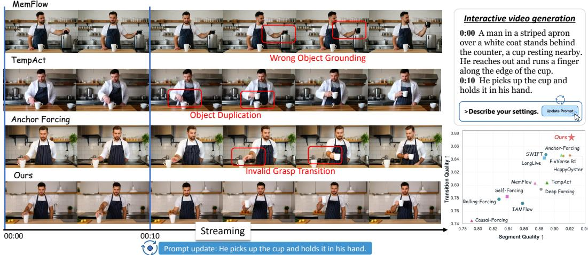  
Figure 1: State-grounded continuous transitions versus baseline “corner cutting” in interactive streaming video generation. Left: Qualitative comparison at a mid-stream prompt switch. Existing streaming methods can still realize the new goal through implausible shortcuts, prematurely reaching the target while skipping intermediate states required for a coherent transition (e.g., object duplication and abrupt loss of contact, highlighted in red). In contrast, SEGUE (ours) grounds its dynamic planning on the realized visual boundary, synthesizing kinematically plausible preparatory phases prior to goal execution. Right: Quantitative trade-off on OPENTRANS-360. SEGUE (top-right) achieves a better trade-off between segment quality and transition quality than causal autoregressive baselines and commercial video models.

Addressing such corner cutting requires both formulating a transition path conditioned on the runtime visual state, which existing pre-specified temporal planners are not designed to accommodate, and reliably executing short-lived prompts through distillation. The latter is particularly non-trivial under standard distribution-matching distillation (DMD)(Yin et al., 2024b; 2025): evaluating the complete rollout under the target prompt judges preparatory frames against future events and thus reinforces shortcuts, whereas cropping rollouts into isolated clips severs the necessary temporal context for coherent continuation.

In this study, we present SEGUE, a framework that explicitly plans transition trajectories from realized visual states and trains causal generators to execute them. At each switch, a vision-language planner observes the latest generated frame together with the previous and updated prompts. Inspired by state-grounded action selection in embodied planning (Ahn et al., 2022; Rana et al., 2023), it determines which of four preparatory roles in a Transition Dependency Schema (TD-Schema) are still required by the realized state: TERMINATE, RELEASE, ALIGN, and ENTRY. The selected roles are instantiated as a short sequence of segue prompts that bridge the realized state to the updated prompt, followed by an EXECUTE handoff that returns control to the user’s original prompt. The planner needs no training and can be attached to existing streaming generators. To address the execution challenge, we propose SPANDMD to train the generator on these schedules under one principle: responsibility for a stage is local, but the evidence for judging it is contextual. For each prompt in the schedule, both the real-score and fake-score models are evaluated on the complete noised rollout while the resulting DMD contribution is retained only within the temporal span assigned to that prompt. To evaluate the transition process targeted by these components systematically, we introduce OPENTRANS-360, a benchmark comprising 360 prompt streams and 1,800 mid-stream switches, with metrics covering both within-segment generation quality and switch-level transition quality. On OPENTRANS-360 our method achieves the strongest overall performance across both segment-level and transition-level evaluation as summarized in the right panel of Figure 1 and ranks first on all eight transition metrics. It also ranks first on four of six instruction-adherence and interactive-response metrics on StreamAV-Bench (Liu et al., 2026b). Our contributions are as follows:

• We propose a training-free planner that writes the missing transition for mid-stream prompt switching, starting from the realized state, as segue prompts organized by TD-Schema.

• We propose SPANDMD, which trains a causal generator to follow short-lived prompts by supervising each prompt only on its own time span while both score models retain the complete rollout as temporal context.

• We build OPENTRANS-360, which jointly evaluates within-segment generation quality and switch-level transition quality, with checklist metrics achieving an average Spearman ρ of 0.87 against human judgments.

## 2 RELATED WORK

Autoregressive and interactive video generation. Recent advances in causal and autoregressive video diffusion have enabled efficient streaming generation. CausVid (Yin et al., 2025) distills bidirectional diffusion models into few-step causal generators, while Self-Forcing (Huang et al., 2025) reduces the train–inference gap by training on self-generated histories. Subsequent works further improve long-horizon stability and causal distillation, including Rolling Forcing, Self-Forcing++, Causal Forcing, and Causal Forcing++ (Liu et al., 2026c; Cui et al., 2026; Zhu et al., 2026; Zhao et al., 2026a). Many of these approaches build on distribution-matching objectives such as DMD and DMD2 (Yin et al., 2024b;a), providing the causal generation backbones required for continuous video synthesis.

Building on these advances, recent systems support online interaction through changing text conditions. LongLive (Yang et al., 2025a) enables sequential prompt updates through causal generation and KV recaching, while Anchor Forcing (Yang et al., 2026) improves switching through anchor-guided cache management. Memory-based methods such as MemFlow, IAMFlow, and LongLive-RAG (Ji et al., 2025; Liu et al., 2026a; Hu et al., 2026) further improve long-horizon consistency under evolv ing prompts. Related streaming settings also include multi-shot generation (Chen et al., 2026b; Meng et al., 2026), human-object interaction generation(Rao et al., 2026), interactive world models (He et al., 2025; Team et al., 2026), and causal video editing (Liang et al., 2025; Wang et al., 2026b; Zhao et al., 2026b). We focus specifically on prompt updates that should preserve the continuity of the current scene rather than introduce a cut or reset.

Temporal planning and multi-event generation. Language models have increasingly been used to make temporal structure explicit in video generation. DirecT2V (Hong et al., 2023) expands an abstract prompt into time-varying prompts, while VideoDirectorGPT (Lin et al., 2023) constructs structured multi-scene plans with entity and layout constraints. TempAct (Wang et al., 2026a) extends temporal planning to autoregressive generation by decomposing a pre-specified temporal prompt into span-aware step prompts and jointly optimizing its executor. VLM-based methods additionally use visual reasoning to derive or refine generation plans (Yang et al., 2025b). These methods primarily plan how an objective known before generation should unfold. In contrast, we study online updates whose required transition depends on the realized visual state when a new prompt arrives. Multi-event video generation binds prompts to time spans within one clip, by training with time-based positional encodings (Wu et al., 2025), by routing prompts to spans at inference (Chen et al., 2026a), or by controlling attention across prompts (Cai et al., 2025). Transition generation fills the gap between two given clips (Chen et al., 2024; Zhang et al., 2024b;a). In both settings, the temporal prompt schedule or the boundary conditions are specified before generation. We instead study online switches whose required transition depends on the realized visual state when a new prompt arrives, and SPANDMD trains a causal generator to follow span-level prompts that are decided during generation.

Video generation benchmarks. Existing benchmarks evaluate complementary aspects of video generation. VBench and EvalCrafter (Huang et al., 2024; Liu et al., 2024) focus on perceptual quality, motion, and text–video alignment, while T2VBench, T2V-CompBench, and VBench-2.0 (Ji et al., 2024; Sun et al., 2025; Zheng et al., 2025) extend evaluation toward compositional semantics and state consistency. More recent long-form and streaming benchmarks (Liu et al., 2026a; Miao et al., 2026; Liu et al., 2026b) further consider temporal consistency and responsiveness under evolving generation. Our OPENTRANS-360 instead explicitly evaluates the semantic transition from the realized pre-switch state to the newly requested event, including whether the preceding event is resolved and the target event is reached through a plausible intermediate process.

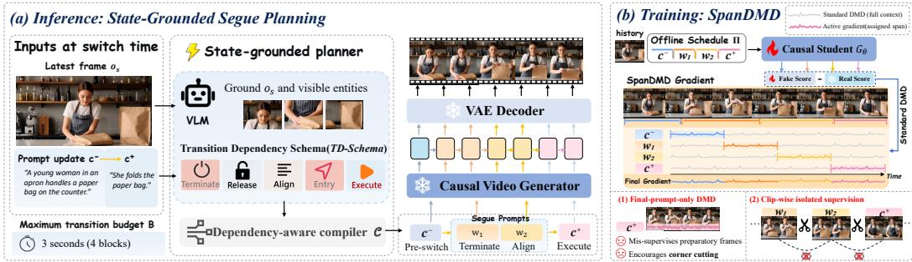  
Figure 2: Overview of SEGUE. At a switch, the planner reads the latest generated frame, the user prompts $c ^ { - }$ and $c ^ { + }$ , and the transition budget $B ,$ and compiles a dependency-aware segue schedule under the TD-Schema leading to $c ^ { + } ;$ the causal generator executes this schedule block by block. During training, SPANDMD evaluates the complete rollout under each active prompt, including $c ^ { - }$ and $c ^ { + }$ , while retaining each prompt’s DMD residual only on its assigned temporal span. The bottom-right illustrates two alternative supervision choices motivating SPANDMD.

## 3 METHOD

We study mid-stream prompt switches that should continue the current scene. SEGUE has two components (Figure 2): a state-grounded planner that writes the otherwise unspecified transition as a short schedule of segue prompts (Section 3.2), and SPANDMD, which trains the causal generator to execute such schedules (Section 3.3).

## 3.1 PROBLEM FORMULATION

A user prompt is text supplied by the user, the state is the visual configuration actually generated at a given time, and a segue prompt is an intermediate prompt, inserted by the planner, that describes an observable change toward the requested event.

Let a causal generator $p _ { \theta }$ emit video blocks $X _ { 1 } , \ldots , X _ { s }$ under the user prompt $c ^ { - }$ . After block s, the user switches to $c ^ { + }$ . The history $H _ { s } = ( X _ { 1 } , \ldots , X _ { s } )$ has already been shown and cannot be revised. A direct switch simply replaces $c ^ { - }$ with $c ^ { + }$ while generation continues from the committed history and cached state. Under standard training, the conditioning prompt is typically aligned with the content to be generated in the corresponding clip. At a mid-stream switch, however, $c ^ { + }$ is applied to a continuation whose realized state may not yet satisfy the prerequisites of the requested event. The direct switch therefore leaves unspecified which intermediate changes should occur and when so the generator infers both from its prior, often making the target appear prematurely. We refer to such failures as corner cutting: an ongoing event is interrupted, an object appears or is duplicated without explanation, a pose or contact changes abruptly, or the target event starts already in progress.

We therefore treat a switch as a transition-planning problem. Let $o _ { s }$ be the last frame of $H _ { s }$ $\mathbf { A }$ vision–language planner $f _ { \phi }$ receives $o _ { s } ,$ the user prompts $( c ^ { - } , c ^ { + } )$ , and a transition budget of B blocks. A deterministic compiler $\mathcal { C }$ organizes the proposed operations into

$$
\Pi = { \mathcal C } \big ( f _ { \phi } ( o _ { s } , c ^ { - } , c ^ { + } , B ) \big ) = \big ( ( \rho _ { k } , w _ { k } , b _ { k } ) \big ) _ { k = 1 } ^ { K } , \qquad T _ { \Pi } = \sum _ { k = 1 } ^ { K } b _ { k } \le B .\tag{1}
$$

Here $\rho _ { k }$ is the role of the k-th segue prompt $w _ { k }$ , and $b _ { k } \in  { \mathbb { N } } _ { + }$ is its duration in blocks. The schedule contains only the changes required before the target event; once it is completed, generation returns to the user prompt $c ^ { + }$

## 3.2 STATE-GROUNDED SEGUE PLANNING

The same pair of user prompts can require different transitions depending on what has actually been generated at the switch. We therefore ground planning in the realized state.

Ground the realized state. From $O _ { s } ,$ the planner extracts transition-relevant evidence: the ongoing event and its progress, the visible entities ${ \mathcal { E } } _ { s }$ , object contacts, subject pose, and spatial relations. Because $c ^ { - }$ describes the intended pre-switch event rather than the exact realized state, the planner follows the observed state whenever the two disagree. The planner also extracts the entities ${ \mathcal { E } } ^ { + }$ required by $c ^ { + } ;$ ; entities in $\Delta \mathcal { E } = \mathcal { E } ^ { + } \setminus \mathcal { E } _ { s }$ must be introduced through an observable process.

Transition Dependency Schema. To structure the open-ended space of transitions, TD-Schema defines four preparatory roles, each of which can instantiate a segue prompt. TERMINATE concludes or safely interrupts an ongoing event whose continuation conflicts with $c ^ { + }$ ; RELEASE removes contacts or interaction dependencies that obstruct the target event; ALIGN establishes the pose, spatial, interaction, or viewing prerequisites of the target event; and ENTRY introduces a required entity from $\Delta \mathcal { E }$ through an observable process. In addition, EXECUTE serves as a handoff symbol rather than a segue-prompt role, marking the return to the unchanged $c ^ { + }$ . For a person drinking from a cup who is asked to type with both hands, the planner may write “finishes the sip and lowers the $\mathrm { c u p } ^ { \mathrm { , , } }$ (TERMINATE), “places the cup on the desk” (RELEASE), and “moves both hands above the keyboard” (ALIGN) before EXECUTE. Roles whose conditions already hold are omitted, so TD-Schema specifies a set of dependencies rather than a fixed chain.

Dependency-aware compilation. The compiler C orders the selected operations according to their dependencies, merges operations that can be realized by the same observable change, and rejects structurally invalid or budget-infeasible schedules. Each segue prompt describes an action or change (“places the cup”) rather than an end state (“the cup is on the desk”). Full planner inputs, dependency rules, and prompts are provided in Appendix A.5.

Scheduled generation and replanning. The resulting segue schedule is applied from the first block boundary after it returns. We index subsequent blocks relative to this schedule onset. Let $\tau _ { 0 } = 0$ and $\textstyle \tau _ { k } = \sum _ { i = 1 } ^ { k } b _ { i }$ denote the cumulative number of blocks allocated through the k-th segue prompt, and define its active span as $I _ { k } = \{ \tau _ { k - 1 } + 1 , . . . , \tau _ { k } \}$ . The prompt active for the $j \cdot$ -th block after the segue schedule begins is

$$
u ( j ) = \left\{ { w _ { k } , \quad j \in I _ { k } , } \right.\tag{2}
$$

The generator then continues autoregressively under $u ( j )$ using its usual generated history and cached state. At switching boundaries we retain the KV re-cache operation of the underlying streaming generator (Yang et al., 2025a). The planner changes only the schedule of text conditioning and therefore can be applied to a frozen generator. While the planner runs, generation continues under $c ^ { - }$ until the next block boundary. If a newer prompt arrives before the schedule finishes, the unexecuted suffix is discarded, and the planner replans from the newly realized state toward the latest prompt.

## 3.3 SPANDMD: SPAN-SCOPED DISTILLATION WITH FULL-ROLLOUT CONTEXT

A valid schedule does not guarantee that the generator executes it. Each segue prompt lasts only one to a few blocks, and a generator distilled on long-lived prompts tends to respond after a short prompt has already expired, skip it, or blend adjacent prompts. The generator therefore has to be trained on such schedules. We extend the self-generated rollout and KV re-cache training used for a single switch (Yang et al., 2025a) to the full schedule, which raises the question of which teacher signal each stage should receive.

Distribution matching distillation updates the generator using the difference between a real-score model representing the target distribution and a fake-score model that tracks the current generator distribution (Yin et al., 2024b; 2025). The two scores follow the same score-estimation procedure on the same noised rollout and textual condition. Applying only the target prompt $c ^ { + }$ to the complete rollout, or replacing the stages with a merged description, evaluates preparatory frames under semantics intended for later parts of the transition and can therefore encourage the same corner cutting that the schedule is designed to avoid. Alternatively, cropping the rollout into independent clips gives each stage its own prompt but removes the temporal evidence needed to determine whether that stage follows coherently from the preceding state and leads naturally into the next. SPANDMD instead follows a different principle: semantic responsibility is local, while the evidence for judging it is contextual.

Formally, consider a self-generated rollout $Z _ { \theta }$ containing one instruction switch and K planned segue stages. During training, we treat the pre-switch and post-transition regions as supervised spans as well: $u _ { 0 } = c ^ { - } , u _ { \ell } = w _ { \ell }$ for $1 \leq \ell \leq K$ , and $u _ { K + 1 } = c ^ { + }$ , with corresponding spans $I _ { \ell }$ and binary masks $M _ { \ell } .$ Thus, the old instruction, every segue prompt, and the target instruction all participate in the same objective.

At diffusion timestep t, let $Y _ { \theta , t } = \alpha _ { t } Z _ { \theta } + \sigma _ { t } \epsilon$ , with $\epsilon \sim \mathcal { N } ( 0 , I )$ . For every active prompt $u _ { \ell } ,$ , both the real-score and fake-score networks process the complete noised rollout $\dot { Y _ { \theta , t } }$ . Their residual is then retained only inside the span governed by that prompt. The resulting SPANDMD gradient is

$$
g _ { \mathrm { S p a n D M D } } = \mathbb { E } _ { t , \epsilon } \left[ J _ { \theta , t } ^ { \top } \sum _ { \ell = 0 } ^ { K + 1 } \lambda _ { \ell } M _ { \ell } \odot \left( s _ { \mathrm { f a k e } } ( Y _ { \theta , t } , t ; u _ { \ell } ) - s _ { \mathrm { r e a l } } ( Y _ { \theta , t } , t ; u _ { \ell } ) \right) \right] , J _ { \theta , t } = \frac { \partial Y _ { \theta , t } } { \partial \theta } .\tag{3}
$$

Both scores are treated as constants (stop-gradient) when updating the generator, and $\lambda _ { \ell }$ weights span $I _ { \ell } ;$ standard DMD timestep weighting and gradient normalization (Yin et al., 2024b; 2025) are omitted for clarity. The masks are disjoint, so each supervised frame receives the signal of exactly one prompt, the one responsible for it, while its score can still depend on the surrounding entities, poses, and events. Appendix A.6 shows that the retained residual is the difference between the student’s and the teacher’s conditional scores of the span given the rest of the rollout.

Training schedules are generated by a text-only LLM planner (Appendix A.8), since SPANDMD is intended to teach the generator to execute short-lived conditions independently of how the schedule is obtained. At inference time, the schedule is instead produced online by the state-grounded planner from the realized visual state. Additional training details are provided in Appendix A.6.

## 4 OPENTRANS-360: EVALUATING MID-STREAM TRANSITIONS

OPENTRANS-360 evaluates how a generator handles mid-stream prompt switches. It contains 360 prompt streams, each with six prompts that stay active for 10 seconds, giving a 60-second video with five switches (1,800 switches in total). The fixed interval standardizes when prompts arrive, not how long a transition should take. Because generation is autoregressive, the state reached at each switch depends on the model’s own rollout, so every switch tests whether a model continues coherently from its realized state rather than from a predefined one.

Construction. Each stream composes subjects, objects, scenes, and events from one of three categories: human-centric transitions involving actions and interactions, object-centric transitions involving object states, motion, and relations, and compositional transitions that require coordinated changes across entities. Qwen2.5-72B-Instruct-AWQ Qwen et al. (2025) expands structured specifica tions into prompt streams, which are filtered by automatic checks and human inspection. The streams contain no scene cuts. The benchmark prompts are disjoint from the VidProM prompt pairs used to construct training schedules (Appendix A.8). Templates, filtering criteria, and diversity statistics are given in Appendix A.7.

Metrics. InternVL3.5-38B (Wang et al., 2025) scores eleven metrics, each defined by ten binary criteria. Segment quality covers prompt fidelity (SPF), motion continuity (SMC), and physical plausibility (SPP) within a segment. Transition quality covers visual and motion boundary smoothness (VBS, MBS), old-state exit (OSE), new-state entry (NSE), subject and scene preservation (SP, ScP), semantic update fidelity (SUF), and transition pacing (TP). OSE asks whether the preceding process ends in a complete and understandable way, NSE whether the new event begins from the realized state through visible preparation, and TP whether the onset and duration of the change are natural. Segment metrics sample frames within each 10-second segment; transition metrics use metric-specific windows around each switch, shared across methods. OSE extends 1.5 s after the switch, whereas NSE, SUF, and TP extend 5 s. These durations match the criteria: short windows capture boundary continuity and preservation, 1.5 s captures old-state exit, and 5 s allows new-state entry, semantic updates, and pacing to unfold. Definitions, evaluator prompts, and windows are given in Appendix A.7.

Agreement with human judgments. In a blinded pairwise study over 30 stratified cases and all eleven metrics (Appendix A.9), method-level human win rates correlate with benchmark scores, with a mean Spearman correlation of $\rho = 0 . 8 7$ across the eleven metrics.

Table 1: Comparison on OPENTRANS-360. The Overall score is the unweighted mean of the 11 metric scores. Higher is better for all metrics.
<table><tr><td></td><td colspan="3">Segment Quality</td><td colspan="9">Transition Quality</td><td></td></tr><tr><td>Method</td><td>SPF↑</td><td>SMC↑</td><td>SPP↑</td><td>VBS↑</td><td>MBS↑</td><td>OSE↑</td><td>NSE↑</td><td>SP↑</td><td>ScP↑</td><td>SUF↑</td><td></td><td>TP↑ Overall↑</td></tr><tr><td>Closed-source Models</td><td></td><td></td><td></td><td></td><td></td><td></td><td></td><td></td><td></td><td></td><td></td><td></td></tr><tr><td>PixVerse R1</td><td>0.899</td><td>0.852</td><td>0.984</td><td>0.984</td><td>0.872</td><td>0.783</td><td>0.853</td><td>0.751</td><td>0.809</td><td>0.773</td><td>0.936</td><td>0.863</td></tr><tr><td>HappyOyster</td><td>0.901</td><td>0.864</td><td>0.996</td><td>0.961</td><td>0.861</td><td>0.762</td><td>0.854</td><td>0.780</td><td>0.840</td><td>0.769</td><td>0.941</td><td>0.866</td></tr><tr><td colspan="9">Open-source Models</td><td></td><td></td><td></td></tr><tr><td>Self-Forcing</td><td>0.793</td><td>0.799</td><td>0.923</td><td>0.993</td><td>0.865</td><td>0.628</td><td>0.779</td><td>0.726</td><td>0.773</td><td>0.647</td><td>0.847</td><td>0.798</td></tr><tr><td>LongLive</td><td>0.890</td><td>0.805</td><td>0.966</td><td>0.988</td><td>0.825</td><td>0.761</td><td>0.862</td><td>0.739</td><td>0.846</td><td>0.774</td><td>0.940</td><td>0.854</td></tr><tr><td>Rolling-Forcing</td><td>0.758</td><td>0.786</td><td>0.939</td><td>0.962</td><td>0.805</td><td>0.680</td><td>0.734</td><td>0.694</td><td>0.799</td><td>0.720</td><td>0.831</td><td>0.792</td></tr><tr><td>Deep Forcing</td><td>0.803</td><td>0.864</td><td>0.981</td><td>0.989</td><td>0.875</td><td>0.643</td><td>0.758</td><td>0.772</td><td>0.789</td><td>0.691</td><td>0.832</td><td>0.818</td></tr><tr><td>MemFlow</td><td>0.856</td><td>0.793</td><td>0.975</td><td>0.992</td><td>0.860</td><td>0.667</td><td>0.805</td><td>0.746</td><td>0.819</td><td>0.684</td><td>0.853</td><td>0.823</td></tr><tr><td>Causal-Forcing</td><td>0.712</td><td>0.744</td><td>0.920</td><td>0.942</td><td>0.794</td><td>0.575</td><td>0.722</td><td>0.662</td><td>0.698</td><td>0.688</td><td>0.879</td><td>0.758</td></tr><tr><td>Anchor-Forcing</td><td>0.882</td><td>0.866</td><td>0.980</td><td>0.989</td><td>0.866</td><td>0.758</td><td>0.859</td><td>0.767</td><td>0.830</td><td>0.775</td><td>0.928</td><td>0.864</td></tr><tr><td>SWIFT</td><td>0.892</td><td>0.813</td><td>0.962</td><td>0.990</td><td>0.826</td><td>0.781</td><td>0.863</td><td>0.765</td><td>0.844</td><td>0.764</td><td>0.945</td><td>0.859</td></tr><tr><td>IAMFlow</td><td>0.821</td><td>0.766</td><td>0.988</td><td>0.978</td><td>0.868</td><td>0.505</td><td>0.776</td><td>0.748</td><td>0.754</td><td>0.689</td><td>0.855</td><td>0.795</td></tr><tr><td>TempAct</td><td>0.842</td><td>0.858</td><td>0.971</td><td>0.976</td><td>0.769</td><td>0.682</td><td>0.815</td><td>0.704</td><td>0.795</td><td>0.778</td><td>0.911</td><td>0.827</td></tr><tr><td>Ours</td><td>0.909</td><td>0.869</td><td>0.992</td><td>0.995</td><td>0.897</td><td>0.802</td><td>0.890</td><td>0.783</td><td>0.863</td><td>0.796</td><td>0.961</td><td>0.887</td></tr></table>

## 5 EXPERIMENTS

## 5.1 SETTINGS

Implementation details. We initialize the 480p Wan2.1-T2V-1.3B (Wan et al., 2025) causal generator from the LongLive (Yang et al., 2025a) base checkpoint. A frozen Wan2.1-T2V-14B teacher provides the real score, while a Wan2.1-T2V-1.3B fake-score network is trained jointly. We use JoyAI-VL-Interaction (Video Understanding Team of JoyAI-VL @ Joy Future Academy, JD, 2026) as the planner without fine-tuning. Training schedules contain approximately 45k segue prompts precomputed with Qwen2.5-72B-Instruct-AWQ (Qwen et al., 2025) from VidProM (Wang & Yang, 2024). Sampling, planning-budget, and training settings are provided in Appendix A.10.

Benchmarks and baselines. We evaluate on OPENTRANS-360 (Section 4) and on StreamAV-Bench (Liu et al., 2026b), which measures streaming quality, instruction following, and responsiveness. We compare with two closed-source systems, PixVerse R1 (PixVerse, 2026) and HappyOyster (HappyOyster, 2026), and ten open-source methods: Self-Forcing (Huang et al., 2025), LongLive (Yang et al., 2025a), Rolling Forcing (Liu et al., 2026c), Deep Forcing (Yi et al., 2025), MemFlow (Ji et al., 2025), Causal Forcing (Zhu et al., 2026), Anchor Forcing (Yang et al., 2026), SWIFT (Tan et al., 2026), IAMFlow (Liu et al., 2026a), and TempAct (Wang et al., 2026a). They cover causal streaming, long-horizon stabilization, memory and cache adaptation, and temporal planning. All methods use the same prompt streams with nominal 10 s prompt intervals. We adapt TempAct by independently precomputing a text-only step plan for each prompt and executing the plans continuously through LongLive’s native prompt-switching mechanism. Evaluation uses common temporal windows and identical frame preprocessing while retaining native frame rates.

## 5.2 COMPARISON RESULTS

Results on OPENTRANS-360. Table 1 shows that SEGUE ranks first on all eight transition metrics with competitive segment quality, and achieves the highest overall score (0.887 vs. 0.866 for HappyOyster; paired difference 0.021, 95% case-bootstrap CI [0.017, 0.031]). The largest gains are in new-state entry (0.890 vs. 0.863), motion boundary smoothness (0.897 vs. 0.875), and old-state exit (0.802 vs. 0.783). NSE and OSE assess how the old event ends and the new one begins, while MBS captures motion continuity across the switch. The table also shows that smoothness alone says little about a transition: every method scores at least 0.94 on visual boundary smoothness, whereas old-state exit ranges from 0.51 to 0.80.

Figure 3 shows a typical case of corner cutting. When the prompt changes from examining a brass bell to picking it up, SEGUE grasps the existing bell, lifts it, and then touches its surface. TempAct and Anchor Forcing instead make a second bell appear while the original one remains. In this example, LongLive, IAMFlow, and Self-Forcing stay at the touching stage without lifting the bell, and MemFlow and SWIFT attempt the lift with an unstable grasp and a deforming bell. In a blinded user study, SEGUE achieves overall-preference scores above 50% against all twelve baselines (Appendix A.1).

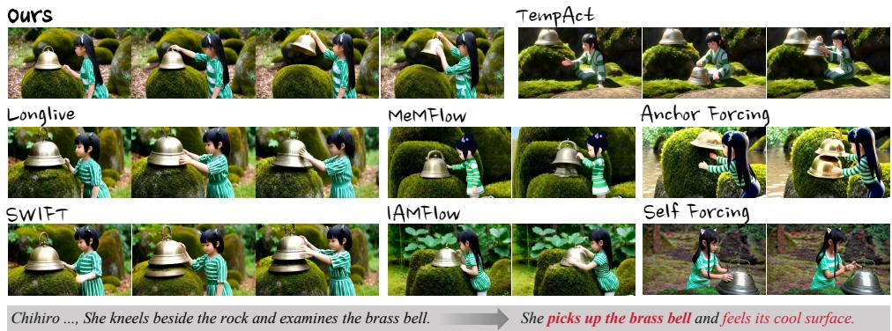  
Figure 3: Comparison at the switch from “She kneels beside the rock and examines the brass bell” to “She picks up the brass bell and feels its cool surface.” SEGUE grasps and lifts the existing bell; TempAct and Anchor Forcing duplicate it, and several baselines never reach a lifted state.

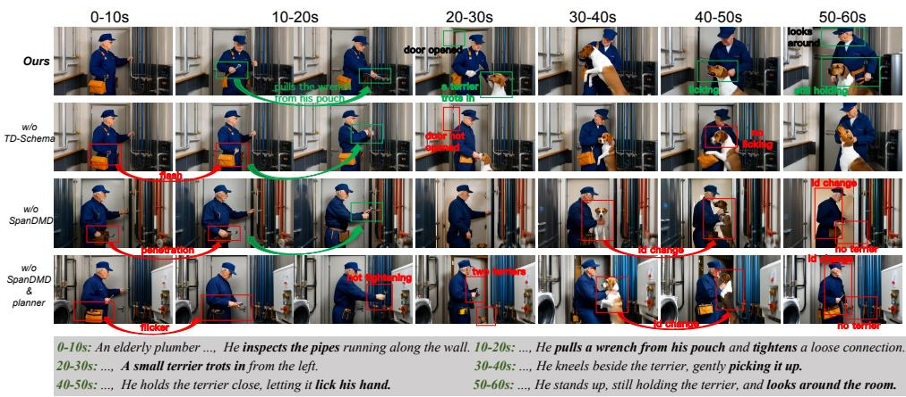  
Figure 4: Ablation on a six-prompt stream (prompts at the bottom). Green marks the intended progression; red marks failures such as flicker, interpenetration, duplicated or missing terriers, and identity changes.

Results on StreamAV-Bench. SEGUE ranks first on four of six instruction and response metrics and improves PVC by 7.1% over the best baseline, while its visual quality (0.603 VA, 2.838 VQ) is on par with the best baselines (0.605, 2.840). It also achieves the lowest VA-D and second-lowest VQ-D, indicating strong visual stability over long-horizon generation. Detailed results are in Appendix Table 4.

## 5.3 ABLATION STUDY

Variants. Table 2 evaluates three component ablations. w/o TD-Schema removes the schema constraints from the planner while retaining state grounding and planning. w/o SpanDMD retains the planner and the same student prompt schedule but uses vanilla DMD with all transition conditions merged into one teacher prompt. w/o SpanDMD & planner starts from the same LongLive base checkpoint and is trained with vanilla DMD using direct prompt switches, without segue prompts during training or inference. The bottom rows compare the original Self-Forcing and LongLive generators with their planner-augmented versions, keeping generator weights frozen.

Table 2: Ablations on six selected transition metrics of OPENTRANS-360. Top: components of SEGUE. Bottom: the planner added to existing generators without retraining.
<table><tr><td>Method</td><td>VBS↑</td><td>MBS↑</td><td>OSE↑</td><td>NSE↑</td><td>SUF↑</td><td>TP↑</td></tr><tr><td>SEGUE (full)</td><td>0.995</td><td>0.897</td><td>0.802</td><td>0.890</td><td>0.796</td><td>0.961</td></tr><tr><td>w/o TD-Schema</td><td>0.989</td><td>0.881</td><td>0.758</td><td>0.885</td><td>0.788</td><td>0.954</td></tr><tr><td>w/o SPANDMD</td><td>0.988</td><td>0.869</td><td>0.759</td><td>0.865</td><td>0.790</td><td>0.950</td></tr><tr><td>w/o SPANDMD &amp; planner</td><td>0.976</td><td>0.824</td><td>0.717</td><td>0.861</td><td>0.747</td><td>0.931</td></tr><tr><td>Self-Forcing</td><td>0.993</td><td>0.865</td><td>0.628</td><td>0.779</td><td>0.647</td><td>0.847</td></tr><tr><td>+ planner</td><td>0.995</td><td>0.877</td><td>0.684</td><td>0.829</td><td>0.721</td><td>0.880</td></tr><tr><td>LongLive</td><td>0.988</td><td>0.825</td><td>0.761</td><td>0.862</td><td>0.774</td><td>0.940</td></tr><tr><td>+ planner</td><td>0.994</td><td>0.860</td><td>0.781</td><td>0.879</td><td>0.779</td><td>0.953</td></tr></table>

Effect of the planner. Introducing planned segue schedules during both training and inference, while retaining vanilla DMD, raises MBS from 0.824 to 0.869, OSE from 0.717 to 0.759, and SUF from 0.747 to 0.790, with smaller gains on the other transition metrics (Table 2). In Figure 4, the model without the planner switches to the next event before the pipe is tightened and later produces two terriers; with the planner, the sequence follows the intended progression from pulling out the wrench to the terrier’s arrival and the interaction with it. A controlled comparison shows that visual grounding improves all six evaluated transition metrics and helps the same planner identify state-dependent prerequisites missed by text-only planning (Appendix A.4). The planner also transfers to other generators without retraining: all six transition metrics improve for both Self-Forcing and LongLive, with SUF rising from 0.647 to 0.721 on Self-Forcing and MBS from 0.825 to 0.860 on LongLive.

Effect of TD-Schema. The w/o TD-Schema variant gives the planner an unstructured natural-language description of the same content instead of the schema, with the same input length. It is lower on all six transition metrics, most strongly on OSE (0.802 to 0.758). Here, input context length denotes the number of text tokens provided to the planner per call, including planning instructions, the preceding and updated prompts and chat-template tokens. TD-Schema also keeps the planner accurate with a short context (Figure 5): reducing the context from 2,140 to 513 tokens lowers NSE

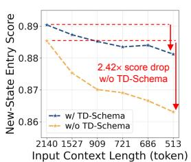  
(a)

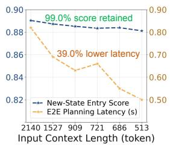  
(b)  
Figure 5: Planning quality and latency as the planner’s input context shrinks, with and without TD-Schema.

only from 0.890 to 0.881, whereas without TD-Schema the same reduction lowers NSE 2.42 times as much. The shorter context cuts planning latency from about 0.82 s to 0.50 s, below the time to generate one 12-frame block (approximately 0.58 s at a generation throughput of 20.7 FPS).

Effect of SPANDMD. The w/o SPANDMD variant retains the student’s planned prompt schedule but uses vanilla DMD with $c ^ { - }$ , all segue prompts, and $c ^ { + }$ concatenated into a single condition for both score networks, following the merged-prompt choice discussed in Section 3.3. This ablation changes both score-network conditioning and temporal residual assignment, so it evaluates their joint effect rather than isolating the effect of span masks. Removing SPANDMD lowers all six reported transition metrics, most strongly OSE (0.802 to 0.759), MBS (0.897 to 0.869), and NSE (0.890 to 0.865). This variant also falls below the frozen LongLive with the planner on OSE (0.759 vs. 0.781) and NSE (0.865 vs. 0.879), which is consistent with a merged teacher prompt rewarding corner cutting. In Figure 4, the model without SPANDMD shows interpenetration during tool handling, identity changes, and a terrier that disappears in the final segment. In a diagnostic where prompts prescribe a sequence of sphere colors (Appendix A.6), a SPANDMD update moves the intermediate stages closer to their target colors than a vanilla DMD update of equal magnitude.

## 6 CONCLUSION

When a prompt changes mid-stream, it specifies the goal but leaves the transition from the current state implicit. SEGUE plans this transition from the realized visual state using segue prompts organized by TD-Schema, while SPANDMD trains the generator to execute them through spanspecific supervision with full-rollout context. On OpenTrans-360, our method achieves the highest overall score and leads on all eight transition metrics, improving how ongoing events conclude and new events begin. Results on StreamAV-Bench further show improved instruction following and responsiveness while maintaining competitive visual quality. The planner also improves existing generators without additional training, supporting state-grounded transition planning as a practical component of interactive video generation.

## AI USE STATEMENT

In this work, we used generative AI tools to assist with dataset construction and filtering, including the generation and verification of candidate training and benchmark data. Generative models are also used as explicit components of our approach pipeline, including LLM/VLM-based data processing and the VLM planner used during inference; these components and their roles are described in the corresponding method and experimental sections.

Additionally, generative AI tools were used to assist with experimental code development and debugging, and language editing and polishing of author-written manuscript drafts.

All AI-assisted data construction and filtering were subject to programmatic checks and human inspection. AI-assisted code was reviewed and tested by the authors, and all AI-assisted manuscript edits were reviewed by the authors. We take responsibility for the final content of this work, including text, claims, code, data, and artifacts produced with the aid of generative AI.

## REFERENCES

Michael Ahn, Anthony Brohan, Noah Brown, Yevgen Chebotar, Omar Cortes, Byron David, Chelsea Finn, Chuyuan Fu, Keerthana Gopalakrishnan, Karol Hausman, et al. Do as i can, not as i say: Grounding language in robotic affordances. arXiv preprint arXiv:2204.01691, 2022.

Minghong Cai, Xiaodong Cun, Xiaoyu Li, Wenze Liu, Zhaoyang Zhang, Yong Zhang, Ying Shan, and Xiangyu Yue. Ditctrl: Exploring attention control in multi-modal diffusion transformer for tuning-free multi-prompt longer video generation. In 2025 IEEE/CVF Conference on Computer Vision and Pattern Recognition (CVPR), 2025.

Gordon Chen, Ziqi Huang, and Ziwei Liu. Prompt relay: Inference-time temporal control for multi-event video generation. arXiv preprint arXiv:2604.10030, 2026a.

Xinyuan Chen, Yaohui Wang, Lingjun Zhang, Shaobin Zhuang, Xin Ma, Jiashuo Yu, Yali Wang, Dahua Lin, Yu Qiao, and Ziwei Liu. SEINE: Short-to-long video diffusion model for generative transition and prediction. In The Twelfth International Conference on Learning Representations, 2024.

Yukang Chen, Luozhou Wang, Wei Huang, Shuai Yang, Bohan Zhang, Yicheng Xiao, Ruihang Chu, Weian Mao, Qixin Hu, Shaoteng Liu, et al. Longlive-2.0: An nvfp4 parallel infrastructure for long video generation. arXiv preprint arXiv:2605.18739, 2026b.

Justin Cui, Jie Wu, Ming Li, Tao Yang, Xiaojie Li, Rui Wang, Andrew Bai, Yuanhao Ban, and Cho-Jui Hsieh. Self-forcing++: Towards minute-scale high-quality video generation. In The Fourteenth International Conference on Learning Representations, 2026.

HappyOyster. HappyOyster: Real-Time Interactive Open-World Model. https://www. happyoyster.com/home, 2026.

Xianglong He, Chunli Peng, Zexiang Liu, Boyang Wang, Yifan Zhang, Qi Cui, Fei Kang, Biao Jiang, Mengyin An, Yangyang Ren, et al. Matrix-game 2.0: An open-source real-time and streaming interactive world model. arXiv preprint arXiv:2508.13009, 2025.

Susung Hong, Junyoung Seo, Heeseong Shin, Sunghwan Hong, and Seungryong Kim. Direct2v: Large language models are frame-level directors for zero-shot text-to-video generation. arXiv preprint arXiv:2305.14330, 2023.

Qixin Hu, Shuai Yang, Wei Huang, Song Han, and Yukang Chen. Longlive-rag: A general retrievalaugmented framework for long video generation. arXiv preprint arXiv:2606.02553, 2026.

Xun Huang, Zhengqi Li, Guande He, Mingyuan Zhou, and Eli Shechtman. Self forcing: Bridging the train-test gap in autoregressive video diffusion. arXiv preprint arXiv:2506.08009, 2025.

Ziqi Huang, Yinan He, Jiashuo Yu, Fan Zhang, Chenyang Si, Yuming Jiang, Yuanhan Zhang, Tianxing Wu, Qingyang Jin, Nattapol Chanpaisit, Yaohui Wang, Xinyuan Chen, Limin Wang, Dahua Lin, Yu Qiao, and Ziwei Liu. VBench: Comprehensive benchmark suite for video generative models. In Proceedings of the IEEE/CVF Conference on Computer Vision and Pattern Recognition, 2024.

Pengliang Ji, Chuyang Xiao, Huilin Tai, and Mingxiao Huo. T2vbench: Benchmarking temporal dynamics for text-to-video generation. In 2024 IEEE/CVF Conference on Computer Vision and Pattern Recognition Workshops (CVPRW), 2024.

Sihui Ji, Xi Chen, Shuai Yang, Xin Tao, Pengfei Wan, and Hengshuang Zhao. Memflow: Flowing adaptive memory for consistent and efficient long video narratives. arXiv preprint arXiv:2512.14699, 2025.

Feng Liang, Akio Kodaira, Chenfeng Xu, Masayoshi Tomizuka, Kurt Keutzer, and Diana Marculescu. Looking backward: Streaming video-to-video translation with feature banks. In The Thirteenth International Conference on Learning Representations, 2025.

Han Lin, Abhay Zala, Jaemin Cho, and Mohit Bansal. Videodirectorgpt: Consistent multi-scene video generation via llm-guided planning. arXiv preprint arXiv:2309.15091, 2023.

Jinzhuo Liu, Jiangning Zhang, Wencan Jiang, Yabiao Wang, Dingkang Liang, Zhucun Xue, Ran Yi, and Yong Liu. Advancing narrative long video generation via training-free identity-aware memory. arXiv preprint arXiv:2605.18733, 2026a.

Kaiqi Liu, Haoxuan Zeng, Jingqi Liu, Jiacong Fang, Ziqi Cai, Yunyao Mao, Henglin Liu, Yu Sheng, Shuchen Weng, and Boxin Shi. Streamav-bench: A comprehensive benchmark for streaming audio-video generation. arXiv preprint arXiv:2608.26336, 2026b.

Kunhao Liu, Wenbo Hu, Jiale Xu, Ying Shan, and Shijian Lu. Rolling forcing: Autoregressive long video diffusion in real time. In The Fourteenth International Conference on Learning Representations, 2026c.

Yaofang Liu, Xiaodong Cun, Xuebo Liu, Xintao Wang, Yong Zhang, Haoxin Chen, Yang Liu, Tieyong Zeng, Raymond Chan, and Ying Shan. Evalcrafter: Benchmarking and evaluating large video generation models. In 2024 IEEE/CVF Conference on Computer Vision and Pattern Recognition (CVPR), 2024.

Yihao Meng, Zichen Liu, Hao Ouyang, Qiuyu Wang, Ka Leong Cheng, Yue Yu, Hanlin Wang, Haobo Li, Jiapeng Zhu, Yanhong Zeng, et al. Causalcine: Real-time autoregressive generation for multi-shot video narratives. arXiv preprint arXiv:2605.12496, 2026.

Yingmao Miao, Pengfei Zhang, Chaoran Xu, Meng Yu, Jing Tang, Xiangxiang Chu, Chao Shen, and Chenhao Lin. Do video generators track the world across segments? a benchmark and method for world-state reasoning in video continuation. arXiv preprint arXiv:2609.03673, 2026.

PixVerse. PixVerse Launches R1: A Real-Time World Model That Redefines AI Video Generation, January 2026. URL https://pixverse.ai/en/blog/ pixverse-launches-r1-real-time-world-model.

Qwen, An Yang, Baosong Yang, Beichen Zhang, Binyuan Hui, Bo Zheng, Bowen Yu, Chengyuan Li, Dayiheng Liu, Fei Huang, Haoran Wei, Huan Lin, Jian Yang, Jianhong Tu, Jianwei Zhang, Jianxin Yang, Jiaxi Yang, Jingren Zhou, Junyang Lin, Kai Dang, Keming Lu, Keqin Bao, Kexin Yang, Le Yu, Mei Li, Mingfeng Xue, Pei Zhang, Qin Zhu, Rui Men, Runji Lin, Tianhao Li, Tianyi Tang, Tingyu Xia, Xingzhang Ren, Xuancheng Ren, Yang Fan, Yang Su, Yichang Zhang, Yu Wan, Yuqiong Liu, Zeyu Cui, Zhenru Zhang, and Zihan Qiu. Qwen2.5 technical report, 2025. URL https://arxiv.org/abs/2412.15115.

Krishan Rana, Jesse Haviland, Sourav Garg, Jad Abou-Chakra, Ian Reid, and Niko Suenderhauf. Sayplan: Grounding large language models using 3d scene graphs for scalable robot task planning. arXiv preprint arXiv:2307.06135, 2023.

Zejing Rao, Haoxian Zhang, Xiaoqiang Liu, Yiping Meng, Guoxin Zhang, Pengfei Wan, Fan Tang, and Tong-Yee Lee. Streamhoi: Interaction-aware temporal memory adaptation for streaming hoi video generation. arXiv preprint arXiv:2607.20174, 2026.

Kaiyue Sun, Kaiyi Huang, Xian Liu, Yue Wu, Zihan Xu, Zhenguo Li, and Xihui Liu. T2v-compbench: A comprehensive benchmark for compositional text-to-video generation. In 2025 IEEE/CVF Conference on Computer Vision and Pattern Recognition (CVPR), 2025.

Shanwen Tan, Hao Li, Jingtao Zhang, Xiaosong Jia, Xue Yang, Shaofeng Zhang, and Yanyong Zhang. Swift: Prompt-adaptive memory for efficient interactive long video generation. arXiv preprint arXiv:2605.09442, 2026.

Robbyant Team, Zelin Gao, Qiuyu Wang, Yanhong Zeng, Jiapeng Zhu, Ka Leong Cheng, Yixuan Li, Hanlin Wang, Yinghao Xu, Shuailei Ma, Yihang Chen, Jie Liu, Yansong Cheng, Yao Yao, Jiayi Zhu, Yihao Meng, Kecheng Zheng, Qingyan Bai, Jingye Chen, Zehong Shen, Yue Yu, Xing Zhu, Yujun Shen, and Hao Ouyang. Advancing open-source world models. arXiv preprint arXiv:2601.20540, 2026.

Video Understanding Team of JoyAI-VL @ Joy Future Academy, JD. Joyai-vl-interaction: Real-time vision-language interaction intelligence. Technical report, Joy Future Academy, JD, June 2026.

Team Wan, Ang Wang, Baole Ai, Bin Wen, Chaojie Mao, Chen-Wei Xie, Di Chen, Feiwu Yu, Haiming Zhao, Jianxiao Yang, Jianyuan Zeng, Jiayu Wang, Jingfeng Zhang, Jingren Zhou, Jinkai Wang, Jixuan Chen, Kai Zhu, Kang Zhao, Keyu Yan, Lianghua Huang, Mengyang Feng, Ningyi Zhang, Pandeng Li, Pingyu Wu, Ruihang Chu, Ruili Feng, Shiwei Zhang, Siyang Sun, Tao Fang, Tianxing Wang, Tianyi Gui, Tingyu Weng, Tong Shen, Wei Lin, Wei Wang, Wei Wang, Wenmeng Zhou, Wente Wang, Wenting Shen, Wenyuan Yu, Xianzhong Shi, Xiaoming Huang, Xin Xu, Yan Kou, Yangyu Lv, Yifei Li, Yijing Liu, Yiming Wang, Yingya Zhang, Yitong Huang, Yong Li, You Wu, Yu Liu, Yulin Pan, Yun Zheng, Yuntao Hong, Yupeng Shi, Yutong Feng, Zeyinzi Jiang, Zhen Han, Zhi-Fan Wu, and Ziyu Liu. Wan: Open and advanced large-scale video generative models. arXiv preprint arXiv:2503.20314, 2025.

Jing Wang, Xiangxin Zhou, Jiajun Liang, Kaiqi Liu, Wanyun Pang, Zhenyu Xie, Tianyu Pang, and Xiaodan Liang. Tempact: Advancing temporal plausibility in autoregressive video generation via planner-executor rl. arXiv preprint arXiv:2606.28016, 2026a.

Weiyun Wang, Zhangwei Gao, Lixin Gu, Hengjun Pu, Long Cui, Xingguang Wei, Zhaoyang Liu, Linglin Jing, Shenglong Ye, Jie Shao, Zhaokai Wang, Zhe Chen, Hongjie Zhang, Ganlin Yang, Haomin Wang, Qi Wei, Jinhui Yin, Wenhao Li, Erfei Cui, Guanzhou Chen, Zichen Ding, Changyao Tian, Zhenyu Wu, Jingjing Xie, Zehao Li, Bowen Yang, Yuchen Duan, Xuehui Wang, Zhi Hou, Haoran Hao, Tianyi Zhang, Songze Li, Xiangyu Zhao, Haodong Duan, Nianchen Deng, Bin Fu, Yinan He, Yi Wang, Conghui He, Botian Shi, Junjun He, Yingtong Xiong, Han Lv, Lijun Wu, Wenqi Shao, Kaipeng Zhang, Huipeng Deng, Biqing Qi, Jiaye Ge, Qipeng Guo, Wenwei Zhang, Songyang Zhang, Maosong Cao, Junyao Lin, Kexian Tang, Jianfei Gao, Haian Huang, Yuzhe Gu, Chengqi Lyu, Huanze Tang, Rui Wang, Haijun Lv, Wanli Ouyang, Limin Wang, Min Dou, Xizhou Zhu, Tong Lu, Dahua Lin, Jifeng Dai, Weijie Su, Bowen Zhou, Kai Chen, Yu Qiao, Wenhai Wang, and Gen Luo. Internvl3.5: Advancing open-source multimodal models in versatility, reasoning, and efficiency, 2025. URL https://arxiv.org/abs/2508.18265.

Wenhao Wang and Yi Yang. Vidprom: A million-scale real prompt-gallery dataset for text-to-video diffusion models. Thirty-eighth Conference on Neural Information Processing Systems, 2024. URL https://openreview.net/forum?id=pYNl76onJL.

Xinyu Wang, Chongbo Zhao, Fangneng Zhan, and Yue Ma. Liveedit: Towards real-time diffusionbased streaming video editing. arXiv preprint arXiv:2606.26740, 2026b.

Ziyi Wu, Aliaksandr Siarohin, Willi Menapace, Ivan Skorokhodov, Yuwei Fang, Varnith Chordia, Igor Gilitschenski, and Sergey Tulyakov. Mind the time: Temporally-controlled multi-event video

generation. In 2025 IEEE/CVF Conference on Computer Vision and Pattern Recognition (CVPR), 2025.

Shuai Yang, Wei Huang, Ruihang Chu, Yicheng Xiao, Yuyang Zhao, Xianbang Wang, Muyang Li, Enze Xie, Yingcong Chen, Yao Lu, et al. Longlive: Real-time interactive long video generation. arXiv preprint arXiv:2509.22622, 2025a.

Xindi Yang, Baolu Li, Yiming Zhang, Zhenfei Yin, Lei Bai, Liqian Ma, Zhiyong Wang, Jianfei Cai, Tien-Tsin Wong, Huchuan Lu, et al. Vlipp: Towards physically plausible video generation with vision and language informed physical prior. In 2025 IEEE/CVF International Conference on Computer Vision (ICCV), 2025b.

Yang Yang, Tianyi Zhang, Wei Huang, Jinwei Chen, Boxi Wu, Xiaofei He, Deng Cai, Bo Li, and Peng-Tao Jiang. Anchor forcing: Anchor memory and tri-region rope for interactive streaming video diffusion. arXiv preprint arXiv:2603.13405, 2026.

Jung Yi, Wooseok Jang, Paul Hyunbin Cho, Jisu Nam, Heeji Yoon, and Seungryong Kim. Deep forcing: Training-free long video generation with deep sink and participative compression. arXiv preprint arXiv:2512.05081, 2025.

Tianwei Yin, Michael Gharbi, Taesung Park, Richard Zhang, Eli Shechtman, Fredo Durand, and¨ William T Freeman. Improved distribution matching distillation for fast image synthesis. In NeurIPS, 2024a.

Tianwei Yin, Michael Gharbi, Richard Zhang, Eli Shechtman, Fr¨ edo Durand, William T Freeman,´ and Taesung Park. One-step diffusion with distribution matching distillation. In CVPR, 2024b.

Tianwei Yin, Qiang Zhang, Richard Zhang, William T Freeman, Fredo Durand, Eli Shechtman, and Xun Huang. From slow bidirectional to fast autoregressive video diffusion models. In CVPR, 2025.

Bowen Zhang, Xiaofei Xie, Haotian Lu, Na Ma, Tianlin Li, and Qing Guo. Mavin: Multi-action video generation with diffusion models via transition video infilling. arXiv preprint arXiv:2405.18003, 2024a.

Rui Zhang, Chen Yaosen, Yuegen Liu, Wei Wang, Xuming Wen, and Hongxia Wang. Tvg: A training-free transition video generation method with diffusion models. In arxiv, 2024b.

Min Zhao, Hongzhou Zhu, Kaiwen Zheng, Zihan Zhou, Bokai Yan, Xinyuan Li, Xiao Yang, Chongxuan Li, and Jun Zhu. Causal forcing++: Scalable few-step autoregressive diffusion distillation for real-time interactive video generation. arXiv preprint arXiv:2605.15141, 2026a.

Yuyang Zhao, Yicheng Pan, Qiyuan He, Jincheng Yu, Junsong Chen, Tian Ye, Haozhe Liu, Enze Xie, and Song Han. Sana-streaming: Real-time streaming video editing with hybrid diffusion transformer. arXiv preprint arXiv:2605.30409, 2026b.

Dian Zheng, Ziqi Huang, Hongbo Liu, Kai Zou, Yinan He, Fan Zhang, Yuanhan Zhang, Jingwen He, Wei-Shi Zheng, Yu Qiao, and Ziwei Liu. Vbench-2.0: Advancing video generation benchmark suite for intrinsic faithfulness. arXiv preprint arXiv:2503.21755, 2025.

Hongzhou Zhu, Min Zhao, Guande He, Hang Su, Chongxuan Li, and Jun Zhu. Causal forcing: Autoregressive diffusion distillation done right for high-quality real-time interactive video generation. arXiv preprint arXiv:2602.02214, 2026.

## A APPENDIX

A.1 User Study . . 14   
A.2 Limitations and Future Work . 14   
A.3 Results on StreamAV-Bench . 16   
A.4 Effect of Visual Grounding . 16   
A.5 Agentic Inference: Inputs, Prompts, and Execution 17   
A.6 Analysis of SPANDMD . 21   
A.7 Benchmark Design, Construction, and Evaluation 23   
A.8 LLM-Assisted Construction of Transition Training Data 26   
A.9 Human Alignment of the Evaluation Metrics . 28   
A.10 Additional Implementation Details 28

## A.1 USER STUDY

We conduct a blinded pairwise user study comparing SEGUE with twelve baselines on visual quality, transition naturalness, and overall preference. We recruit 12 participants and sample 30 cases stratified by benchmark category. One switch per case is selected before inspecting model outputs, with switch positions balanced across cases. All comparisons use the same selected switches and clip windows, from 2 s before to 8 s after each update.

Figure 6 shows the annotation interface. Participants view synchronized clips A and B at normal speed, together with the preceding and updated instructions and the switch time. Method identities, benchmark scores, and planner-generated waypoints are hidden. Task order and left–right placement are randomized, with placement fixed across the three questions within a task. Participants separately judge visual quality (clarity, appearance stability, and artifacts), transition naturalness (how the preceding event ends and the new event begins), and overall preference (considering instruction fulfillment, transition naturalness, and visual quality), selecting A, B, a tie, or cannotjudge for each. Overall preference is judged directly, not averaged from the other criteria.

Each of the $3 0 \times 1 2 = 3 6 0$ clip pairs is evaluated by three distinct participants, who answer all three questions, yielding 1,080 assessment tasks and 3,240 criterion-specific responses. We add 108 hidden repeat tasks (324 responses) for consistency checks, giving each participant 90 original and 9 repeat tasks. For each clip pair and criterion, a majority among three valid original responses determines the outcome; incomplete or unresolved comparisons are excluded. Repeats do not enter the preference scores. For baseline b and criterion $c ,$ let $W _ { b , c } , T _ { b , c } ,$ and $L _ { b , c }$ count resolved comparisons favoring SEGUE, tied, and favoring the baseline, respectively. Table 3 reports

$$
P _ { b , c } = 1 0 0 \frac { W _ { b , c } + 0 . 5 T _ { b , c } } { n _ { b , c } } , \qquad n _ { b , c } = W _ { b , c } + T _ { b , c } + L _ { b , c } .\tag{4}
$$

Of the 1,080 planned criterion-specific comparisons (360 clip pairs × three criteria), 1,039 yielded a resolved majority judgment; the remaining 41 were excluded because of incomplete or unresolved judgments. Of the 324 hidden repeat responses, 311 formed valid pairs with their original responses, with a repeat-consistency rate of 89%. Pairwise agreement among original annotators was 83%, computed using valid original responses, including those from comparisons without a resolved majority judgment. Both agreement measures include ties and compare method identities rather than screen positions.

## A.2 LIMITATIONS AND FUTURE WORK

Physical prerequisites in planning. Figure 7 illustrates a missing support prerequisite. The planner moves from lowering the lantern slightly to releasing it without explicitly establishing support from the cart. Role-level ordering alone does not ensure that such physical prerequisites are satisfied: a supporting contact must persist until another support is established. Although the generated continuation largely completes the placement, the generator may be compensating for an underspecified plan. Future work could explicitly represent support and contact conditions and verify them before advancing to the next stage.

Partial observation and execution reliability. The planner observes only the latest decoded frame, which may not reveal motion history or occluded interactions. Even a valid plan may not be faithfully executed, as physical consistency and identity preservation remain limited by the underlying generator. Incorporating short video histories could improve state grounding, while feedback during transitions could help adjust subsequent segue prompts when execution deviates from the plan.

Table 3: Pairwise user preferences for SEGUE against each baseline. Each entry reports the preference score (%; ties receive half credit). Higher scores favor SEGUE. Overall preference is evaluated separately.
<table><tr><td>Baseline</td><td>Visual quality</td><td>Transition naturalness</td><td>Overall preference</td></tr><tr><td>Self-Forcing</td><td>76.7%</td><td>73.3%</td><td>80.0%</td></tr><tr><td>LongLive</td><td>61.7%</td><td>58.3%</td><td>65.0%</td></tr><tr><td>Rolling Forcing</td><td>78.3%</td><td>75.0%</td><td>81.7%</td></tr><tr><td>Deep Forcing</td><td>66.7%</td><td>63.3%</td><td>70.0%</td></tr><tr><td>MemFlow</td><td>63.3%</td><td>60.0%</td><td>66.7%</td></tr><tr><td>Causal Forcing</td><td>83.3%</td><td>80.0%</td><td>85.0%</td></tr><tr><td>Anchor Forcing</td><td>55.0%</td><td>53.3%</td><td>58.3%</td></tr><tr><td>SWIFT</td><td>56.7%</td><td>55.0%</td><td>60.0%</td></tr><tr><td>IAMFlow</td><td>71.7%</td><td>68.3%</td><td>75.0%</td></tr><tr><td>TempAct</td><td>63.3%</td><td>61.7%</td><td>66.7%</td></tr><tr><td>PixVerse R1</td><td>53.3%</td><td>51.7%</td><td>56.7%</td></tr><tr><td>HappyOyster</td><td>53.3%</td><td>56.0%</td><td>53.3%</td></tr></table>

Task 1 / 99

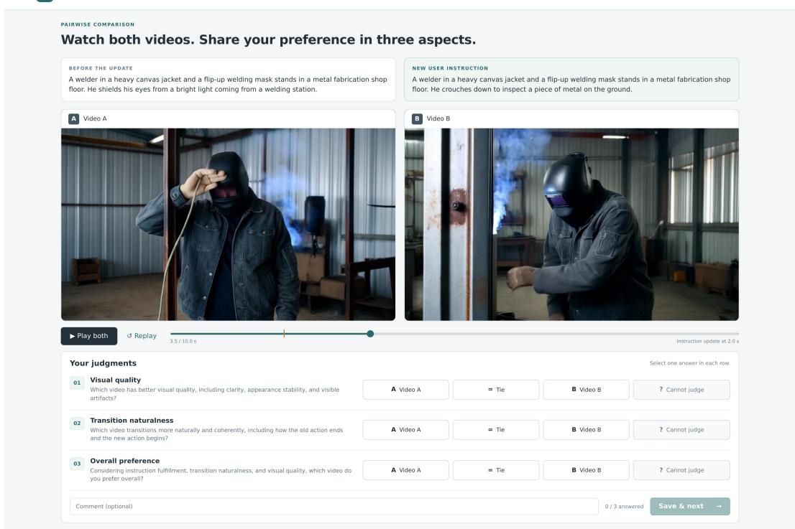  
Figure 6: User-study interface. Participants compare anonymized clips under the same instruction update and separately judge visual quality, transition naturalness, and overall preference.

Training cost. SPANDMD requires separate score-network evaluations for each active condition, so its distillation cost increases with the number of supervised stages. More efficient multi-condition score estimation and adaptive supervision schedules could reduce this overhead while preserving stage-specific guidance.

  
Figure 7: A missing support prerequisite in transition planning. The plan proceeds from lowering the lantern slightly to releasing it without explicitly establishing support from the cart, although the generated continuation largely completes the placement.

Table 4: Evaluation results on StreamAV-Bench. The best and second-best results are highlighted in bold and underlined, respectively.
<table><tr><td rowspan="2">Method</td><td colspan="4">Visual Quality</td><td colspan="6">Instruction Adherence and Interactive Response</td></tr><tr><td>VA↑</td><td>VQ↑</td><td>VA-D↓</td><td>VQ-D↓</td><td>VIF↑</td><td>VID↓</td><td>VUF↑</td><td>PVC↑</td><td>PVUAR↑</td><td>PVRL↓</td></tr><tr><td>PixVerse R1</td><td>0.529</td><td>2.428</td><td>0.032</td><td>0.253</td><td>2.976</td><td>0.484</td><td>2.573</td><td>4.278</td><td>0.350</td><td>12.992</td></tr><tr><td>HappyOyster</td><td>0.529</td><td>2.785</td><td>0.032</td><td>0.417</td><td>3.565</td><td>0.510</td><td>2.975</td><td>3.744</td><td>0.518</td><td>14.484</td></tr><tr><td>Self-Forcing</td><td>0.585</td><td>2.753</td><td>0.025</td><td>0.323</td><td>3.019</td><td>0.373</td><td>2.237</td><td>3.912</td><td>0.185</td><td>14.164</td></tr><tr><td>LongLive</td><td>0.605</td><td>2.768</td><td>0.023</td><td>0.367</td><td>3.164</td><td>0.317</td><td>2.341</td><td>3.631</td><td>0.241</td><td>11.792</td></tr><tr><td>Rolling-Forcing</td><td>0.572</td><td>2.757</td><td>0.043</td><td>0.427</td><td>3.009</td><td>0.425</td><td>2.315</td><td>4.086</td><td>0.217</td><td>13.234</td></tr><tr><td>Deep Forcing</td><td>0.597</td><td>2.632</td><td>0.023</td><td>0.334</td><td>3.041</td><td>0.359</td><td>2.295</td><td>3.879</td><td>0.220</td><td>13.433</td></tr><tr><td>MemFlow</td><td>0.600</td><td>2.836</td><td>0.028</td><td>0.502</td><td>3.142</td><td>0.333</td><td>2.309</td><td>3.630</td><td>0.217</td><td>13.698</td></tr><tr><td>Causal-Forcing</td><td>0.556</td><td>2.397</td><td>0.030</td><td>0.189</td><td>2.834</td><td>0.364</td><td>2.284</td><td>4.218</td><td>0.219</td><td>14.032</td></tr><tr><td>SWIFT</td><td>0.605</td><td>2.735</td><td>0.022</td><td>0.411</td><td>3.152</td><td>0.305</td><td>2.357</td><td>3.615</td><td>0.246</td><td>10.340</td></tr><tr><td>IAMFlow</td><td>0.602</td><td>2.840</td><td>0.023</td><td>0.425</td><td>3.192</td><td>0.302</td><td>2.319</td><td>3.655</td><td>0.222</td><td>11.683</td></tr><tr><td>Ours</td><td>0.603</td><td>2.838</td><td>0.021</td><td>0.247</td><td>3.667</td><td>0.301</td><td>2.894</td><td>4.581</td><td>0.308</td><td>10.311</td></tr></table>

Training–inference planning gap. Training schedules are generated by a text-only LLM, whereas inference uses a VLM grounded in the realized visual state. Some state-dependent transitions may therefore be underrepresented during training. Nevertheless, our experimental results indicate that the generator generalizes well to visually grounded schedules at inference. Future work will explore generating segue prompts from real video data to ground training schedules in observed states and transitions.

## A.3 RESULTS ON STREAMAV-BENCH

Table 4 reports the full results on StreamAV-Bench. Baseline results are taken from the original benchmark, while Ours is evaluated following the same protocol. For instruction adherence and interactive response, our method achieves the best VIF (3.667), VID (0.301), PVC (4.581), and PVRL (10.311), ranking first on four of the six semantic-related metrics. In particular, the PVC score improves by 7.1% over the previous best result, indicating substantially smoother visual transitions under prompt updates.

At the same time, the improvement in semantic transition quality does not come at the expense of visual quality. Our method achieves 0.603 VA and 2.838 VQ, closely matching the best results of 0.605 and 2.840, respectively. It further achieves the lowest VA-D (0.021) and the second-lowest VQ-D (0.247), showing strong visual stability over long-horizon generation.

## A.4 EFFECT OF VISUAL GROUNDING

We compare the same planner with and without the current-frame input, keeping the generator, TD-Schema, and transition budget fixed. Each pair receives the same prompt update and continues from the same generated history with identical generation noise. We evaluate five prompt switches with two seeds on each of 25 selected OpenTrans-360 cases, retaining 244 of 250 pairs and excluding six with invalid planner outputs. The six transition metrics are computed at the intervened boundary using identical temporal windows and averaged first within each case and then across cases.

Table 5: Effect of visual grounding on six transition metrics across 244 matched pairs from 25 OpenTrans-360 cases. Each pair shares the same pre-switch history, prompt update, and generation noise.
<table><tr><td>Planner input</td><td>VBS↑</td><td>MBS↑</td><td>OSE↑</td><td>NSE↑</td><td>SUF↑</td><td>TP↑</td></tr><tr><td>Text only</td><td>0.984</td><td>0.867</td><td>0.756</td><td>0.860</td><td>0.774</td><td>0.920</td></tr><tr><td>Text + current frame</td><td>0.991</td><td>0.890</td><td>0.788</td><td>0.892</td><td>0.783</td><td>0.965</td></tr></table>

As shown in Table 5, visual grounding improves all six evaluated metrics, with the largest relative gains in TP (4.9%), OSE (4.2%), and NSE (3.7%). These improvements indicate more coherent exits from the old state, more natural entries into the new state, and better transition pacing, supporting the value of conditioning the planner on the realized visual state.

Figure 8 illustrates how visual input changes the preparatory actions specified by the planner. In the pastry-chef example, the preceding prompt describes looking at the flask, while the realized frame also shows a hand holding it. The grounded plan explicitly releases this contact before reaching toward the flour; the text-only plan omits the release, and the hand remains on the flask in the shown frames. In the watchmaker example, the grounded plan lowers the hands and bends the torso toward the terrier before attempting the lift. The text-only plan starts directly with cradling the terrier, while its continuation remains focused on handling tools. Together with the quantitative results, these examples suggest that visual grounding helps the planner identify prerequisites absent from the prompt pair and produce segue prompts that better connect the current state to the requested action.

## A.5 AGENTIC INFERENCE: INPUTS, PROMPTS, AND EXECUTION

The agent bridges a prompt update by reasoning about the difference between the realized visual state and the requirements of the next event. At each switch, it grounds its plan in the last generated frame and selects intermediate actions that resolve conflicting ongoing activity, release obstructing interactions, establish necessary prerequisites, or introduce missing entities. These actions prepare the transition to the target prompt while preserving the continuity of the generated scene.

## A.5.1 INPUTS AND PLANNING OUTPUT

We use JoyAI-VL-Interaction as the planner. Its input consists of the last generated frame $o _ { s }$ , the preceding prompt $c ^ { - }$ , the updated prompt $c ^ { + }$ , and a transition budget B. The image supplies evidence of what has actually occurred, while the two prompts describe the intended semantic update. Planning is causal: the agent observes no future frames. Table 6 summarizes the inputs and the resulting plan.

Table 6: Inputs and outputs of transition planning.
<table><tr><td>Component</td><td>Description</td></tr><tr><td>Visual observation  $O _ { s }$ </td><td>The final frame of the generated segment, providing evidence of ongoing actions, subject pose, physical contacts, held objects, visible entities, and spatial relations.</td></tr><tr><td>prompt update  $( c ^ { - } , c ^ { + } )$ </td><td>The preceding and updated prompts, specifying the change in the desired event. The observed state takes precedence when it differs from the preceding prompt.</td></tr><tr><td>Transition budget B</td><td>The available duration for intermediate actions before control returns to the target prompt.</td></tr><tr><td>Grounded source state</td><td>A concise description of the observed conditions relevant to planning the transition.</td></tr><tr><td>Intermediate plan</td><td>An ordered sequence of segue prompts, each specifying its role, action description, duration, and intended start and end states.</td></tr></table>

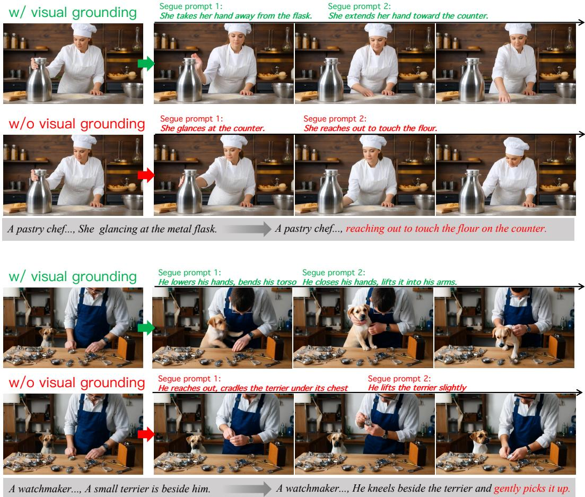  
Figure 8: Qualitative effect of visual grounding under the same prompt update and pre-switch history. The grounded planner specifies preparatory actions based on the realized state: releasing the flask before reaching toward the flour (top) and bending toward the terrier before attempting the lift (bottom). The text-only plans omit these steps, and their continuations do not complete the requested interaction in the shown frames.

## A.5.2 STATE-DEPENDENT CONSTRAINTS IN TD-SCHEMA

TD-Schema organizes a transition around the conditions that must change before the target event can proceed coherently. It defines four preparatory roles for ending incompatible activity, removing interaction dependencies, establishing prerequisites, and introducing required entities, together with an EXECUTE handoff symbol that returns control to the target prompt. Their definitions and applicability are given in Table 7.

Table 7: Preparatory-role semantics and the EXECUTE handoff in TD-Schema. The four preparatory roles describe possible intermediate actions; EXECUTE marks the handoff to $c ^ { + }$ and does not instantiate an additional segue prompt.
<table><tr><td>Schema element</td><td>Definition and applicability</td></tr><tr><td>TERMINATE</td><td>Concludes or safely interrupts an ongoing event when its continuation conflicts with the updated prompt. It resolves the incompatible activity through an observable completion or interruption, avoiding an unexplained discontinuity in the subject's behavior.</td></tr><tr><td>Role</td><td>Definition and applicability</td></tr><tr><td>RELEASE</td><td>Removes interaction dependencies that prevent the next event, such as held objects, physical contacts, occupied hands, or incompatible subject-object relations. It is invoked only for dependencies that obstruct the target event;</td></tr><tr><td>ALIGN</td><td>compatible interactions can persist. Establishes prerequisites of the target event, including subject pose, spatial arrangement, interaction configuration, or viewing condition. It may comprise several distinct preparatory actions when multiple prerequisites remain</td></tr><tr><td>ENTRY</td><td>unsatisfied. Establishes required entities absent from the current visual state through a plausible observable process. It accounts for how an entity becomes available for the target event, maintaining continuity with the visible scene.</td></tr><tr><td>EXECUTE</td><td>Denotes the beginning of the target event specified by c+. It is not instantiated as an additional segue prompt; instead, it marks the handoff from transition planning back to the original target prompt.</td></tr></table>

The planner selects only preparatory roles justified by the grounded state. TD-Schema therefore specifies conditional dependencies rather than a fixed chain: an absent conflict requires no TERMINATE, an unobstructed interaction requires no RELEASE, and an already visible entity requires no ENTRY. Where applicable, the role dependencies follow

$$
\mathrm { T E R M I N A T E ~ \ \prec ~ \ R E L E A S E ~ \ \prec ~ \left\{ A L I G N , E N T R Y \ \prec \ \underbrace { E X E C U T E } _ { h a n d o f f t o \ c l } . \right. } _ { \ } . 
$$

Here, ≺ denotes precedence among instantiated preparatory roles and the final EXECUTE handoff; it does not require every preparatory role to be instantiated. ALIGN may repeat to establish different prerequisites. ALIGN and ENTRY occupy the same stage, allowing the order to reflect the scene: a subject may orient toward a doorway before an entity appears, or respond to that entity after its arrival.

Each segue prompt describes an observable change whose resulting state should support the next action. The first segue prompt starts from the grounded source state, and consecutive segue prompts are planned to have compatible end and start states. Subject identity, scene structure, and interactions unrelated to the requested update are preserved. In the standard setting, a transition uses one to 4 intermediate segue prompts within a budget of 4 generation blocks (approximately 3 seconds). Segue prompt durations divide this budget, and their descriptions condition the corresponding video spans. After the intermediate plan, the original prompt $c ^ { + }$ resumes control to initiate the target event.

## A.5.3 PLANNER PROMPT SPECIFICATION

Tables 8 and 9 give a condensed prompt specification of the TD-Schema formulation above. The system message defines the planning roles and continuity requirements. The user-message table presents the planning prompts applied to the inputs summarized in Table 6. The templates express the planning procedure at the method level, with implementation-specific serialization and bookkeeping omitted.

Table 8: System-message specification for grounded transition planning with TD-Schema.

## System message

You are a transition planner for streaming video generation. Given the last generated frame, the preceding prompt, and an updated prompt, plan the intermediate actions needed to reach the conditions for the target event. Ground the source state in the image. Identify ongoing activity, held objects, physical contacts, occupied hands, subject pose, spatial relations, and visible entities. Use the observed state when it differs from the preceding prompt. Do not assume any future visual outcome.

Select only preparatory roles justified by the difference between the observed state and the target event:

<table><tr><td>Table 8 (continued)</td></tr><tr><td>System message</td></tr><tr><td>TERMINATE: Conclude or safely interrupt an ongoing event when its continuation conflicts with the updated prompt. RELÉASE: Remove interaction dependencies that prevent the target event, including obstructing held objects, contacts, occupied hands, or incompatible subject-object relations. Preserve compatible interactions. ALIGN: Establish missing prerequisites of the target event, including subject pose, spatial arrangement, interaction configuration, or viewing condition. Use separate preparatory actions when needed.</td></tr><tr><td>ENTRY: Establish a required entity absent from the current visual state through a plausible observable process. EXECUTE: Hand control back to the original target prompt to begin its event. This is a handoff, not an additional segue prompt. Do not output an EXECUTE segue prompt or paraphrase the target event as an</td></tr><tr><td>intermediate action. TD-Schema is not a fixed chain. Omit preparatory roles whose conditions are already satisfied. Resolve</td></tr><tr><td>conflicting activity and obstructing interactions before the actions that depend on their resolution. ALIGN may repeat, and ALIGN and ENTRY may occur in either order when justified by the scene. Describe each segue prompt as an observable change, not merely a completed state. Begin from the grounded</td></tr><tr><td>source state and make each segue prompt&#x27;s resulting state compatible with the next action. Preserve subject identity and scene elements unrelated to the prompt update. Avoid unexplained appearances, disappearances, or changes in physical contact.</td></tr></table>

Table 9: Planning instructions in the user message.
<table><tr><td>Planning instructions</td></tr><tr><td>1. Ground the state. Describe what the image shows that matters for the target event, including unfinished actions, interaction dependencies, subject pose, spatial configuration, and available entities. 2. Identify unmet conditions. Determine whether an ongoing event conflicts with the update, whether an</td></tr><tr><td>interaction obstructs the target, which prerequisites remain unsatisfied, and whether a required entity is absent. Do not introduce a transition action without a corresponding need in the observed state.</td></tr><tr><td>3. Construct the intermediate plan. Select the necessary TERMINATE, RELEASE, ALIGN, and ENTRY actions and order them according to their dependencies. Each action should start from the preceding action&#x27;s resulting state and move toward the conditions needed for the target event.</td></tr><tr><td>4. Allocate durations. Distribute the transition budget among the intermediate actions. For each segue prompt, provide its role, action description, duration, and brief start and end states.</td></tr><tr><td>After the intermediate plan, return control to the original target prompt. EXECUTE denotes this handoff and must not appear as an additional segue prompt.</td></tr></table>

## A.5.4 DETERMINISTIC COMPILATION AND FAILURE HANDLING

The compiler converts the planner output into a block-level conditioning schedule through dependency ordering, action merging, validation, and duration normalization. Semantic prerequisites and physical plausibility are assessed by the visually grounded planner; the compiler enforces structural and temporal constraints without a separate symbolic simulator.

Dependency ordering and action merging. After parsing the output and normalizing role names, the compiler checks for recognized roles, nonempty action descriptions, and positive integer block durations. It orders the proposed operations according to the precedence constraints in Table 7. ALIGN and ENTRY share a precedence level, so their relative order follows the planner’s proposal when either order is admissible. An ordering violation in the proposed sequence is therefore handled by reordering rather than immediate rejection.

The compiler also merges compatible operations that can be realized by the same observable change into a single segue prompt, preserving the required changes and their dependencies. Distinct preparatory actions remain separate; in particular, ALIGN may repeat when different prerequisites require different actions. The compiled plan is then checked for the allowed segue prompt count, role repetitions, and dependency consistency. Plans that remain inadmissible after ordering and merging are rejected.

Budget normalization and scheduling. Let K be the number of segue prompts after ordering and merging, $d _ { i }$ their associated positive integer block durations, and B the maximum available transition budget. $\mathbf { A }$ plan with $K > B$ is rejected because each segue prompt requires at least one block. Durations are retained when $\textstyle \sum _ { i } d _ { i } \leq B$ . Only over-budget plans, with $\sum _ { i } ^ { } d _ { i } > B$ , undergo duration normalization. For these plans, the compiler computes

$$
\tilde { d } _ { i } = \operatorname* { m a x } \left( 1 , \mathrm { r o u n d } \left( \frac { B d _ { i } } { \sum _ { j } d _ { j } } \right) \right) .
$$

It assigns the residual $\textstyle B - \sum _ { i } { \tilde { d } } _ { i }$ to the longest rescaled segue prompt, breaking ties by the compiled order and maintaining a minimum duration of one block. For an over-budget plan, if this adjustment cannot produce positive integer durations summing to $B ,$ the plan is rejected. Duration normalization operates on the compiled actions without further deleting or merging them. An accepted plan is expanded into a block-level schedule by repeating each segue prompt for its assigned duration. Control returns to the unchanged target prompt $c ^ { + }$ immediately after the resulting schedule ends, even when its total duration $T _ { \Pi }$ is less than $B .$

Rejected and empty plans. Malformed outputs, empty segue prompt lists, unresolved structural violations, and unsuccessful budget normalization trigger the same fallback: the updated prompt $c ^ { + }$ immediately conditions all reserved transition blocks. The implementation represents this fallback internally as a single EXECUTE record; it introduces no additional intermediate action or transitionstage delay. An empty plan invokes this fallback rather than serving as a verified claim that no preparation is required.

The system does not automatically re-query the planner after rejection. Planner inference or communication failures use the same fallback, and the reason is recorded in the plan log. As a final defensive check, an oversized schedule is truncated to B blocks. For an accepted plan with $T _ { \Pi } < B$ any remaining reserved blocks are conditioned on $c ^ { + }$ and do not extend the segue-prompt schedule.

## A.6 ANALYSIS OF SPANDMD

Training details. We apply SPANDMD to complete training rollouts of $\mathrm { T } = 7$ blocks (21 latent frames, corresponding to 81 decoded frames), each containing one instruction switch and its associated segue schedule. Long video sequences are processed using overlapping training rollouts of this size, keeping the 14B teacher within its native temporal context. For each span condition $u _ { \ell } ,$ both score networks observe the complete noised rollout, while the corresponding DMD residual is retained only within its assigned span. The fake-score network is trained on student-generated rollout with span-conditioned flow-matching losses, masked to frames within each span and averaged over nonempty supervised spans. We set $\lambda _ { \ell } = 1$ and retain per-span DMD gradient normalization. Each generator update with L span conditions requires $L$ guided teacher evaluations (2L forward passes with classifier-free guidance), giving L times the teacher-evaluation cost of a single-condition DMD update.

Merged-prompt DMD ablation. For w/o SpanDMD, we keep the planner-generated waypoint schedule and the student’s span-wise prompt conditioning unchanged. We concatenate all conditions in temporal order into a single teacher prompt, $\tilde { c } = \bar { c ^ { - } } \| w _ { 1 } \| \cdot \cdot \cdot \| w _ { K } \| c ^ { + }$ , where ∥ denotes text concatenation. Vanilla DMD conditions both the real-score and fake-score networks on c˜ and applies their residual to the supervised rollout without span-specific masks.

Conditional-score view. Let $p _ { t , \ell }$ be the teacher’s density over the complete noised rollout y under prompt $u _ { \ell } .$ , and write $\boldsymbol { y } = \left( y _ { I _ { \ell } } , y _ { - I _ { \ell } } \right)$ ). Since log $p _ { t , \ell } ( y ) \dot { = } \log p _ { t , \ell } ( y _ { I _ { \ell } } \mid \mathcal { V } _ { - I _ { \ell } } ) + \log p _ { t , \ell } ( y _ { - I _ { \ell } } )$ and the second term does not depend on $y _ { I _ { \ell } }$

$$
\left[ \nabla _ { y } \log p _ { t , \ell } ( y ) \right] _ { I _ { \ell } } = \nabla _ { y _ { I _ { \ell } } } \log p _ { t , \ell } \bigl ( y _ { I _ { \ell } } \mid y _ { - I _ { \ell } } \bigr ) .\tag{5}
$$

The same identity holds for the fake score. The residual that SPANDMD keeps on $I _ { \ell }$ is therefore the difference between the student’s and the teacher’s conditional scores of the span given the rest of the rollout. With exact scores and the rest of the rollout held fixed, the corresponding update moves the span toward the teacher’s conditional distribution under $u _ { \ell } ,$ rather than toward the distribution of an isolated clip. This view requires neither independent stages nor a single teacher distribution over the whole schedule. The context $y _ { - I _ { \ell } }$ contains other stages and is therefore not typical of clips described by $u _ { \ell }$ alone, so the teacher’s conditional score is an approximation; the cropped alternative in Section 3.3 avoids this mismatch but loses the context entirely.

Why use span masks? A natural alternative retains separate score evaluations for each condition but removes the span masks, applying every condition’s residual to all supervised frames. Each frame would then receive supervision from conditions intended for different stages. When these conditions describe incompatible states, such as still holding an object versus having already released it, their signals may compete without explicitly specifying which state belongs to that frame. Span masks provide this temporal assignment while preserving the complete rollout as context for both score networks. This motivates our design but does not imply that an unmasked alternative must perform worse. A controlled comparison would use the same initialization, student schedule, and separate percondition score evaluations, with fake-score training covering all frames whose predictions contribute to the generator update. We have not evaluated this alternative. Accordingly, our merged-prompt ablation and color-sequence diagnostic support the combined conditioning and temporal-assignment scheme of SpanDMD, but do not establish the isolated benefit or necessity of hard masking.

Color-sequence diagnostic. To see how SPANDMD guides generation through a sequence of target states, we use a task in which a sphere should change color in a specified order at specified times (Figure 9). The top panel provides a qualitative comparison of generator outputs before and after SPANDMD training; the bottom panel presents the latent-update diagnostic described below. Vanilla DMD receives the entire color sequence and its timing in one prompt, whereas SPANDMD uses the color prompt of each span. Starting from the same generated videos, we freeze the models, apply one latent update of equal magnitude for each method, and measure how much closer the colors move to their targets. Across 50 color-sequence plans with four rollout seeds per plan (200 videos in total), the SPANDMD update reduces the color error throughout $s _ { 1 } { - } s _ { 5 }$ and exceeds the vanilla DMD update at most sampled times, especially in the intermediate stages $s _ { 1 } - s _ { 4 }$ , while a random update stays close to zero. SPANDMD thus guides the rollout toward the intermediate targets as well as the final one.

We measure color error in normalized RGB chromaticity. For each original decoded frame, we construct a soft spatial weight map proportional to the product of pixel saturation, brightness (the maximum RGB channel), and a Gaussian centered on the image, with horizontal and vertical standard deviations of 0.28W and 0.35H, respectively. The weights are normalized to sum to one and held fixed across all methods and before/after comparisons; if the weighted mass is below $1 0 ^ { - 6 }$ , we use the Gaussian alone. This emphasizes the central colored object without requiring a segmentation model. Given these weights $w _ { t } ( p )$ , we compute

$$
\mathbf { r } _ { t } = \sum _ { p } w _ { t } ( p ) \mathbf { I } _ { t } ( p ) , \qquad \mathbf { c } _ { t } = { \frac { \mathbf { r } _ { t } } { \operatorname* { m a x } ( \mathbf { 1 } ^ { \top } \mathbf { r } _ { t } , 1 0 ^ { - 8 } ) } } , \qquad E _ { t } = \| \mathbf { c } _ { t } - \mathbf { c } _ { t } ^ { * } \| _ { 2 } ^ { 2 } ,\tag{6}
$$

where RGB intensities lie in [0, 1] and $\mathbf { c } _ { t } ^ { * }$ is the prescribed span color normalized by its channel sum. The RGB targets for red, orange, yellow, green, cyan, and blue are $( 1 , 0 , 0 ) , ( 1 , 0 . 5 , 0 ) , ( 1 , 1 , 0 )$ (0, 1, 0), (0, 1, 1), and (0, 0, 1), respectively. The plotted quantity is $\dot { E _ { t } ^ { \mathrm { b e f o r e } } } - \dot { E _ { t } ^ { \mathrm { a f t e r } } }$ , so positive values indicate improvement. We evaluate color error at decoded frames aligned with the latent temporal positions.

For this diagnostic, all methods start from the same latent video and use an identical update mask. Each method’s latent direction is rescaled so that the RMS displacement over the selected entries equals α times the original latent RMS over those same entries, with $\alpha = 0 . 1 0$ . Each method applies a single update from the original latent video. This matches the total update magnitude across methods without constraining how the correction is distributed across temporal spans. DMD directions are evaluated at diffusion timestep 950, using two shared noise draws per video. The random control uses a Gaussian direction subject to the same mask and RMS normalization. All model parameters remain frozen; this experiment measures local latent correction, not a model-parameter optimization step.

Table 10: Comparison with representative video-generation benchmarks. $\checkmark , \bigtriangleup$ , and × denote explicit, partial/indirect, and absent evaluation, respectively.
<table><tr><td></td><td colspan="2">Generation Setting</td><td colspan="3">Existing Evaluation Focus</td><td colspan="5">Semantic Transition Evaluation</td></tr><tr><td>Benchmark</td><td>Multi- Prompt</td><td>Runtime Switch</td><td>Update Fulfillment</td><td>State Retention</td><td>Boundary Smoothness</td><td>Prior-Event Resolution</td><td>Transition Plausibility</td><td>State Readiness</td><td>Event Initiation</td><td>Overall Coherence</td></tr><tr><td colspan="9">General video generation benchmarks</td><td></td></tr><tr><td>VBench (Huang et al., 2024)</td><td>×</td><td>×</td><td>×</td><td>X</td><td>×</td><td>×</td><td>×</td><td>×</td><td>×</td><td>×</td></tr><tr><td>EvalCrafter (Liu et al., 2024)</td><td>×</td><td>×</td><td>×</td><td>X</td><td>X</td><td>×</td><td>×</td><td>×</td><td>×</td><td>×</td></tr><tr><td>T2VBench (Ji et al., 2024)</td><td>×</td><td>×</td><td>√</td><td>×</td><td>×</td><td>△</td><td>△</td><td>×</td><td>△</td><td>×</td></tr><tr><td>T2V-CompBench (Sun et al., 2025)</td><td>×</td><td>×</td><td>√</td><td>X</td><td>X</td><td>×</td><td>△</td><td>X</td><td>×</td><td>×</td></tr><tr><td>VBench-2.0 (Zheng et al., 2025)</td><td>×</td><td>×</td><td>√</td><td>√</td><td>×</td><td>×</td><td>△</td><td>X</td><td>×</td><td>△</td></tr><tr><td colspan="9">Long-form and streaming video benchmarks</td><td></td><td></td></tr><tr><td>NarraStream-Bench (Liu et al., 2026a)</td><td>√</td><td>△</td><td>√</td><td>√</td><td>√</td><td>×</td><td>△</td><td>×</td><td>×</td><td>△</td></tr><tr><td>StateBench (Miao et al., 2026)</td><td>√</td><td>△</td><td>√</td><td>√</td><td>×</td><td>×</td><td>△</td><td>△</td><td>×</td><td>△</td></tr><tr><td>StreamAV-Bench (Liu et al., 2026b)</td><td>√</td><td>√</td><td>√</td><td>√</td><td>√</td><td>△</td><td>△</td><td>X</td><td>△</td><td>△</td></tr><tr><td>OPENTRANS-360 (Ours)</td><td>√</td><td>√</td><td>√</td><td>√</td><td>√</td><td>√</td><td>√</td><td>√</td><td>√</td><td>√</td></tr></table>

We first average the two noise draws within each video, then construct 10,000 paired hierarchical bootstrap replicates. For each replicate, we sample 50 color-sequence plans with replacement and, within each selected plan, sample four rollout seeds with replacement. The same resampling indices are used across methods and temporal positions. Shaded bands are the pointwise 2.5th and 97.5th percentiles of the bootstrap mean, rather than simultaneous confidence bands over the entire trajectory.

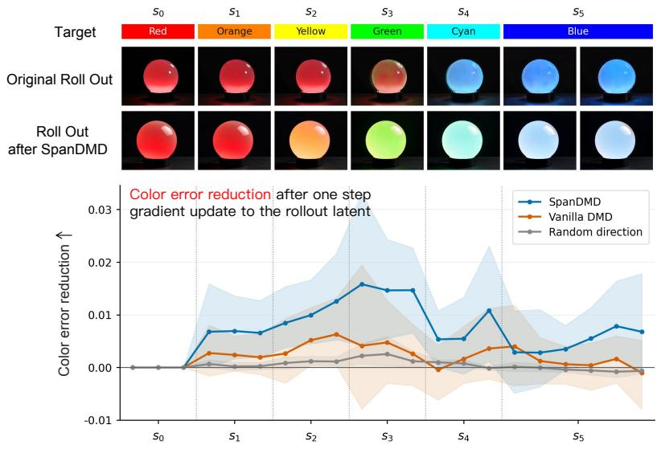  
Figure 9: Color-sequence evaluation. Top: Qualitative examples of generator outputs before and after SpanDMD training, shown alongside the target color of each span. Bottom: A latent-update diagnostic measuring mean color-error reduction after one equal-magnitude update over 200 videos, starting from shared initial latents with all model parameters frozen. Shaded bands show pointwise 95% paired hierarchical bootstrap confidence intervals.

## A.7 BENCHMARK DESIGN, CONSTRUCTION, AND EVALUATION

OPENTRANS-360 evaluates semantic transitions under runtime prompt updates. As summarized in Table 10, general video-generation benchmarks primarily assess the quality and semantic correctness of generated content, while long-form and streaming benchmarks extend evaluation to prompt updates, state retention, and boundary continuity. Our benchmark examines the process connecting the state already generated to the newly requested event: whether the preceding activity is resolved, the transition is plausible, necessary prerequisites are established, and the new event begins coherently. These aspects complement prompt fulfillment and visual smoothness, which alone do not establish that the transition is semantically valid.

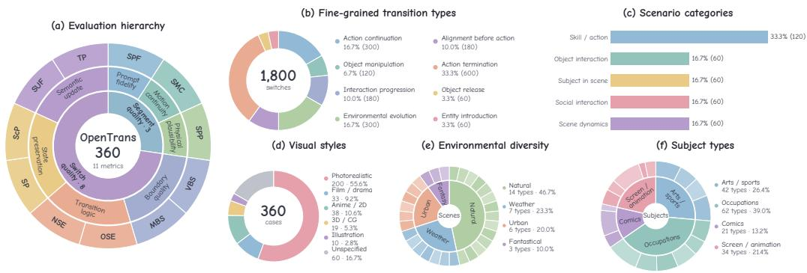  
Figure 10: Overview of OPENTRANS-360. (a) Evaluation hierarchy. (b) Eight design-derived semantic transition types. (c) Scenario categories. (d) Visual styles. (e) Environmental diversity. (f) Subject-type diversity. Transition statistics cover 1,800 prompt switches; scenario and style statistics cover 360 cases. Environmental and subject-type statistics count distinct pool entries, not cases. In (e)–(f), inner sectors indicate broad families, while outer sectors represent individual scenes and subject subcategories, respectively.

## A.7.1 DATA DISTRIBUTION

As shown in Figure 10, OPENTRANS-360 comprises 360 cases and 1,800 prompt switches, covering eight design-derived transition types. Each case contains six sequential prompts, active for 10 seconds each, yielding a 60-second video with five updates. The three broad construction categories in Section 4 comprise five scenario templates: human-centric (120 skill/action and 60 subject-inscene cases), object-centric (60 object-interaction cases), and compositional (60 social-interaction and 60 subject-free scene-dynamics cases). The subject-free templates coordinate changes among elements of a persistent environment. Overall, the cases include 200 real-world subjects, 100 fictional characters, and 60 subject-free scenarios, giving a 2:1 real-to-fictional ratio among subject-bearing cases.

We constructed the pools by giving an LLM predefined category ranges and asking it (Qwen2.5- 72B-Instruct-AWQ Qwen et al. (2025)) to generate entries within each category. The construction pools contain 55 fictional characters, 42 skill-oriented and 62 additional occupation entries, 30 props, 30 secondary entities, and 30 subject-free scenes. Real-world subjects have occupation-specific appearances, while fictional characters span cinematic, animated, and illustrated styles. Secondary entities include people, dogs, cats, birds, and other animals. Subject-free scenes cover natural landscapes, weather, urban environments, and fantastical settings. Balanced allocation cycles through shuffled pools to distribute coverage across entries, and recurring subjects are assigned alternative settings where available.

The 360-case design comprises 2,160 prompts and 1,800 prompt switches. To characterize transition coverage, we subdivide switches using their expected step annotations and scenario tags into eight mutually exclusive types: action continuation (16.7%), object manipulation (6.7%), interaction progression (10.0%), environmental evolution (16.7%), alignment before action (10.0%), action termination (33.3%), object release (3.3%), and entity introduction (3.3%). Preparatory steps identify the latter four types; switches requiring only execution are grouped by scenario, with skill and subjectin-scene cases combined as action continuation. These labels describe the construction templates, not observed transitions in generated videos. The benchmark targets updates within a persistent setting and does not include scene cuts.

## A.7.2 LLM-ASSISTED DATA CONSTRUCTION

We first assemble structured case specifications by combining a scenario category with a subject and appearance, a compatible setting, and category-specific objects or secondary entities. These specifications determine a six-stage event outline. For example, an object-interaction sequence places a prop in the scene before it is handled and eventually released; a social-interaction sequence starts with the main subject alone, introduces another entity in the third segment, and continues with their interaction. Subject-free sequences describe environmental changes in one persistent scene. The benchmark focuses on continuity-preserving updates within a setting.

Qwen2.5-72B-Instruct-AWQ expands each specification into a shared identity-and-scene description and six short, present-tense action captions. Each final prompt combines the shared description with its segment-specific action, keeping persistent context explicit across updates. For subject-free cases, the fixed scene description supplies this shared context. The generation prompt requests visible events, consistent appearance, and plausible entity arrival, while avoiding repeated introductions and unnecessary scene changes.

Automatic validation checks the six-caption structure, caption length, scene compatibility, and category-specific constraints. For instance, object-interaction cases must retain their assigned prop, and social cases must depict an explicit arrival followed by interaction without repeatedly introducing the same entity. Invalid candidates are regenerated with the rejection reasons supplied as feedback, for up to three attempts in total. The accepted prompts are stored with their scenario metadata. Expected transition annotations are derived from the event templates; the visual evaluator scores the generated frames and prompts without requiring a model to reproduce a prescribed waypoint chain.

Construction prompt. Table 11 gives a condensed template; the event outline and constraints are instantiated for the selected category.

Table 11: Condensed Qwen prompt for benchmark construction.  
Prompt template   
System message   
Write short, concrete video captions describing visible events. Use present-tense sentences without metaphors,   
camera jargon, or narration of intentions and emotions. Return only the requested JSON object.   
User message   
Subject and appearance: {subject}. Visual style: {style}. Setting: {scene}. Category: {category}.   
Relevant prop or secondary entity: {entity}.   
Construct six consecutive steps, each lasting approximately 10 seconds, following this event outline:   
{category outline}. Preserve the assigned appearance and scene. Describe a distinct visible event in each   
step. Where a secondary entity is introduced, show it arriving and keep it present for subsequent interaction.   
Return a JSON object with scene, identity, and six actions. The identity sentence describes the   
persistent subject and setting; each action refers back to the subject with a pronoun. For subject-free scenarios,   
return only six actions describing the supplied scene.

## A.7.3 METRIC DEFINITIONS AND COMPUTATION

We evaluate three segment-quality metrics (SPF, SMC, and SPP) and eight switch-quality metrics (VBS, MBS, OSE, NSE, SP, ScP, SUF, and TP). The five semantic-transition dimensions in Table 10 are conceptual aspects covered by these metrics, rather than five additional scores. OSE assesses priorevent resolution; NSE assesses preparation, reachability, and event initiation; SPP and MBS provide evidence of physical and motion plausibility; and SP, ScP, SUF, and TP characterize preservation, update fidelity, and pacing across the transition.

Evaluation input. We use InternVL3.5-38B Wang et al. (2025) with deterministic decoding. For each case, we evaluate all six segments and all five switches. Metrics with the same temporal window and frame count receive the same sampled frames across methods. Each query supplies temporally ordered frames, the metric-specific checklist, and the relevant prompt text where required. Table 12 gives the temporal windows. A switch occurs at time $t ;$ uniform sampling of n frames inside (a, b) uses times $a + ( b - a ) j / ( n + 1 )$ for $j = 1 , \dotsc , n$

Scoring and aggregation. Each metric uses ten binary criteria, reproduced below in their evaluator order. Let $y _ { i m q j } \in \{ 0 , 1 \}$ denote the judgment for criterion j of metric m on sampled segment or boundary $q$ in case i. The query score, case score, and benchmark score are

Table 12: Metric-specific temporal sampling. All times are in seconds. Reference frames establish the preceding visual state; subsequent frames show the transition to be judged.
<table><tr><td>Metric</td><td>Frames supplied</td><td>prompt text</td></tr><tr><td>SPF, SPP</td><td>3 uniformly spaced frames within the 10-second segment.</td><td>Current prompt</td></tr><tr><td>SMC</td><td>6 consecutive frames near the segment midpoint.</td><td>None</td></tr><tr><td>VBS, MBS</td><td>2 frames in  $( t - 2 , t )$  and 2 in  $( t , t + 2 ) .$ </td><td>None</td></tr><tr><td>OSE</td><td>1 reference at  $t - 0 . 5$  and 4 in  $( t , t + 1 . 5 )$ </td><td>Both prompts</td></tr><tr><td>NSE</td><td>1 reference at  $t - 0 . 5$  and 4 in  $( t , t + 5 )$ </td><td>Both prompts</td></tr><tr><td>SP, ScP</td><td>2 frames in  $( t - 1 , t )$  and 2 in  $( t , t + 1 ) .$ </td><td>Both prompts</td></tr><tr><td>SUF</td><td>2 frames in (t − 1, t) and 4 in  $( t , t + 5 )$ </td><td>Both prompts</td></tr><tr><td>TP</td><td>2 frames in  $( t - 2 , t )$  and 6 in  $( t , t + 5 ) .$ </td><td>Both prompts</td></tr></table>

$$
s _ { i m q } = \frac { 1 } { 1 0 } \sum _ { j = 1 } ^ { 1 0 } y _ { i m q j } , \qquad s _ { i m } = \frac { 1 } { | Q _ { i m } | } \sum _ { q \in \mathcal { Q } _ { i m } } s _ { i m q } , \qquad S _ { m } = \frac { 1 } { N _ { m } } \sum _ { i \in \mathcal { V } _ { m } } s _ { i m } ,
$$

where $\mathcal { Q } _ { i m }$ contains the sampled evaluation units and $\nu _ { m }$ contains the cases with available metric scores, with $N _ { m } = | \nu _ { m } | .$ . For SP, VSP contains only subject-bearing cases, giving $N _ { \mathrm { S P } } = 3 0 0$ for complete evaluations. Each case has equal weight. All scores lie in [0, 1], with higher values indicating better performance. The segment and switch aggregates are the unweighted means of their three and eight metrics, respectively. For complete evaluations, the Overall score is

$$
S _ { \mathrm { O v e r a l l } } = \frac { 1 } { 1 1 } \sum _ { m \in \mathcal { M } } S _ { m } ,
$$

where M contains all eleven metrics. The evaluator returns an ordered binary vector and its sum in JSON. The same metric checklist is applied across applicable cases and methods. For environmental sequences, the evaluator is instructed to judge the changing visual content without assuming a human subject. The following tables provide the exact ten criteria for each metric, together with its definition and evaluation context.

## A.8 LLM-ASSISTED CONSTRUCTION OF TRANSITION TRAINING DATA

We use Qwen2.5-72B-Instruct-AWQ to construct an offline collection of approximately 45k segue prompts for SpanDMD training. We take source–target prompt pairs $( c ^ { - } , c ^ { + } )$ from the switch-prompt dataset constructed by LongLive Yang et al. (2025a). LongLive uses Qwen2-72B-Instruct to generate a follow-up prompt $\dot { c } ^ { + }$ conditioned on each original VidProM prompt $c ^ { - }$ Wang & Yang (2024). For each existing pair, we use Qwen2.5-72B-Instruct-AWQ to identify and describe the intermediate changes needed to connect the source activity to the target event. The planning prompt follows the TD-Schema formulation in the main paper and requests a short sequence of process-oriented captions with associated durations. Each plan contains up to four intermediate segue prompts within a four-block budget (approximately three seconds). Captions describe observable changes while preserving subject identity and scene context, and consecutive steps are required to have compatible action prerequisites.

We filter candidate plans using automatic checks on their structure, role consistency, duration budget, and caption form. These checks screen out malformed outputs, static descriptions, and explicit wording that suggests unexplained entity appearances. Rejected candidates receive one additional generation attempt with the validation errors provided as feedback; those that fail again are discarded. The retained records contain the original prompt pair and its segue prompt schedule.

We precompute text-based segue prompts to train the generator to execute short-lived conditions. During training, the student generates its own video rollout under these schedules, and SpanDMD assigns each condition’s supervision to its corresponding temporal span. At inference, the visual planner constructs segue prompt schedules from the realized scene state using the same conditioning interface.

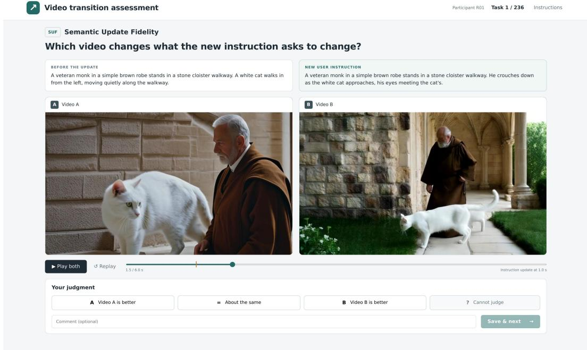  
Figure 11: Implemented interface for the human-alignment study. Annotators compare synchronized clips alongside the preceding and updated instructions and answer a metric-specific question, selecting A, B, a tie, or cannot judge.

Prompt template. Table 13 presents a condensed prompt specification for Qwen using the TD-Schema formulation of the main paper. The placeholders are replaced with the corresponding training prompt pair.

Table 13: Prompt specification for offline training-plan construction with Qwen.
<table><tr><td>Prompt template</td></tr><tr><td>System message You are a transition planner for streaming video generation. Given a current prompt and an updated prompt,</td></tr><tr><td>construct a short, physically plausible transition between them using the Transition Dependency Schema. Describe each segue prompt as an observable change in progress. Make each caption self-contained, preserve subject identity and scene context, and ensure that one step establishes the conditions needed by the next.</td></tr><tr><td>Introduce missing entities through a plausible observable process. Leave the target event to the original updated prompt after the transition.</td></tr><tr><td>User message</td></tr><tr><td>Current prompt: {source-prompt}</td></tr><tr><td>Updated prompt: {target_prompt}</td></tr><tr><td>Transition budget: at most 4 generation blocks (approximately 3 seconds). Infer the ongoing activity and relevant interaction constraints from the current prompt. Identify the changes</td></tr><tr><td>needed before the updated event can begin, and plan up to 4 intermediate segue prompts. Include only necessary steps and order them according to their dependencies. Return only a JSON object containing segue prompts and plan_reason. Each segue prompt must</td></tr></table>

## A.9 HUMAN ALIGNMENT OF THE EVALUATION METRICS

Following StreamAV-Bench (Liu et al., 2026b), we conduct a blinded pairwise study to assess the agreement between our eleven evaluation metrics and human judgments. The cases and annotators used in this study are disjoint from those in the user study (Appendix A.1). We sample 30 cases, stratified by benchmark category, from cases with valid outputs from all 13 methods. For each metric, we assign each of the 78 unordered method pairs to one case and temporal unit, yielding 78 comparisons per metric and 858 comparisons in total. For SP, comparisons are assigned only to subject-bearing cases. Case and temporal-position assignments are balanced independently of benchmark scores. From a pool of 12 annotators, three distinct annotators judge each comparison, yielding 2,574 original judgments. We include 258 additional hidden repeat judgments (approximately 10% of the original judgments) for consistency checks, bringing the planned total to 2,832 judgments.

Figure 11 shows the annotation interface. Each task presents one metric-specific question, the relevant instructions, and synchronized clips labeled A and B, with method identities and benchmark scores hidden. Task order and left–right placement are randomized. Annotators judge clips at normal speed and select A, B, a tie, or cannotjudge. Segment metrics use the corresponding instruction segment; transition metrics use windows around the instruction update. Human judgments use continuous playback, whereas our benchmark evaluates sampled frames.

A majority among three valid original judgments determines each task’s label; incomplete or unresolved tasks are excluded. For each metric, we aggregate human preferences into method-level win rates, assigning 1 to a win, 0 to a loss, and 0.5 to a tie. We report Spearman correlations between these human win rates and mean benchmark scores computed on the same resolved, score-matched cases and temporal units. Hidden repeats serve only as consistency checks and do not enter the reported correlations. Of the 858 planned comparisons, 831 yielded a resolved majority judgment; the remaining 27 were excluded because of incomplete or unresolved judgments. Of the 258 planned hidden repeat judgments, 254 formed valid pairs with their original judgments, with a repeat-consistency rate of 93%. Pairwise agreement among original annotators was 88%, computed using valid original judgments, including those from comparisons without a resolved majority judgment. Both agreement measures include ties and compare method identities rather than screen positions.

Table 14: Human alignment of the eleven evaluation metrics: Spearman correlation between methodlevel human win rates and the corresponding benchmark scores.
<table><tr><td>Metric</td><td>SPF SMC SPP VBS</td><td>ScP SUF</td><td>MBS OSE NSE SP</td></tr><tr><td>Spearman ρ 0.82 0.88 0.78</td><td>0.83 0.85 0.93 0.90 0.88 0.91</td></tr></table>

## A.10 ADDITIONAL IMPLEMENTATION DETAILS

Table 15 summarizes the sampling, planning-budget, and training settings. The generator is initialized from the LongLive base checkpoint without long-video tuning. LoRA adapters are applied to all linear layers within the student and fake-score transformer blocks; their backbone weights, the text encoder, and the video autoencoder remain frozen. Each generation block contains three latent frames, corresponding to 12 video frames (approximately 0.75 s at 16 fps). The four-block planning budget therefore allows approximately 3 s of segue prompts before control returns to the updated prompt.

The end-to-end planning latency reported in Figure 5 is measured from the start of input-image decoding to the completion of segue-prompt generation, including image decoding and the entire planning process. The planner runs asynchronously in parallel with the video generator. Generation continues under $c ^ { - }$ until the first generation-block boundary after the schedule returns, when the schedule takes effect.

For score evaluation, we sample an integer timestep u uniformly from $\{ 0 , \ldots , 9 9 9 \}$ and use $t =$ $\begin{array} { r } { \exp \Bigl ( 1 0 0 0 \frac { 5 ( u / 1 0 0 0 ) } { 1 + 4 ( u / 1 0 0 0 ) } , 2 0 , 9 8 0 \Bigr ) } \end{array}$ , shared across the frames and span conditions of a rollout. The teacher guidance convention is $\hat { x } _ { \mathrm { r e a l } } = \hat { x } _ { \mathrm { c o n d } } + 3 ( \hat { x } _ { \mathrm { c o n d } } - \hat { x } _ { \mathrm { u n c o n d } } )$ ; the fake-score network uses its conditional prediction.

Table 15: Implementation settings. Optimizer and LoRA settings apply to both trainable networks unless otherwise specified.
<table><tr><td>Hyperparameter</td><td>Setting</td></tr><tr><td colspan="2">Sampling and planning</td></tr><tr><td>Student sampler</td><td>Four-step causal sampling</td></tr><tr><td>Sampling timesteps</td><td>{1000, 750, 500, 250}</td></tr><tr><td>Timestep shift</td><td>5</td></tr><tr><td>Generation block size</td><td>3 latent frames</td></tr><tr><td>Video frame rate</td><td>16 fps</td></tr><tr><td>Local attention window / sink frames</td><td>12 / 3 latent frames</td></tr><tr><td>Planner fine-tuning</td><td>None</td></tr><tr><td>Maximum transition budget B</td><td>4 generation blocks</td></tr><tr><td>Maximum number of segue prompts</td><td>4</td></tr><tr><td colspan="2">Training</td></tr><tr><td>Optimizer</td><td>AdamW</td></tr><tr><td>Training iterations</td><td>3,000</td></tr><tr><td>Learning rates: student / fake score</td><td> $1 \times 1 0 ^ { - 5 } / 2 \times 1 0 ^ { - 6 }$ </td></tr><tr><td>Adam coefficients  $( \beta _ { 1 } , \beta _ { 2 } )$ </td><td>(0,0.999)</td></tr><tr><td>Weight decay / gradient-norm clipping</td><td>0.01/10</td></tr><tr><td>Learning-rate schedule</td><td>Constant; no warm-up or decay</td></tr><tr><td>Update frequency</td><td>Fake score: every iteration; student: every fifth iteration</td></tr><tr><td>Number of GPUs</td><td>32</td></tr><tr><td>Precision</td><td>bfloat16</td></tr><tr><td>Effective batch size</td><td>32</td></tr><tr><td>Batch size per GPU / accumulation steps</td><td>1/1</td></tr><tr><td>LoRA rank / scaling parameter α</td><td>256 / 256</td></tr><tr><td>LoRA dropout</td><td>0</td></tr><tr><td>Exponential moving average</td><td>Disabled</td></tr><tr><td>Memory optimization</td><td>Hybrid-sharded FSDP and gradient checkpointing</td></tr><tr><td>Configured rollout-length cap</td><td>240 latent frames</td></tr><tr><td>Training switch position (latent frames)</td><td>Uniform over  $\{ 2 1 + 1 8 j | j = 0 , \dots , 1 0 \}$ </td></tr><tr><td>Random seed</td><td>0</td></tr></table>

SPF: Segment Prompt Fidelity. Whether the segment realizes its assigned instruction, including entities, attributes, actions, and scene context. Three uniformly spaced frames within the segment; the segment prompt is provided.  
Table 16: Segment Prompt Fidelity (SPF): ten binary evaluation criteria.
<table><tr><td>No.</td><td>Criterion (YES = 1, NO = 0)</td></tr><tr><td>1</td><td>The main content described in the prompt is visible in the frames.</td></tr><tr><td>2</td><td>The appearance attributes stated in the prompt (clothing, colours, materials, textures, forms) match what is shown.</td></tr><tr><td>3</td><td>The core action or change described in the prompt is taking place in the frames.</td></tr><tr><td>4</td><td>Every entity or object named in the prompt is present in the frames, with none missing.</td></tr><tr><td>5</td><td>The entities and objects in the frames behave, or are used, in the way the prompt describes.</td></tr><tr><td>6</td><td>The scene or environment shown matches the prompt description.</td></tr><tr><td>7</td><td>The atmosphere and lighting shown match the prompt description.</td></tr><tr><td>8</td><td>The frames contain no prominent content that the prompt does not mention.</td></tr><tr><td>9</td><td>The progression across the 3 frames is consistent with the temporal order implied by the prompt.</td></tr><tr><td>10</td><td>The overall visual content is highly consistent with the core semantics of the prompt, with no significant omission or deviation.</td></tr></table>

SMC: Segment Motion Continuity. Whether motion within a segment remains temporally continuous, with stable trajectories, shapes, and background. Six consecutive native-rate frames starting 0.12 seconds before the segment midpoint; no text instruction is supplied.

Table 17: Segment Motion Continuity (SMC): ten binary evaluation criteria.
<table><tr><td>No.</td><td>Criterion (YES = 1, NO = 0)</td></tr><tr><td>1</td><td>The position of the moving content changes gradually across frames with no sudden teleportation</td></tr><tr><td>2</td><td>The shape or posture of the moving content transitions smoothly across frames with no abrupt jumps</td></tr><tr><td>3</td><td>No part of the moving content shows clipping, fracturing or abnormal distortion.</td></tr><tr><td>4</td><td>There is no flickering between frames (no sudden jumps in brightness or colour tone).</td></tr><tr><td>5</td><td>There are no frame skips or scene resets between the 6 frames.</td></tr><tr><td>6</td><td>Every moving element in the scene has a continuous trajectory with no sudden appearance or disappearance.</td></tr><tr><td>7</td><td>The speed of motion is consistent across frames with no unreasonable sudden stop or acceleration.</td></tr><tr><td>8</td><td>There are no visual artifacts such as tearing, ghosting or block-level corruption in any frame.</td></tr><tr><td>9</td><td>The background remains stable across the 6 frames with no unexplained jitter or jump.</td></tr><tr><td>10</td><td>The overall sequence conveys a natural sense of temporal flow with no local time reversal or freeze.</td></tr></table>

SPP: Segment Physical Plausibility. Whether depicted structure, contact, support, scale, and material dynamics are physically coherent. Three uniformly spaced frames within the segment; the segment prompt is provided.

Table 18: Segment Physical Plausibility (SPP): ten binary evaluation criteria.
<table><tr><td>No.</td><td>Criterion (YES = 1, NO = 0)</td></tr><tr><td>1</td><td>The structure of every depicted body or form is coherent, with no parts bent or deformed beyond a natural range.</td></tr><tr><td>2</td><td>Weight and support relationships in the frames are physically reasonable, with nothing floating or unsupported without explanation.</td></tr><tr><td>3</td><td>Contact with the ground or supporting surfaces is physically plausible, with no clipping through surfaces and no unexplained hovering</td></tr><tr><td>4</td><td>Every object in the frames is positioned and oriented in a physically plausible way.</td></tr><tr><td>5</td><td>The relative size and scale of all elements in the frames are realistic and mutually consistent.</td></tr><tr><td>6</td><td>Contact points between elements show no clipping or interpenetration.</td></tr><tr><td>7</td><td>Applied forces and the resulting deformation or displacement are consistent with each other.</td></tr><tr><td>8</td><td>Materials behave according to their nature (cloth drapes and folds, water flows, smoke disperses, rigid objects stay rigid).</td></tr><tr><td>9</td><td>Secondary dynamics (clothing, hair, foliage, ripples, dust) are consistent with the intensity of the motion shown.</td></tr><tr><td>10</td><td>There are no duplicated, missing or malformed parts in any element in the frames.</td></tr></table>

VBS: Visual Boundary Smoothness. Whether imaging properties remain continuous across an instruction boundary, assessed relative to variation within each side. Frames 1–2: two samples in (t − 2, t); frames 3–4: two in (t, t + 2). No text instruction is supplied.

Table 19: Visual Boundary Smoothness (VBS): ten binary evaluation criteria.
<table><tr><td>No.</td><td>Criterion (YES = 1, NO = 0)</td></tr><tr><td>1</td><td>There is no flash, white frame or black frame between frames 2 and 3.</td></tr><tr><td>2</td><td>There is no visible tearing, blocking or encoding artifact between frames 2 and 3.</td></tr><tr><td>3</td><td>There is no abrupt drop or rise in resolution or sharpness between frames 2 and 3.</td></tr><tr><td>4</td><td>The camera focal length or viewing angle between frames 2 and 3 stays on the trend established by frames 1 and 4, with no sudden change.</td></tr><tr><td>5</td><td>Overall, the change in brightness, colour tone and contrast from frame 2 to frame 3 does not feel more severe or more sudden than the change from frame 1 to frame 2 or from frame 3 to frame 4.</td></tr><tr><td>6</td><td>Overall, the four frames look like continuous footage from one take rather than two clips edited together.</td></tr><tr><td>7</td><td>The image noise or grain in frames 2 and 3 is at the same level as in frames 1 and 4, with no sudden cleaning up or coarsening.</td></tr><tr><td>8</td><td>There is no global colour-space or white-balance jump between frames 2 and 3 (for example a sudden yellow or blue cast). Image quality is stable across all four frames, with no single frame suddenly blurred, over-exposed or</td></tr><tr><td>9</td><td>under-exposed.</td></tr><tr><td>10</td><td>Taken together, there is no visual trace at frame 2 - 3 that could be attributed to two pieces of footage being cut together.</td></tr></table>

MBS: Motion Boundary Smoothness. Whether trajectories, poses, and contact relationships continue coherently across the boundary. Frames 1–2: two samples in $( t - 2 , t )$ ; frames 3–4: two in (t, t + 2). No text instruction is supplied.

Table 20: Motion Boundary Smoothness (MBS): ten binary evaluation criteria.
<table><tr><td>No.</td><td>Criterion (YES = 1, NO = 0)</td></tr><tr><td>1</td><td>The relative motion of scene elements across frames 2 and 3 is consistent with the apparent camera movement, allowing for independent object motion and depth-dependent parallax.</td></tr><tr><td>2</td><td>Shape and posture change gradually from frame 2 to frame 3, rather than jumping straight to a completely different configuration.</td></tr><tr><td>3</td><td>No part of the content shows clipping, fracturing or implausible distortion in frames 2 and 3.</td></tr><tr><td>4</td><td>The motion keeps a consistent speed and direction from frame 2 to frame 3, with no sudden reversal or stall.</td></tr><tr><td>5</td><td>The facing direction of the content does not turn implausibly between frames 2 and 3. The spatial structure of the background stays consistent between frames 2 and 3, with no jump to a</td></tr><tr><td>6</td><td>differently laid-out space (judge layout only, not colour or style).</td></tr><tr><td>7</td><td>Contact relationships between the content and objects in the scene stay coherent from frame 2 to frame 3, with nothing detaching or attaching instantaneously.</td></tr><tr><td>8</td><td>There is no semi-transparent residue, ghosting or double-exposure blending of the old content into frames 3 and 4.</td></tr><tr><td>9</td><td>Across the four frames the motion reads as one single coherent trajectory rather than two independent motions joined together.</td></tr><tr><td>10</td><td>Taken together, the amount of motion or pose change at frame 2 - 3 stays within the natural rhythm of this content, with no teleport-like or break-like motion artifact.</td></tr></table>

OSE: Old-State Exit. Whether the preceding process ends in a complete and understandable way, without abrupt erasure or unresolved activity. Frame 1: a reference at t − 0.5; frames 2–5: four samples in (t, t + 1.5). Both adjacent prompts are provided.

Table 21: Old-State Exit (OSE): ten binary evaluation criteria.
<table><tr><td>No.</td><td>Criterion (YES = 1, NO = 0)</td></tr><tr><td>1</td><td>The process under way in frame 1 has a recognisable ending in frames 2-5, rather than vanishing between two adjacent frames.</td></tr><tr><td>2</td><td>The old state is not frozen in an obviously unfinished intermediate form.</td></tr><tr><td>3</td><td>The form in which the old state ends is one in which that kind of process could plausibly stop in reality.</td></tr><tr><td>4</td><td>The ending of the old state leaves nothing suspended and unresolved (no change stopping halfway with no follow-through).</td></tr><tr><td>5</td><td>Every element taking part in the old state in frame 1 has an explicable fate in frames 2-5, with nothing vanishing or resetting out of nowhere.</td></tr><tr><td>6</td><td>The way the rate of change winds down is explicable, with no unattributable instant drop to zero.</td></tr><tr><td>7</td><td>By frames 4–5, any ongoing activity that conflicts with the updated instruction has ended; compatible activity may continue. Traces left by the old state (dust, ripples, moving objects, residual light) settle or disperse plausibly</td></tr><tr><td>8</td><td>rather than being wiped out at once.</td></tr><tr><td>9 10</td><td>No extra change unrelated to either description interrupts the exit of the old state. Overall, the exit of the old state is a complete and understandable process rather than being cut off by</td></tr><tr><td></td><td>force.</td></tr></table>

NSE: New-State Entry. Whether the new event begins from the realized preceding state through visible preparation and reachable intermediate configurations. Frame 1: a reference at t − 0.5; frames 2–5: four samples in (t, t + 5). Both adjacent prompts are provided.

Table 22: New-State Entry (NSE): ten binary evaluation criteria.
<table><tr><td>No.</td><td>Criterion (YES = 1, NO = 0)</td></tr><tr><td>1</td><td>The new state starts from the state shown in frame 1, rather than starting from a completely different starting point out of nowhere.</td></tr><tr><td>2</td><td>The spatial configuration of the elements when the new state begins is reached from the configuration in frame 1 through a visible process of change.</td></tr><tr><td>3</td><td>The build-up or preparation that the new state requires is visible in frames 2-5 rather than skipped.</td></tr><tr><td>4</td><td>The first visible stage of the new state is genuinely its beginning, rather than opening from the middle or from an already completed form.</td></tr><tr><td>5</td><td>No necessary intermediate step is missing between frames 2-5 (the viewer does not have to imagine an unshown transition).</td></tr><tr><td>6</td><td>Where an element present in frame 1 changes its position or form, that change is visible as a process rather than happening instantaneously.</td></tr><tr><td>7</td><td>The relationship of the new state to the existing surroundings (ground, background, nearby objects, water surface, light sources) carries over from frame 1 without changing out of nowhere.</td></tr><tr><td>No. Criterion (YES = 1, NO = 0)</td><td></td></tr><tr><td>8</td><td>The new state does not rely on any element that is absent in frame 1 and never shown entering the scene.</td></tr><tr><td>9</td><td>The spatial framing and layout established in frame 1 still hold while the new state starts, with no reset.</td></tr><tr><td>10</td><td>Overall, the start of the new state satisfies all the preconditions it needs and is genuinely reachable from the state in frame 1.</td></tr></table>

SP: Subject Preservation. Whether the persistent subject retains its identity across the update, accounting for changes explained by pose, lighting, or the instructions. Frames 1–2: two samples in (t − 1, t); frames 3–4: two in (t, t + 1). Both adjacent prompts are provided. Newly introduced subjects are ignored. SP is evaluated only on the 300 subject-bearing cases; the 60 subject-free cases are excluded.

Table 23: Subject Preservation (SP): ten binary evaluation criteria.
<table><tr><td>No.</td><td>Criterion (YES = 1, NO = 0)</td></tr><tr><td>1</td><td>Facial features (face shape, proportions of the features, skin tone) stay consistent across the four frames.</td></tr><tr><td>2</td><td>Hairstyle and hair colour stay consistent across the four frames.</td></tr><tr><td>3</td><td>Clothing style stays consistent across the four frames.</td></tr><tr><td>4</td><td>Clothing colour stays consistent across the four frames.</td></tr><tr><td>5</td><td>Body shape and proportions stay consistent across the four frames.</td></tr><tr><td>6</td><td>Identity attributes such as gender, apparent age and ethnicity stay consistent across the four frames.</td></tr><tr><td>7</td><td>Signature accessories (glasses, hat, belt, held items) stay consistent across the four frames, with none appearing or disappearing without reason. The difference in appearance between frame 2 and frame 3 is no larger than the natural pose- and</td></tr><tr><td>8</td><td>lighting-driven difference between frames 1 and 2 or between frames 3 and 4. It is the same recognisable individual throughout all four frames, not replaced by someone else.</td></tr><tr><td>9</td><td>Any difference between frames 3-4 and frames 1-2 can be explained by a change of pose, a change of</td></tr><tr><td>10</td><td>lighting, or the content of the two descriptions, rather than being unexplained drift.</td></tr></table>

ScP: Scene Preservation. Whether environmental changes match the instruction update while the spatial context and unrelated scene elements remain coherent. Frames 1–2: two samples in (t − 1, t); frames 3–4: two in (t, t + 1). Both adjacent prompts are provided.

Table 24: Scene Preservation (ScP): ten binary evaluation criteria.
<table><tr><td>No.</td><td>Criterion (YES = 1, NO = 0)</td></tr><tr><td>1</td><td>The amount by which the spatial structure of the background changes across the four frames matches the environmental difference implied by the two descriptions.</td></tr><tr><td>2</td><td>The amount by which the lighting environment (direction, intensity, colour temperature) changes across the four frames matches the environmental difference implied by the two descriptions.</td></tr><tr><td>3</td><td>No environmental element appears in frames 3-4 that neither description mentions.</td></tr><tr><td>4</td><td>No environmental element present in frames 1-2 disappears in frames 3-4 in a way neither description can explain.</td></tr><tr><td>5</td><td>Any environmental change across the four frames happens progressively, with no wholesale instantaneous replacement.</td></tr><tr><td>6</td><td>The spatial relationship of the content to background landmarks stays coherent across the four frames, with no teleporting into another space.</td></tr><tr><td>7</td><td>The positions and the number of pre-existing objects in the environment stay coherent across the four frames.</td></tr><tr><td>8</td><td>The framing and depth of field stay coherent across the four frames, with no jump to a completely different view.</td></tr></table>

Continued on the next page

Table 24 (continued)
<table><tr><td>No.</td><td>Criterion (YES = 1, NO = 0)</td></tr><tr><td>9</td><td>The degree of environmental change is proportional to the semantic difference between the two descriptions, neither clearly excessive nor clearly insufficient.</td></tr><tr><td>10</td><td>Overall, the environment across the four frames is consistent with the combined narrative logic of the two descriptions.</td></tr></table>

SUF: Semantic Update Fidelity. Whether the visible change matches the semantic difference between the instructions, preserving what they share. Frames 1–2: two samples in (t − 1, t); frames 3–6: four in (t, t + 5). Both adjacent prompts are provided.

Table 25: Semantic Update Fidelity (SUF): ten binary evaluation criteria.
<table><tr><td>No. Criterion (YES = 1, NO = 0)</td><td></td></tr><tr><td>1</td><td>Frames 3-6 show an observable change compared with frames 1-2.</td></tr><tr><td>2</td><td>What changed is exactly what the semantic difference between the two descriptions refers to.</td></tr><tr><td>3</td><td>The parts the two descriptions share (content, scene, style) stay unchanged across the six frames and were not altered along with the rest.</td></tr><tr><td>4</td><td>The magnitude of the visual change is commensurate with the semantic difference, without being clearly excessive.</td></tr><tr><td>5</td><td>The magnitude of the visual change is commensurate with the semantic difference, without being clearly insufficient.</td></tr><tr><td>6</td><td>What the new description refers to becomes established in frames 3-6, rather than appearing only as a brief trace that disappears again.</td></tr><tr><td>7</td><td>Content specific to the old description has receded in frames 3-6, without coexisting with the new content long enough to be confusing.</td></tr><tr><td>8 9</td><td>No additional, unattributable change appears in the six frames that neither description covers.</td></tr><tr><td></td><td>The change unfolds progressively between frames 2 and 6, rather than being completed in a single frame and then remaining static.</td></tr><tr><td>10</td><td>Overall, the six frames faithfully express the move from the previous description to the new one, missing nothing that should change and altering nothing that should not.</td></tr></table>

TP: Transition Pacing. Whether response onset, transition duration, and progress toward the new state have a natural temporal rhythm. Frames 1–2: two samples in $( t - 2 , t )$ ; frames 3–8: six in (t, t + 5). Both adjacent prompts are provided.

Table 26: Transition Pacing (TP): ten binary evaluation criteria.
<table><tr><td>No.</td><td>Criterion (YES = 1, NO = 0)</td></tr><tr><td>1</td><td>The new content begins to appear soon after the switch, with no long lag spent still showing the old content.</td></tr><tr><td>2</td><td>The change is not completed instantaneously between two adjacent frames; a transition process is visible.</td></tr><tr><td>3</td><td>The duration of the transition suits the magnitude of the change, without feeling rushed.</td></tr><tr><td>4</td><td>The duration of the transition suits the magnitude of the change, without feeling drawn out</td></tr><tr><td>5</td><td>The pace of motion around the switch stays natural, with no unreasonable sudden acceleration.</td></tr><tr><td>6</td><td>The pace of motion around the switch stays natural, with no unreasonable sudden deceleration or stall.</td></tr><tr><td>7</td><td>There is no idle gap during the transition in which nothing meaningful happens.</td></tr><tr><td>8</td><td>The change advances monotonically towards the new content, with no flip-flopping back and forth between old and new.</td></tr><tr><td>9</td><td>The new content is stably established before the end of the eight-frame window, rather than remaining in an unfinished transitional state.</td></tr><tr><td>10</td><td>Overall, the timing of this switch reads as an event unfolding naturally rather than being forced in or artificially stretched out.</td></tr></table>