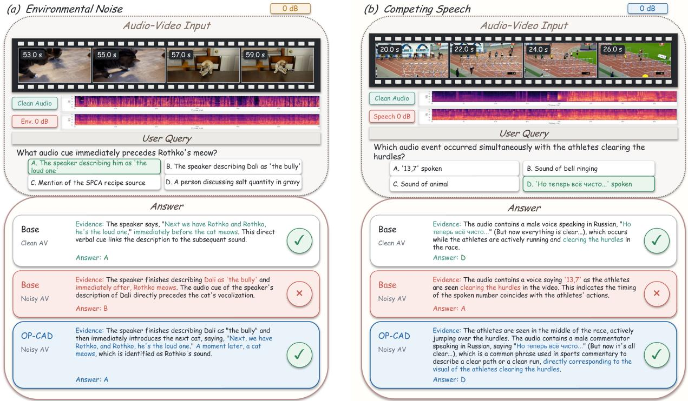
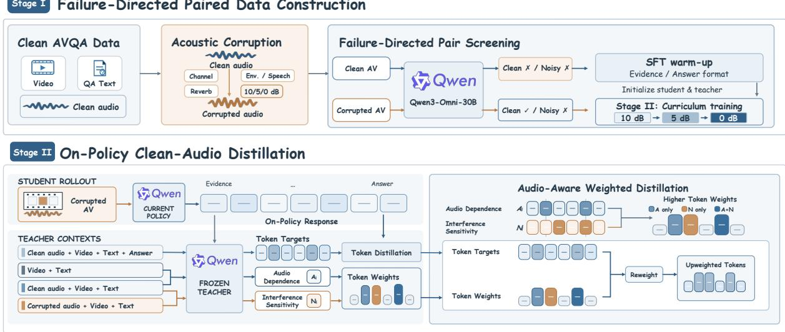
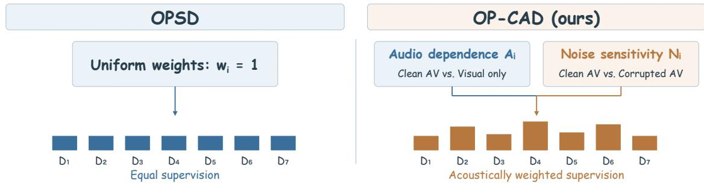
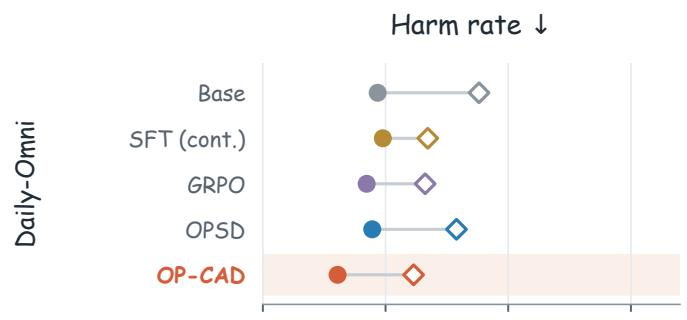
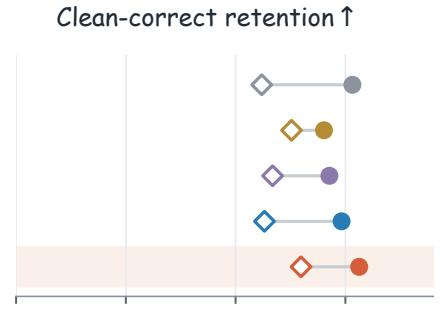
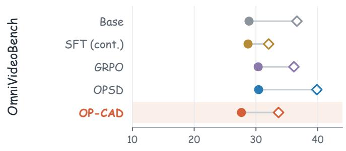
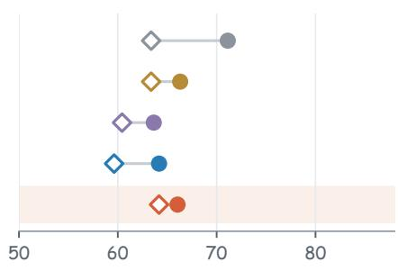
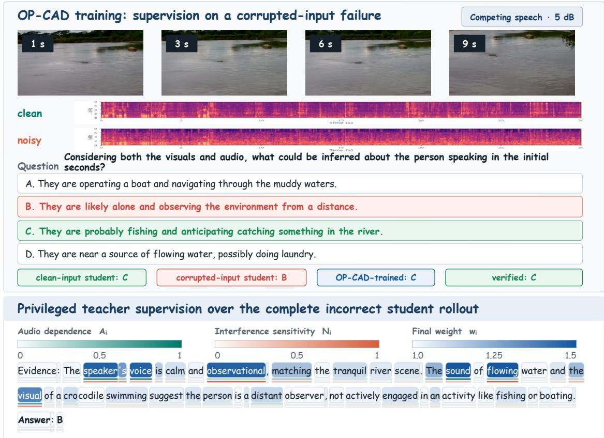

# OP-CAD: On-Policy Clean-Audio Distillation for Robust Audio-Visual Reasoning

Xingming Shui<sup>1</sup> Dapeng Chen<sup>2</sup> Bowei Liu<sup>1</sup> Jingqi Tian<sup>1</sup> Minfu Li<sup>2</sup> Kun Yi<sup>2</sup> Jiapeng Hong<sup>2</sup> Yansong Tang<sup>1,∗</sup>

<sup>1</sup>Tsinghua Shenzhen International Graduate School, Tsinghua University <sup>2</sup>Independent Researcher <sup>∗</sup>Corresponding author

## Abstract

Omni-modal large language models deployed in real-world environments encounter external noise that can interfere with their perception and understanding of multimodal inputs. We study their robustness in audio-visual understanding, focusing on question answering under environmental noise and competing speech. The challenge is to resist acoustic interference while preserving useful audio evidence. On-policy distillation provides dense teacher feedback on student-generated responses, but uniform token weighting does not explicitly prioritize positions afected by acoustic interference. We introduce OP-CAD (On-Policy Clean-Audio Distillation), a curriculum-based privileged self-distillation framework for robust audio-visual understanding. Training progresses from mild to severe environmental noise and competing speech, with selective token-level supervision at each stage. The student generates responses from corrupted audio-visual input, while a frozen teacher uses clean audio and the verified answer to supervise the same response prefixes. To allocate this supervision, OP-CAD compares teacher predictions under clean, corrupted, and visual-only contexts without revealing the answer. These matched comparisons measure sensitivity to audio removal and corruption; a bounded weighting rule emphasizes positions identified by either signal while retaining supervision throughout the response. OP-CAD outperforms the compared methods across all evaluated noise conditions. Paired analyses further show improved preservation of clean-correct answers under strong interference, with no observed aggregate clean-accuracy penalty. These results demonstrate the value of directing clean-teacher supervision toward acoustically sensitive predictions for robust audio-visual reasoning.

## 1 Introduction

Omni-modal large language models jointly interpret visual and acoustic information, providing a perceptual foundation for embodied agents and smartphone assistants that interact with their surroundings (Fu et al., 2024; Xu et al., 2025a;b). Yet real-world audio often contains environmental noise or background speech. Models that correctly understand a scene in quiet conditions may be misled by irrelevant sounds in noisy environments. Acoustic interference directly afects audio without directly changing the accompanying video; visual information can therefore still provide complementary cues. This motivates using the available visual context to support audio-visual understanding when audio is corrupted. We take audio-visual question answering as our starting point and study how to train omni-modal models to make correct judgments from the available audio-visual evidence under acoustic interference. Figure 1 illustrates the problem and our goal: with the video and question unchanged, interference turns the Base model’s correct answer into an incorrect one, whereas OP-CAD answers correctly from the corrupted audio-visual input.

Recent work uses privileged information and on-policy self-distillation to improve audio-conditioned understanding and reasoning. CORD uses a text-conditioned teacher to guide audio reasoning (Hu et al., 2026), while EchoDistill uses a clean-audio teacher to supervise student generation under noisy audio (Lin et al., 2026b). These studies demonstrate the value of richer teacher information but focus on audio-conditioned tasks. Unlike audio, visual information in real-world environments is not directly afected by these acoustic disturbances. We therefore aim to retain visual information while using privileged information from clean audio-visual input to guide learning under acoustic interference.

  
Figure 1: Prediction examples at 0 dB: (a) environmental noise; (b) competing speech.

Paired clean and corrupted audio-visual inputs make this form of supervision possible during training. The teacher receives clean audio-visual input, the student receives its corrupted counterpart, and both share the same visual information. The teacher thus has a more complete reference. OPSD provides token-leve guidance along the response prefixes actually generated by the student, bringing privileged supervision onto the student’s trajectories under interference (Zhao et al., 2026). However, OPSD assigns equal supervision coeficients across positions without using prediction sensitivity to audio information or acoustic interference.

We use the information diferences between clean audio-visual input and restricted inputs to construct supervision targets and guide their allocation. Relative to corrupted audio-visual input, clean input provides undistorted acoustic evidence; relative to visual-only input, it provides information from the audio modality. We use both comparisons to identify sensitive positions, increasing clean-teacher supervision when either signal is strong while preserving baseline supervision throughout the response. Privileged information thus guides both what the student should learn and where stronger guidance is needed, connecting complete audio-visual observations to learning under interference.

Building on this idea, we introduce On-Policy Clean-Audio Distillation (OP-CAD), a curriculum-based privileged self-distillation framework. The student generates responses from corrupted audio-visual input, and a frozen teacher uses clean audio-visual input and the verified answer to supervise the same prefixes. Prediction diferences induced by audio removal and corruption adjust the training weights. Across examples, training follows a curriculum of progressively stronger interference; within each response, the two signals determine the supervision strength at each position. At inference, the student answers directly from audio visual input. Experiments show that OP-CAD outperforms the compared baseline training methods under both environmental noise and competing speech, with no observed decrease in aggregate clean accuracy. Ablations further demonstrate the efectiveness of sensitivity-based supervision allocation and the mild-tosevere noise curriculum. Paired analyses show that OP-CAD better preserves clean-correct answers under strong interference than OPSD.

Our contributions are threefold:

• We propose a privileged self-distillation framework for noise-robust audio-visual QA. With shared visual context, privileged information from clean audio-visual input guides responses generated by a student under corruption.

• We design a supervision allocation mechanism based on two audio condition comparisons. Using clean audio-visual input as a common reference, audio removal and corruption identify acoustically sensitive teacher predictions and determine bounded token-level supervision weights.

• We incorporate a mild-to-severe noise curriculum into audio-visual privileged self-distillation, combining progressive interference with selective supervision within responses. Under equal training budgets, this schedule exceeds randomly mixed noise levels under both interference types on both benchmarks.

## 2 Related Work

Audio-visual understanding and acoustic robustness. Multimodal models have progressed from image and text understanding to video and audio-visual understanding (Radford et al., 2021; Li et al., 2023; Liu et al., 2023; Lin et al., 2024; Zhang et al., 2023; Cheng et al., 2024). Related advances include audiovisual segmentation through disentangled audio semantics (Tian et al., 2026a), adaptive thinking for video reasoning (Tian et al., 2026b), and memory management for ultra-long video understanding (Jin et al., 2025). Omni-modal large language models further integrate vision, audio, and language within a unified generative framework (Fu et al., 2024; Li et al., 2024; Xu et al., 2025a;b). Benchmarks such as WorldSense, Daily-Omni, and OmniVideoBench advance the evaluation of joint audio-visual perception and reasoning (Hong et al., 2026; Zhou et al., 2025; Li et al., 2026). Meanwhile, AVHBench, VoiceBench, RSA-Bench, and AVTrustBench examine reliability through cross-modal conflict, acoustic degradation, and modality dependence, showing that understanding of clean input alone does not ensure reliable behavior under challenging inputs (Kim et al., 2025; Chen et al., 2026; Zhang et al., 2026b; Chowdhury et al., 2025). To address unreliable inputs, Watch or Listen adapts fusion to modality reliability (Hong et al., 2023), while Focus Then Listen combines source separation and modality routing for noise-robust audio-language understanding (Yin et al., 2026). These studies advance robust perception through evaluation, input processing, and modality utilization. We focus on audio-visual QA with corrupted audio and unchanged video, investigating privileged training supervision for acoustic robustness within shared visual context.

Privileged information and on-policy distillation. Knowledge distillation guides student learning through teacher predictions (Hinton et al., 2015). Learning with privileged information allows teachers to access additional information unavailable to students during training, such as more complete modalities or cleaner inputs (Vapnik and Vashist, 2009; Garcia et al., 2018; Radevski et al., 2023; Hu et al., 2025). Multimodal distillation methods use modality-specific saliency to weight distillation losses (Jin et al., 2021) or transfer audio-visual representations to a video-only student (Chen et al., 2021); structured self-distillation has also been studied for video reasoning (Lin et al., 2026a). For autoregressive models, on-policy distillation supplies teacher guidance on student-generated response prefixes, covering generation states actually visited by the student (Agarwal et al., 2024). OPSD applies this principle to self-distillation, using a teacher path with privileged information, such as verified answers, to supervise the student path (Zhao et al., 2026). We adopt this training mechanism with clean audio-visual input as a privileged reference for corrupted input, and further study how input-dependent prediction changes can guide token-level supervision allocation.

Audio-conditioned distillation and supervision allocation. Recent work applies privileged distillation to audio understanding and reasoning. CORD uses a text-conditioned teacher to guide audio-conditioned generation, combining importance-weighted token-level distillation with sequence-level GRPO to bridge the audio–text reasoning gap (Hu et al., 2026). EchoDistill addresses noisy audio through clean-teacher consistency signals and audio-aware rewards, guiding more reliable student responses under interference (Lin et al., 2026b). These methods explore text and clean audio privileges, respectively, with a focus on audio-conditioned tasks. In adjacent multimodal tasks, OmniVerifier and OmniVerifier-M1 use verification for visual outcomes (Zhang et al., 2025; 2026a), while VidForensics-M1 uses verifiable temporal evidence for AI-generated video detection (Liu et al., 2026). In contrast, we study audio-visual QA where visual information remains available despite acoustic interference. Retaining shared visual context, OP-CAD uses clean audio-visual input as a reference to measure teacher prediction changes caused by audio removal and corruption. These changes determine token-level supervision allocation, allowing privileged information from clean inputs to provide both learning targets and supervision strengths. We compare against SFT, GRPO, and uniform OPSD using the same backbone, data, and training protocol to evaluate this allocation mechanism.

## 3 Method

OP-CAD uses privileged information from clean audio-visual input to guide audio-visual QA under acoustic interference. The framework has three components. First, we construct clean and corrupted audio versions and select training data through paired screening. Second, supervised warm-up initializes the student and frozen teacher, followed by a curriculum of progressively stronger acoustic interference. Finally, the teacher supervises the student’s actual response prefixes, with prediction changes caused by audio removal and corruption determining supervision strength at each position. Figure 2 presents the framework.

  
Figure 2: Overview of the OP-CAD training framework.

## 3.1 Paired Audio-Visual Data Construction

To learn robustness to acoustic interference, we construct paired clean and corrupted audio-visual examples. Candidate questions come from WorldSense (Hong et al., 2026), OmniBench (Li et al., 2025), and the AVQA subset of OmniInstruct-v1 (m-a-p, 2024). For each example, we modify only the audio data by applying audio degradation.

Specifically, we apply a measured room impulse response, simulate an 8-kHz µ-law channel, and mix environmental noise or competing speech into the clean audio to obtain corrupted audio at SNRs of 10, 5, and 0 dB. Environmental noise comes from MUSAN, DNS Challenge, and NOISEX-92; competing speech comes from VoxCeleb2 (Snyder et al., 2015; Reddy et al., 2020; Varga and Steeneken, 1993; Chung et al., 2018). Training and evaluation use disjoint interference recordings and room impulse responses, with disjoint speakers for competing speech.

We use the base model $M _ { 0 }$ to answer the same question under clean and corrupted inputs, partitioning data by the paired predictions:

• Clean-correct, corrupted-incorrect examples enter the robustness training set $\mathcal { D } _ { \mathrm { r o b } }$ , focusing training on examples afected by acoustic interference.

• Examples answered incorrectly under both conditions enter the supervised warm-up set $\mathcal { D } _ { \mathrm { w a r m } }$ to learn structured evidence and answer outputs.

• Examples answered correctly under corruption are excluded from both sets, regardless of correctness on clean input.

## 3.2 Supervised Warm-Up and Noise Curriculum

We first fine-tune the base model on $\mathcal { D } _ { \mathrm { w a r m } }$ to learn the following response structure:

Evidence: <audio-visual evidence supporting the answer>

Answer: <one valid option letter>

Each supervised response pairs evidence generated by Gemini 3 Flash (Google DeepMind, 2025) with the dataset’s verified answer. All generated warm-up evidence underwent human review to check whether the audio-visual content supported the explanation. The resulting model $M _ { \mathrm { w a r m } }$ initializes both the student $S _ { \theta _ { 0 } }$ and teacher $T .$ . During subsequent robustness training, the student is updated while the teacher remains frozen. The base model $M _ { 0 }$ used for data screening and the teacher $T$ used for supervision thus serve diferent roles.

Robustness training follows a 10 → 5 → 0 dB curriculum of increasing acoustic interference (Bengio et al., 2009). We partition $\mathcal { D } _ { \mathrm { r o b } }$ into three SNR stages, each containing environmental noise and competing speech examples at its designated level and trained for one epoch. The student generates new responses with its current policy; the teacher remains fixed. The curriculum organizes dificulty across examples, while token weighting organizes supervision within each response, determining the training order and the strength of detailed teacher guidance, respectively.

## 3.3 On-Policy Clean-Teacher Supervision

For each training example, the student receives video $v ,$ corrupted audio $a ^ { n }$ , question $q ,$ and options ${ \mathcal { C } } _ { : }$ denoted by $x ^ { n } = ( v , a ^ { n } , q , \mathcal { C } )$ . Replacing the audio with its clean version $a ^ { c }$ gives $x ^ { c } ;$ removing audio gives the visual-only input $x ^ { v }$ . Adding the verified answer $y$ to $x ^ { c }$ produces the privileged teacher input $x ^ { c , + }$

These inputs serve distinct purposes: $x ^ { c , + }$ constructs the distillation target, whereas $x ^ { c } , x ^ { n }$ , and $x ^ { v }$ determine supervision allocation. The latter three exclude the verified answer and share the video, question, and options, so allocation signals reflect prediction diferences caused by audio conditions.

The student samples a response ${ \hat { r } } \sim S _ { \theta } ( \cdot \mid x ^ { n } )$ . Under each input condition, the teacher then predicts at the same prefixes of this response. Comparisons thus correspond to generation states actually visited by the student, without diferences in prefixes from independently generated responses.

Let $\mathcal { T } _ { x }$ index the generated positions of example x. At position $i ,$ the temperature-scaled next-token distributions of the privileged teacher and student are $p _ { T , i } ^ { c , + } = T _ { \tau } ( \cdot \mid x ^ { c , + } , \hat { r } _ { < i } )$ and $p _ { S , i } ^ { n } = S _ { \theta , \tau } ( \cdot \mid x ^ { n } , \hat { r } _ { < i } )$ Following the reverse-KL form of OPSD, the token-level distillation loss is

$$
D _ { i } = \mathrm { K L } \Big ( p _ { S , i } ^ { n } \Big | \Big | p _ { T , i } ^ { c , + } \Big ) .\tag{1}
$$

The teacher uses clean audio-visual input and the verified answer to provide the learning target, while the student learns to align with it under corrupted input. The verified answer is used only for the privileged target, not for the weight computation below.

## 3.4 Supervision Allocation through Audio Condition Comparisons

Uniform OPSD assigns the same weight to every $D _ { i } .$ . OP-CAD instead uses teacher prediction sensitivity to changes in audio conditions to identify positions requiring stronger supervision. Figure 3 contrasts the two approaches.

  
Figure 3: Token-level supervision allocation in OPSD and OP-CAD.

For $u \in \{ c , n , v \}$ , let $p _ { T , i } ^ { u } = T _ { \tau } ( \cdot \mid x ^ { u } , \hat { r } _ { < i } )$ denote the teacher prediction under the corresponding input. Using clean audio-visual input as a common reference, we construct two signals:

$$
A _ { i } = \mathrm { J S } ( p _ { T , i } ^ { c } , p _ { T , i } ^ { v } ) , \qquad N _ { i } = \mathrm { J S } ( p _ { T , i } ^ { c } , p _ { T , i } ^ { n } ) ,\tag{2}
$$

where JS denotes Jensen–Shannon divergence. Audio removal sensitivity $A _ { i }$ measures how much the teacher prediction changes when audio is removed while the video and prefix remain fixed. Corruption sensitivity $N _ { i }$ measures the change when clean audio is replaced by corrupted audio. The former captures the prediction diference associated with audio beyond the visual context; the latter captures the diference caused by acoustic interference.

Because the two divergences may have diferent scales, we normalize each by its maximum within the current response to obtain ${ \widetilde { A } } _ { i }$ and $\widetilde { N } _ { i }$ . If a signal’s response maximum is at most ϵ, its normalized values are set to zero; otherwise, each value is divided by that maximum. The normalized signals lie in [0, 1] and represent relative sensitivity within a response. We then take their maximum and construct the supervision weight:

$$
s _ { i } = \operatorname* { m a x } ( \widetilde { A } _ { i } , \widetilde { N } _ { i } ) , \qquad w _ { i } = 1 + \lambda \mathrm { s t o p g r a d } ( s _ { i } ) , \quad \lambda \geq 0 .\tag{3}
$$

The baseline weight of 1 preserves supervision at every generated position, while the increment is bounded by λ, giving $w _ { i } \in [ 1 , 1 + \lambda ]$ . Positions sensitive to both interventions do not exceed this bound through signal addition. The stopgrad operation treats the computed allocation score as constant during backpropagation.

For a mini-batch B, let $D _ { x , i }$ and $w _ { x , i }$ denote the distillation loss and supervision weight at position i of example x. The final objective is

$$
\mathcal { L } _ { \mathrm { O P - C A D } } ( \theta ) = \frac { \sum _ { x \in \mathcal { B } } \sum _ { i \in \mathcal { T } _ { x } } w _ { x , i } D _ { x , i } } { \sum _ { x \in \mathcal { B } } \sum _ { i \in \mathcal { T } _ { x } } w _ { x , i } } .\tag{4}
$$

Each example contributes one student response, and all teacher conditions score its same prefixes. Sampled prefixes, teacher distributions, and supervision weights are detached; gradients flow only through the student distribution under corrupted input. Normalizing by the total weight preserves relative allocation while keeping the loss scale comparable to uniform OPSD. Setting λ = 0 recovers the uniform OPSD objective.

## 4 Experiments

## 4.1 Experimental Design

We evaluate all 1,197 questions in Daily-Omni and 1,000 questions in OmniVideoBench under clean audio and environmental noise or competing speech at SNRs of 10, 5, and 0 dB. We compare the original Qwen3- Omni-Instruct model (Base), the SFT warm-up checkpoint, and continued training with SFT, GRPO, OPSD, or OP-CAD. Base and SFT warm-up measure performance before and after supervised initialization. SFT, GRPO, OPSD, and OP-CAD compare robustness training strategies with shared warm-up initialization, data, and noise severity curriculum. SFT uses fixed evidence and answer targets; GRPO (Shao et al., 2024) samples eight responses per prompt with correctness and format rewards. OPSD (Zhao et al., 2026) uses the same frozen teacher and privileged target as OP-CAD but assigns uniform token weights, providing the direct control for supervision allocation.

Training uses rank-64 LoRA (Hu et al., 2022) on the language backbone and multimodal projectors, with frozen audio and visual encoders, a learning rate of $1 0 ^ { - 5 }$ , and an efective batch size of 32. OPSD and OP-CAD sample one response of up to 128 new tokens per example, using the complete vocabulary with τ = 1 and OP-CAD weight strength λ = 0.5. We report deterministic multiple-choice accuracy and the harm rate, the fraction of each model’s clean-correct answers that become incorrect under corruption.

Table 1: Full test accuracy (%). Env./Speech: three-SNR averages. Bold: best result. Arrows: changes from SFT warm-up in percentage points, using displayed scores.
<table><tr><td rowspan="2">Method</td><td colspan="3">Daily-Omni</td><td colspan="3">OmniVideoBench</td></tr><tr><td>Clean</td><td>Env.</td><td>Speech</td><td>Clean</td><td>Env.</td><td>Speech</td></tr><tr><td>Base</td><td>67.75</td><td>61.38</td><td>57.84</td><td>37.40</td><td>36.70</td><td>34.80</td></tr><tr><td>SFT warm-up</td><td>68.76</td><td>61.74</td><td>59.82</td><td>38.10</td><td>36.80</td><td>35.93</td></tr><tr><td>+ SFT</td><td>68.42↓0.34</td><td>61.88 ↑0.14</td><td>59.12↓0.70</td><td>39.00 ↑0.90</td><td>36.23 ↓0.57</td><td>36.20 ↑0.27</td></tr><tr><td>+ GRPO</td><td>68.34↓0.42</td><td>62.91 ↑1.17</td><td>59.93 ↑0.11</td><td>41.50↑3.40</td><td>37.87↑1.07</td><td>36.87↑0.94</td></tr><tr><td>+ OPSD</td><td>69.34↑0.58</td><td>63.49 ↑1.75</td><td>60.62 ↑0.80</td><td>41.40↑3.30</td><td>37.40 ↑0.60</td><td>35.13↓0.80</td></tr><tr><td>+ OP-CAD</td><td>70.09↑1.33</td><td>66.97↑5.23</td><td>63.55 ↑3.73</td><td>41.60↑3.50</td><td>40.23↑3.43</td><td>38.93↑3.00</td></tr></table>

## 4.2 Robustness Across Acoustic Conditions

Table 1 separates the efect of supervised initialization from subsequent robustness training. Warm-up improves accuracy on clean and corrupted inputs over Base on both benchmarks, but continued training does not yield uniform gains across strategies and conditions. OP-CAD achieves the highest aggregate accuracy among the listed methods in clean audio and both interference families.

OPSD provides the direct comparison for supervision allocation because it shares OP-CAD’s teacher target and training protocol. OP-CAD improves environmental noise and competing speech averages by 3.48 and 2.92 percentage points on Daily-Omni and by 2.83 and 3.80 points on OmniVideoBench. It also exceeds OPSD at every tested SNR. These results show that weighting supervision by acoustic sensitivity improves robustness over uniform distillation with the same teacher target.

Table 2: Daily-Omni accuracy (%) by question type and duration. Arrows: changes from Base within each condition in percentage points, using displayed scores. Bold: best per column.
<table><tr><td rowspan="2">Cond. Method</td><td rowspan="2"></td><td colspan="6">Daily-Omni</td><td colspan="2">Video Duration</td><td rowspan="2">Avg.</td></tr><tr><td>AV Align</td><td></td><td></td><td>Question Type Comp. Ctx. Und. Evt. Seq.</td><td>Infer.</td><td>Reas.</td><td>30s</td><td>60s</td></tr><tr><td rowspan="4"></td><td></td><td>58.82</td><td></td><td></td><td>60.13</td><td>81.82</td><td>81.14</td><td></td><td></td><td></td></tr><tr><td>Base + SFT</td><td>61.34↑2.52 77.10↓0.76 64.77↑4.15 57.84↓2.29 83.77↑1.95 80.57↓0.57 68.62↑0.6168.18↑0.73 68.42↑0.67</td><td>77.86</td><td>60.62</td><td></td><td></td><td></td><td>68.01</td><td>67.45</td><td>67.75</td></tr><tr><td>Clean + GRPO</td><td></td><td></td><td></td><td></td><td></td><td></td><td></td><td></td><td></td></tr><tr><td>+ OPSD</td><td></td><td></td><td></td><td>56.72↓2.1077.86↔0.0068.91↑8.2960.78↑0.6584.42↑2.6082.29↑1.1571.41↑3.4066.91↓0.5469.34↑1.59</td><td></td><td></td><td></td><td>59.24↑0.42 79.39↑1.53 63.73↑3.11 59.80↓0.33 82.47↑0.65 80.00↓1.14 70.48↑2.47 65.82↓1.63 68.34↑0.59</td><td></td></tr><tr><td rowspan="3"></td><td></td><td>+ OP-CAD 60.50↑1.68 80.15↑2.29 68.91↑8.29 59.80↓0.3385.06↑3.24 81.71↑0.5772.18↑4.17 67.64↑0.1970.09↑2.34</td><td></td><td></td><td></td><td></td><td></td><td></td><td></td><td></td></tr><tr><td>Base</td><td>49.30</td><td>70.99</td><td>59.93</td><td>54.68</td><td>75.97</td><td>71.05</td><td>62.34</td><td></td><td></td></tr><tr><td>+ SFT</td><td></td><td></td><td></td><td></td><td></td><td></td><td>54.06↑4.76 69.72↓1.2759.93↔0.0053.81↓0.87 75.54↓0.4370.86↓0.19 62.44↑0.1061.21↑0.97 61.88↑0.50</td><td>60.24</td><td>61.38</td></tr><tr><td rowspan="3">Env.</td><td>+ GRPO</td><td>50.70↑1.40 74.81↑3.82 60.62↑0.6955.12↑0.44 76.62↑0.6574.67↑3.62 64.45↑2.11 61.09↑0.85 62.91↑1.53</td><td></td><td></td><td></td><td></td><td></td><td></td><td></td><td></td></tr><tr><td>+ OPSD</td><td></td><td></td><td></td><td>51.54↑2.24 73.03↑2.04 60.79↑0.8655.66↑0.98 79.44↑3.4775.24↑4.19 65.79↑3.4560.79↑0.55 63.49↑2.11</td><td></td><td></td><td></td><td></td><td></td></tr><tr><td></td><td></td><td></td><td></td><td>+OP-CAD 54.76↑5.46 77.86↑6.87 65.28↑5.35 57.84↑3.16 83.12↑7.15 79.05↑8.00 68.62↑6.28 65.03↑4.79 66.97↑5.59</td><td></td><td></td><td></td><td></td><td></td></tr><tr><td rowspan="4"></td><td></td><td></td><td></td><td></td><td></td><td></td><td></td><td></td><td></td><td></td></tr><tr><td>Base</td><td>47.34</td><td>66.92</td><td>58.03</td><td>50.22</td><td>71.43</td><td>66.48</td><td>58.22</td><td>57.39</td><td>57.84</td></tr><tr><td>+ SFT</td><td></td><td></td><td></td><td></td><td></td><td></td><td>48.74↑1.40 67.18↑0.26 56.82↓1.21 53.49↑3.27 74.03↑2.6066.48↔0.00 59.61↑1.39 58.55↑1.16 59.12↑1.28</td><td></td><td></td></tr><tr><td>Speech + GRPO</td><td></td><td></td><td></td><td></td><td></td><td></td><td>46.50↓0.84 72.01↑5.09 57.86↓0.17 52.83↑2.61 74.24↑2.81 71.24↑4.76 61.15↑2.93 58.48↑1.09 59.93↑2.09</td><td></td><td></td></tr><tr><td></td><td></td><td></td><td></td><td></td><td></td><td></td><td></td><td></td><td></td><td></td></tr><tr><td></td><td>+ OPSD</td><td>47.48↑0.14 74.05↑7.13 56.82↓1.21 53.49↑3.27 75.11↑3.6872.38↑5.90 63.01↑4.7957.82↑0.43 60.62↑2.78</td><td></td><td></td><td></td><td></td><td></td><td></td><td></td><td></td></tr><tr><td></td><td></td><td></td><td></td><td></td><td></td><td></td><td></td><td></td><td></td><td></td></tr><tr><td></td><td></td><td>+ OP-CAD 50.42↑3.08 75.06↑8.14 63.04↑5.01 55.77↑5.55 77.49↑6.06 74.67↑8.19 65.33↑7.11 61.45↑4.06 63.55↑5.71</td><td></td><td></td><td></td><td></td><td></td><td></td><td></td><td></td></tr></table>

Tables 2 and 3 examine whether aggregate improvements are concentrated in a particular task or duration. OP-CAD exceeds OPSD in every corrupted-condition category and duration column. The observed gains extend across multiple question types, audio types, and video lengths.

Table 3: OmniVideoBench accuracy (%) by audio type and duration. Arrows: changes from Base within each condition in percentage points, using displayed scores. Bold: best per column.
<table><tr><td rowspan="2">Cond. Method</td><td rowspan="2"></td><td colspan="8">OmniVideoBench</td><td rowspan="2">Avg.</td></tr><tr><td></td><td>Audio Type</td><td></td><td></td><td>Video Duration</td><td></td><td>(1,5] min (5,10] min (10,30] min</td></tr><tr><td rowspan="4"></td><td></td><td>Music 30.77</td><td>Sound 32.65</td><td>Speech</td><td>(0,1] min</td><td></td><td></td><td></td><td></td></tr><tr><td>Base + SFT</td><td>32.97↑2.20</td><td></td><td>39.11</td><td>49.12</td><td>35.29</td><td>36.40 37.41↑4.76 40.03↑0.92 47.95↓1.1739.41↑4.12 35.96↓0.44 35.25↑1.92 39.00↑1.60</td><td>33.33</td><td>37.40</td></tr><tr><td>Clean + GRPO</td><td>36.26↑5.49</td><td></td><td></td><td></td><td></td><td>36.73↑4.0843.04↑3.9349.12↔0.0040.59↑5.3039.47↑3.0739.46↑6.1341.50↑4.10</td><td></td><td></td></tr><tr><td>+ OPSD</td><td>28.57↓2.20</td><td></td><td></td><td>40.82↑8.1743.04↑3.9348.54↓0.5842.06↑6.7740.79↑4.39</td><td></td><td></td><td>36.40↑3.0741.40↑4.00</td><td></td></tr><tr><td></td><td></td><td>+ OP-CAD 32.97↑2.20</td><td>39.46↑6.81 43.04↑3.93 49.71↑0.59 43.53↑8.24 38.60↑2.20</td><td></td><td></td><td></td><td></td><td></td><td>36.40↑3.0741.60↑4.20</td></tr><tr><td rowspan="4">Env.</td><td>Base</td><td>25.64</td><td>38.10</td><td>37.75</td><td>44.83</td><td>35.49</td><td>33.92</td><td>35.38</td><td>36.70</td></tr><tr><td>+ SFT</td><td>31.87↑6.23</td><td></td><td></td><td></td><td></td><td>37.64↓0.4636.48↓1.2744.64↓0.19 35.39↓0.1032.31↓1.61</td><td></td><td>35.25↓0.13 36.23↓0.47</td></tr><tr><td>+ GRPO</td><td>30.40↑4.76</td><td></td><td></td><td></td><td></td><td>35.60↓2.50 39.20↑1.45 41.13↓3.70 37.84↑2.35 38.60↑4.68</td><td>35.12↓0.26 37.87↑1.17</td><td></td></tr><tr><td>+ OPSD</td><td>27.84↑2.20</td><td>37.87↓0.23 38.45↑0.70</td><td></td><td></td><td></td><td>43.47↓1.3637.25↑1.76 38.74↑4.82</td><td></td><td>32.44↓2.9437.40↑0.70</td></tr><tr><td></td><td></td><td></td><td></td><td>+ OP-CAD 33.33↑7.69 38.10↔0.00 41.47↑3.72</td><td></td><td></td><td></td><td>44.44↓0.3939.22↑3.7340.94↑7.0238.19↑2.8140.23↑3.53</td><td></td></tr><tr><td rowspan="4"></td><td>Base</td><td>25.27</td><td>36.73</td><td>35.56</td><td>40.94</td><td>33.43</td><td>33.04</td><td>34.10</td><td>34.80</td></tr><tr><td>+ SFT</td><td>31.87↑6.60</td><td>38.10↑1.37 36.35↑0.79 42.69↑1.75 35.00↑1.57 34.65↑1.61</td><td></td><td></td><td></td><td></td><td>34.87↑0.77 36.20↑1.40</td><td></td></tr><tr><td>Speech + GRPO</td><td>31.50↑6.23</td><td></td><td></td><td></td><td></td><td>36.05↓0.6837.66↑2.1039.57↓1.3737.65↑4.22 37.43↑4.39</td><td>33.59↓0.51 36.87↑2.07</td><td></td></tr><tr><td>+ OPSD</td><td>29.30↑4.03</td><td>36.51↓0.2235.56↔0.00</td><td></td><td></td><td></td><td>42.69↑1.75 34.71↑1.28 36.11↑3.07</td><td>29.89↓4.21 35.13↑0.33</td><td></td></tr><tr><td></td><td>+ OP-CAD 32.97↑7.70</td><td></td><td></td><td></td><td></td><td></td><td></td><td>41.95↑5.22 39.06↑3.50 45.03↑4.0938.73↑5.3038.01↑4.9736.02↑1.9238.93↑4.13</td><td></td></tr></table>

## 4.3 Component Analysis

Supervision signals. We compare audio removal sensitivity alone, corruption sensitivity alone, and their combination while fixing initialization, curriculum, and teacher targets (Table 4). Both individual signals improve all four corrupted-condition averages over uniform OPSD. The combined rule performs best in three aggregates; on OmniVideoBench competing speech, corruption sensitivity alone scores 39.00% versus 38.93% for OP-CAD. Both signals therefore provide useful allocation criteria, and their combination improves most evaluated noise-family averages.

Table 4: Accuracy (%) with single-signal and combined allocation. Bold marks the best result.
<table><tr><td></td><td colspan="3">Daily-Omni</td><td colspan="3">OmniVideoBench</td></tr><tr><td>Variant</td><td>Clean</td><td>Env.</td><td>Speech</td><td>Clean</td><td>Env.</td><td>Speech</td></tr><tr><td>OPSD</td><td>69.34</td><td>63.49</td><td>60.62</td><td>41.40</td><td>37.40</td><td>35.13</td></tr><tr><td>Audio-rem. proxy</td><td>69.34</td><td>64.47</td><td>61.71</td><td>40.70</td><td>39.63</td><td>38.50</td></tr><tr><td>Corr.-sens. proxy</td><td>68.76</td><td>65.41</td><td>62.13</td><td>43.80</td><td>39.73</td><td>39.00</td></tr><tr><td>OP-CAD</td><td>70.09</td><td>66.97</td><td>63.55</td><td>41.60</td><td>40.23</td><td>38.93</td></tr></table>

Noise curriculum. We compare OP-CAD’s 10, 5, then 0 dB curriculum with randomly mixed SNRs under matched total training steps and data budgets (Table 5). Curriculum learning improves accuracy under both interference types on both benchmarks. From the displayed scores, environmental noise and competing speech gains are 1.81 and 0.88 percentage points on Daily-Omni, and 1.96 and 1.80 points on OmniVideoBench. Clean accuracy is higher with the curriculum on Daily-Omni but lower on OmniVideoBench. With the training budget held fixed, the noisy-condition gains support the mild-to-severe curriculum for improving acoustic robustness.

Table 5: Curriculum order ablation: accuracy (%) under matched training budgets.
<table><tr><td rowspan="2">Training schedule</td><td colspan="3">Daily-Omni</td><td colspan="3">OmniVideoBench</td></tr><tr><td>Clean</td><td>Env.</td><td>Speech</td><td>Clean</td><td>Env.</td><td>Speech</td></tr><tr><td>Randomly mixed</td><td>69.93</td><td>65.16</td><td>62.67</td><td>42.30</td><td>38.27</td><td>37.13</td></tr><tr><td>Curriculum learning</td><td>70.09</td><td>66.97</td><td>63.55</td><td>41.60</td><td>40.23</td><td>38.93</td></tr></table>

## 4.4 Prediction Stability under Interference

Aggregate noisy accuracy combines retained clean successes and newly correct answers. Figure 4 separates these outcomes using two measures at 0 dB. Harm rate measures the fraction of each model’s own clean-correct answers that become incorrect; clean-correct retention measures noisy accuracy on the fixed set of questions that Base answers correctly under clean audio. The former assesses each model’s vulnerability to interference, while the latter evaluates all models on the same questions that Base answers correctly under clean audio.

OP-CAD has lower harm rates than OPSD in all four conditions and the lowest rate among the compared methods in three. The largest reduction occurs on OmniVideoBench competing speech, from 39.86% to 33.65%, with a paired diference of −6.20 points. SFT has a slightly lower harm rate of 32.05% in this condition.

Environmental noise

  
Competing speech



  
(%)

  
(%)  
Figure 4: Prediction stability at 0 dB: harm rate (left) and clean-correct retention (right).

OP-CAD achieves the highest retention on Base’s clean-correct questions in three conditions. Under OmniVideoBench environmental noise, Base retains 71.12% accuracy versus 66.04% for OP-CAD, indicating that improved full test accuracy does not entail better preservation of every baseline success.

The overall degradation is also smaller: under competing speech at 0 dB on OmniVideoBench, the net loss of correct answers from clean to noisy input is 34 for OP-CAD versus 71 for OPSD. Together with the clean results in Table 1, this shows improved resistance to interference without an observed decrease in aggregate clean accuracy.

## 4.5 Training Example of Supervision Allocation

Figure 5 shows how the two signals distribute supervision on a recorded training rollout under competing speech at 5 dB. Audio removal sensitivity is strongest around “voice” and “sound,” whereas corruption sensitivity peaks around “observational” and “flowing.” The signals therefore emphasize diferent positions in this example. Their combination retains both sets of peaks while preserving baseline supervision elsewhere, illustrating how the weighting rule operates along a student’s response under shared visual context.

  
Figure 5: Token-level supervision allocation on an OP-CAD training rollout.

## 5 Conclusion

OP-CAD weights clean-teacher supervision by the teacher’s sensitivity to audio removal and corruption. On two audio-visual benchmarks, it improves accuracy on noisy input over uniform OPSD under matched training conditions, with no observed decrease in aggregate clean accuracy. Single-signal ablations show that the two comparisons are useful but that their combination is not best in every condition. The method changes supervision during training; inference uses the student alone, without a clean audio reference, verified answer, or additional teacher passes. The current evidence is limited to one backbone, one run per method, and controlled acoustic corruptions.

## References

Rishabh Agarwal, Nino Vieillard, Yongchao Zhou, Piotr Stanczyk, Sabela Ramos, Matthieu Geist, and Olivier Bachem. On-policy distillation of language models: Learning from self-generated mistakes. In Proceedings of the International Conference on Learning Representations, 2024.

Yoshua Bengio, Jérôme Louradour, Ronan Collobert, and Jason Weston. Curriculum learning. In Proceedings of the 26th Annual International Conference on Machine Learning, pages 41–48, 2009. doi: 10.1145/ 1553374.1553380.

Yanbei Chen, Yongqin Xian, A. Sophia Koepke, Ying Shan, and Zeynep Akata. Distilling audio-visual knowledge by compositional contrastive learning. In Proceedings of the IEEE/CVF Conference on Computer Vision and Pattern Recognition, pages 7016–7025, 2021.

Yiming Chen, Xianghu Yue, Chen Zhang, Xiaoxue Gao, Robby T. Tan, and Haizhou Li. VoiceBench: Benchmarking LLM-based voice assistants. Transactions of the Association for Computational Linguistics, 14:378–398, 2026. doi: 10.1162/tacl.a.628.

Zesen Cheng, Sicong Leng, Hang Zhang, Yifei Xin, Xin Li, Guanzheng Chen, Yongxin Zhu, Wenqi Zhang, Ziyang Luo, Deli Zhao, and Lidong Bing. VideoLLaMA 2: Advancing spatial-temporal modeling and audio understanding in video-LLMs. arXiv preprint arXiv:2406.07476, 2024.

Sanjoy Chowdhury, Sayan Nag, Subhrajyoti Dasgupta, Yaoting Wang, Mohamed Elhoseiny, Ruohan Gao, and Dinesh Manocha. AVTrustBench: Assessing and enhancing reliability and robustness in audio-visual LLMs. In Proceedings of the IEEE/CVF International Conference on Computer Vision, pages 1590–1601, 2025.

Joon Son Chung, Arsha Nagrani, and Andrew Zisserman. VoxCeleb2: Deep speaker recognition. In Proceedings of Interspeech, 2018.

Chaoyou Fu, Haojia Lin, Zuwei Long, Yunhang Shen, Yuhang Dai, Meng Zhao, Yi-Fan Zhang, Shaoqi Dong, Yangze Li, Xiong Wang, Haoyu Cao, Di Yin, Long Ma, Xiawu Zheng, Rongrong Ji, Yunsheng Wu, Ran He, Caifeng Shan, and Xing Sun. VITA: Towards open-source interactive omni multimodal LLM. arXiv preprint arXiv:2408.05211, 2024.

Nuno C. Garcia, Pietro Morerio, and Vittorio Murino. Modality distillation with multiple stream networks for action recognition. In Proceedings of the European Conference on Computer Vision, pages 103–118, 2018.

Google DeepMind. Gemini 3 Flash model card. Model card, December 17, 2025.

Geofrey Hinton, Oriol Vinyals, and Jef Dean. Distilling the knowledge in a neural network. arXiv preprint arXiv:1503.02531, 2015.

Jack Hong, Shilin Yan, Jiayin Cai, Xiaolong Jiang, Yao Hu, and Weidi Xie. WorldSense: Evaluating real-world omnimodal understanding for multimodal LLMs. In Proceedings of the International Conference on Learning Representations, 2026.

Joanna Hong, Minsu Kim, Jeongsoo Choi, and Yong Man Ro. Watch or listen: Robust audio-visual speech recognition with visual corruption modeling and reliability scoring. In Proceedings of the IEEE/CVF Conference on Computer Vision and Pattern Recognition, pages 18783–18794, 2023.

Edward J. Hu, Yelong Shen, Phillip Wallis, Zeyuan Allen-Zhu, Yuanzhi Li, Shean Wang, Lu Wang, and Weizhu Chen. LoRA: Low-rank adaptation of large language models. In Proceedings of the International Conference on Learning Representations, 2022.

Jing Hu, Danxiang Zhu, Xianlong Luo, Dan Zhang, Shuwei He, Yishu Lei, Haitao Zheng, Shikun Feng, Jingzhou He, Yu Sun, Hua Wu, and Haifeng Wang. CORD: Bridging the audio-text reasoning gap via weighted on-policy cross-modal distillation. arXiv preprint arXiv:2601.16547, 2026.

Rui Hu, Delai Qiu, Shuyu Wei, Jiaming Zhang, Yining Wang, Shengping Liu, and Jitao Sang. Investigating and enhancing vision-audio capability in omnimodal large language models. In Findings of the Association for Computational Linguistics: ACL 2025, pages 7452–7463, 2025. doi: 10.18653/v1/2025.findings-acl.389.

Hongbo Jin, Qingyuan Wang, Wenhao Zhang, Yang Liu, and Sijie Cheng. VideoMem: Enhancing ultra-long video understanding via adaptive memory management. arXiv preprint arXiv:2512.04540, 2025.

Woojeong Jin, Maziar Sanjabi, Shaoliang Nie, Liang Tan, Xiang Ren, and Hamed Firooz. MSD: Saliency-aware knowledge distillation for multimodal understanding. In Findings of the Association for Computational Linguistics: EMNLP 2021, pages 3557–3569, 2021. doi: 10.18653/v1/2021.findings-emnlp.302.

Sung-Bin Kim, Hyun-Bin Oh, Jung-Mok Lee, Arda Senocak, Joon Son Chung, and Tae-Hyun Oh. AVHBench: A cross-modal hallucination benchmark for audio-visual large language models. In Proceedings of the International Conference on Learning Representations, 2025.

Caorui Li, Yu Chen, Yiyuan Ji, Jin Xu, Zhenyu Cui, Shihao Li, Yuanxing Zhang, Zhenghao Song, Dingling Zhang, Ying He, Haoxiang Liu, Yuxuan Wang, Qiufeng Wang, Jiafu Tang, Zhenhe Wu, Jiehui Luo, Zhiyu Pan, Weihao Xie, Chenchen Zhang, Zhaohui Wang, Jiayi Tian, Yanghai Wang, Zhe Cao, Minxin Dai, Ke Wang, Runzhe Wen, Yinghao Ma, Yaning Pan, Sungkyun Chang, Termeh Taheri, Haiwen Xia, Christos Plachouras, Emmanouil Benetos, Yizhi Li, Ge Zhang, Jian Yang, Tianhao Peng, Zili Wang, Minghao Liu, Junran Peng, Zhaoxiang Zhang, and Jiaheng Liu. OmniVideoBench: Towards audio-visual understanding evaluation for omni MLLMs. In The Fourteenth International Conference on Learning Representations, 2026.

Junnan Li, Dongxu Li, Silvio Savarese, and Steven Hoi. BLIP-2: Bootstrapping language-image pre-training with frozen image encoders and large language models. In Proceedings of the International Conference on Machine Learning, 2023.

Yadong Li, Haoze Sun, Mingan Lin, Tianpeng Li, Guosheng Dong, Tao Zhang, Bowen Ding, Wei Song, Zhenglin Cheng, Yuqi Huo, Song Chen, Xu Li, Da Pan, Shusen Zhang, Xin Wu, Zheng Liang, Jun Liu, Tao Zhang, Keer Lu, Yaqi Zhao, Yanjun Shen, Fan Yang, Kaicheng Yu, Tao Lin, Jianhua Xu, Zenan Zhou, and Weipeng Chen. Baichuan-Omni technical report. arXiv preprint arXiv:2410.08565, 2024.

Yizhi Li, Yinghao Ma, Ge Zhang, Ruibin Yuan, Kang Zhu, Hangyu Guo, Yiming Liang, Jiaheng Liu, Zekun Wang, Jian Yang, Siwei Wu, Xingwei Qu, Jinjie Shi, Xinyue Zhang, Zhenzhu Yang, Yidan Wen, Yanghai Wang, Shihao Li, Zhaoxiang Zhang, Zachary Liu, Emmanouil Benetos, Wenhao Huang, and Chenghua Lin. OmniBench: Towards the future of universal omni-language models. In Advances in Neural Information Processing Systems, volume 38, 2025.

Bin Lin, Yang Ye, Bin Zhu, Jiaxi Cui, Munan Ning, Peng Jin, and Li Yuan. Video-LLaVA: Learning united visual representation by alignment before projection. In Proceedings of the 2024 Conference on Empirical Methods in Natural Language Processing, pages 5971–5984, 2024. doi: 10.18653/v1/2024.emnlp-main.342.

Hao Lin, Kunyang Lv, Xu Jiang, Jingqi Tian, Zhongjing Du, Jiayu Ding, Qiaoman Zhang, and Hongbo Jin. VISD: Enhancing video reasoning via structured self-distillation. arXiv preprint arXiv:2605.06094, 2026a.

Liang Lin, Chunxi Luo, Kaiwen Luo, Jie Zhang, Jin Wang, Yuanhe Zhang, Cai Yuchen, Qiankun Li, Gongli Xi, Zhenhong Zhou, Kun Wang, and Junhao Dong. EchoDistill: Alignment noisy-to-clean self-distillation for robust audio LLMs. arXiv preprint arXiv:2605.23954, 2026b.

Bowei Liu, Zheng Lu, Yuhan Bian, Xinchen Zhang, Xingming Shui, Yuesheng Huang, Xuhuan Li, Zihao Liu, Yifan Yang, Jun Zhou, and Xiu Li. VidForensics-M1: Meta-detection reinforcement learning with verifiable temporal grounding for ai-generated video forensics. arXiv preprint arXiv:2608.11201, 2026.

Haotian Liu, Chunyuan Li, Qingyang Wu, and Yong Jae Lee. Visual instruction tuning. In Advances in Neural Information Processing Systems, 2023.

m-a-p. OmniInstruct-v1. Dataset, 2024.

Gorjan Radevski, Dusan Grujicic, Matthew Blaschko, Marie-Francine Moens, and Tinne Tuytelaars. Multimodal distillation for egocentric action recognition. In Proceedings of the IEEE/CVF International Conference on Computer Vision, pages 5213–5224, 2023.

Alec Radford, Jong Wook Kim, Chris Hallacy, Aditya Ramesh, Gabriel Goh, Sandhini Agarwal, Girish Sastry, Amanda Askell, Pamela Mishkin, Jack Clark, Gretchen Krueger, and Ilya Sutskever. Learning transferable visual models from natural language supervision. In Proceedings of the International Conference on Machine Learning, 2021.

Chandan K. A. Reddy, Vishak Gopal, Ross Cutler, Ebrahim Beyrami, Roger Cheng, Harishchandra Dubey, Sergiy Matusevych, Robert Aichner, Ashkan Aazami, Sebastian Braun, Puneet Rana, Sriram Srinivasan, and Johannes Gehrke. The INTERSPEECH 2020 deep noise suppression challenge: Datasets, subjective testing framework, and challenge results. In Proceedings of Interspeech, pages 2492–2496, 2020. doi: 10.21437/Interspeech.2020-3038.

Zhihong Shao, Peiyi Wang, Qihao Zhu, Runxin Xu, Junxiao Song, Xiao Bi, Haowei Zhang, Mingchuan Zhang, Y. K. Li, Y. Wu, and Daya Guo. DeepSeekMath: Pushing the limits of mathematical reasoning in open language models. arXiv preprint arXiv:2402.03300, 2024.

David Snyder, Guoguo Chen, and Daniel Povey. MUSAN: A music, speech, and noise corpus. arXiv preprint arXiv:1510.08484, 2015.

Jingqi Tian, Yiheng Du, Haoji Zhang, Yuji Wang, Isaac Ning Lee, Xulong Bai, Tianrui Zhu, Jingxuan Niu, and Yansong Tang. Delayed bidirectional alignment via disentangled audio semantics for audio-visual segmentation. In European Conference on Computer Vision, pages 619–638. Springer, 2026a.

Jingqi Tian, Haoji Zhang, Lin Chen, Hongbo Jin, Haonan Xu, Tianrui Zhu, Xingming Shui, Shilin Ma, Wenjing Yang, and Yansong Tang. AdaThinkV: Adaptive thinking for token-eficient video reasoning. arXiv preprint arXiv:2608.01980, 2026b.

Vladimir Vapnik and Akshay Vashist. A new learning paradigm: Learning using privileged information. Neural Networks, 22(5–6):544–557, 2009. doi: 10.1016/j.neunet.2009.06.042.

Andrew Varga and Herman J. M. Steeneken. Assessment for automatic speech recognition: II. NOISEX-92: A database and an experiment to study the efect of additive noise on speech recognition systems. Speech Communication, 12(3):247–251, 1993. doi: 10.1016/0167-6393(93)90095-3.

Jin Xu, Zhifang Guo, Jinzheng He, Hangrui Hu, Ting He, Shuai Bai, Keqin Chen, Jialin Wang, Yang Fan, Kai Dang, Bin Zhang, Xiong Wang, Yunfei Chu, and Junyang Lin. Qwen2.5-Omni technical report. arXiv preprint arXiv:2503.20215, 2025a.

Jin Xu, Zhifang Guo, Hangrui Hu, Yunfei Chu, Xiong Wang, Jinzheng He, Yuxuan Wang, Xian Shi, Ting He, Xinfa Zhu, Yuanjun Lv, Yongqi Wang, Dake Guo, He Wang, Linhan Ma, Pei Zhang, Xinyu Zhang, Hongkun Hao, Zishan Guo, Baosong Yang, Bin Zhang, Ziyang Ma, Xipin Wei, Shuai Bai, Keqin Chen, Xuejing Liu, Peng Wang, Mingkun Yang, Dayiheng Liu, Xingzhang Ren, Bo Zheng, Rui Men, Fan Zhou, Bowen Yu, Jianxin Yang, Le Yu, Jingren Zhou, and Junyang Lin. Qwen3-Omni technical report. arXiv preprint arXiv:2509.17765, 2025b.

Han Yin, Yang Xiao, Younghoo Kwon, Ting Dang, and Jung-Woo Choi. Focus then listen: An empirical study of plug-and-play audio enhancer for noise-robust large audio language models. arXiv preprint arXiv:2603.04862, 2026.

Hang Zhang, Xin Li, and Lidong Bing. Video-LLaMA: An instruction-tuned audio-visual language model for video understanding. In Proceedings of the 2023 Conference on Empirical Methods in Natural Language Processing: System Demonstrations, pages 543–553, 2023. doi: 10.18653/v1/2023.emnlp-demo.49.

Xinchen Zhang, Xiaoying Zhang, Youbin Wu, Yanbin Cao, Renrui Zhang, Ruihang Chu, Ling Yang, and Yujiu Yang. Generative universal verifier as multimodal meta-reasoner. arXiv preprint arXiv:2510.13804, 2025.

Xinchen Zhang, Bowei Liu, Jiale Liu, Chufan Shi, Yizhen Zhang, Junhong Liu, Youliang Zhang, Zhiheng Li, Yujiu Yang, and Ling Yang. OmniVerifier-M1: Multimodal meta-verifier with explicit structured recalibration. In International Conference on Machine Learning, 2026a.

Yibo Zhang, Kaiwen Luo, Liang Lin, Shilinlu Yan, Jin Wang, Yaoqi Guo, Yitian Chen, Yalan Qin, Zhenhong Zhou, Kun Wang, and Li Sun. RSA-bench: Benchmarking audio large models in real-world acoustic scenarios. In Findings of the Association for Computational Linguistics: ACL 2026, pages 18350–18374, 2026b. doi: 10.18653/v1/2026.findings-acl.913.

Siyan Zhao, Zhihui Xie, Mengchen Liu, Jing Huang, Guan Pang, Feiyu Chen, and Aditya Grover. Self-distilled reasoner: On-policy self-distillation for large language models. arXiv preprint arXiv:2601.18734, 2026.

Ziwei Zhou, Rui Wang, Zuxuan Wu, and Yu-Gang Jiang. Daily-Omni: Towards audio-visual reasoning with temporal alignment across modalities. arXiv preprint arXiv:2505.17862, 2025.

The appendix gives implementation details (Section A), data construction (Section B), additional results and diagnostics (Section C), and reproduction settings (Section D).

## A Implementation Details

## A.1 Full-Vocabulary Distributions and Response Handling

All teacher and student distributions in Section 3 use the same complete vocabulary V. For logits ℓ, the temperature distribution is

$$
p _ { \tau } ( z ; \ell ) = \frac { \exp ( \ell _ { z } / \tau ) } { \sum _ { z ^ { \prime } \in \mathcal { V } } \exp ( \ell _ { z ^ { \prime } } / \tau ) } , \qquad z \in \mathcal { V } .\tag{5}
$$

The reverse-KL target loss and both allocation JS divergences sum over V. Teacher logits are detached; gradients flow only through the student. Log-softmax and log-space mixture calculations provide stable normalization across the complete vocabulary.

The corrupted-input student draws one current-policy response of at most 128 new tokens. The prompt requests an Evidence: field followed by an Answer: field whose valid option letters are determined by the example. All teacher contexts score this same trajectory. Every generated position contributes to the objective, including positions in an incomplete or truncated response; such responses are not regenerated. Evidence presence, answer validity, response length, and truncation are logged only for monitoring.

## A.2 Numerical and Reduction Details

For either score $Z \in \{ A , N \}$ , we use $\widetilde { Z } _ { i } = Z _ { i } / \operatorname* { m a x } _ { j } Z _ { j }$ when the response maximum exceeds $1 0 ^ { - 1 2 }$ , and zero otherwise. This threshold prevents division by numerical zero. The loss sums weighted token losses across the distributed mini-batch and divides by the total weight. The paper configuration uses one microbatch per optimizer update. Sampled prefixes, teacher distributions, and weights are detached; gradients flow only through the student distribution.

## B Paired Robustness Dataset

## B.1 Dataset Construction and Supervision

We use WorldSense, OmniBench, and the AVQA subset of OmniInstruct-v1 for training, with the screening rule in Section 3.1. Daily-Omni and OmniVideoBench are used only for evaluation. The local robustness partition contains 4,660 corrupted acoustic views of 1,809 distinct source questions. Table 6 gives its source and SNR composition. Applying the warm-up routing criterion to the archived screened pool at the same three SNRs yields 1,790 views of 615 questions (Table 7). A question may contribute several corrupted views, so view counts and question counts are reported separately.

Both SFT stages use Gemini 3 Flash-generated evidence (Google DeepMind, 2025) paired with the dataset’s verified answer. The evidence generator is separate from the frozen Qwen teacher used for distillation; Appendix D.3 specifies its inputs and a reproduction template. All generated warm-up evidence underwent human review for support from the audio-visual evidence. This review checks the explanation rather than relying on answer-label agreement alone.

Table 6: Robustness-data partition after paired screening. SNR columns count corrupted acoustic views.
<table><tr><td>Source</td><td>Questions</td><td>10 dB</td><td>5 dB</td><td>0 dB</td><td>Total views</td></tr><tr><td>WorldSense</td><td>619</td><td>416</td><td>524</td><td>712</td><td>1,652</td></tr><tr><td>OmniBench</td><td>291</td><td>241</td><td>281</td><td>317</td><td>839</td></tr><tr><td>OmniInstruct-v1 (AVQA)</td><td>899</td><td>587</td><td>697</td><td>885</td><td>2,169</td></tr><tr><td>Total</td><td>1,809</td><td>1,244</td><td>1,502</td><td>1,914</td><td>4,660</td></tr></table>

Table 7: Warm-up data after paired screening.
<table><tr><td>Source</td><td>Questions</td><td>10 dB</td><td>5 dB</td><td>0 dB</td><td>Total views</td></tr><tr><td>WorldSense</td><td>276</td><td>210</td><td>205</td><td>438</td><td>853</td></tr><tr><td>OmniBench</td><td>97</td><td>61</td><td>65</td><td>134</td><td>260</td></tr><tr><td>OmniInstruct-v1 (AVQA)</td><td>242</td><td>160</td><td>167</td><td>350</td><td>677</td></tr><tr><td>Total</td><td>615</td><td>431</td><td>437</td><td>922</td><td>1,790</td></tr></table>

The main experiments use environmental and competing-speech corruption at {10, 5, 0} dB. For a normalized clean waveform, the procedure applies a measured room impulse response, samples the reverberant wet ratio from [0.30, 0.80], simulates an 8-kHz µ-law channel followed by resampling, and RMS-scales the additive source to the target SNR.

Training uses 61 measured RIRs; evaluation uses 11 disjoint measured RIRs.

The environmental pool contains 80,000 training and 20,000 evaluation mixtures. The competing-speech indices contain 16,922 training and 618 evaluation mixtures with disjoint VoxCeleb2 speakers and utterance files. The video, question, option order, answer, and temporal sampling remain fixed within each clean–corrupted pair.

## C Complete Robustness Results

Tables 8 and 9 report Base performance by benchmark partition and all compared methods at each SNR.   
OP-CAD exceeds OPSD in all 12 benchmark–interference–SNR conditions.

Table 8: Base accuracy (%) by benchmark category and duration under paired acoustic conditions.
<table><tr><td colspan="9">Daily-Omni</td></tr><tr><td colspan="9">Condition AV Align Ctx. Und. Evt. Seq. Infer. Reas.</td></tr><tr><td>Clean</td><td>58.82</td><td>Comp. 77.86</td><td>60.62</td><td>60.13</td><td>81.82</td><td>81.14</td><td>30s 68.01</td><td>60s Avg. 67.45</td></tr><tr><td>Env. 10</td><td>52.94</td><td>70.99</td><td>60.62</td><td>55.88</td><td>79.87</td><td>74.29</td><td>65.53 61.09</td><td>67.75 63.49</td></tr><tr><td>Env. 5</td><td>47.48</td><td>72.52</td><td>59.59</td><td>54.25</td><td>76.62 70.86</td><td>61.98</td><td>60.00</td><td>61.07</td></tr><tr><td>Env. 0</td><td>47.48</td><td>69.47</td><td>59.59</td><td>53.92</td><td>71.43 68.00</td><td>59.51</td><td>59.64</td><td>59.57</td></tr><tr><td>Speech 10</td><td>52.52</td><td>70.23</td><td>59.07</td><td>52.94</td><td>75.32</td><td>72.57</td><td>61.82 61.09</td><td>61.49</td></tr><tr><td>Speech 5</td><td>46.22</td><td>65.65</td><td>59.07</td><td>50.98</td><td>72.08</td><td>65.14</td><td>58.11 57.27</td><td>57.73</td></tr><tr><td>Speech 0</td><td>43.28</td><td>64.89</td><td>55.96</td><td>46.73</td><td>66.88</td><td>61.71</td><td>54.71 53.82</td><td>54.30</td></tr><tr><td rowspan="2">OmniVideoBench</td><td colspan="8"></td></tr><tr><td colspan="3">Audio Type</td><td colspan="4">Video Duration</td><td rowspan="2">Avg.</td></tr><tr><td rowspan="2">Condition Clean</td><td colspan="2">Music Sound Speech</td><td colspan="5">(0,1] min (1,5] min</td></tr><tr><td>30.77</td><td>32.65</td><td>39.11</td><td>49.12</td><td>35.29</td><td>(5,10] min 36.40</td><td>(10,30] min 33.33</td><td>37.40</td></tr><tr><td>Env. 10</td><td>26.37</td><td>38.10</td><td>38.19</td><td>46.20</td><td>34.41</td><td>35.53</td><td>36.02</td><td>37.10</td></tr><tr><td>Env. 5</td><td>25.27</td><td>38.78</td><td>37.40</td><td>42.69</td><td>36.47</td><td>32.02</td><td>36.40</td><td>36.50</td></tr><tr><td>Env. 0</td><td>25.27</td><td>37.41</td><td>37.66</td><td>45.61</td><td>35.59</td><td>34.21</td><td>33.72</td><td>36.50</td></tr><tr><td>Speech 10</td><td>26.37</td><td>38.10</td><td>37.66</td><td>42.69</td><td>34.71</td><td>37.28</td><td>34.87</td><td>36.70</td></tr><tr><td>Speech 5</td><td>23.08</td><td>35.37</td><td>35.96</td><td>39.77</td><td>33.53</td><td>31.14</td><td></td><td>36.02 34.70</td></tr><tr><td></td><td></td><td></td><td>33.07</td><td>40.35</td><td>32.06</td><td>30.70</td><td>31.42</td><td>33.00</td></tr><tr><td>Speech 0</td><td>26.37</td><td>36.73</td><td></td><td></td><td></td><td></td><td></td><td></td></tr></table>

## C.1 Robustness across Categories and Durations

The category and duration accuracies are reported in Tables 2 and 3. Here we provide the partition sizes.   
Each corrupted-condition accuracy averages the 10, 5, and 0 dB views within its interference family.

Oficial metadata assigns five OmniVideoBench records slightly longer than 30 minutes to the final published duration bin; we retain this assignment.

Table 9: Full-test accuracy (%) at each noise severity.
<table><tr><td>Benchmark</td><td>Method</td><td>Clean</td><td>Env. 10</td><td>Env. 5</td><td>Env. 0</td><td>Speech 10</td><td>Speech 5</td><td>Speech 0</td></tr><tr><td rowspan="4">Daily-Omni</td><td>Base</td><td>67.75</td><td>63.49</td><td>61.07</td><td>59.57</td><td>61.49</td><td>57.73</td><td>54.30</td></tr><tr><td>SFT</td><td>68.42</td><td>63.41</td><td>62.74</td><td>59.48</td><td>62.24</td><td>57.89</td><td>57.23</td></tr><tr><td>GRPO</td><td>68.34</td><td>64.41</td><td>64.41</td><td>59.90</td><td>63.49</td><td>58.56</td><td>57.73</td></tr><tr><td>OPSD</td><td>69.34</td><td>65.83</td><td>63.66</td><td>60.99</td><td>64.16</td><td>61.57</td><td>56.14</td></tr><tr><td></td><td>OP-CAD</td><td>70.09</td><td>69.42</td><td>67.08</td><td>64.41</td><td>67.08</td><td>63.74</td><td>59.82</td></tr><tr><td rowspan="4">OmniVideoBench</td><td>Base</td><td>37.40</td><td>37.10</td><td>36.50</td><td>36.50</td><td>36.70</td><td>34.70</td><td>33.00</td></tr><tr><td>SFT</td><td>39.00</td><td>35.30</td><td>36.90</td><td>36.50</td><td>37.00</td><td>35.00</td><td>36.60</td></tr><tr><td>GRPO</td><td>41.50</td><td>38.70</td><td>37.80</td><td>37.10</td><td>38.80</td><td>36.10</td><td>35.70</td></tr><tr><td>OPSD</td><td>41.40</td><td>37.40</td><td>36.20</td><td>38.60</td><td>36.50</td><td>34.60</td><td>34.30</td></tr><tr><td></td><td>OP-CAD</td><td>41.60</td><td>40.10</td><td>39.40</td><td>41.20</td><td>39.10</td><td>39.50</td><td>38.20</td></tr></table>

Table 10: Test-set counts by category and duration; these are separate partitions of the same examples.
<table><tr><td>Benchmark</td><td>Partition</td><td>Group counts</td></tr><tr><td>Daily-Omni</td><td>Question type</td><td>AV Align 238; Comp. 131; Ctx. Und. 193; Evt. Seq. 306; Infer 154; Reas. 175</td></tr><tr><td>Daily-Omni</td><td>Duration</td><td>30s 647; 60s 550</td></tr><tr><td>OmniVideoBench</td><td>Audio type</td><td>Music 91; Sound 147; Speech 762</td></tr><tr><td>OmniVideoBench</td><td>Duration</td><td>(0,1] min 171; (1,5] min 340; (5,10] min 228; (10,30] min 261</td></tr></table>

## C.2 Preserving Clean-Correct Answers

Paired metrics. Let $B _ { D }$ be the questions in benchmark D that Base answers correctly under clean audio, and let $y _ { i }$ be the correct option for question i. The clean-correct retention of model M under condition c is

$$
R ( M , c ) = \frac { 1 } { | B _ { D } | } \sum _ { i \in B _ { D } } \mathbf { 1 } [ M ( i , c ) = y _ { i } ] .\tag{6}
$$

This fixed denominator measures preservation of examples solved by the base model and must be read alongside complete-test accuracy.

For each model, we also count the transitions between clean and corrupted correctness. Write $N _ { u v }$ for the number of questions with clean correctness u and corrupted correctness v, where 1 means correct. Thus $N _ { 1 1 }$ stays correct, $N _ { 1 0 }$ becomes wrong, $N _ { 0 1 }$ becomes correct, and $N _ { 0 0 }$ stays wrong. Harm rate H, recovery rate $G ,$ and net accuracy change are

$$
\begin{array} { c c } { { H = \displaystyle \frac { N _ { 1 0 } } { N _ { 1 1 } + N _ { 1 0 } } , } } & { { G = \displaystyle \frac { N _ { 0 1 } } { N _ { 0 1 } + N _ { 0 0 } } , } } \\ { { \Delta \mathrm { A c c } = 1 0 0 \displaystyle \frac { N _ { 0 1 } - N _ { 1 0 } } { | D | } . } } \end{array}\tag{7}
$$

Here H is the harm rate among clean-correct examples, G is the recovery rate among clean-wrong examples, and $\Delta \mathrm { A c c }$ is the paired accuracy change in percentage points. A nonzero $N _ { 0 1 }$ does not by itself imply that corruption is beneficial; it must be interpreted with $N _ { 1 0 }$ and the net change.

Tables 11 and 12 report retention at each SNR and correctness transitions at 0 dB. OP-CAD exceeds OPSD in every displayed clean-correct retention column on both benchmarks.

At 0 dB, OP-CAD reduces the net clean-to-noisy accuracy loss relative to OPSD: from 8.35 to 5.68 points and from 13.20 to 10.28 points on Daily-Omni, and from 2.80 to 0.40 points and from 7.10 to 3.40 points on OmniVideoBench, for environmental noise and competing speech respectively. The transition counts also show why a small net loss can coexist with many previously correct answers becoming wrong.

Table 11: Clean-correct retention (%) on Base’s fixed clean-correct set at each SNR: Daily-Omni (811 questions, top) and OmniVideoBench (374 questions, bottom).
<table><tr><td>Method</td><td>Clean</td><td>Env 10</td><td>Env 5</td><td>Env 0</td><td>Speech 10</td><td>Speech 5</td><td>Speech 0</td></tr><tr><td>Base</td><td>100.00</td><td>87.67</td><td>84.46</td><td>80.64</td><td>84.59</td><td>78.55</td><td>72.38</td></tr><tr><td>SFT</td><td>90.14</td><td>84.71</td><td>83.60</td><td>78.05</td><td>83.85</td><td>77.68</td><td>75.09</td></tr><tr><td>OPSD</td><td>88.78</td><td>85.45</td><td>82.37</td><td>79.65</td><td>83.48</td><td>80.52</td><td>72.63</td></tr><tr><td>OP-CAD</td><td>89.40</td><td>88.53</td><td>85.45</td><td>81.26</td><td>85.20</td><td>81.50</td><td>75.96</td></tr><tr><td></td><td></td><td></td><td></td><td></td><td></td><td></td><td></td></tr><tr><td>Method</td><td>Clean</td><td>Env 10</td><td>Env 5</td><td>Env 0</td><td>Speech 10</td><td>Speech 5</td><td>Speech 0</td></tr><tr><td>Base</td><td>100.00</td><td>73.80</td><td>71.12</td><td>71.12</td><td>71.93</td><td>66.31</td><td>63.37</td></tr><tr><td>SFT</td><td>74.60</td><td>66.31</td><td>67.65</td><td>66.31</td><td>66.04</td><td>63.10</td><td>63.37</td></tr><tr><td>OPSD</td><td>72.99</td><td>64.44</td><td>64.71</td><td>64.17</td><td>63.10</td><td>61.23</td><td>59.63</td></tr><tr><td>OP-CAD</td><td>74.33</td><td>67.11</td><td>67.91</td><td>66.04</td><td>65.78</td><td>67.11</td><td>64.17</td></tr></table>

Table 12: Correctness transitions at 0 dB. $H / G { \mathrm { : } }$ harm/recovery rates (%); ∆: clean-to-noisy accuracy change (percentage points).
<table><tr><td colspan="9">Daily-Omni</td></tr><tr><td>Method</td><td>Cond.</td><td> $N _ { 1 1 }$ </td><td> $N _ { 1 0 }$ </td><td> $N _ { 0 1 }$ </td><td> $N _ { 0 0 }$ </td><td>H</td><td>G</td><td>∆</td></tr><tr><td>Base</td><td>Env. 0</td><td>654</td><td>157</td><td>59</td><td>327</td><td>19.36</td><td>15.28</td><td>-8.19</td></tr><tr><td>Base</td><td>Speech 0</td><td>587</td><td>224</td><td>63</td><td>323</td><td>27.62</td><td>16.32</td><td>-13.45</td></tr><tr><td>SFT</td><td>Env. 0</td><td>657</td><td>162</td><td>55</td><td>323</td><td>19.78</td><td>14.55</td><td>-8.94</td></tr><tr><td>SFT</td><td>Speech 0</td><td>627</td><td>192</td><td>58</td><td>320</td><td>23.44</td><td>15.34</td><td>-11.19</td></tr><tr><td>OPSD</td><td>Env. 0</td><td>673</td><td>157</td><td>57</td><td>310</td><td>18.92</td><td>15.53</td><td>-8.35</td></tr><tr><td>OPSD</td><td>Speech 0</td><td>616</td><td>214</td><td>56</td><td>311</td><td>25.78</td><td>15.26</td><td>-13.20</td></tr><tr><td>OP-CAD</td><td>Env. 0</td><td>704</td><td>135</td><td>67</td><td>291</td><td>16.09</td><td>18.72</td><td>-5.68</td></tr><tr><td>OP-CAD</td><td>Speech 0</td><td>652</td><td>187</td><td>64</td><td>294</td><td>22.29</td><td>17.88</td><td>-10.28</td></tr><tr><td colspan="9">OmniVideoBench</td></tr><tr><td>Method Base</td><td>Cond.</td><td> $N _ { 1 1 }$ </td><td> $N _ { 1 0 }$ </td><td> $N _ { 0 1 }$ </td><td> $N _ { 0 0 }$ </td><td>H</td><td>G</td><td>Δ</td></tr><tr><td>Base</td><td>Env. 0</td><td>266</td><td>108</td><td>99</td><td>527</td><td>28.88</td><td>15.81</td><td>-0.90</td></tr><tr><td></td><td>Speech 0</td><td>237</td><td>137</td><td>93</td><td>533</td><td>36.63</td><td>14.86</td><td>-4.40</td></tr><tr><td>SFT</td><td>Env. 0</td><td>278</td><td>112</td><td>87</td><td>523</td><td>28.72</td><td>14.26</td><td>-2.50</td></tr><tr><td>SFT</td><td>Speech 0</td><td>265</td><td>125</td><td>101</td><td>509</td><td>32.05</td><td>16.56</td><td>-2.40</td></tr><tr><td>OPSD</td><td>Env. 0</td><td>288</td><td>126</td><td>98</td><td>488</td><td>30.43</td><td>16.72</td><td>-2.80</td></tr><tr><td>OPSD</td><td>Speech 0</td><td>249</td><td>165</td><td>94</td><td>492</td><td>39.86</td><td>16.04</td><td>-7.10</td></tr><tr><td>OP-CAD</td><td>Env. 0</td><td>301</td><td>115</td><td>111</td><td>473</td><td>27.64</td><td>19.01</td><td>-0.40</td></tr><tr><td>OP-CAD</td><td>Speech 0</td><td>276</td><td>140</td><td>106</td><td>478</td><td>33.65</td><td>18.15</td><td>-3.40</td></tr></table>

## C.3 Context Sensitivity

We scored 639 saved tokens from eight auxiliary diagnostic trajectories under seven contexts using the frozen SFT warm-up teacher used in OP-CAD training. Table 13 reports full-vocabulary disagreement after removing audio, corrupting it, or removing the answer. These fixed-response comparisons measure the teacher’s context sensitivity on the sampled prefixes. The answer-free contrasts match the allocation contexts in Section 3; contrasts containing the answer additionally examine privileged conditioning. This small diagnostic sample does not establish how frequently these efects occur across the training set.

Table 13: Teacher predictive disagreement. Flip: top-1 disagreement rate (%).
<table><tr><td rowspan="3">Reference → comparison</td><td colspan="2">All</td><td colspan="2">Evidence</td></tr><tr><td>JS</td><td>Flip</td><td>JS</td><td>Flip</td></tr><tr><td>Clean+answer → visual+answer</td><td>0.0527</td><td>17.68</td><td>0.0592</td><td>19.40</td></tr><tr><td>Clean+answer → corrupted+answer</td><td>0.0201</td><td>11.42 0.0221 12.46</td><td></td><td></td></tr><tr><td>Clean+answer → text+answer</td><td>0.1046</td><td>27.700.116530.07</td><td></td><td></td></tr><tr><td>Clean+answer → clean, no answer</td><td>0.0113</td><td>8.29</td><td>90.0092</td><td>8.19</td></tr><tr><td>Clean, no answer → corrupted, no answer</td><td>0.0233</td><td>11.11 0.0256 12.10</td><td></td><td></td></tr><tr><td>Clean, no answer → visual, no answer</td><td>0.0540 17.06 0.0609 19.04</td><td></td><td></td><td></td></tr></table>

## C.4 Training Eficiency

Table 14 gives the cost of the robustness-training runs, excluding shared SFT warm-up, ofline evidence generation, and evaluation. OP-CAD uses one rollout per example and four teacher contexts. It takes 36.5% more GPU-hours than OPSD and about 65% fewer than the eight-rollout GRPO configuration. These are measured costs of the listed runs, not comparisons at equal compute.

Table 14: Measured cost of robustness training. <sup>∗</sup>GRPO has no privileged teacher but does perform its reference-policy KL forward. GPU-hours assume all 32 configured GPUs remain allocated over the stated wall-time basis.
<table><tr><td>Method</td><td>Wall h</td><td>GPU-h</td><td>Peak GiB/rank</td></tr><tr><td>OPSD</td><td>12.29</td><td>393.14</td><td>115.3</td></tr><tr><td>OP-CAD</td><td>16.77</td><td>536.50</td><td>116.05</td></tr><tr><td>GRPO*</td><td>48.38</td><td>1,548.05</td><td>123.8</td></tr></table>

## D Reproducibility Details

## D.1 Artifact Availability and Computing Environment

The accompanying anonymous source package provides the training and evaluation implementation and configuration templates. The acoustic corruption procedure and parameters are described in Appendix B.

Fine-tuning used 32 NVIDIA L20X GPUs (143,166 MiB each) across four Linux nodes with AMD EPYC 9T24 CPUs. The stack used Python 3.11, CUDA 12, PyTorch 2.9.1, Accelerate 1.13.0, DeepSpeed 0.18.9, Datasets 3.6.0, PEFT 0.14.0, TRL 0.29.1, Tokenizers 0.21.4, and FlashAttention 2.8.3.

```twig
Answer: <one option letter>
```

Table 15: Main training configuration.
<table><tr><td>Setting</td><td>Value</td><td>Setting</td><td>Value</td></tr><tr><td>Backbone</td><td>Qwen3-Omni-Instruct</td><td>Model / data-order seed</td><td>42 /  42</td></tr><tr><td>Student initialization</td><td>Shared SFT warm-up checkpoint (1 epoch)</td><td>Gradient accumulation</td><td>1</td></tr><tr><td>Teacher</td><td>Frozen copy of the SFT warm-up checkpoint</td><td>Video sampling</td><td>1 FPS, at most 256 frames</td></tr><tr><td>Trainable adaptation</td><td>LoRA on the language backbone and multimodal projectors</td><td>Per-frame pixel budget</td><td>262,144</td></tr><tr><td>Frozen components</td><td>Acoustic and visual encoders</td><td>Audio-duration cap</td><td>None</td></tr><tr><td>LoRA rank / scale</td><td>64 /  128</td><td>Training objective</td><td>Counterfactual-weighted reverse-KL OPSD</td></tr><tr><td>LoRA dropout</td><td>0.05</td><td>Shared distribution temperature</td><td>1</td></tr><tr><td>Learning rate</td><td>10-5</td><td>Allocation gain/ maximum weight</td><td>λ = 0.5 / wmax = 1.5</td></tr><tr><td>LR warmup ratio</td><td>0.03</td><td>Vocabulary domain</td><td>Complete vocabulary for loss and</td></tr><tr><td>Optimizer / precision</td><td>Fused AdamW / bfloat16</td><td>Generation limit</td><td>allocation 128 new tokens</td></tr><tr><td>Effective global batch</td><td>32</td><td>Response handling</td><td>One response; no filtering or resampling</td></tr><tr><td>Curriculum</td><td>10 → 5 → 0 dB</td><td>Batch construction</td><td>Length-aware multimodal</td></tr><tr><td>Distributed training</td><td>4 nodes, 32 GPUs, ZeRO-2</td><td>Epochs per SNR stage</td><td>batching 1 / 1 / 1 (10 / 5 / 0 dB)</td></tr></table>

## D.2 Prompt and Scoring Protocol

The student receives video, degraded audio, and the following text, with allowed letters set by the option count:

You are given a video. Based on the content of the video, answer the following question:

Question: {question}

Options: {labeled options}

Respond in this exact format:

Evidence: audio-visual evidence explaining why this answer option is correct,

no more than 100 English words

Replace <one option letter> with exactly one option letter from {allowed

letters}. Do not output “X”. Do not output a long reasoning process.

The privileged clean teacher inserts the following private block before the response-format instruction:

Private supervision (do not quote or mention it in the response):

<correct\_option>{answer}

</correct\_option>

Use the private option only to verify the evidence and final choice.

The teacher is also instructed not to mention private supervision or input audio quality. Allocation contexts share the student text and omit the private block. Both SFT stages pair the student prompt with Geminigenerated evidence and the verified answer.

Evaluation uses the same response structure. The released evaluator samples Daily-Omni at 1 FPS and OmniVideoBench at 2 FPS, with at most 256 frames in both cases. We extract the designated answer field, with conservative fallback extraction; isolated letters in the evidence do not count as answers. Unparseable outputs count as incorrect and are not regenerated. Deterministic generation uses a 512-token limit and an 8-gram repetition constraint on newly generated tokens.

Question: {question}   
Options: {labeled options}   
Reference answer: {verified option letter}   
Inspect the supplied clean audio and video. Identify the observable acoustic and visual cues   
supporting the reference answer. Use at most 100 English words and do not mention access to a   
reference answer. Return exactly:   
Evidence: {observable evidence}   
Answer: {verified option letter}

## D.3 Ofline Evidence Generation

Gemini 3 Flash is called through its API with the clean audio, the paired video sampled at 1 FPS (matching training), the question, all labeled options, and the dataset’s verified option letter. This ofline generator is distinct from the frozen Qwen teacher used during distillation. The generated evidence is paired with the verified answer for supervised training.

Generation settings. Generation uses temperature 0.8 and a maximum output length of 512 tokens. The following prompt template specifies the inputs and output format for reproduction.

System instruction.

Describe concise, observable evidence for audio-visual question answering. Ground every claim in the supplied audio and video; never invent observations to match the reference answer, including inaudible speech, unseen actions, or unsupported identities.

User prompt.

Export validation and human review. The export routine checks the Evidence/Answer structure, agreement with the dataset answer, nonempty evidence, a 100-word limit, and a list of invalid generic phrases. All generated warm-up evidence underwent human review to check whether the audio-visual evidence supported the explanation.

## D.4 Configuration and Checkpoint Selection

We evaluate final curriculum checkpoints using the initialization and stages in Section 3.2; neither benchmark is used for hyperparameter tuning or checkpoint selection.

Supervised warm-up trains for one epoch. Each SNR stage (10, 5, and 0 dB) trains for one epoch over its own disjoint partition before the next begins. Together, the three stages make one pass over the complete robustness dataset. Student adapters carry over; the optimizer and schedule restart. Resuming restores the interrupted stage. Length-aware batching stays within each disjoint SNR partition. Continued-SFT targets match distillation examples by acoustic-view ID.

OPSD and OP-CAD use τ = 1 and complete-vocabulary distributions. OP-CAD uses λ = 0.5, so weights lie in [1, 1.5], and $\epsilon = 1 0 ^ { - 1 2 }$ guards against numerical zero. Parameters do not vary by benchmark or SNR. Learning-rate warmup is separate from supervised warm-up. Each method has one training run.

GRPO sampling and rewards. GRPO samples eight responses per prompt with temperature 0.7, top-p 0.95, and a 128-token limit. Correctness and format rewards have weights 1.0 and 0.2; the KL coeficient is 0.02. Batch size counts prompts, not completions.