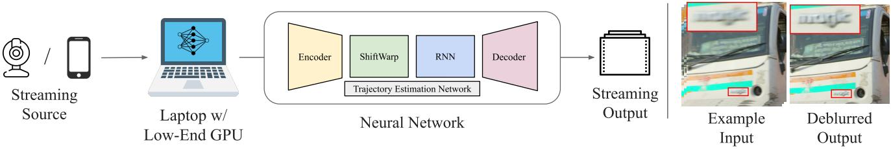
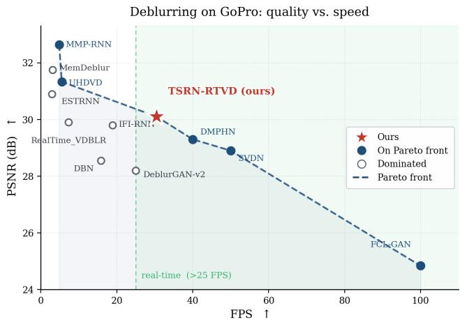

# TSRN-RTVD: Real-Time Video Deblurring System

Nikita Alutis Lomonosov Moscow State University Moscow, Russian Federation nikita.alutis@graphics.cs.msu.ru

Mikhail Voronin   
Lomonosov Moscow State University Moscow, Russian Federation   
mikhail.voronin@graphics.cs.msu.ru Danila Evsyukov   
Lomonosov Moscow State University Moscow, Russian Federation   
danila.evsyukov@graphics.cs.msu.ru   
Evgeney Bogatyrev   
MSU Institute for Artificial   
Intelligence   
Moscow, Russian Federation   
evgeney.zimin@graphics.cs.msu.ru

Egor Chistov Lomonosov Moscow State University Moscow, Russian Federation egor.chistov@graphics.cs.msu.ru

Dmitriy Vatolin   
MSU Institute for Artificial Intelligence   
Moscow, Russian Federation   
dmitriy@graphics.cs.msu.ru

  
Figure 1: System overview of TSRN-RTVD. The method processes a streaming blurry input frame by frame, predicts camera trajectory, performs trajectory-guided recurrent fusion, and outputs deblurred frames in real time. The example is taken from a dataset that was not used for training, demonstrating generalization to real camera motion blur.

## Abstract

As video capture moves to handheld and edge devices, motion blur from camera shake has become a pervasive degradation that lowers perceptual quality and harms downstream vision tasks. The strongest deblurring networks recover impressive detail, yet they remain computationally heavy and overwhelmingly complex, so their quality comes at a cost that consumer hardware cannot pay in real time. This gap between restoration quality and on-device speed is exactly what makes real-time deblurring dificult.

We developed and implemented TSRN-RTVD, an eficient video deblurring system that explicitly reconstructs the underlying camera trajectory during exposure and uses the recovered motion to guide restoration. This approach turns the physical cause of blur into a signal that drives sharpening. Our system runs on a single consumer GPU and restores the video at 30 FPS while reaching 30.08 dB PSNR on the GoPro dataset. We demonstrate TSRN-RTVD on consumer devices with interactive side-by-side visualization of the blurry input and the deblurred output, live throughput, and an on-screen view of the recovered camera trajectory. Demo video is available at https://youtu.be/3alMwVrVALU.

## CCS Concepts

• Computing methodologies → Image processing.

This work is licensed under a Creative Commons Attribution 4.0 International License. MM ’26, Rio de Janeiro, Brazil   
© 2026 Copyright held by the owner/author(s).   
ACM ISBN 979-8-4007-2213-4/2026/11   
https://doi.org/10.1145/3767308.3839003

## Keywords

low runtime, live streaming, video deblurring, camera-trajectory prior, feature alignment

## ACM Reference Format:

Nikita Alutis, Danila Evsyukov, Egor Chistov, Mikhail Voronin, Evgeney Bogatyrev, and Dmitriy Vatolin. 2026. TSRN-RTVD: Real-Time Video Deblurring System. In Proceedings ofthe 34th ACM International Conference on Multimedia (MM ’26), November 10–14, 2026, Rio de Janeiro, Brazil. ACM, New York, NY, USA, 3 pages. https://doi.org/10.1145/3767308.3839003

## 1 Introduction and System Features

Motion blur is common in handheld and on-board video, where camera shake and fast motion degrade both visual quality and downstream perception. Eficient deblurring techniques are therefore needed to overcome blur and restore sharp videos. Real-time deblurring is especially important for live preview, video streaming, teleoperation, tracking, and detection, where restored frames must be produced as the video arrives. Existing video deblurring methods achieve strong quality on benchmarks such as DVD [8] and Go-Pro [4], but many high-quality systems rely on dense optical flow, deformable alignment, recurrent propagation, or long temporal contexts [1, 6, 9]. These components are efective for ofline restoration, but they increase computation and latency in an interactive real-time system. Moreover, due to computational complexity of existing methods, they cannot be run on consumer devices such as phones or laptops, limiting their application.

On the other hand, real-time video deblurring methods do exist [3, 5, 7], leveraging intra-frame iterations, multi-patch hierarchy, and spatio-temporal attention. They typically operate in the range of 40–100 FPS, but their restoration quality remains below that of ofline methods. This leaves an underexplored region on the speed–quality Pareto frontier, where a diferent design trade-of is needed. This region is where near-ofline restoration quality has to be delivered within a strict per-frame budget, and it motivates the design we describe next.

  
Figure 2: Speed–quality trade-of on GoPro. TSRN-RTVD operates in the real-time regime and lies on the Pareto frontier between faster low-quality and slower high-quality methods.

We present TSRN-RTVD, a Trajectory-Shift Recurrent Network for Real-Time Video Deblurring system. This system restores 720p video at 30 FPS on Apple Silicon M5 using a short three-frame win dow with one-frame look-ahead. Instead of estimating the dense optical flow between blurry frames or its representations, TSRN-RTVD uses a compact trajectory signal that approximates the dominant camera-induced motion. Unlike prior real-time designs that spend their compute budget on intra-frame iterations or attention, TSRN-RTVD spends it on explicit motion, which keeps alignment nearly free and leaves capacity for the fusion and reconstruction stages that actually drive quality.

## 2 System Overview

Figure 1 shows the TSRN-RTVD pipeline. The system receives a blurry video stream and processes it with a one-frame look-ahead. For each output frame, it uses a three-frame window together with predicted trajectories between neighboring frames. The output is a restored center frame.

Trajectory prediction. The trajectory represents the projection of the motion of the camera onto the image plane. In practice, it is a compact displacement signal that describes the dominant shift ofimage content between neighboring frames. During inference, TSRN-RTVD obtains this signal from a lightweight trajectory-prediction network applied directly to the input video.

Trajectory-guided alignment. The deblurring network is a compact recurrent residual model operating mostly in low-resolution feature space. A shared encoder extracts features from the current and neighboring blurry frames. The predicted trajectory is then used to shift neighboring-frame features and the recurrent state toward the current frame. This trajectory-guided shift provides a cheap approximation of temporal alignment without dense optical flow, cost volumes, or deformable convolution.

Temporal fusion and reconstruction. The aligned temporal features, current-frame features, and motion embeddings are fused by convolutional blocks. Rather than imposing a hand-crafted memory rule, the network learns from these inputs how much past and neighboring information to use under diferent motion patterns. The decoder predicts a residual image which is added to the blurry input frame to produce the restored output.

Real-time processing. The system is implemented as a streaming pipeline. Encoded features are cached and reused across neighboring windows, so each new frame is encoded once.

## 3 Experimental Results

We evaluate TSRN-RTVD on the GoPro benchmark [4], the standard dataset for dynamic-scene motion deblurring. We report restoration quality with PSNR and measure throughput in frames per second. All experiments run at 1280×720 resolution, which is one of the most common formats for handheld and streaming video, on a single consumer GPU RTX 2080 Ti. Following MIMO-UNet [2], we place a CUDA synchronization barrier around each forward pass, so the measured latency reflects the full GPU workload instead of asynchronous kernel launches.

Figure 2 reports the speed–quality trade-of against streaming and real-time-oriented baselines. We set 25 FPS as the real-time threshold and compare the methods that produce restored frames as the stream arrives. TSRN-RTVD reaches 30.08 dB PSNR while running at 30 FPS, which places it on the Pareto frontier inside the real-time regime. TSRN-RTVD fills the previously underexplored region of the frontier and combines real-time speed with restoration quality close to that of slower ofline systems.

## 4 System Demonstration

A visitor connects a phone or a webcam to a laptop with a low-end GPU and points it at a scene. The system reads the live stream, runs the full trajectory-shift recurrent pipeline frame by frame, and renders the restored video with no perceptible delay. The interface shows the blurry input and the deblurred output side by side, so visitors compare restoration quality directly on their own footage. We invite visitors to shake the camera or move it quickly, which produces real handheld motion blur, and the system removes it on the fly. The interface also reports live FPS so visitors confirm that processing stays in the real-time regime on consumer hardware.

## 5 Conclusion

We presented TSRN-RTVD, a real-time trajectory-guided video deblurring system that restores 720p video at 30 FPS with a oneframe look-ahead. The system combines lightweight trajectory prediction with compact recurrent restoration, using image-plane camera-motion shifts to align temporal features without dense optical flow. This design keeps the pipeline simple, low-latency, and suitable for interactive video applications.

## Acknowledgments

The research was carried out using the MSU-270 supercomputer of Lomonosov Moscow State University.

## References

[1] Kelvin C.K. Chan, Shangchen Zhou, Xiangyu Xu, and Chen Change Loy. 2022. BasicVSR++: Improving Video Super-Resolution with Enhanced Propagation and Alignment. In 2022 IEEE/CVF Conference on Computer Vision and Pattern Recognition (CVPR). 5962–5971. doi:10.1109/CVPR52688.2022.00588

[2] Sung-Jin Cho, Seo-Won Ji, Jun-Pyo Hong, Seung-Won Jung, and Sung-Jea Ko. 2021. Rethinking Coarse-to-Fine Approach in Single Image Deblurring. In 2021 IEEE/CVF International Conference on Computer Vision (ICCV). 4621–4630. doi:10. 1109/ICCV48922.2021.00460

[3] Senyou Deng, Wenqi Ren, Yanyang Yan, Tao Wang, Fenglong Song, and Xiaochun Cao. 2021. Multi-Scale Separable Network for Ultra-High-Definition Video Deblurring. In 2021 IEEE/CVF International Conference on Computer Vision (ICCV). 14010–14019. doi:10.1109/ICCV48922.2021.01377

[4] Seungjun Nah, Tae Hyun Kim, and Kyoung Mu Lee. 2017. Deep Multi-scale Convolutional Neural Network for Dynamic Scene Deblurring. In 2017 IEEE Conference on Computer Vision and Pattern Recognition (CVPR). 257–265. doi:10.1109/CVPR. 2017.35

[5] Seungjun Nah, Sanghyun Son, and Kyoung Mu Lee. 2019. Recurrent Neural Networks With Intra-Frame Iterations for Video Deblurring. In 2019 IEEE/CVF Conference on Computer Vision and Pattern Recognition (CVPR). 8094–8103. doi:10. 1109/CVPR.2019.00829

[6] Jinshan Pan, Boming Xu, Jiangxin Dong, Jianjun Ge, and Jinhui Tang. 2023. Deep Discriminative Spatial and Temporal Network for Eficient Video Deblurring. In 2023 IEEE/CVF Conference on Computer Vision and Pattern Recognition (CVPR). 22191–22200. doi:10.1109/CVPR52729.2023.02125

[7] Hyeongseok Son, Junyong Lee, Sunghyun Cho, and Seungyong Lee. 2022. Real-Time Video Deblurring via Lightweight Motion Compensation. Computer Graphics Forum 41, 7 (2022), 177–188. doi:10.1111/cgf.14667

[8] Shuochen Su, Mauricio Delbracio, Jue Wang, Guillermo Sapiro, Wolfgang Heidrich, and Oliver Wang. 2017. Deep Video Deblurring for Hand-Held Cameras. In 2017 IEEE Conference on Computer Vision and Pattern Recognition (CVPR). 237–246. doi:10.1109/CVPR.2017.33

[9] Xintao Wang, Kelvin C.K. Chan, Ke Yu, Chao Dong, and Chen Change Loy. 2019. EDVR: Video Restoration With Enhanced Deformable Convolutional Networks. In 2019 IEEE/CVF Conference on Computer Vision and Pattern Recognition Workshops (CVPRW). 1954–1963. doi:10.1109/CVPRW.2019.00247