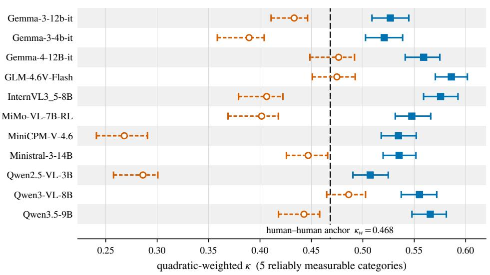
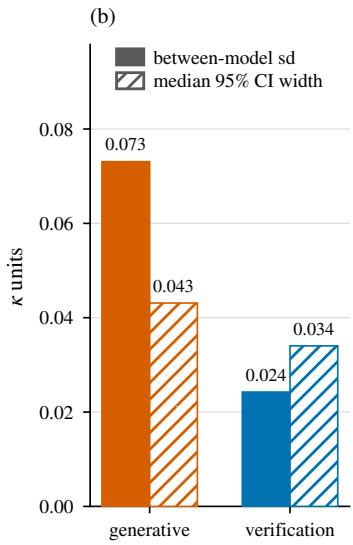
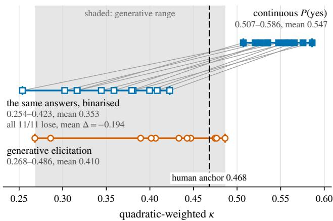
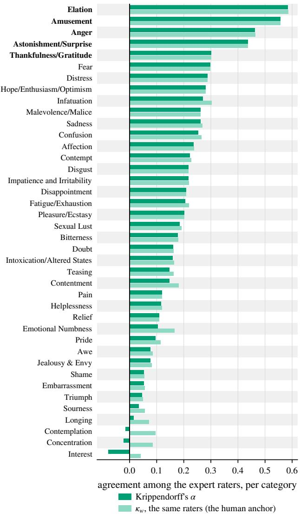
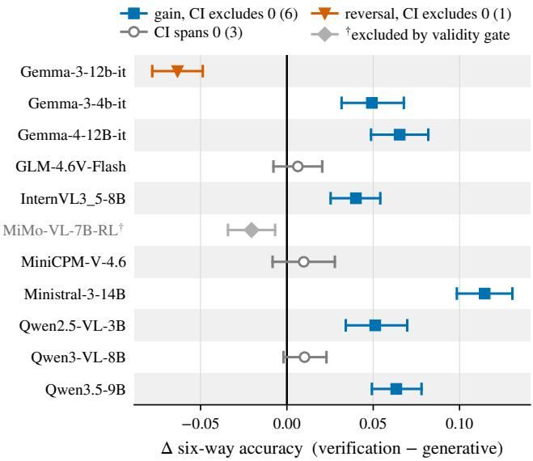

# The Failure Is in the Readout: Fine-Grained Emotion Recognition Benchmarks Measure Elicitation, Not Perception

Tobias Hallmen1 Fabian Deuser2 Robin-Nico Kampa2 Norbert Oswald2 Elisabeth Andre´1

1Chair for Human-Centered Artificial Intelligence, University of Augsburg 2Institute for Distributed Intelligent Systems, University of the Bundeswehr Munich

{tobias.hallmen,elisabeth.andre}@uni-a.de

{fabian.deuser,robin-nico.kampa,norbert.oswald}@unibw.de

## Abstract

Fine-grained emotion recognition supports therapy tools and social robots, but it needs facial data, which raises privacy and data-protection concerns. EmoNet-Face-HQ answers that with generated portraits, expert-rated over a 40- category taxonomy far finer than the usual six to eight basic emotions. Under the protocol it ships with, vision–language models (VLMs) score poorly on that taxonomy, and the benchmark concludes that a dedicated fine-tuned model is necessary: Empathic-Insight-Face (EIF; Small/Large). We show that off-the-shelf VLMs match or beat that fine-tuned model when the answer is not generated but read from the logits, as one binary query per category. We keep the benchmark’s images, taxonomy and ratings, and change only how the answer is read. Experts agree at $\kappa _ { w } = 0 . 4 6 8$ on the five categories they measure most reliably. Generatively, no interval among eleven open-weight VLMs lies entirely above that anchor $( \kappa _ { w } ~ = ~ 0 . 2 6 8 – 0 . 4 8 6 )$ Under verification all eleven clear it, each of them significantly better at $\kappa _ { w } =$ 0.507–0.586. Three also significantly beat EIF sitting at $\kappa _ { w } = 0 . 5 5 1$ (Small; 0.534 Large). The gain comesfrom the graded probability and not from asking a yes/no question: as a control, thresholding those same probabilities to yes/no costs 142% ofthe average gains and drops binarization below generative elicitation to $\kappa _ { w } = 0 . 2 5 4$ –0.423. A replication on real photographs (FACES) is weaker and mixed: of the ten models that pass a validity gate, six gain, three are neutral to positive and one is negative, so the effect is not confined to synthetic data.

## 1. Introduction

Systems that respond to how a person feels, such as therapy tools, social robots and affective interfaces, need models that read emotion from faces. Most benchmarks measure only the six to eight basic emotions, which is too coarse for those uses, and collecting finer data means recording real faces, with the privacy and data-protection burden that carries. EmoNet-Face-HQ [49] addresses both: its 2,500 portraits are generated rather than recorded, with MidJourney v6 [35] and Flux-Dev and -Pro [8], and expert raters annotate them on a 40-category taxonomy, several raters per image, so agreement between raters is itself measurable.

Testing vision–language models on it, the benchmark finds they score well below the level at which those raters agree, and draws two conclusions: that current VLMs lack the capability, and that the remedy is a dedicated finetuned model, in their case a SigLIP2 backbone [51] with 40 task heads, Empathic-Insight-Face (EIF). VLMs are capable across a wide range of other visual tasks, so the question is why they should fail so completely on this one.

The answer is in the protocol, not in the models. Schuhmann et al. [49]’s protocol is generative: the model writes an emotion list and a parser extracts scores (0–7; 0 = absence, 1–7 = presence+intensity) from the text. The protocol that produces the failure prompts the VLM for “exactly 25 key-value pairs” drawn from the 40 categories, and reprompts up to 20 times until 25 emotions are elicited. The published baselines comply literally, on every image. That is the defect: a model forced to name 25 categories whatever it sees cannot report that only e.g. three apply, so the count carries no information about the face and the 22 it must invent are scored against zeros.

What is measured is a model’s score after its answer has passed through a text format and a parser, so we keep the images, taxonomy and expert ratings unchanged and change only how the answer is read. We reproduce their models scoring poorly under their protocol, then show that the same VLMs on the same images clear the human agreement anchor when the answer is read differently, that the resulting ranking is too unstable to support the comparisons such benchmarks invite, and that fixing the readout recovers more than training did.

<table><tr><td colspan="3">One EmoNet-Face-HQ image, rated by four experts. Generative elicitation (theirs). The prompt asks for exactly 25 cate- gories rated 0–7, omitting any rated 0. Reply, verbatim and complete: {&quot;Astonishment/Surpri  $\mathsf { . s e } ^ { \mathsf { n } } : \quad 7 , \quad \mathsf { " } \mathtt { F e a r } ^ { \mathsf { n } } : \quad 7 \big \}$  Two categories. The other 38 are scored 0. This is the entire mea-</td></tr><tr><td colspan="3">surement. Verification elicitation (ours). One query per category, “Does this face express X?&quot;, scored as  $P ( \mathrm { y e s } )$  at the first generated position and rank-matched onto the same 0–7 scale. Every category the ex- perts rated 2 or higher:</td></tr><tr><td>P(yes) Astonishment/Surprise Fear</td><td>ours 1.0000 7 0.9998 5</td><td>experts 6</td></tr><tr><td>Distress</td><td>0.9987 3</td><td>2 3</td></tr><tr><td>Awe</td><td>0.9927 2</td><td>2</td></tr><tr><td>Interest</td><td>0.3384</td><td>2</td></tr><tr><td>Confusion</td><td>1 0.2162</td><td></td></tr><tr><td>Concentration 0.0000</td><td>1</td><td>3</td></tr><tr><td></td><td>1</td><td>4</td></tr><tr><td colspan="3">The top four probabilities are indistinguishable to the eye, and their order carries ratings 7, 5, 3 and 2. A yes/no answer keeps the four</td></tr></table>

Figure 1. What generative elicitation cannot say. The two elicitations on one image, under Qwen3-VL-8B, which is mid-pack under verification and the strongest of the eleven generatively, so the generative failure shown is the cohort’s best case. What the generative arm cannot express is how much of each, or that five further categories shown here are present at all. Scored through the same calibration, summed squared error against the expert ratings over all 40 categories is 42.0 generative against 35.0 verification, and $\kappa _ { w }$ weights disagreements by that square. Calibration is a per-category rank match across all 2,500 images rather than a per-image transform, which is why a probability of 0.0000 can still receive a nonzero rating where many images tie at zero (Sec. 3).

In Appendix M we reproduce the reported numbers from Schuhmann et al. [49] and compare it against our verification elicitation (Figure 1), which favors a closed question per category (“Does this face express X?”), reading $P ( \mathrm { y e s } )$ from the logits at the first generated position. In our method one forward pass per category is needed rather than a decoding loop. Our experiments show that the advantage of our method is a readout effect rather than a prompting trick. When asking binary questions we threshold the stored probabilities and re-score them. This costs 0.194 $\kappa _ { w }$ against the +0.137 verification gains over generative (or 142% of the gains), so the binarized arm ends up below generative on average rather than part-way back (Fig. 1, Sec. 4.4). What our verification recovers is in the logits and is destroyed by decoding. This also fixes the protocol’s scope to any openweight VLM or API returning token log-probabilities.

Contributions. (i) A protocol for reading the answer: verification elicitation, one binary query per category scored as $P ( \mathrm { y e s } )$ at a fixed read position, paired with a validity gate that makes a generative arm auditable, without which naming more emotions at wrong intensities yields a higher but meaningless $\kappa _ { w }$ . (ii) Contrary to the benchmark’s reported failure of VLMs, all eleven tested VLMs clear the human expert anchor of $\kappa _ { w } = 0 . 4 6 8$ significantly, at $\kappa _ { w } = 0 . 5 0 7 – 0 . 5 8 6$ . Three of them also significantly surpass the supervised fine-tuned EIF (Small $\kappa _ { w } ~ = ~ 0 . 5 5 1$ Large 0.534) on the five most reliable categories against both, two on all 40. (iii) The gain is the graded probability rather than the binary question, and the ranking it produces is not identified: thresholding the same stored answers to yes or no costs 0.194 $\kappa _ { w } ,$ , more than the whole +0.137 gain, and the between-model spread falls inside the measurement precision. On real photographs the effect is present but weaker and mixed, six of ten valid models positive, three neutral to positive and one negative (Sec. 6). Code, the validity gate and every per-image prediction are at https: //github.com/saveli/emonet-readout.

## 2. Related Work

Fine-grained affect benchmarks. Facial-affect corpora trade scale against control: in-the-wild sets label web images with the basic categories [13, 28, 37], while posed corpora (FACES [12], RaFD [27]) supply identity, age and validation ratings instead. Finer taxonomies are both motivated and contested [6, 11]. EmoNet-Face [49] sits at the extreme: 40 categories, synthetic balanced imagery, multi-expert ratings, and API-served VLMs far below human experts. Like comparable evaluations [29], it scores by parsing generated text. We take its images, taxonomy and ratings as given and ask how much of that gap is the models and how much the procedure. FACES is our transfer set.

Elicitation sensitivity in LLM and VLM evaluation. Benchmark scores depend on how a model is queried, down to prompt format and option order [36, 42, 50, 61], which motivated CircularEval [33] and can move leaderboards by eight positions [1]. Closer to our concern is where the answer is read: likelihood scoring, symbol elicitation, prompting and first-token probabilities are each a different measurement [22, 23, 48, 53], and one model posts very different MMLU [21] numbers under cloze scoring, a harness [15] and generation [30], noticed publicly [14] before it was studied. Probabilities carry biases a calibration step must absorb [60], and ours does so explicitly and controls for its oracle character (Sec. 7).

Token-probability readouts as a scoring instrument. Reading a score from answer-token probabilities rather than from generated text is established practice, reached independently in several fields. Closest to our elicitation, Atabuzzaman et al. [3] classify fine-grained categories by the probability of Yes under a per-class binary question, argmax over classes, lifting a generative baseline from 1.56% to over 20% on 200-way bird classification. The same readout scores low-level vision quality [55, 56] and LLM judges [32], motivated respectively by the bias of a one-word verbaliser, by fidelity to how a mean opinion score is aggregated from discrete votes, and by the ties an integer score leaves unresolved. In affect a trained hiddenstate readout halves generative decoding’s error [54], and concurrent speech work separates emitted answers from option logits [41]. The move is disputed: probabilities can themselves misalign with what a model would say [34]. We apply that readout unchanged and train nothing, on a 0–7 rating over 40 co-occurring categories rather than a keyed single label. Each of these works instruments an evaluation of its own design, whereas we instrument one already published, which makes the readout difference a measurement of the protocol and not of the models.

Reliability, agreement, and label noise. Agreement statistics (Krippendorff’s α [20, 24], weighted κ [10], against conventional thresholds [26]) normally certify a corpus as fit to publish. We follow Schuhmann et al. [49] and use them as the scale on which performance is reported, scoring model and human annotator by the same statistic against the same raters. Human–human agreement is an anchor, not a ceiling [46, 47], since disagreement is frequently signal rather than defect, metrics against a single aggregated label overstate what any individual annotator would endorse, and in vision label errors and re-annotation reorder rankings [2, 7, 19, 38–40, 43, 45]. Affect labels are a hard case, and at 40 categories possibly not identifiable from a static face [6]. On EmoNet-Face, expert agreement is $\kappa _ { w } = 0 . 4 6 8$ on the five reliably measurable categories and 0.166 across the remaining 35.

## 3. Protocol

Data. The primary set is EmoNet-Face-HQ [49]: 2,500 synthetic face images, each rated on a 0–7 intensity scale across 40 emotion categories, where 0 marks absence and 1–7 presence with intensity. The raters are psychology experts. Each image is rated by four of them, so agreement (Krippendorff’s α [24]) itself is measurable. Results are reported both over all 40 categories $( \kappa _ { w } = 0 . 2 0 4 )$ and over the five categories raters agree on the most $( \kappa _ { w } = 0 . 4 6 8 ) $ Elation $( \alpha = 0 . 5 8 4 )$ , Amusement (0.556), Anger (0.462), Astonishment/Surprise (0.436) and Thankfulness/Gratitude (0.300); Fig. 4 and Tab. 4 give all forty. Section 5.1 shows the conclusions do not depend on the restriction.

The transfer set is FACES [12]: 2,052 photographs of 171 people posing six expressions, anger, disgust, fear, happiness, neutral and sadness, with age and gender recorded per image. One expression is correct per photograph, so FACES is a six-way forced choice where EmoNet-Face-HQ is a 40-category multi-class rating.

Generative elicitation. The benchmark scores a model by having it write its answer. The VLM is asked to return a JSON object mapping category names to integer ratings, for example {"Anger":6,"Disgust":2}, and a parser extracts those ratings from the reply. Its zero-shot prompt requires “exactly 25 key-value pairs” and instructs the model to omit any category it would rate 0 [25]. A reply that returns a different count, or any zero, is discarded and the image is queried again, up to 20 times. Scoring then reinstates the omitted categories at 0 and compares all 40 ratings against the expert ratings. Nothing is reduced to a single predicted emotion. The benchmark also publishes a second prompt, the multi-shot one, which supplies worked example outputs and asks for a different format: 44 dimensions (40 emotions plus Arousal, Valence, Dominance and Emotional Vulnerability), every one rated and each with a written justification, with no fixed count and no omit-zeros rule. Section 4.2 scores the benchmark’s own baselines under both. The count is therefore fixed by the prompt rather than by the face, and the reinstated zeros are scored, so naming more categories moves the score even at wrong intensities.

We run their prompt and one of our own. Their phrasing is one of two generative prompts we score. The second is our own wording of the same request, included because a single phrasing cannot distinguish a protocol effect from a wording effect, and we report the better of the two per model, which is the choice favorable to generative elicitation. We do not score the third, their retry loop, because it measures compliance with the 25-key demand instead of the models’ vision capabilities. The measurement behind that exclusion is in the supplementary (Appendix F).

Parsing and coverage. A reply the parser cannot read is excluded from that model’s generative sample rather than counted as an error, again favoring generative elicitation. The exclusion is per image, not per category: a reply that parses but names three categories is kept and scored with 37 zeros. We call the fraction of images a model contributes its coverage, and it is not uniform. Five models parse 2500/2500, the remaining six spread down to 1931 (77%), so part of any contrast against them is a difference in coverage and not in accuracy. The supplementary holds coverage fixed and shows what that is worth (Appendix I).

Models. We evaluate the eleven open-weight VLMs in Tab. 1, run locally. They were chosen as the newest model per family that runs on a single consumer GPU (≤ 24 GB). Verification reads a probability off the first generated token, and the fourteen baselines the benchmark reports are served through APIs that return none. Those baselines are also two model generations old, which would confound the elicitation with the years between. We score them separately through our generative path in Sec. 4.2. Sizes span an order of magnitude, from 1.30B to 13.95B. All eleven carry both elicitations. Cohort membership per experiment is in the supplementary (Tab. 7). Decoding and input resolution are not uniform across the cohort, and neither carries the result (Appendix E). The reference model is Empathic-Insight-Face (EIF; Small/Large), which the benchmark specifically trained to close the gap it reports in VLMs: 40 MLP heads over frozen SigLIP2 embeddings [51], pre-trained on EmoNet-Face-Big and fine-tuned on EmoNet-Face-Binary, neither of which the HQ experts rated.

<table><tr><td>Model</td><td>Params</td><td>Prompt</td><td>Decoding</td></tr><tr><td>Gemma-3-4b-it [16]</td><td>4.30B</td><td>ours</td><td>greedy</td></tr><tr><td>Gemma-3-12b-it [16]</td><td>12.19B</td><td>theirs</td><td>greedy</td></tr><tr><td>Gemma-4-12B-it [17]</td><td>11.96B</td><td>theirs</td><td>greedy</td></tr><tr><td>GLM-4.6V-Flash [18]</td><td>10.29B</td><td>theirs</td><td> $T = 0 . 8$ </td></tr><tr><td>InternVL3_5-8B [9, 52]</td><td>8.53B</td><td>theirs</td><td>greedy</td></tr><tr><td>MiMo-VL-7B-RL [57]</td><td>8.31B</td><td>ours</td><td> $T = 0 . 3$ </td></tr><tr><td>MiniCPM-V-4.6 [58, 59]</td><td>1.30B</td><td>ours</td><td> $T = 1 . 0$ </td></tr><tr><td>Ministral-3-14B [31]</td><td>13.95B</td><td>theirs</td><td> $\mathrm { g r e e d y }$ </td></tr><tr><td>Qwen2.5-VL-3B [4]</td><td>3.75B</td><td>theirs</td><td> $\mathrm { g r e e d y }$ </td></tr><tr><td>Qwen3-VL-8B [5]</td><td>8.77B</td><td>theirs</td><td> $\mathrm { g r e e d y }$ </td></tr><tr><td>Qwen3.5-9B [44]</td><td>9.65B</td><td>theirs</td><td> $T = 0 . 7$ </td></tr></table>

Table 1. The eleven evaluated VLMs, with technical reports. All are open-weight and run locally. Parameter counts are the released safetensors totals. Prompt and decoding name the run behind the generative score we report: theirs is the benchmark’s zero-shot prompt [25] and ours our own wording of the same request $( \mathsf { A p - } $ pendix D), reported as the better of the two per model, the choice favorable to generative elicitation. Every model was also run under the other prompt and under the other decoding policy, and neither choice carries the result (Appendix E). Verification samples nothing.

Verification elicitation. The benchmark’s defect is in how the answer is read, so we change that and nothing else. For each of the 40 categories we issue one binary query, “Does this face express $X ? ^ { \dag }$ , and read $P ( \mathrm { y e s } )$ from the softmax over {yes, no} token variants at the first generated position. Nothing is sampled: each query is a single forward pass instead of a decoding loop. Every category then gets an answer. A logit exists at the read position whether or not the model would have mentioned that category, so coverage is 2500/2500 by construction. The number of categories reported as yes is thereby a property of the image and not of the prompt. Several reasoning models place a chain-ofthought token at the read position, and disabling thinking does not reliably move it, so we apply an Answer: prefill to every model. Section 5.2 quantifies what that asymmetry is worth. On FACES the same construction runs over the six expressions and the prediction is the argmax.

Scoring. $\kappa _ { w }$ is Cohen’s κ with quadratic weights [10], so a disagreement is penalized by the square of its distance on the 0–7 scale. We use it because it is the benchmark’s own metric. Model and rater are scored the same way, each against individual raters rather than against their mean, so the human anchor is a like-for-like reference. mAP is mean average precision across categories, treating each category as a ranking problem. It is rank-based and, unlike $\kappa _ { w } ,$ does not require a predictor to emit eight distinct levels, a difference that matters in Sec. 4.4, where we report both.

Calibration. $\kappa _ { w }$ is defined on the ordinal levels 0–7, while $P ( \mathrm { y e s } )$ lives on [0, 1], so the two have to be put on one scale. The benchmark reaches that scale by truncating predictions to integers, which would map every $P ( \mathrm { y e s } )$ below 1.0 to 0 and collapse the experiment entirely. Instead we calibrate: per category, predictions are rank-matched to the gold marginal for that category, which places both on the 0– $7$ scale without rewarding or penalizing a predictor for the range it happens to emit. The step sees the gold marginal and is therefore an oracle, and Sec. 7 reports the held-out control. The same calibrated path scores the benchmark’s own fourteen baselines in Sec. 4.2, several of which do not emit 0–7 integers either, including EIF.

Intervals. Confidence intervals (CI) resample images, the independent unit, with $B \ = \ 5 0 0$ replicates and $r e \mathrm { - }$ fit calibration inside every replicate, since calibrating once and then resampling understates the width. Comparisons against a reference, the human anchor or the benchmark’s trained model, recompute both sides on each resample, so the difference is paired. Treating the two margins as independent would inflate the interval roughly twofold. Two models are separated when their 95%-CI intervals do not overlap, see Sec. 4.3.

Guards. Either elicitation can return a number that is not a measurement: verification reads a position that may hold no answer, and a generative reply can carry a category word without the model having reached a conclusion. Neither failure announces itself, so each arm carries a check we report rather than assume.

Answer-mass guard. The answer mass is the share of first-position probability the {yes, no} token variants hold. $P ( \mathrm { y e s } )$ is a softmax over those variants alone, so the rest of the distribution sits on other tokens. If a model places almost no first-position mass on {yes, no}, then $P ( \mathrm { y e s } )$ is a ratio between two tokens it was never going to emit. Three reasoning-tuned models do this without a prefill. The dangerous case returns a plausible number from rank-preserving noise (Appendix G). No threshold has to be chosen, because the two regimes do not overlap: the three failing runs measure $\leq 2 . 6 \times 1 0 ^ { - 7 }$ mean yes/no mass, against [0.798, 1.000] across every run we report.

Generative validity gate. A generative run can fail silently. A reasoning model that recites the prompt’s option list before being truncated leaves some category word in its reply, so a parser reports a high parse rate while the model never reached a conclusion. We detect this with the singleanswer gap: accuracy over replies naming exactly one category, minus accuracy over all replies. A large gap means the parser is producing the score instead of the model.

Scope. The single-answer gap needs an answer space with one correct label, so it is defined on FACES and not on the 40-rating EmoNet set, where naming many categories is rewarded behavior. There the answer-mass guard above plays the same role. Ten of eleven FACES generative runs pass with a gap of exactly 0, their replies naming one category in 6–37 mean characters. One model fails this guard and is excluded from the FACES aggregate.

## 4. Results

## 4.1. The anchor

Human experts agree with one another at $\kappa _ { w } = 0 . 4 6 8$ on the five reliably measurable categories for the EmoNet-Face-HQ [49]. We take that as the anchor a model must clear to be described as performing the task at human level.

Under generative elicitation, at each model’s better prompt, no model’s interval lies entirely above the anchor (Fig. 2a). Under verification all eleven do, the lowest lower bound being 0.490. As a paired test rather than by eye, every model is above the anchor with an interval excluding zero, the weakest at $+ 0 . 0 3 9 \ [ + 0 . 0 2 6 , + 0 . 0 5 1 ]$ . Every trivial baseline’s $\kappa _ { w }$ interval is contained in $[ - 0 . 0 1 5 , 0 . 0 1 8 ]$ The two arms do not overlap for any model and the anchor falls between them, so no single model carries the effect.

The trivial baselines matter. An all-zero prediction scores $\kappa _ { w } = 0 . 0 0 8$ with $\mathrm { m A P = 0 . 4 0 2 }$ , and all five land in $[ 0 . 0 0 1 , 0 . 0 0 8 ]$ across the three category sets (Tab. 3). They clear zero at all only because calibration scatters a constant vector across the gold levels, the tie pathology Sec. 4.4 exploits, so what the comparison establishes is that the models are far from degenerate.

Training does not substitute for the protocol. Promptmatched supervised fine-tuning on 21,612 binary queries drawn from EmoNet-Face-Binary, in a format byteidentical to the verification query, places 85–88% of the answer-token mass on the correct answer and still leaves $\kappa _ { w }$ statistically unchanged on seven of eight models (see Appendix O).

## 4.2. The benchmark’s own baselines

The eleven VLMs above were never run by the benchmark, so on their own they cannot show that its models were mismeasured. The benchmark publishes its fourteen baselines per-image predictions, so we close that gap on its own data through the identical path (Sec. 3). Rescoring is not what produces the split below. Across the fourteen, calibration moves $\kappa _ { w } \ \mathrm { b y + 0 . 0 4 1 }$ on average, and the two largest moves are on the entries never on the 0–7 scale to begin with, Hume’s predictions observed in [0, 1.03] and EIF’s, offsets from a per-head neutral-face mean, in [−9.21, 9.83]: Hume Face gains 0.368 and EIF Large 0.133, scale mismatches rather than skill. Over the other twelve it moves +0.006. The benchmark’s own trained model is therefore read here at its best.

Rescored through that path the fourteen split sharply (Tab. 12): seven land between 0.375 and 0.551 and the other seven at or below 0.011, four of them below the benchmark’s own Random Baseline of 0.009. The split follows the prompt, not the vendor, and its upper half reaches the anchor: Gemini 2.0 Flash ZS scores $0 . 4 9 9 , \ + 0 . 0 3 0$ $\left[ + 0 . 0 1 7 , + 0 . 0 4 3 \right]$ above it, and is the one zero-shot entry whose count tracks the image (19.50 categories, sd 8.51); Hume Face\* at 0.466 is indistinguishable from the anchor $( - 0 . 0 0 2 \ [ - 0 . 0 2 6 , + 0 . 0 0 7 ] )$ . Three of the four entries below the Random Baseline ran under the zero-shot prompt (Sec. 3).

The within-model control is theirs, not ours. Gemini 2.5 Flash appears twice. Under the zero-shot prompt it names a constant 25 nonzero categories on every image and scores $\kappa _ { w } = 0 . 0 0 2$ . Under the multi-shot prompt (Sec. 3) it names 4.93 on average (sd 0.34) and scores 0.419. Same model, same images, same metric: the elicitation is the entire difference. Five of the fourteen produced constantcardinality output, which shows that a degree of freedom the prompt fixed was not used to respond to the image, though not, on its own, that the selected categories were imageindependent.

Neither the prompt nor the category count explains the split. Claude 3.7 scores at the Random Baseline under the same multi-shot prompt, and Hume Face\* scores 0.466 while emitting a constant 31 categories on every image, because continuous scores rank informatively however many of them are nonzero (Tab. 12). Elicitation accounts for the whole distance from chance to human agreementfor a given model, which is a claim about the measurement rather than a recipe: constant-cardinality compliance displaces the signal a rank-sensitive readout would have found, the mechanism Sec. 4.4 isolates in our own runs.

Pretrained models match the model this benchmark was built to motivate. EIF is the benchmark’s own answer to the gap it reports: a SigLIP2 backbone with 40 task heads, pre-trained on the 203,201 images of EmoNet-Face-Big and fine-tuned on EmoNet-Face-Binary. Its two sizes trade places by category set (Small 0.551 [0.534, 0.567] on the reliable five against Large’s 0.534 [0.518, 0.552], while on all 40 Large leads 0.271 [0.263, 0.278] against Small’s 0.241 [0.234, 0.248]), so we report both. On the same paired bootstrap we use for the anchor, three of our eleven are above Small on the reliable five and six across all 40. Against Large it is five and two. None of the eleven has seen an emotion label in training. GLM-4.6V-Flash and InternVL3 5 are above both sizes on both sets, and Qwen3.5-9B clears Small on both and Large on the five (Tab. 13). The gap the benchmark set out to close with a dedicated model, trained on two corpora its own experts never rated, is matched or exceeded by general-purpose VLMs once the answer is read from the logits.

(a)  

  
Figure 2. How the answer is read, not which model is asked, decides whether these models reach human agreement. (a) Quadratic weighted κ with 95% image-bootstrap intervals under generative elicitation (open circles, dashed) and verification (filled squares). No generative interval lies entirely above the 0.468 human anchor. All eleven verification intervals do. (b) The between-model sd falls from 0.073 to 0.024 while the median interval narrows from 0.043 to 0.034, so the spread moves inside the measurement precision rather than the measurement becoming noisier.

## 4.3. The spread collapses inside the measurement

Verification is the more precise instrument of the two, and the spread still collapses inside it. Both halves matter, since a measurement that inflated every model would do so by being noisier.

Over the eleven models with both elicitations, the between-model sd falls from 0.073 to 0.024 while the median interval width falls from 0.043 to 0.034, and separated pairs from 37 of the ${ \binom { 1 1 } { 2 } } = 5 5$ model pairs to 18 (Fig. 2b). Generatively the spread exceeds the measurement precision. Under verification it falls inside it while the instrument gets more precise, ruling out “verification is just noisier”.

The comparison that carries the point is within each arm, spread against its own precision, not one arm against the other.

The consequence is that what a fixed elicitation decides here is whether the task is performed at all, not which model performs it best. Every model reaches the anchor, while the total ordering the benchmark reports is not identified at the available precision. A partial order survives (18 of 55 pairs remain separated, and the extremes are distinguishable), so most pairwise differences are unresolved rather than absent. On FACES the spread does exceed the precision.

The instability is not confined to our verification arm: across 25 scored systems, 17 change rank by up to eight places when the 35 unmeasurable categories are dropped, using no verification-arm scores (Appendix N).

## 4.4. The gain is the readout, not the question

If the effect were “binary questions are easier”, it would be a prompting recommendation any practitioner could apply. It is not, and the ablation costs no compute: because mean yes/no mass is 0.798–1.000, thresholding the stored $P ( \mathrm { y e s } )$ at 0.5 is the decision a greedy decode would have made, so the ablation is a re-scoring of predictions already on disk.

Read continuously, the eleven models span $\kappa _ { w } = 0 . 5 0 7 -$ 0.586 at $\mathrm { m A P } = 0 . 7 7 3$ . Thresholded, the same answers span 0.254–0.423 at $\mathrm { m A P } = 0 . 5 5 4$ . That lands past generative elicitation rather than part-way back to it: the binarized mean of 0.353 sits below the generative mean of 0.410, inside a generative range of 0.268–0.486 (the shaded band of Fig. 3).

What does binarizing actually do? It leaves two distinct values per category, so the quantile calibration that maps predictions onto the 0–7 scale is expanding a twolevel vector across eight levels and breaking the resulting ties arbitrarily. A drop in $\kappa _ { w }$ therefore confounds information loss with resolution loss under a graded metric, and on its own would not support the claim. This is why we also report mAP, which ranks and does not require eight distinct levels: it falls on every model, by 0.133–0.275 (mean 0.219). Binarizing lands verification where generative elicitation already sits on this metric, 0.554 against 0.561, the latter over each model’s own parsed images (0.485–0.673).

  
Figure 3. Discard the graded logit and the gain goes with it, even though the question is unchanged. The same stored verification answers scored continuously from $P ( \mathrm { y e s } )$ (filled squares) and re-scored by thresholding them at 0.5 (open squares), and each gray line follows one model. No new inference is run and no prompt is altered, yet every model loses, and the binarized arm lands back inside the range spanned by generative elicitation (shaded, the eleven models with both elicitations).

Both drops carry image-bootstrap intervals excluding zero. For $\kappa _ { w }$ it is $[ - 0 . 2 0 6 , - 0 . 1 8 2 ]$ around a full-sample −0.194. For mAP we report only that the interval excludes zero: average precision is sensitive to the duplicate images a bootstrap introduces, displacing the replicate distribution about 0.03, so the endpoints would not contain the value they bound.

Figure 3 shows the re-scoring model by model; it covers all eleven (Tab. 7).

The claim we can support is therefore: the continuous readout carries information that both generated text and a hard threshold discard, and the binary question format alone does not recover it. If the format were doing the work, binarized verification would beat generative elicitation, and it does not. We stop short of “the format contributes nothing”: the fourth cell of the factorial, generative elicitation scored from a continuous per-category probability, has no clean construction, because category-string likelihoods are confounded by surface-form competition [22] in a way $P ( \mathrm { y e s } )$ at a fixed read position is not. What the data rule out is that a practitioner could obtain this by rephrasing alone.

## 5. What the result depends on

The contrast lies in the choices we did not have to make: a query phrasing, a category restriction, an Answer: prefill, run settings that are not uniform across the cohort (decoding and input resolution), one generative arm we exclude, and a coverage difference between the arms. In this section we measure the three that bear on the headline, and the supplementary measures the rest: the run settings (Appendix E), the excluded arm (Appendix F) and coverage held fixed (Appendix I). None of the six produces the result.

## 5.1. Phrasing and category set

Phrasing. Three phrasings of the verification query (Appendix C) across eleven models give 33 cells. Every cell clears the anchor (minimum 0.472), with mean spread 0.016 against a CI width of 0.034. Only the two lowestaccuracy, most saturated predictors exceed the CI, so phrasing sensitivity is a property of particular models rather than of the protocol.

The result holds on any category set. We report on the five categories the expert raters agree on most, because an anchor computed where the raters agree no better than chance measures label noise, not the task. Nothing rests on the choice: every model clears the human anchor on the five $( \kappa _ { w } = 0 . 4 6 8 )$ , on the 35 excluded (0.166) and on all 40 (0.204; equals benchmark’s), each set in Tab. 3. Agreement decays smoothly across the taxonomy (Fig. 4), 11 of 40 categories falling below $\alpha = 0 . 1 0$ and three below zero: the models track whatever signal the labels carry, and outside the five the labels carry little of it, for the expert annotators as much as for the models.

## 5.2. How much of the anchor result is the prefill?

Verification uses an Answer: prefill and generative elicitation does not (Sec. 3). That is the one asymmetry between the arms not intrinsic to the readout, so we measure it by rerunning verification without it.

The verification result depends on the prefill for four of eleven models. For three of them it is a precondition rather than a refinement: GLM, MiMo and Qwen3.5 place essentially none of the first-position mass on {yes, no} without it, so there is no answer at the read position to recover. The fourth is the case the guard does not catch. Gemma-3-4b-it’s answer mass is 0.965 without the prefill, comfortably inside tolerance, so nothing flags it. The prefil is nonetheless worth 0.120 $\kappa _ { w }$ to it, where no other mode gains more than 0.013, and without it the model falls below the anchor. Of the eight models whose no-prefill arm can be read at all, seven still clear the anchor. Per-model figures and the mechanism are in the supplementary (Appendix G, Tab. 6).

The headline should therefore be read as “every model clears the anchor under this protocol, prefill included”, not as a property recoverable however the read position is fixed. It is also why the generative arm gets no prefill: a prefill fixes a logit read position, which generative elicitation has no analogue for.

## 6. Replication on Real Photographs

Everything in Sec. 4 is measured on synthetic images. If the elicitation effect appeared only there it would be a fact about one image generator rather than about evaluation, so we repeat the contrast on FACES [12], 2,052 photographs of 171 people.

This is a categorical replication and we report it as one. FACES was validated by raters, but the release distributes aggregated rating results rather than the per-rater judgements our anchor needs, so we score against the posed expression and compute neither an anchor nor a calibration. The metric is accuracy over the six posed expressions, chance 1/6, and intervals resample the 171 persons, since each person contributes twelve photographs.

The contrast survives on photographs, weaker and mixed. Of the ten models that pass the validity gate of Sec. 3, six gain detectably, three sit at +0.010 accuracy or below with intervals spanning zero, and one reverses, for a cohort mean of +0.035 accuracy. Macro-F1 splits the same ten models the same way, so the gain is not a reallocation of mass between classes. The gate excludes MiMo-VL-7B-RL, whose delta is −0.020 accuracy with an interval excluding zero, so the exclusion moves the result toward our hypothesis, and the criterion was fixed before these runs existed. Per-model figures (Fig. 5), the class-prior control, the five-class rerun (Appendix L), the no-image control (Appendix K) and how far numerical churn bounds a reportable delta are in the supplementary (Appendix J).

## 7. Limitations

Quantile calibration uses the gold marginal. Mapping P(yes) onto the benchmark’s 0–7 scale requires a calibration step that sees the label distribution, so the figures are an upper bound rather than a deployable procedure, and we refit calibration inside every bootstrap replicate. Held-out calibration bounds what it is worth: +0.026 $\kappa _ { w }$ on Gemma-3- 4b-it, +0.023 on MiniCPM-V-4.6, and $\leq 0 . 0 0 3$ on the other nine. That leakage does not carry the comparisons. The two models with appreciable leakage both sit below EIF Small on the reliable five, the comparison at issue, while the three that significantly exceed it leak 0.002 apiece, seven to sixteen times under their margins. Against EIF the asymmetry runs the other way in any case, since it was supervised on per-image labels while our calibration sees only a marginal. The asymmetry we do count is against the generative arm, which fits no mapping because its outputs already arrive on the requested scale.

The primary corpus is generated and its demographics are prompt-derived. EmoNet-Face-HQ images are synthetic and their demographic labels are the generation prompt, not observed properties of a subject. Since the HQ raters annotated emotion alone, no rater ever verified the demographic labels. FACES, whose age and gender are recorded per person, is the setting in which the bias analysis could become a finding. On HQ we therefore report no demographic breakdown, since such a breakdown would not describe the human faces but the image generator instead. Nor does comparing the corpora settle the bias question: they differ in label provenance, in generated against photographed faces, and in taxonomy, so a group difference on one cannot be attributed on the other.

Gate, churn, label scale and stimulus type. The validity gate excludes one model in a direction that favors our hypothesis, numerical churn bounds how small a reportable delta can be, and the FACES replication is categorical rather than graded. The first and the third are stated in Sec. 6 and the second in Appendix J. Both corpora are also cropped single-face portraits, so the in-the-wild test, which often requires context and multi-label classification, remains future work. Tooling and the scope of the claim are in Appendix Q.

## 8. Conclusion

A benchmark measures a model through a procedure, and when the procedure contributes more to the score than the model does, the number describes the procedure. The same eleven VLMs, on the same images, go from no interval lying entirely above the human agreement anchor to all eleven exceeding it significantly, with nothing changed but how the answer is read. The benchmark’s own published baselines split the same way on its own data, and several off-the-shelf VLMs outmatch the benchmark’s model it trained specifically (EIF) to close the gap it reported in VLMs.

Used deliberately, VLMs are capable instruments. Used casually they are not. Emotion recognition makes that unusually visible. A generative arm can fail silently, so its accuracy means nothing until something checks that an answer was actually given. A read position has to be placed on purpose, and for three of our eleven VLMs it exists only because a prefill puts it there. A prompt that demands a fixed number of categories measures compliance with the demand: the count it returns describes the prompt, not the face.

What we would like adopted is cheap. Treat the elicitation as part of the protocol instead of an implementation detail, and report it: the question asked, how the answer is read and from where, and the decoding settings. Score a human anchor and a set of trivial predictors through the identical pipeline, so the trivial floor and the human anchor are visible next to the models. Prefer an anchor and an interval to a rank wherever the two disagree. Report agreement per category beside performance per category.

Three questions follow. Whether a continuous readout survives in-the-wild imagery and multi-label affect, where one forced answer is the wrong shape. Whether it can be trained into a model rather than elicited from it. And whether a taxonomy this fine can be made measurable by changing how it is annotated, since across most categories the experts agree little, so it is the labels rather than the models that set the limit.

## Acknowledgments

Part of the experiments ran on the LiCCA HPC cluster of the University of Augsburg, co-funded by the Deutsche Forschungsgemeinschaft (DFG, German Research Foundation) – Project-ID 499211671.

## References

[1] Norah Alzahrani, Hisham Alyahya, Yazeed Alnumay, Sultan AlRashed, Shaykhah Alsubaie, Yousef Almushayqih, Faisal Mirza, Nouf Alotaibi, Nora Al-Twairesh, Areeb Alowisheq, M Saiful Bari, and Haidar Khan. When benchmarks are targets: Revealing the sensitivity of large language model leaderboards. In Proceedings of the 62nd Annual Meeting ofthe Associationfor Computational Linguistics (Volume 1: Long Papers), pages 13787–13805, 2024. 2

[2] Lora Aroyo and Chris Welty. Truth is a lie: Crowd truth and the seven myths of human annotation. AI Magazine, 36(1): 15–24, 2015. 3

[3] Md. Atabuzzaman, Andrew Zhang, and Chris Thomas. Zeroshot fine-grained image classification using large visionlanguage models. In Findings of the Association for Computational Linguistics: EMNLP 2025, pages 23569–23582, 2025. 2

[4] Shuai Bai, Keqin Chen, Xuejing Liu, Jialin Wang, Wenbin Ge, Sibo Song, Kai Dang, Peng Wang, et al. Qwen2.5-VL technical report. arXiv:2502.13923, 2025. 4, 14

[5] Shuai Bai et al. Qwen3-VL technical report. arXiv:2511.21631, 2025. 4, 14

[6] Lisa Feldman Barrett, Ralph Adolphs, Stacy Marsella, Aleix M. Martinez, and Seth D. Pollak. Emotional expressions reconsidered: Challenges to inferring emotion from human facial movements. Psychological Science in the Public Interest, 20(1):1–68, 2019. 2, 3

[7] Lucas Beyer, Olivier J. Henaff, Alexander Kolesnikov, Xi-´ aohua Zhai, and Aaron van den Oord. Are we done with¨ ImageNet? arXiv:2006.07159, 2020. 3

[8] Black Forest Labs. FLUX.1-dev. Model release, 2024. https : / / huggingface . co / black - forest - labs/FLUX.1-dev. 1

[9] Zhe Chen, Jiannan Wu, Wenhai Wang, Weijie Su, Guo Chen, Sen Xing, Muyan Zhong, Qinglong Zhang, Xizhou Zhu, Lewei Lu, Bin Li, Ping Luo, Tong Lu, Yu Qiao, and Jifeng Dai. InternVL: Scaling up vision foundation models and aligning for generic visual-linguistic tasks. In CVPR, pages 24185–24198, 2024. 4, 14

[10] Jacob Cohen. Weighted kappa: Nominal scale agreement provision for scaled disagreement or partial credit. Psychological Bulletin, 70(4):213–220, 1968. 3, 4

[11] Alan S. Cowen and Dacher Keltner. Self-report captures 27 distinct categories of emotion bridged by continuous gradi-

ents. Proceedings of the National Academy of Sciences, 114 (38):E7900–E7909, 2017. 2

[12] Natalie C. Ebner, Michaela Riediger, and Ulman Lindenberger. FACES—a database of facial expressions in young, middle-aged, and older women and men: Development and validation. Behavior Research Methods, 42(1):351–362, 2010. 2, 3, 8

[13] Paul Ekman and Wallace V. Friesen. Constants across cultures in the face and emotion. Journal of Personality and Social Psychology, 17(2):124–129, 1971. 2

[14] Clementine Fourrier, Nathan Habib, Julien Launay, and´ Thomas Wolf. What’s going on with the Open LLM Leaderboard? Hugging Face blog, 2023. https://huggingface.co/blog/open- llmleaderboard-mmlu. 2

[15] Leo Gao, Jonathan Tow, Baber Abbasi, Stella Biderman, Sid Black, Anthony DiPofi, Charles Foster, Laurence Golding, Jeffrey Hsu, Alain Le Noac’h, et al. A framework for fewshot language model evaluation. Zenodo, v0.4.0, 2023. 2

[16] Gemma Team. Gemma 3 technical report. arXiv:2503.19786, 2025. 4, 14

[17] Gemma Team. Gemma 4 technical report. arXiv:2607.02770, 2026. 4, 14

[18] GLM-V Team, Wenyi Hong, et al. GLM-4.5V and GLM-4.1V-Thinking: Towards versatile multimodal reasoning with scalable reinforcement learning. arXiv:2507.01006, 2025. 4, 14

[19] Mitchell L. Gordon, Kaitlyn Zhou, Kayur Patel, Tatsunor Hashimoto, and Michael S. Bernstein. The disagreement deconvolution: Bringing machine learning performance metrics in line with reality. In Proceedings of the 2021 CHI Conference on Human Factors in Computing Systems, pages 1–14, 2021. 3

[20] Andrew F. Hayes and Klaus Krippendorff. Answering the call for a standard reliability measure for coding data. Com munication Methods and Measures, 1(1):77–89, 2007. 3

[21] Dan Hendrycks, Collin Burns, Steven Basart, Andy Zou, Mantas Mazeika, Dawn Song, and Jacob Steinhardt. Measuring massive multitask language understanding. In ICLR, 2021. 2

[22] Ari Holtzman, Peter West, Vered Shwartz, Yejin Choi, and Luke Zettlemoyer. Surface form competition: Why the highest probability answer isn’t always right. In Proceedings of the 2021 Conference on Empirical Methods in Natural Language Processing, pages 7038–7051, 2021. 2, 7

[23] Jennifer Hu and Roger Levy. Prompting is not a substitute for probability measurements in large language models. In Proceedings of the 2023 Conference on Empirical Methods in Natural Language Processing, pages 5040–5060, 2023. 2

[24] Klaus Krippendorff. Content Analysis: An Introduction to Its Methodology. SAGE Publications, Thousand Oaks, CA, 4th edition, 2019. 3

[25] LAION-AI. EmoNet-Face inference code: zero-shot prompt notebook. https://github.com/LAION-AI/emonet-face/blob/main/inference/vlminference-prompt-zero-shot.ipynb, 2025. Accessed 2026-08-28. 3, 4, 13

[26] J. Richard Landis and Gary G. Koch. The measurement of observer agreement for categorical data. Biometrics, 33(1): 159–174, 1977. 3

[27] Oliver Langner, Ron Dotsch, Gijsbert Bijlstra, Daniel H. J. Wigboldus, Skyler T. Hawk, and Ad van Knippenberg. Presentation and validation of the Radboud Faces Database. Cognition and Emotion, 24(8):1377–1388, 2010. 2

[28] Shan Li, Weihong Deng, and JunPing Du. Reliable crowdsourcing and deep locality-preserving learning for expression recognition in the wild. In CVPR, pages 2584–2593, 2017. 2

[29] Zheng Lian, Licai Sun, Haiyang Sun, Kang Chen, Zhuofan Wen, Hao Gu, Bin Liu, and Jianhua Tao. GPT-4V with emotion: A zero-shot benchmark for generalized emotion recognition. Information Fusion, 108:102367, 2024. 2

[30] Percy Liang, Rishi Bommasani, Tony Lee, Dimitris Tsipras, Dilara Soylu, Michihiro Yasunaga, Yian Zhang, Deepak Narayanan, Yuhuai Wu, Ananya Kumar, et al. Holistic evaluation of language models. Transactions on Machine Learning Research, 2023. 2

[31] Alexander H. Liu et al. Ministral 3. arXiv:2601.08584, 2026. 4, 14

[32] Yang Liu, Dan Iter, Yichong Xu, Shuohang Wang, Ruochen Xu, and Chenguang Zhu. G-Eval: NLG evaluation using GPT-4 with better human alignment. In Proceedings of the 2023 Conference on Empirical Methods in Natural Language Processing (EMNLP), pages 2511–2522, 2023. 2

[33] Yuan Liu, Haodong Duan, Yuanhan Zhang, Bo Li, Songyang Zhang, Wangbo Zhao, Yike Yuan, Jiaqi Wang, Conghui He, Ziwei Liu, Kai Chen, and Dahua Lin. MMBench: Is your multi-modal model an all-around player? In ECCV, pages 216–233, 2024. 2

[34] Chenyang Lyu, Minghao Wu, and Alham Aji. Beyond probabilities: Unveiling the misalignment in evaluating large language models. In Proceedings of the 1st Workshop on Towards Knowledgeable Language Models (KnowLLM 2024), pages 109–131, 2024. 3

[35] Midjourney, Inc. Midjourney v6: AI image generation. Commercial text-to-image service, 2024. https : / / midjourney.com. 1

[36] Moran Mizrahi, Guy Kaplan, Dan Malkin, Rotem Dror, Dafna Shahaf, and Gabriel Stanovsky. State of what art? a call for multi-prompt LLM evaluation. Transactions of the Association for Computational Linguistics, 12:933–949, 2024. 2

[37] Ali Mollahosseini, Behzad Hasani, and Mohammad H. Mahoor. AffectNet: A database for facial expression, valence, and arousal computing in the wild. IEEE Trans. Affective Comput., 10(1):18–31, 2019. 2

[38] Yixin Nie, Xiang Zhou, and Mohit Bansal. What can we learn from collective human opinions on natural language inference data? In Proceedings of the 2020 Conference on Empirical Methods in Natural Language Processing, pages 9131–9143, 2020. 3

[39] Curtis G. Northcutt, Anish Athalye, and Jonas Mueller. Pervasive label errors in test sets destabilize machine learning benchmarks. In Advances in Neural Information Processing Systems Track on Datasets and Benchmarks, 2021.

[40] Ellie Pavlick and Tom Kwiatkowski. Inherent disagreements in human textual inferences. Transactions ofthe Association for Computational Linguistics, 7:677–694, 2019. 3

[41] Linkai Peng and Baorian Nuchged. Separating decision-rule misalignment from readout-coverage limitations in speech language models. arXiv:2608.06409, 2026. 3

[42] Pouya Pezeshkpour and Estevam Hruschka. Large language models sensitivity to the order of options in multiple-choice questions. In Findings of the Association for Computational Linguistics: NAACL 2024, pages 2006–2017, 2024. 2

[43] Barbara Plank. The “problem” of human label variation: On ground truth in data, modeling and evaluation. In Proceedings ofthe 2022 Conference on Empirical Methods in Natu ral Language Processing, pages 10671–10682, 2022. 3

[44] Qwen Team. Qwen3.5: Towards native multimodal agents. Technical blog post, 2026. https://qwen.ai/blog? id=qwen3.5; no technical report released. 4, 14

[45] Benjamin Recht, Rebecca Roelofs, Ludwig Schmidt, and Vaishaal Shankar. Do ImageNet classifiers generalize to ImageNet? In Proceedings ofthe 36th International Conference on Machine Learning (ICML), pages 5389–5400, 2019. 3

[46] Dennis Reidsma and Jean Carletta. Reliability measurement without limits. Computational Linguistics, 34(3):319–326, 2008. 3

[47] Russell Richie, Sachin Grover, and Fuchiang Tsui. Interannotator agreement is not the ceiling of machine learning performance: Evidence from a comprehensive set of simulations. In Proceedings of the 21st Workshop on Biomedical Language Processing, pages 275–284, 2022. 3

[48] Joshua Robinson and David Wingate. Leveraging large lan guage models for multiple choice question answering. In ICLR, 2023. 2

[49] Christoph Schuhmann, Robert Kaczmarczyk, Gollam Rabby, Maurice Kraus, Felix Friedrich, Huu Nguyen, Kalyan Sai Krishna, Kourosh Nadi, Kristian Kersting, and Soren Auer. EmoNet-Face: An expert-annotated bench-¨ mark for synthetic emotion recognition. In NeurIPS, pages 107134–107169, 2025. 1, 2, 3, 5, 19

[50] Melanie Sclar, Yejin Choi, Yulia Tsvetkov, and Alane Suhr. Quantifying language models’ sensitivity to spurious features in prompt design or: How i learned to start worrying about prompt formatting. In ICLR, 2024. 2

[51] Michael Tschannen, Alexey Gritsenko, Xiao Wang, Muhammad Ferjad Naeem, Ibrahim Alabdulmohsin, Nikhil Parthasarathy, Talfan Evans, Lucas Beyer, Ye Xia, Basil Mustafa, Olivier Henaff, Jeremiah Harmsen, Andreas´ Steiner, and Xiaohua Zhai. SigLIP 2: Multilingual vision language encoders with improved semantic understanding, localization, and dense features. arXiv:2502.14786, 2025. 1, 4

[52] Weiyun Wang, Zhangwei Gao, Lixin Gu, Hengjun Pu, Long Cui, et al. InternVL3.5: Advancing open-source multimodal models in versatility, reasoning, and efficiency. arXiv:2508.18265, 2025. 4, 14

[53] Xinpeng Wang, Bolei Ma, Chengzhi Hu, Leon Weber-Genzel, Paul Rottger, Frauke Kreuter, Dirk Hovy, and Bar-¨ bara Plank. “my answer is c”: First-token probabilities do

not match text answers in instruction-tuned language models. In Findings of the Association for Computational Linguistics: ACL 2024, pages 7407–7416, 2024. 2

[54] Bin Wen and Tien-Ping Tan. Beyond generative decoding: Discriminative hidden-state readout from a native omni-modal LLM for multimodal sentiment analysis. arXiv:2606.05713, 2026. 3

[55] Haoning Wu, Zicheng Zhang, Erli Zhang, Chaofeng Chen, Liang Liao, Annan Wang, Chunyi Li, Wenxiu Sun, Qiong Yan, Guangtao Zhai, and Weisi Lin. Q-Bench: A benchmark for general-purpose foundation models on low-level vision. In International Conference on Learning Representations (ICLR), 2024. 2

[56] Haoning Wu, Zicheng Zhang, Weixia Zhang, Chaofeng Chen, Liang Liao, Chunyi Li, Yixuan Gao, Annan Wang, Erli Zhang, Wenxiu Sun, Qiong Yan, Xiongkuo Min, Guangtao Zhai, and Weisi Lin. Q-Align: Teaching LMMs for visual scoring via discrete text-defined levels. In International Conference on Machine Learning (ICML), pages 54015–54029, 2024. 2

[57] Xiaomi LLM-Core Team. MiMo-VL technical report. arXiv:2506.03569, 2025. 4, 14

[58] Yuan Yao, Tianyu Yu, Ao Zhang, Chongyi Wang, Junbo Cui, Hongji Zhu, Tianchi Cai, Chi Chen, Haoyu Li, Weilin Zhao, et al. Efficient GPT-4V level multimodal large language model for deployment on edge devices. Nature Communications, 16:5509, 2025. 4, 14

[59] Tianyu Yu, Zefan Wang, Chongyi Wang, Fuwei Huang, et al. MiniCPM-V 4.5: Cooking efficient MLLMs via architecture, data, and training recipe. arXiv:2509.18154, 2025. 4, 14

[60] Zihao Zhao, Eric Wallace, Shi Feng, Dan Klein, and Sameer Singh. Calibrate before use: Improving few-shot performance of language models. In Proceedings of the 38th International Conference on Machine Learning (ICML), pages 12697–12706, 2021. 2

[61] Chujie Zheng, Hao Zhou, Fandong Meng, Jie Zhou, and Minlie Huang. Large language models are not robust multiple choice selectors. In ICLR, 2024. 2

## A. Supplementary: training data, not architecture

A natural follow-up asks whether the affective information is in the visual backbone or in the task-specific heads. EIF is a frozen SigLIP2 backbone plus heads trained on the synthetic benchmark. Training a multinomial logistic probe on the same frozen features, supervised by FACES instead, isolates training data as the only difference. Splits are persondisjoint, so the probe cannot score identity.

<table><tr><td>Five mapped classes, same frozen features</td><td>accuracy</td></tr><tr><td>Benchmark-trained heads, as released</td><td>0.661</td></tr><tr><td>Benchmark-trained heads, per-head z-scored</td><td>0.743</td></tr><tr><td>FACES-supervised linear probe</td><td>0.937</td></tr></table>

Table 2. The released heads are mis-scaled badly enough that one class is never selected by the argmax, so the raw gap overstates the case. Per-head z-scoring is an oracle correction and an upper bound on the released model; the gap survives it at +0.195. All three rows are scored on the same five mapped classes and reproduce from analysis/transfer table.py.

Head scaling accounts for +0.081 of the raw +0.276 gap; the remaining +0.195 is attributable to what the heads were trained on. The caveat travels with the number: the probe is trained in-domain on FACES, so 0.937 is a ceiling rather than a like-for-like rival. The defensible claim is directional (replacing synthetic training data with real data moves accuracy on real faces by an amount that head recalibration cannot explain), not that this probe is a better emotion model.

## B. Supplementary: the full taxonomy breakdown

<table><tr><td></td><td>5 reliable</td><td>35 “unreliable”</td><td>all 40</td></tr><tr><td>Best model</td><td>0.586</td><td>0.250</td><td>0.292</td></tr><tr><td>Worst model</td><td>0.507</td><td>0.190</td><td>0.230</td></tr><tr><td>Human-human anchor</td><td>0.468</td><td>0.166</td><td>0.204</td></tr><tr><td>Trivial baselines</td><td>0.008</td><td>0.002</td><td>0.003</td></tr></table>

Table 3. All eleven models clear the human anchor on all 40 categories and on the 35 excluded ones, with baselines at 0.003 or below. The all-40 anchor of 0.204 is essentially the dataset’s own published $\alpha ,$ which makes this, not the five-category column, the figure directly comparable to the benchmark’s headline.

  
Figure 4. Agreement across the taxonomy, computed on the expert ratings alone with no model involved. Dark bars: Krippendorff’s α per category, sorted by agreement; the five categories we report on are the five highest, set in bold, and that ordering is fixed before any model is scored, which is what makes the selection auditable. Nothing in the distribution marks a boundary there, the fifth standing at 0.300 and the sixth at 0.298, which is why Sec. 5.1 reports every result on all 40 categories and on the 35 excluded ones as well. Light bars: the same raters scored by $\kappa _ { w } .$ , the metric the results are reported in. The two statistics agree on the ranking almost everywhere, and where they do not the difference is small enough to move the fifth slot: by $\kappa _ { w }$ it would go to $I n \textmd { - }$ fatuation at 0.302 over Thankfulness/Gratitude at 0.301, which is the same knife-edge seen under α. Where they part company $\kappa _ { w }$ is the higher of the two, by up to 0.12 (Interest), and in the tail α goes negative on three categories where $\kappa _ { w }$ stays slightly positive. Performance per category, against these anchors, is Tab. 4.

<table><tr><td>Category</td><td>α</td><td>anchor cohort</td><td>range</td><td>&lt; anchor</td></tr><tr><td>Elation†</td><td>0.584</td><td>0.585 0.676</td><td>0.639-0.696</td><td>0</td></tr><tr><td>Amusement†</td><td>0.556</td><td>0.556 0.654</td><td>0.576-0.698</td><td>0</td></tr><tr><td>Anger†</td><td>0.462</td><td>0.463 0.452</td><td>0.376–0.526</td><td>7</td></tr><tr><td>Astonishment/Surprise†</td><td>0.436</td><td>0.437 0.511</td><td>0.442-0.552</td><td>0</td></tr><tr><td>Thankfulness/Gratitude†</td><td>0.300</td><td>0.301 0.440</td><td>0.402-0.468</td><td>0</td></tr><tr><td>Fear</td><td>0.298</td><td>0.298 0.352</td><td>0.261-0.414</td><td>2</td></tr><tr><td>Distress</td><td>0.287</td><td>0.287 0.361</td><td>0.285-0.407</td><td>1</td></tr><tr><td>Hope/Enthusiasm/Optimism</td><td>0.280</td><td>0.280 0.404</td><td>0.359-0.427</td><td>0</td></tr><tr><td>Infatuation</td><td>0.270</td><td>0.302 0.314</td><td>0.243-0.396</td><td>5</td></tr><tr><td>Malevolence/Malice</td><td>0.262</td><td>0.262 0.291</td><td>0.209-0.345</td><td>3</td></tr><tr><td>Sadness</td><td>0.261</td><td>0.268 0.280</td><td>0.219-0.336</td><td>3</td></tr><tr><td>Confusion</td><td>0.253</td><td>0.2640.323</td><td>0.230-0.380</td><td>2</td></tr><tr><td>Affection</td><td>0.235</td><td>0.237 0.400</td><td>0.375-0.418</td><td>0</td></tr><tr><td>Contempt</td><td>0.222</td><td>0.227 0.228</td><td>0.081-0.312</td><td>5</td></tr><tr><td>Disgust</td><td>0.217</td><td>0.217 0.166</td><td>0.138-0.246</td><td>10</td></tr><tr><td>Impatience and Irritability</td><td>0.216</td><td>0.218 0.278</td><td>0.224-0.335</td><td>0</td></tr><tr><td>Disappointment</td><td>0.209</td><td>0.209 0.252</td><td>0.165-0.292</td><td>1</td></tr><tr><td>Fatigue/Exhaustion</td><td>0.205</td><td>0.219 0.180</td><td>0.108-0.271</td><td>6</td></tr><tr><td>Pleasure/Ecstasy</td><td>0.202</td><td>0.202 0.406</td><td>0.368-0.422</td><td>0</td></tr><tr><td>Sexual Lust</td><td>0.185</td><td>0.191 0.102</td><td>-0.003-0.209</td><td>10</td></tr><tr><td>Bitterness</td><td>0.178</td><td>0.179 0.284</td><td>0.222-0.337</td><td>0</td></tr><tr><td>Doubt</td><td>0.161</td><td>0.162 0.231</td><td>0.179-0.278</td><td>0</td></tr><tr><td>Intoxication/Altered States</td><td>0.158</td><td>0.164 0.228</td><td>0.189-0.267</td><td>0</td></tr><tr><td>Teasing</td><td>0.146</td><td>0.162 0.228</td><td>0.145-0.315</td><td>2</td></tr><tr><td>Contentment</td><td>0.146</td><td>0.182 0.297</td><td>0.265-0.328</td><td>0</td></tr><tr><td>Pain</td><td>0.119</td><td>0.120 0.080</td><td>0.042-0.128</td><td>9</td></tr><tr><td>Helplessness</td><td>0.116</td><td>0.119 0.196</td><td>0.157-0.237</td><td>0</td></tr><tr><td>Relief</td><td>0.108</td><td>0.109 0.267</td><td>0.176-0.307</td><td>0</td></tr><tr><td>Emotional Numbness</td><td>0.104</td><td>0.1660.193</td><td>0.091-0.252</td><td>2</td></tr><tr><td>Pride</td><td>0.095</td><td>0.114 0.122</td><td>0.031-0.192</td><td>3</td></tr><tr><td>Awe</td><td>0.077</td><td>0.0860.215</td><td>0.147-0.259</td><td>0</td></tr><tr><td>Jealousy &amp; Envy</td><td>0.076</td><td>0.081 0.130</td><td>0.082-0.168</td><td>0</td></tr><tr><td>Shame</td><td>0.053</td><td>0.053 0.077</td><td>0.039-0.102</td><td>1</td></tr><tr><td>Embarrassment</td><td>0.052</td><td>0.055 0.092</td><td>0.054-0.132</td><td>1</td></tr><tr><td>Triumph</td><td>0.045</td><td>0.048 0.118</td><td>0.091-0.138</td><td>0</td></tr><tr><td>Sourness</td><td>0.033</td><td>0.055 0.119</td><td>0.021-0.189</td><td>1</td></tr><tr><td>Longing</td><td>0.015</td><td>0.071 0.096</td><td>0.062-0.144</td><td>3</td></tr><tr><td>Contemplation</td><td>-0.015</td><td>0.095 0.109</td><td>0.079-0.137</td><td>3</td></tr><tr><td>Concentration</td><td>-0.022</td><td>0.085 0.078</td><td>0.065-0.094</td><td>8</td></tr><tr><td>Interest</td><td>-0.079</td><td>0.040 0.058</td><td>0.042-0.075</td><td>0</td></tr><tr><td>five reliable</td><td></td><td>0.4680.547</td><td></td><td>7/55</td></tr><tr><td>all forty</td><td></td><td>0.2040.257</td><td></td><td>88/440</td></tr></table>

Table 4. Performance per category beside agreement per category, the practice our conclusion (Sec. 8) asks for. Sorted by α, as Fig. 4. anchor is the raters against one another and cohort the mean over the eleven verification arms, both $\kappa _ { w }$ through the scoring path of Sec. 3; the range is across those eleven models and is a spread, not an interval. †marks the five we report on. These are the numbers the body averages, which is why the last two rows reproduce the 0.468 anchor and the 0.204 of Tab. 3 exactly. The final column counts models scoring below the anchor for that category: clearing the anchor on a category set is not clearing it category by category. Of the 55 modelcategory cells inside the five, seven fall below the anchor and all seven are Anger; across all 40 categories it is 88 of 440, and the cohort mean itself falls below on six categories. Regenerate with analysis/per category kappa.py, which refuses to write its output unless every category-set mean reproduces the figure the body prints.

## C. Supplementary: the verification query phrasings

The three phrasings are paraphrases rather than a prompt search: the same question over the same yes/no answer space, varying sentence frame and register. v0 is the phras-

ing used throughout the paper.

v0 Does this face express X? Answer yes or no.

v1 Is X visible in this person’s facial expression? Answer yes or no.

v2 Look at the face. Would you say it shows X? Answer yes or no.
<table><tr><td>Model</td><td>v0</td><td>v1</td><td>v2</td><td>spread</td></tr><tr><td>Gemma-3-4b-it</td><td>0.521</td><td>0.472</td><td>0.480</td><td>0.049</td></tr><tr><td>Gemma-3-12b-it</td><td>0.527</td><td>0.524</td><td>0.536</td><td>0.012</td></tr><tr><td>Gemma-4-12B-it</td><td>0.559</td><td>0.553</td><td>0.559</td><td>0.006</td></tr><tr><td>GLM-4.6V-Flash</td><td>0.586</td><td>0.579</td><td>0.586</td><td>0.007</td></tr><tr><td>InternVL3_5-8B</td><td>0.576</td><td>0.575</td><td>0.573</td><td>0.003</td></tr><tr><td>MiMo-VL-7B-RL</td><td>0.548</td><td>0.546</td><td>0.528</td><td>0.020</td></tr><tr><td>MiniCPM-V-4.6</td><td>0.535</td><td>0.542</td><td>0.523</td><td>0.019</td></tr><tr><td>Ministral-3-14B</td><td>0.535</td><td>0.538</td><td>0.541</td><td>0.006</td></tr><tr><td>Qwen2.5-VL-3B</td><td>0.507</td><td>0.475</td><td>0.514</td><td>0.039</td></tr><tr><td>Qwen3-VL-8B</td><td>0.555</td><td>0.556</td><td>0.553</td><td>0.003</td></tr><tr><td>Qwen3.5-9B</td><td>0.566</td><td>0.575</td><td>0.560</td><td>0.015</td></tr></table>

Table 5. Verification under three phrasings of the query. Quadratic-weighted κ on the five reliably measurable categories, calibrated, against a human anchor of 0.468. All 33 cells clear the anchor, the lowest at 0.472. Mean spread is 0.016 against a median bootstrap interval width of 0.034. Only Gemma-3-4b-it and Qwen2.5-VL-3B, the two lowest-scoring models, exceed it.

## D. Supplementary: the generative prompts

The benchmark’s two generative prompts are published with its inference code [25]. Its zero-shot prompt supplies the taxonomy as an options list, demands exactly 25 key-value pairs, instructs the model to omit any category it would rate 0, and shows one worked example object. Our own wording of the same request, the second of the two arms we score, is:

You are an expert in facial emotion recognition.   
Analyze this facial image and rate the intensity   
of each of the following 40 emotions on a scale   
from 0 to 7, where: 0 = not present at all, 1-2   
= very low intensity, 3-4 = moderate intensity,   
5-6 = high intensity, 7 = extremely high   
intensity. Emotions to evaluate: {categories}.   
Please respond with ONLY a valid JSON object   
containing ONLY the emotions that have intensity   
greater than 0. Do not include emotions with   
intensity 0. For example: {"Anger": 5,   
"Sadness": 3, "Interest": 2}. If no emotions   
are present (all would be 0), respond with an   
empty JSON object: {}

The two differ in what they fix. Theirs fixes the number of categories, ours fixes the scale and leaves the count to the image. Neither asks for a justification, and neither is wrapped in the retry loop of Appendix F. Appendix E reports what the choice between them is worth.

## E. Supplementary: settings that are not uniform

Two run settings vary across the cohort, and neither carries the result.

Generative prompt. Every model is run under both generative prompts, the benchmark’s and our own wording of the same request (Appendix D), and we report the better of the two per model. The choice is not cosmetic: the two prompts differ by 0.107 $\kappa _ { w }$ on average and by 0.232 on MiniCPM-V-4.6, so a change of wording moves a published score almost as far as the change of readout does. Reporting the better of them is also the conservative choice against our own hypothesis. Held uniform, the contrast is +0.167 $\kappa _ { w }$ under the benchmark’s prompt alone and +0.213 under ours alone, against the +0.137 we report, and verification is ahead on all eleven models under either. Under the benchmark’s prompt three of the eleven generative arms exceed the human anchor of 0.468, and under ours none do.

Decoding. Every model is run both greedy and under its model-card sampling parameters. This applies to generative elicitation alone, since verification reads a logit at a fixed position and samples nothing. Table 1 reports seven models greedy and four sampled, and the contrast survives either policy held uniform across all eleven, at +0.138 greedy and +0.136 model-card, against +0.137 as reported.

Input resolution. Generative elicitation runs at 512 × 512 against verification at the native 1024 × 1024. The two caps are indistinguishable for generative elicitation (+0.002 $\kappa _ { w } , 9 5 \% \mathbf { C I } \left[ - 0 . 0 0 2 , + 0 . 0 0 5 \right] )$ , and the contrast survives at either cap held matched: +0.131 at 512 over the ten models with both arms there, and +0.139 at 1024 over all eleven, against +0.137 as reported. The configuration we report therefore sits between the two matched alternatives.

## F. Supplementary: why the retry arm is not scored

The benchmark’s third generative arm wraps its prompt in a retry loop that re-queries until the reply carries exactly 25 nonzero categories (Sec. 3). We exclude it on a measured ground rather than a procedural one. Scoring that loop’s first round against its last, with the model untouched, moves $\kappa _ { w }$ by −0.153 on Gemma-3-4b and +0.061 on Gemma-3- 12b, and every model it helps is helped by being driven toward the 25 outputs the prompt demands. The arm measures the compliance loop rather than the model.

Excluding it costs us the favorable comparison on two models, where it would have scored highest: Qwen3-VL rises from 0.486 to 0.488 and Gemma-3-12b from 0.433 to 0.480, the latter crossing the human anchor. Our headline comparison is therefore favorable to generative elicitation on nine of eleven models rather than all eleven.

## G. Supplementary: the no-prefill arm

<table><tr><td colspan="2">Model no prefill with prefill</td></tr><tr><td>Gemma-3-4b-it</td><td>0.401 0.521</td></tr><tr><td>Gemma-3-12b-it</td><td>0.514 0.527</td></tr><tr><td>Gemma-4-12B-it</td><td>0.555 0.559</td></tr><tr><td>InternVL3_5-8B</td><td>0.576 0.576</td></tr><tr><td>MiniCPM-V-4.6</td><td>0.528 0.535</td></tr><tr><td>Ministral-3-14B</td><td>0.531 0.535</td></tr><tr><td>Qwen2.5-VL-3B</td><td>0.510 0.507</td></tr><tr><td>Qwen3-VL-8B</td><td>0.556 0.555</td></tr></table>

Table 6. Verification without the prefill. Seven of eight models move by at most 0.013 and all seven still clear the 0.468 anchor with their intervals entirely above it. Gemma-3-4b-it loses 0.120 and its interval, [0.383, 0.421], falls entirely below the anchor.

Supporting detail for Sec. 5.2. Without the prefill GLM, MiMo and Qwen3.5 place $2 . 7 { \times } 1 0 ^ { - 1 4 } , 1 . 5 { \times } \bar { 1 } 0 ^ { - 1 7 }$ and $2 . 6 \times 1 0 ^ { - 7 }$ of the first-position mass on {yes, no}; MiMo then scores exactly the all-zero baseline and GLM a plausible 0.556 from rank-preserving noise, which is why an unguarded no-prefill arm can look reasonable and mean nothing. The mechanism is the one identified in Sec. 3: without a prefill the read position may not be where the model puts its answer, and the mass guard detects only the extreme form of that.

## H. Supplementary: cohort membership

<table><tr><td>Model</td><td>VER</td><td>GEN</td><td>CI</td><td>RDO</td><td>NPF</td><td>FCS</td></tr><tr><td>Gemma-3-4b-it [16]</td><td></td><td></td><td></td><td></td><td></td><td></td></tr><tr><td>Gemma-3-12b-it [16]</td><td></td><td></td><td></td><td></td><td></td><td></td></tr><tr><td>Gemma-4-12B-it [17]</td><td></td><td></td><td></td><td></td><td></td><td></td></tr><tr><td>GLM-4.6V-Flash [18]</td><td></td><td></td><td></td><td></td><td></td><td></td></tr><tr><td>InternVL3_5-8B [9, 52]</td><td></td><td></td><td></td><td></td><td></td><td></td></tr><tr><td>MiMo-VL-7B-RL [57]</td><td></td><td></td><td></td><td></td><td></td><td></td></tr><tr><td>MiniCPM-V-4.6 [58, 59]</td><td></td><td></td><td></td><td></td><td></td><td></td></tr><tr><td>Ministral-3-14B [31]</td><td></td><td></td><td></td><td></td><td></td><td></td></tr><tr><td>Qwen2.5-VL-3B [4]</td><td></td><td></td><td></td><td></td><td></td><td></td></tr><tr><td>Qwen3-VL-8B [5]</td><td></td><td></td><td></td><td></td><td>-</td><td>け</td></tr><tr><td>Qwen3.5-9B [44]</td><td></td><td></td><td></td><td></td><td></td><td></td></tr></table>

Table 7. Cohort membership. VER: EmoNet verification. GEN: EmoNet generative. CI: the matched set behind Sec. 4.3 and Fig. 2, i.e. models having both elicitations, which is all eleven. RDO: readout ablation. NPF: no-prefill sensitivity arm. FCS: FACES. †MiMo’s FACES generative arm fails the validity gate of Sec. 3 and is excluded from the FACES aggregate; its EmoNet arms are governed by the answer-mass guard and are retained.

## I. Supplementary: the contrast with coverage held fixed

Generative replies the parser cannot read are dropped (Sec. 3) while verification is 2500/2500 by construction, so for a model with imperfect coverage the two arms are

otherwise scored on different populations. Here both arms are restricted to exactly the images that model’s generative arm parsed, and the paired bootstrap resamples inside that subset. The five models at 2500/2500 are unaffected by construction and omitted.
<table><tr><td>model</td><td>parsed</td><td>coverage-matched as reported</td><td></td><td>shift</td></tr><tr><td>MiMo-VL-7B-RL</td><td>1931</td><td>+0.1571</td><td> $+ 0 . 1 4 6 0$ </td><td> $+ 0 . 0 1 1 1$ </td></tr><tr><td>Qwen3-VL-8B</td><td>2319</td><td>+0.0726</td><td> $+ 0 . 0 6 8 8$ </td><td>+0.0039</td></tr><tr><td>MiniCPM-V-4.6</td><td>2385</td><td>+0.2685</td><td> $+ 0 . 2 6 6 6$ </td><td>+0.0019</td></tr><tr><td>InternVL3_5-8B</td><td>2480</td><td>+0.1696</td><td> $+ 0 . 1 6 9 1$ </td><td> $+ 0 . 0 0 0 5$ </td></tr><tr><td>Ministral-3-14B</td><td>2497</td><td>+0.0876</td><td> $+ 0 . 0 8 8 3$ </td><td>-0.0007</td></tr><tr><td>Qwen3.5-9B</td><td>2498</td><td>+0.1228</td><td> $+ 0 . 1 2 2 8$ </td><td> $- 0 . 0 0 0 1$ </td></tr></table>

Table 8. Restricting both arms to each model’s parsed images changes the contrast by at most +0.0111 (MiMo, the worstcovered), and the cohort mean moves from +0.1365 to +0.1380. Verification stays ahead on all eleven models. The shift is positive because the images a model fails to parse are ones it would also have scored poorly on, so reporting the uncorrected number is the conservative choice.

## J. Supplementary: per-model FACES results

<table><tr><td>Model</td><td>gen.</td><td>verif.</td><td colspan="2">∆ 95% CI</td></tr><tr><td>Gemma-3-4b-it</td><td>0.688</td><td>0.737</td><td rowspan="3"> $+ 0 . 0 4 9 ^ { * }$   $- 0 . 0 6 3 ^ { * }$   $+ 0 . 0 6 5 ^ { \ast }$ </td><td>[+0.032, +0.068]</td></tr><tr><td>Gemma-3-12b-it</td><td>0.738</td><td>0.675</td><td>[-0.078, -0.049]</td></tr><tr><td>Gemma-4-12B-it</td><td>0.717</td><td>0.782</td><td>[+0.049, +0.082] [−0.008, +0.020]</td></tr><tr><td>GLM-4.6V-Flash</td><td>0.705</td><td>0.711</td><td> $+ 0 . 0 0 6$   $+ 0 . 0 4 0 ^ { * }$ </td><td rowspan="3">[+0.025, +0.054] [−0.008, +0.028]</td></tr><tr><td>InternVL3_5-8B</td><td>0.800</td><td>0.840</td><td></td></tr><tr><td>MiniCPM-V-4.6</td><td>0.659</td><td>0.669</td><td> $+ 0 . 0 1 0$ </td></tr><tr><td>Ministral-3-14B</td><td>0.570</td><td>0.684</td><td> $+ 0 . 1 1 5 ^ { * }$ </td><td> $\left[ + 0 . 0 9 8 , + 0 . 1 3 1 \right]$ </td></tr><tr><td>Qwen2.5-VL-3B</td><td>0.526</td><td>0.577</td><td> $+ 0 . 0 5 1 ^ { \ast }$ </td><td> $[ + 0 . 0 3 4 , + 0 . 0 7 0 ]$ </td></tr><tr><td>Qwen3-VL-8B</td><td>0.752 0.762</td><td></td><td> $+ 0 . 0 1 0$ </td><td> $[ - 0 . 0 0 2 , + 0 . 0 2 3 ]$ </td></tr><tr><td>Qwen3.5-9B</td><td>0.751 0.815</td><td></td><td> $+ 0 . 0 6 3 ^ { * }$ </td><td> $[ + 0 . 0 4 9 , + 0 . 0 7 8 ]$ </td></tr></table>

Table 9. Six-way accuracy on FACES, n=10 models, mean $\Delta =$ +0.035. ∗ paired person-bootstrap CI excludes zero. A further model is excluded by the validity gate; see below.
<table><tr><td>Model</td><td>gen.</td><td>verif.</td><td colspan="2">∆ 95% CI</td></tr><tr><td>Gemma-3-4b-it</td><td>0.671</td><td>0.727</td><td rowspan="3"> $+ 0 . 0 5 6 ^ { * }$  0.535 0.729  $- 0 . 0 1 2$  0.801  $+ 0 . 1 0 1 ^ { * }$   $\left[ + 0 . 0 8 4 , + 0 . 1 1 9 \right]$ </td><td>[+0.037, +0.076]</td></tr><tr><td>Gemma-3-12b-it Gemma-4-12B-it</td><td>0.710 0.690</td><td>0.659  $- 0 . 0 5 1 ^ { \ast }$  0.750</td><td>[-0.071, -0.034] [+0.043, +0.078]</td></tr><tr><td>GLM-4.6V-Flash</td><td>0.689</td><td> $+ 0 . 0 6 0 ^ { * }$  0.689  $+ 0 . 0 0 1$   $+ 0 . 0 5 0 ^ { * }$ </td><td>[-0.015, +0.017] [+0.034, +0.065]</td></tr><tr><td>InternVL3_5-8B</td><td>0.788</td><td>0.838 0.626</td><td rowspan="3"> $+ 0 . 0 2 0 ^ { * }$  [+0.001, +0.040]  $\left[ - 0 . 0 2 7 , + 0 . 0 0 4 \right]$ </td></tr><tr><td>MiniCPM-V-4.6</td><td>0.643</td><td></td></tr><tr><td>Ministral-3-14B</td><td>0.539 0.676</td><td>-0.017 [−0.038, +0.004]  $+ 0 . 1 3 7 ^ { * }$  [+0.120, +0.155]</td></tr></table>

Table 10. Macro-F1 on FACES, same models and same arms as Tab. 9, mean $\Delta = + 0 . 0 3 4$ with a fleet CI of $\left[ + 0 . 0 2 7 , + 0 . 0 4 2 \right]$ Intervals are paired person bootstraps (B=2000, 171 persons) and the person draws are shared across models, so the fleet interval is a CI on the mean over one resampled set of people rather than a recombination of independent per-model intervals. ∗ CI excludes zero. The six gains, three nulls and one reversal are the same models as under accuracy, so the contrast is not a class-prior reallocation. Alphabetical, not sorted by score.

Read this as six, three, and one. Six models gain clearly, three (GLM, MiniCPM, Qwen3-VL) sit at +0.010 or below with intervals spanning zero, and one reverses. Nine of ten show a neutral-to-positive effect, but re-running an arm under different numerics moves accuracy by up to 0.002 within a cluster, so a +0.006 delta is three times noise.

The gain is not a class-prior shift. Verification on FACES argmaxes six independent presence probabilities, so it can move mass between classes in a way six-way accuracy rewards without perception improving. Macro-F1 is insensitive to that, and gives essentially the same answer: mean +0.034, paired person-bootstrap CI [+0.027, +0.042], against accuracy’s +0.035. The composition does shift: seven of ten models gain on macro-F1 rather than nine, because two of the three whose accuracy intervals already spanned zero (MiniCPM and Qwen3-VL, to macro-F1 −0.017 and −0.012) change sign. Under intervals the partition is identical model for model: the same six gains exclude zero, the same three span it, the same one reverses (Tab. 10).

  
Figure 5. On real photographs the effect survives as six results, not a sweep. Change in six-way accuracy from generative to verification elicitation, with paired person-bootstrap 95% intervals (171 persons). Six models gain detectably (filled squares), three have intervals spanning zero (open circles), and Gemma-3- 12b-it reverses (filled triangle). MiMo-VL-7B-RL (†, grayed) is excluded by the validity gate of Sec. 3; we plot it because its delta is negative, so the exclusion favors our hypothesis. Alphabetical, not sorted by score.

On EmoNet the effect was 11/11; here it is weaker, which is the point of running the replication. It bounds how much of the EmoNet result should be attributed to the synthetic generator, and it tests whether a synthetic corpus transfers well enough to be worth training on.

Three disclosures, each cutting against a clean reading.

1. The validity gate excludes one model, and that model is negative. MiMo-VL-7B-RL fails the gate of Sec. 3; its delta is −0.020 with a CI excluding zero, so including it would give six clear gains, three indistinguishable and two reversals, and move the mean from +0.035 to +0.030. The exclusion therefore moves the result toward our hypothesis. The criterion was fixed before these runs existed.

2. Gemma-3-12b-it’s net reversal localizes to one class. Its neutral delta is −0.661 against +0.047 from the other five classes combined, and the mechanism is that verification argmaxes six independent presence probabilities, which cannot represent absence: its verification arm answers neutral on 5 of 1,710 non-neutral images against 179 for generative. Re-running the protocol with five options offered to both arms does not rescue it, at +0.002 [−0.010, +0.015], and over the ten gated-in models two clear gains, five indistinguishable and three reversals (Appendix L). Removing a class post hoc refunds only the arm that never emitted it, so a rescoring reports a gain the reprompted run does not reproduce.

<table><tr><td colspan="2">One FACES image, gold label anger. Generative elicitation. Prompt: &quot;Which emotion does this face ex- press? Answer with exactly one of: anger, disgust, fear, happiness, neutral, sadness.&quot; Reply, verbatim and complete: anger</td></tr></table>

Figure 6. The same contrast on FACES, where the answer space is six classes. The two elicitations on one photograph, under Qwen3-VL-8B, whose FACES delta is +0.010 accuracy with an interval spanning zero, so the illustration comes from one of the three weak cases rather than a favorable one. The generative arm is not verbose or confused: it is correct and terse. What it cannot express is that disgust was a live second option at 0.659 while for examplefear was not, at 0.000. A face is rarely one emotion, and a forced choice among 40 of them discards the part of the answer the model already has. On a six-way forced choice that costs little; against a graded 0–7 rating over 40 categories it is the whole measurement (Sec. 4.4).

3. Numerical churn bounds what a small delta can mean. Re-running every model under different numerics moves 0.3–2.2% of labels and at most 0.002 of accuracy within a cluster, 0.005 across clusters. Every model clears its own churn by at least 4×.

A related question, whether the affect information sits in the visual backbone or the task-specific heads, is addressed in the supplementary (Appendix A); it concerns training data rather than elicitation.

Figure 6 shows the same contrast on one photograph.

## K. Supplementary: the no-image control

A reviewer is entitled to ask whether verification wins by reading the image or by exploiting label statistics. We re-ran both elicitations on all 2,052 photographs with every image replaced by a uniform gray rectangle of the same size, so the prompt, the token count and the read position are unchanged and only the pixels lose information.

Both elicitations stop producing a varying prediction at all. We ran the control on every model and both elicitations, 22 arms, and all 22 answer neutral on every one of the 2,052 images: one prediction, repeated. FACES is exactly balanced at 342 images per class, so a constant answer scores exactly $1 / 6 ,$ and the observed 0.167 is that arithmetic rather than an independent measurement: we report the degeneracy, not the coincidence. Macro-F1, which does not reward a constant answer, puts the same arms at 0.048. Neither elicitation has priors to score without the face, so the contrast in Sec. 6 is not a difference in how well two readouts exploit the label distribution.

The control costs one flag (--ablate-image gray) and should be run on any arm added later. It also gives the cleanest available view of the numerical churn quantified above: with 2,052 bit-identical inputs every one of the eleven verification arms still returns exactly two distinct $P ( \mathrm { y e s } )$ vectors, 8 images against 2,044, which is batch composition in bf16 and nothing else. It moves no label, in any arm.

## L. Supplementary: the five-class FACES protocol

Section 6 reports FACES as a six-way forced choice, matching the corpus. Because EmoNet-Face has no neutral category, the natural comparison is a five-class run, but the class must be removed from the prompt, not from the scoring. Dropping it post hoc refunds only the arm that never emitted it: generative answers neutral on 179 of 1,710 non-neutral images where verification answers it on 5, so a post-hoc rescoring returns most of generative’s errors and none of verification’s, and reports a gain that reprompting does not reproduce. The table below is the real protocol, five options offered to both arms over the same 1,710 images.

<table><tr><td>model</td><td></td><td>generative verification</td><td>∆</td><td>95% CI (persons)</td></tr><tr><td>Ministral-3-14B</td><td>0.649</td><td>0.724</td><td>+0.0754*</td><td>[+0.0585, +0.0912]</td></tr><tr><td>Qwen3.5-9B</td><td>0.767</td><td>0.816</td><td>+0.0491*</td><td>[+0.0351, +0.0632]</td></tr><tr><td>InternVL3_5-8B</td><td>0.819</td><td>0.833</td><td>+0.0146</td><td>[-0.0029, +0.0316]</td></tr><tr><td>Gemma-3-4b-it</td><td>0.744</td><td>0.753</td><td>+0.0094</td><td>[-0.0053, +0.0246]</td></tr><tr><td>Gemma-3-12b-it</td><td>0.749</td><td>0.751</td><td>+0.0023</td><td>[-0.0100, +0.0146]</td></tr><tr><td>Gemma-4-12B-it</td><td>0.788</td><td>0.788</td><td>+0.0006</td><td>[−0.0152, +0.0152]</td></tr><tr><td>GLM-4.6V-Flash</td><td>0.744</td><td>0.737</td><td>-0.0064</td><td>[-0.0240, +0.0105]</td></tr><tr><td>MiMo-VL-7B-RL†</td><td>0.734</td><td>0.711</td><td>-0.0234*</td><td>[-0.0392, -0.0070]</td></tr><tr><td>Qwen3-VL-8B</td><td>0.782</td><td>0.756</td><td> $- 0 . 0 2 6 9 ^ { \ast }$ </td><td>[−0.0398, -0.0140]</td></tr><tr><td>MiniCPM-V-4.6</td><td>0.776</td><td>0.676</td><td> $- 0 . 1 0 0 0 ^ { \ast }$ </td><td>[-0.1199, -0.0801]</td></tr><tr><td>Qwen2.5-VL-3B</td><td>0.775</td><td>0.578</td><td> $- 0 . 1 9 6 5 ^ { \ast }$ </td><td>[−0.2181, -0.1725]</td></tr></table>

Table 11. FACES under the five-class protocol, B = 2000 personbootstrap replicates. ∗ interval excludes zero; † excluded by the validity gate of Sec. 3. Over the 10 gated-in models the fleet reads 2 clear gains, 5 indistinguishable and 3 reversals, mean −0.018. This is the one place our two readings disagree, and we report it rather than the six-class result alone.

## M. Supplementary: the benchmark’s published baselines

<table><tr><td>Published annotator</td><td>nonzero/img</td><td>sd</td><td> $\kappa _ { w }$ </td></tr><tr><td>EIF Small†</td><td>17.17</td><td>2.60</td><td>0.551</td></tr><tr><td>EIF Large†</td><td>18.71</td><td>2.92</td><td>0.534</td></tr><tr><td>Gemini 2.0 Flash ZS</td><td>19.50</td><td>8.51</td><td>0.499</td></tr><tr><td>human experts (anchor)</td><td>8.14</td><td>4.00</td><td>0.468</td></tr><tr><td>Hume Face*</td><td>31.00</td><td>0.00</td><td>0.466</td></tr><tr><td>Gemini 2.5 Flash MS</td><td>4.93</td><td>0.34</td><td>0.419</td></tr><tr><td>Gemini 2.5 Pro ZS Gemini 2.0 Flash MS</td><td>4.84</td><td>0.51</td><td>0.418</td></tr><tr><td></td><td>4.18</td><td>0.65</td><td>0.375</td></tr><tr><td>Qwen Plus ZS</td><td>25.00</td><td>0.00</td><td>0.011</td></tr><tr><td>GPT-4o ZS</td><td>25.00</td><td>0.16</td><td>0.010</td></tr><tr><td>Random Baseline</td><td>40.00</td><td>0.00</td><td>0.009</td></tr><tr><td>Pixtral Large ZS</td><td>24.99</td><td>0.38</td><td>0.007</td></tr><tr><td>Claude 3.7 MS</td><td>4.67</td><td>0.77</td><td>0.006</td></tr><tr><td>Nova Pro ZS</td><td>25.00</td><td>0.00</td><td>0.005</td></tr><tr><td>Gemini 2.5 Flash ZS</td><td>25.00</td><td>0.00</td><td>0.002</td></tr></table>

Table 12. The fourteen systems the benchmark scores, rescored through our scoring path (Sec. 3), which is calibration and $\kappa _ { w }$ only. These are their own generated predictions, so no verification arm exists for them. Sorted by $\kappa _ { w } ,$ with the human anchor in its own sorted position: three baselines are above it. Bold marks Gemini 2.5 Flash, which appears twice under two of the bench mark’s own prompts and is the within-model control of Sec. 4.2. Five zero-shot entries emit essentially a constant 25 nonzero categories on every image, three of them with exactly zero variance, and three of the five land below the benchmark’s own Random Baseline. Claude 3.7 MS scores as low on a different route, so cardinality is not the only failure mode. Human experts name 8.14 categories on average with sd 4.00. Hume Face\* carries the benchmark’s own asterisk, which it does not define. †Trained on EmoNet-Face, pre-trained on Big and fine-tuned on Binary. Every other row is prompted or queried with no fine-tuning on this task, so the fourteen are not comparable as a single group.

## N. Supplementary: rank instability without the verification arm

The ordering instability of Sec. 4.3 is visible without the verification arm that produced it. Across 25 scored systems (the benchmark’s fourteen published baselines and the eleven VLMs of Tab. 1, each at the generative arm we report, all scored through the identical path), per-category performance tracks per-category rater agreement with a median Spearman $\rho$ of 0.46, though the range is wide and includes negatives (−0.28 to 0.64): most systems do better where the labels are more measurable, and none of the strong ones does worse. The ordering therefore depends on which categories are counted: 17 of the 25 change rank, by up to eight places, when the 35 unmeasurable categories are dropped. This is a second route to the conclusion of Sec. 4.3, and it uses no verification-arm scores.

## O. Supplementary: can the model be trained into the protocol?

If a read-out decides the result, the obvious question is whether training removes the difference. It does not, and the way it fails is informative about the metric rather than about the models.

Design. EmoNet-Face-Binary provides 19,999 images with exactly two emotions judged each, which is the verification question verbatim, so a training example can be made byte-identical in form to an evaluation query: one image, one category, the answer yes or no. After gating on unanimous judgements, 10,806 images survive and yield 21,612 queries, exactly balanced (10,806 yes and 10,806 no), which is what the 608 optimiser steps below are counted over. We train a LoRA adapter (rank 32, all linear targets, one epoch, 608 optimiser steps at an effective batch of 32) on each of eight models, checkpointing every 75 steps, and score every checkpoint under the same verification protocol on a fixed 400-image subset of EmoNet-Face-HQ, identical across every arm and every model, with the untrained base as step 0.

The control is the experiment. A second arm trains on the same images with the labels permuted under a fixed seed, which preserves the yes/no marginal exactly. Without it a rise is indistinguishable from the model learning that the answer to this prompt is a single lowercase token, which is worth points under a probability read-out and is not affect recognition.

The training took. This has to be established before a null means anything. On the held-out split the real-label arms place 85–88% of their probability on the correct answer token, while every permuted-label arm sits at 50.0%, exactly its chance floor. That floor is ln 2 spread over the target tokens, so it is model-specific: 3 tokens under most chat templates and 7 under GLM-4.6V-Flash, which emits a reasoning block. Dividing the two losses cancels that length, so $P ( \mathrm { c o r r e c t } ) = 2 ^ { - \ell _ { \mathrm { r e a l } } / \ell _ { \mathrm { p e r m } } }$ needs no template knowledge. Undertraining is therefore not available as an explanation for what follows.

Result. Against the untrained base, calibrated $\kappa _ { w }$ is statistically unchanged on seven of eight models; Gemma-3- 12b gains $+ 0 . 0 2 7 \ [ + 0 . 0 0 8 , + 0 . 0 5 6 ]$ , whose lower bound sits below the +0.011 that quantile calibration alone buys. Emission, by contrast, moves on every model: seven rise, five past the gold density of 12.1, and the one model already above it falls toward it. Training pulls each model toward the training marginal regardless of where the gold sits, and the score is indifferent.

A control that can be destroyed is not a floor. The permuted-label arm is not merely uninformative: on five of eight models it scores significantly below the untrained base, by up to −0.277. The difference between the two trained arms therefore tracks how badly the control was damaged rather than what the real arm learned, and the two quantities agree almost exactly (+0.275 against −0.277; +0.188 against $- 0 . 1 9 2 ; + 0 . 1 7 1$ against −0.173). The extreme case is Qwen3-VL-8B: the largest arm-minus-control gap we measure, $+ 0 . 2 7 5 \left[ + 0 . 2 3 5 , + 0 . 3 3 1 \right]$ , with no gain at all over its own base (−0.002) and a control that answers no to every question. Read as arm-minus-control this is the strongest training result in the study; read against the base it is nothing. We report both, and note the general point for anyone using a shuffled-label control against a rank-based metric: such a control bounds the effect from below only if it is itself unharmed.

Scope. One adapter family, one rank, one epoch, one learning rate; we do not claim the space was searched, only that a run which provably learned the task did not move this metric. Training uses $5 1 2 \times 5 1 2$ images against evaluation at the corpora’s native $1 0 2 4 \times 1 0 2 4 ;$ ; measured per model this matters for the dynamically tiling architectures but not for gemma-3, which uses a fixed-length image representation. Since Gemma-3-12b is the model that gains, the mismatch explains neither the nulls nor the exception. A preference-trained arm (DPO on the same pairs) collapses on every model and is omitted from the comparison above.

## P. Supplementary: tested against the benchmark’s trained model

<table><tr><td></td><td colspan="3">5 reliable</td><td colspan="3">all 40</td></tr><tr><td>Model</td><td>κw</td><td>∆S</td><td>∆L</td><td> $\kappa _ { w }$ </td><td>∆S</td><td>∆L</td></tr><tr><td>Gemma-3-4b-it</td><td>0.521</td><td>-0.030*</td><td>-0.013*</td><td>0.239</td><td>-0.002</td><td>-0.032</td></tr><tr><td>Gemma-3-12b-it</td><td>0.527</td><td>-0.024*</td><td>-0.007</td><td>0.245</td><td>+0.004</td><td>-0.026*</td></tr><tr><td>Gemma-4-12B-it</td><td>0.559</td><td>+0.008</td><td>+0.025*</td><td>0.259</td><td>+0.018*</td><td>-0.012*</td></tr><tr><td>GLM-4.6V-Flash</td><td>0.586</td><td>+0.035*</td><td>+0.052*</td><td>0.292</td><td>+0.051*</td><td>+0.021*</td></tr><tr><td>InternVL3_5-8B</td><td>0.576</td><td>+0.025*</td><td>+0.042*</td><td>0.290</td><td>+0.049*</td><td>+0.019*</td></tr><tr><td>MiMo-VL-7B-RL</td><td>0.548</td><td>-0.003</td><td>+0.014</td><td>0.257</td><td>+0.016*</td><td>-0.014*</td></tr><tr><td>MiniCPM-V-4.6</td><td>0.535</td><td>-0.016*</td><td>+0.001</td><td>0.244</td><td>+0.003</td><td>-0.026*</td></tr><tr><td>Ministral-3-14B</td><td>0.535</td><td>-0.015*</td><td>+0.001</td><td>0.236</td><td>-0.005</td><td> $- 0 . 0 3 5 ^ { \ast }$ </td></tr><tr><td>Qwen2.5-VL-3B</td><td>0.507</td><td> $- 0 . 0 4 3 ^ { * }$ </td><td> $- 0 . 0 2 7 ^ { * }$ </td><td>0.230</td><td>-0.011*</td><td> $- 0 . 0 4 1 ^ { * }$ </td></tr><tr><td>Qwen3-VL-8B</td><td>0.555</td><td> $+ 0 . 0 0 4$ </td><td> $+ 0 . 0 2 1 ^ { * }$ </td><td>0.263</td><td> $+ 0 . 0 2 2 ^ { \ast }$ </td><td>-0.007*</td></tr><tr><td>Qwen3.5-9B</td><td>0.566</td><td> $+ 0 . 0 1 5 ^ { \ast }$ </td><td> $+ 0 . 0 3 1 ^ { * }$ </td><td>0.275</td><td>+0.034*</td><td>+0.004</td></tr><tr><td>EIF Small</td><td>0.551</td><td>[0.534, 0.567]</td><td></td><td>0.241</td><td>[0.234, 0.248]</td><td></td></tr><tr><td>EIF Large</td><td>0.534</td><td>[0.518, 0.552]</td><td></td><td>0.271</td><td>[0.263, 0.278]</td><td></td></tr><tr><td colspan="5">above the reference</td><td>6/11</td><td>2/11</td></tr></table>

Table 13. Verification $\kappa _ { w }$ against the benchmark’s own trained model, as a paired difference. Images are resampled once per replicate $( B = 5 0 0 )$ and both sides are recomputed on that resample, so the shared image-difficulty term cancels: the paired standard error is 0.004–0.006 against 0.011–0.012 treating the two arms as independent. $\Delta \textbf { \em S }$ and $\Delta$ L are model minus EIF Small and Large; ∗ marks a 95% interval excluding zero. The two sizes trade places by category set, Small leading on the reliable five and Large on all 40, which is why both are reported. Empathic-Insight-Face is deterministic; its interval is the sampling error of the 2,500-image test set, the same quantity our own (equally deterministic) verification arm carries. The script reproduces every published point estimate before computing a difference and aborts otherwise. Size does not predict these scores at this cohort size. Over the 10.7× span of Tab. 1, Spearman $\rho$ between parameter count and $\kappa _ { w }$ is 0.36 on the reliable five $( p = 0 . 2 7 ,$ $n = 1 1 )$ and 0.25 on all 40 $( p \ : = \ : 0 . 4 7 )$ . Read that as no relationship detectable in eleven points rather than as evidence of none: replacing the oracle calibration with each model’s held-out one strengthens the association rather than removing it, on both estimators $( \rho = 0 . 4 4 , p = 0 . 1 8 ;$ Pearson $r = 0 . 5 7 , p = 0 . 0 7 )$ so nothing here licenses “parameters do not matter”. What it does support is the cohort being spread over an order of magnitude on purpose (Sec. 3), since the spread is not what the contrast rides on (analysis/size vs score.py).

## Q. Supplementary: tools, and scope of the claim

Tools. We used LLM coding assistants (Claude, Codex) for code and for writing. No labels, data or experimental results were generated by them: every number reported here comes from the model runs and the analysis scripts in the release, and all decisions and responsibility rest with the authors. Separately, and as its own authors describe, the benchmark’s images are synthetic and its demographic attributes are the generation prompt rather than observed properties of a subject; that is a property of the corpus we evaluate on, not of our pipeline, and Sec. 7 states what it costs.

Scope of the claim. We take the task, the taxonomy and the rater pool as the benchmark defines them [49] and argue only about how an answer is read. The anchor is a demanding one to adopt rather than a convenient one: its raters are psychology experts selected on verified academic degrees, not crowdworkers, and their own reported pairwise $\kappa _ { w }$ of 0.20 is what our 0.204 across all 40 categories reproduces. Two limits travel with it. The protocol is not deployable as reported, because the quantile calibration sees the gold marginal and therefore gives an upper bound (Sec. 7). And a model reaching the anchor on a category says that it tracks whatever signal the labels carry, which on most of this taxonomy is faint for those experts as much as for models.

Artifacts. Code, the validity gate, the bootstraps and every per-image prediction are available (Sec. 1), and every number in the paper is regenerated on CPU alone by a script in that release. Neither third-party corpus is redistributed: the benchmark’s annotations are fetched upstream at setup, and the research-licensed FACES photographs are not, though our predictions over them are.