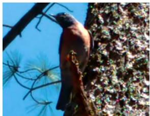
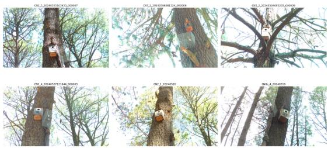
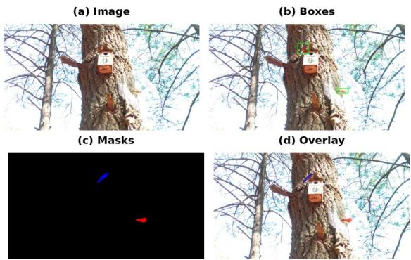
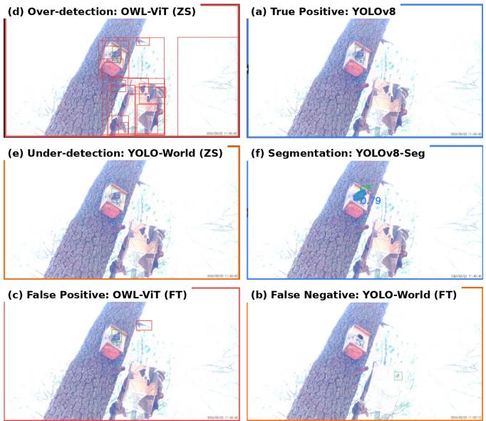

# Towards benchmarking Western Bluebird detection in the wild

Estela Monserrat Arriaga Santana1⋆, Julian Rosas Scull1 ⋆, Ibeth P. Alarc´on2, Bibiana Montoya2, Aylin Sosa Mej´ıa2, and Hugo Jair Escalante3

1 Universidad Nacional Aut´onoma de M´exico, Mexico

{monse arriaga,julian.rosas}@ciencias.unam.mx

2 Universidad Aut´onoma de Tlaxcala, Mexico

ibethalarcon1@gmail.com, bibianac.montoyal@uatx.mx, aylinsm25@gmail.com 3 The University of Texas at El Paso, USA and INAOE, Mexico hescalantebal@utep.edu

Abstract. Bird monitoring in natural environments is challenging due to the small size of some species of birds relative to the scene, background clutter, variability in illumination, and the observers’ viewpoint. Progress is further limited by the scarcity of large-scale, realistic datasets, which are essential for understanding behavioral patterns. To address this gap, we introduce a new benchmark dataset for the detection and segmentation of Western bluebirds (Sialia Mexicana), comprising over 6,000 labeled images from 41 recording sessions. The dataset features high-resolution (4K) in-the-wild images in which birds occupy only a small fraction of the image. We evaluated a range of methods, including supervised detectors, open-vocabulary models under zero-shot and fine-tuned settings, and segmentation approaches. Our results show that the supervised detectors remain the most reliable overall, with Faster R-CNN achieving the highest detection mAP and RT-DETR ofering the best precision–recall trade-of. Open-vocabulary models perform poorly in zero-shot settings; however, fine-tuning substantially improves their performance, with YOLO - World becoming competitive with supervised methods and achieving the highest precision, F1-score, and mAP@0.5. For segmentation, supervised methods significantly outperform Grounded SAM and SAM 3: Mask R-CNN achieves the highest mask mAP, while YOLOv8-Seg provides the best precision and fastest inference. A diagnostic analysis further shows that failures are not explained by object size alone, but by a combination of apparent scale, brightness, contrast, clutter, blur, crowding, and recording-session variation. Overall, our findings highlight the dificulty of zero-shot bird detection in cluttered ecological scenes, suggest a more challenging regime for precise localization than is commonly observed in other wildlife and open-vocabulary benchmarks, and underscore the importance of domain adaptation in small-object settings.

Keywords: Bird monitoring · animal behavior analysis · detection and segmentation.

Equal contribution.

## 1 Introduction

Computer vision has become increasingly relevant for ecological monitoring; however, bird detection in natural environments remains challenging due to small object size, background clutter, illumination variability, and frequent occlusion. This problem is particularly important, as insights into bird behavior can significantly advance our understanding of migration, breeding, and broader ecological patterns. In this context, we approach the problem of robust bird detection and localization in unconstrained environments.

  
Fig. 1: Close-up of a male Western Bluebird, the species considered in this study.

Specifically, we consider the Western bluebird (Sialia mexicana), a species approximately 19 cm in length, as a representative case study. This species competes with both conspecific and heterospecific individuals for access to limited nesting sites, leading to rapid and frequent multi-individual interactions. These behaviors are dificult to accurately capture and annotate under natural conditions. As a result, video recordings are commonly used for behavioral analysis; however, their manual inspection requires substantial efort from human observers to identify and classify interactions.

Our work aims to advance the understanding of the behavior of this species. In particular, we expand a novel video dataset of Western bluebirds, originally acquired for manual analysis in the context of behavioral ecology research [1], to enable the systematic evaluation of computer vision methods for monitoring behavioral interactions in natural conditions. Source recordings were collected during a field experiment conducted during the 2024 breeding season on nest-site competition in wild individuals of Sialia mexicana, breeding in nest boxes under natural conditions.

Unlike standard bird datasets, which often focus on close-up classification or aerial monitoring, ours targets a fixed-camera behavioral ecology-study scenario in which birds occupy a small fraction of high-resolution frames, interact with multiple individuals, and are subject to real-world variability such as occlusion and illumination changes, see Figure 2. This setup enables a systematic comparison of diferent detection paradigms under realistic ecological conditions. We evaluate representative state-of-the-art models across supervised, transformerbased, and open-vocabulary paradigms. Our contributions are threefold:

– We present a curated and manually annotated dataset derived from ecological video recordings of bird behavior.

– We provide a comparative benchmark of supervised, transformer-based, and open-vocabulary models for bird detection, with segmentation as a complementary analysis.

– We show that fixed-camera bird detection under natural conditions remains a challenging small-object regime in which supervised adaptation is still more reliable than zero-shot open-vocabulary detection.

## 2 Related Work

Camera-trap and ecological imaging datasets have enabled large-scale wildlife monitoring and automated analysis [29, 23]. However, models trained in one ecological setting often struggle to generalize across regions and environments due to changes in species composition, illumination, and background clutter [3]. In bird monitoring, existing datasets are often based on aerial imagery [33, 14, 15] or fine-grained classification benchmarks such as CUB-200-2011, NABirds, and Birdsnap [32, 30, 4], where birds appear large and centered in the frame. By contrast, our dataset focuses on fixed-camera bird detection under challenging natural conditions, where birds occupy only a small fraction of high-resolution images and appear with clutter, motion blur, and viewpoint variation.

Object detection has evolved from two-stage methods such as Faster R-CNN [26] to one-stage detectors such as YOLO [25], and more recently to transformer-based approaches including DETR and RT-DETR [7, 35]. Openvocabulary detectors such as OWL-ViT and YOLO-World [21, 8], as well as grounding-based models like Grounding DINO [20], extend detection beyond fixed label sets through vision-language alignment. In parallel, segmentation models such as SAM [16] enable prompt-based mask generation. Our benchmark builds on these directions by comparing supervised, transformer-based, and open-vocabulary methods in a fixed-camera setting.

## 3 A dataset for monitoring Western bluebird in the wild

The source dataset was collected in a controlled behavioral experiment conducted at the La Malinche National Park (Tlaxcala, Mexico) by staf of Estaci´on Cient´ıfica La Malinche, part of the Centro Tlaxcala de Biolog´ıa de la Conducta, Universidad Aut´onoma de Tlaxcala. Recordings captured the activity of 33 breeding pairs of Western bluebirds that interacted with a potential competitor for the nesting site, from a diferent species (Chipping sparrow o House finch), which was placed inside a wire mesh box, in a forested area. While this setup is controlled in terms of camera placement and viewpoint, bird behavior occurs naturally, resulting in realistic ecological variability [1].

## 3.1 Source videos

Source videos were recorded using fixed-position cameras directed toward nest boxes, ensuring a consistent field of view within each recording, see [1] for details.

Figure 2 shows sampled frames from the collection. All videos were captured at high resolution (3840 × 2160). Each experimental trial lasted approximately 13 minutes and was repeated 4 or 5 times per nest. Only the first 7 minutes of each of the 41 recordings were used, corresponding to the period immediately after a potential intruder from another species, placed in a wire mesh box, is uncovered, when bird activity is highest. Cameras were placed at diferent orientations across sessions, resulting in variations in viewpoint, scale, and background composition (Figure 2).

  
Fig. 2: Sample images from the dataset.

## 3.2 Dataset and Annotations

Frames were extracted from the recorded videos and manually annotated using LabelMe [27]. Each image contains bounding box annotations for individual bird instances, and a subset includes instance segmentation masks for segmentation experiments.

The first version of the dataset consists of 6,016 images and 7,637 annotated bird instances, with an average of 1.27 instances per image. The number of birds per image ranges from one to four: 4,694 with one, 1,043 with two, 259 with three, and 20 with four.

All images are in high-resolution (3840 × 2160), but birds occupy a very small portion of the frame. The median bounding box area is approximately $2 . 6 \times 1 0 ^ { 4 }$ pixels (less than 0.3% of the image), making the dataset one of the most challenging for small-object detection.

The dataset is organized into 41 independent recording sessions, each corresponding to a distinct experimental trial. Due to the recording setup, all images contain at least one bird instance. Figure 3 shows representative annotated examples.

## 4 Methodology

We benchmark bird detection in fixed-camera recordings under a unified experimental setup, with segmentation included as a secondary analysis. We evaluate supervised detectors (YOLOv8, YOLO26, Faster R-CNN, and RT-DETR) and open-vocabulary models (OWL-ViT, Grounding DINO, and YOLO-World). Supervised models are fine-tuned on the training split using COCO-pretrained weights [19]. Open-vocabulary models are evaluated in zero-shot (ZS) mode using a set of semantically related text prompts, including bird, a bird, a flying bird, a perched bird, and bird in a cage. When supported, models are also evaluated in a fine-tuned (FT) setting. OWL-ViT and YOLO-World are evaluated in both ZS and FT regimes, whereas Grounding DINO is evaluated only in the zero-shot setting.

  
Fig. 3: Example from the proposed bird detection dataset. (a) Original image captured under challenging real-world conditions. (b) Ground-truth bounding box annotations. (c) Instance-level segmentation masks. (d) Combined visualization of annotations.

Fine-tuned models are trained for up to 100 epochs with early stopping based on validation performance (patience = 20), providing a consistent training budget across methods. For each input image, models predict bounding boxes with confidence scores, and open-vocabulary methods additionally condition predictions on the text query. To complement detection, we evaluate segmentation using two supervised baselines, YOLOv8-Seg and Mask R-CNN, together with Grounded-SAM as a prompt-based zero-shot pipeline that combines Grounding DINO [20] with SAM [16], and SAM 3 [6] as an open-vocabulary zero-shot model.

We report standard COCO-style metrics. For detection, we use mAP@0.5:0.95, mAP@0.5, Precision, Recall, F1-score, and FPS. For segmentation, we report mask mAP@0.5:0.95, mask mAP@0.5, Precision, Recall, F1-score, mIoU, Dice, and FPS. This setup enables a consistent comparison of supervised, transformerbased, and open-vocabulary methods in a challenging small-object ecological setting.

## 5 Experiments and results

## 5.1 Experimental Setup

The dataset is split at the recording level to avoid temporal leakage across training, validation, and test sets. In total, it contains 41 recording sessions and 6,016 annotated images, divided into 35 training videos (4,435 images), 5 validation videos (575 images), and 1 held-out test video (1,006 images). Validation set is used for model selection and early stopping, final results are reported on the unseen test split.

  
Fig. 4: Qualitative results on the test set. (a) True positive from YOLOv8. (b) False negative from YOLO-World (FT). (c) False positive from OWL-ViT (FT). (d) Over-detection from OWL-ViT (ZS). (e) Under-detection from YOLO-World (ZS). (f) Successful segmentation from YOLOv8-Seg. Ground truth is shown in green, correct predictions in blue, and incorrect predictions in red.

All experiments were conducted on the Kaggle platform using NVIDIA T4 GPUs. When supported by the implementation, training was performed with two T4 GPUs; otherwise, a single T4 GPU was used. For each model family, the input-resolution setting was kept fixed between training and inference to ensure a consistent evaluation protocol within each implementation.

## 5.2 Detection Results

Table 1 summarizes detection performance on the test set. Among supervised detectors, Faster R-CNN achieves the highest mAP@0.5:0.95, indicating superior localization under stricter IoU thresholds, while RT-DETR provides the best overall balance with the highest recall and strong precision and F1-score, as well as the highest mAP@0.5 among supervised methods. YOLO-based models ofer an eficient trade-of: YOLOv8 performs competitively, while YOLO26 improves precision and recall, achieving the highest F1-score and fastest inference speed, although with lower mAP@0.5:0.95 than Faster R-CNN and RT-DETR. Openvocabulary models are unstable in the zero-shot setting: OWL-ViT over-detects,

YOLO-World under-detects, and Grounding DINO remains below supervised baselines. After fine-tuning, YOLO-World becomes competitive, achieving the highest mAP@0.5, precision, and F1-score, though still below Faster R-CNN in mAP@0.5:0.95, while OWL-ViT improves but remains weaker. Overall, recent real-time detectors such as YOLO26 improve eficiency, but supervised models remain more reliable for precise localization, and domain adaptation is key for open-vocabulary methods.

<table><tr><td>Paradigm</td><td>Model</td><td>mAP</td><td>mAP@0.5</td><td>Precision</td><td>Recall</td><td>F1</td><td>FPS</td></tr><tr><td>Sup. / FT</td><td>YOLOv8</td><td>0.3804</td><td>0.8428</td><td>0.8977</td><td>0.7338</td><td>0.8076</td><td>13.49</td></tr><tr><td>Sup. / FT</td><td>YOLO26</td><td>0.3633</td><td>0.8772</td><td>0.9704</td><td>0.8852</td><td>0.9259</td><td>13.78</td></tr><tr><td>Sup. / FT</td><td>Faster R-CNN</td><td>0.4662</td><td>0.9026</td><td>0.4500</td><td>0.8987</td><td>0.5997</td><td>7.36</td></tr><tr><td>Sup. / FT</td><td>RT-DETR</td><td>0.4170</td><td>0.9340</td><td>0.9120</td><td>0.9210</td><td>0.9170</td><td>5.50</td></tr><tr><td>Op-v. / ZS</td><td>OWL-ViT</td><td>0.0070</td><td>0.0189</td><td>0.0376</td><td>0.4609</td><td>0.0695</td><td>3.34</td></tr><tr><td>Op-v. / FT</td><td>OWL-ViT</td><td>0.1264</td><td>0.2770</td><td>0.2002</td><td>0.2546</td><td>0.2241</td><td>4.18</td></tr><tr><td>Op-v. / ZS</td><td>Grounding DINO</td><td>0.0230</td><td>0.0880</td><td>0.0880</td><td>0.0920</td><td>0.0900</td><td>1.18</td></tr><tr><td>Op-v. / ZS</td><td>YOLO-World</td><td>0.1560</td><td>0.4540</td><td>0.9000</td><td>0.0080</td><td>0.0170</td><td>12.37</td></tr><tr><td>Op-v. / FT</td><td>YOLO-World</td><td>0.4467</td><td>0.9415</td><td>0.9810</td><td>0.8968</td><td>0.9370</td><td>5.19</td></tr></table>

Table 1: Detection benchmark results on the test set. mAP denotes box AP.

## 5.3 Segmentation Results

Table 2 reports segmentation performance on the test set. Both supervised methods substantially outperform the prompt-based Grounded-SAM baseline, which fails completely in the zero-shot setting. Mask R-CNN achieves the highest mask mAP, recall, mIoU, and Dice, indicating the strongest overall segmentation quality.

<table><tr><td>Paradigm</td><td>Model</td><td>mAP</td><td>mAP@0.5 Precision</td><td></td><td>Recall</td><td>F1</td><td>mIoU</td><td>Dice</td><td>FPS</td></tr><tr><td>Sup. / FT</td><td>YOLOv8-Seg</td><td>0.1820</td><td>0.6653</td><td>0.7991</td><td>0.7136</td><td>0.7539</td><td>0.6459</td><td>0.7823</td><td>13.83</td></tr><tr><td>Sup. / FT</td><td>Mask R-CNN</td><td>0.6398</td><td>0.9154</td><td>0.6701</td><td>0.9441</td><td>0.7838</td><td>0.8488</td><td>0.9166</td><td>7.75</td></tr><tr><td>Prmpt. / ZS</td><td>Grounded-SAM</td><td>0.0000</td><td>0.0000</td><td>0.0000</td><td>0.0000</td><td>0.0000</td><td>0.0000</td><td>0.0000</td><td>0.91</td></tr><tr><td>Op-v. / ZS</td><td>SAM 3</td><td>0.2229</td><td>0.3186</td><td>0.2282</td><td>0.7252</td><td>0.3472</td><td>0.1793</td><td>0.1931</td><td>0.29</td></tr></table>

Table 2: Segmentation benchmark results on the test set. mAP denotes mask AP.

In contrast, YOLOv8-Seg provides the highest precision and the fastest inference, showing a favorable trade-of between localization quality and eficiency. Although segmentation is not the primary task of our benchmark, these results suggest that supervised pixel-level localization can be practically advantageous for bird identification in cluttered natural scenes, especially when accurate spatial delineation is required. More broadly, the large gap between the supervised methods and Grounded-SAM highlights that prompt-based zero-shot segmentation is not yet reliable for this small-object ecological scenario.

## 6 Qualitative analysis

To complement the aggregate benchmark results, we conduct a dedicated diagnostic analysis on a separate error-analysis set, distinct from the test split used in Section 5, examining how the performance of representative models varies under object-scale, visual, and scene-level dificulty factors that commonly arise in field-based bird monitoring. We analyze models spanning detection, segmentation, and supervision regimes: RT-DETR FT, YOLO-World $\mathrm { Z S / F T }$ , Mask R-CNN FT, and SAM 3 ZS. The error-analysis set comprises 505 additionally annotated 4K frames with 529 bird instances, sampled from four new recording sessions. For the evaluation of object-scale influence, we report AP under two object-size definitions: COCO-style absolute bins, based on bounding-box area in pixels [19], and USB-style relative-scale bins, based on the fraction of the image occupied by the object [28]. For assessing visual dificulty factors, we use greedy recall instead of $\mathrm { A P } ,$ , matching predictions to ground-truth instances at $\mathrm { I o U } \geq 0 . 5$ with a confidence threshold of 0.25, because this directly measures whether annotated bird instances are recovered or missed under each condition. Continuous factors are discretized using quantile thresholds computed on the error-analysis set, whereas count-based factors are grouped according to their natural categories.

Occlusion and distance to image borders were considered but excluded from the model-specific discussion due to insuficient variation: instances were efectively non-occluded, and near-border cases were too scarce for reliable stratified analysis.

## 6.1 Scale-aware object-size analysis

Bird instances occupy only a small fraction of the 4K frames, making object scale a relevant factor in our dataset. We therefore evaluate size using both COCOstyle absolute scale bins and relative-scale bins based on apparent object size. COCO scale is computed from absolute bounding-box area, but this definition is only partially informative in our setting: $\mathrm { A P } _ { S }$ is undefined because no instances fall into the COCO small category, even though the birds are visually small relative to the full image.

To capture this apparent scale, we use the relative scale index

$$
s _ { r } = \sqrt { \frac { w h } { W H } } ,\tag{1}
$$

where w,h are the bounding-box dimensions and W,H are the image dimensions. For the AP-based analysis, we use fixed USB-style relative-scale bins [28]. In the error-analysis split, only two bins contain ground-truth instances: $1 / 3 2 \mathrm { - } 1 / 1 6$ 60 with 350 instances and $1 / 1 6 \mathrm { - } 1 / 8$ with 179 instances.

Table 3 shows that the fine-tuned detectors and segmentation models remain relatively stable across the two populated relative-scale bins, suggesting that object size alone does not explain their failures. In contrast, YOLO-World ZS shows the clearest scale-dependent behavior, with AP increasing from 0.1148 to 0.2050 as relative object size increases. This suggests that apparent scale afects zero-shot detection more strongly, while failures in the fine-tuned and segmentation models depend on a broader combination of visual and scene-level factors.

<table><tr><td>Model</td><td>COCO-M</td><td>COCO-L</td><td>1/32-1/16</td><td>1/16-1/8</td></tr><tr><td>YOLO-World FT</td><td>0.5692</td><td>0.5311</td><td>0.5206</td><td>0.5329</td></tr><tr><td>RT-DETR FT</td><td>0.5028</td><td>0.4304</td><td>0.4404</td><td>0.4313</td></tr><tr><td>YOLO-World ZS</td><td>0.0436</td><td>0.1902</td><td>0.1148</td><td>0.2050</td></tr><tr><td>Mask R-CNN FT</td><td>0.7223</td><td>0.7305</td><td>0.7363</td><td>0.6894</td></tr><tr><td>SAM 3 ZS</td><td>0.7373</td><td>0.7504</td><td>0.7341</td><td>0.7159</td></tr></table>

Table 3: AP-based scale analysis on the error-analysis split. COCO-M and COCO-L report COCO-style AP, while the last two columns report AP over the only populated USB-style relative-scale bins.

## 6.2 Visual dificulty-factor analysis

## Dificulty-factor definitions

Tables 4–9 summarize the recall-based dificulty analysis by factor type. Each entry reports the worst-performing bin for a given model and factor, followed by greedy recall and the recall drop $\varDelta$ with respect to the best-performing bin of the same factor.

Brightness is computed as the mean grayscale intensity. We consider both global brightness, measured over the full frame, and local brightness, measured inside the ground-truth bird bounding box. We refer to this factor as brightness rather than physical illumination, since it measures the average gray value observed in the image. This follows image-quality assessment practice in which the average gray value is used to represent image brightness [17].

<table><tr><td>Model</td><td>Global brightness</td><td>Local brightness</td></tr><tr><td>YOLO-World FT</td><td>Neutral: 85.6%, ∆=12.1</td><td>Dark: 77.7%, ∆=20.6</td></tr><tr><td>RT-DETR FT</td><td>Dark: 84.0%, ∆=15.4</td><td>Dark: 77.7%, ∆=20.6</td></tr><tr><td>Mask R-CNN FT</td><td>Neutral: 93.7%, ∆=5.2</td><td>Bright: 95.6%, ∆=2.7</td></tr><tr><td>YOLO-World ZS</td><td>Bright: 22.8%, ∆=24.7</td><td>Dark: 19.4%, ∆=26.0</td></tr><tr><td>SAM 3 ZS</td><td>Neutral: 83.9%, ∆=11.6</td><td>Dark: 86.3%, ∆=8.0</td></tr></table>

Table 4: Brightness dificulty analysis.

Contrast is measured using Root Mean Square (RMS) contrast, computed as the standard deviation of grayscale pixel intensities. As with brightness, we compute both a global version over the full frame and a local version inside the ground-truth bird bounding box. RMS contrast is defined as the root mean square deviation of gray-level values from their mean, which is equivalent to the population standard deviation of grayscale intensities up to the chosen intensity scale [31].

<table><tr><td>Model</td><td>Global contrast</td><td>Local contrast</td></tr><tr><td>YOLO-World FT</td><td>Medium: 86.2%, ∆=8.7</td><td>Low: 86.9%, Δ=7.0</td></tr><tr><td>RT-DETR FT</td><td>Medium: 84.5%, ∆=10.9</td><td>Low: 85.7%, ∆=9.3</td></tr><tr><td>Mask R-CNN FT</td><td>Low: 94.3%, ∆=4.0</td><td>Low: 93.7%, ∆=5.7</td></tr><tr><td>YOLO-World ZS</td><td>High: 21.7%, ∆=20.0</td><td>Low: 17.7%, ∆=38.4</td></tr><tr><td>SAM 3 ZS</td><td>Low: 87.4%, ∆=4.2</td><td>Low: 81.1%, ∆=13.9</td></tr></table>

Table 5: Contrast dificulty analysis.

Blur is assessed through Laplacian-variance sharpness, computed as the variance of the Laplacian response over the grayscale bird crop. This follows classical focus-measure approaches based on image gradients or Laplacian responses, where sharp images produce stronger high-frequency responses and blurred images yield smoother, lower-variance responses [24]. Therefore, in this analysis, lower Laplacian-variance values correspond to blurrier bird crops, whereas higher values indicate sharper local boundaries.

<table><tr><td>Model</td><td>Local blur / sharpness</td></tr><tr><td>YOLO-World FT</td><td>Medium: 87.4%, Δ=7.1</td></tr><tr><td>RT-DETR FT</td><td>Medium: 85.1%, ∆=11.6</td></tr><tr><td>Mask R-CNN FT</td><td>Blurred: 93.7%, ∆=6.3</td></tr><tr><td>YOLO-World ZS</td><td>Blurred: 20.0%, ∆=30.6</td></tr><tr><td>SAM 3 ZS</td><td>Blurred: 84.6%, ∆=10.4</td></tr></table>

Table 6: Blur/sharpness dificulty analysis.

Relative size is measured using Eq. 1. For the dificulty-factor analysis, instances are grouped into quartile-based relative-size bins and evaluated with greedy recall. This tests whether birds that occupy a smaller fraction of the 4K frame are more likely to be missed.

<table><tr><td>Model</td><td>Relative size  $s _ { r }$ </td></tr><tr><td>YOLO-World FT</td><td>Very small: 78.3%, ∆=21.1</td></tr><tr><td>RT-DETR FT</td><td>Very small: 83.5%, ∆=15.2</td></tr><tr><td>Mask R-CNN FT</td><td>Large: 93.2%, ∆=6.1</td></tr><tr><td>YOLO-World ZS</td><td>Very small: 17.4%, ∆=33.4</td></tr><tr><td>SAM 3 ZS</td><td>Very small: 85.2%, ∆=10.8</td></tr></table>

Table 7: Object-size dificulty analysis using the relative scale index $s _ { r }$

Background clutter. We approximate background clutter using Canny edge density. For each frame, a binary Canny edge map is computed, and groundtruth bird boxes are excluded before measuring the fraction of edge pixels in the remaining background. This adapts edge-density visual-complexity measures to object-detection failure analysis: edge density is defined as the proportion of edge pixels in an image, and Canny edges provide the binary edge map used in the numerator [9, 5]. Excluding the annotated bird boxes prevents the bird boundaries from inflating the clutter estimate.

Formally, background clutter is computed as

$$
C _ { \mathrm { { b g } } } = \frac { \sum _ { \substack { p \in \Omega } } E ( p ) M _ { \mathrm { { b g } } } ( p ) } { \sum _ { p \in \Omega } M _ { \mathrm { { b g } } } ( p ) } ,\tag{2}
$$

where $E ( p )$ is the binary Canny edge map and $M _ { \mathrm { b g } } ( \boldsymbol { p } )$ is a binary mask that excludes ground-truth bird boxes.

<table><tr><td>Model</td><td>Background clutter</td><td>Local clutter</td></tr><tr><td>YOLO-World FT</td><td>Cluttered: 79.4%, ∆=18.3</td><td>Cluttered: 85.0%, ∆=10.4</td></tr><tr><td>RT-DETR FT</td><td>Cluttered: 76.7%, ∆=22.8</td><td>Cluttered: 81.7%, ∆=14.3</td></tr><tr><td>Mask R-CNN FT</td><td>Moderate: 94.3%, ∆=4.1</td><td>Clean: 96.0%, ∆=2.3</td></tr><tr><td>YOLO-World ZS</td><td>Clean: 23.4%, ∆=24.3</td><td>Cluttered: 16.1%, ∆=31.0</td></tr><tr><td>SAM 3 ZS</td><td>Cluttered: 86.1%, ∆=8.7</td><td>Clean: 87.4%, ∆=5.7</td></tr></table>

Table 8: Clutter dificulty analysis.

Crowding is computed as the number of ground-truth bird instances present in the same frame. This factor captures whether models are more likely to miss birds when multiple individuals appear simultaneously in the scene.

<table><tr><td>Model</td><td>Crowding</td></tr><tr><td>YOLO-World FT RT-DETR FT Mask R-CNN FT YOLO-World ZS SAM 3 ZS</td><td>2–3 objects: 72.9%, ∆=19.4 2–3 objects: 87.5%, ∆=3.1 2-3 objects: 89.6%, ∆=7.9 2–3 objects: 10.4%, ∆=23.3 2–3 objects: 87.5%, ∆=2.9</td></tr></table>

Table 9: Crowding dificulty analysis.

## 6.3 Multivariate dificulty-factor analysis

The previous dificulty-factor analysis evaluates each visual factor separately. However, in fixed-camera ecological recordings, dificulty factors may co-occur within the same frame or recording session. For example, a bird instance may appear in a cluttered region, under low local contrast, and within a video with specific illumination or background conditions. To examine these factors jointly, we fitted an exploratory multivariable logistic regression for each model, using object recovery as a two-level response variable and the measured dificulty factors as explanatory predictors [13]. A ground-truth instance was considered recovered if it matched a prediction under the same greedy IoU-based protocol used in the dificulty-factor analysis. The explanatory variables were the visual and scene-level factors computed in the previous section: relative size, brightness, contrast, clutter, blur/sharpness, and crowding. Before fitting the models, these predictors were z-score standardized to zero mean and unit variance, allowing the resulting coeficients to be interpreted on a common input scale [11]. We also included video fixed efects, encoded as session-specific dummy variables, to partially account for unmodeled diferences between recording sessions, such as camera viewpoint, background composition, and illumination conditions. This follows the fixed-efects framing for grouped binary-response data, where group-specific intercepts are used to account for unmodeled group-level heterogeneity [2]. The video coeficients are used only as controls and are therefore not reported in the table.

This analysis is intended as a diagnostic robustness check rather than a definitive explanatory model. The estimated coeficients are associations, not causal efects, and the visual predictors are not independent by design because several dificulty factors can occur together in the same frame. Table 10 reports the logistic-regression coeficients for the z-scored predictors after accounting for the other measured factors and video-level variation. Negative values indicate factors associated with lower recovery probability, whereas positive values indicate factors associated with higher recovery probability within this multivariable specification. Bold values mark the most negative coeficient for each model, highlighting the factor with the strongest negative association with object recovery in that model.

<table><tr><td>Model</td><td>Recall Rel. size Bright. Contrast</td><td></td><td></td><td></td><td>Clutter</td><td>Blur</td><td>Crowding</td></tr><tr><td>YOLO-World FT 90.55%</td><td></td><td>0.24</td><td>-1.37</td><td>-0.63</td><td>-1.02</td><td>0.39</td><td>-0.25</td></tr><tr><td>RT-DETR FT</td><td>90.36%</td><td>-0.04</td><td>-2.95</td><td>-2.80</td><td>-0.01</td><td>0.51</td><td>0.14</td></tr><tr><td>Mask R-CNN FT</td><td>96.79%</td><td>-0.00</td><td>-5.29</td><td>-3.93</td><td>-3.71</td><td>0.19</td><td>-0.72</td></tr><tr><td>YOLO-World ZS</td><td>31.57%</td><td>0.64</td><td>-0.38</td><td>-0.19</td><td>-0.05</td><td>-0.62</td><td>-0.83</td></tr><tr><td>SAM 3 ZS</td><td>90.17%</td><td>0.08</td><td>-2.63</td><td>-2.30</td><td>-0.03</td><td>0.25</td><td>0.03</td></tr></table>

Table 10: Exploratory multivariable analysis with video fixed efects. Values are logistic-regression coeficients for z-scored predictors; bold indicates the most negative coeficient for each model.

## 6.4 Discussion

The diagnostic analyses show that model failures in this benchmark are not explained by a single visual factor. The univariate dificulty analysis indicates that brightness, contrast, blur, clutter, relative size, and crowding can reduce instance recovery. The exploratory multivariable analysis provides a complementary robustness check: once these factors are considered jointly and video-level variation is partially controlled, the most recurrent negative associations are related to appearance, especially brightness and contrast.

This pattern is visible across several models. RT-DETR FT, Mask R-CNN FT, and SAM 3 ZS all show brightness and contrast among their main negative coeficients, suggesting that strong average recall does not imply complete robustness to changes in local or global appearance. YOLO-World FT also shows negative coeficients for brightness, contrast, and clutter, indicating that finetuning improves recovery but does not fully remove sensitivity to background complexity and visual appearance.

YOLO-World ZS shows the most distinct failure profile. It has the lowest recall among the evaluated models, and its main negative coeficients are associated with crowding, blur, and brightness. This is consistent with the previous dificulty-factor analysis, where the zero-shot model was especially fragile under degraded local visual quality and multi-object scenes. In contrast, Mask R-CNN FT obtains the highest recall in the diagnostic split, although its coeficients should be interpreted cautiously because the model produces relatively few failures, which can make coeficient estimates less stable.

Overall, the diagnostic results suggest that fixed-camera ecological monitoring should not be treated only as a small-object detection problem. Object scale is part of the dificulty, but the remaining failures also depend on appearance degradation, background complexity, crowding, blur, and session-specific recording conditions.

## 7 Conclusion

We introduced a benchmark for bird detection and segmentation in fixed-camera ecological recordings. The benchmark captures a challenging visual regime in which birds occupy a small fraction of high-resolution frames and appear under clutter, illumination variation, blur, and session-specific viewpoint changes. Our results show that this setting remains challenging across modern vision paradigms. Supervised detectors provide the most consistent overall performance, while zero-shot open-vocabulary models are unreliable and often exhibit unstable precision–recall trade-ofs. Fine-tuning substantially improves these models, in some cases making them competitive with supervised approaches, but does not fully eliminate robustness issues. A similar pattern is observed in segmentation, where supervised methods perform strongly, whereas prompt-based segmentation requires task-specific adaptation to be reliable.

Compared with results commonly reported on wildlife and open-vocabulary benchmarks, our benchmark induces a diferent ranking across model families. On aerial and wildlife detection benchmarks, YOLO-based and transformerbased detectors often outperform two-stage methods such as Faster R-CNN [22, 36]. In contrast, Faster R-CNN provides the strongest performance on the primary localization metric in our benchmark, while RT-DETR is stronger mainly in recall and overall balance. A similar shift appears in the open-vocabulary setting: models from the same families achieve substantially stronger results on general-purpose large-vocabulary benchmarks such as LVIS [12, 18, 34, 10], yet zero-shot OWL-ViT, Grounding DINO, and YOLO-World perform poorly on our dataset [21, 20, 8].

Together, these findings suggest that the main challenge is not category recognition alone, but precise localization of small targets under cluttered backgrounds, changing appearance, and substantial domain shift. The near-collapse of zero-shot open-vocabulary models, together with the sharper trade-ofs observed even after adaptation, indicates that fixed-camera ecological recordings capture a failure regime that remains underrepresented in standard detection benchmarks. We hope that this dataset and benchmark support future work on small-object perception, domain adaptation, and robust detection and segmentation methods for ecological applications.

## References

1. Alarc´on V´asconez, I.P.: Efectos parentales pre-eclosi´on mediados por cambios conductuales: Alteraciones en los patrones de incubaci´on por la presencia de una especie competidora y posibles consecuencias en el fenotipo de la descendencia. Tesis de maestr´ıa en ciencias biol´ogicas, Universidad Aut´onoma de Tlaxcala, Tlaxcala, M´exico (September 2025), centro Tlaxcala de Biolog´ıa de la Conducta (CTBC)

2. Beck, N.: Estimating grouped data models with a binary-dependent variable and fixed efects via a logit versus a linear probability model: The impact of dropped units. Political Analysis 28(1), 139–145 (2020). https://doi.org/10.1017/pan.2019.20

3. Beery, S., Morris, D., Yang, S.: Eficient pipeline for camera trap image review. In: CVPRW (2019)

4. Berg, T., et al.: Birdsnap: Large-scale fine-grained categorization of birds. In: CVPR (2014)

5. Canny, J.: A computational approach to edge detection. IEEE Transactions on Pattern Analysis and Machine Intelligence PAMI-8(6), 679–698 (1986). https://doi.org/10.1109/TPAMI.1986.4767851

6. Carion, N., Gustafson, L., Hu, Y.T., Debnath, S., Hu, R., Suris, D., Ryali, C., Alwala, K.V., Khedr, H., Huang, A., Lei, J., Ma, T., Guo, B., Kalla, A., Marks, M., Greer, J., Wang, M., Sun, P., R¨adle, R., Afouras, T., Mavroudi, E., Xu, K., Wu, T.H., Zhou, Y., Momeni, L., Hazra, R., Ding, S., Vaze, S., Porcher, F., Li, F., Li, S., Kamath, A., Cheng, H.K., Doll´ar, P., Ravi, N., Saenko, K., Zhang, P., Feichtenhofer, C.: Sam 3: Segment anything with concepts (2025), https://arxiv.org/abs/2511.16719

7. Carion, N., Massa, F., Synnaeve, G., Usunier, N., Kirillov, A., Zagoruyko, S.: Endto-end object detection with transformers. In: ECCV (2020)

8. Cheng, T., et al.: Yolo-world: Real-time open-vocabulary object detection. arXiv preprint arXiv:2401.17270 (2024)

9. Chu, M., Qiu, Z., Ling, M., Jiang, S., Laramee, R.S., Sedlmair, M., Chen, J.: What makes a visualization image complex? arXiv preprint arXiv:2510.08332 (2025). https://doi.org/10.48550/arXiv.2510.08332, accepted at IEEE VIS 2025

10. Fu, S., Yang, Q., Mo, Q., Yan, J., Wei, X., Meng, J., Xie, X., Zheng, W.S.: Llmdet: Learning strong open-vocabulary object detectors under the supervision of large language models. arXiv preprint arXiv:2501.18954 (2025)

11. Gelman, A.: Scaling regression inputs by dividing by two standard deviations. Statistics in Medicine 27(15), 2865–2873 (2008). https://doi.org/10.1002/sim.3107

12. Gupta, A., Dollar, P., Girshick, R.: Lvis: A dataset for large vocabulary instance segmentation. In: CVPR (2019)

13. Harris, J.K.: Primer on binary logistic regression. Family Medicine and Community Health 9(Suppl 1), e001290 (2021)

14. Hayes, M.C., et al.: Drones and deep learning produce accurate monitoring of seabird colonies. Ornithological Applications 123(3), duab022 (2021)

15. Hong, S.J., et al.: Application of deep-learning methods to bird detection using uav imagery. Animals 13(5), 902 (2023)

16. Kirillov, A., et al.: Segment anything. arXiv preprint arXiv:2304.02643 (2023)

17. Li, C., Zhu, J., Bi, L., Zhang, W., Liu, Y.: A low-light image enhancement method with brightness balance and detail preservation. PLOS ONE 17(5) (2022)

18. Li, L.H., Zhang, P., Zhang, H., Yang, J., Li, C., Zhong, Y., Wang, L., Yuan, L., Zhang, L., Hwang, J.N., Chang, K.W., Gao, J.: Grounded language-image pretraining. In: CVPR (2022)

19. Lin, T.Y., Maire, M., Belongie, S., Hays, J., Perona, P., Ramanan, D., Doll´ar, P., Zitnick, C.L.: Microsoft coco: Common objects in context. In: ECCV (2014)

20. Liu, S., et al.: Grounding dino: Marrying dino with grounded pre-training for openset object detection. arXiv preprint arXiv:2303.05499 (2023)

21. Minderer, M., Gritsenko, A., Stone, A., Neumann, M., Weissenborn, D.: Simple open-vocabulary object detection with vision transformers. In: ECCV (2022)

22. Mou, C., Liu, T., Zhu, C., Cui, X.: Waid: A large-scale dataset for wildlife detection with drones. Applied Sciences 13(18), 10397 (2023)

23. Norouzzadeh, M.S., et al.: Automatically identifying, counting, and describing wild animals in camera-trap images with deep learning. PNAS 115(25), E5716–E5725 (2018)

24. Pech-Pacheco, J.L., Crist´obal, G., Chamorro-Mart´ınez, J., Fern´andez-Valdivia, J.: Diatom autofocusing in brightfield microscopy: A comparative study. In: Proceedings of the 15th International Conference on Pattern Recognition. pp. 314–317. IEEE (2000)

25. Redmon, J., Divvala, S., Girshick, R., Farhadi, A.: You only look once: Unified, real-time object detection. In: CVPR (2016)

26. Ren, S., He, K., Girshick, R., Sun, J.: Faster r-cnn: Towards real-time object detection with region proposal networks. In: NIPS (2015)

27. Russell, B.C., Torralba, A., Murphy, K.P., Freeman, W.T.: Labelme: A database and web-based tool for image annotation. IJCV 77(1–3), 157–173 (2008)

28. Shinya, Y.: Usb: Universal-scale object detection benchmark. arXiv preprint arXiv:2103.14027 (2021), https://arxiv.org/abs/2103.14027

29. Swanson, A., et al.: Snapshot serengeti, high-frequency annotated camera trap images of 40 mammalian species in an african savanna. Scientific Data 2, 150026 (2015)

30. Van Horn, G., et al.: Building a bird recognition app and large scale dataset. In: CVPRW (2015)

31. Vitor, A.R., Shaus, A., Cardoso, G.C.: Image haziness contrast metric describing optical scattering depth. Optics 4(4), 525–537 (2023)

32. Wah, C., et al.: The caltech-ucsd birds-200-2011 dataset. Tech. rep., Caltech (2011)

33. Weinstein, B.G., et al.: A general deep learning model for bird detection in highresolution airborne imagery. Ecological Applications 32(3), e2558 (2022)

34. Yao, L., Pi, R., Han, J., Liang, X., Xu, H., Zhang, W., Li, Z., Xu, D.: Detclipv3: Towards versatile generative open-vocabulary object detection. arXiv preprint arXiv:2501.06066 (2025)

35. Zhao, Y., et al.: Detrs beat yolos on real-time object detection. In: CVPR (2024)

36. Zhou, Y., Wei, Y.: Uav-detr: An enhanced rt-detr architecture for eficient smal object detection in uav imagery. Sensors 25(15), 4582 (2025)