# UP-MOPD: UPDATE PROJECTION IN MULTI-TEACHER ON-POLICY DISTILLATION

Taojie Zhu1,2,\* Jing Jin1,\*

Yuan Xia2,† Chenyang Ding1 Qunshan He2,3 Wanke Xia1 Tao Sun2 Yan Chen1 Jian Wang2 Jinjie Gu2 Tao Feng1,†

1Tsinghua University 2Ant Group 3Zhejiang University

†zhongjing.xy@antgroup.com fengtao.hi@gmail.com

## ABSTRACT

On-policy distillation from multiple teachers combines expertise from different domains in a single student, but conflicting gradients can hinder this integration. Gradient corrections directly constrain parameter updates under plain SGD. With optimizers such as AdamW, however, momentum, adaptive scaling, and weight decay can turn a corrected gradient into an update that increases a domain loss to first order. To address this gap, we propose Update Projection for Multi-Teacher On-Policy Distillation (UP-MOPD). UP-MOPD lets the original mixed gradient update the optimizer state and generate a candidate displacement, then projects only violating candidates before they are committed to the parameters. The projection gives the unique feasible update closest to the candidate in Euclidean distance. In experiments combining medical and general domains, UP-MOPD improves IFEval-loose accuracy late in training by 2.96 points over vanilla M-OPD. It achieves an average score of 60.03 across eight metrics, compared with 59.00 for gradient projection and 59.15 for update rejection. On a public benchmark covering mathematics, code, and instruction following, it achieves the best average across six tasks (32.67), leads on LiveCodeBench v5, and ties for the best IFEval result. These results support projecting optimizer updates to reduce interference between domains. Our code is available at: https://anonymous.4open.science/r/UP-MOPD/

## 1 INTRODUCTION

Large-model post-training commonly produces experts specialized for different capabilities or domains. Two forms of consolidation are particularly useful in practice: combining foundational capabilities such as mathematics, code, and instruction following, and merging such general capabili ties with vertical expertise in medicine, finance, or law. Multi-teacher on-policy distillation (M-OPD) provides a direct route to both forms of integration: the student generates its own trajectories, and the corresponding teachers provide dense token-level supervision. MiMo-V2-Flash and subsequent MOPD work adopt the pattern of training domain teachers separately and distilling them into a shared student (Xiaomi LLM-Core Team, 2026; Ma et al., 2026); GLM-5 uses a related on-policy cross-stage distillation procedure to mitigate capability forgetting during sequential post-training (GLM-5 Team, 2026).

Existing M-OPD studies primarily improve the construction and allocation of teacher signals. Open-MOPD corrects effective optimization-budget imbalance arising from sequence length, teacher– student gaps, and reward staleness (Gao et al., 2026); related work organizes multi-task teachers through privileged context (Ma et al., 2026) or studies behavioral drift caused by insufficient supervision of decision-critical tokens (Shen et al., 2026). Yet after routing, supervision, and domain budgets have been fixed, all domain losses still share one parameter vector and one optimizer. M-OPD first forms the mixed gradient $\begin{array} { r } { g _ { 0 } = \sum _ { d } q _ { d } g _ { d } ; } \end{array}$ AdamW then combines it with historical moments, coordinate-wise scaling, and weight decay to produce a candidate parameter displacement $\Delta \theta _ { 0 }$ namely the update proposed by the optimizer before parameter commit. This exposes a stage not covered by gradient-level interventions: even when $- { g _ { 0 } }$ is first-order non-increasing for every domain in gradient space, $\Delta \theta _ { 0 }$ may still increase the current loss of one domain. This raises a direct question: how can a harmful optimizer-produced displacement be corrected while minimally changing the intended update?

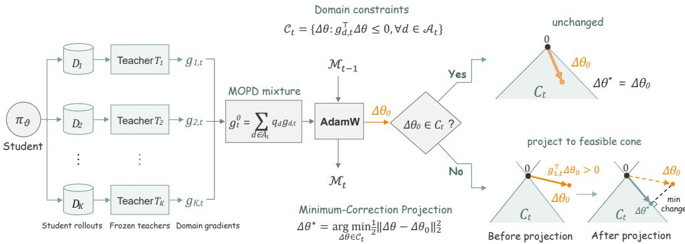  
Figure 1: Overview of UP-MOPD. AdamW forms a candidate parameter displacement from the mixed distillation gradient. UP-MOPD evaluates its first-order effect on each active domain and minimally corrects a violating candidate before commit, while retaining the current-step optimizer state produced by the original mixture.

Multi-task learning methods reduce interference by modifying task gradients or adjusting their weights before the optimizer step (Sener and Koltun, 2018; Yu et al., 2020; Wang et al., 2021; Liu et al., 2021; Chen et al., 2018). PCGrad, for example, projects conflicting task gradients before combining them. We formulate Gradient Projection for Multi-Teacher On-Policy Distillation (GP-MOPD), which jointly projects the mixed gradient before the optimizer step. Under plain SGD, correcting the gradient directly controls the parameter update. With AdamW, however, momentum, adaptive scaling, and weight decay can turn a corrected gradient into an update that increases a domain loss to first order (Kingma and Ba, 2015; Loshchilov and Hutter, 2019). To address this mismatch, we propose Update Projection for Multi-Teacher On-Policy Distillation (UP-MOPD), which directly corrects the parameter update produced by AdamW before applying it to the model.

For domain d, the current-batch first-order loss change induced by a candidate displacement $\Delta \theta$ is

$$
h _ { d } ( \Delta \theta ) = g _ { d } ^ { \top } \Delta \theta .
$$

Under a loss-minimization convention, $h _ { d } > 0$ denotes first-order harm. A constructive counterexample shows that positive diagonal preconditioning can change gradient-space feasibility (Proposition 1; Appendix B.1), while actual training trajectories show that $g _ { d } ^ { \top } ( - g _ { 0 } )$ and $g _ { d } ^ { \top } \Delta \theta _ { 0 }$ do not always have the same sign (Section 3.3). Consequently, a gradient-only criterion may either miss an optimizerinduced harmful update or intervene unnecessarily on an update that is safe after optimization.

UP-MOPD minimally corrects AdamW’s candidate update to satisfy all active domains’ first-order constraints while retaining the optimizer state computed from the original mixed gradient.

Motivated by the substantial gap between medical and general domains, we investigate interference when consolidating their capabilities into a shared student. We analyze the intervention through controlled comparisons and evaluate the method on a public benchmark covering mathematics, code, and instruction following.

## Our contributions are threefold:

1. We show that gradient-space feasibility does not guarantee a feasible parameter update in M-OPD. We prove this non-invariance constructively and verify gradient displacement disagreement in AdamW trajectories.

2. We formulate GP-MOPD in gradient space and propose UP-MOPD at the optimizer output. UP-MOPD gives the unique minimum correction satisfying all domain constraints while retaining the current-step optimizer state, with a dual dimension determined only by the active domains.

3. Across medical–general and public math–code–instruction consolidation, UP-MOPD consistently outperforms GP-MOPD in aggregate, supporting commit-side projection across domain compositions, model families, and M-OPD implementations.

## 2 METHOD

Inspired by PCGrad (Yu et al., 2020), GP-MOPD projects the mixed distillation gradient before optimization. Because AdamW subsequently incorporates optimizer history, coordinate-wise scaling, and weight decay, its resulting displacement can violate constraints satisfied in gradient space. UP-MOPD instead lets AdamW form the candidate from the original mixture and applies the minimum correction required by all active domains (Figure 1).

## 2.1 M-OPD OBJECTIVE AND OPTIMIZER CANDIDATE

At training step t, let $\boldsymbol { A } _ { t }$ denote the active domains, $D _ { t } = | A _ { t } | ,$ , and $\mathcal { T } _ { d , t } = \{ i : d _ { i } = d \}$ the samples assigned to domain d. For each input $x _ { i }$ , the frozen rollout-policy snapshot $\pi _ { \vartheta _ { t } }$ generates

$$
y _ { i } = ( y _ { i , 1 } , \dots , y _ { i , T _ { i } } ) \sim \pi _ { \vartheta _ { t } } ( \cdot \mid x _ { i } ) .
$$

At position $k ,$ teacher $\pi _ { \phi _ { d } }$ supervises the student-visited state $s _ { i , k } = ( x _ { i } , y _ { i , < k } )$ . In the sampled-token form, we define

$$
a _ { i , k } ^ { ( d ) } = \operatorname { s g } [ \log \pi _ { \phi _ { d } } ( y _ { i , k } \mid s _ { i , k } ) - \log \pi _ { \vartheta _ { t } } ( y _ { i , k } \mid s _ { i , k } ) ] , \qquad \rho _ { i , k } ( \theta ) = \frac { \pi _ { \theta } ( y _ { i , k } \mid s _ { i , k } ) } { \pi _ { \vartheta _ { t } } ( y _ { i , k } \mid s _ { i , k } ) } .\tag{1}
$$

Let $m _ { i , k }$ be the valid-token mask, $\begin{array} { r } { M _ { i } = \sum _ { k } m _ { i , k } > 0 . } \end{array}$ , and $\begin{array} { r } { Z _ { d } = \sum _ { i \in \mathcal { T } _ { d , t } } \omega _ { i } M _ { i } } \end{array}$ . The domain loss is

$$
L _ { d } ( \theta ) = - \frac { 1 } { Z _ { d } } \sum _ { i \in \mathcal { I } _ { d , t } } \omega _ { i } \sum _ { k = 1 } ^ { T _ { i } } m _ { i , k } \operatorname* { m i n } \Bigl [ \rho _ { i , k } ( \theta ) a _ { i , k } ^ { ( d ) } , \mathrm { c l i p } ( \rho _ { i , k } ( \theta ) , 1 - \xi , 1 + \xi ) a _ { i , k } ^ { ( d ) } \Bigr ] ,\tag{2}
$$

where $\xi$ is the policy-ratio clipping threshold; $\omega _ { i } = 1 / M _ { i }$ and $\omega _ { i } = 1$ give response- and tokenmean normalization, respectively. The public implementation uses the dense top-k counterpart of Equation (2); UP-MOPD only requires differentiable, domain-decomposable losses (Appendix C.3).

For coefficients $q _ { d } > 0$ , treated as constants during the current step and satisfying $\textstyle \sum _ { d \in A _ { t } } q _ { d } = 1$ define

$$
\begin{array} { l } { \displaystyle { g _ { d } = \nabla _ { \theta } L _ { d } ( \theta _ { t } ) , \qquad \widetilde { g } _ { d } = q _ { d } g _ { d } , } } \\ { \displaystyle { g _ { 0 } = \sum _ { d \in \mathcal { A } _ { t } } \widetilde { g } _ { d } = \nabla _ { \theta } \left[ \sum _ { d \in \mathcal { A } _ { t } } q _ { d } L _ { d } ( \theta ) \right] _ { \theta = \theta _ { t } } . } } \end{array}\tag{3}
$$

The mixed pass produces $_ { g _ { 0 } ; }$ replaying the same responses at $\theta _ { t }$ produces the constraint gradients $g _ { d }$ with matched masks, normalization, and stochastic state. Any global clipping scale is computed from the mixture and applied uniformly (Appendix C.3).

Standard M-OPD passes $g _ { 0 }$ to the shared optimizer:

$$
\begin{array} { r l } & { ( \theta _ { t + 1 } ^ { 0 } , \mathcal { M } _ { t } ) = \mathrm { O p t } _ { t } ( \theta _ { t } , \mathcal { M } _ { t - 1 } ; g _ { 0 } ) , } \\ & { \qquad \Delta \theta _ { 0 } = \theta _ { t + 1 } ^ { 0 } - \theta _ { t } . } \end{array}\tag{4}
$$

The candidate displacement $\Delta \theta _ { 0 }$ is the complete update proposed before parameter commit and includes AdamW moments, adaptive scaling, weight decay, and any shared scalar clipping.

Ignoring arithmetic rounding, the standard AdamW candidate has the form

$$
\Delta \theta _ { 0 } = - \eta _ { t } \frac { \widehat { m } _ { t } } { \sqrt { \widehat { v _ { t } } } + \varepsilon } - \eta _ { t } \lambda _ { \mathrm { w d } } \theta _ { t } , \qquad ( \widehat { m } _ { t } , \widehat { v } _ { t } ) = F _ { t } ( g _ { 0 } ^ { \mathrm { o p t } } ; \mathcal { M } _ { t - 1 } ) ,\tag{5}
$$

where $g _ { 0 } ^ { \mathrm { o p t } }$ is the gradient presented to AdamW after any shared scalar clipping and equals $g _ { 0 }$ when clipping is disabled. Division is coordinate-wise, and $F _ { t }$ denotes moment accumulation and bias correction. Thus $\Delta \theta _ { 0 }$ depends on the optimizer history and the full decoupled-decay term rather than being a scalar multiple of $g _ { 0 }$ . In the implementation, we obtain the candidate by differencing the FP32 master parameters before and after the optimizer call, which also covers fused update kernels and the shared clipping path.

## 2.2 GP-MOPD AND THE OPTIMIZER-OUTPUT MISMATCH

PCGrad performs sequential pairwise projections before aggregation. GP-MOPD instead corrects the mixed gradient in one joint projection by requiring nonnegative alignment with every domain gradient:

$$
g _ { \mathrm { G P } } ^ { \star } = \underset { g \in \mathbb { R } ^ { P } } { \arg \operatorname* { m i n } } \frac { 1 } { 2 } \| g - g _ { 0 } \| _ { 2 } ^ { 2 } \quad \mathrm { s . t . } \quad g _ { d } ^ { \top } g \geq 0 , \quad d \in \mathcal { A } _ { t } .\tag{6}
$$

The projected gradient is then passed to the original optimizer,

$$
\begin{array} { r } { ( \theta _ { t + 1 } ^ { \mathrm { G P } } , \mathcal { M } _ { t } ^ { \mathrm { G P } } ) = \mathrm { O p t } _ { t } ( \theta _ { t } , \mathcal { M } _ { t - 1 } ; g _ { \mathrm { G P } } ^ { \star } ) . } \end{array}
$$

Under scalar-step SGD the two interventions are equivalent, as formalized in Section 2.3; Equation (5) shows why this need not hold for AdamW.

Proposition 1 (Diagonal preconditioning can destroy feasibility) There exist domain gradients $\{ g _ { d } \}$ , positive mixture weights $q _ { d }$ with $\textstyle \sum _ { d } q _ { d } = 1$ , and a positive diagonal matrix $D \succ 0$ such that, for $\begin{array} { r } { g _ { 0 } = \sum _ { d } q _ { d } g _ { d } , } \end{array}$ , the unpreconditioned displacement is strictlyfeasible, $g _ { d } ^ { \top } ( - g _ { 0 } ) < 0$ for every d, while the preconditioned displacement violates at least one constraint, $g _ { j } ^ { \top } ( - D g _ { 0 } ) > 0 f o r s o m e j$

For equal mixture weights, a concrete construction is

$$
g _ { 1 } = ( 2 , - 1 ) ^ { \top } , \qquad g _ { 2 } = ( 0 , 3 ) ^ { \top } , \qquad g _ { 0 } = ( 1 , 1 ) ^ { \top } .\tag{7}
$$

Here $g _ { 1 } ^ { \top } ( - g _ { 0 } ) = - 1$ and $g _ { 2 } ^ { \top } ( - g _ { 0 } ) = - 3 .$ , whereas $D = \mathrm { d i a g ( 0 . 1 , 1 ) }$ gives $g _ { 1 } ^ { \top } ( - D g _ { 0 } ) = 0 . 8 > 0$ Appendix B.1 gives the full verification. This existence result isolates positive diagonal scaling rather than claiming that every AdamW step violates a domain constraint. Whether a particular step is feasible must be decided from its candidate displacement $\Delta \theta _ { 0 }$

## 2.3 UP-MOPD: MINIMUM CORRECTION OF THE CANDIDATE UPDATE

The domain gradients estimate how AdamW’s candidate changes the current-batch losses. If $L _ { d }$ has a locally Lipschitz gradient on the segment between $\theta _ { t }$ and $\theta _ { t } + \Delta \theta$ , then

$$
\begin{array} { c } { { L _ { d } ( \theta _ { t } + \Delta \theta ) - L _ { d } ( \theta _ { t } ) = g _ { d } ^ { \top } \Delta \theta + O ( \| \Delta \theta \| _ { 2 } ^ { 2 } ) , } } \\ { { h _ { d } = g _ { d } ^ { \top } \Delta \theta _ { 0 } . } } \end{array}\tag{8}
$$

A value $h _ { d } > 0$ is a first-order violation: the candidate is predicted to increase domain $d \mathrm { { s } }$ loss. Because correcting one domain can change the effects on others, UP-MOPD enforces all constraints jointly. Writing $\breve { G } = [ g _ { d } ] _ { d \in \mathcal { A } _ { t } } \in \mathbb { R } ^ { P \times D _ { t } }$ , we solve

$$
\Delta \theta ^ { \star } = \operatorname * { a r g m i n } _ { \Delta \theta \in \mathbb { R } ^ { P } } \frac { 1 } { 2 } \| \Delta \theta - \Delta \theta _ { 0 } \| _ { 2 } ^ { 2 } \quad \mathrm { s . t . } \quad G ^ { \top } \Delta \theta \leq \mathbf { 0 } .\tag{9}
$$

The inequalities define half-spaces whose intersection contains zero. Joint projection avoids ordering effects: it leaves feasible candidates unchanged and otherwise returns the nearest feasible displacement.

Lemma 1 (Equivalence under scalar-step SGD) If the optimizer applies $\Delta \theta = - \eta _ { t } g$ with $\eta _ { t } > 0$ then the gradient projection in Eq. (6) and the displacement projection in $E q . \ ( 9 )$ are equivalent: $\Delta \theta ^ { \star } = - \eta _ { t } g _ { \mathrm { G P } } ^ { \star }$

Indeed, substituting $\Delta \theta = - \eta _ { t } g$ maps $g _ { d } ^ { \top } \Delta \theta \leq 0$ exactly to $g _ { d } ^ { \top } g \ge 0$ and scales the squared distance objective by the positive constant $\eta _ { t } ^ { 2 }$ . The lemma isolates the source of the distinction between GP-MOPD and UP-MOPD: it arises from the optimizer transformation, not from different domain constraints.

Proposition 2 (Unique minimum correction) Let $\mathcal { C } _ { t } \ : = \ : \{ \Delta \theta : G ^ { \top } \Delta \theta \ : \leq \ : \mathbf { 0 } \}$ The set $\mathcal { C } _ { t }$ is a nonempty closed convex cone, and $E q . \ ( 9 )$ has a unique solution. It leaves a feasible candidate unchanged and otherwise returns the nearestfeasible displacement. For afixed candidate, thefeasible cone and its exact projection are invariant to independent positive rescaling ofthe constraint normals. The projection also satisfies

$$
\lVert \Delta \theta _ { 0 } \rVert _ { 2 } ^ { 2 } = \lVert \Delta \theta ^ { \star } \rVert _ { 2 } ^ { 2 } + \lVert \Delta \theta _ { 0 } - \Delta \theta ^ { \star } \rVert _ { 2 } ^ { 2 } .\tag{10}
$$

The feasible set is closed and convex, while the squared-distance objective is coercive and strongly convex, which gives existence and uniqueness. Equation (10) orthogonally decomposes the candidate into the feasible displacement that is retained and the normal correction that is removed; in particular, $\lVert \Delta \theta ^ { \star } \rVert _ { 2 } \leq \lVert \Delta \theta _ { 0 } \rVert _ { 2 }$ . The full proof is given in Appendix B.2.

Corollary 1 (First-order consistency) Every feasible projected displacement satisfies $g _ { 0 } ^ { \top } \Delta \theta ^ { \star } =$ $\begin{array} { r } { \sum _ { d \in \mathcal { A } _ { t } } \dot { q _ { d } } \dot { g _ { d } ^ { \intercal } } \Delta \theta ^ { \star } \leq 0 . \ I f L _ { d } } \end{array}$ is β -smooth on the segment between $\theta _ { t }$ and $\theta _ { t } + \Delta \theta ^ { \star }$ , then

$$
L _ { d } ( \theta _ { t } + \Delta \theta ^ { \star } ) - L _ { d } ( \theta _ { t } ) \leq \frac { \beta _ { d } } { 2 } \| \Delta \theta ^ { \star } \| _ { 2 } ^ { 2 } .\tag{11}
$$

The constraints therefore certify current-batch first-order non-increase, not domain-wise monotonicity for a finite update.

The proof is given in Appendix B.2.

UP-MOPD directly commits $\Delta \theta ^ { \star }$ while retaining the current-step state $\mathcal { M } _ { t }$ computed from the original mixture. Subsequent states evolve along the modified parameter trajectory and need not match unmodified AdamW.

## 2.4 DOMAIN-DIMENSIONAL DUAL AND TRAINING INTEGRATION

Introducing multipliers $\lambda \in \mathbb { R } _ { + } ^ { D _ { t } }$ gives $\begin{array} { r } { \mathcal L ( \Delta \theta , \lambda ) = \frac { 1 } { 2 } \| \Delta \theta - \Delta \theta _ { 0 } \| _ { 2 } ^ { 2 } + \lambda ^ { \top } G ^ { \top } \Delta \theta } \end{array}$ . Stationarity yields

$$
\Delta \theta ^ { \star } = \Delta \theta _ { 0 } - G \lambda ^ { \star } .\tag{12}
$$

The correction therefore depends on one nonnegative coefficient per active domain. Defining $K = G ^ { \top } G$ and $h = G ^ { \top } \Delta \theta _ { 0 }$ , substitution gives the low-dimensional dual

$$
\lambda ^ { \star } = \operatorname * { a r g m i n } _ { \lambda \geq \mathbf { 0 } } \frac { 1 } { 2 } \lambda ^ { \top } K \lambda - \lambda ^ { \top } h .\tag{13}
$$

Optimal pairs satisfy

$$
G ^ { \top } \Delta \theta ^ { \star } \leq { \bf 0 } , \qquad \lambda ^ { \star } \geq { \bf 0 } , \qquad \lambda ^ { \star } \odot ( G ^ { \top } \Delta \theta ^ { \star } ) = { \bf 0 } .\tag{14}
$$

Here h contains the candidate’s linearized domain effects and K the geometry of the constraint normals. Positive multipliers correspond to binding constraints. Even if singular K makes $\lambda ^ { \star }$ nonunique, $G \lambda ^ { \star }$ and the primal solution remain unique. The correction therefore lies in the activegradient span; Appendix C.4 gives the active-set solver and distributed Gram construction.

The training path follows directly from these quantities. A single-domain step uses standard M-OPD. On a multi-domain step, a feasible AdamW candidate is committed unchanged; only a violating candidate invokes the $D _ { t }$ -dimensional dual solve. Because the projection is computed before finite-precision materialization, the realized FP32 displacement is checked again against the same constraints. A bounded repair is attempted if rounding reintroduces a violation, and the zero displacement provides an always-feasible safety fallback. Algorithm 1 and the materialization procedure are given in Appendices C and C.5, respectively.

Beyond the $D _ { t }$ domain-gradient replay passes, streaming construction of the Gram statistics requires $ { \dot { O ( D _ { t } ^ { 2 } P ) } }$ inner-product work and communicates only $O ( D _ { t } ^ { 2 } )$ scalars. Full storage, solver, and verification costs are detailed in Appendices C.4–C.6.

## 3 EXPERIMENTS

We evaluate GP-MOPD and UP-MOPD in medical and general capability integration and on a public benchmark covering mathematics, code, and instruction following. We then compare intervention strategies and analyze training trajectories in the medical setting to examine the design of update projection.

## 3.1 EXPERIMENTAL SETUP

We train for one epoch in both settings; training parameters are given in Appendix D.1.

Table 1: Medical and general capability integration. Student results are averaged over the final three checkpoints. Mean averages the eight metrics. Bold indicates the best student result in each column.
<table><tr><td rowspan="2">Method</td><td colspan="4">Medical</td><td colspan="2">General</td><td colspan="2">Math</td><td rowspan="2">Mean</td></tr><tr><td>HealthBench Hard</td><td>Med- MCQA</td><td>PubMed- QA</td><td>MMLU- Med</td><td>GPQA</td><td>IFEval</td><td>AIME24</td><td>AIME25</td></tr><tr><td>Qwen3-4B teacher</td><td>6.38</td><td>57.26</td><td>76.60</td><td>78.32</td><td>42.42</td><td>86.88</td><td>54.00</td><td>43.33</td><td>55.65</td></tr><tr><td>Medical Teacher</td><td>39.06</td><td>59.07</td><td>70.00</td><td>80.09</td><td>57.68</td><td>73.38</td><td>47.33</td><td>42.00</td><td>58.58</td></tr><tr><td>M-OPD</td><td>38.73</td><td>59.77</td><td>71.67</td><td>79.54</td><td>47.81</td><td>77.94</td><td>53.78</td><td>43.78</td><td>59.13</td></tr><tr><td>GP-MOPD</td><td>38.79</td><td>59.80</td><td>73.00</td><td>79.85</td><td>48.28</td><td>78.93</td><td>52.89</td><td>40.44</td><td>59.00</td></tr><tr><td>UP-MOPD</td><td>38.57</td><td>59.37</td><td>74.33</td><td>79.54</td><td>48.38</td><td>80.90</td><td>53.33</td><td>45.78</td><td>60.03</td></tr></table>

Medical and General Capability Integration. We use Qwen3-4B-Instruct-2507 (Yang et al., 2025) as the student initialization and general teacher, alongside a medical teacher trained following the recipe of Zhu et al. (2026). The medical teacher supervises 5,166 examples from RaR-Medicine (Gunjal et al., 2025), and the general teacher supervises DAPO-Math-17k (Yu et al., 2025). The two datasets are combined and randomly shuffled. We compare GP-MOPD and UP-MOPD with M-OPD, with additional comparisons of gradient clipping, domain reweighting, and update rejection in Section 3.3.

We evaluate medical capabilities on HealthBench-Hard (Arora et al., 2025), MedMCQA (Pal et al., 2022), PubMedQA (Jin et al., 2019), and MMLU-Med (Hendrycks et al., 2021), and general capabilities on GPQA (Rein et al., 2023), IFEval (Zhou et al., 2023), and AIME24/25. Results average the final three checkpoints, saved at 200-step intervals, with prompt-level loose accuracy for IFEval and avg@5 for GPQA and AIME.

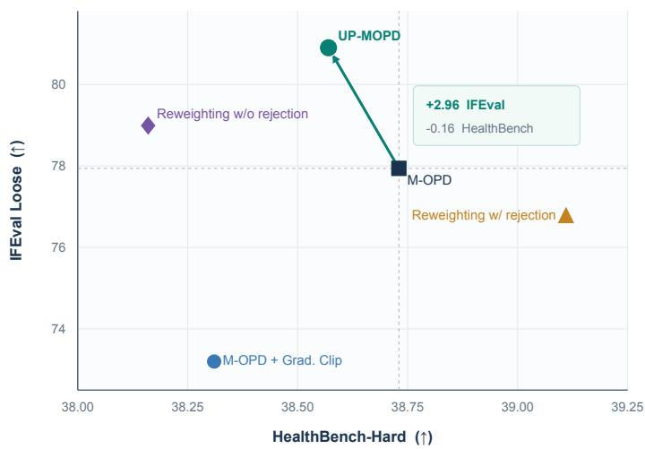  
Figure 2: Medical performance and instruction following. Student points average the last three saved checkpoints of one training epoch. The arrow from M-OPD to UP-MOPD shows improved IFEvalloose accuracy at a similar HealthBench-Hard score.

Integration of Mathematics, Code, and Instruction Following. We adopt the public data and checkpoints from Open-MOPD (Gao et al., 2026), using the SmolLM3- 3B MixSFT student and three RL teachers. Baselines include data-based consolidation (RFT), mixed-domain RL (MixRL), parameter merging (ParamMerge-Avg and ParamMerge-TA), and distillation methods (Naive M-OPD, Open-MOPD, and RouteOPD). Teacher and initial-student results provide additional references. Quoted results are marked with ∗ in Table 2.

We evaluate the final checkpoint on AIME24/25, Live-CodeBench v5/v6 (Jain et al.,

2024), IFEval, and IFBench under the Open-MOPD protocol: AIME24/25 use mean@64, Live-CodeBench v5/v6 use mean@10, and IFEval and IFBench use mean@1.

## 3.2 MAIN RESULTS

Medical and General Capability Integration. Table 1 shows that UP-MOPD achieves the highest student average across the eight metrics at 60.03. Relative to M-OPD, UP-MOPD improves IFEvalloose accuracy by 2.96 percentage points and PubMedQA accuracy by 2.66 points. Its HealthBench-Hard score reaches 38.57, close to the medical teacher’s 39.06. Figure 2 illustrates the improvement in instruction following while maintaining a similar level of HealthBench-Hard performance.

Table 2: Results on the public three-domain benchmark under the Open-MOPD evaluation protocol. Domain averages cover two tasks, and Total averages all six tasks. ∗ marks results reported by Gao et al. (2026); unmarked rows are our reproductions or proposed methods. RouteOPD uses three independently distilled students. Bold indicates the best result in each column.
<table><tr><td></td><td colspan="3">Math</td><td colspan="3">Code</td><td colspan="3">Instruction Following</td><td>Overall</td></tr><tr><td>Method</td><td>AIME24</td><td>AIME25</td><td>Avg.</td><td>LCB5</td><td>LCB6</td><td>Avg.</td><td>IFEval</td><td>IFBench</td><td>Avg.</td><td>Total</td></tr><tr><td>MixSFT</td><td>13.33</td><td>17.78</td><td>15.56</td><td>15.57</td><td>17.71</td><td>16.64</td><td>69.44</td><td>16.00</td><td>42.72</td><td>24.97</td></tr><tr><td>RFT*</td><td>22.97</td><td>23.91</td><td>23.44</td><td>18.98</td><td>19.43</td><td>19.21</td><td>55.08</td><td>18.67</td><td>36.87</td><td>26.51</td></tr><tr><td>MixRL*</td><td>21.15</td><td>22.14</td><td>21.64</td><td>16.59</td><td>20.97</td><td>18.78</td><td>70.24</td><td>22.67</td><td>46.45</td><td>28.96</td></tr><tr><td>ParamMerge-Avg*</td><td>18.91</td><td>20.99</td><td>19.95</td><td>18.38</td><td>21.20</td><td>19.79</td><td>70.06</td><td>17.67</td><td>43.86</td><td>27.87</td></tr><tr><td>ParamMerge-TA*</td><td>21.93</td><td>22.76</td><td>22.34</td><td>21.74</td><td>23.14</td><td>22.44</td><td>71.53</td><td>21.67</td><td>46.60</td><td>30.46</td></tr><tr><td>RL-Math</td><td>28.89</td><td>25.56</td><td>27.23</td><td>17.96</td><td>20.57</td><td>19.27</td><td>69.81</td><td>17.00</td><td>43.41</td><td>29.97</td></tr><tr><td>RL-Code</td><td>15.56</td><td>17.78</td><td>16.67</td><td>19.76</td><td>24.00</td><td>21.88</td><td>65.93</td><td>18.33</td><td>42.13</td><td>26.89</td></tr><tr><td>RL-IF</td><td>11.11</td><td>20.00</td><td>15.56</td><td>14.97</td><td>17.14</td><td>16.06</td><td>76.28</td><td>26.00</td><td>51.14</td><td>27.58</td></tr><tr><td>Naive M-OPD*</td><td>20.92</td><td>21.60</td><td>21.26</td><td>17.53</td><td>20.99</td><td>19.26</td><td>68.61</td><td>18.67</td><td>43.64</td><td>28.05</td></tr><tr><td>RouteOPD*</td><td>22.34</td><td>23.96</td><td>23.15</td><td>22.28</td><td>21.14</td><td>21.71</td><td>75.60</td><td>24.00</td><td>49.80</td><td>31.55</td></tr><tr><td>Open-MOPD</td><td>21.11</td><td>23.33</td><td>22.22</td><td>22.16</td><td>20.00</td><td>21.08</td><td>74.49</td><td>24.00</td><td>49.25</td><td>30.85</td></tr><tr><td>GP-MOPD</td><td>22.22</td><td>26.67</td><td>24.45</td><td>22.16</td><td>21.71</td><td>21.94</td><td>75.35</td><td>21.67</td><td>48.51</td><td>31.63</td></tr><tr><td>UP-MOPD</td><td>26.67</td><td>24.44</td><td></td><td>25.56 25.15</td><td>21.14</td><td>23.15</td><td>76.28</td><td>22.33</td><td>49.31</td><td>32.67</td></tr></table>

Table 3: Effect of intervention strategies in the medical–general setting, using the same evaluation protocol as Table 1. Mean averages the eight metrics. Bold indicates the best result in each column.
<table><tr><td></td><td colspan="4">Medical</td><td colspan="2">General</td><td colspan="2">Math</td><td></td></tr><tr><td>Method</td><td>HealthBench Hard</td><td>Med- MCQA</td><td>PubMed- QA</td><td>MMLU- Med</td><td>GPQA</td><td>IFEval</td><td>AIME24</td><td>AIME25</td><td>Mean</td></tr><tr><td>M-OPD</td><td>38.73</td><td>59.77</td><td>71.67</td><td>79.54</td><td>47.81</td><td>77.94</td><td>53.78</td><td>43.78</td><td>59.13</td></tr><tr><td>M-OPD + Grad. Clip</td><td>38.31</td><td>59.42</td><td>73.47</td><td>80.04</td><td>48.35</td><td>73.20</td><td>53.78</td><td>45.78</td><td>59.04</td></tr><tr><td>Reweighting w/ rejection</td><td>39.11</td><td>60.00</td><td>73.27</td><td>79.94</td><td>45.25</td><td>76.77</td><td>52.89</td><td>44.89</td><td>59.02</td></tr><tr><td>Reweighting w/o rejection</td><td>38.16</td><td>59.49</td><td>72.87</td><td>79.77</td><td>47.44</td><td>78.99</td><td>54.67</td><td>45.11</td><td>59.56</td></tr><tr><td>Update Rejection</td><td>38.68</td><td>58.07</td><td>73.87</td><td>79.11</td><td>45.99</td><td>80.77</td><td>52.00</td><td>44.67</td><td>59.15</td></tr><tr><td>GP-MOPD</td><td>38.79</td><td>59.80</td><td>73.00</td><td>79.85</td><td>48.28</td><td>78.93</td><td>52.89</td><td>40.44</td><td>59.00</td></tr><tr><td>UP-MOPD</td><td>38.57</td><td>59.37</td><td>74.33</td><td>79.54</td><td>48.38</td><td>80.90</td><td>53.33</td><td>45.78</td><td>60.03</td></tr></table>

Integration of Mathematics, Code, and Instruction Following. Table 2 shows that both GP-MOPD and UP-MOPD improve the overall average over Open-MOPD. UP-MOPD achieves the highest average of 32.67, exceeding Open-MOPD and GP-MOPD by 1.82 and 1.04 points, respectively. It also achieves the best LiveCodeBench v5 score and code average, and matches the instruction-following teacher’s IFEval score of 76.28.

## 3.3 ABLATION AND ANALYSIS

We examine projection location and conflict handling in the medical–general setting (Table 3). M-OPD serves as the baseline without gradient clipping or projection, while M-OPD + Grad. Clip adds global gradient clipping. GP-MOPD projects the mixed gradient before AdamW. Update Rejection skips parameter updates that violate the same domain constraints used by UP-MOPD while retaining the optimizer-state update. Domain reweighting adjusts the mixture weights, with variants that either skip unresolved updates or select the candidate with the smallest remaining conflict.

Projection location and conflict handling. UP-MOPD achieves an eight-metric average of 60.03, compared with 59.00 for GP-MOPD and 59.15 for Update Rejection. It improves five of the eight metrics over GP-MOPD and seven over Update Rejection, and also achieves a higher average than both domain-reweighting variants. These comparisons support correcting the optimizer update as an effective way to integrate domain capabilities.

Gradient and update checks can disagree. We analyze the 1,391 steps containing both domains in one epoch of the main training run. First-order constraint checks based on the mixed-gradient descent direction $- { g _ { 0 } }$ and AdamW’s candidate update disagree on 9.99% of these steps. In 1.65% of steps, the gradient check passes but the update check fails; 8.34% show the opposite pattern. Figure 3 complements this analysis by visualizing the relationship between domain-gradient alignment and the first-order effects of optimizer updates on the two domain losses.

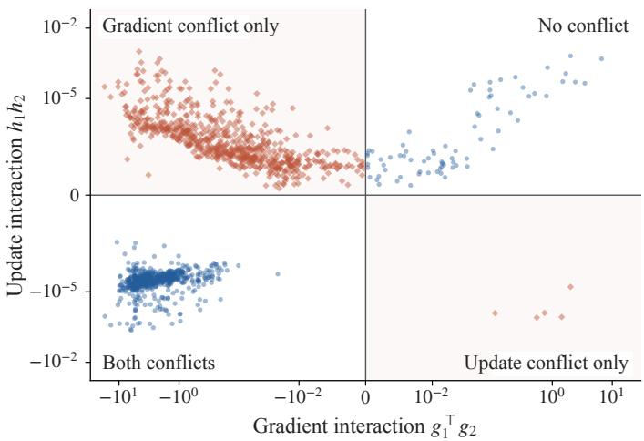  
Figure 3: Gradient alignment and update conflict. Each point is a training step, with $g _ { 1 } ^ { \top } g _ { 2 }$ on the horizontal axis and $h _ { 1 } h _ { 2 }$ on the vertical axis. A negative $h _ { 1 } h _ { 2 }$ means the candidate update is predicted to lower one domain’s loss and raise the other’s. Gradient alignment alone does not determine this outcome.

Training dynamics and capability retention. Figure 4(a,b) shows that UP-MOPD retains instructionfollowing accuracy close to the initial student early in training and later reaches medical performance comparable to M-OPD. Its late-stage HealthBench-Hard score averages 38.57 versus 38.73 for M-OPD, while its IFEvalloose accuracy is 80.90 versus 77.94 for M-OPD. Panels (c,d) connect this capability development to the four methods’ sampled reverse-KL trajectories on medical and mathematical prompts. Divergence from the general teacher on mathematical prompts is the base-anchor loss. M-OPD and GP-MOPD

reduce medical divergence early, whereas UP-MOPD and Update Rejection maintain a lower base-anchor loss for longer before substantially reducing medical divergence. UP-MOPD also improves the eight-benchmark mean over Update Rejection by 0.88 points (Table 3).

## 4 RELATED WORK

## 4.1 KNOWLEDGE DISTILLATION AND ON-POLICY DISTILLATION

Classical knowledge distillation transfers soft predictive distributions from teachers or ensembles to a student (Hinton et al., 2015). Generalized Knowledge Distillation extends this supervision to student-generated sequences, establishing on-policy distillation for language models (Agarwal et al., 2024). Subsequent work studies self-distillation, reward design and extrapolation, teacher entropy, training mechanisms, update geometry, and token teachability (Zhao et al., 2026; Yang et al., 2026; Jin et al., 2026; Li et al., 2026a; Armandpour et al., 2026; Shen et al., 2026; Wang et al., 2026; Xie et al., 2026). These methods mainly alter supervision or trajectory construction; UP-MOPD instead constrains the parameter displacement produced by a fixed distillation signal and shared stateful optimizer.

## 4.2 MULTI-TEACHER CAPABILITY INTEGRATION

MiMo-V2-Flash and MOPD consolidate independently trained domain RL teachers through onpolicy distillation (Xiaomi LLM-Core Team, 2026; Ma et al., 2026); GLM-5 uses cross-stage distillation to recover capabilities from earlier SFT and RL checkpoints (GLM-5 Team, 2026). Open-MOPD addresses imbalance across mathematics, code, and instruction following through effective optimization budgets (Gao et al., 2026), while related work uses privileged soft prompts (Ma et al., 2026), explores evidence-aligned representation learning (Chen et al., 2026), or studies drift when top-k supervision omits decision-critical tokens (Shen et al., 2026). These approaches modify teacher organization, token supervision, or domain allocation. UP-MOPD instead constrains the shared optimizer displacement after gradient aggregation.

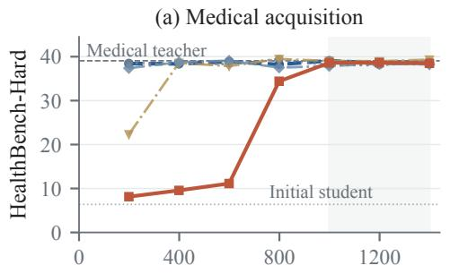

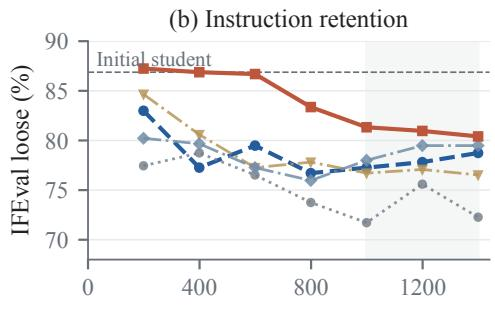  
GP-MOPD UP-MOPD

(c) Medical distillation  
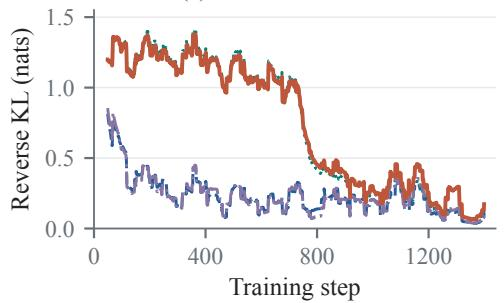

(d) Mathematical distillation  
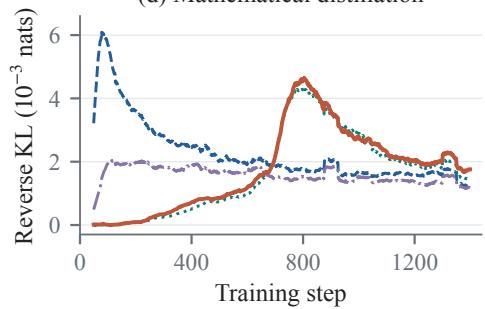  
Figure 4: Capability and distillation dynamics. (a,b) HealthBench-Hard and IFEval-loose checkpoint scores; lines denote teacher or initial-student references and shading the late-training window. (c,d) Trailing 50-step means of domain-conditioned sampled reverse KL on each method’s responses; steps lacking a domain and incomplete initial windows are omitted.

## 4.3 CONSTRAINED UPDATES IN MULTI-TASK AND CONTINUAL LEARNING

Multi-task optimization constructs shared directions through Pareto descent (MGDA) (Sener and Koltun, 2018), pairwise gradient projection (PCGrad) (Yu et al., 2020), cosine alignment (GradVac) (Wang et al., 2021), worst-task improvement (CAGrad) (Liu et al., 2021), or adaptive norm balancing (GradNorm) (Chen et al., 2018). These methods modify the gradient presented to the optimizer. UP-MOPD instead constrains the candidate displacement produced by AdamW, with GP-MOPD providing a matched gradient-space comparison in the same M-OPD setting.

Continual-learning methods likewise protect prior capabilities by constraining new updates: GEM uses stored examples, while A-GEM uses an averaged reference gradient (Lopez-Paz and Ranzato, 2017; Chaudhry et al., 2019). UP-MOPD instead constructs instantaneous half-spaces from the active-domain gradients in the current logical batch and requires no additional replay buffer. Its constraints are therefore local first-order conditions, not guarantees against long-term forgetting.

## 5 CONCLUSION

We introduced UP-MOPD to correct a mismatch between gradient-space conflict and the parameter displacement produced by adaptive optimizers in M-OPD. It retains the current-step optimizer state induced by the original mixed gradient, leaves feasible candidates unchanged, and applies the unique minimum Euclidean correction satisfying all active-domain first-order constraints. A domaindimensional dual makes the projection practical at model scale. In medical–general consolidation, UP-MOPD improves aggregate performance over M-OPD, GP-MOPD, and update rejection while maintaining HealthBench-Hard; it also achieves the highest six-task mean on the public mathematics– code–instruction benchmark. Together, these results support optimizer-induced displacement as a distinct intervention target for multi-teacher capability integration.

## AI USE STATEMENT

Generative AI tools were used to assist with manuscript drafting, Chinese–English translation and language editing, secondary checking of mathematical derivations, and the preparation and refinement of experimental figures. All AI-assisted text, equations, citations, and visual materials were reviewed and, where necessary, revised by the authors against the underlying derivations, implementation, experiment logs, and source literature. The authors take full responsibility for the research decisions, claims, and final content of this paper.

## ETHICS STATEMENT

This work uses publicly released models and benchmark datasets under their applicable licenses. No new human-subject data or private personally identifiable information was collected. The medical experiments evaluate model capabilities on research benchmarks and do not constitute clinical validation or support deployment in healthcare. As with other capability-consolidation methods, UP-MOPD may retain undesirable behaviors inherited from its teachers or training data. Any deployment therefore requires task-specific safety evaluation, license compliance, and appropriate human oversight.

## REPRODUCIBILITY STATEMENT

Section 2 specifies the M-OPD objective, GP-MOPD, and UP-MOPD, with formal proofs in Appendix B. Algorithm 1, domain-gradient reconstruction, the dual solver, finite-precision commit verification, and complexity accounting are provided in Appendix C. Appendices D.1–D.3 document the datasets, released model and checkpoint identifiers, training mixtures, hyperparameters, evaluation protocols, hardware, and runtime. The main tables and Appendix D also report checkpoint aggregation rules and complete training trajectories. Together, these details specify the method and experimental protocol required to reproduce the reported results.

## REFERENCES

Geoffrey Hinton, Oriol Vinyals, and Jeff Dean. 2015. Distilling the Knowledge in a Neural Network. arXiv:1503.02531.

Rishabh Agarwal, Nino Vieillard, Yongchao Zhou, Piotr Stanczyk, Sabela Ramos Garea, Matthieu Geist, and Olivier Bachem. 2024. On-Policy Distillation of Language Models: Learning from Self-Generated Mistakes. ICLR 2024; arXiv:2306.13649.

Huan-ang Gao, Haohan Chi, Yong Yan, Shiyuan Feng, Hanlin Wu, Zheng Jiang, Bingxiang He, Wei-Ying Ma, Ya-Qin Zhang, and Hao Zhou. 2026. Open-MOPD: Diagnosing and Fixing Capability Imbalance in Multi-Teacher On-Policy Distillation. arXiv:2608.19098.

Diederik P. Kingma and Jimmy Ba. 2015. Adam: A Method for Stochastic Optimization. ICLR 2015; arXiv:1412.6980.

Ilya Loshchilov and Frank Hutter. 2019. Decoupled Weight Decay Regularization. ICLR 2019; arXiv:1711.05101.

An Yang et al. 2025. Qwen3 Technical Report. arXiv:2505.09388.

Qiying Yu et al. 2025. DAPO: An Open-Source LLM Reinforcement Learning System at Scale. arXiv:2503.14476.

Rahul K. Arora et al. 2025. HealthBench: Evaluating Large Language Models Towards Improved Human Health. arXiv:2505.08775.

David Rein, Betty Li Hou, Asa Cooper Stickland, Jackson Petty, Richard Yuanzhe Pang, Julien Dirani, Julian Michael, and Samuel R. Bowman. 2023. GPQA: A Graduate-Level Google-Proof Q&A Benchmark. arXiv:2311.12022.

Jeffrey Zhou, Tianjian Lu, Swaroop Mishra, Siddhartha Brahma, Sujoy Basu, Yi Luan, Denny Zhou, and Le Hou. 2023. Instruction-Following Evaluation for Large Language Models. arXiv:2311.07911.

Ankit Pal, Logesh Kumar Umapathi, and Malaikannan Sankarasubbu. 2022. MedMCQA: A Largescale Multi-Subject Multi-Choice Datasetfor Medical Domain Question Answering. CHIL 2022; arXiv:2203.14371.

Qiao Jin, Bhuwan Dhingra, Zhengping Liu, William W. Cohen, and Xinghua Lu. 2019. PubMedQA: A Datasetfor Biomedical Research Question Answering. EMNLP-IJCNLP 2019, pp. 2567–2577.

Dan Hendrycks, Collin Burns, Steven Basart, Andy Zou, Mantas Mazeika, Dawn Song, and Jacob Steinhardt. 2021. Measuring Massive Multitask Language Understanding. ICLR 2021; arXiv:2009.03300.

Naman Jain, King Han, Alex Gu, Wen-Ding Li, Fanjia Yan, Tianjun Zhang, Sida Wang, Armando Solar-Lezama, Koushik Sen, and Ion Stoica. 2024. LiveCodeBench: Holistic and Contamination Free Evaluation of Large Language Models for Code. arXiv:2403.07974.

Yoav Benjamini and Yosef Hochberg. 1995. Controlling the False Discovery Rate: A Practical and Powerful Approach to Multiple Testing. Journal of the Royal Statistical Society: Series B, 57(1):289–300.

Siyan Zhao, Zhihui Xie, Mengchen Liu, Jing Huang, Guan Pang, Feiyu Chen, and Aditya Grover. 2026. Self-Distilled Reasoner: On-Policy Self-Distillation for Large Language Models. arXiv:2601.18734.

Wenkai Yang, Weijie Liu, Ruobing Xie, Kai Yang, Saiyong Yang, and Yankai Lin. 2026. Learning beyond Teacher: Generalized On-Policy Distillation with Reward Extrapolation. arXiv:2602.12125.

Woogyeol Jin, Taywon Min, Yongjin Yang, Dennis Wei, Yi Zhou, Swanand Ravindra Kadhe, Nathalie Baracaldo, and Kimin Lee. 2026. Entropy-Aware On-Policy Distillation of Language Models. ICML 2026; arXiv:2603.07079.

Yaxuan Li, Yuxin Zuo, Bingxiang He, Jinqian Zhang, Chaojun Xiao, Cheng Qian, Tianyu Yu, Huanang Gao, Wenkai Yang, Zhiyuan Liu, and Ning Ding. 2026a. Rethinking On-Policy Distillation of Large Language Models: Phenomenology, Mechanism, and Recipe. arXiv:2604.13016.

Mohammadreza Armandpour, Fatih Ilhan, David Harrison, Ajay Jaiswal, Duc N. M. Hoang, Fartash Faghri, Yizhe Zhang, Minsik Cho, and Mehrdad Farajtabar. 2026. Unmasking On-Policy Distillation: Where It Helps, Where It Hurts, and Why. arXiv:2605.10889.

Zhennan Shen, Yanshu Li, Qingyu Yin, Chak Tou Leong, Zhilin Wang, Yanxu Chen, Rongduo Han, Sunbowen Lee, and Yi R. Fung. 2026. On the Geometry of On-Policy Distillation. arXiv:2606.07082.

Yuanyi Wang, Su Lu, Yanggan Gu, Pengkai Wang, Yifan Yang, Zhaoyi Yan, Congkai Xie, Jianmin Wu, and Hongxia Yang. 2026. Not All Disagreement Is Learnable: Token Teachability in On-Policy Distillation. arXiv:2605.26844.

Yingzi Ma, Zichen Zhu, Ming Jiang, and Chaowei Xiao. 2026. One Student, Many Teachers: Multi Task On-Policy Distillation via Soft-Prompt Privileged Context. arXiv:2607.18293.

Jiabin Shen, Guang Chen, and Chengjun Mao. 2026. When Top-K Misses the Decision: Tool-Call Drift in Multi-Teacher On-Policy Distillation. arXiv:2607.07050.

Ozan Sener and Vladlen Koltun. 2018. Multi-Task Learning as Multi-Objective Optimization. NeurIPS 2018.

Tianhe Yu, Saurabh Kumar, Abhishek Gupta, Sergey Levine, Karol Hausman, and Chelsea Finn. 2020. Gradient Surgery for Multi-Task Learning. NeurIPS 2020.

Bo Liu, Xingchao Liu, Xiaojie Jin, Peter Stone, and Qiang Liu. 2021. Conflict-Averse Gradient Descentfor Multi-task Learning. NeurIPS 2021.

Zhao Chen, Vijay Badrinarayanan, Chen-Yu Lee, and Andrew Rabinovich. 2018. GradNorm: Gradient Normalizationfor Adaptive Loss Balancing in Deep Multitask Networks. ICML 2018.

David Lopez-Paz and Marc’Aurelio Ranzato. 2017. Gradient Episodic Memory for Continual Learning. NeurIPS 2017.

Arslan Chaudhry, Marc’Aurelio Ranzato, Marcus Rohrbach, and Mohamed Elhoseiny. 2019. Efficient Lifelong Learning with A-GEM. ICLR 2019.

Xiaomi LLM-Core Team. 2026. MiMo-V2-Flash Technical Report. arXiv:2601.02780.

Wenhan Ma, Jianyu Wei, Liang Zhao, Hailin Zhang, Bangjun Xiao, Lei Li, Qibin Yang, Bofei Gao, Yudong Wang, Rang Li, Jinhao Dong, Zhifang Sui, and Fuli Luo. 2026. MOPD: Multi-Teacher On-Policy Distillation for Capability Integration in LLM Post-Training. arXiv:2606.30406.

GLM-5 Team. 2026. GLM-5: From Vibe Coding to Agentic Engineering. arXiv:2602.15763.

Zirui Wang, Yulia Tsvetkov, Orhan Firat, and Yuan Cao. 2021. Gradient Vaccine: Investigating and Improving Multi-task Optimization in Massively Multilingual Models. ICLR 2021; arXiv:2010.05874.

Anisha Gunjal, Anthony Wang, Elaine Lau, Vaskar Nath, Yunzhong He, Bing Liu, and Sean Hendryx. 2025. Rubrics as Rewards: Reinforcement Learning Beyond Verifiable Domains. arXiv:2507.17746.

Taojie Zhu, Yuan Xia, Tao Sun, Yizhi Wang, Yan Chen, Qunshan He, Tian Guan, Jian Wang, Jinjie Gu, Junwei Liu, and Yonghong He. 2026. ConRub-Med: Reinforcement Learning with Consensus Rubricsfor Open-Ended Medical Question Answering. arXiv:2608.10996.

Sunzhu Li, Jiale Zhao, Miteto Wei, Huimin Ren, Yang Zhou, Jingwen Yang, Shunyu Liu, Kaike Zhang, and Wei Chen. 2026b. RubricHub: A Comprehensive and Highly Discriminative Rubric Dataset via Automated Coarse-to-Fine Generation. arXiv:2601.08430.

Weichu Xie, Haozhe Zhao, Wenpu Liu, Yongfu Zhu, Liang Chen, Minghao Ye, Zirong Chen, Yuqi Xu, Shuai Dong, Ziyue Wang, et al. 2026. Step-wise Rubric Rewardsfor LLM Reasoning. arXiv:2605.17291.

Zirong Chen, Fuda Ye, Enjun Du, Junfu Pu, Xinlei Wang, Xinyu Zuo, Lisheng Duan, Haijin Liang, Jin Ma, Jiachuan Wang, and Yongqi Zhang. 2026. Learning Multimodal Embeddings with Evidence-Aligned Readout. arXiv:2609.33659.

## A LIMITATIONS

Our experiments cover capability integration with two and three teachers. As the number of teachers grows, the cost of computing separate domain gradients and the interactions among domain constraints require further study. UP-MOPD also imposes local first-order constraints at each training step; how these constraints shape long-term capability retention remains an open question.

## B THEORETICAL PROOFS

## B.1 PROOF OF PROPOSITION 1

Consider two domain gradients mixed with equal weights:

$$
\begin{array} { r } { g _ { 1 } = ( 2 , - 1 ) ^ { \top } , \qquad g _ { 2 } = ( 0 , 3 ) ^ { \top } , \qquad g _ { 0 } = \frac { 1 } { 2 } ( g _ { 1 } + g _ { 2 } ) = ( 1 , 1 ) ^ { \top } . } \end{array}
$$

The unpreconditioned displacement $\Delta _ { \mathrm { g r a d } } = - g _ { 0 } = ( - 1 , - 1 ) ^ { \top }$ is a strict descent direction for both domains:

$$
\begin{array} { r } { g _ { 1 } ^ { \top } \Delta _ { \mathrm { g r a d } } = - 1 < 0 , \qquad g _ { 2 } ^ { \top } \Delta _ { \mathrm { g r a d } } = - 3 < 0 . } \end{array}
$$

Now take the positive diagonal preconditioner $D = \mathrm { d i a g } ( 1 / 1 0 , 1 )$ . Then

$$
\Delta _ { \mathrm { p r e } } = - D g _ { 0 } = ( - 1 / 1 0 , - 1 ) ^ { \top } , \qquad g _ { 1 } ^ { \top } \Delta _ { \mathrm { p r e } } = 4 / 5 > 0 .
$$

Thus, positive diagonal preconditioning can turn a common descent direction into a displacement that increases one domain’s loss to first order. The counterexample isolates the effect of coordinatewise scaling in optimizers such as Adam and AdamW.

## B.2 PROOF OF PROPOSITION 2 AND COROLLARY 1

The set $\mathcal { C } _ { t }$ is the intersection of finitely many closed half-spaces and contains the zero vector; hence it is a nonempty closed convex cone. The squared-distance objective is continuous and coercive, so it attains a minimum on $\mathcal { C } _ { t } ;$ its strong convexity makes that minimizer unique. This minimizer is the Euclidean projection of $\Delta \theta _ { 0 }$ onto $\mathcal { C } _ { t } ,$ , and therefore satisfies the minimum-distance relation in Proposition 2 for every $\Delta \theta \in \mathcal { C } _ { t } . \ \mathrm { I f } \ \Delta \theta _ { 0 } \in \mathcal { C } _ { t }$ , the zero correction uniquely attains this lower bound.

Because $\mathcal { C } _ { t }$ is polyhedral, the projection optimality condition $\Delta \theta _ { 0 } - \Delta \theta ^ { \star } \in N _ { \mathcal { C } _ { t } } ( \Delta \theta ^ { \star } )$ yields multipliers $\lambda ^ { \star } \geq 0$ satisfying stationarity and complementary slackness.

When $K = G ^ { \top } G$ is singular, the dual coefficients may admit multiple optimal representations. The objective in Eq. (13) is equivalent to $\begin{array} { r } { \frac { 1 } { 2 } \| G \lambda - \Delta \theta _ { 0 } \| _ { 2 } ^ { 2 } - \frac { 1 } { 2 } \| \Delta \theta _ { 0 } \| _ { 2 } ^ { 2 } } \end{array}$ . Let $\lambda _ { 1 }$ and $\lambda _ { 2 }$ be dual optima. If $\dot { G } \dot { \lambda } _ { 1 } \neq G \lambda _ { 2 } .$ , their feasible midpoint would achieve a strictly smaller objective by strict convexity of the squared norm, contradicting optimality. Therefore $G \lambda _ { 1 } = G \lambda _ { 2 } \colon$ : singularity affects only the representation of the dual coefficients, not the correction or the final projected displacement.

By Eq. (12) and complementary slackness in Eq. (14),

$$
\Delta \theta _ { 0 } - \Delta \theta ^ { \star } = G \lambda ^ { \star } , \qquad ( \Delta \theta ^ { \star } ) ^ { \top } ( \Delta \theta _ { 0 } - \Delta \theta ^ { \star } ) = ( \lambda ^ { \star } ) ^ { \top } G ^ { \top } \Delta \theta ^ { \star } = 0 .
$$

Expanding $\lVert \Delta \theta _ { 0 } \rVert _ { 2 } ^ { 2 } = \lVert \Delta \theta ^ { \star } + ( \Delta \theta _ { 0 } - \Delta \theta ^ { \star } ) \rVert _ { 2 } ^ { 2 }$ gives the Pythagorean identity. A positive rescaling of any constraint normal leaves the half-space ${ \bar { g } } _ { d } ^ { \top } \Delta \theta \leq 0$ unchanged and therefore preserves both the feasible cone and its unique projection. Because $q _ { d } > 0$ , domain-wise feasibility also gives

$$
g _ { 0 } ^ { \top } \Delta \theta ^ { \star } = \sum _ { d } q _ { d } g _ { d } ^ { \top } \Delta \theta ^ { \star } \leq 0 .
$$

Finally, if $L _ { d }$ has a $\beta _ { d } { \bf - } \mathbf { I }$ ipschitz gradient, the descent lemma and $g _ { d } ^ { \top } \Delta \theta ^ { \star } \leq 0$ imply

$$
L _ { d } ( { \boldsymbol { \theta } } _ { t } + \Delta { \boldsymbol { \theta } } ^ { \star } ) \leq L _ { d } ( { \boldsymbol { \theta } } _ { t } ) + g _ { d } ^ { \top } \Delta { \boldsymbol { \theta } } ^ { \star } + \frac { \beta _ { d } } { 2 } \| \Delta { \boldsymbol { \theta } } ^ { \star } \| _ { 2 } ^ { 2 } \leq L _ { d } ( { \boldsymbol { \theta } } _ { t } ) + \frac { \beta _ { d } } { 2 } \| \Delta { \boldsymbol { \theta } } ^ { \star } \| _ { 2 } ^ { 2 } .
$$

The bound leaves a second-order remainder proportional to the squared displacement norm. At a tight first-order constraint, this remainder allows a positive loss change for a finite step.

## C IMPLEMENTATION AND COMPLEXITY DETAILS

Algorithm 1 summarizes the complete update. The MATERIALIZEANDVERIFY subroutine is specified in Appendix C.5.

Algorithm 1 One training step of UP-MOPD   
Input: Parameters $\overline { { \theta _ { t } } } .$ , optimizer state $\overline { { \mathcal { M } _ { t - 1 } } } ,$ , sampled batch   
1: Compute the mixed gradient $g _ { 0 }$   
2: if $\bar { D _ { t } } < 2$ then   
3: return $\mathrm { O p t } _ { t } ( \theta _ { t } , \mathcal { M } _ { t - 1 } ; g _ { 0 } )$   
4: end if   
5: Replay the same batch at $\theta _ { t }$ to obtain $G = [ g _ { d } ] _ { d \in \mathcal { A } _ { t } }$   
6: Save the pre-update master parameters $\bar { \theta } _ { t } \gets \theta _ { t }$   
7: $( \theta _ { t + 1 } ^ { 0 } , \mathcal { \hat { M } } _ { t } ) \gets \mathrm { O p t } _ { t } ( \theta _ { t } , \mathcal { \hat { M } } _ { t - 1 } ; g _ { 0 } )$   
8: $\Delta \theta _ { 0 } \gets \theta _ { t + 1 } ^ { 0 } - \bar { \theta } _ { t } , h \gets G ^ { \top } \Delta \theta _ { 0 }$   
9: $\Delta \theta ^ { \star } \gets \Delta \dot { \theta } _ { 0 }$   
10: if $h _ { d } > 0$ for any $d \in \mathcal { A } _ { t }$ then   
11: Compute $K \dot {  } G ^ { \intercal } G$ and solve Eq. (13)   
12: $\Delta \theta ^ { \star } \dot { } \gets \Delta \theta _ { 0 } - G \lambda ^ { \star }$   
13: end if   
14: $\widehat { \Delta \theta } \gets \mathbf { M }$ ATERIALIZEANDVERIFY $( \bar { \theta } _ { t } , \Delta \theta ^ { \star } , G )$   
15: return $( \widehat { \theta } _ { t } + \widehat { \Delta \theta } , \mathcal { M } _ { t } )$

## C.1 GENERATION STATISTICS AND UPDATE BEHAVIOR

Table 4 supplements the training dynamics in Section 3.3 with generation statistics. Across the four methods, mean response lengths range from 4,056 to 4,089 tokens and truncation rates from 9.20% to 9.63% over the final 200 plotted training steps.

Table 4: Capability scores and generation behavior. HB-Hard denotes HealthBench-Hard; IFEval uses prompt-level loose accuracy. Mean averages eight benchmarks. Tokens and Trunc. are mean response length and truncation rate over the last 200 plotted training steps.
<table><tr><td>Method</td><td>HB-Hard</td><td>IFEval</td><td>Mean</td><td>Tokens</td><td>Trunc. (%)</td></tr><tr><td>M-OPD</td><td>38.73</td><td>77.94</td><td>59.13</td><td>4,067</td><td>9.20</td></tr><tr><td>Update Rejection</td><td>38.68</td><td>80.77</td><td>59.15</td><td>4,071</td><td>9.48</td></tr><tr><td>GP-MOPD</td><td>38.79</td><td>78.93</td><td>59.00</td><td>4,056</td><td>9.63</td></tr><tr><td>UP-MOPD</td><td>38.57</td><td>80.90</td><td>60.03</td><td>4,089</td><td>9.20</td></tr></table>

Update behavior. Update Rejection cancels 645 candidates, each predicting a medical loss decrease but an increase in the base-anchor loss.

## C.2 PROJECTING REJECTED UPDATES

We take all 645 candidates discarded by Update Rejection and compute their UP-MOPD projections offline from the logged gradient statistics. All yield nonzero projections satisfying both domains’ first-order constraints. The relative correction norm has a median of 1.77% and a 95th percentile of 3.25%. The projected updates retain a median of 96.26% of the predicted medical loss decrease (Figure 5). Projection thus removes the predicted increase in base-anchor loss while retaining mos of the predicted medical decrease.

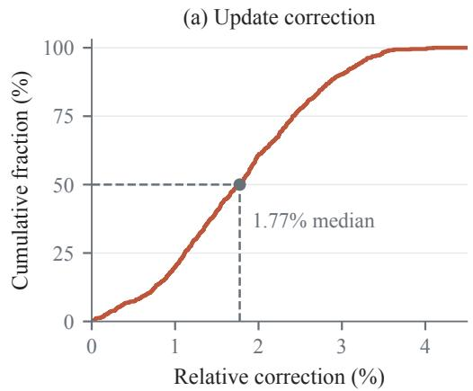

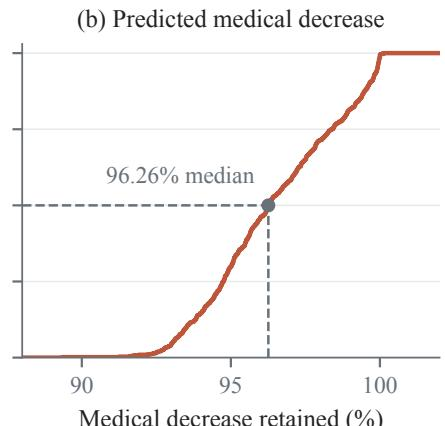  
Figure 5: Offline projection of 645 rejected candidates. Cumulative distributions show relative correction size (left) and retained predicted medical loss decrease (right). Dashed lines mark medians.

Metric definitions. For candidate $\Delta \theta _ { 0 }$ and projection $\Delta \theta ^ { \star }$ , we report the relative correction $r _ { \mathrm { c o r r } }$ and medical decrease retention $r _ { \mathrm { m e d } }$

$$
r _ { \mathrm { c o r r } } = \frac { \| \Delta \theta ^ { \star } - \Delta \theta _ { 0 } \| } { \| \Delta \theta _ { 0 } \| } , \qquad r _ { \mathrm { m e d } } = \frac { h _ { \mathrm { m e d } } ( \Delta \theta ^ { \star } ) } { h _ { \mathrm { m e d } } ( \Delta \theta _ { 0 } ) } .\tag{15}
$$

Here $h _ { d } ( \Delta ) = g _ { d } ^ { \top } \Delta$ predicts the first-order change in domain $d \mathrm { { s } }$ loss. Since $h _ { \mathrm { m e d } } ( \Delta \theta _ { 0 } ) < 0$ for every candidate, $r _ { \mathrm { m e d } }$ measures the fraction of predicted medical decrease retained. Medical decrease retention ranges from 89.35% to 100.14%; values above 100% indicate a slightly larger predicted decrease after projection.

## C.3 DOMAIN-GRADIENT REPLAY AND CONSISTENCY CHECK

Equation (2) gives the sampled-token estimator. In the public implementation, teacher and student log probabilities on a shared top-k support define the corresponding dense token estimator; restricting either estimator to domain d yields $L _ { d }$ and $g _ { d }$ used by the projection. The response weights $\omega _ { i }$ unify the two normalization schemes. Setting $\omega _ { i } = 1 / M _ { i }$ first averages tokens within each response and then averages responses within a domain; setting $\omega _ { i } = 1$ yields a domain-level token mean. Standard backpropagation of the mixed objective produces g0, while domain-wise replay over the same logical batch produces the individual domain gradients. The implementation computes

$$
e _ { \mathrm { d e c } } = { \frac { \| g _ { 0 } - g _ { \mathrm { r e c } } \| _ { 2 } } { \operatorname* { m a x } ( \| g _ { 0 } \| _ { 2 } , 1 0 ^ { - 3 0 } ) } } , \qquad g _ { \mathrm { r e c } } = \sum _ { d \in \mathcal { A } _ { t } } q _ { d } g _ { d } ,\tag{C.1}
$$

and, when the check is enabled, requires $e _ { \mathrm { d e c } } \leq \tau _ { \mathrm { d e c } }$ . Domain replay and mixed-objective backpropagation use the same sampled data, stochastic state, and gradient processing. If global scalar clipping is applied, its factor is computed from the mixed gradient and then applied uniformly to every domain contribution; domains are not clipped independently.

## C.4 DUAL ACTIVE SETS, SCALE NORMALIZATION, AND DISTRIBUTED COMPUTATION

For a candidate active set $A ,$ the nonzero dual variables satisfy

$$
K _ { A A } \lambda _ { A } = h _ { A } , \qquad \lambda _ { \bar { A } } = 0 .\tag{C.2}
$$

When $K _ { A A }$ is nonsingular, we solve this linear system directly. When the domain gradients are linearly dependent, least squares produces one representative dual solution, after which we check dual nonnegativity, primal feasibility, and the KKT residual. Because the number of domains in our

setting is small, we enumerate all active sets; larger settings can instead use a general nonnegative quadratic-programming solver.

To reduce ill-conditioning caused by differences in domain-gradient scale, define

$$
s _ { d } = \left\{ \begin{array} { l l } { \| g _ { d } \| _ { 2 } , } & { \| g _ { d } \| _ { 2 } > 0 , } \\ { 1 , } & { \| g _ { d } \| _ { 2 } = 0 , } \end{array} \right. \quad \bar { g } _ { d } = g _ { d } / s _ { d } , \quad \mu _ { d } = s _ { d } \lambda _ { d } , \quad \bar { K } _ { i j } = \bar { g } _ { i } ^ { \top } \bar { g } _ { j } , \quad \bar { h } _ { d } = h _ { d } / s _ { d } .\tag{C.3}
$$

After obtaining $\mu _ { d } ^ { \star }$ , we recover the original dual variable as $\lambda _ { d } ^ { \star } = \mu _ { d } ^ { \star } / s _ { d }$ . Each parameter shard accumulates $K _ { i j }$ and $h _ { i }$ in a streaming manner, followed by an all-reduce over the resulting global scalars. All shards share the same $\lambda ^ { \star }$ and reconstruct $\Delta \theta ^ { \star }$ locally, without gathering full parameter vectors.

As an optional extension, Eq. (9) can be defined under a positive-definite weighted norm. In that case, stationarity becomes $\Delta \theta ^ { \star } \stackrel { - } { = } \Delta \theta _ { 0 } - M ^ { - 1 } G \lambda ^ { \star }$ ⋆, and the dual Gram matrix becomes $G ^ { \top } M ^ { - 1 } G$ . The dual dimension remains unchanged, although the resulting projection depends on the metric. The method and all experiments in this paper use the Euclidean metric, $M = \bar { I }$

## C.5 OPTIMIZER STATE AND FINITE-PRECISION UPDATES

Each logical step invokes the original optimizer once. UP-MOPD replaces its candidate parameter update while retaining the state produced by the mixed gradient:

$$
\theta _ { t + 1 } = \theta _ { t } + \widehat { \Delta \theta } , \qquad \mathcal { M } _ { t } = \mathrm { S t a t e U p d a t e } ( \mathcal { M } _ { t - 1 } , g _ { 0 } ^ { \mathrm { o p t } } ) .\tag{C.4}
$$

The current optimizer state is updated using the shared, optionally clipped mixture $g _ { 0 } ^ { \mathrm { o p t } }$ , and subsequent gradients are evaluated along the projected parameter trajectory. The state update is retained even when the fallback below sets the parameter displacement to zero.

Forward and backward passes use ${ \mathrm { B F l } } 6 ,$ optimizer master parameters use FP32, and the projection target is formed in FP64. Let $Q _ { b }$ denote rounding to storage type b. The stored parameters, realized displacement, and predicted domain loss changes are

$$
\theta _ { t + 1 } ^ { \mathrm { m a t } } = Q _ { b } ( \theta _ { t } + \Delta \theta ^ { \star } ) , \qquad \widehat { \Delta \theta } = \theta _ { t + 1 } ^ { \mathrm { m a t } } - \theta _ { t } , \qquad \widehat { h } _ { d } = g _ { d } ^ { \top } \widehat { \Delta \theta } .\tag{C.5}
$$

The result is committed only if $\widehat { h } _ { d } \leq 0$ for every domain. If rounding reintroduces a violation, correction round r solves

$$
\begin{array} { r l } & { v _ { r } = \underset { d : \| g _ { d } \| _ { 2 } > 0 } { \operatorname* { m a x } } \frac { ( \widehat { h } _ { d } ^ { ( r ) } ) _ { + } } { \| g _ { d } \| _ { 2 } } , } \\ & { c _ { r } ^ { \star } = \arg \underset { c } { \operatorname* { m i n } } \frac { 1 } { 2 } \| c \| _ { 2 } ^ { 2 } } \\ & { ~ \mathrm { s . t . } ~ g _ { d } ^ { \top } ( \widehat { \Delta \theta } ^ { ( r ) } + c ) \leq - \gamma _ { r } v _ { r } \| g _ { d } \| _ { 2 } , \qquad \gamma _ { r } \in \{ 2 , 4 \} . } \end{array}\tag{C.6}
$$

Equation (C.6) uses the same constraint normals and dual solver as Eq. (9). The negative margin adapts to the previous round’s rounding residual. We allow at most two correction rounds, using $\gamma _ { r } = 2$ and then $^ { 4 , }$ and round and verify the parameters after each round.

If the correction problem is infeasible, produces a non-finite result, requires $\| c _ { r } ^ { \star } \| _ { 2 } > \| \widehat { \Delta \theta } ^ { ( r ) } \| _ { 2 } .$ or fails final verification, we restore the pre-update parameters and commit a zero displacement. A zero returned directly by Eq. (9) is accepted as the optimal projection.

The committed displacement satisfies the domain constraints at the verification precision. The minimum-distance property in Proposition 2 applies to the exact projection.

## C.6 COMPUTATIONAL AND COMMUNICATION COMPLEXITY

Let $D = | \mathcal { A } _ { t } |$ and let P be the number of trainable parameters. On a multi-domain step, domain replay requires D gradient passes in addition to mixed-objective backpropagation; the single-domain fast path requires none. Streaming construction of the Gram matrix and candidate changes costs $O ( D ^ { 2 } P )$ , and each materialization or correction round costs $O ( D P )$ . Distributed communication consists of $O ( D ^ { 2 } )$ scalars, while each parameter shard requires $\dot { O ( ( D + 1 ) P _ { \mathrm { l o c a l } } ) }$ additional storage. Active-set enumeration has worst-case complexity $O ( 2 ^ { D ^ { \bf 3 } } D ^ { 3 } )$ , but its dimension is governed by the number of domains rather than the number of model parameters.

## D ADDITIONAL EXPERIMENTAL DETAILS AND RESULTS

## D.1 EXPERIMENTAL DESIGN AND TRAINING SETTINGS

Medical specialization with capability retention. The medical setting asks whether a student can acquire a specialist teacher’s capabilities while retaining those of its initialization. We initialize the student from Qwen3-4B-Instruct-2507 and use the same checkpoint as the frozen general teacher. This teacher anchors training on mathematical prompts, and IFEval evaluates instruction-following retention after medical distillation. We combine 17,398 mathematical prompts with 5,166 prompts routed to the medical teacher, shuffle the combined pool, and train for one epoch.

The medical teacher is based on Qwen3-4B and trained following the medical reinforcement learning recipe of Zhu et al. (2026). Each generated response is supervised by the teacher assigned to its prompt’s domain. We average token losses within each response and then average over responses. Thus, $q _ { d } = N _ { d } / N$ , where $\breve { N _ { d } }$ is the number of responses assigned to domain d in a logical batch of N responses. The sampled-token advantage is the assigned teacher’s log probability minus the student’s log probability. No external scalar reward or advantage normalization is applied.

Reweighting controls. Both reweighting baselines test mixtures $\alpha g _ { 1 } + ( 1 - \alpha ) g _ { 2 }$ over $\alpha \in$ $\{ 0 , 1 / 1 6 , \ldots , 1 \}$ , including the original batch mixture. Each candidate is evaluated through AdamW using the same pre-step optimizer state. Among candidates satisfying both domain constraints, they select the mixture closest to the original weight. If none is feasible, Reweighting w/ rejection discards the update; Reweighting w/o rejection selects the candidate with the smallest maximum positive domain change, normalized by the corresponding domain-gradient norm.

Integration of three specialist teachers. The public setting asks whether one student can combine the mathematics, code, and instruction-following capabilities of three specialist teachers. It extends the comparison to three active domains, a different model family, and a verl implementation. We initialize from the released SmolLM3-3B MixSFT checkpoint and use the frozen RL-Math, RL-Code, and RL-IF teachers from Open-MOPD (Gao et al., 2026). Table 5 specifies the released models and prompt pool. All models share the repository prefix BytedTsinghua-SIA/Open-MOPD-SmolLM3-3B-. The student uses the MixSFT release, corresponding to the fourth SFT epoch. The mixed training file is rl prompt mix/train.parquet in BytedTsinghua-SIA/Open-MOPD-Data.

Table 5: Released teachers and training data in the public setting. Model suffixes follow the shared repository prefix given in the text. Teacher steps identify the checkpoints described in their model cards. The released prompt pool excludes code records identified as LiveCodeBench.
<table><tr><td>Domain</td><td>Teacher suffix</td><td>Step</td><td>Prompt source</td><td>Prompts</td></tr><tr><td>Mathematics</td><td>RL-Math</td><td>100</td><td>DAPO-Math-17k</td><td>17,917</td></tr><tr><td>Code</td><td>RL-Code</td><td>180</td><td>DeepCoder-Preview-Dataset</td><td>23,667</td></tr><tr><td>Instruction following</td><td>RL-IF</td><td>2,440</td><td>Nemotron-IF-RL-46k</td><td>45,347</td></tr><tr><td>Total</td><td></td><td></td><td></td><td>86,931</td></tr></table>

GP-MOPD and UP-MOPD share a domain-routed, dense distillation objective. Teacher and student log probabilities are evaluated on the same student-selected support of 256 tokens per position. The token-mean reducer uses the same microbatch normalization in mixed and domain-replay passes, so the domain contributions sum to the original mixed gradient. Each run of GP-MOPD and UP-MOPD processes 679 batches of 128 prompts: 17,914 mathematics, 23,663 code, and 45,335 instructionfollowing prompts. Tables 6 and 7 give the training hyperparameters. Both settings use a constant learning rate without warmup and no additional KL or entropy regularization.

Table 6: Training hyperparameters for medical and general capability integration.
<table><tr><td>Hyperparameter</td><td>Value</td></tr><tr><td>Student</td><td>Qwen3-4B-Instruct-2507</td></tr><tr><td>Teachers</td><td>Qwen3-4B-Instruct-2507 and Medical Teacher; both frozen, with supervision routed by prompt domain</td></tr><tr><td>Training framework</td><td>Megatron</td></tr><tr><td>Training data</td><td>22,564 prompts: 17,398 mathematical prompts and 5,166 prompts assigned to the medical teacher; combined and randomly shuffled</td></tr><tr><td>Training duration</td><td>1 epoch; 1,410 steps</td></tr><tr><td>Batch size</td><td>16 prompts per step; 4 responses per prompt (64 samples)</td></tr><tr><td>Maximum response length</td><td>8,192 tokens; no-thinking mode</td></tr><tr><td>Optimizer parameters</td><td>Learning rate  $1 0 ^ { - 6 } ; ( \beta _ { 1 } , \beta _ { 2 } ) = ( 0 . 9 , 0 . 9 8 )$  ; weight decay 0.1</td></tr><tr><td>Global gradient clipping</td><td>Disabled (threshold 0)</td></tr><tr><td>Distillation signal</td><td>Sampled-token teacher-student log-ratio; no advantage normalization</td></tr><tr><td>Rollout</td><td>SGLang; temperature 1.0</td></tr><tr><td>Parallelism</td><td>Training: 2 GPUs, tensor parallelism 2 with sequence parallelism; rollout: 4 GPUs</td></tr><tr><td>Projection threshold</td><td> $\epsilon = 0$ </td></tr></table>

Table 7: Training hyperparameters for the public mathematics, code, and instruction-following benchmark.
<table><tr><td>Hyperparameter</td><td>Value</td></tr><tr><td>Student</td><td>SmolLM3-3B initialized from MixSFT</td></tr><tr><td>Teachers</td><td>Frozen RL-Math, RL-Code, and RL-IF releases (Table 5)</td></tr><tr><td>Training framework</td><td>verl; public data and checkpoints from Open-MOPD (Gao et al., 2026)</td></tr><tr><td>Training data</td><td>86,931 prompts mixed across the three domains</td></tr><tr><td>Training duration</td><td>1 epoch; 679 full batches</td></tr><tr><td>Batch size</td><td>128 prompts per step; mini-batch size 128; micro-batch size 1 per GPU; 8 GPUs</td></tr><tr><td>Maximum sequence lengths</td><td>Prompt: 2,048 tokens; response: 16,384 tokens (2,048 for instruction following) ; weight decay 0.01</td></tr><tr><td>Optimizer Global gradient clipping</td><td>AdamW; learning rate  $1 0 ^ { - 6 } ; ( \beta _ { 1 } , \beta _ { 2 } ) = ( 0 . 9 , 0 . 9 9 9 )$  Disabled (threshold 0)</td></tr><tr><td>Distillation signal</td><td>Dense token-level distillation on student top-256 support; token mean within</td></tr><tr><td>Rollout</td><td>each microbatch vLLM; 1 response per prompt; temperature 1.0; top-p 1.0</td></tr><tr><td>Update projection</td><td>Hard projection (adam_project_hard); ∈ = 0</td></tr><tr><td>Random seeds</td><td>Data and rollout: 1</td></tr></table>

## D.2 EVALUATION PROTOCOLS

Medical and general benchmarks. For the medical setting, we disable thinking and use a sampling temperature of 0.6. Table 8 lists the generation limits and repetitions. MedMCQA uses five fixed demonstrations; the other benchmarks use zero-shot prompts. For GPQA and AIME, avg@5 is mean correctness across five completions per question. IFEval uses prompt-level loose accuracy. MMLU-Med averages eight subjects with equal weight: anatomy, clinical knowledge, college biology, college medicine, medical genetics, nutrition, professional medicine, and virology. Student results average the three regularly saved late-training checkpoints; teacher results evaluate the corresponding fixed checkpoint.

Table 8: Generation settings for the medical evaluation. Limits count generated tokens. Repetitions are completions per question.
<table><tr><td>Benchmark</td><td>Token limit</td><td>Repetitions</td><td>Demonstrations</td></tr><tr><td>HealthBench-Hard</td><td>16,384</td><td>1</td><td>0</td></tr><tr><td>GPQA-Diamond, AIME24/25</td><td>8,192</td><td>5</td><td>0</td></tr><tr><td>IFEval, MMLU-Med</td><td>8,192</td><td>1</td><td>0</td></tr><tr><td>MedMCQA</td><td>32,768</td><td>1</td><td>5</td></tr><tr><td>PubMedQA</td><td>32,768</td><td>1</td><td>0</td></tr></table>

Public three-domain benchmarks. All models in Table 2 follow the Open-MOPD evaluation protocol. Generation uses vLLM with temperature 0.6, top-p 0.95, top-k 20, a 30,000-token generation limit, and a 32,768-token context limit. We use the released tokenizer’s chat template without overriding thinking mode. AIME24/25 use mean@64, LiveCodeBench v5/v6 use mean@10, and IFEval and IFBench use mean@1. The evaluation sets contain 30, 30, 541, 167, 175, and 300 prompts, respectively. AIME uses final-answer correctness, LiveCodeBench uses test-case execution, and IFEval and IFBench use strict prompt-level accuracy. Each domain mean averages its two benchmarks, and the overall mean averages all six. Rows quoted from Gao et al. (2026) and our reproduced models therefore use the same benchmark protocol.

## D.3 COMPUTATIONAL RESOURCES AND RUNTIME

UP-MOPD’s mean logged step time is 1.42 times that of M-OPD; GP-MOPD and Update Rejection have similar runtimes to UP-MOPD (Table 9). Logged step time sums training time and the interval between training calls, which includes waiting for rollouts. Actor training time covers forward and backward computation, domain-gradient processing, and optimizer updates.

Table 9: Runtime in the medical–general setting on eight NVIDIA H200 GPUs. Values are means ± standard deviations in seconds per step, using the same 200-step late-training window for all four methods. Actor training is included in the logged step time.
<table><tr><td>Method</td><td>Logged step time (s)</td><td>Actor training (s)</td></tr><tr><td>M-OPD</td><td> $6 6 . 5 5 \pm 6 . 5 8$ </td><td> $1 1 . 5 7 \pm 1 . 6 5$ </td></tr><tr><td>Update Rejection</td><td> $9 2 . 5 8 \pm 9 . 4 5$ </td><td> $3 7 . 4 9 \pm 5 . 7 1$ </td></tr><tr><td>GP-MOPD</td><td> $9 2 . 9 4 \pm 9 . 6 9$ </td><td> $3 8 . 0 0 \pm 5 . 7 7$ </td></tr><tr><td>UP-MOPD</td><td> $9 4 . 7 6 \pm 1 0 . 0 8$ </td><td> $3 9 . 6 9 \pm 5 . 8 2$ </td></tr></table>

## D.4 PUBLIC-BENCHMARK TRAINING TRAJECTORY

Mathematics reaches its highest recorded score earlier in training, whereas code peaks at the final checkpoint. The final checkpoint also has the highest six-task mean (Table 10).

Table 10: UP-MOPD training trajectory in the public three-domain setting.
<table><tr><td>Step</td><td>Math</td><td>Code</td><td>IF</td><td>Total</td></tr><tr><td>100</td><td>18.89</td><td>21.24</td><td>50.58</td><td>30.24</td></tr><tr><td>200</td><td>26.67</td><td>20.44</td><td>49.48</td><td>32.20</td></tr><tr><td>300</td><td>23.33</td><td>19.87</td><td>48.53</td><td>30.57</td></tr><tr><td>400</td><td>19.45</td><td>21.33</td><td>48.49</td><td>29.75</td></tr><tr><td>500</td><td>23.89</td><td>21.93</td><td>47.54</td><td>31.12</td></tr><tr><td>600</td><td>22.22</td><td>21.94</td><td>49.12</td><td>31.09</td></tr><tr><td>679</td><td>25.56</td><td>23.15</td><td>49.31</td><td>32.67</td></tr></table>

## D.5 SAMPLE-LEVEL PAIRED ANALYSIS IN THE MEDICAL–GENERAL SETTING

Instruction-following retention. The 2.96-point IFEval gain mainly comes from retaining the initial student’s instruction-following ability (Table 11). The initial student passes 470 of 541 prompts under loose scoring. Across the three late-training checkpoints, M-OPD fails an average of 69.3 of these prompts, compared with 50.3 for UP-MOPD. Newly passed prompts average 21.0 for M-OPD and 18.0 for UP-MOPD. UP-MOPD retains more of the initial passes at all three checkpoints.

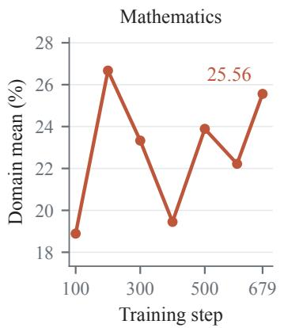

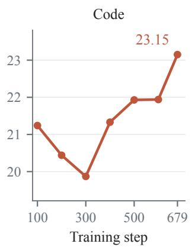

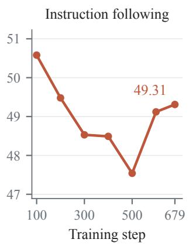  
Figure 6: UP-MOPD training trajectory in the public three-domain setting. Each panel shows a domain mean over two benchmarks. The vertical scales differ across panels.

Table 11: IFEval retention across three late-training checkpoints. The initial student passes 470 of 541 prompts under loose scoring. Retained and lost prompts partition these 470 initial passes; newly passed prompts come from the 71 initial failures. Counts and accuracies are means over the three checkpoints.
<table><tr><td>Method</td><td>Retained</td><td>Lost</td><td>Newly passed</td><td>Accuracy (%)</td></tr><tr><td>M-OPD</td><td>400.7</td><td>69.3</td><td>21.0</td><td>77.94</td></tr><tr><td>UP-MOPD</td><td>419.7</td><td>50.3</td><td>18.0</td><td>80.90</td></tr></table>

Paired benchmark comparison. At the middle late-training checkpoint, UP-MOPD passes 38 IFEval prompts that M-OPD fails and fails 21 that M-OPD passes. Table 12 reports the paired comparison across all eight benchmarks. None of the differences is significant after Benjamini– Hochberg correction (Benjamini and Hochberg, 1995).

Table 12: Paired comparison at the middle late-training checkpoint. IFEval uses prompt-level loose accuracy. Differences are UP-MOPD minus M-OPD, in score points. Intervals are pointwise 95% paired bootstrap confidence intervals; p-values are corrected across all eight metrics.
<table><tr><td>Metric</td><td>M-OPD</td><td>UP-MOPD</td><td>Difference</td><td>95% CI</td><td>BH-adjusted p</td></tr><tr><td>HealthBench-Hard</td><td>38.51</td><td>38.63</td><td>+0.12</td><td>[-1.34, 1.60]</td><td>1.0000</td></tr><tr><td>GPQA</td><td>49.80</td><td>48.18</td><td>-1.62</td><td>[−4.65, 1.31]</td><td>0.5279</td></tr><tr><td>IFEval</td><td>77.82</td><td>80.96</td><td>+3.14</td><td>[0.37, 5.91]</td><td>0.1454</td></tr><tr><td>MedMCQA</td><td>59.67</td><td>58.71</td><td>-0.96</td><td>[−1.77, −0.12]</td><td>0.1454</td></tr><tr><td>PubMedQA</td><td>72.00</td><td>74.40</td><td>+2.40</td><td>[−0.20, 5.00]</td><td>0.2564</td></tr><tr><td>MMLU-Med</td><td>79.41</td><td>79.44</td><td>+0.03</td><td>[−1.34, 1.44]</td><td>1.0000</td></tr><tr><td>AIME24</td><td>54.67</td><td>54.00</td><td>-0.67</td><td>[−7.33, 5.33]</td><td>1.0000</td></tr><tr><td>AIME25</td><td>42.67</td><td>47.33</td><td>+4.67</td><td>[-0.67, 11.33]</td><td>0.4054</td></tr></table>

We use exact McNemar tests for IFEval, MedMCQA, and PubMedQA, and paired sign-flip tests for HealthBench-Hard, GPQA, and AIME. MMLU-Med uses a subject-stratified sign-flip test and bootstrap, with equal subject weights. All tests are two-sided. Bootstrap confidence intervals and permutation tests use 4,000 repetitions. GPQA and AIME average the five generations for each question before pairing. Benjamini–Hochberg correction covers all eight metrics.

On HealthBench-Hard, 366 of the 1,000 paired scores increase, 288 remain unchanged, and 346 decrease. The correlation between response-length change and score change is −0.049, indicating a weak linear association between the two changes.

Instruction type and constraint count. Figure 7 shows the largest mean gains for exclusion constraints (+14.29 points), syntax (+6.94), templates (+4.29), and output formats (+4.12). Othercontent and single-language constraints decrease by 7.32 and 6.45 points, respectively. UP-MOPD improves mean prompt-level accuracy in all three groups defined by the number of constraints, with larger gains when prompts contain multiple constraints. Table 13 shows two prompts where UP-MOPD preserves compliance with the requested bullet count and word limit.

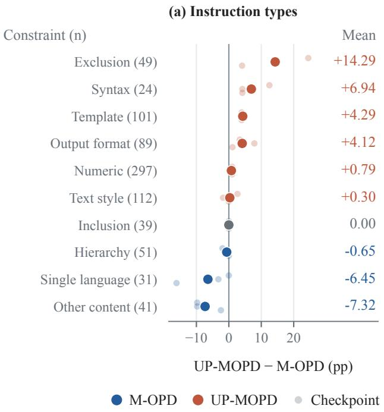

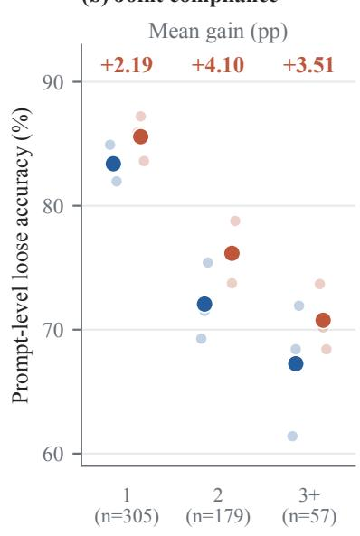

Figure 7: Instruction-following behavior in the medical setting. (a) UP-MOPD minus M-OPD instruction-level loose accuracy for all ten evaluator-defined constraint categories; parentheses give instruction counts. (b) Prompt-level loose accuracy grouped by the number of constraints in a prompt; labels above the groups give the mean gain in percentage points. Faint points show three matched late-training checkpoints from one run per method; solid points show their arithmetic mean.
<table><tr><td>Constraint</td><td>M-OPD</td><td>UP-MOPD</td></tr><tr><td>Exactly three Markdown bullet points</td><td>concise version with desert emphasis:&quot;. pass. Loose: fail.</td><td>Repeats the three-item list after “Final Produces one three-item list. Loose:</td></tr><tr><td>tions</td><td>straint fails. Loose: fail.</td><td>At most 100 words and at 115 words and two highlighted spans. 99 words and three highlighted spans. least two highlighted sec- Highlighting passes, but the length con- Both constraints pass. Loose: pass.</td></tr></table>

Table 13: Examples of constraint compliance. The initial student passes both prompts; distilled outputs are from the middle late-training checkpoint. Counts are computed from complete responses; word counts follow IFEval’s regular-expression tokenizer.