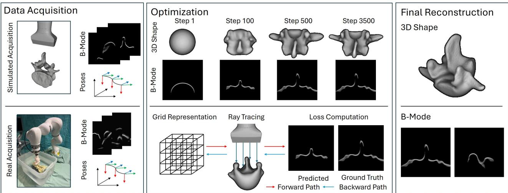
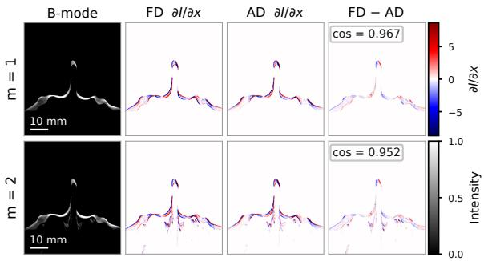
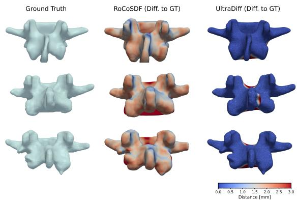
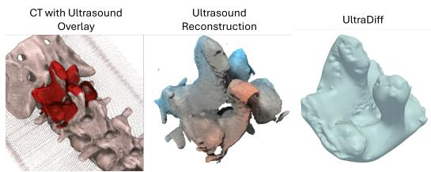

# UltraDif: Diferentiable Ray Tracing in Ultrasound for Shape Optimization

Felix Duelmer✉   
Technical University of   
Munich & Munich Center for Machine Learning Munich, Germany felix.duelmer@tum.de

Magdalena Wysocki Technical University of Munich & Munich Center for Machine Learning Munich, Germany

Nassir Navab   
Technical University of   
Munich & Munich Center   
for Machine Learning   
Munich, Germany   
Mohammad Farid   
Azampour   
Technical University of   
Munich & Munich Center   
for Machine Learning   
Munich, Germany

  
Figure 1: Shape optimization using UltraDif. First, we acquire reference B-mode images and matching poses through simulation or real acquisition with robotic ultrasound. Next, we iteratively produce B-mode images based on the current scene state and our diferentiable ray tracing framework, compute the loss between these simulated images and the target images, and backpropagate the loss through the ray tracing to optimize the underlying shape.

## Abstract

Physically-based diferentiable rendering enables gradient-based optimization of scene parameters by matching rendered images to measurements, but has so far mainly focused on light transport. We extend this paradigm to medical ultrasound, where image formation resembles transient rendering: echoes are binned by time-of-flight rather than projected onto an image plane. We present UltraDif, a modular framework for diferentiable ultrasound ray tracing. UltraDif formulates ultrasound image formation as a path-space integral, gated by travel time between the transducer and tissue interfaces, and derives a Monte Carlo estimator of both the forward model and its gradients with respect to scene parameters. We demonstrate this on an inverse geometry estimation: starting from a sphere, an SDF is optimized until simulated echoes match measured ones, recovering vertebral surfaces from simulated B-mode sweeps and from a real robotic acquisition of a spine phantom.

Unlike state-of-the-art ultrasound shape reconstruction methods, which rely on pre-segmented images, our approach operates unsupervised on B-mode images through analysis-by-synthesis, while achieving competitive geometric accuracy. Implemented on top of Mitsuba 3, UltraDif brings diferentiable path tracing to a new sensing modality and provides a foundation for inverse problems in acoustic imaging.

## CCS Concepts

• Computing methodologies → Ray tracing; Modeling and simulation; • Applied computing → Health informatics.

## Keywords

diferentiable rendering, path tracing, transient rendering, time-offlight imaging, medical ultrasound

## ACM Reference Format:

Felix Duelmer, Magdalena Wysocki, Nassir Navab, and Mohammad Farid Azampour. 2026. UltraDif: Diferentiable Ray Tracing in Ultrasound for Shape Optimization. In SIGGRAPH Asia 2026 Technical Communications (SA Technical Communications ’26), December 01–04, 2026, Kuala Lumpur, Malaysia. ACM, New York, NY, USA, 4 pages. https://doi.org/10.1145/3829339. 3847840

## 1 Introduction

Physically-based diferentiable rendering has become a powerful tool for inverse problems: by diferentiating a Monte Carlo estimate of the rendering equation with respect to scene parameters, geometry and materials can be recovered from images via gradient descent [Li et al. 2018; Vicini et al. 2022; Zhang et al. 2020]. While most of this work targets light transport, the underlying machin ery, specifically path-space integrals, Monte Carlo estimation, and boundary-aware gradients, is not specific to light. Time-resolved variants have been explored in transient rendering, where contributions are binned by time-of-flight rather than projected onto an image plane [Wu et al. 2021; Yi et al. 2021].

Medical ultrasound is, in this sense, a transient imaging modality: a transducer emits acoustic pulses, and echoes returning from tissue interfaces are placed in the image according to their travel time. Recovering 3D anatomy from such images, e.g., bone surfaces from tracked B-mode sweeps, is a long-standing inverse problem in ultrasound-guided intervention. Yet state-of-the-art reconstruction methods [Chen et al. 2024; Wu et al. 2025] do not invert the imaging process: they fit surfaces to point clouds extracted from pre-segmented images, tying accuracy to a separately trained segmentation model rather than to the measured intensities. Diferentiable forward models of ultrasound image formation ofer an alternative: a scene representation is optimized until simulated images match the measured ones, inverting the imaging process directly. Realizing this requires a forward model that is both differentiable and eficient. Full waveform inversion solves the wave equation directly [Guasch et al. 2020], but diferentiating full-wave solvers is computationally expensive and limits scalability. Ray based approximations [Duelmer et al. 2025; Mattausch and Goksel 2016] are eficient and have recently been made diferentiable [Duelmer et al. 2026; Wysocki et al. 2024], but only for single-direction ray integration: each ray marches into the scene and accumulates along a straight line. This limits the set of propagation paths that can contribute to the received echo and precludes view-dependent efects such as specular reflections and multi-bounce reverberation, which path tracing handles naturally.

In this paper, we therefore introduce UltraDif, a diferentiable ray tracing framework for ultrasound based on Monte Carlo path sampling. UltraDif formulates B-mode image formation as a time of-flight gated path integral across multiple interactions with tissue boundaries and provides gradients of the rendered image with respect to scene parameters, including geometry represented as a signed distance field. Implemented in Mitsuba 3, it enables segmentationfree vertebra reconstruction by analysis-by-synthesis from simulated and real robotic B-mode sweeps, competitive with segmentationbased methods. Code and data are available at https://github.com/ Felixduelmer/ultradif.

## 2 Method

## 2.1 Time-of-Flight Path Integral

A B-mode ultrasound image is formed by emitting acoustic pulses from a transducer and recording returning echoes. Unlike a camera, which projects the scene onto an image plane, the position of an echo in the image is determined by its round-trip travel time. Image formation is thus closely related to transient rendering [Wu et al.

2021; Yi et al. 2021], with the transducer acting as both emitter and sensor. We express the time-resolved pressure at transducer element � as a path integral:

$$
P ( e , t ) = \int _ { \Omega _ { e } } f ( \bar { x } , t ) d \mu ( \bar { x } ) = \int _ { \Omega _ { e } } \mathfrak { T } ( \bar { x } ) S _ { e } ( \bar { x } , t ) d \mu ( \bar { x } ) ,\tag{1}
$$

where $\Omega _ { e }$ is the set of paths $\bar { \boldsymbol { x } } = \left( x _ { 0 } , \ldots , x _ { k } \right)$ that start and end on the aperture at element $e ,$ with $k - 1$ interaction points on tissue interfaces, and $d \mu$ is the path-space measure. The integrand factors into a spatial throughput � and a temporal response $S _ { e }$ . The throughput collects the interaction terms $\rho ( x _ { i } )$ , geometry factors $G ,$ and visibility �:

$$
\mathfrak { T } ( \bar { x } ) = \left[ \prod _ { i = 1 } ^ { k - 1 } \rho ( x _ { i } ) \right] \left[ \prod _ { i = 0 } ^ { k - 1 } G ( x _ { i } , x _ { i + 1 } ) V ( x _ { i } , x _ { i + 1 } ) \right] ,\tag{2}
$$

so that richer acoustic interaction models can be substituted without changing the estimator. The temporal response gates each path by its time of flight $\begin{array} { r } { t o f ( \bar { x } ) = \frac { 1 } { S o S } \sum _ { i = 0 } ^ { k - 1 } \| x _ { i + 1 } - x _ { i } \| } \end{array}$ , with SoS the speed of sound. We instantiate $S _ { e }$ as a Gaussian in $t o f ( { \bar { x } } ) - t$ whose width is set by the transmitted pulse length: it models the temporal envelope of the transducer’s pulse-echo response, governing axial resolution, and smoothly distributes each path’s energy over neighboring time samples. Drawing $N$ paths from a proposal density $\boldsymbol { p }$ yields the standard unbiased estimator:

$$
P ( e , t ) \approx \frac { 1 } { N } \sum _ { j = 1 } ^ { N } \frac { \mathfrak { T } ( \bar { x } _ { j } ) S _ { e } ( \bar { x } _ { j } , t ) } { p ( \bar { x } _ { j } ) } .\tag{3}
$$

## 2.2 Diferentiable Formulation

To optimize scene parameters � (e.g., geometric or tissue parameters), we diferentiate Eq. 1. Beyond the explicit dependence of the integrand on $\theta ,$ perturbing the geometry moves the interaction vertices themselves. Applying the transport theorem to the evolving domain yields:

$$
{ \frac { d } { d \theta } } P ( e , t ) = \int _ { \Omega _ { e } } \left[ { \frac { \partial f ( { \bar { x } } , t ) } { \partial \theta } } - f ( { \bar { x } } , t ) \sum _ { i = 1 } ^ { k - 1 } \mathbf { v } ( x _ { i } ) \cdot \mathbf { n } ( x _ { i } ) \right] d \mu ( { \bar { x } } ) ,\tag{4}
$$

where $\mathbf { n } ( x _ { i } )$ is the surface normal and $\mathbf { v } ( x _ { i } )$ the boundary velocity induced by �, analogous to the normal-velocity term in diferentiable SDF rendering [Vicini et al. 2022]. We estimate the gradient with the same samples as $\operatorname { E q } .$ . 3. Note that we do not explicitly sample boundary terms arising from visibility discontinuities [Li et al. 2018; Zhang et al. 2020]. In our setting, the Gaussian temporal kernel and the difuse extent of the transducer response smooth the dominant discontinuities, which we find suficient for stable optimization.

## 2.3 Shape Representation

We represent geometry as a signed distance function (SDF) on a voxel grid with cubic B-spline interpolation, which provides smooth gradients for optimization [Vicini et al. 2022; Wang et al. 2024]. Intersections are found by sphere tracing [Hart 1996]. Velocities and normals in Eq. 4 follow directly from the SDF: $\mathbf { v } ( x ) = - \partial _ { \theta } S D F ( x )$ and $\mathbf { n } ( x ) = { \boldsymbol { \nabla } } S D F ( x ) / \| { \boldsymbol { \nabla } } S D F ( x ) \|$ .

## 2.4 Implementation

We implement UltraDif in Mitsuba 3 using its modular emitter and integrator interfaces, running on the CUDA backend via Dr.Jit [Jakob et al. 2022]. For the shape reconstruction experiments, we restrict paths to a single tissue interaction $( x _ { 0 }  x _ { 1 }  x _ { 2 }$ , with $x _ { 0 } \equiv x _ { 2 } ) ;$ , which captures specular echoes from large-scale tissue boundaries and keeps the inverse problem well-conditioned. The path-space formulation itself is not limited to one bounce, and we demonstrate two-bounce transport in Sec. 3.1. We estimate Eq. 3 by drawing � rays sampled uniformly on each element �. Following common practice in transient rendering [Yi et al. 2021], the same rays contribute to all time samples: we splat each ray’s contribution into neighboring bins according to its travel distance via $S _ { e } .$ The SDF is optimized with Adam under an $\ell _ { 1 }$ image loss, using a coarseto-fine schedule $( 6 4 ^ { 3 } \mathrm { t o } 5 1 2 ^ { 3 } )$ , Laplacian regularization, and periodic re-distancing by fast sweeping [Vicini et al. 2022]. On an NVIDIA RTX 4070 Ti, optimization traces ∼10M rays in parallel at ≈10 epochs/s and completes in roughly 10 minutes.

## 3 Experiments and Results

## 3.1 Gradient Validation and Multi-Bounce Transport

We validate our gradients on a vertebra scene. We perturb the shape through a single parameter, a lateral translation of the signed distance field (SDF), and compare the analytic gradient of the rendered B-mode image against a finite-diference reference (Fig. 2). The analytic (AD) and finite-diference (FD) gradients agree closely, with cosine similarities of 0.97 and 0.95 for single- and two-bounce transport, respectively. The gradient concentrates in a thin, signed band along the reflecting tissue boundary, where the round-trip echo originates, rather than along projected silhouettes as in optical diferentiable rendering, a direct consequence of diferentiating through the time-of-flight gating of the echo signal. The residual (Fig. 2, right column) is mostly confined to sharp boundary curvature. We further show that the path-space formulation extends beyond single-bounce transport. Tracing paths with two interactions reproduces multi-path artifacts, commonly observed in real ultrasound: an echo reflects of one interface onto a second before returning to the transducer. Because each echo is placed by its round-trip time, this signal appears as a ghost echo at greater apparent depth than either reflecting surface. Such paths exist only where a specular bounce can reach a second surface, i.e., within concave anatomy, and are structurally unreachable for single-direction ray-integration models [Duelmer et al. 2026; Wysocki et al. 2024].

## 3.2 Shape Reconstruction

Datasets. We evaluate shape optimization on two datasets: a synthetic dataset of five vertebrae from VerSe2020 [Sekuboyina et al. 2021] (CC BY-SA 4.0) rendered with our forward model, and a real robotic ultrasound acquisition of a spine phantom in a water bath. For the synthetic data, we simulate three sweeps per vertebra (two longitudinal, one transverse), each at three out-of-plane tilt angles of −10◦, 0◦, and 10◦, yielding 450 posed B-mode images per vertebra at 6 cm imaging depth. The real acquisition consists of a single sweep at three tilt angles of −20◦, 0◦, and $2 0 ^ { \circ }$ at 9 cm depth, yielding ∼600 tracked images. In both settings we use the same transducer model with an isotropic point spread function corresponding to a 5 MHz probe. For the real data, we discard the lower 30% of each image, which is dominated by low-SNR clutter that our specular-reflection forward model does not represent.

  
Figure 2: Gradient validation with respect to a lateral SDF translation for single-bounce (top, �=1) and two-bounce (bottom, �=2) transport. Left to right: rendered B-mode, finitediference gradient (FD), our analytic gradient (AD), and their diference. The two-bounce row shows a ghost echo at greater apparent depth caused by multi-path transport.

Baselines. We compare against three recent ultrasound shape reconstruction methods: RoCoSDF [Chen et al. 2024], which fits neural SDFs to orthogonal sweeps and fuses them in a second stage. UltraBoneUDF [Wu et al. 2025], which reconstructs an unsigned distance field of the bone surface, and UltrON [Wysocki et al. 2025], an occupancy-based approach. All three require point clouds extracted from segmented B-mode images as input. We provide these by treating each non-zero pixel of our processed target images as a 3D point. Since the processed targets contain only bone-surface echoes, this acts as an idealized segmentation that gives the baselines the same observations as UltraDif.

Metrics. We report Chamfer distance, mean absolute surface deviation (MAD), earth mover’s distance (EMD), and the 95th-percentile Hausdorf distance (HD95), all in mm, computed only on surface regions observable from the transducer poses so that occluded geometry does not dominate the error.

Table 1: Geometric error on the synthetic dataset (mm, mean±std over five vertebrae). Best values in bold.
<table><tr><td>Method</td><td>Chamfer ↓</td><td>HD95↓</td><td>MAD ↓</td><td>EMD↓</td></tr><tr><td>RoCoSDF</td><td>3.36±0.14</td><td>2.31±0.05</td><td>1.66±0.08</td><td>3.22±0.17</td></tr><tr><td>UltraBoneUDF</td><td>3.04±0.25</td><td>2.78±0.66</td><td>1.50±0.16</td><td>3.62±0.38</td></tr><tr><td>UltrON</td><td>3.33±0.40</td><td>4.55±2.78</td><td>1.36±0.07</td><td>4.41±0.70</td></tr><tr><td>UltraDiff</td><td>0.79±0.09</td><td>3.20±0.62</td><td>0.20±0.05</td><td>2.87±0.28</td></tr></table>

Results. On the synthetic dataset, UltraDif reduces Chamfer distance by 3.8× and MAD by 6.8× relative to the best baseline (Table 1), and the reconstructions closely match the ground-truth surfaces (Fig. 3). The main failure case is the intervertebral disc region, which is observed in only a subset of views: there, the

  
Figure 3: Reconstructions on the synthetic dataset. Rows show sample vertebrae. Columns show the ground-truth surface, RoCoSDF [Chen et al. 2024], and UltraDif. Color encodes per-point distance to the ground truth in mm.

Laplacian prior can over-regularize and suppress the disc, producing localized outliers that raise HD95. On the real phantom acquisition (Fig. 4), the same forward model and optimization settings transfer without modification. UltraDif recovers the overall anatomy and principal curvature reliably, with remaining deviations localized to regions of weak or ambiguous signal. Our sub-millimeter MAD lies within the lumbar tolerances for image-guided pedicle screw placement (up to 3.8 mm [Rampersaud et al. 2001]).

  
Figure 4: Real spine-phantom reconstruction. Left: phantom CT with imaged region. Middle: full reconstruction (manual color map). Right: reconstructed vertebrae.

## 4 Discussion and Conclusion

We introduced UltraDif, a diferentiable ray tracing framework that extends physically-based rendering to ultrasound. By formulating B-mode image formation as a time-of-flight gated path integral, we obtain a Monte Carlo estimator of both the forward model and its gradients, enabling end-to-end optimization through the simulator. The framework is intentionally modular: transducer models, interaction terms, and priors can be exchanged with minimal changes to the pipeline, and the path-space formulation supports multi-bounce transport, as demonstrated by the multi-path artifacts in Sec. 3.1. Our shape reconstruction results indicate that the forward model yields well-behaved gradients for geometric refinement: operating directly on B-mode images without segmentation, UltraDif matches or exceeds the accuracy of point-cloud-based state-of-theart methods and transfers to real acquisition data without modification. Several limitations remain. Our gradient estimator does not explicitly sample boundary terms from visibility discontinuities [Li et al. 2018; Zhang et al. 2020]. Structures only observed in a few views, such as the intervertebral disc, can be suppressed by the smoothness prior (Sec. 3.2), suggesting schedules that begin with a broader point spread function and progressively sharpen. Finally, our synthetic targets are rendered with our own forward model, which may bias the comparison in our favor. The direct transfer to real data mitigates, but does not eliminate, this concern. UltraDif brings diferentiable path tracing to a new sensing modality. We see it as a foundation for richer acoustic interaction models, namely, scattering and attenuation, as well as for broader inverse problems, such as transducer and acquisition trajectory optimization.

## References

Hongbo Chen, Yuchong Gao, Shuhang Zhang, Jiangjie Wu, Yuexin Ma, and Rui Zheng. 2024. RoCoSDF: Row-Column Scanned Neural Signed Distance Fields for Freehand 3D Ultrasound Imaging Shape Reconstruction. In International Conference on Medical Image Computing and Computer-Assisted Intervention. Springer, 721–731.

Felix Duelmer, Mohammad Farid Azampour, Magdalena Wysocki, and Nassir Navab. 2025. Ultraray: Introducing full-path ray tracing in physics-based ultrasound simulation. In International Conference on Medical Image Computing and Computer-Assisted Intervention. Springer, 653–662.

Felix Duelmer, Jakob Klaushofer, Magdalena Wysocki, Nassir Navab, and Mohammad Farid Azampour. 2026. UltraG-Ray: Physics-Based Gaussian Ray Casting for Novel Ultrasound View Synthesis. In Medical Imaging with Deep Learning.

Lluís Guasch, Oscar Calderón Agudo, Meng-Xing Tang, Parashkev Nachev, and Michael Warner. 2020. Full-waveform inversion imaging of the human brain. NPJ digital medicine 3, 1 (2020), 28.

John C Hart. 1996. Sphere tracing: A geometric method for the antialiased ray tracing of implicit surfaces. The Visual Computer 12, 10 (1996), 527–545.

Wenzel Jakob, Sébastien Speierer, Nicolas Roussel, and Delio Vicini. 2022. Dr. jit: A just-in-time compiler for diferentiable rendering. ACM Transactions on Graphics (TOG) 41, 4 (2022), 1–19.

Tzu-Mao Li, Miika Aittala, Frédo Durand, and Jaakko Lehtinen. 2018. Diferentiable monte carlo ray tracing through edge sampling. ACM Transactions on Graphics (TOG) 37, 6 (2018), 1–11.

Oliver Mattausch and Orcun Goksel. 2016. Monte-carlo ray-tracing for realistic interactive ultrasound simulation. In Proceedings ofthe Eurographics Workshop on Visual Computing for Biology and Medicine. 173–181.

Y Raja Rampersaud, David A Simon, and Kevin T Foley. 2001. Accuracy requirements for image-guided spinal pedicle screw placement. Spine 26, 4 (2001), 352–359.

Anjany Sekuboyina, Malek E Husseini, Amirhossein Bayat, Maximilian Löfler, Hans Liebl, Hongwei Li, Giles Tetteh, Jan Kukačka, Christian Payer, Darko Štern, et al. 2021. VerSe: a vertebrae labelling and segmentation benchmark for multi-detector CT images. Medical image analysis 73 (2021), 102166.

Delio Vicini, Sébastien Speierer, and Wenzel Jakob. 2022. Diferentiable signed distance function rendering. ACM Transactions on Graphics (TOG) 41, 4 (2022), 1–18.

Zichen Wang, Xi Deng, Ziyi Zhang, Wenzel Jakob, and Steve Marschner. 2024. A Simple Approach to Diferentiable Rendering of SDFs. In SIGGRAPH Asia 2024 Conference Papers. 1–11.

Lifan Wu, Guangyan Cai, Ravi Ramamoorthi, and Shuang Zhao. 2021. Diferentiable time-gated rendering. ACM Transactions on Graphics (TOG) 40, 6 (2021), 1–16.

Luohong Wu, Matthias Seibold, Nicola A Cavalcanti, Giuseppe Loggia, Lisa Reissner, Bastian Sigrist, Jonas Hein, Lilian Calvet, Arnd Viehöfer, and Philipp Fürnstahl. 2025. UltraBoneUDF: Self-supervised bone surface reconstruction from ultrasound based on neural unsigned distance functions. Computerized Medical Imaging and Graphics (2025), 102690.

Magdalena Wysocki, Mohammad Farid Azampour, Christine Eilers, Benjamin Busam, Mehrdad Salehi, and Nassir Navab. 2024. Ultra-nerf: Neural radiance fields for ultrasound imaging. In Medical Imaging with Deep Learning. PMLR, 382–401.

Magdalena Wysocki, Felix Duelmer, Ananya Bal, Nassir Navab, and Mohammad Farid Azampour. 2025. UltrON: Ultrasound Occupancy Networks. In International Conference on Medical Image Computing and Computer-Assisted Intervention. Springer, 606–615.

Shinyoung Yi, Donggun Kim, Kiseok Choi, Adrian Jarabo, Diego Gutierrez, and Min H Kim. 2021. Diferentiable transient rendering. ACM Transactions on Graphics (TOG) 40, 6 (2021), 1–11.

Cheng Zhang, Bailey Miller, Kai Yan, Ioannis Gkioulekas, and Shuang Zhao. 2020. Path-space diferentiable rendering. ACM Transactions on Graphics 39, 4 (2020), 143–1.