(d) Chart

(c) Driving

# VISIONWEAVE: WEAVING ELASTIC VISUAL REPRE-SENTATIONS AS A NATIVE CAPABILITY OF MLLMS

Yuan Feng1,2∗, Qize Yang2∗, Ruizhe Chen2, Sibo Song2, Haolin He2,3, Muzhi Zhu2,4, Zihan Liu2, Yunfei Chu2, Xize Cheng2, Yuxuan Wang2, Jin Xu2,†, Xike Xie1,†   
1University of Science and Technology of China 2Alibaba Token Hub, Alibaba Group 3The Chinese University of Hong Kong 4Zhejiang University

## ABSTRACT

Multimodal large language models have become the dominant paradigm for visual understanding, but incur substantial costs by encoding inputs into dense, fixedsize patch tokens. However, visual information is unevenly distributed: some regions require fine-grained detail, while others admit compact representations. Downsampling sacrifices this detail, while existing token pruning and adaptive approaches remain limited in content-adaptive granularity, task generalization, and integration with modern MLLMs and serving infrastructure. Overcoming these limitations calls for foundation models that learn, end to end, where—and at what granularity—to allocate visual representations, a native capability we term elastic visual representation weaving. We introduce VisionWeave, establishing this capability in frontier-level MLLMs through large-scale training. It combines two components: a gated spatial pooler constructs coarse-grained representations alongside native fine-grained representations within a shared MRoPE coordinate, while a granularity router learns their content-adaptive allocation. Through self-distillation alone, we validate this capability on Qwen3.5-4B and scale to Qwen3.8-27B with over 30K A100 GPU-hours. Based on Qwen3.8-27B, Vision-Weave adaptively adjusts token savings to visual content, saving 43.0% tokens on average while retaining 98.9% native performance across eight benchmarks, versus only 88% performance preserved for token pruning baselines with a fixed 50% savings target. Extensive evaluations confirm robust efficiency–quality trade-offs across diverse tasks, resolutions and video frames. When deployed on SGLang serving engine, our method achieves a 2.30× end-to-end throughput gain while reducing mean TTFT by 54.4% and mean TPOT by 60.6%. Together, we believe these results position elastic visual weaving as a promising capability for nextgeneration multimodal foundation models, natively modulating computational effort by information content. Our SGLang code and other details will be available at https://github.com/FFY0/VisionWeave.

Fine-grained visual representations  

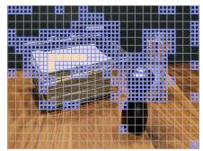  
Coarse-grained visual representation  
Visual Tokens 1728 → 867 (−49.8%)

  
(b) Text

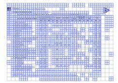

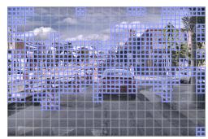  
Visual Tokens 1380 → 840 (−39.1%)

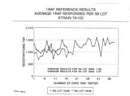

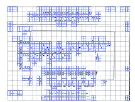  
Visual Tokens 1900 → 1054 (−44.5%)

Figure 1: Weaving elastic visual representations. More examples appear in Appendix C.

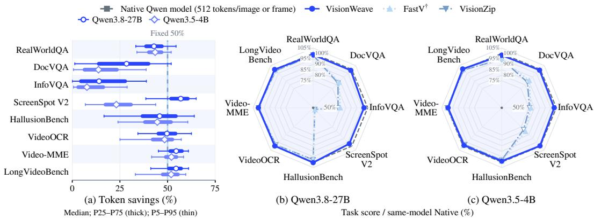  
Figure 2: VisionWeave achieves content-adaptive token savings with near-native quality, whereas fix-budget baselines degrade sharply on challenging tasks. Visual case studies on ScreenSpotV2 and DocVQA illustrate this difference (Appendix B). Our VisionWeave still retains higher quality even when baselines are granted its adaptive saving ratios (Appendix E.3).

## 1 INTRODUCTION

Multimodal large language models (MLLMs) have become the dominant paradigm for visual under standing, supporting diverse tasks such as visual question answering, document analysis, and video understanding within a unified framework (Bai et al., 2025b;a). As these tasks demand finer spatial detail and broader temporal coverage, MLLMs must process higher-resolution images and longer sequences of video frames. However, their visual inputs are typically partitioned into fixed-size patches and encoded into dense sequences of visual tokens. The resulting growth in sequence length places substantial computational and memory demands, making visual efficiency a central challenge in scaling multimodal capabilities (Shao et al., 2025a; Tao et al., 2024; Shao et al., 2025b).

Visual downsampling offers a straightforward solution but sacrifices fine-grained detail, motivating extensive research into visual token pruning and merging (Chen et al., 2024; Yang et al., 2024; Ye et al., 2024; Guo et al., 2026). However, both heuristic and learned methods introduce a training–inference mismatch and discard task-specific information. Our evaluations of FastV and VisionZip reveal severe degradation on information-dense inputs and grounding tasks. Common design choices in these methods, including attention-weight extraction and in-LLM pruning, also complicate integration with modern serving engines such as SGLang and vLLM, where implementations remain rare and practical efficiency gains insufficiently validated. Preset compression ratios further limit adaptivity to diverse visual inputs. These limitations motivate native, content-adaptive visual processing for general-purpose MLLMs: learning where to retain fine-grained detail and where— and to what extent—to use compact coarse representations.

Recent work has explored content-adaptive visual representations, but realizing this adaptivity as a native capability of general-purpose MLLMs remains challenging. One line of work varies ViT patch sizes using low-level image statistics, such as edge density and entropy (Yu et al., 2025; Choudhury et al., 2025). These methods primarily target standalone vision tasks, and their granularity criteria are not optimized for diverse downstream multimodal objectives. ViCO (Cui et al., 2025) is particularly close to our approach: it partitions an image into tiles and adaptively assigns each a visual token resolution. However, its tile-based design limits applicability to modern MLLMs such as Qwen (Bai et al., 2025a) and Kimi (Team, 2026), which use native-resolution visual processing. Moreover, detail-rich regions and low-information backgrounds are often interleaved (Figure 1), requiring finer-grained spatial allocation than a single resolution per tile can provide.1

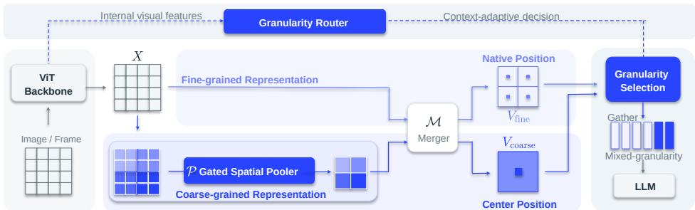  
Figure 3: Overall architecture of VisionWeave. The gated spatial pooler complements native fine grained tokens $V _ { \mathrm { f i n e } }$ with coarse-grained representations $V _ { \mathrm { c o a r s e } }$ within the same MRoPE coordinate, while the granularity router adaptively weaves them into a mixed-granularity sequence for the LLM.

We envision elastic visual representation weaving as a native capability of foundamental MLLMs that should satisfy three requirements:

1. Autonomously content-adaptive token savings while preserving quality.

2. Consistently favorable trade-off than downsampling across diverse visual task inputs.

3. Compatibility with frontier-level MLLM architectures and modern serving infrastructure.

To this end, we introduce VisionWeave, which enables MLLMs to operate natively on elastic visual representations, adaptively weaving together fine- and coarse-grained representations according to visual content. To our knowledge, this is the first effort to establish elastic visual representation weaving as a native capability of frontier MLLMs through large-scale training, accompanied by extensive evaluation to assess its viability as an integral capability of foundation models. The method comprises two core components. First, the elastic representation itself: a gated spatial pooler constructs a learned coarse-grained representation that complements the native fine-grained tokens within the same MRoPE frame. Second, learned granularity allocation: a granularity router probes ViT features to determine the appropriate granularity for each spatial block. Through selfdistillation alone, we make elastic visual processing a native capability, validating on Qwen3.5-4B and then scaling to frontier Qwen3.8-27B with over 30K A100 GPU-hours.

With this native capability, VisionWeave preserves fine-grained detail where needed and uses compact representations elsewhere (Figure 1), achieving content-adaptive token savings with minimal impact on task quality (Figure 2). At an input budget of 512 tokens per image, VisionWeave on Qwen3.8-27B saves 16.5–55.1% of visual tokens across eight benchmarks, averaging 43.0% savings while preserving 98.9% native performance. In contrast, FastV† and VisionZip retain only 88.2% and 87.5%, respectively, at a fixed 50% savings target. Broader evaluations across input resolutions and video frame budgets demonstrate consistently more favorable efficiency–quality trade-offs than input downsampling. Crucially, these token savings translate into practical serving gains build upon modern SGLang serving engine, achieving around 2× throughput improvements. Together, contentadaptive savings, cross-task robustness, and practical deployability support elastic visual processing as a native capability of next-general efficient MLLMs.

## 2 METHOD

In this work, we realize elastic visual representation weaving through two complementary components. A gated spatial pooler constructs learned coarse-grained representations that complement native fine-grained tokens (§2.2.1). A granularity router probes intermediate ViT features to determine the granularity for each spatial block (§2.2.2). Through self-distillation alone, we make elastic visual processing a native capability of MLLMs (§2.3).

## 2.1 PRELIMINARIES

For modern MLLMs, the ViT produces patch features $X \in \mathbb { R } ^ { H \times W \times d } .$ . A native merger M concatenates each $2 \times 2$ neighborhood and applies an MLP to produce fine-grained visual tokens:

$$
V _ { \mathrm { f i n e } } = \mathcal { M } ( X ) \in \mathbb { R } ^ { \frac { H } { 2 } \times \frac { W } { 2 } \times D } ,\tag{1}
$$

where d and D are the ViT and LLM hidden sizes, respectively. MRoPE assigns each token coordinates $\pi _ { i j } = ( \tau , i , j )$ , with temporal coordinate $\tau$ and spatial indices $( i , j )$ . The flattened visual tokens and textual context c condition autoregressive response generation, $p _ { \theta } ( y \mid c , V _ { \mathrm { f i n e } } )$

## 2.2 ARCHITECTURE

## 2.2.1 GATED SPATIAL POOLER

Pooling adjacent patch features is a natural compression primitive: the patches of a block cover contiguous regions whose content is typically correlated—increasingly so wherever the image is locally homogeneous. Leveraging this correlation, Our gated spatial pooler $\mathcal { P }$ maps each $2 \times 2$ neighborhood of ViT patch features to a single pooled feature. Passing these features through the native merger yields the coarse-grained representation in the same embedding space.

$$
V _ { \mathrm { c o a r s e } } = \mathcal { M } \big ( \mathcal { P } ( X ) \big ) \in \mathbb { R } ^ { \frac { H } { 4 } \times \frac { W } { 4 } \times D } , \qquad \mathcal { P } ( X ) \in \mathbb { R } ^ { \frac { H } { 2 } \times \frac { W } { 2 } \times d } .\tag{2}
$$

Each block $( I , J )$ on the ${ \frac { H } { 4 } } \times { \frac { W } { 4 } }$ grid covers $4 { \times } 4$ patches and admits either four native fine-grained tokens $\{ V _ { \mathrm { f i n e , 2 } I + a , 2 J + b } \} _ { a , b \in \{ 0 , 1 \} }$ or one coarse-grained token $V _ { \mathrm { c o a r s e } , I J }$ . We use positional interpolation (Peng et al., 2023; Chen et al., 2023) to place each coarse token at the geometric center of its four corresponding fine-grained tokens.

$$
\pi _ { I J } = { \left( \tau , 2 I + \textstyle { \frac { 1 } { 2 } } , 2 J + \textstyle { \frac { 1 } { 2 } } \right) } .\tag{3}
$$

We implement the gated spatial pooler $\mathcal { P }$ as a learnable extension of mean pooling, combining content-dependent and channel-wise weighting with feature refinement. For each $2 \times 2$ neighborhood, we normalize its four patch features $\{ x _ { k } \} _ { k = 1 } ^ { 4 }$ using learnable layer normalization $^ 2$ and ag gregate them into a shared global context $g _ { k }$

$$
u _ { k } = \mathrm { L N } ( x _ { k } ) \in \mathbb { R } ^ { d } , \qquad g _ { k } = f _ { \mathrm { g l b } } \left( \left[ u _ { 1 } ; u _ { 2 } ; u _ { 3 } ; u _ { 4 } \right] \right) + b _ { k } \ \in \mathbb { R } ^ { d } ,\tag{4}
$$

where $[ \cdot ; \cdot ]$ denotes concatenation and $b _ { k } \in \mathbb { R } ^ { d }$ is a learnable position-specific bias (DeepSeek-AI, 2026). The gate then computes channel-wise scores from patch feature $u _ { k }$ and its context gk:

$$
\alpha _ { k } = \operatorname { s o f t m a x } _ { k = 1 , \ldots , 4 } f _ { \mathrm { g a t e } } \left( [ u _ { k } ; g _ { k } ] \right) \ \in ( 0 , 1 ) ^ { d } ,\tag{5}
$$

where the softmax normalizes over the four spatial positions channel-wise, i.e. $\textstyle \sum _ { k = 1 } ^ { 4 } \alpha _ { k } = \mathbf { 1 } _ { d }$ Finally, a value net $f _ { \mathrm { v a l } }$ refines each feature, and the pooled output is the gated sum,

$$
v _ { k } = u _ { k } + f _ { \mathrm { v a l } } \big ( \big [ u _ { k } ; g _ { k } \big ] \big ) \ \in \mathbb { R } ^ { d } , \qquad \mathcal { P } \big ( x _ { 1 : 4 } \big ) = \sum _ { k = 1 } ^ { 4 } \alpha _ { k } \odot v _ { k } \ \in \mathbb { R } ^ { d } ,\tag{6}
$$

where $f _ { \mathrm { g l b } } , f _ { \mathrm { g a t e } } , f _ { \mathrm { v a l } }$ are two-layer MLPs (each mapping into $\mathbb { R } ^ { d } )$ and $\odot$ is the elementwise product. Beyond its greate expressiveness 3, the pooler offers a favorable starting point: zero-initializing the final layers of $f _ { \mathrm { g a t e } }$ and $f _ { \mathrm { v a l } }$ reduces $\mathcal { P }$ to mean pooling over normalized patch features.

## 2.2.2 GRANULARITY ROUTER

With both granularities available, our granularity router learns their content-adaptive allocation across spatial blocks 4. It probes ViT features at multiple depths with a learnable query, combining low-level detail from early layers with semantic information from later layers. We implement this multi-depth probing with one query state $h _ { I J } \in \mathbb R ^ { d }$ per spatial block, initialized from a shared learnable vector. Each query uses the block-center MRoPE coordinate $\left( 4 I + { \frac { 3 } { 2 } } , 4 J + { \frac { 3 } { 2 } } \right)$  on the $H \times W$ patch grid, corresponding to the same spatial center as Eq. (3). For a ViT with L layers, we denote the features after layer ℓ by $X ^ { ( \ell ) } \in \mathbb { R } ^ { \hat { H } \times W \times d }$ , with $X ^ { ( 0 ) }$ the patch embeddings and $X ^ { ( L ) } = X$ Each query state is updated through cross-attention to ViT features, followed by an MLP, both with residual connections:

Algorithm 1 VisionWeave inference with elastic visual representations   
Require: An $\overline { { H \times W } }$ patch grid for an image; textual context $c ;$ routing threshold t (default 0.5)   
1: Obtain $X ^ { ( 0 ) } , X ^ { ( \bar { L } / 2 ) } , \bar { X } ^ { ( L ) }$ in a single ViT forward pass   
2: $V _ { \mathrm { f i n e } }  \mathcal { M } ( X ^ { ( L ) } ) ; \quad V _ { \mathrm { c o a r s e } }  \mathcal { M } \bar { ( } \mathcal { P } ( X ^ { ( L ) } ) )$ Eqs. (1), (2)   
3: Initialize $h _ { I J }$ from the shared query with block-center RoPE coordinates   
4: for $\ell \in \{ 0 , L / / 2 , L \}$ do   
5: $h _ { I J } \gets \mathrm { L o c a l C r o s s A t t n } ^ { ( \ell ) } \left( h _ { I J } , X _ { I J } ^ { ( \ell ) } \right)$   
6: $h _ { I J } \gets \mathrm { G l o b a l C r o s s A t t n } ^ { ( \ell ) } \left( h _ { I J } , X ^ { ( \ell ) } \right)$ Eq. (8)   
7: end for   
8: Compute $p _ { I J }$ using the calibrated router head   
9: for each block $( I , { \bar { J } } )$ do   
10: $\mathbf { i f } _ { \mathit { p } _ { I J } } > t$ then   
11: Select $V _ { \mathrm { c o a r s e } , I J }$ with its block-center coordinate $\pi _ { I J }$ from Eq. (3)   
12: else   
13: Select $\{ V _ { \mathrm { f i n e , 2 } I + a , 2 J + b } \} _ { a , b \in \{ 0 , 1 \} }$ with their native coordinates from Section 2.1   
14: end if   
15: end for   
16: Gather selected tokens into $V _ { \mathrm { r o u t e d } }$ in native raster order   
17: return $p _ { \theta } \left( y \mid c , V _ { \mathrm { r o u t e d } } \right)$

$$
h ^ { \prime } = \mathrm { L N } \Big ( h + \mathrm { C r o s s A t t n } \big ( h , \mathrm { L N } ( X ^ { ( \ell ) } ) \big ) \Big ) , \qquad h \gets \mathrm { L N } \big ( h ^ { \prime } + \mathrm { M L P } ( h ^ { \prime } ) \big ) ,\tag{7}
$$

where CrossAttn takes its query from h and keys/values from $\mathrm { L N } ( X ^ { ( \ell ) } )$ , with MRoPE applied to queries and keys; the KV-side LN keeps features tapped at different depths on a comparable scale. Each query sequentially probes depths $\mathbf { \bar { \rho } } \mathbf { \in } 0 , L / / 2 , L$ . At each depth, a local block is followed by a global block, yielding six independently parameterized blocks in total. The local block attends to the spatial block’s own $4 { \times } 4$ patch features $X _ { I J } ^ { ( \ell ) } \in \mathbb { R } ^ { 4 \times 4 \times d } ;$ ; a global block then opens them to the whole frame:

$$
h _ { I J } \gets \mathrm { L o c a l C r o s s A t t n } ^ { ( \ell ) } \left( h _ { I J } , X _ { I J } ^ { ( \ell ) } \right) ; h _ { I J } \gets \mathrm { G l o b a l C r o s s A t t n } ^ { ( \ell ) } \left( h _ { I J } , X ^ { ( \ell ) } \right) .\tag{8}
$$

Finally, a linear head maps the normalized query state to two logits, giving the probability of using the coarse-grained representation:

$$
p _ { I J } = \mathrm { s o f t m a x } \left( W _ { r } \operatorname { L N } ( h _ { I J } ) \right) _ { \mathrm { c o a r s e } } , \qquad W _ { r } \in \mathbb { R } ^ { 2 \times d } .\tag{9}
$$

For each spatial block, we use its coarse-grained token if the routing probability exceeds a threshold 5 and retain its four native fine-grained tokens otherwise. The selected tokens are gathered into a mixed-granularity sequence for the LLM backbone within the shared MRoPE frame. Algorithm 1 summarizes the complete inference path.

## 2.3 TRAINING

We develop elastic visual weaving through three-stage self-distillation (Table $1 ) . ^ { 6 }$ The native forward pass provides output-distribution supervision. Distillation is off-policy 7, with teacher and

Table 1: Three-stage self-distillation for elastic visual processing.
<table><tr><td></td><td>Stage 1</td><td>Stage 2</td><td>Stage 3</td></tr><tr><td>Trainable components</td><td>Gated Spatial Pooler</td><td>Granularity Router</td><td>Pooler, LLM</td></tr><tr><td>Teacher</td><td>Native model</td><td>Native model</td><td>Native model</td></tr><tr><td>Routing</td><td>Bypassed (all coarse)</td><td>Soft-mixing routing</td><td>Hard routing</td></tr><tr><td>Loss terms</td><td> $\mathcal { L } _ { \mathrm { d i s t i l l } }$ </td><td> $\mathcal { L } _ { \mathrm { d i s t i l l } } + 0 . 0 2 \mathcal { L } _ { \mathrm { b a l } }$ </td><td> ${ \mathcal { L } } _ { \mathrm { d i s t i l l } }$ </td></tr><tr><td>Student visual tokens</td><td>25%</td><td>100%</td><td>Content-adaptive</td></tr></table>

student conditioned on the same teacher rollout. The student progresses from coarse-grained representations to a differentiable soft-mixing surrogate, and finally to the hard-routed mixed-granularity sequences used at inference.

## 2.3.1 STAGE 1: COARSE-GRAINED SELF-DISTILLATION

We first train the pooler with routing bypassed, using the coarse-grained representation for every block: $V _ { \mathrm { s t u d e n t } } = \mathrm { \bar { f l a t t e n } } ( V _ { \mathrm { c o a r s e } } )$ . All other components remain frozen. The model’s native forward pass serves as the teacher, yielding the distillation objective:

$$
\mathcal { L } _ { \mathrm { d i s t i l } } = \frac { 1 } { \left| y \right| } \sum _ { t } \mathrm { K L } \Big ( \widehat { p _ { \theta } } \big ( \cdot \mid y _ { < t } , c , { V } _ { \mathrm { f i n e } } \big ) \ \Big | \Big | \ \widehat { p _ { \theta } } \big ( \cdot \mid y _ { < t } , c , { V } _ { \mathrm { s t u d e n t } } \big ) \Big ) ,\tag{10}
$$

where $y$ is a response generated by the teacher and $\bar { \theta }$ denotes its parameters. Both $\widehat { p } _ { \bar { \theta } }$ and $\widehat { p } _ { \theta }$ are renormalized over the teacher’s top-512 vocabulary entries at each response position. Later stages reuse this objective with different constructions of Vstudent.

## 2.3.2 STAGE 2: SOFT-MIXING SELF-DISTILLATION

We next train only the granularity router using a differentiable soft-mixing surrogate for hard routing. We interpolate feature directions and magnitudes separately to prevent norm differences from biasing the directional mixture. Let $\widehat { V } _ { \mathrm { f i n e } }$ and $\widehat { V } _ { \mathrm { c o a r s e } }$ denote the token-wise L2-normalized representations under $\mathcal { N } ( v ) = v / \operatorname* { m a x } ( \| v \| _ { 2 } , \epsilon )$ . We compute

$$
\begin{array} { r } { m _ { i j } = ( 1 - p _ { I J } ) \vert \vert V _ { \mathrm { f n e } , i j } \vert \vert _ { 2 } + p _ { I J } \vert \vert V _ { \mathrm { c o a r s e } , I J } \vert \vert _ { 2 } , \ } \\ { V _ { \mathrm { m i x } , i j } = m _ { i j } \mathcal { N } \Big ( ( 1 - p _ { I J } ) \widehat { V } _ { \mathrm { f n e } , i j } + p _ { I J } \widehat { V } _ { \mathrm { c o a r s e } , I J } \Big ) . } \end{array}\tag{11}
$$

where $I = \lfloor i / 2 \rfloor , J = \lfloor j / 2 \rfloor$ , and ϵ ensures numerical stability. Each coarse token is broadcast to its four corresponding native positions. The resulting sequence, $V _ { \mathrm { s t u d e n t } } = \mathrm { f l a t t e n } ( V _ { \mathrm { m i x } } )$ , is used in the distillation objective of Eq. (10). We add a per-sample balance loss borrow from MoE training:

$$
\mathcal { L } _ { \mathrm { b a l } } = \frac { F } { \rho } G + \frac { 1 - F } { 1 - \rho } ( 1 - G ) ,\tag{12}
$$

where F is the fraction of the sample’s blocks with $p _ { I J } \ge 0 . 5 ,$ G is its mean routing probability, ρ is the target coarse-routing fraction. The penalty encourages more coarse routing when $F < \rho$ and less when $F > \rho .$ . Per-sample statistics prevent larger inputs from dominating the estimate and batch averages from masking input-level imbalance. We set $\rho = 0 . 8$ and optimize $\mathcal { L } _ { \mathrm { d i s t i l l } } + 0 . 0 2 \mathcal { L } _ { \mathrm { b a l } }$

## 2.3.3 STAGE 3: MIXED-GRANULARITY SELF-DISTILLATION

Stage 3 performs self-distillation on the hard-routed mixed-granularity sequences used at inference. 8 The router head includes an offline-calibrated scalar coarse-routing bias, held fixed during training and inference, without auxiliary balancing losses or online adjustments. 9 The student gathers $V _ { \mathrm { s t u d e n t } }$ from $V _ { \mathrm { f i n e } }$ and $V _ { \mathrm { c o a r s e } }$ using the same token selection and RoPE coordinates as at inference. The native forward pass of a frozen teacher provides supervision through the distillation objective.

Table 2: Training-data composition for Qwen3.8-27B.
<table><tr><td>Source</td><td>Domain</td><td>Approx. training samples</td></tr><tr><td>LLaVA-OneVision (An et al., 2025)</td><td>Image understanding</td><td>246K</td></tr><tr><td>LLaVA-Video-178K (Zhang et al., 2025b)</td><td>Video understanding</td><td>281K</td></tr><tr><td>UGround (Gou et al., 2025)</td><td>GUI grounding</td><td>250K</td></tr><tr><td colspan="3">Total</td></tr></table>

## 2.4 TRAINING DETAILS AND DYNAMICS

Training data. All three stages of Qwen3.8-27B training use the same mixture of approximately 0.78 million samples covering image understanding, video understanding, and GUI grounding (Table 2). Counts refer to samples before sequence packing. The visual input budgets are 4,096 native visual tokens per image and 512 per video frame, with up to 64 sampled frames.

Training settings. The granularity router samples ViT features at depths [0, 13, 27], with one local–global cross-attention pair per depth. Its six layers use 16 attention heads, an MLP expansion ratio of 2, and key/value layer normalization; the scoring head is kept in FP32. All stages use BF16 training with Adam $( \beta _ { 1 } = \mathrm { { 0 . 9 , } } \beta _ { 2 } = 0 . 9 9 9 , \epsilon = 1 0 ^ { - 8 } )$ , zero weight decay and cosine learning-rate decay. Table 3 summarizes the stage-specific settings. Distillation is off-policy at temperature 1, using forward KL divergence over top-512 vocabulary entries. Stage 1 weights each sample’s mean token loss by the square root of its supervised response length. We observed training instability with this weighting in Stage 2 and therefore use a global mean over supervised response tokens in Stages 2 and 3. Stage 3 updates the pooler and LLM, while keeping the ViT, native merger, and router frozen. Global batch sizes count packed sequences in Stages 1 and 2 and individual samples in Stage 3.

Table 3: Training hyperparameters for Qwen3.8-27B.
<table><tr><td>Setting</td><td>Stage 1</td><td>Stage 2</td><td>Stage 3</td></tr><tr><td>Peak learning rate</td><td> $1 \times 1 0 ^ { - 4 }$ </td><td> $1 \times 1 0 ^ { - 5 }$ </td><td> $3 \times 1 0 ^ { - 6 }$ </td></tr><tr><td>Minimum learning rate</td><td> $5 \times 1 0 ^ { - 6 }$ </td><td>0</td><td>0</td></tr><tr><td>Warmup fraction</td><td>5%</td><td>5%</td><td>2%</td></tr><tr><td>Global batch size</td><td>32</td><td>64</td><td>512</td></tr><tr><td>Training steps</td><td>5,257</td><td>2,500</td><td>1,000</td></tr><tr><td>Gradient clipping</td><td>1.0</td><td>1.0</td><td>0.5</td></tr><tr><td>Student maximum sequence length</td><td>16,384</td><td>24,576</td><td>24,576</td></tr><tr><td>Packed sequence length</td><td>16,384</td><td>24,576</td><td>Disabled</td></tr></table>

Training dynamics. Figure 4 traces the three self-distillation stages on Qwen3.8-27B, showing raw losses and exponential moving averages (EMA, $\alpha = 0 . 0 2$ , initialized at the first step). The routing distributions reveal how granularity decisions develop. In Stage 2, mean router entropy falls from 0.658 to 0.427 nats between the first and last 100 steps. From step 50 to 2,500, the validation share of blocks with $p _ { I J } \in \{ 0 . 4 , 0 . 6 )$ decreases from 64.8% to 14.6%, while the share with $p _ { I J } \ge 0 . 9$ reaches 28.3%. These changes indicate increasingly decisive allocation; Section 4.1 tests its contribution to task quality.

## 2.5 DEPLOY VISIONWEAVE ON MODERN SERVING INFRASTRUCTURE

To demonstrate how native elastic visual weaving can be deployed on modern serving infrastructure, we integrate VisionWeave into SGLang (Zheng et al., 2023). This requires addressing two core challenges: supporting block-center MRoPE coordinates and mixed-granularity visual sequences.

Block-center RoPE support. Coarse-grained tokens use the block-center RoPE coordinates defined in Eq. (3). To support these half-integer positions in SGLang’s integer-indexed RoPE caches, we double all position coordinates and halve rotary frequencies, preserving rotary phases. We apply this rescaling to cache construction and growth and to position updates during prefill and decode, reusing the existing rotary-embedding and attention kernels.

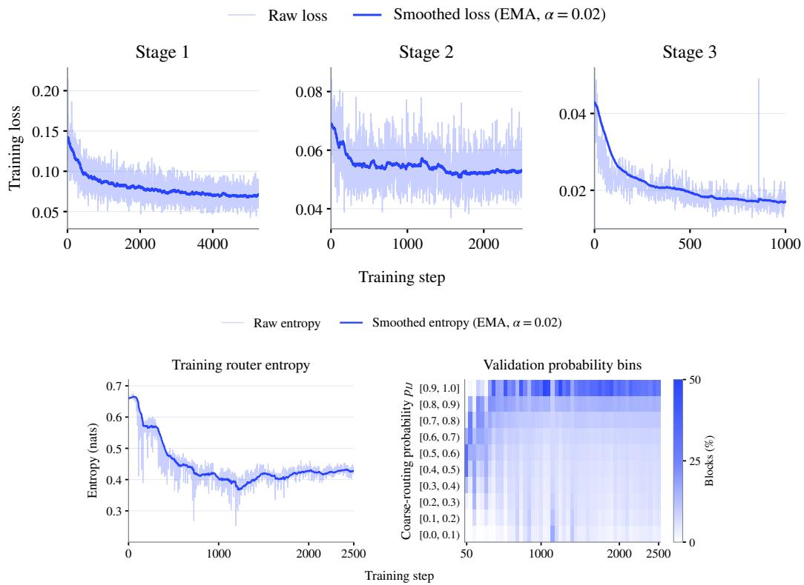  
Figure 4: Training dynamics of three-stage self-distillation.

Mixed-granularity sequence support. We extend SGLang’s encoder-disaggregated stage by attaching layout metadata to visual responses. This enables pre-admission embedding slicing and RoPE construction, finalizing sequence layouts before scheduling while preserving dynamic batching, KV-cache management, and CUDA-graph decoding. Serving gains are reported in Section 3.4.

## 3 EXPERIMENTS

We organize our evaluation around the three requirements for elastic visual weaving as a native MLLM capability: quality-preserving, content-adaptive token savings (Section 3.2), robust tradeoffs across resolutions and frame budgets (Section 3.3), and practical serving gains on SGLang (Section 3.4). We then examine inference-time control (Section 3.5) and analyze component contributions and granularity allocation (Section 4).

## 3.1 EXPERIMENTAL SETUP

Models and baselines. We evaluate with two frontier open-source MLLMs, the Qwen3.5-4B and Qwen3.8-27B. We compare VisionWeave against two heuristic visual-token reduction methods: VisionZip Yang et al. (2024) and FastV Chen et al. (2024), representing token merging and pruning, respectively. To enable a consistent evaluation within SGLang and support its modern serving features, we use a FastV variant, denoted FastV†, that selects tokens after the vision encoder rather than within the LLM. Unless otherwise stated, VisionWeave uses a default routing threshold of t = 0.5.

Tasks. We assess cross-domain robustness on eight benchmarks spanning natural-image (Real-WorldQA), document and infographic understanding (DocVQA and InfoVQA), GUI grounding (ScreenSpotV2), visual hallucination (HallusionBench), video details (VideoOCR), and video understanding (Video-MME and LongVideoBench). All task scores are reported on a 0–100 scale, using ANLS for DocVQA and InfoVQA, aAcc for HallusionBench, and the task-specific metric for each remaining benchmark.

Table 4: Content-adaptive token savings with near-native quality.
<table><tr><td rowspan="2">Qwen3.5-4B</td><td>Native Model</td><td colspan="4">Fixed Savings (s=50%)</td><td colspan="2">Content-adaptive Savings</td></tr><tr><td>512 token/Image</td><td>Downsampling</td><td>FastV†</td><td></td><td>VisionZip</td><td>VisionWeave</td><td>Savings (%)</td></tr><tr><td>RealWorldQA</td><td>74.64</td><td>72.16 (↓3.32%)</td><td>70.98 (↓4.90%)</td><td>70.72 (↓5.25%)</td><td></td><td>73.46 (↓1.58%)</td><td>43.2</td></tr><tr><td>DocVQA</td><td>91.92</td><td>82.71(↓10.02%)</td><td>78.69(↓14.39%)</td><td>76.57(↓16.70%)</td><td></td><td>91.03 (↓0.97%)</td><td>16.0</td></tr><tr><td>InfoVQA</td><td>67.44</td><td>52.87(↓21.60%)</td><td>51.75(↓23.27%)</td><td>50.89(↓24.54%)</td><td></td><td>66.11 (↓1.97%)</td><td>10.6</td></tr><tr><td>ScreenSpotV2</td><td>89.86</td><td>80.42(↓10.51%)</td><td>72.56(↓19.25%)</td><td>70.44(↓21.61%)</td><td></td><td>89.47 (↓0.43%)</td><td>24.1</td></tr><tr><td>HallusionBench</td><td>69.88</td><td>69.09 (↓1.13%)</td><td>69.26 (↓0.89%)</td><td>68.64 (↓1.77%)</td><td></td><td>69.26 (↓0.89%)</td><td>44.0</td></tr><tr><td>VideoOCR</td><td>64.51</td><td>59.74 (↓7.39%)</td><td>63.90 (↓0.95%)</td><td>63.18 (↓2.06%)</td><td></td><td>63.79 (↓1.12%)</td><td>47.0</td></tr><tr><td>Video-MME</td><td>67.78</td><td>67.07 (↓1.05%)</td><td>67.70 (↓0.12%)</td><td>67.74 (↓0.06%)</td><td></td><td>67.22 (↓0.83%)</td><td>51.4</td></tr><tr><td>Long VideoBench</td><td>59.99</td><td>58.86 (↓1.88%)</td><td>60.06 (↑0.12%)</td><td>59.61 (↓0.63%)</td><td></td><td>60.36 (↑0.62%)</td><td>49.8</td></tr><tr><td>Average</td><td>73.25</td><td>67.87 (↓7.11%)</td><td>66.86 (↓7.96%)</td><td>65.97 (↓9.08%)</td><td></td><td>72.59 (↓0.90%)</td><td>35.8</td></tr><tr><td>Qwen3.8-27B</td><td></td><td></td><td></td><td></td><td></td><td></td><td></td></tr><tr><td>RealWorldQA</td><td>78.82</td><td>74.64 (↓5.30%)</td><td>78.43 (↓0.49%)</td><td>77.65 (↓1.48%)</td><td></td><td>77.91 (↓1.15%)</td><td>43.1</td></tr><tr><td>DocVQA</td><td>92.47</td><td>83.19(↓10.04%)</td><td>77.05(↓16.68%)</td><td>76.01(↓17.80%)</td><td></td><td>91.33 (↓1.23%)</td><td>27.3</td></tr><tr><td>InfoVQA</td><td>74.13</td><td>58.48(↓21.11%)</td><td>55.49(↓25.15%)</td><td>53.96(↓27.21%)</td><td></td><td>71.61 (↓3.40%)</td><td>16.5</td></tr><tr><td>ScreenSpotV2</td><td>94.42</td><td>91.04 (↓3.58%)</td><td>49.53(↓47.54%)</td><td>49.21(↓47.88%)</td><td></td><td>91.43 (↓3.17%)</td><td>55.1</td></tr><tr><td>HallusionBench</td><td>73.25</td><td>72.10 (↓1.57%)</td><td>71.92 (↓1.82%)</td><td></td><td>71.66 (↓2.17%)</td><td>73.60 (↑0.48%)</td><td>44.9</td></tr><tr><td>VideoOCR</td><td>70.72</td><td>65.59 (↓7.25%)</td><td>69.69 (↓1.46%)</td><td></td><td>69.54 (↓1.67%)</td><td>70.51 (↓0.30%)</td><td>49.6</td></tr><tr><td>Video-MME</td><td>70.89</td><td>70.41 (↓0.68%)</td><td>70.70 (↓0.27%)</td><td></td><td>70.96 (↑0.10%)</td><td>71.04 (↑0.21%)</td><td>54.2</td></tr><tr><td>Long VideoBench</td><td>66.49</td><td>64.70 (↓2.69%)</td><td>65.74 (↓1.13%)</td><td>65.45</td><td>(↓1.56%)</td><td>66.42 (↓0.11%)</td><td>53.0</td></tr><tr><td>Average</td><td>77.65</td><td>72.52 (↓6.53%)</td><td>67.32(↓11.82%)</td><td>66.81(↓12.46%)</td><td></td><td>76.73 (↓1.08%)</td><td>43.0</td></tr></table>

## 3.2 CONTENT-ADAPTIVE TOKEN SAVINGS WITH PRESERVED QUALITY

With a default routing threshold t = 0.5, VisionWeave achieves content-adaptive token savings while maintaining near-native quality (Table 4). Across all eight benchmarks, VisionWeave incurs an average performance loss of only 0.90% on Qwen3.5-4B and 1.08% on Qwen3.8-27B, relative to the corresponding native models. Specifically, on Qwen3.8-27B, VisionWeave saves 16.5% of tokens on InfoVQA and 27.3% on DocVQA, compared with 49.6–54.2% across the three video benchmarks, where performance losses remain at or below 0.30%. Qwen3.5-4B shows a similar pattern, saving 10.6–16.0% on the two document benchmarks and 47.0–51.4% on video.

In contrast, FastV† and VisionZip incur average losses of 11.82% and 12.46% on Qwen3.8-27B at a fixed 50% token-savings target. Although losses are modest on video, they degrade sharply on grounding and information-dense tasks: VisionZip incurs losses of 47.88% on ScreenSpotV2 and 17.80% on DocVQA. VisionWeave, by contrast, loses only 3.17% on ScreenSpotV2 despite more aggressive token savings of 55.1%, while adaptively reducing its savings to 27.3% on DocVQA with only a 1.23% loss. These results highlight the advantage of content-adaptive savings: reducing visual tokens according to input demands while preserving quality.

To isolate the effect of dataset-level savings, we also assign FastV† and VisionZip VisionWeave’s observed savings ratio for each backbone and dataset. VisionWeave retains the highest average score: 72.59 versus 72.20/71.90 on Qwen3.5-4B, and 76.73 versus 70.10/70.33 on Qwen3.8-27B. Rankings vary across tasks, but matching the dataset-level savings alone does not reproduce Vision-Weave’s average quality. Complete results appear in Appendix E.3.

## 3.3 ROBUSTNESS ACROSS INPUT RESOLUTIONS AND FRAME BUDGETS

We next demonstrate the robustness of VisionWeave’s efficiency–quality trade-offs across tasks, spatial resolutions, and frame budgets. Consistently improving upon input downsampling is nontrivial: a method that works well in one setting may fail in another. Figure 5 shows that VisionWeave consistently maintains favorable trade-offs across all eight benchmarks and the evaluated resolutions.

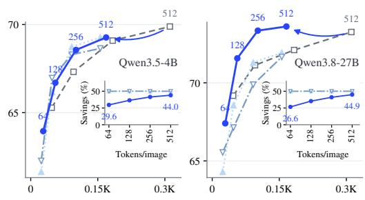

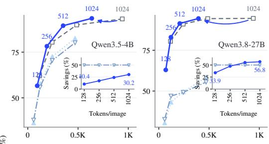

Native Qwen model VisionWeave (default t=0.5) FastV† VisionZip  
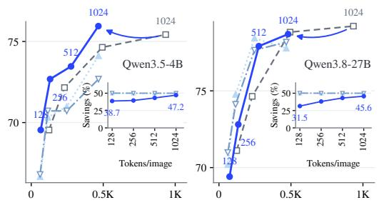  
(a) RealWorldQA

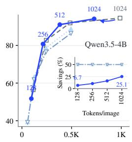

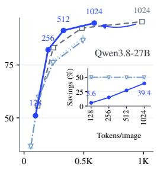  
(b) DocVQA

(c) ScreenSpotV2  
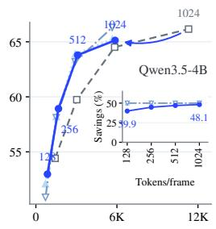

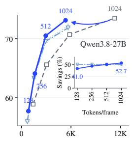  
(d) VideoOCR

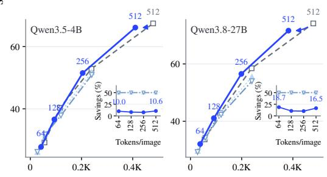  
(e) InfoVQA

(f) HallusionBench  
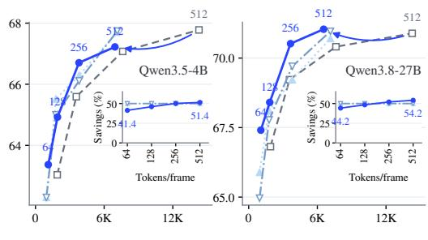  
(g) Video-MME

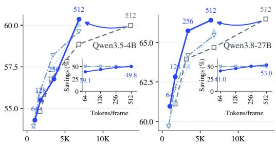  
(h) LongVideoBench  
Visual tokens per sample  
Figure 5: VisionWeave achieves consistently favorable trade-offs across tasks and input resolutions.

Video resolution sweeps fix the frame cap at 64 and the sampling rate at 2 FPS. FastV† and VisionZip remain competitive on VideoOCR yet degrade sharply on ScreenSpotV2. Their effectiveness also varies with resolution within the same task. On Qwen3.8-27B DocVQA, for example, VisionZip offers a competitive trade-off at a 256-token input budget but falls behind simple downsampling at higher resolutions. By contrast, VisionWeave consistently offers a more favorable efficiency–quality trade-off than input downsampling across the evaluated tasks and resolutions. The same advantage extends to temporal coverage (Figure 6). With a 256-frame cap, Qwen3.8-27B VisionWeave outperforms the native model capped at 128 frames by 1.20 points on LongVideoBench while using fewer visual tokens. Together, these results support the robust performance of native elastic visual weaving across diverse input conditions.

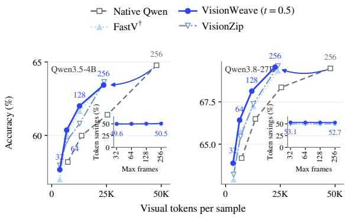  
Figure 6: VisionWeave maintains favorable trade-offs across frame budgets on LongVideoBench.

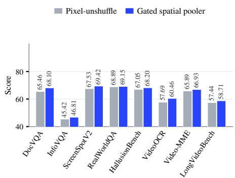

Figure 7: Gated pooling outperforms pixelunshuffle across eight benchmarks.  
Table 5: VisionWeave accelerates Qwen3.8-27B serving on SGLang.
<table><tr><td>Model</td><td>Throughput (req/min) ↑</td><td>Mean TTFT (s) ↓</td><td>P95 TTFT (s) ↓</td><td>Mean TPOT (ms) ↓</td><td>P95 TPOT (ms) ↓</td></tr><tr><td>Native Model</td><td>0.90</td><td>169.90</td><td>281.41</td><td>355.64</td><td>715.58</td></tr><tr><td>VisionWeave</td><td>2.07 (2.30×)</td><td>77.54(↓54.4%)</td><td>120.59(↓57.1%)</td><td>140.29 (↓60.6%)</td><td>289.19 (↓59.6%)</td></tr></table>

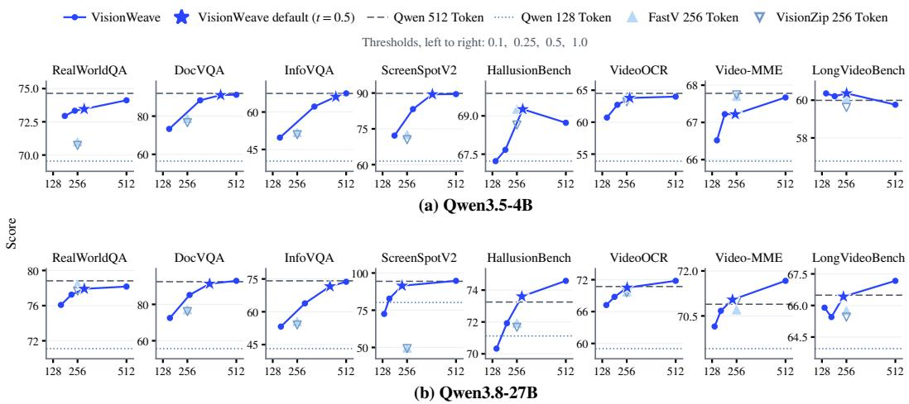  
Figure 8: VisionWeave enables flexible inference-time control of token savings while closely matching native-model performance when savings are disabled.

## 3.4 END-TO-END SERVING EFFICIENCY ON SGLANG

To evaluate practical deployability, we benchmark native Qwen3.8-27B and VisionWeave on SGLang using our integration (Section 2.5). Both run on two A100-80GB GPUs (BF16, TP=2), with chunked prefill and CUDA-graph decoding enabled. We use the LongVideoBench with fps2, 256 max frames per video, a spatial budget of 1024 tokens/frame. Client concurrency is four, with a server limit of eight. More details appear in Appendix E.4. Overall, VisionWeave delivers a 2.30× end-to-end throughput speedup (Table 5). Both mean and tail latency improve: P95 time to first token (TTFT) and time per output token (TPOT) decrease by 57.1% and 59.6%, respectively. These results demonstrate that native elastic visual processing translates into higher serving throughput and lower response latency under this long-video workload.

## 3.5 INFERENCE-TIME CONTROL OF TOKEN SAVINGS

The default threshold t = 0.5 already provides content-adaptive token savings without task-specific tuning. We further show that varying this threshold enables flexible inference-time control without retraining (Figure 8). At the full-retention endpoint, labeled t = 1 in the figure, every block uses its fine-grained representation, with no token savings. These results suggest that native visual weaving expands the model’s efficiency–quality operating range while preserving its fully fine-grained performance. Lowering the threshold then favors coarse-grained representations and increases token savings. On Video-MME, reducing t from 0.5 to 0.25 increases savings from 54.2% to 66.0% on Qwen3.8-27B, with only a 0.37-point performance loss. On Qwen3.5-4B, the same adjustment increases savings from 51.4% to 62.1% while preserving the score of 67.22. These results highlight a key practical advantage of native visual weaving: a single model can accommodate different quality and cost requirements without retraining, while closely matching the native model’s performance ceiling when token savings are disabled.

## 4 ANALYSIS OF ELASTIC VISUAL WEAVING

We examine the contributions of individual components and the spatial allocation of visual representations.

## 4.1 ABLATION STUDIES

Gated spatial pooler. We compare our pooler with a pixel-unshuffle-based projector on Qwen3.5- 4B after Stage 1, both at 75% token savings. Our pooler achieves higher scores on all eight benchmarks (Figure 7), including gains of 2.64 points on DocVQA and 2.77 points on VideoOCR. This supports gated spatial pooling for constructing coarse-grained visual representations.

Learned granularity allocation. Using the main comparison’s 512-token image/frame input budgets, we shuffle block-wise routing scores within each image or video before applying t = 0.5. This preserves the number of coarse selections for each input, including input-dependent token savings, but breaks their alignment with visual content. Mean scores decrease by 2.31 and 5.36 points on Qwen3.5-4B and Qwen3.8-27B, respectively (Table 6). Even excluding ScreenSpotV2, the mean decreases remain 1.30 and 1.53 points. Thus, learning where to allocate each granularity matters beyond choosing how many tokens to retain.

Table 6: Learned granularity allocation improves performance over shuffled routing.
<table><tr><td rowspan="2">Benchmark</td><td colspan="3">Qwen3.5-4B</td><td colspan="3">Qwen3.8-27B</td></tr><tr><td>VisionWeave</td><td>Shuffled</td><td>∆</td><td>VisionWeave</td><td>Shuffled</td><td>∆</td></tr><tr><td>RealWorldQA</td><td>73.46</td><td>73.46</td><td>0.00</td><td>77.91</td><td>76.60</td><td>-1.31</td></tr><tr><td>DocVQA</td><td>91.03</td><td>88.70</td><td>-2.32</td><td>91.33</td><td>88.35</td><td>-2.98</td></tr><tr><td>InfoVQA</td><td>66.11</td><td>64.83</td><td>-1.28</td><td>71.61</td><td>69.04</td><td>-2.58</td></tr><tr><td>ScreenSpotV2</td><td>89.47</td><td>80.03</td><td>-9.43</td><td>91.43</td><td>59.28</td><td>-32.15</td></tr><tr><td>HallusionBench</td><td>69.26</td><td>67.32</td><td>-1.95</td><td>73.60</td><td>71.66</td><td>-1.95</td></tr><tr><td>VideoOCR</td><td>63.79</td><td>61.85</td><td>-1.95</td><td>70.51</td><td>69.44</td><td>-1.08</td></tr><tr><td>Video-MME</td><td>67.22</td><td>66.78</td><td>-0.44</td><td>71.04</td><td>70.67</td><td>-0.37</td></tr><tr><td>LongVideoBench</td><td>60.36</td><td>59.24</td><td>-1.12</td><td>66.42</td><td>65.97</td><td>-0.45</td></tr><tr><td>Average</td><td>72.59</td><td>70.28</td><td>-2.31</td><td>76.73</td><td>71.37</td><td>-5.36</td></tr></table>

## 4.2 VISUAL ANALYSIS OF GRANULARITY ALLOCATION

Figure 9 compares VisionWeave and FastV† on GUI grounding and DocVQA examples using Qwen3.8-27B at a 512-token input budget. In the web interface, FastV† drops tokens covering click targets, including the star button, whereas VisionWeave keeps every region represented. In the document, VisionWeave saves 45.2% of tokens while representing larger text coarsely; FastV† removes tokens covering informative text, leaving some characters only partially represented. These (b) Dense numeric table Visual tokens: 494 → 247 Visual tokens: 468 → 468examples illustrate how changing granularity maintains spatial coverage instead of leaving gaps, helping explain the robustness on grounding and information-dense inputs. Additional cases appear VisionWeavVisionWeavin Appendix B.

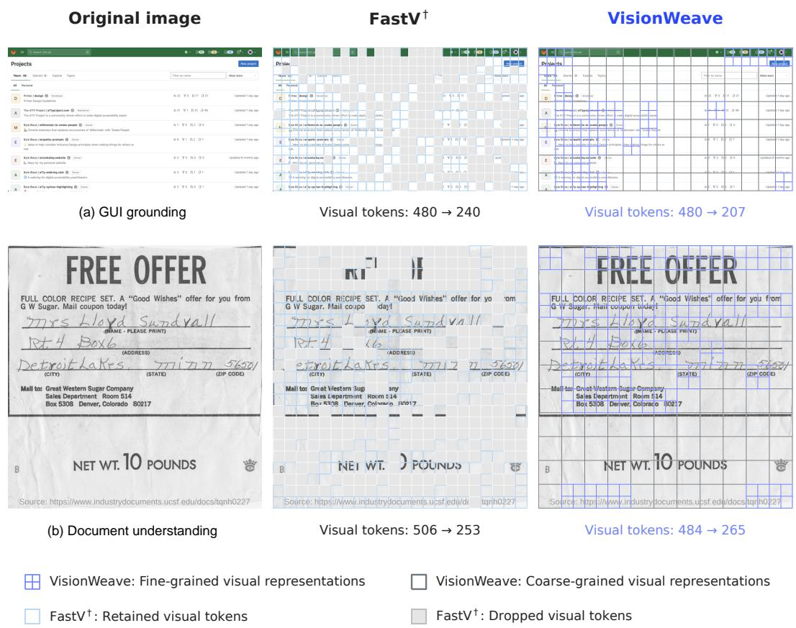  
Figure 9: VisionWeave maintains spatial coverage through mixed granularity, whereas FastV† drops tokens covering task-relevant content.

## 5 CONCLUSION

We introduced VisionWeave, establishing elastic visual representation weaving as a native capability of MLLMs through self-distillation alone. It combines content-adaptive token savings with robust efficiency–quality trade-offs across tasks, resolutions, and frame budgets. Our SGLang integration further translates these token savings into higher throughput and lower latency on modern serving infrastructure. These findings establish representational granularity as a learnable degree of freedom, validating content-adaptive computational effort as a feasible architectural principle.

## 6 ACKNOWLEDGE

This work was supported by Alibaba Research Intern Program. We would like to thank the Qwen Team at Alibaba Token Hub (ATH), Alibaba Group, for providing the computational resources and foundation models (Qwen) used in this research.

## REFERENCES

Xiang An, Yin Xie, Kaicheng Yang, Wenkang Zhang, Xiuwei Zhao, Zheng Cheng, Yirui Wang, Songcen Xu, Changrui Chen, Didi Zhu, Chunsheng Wu, Huajie Tan, Chunyuan Li, Jing Yang,

Jie Yu, Xiyao Wang, Bin Qin, Yumeng Wang, Zizhen Yan, Ziyong Feng, Ziwei Liu, Bo Li, and Jiankang Deng. Llava-onevision-1.5: Fully open framework for democratized multimodal training, 2025. URL https://arxiv.org/abs/2509.23661.

Shuai Bai, Yuxuan Cai, Rui-Zhe Chen, Ke qin Chen, Xiong-Hui Chen, Zesen Cheng, Liang-Hao Deng, Wei Ding, Rongyao Fang, Chang Gao, Chunjiang Ge, Wenbin Ge, Zhifang Guo, Qidong Huang, Qidong Huang, Fei Huang, Binyuan Hui, Shutong Jiang, Zhaohai Li, Ming-Sheng Li, Mei Li, Kaixin Li, Zicheng Lin, Junyang Lin, Xue-Jing Liu, Jiawei Liu, Cheng-Long Liu, Yang Liu, Dayiheng Liu, Shixuan Liu, Dunjie Lu, Ruilin Luo, Chenxu Lv, Rui Men, Lingchen Meng, Lingchen Meng, Xin yi Ren, Sibo Song, Yu chen Sun, Jun Tang, Jianhong Tu, Jian-Qiang Wan, Peng Wang, Pengfei Wang, Qiu-Yue Wang, Yuxuan Wang, Tianbao Xie, Yihe Xu, Haiyang Xu, Jin Xu, Zhibo Yang, Mingkun Yang, Jianxin Yang, An Yang, Bo-Wen Yu, Fei Zhang, Hang Zhang, Xi Zhang, Botao Zheng, Humen Zhong, Jingren Zhou, Fanxi Zhou, Jingren Zhou, Yuanzhi Zhu, and Keming Zhu. Qwen3-vl technical report. ArXiv, abs/2511.21631, 2025a. URL https: //api.semanticscholar.org/CorpusID:283262018.

Shuai Bai, Ke qin Chen, Xue-Jing Liu, Jia-Lin Wang, Wenbin Ge, Sibo Song, Kai Dang, Peng Wang, Shijie Wang, Jun Tang, Humen Zhong, Yuanzhi Zhu, Ming-Hsuan Yang, Zhaohai Li, Jian-Qiang Wan, Peng-Fei Wang, Wei Ding, Zheren Fu, Yiheng Xu, Jiabo Ye, Xi Zhang, Tianbao Xie, Zesen Cheng, Hang Zhang, Zhibo Yang, Haiyang Xu, and Junyang Lin. Qwen2.5-vl technical report. ArXiv, abs/2502.13923, 2025b. URL https://api.semanticscholar.org/ CorpusID:276449796.

Mu Cai, Jianwei Yang, Jianfeng Gao, and Yong Jae Lee. Matryoshka multimodal models, 2024. URL https://arxiv.org/abs/2405.17430.

Junjie Chen, Xuyang Liu, Zichen Wen, Yiyu Wang, Siteng Huang, and Honggang Chen. Variationaware vision token dropping for faster large vision-language models, 2026. URL https:// arxiv.org/abs/2509.01552.

Liang Chen, Haozhe Zhao, Tianyu Liu, Shuai Bai, Junyang Lin, Chang Zhou, and Baobao Chang. An image is worth 1/2 tokens after layer 2: Plug-and-play inference acceleration for large visionlanguage models. In European Conference on Computer Vision, 2024. URL https://api. semanticscholar.org/CorpusID:268358224.

Shouyuan Chen, Sherman Wong, Liangjian Chen, and Yuandong Tian. Extending context window of large language models via positional interpolation. ArXiv, abs/2306.15595, 2023. URL https: //api.semanticscholar.org/CorpusID:259262376.

Rohan Choudhury, Jungeun Kim, Jinhyung Park, Eunho Yang, László A. Jeni, and Kris M. Kitani. Accelerating vision transformers with adaptive patch sizes. ArXiv, abs/2510.18091, 2025. URL https://api.semanticscholar.org/CorpusID:282246197.

Long Cui, Weiyun Wang, Jie Shao, Zichen Wen, Gen Luo, Linfeng Zhang, Yanting Zhang, Yu Qiao, and Wenhai Wang. Vico: A training strategy towards semantic aware dynamic highresolution. ArXiv, abs/2510.12793, 2025. URL https://api.semanticscholar.org/ CorpusID:282064724.

DeepSeek-AI. Deepseek-v4: Towards highly efficient million-token context intelligence. 2026. URL https://api.semanticscholar.org/CorpusID:289623513.

Yuan Feng, Junlin Lv, Yukun Cao, Xike Xie, and S. Kevin Zhou. Ada-kv: Optimizing kv cache eviction by adaptive budget allocation for efficient llm inference. ArXiv, abs/2407.11550, 2024. URL https://api.semanticscholar.org/CorpusID:271218006.

Yuan Feng, Hao-Yu Guo, Junlin Lv, S. Kevin Zhou, and Xike Xie. Taming the fragility of kv cache eviction in llm inference. ArXiv, abs/2510.13334, 2025a. URL https://api. semanticscholar.org/CorpusID:282102254.

Yuan Feng, Junlin Lv, Yukun Cao, Xike Xie, and S. Kevin Zhou. Criticalkv: Optimizing kv cache eviction from an output perturbation perspective. 2025b. URL https://api. semanticscholar.org/CorpusID:276161406.

Boyu Gou, Ruohan Wang, Boyuan Zheng, Yanan Xie, Cheng Chang, Yiheng Shu, Huan Sun, and Yu Su. Navigating the digital world as humans do: Universal visual grounding for gui agents, 2025. URL https://arxiv.org/abs/2410.05243.

Haoyu Guo, Yuan Feng, Junlin Lv, Mingjun Xiao, S Kevin Zhou, and Xike Xie. Videomm: Adaptive macro-micro inference for efficient video mllms, 2026. URL https://arxiv.org/abs/ 2609.16722.

Yuhang Han, Xuyang Liu, Zihan Zhang, Pengxiang Ding, Junjie Chen, Donglin Wang, Honggang Chen, Qingsen Yan, and Siteng Huang. Filter, correlate, compress: Training-free token reduction for mllm acceleration, 2025. URL https://arxiv.org/abs/2411.17686.

Wenbo Hu, Zi-Yi Dou, Liunian Harold Li, Amita Kamath, Nanyun Peng, and Kai-Wei Chang. Matryoshka query transformer for large vision-language models, 2024. URL https://arxiv. org/abs/2405.19315.

Ahmadreza Jeddi, Negin Baghbanzadeh, Elham Dolatabadi, and Babak Taati. Similarity-aware token pruning: Your vlm but faster. ArXiv, abs/2503.11549, 2025. URL https://api. semanticscholar.org/CorpusID:277043961.

Selim Kuzucu, Alessio Tonioni, Vasile Lup, Bernt Schiele, Federico Tombari, and Muhammad Ferjad Naeem. Parcel: Pool-anchored resampling with conditioned elastic queries for efficient visionlanguage understanding, 2026. URL https://arxiv.org/abs/2605.30126.

Xu-Yang Liu, Xiyan Gui, Yuchao Zhang, and Linfeng Zhang. Mixing importance with diversity: Joint optimization for kv cache compression in large vision-language models. ArXiv, abs/2510.20707, 2025. URL https://api.semanticscholar.org/CorpusID: 282304428.

Bowen Peng, Jeffrey Quesnelle, Honglu Fan, and Enrico Shippole. Yarn: Efficient context window extension of large language models. ArXiv, abs/2309.00071, 2023. URL https: //api.semanticscholar.org/CorpusID:261493986.

Kele Shao, Keda Tao, Kejia Zhang, Sicheng Feng, Mu Cai, Yuzhang Shang, Haoxuan You, Can Qin, Yang Sui, and Huan Wang. A survey of token compression for efficient multimodal large language models. Trans. Mach. Learn. Res., 2026, 2025a. URL https://api.semanticscholar. org/CorpusID:280323457.

Kele Shao, Keda Tao, Kejia Zhang, Sicheng Feng, Mu Cai, Yuzhang Shang, Haoxuan You, Can Qin, Yang Sui, and Huan Wang. When tokens talk too much: A survey of multimodal longcontext token compression across images, videos, and audios. ArXiv, abs/2507.20198, 2025b. URL https://api.semanticscholar.org/CorpusID:290088866.

Keda Tao, Can Qin, Haoxuan You, Yang Sui, and Huan Wang. Dycoke : Dynamic compression of tokens for fast video large language models. 2025 IEEE/CVF Conference on Computer Vision and Pattern Recognition (CVPR), pp. 18992–19001, 2024. URL https://api. semanticscholar.org/CorpusID:274192345.

Kimi Team. Kimi k3: Open frontier intelligence. 2026. URL https://api. semanticscholar.org/CorpusID:290625162.

Jiahui Wang, Zuyan Liu, Yongming Rao, and Jiwen Lu. Sparsemm: Head sparsity emerges from visual concept responses in mllms. 2025 IEEE/CVF International Conference on Computer Vision (ICCV), pp. 23177–23187, 2025. URL https://api.semanticscholar.org/ CorpusID:279244559.

Senqiao Yang, Yukang Chen, Zhuotao Tian, Chengyao Wang, Jingyao Li, Bei Yu, and Jiaya Jia. Visionzip: Longer is better but not necessary in vision language models. 2025 IEEE/CVF Conference on Computer Vision and Pattern Recognition (CVPR), pp. 19792–19802, 2024. URL https://api.semanticscholar.org/CorpusID:274514545.

Xubing Ye, Yukang Gan, Yi-Xiao Ge, Xiao-Ping Zhang, and Yansong Tang. Atp-llava: Adaptive token pruning for large vision language models. 2025 IEEE/CVF Conference on Computer Vision and Pattern Recognition (CVPR), pp. 24972–24982, 2024. URL https://api. semanticscholar.org/CorpusID:274436316.

Qiyang Yu, Yu Fang, Tianrui Li, Xuemei Cao, Yan Chen, Jianghao Li, and Fan Min. Dynamic granularity matters: Rethinking vision transformers beyond fixed patch splitting. ArXiv, abs/2511.19021, 2025. URL https://api.semanticscholar.org/CorpusID: 283244585.

Qizhe Zhang, Meng-Zhen Liu, Li-Chen Li, Ming Lu, Yuan Zhang, Junwen Pan, Qi She, and Shanghang Zhang. Beyond attention or similarity: Maximizing conditional diversity for token pruning in mllms. ArXiv, abs/2506.10967, 2025a. URL https://api.semanticscholar.org/ CorpusID:279318547.

Yuanhan Zhang, Jinming Wu, Wei Li, Bo Li, Zejun Ma, Ziwei Liu, and Chunyuan Li. Llavavideo: Video instruction tuning with synthetic data, 2025b. URL https://arxiv.org/ abs/2410.02713.

Lianmin Zheng, Liangsheng Yin, Zhiqiang Xie, Chu-Yue Sun, Jeff Huang, Cody Hao Yu, Shiyi Cao, Christoforos E. Kozyrakis, Ion Stoica, Joseph E. Gonzalez, Clark W. Barrett, and Ying Sheng. Sglang: Efficient execution of structured language model programs. Advances in Neural Information Processing Systems 37, 2023. URL https://api.semanticscholar.org/ CorpusID:266174771.

## APPENDIX CONTENTS

A Limitations and Future Works 18   
B Case Studies 18   
B.1 Case Study in GUI Grounding Tasks . 18   
B.2 Case Study in DocVQA Tasks 18   
C More Visualizations of Elastic Visual Weaving 18   
D Related Work 18   
E Additional Experimental Details 21   
E.1 Ablation of Mixed-Granularity Self-Distillation 21   
E.2 Ablation of Distillation Policy 23   
E.3 Performance at Matched Token Savings 24   
E.4 SGLang Serving Configuration . 25

## A LIMITATIONS AND FUTURE WORKS

Our ablations examine on- versus off-policy self-distillation, the contribution of Stage 3, and the pooler architecture. However, the substantial computational cost of training limits a more comprehensive exploration of architectural choices, including alternative router designs. These unexplored choices offer opportunities to further improve elastic visual weaving. This work focuses on two granularities, while we do not foresee significant barriers to extending our approach to diverse levels. We therefore expect that moving beyond the current two-level design to richer multi-scale representations could yield further gains. Moreover, whereas we currently implant this capability via post-training self-distillation, future work could explore introducing elastic visual weaving during base model pre-training. Our long-term vision is a new generation of multimodal foundation models that jointly develop visual understanding and efficiency, natively modulating computational effort by information content.

## B CASE STUDIES

## B.1 CASE STUDY IN GUI GROUNDING TASKS

Figure 10 compares visual token allocation on desktop, tablet, and web interfaces using Qwen3.8- 27B at a 512-token input budget. VisionWeave interleaves fine- and coarse-grained representations, keeping every region represented within a shared spatial frame. In contrast, FastV† drops tokens covering critical click targets, such as the star button in the web interface, leaving gaps in token coverage that can hinder accurate grounding. This spatially coherent coverage helps explain Vision-Weave’s substantial advantage over FastV† and VisionZip on grounding tasks.

## B.2 CASE STUDY IN DOCVQA TASKS

Figure 11 compares token allocation on two DocVQA examples using Qwen3.8-27B at a 512-token input budget. At the default threshold t = 0.5, VisionWeave saves 45.2% of tokens on the form while retaining all native fine-grained tokens for the dense table. FastV† instead removes 50% of tokens in both cases, including tokens covering text. Even in example (a), FastV† drops tokens covering informative text, leaving some characters only partially represented. In contrast, VisionWeave uses coarse-grained representations for larger text while maintaining full spatial coverage. This also helps explain the robustness of VisionWeave across diverse inputs.

## C MORE VISUALIZATIONS OF ELASTIC VISUAL WEAVING

Figures 12–15 show additional examples of elastic visual representations on Qwen3.5-4B and Qwen3.8-27B, illustrating how fine- and coarse-grained representations are interleaved according to visual content.

## D RELATED WORK

Visual token pruning and merging. Visual token pruning and merging shorten visual sequences through heuristic or learned policies (Jeddi et al., 2025; Ye et al., 2024; Chen et al., 2026; Han et al., 2025; Zhang et al., 2025a), as exemplified by FastV and VisionZip (Chen et al., 2024; Yang et al., 2024). Direct pruning removes tokens deemed unimportant by the selection policy and can substantially alter the visual context available to a pretrained MLLM. Our evaluations of FastV† and VisionZip show modest performance losses on video tasks but substantial degradation on grounding and information-dense inputs. Most methods also rely on preset compression ratios that cannot accommodate the varying information density of visual inputs. In addition, despite extensive research, visual token-pruning methods rarely provide implementations in modern serving engines such as SGLang or vLLM, leaving their practical efficiency gains insufficiently validated. Common algorithmic choices further hinder deployment: some methods require explicit attention weights, which standard FlashAttention kernels do not expose, while others prune tokens within the LLM, compli cating engine integration and support for dynamic batching and chunked prefill. Consequently, the growing body of token-pruning research has yet to translate into widespread adoption in practical LLM serving. In contrast, VisionWeave improves visual efficiency through content-adaptive selection of fine- and coarse-grained representations, using the same representation construction and routing during final-stage training and inference. Extensive evaluations on SGLang engine across tasks, input resolutions, and video frame budgets demonstrate consistently favorable efficiency– quality trade-offs, supporting elastic visual weaving as a robust native capability of MLLMs.

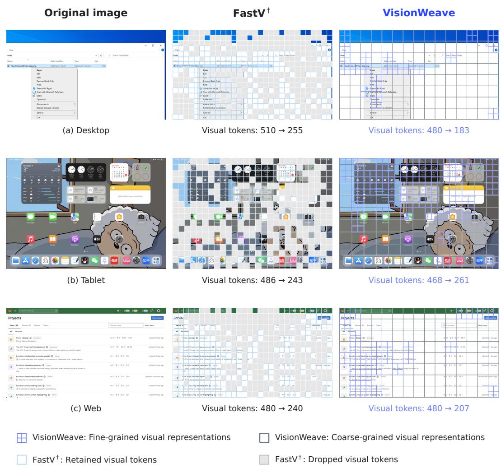  
Figure 10: VisionWeave retains full spatial coverage through mixed-granularity representations, whereas FastV† drops visual tokens.

Content-adaptive visual representations. At the vision-encoder level, prior work varies patch sizes using low-level image statistics, such as edge density and entropy (Yu et al., 2025; Choudhury et al., 2025). These approaches primarily target standalone vision tasks rather than learning granularity for diverse downstream multimodal objectives. At the MLLM level, Matryoshka Multimodal Models (Cai et al., 2024), Matryoshka Query Transformer (Hu et al., 2024) and PAR-CEL (Kuzucu et al., 2026) support multiple token budgets, but require the budget to be specified externally. ViCO (Cui et al., 2025) goes further by adaptively assigning a visual token resolution to each image tile. However, its tile-based design limits direct applicability to frontier MLLMs such as Qwen and Kimi, which use native-resolution visual processing. Moreover, interleaved detail-rich regions and low-information backgrounds call for finer spatial allocation than a single resolution per tile provides (Figure 16). VisionWeave instead learns block-wise allocation of fineand coarse-grained representations within the native-resolution pipeline. Our contribution is to es-

Fine-graned representation

FastV † : Dropped visual tokens

VisionWeave  
VisionWeave: Coarse-grained visual representations  

FastV†  

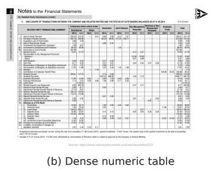  
VisionWeave: Fine-grained visual representations

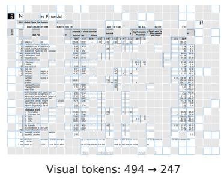

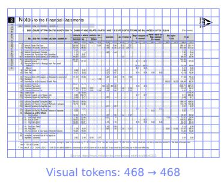

Figure 11: VisionWeave adapts visual granularity to document content rather than imposing fixed token savings.  
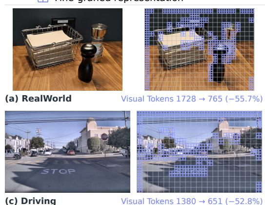

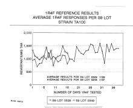  
Figure 12: Elastic visual representations on Qwen3.5-4B at a 2048-token input budget.

tablish this content-adaptive visual processing as a native capability of frontier MLLMs, combining autonomous token savings, robust efficiency–quality trade-offs, and compatibility with modern serving infrastructure.

Fine-graned representation  
Coarse-gained representation  
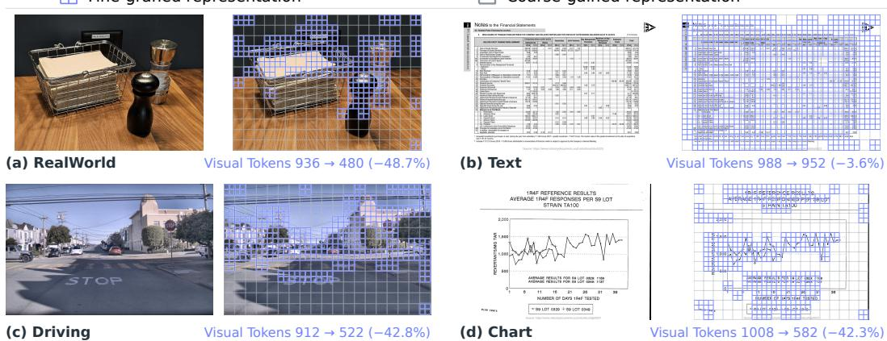

  
Figure 13: Elastic visual representations on Qwen3.8-27B at a 1024-token input budget.

KV-cache compression. KV-cache compression addresses a related but distinct aspect of inference efficiency. Visual token efficiency shortens the sequence processed by the LLM, reducing both attention and feed-forward computation during prefill, as well as KV-cache memory, thereby enabling faster time to first token Feng et al. (2024; 2025b;a); Liu et al. (2025); Wang et al. (2025). In contrast, KV-cache compression compacts the stored key–value states without shortening the input token sequence. When applied after prefill, it primarily reduces memory usage and decoding bandwidth rather than prompt-processing computation. The distinction is therefore between processing fewer tokens and retaining more compact states for those tokens. Learned KV compression, exemplified by DeepSeek-V4 (DeepSeek-AI, 2026), extends this direction by integrating compression into attention itself. Combining such mechanisms with elastic visual representation weaving is a promising direction: fewer visual tokens would reduce computation throughout the LLM, while learned KV compression could further lower the cache memory footprint of dense- or sparse-attention layers.

## E ADDITIONAL EXPERIMENTAL DETAILS

## E.1 ABLATION OF MIXED-GRANULARITY SELF-DISTILLATION

We compare Qwen3.8-27B before and after Stage 3 (Table 7). Stage 3 improves seven of eight benchmarks and raises the average from 73.15 to 76.73. ScreenSpotV2 shows the largest gain (66.59 to 91.43); excluding it, the average still improves by 0.54 points, despite a 1.18-point decrease on RealWorldQA. This supports self-distillation on the hard-routed mixed-granularity sequences used at inference.

Table 7: Stage 3 improves Qwen3.8-27B performance on seven of eight benchmarks.
<table><tr><td>Benchmark</td><td>Without Stage 3</td><td>With Stage 3</td><td>∆ (points)</td></tr><tr><td>RealWorldQA</td><td>79.08</td><td>77.91</td><td>-1.18</td></tr><tr><td>DocVQA</td><td>90.76</td><td>91.33</td><td>+0.56</td></tr><tr><td>InfoVQA</td><td>70.66</td><td>71.61</td><td>+0.96</td></tr><tr><td>ScreenSpotV2</td><td>66.59</td><td>91.43</td><td>+24.84</td></tr><tr><td>HallusionBench</td><td>72.10</td><td>73.60</td><td>+1.51</td></tr><tr><td>VideoOCR</td><td>69.85</td><td>70.51</td><td>+0.67</td></tr><tr><td>Video-MME</td><td>70.44</td><td>71.04</td><td>+0.59</td></tr><tr><td>LongVideoBench</td><td>65.74</td><td>66.42</td><td>+0.67</td></tr><tr><td>Average</td><td>73.15</td><td>76.73</td><td>+3.58</td></tr></table>

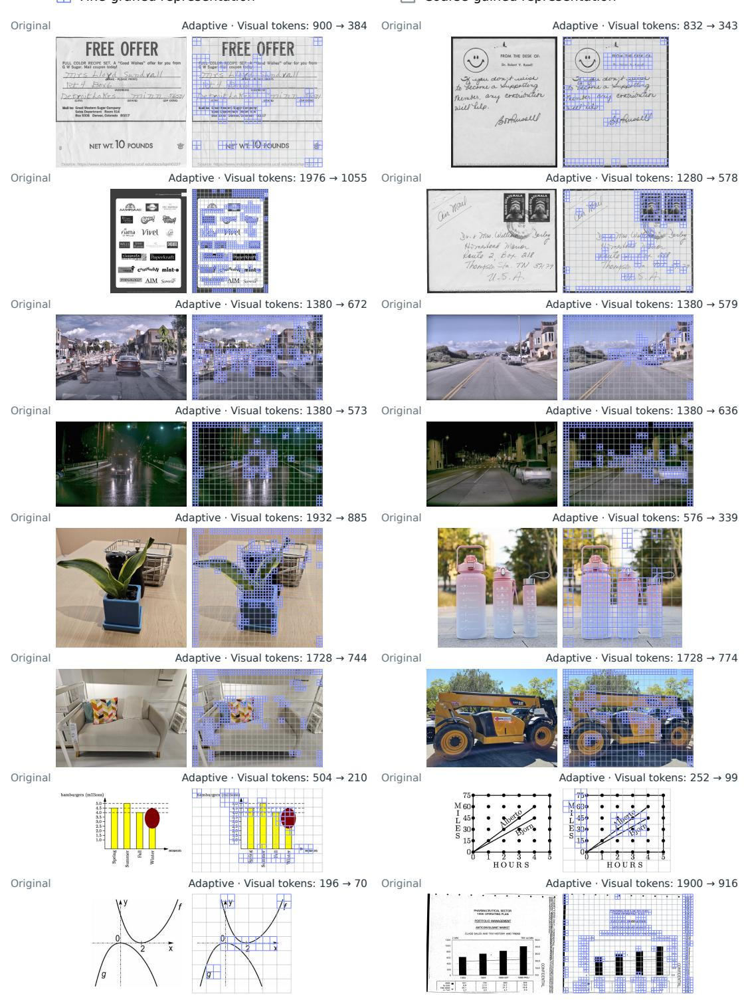  
Figure 14: Additional Qwen3.5-4B visualizations at a 2048-token input budget.

Fine-graned representation  
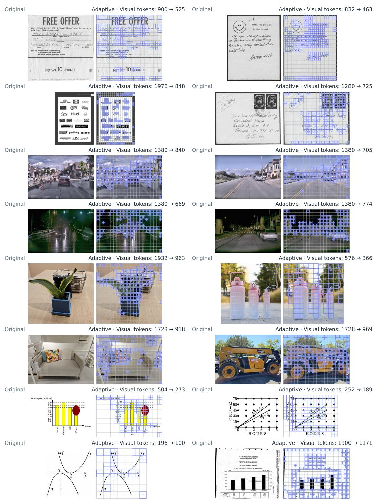  
Figure 15: Qwen3.8-27B visualizations corresponding to Figure 14, with the same 2048-token input budget.

## E.2 ABLATION OF DISTILLATION POLICY

We also compare on- and off-policy self-distillation in Stage 3 of Qwen3.5-4B (Figure 17). The two variants achieve similar mean scores across eight benchmarks, each leading on four. We therefore use off-policy self-distillation for training efficiency.

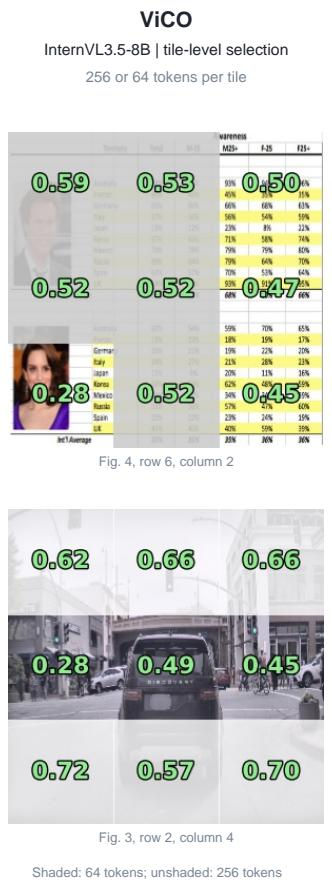

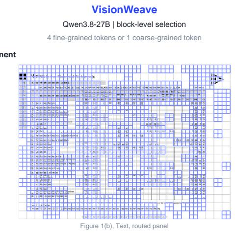

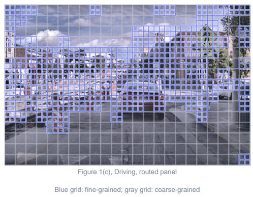

Figure 16: VisionWeave allocates visual granularity at a finer spatial scale than tile-level routing. ViCO panels are cropped from Cui et al. (2025)  
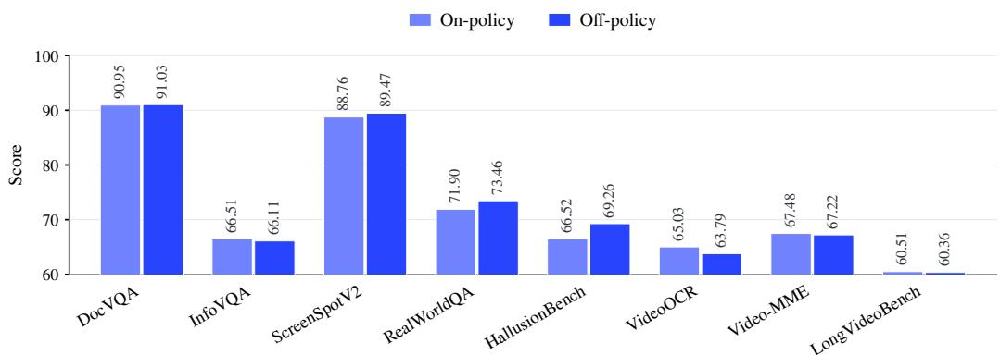  
Figure 17: On- and off-policy self-distillation yield comparable performance on Qwen3.5-4B.

## E.3 PERFORMANCE AT MATCHED TOKEN SAVINGS

Table 8 gives the per-task results for the matched-savings comparison in Section 3.2. FastV† and VisionZip match VisionWeave’s dataset-level savings at $t = 0 . 5$ for each backbone and dataset.

Table 8: Performance at matched dataset-level token savings.
<table><tr><td></td><td>Upper bound</td><td colspan="3">Matched savings</td></tr><tr><td>Qwen3.5-4B</td><td>512 tokens</td><td>FastV†</td><td>VisionZip</td><td>VisionWeave</td></tr><tr><td>RealWorldQA</td><td>74.64</td><td>71.76</td><td>72.42</td><td>73.46</td></tr><tr><td>DocVQA</td><td>91.92</td><td>91.16</td><td>91.09</td><td>91.03</td></tr><tr><td>InfoVQA</td><td>67.44</td><td>66.66</td><td>65.68</td><td>66.11</td></tr><tr><td>ScreenSpotV2</td><td>89.86</td><td>87.34</td><td>86.08</td><td>89.47</td></tr><tr><td>HallusionBench</td><td>69.88</td><td>69.09</td><td>69.44</td><td>69.26</td></tr><tr><td>VideoOCR</td><td>64.51</td><td>63.59</td><td>63.28</td><td>63.79</td></tr><tr><td>Video-MME</td><td>67.78</td><td>67.56</td><td>67.48</td><td>67.22</td></tr><tr><td>LongVideoBench</td><td>59.99</td><td>60.43</td><td>59.76</td><td>60.36</td></tr><tr><td>Average</td><td>73.25</td><td>72.20</td><td>71.90</td><td>72.59</td></tr><tr><td>Qwen3.8-27B</td><td></td><td></td><td></td><td></td></tr><tr><td>RealWorldQA</td><td>78.82</td><td>78.17</td><td>78.43</td><td>77.91</td></tr><tr><td>DocVQA</td><td>92.47</td><td>88.26</td><td>88.51</td><td>91.33</td></tr><tr><td>InfoVQA</td><td>74.13</td><td>71.29</td><td>71.07</td><td>71.61</td></tr><tr><td>ScreenSpotV2</td><td>94.42</td><td>43.79</td><td>45.68</td><td>91.43</td></tr><tr><td>HallusionBench</td><td>73.25</td><td>72.54</td><td>72.54</td><td>73.60</td></tr><tr><td>VideoOCR</td><td>70.72</td><td>69.79</td><td>69.44</td><td>70.51</td></tr><tr><td>Video-MME</td><td>70.89</td><td>71.15</td><td>71.15</td><td>71.04</td></tr><tr><td>Long VideoBench</td><td>66.49</td><td>65.82</td><td>65.82</td><td>66.42</td></tr><tr><td>Average</td><td>77.65</td><td>70.10</td><td>70.33</td><td>76.73</td></tr></table>

ScreenSpotV2 contributes substantially to the 27B average gap; excluding it, mean scores remain 74.63 for VisionWeave versus 73.86/73.85 for FastV†/VisionZip.

## E.4 SGLANG SERVING CONFIGURATION

The experiments in Section 3.4 use our SGLang integration, Python 3.12.3, PyTorch 2.13.0+cu129, Transformers 5.12.1, and Triton 3.7.1. Each model runs on two A100-SXM4-80GB GPUs with LLM tensor parallelism of two and one TP=1 vision encoder per GPU, providing encoder data parallelism of two. Both models use BF16, Triton full/linear/ViT attention, and NCCL with custom all-reduce disabled. The context limit is 147,456 tokens, with 4,096-token prefill chunks. Static memory fractions are 0.55 for the language service and 0.06 for each encoder. FCFS and overlap scheduling are enabled; mixed prefill/decode chunks are disabled. Padded decode CUDA graphs capture batch sizes 1, 2 and 4; prefill graphs are disabled. Client concurrency is capped at four outstanding requests.