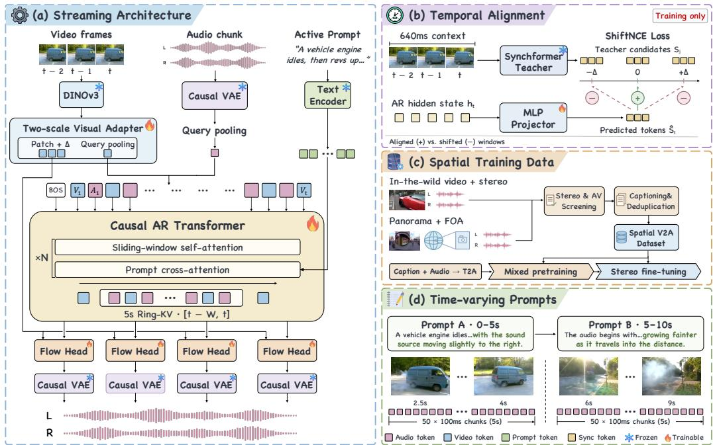
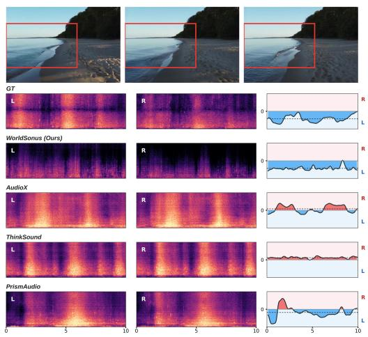
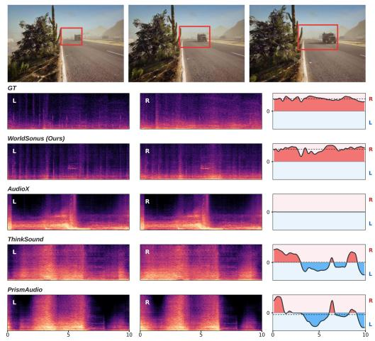
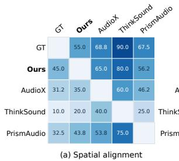
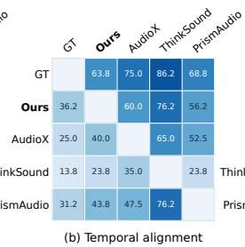
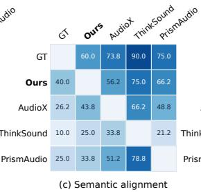
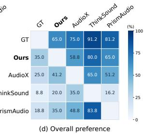
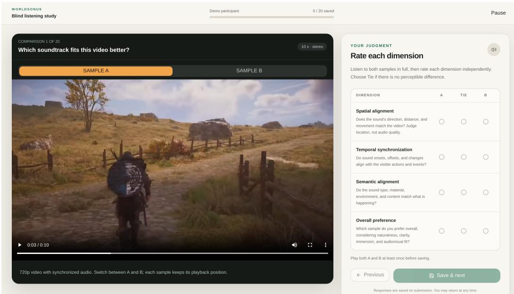
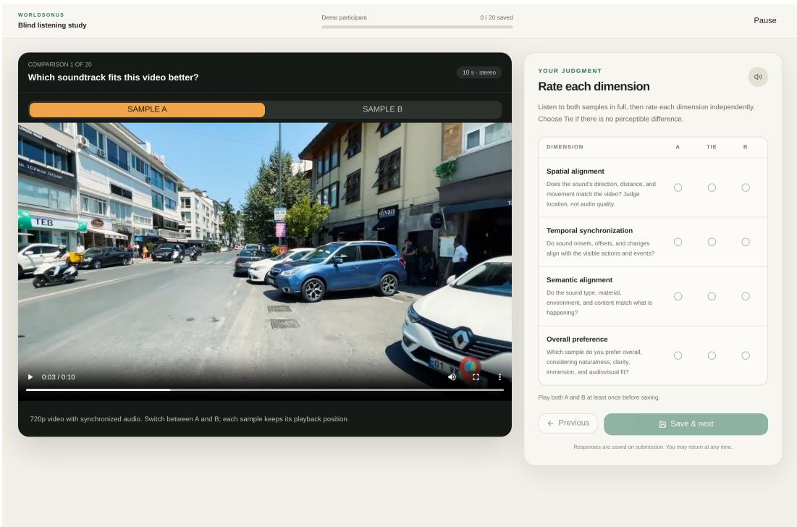

# WORLDSONUS: BRINGING SOUND TO WORLDS

Pengjun Fang1,2 Jingyi Fa3 Kam Man Wu1,2 Jiaming Wang2 Haoyuan Huang2 Yaguang Wu3 Xiangjun Huang3 Ziyang Ma4 Weijia Chen2 Hongyu Liu1 Zeyue Tian†1,2 Qifeng Chen†1

1The Hong Kong University of Science and Technology

2Noiz AI 3MetaX

4Shanghai Jiao Tong University

## ABSTRACT

Recent advances in world models have enabled increasingly realistic visual synthesis. However, these generated environments remain largely silent. Bringing sound to world models poses three core challenges: real-time generation to keep pace with interactive video streams, interactive control to respond to mid-stream sound instructions, and spatially aligned stereo to reflect scene geometry and camera motion. To address these demands, we introduce WorldSonus, an interactive videoto-audio framework designed for real-time spatial sound synthesis in world models. For real-time generation, WorldSonus employs a streaming causal autoregressive diffusion architecture that synthesizes audio chunks at a low real-time factor (RTF) of 0.41. For interactive control, we incorporate an audio-centric captioning pipeline with chunk-indexed prompt scheduling, enabling dynamic manipulation of sound events during generation. For spatial alignment, we leverage high-quality stereo supervision curated from diverse stereo and ambisonic data. Extensive experiments demonstrate that while tailored for world models, WorldSonus generalizes effectively to open-domain video-to-audio benchmarks, matching or outperforming state-of-the-art bidirectional models in both acoustic quality and spatial alignment. Project page: https://noizai.github.io/WorldSonus/.

## 1 INTRODUCTION

Recent advances in video generation (Wang et al., 2025; Cai et al., 2025; HaCohen et al., 2025; Kong et al., 2024; Yang et al., 2025; Team, 2025b) have accelerated the development of generative world models (Valevski et al., 2025; He et al., 2025; Sun et al., 2025b; Gao et al., 2026). While these models dynamically synthesize visual environments in response to user actions, the resulting virtual worlds remain predominantly silent. Bringing realistic sound to interactive world models requires audio that seamlessly tracks an evolving visual stream, maintains camera-aligned spatial balance under dynamic viewpoints, and immediately responds to updated text instructions during an ongoing session.

Existing approaches to world-model sound generation fall into two primary categories. The first direction builds upon joint audiovisual foundation models (HaCohen et al., 2026) extended to longhorizon streaming (Duan et al., 2026; Zhang et al., 2026a; Su et al., 2026). However, coupling audio synthesis directly to the visual backbone prevents these systems from serving as standalone audio modules for visual-only world models, while causal distillation or long autoregressive (AR) rollouts often accumulate error over time. The second direction employs dedicated video-to-audio (V2A) generators, allowing modular integration with external visual engines. Yet current streaming V2A models remain constrained: V-AURA (Viertola et al., 2025) uses bidirectional visual windows and outputs mono audio. SoundReactor (Saito et al., 2025) achieves real-time stereo generation but lacks mid-stream text controllability. SwanSphere (Lei et al., 2026) focuses on panoramic video and first-order ambisonics (FOA) soundfields rather than standard perspective streams. Consequently, there remains a need for a modular V2A framework that simultaneously delivers causal real-time generation, mid-stream interactive text control, and spatially aligned perspective stereo audio.

We present WorldSonus, a modular V2A framework designed to endow generative world models with real-time, controllable stereo audio. For real-time generation, WorldSonus employs a streaming AR-diffusion architecture emitting 100 ms audio chunks conditioned only on past and current visual context. A bounded persistent state ensures constant memory usage and compute cost as the stream expands. For interactive control, training on time-varying prompt schedules combined with chunklevel cross-attention enables users to dynamically revise text instructions for on-screen or off-screen sounds without session resets or past-frame recomputation. For spatially aligned stereo, we use clear-stereo clips and convert panoramic FOA data into camera-aligned stereo supervision.

Generating precise audiovisual alignment within causal contexts introduces unique challenges, as future visual frames are unavailable. To enforce temporal synchronization under limited lookahead, we introduce two-timescale visual conditioning and ShiftNCE. Chunk-level visual summaries guide the AR backbone to maintain semantic continuity, while frame-aligned local tokens condition the flow head with fine-grained spatial and temporal cues. To refine event timing without inference cost, ShiftNCE trains the AR state using a contrastive objective supervised by a frozen synchronization expert, eliminating ambiguous temporal negatives during training.

Experiments demonstrate that despite causal operation, WorldSonus matches or exceeds state-of-theart offline bidirectional V2A baselines across both open-domain VGGSound (Chen et al., 2020) videos and our Interactive benchmark, which comprises gameplay and real-world footage. WorldSonus achieves VGGish FAD (Hershey et al., 2017; Kilgour et al., 2019) scores of 1.73 on 5 s clear-stereo VGGSound (Chen et al., 2020) clips and 2.03 on 30 s interactive videos, with an execution latency of 41.2 ms per 100 ms audio chunk (real-time factor, RTF = 0.41) on a single NVIDIA H100 GPU.

Our main contributions are threefold:

• Real-time, interactive stereo generation. We introduce WorldSonus, a modular V2A framework that unifies real-time causal generation, mid-stream prompt responsiveness, and camera-aligned stereo synthesis for interactive world models.

• Causal audiovisual synchronization. We propose two-timescale visual conditioning and a training-only ShiftNCE distillation objective to maintain temporal synchronization under causal streaming without adding runtime latency.

• State-of-the-art performance. Extensive evaluations show that WorldSonus achieves competitive or superior acoustic quality and stereo balance compared with offline bidirectional baselines, with counterfactual tests confirming robust interactive control.

## 2 RELATED WORK

Bidirectional video-to-audio generation. Bidirectional video-to-audio (V2A) synthesis has evolved from text-to-audio latent diffusion models (Liu et al., 2023a) and early V2A diffusion networks (Luo et al., 2023; Zhang et al., 2026b) to time-aligned models and rectified flow architectures (Wang et al., 2024; Cheng et al., 2025), improving semantic and temporal fidelity through audio-visual pretraining and explicit synchronization features. Recent models such as AudioX (Tian et al., 2025), ThinkSound (Liu et al., 2025a), and PrismAudio (Liu et al., 2025b) render stereo via flow matching and reward alignment. AC-Foley (Fang et al., 2026) adds reference-audio conditioning, while Omni2Sound (Dai et al., 2026) investigates video-text-to-audio diffusion across modality combinations. Meanwhile, spatial audio generation has advanced from diffusion-based binaural synthesis (Leng et al., 2022) toward object-aware stereo and ambisonics (Karchkhadze et al., 2025; Kim et al., 2025; Liu et al., 2025c). However, these approaches require full-clip visual context and do not support streaming video input or dynamic control within a persistent causal session.

Streaming video-to-audio generation. V-AURA (Viertola et al., 2025) uses AR audio-token prediction with chunked waveform decoding, while SwanSphere (Lei et al., 2026) extends causal generation to spatial audio conditioned on panoramic video and text. Neither establishes fully end-to-end causal streaming: V-AURA conditions each audio step on a bidirectional visual window and non-causal DAC (Kumar et al., 2023) decoding, and SwanSphere’s variational autoencoder (VAE) (Kingma & Welling, 2014), based on Stable Audio Open (Evans et al., 2025), does not support stateful stream decoding. SoundReactor (Saito et al., 2025) combines a causal AR backbone with a diffusion head for streaming audio from gameplay video. Its V2A generator weights are not public, so we adopt only the released causal VAE. Building on this line of work, we target open-domain, interactive video with bounded persistent state and sound instructions that can change mid-stream.

Interactive world models and joint audio–video generation. Interactive video world models such as GameGen-X (Che et al., 2025) and LingBot-World 2.0 (Gao et al., 2026) support controllable visual rollouts and increasingly persistent interaction. Complementary approaches, including Omni-Forcing (Su et al., 2026) and Ripple (Ding et al., 2026), jointly generate streaming audio and video. We instead treat audio as a separate causal module conditioned on an externally produced visual stream: the upstream model exposes only realized frames, without requiring access to its action space or internal architecture, while users or agents independently update audio prompts.

## 3 WorldSonus

WorldSonus synthesizes real-time stereo audio from streaming video and dynamic prompts via chunk-wise causal AR generation (Figure 1). It couples a bounded recurrent memory with multi-scale visual conditioning and contrastive temporal alignment.

## 3.1 STREAMING FORMULATION

At each streaming chunk $t \in \{ 1 , \ldots , T \}$ , the model receives visual frames $\mathbf { v } _ { t }$ and active prompt pt to predict the corresponding audio latent chunk $\mathbf { a } _ { t } .$ . Conditioned on a bounded history state $\mathbf { M } _ { t - 1 }$ the joint distribution factorizes causally over time:

$$
p _ { \theta } ( \mathbf { a } _ { 1 } , \ldots , \mathbf { a } _ { T } ) = \prod _ { t = 1 } ^ { T } p _ { \theta } ( \mathbf { a } _ { t } \mid \mathbf { M } _ { t - 1 } , \mathbf { v } _ { t } , \mathbf { p } _ { t } ) ,\tag{1}
$$

where $\mathbf { M } _ { t - 1 }$ is maintained by a sliding-window Key-Value cache bounded by maximum length $W$ This factorization uses only frames of past and current chunks, without access to frames of future blocks. Audio is synthesized in the continuous latent space of a frozen causal stereo VAE (Saito et al., 2025), which encodes 48 kHz stereo audio into latents advancing at 30 Hz. Its stateful decoder converts predicted chunks to waveform during streaming, with no re-decoding of past latents. Each 100 ms generation chunk corresponds to three latent frames $\mathbf { a } _ { t } \in \mathbb { R } ^ { 3 \times d _ { a } }$ , time-aligned with the three visual frames in $\mathbf { v } _ { t }$ (30 FPS).

## 3.2 AUTOREGRESSIVE DIFFUSION

To balance long-range semantic continuity with high-fidelity continuous generation, we adopt a chunked AR-diffusion framework (Li et al., 2024; Saito et al., 2025; Lei et al., 2026). At each step, a decoder-only Transformer processes two chunk-aggregated tokens (one from the previous audio chunk and one from the current video chunk) to maintain session state. Trained with a causal sliding-window attention mask, the model deploys a fixed-capacity Ring-KV cache over context window $W$ (a circular buffer overwriting the oldest slots in place). This ensures bounded memory while matching the context-window policy between training and inference.

The resulting AR hidden state $\mathbf { h } _ { t }$ conditions a compact flow head, which denoises the three latent frames of chunk t using a rectified-flow objective (Lipman et al., 2023; Liu et al., 2023b). The flow head attends bidirectionally inside the current chunk, without access to frames of future blocks, and it reads the frame-aligned visual tokens of Section 3.3 as finer-grained spatial and temporal evidence. Appendix A gives the remaining network details.

## 3.3 TWO-TIMESCALE VISUAL CONDITIONING

To reconcile long-horizon semantic continuity in the bounded AR backbone with precise acoustic rendering in the flow head, we decouple visual conditioning into two complementary timescales: chunk-level semantics and frame-aligned local features. For each chunk (spanning three frames), a frozen DINOv3 (Simeoni et al. ´ , 2026) encoder maps video frames into spatial patch grids ${ \bf G } _ { n }$ Mixed-aspect inputs are assigned to resolution buckets and resized without stretching at a fixed pixel budget. To capture motion cues, each grid is concatenated with its temporal difference $\Delta \mathbf { G } _ { n } =$ $\mathbf { G } _ { n } - \mathbf { G } _ { n - 1 }$ (Chen et al., 2026). A learned query then aggregates each frame’s spatial grid into a single feature token, yielding three frame tokens per chunk.

  
Figure 1: Overview of WorldSonus. (a) Causal streaming pipeline: Video frames map to twotimescale visual tokens conditioning an AR transformer and a rectified-flow head. (b) Training-only ShiftNCE: A training-only frozen Synchformer teacher guides temporal alignment via contrastive window matching. (c) Spatial stereo supervision: In-the-wild stereo filtering and panoramic FOA view-decoding provide directional audio grounding. (d) Interactive prompt control: Text prompts update dynamically at chunk boundaries, preserving session state and acoustic continuity.

These frame tokens are then processed into the two target timescales: For chunk-level semantics, a learned summary query aggregates the three frame tokens into a single chunk-level visual token, which is routed to the AR backbone to maintain a compact footprint. For frame-aligned local features, the three refined frame tokens bypass the AR backbone to condition the flow head directly. Our dual-path architecture provides the flow head with frame-aligned visual tokens without further chunk-level aggregation, which is essential for preserving the temporal granularity of individual video frames.

## 3.4 INTERACTIVE PROMPT CONTROL

To support interactive control during streaming, we introduce an in-place prompt control mechanism that allows text instructions to be updated mid-stream.

Given a sound instruction, a T5Gemma 2 (Zhang et al., 2025) text encoder and compressor project it into a compact token set that conditions the AR backbone via cross-attention, which is cached across streaming steps. When an instruction updates during streaming, the system performs an in-place replacement of the cross-attention cache at the nearest chunk boundary, preserving the Ring-KV cache and existing visual and audio states. To train the model for these dynamic transitions, we incorporate time-varying prompt schedules including mid-sequence instruction switches and drops. This enables seamless steering in a persistent causal session.

## 3.5 TRAINING

Teacher-forced pretraining. The generator is pretrained under a rectified flow objective on a mixture of stereo video-audio and audio-only data, using teacher forcing over the bounded context window W. For a ground-truth latent chunk $\mathbf { a } _ { t }$ , noise $\epsilon \sim \mathcal { N } ( \mathbf { 0 } , \mathbf { I } )$ , and flow timestep $s \sim \mathcal { U } [ 0 , 1 ]$ the linear interpolation state is $\mathbf { x } _ { t , s } = ( 1 - s ) \boldsymbol { \epsilon } + s \mathbf { a } _ { t }$ . The velocity matching loss is formulated as:

$$
\mathcal { L } _ { \mathrm { f l o w } } ( \epsilon ) = \left\| f _ { \theta } ( \mathbf { x } _ { t , s } , s \mid \mathbf { C } _ { t } ) - ( \mathbf { a } _ { t } - \epsilon ) \right\| _ { 2 } ^ { 2 } ,\tag{2}
$$

where $\mathbf { C } _ { t }$ aggregates the AR history state and local frame-aligned visual slots. We apply Explorative Modeling (Gladstone et al., 2026) to flow-matching training by evaluating three candidate source noises per step and optimizing the best-matching draw.

Teacher-guided temporal alignment. While existing synchronization models (Iashin et al., 2024) provide strong temporal cues, deploying them at inference introduces extra latency and windowing constraints. We instead employ a frozen synchronization encoder as a training-only teacher to distill temporal alignment directly into the generator.

Let $\mathbf { S } _ { t }$ denote the teacher’s target embedding for a video window ending at chunk t, and let a projector $P ( \cdot )$ map the generator’s internal AR state $\mathbf { h } _ { t }$ to predict $\mathbf { S } _ { t } .$ . To enforce temporal synchronization, our ShiftNCE objective contrasts the aligned target $\mathbf { S } _ { t }$ against temporally shifted embeddings $\mathbf { S } _ { t + \delta }$ from the same video across a set of non-zero chunk offsets $\delta \in \mathcal { D } _ { t }$

$$
\begin{array} { r } { \mathcal { L } _ { \mathrm { s y n c } } = - \log \frac { \exp { ( \sin ( P ( \mathbf { h } _ { t } ) , \mathbf { S } _ { t } ) / \tau ) } } { \exp { ( \sin ( P ( \mathbf { h } _ { t } ) , \mathbf { S } _ { t } ) / \tau ) } + \sum _ { \delta \in \mathcal { D } _ { t } } \exp { ( \sin ( P ( \mathbf { h } _ { t } ) , \mathbf { S } _ { t + \delta } ) / \tau ) } } , } \end{array}\tag{3}
$$

where sim $. ( \cdot , \cdot )$ denotes cosine similarity, and τ is the temperature hyperparameter. To prevent false negatives during static visual segments, temporally shifted candidates with high visual similarity under the teacher model are filtered out. The final pretraining objective is the joint loss ${ \mathcal { L } } =$ $\mathcal { L } _ { \mathrm { f l o w } } + \lambda _ { \mathrm { s y n c } } \mathcal { L } _ { \mathrm { s y n c } } ,$ , where $\lambda _ { \mathrm { s y n c } }$ balances the two objectives. Following pretraining, we fine-tune the network on a high-quality stereo video-audio subset. Complete training hyperparameter settings are detailed in Appendix B.

## 4 DATA CURATION

Data sources. Our dataset contains 1,465 hours of audio, including 999 hours of paired stereo video-audio data and 466 hours of audio-only data. The video-audio subset uses open-source datasets including VGGSound (Chen et al., 2020), AudioSet (Gemmeke et al., 2017), Kinetics-700 (Carreira et al., 2019), and HD-EPIC (Perrett et al., 2025) to cover a wide range of acoustic events. To support audio generation for interactive world models, we collect additional standard stereo video with clear camera motion and dynamic objects. We also incorporate panoramic recordings from the existing Sphere360 (Liu et al., 2025c) and YT-AmbiGen (Kim et al., 2025) datasets. For panoramic clips, we estimate horizontal sound directions from the acoustic energy field to sample perspective visual crops and render view-aligned stereo audio. The audio-only subset includes AudioCaps (Kim et al., 2019) and isolated audio tracks from weakly-aligned video clips, where the visual content is not aligned with the audio, but the soundtrack retains high-quality acoustic events.

Data filtering. To ensure spatial quality and video-audio alignment, we use a two-stage filtering pipeline. First, automated signal processing removes silent, phase-corrupted, narrow-stereo, and dual-mono samples. Second, Qwen3-Omni (Team, 2025a) acts as a verifier to filter out severe cross-modal mismatches and non-diegetic audio like voiceovers and background music. Complete details appear in Appendix C.

Captioning. We generate dense audio-centric captions using Qwen3-Omni (Team, 2025a). Prompts focus on sound categories, acoustic texture, temporal timing, and spatial ambiance, while excluding visual details unrelated to sound to avoid introducing irrelevant conditioning cues. Captions are generated from both video and audio for video-audio data, and from audio alone for audio-only data. Annotation details are in Appendix C.3.

## 5 EXPERIMENTS

## 5.1 EXPERIMENTAL SETUP

Evaluation sets. We evaluate mainly on five test splits: two clear-stereo VGGSound (Chen et al., 2020) splits (5 s and 10 s; 4,096 clips each) and three splits comprising interactive gameplay and real-world footage with dynamic camera motion (5 s and ${ 1 0 } \mathrm { s } ,$ with 4,096 clips each; 30 s, with 1,024 clips). We additionally evaluate on physical collision events from Greatest Hits (Owens et al., 2016).

Table 1: Quantitative comparison across five held-out splits (4,096 clips for 5 s/10 s; 1,024 for 30 s). Best results are in bold, and second-best are underlined. Acc.: Bi (Bidirectional), Str (Stream), Caus (Causal). Cond.: VT (video+text), V (video-only). Chunk/t: chunk length and compute time in ms. IB and CLAP are multiplied by 100. $\mathrm { \bf S } { \mathrm { - } } \mathrm { \bf F } \mathrm { \bf D } _ { O }$ is omitted for monophonic V-AURA.
<table><tr><td></td><td></td><td></td><td></td><td></td><td colspan="4">Distribution (mid)</td><td>Spatial</td><td colspan="2">Semantic</td><td>Temporal</td></tr><tr><td>Set</td><td>Model</td><td>Acc.</td><td>Cond.</td><td>Chunk/t</td><td>FAD↓</td><td>FDP↓</td><td>FDo↓</td><td>KLP↓</td><td>S-FDo↓</td><td>IB↑</td><td>CLAP↑</td><td>DeSync↓</td></tr><tr><td rowspan="4">VGG 5s</td><td>AudioX</td><td>Bi</td><td>VT</td><td></td><td>3.00</td><td>153.29</td><td>38.19</td><td>1.66</td><td>87.60</td><td>26.96</td><td>37.87</td><td>0.986</td></tr><tr><td>ThinkSound</td><td>Bi</td><td>VT</td><td></td><td>2.94</td><td>141.40</td><td>47.32</td><td>1.91</td><td>62.95</td><td>24.12</td><td>33.62</td><td>0.481</td></tr><tr><td>PrismAudio</td><td>Bi</td><td>VT</td><td></td><td>2.09</td><td>132.58</td><td>50.72</td><td>1.67</td><td>94.77</td><td>26.28</td><td>39.20</td><td>0.539</td></tr><tr><td>V-AURA</td><td>Str</td><td>V</td><td>640/636</td><td>4.06</td><td>304.06</td><td>51.01</td><td>2.03</td><td></td><td>26.48</td><td>24.91</td><td>1.287</td></tr><tr><td></td><td>WorldSonus (Ours)</td><td>Caus</td><td>VT</td><td>100/41.2</td><td>1.73</td><td>159.74</td><td>39.03</td><td>1.48</td><td>43.47</td><td>27.06</td><td>38.35</td><td>0.686</td></tr><tr><td rowspan="5"></td><td>AudioX</td><td>Bi</td><td>VT</td><td></td><td>3.86</td><td>194.72</td><td>41.50</td><td>1.54</td><td>83.53</td><td>27.84</td><td>34.56</td><td>0.944</td></tr><tr><td>ThinkSound</td><td>Bi</td><td>VT</td><td></td><td>2.18</td><td>144.17</td><td>46.49</td><td>1.73</td><td>55.02</td><td>25.76</td><td>30.46</td><td>0.514</td></tr><tr><td>VGG 10 s PrismAudio</td><td>Bi</td><td>VT</td><td></td><td>2.64</td><td>154.69</td><td>52.38</td><td>1.47</td><td>118.08</td><td>28.16</td><td>33.26</td><td>0.427</td></tr><tr><td>V-AURA</td><td>Str</td><td>V</td><td>640/636</td><td>4.35</td><td>318.13</td><td>57.71</td><td>1.95</td><td></td><td>26.73</td><td>23.35</td><td>1.208</td></tr><tr><td>WorldSonus (Ours)</td><td>Caus</td><td>VT</td><td>100/41.2</td><td>1.79</td><td>167.52</td><td>41.90</td><td>1.32</td><td>45.40</td><td>28.82</td><td>36.77</td><td>0.687</td></tr><tr><td rowspan="5">Inter. 5 s</td><td>AudioX</td><td>Bi</td><td>VT</td><td></td><td>4.44</td><td>186.49</td><td>66.77</td><td>1.56</td><td>109.21</td><td>24.88</td><td>32.53</td><td>1.059</td></tr><tr><td>ThinkSound</td><td>Bi</td><td>VT</td><td></td><td>8.49</td><td>256.38</td><td>61.84</td><td>1.98</td><td>58.68</td><td>18.39</td><td>22.15</td><td>0.733</td></tr><tr><td>PrismAudio</td><td>Bi</td><td>VT</td><td></td><td>6.22</td><td>222.83</td><td>62.74</td><td>1.60</td><td>83.85</td><td>23.08</td><td>32.42</td><td>0.651</td></tr><tr><td>V-AURA</td><td>Str</td><td>V</td><td>640/636</td><td>8.18</td><td>436.10</td><td>83.78</td><td>2.01</td><td></td><td>26.84</td><td>16.07</td><td>1.344</td></tr><tr><td>WorldSonus (Ours)</td><td>Caus</td><td>VT</td><td>100/41.2</td><td>2.68</td><td>163.74</td><td>40.99</td><td>1.29</td><td>34.26</td><td>26.48</td><td>35.90</td><td>0.831</td></tr><tr><td rowspan="5"></td><td>AudioX</td><td>Bi</td><td>VT</td><td></td><td>5.05</td><td>352.02</td><td>69.19</td><td>1.57</td><td>119.16</td><td>25.39</td><td>27.89</td><td>1.077</td></tr><tr><td>ThinkSound</td><td>Bi</td><td>VT</td><td></td><td>6.27</td><td>332.49</td><td>60.93</td><td>1.85</td><td>56.47</td><td>21.43</td><td>24.10</td><td>0.738</td></tr><tr><td>Inter. 10 s PrismAudio</td><td>Bi</td><td>VT</td><td></td><td>5.16</td><td>338.17</td><td>61.23</td><td>1.42</td><td>96.12</td><td>25.20</td><td>31.08</td><td>0.599</td></tr><tr><td>V-AURA</td><td>Str</td><td>V</td><td>640/636</td><td>9.75</td><td>532.74</td><td>86.46</td><td>1.96</td><td></td><td>27.60</td><td>15.47</td><td>1.192</td></tr><tr><td>WorldSonus (Ours)</td><td>Caus</td><td>VT</td><td>100/41.2</td><td>2.62</td><td>262.25</td><td>42.91</td><td>1.30</td><td>37.42</td><td>28.63</td><td>34.22</td><td>0.820</td></tr><tr><td rowspan="5"></td><td>AudioX</td><td>Bi</td><td>VT</td><td></td><td>5.52</td><td>427.00</td><td>81.14</td><td>1.88</td><td>121.62</td><td>24.78</td><td>30.34</td><td>1.125</td></tr><tr><td>ThinkSound</td><td>Bi</td><td>VT</td><td></td><td>7.00</td><td>473.40</td><td>73.46</td><td>2.31</td><td>81.88</td><td>11.71</td><td>19.50</td><td>0.901</td></tr><tr><td>Inter. 30 s PrismAudio</td><td>Bi</td><td>VT</td><td></td><td>6.08</td><td>375.22</td><td>62.99</td><td>1.66</td><td>95.26</td><td>22.32</td><td>33.70</td><td>0.765</td></tr><tr><td>V-AURA</td><td>Str</td><td>V</td><td>640/636</td><td>13.33</td><td>666.31</td><td>108.01</td><td>2.74</td><td></td><td>19.93</td><td>8.54</td><td>1.266</td></tr><tr><td>WorldSonus (Ours)</td><td>Caus</td><td>VT</td><td>100/41.2</td><td>2.03</td><td>253.21</td><td>26.67</td><td>1.22</td><td>25.44</td><td>22.93</td><td>34.21</td><td>0.867</td></tr></table>

Baselines. WorldSonus is a causal model, using only frames from past and current chunks without access to future frames. In the absence of causal streaming stereo baselines, we evaluate against bidirectional stereo models including AudioX (Tian et al., 2025), ThinkSound (Liu et al., 2025a), and PrismAudio (Liu et al., 2025b), alongside the streaming monophonic baseline V-AURA (Viertola et al., 2025).

## 5.2 METRICS

Audio quality and audiovisual alignment. For acousticfidelity, we report Frechet distances in´ VGGish (Hershey et al., 2017) (FAD (Kilgour et al., 2019)), PaSST (Koutini et al., 2022) $( \mathrm { F D } _ { P } ) .$ , and OpenL3 (Cramer et al., 2019) (FDO) feature spaces, together with PaSST-based KL divergence (KLP). FAD and $\mathrm { F D } _ { O }$ use the mid-channel signal. $\mathrm { \bf S } { \mathrm { - } } \mathrm { \bf F } \mathrm { \bf D } _ { O }$ applies the OpenL3 distance to the side-channel signal to evaluate stereo distribution quality. For audiovisual alignment, we use ImageBind (Girdhar et al., 2023) (IB) similarity for semantic consistency and Synchformer (Iashin et al., 2024) offset (DeSync) for synchronization, supplemented by onset accuracy, F1, and AP on Greatest Hits following MMAudio (Cheng et al., 2025).

Stereo balance agreement. BiasSkill measures whether generated and reference audio favor the same left/right channel within 1 s windows. It reports the normalized gain over a permutation baseline that accounts for each model’s fixed channel bias. Details are provided in Appendix E.

## 5.3 MAIN RESULTS

Audio quality. We conduct quantitative comparisons across all five held-out test splits. As shown in Table 1, WorldSonus achieves competitive or superior acoustic quality (FAD, FD , and $\mathrm { K L } _ { P } )$ compared to bidirectional models on both VGGSound and interactive video datasets, despite using only visual frames from past and current chunks. Compared with the streaming baseline V-AURA, WorldSonus achieves lower distributional divergence and stronger audiovisual alignment while running at a much finer temporal resolution (100 ms vs. 640 ms), synthesized in just 41.2 ms per chunk on a single NVIDIA H100 GPU $( \mathrm { R T F } = 0 . 4 1 )$ to comfortably satisfy real-time streaming requirements. Together, these results demonstrate that bounded-memory causal generation can combine competitive audio quality with real-time synthesis across the evaluated 5–30 s durations.

Spatial and temporal alignment. For spatial alignment, we complement distributional stereo metrics $( \mathrm { S } { \mathrm { - F D } } _ { O }$ in Table 1) with stereo balance agreement measured by BiasSkill over 1 s windows (Table 2). WorldSonus achieves the highest BiasSkill across all evaluated splits. Figure 2 provides complementary qualitative evidence from two interactive clips with sound sources located predominantly on one side: beach surf on the left and a passing truck on the right. The left/right spectrograms and signed energy-balance curves $( \hat { E _ { R } } { - } E _ { L } ) / ( E _ { R } \hat { + } E _ { L } )$ show that WorldSonus reproduces the corresponding channel dominance, consistent with the ground-truth audio, whereas the baselines exhibit weaker or less consistent spatial alignment.

Table 2: Stereo balance agreement (BiasSkill, %). Full table in App. E.
<table><tr><td>Model</td><td>VGG 10 s</td><td>Inter. 10 s</td><td>Inter. 30 s</td></tr><tr><td>AudioX</td><td>3.79</td><td>3.08</td><td>-0.01</td></tr><tr><td>ThinkSound</td><td>3.22</td><td>-1.78</td><td>0.63</td></tr><tr><td>PrismAudio</td><td>1.10</td><td>-0.06</td><td>4.19</td></tr><tr><td>WorldSonus (Ours)</td><td>4.42</td><td>6.03</td><td>15.90</td></tr></table>

Table 3: Onset detection on Greatest Hits.
<table><tr><td>Model</td><td>Acc.↑</td><td>F1↑</td><td>AP↑</td></tr><tr><td>AudioX</td><td>0.858</td><td>0.770</td><td>0.790</td></tr><tr><td>ThinkSound</td><td>0.706</td><td>0.758</td><td>0.904</td></tr><tr><td>PrismAudio</td><td>0.783</td><td>0.808</td><td>0.906</td></tr><tr><td>w/o finetune</td><td>0.805</td><td>0.796</td><td>0.884</td></tr><tr><td>w/o ShiftNCE</td><td>0.678</td><td>0.560</td><td>0.681</td></tr><tr><td>WorldSonus (Ours)</td><td>0.803</td><td>0.785</td><td>0.871</td></tr></table>

For temporal alignment, bidirectional baselines that optimize directly on Synchformer features achieve lower DeSync (Table 1). Nevertheless, WorldSonus maintains competitive event timing without test-time guidance, as reflected in Table 3 on the model-free Greatest Hits onset benchmark.

Together, these results show that WorldSonus combines competitive temporal alignment with stronger spatial alignment under causal visual conditioning.

  
Figure 2: Qualitative stereo layout versus bidirectional baselines on two interactive clips. Red boxes mark sources. Energy-balance curves show left (negative) versus right (positive) channel dominance.

Long-horizon stability. To analyze potential drift during continuous streaming, we evaluate 1,024 Interactive 30 s clips under two regimes: Direct (generating the final 25–30 s window from a cold start) and Rollout tail (extracting the final window from an uninterrupted 30 s stream). As shown in Table 4, the rollout tail closely tracks the direct baseline in acoustic fidelity and synchronization (FAD 2.51 vs. 2.63, DeSync 0.827 vs. 0.880), with minimal shifts in OpenL3 and ImageBind. It indicates that under our bounded 5 s Ring-KV cache, WorldSonus maintains stable, collapse-free streaming across extended horizons without periodic resets.

Table 4: Long-horizon stability on Interactive 30 s (1,024 clips). Final 5 s window (25–30 s) generated directly versus via continuous rollout.
<table><tr><td>Protocol</td><td>FAD↓</td><td> $\mathrm { F D } _ { P \downarrow }$ </td><td> $\mathrm { F D } _ { O \downarrow }$ </td><td> $\mathrm { K L } _ { P \downarrow }$ </td><td> $\mathrm { S - F D } _ { O \downarrow }$ </td><td>IB↑</td><td>DeSync↓</td></tr><tr><td>Direct last 5 s</td><td>2.63</td><td>271.68</td><td>35.16</td><td>1.22</td><td>39.24</td><td>21.38</td><td>0.880</td></tr><tr><td>Rollout tail (25–30 s)</td><td>2.51</td><td>246.69</td><td>40.46</td><td>1.31</td><td>41.77</td><td>19.99</td><td>0.827</td></tr></table>

Text control. To evaluate interactive prompt control, we measure text to audio agreement using CLAP (Wu et al., 2023) between each 5 s audio segment and its caption. For 10 s clips, let $P _ { 1 }$ and $P _ { 2 }$ denote the sequential instructions for the first and second 5 s halves $( P _ { 1 }  P _ { 2 } )$ We report the dual relative match rate, defined as the percentage of clips where both 5 s segments score higher with their own caption than with the other. As shown in Table 5, World-Sonus achieves dual match rates of 25.68% on VGGSound and 23.44% on Interactive 10 s, outperforming all baseline architectures.

Table 5: Dual relative match rate (%). Both halves prefer their own reference prompt.
<table><tr><td>Model</td><td>VGG 10 s</td><td>Inter. 10 s</td></tr><tr><td>AudioX</td><td>15.41</td><td>14.04</td></tr><tr><td>ThinkSound</td><td>13.92</td><td>13.43</td></tr><tr><td>PrismAudio</td><td>16.16</td><td>11.99</td></tr><tr><td>V-AURA (video-only)</td><td>12.16</td><td>12.11</td></tr><tr><td>WorldSonus (Ours)</td><td>25.68</td><td>23.44</td></tr></table>

However, strong text-audio alignment alone does not fully isolate text responsiveness from natural visual transitions. To rule out visual conflation, we perform paired counterfactual in-

Table 6: Paired prompt-switch control. Gain G is switch-minus-hold preference. ± is half the 95% percentile bootstrap interval (App. F).
<table><tr><td>Set</td><td>Switch pref.</td><td>Hold pref.</td><td>Gain G</td></tr><tr><td>VGG 10 s</td><td>+0.024</td><td>-0.027</td><td> $0 . 0 5 1 { \scriptstyle \pm 0 . 0 0 4 }$ </td></tr><tr><td>Inter. 10 s</td><td>+0.022</td><td>-0.030</td><td> $0 . 0 5 3 { \scriptstyle \pm 0 . 0 0 3 }$ </td></tr></table>

terventions by comparing a Switch setting $( P _ { 1 } \to P _ { 2 } \mathrm { a t } 5 \mathrm { s } )$ against a Hold baseline $( P _ { 1 }  P _ { 1 } )$ under identical visual features and seeds. The intervention gain G measures how much switching increases the second half’s CLAP preference for $P _ { 2 }$ over P . As shown in Table 6, WorldSonus yields positive net intervention gains $G \left( + 0 . 0 5 0 9 \mathrm { a n d } + 0 . 0 5 2 5 \right)$ with 95% bootstrap confidence intervals excluding zero. These combined results confirm that WorldSonus achieves active, causal text steering over generated audio with visual context held fixed. Details are provided in Appendix F.

Subjective comparison. To complement objective evaluations, we perform a blind, randomized human A/B study on 40 representative Interactive 10 s clips. Twenty assessors provided 400 pairwise evaluations across four criteria: spatial alignment, temporal alignment, semantic match, and overall preference, with ties counted as half a vote (Appendix G). As shown in Figure 3, WorldSonus is preferred over all three generated baselines across all criteria, while ground-truth audio remains preferred. Overall preference reaches 58.8% against AudioX, 80.0% against ThinkSound, and 65.0% against PrismAudio, indicating stronger overall listener preference.

  
Figure 3: User-study preference matrices across (a) spatial alignment, (b) temporal alignment, (c) semantic alignment, and (d) overall preference. Cell (i, j) is the percentage preferring the row method over the column method, counting each tie as half a vote (40 ratings per pair).

## 5.4 ABLATION STUDIES

All ablation checkpoints are evaluated directly after pretraining without fine-tuning on the Interactive 10 s set (4,096 clips) under fixed classifier-free guidance (Ho & Salimans, 2022). Table 7 isolates architectural and alignment components, while Table 8 compares generation-chunk granularities.

Temporal alignment objective. To investigate whether the proposed ShiftNCE objective explicitly drives fine-grained synchronization, and whether external temporal representations can replace it, we compare our default model against a variant trained without ShiftNCE and another incorporating direct features from a 640 ms causal Synchformer (Iashin et al., 2024) window. As shown in Table 7, removing ShiftNCE degrades DeSync from 0.831 to 1.067, while direct feature injection yields worse timing and acoustic quality, possibly reflecting a mismatch between its 640 ms feature window and our 100 ms streaming chunks. These results confirm that ShiftNCE provides the necessary temporal supervision to sharpen alignment without requiring additional sync encoders or inference overhead.

Visual feature representation. To examine whether our DINOv3 patch-based representation outperforms the pooled CLIPfamily features commonly used in prior V2A models (Zhang et al., 2026b; Cheng et al., 2025; Liu et al., 2025a; Shan et al., 2025), we compare it with pooled SigLIP 2 (Tschannen et al., 2025) features. We also evaluate a variant without temporal deltas $( \Delta \mathbf { G } _ { n } )$ . Table 7 shows that our DINOv3 features substantially improve ImageBind alignment from 24.56 to 28.05 over the Pooled SigLIP 2 baseline. Furthermore, removing temporal deltas worsens both DeSync (0.958) and FAD (3.08).

Table 7: Architecture ablations on Interactive 10 s.
<table><tr><td>Variant</td><td>FAD↓</td><td>FDP↓FDO↓</td><td></td><td>KLP↓</td><td>S-FDO↓</td><td>IB↑</td><td>DeSync↓</td></tr><tr><td>w/o ShiftNCE</td><td>2.49</td><td>276.68</td><td>48.50</td><td>1.44</td><td>54.08</td><td>27.20</td><td>1.067</td></tr><tr><td>Direct sync features</td><td>2.81</td><td>278.28</td><td>46.33</td><td>1.40</td><td>48.68</td><td>26.22</td><td>1.043</td></tr><tr><td>w/o temporal delta</td><td>3.08</td><td>267.51</td><td>49.37</td><td>1.40</td><td>68.76</td><td>28.77</td><td>0.958</td></tr><tr><td>Pooled SigLIP 2</td><td>3.29</td><td>291.60</td><td>31.96</td><td>1.33</td><td>29.81</td><td>24.56</td><td>0.944</td></tr><tr><td>w/o flow-head DINO</td><td>15.82</td><td></td><td>906.49117.12</td><td>2.25</td><td>127.59</td><td>12.65</td><td>1.020</td></tr><tr><td>WorldSonus (Ours)</td><td>2.42</td><td>266.41</td><td>40.97</td><td>1.31</td><td>40.17</td><td>28.05</td><td>0.831</td></tr></table>

Table 8: Chunk-length comparison on Interactive 10 s.
<table><tr><td>Chunk</td><td>FAD↓ FDP↓FDO↓</td><td>KLP↓</td><td>S-FDO↓</td><td>IB↑</td><td>DeSync↓</td></tr><tr><td>33 ms</td><td>3.79 333.05 62.17</td><td>1.68</td><td>62.16</td><td>27.18</td><td>0.915</td></tr><tr><td>200 ms</td><td>2.51 274.86 39.03</td><td>1.26</td><td>35.12</td><td>26.35</td><td>0.819</td></tr><tr><td>100 ms</td><td>2.42 266.41</td><td>40.97 1.31</td><td>40.17</td><td>28.05</td><td>0.831</td></tr></table>

These results demonstrate the effectiveness of our DINOv3-based visual conditioning and explicit temporal cues for video-to-audio synthesis.

Two-timescale visual conditioning. To evaluate the role of feeding direct frame-level visual features to the flow head, we compare our model with a variant that removes this shortcut path and passes visual information only through the autoregressive state. As shown in Table 7, removing the direct visual connection leads to a severe degradation in audio quality, with FAD increasing from 2.42 to 15.82. This confirms that in our streaming design, combining direct frame-level visual inputs with higher-level autoregressive context is essential for generating clear and synchronized audio.

Generation-chunk granularity. To determine the optimal balance between streaming latency and generation quality, we evaluate chunk sizes across 33 ms, 100 ms, and 200 ms. Table 8 shows that shrinking the chunk size to 33 ms worsens acoustic quality (FAD 3.79), whereas increasing it to 200 ms increases latency without consistent improvements across metrics. We therefore choose 100 ms as a practical balance between streaming granularity and generation quality.

## 6 CONCLUSION

We present WorldSonus, a causal spatial audio synthesis framework for real-time sound generation in interactive world models. By factorizing generation into chunk-wise autoregressive flow matching, WorldSonus synthesizes 48 kHz stereo audio in 100 ms chunks with an execution latency of 41.2 ms per chunk on a single NVIDIA H100 GPU (RTF = 0.41). Our decoupled visual conditioning couples long-term planning via a bounded 5 s Ring-KV cache with frame-aligned local guidance in the flow head, while training-only ShiftNCE enforces precise temporal synchronization with zero inference overhead. Evaluated on open-domain videos and interactive environments, WorldSonus achieves acoustic fidelity and spatial localization competitive with or exceeding offline bidirectional models, while seamlessly supporting real-time prompt updates.

## 7 LIMITATIONS

Causal audio representations. WorldSonus generates audio in the continuous latent space of a frozen causal stereo VAE adapted from SoundReactor (Saito et al., 2025). SoundReactor (Saito et al., 2025) reports lower reconstruction quality for its causal VAE decoder than for its non-causal counterpart. Developing more expressive, large-scale causal audio codecs will be crucial to close this performance gap in future work.

Stereo data scale. High-quality spatial audio data remains scarce compared to massive monophonic corpora. Many public stereo videos contain artificial or noisy channel separation that does not accurately reflect visual object motion. While our two-stage filtering pipeline and panoramic soundfield decoding extract reliable spatial supervision, expanding the scale of authentic stereo data remains a key goal for future work.

## REFERENCES

Gedas Bertasius, Heng Wang, and Lorenzo Torresani. Is space-time attention all you need for video understanding? In Marina Meila and Tong Zhang (eds.), Proceedings ofthe 38th International Conference on Machine Learning, ICML 2021, 18-24 July 2021, Virtual Event, volume 139 of Proceedings of Machine Learning Research, pp. 813–824. PMLR, 2021. URL http:// proceedings.mlr.press/v139/bertasius21a.html.

Xunliang Cai, Qilong Huang, Zhuoliang Kang, Hongyu Li, Shijun Liang, Liya Ma, Siyu Ren, Xiaoming Wei, Rixu Xie, and Tong Zhang. Longcat-video technical report. CoRR, abs/2510.22200, 2025. doi: 10.48550/ARXIV.2510.22200. URL https://doi.org/10.48550/arXiv. 2510.22200.

Joao Carreira, Eric Noland, Chloe Hillier, and Andrew Zisserman. A short note on the kinetics-700˜ human action dataset. CoRR, abs/1907.06987, 2019. URL http://arxiv.org/abs/1907. 06987.

Haoxuan Che, Xuanhua He, Quande Liu, Cheng Jin, and Hao Chen. Gamegen-x: Interactive open-world game video generation. In The Thirteenth International Conference on Learning Representations, ICLR 2025, Singapore, April 24-28, 2025. OpenReview.net, 2025. URL https: //openreview.net/forum?id=8VG8tpPZhe.

Honglie Chen, Weidi Xie, Andrea Vedaldi, and Andrew Zisserman. Vggsound: A large-scale audio-visual dataset. In 2020 IEEE International Conference on Acoustics, Speech and Signal Processing, ICASSP 2020, Barcelona, Spain, May 4-8, 2020, pp. 721–725. IEEE, 2020. doi: 10. 1109/ICASSP40776.2020.9053174. URL https://doi.org/10.1109/ICASSP40776. 2020.9053174.

Zehua Chen, Junyou Wang, Yuxuan Jiang, Zhenying Fang, Yusheng Dai, Jianfei Chen, Ziwei Liu, and Jun Zhu. Visual representation matters: Exploiting temporal differences in video-toaudio generation. CoRR, abs/2608.04902, 2026. doi: 10.48550/ARXIV.2608.04902. URL https://doi.org/10.48550/arXiv.2608.04902.

Ziyang Chen, David F. Fouhey, and Andrew Owens. Sound localization by self-supervised time delay estimation. In Shai Avidan, Gabriel J. Brostow, Moustapha Cisse, Giovanni Maria Farinella,´ and Tal Hassner (eds.), Computer Vision - ECCV 2022 - 17th European Conference, Tel Aviv, Israel, October 23-27, 2022, Proceedings, Part XXVI, volume 13686 of Lecture Notes in Computer Science, pp. 489–508. Springer, 2022. doi: 10.1007/978-3-031-19809-0\ 28. URL https: //doi.org/10.1007/978-3-031-19809-0\_28.

Ho Kei Cheng, Masato Ishii, Akio Hayakawa, Takashi Shibuya, Alexander G. Schwing, and Yuki Mitsufuji. Mmaudio: Taming multimodal joint training for high-quality video-to-audio synthesis. In IEEE/CVF Conference on Computer Vision and Pattern Recognition, CVPR 2025, Nashville, TN, USA, June 11-15, 2025, pp. 28901–28911. Computer Vision Foundation / IEEE, 2025. doi: 10.1109/CVPR52734.2025.02691. URL https://openaccess.thecvf.com/content/ CVPR2025/html/Cheng\_MMAudio\_Taming\_Multimodal\_Joint\_Training\_ for\_High-Quality\_Video-to-Audio\_Synthesis\_CVPR\_2025\_paper.html.

Jason Cramer, Ho-Hsiang Wu, Justin Salamon, and Juan Pablo Bello. Look, listen, and learn more: Design choices for deep audio embeddings. In IEEE International Conference on Acoustics, Speech and Signal Processing, ICASSP 2019, Brighton, United Kingdom, May 12-17, 2019, pp. 3852–3856. IEEE, 2019. doi: 10.1109/ICASSP.2019.8682475. URL https://doi.org/10. 1109/ICASSP.2019.8682475.

Yusheng Dai, Zehua Chen, Yuxuan Jiang, Baolong Gao, Qiuhong Ke, Jun Zhu, and Jianfei Cai. Omni2sound: Towards unified video-text-to-audio generation. CoRR, abs/2601.02731, 2026. doi: 10.48550/ARXIV.2601.02731. URL https://doi.org/10.48550/arXiv.2601. 02731.

Yanbo Ding, Zhizhi Guo, Quanyue Song, Yishan He, Zhixiang He, Yongxiang Li, and Yali Wang. Ripple: Real-time streaming audio-video generation with cross-modal recurrent memory. CoRR, abs/2607.26818, 2026. doi: 10.48550/ARXIV.2607.26818. URL https://doi.org/10. 48550/arXiv.2607.26818.

Nan Duan, Haoyang Huang, Weiyang Jin, Haoran Li, Yaowei Li, Yuming Li, Yijun Liu, Xin Lu, Xiaoxiao Ma, Yanwen Ma, Yaofeng Su, Yilang Sun, Haoyu Wang, Zeyue Xue, Songchun Zhang, and Junhao Zhuang. Long-horizon audio-visual generation for persistent stories and interactive worlds. CoRR, abs/2608.23383, 2026. doi: 10.48550/ARXIV.2608.23383. URL https://doi.org/10.48550/arXiv.2608.23383.

Zach Evans, Julian D. Parker, CJ Carr, Zack Zukowski, Josiah Taylor, and Jordi Pons. Stable audio open. In 2025 IEEE International Conference on Acoustics, Speech and Signal Processing, ICASSP 2025, Hyderabad, India, April 6-11, 2025, pp. 1–5. IEEE, 2025. doi: 10.1109/ICASSP49660.2025. 10888461. URL https://doi.org/10.1109/ICASSP49660.2025.10888461.

Pengjun Fang, Yingqing He, Yazhou Xing, Qifeng Chen, Ser-Nam Lim, and Harry Yang. Ac-foley: Reference-audio-guided video-to-audio synthesis with acoustic transfer. CoRR, abs/2603.15597, 2026. doi: 10.48550/ARXIV.2603.15597. URL https://doi.org/10.48550/arXiv. 2603.15597.

Zelin Gao, Qiuyu Wang, Jiapeng Zhu, Jingye Chen, Zichen Liu, Qingyan Bai, Jiahao Wang, Yufeng Yuan, Hanlin Wang, Yichong Lu, Ka Leong Cheng, Haojie Zhang, Jian Gao, Tianrui Feng, Yuzheng Liu, Yao Yao, Yinghao Xu, Xing Zhu, Yujun Shen, and Hao Ouyang. Infinite worlds with versatile interactions. CoRR, abs/2607.07534, 2026. doi: 10.48550/ARXIV.2607.07534. URL https://doi.org/10.48550/arXiv.2607.07534.

Jort F. Gemmeke, Daniel P. W. Ellis, Dylan Freedman, Aren Jansen, Wade Lawrence, R. Channing Moore, Manoj Plakal, and Marvin Ritter. Audio set: An ontology and human-labeled dataset for audio events. In 2017 IEEE International Conference on Acoustics, Speech and Signal Processing, ICASSP 2017, New Orleans, LA, USA, March 5-9, 2017, pp. 776–780. IEEE, 2017. doi: 10.1109/ ICASSP.2017.7952261. URL https://doi.org/10.1109/ICASSP.2017.7952261.

Rohit Girdhar, Alaaeldin El-Nouby, Zhuang Liu, Mannat Singh, Kalyan Vasudev Alwala, Armand Joulin, and Ishan Misra. Imagebind one embedding space to bind them all. In IEEE/CVF Conference on Computer Vision and Pattern Recognition, CVPR 2023, Vancouver, BC, Canada, June 17-24, 2023, pp. 15180–15190. IEEE, 2023. doi: 10.1109/CVPR52729.2023.01457. URL https://doi.org/10.1109/CVPR52729.2023.01457.

Alexi Gladstone, Heng Ji, and Yilun Du. Explorative modeling: Unlocking a third pretraining axis and end-to-end generation. CoRR, abs/2607.27372, 2026. doi: 10.48550/ARXIV.2607.27372. URL https://doi.org/10.48550/arXiv.2607.27372.

Yoav HaCohen, Nisan Chiprut, Benny Brazowski, Daniel Shalem, Dudu Moshe, Eitan Richardson, Eran Levin, Guy Shiran, Nir Zabari, Ori Gordon, Poriya Panet, Sapir Weissbuch, Victor Kulikov, Yaki Bitterman, Zeev Melumian, and Ofir Bibi. Ltx-video: Realtime video latent diffusion. CoRR, abs/2501.00103, 2025. doi: 10.48550/ARXIV.2501.00103. URL https://doi.org/10. 48550/arXiv.2501.00103.

Yoav HaCohen, Benny Brazowski, Nisan Chiprut, Yaki Bitterman, Andrew Kvochko, Avishai Berkowitz, Daniel Shalem, Daphna Lifschitz, Dudu Moshe, Eitan Porat, Eitan Richardson, Guy

Shiran, Itay Chachy, Jonathan Chetboun, Michael Finkelson, Michael Kupchick, Nir Zabari, Nitzan Guetta, Noa Kotler, Ofir Bibi, Ori Gordon, Poriya Panet, Roi Benita, Shahar Armon, Victor Kulikov, Yaron Inger, Yonatan Shiftan, Zeev Melumian, and Zeev Farbman. LTX-2: efficient joint audio-visual foundation model. CoRR, abs/2601.03233, 2026. doi: 10.48550/ARXIV.2601.03233. URL https://doi.org/10.48550/arXiv.2601.03233.

Xianglong He, Chunli Peng, Zexiang Liu, Boyang Wang, Yifan Zhang, Qi Cui, Fei Kang, Biao Jiang, Mengyin An, Yangyang Ren, Baixin Xu, Hao-Xiang Guo, Kaixiong Gong, Cyrus Wu, Wei Li, Xuchen Song, Yang Liu, Eric Li, and Yahui Zhou. Matrix-game 2.0: An open-source, real-time, and streaming interactive world model. CoRR, abs/2508.13009, 2025. doi: 10.48550/ARXIV.2508. 13009. URL https://doi.org/10.48550/arXiv.2508.13009.

Byeongho Heo, Song Park, Dongyoon Han, and Sangdoo Yun. Rotary position embedding for vision transformer. In Ales Leonardis, Elisa Ricci, Stefan Roth, Olga Russakovsky, Torsten Sattler, and Gul Varol (eds.),¨ Computer Vision - ECCV 2024 - 18th European Conference, Milan, Italy, September 29-October 4, 2024, Proceedings, Part X, volume 15068 of Lecture Notes in Computer Science, pp. 289–305. Springer, 2024. doi: 10.1007/978-3-031-72684-2\ 17. URL https://doi.org/10.1007/978-3-031-72684-2\_17.

Shawn Hershey, Sourish Chaudhuri, Daniel P. W. Ellis, Jort F. Gemmeke, Aren Jansen, R. Channing Moore, Manoj Plakal, Devin Platt, Rif A. Saurous, Bryan Seybold, Malcolm Slaney, Ron J. Weiss, and Kevin W. Wilson. CNN architectures for large-scale audio classification. In 2017 IEEE International Conference on Acoustics, Speech and Signal Processing, ICASSP 2017, New Orleans, LA, USA, March 5-9, 2017, pp. 131–135. IEEE, 2017. doi: 10.1109/ICASSP.2017.7952132. URL https://doi.org/10.1109/ICASSP.2017.7952132.

Jonathan Ho and Tim Salimans. Classifier-free diffusion guidance. CoRR, abs/2207.12598, 2022. doi: 10.48550/ARXIV.2207.12598. URL https://doi.org/10.48550/arXiv.2207. 12598.

Vladimir Iashin, Weidi Xie, Esa Rahtu, and Andrew Zisserman. Synchformer: Efficient synchronization from sparse cues. In IEEE International Conference on Acoustics, Speech and Signal Processing, ICASSP 2024, Seoul, Republic of Korea, April 14-19, 2024, pp. 5325–5329. IEEE, 2024. doi: 10.1109/ICASSP48485.2024.10448489. URL https://doi.org/10.1109/ ICASSP48485.2024.10448489.

Tornike Karchkhadze, Kuan-Lin Chen, Mojtaba Heydari, Robert Henzel, Alessandro Toso, Mehrez Souden, and Joshua Atkins. Stereofoley: Object-aware stereo audio generation from video. CoRR, abs/2509.18272, 2025. doi: 10.48550/ARXIV.2509.18272. URL https://doi.org/10. 48550/arXiv.2509.18272.

Kevin Kilgour, Mauricio Zuluaga, Dominik Roblek, and Matthew Sharifi. Frechet audio distance: A´ reference-free metric for evaluating music enhancement algorithms. In Gernot Kubin and Zdravko Kacic (eds.), 20th Annual Conference ofthe International Speech Communication Association, Interspeech 2019, Graz, Austria, September 15-19, 2019, pp. 2350–2354. ISCA, 2019. doi: 10. 21437/INTERSPEECH.2019-2219. URL https://doi.org/10.21437/Interspeech. 2019-2219.

Chris Dongjoo Kim, Byeongchang Kim, Hyunmin Lee, and Gunhee Kim. Audiocaps: Generating captions for audios in the wild. In Jill Burstein, Christy Doran, and Thamar Solorio (eds.), Proceedings of the 2019 Conference of the North American Chapter of the Association for Computational Linguistics: Human Language Technologies, NAACL-HLT 2019, Minneapolis, MN, USA, June 2-7, 2019, Volume 1 (Long and Short Papers), pp. 119–132. Association for Computational Linguistics, 2019. doi: 10.18653/V1/N19-1011. URL https://doi.org/10.18653/v1/n19-1011.

Jaeyeon Kim, Heeseung Yun, and Gunhee Kim. Visage: Video-to-spatial audio generation. In The Thirteenth International Conference on Learning Representations, ICLR 2025, Singapore, April 24-28, 2025. OpenReview.net, 2025. URL https://openreview.net/forum?id= 8bF1Vaj9tm.

Diederik P. Kingma and Max Welling. Auto-encoding variational bayes. In Yoshua Bengio and Yann LeCun (eds.), 2nd International Conference on Learning Representations, ICLR 2014,

Banff, AB, Canada, April 14-16, 2014, Conference Track Proceedings, 2014. URL http: //arxiv.org/abs/1312.6114.

Weijie Kong, Qi Tian, Zijian Zhang, Rox Min, Zuozhuo Dai, Jin Zhou, Jiangfeng Xiong, Xin Li, Bo Wu, Jianwei Zhang, Kathrina Wu, Qin Lin, Junkun Yuan, Yanxin Long, Aladdin Wang, Andong Wang, Changlin Li, Duojun Huang, Fang Yang, Hao Tan, Hongmei Wang, Jacob Song, Jiawang Bai, Jianbing Wu, Jinbao Xue, Joey Wang, Kai Wang, Mengyang Liu, Pengyu Li, Shuai Li, Weiyan Wang, Wenqing Yu, Xinchi Deng, Yang Li, Yi Chen, Yutao Cui, Yuanbo Peng, Zhentao Yu, Zhiyu He, Zhiyong Xu, Zixiang Zhou, Zunnan Xu, Yangyu Tao, Qinglin Lu, Songtao Liu, Daquan Zhou, Hongfa Wang, Yong Yang, Di Wang, Yuhong Liu, Jie Jiang, and Caesar Zhong. Hunyuanvideo: A systematic framework for large video generative models. CoRR, abs/2412.03603, 2024. doi: 10. 48550/ARXIV.2412.03603. URL https://doi.org/10.48550/arXiv.2412.03603.

Khaled Koutini, Jan Schluter, Hamid Eghbal-zadeh, and Gerhard Widmer. Efficient training of ¨ audio transformers with patchout. In Hanseok Ko and John H. L. Hansen (eds.), 23rd Annual Conference ofthe International Speech Communication Association, Interspeech 2022, Incheon, Korea, September 18-22, 2022, pp. 2753–2757. ISCA, 2022. doi: 10.21437/INTERSPEECH. 2022-227. URL https://doi.org/10.21437/Interspeech.2022-227.

Rithesh Kumar, Prem Seetharaman, Alejandro Luebs, Ishaan Kumar, and Kundan Kumar. High-fidelity audio compression with improved RVQGAN. In Alice Oh, Tristan Naumann, Amir Globerson, Kate Saenko, Moritz Hardt, and Sergey Levine (eds.), Advances in Neural Information Processing Systems 36: Annual Conference on Neural Information Processing Systems 2023, NeurIPS 2023, New Orleans, LA, USA, December 10 - 16, 2023, 2023. URL http://papers.nips.cc/paper\_files/paper/2023/hash/ 58d0e78cf042af5876e12661087bea12-Abstract-Conference.html.

Ke Lei, Yu Zhang, Changhao Pan, Xueyi Pu, Wenxiang Guo, Ruiqi Li, and Zhou Zhao. Towards streaming synchronized spatial audio generation via autoregressive diffusion transformer. CoRR, abs/2605.30940, 2026. doi: 10.48550/ARXIV.2605.30940. URL https://doi.org/10. 48550/arXiv.2605.30940.

Yichong Leng, Zehua Chen, Junliang Guo, Haohe Liu, Jiawei Chen, Xu Tan, Danilo P. Mandic, Lei He, Xiangyang Li, Tao Qin, Sheng Zhao, and Tie-Yan Liu. Binauralgrad: A two-stage conditional diffusion probabilistic model for binaural audio synthesis. In Sanmi Koyejo, S. Mohamed, A. Agarwal, Danielle Belgrave, K. Cho, and A. Oh (eds.), Advances in Neural Information Processing Systems 35: Annual Conference on Neural Information Processing Systems 2022, NeurIPS 2022, New Orleans, LA, USA, November 28 - December 9, 2022, 2022. URL http://papers.nips.cc/paper\_files/paper/2022/hash/ 95f03faf3763e1b1ce2c3de62da8f090-Abstract-Conference.html.

Tianhong Li, Yonglong Tian, He Li, Mingyang Deng, and Kaiming He. Autoregressive image generation without vector quantization. In Amir Globersons, Lester Mackey, Danielle Belgrave, Angela Fan, Ulrich Paquet, Jakub M. Tomczak, and Cheng Zhang (eds.), Advances in Neural Information Processing Systems 37: Annual Conference on Neural Information Processing Systems 2024, NeurIPS 2024, Vancouver, BC, Canada, December 10 - 15, 2024, 2024. URL http://papers.nips.cc/paper\_files/paper/2024/hash/ 66e226469f20625aaebddbe47f0ca997-Abstract-Conference.html.

Yaron Lipman, Ricky T. Q. Chen, Heli Ben-Hamu, Maximilian Nickel, and Matthew Le. Flow matching for generative modeling. In The Eleventh International Conference on Learning Representations, ICLR 2023, Kigali, Rwanda, May 1-5, 2023. OpenReview.net, 2023. URL https://openreview.net/forum?id=PqvMRDCJT9t.

Haohe Liu, Zehua Chen, Yi Yuan, Xinhao Mei, Xubo Liu, Danilo P. Mandic, Wenwu Wang, and Mark D. Plumbley. Audioldm: Text-to-audio generation with latent diffusion models. In Andreas Krause, Emma Brunskill, Kyunghyun Cho, Barbara Engelhardt, Sivan Sabato, and Jonathan Scarlett (eds.), International Conference on Machine Learning, ICML 2023, 23-29 July 2023, Honolulu, Hawaii, USA, volume 202 of Proceedings of Machine Learning Research, pp. 21450–21474. PMLR, 2023a. URL https://proceedings.mlr.press/v202/liu23f.html.

Huadai Liu, Kaicheng Luo, Jialei Wang, Wen Wang, Qian Chen, Zhou Zhao, and Wei Xue. Thinksound: Chain-of-thought reasoning in multimodal llms for audio generation and editing. In Danielle Belgrave, Cheng Zhang, Laura N. Montoya, Hsuan-Tien Lin, Razvan Pascanu, Piotr Koniusz, Marzyeh Ghassemi, Nancy Chen, Ivan Vladimir Meza Ru´ ´ız, and Arturo Loaiza-Bonilla (eds.), Advances in Neural Information Processing Systems 38: Annual Conference on Neural Information Processing Systems 2025, NeurIPS 2025, San Diego, CA, USA, December 2-7, 2025 / Mexico City, Mexico, November 30 - December 5, 2025, 2025a. URL http://papers.nips.cc/paper\_files/paper/2025/hash/ 710f3f8473b93394505a082f9a8f3ba2-Abstract-Conference.html.

Huadai Liu, Kaicheng Luo, Wen Wang, Qian Chen, Peiwen Sun, Rongjie Huang, Xiangang Li, Jieping Ye, and Wei Xue. Prismaudio: Decomposed chain-of-thoughts and multi-dimensional rewards for video-to-audio generation. CoRR, abs/2511.18833, 2025b. doi: 10.48550/ARXIV.2511.18833. URL https://doi.org/10.48550/arXiv.2511.18833.

Huadai Liu, Tianyi Luo, Kaicheng Luo, Qikai Jiang, Peiwen Sun, Jialei Wang, Rongjie Huang, Qian Chen, Wen Wang, Xiangtai Li, Shiliang Zhang, Zhijie Yan, Zhou Zhao, and Wei Xue. Omniaudio: Generating spatial audio from 360-degree video. In Aarti Singh, Maryam Fazel, Daniel Hsu, Simon Lacoste-Julien, Felix Berkenkamp, Tegan Maharaj, Kiri Wagstaff, and Jerry Zhu (eds.), Fortysecond International Conference on Machine Learning, ICML 2025, Vancouver, BC, Canada, July 13-19, 2025, volume 267 of Proceedings ofMachine Learning Research. PMLR / OpenReview.net, 2025c. URL https://proceedings.mlr.press/v267/liu25as.html.

Xingchao Liu, Chengyue Gong, and Qiang Liu. Flow straight and fast: Learning to generate and transfer data with rectified flow. In The Eleventh International Conference on Learning Representations, ICLR 2023, Kigali, Rwanda, May 1-5, 2023. OpenReview.net, 2023b. URL https://openreview.net/forum?id=XVjTT1nw5z.

Simian Luo, Chuanhao Yan, Chenxu Hu, and Hang Zhao. Diff-foley: Synchronized video-to-audio synthesis with latent diffusion models. In Alice Oh, Tristan Naumann, Amir Globerson, Kate Saenko, Moritz Hardt, and Sergey Levine (eds.), Advances in Neural Information Processing Systems 36: Annual Conference on Neural Information Processing Systems 2023, NeurIPS 2023, New Orleans, LA, USA, December 10 - 16, 2023, 2023. URL http://papers.nips.cc/paper\_files/paper/2023/hash/ 98c50f47a37f63477c01558600dd225a-Abstract-Conference.html.

Andrew Owens, Phillip Isola, Josh H. McDermott, Antonio Torralba, Edward H. Adelson, and William T. Freeman. Visually indicated sounds. In 2016 IEEE Conference on Computer Vision and Pattern Recognition, CVPR 2016, Las Vegas, NV, USA, June 27-30, 2016, pp. 2405–2413. IEEE Computer Society, 2016. doi: 10.1109/CVPR.2016.264. URL https://doi.org/10. 1109/CVPR.2016.264.

William Peebles and Saining Xie. Scalable diffusion models with transformers. In IEEE/CVF International Conference on Computer Vision, ICCV 2023, Paris, France, October 1-6, 2023, pp. 4172–4182. IEEE, 2023. doi: 10.1109/ICCV51070.2023.00387. URL https://doi.org/10. 1109/ICCV51070.2023.00387.

Toby Perrett, Ahmad Darkhalil, Saptarshi Sinha, Omar Emara, Sam Pollard, Kranti Kumar Parida, Kaiting Liu, Prajwal Gatti, Siddhant Bansal, Kevin Flanagan, Jacob Chalk, Zhifan Zhu, Rhodri Guerrier, Fahd Abdelazim, Bin Zhu, Davide Moltisanti, Michael Wray, Hazel Doughty, and Dima Damen. HD-EPIC: A highly-detailed egocentric video dataset. In IEEE/CVF Conference on Computer Vision and Pattern Recognition, CVPR 2025, Nashville, TN, USA, June 11-15, 2025, pp. 23901–23913. Computer Vision Foundation / IEEE, 2025. doi: 10.1109/CVPR52734.2025.02226. URL https: //openaccess.thecvf.com/content/CVPR2025/html/Perrett\_HD-EPIC\_A\_ Highly-Detailed\_Egocentric\_Video\_Dataset\_CVPR\_2025\_paper.html.

Seyedmorteza Sadat, Otmar Hilliges, and Romann M. Weber. Eliminating oversaturation and artifacts of high guidance scales in diffusion models. In The Thirteenth International Conference on Learning Representations, ICLR 2025, Singapore, April 24-28, 2025. OpenReview.net, 2025. URL https://openreview.net/forum?id=e2ONKX6qzJ.

Koichi Saito, Julian Tanke, Christian Simon, Masato Ishii, Kazuki Shimada, Zachary Novack, Zhi Zhong, Akio Hayakawa, Takashi Shibuya, and Yuki Mitsufuji. Soundreactor: Frame-level online video-to-audio generation. CoRR, abs/2510.02110, 2025. doi: 10.48550/ARXIV.2510.02110. URL https://doi.org/10.48550/arXiv.2510.02110.

Sizhe Shan, Qiulin Li, Yutao Cui, Miles Yang, Yuehai Wang, Qun Yang, Jin Zhou, and Zhao Zhong. Hunyuanvideo-foley: Multimodal diffusion with representation alignment for high-fidelity foley audio generation. CoRR, abs/2508.16930, 2025. doi: 10.48550/ARXIV.2508.16930. URL https://doi.org/10.48550/arXiv.2508.16930.

Noam Shazeer. GLU variants improve transformer. CoRR, abs/2002.05202, 2020. URL https: //arxiv.org/abs/2002.05202.

Oriane Simeoni, Huy V. Vo, Maximilian Seitzer, Federico Baldassarre, Maxime Oquab, Cijo Jose,´ Vasil Khalidov, Marc Szafraniec, Seung Eun Yi, Michael Ramamonjisoa, Francisco Massa, Daniel¨ Haziza, Luca Wehrstedt, Jianyuan Wang, Timothee Darcet, Th´ eo Moutakanni, Leonel Sentana,´ Claire Roberts, Andrea Vedaldi, Jamie Tolan, John Brandt, Camille Couprie, Julien Mairal, Herve´ Jegou, Patrick Labatut, and Piotr Bojanowski. Dinov3.´ Trans. Mach. Learn. Res., 2026, 2026. URL https://openreview.net/forum?id=2NlGyqNjns.

Jianlin Su, Murtadha H. M. Ahmed, Yu Lu, Shengfeng Pan, Wen Bo, and Yunfeng Liu. Roformer: Enhanced transformer with rotary position embedding. Neurocomputing, 568:127063, 2024. doi: 10.1016/J.NEUCOM.2023.127063. URL https://doi.org/10.1016/j.neucom.2023. 127063.

Yaofeng Su, Yuming Li, Zeyue Xue, Jie Huang, Siming Fu, Haoran Li, Haoyang Huang, and Nan Duan. Omniforcing: Unleashing real-time joint audio-visual generation. In Paolo Favaro, Zuzana Kukelova, Atsuto Maki, Anna Rohrbach, Konrad Schindler, and Federico Tombari (eds.), Computer Vision - ECCV 2026 - 19th European Conference, Malmo, Sweden, September 8-12,¨ 2026, Proceedings, Part XIII, volume 17013 of Lecture Notes in Computer Science, pp. 566–584. Springer, 2026. doi: 10.1007/978-3-032-37271-0\ 31. URL https://doi.org/10.1007/ 978-3-032-37271-0\_31.

Peiwen Sun, Sitong Cheng, Xiangtai Li, Zhen Ye, Huadai Liu, Honggang Zhang, Wei Xue, and Yike Guo. Both ears wide open: Towards language-driven spatial audio generation. In The Thirteenth International Conference on Learning Representations, ICLR 2025, Singapore, April 24-28, 2025. OpenReview.net, 2025a. URL https://openreview.net/forum?id=qPx3i9sMxv.

Wenqiang Sun, Haiyu Zhang, Haoyuan Wang, Junta Wu, Zehan Wang, Zhenwei Wang, Yunhong Wang, Jun Zhang, Tengfei Wang, and Chunchao Guo. Worldplay: Towards long-term geometric consistency for real-time interactive world modeling. CoRR, abs/2512.14614, 2025b. doi: 10. 48550/ARXIV.2512.14614. URL https://doi.org/10.48550/arXiv.2512.14614.

Qwen Team. Qwen3-omni technical report. CoRR, abs/2509.17765, 2025a. doi: 10.48550/ARXIV. 2509.17765. URL https://doi.org/10.48550/arXiv.2509.17765.

Step-Video Team. Step-video-t2v technical report: The practice, challenges, and future of video foundation model. CoRR, abs/2502.10248, 2025b. doi: 10.48550/ARXIV.2502.10248. URL https://doi.org/10.48550/arXiv.2502.10248.

Zeyue Tian, Yizhu Jin, Zhaoyang Liu, Ruibin Yuan, Xu Tan, Qifeng Chen, Wei Xue, and Yike Guo. Audiox: Diffusion transformer for anything-to-audio generation. CoRR, abs/2503.10522, 2025. doi: 10.48550/ARXIV.2503.10522. URL https://doi.org/10.48550/arXiv.2503. 10522.

Michael Tschannen, Alexey A. Gritsenko, Xiao Wang, Muhammad Ferjad Naeem, Ibrahim Alabdulmohsin, Nikhil Parthasarathy, Talfan Evans, Lucas Beyer, Ye Xia, Basil Mustafa, Olivier J. Henaff, Jeremiah Harmsen, Andreas Steiner, and Xiaohua Zhai. Siglip 2: Mul-´ tilingual vision-language encoders with improved semantic understanding, localization, and dense features. CoRR, abs/2502.14786, 2025. doi: 10.48550/ARXIV.2502.14786. URL https://doi.org/10.48550/arXiv.2502.14786.

Dani Valevski, Yaniv Leviathan, Moab Arar, and Shlomi Fruchter. Diffusion models are real-time game engines. In The Thirteenth International Conference on Learning Representations, ICLR 2025, Singapore, April 24-28, 2025. OpenReview.net, 2025. URL https://openreview. net/forum?id=P8pqeEkn1H.

Ilpo Viertola, Vladimir Iashin, and Esa Rahtu. Temporally aligned audio for video with autoregression. In 2025 IEEE International Conference on Acoustics, Speech and Signal Processing, ICASSP 2025, Hyderabad, India, April 6-11, 2025, pp. 1–5. IEEE, 2025. doi: 10.1109/ICASSP49660.2025. 10890587. URL https://doi.org/10.1109/ICASSP49660.2025.10890587.

Ang Wang, Baole Ai, Bin Wen, Chaojie Mao, Chen-Wei Xie, Di Chen, Feiwu Yu, Haiming Zhao, Jianxiao Yang, Jianyuan Zeng, Jiayu Wang, Jingfeng Zhang, Jingren Zhou, Jinkai Wang, Jixuan Chen, Kai Zhu, Kang Zhao, Keyu Yan, Lianghua Huang, Xiaofeng Meng, Ningyi Zhang, Pandeng Li, Pingyu Wu, Ruihang Chu, Ruili Feng, Shiwei Zhang, Siyang Sun, Tao Fang, Tianxing Wang, Tianyi Gui, Tingyu Weng, Tong Shen, Wei Lin, Wei Wang, Wei Wang, Wenmeng Zhou, Wente Wang, Wenting Shen, Wenyuan Yu, Xianzhong Shi, Xiaoming Huang, Xin Xu, Yan Kou, Yangyu Lv, Yifei Li, Yijing Liu, Yiming Wang, Yingya Zhang, Yitong Huang, Yong Li, You Wu, Yu Liu, Yulin Pan, Yun Zheng, Yuntao Hong, Yupeng Shi, Yutong Feng, Zeyinzi Jiang, Zhen Han, Zhi-Fan Wu, and Ziyu Liu. Wan: Open and advanced large-scale video generative models. CoRR, abs/2503.20314, 2025. doi: 10.48550/ARXIV.2503.20314. URL https: //doi.org/10.48550/arXiv.2503.20314.

Xihua Wang, Yuyue Wang, Yihan Wu, Ruihua Song, Xu Tan, Zehua Chen, Hongteng Xu, and Guodong Sui. Tiva: Time-aligned video-to-audio generation. In Jianfei Cai, Mohan S. Kankanhalli, Balakrishnan Prabhakaran, Susanne Boll, Ramanathan Subramanian, Liang Zheng, Vivek K. Singh, Pablo Cesar, Lexing Xie, and Dong Xu (eds.),´ Proceedings ofthe 32nd ACM International Conference on Multimedia, MM 2024, Melbourne, VIC, Australia, 28 October 2024 - 1 November 2024, pp. 573–582. ACM, 2024. doi: 10.1145/3664647.3681027. URL https://doi.org/ 10.1145/3664647.3681027.

Yusong Wu, Ke Chen, Tianyu Zhang, Yuchen Hui, Taylor Berg-Kirkpatrick, and Shlomo Dubnov. Large-scale contrastive language-audio pretraining with feature fusion and keyword-to-caption augmentation. In IEEE International Conference on Acoustics, Speech and Signal Processing ICASSP 2023, Rhodes Island, Greece, June 4-10, 2023, pp. 1–5. IEEE, 2023. doi: 10.1109/ICASSP49357. 2023.10095969. URL https://doi.org/10.1109/ICASSP49357.2023.10095969.

Zhuoyi Yang, Jiayan Teng, Wendi Zheng, Ming Ding, Shiyu Huang, Jiazheng Xu, Yuanming Yang, Wenyi Hong, Xiaohan Zhang, Guanyu Feng, Da Yin, Yuxuan Zhang, Weihan Wang, Yean Cheng, Bin Xu, Xiaotao Gu, Yuxiao Dong, and Jie Tang. Cogvideox: Text-to-video diffusion models with an expert transformer. In The Thirteenth International Conference on Learning Representations, ICLR 2025, Singapore, April 24-28, 2025. OpenReview.net, 2025. URL https://openreview.net/forum?id=LQzN6TRFg9.

Biao Zhang, Paul Suganthan, Gael Liu, Ilya Philippov, Sahil Dua, Ben Hora, Kat Black, Gus Martins,¨ Omar Sanseviero, Shreya Pathak, Cassidy Hardin, Francesco Visin, Jiageng Zhang, Kathleen Kenealy, Qin Yin, Xiaodan Song, Olivier Lacombe, Armand Joulin, Tris Warkentin, and Adam Roberts. T5gemma 2: Seeing, reading, and understanding longer. CoRR, abs/2512.14856, 2025. doi: 10.48550/ARXIV.2512.14856. URL https://doi.org/10.48550/arXiv.2512. 14856.

Songchun Zhang, Yaowei Li, Junhao Zhuang, Weiyang Jin, Haoyu Wang, Xin Lu, Yilang Sun, Shiyi Zhang, Haoran Li, Xiaoxiao Ma, Yuming Li, Yijun Liu, Yaofeng Su, Yanwen Ma, Haoyu Wu, Zihan Su, Yue Ma, Lvmin Zhang, Haoyang Huang, Zeyue Xue, Anyi Rao, and Nan Duan. Echowm: Open and enterable omnimodal world models. CoRR, abs/2608.23189, 2026a. doi: 10. 48550/ARXIV.2608.23189. URL https://doi.org/10.48550/arXiv.2608.23189.

Yiming Zhang, Yicheng Gu, Yanhong Zeng, Zhening Xing, Yuancheng Wang, Zhizheng Wu, Bin Liu, and Kai Chen. Foleycrafter: Bring silent videos to life with lifelike and synchronized sounds. Int. J. Comput. Vis., 134(1):46, 2026b. doi: 10.1007/S11263-025-02649-3. URL https://doi.org/10.1007/s11263-025-02649-3.

## A IMPLEMENTATION CONFIGURATION AND ARCHITECTURAL DETAILS

Table 9 summarizes the concrete configuration and architectural choices of WorldSonus, supplementing the high-level system description in Section 3.

Table 9: System implementation and architectural configuration of WorldSonus.
<table><tr><td>Component</td><td>Configuration and Architectural Specification</td></tr><tr><td>Streaming Unit Causal Stereo VAE</td><td>100 ms chunk: 3 latent frames and 3 video frames at 30 FPS</td></tr><tr><td></td><td>Frozen SoundReactor (Saito et al., 2025) VAE; maps 48 kHz stereo audio to 30 Hz latents</td></tr><tr><td>AR Context Window AR Backbone</td><td>Ring-KV cache over W = 50 chunks (5 s) 36 layers, width 1,024, 16 attention heads, SwiGLU (Shazeer, 2020) hidden size</td></tr><tr><td>Visual Encoder</td><td>4,096 Frozen DINOv3 S+ (Siméoni et al., 2026); aspect-preserving resolution buckets;</td></tr><tr><td>Visual Adapter</td><td>patch grid pooled 2× Linear bottleneck to 128 channels, concatenated with  $\Delta \mathbf { G } _ { n } ; 2 \mathrm { D } \mathbf { - } \mathrm { R o P E }$  (Su et al.,</td></tr><tr><td>Text Prompt Encoder</td><td>2024; Heo et al., 2024); 1 learned query per frame plus 1 chunk-summary query Frozen T5Gemma 2 (Zhang et al., 2025), truncated at 192 tokens</td></tr><tr><td>Prompt Compressor Flow Head</td><td>1 global token +31 learned queries, cached until the prompt updates Width 1,024, SwiGLU hidden size 5,120; bidirectional attention within chunk; cross-attention to 3 frame tokens; AdaLN-Zero (Peebles &amp; Xie, 2023) conditioned</td></tr><tr><td>Sampler</td><td>on ht 15 Euler steps per 100 ms chunk</td></tr><tr><td>Guidance</td><td>AR stage:  $s _ { v } = s _ { p } = 3 . 0$  Flow head: AR-summary scale 1.0, local-visual scale</td></tr><tr><td>ShiftNCE</td><td>8.0 with APG (Sadat et al., 2025) (η = 0, momentum +0.25, radius 0.124) Training-only objective, using a frozen Synchformer (Iashin et al., 2024) teacher</td></tr></table>

AR token pairing. At each step, the model receives the audio summary from the previous chunk and the visual summary from the current chunk. The audio summary is causally masked from attending to current or future visual tokens. Positional encoding uses chunk time indices via 2D-RoPE, maintaining continuous temporal representations when the Ring-KV buffer wraps.

Guidance formulations. Visual and textual controls are guided independently using classifier-free guidance (Ho & Salimans, 2022). Sampling evaluates a conditional branch $f ,$ a null-video branch $f _ { \lnot v } ,$ , and a null-prompt branch $f _ { \neg p } \colon$

$$
\hat { f } = f + ( s _ { v } - 1 ) ( f - f _ { \neg v } ) + ( s _ { p } - 1 ) ( f - f _ { \neg p } ) .\tag{4}
$$

Guidance scales are listed in Table 9. On the flow head, APG (Sadat et al., 2025) is applied to the clean latent estimate $\hat { \mathbf { a } } _ { t } = \mathbf { x } _ { t , s } + ( 1 - s ) \mathbf { u }$ , where u is the predicted velocity.

Baseline evaluations and clip windows. For fair comparison, AudioX (Tian et al., 2025), ThinkSound (Liu et al., 2025a), and PrismAudio (Liu et al., 2025b) receive identical audio-centric captions as WorldSonus and are executed via their official inference pipelines with chain-of-thought reasoning disabled. V-AURA (Viertola et al., 2025) operates in video-only mode. On 5 s and 10 s benchmarks, all baseline models generate full-length clips in a single inference call. On the 30 s benchmark, AudioX and PrismAudio generate three contiguous 10 s clips matching their maximum context limits, whereas ThinkSound and V-AURA process the entire 30 s sequence in a single call. In contrast, WorldSonus continuously streams 100 ms chunks under bounded Ring-KV state with six sequential 5 s audio prompts. For 10 s caption-conditioned baseline runs, prompt pairs are concatenated in chronological order (e.g., “First five seconds: . . . Next five seconds: . . . ”).

## B TRAINING RECIPE AND OPTIMIZATION DETAILS

Training consists of two distinct stages (Table 10). Full optimization hyperparameters are listed in Table 11. The audio VAE (Saito et al., 2025), DINOv3 S+ (Simeoni et al. ´ , 2026), T5Gemma 2 (Zhang et al., 2025), and the Synchformer (Iashin et al., 2024) teacher remain frozen throughout training.

Table 10: Training curriculum: corpora, task mixtures, and view lengths.
<table><tr><td>Stage</td><td>Corpus Composition</td><td>Task Ratio (video- audio:audio-only)</td><td>View Representation</td></tr><tr><td>Pretraining 140k)</td><td>(0- Full video-audio/audio-only mix- ture: base stereo datasets plus mono-dominant expansion</td><td>2:1</td><td>5 s blocks, with 10 s paired views on 4 of 5 epochs</td></tr><tr><td>Fine-tuning (140— 150k)</td><td>High-synchrony filtered stereo video-audio only (expansion ex- cluded)</td><td>1:0</td><td>5 s blocks, with 10 s paired views on 4 of 5 epochs</td></tr></table>

Table 11: Training configuration and hyperparameter settings.
<table><tr><td>Hyperparameter</td><td>Setting / Value</td></tr><tr><td>Training Steps</td><td>140,000 pretraining steps +10,000 fine-tuning steps (150,000 total)</td></tr><tr><td>Optimizer</td><td>AdamW  $( \beta _ { 1 } = 0 . 9 , \beta _ { 2 } = 0 . 9 9$  , weight decay 0.05)</td></tr><tr><td>Learning Rate</td><td>Linear warmup from  $0 \ : \mathrm { t o } \ : 5 \times 1 0 ^ { - 5 }$  over 4,000 steps; constant  $5 \times 1 0 ^ { - 5 }$  thereafter</td></tr><tr><td>Gradient Clipping</td><td>Maximum gradient norm 1.0</td></tr><tr><td>EMA Rate</td><td>Decay rate 0.9999</td></tr><tr><td>Distributed Setup</td><td>16 NVIDIA H100 GPUs (2 nodes); batch size 16 per GPU (256 global batch)</td></tr><tr><td>Flow Batch Multiplier Explorative Modeling</td><td>4 independent flow timesteps sampled per audio instance K = 3 candidate source noise vectors per example; backpropagation through</td></tr><tr><td></td><td>best candidate</td></tr><tr><td>AR Causal Context</td><td>5.0 s sliding window (50 chunks) under teacher forcing</td></tr><tr><td>Guidance Dropout</td><td>Video dropout 0.1, prompt dropout 0.1; flow-head categorical dropout 0.2 (0.1 AR summary, 0.1 local visual); most recent teacher-forced audio token nulled</td></tr><tr><td>Loss Objectives</td><td>with 0.2 probability Joint Flow Matching  $( \mathcal { L } _ { \mathrm { { f l o w } } } )$  and Causal ShiftNCE  $( \mathcal { L } _ { \mathrm { s y n c } } )$ </td></tr></table>

## B.1 EXPLORATIVE MODELING FOR FLOW MATCHING (XM3)

During pretraining, we apply Explorative Modeling (Gladstone et al., 2026) to the flow-matching objective. For each training instance, we sample $K = 3$ noises with the same timestep $s \sim \mathcal { U } [ 0 , 1 ]$ and dropout mask, then compute their vector field errors without gradients:

$$
\ell ^ { ( k ) } = \left. \hat { \mathbf { u } } ^ { ( k ) } - ( \mathbf { a } _ { t } - \epsilon ^ { ( k ) } ) \right. _ { 2 } ^ { 2 } ,\tag{5}
$$

and execute backpropagation solely on $k ^ { * } = \arg \operatorname* { m i n } _ { k } \ell ^ { ( k ) }$ . Standard Gaussian noise sampling is used during inference.

## B.2 AMBIGUITY-AWARE CAUSAL SHIFTNCE

ShiftNCE distills synchronization signals from a frozen Synchformer (Iashin et al., 2024) teacher into the AR backbone during training, and is disabled during inference.

Teacher representations. The teacher processes a causal 640 ms visual window ending on a chunk boundary, outputting eight ordered tokens $\mathbf { S } _ { t }$ . A 2-layer MLP maps the AR representation $\mathbf { h } _ { t }$ to this alignment space. Pairwise similarity averages cosine similarity across the eight token slots:

$$
\mathrm { s i m } ( P ( { \bf h } _ { i } ) , { \bf S } _ { j } ) = \frac { 1 } { 8 } \sum _ { k = 1 } ^ { 8 } \cos \big ( P ( { \bf h } _ { i } ) _ { k } , ( { \bf S } _ { j } ) _ { k } \big ) .\tag{6}
$$

Negative mining and anchor selection. For chunk t, candidate negatives comprise same-clip temporal offsets $\delta \in \{ \pm 1 , \pm 2 , \pm 4 \}$ . Candidates exhibiting high teacher similarity (sim $( \mathbf { S } _ { t } , \mathbf { S } _ { t + \delta } ) \geq$ 0.97) are filtered out to avoid false-negative penalization. Among valid sequence anchors, we select the top 40% most teacher-separable anchors ranked by contrastive margin.

Objective formulation. With a fixed temperature $\tau = 0 . 0 7$ , the alignment loss is averaged uniformly over selected valid anchors $A _ { t } \mathrm { : }$

$$
\mathcal { L } _ { \mathrm { s y n c } } = - \frac { 1 } { | \mathcal { A } _ { t } | } \sum _ { i \in \mathcal { A } _ { t } } \log \frac { \exp { ( \sin ( P ( \mathbf { h } _ { i } ) , \mathbf { S } _ { i } ) / \tau ) } } { \exp { ( \sin ( P ( \mathbf { h } _ { i } ) , \mathbf { S } _ { i } ) / \tau ) } + \sum _ { \delta \in \mathcal { D } _ { i } } \exp { ( \sin ( P ( \mathbf { h } _ { i } ) , \mathbf { S } _ { i + \delta } ) / \tau ) } } .\tag{7}
$$

Gradient balancing. The loss weight $\lambda _ { \mathrm { s y n c } }$ dynamically maintains the synchronization gradient norm at approximately 5% of the flow matching gradient norm, bounded within [0.02, 0.08] after a 5,000-step linear warmup. For audio-only clips, $\mathcal { L } _ { \mathrm { s y n c } }$ is set to zero.

## B.3 DYNAMIC PROMPT SCHEDULES

To facilitate mid-stream steering during continuous generation sessions, each 10-s paired training sequence is assigned one of four prompt schedules:

• Mid-stream switch (60%): Prompt $P _ { 1 }$ conditions the first 5-s segment, switching to prompt $P _ { 2 }$ at the 5-s boundary.

• Instruction withdrawal (10%): Prompt $P _ { 1 }$ conditions the first 5-s segment, followed by generation without text conditioning $( P = \varnothing )$ for the second 5 seconds.

• Instruction arrival (10%): Generation begins without text conditioning $( P = \varnothing )$ for the first 5 seconds, followed by prompt $P _ { 1 }$ for the remaining 5 seconds.

• Sustained hold (20%): Prompt $P _ { 1 }$ is maintained continuously across the full 10-s sequence.

## C TRAINING CORPUS AND DATA CURATION

## C.1 CORPUS ACCOUNTING AND COMPOSITION

The curated training dataset comprises 993,920 total entries amounting to 1,464.93 hours of audio. Table 12 presents the complete breakdown across all four data pools. An independent held-out validation set of $6 ,$ 106 entries is isolated from training.

Table 12: Training corpus breakdown by pool and audio duration.
<table><tr><td>Data Pool</td><td>5-s Clips</td><td>10-s Paired Views</td><td>Total Entries</td><td>Audio Duration (h)</td></tr><tr><td>Base stereo video-audio</td><td>590,510</td><td>139,079</td><td>590,510</td><td>820.15</td></tr><tr><td>Mono-dominant video-audio</td><td>128,885</td><td>48,105</td><td>128,885</td><td>179.01</td></tr><tr><td>Base audio-only</td><td>66,859</td><td>60,832</td><td>127,691</td><td>261.84</td></tr><tr><td>Recovered audio-only</td><td>146,834</td><td></td><td>146,834</td><td>203.94</td></tr><tr><td>Total Training Inventory</td><td>933,088</td><td>60,832</td><td>993,920</td><td>1,464.93</td></tr></table>

Video-audio 10 s paired views reuse existing 5 s clips and are not counted again in the entry or duration totals. The total row’s 10 s column counts only the 60,832 independent audio-only entries, which are included in both totals.

Source-family breakdown. The base stereo video-audio pool (820.15 h) combines four sources:

• Open-stereo in-the-wild (183,271 clips / 254.54 h): VGGSound (Chen et al., 2020) and AudioSet (Gemmeke et al., 2017);

• Interactive world model (135,478 clips / 188.16 h): gameplay and simulated scenes;

• Panoramic ambisonics (151,298 clips / 210.13 h): Sphere360 (Liu et al., 2025c) (112,502 clips / 156.25 h) and YT-AmbiGen (Kim et al., 2025) (38,796 clips / 53.88 h); and

• Action-centric and egocentric video (120,463 clips / 167.31 h): Kinetics-700 (Carreira et al., 2019) (92,474 clips / 128.44 h) and HD-EPIC (Perrett et al., 2025) (27,989 clips / 38.87 h).

The mono-dominant video-audio pool (179.01 h) supplements events from VGGSound (98,357 clips / 136.61 h) and AudioSet (30,528 clips / 42.40 h). These clips retain two-channel audio, with “mono dominant” referring to duplicated-mono or narrow-stereo signals with limited channel separation. This expansion is screened with Qwen3-Omni and used only during pretraining. It is excluded from spatial fine-tuning. Base audio-only data combines AudioCaps (Kim et al., 2019) and IF-Caps (Tian et al., 2025) (127,691 clips / 261.84 h). The recovered audio-only pool (146,834 clips / 203.94 h) retains weakly-aligned clips lacking direct visual spatial cues but containing clean acoustic events.

## C.2 SIGNAL-LEVEL STEREO SCREENING AND AMBISONIC DECODING

The following signal-level screening applies to the base stereo video-audio pool, rather than the separately retained, Qwen3-Omni-screened mono-dominant expansion:

1. Channel energy and DC centering: Audio is resampled to 48 kHz and DC-centered per channel. Any clip exhibiting root-mean-square energy $\mathrm { R M S } < 1 0 ^ { - 4 }$ on either channel is discarded as silent.

2. Lateral energy contrast and correlation: We compute the signed energy contrast $d =$ $( E _ { R } - E _ { L } ) / ( \stackrel {  } { E } _ { R } + E _ { L } )$ ) and normalized inter-channel cross-correlation $\rho \in [ - 1 , 1 ]$ . Clips with $| \rho | > 0 . 9 8$ or stereo width < 0.15 are excluded from the base stereo video-audio pool.

Ambisonic-to-stereo rendering. For Sphere360 and YT-AmbiGen, the soundfield is rotated to align with the primary horizontal source and decoded at $\pm 4 5 ^ { \circ }$ , matching a $9 0 ^ { \circ }$ perspective crop:

$$
L = W + \frac { \sqrt { 2 } } { 2 } ( X + Y ) , \qquad R = W + \frac { \sqrt { 2 } } { 2 } ( X - Y ) .\tag{8}
$$

## C.3 MULTIMODAL VERIFICATION AND AUDIO-CENTRIC CAPTIONING

Qwen3-Omni (Team, 2025a) scores audio-visual consistency from 1 to 5 and flags non-diegetic music. Video-audio clips below 4, or with such music, are removed. Captions name category, material, direction, reverberation, and envelope, and they omit visual appearance. Video-audio captions see the video and the audio, whereas audio-only captions see the audio only.

## C.4 EVALUATION SET ISOLATION AND LEAKAGE AUDIT

Evaluation covers five main held-out test splits: VGGSound (5 s, 10 s) and Interactive Gameplay and Real-World (5 s, 10 s with 4,096 clips each; 30 s with 1,024 clips). We additionally evaluate on Greatest Hits (Owens et al., 2016) physical collisions (244 clips).

We audited the evaluation populations against our training inventory to verify strict data isolation:

• On VGGSound, our evaluation adheres to the official test split, ensuring clip-level isolation against the training corpus.

• On Interactive benchmarks, source-group checks confirmed zero overlap with the training and rollout inventories. The 4,096 clips in the 5-s and 10-s sets derive from 3,111 unique source groups, with at most two non-overlapping windows per source. The 30 s benchmark contains 1,024 distinct held-out sources.

## D EVALUATION PROTOCOLS AND METRIC SPECIFICATIONS

## D.1 OBJECTIVE METRICS

Metric $\mathrm { F D } _ { O }$ computes the Frechet Audio Distance directly on the mid-channel signal´ $( L + R ) / 2$ rather than averaging per-channel distances. Similarly, $\mathrm { S } { \mathrm { - F D } } _ { O }$ evaluates the side-channel signal $( L - R ) / 2$ . DeSync is the mean absolute audiovisual synchronization offset, measured in seconds. Lower values indicate better synchronization. Segment-aligned CLAP score details and BiasSkill specifications are presented in Appendix F and Appendix E, respectively. All other objective metrics utilize standard feature extractors as described in Section 5.

## D.2 PHYSICAL ONSET EVALUATION PROTOCOL

Greatest Hits (Owens et al., 2016) onset settings follow MMAudio (Cheng et al., 2025): 244 clips, 8 s, 22.05 kHz; threshold δ = 0.3; 50 ms pre/post-peak context; 300 ms matching tolerance.

## D.3 HARDWARE BENCHMARK AND STREAMING LATENCY PROTOCOL

Inference latency is measured on a single NVIDIA H100 GPU using batch size 1 and 15 Euler sampling steps per chunk. Steady-state synthesis per 100 ms chunk requires 41.21 ms at p50 and 41.38 ms at p95, achieving a Real-Time Factor (RTF) of 0.41. Over a continuous 10 s streaming session including cold-start initialization, the overall RTF is 0.466. During interactive prompt updates, chunk latency increases slightly to 45.28 ms at p50 and 47.40 ms at p95 due to state cache refresh.

## D.4 BASELINE REPRODUCTION AND ACCESS MODE ANALYSIS

We compare WorldSonus against state-of-the-art bidirectional stereo models (AudioX (Tian et al., 2025), ThinkSound (Liu et al., 2025a), PrismAudio (Liu et al., 2025b)) and the streaming monophonic AR baseline V-AURA (Viertola et al., 2025). All baselines are evaluated using official publicly released checkpoints, default samplers, and recommended classifier-free guidance parameters.

Baselines fall into three temporal access modes:

• Bidirectional access (AudioX, ThinkSound, PrismAudio): These models require full-clip visual context prior to inference. They process video frames via full-sequence bidirectional attention, rendering them unsuitable for streaming or live-deployment scenarios.

• Stream mode (V-AURA): For long-form generation, V-AURA operates with 640 ms strides over a 2.56 s visual window. Within this localized window, frame encoding via TimeSformer (Bertasius et al., 2021) remains non-causal, and DAC (Kumar et al., 2023) neural decoding incorporates future context.

• Causal mode (WorldSonus): Visual conditioning is limited to past and current chunk frames, maintaining strict causal alignment as detailed in Section 3.

## D.5 ITD-BASED METRICS AND LIMITATIONS

In the production stereo used in our data, channel differences do not reliably reflect physical arrivaltime delays. In our diagnostic experiment, duplicating a mono signal across both channels $( L = R )$ achieved the lowest ITD-MSE (Chen et al., 2022) among the tested outputs despite having no stereo separation. We therefore omit ITD-MSE from our spatial evaluation. We also exclude FSAD (Sun et al., 2025a) because it uses ITD-related StereoCRW features. Instead, we report $\mathrm { S - F D } _ { O }$ and BiasSkill to evaluate stereo energy distribution and left/right channel agreement.

## E STEREO BALANCE AGREEMENT (BIASSKILL)

Stereo balance agreement (BiasSkill) measures whether generated and reference audio favor the same left/right channel within 1 s windows. It normalizes the gain over a permutation baseline to account for a model’s fixed channel bias.

Windowing and energy contrast. Audio signals are resampled to 24 kHz and segmented into non-overlapping 1 s windows. Each window is DC-centered per channel. For channel mean-square energies $\begin{array} { r } { E _ { L } ^ { ' { } } = \frac { 1 } { | W | } \sum _ { n \in W } x _ { L } [ n ] ^ { 2 } } \end{array}$ and $\begin{array} { r } { E _ { R } = \frac { 1 } { | W | } \sum _ { n \in W } x _ { R } \mathrm { [ } n ] ^ { 2 } } \end{array}$ , the left–right energy contrast is:

$$
d = \frac { E _ { R } - E _ { L } } { E _ { R } + E _ { L } + 1 0 ^ { - 1 2 } } .\tag{9}
$$

A window is designated right-dominant if $d > 0$ and left-dominant if $d < 0$ , with $| d |$ reflecting the magnitude of directional separation.

Gating and eligibility criteria. To prevent scoring ambiguous or silent intervals, a ground-truth window is considered eligible only if it satisfies:

$$
| d _ { \mathrm { G T } } | \geq 0 . 3 , \qquad \mathrm { R M S } _ { \mathrm { G T } } = \sqrt { \frac { E _ { L } + E _ { R } } { 2 } } \geq 1 0 ^ { - 4 } .\tag{10}
$$

For generated audio, we enforce an absolute activity threshold of $\mathrm { R M S } _ { \mathrm { g e n } } \geq 0 . 0 0 1 ( - 6 0 { \bf d B } \mathrm { F S } )$ . A generated window is marked as correct if and only if:

$$
| d _ { \mathrm { g e n } } | \geq 0 . 1 \quad \mathrm { a n d } \quad d _ { \mathrm { g e n } } \cdot d _ { \mathrm { G T } } > 0 .\tag{11}
$$

Critically, near-mono generations $( | d _ { \mathrm { g e n } } | < 0 . 1 )$ that fail to establish stereo separation are counted as incorrect (retained in the evaluation denominator), preventing models from achieving artificially inflated accuracy by producing centered outputs.

Balanced accuracy. Accuracy is computed over eligible windows with ground-truth side $s \in$ $\{ L , R \}$ in clip i, macro-averaged across clips $C _ { s }$ , and balanced between channels:

$$
A _ { s } = \frac { 1 } { | C _ { s } | } \sum _ { i \in C _ { s } } \frac { 1 } { | W _ { i , s } | } \sum _ { w \in W _ { i , s } } \mathbb { K } [ \widehat { y } _ { i , w } = s ] , \qquad A _ { \mathrm { b a l } } = \frac { 1 } { 2 } ( A _ { L } + A _ { R } ) .\tag{12}
$$

Table 13 summarizes the eligible window counts and retention rates across test sets.

Table 13: Eligible 1 s window counts and retention rates for BiasSkill evaluation.
<table><tr><td>Set</td><td>Clips</td><td>Cand. Win.</td><td>Elig. Clips</td><td>Elig. Win. (L / R)</td><td>Keep (%)</td></tr><tr><td>VGGSound 10 s</td><td>4,096</td><td>40,960</td><td>1,589</td><td>3,314 / 3,356</td><td>16.3</td></tr><tr><td>Interactive 10 s</td><td>4,096</td><td>40,960</td><td>2,275</td><td>6,759 / 3,316</td><td>24.6</td></tr><tr><td>Interactive 30 s</td><td>1,024</td><td>30,720</td><td>679</td><td>2,870 / 3,200</td><td>19.8</td></tr><tr><td>Total</td><td>9,216</td><td>112,640</td><td>一</td><td>12,943 / 9,872</td><td>20.3</td></tr></table>

Permutation null and normalized BiasSkill. Generative models often exhibit fixed channel biases stemming from training data or architecture (e.g., ThinkSound consistently generates right-heavy energy, whereas PrismAudio is left-heavy). To eliminate these baseline preferences, we draw 10,000 whole-clip derangements shared across all models, pairing generated audio clips with mismatched ground-truth videos while maintaining internal window alignment. The permutation null score $\mu _ { \mathrm { n u l l } }$ represents the expected balanced accuracy under these shuffled pairings. BiasSkill is defined as the normalized gain over this model-specific null:

$$
\mathrm { B i a s S k i l l } = \frac { A _ { \mathrm { b a l } } - \mu _ { \mathrm { n u l l } } } { 1 - \mu _ { \mathrm { n u l l } } } \times 1 0 0 \% .\tag{13}
$$

A BiasSkill score of 0% indicates performance no better than random chance under the model’s fixed channel bias, while 100% represents perfect left/right channel agreement on eligible windows. The one-sided Monte Carlo p-value is given by:

$$
p = \frac { 1 + \sum _ { b = 1 } ^ { B } \mathcal { H } [ A _ { \mathrm { b a l } } ^ { ( b ) } \geq A _ { \mathrm { b a l } } ] } { B + 1 } ,\tag{14}
$$

with $B = 1 0 { , } 0 0 0$ . Table 14 reports the detailed stereo balance agreement results.

## F INTERACTIVE TEXT CONTROL AND PROMPT-SWITCH ANALYSIS

## F.1 CLAP IMPLEMENTATION AND SEGMENT ALIGNMENT

Semantic audio-text correspondence is evaluated using LAION-CLAP (Wu et al., 2023). Audio tracks are converted to mono at a 48 kHz sampling rate. Each waveform is divided into consecutive, non-overlapping 5 s segments and evaluated against its corresponding audio caption. Embeddings are extracted in FP16 precision and normalized in FP32. We report raw cosine similarities, macroaveraged within individual clips and across the test evaluation set.

Table 14: Detailed stereo balance agreement results under the −60 dBFS generation-RMS gate. L/R Rec. denotes per-side recall; Bal. Acc. is $A _ { \mathrm { b a l } } ; \mathrm { R M S } { \mathrm { C o v } } .$ is the coverage of $\mathrm { R M S } _ { \mathrm { g e n } } \geq 0 . { \overset { \cdot } { 0 } } 0 1$ ; Act. Cov. requires both RMS and $| d _ { \mathrm { g e n } } | \ge 0 . 1 ; \Delta = A _ { \mathrm { b a l } } - \mu _ { \mathrm { n u l l } } ;$ ; BiasSkill represents the normalized effect size (%); and p indicates the one-sided permutation test value.
<table><tr><td>Set</td><td>Model</td><td>L Rec.</td><td>R Rec.</td><td>Bal. Acc.</td><td>RMS Cov.</td><td>Act. Cov.</td><td>Null  $\mu _ { \mathrm { n u l l } }$ </td><td> $\Delta$ </td><td>BiasSkill (%)</td><td>p</td></tr><tr><td rowspan="4">VGG 10 s</td><td>AudioX</td><td>0.273</td><td>0.186</td><td>0.229</td><td>0.990</td><td>0.430</td><td>0.199</td><td>+0.030</td><td>3.79</td><td>0.0002</td></tr><tr><td>ThinkSound</td><td>0.181</td><td>0.386</td><td>0.283</td><td>0.956</td><td>0.554</td><td>0.260</td><td>+0.024</td><td>3.22</td><td>0.0035</td></tr><tr><td>PrismAudio</td><td>0.277</td><td>0.093</td><td>0.185</td><td>0.946</td><td>0.364</td><td>0.176</td><td>+0.009</td><td>1.10</td><td>0.1052</td></tr><tr><td>WorldSonus (Ours)</td><td>0.256</td><td>0.211</td><td>0.233</td><td>0.976</td><td>0.439</td><td>0.198</td><td>+0.035</td><td>4.42</td><td>0.0001</td></tr><tr><td rowspan="4">Int. 10 s</td><td>AudioX</td><td>0.256</td><td>0.237</td><td>0.246</td><td>0.967</td><td>0.460</td><td>0.222</td><td>+0.024</td><td>3.08</td><td>0.0001</td></tr><tr><td>ThinkSound</td><td>0.159</td><td>0.395</td><td>0.277</td><td>0.983</td><td>0.594</td><td>0.290</td><td>-0.013</td><td>-1.78</td><td>0.9568</td></tr><tr><td>PrismAudio</td><td>0.387</td><td>0.036</td><td>0.211</td><td>0.995</td><td>0.447</td><td>0.212</td><td>-0.001</td><td>-0.06</td><td>0.5390</td></tr><tr><td>WorldSonus (Ours)</td><td>0.317</td><td>0.273</td><td>0.295</td><td>0.995</td><td>0.559</td><td>0.250</td><td>+0.045</td><td>6.03</td><td>0.0001</td></tr><tr><td rowspan="4">Int. 30 s</td><td>AudioX</td><td>0.247</td><td>0.225</td><td>0.236</td><td>0.999</td><td>0.468</td><td>0.236</td><td>0.000</td><td>-0.01</td><td>0.4974</td></tr><tr><td>ThinkSound</td><td>0.101</td><td>0.455</td><td>0.278</td><td>0.997</td><td>0.559</td><td>0.273</td><td>+0.005</td><td>0.63</td><td>0.3088</td></tr><tr><td>PrismAudio</td><td>0.493</td><td>0.046</td><td>0.270</td><td>0.997</td><td>0.519</td><td>0.238</td><td>+0.032</td><td>4.19</td><td>0.0004</td></tr><tr><td>WorldSonus (Ours)</td><td>0.447</td><td>0.397</td><td>0.422</td><td>0.995</td><td>0.716</td><td>0.313</td><td>+0.109</td><td>15.90</td><td>0.0001</td></tr></table>

## F.2 PAIRED COUNTERFACTUAL INTERVENTION PROTOCOL

To rigorously verify that dynamic acoustic changes during streaming stem from active prompt steering rather than underlying visual transitions in the video, we construct a paired counterfactual intervention across all 4,096 clips in VGGSound 10 s and Interactive 10 s.

For each video clip with consecutive reference prompts $( P _ { 1 } , P _ { 2 } )$ , we synthesize two paired generations sharing identical model parameters (150 k EMA checkpoint), visual feature inputs, random seeds, Euler solver settings (15 steps), and classifier-free guidance scales:

• Switch Arm: Conditioned on prompt $P _ { 1 }$ for 0–5 s, dynamically switching to prompt $P _ { 2 }$ at the 5 s boundary without clearing model state cache.

• Hold Arm: Conditioned continuously on prompt $P _ { 1 }$ throughout the full 0–10 s duration.

Let $A _ { 1 }$ and $A _ { 2 }$ denote the generated 5 s audio segments, and let $s _ { i j } = \cos ( e _ { A } ( A _ { i } ) , e _ { T } ( P _ { j } ) )$ ) represent the pairwise cosine similarity between audio segment $A _ { i }$ and text prompt $P _ { j }$ . Segment alignment S, matching advantage M, and dual relative match indicator R are formulated as:

$$
S = \frac { 1 } { 2 } ( s _ { 1 1 } + s _ { 2 2 } ) ,\tag{15}
$$

$$
M = \frac { 1 } { 2 } \big [ ( s _ { 1 1 } - s _ { 1 2 } ) + ( s _ { 2 2 } - s _ { 2 1 } ) \big ] ,\tag{16}
$$

$$
R = \mathcal { k } [ s _ { 1 1 } > s _ { 1 2 } \land s _ { 2 2 } > s _ { 2 1 } ] .\tag{17}
$$

The second segment’s preference for the updated prompt is given by $\Delta = s _ { 2 2 } - s _ { 2 1 }$ . The net paired intervention gain $G _ { i }$ for clip i is defined as:

$$
G _ { i } = \Delta _ { i } ^ { \mathrm { s w i t c h } } - \Delta _ { i } ^ { \mathrm { h o l d } } .\tag{18}
$$

Table 15 summarizes the full paired intervention experimental results.

## F.3 CONFIDENCE INTERVALS AND PROMPT STRATIFICATION

Confidence intervals for the mean intervention gain G are derived via 20,000 paired bootstrap resamples of clips within each benchmark dataset (random seed 5031). We report the 2.5th and 97.5th percentiles as $[ l , u ]$ . The compact ± margin corresponds to half of this interval width.

To evaluate how semantic contrast influences prompt control responsiveness, clips are ranked by text-to-text cosine similarity cos $( e _ { T } ( P _ { 1 } ) , e _ { T } ( P _ { 2 } ) )$ and partitioned into four equal quartiles of 1,024 clips each (Table 16). Quartile Q1 contains the most semantically distinct prompt pairs, while Q4 contains the most similar. As shown, G remains positive across all strata and scales directly with the degree of prompt divergence

Table 15: Full paired-control intervention results (4,096 clips per set). The $s _ { i j }$ entries are raw CLAP cosine similarities. S is the mean of the aligned similarities $s _ { 1 1 }$ and $s _ { 2 2 }$ , M is the mean matching advantage, and R is reported as a percentage (%). Hold is evaluated against the same reference prompt pair $( P _ { 1 } , P _ { 2 } )$ as Switch.
<table><tr><td>Set</td><td>Arm</td><td> $s _ { 1 1 }$ </td><td> $s _ { 1 2 }$ </td><td> $s _ { 2 1 }$ </td><td> $s _ { 2 2 }$ </td><td>S</td><td>M</td><td>R (%)</td></tr><tr><td rowspan="2">VGG 10 s</td><td>Switch</td><td>0.3823</td><td>0.3312</td><td>0.3293</td><td>0.3530</td><td>0.3677</td><td>0.0374</td><td>25.68</td></tr><tr><td>Hold</td><td>0.3823</td><td>0.3312</td><td>0.3543</td><td>0.3270</td><td>0.3546</td><td>0.0119</td><td>14.43</td></tr><tr><td rowspan="2">Int. 10 s</td><td>Switch</td><td>0.3560</td><td>0.3062</td><td>0.3062</td><td>0.3284</td><td>0.3422</td><td>0.0360</td><td>23.44</td></tr><tr><td>Hold</td><td>0.3560</td><td>0.3062</td><td>0.3316</td><td>0.3013</td><td>0.3286</td><td>0.0097</td><td>12.82</td></tr></table>

Table 16: Stratification of paired prompt gain G across text-similarity quartiles (1,024 clips per quartile). Brackets denote 95% clip-level bootstrap percentile intervals.
<table><tr><td>Evaluation Set</td><td>Quartile</td><td>Text Cosine Range</td><td colspan="2">Intervention Gain G</td></tr><tr><td rowspan="4">VGGSound 10 s</td><td>Q1 (Most Distinct)</td><td>[−0.244,0.525]</td><td></td><td>0.1393 [0.1287, 0.1499]</td></tr><tr><td>Q2</td><td>[0.525, 0.727]</td><td></td><td>0.0441 [0.0388, 0.0494]</td></tr><tr><td>Q3</td><td>[0.727, 0.842]</td><td></td><td>0.0157 [0.0127, 0.0187]</td></tr><tr><td>Q4 (Most Similar)</td><td>[0.842, 0.990]</td><td></td><td>0.0047 [0.0030, 0.0064]</td></tr><tr><td rowspan="4">Interactive 10 s</td><td>Q1 (Most Distinct)</td><td>[−0.287,0.490]</td><td></td><td>0.1277 [0.1187, 0.1367]</td></tr><tr><td>Q2</td><td>[0.491, 0.688]</td><td></td><td>0.0514 [0.0459, 0.0569]</td></tr><tr><td>Q3</td><td>[0.688, 0.820]</td><td></td><td>0.0247 [0.0210, 0.0284]</td></tr><tr><td>Q4 (Most Similar)</td><td>[0.820, 0.990]</td><td></td><td>0.0063 [0.0046, 0.0080]</td></tr></table>

## G SUBJECTIVE USER STUDY PROTOCOL

The user study evaluates 40 clips from Interactive 10 s, comprising 20 gameplay and 20 real-world scenes. Participants evaluate randomized, anonymized A/B pairs (with a tie option) across four dimensions: spatial alignment, temporal synchronization, semantic consistency, and overall preference. The five evaluated audio sources comprise Ground Truth, WorldSonus, AudioX, ThinkSound, and PrismAudio (V-AURA is excluded due to its monophonic output). Twenty independent evaluators produced a total of 400 pairwise evaluations, yielding 40 ratings per paired comparison.

Figure 4 shows the evaluation interface for gameplay and real-world clips, with paired samples labeled A and B and a separate A/Tie/B choice for each criterion.

The preference score $P _ { i j } ^ { ( d ) }$ of method i over method $j$ on criterion d is calculated as:

$$
P _ { i j } ^ { ( d ) } = 1 0 0 \times \frac { W _ { i j } ^ { ( d ) } + \frac { 1 } { 2 } T _ { i j } ^ { ( d ) } } { W _ { i j } ^ { ( d ) } + T _ { i j } ^ { ( d ) } + L _ { i j } ^ { ( d ) } } ,\tag{19}
$$

where $W _ { i j } ^ { ( d ) } , T _ { i j } ^ { ( d ) }$ , and $L _ { i j } ^ { ( d ) }$ denote total wins, ties, and losses, respectively. Ties contribute half a vote (0.5), ensuring symmetric scoring $P _ { i j } ^ { ( d ) } + P _ { j i } ^ { ( d ) } = 1 0 0 \%$ . All evaluation matrices are reported on a normalized 0–100% scale.

(a) Gameplay example  
  
(b) Real-world example  
Figure 4: User-study interface for gameplay and real-world clips. Participants compare samples A and B and select A, Tie, or B for spatial alignment, temporal synchronization, semantic alignment, and overall preference.