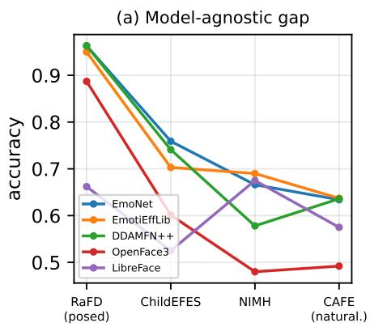
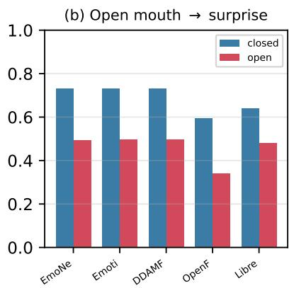
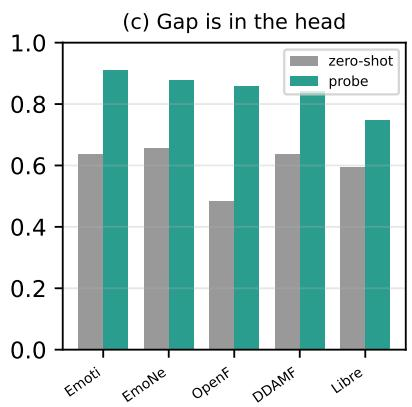
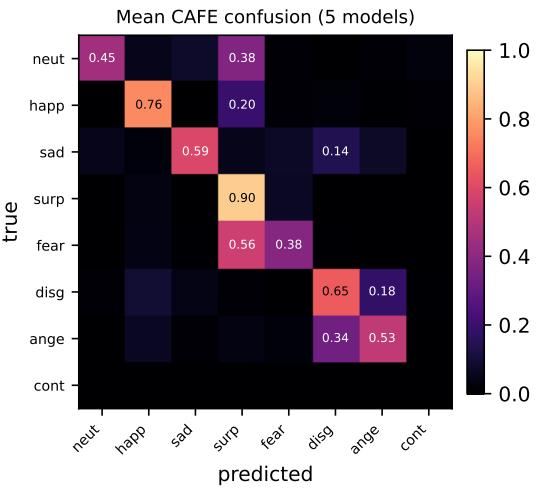
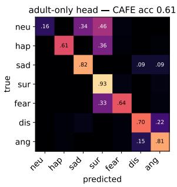
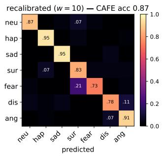
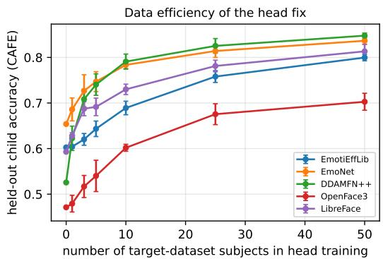
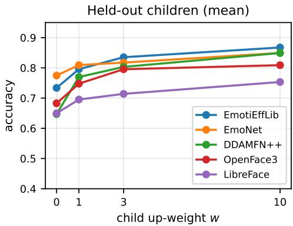
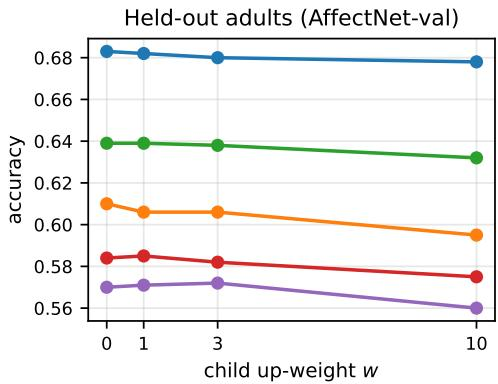

# Whose Face Is It Anyway? A Multi-Model Audit of Facial Affect Recognition on Children, and Why the Gap Is the Head, Not the Features

Tobias Hallmen1 Robin-Nico Kampa2 Elisabeth Andre´1

1Chair for Human-Centered Artificial Intelligence, University of Augsburg 2Institute for Distributed Intelligent Systems, University of the Bundeswehr Munich

tobias.hallmen@uni-a.de robin-nico.kampa@unibw.de elisabeth.andre@uni-a.de

## Abstract

Facial affect models are trained almost entirely on adults, yet are increasingly applied to children in education, health, and developmental research. We present a controlled, multi-model audit offive AffectNet-pretrained expression models (EmoNet, EmotiEffLib, DDAMFN++, OpenFace 3.0, LibreFace) on children, across four child image datasets, the AffectNet-8 validation set, and two spontaneous child video datasets, through one shared harness. Three findings emerge. First, the child gap is modelagnostic: every architecture degrades from posed to naturalistic faces and shares the fear→surprise confusion. Second, it is concentrated and corroborated across all five models: open-mouth faces (read as surprise, correlating with the AU26jaw drop) and South-Asian children degrade systematically, with a smaller averted-gaze penalty, while closed-mouth faces, White and Black children, and direct gaze do not; the bias tracks expression morphology and specific populations, not skin tone. Third, the gap is diagnosable: a linearprobe onfrozenfeatures reaches 0.75–0.91 on unseen children versus 0.48–0.66 zero-shot, so it lies largely in the classifier head, not the representation, whereas dimensional valence/arousal regression degrades sharply under domain shift. Building on this, recalibrating only the head on a little target data recovers +0.13 to +0.28 on the two largest child sets across all five models at negligible adult cost, though the gain is in-distribution and does not transfer across child collections. We will release the harness, per-sample predictions, and analysis code; the child face data stays license-locked and is never redistributed.

## 1. Introduction

Automatic facial expression recognition (FER) and dimensional affect estimation (valence/arousal) [28] are increasingly deployed on children: in learning analytics [30, 31], screening for developmental and affective conditions [33], and human–robot interaction [11]. Yet the datasets and pretrained models that power these systems are built almost entirely from adult faces: AffectNet [25], RAF-DB [22], and the in-the-wild affect corpora are adult-dominated, and the backbones (VGGFace2 [4], MS-Celeb-1M [13], FFHQ [17]) more so. Children are not small adults: facial morphology, expression dynamics, and emotional competencies evolve substantially throughout development, while emotional expressions are shaped by social and cognitive development [24]. Consequently, children’s facial expressions differ from those represented in the adult benchmarks on which most FER models are trained. Deploying adulttrained affect models on children therefore risks silent, demographically structured failure.

Prior child-FER evaluations are typically single-model and single-dataset [12, 19, 34, 35], which conflates a particular model’s quirks with the underlying domain gap, and offers no purchase on why models fail or how to fix them. We instead run a controlled, multi-model audit: five widely used, openly available AffectNet-pretrained models (EmoNet [32], EmotiEffLib/HSEmotion [29], DDAMFN++ [38], OpenFace 3.0 [16], and LibreFace [5]), evaluated through a single shared harness (common label space, per-model native preprocessing, identical metrics) across four child image datasets, the standard AffectNet-8 validation set, and two spontaneous child video datasets. Because all models see the same data and harness, differences reflect the models together with their native preprocessing (which we hold fixed per model and treat as part of each system), and agreement across models points to a shared cause in the data and the (adult) training distribution they share, rather than any one model’s quirks. We audit where and why adult-trained affect models fail on child datasets; this design isolates cross-model child-domain failures rather than a capture-matched causal effect of age.

Our analysis yields a coherent story (Fig. 1):

• The child gap is model-agnostic. All five architectures degrade from posed to naturalistic faces (every model far worse on CAFE than RaFD), share the fear→surprise confusion, and drop to barely-above-chance signal on spontaneous video (Sec. 4): a shared cause in the data, not any one model.

  
Figure 1. The child-affect gap is model-agnostic, demographically concentrated and AU-grounded, and lives in the classifier head, not the representation. (a) Every model degrades from posed (RaFD) to naturalistic (CAFE) faces. (b) Open-mouth faces are misread (the AU26 jaw drop → surprise), all five models. (c) A linear probe on frozen features (green) far exceeds zero-shot (grey): the gap is in the head, not the representation.

• Degradation is concentrated, corroborated, and not skin tone. Across all five models accuracy drops on open-mouth faces and South-Asian children (smaller averted-gaze penalty), but not on closed-mouth faces, White/Black children, or direct gaze; the contrasts hold under participant-level tests (Sec. 5). The openmouth→surprise error correlates with AU26 (jaw drop; monotone dose–response, seen in a second model’s AUs). Black and White children are read equally well, so the bias is not explained by skin tone; the lower South-Asian accuracy we attribute, as a hypothesis, to training underrepresentation.

• The gap is the head, not the features. A linear probe on frozen features reaches 0.75–0.91 on unseen children versus 0.48–0.66 zero-shot (Sec. 6), so adult-pretrained representations already encode child expressions and the gap lies primarily in the adult-calibrated head. Dimensional V/A regression, by contrast, degrades sharply under domain shift while the categorical channel is far more recoverable.

• The diagnosis is actionable. A frozen-backbone head recalibration on a few dozen target subjects recovers most of the gap and repairs the specific AU26 mechanism with negligible adult cost, so the audit pinpoints a remedy and bounds its cost.

Our primary contribution is the first shared-harness, fivemodel audit and benchmark of child facial affect: a demographically sliced, AU-grounded bias analysis corroborated across architectures, and a head-not-features diagnosis verified by a minimal intervention. We will release the harness, per-sample predictions, and analysis code; the child data stays under its original licenses and is never redistributed: we release the audit, not the data.

## 2. Related Work and Background

Facial expression models. We audit five openly available AffectNet-pretrained systems spanning the common design points (Tab. 1): EmoNet [32] (alignment encoder + 8-way expression and continuous V/A), Emoti-EffLib/HSEmotion [29] (VGGFace2 EfficientNet, multitask expression+V/A, ABAW lineage), DDAMFN++ [38] (MS-Celeb-1M dual-attention net), OpenFace 3.0 [16] (multi-task emotion+gaze+AU, VGGFace2 backbone), and LibreFace [5] (distilled ResNet-18 for expression+AUs, AffectNet+RAF-DB).

Crucially for an audit of child data, we found no documented training on RaFD/Radboud or on any curated child-face set: every emotion corpus and backbone in their released training provenance is adult-dominated and in-the-wild (AffectNet [25], RAF-DB [22], FERPlus [2], AFEW [6], AffWild2 [20]) or a face-recognition set (VG-GFace2 [4], MS-Celeb-1M [13], FFHQ [17]). Our child datasets, including the posed RaFD-Kid subset, are therefore held out as far as released provenance shows, and nearceiling posed-child accuracy is better explained by “posed apex faces are easy” than by known training overlap.

Child facial-affect datasets. We use four child image sets, CAFE [23] (1192 images, 7 expressions, demographic labels for race/gender/age and open-/closedmouth), ChildEFES [26], NIMH-ChEFS [8] (with direct/averted gaze), and the child subset of the Radboud

<table><tr><td>Model</td><td>Backbone</td><td>Emotion train</td><td>RaFD?</td><td>Child?</td></tr><tr><td>EmoNet</td><td>FAN enc.</td><td>AffN</td><td>no</td><td>no</td></tr><tr><td>EmotiEffLib</td><td>VGGFace2</td><td>AffN (+V/A)</td><td>no</td><td>no</td></tr><tr><td>DDAMFN++</td><td>MS-Celeb</td><td>AffN-8</td><td>no</td><td>no</td></tr><tr><td>OpenFace 3.0</td><td>VGGFace2</td><td>AffN</td><td>no</td><td>no</td></tr><tr><td>LibreFace</td><td>MAE</td><td>AffN+RAF-DB</td><td>no</td><td>no</td></tr></table>

Table 1. Training-data provenance of the five audited models (weights as used; AffN=AffectNet). Columns list backbone, emotion training corpus, and whether RaFD or any curated child data appears in the documented training provenance (none for all).

Faces Database (RaFD-Kid) [21], and two spontaneous child video sets, LIRIS-CSE [18] and EmoReact [27]. We chose these to span the axes along which a child audit can break. Age: from preschoolers (CAFE, 2–8 yr) through school-age children (NIMH-ChEFS, 10–17 yr; RaFD-Kid) to the toddler-to-teen range of the spontaneous videos. Ethnicity: CAFE and ChildEFES carry explicit race labels (White, Black, South-Asian, East-Asian, Latino), so demographic gaps can be measured rather than assumed, essential for separating skin tone from expression morphology (Sec. 5). Capture condition: posed studio frontal (RaFD), gaze-controlled portraits (NIMH, direct/averted), naturalistic open-/closed-mouth portraits (CAFE), and induced or fully spontaneous reactions (LIRIS, EmoReact). Label quality: all are validated, peer-reviewed corpora with reported human agreement (CAFE’s expressions are validated by untrained-adult ratings; NIMH and RaFD by the authors’ validation studies), so misclassifications are more readily attributable to the model than to noisy ground truth, though categorical labels on elicited affect retain residual ambiguity we do not eliminate. EmoReact is multi-label (per-clip affect-state presences) and carries continuous valence; LIRIS is single-label with no neutral class.

Adult affect benchmarks. For dimensional affect we use AffectNet [25] (valence/arousal + 8 expressions) and the inthe-wild ABAW/Aff-Wild2 challenge [20], whose Valence-Arousal track provides dense per-frame valence/arousal in [−1, 1] with pre-aligned crops. We pair them deliberately. AffectNet is the training distribution of every model we audit, so it is the in-domain reference that isolates the child gap from any generic generalization gap. ABAW supplies what no child set can: dense, expert-annotated, continuous valence/arousal under in-the-wild conditions, on adults. It is therefore our cross-domain V/A hold-out: a clean adultto-adult domain shift that lets us separate “valence/arousal regression does not transfer across domains” from “. . . does not transfer to children,” which child data alone (noisy, cliplevel, no dimensional labels) cannot disentangle.

Bias and fairness in FER. Demographic bias in face analysis is well documented for verification and attribute prediction, most influentially the intersectional genderclassification gaps of Gender Shades [3]. For expression recognition specifically, prior work reports accuracy gaps across gender, race, and skin tone [37] and audits emotion recognizers for demographic bias [7], but typically on adults, for a single model, and without isolating a mechanism. Age bias specifically has been documented across adult age groups [12, 19], and child-FER studies remain largely single-model and single-dataset [34, 35]. A separate, infant-focused line of work (action-unit detectors [14] and PyAFAR-based tools [10, 15], whose AUs have been used to infer infant affect [33]) targets infant action units or coarse affect rather than auditing the adult-pretrained models actually deployed on children. Remedies have been proposed (adult-data augmentation [34] and age-weighted losses [12]), but for single models and without localizing the failure; our minimal head recalibration instead serves as a diagnostic that pins the gap to the classifier head rather than the representation. We contribute a multi-model, mechanism-grounded account on children: we show which face attributes degrade consistently across architectures, tie the dominant one to a specific action unit, and demonstrate that the cause is largely a classifier-head miscalibration rather than a representational deficit. Table 2 situates this against prior work: no earlier study combines multimodel scope, an AU-grounded mechanism, and a head-notfeatures diagnosis with a deployable fix.

## 3. Experimental Setup

To make five heterogeneous models comparable, we wrap each behind a common interface and route all of them through one evaluation pipeline; only the per-model preprocessing differs, matching each model’s training convention.

Common label space. Every dataset’s labels are mapped to the canonical AffectNet-8 taxonomy (neutral, happy, sad, surprise, fear, disgust, anger, contempt). Datasets lacking a class are scored only on the classes they contain. Each model’s native output order is remapped to this space; we assert the mapping against each package’s own class list and verify it with a per-class soft smoke test, since a silent reordering would corrupt accuracy (e.g. EmotiEffLib’s native order is alphabetical, DDAMFN uses “Angry”).

Per-model preprocessing. Models own their crop: EmoNet uses a FAN-landmark crop at 256; EmotiEffLib and DDAMFN++ use a face-bbox crop; OpenFace 3.0 and LibreFace self-detect (bundled RetinaFace / MediaPipe). To control for detector variance on high-resolution child images (where OpenFace’s bundled detector returns degenerate crops), we feed the shared FAN crop to the bbox models and to OpenFace, and let LibreFace self-align. All five run in a single environment with per-model native preprocessing, summarized in Tab. 1.

<table><tr><td>Study</td><td>Domain</td><td>#Models</td><td>Subgroup slices</td><td>AU mech.</td><td>Head/feat.</td><td>Fix</td></tr><tr><td>Gender Shades [3]</td><td>adult (gender classif.)</td><td>3 comm.</td><td>skin type, gender</td><td>X</td><td>X</td><td>benchmark</td></tr><tr><td>Xu et al. [37]</td><td>FER</td><td>1</td><td>gender, race, age</td><td>X</td><td>X</td><td>disentangle</td></tr><tr><td>Domnich &amp; Anbarjafari [7]</td><td>FER</td><td>5</td><td>gender</td><td>X</td><td>X</td><td>X</td></tr><tr><td>Kim et al. [19]</td><td>adult FER</td><td>4 comm.</td><td>age</td><td>X</td><td>X</td><td>X</td></tr><tr><td>Gaya-Morey et al. [12]</td><td>FER (age groups)</td><td>3</td><td>age</td><td>X</td><td>X</td><td>age-bias mitig.</td></tr><tr><td>Virgolin et al. [34]</td><td>child FER</td><td>1</td><td>X</td><td>X</td><td>X</td><td>contrastive aug.</td></tr><tr><td>Vivekananthan [35]</td><td>child FER</td><td>1</td><td>X</td><td>X</td><td>X</td><td>synthetic aug.</td></tr><tr><td>Ours</td><td>child FER</td><td>5</td><td>mouth, race, gaze, age, gender</td><td>√</td><td>√</td><td>head recalib.</td></tr></table>

Table 2. This audit versus prior facial-affect bias and child-FER work. No prior study grounds the error in action units or separates a classifier-head failure from a representation failure; we add both to a multi-model, demographically sliced child evaluation with a deployable fix. #Models counts distinct architectures or commercial (comm.) systems, not training/setup variants of one backbone.

Metrics. For classification we report accuracy and macro-F1 in the main tables (balanced accuracy tracks accuracy closely). For video we aggregate frame predictions to a per-clip label (majority vote) and report clip-level accuracy against a majority-class baseline. For dimensional affect we report the concordance correlation coefficient (CCC) for valence and arousal, and their mean (the mean-CCC scored by the ABAW valence/arousal challenge). Demographic slices (mouth open/closed, race, gender, gaze, age) are computed per model from the per-sample predictions; we test contrasts with a two-proportion z-test per model, a participantlevel cluster bootstrap (resampling children, not images, to avoid pseudoreplication), and a sign test across models for corroboration.

Protocol note (AffectNet). EmoNet’s frequently cited 0.75 AffectNet-8 accuracy is computed on a cleaned 2733- image subset with flip-test-time-augmentation; it is not comparable to the modern models’ numbers on the raw 4000-image validation set. We therefore evaluate all models on the raw, uncleaned, single-crop AffectNet-8 validation set for the fair comparison, and keep EmoNet’s cleaned reproduction only as a weight-validation gate. Four models are scored on the 3999 successfully decoded images; LibreFace is scored on the 3974 it successfully detected, so its accuracy is recognition-conditional.

## 4. Benchmark

Images. Tab. 3 reports accuracy on the four child image datasets. Two patterns hold for all five models. First, accuracy falls from posed to naturalistic faces: from posed studio RaFD (0.66–0.96, four of five near-ceiling) down to varied open/closed-mouth CAFE (0.49–0.64); every model scores far below its RaFD accuracy on CAFE, though the drop is not strictly monotone across the intermediate sets. Second, one per-class failure recurs across all architectures (fear read as surprise), while others, such as anger→disgust, vary widely by model (0.00 for LibreFace to 0.63 for Open-Face) and are not a shared signature. EmoNet has the highest unweighted-mean accuracy (boosted by the posed sets; the ranking flips under sample-weighting, where EmotiEffLib leads), and EmotiEffLib is the most robust on the two hardest sets (NIMH, CAFE); DDAMFN++ ties EmoNet on clean posed faces but is the most brittle to gaze/naturalness; OpenFace and the distilled LibreFace trail. The spread across models on any single dataset is typically smaller than the spread across datasets; i.e., the dataset (domain) explains much of the variance.

<table><tr><td>Model</td><td>RaFD (80)</td><td>ChildEFES (158)</td><td>NIMH (533)</td><td>CAFE (1192)</td><td>mean</td></tr><tr><td>EmoNet</td><td>.963 (.96)</td><td>.759(.73)</td><td>.666(.46)</td><td>.634(.54)</td><td>.756(.68)</td></tr><tr><td>EmotiEffLib</td><td>.950 (.95)</td><td>.703 (.64)</td><td>.690 (.47)</td><td>.637 (.63)</td><td>.745(.67)</td></tr><tr><td>DDAMFN++</td><td>.963 (.96)</td><td>.741 (.70)</td><td>.578 (.40)</td><td>.636(.55)</td><td>.730(.66)</td></tr><tr><td>OpenFace 3.0</td><td>.887 (.88)</td><td>.601 (.58)</td><td>.480 (.36)</td><td>.492(.42)</td><td>.615(.56)</td></tr><tr><td>LibreFace</td><td>.662 (.57)</td><td>.525 (.39)</td><td>.675 (.56)</td><td>.575(.50)</td><td>.609(.51)</td></tr></table>

Table 3. Child image datasets: accuracy, with macro-F1 in parentheses (8-class, mapped; bold marks the best accuracy per column). “mean” is the unweighted mean over the four datasets (which have very different N; under sample-weighting the top two means swap). Type, left to right: posed studio frontal → posed/induced → posed ±gaze → varied open/closed mouth. Every model degrades with naturalness; macro-F1 falls further on the harder sets (NIMH, CAFE), so accuracy understates the gap. No model escapes it.

<table><tr><td>Model</td><td>Acc-8</td><td>Acc-7</td><td>Val. CCC</td><td>Aro. CCC</td></tr><tr><td>EmotiEffLib</td><td>.675</td><td>.675</td><td>.581</td><td>.585</td></tr><tr><td>DDAMFN++</td><td>.643</td><td>.654</td><td></td><td></td></tr><tr><td>EmoNet</td><td>.594</td><td>.591</td><td>.684</td><td>.628</td></tr><tr><td>OpenFace 3.0</td><td>.562</td><td>.536</td><td>一</td><td>一</td></tr><tr><td>LibreFace</td><td>.436</td><td>.498</td><td>一</td><td>一</td></tr></table>

Table 4. Standard AffectNet-8 validation (raw 4000, single-crop, no TTA), the fair cross-model bar. Acc-8/Acc-7 are 8- and 7-class accuracy; Val./Aro. CCC are valence/arousal concordance (dash where a model has no V/A head).

<table><tr><td>Attribute</td><td>Hard subgroup</td><td>control</td><td>#mdl.↓</td><td>sig.</td></tr><tr><td>Mouth (CAFE)</td><td>open .46</td><td>.69</td><td>5/5</td><td> $p { < } . 0 0 1$ </td></tr><tr><td>Race (CAFE)</td><td>S. Asian .53</td><td>W.61/B.60</td><td>5/5</td><td> $p { = } . 0 2$ </td></tr><tr><td>Gaze (NIMH)</td><td>averted</td><td>direct</td><td>5/5</td><td>dir.</td></tr></table>

Table 5. Demographic slices, pooled over the five models. Columns: hard subgroup accuracy versus its control, “#mdl↓” (models scoring below their own overall accuracy on the subgroup), and significance.

Adult reference. On the standard AffectNet-8 validation set (Tab. 4) the modern models cluster at 0.44– 0.68, with our reproductions matching published numbers (DDAMFN++ .643 vs .647; LibreFace Acc-7 .498 vs .497), validating the harness. EmoNet’s raw-validation accuracy (.594) falls squarely in this band; its widely cited 0.75 is an artifact of a cleaned subset plus flip augmentation, not a real margin over the others.

Video. Spontaneous child video is far harder, for reasons intrinsic to the data: the expression is elicited (unknown onset, most frames neutral/transitional), its intensity uncontrolled, children move and talk (so the largest deformations come from speech, not the held expression), and the label is clip-level while the model sees single frames. On LIRIS-CSE (6-class, clip-level majority vote) the majority baseline (always “happy”) is 0.342; the five models score 0.30–0.42 (best fixed window per model), EmotiEffLib’s best run exceeding it by only ∼0.08, and a data-driven apex-frame selector did not help (maximal deformation coincides with speech/head motion, not the held expression). On EmoReact (per-clip multi-label presences, thresholdfree per-state ROC-AUC) macro AUC is 0.54–0.62, only just above chance, with happiness the only state detected appreciably above it. We conclude that frame-aggregated image models are near chance on spontaneous child video; this needs temporal models, not smarter single-frame selection.

## 5. Bias Analysis

Aggregating per-sample predictions over demographic slices (Tab. 5) shows the degradation is not diffuse: it concentrates on specific face attributes, and the same attributes hurt every model. Because CAFE and NIMH contain several images per child, we test each contrast both per image (two-proportion z-test) and at the participant level (cluster bootstrap over children), reporting the latter to avoid pseudoreplication. Open-mouth faces drop to 0.46 (vs 0.69 closed) for all five models (each $p \ < \ 1 0 ^ { - 3 }$ per model; $p = 0 . 0 0 0 2$ in the participant bootstrap over 146 children): by far the dominant effect. Because surprise is posed only with a closed mouth in CAFE, this raw contrast mixes class distributions; the class-standardized gap (macro-averaged over the six classes present in both subsets) is +0.10 to +0.21 across models, so the penalty is not an artifact of class mix. South-Asian children are the lowest-scoring race group (0.53 vs White 0.61, Black 0.60; n=10 children, participant-clustered $p = 0 . 0 2$ , exploratory). Averted gaze carries a small penalty (direct exceeds averted by 0.06 over 52 children, $p \approx 0 . 0 1 1 )$ , in the same direction for all five models. Closed-mouth faces, White/Black children, direct gaze, gender, and most ages are not degraded.

  
Figure 2. CAFE confusion averaged (row-normalized) over all five models. The fear→surprise confusion is shared across models (5-model mean 0.56 vs 0.38 correct); other errors such as anger→disgust are heterogeneous across models (0.00–0.63) and shown here only as the 5-model average (0.34). (CAFE has no contempt.)

The bias is not explained by skin tone. Black and White children, near the extremes of the skin-tone range, are read equally well (0.60 vs 0.61, difference −0.003, p = 0.88 by child), so a melanin/reflectance account, which would penalize darker faces, does not fit. (We use CAFE’s race labels, not measured skin tone.) The lower-scoring group is South-Asian. We hypothesize these errors reflect coverage gaps in the adult pretraining data: (i) the open-mouth jaw drop (below), a morphology the adult-trained head rarely saw except with surprise, and (ii) under-representation of South-Asian faces in in-the-wild adult corpora, rather than a pixel-level skin-tone effect. Consistent with this, a head recalibrated on a sample of the target population removes the errors (Sec. 7).

  
Figure 3. Bias and fix are one head miscalibration (EmotiEffLib, held-out CAFE; cf. Tab. 7). The adult-only head over-predicts surprise, leaking neutral, happy, and fear faces into it (left, the AU26 jaw-drop boundary); the child-recalibrated head (w=10) collapses that mass onto the diagonal (CAFE 0.61 → 0.87, backbone frozen; right).

<table><tr><td>Model</td><td>zero-shot</td><td>linear probe</td><td>∆</td></tr><tr><td>EmotiEffLib</td><td>.638</td><td>.910</td><td>+.272</td></tr><tr><td>EmoNet</td><td>.657</td><td>.878</td><td>+.221</td></tr><tr><td>OpenFace 3.0</td><td>.484</td><td>.859</td><td>+.375</td></tr><tr><td>DDAMFN++</td><td>.638</td><td>.843</td><td>+.205</td></tr><tr><td>LibreFace</td><td>.593</td><td>.747</td><td>+.154</td></tr></table>

Table 6. Linear probe on frozen features, CAFE, participantdisjoint (108 train / 46 test subjects), all five models. Columns: zero-shot accuracy, accuracy of a linear head probe on the frozen features, and their difference ∆.

The dominant failure is a jaw drop read as surprise. We localize the open-mouth bias mechanistically. Pooled over the five models, 65% of all open-mouth misclassifications are predicted as surprise, and the surprise overprediction rate jumps from 0.06–0.14 (closed) to 0.22–0.51 (open) for every model. Using LibreFace’s per-sample action-unit intensities on CAFE, the per-sample “fraction of models predicting surprise” correlates with AU26 (jaw drop) [9] intensity (Spearman $\rho = 0 . 5 0$ , tie-corrected), rising monotonically across intensity terciles, 0.07 (low) → 0.21 (mid) → 0.51 (high); AU25 (lips part) is weaker (ρ = 0.21). The same association appears in a second model: OpenFace 3.0 exposes eight labelled AUs, and its AU26 (jaw drop) intensity correlates with the surprise misfire $( \rho = 0 . 4 9 )$ , closely matching LibreFace’s AU26 $( \rho = 0 . 5 0 )$ , while its AU25 (lips part) is again weaker $( \rho = 0 . 2 6 )$ . Both rest on model-predicted AUs (not ground-truth annotations) and agree by label, so the association holds across two models. The South-Asian error, by contrast, is diffuse (surprise 43%, disgust 20%, anger 15%), indicating a different, distributional cause rather than a single confusion.

## 6. Probe Analysis

If adult-pretrained representations were the problem, no cheap fix would exist. They are not. We freeze each backbone, extract embeddings, and train only a linear classifier [1] on a participant-disjoint CAFE split (no child appears in both train and test), then compare to zero-shot accuracy on the same held-out children (Tab. 6). Across all five models a linear head reaches 0.75–0.91 on unseen children, versus 0.48–0.66 zero-shot $( \Delta = + 0 . 1 5 ~ \mathrm { t o } ~ + 0 . 3 8 )$ . The clearest evidence is OpenFace 3.0: it has the worst zero-shot accuracy (0.484) yet its features probe to 0.859, as well as any other model. The child-FER gap is therefore largely a classifier-head miscalibration to adult statistics rather than a representational deficit: the features already encode child expressions well enough for a linear head to recover 0.75– 0.91, above the 66% mean accuracy untrained adults reach on CAFE [23]: the signal is recoverable, so the representation is not the bottleneck; the adult-trained boundary simply does not read it. (The probe identifies the head as the dominant, not sole, factor; Tab. 7 corroborates across four child sets.) This both explains the open-mouth/AU26 confusion (an adult-calibrated boundary places the jaw-drop region near “surprise”) and points to a cheap remedy: refit the head, do not fine-tune the backbone.

Dimensional affect tells the opposite, sharper story. Valence/arousal regression degrades sharply under domain shift. EmoNet’s valence CCC is 0.68 on the AffectNet validation set (in-domain), but only 0.21 on the adult inthe-wild ABAW hold-out and 0.22 on child EmoReact (degraded but nonzero). The adult cross-domain drop is as large as the child drop, so poor child valence is a property of dimensional regression under domain shift, not something child-specific. Categorical expression labels, in contrast, are far more recoverable from frozen features after target adaptation (the probe above). This dissociation, that categorical structure is more recoverable than dimensional regression under the same shift, motivates routing affect through the categorical channel, which we develop next.

## 7. Method: Recalibrate the Head

The probe (Sec. 6) says the child expression gap is a head miscalibration, so a head refit on a little child data should recover it cheaply, with the backbone frozen, preserving adult performance and the auxiliary heads (valence/arousal, gaze, AUs).

Pooled head recalibration. We retrain only the linear expression head on frozen features, pooled over a classbalanced sample of AffectNet-train (adults) and the child datasets, and evaluate on held-out adults (AffectNet-val) and held-out children (subject-disjoint), sweeping the child up-weight to trace the adult/child frontier. The fix is architecture-agnostic: it works on every one of the five models (Tab. 7). At w=10, CAFE improves by +0.21 to +0.27 and NIMH by +0.13 to +0.28 on all five backbones, while the adult cost is negligible (at most −0.015 versus the adultonly refit, far smaller than the child gains): the child gains are essentially free. The two small posed sets are noisier: ChildEFES gains on three of five models, and RaFD is already near ceiling. Because the backbone is frozen, the valence/arousal, gaze, and action-unit heads are untouched. This is a deployable fix: collect a little child expression data, refit one linear layer. Crucially, it repairs the specific mechanism Sec. 5 localized, not just the average: on a held-out CAFE split the recalibrated EmotiEffLib head lifts open-mouth accuracy from 0.49 to 0.85 and cuts the open-mouth→surprise misfire from 0.38 to 0.07, while fear accuracy rises 0.49 → 0.70 as the fear→surprise confusion more than halves (all relative to the adult-only refit head): the bias and the fix are the same head miscalibration (Fig. 3).

<table><tr><td>model</td><td>head</td><td>adults</td><td>CAFE</td><td>ChildEFES</td><td>NIMH</td><td>RaFD</td></tr><tr><td rowspan="2">EmotiEffLib</td><td>adult-only</td><td>.683</td><td>.606</td><td>.667</td><td>.704</td><td>.958</td></tr><tr><td>w=10</td><td>.678</td><td>.865</td><td>.789</td><td>.858</td><td>.958</td></tr><tr><td rowspan="2">EmoNet</td><td>adult-only</td><td>.610</td><td>.657</td><td>.737</td><td>.747</td><td>.958</td></tr><tr><td>w=10</td><td>.595</td><td>.865</td><td>.702</td><td>.914</td><td>.917</td></tr><tr><td rowspan="2">DDAMFN++</td><td>adult-only</td><td>.639</td><td>.590</td><td>.649</td><td>.599</td><td>.750</td></tr><tr><td>w=10</td><td>.632</td><td>.859</td><td>.754</td><td>.784</td><td>1.00</td></tr><tr><td rowspan="2">OpenFace 3</td><td>adult-only</td><td>.584</td><td>.603</td><td>.614</td><td>.556</td><td>.958</td></tr><tr><td>w=10</td><td>.575</td><td>.849</td><td>.596</td><td>.833</td><td>.958</td></tr><tr><td rowspan="2">LibreFace</td><td>adult-only</td><td>.570</td><td>.580</td><td>.579</td><td>.648</td><td>.792</td></tr><tr><td>w=10</td><td>.560</td><td>.811</td><td>.632</td><td>.778</td><td>.792</td></tr></table>

Table 7. Frozen-backbone head recalibration across all five models: a linear expression head retrained on pooled AffectNet-train + child data (child up-weight w), evaluated on held-out adults (AffectNet-val) and held-out, subject-disjoint children. Each model has two rows: the adult-only baseline (head retrained without child data) and the recalibrated head at w=10. Bold marks the recalibrated (w=10) result where it improves on the adult-only baseline.

The gain is in-distribution. The fix recalibrates to the target distribution, not a generic “child” head. Training on three child datasets and testing on the held-out fourth transfers weakly: mean improvement over the adult-only head is +0.05/+0.04 for DDAMFN++/OpenFace 3, ≈ 0 for EmotiEffLib, and negative for EmoNet and LibreFace (pooling other child sets even costs LibreFace −0.18 on NIMH), far short of the +0.2 in-distribution gain. In frozen feature space the four child datasets shift each expression’s class centroid in different directions (a class-conditional domain shift [36], not a feature deficit), so a head fitted to one collection lands on the wrong boundary for another. The recommendation sharpens: collect a little expression data from the deployment population and capture conditions.

  
Figure 4. Data efficiency of the head recalibration on CAFE: heldout child accuracy versus the number of target subjects used to refit the linear head (8k-frame AffectNet anchor, child up-weight w=10; mean±std over 4 subject draws). Most of the gain arrives by 10–25 children.

How little target data? Very little (Fig. 4): sweeping target subjects on CAFE, accuracy climbs steeply, with most of the gain captured by ∼10–25 children and diminishing (still positive) returns out to the 50 we test; even 5 subjects lift most models above their zero-shot floor. The unit is children, not images: each contributes about 8 CAFE frames, so ∼25 children is ∼190 images, class-balanced and upweighted (w=10, i.e. ∼1.9k in effective weight) so they are not swamped by the 8k-frame adult anchor. This is less surprising than it sounds: we refit only a linear head, and the probe (Sec. 6) already showed the frozen features encode child expressions, so the head needs only a small boundary correction. A few dozen labelled children from the target setting suffice.

Valence/arousal is harder, and reveals a dissociation. Available child corpora lack dense per-frame V/A labels comparable to the adult benchmarks, so child V/A can only be transferred. On EmotiEffLib (the strongest native V/A model, scored by valence-CCC on the adult ABAW holdout) we compare three post-hoc routes against its native, jointly optimized head (0.375): regress from frozen features (0.218), map the categorical posterior (probs→V/A, 0.250), or fine-tune the backbone (0.276). The posterior route beats feature regression, the same categorical-over-dimensional advantage the probe showed, but no route reaches the native head (scaling the map to 138k adult frames plateaus at 0.335; fusing the degraded predicted AUs adds nothing). The dissociation holds, yet closing the gap to the native cross-domain V/A head is the open problem: more adult data does not close it, and the binding constraint is the absence of comparable dimensional child labels.

(a) Held-out children climb steeply.  
  
(b) Held-out adults stay flat.  
Figure 5. The head recalibration buys child accuracy essentially for free. As the child up-weight w rises, held-out children improve sharply on all five backbones (a) while held-out adults stay nearly flat (b) (at most −0.015): the adult cost is negligible relative to the child gains.

Why not fine-tune the backbone? Fine-tuning the last block+head (1.1M params, with AffectNet rehearsal and a masked adult-only V/A loss) loses to the frozen head on the only two models with native V/A heads (EmotiEffLib and EmoNet; Tab. 4): child accuracy rises less (CAFE 0.80 vs the frozen 0.865) while adult V/A drifts below native (∼0.28 vs 0.375), and refitting V/A on the fine-tuned features does not recover it. We test these two because the key cost (V/A-head degradation) is observable only on V/A-capable models; the frozen-head recalibration already covers all five (Tab. 7). Across the tested configurations, fine-tuning did not beat the frozen head, consistent with the probe’s verdict that the gap lives in the head, not the representation.

## 8. Discussion

Limitations and future work. Two boundaries scope the result and point to the next steps. The head fix is indistribution by construction: it recalibrates to the target population and does not transfer across child collections, so predicting transferability from a few capture-condition descriptors would turn it into a broader recipe that says in advance when one population’s data can stand in for another’s. And child valence/arousal lacks dimensional labels comparable to the adult benchmarks, so carrying the categorical-channel dissociation onto the dimensional axis remains the hardest open problem the audit surfaces. Beyond these, frame-aggregated models set a clear baseline on spontaneous child video, motivating temporal architectures that model expression dynamics; and the head-not-features framework is not specific to children, so the same audit and recalibration could test other under-represented populations (elderly faces, clinical groups, cross-cultural settings).

Ethics and societal impact. The child datasets were collected and released by their creators under dataset-specific consent and ethics procedures; we use them in place under their licenses, contact no participants, add no new data collection, and never upload or redistribute images, releasing only code, per-sample outputs, and aggregate statistics. Affect predictions are not ground-truth internal states and should not drive diagnostic, disciplinary, or access decisions: any deployment requires consent, human oversight, and validation in the target population. We used LLM coding assistants (Claude, Codex) for code and writing; no labels, data, or experimental results were LLM-generated, and all decisions and responsibility rest with the authors.

## 9. Conclusion

A controlled audit of five adult-trained models on child data shows the gap is model-agnostic, demographically concentrated and corroborated across architectures (open mouths read as surprise, correlating with the AU26 jaw drop; South-Asian children lower; but not explained by skin tone), and largely a classifier-head miscalibration rather than a representational deficit. The probe and recalibration experiments identify adult-label calibration as the dominant failure: large-scale pretraining already exposes the backbone to diverse faces, so it encodes child expressions, while a little child-labeled data repairs the decision boundary. Trainingset underrepresentation is a plausible source of that miscalibration. The practical consequence is a cheap, deployable remedy, refitting one linear layer on a few dozen labelled children, but an in-distribution one: the gains do not transfer across child collections, so the data must come from the deployment population and capture conditions. Dimensional valence/arousal is harder still and remains substantially less transferable, the open problem we surface.

## Acknowledgments

This work was partially funded by the Deutsche Forschungsgemeinschaft (DFG, German Research Foundation) – project number 490909448.

## References

[1] Guillaume Alain and Yoshua Bengio. Understanding intermediate layers using linear classifier probes. In 5th International Conference on Learning Representations, ICLR 2017, Toulon, France, April 24-26, 2017, Workshop Track Proceedings. OpenReview.net, 2017. 6

[2] Emad Barsoum, Cha Zhang, Cristian Canton-Ferrer, and Zhengyou Zhang. Training deep networks for facial expression recognition with crowd-sourced label distribution. In Proceedings of the 18th ACM International Conference on Multimodal Interaction, ICMI 2016, Tokyo, Japan, November 12-16, 2016, pages 279–283. ACM, 2016. 2

[3] Joy Buolamwini and Timnit Gebru. Gender shades: Intersectional accuracy disparities in commercial gender classification. In Conference on Fairness, Accountability and Transparency, FAT 2018, 23-24 February 2018, New York, NY, USA, pages 77–91. PMLR, 2018. 3, 4

[4] Qiong Cao, Li Shen, Weidi Xie, Omkar M. Parkhi, and Andrew Zisserman. Vggface2: A dataset for recognising faces across pose and age. In 13th IEEE International Conference on Automatic Face & Gesture Recognition, FG 2018, Xi’an, China, May 15-19, 2018, pages 67–74. IEEE Computer Society, 2018. 1, 2

[5] Di Chang, Yufeng Yin, Zongjian Li, Minh Tran, and Mohammad Soleymani. Libreface: An open-source toolkit for deep facial expression analysis. In IEEE/CVF Winter Conference on Applications ofComputer Vision, WACV 2024, Waikoloa, HI, USA, January 3-8, 2024, pages 8190–8200. IEEE, 2024. 1, 2

[6] Abhinav Dhall, Roland Goecke, Simon Lucey, and Tom Gedeon. Collecting large, richly annotated facial-expression databases from movies. IEEE Multim., 19(3):34–41, 2012. 2

[7] Artem Domnich and Gholamreza Anbarjafari. Responsible AI: gender bias assessment in emotion recognition. CoRR, abs/2103.11436, 2021. 3, 4

[8] Helen Link Egger, Daniel S Pine, Eric Nelson, Ellen Leibenluft, Monique Ernst, Kenneth E Towbin, and Adrian Angold. The nimh child emotional faces picture set (nimh-chefs): A new set of children’s facial emotion stimuli. International journal of methods in psychiatric research, 20(3):145–156, 2011. 2

[9] Paul Ekman and Wallace V. Friesen. Facial Action Coding System: A Technique for the Measurement of Facial Movement. Consulting Psychologists Press, Palo Alto, CA, 1978. 6

[10] Itir Onal Ertugrul, Saurabh Hinduja, Maneesh Bilalpur,¨ Daniel S. Messinger, and Jeffrey F. Cohn. Expanding pyafar: A novel privacy-preserving infant AU detector. In 18th

IEEE International Conference on Automatic Face and Gesture Recognition, FG 2024, Istanbul, Turkey, May 27-31, 2024, pages 1–2. IEEE, 2024. 3

[11] Chiara Filippini and Arcangelo Merla. Systematic review of affective computing techniques for infant robot interaction. Int. J. Soc. Robotics, 15(3):393–409, 2023. 1

[12] Francesc Xavier Gaya-Morey, Julia Sanchez-Perez, Cristina Manresa-Yee, and Jose Maria Buades Rubio. Bridging the gap in FER: addressing age bias in deep learning. CoRR, abs/2507.07638, 2025. 1, 3, 4

[13] Yandong Guo, Lei Zhang, Yuxiao Hu, Xiaodong He, and Jianfeng Gao. Ms-celeb-1m: A dataset and benchmark for large-scale face recognition. In Computer Vision - ECCV 2016 - 14th European Conference, Amsterdam, The Netherlands, October 11-14, 2016, Proceedings, Part III, pages 87– 102. Springer, 2016. 1, 2

[14] Zakia Hammal, Wen-Sheng Chu, Jeffrey F. Cohn, Carrie Heike, and Matthew L. Speltz. Automatic action unit detection in infants using convolutional neural network. In Seventh International Conference on Affective Computing and Intelligent Interaction, ACII 2017, San Antonio, TX, USA, October 23-26, 2017, pages 216–221. IEEE Computer Society, 2017. 3

[15] Saurabh Hinduja, Itir Onal Ertugrul, Maneesh Bilalpur,¨ Daniel S. Messinger, and Jeffrey F. Cohn. Pyafar: Pythonbased automated facial action recognition library for use in infants and adults. In 11th International Conference on Affective Computing and Intelligent Interaction, ACII 2023 - Workshops and Demos, Cambridge, MA, USA, September 10-13, 2023, pages 1–3. IEEE, 2023. 3

[16] Jiewen Hu, Leena Mathur, Paul Pu Liang, and Louis-Philippe Morency. Openface 3.0: A lightweight multitask system for comprehensive facial behavior analysis. In 19th IEEE International Conference on Automatic Face and Ges ture Recognition, FG 2025, Tampa/Clearwater, FL, USA, May 26-30, 2025, pages 1–11. IEEE, 2025. 1, 2

[17] Tero Karras, Samuli Laine, and Timo Aila. A style-based generator architecture for generative adversarial networks. In IEEE Conference on Computer Vision and Pattern Recogni tion, CVPR 2019, Long Beach, CA, USA, June 16-20, 2019, pages 4401–4410. Computer Vision Foundation / IEEE, 2019. 1, 2

[18] Rizwan Ahmed Khan, Arthur Crenn, Alexandre Meyer, and Sa¨ıda Bouakaz. A novel database of children’s spontaneous facial expressions (LIRIS-CSE). Image Vis. Comput., 83-84: 61–69, 2019. 3

[19] Eugenia Kim, De’Aira Bryant, Deepak Srikanth, and Ayanna M. Howard. Age bias in emotion detection: An analysis of facial emotion recognition performance on young, middle-aged, and older adults. In AIES ’21: AAAI/ACM Conference on AI, Ethics, and Society, Virtual Event, USA, May 19-21, 2021, pages 638–644. ACM, 2021. 1, 3, 4

[20] Dimitrios Kollias, Panagiotis Tzirakis, Alice Baird, Alan Cowen, and Stefanos Zafeiriou. ABAW: valence-arousal estimation, expression recognition, action unit detection & emotional reaction intensity estimation challenges. In IEEE/CVF Conference on Computer Vision and Pattern

Recognition, CVPR 2023 - Workshops, Vancouver, BC, Canada, June 17-24, 2023, pages 5889–5898. IEEE, 2023. 2, 3

[21] Oliver Langner, Ron Dotsch, Gijsbert Bijlstra, Daniel HJ Wigboldus, Skyler T Hawk, and AD Van Knippenberg. Presentation and validation of the radboud faces database. Cognition and emotion, 24(8):1377–1388, 2010. 3

[22] Shan Li, Weihong Deng, and Junping Du. Reliable crowdsourcing and deep locality-preserving learning for expression recognition in the wild. In 2017 IEEE Conference on Computer Vision and Pattern Recognition, CVPR 2017, Honolulu, HI, USA, July 21-26, 2017, pages 2584–2593. IEEE Computer Society, 2017. 1, 2

[23] Vanessa LoBue and Cat Thrasher. The child affective facial expression (cafe) set: Validity and reliability from untrained adults. Frontiers in psychology, 5:1532, 2015. 2, 6

[24] Johanna Lochner and Bj¨ orn W. Schuller. Child and youth¨ affective computing - challenge accepted. IEEE Intell. Syst., 37(6):69–76, 2022. 1

[25] Ali Mollahosseini, Behzad Hassani, and Mohammad H. Mahoor. Affectnet: A database for facial expression, valence, and arousal computing in the wild. IEEE Trans. Affect. Comput., 10(1):18–31, 2019. 1, 2, 3

[26] Juliana Gioia Negrao, Ana Alexandra Caldas Osorio, Ri-˜ naldo Focaccia Siciliano, Vivian Renne Gerber Lederman, Elisa Harumi Kozasa, Maria Eloisa Fama D’Antino, Ander-´ son Tamborim, Vitor Santos, David Leonardo Barsand de Leucas, Paulo Sergio Camargo, et al. The child emotion facial expression set: a database for emotion recognition in children. Frontiers in psychology, 12:666245, 2021. 2

[27] Behnaz Nojavanasghari, Tadas Baltrusaitis, Charles E. Hughes, and Louis-Philippe Morency. Emoreact: a multimodal approach and dataset for recognizing emotional responses in children. In Proceedings of the 18th ACM International Conference on Multimodal Interaction, ICMI 2016, Tokyo, Japan, November 12-16, 2016, pages 137–144. ACM, 2016. 3

[28] James A Russell. A circumplex model of affect. Journal of personality and social psychology, 39(6):1161, 1980. 1

[29] Andrey V. Savchenko. Facial expression and attributes recognition based on multi-task learning of lightweight neural networks. In 19th IEEE International Symposium on Intelligent Systems and Informatics, SISY 2021, Subotica, Serbia, September 16-18, 2021, pages 119–124. IEEE, 2021. 1, 2

[30] Andrey V. Savchenko, Lyudmila V. Savchenko, and Ilya Makarov. Classifying emotions and engagement in online learning based on a single facial expression recognition neural network. IEEE Trans. Affect. Comput., 13(4):2132–2143, 2022. 1

[31] Omer S ¨ umer, Patricia Goldberg, Sidney D’Mello, Peter Ger-¨ jets, Ulrich Trautwein, and Enkelejda Kasneci. Multimodal engagement analysis from facial videos in the classroom. IEEE Trans. Affect. Comput., 14(2):1012–1027, 2023. 1

[32] Antoine Toisoul, Jean Kossaifi, Adrian Bulat, Georgios Tzimiropoulos, and Maja Pantic. Estimation of continuous valence and arousal levels from faces in naturalistic conditions. Nat. Mach. Intell., 3(1):42–50, 2021. 1, 2

[33] Martin Lund Trinhammer, Ida Egmose, Marianne Thode Krogh, Anne Christine Stuart, Mette Skovgaard Væver, Sami Sebastian Brandt, and Stella Graßhof. Evaluating open-source solutions for computerized inference of infant facial affect. Developmental Science, 29(2):e70156, 2026. 1, 3

[34] Marco Virgolin, Andrea De Lorenzo, Tanja Alderliesten, and Peter A. N. Bosman. Adults as augmentations for children in facial emotion recognition with contrastive learning. CoRR, abs/2202.05187, 2022. 1, 3, 4

[35] Sanchayan Vivekananthan. Emotion classification of chil dren expressions. CoRR, abs/2411.07708, 2024. 1, 3, 4

[36] Mei Wang and Weihong Deng. Deep visual domain adapta tion: A survey. Neurocomputing, 312:135–153, 2018. 7

[37] Tian Xu, Jennifer White, Sinan Kalkan, and Hatice Gunes. Investigating bias and fairness in facial expression recogni tion. In Computer Vision - ECCV 2020 Workshops - Glasgow, UK, August 23-28, 2020, Proceedings, Part VI, pages 506–523. Springer, 2020. 3, 4

[38] Saining Zhang, Yuhang Zhang, Ye Zhang, Yufei Wang, and Zhigang Song. A dual-direction attention mixed feature network for facial expression recognition. Electronics, 12(17): 3595, 2023. 1, 2