# World Models’ Last Exam in Physics

Mingju Gao∗,†, Qingle Liu∗, Yuzhao Peng∗, Xinjie Lin∗, Ziming Qin, Zheng Jiang, Wenyi Li, Calvin Xiao, Youjie Zheng, Kaisen Yang‡, Qinhuai Na‡

Navers Lab, Einsia.AI Peking University Tsinghua University

∗Equal Contribution ‡Corresponding Author †Project Lead

Video world models can produce visually convincing yet physically inconsistent sequences, raising concerns about their reliability for prediction and planning in embodied AI systems. Existing evaluations often rely on model-based judgments or reference videos, while direct physical tests largely focus on mechanics. We introduce World Models’ Last Exam in Physics, a measurement-based benchmark for evaluating physical consistency in video world models. The benchmark comprises 40 controlled tasks spanning mechanics, optics, fluids, thermal and phase-change phenomena, electromagnetism, and surface tension. Each task pairs an initial image and a generation prompt with predefined physical criteria, enabling interpretable tests of observable physical relationships without requiring reference videos. Its evaluator combines task-observability screening with task-specific quantitative physical measurements. Experiments on eight video generation models across 1,280 videos reveal persistent physical inconsistencies and substantial variation across tasks, with the best model achieving an overall score of 57.76 out of 100. Evaluation on synthetic videos with known physical relationships provides evidence for the validity of the measurement module under controlled conditions. The evaluator also achieves higher agreement with human judgments than a direct vision-language model baseline in both within-task rankings and pairwise comparisons. By combining coverage across physical domains with scores grounded in measurable evidence and explicit measurement limitations, the benchmark provides an interpretable basis for diagnosing physical inconsistencies and tracking progress toward physically consistent video world models.

Date: October 7, 2026 HomePage: https://lab.einsia.ai/phys-last-exam Contact: yuno@einsia.ai, kaisenyang@einsia.ai, nana@einsia.ai

## 1 Introduction

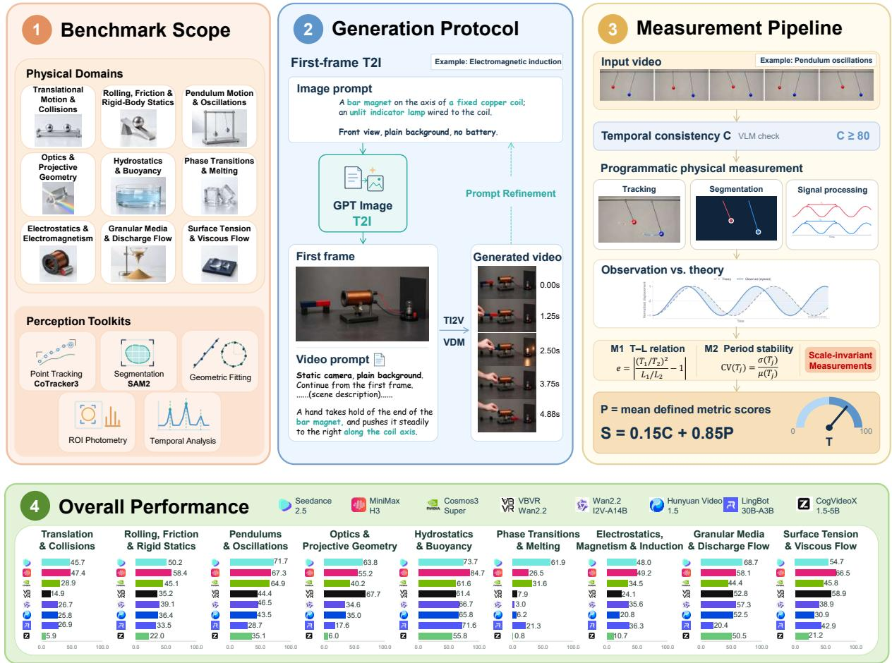  
Figure 1 Overview of our benchmark. (1) Benchmark scope: 40 controlled tasks span nine physical categories, supported by perception tools for extracting observable quantities. (2) Generation protocol: Each task pairs a generated initial frame with a task-specific video prompt, refined during benchmark construction. The coil-and-magne scene illustrates this process. (3) Measurement pipeline: A separate pendulum example illustrates consistency screening, physical measurement, and comparison with predefined physical criteria. (4) Overall performance: Mean composite scores summarize the performance of eight video generation models across the nine categories. Normalized composite scores are multiplied by 100 for presentation, with higher values indicating better performance.

and reasoning about dynamic interactions, which can compromise the reliability of their evaluations. For example, PQSG reports that GPT-5.5 achieves 64.6% accuracy on physics questions in FinePhyEval, compared with 88.4% on object-level questions, illustrating the dificulty of judging physical behavior (Pothiraj et al., 2026). Reference-based approaches assess generated videos through comparisons with reference observations. Physics-IQ covers multiple physical domains, but evaluates similarity to reference videos rather than directly testing physical laws, making its scores sensitive to reference quality and video alignment (Rädsch et al., 2026). Direct physical tests, including Principia, instead measure quantities such as object motion and assess whether they satisfy physical laws or the conditions specified in the prompt (Thozhiyoor et al., 2026a; Le et al., 2025; Khanbayov and Kurban, 2026; Thozhiyoor et al., 2026b). These tests mainly cover mechanics, while some measurement-based approaches also require real recordings, calibrated data, or simulator ground truth (Wang et al., 2026b; Jain and Wu, 2026). These gaps motivate a framework for testing observable physical relationships across domains, in which physical scores are derived from task-specific measurements without requiring reference videos or simulator ground truth, while a VLM provides preliminary consistency and observability screening.

To address this challenge, we introduce World Models’ Last Exam in Physics, a measurement-based benchmark comprising 40 controlled tasks spanning mechanics, optics, fluids, thermal and phase-change phenomena, electromagnetism, and surface-tension efects. Our central idea is to pair controlled generation conditions with measurable physical criteria. As shown in Figure 1, each task defines an image–prompt input, a target physical process, and observable relationships for evaluating the generated video. Our evaluator assesses temporal consistency and task observability for each video. Independently of the screening outcome, it attempts to extract task-specific quantities, such as oscillation periods, reflection angles, and liquid levels, using tracking, segmentation, and temporal analysis. The recovered quantities are compared with predefined physical criteria. The screening outcome determines whether the physical score contributes to the composite score; passing the screen neither establishes physical correctness nor guarantees recovery of every required quantity. The resulting composite scores summarize model performance across the benchmark’s nine task categories.

We evaluate eight video generation models across 40 tasks using 1,280 generated videos. The best-performing model achieves an overall score of 57.76 out of 100, with substantial variation in performance across tasks and physical domains. These results reveal persistent challenges in generating physically consistent videos and highlight the value of task-specific measurements for diagnosing model weaknesses. Our contributions are threefold:

• We introduce a measurement-based benchmark comprising 40 controlled video generation tasks covering mechanics, optics, fluid behavior, thermal and phase-change phenomena, electromagnetism, and surface tension efects.

• We develop an interpretable evaluation protocol that combines temporal-consistency and task-observability screening with task-specific physical measurements, explicitly distinguishing physical test outcomes from cases with insuficient measurement evidence.

• We conduct a systematic evaluation of eight video generation models across the benchmark’s 40 tasks, revealing a gap between temporal coherence and performance on explicit physical tests, as well as substantial variation across tasks and physical domains.

## 2 Method

## 2.1 Overview and Task Formulation

Our benchmark assesses observable physical consistency in generated videos through controlled experiments and quantitative measurements. It tests whether quantities extracted from a video, such as positions and angles, satisfy the physical relationships specified by the task. Each assessment is restricted to these observable relationships under the stated experimental assumptions; unmeasured physical properties remain unverified.

A task specifies physical assumptions $\mathcal { A } _ { k }$ , an image–prompt instance $( I _ { 0 , k } , p _ { k } )$ , and measurable criteria $\mathcal { R } _ { k }$

$$
\begin{array} { r } { \mathcal { T } _ { k } = ( A _ { k } , I _ { 0 , k } , p _ { k } , \mathcal { R } _ { k } ) , \qquad V _ { k , r } = G _ { \theta } ( I _ { 0 , k } , p _ { k } ) , } \end{array}\tag{1}
$$

where $G _ { \theta }$ is the evaluated video model and $V _ { k , r }$ is the r-th video generated for task k. The assumptions describe materials, initial conditions, and observation geometry, while the criteria specify the observable physical relationships or events to evaluate. For example, a free-fall task assumes that an object is released from rest with negligible air resistance and checks whether its measured falling distance is proportional to the square of elapsed time.

Overview. As shown in Figure 1, the benchmark comprises 40 controlled tasks organized into nine task categories, evaluated through a standardized generation and measurement workflow. For each task, an initial frame is generated using GPT-Image-2.5 and paired with a prompt specifying how the experiment should proceed. The video model then generates a sequence conditioned on these inputs. Our evaluator first checks each generated video for temporal consistency and semantic coherence, assessing whether the required objects, events, and regions remain identifiable and measurable. Task-specific physical quantities are extracted using tools including CoTracker3 (Karaev et al., 2025) for point tracking, SAM 2 (Ravi et al., 2025) for segmentation, and dedicated routines for geometric fitting, region-of-interest photometry, and temporal analysis. The extracted measurements are compared with the predefined physical criteria without requiring reference videos. The screening outcome determines whether the physical score contributes to the composite

Table 1 The nine task categories, representative phenomena, and governing physical principles.
<table><tr><td>Task category</td><td>Representative phenomena</td><td>Physical principles</td></tr><tr><td>Translational Motion and Collisions</td><td>Free fall, projectiles, bouncing, and collisions</td><td>Constant gravitational acceleration, ballistic motion, restitution, and momentum conservation</td></tr><tr><td>Rolling, Friction, and Rigid-Body Statics</td><td>Rolling descent, sliding, tipping, and hanging chains</td><td>Rolling constraints, rotational inertia Coulomb friction, torque balance, and catenary equilibrium</td></tr><tr><td>Pendulum Motion and Oscillations</td><td>Period dependence on amplitude, mass, and length</td><td>Small-angle isochronism, mass independence, length scaling, and nonlinear pendulum dynamics</td></tr><tr><td>Optics and Projective Geometry</td><td>Reflection, refraction, shadows, and marked-rod motion</td><td>Reflection law, Snell&#x27;s law, critical-angle condition, ray concurrency, and cross-ratio invariance</td></tr><tr><td>Hydrostatics and Buoyancy</td><td>Liquid surfaces, communicating vessels, Hydrostatic pressure balance, and floating ice</td><td>free-surface orientation, and Archimedes&#x27; principle</td></tr><tr><td>Phase Transitions and Melting</td><td>Ice melting, freezing expansion, and comparative melting</td><td>Mass conservation, buoyancy, density-dependent volume changes, and heat transfer</td></tr><tr><td>Electrostatics, Magnetism, and Electromagnetic Induction</td><td>Charge repulsion, compass deflection, induction, and magnetic damping</td><td>Electrostatic force balance, current-generated magnetic fields, Faraday&#x27;s law, and Lenz&#x27;s law</td></tr><tr><td>Granular Media and Discharge Flow</td><td>Sandpile geometry and sand-water discharge comparisons</td><td>Angle-of-repose consistency, Beverloo discharge scaling, and Torricelli&#x27;s law</td></tr><tr><td>Surface Tension and Viscous Flow</td><td>Capillary rise, connected bubbles, droplet merging, and viscous settling</td><td>Jurin&#x27;s law, Young-Laplace pressure, volume conservation, and Stokes drag</td></tr></table>

score, while independent measurement results and evidence availability are retained for diagnostic analysis.   
Composite scores are aggregated across tasks to compare model performance.

## 2.2 Physics-Grounded Task Design

Task coverage and design principle. We construct 40 tasks organized into nine categories, covering a broad range of common physical phenomena encountered in everyday life. Table 1 summarizes representative phenomena and their governing physical principles. Our central design principle is to formulate physical predictions as observable relationships that can be tested without absolute spatial or temporal calibration. We organize these tests into three types: spatial relationships among geometric quantities, temporal relationships among periods, durations, or event timings, and coupled spatiotemporal relationships between motion and geometry. For each task, we identify the governing law and its assumptions, derive the relationship to be tested, and design a scene that makes the required observables measurable within a single video. Where appropriate, matched comparative setups allow shared unknown factors to cancel from the tested relationship.

Spatial relationships. Spatial tests check whether geometric quantities extracted from a physical process satisfy its predicted relationships. A classical example is projectile motion. Under uniform gravity and negligible air resistance, a projectile launched at $4 5 ^ { \circ }$ and returning to its launch height should have a maximum height H and horizontal range R satisfying $H / R = 1 / 4$ . Here, H is measured relative to the launch height, and R is the horizontal distance between launch and landing. In the oblique-projectile task, we evaluate

$$
r _ { \mathrm { s p a t i a l } } = \left| \frac { H } { R } - \frac { 1 } { 4 } \right| .\tag{2}
$$

A residual near zero indicates agreement with the predicted trajectory geometry. The initial speed and gravitational acceleration cancel from this ratio, allowing the relationship to be tested without estimating either quantity. A common spatial scale also allows H and R to be measured directly in pixels without absolute length calibration. However, the ratio does not remove arbitrary perspective distortion. We therefore specify an appropriate side-view geometry in both the image-generation and video-generation prompts.

Temporal relationships. Temporal tests examine whether measured periods, durations, or event timings satisfy the expected physical relationship. For example, two small-angle pendulums with equal lengths under the same gravity should have approximately equal periods, even when their bob masses difer. We measure their periods $T _ { 1 }$ and $T _ { 2 }$ in frames and evaluate

$$
r _ { \mathrm { t e m p o r a l } } = \left| \frac { T _ { 1 } } { T _ { 2 } } - 1 \right| .\tag{3}
$$

This test checks whether changing the bob mass preserves the oscillation period. Because both periods are measured on a shared, uniformly sampled timeline, the common conversion from frames to time cancels in their ratio. We specify uniform temporal progression in the video-generation prompt to support the shared temporal-scale assumption.

Coupled spatiotemporal relationships. Spatiotemporal tests examine whether motion measurements are consistent with object geometry. For example, pure rolling without slipping requires the translational speed v to equal the angular speed ω multiplied by the radius R. We measure v in pixels per frame, ω in radians per frame, and R in pixels, and evaluate

$$
r _ { \mathrm { s p a t i o t e m p o r a l } } = \left| { \frac { v } { \omega R } } - 1 \right| .\tag{4}
$$

This test checks whether the observed translation matches the rotation of a visible surface marker. Because v and ωR share the same spatial and temporal scale factors, both unknown conversions cancel.

## 2.3 First-Frame Construction and Video Generation

Reliable quantitative evaluation requires clearly defined experimental conditions and observable quantities for measurement. Ambiguous initial geometry, occlusion, or an incomplete observation interval can make a physical test inconclusive and confound model errors with limitations of the input setup. We therefore construct task-specific first frames and video prompts through an iterative process, as illustrated in Figure 1, to establish the prescribed initial configuration and make the target process observable.

For each task, we translate the experimental requirements into an image prompt and use GPT-Image-2.5 to generate candidate first frames that establish the initial configuration and expose the quantities needed for measurement. Each first frame is paired with a video prompt specifying how the experiment begins and unfolds, which scene properties remain fixed, and the observation interval required for evaluation. For example, pendulum experiments require fixed pivots and suficient oscillations to estimate periods, while melting experiments require visible initial and final liquid levels. We iteratively refine both prompts through pilot generation and human inspection: ambiguous configurations or poorly visible objects lead to image-prompt revisions and regenerated first frames, while unclear actions or insuficient observation intervals lead to video-prompt revisions. Revised pairs are tested again, forming a feedback loop between input construction and pilot inspection. Errors in extracting clearly visible evidence are addressed separately through evaluator review. The finalized image–prompt pairs are then submitted to eight video models through a common generation interface. The evaluation covers 40 tasks across nine categories, yielding 1,280 videos with four samples per task–model pair.

## 2.4 Physical Evaluation Protocol

Generated videos do not always provide the evidence required for a meaningful physical test. For example, estimating free-fall acceleration requires a consistently identifiable ball and a recoverable trajectory. If the ball disappears, changes identity, or moves discontinuously in a way that prevents reliable tracking, the required measurements become unavailable. We therefore assess temporal consistency as a screening signal for score aggregation. As illustrated in Figure 1, we use Qwen3.6-27B (Yang et al., 2025a) to assign a temporal consistency score $C ( V ) \in [ 0 , 1 0 0 ]$ , considering object persistence and visual continuity. Physical measurements are attempted independently for all available videos, regardless of $C ( V )$ . For videos with $C ( V ) < 8 0 $ , the physical score $P$ does not contribute to the composite score $S ,$ while independently obtained measurements and physical scores are retained. Passing the screen neither establishes physical correctness nor guarantees recovery of every required quantity.

Temporal consistency alone does not establish physical correctness: a clearly visible, continuously tracked object can still follow an incorrect trajectory or violate a motion–geometry relationship. We therefore compare recovered observables with task-specific physical predictions. For each task $k ,$ an extractor $E _ { k }$ uses segmentation, tracking, geometric fitting, and event detection to recover quantities such as trajectories, periods, ray angles, contours, and liquid levels over the prescribed observation interval. For each indicator, we compute

$$
\begin{array} { r } { \mathbf { z } _ { k } = E _ { k } ( V ) , \qquad r _ { k , j } = f _ { k , j } ( \mathbf { z } _ { k } ; \mathcal { A } _ { k } ) , \qquad q _ { k , j } = \phi _ { k , j } ( r _ { k , j } ) \in [ 0 , 1 ] , } \end{array}\tag{5}
$$

where $\mathcal { A } _ { k }$ denotes the experimental assumptions, $f _ { k , j }$ computes a physical residual or event statistic, and $\phi _ { k , j }$ maps it to an agreement score. Larger residuals receive lower agreement, while directional and event-based indicators follow their corresponding definitions. The primary indicator evaluates the target relationship, and auxiliary indicators provide complementary checks. After task-specific handling of unavailable measurements, the indicators are combined into a physics score:

$$
P _ { k } ( V ) = 1 0 0 { \cal F } _ { k } ( \mathbf { q } _ { k } ) , \qquad \mathbf { q } _ { k } = ( q _ { k , j } ) _ { j \in \mathcal { I } _ { k } } ,\tag{6}
$$

where $\mathcal { T } _ { k }$ contains the task’s indicators and $F _ { k }$ is its aggregation rule. Intermediate measurements and visual evidence are retained to help distinguish extraction errors from physical violations.

To summarize overall performance, we combine the consistency score with a gated physical-score contribution for every available video. Physical measurements are attempted independently of the gate, but the physical score contributes to the composite score only when $C ( V ) \geq 8 0$ and a physics score is recorded:

$$
S _ { k } ( V ) = 0 . 1 5 C ( V ) + 0 . 8 5 \widetilde { P } _ { k } ( V ) , \qquad \widetilde { P } _ { k } ( V ) = \left\{ \begin{array} { l l } { P _ { k } ( V ) , } & { C ( V ) \ge 8 0 \mathrm { ~ a n d ~ a ~ p h y s i c s ~ s c o r e ~ i s ~ r e c o r d e d } , } \\ { 0 , } & { \mathrm { o t h e r w i s e } . } \end{array} \right.\tag{7}
$$

For brevity, we write S for $S _ { k } ( V )$ when the task and video are clear from context. Physical agreement receives the larger weight, while videos failing the screening receive only the temporal-consistency contribution. For each model, temporal consistency and total scores are averaged over all available videos. We average all recorded physics scores, including zeros, for each model and each category or dificulty level.

## 3 Experiments

## 3.1 Settings

Video Generation Models. We evaluate eight image-to-video models:1 CogVideoX1.5-5B (832 × 480, 81 frames), Cosmos3-Super (832 × 480, 81 frames), HunyuanVideo-1.5 (1264 × 720, 129 frames), LingBot-Video (832 × 480, 81 frames), MiniMax-H3 (1344 × 768, 124 frames), Seedance-2.5 (1270 × 726, 121 frames), VBVR Wan2.2 (832 × 480, 81 frames), and Wan2.2-I2V-A14B (832 × 464, 81 frames) (Yang et al., 2025c; Agarwal et al., 2026; Wu et al., 2025; Ma et al., 2026; Wang et al., 2026a; Wan et al., 2025; MiniMax, 2026; ByteDance Seed, 2026). For each of the 40 tasks, all models receive the same initial frame and task description. We generate four samples per model–task pair, giving a planned total of 1,280 videos. Random seeds are fixed to 42–45 where supported.

Metrics. Each video is evaluated for task consistency and physical correctness. The consistency evaluator uses a dedicated prompt for each task to assess whether the required subjects, events, and comparisons are observable. Task-specific physical evaluators extract trajectories, periods, angles, and event timings using color segmentation, connected-component analysis, optical flow, and contour or line fitting, with SAM2 (Ravi et al., 2025) and CoTracker (Karaev et al., 2025) providing object segmentation and point tracking where needed. The extracted measurements are compared with the corresponding physical constraints to compute task-specific errors and scores. Most residual-based metrics map an error e to a score through

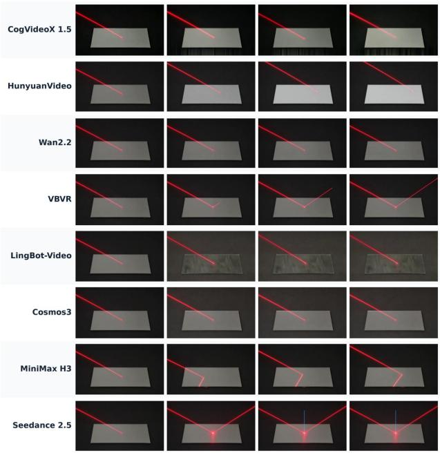  
P18: Light Reflection

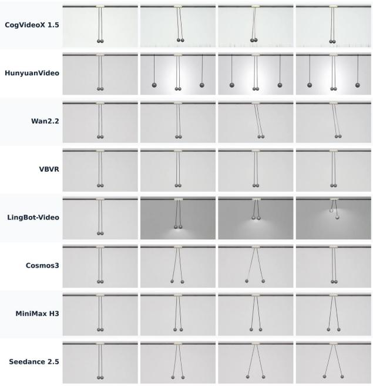  
P31: Charged-Sphere Equilibrium  
Figure 2 Qualitative comparison across eight video generation models. We show results on P18: Light Reflection (left) and P31: Charged-Sphere Equilibrium (right). Each row corresponds to a model, with four frames displayed in temporal order from left to right within each task. The examples reveal diferences in reflected-ray geometry and charged-sphere configurations, with visible failures including missing reflected rays and the appearance of additional spheres.

$$
s ( e ; a ) = { \frac { 1 } { 1 + | e | / a } } ,\tag{8}
$$

where $a > 0$ is a predefined, metric-specific error scale. For example, the pendulum-length task uses $a = 0 . 2 0$ and computes

$$
e = \left| \frac { ( T _ { 1 } / T _ { 2 } ) ^ { 2 } } { L _ { 1 } / L _ { 2 } } - 1 \right| ,\tag{9}
$$

where $T _ { 1 } , T _ { 2 }$ and $L _ { 1 } , L _ { 2 }$ are the periods and lengths of the two pendulums, respectively. Other indicators use task-specific mappings, including binary directional tests and event-evidence scores. The physical score is the arithmetic mean of the indicators defined for each task. All normalization parameters remain fixed across generative models.

## 3.2 Main Results

Results by Task. Table 2 shows substantial variation in composite scores across models and tasks under the strict per-video consistency gate $( C \ge 8 0 )$ . Even the strongest model, Seedance, achieves an average composite score of approximately 57.76, indicating considerable room for improvement in generating videos that both satisfy the intended task and reproduce its physical behavior. Four tasks illustrate this variation. Melting ice containing a stone (P26) remains challenging for every evaluated model, with a model-averaged composite score of 3.45 and a maximum of 15.00. All eight models receive zero physical scores under the evaluation protocol, so their nonzero composite scores arise entirely from the consistency term. Light reflection (P18) reveals pronounced diferences between models: Seedance and VBVR achieve scores of 96.15 and 95.75, respectively, whereas all other models score at most 49.82. Figure 2 (left) illustrates corresponding diferences in the generated sequences, including clearly visible reflected rays in the Seedance and VBVR examples and missing reflections in several other outputs. Charged-sphere equilibrium (P31) exhibits a similarly large performance gap: Seedance and MiniMax score 98.34 and 97.24, respectively, whereas all other models score at most 15.00. As illustrated in Figure 2 (right), these two models generate outward-separated sphere configurations, while some other models show little separation or introduce additional spheres. Communicating-vessel equilibrium (P21), however, provides an example of consistently strong performance. All eight models score between 93.09 and 99.01 and pass the automatic consistency gate on every available video, indicating broad success on this particular equilibrium task.

Table 2 Main results under the automatic consistency gate. Composite scores (0–100; higher is better) for 40 tasks and 1,280 available videos. Bold marks row maxima, including ties at the displayed precision; backgrounds run from red (0) through yellow (50) to green (100). Within each model–task pair, ✓ means every available video has $C \geq 8 0 ; x$ means at least one has $C < 8 0$ . Per-video scores use $S = 0 . 1 5 C + 0 . 8 5 P { \bf 1 } [ C \geq 8 0 ]$ , where C is the original automatic consistency score and P the independently recorded physical score. E/M/H are empirical dificulty groups based on cross-model task-mean scores (15/15/10 tasks).
<table><tr><td colspan="6">Task</td><td>源 VBVR Wan2.2 2.2-A14B</td><td>Wan</td><td>R LingBot</td><td>Hunyuan CogVideoX</td><td>Z</td></tr><tr><td colspan="9">2.5 H3 3 Super</td><td>1.5-5B</td></tr><tr><td></td><td>1. Translational Motion and Collisions</td><td></td><td>90.76√</td><td></td><td></td><td>0.00 X</td><td>85.66√</td><td></td><td></td><td></td></tr><tr><td>P1 P2 Free fall</td><td>Bounce-height decay</td><td>E M</td><td>29.50√</td><td>88.19√ 25.84√</td><td>57.46√ 34.54√</td><td>24.27√</td><td>22.72√</td><td>48.67√ 34.41√</td><td>83.03√ 23.60√</td><td>3.75 X 18.03√</td></tr><tr><td>P3</td><td>Complementary-angle throws</td><td>M</td><td>53.96√</td><td>57.66√</td><td>20.97√</td><td>10.88 X</td><td>0.00 X</td><td>30.87 X</td><td>3.38 X</td><td>0.00 X</td></tr><tr><td>P4</td><td>Projectile motion</td><td>H</td><td>29.13√</td><td>39.01 √</td><td>17.25 X</td><td>22.33 X</td><td>10.36 X</td><td>15.43 X</td><td>7.83 X</td><td>0.00 x</td></tr><tr><td>P5</td><td>Equal-mass collision</td><td>H</td><td>25.37√</td><td>26.06√</td><td>14.50√</td><td>17.05 X</td><td>14.79 x</td><td>4.97 x</td><td>11.25 X</td><td>7.50 X</td></tr><tr><td colspan="9">2. Rolling, Friction, and Rigid-Body Statics</td><td></td></tr><tr><td>P6</td><td>Mass-independent sliding</td><td>E</td><td>66.00√</td><td>97.89√</td><td>98.46√</td><td>51.12√</td><td>50.98√</td><td>57.50√</td><td></td><td></td></tr><tr><td>P7</td><td>Hanging-chain equilibrium</td><td>E</td><td>68.85√</td><td>70.29√</td><td>71.09√</td><td>69.71√</td><td>71.26√</td><td>69.11√</td><td>36.06√ 76.95√</td><td>43.62 X</td></tr><tr><td>P8</td><td>Solid-sphere rolling</td><td>M</td><td>75.56√</td><td>45.82√</td><td>28.79√</td><td>31.53√</td><td>35.39√</td><td>18.77√</td><td>37.11√</td><td>69.60√</td></tr><tr><td>P9</td><td>Solid sphere vs. hoop</td><td></td><td>32.01√</td><td>40.83√</td><td>30.36√</td><td>41.63√</td><td>17.28√</td><td>22.08√</td><td></td><td>14.78 X</td></tr><tr><td>P10</td><td></td><td>M</td><td>34.27√</td><td></td><td>34.03√</td><td>4.76 X</td><td>43.23√</td><td></td><td>39.36√</td><td>3.75 X</td></tr><tr><td>P11</td><td>Edge-pivot toppling</td><td>M H</td><td>24.43√</td><td>66.53√ 28.84√</td><td>8.10 X</td><td>12.36 X</td><td>16.53 X</td><td>14.38 X 19.18 X</td><td>18.99√ 10.10 X</td><td>0.00 X 0.00 X</td></tr><tr><td colspan="9">Rough-incline round trip</td><td></td></tr><tr><td>P12</td><td>3. Pendulum Motion and Oscillations Pendulum period vs. mass</td><td>E</td><td>80.41 √</td><td>72.58√</td><td>68.16√</td><td>56.28 X</td><td>35.56√</td><td></td><td></td><td></td></tr><tr><td>P13</td><td>Large-angle pendulum</td><td>E</td><td>57.76√</td><td>79.88√</td><td>62.81√</td><td>43.59 X</td><td>53.77√</td><td>19.25 X 46.92√</td><td>52.08√ 73.52√</td><td>40.38√</td></tr><tr><td>P14</td><td>Pendulum period vs. length</td><td>E</td><td>66.15√</td><td>65.41√</td><td>61.93√</td><td>55.83√</td><td>67.11√</td><td>25.36√</td><td>16.00 X</td><td>48.41 X 26.03 X</td></tr><tr><td>P15</td><td>Small-angle isochronism</td><td>M</td><td>82.60 √</td><td>51.35√</td><td>66.77 √</td><td>21.90 X</td><td>29.69√</td><td>23.40 X</td><td>32.52 X</td><td>25.64√</td></tr><tr><td colspan="9">4. Optics and Projective Geometry</td><td></td></tr><tr><td>P16</td><td>Collinear-point cross-ratio</td><td>E</td><td>81.10√</td><td>82.97√</td><td>82.39√</td><td>83.92√</td><td>68.12√</td><td>43.56 X</td><td>88.34√</td><td>3.75 X</td></tr><tr><td>P17</td><td>Light refraction</td><td>M</td><td>65.59√</td><td>65.68√</td><td>56.38√</td><td>66.18√</td><td>57.94√</td><td>14.62√</td><td>15.00√</td><td>15.00√</td></tr><tr><td>P18</td><td>Light reflection</td><td>M</td><td>96.15√</td><td>49.82 X</td><td>0.00 X</td><td>95.75√</td><td>0.00 X</td><td>3.38 X</td><td>24.73 X</td><td>0.00 X</td></tr><tr><td>P19</td><td>Projection concurrency</td><td>M</td><td>67.14√</td><td>45.62 X</td><td>48.69√</td><td>69.64√</td><td>32.45√</td><td>11.62 X</td><td>7.12 X</td><td>3.38 X</td></tr><tr><td>P20</td><td>Refraction and reflection</td><td>H</td><td>9.09 X</td><td>31.67√</td><td>13.69 X</td><td>22.86 X</td><td>14.50 X</td><td>14.88 X</td><td>39.66√</td><td>7.87 X</td></tr><tr><td colspan="9">5. Hydrostatics and Buoyancy</td><td></td></tr><tr><td>P21</td><td>Communicating vessels</td><td></td><td>97.01√</td><td>98.16√</td><td></td><td>99.01 √</td><td>93.09√</td><td></td><td></td><td></td></tr><tr><td>P22</td><td></td><td></td><td>66.56√</td><td></td><td>97.70√</td><td></td><td>85.86√</td><td>97.40√</td><td>95.44√</td><td>94.05√</td></tr><tr><td>P23</td><td>Floating-ice immersion Liquid-surface orientation</td><td>EEM</td><td>57.52 X</td><td>83.22√ 72.68√</td><td>78.82√ 8.32 X</td><td>85.29√ 0.00 X</td><td>21.06 X</td><td>68.96√ 48.36 X</td><td>67.32√ 34.72 X</td><td>73.38√ 0.00 X</td></tr><tr><td colspan="9">6. Phase Transitions and Melting</td><td></td></tr><tr><td></td><td>Freezing-induced expansion</td><td>E</td><td>94.30√</td><td>96.21√</td><td></td><td></td><td>0.00 X</td><td>86.43√</td><td></td><td></td></tr><tr><td>P24</td><td>Ice melting: water level</td><td>H</td><td>95.61 √</td><td></td><td>66.69 X 15.00√</td><td>24.38 X 0.00 X</td><td>0.00 ×</td><td>3.75 X</td><td>23.71 X</td><td>0.00 X</td></tr><tr><td>P25</td><td>Ice with a stone: melting</td><td>H</td><td>15.00√</td><td>0.00 X 0.00 X</td><td>3.75 X</td><td>0.00 X</td><td>0.00 x</td><td>8.81 X</td><td>0.00 x</td><td>0.00 x</td></tr><tr><td>P26 P27</td><td>Freshwater ice in saltwater</td><td>H</td><td>46.87√</td><td>0.00 X</td><td>57.50√</td><td>0.00 X</td><td>0.00 X</td><td>0.00 X</td><td>0.00 x</td><td>0.00 x</td></tr><tr><td>P28</td><td>Crushed vs. intact ice</td><td>H</td><td>57.50 √</td><td>36.25√</td><td>15.00√</td><td>15.00√</td><td>15.00√</td><td>7.50 X</td><td>0.00 X 7.50 X</td><td>3.75 X 0.00 X</td></tr><tr><td colspan="9">7. Electrostatics, Magnetism, and Electromagnetic Induction</td><td></td><td></td></tr><tr><td>P29</td><td>Eddy-current braking</td><td>E</td><td>36.25√</td><td>89.38√</td><td>78.75√</td><td>39.38 X</td><td>53.75 X</td><td>57.50√</td><td>32.50 X</td><td>3.75 X</td></tr><tr><td>P30</td><td>Coil-induced light emission</td><td>E</td><td>57.50√</td><td>57.50√</td><td>68.12√</td><td>57.50√</td><td>57.50√</td><td>68.12√</td><td>32.50 X</td><td>3.75 X</td></tr><tr><td>P31</td><td>Charged-sphere equilibrium</td><td>M</td><td>98.34√</td><td>97.24√</td><td>15.00√</td><td>15.00√</td><td>15.00√</td><td>10.88 X</td><td>14.81√</td><td>15.00√</td></tr><tr><td>P32</td><td>Final compass orientations</td><td>M</td><td>36.43√</td><td>15.05√</td><td>15.00√</td><td>18.01√</td><td>36.32√</td><td>16.41√</td><td>15.00√</td><td>15.95√</td></tr><tr><td>P33</td><td>Closed vs. open jumping rings</td><td>M</td><td>23.00√</td><td>20.84√</td><td>15.00√</td><td>15.00√</td><td>36.25√ 15.00√</td><td>57.50√ 7.50 X</td><td>15.00√ 15.00√</td><td>15.00√</td></tr><tr><td>P34</td><td>Solid vs. slotted plate damping 8. Granular Media and Discharge Flow</td><td>H</td><td>36.25√</td><td>15.00√</td><td>15.00√</td><td>0.00 X</td></table>

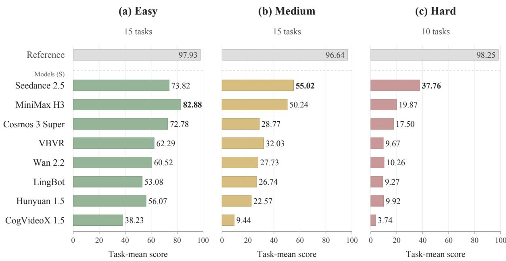  
Figure 3 Performance of each video generation model across Easy, Medium, and Hard physical phenomena. Colored bars show composite scores, while light-gray bars show physical scores on synthetic reference videos with the consistency gate bypassed. All scores are scaled to 0–100. The best generation model for each dificulty level is shown in bold.

Results by Difficulty Level. The empirical dificulty groups, defined by mean composite scores across the evaluated models, summarize diferences in observed task performance. Easy tasks include communicatingvessel equilibrium (P21), floating-ice immersion (P22), and hanging-chain equilibrium (P7). These examples involve relationships that can be evaluated from relatively stable configurations, which may partly explain their stronger performance. Medium tasks include free fall (P2) and pure rolling (P8), where reproducing recognizable motion is insuficient: the generated trajectories must also satisfy quantitative constraints on fall dynamics or the coupling between translation and rotation. For example, all available free-fall videos pass the automatic consistency gate $( C \ge 8 0 )$ , but the average composite score across models is only 26.61, showing that passing this gate does not guarantee a high physical score. Hard tasks include equal-mass collisions (P5), rough-incline round trips (P11), and melting ice containing a stone (P26). These scenarios require maintaining physical relationships through interactions or successive events, such as contact, motion reversal, and changes in object configuration. Their low scores may reflect dificulties coordinating these processes over time. Failures at the consistency stage also contribute: only 56.9% of available Hard videos pass the automatic consistency gate, compared with 89.4% of Easy videos. Thus, low composite scores can reflect both failures to realize the required task conditions and low physical scores under the measurement protocol. Model strengths also difer across these groups: MiniMax leads on Easy tasks, whereas Seedance achieves the highest task-averaged Hard score of 37.76, substantially above MiniMax’s 19.87, although its absolute score remains low.

Evaluator Validation on Synthetic Reference Videos. We assess whether the evaluator assigns appropriately high physical scores to synthetic reference videos designed to satisfy prescribed physical relationships. These videos are generated as 2D animations using existing tools: object states are computed from the specified relations and rendered frame by frame, while appearance variants preserve the underlying trajectories. We evaluate 480 reference videos across 40 tasks, with 12 videos per task. To isolate the physical measurement module, we bypass the VLM consistency gate. As shown by the light-gray bars in Figure 3, the reference videos receive mean physical scores of 97.93, 96.64, and 98.25 on Easy, Medium, and Hard tasks, respectively, with an overall mean of 97.53 out of 100. These results support the evaluator’s agreement with the prescribed physical relationships under controlled synthetic conditions.

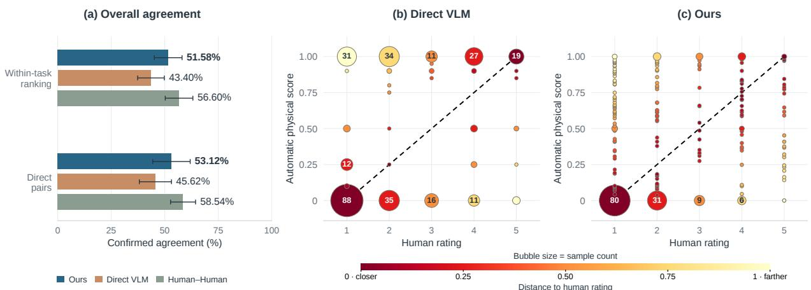  
Figure 4 Agreement with human judgments. (a) Within-task ranking agreement and confirmed pairwise agreement for our evaluator, Direct VLM, and the Human–Human reference. Matching ties count as agreement. (b,c) Automatic physical scores versus the five-level reference human ratings for Direct VLM and our evaluator, respectively. Bubble areas indicate video counts, with selected counts labeled. Black dashed lines show the illustrative reference $P = ( H - 1 ) / 4$ Colors indicate absolute deviations from this reference, with darker colors representing smaller deviations.

## 3.3 Agreement with Human Judgments

To assess how well automatic physical scores align with human judgments, we compare our evaluator with a direct scoring baseline based on Qwen3.6-27B (Yang et al., 2025a), denoted as Direct VLM. Given 24 sampled frames, the original generation prompt, and the reference image, Direct VLM directly predicts a physical correctness score in [0, 1]. Frames are resized to a maximum side length of 640 pixels, and inference uses a temperature of zero. Both methods are evaluated using human annotations for 320 videos across 40 tasks. Ten annotators participate in the human evaluation. We additionally report Human–Human agreement as a descriptive reference for inter-annotator consistency.

Within-task Ranking Agreement. Higher automatic physical scores should correspond to greater humanperceived physical correctness. Annotators rate individual videos on a five-point scale, ranging from clear physical violation to no obvious violation, with a separate option for insuficient evidence. Let $H _ { i } \in \{ 1 , 2 , 3 , 4 , 5 \}$ denote the reference annotator’s rating for video i. Both automatic methods are compared against these same reference ratings, while Human–Human agreement compares the orderings induced by the annotators’ ratings.

The 320 videos across 40 tasks yield $4 0 \times { \binom { 8 } { 2 } } = 1 , 1 2 0$ within-task video pairs. We exclude 203 pairs involving a video that at least one annotator could not assess, leaving a common set C of 917 pairs for all three comparisons. Human and automatic ties are retained. We pool these pairs across tasks and compute:

$$
A _ { \mathrm { r a n k } } = \frac { 1 } { | \mathcal { C } | } \sum _ { ( i , j ) \in \mathcal { C } } \mathbf { 1 } [ \mathrm { s i g n } ( P _ { i } - P _ { j } ) = \mathrm { s i g n } ( H _ { i } - H _ { j } ) ] ,\tag{10}
$$

where $P _ { i }$ denotes the automatic physical score and sign $( 0 ) = 0$ . Each video pair is counted once, and agreement requires the same strict ordering or a tie from both sources. Human–Human agreement applies the same rule to the annotators’ ratings over the same 917 pairs.

As shown in Figure 4(a), our evaluator agrees with the reference human ordering on 473 pairs (51.58%), compared with 398 pairs (43.40%) for Direct VLM and 519 pairs (56.60%) for Human–Human. Our evaluator therefore improves over Direct VLM by 8.18 percentage points and falls 5.02 percentage points below the Human–Human reference. Figure 4(b,c) shows the corresponding individual-video score distributions using the same reference ratings. The mapping $P = ( H - 1 ) / 4$ is used solely for visualization and does not enter either agreement metric.

Confirmed Pairwise Agreement. Annotators compare 160 predefined within-task video pairs and select video A, video B, a tie, or insuficient evidence. Human preferences are determined by a strict majority of assessable votes, with insuficient-evidence responses treated as abstentions. Automatic preferences follow the ordering of the two physical scores, including ties. We compute confirmed agreement over all 160 pairs:

$$
A _ { \mathrm { p a i r } } ^ { \mathrm { c o n f } } = \frac { N _ { \mathrm { a g r e e } } } { 1 6 0 } ,\tag{11}
$$

where $N _ { \mathrm { a g r e e } }$ counts pairs with matching human and automatic $\mathrm { A } / \mathrm { B } _ { / }$ /tie judgments. Pairs without a majority human judgment remain in the denominator but do not count as agreements. The Human–Human reference averages exact $\mathrm { A } / \mathrm { B } _ { / }$ tie agreement across the three annotator pairings, retaining all 160 video pairs in each denominator and counting only matching assessable responses as agreement.

As shown in Figure 4(a), our evaluator achieves 85 confirmed agreements (53.12%), compared with 73 (45.62%) for Direct VLM and 58.54% for the Human–Human reference. This represents an improvement of 7.50 percentage points over Direct VLM and a gap of 5.42 percentage points to Human–Human agreement. Across both measures, our evaluator achieves higher agreement with human judgments than Direct VLM, while remaining below the Human–Human reference. Error bars indicate 95% confidence intervals at the task level.

## 4 Related Work

Physics-Aware Video Generation. Physics-aware video generation incorporates physical structure through simulation, reasoning, representation learning, and post-training. Simulation-based approaches combine rigid-body, deformable-body, or continuum dynamics with difusion-based synthesis (Liu et al., 2024a; Xie et al., 2025; Montanaro et al., 2024; Tan et al., 2026). PhysCtrl (Wang et al., 2025a) guides video synthesis with generated 3D trajectories, while PhysDreamer (Zhang et al., 2024) transfers video dynamics priors to interactive 3D objects. Reasoning-guided methods incorporate physical context through prompt refinement and explicit planning (Xue et al., 2025; Zhang et al., 2025; Zhao et al., 2026b; Feng et al., 2026; Yang et al., 2025b). At the representation level, WISA (Wang et al., 2025b) encodes physical descriptions and properties, while VideoREPA (Zhang et al., 2026b) aligns spatiotemporal token relations with video foundation models. Recent approaches further incorporate retrieved examples, joint RGB-perception modeling, and latent physical dynamics (Cheng et al., 2026; Lin et al., 2026b; Shen et al., 2026). Post-training methods explore AI feedback, task-specific rewards, and learned physical representations to improve generated dynamics (Furuta et al., 2024; Li et al., 2025; Ji et al., 2025; Zhang et al., 2026a). NewtonRewards (Le et al., 2025) constructs physics rewards from measurable proxies, while PhyGDPO and PhyWorld optimize generation using physics-aware preferences (Cai et al., 2026; Zhao et al., 2026a). These advances motivate task-specific tests that determine which physical relationships generated videos preserve under stated assumptions. Our benchmark provides such tests through controlled experimental conditions and explicit quantitative measurements.

Video Generation Evaluation. Existing benchmarks use four complementary forms of evidence: general quality metrics, evaluator judgments, reference observations, and direct physical measurements. General quality benchmarks assess visual fidelity, temporal coherence, and compositional alignment (Huang et al., 2024; Liu et al., 2024b; Sun et al., 2025), but these criteria alone do not establish physical correctness. Judgment-based benchmarks assess physics and commonsense through human annotations, VLMs, or learned evaluators (Zheng et al., 2025a; Bansal et al., 2025, 2026; Meng et al., 2024; Guo et al., 2025; Gu et al., 2026; Li et al., 2026a), with finer-grained criteria and structured questions improving interpretability (Lin et al., 2026a; Pothiraj et al., 2026). However, their scores reflect evaluator judgments rather than directly measured deviations in physical quantities. Reference-based approaches, including Physics-IQ, Physics-IQ Verified, and RigidBench, compare generations with real or simulated observations (Motamed et al., 2025;

Rädsch et al., 2026; Jain and Wu, 2026). They require suitable reference data, and reference similarity alone does not isolate violations of specific physical laws. Measurement-based approaches provide more explicit diagnostics: PhysWeep estimates physical parameters (Khanbayov and Kurban, 2026), Principia tests paired-object relationships (Thozhiyoor et al., 2026b), and GAUGE combines measured trajectories with calibrated physical metadata (Wang et al., 2026b). Their video evaluations primarily target selected mechanical dynamics, leaving room for quantitative tests of other physical phenomena. We complement these approaches with controlled experiments spanning mechanics, optics, and other physical domains. It quantifies deviations from task-specific spatial, temporal, and spatiotemporal relationships under stated assumptions, using scale-canceling comparisons where applicable and computing physical scores from measurements without VLM judgments of physical correctness.

## 5 Conclusion

We introduced World Models’ Last Exam in Physics, a benchmark for evaluating physical consistency in video generation through 40 controlled tasks and explicit, task-specific measurements. Our evaluation framework separates temporal consistency and task observability from physical correctness, grounding scores in measurable relationships and retaining evidence for interpreting failures. Experiments across eight video generation models reveal persistent dificulties in reproducing quantitative physical relationships and completing the required physical events. Evaluation on synthetic reference videos supports the measurement module under controlled conditions, while human evaluation shows higher confirmed agreement than direct VLM scoring in both withintask rankings and pairwise comparisons. These findings highlight the value of explicit physical measurements for assessing generated videos. Current evaluation remains constrained by the visibility and reliable extraction of task-relevant evidence. Future work will extend task coverage and improve measurement robustness in more complex scenes. We hope this benchmark provides a useful foundation for diagnosing physical inconsistencies and developing video generation models that more reliably reproduce physical phenomena.

## References

Niket Agarwal, Arslan Ali, Jon Allen, Martin Antolini, Adeline Aubame, Alisson Azzolini, Junjie Bai, Maciej Bala, Yogesh Balaji, Josh Bapst, et al. Cosmos 3: Omnimodal world models for physical ai. arXiv preprint arXiv:2606.02800, 2026.

Hritik Bansal, Zongyu Lin, Tianyi Xie, Zeshun Zong, Michal Yarom, Yonatan Bitton, Chenfanfu Jiang, Yizhou Sun, Kai-Wei Chang, and Aditya Grover. Videophy: Evaluating physical commonsense for video generation. In International Conference on Learning Representations, volume 2025, pages 102075–102121, 2025.

Hritik Bansal, Clark Peng, Yonatan Bitton, Roman Goldenberg, Aditya Grover, and Kai-Wei Chang. Videophy-2: A challenging action-centric physical commonsense evaluation in video generation. In International Conference on Learning Representations, volume 2026, pages 118456–118470, 2026.

Omer Bar-Tal, Hila Chefer, Omer Tov, Charles Herrmann, Roni Paiss, Shiran Zada, Ariel Ephrat, Junhwa Hur, Guanghui Liu, Amit Raj, et al. Lumiere: A space-time difusion model for video generation. In SIGGRAPH Asia 2024 conference papers, pages 1–11, 2024.

Hongzhe Bi, Hengkai Tan, Shenghao Xie, Zeyuan Wang, Shuhe Huang, Haitian Liu, Ruowen Zhao, Yao Feng, Chendong Xiang, Yinze Rong, et al. Motus: A unified latent action world model. In Proceedings of the IEEE/CVF Conference on Computer Vision and Pattern Recognition, pages 35101–35113, 2026.

Jake Bruce, Michael D Dennis, Ashley Edwards, Jack Parker-Holder, Yuge Shi, Edward Hughes, Matthew Lai, Aditi Mavalankar, Richie Steigerwald, Chris Apps, et al. Genie: Generative interactive environments. In Forty-first international conference on machine learning, 2024.

ByteDance Seed. One-take Creation, Flexible Referencing: Introducing Seedance 2.5, July 2026. https://seed. bytedance.com/en/blog/one-take-creation-flexible-referencing-introducing-seedance-2-5. Accessed: 2026-10-06.

Yuanhao Cai, Kunpeng Li, Menglin Jia, Jialiang Wang, Junzhe Sun, Feng Liang, Weifeng Chen, Felix Juefei-Xu, Chu Wang, Ali Thabet, et al. Phygdpo: Physics-aware groupwise direct preference optimization for physically consistent text-to-video generation. In European Conference on Computer Vision, pages 91–109. Springer, 2026.

Kexu Cheng, Zicheng Liu, Mingju Gao, Chunhe Song, and Hao Tang. Physrag: Enhancing physics-awareness in video generation via retrieval-augmented generation. In European Conference on Computer Vision, pages 558–578. Springer, 2026.

Yuxiang Feng, Juncheng Wang, Chao Xu, Yijie Qian, Huihan Wang, Wenlong Hou, Yang Liu, Baigui Sun, Yong Liu, and Shujun Wang. Newton: Agentic planning for physically grounded video generation. arXiv preprint arXiv:2605.18396, 2026.

Hiroki Furuta, Heiga Zen, Dale Schuurmans, Aleksandra Faust, Yutaka Matsuo, Percy Liang, and Sherry Yang. Improving dynamic object interactions in text-to-video generation with ai feedback. arXiv preprint arXiv:2412.02617, 2024.

Jing Gu, Xian Liu, Yu Zeng, Ashwin Nagarajan, Fangrui Zhu, Daniel Hong, Yue Fan, Qianqi Yan, Kaiwen Zhou, Ming-Yu Liu, et al. phyworldbench: A comprehensive evaluation of physical realism in text-to-video models. In International Conference on Learning Representations, volume 2026, pages 75130–75164, 2026.

Xuyang Guo, Jiayan Huo, Zhenmei Shi, Zhao Song, Jiahao Zhang, and Jiale Zhao. T2vphysbench: A first-principles benchmark for physical consistency in text-to-video generation. arXiv preprint arXiv:2505.00337, 2025.

Ziqi Huang, Yinan He, Jiashuo Yu, Fan Zhang, Chenyang Si, Yuming Jiang, Yuanhan Zhang, Tianxing Wu, Qingyang Jin, Nattapol Chanpaisit, et al. Vbench: Comprehensive benchmark suite for video generative models. In 2024 IEEE/CVF Conference on Computer Vision and Pattern Recognition (CVPR), pages 21807–21818. IEEE, 2024.

Swarnim Jain and Shangzhe Wu. Rigidbench: Evaluating rigid-body physics in video generation models. arXiv preprint arXiv:2608.15555, 2026.

Sihui Ji, Xi Chen, Xin Tao, Pengfei Wan, and Hengshuang Zhao. Physmaster: Mastering physical representation for video generation via reinforcement learning. arXiv preprint arXiv:2510.13809, 2025.

Nikita Karaev, Yuri Makarov, Jianyuan Wang, Natalia Neverova, Andrea Vedaldi, and Christian Rupprecht. Cotracker3: Simpler and better point tracking by pseudo-labeling real videos. In 2025 IEEE/CVF International Conference on Computer Vision (ICCV), pages 1–10. IEEE, 2025.

Rasul Khanbayov and Hasan Kurban. Physweep: Does a video generator realize the physics you ask for? arXiv preprint arXiv:2609.06207, 2026.

Moo Jin Kim, Yihuai Gao, Tsung-Yi Lin, Yen-Chen Lin, Yunhao Ge, Grace Lam, Percy Liang, Shuran Song, Ming-Yu Liu, Chelsea Finn, et al. Cosmos policy: Fine-tuning video models for visuomotor control and planning. arXiv preprint arXiv:2601.16163, 2026.

Weijie Kong, Qi Tian, Zijian Zhang, Rox Min, Zuozhuo Dai, Jin Zhou, Jiangfeng Xiong, Xin Li, Bo Wu, Jianwei Zhang, et al. Hunyuanvideo: A systematic framework for large video generative models. arXiv preprint arXiv:2412.03603, 2024.

Minh-Quan Le, Yuanzhi Zhu, Vicky Kalogeiton, and Dimitris Samaras. What about gravity in video generation? post-training newton’s laws with verifiable rewards. arXiv preprint arXiv:2512.00425, 2025.

Chenyu Li, Oscar Michel, Xichen Pan, Sainan Liu, Mike Roberts, and Saining Xie. Pisa experiments: Exploring physics post-training for video difusion models by watching stuf drop. arXiv preprint arXiv:2503.09595, 2025.

Dacheng Li, Yunhao Fang, Yukang Chen, Shuo Yang, Shiyi Cao, Justin Wong, Michael Luo, Xiaolong Wang, Hongxu Yin, Joseph Gonzalez, et al. Worldmodelbench: Judging video generation models as world models. Advances in Neural Information Processing Systems, 38, 2026a.

Lin Li, Qihang Zhang, Yiming Luo, Shuai Yang, Ruilin Wang, Fei Han, Mingrui Yu, Zelin Gao, Nan Xue, Xing Zhu, et al. Causal world modeling for robot control. arXiv preprint arXiv:2601.21998, 2026b.

Juyi Lin, Arash Akbari, Yumei He, Lin Zhao, Haichao Zhang, Arman Akbari, Xingchen Xu, Zoe Y Lu, Enfu Nan, Hokin Deng, et al. Phyground: Benchmarking physical reasoning in generative world models. arXiv preprint arXiv:2605.10806, 2026a.

Shubo Lin, Xuanyang Zhang, Wei Cheng, Weiming Hu, Gang Yu, and Jin Gao. Mmphysvideo: Scaling physical plausibility in video generation via joint multimodal modeling. arXiv preprint arXiv:2604.02817, 2026b.

Shaowei Liu, Zhongzheng Ren, Saurabh Gupta, and Shenlong Wang. Physgen: Rigid-body physics-grounded image-to video generation. In European Conference on Computer Vision, pages 360–378. Springer, 2024a.

Yaofang Liu, Xiaodong Cun, Xuebo Liu, Xintao Wang, Yong Zhang, Haoxin Chen, Yang Liu, Tieyong Zeng, Raymond Chan, and Ying Shan. Evalcrafter: Benchmarking and evaluating large video generation models. In 2024 IEEE/CVF Conference on Computer Vision and Pattern Recognition (CVPR), pages 22139–22149. IEEE, 2024b.

Meng Luo, Yicheng Liu, Jiahao Wang, Yuanxing Zhang, Xin Tao, Pengfei Wan, Kun Gai, and Hao Fei. From evaluation to enhancement: Benchmarking and improving think-with-video reasoning for video generative models. In European Conference on Computer Vision, pages 546–563. Springer, 2026.

Shuailei Ma, Jiaqi Liao, Xinyang Wang, Jingjing Wang, Chaoran Feng, Zijing Hu, Chong Bao, Zichen Xi, Yuqi Gan, Weisen Wang, et al. Scaling mixture-of-experts video pretraining for embodied intelligence. arXiv preprint arXiv:2607.07675, 2026.

Fanqing Meng, Jiaqi Liao, Xinyu Tan, Wenqi Shao, Quanfeng Lu, Kaipeng Zhang, Yu Cheng, Dianqi Li, Yu Qiao, and Ping Luo. Towards world simulator: Crafting physical commonsense-based benchmark for video generation. arXiv preprint arXiv:2410.05363, 2024.

MiniMax. MiniMax H3: An Open Model Breaking the Boundaries Between Tasks and Modalities, 2026. https: //www.minimax.io/blog/minimax-h3.

Antonio Montanaro, Luca Savant Aira, Emanuele Aiello, Diego Valsesia, and Enrico Magli. Motioncraft: Physics-based zero-shot video generation. Advances in Neural Information Processing Systems, 37:123155–123181, 2024.

Saman Motamed, Laura Culp, Kevin Swersky, Priyank Jaini, and Robert Geirhos. Do generative video models understand physical principles?, 2025. https://arxiv.org/abs/2501.09038.

Adam Polyak, Amit Zohar, Andrew Brown, Andros Tjandra, Animesh Sinha, Ann Lee, Apoorv Vyas, Bowen Shi, Chih-Yao Ma, Ching-Yao Chuang, et al. Movie gen: A cast of media foundation models. arXiv preprint arXiv:2410.13720, 2024.

Atin Pothiraj, Jaemin Cho, Yue Zhang, Elias Stengel-Eskin, and Mohit Bansal. Physics question scene graph: Fine-grained evaluation of physical plausibility in text-to-video generation. In European Conference on Computer Vision, pages 301–318. Springer, 2026.

Runjia Qian, Zile Wang, Jihai Zhang, Kai Zou, Wei Yu, Jiaxing Li, Zexiang Liu, Yaokun Li, Fei Kang, Kaichen Huang, et al. Matrix-game 3.5: Enhancing real-time streaming interactive world models with patch memory. arXiv preprint arXiv:2608.29910, 2026.

Tim Rädsch, Yuki M Asano, Hilde Kuehne, Stefan Bauer, Priyank Jaini, Robert Geirhos, and Carsten T Lüth. Physics-iq verified. arXiv preprint arXiv:2606.18943, 2026.

Nikhila Ravi, Valentin Gabeur, Yuan-Ting Hu, Ronghang Hu, Chaitanya Ryali, Tengyu Ma, Haitham Khedr, Roman Rädle, Chloe Rolland, Laura Gustafson, et al. Sam 2: Segment anything in images and videos. In International Conference on Learning Representations, volume 2025, pages 28085–28128, 2025.

Team Seedance, De Chen, Liyang Chen, Xin Chen, Ying Chen, Zhuo Chen, Zhuowei Chen, Feng Cheng, Tianheng Cheng, Yufeng Cheng, et al. Seedance 2.0: Advancing video generation for world complexity. arXiv preprint arXiv:2604.14148, 2026.

Ying Shen, Jerry Xiong, Tianjiao Yu, and Ismini Lourentzou. Phantom: Physics-infused video generation via joint modeling of visual and latent physical dynamics. arXiv preprint arXiv:2604.08503, 2026.

Kaiyue Sun, Kaiyi Huang, Xian Liu, Yue Wu, Zihan Xu, Zhenguo Li, and Xihui Liu. T2v-compbench: A comprehensive benchmark for compositional text-to-video generation. In 2025 IEEE/CVF Conference on Computer Vision and Pattern Recognition (CVPR), pages 8406–8416. IEEE, 2025.

Xiyang Tan, Ying Jiang, Xuan Li, Zeshun Zong, Tianyi Xie, Yin Yang, and Chenfanfu Jiang. Physmotion: Physicsgrounded dynamics from a single image. In 2026 International Conference on 3D Vision (3DV), pages 806–818. IEEE, 2026.

Kling Team, Jialu Chen, Yuanzheng Ci, Xiangyu Du, Zipeng Feng, Kun Gai, Sainan Guo, Feng Han, Jingbin He, Kang He, et al. Kling-omni technical report. arXiv preprint arXiv:2512.16776, 2025.

Varun Varma Thozhiyoor, Shivam Tripathi, Venkatesh Babu Radhakrishnan, and Anand Bhattad. Objects in generated videos are slower than they appear: Models sufer sub-earth gravity and don’t know galileo’s principle... for now. In Proceedings of the IEEE/CVF Conference on Computer Vision and Pattern Recognition, pages 3830–3839, 2026a.

Varun Varma Thozhiyoor, Shivam Tripathi, Venkatesh Babu Radhakrishnan, and Anand Bhattad. Principia: Relational physics tests for video models. arXiv preprint arXiv:2609.04200, 2026b.

Team Wan, Ang Wang, Baole Ai, Bin Wen, Chaojie Mao, Chen-Wei Xie, Di Chen, Feiwu Yu, Haiming Zhao, Jianxiao Yang, et al. Wan: Open and advanced large-scale video generative models. arXiv preprint arXiv:2503.20314, 2025.

Chen Wang, Chuhao Chen, Yiming Huang, Zhiyang Dou, Yuan Liu, Jiatao Gu, and Lingjie Liu. PhysCtrl: Generative physics for controllable and physics-grounded video generation. In Advances in Neural Information Processing Systems, 2025a. https://cwchenwang.github.io/physctrl/.

Jing Wang, Ao Ma, Ke Cao, Jun Zheng, Jiasong Feng, Zhanjie Zhang, Wanyuan Pang, and Xiaodan Liang. WISA: World simulator assistant for physics-aware text-to-video generation. In Advances in Neural Information Processing Systems, volume 38, 2025b. https://proceedings.neurips.cc/paper\_files/paper/2025/hash/ 0856bc553d3e3b9827e5140d0ad3bf8d-Abstract-Conference.html.

Maijunxian Wang, Ruisi Wang, Juyi Lin, Ran Ji, Thaddäus Wiedemer, Qingying Gao, Dezhi Luo, Yaoyao Qian, Lianyu Huang, Zelong Hong, et al. A very big video reasoning suite. arXiv preprint arXiv:2602.20159, 2026a.

Shuai Wang, Yaxin Feng, Xuekun Jiang, Shihan Tian, Ningyu Yan, Xing Shen, Chaoyang Lyu, Hui Wang, Yunsong Zhou, Hanqing Wang, et al. Gauge: A measurement-grounded benchmark for physical fidelity in simulation engines and video world models. arXiv preprint arXiv:2608.05948, 2026b.

Bing Wu, Chang Zou, Changlin Li, Duojun Huang, Fang Yang, Hao Tan, Jack Peng, Jianbing Wu, Jiangfeng Xiong, Jie Jiang, et al. Hunyuanvideo 1.5 technical report. arXiv preprint arXiv:2511.18870, 2025.

Tianyi Xie, Yiwei Zhao, Ying Jiang, and Chenfanfu Jiang. PhysAnimator: Physics-guided generative cartoon animation. In Proceedings of the IEEE/CVF Conference on Computer Vision and Pattern Recognition, 2025. https://xpandora.github.io/PhysAnimator/.

Qiyao Xue, Xiangyu Yin, Boyuan Yang, and Wei Gao. Phyt2v: Llm-guided iterative self-refinement for physicsgrounded text-to-video generation. In 2025 IEEE/CVF Conference on Computer Vision and Pattern Recognition (CVPR), pages 18826–18836. IEEE, 2025.

An Yang, Anfeng Li, Baosong Yang, Beichen Zhang, Binyuan Hui, Bo Zheng, Bowen Yu, Chang Gao, Chengen Huang, Chenxu Lv, et al. Qwen3 technical report. arXiv preprint arXiv:2505.09388, 2025a.

Xindi Yang, Baolu Li, Yiming Zhang, Zhenfei Yin, Lei Bai, Liqian Ma, Zhiyong Wang, Jianfei Cai, Tien-Tsin Wong, Huchuan Lu, et al. Vlipp: Towards physically plausible video generation with vision and language informed physical prior. In 2025 IEEE/CVF International Conference on Computer Vision (ICCV), pages 12360–12370. IEEE, 2025b.

Ze Yang, Yun Chen, Jingkang Wang, Sivabalan Manivasagam, Wei-Chiu Ma, Anqi Joyce Yang, and Raquel Urtasun. Unisim: A neural closed-loop sensor simulator. In 2023 IEEE/CVF Conference on Computer Vision and Pattern Recognition (CVPR), pages 1389–1399. IEEE, 2023.

Zhuoyi Yang, Jiayan Teng, Wendi Zheng, Ming Ding, Shiyu Huang, Jiazheng Xu, Yuanming Yang, Wenyi Hong, Xiaohan Zhang, Guanyu Feng, et al. Cogvideox: Text-to-video difusion models with an expert transformer. In International Conference on Learning Representations, volume 2025, pages 83048–83077, 2025c.

Seonghyeon Ye, Yunhao Ge, Kaiyuan Zheng, Shenyuan Gao, Sihyun Yu, George Kurian, Suneel Indupuru, You Liang Tan, Chuning Zhu, Jiannan Xiang, et al. World action models are zero-shot policies. arXiv preprint arXiv:2602.15922, 2026.

Ke Zhang, Cihan Xiao, Jiacong Xu, Yiqun Mei, and Vishal M Patel. Think before you difuse: Infusing physical rules into video difusion. arXiv preprint arXiv:2505.21653, 2025.

Qiyuan Zhang, Biao Gong, Shuai Tan, Zheng Zhang, Yujun Shen, Xing Zhu, Yuyuan Li, Kelu Yao, Chunhua Shen, and Changqing Zou. Physrvg: Physics-aware unified reinforcement learning for video generative models. In European Conference on Computer Vision, pages 149–166. Springer, 2026a.

Tianyuan Zhang, Hong-Xing Yu, Rundi Wu, Brandon Y. Feng, Changxi Zheng, Noah Snavely, Jiajun Wu, and William T. Freeman. PhysDreamer: Physics-based interaction with 3D objects via video generation. In European Conference on Computer Vision, 2024. https://arxiv.org/abs/2404.13026.

Xiangdong Zhang, Jiaqi Liao, Shaofeng Zhang, Fanqing Meng, Xiangpeng Wan, Junchi Yan, and Yu Cheng. Videorepa: Learning physics for video generation through relational alignment with foundation models. Advances in Neural Information Processing Systems, 38:122647–122676, 2026b.

Pu Zhao, Juyi Lin, Timothy Rupprecht, Arash Akbari, Chence Yang, Rahul Chowdhury, Elaheh Motamedi, Arman Akbari, Yumei He, Chen Wang, et al. Phyworld: Physics-faithful world model for video generation. arXiv preprint arXiv:2605.19242, 2026a.

Yibo Zhao, Hengjia Li, Xiaofei He, and Boxi Wu. Phyrpr: Training-free physics-constrained video generation. arXiv preprint arXiv:2601.09255, 2026b.

Dian Zheng, Ziqi Huang, Hongbo Liu, Kai Zou, Yinan He, Fan Zhang, Lulu Gu, Yuanhan Zhang, Jingwen He, Wei-Sh Zheng, et al. Vbench-2.0: Advancing video generation benchmark suite for intrinsic faithfulness. arXiv preprint arXiv:2503.21755, 2025a.

Zangwei Zheng, Xiangyu Peng, Yuxuan Lou, Chenhui Shen, Tom Young, Xinying Guo, Binluo Wang, Hang Xu, Hongxin Liu, Mingyan Jiang, et al. Open-sora 2.0: Training a commercial-level video generation model in \$200 k. arXiv preprint arXiv:2503.09642, 2025b.

(a) Freezing expansion (P24)  
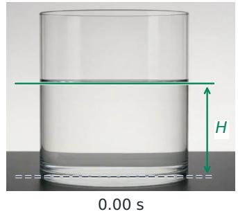

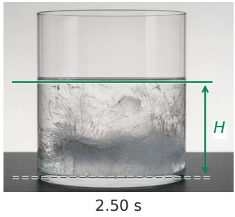

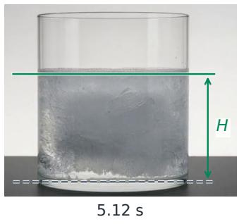

(b) Pendulum tracking (P15)  
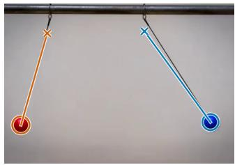  
0.00 s

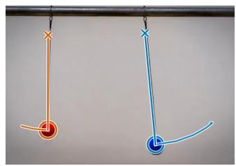  
0.75 s

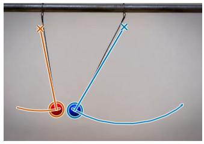  
1.50 s  
Figure 5 Examples of measurement extraction by our evaluator. (a) Freezing expansion (P24): the detected material surface (solid green line) and container bottom (dashed gray line) define the sample height H at three timestamps. (b) Pendulum tracking (P15): orange and blue overlays identify the two pendulum bobs and their tracked trajectories. The overlays expose the visual measurements used for subsequent physical assessment.

## A Case Study on Evaluator

Figure 5 illustrates how our evaluator extracts measurable evidence for task-specific physical assessment. For freezing expansion (P24), the evaluator identifies the material surface and container bottom to estimate the sample height H, enabling assessment of height changes during freezing. For pendulum tracking (P15), it tracks the two pendulum bobs over time to recover their motion trajectories, providing the basis for quantitative analysis of oscillatory behavior. These examples demonstrate how intermediate measurements connect generated video content to physical evaluation, while making potential boundary-detection and tracking errors available for inspection.

## B Detailed Task Catalog

Our benchmark comprises 40 tasks across nine physical families, with 65 defined evaluation metrics: one primary metric (M1) for every task and a secondary metric (M2) for 25 tasks. Tasks are numbered consecutively from P1 to P40 and grouped by physical family, with Easy tasks followed by Medium and Hard tasks within each family. Table 3 summarizes the resulting distribution. Each entry describes the intended scene, the visible quantities measured by the evaluator, and their score normalization.

The dificulty labels follow the current automatic evaluation: composite scores are averaged over available seeds within each model and then equally over the eight models. Ranking tasks by these scores yields 15 Easy, 15 Medium, and 10 Hard tasks. Missing videos are excluded from these averages. These labels describe empirical dificulty for the evaluated models.

Table 3 The nine physical families, their current task identifiers, evaluation targets, and empirical dificulty distribution. E, M, and H denote Easy, Medium, and Hard.
<table><tr><td>Physical family</td><td>Task IDs</td><td>Physical targets</td><td>E</td><td>M</td><td></td></tr><tr><td>Translational motion and collisions</td><td>P1-P5</td><td>Restitution, acceleration, projectile geometry, and mo- mentum.</td><td>1</td><td>2</td><td>2</td></tr><tr><td>Rolling, friction, and rigid-body statics</td><td>P6-P11</td><td>Sliding onset, chain geometry, rolling, and supported rotation.</td><td>2</td><td>3</td><td>1</td></tr><tr><td>Pendulum motion and oscillations</td><td>P12-P15</td><td>Period relations for mass, amplitude, and length.</td><td>3</td><td>10</td><td></td></tr><tr><td>Optics and projective geometry</td><td>P16-P20</td><td>Projective invariance, ray geometry, and shadow concur- rence.</td><td>1</td><td>3</td><td></td></tr><tr><td>Hydrostatics and buoyancy</td><td>P21-P23</td><td>Equilibrium levels, submerged fraction, and surface orien- 2 tation.</td><td></td><td>10</td><td></td></tr><tr><td>Phase transitions and melting P24–P28</td><td></td><td>Freezing expansion, melting-induced level changes, and comparative melting evidence.</td><td>1</td><td>0</td><td>4</td></tr><tr><td>Electrostatics, magnetism, and electromagnetic induction</td><td>P29-P34</td><td>Magnetic braking, induction events, symmetry, and needle directions.</td><td>2</td><td>31</td><td></td></tr><tr><td>Granular media and discharge flow</td><td>P35-P36</td><td>Repose-angle consistency and flow dependence on filling height.</td><td>01</td><td></td><td></td></tr><tr><td>Surface tension and viscous flow</td><td>P37-P40</td><td>Capillary ordering, settling speed, film curvature, and 2 droplet volume.</td><td>2</td><td></td><td>0</td></tr><tr><td>Total</td><td>40 tasks</td><td>9 physical families</td><td>15 15 10</td><td></td><td></td></tr></table>

Notation and normalization. We denote metric residuals by $e _ { j }$ and normalized metric scores by $s _ { j } \in [ 0 , 1 ]$ with higher scores indicating better agreement. Unless a unit is specified, residuals are dimensionless. We use

$$
q ( e ; a ) = { \frac { 1 } { 1 + | e | / a } } , \qquad G ( s _ { 1 } , \ldots , s _ { n } ) = \left( \prod _ { j = 1 } ^ { n } s _ { j } \right) ^ { 1 / n } ,
$$

$$
\operatorname { C V } ( x ) = { \frac { \operatorname { s t d } ( x ) } { | \operatorname { m e a n } ( x ) | } } , \qquad \operatorname { c l i p } ( x ) = \operatorname { m i n } ( 1 , \operatorname { m a x } ( 0 , x ) ) .
$$

The scale a gives $q = 0 . 5$ at $| e | = a ;$ it is not a pass threshold. The indicator $\mathbb { I } [ A ]$ is one when A holds and zero otherwise. Image y increases downward, with the sign of physical height changes specified in each task. For a task with m defined metrics, the physical score is

$$
{ \cal P } = \frac { 1 0 0 } { m } \sum _ { j = 1 } ^ { m } s _ { j } , \qquad s _ { j } \in [ 0 , 1 ] .
$$

Thus, $P = 1 0 0 s _ { 1 }$ when M2 is not defined. Consistent with the main evaluation protocol, $C , P ,$ and $S$ are expressed on a 0–100 scale, while individual metric scores remain in [0, 1]. The automatic composite score used for dificulty assignment follows Eq. (7):

$$
S = 0 . 1 5 C + 0 . 8 5 \widetilde { P } , \qquad \widetilde { P } = \left\{ \begin{array} { l l } { { P , } } & { { C \ge 8 0 \mathrm { a n d } \mathrm { a \ p h y s i c a l \ s c o r e \ i s \ r e c o r d e d } , } } \\ { { 0 , } } & { { \mathrm { o t h e r w i s e } . } } \end{array} \right.
$$

Here, $C \in [ 0 , 1 0 0 ]$ is the automatic consistency and observability score. The metric scores below contribute to $P ; C$ contributes once per video.

Metrics not defined for a task are excluded from its metric set and averaging denominator. For a task-defined metric, unless a task-specific rule applies, a completed extraction that cannot resolve the required measurement contributes an operational score of zero, while the raw measurement remains undefined. Such an operational zero does not count as a successful measurement or establish a measured physical violation. Input or execution errors do not yield valid physical scores and are excluded from physical-score averages; the treatment of an unavailable physical score in the composite score follows Eq. (7). Each score evaluates only the stated observable relationship, and broader physical properties described by the task remain unverified unless separately measured.

## B.1 Translational Motion and Collisions

## P1: Successive bounce heights (Easy).

Definition. A ball is dropped onto a horizontal hard surface and produces at least four visible rebounds with decreasing peak heights.

Metrics. For adjacent rebounds, define $r _ { h } = h _ { \mathrm { n e x t } } / h _ { \mathrm { p r e v } } , e _ { h } ^ { \ast } = \sqrt { r _ { h } }$ , and $e _ { t } ^ { * } = { \Delta t } _ { \mathrm { n e x t } } / { \Delta t } _ { \mathrm { p r e v } }$ . M1 compares height- and timing-based restitution and penalizes energy gain:

$$
e _ { 1 } = \mathrm { m e a n } | e _ { h } ^ { * } - e _ { t } ^ { * } | , \qquad e _ { p } = \mathrm { m e a n } \mathrm { m a x } ( 0 , e _ { h } ^ { * } - 1 ) .
$$

M2 measures height increase $e _ { 2 } = \mathrm { m e a n } \mathrm { m a x } ( 0 , r _ { h } - 1 )$ and, when measurable, restitution variability $c =$ $\mathrm { C V } ( e _ { \mathrm { r e s t i t u t i o n } } )$

Normalization. $s _ { 1 } = G ( q ( e _ { 1 } ; 0 . 1 8 ) , q ( e _ { p } ; 0 . 1 5 ) )$ . M2 is $s _ { 2 } = G ( q ( e _ { 2 } ; 0 . 1 5 ) , q ( c ; 0 . 3 5 ) )$ when c is measurable, and $s _ { 2 } = q ( e _ { 2 } ; 0 . 1 5 )$ otherwise. Trackable single motion without repeated rebounds receives $s _ { 1 } = s _ { 2 } = 0 . 1$

## P2: Free fall (Medium).

Definition. A ball is released from rest in a fixed side view and falls under gravity before ground contact.

Metrics. M1 measures acceleration consistency, $e _ { 1 } = \mathrm { C V } ( \Delta v _ { y } )$ , using equal-interval velocity increments. M2 compares displacements $d _ { 1 } , d _ { 2 } , d _ { 3 }$ in three equal intervals:

$$
e _ { 2 } = \sqrt { \frac { ( d _ { 2 } / ( 3 d _ { 1 } ) - 1 ) ^ { 2 } + ( d _ { 3 } / ( 5 d _ { 1 } ) - 1 ) ^ { 2 } } { 2 } } .
$$

The first displacement must exceed localization noise; resolved constant-speed descent fails the acceleration test.

Normalization. $s _ { 1 } = q ( e _ { 1 } ; 0 . 1 0 )$ and $s _ { 2 } = q ( e _ { 2 } ; 0 . 1 0 )$

## P3: Complementary-angle projectiles (Medium).

Definition. Identical balls are launched simultaneously at $3 0 ^ { \circ }$ and $6 0 ^ { \circ }$ with equal initial speed, following separate lanes and landing at their launch heights.

Metrics. M1 measures range agreement, $e _ { 1 } = R _ { 3 0 } / R _ { 6 0 } - 1$ . M2 combines the two parabola-fit RMS errors divided by ball diameter, $u _ { 3 0 } , u _ { 6 0 } .$ , and initial-speed mismatch $e _ { v } = | v _ { 3 0 } / v _ { 6 0 } - 1 |$

Normalization.

$$
s _ { 1 } = q ( e _ { 1 } ; 0 . 1 5 ) , \qquad s _ { 2 } = G ( q ( u _ { 3 0 } ; 0 . 3 0 ) , q ( u _ { 6 0 } ; 0 . 3 0 ) , q ( e _ { v } ; 0 . 2 0 ) ) .
$$

## P4: Oblique projectile motion (Hard).

Definition. A ball is launched at $4 5 ^ { \circ }$ , rises to its apex, and returns to its launch height in a fixed side view.

Metrics. M1 measures $e _ { 1 } = H / R - 1 / 4$ , where H is apex height and R is range. M2 measures $\mathrm { C V } ( v _ { x } )$ $\mathrm { C V } ( \Delta v _ { y } )$ , and parabola-fit error $u = \mathrm { R M S } / R$ . If return to launch height is absent but launch, apex, and descent are resolved, M1 uses $H / ( 2 X _ { \mathrm { a p e x } } ) - 1 / 4$ as a partial-arc estimate.

Normalization.

$$
s _ { 1 } = q ( e _ { 1 } ; 0 . 1 0 ) , \qquad s _ { 2 } = G ( q ( \mathrm { C V } ( v _ { x } ) ; 0 . 1 0 ) , q ( \mathrm { C V } ( \Delta v _ { y } ) ; 0 . 1 0 ) , q ( u ; 0 . 0 5 ) ) .
$$

## P5: Equal-mass head-on collision (Hard).

Definition. A moving red ball strikes an initially stationary blue ball of equal mass on a level surface in a head-on elastic collision.

Metrics. M1 measures horizontal momentum agreement:

$$
e _ { 1 } = \frac { v _ { 1 , \mathrm { a f t e r } } + v _ { 2 , \mathrm { a f t e r } } } { v _ { 1 , \mathrm { b e f o r e } } } - 1 .
$$

M2 is not defined; elasticity is not separately scored.

Normalization. $s _ { 1 } = q ( e _ { 1 } ; 0 . 1 0 )$

## B.2 Rolling, Friction, and Rigid-Body Statics

## P6: Sliding onset independent of block mass (Easy).

Definition. A hinged board is gradually tilted until two blocks of diferent masses and matched contact conditions begin sliding.

Metrics. M1 compares onset frames, $e _ { 1 } = | f _ { l } - f _ { r } | / N _ { f }$ , where $N _ { f }$ is video length in frames. M2 compares onset inclinations, $e _ { 2 } = \left| \theta _ { l , \mathrm { o n s e t } } - \theta _ { r , \mathrm { o n s e t } } \right| .$ in degrees.

Normalization. $s _ { 1 } = q ( e _ { 1 } ; 1 . 0 )$ and $s _ { 2 } = q ( e _ { 2 } ; 9 0 ^ { \circ } )$ . Two measurable blocks that both remain stationary receive $s _ { 1 } = s _ { 2 } = 0 . 7$

## P7: Static shape of a hanging chain (Easy).

Definition. A chain with fixed equal-height endpoints is released from a nonequilibrium shape and settles under gravity.

Metrics. M1 measures catenary-fit error, $e _ { 1 } = \mathrm { R M S E } _ { \mathrm { c o n t o u r } } /$ measured sag. M2 measures support-height diference divided by horizontal support span, $e _ { 2 } = \Delta h _ { \mathrm { s u p p o r t } } / L _ { \mathrm { s p a n } }$

Normalization. $s _ { 1 } = q ( e _ { 1 } ; 0 . 1 0 )$ and $s _ { 2 } = q ( e _ { 2 } ; 0 . 0 2 )$

## P8: Pure rolling of a solid sphere (Medium).

Definition. A marked sphere is released without a push onto an incline and its horizontal extension, rolling while maintaining surface contact.

Metrics. M1 robustly fits center displacement against unwrapped rotation angle, yielding slope b and residual $e _ { 1 } = | b | / r - 1$ . M2 measures

$$
e _ { 2 } = \operatorname { m e d i a n } { \frac { | v - \omega r | } { \operatorname* { m a x } ( v , \epsilon ) } }
$$

over valid moving frames, where r is sphere radius.

Normalization. $s _ { 1 } = q ( e _ { 1 } ; 0 . 2 5 )$ and $s _ { 2 } = q ( e _ { 2 } ; 0 . 3 5 )$

## P9: Rolling solid sphere versus thin ring (Medium).

Definition. A solid sphere and a thin ring of equal outer radius roll without slipping from rest at the same height on one incline.

Metrics. M1 takes the median ring-to-sphere travel-time ratio $r _ { t }$ over common distances:

$$
e _ { 1 } = \left| \frac { r _ { t } } { \sqrt { 1 0 / 7 } } - 1 \right| .
$$

M2 is not defined.

Normalization. $s _ { 1 } = q ( e _ { 1 } ; 0 . 1 0 )$

## P10: Forced rotation about a support edge (Medium).

Definition. An actuator pushes a block’s upper left face until it rotates about its lower right support edge and lies down without sliding away.

Metrics. M1 uses $E = \operatorname* { m a x } ( e _ { \mathrm { p i v o t } } , e _ { \mathrm { c o n t a c t } } , e _ { \mathrm { s h a p e } } )$ . Pivot drift and ground gap are their 95th-percentile values minus twice the pixel noise floor, clipped below at zero and divided by the initial block diagonal. Shape error is noise-adjusted relative edge-length change. The observed rotation $\Delta \theta$ is the largest across continuous intervals of at least four frames and 0.3 s, without interpolating hidden poses. M2 is not defined.

Normalization. $s _ { 1 } = \mathbb { I } [ \Delta \theta \ge 5 ^ { \circ } ] q ( E ; 0 . 0 2 )$

## P11: Sliding up and down a rough incline (Hard).

Definition. A block slides up an approximately $3 0 ^ { \circ }$ incline, stops, and slides down, with kinetic-friction coeficient 0.20.

Metrics. M1 compares ascent and descent acceleration magnitudes using the measured incline angle $\theta \colon$

$$
R _ { * } = \frac { \sin \theta + 0 . 2 0 \cos \theta } { \sin \theta - 0 . 2 0 \cos \theta } , \qquad e _ { 1 } = \left| \frac { a _ { \mathrm { u p } } / a _ { \mathrm { d o w n } } } { R _ { * } } - 1 \right| .
$$

M2 is not defined.

Normalization. $s _ { 1 } = q ( e _ { 1 } ; 0 . 1 0 )$ . A confirmed ascent-only event receives $s _ { 1 } = 0 . 1$

## B.3 Pendulum Motion and Oscillations

## P12: Pendulum period independent of mass (Easy).

Definition. Equal-length pendulums with diferent bob masses are released from the same angle at the same time.

Metrics. M1 compares periods, $e _ { 1 } = T _ { \mathrm { h e a v y } } / T _ { \mathrm { l i g h t } } - 1$ . M2 compares first-frame lengths using pivots recovered from the swing trajectories:

$$
e _ { 2 } = \frac { | L _ { l } - L _ { r } | } { \operatorname* { m e a n } ( L _ { l } , L _ { r } ) } .
$$

Normalization. $s _ { 1 } = q ( e _ { 1 } ; 0 . 1 0 )$ and $s _ { 2 } = q ( e _ { 2 } ; 0 . 1 0 )$

## P13: Finite-amplitude pendulum periods (Easy).

Definition. Equal-length pendulums are released from $1 5 ^ { \circ }$ and $3 0 ^ { \circ } ;$ ; the larger-amplitude pendulum should have a longer period.

Metrics. Both metrics use $r = T _ { \mathrm { l a r g e } } / T _ { \mathrm { s m a l l } }$ l. M1 measures $e _ { 1 } = | r - r _ { * } |$ ; M2 measures the increase $r - 1$ , where

$$
r _ { * } = \frac { K ( \sin ( 3 0 ^ { \circ } / 2 ) ) } { K ( \sin ( 1 5 ^ { \circ } / 2 ) ) } \simeq 1 . 0 1 3 0 5 2 0 8 6 9
$$

and K is the complete elliptic integral using the modulus convention.

Normalization. $s _ { 1 } = q ( e _ { 1 } ; 0 . 0 5 )$ and $s _ { 2 } = \mathrm { c l i p } ( ( r - 1 ) / ( r _ { * } - 1 ) )$

## P14: Pendulum period versus length (Easy).

Definition. Identical pendulum bobs on strings with length ratio 1 : 2 are released from approximately equal small angles.

Metrics. M1 measures

$$
e _ { 1 } = \left| \frac { ( T _ { \mathrm { s h o r t } } / T _ { \mathrm { l o n g } } ) ^ { 2 } } { L _ { \mathrm { s h o r t } } / L _ { \mathrm { l o n g } } } - 1 \right| .
$$

M2 measures cycle-to-cycle period variability, $c _ { s } = \mathrm { C V } ( T _ { \mathrm { s h o r t } } )$ and $c _ { l } = \mathrm { C V } ( T _ { \mathrm { l o n g } } )$ , over repeated oscillations.   
Normalization. $s _ { 1 } = q ( e _ { 1 } ; 0 . 2 0 )$ and $s _ { 2 } = G ( q ( c _ { s } ; 0 . 2 0 ) , q ( c _ { l } ; 0 . 2 0 ) )$ .

## P15: Small-angle pendulum isochronism (Medium).

Definition. Two equal-length pendulums are released simultaneously from diferent small amplitudes and swing repeatedly.

Metrics. M1 compares periods, $e _ { 1 } = T _ { l } / T _ { r } - 1$ . M2 fits a sinusoid to each angular trajectory and measures RMS residuals $u _ { l } , u _ { r }$ in radians.

Normalization. $s _ { 1 } = q ( e _ { 1 } ; 0 . 1 0 )$ and $s _ { 2 } = G ( q ( u _ { l } ; 0 . 1 0 \mathrm { r a d } ) , q ( u _ { r } ; 0 . 1 0 \mathrm { r a d } ) )$

## B.4 Optics and Projective Geometry

## P16: Cross-ratio of four points on a rigid rod (Easy).

Definition. A rod with four fixed collinear markers slides with one endpoint on a wall and the other on the floor.

Metrics. For ordered projected marker positions $t _ { 1 } , \ldots , t _ { 4 }$ , M1 measures $e _ { 1 } = \mathrm { C V } ( \chi )$ , where

$$
\chi = \frac { ( t _ { 3 } - t _ { 1 } ) ( t _ { 4 } - t _ { 2 } ) } { ( t _ { 3 } - t _ { 2 } ) ( t _ { 4 } - t _ { 1 } ) } .
$$

M2 measures $e _ { 2 } = \mathrm { { m e a n } ( \mathrm { { R M S } _ { c o l l i n e a r i t y } / \mathrm { { m a r k e r } \ s p a n ) } } }$ over frames.

Normalization. $s _ { 1 } = q ( e _ { 1 } ; 0 . 1 0 )$ and $s _ { 2 } = q ( e _ { 2 } ; 0 . 0 5 )$

## P17: Refraction at an air–water interface (Medium).

Definition. A fixed laser illuminates a stationary air–water interface, with both incident and refracted rays visible.

Metrics. M1 measures Snell’s-law residual $e _ { 1 } =$ sin $\theta _ { i } /$ sin $\theta _ { r } - 1 . 3 3 3$ , with angles relative to the normal. M2 compares ray–interface intersections $p _ { i } , p _ { r } \colon e _ { 2 } = \| p _ { i } - p _ { r } \| / W _ { c }$ , where $W _ { c }$ is calibrated container width.

Normalization. $s _ { 1 } = q ( e _ { 1 } ; 0 . 1 2 )$ and $s _ { 2 } = q ( e _ { 2 } ; 0 . 0 2 5 )$

## P18: Specular reflection (Medium).

Definition. A narrow laser beam strikes a plane mirror obliquely, with both rays and their contact point visible.

Metrics. M1 measures $e _ { 1 } = | \theta _ { i } - \theta _ { r } |$ in degrees. M2 measures $e _ { 2 } =$ median(reflected-ray contact $\mathrm { e r r o r } ) / D _ { f }$ where $D _ { f }$ is frame diagonal.

Normalization. $s _ { 1 } = q ( e _ { 1 } ; 9 0 ^ { \circ } )$ and $s _ { 2 } = q ( e _ { 2 } ; 1 . 0 )$

## P19: Concurrent shadows from a point source (Medium).

Definition. One stationary point light illuminates four vertical rods; backward extensions of their shadow axes should meet at a common point.

Metrics. M1 measures $e _ { 1 } = \mathrm { R M S } _ { \mathrm { c o n c u r r e n c e } } / D _ { f }$ , using shadow-axis line distances to their common intersection and frame diagonal $D _ { f }$ . M2 uses pairwise intersection estimates $( x _ { k } , y _ { k } )$

$$
e _ { 2 } = \frac { \mathrm { m e a n } ( \mathrm { s t d } ( x _ { k } ) , \mathrm { s t d } ( y _ { k } ) ) } { D _ { f } } .
$$

Normalization. $s _ { 1 } = q ( e _ { 1 } ; 0 . 0 5 )$ and $s _ { 2 } = q ( e _ { 2 } ; 0 . 0 5 )$

## P20: Refraction and total internal reflection (Hard).

Definition. Four distinguishable beams change incidence directions at fixed points on a water interface, exhibiting refraction or total internal reflection.

Metrics. M1 measures the consistency of independently inferred refractive indices:

$$
e _ { 1 } = \frac { \mathrm { s t d } ( n ) } { \mathrm { m e a n } ( n ) } .
$$

Total internal reflection supplies a bound, not an exact critical-angle measurement. M2 is not defined.   
Normalization. $s _ { 1 } = q ( e _ { 1 } ; 0 . 0 5 )$

## B.5 Hydrostatics and Buoyancy

## P21: Liquid levels in communicating vessels (Easy).

Definition. Liquid in a U-tube with unequal arm diameters settles after a disturbance, with no liquid added or removed.

Metrics. M1 measures final level diference, $e _ { 1 } \ = \ ( \mathrm { m e d i a n } ( y _ { l } ) - \mathrm { m e d i a n } ( y _ { r } ) ) / H _ { \mathrm { r e f } }$ , where $H _ { \mathrm { r e f } }$ is the larger of frame height and the combined arm-region vertical span. M2 measures residual motion, $e _ { 2 } =$ max $( | b _ { l } | , | b _ { r } | ) / H _ { \mathrm { f r a m e } } .$ , using surface-position slopes against frame index. At least five overlapping terminal frames are required.

Normalization. $s _ { 1 } = q ( e _ { 1 } ; 1 . 0 )$ and $s _ { 2 } = q ( e _ { 2 } ; 1 \mathrm { f r a m e ^ { - 1 } } )$

## P22: Submerged fraction of a floating ice column (Easy).

Definition. An intact vertical freshwater ice column reaches floating equilibrium without melting or touching its vessel.

Metrics. M1 measures the settled submerged-height ratio; M2 compares the left and right waterlines:

$$
e _ { 1 } = \left| \mathrm { m e d i a n } \left( { \frac { h _ { \mathrm { s u b } } } { h _ { \mathrm { t o t a l } } } } \right) - 0 . 9 1 7 \right| , \qquad e _ { 2 } = \mathrm { m e d i a n } { \frac { | y _ { l } - y _ { r } | } { W _ { \mathrm { v e s s e l } } } } .
$$

Normalization. $s _ { 1 } = q ( e _ { 1 } ; 0 . 1 0 )$ and $s _ { 2 } = q ( e _ { 2 } ; 0 . 0 5 )$

## P23: Liquid surface perpendicular to gravity (Medium).

Definition. A steel ball falls freely beside a vessel with a stationary liquid surface, providing a visible estimate of gravity direction.

Metrics. M1 measures $e _ { 1 } = \angle ( a _ { \mathrm { b a l l } } , t _ { \mathrm { s u r f a c e } } ) - 9 0 ^ { \circ }$ . M2 measures surface line-fit RMS $u _ { s }$ and constantacceleration trajectory-fit RMS $u _ { b } .$ , both in pixels.

Normalization. $s _ { 1 } = q ( e _ { 1 } ; 5 ^ { \circ } )$ and $s _ { 2 } = G ( q ( u _ { s } ; 3 \mathrm { p x } ) , q ( u _ { b } ; 8 \mathrm { p x } ) )$

## B.6 Phase Transitions and Melting

## P24: Expansion when water freezes (Easy).

Definition. Water freezes completely in a straight-sided vessel without material transfer or a change in cross-section.

Metrics. M1 measures height expansion; M2 measures width stability:

$$
e _ { 1 } = \frac { H _ { \mathrm { i c e } } } { H _ { \mathrm { w a t e r } } } - \frac { 1 0 0 0 } { 9 1 7 } , \qquad e _ { 2 } = \frac { | W _ { \mathrm { f i n a l } } - W _ { \mathrm { i n i t i a l } } | } { \operatorname* { m a x } ( W _ { \mathrm { i n i t i a l } } , 1 \ : \mathrm { p x } ) } .
$$

Normalization. $s _ { 1 } = q ( e _ { 1 } ; 1 . 0 )$ and $s _ { 2 } = q ( e _ { 2 } ; 1 . 0 )$

## P25: Floating freshwater ice melting in freshwater (Hard).

Definition. Floating freshwater ice melts completely in a straight-sided freshwater vessel without material exchange; initial and final levels should agree.

Metrics. M1 measures level change; M2 measures vessel-width change:

$$
e _ { 1 } = \frac { y _ { \mathrm { b e f o r e } } - y _ { \mathrm { a f t e r } } } { H _ { \mathrm { v e s s e l } } } , \qquad e _ { 2 } = \frac { | W _ { \mathrm { a f t e r } } - W _ { \mathrm { b e f o r e } } | } { W _ { \mathrm { b e f o r e } } } .
$$

Normalization. $s _ { 1 } = q ( e _ { 1 } ; 0 . 0 5 )$ and $s _ { 2 } = q ( e _ { 2 } ; 0 . 0 5 )$

## P26: Melting floating ice containing a stone (Hard).

Definition. Floating ice melts and releases an embedded dense stone, which sinks; the final water level should decrease.

Metrics. M1 measures $e _ { 1 } = ( y _ { \mathrm { b e f o r e } } - y _ { \mathrm { a f t e r } } ) / H _ { \mathrm { i n i t i a l } }$ after melting and a level change exceeding measurement uncertainty are observed. M2 is not defined.

Normalization. $s _ { 1 } = \mathbb { I } [ e _ { 1 } < 0 ]$ . Below-resolution changes remain unmeasured.

## P27: Freshwater ice melting in saltwater (Hard).

Definition. Freshwater ice melts and mixes with saltwater without material exchange; the final level should rise and no ice should remain.

Metrics. M1 records $e _ { 1 } = { \Delta y } / { H _ { \mathrm { i n i t i a l } } }$ , where $\Delta y = y _ { \mathrm { b e f o r e } } - y _ { \mathrm { a f t e r } }$ . M2 measures $r _ { s } = E _ { \mathrm { s o l i d , t e r m i n a l } } / E _ { \mathrm { s o l i d , i n i t i a l } } ,$ an image-based solid-evidence ratio.

Normalization. $s _ { 1 } = \mathbb { I } [ \Delta y > \delta _ { y } ]$ , where $\delta _ { y }$ is level-change uncertainty in pixels. M2 is $s _ { 2 } = \mathrm { c l i p } ( 1 - r _ { s } )$ , overridden by $s _ { 2 } = 0$ if residual ice is confirmed in the final frame.

## P28: Crushed ice versus one ice block (Hard).

Definition. Equal masses of crushed ice and one intact ice block melt simultaneously in identical vessels.

Metrics. M1 compares liquid heights measured from each vessel’s bottom and divided by its height. A qualifying lead occurs when the crushed-ice side exceeds the intact-ice side by more than their summed localization uncertainties. M2 is not defined.

Normalization. $s _ { 1 } = 1$ for a qualifying lead lasting at least 0.25 s, and $s _ { 1 } = 0$ for at least 0.50 s of continuous jointly readable evidence without such a lead. Otherwise the metric remains unresolved; gaps are not interpolated.

## B.7 Electrostatics, Magnetism, and Electromagnetic Induction

## P29: Eddy-current braking on an incline (Easy).

Definition. Matched magnetic and nonmagnetic objects descend a copper incline; the magnetic object should arrive later and move more slowly.

Metrics. M1 measures $r _ { t } = ( f _ { m } - f _ { 0 } + 1 ) / ( f _ { c } - f _ { 0 } + 1 )$ , where $f _ { m } , f _ { c }$ are first-arrival frames at a common displacement and f is the initialization frame. The common displacement is 80% of the smaller maximum displacement over jointly valid observations. M2 measures speed ratio $r _ { v } = v _ { m } / v _ { c }$

Normalization. $s _ { 1 } = \mathbb { I } [ r _ { t } > 1 ]$ and $s _ { 2 } = \mathbb { I } [ r _ { v } < 1 ]$

## P30: Magnet entry and indicator illumination (Easy).

Definition. A magnet starts at rest, passes through a fixed coil connected to a bidirectional indicator, exits, and stops.

Metrics. M1 combines binary evidence of magnet entry E and confirmed indicator illumination during entry L, with a 0.5 s matching tolerance. An already-lit indicator qualifies if it remains lit during the matching interval. M2 is not defined.

Normalization. $s _ { 1 } = 0 . 5 \mathbb { I } [ E ] + 0 . 5 \mathbb { I } [ L ]$ . Confirmed entry with an unreadable indicator receives the lower-bound score 0.5, with uncertainty range [0.5, 1].

## P31: Symmetric equilibrium of charged balls (Medium).

Definition. Two identical charged balls on equal insulating strings repel and settle into a symmetric outwardseparated configuration.

Metrics. M1 measures string-angle asymmetry, $e _ { 1 } = | \theta _ { l } - \theta _ { r } | .$ , in degrees. M2 measures displacement asymmetry, $e _ { 2 } = | \ln ( d _ { l } / d _ { r } ) |$ , using horizontal ofsets from the apparatus centerline.

Normalization. $s _ { 1 } = q ( e _ { 1 } ; 9 0 ^ { \circ } )$ and $s _ { 2 } = q ( e _ { 2 } ; 1 . 0 )$ . An observed failure of outward separation, settling, or fixed equal-length strings sets both scores to zero.

## P32: Final directions of two compass needles (Medium).

Definition. A wire between two compasses is energized; their needles rotate and settle with opposing polar directions.

Metrics. M1 measures median smallest angular separation d in degrees over jointly readable observations among the final five frames, requiring at least two valid frames. M2 is not defined.

Normalization. $s _ { 1 } = ( 1 - \cos ( \pi d / 1 8 0 ) ) / 2 ;$ opposite directions score one and aligned directions score zero.

## P33: Closed versus split jumping rings (Medium).

Definition. Matched apparatuses simultaneously excite closed and split aluminum rings, each free to move along its fixed core.

Metrics. M1 measures $r _ { h } = h _ { \mathrm { o p e n } } / h _ { \mathrm { c l o s e d } }$ , with each peak rise divided by that ring’s initial outer diameter. A plateau or descent must establish each peak. M2 is not defined.

Normalization. $s _ { 1 } = \mathrm { c l i p } ( ( 1 - r _ { h } ) / 0 . 2 0 )$ . A reliably observed zero closed-ring rise scores zero, with the ratio undefined.

## P34: Eddy-current damping of solid and slotted plates (Hard).

Definition. Solid and slotted conducting plates with matched mass and inertia swing through equivalent magnetic fields from the same release angle.

Metrics. M1 counts complete cycles $N _ { \mathrm { s o l i d } } , N _ { \mathrm { s l o t t e d } }$ in a common window of at least 2 s, using cutof max(1◦, 0.1 mean $( | \theta _ { 0 , \mathrm { s o l i d } } | , | \theta _ { 0 , \mathrm { s l o t t e d } } | ) )$ . Cycles are bounded by same-polarity events; truncated cycles are excluded. M2 is not defined.

Normalization. $s _ { 1 } = \mathbb { I } [ N _ { \mathrm { s o l i d } } < N _ { \mathrm { s l o t t e d } } ]$ . If $N _ { \mathrm { s l o t t e d } } = 0 , s _ { 1 } = 0$ and the count ratio is undefined.

## B.8 Granular Media and Discharge Flow

P35: Scale consistency of sand-pile repose angles (Easy).

Definition. Two unequal-size piles of the same dry sand receive thin streams at their peaks and maintain comparable repose angles.

Metrics. M1 measures $e _ { 1 } = \vert \alpha _ { \mathrm { s m a l l } } / \alpha _ { \mathrm { l a r g e } } - 1 \vert$ |. M2 measures left–right slope asymmetry in degrees:

$$
e _ { 2 } = \mathrm { m a x } ( \vert \alpha _ { \mathrm { s m a l l } , l } - \alpha _ { \mathrm { s m a l l } , r } \vert , \vert \alpha _ { \mathrm { l a r g e } , l } - \alpha _ { \mathrm { l a r g e } , r } \vert ) .
$$

Normalization. $s _ { 1 } = q ( e _ { 1 } ; 1 . 0 )$ and $s _ { 2 } = q ( e _ { 2 } ; 9 0 ^ { \circ } )$

## P36: Discharge of water and sand from funnels (Hard).

Definition. Water and dry sand drain simultaneously from identical conical funnels with equal outlets and initial fill heights.

Metrics. M1 fits $Q \propto h ^ { \beta }$ for each material using cone geometry and an integrated volume/head fit:

$$
e _ { 1 } = | \beta _ { \mathrm { w a t e r } } - 0 . 5 | + | \beta _ { \mathrm { s a n d } } | .
$$

M2 is not defined.

Normalization. $s _ { 1 } = q ( e _ { 1 } ; 1 . 0 )$

## B.9 Surface Tension and Viscous Flow

P37: Capillary rise in tubes of diferent radii (Easy).

Definition. Two initially dry glass tubes of diferent inner radii are lowered into one liquid reservoir; liquid should rise higher in the narrower tube.

Metrics. M1 measures d = median $\left( h _ { \mathrm { n a r r o w } } - h _ { \mathrm { w i d e } } \right)$ over paired terminal observations, where $h = y _ { \mathrm { r e s e r v o i r } } -$ y . M2 is not defined.

Normalization. $s _ { 1 } = \mathbb { I } [ d > \delta _ { \mathrm { r e s o l u t i o n } } ]$ , with d and measurement resolution in pixels.

## P38: Terminal settling of unequal spheres (Easy).

Definition. Two spheres of the same material and diferent radii settle through glycerin, reaching terminal speed before bottom contact.

Metrics. M1 measures

$$
e _ { 1 } = \left| \frac { v _ { \mathrm { l a r g e } } / v _ { \mathrm { s m a l l } } } { ( r _ { \mathrm { l a r g e } } / r _ { \mathrm { s m a l l } } ) ^ { 2 } } - 1 \right| .
$$

Each speed is measured over the longest qualified nonzero terminal-speed window, with earlier windows preferred in ties; the radius ratio must be at least 1.1. M2 is not defined.

Normalization. $s _ { 1 } = q ( e _ { 1 } ; 1 . 0 )$

## P39: Curvature of the partition between unequal soap bubbles (Medium).

Definition. Two unequal near-spherical soap bubbles join and retain a visible separating film without rupture or detachment.

Metrics. M1 independently fits the outer radii $r _ { s } , r _ { l }$ and signed partition radius $r _ { p } \mathrm { : }$

$$
E _ { t } = \left| r _ { p } \left( \frac { 1 } { r _ { s } } - \frac { 1 } { r _ { l } } \right) - 1 \right| .
$$

The residual $e _ { 1 }$ is the frame-duration-weighted median of $E _ { t }$ over uniquely identifiable partition intervals of at least three frames and 0.08 s. M2 is not defined.

Normalization. $s _ { 1 } = q ( e _ { 1 } ; 1 . 0 )$ . A resolved nearly straight partition whose curvature uncertainty excludes the prediction is assigned the unbounded-error limit, $s _ { 1 } = 0$

## P40: Volume conservation in droplet coalescence (Medium).

Definition. Two unequal free water droplets approach, touch, and merge into one near-spherical droplet. Metrics. M1 measures $e _ { 1 } = | r _ { f } ^ { 3 } / ( r _ { 1 } ^ { 3 } + r _ { 2 } ^ { 3 } ) - 1 |$ from fitted radii at a common image scale. M2 measures $e _ { 2 } = { | \mathcal { R } _ { f } - ( \mathcal { R } _ { 1 } + \mathcal { R } _ { 2 } ) / 2 | }$ , where roundness is $\mathcal { R } = 1 - \mathrm { R M S } _ { \mathrm { r a d i a l } } / r _ { \mathrm { f i t t e d } }$

Normalization. $s _ { 1 } = q ( e _ { 1 } ; 0 . 1 0 )$ and $s _ { 2 } = q ( e _ { 2 } ; 0 . 1 0 )$

## C Detailed Evaluation

Tables 4 and 5 report the consistency score (C), physical score (P), and combined score (S) for all 40 tasks and eight video generation models. The consistency score assesses temporal consistency and task observability, while the physical score summarizes task-specific measurements. Physical evaluation is performed independently for all available videos, regardless of whether they pass the consistency gate. The reported P therefore includes videos with $C < 8 0$ and is not set to zero solely because the gate rejects a video. For each video, we compute $S = 0 . 1 5 C + 0 . 8 5 P { \bf 1 } [ C \geq 8 0 ]$ . The gate afects only the contribution of $P$ to $S ;$ the original C and independently evaluated $P$ are retained. All scores are expressed on a 0–100 scale and averaged over available seeds within each model–task pair, with the gate applied before averaging.

Table 4 Detailed task-level evaluation (part 1 of 2). Automatic consistency (C), independent physical (P), and composite (S) scores (0–100; ↑) for four models across 40 tasks. The all-model mean is repeated in both tables.
<table><tr><td rowspan=2 colspan=12>Task                                      Seedance 2.5     MiniMax H3    Cosmos 3 SuperIDPhysical phenomenon              Level   C  P</td><td rowspan=1 colspan=3>VBVR</td><td rowspan=1 colspan=3>All-model mean</td></tr><tr><td rowspan=1 colspan=1></td><td rowspan=1 colspan=3></td><td rowspan=1 colspan=3></td><td rowspan=1 colspan=6>C   P   S   C  P  S</td></tr><tr><td rowspan=1 colspan=3>1. Translational Motion and Collisions</td><td rowspan=1 colspan=2></td><td rowspan=1 colspan=1></td><td rowspan=1 colspan=2></td><td rowspan=1 colspan=1></td><td rowspan=1 colspan=2></td><td rowspan=1 colspan=1></td><td rowspan=1 colspan=2></td><td rowspan=1 colspan=1></td><td rowspan=1 colspan=3></td></tr><tr><td rowspan=1 colspan=2>P1Bounce-height decay</td><td rowspan=1 colspan=1>E</td><td rowspan=1 colspan=2>100.0089.13</td><td rowspan=1 colspan=1>90.76</td><td rowspan=1 colspan=1>100.00</td><td rowspan=1 colspan=1>86.10</td><td rowspan=1 colspan=1>88.191</td><td rowspan=1 colspan=2>00.0049.96</td><td rowspan=1 colspan=1>57.46</td><td rowspan=1 colspan=2>0.0010.00</td><td rowspan=1 colspan=1>0.00</td><td rowspan=1 colspan=2>78.12 58.145</td><td rowspan=1 colspan=1>7.19</td></tr><tr><td rowspan=1 colspan=2>P2Free fall</td><td rowspan=1 colspan=1>M</td><td rowspan=1 colspan=2>100.0017.06</td><td rowspan=1 colspan=1>29.501</td><td rowspan=1 colspan=1>00.00</td><td rowspan=1 colspan=1>12.76</td><td rowspan=1 colspan=1>25.84</td><td rowspan=1 colspan=2>100.00 22.99</td><td rowspan=1 colspan=1>34.541</td><td rowspan=1 colspan=2>00.0010.90</td><td rowspan=1 colspan=1>24.27</td><td rowspan=1 colspan=2>98.75 13.88</td><td rowspan=1 colspan=1>26.61</td></tr><tr><td rowspan=1 colspan=2>P3Complementary-angle throws</td><td rowspan=1 colspan=1>M</td><td rowspan=1 colspan=2>100.0045.83</td><td rowspan=1 colspan=1>53.96</td><td rowspan=1 colspan=1>96.25</td><td rowspan=1 colspan=1>50.84</td><td rowspan=1 colspan=1>57.66</td><td rowspan=1 colspan=2>95.007.91</td><td rowspan=1 colspan=1>20.97</td><td rowspan=1 colspan=1>72.50</td><td rowspan=1 colspan=1>0.00</td><td rowspan=1 colspan=1>10.88</td><td rowspan=1 colspan=2>54.53 16.51</td><td rowspan=1 colspan=1>22.21</td></tr><tr><td rowspan=1 colspan=2>P4Projectile motion</td><td rowspan=1 colspan=1>H</td><td rowspan=1 colspan=2>100.0016.62</td><td rowspan=1 colspan=1>29.131</td><td rowspan=1 colspan=1>00.00</td><td rowspan=1 colspan=1>28.25</td><td rowspan=1 colspan=1>39.01</td><td rowspan=1 colspan=2>75.007.06</td><td rowspan=1 colspan=1>17.25</td><td rowspan=1 colspan=1>75.00</td><td rowspan=1 colspan=1>19.28</td><td rowspan=1 colspan=1>22.33</td><td rowspan=1 colspan=2>59.38 15.01</td><td rowspan=1 colspan=1>17.67</td></tr><tr><td rowspan=1 colspan=2>P5Equal-mass collision</td><td rowspan=1 colspan=1>H</td><td rowspan=1 colspan=2>100.0012.20</td><td rowspan=1 colspan=1>25.371</td><td rowspan=1 colspan=1>00.00</td><td rowspan=1 colspan=1>13.01</td><td rowspan=1 colspan=1>26.06</td><td rowspan=1 colspan=2>96.670.00</td><td rowspan=1 colspan=1>14.50</td><td rowspan=1 colspan=1>75.00</td><td rowspan=1 colspan=1>9.23</td><td rowspan=1 colspan=1>17.05</td><td rowspan=1 colspan=2>74.585.371</td><td rowspan=1 colspan=1>5.19</td></tr><tr><td rowspan=2 colspan=2>2. Rolling, Friction, and Rigid-Body StatP6Mass-independent sliding</td><td rowspan=1 colspan=1>ics</td><td rowspan=1 colspan=2></td><td rowspan=1 colspan=1></td><td rowspan=1 colspan=1></td><td rowspan=1 colspan=1></td><td rowspan=1 colspan=1></td><td rowspan=1 colspan=2></td><td rowspan=1 colspan=1></td><td rowspan=1 colspan=1></td><td rowspan=1 colspan=1></td><td rowspan=1 colspan=1></td><td rowspan=1 colspan=2></td><td rowspan=1 colspan=1></td></tr><tr><td rowspan=1 colspan=1>E</td><td rowspan=1 colspan=2>100.00 60.00</td><td rowspan=1 colspan=1>66.001</td><td rowspan=1 colspan=1>00.00</td><td rowspan=1 colspan=1>97.52</td><td rowspan=1 colspan=1>97.891</td><td rowspan=1 colspan=2>00.0098.189</td><td rowspan=1 colspan=1>8.461</td><td rowspan=1 colspan=1>00.00</td><td rowspan=1 colspan=1>42.50</td><td rowspan=1 colspan=1>51.12</td><td rowspan=1 colspan=2>93.75 60.356</td><td rowspan=1 colspan=1>2.71</td></tr><tr><td rowspan=1 colspan=2>P7 Hanging-chain equilibrium</td><td rowspan=1 colspan=1>E</td><td rowspan=1 colspan=2>100.00 63.35</td><td rowspan=1 colspan=1>68.851</td><td rowspan=1 colspan=1>00.00</td><td rowspan=1 colspan=1>65.04</td><td rowspan=1 colspan=1>70.29</td><td rowspan=1 colspan=2>100.0065.98</td><td rowspan=1 colspan=1>71.091</td><td rowspan=1 colspan=1>00.00</td><td rowspan=1 colspan=1>64.37</td><td rowspan=1 colspan=1>69.71</td><td rowspan=1 colspan=2>99.84 65.747</td><td rowspan=1 colspan=1>0.86</td></tr><tr><td rowspan=1 colspan=1>P8</td><td rowspan=1 colspan=1>Solid-sphere rolling</td><td rowspan=1 colspan=1>M</td><td rowspan=1 colspan=2>100.0071.25</td><td rowspan=1 colspan=1>75.561</td><td rowspan=1 colspan=1>00.00</td><td rowspan=1 colspan=1>36.26</td><td rowspan=1 colspan=1>45.82</td><td rowspan=1 colspan=1>97.501</td><td rowspan=1 colspan=1>6.67</td><td rowspan=1 colspan=1>28.79</td><td rowspan=1 colspan=1>98.75</td><td rowspan=1 colspan=1>19.67</td><td rowspan=1 colspan=1>31.53</td><td rowspan=1 colspan=2>95.16 25.533</td><td rowspan=1 colspan=1>5.97</td></tr><tr><td rowspan=1 colspan=1>P9</td><td rowspan=1 colspan=1>Solid sphere vs. hoop</td><td rowspan=1 colspan=1>M</td><td rowspan=1 colspan=2>100.00 20.01</td><td rowspan=1 colspan=1>32.011</td><td rowspan=1 colspan=1>00.00</td><td rowspan=1 colspan=1>30.38</td><td rowspan=1 colspan=1>40.83</td><td rowspan=1 colspan=1>100.001</td><td rowspan=1 colspan=1>8.07</td><td rowspan=1 colspan=1>30.36</td><td rowspan=1 colspan=1>97.50</td><td rowspan=1 colspan=1>31.77</td><td rowspan=1 colspan=1>41.63</td><td rowspan=1 colspan=2>90.1617.52</td><td rowspan=1 colspan=1>28.41</td></tr><tr><td rowspan=1 colspan=2>P10 Edge-pivot toppling</td><td rowspan=1 colspan=1>M</td><td rowspan=1 colspan=1>100.00</td><td rowspan=1 colspan=1>22.67</td><td rowspan=1 colspan=1>34.271</td><td rowspan=1 colspan=1>00.00</td><td rowspan=1 colspan=1>60.62</td><td rowspan=1 colspan=1>66.531</td><td rowspan=1 colspan=1>00.00</td><td rowspan=1 colspan=1>22.39</td><td rowspan=1 colspan=1>34.03</td><td rowspan=1 colspan=1>25.00</td><td rowspan=1 colspan=1>1.18</td><td rowspan=1 colspan=1>4.76</td><td rowspan=1 colspan=2>75.0018.56</td><td rowspan=1 colspan=1>27.02</td></tr><tr><td rowspan=1 colspan=2>P11 Rough-incline round trip</td><td rowspan=1 colspan=1>H</td><td rowspan=1 colspan=1>100.001</td><td rowspan=1 colspan=1>1.09</td><td rowspan=1 colspan=1>24.43</td><td rowspan=1 colspan=1>100.00</td><td rowspan=1 colspan=1>16.28</td><td rowspan=1 colspan=1>28.84</td><td rowspan=1 colspan=1>50.00</td><td rowspan=1 colspan=1>3.21</td><td rowspan=1 colspan=1>8.10</td><td rowspan=1 colspan=1>50.00</td><td rowspan=1 colspan=1>10.72</td><td rowspan=1 colspan=1>12.36</td><td rowspan=1 colspan=2>56.25 10.15</td><td rowspan=1 colspan=1>14.94</td></tr><tr><td rowspan=1 colspan=2>3. Pendulum Motion and Oscillations</td><td rowspan=1 colspan=1></td><td rowspan=1 colspan=2></td><td rowspan=1 colspan=1></td><td rowspan=1 colspan=1></td><td rowspan=1 colspan=1></td><td rowspan=1 colspan=1></td><td rowspan=1 colspan=1></td><td rowspan=1 colspan=1></td><td rowspan=1 colspan=1></td><td rowspan=1 colspan=1></td><td rowspan=1 colspan=1></td><td rowspan=1 colspan=1></td><td rowspan=1 colspan=2></td><td rowspan=1 colspan=1></td></tr><tr><td rowspan=2 colspan=2>P12 Pendulum period vs. massP13 Large-angle pendulum</td><td rowspan=1 colspan=1>E</td><td rowspan=1 colspan=2>100.0076.96</td><td rowspan=1 colspan=1>80.411</td><td rowspan=1 colspan=1>00.00</td><td rowspan=1 colspan=1>67.74</td><td rowspan=1 colspan=1>72.58</td><td rowspan=1 colspan=1>100.00</td><td rowspan=1 colspan=1>62.54</td><td rowspan=1 colspan=1>68.16</td><td rowspan=1 colspan=1>75.00</td><td rowspan=1 colspan=1>57.17</td><td rowspan=1 colspan=1>56.28</td><td rowspan=1 colspan=2>93.75 46.52</td><td rowspan=1 colspan=1>53.09</td></tr><tr><td rowspan=1 colspan=1>E</td><td rowspan=1 colspan=1>100.00</td><td rowspan=1 colspan=1>50.30</td><td rowspan=1 colspan=1>57.761</td><td rowspan=1 colspan=1>00.00</td><td rowspan=1 colspan=1>76.33</td><td rowspan=1 colspan=1>79.88</td><td rowspan=1 colspan=1>100.00</td><td rowspan=1 colspan=1>56.25</td><td rowspan=1 colspan=1>62.81</td><td rowspan=1 colspan=1>75.00</td><td rowspan=1 colspan=1>51.44</td><td rowspan=1 colspan=1>43.59</td><td rowspan=1 colspan=2>93.44 55.48</td><td rowspan=1 colspan=1>58.33</td></tr><tr><td rowspan=2 colspan=2>P14 Pendulum period vs. lengthP15 Small-angle isochronism</td><td rowspan=1 colspan=1>E</td><td rowspan=1 colspan=1>100.00</td><td rowspan=1 colspan=1>60.18</td><td rowspan=1 colspan=1>66.151</td><td rowspan=1 colspan=1>00.00</td><td rowspan=1 colspan=1>59.31</td><td rowspan=1 colspan=1>65.41</td><td rowspan=1 colspan=1>100.005</td><td rowspan=1 colspan=1>5.21</td><td rowspan=1 colspan=1>61.93</td><td rowspan=1 colspan=1>97.50</td><td rowspan=1 colspan=1>48.48</td><td rowspan=1 colspan=1>55.83</td><td rowspan=1 colspan=2>89.84 40.594</td><td rowspan=1 colspan=1>7.98</td></tr><tr><td rowspan=1 colspan=1>M</td><td rowspan=1 colspan=1>100.00</td><td rowspan=1 colspan=1>79.52</td><td rowspan=1 colspan=1>82.60</td><td rowspan=1 colspan=1>100.00</td><td rowspan=1 colspan=1>42.77</td><td rowspan=1 colspan=1>51.35</td><td rowspan=1 colspan=1>97.50</td><td rowspan=1 colspan=1>61.35</td><td rowspan=1 colspan=1>66.77</td><td rowspan=1 colspan=1>23.75</td><td rowspan=1 colspan=1>21.57</td><td rowspan=1 colspan=1>21.90</td><td rowspan=1 colspan=2>82.81 34.48</td><td rowspan=1 colspan=1>41.73</td></tr><tr><td rowspan=1 colspan=2>4. Optics and Projective Geometry</td><td rowspan=1 colspan=1></td><td rowspan=1 colspan=1></td><td rowspan=1 colspan=1></td><td rowspan=1 colspan=1></td><td rowspan=1 colspan=1></td><td rowspan=1 colspan=1></td><td rowspan=1 colspan=1></td><td rowspan=1 colspan=1></td><td rowspan=1 colspan=1></td><td rowspan=1 colspan=1></td><td rowspan=1 colspan=1></td><td rowspan=1 colspan=1></td><td rowspan=1 colspan=1></td><td rowspan=1 colspan=2></td><td rowspan=1 colspan=1></td></tr><tr><td rowspan=1 colspan=2>P16 Collinear-point cross-ratio</td><td rowspan=1 colspan=1>E</td><td rowspan=1 colspan=1>100.00</td><td rowspan=1 colspan=1>77.76</td><td rowspan=1 colspan=1>81.101</td><td rowspan=1 colspan=1>00.00</td><td rowspan=1 colspan=1>79.96</td><td rowspan=1 colspan=1>82.97</td><td rowspan=1 colspan=1>100.007</td><td rowspan=1 colspan=1>9.28</td><td rowspan=1 colspan=1>82.391</td><td rowspan=1 colspan=1>00.00</td><td rowspan=1 colspan=1>81.09</td><td rowspan=1 colspan=1>83.92</td><td rowspan=1 colspan=2>84.06 68.796</td><td rowspan=1 colspan=1>6.77</td></tr><tr><td rowspan=1 colspan=1>P17 Li</td><td rowspan=1 colspan=1>ght refraction</td><td rowspan=1 colspan=1>M</td><td rowspan=1 colspan=1>100.00</td><td rowspan=1 colspan=1>59.51</td><td rowspan=1 colspan=1>65.59</td><td rowspan=1 colspan=1>100.00</td><td rowspan=1 colspan=1>59.62</td><td rowspan=1 colspan=1>65.68</td><td rowspan=1 colspan=1>100.00</td><td rowspan=1 colspan=1>48.68</td><td rowspan=1 colspan=1>56.381</td><td rowspan=1 colspan=1>00.00</td><td rowspan=1 colspan=1>60.22</td><td rowspan=1 colspan=1>66.18</td><td rowspan=1 colspan=2>99.6934.82</td><td rowspan=1 colspan=1>44.55</td></tr><tr><td rowspan=1 colspan=1>P18 Li</td><td rowspan=1 colspan=1>ght reflection</td><td rowspan=1 colspan=1>M</td><td rowspan=1 colspan=1>100.00</td><td rowspan=1 colspan=1>95.47</td><td rowspan=1 colspan=1>96.15</td><td rowspan=1 colspan=1>75.00</td><td rowspan=1 colspan=1>70.07</td><td rowspan=1 colspan=1>49.82</td><td rowspan=1 colspan=1>0.00</td><td rowspan=1 colspan=1>29.99</td><td rowspan=1 colspan=1>0.00</td><td rowspan=1 colspan=1>97.50</td><td rowspan=1 colspan=1>95.44</td><td rowspan=1 colspan=1>95.75</td><td rowspan=1 colspan=2>43.12 41.39</td><td rowspan=1 colspan=1>33.73</td></tr><tr><td rowspan=1 colspan=1>P19 Pr</td><td rowspan=1 colspan=1>ojection concurrency</td><td rowspan=1 colspan=1>M</td><td rowspan=1 colspan=1>100.00</td><td rowspan=1 colspan=1>61.34</td><td rowspan=1 colspan=1>67.14</td><td rowspan=1 colspan=1>72.50</td><td rowspan=1 colspan=1>40.87</td><td rowspan=1 colspan=1>45.62</td><td rowspan=1 colspan=1>100.00</td><td rowspan=1 colspan=1>39.63</td><td rowspan=1 colspan=1>48.69</td><td rowspan=1 colspan=1>97.50</td><td rowspan=1 colspan=1>64.72</td><td rowspan=1 colspan=1>69.64</td><td rowspan=1 colspan=2>76.88 28.443</td><td rowspan=1 colspan=1>5.71</td></tr><tr><td rowspan=1 colspan=1>P20 Re</td><td rowspan=1 colspan=1>fraction and total internal reflection</td><td rowspan=1 colspan=1>H</td><td rowspan=1 colspan=1>55.001</td><td rowspan=1 colspan=1>4.29</td><td rowspan=1 colspan=1>9.09</td><td rowspan=1 colspan=1>100.00</td><td rowspan=1 colspan=1>19.61</td><td rowspan=1 colspan=1>31.67</td><td rowspan=1 colspan=1>75.00</td><td rowspan=1 colspan=1>2.87</td><td rowspan=1 colspan=1>13.69</td><td rowspan=1 colspan=1>47.50</td><td rowspan=1 colspan=1>38.08</td><td rowspan=1 colspan=1>22.86</td><td rowspan=1 colspan=2>67.34 18.41</td><td rowspan=1 colspan=1>19.28</td></tr><tr><td rowspan=1 colspan=1>5. Hy</td><td rowspan=1 colspan=1>drostatics and Buoyancy</td><td rowspan=1 colspan=1></td><td rowspan=1 colspan=1></td><td rowspan=1 colspan=1></td><td rowspan=1 colspan=1></td><td rowspan=1 colspan=1></td><td rowspan=1 colspan=1></td><td rowspan=1 colspan=1></td><td rowspan=1 colspan=1></td><td rowspan=1 colspan=1></td><td rowspan=1 colspan=1></td><td rowspan=1 colspan=1></td><td rowspan=1 colspan=1></td><td rowspan=1 colspan=1></td><td rowspan=1 colspan=2></td><td rowspan=1 colspan=1></td></tr><tr><td rowspan=1 colspan=1>P21 C</td><td rowspan=1 colspan=1>ommunicating vessels</td><td rowspan=1 colspan=1>E</td><td rowspan=1 colspan=1>100.00</td><td rowspan=1 colspan=1>96.48</td><td rowspan=1 colspan=1>97.01</td><td rowspan=1 colspan=1>100.00</td><td rowspan=1 colspan=1>97.84</td><td rowspan=1 colspan=1>98.161</td><td rowspan=1 colspan=1>00.009</td><td rowspan=1 colspan=1>7.29</td><td rowspan=1 colspan=1>97.701</td><td rowspan=1 colspan=1>00.00</td><td rowspan=1 colspan=1>98.83</td><td rowspan=1 colspan=1>99.01</td><td rowspan=1 colspan=1>100.00</td><td rowspan=1 colspan=1>95.86</td><td rowspan=1 colspan=1>96.48</td></tr><tr><td rowspan=1 colspan=1>P22 F</td><td rowspan=1 colspan=1>loating-ice immersion</td><td rowspan=1 colspan=1>E</td><td rowspan=1 colspan=1>100.00</td><td rowspan=1 colspan=1>60.66</td><td rowspan=1 colspan=1>66.561</td><td rowspan=1 colspan=1>00.00</td><td rowspan=1 colspan=1>80.26</td><td rowspan=1 colspan=1>83.22</td><td rowspan=1 colspan=1>100.00</td><td rowspan=1 colspan=1>75.08</td><td rowspan=1 colspan=1>78.821</td><td rowspan=1 colspan=1>00.00</td><td rowspan=1 colspan=1>82.70</td><td rowspan=1 colspan=1>85.29</td><td rowspan=1 colspan=1>98.75</td><td rowspan=1 colspan=1>72.197</td><td rowspan=1 colspan=1>6.18</td></tr><tr><td rowspan=1 colspan=1>P23 Li</td><td rowspan=1 colspan=1>quid-surface orientation</td><td rowspan=1 colspan=1>M</td><td rowspan=1 colspan=1>75.00</td><td rowspan=1 colspan=1>60.95</td><td rowspan=1 colspan=1>57.52</td><td rowspan=1 colspan=1>100.00</td><td rowspan=1 colspan=1>67.86</td><td rowspan=1 colspan=1>72.68</td><td rowspan=1 colspan=1>25.00</td><td rowspan=1 colspan=1>5.37</td><td rowspan=1 colspan=1>8.32</td><td rowspan=1 colspan=1>0.00</td><td rowspan=1 colspan=1>38.39</td><td rowspan=1 colspan=1>0.00</td><td rowspan=1 colspan=2>49.69 34.783</td><td rowspan=1 colspan=1>0.33</td></tr><tr><td rowspan=1 colspan=1>6. Ph</td><td rowspan=1 colspan=1>ase Transitions and Melting</td><td rowspan=1 colspan=1></td><td rowspan=1 colspan=1></td><td rowspan=1 colspan=1></td><td rowspan=1 colspan=1></td><td rowspan=1 colspan=1></td><td rowspan=1 colspan=1></td><td rowspan=1 colspan=1></td><td rowspan=1 colspan=1></td><td rowspan=1 colspan=1></td><td rowspan=1 colspan=1></td><td rowspan=1 colspan=1></td><td rowspan=1 colspan=1></td><td rowspan=1 colspan=1></td><td rowspan=1 colspan=2></td><td rowspan=1 colspan=1></td></tr><tr><td rowspan=1 colspan=1>P24 Fr</td><td rowspan=1 colspan=1>eezing-induced expansion</td><td rowspan=1 colspan=1>E</td><td rowspan=1 colspan=1>100.00</td><td rowspan=1 colspan=1>93.30</td><td rowspan=1 colspan=1>94.30</td><td rowspan=1 colspan=1>100.00</td><td rowspan=1 colspan=1>95.55</td><td rowspan=1 colspan=1>96.21</td><td rowspan=1 colspan=1>75.00</td><td rowspan=1 colspan=1>88.11</td><td rowspan=1 colspan=1>66.69</td><td rowspan=1 colspan=1>22.50</td><td rowspan=1 colspan=1>93.06</td><td rowspan=1 colspan=1>24.38</td><td rowspan=1 colspan=2>52.81 89.05</td><td rowspan=1 colspan=1>48.97</td></tr><tr><td rowspan=1 colspan=1>P25 Ic</td><td rowspan=1 colspan=1>e melting: water level</td><td rowspan=1 colspan=1>H</td><td rowspan=1 colspan=1>100.00</td><td rowspan=1 colspan=1>94.849</td><td rowspan=1 colspan=1>5.61</td><td rowspan=1 colspan=1>0.00</td><td rowspan=1 colspan=1>0.00</td><td rowspan=1 colspan=1>0.00</td><td rowspan=1 colspan=1>100.00</td><td rowspan=1 colspan=1>0.00</td><td rowspan=1 colspan=1>15.00</td><td rowspan=1 colspan=1>0.00</td><td rowspan=1 colspan=1>0.00</td><td rowspan=1 colspan=1>0.00</td><td rowspan=1 colspan=2>28.12 11.861</td><td rowspan=1 colspan=1>4.30</td></tr><tr><td rowspan=1 colspan=1>P26 Ic</td><td rowspan=1 colspan=1>e with a stone: melting</td><td rowspan=1 colspan=1>H</td><td rowspan=1 colspan=1>100.00</td><td rowspan=1 colspan=1>0.00</td><td rowspan=1 colspan=1>15.00</td><td rowspan=1 colspan=1>0.00</td><td rowspan=1 colspan=1>0.00</td><td rowspan=1 colspan=1>0.00</td><td rowspan=1 colspan=1>25.00</td><td rowspan=1 colspan=1>0.00</td><td rowspan=1 colspan=1>3.75</td><td rowspan=1 colspan=1>0.00</td><td rowspan=1 colspan=1>0.00</td><td rowspan=1 colspan=1>0.00</td><td rowspan=1 colspan=2>22.970.00</td><td rowspan=1 colspan=1>3.45</td></tr><tr><td rowspan=1 colspan=1>P27 Fr</td><td rowspan=1 colspan=1>eshwater ice in saltwater</td><td rowspan=1 colspan=1>H</td><td rowspan=1 colspan=1>100.00</td><td rowspan=1 colspan=1>37.50</td><td rowspan=1 colspan=1>46.87</td><td rowspan=1 colspan=1>0.00</td><td rowspan=1 colspan=1>0.00</td><td rowspan=1 colspan=1>0.00</td><td rowspan=1 colspan=1>100.00</td><td rowspan=1 colspan=1>50.00</td><td rowspan=1 colspan=1>57.50</td><td rowspan=1 colspan=1>0.00</td><td rowspan=1 colspan=1>0.00</td><td rowspan=1 colspan=1>0.00</td><td rowspan=1 colspan=2>28.12 12.501</td><td rowspan=1 colspan=1>3.52</td></tr><tr><td rowspan=1 colspan=1>P28 Cr</td><td rowspan=1 colspan=1>ushed vs. intact ice</td><td rowspan=1 colspan=1>H</td><td rowspan=1 colspan=1>100.00</td><td rowspan=1 colspan=1>50.00</td><td rowspan=1 colspan=1>57.50</td><td rowspan=1 colspan=1>100.00</td><td rowspan=1 colspan=1>25.00</td><td rowspan=1 colspan=1>36.25</td><td rowspan=1 colspan=1>100.00</td><td rowspan=1 colspan=1>0.00</td><td rowspan=1 colspan=1>15.001</td><td rowspan=1 colspan=1>00.00</td><td rowspan=1 colspan=1>0.00</td><td rowspan=1 colspan=1>15.00</td><td rowspan=1 colspan=2>75.009.38</td><td rowspan=1 colspan=1>19.22</td></tr><tr><td rowspan=2 colspan=2>7. Electrostatics, Magnetism, and ElectrP29 Eddy-current braking</td><td rowspan=1 colspan=1>omagn</td><td rowspan=1 colspan=1>etic In</td><td rowspan=1 colspan=1>ducti</td><td rowspan=1 colspan=1>on</td><td rowspan=1 colspan=1></td><td rowspan=1 colspan=1></td><td rowspan=1 colspan=1></td><td rowspan=1 colspan=1></td><td rowspan=1 colspan=1></td><td rowspan=1 colspan=1></td><td rowspan=1 colspan=1></td><td rowspan=1 colspan=1></td><td rowspan=1 colspan=1></td><td rowspan=1 colspan=2></td><td rowspan=1 colspan=1></td></tr><tr><td rowspan=1 colspan=1>E</td><td rowspan=1 colspan=1>100.00</td><td rowspan=1 colspan=1>25.00</td><td rowspan=1 colspan=1>36.25</td><td rowspan=1 colspan=1>100.00</td><td rowspan=1 colspan=1>87.50</td><td rowspan=1 colspan=1>89.381</td><td rowspan=1 colspan=1>00.00</td><td rowspan=1 colspan=1>75.00</td><td rowspan=1 colspan=1>78.75</td><td rowspan=1 colspan=1>50.00</td><td rowspan=1 colspan=1>50.00</td><td rowspan=1 colspan=1>39.38</td><td rowspan=1 colspan=2>78.12 53.124</td><td rowspan=1 colspan=1>8.91</td></tr><tr><td rowspan=1 colspan=2>P30 Coil-induced light emission</td><td rowspan=1 colspan=1>E</td><td rowspan=1 colspan=1>100.00</td><td rowspan=1 colspan=1>50.00</td><td rowspan=1 colspan=1>57.50</td><td rowspan=1 colspan=1>100.00</td><td rowspan=1 colspan=1>50.00</td><td rowspan=1 colspan=1>57.501</td><td rowspan=1 colspan=1>00.00</td><td rowspan=1 colspan=1>62.506</td><td rowspan=1 colspan=1>8.121</td><td rowspan=1 colspan=1>00.00</td><td rowspan=1 colspan=1>50.00</td><td rowspan=1 colspan=1>57.50</td><td rowspan=1 colspan=2>87.5046.885</td><td rowspan=1 colspan=1>0.31</td></tr><tr><td rowspan=1 colspan=2>P31 Charged-sphere equilibrium</td><td rowspan=1 colspan=1>M</td><td rowspan=1 colspan=1>100.00</td><td rowspan=1 colspan=1>98.05</td><td rowspan=1 colspan=1>98.34</td><td rowspan=1 colspan=1>100.00</td><td rowspan=1 colspan=1>96.75</td><td rowspan=1 colspan=1>97.241</td><td rowspan=1 colspan=1>00.00</td><td rowspan=1 colspan=1>0.00</td><td rowspan=1 colspan=1>15.001</td><td rowspan=1 colspan=1>00.00</td><td rowspan=1 colspan=1>0.00</td><td rowspan=1 colspan=1>15.00</td><td rowspan=1 colspan=2>96.41 24.35</td><td rowspan=1 colspan=1>35.16</td></tr><tr><td rowspan=1 colspan=1>P32 Fi</td><td rowspan=1 colspan=1>nal compass orientations</td><td rowspan=1 colspan=1>M</td><td rowspan=1 colspan=1>100.00</td><td rowspan=1 colspan=1>25.21</td><td rowspan=1 colspan=1>36.43</td><td rowspan=1 colspan=1>100.00</td><td rowspan=1 colspan=1>0.06</td><td rowspan=1 colspan=1>15.051</td><td rowspan=1 colspan=1>00.00</td><td rowspan=1 colspan=1>0.00</td><td rowspan=1 colspan=1>15.001</td><td rowspan=1 colspan=1>00.00</td><td rowspan=1 colspan=1>3.54</td><td rowspan=1 colspan=1>18.011</td><td rowspan=1 colspan=2>00.007.082</td><td rowspan=1 colspan=1>1.02</td></tr><tr><td rowspan=1 colspan=1>P33 Cl</td><td rowspan=1 colspan=1>osed vs. open jumping rings</td><td rowspan=1 colspan=1>M</td><td rowspan=1 colspan=1>100.00</td><td rowspan=1 colspan=1>9.41</td><td rowspan=1 colspan=1>23.00</td><td rowspan=1 colspan=1>100.00</td><td rowspan=1 colspan=1>6.88</td><td rowspan=1 colspan=1>20.841</td><td rowspan=1 colspan=1>00.00</td><td rowspan=1 colspan=1>0.00</td><td rowspan=1 colspan=1>15.001</td><td rowspan=1 colspan=1>00.00</td><td rowspan=1 colspan=1>0.00</td><td rowspan=1 colspan=1>15.001</td><td rowspan=1 colspan=2>00.0011.41</td><td rowspan=1 colspan=1>24.70</td></tr><tr><td rowspan=1 colspan=1>P34 So</td><td rowspan=1 colspan=1>lid vs. slotted plate damping</td><td rowspan=1 colspan=1>H</td><td rowspan=1 colspan=1>100.00</td><td rowspan=1 colspan=1>25.00</td><td rowspan=1 colspan=1>36.25</td><td rowspan=1 colspan=1>100.00</td><td rowspan=1 colspan=1>0.00</td><td rowspan=1 colspan=1>15.00</td><td rowspan=1 colspan=1>100.00</td><td rowspan=1 colspan=1>0.00</td><td rowspan=1 colspan=1>15.00</td><td rowspan=1 colspan=1>0.00</td><td rowspan=1 colspan=1>0.00</td><td rowspan=1 colspan=1>0.00</td><td rowspan=1 colspan=2>77.503.12</td><td rowspan=1 colspan=1>14.28</td></tr><tr><td rowspan=3 colspan=2>8. Granular Media and Discharge FlowP35 Sandpile angle scalingP36 Sand vs. water discharge</td><td rowspan=1 colspan=1></td><td rowspan=1 colspan=1></td><td rowspan=1 colspan=1></td><td rowspan=1 colspan=1></td><td rowspan=1 colspan=1></td><td rowspan=1 colspan=1></td><td rowspan=1 colspan=1></td><td rowspan=1 colspan=1></td><td rowspan=1 colspan=1></td><td rowspan=1 colspan=1></td><td rowspan=1 colspan=1></td><td rowspan=1 colspan=1></td><td rowspan=1 colspan=1></td><td rowspan=1 colspan=2></td><td rowspan=1 colspan=1></td></tr><tr><td rowspan=1 colspan=1>E</td><td rowspan=1 colspan=2>100.00 98.929</td><td rowspan=1 colspan=1>9.08</td><td rowspan=1 colspan=1>100.00</td><td rowspan=1 colspan=1>93.18</td><td rowspan=1 colspan=1>94.211</td><td rowspan=1 colspan=1>00.006</td><td rowspan=1 colspan=1>8.98</td><td rowspan=1 colspan=1>73.641</td><td rowspan=1 colspan=1>00.00</td><td rowspan=1 colspan=1>98.29</td><td rowspan=1 colspan=1>98.55</td><td rowspan=1 colspan=2>98.75 83.178</td><td rowspan=1 colspan=1>5.50</td></tr><tr><td rowspan=1 colspan=1>H</td><td rowspan=1 colspan=1>100.00</td><td rowspan=1 colspan=1>27.52</td><td rowspan=1 colspan=1>38.39</td><td rowspan=1 colspan=1>98.75</td><td rowspan=1 colspan=1>8.32</td><td rowspan=1 colspan=1>21.89</td><td rowspan=1 colspan=1>93.75</td><td rowspan=1 colspan=1>1.40</td><td rowspan=1 colspan=1>15.25</td><td rowspan=1 colspan=1>47.50</td><td rowspan=1 colspan=1>0.00</td><td rowspan=1 colspan=1>7.12</td><td rowspan=1 colspan=2>73.285.52</td><td rowspan=1 colspan=1>15.68</td></tr><tr><td rowspan=2 colspan=2>9. Surface Tension and Viscous FlowP37 Capillary rise vs. diameter</td><td rowspan=1 colspan=1></td><td rowspan=1 colspan=1></td><td rowspan=1 colspan=1></td><td rowspan=1 colspan=1></td><td rowspan=1 colspan=1></td><td rowspan=1 colspan=1></td><td rowspan=1 colspan=1></td><td rowspan=1 colspan=1></td><td rowspan=1 colspan=1></td><td rowspan=1 colspan=1></td><td rowspan=1 colspan=1></td><td rowspan=1 colspan=1></td><td rowspan=1 colspan=1></td><td rowspan=1 colspan=2></td><td rowspan=1 colspan=1></td></tr><tr><td rowspan=1 colspan=1>Capillary rise vs. diameter</td><td rowspan=1 colspan=1>E</td><td rowspan=1 colspan=1>100.00</td><td rowspan=1 colspan=1>75.00</td><td rowspan=1 colspan=1>78.75</td><td rowspan=1 colspan=1>100.001</td><td rowspan=1 colspan=1>00.001</td><td rowspan=1 colspan=1>00.00</td><td rowspan=1 colspan=1>97.50</td><td rowspan=1 colspan=1>50.00</td><td rowspan=1 colspan=1>57.121</td><td rowspan=1 colspan=1>00.001</td><td rowspan=1 colspan=1>00.001</td><td rowspan=1 colspan=1>00.00</td><td rowspan=1 colspan=2>93.28 43.755</td><td rowspan=1 colspan=1>1.18</td></tr><tr><td rowspan=1 colspan=1>P38 Vi</td><td rowspan=1 colspan=1>scous settling speed</td><td rowspan=1 colspan=1>E</td><td rowspan=1 colspan=1>100.00</td><td rowspan=1 colspan=1>61.04</td><td rowspan=1 colspan=1>66.88</td><td rowspan=1 colspan=1>100.00</td><td rowspan=1 colspan=1>61.47</td><td rowspan=1 colspan=1>67.25</td><td rowspan=1 colspan=1>100.00</td><td rowspan=1 colspan=1>62.94</td><td rowspan=1 colspan=1>68.501</td><td rowspan=1 colspan=1>00.00</td><td rowspan=1 colspan=1>64.52</td><td rowspan=1 colspan=1>69.85</td><td rowspan=1 colspan=2>93.44 59.11</td><td rowspan=1 colspan=1>62.45</td></tr><tr><td rowspan=1 colspan=2>P39 Bubble-film curvature</td><td rowspan=1 colspan=1>M</td><td rowspan=1 colspan=2>100.000.00</td><td rowspan=1 colspan=1>15.00</td><td rowspan=1 colspan=1>100.00</td><td rowspan=1 colspan=1>47.15</td><td rowspan=1 colspan=1>55.08</td><td rowspan=1 colspan=2>100.0012.12</td><td rowspan=1 colspan=1>25.301</td><td rowspan=1 colspan=2>00.0016.22</td><td rowspan=1 colspan=1>28.79100.00</td><td rowspan=1 colspan=2>20.07</td><td rowspan=1 colspan=1>32.06</td></tr><tr><td rowspan=1 colspan=2>P40 Droplet volume conservation</td><td rowspan=1 colspan=1>M</td><td rowspan=1 colspan=2>100.0050.94</td><td rowspan=1 colspan=1>58.30</td><td rowspan=1 colspan=2>100.0033.56</td><td rowspan=1 colspan=1>43.52</td><td rowspan=1 colspan=2>100.0020.54</td><td rowspan=1 colspan=1>32.46</td><td rowspan=1 colspan=2>50.0067.62</td><td rowspan=1 colspan=1>37.07</td><td rowspan=1 colspan=2>77.50 32.063</td><td rowspan=1 colspan=1>4.29</td></tr><tr><td rowspan=1 colspan=8>Average                                 98.25 51.11 57.7691.0649.12</td><td rowspan=1 colspan=10>54.8990.07 35.4442.4669.4437.52 37.7978.44 34.7738.95</td></tr></table>

Table 5 Detailed task-level evaluation (part 2 of 2). Automatic consistency (C), independent physical (P), and composite (S) scores (0–100; ↑) for four models across 40 tasks. The all-model mean is repeated in both tables.
<table><tr><td rowspan=2 colspan=12>Task                                          Wan 2.2         LingBot       Hunyuan 1.5IDPhysical phenomenon              Level   C P  S   C  P</td><td rowspan=1 colspan=3>CogVideoX 1.5</td><td rowspan=1 colspan=3>All-model mean</td></tr><tr><td rowspan=1 colspan=3></td><td rowspan=1 colspan=1></td><td rowspan=1 colspan=3>C  P  S</td><td rowspan=1 colspan=3>C  P   S</td></tr><tr><td rowspan=1 colspan=5>1. Translational Motion and Collisions</td><td rowspan=1 colspan=3></td><td rowspan=1 colspan=3></td><td rowspan=1 colspan=1></td><td rowspan=1 colspan=2></td><td rowspan=1 colspan=1></td><td rowspan=1 colspan=3></td></tr><tr><td rowspan=1 colspan=2>P1Bounce-height decay</td><td rowspan=1 colspan=1>E</td><td rowspan=1 colspan=2>100.00 83.13</td><td rowspan=1 colspan=1>85.66100.00</td><td rowspan=1 colspan=2>39.62</td><td rowspan=1 colspan=1>48.671</td><td rowspan=1 colspan=2>00.0080.04</td><td rowspan=1 colspan=1>83.03</td><td rowspan=1 colspan=2>25.0027.14</td><td rowspan=1 colspan=1>3.75</td><td rowspan=1 colspan=2>78.12 58.14</td><td rowspan=1 colspan=1>57.19</td></tr><tr><td rowspan=1 colspan=2>P2Free fall</td><td rowspan=1 colspan=1>M</td><td rowspan=1 colspan=2>100.009.08</td><td rowspan=1 colspan=1>22.72</td><td rowspan=1 colspan=2>97.5023.27</td><td rowspan=1 colspan=1>34.411</td><td rowspan=1 colspan=2>00.0010.11</td><td rowspan=1 colspan=1>23.60</td><td rowspan=1 colspan=2>92.504.891</td><td rowspan=1 colspan=1>8.03</td><td rowspan=1 colspan=2>98.75 13.88</td><td rowspan=1 colspan=1>26.61</td></tr><tr><td rowspan=3 colspan=2>P3Complementary-angle throwsP4Projectile motionP5Equal-mass collision</td><td rowspan=1 colspan=1>M</td><td rowspan=1 colspan=2>0.000.00</td><td rowspan=1 colspan=1>0.00</td><td rowspan=1 colspan=2>50.00 27.49</td><td rowspan=1 colspan=1>30.87</td><td rowspan=1 colspan=2>22.500.00</td><td rowspan=1 colspan=1>3.38</td><td rowspan=1 colspan=2>0.000.00</td><td rowspan=1 colspan=1>0.00</td><td rowspan=1 colspan=2>54.53 16.51</td><td rowspan=1 colspan=1>22.21</td></tr><tr><td rowspan=1 colspan=1>H</td><td rowspan=1 colspan=2>25.0014.37</td><td rowspan=1 colspan=1>10.36</td><td rowspan=1 colspan=2>75.0011.40</td><td rowspan=1 colspan=1>15.43</td><td rowspan=1 colspan=2>25.0021.24</td><td rowspan=1 colspan=1>7.83</td><td rowspan=1 colspan=2>0.001.85</td><td rowspan=1 colspan=1>0.00</td><td rowspan=1 colspan=2>59.38 15.01</td><td rowspan=1 colspan=1>17.67</td></tr><tr><td rowspan=1 colspan=1>H</td><td rowspan=1 colspan=2>75.007.10</td><td rowspan=1 colspan=1>14.79</td><td rowspan=1 colspan=2>25.001.44</td><td rowspan=1 colspan=1>4.97</td><td rowspan=1 colspan=2>75.000.00</td><td rowspan=1 colspan=1>11.25</td><td rowspan=1 colspan=2>50.000.00</td><td rowspan=1 colspan=1>7.50</td><td rowspan=1 colspan=2>74.585.37</td><td rowspan=1 colspan=1>15.19</td></tr><tr><td rowspan=2 colspan=2>2. Rolling, Friction, and Rigid-Body StatP6Mass-independent sliding</td><td rowspan=1 colspan=1>ics</td><td rowspan=1 colspan=2></td><td rowspan=1 colspan=1></td><td rowspan=1 colspan=2></td><td rowspan=1 colspan=1></td><td rowspan=1 colspan=2></td><td rowspan=1 colspan=1></td><td rowspan=1 colspan=2></td><td rowspan=1 colspan=1></td><td rowspan=1 colspan=2></td><td rowspan=1 colspan=1></td></tr><tr><td rowspan=1 colspan=1>E</td><td rowspan=1 colspan=2>100.0042.33</td><td rowspan=1 colspan=1>50.981</td><td rowspan=1 colspan=2>00.0050.00</td><td rowspan=1 colspan=1>57.501</td><td rowspan=1 colspan=2>00.00 24.78</td><td rowspan=1 colspan=1>36.06</td><td rowspan=1 colspan=2>50.00 67.504</td><td rowspan=1 colspan=1>3.62</td><td rowspan=1 colspan=2>93.75 60.356</td><td rowspan=1 colspan=1>2.71</td></tr><tr><td rowspan=1 colspan=2>P7 Hanging-chain equilibrium</td><td rowspan=1 colspan=1>E</td><td rowspan=1 colspan=2>100.0066.19</td><td rowspan=1 colspan=1>71.26</td><td rowspan=1 colspan=2>98.75 63.88</td><td rowspan=1 colspan=1>69.111</td><td rowspan=1 colspan=1>00.007</td><td rowspan=1 colspan=1>2.887</td><td rowspan=1 colspan=1>6.951</td><td rowspan=1 colspan=1>00.00 6</td><td rowspan=1 colspan=1>4.246</td><td rowspan=1 colspan=1>9.60</td><td rowspan=1 colspan=1>99.84</td><td rowspan=1 colspan=1>65.74</td><td rowspan=1 colspan=1>70.86</td></tr><tr><td rowspan=1 colspan=2>P8Solid-sphere rolling</td><td rowspan=1 colspan=1>M</td><td rowspan=1 colspan=2>100.0023.99</td><td rowspan=1 colspan=1>35.391</td><td rowspan=1 colspan=2>00.004.44</td><td rowspan=1 colspan=1>18.77</td><td rowspan=1 colspan=1>97.50</td><td rowspan=1 colspan=1>26.45</td><td rowspan=1 colspan=1>37.11</td><td rowspan=1 colspan=1>67.50</td><td rowspan=1 colspan=1>5.471</td><td rowspan=1 colspan=1>4.78</td><td rowspan=1 colspan=1>95.16</td><td rowspan=1 colspan=1>25.53</td><td rowspan=1 colspan=1>35.97</td></tr><tr><td rowspan=1 colspan=2>P9Solid sphere vs. hoop</td><td rowspan=1 colspan=1>M</td><td rowspan=1 colspan=2>100.002.68</td><td rowspan=1 colspan=1>17.28</td><td rowspan=1 colspan=2>98.758.55</td><td rowspan=1 colspan=1>22.081</td><td rowspan=1 colspan=2>00.0028.66</td><td rowspan=1 colspan=1>39.36</td><td rowspan=1 colspan=2>25.000.00</td><td rowspan=1 colspan=1>3.75</td><td rowspan=1 colspan=2>90.16 17.52</td><td rowspan=1 colspan=1>28.41</td></tr><tr><td rowspan=1 colspan=2>P10Edge-pivot toppling</td><td rowspan=1 colspan=1>M</td><td rowspan=1 colspan=1>100.003</td><td rowspan=1 colspan=1>3.21</td><td rowspan=1 colspan=1>43.23</td><td rowspan=1 colspan=2>75.003.68</td><td rowspan=1 colspan=1>14.381</td><td rowspan=1 colspan=1>00.00</td><td rowspan=1 colspan=1>4.70</td><td rowspan=1 colspan=1>18.99</td><td rowspan=1 colspan=1>0.00</td><td rowspan=1 colspan=1>0.00</td><td rowspan=1 colspan=1>0.00</td><td rowspan=1 colspan=2>75.0018.56</td><td rowspan=1 colspan=1>27.02</td></tr><tr><td rowspan=1 colspan=2>P11Rough-incline round trip</td><td rowspan=1 colspan=1>H</td><td rowspan=1 colspan=1>50.001</td><td rowspan=1 colspan=1>5.51</td><td rowspan=1 colspan=1>16.53</td><td rowspan=1 colspan=2>50.00 16.25</td><td rowspan=1 colspan=1>19.18</td><td rowspan=1 colspan=1>50.00</td><td rowspan=1 colspan=1>5.56</td><td rowspan=1 colspan=1>10.10</td><td rowspan=1 colspan=1>0.00</td><td rowspan=1 colspan=1>2.59</td><td rowspan=1 colspan=1>0.00</td><td rowspan=1 colspan=2>56.2510.15</td><td rowspan=1 colspan=1>14.94</td></tr><tr><td rowspan=1 colspan=2>3. Pendulum Motion and Oscillations</td><td rowspan=1 colspan=1></td><td rowspan=1 colspan=1></td><td rowspan=1 colspan=1></td><td rowspan=1 colspan=1></td><td rowspan=1 colspan=2></td><td rowspan=1 colspan=1></td><td rowspan=1 colspan=1></td><td rowspan=1 colspan=1></td><td rowspan=1 colspan=1></td><td rowspan=1 colspan=1></td><td rowspan=1 colspan=1></td><td rowspan=1 colspan=1></td><td rowspan=1 colspan=2></td><td rowspan=1 colspan=1></td></tr><tr><td rowspan=2 colspan=2>P12 Pendulum period vs. massP13 Large-angle pendulum</td><td rowspan=1 colspan=1>E</td><td rowspan=1 colspan=1>100.002</td><td rowspan=1 colspan=1>4.19</td><td rowspan=1 colspan=1>35.56</td><td rowspan=1 colspan=1>75.00</td><td rowspan=1 colspan=1>10.07</td><td rowspan=1 colspan=1>19.25</td><td rowspan=1 colspan=1>100.00</td><td rowspan=1 colspan=1>43.63</td><td rowspan=1 colspan=1>52.081</td><td rowspan=1 colspan=1>00.002</td><td rowspan=1 colspan=1>9.864</td><td rowspan=1 colspan=1>0.38</td><td rowspan=1 colspan=1>93.75</td><td rowspan=1 colspan=1>46.52</td><td rowspan=1 colspan=1>53.09</td></tr><tr><td rowspan=1 colspan=1>E</td><td rowspan=1 colspan=1>100.004</td><td rowspan=1 colspan=1>5.61</td><td rowspan=1 colspan=1>53.771</td><td rowspan=1 colspan=1>00.00 3</td><td rowspan=1 colspan=1>7.55</td><td rowspan=1 colspan=1>46.921</td><td rowspan=1 colspan=1>00.00</td><td rowspan=1 colspan=1>68.84</td><td rowspan=1 colspan=1>73.52</td><td rowspan=1 colspan=1>72.50</td><td rowspan=1 colspan=1>57.524</td><td rowspan=1 colspan=1>8.41</td><td rowspan=1 colspan=1>93.44</td><td rowspan=1 colspan=1>55.48</td><td rowspan=1 colspan=1>58.33</td></tr><tr><td rowspan=1 colspan=2>P14 Pendulum period vs. length</td><td rowspan=1 colspan=1>E</td><td rowspan=1 colspan=1>100.006</td><td rowspan=1 colspan=1>1.31</td><td rowspan=1 colspan=1>67.111</td><td rowspan=1 colspan=1>00.001</td><td rowspan=1 colspan=1>2.19</td><td rowspan=1 colspan=1>25.36</td><td rowspan=1 colspan=1>48.75</td><td rowspan=1 colspan=1>10.22</td><td rowspan=1 colspan=1>16.00</td><td rowspan=1 colspan=1>72.501</td><td rowspan=1 colspan=1>7.832</td><td rowspan=1 colspan=1>6.03</td><td rowspan=1 colspan=1>89.84</td><td rowspan=1 colspan=1>40.59</td><td rowspan=1 colspan=1>47.98</td></tr><tr><td rowspan=1 colspan=2>P15 Small-angle isochronism</td><td rowspan=1 colspan=1>M</td><td rowspan=1 colspan=1>97.501</td><td rowspan=1 colspan=1>7.72</td><td rowspan=1 colspan=1>29.69</td><td rowspan=1 colspan=1>75.001</td><td rowspan=1 colspan=1>4.29</td><td rowspan=1 colspan=1>23.40</td><td rowspan=1 colspan=1>73.75</td><td rowspan=1 colspan=1>25.24</td><td rowspan=1 colspan=1>32.52</td><td rowspan=1 colspan=1>95.001</td><td rowspan=1 colspan=1>3.402</td><td rowspan=1 colspan=1>5.64</td><td rowspan=1 colspan=1>82.81</td><td rowspan=1 colspan=1>34.48</td><td rowspan=1 colspan=1>41.73</td></tr><tr><td rowspan=1 colspan=2>4. Optics and Projective Geometry</td><td rowspan=1 colspan=1></td><td rowspan=1 colspan=1></td><td rowspan=1 colspan=1></td><td rowspan=1 colspan=1></td><td rowspan=1 colspan=2></td><td rowspan=1 colspan=1></td><td rowspan=1 colspan=1></td><td rowspan=1 colspan=1></td><td rowspan=1 colspan=1></td><td rowspan=1 colspan=1></td><td rowspan=1 colspan=1></td><td rowspan=1 colspan=1></td><td rowspan=1 colspan=1></td><td rowspan=1 colspan=1></td><td rowspan=1 colspan=1></td></tr><tr><td rowspan=1 colspan=2>P16 Collinear-point cross-ratio</td><td rowspan=1 colspan=1>E</td><td rowspan=1 colspan=1>100.00</td><td rowspan=1 colspan=1>62.50</td><td rowspan=1 colspan=1>68.12</td><td rowspan=1 colspan=2>47.5083.47</td><td rowspan=1 colspan=1>43.56</td><td rowspan=1 colspan=1>100.00</td><td rowspan=1 colspan=1>86.28</td><td rowspan=1 colspan=1>88.34</td><td rowspan=1 colspan=1>25.00</td><td rowspan=1 colspan=1>0.00</td><td rowspan=1 colspan=1>3.75</td><td rowspan=1 colspan=1>84.06</td><td rowspan=1 colspan=1>68.79</td><td rowspan=1 colspan=1>66.77</td></tr><tr><td rowspan=1 colspan=1>P17 Li</td><td rowspan=1 colspan=1>ght refraction</td><td rowspan=1 colspan=1>M</td><td rowspan=1 colspan=1>100.005</td><td rowspan=1 colspan=1>0.52</td><td rowspan=1 colspan=1>57.94</td><td rowspan=1 colspan=1>97.50</td><td rowspan=1 colspan=1>0.00</td><td rowspan=1 colspan=1>14.621</td><td rowspan=1 colspan=1>00.00</td><td rowspan=1 colspan=1>0.00</td><td rowspan=1 colspan=1>15.001</td><td rowspan=1 colspan=1>00.00</td><td rowspan=1 colspan=1>0.001</td><td rowspan=1 colspan=1>5.00</td><td rowspan=1 colspan=1>99.69</td><td rowspan=1 colspan=1>34.82</td><td rowspan=1 colspan=1>44.55</td></tr><tr><td rowspan=1 colspan=1>P18 Li</td><td rowspan=1 colspan=1>ght reflection</td><td rowspan=1 colspan=1>M</td><td rowspan=1 colspan=1>0.00</td><td rowspan=1 colspan=1>0.00</td><td rowspan=1 colspan=1>0.00</td><td rowspan=1 colspan=1>22.50</td><td rowspan=1 colspan=1>0.00</td><td rowspan=1 colspan=1>3.38</td><td rowspan=1 colspan=1>50.004</td><td rowspan=1 colspan=1>0.19</td><td rowspan=1 colspan=1>24.73</td><td rowspan=1 colspan=1>0.00</td><td rowspan=1 colspan=1>0.00</td><td rowspan=1 colspan=1>0.00</td><td rowspan=1 colspan=1>43.12</td><td rowspan=1 colspan=1>41.39</td><td rowspan=1 colspan=1>33.73</td></tr><tr><td rowspan=1 colspan=1>P19 Pr</td><td rowspan=1 colspan=1>ojection concurrency</td><td rowspan=1 colspan=1>M</td><td rowspan=1 colspan=1>97.50</td><td rowspan=1 colspan=1>20.97</td><td rowspan=1 colspan=1>32.45</td><td rowspan=1 colspan=1>77.50</td><td rowspan=1 colspan=1>0.00</td><td rowspan=1 colspan=1>11.62</td><td rowspan=1 colspan=1>47.50</td><td rowspan=1 colspan=1>0.00</td><td rowspan=1 colspan=1>7.12</td><td rowspan=1 colspan=1>22.50</td><td rowspan=1 colspan=1>0.00</td><td rowspan=1 colspan=1>3.38</td><td rowspan=1 colspan=1>76.88</td><td rowspan=1 colspan=1>28.44</td><td rowspan=1 colspan=1>35.71</td></tr><tr><td rowspan=1 colspan=1>P20 Re</td><td rowspan=1 colspan=1>fraction and total internal reflection</td><td rowspan=1 colspan=1>H</td><td rowspan=1 colspan=1>46.25</td><td rowspan=1 colspan=1>28.28</td><td rowspan=1 colspan=1>14.50</td><td rowspan=1 colspan=1>75.00</td><td rowspan=1 colspan=1>8.25</td><td rowspan=1 colspan=1>14.88</td><td rowspan=1 colspan=1>95.00</td><td rowspan=1 colspan=1>29.903</td><td rowspan=1 colspan=1>9.66</td><td rowspan=1 colspan=1>45.00</td><td rowspan=1 colspan=1>6.04</td><td rowspan=1 colspan=1>7.87</td><td rowspan=1 colspan=1>67.34</td><td rowspan=1 colspan=1>18.41</td><td rowspan=1 colspan=1>19.28</td></tr><tr><td rowspan=2 colspan=1>5. HyP21 Co</td><td rowspan=1 colspan=1>drostatics and Buoyancy</td><td rowspan=1 colspan=1></td><td rowspan=1 colspan=1></td><td rowspan=1 colspan=1></td><td rowspan=1 colspan=1></td><td rowspan=1 colspan=2></td><td rowspan=1 colspan=1></td><td rowspan=1 colspan=1></td><td rowspan=1 colspan=1></td><td rowspan=1 colspan=1></td><td rowspan=1 colspan=1></td><td rowspan=1 colspan=1></td><td rowspan=1 colspan=1></td><td rowspan=1 colspan=1></td><td rowspan=1 colspan=1></td><td rowspan=1 colspan=1></td></tr><tr><td rowspan=1 colspan=1>mmunicating vessels</td><td rowspan=1 colspan=1>E</td><td rowspan=1 colspan=1>100.00</td><td rowspan=1 colspan=1>91.88</td><td rowspan=1 colspan=1>93.091</td><td rowspan=1 colspan=1>00.00</td><td rowspan=1 colspan=1>96.94</td><td rowspan=1 colspan=1>97.40</td><td rowspan=1 colspan=1>100.00</td><td rowspan=1 colspan=1>94.63</td><td rowspan=1 colspan=1>95.441</td><td rowspan=1 colspan=1>00.00 9</td><td rowspan=1 colspan=1>3.009</td><td rowspan=1 colspan=1>4.051</td><td rowspan=1 colspan=1>00.00</td><td rowspan=1 colspan=1>95.86</td><td rowspan=1 colspan=1>96.48</td></tr><tr><td rowspan=1 colspan=1>P22 Fl</td><td rowspan=1 colspan=1>oating-ice immersion</td><td rowspan=1 colspan=1>E</td><td rowspan=1 colspan=1>100.008</td><td rowspan=1 colspan=1>3.37</td><td rowspan=1 colspan=1>85.86</td><td rowspan=1 colspan=1>97.50</td><td rowspan=1 colspan=1>63.92</td><td rowspan=1 colspan=1>68.961</td><td rowspan=1 colspan=1>00.00</td><td rowspan=1 colspan=1>61.56</td><td rowspan=1 colspan=1>67.32</td><td rowspan=1 colspan=1>92.507</td><td rowspan=1 colspan=1>0.007</td><td rowspan=1 colspan=1>3.38</td><td rowspan=1 colspan=1>98.75</td><td rowspan=1 colspan=1>72.19</td><td rowspan=1 colspan=1>76.18</td></tr><tr><td rowspan=1 colspan=1>P23 Li</td><td rowspan=1 colspan=1>quid-surface orientation</td><td rowspan=1 colspan=1>M</td><td rowspan=1 colspan=1>50.001</td><td rowspan=1 colspan=1>5.96</td><td rowspan=1 colspan=1>21.06</td><td rowspan=1 colspan=1>75.005</td><td rowspan=1 colspan=1>3.42</td><td rowspan=1 colspan=1>48.36</td><td rowspan=1 colspan=1>72.50</td><td rowspan=1 colspan=1>28.06</td><td rowspan=1 colspan=1>34.72</td><td rowspan=1 colspan=1>0.00</td><td rowspan=1 colspan=1>8.26</td><td rowspan=1 colspan=1>0.00</td><td rowspan=1 colspan=1>49.69</td><td rowspan=1 colspan=1>34.78</td><td rowspan=1 colspan=1>30.33</td></tr><tr><td rowspan=1 colspan=1>6. Ph</td><td rowspan=1 colspan=1>ase Transitions and Melting</td><td rowspan=1 colspan=1></td><td rowspan=1 colspan=1></td><td rowspan=1 colspan=1></td><td rowspan=1 colspan=1></td><td rowspan=1 colspan=1></td><td rowspan=1 colspan=1></td><td rowspan=1 colspan=1></td><td rowspan=1 colspan=1></td><td rowspan=1 colspan=1></td><td rowspan=1 colspan=1></td><td rowspan=1 colspan=1></td><td rowspan=1 colspan=1></td><td rowspan=1 colspan=1></td><td rowspan=1 colspan=1></td><td rowspan=1 colspan=1></td><td rowspan=1 colspan=1></td></tr><tr><td rowspan=1 colspan=1>P24 Fr</td><td rowspan=1 colspan=1>eezing-induced expansion</td><td rowspan=1 colspan=1>E</td><td rowspan=1 colspan=1>0.00</td><td rowspan=1 colspan=1>95.76</td><td rowspan=1 colspan=1>0.00100.00</td><td rowspan=1 colspan=2>84.04</td><td rowspan=1 colspan=1>86.43</td><td rowspan=1 colspan=1>25.009</td><td rowspan=1 colspan=1>0.48</td><td rowspan=1 colspan=1>23.71</td><td rowspan=1 colspan=1>0.007</td><td rowspan=1 colspan=1>2.09</td><td rowspan=1 colspan=1>0.00</td><td rowspan=1 colspan=1>52.81</td><td rowspan=1 colspan=1>89.05</td><td rowspan=1 colspan=1>48.97</td></tr><tr><td rowspan=1 colspan=1>P25 Ic</td><td rowspan=1 colspan=1>e melting: water level</td><td rowspan=1 colspan=1>H</td><td rowspan=1 colspan=1>0.00</td><td rowspan=1 colspan=1>0.00</td><td rowspan=1 colspan=1>0.00</td><td rowspan=1 colspan=1>25.00</td><td rowspan=1 colspan=1>0.00</td><td rowspan=1 colspan=1>3.75</td><td rowspan=1 colspan=1>0.00</td><td rowspan=1 colspan=1>0.00</td><td rowspan=1 colspan=1>0.00</td><td rowspan=1 colspan=1>0.00</td><td rowspan=1 colspan=1>0.00</td><td rowspan=1 colspan=1>0.00</td><td rowspan=1 colspan=1>28.12</td><td rowspan=1 colspan=1>11.86</td><td rowspan=1 colspan=1>14.30</td></tr><tr><td rowspan=1 colspan=1>P26 Ic</td><td rowspan=1 colspan=1>e with a stone: melting</td><td rowspan=1 colspan=1>H</td><td rowspan=1 colspan=1>0.00</td><td rowspan=1 colspan=1>0.00</td><td rowspan=1 colspan=1>0.00</td><td rowspan=1 colspan=1>58.75</td><td rowspan=1 colspan=1>0.00</td><td rowspan=1 colspan=1>8.81</td><td rowspan=1 colspan=1>0.00</td><td rowspan=1 colspan=1>0.00</td><td rowspan=1 colspan=1>0.00</td><td rowspan=1 colspan=1>0.00</td><td rowspan=1 colspan=1>0.00</td><td rowspan=1 colspan=1>0.00</td><td rowspan=1 colspan=1>22.97</td><td rowspan=1 colspan=1>0.00</td><td rowspan=1 colspan=1>3.45</td></tr><tr><td rowspan=1 colspan=1>P27 Fr</td><td rowspan=1 colspan=1>eshwater ice in saltwater</td><td rowspan=1 colspan=1>H</td><td rowspan=1 colspan=1>0.00</td><td rowspan=1 colspan=1>0.00</td><td rowspan=1 colspan=1>0.00</td><td rowspan=1 colspan=1>0.00</td><td rowspan=1 colspan=1>0.00</td><td rowspan=1 colspan=1>0.00</td><td rowspan=1 colspan=1>0.00</td><td rowspan=1 colspan=1>0.00</td><td rowspan=1 colspan=1>0.00</td><td rowspan=1 colspan=1>25.001</td><td rowspan=1 colspan=1>2.50</td><td rowspan=1 colspan=1>3.75</td><td rowspan=1 colspan=1>28.121</td><td rowspan=1 colspan=1>2.50</td><td rowspan=1 colspan=1>13.52</td></tr><tr><td rowspan=1 colspan=1>P28 Cr</td><td rowspan=1 colspan=1>ushed vs. intact ice</td><td rowspan=1 colspan=1>H</td><td rowspan=1 colspan=1>100.00</td><td rowspan=1 colspan=1>0.00</td><td rowspan=1 colspan=1>15.00</td><td rowspan=1 colspan=1>50.00</td><td rowspan=1 colspan=1>0.00</td><td rowspan=1 colspan=1>7.50</td><td rowspan=1 colspan=1>50.00</td><td rowspan=1 colspan=1>0.00</td><td rowspan=1 colspan=1>7.50</td><td rowspan=1 colspan=1>0.00</td><td rowspan=1 colspan=1>0.00</td><td rowspan=1 colspan=1>0.00</td><td rowspan=1 colspan=1>75.00</td><td rowspan=1 colspan=1>9.38</td><td rowspan=1 colspan=1>19.22</td></tr><tr><td rowspan=1 colspan=1>7. Ele</td><td rowspan=1 colspan=1>ctrostatics, Magnetism, and Electr</td><td rowspan=1 colspan=1>omagn</td><td rowspan=1 colspan=1>etic In</td><td rowspan=1 colspan=1>ducti</td><td rowspan=1 colspan=1>on</td><td rowspan=1 colspan=1></td><td rowspan=1 colspan=1></td><td rowspan=1 colspan=1></td><td rowspan=1 colspan=1></td><td rowspan=1 colspan=1></td><td rowspan=1 colspan=1></td><td rowspan=1 colspan=1></td><td rowspan=1 colspan=1></td><td rowspan=1 colspan=1></td><td rowspan=1 colspan=1></td><td rowspan=1 colspan=1></td><td rowspan=1 colspan=1></td></tr><tr><td rowspan=1 colspan=1>P29 Ed</td><td rowspan=1 colspan=1>dy-current braking</td><td rowspan=1 colspan=1>E</td><td rowspan=1 colspan=1>75.00</td><td rowspan=1 colspan=1>75.00</td><td rowspan=1 colspan=1>53.751</td><td rowspan=1 colspan=1>00.00</td><td rowspan=1 colspan=1>50.00</td><td rowspan=1 colspan=1>57.50</td><td rowspan=1 colspan=1>75.00</td><td rowspan=1 colspan=1>50.00</td><td rowspan=1 colspan=1>32.50</td><td rowspan=1 colspan=1>25.001</td><td rowspan=1 colspan=1>2.50</td><td rowspan=1 colspan=1>3.75</td><td rowspan=1 colspan=1>78.12</td><td rowspan=1 colspan=1>53.12</td><td rowspan=1 colspan=1>48.91</td></tr><tr><td rowspan=1 colspan=1>P30 Co</td><td rowspan=1 colspan=1>il-induced light emission</td><td rowspan=1 colspan=1>E</td><td rowspan=1 colspan=1>100.00</td><td rowspan=1 colspan=1>50.00</td><td rowspan=1 colspan=1>57.501</td><td rowspan=1 colspan=1>00.00</td><td rowspan=1 colspan=1>62.50</td><td rowspan=1 colspan=1>68.12</td><td rowspan=1 colspan=1>75.00</td><td rowspan=1 colspan=1>50.00</td><td rowspan=1 colspan=1>32.50</td><td rowspan=1 colspan=1>25.00</td><td rowspan=1 colspan=1>0.00</td><td rowspan=1 colspan=1>3.75</td><td rowspan=1 colspan=1>87.504</td><td rowspan=1 colspan=1>6.88</td><td rowspan=1 colspan=1>50.31</td></tr><tr><td rowspan=1 colspan=1>P31 Ch</td><td rowspan=1 colspan=1>arged-sphere equilibrium</td><td rowspan=1 colspan=1>M</td><td rowspan=1 colspan=2>100.000.00</td><td rowspan=1 colspan=1>15.00</td><td rowspan=1 colspan=2>72.500.00</td><td rowspan=1 colspan=1>10.88</td><td rowspan=1 colspan=2>98.750.00</td><td rowspan=1 colspan=1>14.811</td><td rowspan=1 colspan=1>00.00</td><td rowspan=1 colspan=1>0.001</td><td rowspan=1 colspan=1>5.00</td><td rowspan=1 colspan=1>96.41</td><td rowspan=1 colspan=1>24.35</td><td rowspan=1 colspan=1>35.16</td></tr><tr><td rowspan=1 colspan=1>P32 Fi</td><td rowspan=1 colspan=1>nal compass orientations</td><td rowspan=1 colspan=1>M</td><td rowspan=1 colspan=2>100.0025.08</td><td rowspan=1 colspan=1>36.321</td><td rowspan=1 colspan=2>00.001.66</td><td rowspan=1 colspan=1>16.411</td><td rowspan=1 colspan=1>00.00</td><td rowspan=1 colspan=1>0.00</td><td rowspan=1 colspan=1>15.001</td><td rowspan=1 colspan=1>00.00</td><td rowspan=1 colspan=1>1.11</td><td rowspan=1 colspan=1>15.95</td><td rowspan=1 colspan=1>100.00</td><td rowspan=1 colspan=1>7.08</td><td rowspan=1 colspan=1>21.02</td></tr><tr><td rowspan=1 colspan=1>P33 Cl</td><td rowspan=1 colspan=1>osed vs. open jumping rings</td><td rowspan=1 colspan=1>M</td><td rowspan=1 colspan=2>100.00 25.00</td><td rowspan=1 colspan=1>36.251</td><td rowspan=1 colspan=2>00.0050.00</td><td rowspan=1 colspan=1>57.501</td><td rowspan=1 colspan=1>00.00</td><td rowspan=1 colspan=1>0.00</td><td rowspan=1 colspan=1>15.001</td><td rowspan=1 colspan=1>00.00</td><td rowspan=1 colspan=1>0.00</td><td rowspan=1 colspan=1>15.00</td><td rowspan=1 colspan=1>100.001</td><td rowspan=1 colspan=1>1.41</td><td rowspan=1 colspan=1>24.70</td></tr><tr><td rowspan=1 colspan=1>P34 So</td><td rowspan=1 colspan=1>lid vs. slotted plate damping</td><td rowspan=1 colspan=1>H</td><td rowspan=1 colspan=2>100.000.00</td><td rowspan=1 colspan=1>15.00</td><td rowspan=1 colspan=2>50.000.00</td><td rowspan=1 colspan=1>7.501</td><td rowspan=1 colspan=1>00.00</td><td rowspan=1 colspan=1>0.00</td><td rowspan=1 colspan=1>15.00</td><td rowspan=1 colspan=1>70.00</td><td rowspan=1 colspan=1>0.00</td><td rowspan=1 colspan=1>10.50</td><td rowspan=1 colspan=1>77.50</td><td rowspan=1 colspan=1>3.12</td><td rowspan=1 colspan=1>14.28</td></tr><tr><td rowspan=3 colspan=1>8. GraP35 SaP36 Sa</td><td rowspan=1 colspan=1>nular Media and Discharge Flow</td><td rowspan=1 colspan=1></td><td rowspan=1 colspan=2></td><td rowspan=1 colspan=1></td><td rowspan=1 colspan=2></td><td rowspan=1 colspan=1></td><td rowspan=1 colspan=1></td><td rowspan=1 colspan=1></td><td rowspan=1 colspan=1></td><td rowspan=1 colspan=1></td><td rowspan=1 colspan=1></td><td rowspan=1 colspan=1></td><td rowspan=1 colspan=2></td><td rowspan=1 colspan=1></td></tr><tr><td rowspan=1 colspan=1>ndpile angle scaling</td><td rowspan=1 colspan=1>E</td><td rowspan=1 colspan=2>100.00 97.74</td><td rowspan=1 colspan=1>98.08</td><td rowspan=1 colspan=1>90.00</td><td rowspan=1 colspan=1>19.54</td><td rowspan=1 colspan=1>30.11100.00</td><td rowspan=1 colspan=2>96.69</td><td rowspan=1 colspan=1>97.181</td><td rowspan=1 colspan=1>00.009</td><td rowspan=1 colspan=1>1.989</td><td rowspan=1 colspan=1>3.18</td><td rowspan=1 colspan=2>98.75 83.17</td><td rowspan=1 colspan=1>85.50</td></tr><tr><td rowspan=1 colspan=1>nd vs. water discharge</td><td rowspan=1 colspan=1>H</td><td rowspan=1 colspan=2>72.506.55</td><td rowspan=1 colspan=1>16.44</td><td rowspan=1 colspan=1>71.25</td><td rowspan=1 colspan=1>0.00</td><td rowspan=1 colspan=1>10.69</td><td rowspan=1 colspan=2>52.500.00</td><td rowspan=1 colspan=1>7.88</td><td rowspan=1 colspan=1>50.00</td><td rowspan=1 colspan=1>0.36</td><td rowspan=1 colspan=1>7.81</td><td rowspan=1 colspan=2>73.285.52</td><td rowspan=1 colspan=1>15.68</td></tr><tr><td rowspan=1 colspan=1>9. Su</td><td rowspan=1 colspan=1>rface Tension and Viscous Flow</td><td rowspan=1 colspan=1></td><td rowspan=1 colspan=2></td><td rowspan=1 colspan=1></td><td rowspan=1 colspan=2></td><td rowspan=1 colspan=1></td><td rowspan=1 colspan=2></td><td rowspan=1 colspan=1></td><td rowspan=1 colspan=1></td><td rowspan=1 colspan=1></td><td rowspan=1 colspan=1></td><td rowspan=1 colspan=2></td><td rowspan=1 colspan=1></td></tr><tr><td rowspan=1 colspan=1>P37 Ca</td><td rowspan=1 colspan=1>pillary rise vs. diameter</td><td rowspan=1 colspan=1>E</td><td rowspan=1 colspan=2>100.00 25.00</td><td rowspan=1 colspan=1>36.25</td><td rowspan=1 colspan=1>76.25</td><td rowspan=1 colspan=1>0.00</td><td rowspan=1 colspan=1>11.441</td><td rowspan=1 colspan=2>00.000.00</td><td rowspan=1 colspan=1>15.00</td><td rowspan=1 colspan=1>72.50</td><td rowspan=1 colspan=1>0.00</td><td rowspan=1 colspan=1>10.88</td><td rowspan=1 colspan=1>93.28</td><td rowspan=1 colspan=1>43.75</td><td rowspan=1 colspan=1>51.18</td></tr><tr><td rowspan=1 colspan=1>P38 Vi</td><td rowspan=1 colspan=1>scous settling speed</td><td rowspan=1 colspan=1>E</td><td rowspan=1 colspan=2>75.00 63.58</td><td rowspan=1 colspan=1>50.861</td><td rowspan=1 colspan=1>00.005</td><td rowspan=1 colspan=1>9.89</td><td rowspan=1 colspan=1>65.91</td><td rowspan=1 colspan=2>75.0047.23</td><td rowspan=1 colspan=1>51.39</td><td rowspan=1 colspan=1>97.505</td><td rowspan=1 colspan=1>2.175</td><td rowspan=1 colspan=1>8.97</td><td rowspan=1 colspan=1>93.44</td><td rowspan=1 colspan=1>59.11</td><td rowspan=1 colspan=1>62.45</td></tr><tr><td rowspan=1 colspan=2>P39 Bubble-film curvature</td><td rowspan=1 colspan=1>M</td><td rowspan=1 colspan=2>100.00 32.07</td><td rowspan=1 colspan=1>42.26100.00</td><td rowspan=1 colspan=2>20.48</td><td rowspan=1 colspan=1>32.411</td><td rowspan=1 colspan=2>00.0032.49</td><td rowspan=1 colspan=1>42.621</td><td rowspan=1 colspan=2>00.000.001</td><td rowspan=1 colspan=1>5.00</td><td rowspan=1 colspan=2>100.00 20.07</td><td rowspan=1 colspan=1>32.06</td></tr><tr><td rowspan=1 colspan=2>P40 Droplet volume conservation</td><td rowspan=1 colspan=1>M</td><td rowspan=1 colspan=2>72.5028.56</td><td rowspan=1 colspan=1>26.311</td><td rowspan=1 colspan=2>00.0055.30</td><td rowspan=1 colspan=1>62.00</td><td rowspan=1 colspan=2>97.500.00</td><td rowspan=1 colspan=1>14.62</td><td rowspan=1 colspan=2>0.000.00</td><td rowspan=1 colspan=1>0.00</td><td rowspan=1 colspan=2>77.50 32.06</td><td rowspan=1 colspan=1>34.29</td></tr><tr><td rowspan=1 colspan=9>Average                                   75.91 33.1135.6677.6625.8432.25</td><td rowspan=1 colspan=2>75.16 28.25</td><td rowspan=1 colspan=1>31.97</td><td rowspan=1 colspan=6>50.00 17.81 18.8178.44 34.7738.95</td></tr></table>