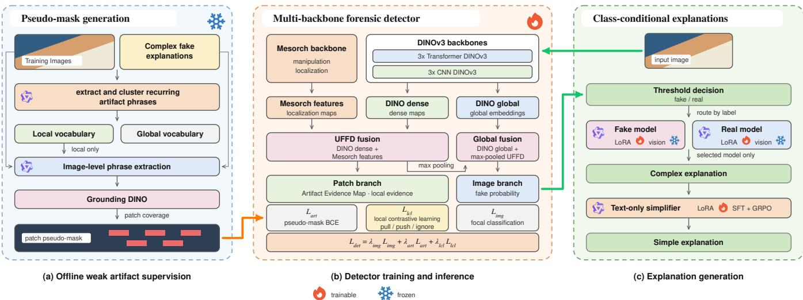
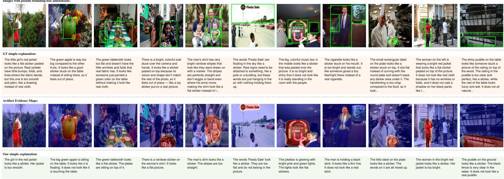

# MSU Team at the Explainable Deepfake Detection Challenge 2026: Grounded Artifact Evidence for Deepfake Detection

Artem Filippov   
Lomonosov Moscow State University Moscow, Russia   
artyom.filippov@graphics.cs.msu.ru

Aleksandr Gushchin MSU Institute for Artificial Intelligence Moscow, Russia alexander.gushchin@graphics.cs.msu.ru

Kirill Koltsov Lomonosov Moscow State University Moscow, Russia kirill.e.koltsov@mail.ru

Dmitriy Vatolin   
MSU Institute for Artificial   
Intelligence   
Moscow, Russia   
dmitriy@graphics.cs.msu.ru   
Anastasia Antsiferova   
MSU Institute for Artificial   
Intelligence   
Moscow, Russia   
aantsiferova@graphics.cs.msu.ru

## Abstract

Recent advances in generative image models have made many manipulated images highly realistic, raising the need for detectors that are not only accurate but also able to provide visual evidence for their decisions. In this paper, we present our solution to the Explainable Deepfake Detection Challenge [2] on the XPlainVerse dataset [1], where systems are required to predict whether an image is real or fake and generate both complex and simple explanations grounded in visible forensic cues.

Our method follows a modular detection-and-explanation design. For the real/fake decision, we build a multi-backbone detector that combines several DINOv3 models with Mesorch manipulationlocalization features, bringing together pretrained visual representations, DCT-aware cues, and multi-scale forensic information. To inject explanation evidence into the detector, we use a Grounding-DINO-based pseudo-mask generation pipeline that converts local artifact descriptions from training explanations into weak patchlevel supervision for an Artifact Evidence Map. We further introduce a local patch-level contrastive objective that separates artifact and authenticity evidence in the detector feature space without requiring paired images or pixel-level manipulation masks. For language output, we use class-conditional Qwen3-VL models to generate complex explanations for fake and real predictions, followed by a GRPO-optimized text simplification model.

The proposed methods were trained and evaluated on the challenge subset of XPlainVerse. On the full test split, our submission achieves 0.9349 detection accuracy, 0.5571 explanation score, and a 0.7456 final challenge score.

## CCS Concepts

• Computing methodologies → Computer vision tasks; Natural language generation; • Security and privacy → Social aspects of security and privacy.

Keywords deepfake detection, explainable AI, image forensics, vision-language models, pseudo-mask supervision, contrastive learning

ACM Reference Format:   
Artem Filippov, Aleksandr Gushchin, Kirill Koltsov, Dmitriy Vatolin, and Anas  
tasia Antsiferova. 2026. MSU Team at the Explainable Deepfake Detection   
Challenge 2026: Grounded Artifact Evidence for Deepfake Detection. In   
Proceedings ofthe 34th ACM International Conference on Multimedia (MM   
’26), November 10–14, 2026, Rio de Janeiro, Brazil. ACM, New York, NY, USA,   
7 pages. https://doi.org/10.1145/3767308.3838609

## 1 Introduction

Recent progress in generative image models has made many manipulated images increasingly realistic and harder to verify. A useful deepfake detector should therefore return not only a binary authenticity label but also evidence supporting the prediction; visible cues help audit model decisions and understand failures.

The Explainable Deepfake Detection Challenge [2] directly targets this setting. It is built on XPlainVerse [1], a large-scale dataset of real and manipulated images with image-level labels, complex explanations for technical users, and simple explanations for general users. The oficial score combines real/fake classification with semantic similarity, simplicity, and LLM-based grounding metrics that check whether explanations refer to the correct entities and visual evidence. This encourages methods that connect the authenticity decision to the image cues described in the explanations.

Our solution separates real/fake detection from explanation generation. For the detector, we follow recent robust AI-generated image detection challenge results, where strong submissions often use ensembles of large pretrained visual backbones, especially DINOv3-based models [3, 4]. We use several DINOv3 backbones and complement them with Mesorch features [5], which provide DCT-aware, multi-scale forensic representations.

To pass artifact information into the detector, we convert local artifact cues from fake-image explanations into weak patch-level pseudo-masks with a Grounding-DINO-based pipeline [6, 7]. These masks encourage the detector to use visible, semantically grounded manipulation evidence when available.

We further adapt contrastive learning to the patch level, following the motivation of DRCT [8] and HiDA-Net [9]: image-level contrastive objectives can improve fake-image separation, while local predictions encourage attention to fine forensic details. Our objective operates on patch embeddings and separates local fake and authentic evidence without paired images or pixel-level manipulation masks.

For explanation generation, we use class-conditional Qwen3- VL models [10] selected by the detector prediction, followed by a text-only simplification model optimized with GRPO [11]. This keeps classification in a specialized detector and uses VLMs for the challenge language outputs.

Our main contributions are (I) a pseudo-mask pipeline that extracts local forensic cues from complex explanations and grounds the corresponding image regions to obtain weak patch-level supervision, and (II) an explainable deepfake detection system combining DINOv3 and Mesorch features, patch-level artifact supervision, local contrastive learning, and class-conditional Qwen3-VL explanation generation.

## 2 Related Work

## 2.1 Datasets

Image-level synthetic-image benchmarks mainly target real/fake classification. GenImage [12] pairs ImageNet real images with GANand difusion-generated counterparts. WildFake [13] contains over 3.5M real and fake images and organizes generators by model family, architecture, weights, and version, while Community Forensics [14] collects 2.7M images from 4,803 text-to-image models. These datasets are valuable for cross-generator generalization, but they mostly contain fully synthetic images and lack the explanation annotations required here.

MultiFakeVerse [15] is closer to realistic misinformation scenarios, with 86,952 real and 758,041 person-centric manipulations involving people, objects, scenes, actions, and human–object interactions. Recent datasets also move toward explainable detection. DD-VQA [16] reformulates face forgery detection over FaceForensics++ [17] as visual question answering. FakeClue, introduced with FakeVLM [18], contains more than 100K real and synthetic images with natural-language artifact explanations. LOKI [19] evaluates multimodal models across images, video, 3D, text, and audio using judgment, multiple-choice, abnormal-detail, and abnormal explanation questions. Their formats, annotation protocols, and artifact distributions nevertheless difer from the challenge data.

## 2.2 Methods

AI-generated image detectors use reconstruction cues, as in AER-OBLADE [20]; CLIP-based adaptation, as in FatFormer [21]; or frequency information, as in SPAI [22]. Recent challenge results show the practical strength of large pretrained backbones and en sembles. The NTIRE 2026 Robust AI-Generated Image Detection Challenge [3] reports strong systems based on transformer ensembles, DINOv3 models [4], robustness augmentation, and fusion, motivating our multi-backbone design.

DRCT [8] applies image-level contrastive learning to separate real, generated, and difusion-reconstructed samples. HiDA-Net [9] emphasizes spatial sensitivity to local edits, showing that local predictions can force attention to subtle forensic details. These ideas motivate our dense features and patch-level objective in addition to global classification.

Manipulation localization is especially relevant when only a small region is fake. TruFor [23] combines RGB evidence with noise-sensitive representations, CAT-Net [24] exploits RGB-DCT compression cues, and Mesorch [5] combines DCT-aware inputs with multi-scale forensic features. We include Mesorch because its frequency-aware, localization-oriented representation complements DINOv3.

Vision-language models are increasingly used for explainable fake-image detection. FakeVLM [18] fine-tunes a multimodal model, including its visual encoder, for detection and artifact explanation. ForenDeX [25] injects detector-guided forensic features into an MLLM, while FakeXplainer [26] combines visual-encoder adaptation, supervised fine-tuning, and GRPO. These works show that VLMs are useful for explanation, but their visual components often need forensic adaptation; we therefore separate a specialized detector from class-conditional explanation generators.

## 3 XPlainVerse Dataset and Challenge Subset

XPlainVerse[1] is the largest dataset for explainable deepfake detection, containing one million real and manipulated images paired with natural-language explanations. A substantial portion of it is based on the person-centric MultiFakeVerse dataset[15]. The Explainable Deepfake Detection Challenge[2] uses a curated 760,000- image subset: 270,000 real and 490,000 fake images. The public train, validation, and test splits contain 450,000, 110,000, and 200,000 images, respectively; labeled train–validation data comprise 180,000 real and 380,000 fake images, and the test split contains 90,000 real and 110,000 fake images.

## 4 Methodology

## 4.1 Pseudo-mask Generation Pipeline

We convert fake-image explanations into patch-level pseudo-masks used as weak artifact supervision. The masks are not pixel-accurate manipulation annotations; they indicate regions where textual evidence and open-vocabulary grounding agree.

Let $I _ { i }$ have image-level label $y _ { i } \in \{ 0 , 1 \}$ , where $y _ { i } = 1$ denotes fake. For fake images, the dataset provides a complex explanation $e _ { i }$ describing the forensic evidence; we use it to derive a pseudo-mask $T _ { i } ~ \in ~ [ 0 , \bar { 1 } ] ^ { H _ { p } \times W _ { p } }$ on the detector patch grid. We do not extract artifact regions for real images and set $T _ { i } \equiv 0 .$ . The pipeline runs ofline for the training and validation splits and has vocabularyconstruction and image-level grounding stages.

4.1.1 Artifact Vocabulary Construction. We first use Qwen3-VL-32B-Instruct [10] on a subset of image–explanation pairs to extract short artifact phrases from each complex explanation. The same model then merges near-duplicates and selects one representative per cluster. The resulting vocabulary is $\mathcal { V } = \{ c _ { 1 } , \ldots , c _ { K } \}$ , where each $c _ { k }$ denotes a recurring artifact category observed in the dataset.

The normalized vocabulary is divided into disjoint local and global subsets, $\mathcal { V } \ : = \ : \mathcal { V } _ { \mathrm { l o c } } \cup \mathcal { V } _ { \mathrm { g l o b } }$ and $\mathcal { V } _ { \mathrm { l o c } } \cap \mathcal { V } _ { \mathrm { g l o b } } ~ = ~ \emptyset$ . Local attributes can be associated with bounded regions, whereas global attributes describe image-wide properties. Only local attributes are grounded, avoiding noisy box supervision for global observations.

  
Figure 1: Overview of the proposed system, including ofline pseudo-mask generation, multi-backbone forensic detection, and class-conditional explanation generation.

4.1.2 Image-level Grounding Phrase Extraction. For each fake image $I _ { i } ,$ Qwen3-VL-32B-Instruct receives the image, its complex explanation $e _ { i } ,$ , and both attribute lists. It selects visually localizable artifacts mentioned or implied by the explanation and produces phrases for Grounding DINO [6, 7]. Formally, it yields $\mathcal { A } _ { i } = \{ a _ { i 1 } , . . . , a _ { i n _ { i } } \}$ with ��� $\in \mathcal { N } _ { \mathrm { l o c } }$ and one phrase $p _ { i k } = g ( a _ { i k } , I _ { i } , e _ { i } )$ per selected attribute. The phrases are concrete visual descriptions, such as an object part associated with the artifact, rather than abstract artifact names.

4.1.3 Grounding and Patch Targets. For each phrase $\phi _ { i k }$ , Grounding DINO returns candidate bounding boxes with confidence scores. Boxes below the confidence threshold are discarded, and all retained boxes are collected in $\mathcal { B } _ { i } = \{ b _ { i 1 } , . . . , b _ { i m _ { i } } \}$ . We merge them into one artifact-evidence support because diferent artifact categories may overlap.

Let the detector grid have size $H _ { p } \times W _ { p }$ , and let $R _ { u v }$ denote the image region corresponding to patch (�, �). The union $\textstyle U _ { i } = \bigcup _ { b \in { \mathcal { B } } _ { i } } b$ defines the grounded support, and the target is the covered fraction of each patch:

$$
t _ { i u v } = \frac { \left| R _ { u v } \cap U _ { i } \right| } { \left| R _ { u v } \right| } , \qquad T _ { i } \left[ u , v \right] = t _ { i u v } , \qquad T _ { i } \in [ 0 , 1 ] ^ { H _ { P } \times W _ { P } } .
$$

Thus, overlapping boxes contribute only once. The image-level label remains the primary supervision; $T _ { i }$ only regularizes the patch-level artifact branch.

## 4.2 Detector

The detector predicts an image-level fake probability and a patchlevel Artifact Evidence Map, and exposes patch embeddings for the local contrastive loss. For image $I _ { i }$ with label $y _ { i } ,$ , it outputs an imagelevel logit $z _ { i } ,$ an Artifact Evidence Map $A _ { i } ,$ and patch embeddings from a shared forensic feature map.

4.2.1 Multi-backbone Features. We combine three transformerbased DINOv3 models [4], three CNN-based DINOv3 models, and a Mesorch manipulation-localization backbone [5]. For every DI-NOv3 backbone, we extract a global image embedding and the last dense feature map:

$$
f _ { i } ^ { ( k ) } \in \mathbb { R } ^ { d _ { k } } , \qquad H _ { i } ^ { ( k ) } \in \mathbb { R } ^ { H _ { p } \times W _ { p } \times c _ { k } } .
$$

The DINO spatial maps are fused by per-backbone projection, concatenation, and an MLP over channels:

$$
\begin{array} { r } { H _ { i } ^ { \mathrm { D I N O } } = F _ { \mathrm { m a p } } ^ { \mathrm { D I N O } } \left( H _ { i } ^ { ( 1 ) } , \ldots , H _ { i } ^ { ( K ) } \right) , \qquad H _ { i } ^ { \mathrm { D I N O } } \in \mathbb { R } ^ { H _ { p } \times W _ { p } \times D } . } \end{array}
$$

The global embeddings are fused analogously:

$$
f _ { i } ^ { \mathrm { { D I N O } } } = F _ { \mathrm { { g l o b } } } ^ { \mathrm { { D I N O } } } \left( f _ { i } ^ { ( 1 ) } , \ldots , f _ { i } ^ { ( K ) } \right) , \qquad f _ { i } ^ { \mathrm { { D I N O } } } \in \mathbb { R } ^ { D } .
$$

We use Mesorch only as a feature extractor: its spatial representation is aligned to the DINO patch grid and projected to dimension $D ,$

$$
\begin{array} { r } { H _ { i } ^ { \mathrm { M e s } } = F _ { \mathrm { M e s } } ( I _ { i } ) , \qquad H _ { i } ^ { \mathrm { M e s } } \in \mathbb { R } ^ { H _ { p } \times W _ { p } \times D } . } \end{array}
$$

4.2.2 UnifiedForensic Feature Map. The DINO and Mesorch spatial representations are fused into a shared patch-level representation called the Unified Forensic Feature Map. At each location (�, �), we concatenate the corresponding vectors and apply an MLP:

$$
U _ { i } [ u , v ] = F _ { \mathrm { U F F M } } \Big ( H _ { i } ^ { \mathrm { D I N O } } [ u , v ] , H _ { i } ^ { \mathrm { M e s } } [ u , v ] \Big ) , \qquad U _ { i } \in \mathbb { R } ^ { H _ { P } \times W _ { P } \times D _ { U } } .
$$

4.2.3 Image-level Classification Branch. The global branch predicts whether the image is fake. We summarize the Unified Forensic Feature Map with max pooling,

$$
u _ { i } ^ { \mathrm { p o o l } } = \operatorname* { m a x } _ { u , v } U _ { i } \left[ u , v \right] .
$$

Max pooling allows localized evidence to afect the image-level decision. The pooled descriptor is concatenated with the fused DINO global embedding, $g _ { i } = [ u _ { i } ^ { \mathrm { p o o l } } ; f _ { i } ^ { \mathrm { D I N O } } ]$ , and passed through an MLP fusion block and binary classifier:

$$
z _ { i } = h _ { \mathrm { c l s } } \big ( F _ { \mathrm { i m g } } ( g _ { i } ) \big ) , \qquad p _ { i } = \sigma ( z _ { i } ) .
$$

Here $\mathscr { P } i$ is the predicted probability that $I _ { i }$ is fake. We train the branch with focal loss using $\alpha = 0 . 5$ and $\gamma = 2 . 0$

4.2.4 Artifact Evidence Map. A shared patch head is applied to the Unified Forensic Feature Map:

$$
a _ { i } [ u , v ] = h _ { \mathrm { a r t } } ( U _ { i } [ u , v ] ) , \qquad q _ { i } [ u , v ] = \sigma ( a _ { i } [ u , v ] ) .
$$

The logits $a _ { i }$ form the Artifact Evidence Map $A _ { i } ,$ and $q _ { i } [ u , v ]$ estimates the probability that patch $( u , v )$ contains artifact evidence. The branch is supervised by $T _ { i }$ with BCE; real-image targets are zero:

$$
\mathcal { L } _ { \mathrm { a r t } } = \frac { 1 } { H _ { \mathcal { P } } W _ { \mathcal { P } } } \sum _ { u , v } \mathrm { B C E } ( q _ { i } [ u , v ] , T _ { i } [ u , v ] ) .
$$

4.2.5 Local Patch-level Contrastive Objective. We use a local contrastive objective over patch embeddings from the Unified Forensic Feature Map. It organizes the patch space so that evidence consistent with fake images becomes more separable from authentic evidence, while uncertain regions are handled conservatively.

Batches contain fake–fake, real–real, and fake–real pairs. For each image pair $\left( { { I _ { a } , I _ { b } } } \right)$ , patches are matched by cosine similarity. For $U _ { a } [ u , v ]$ , the matched patch in $I _ { b }$ is

$$
( u ^ { * } , v ^ { * } ) = \arg \operatorname* { m a x } _ { u ^ { \prime } , v ^ { \prime } } \cos ( U _ { a } [ u , v ] , U _ { b } [ u ^ { \prime } , v ^ { \prime } ] ) ,
$$

and matching is performed in both directions so that visually similar local regions can be compared even when they occur at diferent positions.

Each patch receives a status from the image-level label and current Artifact Evidence Map prediction $q _ { i } [ u , v ]$ . With uncertainty band � around 0.5,

$$
\begin{array} { r l } & { | q _ { i } [ u , v ] - 0 . 5 | \leq \delta \Rightarrow \mathrm { U F } ( y _ { i } = 1 ) , \mathrm { ~ U R } ( y _ { i } = 0 ) , } \\ & { ~ q _ { i } [ u , v ] > 0 . 5 + \delta \Rightarrow \mathrm { C F } ( y _ { i } = 1 ) , \mathrm { ~ W R } ( y _ { i } = 0 ) , } \\ & { q _ { i } [ u , v ] < 0 . 5 - \delta \Rightarrow \mathrm { W F } ( y _ { i } = 1 ) , \mathrm { ~ C R } ( y _ { i } = 0 ) . } \end{array}
$$

The sufix $F / R$ denotes whether the patch comes from a fake or real image, while $C / U / W$ denotes consistent, uncertain, or oppositeside local evidence. In other words, confident local predictions agreeing with the image label are treated as consistent, predictions near 0.5 as uncertain, and confident contradictions as opposite-side evidence. Statuses are based on $q _ { i }$ rather than $T _ { i }$ because pseudomasks may be incomplete.

For every matched patch pair, Tables 1–3 select pull, push, or ignore. Tables 1 and 2 cover same-class image pairs; in Table 3, rows correspond to fake-image patches and columns to real-image patches. Pull minimizes cosine distance,

$$
\ell _ { \mathrm { p u l l } } ( a , b ) = 1 - \cos ( a , b ) ,
$$

while push separates embeddings with margin �,

$$
\ell _ { \mathrm { p u s h } } ( a , b ) = \operatorname* { m a x } ( 0 , m - \left[ 1 - \cos ( a , b ) \right] ) .
$$

Ignored pairs do not contribute, and sg(·) denotes stop-gradient.

The rules treat confident fake artifacts and confident real evidence as reliable anchors. Ambiguous or opposite-side patches are either updated through stop-gradient anchors or ignored, prevent ing uncertain matches from moving both embeddings simultaneously. The local loss over all retained matches is

$$
\mathcal { L } _ { \mathrm { l c l } } = \sum _ { ( a , b ) } \ell _ { a b } ,
$$

Table 1: Local contrastive rules for fake–fake patch pairs.
<table><tr><td></td><td>CF</td><td>UF</td><td>WF</td></tr><tr><td>CF</td><td>pull(CF, CF)</td><td>pull(sg(CF), UF)</td><td></td></tr><tr><td>UF</td><td>pull(UF, sg(CF))</td><td>pull(UF, UF)</td><td>一</td></tr><tr><td>WF</td><td></td><td></td><td>一</td></tr></table>

Table 2: Local contrastive rules for real–real patch pairs.
<table><tr><td></td><td>CR</td><td>UR</td><td>WR</td></tr><tr><td>CR</td><td>pull(CR, CR)</td><td>pull(sg(CR), UR)</td><td>pull(sg(CR), WR)</td></tr><tr><td>UR</td><td>pull(UR, sg(CR))</td><td>pull(UR, UR)</td><td>pull(sg(UR), WR)</td></tr><tr><td>WR</td><td>pull(WR, sg(CR))</td><td>pull(WR, sg(UR))</td><td></td></tr></table>

Table 3: Local contrastive rules for fake–real patch pairs.
<table><tr><td></td><td>CR</td><td>UR</td><td>WR</td></tr><tr><td>CF</td><td>push(CF, CR)</td><td>push(sg(CF), UR)</td><td>push(sg(CF), WR)</td></tr><tr><td>UF</td><td>push(UF, sg(CR))</td><td>push(UF, UR)</td><td>pull(sg(UF), WR)</td></tr><tr><td>WF</td><td></td><td>pull(sg(WF), UR)</td><td>pull(sg(WF), WR)</td></tr></table>

where $\ell _ { a b }$ is the selected pull or push term.

4.2.6 Training Objective. The final detector objective combines image classification, artifact-map supervision, and local contrastive learning:

$$
\mathcal { L } _ { \mathrm { d e t } } = \lambda _ { \mathrm { i m g } } \mathcal { L } _ { \mathrm { i m g } } + \lambda _ { \mathrm { a r t } } \mathcal { L } _ { \mathrm { a r t } } + \lambda _ { \mathrm { l c l } } \mathcal { L } _ { \mathrm { l c l } } .
$$

The terms supervise image classification, weak artifact localization, and patch-space organization.

## 4.3 Class-Conditional Vision-Language Explanation Generation

Natural-language explanations are generated by separate Qwen3- VL-8B-Instruct models [10] selected by the detector prediction. The complex explanation is the evidence-bearing output, while the simple explanation is derived afterward for general users. The module uses $G _ { \mathrm { f a k e } }$ and $G _ { \mathrm { r e a l } }$ for complex explanations and a textonly simplifier �.

4.3.1 Class-conditional Complex Explanation Models. The complex explanation is the primary evidence-bearing text output. We train separate generators for fake and real images to reduce class leakage, especially hallucinated artifacts for real images:

$$
G _ { \mathrm { f a k e } } : I _ { i } \mapsto \hat { e } _ { i , \mathrm { f a k e } } ^ { c } , \qquad G _ { \mathrm { r e a l } } : I _ { i } \mapsto \hat { e } _ { i , \mathrm { r e a l } } ^ { c } .
$$

At inference, only the generator selected by the detector prediction is used.

4.3.2 Supervised Fine-tuning. Both generators are LoRA-adapted from Qwen3-VL-8B-Instruct. LoRA is applied to all linear layers, while the vision tower is frozen to reduce memory cost and preserve the pretrained visual representation. We train on the public labeled data and reserve an internal subset for model selection and qualitative checking. Because real images are less frequent, they are oversampled when training the real-explanation branch.

  
Figure 2: Internal-validation examples. From top to bottom: pseudo boxes, ground-truth simple explanations, Artifact Evidence Maps, and generated simple explanations.

4.3.3 Complex-to-simple Explanation Model. The challenge also requires an explanation for general users. We train a text-only simplifier, $\hat { e } _ { i } ^ { s } = S ( \hat { e } _ { i } ^ { c } )$ , which makes inference and GRPO rollouts cheaper. Real-image complex and simple explanations are often nearly identical, so fake-image pairs provide most of the simplifica tion signal. After supervised fine-tuning, � is optimized with GRPO [11] using the oficial simple-explanation score.

4.3.4 Inference Pipeline. At inference, the detector first predicts $\hat { y } _ { i } = 1 [ p _ { i } \ge \tau ]$ , where � is selected on validation data. This label routes the image to exactly one complex-explanation model:

$$
\hat { e } _ { i } ^ { c } = \left\{ \begin{array} { l l } { G _ { \mathrm { f a k e } } ( I _ { i } ) , } & { \hat { y } _ { i } = 1 , } \\ { G _ { \mathrm { r e a l } } ( I _ { i } ) , } & { \hat { y } _ { i } = 0 , } \end{array} \right. \quad \quad \hat { e } _ { i } ^ { s } = S ( \hat { e } _ { i } ^ { c } ) .
$$

The selected generator produces the complex explanation, which is then passed to the simplifier. The final output is $( \hat { y } _ { i } , \hat { e } _ { i } ^ { c } , \hat { e } _ { i } ^ { s } )$ : the detector supplies the label, the selected VLM the complex explanation, and � the simple explanation.

## 5 Experiments

## 5.1 Detector Ablation

All detector ablations were trained on the public training split and evaluated on the public validation split. Each model was trained for 10 epochs with per-device batch size 4, gradient accumulation over 16 steps, learning rate $5 \times 1 0 ^ { - 4 } .$ cosine decay, warmup ratio 0.03, and maximum gradient norm 1.0. A fixed augmentation pipeline used random 90-degree rotations, horizontal and vertical flips, random resized crop, bicubic resizing, JPEG compression, additive white noise, impulse noise, brightness changes, darkening, and color quantization. Only the three loss weights difered; we report validation AUC for image-level prediction.

Table 4: Detector ablation on the public validation split.
<table><tr><td>Variant</td><td> $\lambda _ { \mathrm { i m g } }$ </td><td> $\lambda _ { \mathrm { a r t } }$ </td><td> $\lambda _ { \mathrm { l c l } }$ </td><td>Val. AUC</td></tr><tr><td>Image-level detector only</td><td>15</td><td>0</td><td>0</td><td>0.8975</td></tr><tr><td>+ pseudo-mask artifact supervision</td><td>15</td><td>1</td><td>0</td><td>0.9139</td></tr><tr><td>+ LCL</td><td>15</td><td>1</td><td>1</td><td>0.9417</td></tr></table>

Adding the Artifact Evidence Map improves AUC over the imagelevel detector, from 0.8975 to 0.9139. This suggests that weak supervision derived from explanation-grounded boxes helps the detector learn localized artifact cues consistent with the textual evidence. The local contrastive loss provides the largest additional gain, raising AUC to 0.9417. This is consistent with its purpose: organizing patch embeddings around local artifact and authenticity evidence can improve the final image-level decision.

For the final submissions, the detector was trained on all available public labeled data rather than only the original training split. Both the pseudo-mask and local contrastive losses were retained.

## 5.2 Explanation Generation Evaluation

We evaluate explanation generation on an internal held-out subset of 10K examples, consisting of 5K real and 5K fake images, using the oficial evaluation script [2]. The metrics include BERTScore-F1 [27] for complex and simple explanations, normalized SLE [28], entity and evidence F1, the simple score, and the final explanation score.

To isolate explanation quality from detector errors, this evaluation uses only generations with the correct final answer. Zero-shot Qwen3-VL uses class-specific prompts, the organizer baseline uses its provided answer-prefill format, and our method uses separate fake and real Qwen3-VL-8B complex-explanation models followed by the GRPO-optimized simplifier.

All models use rank-16 LoRA with alpha 32 and all-linear targets. The complex generators and supervised simplifier are trained for 4 epochs with efective batch size 128 and learning rate $2 \times 1 0 ^ { - 4 }$ . GRPO runs for 1 epoch with efective batch size 32, learning rate $1 0 ^ { - 4 }$ , 32 sampled generations per prompt, and KL coeficient $\beta = 0 . 0 1$

Table 5: Explanation generation evaluation on the internal held-out validation subset. $B _ { c }$ and $B _ { s }$ denote complex and simple BERTScore-F1; $F _ { \mathrm { e n t } }$ and $F _ { \mathrm { e v i d } }$ denote Entity and Evidence $\mathbf { F } \mathbf { 1 } ; L _ { s } , S _ { s } ,$ and $M _ { \mathrm { e x p } }$ denote normalized simple SLE, Simple score, and Explanation score.
<table><tr><td>Method</td><td> $B _ { c }$ </td><td> $F _ { \mathrm { e n t } }$ </td><td> $F _ { \mathrm { e v i d } }$ </td><td> $B _ { s }$ </td><td> $L _ { s }$ </td><td> $S _ { s }$ </td><td> $M _ { \mathrm { e x p } }$ </td></tr><tr><td>Zero-shot Qwen3-VL-253B-A22B-Instruct</td><td>0.6023</td><td>0.5310</td><td>0.3934</td><td>0.4495</td><td>0.3418</td><td>0.4172</td><td>0.4812</td></tr><tr><td>Organizer baseline1</td><td>0.7109</td><td>0.5536</td><td>0.4620</td><td>0.4578</td><td>0.4264</td><td>0.4484</td><td>0.5365</td></tr><tr><td>Ours</td><td>0.7253</td><td>0.6235</td><td>0.5447</td><td>0.4991</td><td>0.9703</td><td>0.6405</td><td>0.6236</td></tr></table>

Table 6: Final submission results on the full final test split.
<table><tr><td>Metric</td><td>Score</td></tr><tr><td>Detection accuracy</td><td>0.9349</td></tr><tr><td>Detection fake F1</td><td>0.9418</td></tr><tr><td>Detection macro F1</td><td>0.9340</td></tr><tr><td>Detection real F1</td><td>0.9261</td></tr><tr><td>Complex BERTScore-F1</td><td>0.7004</td></tr><tr><td>Simple BERTScore-F1</td><td>0.6509</td></tr><tr><td>Normalized SLE</td><td>0.9726</td></tr><tr><td>Entity score</td><td>0.4987</td></tr><tr><td>Evidence score</td><td>0.3932</td></tr><tr><td>Explanation score</td><td>0.5571</td></tr><tr><td>Final challenge score2,3</td><td>0.7456</td></tr></table>

Our explanation pipeline improves all internal metrics. The largest gain is in normalized SLE, from 0.4264 for the organizer baseline to 0.9703, while simple BERTScore also improves. This suggests that direct optimization of the oficial objective produces shorter explanations while preserving semantic alignment. Class conditional generators raise entity F1 from 0.5536 to 0.6235 and evidence F1 from 0.4620 to 0.5447, consistent with improved grounding specialization.

## 5.3 Final Submission Results

We report results on the full final test split, including the detector output and both generated explanations used in the oficial evaluation [2].

The submission reaches 0.9349 detection accuracy and 0.9340 macro F1, with fake and real F1 scores of 0.9418 and 0.9261. Its explanation score is 0.5571, and the combined final challenge score is 0.7456.

## 6 Discussion

The proposed system achieved strong final results in the challenge setting, but it is computationally heavy. It combines several DINOv3 backbones, Mesorch features, and multiple Qwen3-VL models. This complexity is acceptable for a challenge submission, but it makes the method expensive and less attractive for practical deployment.

A key limitation is that the LLM/VLM component is used mostly as an attachment to the detector. The detector first makes the real/fake decision, and the class-conditional Qwen3-VL model then generates an explanation for the predicted class. This improves the challenge-format output, but it does not fully use the reasoning potential of multimodal language models: the VLM does not participate in the authenticity decision, compare alternative hypotheses, or verify detector evidence.

Although GRPO improves the oficial metrics for simple explanations, especially normalized SLE, this does not necessarily mean that they become substantially more useful or accessible to ordinary users.

## 7 Conclusion

We presented a modular solution for explainable deepfake detection trained and evaluated on the XPlainVerse challenge subset [1]. The system combines a multi-backbone forensic detector, explanationgrounded pseudo-mask supervision, local patch-level contrastive learning, class-conditional Qwen3-VL explanation generation, and GRPO-based simplification. On the final test split, it achieved 0.9349 detection accuracy, a 0.5571 explanation score, and a 0.7456 final challenge score.

In validation, ablations indicate that local supervision derived from explanations improves detector generalization, with a further gain from local contrastive learning. GRPO-based simplification also improves the oficial simple-explanation score and contributes to the final result.

## Acknowledgments

The research was carried out using the MSU-270 supercomputer of Lomonosov Moscow State University.

## References

[1] Abhijeet Narang, Kartik Kuckreja, Shreya Ghosh, Muhammad Haris Khan, Jianfei Cai, and Abhinav Dhall. 2026. XPlainVerse: A Million-Scale Benchmark for Explainable Deepfake Detection. arXiv preprint arXiv:2607.03562. https://arxiv. org/abs/2607.03562

[2] Abhijeet Narang, Kartik Kuckreja, Shreya Ghosh, Muhammad Haris Khan, Usman Tariq, Jianfei Cai, and Abhinav Dhall. 2026. Explainable Deepfake Detection Challenge. arXiv preprint arXiv:2607.21007. https://arxiv.org/abs/2607.21007

[3] Aleksandr Gushchin, Khaled Abud, Ekaterina Shumitskaya, Artem Filippov, Georgii Bychkov, Sergey Lavrushkin, Mikhail Erofeev, Anastasia Antsiferova, Changsheng Chen, Shunquan Tan, Radu Timofte, Dmitriy Vatolin, Chuanbiao Song, Zijian Yu, Hao Tan, Jun Lan, Zhiqiang Yang, Yongwei Tang, Zhiqiang Wu, Jia Wen Seow, Hong Vin Koay, Haodong Ren, Feng Xu, Shuai Chen, Ruiyang Xia, Qi Zhang, Yaowen Xu, Zhaofan Zou, Hao Sun, Dagong Lu, Mufeng Yao, Xinlei Xu, Fei Wu, Fengjun Guo, Cong Luo, Hardik Sharma, Aashish Negi, Prateek Shaily, Jayant Kumar, Sachin Chaudhary, Akshay Dudhane, Praful Hambarde, Amit Shukla, Zhilin Tu, Fengpeng Li, Jiamin Zhang, Jianwei Fei, Kemou Li, Haiwei Wu, Bilel Benjdira, Anas M. Ali, Wadii Boulila, Chenfan Qu, and Junch Li. 2026. NTIRE 2026 Challenge on Robust AI-Generated Image Detection in the Wild. In Proceedings ofthe IEEE/CVF Conference on Computer Vision and Pattern Recognition (CVPR) Workshops, 1895–1913.

[4] Oriane Siméoni, Huy V. Vo, Maximilian Seitzer, Federico Baldassarre, Maxime Oquab, Cijo Jose, Vasil Khalidov, Marc Szafraniec, Seungeun Yi, Michaël Rama monjisoa, and others. 2025. DINOv3. arXiv preprint arXiv:2508.10104.

[5] Xuekang Zhu, Xiaochen Ma, Lei Su, Zhuohang Jiang, Bo Du, Xiwen Wang, Zeyu Lei, Wentao Feng, Chi-Man Pun, and Ji-Zhe Zhou. 2025. Mesoscopic insights: orchestrating multi-scale & hybrid architecture for image manipulation localization. In Proceedings of the AAAI Conference on Artificial Intelligence, Vol. 39, No. 10, 11022–11030.

[6] Shilong Liu, Zhaoyang Zeng, Tianhe Ren, Feng Li, Hao Zhang, Jie Yang, Qing Jiang, Chunyuan Li, Jianwei Yang, Hang Su, and others. 2024. Grounding DINO: Marrying DINO with grounded pre-training for open-set object detection. In European Conference on Computer Vision, Springer, 38–55.

[7] Zuwei Long and Wei Li. 2023. Open Grounding Dino: The third party implementation of the paper Grounding DINO. https://github.com/longzw1997/Open-GroundingDino.

[8] Baoying Chen, Jishen Zeng, Jianquan Yang, and Rui Yang. 2024. DRCT: Difusion reconstruction contrastive training towards universal detection of difusion generated images. In Forty-first International Conference on Machine Learning.

[9] Lianrui Mu, Haoji Hu, Zou Xingze, Jianhong Bai, and Jiaqi Hu. 2026. No Pixel Left Behind: A Detail-Preserving Architecture for Robust High-Resolution AI Generated Image Detection. In The Fourteenth International Conference on Learning Representations. https://openreview.net/forum?id=9QQ3Kc2hj6

[10] Shuai Bai, Yuxuan Cai, Ruizhe Chen, Keqin Chen, Xionghui Chen, Zesen Cheng, Lianghao Deng, Wei Ding, Chang Gao, Chunjiang Ge, and others. 2025. Qwen3- VL technical report. arXiv preprint arXiv:2511.21631.

[11] Zhihong Shao, Peiyi Wang, Qihao Zhu, Runxin Xu, Junxiao Song, Xiao Bi, Haowei Zhang, Mingchuan Zhang, YK Li, Yang Wu, and others. 2024. DeepSeekMath: Pushing the limits of mathematical reasoning in open language models. arXiv preprint arXiv:2402.03300.

[12] Mingjian Zhu, Hanting Chen, Qiangyu Yan, Xudong Huang, Guanyu Lin, Wei Li, Zhijun Tu, Hailin Hu, Jie Hu, and Yunhe Wang. 2023. GenImage: A million-scale benchmark for detecting AI-generated image. Advances in Neural Information Processing Systems 36 (2023), 77771–77782.

[13] Yan Hong, Jianming Feng, Haoxing Chen, Jun Lan, Huijia Zhu, Weiqiang Wang, and Jianfu Zhang. 2025. WildFake: A large-scale and hierarchical dataset for AI-generated images detection. In Proceedings ofthe AAAI Conference on Artificial Intelligence, Vol. 39, No. 4, 3500–3508.

[14] Jeongsoo Park and Andrew Owens. 2025. Community forensics: Using thousands of generators to train fake image detectors. In Proceedings ofthe Computer Vision and Pattern Recognition Conference, 8245–8257.

[15] Parul Gupta, Shreya Ghosh, Tom Gedeon, Thanh-Toan Do, and Abhinav Dhall. 2025. Multiverse Through Deepfakes: The MultiFakeVerse Dataset of Person-Centric Visual and Conceptual Manipulations. In Proceedings of the 33rd ACM International Conference on Multimedia (MM ’25), 13258–13265. https://doi.org/ 10.1145/3746027.3758283

[16] Yue Zhang, Ben Colman, Xiao Guo, Ali Shahriyari, and Gaurav Bharaj. 2024. Common sense reasoning for deepfake detection. In European Conference on Computer Vision, Springer, 399–415.

[17] Andreas Rössler, Davide Cozzolino, Luisa Verdoliva, Christian Riess, Justus Thies, and Matthias Nießner. 2019. FaceForensics++: Learning to detect manipulated facial images. In Proceedings ofthe IEEE/CVFInternational Conference on Computer Vision, 1–11.

[18] Siwei Wen, Peilin Feng, Hengrui Kang, Zichen Wen, Yize Chen, Jiang Wu, Conghui He, Weijia Li, and others. 2026. Spot the fake: Large multimodal model-based synthetic image detection with artifact explanation. Advances in Neural Information Processing Systems 38 (2026), 58972–59005.

[19] Junyan Ye, Baichuan Zhou, Zilong Huang, Junan Zhang, Tianyi Bai, Hengrui Kang, Jun He, Honglin Lin, Zihao Wang, Tong Wu, and others. 2025. LOKI: A comprehensive synthetic data detection benchmark using large multimodal models. In International Conference on Learning Representations, Vol. 2025, 70440– 70522.

[20] Jonas Ricker, Denis Lukovnikov, and Asja Fischer. 2024. AEROBLADE: Training free detection of latent difusion images using autoencoder reconstruction error. In Proceedings ofthe IEEE/CVF Conference on Computer Vision and Pattern Recognition, 9130–9140.

[21] Huan Liu, Zichang Tan, Chuangchuang Tan, Yunchao Wei, Jingdong Wang, and Yao Zhao. 2024. Forgery-aware adaptive transformer for generalizable synthetic image detection. In Proceedings of the IEEE/CVF Conference on Computer Vision and Pattern Recognition, 10770–10780.

[22] Dimitrios Karageorgiou, Symeon Papadopoulos, Ioannis Kompatsiaris, and Efstratios Gavves. 2025. Any-resolution AI-generated image detection by spectral learning. In Proceedings of the Computer Vision and Pattern Recognition Conference, 18706–18717.

[23] Fabrizio Guillaro, Davide Cozzolino, Avneesh Sud, Nicholas Dufour, and Luisa Verdoliva. 2023. TruFor: Leveraging all-round clues for trustworthy image forgery detection and localization. In Proceedings of the IEEE/CVF Conference on Computer Vision and Pattern Recognition, 20606–20615.

[24] Myung-Joon Kwon, Seung-Hun Nam, In-Jae Yu, Heung-Kyu Lee, and Changick Kim. 2022. Learning JPEG compression artifacts for image manipulation detection and localization. International Journal ofComputer Vision 130, 8 (2022), 1875–1895.

[25] Chuangchuang Tan, Jinglu Wang, Xiang Ming, Renshuai Tao, Yunchao Wei, Yao Zhao, and Yan Lu. 2026. ForenDeX: Unlocking Forensic Insights for Explainable AI-Generated Image Detection. In Proceedings ofthe IEEE/CVF Conference on Computer Vision and Pattern Recognition, 6592–6601.

[26] Yikun Ji, Yan Hong, Qi Fan, Huijia Zhu, Weiqiang Wang, Liqing Zhang, Jianfu Zhang, and others. 2026. FakeXplain: AI-generated image detection via human aligned grounded reasoning. In The Fourteenth International Conference on Learning Representations.

[27] Tianyi Zhang, Varsha Kishore, Felix Wu, Kilian Q. Weinberger, and Yoav Artzi. 2019. BERTScore: Evaluating text generation with BERT. arXiv preprint arXiv:1904.09675.

[28] Liam Cripwell, Joël Legrand, and Claire Gardent. 2023. Simplicity level estimate (SLE): A learned reference-less metric for sentence simplification. In Proceedings of the 2023 Conference on Empirical Methods in Natural Language Processing, 12053–12059.