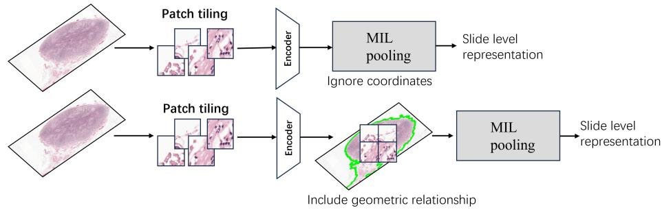
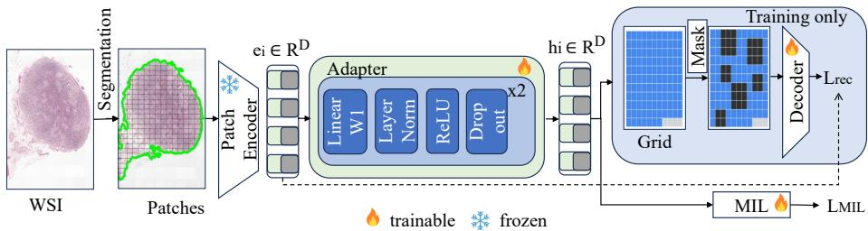
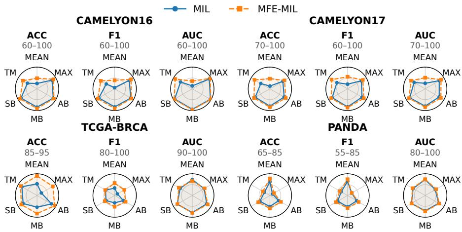
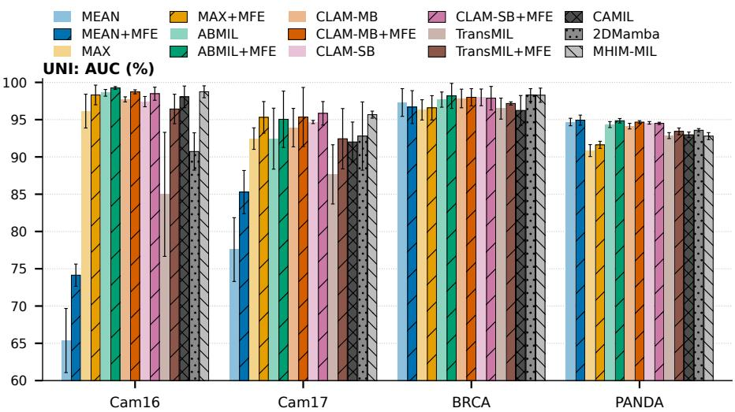
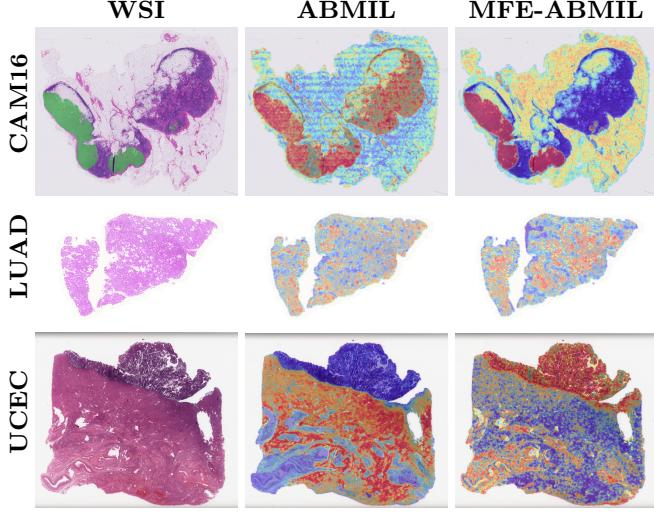

# Masked Feature Encoding for Large-Scale Whole Slide Image Representation

Haoyu He1, Basile Tessier-Cloutier3, Yang Wang1,2, and Mahdi S. Hosseini1,2,3

1 Department of Computer Science and Software Engineering (CSSE), Concordia University, Montreal, Canada

h\_haoy@live.concordia.ca, yang.wang@concordia.ca,

mahdi.hosseini@concordia.ca

Mila – Quebec AI Institute, Montreal, Canada 3 McGill University, Montreal, Canada basile.tessiercloutier@mcgill.ca

Abstract. Whole slide image (WSI) analysis in computational pathology follows a multiple instance learning (MIL) pipeline where patch embeddings are extracted independently and aggregated for slide-level prediction, but within-slide variance from staining, scanner, and local texture can overwhelm the discriminative signal. We propose Masked Feature Encoding for Multiple Instance Learning (MFE-MIL), a feature-space masking framework that trains a lightweight MLP adapter jointly with a window-based masked reconstruction branch and a MIL classification head. The two objectives are complementary. Classification guides the adapter to suppress within-slide patch variance, while window-based masked reconstruction provides an auxiliary regularizer for the adapted features without using patch coordinates, coordinate graphs, or segmentation preprocessing. The raster patch-extraction order is used only as a weak implicit prior. At inference, the decoder is removed, leaving only the adapter and MIL head. Across CAME-LYON16/17, PANDA, and TCGA-BRCA with four diverse encoders, MFE-MIL improves ACC/F1 for nearly all tested aggregator–encoder settings and AUC in most, outperforms coordinate-based spatial methods (CAMIL), and achieves higher AUC than 2DMamba on three of four datasets (UNI). On five TCGA survival cohorts it improves the average concordance index for every aggregator tested, its most consistent gain. Code is available at https://github.com/AtlasAnalyticsLab/MFE-MIL.

## 1 Introduction

In computational pathology (CPath) [8,15,29], Whole Slide Image (WSI) classification is typically achieved through Multiple Instance Learning (MIL) [24, 31], where a frozen encoder extracts patch-level embeddings, and an aggregator combines them into a slide-level prediction. Most MIL methods treat patches as an unordered set, so each embedding is computed in isolation and carries withinslide variation (staining, scanner, local texture) that can mask the diagnostic signal (Fig. 1).

  
Fig. 1: Top: Standard MIL aggregates independently embedded patches whose features carry high within-slide variance. Bottom: MFE-MIL adapts the patch features and regularizes them with masked reconstruction over neighbouring packed features, giving a more discriminative slide-level representation.

Recent spatially aware MIL methods try to close this gap by incorporating explicit structural priors such as coordinate grids, topology graphs, or segmentation masks [11, 12, 32, 37], but require tight encoder-aggregator coupling that reduces compatibility with standard frozen-feature pipelines. We propose MFE-MIL, built on the hypothesis that high within-slide variance in independently computed patch embeddings, rather than missing spatial priors, limits MIL aggregators. An architecture-agnostic MLP adapter, jointly trained with MIL classification and a window-based masked reconstruction objective, learns slide-coherent representations: the MIL classification objective drives the adapter to suppress within-slide patch variance, while the window MFE pretext task acts as an auxiliary reconstruction regularizer on the compressed space, giving all aggregators a cleaner discriminative signal (Fig. 2). Unlike MAE-based CPath approaches, the reconstruction acts at fine-tuning time rather than during backbone pretraining (Sec. 2).

## Contributions:

– We introduce MFE-MIL, a plug-and-play masked feature reconstruction framework for frozen-encoder MIL pipelines that requires no patch coordinates at either training or inference: it packs features in tissue-extraction order and applies windowed masked reconstruction as a lightweight regularizer, treating raster order only as a weak implicit prior.

– We characterize the underlying mechanism. Classification suppresses withinslide patch variance, while window-based masked reconstruction further regularizes the adapted features. Controlled experiments using shufled order, true coordinates, 1D masking, distance-matched masking, and single-token masks show that improvements in feature coherence do not consistently depend on the spatial arrangement of the mask, although standard window masking achieves the highest AUC on CAMELYON16.

– Across CAMELYON16/17, PANDA, and TCGA-BRCA with four encoders and six aggregators, MFE-MIL improves ACC/F1 in nearly all settings, outperforms CAMIL without coordinate graphs, and measurably sharpens tumour localization (ABMIL attention-localization AUROC 0.879 → 0.942 against CAMELYON16 annotations); gains are largest for the weakest-baseline aggregators, consistent with the variance-suppression mechanism.

## 2 Related Work

MIL in CPath. MIL treats a WSI as a bag of patch embeddings with only slide-level supervision [24, 31]. Aggregation methods range from simple pooling to attention-based aggregation (ABMIL [16], CLAM [24]) and interaction-aware variants such as DSMIL [20], TransMIL [28], and DTFD-MIL [36]. However, most methods operate on patches primarily as an unordered set, leaving spatial relationships between tissue regions largely unexploited. This is particularly limiting for WSI analysis, where diagnostically relevant patterns can depend on the spatial organization and local context of tissue regions.

Spatially aware MIL. Recent methods incorporate explicit spatial priors via coordinate-aware or topology-aware modeling [12,32,37,39] or segmentation priors [11]. These methods often require additional preprocessing (e.g., coordinates, graphs, segmentation [19]) or specialized architectural coupling, reducing plugand-play compatibility with existing frozen-feature pipelines; graph-based variants (e.g., WiKG [21]) and recent expert-clustering methods [26] add further context modules but still require graph or clustering construction. MFE-MIL takes a diferent approach, where a masked-reconstruction objective regularizes the adapted features rather than baking spatial priors into the architecture, so the aggregator interface remains unchanged.

Foundation models for pathology. Pathology-pretrained encoders such as CONCH [23], UNI [6], ViT-S/16-SSL [18], GigaPath [34], PRISM [27], and TI-TAN [9] have become a common starting point for WSI analysis. In standard pipelines, these encoders are kept frozen and task-specific MIL aggregators are trained on the resulting patch embeddings. This setting avoids the substantial cost of retraining large foundation models while allowing the downstream model to adapt the representations to the target task. MFE-MIL is fully compatible with this frozen-encoder setup and requires no backbone retraining.

Masked autoencoders and auxiliary tasks. MAE-style pretraining [14], selfsupervised feature learning [25], and masked-reconstruction pre-training [22, 33] are widely used in CPath, but typically shape a generic representation during backbone pretraining rather than a task-aligned one. MFE-MIL applies masked feature reconstruction jointly with MIL classification at fine-tuning time. The most closely related prior work is MHIM-MIL [30], which introduces masking during MIL training but selects patches by attention score (hard instance mining), whereas MFE-MIL masks contiguous blocks. As we show in Sec. 4.7, this masked-reconstruction objective acts as a regularizer whose efect on feature coherence does not reliably depend on the spatial arrangement or grouping of the mask; the coherence gap is comparable across shufled-order, true-coordinate, 1D, distance-matched, and single-token controls.

  
Fig. 2: Overview of MFE-MIL. Patch features $e _ { i }$ from a frozen encoder are mapped by a trainable two-block MLP adapter (Linear–LayerNorm–ReLU–Dropout, $\times 2 )$ to $h _ { i }$ The adapted features feed a MIL head, trained with ${ \mathcal { L } } _ { \mathrm { M L L } }$ , and, during training only, a reconstruction branch: features are packed in extraction order into a grid, contiguous windows are masked, and a Transformer decoder reconstructs the ℓ2-normalized frozen embeddings $\bar { e } _ { i }$ of the masked patches $( { \mathcal { L } } _ { \mathrm { r e c } } ;$ dashed arrow: reconstruction target). No patch coordinates are used, and the decoder is discarded at inference.

## 3 Methodology

High within-slide patch variance (staining, scanner, local texture) can overwhelm the discriminative signal, and frozen encoders further encode physical artifacts (folds, pen marks, bubbles) as distinctive, drawing attention to non-pathological regions. Rather than encoding space architecturally as prior methods do [12], MFE-MIL shapes the feature space through the training objective: the MIL classification loss compresses within-slide variance, and a jointly optimized windowbased masked-reconstruction pretext task provides an auxiliary reconstruction regularizer on the adapted features. The attention entropy in Tab. 5 shows that this compression sharpens tumour attention rather than flattening it.

Overall architecture. Given a WSI bag $\mathcal { X } = \{ x _ { i } \} _ { i = 1 } ^ { N }$ , a frozen pretrained encoder $f _ { \mathrm { e n c } }$ produces patch embeddings $e _ { i } = f _ { \mathrm { e n c } } ( x _ { i } ) ;$ ; a two-layer MLP adapter gθ maps these into a task-specific latent space feeding two branches:

$$
\underbrace { h _ { i } = g _ { \theta } ( e _ { i } ) } _ { \mathrm { a d a p t e r } } , \quad \underbrace { \hat { \tilde { H } } = f _ { \mathrm { d e c } } ( \tilde { H } ^ { \prime } , M , P ) } _ { \mathrm { r e c o n s t r u c t i o n ~ ( t r a i n ~ o n l y ) } } , \quad \underbrace { \hat { Y } = f _ { \mathrm { c l a s s } } ( f _ { \mathrm { a g g } } ( H ) ) } _ { \mathrm { M I L ~ h e a d } } .\tag{1}
$$

The decoder is discarded at inference, leaving only the adapter and MIL head. Task-aware MLP adapter. In the spirit of parameter-eficient fine-tuning [13, 35], the adapter is a two-block MLP, $g _ { \theta } = \phi _ { 2 } \circ \phi _ { 1 }$ , where each block applies a linear layer, layer normalization, ReLU, and dropout:

$$
\begin{array} { r } { \phi _ { k } ( x ) = \mathrm { D r o p o u t } _ { 0 . 2 5 } \big ( \mathrm { R e L U } \big ( \mathrm { L N } ( W _ { k } x + b _ { k } ) \big ) \big ) , \qquad W _ { k } \in \mathbb { R } ^ { D \times D } , } \end{array}\tag{2}
$$

where D is the frozen encoder output dimension (384, 512, 1024, and 1024 for ViT-S/16-SSL, CONCH, UNI, and $\mathrm { V i T - L } / 1 6 \mathrm { - I N 2 1 K } )$ . The adapter preserves the feature dimension $( d = D )$ , so it is a drop-in replacement with no architectural change downstream; for UNI it adds 2.1M parameters.

The decoder reconstructs the ℓ -normalized frozen embeddings $\bar { e } _ { i } = e _ { i } / \| e _ { i } \| _ { 2 }$ 2 of the masked patches from the adapted features of the visible ones. The target is a fixed function of the frozen encoder and does not change during training, so the reconstruction loss cannot be reduced by collapsing the adapter output: if all $h _ { i }$ were a constant, the decoder could not recover the varying targets and ${ \mathcal { L } } _ { \mathrm { r e c } }$ would stay high. The adapter must therefore keep enough information to predict masked features, while the classification loss shapes the same representation toward class-discriminative directions. The reconstruction branch takes the normalized embeddings $\bar { e } _ { i }$ as adapter input, whereas the MIL branch takes the unnormalized $e _ { i }$

Packed grid and masked reconstruction. Given bag $\mathcal { X } = \{ x _ { i } \} _ { i = 1 } ^ { N }$ , the frozen encoder produces embeddings $e _ { i }$ and the adapter produces $H = [ h _ { 1 } , \ldots , h _ { N } ] ^ { \top }$ The reconstruction grid is built without patch coordinates: the N adapted features are packed in tissue-extraction order into a square grid of side $R = C =$ $\lceil \sqrt { N } \rceil$ 2

$$
\tilde { H } \big [ \lfloor k / C \rfloor , ~ k \mathrm { m o d } ~ C , : \big ] = h _ { k } , \qquad k = 0 , \ldots , N - 1 ,\tag{3}
$$

giving $\tilde { H } \in \mathbb { R } ^ { R \times C \times d }$ (the reconstruction branch packs $\bar { h } _ { k } = g _ { \theta } ( \bar { e } _ { k } )$ in place of $h _ { k } ) ;$ the trailing $R { \cdot } C { - } N$ cells are zero-padded. Patches are extracted in raster order over the tissue contour, so cells that are adjacent within a row are often physically adjacent on the slide. This coordinate-free packing therefore preserves only partial locality: measured against the true patch coordinates, within-row precision is 0.89–0.97 across datasets and across-row precision is below 0.05 (see the supplementary material), since the correspondence breaks down across rows, at row wraps, and at irregular tissue boundaries. The pipeline uses no patch coordinates at either training or inference; we show in Sec. 4.7 that the resulting regularization does not reliably depend on the spatial arrangement of the mask.

The decoder receives fixed 2D sine-cosine positional embeddings

$$
P _ { r , c } = \mathrm { S i n C o s 2 D } ( r , c ) \ \in \ \mathbb { R } ^ { d _ { \mathrm { d e c } } }\tag{4}
$$

for each grid cell, where $d _ { \mathrm { d e c } } = 5 1 2$ is the decoder width. Applying structured mask $M \in \{ 0 , 1 \} ^ { \check { R } \times C }$ gives

$$
\tilde { H } ^ { \prime } = \mathrm { M a s k } ( \tilde { H } , M ) , \quad \hat { \tilde { H } } = f _ { \mathrm { d e c } } ( \tilde { H } ^ { \prime } , M , P ) .\tag{5}
$$

The reconstruction loss is the mean squared error between the decoder output and the normalized frozen embeddings $\bar { E } \in \mathbb { R } ^ { R \times C \times D }$ (packed like $\tilde { H } )$ over the masked positions M:

$$
\mathcal { L } _ { \mathrm { r e c } } = \frac { 1 } { \left| \mathcal { M } \right| D } \sum _ { ( i , j ) \in \mathcal { M } } \big | \big | \bar { E } _ { i , j , : } - \hat { \tilde { H } } _ { i , j , : } \big | \big | _ { 2 } ^ { 2 } ,\tag{6}
$$

where $\mathcal { M }$ denotes the masked cells that hold a real patch; zero-padded cells may be masked but are excluded from $\mathcal { M } .$ , so the decoder is never asked to reconstruct absent tissue.

Window-based adaptive masking. To prevent the decoder from trivially interpolating from immediately adjacent patches, we mask blocks that are contiguous in the packed grid rather than individual tokens. We define a square window of radius w centered at grid cell $( p , q )$

$$
\begin{array} { c } { { \mathcal { W } ( p , q , w ) = \{ ( i , j ) : | i - p | \leq w , | j - q | \leq w \} , } } \\ { { | \mathcal { W } | = ( 2 w + 1 ) ^ { 2 } , } } \end{array}\tag{7}
$$

and build M in two phases. First, non-overlapping windows of radius $w \in \{ 1 , 2 \}$ $( \mathrm { i . e . , 3 { \times } 3 }$ or 5×5 blocks, chosen uniformly at random) are placed at random grid positions until they cover about 80% of the masking budget $N _ { \mathrm { t a r g e t } } = \lfloor r \cdot R C \rfloor$ ， where RC is the number of cells of the packed grid. The remaining cells are then masked individually $( w = 0 )$ to reach the budget exactly. Masking whole blocks of the packed grid makes the pretext task harder than masking single cells, and empirically gives the best AUC (Tab. 2).

This two-phase strategy (illustrated in the supplementary material) outperforms any fixed window size (Tab. 2). We set $r = 7 5 \%$ following MAE [14].

Decoder architecture. The decoder $f _ { \mathrm { d e c } }$ is a lightweight Transformer with a fixed hidden width $d _ { \mathrm { d e c } } = 5 1 2$ independent of D. A linear layer maps the D-dimensional adapted features to $d _ { \mathrm { d e c } } ,$ , four Transformer blocks (16 attention heads of dimension 32, feedforward $5 1 2  2 0 4 8  5 1 2 , { \mathrm { ~ i . e . } }$ , ratio 4) process the tokens, and a final LayerNorm and linear layer map back to $D$ dimensions. This amounts to about 13.7M parameters for $D = 1 0 2 4$ (13.0M for ViT-S and 13.1M for CONCH). Before decoding, each masked grid cell is replaced by a learned [MASK] token to separate known from unknown positions. The 2D positional embeddings P are added to all tokens so the decoder can use absolute grid location during reconstruction.

Joint training objective. The MIL head aggregates adapted features for baglevel prediction: $z = f _ { \mathrm { a g g } } ( H ) , \quad \hat { Y } = f _ { \mathrm { c l a s s } } ( z )$ . The total objective balances classification and reconstruction: $\mathcal { L } _ { \mathrm { t o t a l } } = \left( 1 - \lambda _ { \mathrm { r e c } } \right) \mathcal { L } _ { \mathrm { M I L } } + \lambda _ { \mathrm { r e c } } \mathcal { L } _ { \mathrm { r e c } }$ , where $\lambda _ { \mathrm { r e c } } = 0 . 3$ is chosen from {0.1, 0.2, 0.3} (supplementary). Only the MLP adapter, decoder, and MIL head are updated; the foundation encoder is frozen. The MIL branch never uses decoder outputs, so discarding the decoder causes no train–test mismatch; Tab. 4 is computed on adapter outputs alone. We evaluate $f _ { \mathrm { a g g } }$ as: mean/max pooling, ABMIL [16], CLAM-SB and CLAM-MB [24], and Trans-MIL [28]. The full training procedure is summarized in the supplementary material.

Plug-and-play aggregator compatibility. The adapter maps each patch independently and keeps its dimension, so any aggregator that consumed $\left\{ e _ { i } \right\}$ can consume $\{ h _ { i } \}$ unchanged. At inference the pipeline is encoder $\xrightarrow { \mathrm { f r o z e n } } { e _ { i } } $ $h _ { i } \xrightarrow { f _ { \mathrm { a g g } } } \zeta \xrightarrow { f _ { \mathrm { c l a s s } } } \hat { Y }$ , with no decoder, whereas coordinate-based methods such as CAMIL need explicit spatial inputs.

  
Fig. 3: ACC / F1 / AUC (%) for six MIL aggregators without (solid) and with (dashed) MFE-MIL (UNI). Each dataset is a group of three radars; top: CAME-LYON16, CAMELYON17; bottom: TCGA-BRCA, PANDA. AB = ABMIL, MB = CLAM-MB, SB = CLAM-SB, TM = TransMIL. Each radar has its own range (printed above it). Means over 3 splits × 5 seeds; details in the supplementary.

## 4 Experiments

## 4.1 Experimental Setup

Datasets. CAMELYON16 [4] (400 WSIs, tumour detection), CAMELYON17 [3] (500 WSIs, ITC/micro/macro grouped as positive), PANDA [5] (10,614 prostate biopsies, 6 Gleason grades, 8:1:1), TCGA-BRCA [1] (1,033 slides, IDC vs. ILC, 8:1:1). Five TCGA cohorts [1] (KIRC, KIRP, LUAD, STAD, UCEC) are used for survival. All WSIs are tiled into 256×256 patches at 20× with tissue detection and patch extraction performed by AtlasPatch [2]. All splits are made at the patient (case) level, so slides from the same patient never span splits. All experiments use a 3 splits × 5 seeds setting, and on CAMELYON16 the oficial 128-slide test set is held fixed across all runs.

Encoders. Pathology-pretrained UNI [6], CONCH [23], and ViT-S/16-SSL [18], plus general-purpose ViT-L/16-IN21K [10].

Baselines. CAMIL, 2DMamba, and MHIM-MIL were run with their oficial default hyperparameters on the same split and run protocol. All methods use identical frozen features.

Implementation. Classification models are trained with Adam $( \mathrm { l r ~ 1 } \times 1 0 ^ { - 4 }$ no weight decay) for up to 200 epochs with early stopping on validation AUC (patience 10; macro one-vs-rest AUC for PANDA), one slide per step (batch size 1), class-balanced sampling of training slides, fp16 mixed precision, masking ratio $r = 7 5 \%$ , and $\lambda _ { \mathrm { r e c } } { = } 0 . 3$ . Survival models use Adam $( \mathrm { l r 2 } { \times } 1 0 ^ { - 4 }$ , weight decay

$1 \times 1 0 ^ { - 5 } )$ with gradient accumulation over 32 slides and up to 20 epochs with early stopping on validation C-index (patience 5). No learning-rate schedule is used, and all runs use a single NVIDIA H100.

Metrics. Slide-level ACC / macro-F1 / AUC (one-vs-rest for PANDA’s six grades), and C-index for survival.

## 4.2 Survival Prediction

We first evaluate MFE-MIL on survival prediction, an established weakly-supervised WSI task typically addressed with attention-MIL or multimodal histology–genomics models [7, 17]: the MIL head is substituted with a discrete-time hazard output over four survival-time bins, trained with the negative log-likelihood survival loss, with the adapter and reconstruction branch otherwise unchanged. Tab. 1 reports concordance index (C-index) on the five TCGA cohorts (UNI embeddings) for each aggregator with and without MFE-MIL. Among the spatially aware baselines, only 2DMamba is reported here: CAMIL and SETMIL provide no survival-prediction implementation, so they are excluded from this task.

MFE-MIL improves the average C-index (Tab. 1, AVG column) for every one of the six aggregators tested, making it the most consistent result in this paper. Every MFE-MIL variant also exceeds the average C-index of the spatially aware 2DMamba (0.699–0.714 versus 0.695), without using patch coordinates. Paired t-tests over all cohort and aggregator pairs confirm the overall improvement is statistically significant $\left( p < 0 . 0 5 \right)$ . The largest gains are on UCEC and KIRP, two cohorts with difuse prognostic signals; STAD gains are small or negative for high-baseline aggregators, while MAX, with the lowest STAD baseline, gains 0.081. However, MAX’s baseline C-index is near-chance on KIRP, LUAD and STAD, so its large gains mainly reflect fixing a weak baseline; the smaller, consistent gains on ABMIL, CLAM-MB, and CLAM-SB are the more informative signal. On KIRC most aggregators plateau; the exceptions are MAX and CLAM-MB, which rise 0.047 and 0.011, and TransMIL, which drops 0.015, likely because compressing within-slide variance reduces the per-patch diversity that its long-range self-attention relies on.

## 4.3 Classification Results

Fig. 3 reports per-aggregator ACC/F1/AUC on all four datasets with UNI embeddings, and Fig. 4 shows the AUC of all six aggregators next to the spatially aware baselines CAMIL [12] and 2DMamba [37] and the masking-based MHIM-MIL [30]. The CONCH counterpart and full numerical results for all four encoders are in the supplementary (SETMIL [39] is omitted, as it failed to converge on CAMELYON16/17 with these encoders).

MFE-MIL improves ACC and F1 for every aggregator under the UNI and CONCH encoders and in nearly all ViT-L/ViT-S settings, with gains largest where the baseline is weakest; paired t-tests over 15 runs are significant on CAMELYON16, CAMELYON17, and PANDA $\left( p < 0 . 0 5 \right)$ but not on TCGA-BRCA $( p = 0 . 1 9 )$ . Against spatially aware baselines, MFE-MIL beats CAMIL on all four datasets without coordinate graphs at inference, and by AUC the best MFE variant leads 2DMamba on all but TCGA-BRCA (within one std); MFE-ABMIL beats MHIM-MIL on ACC and F1 across all datasets and both encoders, and on AUC for two of four datasets under each encoder. AUC regressions are rare and small (at most 0.8 points), mostly on near-ceiling TCGA-BRCA, where UNI baseline AUC is already 96.3–98.0% for every aggregator, leaving too little headroom for a gain to reach significance.

Table 1: Survival prediction C-index on five TCGA cohorts (UNI embeddings). Results averaged over 3 splits × 5 seeds (15 runs per cell). Best result per column in bold; second best underlined.
<table><tr><td>Method</td><td></td><td>KIRC</td><td>KIRP</td><td>LUAD</td><td>STAD</td><td>UCEC</td><td>AVG</td></tr><tr><td>MEAN</td><td>MIL</td><td>0.749</td><td>0.814</td><td>0.594</td><td>0.651</td><td>0.681</td><td>0.698</td></tr><tr><td></td><td>+MFE</td><td>0.748</td><td>0.835</td><td>0.612</td><td>0.642</td><td>0.728</td><td>0.713</td></tr><tr><td>MAX</td><td>MIL</td><td>0.708</td><td>0.552</td><td>0.538</td><td>0.532</td><td>0.644</td><td>0.595</td></tr><tr><td></td><td>+MFE</td><td>0.755</td><td>0.805</td><td>0.589</td><td>0.613</td><td>0.734</td><td>0.699</td></tr><tr><td>ABMIL</td><td>MIL</td><td>0.740</td><td>0.821</td><td>0.601</td><td>0.639</td><td>0.608</td><td>0.682</td></tr><tr><td></td><td>+MFE</td><td>0.741</td><td>0.829</td><td>0.608</td><td>0.622</td><td>0.742</td><td>0.708</td></tr><tr><td>CLAM-MB</td><td>MIL</td><td>0.736</td><td>0.814</td><td>0.594</td><td>0.659</td><td>0.680</td><td>0.697</td></tr><tr><td></td><td>+MFE</td><td>0.747</td><td>0.840</td><td>0.598</td><td>0.661</td><td>0.725</td><td>0.714</td></tr><tr><td>CLAM-SB</td><td>MIL</td><td>0.742</td><td>0.820</td><td>0.595</td><td>0.644</td><td>0.659</td><td>0.692</td></tr><tr><td></td><td>+MFE</td><td>0.739</td><td>0.844</td><td>0.598</td><td>0.636</td><td>0.726</td><td>0.708</td></tr><tr><td>TransMIL</td><td>MIL</td><td>0.732</td><td>0.807</td><td>0.573</td><td>0.623</td><td>0.706</td><td>0.688</td></tr><tr><td></td><td>+MFE</td><td>0.717</td><td>0.865</td><td>0.581</td><td>0.611</td><td>0.740</td><td>0.703</td></tr><tr><td>2DMamba</td><td></td><td>0.741</td><td>0.800</td><td>0.596</td><td>0.654</td><td>0.683</td><td>0.695</td></tr></table>

On the general-purpose ViT-L/16-IN21K and the smaller pathology-pretrained ViT-S/16-SSL encoders (full results in the supplementary), MFE-MIL’s gains are larger than on UNI and CONCH (e.g., ViT-L ABMIL CAMELYON17 AUC 78.7→82.8), consistent with weaker features carrying more within-slide variance to suppress. MFE-MIL also exceeds the recent ACMIL [38] aggregator on AUC across all four datasets (supplementary).

The supplementary UNI table isolates the reconstruction branch using a classification-only adapter (frozen → adapter → +MFE). For ABMIL, CLAM-MB, and CLAM-SB, the adapter alone is inconsistent relative to frozen features, while adding reconstruction improves AUC in every case, most notably on CAMELYON16/17 and more modestly on near-saturated PANDA; for MAX it is slightly lower on CAMELYON16/17 (98.62→98.31, 95.53→95.31).

## 4.4 Computational Cost

At inference on CAMELYON16 (UNI), with the decoder discarded, MFE-MEAN adds only 2.1M parameters over MEAN (2.63M versus 0.53M) and 0.12 GB of peak memory (0.60 versus 0.48 GB), raising per-slide inference from 0.010 to 0.049 s (an aggregator-independent MLP overhead). By contrast, CAMIL needs 14.60 GB and 0.353 s for graph construction, and 2DMamba 4.60 GB and 0.082 s. Training adds the reconstruction decoder (13.7M parameters), which raises perepoch time and peak training memory by ∼6× on CAMELYON16 and end-toend training time by ${ \sim } 2 1 { \times } ;$ this is a one-time cost, as the decoder is discarded at inference.

  
Fig. 4: AUC (%) for all six MIL aggregators (light = base, dark hatched = +MFE-MIL), the spatial baselines CAMIL and 2DMamba, and the masking-based MHIM-MIL (gray), using UNI embeddings. Error bars: standard deviation over 3 splits × 5 seeds; Y-axis truncated. ACC/F1 and the other encoders are in the supplementary.

## 4.5 Ablation Studies

All ablations use PANDA with UNI embeddings. Reported AUC values use three pre-defined splits × 5 seeds.

Adapter depth and masking strategy. Capacity alone does not explain the gain (Tab. 2, top block): MIL-only AUC is non-monotonic in depth and never reaches depth-2 MFE-MIL’s performance; adding reconstruction improves every depth, and depth-2 MFE-MIL (our full model) is best overall, though CLAM-SB peaks at depth-1, likely because its single attention branch saturates at lower adapter capacity while deeper adapters slightly overfit its instance loss. Masking granularity also matters for AUC (Tab. 2, bottom block): random single-token and $3 \times 3$ masking stall at 93.56 avg. AUC, a fixed $5 \times 5$ window reaches 93.88, and adaptive multi-scale window masking is best, preventing the decoder from exploiting any single predictable block size.

Reconstruction loss weight. $\lambda _ { \mathrm { r e c } } = 0 . 3$ achieves the best average AUC on PANDA across all MIL heads among the values tested (0.1, 0.2, 0.3; supplementary material).

Simple normalization baseline. A per-slide z-score normalization control does not replicate the learned adapter: it leaves attention entropy indistinguishable from frozen features (0.982 versus 0.985) and makes the coherence ratio numerically unstable (supplementary).

WSI  
Table 2: Ablations on PANDA (UNI), AUC (%). Top block: adapter depth (MIL-only vs. MFE, layers 0–2; depth 0 = no adapter) at adaptive-window masking; depth-2 MFE is our full model. Bottom block: masking strategy at depth-2 (Window = depth-2 MFE). Best per column within each block in bold.
<table><tr><td>Setting</td><td>MEAN</td><td>MAX</td><td>AB</td><td>MB</td><td>SB</td><td>Avg</td></tr><tr><td>MIL, 0</td><td>94.68</td><td>90.85</td><td>94.34</td><td>94.13</td><td>94.57</td><td>93.71</td></tr><tr><td>MIL, 1</td><td>94.52</td><td>91.02</td><td>94.37</td><td>94.22</td><td>94.60</td><td>93.75</td></tr><tr><td>MIL, 2</td><td>94.27</td><td>91.10</td><td>94.23</td><td>94.24</td><td>94.21</td><td>93.61</td></tr><tr><td>MFE, 0</td><td>94.82</td><td>91.39</td><td>94.52</td><td>94.19</td><td>94.70</td><td>93.92</td></tr><tr><td>MFE, 1</td><td>94.37</td><td>91.25</td><td>94.56</td><td>94.31</td><td>94.89</td><td>93.88</td></tr><tr><td>MFE, 2</td><td>94.93</td><td>91.62</td><td>94.85</td><td>94.67</td><td>94.50</td><td>94.11</td></tr><tr><td>Single-token</td><td>94.58</td><td>90.71</td><td>93.95</td><td>94.21</td><td>94.37</td><td>93.56</td></tr><tr><td>Small (3 × 3)</td><td>94.20</td><td>91.21</td><td>94.03</td><td>94.13</td><td>94.24</td><td>93.56</td></tr><tr><td>Large (5×5)</td><td>94.39</td><td>91.63</td><td>94.14</td><td>94.42</td><td>94.84</td><td>93.88</td></tr><tr><td>Window (ours)</td><td>94.93</td><td>91.62</td><td>94.85</td><td>94.67</td><td>94.50</td><td>94.11</td></tr></table>

ABMIL  
MFE-ABMIL  
  
Fig. 5: ABMIL attention without and with MFE-MIL (UNI; blue = low, red = high). On CAMELYON16 the baseline attends to a tissue-fold artifact; MFE-MIL attends to the tumour. TCGA-LUAD and UCEC are where the pathologist saw the clearest improvement; all cohorts (including exceptions) and CLAM heads are in the supplementary.

## 4.6 Qualitative Evaluation

For the qualitative study, a single board-certified pathologist (unblinded, using a qualitative rubric; not a quantitative validation) reviewed 10 randomly selected WSIs from each of the five TCGA survival cohorts (KIRC, KIRP, LUAD, STAD, UCEC) together with their attention maps; Fig. 5 shows examples (all cohorts and aggregators in the supplementary). The pathologist assessed how well attention focused on the lesion, whether the high-attention areas within the lesion correlated with known pathology features, and how much attention fell on background regions of low pathological value. Attention maps varied with both task and dataset. Overall, MFE-MIL placed higher attention on lesion regions and showed better visual agreement with pathologist-identified tissue features. This was most evident on the TCGA-LUAD and UCEC cohorts; KIRC and STAD were the exceptions, while on KIRP the two models produced similar maps.

Table 3: Attention localization against CAMELYON16 tumour annotations (UNI; the 48 of the 49 tumour test slides with usable pixel-level annotations). AUROC: patch-level attention weight vs. annotation label; Pointing: fraction of slides whose top-attended patch lies inside the annotation; Top-50: fraction of top-50 attention mass inside the annotation. Better value of each MIL / +MFE pair in bold. Per-slide AUROC used for the paired significance test (text) is defined on n=43 of these slides.
<table><tr><td>Aggregator</td><td>Variant</td><td>AUROC</td><td>Pointing</td><td>Top-50</td></tr><tr><td>ABMIL</td><td>MIL</td><td>0.879</td><td>0.688</td><td>0.598</td></tr><tr><td></td><td>+MFE</td><td>0.942</td><td>0.812</td><td>0.605</td></tr><tr><td>CLAM-SB</td><td>MIL</td><td>0.893</td><td>0.750</td><td>0.598</td></tr><tr><td></td><td>+MFE</td><td>0.921</td><td>0.750</td><td>0.592</td></tr><tr><td>CLAM-MB</td><td>MIL</td><td>0.902</td><td>0.708</td><td>0.593</td></tr><tr><td></td><td>+MFE</td><td>0.913</td><td>0.729</td><td>0.600</td></tr></table>

Quantitative attention localization. We further score attention against the pixel-level tumour annotations on the CAMELYON16 test set (Tab. 3). Treating each patch’s attention weight as a tumour score, MFE-MIL improves localization AUROC for all three aggregators and pointing-game accuracy for ABMIL and CLAM-MB (unchanged for CLAM-SB), quantifying the improved tumour localization seen in Fig. 5. A paired Wilcoxon signed-rank test over the slides with a defined patch-level AUROC confirms the gain is significant for ABMIL $( p = 4 . 1 \times 1 0 ^ { - 5 } )$ and CLAM-SB (p = 0.003); the smaller CLAM-MB gain does not reach significance $( p = 0 . 0 5 6 )$ . This pattern mirrors the larger gains for weaker baselines: the gain is largest and most reliable for the weakest-localizing baseline (ABMIL) and smallest and not significant for the best-localizing one (CLAM-MB), consistent with the variance-suppression mechanism. Top-50 attention mass is essentially unchanged, indicating that MFE-MIL improves the ranking of tumour patches rather than concentrating additional total attention mass on them, consistent with the class-selective entropy sharpening in Tab. 5. A supplementary t-SNE figure further shows that MFE-MIL induces class-separable structure in the latent space.

## 4.7 Geometric Analysis

We probe the adapter output on 128 held-out CAMELYON16 and 1031 heldout PANDA WSIs, under classification alone versus with masked reconstruction. Unlike the coordinate-free training grid, this analysis takes neighbours directly from the pixel coordinates stored during patch extraction (patch step 256), so the neighbour sets below are genuinely spatial. For each patch we compare cosine similarity to its 4-connected spatial neighbours (adj) against similarity to 2000 randomly sampled distant patches (rand); the gap adj−rand compares adjacent with random-pair similarity.

Table 4: Spatial coherence on CAMELYON16 (UNI, 128 test WSIs: 49 tumour, 79 normal; one checkpoint per condition, split 0, seed 1; 4-connected neighbours from patch coordinates): overall and class-conditional. Gap = adjacent minus random-pair similarity. Bold: highest ratio and gap among the adapted conditions. Left: Frozen UNI and Baseline. Right: Rand MFE and Win MFE.
<table><tr><td>Condition</td><td>Class</td><td>adj</td><td>rand</td><td>ratio</td><td>gap</td><td>Condition</td><td>Class</td><td>adj</td><td>rand</td><td>ratio</td><td>gap</td></tr><tr><td>Frozen UNI</td><td>overall</td><td>0.654</td><td>0.335</td><td>1.952×</td><td></td><td>0.319 Rand MFE</td><td>overall</td><td>0.975</td><td>0.911</td><td>1.070×</td><td>0.064</td></tr><tr><td></td><td>tumor</td><td>0.655</td><td>0.328</td><td>1.997×</td><td>0.327</td><td></td><td>tumor</td><td>0.971</td><td>0.896</td><td>1.084×</td><td>0.075</td></tr><tr><td></td><td>normal</td><td>0.653</td><td>0.339</td><td>1.925×</td><td>0.314</td><td></td><td>normal</td><td>0.977</td><td>0.920</td><td>1.062×</td><td>0.057</td></tr><tr><td>Baseline</td><td>overall</td><td>0.968</td><td>0.904</td><td>1.071×</td><td></td><td>0.064 Win MFE</td><td>overall</td><td>0.958</td><td>0.874</td><td>1.095×</td><td>0.083</td></tr><tr><td></td><td>tumor</td><td>0.962</td><td>0.881</td><td>1.092×</td><td>0.081</td><td></td><td>tumor</td><td>0.953</td><td>0.848</td><td>1.123×</td><td>0.105</td></tr><tr><td></td><td>normal</td><td>0.972</td><td>0.919</td><td>1.058×</td><td>0.053</td><td></td><td>normal</td><td>0.961</td><td>0.891</td><td>1.078×</td><td>0.070</td></tr></table>

Together with the coherence ratio, three further metrics are reported: normalised ABMIL attention entropy (Tab. 5), plus top-k attention coherence and efective rank of the adapter output matrix (both in the supplementary). All four agree that classification drives most of the compression; diferences between masking variants are small. Frozen UNI features start at a spatial coherence ratio of 1.952×. We contrast three conditions all with 2-layer MLP: Baseline (classification-only adapter; “MIL, 2” in Tab. 2), Rand MFE (single-token random masking; “Single-token”), and Win MFE (window masking, our full model; “Window (ours)”); results are in Tab. 4.

All three conditions dramatically compress within-slide variance. The ratio drops from 1.952× to 1.07–1.10× regardless of masking strategy, which confirms that classification alone is the dominant driver of this semantic compression, i.e., the reduction of within-slide feature variance. Across all masking variants the coherence gap falls in a narrow band with no reliable ordering by spatial arrangement or grouping: shufling the packed order, using true-coordinate windows, 1D contiguous masks, distance-matched scattered groups, and single-token random masking all give comparable gaps under matched controls (supplementary), given the large split-to-split variation. Win MFE’s larger CAMELYON16 gap comes mainly from lower random-pair similarity (0.874 versus 0.904 for Baseline), while adjacent-pair similarity also drops (0.958 versus 0.968), so it reflects greater global dispersion rather than closer neighbours. The gap therefore reflects the masked-reconstruction objective acting as a representation regularizer, rather than preservation of tissue-level spatial neighbourhoods. The larger window-versus-single-token gap on CAMELYON16 (Tab. 4) is within this variation and is not reproduced on PANDA in the matched controls (0.058 versus 0.057; supplementary); in all cases the efect is modest and dataset-dependent, clearer on CAMELYON16 than on PANDA, where the gap barely moves even though downstream AUC still improves.

Table 5: Normalised attention entropy (ABMIL, UNI). Lower = sharper attention. Left: CAMELYON16 class-conditional. Right: PANDA per Gleason grade.
<table><tr><td>Condition</td><td>Overall</td><td>Normal</td><td>Tumor</td></tr><tr><td>Frozen UNI</td><td>0.985</td><td>0.985</td><td>0.986</td></tr><tr><td>Baseline</td><td>0.814</td><td>0.981</td><td>0.544</td></tr><tr><td>Rand MFE</td><td>0.794</td><td>0.984</td><td>0.488</td></tr><tr><td>Win MFE</td><td>0.791</td><td>0.941</td><td>0.548</td></tr></table>

<table><tr><td>Grade</td><td>Frozen</td><td>Baseline</td><td>Rand MFE</td><td>Win MFE</td></tr><tr><td>G0</td><td>0.986</td><td>0.921</td><td>0.797</td><td>0.893</td></tr><tr><td>G1</td><td>0.990</td><td>0.719</td><td>0.695</td><td>0.682</td></tr><tr><td>G2</td><td>0.988</td><td>0.738</td><td>0.708</td><td>0.715</td></tr><tr><td>G3</td><td>0.987</td><td>0.748</td><td>0.740</td><td>0.738</td></tr><tr><td>G4</td><td>0.988</td><td>0.716</td><td>0.720</td><td>0.712</td></tr><tr><td>G5</td><td>0.987</td><td>0.735</td><td>0.729</td><td>0.736</td></tr></table>

Class-conditionally, block masking widens the tumour gap more than singletoken masking on CAMELYON16, within split variation; CONCH class-conditional results are in the supplementary.

Attention entropy analysis. Semantic compression might flatten attention; instead it sharpens class-selectively (Tab. 5): on CAMELYON16, tumour entropy falls to around half while normal remains high, with diferences between masking variants small and within run-to-run variation. On PANDA, adaptation sharpens attention for Grades 1–5 while Grade 0 (benign) remains higher, consistent with benign slides lacking a single focal lesion.

Finally, top-k attention coherence (cosine similarity among the top-50 vs. bottom-50 attended patches) tells the same story (supplementary): on CAME-LYON16 MFE variants widen the top−bottom gap, with lower similarity between attended and non-attended patches, so the two groups are pushed apart rather than homogenised; on PANDA the gap is essentially unchanged. Together, the four metrics show that classification drives most of the compression and that masked reconstruction adds a modest regularizing efect whose size does not reliably depend on how the mask is arranged. The compression direction generalises across encoders: CONCH features show the same overall adj/rand ratio reduction as UNI, with benign tissue (Grade 0) compressing the most (supplementary), supporting the encoder-agnostic claim.

## 5 Conclusion

MFE-MIL trains a lightweight MLP adapter jointly with a window-based masked reconstruction branch and a MIL classification head. The classification signal compresses within-slide patch variance; window-based masked reconstruction then further regularizes the adapted features. Across CAMELYON16/17, PANDA, and TCGA-BRCA it improves ACC/F1 in nearly all settings, outperforms CAMIL without using coordinate graphs at inference, and achieves higher AUC than 2DMamba on three of four datasets (UNI). On five TCGA survival cohorts it improves the average C-index for every aggregator tested. Coherence, attentionentropy, and efective-rank analyses indicate that classification drives most of the compression, with reconstruction adding a modest regularizing efect. Limitations and ethical considerations are discussed in the supplementary.

## References

1. The cancer genome atlas program (TCGA). https://www.cancer.gov/ccg/ research/genome-sequencing/tcga (2025)

2. Alagha, A., Leclerc, C., Kotp, Y., Metwally, O., Moras, C., Rentopoulos, P., Rostami, G., Nguyen, B., Baig, J., Khellaf, A., Trinh, V.H., Mizouni, R., Otrok, H., Bentahar, J., Hosseini, M.: AtlasPatch: An eficient and scalable tool for whole slide image preprocessing in computational pathology. arXiv preprint arXiv:2602.03998 (2026)

3. Bandi, P., Geessink, O., Manson, Q., et al.: From detection of individual metastases to classification of lymph node status at the patient level: The CAMELYON17 challenge. IEEE Transactions on Medical Imaging 38(2), 550–560 (2019)

4. Bejnordi, B., Veta, M., Van Diest, P., et al.: Diagnostic assessment of deep learning algorithms for detection of lymph node metastases in women with breast cancer. JAMA 318(22), 2199–2210 (2017)

5. Bulten, W., Kartasalo, K., Chen, P., et al.: Artificial intelligence for diagnosis and Gleason grading of prostate cancer: the PANDA challenge. Nature Medicine 28, 154–163 (2022)

6. Chen, R., Ding, T., Lu, M., et al.: Towards a general-purpose foundation model for computational pathology. Nature Medicine 30, 850–862 (2024)

7. Chen, R., Lu, M., Weng, W.H., Chen, T., Williamson, D., Manz, T., Shady, M., Mahmood, F.: Multimodal co-attention transformer for survival prediction in gigapixel whole slide images. In: ICCV. pp. 4015–4025 (2021)

8. Cifci, D., Veldhuizen, G., Foersch, S., Kather, J.: AI in computational pathology of cancer: Improving diagnostic workflows and clinical outcomes? Annual Review of Cancer Biology 7, 57–71 (2023)

9. Ding, T., Wagner, S., Song, A., et al.: A multimodal whole-slide foundation model for pathology. Nature Medicine (2025). https://doi.org/10.1038/s41591-025- 03982-3

10. Dosovitskiy, A., Beyer, L., Kolesnikov, A., Weissenborn, D., Zhai, X., Unterthiner, T., et al.: An image is worth 16x16 words: Transformers for image recognition at scale. In: ICLR (2021)

11. Fang, H., Huang, S., Tang, W., et al.: SAM-MIL: A spatial contextual aware multiple instance learning approach for whole slide image classification. In: Proceedings of the 32nd ACM International Conference on Multimedia. pp. 6083–6092 (2024)

12. Fourkioti, O., De Vries, M., Bakal, C.: CAMIL: Context-aware multiple instance learning for cancer detection and subtyping in whole slide images. In: ICLR (2024)

13. Han, Z., Gao, C., Liu, J., et al.: Parameter-eficient fine-tuning for large models: A comprehensive survey. Transactions on Machine Learning Research (2024)

14. He, K., Chen, X., Xie, S., et al.: Masked autoencoders are scalable vision learners. In: CVPR. pp. 16000–16009 (2022)

15. Hosseini, M., Bejnordi, B., Trinh, V., et al.: Computational pathology: A survey review and the way forward. Journal of Pathology Informatics 15, 100357 (2024)

16. Ilse, M., Tomczak, J., Welling, M.: Attention-based deep multiple instance learning. In: International Conference on Machine Learning (ICML). pp. 2127–2136 (2018)

17. Jaume, G., Vaidya, A., Chen, R., Williamson, D., Liang, P., Mahmood, F.: Modeling dense multimodal interactions between biological pathways and histology for survival prediction. In: CVPR (2024)

18. Kang, M., Song, H., Park, S., et al.: Benchmarking self-supervised learning on diverse pathology datasets. In: CVPR. pp. 3344–3354 (2023)

19. Kirillov, A., Mintun, E., Ravi, N., et al.: Segment anything. In: ICCV. pp. 4015– 4026 (2023)

20. Li, B., Li, Y., Eliceiri, K.: Dual-stream multiple instance learning network for whole slide image classification with self-supervised contrastive learning. In: CVPR. pp. 14318–14328 (2021)

21. Li, J., Chen, Y., Chu, H., Sun, Q., Guan, T., Han, A., He, Y.: Dynamic graph representation with knowledge-aware attention for histopathology whole slide image analysis. In: Proceedings of the IEEE/CVF Conference on Computer Vision and Pattern Recognition (CVPR). pp. 11323–11332 (2024)

22. Lu, M., Wang, T., Xia, Y.: Multi-modal pathological pre-training via masked autoencoders for breast cancer diagnosis. In: MICCAI. pp. 457–466 (2023)

23. Lu, M., Chen, B., Williamson, D., et al.: A visual-language foundation model for computational pathology. Nature Medicine 30, 863–874 (2024)

24. Lu, M., Williamson, D., Chen, T., et al.: Data-eficient and weakly supervised computational pathology on whole-slide images. Nature Biomedical Engineering 5(6), 555–570 (2021)

25. Mammadov, A., Le Folgoc, L., Adam, J., et al.: Self-supervision enhances instancebased multiple instance learning methods in digital pathology: A benchmark study. Journal of Medical Imaging 12(6), 061404 (2025)

26. Papadopoulos, K.M., Giakoumoglou, N., Floros, A., Dragotti, P.L., Stathaki, T.: Expert clustering and knowledge transfer for whole slide image classification. In: IEEE International Symposium on Biomedical Imaging (ISBI). pp. 1–5 (2026). https://doi.org/10.1109/ISBI61048.2026.11515371

27. Shaikovski, G., et al.: PRISM: A multi-modal generative foundation model for slide-level histopathology. arXiv preprint arXiv:2405.10254 (2024)

28. Shao, Z., Bian, H., Chen, Y., et al.: TransMIL: Transformer based correlated multiple instance learning for whole slide image classification. Advances in Neural Information Processing Systems 34, 2136–2147 (2021)

29. Song, A., Jaume, G., Williamson, D., et al.: Artificial intelligence for digital and computational pathology. Nature Reviews Bioengineering 1, 930–949 (2023)

30. Tang, W., Huang, S., Zhang, X., et al.: Multiple instance learning framework with masked hard instance mining for whole slide image classification. In: ICCV. pp. 4078–4087 (2023)

31. Wang, X., Chen, H., Gan, C., et al.: Weakly supervised deep learning for whole slide lung cancer image analysis. IEEE Transactions on Cybernetics 50(9), 3950–3962 (2020)

32. Wölflein, G., Magister, L., Liò, P., et al.: Deep multiple instance learning with distance-aware self-attention. arXiv preprint arXiv:2305.10552 (2023)

33. Wu, K., Jiang, Z., Tang, K., et al.: Pan-cancer histopathology WSI pre-training with position-aware masked autoencoder. IEEE Transactions on Medical Imaging 44(4), 1610–1623 (2025)

34. Xu, H., et al.: A whole-slide foundation model for digital pathology from real-world data. Nature 630(8015), 181–188 (2024)

35. Zhang, D., Feng, T., Xue, L., et al.: Parameter-eficient fine-tuning for foundation models. arXiv preprint arXiv:2501.13787 (2025)

36. Zhang, H., Meng, Y., Zhao, Y., et al.: DTFD-MIL: Double-tier feature distillation multiple instance learning for histopathology whole slide image classification. In: CVPR. pp. 18802–18812 (2022)

37. Zhang, J., Nguyen, A., Han, X., et al.: 2DMamba: Eficient state space model for image representation with applications on giga-pixel whole slide image classification. In: CVPR. pp. 3583–3592 (2025)

38. Zhang, Y., Li, H., Sun, Y., Zheng, S., Zhu, C., Yang, L.: Attention-challenging multiple instance learning for whole slide image classification. In: European Conference on Computer Vision (ECCV) (2024)

39. Zhao, Y., Lin, Z., Sun, K., Zhang, Y., Huang, J., Wang, L., Yao, J.: SETMIL: Spatial encoding transformer-based multiple instance learning for pathological image analysis. In: MICCAI. pp. 66–76 (2022)