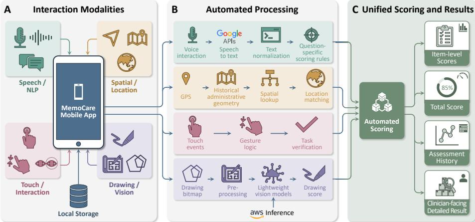

# MemoCare: An Interactive Multimodal Mobile System for Automated Cognitive Screening

Duy-Cat Can1,2,3, Mau Minh Phuc Le4, Tuan-Khoa Hoang10,   
Hai-Dang Nguyen4, Trung-Hieu Do5,6, Dang Minh Ly7, Minh-Duc Nguyen7 ,8   
Nghia TT Hoang7, Linh-Trung Nguyen3⋆, Huy-Hieu Pham4⋆, Huong Ha9,11⋆, Binh T. Nguyen10,11⋆, and Oliver Y. Chén1,2⋆   
1 Lausanne University Hospital, Switzerland   
2 Faculty of Biology and Medicine, University of Lausanne, Switzerland   
3 VNU University of Engineering and Technology, Vietnam   
VinUni-Illinois Smart Health Center, VinUniversity, Hanoi, Vietnam   
5 Hanoi Medical University, Vietnam   
6 National Geriatric Hospital, Vietnam   
7 Department of Neurology, Military Hospital 175, Vietnam   
8 Department of Neurology, School of Medicine, University of Medicine and   
Pharmacy at Ho Chi Minh City, Vietnam   
9 International University, VNU-HCM, Vietnam   
10 University of Science, VNU-HCM, Vietnam   
11 Vietnam National University Ho Chi Minh City, Vietnam   
{duy-cat.can,olivery.chen}@chuv.ch, htkhoa23@apcs.fitus.edu.vn,   
{hieu.ph,phuc.lmm,dang.nh3}@vinuni.edu.vn, dotrunghieu@hmu.edu.vn,   
drminhdang@outlook.com, nmduc@ump.edu.vn, dr.hnghia@gmail.com,   
linhtrung@vnu.edu.vn, htthuong@hcmiu.edu.vn, ngtbinh@hcmus.edu.vn

Abstract. MemoCare is an interactive mobile system for automated multimodal cognitive screening. A React Native application combines spoken responses, temporal and spatial orientation, touchscreen actions, and visuoconstruction in complete English and Vietnamese workflows. Speech is transcribed by Google Speech-to-Text and scored locally with deterministic task-specific natural language processing rules; GPS coordinates are resolved by the MemoCare spatial module before answer matching; touch tasks are scored from interaction events; and the drawing task uses a three-model convolutional neural network consensus with separate visual interpretation. Software tests pass 151/151 predefined cases across speech/language, spatial-answer, and touch-interaction scoring, while spatial regression passes 48/48 four-country coordinate-resolutio cases. For the drawing module, validation-selected ShufleNetV2 x1.5 achieved 91.33% mean balanced accuracy and 78.87% exact three-criterion accuracy on a locked 71-image test set. Four clinician co-authors additionally inspected the end-to-end workflow, yielding a pooled median rating of 4/5 across eight criteria, with item-level medians ranging from 3 to 4.5. At MMM, attendees can directly try a shortened multimodal screening workflow and inspect automatic item-level and total scoring.

Keywords: Cognitive screening · Multimodal interaction · Mobile health · Speech processing · Geospatial reasoning · Computer vision

## 1 Introduction

Cognitive screening combines heterogeneous interactions within a single assessment. Established tests such as the Mini-Mental State Examination (MMSE) include spoken responses, orientation to time and place, memory and calculation, commanded actions, language, and visuoconstruction [3]. Mobile automation must therefore do more than display a questionnaire: it must capture diferent response types, interpret each according to task-specific semantics, and integrate them into a coherent scoring workflow.

Digital cognitive tests and speech-assisted mobile cognitive-screening implementations have been explored previously [1,2], while multimodal research systems have combined several sensing modalities to capture richer behavioral signals [6]. MemoCare instead focuses on a compact, directly interactive mobile workflow. Its contributions are: (i) a modality-aware automated scoring architecture for speech, location, touch, and drawing interactions; (ii) task-specific processing with a unified scoring interface; and (iii) an end-to-end mobile prototype with technical verification and formative inspection by four clinician co-authors. This combination directly addresses the MMM demo track through interactive multimodal processing and attendee interaction in a medical application. MemoCare is presented as a research prototype, not as a validated diagnostic system.

## 2 MemoCare System

MemoCare presents task-specific interactions and routes each response to the corresponding processing module (Fig. 1). The workflow covers temporal and spatial orientation, memory, attention and calculation, language, touch-based commands, and visuoconstruction. Some interactions are adapted to mobile input while preserving the cognitive operation. Users can repeat, skip, pause, and resume tasks; after completion, the app shows item-level and total scores.

The client is implemented in React Native for Android and iOS, with Android used for the live demonstration. Speech is captured through the microphone, touch events and drawings through the display, and location through the device GPS service. Google Speech-to-Text (STT) is used for speech transcription, while AWS-hosted inference is used for drawing analysis. The demo prototype does not require user accounts; assessment state and results are stored locally on the device. The processing modules expose a common item-scoring interface, allowing individual components to be updated without changing the mobile flow.

The workflow is designed to run on the phone without requiring continuous examiner control. Each item combines a localized spoken instruction with the required input channel and a task-specific completion condition. If no usable response is detected, the application issues reminders, allows the instruction to be repeated, and can continue to the next item after repeated non-response. Stateful tasks retain information across sequential responses when later scoring depends on earlier responses. The English and Vietnamese versions use the same interaction app flow while language-specific scripts, normalization rules, and spatial vocabularies adapt the workflow to each setting.

  
Fig. 1. MemoCare architecture. (A) Speech, location, touch, and drawing are captured in one mobile app. (B) Specialized modules perform language scoring, geospatial reasoning, touch verification, and vision inference. (C) Item scores are aggregated into total score and local history.

## 3 Multimodal Processing and Scoring

## 3.1 Speech and Language Scoring

Most verbally answered tasks are processed through the same pipeline. Audio is trimmed and transcribed by Google STT, then normalized and passed to deterministic task-specific scoring rules. These include date and number parsing, stateful sequential calculation, multi-target recall matching, ordered phrase matching, and sentence-completeness checks. Hesitations and repetitions are tolerated through task-specific rules, while language-specific normalization handles common transcription and lexical variants. For selected tasks, scoring prioritizes recognized task-relevant words and does not infer negation or correction from potentially incomplete STT transcripts.

The scoring module combines both the normalized transcript and the task state, allowing sequential responses while keeping speech recognition separate from task-specific scoring logic.

## 3.2 Location-Aware Spatial Reasoning

Spatial-orientation responses depend on the phone position and may remain valid after administrative renaming or boundary changes. The MemoCare spatial module uses 89,043 administrative boundary records across Vietnam, Switzerland, China, and the United States. Administrative geometries are indexed spatially so that candidate regions near the device location are retrieved before point-inpolygon testing, rather than scanning the complete geometry collection.

For a resolved location, the module returns accepted current and historical place names. These are normalized and matched against the STT transcript using exact and approximate name matching, allowing administrative aliases and renamed regions to be accepted where appropriate. Administrative boundary data were derived from OpenStreetMap, using country extracts obtained through the Geofabrik download service.

## 3.3 Touch Interaction

For mobile-adapted action tasks, MemoCare scores recorded touchscreen events instead of speech. One interaction verifies a multi-step tap-and-drag sequence using action type, target, and event order; another verifies whether a touch falls within a predefined target region on a displayed image. The module checks the recorded events against task-specific interaction rules. All touch processing is performed locally without a camera or additional sensor.

## 3.4 Drawing Representation and Data

For the visuoconstruction component, a geometric reference is presented on screen and the user reproduces it directly on the touchscreen. The captured bitmap is resized to 224 × 224 pixels for convolutional neural network (CNN) inference. Automated analysis uses three internal structural criteria, C1–C3, representing component-shape validity and two spatial-relation conditions. These criteria are used for model training and interpretation, while the application exposes only the configured binary item result. The binary item result is positive only if all three criteria C1–C3 are satisfied.

Because the manually drawn training set was limited, we developed a rulebased generator that produces geometric copying examples with known C1/C2/C3 labels. Four generation stages produced 45,724 images covering valid and invalid structures, relation errors, hard negatives, and visual variations such as blur, perspective, shadow, texture, and missing edges.

The researcher-created development dataset contained 329 training, 66 validation, and 71 locked-test drawings, manually drawn and labeled according to the predefined C1/C2/C3 criteria. Because criterion distributions are imbalanced, evaluation uses balanced accuracy (BA), the average of sensitivity and specificity. Mean BA averages the three criterion-specific BAs, while exact three-criterion accuracy requires all C1–C3 predictions for the same drawing to be correct.

## 3.5 Vision Models and Deployment

We evaluated eight lightweight CNN models with ImageNet-pretrained weights from four architecture families: ShufleNetV2 [8], MobileNetV3 [5], EficientNet-B0 [11], EficientNet-Lite [7] variants, and MnasNet [10]. Each model predicts C1–C3 probabilities, is first trained on the staged synthetic dataset, and is subsequently fine-tuned on the manually drawn training set.

Table 1. Technical verification and expert inspection.
<table><tr><td>Module</td><td>Evaluation</td><td>Result</td></tr><tr><td>Speech/language</td><td>Transcript-level scoring</td><td>138/138 passed</td></tr><tr><td>Spatial</td><td>Fixed-coordinate and answer scoring</td><td>48/48 and 8/8 passed</td></tr><tr><td>Touch</td><td>Interaction scoring</td><td>5/5 passed</td></tr><tr><td>Drawing, single model</td><td>ShuffleNetV2 x1.5, locked test (n = 71)</td><td>Mean BA 91.33%; three-criterion exact 78.87%</td></tr><tr><td></td><td>Drawing, consensus Locked test (n = 71), descriptive</td><td>Mean BA 95.17%</td></tr><tr><td></td><td>Clinician inspection Eight 5-point criteria, n = 4</td><td>Median 4/5 (item medians 3-4.5)</td></tr></table>

For each model and criterion, the 66-image validation set is used to select probability calibration and decision thresholds. Raw and temperature-scaled probabilities are compared [4], with bootstrap resampling used to identify stable threshold ranges before final evaluation.

The drawing inference service is exposed through a stable AWS endpoint so that the mobile client remains independent of the selected vision backbone. A separate criterion-aware U-Net [9] provides structured visual interpretation of component shapes and spatial-relation regions. This explanatory model does not afect the binary drawing score.

## 4 Technical Verification and Expert Review

## 4.1 Technical Verification

The current test suite passed 151/151 cases: 138 speech/language, 8 spatialanswer, and 5 touch/action cases. Spatial regression additionally passed 48/48 fixed-coordinate cases across the four supported countries. The speech/language tests start from STT transcripts and therefore evaluate downstream scoring logic rather than Google STT accuracy. Table 1 summarizes the main software, vision, and expert-review results.

For drawing evaluation, model selection, probability calibration, and threshold settings, we used the 66-image validation set. ShufleNetV2 x1.5 ranked first on validation mean BA at 96.23% and was therefore selected as the single-model result. On the locked 71-image test set, it achieved 91.33% mean BA and 78.87% exact three-criterion accuracy. The locked test was not used for model selection, calibration, or threshold tuning.

Following the single-model evaluation, MobileNetV3-Large, EficientNet-B0, and EficientNet-Lite1 were combined in a post-hoc consensus based on complementary performance observed across the completed evaluation results. The conditional consensus achieved a descriptive 95.17% mean BA on the locked test set. Because the consensus was configured after reviewing the locked-test results, its performance on the same 71 images is descriptive rather than confirmatory.

## 4.2 Clinical Expert Inspection

Four clinicians, one in geriatrics and three in neurology, independently evaluated the complete application using an end-to-end workflow with mock responses. Eight 5-point criteria assessed fidelity of the digital workflow, clarity of instructions, suitability of voice and touchscreen interaction, agreement of automated scoring with clinical judgment, transparency of item-level results, availability of repeat/skip/pause/resume controls, and readiness for formal clinical evaluation.

The pooled median rating was 4/5, with item-level medians ranging from 3 to 4.5. The highest-rated aspects were the overall digital workflow, clarity of instructions, and touchscreen interaction, each with a median of 4.5/5. Voice interaction and readiness for formal clinical evaluation received medians of 4/5, while agreement of automated scoring with clinical judgment, availability of interaction controls, and transparency of item-level results received medians of 3.5, 3.5, and 3/5, respectively. The separate overall-readiness rating had a median of 4/5 (range 3–4). Reviewers mainly identified improvements related to speech recognition and response handling, acceptable-response handling and task instructions, drawing interaction, and access to recorded responses. These findings characterize expert inspection of the implemented workflow rather than patientlevel diagnostic performance.

## 5 Live Demonstration and Requirements

At MMM, attendees use an Android phone or tablet and can skip among representative tasks. The short path shows speech transcription and local scoring, GPS-based spatial scoring, touch tasks, drawing scoring with visual interpretation, and inspection of item-level and total results. The complete workflow can also be explored without the shortened path. Because the system is end-to-end, attendees see not only the final score but also the transition from interaction to modality-specific processing and item result. The demo requires a microphone, location access, and Wi-Fi; internet access is required for Google STT and remote drawing inference. No additional sensors or special space are required.

## 6 Conclusion

MemoCare integrates speech, spatial context, touch, and drawing into one automated multimodal mobile cognitive-screening workflow. The system combines deterministic language scoring, historically aware spatial resolution, event-based touch verification, and a conditional CNN consensus with separate criterionaware visual interpretation. Technical verification covers the modality-specific components and clinical experts inspect the end-to-end workflow. The modular design keeps the interaction workflow independent of any particular speech, spatial, touch, or vision implementation, supporting the replacement of individual processing components. The live demo exposes this complete multimodal interaction and scoring loop to MMM attendees; formal patient-level clinical validation remains future work.

## References

1. Chan, J.Y.C., Yau, S.T.Y., Kwok, T.C.Y., Tsoi, K.K.F.: Diagnostic performance of digital cognitive tests for the identification of MCI and dementia: A systematic review. Ageing Research Reviews 72, 101506 (2021). https://doi.org/10.1016/j.arr. 2021.101506

2. Devos, P., Debeer, J., Ophals, J., Petrovic, M.: Cognitive impairment screening using m-health: an android implementation of the mini-mental state examination (MMSE) using speech recognition. European Geriatric Medicine 10(3), 501–509 (2019). https://doi.org/10.1007/s41999-019-00186-0

3. Folstein, M.F., Folstein, S.E., McHugh, P.R.: “Mini-mental state”: A practical method for grading the cognitive state of patients for the clinician. Journal of Psychiatric Research 12(3), 189–198 (1975). https://doi.org/10.1016/0022-3956(75) 90026-6

4. Guo, C., Pleiss, G., Sun, Y., Weinberger, K.Q.: On calibration of modern neural networks. In: Proceedings of the 34th International Conference on Machine Learning. Proceedings of Machine Learning Research, vol. 70, pp. 1321–1330 (2017)

5. Howard, A., Sandler, M., Chu, G., Chen, L.C., Chen, B., Tan, M., Wang, W., Zhu, Y., Pang, R., Vasudevan, V., Le, Q.V., Adam, H.: Searching for mobilenetv3. In: Proceedings of the IEEE/CVF International Conference on Computer Vision. pp. 1314–1324 (2019)

6. Jonell, P., Moëll, B., Håkansson, K., Henter, G.E., Kucherenko, T., Mikheeva, O., Hagman, G., Holleman, J., Kivipelto, M., Kjellström, H., Gustafson, J., Beskow, J.: Multimodal capture of patient behaviour for improved detection of early dementia: Clinical feasibility and preliminary results. Frontiers in Computer Science 3, 642633 (2021). https://doi.org/10.3389/fcomp.2021.642633

7. Liu, R.: Higher accuracy on vision models with eficientnet-lite (2020), tensorFlow Blog, accessed 6 September 2026

8. Ma, N., Zhang, X., Zheng, H.T., Sun, J.: Shuflenet v2: Practical guidelines for eficient cnn architecture design. In: Ferrari, V., Hebert, M., Sminchisescu, C., Weiss, Y. (eds.) Computer Vision – ECCV 2018. Lecture Notes in Computer Science, vol. 11218, pp. 122–138. Springer, Cham (2018). https://doi.org/10.1007/ 978-3-030-01264-9\_8

9. Ronneberger, O., Fischer, P., Brox, T.: U-Net: Convolutional networks for biomedical image segmentation. In: Medical Image Computing and Computer-Assisted Intervention – MICCAI 2015. Lecture Notes in Computer Science, vol. 9351, pp. 234–241. Springer (2015). https://doi.org/10.1007/978-3-319-24574-4\_28

10. Tan, M., Chen, B., Pang, R., Vasudevan, V., Sandler, M., Howard, A., Le, Q.V.: Mnasnet: Platform-aware neural architecture search for mobile. In: Proceedings of the IEEE/CVF Conference on Computer Vision and Pattern Recognition. pp. 2820–2828 (2019)

11. Tan, M., Le, Q.V.: Eficientnet: Rethinking model scaling for convolutional neural networks. In: Proceedings of the 36th International Conference on Machine Learning. pp. 6105–6114 (2019)

## A Demonstration Video and Setup

Demonstration video. A demonstration video of up to 3 minutes is available at https://youtu.be/INKW6qbg4io. It shows the implemented mobile workflow, major interaction modalities, automated scoring, and the setup used for the conference demonstration.

What attendees will see. MemoCare runs on an Android phone or tablet. The live demo shows task delivery, spoken-response transcription and scoring, GPSgrounded location scoring, touchscreen task verification, conditional drawing consensus scoring with criterion-level visual interpretation, and item-level and total results. The complete workflow remains available, while a shortened path highlights the major modalities in approximately 3–5 minutes.

How attendees interact. Attendees operate the device themselves. They can answer a spoken task, provide a location-related response, perform a touchscreen interaction task, complete the drawing task, and inspect the generated scores. Tasks can be skipped so that each attendee can focus on selected modalities without completing the full workflow.

Setup requirements. The demo requires one Android phone or tablet, standard table space, a power outlet, and Wi-Fi. The device uses its built-in microphone, touchscreen, and GPS/location service. The conference network must permit Google STT service and the remote drawing inference. Screen mirroring to an external display is optional. No camera, additional sensors, dedicated audio equipment, VR/AR hardware, or special physical space is required.