# Never Look Back

# Understanding Persistence in 3D Object Memory from Egocentric Videos

Shravan S Chaudhari¹

William Paul²

Suchi Saria¹

Rama Chellappa¹\*

Homanga Bharadhwaj¹\*

1Johns Hopkins University ²Johns Hopkins University Applied Physics Laboratory \*Equal advising

Project page: ledger-3d.github.io

Code: github.com/LEDGER-3D/LEDGER

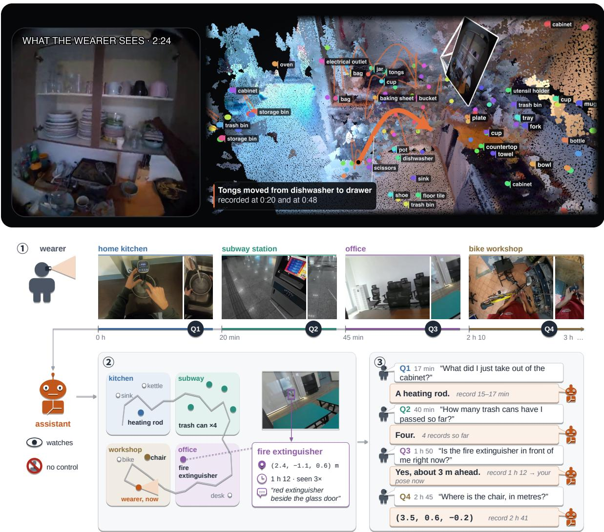  
Figure 1: Persistent object memory from egocentric video. Top: LEDGER's memory 2 min 24s into a scene in the kitchen: tracked objects (bubbles) persist after leaving view, arcs show recorded moves (bold: the tongs), and the white frame is the wearer's camera, with its current view inset; the point cloud is for display only. Bottom: ①) A wearer or an assistant (physical or digital) works for hours across scenes while questions arrive. ② It keeps a record for each object, with its 3D position, times seen, and a short description, on a map of its path. ③ Later questions are answered from these records alone, without replaying the video.

Abstract. As we move through the world and carry out everyday tasks, we encounter objects that may become relevant only later. We are capable of recalling where we left something or what was inside a container, even without knowing we would need it later. Here, we study how an embodied assistant can build a similar memory from egocentric videos, by observing a person's day-to-day activities. We present LEDGER, a persistent 3D object memory that combines object locations, their histories, and contextual descriptions. It associates observations across the recording and retains objects after they leave the view, including those the person never touches. It clusters each object's observations by resting locations and records a move only after repeated evidence, reducing the effect of localization noise. Short descriptions preserve details such as an object's contents or supporting surface. It saves these records to later answer spatial questions without having to access the original images or video. Our memory raises HD-EPIC accuracy from 29.7% to 42.6%, UCS-Bench accuracy from 33.8% to 38.5% and localizes Ego4D objects with a 0.99 m median error on returned predictions. Our analyses identify complementary roles for temporal persistence, contextual descriptions, and retrieval. Our study on 100 stitched streams of multiple scenes each further exposes failures in both retrieval and construction. Per-scene construction partially recovers the performance lost across scene changes compared to that of single scene streams.

## 1 Introduction

Humans typically perform several tasks during the day like cooking, clearing out the garage, playing football, or other diverse activities. We are reliably good at tracking our environments and our positions relative to the objects of the scene we are in [3, 48]. Even after exiting the scene, we can still answer certain questions about it like where we left the wrench, which shelf had the spare batteries, or where the serving bowl was last placed [21, 37|. Fundamentally, we keep a running memory of where potentially important objects are [19, 26], freeing us from having to exactly retrace our steps in either our memories or the scene itself [13, 46]. Similarly, in long horizon explorations spanning multiple scenes, we are capable of both tracking objects across scenes [51] and revising our memory for familiar objects displaced when we were absent from a scene [20, 24]. Our goal is to develop embodied spatial memory that supports recall of previously visited scenes and incorporates new observations of objects and changes in familiar environments. A natural setting to study these capabilities is long egocentric videos about everyday human activity (Figure 1). Such videos capture people moving through diverse scenes, interacting with objects, and revisiting places over time. This enables us to study what an embodied agent can retain from a person's visual experience without controlling where that person looks or what they do.

Building such a memory from these recordings is challenging. Objects can be occluded, briefly visible or captured from an alternate viewpoint [12, 17, 43]. They may also move between observations, and errors in 3D localization can make an agent mistake a stationary object for a moving one. Moreover, the agent does not know during exploration which objects or events will be relevant to a question asked later. It should decide what information to retain from these incomplete observations. This includes information about objects that are only seen in passing. In this work, we study four aspects of this problem: which objects are recorded in the memory, how to record changes in their locations, what information is retained beyond their 3D positions, and how earlier observations can be retrieved as more scenes are added. Our goal here is to understand how these design choices impact the spatial questions an agent can answer after exploration, without revisiting the scene or replaying the video.

Recent works have developed object memories that retain identities and locations after objects leave the view [6, 16, 33, 36]. Object-centric maps and scene graphs organize observations through the spatial relationships between objects [18, 40]. Language-model agents, in contrast, write their observations into a structured record of objects, places, and their states, which the model later reads to answer questions [2, 15, 49, 58]. Another line of work simply uses video-language models to answer from frames sampled from the recording at question time without explicitly maintaining a record of the scene [11, 44, 60, 61|, including models trained particularly for spatial reasoning [52, 55]. Streaming models compress past frames in a memory of visual tokens [23, 38, 59]. Visual query localization methods search the recording again for every query [17, 30]. Table 1 compares what these memories keep and what they need at query time. To guide memory design, we need to decide which retained evidence supports later questions and to distinguish failures of representation from retrieval and reasoning failures.

Table 1: What existing memories built from egocentric or embodied video keep, and what they need at query time. √: supported and demonstrated; o: partly or only under conditions; X: not supported; N.A.: not applicable. The memories differ in their objects' coverage, tracking of motion history, input conditions for construction or handling of scene changes, and query time support for no frame access, language queries and 3D location requests.
<table><tr><td></td><td colspan="4">Memory content</td><td colspan="3">Construction conditions</td><td colspan="3">Query time</td></tr><tr><td>Method</td><td>objects</td><td>Handled Untouched Motion Path &amp; RGB objects</td><td>history</td><td>places</td><td></td><td>3 Scene only changes</td><td>≥20-min video</td><td>No frames at query</td><td>Language queries</td><td>3D location</td></tr><tr><td>ConceptGraphs [18]</td><td>x</td><td>√</td><td>X</td><td>X</td><td>X</td><td>x</td><td>N.A.</td><td>√</td><td>√</td><td>√</td></tr><tr><td>3D-Mem [57]</td><td>x</td><td></td><td>x</td><td>x</td><td>x</td><td>x</td><td>N.A.</td><td>x</td><td>√</td><td></td></tr><tr><td>ReMEmbR [2]</td><td>x</td><td>x</td><td>X</td><td>√</td><td>x</td><td>N.A.</td><td>√</td><td>√</td><td>√</td><td>O</td></tr><tr><td>VideoAgent [14]</td><td>0</td><td></td><td>X</td><td>X</td><td></td><td>x</td><td>x</td><td>X</td><td>√</td><td>X</td></tr><tr><td>AMEGO [16]</td><td></td><td>x</td><td>0</td><td></td><td></td><td>X</td><td>√</td><td></td><td>x</td><td>x</td></tr><tr><td>OSNOM [36]</td><td></td><td>x</td><td>√</td><td>x</td><td>O</td><td>x</td><td>√</td><td>N.A.</td><td>x</td><td></td></tr><tr><td>Emb. VideoAgent [15]</td><td>√</td><td></td><td>0</td><td>x</td><td>x</td><td>x</td><td>X</td><td>x</td><td>√</td><td>V</td></tr><tr><td>EgoRAG [54]</td><td>0</td><td>x</td><td>x</td><td>x</td><td></td><td>√</td><td>√</td><td>X</td><td></td><td>x</td></tr><tr><td>VL-KnG [1]</td><td>X</td><td>V</td><td>0</td><td></td><td></td><td>x</td><td>√</td><td>0</td><td>√</td><td>X</td></tr><tr><td>DirectMe [49]</td><td>0</td><td></td><td>0</td><td></td><td></td><td>x</td><td>√</td><td>x</td><td></td><td></td></tr><tr><td>R4DSGª [29]</td><td>0</td><td>0</td><td>√</td><td>0</td><td>√</td><td>0</td><td>J</td><td>J</td><td>√</td><td>X</td></tr><tr><td>LEDGER (ours)</td><td>L</td><td></td><td>J</td><td></td><td></td><td></td><td></td><td></td><td></td><td></td></tr></table>

aR4DSG's objects enter through a per-segment controlled vocabulary and its places through location segments, both taken from released segment records whose source the paper does not state; anchors are found per location window, and the authors report limited cross-day persistence.

For example, restricting memory to objects involved in hand interactions [16, 36] can exclude visible objects that still affect the agent or are relevant later on. Although retaining an object's position may support a location question, it does not preserve its contents or its movement history. Even a sequence of positions can mislead when localization noise is recorded as movement. Further failures can arise across scenes when storing observations into memory or while retrieving relevant records. These examples motivate us to address our core question: what must an agent preserve from past observations to answer spatial questions it could not anticipate?

To this end, we present LEDGER (Long-horizon Egocentric Descriptions, Geometry, and Event Records), a persistent 3D object memory that combines geometric observations with contextual descriptions. We construct the memory offline from sampled egocentric recordings, using supplied or estimated camera poses. We detect objects with an open-vocabulary detector, associate their observations over time, store them whether or not the wearer interacts with them, and keep their records after they leave view. We group each object's timestamped 3D observations into rest segments. Each rest segment for an object represents its observations close to the same resting location. A new segment indicates that the object has moved, which is only recorded when multiple subsequent observations support it. We use a persistence rule to reduce false motion detections caused by localization noise. We add a short contextual description to each segment to capture details such as what a container held or which surface it rested on. We first identify the objects referred to in the question and retrieve their records. A language model then answers using these records as text, without seeing images or the original video. This tests whether the stored locations, histories, and descriptions provide enough information to answer questions about objects no longer in view.

We evaluate LEDGER on all 2,400 questions in HD-EPIC's 3D Perception and Object Motion categories [35], named-object localization on Ego4D VQ3D [17], and 2,771 timestamped questions on UCS-Bench [49]. On HD-EPIC, adding our memory raises GPT-5.4's1 prototype-averaged accuracy from 29.7% to 42.6%. On UCS-Bench, the answerer sees 48 frames. Adding LEDGER yields 46.3% accuracy, compared with 42.9% when adding DirectMe's graph. On VQ3D, our memory returns object locations with a median error of 0.99 m among the queries for which it returns a prediction.

Contributions.

A reusable 3D memory of past observations. We introduce LEDGER, a persistent object memory built offline from egocentric videos with supplied or estimated poses, retaining locations, movement histories, and contextual descriptions, even for untouched objects.

Spatial answering and localization across benchmarks. We demonstrate improved textonly question answering on HD-EPIC, named-object localization on Ego4D VQ3D, and gains over frame-only answering on UCS-Bench, and compare against rebuilt object, caption, and graph memories to show where our representation helps and what it misses.

Evidence for how to build and read memory. Ablations isolate temporal persistence, contextual descriptions, and geometry, and shared readers reveal how retrieval shapes a representation's apparent advantage; costlier iterative search does not improve every task.

An analysis of accumulating experience. Across recording lengths and 100 paired stitched streams, memory retains its gains up to 75 minutes, while scene changes expose failures in construction and retrieval that building memory per scene partially repairs.

## 2 Related Work

Memories of objects and scenes. OSNOM tracks the 3D locations of active objects through absence with appearance and spatial association [36]. Whareformer learns association with an updatable track memory and an explicit new-track decision and is trained on active objects. However, its architecture does not require contact [6]. AMEGO builds location memories and interaction tracklets for querying on long videos [16], and ESOM couples discovery, tracking, and retrieval in an online visual-query memory [33]. These systems determine which objects enter memory and how to recognize them when they reappear. Scene representations also differ in the information they store. ConceptGraphs builds open-vocabulary scene graphs of objects from posed RGB-D observations [18]. Snapshot and scene-based memories support spatial reasoning and exploration [28, 57, 62] Khronos records short-term motion and long-term scene changes [40]. DirectMe tracks objects places, and the wearer, and uses geometry to derive spatial relations for timestamped questions [49].

We study how the objects retained, their estimated positions, movement histories, and contextual descriptions help answer different spatial questions. Errors in geometry can misplace an object or make it appear to have moved. We therefore evaluate how these errors affect answers, alongside their effect on localization.

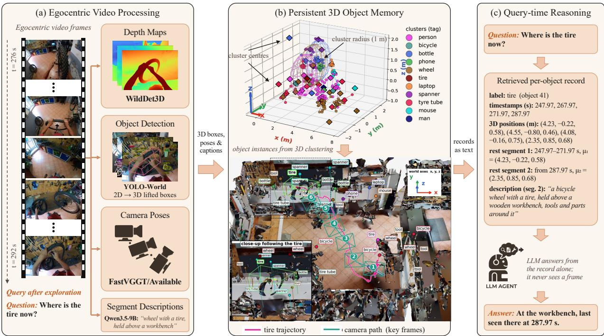  
Figure 2: LEDGER overview. (a) Objects detected in sampled egocentric frames are localized in 3D and placed in a scene coordinate frame using supplied or estimated camera poses. (b) Persistent object records, formed from associated observations, contain timestamped positions, rest segments defined by repeated evidence of displacement, and contextual descriptions. (c) After query grounding and retrieval, a language model answers from the records rendered as text, without receiving images. When pose scale is available, scene coordinates are metric.

Reading stored memories. Memory-based systems differ in what they store, how they find relevant information, and whether they show images to the answerer. ReMEmbR stores captions with timestamps and positions, then searches this memory over multiple rounds to answer a question [2]. VideoAgent and Embodied VideoAgent combine stored information about entities with retrieved frames [14, 15]. MEMORA maintains entity state for later reasoning [58], while DirectMe gives the answerer its graph and retrieved frames [49]. Video-language and streaming models use sampled frames or compressed visual tokens without explicit object records [11, 23, 38, 44, 59–61|. We test what stored records can support when the answerer receives only text. We also compare our object records with event descriptions against a caption memory using the same retrieval procedures. This helps distinguish the value of the stored information from the reader's ability to find and use it.

Evaluating spatial memory over time. Existing benchmarks test different demands on memory. Ego4D VQ3D queries an object's location using an image crop [17]; EgoLoc, ReLoCATE, and EAGLE address this task through pose recovery, training-free retrieval, and appearance and geometric memory [4, 25, 30]. We evaluate localization using object names instead. HD-EPIC tests object and fixture positions and motion on calibrated recordings [35], while UCS-Bench tests timestamped spatial reasoning relative to the moving wearer [49]. EASG-Bench tests questions grounded in scene graphs [39], while OpenEQA tests questions about previously observed environments [32]. HourVideo evaluates reasoning over long egocentric videos [7]. EgoMemReason extends this to evidence spanning days, including changes in object states [50]. We complement these benchmarks by asking the same questions on individual recordings and on streams formed by joining recordings.

We then modify memory construction and retrieval to identify why performance changes.

## 3 Method

LEDGER (Long-horizon Egocentric Descriptions, Geometry, and Event Records) constructs a persistent object memory offline from an egocentric recording and supplied or estimated camera poses (Figure 2), once per recording and independently of any question. It is then reused for spatial question answering and named-object localization; on UCS-Bench, reading it costs about 2.0k input tokens per question, against 9.6k for 48 sampled frames (Appendix H).

For each instance $j$ , we store its label $c _ { j }$ and timestamped observations $\mathcal { O } _ { j } = \{ ( t _ { i } , b _ { i } , \mathbf { x } _ { i } ) \}$ , where $b _ { i }$ is the image box and $\mathbf { x } _ { i }$ is the estimated 3D position in scene coordinates. We summarize the object's observed location history as rest segments, $S _ { j } = \{ ( t _ { s } ^ { \mathrm { s t a r t } } , t _ { s } ^ { \mathrm { e n d } } , \mu _ { s } , d _ { s } ) \}$ . Each segment groups observations associated with one resting location: $t _ { s } ^ { \mathrm { s t a r t } }$ and $t _ { s } ^ { \mathrm { e n d } }$ delimit the segment's span in the sampled observation sequence, $\pmb { \mu } _ { s }$ represents its estimated 3D location, and $d _ { s }$ describes the object and its surrounding context. A new segment is confirmed only after repeated observations support a displacement from the current location. Rest segments thus summarize where the object was observed; its position during gaps between observations is unknown. Camera poses also retain the wearer's trajectory and heading for egocentric queries. Unrelated scenes are not registered into a shared frame; coordinates are metric where pose scale is available.

## 3.1 Offline memory construction

Discovery and geometry. Qwen3.5-9B names objects in sampled frames; synonym merging produces a vocabulary for YOLO-World [9], so objects enter memory whether or not the wearer touches them, within the detection and 3D-lifting budgets. From the image, detection box, and label, WildDet3D [22] predicts a 3D box in camera coordinates, and the camera pose places its centre in scene coordinates $( { \mathrm { A p p e n d i x ~ A } } )$

Association and persistence. We match observations in time order to existing instances by label and distance from the instance's latest position; same-frame detections stay separate unless they are overlapping duplicates. A second pass re-identifies objects that 3D association split into several tracks: the SAM 3 video tracker [5] propagates each fragment's masks and merges fragments whose masks agree, subject to co-occurrence and 3D-distance checks (Appendix A.3). Records persist after objects leave view, although a large move may create a new identity. A new rest segment starts only after k successive observations lie more than τ from the current resting position; observations that return within this radius stay in the current segment. This suppresses false moves from localization noise but may miss brief ones.

Context and refinement. Qwen3.5-9B describes selected segments from frames with the object outlined, recording contents, supporting surfaces, and interactions (on HD-EPIC, transferred from distance-threshold segments; Appendix A.4). Multi-view triangulation refines a resting object's position when the viewpoints are well separated and the estimate is stable and close to the original (Appendix A.5). Two extensions add activity descriptions for sampled frames and build a separate memory for each detected scene (Appendices E.5 and E.4).

## 3.2 Query-time reasoning

Grounding and retrieval. HD-EPIC box queries are lifted to a 3D point on the sampled frame nearest their timestamp, and the four nearest instances observed within ±6s are retrieved; named fixtures are matched through fixed synonym groups, taking the most-observed matches, with clock directions computed from stored positions and the camera heading at query time. VQ3D supplies an object name, and we return the selected instance's stored position; UCS-Bench targets are inferred from the question, and entries are ranked by word overlap and temporal proximity (Appendices B.2, C, and D).

Answering. Retrieved labels, ranking signals, and segment histories (times, positions, and descriptions) are rendered as text, and a single call to Qwen3.5-9B [45] or GPT-5.4 [34] answers from this evidence, the question, and its options. HD-EPIC queries use the completed memory; for timestamped UCS-Bench queries, snapshots remove later observations and descriptions, truncate histories and the wearer path, and recompute positions. This filters what the answerer sees without making construction causal (Appendix D.3).

## 4 Experiments

We first show three memories answering on one stream; five research questions then connect benchmark results to interventions on the memory, and Appendix G.1 analyses failures by stage.

Benchmarks and baselines. We use all 2,400 3D Perception and Object Motion questions of HD-EPIC [35] with prototype-averaged accuracy (Appendix B.1); all 164 Ego4D VQ3D validation queries [17], localized from the object's name and scored over returned predictions alongside coverage; and 2,771 UCS-Bench questions [49] from 211 EgoLife and TeleEgo recordings, with estimated poses and memories filtered to the question time (Appendix D.1). Evidence conditions are a blind control (question and options only), memory alone, 48 frames sampled up to the question time, and frames plus memory on spatial questions. DirectMe, ReMEmbR, OSNOM, and AMEGO are rebuilt from released code with dataset adaptations and read by GPT-5.4 unless stated; RQ4 examines their retrieval.

Three memories on one stream. Figure 3 follows DirectMe, ReMEmbR, and LEDGER through one stream. LEDGER is correct on all five questions, DirectMe's graph on one, and ReMEmbR on none, and the difference follows from what each memory keeps. For Q2, the detector's label is wrong, but the description stored with the object's rest segment names what the wearer was holding, which the answerer follows; neither baseline stored the object. For Q5, LEDGER returns the chair's position, 0.73 m from the annotation, whereas ReMEmbR returns only where the wearer stood.

RQ1: What can object memory answer, and what evidence does it miss? Object records help every answering model we tested, most on objects the wearer never touched and least on interactions and counts. On HD-EPIC, the memory lifts Qwen3.5-9B, GPT-5.4, and GPT-5.6 by 11 to 18 points over their blind controls and, read by GPT-5.4, outscores every rebuilt memory (Table 2; Figure 4b); on UCS-Bench, it also improves the 48-frame reader it is added to (Table 3). The clearest benefit is fixture location, because admitting untouched objects supplies evidence that contact-gated memories exclude. The weakest cases need events and identities rather than more objects: AMEGO's hand-object tracklets remain better on interaction counting and the onset of rest (Appendix B.4), and UCS-Bench object counts do not improve because association both splits single objects into several tracks and misses others (Appendix D.2).

RQ2: When does localization noise get confused for movement? Requiring repeated evidence of a move, rather than raising the distance threshold, keeps localization noise from being counted as movement. A threshold alone cannot separate the two, because they overlap in size: half of the annotated moves are shorter than 0.8 m, and the 95th percentile of localization error is 0.84 m. A 0.3 m threshold therefore roughly doubles the counted moves, and 0.8 m gets only 57.3% of counts within ±1 of the truth. Keeping 0.3 m but requiring three consecutive displaced observations raises this to 67.4% (Appendix B.8), and removing persistence costs movement counting 15.5 points, which survives correction for multiple tests (Figure 4a). The price is that brief moves go unrecorded

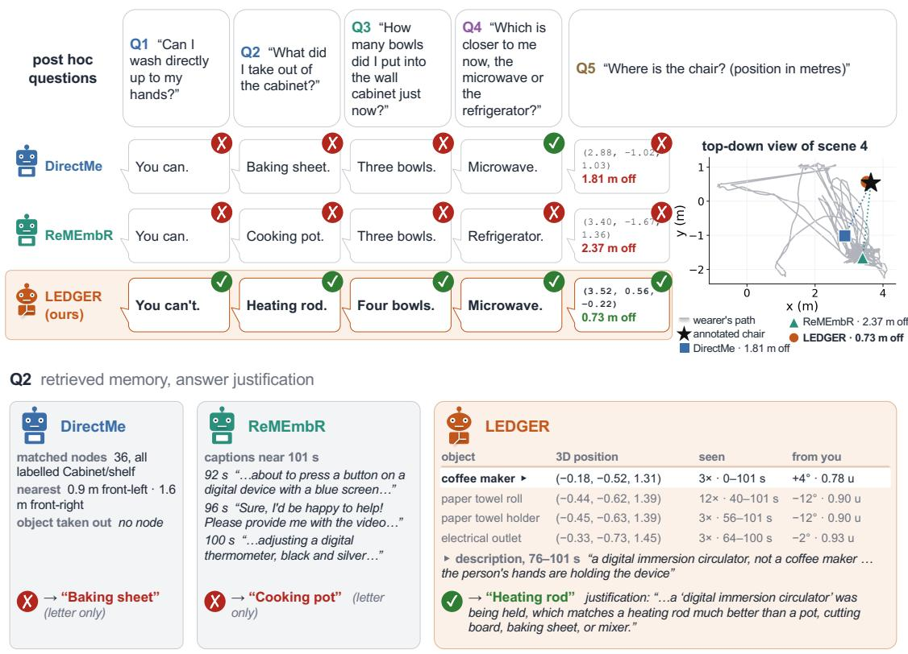  
Figure 3: Three memories answer the same questions from their stored records alone, without frames. Q1-Q4 come from one UCS-Bench stream that joins three EPIC-Kitchens recordings; Q5 asks for a chair's position in an Ego4D VQ3D clip, with each memory's answer on the top-down map. Bottom: what each memory retrieves for Q2. Questions were chosen to show how the memories differ; Figure 8 (Appendix G.2) adds the video timeline.

Table 2: HD-EPIC accuracy (%) on all 2,400 3D Perception and Object Motion questions, prototype-averaged as in Perrett et al. [35]; chance is 20.0. yes: video at answer time; no: text alone. Published rows use other answerers and protocols, and the 2026 entry is a challenge report (Appendix B.3). LEDGERagent: our memory read by ReMEmbR's querying agent (RQ4). Bold: best per evidence group, except the human reference; 95% intervals in Table 6; other answerers in Figure 4b.
<table><tr><td>Method</td><td>Video at answer 3D Perception Object Motion Mean</td><td></td><td></td><td></td></tr><tr><td>LongVA [60]</td><td>yes</td><td>32.9</td><td>22.7</td><td>27.8</td></tr><tr><td>2025 challenge, 1st place [42]</td><td>yes</td><td>42.6</td><td>30.2</td><td>36.4</td></tr><tr><td>EgoAdapt, 2026 [8]</td><td>yes</td><td>64.9</td><td>61.6</td><td>63.3</td></tr><tr><td>Human (sample) [35]</td><td>yes</td><td>93.8</td><td>92.7</td><td>93.3</td></tr><tr><td colspan="5">Memories rebuilt on our frames, read by GPT-5.4</td></tr><tr><td>DirectMe, graph only [49]</td><td>no</td><td>30.6</td><td>30.8</td><td>30.7</td></tr><tr><td>ReMEmbR [2]</td><td>no</td><td>28.7</td><td>30.9</td><td>29.8</td></tr><tr><td>OSNOM, adapted [36]</td><td>no</td><td>35.4</td><td>25.0</td><td>30.2</td></tr><tr><td>AMEGO, adapted [16]</td><td>no</td><td>30.4</td><td>38.9</td><td>34.7</td></tr><tr><td>GPT-5.4, blind</td><td>no</td><td>27.2</td><td>32.1</td><td>29.7</td></tr><tr><td>LEDGER + GPT-5.4</td><td>no</td><td>44.7</td><td>40.5</td><td>42.6</td></tr><tr><td>LEDGERagent + GPT-5.4</td><td>no</td><td>37.0</td><td>32.6</td><td>34.8</td></tr></table>

(a) HD-EPIC: accuracy lost when a component is removed  
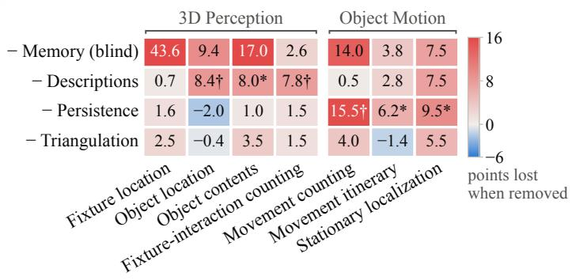

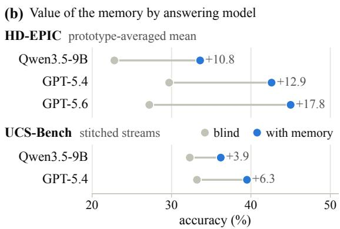  
Figure 4: What each component carries, and what the answering model adds. (a) HD-EPIC: accuracy lost on each prototype when one component is removed († survives Holm correction, \* raw $p < 0 . 0 5 ;$ single runs, cells ±7–10 points). (b) Accuracy without and with the memory for each answering model; GPT-5.6 answered with reasoning enabled, the others without. The UCS-Bench component and reader analyses are in Figure 7.

Table 3: UCS-Bench accuracy (%) on 2,771 timestamped questions; 48 frames where frames are given; chance 25.7. DM is DirectMe with its released graph builder and retrieval: “own" adds its graph to the frames on every question, as DirectMe does, and “routed" only on the spatial questions where we add our memory. Bold: best per row among the green and among the red arms. Subcategories and paired tests are in Appendix D.1.
<table><tr><td></td><td></td><td></td><td></td><td colspan="2">Memory only</td><td colspan="3">Frames + memory</td></tr><tr><td>Category</td><td>n</td><td></td><td>BlindFrames DM</td><td></td><td>LEDGER</td><td>DM, own DM, routed LEDGER</td><td></td><td></td></tr><tr><td>Trajectory &amp; Movement</td><td>648</td><td>34.9</td><td>45.4</td><td>37.3</td><td>38.6</td><td>41.8</td><td>45.5</td><td>49.1</td></tr><tr><td>Position &amp; Orientation</td><td>701</td><td>23.8</td><td>39.7</td><td>26.2</td><td>33.4</td><td>37.4</td><td>37.4</td><td>43.9</td></tr><tr><td>Proximity &amp; Reachability</td><td>538</td><td>45.4</td><td>51.7</td><td>40.0</td><td>49.3</td><td>47.2</td><td>48.5</td><td>51.3</td></tr><tr><td>Category &amp; Quantity</td><td>884</td><td>33.9</td><td>42.9</td><td>21.4</td><td>36.0</td><td>35.6</td><td>42.0</td><td>43.1</td></tr><tr><td>Overall</td><td>2771</td><td>33.8</td><td>44.4</td><td>30.0</td><td>38.5</td><td>39.8</td><td>42.9</td><td>46.3</td></tr></table>

RQ3: Which geometric errors matter for spatial answering? Errors in the camera reference frame matter more for answering than errors in object coordinates. Direction answers depend on the camera's heading, so estimated poses cost fixture-location questions 11 points, or 29 without gravity levelling (Appendix B.6). Refining object coordinates by triangulation, by contrast, adds only 2.2 points overall, less than persistence (5.5) or descriptions (4.9; Figure 4a and Table 11). Coordinates are still what make metric localization possible: on VQ3D, our memory has the lowest error of the rebuilt memories on its returned predictions (Table 4). Even there, pose quality bounds the refinement: triangulation improves eligible predictions by about 0.1 m with scan-registered poses but only 0.03 m with feed-forward poses (Appendix C.4).

RQ4: How much does retrieval affect comparisons between memories? Which memory looks better depends on the reader, so comparisons must hold the reader fxed. We read our record with two readers: our single-shot reader (one call, about 2k input tokens) and ReMEmbR's querying agent $\mathrm { ( L E D G E R _ { a g e n t } ; }$ three to four calls of 16–23k tokens; Appendix E.7). When the same agent reads both memories, our record beats ReMEmbR's captions by 5.0 points on HD-EPIC $( p < 1 0 ^ { - 8 } )$ and by 26 points in VQ3D queries within 1 m, and is level on UCS-Bench (Tables 2, 4, and 32). ReMEmbR leads natively only on UCS-Bench (41.4 against 39.0), and the lead disappears in two steps: event lines on what the wearer did, the weakness found in RQ1, bring our record to 41.0 with our reader (Table 27), and the shared agent brings it to 42.1 (Appendix E.7), as on stitched streams (Figure 7b). The agent is not the better reader everywhere: on HD-EPIC, where our reader grounds box-marked questions in 3D, it beats the agent on the same record by 7.8 points over all 2,400 questions (Table 2) at a thirteenth of the tokens.

Table 4: VQ3D validation split: memories built by each method on the same 44 clips and read by the same GPT-5.4 matcher from the object's name; errors in metres over graded queries (Appendix C.6). AMEGO stores neither names nor 3D positions. ReMEmbR answers with the wearer's position; OSNOM uses our detections and depth; DirectMe is read without frames. Our rows name the detector and use trajectory memory and EgoLoc poses, without SAM 3 consolidation
<table><tr><td colspan="5">Memory Graded / 164 Median  $L _ { 2 } ~ ( \mathrm { m } )$  Mean  $L _ { 2 }$  (m) &lt; 1 m (%) &lt; 2 m (%)</td></tr><tr><td>ReMEmbR (wearer position)</td><td>164</td><td>1.49</td><td>1.77 23</td><td>69</td></tr><tr><td>DirectMe (graph only)</td><td>164</td><td>1.91</td><td>1.98 18</td><td>52</td></tr><tr><td>OSNOM (adapted)</td><td>146</td><td>1.33</td><td>1.65 35</td><td>71</td></tr><tr><td>No memory: clip centroid</td><td>164</td><td>1.69</td><td>1.82 10</td><td>63</td></tr><tr><td>LEDGER, YOLO-World</td><td>148</td><td>1.06</td><td>1.46 49</td><td>74</td></tr><tr><td>LEDGER, SAM 3</td><td>153</td><td>0.99</td><td>1.41 51</td><td>76</td></tr><tr><td> $\mathrm { L E D G E R a g e n t } , \mathrm { S A M } \ 3$ </td><td>164</td><td>1.00</td><td>1.54 49</td><td>76</td></tr></table>

RQ5: What breaks as recordings grow longer or span different scenes? Longer recordings do not erode the memory's advantage, but changes of scene do. Over length, the memory stays 10 to 18 points above the blind control in every HD-EPIC bin up to 75 minutes, while no rebuilt memory gains more than 5; on UCS-Bench, the 48-frame reader loses accuracy as recordings grow and the memory does not (Figure 5; Appendix F). Across scenes, 100 paired stitched streams show that returning to the same scene costs the memory little, whereas a change of scene brings it to the blind level (Table 27). The loss arises in both stages, because each assumes one scene: retrieval shows records and histories from other scenes, and construction drops labels that cannot belong to one place while its pose gate rejects the whole stream at the seam. Fixing either stage recovers part of the loss. Limiting retrieved records and histories to the current scene recovers 3.0 points with true boundaries, and building the memory per detected scene recovers about half in emulation (Appendices E.3 and E.4). The fixes are not additive, and these streams also change the camera, wearer, and clip length.

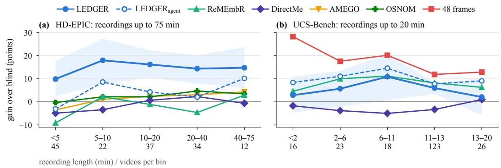  
Figure 5: Gain over the blind control by recording length, on the same questions in each bin (question-level accuracy, GPT-5.4). The band is the 95% interval of LEDGER's gain. (a) HD-EPIC, 2,400 questions on 150 videos. (b) UCS-Bench, 3,264 questions on 206 single recordings; AMEGO and OSNOM cannot answer these. Per-bin tables and trend tests are in Appendix F.

## 5 Conclusion and Limitations

LEDGER makes past object observations reusable for spatial answering and localization. Admitting untouched objects answers fixture questions, and persistence and contextual descriptions contribute more than coordinate refinement; missing event evidence and fragmented identities limit interaction and counting. Comparisons between memories depend on the reader, and scene changes break both retrieval and construction, which per-scene construction partly repairs. Evaluations should measure answerable evidence alongside localization, and should state retrieval budgets and scene boundaries

The scope remains limited. Recent frame readers outperform memory-only answering on HD-EPIC, and frames alone outperform memory alone on UCS-Bench, although adding the memory to the frames improves them. Counting and continuous rest intervals remain unresolved, and construction does not yet scale to the most object-dense hour-long recordings (Appendix D). HD-EPIC uses calibrated poses; VQ3D is queried by name rather than crop, and most UCS-Bench memories lack metric scale. On HD-EPIC, the segmentation and retrieval rules, triangulation thresholds, and fixture synonym groups were developed on calibration videos kept separate from evaluation (Appendix B.9). Construction is offline, so filtering records by question time does not establish causal online memory.

## References

[1] Mohamad Al Mdfaa, Svetlana Lukina, Timur Akhtyamov, Arthur Nigmatzyanov, Dmitrii Nalberskii, Sergey Zagoruyko, and Gonzalo Ferrer. Spatiotemporal knowledge graphs as persistent scene memory for embodied question answering, 2025.

[2] Abrar Anwar, John Welsh, Joydeep Biswas, Soha Pouya, and Yan Chang. ReMEmbR: Building and reasoning over long-horizon spatio-temporal memory for robot navigation, 2024.

[3] Neil Burgess. Spatial memory: how egocentric and allocentric combine. Trends Cogn. Sci., 10(12): 551–557, December 2006.

[4] Yifei Cao, Yu Liu, Guolong Wang, Zhu Liu, Kai Wang, Xianjie Zhang, Jizhe Yu, and Xun Tu. EAGLE: Episodic appearance- and geometry-aware memory for unified 2D-3D visual query localization in egocentric vision. arXiv preprint arXiv:2511.08007, 2025.

[5] Nicolas Carion, Laura Gustafson, Yuan-Ting Hu, Shoubhik Debnath, Ronghang Hu, Didac Suris, Chaitanya Ryali, Kalyan Vasudev Alwala, Haitham Khedr, Andrew Huang, Jie Lei, Tengyu Ma, Baishan Guo, Arpit Kalla, Markus Marks, Joseph Greer, Meng Wang, Peize Sun, Roman Rädle, Triantafyllos Afouras, Effrosyni Mavroudi, Katherine Xu, Tsung-Han Wu, Yu Zhou, Liliane Momeni, Rishi Hazra, Shuangrui Ding, Sagar Vaze, Francois Porcher, Feng Li, Siyuan Li, Aishwarya Kamath, Ho Kei Cheng, Piotr Dollár, Nikhila Ravi, Kate Saenko, Pengchuan Zhang, and Christoph Feichtenhofer. SAM 3: Segment Anything with concepts. arXiv preprint arXiv:2511.16719, 2025.

[6] Jacob Chalk, Saptarshi Sinha, Dima Damen, Yannis Kalantidis, and Diane Larlus. Whareformer: Learning to track what is where in long egocentric videos. arXiv preprint arXiv:2607.08537, 2026.

[7] Keshigeyan Chandrasegaran, Agrim Gupta, Lea M. Hadzic, Taran Kota, Jimming He, Cristóbal Eyzaguirre, Zane Durante, Manling Li, Jiajun Wu, and Li Fei-Fei. HourVideo: 1-hour video-language understanding. In Advances in Neural Information Processing Systems (NeurIPS) Datasets and Benchmarks Track, 2024.

[8] Zhiwei Chen, Yupeng Hu, Zixu Li, Zhiheng Fu, Guozhi Qiu, Weili Guan, and Liqiang Nie. EgoAdapt: A multi-scene egocentric adaptation method for CVPR 2026 HD-EPIC VQA challenge, 2026. URL https://arxiv.org/abs/2605.24500.

[9] Tianheng Cheng, Lin Song, Yixiao Ge, Wenyu Liu, Xinggang Wang, and Ying Shan. YOLO-World: Real-time open-vocabulary object detection. In Proceedings of the IEEE/CVF Conference on Computer Vision and Pattern Recognition, pages 16901–16911, 2024. URL https://openaccess.thecvf.com/content/CVPR2024/html/Cheng\_YOL0-World\_Real-Time\_ Open-Vocabulary\_0bject\_Detection\_CVPR\_2024\_paper.html.

[10] Tianyi Cheng, Dandan Shan, Ayda Sultan Hassen, Richard Ely Locke Higgins, and David Fouhey Towards a richer 2D understanding of hands at scale. In Thirty-seventh Conference on Neural Information Processing Systems, 2023. URL https://openreview.net/forum?id=6ldTxwhgtP.

[11] Zesen Cheng, Sicong Leng, Hang Zhang, Yifei Xin, Xin Li, Guanzheng Chen, Yongxin Zhu, Wenqi Zhang, Ziyang Luo, Deli Zhao, and Lidong Bing. VideoLLaMA 2: Advancing spatial-temporal modeling and audio understanding in Video-LLMs, 2024. URL https://arxiv.org/abs/2406.07476.

[12] Dima Damen, Hazel Doughty, Giovanni Maria Farinella, Antonino Furnari, Jian Ma, Evangelos Kazakos, Davide Moltisanti, Jonathan Munro, Toby Perrett, Will Price, and Michael Wray. Rescaling egocentric vision: Collection, pipeline and challenges for EPIC-KITCHENS-100. International Journal of Computer Vision (IJCV), 130:33–55, 2022. URL https://doi.org/10.1007/s11263-021-01531-2.

[13] Russell A Epstein, Eva Zita Patai, Joshua B Julian, and Hugo J Spiers. The cognitive map in humans: spatial navigation and beyond. Nature Neuroscience, 20(11):1504–1513, November 2017.

[14] Yue Fan, Xiaojian Ma, Rujie Wu, Yuntao Du, Jiaqi Li, Zhi Gao, and Qing Li. VideoAgent: A memory-augmented multimodal agent for video understanding, 2024.

[15] Yue Fan, Xiaojian Ma, Rongpeng Su, Jun Guo, Rujie Wu, Xi Chen, and Qing Li. Embodied videoagent: Persistent memory from egocentric videos and embodied sensors enables dynamic scene understanding. In 2025 IEEE/CVF International Conference on Computer Vision (ICCV), pages 6342–6352. IEEE, 2025.

[16] Gabriele Goletto, Tushar Nagarajan, Giuseppe Averta, and Dima Damen. AMEGO: Active memory from long EGOcentric videos. In European Conference on Computer Vision, 2024.

[17] Kristen Grauman, Andrew Westbury, Eugene Byrne, Zachary Chavis, Antonino Furnari, Rohit Girdhar, Jackson Hamburger, Hao Jiang, Miao Liu, Xingyu Liu, et al. Ego4d: Around the world in 3,000 hours of egocentric video. In Proceedings of the IEEE/CVF conference on computer vision and pattern recognition, pages 18995–19012, 2022.

[18] Qiao Gu, Ali Kuwajerwala, Sacha Morin, Krishna Murthy Jatavallabhula, Bipasha Sen, Aditya Agarwal, Corban Rivera, William Paul, Kirsty Ellis, Rama Chellappa, et al. Conceptgraphs: Open-vocabulary 3d scene graphs for perception and planning. In 2024 IEEE International Conference on Robotics and Automation (ICRA), pages 5021–5028. IEEE, 2024.

[19] Jason Helbing, Dejan Draschkow, and Melissa L.-H. Võ. Search superiority: Goal-directed attentional allocation creates more reliable incidental identity and location memory than explicit encoding in naturalistic virtual environments. Cognition, 196:104147, 2020. URL https://api.semanticscholar. org/CorpusID:210940013.

[20] Andrew Hollingworth. The relationship between online visual representation of a scene and long-term scene memory. J. Exp. Psychol. Learn. Mem. Cogn., 31(3):396–411, May 2005.

[21] Andrew Hollingworth and John M. Henderson. Accurate visual memory for previously attended objects in natural scenes. Journal of Experimental Psychology: Human Perception and Performance, 28:113–136, 2002. URL https://api.semanticscholar.org/CorpusID:17274346.

[22] Weikai Huang, Jieyu Zhang, Sijun Li, Taoyang Jia, Jiafei Duan, Yunqian Cheng, Jaemin Cho, Matthew Wallingford, Rustin Soraki, Chris Dongjoo Kim, Shuo Liu, Donovan Clay, Taira Anderson, Winson Han, Ali Farhadi, Bharath Hariharan, Zhongzheng Ren, and Ranjay Krishna. WildDet3D: Scaling promptable 3D detection in the wild, 2026. URL https://arxiv.org/abs/2604.08626.

[23] Zhenpeng Huang, Xinhao Li, Jiaqi Li, Jing Wang, Xiangyu Zeng, Cheng Liang, Tao Wu, Xi Chen, Liang Li, and Limin Wang. Online video understanding: OVBench and VideoChat-Online, 2025. URL https://arxiv.org/abs/2501.00584.

[24] Almut Hupbach, Oliver Hardt, Rebecca Gomez, and Lynn Nadel. The dynamics of memory: contextdependent updating. Learn. Mem., 15(8):574–579, August 2008.

[25] Savya Khosla, Alexander Schwing, Derek Hoiem, et al. Relocate: A simple training-free baseline for visual query localization using region-based representations. In Proceedings of the IEEE/CVF Conference on Computer Vision and Pattern Recognition, pages 3697–3706, 2025.

[26] M Land, N Mennie, and J Rusted. The roles of vision and eye movements in the control of activities of daily living. Perception, 28(11):1311–1328, 1999.

[27] Haotong Lin, Sili Chen, Junhao Liew, Donny Y. Chen, Zhenyu Li, Guang Shi, Jiashi Feng, and Bingyi Kang. Depth Anything 3: Recovering the visual space from any views, 2025. URL https: //arxiv.org/abs/2511.10647.

[28] Yiren Lu, Yi Du, Disheng Liu, Yunlai Zhou, Chen Wang, and Yu Yin. GSMem: 3D Gaussian splatting as persistent spatial memory for zero-shot embodied exploration and reasoning. arXiv preprint arXiv:2603.19137, 2026.

[29] Ke Ma, Yamin Mao, Weiming Li, Shuai Tan, Yijie Zhong, Hao Chen, Haofen Wang, and Meng Wang. R4DSG: Relative 4D scene graph memory for object-centric question answering in long egocentric video. In ACM International Conference on Multimedia (MM), 2026. arXiv:2608.11017.

[30] Jinjie Mai, Abdullah Hamdi, Silvio Giancola, Chen Zhao, and Bernard Ghanem. Egoloc: Revisiting 3d object localization from egocentric videos with visual queries. In 2023 IEEE/CVF International Conference on Computer Vision (ICCV), pages 45–57. IEEE, 2023.

[31] Jinjie Mai, Abdullah Hamdi, Silvio Giancola, Chen Zhao, and Bernard Ghanem. Hybrid structure-frommotion and camera relocalization for enhanced egocentric localization, 2024. 1st place, Ego4D VQ3D challenge 2024.

[32] Arjun Majumdar, Anurag Ajay, Xiaohan Zhang, Pranav Putta, Sriram Yenamandra, Mikael Henaff, Sneha Silwal, Paul Mcvay, Oleksandr Maksymets, Sergio Arnaud, Karmesh Yadav, Qiyang Li, Ben Newman, Mohit Sharma, Vincent Berges, Shiqi Zhang, Pulkit Agrawal, Yonatan Bisk, Dhruv Batra. Mrinal Kalakrishnan, Franziska Meier, Chris Paxton, Sasha Sax, and Aravind Rajeswaran. OpenEQA: Embodied question answering in the era of foundation models. In Proceedings of the IEEE/CVF Conference on Computer Vision and Pattern Recognition (CVPR), 2024.

[33] Zaira Manigrasso, Matteo Dunnhofer, Antonino Furnari, Moritz Nottebaum, Antonio Finocchiaro, Davide Marana, Rosario Forte, Giovanni Maria Farinella, and Christian Micheloni. Online episodic memory visual query localization with egocentric streaming object memory. arXiv preprint arXiv:2411.16934 2024.

[34] OpenAI. GPT-5.4 Thinking System Card. OpenAI Deployment Safety Hub, March 2026. URL https://deploymentsafety.openai.com/gpt-5-4-thinking. Accessed: 2026-09-24.

[35] Toby Perrett, Ahmad Darkhalil, Saptarshi Sinha, Omar Emara, Sam Pollard, Kranti Parida, Kaiting Liu, Prajwal Gatti, Siddhant Bansal, Kevin Flanagan, Jacob Chalk, Zhifan Zhu, Rhodri Guerrier, Fahd Abdelazim, Bin Zhu, Davide Moltisanti, Michael Wray, Hazel Doughty, and Dima Damen. HD-EPIC: A highly-detailed egocentric video dataset. In Proceedings of the IEEE/CVF Conference on Computer Vision and Pattern Recognition (CVPR), June 2025.

[36] Chiara Plizzari, Shubham Goel, Toby Perrett, Jacob Chalk, Angjoo Kanazawa, and Dima Damen. Spatial cognition from egocentric video: Out of sight, not out of mind. In 2025 International Conference on 3D Vision (3DV), 2025.

[37] Albert Postma, Roy P C Kessels, and Marieke van Asselen. How the brain remembers and forgets where things are: the neurocognition of object-location memory. Neurosci. Biobehav. Rev., 32(8):1339–1345, October 2008.

[38] Rui Qian, Shuangrui Ding, Xiaoyi Dong, Pan Zhang, Yuhang Zang, Yuhang Cao, Dahua Lin, and Jiaqi Wang. Dispider: Enabling Video LLMs with Active Real-Time Interaction via Disentangled Perception, Decision, and Reaction . In 2025 IEEE/CVF Conference on Computer Vision and Pattern Recognition (CVPR), pages 24045–24055, Los Alamitos, CA, USA, June 2025. IEEE Computer Society. doi: 10.1109/CVPR52734.2025.02239. URL https://doi.ieeecomputersociety.org/10.1109/CVPR52734. 2025.02239.

[39] Ivan Rodin, Tz-Ying Wu, Kyle Min, Sharath Nittur Sridhar, Antonino Furnari, Subarna Tripathi, and Giovanni Maria Farinella. EASG-Bench: Video Q&A benchmark with egocentric action scene graphs. arXiv preprint, 2025.

[40] Lukas Schmid, Marcus Abate, Yun Chang, and Luca Carlone. Khronos: A unified approach for spatio-temporal metric-semantic SLAM in dynamic environments. arXiv preprint arXiv:2402.13817, 2024.

[41] You Shen, Zhipeng Zhang, Yansong Qu, and Liujuan Cao. FastVGGT: Training-free acceleration of visual geometry transformer. arXiv preprint arXiv:2509.02560, 2025.

[42] Agnese Taluzzi, Davide Gesualdi, Riccardo Santambrogio, Chiara Plizzari, Francesca Palermo, Simone Mentasti, and Matteo Matteucci. From pixels to graphs: using scene and knowledge graphs for hd-epic vqa challenge. arXiv preprint arXiv:2506.08553, 2025.

[43] Hao Tang, Kevin Liang, Matt Feiszli, and Weiyao Wang. EgoTracks: A long-term egocentric visual object tracking dataset. In Advances in Neural Information Processing Systems (NeurIPS) Datasets and Benchmarks Track, 2023.

[44] Gemini Team et al. Gemini 1.5: Unlocking multimodal understanding across millions of tokens of context, 2024. URL https://arxiv.org/abs/2403.05530.

[45] Qwen Team. Qwen3.5: Towards native multimodal agents, February 2026. URL https://qwen.ai/ blog?id=qwen3.5.

[46] E C Tolman. Cognitive maps in rats and men. Psychol. Rev., 55(4):189–208, July 1948.

[47] Jianyuan Wang, Minghao Chen, Nikita Karaev, Andrea Vedaldi, Christian Rupprecht, and David Novotny. VGGT: Visual geometry grounded transformer. In Proceedings of the IEEE/CVF Conference on Computer Vision and Pattern Recognition (CVPR), 2025.

[48] R F Wang and E S Spelke. Updating egocentric representations in human navigation. Cognition, 77(3): 215–250, December 2000.

[49] Yun Wang, Junbin Xiao, Han Lyu, Yifan Wang, Jing Zuo, Zhanjie Zhang, Hong Huang, Dapeng Wu, and Angela Yao. Keep it in mind: User-centric continual spatial intelligence reasoning in egocentric video streams, 2026. URL https://arxiv.org/abs/2606.15200.

[50] Ziyang Wang, Yue Zhang, Shoubin Yu, Ce Zhang, Zengqi Zhao, Jaehong Yoon, Hyunji Lee, Gedas Bertasius, and Mohit Bansal. EgoMemReason: A memory-driven reasoning benchmark for long-horizon egocentric video understanding. arXiv preprint arXiv:2605.09874, 2026.

[51] William H. Warren, Daniel B. Rothman, Benjamin H. Schnapp, and Jonathan D. Ericson. Wormholes in virtual space: From cognitive maps to cognitive graphs. Cognition, 166:152–163, 2017. ISSN 0010- 0277. doi: https://doi.org/10.1016/j.cognition.2017.05.020. URL https://www.sciencedirect.com/ science/article/pii/S0010027717301373.

[52] Diankun Wu, Fangfu Liu, Yi-Hsin Hung, and Yueqi Duan. Spatial-MLLM: Boosting MLLM capabilities in visual-based spatial intelligence. In The Thirty-ninth Annual Conference on Neural Information Processing Systems, 2025. URL https://openreview.net/forum?id=RnXS7aK4rK

[53] Yinsong Xu, Wei Jing, Liuxin Zhang, Wanjun Lv, and Hui Li. Semantic and visual evidence for efficient long-video reasoning: A solution for the HD-EPIC VQA challenge, 2026.

[54] Jingkang Yang, Shuai Liu, Hongming Guo, Yuhao Dong, Xiamengwei Zhang, Sicheng Zhang, Pengyun Wang, Zitang Zhou, Binzhu Xie, Ziyue Wang, Bei Ouyang, Zhengyu Lin, Marco Cominelli, Zhongang Cai, Yuanhan Zhang, Peiyuan Zhang, Fangzhou Hong, Joerg Widmer, Francesco Gringoli, Lei Yang, Bo Li, and Ziwei Liu. EgoLife: Towards egocentric life assistant, 2025.

[55] Shusheng Yang, Jihan Yang, Pinzhi Huang, Ellis Brown, Zihao Yang, Yue Yu, Shengbang Tong, Zihan Zheng, Yifan Xu, Muhan Wang, Daohan Lu, Rob Fergus, Yann LeCun, Li Fei-Fei, and Saining Xie. Cambrian-S: Towards spatial supersensing in video. arXiv preprint arXiv:2511.04670, 2025.

[56] Sicheng Yang, Yukai Huang, Shitong Sun, Weitong Cai, Jiankang Deng, Jifei Song, and Zhensong Zhang. Optimizing multimodal LLMs for egocentric video understanding: A solution for the HD-EPIC VQA challenge, 2026. 2nd place, HD-EPIC VQA challenge 2025.

[57] Yuncong Yang, Han Yang, Jiachen Zhou, Peihao Chen, Hongxin Zhang, Yilun Du, and Chuang Gan. 3D-Mem: 3D scene memory for embodied exploration and reasoning. In Proceedings of the IEEE/CVF Conference on Computer Vision and Pattern Recognition (CVPR), 2025.

[58] Zihao Yu, Xiu Yuan, and Chongjie Zhang. MEMORA: Embodied action memory from egocentric videos for reasoning and planning. arXiv preprint arXiv:2607.14252, 2026.

[59] Haoji Zhang, Yiqin Wang, Yansong Tang, Yong Liu, Jiashi Feng, Jifeng Dai, and Xiaojie Jin. Flash-VStream: Efficient real-time understanding for long video streams. In Proceedings of the IEEE/CVF International Conference on Computer Vision (ICCV), 2025.

[60] Peiyuan Zhang, Kaichen Zhang, Bo Li, Guangtao Zeng, Jingkang Yang, Yuanhan Zhang, Ziyue Wang, Haoran Tan, Chunyuan Li, and Ziwei Liu. Long context transfer from language to vision. Transactions on Machine Learning Research, 2025. ISSN 2835-8856. URL https://openreview.net/forum?id= 30RAWQVGlx.

[61] Yuanhan Zhang, Jinming Wu, Wei Li, Bo Li, Zejun MA, Ziwei Liu, and Chunyuan Li. LLaVA-Video: Video instruction tuning with synthetic data. Transactions on Machine Learning Research, 2025. ISSN 2835-8856. URL https://openreview.net/forum?id=EElFGvt39K.

[62] Rui Zhou, Xander Yap, Jianwen Cao, Allison Lau, Boyang Sun, and Marc Pollefeys. Memory over maps: 3D object localization without reconstruction. arXiv preprint arXiv:2603.20530, 2026.

## Appendix Contents

A Memory Construction Details 19   
A.1 Sampling, vocabulary, and detection 19   
A.2 Camera poses and object lifting 19   
A.3 Association and consolidation 20   
A.4 Persistence and contextual descriptions 20   
A.5 Multi-view refinement 20   
B HD-EPIC Details 21   
B.1 Evaluation scope and per-prototype results 21   
B.2 Implementation and query adapters 22   
B.3 Published baselines and aggregation 23 24 2 5 25   
B.4 Memories rebuilt on our setup   
B.5 Component ablations   
B.6 Design ablations   
B.7 Earlier retrieval, oracle, and geometry analyses 27   
B.8 Movement and stationary-state analysis 28   
B.9 Development data and cost 28   
C VQ3D Localization and Discovery Analysis 29   
C.1 Protocol and interpretation 29   
C.2 Implementation settings 29   
C.3 Localization across memory variants 29   
C.4 Triangulated against monocular positions 30   
C.5 Published methods on the validation split 30   
C.6 Memories built by prior methods on the same clips 32   
C.7 Detector and vocabulary analysis 32   
D UCS-Bench Details 33   
D.1 Benchmark, construction, and answering protocol 3 5 36   
D.2 Counting   
D.3 Development pilot and causal construction   
D.4 Implementation settings 36   
E Multi-Scene UCS-Bench Streams 37   
E.1 Stream design . 37   
E.2 Where the loss appears 37   
E.3 Construction and retrieval 38   
E.4 Scene-cut detection and per-scene construction 39   
E.5 Event lines 39   
E.6 Leave-one-out ablation 40   
E.7 Record against reader 41   
E.8 Open answering models 41   
E.9 Delayed questions . 42   
F Accuracy by Recording Length 42   
G Failure Analysis and Qualitative Example 44   
G.1 When an answer is wrong, where was it lost? 44   
G.2 Three memories on one stream 44   
H Answer-Time Token Cost 47

Reading guide
<table><tr><td>Main text</td><td>Appendices with the details</td></tr><tr><td>Method (Section 3)</td><td>A</td></tr><tr><td>Benchmarks, baselines, and protocols (Section 4)</td><td>B.1–B.4, C.1–C.2, C.5–C.6, D.1, D.4, E.1</td></tr><tr><td>RQ1: which questions stored records answer (Section 4)</td><td>B.1, B.3–B.4, D.1–D.2, E.8</td></tr><tr><td>RQ2: genuine movement or observation noise (Section 4)</td><td>B.5, B.8</td></tr><tr><td>RQ3: which geometric errors matter (Section 4)</td><td>B.5–B.7, C</td></tr><tr><td>RQ4: retrieval and memory comparisons (Section 4)</td><td>E.5, E.7</td></tr><tr><td>RQ5: what breaks across scenes (Section 4)</td><td>F, E.1–E.4, E.9</td></tr><tr><td>Where wrong answers are lost; a worked example (Section 4)</td><td>G.1, G.2</td></tr><tr><td>Why a memory rather than frames per question (Section 3)</td><td>H</td></tr></table>

## A Memory Construction Details

## A.1 Sampling, vocabulary, and detection

We sample one frame every four seconds, up to 1,200 frames per recording. Qwen3.5-9B names the visible objects. We merge synonymous names into a vocabulary of at most 80 labels per recording. On UCS-Bench, this step uses at most 80 frames (Appendix D). YOLO-World [9] then detects objects matching these labels. We also evaluate SAM 3 [5] as an alternative detector on VQ3D. Which objects enter memory depends on the vocabulary, the detector's confidence threshold, and the number of detections we can lift into 3D. Dataset-specific resolutions, thresholds, and budgets are listed in Appendices B.2, C, and D.

## A.2 Camera poses and object lifting

We use calibrated device trajectories on HD-EPIC and registered EgoLoc poses on VQ3D. To estimate poses, we use FastVGGT [41], a training-free acceleration of VGGT [47]. It processes 96-frame chunks with 16 overlapping frames. We align adjacent chunks using a Sim(3) transformation estimated from their shared frames.

These estimated poses have arbitrary scale. To recover metric scale, the pipeline compares pairs of observations of the same static object with their predicted metric positions in camera coordinates. This step fails for most UCS-Bench recordings and all TeleEgo recordings. Distances in those memories are therefore expressed in scene units (Appendix D.1).

On UCS-Bench, we first try Depth Anything 3 [27], except for circular-fisheye recordings. It processes 48-frame chunks with 12 overlapping frames. We keep its poses only if they pass three consistency checks: the chunk-alignment residual is at most 0.5 m, chunk scales lie within [0.8, 1.25], and the camera moves no more than 6 m between sampled frames. Otherwise, we fall back to FastVGGT. If FastVGGT cannot align a chunk with the preceding one, it starts from a new anchor (Appendix D).

Given an image, a 2D box, and an object label, WildDet3D [22] predicts a metric 3D box in camera coordinates. We use its centre as the object's position. This avoids selecting pixels from a dense depth map, where object and background surfaces can be mixed. Although the predicted box is metric, its position in scene coordinates is only metric if the camera poses also have a known scale.

Geometry-estimator analysis. In the earlier HD-EPIC analysis, the median localization error was 0.39 m, with a median along-ray component of 0.37 m (Appendix B.7). This motivates using multiple views with known camera poses to refine object positions.

On the UCS-Bench pilot, two Depth Anything 3 reconstructions were rejected. Their chunk scale ratios were 1.16 and 1.58, and their alignment residuals at chunk boundaries were 0.67 and 7.10 m, respectively. We fall back to FastVGGT, which also handles fisheye recordings but does not provide metric scale on its own.

We compare both pose estimators on the same frames from all 44 VQ3D clips (Appendix C). After aligning each trajectory to EgoLoc camera centres with one Sim(3) transformation per clip, their median position errors are similar: 9.1 cm for Depth Anything 3 and 9.2 cm for FastVGGT. Median orientation errors are 5.5° and 5.9°, respectively. However, Depth Anything 3 fails to join its chunks into a single trajectory on 11 clips. Object localization also shows no clear difference: median paired differences range from -0.03 to +0.02 m across detectors and memory variants, with every interval including zero. These results support using FastVGGT as the fallback when poses are unavailable, although both estimators still require metric scale recovery

## A.3 Association and consolidation

Trajectory memory clusters observations in 3D, associating them chronologically by label and proximity to an instance's most recent position. Detections in the same frame remain separate unless they are overlapping duplicates. A second pass, called consolidation, reconnects tracks that may belong to the same object. It groups tracks with synonymous labels, uses the SAM 3 video tracker [5] to propagate their masks across frames, and merges tracks whose propagated masks agree. Co-occurrence and 3D-distance checks block incompatible merges.

We use consolidation on HD-EPIC and UCS-Bench. On VQ3D, we compare raw, trajectory, and consolidated memories, using a trajectory association radius of 1.0 m and a consolidation mask-IoU threshold of 0.3. $\mathrm { O n }$ UCS-Bench, merges are blocked beyond a 3D distance of 1.0, measured in scene units when metric scale is unavailable (Appendix D.2). Even with consolidation, an object may receive a new identity after a long absence or a large move.

## A.4 Persistence and contextual descriptions

Distance-threshold segmentation starts a new segment as soon as an observation lies more than τ from the current resting position. Our persistence rule waits until k successive observations of the object lie outside this radius before confirming a new segment. If observations return within the radius before confirmation, they remain in the current segment.

On HD-EPIC, we use $\tau = 0 . 3$ m and $k = 3$ . We use the same values on UCS-Bench, but measure the radius in scene units when metric scale is unavailable. Appendix B.8 compares the two rules.

For up to six segments per object, Qwen3.5-9B describes a representative frame with the object outlined. These descriptions record details such as the object's contents, its supporting surface, and interactions that positions alone do not capture.

In the reported HD-EPIC runs, we first generated descriptions for distance-threshold segments. Each persistence segment then inherited the description of the segment with the greatest temporal overlap. The persistence ablation therefore also changes which descriptions appear in the records; it does not keep all textual evidence fixed (Appendix B.2). The additional activity descriptions for sampled frames in the UCS-Bench extensions are detailed in Appendix E.5.

## A.5 Multi-view refinement

Observing a resting object from several viewpoints helps constrain its 3D position. Each detected box centre defines a viewing ray from the camera. Given camera centres $\mathbf { c } _ { i }$ and unit ray directions $\mathbf { d } _ { i } .$ we estimate the point that minimizes the sum of squared distances to these rays:

$$
\hat { \mathbf { x } } = \left( \sum _ { i } \mathbf { P } _ { i } \right) ^ { - 1 } \sum _ { i } \mathbf { P } _ { i } \mathbf { c } _ { i } , \qquad \mathbf { P } _ { i } = \mathbf { I } - \mathbf { d } _ { i } \mathbf { d } _ { i } ^ { \top } .\tag{1}
$$

We accept this estimate only when the camera positions are sufficiently separated, the ray geometry supports a stable solution, and the estimate stays close to the monocular prediction. On HD-EPIC, we require at least three rays, a camera baseline of at least 0.10 m, a minimum eigenvalue of 0.25 for $\textstyle \sum _ { i } \mathbf { P } _ { i } ,$ and a shift of no more than 2.0 m from the monocular prediction (Table 7). The localization analysis and question-answering ablation are reported in Appendices B.7 and B.5.

## B HD-EPIC Details

## B.1 Evaluation scope and per-prototype results

HD-EPIC contains 26,550 five-way multiple-choice questions across 30 prototypes and seven categories. We evaluate all questions in 3D Perception and Object Motion, covering 150 videos (Table 5; Figure 6). These questions have no official training, validation, or test split.

We build memories using the released camera poses and reserve ground-truth geometry for analysis. Across the 150 videos (40.7 hours), 36,633 sampled frames produce 52,001 object instances, 504,981 observations, and 82,445 rest segments. Answering from the same memory in a separate session yields 41.9% accuracy, compared with 42.6% originally, illustrating a 0.7-point variation between these two runs.

Component ablations use 2,317 questions from the 133 videos processed in the initial pass, with the same prototype-averaged metric. The earlier ten-video analyses reported below are development studies based on different run snapshots.

Table 5: HD-EPIC accuracy (%) on all seven evaluated prototypes. Memory scores are bold when they exceed the matched blind control.
<table><tr><td rowspan="2">Category</td><td rowspan="2">Prototype</td><td colspan="2">Qwen3.5-9B</td><td colspan="2">GPT-5.4</td></tr><tr><td>n</td><td>Blind Memory</td><td></td><td>Blind Memory</td></tr><tr><td rowspan="4">3D Perception</td><td>object location</td><td>500</td><td>25.4</td><td>45.6</td><td>38.6 48.0</td></tr><tr><td>contents retrieval</td><td>200</td><td>16.0 28.5</td><td>16.5</td><td>33.5</td></tr><tr><td>fixture location</td><td>500</td><td>16.2</td><td>52.6 13.8</td><td>56.0</td></tr><tr><td>fixture interaction counting</td><td>300</td><td>36.0</td><td>40.3 40.0</td><td>41.3</td></tr><tr><td rowspan="3">Object Motion</td><td>movement itinerary</td><td>500</td><td>11.8</td><td>26.2</td><td>34.8 38.6</td></tr><tr><td>movement counting</td><td>200 28.5</td><td>35.5</td><td>31.0</td><td>45.0</td></tr><tr><td>stationary localization</td><td>200</td><td>26.0 14.5</td><td>30.5</td><td>38.0</td></tr><tr><td colspan="2">Overall (question average)</td><td>2,400</td><td>21.5</td><td>37.5</td><td>29.7 44.6</td></tr></table>

Table 6: Prototype-averaged HD-EPIC accuracy (%) with 95% bootstrap intervals (2,000 resamples stratified by prototype, seed 0). Memory improves mean accuracy over the matched blind control by 10.8 points [8.2, 13.3] for Qwen3.5-9B and 13.0 points [10.4, 15.5] for GPT-5.4.
<table><tr><td>Answerer</td><td>Evidence</td><td>3D Perception</td><td>Object Motion</td><td>Mean</td></tr><tr><td rowspan="2">Qwen3.5-9B</td><td>Blind</td><td>23.4 [21.2,25.7]</td><td>22.1 [19.0,25.1]</td><td>22.8 [20.9,24.7]</td></tr><tr><td>Memory</td><td>41.8 [39.3,44.4]</td><td>25.4 [22.3,28.4]</td><td>33.6 [31.6,35.5]</td></tr><tr><td rowspan="2">GPT-5.4</td><td>Blind</td><td>27.2 [25.0,29.6]</td><td>32.1 [28.9,35.4]</td><td>29.7 [27.7,31.7]</td></tr><tr><td>Memory</td><td>44.7 [42.0,47.3]</td><td>40.5 [37.2,44.3]</td><td>42.6 [40.5,44.8]</td></tr></table>

We report 95% bootstrap intervals using 2,000 resamples stratified by prototype (seed 0). Comparisons use the same questions in both conditions.

We also report pooled accuracy, which gives each question equal weight, so larger prototypes contribute more. For Qwen, memory raises pooled 3D Perception accuracy from 23.2% to 44.6% and Object Motion accuracy from 18.7% to 25.7%. For GPT, the corresponding improvements are from 27.7% to 47.4% and from 33.0% to 39.9%.

Across all 2,400 questions, pooled accuracy rises from 21.5% to 37.5% for Qwen and from 29.7% to 44.6% for GPT. The paired gains are 16.0 points [13.6, 18.3] and 14.9 points [12.7, 17.3], respectively. These pooled scores should not be compared directly with the HD-EPIC paper, which averages prototype scores.

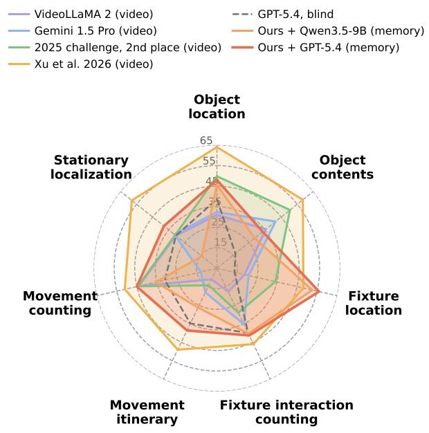

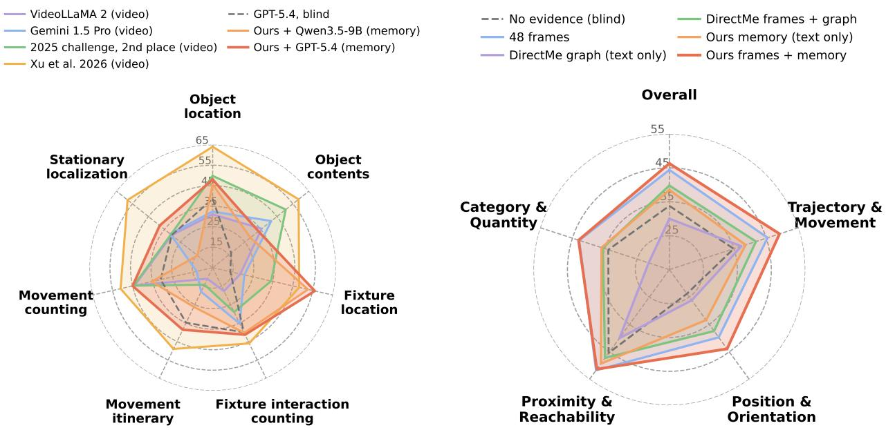

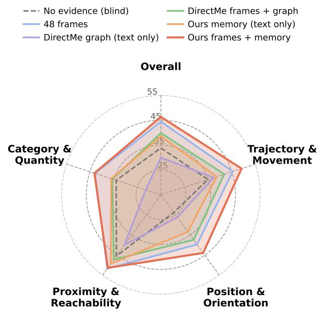  
Figure 6: Accuracy by question type. Left: HD-EPIC by prototype; published video models as printed in Xu et al. [53] (EgoAdapt reports no per-prototype scores). Right: UCS-Bench by category on the 2,771 questions of Table 3.

The intervals describe uncertainty for the evaluated videos. They do not account for clustering of questions within videos or replace evaluation on held-out videos.

## B.2 Implementation and query adapters

We convert the Aria fisheye RGB frames into 1802 × 1802 virtual pinhole images. We combine the released device poses with the camera calibration to obtain the world-to-camera transformation: $\mathbf { T } _ { c w } = ( \mathbf { T } _ { w d } \mathbf { T } _ { d c } ) ^ { - 1 }$ . To check the coordinate conventions, we project 35,722 ground-truth object locations into the images. Of these, 98.3% fall inside their annotated boxes, with a median offset of 22 pixels. These annotations are not used to build the memory.

Table 7: HD-EPIC construction and answering settings.
<table><tr><td>Stage</td><td>Parameter</td><td>Value</td></tr><tr><td>Sampling</td><td>interval / cap</td><td>4 s / 1,200 frames</td></tr><tr><td>Rectification</td><td>pinhole resolution</td><td>1802 × 1802 px</td></tr><tr><td>Tagging</td><td>model / token cap / vocabulary cap</td><td>Qwen3.5-9B / 130 / 80</td></tr><tr><td>Detection</td><td>model</td><td>YOLO-World v8x-worldv2</td></tr><tr><td></td><td>input / confidence / top-k</td><td>1408 px / 0.05 / 40</td></tr><tr><td>3D lifting</td><td>per-frame / per-video / per-tag budget 12 / ≥ 400 / max(25, N/4)</td><td></td></tr><tr><td>Triangulation</td><td>1 rays / baseline  $/ \lambda _ { \mathrm { m i n } } /$  shift</td><td>3 / 0.10 m / 0.25 / 2.0 m</td></tr><tr><td>Association</td><td>tracker IoU / 3D merge veto</td><td>0.3 / 1.0 m</td></tr><tr><td>Segmentation</td><td>radius τ / persistence k</td><td>0.3m / 3</td></tr><tr><td>Descriptions</td><td>frame size / segments per object</td><td>896 px / 6</td></tr><tr><td>Box retrieval</td><td>time window / candidates</td><td>±6s / 4</td></tr><tr><td>Answering</td><td>protocol</td><td>one call, options A-E</td></tr></table>

For questions that specify an object with a box, we use the sampled frame nearest the query time to estimate the box's 3D position. We rank object instances observed near that time by their minimum distance to this position and retrieve the closest four. We then replace the box reference in the question with the estimated coordinate. The answerer receives object labels, ranking signals and segment histories as text. It sees no images, although grounding the query box still uses a frame.

For fixture-location questions, we match names using predefined synonym groups, such as hob/stove/cooktop and fridge/refrigerator/freezer. We retrieve the four matching instances with the most observations. To compute their clock directions, we project the camera's forward axis and the direction to each object onto the horizontal plane: 12 is ahead, 3 is right, 6 is behind, and 9 is left.

Using ground-truth fixture positions, this calculation selects the correct direction option on 97.8% of 365 validation questions. With the constructed memory, retrieval finds a name-matched fixture for 83% of the 500 fixture-location questions. Choosing the option closest to the first candidate's clock direction scores 59.2% across all 500 questions, compared with 56.0% for GPT reading the candidate histories. This geometric rule applies specifically to fixture-direction questions.

We run Qwen with greedy decoding and thinking disabled. We run GPT-5.4 with reasoning effort set to none and temperature 1.0 in all experiments, so its answers can vary across otherwise identical runs. Mean usage per question is 1,938 input and 381 output tokens for Qwen, and 1,750 input and 231 output tokens for GPT.

Descriptions are generated for distance-threshold segments. Each persistence segment inherits the description of the segment with the greatest temporal overlap. The segmentation ablation therefore changes both segment boundaries and the assignment of descriptions; it does not keep all textual evidence fixed.

## B.3 Published baselines and aggregation

The HD-EPIC paper averages prototype accuracies to obtain category scores [35]. We follow this convention for our primary results. We also report pooled accuracy, which gives each question equal weight. For category $C ,$ with prototype accuracies $a _ { p }$ and question counts $n _ { p }$ , the two scores are

$$
\mathrm { P r o t o t y p e ~ a v e r a g e } = \frac { 1 } { | C | } \sum _ { p \in C } a _ { p } , \qquad \mathrm { P o o l e d ~ a c c u r a c y } = \frac { \sum _ { p \in C } n _ { p } a _ { p } } { \sum _ { p \in C } n _ { p } } .
$$

Our rows in Table 8 use prototype averages to match the published convention. The number of correct answers for each prototype can be uniquely recovered from its rounded accuracy and question count in Table 5.

Using GPT, the memory exceeds the video baselines of the HD-EPIC paper and both 2025 challenge entries under this averaging convention, and it remains below the two 2026 challenge reports, which read the video with newer models. EgoAdapt uses category-specific video sampling and option-order voting. Neither comparison isolates the benefit of memory; our matched blind runs provide that control. We also tested a newer model on ten development videos covering 418 questions, using the same answering protocol with three evidence conditions: 50 frames, memory, or no evidence. Prototype-averaged 3D Perception and Object Motion scores were 57.9% and 45.8% with frames, 40.1% and 33.4% with memory, and 23.6% and 32.4% for the blind control. Frames outperform memory in this test, consistent with the published 2026 results.

The per-prototype results reveal where memory helps most (Table 9). Fixture location is the only prototype where our memory exceeds every reported baseline score. Movement counting and fixture-interaction counting are comparable to the 2025 entries. The weakest results are on object contents retrieval and, for Qwen, stationary object localization.

Table 8: Published HD-EPIC category scores and our prototype-averaged scores (%). Published baselines were not rerun; models, visual inputs, and inference budgets differ. The team labels used in the challenge reports are inconsistent between papers, so rows are identified by paper: the 40.9 / 29.9 entry is the method of Yang et al. [56] (2nd place 2025), and the 42.6 / 30.2 entry is the scene- and knowledge-graph system of Taluzzi et al. [42] (1st place 2025, 44.21 overall).
<table><tr><td>Model</td><td>Images to answerer 3D Perception Object Motion</td><td></td></tr><tr><td>Llama 3.2, text only [35]</td><td>no</td><td>22.3 25.5 21.5</td></tr><tr><td>Gemini 1.5 Pro, text only [35]</td><td>no</td><td>27.7</td></tr><tr><td>VideoLLaMA 2 [11]</td><td>yes 25.7</td><td>28.5</td></tr><tr><td>LongVA [60]</td><td>yes</td><td>22.7</td></tr><tr><td>LLaVA-Video [61]</td><td>32.9 yes 27.3</td><td>18.9</td></tr><tr><td>Gemini 1.5 Pro [44]</td><td>yes 32.5</td><td>20.8</td></tr><tr><td>Qwen2.5-VL-7B, zero-shot [56]</td><td>yes 35.0</td><td>23.9</td></tr><tr><td>Qwen2.5-VL-32B, zero-shot [56]</td><td>yes 35.6 40.9</td><td>19.8</td></tr><tr><td>2025 challenge, 2nd place [56]</td><td>yes</td><td>29.9</td></tr><tr><td>2025 challenge, 1st place [42]</td><td>yes</td><td>30.2</td></tr><tr><td>Gemini 3.1 Pro + object detector, 2026 [53]</td><td>yes</td><td>52.7</td></tr><tr><td>EgoAdapt, 2026 [8]</td><td>yes</td><td>61.6</td></tr><tr><td>Human (sample) [35]</td><td>yes</td><td>92.7</td></tr><tr><td>Qwen3.5-9B blind (ours)</td><td>no</td><td>22.1</td></tr><tr><td>LEDGER + Qwen3.5-9B</td><td>no</td><td>25.4</td></tr><tr><td>GPT-5.4 blind (ours)</td><td>no</td><td>32.1</td></tr><tr><td>LEDGER + GPT-5.4</td><td>no</td><td>40.5</td></tr></table>

## B.4 Memories rebuilt on our setup

Four memory-based methods are rebuilt on the same 150 videos and 2,400 questions. Each method uses its released code to build memory from the same rectified frames, sampled every 4s. GPT-5.4 answers from each memory without seeing the video, and all scores use the same prototype averaging. For questions that identify an object with a box, we match the query box to each memory's own observations at the query time. We select up to three matches with the highest 2D overlap, requiring IoU ≥ 0.1. Method-specific adaptations:

DirectMe [49]: released graph builder (Objects365 vocabulary, YOLO-World, SAM 2, Depth Anything 3 depth and poses) and its text-only graph prompt without keyframes, evaluated over the whole video, with the pose for egocentric relations taken at the question's time. Its object-count shortcut is disabled because HD-EPIC counting questions count events, not instances.

Table 9: HD-EPIC accuracy per prototype (%) for the published entries that report it (as printed in Xu et al. [53]) and for our memory. Bold marks the best score per prototype. EgoAdapt reports category means only.
<table><tr><td>Prototype</td><td></td><td>Video- n LLaMA 2</td><td>LLaVA- Video</td><td>Gemini 1.5 Pro</td><td>2025 2nd</td><td>Xu et al. 2026</td><td>GPT blind</td><td>Ours + Qwen</td><td>Ours + GPT</td></tr><tr><td>Fixture interaction counting</td><td>300</td><td>17.7</td><td>16.3</td><td>35.3</td><td>29.0</td><td>46.0</td><td>40.0</td><td>40.3</td><td>41.3</td></tr><tr><td>Fixture location</td><td>500</td><td>18.8</td><td>21.8</td><td>20.8</td><td>34.2</td><td>48.2</td><td>13.8</td><td>52.6</td><td>56.0</td></tr><tr><td>Object location</td><td>500</td><td>31.0</td><td>30.6</td><td>32.4</td><td>49.8</td><td>64.0</td><td>38.6</td><td>45.6</td><td>48.0</td></tr><tr><td>Object contents retrieval</td><td>200</td><td>35.5</td><td>40.5</td><td>41.5</td><td>50.5</td><td>58.5</td><td>16.5</td><td>28.5</td><td>33.5</td></tr><tr><td>Movement itinerary</td><td>500</td><td>11.0</td><td>9.8</td><td>18.0</td><td>14.2</td><td>49.0</td><td>34.8</td><td>26.2</td><td>38.6</td></tr><tr><td>Movement counting</td><td>200</td><td>44.0</td><td>20.0</td><td>13.0</td><td>44.5</td><td>51.0</td><td>31.0</td><td>35.5</td><td>45.0</td></tr><tr><td>Stationary object localization</td><td>200</td><td>30.5</td><td>27.0</td><td>31.5</td><td>31.0</td><td>58.0</td><td>30.5</td><td>14.5</td><td>38.0</td></tr></table>

ReMEmbR [2]: released VILA captioner (one caption per sampled frame), camera positions from the released device trajectories, and its retrieval agent with the options appended; memory times are video times.

OSNOM [36]: released tracker with its published configuration, given the detections our memory lifts (as box masks), the released device trajectories, and FastVGGT depth scaled to metres per 120-frame chunk in place of its mesh-rendered depth. It has no question-answering stage; a common harness serializes the matched track's position history, nearby tracks, and, for fixture questions, name-matched tracks with clock directions computed as in our agent.

AMEGO [16]: its hand-object detector weights are no longer available, so the Hands23 detector [10] from the same group replaces it. Its frame-count thresholds, set for 50–60 fps, give an empty memory at 0.25 fps and are reduced to one frame; flow filtering and the object tracker are disabled. AMEGO stores no object names and no 3D positions.

The 95% bootstrap intervals on the mean are [28.8, 32.8] for DirectMe, [27.8, 31.8] for ReMEmbR, [28.2, 32.2] for OSNOM, and [32.6, 36.7] for AMEGO, against [40.5, 44.8] for our memory.

Table 10: HD-EPIC accuracy per prototype (%, rounded) for the memories rebuilt on our setup. Bold marks the best memory per prototype.
<table><tr><td>Prototype</td><td>n</td><td>Blind</td><td>DirectMe</td><td>ReMEmbR</td><td>OSNOM</td><td>AMEGO</td><td>Ours</td></tr><tr><td>Fixture location</td><td>500</td><td>14</td><td>26</td><td>21</td><td>44</td><td>13</td><td>56</td></tr><tr><td>Object location</td><td>500</td><td>39</td><td>37</td><td>39</td><td>42</td><td>40</td><td>48</td></tr><tr><td>Object contents retrieval</td><td>200</td><td>16</td><td>20</td><td>30</td><td>21</td><td>22</td><td>34</td></tr><tr><td>Fixture interaction counting</td><td>300</td><td>40</td><td>39</td><td>25</td><td>35</td><td>47</td><td>41</td></tr><tr><td>Movement itinerary</td><td>500</td><td>35</td><td>16</td><td>14</td><td>19</td><td>27</td><td>39</td></tr><tr><td>Movement counting</td><td>200</td><td>31</td><td>37</td><td>32</td><td>16</td><td>34</td><td>45</td></tr><tr><td>Stationary object localization</td><td>200</td><td>30</td><td>39</td><td>47</td><td>40</td><td>56</td><td>38</td></tr></table>

## B.5 Component ablations

“Segment descriptions" removes all descriptions and summaries from the final memory; “persistence segmentation" uses the distance-threshold rule (τ = 0.3 m, no persistence); "multi-view triangulation" uses monocular depth with the same persistence segmentation. Table 12 reports category-level effects and their intervals. Per-prototype comparisons use the same questions in both conditions (Table 11). We use exact McNemar tests, with Holm correction across the 21 prototype-component comparisons, and bootstrap intervals from 4,000 resamples of videos.

Three effects remain significant after correction: descriptions improve object location by 8.4 points [3.0, 13.4] and fixture-interaction counting by 7.8 points [3.8, 12.0]; persistence improves movement counting by 15.5 points [8.1, 23.2].

Each condition uses a single GPT-5.4 run. Repeating identical prompts changes whether 15-20% of answers are correct, and individual per-prototype scores vary by about ±7–10 points.

## B.6 Design ablations

Each row of Table 13 changes one part of the final HD-EPIC system and re-answers all 2,400 questions with the same prompts. We test differences in mean accuracy using paired sign-flip permutation tests with 20,000 draws and Holm correction across the twelve design comparisons. For individual prototypes, we use exact McNemar tests with Holm correction across 84 cells. Only the estimated poses without gravity levelling significantly change the mean after correction. The GPT-5.6, text-retrieval, and 2D-area-retrieval differences are significant only before correction.

Table 11: Accuracy lost on each HD-EPIC prototype when one component is removed from the memory (full — ablated, points; 2,317 questions from 133 videos). †Significant after Holm correction over the 21 tests; \*raw $p < 0 . 0 5$ . One run per arm, so single cells vary by about ±7–10 points.
<table><tr><td>Prototype</td><td>n</td><td></td><td></td><td>Full Blind -Descriptions -Persistence -Triangulation</td><td></td><td></td></tr><tr><td>3D Perception</td><td></td><td></td><td></td><td></td><td></td><td></td></tr><tr><td>Fixture location</td><td>447</td><td>56.4</td><td>12.8</td><td>+0.7</td><td>+1.6</td><td>+2.5</td></tr><tr><td>Object location</td><td>500</td><td>48.0</td><td>38.6</td><td> $+ 8 . 4 ^ { \dagger }$ </td><td>-2.0</td><td>-0.4</td></tr><tr><td>Object contents retrieval</td><td>200</td><td>33.5</td><td>16.5</td><td> $+ 8 . 0 ^ { * }$ </td><td>+1.0</td><td>+3.5</td></tr><tr><td>Fixture interaction counting Object Motion</td><td>270</td><td>42.2</td><td>39.6</td><td> $+ 7 . 8 ^ { \dagger }$ </td><td>+1.5</td><td>+1.5</td></tr><tr><td>Movement counting</td><td>200</td><td>45.0</td><td>31.0</td><td>+0.5</td><td> $+ 1 5 . 5 ^ { \dagger }$ </td><td>+4.0</td></tr><tr><td>Movement itinerary</td><td>500</td><td>38.6</td><td>34.8</td><td>+2.8</td><td> $+ 6 . 2 ^ { * }$ </td><td>-1.4</td></tr><tr><td>Stationary localization</td><td>200</td><td>38.0</td><td>30.5</td><td>+7.5</td><td> $+ 9 . 5 ^ { * }$ </td><td>+5.5</td></tr><tr><td>3D Perception (prototype mean)</td><td>1,417</td><td>45.0</td><td>26.9</td><td>+6.2</td><td>+0.5</td><td>+1.8</td></tr><tr><td>Object Motion (prototype mean)</td><td>900</td><td>40.5</td><td>32.1</td><td>+3.6</td><td>+10.4</td><td>+2.7</td></tr><tr><td>Mean</td><td>2,317</td><td>42.8</td><td>29.5</td><td>+4.9</td><td>+5.5</td><td>+2.2</td></tr></table>

Table 12: HD-EPIC component ablations at the category level (questions and runs of Table 11; prototypeaveraged mean of the two categories). Differences are paired, computed before rounding, with 95% stratified bootstrap intervals.
<table><tr><td>Component removed</td><td>Without</td><td>With</td><td>Gain (points)</td><td></td></tr><tr><td>Persistence segmentation</td><td>37.3</td><td>42.8</td><td>+5.5 [+3.1,+7.9]</td><td></td></tr><tr><td>Segment descriptions</td><td>37.9</td><td>42.8</td><td>+4.9 [+2.9,+6.9]</td><td></td></tr><tr><td>Multi-view triangulation</td><td>40.5</td><td>42.8</td><td>+2.2</td><td> $[ + 0 . 2 , + 4 . 4 ]$ </td></tr></table>

The pose-free variants use FastVGGT poses. We rescale their camera centres by 1/1.70, a factor measured against ground-truth depth on HD-EPIC. These variants therefore avoid the released camera poses but still use ground-truth information for scale. Gravity levelling estimates the up direction as the direction most nearly perpendicular to all camera x-axes, with a median error of 6.0°.

The GPT-5.6 blind control includes six API errors and seven unparsed answers, all scored as incorrect. These affect its score by at most 0.3 points. GPT-5.6 uses reasoning on 98.9% of questions, with a median of 366 reasoning tokens. In contrast, GPT-5.4 uses no reasoning tokens The 2.4-point gain therefore combines a change of model with the addition of reasoning.

The bottom block reports full memory rebuilds on a ten-video pilot covering 418 questions. Each is compared with the final memory re-answered in the same session. Intervals are approximately ±5 points, and no difference is significant. Sampling every two seconds mainly lowers movement-counting accuracy, but this needs further checking before drawing a conclusion. Across the 981 annotated object names in these videos, semantic recall is 61% for Qwen3.5-9B, 60% for GPT-5.4 with vision, and 54% for Gemma-3-4B.

The component removals in Table 11 come from a separate experiment on 2,317 questions with its own full-memory baseline. They are not repeated here.

Table 13: HD-EPIC design ablations: one change from the final system at a time, all 2,400 questions, prototype-averaged accuracy. ∆ is against the final system; the prototype columns give the change on each prototype. Markers and single-run noise as in Table 11, with Holm correction over this table's tests. §See the text for the pose rescaling.
<table><tr><td></td><td></td><td colspan="5">3D Perception</td><td colspan="3">Object Motion</td></tr><tr><td>Change from the final system</td><td>Mean</td><td></td><td>∆ obj. loc. contents fixt. loc. fixt. count itinerary</td><td></td><td></td><td></td><td></td><td>mov. count stationary</td><td></td></tr><tr><td>Final system (GPT-5.4)</td><td>42.6</td><td></td><td>48.0</td><td>33.5</td><td>56.0</td><td>41.3</td><td>38.6</td><td>45.0</td><td>38.0</td></tr><tr><td>Answering model: GPT-5.6</td><td>45.0 +2.4*</td><td></td><td>+0.4</td><td>+7.0*</td><td>+2.2</td><td>+0.7</td><td>+5.2*</td><td>+0.5</td><td>+1.0</td></tr><tr><td>no memory, GPT-5.4</td><td></td><td>29.7 -13.0*</td><td>-9.4*</td><td>-17.0*</td><td>-42.2*</td><td>-1.3</td><td>-3.8</td><td>-14.0*</td><td>-7.5</td></tr><tr><td>no memory, GPT-5.6</td><td></td><td>27.2 -15.4*</td><td>-20.0*</td><td>-14.5*</td><td>-36.8*</td><td>-1.0</td><td>-21.0*</td><td>-25.5*</td><td>+8.5</td></tr><tr><td>Lift depth: FastVGGT</td><td>44.7</td><td>+2.1</td><td>+2.2</td><td>-5.0</td><td>+5.2*</td><td>-1.7</td><td>+7.8*</td><td>+1.5</td><td>+2.5</td></tr><tr><td>WildDet3D, depth ÷ 1.70</td><td>43.0</td><td>+0.4</td><td>+1.8</td><td>-3.5</td><td>+2.6</td><td>+0.3</td><td>+9.0†</td><td>-1.5</td><td>-6.0</td></tr><tr><td>Depth Anything 3</td><td>42.0</td><td>-0.7</td><td>+1.0</td><td>-4.5</td><td>+1.6</td><td>-1.0</td><td>+6.2*</td><td>-0.5</td><td>-7.5</td></tr><tr><td>Poses: FastVGGT, gravity-levelled§</td><td>40.8</td><td>-1.9</td><td>+4.4*</td><td>+0.5</td><td>-11.4†</td><td>-2.3</td><td>+1.0</td><td>+2.0</td><td>-7.5</td></tr><tr><td>same, not levelled®</td><td>39.1</td><td>-3.5†</td><td>+3.8*</td><td>+2.0</td><td>-29.4†</td><td>-2.0</td><td>+1.0</td><td>+3.0</td><td>-6.0</td></tr><tr><td>Retrieval: 2D box IoU</td><td>42.0</td><td>-0.6</td><td>+2.6</td><td>+1.0</td><td>+0.4</td><td>-2.7</td><td>+0.8</td><td>-3.0</td><td>-2.5</td></tr><tr><td>3D box IoU</td><td>41.0</td><td>-1.6</td><td>-0.6</td><td>-0.5</td><td>-1.2</td><td>+0.0</td><td>+1.2</td><td>-2.0</td><td>-7.0</td></tr><tr><td>2D area within 1 m</td><td>40.4</td><td>-2.2*</td><td>-1.8</td><td>+0.5</td><td>-0.6</td><td>+0.0</td><td>+0.6</td><td>-5.5</td><td>-7.0</td></tr><tr><td>text only Question rephrasing off</td><td>39.6 41.6</td><td>-3.0* -1.1</td><td>+1.8 +0.8</td><td>-8.5* -1.0</td><td>+0.0 +0.8</td><td>-2.3 -3.3</td><td>-5.2 -0.8</td><td>+0.5 -1.0</td><td>-6.5 -2.5</td></tr><tr><td>Whole-memory rebuilds on a ten-video pilot (418 questions; reference: final system re-answered, 33.4)</td><td></td><td></td><td></td><td></td><td></td><td></td><td></td><td></td><td></td></tr><tr><td></td><td></td><td></td><td></td><td></td><td></td><td></td><td></td><td></td><td>24.3</td></tr><tr><td>Pilot reference (final system)</td><td>33.4 36.3</td><td></td><td>53.2</td><td>16.7</td><td>34.0</td><td>34.4 +3.1</td><td>39.3</td><td>33.3</td><td></td></tr><tr><td>Detector: SAM 3</td><td>32.8</td><td>+2.9 -0.6</td><td>-3.2 -5.1</td><td>+12.5 +4.1</td><td>+12.8 +0.0</td><td>-3.2</td><td>+1.2 +4.7</td><td>-2.7 +0.0</td><td>+0.0 -5.4</td></tr><tr><td>Tagger: Gemma-3-4B GPT-5.4 vision</td><td>34.9</td><td>+1.5</td><td>-6.4</td><td>+0.0</td><td>+0.0</td><td>+6.2</td><td>+3.6</td><td>+0.0</td><td>+5.4</td></tr><tr><td>Sampling: one frame per 2 s</td><td>28.8</td><td>-4.7</td><td>-5.1</td><td>-4.2</td><td>+2.2</td><td>+0.0</td><td>-6.0</td><td>-16.6</td><td>+0.0</td></tr></table>

## B.7 Earlier retrieval, oracle, and geometry analyses

The following analyses use an earlier 10-video development snapshot with 339 object-level questions. These results come from separate runs, rather than the current 2,400-question evaluation or the 2,317-question component ablations. Unless stated otherwise, the configurations in Table 14 use distance-threshold segmentation and monocular positions. With GPT, retrieval criteria differ by at most 0.3 accuracy points. Switching the answerer changes accuracy by 7.4 points when using the same 3D-centre retrieval.

Table 14: Earlier 339-question retrieval analysis (accuracy, %).
<table><tr><td>Retrieval</td><td>Qwen3.5-9B</td><td>GPT-5.4</td></tr><tr><td>Blind control</td><td>19.5</td><td></td></tr><tr><td>3D centre distance</td><td>29.2</td><td>36.6</td></tr><tr><td>2D area among candidates within 1 m</td><td>33.9</td><td>36.6</td></tr><tr><td>Union of both sets</td><td>30.4</td><td>36.3</td></tr><tr><td>3D centre, triangulated positions</td><td></td><td>40.4</td></tr></table>

The trajectory oracle (Table 15) corrects target selection and history as well as localization. It does not separately identify each failure source. The near-identical retrieved and non-retrieved “any of four" scores also show why best-of-several answering success cannot be interpreted as retrieved evidence coverage: multiple guesses can produce a high score without selecting relevant objects.

We evaluate triangulation on 389 detections matched to ground-truth boxes with IoU ≥ 0.5. It reduces median 3D error from 0.39 to 0.35 m and increases the share within 0.25 m of the true position from 13.6% to 37.3% (Equation 1). Before refinement, most error lies along the viewing ray: the median along-ray component is 0.37 m, compared with 0.03 m perpendicular to it.

Table 15: Earlier 339-question oracle analysis. Ground-truth supporting-fixture labels add information beyond correcting coordinates
<table><tr><td>Evidence</td><td>Accuracy (%)</td></tr><tr><td>Predicted memory, triangulated positions</td><td>40.4</td></tr><tr><td>Ground-truth queried-object trajectory, positions only</td><td>52.2</td></tr><tr><td>Ground-truth trajectory and supporting-fixture names</td><td>77.6</td></tr><tr><td>Any of four single-candidate answers, retrieved objects</td><td>65.5</td></tr><tr><td>Any of four single-candidate answers, non-retrieved objects</td><td>64.9</td></tr></table>

For 377 detections observed from at least two known camera poses, we group results into quartiles by camera baseline. The share within 0.25 m improves in every group: from 10.5% to 27.4%, 12.8% to 46.8%, 12.7% to 39.2%, and 19.1% to 38.3%. This analysis measures localization of matched detections, not how many objects the system discovers.

## B.8 Movement and stationary-state analysis

Table 16: Earlier movement-count analysis on 89 questions whose queried object is in memory (ground-truth mean count: 2.5).
<table><tr><td>Rule</td><td>Mean count</td><td>Exact</td><td>Within ±1</td><td>Bias</td></tr><tr><td>Threshold,  $\tau = 0 . 3 \mathrm { m }$ </td><td>4.9</td><td>13.5%</td><td>36.0%</td><td>+2.3</td></tr><tr><td>Threshold,  $\tau = 0 . 8 \mathrm { m }$ </td><td>2.3</td><td>22.5%</td><td>57.3%</td><td>-0.3</td></tr><tr><td>Persistence,  $\tau = 0 . 3 \mathrm { m } , k = 3$ </td><td>2.2</td><td>28.1%</td><td>67.4%</td><td>-0.3</td></tr></table>

The threshold rule over-counts movement in 64% of these questions at 0.3 m (Table 16). A larger distance threshold suppresses localization noise but can miss small movements. In the annotations, 19% of moves are shorter than 0.3 m and 50% are shorter than 0.8 m. Meanwhile, the 95th percentile of localization error is 0.84 m. Persistence improves movement counts on questions whose target is already in memory, separating segmentation errors from failures to retain the target. Bias and mean counts are rounded separately.

Stationary-localization questions ask when an object stopped moving and remained still. In the earlier analysis, choosing the answer timestamp closest to a rest-segment start is correct for only 22% of questions, compared with 20% chance. This suggests that sampled observation times do not reliably identify when continuous rest began. Memory does not always hurt this question type, however: the current Qwen and GPT runs show opposite effects (Table 5).

## B.9 Development data and cost

We developed the segmentation and retrieval rules, triangulation thresholds, and fixture synonym groups on 5-10 pilot videos from a calibration dataset kept separate from evaluation.

In an earlier measurement on a 24 GB GPU, WildDet3D took 0.85, 0.99, and 0.94 seconds per detection at input resolutions of 1802, 960, and 480 pixels, respectively. Each box is processed at a fixed internal resolution, so reducing the input resolution does not consistently reduce processing time. Generating descriptions can dominate total runtime in videos with many objects. These component timings do not measure end-to-end throughput or memory compression.

## C VQ3D Localization and Discovery Analysis

## C.1 Protocol and interpretation

We evaluate all 164 queries from the 44 Ego4D clips in the VQ3D validation split. Each target has two 3D annotations, ${ \bf g } _ { 1 }$ and ${ \bf g } _ { 2 }$ , in the scan coordinate frame. We retrieve an object instance by its name and return its stored world position. We do not compare this with an otherwise identical system that retrieves objects from query crops.

We measure error relative to the midpoint of the two annotations:

$$
L _ { 2 } = \left\| { \hat { \mathbf { x } } } - { \frac { \mathbf { g } _ { 1 } + \mathbf { g } _ { 2 } } { 2 } } \right\| .
$$

Conditional success uses the benchmark criterion

$$
L _ { 2 } < 6 \left( \| \mathbf { g } _ { 1 } - \mathbf { g } _ { 2 } \| + 1 \mathbf { m } \right) .
$$

This threshold is permissive. Combined with excluding unanswered queries, it produces near-ceiling conditional success even when localization errors are several metres. Before making a leaderboard comparison, we still need to compute success over all queries and the official $L _ { 2 }$ aggregation using the benchmark's evaluation code. Appendix C.5 lists published results and the remaining protocol differences.

We score a query only when retrieval returns a candidate. Raw SAM 3 memory returns candidates for 143 of 164 queries, and trajectory memory for 153. Each variant is therefore scored on its own returned queries, rather than a shared set. A 99% conditional success rate or a median error below one metre does not imply successful localization on 99% of all queries. These results do not establish full-query success or an end-to-end improvement on the official VQ3D task.

## C.2 Implementation settings

We sample every twentieth frame from a 5 fps grid, giving one frame every four seconds. YOLO-World uses v8x-worldv2 at 640 pixels, with a confidence threshold of 0.25 and at most 12 detections per frame. We lift at most 25 detections per tag and 400 per scene into 3D. Trajectory association uses a 1.0 m radius, and consolidation uses a mask-IoU threshold of 0.3.

The localization tables use GPT-5.4 to select from at most four candidates. We evaluate Qwen only for tagging and judging coverage, so these results do not demonstrate a localization pipeline built entirely from open models. We also evaluate FastVGGT [41] as an alternative source of camera poses.

## C.3 Localization across memory variants

Raw memory groups observations by tag and returns the densest 3D cluster for the selected tag. Trajectory memory associates observations in time order using each instance's latest position, rather than a global centroid. This allows it to retain multiple instances with the same tag. Consolidation additionally groups synonymous tags and propagates SAM 3 masks to reconnect tracks, using a co-occurrence check to block incompatible merges. In this analysis, EgoLoc provides poses for approximately 98% of sampled frames, compared with approximately 100% for FastVGGT.

With EgoLoc poses, consolidation reduces the median by 0.029 m for SAM 3 and 0.026 m for YOLO-World. This task predicts a single position and does not score identity continuity, movement histories, or later scene-specific question answering. A small localization difference cannot establish that tracking is unnecessary for those tasks.

Table 17: VQ3D localization on returned candidates. Error is in metres. Fractions and conditional success (CS) are percentages. Different rows may grade different queries. “Consolidated" adds mask tracking to trajectory memory.
<table><tr><td>Detector</td><td>Memory</td><td>Poses</td><td>Median</td><td>Mean</td><td>&lt; 1m</td><td> $< 2 \mathrm { m }$ </td><td>CS</td></tr><tr><td rowspan="6">SAM 3</td><td>Raw</td><td>EgoLoc</td><td>0.877</td><td>1.399</td><td>53</td><td>77</td><td>99</td></tr><tr><td>Raw</td><td>FastVGGT</td><td>1.064</td><td>1.504</td><td>45</td><td>76</td><td>99</td></tr><tr><td>Trajectory</td><td>EgoLoc</td><td>0.984</td><td>1.388</td><td>52</td><td>78</td><td>99</td></tr><tr><td>Trajectory</td><td>FastVGGT</td><td>1.057</td><td>1.449</td><td>45</td><td>77</td><td>99</td></tr><tr><td>Consolidated</td><td>EgoLoc</td><td>0.955</td><td>1.360</td><td>53</td><td>78</td><td>99</td></tr><tr><td>Consolidated</td><td>FastVGGT</td><td>1.057</td><td>1.421</td><td>45</td><td>76</td><td>99</td></tr><tr><td rowspan="6">YOLO-World</td><td>Raw</td><td>EgoLoc</td><td>1.090</td><td>1.526</td><td>45</td><td>71</td><td>100</td></tr><tr><td>Raw</td><td>FastVGGT</td><td>1.268</td><td>1.627</td><td>38</td><td>66</td><td>100</td></tr><tr><td>Trajectory</td><td>EgoLoc</td><td>1.089</td><td>1.475</td><td>48</td><td>73</td><td>99</td></tr><tr><td>Trajectory</td><td>FastVGGT</td><td>1.177</td><td>1.587</td><td>39</td><td>69</td><td>99</td></tr><tr><td>Consolidated</td><td>EgoLoc</td><td>1.063</td><td>1.441</td><td>48</td><td>74</td><td>99</td></tr><tr><td>Consolidated</td><td>FastVGGT</td><td>1.141</td><td>1.509</td><td>42</td><td>71</td><td>99</td></tr></table>

## C.4 Triangulated against monocular positions

The triangulated variant intersects the viewing rays of an object's observations (Equation 1) with the HD-EPIC guards: at least three rays, a camera spread of 0.10 m, conditioning of 0.25, the point in front of every camera, and at most 2 m from the monocular estimate; otherwise the monocular position is kept. We compute viewing rays using the dataset's fisheye camera model. For each query, GPT-5.4 selects one candidate, which we score using both its original and refined positions. This holds object selection fixed and avoids variation from repeated answering. The two ground-truth annotations differ by a median of 4.8 cm.

Table 18 reports results for queries that pass the refinement checks: about half with SAM 3 and a quarter with YOLO-World. Most remaining queries have fewer than three observations at this sampling rate. With EgoLoc poses, triangulation reduces error on eligible queries by a median of 0.09–0.12 m. All three SAM 3 results remain significant after Holm correction across twelve tests With FastVGGT poses, the gain falls to about 0.03 m, showing that refinement depends on pose accuracy.

Across all graded queries, mean error decreases in every configuration, but median error does not improve. Some predictions with errors just below 1 m become slightly worse and move above that value, affecting the median. The share of predictions within 0.5 m nevertheless increases. The monocular medians here differ from those of Table 4 by up to 0.04 m because the matcher was re-run.

## C.5 Published methods on the validation split

Five differences must be read with Table 19. (1) The benchmark identifies the target through a visual crop from the VQ2D response track. We instead give the object's text title to a language model that searches a pre-built memory, so the query input differs. (2) Recent methods report success rates of 96–99%, and our evaluation uses a fixed tolerance rather than one based on box size. Localization error $\left( L _ { 2 } \right)$ is therefore more informative than success rate, although the different query inputs still limit direct comparison. (3) EgoLoc states its $L _ { 2 }$ as an RMSE; the RMSE of our YOLO-World row is 1.80 m (mean 1.44, median 1.06), so our error is comparable if the published values are means and worse if they are RMSEs. (4) A small number of large errors raises our mean.

Table 18: VQ3D, triangulated against monocular positions, paired on the same retrieved object. n: queries whose object passes the triangulation guards; $\Delta { : }$ median per-query change in $L _ { 2 }$ (m; negative is closer) with bootstrap 95% interval; $p { : }$ Wilcoxon signed-rank. The last two columns cover all graded queries, where objects that fail the guards keep the monocular position.
<table><tr><td>Detector / level</td><td></td><td>Poses</td><td>n</td><td>∆ median [95% CI]</td><td></td><td>p</td><td>&lt;0.5 m (%)</td><td>Mean  $L _ { 2 } ,$  all (m)</td></tr><tr><td>SAM 3 / raw</td><td></td><td>EgoLoc</td><td>71</td><td></td><td>-0.09 [−0.18, −0.01]</td><td>0.002</td><td> $2 4  3 1$ </td><td> $1 . 3 8 \to 1 . 3 4$ </td></tr><tr><td>SAM 3 / raw</td><td></td><td>FastVGGT</td><td>67</td><td>-0.03</td><td> $[ - 0 . 1 2 , + 0 . 0 1 ]$ </td><td>0.029</td><td> $2 2  2 8$ </td><td> $1 . 5 3  1 . 4 9$ </td></tr><tr><td>SAM 3 / trajectory</td><td></td><td>EgoLoc</td><td>76</td><td></td><td>-0.11 [−0.18, -0.03]</td><td>0.004</td><td> $2 1  3 2$ </td><td> $1 . 4 6  1 . 4 2$ </td></tr><tr><td>SAM 3 / trajectory</td><td></td><td>FastVGGT</td><td>67</td><td>-0.03</td><td> $[ - 0 . 1 0 , + 0 . 0 2 ]$ </td><td>0.064</td><td> $2 4  3 0$ </td><td> $1 . 5 4  1 . 5 1$ </td></tr><tr><td>SAM 3 / tracker</td><td></td><td>EgoLoc</td><td>70</td><td>-0.12</td><td>[−0.19, −0.03]</td><td>0.003</td><td> $2 7  3 7$ </td><td> $1 . 3 6  1 . 3 2$ </td></tr><tr><td>SAM 3 / tracker</td><td></td><td>FastVGGT</td><td>69</td><td>-0.03</td><td>[−0.10,+0.02]</td><td>0.112</td><td> $2 5  3 2$ </td><td> $1 . 4 3  1 . 4 0$ </td></tr><tr><td>YOLO-World / raw</td><td></td><td>EgoLoc</td><td>38</td><td>-0.04</td><td>-0.09, +0.02]</td><td>0.199</td><td> $2 4  3 7$ </td><td> $1 . 5 3  1 . 5 2$ </td></tr><tr><td>YOLO-World / raw</td><td></td><td>FastVGGT</td><td>36</td><td>-0.04</td><td>[−0.09, +0.04]</td><td>0.315</td><td> $1 9  3 3$ </td><td> $1 . 6 2  1 . 6 1$ </td></tr><tr><td>YOLO-World / trajectory</td><td></td><td>EgoLoc</td><td>31</td><td>-0.05</td><td>[−0.29, -0.00]</td><td>0.058</td><td> $1 6  2 6$ </td><td> $1 . 5 0  1 . 4 8$ </td></tr><tr><td>YOLO-World / trajectory</td><td></td><td>FastVGGT</td><td>33</td><td></td><td>−0.07 [−0.24, +0.00]</td><td>0.018</td><td> $1 8  3 3$ </td><td> $1 . 6 1  1 . 5 7$ </td></tr><tr><td>YOLO-World / tracker</td><td></td><td>EgoLoc</td><td>33</td><td>-0.05</td><td> $[ - 0 . 1 4 , + 0 . 0 0 ]$ </td><td>0.063</td><td> $1 2  2 1$ </td><td> $1 . 4 5  1 . 4 3$ </td></tr><tr><td>YOLO-World / tracker</td><td></td><td>FastVGGT</td><td>31</td><td></td><td>−0.02 [−0.20, +0.01]</td><td>0.102</td><td> $1 6  3 2$ </td><td> $1 . 4 9  1 . 4 7$ </td></tr></table>

With YOLO-World, 10% of queries have errors above 3 m and account for 26% of the total error. Excluding these queries lowers the mean to 1.19 m. Some misses may involve selecting the wrong instance of the same category, which a query crop could help distinguish. Errors also vary across clips: clip identity explains 42% of the $L _ { 2 }$ variance. This is consistent with differences in scale accuracy, but does not establish scale error as the cause.

(5) EAGLE combines depth estimates across views using confidence weights and multi-view consistency, then aligns them to the scan with a similarity transform that includes scale. Our method instead combines per-frame monocular position estimates using an unweighted median. Angular error was not computed. Switching from EgoLoc to FastVGGT poses moves the YOLO-World mean from 1.44 to 1.51 m, with per-query errors correlated at 0.92, so poses are not the difference. We never submitted to the test server, which requires the image crop as input.

Table 19: VQ3D validation split (164 queries, 44 clips), published methods and ours. Benchmark metrics as in Mai et al. [30]: Succ over all queries, Succ\* over queries with a prediction, $L _ { 2 }$ in metres, angular error in radians, QwP = queries with poses. Published rows are as reported. Our rows answer a text query from the memory, not the benchmark's image crop.
<table><tr><td>Method</td><td>Succ (%) Succ* (%)</td><td> $L _ { 2 }$ </td><td>(m) Angle QwP (%)</td></tr><tr><td>Ego4D baseline [17]</td><td>1.22</td><td>5.98</td><td>1.83</td></tr><tr><td>Ego4D*, EgoLoc poses [30]</td><td>73.78</td><td>30.77 91.45 2.05</td><td>0.82 80.49</td></tr><tr><td>EgoLoc [30]</td><td>80.49</td><td>98.14 1.45</td><td>82.32</td></tr><tr><td>EgoLoc-v1 [31]</td><td>81.13</td><td>98.10 1.45</td><td>0.61 0.55 84.73</td></tr><tr><td>EAGLE [4]</td><td>84.77</td><td>98.54 1.18</td><td>85.68</td></tr><tr><td>Embodied VideoAgent [15]</td><td>85.37</td><td>1.86</td><td>0.42  $\mathrm { n / a }$  92.07</td></tr><tr><td>Ours, SAM 3 / trajectory / EgoLoc</td><td> $9 2 . 7 ^ { \ddagger }$ </td><td>92.72 99.3‡ 1.41 (median 0.99)</td><td> $\mathrm { n / a }$   $9 3 . 3 ^ { \ S }$ </td></tr><tr><td>Ours, SAM 3 / consolidated / EgoLoc</td><td> $8 9 . 6 ^ { \ddagger }$ </td><td>99.3‡ 1.37 (median 1.00)</td><td> $9 0 . 2 ^ { \ S }$ </td></tr><tr><td>Ours, YOLO-World / trajectory / EgoLoc</td><td> $8 9 . 0 ^ { \ddagger }$ </td><td>98.6‡ 1.46 (median 1.06)</td><td> $\mathrm { n / a }$   $\mathrm { n / a }$   $9 0 . 2 ^ { \ S }$ </td></tr><tr><td>Ours, SAM 3 / trajectory / FastVGGT</td><td> $9 3 . 9 ^ { \ddagger }$ </td><td>99.4‡ 1.49 (median 1.07)</td><td> $\mathrm { n / a }$   $9 4 . 5 ^ { \ S }$ </td></tr></table>

Success is distance to the annotated midpoint below $6 ( \| \mathbf { g } _ { 1 } - \mathbf { g } _ { 2 } \| + 1 \mathbf { m } )$ . The official evaluation sets the success tolerance using the annotated box size, so our scores cannot be compared directly with published Succ values. Our tolerance is permissive enough that always returning the clip's mean camera position achieves 100% success (Table 20). §Not QwP: the fraction of queries for which the memory returned a located object (graded / 164).

## C.6 Memories built by prior methods on the same clips

We build every memory on the same 44 clips and query it with the same text: “Where is the (title〉?" All methods use the same GPT-5.4 matcher and scoring procedure, and return positions in the scan coordinate frame. We use released code with default settings, changing only the adapters needed for this dataset.

ReMEmbR [2] uses VILA (Llama-3-VILA1.5-8B) to caption three-second windows and stores the corresponding EgoLoc camera centres. It returns the camera position associated with the retrieved memory, as its original implementation does. This localizes the wearer rather than the object.

DirectMe [49] builds its graph at 1 fps using the Objects365 vocabulary, YOLO-World, SAM 2, and Depth Anything 3. We align the graph to the scan using a similarity transform fitted to each clip's camera trajectory, with a camera RMS error of 0.58 m. The answerer receives no frames at query time.

OSNOM [36] uses our SAM 3 detections converted to VISOR-format masks, together with FastVGGT poses and depth. The estimated depth replaces its usual depth rendered from a COLMAP mesh. It returns the selected track's 3D location. AMEGO [16] stores hand-object interaction tracklets without object names or 3D positions, so it cannot answer these queries. The no-memory reference always returns the clip's mean camera position.

We re-evaluated our variants through this shared protocol on 2026-09-21. Their scores agree with the earlier results in Table 17 within answering variation. Table 21 compares methods on the 138 queries answered by every method capable of returning a position.

Table 20: All memories through one harness (164 validation queries). Succ and Succ\* as in Table 19. The no-memory reference passes every success check, so $L _ { 2 }$ and the sub-metre share are the informative columns.
<table><tr><td>Memory</td><td>Graded</td><td>Succ</td><td>Succ*</td><td>Median</td><td>Mean</td><td>&lt; 1m</td><td>&lt; 2m</td></tr><tr><td>AMEGO</td><td>N.C.</td><td>N.C.</td><td>N.C.</td><td>N.C.</td><td>N.C.</td><td>N.C.</td><td>N.C.</td></tr><tr><td>ReMEmbR (wearer position)</td><td>164</td><td>100.0</td><td>100.0</td><td>1.49</td><td>1.77</td><td>23</td><td>69</td></tr><tr><td>DirectMe (graph only)</td><td>164</td><td>99.4</td><td>99.4</td><td>1.91</td><td>1.98</td><td>18</td><td>52</td></tr><tr><td>OSNOM (adapted)</td><td>146</td><td>89.0</td><td>100.0</td><td>1.33</td><td>1.65</td><td>35</td><td>71</td></tr><tr><td>No memory: clip centroid</td><td>164</td><td>100.0</td><td>100.0</td><td>1.69</td><td>1.82</td><td>10</td><td>63</td></tr><tr><td>SAM 3 raw / EgoLoc</td><td>143</td><td>86.6</td><td>99.3</td><td>0.95</td><td>1.41</td><td>52</td><td>77</td></tr><tr><td>SAM 3 raw / FastVGGT</td><td>149</td><td>90.2</td><td>99.3</td><td>1.09</td><td>1.53</td><td>44</td><td>75</td></tr><tr><td>SAM 3 trajectory / EgoLoc</td><td>153</td><td>92.7</td><td>99.3</td><td>0.99</td><td>1.41</td><td>51</td><td>76</td></tr><tr><td>SAM 3 trajectory / FastVGGT</td><td>155</td><td>93.9</td><td>99.4</td><td>1.07</td><td>1.49</td><td>43</td><td>75</td></tr><tr><td>SAM 3 consolidated / EgoLoc</td><td>148</td><td>89.6</td><td>99.3</td><td>1.00</td><td>1.37</td><td>50</td><td>78</td></tr><tr><td>SAM 3 consolidated / FastVGGT</td><td>148</td><td>89.6</td><td>99.3</td><td>1.10</td><td>1.44</td><td>42</td><td>76</td></tr><tr><td>YOLO-World / raw / EgoLoc</td><td>146</td><td>89.0</td><td>100.0</td><td>1.09</td><td>1.53</td><td>47</td><td>70</td></tr><tr><td>YOLO-World /raw / FastVGGT</td><td>151</td><td>92.1</td><td>100.0</td><td>1.21</td><td>1.61</td><td>41</td><td>66</td></tr><tr><td>YOLO-World trajectory / EgoLoc</td><td>148</td><td>89.0</td><td>98.6</td><td>1.06</td><td>1.46</td><td>49</td><td>74</td></tr><tr><td>YOLO-World trajectory</td><td>FastVGGT 157</td><td>95.1</td><td>99.4</td><td>1.17</td><td>1.57</td><td>42</td><td>69</td></tr><tr><td>YOLO-World</td><td>consolidated / EgoLoc 151</td><td>91.5</td><td>99.3</td><td>1.07</td><td>1.47</td><td>48</td><td>74</td></tr><tr><td>YOLO-World consolidated</td><td>FastVGGT</td><td>151 91.5</td><td>99.3</td><td>1.14</td><td>1.53</td><td>42</td><td>70</td></tr></table>

## C.7 Detector and vocabulary analysis

SAM 3's reported time varies with the vocabulary (73-131 tags), whereas the YOLO variants batch prompts. These measurements do not include 3D lifting, consolidation, or descriptions, and are not an end-to-end system speedup. Table 22 also shows that more detections or greater box agreement with SAM 3 need not correspond to lower downstream localization error.

Table 21: The 138 queries answered by every method, which guards against methods answering different subsets.
<table><tr><td>Memory</td><td>Median  $L _ { 2 }$ </td><td>Mean  $L _ { 2 }$ </td><td>&lt; 1 m (%)</td><td> $< 2 \mathrm { m }$  (%)</td></tr><tr><td>LEDGER (SAM 3, trajectory, EgoLoc)</td><td>1.00</td><td>1.44</td><td>50</td><td>76</td></tr><tr><td>LEDGER (SAM 3, trajectory, FastVGGT)</td><td>1.05</td><td>1.49</td><td>44</td><td>74</td></tr><tr><td>OSNOM (adapted)</td><td>1.33</td><td>1.65</td><td>34</td><td>72</td></tr><tr><td>ReMEmbR</td><td>1.48</td><td>1.74</td><td>22</td><td>71</td></tr><tr><td>DirectMe (graph only)</td><td>1.88</td><td>1.93</td><td>17</td><td>54</td></tr><tr><td>Clip centroid (no memory)</td><td>1.69</td><td>1.81</td><td>9</td><td>64</td></tr></table>

Table 22: Detector comparison with the same vocabulary, sampling, lifting, and pose settings. Localization uses trajectory memory and EgoLoc poses. Box IoU and 3D distance measure agreement with SAM 3 where both produce detections. SAM 3 is not ground truth. Timing covers detection only.
<table><tr><td>Detector</td><td>s/frame</td><td>Detections/clip</td><td></td><td>Box IoU 3D distance (m) Median</td></tr><tr><td>SAM 3</td><td>4.4-11.1</td><td>1,281</td><td></td><td> $L _ { 2 }$  (m) 0.984</td></tr><tr><td>YOLO-World</td><td>0.051</td><td>424</td><td>0.928</td><td>0.439 1.089</td></tr><tr><td>YOLOE-26</td><td>0.047</td><td>488</td><td>0.950</td><td>0.433 1.318</td></tr><tr><td>YOLOE-11</td><td>0.049</td><td>471</td><td>0.961</td><td>0.415 1.404</td></tr></table>

Coverage estimates vary substantially with the model used to judge whether the query object appears in the tag set. For Qwen tags, both judges accept 108 queries and reject 27. GPT alone accepts another 27, while Qwen alone accepts two. Of these disagreements, 19 in the first group and both in the second contain the exact query word among the tags. A semantic judge can therefore reject even an exact word match.

A matching tag only indicates vocabulary coverage. It does not show that the object was detected, that the correct instance was identified, or that its position was estimated correctly.

## D UCS-Bench Details

## D.1 Benchmark, construction, and answering protocol

UCS-Bench contains 8,114 timestamped questions across 532 videos from EgoLife, TeleEgo, HourVideo, EPIC-Kitchens, and EgoBlind. It provides no camera poses, intrinsics, or query boxes [49]. Most questions have five options; Proximity & Reachability questions have two, giving an overall chance accuracy of 25.7%. Our main evaluation uses 189 EgoLife recordings with 2,569 questions and 22 TeleEgo recordings with 203 questions. Tables 3 and 24 report the 2,771 questions shared across all conditions. We discuss HourVideo separately below.

Table 23: Reported semantic vocabulary coverage (%) of the 164 query objects. These are automatic label-coverage estimates, not measured object-instance recall. Vocabulary sizes are means per clip when available.
<table><tr><td>Tag source</td><td>GPT judge</td><td>Qwen judge</td><td>Tags/clip</td></tr><tr><td>RAM++</td><td>53</td><td>39</td><td>53</td></tr><tr><td>Gemma-3-4B</td><td>76</td><td>64</td><td>297</td></tr><tr><td>Qwen3.5-9B ∪ RAM++</td><td>84</td><td>68</td><td></td></tr><tr><td>Canonical union</td><td>86</td><td>70</td><td>112</td></tr><tr><td>GPT vision, full</td><td>87</td><td>76</td><td>177</td></tr><tr><td>Gemma ∪ Qwen ∪ RAM++</td><td>87</td><td>75</td><td></td></tr><tr><td>RAM++ ∪ GPT vision, full</td><td>89</td><td>80</td><td>258</td></tr></table>

Memory construction. We sample one frame every four seconds and use the same pipeline as on HD-EPIC: Qwen3.5-9B for tagging, YOLO-World for detection, WildDet3D for 3D lifting, SAM 3 for consolidation, followed by persistence segmentation and segment descriptions.

We use Depth Anything 3 poses when they pass three consistency checks: a chunk-alignment residual of at most 0.5 m, chunk scales within [0.8, 1.25], and camera steps of at most 6 m. Otherwise, we use FastVGGT. Circular-fisheye recordings go directly to FastVGGT. We attempt metric scale recovery using pairs of observations of the same object. This fails for most recordings and all TeleEgo recordings, so their distances remain in scene units.

For each question, we filter the memory at its timestamp. We remove later observations, segments, and descriptions, truncate the current segment and wearer path, and recompute positions. We also withhold object summaries written using all segments. The adapter ranks entries by

$$
3 n _ { \mathrm { n a m e } } + n _ { \mathrm { d e s c } } + 2 [ \mathrm { n e a r ~ q u e s t i o n ~ t i m e } ] + \frac { 1 } { 1 + \Delta t / 6 0 } ,
$$

where $n _ { \mathrm { n a m e } }$ and $n _ { \mathrm { d e s c } }$ count question-word matches in names and descriptions, and $\Delta t$ is the time gap to the nearest observation in seconds. The answerer receives the top four entries and the wearer's path.

Answering conditions. Every condition uses GPT-5.4 with one call per question. Blind receives only the question and options. Memory also receives the filtered memory as text. Frames receives 48 frames at 448 pixels, sampled uniformly from the recording's start to the question time. The benchmark uses 64 frames; we use 48 because this is the API limit.

Frames + memory adds memory text on spatial questions identified by a keyword rule, covering about 55% of questions. Adding memory to every question gives no gain over frames alone (-0.8 points, n.s.), and a split-roles prompt does not improve this result. When the API's image filter rejects frames, we fall back to the text condition. This affects 10–18% of EgoLife questions; restricting evaluation to questions whose images are never rejected gives the same differences.

We run DirectMe [49] with its released graph builder and retrieval, using the Objects365 vocabulary, YOLO-World, SAM 2, and Depth Anything 3 at 1 fps. Its memory-only condition receives the graph as text. We test frames plus graph both with the graph always included, as in its original configuration, and with the same spatial-question routing used for our memory. DirectMe's own prompt without the graph scores 31.0%. Its single-threaded builder scales super-linearly with graph size, taking 7–40 hours for a 40-minute stream. We therefore use a batched wrapper, verified to produce identical output

Paired tests. We compare conditions on the same questions using exact McNemar tests. Our memory outperforms DirectMe's graph by 8.6 points $( p < 1 0 ^ { - 1 2 } )$ and the blind control by 4.7 points $( p < 1 0 ^ { - 4 } )$ . DirectMe's graph scores 1.0 point below its own blind prompt $( p = 0 . 3 2 )$

With frames, our memory outperforms DirectMe's graph by 3.4 points under the same routing $( p = 0 . 0 0 0 5 )$ and improves on frames alone by 1.9 points $( p = 0 . 0 4 7 )$ . Adding DirectMe's graph lowers accuracy relative to frames alone by 1.4 points with our routing $( p = 0 . 1 3 )$ and 4.6 points in its original configuration $( p < 1 0 ^ { - 5 } )$

DirectMe uses a deterministic counting rule on 297 of the 2,771 questions, answering only 4.7% correctly. Excluding these questions, our memory still outperforms its graph by 6.1 points without

Table 24: UCS-Bench accuracy (%) by subcategory on the 2,771 questions of Table 3, with its abbreviations.
<table><tr><td></td><td></td><td colspan="4">Text only</td><td></td><td colspan="3">Frames +</td></tr><tr><td>Subcategory</td><td></td><td>n Blind</td><td>Ours</td><td>DM graph DM blind</td><td></td><td>Frames</td><td>Ours</td><td></td><td>DM, own DM, routed</td></tr><tr><td>Quantity Change Tracking</td><td>624</td><td>34.5</td><td>33.3</td><td>17.5</td><td>21.3</td><td>37.8</td><td>38.8</td><td>30.9</td><td>37.7</td></tr><tr><td>My Trajectory</td><td>465</td><td>35.9</td><td>41.3</td><td>38.3</td><td>43.2</td><td>45.8</td><td>48.8</td><td>41.5</td><td>44.1</td></tr><tr><td>Relative Position &amp; Orientation</td><td>392</td><td>24.0</td><td>32.4</td><td>29.1</td><td>22.2</td><td>37.8</td><td>40.6</td><td>35.7</td><td>36.2</td></tr><tr><td>Distance Comparison</td><td>313</td><td>41.9</td><td>44.7</td><td>38.3</td><td>36.1</td><td>48.9</td><td>48.2</td><td>43.1</td><td>43.8</td></tr><tr><td>Ego-centric Position</td><td>309</td><td>23.6</td><td>34.6</td><td>22.7</td><td>23.6</td><td>42.1</td><td>48.2</td><td>39.5</td><td>38.8</td></tr><tr><td>Object Category Recall</td><td>260</td><td>32.7</td><td>42.3</td><td>30.8</td><td>30.0</td><td>55.0</td><td>53.5</td><td>46.9</td><td>52.3</td></tr><tr><td>Reachability Judgment</td><td>225</td><td>50.2</td><td>55.6</td><td>42.2</td><td>44.0</td><td>55.6</td><td>55.6</td><td>52.9</td><td>55.1</td></tr><tr><td>Object Trajectory</td><td>183</td><td>32.2</td><td>31.7</td><td>35.0</td><td>41.0</td><td>44.3</td><td>49.7</td><td>42.6</td><td>49.2</td></tr><tr><td>All</td><td>2771</td><td>33.8</td><td>38.5</td><td>30.0</td><td>31.0</td><td>44.4</td><td>46.3</td><td>39.8</td><td>42.9</td></tr></table>

frames.

Repeated frame-based runs on identical inputs change 16–20% of selected answers. On an earlier set of 1,581 questions, averaging two runs gives a frames-plus-memory gain over frames alone of 0.9 points, with an interval of $[ - 1 . 1 , + 3 . 0 ]$ . These checks suggest that single-run differences below roughly 1.5 points may reflect answering variation.

The published setting. The UCS-Bench paper reports DirectMe with Qwen3-VL-8B, 64 frames, and graph plus keyframes on the full 8,114-question benchmark at 50.5% overall (54.1 / 47.6 / 58.0 / 46.4 by category) against 44.0% for the same model with frames only $( 4 4 . 6 \ : / \ : 4 0 . 1 \ : / \ : 5 0 . 9 \ : / \ : 4 2 . 9 )$ 。2 it reports no graph-only number. Those numbers use a different answerer and question set and are not comparable with Table 3. The paper's setting with Qwen3-VL was not rerun.

Table 25: UCS-Bench accuracy (%) by source dataset. HourVideo covers only the 21 of 167 recordings whose memory could be built.
<table><tr><td>Dataset</td><td></td><td></td><td></td><td>n Blind Memory 48 frames Frames + memory</td></tr><tr><td>EgoLife (189 recordings)</td><td>2,569</td><td>33.6</td><td>38.4 44.1</td><td></td></tr><tr><td>TeleEgo (22 recordings)</td><td>203 37.4</td><td></td><td>39.4 47.3</td><td>45.8 52.2</td></tr><tr><td>HourVideo (21 of 167 recordings)</td><td>358 39.7</td><td>41.1</td><td>53.1</td><td>49.4</td></tr><tr><td>All three</td><td>3,130</td><td>34.5</td><td>38.8</td><td>45.4</td></tr></table>

By dataset and recording length. Paired against blind, the memory gains +4.9 on EgoLife $( p < 1 0 ^ { - 4 } )$ , +2.0 on TeleEgo (n.s.), and +1.4 on HourVideo (n.s.); pooled +4.3 [+2.3, +6.3] (Table 25). On TeleEgo the questioned noun is absent from the memory as a track for 40 to 60% of questions and every pose set is unscaled. On HourVideo (20 to 96 minutes, median 30) only 21 of 167 memories were built: the tracking stage scales worse than linearly with the number of instances, 50 to 60-minute recordings hold about 4,000, and the measured cost reached 74 to 3,500 hours per recording, so the build was stopped. On the 21 built, adding the memory to the frames costs 3.6 points $( p = 0 . 2 0 )$ , with -16.5 on Relative Position $( p = 0 . 0 0 4 )$ , the opposite of EgoLife, where the memory adds 5 to 6 points on the two egocentric-geometry subcategories.

## D.2 Counting

No use of the memory helps counting (Table 26), and showing its counts to the answerer costs 6.4 points $( p < 0 . 0 0 1 )$ . We evaluate counts on 257 questions with numeric answers whose target noun appears in memory. Counting tracks gives the correct answer on 11% of questions and is within one on 22%. The median estimate is seven objects, compared with a true count of three. Using the largest number of tracks visible in a single frame improves these rates to 16% and 45%, respectively

Table 26: Quantity Change Tracking on EgoLife and TeleEgo (625 questions). Question types by keyword: objects present (336), the wearer's actions (168), people (119).
<table><tr><td>Evidence</td><td>All</td><td>Objects</td><td>Actions</td><td>People</td></tr><tr><td>Blind</td><td>34.6</td><td>37.2</td><td>28.0</td><td>36.1</td></tr><tr><td>Memory, text</td><td>33.3</td><td>33.6</td><td>29.8</td><td>37.0</td></tr><tr><td>Memory, text + counting aid (tracks, most visible together)</td><td>26.9</td><td>25.0</td><td>25.0</td><td>34.5</td></tr><tr><td>48 uniform frames at 448 px</td><td>37.9</td><td>33.9</td><td>41.1</td><td>45.4</td></tr><tr><td>48 frames chosen from memory keyframes</td><td>37.4</td><td>33.6</td><td>36.9</td><td>49.6</td></tr><tr><td>24 frames at 896 px, half from the last 24 s, + 6 keyframes</td><td>39.5</td><td>38.4</td><td>42.3</td><td>37.8</td></tr></table>

The memory both splits one object into several tracks and misses other objects. On recordings without metric scale, the consolidation step's fixed 3D-distance threshold blocks 98% of proposed merges. Removing this check reduces the number of stored objects from 6,490 to 4,404 across 12 recordings, without lowering measured overall accuracy. Counting remains unresolved: the two configurations score 33.7% and 31.6% on 95 counting questions, both below the 35.8% blind score. Frames help with action and people counts, but object counts remain near the blind baseline. These results point to instance association and consistent geometric scale during construction as priorities for improving object counts

## D.3 Development pilot and causal construction

We developed the adapter on a ten-video pilot with 138 questions. These results are therefore not a held-out evaluation. The first version scored 36.2%, compared with 25.4% for the blind control, but included future evidence. On 57 questions, it retrieved a candidate first observed after the question time, and 43.6% of the displayed path waypoints were in the future. We exclude this gain from our claims.

The timestamp filtering described above removes explicit future evidence from the prompt. On the pilot, the filtered memory scores 38.4% with GPT-5.4, compared with 31.9% blind: a gain of 6.5 points with an interval of [-2.9, +15.9]. Direction labels, relation episodes, and place context provide no measurable additional gain

However, construction still uses the full recording. The vocabulary draws on frames throughout the video, and pose estimation, consolidation, and segmentation all run offline. Filtering their outputs does not show that earlier memory states are independent of later frames. To establish this, we would need to build every stage using only footage available by each query time and verify that appending footage does not change those earlier states. We therefore describe these runs as timestamp-filtered, rather than as a validated streaming evaluation.

Repeating GPT-5.4 on identical inputs changes the selected option on about a quarter of pilot questions. Our main claims therefore rely on paired comparisons across thousands of questions, rather than these pilot estimates.

## D.4 Implementation settings

Tagging uses at most 80 frames per recording, with a budget of 130 tokens per frame. Detection runs at 1280 pixels with a confidence threshold of 0.25 and at most 40 detections per frame. Lifting uses the HD-EPIC budgets. Consolidation uses a mask-IoU threshold of 0.3 and a 3D-distance limit of 1.0. Persistence requires three observations outside a radius of 0.3. Both distance thresholds are

in scene units when metric scale is unavailable.

GPT-5.4 answers each question in one call, using about 1,500–1,800 input tokens with memory and 500 for the blind control. Depth Anything 3 estimates poses in 48-frame chunks with 12 overlapping frames. FastVGGT uses 96-frame chunks with 16 overlapping frames and joins them by Sim(3) alignment. If a chunk cannot be aligned, it starts from a new anchor instead of failing This fallback was needed for scene-change streams, where some alignment errors at the boundary reached 3-21 scene units.

## E Multi-Scene UCS-Bench Streams

## E.1 Stream design

We construct 100 streams from 212 UCS-Bench recordings, using each recording once. Sixty samescene streams combine two 12-minute EgoLife recordings of the same house on different days. Forty scene-change streams combine a 1-12-minute EPIC-Kitchens or EgoBlind clip with a 20-minute TeleEgo recording; twelve contain three parts. In these streams, the place, wearer, and camera change at the recording boundary.

We build one memory and one DirectMe graph over each complete stream. Tagging, pose estimation, association, and description generation therefore operate across recording boundaries. We ask every source question again, shifting its timestamp to its position in the stream. Frame-based conditions sample from the stream's start up to the question time.

The same questions were answered on their original recordings two to five days earlier using the same code. Between these runs, blind accuracy changes by 0.3 points and 27% of selected options differ, providing a check on answering variation. Of 3,264 questions paired across all seven conditions, 3,244 remain after excluding questions affected by API errors. We recorded 23 such errors and excluded them rather than scoring them as incorrect. Image-refusal rates are similar: 11.4% on individual recordings and 11.5% on stitched streams. Table 27 gives paired accuracy for every condition.

The protocol changes recording length as well as scene identity: scene-change streams place a short clip before a longer recording. Their effects therefore cannot be separated in this comparison An earlier experiment on 303 streams merged memories built separately for each recording and showed little accuracy change (-1.6 and +0.9 points). That setup kept construction within each recording; constructing memory over the joined stream exposes failures that merging completed memories does not test

## E.2 Where the loss appears

Questions in a stream's first recording are unchanged for every arm (Table 28); the loss grows with the number of earlier scenes. The loss on scene-change streams varies by the question's source recording. EPIC-Kitchens questions lose 8.0 points with memory $( p < 1 0 ^ { - 4 } )$ and 8.5 with frames. Memory losses on TeleEgo and EgoBlind are smaller, at 2.5 and 1.4 points, respectively, and neither is significant.

Timestamp-filtered retrieval still returns objects first seen in an earlier recording for 29% of EPIC-Kitchens questions and 4% of TeleEgo questions. Accuracy falls from 42% to 24% on questions with such a candidate, compared with 41% to 37% on questions without one. On same-scene streams, these objects come from the same kitchen, and we observe no corresponding drop (38.9% to 39.9%) Across question categories, the memory's consistent decline is in Proximity & Reachability, from 51.0% to 45.1%.

On stitched streams, our memory outperforms DirectMe's graph by 6.8 points overall $( p < 1 0 ^ { - 9 } )$

Table 27: Paired accuracy (%) on individual recordings and 100 stitched streams (3,244 questions). Same scene joins different days in one house; scene change joins different places. ∆: stitched minus single; ${ ^ { * } p } < 0 . 0 5 .$ $^ { * * } p < 0 . 0 1 , { } ^ { * * * } p < 0 . 0 0 1$ (McNemar). The last row emulates per-scene construction with detected boundaries (Appendix E.4).
<table><tr><td></td><td colspan="3">All (3,244)</td><td colspan="3">Same scene (1,959)</td><td colspan="3">Scene change (1,285)</td></tr><tr><td>Evidence</td><td>single stitched</td><td></td><td></td><td>∆ single stitched</td><td></td><td></td><td>∆ single stitched</td><td></td><td>Δ</td></tr><tr><td>None (blind)</td><td>33.2</td><td>33.5</td><td>+0.3</td><td>33.0</td><td>32.9</td><td>-0.2</td><td>33.4</td><td>34.4</td><td>+1.0</td></tr><tr><td>■48 frames</td><td>47.8</td><td>44.2</td><td>-3.6***</td><td>44.0</td><td>41.2</td><td>-2.7*</td><td>53.7</td><td></td><td>48.6 -5.1***</td></tr><tr><td>DM graph</td><td>30.1</td><td>29.6</td><td>-0.5</td><td>29.7</td><td>29.7</td><td>-0.1</td><td>30.7</td><td>29.6</td><td>-1.2</td></tr><tr><td>DM frames + graph (own)</td><td>42.9</td><td>40.9</td><td>-2.0*</td><td>38.9</td><td>39.9</td><td>+1.0</td><td>48.9</td><td></td><td>42.4 -6.5***</td></tr><tr><td>LEDGER memory</td><td>39.0</td><td>36.4</td><td>-2.5**</td><td>38.4</td><td>37.9</td><td>-0.5</td><td>39.8</td><td></td><td>34.2 -5.7***</td></tr><tr><td>LEDGER frames + memory</td><td>48.5</td><td>45.3</td><td>-3.3***</td><td>45.4</td><td>44.5</td><td>-0.9</td><td>53.2</td><td></td><td>46.4 -6.8***</td></tr><tr><td>ReMEmbR memory</td><td>41.4</td><td>40.9</td><td>-0.5</td><td>41.3</td><td>39.7</td><td>-1.6</td><td>41.5</td><td>42.7</td><td>+1.2</td></tr><tr><td>LEDGER memory + event lines</td><td>41.0</td><td>39.2</td><td>-1.8*</td><td>39.8</td><td>39.4</td><td>-0.4</td><td>42.7</td><td>38.9</td><td>-3.8**</td></tr><tr><td>LEDGER memory, per-scene build</td><td>38.9</td><td>37.4</td><td>-1.5*</td><td>38.3</td><td>37.6</td><td>-0.7</td><td>39.8</td><td>37.0</td><td>-2.8</td></tr></table>

Table 28: Stitched – single (points) by the position of the question's recording in the stream and by stream type. Stars as in Table 27; cells whose recorded p is rounded to 0.00 are marked \*\*.
<table><tr><td>Subset</td><td></td><td>n Blind</td><td>Frames</td><td>Ours mem.</td><td></td><td></td><td></td><td>Ours fr.+mem. DM graph DM fr.+graph DM fr.+graph, routed</td></tr><tr><td>All</td><td>3244</td><td>+0.3</td><td>-3.6***</td><td>-2.5**</td><td>-3.3***</td><td>-0.5</td><td>-2.0*</td><td>-3.4***</td></tr><tr><td>First recording</td><td>1503</td><td>+0.7</td><td>-0.2</td><td>-0.9</td><td>+0.7</td><td>-1.7*</td><td>-0.9</td><td>-0.3</td></tr><tr><td>After one earlier scene</td><td>1558</td><td>-0.4</td><td>-5.6**</td><td>-3.0*</td><td>-6.0**</td><td>-0.3</td><td>-2.6</td><td>-6.1**</td></tr><tr><td>After two earlier scenes</td><td>183</td><td>+3.3</td><td>-15.3**</td><td>-11.5*</td><td>-12.0*</td><td>+7.7*</td><td>-6.0</td><td>-6.0</td></tr><tr><td>Scene-change streams</td><td>1285</td><td>+1.0</td><td>-5.1***</td><td>-5.7***</td><td>-6.8***</td><td>-1.2</td><td>-6.5***</td><td>-6.1***</td></tr><tr><td>Same-scene streams</td><td>1959</td><td>-0.2</td><td>-2.7*</td><td>-0.5</td><td>-0.9</td><td>-0.1</td><td>+1.0</td><td>-1.6</td></tr></table>

or 4.0 points after excluding questions handled by DirectMe's counting rule. The advantage is 4.6 points on scene-change streams. With frames and the same memory-routing rule, our memory outperforms DirectMe's graph by 3.1 points overall $( p = 0 . 0 0 0 9 )$ and 0.4 points on scene-change streams.

Compared with frames alone, adding our memory gains 1.1 points on stitched streams, which is not significant, and 0.7 points on individual recordings.

Table 29: Scene-change streams, memory-only arm, 1,285 paired questions: which change recovers the loss. “True cuts" use the known seam times; “detected cuts" come from the video.
<table><tr><td>Memory over the stitched stream</td><td>Accuracy</td><td>vs. single-scene build (p)</td></tr><tr><td>Single-recording build (reference)</td><td>39.8</td><td> $+ 5 . 7 \ ( < 0 . 0 0 1 )$ </td></tr><tr><td>Single-scene build over the stream</td><td>34.2</td><td></td></tr><tr><td>+ retrieval restricted to the current scene, true cuts</td><td>35.3</td><td>+1.1 (0.37)</td></tr><tr><td>+ retrieval restricted, cuts from the place-partition detector</td><td>35.0</td><td>+1.0 (0.34)</td></tr><tr><td>Per-scene construction, true cuts</td><td>38.4</td><td>+4.3 (&lt; 0.01)</td></tr><tr><td>Per-scene construction, detected cuts</td><td>37.0</td><td>+2.9 (0.05)</td></tr></table>

## E.3 Construction and retrieval

Using the true scene boundaries to restrict retrieved candidates recovers 1.1 accuracy points $( p = 0 . 3 7 ;$ Table 29). Also trimming the displayed histories to the current scene increases the recovery to 3.0 points $( p = 0 . 0 1 1 )$ on the same questions. This supports cross-scene retrieval as one source of the loss.

Memory construction introduces two further problems. First, tag canonicalization assumes a single physical scene and drops labels that appear inconsistent with it. In one stitched stream, it retains 98 distinct labels, compared with 121 across the original recordings. For 96% of questions after a scene boundary, the retrieved candidates differ from those returned by the separate builds; their label multisets have a Jaccard similarity of 0.3.

Second, the Depth Anything 3 pose check can reject an entire stream because of an error at the boundary. One boundary residual is 0.61 m, exceeding the 0.5 m limit. Across 29 of 37 scene-change streams, the pipeline falls back to unscaled FastVGGT poses. The number of metric-distance mentions in the prompts falls from 2,305 to 856. Neither failure occurs in the same-scene streams.

Building memory separately for each recording brings accuracy closer to the single-recording results at every stream position: 37.0% versus 37.2% for questions in the first recording, 40.4% versus 42.9% after one earlier scene, and 36.6% versus 38.3% after two. Recovery is therefore substantial but incomplete.

## E.4 Scene-cut detection and per-scene construction

Cuts are detected by a no-revisit test on CLIP embeddings of the 1 fps frames: $r _ { 1 0 }$ is the 10th percentile of the distance from the next five minutes of frames to their nearest earlier frame, divided by the median nearest-neighbour distance among earlier frames at least 30 s apart, and a cut is declared where $r _ { 1 0 } \geq 1$ . Across the 100 streams, the detector finds 89 of 112 true boundaries within 60 s, including 42 of 52 on scene-change streams. It also adds 2.3 extra cuts per stream, mostly at room changes within EgoLife recordings, and 1.1 per individual recording. These extra cuts have little measured effect on same-scene accuracy (37.6% versus 37.9%). Grayscale thumbnails and colour histograms did not reliably distinguish boundaries, while a place-label consistency filter removed genuine cuts.

We first emulate per-scene construction using existing per-recording memories. A detected segment contained within one recording uses that recording's memory restricted to the segment's time window. A segment spanning a missed boundary uses the memory built over the joined stream. Of 422 detected segments, 61 coincide with an entire recording.

Across all streams, this emulated memory scores 37.4%, compared with 36.4% when building one memory over each stream (+1.0 points, $p = 0 . 2 9 )$ . It remains below the 38.9% score on individual recordings (-1.5 points, $p = 0 . 0 4 8 )$ . For questions after two earlier scenes, the gain over the whole-stream build is 6.6 points $( p = 0 . 1 3 )$

We also run the full pipeline separately on each detected segment, including tag canonicalization, pose checks, and scale recovery. We evaluate this rebuild on 39 of the 40 scene-change streams, covering 1,251 questions; one stream is excluded because a segment has no usable tags. Accuracy reaches 36.5%, compared with 33.8% for the whole-stream build (+2.7 points, $p = 0 . 0 8 )$ and 39.5% for individual-recording builds. Gains are 4.4 points after one earlier scene and 7.1 after two. These results are consistent with the partial recovery estimated by emulation.

## E.5 Event lines

For each sampled frame, Qwen3.5-9B writes an event line of about 18 words describing what the wearer is doing, the objects or people involved, and the location. We store these lines alongside the object records. At answer time, the reader receives the last six lines before the question and the ten that best match its words.

We developed this extension on 22 of the 100 stitched streams (807 questions). Unless stated otherwise, the main text reports results on the remaining 78 streams (2,461 questions). On these held-out streams, event lines improve accuracy by 2.0 points [0.5, 3.6] on individual recordings $( p = 0 . 0 2 3 )$ and 2.6 points [0.9, 4.4] on stitched streams $( p = 0 . 0 0 4 )$

We also tested longer, 60-word lines and nine retrieval or prompt variants. Only one variant improved development accuracy (+4.2 points), and that gain did not carry over to the held-out streams. All ablations below use one GPT-5.4 run per condition, evaluated on the questions answered by every condition in the table. We use exact McNemar tests; overall accuracy varies by about $\pm 1$ point across repeated runs.

The same event lines were built on the HD-EPIC frames (36,633 lines, one per sampled frame) and shown to the answerer as the 16 lines that best match the question, together with the names of the retrieved candidates, since HD-EPIC questions mark objects by box. Table 30 compares them with the same memory re-answered in the same session. The mean moves by $+ 0 . 7 \ [ - 1 . 3 , + 2 . 5 ]$ no prototype changes significantly, and the gap to AMEGO on fixture-interaction counting and stationary localization remains.

Table 30: Event lines on HD-EPIC (2,400 questions, GPT-5.4): accuracy (%) per prototype for the memory re-answered in the same session (control) and with event lines; $\Delta$ is paired, with 95% bootstrap intervals. AMEGO (adapted) is shown for reference.
<table><tr><td>Prototype</td><td>Control Event lines</td><td></td><td>∆ [95% CI]</td><td>AMEGO</td></tr><tr><td>Object location</td><td>48.8</td><td>50.8</td><td>+2.0 [−1.6, +5.6]</td><td>39.8</td></tr><tr><td>Object contents retrieval</td><td>30.5</td><td>35.0</td><td>+4.5 [−1.5, +10.5]</td><td>22.0</td></tr><tr><td>Fixture location</td><td>56.2</td><td>58.0</td><td>+1.8 [−1.0, +4.6]</td><td>12.8</td></tr><tr><td>Fixture interaction counting</td><td>41.3</td><td>40.7</td><td>−0.7 [-4.3, +3.0]</td><td>47.0</td></tr><tr><td>Movement itinerary</td><td>40.4</td><td>42.2</td><td>+1.8 [−2.4, +5.8]</td><td>26.8</td></tr><tr><td>Movement counting</td><td>42.5</td><td>43.0</td><td>+0.5 [−4.5, +5.5]</td><td>34.5</td></tr><tr><td>Stationary object localization</td><td>36.0</td><td>32.0</td><td>−4.0 [−11.5, +3.5]</td><td>55.5</td></tr><tr><td>Mean (prototype-averaged)</td><td>41.9</td><td>42.6</td><td>+0.7 [−1.3, +2.5]</td><td>34.7</td></tr></table>

## E.6 Leave-one-out ablation

Table 31 removes one part of the memory with event lines at a time (Figure 7a). No removal moves the overall score by more than 1.3 points on the questions every arm answered, whereas the changes by category reach 13 points (egocentric position without 3D geometry) and differ in sign across categories. On the larger set of questions answered by both the reference and a given arm (3,103 to 3,171), removing the event lines costs 2.2 points $( p = 0 . 0 0 6 )$ and the descriptions 1.8 $( p = 0 . 0 2 )$ ; the other removals stay within noise.

Table 31: Leave-one-out on the stitched streams (2,246 questions answered by every arm). Category columns: my trajectory, object trajectory, egocentric position, relative position, distance comparison, reachability, object recall, counting.
<table><tr><td>Memory n</td><td>All MyTraj 2,246</td><td>348</td><td>ObjTraj 138</td><td>EgoPos RelPos 195</td><td>329</td><td>198</td><td>218</td><td>Dist Reach Recall 268</td><td>Count 552</td></tr><tr><td>Full (objects + event lines)</td><td>39.0</td><td>35.6</td><td>39.9</td><td>37.4</td><td>40.7 47.0</td><td></td><td>57.8</td><td>42.5</td><td>28.3</td></tr><tr><td>- event lines</td><td>37.8</td><td>37.1</td><td>36.2</td><td>36.4</td><td>37.1 43.9</td><td></td><td>54.1</td><td>36.9</td><td>31.2</td></tr><tr><td>- object descriptions</td><td>37.6</td><td>38.2</td><td>39.1</td><td>38.5</td><td></td><td>33.744.9</td><td>55.5</td><td>39.2</td><td>28.4</td></tr><tr><td>- 3D geometry</td><td>38.6</td><td>37.6</td><td>41.3</td><td>24.1</td><td>38.9</td><td>48.0</td><td>56.9</td><td>46.3</td><td>29.3</td></tr><tr><td>- observation history</td><td>38.4</td><td>39.9</td><td>42.0</td><td>29.7</td><td>33.749.5</td><td></td><td>56.9</td><td>39.9</td><td>30.4</td></tr><tr><td>- relations</td><td>39.9</td><td>37.9</td><td>46.4</td><td>37.4</td><td>38.9</td><td>49.5</td><td>58.7</td><td>41.8</td><td>29.2</td></tr><tr><td>- places</td><td>39.2</td><td>37.4</td><td>42.0</td><td>37.9</td><td>38.3 47.0</td><td></td><td>52.8</td><td>41.8</td><td>31.2</td></tr><tr><td>– objects (event lines only)</td><td>38.1</td><td>40.2</td><td>42.8</td><td>24.6</td><td>35.347.5</td><td></td><td>57.8</td><td>40.3</td><td>29.7</td></tr></table>

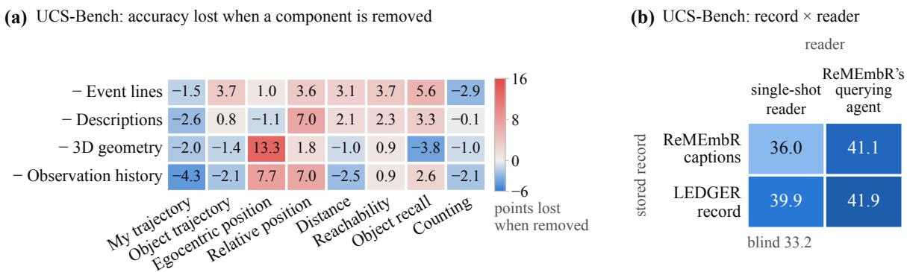

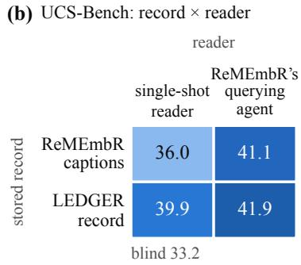  
Figure 7: UCS-Bench stitched streams, GPT-5.4. (a) Accuracy lost on each question category when one component is removed from the memory with event lines (single runs, 2,246 questions answered by every arm; Table 31). (b) The same two records read by our single-shot reader and by ReMEmbR's querying agent (2,777 paired questions; Table 32).

## E.7 Record against reader

ReMEmbR [2] captions every sampled frame with VILA, stores the camera position and time of each caption, and answers with an agent that issues embedding searches over the captions in several rounds, about four calls and 23k tokens per question; our reader is one keyword lookup and one call, about 3 to 5k tokens. Table 32 crosses the two records with the two readers (Figure 7b). To be indexed by ReMEmbR's embedder, our record is re-expressed as one text item per sampled moment (event line, place, and the objects in view with their descriptions and positions); adding each object's direction and distance from the wearer to the items did not help. We use ReMEmbR's captions read by its own agent as the reference. On paired questions, switching those captions to our reader lowers accuracy by 5.0 points $( p < 0 . 0 0 1$ , exact McNemar test). Our records score 1.2 points below the reference with our reader $\left( p = 0 . 3 5 \right)$ and 0.8 points above it with ReMEmbR's agent $( p = 0 . 4 2 )$

ReMEmbR's captions still outperform the blind control under our reader by 2.6 points $( p = 0 . 0 1 )$ showing that they contain useful evidence. However, their advantage under the native-system comparison does not persist when both memories use the same reader. Routing spatial questions to our reader and all remaining questions to ReMEmbR's agent yields 42.0% accuracy on 3,357 questions.

Table 32: Record against reader on the stitched streams (2,777 questions answered by every arm). R1 is our single-shot reader; R2 is ReMEmbR's retrieval agent. Blind on these streams is 33.2.
<table><tr><td rowspan="2">Record → reader n</td><td colspan="7">All MyTraj ObjTraj EgoPos</td><td rowspan="2">Reach Recall</td><td rowspan="2">Count 667</td></tr><tr><td>2,777</td><td>423</td><td>156</td><td>270</td><td>RelPos Dist 409</td><td>257</td><td>307</td></tr><tr><td>ReMEmbR captions → R1</td><td>36.0</td><td>38.5</td><td>37.8</td><td>29.6</td><td>32.3</td><td>41.7</td><td>55.3</td><td>32.9</td><td>30.6</td></tr><tr><td>ReMEmbR captions → R2 (= ReMEmbR)</td><td>41.1</td><td>45.9</td><td>50.0</td><td>28.1</td><td>37.9</td><td>42.7</td><td>48.6</td><td>44.3</td><td>37.9</td></tr><tr><td>Our event lines only → R1</td><td>38.2</td><td>40.2</td><td>39.7</td><td>26.7</td><td>33.546.2</td><td></td><td>58.0</td><td>41.4</td><td>31.8</td></tr><tr><td>Our objects + ReMEmbR captions → R1</td><td>38.5</td><td>39.5</td><td>36.5</td><td>35.6</td><td>38.945.8</td><td></td><td>55.6</td><td>39.7</td><td>29.1</td></tr><tr><td>LEDGER (objects + event lines) → R1</td><td>39.9</td><td>37.1</td><td>40.4</td><td>36.7</td><td>40.645.8</td><td></td><td>58.8</td><td>45.6</td><td>30.0</td></tr><tr><td>LEDGER → R2</td><td>41.9</td><td>49.2</td><td>47.4</td><td>30.4</td><td>35.945.1</td><td></td><td>54.5</td><td>44.6</td><td>36.7</td></tr><tr><td>LEDGER + egocentric geometry → R2</td><td>41.3</td><td>47.0</td><td>48.1</td><td>25.6</td><td>34.2 44.1</td><td></td><td>55.6</td><td>45.6</td><td>38.2</td></tr></table>

## E.8 Open answering models

Table 33 replaces GPT-5.4 by Qwen3.5-9B for our memory and its blind control, and runs DirectMe in its published configuration, Qwen3-VL-8B reading the graph with keyframes. On all 3,367 questions, with 58 unparsed Qwen3.5-9B answers scored as wrong, the memory's gain over the

Qwen3.5-9B blind control is 3.4 points $( p < 0 . 0 0 1 )$

Table 33: Answering models on the stitched streams (3,300 questions answered by every arm).
<table><tr><td rowspan="2">Arm n</td><td colspan="7">All MyTraj ObjTraj EgoPos</td><td rowspan="2">Recall</td><td rowspan="2">Count 813</td></tr><tr><td>3,300</td><td>511</td><td>191</td><td>305</td><td>RelPos 480</td><td>Dist Reach 318 308</td><td>374</td></tr><tr><td>Qwen3.5-9B, blind</td><td>32.3</td><td>39.5</td><td>46.6</td><td>22.3</td><td>28.5</td><td>38.1</td><td>49.0</td><td>34.2</td><td>20.9</td></tr><tr><td>LEDGER + event lines, Qwen3.5-9B</td><td>36.2</td><td>38.0</td><td>35.6</td><td>36.1</td><td>34.8</td><td>42.8</td><td>53.6</td><td>38.0</td><td>26.3</td></tr><tr><td>DirectMe graph + keyframes, Qwen3-VL-8B</td><td>28.0</td><td>33.3</td><td>33.5</td><td>24.9</td><td>27.1</td><td>36.5</td><td>46.8</td><td>26.2</td><td>15.5</td></tr><tr><td>LEDGER + event lines, GPT-5.4</td><td>39.5</td><td>36.2</td><td>38.7</td><td>37.0</td><td>39.8</td><td>45.9</td><td>58.1</td><td>44.7</td><td>30.6</td></tr><tr><td>ReMEmbR, GPT-5.4</td><td>40.8</td><td>45.0</td><td>50.3</td><td>27.5</td><td>38.5</td><td>42.5</td><td>49.4</td><td>43.6</td><td>37.0</td></tr></table>

## E.9 Delayed questions

The 763 questions about an earlier scene that do not depend on the present moment (object recall. counting, and object and wearer trajectories) are re-asked at the end of the stream, about their original moment, from the memory held at the end. Rewording a question as delayed moves the blind prior by +5.5 on the same questions, so Table 34 reports each arm's change net of blind: the frame reader loses most, since its 48 frames must cover the whole stream, and the memories lose 3 to 4 points. When the original moment is given exactly, rounded to 1, 5, or 10 minutes, or not at all, ReMEmbR is insensitive to the hint (40.9 to 42.7), $\mathrm { L E D G E R } _ { \mathrm { a g e n t } }$ is within 1 to 2 points of it at every level (n.s.), and our single-shot reader is weaker (30.7 to 36.7) because its time bonus favours what was seen near the question, which for a delayed question is the end of the stream.

Table 34: Delayed questions (763): accuracy at the question's own moment and when re-asked at the end of the stream, with the change net of the blind control.
<table><tr><td>Evidence</td><td>At its moment</td><td>Delayed</td><td>∆</td><td>∆ net of blind</td></tr><tr><td>Blind</td><td>32.4</td><td>37.9</td><td>+5.5</td><td></td></tr><tr><td>48 frames</td><td>44.0</td><td>39.6</td><td>-4.4</td><td>-9.9</td></tr><tr><td>DirectMe graph</td><td>25.9</td><td>28.3</td><td>+2.5</td><td>-3.0</td></tr><tr><td>ReMEmbR</td><td>40.6</td><td>42.7</td><td>+2.1</td><td>-3.4</td></tr><tr><td>LEDGER, objects only</td><td>34.1</td><td>32.8</td><td>-1.4</td><td>-6.9</td></tr><tr><td>LEDGER + event lines</td><td>35.1</td><td>36.6</td><td>+1.4</td><td>-4.1</td></tr></table>

## F Accuracy by Recording Length

Figure 5 summarizes this appendix. Every arm is answered by GPT-5.4 and paired on the same questions, and a question is kept only if every arm in the table answered it; an invalid or missing answer counts as wrong. Accuracies here are over questions, so the $\mathrm { H D \mathrm { - E P I C } \ ^ { \mathrm { \sc } \cdots } A l l ^ { \mathrm { \prime } } }$ row (44.6) differs from the prototype-averaged score of Table 2 (42.6). Lengths are the durations of the source videos. Intervals are Wilson intervals for accuracies and paired bootstrap intervals over videos (2,000 draws) for differences; the trend is a logistic regression of correctness on $\log _ { 2 }$ of the recording length, so its slope is the change in log-odds per doubling. $\mathrm { L E D G E R } _ { \mathrm { a g e n t } }$ is our memory read by ReMEmbR's querying agent (Appendix E.7); the “agent" columns below are this arm.

HD-EPIC. All 2,400 questions on 150 videos (Table 35). Every arm loses accuracy on longer recordings, and the blind control loses it fastest (Table 38), so the questions on long recordings are harder to guess. Our memory's gain over the blind control is $+ 9 . 9 \ [ + 2 . 5 , + 1 7 . 7 ] , \ + 1 8 . 0 , \ + 1 6 . 2$ +14.4, and +14.8 [+5.9, +23.8] points across the five bins, and its lead over ReMEmbR is 12 to 19 points in every bin. Length is partly a proxy for participant, since each participant records one kitchen, but every bin holds six to nine of the nine participants.

Table 35: HD-EPIC accuracy (%, over questions) by recording length (minutes).
<table><tr><td colspan="3"></td><td colspan="2">LEDGER</td><td colspan="5"></td></tr><tr><td></td><td></td><td>Length Videos Questions single-shot agent</td><td></td><td></td><td>t ReMEmbR AMEGO DirectMe OSNOM Blind</td><td></td><td></td><td></td><td></td></tr><tr><td>&lt;5</td><td>45</td><td>284</td><td>48.6</td><td>35.6</td><td>29.6</td><td>35.2</td><td>33.8</td><td>38.4</td><td>38.7</td></tr><tr><td>5-10</td><td>22</td><td>266</td><td>48.5</td><td>39.1</td><td>32.7</td><td>31.6</td><td>27.1</td><td>32.7</td><td>30.5</td></tr><tr><td>10-20</td><td>37</td><td>769</td><td>45.1</td><td>33.2</td><td>27.8</td><td>31.3</td><td>29.6</td><td>31.1</td><td>28.9</td></tr><tr><td>20-40</td><td>34</td><td>710</td><td>42.4</td><td>30.1</td><td>23.4</td><td>31.1</td><td>30.3</td><td>32.7</td><td>28.0</td></tr><tr><td>40-75</td><td>12</td><td>371</td><td>41.8</td><td>37.2</td><td>29.9</td><td>31.3</td><td>26.4</td><td>30.5</td><td>27.0</td></tr><tr><td>All</td><td>150</td><td>2,400</td><td>44.6</td><td>33.8</td><td>27.6</td><td>31.8</td><td>29.5</td><td>32.5</td><td>29.7</td></tr></table>

UCS-Bench. The 3,264 questions of the single-recording arm of the stitched experiment, on 206 recordings of up to 20 minutes (Table 36). No memory changes with length, and neither does the blind control; the 48-frame reader, the only arm that sees video, loses accuracy with every doubling of length. The bins are not balanced across sources (the 11-13-minute bin is mostly EgoLife and holds 63% of the questions), so we repeat the fit within EPIC-Kitchens, the one source present in every bin (45 recordings, 801 questions): the frame reader still declines $\left( p = 0 . 0 5 \right)$ and no memory does (Table 38).

Table 36: UCS-Bench accuracy (%) by recording length (minutes), single recordings.
<table><tr><td colspan="3"></td><td colspan="2">LEDGER</td><td colspan="5"></td></tr><tr><td></td><td></td><td>Length Videos Questions single-shot agent</td><td></td><td></td><td>ReMEmbR DirectMe Blind</td><td></td><td></td><td></td><td>■48 frames</td></tr><tr><td>&lt;2</td><td>16</td><td>236</td><td>36.0</td><td>41.5</td><td>37.7</td><td></td><td>31.4</td><td>33.1</td><td>61.4</td></tr><tr><td>2-6</td><td>23</td><td>370</td><td>38.1</td><td>43.5</td><td>42.4</td><td></td><td>28.6</td><td>32.4</td><td>50.0</td></tr><tr><td>6-11</td><td>18</td><td>321</td><td>45.8</td><td>49.5</td><td>46.1</td><td></td><td>29.9</td><td>34.9</td><td>55.1</td></tr><tr><td>11-13</td><td>123</td><td>2,050</td><td>38.6</td><td>40.4</td><td>40.8</td><td></td><td>29.3</td><td>32.6</td><td>44.5</td></tr><tr><td>13-20</td><td>26</td><td>287</td><td>37.3</td><td>44.3</td><td>41.5</td><td></td><td>36.2</td><td>35.2</td><td>48.1</td></tr><tr><td>All</td><td>206</td><td>3,264</td><td>39.0</td><td>42.1</td><td>41.4</td><td></td><td>30.1</td><td>33.1</td><td>47.7</td></tr></table>

VQ3D. The validation clips come in two lengths, about 5 and about 8 minutes, so this is not a length sweep (Table 37). The measure is the share of all 164 queries localized within 1 m, with an unanswered query counted as a miss.

Table 37: VQ3D: queries localized within 1 m (%) by clip length (minutes).
<table><tr><td></td><td></td><td></td><td colspan="2">LEDGER</td><td></td><td></td><td></td><td></td></tr><tr><td></td><td></td><td></td><td></td><td></td><td></td><td></td><td></td><td>Length Clips Queries single-shot agent ReMEmbR DirectMe OSNOM Clip centroid</td></tr><tr><td>≈5</td><td>16</td><td>66</td><td>56.1</td><td>59.1</td><td>22.7</td><td>10.6</td><td>34.8</td><td>7.6</td></tr><tr><td>≈8</td><td>26</td><td>93</td><td>43.0</td><td>45.2</td><td>23.7</td><td>21.5</td><td>30.1</td><td>11.8</td></tr><tr><td>16</td><td>2</td><td>5</td><td>20.0</td><td>0.0</td><td>20.0</td><td>40.0</td><td>0.0</td><td>20.0</td></tr><tr><td>All</td><td>44</td><td>164</td><td>47.6</td><td>49.4</td><td>23.2</td><td>17.7</td><td>31.1</td><td>10.4</td></tr></table>

Table 38: Change in the log-odds of a correct answer per doubling of recording length, with its p-value in parentheses.
<table><tr><td>Arm</td><td>HD-EPIC</td><td>UCS-Bench</td><td>UCS-Bench, EPIC-Kitchens only</td></tr><tr><td>LEDGER, single-shot reader</td><td>-0.072 (0.028)</td><td>+0.013 (0.69)</td><td>+0.021 (0.74)</td></tr><tr><td>LEDGERagent</td><td>-0.054 (0.12)</td><td>–0.007 (0.82)</td><td>+0.022 (0.72)</td></tr><tr><td>ReMEmbR</td><td>-0.060 (0.099)</td><td>+0.016 (0.63)</td><td>+0.086 (0.17)</td></tr><tr><td>DirectMe</td><td>−0.072 (0.044)</td><td>+0.013 (0.71)</td><td>+0.010 (0.89)</td></tr><tr><td>AMEGO (adapted)</td><td>-0.076 (0.029)</td><td></td><td></td></tr><tr><td>OSNOM (adapted)</td><td>-0.084 (0.016)</td><td></td><td></td></tr><tr><td>Blind</td><td>−0.155 (&lt;10−4)</td><td>+0.008 (0.82)</td><td>-0.066 (0.3)</td></tr><tr><td>48 frames</td><td></td><td>−0.157 (&lt;10−4)</td><td>-0.122 (0.05)</td></tr></table>

## G Failure Analysis and Qualitative Example

## G.1 When an answer is wrong, where was it lost?

Table 39 follows the evidence through the pipeline. The largest measured losses happen before the answerer reads the record: on development videos, giving GPT-5.4 the ground-truth trajectory of the queried object in place of the stored one adds 12 points, and naming the fixtures it rested on adds another 25, whereas a fixed rule improves on the answerer's reasoning by only 3 points on fixture location (Appendices B.7 and B.2). Each weak category of RQ1 (Section 4) maps to one row: stationary localization and fixture-interaction counting to what the record keeps about rest and hands, counting to association, and long recordings to construction.

## G.2 Three memories on one stream

Figure 8 shows DirectMe, ReMEmbR, and LEDGER answering from their own memories of one stitched stream of three EPIC-Kitchens recordings, and localizing a chair in a separate VQ3D clip. The questions were chosen to show how the memories differ, not how often; rates are in Tables 3 and 27. Our memory answers all four stream questions, DirectMe's graph answers one, and ReMEmbR none.

The differences follow from what each memory keeps. For Q2, “What did I take out of the cabinet?", DirectMe's graph has no node for the object, and ReMEmbR's captions near that time do not name it. Our detector labelled the object a coffee maker, but its segment description reads “a digital immersion circulator, not a coffee maker ... the person's hands are holding the device" and the answerer matches it to the heating rod. For the chair in Q5, our stored position is 0.73 m from the annotated one, against 1.81 m for DirectMe and 2.37 m for ReMEmbR, which stores where the wearer was rather than where the object is.

Table 39: Where evidence is lost, by pipeline stage: what each stage loses, the questions it affects, and the measurement behind it.
<table><tr><td>Stage</td><td>What is lost</td><td>Questions affected</td><td>Evidence</td></tr><tr><td>frame per 4s)</td><td>Sampling (one objects seen only briefly; views all for triangulation</td><td></td><td>2s sampling did not help a ten-video pilot (App. B.6)</td></tr><tr><td>Tagging</td><td>objects outside the per-video</td><td>any about those objects</td><td>the best tag set misses about one VQ3D query object in ten (Table 23)</td></tr><tr><td>3D lifting</td><td>vocabulary never enter memory depth along the viewing ray</td><td>metric localization</td><td>the error lies almost entirely along</td></tr><tr><td>Association</td><td>one object split into several tracks</td><td>counting</td><td>the ray (App. B.7) the track count is exact for 11% of UCS-Bench count questions</td></tr><tr><td></td><td>Record content continuous rest intervals; hand stationary localization, events</td><td>fixture-interaction</td><td>(App. D.2) rest-segment starts are near chance; hand tracklets score higher (App. B.8,</td></tr><tr><td>Construction</td><td>labels and metric scale at a scene cut; tractability with</td><td>counting after a scene change; hour-long recordings</td><td>Table 10) RQ5; 21 of 167 HourVideo memories built (App. D)</td></tr><tr><td>Retrieval</td><td>length a wrong instance of the right</td><td>the VQ3D error tail</td><td>10% of queries are off by more than</td></tr><tr><td>Reasoning</td><td>category retrieved evidence left unused fixture location</td><td></td><td>3 m (App. C.5) a fixed rule beats GPT-5.4 on the same evidence (App. B.2)</td></tr></table>

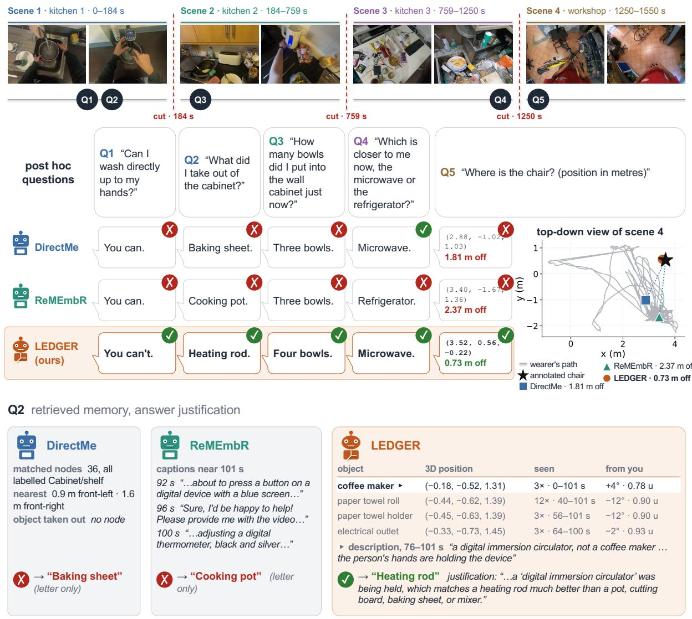  
Figure 8: Three memories answer questions about a multi-scene egocentric stream from their stored records alone. Scenes 1-3 form one UCS-Bench stream that joins three EPIC-Kitchens recordings; DirectMe, ReMEmbR, and LEDGER each build one memory over the stream and answer Q1-Q4 from it as text, without frames. Scene 4 is a separate Ego4D VQ3D clip placed on the same timeline for illustration, with memories built from that clip alone; Q5 asks for the chair's position in metres, and the map (right) shows each memory's answer. Bottom: the evidence each memory retrieves for Q2. LEDGER's detector labelled the object a coffee maker, but the segment description records what the wearer's hands were holding; DirectMe's graph has no node for the object, and ReMEmbR's captions near that time do not name it. Questions were selected for illustration; aggregate results are in Tables 3 and 27.

## H Answer-Time Token Cost

A memory is built once per recording and read many times, whereas frames are re-read at every question. This appendix measures what each memory costs the answering model at answer time, on the same questions for every arm. Tokens are the answering model's own usage, averaged per question, and calls are language-model calls per question. Memory construction is excluded: every method builds its memory locally, with no API calls, so its cost is compute time rather than tokens. Published video models and video-retrieval methods that we did not run on these questions are absent.

Table 40: Answer-time cost on HD-EPIC (2,400 questions, GPT-5.4 unless stated). Accuracy is prototypeaveraged, as in Table 2. No arm here reads frames.
<table><tr><td>Memory</td><td>Read at answer time</td><td>Acc. (%)</td><td>Input tok</td><td>Output tok</td><td>Calls</td></tr><tr><td>Blind</td><td>question and options only</td><td>29.7</td><td>412</td><td>184</td><td>1.0</td></tr><tr><td>ReMEmbR</td><td>captions, retrieval agent</td><td>29.8</td><td>25,201</td><td>207</td><td>4.1</td></tr><tr><td>OSNOM (adapted)</td><td>tracked object map</td><td>30.2</td><td>8,762</td><td>111</td><td>1.0</td></tr><tr><td>DirectMe</td><td>scene graph, its own prompt</td><td>30.7</td><td>2,362</td><td>5</td><td>1.0</td></tr><tr><td>LEDGER, Qwen3.5-9B</td><td>object memory</td><td>33.6</td><td>1,938</td><td>381</td><td>1.0</td></tr><tr><td>AMEGO (adapted)</td><td>hand-object interaction log</td><td>34.7</td><td>792</td><td>124</td><td>1.0</td></tr><tr><td>LEDGER</td><td>object memory</td><td>42.6</td><td>1,750</td><td>231</td><td>1.0</td></tr><tr><td> $\mathrm { L E D G E R } _ { \mathrm { a g e n t } }$ </td><td>object memory, querying agent</td><td>34.8</td><td>22,850</td><td>199</td><td>3.6</td></tr></table>

On HD-EPIC (Table 40), the stored record is read in one call of about 1.8k input tokens, and the two memories that cost less are the two that keep less: AMEGO's interaction log at 0.8k admits only handled objects, and the blind control at 0.4k stores nothing. The memories that cost more do not answer better here. ReMEmbR reads about 14 times as many input tokens over roughly four calls and scores at the blind level, because its captions carry no object positions.

Table 41: Answer-time cost on UCS-Bench (2,772 EgoLife and TeleEgo questions, GPT-5.4). Green marks arms whose answerer sees no frames, red those that do. Frame arms read 48 uniformly sampled frames up to the question time. This set has one question more than Table 3, so DirectMe's memory-only accuracy reads 29.9 here against 30.0 there.
<table><tr><td>Evidence</td><td>Read at answer time</td><td>Acc. (%)</td><td>Input tok</td><td>Output tok</td><td>Calls</td></tr><tr><td>■Blind</td><td>question and options only</td><td>33.8</td><td>452</td><td>149</td><td>1.0</td></tr><tr><td>DirectMe</td><td>scene graph</td><td>29.9</td><td>1,937</td><td>2</td><td>1.0</td></tr><tr><td>LEDGER</td><td>object memory</td><td>38.5</td><td>2,044</td><td>211</td><td>1.0</td></tr><tr><td>Frames</td><td>48 frames</td><td>44.4</td><td>9,615</td><td>50</td><td>1.0</td></tr><tr><td></td><td>■Frames, DM routed frames; graph on spatial q.</td><td>42.9</td><td>10,406</td><td>49</td><td>1.0</td></tr><tr><td>Frames, DM own</td><td>frames and graph always</td><td>39.8</td><td>11,377</td><td>48</td><td>1.0</td></tr><tr><td>Frames, LEDGER</td><td>frames; memory on spatial q.</td><td>46.3</td><td>10,529</td><td>137</td><td>1.0</td></tr></table>

The UCS-Bench arms (Table 41) separate the two costs. Reading 48 frames costs about 9.6k input tokens per question, nearly five times the 2.0k that reading our record costs, and it buys 5.9 points over the record alone. Adding the record to the frames costs a further 0.9k, about a tenth of the frame budget, and recovers 1.9 points on top of frames. A memory therefore substitutes for frames at roughly a fifth of the answer-time cost, and complements them at a small fraction of it.

Against ReMEmbR on the questions it answered. ReMEmbR returns an answer for 2,183 of the 2,772 questions. Restricted to those, it scores 41.3% against 38.5% for our memory, so it is ahead on these single recordings, and it reads 18,917 input tokens over 3.7 calls per question against 2,041 in one call, about nine times the input for one call in place of four. The blind control scores 33.3% on the same subset. Whether that accuracy is worth the cost depends on the budget; the comparison of what each record preserves, independent of how it is read, is in Appendix E.7.