# One Frame, Full Heartbeat: ECG-Free Cardiac Cine MRI Synthesis via Phase-Conditioned Flow Matching

Shiyi Wang1,2, Ruochen Sun2, Xiang Li3, Peirong Liu1∗, Fangxu Xing2∗

1Department of Electrical and Computer Engineering, Johns Hopkins University, Baltimore, MD, USA

2Gordon Center for Medical Imaging, Department of Radiology, Massachusetts General Hospital and Harvard Medical School, Boston, MA, USA

3Center for Advanced Medical Computing and Analysis, Department of Radiology, Massachusetts General Hospital and Harvard Medical School, Boston, MA, USA

## Abstract

Cine cardiovascular magnetic resonance (CMR) analysis relies on multi-frame sequences capturing the full cardiac cycle. However, standard multi-frame acquisition depends heavily on electrocardiogram (ECG) gating and repeated breath-holds, posing challenges in uncooperative populations, resourcelimited settings, and temporally corrupted datasets. Existing methods that synthesize full cardiac sequences either rely on explicit ECG signals to parameterize myocardium function, or employ deformable registration without physiological constraints, failing to faithfully reproduce clinically relevant dynamic metrics such as ejection fraction (EF) and ventricular contraction magnitude. We present PhaseFlow, a unified generative framework that overcomes both limitations. PhaseFlow estimates a non-linear cardiac phase signal directly from the input sequence via a segmentation-derived left-ventricular (LV) area curve, capturing the asymmetric dynamics of systole and diastole without any ECG dependency. At inference, this phase signal is provided by a pathologyspecific template, informing phase-specific frame generation. A rectified flow model conditioned on the phase and slice position synthesizes the full cardiac motion trajectory in the latent space, decoded into a difeomorphic displacement field that warps end-diastole pixel intensities directly, eliminating the reconstruction blur often accompanying the variational autoencoder. On the ACDC benchmark, PhaseFlow achieves superior physiological fidelity and image realism, with best LV volume curve R2, structural similarity (SSIM) and generative quality (FID) among all baselines. Ablation studies confirm that each proposed component contributes measurably to the overall performance.

## 1 Introduction

Cine cardiovascular magnetic resonance (CMR) imaging is the clinical gold standard for quantifying ventricular anatomy and function, enabling precise physiological measurements throughout the complete cardiac cycle such as ejection fraction (EF), end-diastolic (ED) and end-systolic (ES) volumes, myocardial strains, etc. (Bernard et al. 2018). In standard clinical practice, a full CMR acquisition often requires electrocardiogram (ECG) gating and multi-breath-hold pulse sequences, a protocol unavailable in retrospective cohort studies, prohibitively costly in resource-limited settings, challenging for uncooperative population, and inapplicable when only isolated frames survive archiving. Therefore, for any specific population with consistent cardiac functional patterns, the problem of synthesizing a complete, physiologically coherent CMR sequence from any specific frame (e.g., the ED frame where the myocardium expands the most) is both clinically compelling and technically formidable: it demands recovering the full spatiotemporal trajectory of the myocardium from purely spatial information, without any explicit temporal signal.

Prior works have attempted this challenge from three directions, each with distinct limitations. Registration-based methods (Zakeri et al. 2023; Krebs et al. 2021) warp a reference frame via a predicted displacement field, but treat the frame index as a linear phase proxy, erasing the asymmetric velocity profiles of systole and diastole (Yang et al. 2024) and generalizing poorly under domain shift (Jena et al. 2024). ECG-conditioned methods (Li et al. 2025; Fang et al. 2026) restore temporal coherence but hard-depend on concurrent ECG acquisition, precisely the signal prone to absence in retrospective or resource-limited settings. Generative models, namely generative adversarial networks (GANs) (Goodfellow et al. 2014; Vukadinovic et al. 2023) and difusion models (Ho, Jain, and Abbeel 2020; Song et al. 2021; Zhou et al. 2024; Phi et al. 2024; Algethami, Iqbal, and Ullah 2025), optimize pixel-level realism without physiological supervision and thus consistently fail to reproduce clinically relevant quantities such as EF and left-ventricular (LV) volumes (Li et al. 2025); conditional image leakage (Zhao et al. 2024) further drives them toward near-static predictions at inference.

We observe that all three paradigms overlook a key signal that is inherently latent in the CMR sequence itself: the nonlinear cardiac phase, recoverable from the per-frame LV area curve without any ECG dependency. Cardiac dynamics are intrinsically asymmetric: systole and diastole span diferent fractions of the cycle and proceed at markedly diferent velocities (Fukuta and Little 2008), and the area swept by the LV myocardium across frames encodes the true temporal dynamics, capturing the velocity asymmetry that a uniform frameindex assumption fails to. Beyond this intra-subject asymmetry, diferent pathological conditions also alter the characteristics of the phase trajectory in systematic ways (Zheng, Delingette, and Ayache 2019; Atehortúa et al. 2022): the relative timing and velocity balance of systole and diastole shift consistently across disease phenotypes, making the phase curve itself a pathology-level signature. At inference, when only one single frame is available and no sequence-derived phase can be computed, a pathology-specific template can replace this estimate, preserving ECG independence while encoding disease-level motion priors.

We present PhaseFlow, a generative framework that synthesizes full cardiac CMR sequences from a single frame by placing an ECG-free nonlinear phase at the center of a latent flow-matching architecture. In this application, we choose the ED frame as the anchorframe to generate the whole cine sequence. A frozen segmentation network derives the cardiac phase $\phi _ { t }$ at time t from the per-frame LV area curve, encoding each frame as $\scriptstyle \mathbf { p } _ { t } = [ \sin \phi _ { t } , \cos \phi _ { t } ]$ , a compact, periodicityaware representation sensitive to the asymmetric contraction velocity that the linear phase assumption misses. A rectified flow model (Liu, Gong, and Liu 2023) then transports the ED anchor’s latent features $\mathbf { z } _ { 0 }$ toward the full-sequence’s latent features $\mathbf { z } _ { 1 }$ along a straight conditional trajectory, jointly conditioned on the cardiac phase and slice position, with single-step inference supported natively by a rectified-flow objective (Zhang et al. 2024). The predicted latent velocity is decoded by a deformation decoder into a difeomorphic displacement field via scaling-and-squaring integration (Arsigny et al. 2006), warping ED pixel intensities directly, bypassing the variational autoencoder (VAE) (Kingma and Welling 2014) decoding phase and preserving sharpness that VAE reconstruction would otherwise blur. Training is further guided by a VolumeCurveLoss that diferentiably supervises the synthesized LV volume trajectory by applying the frozen segmentation network exclusively to real CMR frames, providing physiologically grounded gradient signal without inducing the domain-shift artifacts that arise when segmentors encounter generated images.

Our main contributions are:

• ECG-free nonlinear phase estimation. A segmentationbased LV area curve yields a physiologically interpretable cardiac phase signal capturing the asymmetric dynamics of systole and diastole, with no ECG hardware required at training or inference.

• Phase-conditioned latent flow matching. A rectified flow model conditioned on cardiac phase and slice position synthesizes the complete cardiac motion trajectory in latent space via single-step inference.

• Deformation-decoded pixel synthesis. A difeomorphic deformation decoder converts the predicted latent velocity into a per-frame displacement that warps ED pixel intensities directly, eliminating VAE reconstruction blur.

## 2 Related Work

Cine CMR synthesis. Three paradigms have addressed cine synthesis. Registration-based methods (Zakeri et al. 2023; Krebs et al. 2021) warp a reference frame via predicted displacement fields but treat frame index as a linear phase proxy, erasing systole–diastole velocity asymmetry and generalizing poorly across pathologies (Jena et al. 2024). GAN and difusion models (Vukadinovic et al. 2023;

Zhou et al. 2024; Phi et al. 2024; Algethami, Iqbal, and Ullah 2025) achieve visual realism but lack physiological supervision, leaving EF unconstrained; difusion models further require tens to hundreds of denoising steps at inference, precluding real-time clinical deployment. ECG-conditioned approaches (Li et al. 2025; Fang et al. 2026) restore temporal coherence but require concurrent ECG acquisition, limiting applicability to retrospective or resource-limited datasets.

Flow matching for video generation. Rectified flow (Liu, Gong, and Liu 2023; Lipman et al. 2023) enables single-step generation by training along straight conditional trajectories in the latent space. SF-V (Zhang et al. 2024) extends this paradigm to videos, demonstrating that single-forwardpass video synthesis is practical for high-resolution outputs. EchoLVFM (Oladokun et al. 2026) applies latent flow matching to echocardiography, the concurrent work most closely related to ours. However, it targets echocardiography (not CMR), omits a deformation decoder, and does not incorporate explicit volume-curve supervision.

Difeomorphic deformation in medical imaging. Scaling-and-squaring integration (Arsigny et al. 2006) provides a computationally eficient route to difeomorphic transformations. VoxelMorph (Balakrishnan et al. 2019) popularized learning-based difeomorphic registration for medical images. These tools have been deployed almost exclusively in the registration paradigm, aligning a moving image to a fixed target. In contrast, PhaseFlow repurposes this machinery as a generative decoder: displacement is synthesized from a latent velocity prediction rather than estimated between two observed images, replacing the VAE decoder while maintaining anatomical plausibility.

## 3 Methods

Figure 1 shows the overall architecture ofthe proposed Phase-Flow. Given the ED frame $\mathbf { x } _ { \mathrm { E D } } \in \mathbb { R } ^ { H \times W }$ and a cardiac phase schedule $\{ \phi _ { t } \} _ { t = 1 } ^ { T }$ , PhaseFlow proceeds in four stages: (i) a frozen VAE encoder maps the ED frame into the anchor latent z0; (ii) a nonlinear cardiac phase prior and slice position encoding form condition tokens c; (iii) a phase-conditioned rectified flow model predicts the latent velocity conditioned on phase and slice position; (iv) a deformation decoder converts the latent velocity into a difeomorphic displacement field that warps ED pixel intensities into a synthesized cine sequence.

## 3.1 Problem Formulation

Let $\mathbf { x } _ { \mathrm { E D } } \in \mathbb { R } ^ { H \times W }$ denote the single ED CMR frame. The synthesized cine CMR sequence $\big \{ \hat { \mathbf { x } } _ { 1 } , \dotsc , \hat { \mathbf { x } } _ { T } \big \}$ (frame index $t \in \{ 1 , \ldots , T \} ,$ ) must be both perceptually realistic and physiologically faithful. This task is fundamentally ill-posed: cardiac functional assessment requires complete temporal sequences rather than isolated frames (Jiang, Lu, and Zhao 2024), and single-frame EF prediction is known to significantly underperform sequential models (Ouyang et al. 2020). Successful synthesis therefore requires an external temporal signal, which we derive from the nonlinear cardiac phase (Sec. 3.2).

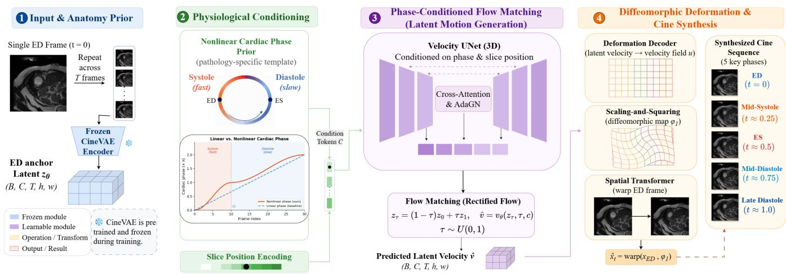  
Figure 1: PhaseFlow encodes the ED frame into latent features, predicts a phase-conditioned latent velocity via rectified flow, and decodes a difeomorphic displacement field that warps ED pixels into a fully synthesized cine sequence.

## 3.2 ECG-Free Nonlinear Phase Estimation

We extract a physiologically grounded phase signal directly from the cine CMR sequence without ECG dependency. A frozen segmentation network (SegUNet) (Ronneberger, Fischer, and Brox 2015; Isensee et al. 2021) segments each frame to obtain the per-frame LV area $\{ a _ { t } \} _ { t = 1 } ^ { T }$ . We define the cumulative area change as

$$
\phi _ { t } = 2 \pi \cdot \frac { \sum _ { k = 1 } ^ { t } \left| a _ { k } - a _ { k - 1 } \right| } { \sum _ { k = 1 } ^ { T } \left| a _ { k } - a _ { k - 1 } \right| } ,\tag{1}
$$

mapping the cardiac cycle onto [0, 2π] proportionally to the true dynamics of myocardial contraction rather than a temporal frame index. Each frame is then encoded as $\mathbf { p } _ { t } = [ \sin \phi _ { t }$ , cos $\phi _ { t } ] \in \mathbb { R } ^ { 2 }$ , a compact, periodicity-aware representation.

Why nonlinear? Systole and diastole have markedly different durations across patients and pathologies. A linear phase $\phi _ { t } ^ { \operatorname * { l i n } } = 2 \pi t / T$ uniformly spaces frames, mapping ES to diferent ϕ values depending on heart rate, erasing crosspatient consistency (Figure 2, left). The proposed nonlinear phase instead accumulates ϕt proportionally to the actual myocardial displacement $| a _ { k } - a _ { k - 1 } |$ | such that ES naturally aligns at $\phi \approx \pi$ across patients regardless of heart rate or pathology (Figure 2, right).

Pathology-specific templates for ECG-free inference. During training, ϕt is computed per subject from the full cine sequence. At inference, only the ED frame is available. We pre-compute mean phase templates for each pathological group in the full dataset by averaging the normalized phase curves across training subjects within each group. Given one pathology label (obtainable from clinical metadata or a simple classifier), its corresponding template provides the phase schedule. This design is motivated by evidence that the temporal evolution of LV shape throughout the cardiac cycle is pathology-discriminative (Zheng, Delingette, and Ayache

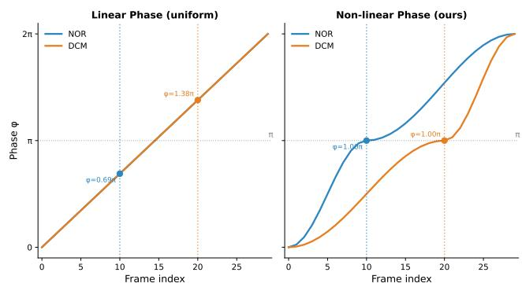  
Figure 2: Linear phase (left) scatters ES across $\phi$ values; nonlinear phase (right) aligns ES at $\phi \approx \pi$ for diferent pathological types (e.g., normal and dilated cardiomyopathy).

2019), implying that each pathology group exhibits a characteristic phase trajectory distinct from others (visualized in Appendix B).

## 3.3 Phase-Conditioned Latent Flow Matching

We formulate cine synthesis as an optimal transport in a shared latent space using rectified flow (Liu, Gong, and Liu 2023).

Latent space construction. A pretrained, frozen threedimensional (3D) VAE encoder (Kingma and Welling 2014; Rombach et al. 2022) $E _ { \mathrm { v a e } }$ maps the full cine sequence $\mathbf { X } \in \mathbb { R } ^ { 1 \times T \times H \times W }$ to the target latent ${ \bf z } _ { 1 } = E _ { \mathrm { v a e } } ( { \bf X } ) \in \mathrm { ~ }$ RC×T ×h×w $( h = H / 8 , w = \breve { W } / 8 ;$ temporal dimension preserved). The anchor latent is built from the ED frame alone by tiling $\mathbf { x } _ { \mathrm { E D } }$ (Sec. 3.1) T times into a temporally static sequence repeat(xED, T):

$$
\begin{array} { r } { \mathbf { z } _ { 0 } = E _ { \mathrm { v a e } } \left( \mathrm { r e p e a t } ( \mathbf { x } _ { \mathrm { E D } } , T ) \right) + \alpha \varepsilon , \quad \varepsilon \sim \mathcal { N } ( \mathbf { 0 } , \mathbf { I } ) . } \end{array}\tag{2}
$$

Because $E _ { \mathrm { v a e } }$ uses 3D temporal kernels, this static input is resolved as carrying zero motion rather than as a replicated single-frame latent: $\mathbf { z } _ { 0 }$ thus encodes a hypothetical arrestedheart state, and flow matching learns transport from it to the true dynamics $\mathbf { z } _ { 1 }$ . The perturbation αε (with α analyzed in Appendix I) expands this deterministic start into a neighborhood, keeping the learned velocity field stable when $\mathbf { z } _ { 0 }$ is built from a single real ED frame at inference.

Rectified flow. Given a uniformly distributed flow time $\tau \sim \mathcal { U } ( 0 , 1 )$ , the interpolated latent feature at $\tau$ is $\mathbf { z } _ { \tau } =$ $\left( 1 - \tau \right) \mathbf { z } _ { 0 } + \tau \mathbf { z } _ { 1 }$ . Diferentiating with respect to τ gives the ground-truthfeature velocity ${ \bf v } ^ { * } = d { \bf z } _ { \tau } / d \tau = { \bf z } _ { 1 } - { \bf z } _ { 0 } ,$ , which turns out to be constant despite τ . A 3D UNet (Ronneberger, Fischer, and Brox 2015) $v _ { \theta }$ (VelocityUNet applied on the spatiotemporal dimensions) is trained to predict this velocity, conditioned on the flow time $\tau$ and a conditioning vector c:

$$
\hat { \mathbf { v } } ( \tau ) = v _ { \theta } ( \mathbf { z } _ { \tau } , \ \tau , \ \mathbf { c } ) , \qquad \mathbf { c } = \big [ \mathbf { e } _ { \mathrm { p h a s e } } , \ \mathbf { e } _ { \mathrm { s l i c e } } \big ] ,\tag{3}
$$

where $\mathbf { e } _ { \mathrm { p h a s e } } \in \mathbb { R } ^ { T \times d }$ is our proposed per-frame phase embedding produced by a small multilayer perceptron (MLP; the PhaseProjector) from $\mathbf { p } _ { t }$ , and $\mathbf { e } _ { \mathrm { s l i c e } } \in \mathbb { R } ^ { d }$ encodes the spatial slice position. To enable cross-frame reasoning, each resolution level of $v _ { \theta }$ incorporates a temporal attention block that exchanges information across all $\bar { T }$ frames simultaneously, allowing the model to synthesize temporally coherent motion rather than processing each frame independently. The per-frame phase embedding $\mathbf { e } _ { \mathrm { p h a s e } }$ is injected at every resolution level via cross-attention (Vaswani et al. 2017), enabling spatially adaptive phase conditioning. At inference, only $\mathbf { z } _ { 0 }$ is available. Since $\mathbf { v } ^ { * }$ is constant along the straight-line path, the velocity network can be queried at any τ with $\mathbf { z } _ { 0 }$ as input; we use $\tau = 1$ , evaluating the velocity network at the trajectory terminus, aligned with the phase-conditioned target frame: $\hat { \mathbf { v } } ( 1 ) = v _ { \theta } ( \mathbf { z } _ { 0 } , 1 , \mathbf { c } )$ , requiring no iterative ordinary diferential equation (ODE) integration (Liu, Gong, and Liu 2023; Zhang et al. 2024). The predicted latent velocity vˆ(1) is then decoded into the image space by a deformation decoder (Sec. 3.4).

## 3.4 Deformation-Decoded Pixel Synthesis

Rather than decoding through a VAE decoder (which would introduce reconstruction blur), we decode the predicted latent velocity $\hat { \mathbf { v } } ( 1 )$ into a difeomorphic displacement field and use it to directly warp the original ED frame intensities.

Deformation decoder. A transposed-convolutional decoder $D _ { \mathrm { d e f o r m } }$ maps the predicted latent velocity $\hat { \mathbf { v } } ( 1 ) \in$ $\mathbb { R } ^ { C \times T \times h \times w }$ to a continuous velocity field $\mathbf { u } \in \mathbb { R } ^ { 2 \times T \times H ^ { \prime } \times W }$ in the image space. The decoder acts frame-wise: each of the $T$ temporal slices is processed independently by a stack of two-dimensional (2D) transposed convolutions that upsamples the spatial resolution 8× $( h \times w \to H \times W )$ while projecting the C latent channels onto the two displacement components (horizontal and vertical). The temporal axis is carried through unchanged, as temporal coherence is already established in latent space by $v _ { \theta }$

Scaling-and-squaring integration. Following (Arsigny et al. 2006), we obtain the difeomorphic displacement $\varphi _ { t }$

via K composition steps:

$$
\begin{array} { r } { \varphi _ { t } = \underbrace { \left( \frac { \mathbf { u } } { 2 ^ { K } } \circ \cdots \circ \frac { \mathbf { u } } { 2 ^ { K } } \right) } _ { 2 ^ { K } \mathrm { c o m p o s i t i o n s } } . } \end{array}\tag{4}
$$

It guarantees det $J _ { \varphi _ { t } } ( \mathbf { r } ) > 0$ at every pixel location r, where $\bar { J _ { \varphi _ { t } } } ( \mathbf { r } ) = \partial \varphi _ { t } / \partial \mathbf { r }$ is the spatial Jacobian of the deformation field (empirically verified in Appendix C). Each synthesized frame is

$$
\hat { \mathbf { x } } _ { t } = \mathrm { w a r p } \big ( \mathbf { x } _ { \mathrm { E D } } , \ \varphi _ { t } \big ) ,\tag{5}
$$

where warp is performed with bilinear grid sampling (Jaderberg et al. 2015).

## 3.5 Training Objectives

Training combines four objectives, assembled in Eq. (10). In every term, the flow time $\tau \sim \mathcal { U } ( 0 , 1 )$ and anchor noise $\varepsilon \sim \mathcal { N } ( \mathbf { 0 } , \mathbf { I } )$ are redrawn each step and thus enter as an expectation, while the frame index $i \in \{ 1 , \ldots , T \}$ enters as an average over the T frames.

Flow matching loss (core). The standard rectified flow matching objective, evaluated in latent space:

$$
\mathcal { L } _ { \mathrm { f l o w } } = \mathbb { E } _ { \tau , \varepsilon } \big [ \| v _ { \theta } ( \mathbf { z } _ { \tau } , \tau , \mathbf { c } ) - ( \mathbf { z } _ { 1 } - \mathbf { z } _ { 0 } ) \| ^ { 2 } \big ] .\tag{6}
$$

Local normalized cross-correlation. An image-space registration loss between each warped ED frame and the corresponding ground-truth frame $\dot { \mathbf { x } } _ { t } ^ { \mathrm { G T } }$ , robust to intensity ofsets:

$$
\mathcal { L } _ { \mathrm { l n c c } } = 1 - \frac { 1 } { T } \sum _ { t = 1 } ^ { T } \mathrm { L N C C } \big ( \mathrm { w a r p } ( \mathbf { x } _ { \mathrm { E D } } , \varphi _ { t } ) , \mathbf { x } _ { t } ^ { \mathrm { G T } } \big ) .\tag{7}
$$

Bending energy. A smoothness regularizer (Rueckert et al. 1999) penalizing second-order spatial derivatives of each per-frame displacement field:

$$
\begin{array} { l } { \displaystyle \mathcal { L } _ { \mathrm { b e n d } } = \frac { 1 } { T } \sum _ { t = 1 } ^ { T } \biggr ( \| \partial ^ { 2 } \varphi _ { t } / \partial x ^ { 2 } \| ^ { 2 } } \\ { \displaystyle \qquad + \| \partial ^ { 2 } \varphi _ { t } / \partial y ^ { 2 } \| ^ { 2 } + 2 \| \partial ^ { 2 } \varphi _ { t } / \partial x \partial y \| ^ { 2 } \biggr ) . } \end{array}\tag{8}
$$

VolumeCurveLoss. A diferentiable objective that supervises the synthesized LV volume trajectory without domain shift. The frozen SegUNet processes only real CMR frames: it segments the ED frame to obtain a soft LV mask m and each ground-truth frame to obtain the target area $a _ { t } ^ { \mathrm { { G T } } } \colon$ ; generated images are never passed to the segmentation network:

$$
\mathcal { L } _ { \mathrm { v o l } } = \frac { 1 } { T } \sum _ { t = 1 } ^ { T } \frac { \big | \sum _ { \mathbf { r } \in \Omega } \mathrm { w a r p } ( \mathbf { m } _ { \mathrm { E D } } , \varphi _ { t } ) ( \mathbf { r } ) - a _ { t } ^ { \mathrm { G T } } \big | } { \mathrm { E D V } } .\tag{9}
$$

Here r indexes spatial pixel locations over the image domain Ω, so $\scriptstyle \sum _ { \mathbf { r } \in \Omega }$ counts the predicted LV area at frame $t ,$ and EDV is the ED volume used for normalization. The loss is fully diferentiable through the bilinear warp back to VelocityUNet. By confining SegUNet to real MRI frames, domain shift is avoided and gradients remain reliable.

Total objective. The four terms are combined as

$$
\mathcal { L } = \lambda _ { \mathrm { { f l o w } } } \angle _ { \mathrm { { f l o w } } } + \lambda _ { \mathrm { { l n c c } } } \angle _ { \mathrm { { l n c c } } } + \lambda _ { \mathrm { { b e n d } } } \angle _ { \mathrm { { b e n d } } } + \lambda _ { \mathrm { { v o l } } } \angle _ { \mathrm { { v o l } } , }\tag{10}
$$

with weights λ balancing the latent-space transport objective against the three image-space terms; their values are reported in the implementation details (Sec. 4.1).

## 4 Experiments and Results

## 4.1 Experiment Setup

Dataset. We used the ACDC cardiac MRI benchmark dataset for evaluation (Bernard et al. 2018), which contains 150 subjects from five pathological groups: normal control (NOR), dilated cardiomyopathy (DCM), hypertrophic cardiomyopathy (HCM), prior myocardial infarction (MINF), and abnormal right ventricle (ARV), with 30 subjects per group. Each subject includes a cine CMR sequence with ED/ES annotation. We split the dataset into 105 training subjects, 15 validation subjects, and 30 test subjects in a stratified manner with the five pathological groups evenly distributed across all splits. To assess cross-dataset generalization, we additionally evaluate on the Multi-Centre, Multi-Vendor & Multi-Disease (M&Ms) dataset (Campello et al. 2021; Martín-Isla et al. 2023), which comprises 136 test subjects acquired across four scanner vendors and multiple clinical centres. No M&Ms data was used during training; the model was applied zero-shot using ACDC pathology-specific phase templates.

Implementation. The SegUNet is pre-trained on ACDC images with segmentation annotations and kept frozen throughout flow-matching training. The frozen VAE (3D, spatial compression 8×, temporal preserved) was pretrained on ACDC for 100 epochs. The flow-matching network (VelocityUNet) and deformation decoder were trained jointly with AdamW (Loshchilov and Hutter 2019) $( \mathrm { l r } = \bar { 1 } 0 ^ { - 4 } )$ batch size $^ { 4 , }$ converging within ∼165 epochs (∼5.5 hours) on a single NVIDIA RTX A6000 (48 GB) GPU. Noise scale $\alpha = 0 . 1 ;$ scaling-and-squaring steps $K \ : = \ : 7 .$ . Loss weights (Eq. (10)) were set to $\lambda _ { \mathrm { f l o w } } = 1 . 0 , \lambda _ { \mathrm { l n c c } } = 1 . 0 ,$ $\lambda _ { \mathrm { b e n d } } = 0 . 0 0 1$ , and $\lambda _ { \mathrm { v o l } } = 2 . 0$ . At inference, pathologyspecific phase templates were used (Sec. 3.2; see Appendix E for full architecture details).

Evaluation metrics. We organized evaluation into two categories:

• Image quality: PSNR (pixel-level fidelity), SSIM (Wang et al. 2004) (structural similarity), LPIPS (Zhang et al. 2018) (perceptual distance), FID (Heusel et al. 2017) (generative quality).

• Physiological fidelity: EF MAE (ejection fraction mean absolute error), Vol Corr (volume curve Pearson correlation), Vol $R ^ { 2 }$ (volume curve coeficient of determination), Vol MAE (normalized per-frame volume error).

Physiological metrics were computed by warping the groundtruth ED segmentation mask through the predicted displacement field, avoiding segmentation domain shift in the evaluation pipeline. Formal definitions and the motivation for each metric are given in Appendix G.

Baselines. We compared against five methods spanning diferent paradigms: (1) ED Repeat: repeating the ED frame $T$ times (trivial lower bound); (2) ConvLSTM (Shi et al. 2015): a recurrent spatiotemporal prediction model; (3) Direct Registration: a VAE encoder followed by latent regression to per-frame displacement fields (no flow matching); (4) CVAE: a variational autoencoder that generates frames conditioned on the ED frame; and (5) EchoDif: the conditional video difusion model of Phi et al. (2024), adapted to CMR by replacing echocardiography frames with ACDC cine slices and training for 100k steps. We further exclude four otherwise-natural baselines (see Appendix D): DragNet (Zakeri et al. 2023) (autoregressive drift breaks physiological evaluation), registration methods such as VoxelMorph (Balakrishnan et al. 2019) (require a target frame at inference), ECG-conditioned approaches (Li et al. 2025; Fang et al. 2026) (violate our ECG-free setting), and EchoLVFM (Oladokun et al. 2026) (no public implementation). All baselines were retrained on the same ACDC split under identical conditions.

## 4.2 Comparison to Baselines

Table 1 reports the comparison against the five baselines on the ACDC test set, grouped into the two metric families of image quality (PSNR, SSIM, LPIPS, FID) and physiological fidelity (EF MAE, Vol Corr, Vol R2, Vol MAE). Two observations stand out:

(1) PhaseFlow achieved the best physiological fidelity. PhaseFlow was the only method achieving a positive Vol $\dot { R ^ { 2 } }$ (0.363), meaning it was the only model whose predicted LV volume curve fit the ground truth better than a constant-mean predictor; all other methods yielded negative $R ^ { 2 }$ , indicating systematic failure to capture ventricular contraction magnitude. EchoDif recorded the numerically lowest EF MAE (15.47%), but at the cost of severely degraded image quality (SSIM 0.219, FID 115.17) and a Vol $R ^ { 2 }$ of −1.00, suggesting it incidentally reproduced ED- and ES-sized blurry frames rather than faithfully tracking the volume trajectory. PhaseFlow achieved the second-best EF MAE (17.79%) with fully preserved image quality, surpassing Direct Registration (19.66%) which directly optimised pixel-level losses. This confirmed that the combination of nonlinear phase conditioning and VolumeCurveLoss provided physiological grounding that pixel-level objectives alone could not.

(2) PhaseFlow achieved strong image quality. PhaseFlow achieved the best SSIM (0.956) and FID (12.72), with PSNR (31.72 dB) comparable to Direct Registration (31.89 dB, 0.955) and substantially outperforming the recurrent baseline (ConvLSTM: 27.57 dB). This was notable because a model optimizing pixel-level losses (Direct Reg) achieved stronger PSNR but higher FID, reflecting the well-known perception–distortion trade-of (Blau and Michaeli 2018): minimizing point-wise reconstruction error yielded blurry, distribution-atypical outputs. PhaseFlow’s deformation decoder sidestepped this trade-of by sourcing all pixel values from the real ED frame.

<table><tr><td></td><td colspan="4">Image Quality</td><td colspan="4">Physiological Fidelity</td></tr><tr><td>Method</td><td>PSNR↑</td><td>SSIM↑</td><td>LPIPS↓</td><td>FID↓</td><td>EF MAE↓</td><td>Vol Corr↑</td><td>Vol  $R ^ { 2 } \uparrow$ </td><td>Vol MAE↓</td></tr><tr><td>ED Repeat</td><td>30.63</td><td>0.950</td><td>0.022</td><td>18.22</td><td>51.37</td><td></td><td>-2.050</td><td>0.245</td></tr><tr><td>ConvLSTM</td><td>27.57</td><td>0.903</td><td>0.137</td><td>79.94</td><td>48.12</td><td>0.082</td><td>-1.539</td><td>0.230</td></tr><tr><td>Direct Reg</td><td>31.89</td><td>0.955</td><td>0.031</td><td>17.26</td><td>19.66</td><td>0.924</td><td>-0.105</td><td>0.116</td></tr><tr><td>CVAE</td><td>30.89</td><td>0.949</td><td>0.037</td><td>26.04</td><td>22.29</td><td>0.921</td><td>-0.038</td><td>0.122</td></tr><tr><td>EchoDiff (Phi et al. 2024)</td><td>15.20</td><td>0.219</td><td>0.391</td><td>115.17</td><td>15.47</td><td>0.414</td><td>-1.000</td><td>0.211</td></tr><tr><td>PhaseFlow†</td><td>31.72</td><td>0.956</td><td>0.023</td><td>12.72</td><td>17.79</td><td>0.867</td><td>0.363</td><td>0.101</td></tr></table>

Table 1: Main results on ACDC test set (30 patients). Best in bold, second-best underlined.
<table><tr><td></td><td colspan="4">Image Quality</td><td colspan="4">Physiological Fidelity</td></tr><tr><td>Variant</td><td>PSNR↑</td><td>SSIM↑</td><td>LPIPS↓</td><td>FID↓</td><td>EFMAE↓</td><td>Vol Corr↑</td><td>Vol  $R ^ { 2 } \uparrow$ </td><td>Vol MAE↓</td></tr><tr><td>Full (pathology phase)</td><td>31.72</td><td>0.956</td><td>0.023</td><td>12.72</td><td>17.79</td><td>0.867</td><td>0.363</td><td>0.101</td></tr><tr><td>A1: VAE decoder</td><td>27.28</td><td>0.882</td><td>0.128</td><td>89.63</td><td>20.22</td><td>0.888</td><td>-0.548</td><td>0.128</td></tr><tr><td>A2: Linear phase</td><td>31.48</td><td>0.954</td><td>0.024</td><td>12.91</td><td>21.30</td><td>0.827</td><td>0.069</td><td>0.114</td></tr><tr><td>A3: No LNCC</td><td>15.17</td><td>0.238</td><td>0.176</td><td>50.25</td><td>14.88</td><td>0.876</td><td>0.295</td><td>0.094</td></tr><tr><td>A4: No vol loss</td><td>31.76</td><td>0.955</td><td>0.023</td><td>11.43</td><td>26.80</td><td>0.869</td><td>0.071</td><td>0.133</td></tr></table>

Table 2: Ablation study on the ACDC test set. Each row removes one component from the full PhaseFlow model.

## 4.3 Ablation Study

Table 2 shows ablation of four key components. Each removal produced a distinct failure mode, confirming that all components addressed complementary aspects of the problem:

A1: VAE decoder. Replacing the deformation decoder with a standard VAE decoder caused a large drop in image quality (PSNR 27.28 dB vs. 31.72 dB, FID 89.63 vs. 12.72) and degraded physiological fidelity (Vol $R ^ { 2 }$ dropped from 0.363 to −0.548). The ∼4.4 dB PSNR gap and the order-of-magnitude FID increase directly demonstrate the pixel-preservation advantage of deformation decoding: by sourcing all pixel values from the real ED frame rather than reconstructing them through a bottleneck, the deformation decoder avoids VAE reconstruction blur while simultaneously producing more distribution-faithful outputs.

A2: Linear phase. Replacing the nonlinear phase with uniform $\phi _ { t } ^ { \operatorname* { l i n } } \dot { \mathbf { \phi } } = 2 \pi t / T$ degraded EF MAE from 17.79% to 21.30% and Vol $\mathring { R } ^ { 2 }$ from 0.363 to 0.069. The efect was incremental but consistent: nonlinear phase provided a more faithful temporal parameterization, particularly for pathologies with pronounced systole–diastole asymmetry.

A3: No LNCC loss. Removing the image-space registration loss caused a major failure: PSNR dropped to 15.17 dB and SSIM dropped to 0.238. Without direct pixel-level supervision, the deformation decoder had no signal to learn meaningful spatial displacements; the flow matching loss in latent space alone was insuficient to guide image-space warp quality. Interestingly, physiological metrics remained reasonable, suggesting the VolumeCurveLoss provided certain implicit spatial guidance, but the images were still visually unusable.

A4: No volume loss. Removing VolumeCurveLoss preserved image quality (PSNR 31.76 dB) but severely degraded physiological fidelity: EF MAE rose from 17.79% to 26.80% and Vol ${ \bf \breve { \cal R } } ^ { 2 }$ dropped from 0.363 to 0.071. This was the clearest evidence that pixel-level losses alone could not teach the model how the heart contracted; explicit volume-curve supervision was indispensable for physiologically faithful synthesis.

## 4.4 Zero-Shot Cross-Dataset Generalization

To test whether PhaseFlow could generalize beyond its training domain, we evaluated the ACDC-trained model directly on the M&Ms test set (136 patients, 1,621 slices) without any fine-tuning. ACDC pathology-specific phase templates were applied at inference.

<table><tr><td></td><td colspan="4">Image Quality</td><td colspan="4">Physiological Fidelity</td></tr><tr><td>Setting</td><td>PSNR↑</td><td>SSIM↑</td><td>LPIPS↓</td><td>FID↓</td><td>EF MAE↓ Vol Corr↑ Vol R2↑</td><td></td><td></td><td>Vol MAE↓</td></tr><tr><td>ACDC (in-domain)</td><td>31.72</td><td>0.956</td><td>0.023</td><td>12.72</td><td>17.79</td><td>0.867</td><td>0.363</td><td>0.101</td></tr><tr><td>M&amp;Ms (zero-shot)</td><td>32.80</td><td>0.937</td><td>0.016</td><td>4.82</td><td>19.89</td><td>0.845</td><td>0.309</td><td>0.114</td></tr></table>

Table 3: In-domain vs. zero-shot generalization. Phase-Flow trained on ACDC and evaluated on M&Ms without any adaptation.

As shown in Table 3, PhaseFlow transfers robustly to the unseen domain: image quality even improves on the sharper, more anatomically diverse M&Ms acquisitions, while physiological fidelity remains close to in-domain levels. These results demonstrated that PhaseFlow’s phase-conditioned motion priors generalized across scanner vendors and clinical sites without retraining, despite ACDC templates not perfectly representing M&Ms acquisition dynamics.

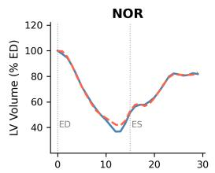

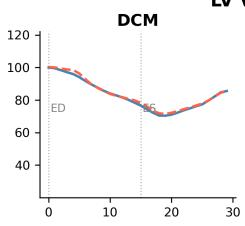

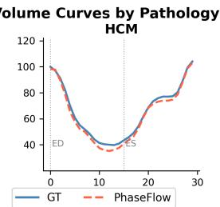

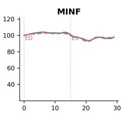

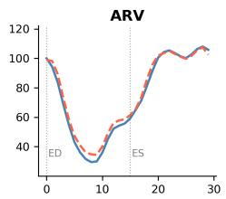

Figure 3: LV volume curves. Ground-truth (solid) vs. predicted (dashed) trajectories per pathology group.  
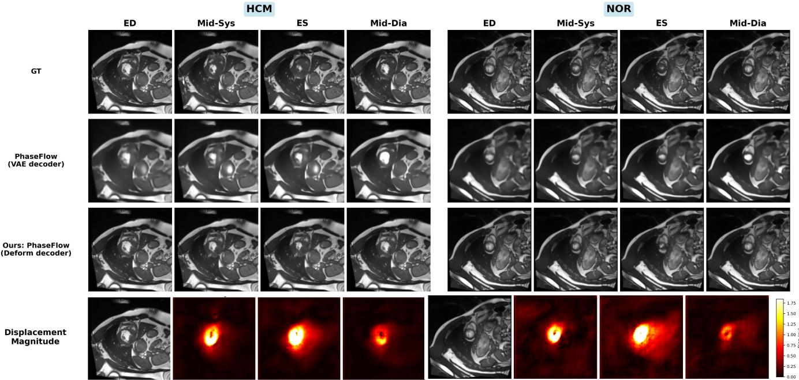  
Figure 4: Qualitative comparison (HCM and NOR). Rows 1–3: GT, PhaseFlow-VAE, and our PhaseFlow (Deform) at ED, mid-systole, ES, and mid-diastole. Row 4: predicted displacement magnitude. PhaseFlow produces sharp, anatomically coherent frames; PhaseFlow-VAE shows characteristic reconstruction blur.

## 4.5 Qualitative Results

Figure 3 compares predicted and ground-truth LV volume curves. PhaseFlow captured the pathology-specific contraction patterns: normal hearts showed the expected ∼55−70% EF, while DCM patients exhibited reduced contraction and HCM patients showed preserved but hypertrophic dynamics. The temporal alignment between predicted and ground-truth curves, driven by the nonlinear phase conditioning, correctly reproduced the asymmetric systole/diastole velocity profile. Per-pathology qualitative results across all five ACDC groups are provided in Appendix J.

Figure 4 shows synthesized frames and predicted displacement fields for representative HCM and NOR patients. Phase-Flow produced sharp, anatomically coherent frames across the full cardiac cycle, with clearly visible myocardial thickening during systole and chamber expansion during diastole. In contrast, PhaseFlow-VAE exhibited the characteristic blur of VAE reconstruction, particularly at fine anatomical boundaries. The displacement field visualizations showed smooth, anatomically plausible deformation concentrated around the myocardium.

## 5 Conclusion

We present PhaseFlow, a generative framework for synthesizing physiologically faithful cardiac cine MRI from a single end-diastolic frame without ECG dependency. PhaseFlow addresses a key limitation of existing approaches, which either depend on explicit ECG acquisition to parameterize cardiac motion, or, being ECG-free but lacking physiological constraints, produce synthesized motion that drifts from true cardiac dynamics. Instead, PhaseFlow conditions a flowmatching generator on a nonlinear cardiac phase supplied by a pathology-specific template. From this conditioned flow, a difeomorphic decoder synthesizes a temporally coherent, anatomically consistent motion trajectory. Extensive experiments on ACDC, together with zero-shot evaluation across scanner vendors and clinical sites, demonstrate the superior physiological fidelity and image realism of PhaseFlow.

## References

Algethami, N.; Iqbal, T.; and Ullah, I. 2025. Generative AI for Biomedical Video Synthesis: A Review. Artificial Intelligence Review, 58: 392.

Arsigny, V.; Commowick, O.; Pennec, X.; and Ayache, N. 2006. A Log-Euclidean Framework for Statistics on Difeomorphisms. In International Conference on Medical Image Computing and Computer-Assisted Intervention (MICCAI), 924–931. Springer.

Atehortúa, A.; Zuluaga, M. A.; Garreau, M.; and Tobon-Gomez, C. 2022. Characterization of motion patterns by a spatio-temporal saliency descriptor in cine MRI. Computer Methods and Programs in Biomedicine, 217: 106670.

Balakrishnan, G.; Zhao, A.; Sabuncu, M. R.; Guttag, J.; and Dalca, A. V. 2019. VoxelMorph: A Learning Framework for Deformable Medical Image Registration. IEEE Transactions on Medical Imaging, 38(8): 1788–1800.

Bernard, O.; Lalande, A.; Zotti, C.; Cervenansky, F.; Yang, X.; Heng, P.-A.; Cetin, I.; Lekadir, K.; Camara, O.; Ballester, M. A. G.; et al. 2018. Deep learning techniques for automatic MRI cardiac multi-structures segmentation and diagnosis: Is the problem solved? IEEE Transactions on Medical Imaging, 37(11): 2514–2525.

Blau, Y.; and Michaeli, T. 2018. The Perception-Distortion Tradeof. In IEEE/CVF Conference on Computer Vision and Pattern Recognition (CVPR), 6228–6237.

Campello, V. M.; Gkontra, P.; Izquierdo, C.; Martín-Isla, C.; Sojoudi, A.; Full, P. M.; Maier-Hein, K.; Zhang, Y.; He, Z.; Ma, J.; et al. 2021. Multi-Centre, Multi-Vendor and Multi-Disease Cardiac Segmentation: The M&Ms Challenge. IEEE Transactions on Medical Imaging.

Fang, X.; Ding, Z.; Nie, G.; et al. 2026. ECGFlowCMR: Pretraining with ECG-Generated Cine CMR Helps Cardiac Disease Classification and Phenotype Prediction. In Proceedings of the 32nd ACM SIGKDD Conference on Knowledge Discovery and Data Mining.

Fukuta, H.; and Little, W. C. 2008. The cardiac cycle and the physiologic basis of left ventricular contraction, ejection, relaxation, and filling. Heart Failure Clinics, 4(1): 1–11.

Goodfellow, I.; Pouget-Abadie, J.; Mirza, M.; Xu, B.; Warde-Farley, D.; Ozair, S.; Courville, A.; and Bengio, Y. 2014. Generative Adversarial Nets. In Advances in Neural Information Processing Systems, volume 27.

Heusel, M.; Ramsauer, H.; Unterthiner, T.; Nessler, B.; and Hochreiter, S. 2017. GANs Trained by a Two Time-Scale Update Rule Converge to a Local Nash Equilibrium. In Advances in Neural Information Processing Systems, volume 30.

Ho, J.; Jain, A.; and Abbeel, P. 2020. Denoising Difusion Probabilistic Models. In Advances in Neural Information Processing Systems, volume 33, 6840–6851.

Isensee, F.; Jaeger, P. F.; Kohl, S. A. A.; Petersen, J.; and Maier-Hein, K. H. 2021. nnU-Net: A Self-Configuring Method for Deep Learning-Based Biomedical Image Segmentation. Nature Methods, 18(2): 203–211.

Jaderberg, M.; Simonyan, K.; Zisserman, A.; and Kavukcuoglu, K. 2015. Spatial Transformer Networks. In Advances in Neural Information Processing Systems, volume 28.

Jena, R.; Sethi, D.; Chaudhari, P.; and Gee, J. C. 2024. Deep Learning in Medical Image Registration: Magic or Mirage? In Advances in Neural Information Processing Systems, volume 37.

Jiang, M.; Lu, M.; and Zhao, S. 2024. Cardiac Functional Assessment by Magnetic Resonance Imaging. Cardiology Discovery, 4(4): 284–299.

Kingma, D. P.; and Welling, M. 2014. Auto-Encoding Variational Bayes. In International Conference on Learning Representations.

Krebs, J.; Mansi, T.; Delingette, H.; and Ayache, N. 2021. Probabilistic Motion Modeling from Medical Image Sequences: Application to Cardiac Cine-MRI. In Statistical Atlases and Computational Models ofthe Heart (STACOM), MICCAI Workshop. Springer.

Li, Y.; Kim, S.; Wu, Z.; Jiang, H.; Pan, Y.; Liu, P.; Hu, S.; Shen, C.; Li, Q.; et al. 2025. ECHOPulse: ECG Controlled Echocardiograms Video Generation. In International Conference on Learning Representations.

Lipman, Y.; Chen, R. T. Q.; Ben-Hamu, H.; Nickel, M.; and Le, M. 2023. Flow Matching for Generative Modeling. In International Conference on Learning Representations.

Liu, X.; Gong, C.; and Liu, Q. 2023. Flow Straight and Fast: Learning to Generate and Transfer Data with Rectified Flow. In International Conference on Learning Representations.

Loshchilov, I.; and Hutter, F. 2019. Decoupled Weight Decay Regularization. In International Conference on Learning Representations.

Martín-Isla, C.; Campello, V. M.; Izquierdo, C.; Raisi-Estabragh, Z.; Baeßler, B.; Petersen, S. E.; and Lekadir, K. 2023. Deep Learning Segmentation of the Right Ventricle in Cardiac MRI: The M&Ms Challenge. IEEE Journal of Biomedical and Health Informatics.

Oladokun, E.; Thomas, S.; Šprem, J.; and Grau, V. 2026. EchoLVFM: One-Step Video Generation via Latent Flow Matching for Echocardiogram Synthesis. arXiv preprint arXiv:2603.13967.

Ouyang, D.; He, B.; Ghorbani, A.; Yuan, N.; Ebinger, J.; Langlotz, C. P.; Heidenreich, P. A.; Harrington, R. A.; Liang, D. H.; Ashley, E. A.; et al. 2020. Video-based AI for beatto-beat assessment of cardiac function. Nature, 580(7802): 252–256.

Phi, N. V.; Duc, T. M.; Hieu, P. H.; and Long, T. Q. 2024. Echocardiography Video Synthesis from End Diastolic Semantic Map via Difusion Model. In IEEE International Conference on Acoustics, Speech and Signal Processing (ICASSP).

Rombach, R.; Blattmann, A.; Lorenz, D.; Esser, P.; and Ommer, B. 2022. High-Resolution Image Synthesis with Latent Difusion Models. In IEEE/CVF Conference on Computer Vision and Pattern Recognition (CVPR), 10684–10695.

Ronneberger, O.; Fischer, P.; and Brox, T. 2015. U-Net: Convolutional Networks for Biomedical Image Segmentation. In International Conference on Medical Image Computing and Computer-Assisted Intervention (MICCAI), 234– 241. Springer.

Rueckert, D.; Sonoda, L. I.; Hayes, C.; Hill, D. L. G.; Leach, M. O.; and Hawkes, D. J. 1999. Nonrigid Registration Using Free-Form Deformations: Application to Breast MR Images. IEEE Transactions on Medical Imaging, 18(8): 712–721.

Shi, X.; Chen, Z.; Wang, H.; Yeung, D.-Y.; Wong, W.-k.; and Woo, W.-c. 2015. Convolutional LSTM Network: A Machine Learning Approach for Precipitation Nowcasting. In Advances in Neural Information Processing Systems, volume 28.

Song, Y.; Sohl-Dickstein, J.; Kingma, D. P.; Kumar, A.; Ermon, S.; and Poole, B. 2021. Score-Based Generative Modeling through Stochastic Diferential Equations. In International Conference on Learning Representations.

Vaswani, A.; Shazeer, N.; Parmar, N.; Uszkoreit, J.; Jones, L.; Gomez, A. N.; Kaiser, Ł.; and Polosukhin, I. 2017. Attention Is All You Need. In Advances in Neural Information Processing Systems, volume 30.

Vukadinovic, M.; Kwan, A. C.; Li, D.; and Ouyang, D. 2023. GANcMRI: Cardiac Magnetic Resonance Video Generation and Physiologic Guidance Using Latent Space Prompting. In Machine Learningfor Health (ML4H).

Wang, Z.; Bovik, A. C.; Sheikh, H. R.; and Simoncelli, E. P. 2004. Image Quality Assessment: From Error Visibility to Structural Similarity. IEEE Transactions on Image Processing, 13(4): 600–612.

Yang, J.; Lin, Y.; Pu, B.; and Li, X. 2024. Bidirectional Recurrence for Cardiac Motion Tracking with Gaussian Process Latent Coding. In Advances in Neural Information Processing Systems, volume 37.

Zakeri, A.; Hokmabadi, A.; Bi, N.; Luong, C.; Tsang, T. S.; Behnami, D.; Abolmaesumi, P.; Tsang, M. Y. C.; Ginsberg, N.; Hacihaliloglu, I.; et al. 2023. DragNet: Learning-based deformable registration for realistic cardiac MR sequence generation from a single frame. Medical Image Analysis, 83: 102678.

Zhang, R.; Isola, P.; Efros, A. A.; Shechtman, E.; and Wang, O. 2018. The Unreasonable Efectiveness ofDeep Features as a Perceptual Metric. In IEEE/CVF Conference on Computer Vision and Pattern Recognition (CVPR), 586–595.

Zhang, Z.; Li, Y.; Wu, Y.; Xu, Y.; Kag, A.; Skorokhodov, I.; Menapace, W.; Siarohin, A.; Cao, J.; Metaxas, D.; Tulyakov, S.; and Ren, J. 2024. SF-V: Single Forward Video Generation Model. In Advances in Neural Information Processing Systems, volume 37.

Zhao, M.; Zhu, H.; Xiang, C.; Zheng, K.; Li, C.; and Zhu, J. 2024. Identifying and Solving Conditional Image Leakage in Image-to-Video Difusion Model. In Advances in Neural Information Processing Systems, volume 37.

Zheng, Q.; Delingette, H.; and Ayache, N. 2019. Explainable cardiac pathology classification on cine MRI with motion characterization by semi-supervised learning of apparent flow. Medical Image Analysis, 56: 80–95.

Zhou, X.; Huang, Y.; Xue, W.; Dou, H.; Cheng, J.; Zhou, H.; and Ni, D. 2024. HeartBeat: Towards Controllable Echocardiography Video Synthesis with Multimodal Conditions-Guided Difusion Models. arXiv preprint arXiv:2406.14098.

## A Limitations and Broader Impact

Limitations. The current EF MAE of 17.79% remains above the clinical diagnostic threshold of ${ \sim } 1 0 \%$ , and further validation on larger and more diverse cine CMR cohorts is needed before clinical deployment. Evaluation is presently limited to CMR; extension to other spatiotemporal acquisitions such as echocardiography and lung MRI remains future work. Additionally, phase estimation relies on SegUNet LV segmentation, so low image quality or heavy motion artifacts may degrade the phase signal and, consequently, the physiological fidelity of the synthesized sequence.

Broader impact. More broadly, PhaseFlow enables physiologically grounded cine sequence generation for retrospective cohort studies, resource-limited settings without ECGgated infrastructure, and as a data augmentation strategy for downstream segmentation and disease classification tasks.

## B Nonlinear Phase Templates: Empirical Analysis

## B.1 Phase Template Visualization

Figure 5 visualises the per-group mean phase templates $\{ \bar { \phi } _ { t } ^ { ( g ) } \}$ used at inference, computed by averaging the nonlinear phase curves of all training subjects within each ACDC pathology group. The grey dashed line shows the uniform linear phase baseline.

All five pathology groups exhibit a consistent fast-thenslow profile: phase accumulates rapidly during the systolic contraction phase and more gradually during diastolic relaxation, in contrast to the constant-rate linear baseline. Intergroup diferences are visible: NOR subjects show earlier phase progression, reflecting faster myocardial contraction, while DCM and MINF subjects exhibit a delayed acceleration consistent with impaired contractility.

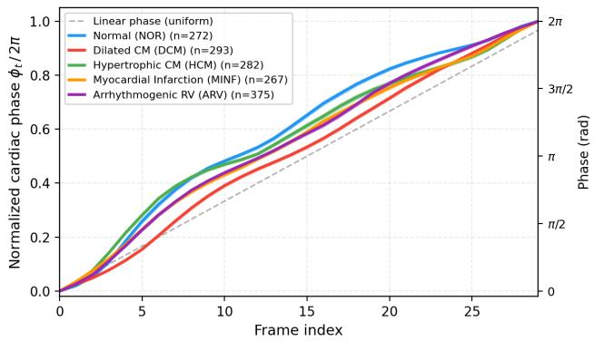  
Figure 5: Per-pathology nonlinear phase templates (coloured) vs. linear baseline (grey dashed). All groups show a fastthen-slow profile: rapid systolic rise, then slower diastolic progression.

## B.2 Intra-Group Consistency

To quantify how well a group-level template approximates individual patient phase curves, we measure the per-frame root mean squared error (RMSE) of each per-slice nonlinear phase curve relative to two candidate templates: (i) the nonlinear group mean $\bar { \phi } _ { t } ^ { ( g ) }$ (our method), and (ii) the linear phase $\phi _ { t } ^ { \mathrm { l i n } } = t / T$ (the baseline).

Because the group mean is computed from the same population, its RMSE equals the intra-group standard deviation (zero bias by construction). The linear phase introduces an additional systematic bias (the gap between the nonlinear group mean and the diagonal visible in Figure 5), so its RMSE satisfies $\mathrm { R M S E _ { \mathrm { l i n } } } = \sqrt { \mathrm { b i a s } ^ { 2 } + \sigma ^ { 2 } } \ge \mathrm { R M S E _ { \mathrm { n l } } }$

Figure 6 shows both RMSE curves for each pathology group. Across all groups, the nonlinear group template achieves a mean RMSE of 7.3–9.7% of the full cardiac cycle, while the linear phase incurs 8.3–13.7%, an up-to-1.7× reduction in approximation error (NOR group). The shaded region between the two curves represents the error saved by using the nonlinear group template instead of linear phase. This demonstrates that the proposed phase representation substantially reduces the uncertainty introduced by replacing per-patient ECG with a group-level template at inference time.

## C Difeomorphism Verification

A central architectural claim of PhaseFlow is that the Scalingand-Squaring (S&S) integration of the velocity field guarantees a difeomorphic displacement field, i.e. a topologypreserving, fold-free deformation with det $( \mathbf { J } _ { \varphi } ) > \bar { 0 }$ everywhere. This appendix provides an empirical verification of that claim on the ACDC test set.

Setup. The deformation decoder produces a 2-D velocity field u: $\mathbb { R } ^ { 2 } \to \mathbb { R } ^ { 2 }$ , which is integrated via $K \ : = \ : 7 \ : \ : \mathrm { S \& S }$ squaring steps to yield the displacement field $\varphi = \exp ( \mathbf { u } )$ For a deformation $\varphi ( \mathbf x ) = \mathbf x + \mathbf u ( \mathbf x )$ , the Jacobian matrix and its determinant are

$$
\mathbf { J } _ { \varphi } = \left( \begin{array} { c c } { 1 + \frac { \partial u _ { x } } { \partial x } } & { \frac { \partial u _ { x } } { \partial y } } \\ { \frac { \partial u _ { y } } { \partial x } } & { 1 + \frac { \partial u _ { y } } { \partial y } } \end{array} \right) ,
$$

det $( \mathbf { J } _ { \varphi } ) > 0 \iff$ locally orientation-preserving (no fold).

We compute $\operatorname* { d e t } ( \mathbf { J } _ { \varphi } )$ via central finite diferences at every pixel ofevery generated frame for all test-set slices (30 frames each).

Results. Figure 7 shows the empirical distribution of det $\left( \mathbf { J } _ { \varphi } \right)$ . The fraction of pixels with det $( \mathbf { J } _ { \varphi } ) \leq 0$ (folding voxels) is $\mathbf { 0 . 0 0 \% } .$ , confirming that S&S prevents topology violations across all pathology groups and cardiac phases. The mean determinant is $1 . { \bar { 0 0 1 } } \pm { \bar { 0 } } . 0 6 3$ (mean±std), reflecting physiologically expected area changes: myocardial compression during systole yields det $< 1$ and expansion during diastole yields det $> 1$ , but neither regime produces folds. Per-pathology statistics (Figure 7, right) are consistent, demonstrating that the difeomorphic property holds across the diverse cardiac morphologies in ACDC.

## D Excluded Baselines

We detail why four otherwise-natural baselines were excluded from the main comparison.

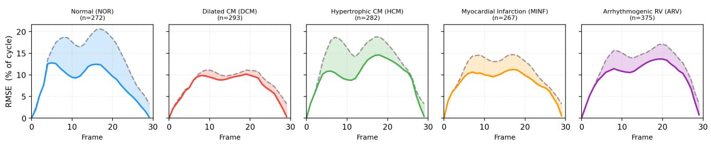  
Figure 6: Per-frame phase RMSE: nonlinear group template (solid) vs. linear baseline (dashed). Shaded region: error gap. Nonlinear template reduces approximation error by up to 1.7×.

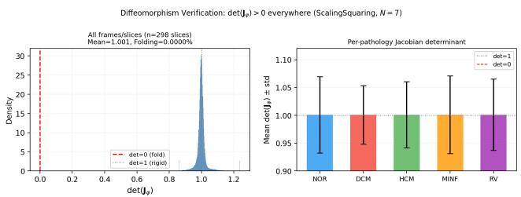  
Figure 7: det $( \mathbf { J } _ { \varphi } )$ distribution (S&S, K = 7). Left: global histogram; red dashed: fold boundary (det = 0). Right: perpathology mean±std. Zero folding across all pixels confirms difeomorphic synthesis.

DragNet. DragNet (Zakeri et al. 2023) synthesizes frames autoregressively, so prediction error accumulates over the sequence. This drift caused the frozen SegUNet to fail on 19 of 30 test cases (63%), making the physiological volumecurve evaluation infeasible.

Registration methods. Registration-based methods such as VoxelMorph (Balakrishnan et al. 2019) address a diferent task: aligning two observed images. They cannot synthesize a sequence from a single ED frame without a target frame available at inference.

ECG-conditioned methods. ECG-conditioned approaches (Li et al. 2025; Fang et al. 2026) require concurrent ECG acquisition, which violates our ECG-free setting and makes direct comparison unfair.

EchoLVFM. EchoLVFM (Oladokun et al. 2026), the concurrent flow-matching method most related to ours, has no publicly available implementation.

## E Implementation Details

VAE architecture. We adopt the 3D VAE architecture from ECGFlowCMR (Fang et al. 2026) with anisotropic compression: spatial downsampling 8× with temporal dimension preserved $\left( \begin{array} { l l l } { f _ { t } } & { = } & { 0 \right) } \end{array}$ . Input shape: (B, 1, T, 128, 128); latent shape: $\tilde { ( B , 4 , T , 1 6 , 1 6 ) }$ . We replace the full 3D attention in ECGFlowCMR with perframe 2D spatial attention, reducing the sequence length from ∼7,680 to 256 per attention block, significantly more memory-eficient and better suited to the ACDC dataset size. The VAE is pretrained for 100 epochs $( \mathrm { l r } = 1 0 ^ { - 4 }$ , KL weight $= 1 0 ^ { - 6 } )$ and frozen during flow matching training.

VelocityUNet. A 3D UNet with channel multipliers [1, 2], base channels 128, temporal self-attention across frames at both resolution levels. Flow time τ is injected via sinusoidal embeddings processed by a small MLP, added to the global condition and applied as scale/shift in adaptive group normalization (AdaGN) inside each residual block. The sliceposition embedding $\mathbf { e } _ { \mathrm { s l i c e } }$ is similarly fused into AdaGN as a global condition, while the per-frame phase embedding $\mathbf { e } _ { \mathrm { p h a s e } }$ is injected at every resolution level via cross-attention with $n _ { \mathrm { t o k e n s } } = 4$ key-value tokens and $n _ { \mathrm { h e a d s } } = 8 .$

Deformation decoder. A stack of transposed 2D convolutions (temporal dimension folded into the batch) upsampling from (4, 16, 16) to (2, 128, 128), producing a 2-channel velocity field (horizontal and vertical displacement). Scalingand-squaring with $K = 7$ steps produces the final difeomorphic displacement. A learnable output scale parameter (initialized to 10.0) controls the displacement magnitude.

SegUNet. A standard 2D UNet (Ronneberger, Fischer, and Brox 2015; Isensee et al. 2021) trained on ACDC images with segmentation annotations for the LV, right ventricle (RV), and myocardium. Used frozen for: (i) nonlinear phase estimation, (ii) VolumeCurveLoss computation, and (iii) volume-curve evaluation. The network is never exposed to generated images during training.

Training details. All flow matching models are trained for 200 epochs with AdamW $( \beta _ { 1 } = 0 . 9 , \beta _ { 2 } = 0 . 9 9 9$ , weight decay $1 { \dot { 0 } } ^ { - 4 } ) .$ , learning rate $1 0 ^ { - 4 }$ with cosine annealing, batch size 4, mixed-precision (AMP) training. LNCC is computed in float32 to avoid numerical cancellation under AMP. Noise scale $\alpha = 0 . 1$ for $\mathbf { z } _ { 0 }$ construction. For reproducibility, all stochastic components (the train/validation/test split, network weight initialization, and the anchor noise ε) are governed by a single fixed random seed (42). Every number reported in this paper (main comparison, ablations, and appendix analyses) is obtained from a single training run under this fixed seed; we do not average over multiple seeds.

Hyperparameter selection. The loss weights were selected on the validation split. We swept the volume-curve weight $\lambda _ { \mathrm { v o l } } \in \{ 0 . 1 , 1 . 0 , 2 . 0 \}$ and the bending-energy weight $\lambda _ { \mathrm { b e n d } } \in \{ 0 . 0 1 , 0 . 0 0 1 \}$ , and retained $\lambda _ { \mathrm { v o l } } = \bar { 2 } . 0 { \mathrm { a n } } \bar { \mathrm { d } } \lambda _ { \mathrm { b e n d } } =$ 0.001 as the setting that best balanced physiological fidelity (validation volume-curve $R ^ { 2 } )$ against image quality (validation SSIM). The remaining weights were fixed a priori: $\lambda _ { \mathrm { f l o w } } = \lambda _ { \mathrm { l n c c } } = 1 . 0$ the anchor noise scale $\alpha = 0 . 1$ , and the scaling-and-squaring steps $K = 7$ . The learning rate $( 1 0 ^ { - 4 } )$ batch size (4), and epoch budget (200) followed standard practice for latent flow-matching training and were not separately tuned.

Computing infrastructure. All models were trained and evaluated on a single NVIDIA RTX A6000 GPU (48 GB) under Debian GNU/Linux 11 (bullseye), NVIDIA driver 560.35.03. The software stack comprised Python 3.9.2, Py-Torch 2.7.1 (built against CUDA 11.8 and cuDNN 9.1), NumPy 2.0.2, and SciPy 1.13.1.

## F Data Preprocessing

We describe the full preprocessing pipeline applied to the ACDC cine CMR volumes. Two ofline stages produce (i) a pathology-stratified patient split and (ii) a per-slice nonlinear phase cache; a lightweight per-sample transform is then applied on the fly inside the Dataset. Algorithm 1 gives the exact sequence of operations.

Algorithm 1: ACDC preprocessing (per (patient, slice) sam  
ple)   
1: Ofline (once): collect all 150 patients from   
training/ and testing/; read pathology Group   
from each Info.cfg; stratified split by group   
into train/val/test $\begin{array} { r l } { = } &  { } 1 0 5 / 1 5 / 3 0 \end{array}$ with seed $4 2 $   
split.json.   
2: Ofline (once): for each (patient, slice), run frozen   
SegUNet to obtain LV area curve; convert to   
a normalized nonlinear phase curve $\phi _ { t } ;$ store →   
phase\_nonlinear.json.   
3: Per sample (patient, z):   
4: Load 4D volume $( \mathbf { \tilde { \Gamma } } _ { H , W , Z , T _ { \mathrm { o r i g } } } ) ;$ take slice $z $   
$( T _ { \mathrm { o r i g } } , H , W )$   
5: Read ED/ES frame indices from Info.cfg (ED =   
frame 0).   
6: Intensity: per-sample min–max normalize to [−1, 1].   
Spatial: bilinear resize each frame to 128 × 128.   
Temporal: trilinear resample to $T = 3 0$ frames; re  
sample $\phi _ { t }$ and rescale the ES index accordingly.   
9: Encode phase as [sin ϕt, cos $\phi _ { t } ] ;$ set anchor $\mathbf { x } _ { \mathrm { E D } } =$   
frame $0 ;$ slice position $= z / ( Z - \mathrm { i } )$   
10: return (cine, $\mathbf { x } _ { \mathrm { E D } } , \phi _ { \mathrm { s e q } } .$ slice\_pos, es\_idx).

No intensity augmentation, cropping, or registration is applied; the only spatial operation is an isotropic resize. Intensity normalization is performed per (patient, slice) sequence so that all frames of a given slice share one $[ v _ { \mathrm { m i n } } , v _ { \mathrm { m a x } } ]$ range, preserving relative temporal contrast. The stratified split and the phase cache are computed once and reused across all models (main and baselines) to ensure an identical evaluation protocol.

## G Evaluation Metrics

We formally define the eight metrics used in the main paper and state the motivation for each. Let xˆ and $\mathbf { x } _ { t }$ denote the generated and ground-truth frame at time $t \left( t = 1 , \ldots , T \right)$ with pixel intensities rescaled to [0, 1].

## Image quality.

• PSNR (dB), averaged over frames: PSNR = $1 0 \log _ { 1 0 } \bigl ( 1 / \mathrm { M S E } ( \hat { \mathbf { x } } _ { t } , \bar { \mathbf { x } } _ { t } ) \bigr )$ . Motivation: standard pixellevel fidelity measure; penalizes reconstruction error directly.

• SSIM (Wang et al. 2004): SSIM = $\frac { ( 2 \mu _ { \hat { x } } \mu _ { x } + c _ { 1 } ) ( 2 \sigma _ { \hat { x } x } + c _ { 2 } ) } { ( \mu _ { \hat { x } } ^ { 2 } + \mu _ { x } ^ { 2 } + c _ { 1 } ) ( \sigma _ { \hat { x } } ^ { 2 } + \sigma _ { x } ^ { 2 } + c _ { 2 } ) }$ Motivation: captures structural/luminance/contrast agreement, correlating better with perceived quality than PSNR for anatomical structure.

• LPIPS (Zhang et al. 2018): distance between deep features of $\hat { \mathbf { x } } _ { t }$ and $\mathbf { x } _ { t } .$ Motivation: perceptual similarity that is sensitive to texture realism, which pixel metrics miss.

• FID (Heusel et al. 2017): $\| \mu _ { r } - \mu _ { g } \| ^ { 2 } + \operatorname { T r } \bigl ( \Sigma _ { r } + \Sigma _ { g } -$ $2 ( \Sigma _ { r } \Sigma _ { g } ) ^ { 1 / 2 } )$ over Inception features of real (r) and generated (g) frames. Motivation: measures distributional realism of the generated frames as a set, complementing per-frame metrics.

Physiological fidelity. Let $V _ { t }$ and $\hat { V } _ { t }$ be the ground-truth and predicted LV cavity volume at frame t. The predicted volume $\hat { V } _ { t }$ is obtained by warping the ED segmentation mask through the predicted displacement field, so the segmentation network is never applied to generated frames; the groundtruth volume $V _ { t }$ is obtained by segmenting the corresponding real frame $\mathbf { x } _ { t }$

• EF MAE (%): absolute error of ejection fraction EF = $( V _ { \mathrm { m a x } } - V _ { \mathrm { m i n } } ) / V _ { \mathrm { m a x } }$ . Motivation: EF is the primary clinical index of cardiac function; a direct measure of physiological correctness.

• Vol Corr: Pearson correlation between $\{ \hat { V } _ { t } \}$ and $\{ V _ { t } \}$ Motivation: tests whether the shape of the volume–time trajectory is reproduced, independent of scale.

• Vol $R ^ { 2 } \colon$ : coeficient of determination $\begin{array} { r } { 1 ~ - ~ \sum _ { t } ( \hat { V } _ { t } ~ - } \end{array}$ $\textstyle V _ { t } ) ^ { 2 } / \sum _ { t } ( V _ { t } - { \bar { V } } ) ^ { 2 }$ . Motivation: penalizes both bias and variance of the volume curve; negative values expose predictions worse than the mean.

• Vol MAE: mean absolute per-frame volume error, normalized by ED volume. Motivation: a scale-aware com plement to the correlation-based measures.

Physiological metrics are computed on warped ED mask rather than on segmentations of the generated frames, avoiding segmentation domain shift in the evaluation pipeline.

## H Statistical Analysis

Metric variability. All reported numbers are obtained from a single training run under fixed seed 42; to characterize the distribution of performance beyond point estimates, Table 4 reports the per-case mean and standard deviation of PhaseFlow across the test set. Image-quality metrics are computed per slice $\scriptstyle ( n = 2 9 8 )$ and physiological metrics per patient $\scriptstyle ( n = 3 0 )$ . The spread is small for image quality (e.g. SSIM $0 . 9 5 6 \pm 0 . 0 1 9 )$ but larger for physiological metrics (e.g. Vol $R ^ { 2 } ~ 0 . 3 6 3 \pm 0 . 4 8 9 )$ , reflecting genuine betweenpatient variation in cardiac motion and pathology severity rather than estimator noise.

<table><tr><td>Metric</td><td>Mean ± Std</td></tr><tr><td>Image quality (per slice, n=298) PSNR (dB) SSIM</td><td> $3 1 . 7 2 \pm 3 . 3 3$   $0 . 9 5 6 \pm 0 . 0 1 9$ </td></tr><tr><td>LPIPS</td><td> $0 . 0 2 3 \pm 0 . 0 1 2$ </td></tr><tr><td>Physiological fidelity</td><td> $( p e r p a t i e n t , n { = } 3 0 )$ </td></tr><tr><td>EF MAE (%)</td><td> $1 7 . 7 9 \pm 1 1 . 1 5$ </td></tr><tr><td>Vol Corr</td><td> $0 . 8 6 7 \pm 0 . 1 3 2$ </td></tr><tr><td>Vol R²</td><td> $0 . 3 6 3 \pm 0 . 4 8 9$ </td></tr><tr><td>Vol MAE</td><td> $0 . 1 0 1 \pm 0 . 0 6 0$ </td></tr></table>

Table 4: Per-case mean ± standard deviation of PhaseFlow on the ACDC test set. Image metrics are per-slice (n=298); physiological metrics are per-patient (n=30).

Significance testing. To verify that PhaseFlow’s physiological improvements are statistically significant rather than artifacts of point estimates, we apply the paired Wilcoxon signed-rank test on the per-patient physiological metrics (n=30) against four baselines spanning the trivial null (ED Repeat), a recurrent predictor (ConvLSTM), and two strong learned generators (CVAE, Direct Registration). Table 5 reports the resulting p-values. Each cell is a p-value, not a performance score: it measures how unlikely the observed PhaseFlow-vs-baseline gap would be if the two methods were truly equal, so a smaller value is stronger evidence in favour of PhaseFlow. Bold entries are significant at $\alpha { = } 0 . 0 5$

The central result is Vol $R ^ { 2 } \mathbf { ; }$ : PhaseFlow is significantly better than every baseline (p ranging from $1 . 6 \times 1 0 ^ { - 2 }$ to $1 . 9 \times 1 0 ^ { - 9 } )$ , confirming the main-text finding that it is the only method to reproduce ventricular contraction magnitude (positive $R ^ { 2 } )$ . PhaseFlow is likewise significantly better on Vol MAE and EF MAE against all baselines except Direct Registration. On Vol Corr, which measures only the shape (timing) of the volume curve and not its magnitude, Phase-Flow is statistically indistinguishable from the two strongest baselines (CVAE and Direct Registration; $\scriptstyle { p = 0 . 3 6 }$ and 0.72): these baselines track when the ventricle contracts but, as their negative $R ^ { 2 }$ shows, not by how much, which is precisely the failure mode the VolumeCurveLoss is designed to correct. The Vol Corr comparison against ED Repeat is undefined (the static ED Repeat sequence has a constant, zero-variance volume curve, so Pearson correlation cannot be computed) and is omitted.

<table><tr><td rowspan="2">Metric</td><td colspan="4">Wilcoxon p (PhaseFlow vs.)</td></tr><tr><td>ED Rep.</td><td>ConvLSTM</td><td>CVAE</td><td>Dir. Reg.</td></tr><tr><td>EF MAE</td><td> ${ \bf 1 . 9 \times 1 0 ^ { - 9 } }$ </td><td> $\mathbf { 1 . 9 \times 1 0 ^ { - 9 } }$ </td><td> $\mathbf { 2 . 0 { \times } 1 0 ^ { - 2 } }$ </td><td>0.36</td></tr><tr><td>Vol Corr</td><td></td><td> ${ \bf 5 . 6 } \times { \bf 1 0 ^ { - 9 } }$ </td><td> $0 . 3 6$ </td><td>0.72</td></tr><tr><td>Vol  $R ^ { 2 }$ </td><td> ${ \bf 1 . 9 \times 1 0 ^ { - 9 } }$ </td><td> $\mathbf { 6 . 2 \times 1 0 ^ { - 8 } }$ </td><td> $\mathbf { 2 . 3 \times 1 0 ^ { - 4 } }$ </td><td> ${ \bf 1 . 6 \times 1 0 ^ { - 2 } }$ </td></tr><tr><td>Vol MAE</td><td> ${ \bf 5 . 6 } \times { \bf 1 0 } ^ { - 9 }$ </td><td> $\mathbf { 2 . 6 \times 1 0 ^ { - 8 } }$ </td><td> $\mathbf { 2 . 3 \times 1 0 ^ { - 4 } }$ </td><td>0.064</td></tr></table>

Table 5: Paired Wilcoxon signed-rank test (n=30 patients) against four baselines. Every cell is a p-value; smaller means stronger evidence that PhaseFlow is better. Bold = significant at $\alpha { = } 0 . 0 5$ . PhaseFlow is significantly better on Vol $R ^ { 2 }$ against all baselines; non-bold cells (Vol Corr vs. CVAE/Dir. Reg., EF/Vol MAE vs. Dir. Reg.) indicate no significant diference. Vol Corr vs. ED Repeat is undefined (constant volume curve).

## I Latent Scale and Anchor Perturbation

The anchor noise scale α in the anchor latent construction $\mathbf { z } _ { 0 } = E _ { \mathrm { v a e } } ( \mathrm { r e p e a t } ( \mathbf { x } _ { \mathrm { E D } } , T ) ) + \alpha \varepsilon ( \mathrm { w i t h } \varepsilon \sim \mathcal { N } ( \mathbf { 0 } , \mathbf { I } ) )$ is only meaningful relative to the scale of the latent space itself. We therefore measure the empirical statistics of the frozen VAE latents over the ACDC splits (Table 6). Latents are taken as the posterior mode $\mu ,$ matching the training configuration; the latent tensor has dimension $D = C \times T \times h \times w =$ $4 \times 3 0 \times 1 6 \times 1 6 = 3 0 , 7 2 0 .$

<table><tr><td>Quantity</td><td>Train (n=1048)</td><td>Val (n=143)</td></tr><tr><td>σ of z1</td><td>0.506</td><td>0.538</td></tr><tr><td>σ of anchor  $E _ { \mathrm { v a e } } ( \mathrm { r e p e a t } ( \cdot ) )$ </td><td>0.503</td><td>0.535</td></tr><tr><td>σ of  ${ \bf z } _ { 1 } - { \bf z } _ { 0 }$ </td><td>0.171</td><td>0.174</td></tr><tr><td> $\alpha / \sigma ( { \bf z } _ { 1 } )$ </td><td>19.8%</td><td>18.6%</td></tr><tr><td> $\alpha / \sigma ( { \bf z } _ { 1 } - { \bf z } _ { 0 } )$ </td><td>58.3%</td><td>57.4%</td></tr></table>

Table 6: Empirical latent statistics (σ = per-element standard deviation). The two splits agree closely, indicating the latent scale is a stable property of the frozen encoder rather than a split artifact.

Geometry of the perturbation. The per-element ratios in Table 6 (up to 58%) make the anchor noise look large, but they overstate its efect on the motion signal. In the highdimensional latent space the noise is almost entirely orthogonal to the motion direction: it corrupts the true transport direction by only 0.28%. The anchor perturbation is therefore efectively harmless to the motion content, and $\alpha { = } 0 . 1$ is a safe choice.

Concretely, on the validation split the transport distance is $\| { \mathbf { z } } _ { 1 } - { \mathbf { z } } _ { 0 } \| \overset { - } { = } 2 9 . 3 3 \pm 8 . 5 1$ while the noise norm is $\| \alpha \varepsilon \| =$ $1 7 . 5 4 \pm 0 . 0 7$ (matching the theoretical $\alpha \sqrt { D } ~ = ~ 1 7 . 5 3 )$ a seemingly large 66% ratio. This ratio is misleading because the noise energy is spread across all $D = 3 \bar { 0 } { , } 7 2 0$ dimensions: its projection onto the single transport direction ${ \bf z } _ { 1 } \mathrm { ~ - ~ } { \bf z } _ { 0 }$ is only $\bar { 0 . 0 7 4 } \pm 0 . 0 8 9$ , i.e. 0.284% of the transport distance, matching the theoretical prediction that for isotropic ε this projection follows $\mathcal { N } ( 0 , \dot { \alpha } ^ { 2 } )$ independently of D $( \mathbb { E } | \cdot | = \alpha \sqrt { 2 / \pi } = 0 . 0 8 0 )$ . The perturbed and clean transport directions difer by only $3 2 . { \dot { 5 } } ^ { \circ } \pm 8 . 3 ^ { \circ }$ : the noise samples a wide cone of starting points around the anchor, but all such paths terminate at the same z , so the component that actually corrupts the motion signal is negligible.

## J Extended Qualitative Results

Figure 8 presents representative generated cardiac cine sequences for one patient from each ACDC pathology group. For each group, a representative patient is manually selected to clearly illustrate the characteristic motion signature of that pathology.

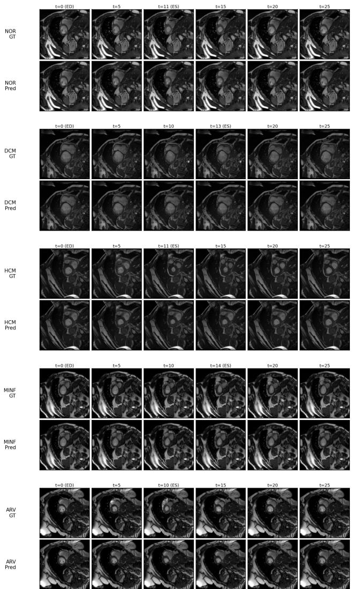  
Figure 8: Per-pathology qualitative results (one representative patient per group). Top row: ground truth; bottom row: PhaseFlow synthesis. ED frame (t = 0, leftmost) is the sole model input.

Each group occupies two rows: the top row shows the ground-truth sequence and the bottom row shows the PhaseFlow-generated sequence, at six evenly-spaced frames spanning the full cardiac cycle. The leftmost frame (ED, $t = 0 )$ is the only input to the model at inference time; all subsequent frames are synthesised from the nonlinear phase template and the predicted difeomorphic displacement field.

PhaseFlow faithfully captures the characteristic motion signatures of each pathology: normal wall-thickening in NOR, large-cavity contraction in DCM, asymmetric septal hypertrophy in HCM, regional wall-motion abnormality in MINF, and preserved right ventricular dynamics in ARV.