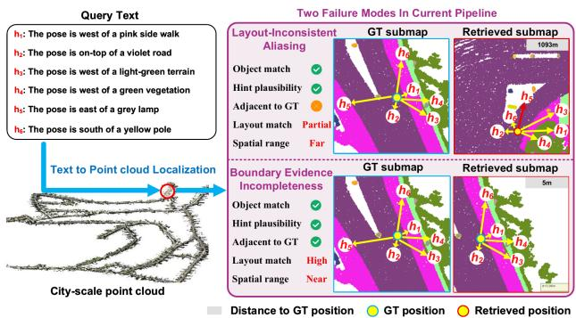
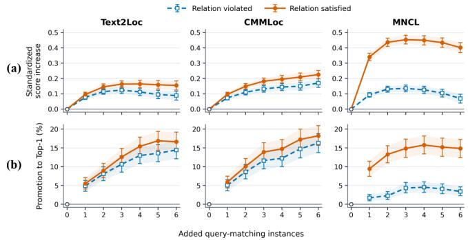
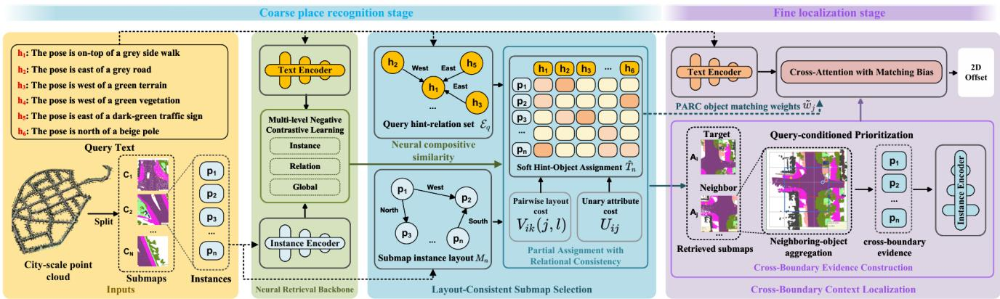
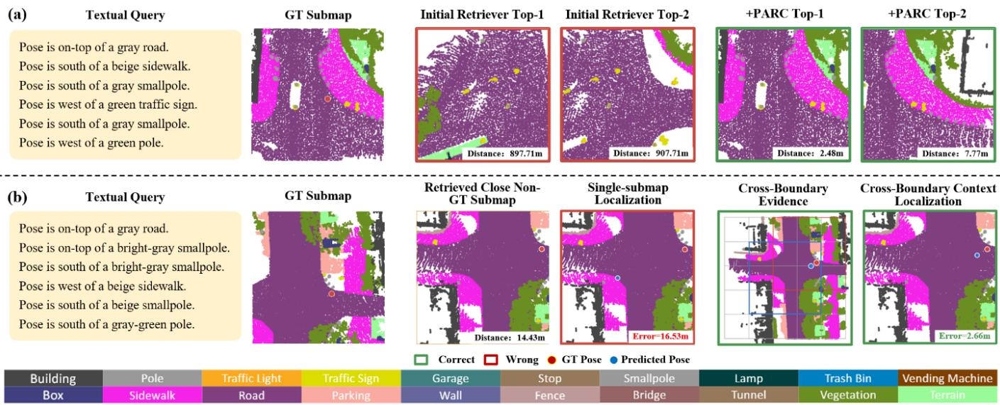
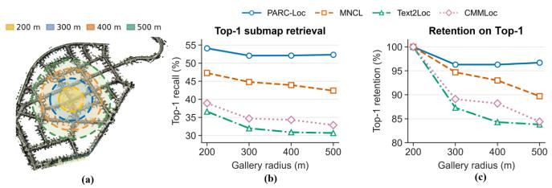

# PARC-Loc: Text-to-Point-Cloud Localization with Partial Assignment and Relational Consistency

Shengkai Ma Zhenyu Hou Weihua Cao

## Abstract

Text-to-point-cloud localization estimates a position in a city-scale 3D map from descriptions of surrounding objects. Existing coarse-to-fine methods retrieve submaps using aggregate learned compatibility and then localize within a selected submap. However, repetitive or similar urban objects can inflate the embedding similarity between the query and multiple submaps, even when the instance layout within a submap violates the query description. Meanwhile, query-relevant instances often span submap boundaries, leaving the retrieved submap with incomplete contextual evidence. We term these failure modes layout-inconsistent aliasing and boundary evidence incompleteness, respectively. To address them, we propose PARC-Loc, a coarse-to-fine localization framework built on Partial Assignment with Relational Consistency (PARC). PARC jointly models hint-object compatibility and pairwise spatial relations, allowing unmatched elements while favoring assignments consistent with the queried layout. At the coarse stage, its candidate-level assessment complements neural similarity for layout-consistent submap selection. At the fine stage, the context is expanded with query-relevant instances from adjacent submaps, while PARC yields object-level matching weights that guide cross-modal attention. Extensive experiments on KITTI360Pose and CityLoc show that PARC-Loc outperforms conventional coarse-to-fine baselines. On KITTI360Pose, our method improves Top-1 localization recall at 5 m from 0.50 to 0.67, achieving a 34% relative gain over the strongest baseline.

  
Figure 1: Two failure modes in the standard coarse-to-fine decision structure.

## 1 Introduction

Text-to-point-cloud (T2P) localization estimates a position in a city-scale 3D map from linguistic descriptions of nearby landmarks (Kolmet et al., 2022). Unlike referred-object ground ing, the target does not necessarily correspond to an observed instance. For example, a query such as “west of the green building and east of the gray road” specifies the target through the joint configuration of several surrounding objects. This provides a language-based interface for locating without exact addresses or GPS coordinates, which is promising for applications in autonomous driving and embodied-agent navigation (Anderson et al., 2018; Deruyttere et al., 2019).

However, it remains challenging to realize such capabilities: grounding these descriptions in a large-scale point-cloud map requires jointly aligning object semantics and spatial relations across language and point clouds (Chen et al., 2022).

To address this challenging task, most existing systems follow a coarse-to-fine design introduced by Text2Pos (Kolmet et al., 2022): a neural retriever first selects candidate submaps, after which a fine localizer predicts a position within a selected submap. Subsequent methods advance this pipeline along several dimensions. For spatial structure encoding, RET explicitly models relations at the hint and instance levels, while SpatiaLoc constructs spatial descriptors at instance and global levels (Wang et al., 2023; Shang et al., 2026b). For cross-modal representation alignment, Text2Loc adopts global text–submap contrastive learning, whereas MNCL extends negative contrastive supervision to the global, instance, and relation levels (Xia et al., 2024; Liu et al., 2025). For robustness to partial or ambiguous correspondence, CMMLoc captures semantic interactions under partial relevance, while PMSH propagates localization uncertainty across the coarse and fine stages (Xu et al., 2025; Feng et al., 2025). Despite these advances, these methods generally retain the same decision making: coarse retrieval ranks candidates by an aggregate query-submap similarity, while fine localization treats each selected submap as a self-contained evidence domain. Two limitations exist within this structure: it implicitly equates aggregate similarity with a jointly valid layout and the selected submap with complete localization context.

The first limitation can lead to layout-inconsistent aliasing. As illustrated in Fig. 1, common object categories and similar appearances across locations can produce high aggregate querysubmap similarity through individually plausible object matches, even when their joint spatial configuration is inconsistent with the relational layout described by the query. Although relationaware encoders incorporate spatial cues (Wang et al., 2023; Shang et al., 2026b), the final score does not explicitly verify relational consistency at the candidate level. Specifically, these methods do not check whether a query-to-instance configuration satisfies the relational constraints in the query. This motivates an explicit assessment of relational consistency over candidatespecific partial assignments during coarse selection.

The second limitation can lead to boundary evidence incompleteness. Cell-based submap construction may distribute query-relevant instances across neighboring submaps, leaving any single submap with incomplete contextual evidence.

This loss of context can make neighboring candidates harder to distinguish and exacerbate the text-submap matching uncertainty studied in prior work (Xu et al., 2025; Feng et al., 2025). Incorporating instances from adjacent submaps can recover cross-boundary evidence. However, it may also introduce distractors whose individual object matches appear plausible while their relational configurations are inconsistent with the query. Fine localization should therefore preserve the selected submap as the coordinate anchor while selectively incorporating query-relevant context from adjacent submaps.

Although caused by diferent structural choices, the two failures create the same matching requirement: determining which subset of individually plausible hint–object correspondences forms a coherent explanation of the query layout. At the coarse stage, this assessment diferentiates coherent candidates from aliases supported only by isolated coincidences; after neighboring-object aggregation makes cross-boundary evidence available, it separates useful context objects from the accompanying distractors. The required mechanism must therefore allow unsupported hints and irrelevant objects to remain unmatched whilejointly evaluating unary attribute compatibility and pairwise layout consistency. We therefore propose PARC-Loc, a text-to-point-cloud localization framework built around Partial Assignment with Relational Consistency (PARC). PARC constructs a soft partial hint–object assignment that jointly evaluates attribute compatibility and pairwise spatial consistency while leaving missing or irrelevant elements unmatched. This mechanism is applied to both coarse submap retrieval and fine localization. In the coarse stage, PARC evaluates each neural proposal and combines its explicit candidate-level consistency with the neural retrieval score for submap selection. In the fine stage, the selected submap defines the coordinate frame, while objects collected from neighboring cells form an expanded evidence set. Reapplying PARC to this set produces object-level matching weights that bias cross-attention toward query-relevant context.

Taken together, these two stage-specific applications of PARC yield substantial gains. On the KITTI360Pose test set, PARC-Loc improves Top-1@5m localization recall from 0.50 to 0.67, a 34% relative improvement over MNCL. We further conduct transfer and zero-shot experiments on CityLoc-K and CityLoc-C, where PARC-Loc achieves competitive performance. Module-wise ablations support the individual contributions of our method. In a controlled single-scene stress test, the PARC selector retains 96.7% of its Top-1 retrieval recall as the gallery grows from 819 to 2,549 submaps, compared with 83.8–89.7% for reported baselines.

Our main contributions are summarized as follows:

• We thoroughly analyze the standard coarse-to-fine pipeline adopted in T2P localization and diagnose two structural failure modes: layout-inconsistent aliasing during coarse submap retrieval and boundary evidence incompleteness during fine localization.

• We propose PARC-Loc, a novel language-based localization framework. Within this framework, Layout-Consistent Submap Selection and Cross-Boundary Context Localization specifically mitigate the two structural failure modes through Partial Assignment with Relational Consistency (PARC), a soft hint–object assignment that jointly evaluates semantic and spatial compatibility under partial correspondence.

• Extensive experiments on the KITTI360Pose dataset demonstrate that our method outperforms state-of-the-art methods. Experiments on the CityLoc-K and CityLoc-C datasets and under controlled gallery growth further assess the transfer and robustness of our method.

## 2 Related Work

Text-to-point-cloud localization. Text2Pos establishes the prevailing coarse-to-fine formulation on KITTI360Pose, retrieving candidate submaps before estimating a target ofset from hint–instance associations (Kolmet et al., 2022). Subsequent methods address diferent sources of cross-modal ambiguity: RET models instance relations, Text2Loc adopts stronger language representations and matching-free localization, and MNCL introduces multi-level negative contrastive learning over global, instance, and relation cues (Wang et al., 2023; Xia et al., 2024; Liu et al., 2025). CMMLoc and PMSH model partial correspondence and uncertainty (Xu et al., 2025; Feng et al., 2025), while SpatiaLoc and SympLoc strengthen spatial descriptors and alignment geometry (Shang et al., 2026b; Shang and Li, 2026). Vehicle-SceneInteraction studies text-driven 3D LiDAR place recognition for autonomous driving (Shang et al., 2026a), whereas VLM-Loc performs localization through BEV maps and scene graphs (Kang et al., 2026). These methods improve the representation, training, or retrieval of submap compatibility. PARC-Loc instead validates joint layouts during coarse selection and prevents the selected submap boundary from limiting fine-stage evidence.

Language-guided 3D spatial reasoning. Language-guided 3D grounding identifies objects or regions from textual descriptions (Huang et al., 2022; Jain et al., 2022). ScanRefer and ReferIt3D establish indoor benchmarks (Chen et al., 2020; Achlioptas et al., 2020), followed by methods for relation modeling, spatial–language alignment, progressive point selection, and dense alignment (He et al., 2021; Zhao et al., 2021; Roh et al., 2022; Luo et al., 2022; Wu et al., 2023). CityRefer extends grounding to city-scale point clouds (Miyanishi et al., 2023). Unlike referred-object grounding, the target in T2P localization may not correspond to an observed instance; it must be inferred from the joint configuration of surrounding objects. This distinction motivates validating hint–object correspondences jointly rather than grounding each hint independently.

## 3 Preliminaries and Pipeline Diagnosis

We formulate text-to-point-cloud localization and diagnose two limitations of its standard coarse-to-fine pipeline.

Figure 2: Efect of added query-matching instances on candidate scores. Top: standardized score change; bottom: promotion rate among initially non-Top-1 candidates. Curves compare relationsatisfied and relation-violated placements; error bars denote 95% cluster-bootstrap confidence intervals.
<table><tr><td colspan="4">(a) Prevalence of Boundary-Truncated Evidence</td></tr><tr><td>Analysis unit</td><td>Affected</td><td>Total</td><td>Rate</td></tr><tr><td>Boundary-truncated instances</td><td>7,907</td><td>19,629</td><td>40.28%</td></tr><tr><td>Hints referencing them</td><td>11,905</td><td>18,459</td><td>64.49%</td></tr><tr><td>Queries</td><td>3,179</td><td>3,187</td><td>99.75%</td></tr></table>

(b) Submap Retrieval Outcomes
<table><tr><td colspan="2">Top-1 Recall</td><td rowspan="2"></td><td colspan="2">Top-1 Retrieval Errors</td></tr><tr><td>Model</td><td>Top-1</td><td>Close@1 Close non-GT</td><td>Other</td></tr><tr><td>Text2Loc (2024)</td><td>33.0%</td><td>64.3%</td><td>46.8%</td><td>53.2%</td></tr><tr><td>CMMLoc (2025)</td><td>34.7%</td><td>66.3%</td><td>48.3%</td><td>51.7%</td></tr><tr><td>MNCL (2025)</td><td>48.4%</td><td>79.0%</td><td>59.2%</td><td>40.8%</td></tr></table>

Table 1: Boundary-related evidence on the KITTI360Pose validation split. (a) Prevalence of boundary-truncated instances and afected hints and queries. (b) Exact Top-1 recall, Close@1 recall within 15 m, and the partition of Top-1 retrieval errors into close non-GT and other submaps.

## 3.1 Text-to-Point-Cloud Localization

Let $M = \{ M _ { n } \} _ { n = 1 } ^ { N }$ denote a city-scale point-cloud map partitioned into overlapping submaps, where $M _ { n } = \{ P _ { n , j } \} _ { j = 1 } ^ { \hat { O } _ { n } }$ contains $O _ { n }$ segmented instances. Given a query $q = \{ h _ { i } \} _ { i = 1 } ^ { H } ,$ whose hints describe target-to-object relations, the task is to estimate the target position $( x , y )$ from the joint configuration of the referenced objects. Most existing methods first rank submaps by query–submap similarity and then predict the position from q and the instances in the selected submap $M _ { \hat { n } }$ (Kolmet et al., 2022; Xia et al., 2024; Liu et al., 2025; Xu et al., 2025).

Despite its practical efectiveness, this pipeline leaves two structural gaps: (1) a submap is retrieved through an aggregate embedding comparison without explicitly verifying the uniqueness and full consistency between the query and the instance layout. (2) fine localization infers the target position within a single submap, ignoring that the context is often incomplete because of each submap’s fixed spatial extent.

## 3.2 Diagnosis of Pipeline Limitations

We analyze the two gaps using released Text2Loc, CMMLoc, and MNCL models (Xia et al., 2024; Liu et al., 2025; Xu et al., 2025). All analyses are conducted with their oficial checkpoints on the KITTI360Pose dataset (Kolmet et al., 2022).

Partial Matches Elevate Inconsistent Candidates. Urban environments typically contain abundant similar or repetitive objects (Torii et al., 2013). Repeated objects allow a candidate to contain individually plausible but jointly inconsistent matches, which can raise the aggregate submap score when no explicit joint-layout verification is imposed. To measure this efect, we test 911 partially matched candidates by replacing unrelated instances with one to six exact semantic matches. Paired variants have identical geometry and semantic attributes but difer in whether their placement satisfies the queried relation. Figure 2 shows that both candidate scores and Top-1 promotion rates increase even under relation-violated placements, while satisfying the relation provides an additional gain. These results demonstrate that partial matches may mislead models without explicit joint layout verification, resulting in layout-inconsistent aliasing.

Submap Boundaries Truncate Query Evidence. Largescale objects such as sidewalks and roads often span multiple submaps and are therefore truncated at cell boundaries. Table 1(a) shows that 40.28% of instances are boundary-truncated, 64.49% of hints refer to them, and 99.75% of queries contain at least one such hint. The resulting fragments make neighboring submaps similar while reducing the evidence available within any single submap. Across the three baselines, nearby non-ground-truth submaps account for 46.8–59.2% of Top-1 retrieval errors (Table 1(b)), indicating that neighboring candidates often share relevant evidence while omitting diferent fragments. Thus, even when the coarse stage retrieves the submap containing the most relevant evidence, the fine stage may still operate on incomplete context, resulting in boundary evidence incompleteness.

Together, these diagnoses define two requirements: coarse selection should validate matched instances as a joint layout, whereas fine localization should preserve the selected coordinate frame while admitting relevant cross-boundary evidence. Both require semantic and spatial compatibility to be evaluated under partial correspondence. This motivates PARC’s candidate-level assessment for submap selection and object-level weights for context routing.

## 4 Method

## 4.1 Overview

Given a query q, the coarse retrieval stage first uses a neural retriever to rank the submaps in M by neural similarity scores $S _ { \mathrm { s i m } } ( q , M _ { n } )$ and retains the top-K candidates. For each candidate $M _ { n }$ , PARC evaluates whether the objects form a partial hint–object assignment that is explicitly consistent in both attributes and pairwise layout. Combining its candidatelevel score with neural similarity, our approach identifies the best-matching submap $M _ { \hat { n } }$

  
Figure 3: Overview of PARC-Loc. In the coarse stage, the relational consistency between hints and each submap is explicitly assessed through partial assignment to produce a reliable submap selection. In the fine stage, neighboring-object aggregation first makes cross-boundary context available; PARC is then reapplied to produce object weights that bias cross-attention before ofset prediction.

At the fine localization stage, the selected submap $M _ { \hat { n } }$ serves as the coordinate anchor. Objects from its neighborhood are expressed in its coordinate frame, and PARC is reapplied to compute query-conditioned object-matching weights. These weights bias hint-to-object cross-attention before the model predicts a location ofset.

## 4.2 Partial Assignment with Relational Consistency (PARC)

At both stages, a query refers to only a subset of map objects, while some referenced objects may be absent or truncated and unrelated objects may be present. PARC models this partial correspondence while requiring the assigned objects to preserve the relations expressed by the query. It combines unary attribute compatibility, pairwise layout consistency (Mémoli, 2011; Peyré et al., 2016), and partial assignment constraints in one objective.

Consider a query $q$ with H hints and an input instance set ${ \cal P } = \{ { \cal P } _ { j } \} _ { j = 1 } ^ { \cal O }$ . Hint i specifies a category $\ell _ { i } ,$ an appearance attribute $\kappa _ { i }$ , and a target-to-object direction. Instance $P _ { j }$ has category $\ell _ { j } .$ , appearance $\kappa _ { j }$ , and a two-dimensional groundplane center $p _ { j }$ . We represent their soft correspondence by a nonnegative matrix $\mathcal { T } \in \mathbb { R } ^ { H \times O }$ , where $T _ { i j }$ is the assignment mass between hint i and instance $P _ { j }$

Unary attribute compatibility. Let $\delta ( x , y )$ be zero if $x = y$ and one otherwise. The unary cost of an individual correspondence is

$$
\begin{array} { r } { U _ { i j } = \lambda _ { \mathrm { c a t } } \delta ( \ell _ { i } , \ell _ { j } ) + \lambda _ { \mathrm { a p p } } \delta ( \kappa _ { i } , \kappa _ { j } ) , } \end{array}\tag{1}
$$

where $\lambda _ { \mathrm { c a t } }$ and $\lambda _ { \mathrm { a p p } }$ specify mismatch cost weights. Unary compatibility identifies plausible pairs but, as diagnosed in Sec. 3, cannot determine whether they form one valid layout.

Pairwise layout consistency. We therefore evaluate the relations among assigned objects. From the target-to-object directions in q, we derive a set $\mathcal { E } _ { q }$ of valid hint pairs. Each $( i , k ) \in \mathcal { E } _ { q }$ implies an object-to-object relation $r _ { i k } ^ { q }$ . For example, if the target is west of one referenced object and east of another, the first object should lie east of the second. For $( i , k ) \in \mathcal { E } _ { q } ,$ , the cost $V _ { i k } ( j , l )$ penalizes assigning the hint pair (i, k) to the object pair $( j , l )$ when the ground-plane relation between instances $P _ { j }$ and $P _ { l }$ is inconsistent with the object-to-object relation $r _ { i k } ^ { q }$ implied by hints $h _ { i }$ and $h _ { k }$ . Following the fused transport principle of combining node attributes and pairwise structure (Vayer et al., 2019), we define

$$
\mathcal { I } _ { q , P } ( T ) = \sum _ { i , j } U _ { i j } T _ { i j } + \frac { \alpha _ { \mathrm { r e l } } } { Z _ { q } } \sum _ { ( i , k ) \in \mathcal { E } _ { q } } \sum _ { j , l } V _ { i k } ( j , l ) T _ { i j } T _ { k l } ,\tag{2}
$$

where $Z _ { q } = \operatorname* { m a x } ( 1 , | \mathcal { E } _ { q } | )$ normalizes the number of valid query relations and $\alpha _ { \mathrm { r e l } }$ controls the relative penalty for layout violations.

Partial correspondence. A query mentions only a subset of map objects, and boundary truncation may remove referenced objects. A complete one-to-one assignment would force missing hints or unrelated objects into incorrect correspondences. We therefore impose partial rather than complete matching (Chapel et al., 2020; Sarlin et al., 2020):

$$
\left\{ \begin{array} { c } { T _ { i j } \geq 0 , \displaystyle \sum _ { j } T _ { i j } \leq 1 , \displaystyle \sum _ { i } T _ { i j } \leq 1 , } \\ { \displaystyle \sum _ { i , j } T _ { i j } = \mu , \displaystyle \mu = \operatorname* { m i n } ( \rho H , O ) . } \end{array} \right.\tag{3}
$$

where $\rho \in [ 0 , 1 ]$ specifies the matched fraction of hint mass. The capacities limit repeated use of a hint or object, while the partial mass $\mu$ leaves irrelevant objects and missing references unmatched. We define ${ \hat { T } } ( q , P ) = \mathrm { P A R C } ( q , P )$ as a feasible plan obtained by approximately minimizing the objective in Eq. (2) subject to the constraints in Eq. (3). Its normalized objective value provides the candidate-level consistency used in the coarse stage, while its column mass provides the object matching weights used in fine localization.

## 4.3 Coarse Stage: Layout-Consistent Submap Selection

Neural retrieval eficiently narrows the city-scale search space (Uy and Lee, 2018; Komorowski, 2021), while PARC explicitly validates whether the matched objects form a coherent query layout in each of the $K$ candidate submaps. For each candidate $M _ { n }$ , PARC returns ${ \hat { T } } _ { n } = \operatorname { P A R C } ( q , M _ { n } )$ . Its normalized score is

$$
S _ { \mathrm { p a r c } } ( q , M _ { n } ) = - \frac { \mathcal { T } _ { q , M _ { n } } ( \hat { T } _ { n } ) } { \operatorname* { m a x } \Bigl ( \| \hat { T } _ { n } \| _ { 1 } , \varepsilon _ { 0 } \Bigr ) } ,\tag{4}
$$

where $\varepsilon _ { 0 } > 0$ is a numerical stabilizer. A high score requires low-cost unary matches that also preserve the joint layout. Because PARC complements rather than replaces learned neural similarity, we combine its candidate-level consistency $S _ { \mathrm { p a r c } }$ with the neural similarity $S _ { \mathrm { s i m } }$ to select the submap. This design efectively suppresses layout-inconsistent aliases. The selected submap defines the coordinate frame for fine localization, but not its complete evidence domain.

## 4.4 Fine Stage: Cross-Boundary Context Localization

Even a correct or nearby selected submap may omit queryrelevant instances across its boundary. The fine stage therefore first expands the available context and then uses PARC to determine which objects support the joint query layout before routing them through cross-attention.

Neighboring-object aggregation. We collect objects from the neighborhood centered at $M _ { \hat { n } }$ and express every object in the selected-submap frame:

$$
\tilde { p } _ { j } = \frac { p _ { j } - o _ { \hat { n } } } { L _ { \hat { n } } } ,\tag{5}
$$

where $O _ { \hat { n } }$ is the two-dimensional origin and $L _ { \hat { n } }$ is the side length of $M _ { \hat { n } }$ . This preserves a single coordinate system across submap boundaries. We retain the most relevant objects using a prioritization strategy that considers their compatibility with the query and the surrounding spatial context. This deterministic capacity control makes cross-boundary evidence available without asserting that every retained object is relevant.

Object matching weights. Because the expanded context also introduces irrelevant objects, we reapply PARC to the retained instance set $P _ { \mathrm { c t x } }$ , obtaining $\hat { T } _ { \mathrm { c t x } } = \mathrm { P A R C } ( q , P _ { \mathrm { c t x } } )$ Its object-wise column mass and normalized weight are

$$
w _ { j } = \sum _ { i } ( \hat { T } _ { \mathrm { c t x } } ) _ { i j } , \qquad \tilde { w } _ { j } = \frac { w _ { j } } { \operatorname* { m a x } _ { l } w _ { l } + \varepsilon _ { 0 } } .\tag{6}
$$

The normalized weight quantifies the contribution of instance $P _ { j }$ to a low-cost joint explanation. These quantities are matching weights, which enable the fine localizer to route the available context toward query-relevant objects.

Cross-attention with matching bias. Let $q _ { i }$ and $k _ { j }$ denote the $d _ { k } .$ -dimensional projected representation of hint $h _ { i }$ and the key projection of context instance $P _ { j }$ , respectively. We incorporate the PARC-derived weight as an additive log bias in hint-to-object attention:

$$
A _ { i j } = \mathrm { s o f t m a x } _ { j } \bigg ( \frac { q _ { i } ^ { \top } k _ { j } } { \sqrt { d _ { k } } } + \beta \log ( \tilde { w } _ { j } + \varepsilon _ { 0 } ) \bigg ) ,\tag{7}
$$

where $\beta ~ \geq ~ 0$ controls the strength of the matching bias. When $\beta = 0 , \mathrm { E q . } ( 7 )$ reduces to standard content-based attention (Vaswani et al., 2017). Increasing $\beta$ gives more attention to objects supported by a relationally consistent partial assignment while retaining the flexibility of learned cross-modal interaction.

The fine decoder produces a normalized two-dimensional ofset $\hat { d }$ in the selected-submap frame, which is converted back to map coordinates by

$$
\hat { p } = o _ { \hat { n } } + L _ { \hat { n } } \hat { d } .\tag{8}
$$

The neural retriever retains its standard training objective, while the fine decoder is trained with the fine-localization loss $\mathcal { L } _ { \mathrm { f i n e } } = \| \hat { d } - d ^ { * } \| _ { 2 } ^ { 2 }$ , where $d ^ { * } = ( p ^ { * } - o _ { \hat { n } } ) / L _ { \hat { n } }$ is the groundtruth normalized ofset and $p ^ { * }$ is the ground-truth map position. At inference, PARC first refines the neural candidate ranking and is then reapplied to route cross-boundary evidence during ofset prediction.

## 5 Experiments

## 5.1 Experimental Setup

Dataset and protocol. Experiments are conducted on KITTI360Pose (Kolmet et al., 2022; Liao et al., 2022) and CityLoc (Kang et al., 2026), two benchmarks for city-scale T2P localization. Following the oficial KITTI360Pose protocol, we use five scenes for training, one for validation, and three for testing, with 30 m cubic submaps extracted at a 10 m stride. CityLoc comprises CityLoc-K for training and in-domain evaluation and CityLoc-C (Hu et al., 2022) for zero-shot crossdomain testing. Each 50 × 50 m map is paired with six textual hints. KITTI360Pose contains 3,187 validation queries and 11,505 test queries, corresponding to 1,116 and 3,932 distinct target-position clusters, respectively.

Evaluation metrics. Submap retrieval is evaluated by top-1/3/5 recall of the annotated ground-truth submap. Fine localization uses the top-k candidates, $k \in \{ 1 , 5 , 1 0 \}$ , and reports recall within $\tau \in \{ 5 , 1 0 , 1 5 \}$ m (Kolmet et al., 2022; Liu et al., 2025).

Implementation. PARC-Loc adopts the neural backbone of MNCL (Liu et al., 2025). For hyper-parameters, we set $\alpha _ { \mathrm { { r e l } } } =$ $0 . 8 , \lambda _ { \mathrm { c a t } } = 1$ , and $\lambda _ { \mathrm { a p p } } = 0 . 5$ . The benchmark experiments were run on an NVIDIA RTX A6000 GPU; the matched-seed analysis below used an NVIDIA A800 80GB. We make no runtime comparison across GPU types.

<table><tr><td rowspan="2">Method</td><td rowspan="2">Venue</td><td colspan="6">Localization Recall  $( \tau = 5 / 1 0 / 1 5 \mathrm { m } )$  个</td></tr><tr><td colspan="3">Validation Set</td><td colspan="3">Test Set</td></tr><tr><td></td><td></td><td>k = 1</td><td>k = 5</td><td>k = 10</td><td>k = 1</td><td>k = 5</td><td>k = 10</td></tr><tr><td>Text2Pos (2022)</td><td>CVPR&#x27;22</td><td>0.14/0.25/0.31</td><td>0.36/0.55/0.61</td><td>0.48/0.68/0.74</td><td>0.13/0.21/0.25</td><td>0.33/0.48/0.52</td><td>0.43/0.61/0.65</td></tr><tr><td>RET (2023)</td><td>AAAI&#x27;23</td><td>0.19/0.30/0.37</td><td>0.44/0.62/0.67</td><td>0.52/0.72/0.78</td><td>0.16/0.25/0.29</td><td>0.35/0.51/0.56</td><td>0.46/0.65/0.71</td></tr><tr><td>Text2Loc (2024)</td><td>CVPR&#x27;24</td><td>0.37/0.57/0.63</td><td>0.68/0.85/0.87</td><td>0.77/0.91/0.93</td><td>0.33/0.48/0.52</td><td>0.61/0.75/0.78</td><td>0.71/0.84/0.86</td></tr><tr><td>CMMLoc (2025)</td><td>CVPR&#x27;25</td><td>0.44/0.62/0.68</td><td>0.75/0.88/0.90</td><td>0.83/0.93/0.95</td><td>0.39/0.53/0.56</td><td>0.67/0.80/0.82</td><td>0.77/0.87/0.89</td></tr><tr><td>PMSH (2025)</td><td>ICCV’25</td><td>0.42/0.62/0.68</td><td>0.75/0.89/0.90</td><td>0.83/0.94/0.95</td><td>0.39/0.55/0.59</td><td>0.68/0.81/0.83</td><td>0.78/0.89/0.90</td></tr><tr><td>MNCL (2025)</td><td>AAAI&#x27;25</td><td>0.54/0.75/0.79</td><td>0.83/0.94/0.95</td><td>0.89/0.97/0.98</td><td>0.50/0.66/0.68</td><td>0.76/0.87/0.89</td><td>0.83/0.93/0.94</td></tr><tr><td>Des4Pos (2026a)</td><td>T-ITS’26</td><td>0.53/0.75/0.80</td><td>0.81/0.95/0.96</td><td>0.86/0.97/0.98</td><td>0.48/0.67/0.71</td><td>0.74/0.89/0.90</td><td>0.81/0.94/0.95</td></tr><tr><td>PARC-Loc</td><td>Ours</td><td>0.71/0.85/0.87</td><td>0.91/0.97/0.98</td><td>0.94/0.98/0.99</td><td>0.67/0.80/0.82</td><td>0.87/0.94/0.95</td><td>0.90/0.96/0.97</td></tr></table>

Table 2: Full localization results on KITTI360Pose. Each entry reports Top-k recall at $5 / 1 0 / 1 5 \mathrm { m }$ . Best results are in bold, and second-best results are underlined.

<table><tr><td rowspan="3">Method</td><td colspan="5">Submap Retrieval Recall ↑</td></tr><tr><td colspan="3">Validation Set</td><td colspan="3">Test Set</td></tr><tr><td> $k = 1$ </td><td>k = 3</td><td> $k = 5$ </td><td>k = 1</td><td>k = 3</td><td> $k = 5$ </td></tr><tr><td>Text2Pos (2022)</td><td>0.14</td><td>0.28</td><td>0.37</td><td>0.12</td><td>0.25</td><td>0.33</td></tr><tr><td>Text2Loc (2024)</td><td>0.32</td><td>0.56</td><td>0.67</td><td>0.28</td><td>0.49</td><td>0.58</td></tr><tr><td>CMMLoc (2025)</td><td>0.35</td><td>0.61</td><td>0.73</td><td>0.32</td><td>0.53</td><td>0.63</td></tr><tr><td>PMSH (2025)</td><td>0.37</td><td>0.63</td><td>0.73</td><td>0.34</td><td>0.56</td><td>0.65</td></tr><tr><td>MNCL (2025)</td><td>0.50</td><td>0.75</td><td>0.84</td><td>0.44</td><td>0.67</td><td>0.75</td></tr><tr><td>Des4Pos (2026a)</td><td>0.50</td><td>0.76</td><td>0.84</td><td>0.45</td><td>0.69</td><td>0.77</td></tr><tr><td>PARC-Loc</td><td>0.54</td><td>0.81</td><td>0.89</td><td>0.51</td><td>0.76</td><td>0.83</td></tr></table>

Table 3: Coarse submap retrieval recall on KITTI360Pose. Best results are in bold, and second-best results are underlined.

For KITTI360Pose, neural retrieval proposes 20 candidates for PARC reranking. The fine decoder uses at most 64 object tokens from the selected-submap-centered 3×3 neighborhood. Exact category–appearance matches are retained first, category matches second, and remaining objects third, with deterministic source order and distance used to break ties. This ordering controls the token budget; PARC subsequently computes matching weights over all retained objects.

## 5.2 Quantitative Analysis

End-to-end localization. As shown in Table 2, PARC-Loc obtains the best recall across all metrics on both KITTI360Pose splits. Under the strict Top-1@5 m metric, it reaches 0.71 on validation and 0.67 on test, exceeding MNCL by 17 percentage points on both splits. Its advantage persists across larger thresholds and candidate ranks, although the margin narrows as recall approaches saturation. These results demonstrate the overall efectiveness of our method. The analyses below further disentangle the sources of the observed gains.

Submap retrieval. Table 3 shows that PARC-Loc outperforms the strongest baseline across all retrieval metrics, by 4–5 percentage points on validation and 6–7 percentage points on test. By construction, this metric credits only the annotated ground-truth submap. A neighboring non-GT submap can still support a correct final prediction once cross-boundary context is included. This retrieval metric is used to isolate coarse-stage submap selection, while final localization remains the primary measure.

<table><tr><td rowspan="2">Variant</td><td colspan="3">Validation Set</td><td colspan="3">Test Set</td></tr><tr><td> $k = 1$ </td><td> $k = 3$ </td><td> $k = 5$ </td><td> $k = 1$ </td><td> $k = 3$ </td><td> $k = 5$ </td></tr><tr><td>Neural retriever</td><td>0.49</td><td>0.75</td><td>0.83</td><td>0.46</td><td>0.70</td><td>0.78</td></tr><tr><td>PARC w/o unary</td><td>0.53</td><td>0.80</td><td>0.89</td><td>0.51</td><td>0.76</td><td>0.82</td></tr><tr><td>PARC w/o relation</td><td>0.52</td><td>0.79</td><td>0.87</td><td>0.50</td><td>0.74</td><td>0.82</td></tr><tr><td>PARC w/o partial</td><td>0.51</td><td>0.77</td><td>0.85</td><td>0.48</td><td>0.72</td><td>0.79</td></tr><tr><td>Full PARC</td><td>0.54</td><td>0.81</td><td>0.89</td><td>0.51</td><td>0.76</td><td>0.83</td></tr></table>

Table 4: Retrieval-level ablation of PARC on KITTI360Pose. All variants share our MNCL-style neural retriever. The full model is highlighted in bold.

## 5.3 Ablation Studies

We evaluate the PARC terms and assess the complete pipeline by cumulatively enabling its coarse and fine stage components.

Ablation on Submap Retrieval. All variants in Table 4 start from the same neural backbone and difer only in the objective used in PARC. Full PARC raises Top-1 retrieval recall from 0.49 to 0.54 on validation and from 0.46 to 0.51 on test. Replacing partial assignment causes the largest test degradation, reducing Top-1 recall to 0.48. Removing relational consistency lowers Top-1 recall to 0.50, while removing unary compatibility ties full PARC at Top-1 but reduces Top-5 recall from 0.83 to 0.82. The degradation of the relation and partial variants further supports assessing a relationally consistent partial layout rather than relying only on individually compatible objects. These results demonstrate that explicit assessment of relational consistency through partial assignment efectively constrains the joint layout of candidates, achieving considerable improvements in submap retrieval.

<table><tr><td rowspan="2">Cumulative variant</td><td colspan="2">Localization Recall ↑</td></tr><tr><td>Validation</td><td>Test</td></tr><tr><td>Neural pipeline</td><td>0.54/0.82/0.89</td><td>0.51/0.78/0.85</td></tr><tr><td>+ Coarse PARC</td><td>0.62/0.89/0.93</td><td>0.61/0.84/0.88</td></tr><tr><td>+ Neighbor context</td><td>0.66/0.90/0.93</td><td>0.64/0.85/0.89</td></tr><tr><td>+ Query-conditioned priority</td><td>0.69/0.90/0.93</td><td>0.66/0.85/0.90</td></tr><tr><td>Full PARC-Loc (+ bias)</td><td>0.71/0.91/0.94</td><td>0.67/0.87/0.90</td></tr></table>

Table 5: Cumulative end-to-end ablation on KITTI360Pose. Each entry reports Top-1/5/10 localization recall within 5 m. The full model is highlighted in bold.

Table 6: Validation Top-1 localization recall (%) under controlled context construction. Each column gives the distance threshold; higher is better.
<table><tr><td>Context construction</td><td>@5m</td><td>@10m</td><td>@15m</td></tr><tr><td>Single selected submap</td><td>62.22</td><td>82.65</td><td>86.41</td></tr><tr><td>Five-cell context</td><td>67.74</td><td>84.00</td><td>86.57</td></tr><tr><td>Distance-prioritized 3×3</td><td>66.68</td><td>83.68</td><td>86.32</td></tr></table>

Ablation on End-to-End Localization. The first row of Table 5 is the controlled neural baseline, which combines the MNCL-style neural retriever with the original single-submap regressor. Coarse PARC raises test Top-1@5 m recall from 0.51 to 0.61. With coarse PARC fixed, neighboring context, query-conditioned prioritization, and matching bias increase it successively to 0.64, 0.66, and 0.67. These order-conditioned increments show that the coarse-stage PARC provides the largest gain, while context construction and routing contribute a further 6 percentage points. The two tables therefore show the efectiveness of the shared PARC formulation and its two stagespecific readouts: candidate-level energy for coarse assessment and object-level assignment mass for fine-stage routing.

Context availability. To examine how much evidence is lost at a submap boundary, we compare three context constructions on a frozen validation candidate stream and checkpoint (Table 6). This diagnostic complements the cumulative pipeline ablation above; its rows are not intended as a row-wise reconstruction of Table 5.

Both expanded contexts improve the strict 5m endpoint over the single-submap input, by 5.52 and 4.46 percentage points, respectively. However, the larger distance-prioritized neighborhood does not outperform the five-cell context. The comparison therefore supports making neighboring evidence available, without implying that a larger context alone is always better.

Stability across training seeds. We next assess whether the matching-bias benefit persists across training randomness. Table 7 reports matched epoch-3 runs with seeds 2027, 2028, and 2029. The β = 0.3 condition has higher mean recall at every reported candidate rank. With only three seeds, these results provide a limited stability check, not a population-level

Table 7: Matched-seed localization recall within 5m (%). Values are mean ± sample standard deviation over seeds 2027–2029 at epoch 3. Higher is better.
<table><tr><td>Candidate rank</td><td> $\beta = 0$ </td><td> $\beta = 0 . 3$ </td></tr><tr><td>Top-1</td><td> $6 8 . 9 2 \pm 0 . 7 3$ </td><td> $7 1 . 1 0 \pm 0 . 4 9$ </td></tr><tr><td>Top-3</td><td> $8 4 . 9 6 \pm 0 . 5 1$ </td><td> $8 5 . 9 0 \pm 0 . 7 9$ </td></tr><tr><td>Top-5</td><td> $8 9 . 1 1 \pm 0 . 5 4$ </td><td> $9 0 . 9 7 \pm 0 . 6 8$ </td></tr><tr><td>Top-10</td><td> $9 2 . 1 5 \pm 0 . 4 6$ </td><td> $9 3 . 9 5 \pm 0 . 5 0$ </td></tr></table>

<table><tr><td rowspan="2">Method</td><td colspan="3">CityLoc-K Val.</td><td colspan="3">CityLoc-K Test</td></tr><tr><td>R@5m</td><td>R@10m</td><td>R@15m</td><td>R@5m</td><td>R@10m</td><td>R@15m</td></tr><tr><td rowspan="4">Text2Pos Text2Loc MNCL CMMLoc</td><td>16.48</td><td>40.69</td><td>62.92</td><td>14.62</td><td>38.27</td><td>59.55</td></tr><tr><td>18.91</td><td>45.26</td><td>64.28</td><td>17.97</td><td>41.22</td><td>61.50</td></tr><tr><td>19.30</td><td>45.94</td><td>64.50</td><td>18.76</td><td>42.63</td><td>62.58</td></tr><tr><td>20.77</td><td>48.65</td><td>67.89</td><td>21.71</td><td>46.67</td><td>66.00</td></tr><tr><td>VLM-Loc PARC-Loc</td><td>36.23 32.84</td><td>63.66 61.12</td><td>77.77 80.47</td><td>35.91 31.04</td><td>63.81 59.31</td><td>76.79 77.64</td></tr></table>

Table 8: Localization on CityLoc-K. Recalls are reported as percentages under 5 m, 10 m, and 15 m thresholds. Best results are in bold, and second-best results are underlined. VLM-Loc (2026) is included for reference and uses vision-language reasoning over BEV and scene-graph inputs, whereas the remaining methods follow the conventional T2P setting.

significance claim.

## 5.4 Further Analysis

Generalization on CityLoc. Table 8 reports in-domain validation and test results on CityLoc-K. PARC-Loc obtains the best R@15 m, reaching 80.47% on validation and 77.64% on test, while VLM-Loc remains stronger at the stricter R@5 m and R@10 m thresholds.

We further evaluate zero-shot cross-domain transfer from CityLoc-K to CityLoc-C without training or threshold tuning on CityLoc-C. As shown in Table 9, PARC-Loc obtains the best R@15m at 73.57% and remains within 0.16 percentage points of VLM-Loc at R@10m, while VLM-Loc leads under the strict R@5m criterion. Given that VLM-Loc is tailored to visionlanguage reasoning over BEV and scene-graph inputs (Kang et al., 2026), this competitive performance supports the crossdomain transferability of PARC-Loc without implying uniform superiority across all localization thresholds.

Robustness to gallery growth. Following MNCL (Liu et al., 2025), we fix 2,373 query descriptions within the 200 m region and progressively expand the gallery around the same center. As shown in Fig. 5, PARC-Loc retains 96.7% of its Top-1 recall at 500 m, decreasing from 54.11% to 52.34%. In comparison, MNCL, Text2Loc, and CMMLoc retain only 89.7%, 83.8%, and 84.4%, respectively. This smaller degradation indicates that explicit layout validation improves robustness to distractors arising from repeated instances and partial layout matches.

  
Figure 4: Qualitative examples of the two stage-specific mechanisms. Query boxes reproduce the relations while omitting the repeated subject “Pose is.” (a) PARC replaces the MNCL neural Top-1 distant alias with a candidate within 15m. (b) A close non-GT selected submap omits neighboring evidence; the 3×3 context reduces localization error. Red and green outlines mark incorrect and correct results, respectively. The yellow marker denotes the ground-truth pose, and the blue marker denotes the predicted pose.

<table><tr><td>Method</td><td>R@5m↑</td><td>R@10m↑</td><td>R@15m↑</td></tr><tr><td>Text2Pos</td><td>8.11</td><td>27.21</td><td>50.01</td></tr><tr><td>Text2Loc</td><td>9.45</td><td>29.44</td><td>51.17</td></tr><tr><td>MNCL</td><td>13.68</td><td>35.93</td><td>53.78</td></tr><tr><td>CMMLoc</td><td>11.68</td><td>34.79</td><td>54.71</td></tr><tr><td>VLM-Loc</td><td>21.37</td><td>49.12</td><td>68.26</td></tr><tr><td>PARC-Loc</td><td>16.56</td><td>48.96</td><td>73.57</td></tr></table>

Table 9: Zero-shot cross-domain localization on CityLoc-C. Recalls are reported as percentages. PARC-Loc is trained on CityLoc-K and evaluated on CityLoc-C. Best results are in bold, and second-best results are underlined.

## 5.5 Qualitative Analysis

The quantitative analyses measure aggregate performance; we now examine two fixed cases to illustrate the two stage-specific mechanisms of PARC-Loc (Figure 4). In the first case, the neural Top-1 candidate is a distant layout-inconsistent alias, and PARC promotes a candidate within 15m of the target. In the second, a nearby selected submap is not the annotated groundtruth cell and omits neighboring evidence; cross-boundary context reduces the final localization error. Together, these cases illustrate why candidate verification and context expansion address diferent failure modes. They are case-level evidence, not an estimate of how frequently either mechanism corrects an error.

  
Figure 5: Robustness to controlled gallery growth. (a) Gallery expansion. (b) Top-1 submap retrieval recall at each radius. (c) Recall retention relative to the 200 m gallery.

## 6 Conclusion

We presented PARC-Loc to address layout-inconsistent aliasing and boundary evidence incompleteness in coarse-to-fine text-topoint-cloud localization. PARC evaluates attribute and relational compatibility under partial correspondence: its candidate-level assessment complements neural similarity for coarse selection, while reapplying PARC to cross-boundary context yields object-level weights for localization in the selected-submap frame. PARC-Loc achieves 0.67 Top-1@5m test recall on KITTI360Pose, while ablations, CityLoc transfer, and gallerygrowth tests support its efectiveness, transferability, and distractor robustness.

## References

Panos Achlioptas, Ahmed Abdelreheem, Fei Xia, Mohamed Elhoseiny, and Leonidas J. Guibas. Referit3d: Neural listeners for fine-grained 3d object identification in real-world scenes. In Proceedings of the European Conference on Computer Vision, pages 422–440, 2020.

Peter Anderson, Qi Wu, Damien Teney, Jake Bruce, Mark Johnson, Niko Sünderhauf, Ian Reid, Stephen Gould, and Anton van den Hengel. Vision-and-language navigation: Interpreting visually-grounded navigation instructions in real environments. In Proceedings of the IEEE Conference on Computer Vision and Pattern Recognition, pages 3674–3683, 2018.

Laetitia Chapel, Mokhtar Z. Alaya, and Gilles Gasso. Partial optimal transport with applications on positive-unlabeled learning. In Advances in Neural Information Processing Systems, volume 33, pages 2903–2913, 2020.

Dave Zhenyu Chen, Angel X. Chang, and Matthias Nießner. Scanrefer: 3d object localization in rgb-d scans using natural language. In Proceedings of the European Conference on Computer Vision, pages 202–221, 2020.

Shizhe Chen, Pierre-Louis Guhur, Makarand Tapaswi, Cordelia Schmid, and Ivan Laptev. Language conditioned spatial relation reasoning for 3d object grounding. In Advances in Neural Information Processing Systems, volume 35, pages 20522–20535, 2022.

Thierry Deruyttere, Simon Vandenhende, Dusan Grujicic, Luc Van Gool, and Marie-Francine Moens. Talk2car: Taking control of your self-driving car. In Proceedings of the 2019 Conference on Empirical Methods in Natural Language Processing and the 9th International Joint Conference on Natural Language Processing, pages 2088–2098, 2019.

Mingtao Feng, Longlong Mei, Zijie Wu, Jianqiao Luo, Fenghao Tian, Jie Feng, Weisheng Dong, and Yaonan Wang. Partially matching submap helps: Uncertainty modeling and propagation for text to point cloud localization. In Proceedings ofthe IEEE/CVF International Conference on Computer Vision, pages 8296–8305, 2025.

Dailan He, Yusheng Zhao, Junyu Luo, Tianrui Hui, Shaofei Huang, Aixi Zhang, and Si Liu. Transrefer3d: Entity-andrelation aware transformer for fine-grained 3d visual grounding. In Proceedings ofthe 29th ACM International Conference on Multimedia, pages 2344–2352, 2021.

Qingyong Hu, Bo Yang, Sheikh Khalid, Wen Xiao, Niki Trigoni, and Andrew Markham. SensatUrban: Learning semantics from urban-scale photogrammetric point clouds. International Journal ofComputer Vision, 130(2):316–343, 2022.

Shijia Huang, Yilun Chen, Jiaya Jia, and Liwei Wang. Multiview transformer for 3d visual grounding. In Proceedings of the IEEE/CVF Conference on Computer Vision and Pattern Recognition, pages 15524–15533, 2022.

Ayush Jain, Nikolaos Gkanatsios, Ishita Mediratta, and Katerina Fragkiadaki. Bottom up top down detection transformers for language grounding in images and point clouds. In Proceedings of the European Conference on Computer Vision, pages 417–433, 2022.

Shuhao Kang, Youqi Liao, Peijie Wang, Wenlong Liao, Qilin Zhang, Benjamin Busam, Xieyuanli Chen, and Yun Liu. Vlmloc: Localization in point cloud maps via vision-language models. In Proceedings of the IEEE/CVF Conference on Computer Vision and Pattern Recognition, pages 41365– 41375, 2026.

Manuel Kolmet, Qunjie Zhou, Aljoša Ošep, and Laura Leal-Taixé. Text2pos: Text-to-point-cloud cross-modal localization. In Proceedings of the IEEE/CVF Conference on Computer Vision and Pattern Recognition, pages 6687–6696, 2022.

Jacek Komorowski. Minkloc3d: Point cloud based large-scale place recognition. In Proceedings ofthe IEEE/CVF Winter Conference on Applications of Computer Vision, pages 1790– 1799, 2021.

Yiyi Liao, Jun Xie, and Andreas Geiger. KITTI-360: A novel dataset and benchmarks for urban scene understanding in 2d and 3d. IEEE Transactions on Pattern Analysis and Machine Intelligence, 45(3):3292–3310, 2022.

Dunqiang Liu, Shujun Huang, Wen Li, Siqi Shen, and Cheng Wang. Text to point cloud localization with multi-level negative contrastive learning. In Proceedings of the AAAI Conference on Artificial Intelligence, pages 5397–5405, 2025.

Junyu Luo, Jiahui Fu, Xianghao Kong, Chen Gao, Haibing Ren, Hao Shen, Huaxia Xia, and Si Liu. 3d-sps: Single-stage 3d visual grounding via referred point progressive selection. In Proceedings of the IEEE/CVF Conference on Computer Vision and Pattern Recognition, pages 16454–16463, 2022.

Facundo Mémoli. Gromov-wasserstein distances and the metric approach to object matching. Foundations ofComputational Mathematics, 11(4):417–487, 2011.

Taiki Miyanishi, Fumiya Kitamori, Shuhei Kurita, Jungdae Lee, Motoaki Kawanabe, and Nakamasa Inoue. Cityrefer: Geography-aware 3d visual grounding dataset on city-scale point cloud data. In Advances in Neural Information Processing Systems, volume 36, 2023.

Gabriel Peyré, Marco Cuturi, and Justin Solomon. Gromovwasserstein averaging of kernel and distance matrices. In Proceedings of the International Conference on Machine Learning, pages 2664–2672, 2016.

Junha Roh, Karthik Desingh, Ali Farhadi, and Dieter Fox. Languagerefer: Spatial-language model for 3d visual grounding. In Proceedings of the Conference on Robot Learning, pages 1046–1056, 2022.

Paul-Edouard Sarlin, Daniel DeTone, Tomasz Malisiewicz, and Andrew Rabinovich. Superglue: Learning feature matching with graph neural networks. In Proceedings of the IEEE/CVF Conference on Computer Vision and Pattern Recognition, pages 4938–4947, 2020.

Tianyi Shang and Zhenyu Li. Riemannian and symplectic geometry for hierarchical text-driven place recognition. arXiv preprint arXiv:2604.01598, 2026.

Tianyi Shang, Zhenyu Li, Pengjie Xu, and Zhaojun Deng. Vehicle-sceneinteraction: A text-driven 3-d lidar place recognition method for autonomous driving. IEEE Transactions on Intelligent Transportation Systems, pages 1–13, 2026a. doi: 10.1109/TITS.2026.3676077.

Tianyi Shang, Pengjie Xu, Zhaojun Deng, Zhenyu Li, Zhicong Chen, and Lijun Wu. Spatialoc: Leveraging multi-level spatial enhanced descriptors for cross-modal localization. arXiv preprint arXiv:2601.03579, 2026b.

Akihiko Torii, Josef Sivic, Tomas Pajdla, and Masatoshi Okutomi. Visual place recognition with repetitive structures. In Proceedings of the IEEE Conference on Computer Vision and Pattern Recognition, pages 883–890, 2013.

Mikaela Angelina Uy and Gim Hee Lee. Pointnetvlad: Deep point cloud based retrieval for large-scale place recognition. In Proceedings ofthe IEEE Conference on Computer Vision and Pattern Recognition, pages 4470–4479, 2018.

Ashish Vaswani, Noam Shazeer, Niki Parmar, Jakob Uszkoreit, Llion Jones, Aidan N. Gomez, Łukasz Kaiser, and Illia Polosukhin. Attention is all you need. In Advances in Neural Information Processing Systems, volume 30, pages 5998–6008, 2017.

Titouan Vayer, Laetitia Chapel, Rémi Flamary, Romain Tavenard, and Nicolas Courty. Optimal transport for structured data with application on graphs. In Proceedings of the International Conference on Machine Learning, pages 6275–6284, 2019.

Guangzhi Wang, Hehe Fan, and Mohan Kankanhalli. Text to point cloud localization with relation-enhanced transformer. In Proceedings of the AAAI Conference on Artificial Intelligence, pages 2501–2509, 2023.

Yanmin Wu, Xinhua Cheng, Renrui Zhang, Zesen Cheng, and Jian Zhang. Eda: Explicit text-decoupling and dense alignment for 3d visual grounding. In Proceedings of the IEEE/CVF Conference on Computer Vision and Pattern Recognition, pages 19231–19242, 2023.

Yan Xia, Letian Shi, Zifeng Ding, João F. Henriques, and Daniel Cremers. Text2loc: 3d point cloud localization from natural language. In Proceedings ofthe IEEE/CVF Conference on Computer Vision and Pattern Recognition, pages 14958– 14967, 2024.

Yanlong Xu, Haoxuan Qu, Jun Liu, Wenxiao Zhang, and Xun Yang. Cmmloc: Advancing text-to-pointcloud localization with cauchy-mixture-model based framework. In Proceedings ofthe IEEE/CVF Conference on Computer Vision and Pattern Recognition, pages 6637–6647, 2025.

Lichen Zhao, Daigang Cai, Lu Sheng, and Dong Xu. 3dvgtransformer: Relation modeling for visual grounding on point clouds. In Proceedings ofthe IEEE/CVF International Conference on Computer Vision, pages 2928–2937, 2021.