# POOLING REPRESENTATION AUTOENCODERS FOR EFFI-CIENT DIFFUSION

Ramon Calvo-Gonz´ alez´   
University of Geneva   
ramon.calvogonzalez@unige.ch

Franc¸ois Fleuret University of Geneva and Meta

Youssef Saied University of Geneva youssef.saied@unige.ch

## ABSTRACT

Representation autoencoders (RAEs) generate images from pretrained visual features, but their dense token grids make generative modeling expensive. Motivated by local feature correlations, we introduce PoolDINO, a learned affine pooling operator that merges neighboring tokens. Training the pooling operator jointly with the RGB decoder preserves the standard two-stage RAE procedure without a separate feature autoencoder. On ImageNet-256, 4× token compression retains comparable generation quality under internal guidance, while 16× compression trades some quality for greater efficiency. At a fixed budget of 100 sampling steps, latent-sampling throughput increases by 3.7× and 9.0×, respectively, relative to the unpooled baseline. Classification and dense prediction evaluations show that comparable guided generation quality can coexist with weaker performance on other tasks.

§ Code € Project page Hugging Face

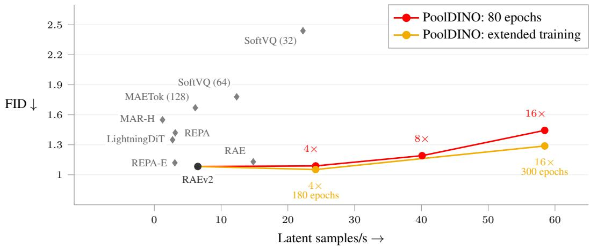  
Figure 1: Generation quality versus latent-sampling throughput on an NVIDIA H100 NVL at batch size 128. PoolDINO and the RAEv2 reference use Internal Guidance (IG) with 100 Euler steps. Red points use 80 training epochs; gold points use extended training (180 epochs for $2 \times 2$ and 300 for $4 \times 4 )$ . Diamonds pair published FIDs with measured sampling rates. Appendix B details the measurement protocols and shows that reducing to 50 sampling steps doubles throughput while maintaining comparable generation quality.

## 1 INTRODUCTION

Pretrained self-supervised visual features have become a powerful foundation for image generation. REPA shows that using these features as alignment targets substantially accelerates diffusion training and improves sample quality (Yu et al., 2025). Representation autoencoders (RAEs) use them directly as the generative latent space within a two-stage framework: first training an image decoder on frozen vision-encoder features, and then training a flow-matching model to generate these features (Zheng et al., 2026). Although earlier work identified optimization difficulties in high-dimensional latent spaces (Yao et al., 2025), RAEs successfully enable efficient generation directly from these features, with RAEv2 yielding further gains (Singh et al., 2026b).

However, the spatial resolution of these representations translates into long token sequences that are computationally expensive to model with Transformers (Vaswani et al., 2017). The iREPA analysis demonstrates that nearby tokens in these feature maps are strongly correlated (Singh et al., 2026a). Because these tokens are also high-dimensional, we hypothesize that a single pooled token possesses enough capacity to summarize its local neighborhood, thereby reducing both the token count and the associated memory and compute requirements of the generative Transformer.

Building on RAEv2, we introduce PoolDINO, a learned affine operator that pools neighboring encoder patches into a single token. Pooling reduces the sequence length while retaining an explicit coarse two-dimensional grid. We train the pooling operator jointly with the RGB decoder while keeping the vision encoder frozen. The decoder’s perceptual and adversarial objectives favor perceptually faithful reconstruction rather than exact recovery of every image detail (Zheng et al., 2026). Learning a pooling operator under these objectives allows reconstruction requirements to guide compression. We then freeze the pooling operator and decoder and train the generator on the compressed representations. By learning compression jointly with RGB reconstruction, PoolDINO preserves the two-stage RAEv2 training pipeline.

By varying the compression rate, we establish a controlled trade-off between generation quality and sampling throughput (Figure 1). At 4× compression, we retain generation quality comparable to the uncompressed reference, while more aggressive scales trade fidelity for significant efficiency gains. We also examine the downstream transferability of the pooled representations through operator analysis, image classification, semantic segmentation, and monocular depth estimation. Classification accuracy decreases despite comparable guided generation quality at 4×, and pooling learned for RGB reconstruction does not consistently outperform average pooling on the dense prediction tasks.

Our contributions are:

• Method: We introduce PoolDINO, a local affine pooling operator trained jointly with an RGB decoder to compress frozen vision-encoder representations (Section 4).

• Generation: We characterize the trade-off between token compression, guided generation quality, and sampling throughput on ImageNet-256 (Section 5.2; Appendix B).

• Analysis: We assess the semantic content using operator analysis, classification, semantic segmentation, and monocular depth estimation (Section 5.3; Appendix F).

## 2 RELATED WORK

Pretrained representations for generation. REPA aligns a diffusion model’s hidden states with pretrained visual features to accelerate training and improve generation quality (Yu et al., 2025). iREPA identifies spatial self-similarity in these features as a stronger predictor of alignment effectiveness than classification accuracy (Singh et al., 2026a). Pretrained features can also be used to guide the latent space itself: VA-VAE aligns variational autoencoder (VAE; Kingma & Welling 2014) latents with vision-encoder features during tokenizer training (Yao et al., 2025), while REPA-E uses representation alignment to jointly tune the VAE and diffusion model (Leng et al., 2025).

RAEs use frozen vision-encoder features directly as generative latents, training an image decoder to reconstruct RGB images from them (Zheng et al., 2026). RAEv2 combines features from multiple encoder layers to improve reconstruction and introduces further refinements to generator training (Singh et al., 2026b).

Compressing self-supervised features. FAE reduces the channel dimension of RAE latents using a single attention layer and a linear projection (Gao et al., 2025). However, this requires an additional training stage to learn the feature autoencoder. Moreover, because FAE strictly maintains the original spatial token count, it fails to alleviate the computational bottleneck in the generation stage.

FlatDINO addresses spatial redundancy with a Transformer autoencoder that compresses dense DINOv2 features into a shorter token sequence (Calvo-Gonzalez & Fleuret, 2026). Like FAE,´ it introduces an extra training stage for feature compression. Furthermore, despite its complex architecture, most of its latent tokens learn to compress fixed spatial chunks independent of the image content. Under the evaluated sampling configurations, PoolDINO achieves a stronger quality– throughput trade-off than FlatDINO (Figure 8).

Motivated by strong correlations between neighboring features, PoolDINO employs explicit spatial pooling, compressing each local window with a simple affine map trained jointly with the RGB decoder. This directly optimizes compression for image reconstruction, avoiding the separate feature autoencoders required by FAE and FlatDINO while preserving the two-stage RAE training pipeline.

## 3 PRELIMINARIES

## 3.1 FLOW MATCHING

Given samples from an unknown data distribution $p _ { \mathrm { d a t a } }$ , the goal of generative modeling is to produce new samples that follow the same distribution. Flow matching approaches this task by learning a time-dependent velocity field that transforms samples from a simple distribution, typically Gaussian noise, into data (Lipman et al., 2023).

To construct training examples, we independently sample $x \sim p _ { \mathrm { d a t a } }$ and $\epsilon \sim \mathcal { N } ( 0 , I )$ , and interpolate between them:

$$
x _ { t } = ( 1 - t ) \epsilon + t x , \qquad t \in [ 0 , 1 ] .\tag{1}
$$

Here, $t = 0$ corresponds to noise and $t = 1$ to clean data. For each sampled pair, this path has constant velocity $x - \epsilon$

A model $v _ { \theta } ( x _ { t } , t )$ learns to predict this velocity by minimizing

$$
\mathcal { L } _ { \mathrm { F M } } = \mathbb { E } _ { \boldsymbol { x } , \epsilon , t } \left[ \Vert \boldsymbol { v } _ { \boldsymbol { \theta } } ( \boldsymbol { x } _ { t } , t ) - ( \boldsymbol { x } - \epsilon ) \Vert _ { 2 } ^ { 2 } \right] .\tag{2}
$$

Although each training target depends on a particular data–noise pair, the optimal predictor averages the velocities compatible with the observed $x _ { t }$ . This yields a velocity field that transports the corresponding distributions, without requiring numerical integration during training.

To generate a sample, we initialize $x _ { 0 } \sim \mathcal { N } ( 0 , I )$ and numerically integrate d $\dot { \cdot } _ { t } / \mathrm { d } t = v _ { \theta } ( x _ { t } , t )$ from $t = 0 \mathrm { t o } t = 1$ . The same formulation applies to latent representations in place of images. The model can also predict the clean sample $f _ { \theta } ( x _ { t } , t )$ , with the velocity obtained analytically as $v _ { \theta } ( x _ { t } , t ) = ( f _ { \theta } ( x _ { t } , t ) - x _ { t } ) / ( 1 - t )$ for $t < 1$

## 3.2 REPRESENTATION AUTOENCODERS

The RAE framework uses a pretrained vision encoder E to map an image $\boldsymbol { x } \in \mathbb { R } ^ { H \times W \times 3 }$ to a latent representation $\boldsymbol { z } \in \mathbb { R } ^ { h \times w \times D }$ , where h, w define the spatial grid size and $\bar { D }$ is the token dimensionality. An image decoder $D _ { \theta }$ is then trained to recover x directly from z.

While the original RAE extracts z from the final block K of the encoder, $z = E _ { K } ( x )$ , RAEv2 defines the latent space as an average over a set of intermediate layers $\mathcal { L }$ to balance the fine-grained spatial structure of earlier layers with the high-level semantic context of deeper layers:

$$
z = { \frac { 1 } { | { \mathcal { L } } | } } \sum _ { \ell \in { \mathcal { L } } } { \mathrm { L N } } ( E _ { \ell } ( x ) ) ,
$$

where $E _ { \ell } ( x )$ denotes the activations after block $\ell ,$ and LN is a parameter-free layer normalization. Following RAEv2, we use a DINOv3-L/16 encoder (Simeoni et al., 2026) with´ ${ \mathcal { L } } =$ {11, 13, 15, 17, 19, 21, 23}.

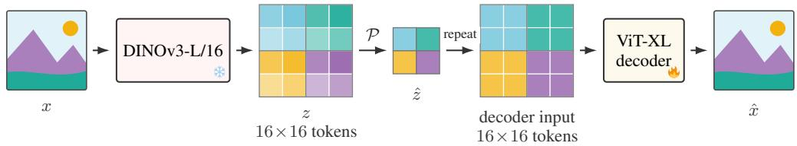  
Figure 2: Training the pooled image decoder. A frozen DINOv3-L/16 produces a dense patch field. The learned projection $\dot { \mathcal { P } }$ maps each non-overlapping pooling window to one token, which is repeated over its original window before ViT-XL reconstructs the image. Shades distinguish source patches; uniform colors within the repeated blocks denote identical token copies. $\mathrm { ~ A ~ 4 ~ } \times \mathrm { ~ 4 ~ }$ field with $2 \times 2$ pooling windows is shown for clarity.

## 4 METHOD

## 4.1 IMAGE DECODING

Two properties of continuous semantic latents make them well suited to spatial compression. First, nearby vision-encoder features exhibit strong local correlation (Singh et al., 2026a). Second, pooling preserves the high-dimensional channel capacity D of the original tokens, providing each pooled token with sufficient bandwidth to summarize the features of several constituent patches. Because the number of scalar elements in the uncompressed latent field z can be comparable to that in the raw image $x ,$ we hypothesize that a learned spatial pooling operator can heavily compress this token grid while preserving the essential semantic structure required for high-quality image decoding.

Given the RAEv2 latent $\boldsymbol { z } \in \mathbb { R } ^ { h \times w \times D }$ , we partition it into non-overlapping windows of size $p _ { y } \times p _ { x }$ and map each window to a single token:

$$
\hat { z } _ { i , j } = \mathcal { P } ( z [ i p _ { y } : ( i + 1 ) p _ { y } , \ j p _ { x } : ( j + 1 ) p _ { x } , \ : ] ) .\tag{3}
$$

Here, the colon denotes array slicing, and $\mathcal { P } : \mathbb { R } ^ { p _ { y } \times p _ { x } \times D }  \mathbb { R } ^ { D }$ is applied independently to each window. Assuming that h and w are divisible by $p _ { y }$ and $p _ { x }$ , respectively, this gives the pooled latent $\hat { z } \in \mathbb { R } ^ { \frac { h } { p _ { y } } \times \frac { w } { p _ { x } } \times D }$

We use learned affine pooling: $\mathcal { P }$ is a shared affine map with weight $W \in \mathbb { R } ^ { D \times m D }$ and bias $b \in \mathbb { R } ^ { D }$ where $m = p _ { x } p _ { y } ,$ , applied to the concatenated features of each window. This is equivalent to a convolution with kernel size and stride both equal to $( p _ { y } , p _ { x } )$ . Before RGB decoding, we repeat each pooled token over its original window. We compare this learned pooling against fixed average and max pooling.

A ViT-XL decoder then learns to reconstruct x from the repeated pooled field. Repetition restores the original grid, keeping the decoder architecture and input sequence length fixed across pooling geometries to control for decoder compute.

## 4.2 IMAGE GENERATION

With the tokenizer and RGB decoder frozen, we train one class-conditional diffusion Transformer $\mathrm { ( D i T ^ { D H } \mathrm { - } X L }$ ; Peebles & Xie 2023; Singh et al. 2026b) for each pooling geometry. The generator operates directly on the corresponding pooled latent grid,

$$
z = E ( x ) , \qquad \hat { z } = \mathcal { P } ( z ) , \qquad \bar { z } = \frac { \hat { z } - \mu _ { \hat { z } } } { \sigma _ { \hat { z } } } ,\tag{4}
$$

where $\mu _ { \hat { z } }$ and $\sigma _ { \hat { z } }$ are channel-wise statistics. We use the RAEv2 architecture and transport objective, adapting the spatial input grid to each pooling geometry. Unless otherwise specified, each model is trained for 80 epochs with a global batch size of 1,024, using a hybrid Muon–AdamW optimizer (Jor dan et al., 2024; Loshchilov & Hutter, 2019) and a base learning rate of $2 \times 1 0 ^ { - 4 }$ . The learning rate is held constant through epoch 25 and decayed linearly to $2 \times \bar { 1 0 } ^ { - 5 }$ by epoch 50. We drop the class condition with probability 0.1 to enable classifier-free guidance. Full optimization details are given in Table 7. We also use the internal guidance (IG; Zhou et al. 2026) mechanism, which trains an intermediate generator layer to predict the clean latent. During sampling, extrapolating from this weaker intermediate prediction to the full-depth prediction provides a strong guidance signal without requiring a separate unconditional evaluation.

The training objective contains the usual flow-matching loss and two auxiliary losses applied to the hidden states after the eighth DiT block:

$$
\begin{array} { r } { \mathcal { L } = \mathcal { L } _ { \mathrm { F M } } + \mathcal { L } _ { \mathrm { I G } } + 0 . 5 \mathcal { L } _ { \mathrm { r e c } } ^ { E } . } \end{array}\tag{5}
$$

Here $\mathcal { L } _ { \mathrm { F M } }$ is the flow-matching loss of the full generator (using an x-prediction objective; Li & He 2026), and $\mathcal { L } _ { \mathrm { I G } }$ applies the same objective to the intermediate IG prediction. A second auxiliary head reconstructs the original dense encoder patch field $z = E ( x )$ using mean-squared error $( \mathcal { L } _ { \mathrm { r e c } } ^ { E } ) .$ . Both auxiliary heads are trained jointly for every model. Appendix A gives the full training diagram.

During sampling, let $\bar { z } _ { \mathrm { f u l l } }$ denote the full-depth prediction and $\bar { z } _ { \mathrm { i n t } }$ the intermediate prediction. IG extrapolates between them:

$$
\bar { z } _ { \mathrm { I G } } = \bar { z } _ { \mathrm { i n t } } + s _ { \mathrm { I G } } \left( \bar { z } _ { \mathrm { f u l l } } - \bar { z } _ { \mathrm { i n t } } \right) ,\tag{6}
$$

where $s _ { \mathrm { I G } } = 1$ recovers the original prediction. We evaluate IG both alone (used in Figure 1) and combined with standard classifier-free guidance (CFG; Ho & Salimans 2021), whose scale is s . Scales are selected separately for each model. Appendix E gives full ablation results, including a comparison between IG and guidance derived from the encoder-reconstruction head.

After sampling, we undo the latent normalization, repeat each pooled token over its original spatial window, and apply the frozen RGB decoder:

$$
x _ { \mathrm { g e n } } = D _ { \theta } ( { \mathrm { r e p e a t } } \left( \sigma _ { \hat { z } } { \bar { z } } _ { \mathrm { s a m p l e } } + \mu _ { \hat { z } } \right) ) .\tag{7}
$$

Repetition restores the decoder’s 16 × 16 input grid but introduces no additional information; we do this to strictly control for decoder FLOPs across all pooling geometries. Appendix A lists the latent grids, architecture, and optimization settings.

## 5 RESULTS

We evaluate reconstruction and class-conditional generation on ImageNet-1K (Russakovsky et al., 2015) at 256 × 256 resolution.

## 5.1 RECONSTRUCTION

Learning the pooling operator preserves reconstruction quality more effectively than parameter-free pooling (Table 1). At 4× compression, learned pooling reaches a reconstruction Frechet Inception´ Distance (rFID; Heusel et al. 2017) of 0.36, close to the unpooled reference at 0.32 and lower than the average pooling control at 0.65. At 16×, its rFID rises to 0.41, compared with 1.81 for average pooling and 1.72 for max pooling. PSNR and LPIPS also favor learned pooling over both parameter-free alternatives.

Table 1: Reconstruction on the ImageNet-1K $2 5 6 \times 2 5 6$ validation set, grouped by pooling method. All RGB decoders process 256 tokens after repetition.
<table><tr><td>Spatial pooling</td><td>Tokens rFID ↓</td><td></td><td>sFID↓</td><td>PSNR↑</td><td>LPIPS↓</td></tr><tr><td>RAEv2 baseline</td><td>256</td><td>0.32</td><td>2.29</td><td>22.74</td><td>0.15</td></tr><tr><td>Learned 2×2</td><td>64</td><td>0.36</td><td>2.61</td><td>22.25</td><td>0.17</td></tr><tr><td>Learned 2×4</td><td>32</td><td>0.39</td><td>2.76</td><td>21.88</td><td>0.18</td></tr><tr><td>Learned 4×2</td><td>32</td><td>0.39</td><td>2.82</td><td>21.85</td><td>0.18</td></tr><tr><td>Learned 4×4</td><td>16</td><td>0.41</td><td>2.99</td><td>21.45</td><td>0.19</td></tr><tr><td>Average 2×2</td><td>64</td><td>0.65</td><td>4.97</td><td>19.58</td><td>0.25</td></tr><tr><td>Average 4×4</td><td>16</td><td>1.81</td><td>8.65</td><td>16.64</td><td>0.37</td></tr><tr><td>Max 2×2</td><td>64</td><td>0.71</td><td>5.17</td><td>19.17</td><td>0.26</td></tr><tr><td>Max 4×4</td><td>16</td><td>1.72</td><td>8.31</td><td>16.22</td><td>0.38</td></tr></table>

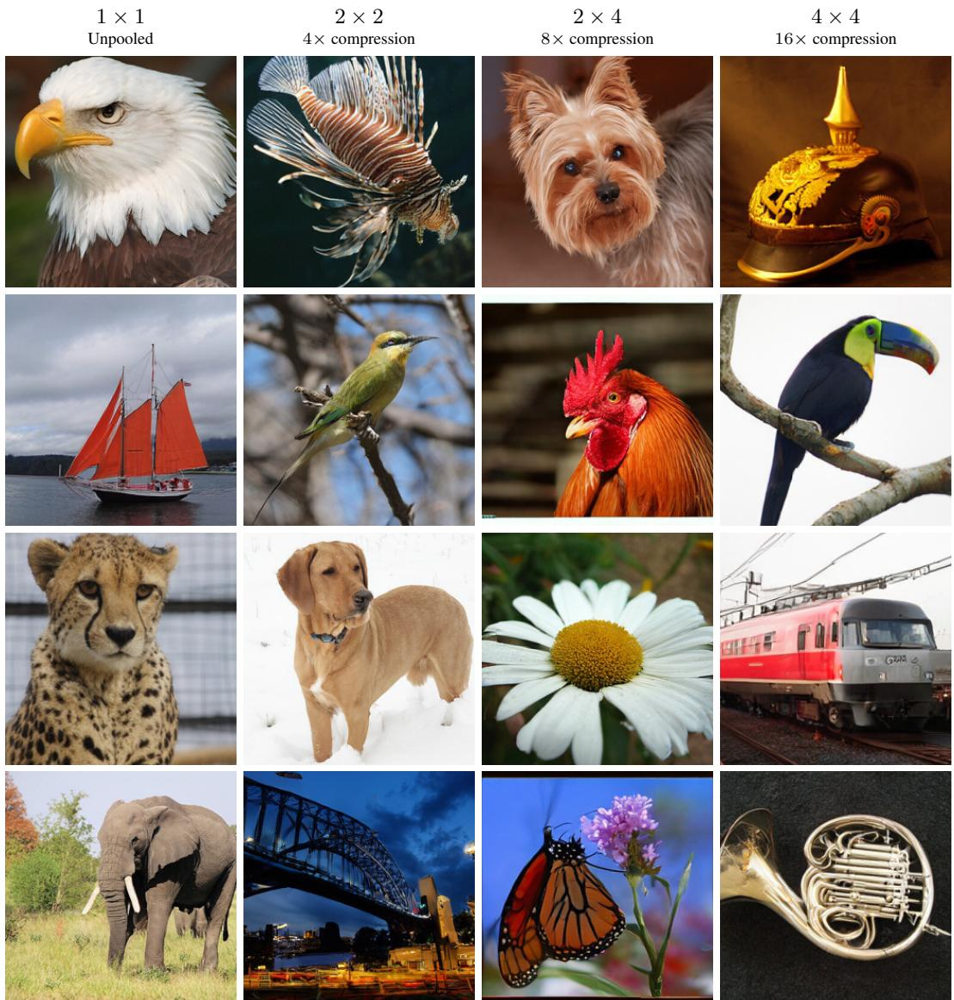  
Figure 3: Curated samples across spatial compression levels, with all generators trained for 80 epochs. Samples are selected independently across columns. Sampling uses 100 Euler steps and each model’s selected IG-only scale. Appendix G provides randomly selected samples without quality filtering.

## 5.2 IMAGE GENERATION

Table 2 shows that 4× compression retains comparable image generation quality with IG alone (1.09 FID versus the uncompressed baseline’s 1.08). While 16× compression trades some fidelity for greater efficiency by reaching 1.44 FID, adding CFG further improves the lowest observed FID across all models. This combined guidance yields the largest improvements at 16× compression, though it requires an additional unconditional forward pass per sampling step. Appendix E gives the full comparison with CFG alone and encoder-reconstruction guidance, including the selected scales and complete sweeps.

Average pooling baseline. We compare the learned affine mapping against a simpler pooling strategy by training a 2 × 2 average-pooled generator for 80 epochs. While it achieves stronger unguided generation (1.70 FID) than its learned counterpart (3.00 FID), it responds less effectively to IG (1.29 FID) and fails to match the uncompressed baseline.

Table 2: ImageNet-256 generation at 100 Euler steps. Models train for 80 epochs. We report generation FID and Inception Score (IS; Salimans et al. 2016). Guided columns report the lowest-FID settings from our guidance scale sweeps; the corresponding scales are in Table 18. Best and second-best metrics in each column are bold and underlined.
<table><tr><td colspan="2"></td><td colspan="2">Unguided</td><td colspan="2">IG</td><td colspan="2">IG + CFG</td></tr><tr><td>Spatial pooling</td><td>Tokens</td><td>FID↓</td><td>IS↑</td><td>FID↓</td><td>IS↑</td><td>FID↓</td><td>IS ↑</td></tr><tr><td>RAEv2 baseline</td><td>256</td><td>1.53</td><td>226.63</td><td>1.08</td><td>262.00</td><td>1.07</td><td>267.15</td></tr><tr><td>Learned 2×2</td><td>64</td><td>3.00</td><td>184.49</td><td>1.09</td><td>250.36</td><td>1.07</td><td>268.50</td></tr><tr><td>Learned 2×4</td><td>32</td><td>4.91</td><td>161.42</td><td>1.19</td><td>249.58</td><td>1.16</td><td>273.06</td></tr><tr><td>Learned 4×2</td><td>32</td><td>4.97</td><td>159.67</td><td>1.21</td><td>249.96</td><td>1.19</td><td>273.98</td></tr><tr><td>Learned 4×4</td><td>16</td><td>8.16</td><td>132.67</td><td>1.44</td><td>247.07</td><td>1.35</td><td>282.29</td></tr><tr><td>Average 2×2</td><td>64</td><td>1.70</td><td>232.55</td><td>1.29</td><td>268.08</td><td>一</td><td></td></tr></table>

Extended training. The lower per-update cost of compressed generators allows longer training within the compute budget of the unpooled baseline. We train the 2×2 and 4×4 generators for 180 and 300 epochs, respectively (Appendix A.1). Table 3 shows that extended training improves generation quality at both compression rates. Figure 4 compares samples from the 80-epoch and extendedtraining checkpoints, which are also included in Figure 1. Further training to approximately match the unpooled baseline’s compute budget does not improve the best observed FID (Appendix A.2).

Fewer sampling steps. Reducing sampling from 100 to 50 steps maintains comparable generation quality while providing a further twofold increase in latent-sampling throughput. Appendix B.1 provides the full comparison.

Table 3: Effect of extended training, evaluated with 100 Euler steps at the guidance settings in Table 18. The unpooled 80-epoch model is included as a reference; bold marks the stronger result within each pooling window. Appendix A.2 gives longer runs and finer IG sweeps.
<table><tr><td colspan="2">Epochs</td><td colspan="2">Unguided</td><td colspan="2">IG</td></tr><tr><td colspan="2">Pooling</td><td>FID↓</td><td>IS↑</td><td>FID↓</td><td>IS ↑</td></tr><tr><td colspan="2">1 × 1 (unpooled)</td><td>80 1.53</td><td>226.63</td><td>1.08</td><td>262.00</td></tr><tr><td colspan="2"> $2 \times 2$ </td><td>80 3.00</td><td>184.49</td><td>1.09</td><td>250.36</td></tr><tr><td colspan="2"> $2 \times 2$ </td><td>180 2.78</td><td>192.37</td><td>1.05</td><td>272.00</td></tr><tr><td colspan="2"> $4 \times 4$  80</td><td>8.16</td><td>132.67</td><td>1.44</td><td>247.07</td></tr><tr><td colspan="2"> $4 \times 4$  300</td><td>7.19</td><td>146.13</td><td>1.29</td><td>258.04</td></tr></table>

Figure 3 shows generated samples across compression levels. Appendix G provides randomly selected samples from the unpooled reference, the compressed models, and both extended-training checkpoints.

## 5.3 CLASSIFICATION AND DENSE PREDICTION

Beyond reconstruction and generation, we ask what information remains accessible in the compressed representations. We evaluate both global semantic information through image classification and localized information through semantic segmentation and monocular depth estimation.

Image classification and operator analysis. We evaluate global semantic content on ImageNet classification by spatially averaging the pooled field zˆ into one feature vector per image. Features from learned pooling yield lower accuracy than all three simpler baselines at every compression rate on both linear probing and k-NN evaluations (Table 4; Appendix C). To understand this difference, we examine the operator’s subspace: the learned operator retains a different subspace from average pooling and local PCA. Its alignment with both decreases as compression increases, and it preserves less total variance than PCA at the same output dimension (Appendix F). These measurements characterize the learned representation, but do not establish which preserved directions account for the generation results.

2 × 2 pooling  
4 × 4 pooling  
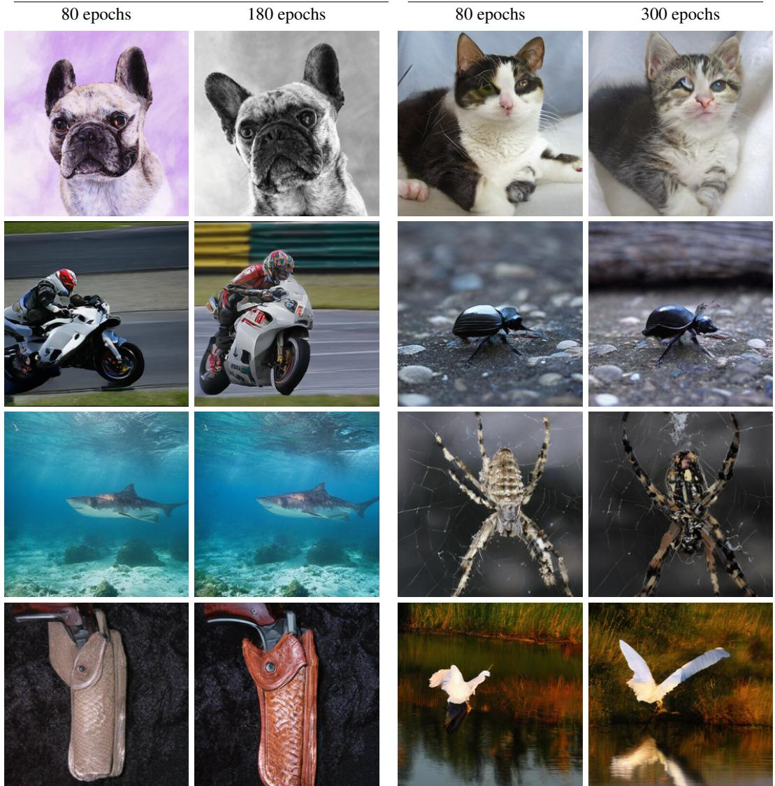  
Figure 4: Curated comparisons of 80-epoch and extended training. Class conditions and initial noise are matched within each pair. All samples use 100 Euler steps and IG alone: scales 1.75/2.00 for the 80/180-epoch 2 × 2 models, and 2.75 for both 4 × 4 models.

Dense prediction. Because spatial pooling reduces resolution, we test whether the compressed token grid still preserves the localized semantic and geometric details required for pixel-level tasks. We evaluate this on ADE20K (Zhou et al., 2017) semantic segmentation and NYUv2 (Silberman et al., 2012) monocular depth estimation by freezing the encoder and pooling operator and training a randomly initialized ViT-XL task model for each representation (Table 4). We report mean intersection over union (mIoU) for segmentation and absolute relative error (AbsRel) for depth. At 4× compression, average pooling performs better on both tasks. At 16×, learned pooling gives higher segmentation mIoU, while average pooling retains lower depth error. Thus, the comparable guided generation quality achieved at 4× coexists with weaker transfer to dense prediction. These results do not establish a consistent transfer advantage for pooling learned through RGB reconstruction. Future work should test whether learning P separately for each downstream task yields more suitable representations. Appendix D gives the complete metrics and results with RGB-decoder initialization.

Table 4: Classification and dense prediction from frozen representations. Dense task models train from scratch. Bold marks the stronger pooling rule at each compression rate.
<table><tr><td colspan="2"></td><td>ImageNet-1K</td><td>ADE20K</td><td>NYUv2</td></tr><tr><td>Spatial pooling</td><td>Window</td><td>Linear top-1 (%) ↑</td><td>mIoU (%) ↑</td><td>AbsRel ↓</td></tr><tr><td>Unpooled</td><td>1 × 1</td><td>85.31</td><td>46.86</td><td>0.0817</td></tr><tr><td>Learned</td><td>2 × 2</td><td>83.47</td><td>39.38</td><td>0.0895</td></tr><tr><td>Average</td><td>2 × 2</td><td>85.33</td><td>42.59</td><td>0.0869</td></tr><tr><td>Learned</td><td>4× 4</td><td>80.80</td><td>38.61</td><td>0.1022</td></tr><tr><td>Average</td><td>4×4</td><td>85.33</td><td>36.76</td><td>0.0997</td></tr></table>

## 6 CONCLUSION

We introduced PoolDINO, a learned spatial pooling operator that compresses representation autoencoder latents for efficient generative modeling. By training a local affine mapping jointly with an RGB decoder, PoolDINO avoids the complex feature autoencoders required by prior methods and fully preserves the standard two-stage RAE training pipeline.

Our evaluations demonstrate a trade-off between computational cost and generation quality. At 4× compression, PoolDINO substantially increases sampling throughput while retaining a guided FID highly competitive with the uncompressed baseline. More aggressive 16× compression enables substantial efficiency gains, trading visual fidelity for even higher throughput.

Finally, we evaluated transfer to classification and dense prediction. Learned pooling yields lower k-NN and linear-probe accuracy than average pooling, local PCA, and random projection, and does not consistently outperform average pooling on dense prediction tasks. These results show that strong guided generation quality does not guarantee equally strong downstream performance. Future work should investigate pooling objectives tailored to downstream tasks or jointly optimized for generation and transfer.

Limitations. Our generation experiments are restricted to ImageNet-256 and a single autoencoder and generator architecture. Although we explore extended generator training, our pooling-anddecoder training budget remains fixed; whether longer first-stage training can improve performance at higher compression rates remains open. Finally, competitive generation quality relies heavily on guidance, as unguided performance noticeably degrades under compression.

## REFERENCES

Ramon Calvo-Gonz´ alez and Fran´ c¸ois Fleuret. Laminating representation autoencoders for efficient diffusion, 2026. URL https://arxiv.org/abs/2602.04873.

Mathilde Caron, Hugo Touvron, Ishan Misra, Herve J´ egou, Julien Mairal, Piotr Bojanowski, and´ Armand Joulin. Emerging Properties in Self-Supervised Vision Transformers. In Proceedings of

the IEEE/CVF International Conference on Computer Vision (ICCV), pp. 9650–9660, October 2021.

Hao Chen, Yujin Han, Fangyi Chen, Xiang Li, Yidong Wang, Jindong Wang, Ze Wang, Zicheng Liu, Difan Zou, and Bhiksha Raj. Masked Autoencoders Are Effective Tokenizers for Diffusion Models. In Proceedings ofthe 42nd International Conference on Machine Learning, volume 267 of Proceedings ofMachine Learning Research, pp. 8145–8171. PMLR, 13–19 Jul 2025a. URL https://proceedings.mlr.press/v267/chen25v.html.

Hao Chen, Ze Wang, Xiang Li, Ximeng Sun, Fangyi Chen, Jiang Liu, Jindong Wang, Bhiksha Raj, Zicheng Liu, and Emad Barsoum. SoftVQ-VAE: Efficient 1-Dimensional Continuous Tokenizer. In Proceedings of the IEEE/CVF Conference on Computer Vision and Pattern Recognition (CVPR), pp. 28358–28370, June 2025b.

Yuan Gao, Chen Chen, Tianrong Chen, and Jiatao Gu. One Layer Is Enough: Adapting Pretrained Visual Encoders for Image Generation, 2025. URL http://arxiv.org/abs/2512.07829.

Martin Heusel, Hubert Ramsauer, Thomas Unterthiner, Bernhard Nessler, and Sepp Hochreiter. GANs Trained by a Two Time-Scale Update Rule Converge to a Local Nash Equilibrium. In Advances in Neural Information Processing Systems, volume 30. Curran Associates, Inc., 2017. URL https://proceedings.neurips.cc/paper\_files/paper/ 2017/file/8a1d694707eb0fefe65871369074926d-Paper.pdf.

Jonathan Ho and Tim Salimans. Classifier-Free Diffusion Guidance. In NeurIPS 2021 Workshop on Deep Generative Models and Downstream Applications, 2021. URL https://openreview. net/forum?id=qw8AKxfYbI.

Keller Jordan, Yuchen Jin, Vlado Boza, You Jiacheng, Franz Cesista, Laker Newhouse, and Jeremy Bernstein. Muon: An optimizer for hidden layers in neural networks, 2024. URL https: //kellerjordan.github.io/posts/muon/.

Diederik P Kingma and Max Welling. Auto-encoding variational Bayes. In International Conference on Learning Representations (ICLR), 2014.

Xingjian Leng, Jaskirat Singh, Yunzhong Hou, Zhenchang Xing, Saining Xie, and Liang Zheng. REPA-E: Unlocking VAE for End-to-End Tuning of Latent Diffusion Transformers. In Proceedings of the IEEE/CVF International Conference on Computer Vision (ICCV), pp. 18262–18272, October 2025.

Tianhong Li and Kaiming He. Back to basics: Let denoising generative models denoise. In Proceedings ofthe IEEE/CVF Conference on Computer Vision and Pattern Recognition (CVPR), pp. 36115–36125, June 2026.

Tianhong Li, Yonglong Tian, He Li, Mingyang Deng, and Kaiming He. Autoregressive Image Generation without Vector Quantization. In Advances in Neural Information Processing Systems, volume 37, pp. 56424–56445. Curran Associates, Inc., 2024. doi: 10.52202/ 079017-1797. URL https://proceedings.neurips.cc/paper\_files/paper/ 2024/file/66e226469f20625aaebddbe47f0ca997-Paper-Conference.pdf.

Yaron Lipman, Ricky T.Q. Chen, Heli Ben-Hamu, Maximilian Nickel, and Matt Le. Flow Matching for Generative Modeling. In 11th International Conference on Learning Representations, ICLR 2023, May 2023. URL https://openreview.net/forum?id=PqvMRDCJT9t.

Ilya Loshchilov and Frank Hutter. Decoupled Weight Decay Regularization. In International Conference on Learning Representations, 2019. URL https://openreview.net/forum? id=Bkg6RiCqY7.

William Peebles and Saining Xie. Scalable Diffusion Models with Transformers. In Proceedings of the IEEE/CVF International Conference on Computer Vision (ICCV), pp. 4195–4205, October 2023.

Olga Russakovsky, Jia Deng, Hao Su, Jonathan Krause, Sanjeev Satheesh, Sean Ma, Zhiheng Huang, Andrej Karpathy, Aditya Khosla, Michael Bernstein, Alexander C. Berg, and Li Fei-Fei. ImageNet Large Scale Visual Recognition Challenge. International Journal ofComputer Vision (IJCV), 115 (3):211–252, 2015. doi: 10.1007/s11263-015-0816-y.

Tim Salimans, Ian Goodfellow, Wojciech Zaremba, Vicki Cheung, Alec Radford, and Xi Chen. Improved Techniques for Training GANs. In Advances in Neural Information Processing Systems, volume 29. Curran Associates, Inc., 2016. URL https://proceedings.neurips.cc/paper\_files/paper/2016/file/ 8a3363abe792db2d8761d6403605aeb7-Paper.pdf.

Nathan Silberman, Derek Hoiem, Pushmeet Kohli, and Rob Fergus. Indoor Segmentation and Support Inference from RGBD Images. In Computer Vision – ECCV 2012, pp. 746–760. Springer Berlin Heidelberg, 2012. doi: 10.1007/978-3-642-33715-4 54. URL https://doi.org/10. 1007/978-3-642-33715-4\_54.

Oriane Simeoni, Huy V. Vo, Maximilian Seitzer, Federico Baldassarre, Maxime Oquab, Cijo Jose,´ Vasil Khalidov, Marc Szafraniec, Seung Eun Yi, Michael Ramamonjisoa, Francisco Massa, Daniel Haziza, Luca Wehrstedt, Jianyuan Wang, Timothee Darcet, Th´ eo Moutakanni, Leonel Sentana,´ Claire Roberts, Andrea Vedaldi, Jamie Tolan, John Brandt, Camille Couprie, Julien Mairal, Herve Jegou, Patrick Labatut, and Piotr Bojanowski. DINOv3. Transactions on Machine Learning Research, 2026. ISSN 2835-8856. URL https://openreview.net/forum?id= 2NlGyqNjns. Featured Certification.

Jaskirat Singh, Xingjian Leng, Zongze Wu, Liang Zheng, Richard Zhang, Eli Shechtman, and Saining Xie. What matters for Representation Alignment: Global Information or Spatial Structure? In International Conference on Learning Representations, pp. 33807–33845, 2026a. URL https://proceedings.iclr.cc/paper\_files/paper/2026/file/ 3929a7785bd56f57edcff0152ab41289-Paper-Conference.pdf.

Jaskirat Singh, Boyang Zheng, Zongze Wu, Richard Zhang, Eli Shechtman, and Saining Xie. Improved baselines with representation autoencoders, 2026b. URL https://arxiv.org/abs/ 2605.18324.

Ashish Vaswani, Noam Shazeer, Niki Parmar, Jakob Uszkoreit, Llion Jones, Aidan N Gomez, Ł ukasz Kaiser, and Illia Polosukhin. Attention is All you Need. In Advances in Neural Information Processing Systems, volume 30. Curran Associates, Inc., 2017. URL https://proceedings.neurips.cc/paper\_files/paper/2017/ file/3f5ee243547dee91fbd053c1c4a845aa-Paper.pdf.

Jingfeng Yao, Bin Yang, and Xinggang Wang. Reconstruction vs. Generation: Taming Optimization Dilemma in Latent Diffusion Models. In Proceedings ofthe IEEE/CVF Conference on Computer Vision and Pattern Recognition (CVPR), pp. 15703–15712, June 2025.

Sihyun Yu, Sangkyung Kwak, Huiwon Jang, Jongheon Jeong, Jonathan Huang, Jinwoo Shin, and Saining Xie. Representation Alignment for Generation: Training Diffusion Transformers Is Easier Than You Think. In International Conference on Learning Representations, pp. 87400–87442, 2025. URL https://proceedings.iclr.cc/paper\_files/paper/2025/file/ d9e42b4d7163931f3689d6d6fbaa11d0-Paper-Conference.pdf.

Boyang Zheng, Nanye Ma, Shengbang Tong, and Saining Xie. Diffusion Transformers with Representation Autoencoders. In International Conference on Learning Representations, pp. 35791–35820, 2026. URL https://proceedings.iclr.cc/paper\_files/paper/2026/file/ 3c4141c12660ad3625eb4ae845e0a6f9-Paper-Conference.pdf.

Bolei Zhou, Hang Zhao, Xavier Puig, Sanja Fidler, Adela Barriuso, and Antonio Torralba. Scene Parsing Through ADE20K Dataset. In Proceedings of the IEEE Conference on Computer Vision and Pattern Recognition (CVPR), pp. 633–641, July 2017. URL https://openaccess.thecvf.com/content\_cvpr\_2017/html/ Zhou\_Scene\_Parsing\_Through\_CVPR\_2017\_paper.html.

Xingyu Zhou, Qifan Li, Xiaobin Hu, Hai Chen, and Shuhang Gu. Guiding a Diffusion Transformer with the Internal Dynamics of Itself. In Proceedings of the IEEE/CVF Conference on Computer Vision and Pattern Recognition (CVPR), pp. 11536–11545, June 2026.

## A TRAINING AND MODEL DETAILS

We retain the two-stage RAE procedure. The first stage learns the local affine pooling operator and RGB decoder with the vision encoder frozen; the second freezes these components and trains the class-conditional generator. Figure 5 shows the full generator training graph. Tables 5–7 give the latent grids and model settings, and Table 8 reports component-wise forward costs.

RGB reconstruction objective. Following RAEv2, we train the pooling operator and image decoder with

$$
\mathcal { L } _ { \mathrm { R G B } } = \mathcal { L } _ { 1 } + \mathcal { L } _ { \mathrm { L P I P S } } + 0 . 7 5 a \mathcal { L } _ { \mathrm { a d v } } ,\tag{8}
$$

where $\mathcal { L } _ { 1 }$ is mean absolute pixel error, $\mathcal { L } _ { \mathrm { L P I P S } }$ is the perceptual reconstruction loss, and $\mathcal { L } _ { \mathrm { a d v } }$ is the negative mean discriminator score on reconstructed images. The adaptive weight a is the ratio of the gradient norms of $\mathcal { L } _ { 1 } + \mathcal { L } _ { \mathrm { { L P I P S } } }$ and $\mathcal { L } _ { \mathrm { a d v } }$ at the decoder’s final projection, with $1 0 ^ { - 6 }$ added to the denominator and the ratio clipped to $[ 0 , 1 0 ^ { 4 } ]$ . Pixel and perceptual losses are active from the start; discriminator training begins after six epochs and the decoder’s adversarial term after eight. During training, we add Gaussian noise to the pooled tokens before repetition, with a standard deviation sampled independently for each image from $\mathcal { U } ( 0 , 0 . 8 )$ . Evaluation uses clean tokens and EMA parameters.

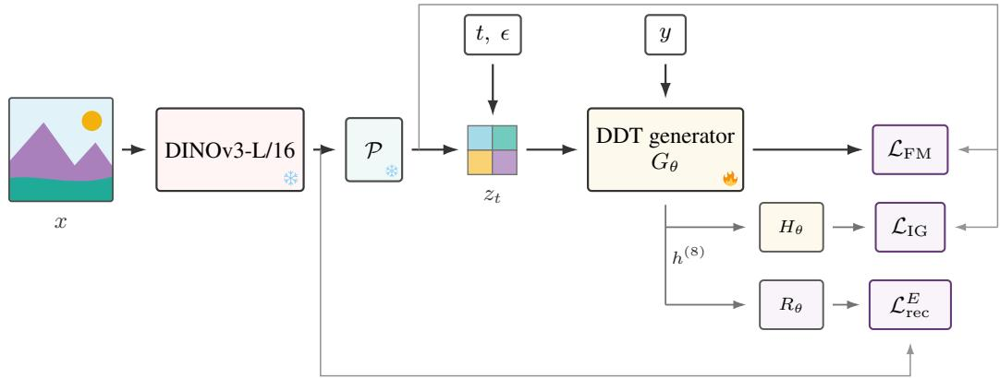  
Figure 5: Training the pooled generator. The frozen encoder and pooling operator define the normalized clean latent z¯. The generator predicts $\bar { z } _ { \mathrm { f u l l } }$ from $z _ { t } = ( 1 - t ) \epsilon + t \bar { z }$ , conditioned on time t and class $y .$ From block-8 hidden states $h ^ { ( 8 ) }$ , the internal-guidance head $H _ { \theta }$ predicts the same clean pooled target, while the encoder-reconstruction head $R _ { \theta }$ predicts the dense features z.

As illustrated in Figure 5, let $R _ { \theta }$ denote the learned encoder-reconstruction head. At each pooled spatial position (i, j), it maps the hidden state $h _ { i , j } ^ { ( 8 ) } \in \mathbb { R } ^ { d _ { h } }$ to

$$
R _ { \theta } : \mathbb { R } ^ { d _ { h } }  \mathbb { R } ^ { p _ { y } p _ { x } D } , \qquad h _ { i , j } ^ { ( 8 ) } \mapsto R _ { \theta } ( h _ { i , j } ^ { ( 8 ) } ) .\tag{9}
$$

This vector is reshaped into $p _ { y } p _ { x }$ separate D-dimensional predictions, one for every position in the original pooling window from which $\hat { z } _ { i , j }$ was formed.

Table 5: Latent grids. Compression is relative to the 256-token control.
<table><tr><td>Pooling window</td><td>Latent grid</td><td>Tokens</td><td>Compression</td><td>k</td></tr><tr><td> $1 \times 1$  (control)</td><td> $1 6 \times 1 6$ </td><td>256</td><td>1×</td><td>8</td></tr><tr><td> $2 \times 2$ </td><td> $8 \times 8$ </td><td>64</td><td>4×</td><td>4</td></tr><tr><td> $2 \times 4$ </td><td> $8 \times 4$ </td><td>32</td><td>8×</td><td> $\sqrt { 8 }$ </td></tr><tr><td> $4 \times 2$ </td><td> $4 \times 8$ </td><td>32</td><td>8×</td><td> $\sqrt { 8 }$ </td></tr><tr><td> $4 \times 4$ </td><td> $4 \times 4$ </td><td>16</td><td>16×</td><td>2</td></tr></table>

Table 6: Model architecture hyperparameters.
<table><tr><td>Hyperparameter</td><td>Image decoder</td><td>Flow encoder</td><td>Flow decoder</td></tr><tr><td>Transformer blocks</td><td>28</td><td>28</td><td>2</td></tr><tr><td>Hidden size</td><td>1,152</td><td>1,440</td><td>2,048</td></tr><tr><td>MLP width</td><td>4,096</td><td>3,840</td><td>5,461</td></tr><tr><td>Attention heads</td><td>16</td><td>20</td><td>16</td></tr><tr><td>Time tokens</td><td>一</td><td>4</td><td>一</td></tr><tr><td>Class tokens</td><td></td><td>8</td><td>一</td></tr></table>

Table 7: Optimization hyperparameters for both training stages.
<table><tr><td>Hyperparameter</td><td>Decoder Stage</td><td>Flow-Model Stage</td></tr><tr><td>Training epochs</td><td>16</td><td>80</td></tr><tr><td>Training steps</td><td>40,032</td><td>100,080</td></tr><tr><td>Global batch size</td><td>512</td><td>1,024</td></tr><tr><td>Optimizer</td><td> $\mathrm { A d a m W }$ </td><td>Muon (AdamW fallback)</td></tr><tr><td>Base learning rate</td><td> $2 \times 1 0 ^ { - 4 }$ </td><td> $2 \times 1 0 ^ { - 4 }$ </td></tr><tr><td>Learning rate schedule</td><td>Cosine decay to  $2 \times 1 0 ^ { - 5 }$ </td><td>Constant through epoch 25; linear decay to  $2 \times 1 0 ^ { - 5 }$  at epoch 50</td></tr><tr><td>Warm-up epochs</td><td>1</td><td></td></tr><tr><td>Weight decay</td><td>0</td><td>0</td></tr><tr><td>Optimizer momentum</td><td> $( \beta _ { 1 } = 0 . 9 , \beta _ { 2 } = 0 . 9 5 )$ </td><td>Muon 0.95, AdamW (0.9, 0.95)</td></tr><tr><td>Gradient clipping</td><td>None</td><td>1.0</td></tr><tr><td>EMA decay</td><td>0.9978</td><td>0.9995</td></tr></table>

Table 8: Estimated forward FLOPs per image, counting a multiply-add as two operations. Component columns report one evaluation. “Internal head” is the additional cost of returning the early clean-latent prediction. “Representation path” includes the dense-representation projection and pooling operation. Unguided generation counts 100 base generator evaluations and one image-decoder evaluation, excluding auxiliary heads and additional CFG evaluations.
<table><tr><td colspan="6"></td><td rowspan="2">Unguided generation</td></tr><tr><td>Window</td><td>Tokens</td><td>Generator</td><td>Internal head</td><td>Repr. path</td><td>Decoder</td></tr><tr><td> $1 \times 1$ </td><td>256</td><td>473.182G</td><td>2.887G</td><td>0.756G</td><td>224.216G</td><td>47.542T</td></tr><tr><td> $2 \times 2$ </td><td>64</td><td>128.653G</td><td>0.722G</td><td>1.292G</td><td>224.216G</td><td>13.090T</td></tr><tr><td> $2 \times 4$ </td><td>32</td><td>72.531G</td><td>0.361G</td><td>1.292G</td><td>224.216G</td><td>7.477T</td></tr><tr><td> $4 \times 4$ </td><td>16</td><td>44.612G</td><td>0.180G</td><td>1.292G</td><td>224.216G</td><td>4.685T</td></tr></table>

## A.1 EXTENDED-TRAINING COMPUTE BUDGET

We compare the cost of extended generator training with the 80-epoch unpooled baseline. The per-update estimate includes frozen encoder and pooling operations, generator forward and backward passes, auxiliary losses, optimizer updates, and EMA updates. We count a multiply-add as two FLOPs and exclude first-stage decoder training and evaluation. With a global batch size of 1,024, each epoch contains 1,251 updates. The unpooled, $2 \times 2$ , and $4 \times 4$ models require approximately 1,662.451, 599.874, and 340.648 TFLOPs per update, respectively. For reference, matching the baseline’s total training cost would require

$$
e _ { 2 \times 2 } ^ { \mathrm { m a t c h } } = 8 0 \frac { 1 6 6 2 . 4 5 1 } { 5 9 9 . 8 7 4 } \simeq 2 2 1 . 7 1 , \qquad e _ { 4 \times 4 } ^ { \mathrm { m a t c h } } = 8 0 \frac { 1 6 6 2 . 4 5 1 } { 3 4 0 . 6 4 8 } \simeq 3 9 0 . 4 2\tag{10}
$$

epochs. The $2 \times 2$ and $4 \times 4$ runs shown in the main text use 180 and 300 epochs, respectively. Their estimated costs are 135.08 and 127.85 EFLOPs, compared with 166.38 EFLOPs for the unpooled baseline: approximately 81% and 77% of its training budget. We additionally train to 222 and 390 epochs, respectively, using an estimated 166.60 and 166.20 EFLOPs (100.13% and 99.89% of the baseline budget). Appendix A.2 reports these approximately compute-matched endpoints.

## A.2 EFFECT OF TRAINING DURATION

We compare the extended-training checkpoints with the approximately compute-matched endpoints from Appendix A.1, sweeping the IG scale at each duration (Tables 9 and 10). All evaluations use 50,000 samples, 100 Euler steps, and IG alone, with the remaining evaluation settings held fixed across training durations. Increasing training from 180 to 222 epochs leaves the best observed FID nearly unchanged for $2 \times 2$ pooling (1.0462 versus 1.0476). For $4 \times 4$ , increasing training from 300 to 390 epochs slightly worsens the best observed FID (1.2880 versus 1.3160). These results indicate diminishing returns under the tested training recipe; repeated evaluations would be needed to asses statistical significance.

IS generally increases with training duration at fixed guidance scales, so the FID and IS trends differ. The main generation tables and throughput figures retain their reported 180/300-epoch operating points (IG scales 2.00 and 2.75, respectively); the finer sweeps below also evaluate intermediate scales.

Table 9: IG sweeps for $2 \times 2$ learned pooling at 180 and 222 epochs. Bold marks the lowest observed FID at each duration.
<table><tr><td rowspan=1 colspan=1>IG scale</td><td rowspan=1 colspan=1>180 epochsFID↓     IS↑</td><td rowspan=1 colspan=1>222 epochsFID↓     IS ↑</td></tr><tr><td rowspan=1 colspan=1>1.000</td><td rowspan=1 colspan=1>2.7805  192.37</td><td rowspan=1 colspan=1>2.7682  193.79</td></tr><tr><td rowspan=1 colspan=1>1.250</td><td rowspan=1 colspan=1>1.7069  218.79</td><td rowspan=1 colspan=1>1.7269  220.06</td></tr><tr><td rowspan=1 colspan=1>1.500</td><td rowspan=1 colspan=1>1.2237  240.43</td><td rowspan=1 colspan=1>1.2330  242.09</td></tr><tr><td rowspan=1 colspan=1>1.750</td><td rowspan=1 colspan=1>1.0603  257.87</td><td rowspan=1 colspan=1>1.0645  259.57</td></tr><tr><td rowspan=1 colspan=1>1.875</td><td rowspan=1 colspan=1>1.0462  265.43</td><td rowspan=1 colspan=1>1.0476  266.27</td></tr><tr><td rowspan=1 colspan=1>2.000</td><td rowspan=1 colspan=1>1.0525  272.00</td><td rowspan=1 colspan=1>1.0542  272.29</td></tr><tr><td rowspan=1 colspan=1>2.125</td><td rowspan=1 colspan=1>1.0962  277.19</td><td rowspan=1 colspan=1>1.0810  277.62</td></tr><tr><td rowspan=1 colspan=1>2.250</td><td rowspan=1 colspan=1>1.1340  280.11</td><td rowspan=1 colspan=1>1.1161  282.42</td></tr><tr><td rowspan=1 colspan=1>2.500</td><td rowspan=1 colspan=1>1.2429  287.69</td><td rowspan=1 colspan=1>1.2058  288.80</td></tr></table>

Table 10: IG sweeps for $4 \times 4$ learned pooling at 300 and 390 epochs. Bold marks the lowest observed FID at each duration.
<table><tr><td rowspan=1 colspan=1>IG scale</td><td rowspan=1 colspan=2>300 epochsFID↓     IS↑</td><td rowspan=1 colspan=2>390 epochsFID↓     IS ↑</td></tr><tr><td rowspan=1 colspan=1>1.000</td><td rowspan=1 colspan=2>7.1942  146.13</td><td rowspan=1 colspan=2>6.7782  150.30</td></tr><tr><td rowspan=1 colspan=1>1.250</td><td rowspan=1 colspan=2>4.7407  171.29</td><td rowspan=1 colspan=2>4.4667  176.07</td></tr><tr><td rowspan=1 colspan=1>1.500</td><td rowspan=1 colspan=2>3.1969  194.26</td><td rowspan=1 colspan=2>3.0450  198.28</td></tr><tr><td rowspan=1 colspan=1>1.750</td><td rowspan=1 colspan=2>2.2363  214.17</td><td rowspan=1 colspan=2>2.1802  218.03</td></tr><tr><td rowspan=1 colspan=1>2.000</td><td rowspan=1 colspan=2>1.7026  229.57</td><td rowspan=1 colspan=2>1.6962  233.37</td></tr><tr><td rowspan=1 colspan=1>2.250</td><td rowspan=1 colspan=1>1.4350</td><td rowspan=1 colspan=1>241.78</td><td rowspan=1 colspan=1>1.4425</td><td rowspan=1 colspan=1>245.59</td></tr><tr><td rowspan=1 colspan=1>2.500</td><td rowspan=1 colspan=1>1.3068</td><td rowspan=1 colspan=1>251.22</td><td rowspan=1 colspan=1>1.3433</td><td rowspan=1 colspan=1>255.35</td></tr><tr><td rowspan=8 colspan=1>2.6252.7502.7702.8753.0003.1253.2503.500</td><td rowspan=1 colspan=1>1.2880</td><td rowspan=1 colspan=1>255.05</td><td rowspan=1 colspan=1>1.3277</td><td rowspan=1 colspan=1>258.97</td></tr><tr><td rowspan=1 colspan=1>1.2882</td><td rowspan=1 colspan=1>258.04</td><td rowspan=1 colspan=1>1.3178</td><td rowspan=1 colspan=1>262.48</td></tr><tr><td rowspan=1 colspan=1>1.2902</td><td rowspan=1 colspan=1>258.74</td><td rowspan=1 colspan=1>1.3173</td><td rowspan=1 colspan=1>262.61</td></tr><tr><td rowspan=1 colspan=1>1.3018</td><td rowspan=1 colspan=1>260.34</td><td rowspan=1 colspan=1>1.3160</td><td rowspan=1 colspan=1>264.73</td></tr><tr><td rowspan=1 colspan=1>1.3193</td><td rowspan=1 colspan=1>262.32</td><td rowspan=1 colspan=1>1.3362</td><td rowspan=1 colspan=1>266.73</td></tr><tr><td rowspan=1 colspan=1>1.3605</td><td rowspan=1 colspan=1>263.72</td><td rowspan=1 colspan=1>1.3572</td><td rowspan=1 colspan=1>267.37</td></tr><tr><td rowspan=1 colspan=1>1.4002</td><td rowspan=1 colspan=1>265.53</td><td rowspan=1 colspan=1>1.3924</td><td rowspan=1 colspan=1>269.10</td></tr><tr><td rowspan=1 colspan=2>1.4867  266.76</td><td rowspan=1 colspan=2>1.4531  268.97</td></tr></table>

(a) Denoiser step  
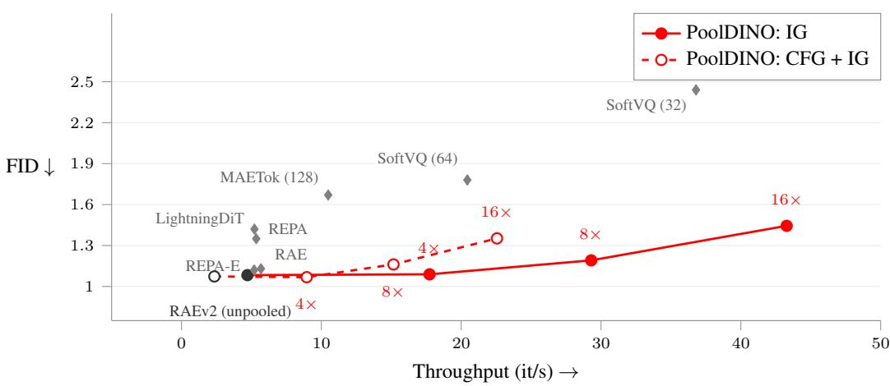

(b) Full sampling  
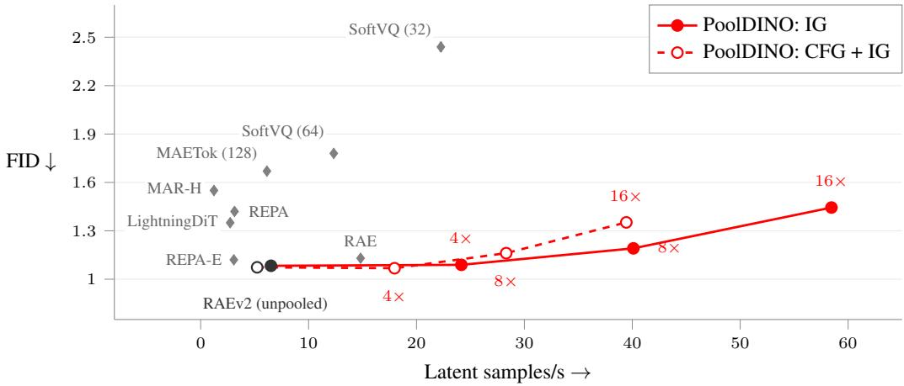  
Figure 6: Quality–throughput comparison with both guidance settings on an H100 NVL at batch size 128. Our 80-epoch models use IG alone (solid, filled) or CFG+IG (dashed, hollow), with FID evaluated at 100 Euler steps. Point labels give token compression; black circles denote the unpooled RAEv2 reference. Literature baselines and timing conventions match Figure 1; fullsampling throughput excludes image decoding.

## B THROUGHPUT MEASUREMENT

Figure 1 shows latent-sampling throughput for our models with IG alone. Figure 6 adds denoiser-step throughput and the CFG+IG results under the same measurement conventions.

Figure 6 reports the throughput of individual guided denoiser steps (top) and complete latent-sampling trajectories (bottom). Our models follow the architecture detailed in Table 6, varying only the spatial input grid. For all measurements, we execute model computation in BF16 and return full-precision model outputs.

Means and sample standard deviations are computed across 30 runs of 20 denoiser steps or one complete sampling trajectory, measured after compilation and a warmup phase. PoolDINO trajectory timings use CUDA events with device synchronization after at least five warmup trajectories and five seconds of warmup. Latent samples/s in the bottom panel counts completed latent samples, not end-to-end RGB outputs.

The throughput for our models is measured under two guidance settings. IG alone uses a conditional model evaluation and its block-8 internal head. CFG+IG adds an unconditional evaluation when CFG is active.

For the 100-step benchmarks, full trajectories use the same pooling-dependent time shifts as the quality evaluations: 8, 4, 8, and 2 for $1 \times 1 , 2 \times 2 , 2 \times 4$ , and 4 × 4, respectively. IG is active on [0, 0.9] and CFG on (0.3, 1) in noise-to-data time.

For context, Figure 1 includes the original guided XL implementations of RAE (Zheng et al., 2026), LightningDiT (Yao et al., 2025), E2E-VAE + REPA from REPA-E (Leng et al., 2025), MAETok (Chen et al., 2025a), SoftVQ-VAE (Chen et al., 2025b), and REPA (Yu et al., 2025). MAR-H (Li et al., 2024) appears only in the full-sampling panel, since its autoregressive iterations are not comparable denoiser steps. We use MAETok-B-128, SoftVQ-B-64, and SoftVQ-L-32 with SiT-XL, and the released 4M-iteration SiT-XL/2 for REPA. RAE employs a separate small autoguidance model; the other systems use their released CFG recipes. Literature FIDs are published results, not re-evaluations under benchmark precision, and training budgets, sampling recipes, and class-balance protocols differ. The REPA-E point is the 800-epoch E2E-VAE + REPA system, not the 80-epoch jointly trained variant.

RAE and LightningDiT use shifted Euler sampling with 49 and 249 denoiser evaluations, respectively. REPA-E, MAETok, SoftVQ-VAE, and REPA use 250-evaluation Euler–Maruyama sampling. MAR-H uses 256 autoregressive iterations, each with 100 DDPM steps; its internal Transformer decoder and diffusion-loss network are included. Full trajectories respect each method’s guidance windows. These measured sampling rates are not obtained by dividing isolated step throughput by the number of evaluations.

The literature baselines use PyTorch/Inductor, while our models use JAX/XLA, so the comparison includes software-stack differences. All use cuDNN attention. The PoolDINO trajectory benchmark uses cuBLAS.

Figure 7 gives the comparison using Inception Score, retaining the 100-step settings for our models.

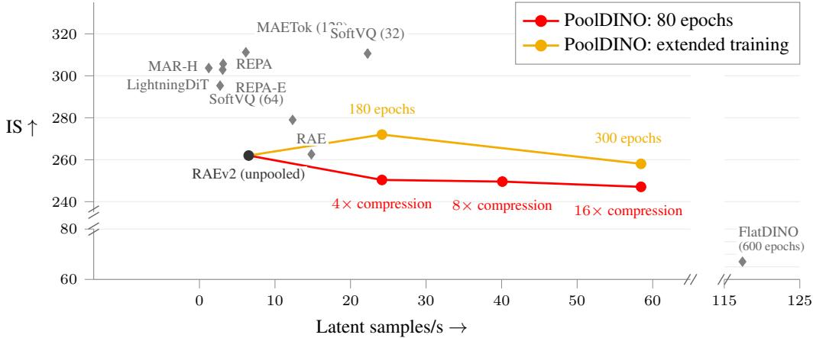  
Figure 7: Inception Score versus latent-sampling throughput on an H100 NVL at batch size 128. PoolDINO and the unpooled RAEv2 reference use IG alone at 100 Euler steps, including the extended training checkpoints. IS is taken at the FID-selected guidance settings, not maximized separately.

## B.1 SAMPLING-STEP ABLATION

We compare 50 and 100 Euler steps while keeping each checkpoint’s selected IG scale fixed. Across all evaluated pooling geometries and training durations, halving the sampling steps doubles latentsampling throughput with little change in generation quality (Table 11). The absolute FID difference remains below 0.04 in every configuration.

For the 300-epoch 4 × 4 generator, we further vary the step count from 10 to 100 (Figure 9). Figure 8 shows all five measured 50-step PoolDINO configurations alongside the literature baselines, including

Table 11: IG-only generation with 100 versus 50 Euler steps. Throughput is latent samples/s on an H100 NVL at batch size 128; ± reports timing standard deviation.
<table><tr><td></td><td></td><td>1</td><td colspan="2">FID↓</td><td colspan="2">Latent samples/s ↑</td></tr><tr><td>Pooling</td><td>Epochs</td><td> $s _ { \mathrm { I G } }$ </td><td>100 steps</td><td>50 steps</td><td>100 steps</td><td>50 steps</td></tr><tr><td> $2 \times 2$ </td><td>80</td><td>1.75</td><td>1.0890</td><td>1.1164</td><td> $2 4 . 1 6 \pm 0 . 0 5$ </td><td> $4 8 . 4 4 \pm 0 . 1 7$ </td></tr><tr><td> $2 \times 2$ </td><td>180</td><td>2.00</td><td>1.0525</td><td>1.0629</td><td> $2 4 . 1 6 \pm 0 . 0 5$ </td><td> $4 8 . 4 4 \pm 0 . 1 7$ </td></tr><tr><td> $2 \times 4$ </td><td>80</td><td>2.00</td><td>1.1913</td><td>1.2283</td><td> $4 0 . 1 0 \pm 0 . 0 7$ </td><td> $8 0 . 4 2 \pm 0 . 3 3$ </td></tr><tr><td> $4 \times 4$ </td><td>80</td><td>2.75</td><td>1.4442</td><td>1.4429</td><td> $5 8 . 4 6 \pm 0 . 2 0$ </td><td> $1 1 7 . 1 3 \pm 0 . 3 8$ </td></tr><tr><td> $4 \times 4$ </td><td>300</td><td>2.75</td><td>1.2882</td><td>1.2981</td><td> $5 8 . 4 6 \pm 0 . 2 0$ </td><td> $1 1 7 . 1 3 \pm 0 . 3 8$ </td></tr></table>

FlatDINO. Figure 1 and the main generation tables retain 100 steps for our models to isolate the effect of training duration.  
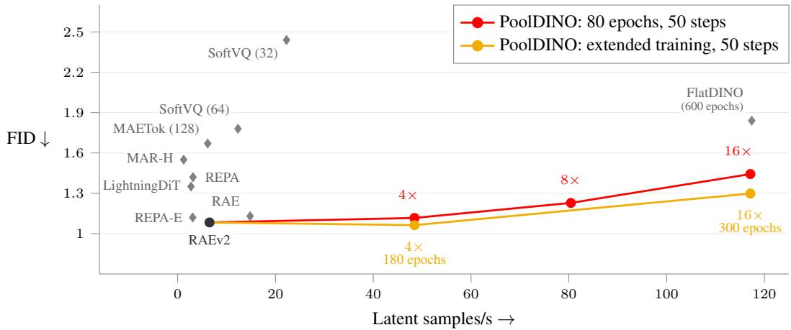

Figure 8: Generation quality versus latent-sampling throughput with 50-step sampling for PoolDINO, using IG alone on an H100 NVL at batch size 128. Red points show the 80-epoch models; gold points show extended training. The RAEv2 reference uses IG with 100 steps. Literature points, including FlatDINO, retain their published FIDs and measured throughput under their respective sampling protocols.  
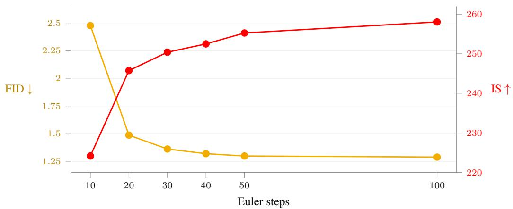  
Figure 9: Sampling-step ablation for the $4 \times 4$ generator trained for 300 epochs. Gold shows FID (left axis); red shows IS (right axis). The IG scale is fixed at 2.75 rather than retuned for each step count.

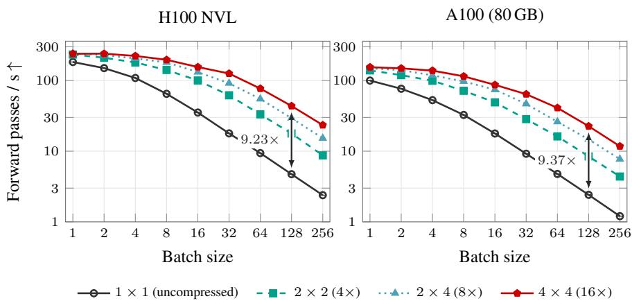

Figure 10: Denoiser forward-pass speed on a single GPU, using the flow-model architecture in Table 6. Legend entries give pooling windows and token compression. Each point is the mean of 30 measurements averaging 20 forward calls; error bars show one standard deviation and are mostly smaller than the markers. Benchmarks use BF16 computation and include host dispatch and synchronization, but not end-to-end image generation.  
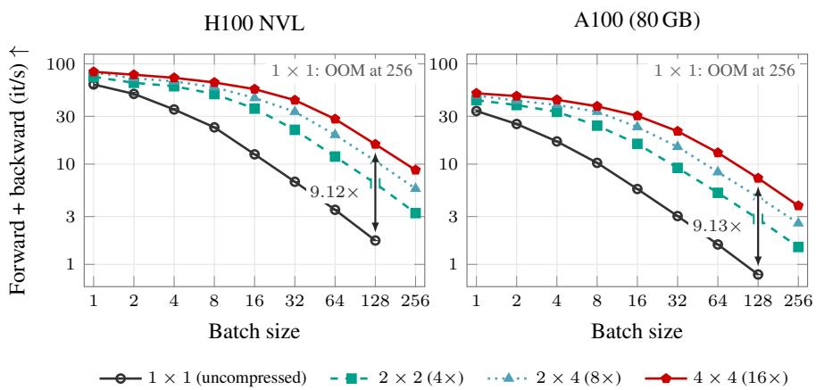  
Figure 11: Generator forward–backward throughput on a single GPU. Points show mean iterations/s across 30 measurements of 20 iterations. Timing includes the forward pass, main-prediction MSE loss, backward pass, and dispatch/synchronization; it excludes optimizer updates, auxiliary losses, and the encoder/decoder. The uncompressed model runs out of memory at batch size 256 on both GPUs.

## B.2 BATCH-SIZE AND HARDWARE SWEEPS

Figures 10 and 11 compare the same generator architecture across pooling grids on H100 NVL and A100 GPUs. The forward–backward benchmark measures the base generator and its main prediction loss; it excludes optimizer updates and auxiliary objectives.

Table 12: ImageNet-1K k-NN and linear-probe top-1 accuracy (%). The uncompressed RAEv2 representation z is included as a reference. Best and second-best methods at each compression rate are bold and underlined.
<table><tr><td></td><td colspan="4">k-NN</td><td colspan="4">Linear probe</td></tr><tr><td>Window</td><td></td><td>Learned Average PCA</td><td></td><td></td><td>Random Learned Average PCA</td><td></td><td></td><td>Random</td></tr><tr><td>Uncompressed z</td><td></td><td colspan="3">76.03</td><td></td><td colspan="3">85.31</td></tr><tr><td> $2 \times 2$ </td><td>72.16</td><td>76.00</td><td>76.67</td><td> $7 5 . 7 8 \pm 0 . 0 6$ </td><td>83.47</td><td>85.33 84.35</td><td></td><td> $\underline { { 8 4 . 6 3 \pm 0 . 0 6 } }$ </td></tr><tr><td> $2 \times 4$ </td><td>68.50</td><td>76.00</td><td>76.58</td><td> $7 5 . 7 7 \pm 0 . 0 3$ </td><td>82.35</td><td>85.33 84.10</td><td></td><td> $\overline { { 8 4 . 5 0 \pm 0 . 0 4 } }$ </td></tr><tr><td> $4 \times 2$ </td><td>68.17</td><td>76.00</td><td>76.59</td><td> $7 5 . 6 8 \pm 0 . 0 5$ </td><td>82.35</td><td>85.34 84.12</td><td></td><td> $\overline { { 8 4 . 4 3 \pm 0 . 0 7 } }$ </td></tr><tr><td> $4 \times 4$ </td><td>63.22</td><td>76.00</td><td>76.39</td><td> $7 5 . 6 8 \pm 0 . 0 4$ </td><td>80.80</td><td></td><td>85.3383.77</td><td> $\overline { { 8 4 . 2 1 \pm 0 . 0 4 } }$ </td></tr></table>

## C IMAGE CLASSIFICATION DETAILS

We freeze the encoder and pooling operator. For both ImageNet-1K splits, we apply deterministic resizing and center cropping to $2 5 6 \times 2 5 6$ , followed by ImageNet normalization, without random augmentation. We spatially average each pooled field zˆ into a 1,024-dimensional vector and normalize it to unit $\ell _ { 2 }$ norm. The uncompressed reference uses the spatial mean of z. All pooling methods use the same encoder features and classifier input dimension.

k-NN. Following the weighted voting procedure of DINO (Caron et al., 2021), we retrieve the k training features with highest cosine similarity to each validation feature. Each neighbor votes for its class with weight $\exp ( s { \bar { / } } \tau )$ , where s is its cosine similarity and $\tau = 0 . 0 7$ . The class with the largest total weight is predicted. We report the best validation top-1 accuracy over k ∈ {10, 20, 100}.

Linear probe. We train a single affine classifier with cross-entropy on the cached training features, keeping the representation fixed. We use LARS for 90 epoch-equivalents with batch size 16,384, zero weight decay, and gradient-norm clipping at 10. Each update samples a batch of distinct training examples. The learning rate increases linearly from zero during the first 10% of updates and then decays to zero with a cosine schedule. We sweep peak learning rates {1.6, 3.2, 6.4, 12.8} and report the highest validation top-1 accuracy among the final classifiers.

Pooling baselines. Table 12 compares learned pooling with average pooling, training-fitted local PCA, and random projection. For a window of m patches, PCA centers the flattened mD-dimensional features with the training mean and projects onto the leading D = 1024 components, without whitening. The components are fitted by randomized PCA on training blocks and held fixed for both classification splits. Random projections use the same training mean: we draw a standard Gaussian matrix in $\mathbb { R } ^ { m D \times D }$ , orthonormalize its columns by QR decomposition, and use its transpose as the projection. Each projection is shared across all spatial windows. We report the mean and standard deviation across projection draws, selecting the best probe setting separately for each draw. These probes evaluate classification from spatially averaged features; the dense-task evaluations retain the token grid.

## D DENSE PREDICTION DETAILS

We report complete validation metrics for task models trained from scratch and for models initialized from the corresponding RGB decoder. The tables select the checkpoint with the best primary validation metric. The scratch controls separate information retained by the representation from transfer provided by RGB-decoder initialization. For C semantic classes and N valid depth pixels, the primary metrics are

$$
\mathrm { m I o U } = \frac { 1 } { C } \sum _ { c = 1 } ^ { C } \frac { \mathrm { T P } _ { c } } { \mathrm { T P } _ { c } + \mathrm { F P } _ { c } + \mathrm { F N } _ { c } } , \qquad \mathrm { A b s R e l } = \frac { 1 } { N } \sum _ { j = 1 } ^ { N } \frac { | \hat { d } _ { j } - d _ { j } | } { d _ { j } } ,\tag{11}
$$

where $d _ { j }$ and $\hat { d } _ { j }$ are the ground-truth and predicted depths. The threshold accuracy $\delta _ { i }$ is the fraction of pixels satisfying

$$
\operatorname* { m a x } \left( \frac { \hat { d } _ { j } } { d _ { j } } , \frac { d _ { j } } { \hat { d } _ { j } } \right) < 1 . 2 5 ^ { i } , \qquad i \in \{ 1 , 2 , 3 \} .\tag{12}
$$

Shared training setup. We freeze the encoder and EMA pooling operator and repeat the pooled tokens to the original $1 6 \times 1 6$ grid. A ViT-XL task decoder with a newly initialized output head predicts segmentation logits or log depth. RGB initialization copies the corresponding image decoder’s Transformer parameters, not its RGB output head. Both initialization settings use AdamW with batch size 32, $( \beta _ { 1 } , \bar { \beta } _ { 2 } ) = ( 0 . 9 , 0 . 9 9 9 )$ , weight decay 0.05, and gradient-norm clipping at 3. The learning rate warms up linearly from zero to $2 \times 1 0 ^ { - 4 }$ over two epochs and then follows a cosine decay to $1 0 ^ { - 6 }$ . We train for 80 epochs on ADE20K and 50 on NYUv2. Images use ImageNet normalization and are resized to 256 × 256 for the frozen encoder.

ADE20K protocol. We use the official 150-class training and validation splits. Training applies random scaling in [0.5, 2], $5 1 2 \times 5 1 2$ crops, horizontal flips, and color jitter. Crops are retried up to ten times to avoid a single class occupying more than 75% of valid pixels. Validation preserves aspect ratio, resizes the longest side to 512 pixels, and pads to a square. The decoder’s logits are bilinearly resized to the $5 1 2 \times 5 1 2$ target grid. Training uses pixelwise cross-entropy, excluding unlabeled and padded pixels; these pixels are also excluded from evaluation. We select the checkpoint with the highest validation mIoU.

NYUv2 protocol. We retain $4 8 0 \times 6 4 0$ depth targets in meters and augment training images with paired horizontal flips and color jitter. The decoder predicts log depth, which is converted to metric depth before bilinear resizing to the target resolution. On valid training pixels, the loss is $\sqrt { \langle e ^ { 2 } \rangle - 0 . 5 \langle e \rangle ^ { 2 } + 1 0 ^ { - 6 } }$ , where e = log ˆd − log d and brackets denote the mean over valid pixels; no gradient-matching term is used. Valid depths lie in [0.1, 10] meters. Evaluation additionally restricts pixels to rows [45, 471) and columns [41, 601) in zero-based coordinates, clips predictions to the same depth range, and uses no scale alignment. Metrics aggregate over valid pixels, and we select the checkpoint with the lowest validation AbsRel.

Training from scratch. We initialize the ViT-XL task model randomly while keeping the frozen representations and task-specific training recipes fixed.

Table 13: ADE20K semantic segmentation with task models trained from scratch. Accuracy metrics are percentages.
<table><tr><td>Spatial pooling</td><td>Best epoch</td><td>Val. loss  $\downarrow$ </td><td>mIoU↑</td><td>Mean acc. ↑</td><td>Pixel acc. ↑</td></tr><tr><td>Uncompressed</td><td>75</td><td>0.671</td><td>46.860</td><td>58.060</td><td>81.260</td></tr><tr><td>Learned  $2 \times 2$ </td><td>75</td><td>0.807</td><td>39.380</td><td>50.100</td><td>77.480</td></tr><tr><td>Average  $2 \times 2$ </td><td>65</td><td>0.735</td><td>42.591</td><td>53.477</td><td>78.905</td></tr><tr><td>Learned  $4 \times 4$ </td><td>80</td><td>0.863</td><td>38.610</td><td>48.850</td><td>77.780</td></tr><tr><td>Average  $4 \times 4$ </td><td>75</td><td>0.866</td><td>36.758</td><td>46.969</td><td>75.715</td></tr></table>

Table 14: NYUv2 monocular depth estimation with task models trained from scratch. The δ metrics are percentages.
<table><tr><td>Spatial pooling</td><td rowspan="2">Best</td><td colspan="7"></td></tr><tr><td>epoch</td><td>AbsRel ↓</td><td>RMSE↓</td><td>Log RMSE↓</td><td>SiLog ↓</td><td> $\delta _ { 1 } \uparrow$ </td><td> $\delta _ { 2 } \mathrm { ~ \textbar ~ { ~ } ~ }$  ←</td><td> $\delta _ { 3 }$  个</td></tr><tr><td>Uncompressed</td><td>12</td><td>0.082</td><td>0.409</td><td>0.122</td><td>0.122</td><td>94.170</td><td>99.030</td><td>99.780</td></tr><tr><td>Learned  $2 \times 2$ </td><td>21</td><td>0.090</td><td>0.455</td><td>0.134</td><td>0.134</td><td>92.780</td><td>98.700</td><td>99.720</td></tr><tr><td>Average  $2 \times 2$ </td><td>14</td><td>0.087</td><td>0.434</td><td>0.131</td><td>0.131</td><td>93.200</td><td>98.720</td><td>99.730</td></tr><tr><td>Learned  $4 \times 4$ </td><td>27</td><td>0.102</td><td>0.490</td><td>0.148</td><td>0.148</td><td>90.440</td><td>98.260</td><td>99.610</td></tr><tr><td>Average 4× 4</td><td>15</td><td>0.100</td><td>0.486</td><td>0.149</td><td>0.149</td><td>90.580</td><td>98.060</td><td>99.560</td></tr></table>

Table 15: ADE20K semantic segmentation with task models initialized from the corresponding RGB decoder. Accuracy metrics are percentages.
<table><tr><td>Spatial pooling</td><td>Tokens</td><td>Compression</td><td>Best epoch</td><td>Val. loss ↓</td><td>mIoU↑</td><td>Mean acc. ↑</td><td>Pixel acc. ↑</td></tr><tr><td>Uncompressed</td><td>256</td><td>1×</td><td>80</td><td>0.694</td><td>47.810</td><td>58.850</td><td>81.770</td></tr><tr><td>Learned  $2 \times 2$ </td><td>64</td><td>4×</td><td>60</td><td>0.709</td><td>45.380</td><td>56.420</td><td>81.010</td></tr><tr><td>Learned 4× 4</td><td>16</td><td>16×</td><td>80</td><td>0.788</td><td>42.500</td><td>53.240</td><td>79.960</td></tr></table>

RGB-decoder initialization. For the learned tokenizers, we initialize the ViT-XL task model from the corresponding RGB decoder and otherwise retain the same downstream protocol.

Table 16: NYUv2 monocular depth estimation with task models initialized from the corresponding RGB decoder. The δ metrics are percentages.
<table><tr><td rowspan="2">Spatial pooling</td><td rowspan="2">Best epoch</td><td colspan="7">Log</td></tr><tr><td>AbsRel ↓</td><td>RMSE↓</td><td>RMSE↓</td><td>SiLog ↓</td><td> $\delta _ { 1 } \uparrow$ </td><td> $\delta _ { 2 } \uparrow$ </td><td> $\delta _ { 3 } \uparrow$ </td></tr><tr><td>Uncompressed</td><td>14</td><td>0.081</td><td>0.411</td><td>0.123</td><td>0.123</td><td>94.330</td><td>98.980</td><td>99.750</td></tr><tr><td>Learned  $2 \times 2$ </td><td>27</td><td>0.089</td><td>0.456</td><td>0.133</td><td>0.133</td><td>92.800</td><td>98.720</td><td>99.700</td></tr><tr><td>Learned  $4 \times 4$ </td><td>24</td><td>0.101</td><td>0.495</td><td>0.147</td><td>0.147</td><td>90.610</td><td>98.220</td><td>99.610</td></tr></table>

## E GUIDANCE ABLATIONS

We compare CFG, internal guidance, and guidance from the encoder-reconstruction head. All evaluations use 50,000 ImageNet-256 samples and 100 Euler steps. The sweeps below use the 80-epoch models (Table 20); the longer-trained $2 \times 2$ and $4 \times 4$ checkpoints are included separately in the summary tables (Tables 17 and 18).

## E.1 FULL GENERATION COMPARISON

Table 17: ImageNet-256 generation at 100 Euler steps. Models train for 80 epochs, except the extended-training $2 \times 2$ (180 epochs) and $4 \times 4$ (300 epochs) variants. Guided columns use the settings in Table 18; Appendix A.2 separately reports longer runs and finer IG sweeps. – denotes an unevaluated setting. Best and second-best metrics in each column are bold and underlined.
<table><tr><td></td><td colspan="2">Unguided</td><td colspan="2">CFG</td><td colspan="2">IG</td><td colspan="2">CFG + IG</td></tr><tr><td>Variant</td><td>FID↓</td><td>IS↑</td><td>FID ↓</td><td>IS↑</td><td>FID↓</td><td>IS↑</td><td>FID↓</td><td>IS ↑</td></tr><tr><td> $1 \times 1$ </td><td>1.53</td><td>226.63</td><td>1.45</td><td>237.80</td><td>1.08</td><td>262.00</td><td>1.07</td><td>267.15</td></tr><tr><td> $2 \times 2$ </td><td>3.00</td><td>184.49</td><td>1.99</td><td>228.10</td><td>1.09</td><td>250.36</td><td>1.07</td><td>268.50</td></tr><tr><td> $2 \times 4$ </td><td>4.91</td><td>161.42</td><td>2.33</td><td>238.80</td><td>1.19</td><td>249.58</td><td>1.16</td><td>273.06</td></tr><tr><td> $4 \times 2$ </td><td>4.97</td><td>159.67</td><td>2.41</td><td>237.63</td><td>1.21</td><td>249.96</td><td>1.19</td><td>273.98</td></tr><tr><td> $4 \times 4$ </td><td>8.16</td><td>132.67</td><td>2.87</td><td>249.72</td><td>1.44</td><td>247.07</td><td>1.35</td><td>282.29</td></tr><tr><td> $2 \times 2 ( 1 8 0$  epochs)</td><td>2.78</td><td>192.37</td><td>1</td><td>一</td><td>1.05</td><td>272.00</td><td>1.05</td><td>272.80</td></tr><tr><td>4 × 4 (300 epochs)</td><td>7.19</td><td>146.13</td><td></td><td>一</td><td>1.29</td><td>258.04</td><td>一</td><td></td></tr></table>

For the 80-epoch models, while IG alone improves generation across all compression rates, combining it with CFG yields the lowest overall FID, with the largest additional reduction occurring at 16× compression. However, this combined advantage appears to diminish with longer training: for the 180-epoch $2 \times 2$ checkpoint, adding CFG to IG yields no further FID improvement.

Table 18: Guidance scales selected for Tables 2, 3, and 17. For CFG alone, $s _ { \mathrm { I G } } = 1$ ; for IG alone, $s _ { \mathrm { C F G } } = 1$ . Both scales are one for unguided sampling.
<table><tr><td rowspan="2">Variant</td><td>CFG</td><td>IG</td><td colspan="2">CFG + IG</td></tr><tr><td>SCFG</td><td>SIG</td><td>SCFG</td><td>SIG</td></tr><tr><td> $1 \times 1$ </td><td>3.00</td><td>1.75</td><td>2.50</td><td>1.78</td></tr><tr><td> $2 \times 2$ </td><td>3.00</td><td>1.75</td><td>1.75</td><td>1.75</td></tr><tr><td> $2 \times 4$ </td><td>3.00</td><td>2.00</td><td>1.50</td><td>2.00</td></tr><tr><td> $4 \times 2$ </td><td>3.00</td><td>2.00</td><td>1.50</td><td>2.00</td></tr><tr><td> $4 \times 4$ </td><td>3.00</td><td>2.75</td><td>1.75</td><td>2.25</td></tr><tr><td>Average  $2 \times 2$ </td><td>一</td><td>2.00 一</td><td></td><td></td></tr><tr><td> $2 \times 2$  (180 epochs)</td><td>一</td><td>2.00</td><td>2.00</td><td>2.00</td></tr><tr><td>4 × 4 (300 epochs)</td><td>一</td><td>2.75</td><td></td><td>一</td></tr></table>

## E.2 ISOLATED GUIDANCE SWEEPS

Encoder-reconstruction guidance. The encoder-reconstruction head provides an alternative guidance signal. We first pass its predicted dense encoder field through the frozen tokenizer and the same latent normalization:

$$
\bar { z } _ { \mathrm { r e c } } ^ { E } = \frac { \mathcal { P } \big ( R _ { \theta } ( h ^ { ( 8 ) } ) \big ) - \mu _ { \hat { z } } } { \sigma _ { \hat { z } } } .\tag{13}
$$

The guided prediction is

$$
\begin{array} { r } { \bar { z } _ { \mathrm { g u i d e d } } ^ { E } = \bar { z } _ { \mathrm { f u l l } } + s _ { \mathrm { r e c } } ^ { E } \left( \bar { z } _ { \mathrm { f u l l } } - \bar { z } _ { \mathrm { r e c } } ^ { E } \right) , } \end{array}\tag{14}
$$

where $s _ { \mathrm { r e c } } ^ { E } = 0$ is neutral. We refer to this procedure as encoder-reconstruction guidance.

We test CFG, encoder-reconstruction guidance, and internal guidance in isolation. In each sweep, we vary one guidance scale and disable the other two methods, using EMA weights and the same validation conditions. CFG and internal guidance are neutral at scale one, whereas encoder-reconstruction guidance is neutral at zero.

Table 19: Sampling settings for the guidance ablations. Intervals use noise-to-data time: $t = 0$ is noise and t = 1 is clean data.
<table><tr><td>Method</td><td>Euler steps</td><td>Guidance scale</td><td>Guidance interval</td><td>Neutral value</td></tr><tr><td>Unguided</td><td>100</td><td></td><td></td><td>CFG 1</td></tr><tr><td>Internal guidance</td><td>100</td><td>Swept</td><td>[0, 0.9]</td><td>1</td></tr><tr><td>Encoder-reconstruction guidance</td><td>100</td><td>Swept</td><td>[0, 1]</td><td>0</td></tr></table>

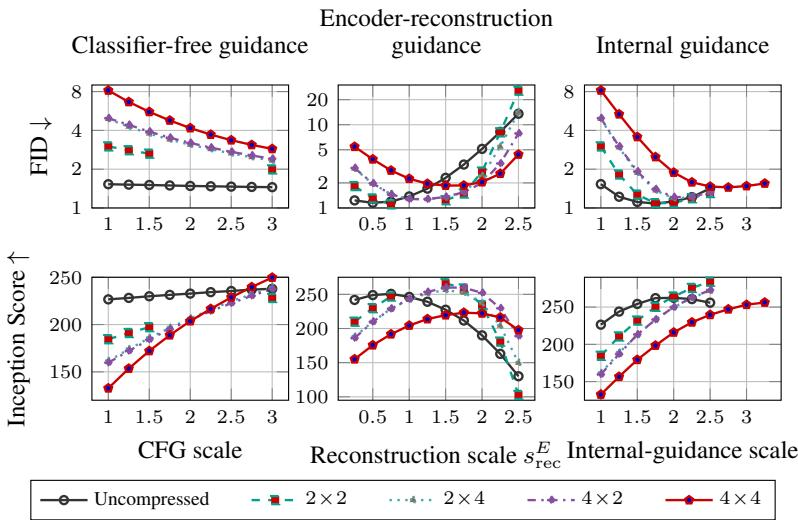  
Figure 12: Isolated guidance-scale sweeps on ImageNet-256. Top: FID on a logarithmic scale. Bottom: Inception Score. Missing points in the corrected $2 \times 2$ sweeps are left blank.

Internal guidance gives the lowest observed isolated FID at every compression rate. CFG alone improves throughout the tested range, but becomes less effective as compression increases. Encoderreconstruction guidance has a narrower optimum and degrades rapidly at large scales. Inception Score often continues to improve after FID reaches its minimum.

## E.3 JOINT GUIDANCE SEARCHES

We jointly vary CFG with each auxiliary guidance method. The search uses irregular refinement grids, so the figures show measured configurations without interpolating unevaluated settings.

Table 20: Metrics at the lowest-FID point in each joint guidance sweep for the 80-epoch models. Both auxiliary methods are combined with CFG.
<table><tr><td rowspan="2">Variant</td><td colspan="2">Encoder-reconstruction guidance</td><td colspan="2">Internal guidance</td></tr><tr><td>FID↓</td><td>IS↑</td><td>FID↓</td><td>IS↑</td></tr><tr><td>2 × 2</td><td>1.06</td><td>272.83</td><td>1.07</td><td>268.50</td></tr><tr><td>2× 4</td><td>1.17</td><td>279.68</td><td>1.16</td><td>273.06</td></tr><tr><td>4× 2</td><td>1.20</td><td>280.14</td><td>1.19</td><td>273.98</td></tr><tr><td>4 × 4</td><td>1.35</td><td>295.39</td><td>1.35</td><td>282.29</td></tr></table>

After joint tuning with CFG, the two auxiliary guidance methods achieve similar FID. Encoderreconstruction guidance gives the lowest observed value at $2 \times 2 ,$ while internal guidance is stronger at $2 \times 4$ and $4 \times 2 ;$ their 4 × 4 results are nearly identical. These comparisons concern sampling-time guidance: both auxiliary heads were trained in every model.

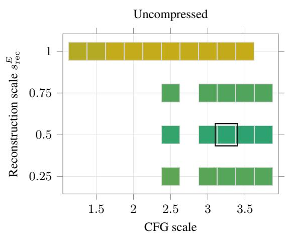

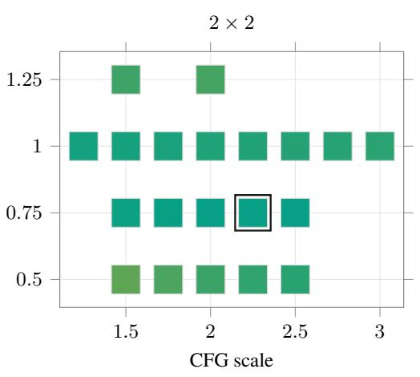

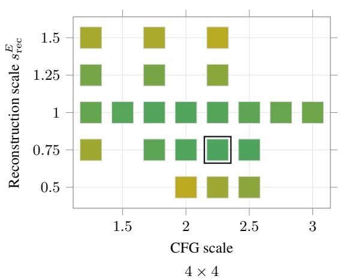

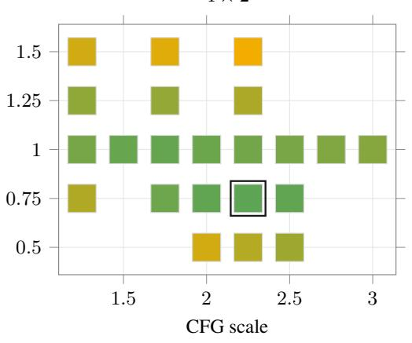

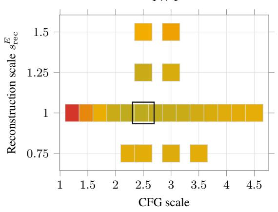

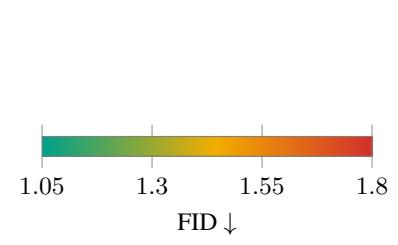  
Figure 13: Joint CFG and encoder-reconstruction guidance search. Squares show evaluated 100-step configurations; the black outline marks the lowest FID in each panel.

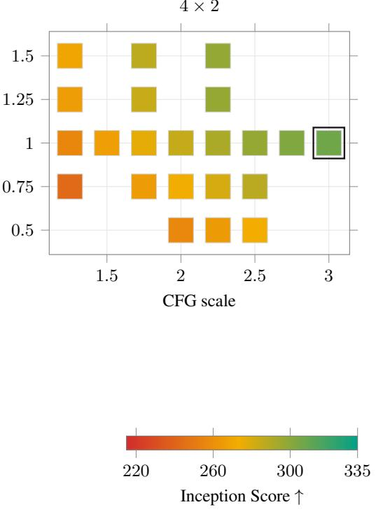

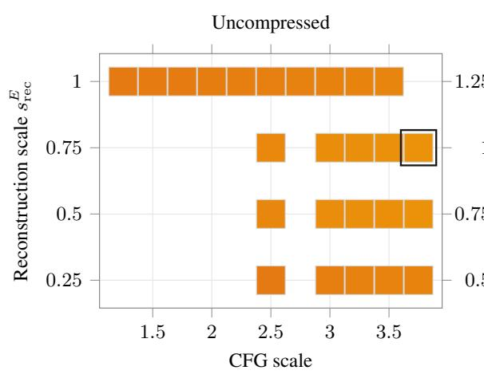

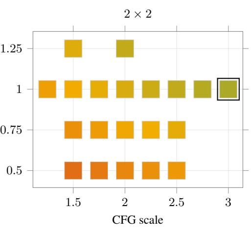

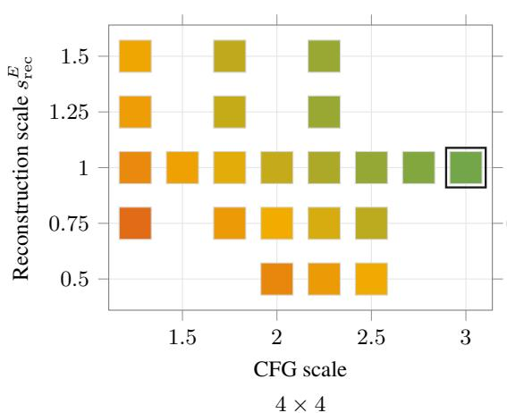

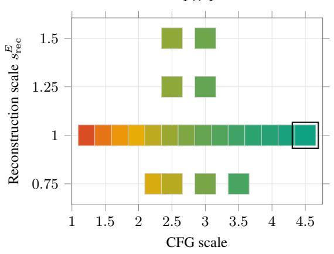  
Figure 14: Inception Score for the joint CFG and encoder-reconstruction guidance search. The black outline marks the highest score in each panel.

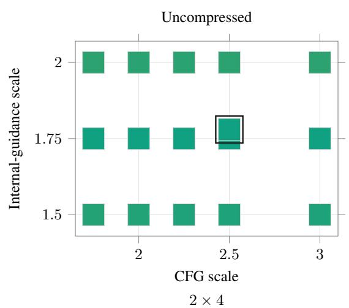

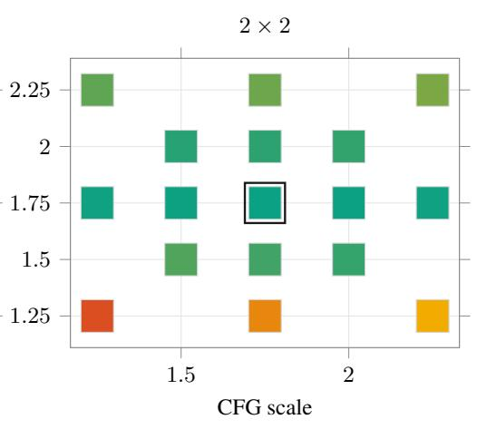

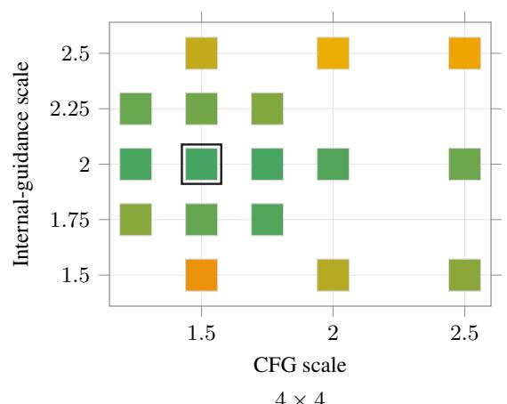

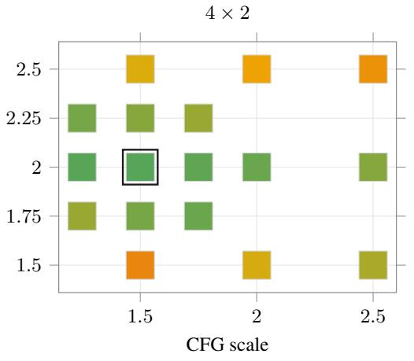

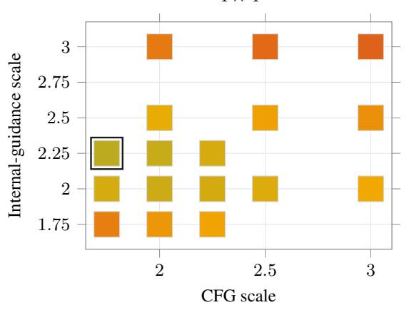  
Figure 15: Joint CFG and internal-guidance search. Squares show evaluated 100-step configurations; the black outline marks the lowest FID in each panel.

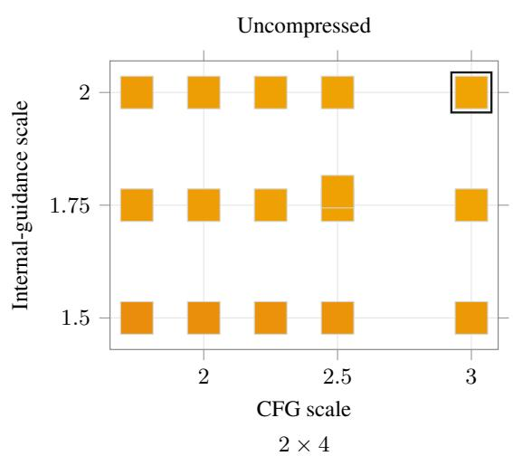

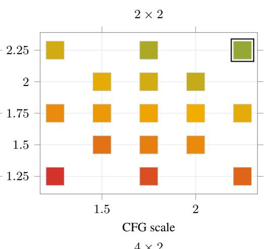

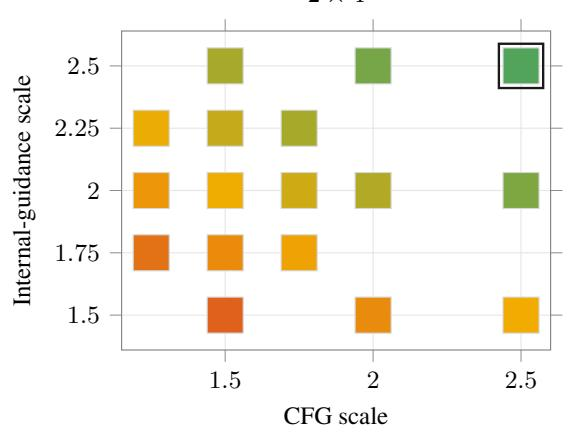

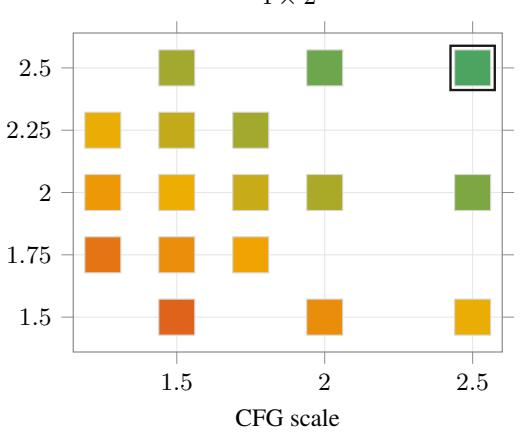

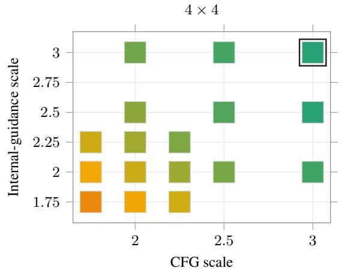

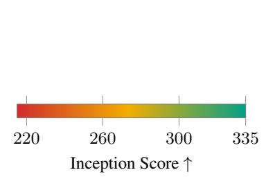  
Figure 16: Inception Score for the joint CFG and internal-guidance search. The black outline marks the highest score in each panel.

Table 21: Learned pooling row-space analysis. Alignment scores are adjusted so that zero indicates the overlap expected between random subspaces of the same dimension and one indicates identical subspaces. Energy captured is the squared validation feature energy preserved by the learned pooling operator’s row space (after centering with the training mean), expressed as a percentage of that captured by PCA with the same output dimension.
<table><tr><td>Window</td><td>Average alignment</td><td>PCA alignment</td><td>Energy captured (% of PCA)</td></tr><tr><td> $2 \times 2$ </td><td>0.5000</td><td>0.2798</td><td>67.60</td></tr><tr><td> $2 \times 4$ </td><td>0.3530</td><td>0.2114</td><td>52.16</td></tr><tr><td> $4 \times 2$ </td><td>0.3501</td><td>0.2082</td><td>52.05</td></tr><tr><td> $4 \times 4$ </td><td>0.2268</td><td>0.1524</td><td>38.16</td></tr></table>

## F LEARNED POOLING OPERATOR ANALYSIS

Table 21 shows that learned pooling selects a row space distinct from spatial averaging and local PCA. Its adjusted alignment with both decreases as compression increases, and it captures less held-out feature variation than the training-fitted PCA baseline. These measurements characterize the learned operator but do not establish which retained directions support reconstruction or generation. The computation is described below.

Let $x \in \mathbb { R } ^ { m C }$ be a flattened pooling window containing $m = p _ { x } p _ { y }$ patches with $C = 1 0 2 4$ channels. Learned pooling applies

$$
y = A x + b , \qquad A \in \mathbb { R } ^ { C \times m C } .\tag{15}
$$

The input directions retained by the pooled token form the row space of A; the bias does not affect this space. We represent it with an orthonormal basis $Q _ { A } \in \mathbb { R } ^ { m C \times C }$ obtained from the right singular vectors of A. All analyzed operators have numerical rank $C .$

Average pooling retains the spatially constant directions, with basis

$$
Q _ { \mathrm { a v g } } = { \frac { 1 } { \sqrt { m } } } \left[ I _ { C } \quad I _ { C } \quad \cdots \quad I _ { C } \right] ^ { \top } .\tag{16}
$$

For PCA, $Q _ { \mathrm { P C A } }$ contains the leading $C$ components fitted on centered training blocks using a randomized approximation. Because it is fitted on training data, it is not guaranteed to strictly maximize variance on the validation set. We measure alignment with either reference basis $Q _ { B }$ as

$$
O ( A , B ) = \frac { 1 } { C } \left\| Q _ { A } ^ { \top } Q _ { B } \right\| _ { F } ^ { 2 } = \frac { 1 } { C } \sum _ { i = 1 } ^ { C } \cos ^ { 2 } \theta _ { i } ,\tag{17}
$$

where $\theta _ { i }$ are their principal angles. The score ranges from zero for orthogonal subspaces to one for identical subspaces.

Rate-matched random subspaces have expected overlap $1 / m$ . This expectation holds for independent, uniformly oriented C-dimensional subspaces of $\mathbb { R } ^ { m C }$ . To compare window sizes, we report the adjusted score

$$
{ \cal O } _ { \mathrm { a d j } } = \frac { { \cal O } - 1 / m } { 1 - 1 / m } .\tag{18}
$$

This maps the random expectation to zero and identical subspaces to one. The adjusted score provides a normalized geometric comparison across pooling dimensions, not a statistical significance test, and can take negative values. Table 21 reports adjusted alignment, while Table 22 includes both raw and adjusted values.

The average-pooling subspace is also the zero-frequency, or DC, component of a two-dimensional discrete cosine transform. Thus, $O ( A , \mathrm { a v g } )$ measures alignment with the spatial average. The complement $1 - O ( A , \mathrm { a v g } )$ measures the fraction of orthonormalized row-space energy outside the spatial-average subspace, not the fraction of input variance retained.

The analysis uses the clean EMA tokenizer at decoder step 40032. For each window geometry, we sample 4096 blocks from one ImageNet training image per class and 4096 blocks from one disjoint validation image per class. A randomized C-component PCA is fitted only on the training blocks.

Table 22: Complete learned pooling row-space results. “Random” is the expected raw overlap of random subspaces of the same dimension. Energy captured is reported as a percentage of rate-matched PCA.
<table><tr><td rowspan="2">Window</td><td rowspan="2">Random</td><td colspan="2">Average overlap</td><td colspan="2">PCA overlap</td><td rowspan="2">Energy (% PCA)</td></tr><tr><td>Raw</td><td>Adjusted</td><td>Raw</td><td>Adjusted</td></tr><tr><td> $2 \times 2$ </td><td>0.2500</td><td>0.6250</td><td>0.5000</td><td>0.4598</td><td>0.2798</td><td>67.60</td></tr><tr><td> $2 \times 4$ </td><td>0.1250</td><td>0.4339</td><td>0.3530</td><td>0.3100</td><td>0.2114</td><td>52.16</td></tr><tr><td> $4 \times 2$ </td><td>0.1250</td><td>0.4313</td><td>0.3501</td><td>0.3072</td><td>0.2082</td><td>52.05</td></tr><tr><td> $4 \times 4$ </td><td>0.0625</td><td>0.2751</td><td>0.2268</td><td>0.2054</td><td>0.1524</td><td>38.16</td></tr></table>

The analysis uses one checkpoint per geometry and a finite sample of blocks; small differences should therefore be interpreted cautiously.

After centering validation blocks $X$ with the training mean, we measure the fraction of squared feature energy captured by an orthonormal basis $Q \colon$

$$
V ( Q ) = { \frac { \| X Q \| _ { F } ^ { 2 } } { \| X \| _ { F } ^ { 2 } } } .\tag{19}
$$

We report 100 $V ( Q _ { A } ) / V ( Q _ { \mathrm { P C A } } )$ , comparing learned pooling with the rate-matched PCA baseline. This projection-based quantity is invariant to kernel scaling. Raw-kernel DCT energy is not invariant to invertible output-channel mixing and is therefore excluded as an intrinsic retained-subspace statistic.

## G GENERATED SAMPLES

We show 48 randomly selected samples per model in eight-column, six-row grids. Corresponding positions have the same class condition across all grids. Generation uses 100 Euler steps and IG alone at each model’s selected scale.

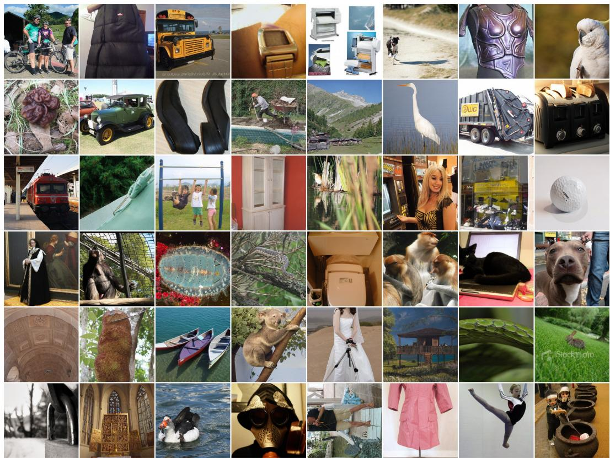  
Figure 17: Unpooled RAEv2 reference $( 1 \times 1 )$ , trained for 80 epochs, with $s _ { \mathrm { I G } } = 1 . 7 5$ and no CFG. Samples are randomly selected without quality filtering.

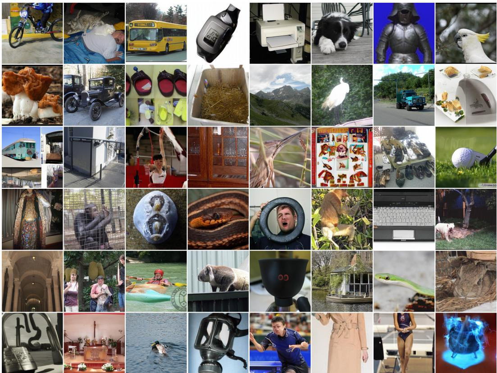  
Figure 18: PoolDINO with 2 × 2 learned pooling (4× token compression), trained for 80 epochs, with $s _ { \mathrm { I G } } = 1 . 7 5$ and no CFG. Samples are randomly selected without quality filtering.

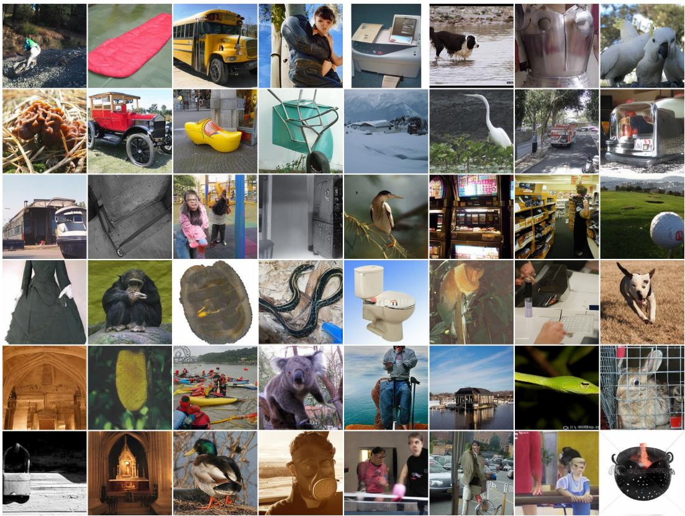  
Figure 19: PoolDINO with $2 \times 4$ learned pooling (8× token compression), trained for 80 epochs, with $s _ { \mathrm { I G } } = 2 . 0 0$ and no CFG. Samples are randomly selected without quality filtering.

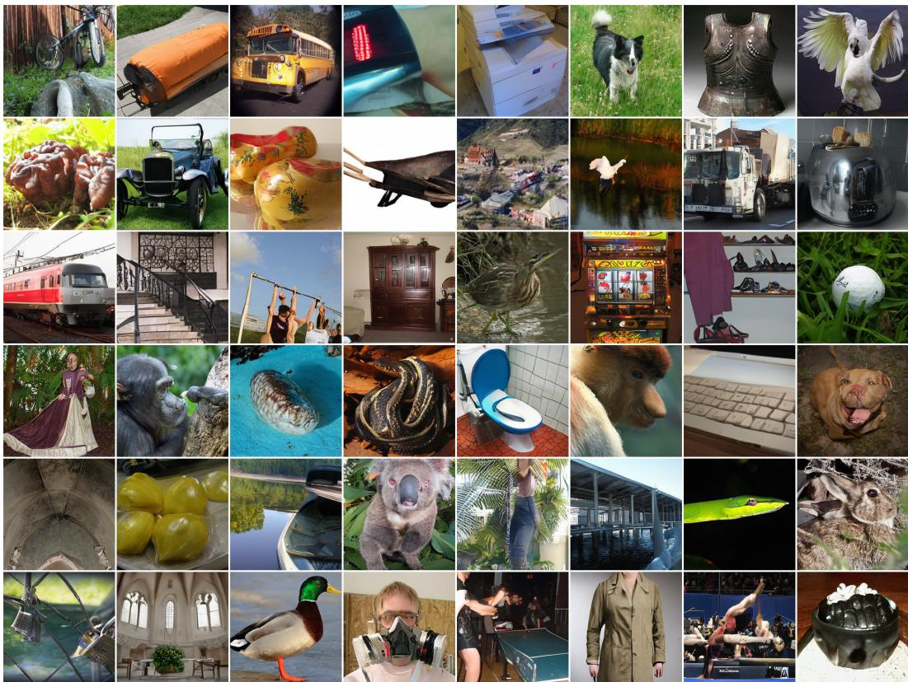  
Figure 20: PoolDINO with 4 × 4 learned pooling (16× token compression), trained for 80 epochs, with $s _ { \mathrm { I G } } = 2 . 7 5$ and no CFG. Samples are randomly selected without quality filtering.

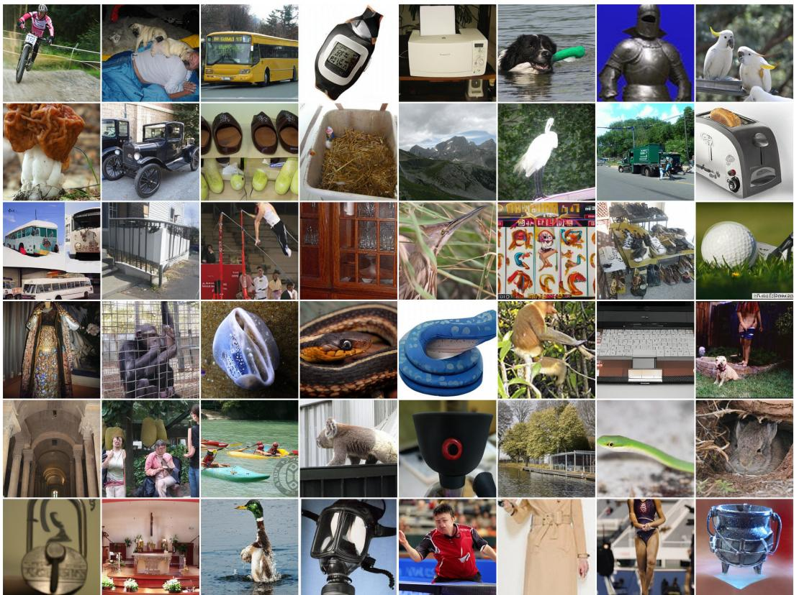  
Figure 21: PoolDINO with $2 \times 2$ learned pooling and extended training (4× token compression), trained for 180 epochs, with $s _ { \mathrm { I G } } = 2 . 0 0$ and no CFG. Samples are randomly selected without quality filtering.

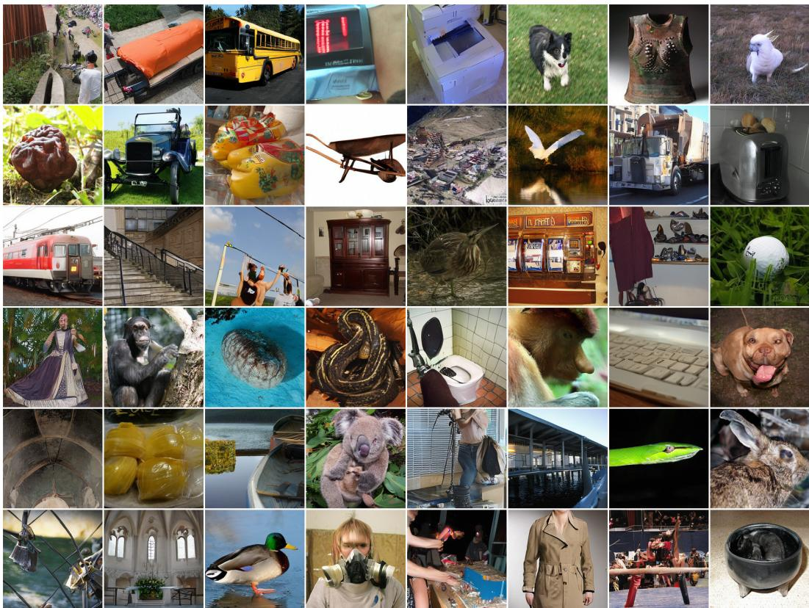  
Figure 22: PoolDINO with 4 × 4 learned pooling and extended training (16× token compression), trained for 300 epochs, with $s _ { \mathrm { I G } } = 2 . 7 5$ and no CFG. Samples are randomly selected without quality filtering.