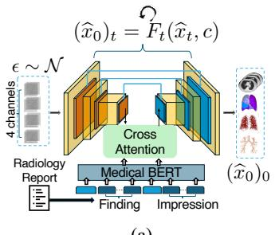
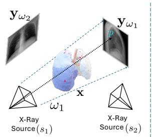
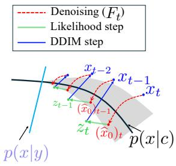
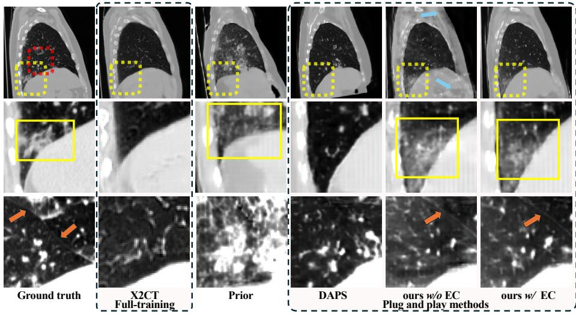

# PhyDiCT: Plug-and-Play CT Reconstruction from Sparse X-Rays via Diferentiable Rendering and Strong Priors

Weicheng Dai1[0009−0009−2811−2198], Shantanu Ghosh1[0000−0003−4085−541X], and Kayhan Batmanghelich1[0000−0001−9893−9136] ⋆

Department of Electrical and Computer Engineering, Boston University, Boston, MA, USA {wd2119, shawn24}@bu.edu batman@bu.edu (Corresponding author)

Abstract. Reconstructing 3D Computed Tomography (CT) images from a few X-ray projections is a highly ill-posed inverse problem due to the loss of volumetric information. We propose PhyDiCT, a training-free framework that integrates a diferentiable Physics-based forward model, grounded in the Beer–Lambert law, with a text-conditioned Difusion as a strong prior to reconstruct 3D lung CT images. We refer to our approach as training-free since the prior model is used without finetuning, and our goal is to steer the denoising procedure to generate samples consistent with X-ray observations. We guide the difusion generation using Split Gibbs sampling to jointly optimize for projection fidelity (reward) and consistency with prior knowledge. Also, we introduce a test-time refinement step that enhances image realism and anatomical coherence. We extensively evaluate our method on publicly available 3D CT datasets using both perceptual and semantic metrics, demonstrating that it surpasses existing plug-and-play difusion and fully trained reconstruction approaches. Our findings highlight that combining a strong generative prior with the underlying physics of image formation substantially improves reconstruction quality, e.g., 7.5% improvement on SSIM compared to full training methods. Code will be released at https://github.com/batmanlab/PhyDiCT.

## 1 Introduction

Reconstructing volumetric lung CT images from a limited number of 2D Xray projections in Cone-Beam Computed Tomography (CBCT) [13] is a highly ill-posed inverse problem. Traditional reconstruction approaches [8, 10, 9, 6] are largely generic and typically require many X-ray projections. Moreover, they only weakly exploit prior knowledge about anatomy or tissue-specific structure. Learning-based methods address some of these limitations but require large collections of paired 2D–3D data. Such datasets are dificult to acquire in practice and computationally expensive to curate and train on. In this work, we reduce the ill-posedness of the reconstruction problem by explicitly incorporating anatomy-specific priors. We leverage a pretrained generative model as a strong prior, enabling a plug-and-play reconstruction framework. In addition, a textpromptable generative model guided by radiology reports introduces semantic constraints that further regularize the solution space. Building on this idea, we propose PhyDiCT, which enforces 3D–2D consistency through a diferentiable reward function that directly models the underlying physical projection process. This reward is used to steer the generative process at inference time.

Traditional methods for 3D reconstruction from 2D images [8, 10, 9] focus on regularization and total variation norms. Typically, they require an extensive number of views (e.g., [10] requires 30). When the number of X-ray views is limited, a strong prior is required to alleviate the ill-posedness of the problem. Datadriven approaches implicitly learn the 3D-to-2D physical mapping from data. A typical approach employs generative backbones such as GANs [19, 15] or difusion models [1, 20, 17] that are fully trained on paired 3D–2D data. However, end-to-end training makes them computationally expensive. Furthermore, the diversity of the paired training data directly influences their ability to generalize to unseen pathologies. Alternatively, plug-and-play (i.e., training-free) methods [3, 24, 16, 2, 25] steer the generation process of a pretrained generative model without end-to-end training, making them computationally eficient. Moreover, they utilize generative models pretrained directly on the target modality (e.g., CT images) without paired observations (e.g., X-rays), which improves generalization since collecting diverse data within a single modality is less dificult. They typically define a reward function that enforces consistency between generated samples and observations (i.e., X-ray views) to approximate posterior sampling. However, existing approaches sufer from critical limitations. First, they often rely on difusion models pretrained on natural images, which fail to capture the anatomical details and semantic fidelity required in medical imaging. Second, they usually leverage unconditional priors, which broaden the solution space and reduce fine-grained control over synthesis. Finally, their reward functions lack physics-based grounding, ignoring the 3D-to-2D image formation process. These limitations motivate the use of stronger text-guided generative priors to constrain the output space and a more reliable reward model to bridge the domain gap between 2D X-rays and 3D CT images.

PhyDiCT method adopts a plug-and-play paradigm to reconstruct lung CT volumes from sparse X-ray views. We formulate the problem as posterior sampling from a pre-trained difusion model that is tilted by a reward function. Our reward function implements the Beer–Lambert Law [7] as a diferentiable X-ray renderer that simulates the 3D-to-2D projection process. Our method requires a generative model, and more specifically a difusion model, that directly outputs full 3D volumes. Since our reward function operates on full CT images, we adopt a difusion model that directly generates full CT volumes rather than models based on latent difusion. Models based on latent difusion require backpropagation through a decoder, which tends to be computationally expensive in terms of GPU memory. For this reason, we adopt MedSyn [18]. MedSyn also allows conditioning on radiology reports, which can further constrain the prior distribution. This is particularly useful when the radiology report associated with the X-ray is available. Our control mechanism is inspired by Split Gibbs Sampling [14], alternating between likelihood optimization and denoising. We develop an Extra Compute (EC) refinement strategy to avoid reconstruction artifacts. In summary, our contributions are threefold: (1) we present a plugand-play volumetric lung CT reconstruction method from sparse X-rays using a strong text-guided prior, (2) we integrate the physics-based 3D-to-2D imaging process into the reward function, and (3) we propose an EC refinement procedure to suppress artifacts. We rigorously evaluate PhyDiCT across perceptual, semantic, and domain-specific metrics, outperforming all baselines.

  
(a)

  
(b)

  
(c)  
Fig. 1. (a): Denoiser stage 1. The text prompt c (findings and impression tokens with <CLS> and <SEP> tokens) conditions the iterative generation of image $( \widehat { x } _ { 0 } ) _ { 0 }$ , which is later used for stage 2. (b): Diferentiable X-ray rendering. Real-world setup where multiple X-rays (each ω starting at the same $s ,$ ending at multiple p on detector) are used to acquire one entire y on the receiver plane. (c): Overview of reward-guided reconstruction. The shadow illustrates distribution envelope of $( \widehat { x } _ { 0 } ) _ { t }$ , which shrinks as it approaches $p ( x | y )$ . A denoiser $F _ { t }$ is first applied to move the noisy sample $x _ { t }$ (lying outside the manifold) toward the clean data distribution p(x|c). Subsequent likelihood step shifts the predicted $( \widehat { x } _ { 0 } ) _ { t }$ to a new variable $z _ { t }$ (maybe lying outside) guided by the reward function to drive it closer to the posterior space p(x|y).

## 2 Method

Given a set of projection angles $\omega = \{ \omega _ { 1 } , \omega _ { 2 } , \dots , \omega _ { K } \}$ defining source–detector geometries, we obtain multiple 2D projections $\mathcal { Y } = \{ y _ { \omega _ { k } } \} _ { k = 1 } ^ { K }$ . Our goal is to sample from the posterior $p ( x | \mathcal { V } , c )$ ∝ $p ( x | c ) e ^ { - J ( y , x ) }$ , where $p ( x | c )$ is the prior distribution (i.e., MedSyn) with an optional text condition $c ,$ and $- J ( \mathcal { V } , x )$ is a reward measuring consistency with the observations. Our method iteratively steers the denoising process of a difusion model to tilt it toward maximizing the reward function. Finally, we perform Extra Compute (EC) refinement to remove reconstruction artifacts.

Prior Distribution (MedSyn). MedSyn [18] is a difusion model based on the DDPM [11] framework that optionally accepts a text condition (c). Along with images, it also produces lung segmentation masks, which increase the anatomical fidelity of the generated images. Starting from pure noise $x _ { T } ,$ it iteratively alternates between two steps at each timestep t during inference. First, it uses a denoiser network $\left( F _ { t } \right)$ to predict the clean image $( \widehat { x } _ { 0 } )$ based on the noisy counterpart $x _ { t }$ band the optional text condition c. Given the current estimate of the clean image $( \widehat { x } _ { 0 } ) _ { t }$ , it then applies the deterministic DDIM backward step [11] to bcompute the next sample $x _ { t - 1 }$

$$
( { \widehat { x } } _ { 0 } ) _ { t } = F _ { t } ( x _ { t } , c ) ,\tag{1}
$$

$$
x _ { t - 1 } = \mathrm { D D I M } \left( ( \widehat { x } _ { 0 } ) _ { t } , x _ { t } \right) = \sqrt { \bar { \alpha } _ { t - 1 } } ( \widehat { x } _ { 0 } ) _ { t } + \sqrt { 1 - \bar { \alpha } _ { t - 1 } } \frac { x _ { t } - \sqrt { \bar { \alpha } _ { t } } ( \widehat { x } _ { 0 } ) _ { t } } { \sqrt { 1 - \bar { \alpha } _ { t } } } ,\tag{2}
$$

where $\begin{array} { r } { \bar { \alpha } _ { t } = \prod _ { i = 1 } ^ { t } \alpha _ { i } } \end{array}$ represents the cumulative variance schedule, and c is an optional conditioning variable $( i . e . , \mathrm { t e x t } )$ . Repeating Eqs. 1 and 2 from $t = T$ to 0 produces a final high-resolution CT image.

Reward from Diferentiable X-ray Rendering. We leverage the fact that MedSyn predicts the clean image at each step $( \widehat { x } _ { 0 } ) _ { 1 }$ t. Our goal is to design a breward function that steers the current estimate toward consistency with the observations $\mathcal { V } .$ . To this end, we construct a physics-based reward function. Following [4], we model the X-ray formation process using the Beer–Lambert law. Let the ray $\mathbf { r } ( \lambda ) = \mathbf { s } + \lambda ( \mathbf { p } - \mathbf { s } )$ denote a photon path from the X-ray source $\mathbf { s } \in \mathbb { R } ^ { 3 }$ to a pixel $\mathbf { p } \in \mathbb { R } ^ { 3 }$ on the detector plane, where $\lambda \in [ 0 , 1 ]$ . The observed intensity at p is proportional to the accumulated linear attenuation coeficient $\mu ( \cdot ) : \mathbb { R } ^ { 3 } \to [ 0 , \infty )$ along the spatial path through the volume. In practice, CT images are represented as discrete voxel grids $\overset { \vartriangle } { \boldsymbol { x } } \in \mathbb { R } ^ { H \times W \times D }$ that approximate $\mu ( \cdot )$ ; therefore, we discretize the integral as a summation (with s omitted):

$$
I _ { \mu } ( \mathbf { r } ) = \| \mathbf { p } - \mathbf { s } \| \int _ { 0 } ^ { 1 } \mu ( \mathbf { s } + \lambda ( \mathbf { p } - \mathbf { s } ) ) d \lambda ,\tag{3}
$$

$$
\mathcal { P } ( x ) [ \mathbf { p } ] = \| \mathbf { p } - \mathbf { s } \| \sum _ { m = 1 } ^ { M - 1 } x \Big ( \mathbf { s } + \frac { \lambda _ { m + 1 } + \lambda _ { m } } { 2 } ( \mathbf { p } - \mathbf { s } ) \Big ) ( \lambda _ { m + 1 } - \lambda _ { m } ) ,\tag{4}
$$

where $\{ \lambda _ { m } \} _ { m = 1 } ^ { M }$ denote the coordinates of the intersection points of the ray $\mathbf { r } ( \lambda )$ with the parallel voxel planes of the 3D grid. $\mathcal { P } : \mathbb { R } ^ { H \times W \times \mathbf { \dot { D } } }  \mathbb { R } ^ { H ^ { \prime } \times W ^ { \prime } }$ defines a diferentiable projection operator that maps the 3D attenuation field to a 2D X-ray image via trilinear interpolation.

Since Eq. 4 approximates the actual X-ray formation process, a domain shift may exist between the observations and ${ \mathcal { P } } ( x )$ . To mitigate this efect, we incorporate the LPIPS loss [23] as an additional regularization of guidance to further enforce latent feature consistency. For an observation $y _ { \omega _ { k } } \in \mathcal { V }$ acquired at angle $\omega _ { k } \in \omega$ , the total loss $( { \mathrm { i . e . } }$ , the negative reward) is defined as the sum of the reconstruction and LPIPS losses:

$$
J ( \mathcal { V } , x ^ { \prime } ) = \frac { 1 } { K } \sum _ { k } \left( | | y _ { \omega _ { k } } - \mathcal { P } _ { \omega _ { k } } ( x ^ { \prime } ) | | _ { 2 } ^ { 2 } + \mathrm { L P I P S } ( \mathcal { P } _ { \omega _ { k } } ( x ^ { \prime } ) , y _ { \omega _ { k } } ) \right) .\tag{5}
$$

Reward-guided Reconstruction. We treat the reconstruction as sampling from the posterior distribution $p ( x | \mathcal { V } , c )$ , which can be viewed as a prior distribution $p ( x | c )$ tilted by the reward $\displaystyle { \dot { e } } ^ { - j ( \mathcal { V } , x ) } , \mathrm { i . e . , } p ( x | \mathcal { V } , c ) \propto p ( x | c ) e ^ { - \hat { J } ( \mathcal { V } , x ) }$ . To sample from this posterior distribution, we adopt Split Gibbs Sampling (SGS) [14], which introduces an auxiliary random variable z and splits the sampling process between two distributions: $\pi ( x | z , c )$ and $\pi ( \boldsymbol { z } | \boldsymbol { x } , \mathcal { D } )$

$$
\underbrace { \pi ( x | z , c ) \propto \exp { \left( - g ( x , c ) - \frac { 1 } { \rho } \| x - z \| _ { 2 } ^ { 2 } \right) } } _ { \mathrm { D e n o i s i n } \sigma } , \qquad \underbrace { \pi ( z | x , \mathcal { V } ) \propto \exp { \left( - J ( \mathcal { V } , z ) - \frac { 1 } { \rho } \| z - x \| _ { 2 } ^ { 2 } \right) } } _ { \mathrm { I ~ i s c l i h o o d } } ,
$$

where $g ( x , c )$ as the unnormalized negative log-likelihood of the prior $( i . e . , p ( x | c ) \propto$ $e ^ { - g ( x , \bar { c } ) } )$ and $\rho$ a positive hyperparameter controlling the dissimilarity between z and x.

Sampling from $\pi ( x | z , c )$ can be viewed as a denoising step in ${ \mathrm { M e d S y n } } ,$ where z is a noisy observation of x. In step $t , \ z _ { t }$ is first used in $\operatorname { E q . 2 }$ to obtain $x _ { t - 1 } .$ $i . e . , \ x _ { t - 1 } = \mathrm { D D I M } ( z _ { t } , x _ { t } )$ . We then use the denoiser $F _ { t }$ to compute the prior $\mathrm { M A P }$ estimate of the clean image prediction according to $\operatorname { E q . 1 }$ . The resulting estimate $( \widehat { x } _ { 0 } ) _ { t - 1 }$ serves as x for the subsequent likelihood step.

bSampling from $\pi ( z | x , \mathcal { D } )$ can be viewed as a likelihood step that encourages higher fidelity to the observations while remaining close to x. We approximate this step by finding an optimal z that minimizes the negative log-likelihood: $\begin{array} { r } { \ell ( z ) = J ( \mathcal { V } , z ) + \frac { 1 } { \rho } \| z - ( \widehat { x } _ { 0 } ) _ { t - 1 } \| _ { 2 } ^ { 2 } } \end{array}$ . Instead of performing a full and costly sampling bprocedure, we take a few gradient steps (two in all experiments) on $\ell ( z )$ to obtain an optimized $z _ { t - 1 }$ . This solution balances fidelity to the observations $\mathcal { V }$ and consistency with the prior prediction $( \widehat { x } _ { 0 } ) _ { t - 1 }$ . The entire procedure is visualized in Fig. 1.

Extra Compute (EC) Refinement. We empirically observed that the final guided output $( \widehat { x } _ { 0 } ) _ { 0 }$ shows minor artifacts (Fig. 2). This suggests the resulting bimage, while faithful to the observations, may lie of the data manifold learned by the prior. We introduce an additional step to ensure the final output lies on this manifold. Selecting a noise level according to timestep $\delta T$ , where $\delta \in ( 0 , 1 )$ we first apply the forward difusion process to $( \widehat { x } _ { 0 } ) _ { 0 }$ to obtain a noisy image: $x _ { \delta T } = \sqrt { \bar { \alpha } _ { \delta T } } ( \widehat { x } _ { 0 } ) _ { 0 } + \sqrt { 1 - \bar { \alpha } _ { \delta T } } \epsilon$ , where $\epsilon \sim \mathcal { N } ( 0 , I )$ b. We then apply the standard bbackward denoising process $\left( \mathrm { E q s . 1 - 2 } \right)$ from $t = \delta T \tan t = 0$ without the likelihood guidance step. This step efectively projects the image back onto the prior’s data manifold, resulting in better quality.

## 3 Experiments

We evaluate the fidelity of the generated CT images both qualitatively and quantitatively against the ground truth, for which we report SSIM and PSNR. We also assess perceptual realism and report FID for this purpose. In addition, we evaluate how closely the generated images are consistent with pathology by reporting CLIP-based semantic scores [5] using both text-to-image (T2I) and image-to-image (I2I) similarity. We compare against (1) full-training methods specifically designed for this problem, namely Xray2CTPA [1] and X2CT [19], and (2) plug-and-play baselines, including PnP-DM [16] and DAPS [22]. For the plug-and-play methods, we follow the exact same setup as ours to ensure a fair comparison. We also perform ablation studies with respect to the number of views and the efect of the EC component.

  
Fig. 2. Comparison of reconstructed CT based on DifVox. The first row shows raw slices, and following rows are zoomed-in regions. Arrows on first row show minor artifacts, further suppressed with EC. Second row (bounding box) highlights that our method accurately reconstructs subtle pathology, while avoiding overemphasis of disease compared to Prior. Third row (arrows) highlights the anatomical reconstruction of fissure lines.

Dataset Preparation and Experimental Setup. We sample 400 3D CT images paired with radiology reports from CT-Rate [5] as our evaluation dataset. Since there is no public dataset with paired CT and X-ray images, we synthesize X-ray images (following [21, 19]) using two methods: DifVox [8] and Deep-DRR [12]. While DifVox is more consistent with our reward function, DeepDRR simulates more realistic scenarios, including noise and beam-hardening efects. The projected X-ray images in all experiments have a size of $4 4 8 \times 4 4 8$ , with projection views horizontally spanning $\left\{ \frac { k } { K } 2 \pi \right\} _ { k = 0 } ^ { K - 1 }$ for K views (default K = 8), from a fixed distance of 1020 mm between the X-ray source and the receiver plane, following [8]. Ideally, the text condition should be derived from X-ray reports. Due to the lack of such public datasets, we use radiology reports from CT images as proxies for X-ray reports, as most major pathologies are observable in both CT and X-ray imaging. We also conduct experiments without radiology reports. We follow the MedSyn preprocessing pipeline, including image alignment and intensity normalization (MinMax norm into [ 1, 1]). Prior model (MedSyn) generates low resolution images of size $6 4 ^ { 3 }$ with text $c ,$ followed by high resolution of $2 5 6 ^ { 3 } . \ \mathrm { P h y D i C T }$ is applied on both branches to ensure the knowledge from both c and $y$ (trilinear interpolation 4 on low resolution when computing the reward). We adopt $\rho = 1 . 0$ for all experiments, 2 optimizing steps during each iteration, and learning rate 0.1 following [16, 22]. (Hardware: single NVIDIA RTX 6000 GPU; Software: Pytorch 2.6.0+cu126).

Table 1. Quantitative results. The 1st and 2nd best are marked in bold and underline (excluding Ground Truth). Blue lines denote full training model, while Green lines denote plug-and-play models. PhyDiCT prevails over the other baselines, except on par with Blue baselines in Semantic aspects.
<table><tr><td rowspan="2">Sources</td><td rowspan="2"></td><td colspan="6">Perceptual</td><td colspan="2">Semantic</td></tr><tr><td>SSIM↑ PSNR↑ FID-XY↓ FID-YZ↓ FID-ZX↓ FID(avg)↓ Clip-T2I(%)↑ Clip-I2I(%)↑</td><td></td><td></td><td></td><td></td><td></td><td></td><td></td></tr><tr><td rowspan="6"></td><td>Ground Truth Prior [18]</td><td>0.2466</td><td>12.29</td><td>4.61</td><td>3.80</td><td>7.14</td><td>5.18</td><td>16.46 3.40</td><td>78.50</td></tr><tr><td>Xray2CTPA [1]</td><td></td><td></td><td></td><td></td><td></td><td></td><td></td><td></td></tr><tr><td></td><td>0.3421</td><td>12.54</td><td>4.71</td><td>5.07</td><td>7.21</td><td>5.66</td><td>13.85</td><td>81.19</td></tr><tr><td>X2ČT [19]</td><td>0.3969</td><td>14.65</td><td>8.61</td><td>7.52</td><td>10.14</td><td>8.76</td><td>16.16</td><td>89.04</td></tr><tr><td>DAPS [3] PnP-D [16]</td><td>0.3641 0.2998</td><td>12.76 14.23</td><td>6.61 7.74</td><td>7.93 10.98</td><td>8.07 8.92</td><td>7.54 9.21</td><td>13.25 13.45</td><td>83.16 80.41</td></tr><tr><td>Ours w/o text</td><td>0.3747</td><td>15.29</td><td>6.13</td><td>7.82</td><td>9.03</td><td>7.66</td><td>11.35</td><td>85.79</td></tr><tr><td rowspan="4">/mf/m [] Λo] Ours</td><td>Ours w/o EC</td><td>0.3983</td><td>15.85</td><td>6.79</td><td>7.71</td><td>6.92</td><td>7.14</td><td>12.94</td><td>81.21</td></tr><tr><td></td><td>0.4268</td><td>15.20</td><td>3.52</td><td>3.88</td><td>5.76</td><td>4.38</td><td>13.75</td><td>84.66</td></tr><tr><td></td><td></td><td></td><td></td><td></td><td></td><td></td><td></td><td></td></tr><tr><td>Xray2CTPA [1]</td><td>0.3131</td><td>12.20</td><td>4.93</td><td>6.00</td><td>6.05</td><td>5.66</td><td>15.14</td><td>80.68</td></tr><tr><td rowspan="5">Dep (12] / /om</td><td>X2ČT [19]</td><td>0.2619</td><td>10.70</td><td>18.60</td><td>15.92</td><td>16.31</td><td>16.94</td><td>14.46</td><td>71.98</td></tr><tr><td>DAPS [3]</td><td>0.2560</td><td>12.38</td><td>8.51</td><td>7.14</td><td>7.07</td><td>7.57</td><td>10.37</td><td>81.13</td></tr><tr><td>PnP-D [16]</td><td>0.2265 0.3282</td><td>12.02</td><td>14.20</td><td>11.03</td><td>15.30 7.26</td><td>13.51</td><td>12.16</td><td>77.50</td></tr><tr><td>Ours w/o text</td><td></td><td>12.30</td><td>5.86 3.87</td><td>4.41 3.39</td><td>5.58</td><td>5.84</td><td>10.44</td><td>85.05</td></tr><tr><td>Ours</td><td>0.3534</td><td>12.83</td><td></td><td></td><td></td><td>4.28</td><td>13.33</td><td>82.29</td></tr></table>

Quantitative Comparison. Table 1 reports the quantitative results. Overall, PhyDiCT outperforms all baselines in perceptual quality while preserving strong semantic features. A significant 7.5% improvement is achieved in SSIM compared to other baselines (ours: 0.4268 vs. X2CT: 0.3969) without any additional training. Among the fully trained baselines, X2CT performs slightly better than PhyDiCT in semantic metrics but remains inferior in perceptual quality. This is because it benefits from in-domain training on the CT-Rate dataset, whereas our prior model (MedSyn) is trained on external datasets, leading to an out-of-domain efect. However, our method consistently outperforms Xray2CTPA in SSIM and PSNR, as we explicitly model the relationship between 2D and 3D images. PhyDiCT also consistently outperforms the plug-and-play baselines because they apply guidance on $x _ { t } ,$ whereas we rely on x0 prediction and directly optimize it, resulting in more efective steering. The EC component further boosts quantitative performance. The bottom block of Table 1 shows results when DeepDRR is used to generate X-ray views. All methods exhibit a substantial drop in perceptual metrics and CLIP-I2I scores, while CLIP-T2I behaves similarly to the main results. X2CT particularly sufers in CLIP-I2I due to GAN collapse under domain shift, whereas Xray2CTPA remains more stable due to its incorporation of CLIP features. However, compared to other baselines, our FID and CLIP-I2I scores remain stable relative to the original source, indicating that higher-level CT features are preserved during reconstruction. We attribute this improvement to the LPIPS loss, which enforces consistency in a high-dimensional feature space. These results demonstrate the robustness of PhyDiCT.

Table 2. Ablation on diferent δ in EC. A clear trade-of lies between the SSIM and Clip-T2I.
<table><tr><td>δ</td><td>SSIM↑</td><td>Clip-T2I (%)↑</td><td>Time (s)↓</td></tr><tr><td>0.1</td><td>0.3950</td><td>11.74</td><td> $\overline { { 3 + 1 3 4 2 } }$ </td></tr><tr><td>0.2</td><td>0.4005</td><td>11.93</td><td> $\Sigma + 1 3 4 2$ </td></tr><tr><td>0.5</td><td>0.4101</td><td>12.32</td><td> $1 3 + 1 3 4 2$ </td></tr><tr><td>0.8</td><td>0.4268</td><td>13.75</td><td> $2 0 + 1 3 4 2$ </td></tr><tr><td>0.85</td><td>0.4281</td><td>12.61</td><td> $2 1 + 1 3 4 2$ </td></tr><tr><td>0.9</td><td>0.4358</td><td>12.07</td><td> $2 2 + 1 3 4 2$ </td></tr><tr><td>0.95</td><td>0.4287</td><td>11.67</td><td> $2 3 + 1 3 4 2$ </td></tr><tr><td>0.99</td><td>0.3769</td><td>11.69</td><td> $2 4 + 1 3 4 2$ </td></tr></table>

Table 3. Ablation on number of views K without EC. Smaller K achieves better eficiency compared to results after K = 8.
<table><tr><td>K</td><td>SSIM↑</td><td>Clip-T2I(%)↑</td><td>Time (s)↓</td></tr><tr><td>2</td><td>0.3340</td><td>8.29</td><td>453</td></tr><tr><td>4</td><td>0.3628</td><td>10.99</td><td>857</td></tr><tr><td>8</td><td>0.3983</td><td>12.94</td><td>1342</td></tr><tr><td>16</td><td>0.4032</td><td>13.15</td><td>2740</td></tr><tr><td>32</td><td>0.4073</td><td>13.90</td><td>4709</td></tr></table>

Qualitative Comparison. Fig. 2 demonstrates that PhyDiCT reconstructs CT images with finer structural details and improved preservation of pathological features. In addition, PhyDiCT mitigates the exaggeration artifacts exhibited by the prior model, both across the entire slice (first row) and within localized regions (second row). In comparison, other baselines fail to reconstruct the atelectasis region, as they are unable to efectively steer the predicted $x _ { 0 }$ . In the third row, our method successfully reconstructs anatomical fissure lines, whereas the other methods fail to capture these structures. Moreover, EC notably improves the visual quality of CT reconstructions (first row), further enhancing the overall performance of PhyDiCT.

Ablation Study. We study the efects of EC time δ, the number of views K, and text guidance c. Results in Table 1 without EC also show consistent performance, outperforming most baselines. Table 2 shows the efect of δ on EC, from which we conclude that (1) EC requires negligible time (< 30s) compared to the main method (1342s), and (2) larger δ values are generally preferred. Increasing δ up to 0.9 improves SSIM but degrades CLIP-T2I. We select a balanced setting of $\delta = 0 . 8$ between SSIM and CLIP-T2I, as it preserves both perceptual and semantic features. Table 3 shows the efect of K on our main method, where increasing K improves both SSIM and CLIP-T2I. However, the computational cost becomes non-negligible for large values (e.g., 16). We choose a balanced setting of $K = 8 ,$ as improvements become marginal beyond this point. The experiment in Table 1 without report shows a minor degradation in SSIM and FID due to the lack of textual guidance, yet still outperforms most baselines. The absence of textual guidance leads to an increase in CLIP-I2I but a decrease in CLIP-T2I, highlighting the trade-of between image fidelity and semantic alignment and further emphasizing the benefit of radiological prompts.

## 4 Conclusion

We propose PhyDiCT, reconstructing 3D lung CT images from limited view Xray images. It benefits from a physical 3D-2D rendering method and a strong text-guided prior model; meanwhile involving x0 prediction and LPIPS loss yields better results. On the other hand, PhyDiCT is specifically designed for 3D lung CT reconstruction, thus for other organs we need corresponding pretrained priors.

Ethical Statement and Data Usage The retrospective data used in this study was obtained from the publicly available CT-Rate repository [5]. All data utilization was performed in compliance with the repository’s data use agreement and institutional ethical guidelines.

Acknowledgements This work was supported by NIH grant 5R01HL141813 and NSF CAREER grant 2443167.

Disclosure of Interests The authors declare no competing interests in the paper.

## References

1. Cahan, N., Klang, E., Aviram, G., Barash, Y., Konen, E., Giryes, R., Greenspan, H.: X-ray2ctpa: leveraging difusion models to enhance pulmonary embolism classification. npj Digital Medicine 8(1), 439 (2025)

2. Chung, H., Lee, S., Ye, J.C.: Decomposed difusion sampler for accelerating largescale inverse problems. In: The Twelfth International Conference on Learning Representations (2024), https://openreview.net/forum?id=DsEhqQtfAG

3. Dou, Z., Song, Y.: Difusion posterior sampling for linear inverse problem solving: A filtering perspective. In: The Twelfth International Conference on Learning Representations (2024), https://openreview.net/forum?id=tplXNcHZs1

4. Gopalakrishnan, V., Golland, P.: Fast auto-diferentiable digitally reconstructed radiographs for solving inverse problems in intraoperative imaging. In: Workshop on Clinical Image-Based Procedures. pp. 1–11. Springer (2022)

5. Hamamci, I.E., Er, S., Almas, F., Simsek, A.G., Esirgun, S.N., Dogan, I., Dasdelen, M.F., Durugol, O.F., Wittmann, B., Amiranashvili, T., Simsar, E., Simsar, M., Erdemir, E.B., Alanbay, A., Sekuboyina, A., Lafci, B., Bluethgen, C., Ozdemir, M.K., Menze, B.: Developing generalist foundation models from a multimodal dataset for 3d computed tomography (2024), https://arxiv.org/abs/2403.17834

6. Karl, W.C., Fowler, J.E., Bouman, C.A., Çetin, M., Wohlberg, B., Ye, J.C.: The foundations of computational imaging: A signal processing perspective. IEEE Signal Processing Magazine 40(5), 40–53 (2023). https://doi.org/10.1109/MSP.2023.3274328

7. Mayerhöfer, T., Pahlow, S., Popp, J.: The bouguer-beer-lambert law: Shining light on the obscure. ChemPhysChem 21 (08 2020). https://doi.org/10.1002/cphc.202000464

8. Momeni, M., Gopalakrishnan, V., Dey, N., Golland, P., Frisken, S.: Diferentiable voxel-based x-ray rendering improves sparse-view 3d cbct reconstruction. In: Machine Learning and the Physical Sciences, NeurIPS 2024 (2024)

9. Qu, Z., Zhao, X., Pan, J., Chen, P.: Sparse-view ct reconstruction based on gradient directional total variation. Measurement Science and Technology 30 (2019), https://api.semanticscholar.org/CorpusID:126452260

10. Sidky, E.Y., Kao, C.M., Pan, X.: Accurate image reconstruction from fewviews and limited-angle data in divergent-beam ct. Journal of X-Ray Science and Technology 14(2), 119–139 (2006). https://doi.org/10.3233/XST-2006-00155, https://doi.org/10.3233/XST-2006-00155

11. Song, J., Meng, C., Ermon, S.: Denoising difusion implicit models. In: International Conference on Learning Representations (2021), https://openreview.net/forum?id=St1giarCHLP

12. Unberath, M., Zaech, J.N., Lee, S.C., Bier, B., Fotouhi, J., Armand, M., Navab, N.: DeepDRR–A Catalyst for Machine Learning in Fluoroscopy-guided Procedures. In: Proc. Medical Image Computing and Computer Assisted Intervention (MICCAI). Springer (2018)

13. Venkatesh, E., Elluru, S.V.: Cone beam computed tomography: basics and applications in dentistry. Journal of Istanbul University Faculty of Dentistry 51, S102 – S121 (2017), https://api.semanticscholar.org/CorpusID:24974309

14. Vono, M., Dobigeon, N., Chainais, P.: Split-and-augmented gibbs sampler—application to large-scale inference problems. Trans. Sig. Proc. 67(6), 1648–1661 (Mar 2019). https://doi.org/10.1109/TSP.2019.2894825, https://doi.org/10.1109/TSP.2019.2894825

15. Wang, Y., Wang, K., Zhuo, Y., Shi, W., Shan, F., Liu, L.: X-recon: Learningbased patient-specific high-resolution ct reconstruction from orthogonal x-ray images (2024), https://arxiv.org/abs/2407.15356

16. Wu, Z., Sun, Y., Chen, Y., Zhang, B., Yue, Y., Bouman, K.: Principled probabilistic imaging using difusion models as plug-and-play priors. In: The Thirtyeighth Annual Conference on Neural Information Processing Systems (2024), https://openreview.net/forum?id=Xq9HQf7VNV

17. Xie, X., Liu, J., Fan, H., Han, Z., Tang, Y., Qu, L.: Dvg-difusion: Dual-view guided difusion model for ct reconstruction from x-rays (2025), https://arxiv.org/abs/2503.17804

18. Xu, Y., Sun, L., Peng, W., Jia, S., Morrison, K., Perer, A., Zandifar, A., Visweswaran, S., Eslami, M., Batmanghelich, K.: Medsyn: Text-guided anatomyaware synthesis of high-fidelity 3d ct images. IEEE Transactions on Medical Imaging (2024). https://doi.org/10.1109/TMI.2024.3415032

19. Ying, X., Guo, H., Ma, K., Wu, J., Weng, Z., Zheng, Y.: X2ct-gan: Reconstructing ct from biplanar x-rays with generative adversarial networks. In: 2019 IEEE/CVF Conference on Computer Vision and Pattern Recognition (CVPR). pp. 10611– 10620 (2019). https://doi.org/10.1109/CVPR.2019.01087

20. Yoon, S., Pratap, J.S., Liu, W.C., Tivnan, M., Ren, H., Bhashyam, A., Li, Q., Chen, N., Li, X.: High-resolution 3d ct synthesis from bidirectional x-ray images using 3d difusion model. In: 2024 IEEE International Symposium on Biomedical Imaging (ISBI). pp. 1–4 (2024). https://doi.org/10.1109/ISBI56570.2024.10635648

21. Yoon, S., Pratap, J.S., Liu, W.C., Tivnan, M., Ren, H., Bhashyam, A., Li, Q., Chen, N., Li, X.: High-resolution 3d ct synthesis from bidirectional x-ray images using 3d difusion model. In: 2024 IEEE International Symposium on Biomedical Imaging (ISBI). pp. 1–4 (2024). https://doi.org/10.1109/ISBI56570.2024.10635648

22. Zhang, B., Chu, W., Berner, J., Meng, C., Anandkumar, A., Song, Y.: Improving difusion inverse problem solving with decoupled noise annealing. In: CVPR. pp. 20895–20905 (2025)

23. Zhang, R., Isola, P., Efros, A.A., Shechtman, E., Wang, O.: The unreasonable efectiveness of deep features as a perceptual metric. In: CVPR (2018)

24. Zheng, H., Chu, W., Wang, A., Kovachki, N.B., Baptista, R., Yue, Y.: Ensemble kalman difusion guidance: A derivative-free method for inverse problems (2025), https://openreview.net/forum?id=ykt6I21YQZ

25. Zhu, Y., Zhang, K., Liang, J., Cao, J., Wen, B., Timofte, R., Gool, L.V.: Denoising difusion models for plug-and-play image restoration. In: IEEE Conference on Computer Vision and Pattern Recognition Workshops (NTIRE) (2023)