# Position Forcing: Self-Conditioning 3D Generation

Ziheng Ouyang<sup>1,2</sup>, Zeqiang Lai<sup>†2,3</sup>, Jiarui Chen<sup>2,4,5</sup>, Jiangshan Wang<sup>2,3</sup>, Yuhao Wan<sup>1</sup> Jingbo Gong<sup>1</sup>, Xiangyu Yue<sup>3</sup>, Hengshuang Zhao<sup>6</sup>, Qibin Hou<sup>‡1</sup>, Chunchao Guo<sup>‡2</sup>

<sup>1</sup>VCIP, Nankai University <sup>2</sup>Tencent Hunyuan <sup>3</sup>MMLab, CUHK

<sup>4</sup>Fudan University <sup>5</sup>Shanghai Innovation Institute <sup>6</sup>HKU

<sup>†</sup> Project lead., <sup>‡</sup> Corresponding author.

zihengouyang666@gmail.com, andrewhoux@gmail.com, chunchaoguo@tencent.com

§ Project Website

Recent single-stage 3D generative models commonly adopt VecSet representations, encoding 3D shapes as unordered sets of latent tokens. However, compared with two-stage methods that provide explicit positional guidance, these models must implicitly infer token positions throughout denoising, limiting their generation quality. We observe that, despite the absence of explicit positional conditioning, VecSet tokens retain recoverable spatial correspondences. Building on this observation, we propose Position Forcing, a positionbased self-conditioning framework. During denoising, Position Forcing recovers token positions from the current clean latent estimate, quantizes them at progressively finer resolutions according to the denoising stage, and feeds the resulting positional encodings back into the difusion Transformer. This progressively refined positional feedback provides spatial guidance at a granularity appropriate to each denoising stage, guiding shape generation along a coarse-to-fine trajectory and substantially improving generation quality without a separate position generation stage. Experiments demonstrate that Position Forcing achieves strong performance among single-stage 3D generative methods and outperforms several competitive multi-stage approaches.

## 1 Introduction

3D content is a fundamental component of the digital world, supporting a wide range of applications in gaming, filmmaking, and virtual reality (Gong et al., 2026; Wang et al., 2026c; Xu et al., 2024). However, creating high-quality 3D assets typically requires specialized modeling expertise and substantial manual efort, making it dificult to meet the growing demand for 3D content. Recent advances in generative models have enabled the automatic synthesis of high-quality 3D assets conditioned on images or text, ofering new opportunities to make 3D creation more accessible and eficient. In particular, difusion- and flow-based generative models (Ho et al., 2020; Lipman et al., 2023; Ma et al., 2024; Ouyang et al., 2026; Peebles & Xie, 2023; Rombach et al., 2022; Wang et al., 2026a; Zhou et al., 2025) have been widely adopted for 3D geometry generation, substantially improving generation quality and practical usability (Li et al., 2025b; Wang et al., 2026b; Zhao et al., 2023, 2025).

To eficiently model complex 3D geometry, recent 3D generative methods widely adopt VecSet-style representations, which compress shapes into a compact set of latent tokens and enable generative modeling in an eficient latent space (Li et al., 2024; Zhang et al., 2023; Zhao et al., 2023, 2025). During generation, however, the model starts from a set of unordered noise tokens. Without explicit positional guidance, the model must establish both the spatial organization of the tokens and their corresponding geometric representations within a single denoising process, making generative modeling more challenging.

To alleviate this dificulty, recent methods adopt multi-stage generation paradigms and achieve substantial improvements in generation quality (Lai et al., 2026; Xiang et al., 2025, 2026). These methods typically first generate a coarse spatial structure to explicitly determine where geometric content should reside, and then use this structure to guide fine-grained geometry generation. This explicit spatial guidance facilitates subsequent geometry modeling but relies on a separate structure-generation model and an additional sampling stage. We therefore seek to obtain explicit spatial guidance directly within a single-stage generation process, without introducing an additional structure-generation stage.

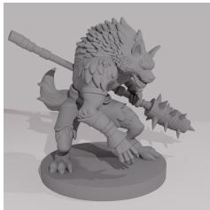  
Output Mesh

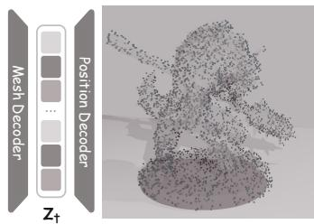  
Output Position  
(I) Our Observation

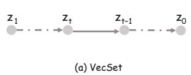

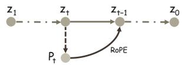  
(c) Current-State Conditioning

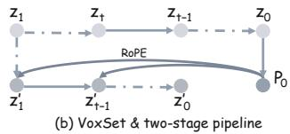

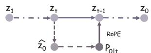  
(II) Trajectory Designs  
(d) Clean-State Conditioning (Ours)  
Figure 1 Our observation and positional conditioning designs. (I) Latents can be decoded into shape geometry and token positions. (II) (a) VecSet uses no explicit positional conditioning; (b) VoxSet and two-stage pipelines use positions established beforehand. (c) Our naive design recovers positions from the current noisy state. (d) Position Forcing recovers positions from the predicted clean state and applies progressive quantization to provide coarse-to-fine spatia guidance.

To this end, we further investigate the spatial properties of VecSet latent representations. In a VecSet VAE with point queries, each latent token is constructed from a corresponding spatial query and is therefore associated with a query position. We observe that this positional correspondence is retained in the encoded latent representation. As shown in Fig. 1(I), the corresponding query positions can be recovered from the latent tokens alone, indicating that the unordered VecSet representation retains decodable spatial information.

Since this positional information can be recovered from latent tokens, a natural idea is to feed the recovered positions back into the model as explicit spatial conditioning during generation. To this end, we first consider a naive design that predicts token positions from the current noisy latent during both training and inference and constructs positional encodings at full spatial resolution, as illustrated in Fig. 1(II)(c). However, we find that this direct approach often produces shapes with incorrect geometry. At high noise levels, position predictions are unreliable, and full-resolution positional encodings can make the model rely on incorrect fine-grained spatial relationships.

Building on these observations, we propose Position Forcing, a position-based self-conditioning framework that provides spatial guidance through progressively refined positional feedback. We first introduce a progressive position quantization strategy governed by the noise level, matching the granularity of spatial conditioning to the current generation step. At high noise levels, we quantize positions onto a coarse spatial grid to preserve global layout information while reducing sensitivity to positional errors. As the noise level decreases, we progressively increase the quantization resolution, refining positional guidance from global layout to local spatial relationships.

To further reduce the impact of noise on position recovery and provide more accurate positional guidance, we consider recovering token positions from the predicted clean latent representation. Specifically, during inference, we use the model-predicted velocity field to compute the predicted clean latent, recover token positions from it, and progressively quantize them, as illustrated in Fig. 1(II)(d). These positional conditions are fed back into the difusion Transformer through RoPE, providing coarse-to-fine spatial guidance for subsequent denoising. To further improve generation quality, we train the model with accurate query positions using the same quantization. Together, these designs enable Position Forcing to continually update spatial guidance within a single denoising trajectory, guiding generation from global layout to fine-grained local geometry without a separate position generation stage.

Our main contributions are summarized as follows:

• We reveal that VecSet latent tokens retain decodable spatial information, allowing their corresponding query positions to be recovered with high accuracy.

• We propose Position Forcing, a self-conditioning framework that combines position quantization with

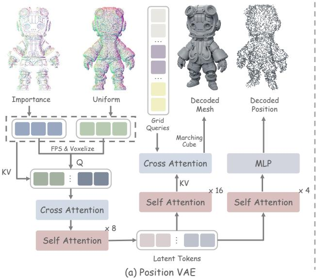

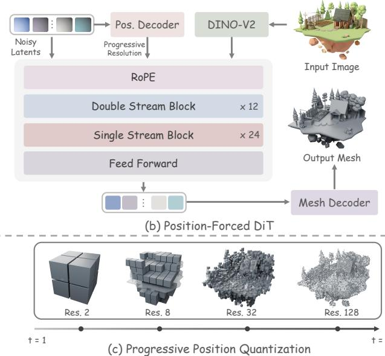  
Figure 2 Method overview. (a) Position VAE learns latent tokens that preserve geometry–position correspondences, enabling both shape geometry and token-associated spatial positions to be decoded. (b) During denoising, Position-Forced DiT recovers token positions from the predicted clean latents and injects them as positional guidance into subsequent denoising steps through RoPE. (c) The recovered positions are progressively quantized from coarse to fine as denoising proceeds.

position recovery from predicted clean latents to provide increasingly precise spatial guidance.

• Our method guides generation along a coarse-to-fine spatial trajectory, enabling high-quality single-stage 3D generation without a separate position generation stage.

## 2 Related Work

Shape Generation. 3D shape generation spans GAN/VAE models, 2D difusion priors, feed-forward reconstruction, and optimization-based methods. (Chen et al., 2026; Hong et al., 2024; Tang et al., 2024; Yang et al., 2024), and autoregressive mesh modeling (Hao et al., 2024; Siddiqui et al., 2024; Weng et al., 2025). Methods generating directly in 3D representation spaces broadly follow two lines. The first encodes geometry into compact VecSet latent tokens, as in 3DShape2VecSet (Zhang et al., 2023), Michelangelo (Zhao et al., 2023), CLAY (Zhang et al., 2024), Hunyuan3D 2.0 (Zhao et al., 2025), TripoSG (Li et al., 2025b), and Step1X-3D (Li et al., 2025a). These methods perform generation in a compressed latent space and recover geometric details through a learned decoder. LATTICE (Lai et al., 2026) adds explicit spatial structure through voxel anchoring and layout-first generation. The second models local geometry on spatially structured sparse grids, including XCube (Ren et al., 2024b), TRELLIS (Xiang et al., 2025), Hi3DGen (Ye et al., 2025), SparseFlex (He et al., 2025), Sparc3D (Li et al., 2026), Direct3D-S2 (Wu et al., 2026b), and TRELLIS 2 (Xiang et al., 2026).

Generation Ordering and Self-Conditioning. Generation ordering structures information emergence through noise schedules or generation hierarchies. Difusion Forcing (Chen et al., 2024), Latent Forcing (Baade et al., 2026), and Self-Flow (Chefer et al., 2026) explore diferentiated noise or information levels, while VAR (Tian et al., 2024), FlowAR (Ren et al., 2024a), NVG (Wang et al., 2026d), and Trajectory Forcing (Kocabas et al., 2026) organize generation through spatial scales, token granularity, or structured intermediate states. Such designs allow earlier structural information to serve as context for subsequent detail generation. Complementarily, Analog Bits (Chen et al., 2022) and RIN (Jabri et al., 2022) perform self-conditioning by reusing clean-sample predictions and internal latent states, respectively. These mechanisms allow subsequent denoising steps to build on previously computed information and progressively refine the output.

## 3 Method

As illustrated in Fig. 2, our framework comprises two main components: Position VAE and Position-Forced DiT. Position VAE augments the geometry decoder with a position decoder that recovers the spatial positions associated with latent tokens. During denoising, Position-Forced DiT uses this position decoder to recover positions from the current clean latent estimate. These positions are quantized at progressively finer resolutions as the noise level decreases and fed back into the DiT through RoPE, providing coarse-to-fine spatial guidance for single-stage 3D generation.

## 3.1 Preliminaries

VoxSet VAE. Conventional point-query VecSet VAEs encode an input geometry into a compact set of latent tokens using spatial queries sampled from the object surface. LATTICE (Lai et al., 2026) then introduces VoxSet by replacing point queries with voxel queries located at the centers of active voxels, thereby anchoring latent tokens to a coarse spatial grid. To accommodate voxel queries at diferent spatial resolutions, LATTICE perturbs the surface queries selected by farthest point sampling (FPS) before encoding:

$$
{ \bf p } _ { i } = { \bf p } _ { i } ^ { \mathrm { F P S } } + \delta _ { i } , \qquad \delta _ { i } \sim \mathcal { U } \left[ - \frac { 1 } { 2 R } , \frac { 1 } { 2 R } \right] ^ { 3 } ,\tag{1}
$$

where R denotes the spatial resolution and $\mathbf { p } _ { i }$ is the query position supplied to the encoder. The encoder produces latent tokens associated with these queries through cross-attention with the input point cloud followed by self-attention.

Rectified Flow. We adopt rectified flow in the VAE latent space, learning a velocity field that progressively transforms Gaussian noise into clean geometry latents. Given a clean latent $\mathbf { Z } _ { 0 }$ and Gaussian noise $\epsilon ,$ the noisy state used during training is constructed by linear interpolation:

$$
\mathbf { Z } _ { t } = ( 1 - t ) \mathbf { Z } _ { 0 } + t \boldsymbol { \epsilon } , \qquad \boldsymbol { \epsilon } \sim \mathcal { N } ( \mathbf { 0 } , \mathbf { I } ) , \quad t \in [ 0 , 1 ] .\tag{2}
$$

Here, $t = 0$ corresponds to clean latents and $t = 1$ to pure noise, with target velocity $\mathbf { \epsilon } \mathbf { \epsilon } \mathbf { - } \mathbf { Z } _ { 0 }$ . Given conditioning $\mathbf { c } ,$ a Transformer $v _ { \theta }$ takes the current noisy state and timestep as input and learns to predict this velocity through the flow-matching objective:

$$
\begin{array} { r } { \mathcal { L } _ { \mathrm { F M } } = \mathbb { E } _ { \mathbf { Z } _ { 0 } , \epsilon , t , \mathbf { c } } \left[ \left\| v _ { \theta } ( \mathbf { Z } _ { t } , t , \mathbf { c } ) - ( \epsilon - \mathbf { Z } _ { 0 } ) \right\| _ { F } ^ { 2 } \right] . } \end{array}\tag{3}
$$

At inference time, generation starts from Gaussian noise and integrates the predicted velocity field from $t = 1$ to $t = 0$ to obtain the generated geometry latent.

## 3.2 Position VAE

We first reproduce and pretrain the VoxSet VAE described in LATTICE (Lai et al., 2026), then augment it with a Transformer-based position decoder to recover the spatial positions associated with latent tokens, yielding Position VAE. We adopt a two-stage training strategy: first training the position decoder with the VAE frozen, then jointly finetuning the VAE and the position decoder.

Stage I: Position Learning on Frozen Latents. Given an input geometry $x ,$ we denote the spatial queries supplied to the encoder after query jitter by $\mathcal { P } = \{ { \bf p } _ { i } \} _ { i = 1 } ^ { N }$

Table 1 Efect of joint training on position recovery. Accuracy (%) measures the fraction of predicted positions that fall into the same cells as their corresponding query positions on a $1 2 8 ^ { 3 }$ grid.
<table><tr><td rowspan="2">Training Strategy</td><td colspan="4">Noise Level (%)</td></tr><tr><td>0</td><td>10</td><td>20</td><td>30</td></tr><tr><td>Frozen VAE</td><td>67.4</td><td>51.3</td><td>23.0</td><td>6.7</td></tr><tr><td>Joint Finetuning</td><td>99.9</td><td>99.7</td><td>92.5</td><td>67.3</td></tr></table>

latent tokens:

$$
\mathbf { Z } = E ( \boldsymbol { \mathcal { X } } , \mathcal { P } ) = \{ \mathbf { z } _ { i } \} _ { i = 1 } ^ { N } .\tag{4}
$$

Each latent token $\mathbf { z } _ { i }$ corresponds to the spatial query $\mathbf { p } _ { i }$ used to construct it, allowing these jittered query coordinates to serve directly as token-wise positional supervision without additional matching. In this stage, we freeze all parameters of the VAE encoder and geometry decoder and train only a Transformer-based position decoder $D _ { \mathrm { p o s } }$ . The position decoder takes the complete latent token set, models inter-token relationships through self-attention, and predicts the corresponding 3D position for each token using an MLP:

$$
\widehat { \bf P } = D _ { \mathrm { p o s } } ( { \bf Z } ) = \{ \widehat { \bf p } _ { i } \} _ { i = 1 } ^ { N } , \qquad \widehat { \bf p } _ { i } \in \mathbb { R } ^ { 3 } .\tag{5}
$$

We supervise position prediction using a token-wise L1 loss:

$$
\mathcal { L } _ { \mathrm { p o s } } = \frac { 1 } { 3 N } \sum _ { i = 1 } ^ { N } \left. \widehat { \mathbf { p } } _ { i } - \mathbf { p } _ { i } \right. _ { 1 } .\tag{6}
$$

This stage allows the position decoder to learn to extract spatial information already present in the pretrained latent representations while leaving the original geometry latent space unchanged. However, as shown in Table 1, training the position decoder on frozen latent representations alone yields limited position prediction accuracy, which further degrades under noise perturbations.

Stage II: Joint Position-Aware Training. In the second stage, we therefore unfreeze the VAE and jointly finetune the encoder, geometry decoder, and position decoder so that the latent representations support both geometry reconstruction and position recovery. We retain the original VAE training objective, comprising a TSDF-based geometry reconstruction loss and KL regularization:

$$
\begin{array} { r } { \mathcal { L } _ { \mathrm { V A E } } = \mathcal { L } _ { \mathrm { r e c } } + \lambda _ { \mathrm { K L } } \mathcal { L } _ { \mathrm { K L } } , } \end{array}\tag{7}
$$

where $\mathcal { L } _ { \mathrm { r e c } }$ follows the TSDF mean squared error reconstruction objective of the original VAE. We incorporate the positional supervision from Stage I to obtain the joint training objective:

$$
\begin{array} { r } { \mathcal { L } _ { \mathrm { j o i n t } } = \mathcal { L } _ { \mathrm { V A E } } + \lambda _ { \mathrm { p o s } } \mathcal { L } _ { \mathrm { p o s } } . } \end{array}\tag{8}
$$

Joint training makes the corresponding token positions easier to recover from the latent representations. As shown in Table 1, despite being trained only on clean latent tokens, the position decoder maintains high position recovery accuracy under noise perturbations after joint finetuning. This robustness supports the use of the position decoder to recover positional conditions from imperfect clean latent estimates in the subsequent Position-Forced DiT. Joint finetuning also improves downstream generation quality, as demonstrated in our ablation study (Sec. 4.3).

## 3.3 Position-Forced DiT

As illustrated in Fig. 2(b), Position-Forced DiT provides explicit spatial guidance for geometry generation through progressively refined positional conditions. Following the image-conditioned rectified-flow Transformer architecture of Hunyuan3D-2.1 (Hunyuan3D et al., 2025) and LATTICE (Lai et al., 2026), we extract image features using DINOv2, concatenate them with the geometry tokens, and jointly process the resulting sequence using a FLUX-style (Labs, 2024) Transformer. Positional conditions are injected into Transformer attention blocks through 3D RoPE to encode spatial relationships among geometry tokens.

Progressive Position Quantization. A straightforward approach is to predict token positions from the current noisy latent during both training and inference and construct positional conditions at full spatial resolution. As illustrated in Fig. 1(II)(c), this Current-State Conditioning recovers positions directly from the current latent:

$$
P _ { t } = D _ { \mathrm { p o s } } ( \mathbf { Z } _ { t } ) .\tag{9}
$$

The recovered positions are then used to construct PE and fed back into the generative model. However, we find that this direct approach often produces shapes with incorrect geometry, as full-resolution PE conditions the model on inaccurate spatial positions at high noise levels. We therefore introduce progressive position quantization to adjust the granularity of spatial conditioning according to the current noise level. Specifically, we linearly interpolate the resolution exponent and round it down, then clamp the spatial resolution to a specified range:

$$
m ( t ) = \left\lfloor t m _ { \mathrm { m i n } } + ( 1 - t ) m _ { \mathrm { m a x } } \right\rfloor , \qquad R ( t ) = \mathrm { c l i p } \left( 2 ^ { m ( t ) } , R _ { \mathrm { m i n } } , R _ { \mathrm { m a x } } \right) .\tag{10}
$$

Here, $m _ { \mathrm { m i n } }$ and $m _ { \mathrm { m a x } }$ are the endpoints of the exponent interpolation, while $R _ { \mathrm { m i n } }$ and $R _ { \mathrm { m a x } }$ specify the coarsest and finest spatial resolutions, respectively. As illustrated in Fig. 2(b), coarse quantization at high noise levels retains global spatial layout while reducing sensitivity to positional errors. As noise decreases, progressively finer grids provide more precise local spatial relationships.

Clean-State Position Recovery and Conditioning. To further reduce the impact of noise on position recovery and provide more accurate positional guidance, we consider recovering token positions from the predicted clean latent representation. Following Eq. 2, we compute the predicted clean latent using the model-predicted velocity $\widehat { \mathbf { V } } _ { t } \mathbf { : }$

$$
\widehat { \mathbf { Z } } _ { 0 } = \mathbf { Z } _ { t } - t \widehat { \mathbf { V } } _ { t } .\tag{11}
$$

Here, $\widehat { \mathbf { Z } } _ { 0 }$ denotes the clean latent prediction at the current timestep. We then recover token positions using the frozen position decoder:

$$
\begin{array} { r } { P _ { 0 | t } = D _ { \mathrm { p o s } } \left( \widehat { \mathbf { Z } } _ { 0 } \right) . } \end{array}\tag{12}
$$

As illustrated in Fig. 1(II)(d), this Clean-State Conditioning uses positions recovered from the predicted clean state, together with the progressive quantization described above, to provide spatial guidance for subsequent denoising.

Training and Inference. During inference, each step uses positions derived from the preceding step, whereas standard flow-matching training samples individual timesteps without the corresponding generation history. Exactly reproducing this feedback during training requires unrolling the preceding sampling trajectory, introducing additional computational overhead. We therefore retain single-timestep training and use the ground-truth query positions P associated with the VAE encoder to provide an accurate spatial reference. These positions are progressively quantized using the same resolution schedule $R ( t )$ . Here, $Q _ { R }$ partitions the normalized space $[ - \bar { 1 } , 1 \bar { ] } ^ { 3 }$ into $R ^ { 3 }$ cells and maps each position to the representative coordinates of its cell. To maintain a consistent coordinate scale across quantization levels, we express these representative coordinates in the coordinate system of the maximum resolution $R _ { \mathrm { m a x } }$ , with this mapping included in the definition of $Q _ { R }$ . During training, we add random perturbations $\delta$ to the quantized and mapped coordinates to improve robustness to position prediction errors at inference and coordinate jumps caused by changes in quantization resolution. When $R = 1$ , we disable the perturbations so that all tokens share the same positional encoding.

During DiT training, we freeze Position VAE and optimize the Transformer with the following flow-matching objective:

$$
\mathcal { L } _ { \mathrm { F M } } = \mathbb { E } _ { ( \mathbf { Z } _ { 0 } , \mathcal { P } , I ) , \epsilon , t , \delta } \left[ \left| \left| v _ { \theta } \left( \mathbf { Z } _ { t } , t , \mathbf { c } _ { I } , \mathrm { P E } \left( Q _ { R ( t ) } ( \mathcal { P } ) + \delta \right) \right) - ( \epsilon - \mathbf { Z } _ { 0 } ) \right| \right| _ { F } ^ { 2 } \right] .\tag{13}
$$

Here, $\mathbf { c } _ { I }$ denotes the DINOv2 features of the input image I, PE denotes positional conditioning implemented through 3D RoPE, and δ is applied only during training. At inference time, we construct spatial conditions from positions recovered from the clean latent predicted at the preceding step, without position perturbations. At the initial pure-noise step, we set $R = 1$ so that all tokens share the same positional encoding, allowing sampling to begin without a preceding position prediction. Below, t and t − 1 are used as shorthand for consecutive sampling times. At step t, we use the predicted velocity to compute the clean latent prediction and recover positions $P _ { 0 | t }$ . These positions are then quantized at the next step’s resolution to condition its

Table 3 Comparison with existing 3D generation methods. Best results are highlighted in bold.
<table><tr><td>Model</td><td>Single Stage</td><td>ULIP-T↑</td><td>ULIP-I↑</td><td>Uni3D-T↑</td><td>Uni3D-I↑</td></tr><tr><td>TRELLIS (Xiang et al., 2025)</td><td>x</td><td>0.076</td><td>0.126</td><td>0.249</td><td>0.311</td></tr><tr><td>TRELLIS 2 (Xiang et al., 2026)</td><td>x</td><td>0.077</td><td>0.124</td><td>0.245</td><td>0.317</td></tr><tr><td>Direct3D-S2 (Wu et al., 2026b)</td><td>x</td><td>0.074</td><td>0.122</td><td>0.247</td><td>0.314</td></tr><tr><td>Hi3DGen (Ye et al., 2025)</td><td>x</td><td>0.065</td><td>0.113</td><td>0.252</td><td>0.301</td></tr><tr><td>CraftsMan 1.5 (Li et al., 2024)</td><td>√</td><td>0.074</td><td>0.129</td><td>0.237</td><td>0.298</td></tr><tr><td>UniLat3D (Wu et al., 2026a)</td><td>√</td><td>0.071</td><td>0.119</td><td>0.252</td><td>0.307</td></tr><tr><td>Hunyuan3D 2.1 (Hunyuan3D et al., 2025)</td><td>√</td><td>0.075</td><td>0.125</td><td>0.250</td><td>0.320</td></tr><tr><td>Position Forcing (Ours)</td><td>√</td><td>0.077</td><td>0.130</td><td>0.257</td><td>0.321</td></tr></table>

velocity prediction:

$$
\begin{array} { r } { \widehat { { \bf V } } _ { t - 1 } = v _ { \theta } \left( { \bf Z } _ { t - 1 } , t - 1 , { \bf c } _ { I } , \mathrm { P E } \left( Q _ { R ( t - 1 ) } ( P _ { 0 | t } ) \right) \right) . } \end{array}\tag{14}
$$

We iteratively update the positional conditions during sampling and decode the resulting latent tokens into a mesh using the geometry decoder of Position VAE. We further evaluate these positional conditioning designs in our ablation study (Sec. 4.3).

## 4 Experiments

## 4.1 Reconstruction

We evaluate the reconstruction capability of our VAE on a held-out set of meshes excluded from training, comparing against TripoSG (Li et al., 2025b) and Hunyuan3D-2.1 (Hunyuan3D et al., 2025) at diferent latent sizes. We report Chamfer Distance (CD) and F1 score, where lower CD and higher F1 indicate better reconstruction quality. As shown in Table 2, increasing the latent size consistently improves reconstruction performance, with our largest latent configuration achieving the best results.

Table 2 Quantitative comparisons of geometry reconstruction.
<table><tr><td>Method</td><td>Latent Size</td><td>CD↓</td><td>F1↑</td></tr><tr><td>TripoSG (Li et al., 2025b)</td><td>64 × 4096 64 × 8192</td><td>17.96 16.61</td><td>92.33 94.19</td></tr><tr><td>Hunyuan3D-2.1 (Hunyuan3D et al., 2025)</td><td>64 × 4096 64 × 8192 64 × 20480</td><td>9.08 8.28 7.62</td><td>89.43 90.99 92.06</td></tr><tr><td>Position Forcing (Ours)</td><td>64 × 4096  $6 4 \times 8 1 9 2$   $6 4 \times 2 0 4 8 0$ </td><td>8.28 6.37 5.39</td><td>90.74 93.83 95.38</td></tr></table>

## 4.2 Generation

We evaluate image-conditioned 3D generation using ULIP (Xue et al., 2023) and Uni3D (Zhou et al., 2024) similarities. We compare against representative existing 3D generation methods, including multi-stage approaches TRELLIS (Xiang et al., 2025), TRELLIS 2 (Xiang et al., 2026), Direct3D-S2 (Wu et al., 2026b), and Hi3DGen (Ye et al., 2025), as well as single-stage approaches CraftsMan 1.5 (Li et al., 2024), UniLat3D (Wu et al., 2026a), and Hunyuan3D 2.1 (Hunyuan3D et al., 2025). As shown in Table 3, Position Forcing achieves the best or tied-best performance across all four metrics, outperforming both single-stage and multi-stage baselines. Qualitative results in Fig. 3 further demonstrate improved structural consistency and finer geometric details.

## 4.3 Ablations and Analysis

We ablate progressive position quantization, inference-time position recovery, training-time positional conditioning, and joint VAE training in Fig. 4. Configuration (a) is the VetSet baseline without explicit positional conditioning, while (f) is our full model. For each input, all configurations use the same random seed and sampling settings.

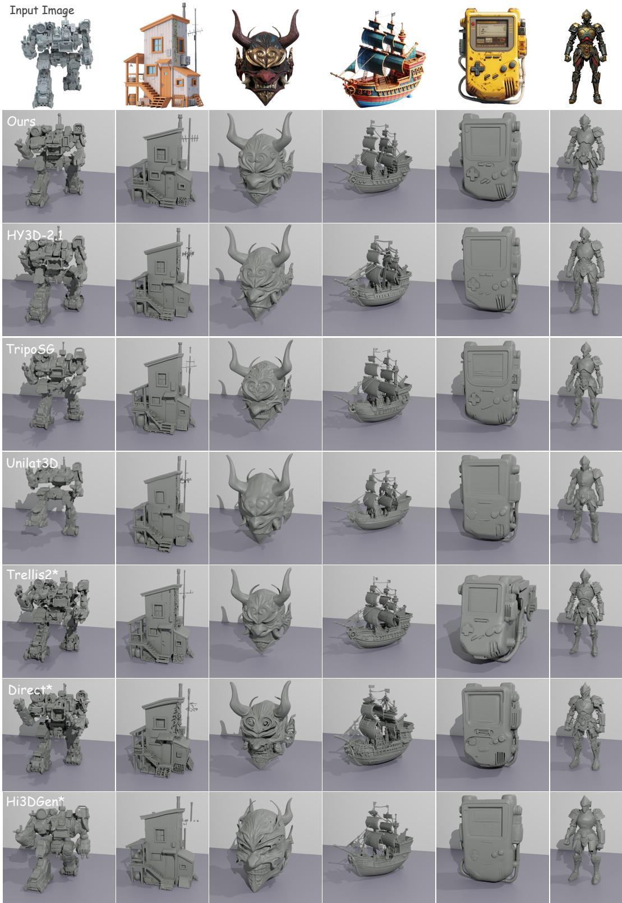  
Figure 3 Qualitative comparison of image-conditioned 3D generation. The input images are shown in the top row. Compared with existing methods, our approach produces more faithful 3D geometry with coherent global structures and fine-grained details across diverse object categories. Methods marked with \* adopt a two-stage generation framework.

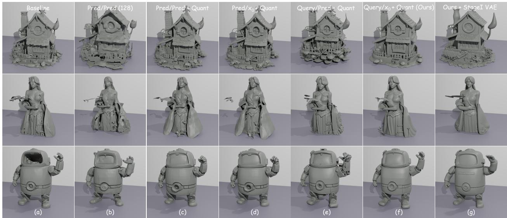

<table><tr><td>Configuration</td><td>(a)</td><td>(b)</td><td>(c)</td><td>(d)</td><td>(e)</td><td>(f) Ours</td><td>(g)</td></tr><tr><td>Train pos.</td><td></td><td>Pred</td><td>Pred</td><td>Pred</td><td>Query</td><td>Query</td><td>Query</td></tr><tr><td>Infer pos.</td><td></td><td>Pred</td><td>Pred</td><td>x0</td><td>Pred</td><td>x0</td><td>x0</td></tr><tr><td>Progressive quant.</td><td>X</td><td>X</td><td>√</td><td>√</td><td>√</td><td>√</td><td>√</td></tr><tr><td>Resolution</td><td></td><td>128</td><td>Prog.</td><td>Prog.</td><td>Prog.</td><td>Prog.</td><td>Prog.</td></tr><tr><td>VAE</td><td>VetSet</td><td>Joint</td><td>Joint</td><td>Joint</td><td>Joint</td><td>Joint</td><td>Stage-I</td></tr><tr><td>ULIP-T ↑</td><td>0.075</td><td>0.076</td><td>0.074</td><td>0.075</td><td>0.058</td><td>0.077</td><td>0.076</td></tr><tr><td>ULIP-I ↑</td><td>0.125</td><td>0.127</td><td>0.124</td><td>0.126</td><td>0.095</td><td>0.130</td><td>0.128</td></tr><tr><td>Uni3D-T ↑</td><td>0.250</td><td>0.247</td><td>0.256</td><td>0.257</td><td>0.225</td><td>0.257</td><td>0.248</td></tr><tr><td>Uni3D-I ↑</td><td>0.320</td><td>0.305</td><td>0.321</td><td>0.323</td><td>0.265</td><td>0.321</td><td>0.308</td></tr></table>

Figure 4 Qualitative and quantitative ablation of Position Forcing. Columns (a)–(g) share the same configurations across qualitative and quantitative results. Query, Pred, and x<sub>0</sub> denote ground-truth query positions, predicted positions, and positions recovered from the predicted clean latent, respectively. Prog. denotes progressive position quantization. Configuration (g) uses the Stage-I VAE instead of the jointly trained VAE. Bold and underlining denote the best and second-best results.

Progressive Position Quantization. We evaluate progressive position quantization by comparing (b) and (c). Configuration (b) uses a fixed position resolution of 128 throughout denoising, whereas (c) progressively increases the conditioning resolution. Qualitatively, (b) exhibits fragmented structures around the house and irregular character surfaces, while (c) reduces these artifacts and produces better geometry. These results support using coarse positional conditions to mitigate unreliable position predictions early in denoising, followed by progressively finer spatial guidance.

Position Recovery from Predicted Clean Latents. We first examine the source of position recovery during inference by comparing (c) and (d). Both configurations share the same DiT checkpoint and difer only in the input to position recovery: (c) uses the current noisy latent, while (d) uses the predicted clean latent x<sub>0</sub>. Although (d) improves all four metrics, the gains are modest because imprecise training-time positions limit the model’s ability to benefit from more accurate positions at inference. This observation motivates the use of ground-truth query positions during training to provide a more accurate spatial reference.

Ground-Truth Query Conditioning during Training. We evaluate ground-truth query conditioning during training by comparing (d) and (f). Both configurations use progressive quantization and recover positions from x<sub>0</sub> during inference, while (d) uses predicted positions during training and (f) uses ground-truth query positions. Compared with (d), (f) produces cleaner local structures on the house and more complete character geometry, while improving both ULIP metrics. We further compare (e) and (f), which share the same query-conditioned DiT checkpoint and difer only in the source of position recovery during inference. Direct position prediction from noisy latents in (e) still produces substantial geometric artifacts, whereas recovery from x<sub>0</sub> in (f) markedly improves geometric completeness and all four metrics. This comparison suggests that recovering positions from predicted clean latents provides more accurate positional estimates, enabling better generation performance for the model trained with ground-truth queries.

Joint VAE Training. Finally, we evaluate joint VAE training by comparing our full configuration (f) with configuration (g). Configuration (g) replaces the jointly trained VAE with the Stage-I VAE and retrains the DiT under otherwise identical settings. Compared with (g), (f) reduces fragmented structures and better preserves details, while achieving higher scores on all four metrics, demonstrating improved generation quality. Together with the improved position recovery in Table 1, these results indicate that joint geometry and position learning yields a more efective spatially aware representation, benefiting downstream generation.

Analysis of Positional Feedback. We analyze the consistency between recovered and final generated positions during sampling to understand the roles of progressive quantization and clean-latent position recovery. As shown in Fig. 5, progressive quantization improves overall accuracy across the sampling trajectory. This enables coarse spatial conditioning before fine-grained positions become reliable, consistent with the improved structural integrity in Fig. 4(b)–(c). Compared with $P _ { t }$ $P _ { 0 | t }$ aligns with the final positions earlier and maintains high agreement under progressive quantization, consistent with the substantial gains in Fig. 4(e)–(f). Together, these designs provide coarse-to-fine spatial guidance that better aligns with the final generated positions.

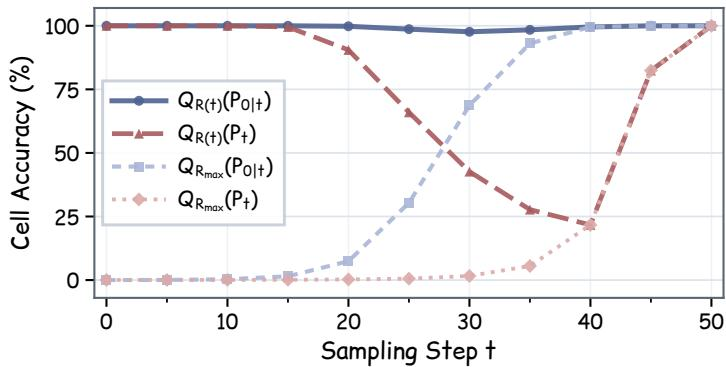  
Figure 5 Positional consistency during sampling. We compare cell accuracy along the sampling trajectory for positions recovered from predicted clean latents $( P _ { 0 | t } )$ and noisy latents (P<sub>t</sub>). Accuracy is the percentage of tokens whose intermediate and final decoded positions fall into the same cell, using progressive resolution $R ( t )$ or fixed resolution $R _ { \mathrm { m a x } }$ for both.

## 5 Conclusions

We presented Position Forcing, a position-based self-conditioning framework for single-stage 3D generation. Our key observation is that VecSet latents retain correspondences with their spatial queries, enabling positional guidance to be recovered directly from geometry latents. Position VAE enables position recovery from geometry latents, while Position-Forced DiT uses the recovered positions as spatial guidance during denoising. Experiments demonstrate competitive performance against both single-stage and multi-stage methods.

## References

Alan Baade, Eric Ryan Chan, Kyle Sargent, Changan Chen, Justin Johnson, Ehsan Adeli, and Li Fei-Fei. Latent forcing: Reordering the difusion trajectory for pixel-space image generation. arXiv preprint arXiv:2602.11401, 2026.

Hila Chefer, Patrick Esser, Dominik Lorenz, Dustin Podell, Vikash Raja, Vinh Tong, Antonio Torralba, and Robin Rombach. Self-supervised flow matching for scalable multi-modal synthesis. arXiv preprint arXiv:2603.06507, 2026.

Boyuan Chen, Diego Martí Monsó, Yilun Du, Max Simchowitz, Russ Tedrake, and Vincent Sitzmann. Difusion forcing: Next-token prediction meets full-sequence difusion. Advances in Neural Information Processing Systems, 37:24081–24125, 2024.

Jiarui Chen, Yikeng Chen, Yingshuang Zou, Ye Huang, Peng Wang, Yuan Liu, Yujing Sun, and Wenping Wang. Megs<sup>2</sup>: Memory-eficient gaussian splatting via spherical gaussians and unified pruning, 2026. URL https: //arxiv.org/abs/2509.07021.

Ting Chen, Ruixiang Zhang, and Geofrey Hinton. Analog bits: Generating discrete data using difusion models with self-conditioning. arXiv preprint arXiv:2208.04202, 2022.

Jingbo Gong, Yikai Wang, Yushi Lan, Yuhao Wan, Ziheng Ouyang, Rui Zhao, Ming-Ming Cheng, Qibin Hou, and Chen Change Loy. Direct 3d-aware object insertion via decomposed visual proxies. arXiv preprint arXiv:2606.06601, 2026.

Zekun Hao, David W Romero, Tsung-Yi Lin, and Ming-Yu Liu. Meshtron: High-fidelity, artist-like 3d mesh generation at scale. arXiv preprint arXiv:2412.09548, 2024.

Xianglong He, Zi-Xin Zou, Chia-Hao Chen, Yuan-Chen Guo, Ding Liang, Chun Yuan, Wanli Ouyang, Yan-Pei Cao, and Yangguang Li. Sparseflex: High-resolution and arbitrary-topology 3d shape modeling. In 2025 IEEE/CVF International Conference on Computer Vision (ICCV), pp. 14822–14833. IEEE, 2025.

Jonathan Ho, Ajay Jain, and Pieter Abbeel. Denoising difusion probabilistic models, 2020. URL https://arxiv.org/ abs/2006.11239.

Yicong Hong, Kai Zhang, Jiuxiang Gu, Sai Bi, Yang Zhou, Difan Liu, Feng Liu, Kalyan Sunkavalli, Trung Bui, and Hao Tan. Lrm: Large reconstruction model for single image to 3d. In International Conference on Learning Representations, volume 2024, pp. 50678–50702, 2024.

Team Hunyuan3D, Shuhui Yang, Mingxin Yang, Yifei Feng, Xin Huang, Sheng Zhang, Zebin He, Di Luo, Haolin Liu, Yunfei Zhao, et al. Hunyuan3d 2.1: From images to high-fidelity 3d assets with production-ready pbr material. arXiv preprint arXiv:2506.15442, 2025.

Allan Jabri, David Fleet, and Ting Chen. Scalable adaptive computation for iterative generation. arXiv preprint arXiv:2212.11972, 2022.

Merve Kocabas, Gege Gao, Bernhard Schölkopf, and Andreas Geiger. Trajectory forcing: Structure-first generation with controllable semantic trajectories. arXiv preprint arXiv:2606.22527, 2026.

Black Forest Labs. Flux. https://github.com/black-forest-labs/flux, 2024.

Zeqiang Lai, Yunfei Zhao, Zibo Zhao, Haolin Liu, Qingxiang Lin, Jingwei Huang, Chunchao Guo, and Xiangyu Yue. Lattice: Democratize high-fidelity 3d generation at scale. In Proceedings of the IEEE/CVF Conference on Computer Vision and Pattern Recognition, pp. 19982–19992, 2026.

Weiyu Li, Jiarui Liu, Hongyu Yan, Rui Chen, Yixun Liang, Xuelin Chen, Ping Tan, and Xiaoxiao Long. Craftsman3d: High-fidelity mesh generation with 3d native generation and interactive geometry refiner. arXiv preprint arXiv:2405.14979, 2024.

Weiyu Li, Xuanyang Zhang, Zheng Sun, Di Qi, Hao Li, Wei Cheng, Weiwei Cai, Shihao Wu, Jiarui Liu, Zihao Wang, et al. Step1x-3d: Towards high-fidelity and controllable generation of textured 3d assets. arXiv preprint arXiv:2505.07747, 2025a.

Yangguang Li, Zi-Xin Zou, Zexiang Liu, Dehu Wang, Yuan Liang, Zhipeng Yu, Xingchao Liu, Yuan-Chen Guo, Ding Liang, Wanli Ouyang, et al. Triposg: High-fidelity 3d shape synthesis using large-scale rectified flow models. IEEE Transactions on Pattern Analysis and Machine Intelligence, 2025b.

Zhihao Li, Yufei Wang, Heliang Zheng, Yihao Luo, and Bihan Wen. Sparc3d: Sparse representation and construction for high-resolution 3d shapes modeling. Advances in Neural Information Processing Systems, 38:118582–118600, 2026.

Yaron Lipman, Ricky T. Q. Chen, Heli Ben-Hamu, Maximilian Nickel, and Matt Le. Flow matching for generative modeling, 2023. URL https://arxiv.org/abs/2210.02747.

Nanye Ma, Mark Goldstein, Michael S. Albergo, Nicholas M. Bofi, Eric Vanden-Eijnden, and Saining Xie. Sit: Exploring flow and difusion-based generative models with scalable interpolant transformers, 2024. URL https: //arxiv.org/abs/2401.08740.

Ziheng Ouyang, Yiren Song, Yaoli Liu, Shihao Zhu, Qibin Hou, Ming-Ming Cheng, and Mike Zheng Shou. The consistency critic: Correcting inconsistencies in generated images via reference-guided attentive alignment. In Proceedings of the IEEE/CVF Conference on Computer Vision and Pattern Recognition, pp. 2035–2046, 2026.

William Peebles and Saining Xie. Scalable difusion models with transformers, 2023. URL https://arxiv.org/abs/ 2212.09748.

Sucheng Ren, Qihang Yu, Ju He, Xiaohui Shen, Alan Yuille, and Liang-Chieh Chen. Flowar: Scale-wise autoregressive image generation meets flow matching. arXiv preprint arXiv:2412.15205, 2024a.

Xuanchi Ren, Jiahui Huang, Xiaohui Zeng, Ken Museth, Sanja Fidler, and Francis Williams. Xcube: Large-scale 3d generative modeling using sparse voxel hierarchies. In 2024 IEEE/CVF Conference on Computer Vision and Pattern Recognition (CVPR), pp. 4209–4219. IEEE, 2024b.

Robin Rombach, Andreas Blattmann, Dominik Lorenz, Patrick Esser, and Björn Ommer. High-resolution image synthesis with latent difusion models, 2022. URL https://arxiv.org/abs/2112.10752.

Yawar Siddiqui, Antonio Alliegro, Alexey Artemov, Tatiana Tommasi, Daniele Sirigatti, Vladislav Rosov, Angela Dai, and Matthias Nießner. Meshgpt: Generating triangle meshes with decoder-only transformers. In 2024 IEEE/CVF Conference on Computer Vision and Pattern Recognition (CVPR), pp. 19615–19625. IEEE, 2024.

Jiaxiang Tang, Zhaoxi Chen, Xiaokang Chen, Tengfei Wang, Gang Zeng, and Ziwei Liu. Lgm: Large multi-view gaussian model for high-resolution 3d content creation. In European Conference on Computer Vision, pp. 1–18. Springer, 2024.

Keyu Tian, Yi Jiang, Zehuan Yuan, Bingyue Peng, and Liwei Wang. Visual autoregressive modeling: Scalable image generation via next-scale prediction. Advances in neural information processing systems, 37:84839–84865, 2024.

Jiangshan Wang, Zeqiang Lai, Jiarui Chen, Jiayi Guo, Hang Guo, Xiu Li, Xiangyu Yue, and Chunchao Guo. Elastic difusion transformer, 2026a. URL https://arxiv.org/abs/2602.13993.

Jiangshan Wang, Zeqiang Lai, Jiayi Guo, Xin Yang, Xin Huang, Jiarui Chen, Ziheng Ouyang, Chunchao Guo, and Xiangyu Yue. Does native 3d texture generation necessarily require 3d assets for training? arXiv preprint arXiv:2609.34621, 2026b.

Kai Wang, Ziheng Ouyang, Xuying Zhang, Ming-Ming Cheng, and Qibin Hou. Dreamstyle3d: Eficient 3d stylized asset generation via dual-attention disentanglement. arXiv preprint arXiv:2607.24721, 2026c.

Yikai Wang, Zhouxia Wang, Zhonghua Wu, Qingyi Tao, Kang Liao, and Chen Change Loy. Next visual granularity generation. In International Conference on Learning Representations, volume 2026, pp. 91454–91475, 2026d.

Haohan Weng, Zibo Zhao, Biwen Lei, Xianghui Yang, Jian Liu, Zeqiang Lai, Zhuo Chen, Yuhong Liu, Jie Jiang, Chunchao Guo, et al. Scaling mesh generation via compressive tokenization. In Proceedings of the IEEE/CVF Conference on Computer Vision and Pattern Recognition, pp. 11093–11103, 2025.

Guanjun Wu, Jiemin Fang, Chen Yang, Sikuang Li, Taoran Yi, Jia Lu, Zanwei Zhou, Jiazhong Cen, Lingxi Xie, Xiaopeng Zhang, et al. Unilat3d: Geometry-appearance unified latents for single-stage 3d generation. In Proceedings of the IEEE/CVF Conference on Computer Vision and Pattern Recognition, pp. 4366–4378, 2026a.

Shuang Wu, Youtian Lin, Feihu Zhang, Yifei Zeng, Yikang Yang, Jiachen Qian, Siyu Zhu, Xun Cao, Philip Torr, Yao Yao, et al. Direct3d-s2: Gigascale 3d generation made easy with spatial sparse attention. Advances in Neural Information Processing Systems, 38:170778–170804, 2026b.

Jianfeng Xiang, Zelong Lv, Sicheng Xu, Yu Deng, Ruicheng Wang, Bowen Zhang, Dong Chen, Xin Tong, and Jiaolong Yang. Structured 3d latents for scalable and versatile 3d generation. In 2025 IEEE/CVF Conference on Computer Vision and Pattern Recognition (CVPR), pp. 21469–21480. IEEE, 2025.

Jianfeng Xiang, Xiaoxue Chen, Sicheng Xu, Ruicheng Wang, Zelong Lv, Yu Deng, Hongyuan Zhu, Yue Dong, Hao Zhao, Nicholas Jing Yuan, et al. Native and compact structured latents for 3d generation. In Proceedings of the IEEE/CVF Conference on Computer Vision and Pattern Recognition, pp. 14419–14429, 2026.

Yongzhi Xu, Yonhon Ng, Yifu Wang, Inkyu Sa, Yunfei Duan, Zhenhong Sun, Yang Li, Pan Ji, and Hongdong Li. Sketch2scene: Automatic generation of interactive 3d game scenes from user’s casual sketches. arXiv preprint arXiv:2408.04567, 2024.

Le Xue, Mingfei Gao, Chen Xing, Roberto Martín-Martín, Jiajun Wu, Caiming Xiong, Ran Xu, Juan Carlos Niebles, and Silvio Savarese. Ulip: Learning a unified representation of language, images, and point clouds for 3d understanding. In 2023 IEEE/CVF Conference on Computer Vision and Pattern Recognition (CVPR), pp. 1179–1189. IEEE, 2023.

Xianghui Yang, Huiwen Shi, Bowen Zhang, Fan Yang, Jiacheng Wang, Hongxu Zhao, Xinhai Liu, Xinzhou Wang, Qingxiang Lin, Jiaao Yu, et al. Hunyuan3d 1.0: A unified framework for text-to-3d and image-to-3d generation. arXiv preprint arXiv:2411.02293, 2024.

Chongjie Ye, Yushuang Wu, Ziteng Lu, Jiahao Chang, Xiaoyang Guo, Jiaqing Zhou, Hao Zhao, and Xiaoguang Han. Hi3dgen: High-fidelity 3d geometry generation from images via normal bridging. In 2025 IEEE/CVF International Conference on Computer Vision (ICCV), pp. 01–12. IEEE, 2025.

Biao Zhang, Jiapeng Tang, Matthias Niessner, and Peter Wonka. 3dshape2vecset: A 3d shape representation for neural fields and generative difusion models. ACM Transactions On Graphics (TOG), 42(4):1–16, 2023.

Longwen Zhang, Ziyu Wang, Qixuan Zhang, Qiwei Qiu, Anqi Pang, Haoran Jiang, Wei Yang, Lan Xu, and Jingyi Yu. Clay: A controllable large-scale generative model for creating high-quality 3d assets. ACM Transactions On Graphics (TOG), 43(4):1–20, 2024.

Zibo Zhao, Wen Liu, Xin Chen, Xianfang Zeng, Rui Wang, Pei Cheng, Bin Fu, Tao Chen, Gang Yu, and Shenghua Gao. Michelangelo: Conditional 3d shape generation based on shape-image-text aligned latent representation. Advances in neural information processing systems, 36:73969–73982, 2023

Zibo Zhao, Zeqiang Lai, Qingxiang Lin, Yunfei Zhao, Haolin Liu, Shuhui Yang, Yifei Feng, Mingxin Yang, Sheng Zhang, Xianghui Yang, et al. Hunyuan3d 2.0: Scaling difusion models for high resolution textured 3d assets generation. arXiv preprint arXiv:2501.12202, 2025.

Junsheng Zhou, Jinsheng Wang, Baorui Ma, Yu-Shen Liu, Tiejun Huang, and Xinlong Wang. Uni3d: Exploring unified 3d representation at scale. In International Conference on Learning Representations, volume 2024, pp. 46766–46782, 2024.

Yupeng Zhou, Zhen Li, Ziheng Ouyang, Yuming Chen, Ruoyi Du, Daquan Zhou, Bin Fu, Yihao Liu, Peng Gao, Ming-Ming Cheng, and Qibin Hou. Onevae: Joint discrete and continuous optimization helps discrete video vae train better, 2025. URL https://arxiv.org/abs/2508.09857.

## A Appendix

## A.1 Implementation Details

Position VAE. Position VAE uses latent tokens with 64 channels. The geometry encoder and decoder contain 8 and 16 Transformer layers, respectively, while the position decoder contains 4 Transformer layers. During VAE training, we perturb the query coordinates before positional encoding, independently sampling each ofset component from $\mathcal { U } ( - 1 / 6 4 , 1 / 6 4 )$ . We first train the position decoder with the pretrained VAE frozen, then jointly finetune the encoder, geometry decoder, and position decoder. The position loss and KL regularization weights are set to $\lambda _ { \mathrm { p o s } } = 1$ and $\lambda _ { \mathrm { K L } } = 1 0 ^ { - 6 }$ , respectively.

Position-Forced DiT. We use a FLUX-based Transformer architecture (Labs, 2024) with 12 double-stream blocks and 24 single-stream blocks, a hidden dimension of 1536, 16 attention heads, and an MLP expansion ratio of 4. For 3D RoPE, we allocate 32 channels to each spatial axis and set the frequency base to 10,000. Image conditions are extracted using DINOv2-Giant, concatenated with the geometry tokens, and jointly processed by the FLUX-based Transformer. Training images have a resolution of $5 1 8 \times 5 1 8$ , and image conditions are dropped with probability 0.1 to support classifier-free guidance.

DiT Training. Position VAE remains frozen throughout DiT training. We first train the DiT with 4096 latent tokens and subsequently continue training with 6144 tokens. Timesteps for flow-matching training are sampled uniformly from [0, 1]. We use AdamW with a base learning rate of $2 \times 1 0 ^ { - 5 } , \beta _ { 1 } = 0 . 9 , \beta _ { 2 } = 0 . 9 9$ weight decay of 0.01, and $\epsilon = 1 0 ^ { - 6 }$ . The learning rate follows a 500-step warmup followed by cosine decay, and gradients are clipped to a maximum norm of 1.0.

Position Quantization and Perturbation. For the progressive resolution schedule in Eq. 10, we set $m _ { \mathrm { m i n } } = - 1 , m _ { \mathrm { m a x } } = 9 , R _ { \mathrm { m i n } } = 1$ , and $R _ { \mathrm { m a x } } = 1 2 8$ . This schedule maintains a single spatial cell at high noise levels, progressively refines the grid, and retains the maximum resolution during the final part of denoising. Quantized coordinates at all resolutions are mapped to a common reference coordinate system with resolution 128. During DiT training, positional perturbation is activated independently for each sample with probability 0.5 and applied after quantization and coordinate mapping. Each coordinate ofset takes a value in $\{ - 1 , 0 , 1 \}$ with a fixed magnitude in this reference coordinate system regardless of the current quantization resolution. Perturbations are disabled when R = 1 so that all tokens share the same positional encoding, and are not used during inference.

Inference. At inference time, we use 12288 latent tokens and input images of resolution $1 0 2 2 \times 1 0 2 2$ . We perform 50-step Euler sampling with classifier-free guidance (CFG) at a guidance scale of 5.0, using BF16 precision. The initial step uses $R = 1$ , and subsequent steps obtain positional conditions from the clean latent prediction of the preceding step. The conditional and unconditional CFG branches share the same positional conditions. The generated latents are decoded by the geometry decoder of Position VAE. Meshes are extracted using the dmc mode at a resolution of 512 with an isosurface threshold of 0.

## A.2 Training and Inference Algorithms

Algorithm 1 summarizes the core training and inference procedures of Position Forcing. During training, we quantize the query positions associated with the frozen VAE encoder to provide spatial guidance to the DiT. During inference, positions recovered from the predicted clean latents are quantized at the next step’s resolution to condition subsequent denoising. Here, rope\_idx denotes the quantized coordinates used to construct 3D RoPE within the DiT. For clarity, the pseudocode omits training-time positional perturbations and image-condition dropout.

## A.3 Additional Qualitative Results

Fig. 7 presents additional image-conditioned 3D generation results across diverse categories, including plants, stylized characters, buildings, and mechanical objects. These examples illustrate the ability of Position Forcing to capture both overall shape and local geometric details, such as thin plant leaves, character ornaments, architectural elements, and mechanical components.

## A.4 Multi-view Qualitative Comparison

Fig. 8 presents generated 3D shapes from multiple viewpoints to further assess the geometric quality of regions not visible in the conditioning images. Compared with the baseline, Position Forcing produces smoother surfaces and more geometrically plausible local details in rear views, including more regular building windows, better-preserved mechanical components, and cleaner character backs. These results further demonstrate the advantages of Position Forcing in surface quality and local geometric detail.

## A.5 Generation Trajectory Visualization

We further visualize the generation trajectory of our model in Fig. 6. We use a fixed 50-step sampling schedule and show the predicted clean sample xˆ<sub>0</sub> at selected generation steps. As the generation proceeds, the model first establishes the global structure and rough appearance of the output, and then gradually refines local details, following a coarse-to-fine generation process.

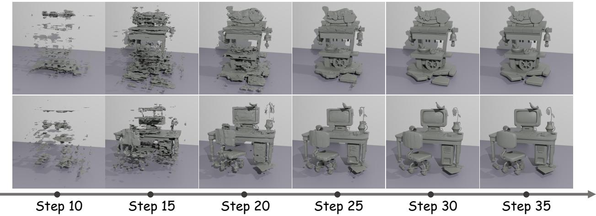  
Figure 6 Generation trajectory visualization. We use a fixed 50-step sampling schedule and visualize the predicted clean sample xˆ<sub>0</sub> at diferent generation steps. The intermediate predictions show that the model progressively forms the global structure in the early steps and then refines local details in later steps, eventually converging to the final output.

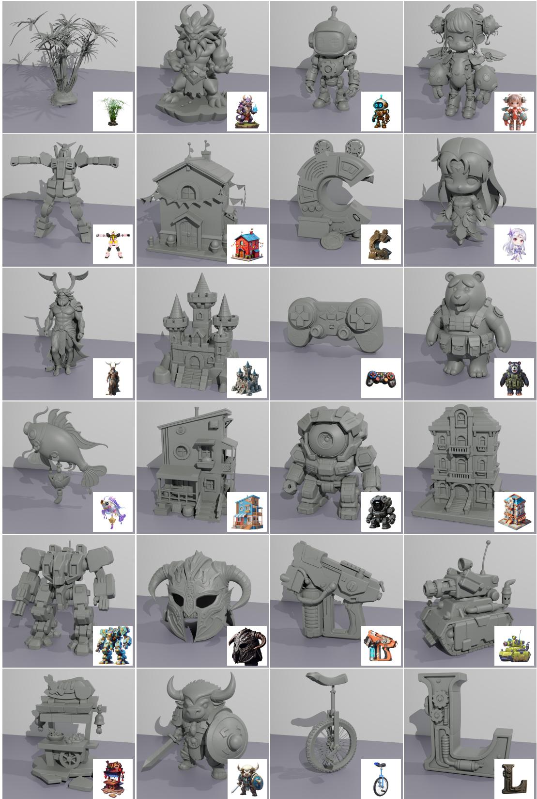  
Figure 7 Additional generation results. Generated geometries are shown with their corresponding input images inset at the bottom right.

Algorithm 1 Position Forcing training and inference in a PyTorch-like style.

```python
# vae.encode: returns latents and their query positions
# quantize: Q_R, including quantization and coordinate mapping
# dit: constructs 3D RoPE internally from rope_idx
# dit_cfg: applies image CFG with shared position conditions
# Training: use query positions from the frozen encoder
def training_loss(point_cloud, image):
with no_grad():
z0, query_pos = vae.encode(point_cloud)
image_cond = image_encoder(image)
t, noise = sample_time_and_noise(z0)
zt = (1 - t) * z0 + t * noise
# Quantize query positions at the current resolution
pos = quantize(query_pos, R(t))
v = dit(zt, t, image_cond, rope_idx=pos)
return mse(v, noise - z0)
# Inference: recover positions from predicted clean latents
@no_grad()
def sample(noise, image, times):
z = noise
image_cond = image_encoder(image)
# Initially R = 1: all tokens share the same coordinates
pos = zeros_like_positions(z)
for t, t_next in consecutive_pairs(times):
# Predict velocity using current position conditions
v = dit_cfg(z, t, image_cond, rope_idx=pos)
# Predict clean latents and recover token positions
z0_pred = z - t * v
predicted_pos = pos_decoder(z0_pred)
# Prepare position conditions for the next step
pos = quantize(predicted_pos, R(t_next))
# Advance sampling with an Euler update
z = z + (t_next - t) * v
# Decode the generated geometry
return mesh_decoder(z)
```

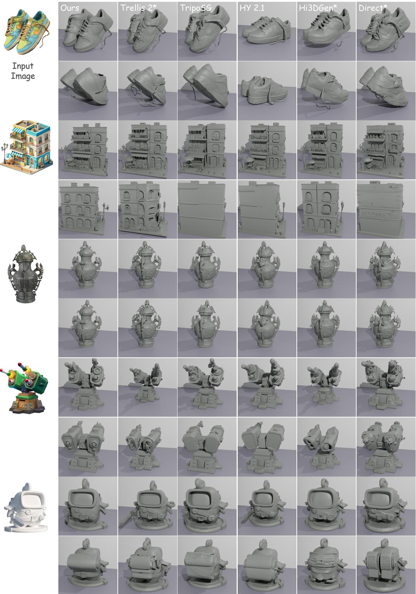  
Figure 8 Multi-view qualitative comparison of image-conditioned 3D generation. Position Forcing produces smoother surfaces and more geometrically plausible details, particularly in rear views, with fewer surface artifacts and structura distortions. Methods marked with \* adopt a two-stage generation framework.