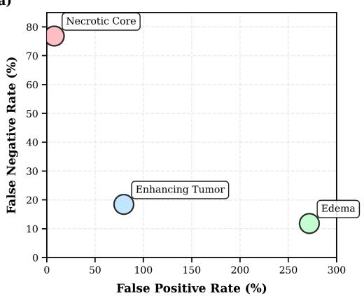
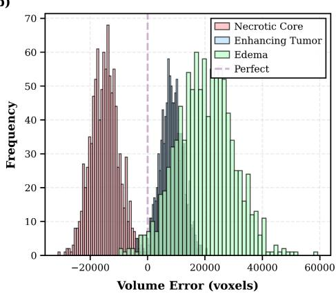
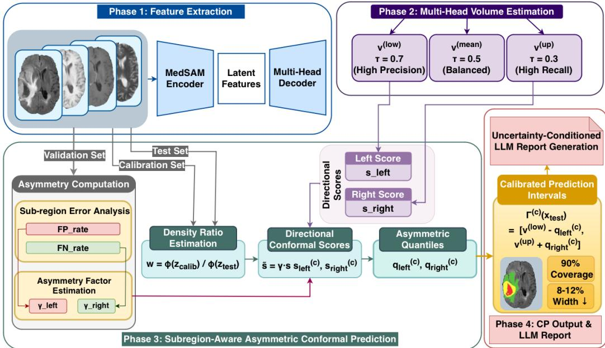
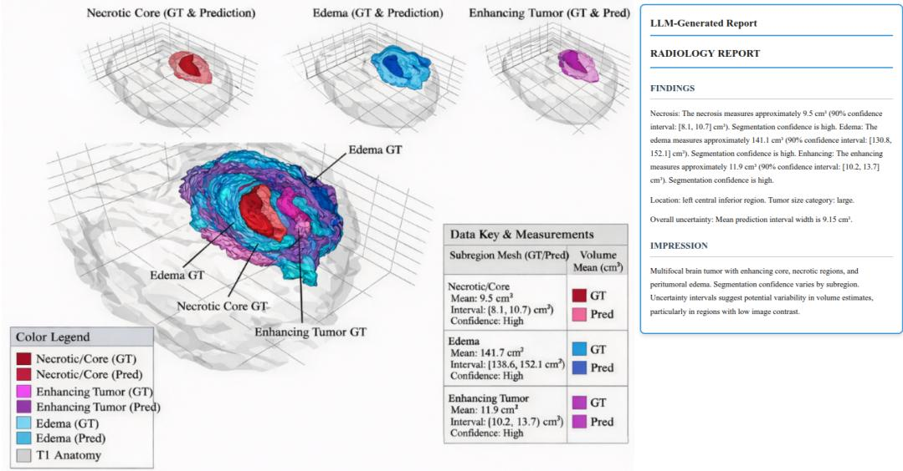

# Quantifying Volumetric Risk: Class-Aware Asymmetric Weighted Conformal Prediction for 3D Medical Image Segmentation

Shadi Alijani, Fereshteh Aghaee Meibodi, Homayoun Najjaran

University of Victoria, 800 Finnerty Road, Victoria, BC, Canada

## Abstract

Reliable volumetric segmentation is critical for clinical diagnostics, yet foundation models such as MedSAM remain deterministic and lack calibrated uncertainty under distribution shift. Existing conformal prediction methods ofer statistical guarantees but are frequently applied in 2D and assume symmetric error distributions, so they do not capture the class-specific biases that arise in 3D multi-class segmentation. We propose Class-Aware Asymmetric Weighted Conformal Prediction (CA-WCP), which combines latent-space density-ratio weighting for covariate shift with directional quantiles for the lower and upper volume bounds, and scales each bound by a class-specific asymmetry factor derived from validation-set false-positive and false-negative rates. We prove that CA-WCP retains the weightedexchangeability marginal coverage guarantee for every class, and we evaluate it on 3D brain tumor segmentation (BraTS 2020) and on a synthetic multiorgan CT benchmark constructed under covariate shift. On both benchmarks

the 95% Clopper–Pearson interval for the observed coverage of CA-WCP contains the nominal 90% level for every semantic class, while interval width is reduced by 8–14% relative to symmetric weighted conformal prediction. We further encode the calibrated intervals into structured prompts for a multimodal large language model to produce uncertainty-conditioned radiology reports, linking distribution-shift-aware uncertainty quantification to interpretable clinical communication.

Keywords: Conformal prediction, Uncertainty quantification, 3D medical image segmentation, Covariate shift, Foundation models, Radiology report generation

## 1. Introduction

Reliable volumetric segmentation is essential for clinical diagnostics and treatment planning in medical imaging. Foundation models such as the Segment Anything Model (SAM) [1] have demonstrated strong zero-shot transfer capabilities, leading to adaptations like MedSAM [2] that apply these models to the medical domain via large-scale pretraining and parameter-eficient fine-tuning. To address volumetric clinical applications, recent extensions further incorporate 3D context, either by redesigning the architecture for native volumetric processing or by introducing lightweight 3D adapters and prompt propagation mechanisms [3, 4].

However, most of these methods remain focused on improving segmentation accuracy, ofering little insight into prediction reliability or uncertainty calibration [5, 6], which is a critical requirement for clinical adoption. While prior eforts explored probabilistic or Bayesian models [7, 8, 9], conformal prediction (CP) [10] has emerged as a powerful framework for providing formal statistical guarantees on segmentation reliability.

Despite their success, conventional CP methods face two limitations in this context. First, they rely on the exchangeability assumption, which is often violated in real-world medical settings due to distribution shifts between training and deployment sites. This has motivated recent work in distribution-shift-aware CP that uses adaptive weighting of calibration statistics to restore target coverage [11, 12, 13]. Second, while recent work has explored CP for 3D medical imaging biomarkers [14, 15, 16, 17, 18], these methods predominantly target reconstruction metrics or trajectory prediction rather than multi-class volumetric segmentation under covariate shift. Existing volumetric CP formulations largely assume symmetric error distributions, which do not capture the class-specific asymmetric biases observed in multi-class segmentation tasks such as brain tumor analysis, where distinct structures exhibit diferent false-positive and false-negative patterns.

Separately, large language models (LLMs) have shown strong reasoning in medical question answering and report drafting [19, 20], but they lack a mechanism for statistical uncertainty quantification.

Motivated by these gaps, our work extends weighted CP to the volumetric 3D multi-class setting and integrates the resulting calibrated intervals with an LLM to produce uncertainty-aware clinical reports. A further practical limitation in the medical CP literature is reliance on single-modality datasets, owing to privacy constraints and annotation costs for multi-center clinical data. To test whether the directional error asymmetry we exploit reflects structure scale rather than brain tumor morphology specifically, we additionally construct a controlled synthetic CT benchmark with anatomically aligned ground-truth masks using a latent rectified flow generator for volumetric medical synthesis [21, 22].

Our main contributions are:

• A weighted conformal prediction framework for 3D volumetric segmentation that integrates class-conditional asymmetric calibration with MedSAM to provide uncertainty quantification under covariate shift.

• Directional quantiles that separately calibrate the lower and upper volume bounds, combined with asymmetry factors derived from validation-set FP/FN rates that add a conservative, class-specific margin on the side of the dominant error.

• A proof that CA-WCP retains the marginal coverage guarantee under weighted exchangeability with known likelihood ratios (Proposition 1, proved in Appendix A), together with an explicit statement of the approximation incurred when the likelihood ratios are estimated.

• An empirical evaluation on BraTS 2020 and on a controlled synthetic multi-organ CT benchmark, reporting exact k/n coverage with Clopper–Pearson intervals for every class.

• A framework for uncertainty-conditioned multimodal LLM report generation that encodes calibrated prediction intervals into structured prompts, together with a preliminary assessment by an independent radiologist blinded to the prompt configuration.

## 2. Background

## 2.1. Foundation Models for 2D and 3D Medical Segmentation

Medical image analysis has moved from task-specific architectures such as U-Net [23] toward foundation models that generalize across datasets and tasks [24, 25]. Among them, SAM [1] enables prompt-driven segmentation with strong zero-shot transfer, motivating specialized adaptations for medical imaging [26]. MedSAM [2], SAM-Med2D [27], and SAMed [28] adapt SAM for 2D medical images via large-scale pretraining, systematic fine-tuning, and eficient low-rank adaptation, respectively. To extend these capabilities to 3D, SAM-Med3D [3] and SAM3D [29] develop native 3D formulations, while MedSAM-2 [4] uses video-style prompt propagation. Despite their accuracy, these methods largely neglect uncertainty quantification and assume stable data distributions.

## 2.2. Uncertainty Quantification in Medical Segmentation

Quantifying uncertainty is critical for improving the robustness of medical segmentation models [26, 30, 31]. Early approaches included generative multi-hypothesis models such as the Probabilistic U-Net [7], semi-supervised consistency regularization [9], and uncertainty-aware loss functions [8]. Within the SAM family, uncertainty has been injected through adapters [32] or specialized fine-tuning, as in I-MedSAM [33] and U-MedSAM [34]. While these methods provide useful heuristics for model confidence, they generally lack the formal statistical guarantees ofered by CP.

## 2.3. Conformal Prediction and Distribution Shifts

A complementary line of work uses CP to provide statistical guarantees on segmentation reliability [35, 36]. While early CP methods focused on pixellevel uncertainty [37], later extensions introduced morphology-aware prediction sets [38]. To mitigate distribution shifts, weighted CP variants have been developed [39, 11], and TriadNet [40] laid the groundwork for multi-head uncertainty. Conformal methods have also been applied to 3D medical imaging biomarkers, including segmentation-derived metrics, image reconstruction, imaging inverse problems, and longitudinal trajectories [14, 15, 16, 17, 18]. Many CP approaches for segmentation nonetheless operate in 2D or at regionlevel volumetry [41, 36], and class efects are typically handled only implicitly through adaptive score functions. Group-conditional constructions instead partition the calibration set explicitly, and recent conformal predictive systems extend this idea to settings in which the error scale difers across groups [42]. Our framework calibrates class efects explicitly and couples them to the directional structure of the volumetric error.

## 2.4. LLMs in Medical Imaging and Uncertainty Communication

LLMs have recently demonstrated strong reasoning capabilities across a range of medical tasks. Med-PaLM [19] and GPT-4 [20, 43] show near expert-level performance on medical benchmarks, and vision-language models such as LLaVA-Med [44] enable image-grounded dialogue. Despite these advances, the integration of statistically calibrated uncertainty quantification into LLM-based medical systems remains limited.

## 3. Method

Notation. $v ^ { * }$ denotes ground-truth volume; $v ^ { \mathrm { l o w } } , v ^ { \mathrm { m e a n } } , v ^ { \mathrm { u p } }$ denote predicted volumes from three heads; γleft, γright denote asymmetry factors; $q _ { \mathrm { l e f t } } , q _ { \mathrm { r i g h t } }$ denote directional quantiles; $w _ { i }$ denotes density-ratio weights; and $c \in { \mathcal { C } }$ indexes semantic classes (tumor subregions in brain MRI, abdominal organs in CT). Throughout, α is the conformal miscoverage rate; the Tversky loss parameters are written $\alpha _ { T } , \beta _ { T }$

## 3.1. Problem Formulation

Given a trained segmentation model $f : \mathcal { X }  \mathcal { Y }$ mapping 3D medical images $\mathbf { x } \in \mathcal { X }$ to segmentations $\mathbf { y } \in \mathcal { V }$ , we seek calibrated predictive intervals for structure volumes $\operatorname { v o l } ( \mathbf { y } )$ . For multi-class segmentation we require intervals $\Gamma _ { \alpha } ( { \bf x } ) = [ \ell , u ]$ such that the true volume $v ^ { * }$ is contained with probability at least $1 - \alpha \cdot$

$$
\mathbb { P } ( v ^ { * } \in [ \ell , u ] ) \geq 1 - \alpha\tag{1}
$$

where α is the desired miscoverage rate $( \alpha = 0 . 1 0$ for 90% coverage throughout).

## 3.2. Multi-Head Volumetric Backbone

Following TriadNet [40], we adopt a multi-head architecture producing three segmentation estimates per input: a lower bound $f _ { \mathrm { l o w } }$ , a mean estimate $f _ { \mathrm { m e a n } }$ , and an upper bound $f _ { \mathrm { u p } }$ . The heads share an encoder but have separate decoder branches. They are trained with the Tversky loss [45] using diferent $\alpha _ { T }$ and $\beta _ { T }$ to control false positive and false negative penalties:

$$
\mathcal { L } _ { T } ( \mathbf { p } , \mathbf { y } ) = 1 - \frac { \sum _ { i } p _ { i } y _ { i } } { \sum _ { i } p _ { i } y _ { i } + \alpha _ { T } \sum _ { i } p _ { i } ( 1 - y _ { i } ) + \beta _ { T } \sum _ { i } ( 1 - p _ { i } ) y _ { i } }\tag{2}
$$

where the fraction is the Tversky index (a generalization of the Dice coeficient), so that minimizing $\mathcal { L } _ { T }$ maximizes overlap.

The binarization thresholds $\tau _ { \mathrm { l o w } }$ , τmean, $\tau _ { \mathrm { u p } }$ are fixed before calibration and are applied identically to the calibration and test volumes. CA-WCP is therefore a strictly post-hoc wrapper: it does not modify the segmentation masks, and segmentation accuracy (Dice) is by construction identical across all CP variants built on the same backbone.

## 3.3. Weighted Conformal Prediction

Given a calibration set $\mathcal { D } _ { \mathrm { c a l } } = \{ ( \mathbf { x } _ { i } , v _ { i } ^ { * } ) \} _ { i = 1 } ^ { n }$ and test point $\mathbf { x } _ { \mathrm { t e s t } } ,$ standard split CP computes conformal scores $s _ { i } = \operatorname* { m a x } ( v _ { i } ^ { * } - v _ { i } ^ { \mathrm { u p } } , v _ { i } ^ { \mathrm { l o w } } - v _ { i } ^ { * } )$ and forms the interval $[ v _ { \mathrm { t e s t } } ^ { \mathrm { l o w } } - q , \ v _ { \mathrm { t e s t } } ^ { \mathrm { u p } } + q ]$ . To handle covariate shift between calibration and test distributions, weighted conformal prediction [39, 11] assigns importance weights $w _ { i }$ to calibration samples. The weights are estimated with a probabilistic classifier $\phi$ trained to distinguish test latent features (label 1) from calibration latent features (label 0). Writing $\hat { p } ( \mathbf { z } ) = \mathbb { P } _ { \phi } ( \mathrm { l a b e l } = 1 \mid \mathbf { z } )$ 2 the density ratio at latent feature $\mathbf { z } _ { i }$ is estimated as

$$
w _ { i } = \frac { n _ { \mathrm { c a l } } } { n _ { \mathrm { t e s t } } } \cdot \frac { \hat { p } ( \mathbf { z } _ { i } ) } { 1 - \hat { p } ( \mathbf { z } _ { i } ) } ,\tag{3}
$$

where the prior factor $n _ { \mathrm { c a l } } / n _ { \mathrm { t e s t } }$ corrects for unequal set sizes; $w _ { \mathrm { t e s t } }$ is obtained in the same way from $\mathbf { z } _ { \mathrm { t e s t } }$ . Because Eq. (4) uses only normalized weights, any factor common to all samples, including this prior correction, cancels in the quantile.

For a target level $\beta \in ( 0 , 1 )$ , the weighted quantile $q _ { w } ( \beta )$ is defined as the infimum over values carrying suficient weighted probability mass, with a point mass at $+ \infty$ for the test point. Writing $\begin{array} { r } { W = \sum _ { j = 1 } ^ { n } w _ { j } + w _ { \mathrm { t e s t } } } \end{array}$ for the total mass and $\tilde { w } _ { i } = w _ { i } / W , \tilde { w } _ { \mathrm { t e s t } } = w _ { \mathrm { t e s t } } / W$ for the normalized weights,

(a)  

(b)  
  
Figure 1: Class-specific error patterns revealing asymmetric biases in brain tumor segmentation, measured on the validation split. (Left) False positive versus false negative rates. Rates are normalized by ground-truth volume $v ^ { * }$ (Eq. (5)), so values above 100% are well defined and indicate severe over-segmentation. Necrotic core shows a false-negative bias, edema a large false-positive bias, and enhancing tumor a moderate false-positive bias. (Right) Distribution of volume errors across classes, showing the skew that motivates asymmetric interval design.

$$
q _ { w } ( \beta ) = \operatorname* { i n f } \Big \{ q \in \mathbb { R } \ : \ \sum _ { i = 1 } ^ { n } \tilde { w } _ { i } \mathbb { 1 } [ s _ { i } \leq q ] \ + \ \tilde { w } _ { \mathrm { t e s t } } \mathbb { 1 } [ \infty \leq q ] \ \geq \ \beta \Big \}\tag{4}
$$

Symmetric weighted CP instantiates Eq. (4) at $\beta = 1 - \alpha$ on the two-sided score $s _ { i }$

## 3.4. Class-Aware Asymmetric Weighted Conformal Prediction

Motivation. Split CP assumes symmetric error distributions and produces intervals $[ v ^ { \mathrm { l o w } } - q , v ^ { \mathrm { u p } } + q ]$ with equal margins on both sides. Multi-class medical segmentation, however, exhibits class-specific asymmetric biases: different semantic classes show distinct error patterns (Figure 1). Brain tumor segmentation shows systematic under-segmentation of necrotic core and oversegmentation of edema. Such patterns make symmetric intervals ineficient, producing under-coverage in some classes and over-conservatism in others.

  
Figure 2: Overview of the proposed CA-WCP pipeline: feature extraction, multi-threshold segmentation, and weighted asymmetric conformal prediction.

Figure 2 gives an overview of the full pipeline.

Error-rate definitions. For class $c ,$ let $\mathbf { y } ^ { ( c ) }$ and $\hat { \mathbf { y } } ^ { ( c ) }$ denote the groundtruth and predicted (mean-head) binary masks. We define the volumetric false positive and false negative rates, both normalized by ground-truth volume:

$$
\mathrm { F P } _ { \mathrm { r a t e } } ^ { ( c ) } = \frac { \vert \hat { \mathbf { y } } ^ { ( c ) } \setminus \mathbf { y } ^ { ( c ) } \vert } { \vert \mathbf { y } ^ { ( c ) } \vert } , \qquad \mathrm { F N } _ { \mathrm { r a t e } } ^ { ( c ) } = \frac { \vert \mathbf { y } ^ { ( c ) } \setminus \hat { \mathbf { y } } ^ { ( c ) } \vert } { \vert \mathbf { y } ^ { ( c ) } \vert } .\tag{5}
$$

Both rates are averaged over $\mathcal { D } _ { \mathrm { v a l } }$

Method. We learn class-specific asymmetric quantiles $( q _ { \mathrm { l e f t } } ^ { ( c ) } , q _ { \mathrm { r i g h t } } ^ { ( c ) } )$ for

each $c \in { \mathcal { C } }$ . The predictive interval is

$$
\Gamma ^ { ( c ) } ( \mathbf { x _ { \mathrm { t e s t } } } ) = \left[ v _ { \mathrm { t e s t } } ^ { ( c , \mathrm { l o w } ) } - \gamma _ { \mathrm { l e f t } } ^ { ( c ) } q _ { \mathrm { l e f t } } ^ { ( c ) } , \ v _ { \mathrm { t e s t } } ^ { ( c , \mathrm { u p } ) } + \gamma _ { \mathrm { r i g h t } } ^ { ( c ) } q _ { \mathrm { r i g h t } } ^ { ( c ) } \right]\tag{6}
$$

calibrated from directional conformal scores computed separately:

$$
s _ { \mathrm { l e f t } } ^ { ( c ) } = \mathrm { m a x } ( v ^ { ( c , \mathrm { l o w } ) } - v ^ { * , ( c ) } , 0 )\tag{7}
$$

$$
s _ { \mathrm { r i g h t } } ^ { ( c ) } = \mathrm { m a x } ( v ^ { * , ( c ) } - v ^ { ( c , \mathrm { u p } ) } , 0 )\tag{8}
$$

The asymmetry factors are determined on $\mathcal { D } _ { \mathrm { v a l } }$ by a piecewise rule in $\mathrm { F N } _ { \mathrm { r a t e } } ^ { ( c ) }$ and $\mathrm { F P } _ { \mathrm { r a t } \epsilon } ^ { ( c ) }$ :

$$
\gamma _ { \mathrm { l e f t } } ^ { ( c ) } = \left\{ \begin{array} { l l } { 1 . 0 + 2 . 0 \cdot \mathrm { F N } _ { \mathrm { r a t e } } ^ { ( c ) } } & { \mathrm { i f ~ } \mathrm { F N } _ { \mathrm { r a t e } } ^ { ( c ) } > 0 . 5 } \\ { 1 . 0 + 0 . 5 \cdot \left( \mathrm { F P } _ { \mathrm { r a t e } } ^ { ( c ) } - 1 . 0 \right) } & { \mathrm { e l s e ~ i f ~ } \mathrm { F P } _ { \mathrm { r a t e } } ^ { ( c ) } \geq 1 . 5 } \\ { 1 . 0 + 0 . 4 \cdot \left( \mathrm { F P } _ { \mathrm { r a t e } } ^ { ( c ) } - 0 . 7 \right) } & { \mathrm { e l s e ~ i f ~ } \mathrm { F P } _ { \mathrm { r a t e } } ^ { ( c ) } \in \left( 0 . 7 , 1 . 5 \right) } \\ { 1 . 0 } & { \mathrm { o t h e r w i s e } } \end{array} \right.\tag{9}
$$

$$
\gamma _ { \mathrm { r i g h t } } ^ { ( c ) } = \left\{ \begin{array} { l l } { 1 . 0 + 2 . 0 \cdot \mathrm { F N } _ { \mathrm { r a t e } } ^ { ( c ) } } & { \mathrm { i f ~ \mathrm { F N } _ { \mathrm { r a t e } } ^ { ( c ) } > 0 . 5 ~ } } \\ { 1 . 0 } & { \mathrm { o t h e r w i s e } } \end{array} \right.\tag{10}
$$

Branches are evaluated top to bottom and the first matching condition is applied, so the rule is well defined when several conditions hold simultaneously. Every branch yields $\gamma \geq 1$ , a property used in the coverage analysis below. The breakpoints and coeficients are fixed on $\mathcal { D } _ { \mathrm { v a l } }$ prior to calibration and are not tuned on $\mathcal { D } _ { \mathrm { c a l } }$ or on the test data.

The directional quantiles are computed from the unscaled directional scores, each at level $1 - \alpha / 2$ using the density-ratio weighted quantile of

Eq. (4):

$$
\begin{array} { r } { q _ { \mathrm { l e f t } } ^ { ( c ) } = q _ { w } \left( 1 - \frac { \alpha } { 2 } \right) \mathrm { c o m p u t e d ~ o n ~ } \{ s _ { \mathrm { l e f t } } ^ { ( c ) } ( i ) \} _ { i \in \mathcal { D } _ { \mathrm { c a l } } } \mathrm { ~ w i t h ~ w e i g h t s ~ } \{ w _ { i } \} _ { i } } \end{array}\tag{11}
$$

$$
\begin{array} { r } { q _ { \mathrm { r i g h t } } ^ { ( c ) } = q _ { w } \left( 1 - \frac { \alpha } { 2 } \right) \mathrm { c o m p u t e d ~ o n ~ } \{ s _ { \mathrm { r i g h t } } ^ { ( c ) } ( i ) \} _ { i \in \mathcal { D } _ { \mathrm { c a l } } } \mathrm { ~ w i t h ~ w e i g h t s ~ } \{ w _ { i } \} _ { i } } \end{array}\tag{12}
$$

The per-direction level $1 - \alpha / 2$ is what makes the union bound in Appendix A yield overall coverage $1 - \alpha$ . Setting $\gamma _ { \mathrm { l e f t } } ^ { ( c ) } = \gamma _ { \mathrm { r i g h t } } ^ { ( c ) } = 1$ yields the Directional WCP baseline; the comparison between the Directional WCP and CA-WCP rows of Table 1 therefore constitutes a direct ablation of the asymmetry mechanism, holding the backbone, the weighting, and the calibration split fixed.

Relation to prior CP techniques. CA-WCP composes three established conformal ingredients: density-ratio weighted CP for covariate shift [39, 11]; directional asymmetric scores, in the spirit of conformalized quantile regression [46]; and class-conditional (Mondrian) calibration [10], as also used for subgroup-equitable coverage in medical imaging [47]. Our contribution is not any single ingredient but their integration in the volumetric multi-class setting, together with the validation-derived asymmetry factors $\gamma ^ { ( c ) }$ that couple interval geometry to the observed per-class FP/FN error structure. That coupling is absent from a naive composition of the three techniques, and it is what distinguishes CA-WCP from applying Mondrian calibration to a symmetric weighted score. In the nested-set formulation of conformal prediction [48], the construction corresponds to a two-parameter family of nested intervals whose lower and upper radii are calibrated separately, rather than the single-radius family underlying symmetric split CP.

Coverage guarantee.

Proposition 1 (Marginal Coverage). Fix a class c and let $\gamma _ { \mathrm { l e f t } } ^ { ( c ) } , \gamma _ { \mathrm { r i g h t } } ^ { ( c ) } \geq 1$ be hyperparameters learned from $\mathcal { D } _ { \mathrm { v a l } }$ , independent of $\mathcal { D } _ { \mathrm { c a l } }$ and of the test point. Suppose the calibration samples $\{ ( \mathbf { x } _ { i } , v _ { i } ^ { * } ) \} _ { i = 1 } ^ { n }$ and the test point $( \mathbf { x } _ { \mathrm { t e s t } } , v _ { \mathrm { t e s t } } ^ { * } )$ are weighted exchangeable in the sense of [39] (likelihood ratio d $\tilde { P } _ { X } / \mathrm { d } P _ { X } )$ , with weights proportional to the true likelihood ratio between the test and calibration covariate distributions, and that each directional quantile is computed at level $1 - \alpha / 2$ via $E q . \ ( 4 )$ . Then, conditional on $\gamma ^ { ( c ) }$

$$
\begin{array} { r } { \mathbb { P } \big ( v _ { \mathrm { t e s t } } ^ { * , ( c ) } \in \Gamma ^ { ( c ) } ( \mathbf { x } _ { \mathrm { t e s t } } ) \mid \gamma ^ { ( c ) } \big ) \ge 1 - \alpha . } \end{array}
$$

Remark 1. The guarantee is marginal and holds separately for each class $c ;$ we do not claim simultaneous coverage of all classes at level $1 - \alpha$ , which would require either a correction across $| \mathcal { C } |$ targets or an explicitly multivariate construction such as copula-based multi-target conformal prediction [49]. Proposition 1 assumes the true likelihood-ratio weights. In practice $\phi$ is estimated from latent features, so the weights are approximate and the guarantee degrades by a term governed by the weight-estimation error [39, 50]. The factors $\gamma ^ { ( c ) } \geq 1$ do not alter this statement: they can only widen the interval, on the side where validation errors concentrate, and so act as a conservative margin when the weights are estimated, but they are neither derived from nor a bound on the weight-estimation error. We therefore report exact $k / n$ coverage with 95% Clopper–Pearson intervals throughout Sec. 4; on both benchmarks the intervals for CA-WCP contain the nominal 90% level for every class.

## 3.5. Uncertainty-Conditioned Multimodal LLM Report Generation

To translate the quantitative uncertainty estimates into clinically readable form, we condition a multimodal LLM on the calibrated volumetric intervals.

Confidence Level Derivation. For each class c we compute the relative interval width (RW), normalizing the interval against the mean-head volume and using the same asymmetry-scaled endpoints as Eq. (6):

$$
\mathrm { R W } ^ { ( c ) } = \frac { \left( v ^ { ( c , \mathrm { u p } ) } + \gamma _ { \mathrm { r i g h t } } ^ { ( c ) } q _ { \mathrm { r i g h t } } ^ { ( c ) } \right) - \left( v ^ { ( c , \mathrm { l o w } ) } - \gamma _ { \mathrm { l e f t } } ^ { ( c ) } q _ { \mathrm { l e f t } } ^ { ( c ) } \right) } { v ^ { ( c , \mathrm { m e a n } ) } }\tag{13}
$$

RW is mapped to discrete confidence levels using thresholds set from quantiles of the validation-set RW distribution: High (RW < 35%), Moderate (35%– 60%), and Low (> 60%). All volumes are converted to milliliters using image spacing before being passed to the LLM.

Uncertainty-Conditioned Prompting. We employ GPT-4o at temperature 0.0 to minimize sampling variability, with a multimodal prompt containing (1) the MR image, (2) the generated segmentation mask, and (3) a structured text representation of the conformal outputs including the derived confidence level. The prompt instructs the model to adapt its language to the confidence level, using more cautious phrasing for low-confidence predictions. Reports follow radiology convention with a “Findings” section and an “Impression” section.

## 4. Experiments

## 4.1. Implementation Details

We adapt MedSAM [2] for brain tumor segmentation using multi-modal MR images (T1, T1ce, T2, FLAIR). The image encoder is TinyViT with output dimensions $2 5 6 \times 6 4 \times 6 4$ . We fine-tune the multi-head decoder jointly on the BraTS 2020 training split for 200 epochs using Adam (base learning rate $3 \times 1 0 ^ { - 5 }$ , cosine decay, batch size 2). Following TriadNet [40], the three heads are parameterized by varying the Tversky weights: the lower head emphasizes precision with $( \alpha _ { T } , \beta _ { T } ) = ( 0 . 3 , 0 . 7 )$ , the mean head is symmetric at (0.5, 0.5), and the upper head emphasizes recall at (0.7, 0.3). Logits are binarized with fixed thresholds $\tau _ { \mathrm { l o w } } ~ = ~ 0 . 7$ $\tau _ { \mathrm { { m e a n } } } ~ = ~ 0 . 5$ $\tau _ { \mathrm { { u p } } } ~ = ~ 0 . 3$ , held constant across calibration and test.

For latent feature extraction we take global-average-pooled TinyViT features after the penultimate block and apply $L _ { 2 }$ normalization, giving 256- dimensional vectors. The density-ratio estimator $\phi$ is a logistic regression classifier trained on calibration versus test latent features $( n _ { \mathrm { c a l } } = 6 6 , n _ { \mathrm { t e s t } } =$ 73, with the unequal set sizes handled by the prior factor in Eq. (3)) and evaluated with 20-fold stratified cross-validation; we report the mean ROC-AUC $( 0 . 7 8 \pm 0 . 0 3 )$ as a measure of separability. Because $\phi$ is a linear model on normalized features, no kernel bandwidth is involved. We fix the random seed to 42 for data splits, network initialization, and classifier training.

## 4.2. Experimental Setup

Dataset. We use BraTS 2020 [51, 52, 53], a multi-class task with three tumor classes (necrotic core, edema, enhancing tumor) exhibiting distinct error patterns. We use a four-way split: training $( n ~ = ~ 2 0 0 )$ , validation $( n = 3 0 )$ , calibration $( n = 6 6 )$ , and test $( n = 7 3$ from unseen institutions), with no overlap between sets. Calibration and test are drawn from diferent institutional cohorts, inducing a natural covariate shift that the density-ratio estimator is designed to correct.

Synthetic CT benchmark. To isolate the dependence of the directional asymmetry on structure scale, we construct a synthetic multi-organ CT dataset using NV-Generate-CTMR [22], built on the MAISI-v2 latent rectified flow architecture [21]. We generate 500 whole-body CT volumes with paired anatomically aligned masks: 300 are used to fine-tune the Med-SAM multi-head backbone, and the remaining 200 are partitioned into validation $( n = 5 0 )$ , calibration $( n = 5 0 )$ , and test $( n = 1 0 0 )$ sets. To simulate an acquisition shift, the test set is generated under diferent textual conditioning prompts and structure-scale parameters. The asymmetry factors γ are computed from scratch on the CT validation set rather than reused from BraTS. We evaluate three organs spanning a range of scales: liver (large), kidneys (medium), and spleen (small).

Metrics. We report (1) Coverage, the fraction of test cases with $v ^ { \ast } \in$ $\Gamma ( \mathbf { x } )$ , given as an exact $k / n$ fraction with a 95% Clopper–Pearson interval; (2) Interval Width, the mean $u - \ell$ in $\mathrm { m L } ;$ and (3) Dice, reported once per backbone since CP is post-hoc and does not alter the masks.

Baselines. We compare against (1) Unweighted $C P ,$ a single shared quantile with no density-ratio correction; (2) Symmetric $W C P$ [41], densityratio weighting with symmetric intervals computed on the maximum directional score; and (3) Directional $W C P \ ( \gamma \equiv 1 )$ , which uses the directional quantiles of Eqs. (11)–(12) but applies no asymmetry factors. All three share the backbone, the density-ratio weights, and the calibration split with CA-WCP.

## 4.3. Results

Table 1 reports per-class coverage and interval width on BraTS 2020. With $n = 7 3$ test subjects, coverage is quantized to multiples of $1 / 7 3 ;$ the achievable values bracketing the 90% target are $6 5 / 7 3 = 8 9 . 0 \%$ and $6 6 / 7 3 =$ 90.4%.

Symmetric WCP falls below the target on edema and over-covers enhancing tumor, where its Clopper–Pearson interval [95.1–100.0] excludes the nominal level, consistent with the class-specific error skew in Figure 1. Replacing the single max-score quantile by two directional quantiles (Directional WCP, $\gamma \equiv 1 )$ removes most of this ineficiency: mean width falls from 9.7 to 6.7 mL (Table 2), because the larger error direction no longer sets both margins. Its point coverage, however, lies below the target for all three classes (87.7%, 84.9%, and 89.0%), although each Clopper–Pearson interval still contains 90% at $n = 7 3$

CA-WCP applies the asymmetry factors computed on $\mathcal { D } _ { \mathrm { v a l } }$ by Eqs. (9)– (10): $\gamma _ { \mathrm { l e f t } } ~ = ~ \gamma _ { \mathrm { r i g h t } } ~ = ~ 2 . 5 4$ for necrotic core (FN-driven branch), $\gamma _ { \mathrm { l e f t } } =$ 1.86 and $\gamma _ { \mathrm { r i g h t } } = 1 . 0 0$ for edema (FP-driven branch), and $\gamma _ { \mathrm { l e f t } } = 1 . 0 8$ and $\gamma _ { \mathrm { r i g h t } } ~ = ~ 1 . 0 0$ for enhancing tumor. These factors raise point coverage to $6 6 / 7 3 = 9 0 . 4 \%$ for every class at a mean width of 8.5 mL, which is 12% narrower than Symmetric WCP and 27% wider than Directional WCP. The asymmetry factors therefore trade part of the eficiency gained by the directional quantiles for coverage at or above the nominal level; with a single calibration/test split of this size, the coverage diference between Directional WCP and CA-WCP is not statistically resolved (Sec. 5.1).

Synthetic CT benchmark. Table 3 reports the same comparison on the synthetic multi-organ CT data under the induced conditioning shift. The symmetric weighted baseline shows the scale-dependent pattern seen in MRI: over-coverage of the largest structure and under-coverage of the smallest. CA-WCP moves all three organs toward the nominal level while reducing mean width. Because the shift mechanism and the anatomical scale range are fixed by construction here, this result separates the dependence of the asymmetry on structure scale from many of the confounds present in acquired multi-center data.

Table 1: Per-class results on BraTS 2020 (target coverage 90%, n = 73). Coverage is an exact k/73 fraction with a 95% Clopper–Pearson interval. Width in mL.
<table><tr><td></td><td colspan="2">Necrosis</td><td colspan="2">Edema</td><td colspan="2">Enhancing</td></tr><tr><td>Method</td><td>Cov (%) [95% CI] Wid.</td><td></td><td>Cov (%) [95% CI] Wid.</td><td></td><td>Cov (%) [95% CI] Wid.</td><td></td></tr><tr><td>Unweighted CP</td><td>84.9 [74.6–92.2]</td><td>4.2</td><td>78.1 [66.9–86.9]</td><td>21.5</td><td>97.3 [90.5–99.7]</td><td>6.8</td></tr><tr><td>Symmetric WCP</td><td>90.4 [81.2–96.1]</td><td>3.9</td><td>86.3 [76.2–93.2]</td><td>19.2</td><td>100.0 [95.1–100.0] 5.9</td><td></td></tr><tr><td>Directional WCP (γ ≡ 1) 87.7 [77.9–94.2]</td><td></td><td>2.8</td><td>84.9 [74.6–92.2]</td><td>12.5</td><td>89.0 [79.5–95.1]</td><td>4.8</td></tr><tr><td>Ours (CA-WCP)</td><td>90.4 [81.2–96.1]</td><td>3.6</td><td>90.4 [81.2–96.1]</td><td>16.8</td><td>90.4 [81.2–96.1]</td><td>5.1</td></tr><tr><td colspan="7">Backbone Dice (identical for all rows): necrosis 0.63, edema 0.81, enhancing 0.88</td></tr></table>

Table 2: Aggregate results on BraTS 2020 with a fixed MedSAM backbone. Coverage and width are the unweighted mean of the three per-class values in Table 1. Dir. q: directional quantiles; Class γ: asymmetry factors; Shift: density-ratio weighting. Bold coverage denotes the value closest to the nominal 90% target; coverage above the target reflects over-conservatism, and a smaller width obtained at coverage below the target is not a like-for-like eficiency gain.
<table><tr><td>Method</td><td>Dice Cov. (%) Wid. (mL) Dir. q Class γ Shift</td><td></td><td></td><td></td><td></td><td></td></tr><tr><td>MedSAM [2] (no CP)</td><td>0.77</td><td></td><td></td><td></td><td></td><td></td></tr><tr><td>+ Unweighted CP</td><td>0.77</td><td>86.8</td><td>10.8</td><td>No</td><td>No</td><td>No</td></tr><tr><td>+ Symmetric WCP [41]</td><td>0.77</td><td>92.2</td><td>9.7</td><td>No</td><td>No</td><td>Yes</td></tr><tr><td>+ Directional WCP (γ ≡ 1)</td><td>0.77</td><td>87.2</td><td>6.7</td><td>Yes</td><td>No</td><td>Yes</td></tr><tr><td>+ Ours (CA-WCP)</td><td>0.77</td><td>90.4</td><td>8.5</td><td>Yes</td><td>Yes</td><td>Yes</td></tr></table>

Table 3: Synthetic multi-organ CT benchmark under induced conditioning shift (target coverage 90%, n = 100). Coverage is an exact k/100 fraction with a 95% Clopper–Pearson interval. Width in mL.
<table><tr><td colspan="3">Symmetric WCP</td><td colspan="2">Ours (CA-WCP)</td></tr><tr><td>Organ (Scale)</td><td>Cov (%) [95% CI] Wid.</td><td></td><td>Cov (%) [95% CI] Wid.</td><td></td></tr><tr><td>Liver (large)</td><td>98.0 [93.0–99.8]</td><td>145.2</td><td>91.0 [83.6–95.8]</td><td>128.4</td></tr><tr><td>Kidneys (medium)</td><td>89.0 [81.2–94.4]</td><td>32.1</td><td>90.0 [82.4–95.1]</td><td>29.5</td></tr><tr><td>Spleen (small)</td><td>84.0 [75.3–90.6]</td><td>18.5</td><td>90.0 [82.4–95.1]</td><td>16.8</td></tr><tr><td colspan="3">Backbone Dice: liver 0.92, kidneys 0.88, spleen 0.85</td><td></td><td></td></tr></table>

## 4.4. Uncertainty-Conditioned Report Generation

We compare two prompt configurations that difer in the information supplied to the model: Image+Segmentation, and Ours (Image+Segmentation+Uncertainty), the latter including the calibrated intervals and the derived confidence level. Generated reports were compared against reference reports for 10 test cases. Because BraTS lacks native radiology reports, the reference reports were written by a board-certified radiologist who mapped the ground-truth segmentation masks to a standardized clinical template. A second, independent radiologist, blinded to the prompt configuration, rated the outputs on factual accuracy and on concordance between the hedging language and the underlying interval width (Table 4). The BLEU-4 score of 0.42 is high for clinical text; it follows from prompting the LLM to produce structured findings from quantitative intervals and scoring them against templated references, which constrains lexical variance compared with open-ended dictation. Supplying the calibrated intervals raises uncertainty concordance from 2.1 to 4.6, indicating that the model’s expression of confidence tracks the conformal bounds rather than the visual appearance of the segmentation alone. Figure 3 shows a representative case with its generated report.

Table 4: Assessment of uncertainty-conditioned report generation on 10 BraTS test cases. BLEU-4 is computed against the templated reference reports; factual accuracy and uncertainty concordance are rated on a 1–5 scale by an independent radiologist blinded to the prompt configuration.
<table><tr><td>Prompt configuration</td><td></td><td></td><td>BLEU-4 Factual Acc. Uncert. Concord.</td><td></td></tr><tr><td>Image+Seg</td><td>0.28</td><td> $3 . 8 ~ / ~ 5 . 0$ </td><td>2.1 / 5.0</td><td></td></tr><tr><td>Ours (Image+Seg+UQ)</td><td>0.42</td><td>4.8 / 5.0</td><td>4.6 / 5.0</td><td></td></tr></table>

## 5. Discussion

Analysis of asymmetric calibration. Comparing Symmetric WCP, Directional WCP $( \gamma \equiv 1 )$ , and CA-WCP in Table 1 separates the two mechanisms. The directional quantiles supply the eficiency: they prevent the dominant error direction from widening both margins, which reduces mean width by roughly 30% relative to Symmetric WCP. The asymmetry factors then add a conservative, class-specific margin on the side where validation errors concentrate. Because $\gamma \geq 1$ , this margin can only widen the interval and cannot invalidate the guarantee of Proposition 1; in practice it compensates for the approximate density-ratio weights, under which the $\gamma \equiv 1$ intervals fell slightly below the target in point coverage. Whether that shortfall is systematic or a finite-sample efect cannot be decided from a single split of 73 test subjects, so we report the width cost of the margin explicitly and leave the choice between the two operating points to the user. On the synthetic CT benchmark, CA-WCP shows the same qualitative behavior relative to Symmetric WCP: the over-covered large structure loses excess width and the under-covered small structure gains coverage, which suggests that the efect depends on the directional error structure rather than on brain tumor morphology specifically.

  
Figure 3: Representative patient: ground-truth and predicted tumor subregions overlaid on the T1-weighted MR anatomy, with the uncertainty-conditioned report generated from the calibrated volumetric intervals.

Inference cost is identical to standard split CP because the quantiles are precomputed during calibration.

## 5.1. Limitations and Future Directions

Our evaluation uses one clinical cohort and one synthetic benchmark. The synthetic CT data are generated by a learned model and therefore inherit its anatomical priors, so while they isolate the efect of structure scale under a controlled shift, validation on acquired multi-center abdominal CT remains necessary before drawing conclusions about deployment on real CT. Test cohorts of $n = 7 3$ and $n = 1 0 0$ also place a floor on the precision with which coverage can be estimated, which is why we report exact Clopper–Pearson intervals rather than point estimates alone. All results come from a single calibration/test split; in particular, the coverage gap between Directional WCP and $\mathrm { C A - W C P }$ lies within the sampling uncertainty at $n = 7 3$ , and repeated random splits would be needed to establish whether weight-estimation error causes systematic under-coverage of the $\gamma \equiv 1$ intervals. The reader assessment of generated reports covers 10 cases and a single rater, and is best read as an indication of how uncertainty conditioning changes reporting language rather than as a clinical validation.

Several directions follow naturally: a repeated-split analysis of the Directional WCP and CA-WCP operating points; a sweep of the generator’s conditioning gap to map how coverage and width respond to shift magnitude; instance-adaptive asymmetry factors for heterogeneous tumors; and multi-reader evaluation of uncertainty-conditioned reporting on large paired image-report corpora such as MR-RATE [54].

## 6. Conclusion

We introduced CA-WCP, a class-aware asymmetric weighted conformal prediction framework for volumetric uncertainty quantification in 3D medical image segmentation. We showed that combining density-ratio weighting with directional quantiles calibrated at level $1 - \alpha / 2$ preserves the marginal coverage guarantee under weighted exchangeability, and we gave the proof together with an explicit account of the approximation introduced by estimated weights. Empirically, on BraTS 2020 and on a controlled synthetic multi-organ CT benchmark, the 95% Clopper–Pearson intervals for observed coverage contain the nominal 90% level for every class, and average interval widths are 8–14% smaller than those of the symmetric weighted baseline; most of this gain comes from the directional quantiles, with the asymmetry factors adding a conservative class-specific margin. We further showed that the calibrated intervals can be encoded into prompts for a multimodal LLM to produce uncertainty-conditioned reports whose hedging language tracks the underlying interval width. Because CA-WCP is a post-hoc wrapper, it adds this calibrated, shift-aware uncertainty without modifying the underlying segmentation model.

## Appendix A. Proof of Proposition 1

Proof. Fix the class c and condition throughout on $\gamma _ { \mathrm { l e f t } } ^ { ( c ) } , \gamma _ { \mathrm { r i g h t } } ^ { ( c ) }$ . Because these are functions of $\mathcal { D } _ { \mathrm { v a l } }$ only, and $\mathcal { D } _ { \mathrm { v a l } }$ is disjoint from $\mathcal { D } _ { \mathrm { c a l } }$ and from the test point, conditioning on them does not disturb the weighted exchangeability of the calibration scores and the test score.

Step 1 (per-direction coverage). Consider the left direction. The scores $s _ { \mathrm { l e f t } } ^ { ( c ) } ( 1 ) , \dots , s _ { \mathrm { l e f t } } ^ { ( c ) } ( n )$ and the test score $s _ { \mathrm { l e f t } } ^ { ( c ) } ( \mathrm { t e s t } )$ are deterministic functions of the corresponding data points and are therefore weighted exchangeable whenever the data are. By the weighted conformal prediction guarantee of Tibshirani et al. [39], applied with the true likelihood-ratio weights and the weighted quantile of Eq. (4) evaluated at level $1 - \alpha / 2$ as in Eq. (11),

$$
\begin{array} { r } { \mathbb { P } \big ( s _ { \mathrm { l e f t } } ^ { ( c ) } ( \mathrm { t e s t } ) \le q _ { \mathrm { l e f t } } ^ { ( c ) } \big ) \ge 1 - \frac { \alpha } { 2 } . } \end{array}
$$

The identical argument applied to Eq. (12) gives $\mathbb { P } \big ( s _ { \mathrm { r i g h t } } ^ { ( c ) } ( \mathrm { t e s t } ) \le q _ { \mathrm { r i g h t } } ^ { ( c ) } \big ) \ge$ $1 - { \frac { \alpha } { 2 } }$

Step 2 (monotone widening). Every branch of Eqs. (9)–(10) satisfies $\gamma \geq 1$ : the FN-driven branch adds a non-negative multiple of $\mathrm { F N } _ { \mathrm { r a t e } } ^ { ( c ) } > 0 . 5 $ ; the two FP-driven branches add non-negative increments on their respective domains $( \mathrm { F P } _ { \mathrm { r a t e } } ^ { ( c ) } \geq 1 . 5$ and $\mathrm { F P } _ { \mathrm { r a t e } } ^ { ( c ) } \in ( 0 . 7 , 1 . 5 ) )$ ; and the default branch equals 1. Since the directional scores are non-negative and $q _ { \mathrm { l e f t } } ^ { ( c ) } , q _ { \mathrm { r i g h t } } ^ { ( c ) } \ge 0$ , we have $\gamma _ { \mathrm { l e f t } } ^ { ( c ) } q _ { \mathrm { l e f t } } ^ { ( c ) } \ge q _ { \mathrm { l e f t } } ^ { ( c ) }$ and $\gamma _ { \mathrm { r i g h t } } ^ { ( c ) } q _ { \mathrm { r i g h t } } ^ { ( c ) } \geq q _ { \mathrm { r i g h t } } ^ { ( c ) }$ . Hence

$$
\begin{array} { r } { \big \{ s _ { \mathrm { l e f t } } ^ { ( c ) } ( \mathrm { t e s t } ) \leq q _ { \mathrm { l e f t } } ^ { ( c ) } \big \} \subseteq \big \{ s _ { \mathrm { l e f t } } ^ { ( c ) } ( \mathrm { t e s t } ) \leq \gamma _ { \mathrm { l e f t } } ^ { ( c ) } q _ { \mathrm { l e f t } } ^ { ( c ) } \big \} , } \end{array}
$$

and likewise on the right, so the bounds of Step 1 are preserved after scaling.

Step 3 (union bound). By Eqs. (7)–(8) and (6), the event $v _ { \mathrm { t e s t } } ^ { \ast , ( c ) } \notin$ $\Gamma ^ { ( c ) } ( \mathbf { x } _ { \mathrm { t e s t } } )$ holds if and only if $s _ { \mathrm { l e f t } } ^ { ( c ) } ( \mathrm { t e s t } ) > \gamma _ { \mathrm { l e f t } } ^ { ( c ) } q _ { \mathrm { l e f t } } ^ { ( c ) } \mathrm { o r } s _ { \mathrm { r i g h t } } ^ { ( c ) } ( \mathrm { t e s t } ) > \gamma _ { \mathrm { r i g h t } } ^ { ( c ) } q _ { \mathrm { r i g h t } } ^ { ( c ) } ,$ corresponding to the true volume falling below the scaled lower endpoint or above the scaled upper endpoint. Therefore

$$
\begin{array} { r l } & { \mathbb { P } \big ( v _ { \mathrm { t e s t } } ^ { * , ( c ) } \notin \Gamma ^ { ( c ) } ( \mathbf { x } _ { \mathrm { t e s t } } ) \big ) \leq \mathbb { P } \big ( s _ { \mathrm { l e f t } } ^ { ( c ) } ( \mathrm { t e s t } ) > \gamma _ { \mathrm { l e f t } } ^ { ( c ) } q _ { \mathrm { l e f t } } ^ { ( c ) } \big ) + \mathbb { P } \big ( s _ { \mathrm { r i g h t } } ^ { ( c ) } ( \mathrm { t e s t } ) > \gamma _ { \mathrm { r i g h t } } ^ { ( c ) } q _ { \mathrm { r i g h t } } ^ { ( c ) } \big ) } \\ & { \qquad \leq \frac { \alpha } { 2 } + \frac { \alpha } { 2 } = \alpha , } \end{array}
$$

which gives the claim.

## References

[1] A. Kirillov, E. Mintun, N. Ravi, H. Mao, C. Rolland, L. Gustafson, T. Xiao, S. Whitehead, A. C. Berg, W.-Y. Lo, et al., Segment anything, in: 2023 IEEE/CVF international conference on computer vision (ICCV), IEEE, 2023, pp. 3992–4003.

[2] J. Ma, Y. He, F. Li, L. Han, C. You, B. Wang, Segment anything in medical images, Nature Communications 15 (1) (2024) 654.

[3] H. Wang, S. Guo, J. Ye, Z. Deng, J. Cheng, T. Li, J. Chen, Y. Su, Z. Huang, Y. Shen, et al., Sam-med3d: a vision foundation model for general-purpose segmentation on volumetric medical images, IEEE Transactions on Neural Networks and Learning Systems (2025).

[4] J. Zhu, A. Hamdi, Y. Qi, Y. Jin, J. Wu, Medical sam 2: Segment medical images as video via segment anything model 2, arXiv preprint arXiv:2408.00874 (2024).

[5] E. Begoli, T. Bhattacharya, D. Kusnezov, The need for uncertainty quantification in machine-assisted medical decision making, Nature Machine Intelligence 1 (1) (2019) 20–23.

[6] T. Nair, D. Precup, D. L. Arnold, T. Arbel, Exploring uncertainty measures in deep networks for multiple sclerosis lesion detection and segmentation, Medical image analysis 59 (2020) 101557.

[7] S. A. A. Kohl, B. Romera-Paredes, C. Meyer, J. D. Fauw, J. R. Ledsam, K. H. Maier-Hein, S. M. A. Eslami, D. Rezende, O. Ronneberger, A

probabilistic u-net for segmentation of ambiguous images, in: NeurIPS, 2018.

[8] A. Mehrtash, W. M. Wells, C. M. Tempany, P. Abolmaesumi, T. Kapur, Confidence calibration and predictive uncertainty estimation for deep medical image segmentation, IEEE transactions on medical imag ing 39 (12) (2020) 3868–3878.

[9] L. Yu, S. Wang, X. Li, C.-W. Fu, P.-A. Heng, Uncertainty-aware selfensembling model for semi-supervised 3d left atrium segmentation, in: International conference on medical image computing and computerassisted intervention, Springer, 2019, pp. 605–613.

[10] V. Vovk, A. Gammerman, G. Shafer, Algorithmic learning in a random world, Springer, 2005.

[11] S. Alijani, H. Najjaran, Wqlcp: Weighted adaptive conformal prediction for robust uncertainty quantification under distribution shifts, in: Proceedings of the Computer Vision and Pattern Recognition Conference, 2025, pp. 1732–1741.

[12] A. Bhatnagar, H. Wang, C. Xiong, Y. Bai, Improved online conformal prediction via strongly adaptive online learning, in: International Conference on Machine Learning, PMLR, 2023, pp. 2337–2363.

[13] K. Kasa, G. W. Taylor, Empirically validating conformal prediction on modern vision architectures under distribution shift and long-tailed data, arXiv preprint arXiv:2307.01088 (2023).

[14] M. Cheung, A. Veeraraghavan, G. Balakrishnan, Compass: Robust feature conformal prediction for medical segmentation metrics, in: International Conference on Learning Representations, Vol. 2026, 2026, pp. 134348–134381.

[15] M. Y. Cheung, T. J. Netherton, L. E. Court, A. Veeraraghavan, G. Balakrishnan, Metric-guided conformal bounds for probabilistic image reconstruction, in: International Workshop on Uncertainty for Safe Utilization of Machine Learning in Medical Imaging, Springer, 2025, pp. 169–179.

[16] J. Wen, R. Ahmad, P. Schniter, Task-driven uncertainty quantification in inverse problems via conformal prediction, in: European Conference on Computer Vision, Springer, 2024, pp. 182–199.

[17] J. Wen, R. Ahmad, P. Schniter, Minimax multi-target conformal prediction with applications to imaging inverse problems, arXiv preprint arXiv:2511.13533 (2025).

[18] V. Tassopoulou, C. Stamouli, H. Shou, G. J. Pappas, C. Davatzikos, Uncertainty-calibrated prediction of randomly-timed biomarker trajectories with conformal bands, Advances in Neural Information Processing Systems 38 (2026) 115656–115688.

[19] K. Singhal, S. Azizi, T. Tu, S. S. Mahdavi, J. Wei, H. W. Chung, N. Scales, A. Tanwani, H. Cole-Lewis, S. Pfohl, et al., Large language models encode clinical knowledge, Nature 620 (7972) (2023) 172–180.

[20] J. Achiam, S. Adler, S. Agarwal, L. Ahmad, I. Akkaya, F. L. Aleman, D. Almeida, J. Altenschmidt, S. Altman, S. Anadkat, et al., Gpt-4 technical report, arXiv preprint arXiv:2303.08774 (2023).

[21] C. Zhao, P. Guo, D. Yang, Y. He, Y. Tang, B. Simon, M. Belue, S. Harmon, B. Turkbey, D. Xu, Maisi-v2: Accelerated 3d high-resolution medical image synthesis with rectified flow and region-specific contrastive loss, in: Proceedings of the AAAI Conference on Artificial Intelligence, Vol. 40, 2026, pp. 13088–13098.

[22] NVIDIA Medtech, NV-Generate-CTMR: Oficial implementation of MAISI-v2 for synthetic CT and MR generation, https://github. com/NVIDIA-Medtech/NV-Generate-CTMR, code release accompanying MAISI-v2; accessed 2026-08-18 (2025).

[23] O. Ronneberger, P. Fischer, T. Brox, U-net: Convolutional networks for biomedical image segmentation, in: International Conference on Medical image computing and computer-assisted intervention, Springer, 2015, pp. 234–241.

[24] W. Khan, S. Leem, K. B. See, J. K. Wong, S. Zhang, R. Fang, A comprehensive survey of foundation models in medicine, IEEE Reviews in Biomedical Engineering (2025).

[25] M. Kaliappan, E. Mariappan, V. Manimaran, B. Revathi, Unified vision transformer for multimodal medical image classification, Biomedical Signal Processing and Control 122 (2026) 110431.

[26] S. Alijani, J. Fayyad, H. Najjaran, Vision transformers in domain adaptation and domain generalization: a study of robustness, Neural Computing and Applications 36 (29) (2024) 17979–18007.

[27] D. Cheng, Z. Qin, Z. Jiang, S. Zhang, Q. Lao, K. Li, Sam on medical images: A comprehensive study on three prompt modes, arXiv preprint arXiv:2305.00035 (2023).

[28] K. Zhang, D. Liu, Customized segment anything model for medical image segmentation, arXiv preprint arXiv:2304.13785 (2023).

[29] N.-T. Bui, D.-H. Hoang, M.-T. Tran, G. Doretto, D. Adjeroh, B. Patel, A. Choudhary, N. Le, Sam3d: Segment anything model in volumetric medical images, in: 2024 IEEE International Symposium on Biomedical Imaging (ISBI), IEEE, 2024, pp. 1–4.

[30] C. Lu, A. N. Angelopoulos, S. Pomerantz, Improving trustworthiness of ai disease severity rating in medical imaging with ordinal conformal prediction sets, in: International conference on medical image computing and computer-assisted intervention, Springer, 2022, pp. 545–554.

[31] J. Vazquez, J. C. Facelli, Conformal prediction in clinical medical sciences, Journal of Healthcare Informatics Research 6 (3) (2022) 241–252.

[32] M. Jiang, J. Zhou, J. Wu, T. Wang, Y. Jin, M. Xu, Uncertainty-aware adapter: Adapting segment anything model (sam) for ambiguous medical image segmentation, arXiv e-prints (2024) arXiv–2403.

[33] X. Wei, J. Cao, Y. Jin, M. Lu, G. Wang, S. Zhang, I-medsam: Implicit

medical image segmentation with segment anything, in: European Conference on Computer Vision, Springer, 2024, pp. 90–107.

[34] X. Wang, X. Liu, P. Huang, P. Huang, S. Hu, H. Zhu, U-medsam: Uncertainty-aware medsam for medical image segmentation, in: Medical Image Segmentation Challenge, Springer, 2024, pp. 206–217.

[35] Y. Zhang, S. Wang, Y. Zhang, D. Z. Chen, Rr-cp: Reliable-region-based conformal prediction for trustworthy medical image classification, in: International workshop on uncertainty for safe utilization of machine learning in medical imaging, Springer, 2023, pp. 12–21.

[36] M. Gade, K. M. Nguyen, S. Gedde, A. Fernandez-Quilez, Impact of uncertainty quantification through conformal prediction on volume assessment from deep learning-based mri prostate segmentation, Insights into Imaging 15 (1) (2024) 286.

[37] L. Mossina, J. Dalmau, L. Andéol, Conformal semantic image segmentation: Post-hoc quantification of predictive uncertainty, in: Proceedings of the IEEE/CVF Conference on Computer Vision and Pattern Recognition, 2024, pp. 3574–3584.

[38] L. Mossina, C. Friedrich, Conformal prediction for image segmentation using morphological prediction sets, in: International Conference on Medical Image Computing and Computer-Assisted Intervention, Springer, 2025, pp. 78–88.

[39] R. J. Tibshirani, R. Foygel Barber, E. Candes, A. Ramdas, Conformal

prediction under covariate shift, Advances in neural information processing systems 32 (2019).

[40] B. Lambert, F. Forbes, S. Doyle, M. Dojat, Triadnet: Sampling-free predictive intervals for lesional volume in 3d brain mr images, in: International Workshop on Uncertainty for Safe Utilization of Machine Learning in Medical Imaging, Springer, 2023, pp. 32–41.

[41] B. Lambert, F. Forbes, S. Doyle, M. Dojat, Robust conformal volume estimation in 3d medical images, in: International Conference on Medical Image Computing and Computer-Assisted Intervention, Springer, 2024, pp. 633–643.

[42] R. Zhang, P. Zhou, A mondrian conformal predictive system with improved decision trees for uncertainty quantification under heteroscedasticity, Pattern Recognition (2025) 112338.

[43] H. Nori, N. King, S. M. McKinney, D. Carignan, E. Horvitz, Capabilities of gpt-4 on medical challenge problems, arXiv preprint arXiv:2303.13375 (2023).

[44] C. Li, C. Wong, S. Zhang, N. Usuyama, H. Liu, J. Yang, T. Naumann, H. Poon, J. Gao, Llava-med: Training a large language-and-vision assistant for biomedicine in one day, Advances in neural information pro cessing systems 36 (2023) 28541–28564.

[45] S. S. M. Salehi, D. Erdogmus, A. Gholipour, Tversky loss function for image segmentation using 3d fully convolutional deep networks, in: In-

ternational workshop on machine learning in medical imaging, Springer, 2017, pp. 379–387.

[46] Y. Romano, E. Patterson, E. Candes, Conformalized quantile regression, Advances in neural information processing systems 32 (2019).

[47] C. Lu, A. Lemay, K. Chang, K. Höbel, J. Kalpathy-Cramer, Fair conformal predictors for applications in medical imaging, in: Proceedings of the AAAI conference on artificial intelligence, Vol. 36, 2022, pp. 12008– 12016.

[48] C. Gupta, A. K. Kuchibhotla, A. Ramdas, Nested conformal prediction and quantile out-of-bag ensemble methods, Pattern Recognition 127 (2022) 108496.

[49] S. Messoudi, S. Destercke, S. Rousseau, Copula-based conformal prediction for multi-target regression, Pattern Recognition 120 (2021) 108101.

[50] R. F. Barber, E. J. Candes, A. Ramdas, R. J. Tibshirani, Predictive inference with the jackknife+, The Annals of Statistics 49 (1) (2021) 486–507.

[51] B. H. Menze, A. Jakab, S. Bauer, J. Kalpathy-Cramer, K. Farahani, J. Kirby, Y. Burren, N. Porz, J. Slotboom, R. Wiest, et al., The multimodal brain tumor image segmentation benchmark (brats), IEEE transactions on medical imaging 34 (10) (2014) 1993–2024.

[52] S. Bakas, H. Akbari, A. Sotiras, M. Bilello, M. Rozycki, J. S. Kirby, J. B. Freymann, K. Farahani, C. Davatzikos, Advancing the cancer genome at-

las glioma mri collections with expert segmentation labels and radiomic features, Scientific data 4 (1) (2017) 170117.

[53] S. Bakas, M. Reyes, A. Jakab, S. Bauer, M. Rempfler, A. Crimi, R. T. Shinohara, C. Berger, S. M. Ha, M. Rozycki, et al., Identifying the best machine learning algorithms for brain tumor segmentation, progression assessment, and overall survival prediction in the brats challenge, arXiv preprint arXiv:1811.02629 (2018).

[54] Forithmus, MR-RATE: A vision-language foundation model and dataset for magnetic resonance imaging, https://huggingface.co/datasets/ Forithmus/MR-RATE, 705,254 brain and spine MRI volumes from 83,425 patients with paired radiology reports; accessed 2026-08-18 (2026).