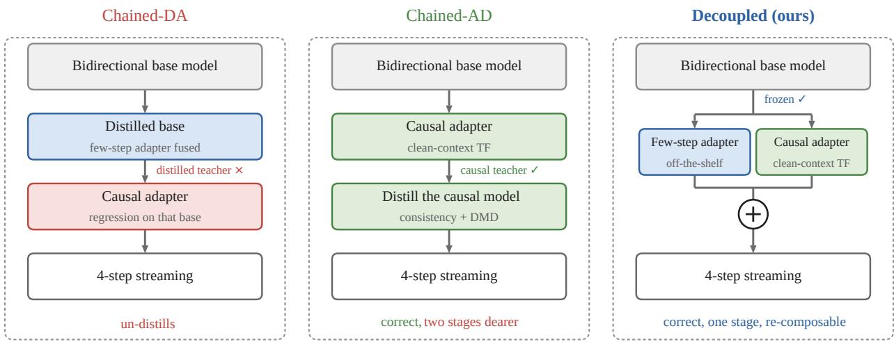
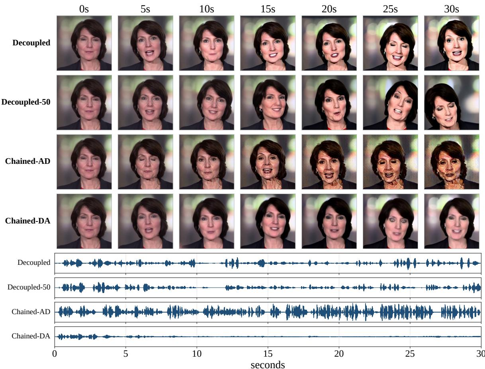
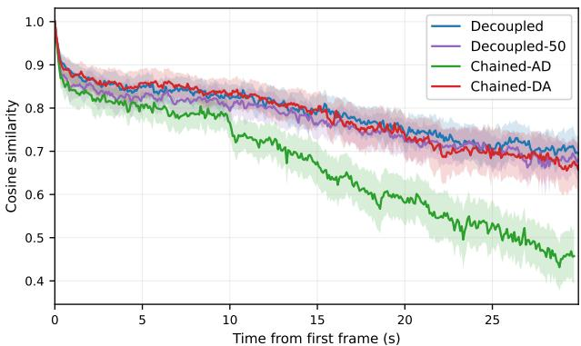
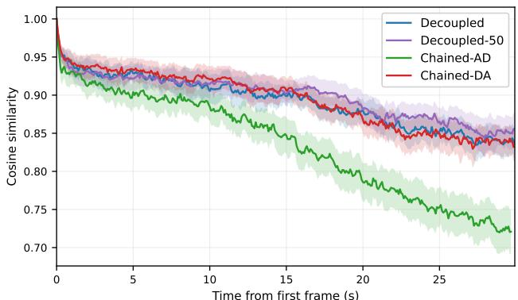
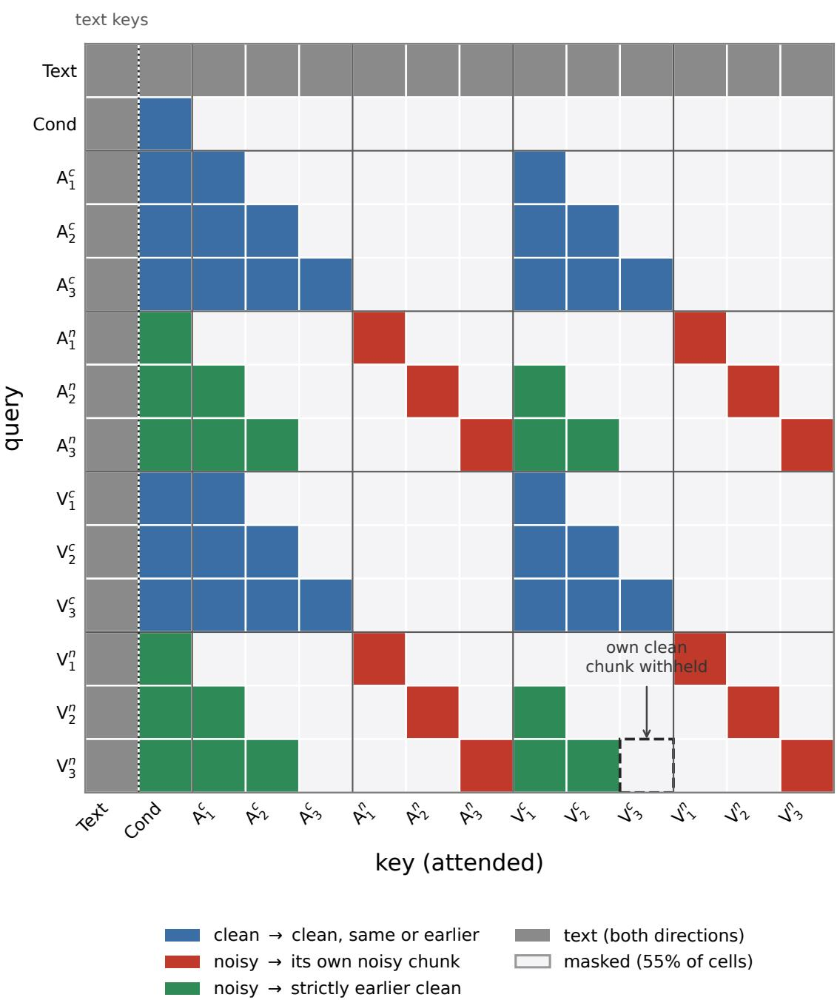
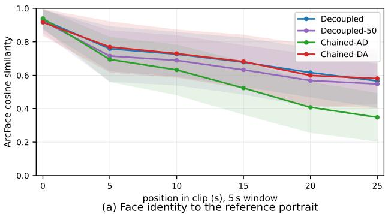
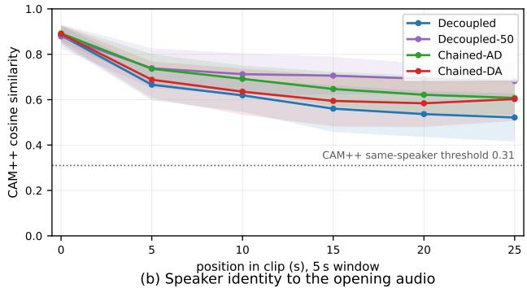

# REAL-TIME JOINT AUDIO–VIDEO GENERATION BY PARALLEL ADAPTER COMPOSITION

Jingyu Li1\* Xiaoxiao Xiang1\* Yiwen Guo2† 1LIGHTSPEED 2Independent Researcher

## ABSTRACT

Deploying a joint audio–video diffusion transformer for real-time, interactive generation normally requires two essential modifications: block-autoregressive attention, so frames can be emitted before the whole clip is finished, and few-step sampling, so each block is cheap. Conventionally, the streaming video literature obtains both capabilities from a chained pipeline. It first distills a bidirectional teacher into a causal student, then into a few-step one, or proceeds in reverse order. Each stage of such a chain fine-tunes the weights the previous one produced, so a later objective can undo an earlier capability. Following the idea of model merging, we show that on a packed audio–video backbone the two capabilities can be acquired in parallel. A causal adapter is trained against the frozen backbone, and an off-the-shelf few-step adapter provides the few-step capability. As the two edit different functional axes, we predict, and then verify, that their weight-update directions are near-orthogonal, without any explicit orthogonality constraint during training. Orthogonal updates should combine without interfering, so parallel composition is a direct sum. The two adapters are simply added at inference, with no joint training, yielding few-step, streaming audio–video whose image quality tracks the bidirectional teacher. Compared to the chained baselines, the composed model matches or beats them on most metrics, making parallel composition a practical approach. The resulting streaming system generates joint audio–video in real time, ≈26 fps at 480×832 without quantization, and sustains 30 s of continuous generation with stable image quality.

## 1 INTRODUCTION

Joint audio–video generation has matured quickly: recent models produce synchronized audio and video at high fidelity (Liu et al., 2026; HaCohen et al., 2026; MiniMax, 2026; Seedance Team, 2026). Most of them, however, are bidirectional: the frame count must be fixed before sampling, nothing is emitted until the last step finishes, and every step costs quadratically in the requested duration. Applications built on real-time interaction (Bai et al., 2026; Huang et al., 2026) — interactive avatars, live agents — call for the opposite properties: a bounded time-to-first-frame, a per-chunk cost independent of session length, and no length ceiling.

Two capabilities are required. Causalization partitions the clip into chunks and denoises chunk k from chunks 0:k−1, so the outputs are emitted incrementally and a chunk is played as soon as it is ready. Few-step generation shrinks the per-chunk cost from tens of denoising steps to a handful, which is the key to real-time generation. Learning them may take several training stages, and each stage may train a single objective or both. CausVid and Self-Forcing (Yin et al., 2025; Huang et al., 2025) learn both under one distillation objective, training a causal few-step student directly from the bidirectional teacher. Causal Forcing and its successor (Zhu et al., 2026; Zhao et al., 2026) split the process, training a multi-step autoregressive model first and distilling it to few steps afterwards; OmniForcing (Su et al., 2026) runs the reverse order, converting a distilled bidirectional few-step generator into an autoregressive one. The split has its appeal: each stage optimizes a single objective rather than mixing several, can start from an existing checkpoint, and can be analyzed in isolation. But the training stages interact: whichever runs first changes the base the second trains on. We refer to the sequential recipes as chained in what follows.

  
Figure 1: Three routes to a few-step streaming model, and what the order costs. Distilling last keeps the chain viable, at two extra stages; the reverse order, trained with a plain regression loss, un-distills. The mechanisms are in §3.1.

IQA ↑ Sync-C ↑ IQA drift ↑We follow the idea of splitting the learning of causalization and few-step distillation, and ask whether the chain is necessary to achieve the desired capabilities. The experimental results demonstrate that it is not: the two capabilities (b) dashed: 50-step teachercan be acquired in parallel, by weight addition at inference. The principle is model merging / task arithmetic (Ilharco et al., 2023): updates fine-tuned independently against one frozen base can be added in weight space, in the smalledit regime, while each keeps its function. Our route does exactly this. The causal adapter $\Delta _ { c }$ is trained against the frozen W with clean-context teacher forcing—a plain flow-matching regression, and the only objective we train. The few-step adapter $\Delta _ { d }$ is off the shelf, distilled under bidirectional attention where distillation is already solved. The two are then added at inference, with no joint or chained training, so neither stage ever sees a base the other has altered. Two chained baselines are included for comparison: CHAINED-DA (distill, then causalize) retrains the causal adapter on the distilled weights with the plain flow-matching regression, the same order as OmniForcing (Su et al., 2026). CHAINED-AD (causalize, then distill) is the causal-forcing recipe (Zhu et al., 2026; Zhao et al., 2026). The differences between the three approaches can be seen in Figure 1, and our recipe is denoted as DECOUPLED.

Our contributions are threefold. (1) Parallel composition works: the two adapters, trained independently against the one frozen backbone and simply added at inference, match the teacher on appearance and the single-frame distribution, and beat CHAINED-DA on most held-out metrics, while trailing CHAINED-AD on lip sync. There is no chained or joint training, none of the chains’ extra stages, and the causal adapter stays reusable across step counts and on both the undistilled and the distilled weights (§4.2). (2) A real-time streaming system from short-clip training: the composed model generates joint audio–video at ≈26 fps at 480×832 on six GPUs without quantization, and a causal adapter trained on 5–10 s clips extrapolates to stable 30 s generation, where CHAINED-DA decays and falls silent (§4.2, Table 2). (3) A predicted, then verified, geometry: the two updates read overlapping input subspaces but write into near-orthogonal directions, so their sum needs no constraint, and weight cancellation is ruled out as CHAINED-DA’s failure mode (§4.3). All comparisons share one pipeline and reference the teacher’s own generation (Table 1); the ordering carries over to three public benchmarks scored against real sources (§4.2, Appendix G).

## 2 RELATED WORK

Joint audio–video generation. Video generation has been studied for years, but the focus has been mostly on the visual modality alone (Yang et al., 2024; Kong et al., 2024; Wan Team, 2025), with no accompanying audio. Audio driven portrait animation (Prajwal et al., 2020; Cui et al., 2024; Gan et al., 2025) couples the two, generating video conditioned on a driving audio track; the coupling is one-way, the video following the audio, which itself cannot be freely prompted. Generating both jointly is developing rapidly (Liu et al., 2026; HaCohen et al., 2026; MiniMax, 2026; NVIDIA, 2026), the two modalities produced simultaneously by one model. LTX-2 (HaCohen et al., 2026) uses a two-tower structure, one tower per modality, with cross-attention sharing knowledge between the towers to keep the two synchronized. In Cosmos 3 and MiniMax-H3, audio and video tokens are arranged in a single sequence processed by one DiT.

Autoregressive and streaming diffusion. Diffusion Forcing (Chen et al., 2024) and Rolling Diffusion (Ruhe et al., 2024) apply per-position noise levels, so early positions with less noise are generated first. A family of later methods distills a bidirectional teacher into a causal few-step student. CausVid (Yin et al., 2025) initializes the causal student on the teacher’s ODE pairs, then refines it with asymmetric DMD. Self-Forcing (Huang et al., 2025) additionally trains on the student’s own rollouts to close the train–test gap. Self-Forcing++ (Cui et al., 2025) scales AR video generation to minute-long videos. OmniForcing (Su et al., 2026) is the closest work: it brings the same line to joint audio–video, but as a multi-stage chain that first distills a bidirectional few-step generator and then converts it to autoregressive, the order our CHAINED-DA instantiates in plain form. The recipe is involved, and that order is the weakest fourstep system in Table 1. Causal Forcing (Zhu et al., 2026) and its successor (Zhao et al., 2026) run the stages in the reverse order, training a multi-step autoregressive model first and distilling it last with consistency and distributionmatching objectives on the student’s own rollouts; this is the recipe our CHAINED-AD follows. Others scale or extend chunkwise autoregression (Kim et al., 2024; Henschel et al., 2024; Chen et al., 2025; Sand.ai, 2025); all are video-only except OmniForcing.

Model merging and adapter composition. Model merging, surveyed by Yang et al. (2026), combines independently fine-tuned models by arithmetic on their weights, e.g. task arithmetic (Ilharco et al., 2023), TIES (Yadav et al., 2023) and DARE (Yu et al., 2024), and rests on weight disentanglement (Ortiz-Jimenez et al., 2023; Jin et al., 2025). For LoRA, OSRM (Zhang & Zhou, 2025) imposes orthogonality on the subspaces before fine-tuning. In this work, two adapters are learned under heterogeneous conditions (bidirectional distillation vs. blockcausal causalization) and edit different functional axes; they therefore tend to be near-orthogonal and add directly. Avatar-Forever (Li et al., 2026) likewise trains two branches in parallel and merges them in weight space, but for audio-driven avatars, where the audio track is given rather than generated, and without any analysis of when the sum is safe.

## 3 METHOD

The backbone throughout is MiniMax-H3 in its first-frame-conditioned audio–video (FL2VA) configuration, which runs 50 bidirectional denoising steps per generation. It is a diffusion transformer trained by rectified flow (Liu et al., 2023; Lipman et al., 2023) to regress the instantaneous velocity $( t = 1 - \sigma ; t { = } 1$ clean); its architecture and VAE grid are given in Appendix B. This undistilled model is the TEACHER of Table 1. The few-step adapter $\Delta _ { d }$ is off the shelf; the causal adapter $\Delta _ { c }$ is trained against the frozen backbone. Both are LoRAs, and they are added at inference.

## 3.1 LIMITATIONS OF THE CHAINED BASELINES

In the chained routes, the training order of the adapters may result in different performance, as the second adapter is trained on the weights of $W + \Delta _ { \mathrm { f i r s t } }$

CHAINED-DA (distill, then causalize) fuses the public lightx2v Turbo LoRA (lightx2v, 2026), a third-party 4-step distillation of W, into the backbone, then trains a fresh causal adapter $\Delta _ { c } ^ { \prime }$ on the distilled weights $W ^ { \prime } = \bar { W } + \Delta _ { d }$ by teacher forcing (§3.2) with the plain flow-matching objective of $\operatorname { E q . 3 }$

However, $\Delta _ { d }$ predicts where a large jump lands rather than the instantaneous velocity the teacher regresses, so $W ^ { \prime }$ no longer minimizes the flow-matching objective; training $\Delta _ { c } ^ { \prime }$ with that objective then pulls $\Delta _ { d } { ' } s$ jump field back toward instantaneous velocity and un-distills it—four steps may no longer suffice.

CHAINED-AD (causalize, then distill) keeps the causal stage against the frozen W and distills the few-step property afterwards on the causal student itself, following the causal-forcing++ recipe (Zhao et al., 2026): training on the student’s own no-gradient rollouts, with consistency targets along the teacher’s Euler trajectory and a DMD stage (Appendix J). The route is viable (§4.2), but it comprises three stages and three objectives, two of them entangled with the streaming cache, and the result is tied to the weights it was trained on.

The two chains thus differ in both order and objective, and both share two structural limitations. First, errors propagate along the chain: each adapter trains on what the previous one produced, so an early weakness becomes part of the next stage’s training environment. The un-distillation of CHAINED-DA is one instance; the anchor and online critic that CHAINED-AD needs to keep its rollouts stable is another. Second, a chained adapter cannot reuse existing components: the few-step capability of CHAINED-AD must be distilled on the causal model, where nothing off-theshelf exists, and every chained adapter only works on the base it was trained on (§4.3). The parallel route removes both: each capability trains against the same frozen $W ,$ so the two can be optimized independently and either side can be an existing component. We take the few-step adapter off the shelf and train only the causal one, a single plain regression (§3.2) with no ODE solver, EMA target, or critic. The rest of this section develops it.

## 3.2 CLEAN-CONTEXT TEACHER FORCING

In streaming video generation, a video is split into chunks, and each chunk is generated autoregressively. Chunk k is denoised from noise, conditioned on the finished chunks before it,

$$
\pmb { x } _ { k } \sim p _ { \Delta _ { c } } \big ( \pmb { x } _ { k } \mid \bar { \pmb { x } } _ { 0 } , \dots , \bar { \pmb { x } } _ { k - 1 } \big ) ,\tag{1}
$$

where x¯ marks a chunk committed at full quality. In this work, we train $\Delta _ { c }$ by teacher forcing: the clean history $[ \pmb { x } _ { 0 } , \dotsc , \pmb { x } _ { k - 1 } ]$ serves as the condition for $\scriptstyle { \mathbf { { \mathit { x } } } } _ { k }$ . A naive way to train this is random-prefix causal fine-tuning: sample a split index i per example, freeze chunks $< i$ at their clean values, and denoise chunk i under a block-causal mask at one global noise level. Its drawback is that each iteration supervises a single chunk.

Doubled token axis. We instead duplicate the token axis of each modality. With $\mathbf { \boldsymbol { x } } ^ { v } , \mathbf { \boldsymbol { x } } ^ { a }$ the clean video and audio latents, we form $\tilde { \mathbf { \ b { x } } } ^ { v } = [ \mathbf { \ b { x } } ^ { v } ; \mathbf { \ b { x } } _ { \sigma } ^ { v } ]$ and $\mathbf { \bar { x } } ^ { a } = [ \mathbf { x } ^ { a } ; \mathbf { x } _ { \sigma } ^ { a } ]$ ], where $\pmb { x } _ { \sigma } ^ { m }$ is the noisy latent at level $\sigma .$ . The clean and noisy latents are concatenated along the time dimension and share identical rotary positions. Each noisy chunk i draws its own step index $s _ { i } \sim \mathcal { U } \{ 0 , \dots , 9 9 9 \}$ and reads the noise levels $\sigma _ { i } ^ { v } , \sigma _ { i } ^ { a }$ from the video and audio schedules at that index, so one forward pass sees every chunk at a different noise level. The two modalities share the index $s _ { i }$ , keeping video and audio at the same stage of denoising within a chunk.

Mask and loss. A block-causal mask is applied to the attention matrix A of the transformer. A noisy chunk i may attend its own noisy tokens and its clean history $< i ,$ , never the clean copy of chunk i. Let $b ( \cdot )$ be a row’s chunk index and $c ( \cdot )$ the indicator that it belongs to the clean half. For query q and key k, attention is permitted iff

$$
\underbrace { c _ { q } \wedge c _ { k } \wedge ( b _ { k } \leq b _ { q } ) } _ { \mathrm { c l e a n c o n t e x t } } \vee \underbrace { \neg c _ { q } \wedge \neg c _ { k } \wedge ( b _ { k } = b _ { q } ) } _ { \mathrm { i n t r a - c h u n k } } \vee \underbrace { \neg c _ { q } \wedge c _ { k } \wedge ( b _ { k } < b _ { q } ) } _ { \mathrm { c l e a n h i s t o r y } } ,\tag{2}
$$

with text rows bidirectionally visible and conditioning rows at chunk index −1 so they precede all content. The second clause is what lets the two modalities share knowledge inside a chunk. The third clause is the constraint that matters: of the clean tokens, a noisy chunk reads only strictly earlier ground truth, never the clean copy of its own chunk, which sits at the same rotary positions and would leak the answer. An attention mask example is given in Figure 4, Appendix C. The loss applies on the noisy half only, over chunks i and modalities $m \in \{ \bar { v } , a \}$ with the schedule’s per-timestep weight $w _ { i }$ and no extra coefficient between modalities:

$$
\mathcal { L } = \sum _ { m \in \{ v , a \} } \sum _ { i } w _ { i } \big \| f _ { \theta } ( \tilde { \pmb { x } } ) _ { i } ^ { m } - \big ( \epsilon _ { i } ^ { m } - \pmb { x } _ { i } ^ { m } \big ) \big \| ^ { 2 } .\tag{3}
$$

Eq. 3 is a plain flow-matching regression, which is what makes it safe on the frozen undistilled weights and unsafe on the distilled ones.

## 3.3 WHY THE TWO ADAPTERS COMPOSE: AN ORTHOGONALITY WE PREDICT

The two adapters are added at inference, so the sum is safe exactly if their updates do not interfere; we argue they are near-orthogonal in what they write. Two structural reasons make this expected rather than fortunate, and $\bar { \ S } 4 . 3$ verifies it.

First, the two edit different functional axes. $\Delta _ { d }$ reparameterizes the denoising map along the noise axis, that is, the network’s output as a function of the timestep $\sigma . \ \Delta _ { c }$ instead edits context routing—how a token aggregates clean history through the cache under a block-causal mask, a function of position and attention structure invariant to the noise level. The two thus respond to different input factors: “how much noise” versus “which tokens are visible”.

Second, both updates are tiny perturbations of the frozen weights—0.15% of the projection norms for $\Delta _ { d }$ and 0.28% for $\Delta _ { c } ( \ S 4 . 3 ) - \mathrm { s o }$ the composed model stays in the small neighborhood of W where behavior is approximately linear, the regime where Ortiz-Jimenez et al. (2023) find independently trained task vectors near-orthogonal by default. The two updates meet only in the attention projections, the module type Jin et al. (2025) find most disentangled in task arithmetic, which is exactly where §4.3 measures them.

This is a prediction: to second order the entire cost of adding the two updates is their Hessian cross-term, which vanishes for H-orthogonal updates (Appendix E). §4.3 confirms it, finding that the adapters read overlapping inputs yet write into near-orthogonal directions—the orthogonality is intrinsic, not imposed as in LoRA-merging recipes (Zhang & Zhou, 2025).

## 3.4 WEIGHT FUSION AND AUTOREGRESSIVE INFERENCE

Parallel composition by weight fusion. The two adapters are combined by weight arithmetic (Ilharco et al., 2023): $\Delta _ { d }$ is fused into the backbone offline $( W  W + B A )$ , and $\Delta _ { c }$ is loaded on top at inference, so $\Delta _ { d }$ adds no runtime overhead. One might expect failure— $- \Delta _ { d } { ^ { \mathbf { \prime } } } \mathbf { s }$ trajectory was learned under full-sequence bidirectional attention, yet it now runs under a block-causal mask with history entering through a cache—but §4.2 shows that four-step sampling still holds there. The streaming machinery below is shared by all causal configurations.

Position-anchored streaming. Streaming generates one chunk at a time inside a sliding context window of at most N chunks. Already-produced chunks stay frozen as context and, together with the encoded first-frame anchor, form the KV cache. Only the latest chunk goes through the DiT; it is emitted after denoising, and one extra forward writes its clean version into the cache. Every window starts at frame zero, so a chunk keeps the same absolute rotary positions wherever it appears and a cached key stays valid. Once the window holds N chunks, the oldest chunk leaves while the first-frame anchor stays, so the per-chunk cost does not grow with session length (§I). The text prompt is the one part that is never cached. Teacher forcing lets it attend every clean chunk during training, while at inference each window re-encodes it and recomputes its keys alongside the current chunk, a negligible cost at $\mathord { \sim } 5 0 0$ tokens. The history it reads back was encoded under the earlier, shorter contexts of the windows that produced it; we accept this mismatch with training and call it the stale cache.

## 4 EXPERIMENTS

## 4.1 EXPERIMENTAL SETUP

Implementation details. We initialize our model from the official MiniMax-H3 FL2VA backbone and train it on avatar clips lasting 5–10 s in two resolution buckets, 480 × 832 and $6 4 0 \times 6 4 0$ (Appendix A). The backbone stays frozen and both adapters are rank-128 LoRAs (Hu et al., 2022). We do not train $\Delta _ { d } \colon$ it is the public lightx2v Turbo LoRA (lightx2v, 2026), which fixes the sampler at 4 steps. We train $\Delta _ { c }$ alone by clean-context teacher forcing on chunks of $F = 3 4$ frames, with AdamW at a constant learning rate of $1 0 ^ { - 4 }$ on sixteen GPUs for two epochs. At inference, our method uses four denoising steps for each audio–video chunk with a context window of $N = 7$ chunks.

Evaluation protocol. We construct a held-out benchmark spanning both resolution buckets, two languages and a range of utterance lengths (Appendix A). No test clip is seen during training. Comparative evaluations on this set are paired to the teacher’s own generation of the same clip, so reference and generation are comparable frame by frame. We further evaluate on three public talking-head sets — AVSpeech, HDTF and VidChatBench (100 clips each) — scored against the real source rather than the teacher, and on 30 s rollouts, with history capped by the sliding window. The held-out numbers measure fidelity to the teacher on unseen prompts and are not comparable with the public-set results. All systems share the same first-frame-conditioned audio–video setting.

Baselines. The baselines all build on the same backbone W and differ only in which adaptation they carry and in what order it was acquired. TEACHER (50-step, bidirectional) is a strong offline quality reference but cannot emit block-causally. WHOLE-SEG $( W + \Delta _ { d } ,$ 4-step) isolates distillation in its native bidirectional mode. The chained orders interleave the two adaptations instead of separating them: CHAINED-DA causalizes the distilled weights with a plain regression loss, while CHAINED-AD follows the causal-forcing order (Zhu et al., 2026; Zhao et al., 2026), for which we report the anchored checkpoint. DECOUPLED-50 serves our $\Delta _ { c }$ on the undistilled weights at 50 steps and is a reference point, not a step ablation. Our method is DECOUPLED $( W + \Delta _ { d } + \Delta _ { c } ,$ , 4-step, chunkwise). The columns of Table 1 form a ladder: TEACHER→WHOLE-SEG is distillation, WHOLE-SEG→DECOUPLED is causalization with steps, shift, backbone and seed held fixed, and DECOUPLED→CHAINED-DA is chaining.

Metrics. Quality metrics are scored per clip and paired against the matching reference. Audio–video synchronization is measured by Sync-C (↑) and Sync-D (↓) for lip–speech alignment (Chung & Zisserman, 2016), and by AV-IB (↑) (Girdhar et al., 2023) and DeSync (↓) (Iashin et al., 2024) for audio–video semantics. Visual quality uses IQA (↑, CLIP-IQA style (Wang et al., 2023) on ViT-L/14 (Radford et al., 2021)) and ASE (↑) (Schuhmann et al., 2022) for appearance, CLIP (↑) for prompt alignment, and CSIM (↑), the cosine similarity of detected-face embeddings against the clip’s first frame, for identity. Intelligibility is scored from Qwen3-ASR-1.7B (Qwen Team, 2025) transcripts: WER (↓) on English and CER (↓) on Chinese. Long-horizon stability is reported as drift, the last window over the first, for IQA and CSIM. Table 1 reports these per-clip metrics; Sync-D, DeSync and CSIM-r (identity against the reference portrait, not the clip’s own first frame) enter the public-set comparison (Appendix G). The set-level FID (Heusel et al., 2017), FVD (Unterthiner et al., 2018) and FAD (Kilgour et al., 2019) are computed on the $6 4 0 \times 6 4 0$ bucket against unseen teacher output and quoted in the text beside their floor, so quality is the gap rather than an absolute value.

Table 1: Results on the held-out benchmark (§4.1). Drift rows are last window over first; CSIM-1st is identity against the clip’s first frame. Speech is transcribed with Qwen3-ASR-1.7B: WER for the English clips, CER for the Chinese ones. Among the four autoregressive systems, best results in bold, second-best underlined.
<table><tr><td></td><td>TEACHER 50 step</td><td>WHOLE-SEG 4 step</td><td>DECOUPLED 4 step (ours)</td><td>DECOUPLED 50 step</td><td>CHAINED-DA 4 step</td><td>CHAINED-AD 4 step</td></tr><tr><td>Sync-C ↑</td><td>8.412</td><td>8.403</td><td>7.443</td><td>7.197</td><td>6.389</td><td>8.021</td></tr><tr><td>AV-IB ↑</td><td>0.414</td><td>0.414</td><td>0.403</td><td>0.423</td><td>0.363</td><td>0.419</td></tr><tr><td>IQA↑</td><td>0.908</td><td>0.915</td><td>0.914</td><td>0.894</td><td>0.854</td><td>0.877</td></tr><tr><td>ASE↑</td><td>5.048</td><td>5.110</td><td>5.106</td><td>5.023</td><td>5.019</td><td>5.008</td></tr><tr><td>CLIP↑</td><td>0.212</td><td>0.212</td><td>0.212</td><td>0.210</td><td>0.212</td><td>0.212</td></tr><tr><td>CSIM-1st ↑</td><td>0.886</td><td>0.870</td><td>0.864</td><td>0.853</td><td>0.871</td><td>0.835</td></tr><tr><td>IQA drift (→ 1)</td><td>1.005</td><td>1.008</td><td>1.030</td><td>1.026</td><td>1.002</td><td>0.990</td></tr><tr><td>CSIM drift (→ 1)</td><td>0.981</td><td>0.981</td><td>0.950</td><td>0.948</td><td>0.945</td><td>0.916</td></tr><tr><td>WER (En) ↓</td><td>0.041</td><td>0.047</td><td>0.127</td><td>0.110</td><td>0.126</td><td>0.136</td></tr><tr><td>CER (Zh) ↓</td><td>0.014</td><td>0.008</td><td>0.051</td><td>0.055</td><td>0.061</td><td>0.061</td></tr></table>

Throughput, in frames per second (FPS) of end-to-end wall-clock time, is in Appendix I. Implementation controls are in Appendix D.

## 4.2 MAIN RESULTS

Audio–visual quality on the held-out benchmark. Table 1 collects the per-clip metrics, which we analyze from two perspectives. First, distillation alone: the bidirectional four-step WHOLE-SEG stays within measurement noise of the 50-step TEACHER on nearly every metric (Sync-C 8.403 against 8.412, identical AV-IB, IQA and ASE even slightly above the teacher), so “four steps is too few” explains none of the gaps that follow. Second, we compare the four-step autoregressive systems on appearance, synchronization and speech. Appearance. DECOUPLED keeps the image quality of WHOLE-SEG (IQA 0.914 against 0.915), ahead of both chains (0.854 and 0.877), and holds identity best over the clip (CSIM drift 0.950); CHAINED-DA is slightly ahead on first-frame identity. Synchronization. This is the axis a chain wins: CHAINED-AD, which distills on the causal model itself, has the best lip sync (Sync-C 8.021 against our 7.443) and pays for it in appearance and identity; DECOUPLED stays well ahead of CHAINED-DA (6.389). Speech. Causalization costs most here. Every four-step causal system makes close to three times the word errors of WHOLE-SEG (WER 0.126–0.136 against 0.047): chunkwise attention lets an audio token attend only the audio already generated, so the model must infer how far into the script it is from that alone. DECOUPLED matches the best chain on English (WER 0.127 against 0.126 and 0.136), has the lowest Chinese error rate (CER 0.051 against 0.061 for both chains), and keeps an audio distribution closer to the teacher than CHAINED-DA’s (FAD 3.19 against 5.02).

CHAINED-DA falls behind on each axis, and its FID rises above the teacher’s floor (70.31 against 67.10) while DECOUPLED stays below it (66.15), the un-distillation §3.1 predicts. Composition is thus the strongest four-step streaming configuration in the table. At inference, the stream sustains ≈26 fps on six GPUs (Appendix I).

Further validation on public benchmarks. The held-out conclusions carry over to three public benchmarks (100 clips each), scored against the real source rather than the teacher (Table 4, Appendix G). DECOUPLED places first or second among the four autoregressive systems on nearly every scored column: IQA 0.866/0.866/0.892 on AVSpeech, VidChatBench and HDTF, ahead of every autoregressive baseline and of the 50-step teacher on all three; the best autoregressive AV-IB on every set; and the lowest autoregressive FID and FVD on AVSpeech and VidChatBench.

Long-horizon analysis. What remains to be settled is whether composition survives extrapolation. We stream to 30 s, well past the 5–10 s clips the causal adapter was trained on, with no long-horizon training of any kind. We evaluate the resulting long-horizon behavior two ways — by endpoint change, scoring the closing window against the opening one, and by the full temporal trajectory, tracking first-frame similarity densely along the clip. Both use the same 40 clips, whose public-set transcripts we extend until each carries more script than 30 s of speech can deliver, so that every system is still mid-sentence when the video ends and none can be rewarded for simply stopping, and we generate the full 30 s with the history capped by the sliding window (one clip is shown in Figure 2).

Table 2 reports each metric over the final 5-second window together with its relative change from the initial 5 seconds. DECOUPLED closes best on identity and image quality — 0.710 and 0.871, the latter 2.6% above its own opening — while CHAINED-AD arrives at 0.484 and 0.526, having lost over a third of each, and CHAINED-DA keeps its face (0.683) but nearly halves its lip sync (3.75, −43.7%). The same holds for audio. Measured on raw samples, the closing amplitude drops only 10.6% from its opening for DECOUPLED against 37.9% for CHAINED-DA, which has largely fallen silent by the end. Two endpoints go against us: lip sync, where CHAINED-AD closes highest (7.82 against 5.69), and speaker identity, which falls furthest for DECOUPLED (0.521, −41.0%) and which §5 reports as a limitation. The first-frame trajectories (Figure 3) show the same pattern: similarity to the first frame declines gradually under composition, with no late acceleration, while CHAINED-AD falls faster after 10 s and CHAINED-DA stays close to us in first-frame similarity, its cost showing in the audio and in image quality instead.

  
Figure 2: One clip streamed to 30 s. Rows are systems and columns are wall-clock seconds; below them the four generated soundtracks share one time axis. CHAINED-DA stops articulating well before the end while the composed routes speak throughout; Table 2 reports the same comparison over all forty clips.

Table 2: Long-horizon preservation over a 40-clip, 30 s rollout. Each cell is the score on the final 5 s and, in parentheses, its relative change from the opening 5 s. Both windows are the same length, so Sync-C is comparable between them but not with a full-clip Sync-C. Bold marks the best closing window; for RMS, which is an absolute level, it marks the smallest relative change instead.
<table><tr><td>Method</td><td>Sync-C ↑</td><td>Identity ↑</td><td>CLIP↑</td><td>IQA↑</td><td>Voice ↑</td><td>RMS</td></tr><tr><td>DECOUPLED</td><td>5.69 (-29.6%)</td><td>0.710 (-18.3%)</td><td>0.844 (−9.7%)</td><td>0.871 (+2.6%)</td><td>0.521 (-41.0%)</td><td>0.086 (−10.6%)</td></tr><tr><td>DECOUPLED-50</td><td>6.23 (−19.1%)</td><td>0.687 (-18.9%)</td><td>0.856 (−8.2%)</td><td>0.848 (+3.0%)</td><td>0.682 (−22.3%)</td><td>0.109 (−16.6%)</td></tr><tr><td>CHAINED-AD</td><td>7.82 (−12.8%)</td><td>0.484 (−41.8%)</td><td>0.737 (−19.7%)</td><td>0.526 (-35.4%)</td><td>0.608 (-31.9%)</td><td>0.185 (+49.0%)</td></tr><tr><td>CHAINED-DA</td><td>3.75 (−43.7%)</td><td>0.683 (−21.4%)</td><td>0.841 (−10.5%)</td><td>0.656 (−16.2%)</td><td>0.603 (−32.3%)</td><td>0.047 (-37.9%)</td></tr></table>

## 4.3 THE PREDICTED ORTHOGONALITY, VERIFIED

§3.3 predicted that the two adapters write into near-orthogonal directions. We test it on the trained weights alone, with no generation involved: Table 3 measures each causal update against each distillation update over the attention projections both adapters edit, against a null that pairs each block’s update with another depth’s (Appendix F); comparisons are paired signed-rank tests over those pairs. Both edits are tiny (§3.3), so the composed point is a small perturbation of W. On that scale the signed alignment between the two updates is not separated from the null by the paired test (+0.0006 against +0.0000, p=0.26); write interference exceeds the null by 26% (0.0147 against 0.0117; measurable at $\scriptstyle p = 5 \times 1 0 ^ { - 4 }$ but small) while read interference exceeds it by 472% $( 5 . { \dot { 7 } } \times , p { < } 1 0 ^ { - 3 0 } ) - { \mathrm { a } }$ factor of eighteen be tween the two excesses. The adapters therefore read overlapping inputs yet write into near-orthogonal directions, as predicted: adding them does not overwrite either behavior, so the two tasks can be trained independently and composed by a sum. The 52% of $\Delta _ { d }$ in feed-forward projections that $\Delta _ { c }$ never touches is orthogonal by construction and excluded from the table, leaving only the potentially conflicting projections and making the test conservative.

  
(a) FaceNet similarity to the first frame

  
(b) CLIP Image similarity to the first frame  
Figure 3: Long-horizon consistency as a function of generation time. (a) FaceNet similarity and (b) CLIP Image similarity to the first frame of the same video. Curves are means over 40 clips with 95% confidence intervals, and terminate at each method’s actual duration.

Table 3: Geometry of each causal update against each distillation update, over all shared (block, projection) pairs, mean $\pm \ : \mathrm { s . d . }$ . DECOUPLED and CHAINED-DA measure $\Delta _ { d }$ against $\bar { \Delta _ { c } }$ and $\Delta _ { c } ^ { \prime } ;$ CHAINED-AD measures $\Delta _ { c }$ against its two distillation increments taken together $( \Delta _ { c d } \oplus \Delta _ { d m d } ) .$ . Interference and projection are defined in Appendix F. Projection is a signed alignment, zero meaning none; both interference forms vanish for orthogonal subspaces, so for all three quantities the null column is the value to read against rather than zero.
<table><tr><td></td><td>DECOUPLED</td><td>CHAINED-DA</td><td>CHAINED-AD</td><td>null</td></tr><tr><td>Projection</td><td> $+ 0 . 0 0 0 6 \pm 0 . 0 0 5 5$ </td><td> $- 0 . 0 0 2 2 \pm 0 . 0 0 8 4$ </td><td> $- 0 . 0 0 0 8 \pm 0 . 0 3 4 9$ </td><td> $+ 0 . 0 0 0 0 \pm 0 . 0 0 0 8$ </td></tr><tr><td>Write interference</td><td> $0 . 0 1 4 7 \pm 0 . 0 1 2 6$ </td><td> $0 . 0 1 6 9 \pm 0 . 0 1 5 9$ </td><td> $0 . 0 4 5 1 \pm 0 . 0 3 0 8$ </td><td> $0 . 0 1 1 7 \pm 0 . 0 0 4 2$ </td></tr><tr><td>Read interference</td><td> $0 . 1 3 5 6 \pm 0 . 1 0 5 8$ </td><td> $0 . 1 0 6 1 \pm 0 . 1 0 2 7$ </td><td> $0 . 1 8 4 4 \pm 0 . 1 0 9 4$ </td><td> $0 . 0 2 3 7 \pm 0 . 0 1 8 0$ </td></tr></table>

The same numbers show that neither chain fails for geometric reasons. CHAINED-DA’s $\Delta _ { c } ^ { \prime }$ is geometrically almost indistinguishable from ours — both projections lie within 0.003 of zero alignment (−0.0022 against +0.0006), a gap the test resolves but one far too small to carry a behavioral difference — so its fade cannot be read off the parameters. The reverse order does drift: CHAINED-AD’s distillation increment, trained on top of $\Delta _ { c } ,$ , has write interference 0.045, three times ours $\scriptstyle ( p < 1 0 ^ { - 2 5 } )$ , plausibly because a critic trained on the causal model’s own rollouts corrects in directions correlated with what $\Delta _ { c }$ wrote — still far too small to break a sum. Orthogonality is what the parallel route gets for free from independent training, not a precondition any route needs; what separates the routes is the objective.

Write-orthogonality also makes $\Delta _ { c }$ reusable without retraining: it writes into directions $\Delta _ { d }$ leaves empty, so it binds to neither the distillation nor the step budget. Added to $\Delta _ { d }$ it is the four-step DECOUPLED; served alone on the undistilled weights at 50 steps it is DECOUPLED-50 (Sync-C 7.197, IQA 0.894) — one file on both the distilled and the undistilled weights. CHAINED-DA retrains its causal adapter so that training and serving weights match; ours needs no such retraining.

## 5 LIMITATIONS

Talking-head data only. Every corpus we train or evaluate on — the adaptation set, the held-out split and the public benchmarks — is talking-head (digital-human) footage. The costs we attribute to causalization — lip–speech coupling, the audio distribution — and the metrics that measure them are therefore specific to this domain.

Speaker identity drifts over long sessions. On the long rollouts of §4.2 the composed route holds face identity as well as any chain, but speaker identity does not: voice similarity to the clip’s opening falls furthest for DECOUPLED (Figure 5). $\Delta _ { d }$ learned the audio field under whole-sequence attention; the composed model must keep timbre from cached history alone, and our causal adapter never sees its own rollouts. Closing that gap with a self-rollout objective is natural future work.

A single backbone. All experiments are on MiniMax-H3 (FL2VA). We do not evaluate on other joint audio–video backbones (e.g. LTX-2 or the Wan family), so whether the parallel composition transfers remains untested. We also do not compare against OmniForcing (Su et al., 2026), the closest published joint audio–video streaming method: it is trained on LTX-2, and a cross-backbone table would confound the generator with the recipe. A same-backbone comparison would require porting their chained pipeline onto H3, or ours onto LTX-2.

## 6 CONCLUSION

In this paper, we showed that block-causal attention and few-step sampling need not be learned in series. A causal adapter trained by clean-context teacher forcing against the frozen backbone, added at inference to an off-the-shelf fewstep adapter, yields a few-step streaming audio–video model with no joint training and no orthogonality regularizer. The two updates write into near-orthogonal directions, as predicted from the functional axes they edit and as measured on the trained weights, which is why the sum is safe. Empirically, the composed model tracks the bidirectional teacher on appearance and holds quality over rollouts longer than the adaptation clips. The same causal adapter can be served on both the undistilled and the distilled weights. A natural next step is to test whether the same parallel composition holds on other joint audio–video generators.

## REFERENCES

Lichen Bai, Tianhao Zhang, Shitong Shao, Dingwei Tan, Qiyu Zhong, Zhengpeng Xie, Haopeng Li, Qinghao Huang, Dandan Shen, Tengjiao Ji, Wei Wang, Peicheng Wu, Yuxuan Zhao, Xiangyu Zhu, Welly Luo, Shurui Yang, and Zeke Xie. Mainecoon: Pursuing a real-time audio-visual social world model. arXiv preprint arXiv:2606.17800, 2026.

Boyuan Chen, Diego Mart´ı Monso, Yilun Du, Max Simchowitz, Russ Tedrake, and Vincent Sitzmann. Diffusion forc-´ ing: Next-token prediction meets full-sequence diffusion. In Advances in Neural Information Processing Systems (NeurIPS), 2024.

Guibin Chen et al. Skyreels-v2: Infinite-length film generative model. arXiv preprint, 2025.

Joon Son Chung and Andrew Zisserman. Out of time: Automated lip sync in the wild. In Asian Conference on Computer Vision (ACCV) Workshops, 2016.

Jiahao Cui, Hui Li, Yun Zhan, et al. Hallo3: Highly dynamic and realistic portrait image animation with diffusion transformer networks. arXiv preprint, 2024.

Justin Cui, Jie Wu, Ming Li, Tao Yang, Xiaojie Li, Rui Wang, Andrew Bai, Yuanhao Ban, and Cho-Jui Hsieh. Self forcing++: Towards minute-scale high-quality video generation. arXiv preprint arXiv:2510.02283, 2025.

Jonathan Frankle, Gintare Karolina Dziugaite, Daniel M. Roy, and Michael Carbin. Linear mode connectivity and the lottery ticket hypothesis. In International Conference on Machine Learning (ICML), 2020.

Qijun Gan et al. Omniavatar: Efficient audio-driven avatar video generation with adaptive body animation. arXiv preprint, 2025.

Rohit Girdhar, Alaaeldin El-Nouby, Zhuang Liu, Mannat Singh, Kalyan Vasudev Alwala, Armand Joulin, and Ishan Misra. Imagebind: One embedding space to bind them all. In IEEE/CVF Conference on Computer Vision and Pattern Recognition (CVPR), 2023.

Yoav HaCohen, Benny Brazowski, Nisan Chiprut, Yaki Bitterman, Andrew Kvochko, Avishai Berkowitz, Daniel Shalem, Daphna Lifschitz, Dudu Moshe, Eitan Porat, Eitan Richardson, Guy Shiran, Itay Chachy, Jonathan Chetboun, Michael Finkelson, Michael Kupchick, Nir Zabari, Nitzan Guetta, Noa Kotler, Ofir Bibi, Ori Gordon, Poriya Panet, Roi Benita, Shahar Armon, Victor Kulikov, Yaron Inger, Yonatan Shiftan, Zeev Melumian, and Zeev Farb man. Ltx-2: Efficient joint audio-visual foundation model. arXiv preprint arXiv:2601.03233, 2026.

Roberto Henschel, Levon Khachatryan, Daniil Hayrapetyan, Hayk Poghosyan, Vahram Tadevosyan, Zhangyang Wang, Shant Navasardyan, and Humphrey Shi. Streamingt2v: Consistent, dynamic, and extendable long video generation from text. arXiv preprint, 2024.

Martin Heusel, Hubert Ramsauer, Thomas Unterthiner, Bernhard Nessler, and Sepp Hochreiter. Gans trained by a two time-scale update rule converge to a local nash equilibrium. In Advances in Neural Information Processing Systems (NeurIPS), 2017.

Edward J. Hu, Yelong Shen, Phillip Wallis, Zeyuan Allen-Zhu, Yuanzhi Li, Shean Wang, Lu Wang, and Weizhu Chen. Lora: Low-rank adaptation of large language models. In International Conference on Learning Representations (ICLR), 2022.

Lianghua Huang, Zhi-Fan Wu, Wei Wang, Yupeng Shi, Mengyang Feng, Junjie He, Chen-Wei Xie, Yu Liu, Jingren Zhou, Ang Wang, Bang Zhang, Baole Ai, Chen Liang, Cheng Yu, Chongyang Zhong, Jinwei Qi, Kai Zhu, Pandeng Li, Peng Zhang, Wenyuan Zhang, Xinhua Cheng, Yitong Huang, Yun Zheng, Yuzheng Wang, and Zoubin Bi. Wan-streamer v0.1: End-to-end real-time interactive foundation models. arXiv preprint arXiv:2606.25041, 2026.

Xun Huang, Zhengqi Li, Guande Bai, Noah Snavely, et al. Self forcing: Bridging the train-test gap in autoregressive video diffusion. arXiv preprint, 2025.

Vladimir Iashin, Weidi Xie, Esa Rahtu, and Andrew Zisserman. Synchformer: Efficient synchronization from sparse cues. In IEEE International Conference on Acoustics, Speech and Signal Processing (ICASSP), 2024.

Gabriel Ilharco, Marco Tulio Ribeiro, Mitchell Wortsman, Suchin Gururangan, Ludwig Schmidt, Hannaneh Hajishirzi, and Ali Farhadi. Editing models with task arithmetic. In International Conference on Learning Representations (ICLR), 2023.

Ruochen Jin, Bojian Hou, Jiancong Xiao, Weijie J. Su, and Li Shen. Fine-tuning attention modules only: Enhancing weight disentanglement in task arithmetic. In International Conference on Learning Representations, 2025.

Kevin Kilgour, Mauricio Zuluaga, Dominik Roblek, and Matthew Sharifi. Frechet audio distance: A reference-free´ metric for evaluating music enhancement algorithms. In Interspeech, 2019.

Jihwan Kim, Junoh Kang, Jinyoung Choi, and Bohyung Han. Fifo-diffusion: Generating infinite videos from text without training. In Advances in Neural Information Processing Systems (NeurIPS), 2024.

Weijie Kong et al. Hunyuanvideo: A systematic framework for large video generative models. arXiv preprint arXiv:2412.03603, 2024.

Ruibin Li, Tao Yang, Zhiyuan Ma, Fangzhou Ai, Shilei Wen, and Lei Zhang. Avatar-forever: Decoupled parallel training for high-quality real-time infinite avatars. arXiv preprint arXiv:2608.12107, 2026.

lightx2v. Minimax-h3-turbo: a 4-step distillation lora for minimax-h3. https://huggingface.co/lightx2v/ Minimax-h3-Turbo, 2026.

Yaron Lipman, Ricky T. Q. Chen, Heli Ben-Hamu, Maximilian Nickel, and Matt Le. Flow matching for generative modeling. In International Conference on Learning Representations (ICLR), 2023.

Kai Liu, Wei Li, Lai Chen, Shengqiong Wu, Yanhao Zheng, Jiayi Ji, Fan Zhou, Jiebo Luo, Ziwei Liu, Hao Fei, and Tat-Seng Chua. Javisdit: Joint audio-video diffusion transformer with hierarchical spatio-temporal prior synchronization. In International Conference on Learning Representations (ICLR), 2026.

Xingchao Liu, Chengyue Gong, and Qiang Liu. Flow straight and fast: Learning to generate and transfer data with rectified flow. In International Conference on Learning Representations (ICLR), 2023.

MiniMax. Minimax-h3: An omni-modal generative system for joint audio–video generation. Technical Report, 2026.

NVIDIA. Cosmos 3. Technical Report, 2026.

Guillermo Ortiz-Jimenez, Alessandro Favero, and Pascal Frossard. Task arithmetic in the tangent space: Improved editing of pre-trained models. In Advances in Neural Information Processing Systems, volume 36, pp. 66727–66754, 2023.

K R Prajwal, Rudrabha Mukhopadhyay, Vinay P. Namboodiri, and C.V. Jawahar. A lip sync expert is all you need for speech to lip generation in the wild. In ACM International Conference on Multimedia (MM), 2020.

Qwen Team. Qwen3-asr-1.7b. https://huggingface.co/Qwen/Qwen3-ASR-1.7B, 2025.

Alec Radford, Jong Wook Kim, Chris Hallacy, Aditya Ramesh, Gabriel Goh, Sandhini Agarwal, Girish Sastry, Amanda Askell, Pamela Mishkin, Jack Clark, Gretchen Krueger, and Ilya Sutskever. Learning transferable visual models from natural language supervision. In International Conference on Machine Learning (ICML), 2021.

David Ruhe, Jonathan Heek, Tim Salimans, and Emiel Hoogeboom. Rolling diffusion models. In International Conference on Machine Learning (ICML), 2024.

Sand.ai. Magi-1: Autoregressive video generation at scale. arXiv preprint, 2025.

Christoph Schuhmann, Romain Beaumont, Richard Vencu, Cade Gordon, Ross Wightman, Mehdi Cherti, Theo Coombes, Aarush Katta, Clayton Mullis, Mitchell Wortsman, Patrick Schramowski, Srivatsa Kundurthy, Katherine Crowson, Ludwig Schmidt, Robert Kaczmarczyk, and Jenia Jitsev. Laion-5b: An open large-scale dataset for training next generation image-text models. In Advances in Neural Information Processing Systems (NeurIPS) Datasets and Benchmarks, 2022.

Seedance Team. Seedance 2.0: Advancing video generation for world complexity. arXiv preprint arXiv:2604.14148, 2026.

Jianlin Su, Yu Lu, Shengfeng Pan, Ahmed Murtadha, Bo Wen, and Yunfeng Liu. Roformer: Enhanced transformer with rotary position embedding. arXiv preprint arXiv:2104.09864, 2021.

Yaofeng Su, Yuming Li, Zeyue Xue, Jie Huang, Siming Fu, Haoran Li, Ying Li, Zezhong Qian, Haoyang Huang, and Nan Duan. Omniforcing: Unleashing real-time joint audio-visual generation. In European Conference on Computer Vision (ECCV), 2026.

Thomas Unterthiner, Sjoerd van Steenkiste, Karol Kurach, Raphael Marinier, Marcin Michalski, and Sylvain Gelly. Towards accurate generative models of video: A new metric and challenges. arXiv preprint arXiv:1812.01717, 2018.

Wan Team. Wan: Open and advanced large-scale video generative models. arXiv preprint arXiv:2503.20314, 2025.

Jianyi Wang, Kelvin C.K. Chan, and Chen Change Loy. Exploring clip for assessing the look and feel of images. In AAAI Conference on Artificial Intelligence, 2023.

Mitchell Wortsman, Gabriel Ilharco, Samir Ya Gadre, Rebecca Roelofs, Raphael Gontijo-Lopes, Ari S. Morcos, Hongseok Namkoong, Ali Farhadi, Nicholas Carlini, and Ludwig Schmidt. Model soups: averaging weights of multiple fine-tuned models improves accuracy without increasing training time. In International Conference on Machine Learning (ICML), 2022.

Prateek Yadav, Derek Tam, Leshem Choshen, Colin Raffel, and Mohit Bansal. Ties-merging: Resolving interference when merging models. In Advances in Neural Information Processing Systems (NeurIPS), 2023.

Enneng Yang, Li Shen, Zhenyi Wang, Guibing Guo, Xiaojun Wang, Xingwei Cao, Jie Zhang, and Dacheng Tao. Model merging in the era of large language models: A survey. arXiv preprint arXiv:2603.09938, 2026.

Zhu Yang et al. Cogvideox: Text-to-video diffusion models with an expert transformer. arXiv preprint arXiv:2408.06072, 2024.

Tianwei Yin, Qiang Zhang, Richard Zhang, William T. Freeman, Fredo Durand, Eli Shechtman, and Xun Huang. From slow bidirectional to fast causal video generators. In IEEE/CVF Conference on Computer Vision and Pattern Recognition (CVPR), 2025.

Le Yu, Bowen Yu, Haiyang Yu, Fei Huang, and Yongbin Li. Language models are super mario: Absorbing abilities from homologous models as a free lunch. In International Conference on Machine Learning (ICML), 2024.

Haobo Zhang and Jiayu Zhou. Unraveling LoRA interference: Orthogonal subspaces for robust model merging. In Findings ofthe Associationfor Computational Linguistics (ACL Findings), 2025.

Min Zhao, Hongzhou Zhu, Kaiwen Zheng, Zihan Zhou, Bokai Yan, Xinyuan Li, Xiao Yang, Chongxuan Li, and Jun Zhu. Causal forcing++: Scalable few-step autoregressive diffusion distillation for real-time interactive video generation. arXiv preprint arXiv:2605.15141, 2026.

Hongzhou Zhu, Min Zhao, Guande He, Hang Su, Chongxuan Li, and Jun Zhu. Causal forcing: Autoregressive diffusion distillation done right for high-quality real-time interactive video generation. In International Conference on Machine Learning (ICML), 2026.

## A TRAINING AND HELD-OUT DATA

Our training and test data come from a corpus of around 4000 clips of 5–10 s. The clips are generated by MiniMax-H3 (MiniMax, 2026) with its native 50 steps, using text prompts in talk-show and talking-head styles. The generated videos are center-cropped and resized to fit the bucket sizes: 480×832 and 640×640. 211 clips are sampled from thi corpus as the held-out test set, and the remaining clips are used for training. Both training and test data are balanced across two languages: Chinese and English.

For every held-out clip, frame counts follow the 17n+5 grid, so generation and reference compare frame by frame. The reference is the backbone’s own 50-step generation of the same clip, which conditions on both keyframes, whereas each streamed system sees only the first — a strict upper bound.

## B BACKBONE, CHUNK GEOMETRY AND THE STALE CACHE

Backbone. We adapt MiniMax-H3 (MiniMax, 2026) in its first-frame-conditioned audio–video (FL2VA) configuration. Video is encoded by a causal VAE mapping 17 frames to 5 latent tokens, so a legal clip length is $1 7 n + 5$ frames; audio is a 40 Hz stereo latent. Text, a first-frame condition and both modalities form one packed sequence with three-dimensional rotary positions (Su et al., 2021) and share the same blocks. The backbone is frozen throughout.

Chunk geometry. The video VAE requires the chunk size F to be a multiple of 17 frames; audio runs at 40 Hz against 24 fps, so a boundary is exact only when $3 \mid F$ . The conservative choice is $F = \operatorname { l c m } ( 1 7 , 3 ) = 5 1$ ; we use $F = 3 4$ . The audio index is taken from the absolute frame number rather than accumulated per chunk, so the rounding error stays within a third of a latent and does not grow.

Why we accept a stale cache. Text rows are bidirectionally visible (Eq. 2), so training computes the text and every clean chunk in one forward pass: the text attends the whole clip, and each history key is produced in that full-clip context. Streaming cannot reproduce this. Each window re-encodes the text alongside the current chunk, which is cheap at ∼500 tokens, but the history it reads from the cache was written by earlier, shorter windows, under texts that had seen less of the clip. A cached key is therefore stale in two ways: the text that helped encode it has moved on, and the context it aggregated was a window rather than the clip. The exact alternative is re-encoding the whole history at every window, which is the whole-segment cost the cache exists to avoid; we re-encode the cheap part and accept the staleness.

## C MASK VERIFICATION

A noisy chunk attending its own clean copy lowers the loss without being noticed, so we check the layout in code: condition rows are clean and visible to every chunk, and no noisy row attends a clean row of its own or a later chunk. Figure 4 shows the permitted pattern.

## D METRIC IMPLEMENTATION CONTROLS

Metric names are defined in §4.1. We record here only the choices that change the numbers or how they should be read.

IQA uses CLIP-IQA-style antonym prompting on ViT-L/14 rather than the published RN50, so the scores are not comparable across papers. Sync-C and Sync-D follow SyncNet on a 25 fps / 100 Hz MFCC grid, with BGR input in 0–255 and MFCCs on int16 amplitudes. DeSync’s 21 classes are 200 ms apart, so it is the right metric for cross-paper alignment and the wrong one for offsets of a few tens of milliseconds. AV-IB distinguishes speech from non-speech but barely whose speech it is; on this corpus it is a sanity check.

CSIM in Table 1 and Figure 3 uses FaceNet (VGGFace2) under MTCNN, taking the highest-confidence box. Figure 5 uses ArcFace and should not be compared in absolute cosine. Speech is transcribed with Qwen3-ASR-1.7B, language forced from the prompt: WER on English, CER on Chinese, after folding case and stripping punctuation, so an early finish is counted as deletions.

## E WHY ADDITION WORKS: A SECOND-ORDER VIEW

Let f be the training loss, W the frozen weights, and $\Delta _ { c } , \Delta _ { d }$ the two LoRA updates. A second-order expansion of the loss of the composed model around W reads

$$
f ( W + \Delta _ { c } + \Delta _ { d } ) \ = \ f ( W + \Delta _ { c } ) + f ( W + \Delta _ { d } ) - f ( W ) \ + \ \Delta _ { c } ^ { \top } H \Delta _ { d } \ + \ O ( \| \Delta \| ^ { 3 } ) ,
$$

with H the Hessian at W. The cross-term $\Delta _ { c } ^ { \top } H \Delta _ { d }$ collects every interaction between the two updates: in this approximation, the entire cost of combining them is the cross-term, and it vanishes when the updates are orthogonal in the metric of H.

The measurements of §4.3 estimate this cross-term in the Frobenius metric. The signed alignment between the two updates is not separated from the null, and write interference exceeds it only modestly, so the written directions are no more aligned than two random low-rank subspaces of the same shape. That bounds the cross-term under an isotropic approximation to H. Frobenius orthogonality is necessary, not sufficient, for H-orthogonality, so we read it as an estimate, not a proof. Read interference is a different quantity: it concerns overlapping inputs, not the Hessian crossterm.

  
Figure 4: Attention pattern of Eq. 2 on a three-chunk packed sequence. Clean tokens attend same-or-earlier clean tokens; a noisy chunk attends its own noisy tokens and strictly earlier clean history, never its clean copy. Conditioning is chunk −1: visible as a key to every content row, but a conditioning query cannot read later clean tokens. Audio is drawn chunkwise, as video is.

This is the structure weight averaging exploits from the other side. Model soups (Wortsman et al., 2022) average multiple fine-tunes of one base and gain when those solutions share a basin in which the loss is locally near-convex — the linear mode connectivity observed for solutions of a common initialization (Frankle et al., 2020). Our updates differ in both respects: they are trained for heterogeneous objectives (bidirectional few-step distillation against block-causal causalization), and only one of them is trained at all — the other is taken off the shelf. No basin-sharing argument is available; what the sum needs is precisely that the cross-term be small, which is the quantity §4.3 measures.

## F HOW THE ADAPTER GEOMETRY IS COMPUTED

Both adapters are low-rank, so every quantity in Table 3 follows from $r \times r$ matrices. For $X = B _ { x } A _ { x }$ and $Y = B _ { y } A _ { y }$ with $M = B _ { x } ^ { \top } B _ { y } , G _ { x } = A _ { x } A _ { x } ^ { \top }$ and $H _ { x } = B _ { x } ^ { \top } B _ { x }$

$$
\langle X , Y \rangle _ { F } = \mathrm { t r } \big ( M ( A _ { y } A _ { x } ^ { \top } ) \big ) , \quad \| X \| _ { F } ^ { 2 } = \mathrm { t r } ( H _ { x } G _ { x } ) , \quad \| X ^ { \top } Y \| _ { F } ^ { 2 } = \mathrm { t r } ( M ^ { \top } G _ { x } M G _ { y } ) ,
$$

and $\Vert X Y ^ { \top } \Vert _ { F } ^ { 2 } = \mathrm { t r } ( N ^ { \top } H _ { x } N H _ { y } )$ with $N = A _ { x } A _ { y } ^ { \top }$ . The last two vanish exactly when the column, respectively row, spaces are orthogonal. Subspace overlap is $\| Q _ { x } ^ { \top } Q _ { y } \| _ { F } ^ { 2 } / r$ for orthonormal bases from a QR of $A ^ { \top }$ ; for two random rdimensional subspaces of $\mathbb { R } ^ { \hat { n } }$ its expectation is $r / n$ . The p-values quoted in §4.3 are two-sided Wilcoxon signed-rank tests over the paired (block, projection) values, each route against the null computed on the same pair.

One asymmetry between the two causal updates does not show up in Table $3 \colon \Delta _ { c } ^ { \prime }$ is 27% smaller than $\Delta _ { c }$ in Frobenius norm overall and only 44% its size averaged over the first quarter of the blocks, against 94% over the last quarter, so training on $W ^ { \prime }$ spends its budget late in the network rather than early.

Both adapters are compared on the attention projections they share. About half of $\Delta _ { d } { ' } s$ parameters sit in the feedforward layers, which $\bar { \Delta } _ { c }$ does not touch; those layers are orthogonal by construction, are excluded from Table 3, and are not part of the write-interference claim. Norms are reported per (block, projection) as $\| \Delta \| _ { F } / \| W \| _ { F }$ and then averaged.

## G PUBLIC BENCHMARKS

Table 4 is the full comparison summarized in §4.2: the systems of Table 1 on three public sets, scored against the real source.

## H LONG-HORIZON SAMPLE

The 30 s rollouts in §4.2 are summarized in the main text by endpoint change. This appendix adds face and speaker similarity to a fixed reference (Figure 5): face identity is retained under composition, and speaker identity is the drift §5 records.

  
Figure 5: Identity drift over the 30 s long-horizon runs of §4.2 (40 clips, probes every 5 s). (a) Face similarity to the reference portrait, with ArcFace. (b) Speaker similarity to the clip’s own opening segment, with CAM++. Both are the complement of Figure 3, which measures against each clip’s own first frame under different encoders. Face identity is retained equally well by DECOUPLED, DECOUPLED-50 and CHAINED-DA (and worst by CHAINED-AD); speaker identity falls furthest for DECOUPLED, the observation §5 reports as a limitation.

## I INFERENCE COST

The extra wall-clock of chunk-autoregressive inference is the key/value prefill of $\ S 3 . 4 ,$ not the denoising steps: subtract it and the two modes agree to a few percent. Time-to-first-frame is the first window, 4.2–4.3 s at every length, against a whole-segment call that grows from 11.2 s to 54.3 s. Within a clip both modes are quadratic in length; across a session the sliding window keeps the per-chunk cost constant. On six GPUs, without quantization, the stream sustains ≈26 frames per second at 480×832, ahead of 24 fps playback. DECOUPLED and CHAINED-DA share an adapter shape, so the same timings apply to both.

Table 4: The systems of Table 1 on three public test sets (100 clips each), scored against the real source video — so TEACHER is a system under test, not the reference. Among the four autoregressive systems, best results in bold, second-best underlined, per column and set; the GT row is a reference, not a competitor. CSIM-r is face identity against the reference portrait, not CSIM-1st. FAD is omitted on HDTF: clip-length mismatch dominates there (wholesegment generation has a 4 s minimum against ∼3.2 s sources); DeSync is undefined on HDTF (clips shorter than Synchformer’s 4.8 s context).
<table><tr><td></td><td></td><td>IQA ↑ Sync-C ↑</td><td>Sync-D ↓</td><td>AV-IB ↑</td><td>DeSync↓</td><td>CSIM-r ↑</td><td>FID↓</td><td>FVD↓</td><td>FAD↓</td></tr><tr><td colspan="10">AVSpeech (n=100)</td></tr><tr><td>GT (source)</td><td>0.852</td><td>6.82</td><td>7.77</td><td>0.377</td><td>0.115</td><td>0.867</td><td></td><td></td><td></td></tr><tr><td>TEACHER</td><td>0.857</td><td>8.49</td><td>7.26</td><td>0.333</td><td>0.028</td><td>0.839</td><td>32.2</td><td>128.5</td><td>6.85</td></tr><tr><td>WHOLE-SEG</td><td>0.835</td><td>7.82</td><td>7.62</td><td>0.328</td><td>0.040</td><td>0.864</td><td>33.7</td><td>119.2</td><td>5.96</td></tr><tr><td>DECOUPLED</td><td>0.866</td><td>7.54</td><td>7.85</td><td>0.334</td><td>0.007</td><td>0.791</td><td>35.2</td><td>129.0</td><td>5.23</td></tr><tr><td>DECOUPLED-50</td><td>0.836</td><td>7.13</td><td>7.99</td><td>0.324</td><td>0.028</td><td>0.761</td><td>38.9</td><td>143.6</td><td>5.34</td></tr><tr><td>CHAINED-AD</td><td>0.804</td><td>8.39</td><td>7.63</td><td>0.305</td><td>0.012</td><td>0.741</td><td>38.8</td><td>150.0</td><td>7.04</td></tr><tr><td>CHAINED-DA</td><td>0.803</td><td>6.10</td><td>8.56</td><td>0.290</td><td>0.023</td><td>0.790</td><td>40.2</td><td>131.9</td><td>4.94</td></tr><tr><td colspan="10">VidChatBench (n=100)</td></tr><tr><td>GT (source)</td><td>0.770</td><td>5.23</td><td>8.83</td><td>0.404</td><td>0.081</td><td>0.797</td><td></td><td></td><td></td></tr><tr><td>TEACHER</td><td>0.769</td><td>7.32</td><td>7.80</td><td>0.328</td><td>0.022</td><td>0.725</td><td>38.1</td><td>171.4</td><td>6.07</td></tr><tr><td>WHOLE-SEG</td><td>0.712</td><td>6.69</td><td>8.29</td><td>0.319</td><td>0.022</td><td>0.752</td><td>40.5</td><td>178.9</td><td>8.20</td></tr><tr><td>DECOUPLED</td><td>0.866</td><td>7.84</td><td>7.65</td><td>0.353</td><td>0.024</td><td>0.774</td><td>39.6</td><td>184.0</td><td>9.05</td></tr><tr><td>DECOUPLED-50</td><td>0.829</td><td>7.65</td><td>7.69</td><td>0.348</td><td>0.036</td><td>0.758</td><td>41.3</td><td>191.5</td><td>6.66</td></tr><tr><td>CHAINED-AD</td><td>0.742</td><td>7.85</td><td>7.84</td><td>0.336</td><td>0.031</td><td>0.698</td><td>42.4</td><td>203.0</td><td>6.19</td></tr><tr><td>CHAINED-DA</td><td>0.776</td><td>6.70</td><td>8.25</td><td>0.302</td><td>0.034</td><td>0.775</td><td>43.5</td><td>193.8</td><td>8.10</td></tr><tr><td>HDTF (n=100)</td><td></td><td></td><td></td><td></td><td></td><td></td><td></td><td></td><td></td></tr><tr><td>GT (source)</td><td>0.877</td><td>8.24</td><td>6.72</td><td>0.330</td><td></td><td>0.937</td><td></td><td></td><td></td></tr><tr><td>TEACHER</td><td>0.874</td><td>8.94</td><td>6.66</td><td>0.297</td><td></td><td>0.919</td><td>13.0</td><td>63.6</td><td></td></tr><tr><td>WHOLE-SEG</td><td>0.877</td><td>8.65</td><td>6.82</td><td>0.263</td><td></td><td>0.933</td><td>11.3</td><td>48.3</td><td></td></tr><tr><td>DECOUPLED</td><td>0.892</td><td>9.04</td><td>6.74</td><td>0.295</td><td></td><td>0.905</td><td>14.4</td><td>61.4</td><td></td></tr><tr><td>DECOUPLED-50</td><td>0.880</td><td>8.69</td><td>6.72</td><td>0.270</td><td></td><td>0.902</td><td>15.8</td><td>59.2</td><td></td></tr><tr><td>CHAINED-AD</td><td>0.853</td><td>9.28</td><td>6.76</td><td>0.293</td><td></td><td>0.869</td><td>22.3</td><td>98.9</td><td></td></tr><tr><td>CHAINED-DA</td><td>0.876</td><td>8.58</td><td>6.86</td><td>0.253</td><td></td><td>0.919</td><td>14.2</td><td>49.6</td><td></td></tr></table>

## J THE REVERSE ORDER: CHAINED-AD’S TRAINING STAGES

Stage 1 of CHAINED-AD is the same $\Delta _ { c }$ as in the parallel route (§3.2); two further LoRA stages then distill the fewstep property. Neither of them applies a flow-matching regression to already-distilled weights. We report the anchored checkpoint, served with the same streaming inference as the other autoregressive systems.

Stage 2 is consistency distillation on the ground-truth cache: the student matches a nearby point on the frozen autoregressive teacher’s Euler trajectory. Stage 3 is distribution matching on self-forced rollouts, with a small MSE anchor of the supervised video chunk to the ground-truth latent. Without the anchor the critic absorbs high-frequency noise and stops penalizing it. For Table 3 the two distillation increments are merged into one update $( \Delta _ { c d } \oplus \Delta _ { d m d } )$