# RELATIONAL ABSTRACTIONS FOR SPATIAL REASONING WITH DIFFUSION MODELS

Ana Ezquerro, Ozan Özdenizci

Institute of Machine Learning and Neural Computation Graz University of Technology, Austria {ana.ezquerro,oezdenizci}@tugraz.at

## ABSTRACT

Diffusion models excel at image synthesis, but they remain limited in their ability to reliably satisfy structured spatial reasoning constraints. In conditional data distribution modeling tasks with implicit logical structure, such as puzzles defined by visible clues paired with consistent solutions, state-of-the-art generative models tend to approximate pixel-space distributions without learning the underlying logical rules required for inference. To address this limitation, we present a novel framework for spatial reasoning with diffusion models that leverages unsupervised object discovery and abstractions of object relations. We show that the relational knowledge derived from object-centric representations enriches diffusion models with structural primitives, allowing them to effectively guide the generative representation space during both training and inference, and enabling conditional image generation that satisfies reasoning constraints. Additionally, we introduce a large-scale generative spatial reasoning benchmark with four datasets inspired by human-solvable puzzles. Our results show that relational abstractions significantly improve reasoning capabilities of diffusion models on a variety of complex reasoning tasks, while enabling robust generalization in out-of-distribution settings1.

## 1 INTRODUCTION

Diffusion models, including denoising-based (Sohl-Dickstein et al., 2015; Ho et al., 2020), scorebased (Song & Ermon, 2019; Song et al., 2021), and flow-based formulations (Lipman et al., 2023), have emerged as powerful generative paradigms for learning and high-fidelity sampling from complex data distributions with remarkable success. Importantly, these models implicitly capture structural and semantic regularities of data, suggesting a promising foundation for reasoning in continuous domains. While reasoning in language has been extensively explored with large language models, how diffusion models can perform spatial reasoning remains an open question.

Spatial reasoning requires detecting visual patterns, inducing hypotheses, and systematically applying rules to solve complex problems (Raven, 1938; Fleuret et al., 2011). Building on the success of deep learning on image data, prior work has explored neural approaches to Abstract Visual Reasoning, where models are trained on tasks such as Raven’s Progressive Matrices (RPM) (Barrett et al., 2018) and Bongard-style problems (Nie et al., 2020). These methods traditionally frame visual reasoning as a discriminative task, requiring models to make a categorical choice rather than synthesizing a solution. This formulation has been criticized for allowing models to exploit superficial visual heuristics rather than demonstrating genuine, systematic rule inference (Webb et al., 2021; Ye et al., 2025). To address this limitation, recent work has shifted toward framing spatial reasoning as a generative problem. The ARC challenge (Chollet, 2019) in particular, requires models to synthesize a complete output grid from scratch. However, existing approaches typically rely on symbolic program synthesis (Chollet et al., 2024), while their application to pixel-level image synthesis remains challenging. More recently, diffusion models have been explored in structured visual reasoning tasks, such as Sudoku-style image generation, with a particular focus on adapting inference-time sampling strategies to improve solution consistency (Wewer et al., 2025; Lee et al., 2025). In contrast, we argue that effective generative reasoning over complex visual domains requires moving beyond refined pixel-level reconstruction to incorporate higher-level context abstractions within the generation process.

Contributions: We introduce RDM (Relational Abstractionsfor Diffusion Models), a novel framework for spatial reasoning with diffusion models that leverages unsupervised object discovery via Slot Attention (Locatello et al., 2020) and abstractions of object relations. We show that the relational knowledge derived from object-centric embeddings via Abstractors (Mondal et al., 2024; Altabaa et al., 2024) enhances diffusion models with contextual primitives for both training and inference, enabling high-fidelity image synthesis while adhering to the reasoning constraints. We introduce a large-scale benchmark consisting of four new challenging datasets inspired by popular human-solvable puzzles for studying spatial reasoning as a conditional generative modeling task, where underlying logical rules must be inferred from training data. Each dataset contains up to one million paired examples, covering grid-based image completion and multi-context image generation tasks across multiple levels of abstraction. Our approach improves performance on a variety of complex reasoning tasks, by up to 3× on the challenging multi-context reasoning problems, while demonstrating strong out-of-distribution generalization.

## 2 RELATED WORK

Diffusion models: Diffusion models (Ho et al., 2020; Song et al., 2021) learn to model a data distribution $q _ { 0 } ( \mathbf { x } )$ via a forward process that progressively transforms it into a Gaussian prior $q _ { 1 } = \mathcal { N } ( 0 , \mathbf { I } )$ , and train a neural network $p _ { \theta }$ to reverse this transformation. The forward process can be formulated either as a discrete-time Markov chain of Gaussian noising transitions, where the reverse process utilizes a neural network that predicts the added noise at each step t as in denoising models (Ho et al., 2020), or as a continuous-time stochastic differential equation (SDE) where noise is injected continuously (Song et al., 2021) and the reverse-time SDE dynamics are governed by the score function $\nabla _ { \mathbf { x } } \log q _ { t } ( \mathbf { x } )$ , which is estimated by a neural network.

In the continuous-time setting, an alternative formulation based on ordinary differential equations (ODEs) leads to continuous normalizing flows (CNFs), which define the forward process via conditional probability paths $p _ { t } ( \mathbf { x } | \mathbf { x } _ { 0 } )$ for samples ${ \bf x } _ { 0 } \sim q _ { 0 } ( { \bf x } )$ . Specifically, Gaussian paths $p _ { t } ( \mathbf { x } | \mathbf { x } _ { 0 } ) = \mathcal { N } ( \mathbf { x } | \mu _ { t } ( \mathbf { x } _ { 0 } ) , \mathcal { \bar { \sigma } } _ { t } ( \mathbf { x } _ { 0 } ) ^ { 2 } \mathbf { I } )$ across time $t \in [ 0 , 1 ]$ interpolate between the data distribution and a Gaussian prior by setting $\mu _ { 0 } ( \mathbf { x } _ { 0 } ) = \mathbf { x } _ { 0 } , \sigma _ { 0 } ( \mathbf { x } _ { 0 } ) = \sigma _ { \operatorname* { m i n } } , \mu _ { 1 } ( \mathbf { x } _ { 0 } ) = 0 { \mathrm { ~ a n d ~ } } \sigma _ { 1 } ( \mathbf { x } _ { 0 } ) = 1$ . Samples along this path can be expressed via theflow $\phi _ { t } ( \epsilon , \mathbf { x } _ { 0 } ) = \mu _ { t } ( \mathbf { x } _ { 0 } ) + \sigma _ { t } ( \mathbf { x } _ { 0 } ) \epsilon$ , a differentiable transformation that maps noise $\epsilon \sim \mathcal { N } ( 0 , \mathbf { I } )$ to samples from $p _ { t } ( \mathbf { x } | \mathbf { x } _ { 0 } )$ . The corresponding conditional vector $\hat { \imath } e l d v _ { t } ( \mathbf { x } | \bar { \mathbf { x } } _ { 0 } ) = \sigma _ { t } ^ { \prime } ( \mathbf { x } _ { 0 } ) / \sigma _ { t } ( \mathbf { x } _ { 0 } ) ( \mathbf { x } - \mu _ { t } ( \mathbf { x } _ { 0 } ) ) + \mu _ { t } ^ { \prime } ( \mathbf { x } _ { 0 } )$ is approximated by a neural network $p _ { \theta } ( \mathbf { x } _ { t } , t )$ . In our experiments, we focus on CNFs trained viaflow matching (Lipman et al., 2023) (see §B.3 for details), although our framework is applicable to all families of diffusion models.

Spatial reasoning with generative models: Several works explore generative models for visual reasoning. In RPM, this requires synthesizing a missing panel from scratch, requiring complete understanding of the underlying relational rules. Earlier solutions primarily used deep latent variable models (Pekar et al., 2020) with structured latent spaces (Shi et al., 2024), to abstract explicit rules on concepts. However, these solvers often require handcrafted inductive biases rooted in RPM-specific rules to facilitate abstraction and panel generation. More recently, diffusion models have been explored for spatial reasoning with sampling-time solutions (Wewer et al., 2025; Lee et al., 2025). Notably, Wewer et al. (2025) proposed SRM based on diffusion forcing (Chen et al., 2024a), to perform spatial reasoning as conditional image generation. It proposes an incremental sampling strategy based on patch-level uncertainty estimation, exploiting the grid structure of Sudoku-style tasks with state-of-the-art performance, but is inherently tailored to structured grids.

Object discovery: Object discovery is rooted in the hypothesis that human intelligence decomposes complex visual scenes into discrete, interacting entities (Battaglia et al., 2018; Greff et al., 2019), and studies aim to instill a similar inductive bias into neural networks by moving beyond dense feature maps to interpretable object representations. Locatello et al. (2020) aligned this concept into modern neural networks via Slot Attention, a framework that disentangles the feature and positional informa tion of visual components into high-dimensional embeddings, named slots, representing the objects captured in the scene. Object discovery has been also adopted for discriminative reasoning tasks, where relational modules aggregate information across disentangled slots to model object interactions. Methods such as CoRelNet (Kerg et al., 2022), OCRA (Webb et al., 2023) and Abstractors (Altabaa et al., 2024) leverage object-centric designs in which learned relations condition a classification head, exploiting the ability of slots to disentangle scene factors under discriminative objectives. Recent object-centric diffusion models (Wu et al., 2023; Jiang et al., 2023) extend these to generative settings, with a focus on downstream vision tasks and compositional image synthesis capabilities.

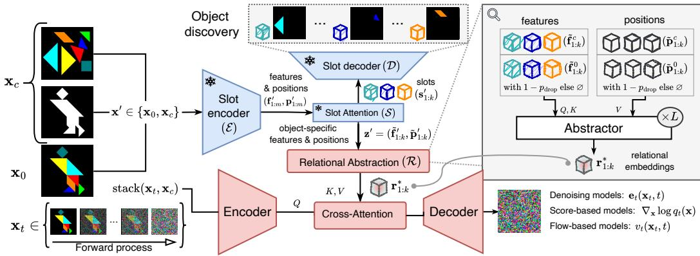  
Figure 1: Illustration of RDM with Discoverer and the Reasoner blocks. During training, the clues Slot $( \mathbf { x } _ { c } )$ and solutionsencoder $\left( \mathbf { x } _ { 0 } \right)$ are individually fed to the pretrained frozen ( ) slot encoder to obtain the corresponding feature $( \mathbf { f } _ { 1 : m } ^ { \prime } )$ and positional $( \mathbf { p } _ { 1 : m } ^ { \prime } )$ embeddings. Slot Attention yields the slots $( \mathbf { s } _ { 1 : k } ^ { \prime } )$ for reconstruction by the slot decoder, and object-specific features and positions,relational $\mathbf { z } ^ { \prime } = ( \tilde { \mathbf { f } } _ { 1 : k } ^ { \prime } , \tilde { \mathbf { p } } _ { 1 : k } ^ { \prime } )$ for relational abstractions. The relational abstraction module consists of L abstractor layers that optimize the relational embeddings ( ), which are introduced into the U-Net bottleneck through a cross-Diffusion-based modelsattention layer. Since the solution is unavailable at inference time, its disentangled representations $( \tilde { \mathbf { f } } _ { 1 : k } ^ { 0 } , \tilde { \mathbf { p } } _ { 1 : k } ^ { 0 } )$ Score-based models  are suppressed by a default learnable embedding (∅) with probability pdrop.

## 3 RELATIONAL ABSTRACTIONS FOR DIFFUSION MODELS

We formalize the spatial reasoning task as modeling the conditional distribution $q ( \mathbf { x } _ { 0 } | \mathbf { x } _ { c } )$ , where $\mathbf { x } _ { c }$ denotes a provided problem clue, and $\mathbf { x } _ { \mathrm { 0 } }$ represents a valid solution satisfying all logical constraints.

Our proposed framework comprises two models. Our first model, the discoverer, is a latent variable model $p _ { \phi }$ designed to capture the objects present in the samples from $q ( \mathbf { x } ^ { \prime } )$ , where $\mathbf { x } ^ { \prime } \in \left\{ \mathbf { x } _ { 0 } , \mathbf { x } _ { c } \right\}$ , via disentangled latent representations $\mathbf { \bar { z } ^ { \prime } } .$ Our second model, the reasoner, is a diffusion model $p _ { \theta }$ that learns to reverse the trajectory from a Gaussian prior to the target distribution $q ( \mathbf { x } _ { 0 } | \mathbf { x } _ { c } )$ , conditioned on the latents $\mathbf { z } ^ { \prime }$ provided by the discoverer. The integration of object-centric latent variables $\mathbf { z } ^ { \prime }$ is motivated by the inherent difficulty of learning $q ( \mathbf { x } _ { 0 } | \mathbf { x } _ { c } )$ through a simple parameterization of $p _ { \theta }$ We propose to enrich the generative modeling process with relational abstractions inferred from object-centric representations obtained via an unsupervised object discovery model $p _ { \phi } ( \mathbf { z } ^ { \prime } | \mathbf { x } ^ { \prime } )$

## 3.1 THE Discoverer: UNSUPERVISED SLOT-BASED OBJECT DISCOVERY

The objective of the discoverer is to extract informative latent representations $\mathbf { z } ^ { \prime }$ via the encoding $p _ { \phi } ( \mathbf { z } ^ { \prime } | \mathbf { x } ^ { \prime } )$ of a latent variable model, while simultaneously disentangling the constituent objects within x0 and $\mathbf { x } _ { c }$ . We use slot attention (Locatello et al., 2020) to achieve this, which enables unsupervised learning of disentangled object embeddings from visual data via a slot-based autoencoder.

Slot attention: The slot encoder maps input visual features into a shared latent space, where k trainable vectors (the slots) compete to explain parts of the input via an iterative attention process. These k slots are then passed to a spatial broadcast decoder to reconstruct the input $\mathbf { x } ^ { \prime }$ . By enforcing this reconstruction bottleneck, the model learns to partition the scene into k distinct, permutationinvariant latent variables that capture the essential objects for the downstream reasoning task.

Let $\mathbf { x } \in \mathbb { R } ^ { \mathrm { H } \times \mathrm { W } \times \mathrm { c } }$ denote an input image, and (E, S, D) denote the slot encoder, slot attention and slot decoder modules of the discoverer. The slot encoder $\mathcal { E } : \mathbb { R } ^ { \mathtt { H } \times \mathtt { w } \times \mathtt { c } }  ( \mathbb { R } ^ { m \times d } , \mathbb { R } ^ { m \times d } )$ is a fifeature extractor that yields m features $\left( \mathbf { f } _ { 1 : m } \right)$ and positional embeddings $\left( \mathbf { p } _ { 1 : m } \right)$ in a d-dimensional latent space. The slot attention module $\overrightarrow { S } : ( \mathbb { R } ^ { m \times d } , \mathbb { R } ^ { m \times d } )  \mathbb { R } ^ { k \times \tilde { d } }$ learns to iteratively update k randomly initialized slots $\mathbf { s } _ { 1 : k }$ , using η recurrent cross-attention iterations over $\mathbf { f } _ { 1 : m }$ and $\mathbf { p } _ { 1 : m }$ to bind object-centric information to the slots. The final attention matrix is then used to compute feature- and position-specific embeddings $( \tilde { \mathbf { f } } _ { 1 : k }$ and $\tilde { \bf p } _ { 1 : k } )$ for each slot, which will be considered as $\mathbf { z } = ( \tilde { \mathbf { f } } _ { 1 : k } ; \tilde { \mathbf { p } } _ { 1 : k } )$ (see Algorithm 2). The slot decoder $\mathcal { D } : \mathbb { R } ^ { k \times d }  \mathbb { R } ^ { \mathrm { H } \times \mathrm { w } \times \mathrm { c } }$ reconstructs the input by processing each slot independently through transposed convolutions to produce slot-specific reconstructions $\hat { { \bf x } } _ { i } \bar { \bf \Pi } \in \mathbb { R } ^ { \mathrm { H } \times \mathrm { W } \times \mathrm { c } }$ and associated spatial masks $\alpha _ { i }$ for $i = 1 , \ldots , k .$ . The final image xˆ is computed as the weighted sum of $\{ \hat { \mathbf { x } } _ { i } \} _ { i = 1 } ^ { k }$ with softm $\mathfrak { u } _ { i = 1 \dots k } ( \pmb { \alpha } _ { i } )$ (see §B.1 for further details).

Scaling the number of slots: One of the main limitations of the original slot decoder is the computational overhead of the latent bottleneck when k increases. Previous works have typically restricted $k \leq 1 0$ due to the memory overhead of performing independent high-resolution convolutions and subsequent weighted averaging for every slot (Singh et al., 2022a;b; Mondal et al., 2023).

To scale our discoverer to a large number of slots, we introduce the scalable slot decoder in Algorithm 1 that significantly reduces the memory demand during the backward pass. It relies on an additional learnable positional grid $\mathbf { g }$ that activates specific slots with specific locations in the bottleneck of the model. Rather than decoding each slot into a full-resolution image before weighting, our scalable decoder first estimates which slots are relevant to specific locations by computing the dot product between the positional grid g and the slot embeddings $\mathbf { s } _ { 1 : k } ,$ yielding α˜ after softmax normalization. Subsequently, the slot information is weighted by α˜ and projected onto the grid, producing a single feature map ˜s, where slot information is isolated on specific positions of the grid. This aggregated representation is then passed through the remaining decoder layers to generate a unified reconstruction of the input image. Effectively, introducing this learnable positional grid creates a computationally more efficient bottleneck during optimization.

Algorithm 1: Scalable slot decoder   
Input $\mathbf { \{ s }  _ { 1 : k } \in \mathbb { R } ^ { k \times d } , \mathbf { g } \in \mathbb { R } ^ { \mathrm { h } }$ ×w×d   
$\tilde { \alpha } \gets$ softmax $( { \bf g } \cdot { \bf s } _ { 1 : k } ^ { \ : 1 } )$ #[h,w,k]   
$\begin{array} { r } { \tilde { \mathbf { s } } \gets \sum _ { i = 1 } ^ { k } \tilde { \pmb { \alpha } } _ { i } \cdot \mathbf { s } _ { i } \ \# [ \mathrm { h } , \mathrm { w } , d ] } \end{array}$   
return $\mathcal { D } ( \tilde { \mathbf { s } } )$

## 3.2 THE Reasoner: RELATIONAL OBJECT ABSTRACTIONS AS DIFFUSION GUIDANCE

The reasoner is a diffusion model conditioned on the clue $\mathbf { x } _ { c }$ and the embeddings $\mathbf { z } ^ { \prime } = ( \tilde { \mathbf { f } } _ { 1 : k } ^ { \prime } ; \tilde { \mathbf { p } } _ { 1 : k } ^ { \prime } )$ obtained by the discoverer, where $\prime \in \{ 0 , c \}$ . We formalize generative modeling of $q ( \mathbf { x } _ { 0 } | \mathbf { x } _ { c } )$ through a diffusion guidance framework (Ho & Salimans, 2021) based on embeddings learned by a relational abstraction module (R). We use a single parameterization of $p _ { \theta }$ to learn both the solution-guided distribution $p _ { \theta } ( \mathbf { x } _ { 0 } | \mathbf { x } _ { c } , \mathcal { R } ( \mathbf { z } ^ { c } , \mathbf { z } ^ { 0 } ) )$ , and unguided distribution $p _ { \theta } ( \mathbf { x } _ { 0 } | \mathbf { x } _ { c } , \mathcal { R } ( \mathbf { z } ^ { c } ) )$ . This resembles the training setup of classifier-free guidance (CFG). Unlike CFG, however, RDM does not combine the guided and unguided distributions for sampling, since the solution is unavailable at inference time.

Relational abstraction: This module $\mathcal { R } : ( \mathbb { R } ^ { K \times d } , \mathbb { R } ^ { K \times d } ) \to \mathbb { R } ^ { K \times d }$ processes the latents $( \tilde { \mathbf { f } } _ { 1 : k } ^ { * } , \tilde { \mathbf { p } } _ { 1 : k } ^ { * } )$ with Slot Abstractors (Mondal et al., 2024), where $\ast = ( \boldsymbol { c } , 0 )$ and $K \geq 2 k$ varies with the number of clues and solutions. It consists of interleaved cross-attention, self-attention and feed-forward blocks with residual connections, designed to hierarchically capture inter-slot semantics and positional relations by sequentially refining the positional signal $( \tilde { \mathbf { p } } _ { 1 : k } ^ { * } )$ with query-key feature projections $( \tilde { \mathbf { f } } _ { 1 : k } ^ { * } )$ into relational embeddings $\mathbf { r } _ { 1 : k } ^ { * }$ (see §B.2 for details). After L abstractor blocks, this module returns $\mathbf { r } _ { 1 : k } ^ { * } = \mathcal { R } ( \tilde { \mathbf { f } } _ { 1 : k } ^ { * } , \tilde { \mathbf { p } } _ { 1 : k } ^ { * } )$ , encoding object relations. This ensures that the generative process will be guided not only by individual object features, but also by their contextual interactions.

Conditional generative modeling: During training, the disentangled representations of the solution $( \mathbf { z } ^ { 0 } )$ are nullified with probability $p _ { \mathrm { d r o p } }$ to simulate the unguided distribution $p _ { \theta } ( \mathbf { x } _ { 0 } | \mathbf { x } _ { c } , \mathcal { R } ( \mathbf { z } ^ { c } ) )$ ) used at inference; and maintained with probability $( 1 - p _ { \mathrm { d r o p } } )$ to learn the solution-guided distribution $p _ { \theta } ( \mathbf { x } _ { 0 } | \mathbf { x } _ { c } , \mathcal { R } ( \mathbf { z } ^ { c } , \mathbf { z } ^ { 0 } ) )$ . By modeling both distributions with a single parameterization $p _ { \theta } .$ , the reasoner learns: (1) the relations between the disentangled factors of the clue and the solution $( \mathbf { r } _ { 1 : k } ^ { * } )$ and $( 2 )$ to generate the solution $\mathbf { x } _ { \mathrm { 0 } }$ at inference-time by relying only on the clue information $( \mathbf { x } _ { c } , \mathbf { z } ^ { c } )$ . Training can be either based on noise prediction (Ho et al., 2020), score matching (Song et al., 2021), or flow matching (Lipman et al., 2023) (which we use in our experiments, see $\ S _ { \mathrm { B } . 3 }$ for details).

## 4 SPATIAL REASONING BENCHMARK

We present a novel benchmark comprising four datasets with up to one million images each, inspired by classic logic puzzles, where underlying logical rules are implicit in the conditional data distribution and must be inferred from training data. We categorize them into two paradigms: (i) grid-based image completion tasks: Akari and Coldoku, where reasoning is framed as inpainting under global and local spatial constraints, and (ii) multi-context image generation: Tangram and LogicFace, where a latent rule must be inferred from context images to synthesize a consistent solution.

## 4.1 GRID-BASED IMAGE COMPLETION TASKS

Akari dataset: Akari is a binary-determination puzzle played on a rectangular grid of empty cells and walls. The goal is to place light bulbs in empty cells such that every cell is illuminated while ensuring no two bulbs share a line of sight. Walls obstruct light and may be numbered with a digit (0-4), specifying the exact number of bulbs in its four orthogonally adjacent cells. Figure 2 illustrates

these constraints, where the clue (a) defines wall and digit placements. A valid solution (b) illuminates all cells without bulb interference, satisfying the wall clues. Invalid configurations (c) fail if cells remain unlit or bulbs conflict. We generated a dataset of one million $1 1 \times 1 1$ Akari puzzles with

(a) Clue  
(b) Valid ✓  
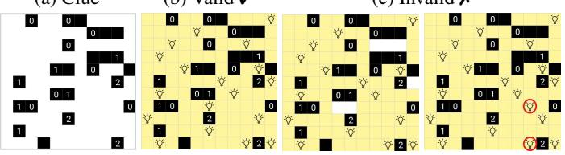  
(c) Invalid ✗  
Figure 2: Akari as a grid-based image completion puzzle.

randomized wall configurations. Unlike traditional Akari, which requires a unique solution, we allow for multiple valid bulb arrangements to evaluate the model’s ability to generate novel, correct solutions. Additional details on how this dataset is generated can be found in $\ S \mathrm { A . 1 }$

Coldoku (Colored Sudoku) dataset: Sudoku is a logic-based puzzle played on $\textbf { a } 9 \ \times$ 9 grid, divided into nine $3 ~ \times ~ 3$ subgrids. The objective is to fill the grid with digits from 1 to 9 such that each column, row, and subgrid does not contain repeated digits. The puzzle setter provides a partially completed grid as the clue, from which a wellposed solution can be derived. Recent works (Wewer et al., 2025) used MNIST-based

variants of this task for generative modeling. We extend this in Coldoku, a colored variant of this puzzle, where we again have ${ \bf { 1 9 \times 9 } }$ grid satisfying the Sudoku rules (Figure 3a), and add an extra layer of complexity by coloring the digits such that there are no repeated colors in each row, col-

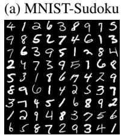

(b) Colors  
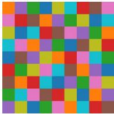

(c) Coldoku  
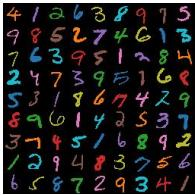

(d) Clues selection  
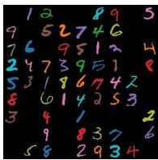  
Figure 3: Coldoku puzzle, which combines Sudoku with a color arrangement that also satisfies Sudoku rules. Tableau 10 palette is used, which is designed to have a large perceptual difference between colors.

umn and subgrid (Figures 3b). Coldoku requires solving two different Sudokus simultaneously, one considering the digits and the other considering colors. More details can be found in §A.2.

## 4.2 MULTI-CONTEXT IMAGE GENERATION TASKS

Tangram dataset: Tangram is a dissection puzzle consisting of seven flat shapes (tans): a square (□), a parallelogram ( ), two small triangles $\left( \triangle ^ { S } \ \times \ 2 \right)$ , a medium triangle $( { \dot { \bigtriangleup } } ^ { M } )$ and two large triangles $\overline { { ( \triangle ^ { L } \times 2 ) } }$ , which can be arranged to form figures without overlapping.

The goal is to assemble all the pieces to match a given silhouette, such that no piece overlaps with other, and all pieces of the puzzle are used (Figure 4). Tangram requires reasoning over shapes, sizes, rotations and displacements of the pieces to project the final solution, reflecting forms of geometric reasoning studied in humans (Bohning & Althouse, 1997;

(a) Tans  
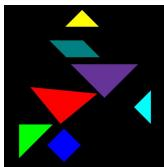

(b) Silhouette  
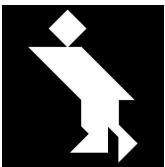

(c) Valid ✓  
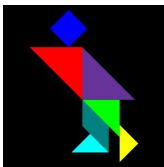

(d) Invalid ✗  
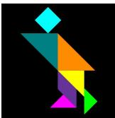  
Figure 4: Tangram example. A valid solution uses all pieces matching the colors and shapes, given the (a) and (b) as clues.

Wong et al., 2019). We rely on the Kilogram dataset (Ji et al., 2022) consisting of 1,013 uncolored Tangram solutions, and introduce the vision task of generating a valid solution (Figure 4c) by using an input pattern (Figure 4b) and a set of colored tans (Figure 4a). We generate different tan views and solutions by rotating the puzzle and randomly assigning distinct colors to tans (see §A.3 for details, as well as a discussion on Tangram task complexity in §C.2).

LogicFace (Logical Operators on Facial Features) dataset: We present a challenging logic-based generative modeling problem that requires abstraction and reasoning over real images. Specifically, LogicFace defines a conditional generative modeling task for human faces, where certain facial features are combined through hidden logical operators that must be inferred from training examples.

Figure 5 shows an example, where each data point is composed of three images from CelebA-HQ (Lee et al., 2020) associated with a subset of κ binary features retrieved from its original annotations. We consider the first two images (clues) with the arguments A and $B ,$ and the third as the solution S. Each image has a binary feature vector $a , b , s \in \{ 0 , 1 \} ^ { \kappa }$ , and the dataset contains triples for which, for a given element-wise logical operator $f _ { j }$ , the relation $f _ { j } ( { \pmb a } _ { j } , { \pmb b } _ { j } ) = { \pmb s } _ { j }$ holds. We set $\kappa = 4$ for the attributes to represent the feature vector of each image and a pool of 4 logical operators, each one assigned to one feature (see $\bar { \ S A . 4 }$ for details).

(a) A  
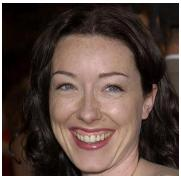

(b) B  
  
a = [1, 0, 0, 0]  
b = [0, 1, 1, 0]

(c) S  
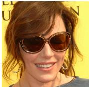  
s = [1, 0, 1, 1]  
Figure 5: LogicFace example with 4 features: smiling (OR), male (AND), glasses (XOR), young (IMPLIES). Features from A and B are combined in S via the corresponding logic operators $( \mathrm { e . g . }$ glasses: $A = 0 , B { \stackrel { - } { = } } 1 , S { \stackrel { - } { = } } 1$ , satisfying XOR).

## 5 EXPERIMENTS

Model configurations: For the discoverer, we use a convolutional autoencoder where the number of slots (k), slot dimension (d) and bottleneck resolution $( \mathrm { h } , \mathrm { w } )$ are adapted to the specific task (see Table 3). The slot encoder maps the input into m feature and positional embeddings. Slot attention performs $\eta = 3$ recurrent iterations and feeds k slots to the decoder. For Tangram and LogicFace we chose $k = 7$ and $k = 6 ,$ respectively. For Coldoku and Akari, where the true number of objects scales with the number of cells, i.e., 81 and 121 respectively, we propose two configurations: one where k coincides with the number of cells, hence requiring reconstruction with our scalable slot decoder (Algorithm 1), and the other with $k = 1 6$ , such that each slot integrates information from multiple cells. For experiments with $k \in \{ 6 , 7 , 1 6 \}$ we use the original slot decoder (Locatello et al., 2020). For the reasoner, we use a U-Net architecture with an attention-based bottleneck, where relational embeddings learned in $L = 6$ abstractor layers are incorporated via cross-attention (Chen et al., 2024b). To study the impact of model size, we conduct experiments with small (S), medium (M) and large (L) backbone U-Net architectures. Further architectural details are explained in §B.

Conditioning on relational abstractions: Our framework can guide diffusion models via abstraction and conditioning on information from two types of inputs during training: the clue (via zc) and the solution $( \mathrm { v i a } \ \mathbf { z } ^ { 0 } )$ . During training, we drop the condition $\mathbf { z } ^ { 0 }$ with probability $p _ { \mathrm { d r o p } } = 0 . 5 ^ { 2 }$ to disable the conditioning derived from the solution, since $\mathbf { x } _ { \mathrm { 0 } }$ will not be available at inference time.

We explore three different conditioning settings (alongside $\mathbf { x } _ { c } )$ , where relational embeddings are injected via cross-attention in the denoiser bottleneck: (i) clue: conditioning on $\mathcal { R } ( \mathbf { z } ^ { c } )$ during training and inference, (ii) solution: $\mathcal { R } ( \mathbf { z } ^ { 0 } )$ guides training and is dropped with $p _ { \mathrm { d r o p } } ,$ , and inference is unconditioned on any relational embedding, and (iii) full: both $\mathbf { z } ^ { c }$ and $\mathbf { z } ^ { 0 }$ (dropped with $p _ { \mathrm { d r o p } } )$ are used during training, and only $\mathbf { z } ^ { c }$ is used at inference time.

Training details: We pretrained the slot autoencoder independently for each task based on a simple reconstruction loss (§B.1), providing images of clues and solutions as training samples. We assess the quality of the reconstruction and thus the slot embeddings on a validation set (see §C for the final results and disentanglement visualizations). For the reasoner, we use flow matching to create the diffusion trajectory as detailed in §B.3, where the mean and variance change linearly with t. We perform deterministic sampling from the conditional distribution by solving the reverse-time ODE using τ discretization steps. All generative models were trained with the same optimization settings.

Table 1: Experimental results on Akari and Coldoku datasets.
<table><tr><td></td><td colspan="6">Akari</td><td colspan="9">Coldoku</td></tr><tr><td></td><td colspan="2">in-dist.</td><td colspan="2">low</td><td colspan="2">high</td><td colspan="3">Easy (50-60)</td><td colspan="3">Medium (40-50)</td><td colspan="3">Hard (30-40)</td></tr><tr><td></td><td>BLB</td><td>ACC</td><td>BLB</td><td>ACC</td><td>BLB</td><td>ACC</td><td>DGT</td><td>CLR</td><td>ACC</td><td>DGT</td><td>CLR</td><td>ACC</td><td>DGT</td><td>CLR</td><td>ACC</td></tr><tr><td>Base</td><td>86.02</td><td>80.04</td><td>43.62</td><td>39.48</td><td>92.22</td><td>88.92</td><td>93.53</td><td>94.73</td><td>89.00</td><td>61.81</td><td>78.56</td><td>49.06</td><td>11.38</td><td>25.31</td><td>3.88</td></tr><tr><td>SRM (Wewer et al., 2025)</td><td></td><td></td><td></td><td></td><td></td><td></td><td></td><td></td><td></td><td></td><td></td><td></td><td></td><td></td><td></td></tr><tr><td>parallel sequential</td><td>35.82 00.00</td><td>18.80 00.00</td><td>1.60</td><td>0.94</td><td></td><td>54.18 33.34</td><td>94.67 93.05</td><td>96.74 96.70</td><td>91.06 92.37</td><td>61.02</td><td>78.53</td><td>51.01</td><td>12.17</td><td>25.91 36.66</td><td>4.00 20.78</td></tr><tr><td></td><td></td><td></td><td></td><td>一</td><td></td><td></td><td></td><td></td><td></td><td>82.21</td><td>83.61</td><td>68.35</td><td>40.95</td><td></td><td></td></tr><tr><td>RDM*</td><td></td><td></td><td></td><td></td><td></td><td></td><td></td><td></td><td></td><td></td><td></td><td></td><td></td><td></td><td></td></tr><tr><td>clue</td><td>88.30</td><td>82.06</td><td>88.30</td><td>72.48</td><td>92.90</td><td>88.94</td><td>98.06</td><td>98.50</td><td>96.66</td><td>78.18</td><td>82.20</td><td>65.62</td><td>21.40</td><td>25.64</td><td>7.76</td></tr><tr><td>6 ts solution</td><td>86.10</td><td>78.68</td><td>82.21</td><td>70.73</td><td>92.51</td><td>87.96</td><td>96.80</td><td>96.18</td><td>93.16</td><td>71.80</td><td>67.36</td><td>50.68</td><td>16.64</td><td>12.74</td><td>3.34</td></tr><tr><td>full</td><td>89.44</td><td>80.42</td><td>83.32</td><td>75.06</td><td>93.80</td><td>87.48</td><td>98.14</td><td>99.30</td><td>97.48</td><td>80.12</td><td>88.22</td><td>71.64</td><td>22.76</td><td>36.88</td><td>12.58</td></tr><tr><td>s0ls 0s&lt; clue</td><td>88.88</td><td>83.12</td><td>83.10</td><td>54.58</td><td>93.62</td><td>89.56</td><td>96.82</td><td>94.88</td><td>91.98</td><td>79.18</td><td>63.40</td><td>47.12</td><td>16.46</td><td>11.76</td><td>2.86</td></tr><tr><td>solution</td><td>86.36</td><td>80.28</td><td>81.12</td><td>74.58</td><td>92.37</td><td>88.94</td><td>96.82</td><td>95.26</td><td>92.38</td><td>72.04</td><td>67.24</td><td>50.86</td><td>17.24</td><td>12.94</td><td>3.36</td></tr><tr><td>full</td><td>85.84</td><td>77.34</td><td>77.30</td><td>56.20</td><td>92.76</td><td>87.40</td><td>91.12</td><td>99.18</td><td>90.36</td><td>51.86</td><td>86.26</td><td>46.14</td><td>6.46</td><td>32.06</td><td>2.94</td></tr></table>

∗Results of RDM[S] for Akari, and RDM[L] with τ = 10 for Coldoku.

Baseline comparisons: We use a capacity-matched U-Net as baseline (Base) by augmenting the hidden dimensions to match the same model size as RDM, accommodating for the additional parameters of the Discoverer and the Abstractor stack. The Base model is trained to estimate q(x |x ) also via flow matching, with the main difference of not incorporating relational abstractions. We also trained this architecture with diffusion forcing (Chen et al., 2024a) for comparisons to SRM (Wewer et al., 2025) with parallel and sequential sampling strategies, where the latter additionally requires learning uncertainty at training time to perform patch-based autoregressive denoising. We also performed experiments on MNIST-Sudoku and Counting Polygons benchmarks for completeness (Wewer et al., 2025), and ablations with non-object-centric feature guidance (details and results in §C.2.1).

Model evaluations: We designed task-specific neural evaluators (see §A for details), and used 5,000 held-out samples per task that served as test sets. We use the overall accuracy (ACC) as the main metric in all datasets. For Coldoku, we also report individual digit (DGT) and color (CLR) accuracies across three difficulty levels: Easy (50-60 clues), Medium (40-50 clues) and Hard (30-40 clues). For Akari, we also measure the bulb accuracy (BLB), which only evaluates the correctness of bulb allocations by ignoring the numbered walls, and evaluate both in an in-distribution (ID) regime where the wall density ratio matches the training set, and out-of-distribution (OoD) regimes with extreme wall densities: low (5-10%) and high (35-40%). For Tangram, we measure SHAPE accuracy, which only measures the correct partition of the silhouette, and the f1-score per tan type. For LogicFace, we measure accuracy at feature level (proportion of correctly generated attributes). We report all results with τ = 100 unless specified otherwise (see §C for τ = 10 and varying model sizes).

## 6 EXPERIMENTAL RESULTS

We demonstrate the performance of our models on the proposed benchmark in Tables 1 and 2, where RDM outperforms the baselines in Akari, Tangram and LogicFace, while only lagging behind SRM in the hardest level of Coldoku. We present extended results and output examples in §C.

Results on Akari: RDM consistently outperforms baseline models across all distribution regimes and demonstrates superior generalization capabilities under the most challenging (low) regime. Under the in-distribution (ID) evaluation, RDM achieves 83.12 accuracy with 121 slots, compared to 80.04 for standard diffusion. We observe a performance margin between 16 and 121 slots (clue: 83.12 vs 82.06), potentially because the slot count allows the discoverer to freely learn a bijective mapping between slots and cells, enhancing the reasoner to better exploit bulb placement. In the high regime, all models benefit from an increased wall ratio, which bounds the solution space, localizes constraints, and reduces ambiguity. Conversely, the low regime imposes harder reasoning demands as the solution space expands beyond the training distribution. Here we find evidence of how relational abstractions capture the underlying task rules rather than just imitating pixel-wise distributions, and show that disentanglement with $k = 1 6$ strongly aids out-of-distribution generalization in contrast to $k = 1 2 1$ which slightly overfits the training set. While Base model plummets (in-distribution (Table 1): 80.04 → low: 39.48), RDM clue with 16 slots maintains consistency (in-distribution: 82.06 → low: 72.48).

Table 2: Experimental results on Tangram and LogicFace datasets.
<table><tr><td></td><td colspan="7">Tangram</td><td colspan="6">LogicFace</td></tr><tr><td></td><td> $\bigtriangledown$ </td><td>□</td><td> $\triangle ^ { S }$ </td><td> $\triangle ^ { M }$ </td><td> $\triangle ^ { L }$ </td><td>SHAPE</td><td>ACC</td><td>smiling (OR)</td><td>male (AND)</td><td>glasses (XOR)</td><td>young (IMP .)</td><td>AVG</td><td>ACC</td></tr><tr><td>Base</td><td>23.06</td><td>24.22</td><td>42.82</td><td>41.50</td><td>55.60</td><td>57.72</td><td>15.46</td><td>54.60</td><td>76.52</td><td>67.34</td><td>38.90</td><td>57.84</td><td>11.24</td></tr><tr><td>SRM (Wewer et al., 2025)3</td><td></td><td></td><td></td><td></td><td></td><td></td><td></td><td></td><td></td><td></td><td></td><td></td><td></td></tr><tr><td>parallel</td><td></td><td></td><td></td><td>1</td><td>一</td><td></td><td></td><td>37.00</td><td>38.16</td><td>49.26</td><td>39.44</td><td>40.97</td><td>2.60</td></tr><tr><td>sequential</td><td></td><td>1</td><td></td><td>一</td><td>一</td><td>一</td><td></td><td>25.04</td><td>58.38</td><td>50.58</td><td>73.86</td><td>51.94</td><td>5.70</td></tr><tr><td>RDM[S]</td><td></td><td></td><td></td><td></td><td></td><td></td><td></td><td></td><td></td><td></td><td></td><td></td><td></td></tr><tr><td>clue</td><td>36.71</td><td>36.96</td><td>59.59</td><td>60.33</td><td>63.29</td><td>58.41</td><td>34.37</td><td>90.19</td><td>97.00</td><td>97.26</td><td>87.27</td><td>92.93</td><td>74.74</td></tr><tr><td>solution</td><td>41.12</td><td>43.94</td><td>56.49</td><td>53.06</td><td>59.94</td><td>60.25</td><td>38.57</td><td>64.87</td><td>73.20</td><td>50.16</td><td>67.78</td><td>64.00</td><td>16.27</td></tr><tr><td>full</td><td>49.75</td><td>49.98</td><td>61.55</td><td>61.25</td><td>65.00</td><td>65.12</td><td>46.76</td><td>83.16</td><td>94.00</td><td>94.76</td><td>79.81</td><td>87.93</td><td>60.76</td></tr></table>

Our evaluation of SRM reveals that diffusion forcing does not universally benefit grid-based puzzles. While SRM excels in MNIST-Sudoku (Wewer et al., 2025), where patch-based noise levels combined with uncertainty-based sampling align with optimal Sudoku-solving heuristics, its strategy fails to generalize to Akari, where reasoning variables are not evenly distributed across cells. During training, diffusion forcing yields a vast combinatorial space of noise levels that mostly affect illuminated cells, damaging convergence (ACC: 18.80). At inference, SRM sequential prematurely prioritizes denoising empty (yellow-illuminated) cells due to their persistent low uncertainty, resulting in performance collapse, where the critical task of bulb placement is deferred until the final sampling states.

Results on Coldoku: Our results from Table 1 show that RDM generally outperforms all baselines in color accuracy and overall accuracy at the easy and medium levels of Coldoku, and SRM performs better in the hard regime. The best performance was achieved with 16 slots (ACC: 97.48 easy, 71.64 medium and 12.58 hard), whereas the full 81-slot configuration caused ACC on the easy level to drop to 90.36. We hypothesize that the primary bottleneck in Coldoku is not the slot embeddings themselves, but rather the relational abstraction module (R) shared between the clue and the solution as input with a high number of slots k = 81, which requires the unique R to reconcile complex positional and feature relations from two distinct distributions. Coldoku involves a diverse set of objects (multi-colored digits) in varying positions, while Akari presents a much smaller object vocabulary, where the complexity is exclusively positional.

Tildoku (Tilted and Colored Sudoku): We observed that SRM performs well on hard grid-based puzzles with sequential, cell-wise reasoning. However, its reliance on the grid’s geometry and patch structure introduces an implicit task-aligned bias. To challenge this in a more general scenario, we introduce Tildoku, where Coldoku images are randomly tilted (see §A.2 for details), disrupting the alignment between grid cells and image coordinates. Thus, the spatial structure now does not necessarily align with the grid-informed reasoning mechanism that SRM utilizes.

Figure 6 shows results on Tildoku (Medium, $\tau = 1 0 )$ for different displacement ratios at test time (left), and their average (right), where RDM demonstrates more robust reasoning (ACC: 28.40 averaged across various displacement ratios with the solution approach). Notably, SRM significantly worsens when increasing the tilting degree at inference time (orange line in the plot), resulting in lower average metrics. This is due to the fact that the learned

Figure 6: Performance of $\mathbf { R D M ^ { \mathrm { [ L ] } } }$ in Tildoku.  
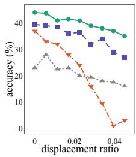

<table><tr><td rowspan="6">40 00 30 acacy 20 10 0 0 0.02 0.04 displacement ratio</td><td>Medium</td><td>DGT</td><td>CLR</td><td>ACC</td></tr><tr><td>Base</td><td>22.62</td><td>45.92</td><td>12.48</td></tr><tr><td>SRM (seq.)</td><td>24.31</td><td>21.31</td><td>7.08</td></tr><tr><td>• clue • solution</td><td>33.02</td><td>52.84 60.12</td><td>19.18 28.40</td></tr><tr><td>full</td><td>43.70</td><td></td><td></td></tr><tr><td></td><td>22.24</td><td>31.96</td><td>8.46</td></tr></table>

uncertainty is only consistent when patches cover objects from a stable distribution (e.g., when each patch covers exactly one digit), and it becomes unstable when a patch covers half of a digit or none.

Figure 6 (left) demonstrates this effect, where SRM outperforms the baseline at low tilting degrees, but abruptly collapses when digits do not align within fixed patches (see Table 8 for extended results).

Results on Tangram: Table 2 shows that RDM significantly surpasses baselines across all metrics on Tangram. Notably, RDM (full) reaches three times the baseline performance, achieving ACC: 46.76, compared to baseline’s 15.46 (see Figure 15 for visual results). In contrast to Akari and Coldoku, we observe a considerable improvement when incorporating the solution into the abstractor stack (clue: 34.37 → solution: 38.57 → full: 46.76). This behavior arises from how relational features differ between the clue and solution distributions. RDM (clue) only extracts primitives from the piece view (colors and size proportions), mainly boosting accuracy in color assignment (Base: 15.46 vs clue: 34.37), but maintaining the shape accuracy close to the baseline (Base: 57.72 vs clue: 58.41). Adding information from the solution view, which provides the explicit silhouette partition, boosts the shape and overall accuracy to 65.12 and 46.76 respectively, showing that the relational stack effectively captures the structural dependencies between these two views to guide reasoning.

Results on LogicFace: Our results in Table 2 show superior performance of RDM. In particular, clue-conditioned models achieve the highest accuracies (clue: 74.74 andfull: 60.76, see Figure 16 for generated solutions), whereas standard diffusion models perform poorly (ACC: 11.24). Unlike Akari, Coldoku and Tangram, where baselines remained competitive, LogicFace presents the unique challenge of simultaneously modeling a complex real-image distribution, encoding high-level features of multiple input arguments (e.g., gender, presence of glasses), and inferring logical operations to generate a consistent target image. Baseline models prioritize generating realistic human faces at the expense of satisfying the logical rules (see §C for image quality metrics), effectively ignoring any relationship between the inputs and targets. In contrast, RDM captures the underlying rules for all operators, as evidenced by accuracies that exceed trivial strategies, such as the model defaulting to a single mode (e.g., only generating a smiling female face).

Impact of relational abstractions and evidence of rule learning: In an ablation study, we isolated the impact of relational abstractions by evaluating a slot-based diffusion guidance approach, i.e., $p _ { \theta } ( \mathbf { x } _ { 0 } | \mathbf { x } _ { c } , \mathbf { s } _ { 1 : k } ^ { c } )$ at training and inference, similar to previously proposed slot-conditioned diffusion models (Jiang et al., 2023). Our results in Table 11 revealed that explicit relational abstractions are critical for complex reasoning, beyond purely slot-based diffusion guidance alone (see §C.2.1).

Finally, besides our rule-consistent image synthesis evaluations, we also investigated whether the relational abstraction module learns embeddings that capture the logical rules required for reasoning. Across controlled experiments, we found evidence that these embeddings (1) yield near-optimal solution-conditioned inference at test time, (2) can help improve reasoning without the raw clue image conditioning, and (3) remain linearly separable between valid versus rule-violating puzzles (see §C.2.1 for further details on our empirical evidence of rule learning experiments).

## 7 DISCUSSION

We study a key limitation of image diffusion models regarding their emphasis on pixel-level fidelity in conditional data distribution modeling, which limits their ability to capture logical structures required for spatial reasoning. We introduce RDM as a novel framework that enhances diffusion models with unsupervised object-centric relational abstractions of the structural regularities in the training data. While RDM does not incorporate explicit symbolic computation modules, it leverages learned relational abstractions that move diffusion models toward more symbolic forms of reasoning.

We further present a large-scale spatial reasoning benchmark comprising diverse challenging tasks, on which our approach significantly improves reasoning-driven image generation capabilities. We show that harnessing abstractions from different task components (clues and solutions) enhances reasoning both when applied during training alone for diffusion guidance (solution), and when used jointly during training and inference (clue and full). Our work does not aim to position any single variant as the preferred recipe, but instead demonstrates how object-centric relational abstractions can guide generative spatial reasoning with a task-agnostic approach. Experiments on grid-based image completion tasks revealed that current task-informed uncertainty-driven inference-time reasoning approaches (Wewer et al., 2025) do not reliably scale across diverse reasoning tasks, where the failure modes became more pronounced in Tildoku under distorted grid structures. Nevertheless, our method is in principle compatible with any additional sampling-time reasoning approach (Wewer et al., 2025).

Limitations: Our approach relies on object discovery to extract relational patterns, utilizing neural architectures with inherently finite scalability. While these models might not scale to “in-thewild” scenarios in unconstrained scenes with thousands of entities, we argue that it still remains aligned with the scope of human reasoning, where the number of objects is naturally bounded by cognitive constraints. Nevertheless, more powerful relational vision representations may enable better scalability in natural scenes, making open-world visual reasoning an important direction for future research. We also note that the neural-based automated evaluators used in our benchmarks may be prone to minor estimation errors due to their own performance. However, the comparisons presented remain fair and valid as the identical evaluation pipeline applied consistently for all models.

## REPRODUCIBILITY STATEMENT

We provide detailed descriptions of the model architectures, training configurations and hyperparameters of the experiments reported in the paper, both partly in the main text, and in §A and §B. Our code and datasets are available at: https://github.com/anaezquerro/rdm.

## ACKNOWLEDGMENTS

This work was supported by the ELLIS Unit Graz and the Graz Center for Machine Learning (GraML). This research was funded in whole by the Austrian Science Fund (FWF) [10.55776/COE12]. The computational results presented have been achieved in part using the Austrian Scientific Computing (ASC) infrastructure.

## REFERENCES

Awni Altabaa, Taylor Whittington Webb, Jonathan D Cohen, and John Lafferty. Abstractors and relational cross-attention: An inductive bias for explicit relational reasoning in transformers. In International Conference on Learning Representations (ICLR), 2024.

Pavel Avdeyev, Chenlai Shi, Yuhao Tan, Kseniia Dudnyk, and Jian Zhou. Dirichlet diffusion score model for biological sequence generation. In International Conference on Machine Learning (ICML), pp. 1276–1301, 2023.

David Barrett, Felix Hill, Adam Santoro, Ari Morcos, and Timothy Lillicrap. Measuring abstract reasoning in neural networks. In International Conference on Machine Learning (ICML), pp. 511–520, 2018.

Peter W Battaglia, Jessica B Hamrick, Victor Bapst, Alvaro Sanchez-Gonzalez, Vinicius Zambaldi, Mateusz Malinowski, Andrea Tacchetti, David Raposo, Adam Santoro, Ryan Faulkner, et al. Relational inductive biases, deep learning, and graph networks. arXiv preprint arXiv:1806.01261, 2018.

Gerry Bohning and Jody Kosack Althouse. Using tangrams to teach geometry to young children. Early Childhood Education Journal, 24:239–242, 1997.

Boyuan Chen, Diego Martí Monsó, Yilun Du, Max Simchowitz, Russ Tedrake, and Vincent Sitzmann. Diffusion forcing: Next-token prediction meets full-sequence diffusion. Advances in Neural Information Processing Systems, 37:24081–24125, 2024a.

Minghao Chen, Iro Laina, and Andrea Vedaldi. Training-free layout control with cross-attention guidance. In Proceedings of the IEEE/CVF Winter Conference on Applications of Computer Vision (WACV), pp. 5343–5353, 2024b.

François Chollet. On the measure of intelligence. arXiv preprint arXiv:1911.01547, 2019.

Francois Chollet, Mike Knoop, Gregory Kamradt, and Bryan Landers. ARC Prize 2024: Technical report. arXiv preprint arXiv:2412.04604, 2024.

François Fleuret, Ting Li, Charles Dubout, Emma K. Wampler, Steven Yantis, and Donald Geman. Comparing machines and humans on a visual categorization test. Proceedings of the National Academy ofSciences, 108(43):17621–17625, 2011.

Nir Goren, Shai Yehezkel, Omer Dahary, Andrey Voynov, Or Patashnik, and Daniel Cohen-Or. Visual Diffusion Models are Geometric Solvers. In Proceedings ofthe IEEE/CVF Conference on Computer Vision and Pattern Recognition (CVPR), pp. 43187–43196, June 2026.

Klaus Greff, Raphaël Lopez Kaufman, Rishabh Kabra, Nick Watters, Christopher Burgess, Daniel Zoran, Loic Matthey, Matthew Botvinick, and Alexander Lerchner. Multi-object representation learning with iterative variational inference. In International Conference on Machine Learning, pp. 2424–2433, 2019.

Kaiming He, Xiangyu Zhang, Shaoqing Ren, and Jian Sun. Deep Residual Learning for Image Recognition. In Proceedings ofthe IEEE Conference on Computer Vision and Pattern Recognition (CVPR), 2016.

Kaiming He, Xinlei Chen, Saining Xie, Yanghao Li, Piotr Doll’ar, and Ross B. Girshick. Masked Autoencoders Are Scalable Vision Learners. 2022 IEEE/CVF Conference on Computer Vision and Pattern Recognition (CVPR), pp. 15979–15988, 2021.

Jonathan Ho and Tim Salimans. Classifier-free diffusion guidance. In NeurIPS 2021 Workshop on Deep Generative Models and Downstream Applications, 2021.

Jonathan Ho, Ajay Jain, and Pieter Abbeel. Denoising diffusion probabilistic models. Advances in Neural Information Processing Systems, 33:6840–6851, 2020.

Anya Ji, Noriyuki Kojima, Noah Rush, Alane Suhr, Wai Keen Vong, Robert Hawkins, and Yoav Artzi. Abstract visual reasoning with Tangram shapes. In Proceedings of the 2022 Conference on Empirical Methods in Natural Language Processing, pp. 582–601, 2022.

Jindong Jiang, Fei Deng, Gautam Singh, and Sungjin Ahn. Object-centric slot diffusion. Advances in Neural Information Processing Systems, 36:8563–8601, 2023.

Giancarlo Kerg, Sarthak Mittal, David Rolnick, Yoshua Bengio, Blake Richards, and Guillaume La joie. On neural architecture inductive biases for relational tasks. arXiv preprint arXiv:2206.05056, 2022.

Cheng-Han Lee, Ziwei Liu, Lingyun Wu, and Ping Luo. MaskGAN: Towards Diverse and Interactive Facial Image Manipulation. In Proceedings of the IEEE/CVF Conference on Computer Vision and Pattern Recognition (CVPR), 2020.

Gyubin Lee, Bao N Nguyen Truong, Jaesik Yoon, Dongwoo Lee, Minsu Kim, Yoshua Bengio, and Sungjin Ahn. Adaptive inference-time scaling via cyclic diffusion search. Advances in Neural Information Processing Systems, 2025.

Yaron Lipman, Ricky T. Q. Chen, Heli Ben-Hamu, Maximilian Nickel, and Matthew Le. Flow Matching for Generative Modeling. In International Conference on Learning Representations (ICLR), 2023.

Francesco Locatello, Dirk Weissenborn, Thomas Unterthiner, Aravindh Mahendran, Georg Heigold, Jakob Uszkoreit, Alexey Dosovitskiy, and Thomas Kipf. Object-centric learning with slot attention. Advances in Neural Information Processing Systems, 33:11525–11538, 2020.

Ilya Loshchilov and Frank Hutter. Decoupled Weight Decay Regularization. In International Conference on Learning Representations (ICLR), 2019.

Shanka Subhra Mondal, Taylor Whittington Webb, and Jonathan Cohen. Learning to reason over visual objects. In International Conference on Learning Representations (ICLR), 2023.

Shanka Subhra Mondal, Jonathan D Cohen, and Taylor Whittington Webb. Slot abstractors: Toward scalable abstract visual reasoning. In International Conference on Machine Learning (ICML), pp. 36088–36105, 2024.

Weili Nie, Zhiding Yu, Lei Mao, Ankit B Patel, Yuke Zhu, and Anima Anandkumar. Bongard-logo: A new benchmark for human-level concept learning and reasoning. Advances in Neural Information Processing Systems, 33:16468–16480, 2020.

Maxime Oquab et al. DINOv2: Learning Robust Visual Features without Supervision. Transactions on Machine Learning Research, 2024.

William Peebles and Saining Xie. Scalable diffusion models with transformers. In Proceedings of the IEEE/CVF International Conference on Computer Vision, pp. 4195–4205, 2023.

Niv Pekar, Yaniv Benny, and Lior Wolf. Generating correct answers for progressive matrices intelligence tests. Advances in Neural Information Processing Systems, 33:7390–7400, 2020.

J. C. Raven. Progressive Matrices: A Perceptual Test of Intelligence. Oxford Psychologists Press, Ltd., Oxford, 1938.

Olaf Ronneberger, Philipp Fischer, and Thomas Brox. U-Net: Convolutional networks for biomedical image segmentation. In International Conference on Medical Image Computing and Computer-Assisted Intervention, pp. 234–241, 2015.

Fan Shi, Bin Li, and Xiangyang Xue. Towards generative abstract reasoning: Completing raven’s progressive matrix via rule abstraction and selection. In International Conference on Learning Representations (ICLR), 2024.

Gautam Singh, Fei Deng, and Sungjin Ahn. Illiterate DALL-E learns to compose. In International Conference on Learning Representations (ICLR), 2022a.

Gautam Singh, Yi-Fu Wu, and Sungjin Ahn. Simple unsupervised object-centric learning for complex and naturalistic videos. Advances in Neural Information Processing Systems, 35:18181–18196, 2022b.

Jascha Sohl-Dickstein, Eric Weiss, Niru Maheswaranathan, and Surya Ganguli. Deep unsupervised learning using nonequilibrium thermodynamics. In International Conference on Machine Learning (ICML), pp. 2256–2265, 2015.

Yang Song and Stefano Ermon. Generative modeling by estimating gradients of the data distribution. Advances in Neural Information Processing Systems, 32, 2019.

Yang Song, Jascha Sohl-Dickstein, Diederik P. Kingma, Abhishek Kumar, Stefano Ermon, and Ben Poole. Score-Based Generative Modeling through Stochastic Differential Equations. In International Conference on Learning Representations (ICLR), 2021.

Libo Sun, James Browning, and Roberto Perera. Shedding some light on Light Up with artificial intelligence. arXiv preprint arXiv:2107.10429, 2021.

Taylor Webb, Shanka Subhra Mondal, and Jonathan D Cohen. Systematic visual reasoning through object-centric relational abstraction. Advances in Neural Information Processing Systems, 36: 72030–72043, 2023.

Taylor Whittington Webb, Ishan Sinha, and Jonathan Cohen. Emergent symbols through binding in external memory. In International Conference on Learning Representations (ICLR), 2021.

Christopher Wewer, Bartlomiej Pogodzinski, Bernt Schiele, and Jan Eric Lenssen. Spatial reasoning with denoising models. In International Conference on Machine Learning (ICML), pp. 66706– 66725, 2025.

Simpson WL Wong, Rebecca Wing-yi Cheng, Bonnie Wing-Yin Chow, and Sandrine Man-Chi Chung. The link between a set of tangram-based tasks and chinese and english reading and related skills among chinese kindergarteners. AERA Open, 5(1):2332858419829723, 2019.

Ziyi Wu, Jingyu Hu, Wuyue Lu, Igor Gilitschenski, and Animesh Garg. SlotDiffusion: Object-centric generative modeling with diffusion models. Advances in Neural Information Processing Systems, 36:50932–50958, 2023.

Fernanda Miyuki Yamada, Harlen Costa Batagelo, João Paulo Gois, and Hiroki Takahashi. TANGAN: solving Tangram puzzles using generative adversarial network. Applied Intelligence, 55(7), 2025.

Takayuki Yato and Takahiro Seta. Complexity and completeness of finding another solution and its application to puzzles. IEICE Transactions on Fundamentals of Electronics, Communications and Computer Sciences, 86(5):1052–1060, 2003.

Junyan Ye, Dongzhi Jiang, Jun He, Baichuan Zhou, Zilong Huang, Zhiyuan Yan, Hongsheng Li, Conghui He, and Weijia Li. BLINK-Twice: You see, but do you observe? A Reasoning Benchmark on Visual Perception. In Annual Conference on Neural Information Processing Systems Datasets and Benchmarks Track, 2025.

Chi Zhang, Baoxiong Jia, Song-Chun Zhu, and Yixin Zhu. Abstract Spatial-Temporal Reasoning via Probabilistic Abduction and Execution. In Proceedings ofthe IEEE/CVF Conference on Computer Vision and Pattern Recognition (CVPR), June 2021.

Yikun Zong and Cheston Tan. TangramSR: Can Vision-Language Models Reason in Continuous Geometric Space? arXiv preprint arXiv:2602.05570, 2026.

Mehmet Çelik, Halit Erdogan, Firat Tahaoglu, Tansel Uras, and Esra Erdem. Comparing ASP and CP on Four Grid Puzzles. In RCRA@AI\*IA, 2009.

## A DETAILS ON THE SPATIAL REASONING BENCHMARK DATASETS

In this section, we provide a detailed description of our spatial reasoning datasets, and motivate their use for evaluating generative models on challenging visual tasks. Our primary goal in introducing this novel spatial reasoning benchmark is to move beyond simple pattern matching by requiring generative models to satisfy discrete geometric and logical reasoning constraints.

<table><tr><td></td><td>Akari</td><td>Coldoku</td><td>Tangram</td><td>LogicFace</td></tr><tr><td>H×W</td><td> $1 9 8 \times 1 9 8$ </td><td> $1 8 0 \times 1 8 0$ </td><td> $1 2 8 \times 1 2 8$ </td><td> $1 2 8 \times 1 2 8$ </td></tr><tr><td>h×w</td><td> $1 1 \times 1 1$ </td><td> $9 \times 9$ </td><td> $8 \times 8$ </td><td> $8 \times 8$ </td></tr><tr><td>k</td><td>121 / 16</td><td>81 / 16</td><td>7</td><td>6</td></tr><tr><td># samples</td><td>1M</td><td>1M</td><td>1,013</td><td>30,000</td></tr><tr><td>neural evaluator</td><td>x</td><td>√</td><td>x</td><td>√</td></tr></table>

Table 3: General statistics: image $\left( \mathrm { H } \times \mathrm { } \mathrm { } \mathrm { } \mathrm { } W \right)$ and bottleneck $\left( \mathrm { h } \times \mathrm { w } \right)$ resolution; number of slots (k) and unique samples (# samples); and neural evaluation.

## A.1 AKARI DATASET

Akari (also known as Light Up) is a binary-determination puzzle played on a rectangular grid of empty cells ( ) and walls ( ). The goal is to place light bulbs ( ) in empty cells such that every cell is illuminated ( ) while ensuring no pair of bulbs shine on one another, i.e., no two bulbs share a line of sight, horizontally or vertically, unobstructed by a wall. Walls act as obstacles to light and may serve as numbered cells. These cells are annotated with a digit from 0 to 4, indicating the exact number of bulbs that must be placed in the four adjacent (orthogonal) cells.

We generated a dataset of one million $1 1 \times 1 1$ Akari puzzles4. Our generation process follows a constraints-first approach. We first distributed walls across 20%–30% of the grid, then allocated bulbs according to the core rules of the puzzle, and finally converted 50% of the walls into clued cells by annotating them with the count of their adjacent bulbs, leaving the remaining walls unnumbered.

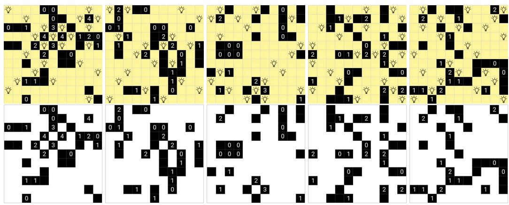  
Figure 7: Akari samples from the training set.

Akari properties: Akari is an NP-complete problem (Sun et al., 2021), a complexity derived from the interplay between line-of-sight constraints and numerical wall requirements. Without clued cells, the problem reduces to polynomial time. Solving typically involves local constraint satisfaction, such as prioritizing bulbs for high-value clues or identifying bottleneck empty cells that can only be illuminated by a single potential bulb placement.

From a generative perspective, ensuring a unique solution elevates the task to a higher-order complexity $( \sum _ { 2 } ^ { P }$ or ASP classes (Çelik et al., 2009)). Standard algorithms rely on backtracking solvers: a candidate grid is produced and iteratively modified with additional wall constraints if more than one solution is found. To better evaluate model novelty and rule abstraction, our dataset permits multiple valid arrangements, allowing novel solutions that may differ from training annotations.

Evaluation of Akari: We evaluate generated images with a deterministic pipeline that individually classifies each cell as a bulb $( \dot { \bar { \cdot } } \dot { \bigtriangledown } ^ { \prime } )$ or illuminated background ( ) via mean squared error against target patches. A sequential algorithm then verifies the arrangement against puzzle constraints. We use five metrics: (i) accuracy, requiring all constraints to be satisfied, (ii) bulb accuracy, a relaxed metric ignoring numbered wall constraints, (iii) unlit count, the count of unlit empty cells, (iv) distance, as the absolute error between a wall’s digit and its actual adjacent bulb count, and (v) overlap, as the count of bulbs sharing a line of sight.

## A.2 COLDOKU: THE COLORED SUDOKU DATASET

Sudoku is a combinatorial number-placement puzzle played on a 9×9 grid, which is further partitioned into nine 3 × 3 subgrids (also known as blocks or boxes). In its classical formulation, the objective is to populate the grid with digits from 1 to 9 such that each row, column, and subgrid contains every digit exactly once. Various extensions of the puzzle have been proposed, ranging from larger grid dimensions to the addition of supplementary constraints. The complexity of solving Sudoku puzzles has been formally classified as NP-complete (Yato & Seta, 2003). While it has been mathematically proven that a minimum of 17 initial clues is necessary for a unique solution, human-solvable puzzles typically provide 20 to 35 fixed digits to guide the player through the remaining cells.

We introduce on a multi-constraint Sudoku variant that couples the classical digit-placement logic with a coloring challenge, named Coldoku. This task effectively requires the model to simultaneously solve a secondary Sudoku-style constraint involving nine distinct colors. We relied on the MNIST-Sudoku dataset released by Wewer et al. (2025) as our primary source for 1M solved Sudoku configurations. Following their methodology, we train an MNIST classifier to populate the grid cells with handwritten digits, thereby generating a realistic handwritten view of the Sudoku grid. To introduce the additional layer of complexity, we randomly pair each Sudoku with another independent Sudoku. The second Sudoku determines the color assignment for each digit, effectively creating a Coldoku puzzle where both digit and color placements must satisfy Sudoku constraints (Figure 3). Our dataset uses the Tableau 10 palette, which is designed to have a large perceptual difference between colors (blue •, orange •, green •, red •, purple •, brown •, pink •, olive • and cyan •. By cross-combining these digit and color arrangements, the resulting dataset spans a massive state space of 1012 (1M2) unique puzzle configurations.

Coldoku properties: Coldoku inherits the formal logical properties of the classical Sudoku puzzle, as it effectively requires the joint resolution of two orthogonal Sudoku instances (one in the digit domain and one in the color domain) given the same set of initial clues. While a human solver would likely adopt a sequential strategy, first solving the digit arrangement before addressing the color-based constraints, a neural network must perform these operations as a simultaneous multi-objective task.

The properties of uniqueness and complexity (NP-completeness) are preserved for both the digit and color layers. Consequently, Coldoku represents an inherently more challenging benchmark for generative models, as it requires the latent reasoning module to maintain two independent sets of global constraints and resolve them within a single inference pass.

Tildoku (Tilted and Colored Sudoku): To evaluate RDM in a more realistic scenario, we introduce Tildoku, a variant of Coldoku where samples are randomly tilted within a bounded angular range (see Figure 9). While Tildoku maintains the underlying logical rules and reasoning complexity of Coldoku, it introduces a visual challenge: digit completion now requires the model to detect the boundaries of a varying puzzle geometry. To ensure the task remains approachable, we limited the tilting distortion to the 15% of corner displacements. During training, each Coldoku sample is subjected to a random tilt within these bounds before being processed by the model. For evaluation, the associated affine matrix is utilized to reverse the transformation, allowing the predicted output to be verified by the Coldoku evaluator.

Evaluation of Coldoku: We assess the generative quality of Coldoku samples using a two-stage pipeline. First, we train a CNN classifier on 28 × 28 colored MNIST images (> 99% test accuracy). To ensure precise classification, these training images are quantized such that each digit contains only its target color centroid against a black background. During evaluation, each generated 9 × 9 grid is partitioned into 81 individual cells and processed by the classifier to identify the digit-color pairs. Consistent with Wewer et al. (2025), we mitigate the impact of perception errors on our reasoning framework by constructing the input Coldoku views exclusively from correctly classified MNIST samples. Following the perception stage, we independently verify the row, column, and subgrid constraints for both the digit and color arrangements. We report three primary metrics: (i) digit accuracy, ratio of grids where the 81 predicted digits satisfy all Sudoku constraints, (ii)

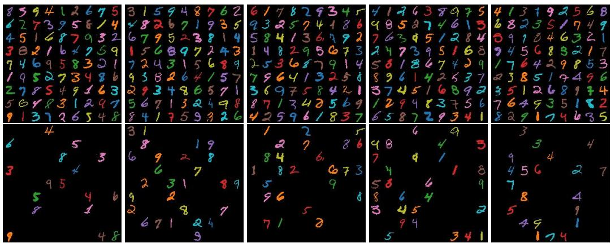  
Figure 8: Visualization of Coldoku samples from the training set (top: solution, bottom: clue).

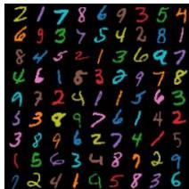  
(a) 0.01

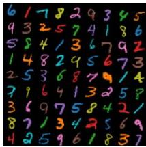  
(b) 0.03

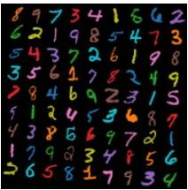  
(c) 0.05

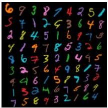  
(d) 0.07

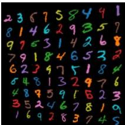  
(e) 0.09  
Figure 9: Visualization of Tildoku solution samples with different tilting ratios.

color accuracy, ratio of grids where the 81 predicted colors satisfy all Sudoku constraints, and (iii) accuracy, joint ratio of grids where both the digit and color arrangements are simultaneously valid.

## A.3 TANGRAM DATASET

Tangram is a classic dissection puzzle consisting of seven flat shapes, called tans, which must be arranged to form a specific target figure, or silhouette (see Figure 4b). The seven pieces (Figure 4a), comprising two large $( \triangle ^ { L } \times \bar { 2 } )$ , one medium $( \triangle ^ { M } )$ and two small $( \triangle ^ { S } \times 2 )$ right triangles, one square (□), and one parallelogram ( ), remain constant across all puzzles. The core challenge of the Tangram task lies in the latent inference that is required to map these seven discrete pieces onto a silhouette, where individual piece boundaries are not visible. A valid solution must satisfy three primary constraints: (i) all seven tans must be used, (ii) no two pieces may overlap or occupy the same spatial coordinates, and (iii) the final arrangement must maintain the area and size proportions5 of the provided layout. Many Tangram layouts exhibit high visual ambiguity, i.e., cases where internal boundaries are not easily identifiable, making them a rigorous test for visual reasoning and spatial reconstruction, even for human solvers (Figure 10).

We rely on the SVG annotations from the Kilogram dataset (Zhang et al., 2021), which provides 1,013 uncolored, unique Tangram solutions. Each sample consists of an SVG file containing precise polygon coordinates for the final silhouette. We extended this dataset by randomly creating 9,200 shuffles to use as input clue (Figure 4a). To color the pieces and the solution, we randomly sample with replacement a pool of nine colors: red •, green •, blue •, yellow •, magenta •, cyan •, purple •, orange • and teal •, and match the color of each piece of the shuffled view to a piece of the same type in the solution.

While the original Kilogram dataset was designed to evaluate the semantic associations between silhouettes and language, recent works have begun addressing the underlying spatial reasoning task (Yamada et al., 2025; Zong & Tan, 2026). However, existing approaches such as TANGAN (Yamada

Figure 10: Tangram layouts ordered by reasoning difficulty. From easy configurations (left) containing salient geometric cues that simplify piece identification to complex silhouettes (right) characterized by high structural ambiguity, where multiple valid piece arrangements may exist for the same layout.

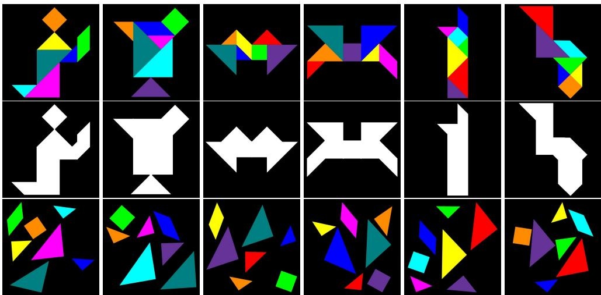  
Figure 11: Visualization of Tangram samples from the training set.

et al., 2025) treat the problem as a standard generative task using Generative Adversarial Networks (GANs) to segment a silhouette into pieces. Such methods may overlook the discrete constraints of the puzzle (e.g., that a specific set of seven pieces with fixed area ratios must be utilized), and ignore the actual reasoning on the piece proportions to simply recreate a shapes.

To bridge this gap and enforce an actual human-like reasoning process, we augment the dataset by assigning distinct colors to each of the seven tans. This modification requires the model to perform joint spatial and logical reasoning: it must not only partition the silhouette correctly but also match the specific geometry of each piece (e.g., the large triangle vs. the medium triangle) to its corresponding color and position. This ensures that the reasoner is explicitly accounting for the size relationships and global constraints of the puzzle rather than relying on local shape generation. Additionally, this initialization (Figure 4a-4b) also resembles how humans solve the Tangram puzzle: from a random view of separated tans (the shuffle), reasoning over the color and proportions to fill the layout. Our perception is robust to different shuffles of the same seven pieces, as well as rotations of the silhouette.

Evaluation of Tangram: We use a deterministic evaluation pipeline to assess the correctness of the generated solutions with our diffusion models. First, we quantize the color space by mapping each pixel to the nearest of 10 predefined color centroids (9 tan colors plus the black background). We then leverage the input layout to define the ground-truth boundaries of the silhouette. If the pixel-level mismatch between the generated image and the ground-truth layout exceeds 5%, the sample is immediately assigned zero accuracy.

Subsequently, for samples passing the initial silhouette layout check, we use the OpenCV library to perform contour detection and polygonal approximation. Based on the extracted polygons, we evaluate the sample against two metrics:

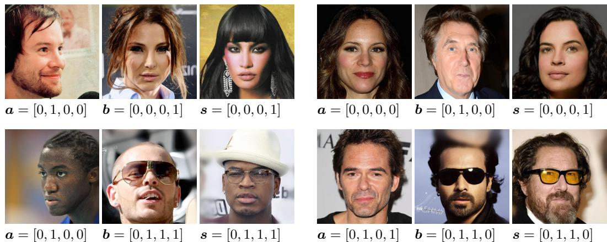  
Figure 12: LogicFace examples from the training set with the four binary features: smiling (OR), male (AND), glasses (XOR), young (IMPLIES).

1. Shape accuracy (correctly-shaped): if the polygons maintain the correct area and proportions and the set of extracted shapes matches the original seven-tan composition.

2. Accuracy (correctly-colored): building upon soft accuracy, if the color of each placed piece matches the identity of the corresponding tan provided in the input piece view.

In Figure 4d of the main text, we show an example of a solution that would be classified with 100% shape accuracy but with zero standard accuracy.

## A.4 LOGICFACE: LOGIC OPERATORS ON FACIAL FEATURES

We challenge our spatial reasoning framework to abstract real-image patterns, and introduce LogicFace as a structured logical puzzle where facial features must satisfy specific combinations based on logical operators. The LogicFace puzzle consists of three images, sorted in a row (Figure 5), where the first two are the arguments (A and B) and the third one is the answer (S). Each image contains a clear centered human face, characterized with κ binary attributes, named as a, $b , s \in \{ 0 , 1 \} ^ { \kappa }$ for A, B and S, respectively. For each attribute, the puzzle fixes an implicit logical operator $f _ { j } : \{ 0 , 1 \} \times \{ 0 , 1 \} \stackrel { \cdot } {  } \{ 0 , 1 \}$ such that the statement $f _ { j } ( { \pmb a } _ { j } , { \pmb b } _ { j } ) = { \pmb s } _ { j }$ holds.

We used the face images and annotations from the CelebA-HQ dataset (Lee et al., 2020) and selected κ = 4 binary attributes: smiling, male, glasses and young to characterize each input image, with the OR, AND, XOR and IMPLIES logical operators. These attributes and operators were fixed for all images of the dataset. During training, the first and second panels are used as clues, while the last panel is corrupted to task the reasoner to learn how to generate facial attributes such that the logical operators hold.

LogicFace statistics: We selected the attributes of the LogicFace puzzle after a manual examination of the CelebA annotations, where we found smiling, male, glasses and young to be less noisy than the other labels, as well as uncorrelated. Attributes like smiling (48.21%) and male (41.67%) are balanced, while glasses and young constitute the 6.5% and 77.36% of the CelebA-HQ dataset, respectively. To ensure a balanced number of LogicFace configurations, we first uniformly sample one million LogicFace configurations, and then select images whose attributes matched the specific statements. Note that with this process, the LogicFace dataset

<table><tr><td>OR</td><td></td><td>AND</td><td>XOR</td><td></td><td colspan="3">IMPLIES</td></tr><tr><td>A B</td><td>S</td><td>A B</td><td>S A</td><td>B</td><td>S</td><td>A B</td><td>S</td></tr><tr><td>0</td><td>0 0</td><td>0 0</td><td>0</td><td>0 0</td><td>0</td><td>0 0</td><td>1</td></tr><tr><td>0</td><td>1 1</td><td>0 1</td><td>0 0</td><td>1</td><td>1</td><td>0 1</td><td>1</td></tr><tr><td>1</td><td>0 1</td><td>1 0</td><td>0</td><td>1 0</td><td>1</td><td>1 0</td><td>0</td></tr><tr><td>1</td><td>1 1</td><td>1 1</td><td>1</td><td>1 1</td><td>0</td><td>1 1</td><td>1</td></tr></table>

Table 4: Logical operators between A and B, yielding S. Since there are four operator and each operator has four valid statements, LogicFace has 256 possible configurations.

is not balanced in terms of images (indeed, faces with glasses are considerably repeated since they need to cover the missing ratio of the CelebA-HQ dataset to create statements of the XOR operator). However, since our purpose is to abstract on the combinations of glasses rather than the diversity of the generation, we opted to use data augmentation methods (e.g., horizontal flipping) to expand the variety of the samples, but acknowledging that our diffusion models might be recreating training set replicas, especially for unbalanced attributes like (not) young and glasses.

Algorithm 2: Slot Attention module (S). Algorithm 3: Relational Abstraction (R).   
Input $\mathbf { \colon } ( \mathbf { f } _ { 1 : m } , \mathbf { p } _ { 1 : m } )$ from E. Input :Latents $\mathbf { z } = [ \tilde { \mathbf { f } } _ { 1 : K } ; \tilde { \mathbf { p } } _ { 1 : K } ]$ from S.   
Params :Projections k, q, v, GRU, MLP, LayerNorm. Params :Projections $\dot { k _ { \ell } } , q _ { \ell } , v _ { \ell }$ and FFN per layer ℓ.   
h1:m ← LayerNorm(f1:m + p1:m); r1:K ← p˜1:K;   
s1 $\mathbf { \sigma } _ { : k } \sim { \mathcal { N } } ( 0 , \mathbf { I } ) ;$ for $\mathbf { \bar { \boldsymbol { \ell } } } = 1 , \dots , L \mathbf { \ d o }$   
for i = 1, . . . , η do $\mathbf { v } _ { 1 : K } \gets v _ { \ell } ( \mathbf { r } _ { 1 : K } ) ;$   
s1:k ← LayerNorm(s1:k); v ← softmax $\begin{array} { r l } {  { ( k _ { \ell } ( \tilde { \mathbf { f } } _ { 1 : K } ) \cdot q _ { \ell } ( \tilde { \mathbf { f } } _ { 1 : K } ) ^ { \top } ) \mathbf { v } _ { 1 : K } + \mathbf { v } _ { 1 : K } ; } } \end{array}$   
$A \gets \mathrm { s o f t m a x } ( k ( \mathbf { h } _ { 1 : m } ) \cdot q ( \mathbf { s } _ { 1 : k } ) ^ { \top } ) \in \mathbb { R } ^ { m \times k }$   
$\mathbf { s } _ { 1 : k } \gets \mathrm { G R U } ( \mathbf { s } _ { 1 : k } ; A ^ { \top } \cdot v ( \mathbf { h } _ { 1 : m } ) ) ;$ $\mathbf { v } _ { 1 : K } \gets \mathrm { F F N } _ { \ell } ( \mathbf { v } _ { 1 : K } ) + \mathbf { v } _ { 1 : K } ;$   
$\mathbf { s } _ { 1 : k } \gets \mathbf { s } _ { 1 : k } + \mathrm { M L P } ( \mathrm { L a y e r N o r m } ( \mathbf { s } _ { 1 : k } ) )$ $\mathbf { v } _ { 1 : K }  \mathbf { S e l f A }$ ttention $( { \bf v } _ { 1 : K } ) + { \bf v } _ { 1 : K } ;$   
$\tilde { \mathbf { f } } _ { 1 : k } \gets A ^ { \top } \mathbf { f } _ { 1 : m } ;$ $\mathbf { r } _ { 1 : K } \gets \mathrm { F F N } _ { \ell } ( \mathbf { v } _ { 1 : K } ) + \mathbf { v } _ { 1 : K } ;$   
$\tilde { \mathbf { p } } _ { 1 : k } \gets A ^ { \top } \mathbf { p } _ { 1 : m } ;$ return r1:k   
return s1:k

Evaluation of LogicFace: We trained a ResNet-18 (He et al., 2016) with a binary multi-label objective corresponding to the selected attributes (smiling, male, glasses and young) on the CelebA-HQ dataset $( > 9 8 \%$ test accuracy). At inference time, given a generated $\hat { S }$ and its predicted binary value sˆ, the evaluator uses Table 4 to validate the constraints. Specifically, it individually evaluates $f _ { j } ( { \pmb a } _ { j } , { \pmb b } _ { j } ) = \hat { \pmb s } _ { j }$ for the j-th feature and logical operator, and the overall correctness of a sample.

## B DETAILS ON THE MODEL ARCHITECTURES

Our spatial reasoning framework is composed of two models: (i) the discoverer, which is independently trained to disentangle objects in the scene through slot attention, (ii) the reasoner, which is a diffusion model tasked to model the conditional distribution $q ( \mathbf { x } _ { 0 } | \mathbf { x } _ { c } )$ guided via relational embeddings learned by a relational abstraction module. In what follows, we describe each module in detail, as well as the specific hyper-parameters used to train them.

## B.1 ARCHITECTURE OF THE Discoverer

The discoverer follows a similar architecture to the one proposed by Locatello et al. (2020).

• The slot encoder $\mathcal { E } : \mathbb { R } ^ { \mathtt { H } \times \mathtt { W } \times \mathtt { c } }  ( \mathbb { R } ^ { m \times d } , \mathbb { R } ^ { m \times d } )$ maps the input image to a set of hidden features $\mathbf { f } _ { 1 : m } \in \mathbb { R } ^ { m \times d }$ through convolutional layers, alongside positional embeddings $\mathbf { p } _ { 1 : m } \in \mathbb { R } ^ { m \times d }$ where m = hw corresponds to the reduced spatial resolution.

• The slot attention module, $\boldsymbol { S } : ( \mathbb { R } ^ { m \times d } , \mathbb { R } ^ { m \times d } )  \mathbb { R } ^ { k \times d }$ , uses the extracted features $\left( \mathbf { f } _ { 1 : m } \right)$ and positions $\left( \mathbf { p } _ { 1 : m } \right)$ from the encoder to compute the slot embeddings $\left( \mathbf { s } _ { 1 : k } \right)$ . This process begins by initializing the slots as $\mathbf { s } _ { 1 : k } \sim \mathcal { N } ( 0 , \mathbf { I } )$ ), and iteratively refining them over $\eta = 3$ iterations using a GRU conditioned on the input features and positions. The output is an updated set of slots $\mathbf { s } _ { 1 : k }$ , whose information is decoupled into object-specific features $( \tilde { \mathbf { f } } _ { 1 : k } )$ and positions $( \tilde { \bf { p } } _ { 1 : k } )$ by computing the dot product of f1 ·p $\mathbf { f } _ { 1 : m }$ and $\mathbf { p } _ { 1 : m }$ with the final attention matrix of the refinement, respectively. This is formally outlined in Algorithm 2.

• The slot decoder $\mathcal { D } : \mathbb { R } ^ { k \times d }  \mathbb { R } ^ { \mathrm { H } \times w \times \mathrm { c } }$ is fed with the slot embeddings $\mathbf { s } _ { 1 : k }$ to generate individual reconstructions and their corresponding importance masks. The decoder spatially broadcasts each slot embedding onto a 2D grid, augmented with positional embeddings $\mathbf { g } ^ { \mathbf { ^ { \prime } } } \in \mathbb { R } ^ { \mathrm { h } \times \mathrm { w } \times d }$ This is processed by convolutional layers to produce a candidate reconstruction per slot, named $\{ \hat { { \mathbf { x } } } _ { 1 : k } \} \overset { * } { \in } \mathbb { R } ^ { k \times \mathrm { H } \times \mathrm { W } \times \overset { * } { \mathrm { C } } }$ , with an associated mask, $\pmb { \alpha } _ { i } \in \mathbb { R } ^ { \mathrm { H } \times \mathrm { W } }$ . The final output xˆ is computed as the weighted sum of the candidate reconstructions, where the weights are determined by a softmax normalization over the masks: $\hat { \mathbf { x } } = \sum _ { i = 1 } ^ { k }$ softmax $( \pmb { \alpha } ) _ { i } \hat { \mathbf { x } } _ { i }$

The full architecture is trained end-to-end with the mean squared error between the original input x and the final reconstruction $\hat { \mathbf { x } } .$

Scalable decoder: To scale the number of slots $k$ to hundreds, we propose a scalable decoder that avoids the memory-intensive process of generating full candidate reconstructions for every slot. Instead, this decoder estimates the attention masks (alpha weights) prior to the broadcasting step.

The mechanism uses a grid of positional embeddings, $\mathbf { g } \in \mathbb { R } ^ { \mathrm { { h } \times \mathrm { { w } \times { d } } } }$ . Unlike the standard decoder that broadcasts every slot to the full grid resolution, our approach computes the dot product between the grid and the slot embeddings $\mathbf { s } _ { 1 : k }$ to derive an estimated mask: α˜ = softmax $( \mathbf { g } \cdot \mathbf { s } _ { 1 : k } ^ { \top } )$ . The positional grid is then updated by aggregating the slots according to these weights: $\begin{array} { r } { \tilde { \mathbf { s } } = \sum _ { i = 1 \dots k } \tilde { \alpha } _ { i } \mathbf { s } _ { i } } \end{array}$ . The weighted feature map ˜s serves as the sole input for the subsequent decoder layers, effectively decoupling the reconstruction from the number of slots k.

Training details: We trained our Discoverer module with AdamW (Loshchilov & Hutter, 2019), learning rate of $4 \times 1 0 ^ { - 4 }$ , batch size of 64, and linear warmup of 10,000 steps followed by exponential decay; using mixed precision (bfloat) for accelerated training.

Evaluation: We assess disentanglement of the Discoverer by manually inspecting predicted samples, and additionally measure the reconstruction performance6 with the task-specific evaluators. For Akari, Coldoku, Tildoku and MNIST-Sudoku we use the cell accuracy (ratio of cells with matched predictions with the evaluator). For Tangram, LogicFace and Counting Polygons we run the evaluator on the reconstructed image and measure if the output satisfies the logical constraints.

## B.2 ARCHITECTURE OF THE Relational Abstraction MODULE

The relational abstraction module is designed to enrich slot representations with decoupled positional and relational information via attention mechanisms. It leverages Slot Abstractors (Mondal et al., 2024) to map object-level information onto learnable relational embeddings. These embeddings are iteratively refined alongside the slots to produce high-level, position-aware representations.

The relational abstraction module, $\mathcal { R } : ( \mathbb { R } ^ { K \times d } , \mathbb { R } ^ { K \times d } ) \to \mathbb { R } ^ { K \times d }$ , builds upon the output of the slot autoencoder. As described in §B.1, the slots from the encoder $\mathcal { E }$ can be decoupled into object-specific features $( \tilde { \mathbf { f } } _ { 1 : k } )$ and positional embeddings $( \tilde { \bf p } _ { 1 : k } )$ , which together compose the conditional latents for the diffusion model $\mathbf { z } ^ { \ast } = ( \tilde { \mathbf { f } } _ { 1 : k } ^ { \ast } , \tilde { \mathbf { p } } _ { 1 : k } ^ { \ast } )$ , where $\ast = ( 0 , c )$ . This operation re-projects the consolidated slot information back into separate features and position subspaces.

The slot abstractor module (Algorithm 3) learns relational information between slots by passing their feature and positional information through L abstractor layers (Mondal et al., 2024), consisting of interleaved cross-attention, self-attention and MLP blocks with residual connections. Through consecutive layers, the positional embeddings $( \tilde { \mathbf { p } } _ { 1 : k } ^ { * } )$ are updated by hierarchically pooling feature relations $( \tilde { \mathbf { f } } _ { 1 : k } ^ { * } )$ , enabling the model to capture interactions between the discovered objects and learn contextualized positional-aware representations of their spatial dependencies.

## B.3 CONFIGURATION OF THE Reasoner

We define the reasoning task as modeling the conditional distribution $q ( \mathbf { x } _ { 0 } | \mathbf { x } _ { c } )$ , where $\mathbf { x } _ { \mathrm { 0 } }$ is a valid solution for the reasoning task and $\mathbf { x } _ { c }$ is the initial clue or statement.

The reasoner is a diffusion model that simultaneously learns two distributions: (i) the unguided conditional distribution $q ( \mathbf { x } _ { 0 } | \mathbf { x } _ { c } , \mathcal { R } ( \mathbf { z } ^ { c } ) _ { , } ^ { \rangle }$ ), and (ii) the solution-guided conditional distribution $q ( \mathbf { x } _ { 0 } | \mathbf { x } _ { c } , \mathcal { R } ( \mathbf { z } ^ { c } , \mathbf { z } ^ { 0 } ) )$ , where the latent variables $\mathbf { z } ^ { c }$ and $\mathbf { z } ^ { 0 }$ correspond to the feature-position embeddings obtained with the discoverer module. Since the goal is to model $q ( \mathbf { x } _ { 0 } | \mathbf { x } _ { c } )$ at inference time, ancestral sampling on $\mathbf { z } ^ { 0 }$ is not possible, so the unguided distribution is the one sampled to generate a solution from the clue $\mathbf { x } _ { c }$ and the latents $\mathbf { z } ^ { c }$

Forward process: We define the diffusion process of the target distributions with continuous normalizing flows (CNFs), where the trajectory from data distribution $q _ { 0 } ( \mathbf { x } )$ to the Gaussian prior $q _ { 1 } = \mathcal { N } ( 0 , \mathbf { I } )$ is governed by Gaussian probability density paths (Lipman et al., 2023, Eq. (1)), whose parameters depend on $\mathbf { x } _ { \mathrm { 0 } }$ and a continuous time $t \in [ \bar { 0 } , \bar { 1 } ]$ such that convergence from $\mathbf { x } _ { \mathrm { 0 } }$ to the Gaussian prior is guaranteed by fixing $\mu _ { 0 } ( \mathbf { x } _ { 0 } ) = \mathbf { x } _ { 0 } , \sigma _ { 0 } ( \mathbf { x } _ { 0 } ) = \sigma _ { \operatorname* { m i n } } , \mu _ { 1 } ( \mathbf { x } _ { 0 } ) = 0 { \mathrm { ~ a n d ~ } } \sigma _ { 1 } ( \mathbf { x } _ { 0 } ) = 1$

Theflow (Eq. (2)) is a differentiable transformation to reshape samples from the prior to $p _ { t } ( \mathbf { x } | \mathbf { x } _ { 0 } )$ and its associated conditional vectorfield (Eq. (3)) is approximated by a neural network.

$$
p _ { t } ( \mathbf { x } | \mathbf { x } _ { 0 } ) = \mathcal { N } ( \mathbf { x } | \mu _ { t } ( \mathbf { x } _ { 0 } ) , \sigma _ { t } ( \mathbf { x } _ { 0 } ) ^ { 2 } \mathbf { I } ) ,\tag{1}
$$

$$
\begin{array} { r } { \phi _ { t } ( \epsilon , \mathbf { x } _ { 0 } ) = \mu _ { t } ( \mathbf { x } _ { 0 } ) + \sigma _ { t } ( \mathbf { x } _ { 0 } ) \epsilon , } \end{array}\tag{2}
$$

$$
v _ { t } ( \mathbf { x } | \mathbf { x } _ { 0 } ) = \frac { \sigma _ { t } ^ { \prime } ( \mathbf { x } _ { 0 } ) } { \sigma _ { t } ( \mathbf { x } _ { 0 } ) } ( \mathbf { x } - \mu _ { t } ( \mathbf { x } _ { 0 } ) ) + \mu _ { t } ^ { \prime } ( \mathbf { x } _ { 0 } ) .\tag{3}
$$

We define the mean and variance of the probability paths as linear functions of t (Eq. (4)):

$$
\begin{array} { r } { \mu _ { t } ( \mathbf { x } _ { 0 } ) = ( 1 - t ) \mathbf { x } _ { 0 } , \quad \sigma _ { t } ( \mathbf { x } _ { 0 } ) = t , } \end{array}\tag{4}
$$

which effectively sets $\sigma _ { \operatorname* { m i n } } = 0$ . Given this choice of linear functions, the training objective based on flow matching (Lipman et al., 2023) can be written as follows7:

$$
\mathcal { L } ( \theta ) = \mathbb { E } _ { \mathbf { x } _ { 0 } \sim q _ { 0 } , \epsilon \sim q _ { 1 } , \mathbf { x } _ { t } \sim p _ { t } } \| p _ { \theta } ( \mathbf { x } _ { t } , t ) - ( \epsilon - \mathbf { x } _ { 0 } ) \| ^ { 2 }\tag{5}
$$

Sampling: Since the transformation is governed by a continuous-time vector field, sampling can be framed as solving an ordinary differential equation (ODE). Specifically, once the neural network $p _ { \theta } ( \mathbf { x } _ { t } , t )$ is trained to approximate the target vector field $v _ { t } ( \mathbf { x } | \mathbf { x } _ { 0 } )$ , we generate new samples by evolving the Gaussian noise $\epsilon \sim \mathcal { N } ( 0 , \mathbf { I } )$ backward in time to $t = 0$ . The trajectory follows the ODE:

$$
\frac { \mathrm { d } \mathbf { x } _ { t } } { \mathrm { d } t } = p _ { \theta } ( \mathbf { x } _ { t } , t ) .\tag{6}
$$

In practice, this is computed with first-order discretization (Euler method) with step size dt:

$$
\mathbf { x } _ { t - \mathrm { d } t } \approx \mathbf { x } _ { t } + p _ { \theta } ( \mathbf { x } _ { t } , t ) \mathrm { d } t .\tag{7}
$$

Architecture details: Our denoiser module uses a standard attention-based U-Net (Ronneberger et al., 2015) comprising residual convolutional blocks where input images are always stacked in the channel dimension. Self-attention is applied to the visual features exclusively within the final two blocks of the encoder. Each residual block is composed of two 3 × 3 convolutions followed by a 2-factor pooling. The U-Net self-attention layers incorporate an extra cross-attention layer with shared KV projections to integrate the relational embeddings with the hidden features. Skip connections are implemented via channel concatenations between the corresponding encoder and decoder layers.

In preliminary experiments, we also explored the Diffusion Transformer (DiT) architecture (Peebles & Xie, 2023) as a backbone for the reasoning mechanism. However, it proved difficult to optimize this architecture even under baseline configurations for these specific spatial tasks. This observation also aligns with findings by Wewer et al. (2025), who noted similar challenges in reasoning-heavy domains. We leave the development of hybrid architectures, leveraging the inductive biases of convolutional layers alongside the scalability of high-complexity Transformers, for future work.

Training details: We use AdamW optimizer (Loshchilov & Hutter, 2019), learning rate of $1 \times 1 0 ^ { - 4 }$ linear warm-up of 5,000 steps, and batch size of 128. For accelerated training, all denoisers are trained with the mixed precision (bfloat16). We train all models on the same number of steps.

## B.4 MODEL COMPLEXITY AND PARAMETERS

We provide three size configurations for RDM to broadly investigate the impact of training small to large diffusion models for spatial reasoning tasks. Previous work like SRM (Wewer et al., 2025) rely on large U-Net backbones (120M parameters) for puzzles like Sudoku, while others (Goren et al., 2026; Lee et al., 2025) provide empirical evidence that visual reasoning can still be unlocked with small architectures (<50M parameters). We show two key findings through our experiments: (1) RDM is compatible with multiple backbone sizes, scaling from 30M to 120M parameters, and (2) larger architectures do not necessarily benefit reasoning and smaller architectures are preferable for faster convergence. We highlight these findings as a positive result for the AI community in terms of reproducibility and feasibility.

We set RDM and capacity-matched baselines to three size configurations: small (S), medium (M) and large (L). In both S and M, RDM maintains a compact discoverer module of <8M parameters (see Table 5) while the reasoner leverages 25M and 40M parameters, respectively (see Table 6). In the L setting, we expanded the discoverer dimension to d = 512 to study the impact of richer slot embeddings, and matched the diffusion backbone in L to exactly mirror the model from (Wewer et al., 2025). Due to the computational overhead, we adapted the training limit to each task (see Table 6).

Table 5: Architecture, training and performance details of the Discoverer in configurations S and M.
<table><tr><td></td><td>k</td><td>d</td><td>channels</td><td>#conv/layer</td><td>#params.</td><td>#steps</td><td>Accuracy</td></tr><tr><td>Slot-Attention</td><td></td><td></td><td></td><td></td><td></td><td></td><td></td></tr><tr><td>Akari</td><td>16</td><td>128</td><td>[16, 32, 64, 128]</td><td>1</td><td>1.4M</td><td>100K</td><td>99.58</td></tr><tr><td>Coldoku</td><td>16</td><td>128</td><td>[32, 64, 128, 256]</td><td>1</td><td>5.4M</td><td>400K</td><td>88.19</td></tr><tr><td>Tangram</td><td>7</td><td>128</td><td>[16, 32, 64, 128]</td><td>1</td><td>1.4M</td><td>300K</td><td>16.34</td></tr><tr><td>LogicFace</td><td>6</td><td>256</td><td>[32, 64, 128, 256]</td><td>2</td><td>7.6M</td><td>200K</td><td>72.54</td></tr><tr><td>Tildoku</td><td>20</td><td>128</td><td>[16, 32, 64, 128]</td><td>2</td><td>7.6M</td><td>400K</td><td>61.15</td></tr><tr><td>MNIST-Sudoku</td><td>16</td><td>128</td><td>[16, 32, 64, 128]</td><td>1</td><td>1.4M</td><td>200K</td><td>84.73</td></tr><tr><td>Counting Polygons</td><td>12</td><td>256</td><td>[32, 64, 128, 256]</td><td>1</td><td>5.4M</td><td>300K</td><td>80.67</td></tr><tr><td>Scalable Slot-Attention</td><td></td><td></td><td></td><td></td><td></td><td></td><td></td></tr><tr><td>Akari</td><td>121</td><td>128</td><td>[16, 32, 64, 128]</td><td>1</td><td>1.4M</td><td>100K</td><td>100</td></tr><tr><td>Coldoku</td><td>81</td><td>128</td><td>[16, 32, 64, 128]</td><td>1</td><td>1.4M</td><td>200K</td><td>99.52</td></tr></table>

Table 6: Architecture and training details of the Reasoner.
<table><tr><td></td><td>d</td><td>channels</td><td></td><td>#conv/layer #params of D</td><td></td><td>#params of R #params of U-Net # steps</td><td></td></tr><tr><td>RDM[S]</td><td>128</td><td>[64, 128, 256, 512]</td><td>[2, 2, 1, 1]</td><td>(Table 5)</td><td>4M</td><td>25M</td><td>300K</td></tr><tr><td>RDM[M]</td><td>256</td><td>[64, 128, 256, 512]</td><td>[2, 2, 2, 2]</td><td>(Table 5)</td><td>4M</td><td>35M</td><td>300K</td></tr><tr><td>RDM[L]</td><td></td><td></td><td></td><td></td><td></td><td></td><td></td></tr><tr><td>Akari</td><td>512</td><td>[128, 256, 512, 512]</td><td>2</td><td>40M</td><td>15M</td><td>120M</td><td>40K</td></tr><tr><td>Coldoku</td><td>512</td><td>[128, 256, 512, 512]</td><td>2</td><td>40M</td><td>15M</td><td>120M</td><td>45K</td></tr><tr><td>Tangram</td><td>512</td><td>[128, 256, 512, 512]</td><td>2</td><td>40M</td><td>15M</td><td>120M</td><td>80K</td></tr><tr><td>LogicFace</td><td>512</td><td>[128, 256, 512, 512]</td><td>2</td><td>40M</td><td>15M</td><td>120M</td><td>40K</td></tr><tr><td>Tildoku</td><td>512</td><td>[128, 256, 512, 512]</td><td>2</td><td>40M</td><td>15M</td><td>120M</td><td>45K</td></tr></table>

Computational resources: All models were implemented in PyTorch 2.9 and trained using the CUDA 13.0 toolkit. Our experiments were conducted across multiple compute clusters (e.g., Austrian Scientific Computing infrastructure), consisting of NVIDIA L40, A40, A100 and H100 GPU nodes.

## C DETAILS ON THE EXPERIMENTAL RESULTS

## C.1 RESULTS OF THE Discoverer

The reconstruction quality of the discoverer module is evaluated with the cell accuracy in the grid-like puzzles (Akari and Coldoku). For Tangram, the evaluation pipeline described in §A.3 is also used to evaluate the discoverer. For LogicFace, we use the ResNet-18 classifier (§A.4) on the reconstructed samples to match the real binary vector with the one predicted by the classifier.

In Akari reconstruction accuracies achieved 97% and 98% using 16 and 121 slots, respectively. For Coldoku, digit reconstruction accuracy reached 82.64% with 16 slots and 99.79% with 81 slots. However, color accuracy was significantly lower at 40.41% and 72.05%. We observed that the gap in color reconstruction correlates with observed blurriness in the outputs. Because the slot autoencoder uses a variational architecture with a simple convolutional decoder, it is prone to producing blurred digits with imprecise color values. Consequently, more errors occurred when reconstructed colors fell between two palette values, leading to misclassification by evaluator. We observed a similar behavior for Tangram, where the discoverer only achieved 57% of accuracy with our evaluation pipeline (§A.3). In practice the model showed real disentanglement (Figure 13), although reconstruction struggled to define sharp borders for the figures, leading to errors when estimating polygons with the deterministic evaluator. For LogicFace, we evaluated the discoverer’s reconstructions and obtained 95% of accuracy in the selected features (smiling, male, glasses and young).

Quality of object disentanglement: Figures 13 and 14 illustrate the decomposition performance of the trained slot autoencoders on the Tangram and LogicFace datasets. While Slot Attention is theoretically designed to ensure perfect object disentanglement, we observed that for Tangram, certain slots remained inactive while others encapsulated multiple tans. We hypothesize that because pieces vary in color and exhibit slight scale variances across samples, the slots may have fit specific chromatic patterns rather than individual geometric entities. Consequently, the model occasionally groups cooccurring tans into a single slot instead of maintaining a strictly one-to-one object correspondence.

Slot visualizations for LogicFace (Figure 14) depicts the inherent difficulty of object disentanglement in real images. We observed that salient, well-defined features from the CelebA-HQ dataset—such as glasses, smiling, and facial hair, are consistently isolated within specific slot embeddings. Conversely, the remaining slots struggle to decouple diffuse attributes, including skin tone and hair textures, or to model the high-variance backgrounds. This suggests that while Slot Attention effectively identifies discrete semantic anchors, it faces challenges in partitioning continuous or highly irregular global structures into distinct object-centric representations. We still find slot embeddings beneficial for reasoning, since key features were already represented into slots (glasses and smiling), while the others could be associated with other attributes (e.g., beard with male, gray hair with not young).

Real  
Output  
Slot 1  
Slot 2  
Slot 3  
Slot 4  
Slot 5  
Slot 6  
Slot 7  
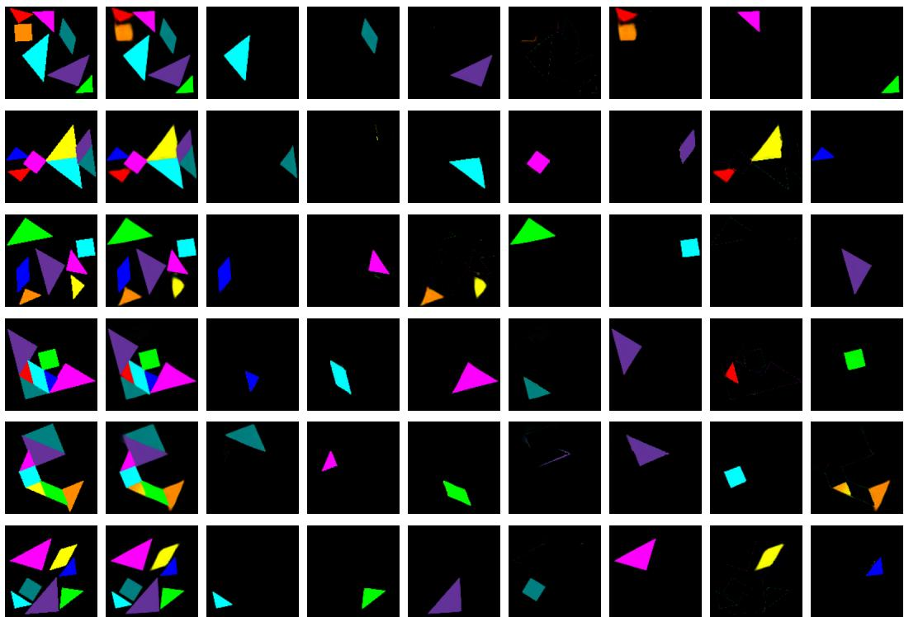  
Figure 13: Disentanglement of the tans on Tangram inputs.

## C.2 RESULTS OF THE Reasoner

Tables 7–10 present detailed results for our reasoning benchmark with different sampling steps $( \tau \in \{ 1 0 , 1 0 \bar { 0 } \} )$ ) in Akari, Tildoku, Tangram and LogicFace. We exclude sampling steps $\tau = 1 0 0$ from Tildoku since we did not appreciate significant changes from $\tau = 1 0 ;$ ; and SRM performance in Tangram, since performance was significantly degraded in Table 2. For Akari, we also report the number of unlit cells (UNL), the absolute error between the adjacent bulbs and annotated walls (DST), and the overlap (OVP, bulbs that mirror each other). We provide visualization of results obtained with our models on Tangram and LogicFace datasets in Figures 15 and 16.

Output  
Slot 1  
Slot 2  
Slot 3  
Slot 4  
Slot 5  
Slot 6  
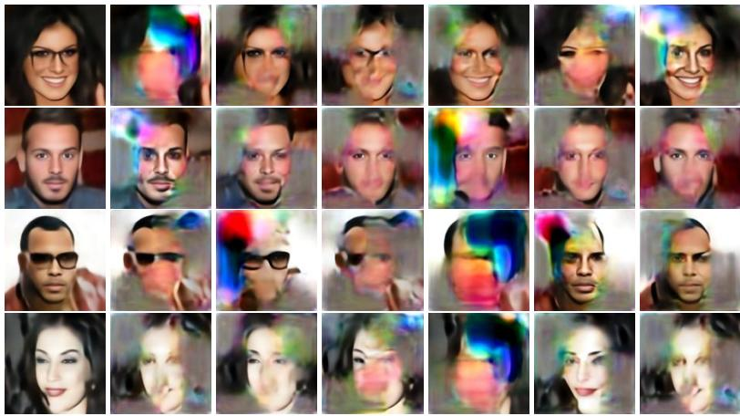  
Figure 14: Disentanglement of the facial attributes on LogicFace inputs.

Table 7: Detailed results on Akari.
<table><tr><td rowspan="3"></td><td colspan="4" rowspan="2">ID</td><td colspan="8">OoD</td><td colspan="4"></td></tr><tr><td rowspan="2"></td><td colspan="4">5-10% (low)</td><td colspan="2"></td><td colspan="5">35-40% (high)</td></tr><tr><td>UNL DST</td><td>OVP</td><td>BLB</td><td>ACC</td><td>UNL</td><td>DST</td><td>OVP</td><td>BLB</td><td>ACC</td><td>UNL</td><td>DST</td><td>OVP</td><td>BLB</td><td>ACC</td></tr><tr><td>Base</td><td>0.46</td><td>0.10</td><td>0.03</td><td>74.08</td><td>67.35</td><td>3.22</td><td>0.22</td><td>0.48</td><td>17.02</td><td>13.80</td><td></td><td>0.17</td><td>0.04</td><td>0.01</td><td>89.78</td><td>86.80</td></tr><tr><td>SRM</td><td></td><td></td><td></td><td></td><td></td><td></td><td></td><td></td><td></td><td></td><td></td><td></td><td></td><td></td><td></td><td></td></tr><tr><td>parallel 10 II RDM[S]</td><td>sequential 7.01</td><td>2.380.81 9.81</td><td>0.15 17.79</td><td>26.52 0.00</td><td>12.26 0.00</td><td>15.43 0.26</td><td>0.63 4.64</td><td>0.77 87.15</td><td></td><td>1.04 0.00</td><td>0.54 0.00</td><td>1.27 13.87</td><td>0.63 13.47</td><td>0.06 6.28</td><td>0.00</td><td>45.4227.22 0.00</td></tr><tr><td rowspan="8">T clue slots 16 full</td><td></td><td></td><td></td><td></td><td></td><td></td><td></td><td></td><td></td><td></td><td></td><td></td><td></td><td></td><td></td><td></td></tr><tr><td></td><td>0.40 0.100.01</td><td></td><td>77.14 70.20</td><td></td><td>0.54</td><td>0.29</td><td>0.22</td><td></td><td>55.4842.30</td><td></td><td>0.16</td><td>0.04</td><td></td><td>0.01 90.92 87.88</td><td></td></tr><tr><td>solution</td><td>0.450.11</td><td>0.02</td><td>75.32 67.90</td><td></td><td>0.68</td><td>0.24</td><td>0.15</td><td></td><td>54.2842.58</td><td></td><td>0.17</td><td>0.07</td><td></td><td>0.00 90.02 84.62</td><td></td></tr><tr><td>clue</td><td>0.300.13</td><td>0.04</td><td>79.14 69.98</td><td></td><td>0.45</td><td></td><td>0.21</td><td>0.41</td><td>50.0641.32</td><td></td><td>0.12</td><td>0.07</td><td></td><td>0.00 92.64 87.02</td><td></td></tr><tr><td></td><td>0.42 0.09</td><td>0.02</td><td>77.73 72.17</td><td></td><td>1.69</td><td>0.59</td><td></td><td>0.09</td><td>42.5724.96</td><td></td><td>0.15</td><td>0.04</td><td></td><td>0.01 91.00 87.94</td><td></td></tr><tr><td>solution</td><td>0.52 0.13</td><td>0.02</td><td>71.70</td><td>63.02</td><td>1.19</td><td>0.22</td><td>0.14</td><td></td><td>42.74 34.16</td><td></td><td>0.29</td><td>0.07</td><td>0.01</td><td></td><td></td></tr><tr><td>full 0.61</td><td>0.17</td><td>0.04</td><td>66.49</td><td>57.44</td><td>1.77</td><td>0.71</td><td>0.13</td><td>35.00</td><td>18.05</td><td></td><td>0.25</td><td>0.08</td><td>0.01</td><td></td><td>85.16 80.78</td></tr><tr><td>Base 0.10 0.08</td><td></td><td>0.01</td><td>86.02</td><td>80.04</td><td>1.61</td><td>0.11</td><td>0.16</td><td>43.62</td><td>39.48</td><td></td><td>0.10</td><td>0.04</td><td>0.01</td><td></td><td>84.68 79.01 92.22 88.92</td></tr><tr><td rowspan="7">parallel 100 三 T slots 16</td><td>SRM</td><td></td><td></td><td></td><td></td><td></td><td></td><td></td><td></td><td></td><td></td><td></td><td></td><td></td><td></td><td></td></tr><tr><td>sequential* 6.53</td><td>1.86 0.68 9.66</td><td>0.11 16.89</td><td>35.82 0.00</td><td>0.00</td><td>18.8015.430.57</td><td></td><td></td><td>0.40</td><td>1.60</td><td>0.94</td><td>0.98</td><td>0.58</td><td></td><td></td><td>0.06 54.1833.34</td></tr><tr><td></td><td></td><td></td><td></td><td></td><td></td><td></td><td></td><td></td><td></td><td></td><td></td><td></td><td></td><td></td><td></td></tr><tr><td> $\mathbf { R D M } ^ { \left[ \mathrm { S } \right] }$ </td><td></td><td></td><td></td><td></td><td></td><td></td><td></td><td></td><td></td><td></td><td></td><td></td><td></td><td></td><td></td></tr><tr><td>clue</td><td>0.14 0.08</td><td>0.01</td><td>88.30 82.06</td><td></td><td>0.15</td><td></td><td>0.18</td><td>0.02</td><td>85.9872.48</td><td></td><td>0.09</td><td>0.05</td><td></td><td>0.01 92.90 88.94</td><td></td></tr><tr><td>solution</td><td>0.18 0.09</td><td>0.01</td><td>86.1078.68</td><td></td><td>0.19</td><td>0.15</td><td>0.03</td><td></td><td>82.2070.73</td><td></td><td>0.09</td><td>0.07</td><td></td><td></td><td>0.01 93.33 87.96</td></tr><tr><td>full</td><td>0.12 0.10</td><td>0.01</td><td>89.44</td><td>80.42</td><td>0.13</td><td></td><td>0.11</td><td>0.08</td><td></td><td>83.32 75.06</td><td>0.07</td><td>0.08</td><td></td><td>0.01 93.80 87.48</td><td></td></tr><tr><td>slos clue</td><td>0.15 0.07</td><td>0.00</td><td>88.88</td><td></td><td>83.12</td><td>0.26</td><td>0.49</td><td>0.01</td><td></td><td>83.10 54.58</td><td></td><td>0.08</td><td>0.05</td><td></td><td>0.00 93.62 89.56</td><td></td></tr><tr><td>solution</td><td>0.17 0.08</td><td></td><td>0.01</td><td>86.36</td><td>80.28</td><td>0.33</td><td>0.13</td><td></td><td>0.02</td><td>75.34 74.58</td><td></td><td>0.12</td><td>0.00</td><td></td><td></td><td>0.00 91.14 88.94</td></tr><tr><td>12 full</td><td>0.18 0.09</td><td>0.01</td><td></td><td>85.84 77.34</td><td></td><td>0.27</td><td></td><td>0.34 0.04</td><td></td><td>77.3056.20</td><td></td><td>0.10</td><td>0.07</td><td></td><td>0.01 98.76 87.40</td><td></td></tr><tr><td></td><td></td><td></td><td></td><td></td><td></td><td></td><td></td><td></td><td></td><td></td><td></td><td></td><td></td><td></td><td></td><td></td></tr></table>

∗We do not report results of SRM (sequential) with τ = 100 in low and high regimes due to already low performance in ID evaluation and the high computational overhead of inference.

Discussion on Tangram complexity: The majority of existing generative modeling literature focuses on Sudoku-style reasoning constraints for diffusion models (Wewer et al., 2025; Avdeyev et al., 2023; Lee et al., 2025). These works typically frame the task as an inpainting problem, where the model learns to satisfy localized relational rules within a fixed coordinate system. In our Tangram benchmark, generating valid solutions represents a significantly more complex challenge with fewer precedents in deep learning. Prior work, such as TANGAN (Yamada et al., 2025), used adversarial networks to partition silhouettes into geometric components. However, our benchmark requires the model to go beyond structural partitioning, and requires simultaneously perform geometric induction, maintain color-consistency across dynamic pieces and infer latent spatial transformations to align tans with a target configuration. The low baseline accuracy reported in Table 2 clearly reflects this increased dimensionality.

Table 8: Detailed results on the Tildoku dataset.
<table><tr><td rowspan="2">ACC</td><td colspan="3">Easy (50-60)</td><td colspan="3">Medium (40-50)</td><td colspan="3">Hard (20-30)</td></tr><tr><td>DGT</td><td>CLR</td><td>ACC</td><td>DGT</td><td>CLR</td><td>ACC</td><td>DGT</td><td>CLR</td><td>ACC</td></tr><tr><td>Base</td><td>59.20</td><td>66.84</td><td>40.28</td><td>22.62</td><td>45.92</td><td>12.48</td><td>1.50</td><td>9.42</td><td>0.24</td></tr><tr><td>SRM (seq.)</td><td>44.87</td><td>25.87</td><td>13.80</td><td>24.31</td><td>21.31</td><td>7.08</td><td>3.62</td><td>5.62</td><td>0.62</td></tr><tr><td>RDM[L]</td><td></td><td></td><td></td><td></td><td></td><td></td><td></td><td></td><td></td></tr><tr><td>clue</td><td>62.52</td><td>79.74</td><td>50.28</td><td>33.02</td><td>52.84</td><td>19.18</td><td>3.78</td><td>10.12</td><td>0.64</td></tr><tr><td>solution</td><td>65.72</td><td>80.92</td><td>53.26</td><td>43.70</td><td>60.12</td><td>28.40</td><td>8.34</td><td>14.48</td><td>1.92</td></tr><tr><td>full</td><td>55.56</td><td>69.52</td><td>39.30</td><td>22.24</td><td>31.96</td><td>8.46</td><td>1.66</td><td>2.80</td><td>0.14</td></tr></table>

Table 9: Detailed results on Tangram.
<table><tr><td colspan="8">Configuration [S]</td><td colspan="8">Configuration [L]</td></tr><tr><td>(*↑)</td><td>□</td><td>□</td><td> $\triangle ^ { S }$ </td><td> $\triangle ^ { M }$ </td><td></td><td> $\triangle ^ { L }$ </td><td>SHAPE</td><td>ACC</td><td>□</td><td>□</td><td> $\triangle ^ { S }$   $\triangle ^ { M }$ </td><td></td><td> $\triangle ^ { L }$ </td><td>SHAPE</td><td>ACC</td></tr><tr><td>Base</td><td>17.96</td><td>17.82</td><td></td><td>29.78 34.98</td><td></td><td>39.33</td><td>40.09</td><td>12.37|</td><td>|16.08</td><td>15.24</td><td>21.78</td><td>24.64 28.08</td><td></td><td>28.64</td><td>11.46</td></tr><tr><td>RDM</td><td></td><td></td><td></td><td></td><td></td><td></td><td></td><td></td><td></td><td></td><td></td><td></td><td></td><td></td><td></td></tr><tr><td>clue T solution</td><td></td><td></td><td></td><td></td><td>24.8425.3737.5540.7141.90</td><td></td><td>42.41</td><td>22.20</td><td></td><td></td><td>|34.7234.2641.8043.3444.88</td><td></td><td></td><td>44.98</td><td>31.96</td></tr><tr><td>full</td><td></td><td>34.4934.69</td><td>31.4331.8036.73 38.65</td><td>38.69 42.67</td><td></td><td>40.06</td><td>40.51 4.31</td><td>28.45 30.18</td><td></td><td></td><td>33.3432.6639.9041.6443.16</td><td></td><td></td><td>43.52</td><td>29.94</td></tr><tr><td></td><td></td><td></td><td></td><td></td><td></td><td>43.82</td><td></td><td></td><td></td><td></td><td>22.2021.3833.2636.28</td><td></td><td>40.48</td><td>41.44</td><td>16.74</td></tr><tr><td>Base</td><td>23.06</td><td>24.22</td><td></td><td>42.82</td><td>41.50</td><td>55.60</td><td>57.72</td><td>15.46|</td><td>|24.7423.06</td><td></td><td>40.3438.62</td><td></td><td>47.74</td><td>48.02</td><td>19.00</td></tr><tr><td>RDM</td><td></td><td></td><td></td><td></td><td></td><td></td><td></td><td></td><td></td><td></td><td></td><td></td><td></td><td></td><td></td></tr><tr><td>∥clue</td><td></td><td></td><td></td><td></td><td>36.71 36.96 59.59 60.33 63.29</td><td></td><td>58.41</td><td>34.37</td><td>|42.6241.54 60.7859.4663.02</td><td></td><td></td><td></td><td></td><td>63.04</td><td>40.04</td></tr><tr><td>solution41.1243.9456.4953.0659.94</td><td></td><td></td><td></td><td></td><td></td><td></td><td>60.25</td><td>38.57</td><td>42.1840.1840.4460.0458.50</td><td></td><td></td><td></td><td></td><td></td><td>62.74 38.84</td></tr><tr><td>full</td><td></td><td></td><td></td><td>49.7549.9861.5561.2565.00</td><td></td><td></td><td>65.12</td><td>46.76</td><td>31.4430.3253.1852.3461.54</td><td></td><td></td><td></td><td></td><td></td><td>61.96 25.00</td></tr></table>

We conducted preliminary experiments to better understand the complexity of Tangram. We designed two intermediate level benchmarks to isolate the challenges introduced in the main task (geometric partitioning and color consistency). The first level resembles the TANGAN approach (Yamada et al., 2025), where the model is tasked with generating a valid partition of a given silhouette. We evaluated both a standard convolutional autoencoder (AE) and our baseline diffusion model on this task, using the silhouette as the sole conditional input and using solutions where a unique color was always associate to the same tan. Under this setup, the AE achieved only 1.93% of accuracy, whereas the diffusion model reached 82%. These results show that while traditional reconstruction-based architectures struggle with geometric arrangements, diffusion models are highly capable of learning complex partitions.

In our second level, we introduced the additional challenge of chromatic modeling. Here, the model is provided with the target silhouette alongside afixed piece view of the tans, where only the colors vary across samples. The diffusion model is tasked with generating a valid partition of the silhouette, while matching the specific colors provided in the tan view. Here, the model only needs to learn the fixed proportions of the pieces and the mapping of their associated colors. We consider this level simpler than our Tangram task, since the tan view does not remain fixed across samples in our task.

Under this configuration, the diffusion model’s partitioning accuracy dropped to 54%, with a total accuracy of 52%. Accordingly, we infer that the key challenge in Tangram appears when different color permutations are associated with the same silhouette partition. This suggests that the model struggles to establish a robust cross-modal correspondence between the conditional input and the denoising target. Specifically, the increased difficulty stems from the model’s inability to consistently correlate the arbitrary colors in the tan view with the final spatial arrangement of the pieces.

Table 10: Detailed results on LogicFace.
<table><tr><td rowspan="2">(*↑)</td><td colspan="6">Configuration [S]</td><td colspan="8"></td></tr><tr><td>smiling (OR)</td><td>male (AND)</td><td>glasses young (XOR)</td><td>(IMP.)</td><td>AVG</td><td>ACC</td><td>FID</td><td>smiling (OR)</td><td>male (AND)</td><td>glasses young (XOR)</td><td>(IMP.)</td><td>AVG</td><td>ACC</td><td>FID</td></tr><tr><td>Base</td><td>71.28</td><td>79.39</td><td>60.77</td><td>73.50</td><td></td><td>71.24 26.03</td><td>44.95</td><td>55.08</td><td>55.42</td><td>39.24</td><td>70.28</td><td>54.51</td><td>8.62</td><td>35.92</td></tr><tr><td>RDM</td><td></td><td></td><td></td><td></td><td></td><td></td><td></td><td></td><td></td><td></td><td></td><td></td><td></td><td></td></tr><tr><td>II clue T</td><td>87.74</td><td>96.66</td><td>93.61</td><td>81.67</td><td>89.92 66.08</td><td></td><td>37.66</td><td>83.34</td><td>94.52</td><td>49.60</td><td>70.02</td><td></td><td>74.37 27.98 37.18</td><td></td></tr><tr><td>solution</td><td>68.53</td><td>78.34</td><td>49.81</td><td>72.10</td><td>67.19</td><td>18.98</td><td>50.21</td><td>65.41</td><td>66.44</td><td>49.41</td><td>66.05</td><td></td><td>61.8314.95</td><td>39.71</td></tr><tr><td>full</td><td>84.97</td><td>94.74</td><td>90.81</td><td>78.55</td><td>87.27</td><td>59.57</td><td>36.37</td><td>78.38</td><td>91.74</td><td>50.68</td><td>65.66</td><td>71.61</td><td>25.08</td><td>38.04</td></tr><tr><td>Base</td><td>68.18</td><td>76.31</td><td>64.86</td><td>71.09</td><td>70.11</td><td>25.13</td><td>21.00</td><td>54.50</td><td>52.06</td><td>39.70</td><td>69.52</td><td>53.94</td><td>8.36</td><td>33.08</td></tr><tr><td>SRM</td><td></td><td></td><td></td><td></td><td></td><td></td><td></td><td></td><td></td><td></td><td></td><td></td><td></td><td></td></tr><tr><td>parallel</td><td>37.00</td><td>38.16</td><td>49.26</td><td>39.44</td><td>40.97</td><td>2.60</td><td>109.48</td><td>一</td><td>一</td><td>一</td><td>一</td><td>一</td><td>一</td><td></td></tr><tr><td>sequential II</td><td>25.04</td><td>58.38</td><td>50.58</td><td>73.86</td><td>51.94</td><td>5.70</td><td>191.03</td><td>一</td><td>一</td><td>一</td><td>1</td><td>一</td><td>1</td><td>1</td></tr><tr><td>と RDM</td><td></td><td></td><td></td><td></td><td></td><td></td><td></td><td></td><td></td><td></td><td></td><td></td><td></td><td></td></tr><tr><td>clue</td><td>90.19</td><td>97.00</td><td>97.26</td><td>87.27</td><td>92.93 74.74</td><td></td><td>13.34</td><td>82.50</td><td>94.30</td><td>49.74</td><td>66.58</td><td></td><td>73.28 26.60 35.70</td><td></td></tr><tr><td>solution</td><td>64.87</td><td>73.20</td><td>50.16</td><td>67.78</td><td>64.0016.27</td><td></td><td>19.14</td><td>65.32</td><td>66.16</td><td>49.38</td><td>66.02</td><td></td><td>61.7214.9837.19</td><td></td></tr><tr><td>full</td><td>83.16</td><td>94.00</td><td>94.76</td><td>79.81</td><td>87.93 60.76</td><td></td><td>14.72</td><td>82.16</td><td>92.12</td><td>50.00</td><td>68.84</td><td></td><td>73.23 25.66 36.03</td><td></td></tr></table>

## C.2.1 ADDITIONAL EXPERIMENTS

We present further experimental analyses by: (1) isolating the impact of relational abstractions via an ablation study where we evaluate the reasoning capabilities of purely slot-conditioned diffusion guidance, (2) investigating empirical evidence of symbolic rule learning by the relational abstractions module, and (3) evaluations on previous spatial reasoning benchmarks MNIST-Sudoku and Counting Polygons (Wewer et al., 2025) for completeness.

Impact of relational abstractions: We demonstrate that diffusion is not only compatible with relational abstractions over object-centric embeddings, but also benefits from these contextual representations in solving reasoning problems. Previous works by Wu et al. (2023) and Jiang et al. (2023) have proposed slot-conditioned diffusion models for image synthesis, although these were not adapted to CFG or object disentanglement for higher-level abstraction and reasoning. To isolate the impact of relational abstractions, we also benchmarked a purely slot-based conditioned diffusion model, i.e., $p _ { \theta } ( \mathbf { x } _ { 0 } | \mathbf { x } _ { c } , \mathbf { s } _ { 1 : k } ^ { c } )$ at training and inference. In Table 11, we demonstrate an interesting result which was not investigated in previous works, that purely slot conditioning alone can

already improve reasoning upon a standard baseline. Nevertheless, our results show that the slotbased approach still underperforms relative to RDM. This performance gap is particularly pronounced in the Tangram dataset, where RDM outperforms slot-conditioning (clue: 34.37 vs 27.09). These results suggest that explicit relational abstraction between objects and their spatial configurations is critical for complex reasoning.

Table 11: RDM vs slot-based diffusion.
<table><tr><td>ACC</td><td colspan="3">Coldoku  $( \tau = 1 0 )$  Medium</td><td>Tangram  $( \tau = 1 0 0 )$ </td></tr><tr><td>Base</td><td>Easy 90.84</td><td>48.72</td><td>Hard 3.43</td><td>15.46</td></tr><tr><td>Slot-based</td><td>93.76</td><td>54.94</td><td>4.74</td><td>27.09</td></tr><tr><td>RDM* (clue)</td><td>96.66</td><td>65.62</td><td>7.76</td><td>34.37</td></tr></table>

∗RDM[S] for Tangram, $\mathbf { R D M } ^ { \mathrm { [ L ] } }$ for Coldoku.

Empirical evidence of rule learning: Beyond our general evaluations of reasoning performance based on rule-consistent image synthesis, we further explore whether the learned embeddings by the relational abstraction modules truly capture the logical rules required for reasoning. We investigate this aspect in three different experiments with RDM. In our first experiment, we perform sampling from $\grave { p _ { \theta } } ( \mathbf { x } _ { 0 } | \mathbf { x } _ { c } , \mathcal { R } ( \mathbf { z } ^ { 0 } ) )$ ) with RDM (solution, by enabling access to the relational solution embeddings at inference time. Under this setting, accuracy boosted to 93% in Tangram, and 95% in Coldoku (hard), evidencing that RDM learns to abstract representations to almost perfectly solve both puzzles. In the second experiment, we used the Tangram dataset and removed the raw visual clues x while training RDM to model $p _ { \theta } ( \mathbf { x } _ { 0 } | \mathcal { R } ( \mathbf { z } ^ { c } ) )$ . This approach yielded ACC: 37.55 by surpassing again the Base model (15.46), and showing that the relational abstractions alone are powerful enough to replace the clue itself and improve reasoning. In our third experiment, we conducted linear probing tests on Coldoku. We froze the abstractor stack and trained a linear classifier to distinguish the relational embeddings produced by 6,400 valid and 6,400 invalid puzzles, where invalid puzzle were artificially generated to violate Coldoku constraints. In the first setting, invalid puzzles were obtained by arranging the same digit in all columns. In the second setting, the digit arrangements were randomly shuffled across the grid. We trained simple linear classifiers on these high-dimensional (k × d) embeddings, and achieved 89.98% in the first setting, and 82.59% in the second setting. These results indicate that the learned relational representations encode information that makes valid versus rule-violating puzzles linearly separable. Altogether, we treat these results as additional evidence that learned relational representations encode meaningful logical rule information for reasoning, and justify their effectiveness when guiding diffusion models.

Evaluations on previous benchmarks: Table 12 presents the evaluation of RDM on previous spatial reasoning benchmarks (Wewer et al., 2025): MNIST-Sudoku (medium and hard regimes), and Counting Polygons. In MNIST-Sudoku we report the original metrics and the evaluation of SRM under our setup (τ = 100 and 5,000 test samples). In Counting Polygons, we report metrics based on the original neural evaluator and our unbiased neural evaluator8. With less than half of parameters, RDM outperforms SRM in the medium and hard regimes, while slightly surpasses the Base model in the medium regime (55.80 vs 54.18). We noticed that diffusion forcing only benefits

performance with a high number of sampling steps, as the accuracy gap disappears when sampling with 100 steps. In contrast, RDM considerably outperforms SRM and the Base diffusion model in Counting Polygons (30.7 vs 10.1), where pure diffusion forcing (parallel) and SRM sequential no longer benefit the denoising process.

Finally, we conducted additional ablations on MNIST-Sudoku to demonstrate the benefits of object-centric representations for diffusion guidance. We perform conditioning via non-object-centric visual features from DINOv2 (Oquab et al., 2024) and ViT-MAE (He et al., 2021). Table 12 shows these representations do not lead to substantial improvements in either the medium or the hard regime. Overall, performance is

Table 12: Results on previous benchmarks.
<table><tr><td colspan="3">MNIST-Sudoku</td><td colspan="2">Counting Polygons Original Unbiased</td></tr><tr><td>Base</td><td>Medium</td><td>Hard</td><td>13.2</td><td>9.8</td></tr><tr><td>SRM</td><td>54.18 (53.6)</td><td>1.9 (0.8)</td><td></td><td></td></tr><tr><td>parallel</td><td>31.04 (59.0)</td><td>0.00 (1.0)</td><td>16.6</td><td>10.1</td></tr><tr><td></td><td>sequential40.02 (75.4)</td><td>0.01 (51.6)</td><td>18.6</td><td>5.4</td></tr><tr><td></td><td></td><td></td><td></td><td></td></tr><tr><td colspan="5">Non-object-centric features</td></tr><tr><td>DINOv2</td><td>44.26</td><td>0.18</td><td>一</td><td></td></tr><tr><td>ViT-MAE</td><td>44.60</td><td>0.08</td><td>一</td><td>一</td></tr><tr><td colspan="5">RDM[M]</td></tr><tr><td>clue</td><td>47.34</td><td>0.22</td><td></td><td></td></tr><tr><td>solution</td><td>47.14</td><td>0.06</td><td>51.2</td><td>30.7</td></tr><tr><td>full</td><td>55.80</td><td>0.76</td><td></td><td></td></tr></table>

Reported results from Wewer et al. (2025) in parentheses.

still worse than the Base model and RDM, demonstrating that object-centric relational representations are superior to non-disentangled image features for reasoning.

clues

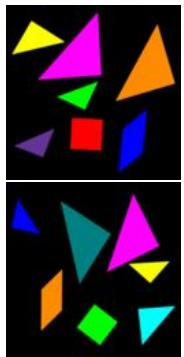

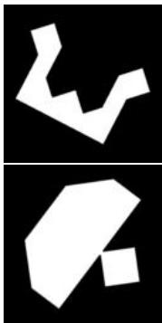  
clues  
Generation

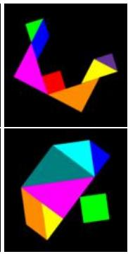  
Generation

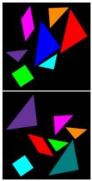  
clues

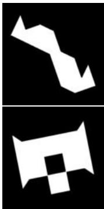  
Generation  
(a) Examples from the Baseline.

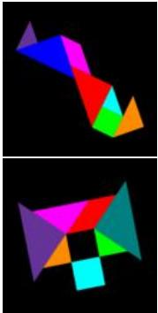  
clues  
Generation

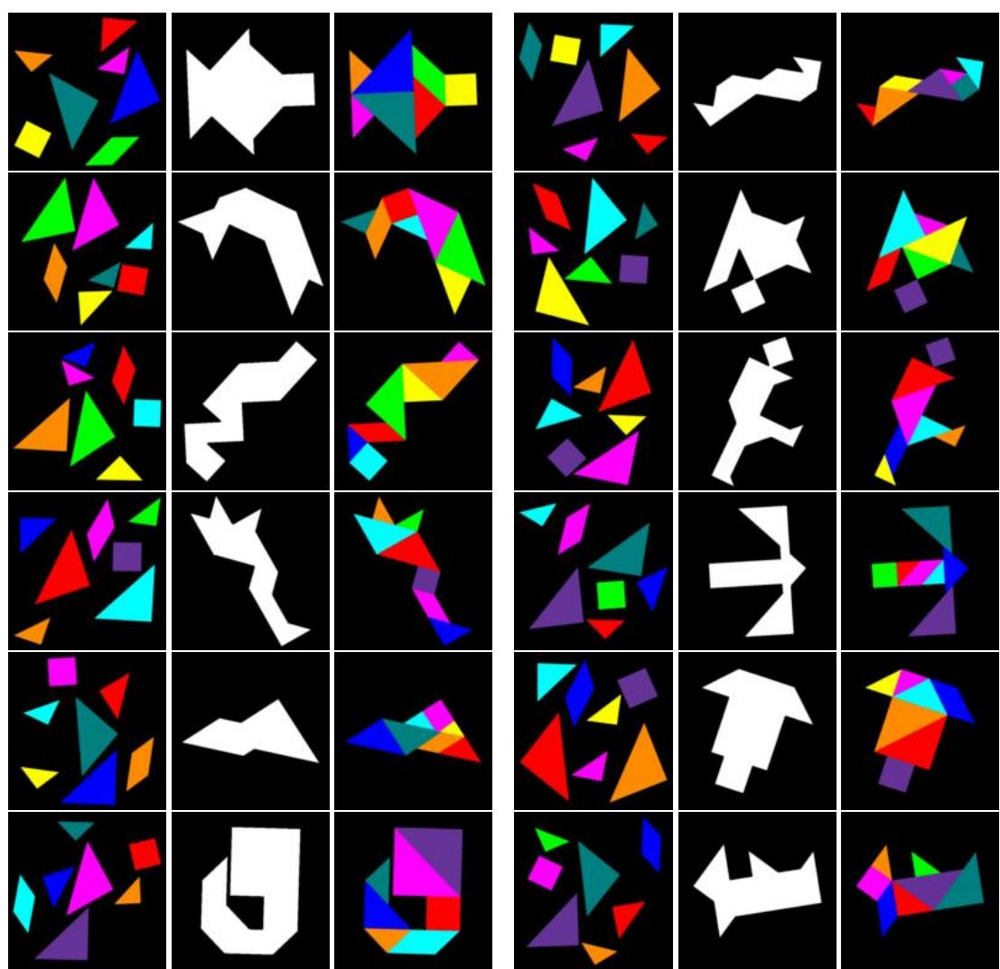  
(b) Examples from RDM[L] with the clue based abstraction conditioning approach.

Figure 15: Examples of generated Tangram solutions.

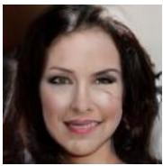

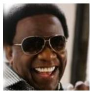  
b = [1, 0, 0, 1]

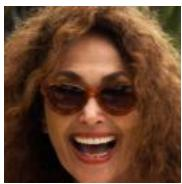

A

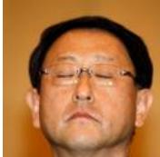  
a = [0, 1, 1, 0]

B

  
b = [0, 1, 1, 0]

S

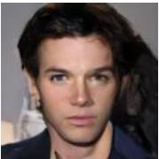  
s = [0, 1, 0, 1]

  
a = [0, 1, 0, 1]

A

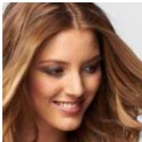

B

S

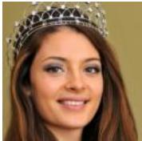

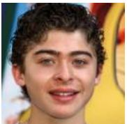

S

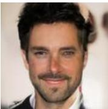

(a) Examples from the Baseline.

A

B

S

A

B

S

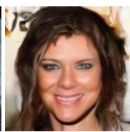

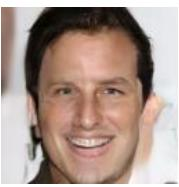

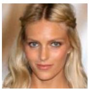

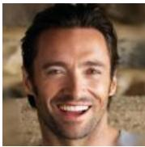

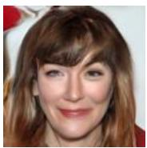

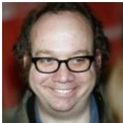

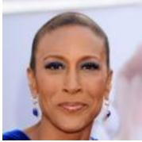

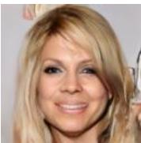

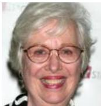

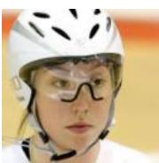

  
(b) Examples from $\mathbf { R D M } ^ { \mathrm { [ L ] } }$ with the clue based abstraction conditioning approach.  
Figure 16: Examples of generated LogicFace solutions shown in $S ,$ when conditioned on A and B.