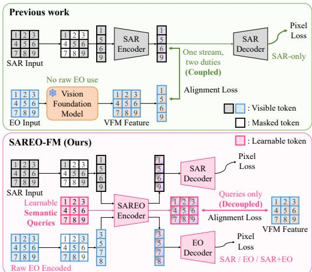
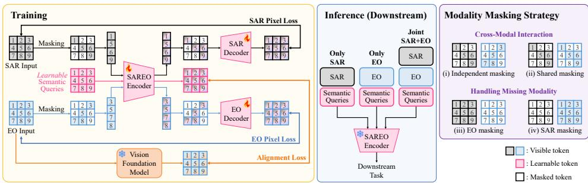
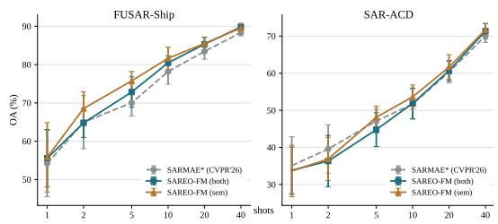
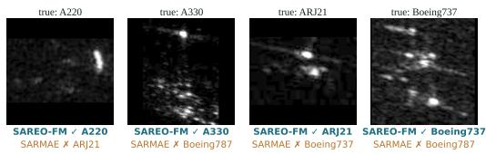
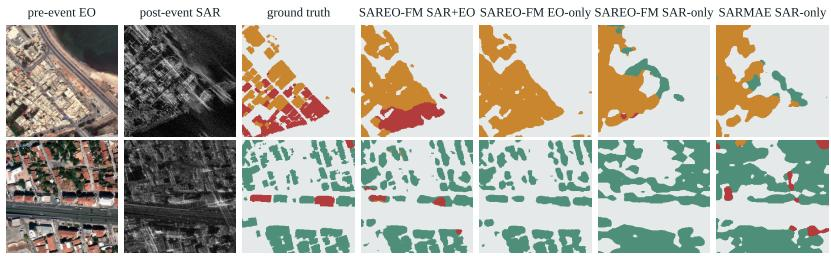

# SAREO-FM: DECOUPLED SEMANTIC SUPERVISION FOR SAR-EO FOUNDATION MODELS

Jeonghyeok Do Munchurl Kim

Korea Advanced Institute of Science and Technology (KAIST)

{ehwjdgur0913,mkimee}@kaist.ac.kr

Project Page: https://kaist-viclab.github.io/SAREO-FM\_site/

## ABSTRACT

Synthetic aperture radar (SAR) and electro-optical (EO) imagery provide complementary observations: SAR enables day-and-night, weather-resilient sensing, whereas EO provides rich appearance and fine-grained semantic cues. We introduce SAREO-FM, which avoids forcing a single token stream to serve two distinct roles: modality tokens preserve how each sensor observes the scene through masked reconstruction, while learnable semantic queries capture what the scene contains under guidance from a pretrained vision foundation model (VFM). By jointly encoding these queries with SAR and EO tokens, the queries acquire modality-grounded semantic context, while the modality-token outputs remain the explicit targets of masked reconstruction. This design assigns semantic and reconstruction supervision to separate token streams while preserving their interaction within the shared encoder. Pretrained on the million-scale SAR-1M corpus, SAREO-FM achieves strong unimodal transfer for both SAR-only and EOonly inputs, while delivering substantial gains from joint SAR–EO observations on tasks that benefit from complementary sensing.

## 1 INTRODUCTION

Synthetic aperture radar (SAR) and electrooptical (EO) imagery provide complementary views of the Earth. SAR measures microwave backscatter and enables day-and-night, weatherresilient observation, whereas EO imagery captures rich spectral appearance, texture, and finegrained semantic cues. Their complementary information benefits numerous applications, including land-cover mapping, object detection, change and damage assessment, cross-modal retrieval, cloud removal, and SAR-to-EO translation Schmitt & Zhu (2016); Zhu et al. (2017); Do et al. (2026). So, a practical SAR–EO foundation model (FM) should learn strong representations from either modality alone while exploiting their complementary evidence when paired observations are available.

Recent geospatial foundation models (GFMs) Cong et al. (2022); Wang et al. (2025); Yang et al. (2026) have demonstrated the value of pretraining across multiple sensors and data sources. However, simply combining modalities does not resolve a fundamental representation-learning challenge. SAR and EO capture the same geographic

  
Figure 1: Motivation of SAREO-FM. Prior methods directly align image tokens with EOderived VFM features, coupling semantic alignment with pixel reconstruction. SAREO-FM instead supervises learnable semantic queries while reconstructing SAR and EO from modality tokens, separating the destinations of the two objectives within a unified encoder.

must preserve modality-specific details while also learning high-level semantics that transfer across modalities and downstream tasks.

Masked autoencoders (MAEs) He et al. (2022) provide a natural framework for preserving sensingspecific information through masked image reconstruction. Recent approaches further enhance MAE representations using semantic guidance from pretrained vision foundation models (VFMs) Yu et al. (2024); Yao et al. (2025); Liu et al. (2025). As illustrated in Figure 1(a), prior representative methods directly align SAR or EO image tokens with VFM features. Consequently, the same image tokens are explicitly optimized both to preserve modality-specific information for pixel reconstruction and to match high-level EO-derived semantics. To our best knowledge, we firstly address that this coupling raises a central question: where should semantic supervision be applied so that shared semantic learning does not directly constrain modality-specific reconstruction?

We address this question with SAREO-FM, a unified MAE-based FM with decoupled semantic supervision. As shown in Figure 1(b), our SAREO-FM processes SAR tokens, EO tokens, and learnable semantic queries using a shared and unified encoder. The semantic queries interact with all available image tokens, and are aligned patch-wise with features from a frozen pretrained VFM. In parallel, the modality-token outputs are passed to separate SAR and EO decoders for masked pixel reconstruction. Importantly, the semantic queries are excluded from the reconstruction decoders. Thus, the SAREO-FM separates the explicit destinations of semantic alignment and pixel reconstruction while retaining information exchange among all three streams within the shared and unified encoder. To support different input configurations, we further introduce a mixed modality masking strategy that combines independent masking, spatially shared masking, and complete dropping of either modality. This exposes the same encoder to joint SAR–EO, SAR-only, and EO-only observations during pretraining. At downstream transfer, semantic queries always participate in encoding, while task heads can selectively consume modality-token outputs, semantic-query outputs, or both according to specific tasks. We pretrain SAREO-FM on SAR–EO observations from the million-scale SAR-1M corpus Liu et al. (2025), treating both SAR and EO imagery as raw learning inputs rather than using EO solely to obtain teacher features. We evaluate the resulting representations on image classification and multi-label recognition, and further examine qualitative transfer to dense prediction under SAR-only, EO-only, and joint SAR–EO settings. Our SAREO-FM achieves strong unimodal transfer and substantial task-dependent improvements from joint observations. Extensive ablations further validate the effects of semantic-query supervision and its separation from reconstruction.

Our contributions are as follows:

• We introduce SAREO-FM, a unified MAE-based foundation model that learns from raw SAR and EO imagery using a shared encoder and supports SAR-only, EO-only, and joint SAR–EO transfer.

• We propose decoupled semantic supervision, which assigns EO-VFM alignment to learnable semantic queries and modality-specific reconstruction to image tokens, while allowing the three streams to interact within the shared encoder.

• We develop a mixed modality masking strategy that exposes the encoder to paired and missing-modality inputs. Comprehensive evaluations demonstrate strong unimodal transfer and substantial task-dependent gains from complementary SAR–EO observations.

## 2 RELATED WORK

## 2.1 MASKED MULTIMODAL MODELING

MAE learns visual representations by reconstructing heavily masked image patches with an asymmetric encoder–decoder He et al. (2022). Subsequent work extends masked modeling beyond RGB imagery. MultiMAE Bachmann et al. (2022) jointly models RGB, depth, and semantic maps, while 4M Mizrahi et al. (2023) and 4M-21 Bachmann et al. (2024) scale masked modeling to a broad collection of input and output modalities, including images, geometry, semantics, and feature representations. These approaches demonstrate that masked modeling can effectively integrate heterogeneous signals. Our SAREO-FM follows this general framework but introduces separate token streams as the explicit destinations of pixel-reconstruction and frozen-VFM supervision.

  
Figure 2: Overview of SAREO-FM. Visible SAR and EO tokens interact with learnable semantic queries through a unified encoder. The modality-token outputs are decoded independently for masked pixel reconstruction, whereas the semantic-query outputs are aligned patch-wise with features from a frozen pretrained VFM. Semantic queries are excluded from the reconstruction decoders, separating the destinations of pixel-level and semantic supervision. Modality masking exposes the encoder to SAR-only, EO-only, and joint SAR–EO inputs; during downstream transfer, task heads selectively consume modality-token outputs, semantic-query outputs, or both.

## 2.2 GEOSPATIAL FOUNDATION MODELS (GFMS)

Self-supervised SAR representation learning has progressed from predictive and reconstructionbased approaches such as SAR-JEPA Li et al. (2023) to large-scale FMs such as SARATR-X Li et al. (2025) and SARMAE Liu et al. (2025). In parallel, multimodal Earth-observation pretraining has explored masked reconstruction, cross-modal alignment, and sensor-aware architectures. CROMA Fuller et al. (2023) combines contrastive radar–optical learning with masked autoencoding, while SatMAE Cong et al. (2022) and SatMAE++ Noman et al. (2024) address multispectral and multitemporal observations. Recent works such as MMEarth Nedungadi et al. (2024), ms-GFM Han et al. (2024), Copernicus-FM Wang et al. (2025), and MaRS Yang et al. (2026) further broaden the range of sensors, resolutions, and downstream tasks. DeCUR Wang et al. (2024) instead partitions modality-common and modality-specific embedding dimensions through redundancy reduction. Whereas these methods address sensor heterogeneity through alignment, representation partitioning, or architectural adaptation, we focus on separating the explicit supervisions assigned to decoupled semantic and reconstruction representations of SAR and EO modalities in a shared latent space by a unified encoder using learnable semantic queries.

## 2.3 SEMANTIC FEATURE ALIGNMENT

Aligning learned representations with strong pretrained encoders has proven effective across representation and generative learning, as exemplified by REPA Yu et al. (2024) and VA-VAE Yao et al. (2025). In SAR pretraining, SARMAE Liu et al. (2025) introduces semantic guidance from a frozen DINOv3 Simeoni et al. (2025) teacher by directly aligning SAR encoder tokens with features ex-´ tracted from paired EO imagery. The EO image therefore provides teacher-side supervision but is not encoded as an input modality by the student. CoDe-MAE Peng et al. (2026), the closest concurrent multimodal MAE, jointly handles SAR and EO through optical-token distillation, conditioned on (i) contrastive alignment and (ii) degraded cross-modal reconstruction. Our SAREO-FM differs in the destination of semantic supervision: frozen-VFM features supervise only the persistent semantic-query outputs, while SAR and EO token outputs are used for modality-specific reconstruc tion.

## 3 SAREO-FM

## 3.1 OVERVIEW

Our SAREO-FM learns modality-specific and cross-modal representations from SAR and EO imagery within a unified masked-autoencoding framework. Figure 2 illustrates the overall architecture of SAREO-FM. Our key design principle is to separate the destinations of pixel-level reconstruction and high-level semantic supervision. To this end, the SAREO-FM operates on three token streams:

SAR image tokens, EO image tokens, and learnable semantic queries, which interact through a shared SAREO Encoder. The semantic queries aggregate cross-modal context from the visible SAR and EO tokens and are aligned with patch-level features extracted by a frozen pretrained VFM. In parallel, the encoded SAR and EO tokens are passed to modality-specific decoders for masked image reconstruction, thereby preserving sensing-specific appearance and structure. The semantic queries are excluded from the decoding stage, preventing the reconstruction decoders from directly rely ing on the semantically supervised stream. After pretraining, the VFM teacher and reconstruction decoders are discarded, and the unified encoder serves as our SAREO-FM for SAR, EO, or joint SAR–EO observations.

## 3.2 UNIFIED THREE-STREAM SAREO ENCODER

Let $\mathbf { X } _ { s } \in \mathbb { R } ^ { H \times W \times C _ { s } }$ and ${ \bf X } _ { e } \in \mathbb { R } ^ { H \times W \times C _ { e } }$ denote a spatially registered SAR–EO pair, where s and e index the SAR and EO modalities, respectively. Each image is divided into N non-overlapping patches. For modality $m \in \{ s , e \}$ , the i-th flattened patch $\mathbf { x } _ { p , m } ^ { i }$ is projected into a shared $D _ { - }$ dimensional embedding space using a modality-specific linear projection $\mathbf { E } _ { m }$ . The resulting image token is

$$
\begin{array} { r } { { \bf y } _ { m } ^ { i } = { \bf x } _ { p , m } ^ { i } { \bf E } _ { m } + { \bf p } ^ { i } + { \bf a } _ { m } ^ { \mathrm { e n c } } , \qquad i = 1 , \ldots , N , } \end{array}\tag{1}
$$

where $\mathbf { p } ^ { i }$ is a shared 2D sine–cosine positional embedding and $\mathbf { a } _ { m } ^ { \mathrm { e n c } }$ is a learnable modality embedding for the encoder. We denote the full token sequence by $\mathbf { Y } _ { m } = [ \mathbf { y } _ { m } ^ { 1 } , \ldots , \mathbf { y } _ { m } ^ { N } ]$ . For each modality, we sample a binary mask $\mathcal { M } _ { m } \in \{ 0 , 1 \} ^ { N }$ , where $\mathcal { M } _ { m } [ i ] = 1$ or 0 indicates a masked or visible patch. We define the masked and visible index sets as

$$
\Omega _ { m } = \{ i \mid { \mathcal { M } } _ { m } [ i ] = 1 \} , \quad \gamma _ { m } = \{ 1 , \ldots , N \} \setminus \Omega _ { m } .\tag{2}
$$

Following masked autoencoders, only the visible image tokens are provided to the encoder:

$$
\begin{array} { r } { \mathbf { Y } _ { m } ^ { \mathrm { v i s } } = [ \mathbf { y } _ { m } ^ { i } ] _ { i \in \mathcal { V } _ { m } } . } \end{array}\tag{3}
$$

In addition to the image streams, we introduce a spatially organized set of N learnable semantic queries, $\mathbf { Q } = \{ \mathbf { q } ^ { i } \} _ { i = 1 } ^ { N }$ . Each query corresponds to one image-patch location and is augmented with the same positional embedding used for the image tokens, together with a dedicated query-stream embedding:

$$
\widetilde { \mathbf { q } } ^ { i } = \mathbf { q } ^ { i } + \mathbf { p } ^ { i } + \mathbf { a } _ { q } ^ { \mathrm { e n c } } , \qquad \widetilde { \mathbf { Q } } = [ \widetilde { \mathbf { q } } ^ { 1 } , \dots , \widetilde { \mathbf { q } } ^ { N } ] .\tag{4}
$$

Unlike the image tokens, the semantic queries are never masked. The visible image tokens and semantic queries are concatenated and jointly processed by the shared SAREO Encoder E that yields three latents for SAR, EO and query:

$$
[ \mathbf { Z } _ { s } ^ { \mathrm { v i s } } ; \mathbf { Z } _ { e } ^ { \mathrm { v i s } } ; \mathbf { Z } _ { q } ] = \mathcal { E } \left( [ \mathbf { Y } _ { s } ^ { \mathrm { v i s } } ; \mathbf { Y } _ { e } ^ { \mathrm { v i s } } ; \widetilde { \mathbf { Q } } ] \right) .\tag{5}
$$

where $[ \cdot ; \cdot ; \cdot ]$ indicates a concatenation operator. When a modality is unavailable or intentionally withheld, its token sequence is omitted from Equation 5. Through joint self-attention, the query latent $\mathbf { Z } _ { q }$ aggregates spatially aligned evidence from all available modalities. Meanwhile, the SAR and EO latents, $\mathbf { Z } _ { s } ^ { \mathrm { v i s } }$ and $\mathbf { Z } _ { e } ^ { \mathrm { v i s } }$ , exchange cross-modal context through both self-attention within concatenated three-modal streams.

## 3.3 DECOUPLED SEMANTIC SUPERVISION

Masked reconstruction encourages image tokens to preserve low-level semantic representations such as local appearance, geometry, and sensing-specific characteristics. In contrast, a pretrained VFM operating on EO imagery encourages high-level semantic representations that are shared across sensing modalities. Directly applying both objectives to the same image tokens forces a single token stream to simultaneously satisfy these different representational demands. The SAREO-FM separates their explicit supervision destinations by applying the VFM target exclusively to the semanticquery stream. Given an EO image, a frozen VFM teacher $f _ { \theta }$ processes the clean and unmasked observation, and extracts its final-layer patch tokens:

$$
\mathbf { T } = f _ { \theta } ( \mathbf { X } _ { e } ) = [ \mathbf { t } ^ { 1 } , \dots , \mathbf { t } ^ { N } ] \in \mathbb { R } ^ { N \times D _ { t } } ,\tag{6}
$$

where $\mathbf { t } ^ { i }$ denotes the teacher feature corresponding to the i-th spatial location, and $D _ { t }$ is the teacher feature dimension. If the teacher produces a different spatial resolution, its patch-token grid is spatially resampled to match the $N$ query locations. A lightweight semantic projector $h _ { \phi } : \breve { \mathbb { R } ^ { D } } \to \breve { \mathbb { R } ^ { D _ { t } } }$ maps the contextualized queries to the teacher feature space. We then impose patch-wise semantic alignment using cosine distance:

$$
\mathcal { L } _ { \mathrm { a l i g n } } = \frac { 1 } { N } \sum _ { i = 1 } ^ { N } \left( 1 - \frac { h _ { \phi } ( \mathbf { z } _ { q } ^ { i } ) ^ { \top } \mathbf { t } ^ { i } } { \left\| h _ { \phi } ( \mathbf { z } _ { q } ^ { i } ) \right\| _ { 2 } \left\| \mathbf { t } ^ { i } \right\| _ { 2 } } \right) .\tag{7}
$$

We refer to this design as decoupled semantic supervision. The modality tokens are not directly constrained to reproduce EO-VFM features, and can therefore retain information useful for sensingspecific reconstruction. Instead, the dedicated query stream serves as the explicit destination of high-level semantic supervision. Importantly, this decoupling applies to the supervision heads rather than to the encoder computation: all three streams continue to exchange information, and gradients from both objectives jointly optimize the SAREO Encoder $\mathcal { E } .$

## 3.4 MODALITY-SPECIFIC MASKED RECONSTRUCTION

For pixel-level recovery, we employ a modality-specific reconstruction decoder $\mathcal { D } _ { m }$ for $m \in \{ s , e \}$ Consistent with our decoupled design, the semantic-query latents $\mathbf { Z } _ { q }$ are discarded before decoding, and are not used as decoder conditions. For each modality, the encoded visible tokens are restored to their original spatial locations, and a shared learnable mask token $\mathbf { e } _ { m }$ is inserted at every masked location. Specifically, we construct the ordered decoder input sequence

$$
\begin{array} { r } { \mathbf { u } _ { m } ^ { i } = \left\{ \begin{array} { l l } { \mathbf { z } _ { m } ^ { \rho _ { m } ( i ) } , } & { i \in \mathcal { V } _ { m } , } \\ { \mathbf { e } _ { m } , } & { i \in \Omega _ { m } , } \end{array} \right. } \end{array}\tag{8}
$$

where $\rho _ { m } ( i )$ maps the original spatial index i to its position in the packed visible-token sequence $\mathbf { Z } _ { m } ^ { \mathrm { v i s } }$ . The decoder input at location i is then

$$
\mathbf { w } _ { m } ^ { i } = \mathbf { u } _ { m } ^ { i } + \mathbf { p } _ { \mathrm { d e c } } ^ { i } + \mathbf { a } _ { m } ^ { \mathrm { d e c } } , \quad \mathbf { W } _ { m } = [ \mathbf { w } _ { m } ^ { 1 } ; \hdots ; \mathbf { w } _ { m } ^ { N } ] ,\tag{9}
$$

where $\mathbf { p } _ { \mathrm { d e c } } ^ { i }$ is a 2D sine–cosine decoder positional embedding and $\mathbf { a } _ { m } ^ { \mathrm { d e c } }$ is a learnable decoderspecific modality embedding. The decoder predicts all image patches as:

$$
[ \hat { \mathbf { x } } _ { p , m } ^ { 1 } ; \ldots ; \hat { \mathbf { x } } _ { p , m } ^ { N } ] = \mathcal { D } _ { m } ( \mathbf { W } _ { m } ) .\tag{10}
$$

Following standard masked reconstruction, the pixel loss is evaluated only at masked locations:

$$
\mathcal { L } _ { \mathrm { p i x } } ^ { m } = \frac { 1 } { | \Omega _ { m } | } \sum _ { i \in \Omega _ { m } } \big \| \hat { \mathbf { x } } _ { p , m } ^ { i } - \mathbf { x } _ { p , m } ^ { i } \big \| _ { 1 } .\tag{11}
$$

where, $\mathcal { L } _ { \mathrm { p i x } } ^ { s }$ and $\mathcal { L } _ { \mathrm { p i x } } ^ { e }$ correspond to the SAR and EO pixel losses in Figure 2, respectively.

## 3.5 MODALITY MASKING STRATEGY

To expose the unified SAREO encoder E to diverse downstream input configurations, we train the SAREO-FM using four complementary masking modes:

(i) Independent masking. SAR and EO masks are sampled independently. Visible patches from one modality can provide spatially aligned cues for locations masked in the other, encouraging fine grained cross-modal reasoning.

(ii) Shared masking. The same spatial mask is applied to both modalities. Because the corresponding location is simultaneously hidden in SAR and EO, the model must rely on broader spatial and semantic context rather than direct local correspondence.

(iii) SAR-only input (EO masking). The EO token stream is entirely withheld from the encoder, while the SAR image is partially masked. The semantic queries must therefore extract semantic information solely from the available SAR observations.

(iv) EO-only input (SAR masking). The SAR token stream is symmetrically withheld, leaving only partially masked EO tokens and the semantic queries as encoder inputs.

The first two modes, (i) and (ii), promote cross-modal interaction, whereas the modality-only modes, (iii) and (iv), ensure that the same encoder E remains effective when only one modality is available.

## 3.6 PRETRAINING OBJECTIVE

Our pretraining objective combines modality-specific reconstruction and semantic alignment:

$$
\mathcal { L } = \lambda _ { s } \mathcal { L } _ { \mathrm { p i x } } ^ { s } + \lambda _ { e } \mathcal { L } _ { \mathrm { p i x } } ^ { e } + \lambda _ { \mathrm { a l i g n } } \mathcal { L } _ { \mathrm { a l i g n } } ,\tag{12}
$$

where each coefficient is set to zero when its supervision is unavailable or excluded by the sampled input mode. SAR–EO inputs activate four cases: (i) SAR-only inputs with EO masked use $\mathcal { L } _ { \mathrm { p i x } } ^ { s }$ and $\mathcal { L } _ { \mathrm { a l i g n } } .$ , where EO is retained only for the frozen teacher; (ii) EO-only inputs with SAR masked use $\mathcal { L } _ { \mathrm { p i x } } ^ { e }$ and $\mathcal { L } _ { \mathrm { a l i g n } } ;$ (iii) Unpaired SAR samples with EO absent contribute only to $\mathcal { L } _ { \mathrm { p i x } } ^ { s } \mathrm { : }$ and (iv) Unpaired EO samples also contribute to $\mathcal { L } _ { \mathrm { p i x } } ^ { e }$ and $\mathcal { L } _ { \mathrm { a l i g n } }$

## 3.7 DOWNSTREAM TRANSFER

During downstream transfer, the frozen VFM teacher $f _ { \theta } ,$ semantic projector $h _ { \phi } .$ , and reconstruction decoders $\left\{ \mathcal { D } _ { m } \right\}$ are discarded. The pretrained SAREO Encoder E receives all available, unmasked image tokens together with the semantic queries where a missing modality is represented by an empty token sequence, allowing $\mathcal { E }$ to process SAR, EO, or paired SAR–EO observations without modality-specific backbones or separate inference pipelines. E provides complementary representations for different downstream requirements. Modality-token outputs retain sensing-specific and spatially detailed information, whereas the semantic-query outputs provide contextually aggregated, semantically enriched features. Depending on the downstream tasks such as dense prediction or image-level recognition, their task-specific features can be selectively extracted from the modality tokens, the semantic queries, or their combination.

## 4 EXPERIMENTS

## 4.1 DATASETS AND DOWNSTREAM TASKS

Pretraining corpus. We pretrain SAREO-FM on SAR-1M Liu et al. (2025), which aggregates 18 public SAR datasets spanning classification, detection, and segmentation scenarios. It contains 1,312,902 SAR images, of which 1,042,156 are paired with geographically aligned EO observations. Overall, the corpus covers 57 target and scene categories, multiple SAR sensors and polarization modes, and ground resolutions ranging from 0.1 to 60 m.

Downstream benchmarks. Downstream heads use modality-token features (mod), semanticquery features (sem), or their concatenation (both). We evaluate SAR recognition on MSTAR Ross et al. (1998), FUSAR-Ship Hou et al. (2020), and SAR-ACD Sun et al. (2022). MSTAR and FUSAR-Ship measure in-corpus transfer, as they are included in SAR-1M, whereas SAR-ACD serves as our primary out-of-corpus benchmark. EO-only transfer is evaluated on EuroSAT Helber et al. (2019), NWPU-RESISC45 Cheng et al. (2017), and AID Xia et al. (2017) under few-shot and higher-supervision settings. For paired SAR–EO transfer, we evaluate single-label recognition on So2Sat LCZ42 Zhu et al. (2020) and multi-label recognition on BigEarthNet-MM Sumbul et al. (2021). We additionally examine qualitative dense transfer on BRIGHT Chen et al. (2025a), which requires building-damage assessment from paired pre-event EO and post-event SAR observations. We report the mean performance over three independent runs for end-to-end fine-tuning and five independent runs for linear probing.

## 4.2 IMPLEMENTATION DETAILS

Pretraining. SAREO-FM uses a ViT-B/16 encoder Dosovitskiy et al. (2020) trained from scratch on $2 5 6 \times 2 5 6$ inputs, yielding a $1 6 \times 1 6$ token grid. We accordingly introduce 256 $( N = 1 6 \times 1 6 )$ learnable semantic queries. The teacher $f _ { \theta }$ is a frozen DINOv3-7B model Simeoni et al. (2025),´ and the semantic projector $h _ { \phi }$ is a two-layer MLP. We empirically set the loss weights to $\lambda _ { \mathrm { s } } = 1$ $\lambda _ { \mathrm { e } } = 1$ , and $\lambda _ { \mathrm { a l i g n } } = 0 . 5$ We sample independent masking, spatially shared masking, complete EO dropping, and complete SAR dropping with probabilities $0 . { \dot { 3 } } 5 / 0 . { \dot { 3 } } 5 / 0 . 1 5 / 0 . 1 5$ . Each retained modality is masked by 75%, while all semantic queries remain active. We train for 300,000 steps using AdamW Loshchilov & Hutter (2017) with $\bar { \beta = } ( 0 . 9 , 0 . 9 5 )$ , weight decay 0.05, and an effective batch size of 2,560. The learning rate reaches $1 . 5 \dot { \times } 1 0 ^ { - 3 }$ after 15,000 warm-up steps and then follows cosine decay to zero. Training uses bfloat16 (bf16) precision, gradient clipping at 1.0, and four NVIDIA B200 GPUs, requiring approximately 390 B200 GPU-hours.

Table 1: SAR target classification with end-to-end fine-tuning. The upper block reports published OA (%) under the source-specific protocol of each method and is included only as context. The lower block reports our controlled evaluation with identical data splits and downstream pipelines; mean and standard deviation over three seeds are shown. ∗ denotes our re-evaluation of the official SARMAE checkpoint. Bold denotes the best controlled result.
<table><tr><td rowspan="2">Method</td><td rowspan="2">Venue</td><td rowspan="2">Backbone</td><td colspan="2">FUSAR-Ship</td><td colspan="2">MSTAR</td><td colspan="2">SAR-ACD</td></tr><tr><td>40-shot</td><td>30%</td><td>40-shot</td><td>30%</td><td>40-shot</td><td>30%</td></tr><tr><td>ResNet-50 He et al. (2016)</td><td>CVPR&#x27;16</td><td>ResNet-50</td><td>一</td><td>58.41</td><td></td><td>89.94</td><td></td><td>59.70</td></tr><tr><td>Swin Transformer Liu et al. (2021)</td><td>ICCV&#x27;21</td><td>Swin-B</td><td></td><td>60.79</td><td></td><td>82.97</td><td></td><td>67.50</td></tr><tr><td>BEiT Bao et al. (2021)</td><td>ICLR&#x27;22</td><td>ViT-B</td><td>59.70</td><td>71.13</td><td>40.70</td><td>69.75</td><td></td><td>79.77</td></tr><tr><td>CROMA Fuller et al. (2023)</td><td>NeurIPS&#x27;23</td><td>ViT-B</td><td>83.71</td><td></td><td></td><td>1</td><td></td><td>88.99</td></tr><tr><td>SAR-JEPA Li et al. (2023)</td><td>ISPRS JPRS’24</td><td>ViT-B</td><td>85.80</td><td>一</td><td>91.60</td><td>I</td><td>75.50</td><td>一</td></tr><tr><td>SARATR-X Li et al. (2025)</td><td>TIP&#x27;25</td><td>HiViT-B</td><td>87.70</td><td></td><td>98.10</td><td>一</td><td>76.40</td><td></td></tr><tr><td>LoMaR Chen et al. (2025b)</td><td>WACV&#x27;25</td><td>ViT-B</td><td>82.70</td><td></td><td>77.00</td><td></td><td>67.40</td><td></td></tr><tr><td>SUMMIT Du et al. (2025)</td><td>IJAEOG&#x27;25</td><td>ViT-B</td><td>81.50</td><td>71.91</td><td>63.60</td><td>98.39</td><td>68.70</td><td>84.25</td></tr><tr><td>Copernicus-FM Wang et al. (2025)</td><td>ICCV&#x27;25</td><td>ViT-B</td><td>87.61</td><td></td><td></td><td>一</td><td></td><td>92.63</td></tr><tr><td>CoDe-MAE Peng et al. (2026)</td><td>arXiv&#x27;26</td><td>HiViT-B</td><td>89.40</td><td></td><td>98.70</td><td>一</td><td>78.30</td><td></td></tr><tr><td>MaRS Yang et al. (2026)</td><td>AAAI&#x27;26</td><td>SwinV2-B</td><td>77.70</td><td></td><td>75.50</td><td></td><td>68.40</td><td></td></tr><tr><td>SARMAE Liu et al. (2025)</td><td>CVPR&#x27;26</td><td>ViT-B</td><td>89.30</td><td>92.92</td><td>96.70</td><td>99.61</td><td></td><td>95.06</td></tr><tr><td>SARMAE Liu et al. (2025)</td><td>CVPR&#x27;26</td><td>ViT-L</td><td>90.86</td><td>92.80</td><td>97.24</td><td>98.92</td><td>一</td><td>95.63</td></tr><tr><td>Random initialization</td><td></td><td>ViT-B</td><td> $6 0 . 3 1 \pm 1 . 3 9$ </td><td> $8 2 . 1 1 \pm 0 . 5 2$ </td><td> $3 4 . 7 1 \pm 0 . 0 9$ </td><td> $3 8 . 7 6 \pm 8 . 3 5$ </td><td> $3 3 . 1 4 \pm 2 . 6 0$ </td><td> $3 9 . 1 9 \pm 1 0 . 2 7$ </td></tr><tr><td>SARMAE* Liu et al. (2025)</td><td>CVPR&#x27;26</td><td>ViT-B</td><td> $9 0 . 0 9 \pm 0 . 3 6$ </td><td> $9 2 . 8 2 \pm 0 . 2 1 $ </td><td> $9 4 . 5 4 \pm 1 . 7 2 $ </td><td> $9 7 . 1 8 \pm 0 . 3 2 $ </td><td> $6 8 . 5 0 \pm 2 . 6 0$ </td><td> $\mathbf { 9 5 . 0 1 \pm 0 . 8 5 }$ </td></tr><tr><td>SAREO-FM (sem)</td><td>1</td><td>ViT-B</td><td> $9 1 . 0 5 \pm 0 . 1 6$ </td><td> $9 3 . 1 3 \pm 0 . 1 4$ </td><td> $9 7 . 5 7 \pm 0 . 4 2$ </td><td> $9 9 . 1 3 \pm 0 . 5 4$ </td><td> ${ \bf 7 8 . 4 0 \pm 1 . 2 4 }$ </td><td> $9 3 . 3 4 \pm 0 . 5 5$ </td></tr><tr><td>SAREO-FM (both)</td><td>一</td><td>ViT-B</td><td> ${ \bf 9 1 . 4 1 \pm 0 . 2 3 }$ </td><td>93.12 ± 0.06</td><td> $9 6 . 6 6 \pm 0 . 3 1$ </td><td>99.36±0.47</td><td> $7 8 . 0 0 \pm 1 . 0 0$ </td><td> $9 2 . 8 4 \pm 0 . 6 8$ </td></tr></table>

  
Figure 3: Frozen few-shot SAR transfer. We use fixed encoder features and train only the downstream classifier.

  
Figure 4: Qualitative comparison on SAR-ACD. Representative test images misclassified by SARMAE∗ but correctly classified by SAREO-FM.

Controlled comparison. SARMAE Liu et al. (2025) serves as our primary controlled baseline. We denote by SARMAE∗ our reevaluation of its official pretrained ViT-B checkpoint under exactly the same downstream protocol as SAREO-FM, including dataset splits, sampled training subsets, input preprocessing, classifier heads, optimization settings, and evaluation code. Both methods employ ViT-B encoders pretrained on exactly the same SAR images from SAR-1M and leverage DINOv3 features Simeoni et al. (2025) extracted from corresponding EO observations. The key dis-´ tinction is how the paired EO information is used: SARMAE uses EO-derived DINO features solely as semantic supervision for SAR representation learning, whereas our SAREO-FM additionally processes the raw EO observations as a second modality, and jointly learns SAR–EO reconstruction and cross-modal representations. SARMAE∗ therefore provides our closest controlled comparison, isolating the effect of incorporating raw paired EO observations and cross-modal learning.

## 4.3 SAR REPRESENTATION TRANSFER

End-to-end fine-tuning. Table 1 first places our SAREO-FM among published SAR representation learners, and then provides a controlled comparison with SARMAE∗. The SAREO-FM obtains the best accuracy in five of the six controlled settings. On FUSAR-Ship, it improves over SARMAE∗ by 1.32 points at 40 shots and 0.31 points with 30% supervision. The corresponding gains on MSTAR are 3.03 and 2.18 points. These results show that the benefit persists under substantially different supervision budgets, although both datasets overlap with the pretraining corpus. The strongest evidence comes from out-of-corpus SAR-ACD. With only 40 examples per class, semantic queries improve accuracy from 68.50% to 78.40%, a 9.90-point gain. Under 30% supervision, however, SARMAE∗ remains 1.67 points stronger. The contrast indicates that our SAREO-FM primarily improves label-efficient transfer rather than performance after abundant task-specific adaptation. Across the 40-shot columns, sem is the strongest on MSTAR and SAR-ACD, while both is the strongest on FUSAR-Ship, supporting task-dependent use of the two output streams.

Table 2: Frozen few-shot EO transfer. We report accuracy (%) for SAR and EO inputs over five support draws. CoDe-MAE values use its separate 10-shot protocol and are included only as context.
<table><tr><td rowspan="2">Method / Feature</td><td colspan="4">SAR</td><td colspan="4">EO</td></tr><tr><td>1-shot</td><td>5-shot</td><td>10-shot</td><td>40-shot</td><td>1-shot</td><td>5-shot</td><td>10-shot</td><td>40-shot</td></tr><tr><td>DINOv3 (teacher)</td><td> $3 8 . 1 7 \pm 4 . 6 1$ </td><td> $5 0 . 7 2 \pm 2 . 6 8$ </td><td> $5 6 . 0 1 \pm 1 . 8 1$ </td><td> $6 4 . 3 5 \pm 1 . 5 6$ </td><td> $5 9 . 5 1 \pm 3 . 5 3 $ </td><td> $7 5 . 9 6 \pm 3 . 1 5$ </td><td> $8 3 . 3 4 \pm 1 . 4 2$ </td><td> $9 0 . 8 8 \pm 0 . 6 5$ </td></tr><tr><td>SARMAE*</td><td> $3 7 . 2 2 \pm 5 . 7 1$ </td><td> $4 8 . 6 4 \pm 3 . 0 0$ </td><td> $5 3 . 9 7 \pm 1 . 3 9$ </td><td> $6 4 . 7 2 \pm 1 . 1 2$ </td><td> $4 3 . 5 6 \pm 6 . 5 7$ </td><td> $5 9 . 5 7 \pm 3 . 0 5$ </td><td> $6 6 . 4 9 \pm 1 . 9 7$ </td><td> $7 8 . 3 6 \pm 1 . 0 7$ </td></tr><tr><td>CoDe-MAE</td><td>一</td><td></td><td>59.88†</td><td></td><td></td><td></td><td> $8 1 . 1 8 ^ { \dagger }$ </td><td>一</td></tr><tr><td>SAREO-FM (both)</td><td> ${ \bf 3 9 . 0 7 \pm 5 . 9 8 }$  </td><td> $5 3 . 5 4 \pm 2 . 2 1$  </td><td> ${ \pm 9 . 3 6 \pm 1 . 4 6 }$ </td><td>69.24±0.96 64.41±5.05</td><td></td><td> ${ \bf 8 1 . 0 9 \pm 1 . 6 1 }$  </td><td> ${ \bf 8 6 . 7 6 \pm 1 . 2 4 }$ </td><td> ${ \bf 9 2 . 5 8 \pm 0 . 7 5 }$ </td></tr></table>

Frozen few-shot transfer. Figure 3 removes encoder adaptation, and tests whether the pretrained representations are directly accessible to a lightweight classifier. On FUSAR-Ship, our SAREO-FM becomes consistently stronger than SARMAE∗ from 2-shot onward, with the largest separation occurring at 5-shot. On SAR-ACD, the advantage emerges at 5-shot and persists through 40-shot. The similar trajectories of sem and both show that the learned semantic queries remain useful even without end-to-end fine-tuning, while concatenating modality tokens can provide a small taskdependent complement. Figure 4 complements the aggregate improvement with representative outof-corpus examples. Our SAREO-FM correctly separates visually similar aircraft categories where the controlled SARMAE∗ baseline fails, consistent with the large 40-shot gain in Table 1.

## 4.4 EO REPRESENTATION TRANSFER

Table 2 tests whether E transfers beyond SAR imagery. With EO input, our SAREO-FM consistently surpasses its frozen DINOv3 teacher, improving accuracy by 4.90, 5.13, 3.42, and 1.70 points from 1 to 40 shots. This result is notable because DINOv3 supplies the semantic target during pretraining: the SAREO-FM does not merely reproduce its features, but adapts them through joint SAR–EO context and reconstruction. The largest gains occur in the most label-scarce regimes, whereas the gap narrows as the number of labels increases. E also supports SAR-input EuroSAT recognition. Our SAREO-FM improves over the controlled SARMAE∗ baseline at every shot count, with gains ranging from 1.85 to 5.39 points, and reaches 69.24% at 40 shots. The separately reported CoDe-MAE numbers provide protocol-specific context rather than a direct comparison. Together, Table 2 shows that the shared representation retains useful scene semantics from either modality rather than specializing exclusively in SAR target recognition.

## 4.5 JOINT SAR–EO TRANSFER

Table 3 evaluates whether paired observations provide information beyond either sensor alone. On BigEarthNet-MM, joint SAR–EO input reaches 66.70 micro-AP, improving over the best SAREO-FM unimodal input by 2.28 points and the DINOv3 EO baseline by 1.97 points. The SAR branch itself improves over SARMAE∗ by 3.03 points, while the EO branch performs similarly to DINOv3. The joint gain therefore reflects complementary SAR information

Table 3: Transfer on paired SAR–EO benchmarks. We report OA (%) on 5-shot So2Sat LCZ42 and micro-AP (%) on 5-shot BigEarthNet-MM.
<table><tr><td rowspan="2">Input</td><td rowspan="2">Method</td><td rowspan="2">Feature</td><td colspan="2">Benchmark</td></tr><tr><td></td><td>So2Sat LCZ42 BigEarthNet-MM</td></tr><tr><td>SAR+EO</td><td>Random initialization</td><td>mod</td><td> $4 0 . 5 6 \pm 2 . 2 5$ </td><td> $5 4 . 2 9 \pm 2 . 3 0$ </td></tr><tr><td>EO</td><td>DINOv3 (teacher)</td><td>mod</td><td> $5 4 . 2 5 \pm 3 . 8 7$ </td><td> $\underline { { 6 4 . 7 3 } } \pm 1 . 4 3$ </td></tr><tr><td>EO</td><td>SAREO-FM</td><td>mod</td><td> $5 8 . 1 4 \pm 2 . 9 0$ </td><td> $6 4 . 4 2 \pm 1 . 4 4$ </td></tr><tr><td>SAR</td><td>SARMAE*</td><td>mod</td><td> $2 8 . 9 6 \pm 1 . 6 8$ </td><td> $5 7 . 4 4 \pm 0 . 6 9$ </td></tr><tr><td>SAR</td><td>SAREO-FM</td><td>mod</td><td> $2 9 . 5 9 \pm 2 . 6 4$ </td><td> $6 0 . 4 7 \pm 0 . 7 9$ </td></tr><tr><td></td><td>SAR+EO SAREO-FM</td><td>both</td><td> ${ \bf 5 8 . 7 9 \pm 4 . 1 9 }$ </td><td> ${ \bf 6 6 . 7 0 \pm 0 . 5 8 }$ </td></tr></table>

rather than a uniformly stronger EO representation. On So2Sat LCZ42, the EO branch improves over DINOv3 by 3.89 points, whereas adding SAR yields a smaller 0.65-point gain. Thus, multimodal fusion is beneficial when the downstream labels exploit complementary sensor cues, but is not guaranteed to improve every paired benchmark.

  
Figure 5: Qualitative transfer on BRIGHT Chen et al. (2025a). Given pre-event EO and postevent SAR observations, SAREO-FM fusion recovers destroyed buildings that the corresponding single-modality models predict as intact or background.

Dense qualitative transfer. Although our quantitative evaluation focuses on image-level recognition, Figure 5 illustrates how the unified encoder can also support spatially aligned dense prediction. On BRIGHT, combining pre-event EO with post-event SAR recovers destroyed-building regions missed by EO-only and SAR-only inference, including the SARMAE∗ baseline. These examples are qualitative evidence rather than a substitute for a full segmentation benchmark, but they are consistent with the task-dependent fusion gain observed on BigEarthNet-MM.

## 4.6 ABLATION STUDY

We conduct a cumulative component ablation under matched pretraining and evaluation budgets. Each variant is pretrained from scratch for 30,000 steps with an effective batch size of 2,560. After pretraining, we freeze E and evaluate its SAR representation via 10-shot linear probing using the same 768-dimensional modality-feature readout. We

Table 4: Cumulative component ablation. All variants use matched pretraining and evaluation protocols. We report 10-shot SAR linear-probing performance. Avg. denotes the arithmetic mean across the two benchmarks, while ∆ measures the gain over the preceding configuration.
<table><tr><td>Pretraining configuration</td><td>MSTAR (OA↑) FUSAR (OA↑) Avg. (OA↑)</td><td></td><td></td><td>∆</td></tr><tr><td>Random initialization</td><td> $2 6 . 2 6 \pm 1 . 8 6$ </td><td> $4 7 . 8 6 \pm 4 . 8 9$ </td><td>37.06</td><td></td></tr><tr><td>Plain MAE He et al. (2022)</td><td> $6 6 . 1 6 \pm 3 . 1 5$ </td><td> $7 6 . 4 6 \pm 2 . 5 2$ </td><td>71.31</td><td>+34.25</td></tr><tr><td>+ DINOv3 supervision</td><td> $7 3 . 4 9 \pm 2 . 3 1$ </td><td> $7 9 . 9 0 \pm 2 . 4 9$ </td><td>76.70</td><td>+5.39</td></tr><tr><td>+ Decoupled semantic supervision</td><td> $underline { 7 7 . 1 1 \pm 2 . 1 4 }$ </td><td> $\underline { { 8 2 . 5 5 } } \pm 2 . 1 5$ </td><td>79.83</td><td>+3.13</td></tr><tr><td>+ Raw EO modality (SAREO-FM)</td><td> ${ \bf 7 8 . 4 1 \pm 2 . 1 4 }$ </td><td> $\mathbf { 8 4 . 0 0 \pm 2 . 8 8 }$ </td><td>81.21</td><td>+1.38</td></tr></table>

report the mean and standard deviation over five seeds, using identical support sets for all variants. Table 4 shows a consistent improvement as each component is introduced. Plain masked autoencoding establishes a strong representation-learning baseline, outperforming random initialization by 34.25 points on average. Adding supervision from the frozen DINOv3 teacher further improves the average by 5.39 points, indicating that semantic information derived from the geographically corresponding EO observations transfers effectively to SAR representations.

Decoupling semantic prediction from modality reconstruction yields a further 3.13-point gain. In particular, assigning semantic alignment to dedicated queries avoids requiring the modality tokens to simultaneously serve semantic prediction and pixel reconstruction, leading to more transferable SAR features. Finally, exposing the encoder to the raw paired EO observations and enabling extra EO reconstruction provides an additional 1.38-point improvement. Overall, the complete SAREO-FM improves upon plain MAE by 9.90 points on average, and achieves the best result on both benchmarks. These results show that teacher-based semantic supervision, objective decoupling, and raw cross-modal learning provide cumulative and complementary benefits.

## 5 CONCLUSION

We presented SAREO-FM, a unified foundation model for SAR, EO, and joint SAR–EO observations. The SAREO-FM assigns EO-VFM supervision to semantic queries and masked reconstruction to modality tokens, separating their explicit supervision while preserving their interaction within a shared encoder. The learned representations transfer effectively across SAR-only, EO-only, and multimodal downstream tasks, with joint observations providing benefits when the sensors offer complementary task-relevant information. Future work will extend this framework to additional sensing modalities and dense prediction tasks.

## APPENDIX

This Appendix first anchors the additional analyses to the principal results in the main paper, and then provides the implementation and evaluation details needed to interpret them. Section A reports the exact frozen few-shot SAR results and defines the scope of the controlled SARMAE∗ Liu et al. (2025) comparison. Section B makes the four masking modes, executed sampling probabilities, encoder sequence lengths, and active losses explicit. Section C documents corpus membership, downstream splits, and the interpretation of in-corpus and out-of-corpus transfer. Section D records the architecture actually used by the reported checkpoint. Section E defines the feature readouts and presents checkpoint-only readout and fusion controls. Finally, Sections F and G discuss deployment cost, reproducibility, and the appropriate scope of the empirical claims.

Table 5: Overview of the Appendix.
<table><tr><td>Section</td><td>Contents</td></tr><tr><td>Section A</td><td>Main-paper results and additional controls</td></tr><tr><td>Section B</td><td>Masking modes and training objectives</td></tr><tr><td>Section C</td><td>Pre-training corpus, datasets, and evaluation scope</td></tr><tr><td>Section D</td><td>Architecture and pre-training details</td></tr><tr><td>Section E</td><td>Feature readouts and downstream protocols</td></tr><tr><td>Section F</td><td>Inference cost</td></tr><tr><td>Section G</td><td>Limitations</td></tr></table>

## A ADDITIONAL RESULTS AND CONTROLS

## A.1 EXACT FROZEN FEW-SHOT SAR RESULTS

Table 6 provides the numerical values underlying the frozen-transfer trends in the main paper. On the in-corpus FUSAR-Ship benchmark, the strongest SAREO-FM readout is numerically above SARMAE∗ at every evaluated supervision budget, with gains of 1.60, 3.59, 5.71, 3.47, 2.06, and 1.46 points from 1 to 40 shots. The largest separation occurs at 5 shots. On the out-of-corpus SAR-ACD benchmark, SARMAE∗ remains stronger in the extremely sparse 1- and 2-shot settings. The semantic-query readout crosses over at 5 shots and improves the baseline by 0.98, 1.97, 1.35, and 1.61 points at 5, 10, 20, and 40 shots, respectively. Across the twelve dataset–shot combinations, the semantic-query readout is the stronger of the two SAREO-FM readouts in ten cases. This pattern indicates that semantic queries usually provide the most direct frozen representation for classification, while modality-token features offer a task-dependent complement. These are numerical comparisons; we do not infer statistical significance from Table 6 alone.

## B MASKING AND OBJECTIVES

## B.1 ENCODER SEQUENCE COMPOSITION

At 256×256 resolution, each modality is represented by a 16×16 grid of 256 image tokens. A 75% mask leaves 64 visible tokens for each retained modality. All 256 semantic queries remain active in every training and inference configuration. Table 7 reports the resulting encoder sequence lengths. The token counts exclude the frozen teacher and the decoder-side mask tokens, neither of which is part of the shared encoder sequence.

## B.2 MASKING MODES AND ACTIVE LOSSES

Table 8 distinguishes patch masking from complete modality dropping. “Dropped” means that the corresponding image-token stream is omitted entirely from the student encoder. It does not mean that the model is trained to reconstruct a completely absent modality. When EO is dropped from a paired student input, the clean EO observation remains available only to the frozen teacher and supplies semantic targets for the query stream.

Table 6: Exact frozen few-shot SAR classification results corresponding to Fig. 3 of the main paper. We freeze the pretrained encoder and optimize only a linear downstream classifier. We report mean OA (%) and sample standard deviation over five matched support draws. sem uses semantic-query features, whereas both concatenates modality-token and semantic-query features. ${ \mathrm { S A R M A E } } ^ { * }$ denotes the official checkpoint evaluated with the same downstream protocol. Bold and underline denote the best and second-best values within each dataset and shot count, respectively; shaded rows are ours.
<table><tr><td>Dataset</td><td>Method / Feature</td><td>1-shot</td><td>2-shot</td><td>5-shot</td><td>10-shot</td><td>20-shot</td><td>40-shot</td></tr><tr><td rowspan="3">FUSAR-Ship</td><td>SARMAE*</td><td> $5 4 . 1 9 \pm 8 . 6 9$ </td><td> $6 4 . 9 5 \pm 6 . 9 3$ </td><td> $7 0 . 0 3 \pm 3 . 4 8$ </td><td> $7 8 . 1 8 \pm 3 . 2 8$ </td><td> $8 3 . 4 4 \pm 2 . 0 3$ </td><td> $8 8 . 3 5 \pm 0 . 8 3$ </td></tr><tr><td>SAREO-FM (both)</td><td> $5 5 . 5 6 \pm 7 . 5 0$ </td><td> $6 4 . 7 9 \pm 3 . 8 1$ </td><td> $7 2 . 8 4 \pm 3 . 9 7$ </td><td> $\underline { { 8 0 . 4 6 } } \pm 1 . 8 1$ </td><td> $\underline { { 8 5 . 3 2 } } \pm 1 . 7 9$ </td><td> ${ \bf 8 9 . 8 1 \pm 0 . 7 0 }$ </td></tr><tr><td>SAREO-FM (sem)</td><td> ${ \pm } 5 5 . 7 9 \pm 9 . 0 7$ </td><td> ${ \bf 6 8 . 5 4 \pm 4 . 3 5 }$ </td><td> $7 5 . 7 4 \pm 2 . 4 6$ </td><td> ${ \bf 8 1 . 6 5 \pm 2 . 9 1 }$ </td><td> ${ \bf 8 5 . 5 0 \pm 1 . 7 1 }$ </td><td> $\underline { { 8 9 . 5 6 } } \pm 1 . 2 2 $ </td></tr><tr><td rowspan="3">SAR-ACD</td><td>SARMAE*</td><td> ${ \bf 3 5 . 0 9 \pm 7 . 7 7 }$ </td><td> ${ \bf 3 9 . 5 6 \pm 6 . 5 2 }$ </td><td> $\underline { { 4 7 . 1 2 } } \pm 3 . 1 6$ </td><td> $5 1 . 6 8 \pm 4 . 0 8$ </td><td> $6 0 . 3 0 \pm 2 . 8 6$ </td><td> $7 0 . 1 1 \pm 1 . 8 2$ </td></tr><tr><td>SAREO-FM (both)</td><td> $3 3 . 8 1 \pm 6 . 3 0$ </td><td> $3 6 . 3 1 \pm 6 . 9 1$ </td><td> $4 4 . 7 8 \pm 4 . 5 6$ </td><td> $5 1 . 8 7 \pm 4 . 1 2$ </td><td> $6 0 . 6 9 \pm 2 . 7 5$ </td><td> ${ \underline { { 7 1 . 3 5 } } } \pm 2 . 0 1 $ </td></tr><tr><td>SAREO-FM (sem)</td><td> $3 3 . 6 4 \pm 6 . 9 5$ </td><td> ${ \underline { { 3 6 . 8 7 } } } \pm 5 . 8 3 $ </td><td> ${ \bf 4 8 . 1 0 \pm 3 . 0 2 }$ </td><td> $\mathbf { 5 3 . 6 5 \pm 3 . 1 9 }$ </td><td> ${ \bf 6 1 . 6 5 \pm 3 . 3 5 }$ </td><td> $7 1 . 7 2 \pm 1 . 7 4$ </td></tr></table>

Table 7: Shared-encoder sequence composition. Training counts use the 75% patch-mask ratio; downstream inference uses all available image patches.
<table><tr><td>Configuration</td><td>SAR EO</td><td></td><td>Queries</td><td>Total</td></tr><tr><td>Independent/shared masking Complete EO dropping Complete SAR dropping</td><td>64 64 0</td><td>64 0 64</td><td>256 256 256</td><td>384 320 320</td></tr><tr><td>Unpaired SAR training SAR-only inference</td><td>64 256</td><td>0 0</td><td>256 256</td><td>320 512</td></tr><tr><td>EO-only inference</td><td>0</td><td>256</td><td>256</td><td>512</td></tr><tr><td>Joint SAR-EO inference</td><td>256</td><td>256</td><td>256</td><td>768</td></tr></table>

The values in Table 8 are the code- and log-verified sampling probabilities used for the reported checkpoint. Across 357,422 recorded batches, the realized frequencies were 0.3506/0.3506/0.1493/0.1494, closely matching the configured 0.35/0.35/0.15/0.15 distribution.

The general formulation can accommodate an unpaired EO corpus, but the SAR-1M Liu et al. (2025) run used in this work consists of paired SAR–EO observations and unpaired SAR observations. We therefore do not present unpaired EO as a sample type instantiated in the reported training run. Likewise, no pixel loss is applied to an image stream that is completely absent from the student encoder.

## B.3 ONE PRETRAINING ITERATION

For completeness, one optimization step can be summarized as follows.

1. Draw either a paired SAR–EO record or an unpaired SAR record from the pretraining corpus.

2. For a paired record, sample one of the four modes in Table 8; for every retained modality, sample an exact 75% patch mask.

3. Concatenate the visible image tokens and all 256 semantic queries, and process them with the shared encoder.

4. For each retained target modality, restore its visible outputs to the spatial grid, insert decoder mask tokens, and predict its image patches with the corresponding modality-specific decoder.

5. If a paired EO observation is available, process its clean, unmasked teacher view with the frozen DINOv3 model, resample the teacher patch grid to $1 6 \times 1 6$ when needed, and align it patch-wise with the projected query outputs.

Table 8: Student inputs, teacher availability, and active losses. Retained image streams are masked by 75%, and all semantic queries remain active. The loss coefficients are $\lambda _ { s } = 1 , \lambda _ { e } = 1$ and $\lambda _ { \mathrm { a l i g n } } = 0 . 5 .$
<table><tr><td>Sample / mode</td><td>Prob.</td><td>Student encoder image streams</td><td>Teacher input</td><td>Active objective</td></tr><tr><td>Paired, independent masks</td><td>0.35</td><td>Visible SAR + visible EO</td><td>Clean EO</td><td> $\mathcal { L } _ { \mathrm { p i x } } ^ { s } + \mathcal { L } _ { \mathrm { p i x } } ^ { e } + 0 . 5 \mathcal { L } _ { \mathrm { a l i g n } }$ </td></tr><tr><td>Paired, shared mask</td><td>0.35</td><td>Visible SAR + visible EO</td><td>Clean EO</td><td> $\mathcal { L } _ { \mathrm { p i x } } ^ { \bar { s } } + \mathcal { L } _ { \mathrm { p i x } } ^ { \bar { e } } + 0 . 5 \mathcal { L } _ { \mathrm { a l i g n } }$ </td></tr><tr><td>Paired, complete EO dropping</td><td>0.15</td><td>Visible SAR only</td><td>Clean EO, teacher only</td><td> $\mathcal { L } _ { \mathrm { p i x } } ^ { \mathrm { \hat { s } } } + 0 . \mathrm { \dot { 5 } } \mathcal { L } _ { \mathrm { a l i g n } }$ </td></tr><tr><td>Paired, complete SAR dropping</td><td>0.15</td><td>Visible EO only</td><td>Clean EO</td><td> $\mathcal { L } _ { \mathrm { p i x } } ^ { \mathrm { \bar { e } } } + 0 . 5 \mathcal { L } _ { \mathrm { a l i g n } }$ </td></tr><tr><td>Unpaired SAR</td><td></td><td>Visible SAR only</td><td>Unavailable</td><td> $\mathcal { L } _ { \mathrm { p i x } } ^ { s }$ </td></tr><tr><td>Unpaired EO</td><td></td><td>Not sampled in this work</td><td></td><td></td></tr></table>

Table 9: Downstream datasets and interpretation. OA denotes overall accuracy; micro-AP denotes micro-averaged average precision. The paired EuroSAT protocol uses geospatially matched SAR observations in addition to standard EO imagery; standard EuroSAT itself is EO-only.
<table><tr><td>Dataset</td><td>Input</td><td>Classes</td><td>Metric</td><td>Protocol</td><td>SAR-1M relation</td><td>Role in this work</td></tr><tr><td>MSTAR</td><td>SAR</td><td>10</td><td>OA</td><td>1-40-shot / 30%</td><td>In corpus</td><td>In-corpus target transfer</td></tr><tr><td>FUSAR-Ship</td><td>SAR</td><td>10</td><td>OA</td><td>1-40-shot / 30%</td><td>In corpus</td><td>In-corpus ship transfer</td></tr><tr><td>SAR-ACD</td><td>SAR</td><td>5</td><td>OA</td><td>1-40-shot / 30%</td><td>Out of corpus</td><td>Primary out-of-corpus SAR test</td></tr><tr><td>EuroSAT protocol</td><td>EO or SAR</td><td>10</td><td>OA</td><td>1/5/10/40-shot</td><td>No out-of-corpus claim</td><td>Unimodal scene transfer</td></tr><tr><td>NWPU-RESISC45</td><td>EO</td><td>45</td><td>OA</td><td>Few-shot / higher supervision</td><td>No out-of-corpus claim</td><td>EO scene transfer</td></tr><tr><td>AID</td><td>EO</td><td>30</td><td>OA</td><td>Few-shot / higher supervision</td><td>No out-of-corpus claim</td><td>EO scene transfer</td></tr><tr><td>So2Sat LCZ42</td><td>SAR, EO, or joint</td><td>17</td><td>OA</td><td>5-shot, city-disjoint</td><td>No out-of-corpus claim</td><td>Paired single-label transfer</td></tr><tr><td>BigEarthNet-MM</td><td>SAR, EO, or joint</td><td>19</td><td>micro-AP</td><td>5-shot, official split</td><td>No out-of-corpus claim</td><td>Paired multi-label transfer</td></tr><tr><td>BRIGHT</td><td>Pre-EO + post-SAR</td><td>4</td><td>Dense labels</td><td>Qualitative only</td><td>In-corpus source</td><td>In-corpus dense diagnostic</td></tr></table>

6. Sum only the losses activated by Table 8 and update the shared encoder, queries, patch embeddings, decoders, and semantic projector. The DINOv3 Simeoni et al. (2025) teacher´ remains frozen.

## C DATA AND EVALUATION SCOPE

## C.1 PRETRAINING CORPUS COMPOSITION

SAREO-FM is pretrained on SAR-1M Liu et al. (2025), which contains 1,312,902 SAR observations aggregated from 18 public datasets. Among them, 1,042,156 have geographically corresponding EO observations and the remaining 270,746 are unpaired SAR observations. The corpus covers 57 target and scene categories, multiple SAR sensors and polarization modes, and ground resolutions from 0.1 to 60 m. Paired EO is used in two distinct ways: as a raw student input when the sampled mode retains EO, and as the clean input to the frozen semantic teacher. Unpaired SAR samples contribute only SAR masked reconstruction.

## C.2 DOWNSTREAM BENCHMARK SUMMARY

Table 9 summarizes the role of each downstream benchmark. “In corpus” describes image-source membership in SAR-1M, not supervised label leakage: no downstream labels are used during pretraining. We reserve the term “out of corpus” for benchmarks whose source observations are absent from SAR-1M. Benchmarks for which we make no out-of-corpus claim are reported simply as downstream transfer tasks.

## C.3 CORPUS MEMBERSHIP AND GEOGRAPHIC OVERLAP

MSTAR and FUSAR-Ship are constituents of SAR-1M and are explicitly interpreted as in-corpus representation transfer. SAR-ACD is absent from SAR-1M and provides the primary out-of-corpus SAR classification result. BRIGHT also contributes source imagery to SAR-1M; consequently, Figure 5 of the main paper is an in-corpus qualitative dense probe rather than evidence of unseenevent or unseen-scene generalization. Its purpose is to illustrate that the unified encoder can be attached to a dense prediction head and can use complementary pre-event EO and post-event SAR evidence.

Table 10: Architecture summary.
<table><tr><td>Component</td><td>Specification</td></tr><tr><td>Input resolution</td><td> $2 5 6 \times 2 5 6$ </td></tr><tr><td>Patch size / grid</td><td> $1 6 \times 1 6 / 1 6 \times 1 6$ </td></tr><tr><td>SAR / EO tokens</td><td>256 per available modality</td></tr><tr><td>Shared encoder</td><td>ViT-B/16, 12 blocks,  $D = 7 6 8$ </td></tr><tr><td>Attention / MLP</td><td>12 heads / ratio 4</td></tr><tr><td>Semantic queries</td><td>256 learnable, spatially indexed</td></tr><tr><td>Position encoding</td><td>Shared 2D sine-cosine grid</td></tr><tr><td>Stream encoding</td><td>Learnable SAR / EO / query embeddings</td></tr><tr><td>Teacher</td><td>Frozen DINOv3-7B patch features</td></tr><tr><td>Semantic projector</td><td>Two-layer MLP</td></tr><tr><td>Reconstruction</td><td>Separate SAR/EO decoders</td></tr></table>

For paired remote-sensing corpora, exact duplicate detection alone is not sufficient to characterize overlap because resized crops can differ at the byte level while originating from the same geographic tile, parent scene, or event. A complete audit therefore uses source identifiers, geographic coordinates, parent-scene identifiers, and event identifiers in addition to file hashes. We do not use EuroSAT, So2Sat LCZ42, BigEarthNet-MM, or BRIGHT to support an out-of-corpus claim unless such a source-level exclusion is established.

## C.4 PAIRED-DATASET SPLITS

So2Sat LCZ42 is evaluated using a city-disjoint split so that geographic regions do not cross the downstream train and test partitions. For each few-shot draw, the same class-balanced support identifiers are used by all compared input modes and feature readouts. BigEarthNet-MM contains 519,284 paired observations in the protocol used here, partitioned into 269,695/123,723/125,866 train/validation/test samples, respectively. We map the labels to 19 classes and report micro-AP. Support sampling is performed only within the training partition; validation is used for downstream model selection, and the test partition remains fixed.

The “SAR input” rows associated with EuroSAT use a geospatially paired SAR companion rather than the EO-only EuroSAT release by itself. The accompanying dataset manifest records the companion release, VV/VH channel ordering, geographic matching key, and paired-location split. These identifiers are treated as part of the evaluation protocol rather than as an implementation detail.

## D ARCHITECTURE AND PRETRAINING

## D.1 ARCHITECTURE SPECIFICATION

The shared encoder follows ViT-B/16 Dosovitskiy et al. (2020): 12 Transformer blocks, hidden dimension $D = 7 6 8 .$ , 12 attention heads, and an multi-layer perceptron (MLP) expansion ratio of 4. SAR and EO use separate linear patch projections but share the same $1 6 \times 1 6$ two-dimensional sine–cosine positional grid. Learnable stream embeddings distinguish SAR tokens, EO tokens, and semantic queries. A spatially organized bank of 256 learnable queries uses the same positional grid as the image tokens, establishing one query per patch location.

The frozen DINOv3-7B Simeoni et al. (2025) teacher receives a clean EO view and supplies final-´ layer patch features. If its native token grid differs from $1 6 \times 1 6$ , the patch features are spatially resampled to the query grid before patch-wise cosine alignment. A two-layer MLP projects each query output from the encoder dimension to the teacher-feature dimension. SAR and EO have separate reconstruction decoders and mask tokens.

Table 11: Lifecycle of SAREO-FM components.
<table><tr><td>Component</td><td>Pretraining</td><td>Downstream</td></tr><tr><td>Shared SAREO encoder</td><td>Trainable</td><td>Used</td></tr><tr><td>Semantic queries</td><td>Trainable</td><td>Used</td></tr><tr><td>SAR/EO patch embeddings</td><td>Trainable</td><td>Used as available</td></tr><tr><td>SAR/EO reconstruction decoders</td><td>Trainable</td><td>Discarded</td></tr><tr><td>Semantic projector</td><td>Trainable</td><td>Discarded</td></tr><tr><td>DINOv3-7B teacher</td><td>Frozen</td><td>Discarded</td></tr></table>

Table 12: Image-level readout dimensions.
<table><tr><td>Available input mod</td><td></td><td>sem</td><td>both</td></tr><tr><td>SAR or EO</td><td>768</td><td>768</td><td>1,536</td></tr><tr><td> $\mathrm { S A R + E O }$ </td><td>1,536</td><td>768</td><td>2,304</td></tr></table>

## D.2 COMPONENT LIFECYCLE

Table 11 separates pretraining-only modules from the deployed foundation model. The DINOv3 teacher, semantic projector, and both reconstruction decoders are removed after pretraining. Therefore, the large teacher contributes neither parameters nor computation to downstream inference.

## D.3 PIXEL AND SEMANTIC TARGETS

For each retained modality, the reconstruction decoder predicts all 256 patches, but the $\ell _ { 1 }$ pixel objective is evaluated only on the masked locations. The SAR and EO losses are not compared numerically across modalities because their target spaces and normalization differ. For semantic alignment, the projected query at each spatial location is matched to the corresponding teacher patch by cosine distance. All 256 queries participate in semantic alignment, including locations whose SAR or EO image patches are hidden from the student. This design encourages the query grid to infer spatial semantics from the visible evidence and context rather than copy a teacher feature from an identically visible patch.

## E DOWNSTREAM PROTOCOL

## E.1 FEATURE READOUTS

During downstream transfer, all available image patches and all semantic queries are passed to the shared encoder without masking. Let A denote the set of available modalities and let $Z _ { m } ^ { \dot { \bf \Phi } } = \{ z _ { m } ^ { i } \} _ { i = 1 } ^ { N }$ and $Z _ { q } = \{ z _ { q } ^ { i } \} _ { i = } ^ { N }$ be the corresponding encoder outputs. We first pool within each modality and then concatenate the available modality streams:

$$
\bar { z } _ { m } = \frac { 1 } { N } \sum _ { i = 1 } ^ { N } z _ { m } ^ { i } ,\tag{13}
$$

$$
g _ { \mathrm { m o d } } = \cot \bar { z } _ { m } ,\tag{14}
$$

$$
g _ { \mathrm { s e m } } = \frac { 1 } { N } \sum _ { i = 1 } ^ { N } z _ { q } ^ { i } ,\tag{15}
$$

$$
g _ { \mathrm { b o t h } } = [ g _ { \mathrm { m o d } } ; g _ { \mathrm { s e m } } ] .\tag{16}
$$

Table 12 gives the resulting dimensions. In particular, mod is not an average across modalities: it is 768-D for unimodal input and 1,536-D for paired input. The semantic readout remains 768-D, making both 1,536-D or 2,304-D, respectively.

For K classes, the corresponding linear heads contain K(768|A|+1), K(768+1), and K(768(|A|+ 1) + 1) parameters for mod, sem, and both, respectively. We therefore treat both as a complemen tary representation and do not attribute every difference to feature content alone.

## F INFERENCE COST

The deployed model contains the shared encoder, the two patch embeddings, the persistent semantic queries, and the selected downstream head. Teacher features are never computed at transfer time, and neither the semantic projector nor the reconstruction decoders are loaded for normal downstream inference. The exact shared-encoder sequence length is 512 tokens for either unimodal input and 768 tokens for joint input (Table 7). These sequence lengths explain why unimodal and joint inference should be profiled separately.

Measured latency, throughput, peak memory, and FLOPs depend on hardware, precision, batch size, and kernel implementation. We therefore report them only under one explicitly fixed profiling protocol rather than extrapolating from token counts. The checkpoint-only workflow uses 256 × 256 inputs, evaluation mode, inference-only execution, fixed warm-up and measurement iterations, explicit GPU synchronization, and identical precision across modes. It reports the deployed encoder separately from pretraining-only parameters.

## G LIMITATIONS

Our quantitative evaluation focuses on image-level classification and multi-label recognition. The BRIGHT examples demonstrate compatibility with a dense head but are qualitative, in-corpus diagnostics and should not be interpreted as a complete segmentation benchmark. The model also assumes that paired SAR and EO observations are sufficiently registered for patch-wise interaction and teacher alignment. Geographic misregistration, acquisition-time differences, clouds, SAR layover, and sensor-dependent resolution can weaken local correspondence. Finally, the semantic target is obtained from an EO-pretrained VFM; although SAR reconstruction preserves sensingspecific information, semantics that are poorly represented by the EO teacher may be transferred less effectively.

## REFERENCES

Roman Bachmann, David Mizrahi, Andrei Atanov, and Amir Zamir. Multimae: Multi-modal multitask masked autoencoders. In European conference on computer vision, pp. 348–367. Springer, 2022.

Roman Bachmann, Oguzhan F Kar, David Mizrahi, Ali Garjani, Mingfei Gao, David Griffiths,˘ Jiaming Hu, Afshin Dehghan, and Amir Zamir. 4m-21: An any-to-any vision model for tens of tasks and modalities. Advances in Neural Information Processing Systems, 37:61872–61911, 2024.

Hangbo Bao, Li Dong, Songhao Piao, and Furu Wei. Beit: Bert pre-training of image transformers. arXiv preprint arXiv:2106.08254, 2021.

Hongruixuan Chen, Jian Song, Olivier Dietrich, Clifford Broni-Bediako, Weihao Xuan, Junjue Wang, Xinlei Shao, Yimin Wei, Junshi Xia, Cuiling Lan, et al. Bright: A globally distributed multimodal building damage assessment dataset with very-high-resolution for all-weather disaster response. Earth System Science Data, 17(11):6217–6253, 2025a.

Jun Chen, Faizan Farooq Khan, Ming Hu, Ammar Sherif, Zongyuan Ge, Boyang Li, and Mohamed Elhoseiny. Local masked reconstruction for efficient self-supervised learning on high-resolution images. In 2025 IEEE/CVF Winter Conference on Applications ofComputer Vision (WACV), pp. 8046–8056. IEEE, 2025b.

Gong Cheng, Junwei Han, and Xiaoqiang Lu. Remote sensing image scene classification: Benchmark and state of the art. Proceedings ofthe IEEE, 105(10):1865–1883, 2017.

Yezhen Cong, Samar Khanna, Chenlin Meng, Patrick Liu, Erik Rozi, Yutong He, Marshall Burke, David B Lobell, and Stefano Ermon. Satmae: Pre-training transformers for temporal and multispectral satellite imagery. In Advances in neural information processing systems, 2022.

Jeonghyeok Do, Jaehyup Lee, Seungchul Lee, and Munchurl Kim. C-diffset: Leveraging latent diffusion for sar-to-eo image translation with confidence-guided reliable object generation. IEEE Transactions on Circuits and Systems for Video Technology, 2026.

Alexey Dosovitskiy, Lucas Beyer, Alexander Kolesnikov, Dirk Weissenborn, Xiaohua Zhai, Thomas Unterthiner, Mostafa Dehghani, Matthias Minderer, Georg Heigold, Sylvain Gelly, et al. An image is worth 16x16 words: Transformers for image recognition at scale. arXiv preprint arXiv:2010.11929, 2020.

Yuntao Du, Yushi Chen, Lingbo Huang, Yahu Yang, Pedram Ghamisi, and Qian Du. Summit: A sar foundation model with multiple auxiliary tasks enhanced intrinsic characteristics. International Journal ofApplied Earth Observation and Geoinformation, 141:104624, 2025.

Anthony Fuller, Koreen Millard, and James Green. Croma: Remote sensing representations with contrastive radar-optical masked autoencoders. Advances in Neural Information Processing Systems, 36:5506–5538, 2023.

Boran Han, Shuai Zhang, Xingjian Shi, and Markus Reichstein. Bridging remote sensors with multisensor geospatial foundation models. In Proceedings ofthe IEEE/CVF conference on computer vision and pattern recognition, pp. 27852–27862, 2024.

Kaiming He, Xiangyu Zhang, Shaoqing Ren, and Jian Sun. Deep residual learning for image recognition. In Proceedings of the IEEE conference on computer vision and pattern recognition, pp. 770–778, 2016.

Kaiming He, Xinlei Chen, Saining Xie, Yanghao Li, Piotr Dollar, and Ross Girshick. Masked au-´ toencoders are scalable vision learners. In Proceedings of the IEEE/CVF conference on computer vision and pattern recognition, pp. 16000–16009, 2022.

Patrick Helber, Benjamin Bischke, Andreas Dengel, and Damian Borth. Eurosat: A novel dataset and deep learning benchmark for land use and land cover classification. IEEE Journal ofSelected Topics in Applied Earth Observations and Remote Sensing, 12(7):2217–2226, 2019.

Xiyue Hou, Wei Ao, Qian Song, Jian Lai, Haipeng Wang, and Feng Xu. Fusar-ship: Building a high-resolution sar-ais matchup dataset of gaofen-3 for ship detection and recognition. Science China Information Sciences, 63(4):140303, 2020.

Weijie Li, Yang Wei, Tianpeng Liu, Yuenan Hou, Yuxuan Li, Zhen Liu, Yongxiang Liu, and Li Liu. Predicting gradient is better: Exploring self-supervised learning for sar atr with a joint-embedding predictive architecture. arXiv preprint arXiv:2311.15153, 2023.

Weijie Li, Wei Yang, Yuenan Hou, Li Liu, Yongxiang Liu, and Xiang Li. Saratr-x: Toward building a foundation model for sar target recognition. IEEE Transactions on Image Processing, 34:869– 884, 2025.

Danxu Liu, Di Wang, Hebaixu Wang, Haoyang Chen, Wentao Jiang, Yilin Cheng, Haonan Guo, Wei Cui, and Jing Zhang. Sarmae: Masked autoencoder for sar representation learning. arXiv preprint arXiv:2512.16635, 2025.

Ze Liu, Yutong Lin, Yue Cao, Han Hu, Yixuan Wei, Zheng Zhang, Stephen Lin, and Baining Guo. Swin transformer: Hierarchical vision transformer using shifted windows. In Proceedings of the IEEE/CVF international conference on computer vision, pp. 10012–10022, 2021.

Ilya Loshchilov and Frank Hutter. Decoupled weight decay regularization. arXiv preprint arXiv:1711.05101, 2017.

David Mizrahi, Roman Bachmann, Oguzhan Kar, Teresa Yeo, Mingfei Gao, Afshin Dehghan, and Amir Zamir. 4m: Massively multimodal masked modeling. Advances in Neural Information Processing Systems, 36:58363–58408, 2023.

Vishal Nedungadi, Ankit Kariryaa, Stefan Oehmcke, Serge Belongie, Christian Igel, and Nico Lang. Mmearth: Exploring multi-modal pretext tasks for geospatial representation learning. In European Conference on Computer Vision, pp. 164–182. Springer, 2024.

Mubashir Noman, Muzammal Naseer, Hisham Cholakkal, Rao Muhammad Anwer, Salman Khan, and Fahad Shahbaz Khan. Rethinking transformers pre-training for multi-spectral satellite imagery. In Proceedings ofthe IEEE/CVF Conference on Computer Vision and Pattern Recognition, pp. 27811–27819, 2024.

Bowen Peng, Yongxiang Liu, Jie Zhou, Xiaodong Chen, Tianpeng Liu, Xiaogang Yu, and Li Liu. Better with less: Tackling heterogeneous multi-modal image joint pretraining via conditioned and degraded masked autoencoder. arXiv preprint arXiv:2604.16952, 2026.

Timothy D Ross, Steven W Worrell, Vincent J Velten, John C Mossing, and Michael Lee Bryant. Standard sar atr evaluation experiments using the mstar public release data set. In Algorithmsfor synthetic aperture radar imagery V, volume 3370, pp. 566–573. SPIE, 1998.

Michael Schmitt and Xiao Xiang Zhu. Data fusion and remote sensing: An ever-growing relationship. IEEE Geoscience and Remote Sensing Magazine, 4(4):6–23, 2016.

Oriane Simeoni, Huy V Vo, Maximilian Seitzer, Federico Baldassarre, Maxime Oquab, Cijo Jose, ´ Vasil Khalidov, Marc Szafraniec, Seungeun Yi, Michael Ramamonjisoa, et al. Dinov3. ¨ arXiv preprint arXiv:2508.10104, 2025.

Gencer Sumbul, Arne De Wall, Tristan Kreuziger, Filipe Marcelino, Hugo Costa, Pedro Benevides, Mario Caetano, Begum Demir, and Volker Markl. Bigearthnet-mm: A large-scale, multimodal,¨ multilabel benchmark archive for remote sensing image classification and retrieval [software and data sets]. IEEE Geoscience and Remote Sensing Magazine, 9(3):174–180, 2021.

Xian Sun, Yixuan Lv, Zhirui Wang, and Kun Fu. Scan: Scattering characteristics analysis network for few-shot aircraft classification in high-resolution sar images. IEEE Transactions on Geoscience and Remote Sensing, 60:1–17, 2022.

Yi Wang, Conrad M Albrecht, Nassim Ait Ali Braham, Chenying Liu, Zhitong Xiong, and Xiao Xiang Zhu. Decoupling common and unique representations for multimodal self-supervised learning. In 18th European conference on computer vision, ECCV 2024, volume 15087, pp. 286–303, 2024.

Yi Wang, Zhitong Xiong, Chenying Liu, Adam J. Stewart, Thomas Dujardin, Nikolaos Ioannis Bountos, Angelos Zavras, Franziska Gerken, Ioannis Papoutsis, Laura Leal-Taixe, and Xiao Xi-´ ang Zhu. Towards a unified Copernicus foundation model for earth vision. In Proceedings ofthe IEEE/CVF International Conference on Computer Vision, pp. 9888–9899, 2025.

Gui-Song Xia, Jingwen Hu, Fan Hu, Baoguang Shi, Xiang Bai, Yanfei Zhong, Liangpei Zhang, and Xiaoqiang Lu. Aid: A benchmark data set for performance evaluation of aerial scene classification. IEEE Transactions on Geoscience and Remote Sensing, 55(7):3965–3981, 2017.

Ruoyu Yang, Yinhe Liu, Heng Yan, Yiheng Zhou, Yihan Fu, Han Luo, and Yanfei Zhong. Mars: A multi-modality very-high-resolution remote sensing foundation model with cross-granularity meta-modality learning. In Proceedings of the AAAI Conference on Artificial Intelligence, volume 40, pp. 11685–11693, 2026.

Jingfeng Yao, Bin Yang, and Xinggang Wang. Reconstruction vs. generation: Taming optimization dilemma in latent diffusion models. In Proceedings of the Computer Vision and Pattern Recognition Conference, pp. 15703–15712, 2025.

Sihyun Yu, Sangkyung Kwak, Huiwon Jang, Jongheon Jeong, Jonathan Huang, Jinwoo Shin, and Saining Xie. Representation alignment for generation: Training diffusion transformers is easier than you think. arXiv preprint arXiv:2410.06940, 2024.

Xiao Xiang Zhu, Devis Tuia, Lichao Mou, Gui-Song Xia, Liangpei Zhang, Feng Xu, and Friedrich Fraundorfer. Deep learning in remote sensing: A comprehensive review and list of resources. IEEE geoscience and remote sensing magazine, 5(4):8–36, 2017.

Xiao Xiang Zhu, Jingliang Hu, Chunping Qiu, Yilei Shi, Jian Kang, Lichao Mou, Hossein Bagheri, Matthias Haberle, Yuansheng Hua, Rong Huang, et al. So2sat lcz42: A benchmark data set for the classification of global local climate zones [software and data sets]. IEEE Geoscience and Remote Sensing Magazine, 8(3):76–89, 2020.