# SELF-CORRECTION OPTIMIZATION FOR INTERLEAVED MULTIMODAL GENERATION

Xin You1 Zhiwen Ning1 Zukai Chen2 Minghui Zhang1 Xuanke Shi2

Hanxiao Zhang1 Jingsong Liu3 Jie Yang1 Quan Wang2 Yun Gu1

1Shanghai Jiao Tong University 2SenseTime Research 3Technical University of Munich {sjtu youxin, geron762}@sjtu.edu.cn wangquan@sensetime.com

## ABSTRACT

Multimodal large language models (MLLMs) have made significant progress in visual understanding and generation. However, generating interleaved image–text content remains challenging, as it requires tightly integrated multimodal understanding and generation capabilities. Although existing MLLMs provide promising solutions, most rely on additional training with augmented data, which is computationally expensive and remains limited in preserving visual subjects, temporal consistency, and physical plausibility. In this work, we propose self-correction optimization (SCO), an effective training-free method for consistent interleaved generation. SCO treats the classifier-free guidance update as a reference and performs minimal self-correction under two complementary constraints, including new-event and state-preserving constraints. Specifically, the new-event constraint promotes temporal consistency across image–text sequences, while the state-preserving constraint maintains the coherence of visual subjects throughout subsequent generation steps. Experiments on challenging interleaved multimodal generation benchmarks demonstrate significant improvements in temporal coherence and visual-subject preservation. Furthermore, SCO can be extended to video generation and improves the modeling of physically grounded processes, including robot manipulation and long-horizon handcrafting.

## 1 INTRODUCTION

Multimodal large language models (MLLMs) have recently achieved substantial progress in visual understanding and generation. This progress has enabled a broader generation paradigm in which text and images are produced in an arbitrary interleaved order, while conditioning on outputs of an evolving multimodal history. Such interleaved image–text generation supports applications including visual instruction, storytelling, design assistance, multi-step image editing, multimodal planning, and embodied reasoning AI et al. (2026); Shi et al. (2026); Alayrac et al. (2022); Zheng et al. (2023); Tian et al. (2024); Team (2024); Wang et al. (2024); Chern et al. (2024); Liu et al. (2026).

Despite recent advances, existing interleaved generation systems still rely on multimodal context modeling, additional training data, or architectural designs to maintain cross-modal and temporal consistency Tian et al. (2024); Ye et al. (2026); Chen et al. (2025b); Feng et al. (2026); Xing et al. (2026); Deng et al. (2025); Diao et al. (2026b); Han et al. (2026); Diao et al. (2026a). However, these mechanisms are computationally expensive. Furthermore, they do not explicitly correct the generation update when the current instruction conflicts with visual states inherited from previous rounds. In particular, a model may fail to sufficiently express the newly event, or may introduce subject drift and scene reconfiguration while following the current instruction. Such errors can accumulate over successive generation rounds, thereby compromising performance in procedural tasks.

In this work, we propose Self-Correction Optimization (SCO), an effective training-free method for plausible interleaved generation. SCO augments the classifier-free guidance (CFG) with two complementary constraints. The new-event constraint encourages the current image to realize the event specified by the current instruction and its direct visual consequences. The state-preserving constraint encourages the image to retain persistent visual information inherited from previous generation rounds, including subject identity, scene layout, and rendering style.

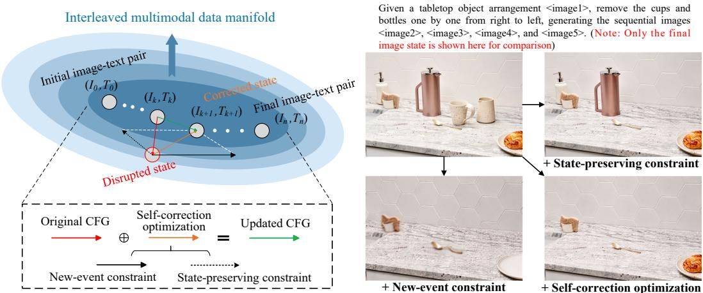  
Figure 1: The mechanism of self-correction optimization, which consists of new-event and statepreserving constraints for the new-event realization and visual subject consistency.

As shown in Fig.1, at each selected generation step, SCO takes the original CFG update as a reference and applies a self-correction when either constraint is insufficiently satisfied. The two constraint are constructed from complementary conditional branches and jointly optimized through a bounded two-dimensional projection. This optimization explicitly models the interaction between event realization and state preservation, while independent correction budgets provide a controlled relaxation mechanism when the two constraints compete. SCO is performed entirely at test time and requires no additional model parameters or task-specific training.

We evaluate SCO on challenging interleaved image–text generation benchmarks. Across Opening-Bench Zhou et al. (2025) and ISG-Bench Chen et al. (2025a), SCO improves temporal coherence and visual-subject preservation, demonstrating the effectiveness of test-time self-correction for interleaved multimodal generation. Besides, the same constraint formulation can be extended to video generation. The new-event constraint captures the motion, while the state-preserving constraint maintains persistent information from the preceding temporal context. Experiments on long-horizon handcrafting and robot-manipulation scenarios demonstrate that SCO consistently improves the generation quality by powerful generators. Our contributions are summarized as follows:

• We formulate interleaved generation as an optimization problem that jointly requires new-event realization and preservation of the evolving multimodal state.

• We propose Self-Correction Optimization (SCO), a training-free method that jointly optimizes complementary new-event and state-preserving constraints through a bounded projection of the original CFG update, with controlled relaxation under constraint conflicts.

• Experiments on interleaved image–text and physically grounded video-generation tasks demonstrate improved event consistency, visual-subject preservation, and temporal coherence without additional training.

## 2 RELATED WORK

## 2.1 MODULAR INTERLEAVED GENERATION MODELS

Early generation-oriented approaches adopted modular architectures that couple an autoregressive language model with a pretrained visual generator. GILL Koh et al. (2023) connects a language model to a frozen visual generation and retrieval module through learned projections. MiniGPT-5 Zheng et al. (2023) introduced generative vokens as an interface between the language model and Stable Diffusion Rombach et al. (2022), enabling the generation of interleaved text–image responses. MM-Interleaved Tian et al. (2024) further improved multimodal context modeling through multi-scale and multi-image feature synchronization, allowing the generator to access visual information from previously generated images. OpenLEAF An et al. (2023) explored modular interleaved generation in open-domain applications, including visual instructions, multimodal storytelling, and webpage or poster creation. These modular systems provide a practical way to combine language reasoning with high-quality image synthesis and avoid training a fully unified generator. However, their inherent architectures restrict them to interleaved generation.

## 2.2 UNIFIED MULTIMODAL MODELS FOR INTERLEAVED GENERATION

Unified multimodal models (UMMs) provide a promising paradigm by modeling language and visual content within a shared architecture. Chameleon Team (2024) adopts early fusion of discretized image and text tokens and supports mixed-modal understanding and generation. Emu3 Wang et al. (2024) formulates language, image, and video generation under a unified next-token prediction objective, while Anole Chern et al. (2024) improves the accessibility of native interleaved generation through parameter- and data-efficient adaptation. DuoGen Shi et al. (2026) narrows the gap between modular and unified generation by jointly adapting a vision-language model and a pretrained video generator for interleaved multimodal generation. However, these unified models may over-rely on the most recent visual state and terminate at an intermediate state that does not fully satisfy the current instruction. Small deviations introduced in early generation rounds can also accumulate across subsequent steps, leading to subject drift and incorrect visual states. That is why SCO is proposed to explicitly optimize complementary new-event and state-preserving constraints without additional task-specific training.

## 2.3 TRAINING-FREE GENERATION GUIDANCE

Classifier-free guidance (CFG) Ho & Salimans (2022) improves conditional generation by combining conditional and unconditional predictions during sampling. It is widely used in image and video diffusion models, including latent diffusion Rombach et al. (2022), Video Diffusion Models Ho et al. (2022b), and Imagen Video Ho et al. (2022a). However, its single scalar guidance scale offers limited control when multiple semantic objectives must be satisfied simultaneously. Several training free methods extend guidance to multiple conditions or auxiliary objectives, including composable diffusion and Universal Guidance Bansal et al. (2024). These methods improve controllability while keeping the pretrained generator fixed, providing a lightweight alternative to task-specific posttraining Ye et al. (2024). The proposed SCO follows this test-time paradigm but targets cross-modal consistency and temporal coherence in interleaved generation.

## 3 METHODOLOGY

## 3.1 PROBLEM FORMULATION AND MOTIVATION

We consider interleaved image–text generation, where text and image outputs may appear in an arbitrary order and each image is conditioned on the complete multimodal history. Let $O =$ $\left( o _ { 1 } , \ldots , o _ { L } \right)$ denote an interleaved output with $o _ { \ell } \in \mathcal { T } \cup \mathcal { X }$ , where $\tau$ and X denote the text and image spaces, respectively. At the m-th image slot, $\mathcal { H } _ { m }$ denotes the preceding multimodal history and $e _ { m }$ denotes the current event or instruction. The history is updated after generating the current image:

$$
\begin{array} { r l r } & { } & { \hat { x } _ { m } \sim p _ { \theta } ( \cdot \mid \mathcal { H } _ { m } , e _ { m } ) , \quad \quad \quad \mathcal { H } _ { m + 1 } = \mathcal { H } _ { m } \oplus ( e _ { m } , \hat { x } _ { m } ) , } \\ & { } & { v _ { \mathrm { r e f } } ( z _ { \tau } ) = v _ { \mathrm { u } } ( z _ { \tau } ) + \omega \left[ v _ { \mathrm { f } } ( z _ { \tau } \mid \mathcal { H } _ { m } , e _ { m } ) - v _ { \mathrm { u } } ( z _ { \tau } ) \right] , \quad \quad \quad \delta _ { \mathrm { r e f } } = v _ { \mathrm { r e f } } - v _ { \mathrm { u } } . } \end{array}\tag{1}
$$

Here, $z _ { \tau }$ denotes the current latent state at a selected sampling or integration step, $v _ { \mathrm { u } }$ and vf denote the unconditional and fully conditional model outputs, and ω is the CFG scale. The notation v represents the model update, which may correspond to a noise, score, or velocity prediction depending on the underlying generator. We use $\tau \in [ \bar { 0 } , 1 ]$ to denote the normalized sampling progress, with $\tau = 0$ corresponding to the beginning of the sampling trajectory.

The full condition in equation 1 entangles the current event with the visual state inherited from previous rounds. Consequently, the original CFG update does not explicitly distinguish between information that should change and information that should remain stable. This may lead to underrealization of the current event or progressive changes in subject identity, scene layout, etc.

Self-Correction Optimization (SCO) addresses this issue by constructing two complementary directions: a new-event direction that captures the requested change and a state-preserving direction that captures persistent visual information. SCO then minimally corrects the original CFG update when one or both requirements are insufficiently satisfied.

## 3.2 NEW-EVENT CONSTRAINT

We first isolate the update associated with the current event. Specifically, we define the full condition and its counterfactual counterpart as:

$$
c _ { \mathrm { f u l l } } = ( { \mathcal { H } } _ { m } , e _ { m } ) , \qquad c _ { \mathrm { c o u n t e r } } = ( { \mathcal { H } } _ { m } , e _ { \varpi } ) ,\tag{2}
$$

where $e _ { \emptyset }$ describes the visual state immediately before the current event occurs. The two conditions share the same multimodal history and differ only in the current event specification. Evaluating them at the same latent state yields:

$$
v _ { \mathrm { f } } = v _ { \theta } ( z _ { \tau } \mid c _ { \mathrm { f u l l } } ) , \qquad v _ { \mathrm { c o u n t e r } } = v _ { \theta } ( z _ { \tau } \mid c _ { \mathrm { c o u n t e r } } ) , \qquad a _ { \mathrm { n e w } } = v _ { \mathrm { f } } - v _ { \mathrm { c o u n t e r } } .\tag{3}
$$

Here $\theta$ denotes the frozen parameters of the pretrained generator, and $v _ { \theta }$ denotes its sampling update. The difference $a _ { \mathrm { n e w } }$ defines the new-event direction, which captures the model’s local response to introducing the current event while holding the history and latent state fixed. For a candidate update $\delta ,$ its support for the current event is measured by its projection onto $a _ { \mathrm { n e w } } .$

$$
\begin{array} { r } { p _ { \mathrm { n e w } } ( \delta ) = a _ { \mathrm { n e w } } ^ { \top } \delta \geq c _ { \mathrm { n e w } } , \qquad c _ { \mathrm { n e w } } = \lambda _ { \mathrm { n e w } } ( \tau ) \lVert a _ { \mathrm { n e w } } \rVert , } \end{array}\tag{4}
$$

where $\lambda _ { \mathrm { n e w } } ( \tau )$ controls the required event strength. When the original CFG update $\delta _ { \mathrm { r e f } }$ satisfies $a _ { \mathrm { n e w } } ^ { \top } \delta _ { \mathrm { r e f } } < c _ { \mathrm { n e w } } .$ , it provides insufficient directional support for the current event, and $\mathrm { s c o }$ activates the corresponding new-event correction. This constraint reduces visual inertia and promotes the realization of the requested event and its direct consequences.

## 3.3 STATE-PRESERVING CONSTRAINT

Realizing a new event alone is insufficient for long-horizon generation, because the corresponding update may alter visual properties that should remain stable. Therefore, we try to isolate the statepreserving direction $a _ { \mathrm { s t a t e } } .$ by constructing an event-only condition that retains the current event while removing the preceding multimodal history:

$$
c _ { \mathrm { e v e n t } } = ( { \mathcal { Q } } , e _ { m } ) , \qquad v _ { \mathrm { e v e n t } } = v _ { \theta } ( z _ { \tau } \mid c _ { \mathrm { e v e n t } } ) , \qquad a _ { \mathrm { s t a t e } } = v _ { \mathrm { f } } - v _ { \mathrm { e v e n t } } .\tag{5}
$$

The difference in equation 5 estimates the contribution of the inherited state that is present in the full condition but absent from the event-only condition. This state includes subject identity, scene layout, and rendering style. The state-preserving constraint is as follows:

$$
p _ { \mathrm { s t a t e } } ( \delta ) = a _ { \mathrm { s t a t e } } ^ { \top } \delta \geq c _ { \mathrm { s t a t e } } , \qquad c _ { \mathrm { s t a t e } } = \lambda _ { \mathrm { s t a t e } } ( \tau ) \lVert a _ { \mathrm { s t a t e } } \rVert ,\tag{6}
$$

where $\lambda _ { \mathrm { s t a t e } } ( \tau )$ controls the state-preserving strength. Unlike direct image copying, this constraint acts in the generator-update space and preserves semantic and visual attributes without requiring pixel level correspondence. It consequently reduces subject drift, layout changes, and style inconsistency across successive image slots.

## 3.4 JOINT SELF-CORRECTION OPTIMIZATION

The constraint strengths are scheduled over the normalized sampling trajectory. Let $\tau _ { \mathrm { e n d } } \in [ 0 , 1 ]$ denote the normalized sampling endpoint. SCO is applied from $\tau = 0 \mathrm { t o } \tau = \tau _ { \mathrm { e n d } } \mathrm { : }$

$$
\lambda _ { \mathrm { n e w } } ( \tau ) = \alpha _ { 0 } { \bf 1 } \{ 0 \leq \tau \leq \tau _ { \mathrm { e n d } } \} , \qquad \lambda _ { \mathrm { s t a t e } } ( \tau ) = s _ { \mathrm { s t a t e } } \lambda _ { \mathrm { n e w } } ( \tau ) ,\tag{7}
$$

where $\alpha _ { 0 }$ controls the overall strength of the new-event constraint and $s _ { \mathrm { s t a t e } }$ controls the relative strength of the state-preserving constraint. The two directions generally lie in the same update space and are not orthogonal. Independently applying two corrections may therefore cause one correction to weaken the other. SCO jointly modifies the original CFG update $\delta _ { \mathrm { r e f } }$ as the refined update $\delta ^ { * }$ :

$$
\delta ^ { * } = \delta _ { \mathrm { r e f } } + \mu _ { \mathrm { n e w } } a _ { \mathrm { n e w } } + \mu _ { \mathrm { s t a t e } } a _ { \mathrm { s t a t e } } , \qquad v ^ { * } = v _ { \mathrm { u } } + \delta ^ { * } ,\tag{8}
$$

where $\mu _ { \mathrm { n e w } } , \mu _ { \mathrm { s t a t e } } \geq 0$ are the correction coefficients.

Ignoring correction budgets, the optimal update is obtained by projecting the original CFG update onto the intersection of the two constraint half-spaces:

$$
\begin{array} { r l l } { \operatorname* { m i n } } & { \displaystyle \frac { 1 } { 2 } \left\| \delta - \delta _ { \mathrm { r e f } } \right\| ^ { 2 } } \\ { \mathrm { s . t . } } & { a _ { i } ^ { \top } \delta \geq c _ { i } , } & { i \in \{ \mathrm { n e w } , \mathrm { s t a t e } \} . } \end{array}\tag{9}
$$

The interaction between the constraints is characterized by the Gram matrix:

$$
G _ { i j } = a _ { i } ^ { \top } a _ { j } , \qquad i , j \in \{ \mathrm { n e w } , \mathrm { s t a t e } \} ,\tag{10}
$$

whose off-diagonal term satisfies:

$$
G _ { \mathrm { n e w , s t a t e } } = \left\| a _ { \mathrm { n e w } } \right\| \left\| a _ { \mathrm { s t a t e } } \right\| \cos \theta , \qquad \cos \theta = { \frac { a _ { \mathrm { n e w } } ^ { \top } a _ { \mathrm { s t a t e } } } { \left\| a _ { \mathrm { n e w } } \right\| \left\| a _ { \mathrm { s t a t e } } \right\| + \epsilon } } .\tag{11}
$$

A positive cosine indicates local cooperation between the two constraints, whereas a negative cosine indicates competition. The off-diagonal term in equation 11 is therefore essential: a correction along one direction can change the projection onto the other. This cross-effect is explicitly accounted for by the joint projection in equation 9, whereas sequentially applying two independent corrections may undo a constraint that has already been satisfied.

To prevent excessive deviations from the original CFG update, SCO imposes independent correction budgets:

$$
0 \leq \mu _ { \mathrm { n e w } } \leq M _ { \mathrm { n e w } } , \qquad 0 \leq \mu _ { \mathrm { s t a t e } } \leq M _ { \mathrm { s t a t e } } ,\tag{12}
$$

where $M _ { \mathrm { n e w } }$ and $M _ { \mathrm { s t a t e } }$ respectively bound the correction strengths for the new-event and statepreserving directions. The resulting problem is a convex optimization over only two correction coefficients. Therefore, its feasible active sets can be evaluated directly, avoiding the overhead of a generic high-dimensional quadratic-programming solver. The bounded correction also admits the following soft-constraint interpretation:

$$
\begin{array} { r l } { \underset { \delta , \xi _ { \mathrm { n e w } } , \xi _ { \mathrm { s t a t e } } \geq 0 } { \mathrm { m i n } } } & { \frac { 1 } { 2 } \left. \delta - \delta _ { \mathrm { r e f } } \right. ^ { 2 } + M _ { \mathrm { n e w } } \xi _ { \mathrm { n e w } } + M _ { \mathrm { s t a t e } } \xi _ { \mathrm { s t a t e } } } \\ { \mathrm { s . t . } } & { a _ { i } ^ { \top } \delta + \xi _ { i } \geq c _ { i } , \qquad i \in \{ \mathrm { n e w } , \mathrm { s t a t e } \} . } \end{array}\tag{13}
$$

The residual relaxation of constraint i is measured by $s _ { i } = [ c _ { i } - a _ { i } ^ { \top } \delta ^ { * } ] _ { + }$ . A positive $s _ { i }$ indicates that the constraint is not fully enforced because its correction budget is insufficient or because it competes with the other constraint. Thus, a negative direction cosine alone does not imply infeasibility; actual relaxation is determined by the post-correction residual.

At each selected sampling or integration step, SCO evaluates the unconditional, full, counterfactual, and event-only branches at the same latent state. It then constructs the two contrastive directions, computes the scheduled thresholds using equation 7, and solves the bounded two-dimensional optimization defined by equation 9 and equation 12. The resulting update is substituted for the original CFG update according to equation 8. All model parameters remain frozen, and the entire procedure is performed at test time.

Beyond interleaved image–text generation, SCO can be extended to video generation by treating each temporal position as an image slot. In our video experiments, a GPT-5-based planning stage first decomposes the text prompt into temporally ordered events and allocates the available frames to these events. The two SCO directions and the bounded joint correction in equation 9–equation 12 are then applied to each frame-indexed component, including when multiple frames are generated jointly by a video generator. Further formulation details are provided in Appendix A.1.

## 4 EXPERIMENTS

## 4.1 DATASETS

Interleaved image–text generation: We evaluate interleaved image–text generation on Open-ING Zhou et al. (2025) and ISG-Bench Chen et al. (2025a). OpenING contains 5,400 humanannotated instances spanning 23 real-world meta-topics and 56 fine-grained tasks, including visual

Cartoon

Embodied-AI-task: You've been provided with three photographs taken in different moments of time. Your task is to forecast the appearance of the subsequent image. <image>\n<image>\n<image>?

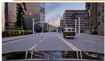  
Scene 1

  
Scene 2

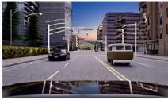  
Scene 3

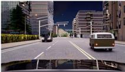  
Baseline: Scene 4

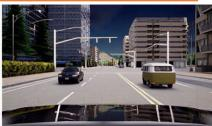  
Baseline + Ours: Scene 4  
Novel view synthesis: Slightly adjust the head position from <image1> to make the llama face from right-front looking to left-front looking. \n<image1> represents the initial state, and the provided text describes the changes needed. Create a series of 5 images that gradually transition from the initial state to the final state.

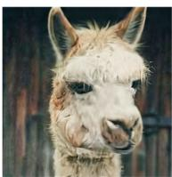  
View 1

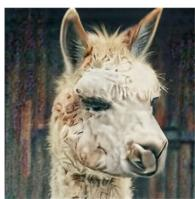  
Baseline: View 2

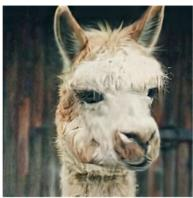  
View 1

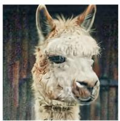

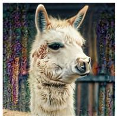  
Baseline + ours: View 2  
View 3

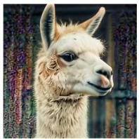  
View 3

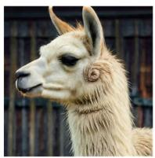  
View 4

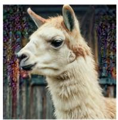  
View 4

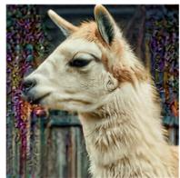  
View 5

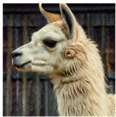  
View 5

Art style transfer: I will give you an image <image1>. Using <image1>, create 5 versions of this image in 5 artistic styles in order: Sketch, Van\_Gogh, Cartoon, Dreamweave, Impressionism. Focus on transforming the whole image style while maintaining the subject's features.  
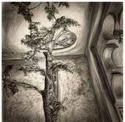  
Baseline: Sketch

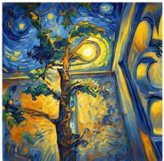

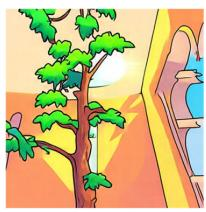

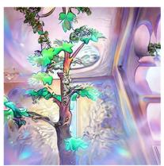

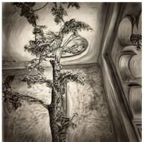  
Baseline + ours: Sketch

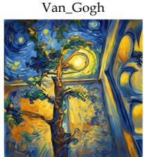

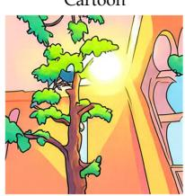  
Van\_Gogh

Cartoon  
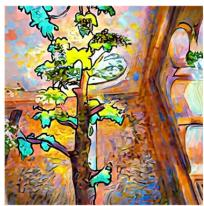

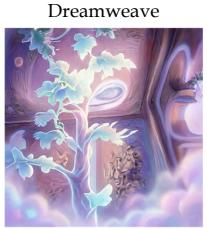  
Dreamweave  
Impression

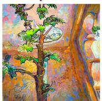  
Impression

Figure 2: Qualitative results on various interleaved generation tasks when evaluating the efficacy of SCO, including iterative image editing, novel view synthesis, and embodied-AI scenarios.

planning, design, education, travel, and creative content generation. ISG-Bench contains 1,150 samples covering 8 scenarios and 21 subtasks. Each sample is represented by an interleaved scene graph that specifies entities, attributes, and relations. Video generation and embodied scenarios: We further evaluate SCO in video generation and embodied settings. For long-horizon handcrafting, we use the handcraft-making subset of Video-CraftBench introduced by VideoWorld2 Ren et al. (2026), which contains first-person videos of multi-step tasks such as paper folding and block building. SCO is applied on top of VideoWorld2. For robot-manipulation videos, we use a hand–object interaction subset of the Interleaved X-Embodiment data released with Interleave-VLA Fan et al. (2026), and apply SCO to Cosmos-2.5 and Cosmos-3 Agarwal et al. (2026).

Table 1: Quantitative results on the ISG-Bench dataset when plugging SCO into various open-source models, including modular and unified models.
<table><tr><td>Type</td><td>Method</td><td>FID↓</td><td>CLIP-I↑</td><td>CLIP-T ↑</td><td>GPT-J1 ↑</td><td> $C _ { s } \uparrow$ </td><td> $\mathit { C _ { b } } \uparrow$ </td><td>GPT-J2 ↑</td></tr><tr><td rowspan="4">Molar Moddel</td><td>MiniGPT-5 Zheng et al. (2023) MiniGPT-5 + SCO</td><td>91.3 88.5</td><td>0.151 0.170</td><td>0.269 0.285</td><td>0.327 0.365</td><td>0.13 0.16</td><td>0.20 0.22</td><td>0.243 0.279</td></tr><tr><td>Show-o2 Xie et al. (2026) Show-o2 + SCO</td><td>83.6 79.7</td><td>0.146 0.169</td><td>0.270 0.281</td><td>0.337 0.349</td><td>0.12 0.13</td><td>0.17 0.19</td><td>0.248 0.264</td></tr><tr><td>MM-Interleaved Tian et al. (2024) MM-Interleaved + SCO</td><td>76.2 73.6</td><td>0.201 0.227</td><td>0.329 0.337</td><td>0.397 0.419</td><td>0.18 0.20</td><td>0.22 0.23</td><td>0.351 0.384</td></tr><tr><td>BAGEL Deng et al. (2025) BAGEL + SČO</td><td>83.2 78.3</td><td>0.195 0.211</td><td>0.257</td><td>0.306</td><td>0.14</td><td>0.19</td><td>0.237 0.255</td></tr><tr><td rowspan="4">Uiied Moddel</td><td>LLaDA2.0-Uni AI et al. (2026)</td><td>95.8</td><td>0.117</td><td>0.281 0.226</td><td>0.329 0.287</td><td>0.16 0.09</td><td>0.20 0.13</td><td>0.189</td></tr><tr><td>LLaDA2.0-Uni + SCO SenseNova-U1 Diao et al. (2026b)</td><td>91.7 52.1</td><td>0.142 0.385</td><td>0.245 0.497</td><td>0.304 0.677</td><td>0.10 0.36</td><td>0.16 0.39</td><td>0.213 0.591</td></tr><tr><td>SenseNova-U1 + SCO DuoGen Shi et al. (2026)</td><td>49.7</td><td>0.409</td><td>0.513</td><td>0.695</td><td>0.38</td><td>0.41</td><td>0.624</td></tr><tr><td>DuoGen + SCO</td><td>45.7 41.4</td><td>0.413 0.445</td><td>0.531 0.560</td><td>0.692 0.735</td><td>0.39 0.41</td><td>0.43 0.47</td><td>0.621 0.659</td></tr></table>

Table 2: Quantitative results on the Opening dataset when plugging SCO into various open-source models, including modular and unified models.
<table><tr><td>Type</td><td>Method</td><td>FID↓</td><td>CLIP-I↑</td><td>CLIP-T ↑</td><td>GPT-J1 ↑</td><td>Cs ↑</td><td>Cb↑</td><td>GPT-J2 ↑</td></tr><tr><td rowspan="4">Modlar Mooddel</td><td>MiniGPT-5 Zheng et al. (2023) MiniGPT-5 + SCO</td><td>90.4 89.9</td><td>0.149 0.138</td><td>0.257 0.247</td><td>0.445 0.423</td><td>0.18 0.17</td><td>0.23 0.21</td><td>0.344 0.319</td></tr><tr><td>Show-o2 Xie et al. (2026)</td><td>88.5</td><td>0.173 0.179</td><td>0.280</td><td>0.471</td><td>0.19</td><td>0.26</td><td>0.385</td></tr><tr><td>Show-o2 + SCO MM-Interleaved Tian et al. (2024)</td><td>84.0 94.1</td><td>0.140</td><td>0.291 0.269</td><td>0.496 0.432</td><td>0.19 0.15</td><td>0.28 0.19</td><td>0.401 0.327</td></tr><tr><td>MM-Interleaved + SCO BAGEL Deng et al. (2025)</td><td>81.3 87.2</td><td>0.164 0.190</td><td>0.293 0.303</td><td>0.450 0.459</td><td>0.17 0.21</td><td>0.22 0.23</td><td>0.369</td></tr><tr><td rowspan="5">Unihed Moddel</td><td>BAGEL + SČO</td><td>83.7</td><td>0.217</td><td>0.339</td><td>0.482</td><td>0.23</td><td>0.26</td><td>0.374 0.398</td></tr><tr><td>LLaDA2.0-Uni AI et al. (2026) LLaDA2.0-Uni + SCO</td><td>118.6 108.4</td><td>0.083 0.089</td><td>0.219 0.225</td><td>0.237 0.234</td><td>0.05 0.07</td><td>0.11 0.10</td><td>0.185 0.249</td></tr><tr><td>SenseNova-U1 Diao et al. (2026b) SenseNova-U1 + SCO</td><td>67.2 55.9</td><td>0.325 0.376</td><td>0.471 0.507</td><td>0.658 0.694</td><td>0.29 0.35</td><td>0.37 0.40</td><td>0.574 0.602</td></tr><tr><td>DuoGen Shi et al. (2026) DuoGen + SCO</td><td>53.6 50.1</td><td>0.382 0.405</td><td>0.505 0.539</td><td>0.683</td><td>0.34</td><td>0.40</td><td>0.603</td></tr><tr><td></td><td></td><td></td><td></td><td>0.701</td><td>0.36</td><td>0.42</td><td>0.637</td></tr></table>

## 4.2 IMPLEMENTATION DETAILS AND EVALUATION METRICS

All selected baselines are configured according to corresponding code repositories. Experiments are implemented based on PyTorch and 2 NVIDIA H100 Tensor Core GPUs. Besides, the evaluation metrics cover four axes. (i) Image quality uses FID Heusel et al. (2017) to measure the distributional gap between generated and real images, and CLIP-I (cosine similarity of CLIP Radford et al. (2021) image embeddings between prediction and ground truth) for frame-level perceptual similarity. (ii) Cross-modality consistency uses CLIP-T (cosine similarity between CLIP text and image embeddings), together with GPT-Judge 1 (GPT-J1), a GPT-5.6-sol multimodal judge that scores each frame on prompt fidelity and factual plausibility. (iii) Temporal coherence uses subject consistency $C _ { s }$ via DINOv2 Oquab et al. (2024) features on the subject region, and background consistency $\dot { C _ { b } }$ via CLIP features on the background. (iv) Fact consistency and physical plausibility is assessed by GPT-Judge 2 (GPT-J2), which rates whether the depicted events are factually consistent and physically plausible.

## 4.3 EXPERIMENTAL RESULTS

Tables 1 and 2 summarize the performance of SCO on OpenING and ISG-Bench, respectively. Across both benchmarks, SCO generally improves visual quality, cross-modal alignment, and cross-image consistency for both modular and unified models. On ISG-Bench, the concurrent improvements in $C _ { s } , C _ { b }$ , and GPT-J2 indicate that SCO enhances current-event realization while preserving the visual state established in previous image slots. DuoGen Shi et al. (2026) achieves the largest relative

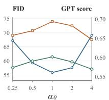

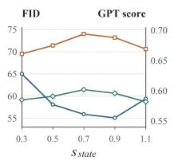  
FID (left axis)

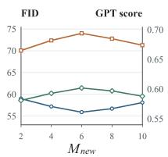  
— GPT-J1 (right axis)

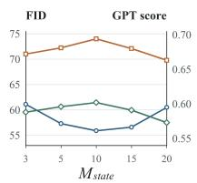  
GPT-J2 (right axis)

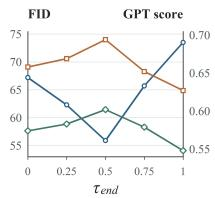  
Figure 3: Sensitivity analysis for hyper-parameters of SCO (α0, $s _ { s t a t e } ,$ $M _ { s t a t e }$ $M _ { n e w }$ , and $\tau _ { e n d } )$

FID reduction $( 9 . 4 \% )$ and the strongest overall performance after applying SCO. On OpenING, the most pronounced image-quality improvements are observed for SenseNova-U1 Diao et al. (2026b) and MM-Interleaved Tian et al. (2024), whereas DuoGen with SCO provides the strongest overall balance between cross-modal alignment and sequence-level consistency. SCO also improves the holistic GPT-J2 score of LLaDA2.0-Uni AI et al. (2026), despite variations in individual metrics. MiniGPT-5 Zheng et al. (2023) is an exception, showing a slight FID improvement but degradation on the remaining metrics. This result highlights that the effectiveness of SCO depends on the quality and separability of the full, counterfactual, and event-only conditional branches. Moreover, we present qualitative results by plugging SCO into Sensenova-U1. As shown in Fig.2, SCO brings significant improvements to various tasks including iterative image-editing, novel view synthesis, embodied AI, etc. Overall, SCO serves as a general training-free correction layer that improves interleaved generation across different model architectures without additional task-specific training.

## 4.4 COMPARISON WITH CFG-BASED METHODS

To assess the effectiveness of the proposed SCO, we conduct experiments on the Opening dataset, using SenseNova-U1 as the baseline. SCO achieves the best performance across all four metrics. As shown in Table 3, compared with the baseline, SCO reduces FID by 16.8% and improves CLIP-I, CLIP-T, and GPT-J2 by 0.051, 0.036, and 0.028, respectively.

Table 3: Quantitative comparison of different CFG-based methods. Best results are in bold.
<table><tr><td>Method</td><td>FID↓</td><td>CLIP-I↑</td><td>CLIP-T ↑</td><td>GPT-J2 ↑</td></tr><tr><td>Baseline</td><td>67.2</td><td>0.325</td><td>0.471</td><td>0.574</td></tr><tr><td>+ Interleaved CFG Wang et al. (2026)</td><td>62.7</td><td>0.343</td><td>0.485</td><td>0.589</td></tr><tr><td>+ CFG++ Chung et al. (2025)</td><td>60.4</td><td>0.358</td><td>0.481</td><td>0.577</td></tr><tr><td>+ TCFG Fu &amp; Li (2025)</td><td>59.2</td><td>0.349</td><td>0.484</td><td>0.583</td></tr><tr><td>+ SCO (Ours)</td><td>55.9</td><td>0.376</td><td>0.507</td><td>0.602</td></tr></table>

Compared with CFG++ Chung et al. (2025), SCO further reduces FID from 60.4 to 55.9, corresponding to a 7.5% relative reduction, while improving CLIP-I, CLIP-T, and GPT-J2 by 0.018, 0.026, and 0.025, respectively. These consistent gains suggest that SCO’s ability to introduce new events while preserving historical states contributes to improved visual fidelity and text-image alignment.

## 4.5 HYPER-PARAMETER ANALYSIS

We use SenseNova-U1 as the baseline and conduct hyperparameter analysis on the OpenING dataset. The quantitative results in Fig.3 show that moderate constraint settings provide the best balance between preserving existing states and allowing valid changes. For the new-event constraint, $\alpha _ { 0 } = 1 . 0$ and $M _ { \mathrm { n e w } } = 6$ achieve the strongest overall performance. For the state constraint, the optimal region for $s _ { \mathrm { s t a t e } }$ approximately belongs to [0.7-0.9], and the optimal $M _ { \mathrm { s t a t e } }$ varies around 10. Weak constraints can cause identity, layout, background, or style drift, whereas overly strong constraints may suppress legitimate state changes.

The optimal termination time is $\tau _ { \mathrm { e n d } } = 0 . 5$ . When $\tau _ { \mathrm { e n d } } = 0$ , SCO constraints are not applied and the model degenerates to the SenseNova-U1 baseline. As shown by qualitative results in Fig.4, increasing $\tau _ { \mathrm { e n d } }$ too far improves constraint coverage but can impair image details and valid temporal changes, while a small value of $\tau _ { \mathrm { e n d } }$ also struggles to function well. Overall, the results support using moderate constraint strengths, upper bounds, and termination times.

## 4.6 ABLATION STUDY ON KEY COMPONENTS

We implement an ablation study on two complementary constraints of SCO. Specifically, evaluations are conducted on the Opening and ISG-Bench using MM-Interleaved and SenseNova-U1 respectively

Edited image: ＝1.0

Edited image: ＝0.5

Table 4: Ablation analysis of two key constraints. MM-interleaved and SenseNova-U1 are respectively adopted as the baseline model on the Opening and ISG-Bench datasets.
<table><tr><td></td><td colspan="5">MM-Interleaved</td><td colspan="5">SenseNova-U1</td></tr><tr><td>Setting</td><td>FID↓</td><td>CLIP-I↑</td><td>GPT-J1 ↑</td><td>Cs ↑</td><td>GPT-J2 ↑</td><td>FID↓</td><td>CLIP-I↑</td><td>GPT-J1 ↑</td><td> $C _ { \mathrm { s } } \uparrow$ </td><td>GPT-J2 ↑</td></tr><tr><td>Baseline</td><td>94.1</td><td>0.140</td><td>0.432</td><td>0.15</td><td>0.327</td><td>52.1</td><td>0.385</td><td>0.677</td><td>0.36</td><td>0.591</td></tr><tr><td>+astate</td><td>85.6</td><td>0.149</td><td>0.445</td><td>0.18</td><td>0.320</td><td>51.1</td><td>0.393</td><td>0.689</td><td>0.39</td><td>0.620</td></tr><tr><td>+anew</td><td>89.4</td><td>0.153</td><td>0.440</td><td>0.13</td><td>0.362</td><td>50.6</td><td>0.397</td><td>0.686</td><td>0.34</td><td>0.563</td></tr><tr><td>+Both</td><td>81.3</td><td>0.164</td><td>0.450</td><td>0.17</td><td>0.369</td><td>49.7</td><td>0.409</td><td>0.695</td><td>0.38</td><td>0.624</td></tr></table>

Prompt: Please conduct two steps, firstly increase the brightness then boost the saturation of the image.  
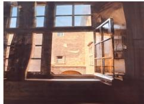  
Given image

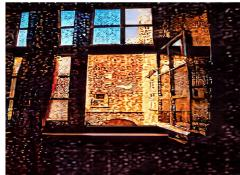  
Table 5: Video generation performance evaluation for the efficacy of SCO. VideoWorld2 Ren et al. (2026) and Cosmos-2.5/Cosmos-3 Ali et al. (2025); Agarwal et al. (2026) are used as baselines for the handcrafting and Interleaved-VLA datasets respectively.

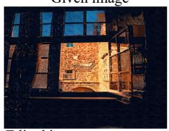

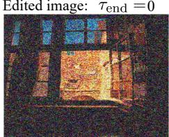

<table><tr><td colspan="5">Model FVD↓ LPIPS ↓  $C _ { s }$  ↑  $C _ { b } \uparrow$  GPT-J2 ↑</td></tr><tr><td>VideoWorld2</td><td>178.0</td><td>2.487</td><td>0.26 0.38</td><td>0.527</td></tr><tr><td>+ SCO</td><td>146.3</td><td>1.708</td><td>0.30 0.41</td><td>0.562</td></tr><tr><td>Cosmos-2.5</td><td>167.2</td><td>1.729</td><td>0.37 0.48 0.41 0.52</td><td>0.583 0.640</td></tr><tr><td>+ SCO Cosmos-3</td><td>142.3 138.9</td><td>1.337 1.174</td><td>0.49 0.56</td><td>0.651</td></tr><tr><td></td><td></td><td></td><td></td><td></td></tr><tr><td>+ SCO</td><td>119.3</td><td>1.026</td><td>0.53 0.59</td><td>0.705</td></tr></table>

Figure 4: The choice for $\tau _ { \mathrm { e n d } }$

as the underlying generators, as reported in Table 4. The state-preserving constraint consistently improves $C _ { s } ,$ confirming its effectiveness in maintaining subject consistency across generated images. The new-event constraint primarily improves event realization and overall generation quality, but may introduce greater visual variation across image slots. Jointly optimizing both constraints achieves the best overall performance in FID, CLIP-I, GPT-J1, and GPT-J2 for both generators. Nevertheless, its $C _ { s }$ is slightly lower than that of the state-preserving-only variant, since realizing newly introduced events can inevitably alter visual content and thereby increase the difficulty of preserving subject consistency. These results demonstrate that the two constraints are complementary, while also revealing the inherent trade-off between event realization and state preservation.

Frame 12  
Frame 0  
Frame 42  
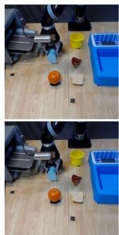

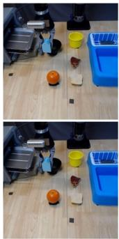

Cosmos2.5 vs. Cosmos2.5 + Ours  
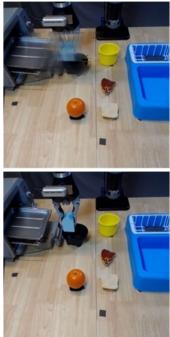

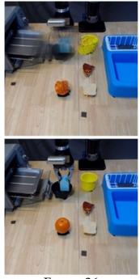

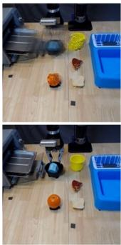

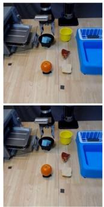

Videoworld2 vs. Videoworld2 + Ours  
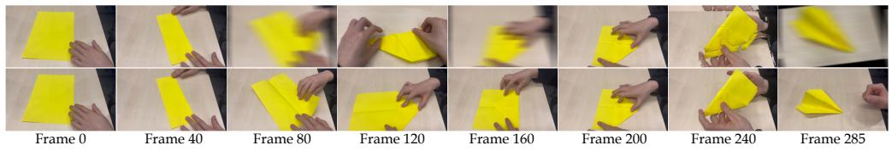  
Figure 5: Qualitative results when applied to robotic arm manipulation and handcrafting scenarios.

## 4.7 GENERALIZATION ON VIDEO GENERATION

We further evaluate SCO in two complicated video-generation scenarios: long-horizon handcrafting and robot manipulation. Specifically, VideoWorld2 Ren et al. (2026) is evaluated on the handcrafting dataset, while Cosmos-2.5 Ali et al. (2025) and Cosmos-3 Agarwal et al. (2026) are evaluated on Interleaved-VLA. As shown in Table 5, integrating SCO consistently reduces FVD and LPIPS while improving $C _ { s } , C _ { b }$ , and GPT-J2 across all three generators. The improvements in subject and background consistency indicate that the state-preserving constraint effectively maintains persistent visual information across temporal stages. Meanwhile, the concurrent improvement in GPT-J2 suggests that this consistency is achieved without suppressing the motion or physical events specified by the video instruction. Furthermore, qualitative results in Fig.5 reveal SCO’s effectiveness on preserving the state of visual subject. These results demonstrate that SCO generalizes beyond interleaved image–text generation and provides effective test-time control for both handcrafting and embodied manipulation videos.

## 5 CONCLUSION

We introduced Self-Correction Optimization (SCO), a training-free test-time method for improving interleaved image–text generation. SCO constructs complementary new-event and state-preserving constraints and jointly enforces them through a bounded minimal correction of the original CFG update. Experiments on OpenING and ISG-Bench demonstrate broad improvements in visual quality, cross-modal alignment, and cross-image consistency across modular and unified generators. SCO also extends to video generation, improving temporal consistency in handcrafting and robot-manipulation scenarios. These findings demonstrate the importance of explicitly balancing event realization and state preservation in long-horizon multimodal generation.

## AI USE STATEMENT

In this work, we used generative AI tools only to edit the manuscript for readability and to assist with formatting the LaTeX source. We have not used generative AI tools to generate synthetic data, to design or execute the experiments, to implement the method, or to interpret the results. All AI-assisted edits were reviewed by the authors, and all technical claims, experimental results, figures, and tables were produced and verified by the authors.

## REPRODUCIBILITY STATEMENT

We have present the complete theory related to SCO. Besides, the detailed process of text prompt rewriting is displayed in the appendix. All relevant hyper-parameters have been listed out in the manuscript. All above operations ensure the reproducibility of our work.

## REFERENCES

Niket Agarwal, Arslan Ali, Jon Allen, Martin Antolini, Adeline Aubame, Alisson Azzolini, Junjie Bai, Maciej Bala, Yogesh Balaji, Josh Bapst, et al. Cosmos 3: Omnimodal world models for physical ai. arXiv preprint arXiv:2606.02800, 2026.

Inclusion AI, Tiwei Bie, Haoxing Chen, Tieyuan Chen, Zhenglin Cheng, Long Cui, Kai Gan, Zhicheng Huang, Zhenzhong Lan, Haoquan Li, et al. Llada2. 0-uni: Unifying multimodal understanding and generation with diffusion large language model. arXiv preprint arXiv:2604.20796, 2026.

Jean-Baptiste Alayrac, Jeff Donahue, Pauline Luc, Antoine Miech, Iain Barr, Yana Hasson, Karel Lenc, Arthur Mensch, Katherine Millican, Malcolm Reynolds, et al. Flamingo: a visual language model for few-shot learning. Advances in neural information processing systems, 35:23716–23736, 2022.

Arslan Ali, Junjie Bai, Maciej Bala, Yogesh Balaji, Aaron Blakeman, Tiffany Cai, Jiaxin Cao, Tianshi Cao, Elizabeth Cha, Yu-Wei Chao, et al. World simulation with video foundation models for physical ai. arXiv preprint arXiv:2511.00062, 2025.

Jie An, Zhengyuan Yang, Linjie Li, Jianfeng Wang, Kevin Lin, Zicheng Liu, Lijuan Wang, and Jiebo Luo. Openleaf: Open-domain interleaved image-text generation and evaluation. arXiv preprint arXiv:2310.07749, 2023.

Arpit Bansal, Hong-Min Chu, Avi Schwarzschild, Roni Sengupta, Micah Goldblum, Jonas Geiping, and Tom Goldstein. Universal guidance for diffusion models. In International Conference on Learning Representations, volume 2024, pp. 51304–51323, 2024.

Dongping Chen, Ruoxi Chen, Shu Pu, Zhaoyi Liu, Yanru Wu, Caixi Chen, Benlin Liu, Yue Huang, Yao Wan, Pan Zhou, et al. Interleaved scene graphs for interleaved text-and-image generation assessment. In International Conference on Learning Representations, volume 2025, pp. 74693– 74756, 2025a.

Wei Chen, Lin Li, Yongqi Yang, Bin Wen, Fan Yang, Tingting Gao, Yu Wu, and Long Chen. Comm: A coherent interleaved image-text dataset for multimodal understanding and generation. In 2025 IEEE/CVF Conference on Computer Vision and Pattern Recognition (CVPR), pp. 8073–8082. IEEE, 2025b.

Ethan Chern, Jiadi Su, Yan Ma, and Pengfei Liu. Anole: An open, autoregressive, native large multimodal models for interleaved image-text generation. arXiv preprint arXiv:2407.06135, 2024.

Hyungjin Chung, Jeongsol Kim, Geon Yeong Park, Hyelin Nam, and Jong Chul Ye. Cfg++: Manifoldconstrained classifier free guidance for diffusion models. In International Conference on Learning Representations, volume 2025, pp. 30824–30850, 2025.

Chaorui Deng, Deyao Zhu, Kunchang Li, Chenhui Gou, Feng Li, Zeyu Wang, Shu Zhong, Weihao Yu, Xiaonan Nie, Ziang Song, et al. Emerging properties in unified multimodal pretraining. arXiv preprint arXiv:2505.14683, 2025.

Haiwen Diao, Jiahao Wang, Chenjing Ding, Hanming Deng, Jiangnan Chen, Ruixi Zhang, Ruohui Wang, Wenwen Tong, Xiangyu Fan, Yubo Wang, et al. Sensenova-u1. 5: Towards native unified visual intelligence. arXiv preprint arXiv:2609.11929, 2026a.

Haiwen Diao, Penghao Wu, Hanming Deng, Jiahao Wang, Shihao Bai, Silei Wu, Weichen Fan, Wenjie Ye, Wenwen Tong, Xiangyu Fan, et al. Sensenova-u1: Unifying multimodal understanding and generation with neo-unify architecture. arXiv preprint arXiv:2605.12500, 2026b.

Cunxin Fan, Xiaosong Jia, Yihang Sun, Yixiao Wang, Jianglan Wei, Ziyang Gong, Xiangyu Zhao, Masayoshi Tomizuka, Xue Yang, Junchi Yan, et al. Interleave-vla: Enhancing robot manipulation with image-text interleaved instructions. In International Conference on Learning Representations, volume 2026, pp. 40872–40902, 2026.

Yukang Feng, Jianwen Sun, Chuanhao Li, Zizhen Li, Jiaxin Ai, Fanrui Zhang, Sizhuo Zhou, Yifan Chang, Shenglin Zhang, Yu Dai, et al. A high quality dataset and reliable evaluation for interleaved image-text generation. In International Conference on Learning Representations, volume 2026, pp. 40398–40437, 2026.

Xiaomeng Fu and Jia Li. Tcfg: Truncated classifier-free guidance for efficient and scalable text-toimage acceleration. In 2025 IEEE/CVF International Conference on Computer Vision (ICCV), pp. 18552–18562. IEEE, 2025.

Xiaoyang Han, Jianhua Li, Kewang Deng, Zukai Chen, Xuanke Shi, Sihan Wang, Boxuan Li, Linyan Wang, Siyi Xie, Xin You, et al. Vision as unified multimodal generation. arXiv preprint arXiv:2607.06560, 2026.

Martin Heusel, Hubert Ramsauer, Thomas Unterthiner, Bernhard Nessler, and Sepp Hochreiter. Gans trained by a two time-scale update rule converge to a local Nash equilibrium. In Advances in Neural Information Processing Systems, 2017.

Jonathan Ho and Tim Salimans. Classifier-free diffusion guidance. arXiv preprint arXiv:2207.12598, 2022.

Jonathan Ho, William Chan, Chitwan Saharia, Jay Whang, Ruiqi Gao, Alexey Gritsenko, Diederik P Kingma, Ben Poole, Mohammad Norouzi, David J Fleet, et al. Imagen video: High definition video generation with diffusion models. arXiv preprint arXiv:2210.02303, 2022a.

Jonathan Ho, Tim Salimans, Alexey Gritsenko, William Chan, Mohammad Norouzi, and David J. Fleet. Video diffusion models. In Advances in Neural Information Processing Systems, volume 35, pp. 8633–8646, 2022b. URL https://arxiv.org/abs/2204.03458.

Jing Yu Koh, Daniel Fried, and Russ R Salakhutdinov. Generating images with multimodal language models. Advances in Neural Information Processing Systems, 36:21487–21506, 2023.

Qingyang Liu, Bingjie Gao, Canmiao Fu, Zhipeng Huang, Chen Li, Feng Wang, Shuochen Chang, Shaobo Wang, Yali Wang, Keming Ye, et al. Breaking dual bottlenecks: Evolving unified multimodal models into self-adaptive interleaved visual reasoners. arXiv preprint arXiv:2605.14709, 2026.

Corey Lynch, Ayzaan Wahid, Jonathan Tompson, Tianli Ding, James Betker, Robert Baruch, Travis Armstrong, and Pete Florence. Interactive language: Talking to robots in real time. IEEE Robotics and Automation Letters, 2023.

Maxime Oquab, Timothee Darcet, Theo Moutakanni, Huy Vo, Marc Szafraniec, Vasil Khalidov,´ Pierre Fernandez, Daniel Haziza, Francisco Massa, Alaaeldin El-Nouby, et al. Dinov2: Learning robust visual features without supervision. Transactions on Machine Learning Research, 2024.

Abby O’Neill, Abdul Rehman, Abhiram Maddukuri, Abhishek Gupta, Abhishek Padalkar, Abraham Lee, Acorn Pooley, Agrim Gupta, Ajay Mandlekar, Ajinkya Jain, et al. Open x-embodiment: Robotic learning datasets and rt-x models: Open x-embodiment collaboration 0. In 2024 IEEE International Conference on Robotics and Automation (ICRA), pp. 6892–6903. IEEE, 2024.

Alec Radford, Jong Wook Kim, Chris Hallacy, et al. Learning transferable visual models from natural language supervision. In International Conference on Machine Learning, 2021.

Zhongwei Ren, Yunchao Wei, Xiao Yu, Guixun Luo, Yao Zhao, Bingyi Kang, Jiashi Feng, and Xiaojie Jin. Videoworld 2: Learning transferable knowledge from real-world videos. arXiv preprint arXiv:2602.10102, 2026.

Robin Rombach, Andreas Blattmann, Dominik Lorenz, Patrick Esser, and Bjorn Ommer. High-¨ resolution image synthesis with latent diffusion models. In Proceedings ofthe IEEE/CVF Confer ence on Computer Vision and Pattern Recognition, 2022.

Min Shi, Xiaohui Zeng, Jiannan Huang, Yin Cui, Francesco Ferroni, Jialuo Li, Shubham Pachori, Zhaoshuo Li, Yogesh Balaji, Haoxiang Wang, et al. Duogen: Towards general purpose interleaved multimodal generation. arXiv preprint arXiv:2602.00508, 2026.

Chameleon Team. Chameleon: Mixed-modal early-fusion foundation models. arXiv preprint arXiv:2405.09818, 2024.

Changyao Tian, Xizhou Zhu, Yuwen Xiong, Weiyun Wang, Zhe Chen, Wenhai Wang, Yuntao Chen, Lewei Lu, Tong Lu, Jie Zhou, et al. Mm-interleaved: Interleaved image-text generative modeling via multi-modal feature synchronizer. arXiv preprint arXiv:2401.10208, 2024.

Chonghuinan Wang, Zhikai Chen, Chunwei Wang, Yecong Wan, Junwei Yang, Zhixin Wang, Wei Zhang, Jiaqi Xu, Renjing Pei, Xiaohe Wu, et al. Illuminating unified multimodal model for free-form interleaved text-image generation. In European Conference on Computer Vision, pp. 535–552. Springer, 2026.

Xinlong Wang, Xiaosong Zhang, Zhengxiong Luo, Quan Sun, Yufeng Cui, Jinsheng Wang, Fan Zhang, Yueze Wang, Zhen Li, Qiying Yu, et al. Emu3: Next-token prediction is all you need. arXiv preprint arXiv:2409.18869, 2024.

Jinheng Xie, Zhenheng Yang, and Mike Zheng Shou. Show-o2: Improved native unified multimodal models. Advances in Neural Information Processing Systems, 38:47490–47518, 2026.

Jinbo Xing, Zeyinzi Jiang, Yuxiang Tuo, Chaojie Mao, Xiaotang Gai, Xi Chen, Jingfeng Zhang, Yulin Pan, Zhen Han, Jie Xiao, et al. Wan-weaver: Interleaved multi-modal generation via decoupled training. arXiv preprint arXiv:2603.25706, 2026.

Haotian Ye, Haowei Lin, Jiaqi Han, Minkai Xu, Sheng Liu, Yitao Liang, Jianzhu Ma, James Zou, and Stefano Ermon. Tfg: Unified training-free guidance for diffusion models. Advances in Neural Information Processing Systems, 37:22370–22417, 2024.

Mingcheng Ye, Jiaming Liu, and Yiren Song. Loom: Diffusion-transformer for interleaved generation. In Proceedings ofthe IEEE/CVF Conference on Computer Vision and Pattern Recognition, pp. 4582–4592, 2026.

Kaizhi Zheng, Xuehai He, and Xin Eric Wang. Minigpt-5: Interleaved vision-and-language generation via generative vokens. arXiv preprint arXiv:2310.02239, 2023.

Pengfei Zhou, Xiaopeng Peng, Jiajun Song, Chuanhao Li, Zhaopan Xu, Yue Yang, Ziyao Guo, Hao Zhang, Yuqi Lin, Yefei He, et al. Opening: A comprehensive benchmark for judging open-ended interleaved image-text generation. In 2025 IEEE/CVF Conference on Computer Vision and Pattern Recognition (CVPR), pp. 56–66. IEEE, 2025.

Fangqi Zhu, Hongtao Wu, Song Guo, Yuxiao Liu, Chilam Cheang, and Tao Kong. Irasim: A finegrained world model for robot manipulation. In 2025 IEEE/CVF International Conference on Computer Vision (ICCV), pp. 9834–9844. IEEE, 2025.

## A APPENDIX

## A.1 EXTENSION TO VIDEO GENERATION

In our video experiments, a GPT-5-based planner is used as a required preprocessing stage. Given a textual prompt $\mathcal { P }$ and a target length of $F$ frames, it decomposes the prompt into K temporally ordered events and allocates $n _ { k }$ frames to each event:

$$
\Pi ( { \mathcal { P } } , F ) = \{ ( e _ { k } ^ { \mathrm { v } } , n _ { k } ) \} _ { k = 1 } ^ { K } , \qquad \sum _ { k = 1 } ^ { K } n _ { k } = F .\tag{14}
$$

Let $\begin{array} { r } { b _ { k } = \sum _ { j = 1 } ^ { k } n _ { j } } \end{array}$ with $b _ { 0 } = 0$ . The event stage assigned to frame t is denoted by $\kappa ( t ) = k$ when $b _ { k - 1 } < t \leq \mathsf { \bar { b } } _ { k }$

Let $\mathcal { H } _ { t } ^ { \mathrm { v } }$ denote the temporal context inherited by frame t. Following the image-slot formulation, we define

$$
c _ { \mathrm { f u l l } } ^ { ( t ) } = \left( \mathcal { H } _ { t } ^ { \mathrm { v } } , e _ { \kappa ( t ) } ^ { \mathrm { v } } \right) , \quad c _ { \mathrm { c o u n t e r } } ^ { ( t ) } = \left( \mathcal { H } _ { t } ^ { \mathrm { v } } , e _ { \otimes , \kappa ( t ) } ^ { \mathrm { v } } \right) , \quad c _ { \mathrm { e v e n t } } ^ { ( t ) } = \left( \mathcal { O } , e _ { \kappa ( t ) } ^ { \mathrm { v } } \right) ,\tag{15}
$$

where $e _ { \mathcal { O } , \kappa ( t ) } ^ { \mathrm { v } }$ describes the temporal state immediately before the event assigned to frame t.

For a jointly generated video, let $\mathbf { c } _ { b }$ denote the complete frame-aligned condition schedule for branch $b ,$ and let $v _ { b } ^ { ( t ) } = [ v _ { \theta } ( z _ { \tau } \mid \mathbf { c } _ { b } ) ] _ { i }$ t be its frame-indexed output at the same spatiotemporal latent state $z _ { \tau }$ The frame-wise CFG update and the two SCO directions are then

$$
v _ { \mathrm { r e f } } ^ { ( t ) } = v _ { \mathrm { u } } ^ { ( t ) } + \omega \left( v _ { \mathrm { f } } ^ { ( t ) } - v _ { \mathrm { u } } ^ { ( t ) } \right) , \qquad \delta _ { \mathrm { r e f } } ^ { ( t ) } = v _ { \mathrm { r e f } } ^ { ( t ) } - v _ { \mathrm { u } } ^ { ( t ) } ,\tag{16}
$$

$$
a _ { \mathrm { n e w } } ^ { ( t ) } = v _ { \mathrm { f } } ^ { ( t ) } - v _ { \mathrm { c o u n t e r } } ^ { ( t ) } , \qquad a _ { \mathrm { s t a t e } } ^ { ( t ) } = v _ { \mathrm { f } } ^ { ( t ) } - v _ { \mathrm { e v e n t } } ^ { ( t ) } .
$$

Although the CFG scale ω is shared, these updates remain frame-dependent because the event assignments and temporal contexts vary across frames.

The new-event direction captures the motion or physical transition associated with the assigned event, whereas the state-preserving direction retains persistent information from the preceding temporal context. Using the same strength schedule and bounded joint optimization as in equation $7 -$ equation 12, SCO computes

$$
\delta ^ { * ( t ) } = \delta _ { \mathrm { r e f } } ^ { ( t ) } + \mu _ { \mathrm { n e w } } ^ { ( t ) } a _ { \mathrm { n e w } } ^ { ( t ) } + \mu _ { \mathrm { s t a t e } } ^ { ( t ) } a _ { \mathrm { s t a t e } } ^ { ( t ) } .\tag{17}
$$

For jointly generated videos, $v ^ { ( t ) }$ denotes the temporal component of the shared spatiotemporal update rather than an independently sampled frame. Therefore, the same formulation applies to both diffusion- and flow-matching-based video generators while preserving their cross-frame interactions.

## A.2 DATASET DETAILS

Interleaved image–text generation. We evaluate image–text generation on two challenging benchmarks, OpenING and ISG-Bench. OpenING Zhou et al. (2025) is a large-scale benchmark for open-ended interleaved image–text generation. It contains 5,400 human-annotated instances spanning 23 real-world meta-topics and 56 fine-grained tasks. The benchmark covers diverse application domains, including visual explanation, planning, design, education, travel, and creative content generation. Each instance specifies an open-ended multimodal request whose response consists of interleaved textual descriptions and generated images. OpenING therefore evaluates the complete generation process, including the helpfulness of the response, text quality, visual quality, text–image alignment, and coherence across multiple generated images. We use the official benchmark prompts and evaluate the generated responses with the official evaluation protocol.

ISG-Bench Chen et al. (2025a) provides a more structured evaluation of interleaved generation. It contains 1,150 samples organized into 8 scenarios and 21 subtasks. Each sample is associated with an interleaved scene graph that decomposes the input into atomic entities, attributes, relations, and generation requirements. The benchmark evaluates generation at four levels: structural consistency, block-level consistency, image-level correctness, and holistic interleaved response quality. Compared with OpenING, ISG-Bench places greater emphasis on fine-grained language–vision dependencies and allows individual semantic requirements to be verified separately. We use ISG-Bench to measure whether SCO improves the realization of the newly requested event while preserving entities, attributes, spatial relations, and visual style established earlier in the sequence.

IRASim  
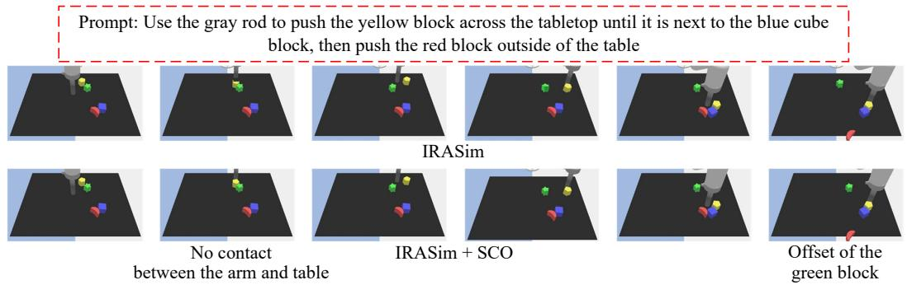  
Figure 6: Qualitative results on the effectiveness of SCO when applied to embodiment and handcrafting fields.

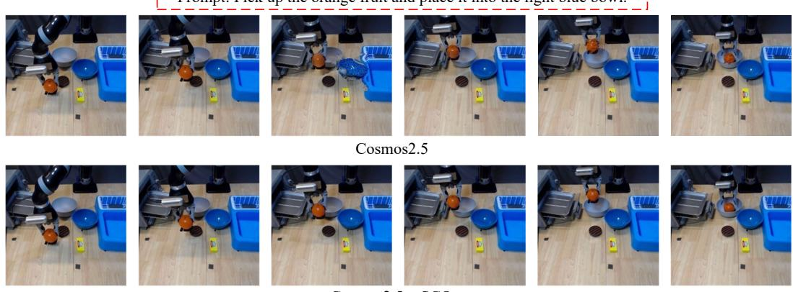

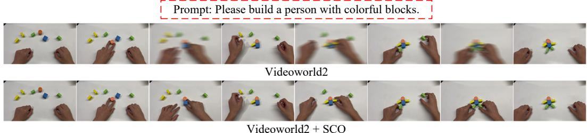  
Prompt: Pick up the orange fruit and place it into the light blue bowl.  
Cosmos2.5 + SCO  
Prompt: Use the gray rod to push the blue cube across the tabletop until it is next to the green fivepointed star-shaped block.

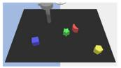

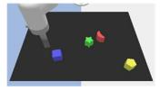

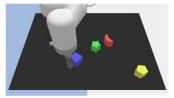

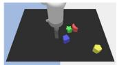

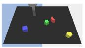

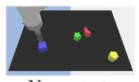  
No contact between the arm and block

  
Not the target place

Video generation and embodied scenarios. To examine whether the proposed constraint extends beyond still-image generation, we additionally conduct experiments on two video-oriented data sources. First, we use the handcraft-making portion of Video-CraftBench, introduced by VideoWorld 2 Ren et al. (2026). Video-CraftBench consists of first-person videos depicting long-horizon manipulation tasks, including paper-folding and block-building activities. The benchmark contains five handcrafted tasks and approximately 9.5K video clips collected from about seven hours of demonstrations. The tasks involve multiple fine-grained steps, substantial object and background variation, and long temporal horizons, making them suitable for evaluating both event realization and state preservation.

Second, we use a subset of the Interleaved X-Embodiment data released with Interleave-VLA Fan et al. (2026). Interleaved X-Embodiment is constructed from the Open X-Embodiment collection O’Neill et al. (2024) and contains approximately 210K robot-manipulation trajectories. The data-generation pipeline converts text-only manipulation instructions into interleaved image–text instructions by identifying task-relevant objects, extracting corresponding image regions, and verifying the resulting image–text pairs with vision–language models. For the video experiments, we report both eventoriented and preservation-oriented metrics. Event-oriented metrics measure whether the requested manipulation or state transition appears in the generated clip. Preservation-oriented metrics measure identity consistency, object attributes, scene layout, and visual similarity to the conditioning frames. This setup enables us to test whether SCO reduces temporal and cross-frame drift without suppressing the requested action.

We further evaluate SCO on Language-Table Lynch et al. (2023), a simulated tabletop manipulation benchmark for language-guided visuomotor learning. The environment contains a robot arm operating on a two-dimensional tabletop workspace, where natural-language instructions specify manipulation goals such as moving, pushing, or arranging objects. Each episode consists of visual observations, language annotations, and the corresponding low-dimensional action trajectory. Compared with the image–text benchmarks, Language-Table introduces an embodied setting in which the requested event is grounded in a physical state transition and must remain consistent with the robot trajectory. Following IRASim Zhu et al. (2025), we formulate the task as trajectory-conditioned video generation. Given an initial observation and a short sequence of robot actions, the model generates the corresponding future video frames.

## A.3 DETAILS OF EVALUATION METRICS

We evaluate along four complementary dimensions: image generation quality, cross-modality consistency, temporal coherence, and fact consistency with physical plausibility. We combine referencebased automatic metrics with GPT-based qualitative judgments for a holistic assessment. All GPTbased judgments use GPT-5.6-sol with fixed sampling settings.

Image Generation Quality: Frechet Inception Distance (FID). FID (Heusel et al., 2017) quantifies´ the gap between the distributions of generated and real images in the feature space of a pre-trained Inception-V3 network. Let $\left( \mu _ { r } , \Sigma _ { r } \right)$ and $( \mu _ { g } , \Sigma _ { g } )$ denote the mean and covariance of features extracted from the real and generated sets, respectively:

$$
\mathrm { F I D } = \| \mu _ { r } - \mu _ { g } \| _ { 2 } ^ { 2 } + \mathrm { T r } \Big ( \Sigma _ { r } + \Sigma _ { g } - 2 \big ( \Sigma _ { r } \Sigma _ { g } \big ) ^ { 1 / 2 } \Big ) .\tag{18}
$$

Lower FID indicates a closer match between the generated and real distributions.

Image Generation Quality: CLIP Image Similarity (CLIP-I). We compute the cosine similarity between CLIP image embeddings (Radford et al., 2021) of the prediction and the ground-truth frame, providing a frame-level measure of perceptual similarity that complements FID’s distributional view.

Cross-Modality Consistency: CLIP Text–Image Similarity (CLIP-T). Defined as the cosine similarity between the CLIP text embedding of the input prompt and the CLIP image embedding of the generated frame, CLIP-T captures fine-grained semantic alignment between modalities.

Cross-Modality Consistency: GPT-Judge 1 (GPT-J1). To overcome the limits of embedding-based similarity, we employ a multimodal large language model, GPT-5.6-sol, as a judge. GPT-J1 scores each frame on a 0–1 scale along two axes: (i) whether the generated image faithfully reflects the textual description, and (ii) whether the image is factually and logically plausible.

Temporal Coherence: Subject Consistency $( C _ { s } )$ . We measure the cosine similarity between DINOv2 (Oquab et al., 2024) features of the primary subject region across consecutive frames. The self-supervised features of DINOv2 are sensitive to high-level semantic structure, making them well-suited for tracking identity-preserving subjects.

Temporal Coherence: Background Consistency (C ). We compute the cosine similarity between CLIP image embeddings of the background region across frames to assess low-level scene stability.

  
Figure 7: The relationship between the new-event constraint/state-preserving constraint and how to rewrite text prompts.

Fact Consistency and Physical Plausibility: GPT-Judge 2 (GPT-J2). Using the same GPT-5.6-sol backbone as GPT-J1, GPT-J2 provides a holistic 0–1 rating along two axes: (i) fact consistency – whether the depicted events align with established real-world facts (e.g., object identities, causal relations), and (ii) physical plausibility – whether the implied dynamics obey common-sense physics (e.g., gravity, rigid-body motion, material interactions).

Remark. We use the same prompt template and sampling settings across all baselines. Besides, absolute scores should be compared only within the same GPT-Judge run.

## A.4 PROMPT CONSTRUCTION FOR SCO

Figure 7 illustrates how prompt rewriting supports the two complementary SCO constraints. For each generation round, the full-task prompt combines the persistent visual state retrieved from the preceding multimodal history with the newly requested event. To construct the new-event constraint, a counterfactual prompt retains the subject, objects, and scene established in previous rounds while removing only the current event; comparison with the full condition therefore isolates the visual change associated with that event. To construct the state-preserving constraint, an event-only prompt retains the current action while removing historical details such as subject identity, appearance, and

Prompt: given a picture of a sea turtle swimming underwater.<image1> Please use a combination of 3 images and text to show what will happen next. For example, <image2> <text2> <image3><text3> <image4><text4>.

  
Figure 8: Qualitative results on the interleaved multimodal generation for the storytelling task.

scene configuration; comparison with the full condition consequently identifies the persistent state that should be preserved. In the illustrated example, these rewrites separate cutting the apple from the previously established woman, clothing, kitchen, table, and object states.

## A.5 ADDITIONAL QUALITATIVE RESULTS

The additional qualitative results further demonstrate the complementary effects of the two SCO constraints. In the storytelling example as shown in Fig.8, the state-preserving constraint maintains persistent visual attributes, such as the sea turtle’s olive-brown coloration and characteristic shell and flipper patterns, but produces relatively conservative motion. In contrast, the new-event constraint introduces more pronounced motion and viewpoint changes, while gradually altering the turtle’s appearance. By combining both constraints, SCO preserves the turtle’s visual identity while producing a richer progression of forward and upward motion, scale variation, and scene evolution. This benefit is more evident in iterative image editing, where each new instruction must be applied without overwriting previously established content. As revealed in Fig.9, compared with the baseline, which accumulates substantial appearance distortions after successive brightness and saturation edits, SCO better preserves the window structure, spatial layout, and overall scene content while incorporating the requested changes. In two scenarios mentioned above, we adopt SenseNova-U1 Diao et al. (2026b) as the baseline model.

Furthermore, in the sequential object removing task, we find that SCO can boost the generative performance of DuoGenShi et al. (2026). As shown in Fig.10, across scenes containing kitchen objects, wooden spoons, and stacked bowls, the model removes the specified object at each generation round while preserving the identity, appearance, and spatial configuration of the remaining objects.

Iterative image editing: Please give the result of edited image according to the input instruction and also give the description of editing results. Increase the brightness and saturation of the image to make it clearer. <image>

  
Original image

  
Baseline: Brightness

  
Saturation

  
Original image

  
Baseline + Ours: Brightness

  
Saturation

Figure 9: Qualitative results on the task of iterative image editing.

It also maintains the background, viewpoint, lighting, and overall composition across the sequence, while reconstructing regions previously occluded by the removed objects. These examples show that SCO enables DuoGen to follow cumulative removal instructions while maintaining coherent visual states over multiple generation rounds.

Prompt: Create a four-image sequence from the reference image <image1><image2><image3><image4>, applying the edits cumulatively: first remove only the rightmost water cup; then remove the central water cup; next remove the kettle on the left; finally remove the hand-soap dispenser. Preserve all remaining objects and the original background consistently in each image.

Prompt: Create a three-frame sequence <image1><image2><image3> from the reference image. In each successive frame, remove one spoon: first the lower-right spoon, then the topmost spoon, then the spoon lying horizontally across the center. Preserve all remaining spoons and the background.

Prompt: Generate a four-frame image sequence <image1><image2><image3><image4> in which the bowls disappear one by one from top to bottom. Preserve the original composition, viewpoint, lighting, colors, materials, and tilt of the remaining bowls. Realistically reconstruct all previously occluded surfaces, rims, interiors, background areas, and shadows, with no residual artifacts.

Figure 10: Qualitative results on the interleaved multimodal generation for the sequential object removal task.  

