# SGF+: Decoupling Gradient Flows for Autoregressive Video Generation

Zihan Su1,2∗ Junhao Zhuang2∗† Yaowei Li2 Siwen Lu1 Haoran Li2 Lingen Li3 Haoyu Wu2 Weiyang Jin2 Songchun Zhang2 Haoyang Huang2 Chun Yuan1† Zeyue Xue2 Nan Duan2 1Tsinghua University 2Joy Future Academy, JD 3The Chinese University of Hong Kong ∗Equal contribution. †Corresponding authors.

https://zihan-su.github.io/self-gradient-forcing-plus

Higher Visual Quality  
0 s  
80 s  
160 s  
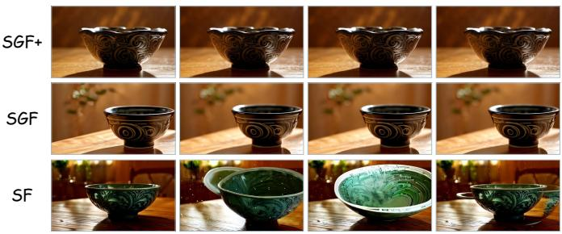  
240 s  
Stronger Long-Horizon Consistency  
Prompt: A serene, close-up view of a beautifully crafted ceramic bowl. The bowl is intricately designed with swirling patterns and a...

0 s  
80 s  
160 s  
240 s  
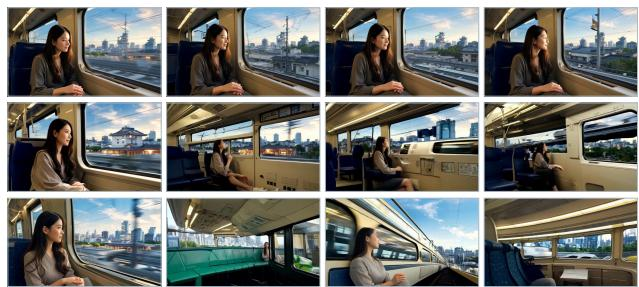  
Prompt: A subtle and elegant Japanese-style photograph of a woman with soft, contemplative eyes and long flowing dark hair...

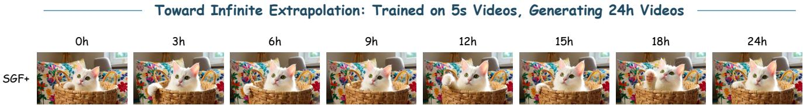  
Prompt: Whimsical soft watercolor illustration of a fluffy white cat with bright green eyes peeking from a patterned woven basket behind...

Figure 1. Qualitative comparison of autoregressive video generation methods. Self Forcing (SF) blocks context gradients, preventing future predictions from supervising context writing and causing pronounced visual degradation over long rollouts. Self Gradient Forcing (SGF) restores context gradients and improves long-horizon consistency, but conflicts between context-writing and denoising updates keep both consistency and visual quality suboptimal. Self Gradient Forcing Plus (SGF+) decouples context writing and denoising, achieving the best visual quality and long-horizon consistency among the three methods. Trained with only 5s rollouts, SGF+ supports continuous generation for up to 24 hours without long-video fine-tuning.

## Abstract

Autoregressive video generation requires denoising the current frames while writing their key-value representations as contextforfuture predictions. However, these two roles typically share parameters, and we find that their gradients exhibit distinct patterns and systematic negative alignment, hindering the joint optimization of visual quality and temporal consistency. We introduce Self Gradient Forcing Plus (SGF+), which assigns separate parameters to context writing and denoising while preserving their interaction through

causal attention. Both roles are jointly optimized using the original generation objective without auxiliary losses, with context writing supervised through its contribution to future predictions. This simple change improves visual quality and long-horizon consistency over the evaluated baselines in both framewise and chunkwise generation, without additional video training data or a longer training horizon. Trained on only 5s rollouts, SGF+ supports continuous generation for up to 24 hours without long-video fine-tuning. These results highlight role-specific parameterization as an effective design principle for high-quality autoregressive video generation and native long-horizon extrapolation.

  
Figure 2. Method lineage for autoregressive video generation. SF addresses train–test history mismatch via self-generated rollouts. SGF restores context-writing gradients, while SGF+ decouples context writing from denoising to resolve their gradient conflict.

## 1. Introduction

Autoregressive video diffusion models generate videos sequentially by denoising new frames conditioned on historical context [15, 25, 32, 44]. The generated frames are then encoded into key-value (KV) representations that provide context for subsequent predictions. This process supports low-latency video generation and interactive world modeling, where inference can extend far beyond the temporal horizon used in training [8, 14, 30, 42, 48]. It involves two distinct computational roles: denoising generates the current content, while context writing determines how that content is represented for future generation. Learning both roles is essential for maintaining visual quality and temporal consistency as generation continues.

As summarized in Figure 2, Self Forcing (SF) [15] mitigates exposure bias by training on self-generated histories with a video-level distribution-matching objective. However, to maintain computational tractability, SF treats the historical KV cache as frozen rollout state for subsequent predictions. Future generation losses can therefore supervise how noisy target tokens read history, but not how earlier generated latents are encoded into useful K/V representations for future generation. This missing supervision path constitutes the historical context-gradient gap [52].

Self Gradient Forcing (SGF) [52] closes this gap through a two-pass training procedure. The first pass performs a nogradient autoregressive rollout, while the second reconstructs context representations and target predictions in parallel. The sampled latents remain detached, but the reconstructed KV path is differentiable, allowing future generation losses to supervise context writing without backpropagating through the full rollout. Although this improves long-video extrapolation, context writing and denoising still share the same parameters. We observe residual degradation in long sequences and, in a small number of generated videos, even lower visual quality in the initial frames than with SF. Since the first generated frame has no preceding video context, it provides a useful probe of denoising quality. These observations motivate a fundamental question: Can shared parameters effectively accommodate the optimization demands of both context writing and denoising?

We investigate this question by analyzing the gradient contributions of context writing and denoising under the same generation objective during SGF training. As shown in Figure 3, (a) angular-distance t-SNE reveals distinct roledependent gradient groups in both Attention and FFN. (b) After aggregation within each module family, the mean gradient directions exhibit large angular separation: 104.2◦ in Attention and 106.3◦ in FFN, both exceeding 90◦. (c) Pairwise analysis across prompts and denoising timesteps further reveals systematic negative alignment, with negative cosine similarities for all 512 measured pairs in both module families. These results reveal substantially different, even conflicting, optimization demands on shared parameters, motivating role-specific parameterization. Appendix G provides a local theoretical analysis of its optimization advantage under gradient conflict.

Based on this analysis, we introduce Self Gradient Forcing Plus (SGF+), which revisits a basic design choice in autoregressive video forcing: sharing parameters between context writing and denoising. SGF+ adopts role-specific parameterization, assigning independent parameters to the two roles while preserving their interaction through the causal attention structure. The context writer encodes generated history into layer-wise KV representations, which the denoiser reads to generate current frames. Both roles are jointly optimized using the original generation objective, with context writing supervised through its contribution to future predictions. This simple architectural change retains SGF’s self-generated rollouts, differentiable replay, and short training horizon, requiring no auxiliary losses, additional video training data, or long-horizon fine-tuning. By intervening in parameter sharing, SGF+ addresses a different design dimension from history construction and context management, making these approaches complementary in mechanism.

Experiments on VBench over generation horizons of 5s, 60s, and 240s show that SGF+ achieves better visual quality and long-horizon consistency than SF and SGF in both framewise and chunkwise generation. The qualitative comparisons in Figure 1 illustrate these gains over long rollouts. With only 5s training rollouts, SGF+ supports continuous generation for up to 24 hours, without extending the training horizon or applying long-video fine-tuning. We refer to this ability as native long-horizon extrapolation: sustained generation learned within a limited temporal training window. Together, these results highlight role-specific parameterization as an effective design principle for high-quality autoregressive video generation and native long-horizon extrapolation. Our main contributions are as follows:

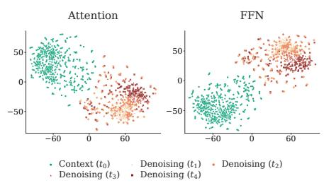  
(a) Gradient distributions

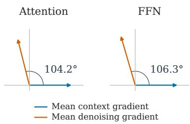  
(b) Mean gradient directions

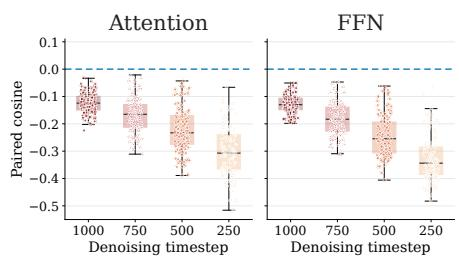  
(c) Conflict across timesteps  
Figure 3. Visualization of gradient conflict. We analyze SGF gradients over 128 prompts and 4 denoising timesteps, separately for Attention and FFN. (a) Angular-distance t-SNE visualizes the distributions of context-writing and denoising gradients. $t _ { 0 } = 0$ denotes context writing at timestep 0, while $t _ { 1 } , t _ { 2 } , t _ { 3 } , t _ { 4 }$ denote denoising at timesteps 250, 500, 750, and 1000, respectively. (b) Gradients are aggregated to compute the mean directions. (c) At each denoising timestep, we compute the paired cosine similarity between the denoising and context-writing gradients for the same prompt. Layer-wise gradient distributions are provided in Appendix E.

• We identify distinct, even conflicting, context-writing and denoising gradients under the same objective, revealing an optimization limitation of shared parameters.

• We introduce Self Gradient Forcing Plus (SGF+), a rolespecific parameterization for autoregressive video diffusion that jointly trains context writing and denoising with the original generation objective, without auxiliary losses, additional video training data, or long-horizon fine-tuning.

• Experiments show improved visual quality and longhorizon consistency in framewise and chunkwise generation, with native long-horizon extrapolation to 24-hour continuous videos from 5s training rollouts.

## 2. Related Work

## 2.1. Autoregressive Video Diffusion and World Models

Autoregressive video diffusion combines iterative denoising with causal temporal prediction [3, 29]. Causal video distillation and Self Forcing support efficient streaming inference through historical KV reuse [15, 44], while Rolling Forcing coordinates denoising across a moving temporal window [25]. Historical context also connects past outputs to future predictions in interactive world models. EchoWM, SolarWM, Zing-0.5, XPACE, and EditWorld adopt or adapt SGF’s differentiable context reconstruction to supervise context writing through future generation losses, with applications spanning visual world simulation, interactive editing, and audio-video generation [4, 14, 24, 38, 48]. SGF+ complements these developments through role-specific parameterization, jointly optimizing context writing and denoising with separate parameters under the original generation objective, without auxiliary losses.

## 2.2. Forcing Strategies for Autoregressive Video Generation

Forcing methods differ in history construction, supervision, and gradient propagation. Teacher forcing uses clean groundtruth histories, whereas Diffusion Forcing independently samples noise levels across temporal tokens [2]. SF uses self-generated rollouts to reduce the mismatch between training and inference [15], while Resampling Forcing combines self-resampled histories with a frame-level diffusion objective [12]. Rolling Forcing coordinates denoising across adjacent frames at progressively different noise levels [25], and Mask Forcing broadens rollout exploration through dualnoise masking under the existing distillation objective [50].

Many subsequent methods build on SF’s self-generated rollout framework to improve initialization or supervision. Causal Forcing uses an autoregressive teacher for ODE initialization before SF-style distribution matching [51], while Causal Forcing++ replaces it with causal consistency distillation [49]. Data-Forcing Distillation introduces data guidance into score-based updates to improve fidelity and diversity [5]. One-Forcing adds adversarial supervision from real videos [10], Reward Forcing reweights DMD updates using motion rewards [26], and DuoMatching augments video-level distribution matching with frame-level marginal supervision from an image teacher [47]. Video-Mirai uses future-aware representation targets [46], while Next Forcing introduces auxiliary multi-chunk prediction modules [40].

SGF extends $\mathrm { S F } ^ { \prime } \mathrm { s }$ training framework by restoring gradients through historical KV construction, allowing future generation losses to supervise context writing [52]. SGF+ revisits the underlying parameter-sharing design, jointly optimizing context writing and denoising with separate parameters under the original generation objective. This formulation retains short rollouts without auxiliary losses or additional video training data, and complements advances in history construction and supervision design.

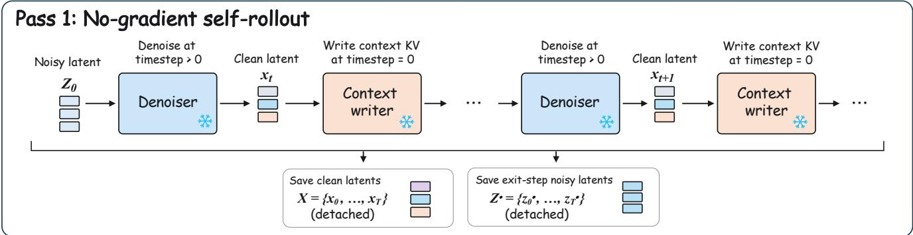

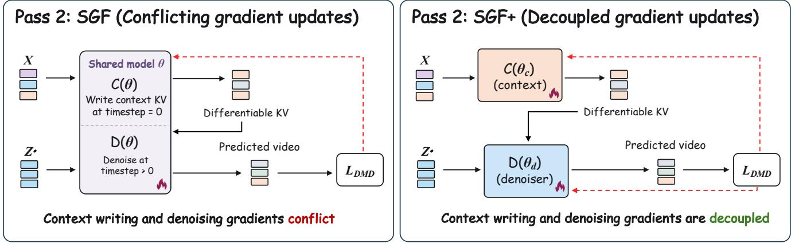  
Figure 4. Training pipeline of SGF and SGF+. Pass 1 performs a no-gradient autoregressive rollout and records detached clean context latents X together with noisy target latents $Z ^ { \star }$ at a sampled denoising exit. Pass 2 reconstructs the forward computation from the recorded latents, allowing future-generation losses to supervise context writing through differentiable context KV states. SGF accumulates context writing and denoising gradients on shared parameters θ, whereas SGF+ assigns separate parameters $\theta _ { c }$ and $\theta _ { d }$ to the two roles.

## 2.3. Long-Horizon Video Generation and Context Management

Long-video methods improve temporal coverage, context access, and inference-time state management [13, 31]. LongLive uses a short-video teacher to supervise successive segments of longer self-generated videos, combining this streaming long tuning with a bounded attention window, a frame sink, and KV recaching for prompt transitions [42]. Self-Forcing++ similarly supervises sampled segments of extended student rollouts, allowing the student’s training horizon to exceed the teacher’s supervision window [6]. Within a limited context budget, rolling caches support streaming generation [15], attention sinks retain persistent anchors [25, 42], and history routing retrieves relevant earlier frames [12]. Training-free methods further improve extrapolation: Freq-Forcing mitigates spectral drift through self-anchoring [22], while MemRoPE combines evolving memory tokens with online RoPE indexing [20].

SGF+ addresses how context writing and denoising are jointly learned within a limited temporal training window. Through role-specific parameterization, it achieves native long-horizon extrapolation under the original generation objective, without extending the training horizon or applying long-video fine-tuning. This intervention is complementary in mechanism to context management, spectral correction, positional adaptation, and longer-horizon training.

## 3. Method

Figure 4 presents the training pipelines of SGF and SGF+. Section 3.1 reviews SGF’s two-pass training procedure, which makes context writing differentiable. Section 3.2 analyzes the gradient conflict caused by sharing parameters between context writing and denoising. Section 3.3 then introduces SGF+, which separates the two roles with role-specific parameters to achieve higher visual quality and stronger long-horizon consistency.

## 3.1. Self Gradient Forcing Preliminaries

An autoregressive video diffusion model generates latent blocks sequentially. For block i, a denoiser reads the historical key-value (KV) cache and maps a noisy latent $z _ { i } ^ { t }$ to a clean estimate ${ \tilde { x } } _ { i } .$ . A context-writing call then encodes this estimate into the memory used by later blocks:

$$
\mathrm { K V } _ { i } = \mathcal { C } _ { \theta } ( \tilde { x } _ { i } , t _ { \mathrm { c t x } } \mid \mathrm { K V } _ { < i } ) , \quad t _ { \mathrm { c t x } } = 0 .\tag{1}
$$

The model therefore uses the same DiT parameters θ in two roles: denoising the current block and writing its clean representation for future predictions.

SGF trains this recurrent process with two passes. Pass 1: no-gradient self-rollout. The model performs the ordinary serial autoregressive rollout without retaining an autograd graph. It samples a denoising exit $t ^ { \star }$ and records the noisy exit latent $z _ { i } ^ { t ^ { \star } }$ and its clean estimate ${ \tilde { x } } _ { i }$ at each autoregressive step. The clean estimates are processed at $t _ { \mathrm { c t x } } = 0$ to update the serial KV cache used by subsequent blocks. This produces the collections ${ Z } ^ { \star } = \{ z _ { i } ^ { \star \star } \} _ { }$ i and $X = \{ \tilde { x } _ { i } \} _ { i }$ i, both detached from the sampling trajectory.

Pass 2: parallel context-gradient reconstruction. SGF reconstructs the sampled-exit computation in a single parallel forward pass under a causal reconstruction mask $\mathcal { M } _ { \mathrm { r e c } }$ . The latents in X remain stop-gradient inputs, but the context hidden states and their KV projections are recomputed with gradient tracking:

$$
\begin{array} { r l } & { M _ { \theta } = \mathcal { C } _ { \theta } ( \mathrm { s g } ( X ) , t _ { \mathrm { c t x } } \mid \mathcal { M } _ { \mathrm { r e c } } ) , } \\ & { \hat { X } _ { \mathrm { t a r } } = \mathcal { D } _ { \theta } ( Z ^ { \star } , t ^ { \star } \mid M _ { \theta } , \mathcal { M } _ { \mathrm { r e c } } ) , } \\ & { \quad \quad \mathcal { L } = \mathcal { L } _ { \mathrm { D M D } } ( \hat { X } _ { \mathrm { t a r } } ) . } \end{array}\tag{2}
$$

Consequently, the future-generation loss trains both how noisy target tokens read the history and how clean context tokens write it. The sampled latents and cache trajectory stay detached. Only the Pass-2 reconstruction is differentiable. This boundary restores the context-writing path without backpropagating through the full autoregressive rollout.

## 3.2. Observations of Gradient Conflict

SGF restores context-writing supervision, but context writing and denoising still update the same parameters. We isolate their gradient contributions within the same Pass-2 computation. For a shared linear weight W, let H denote its input activations and $\Delta = \partial \mathcal { L } / \partial Y$ the corresponding output gradients. Partitioning the tokens by role gives

$$
g _ { \mathrm { C } } = \Delta _ { \mathrm { C } } ^ { \mathsf { T } } H _ { \mathrm { C } } , \quad g _ { \mathrm { D } } = \Delta _ { \mathrm { D } } ^ { \mathsf { T } } H _ { \mathrm { D } } , \quad g _ { W } = g _ { \mathrm { C } } + g _ { \mathrm { D } } ,\tag{3}
$$

where $g _ { \mathrm { C } }$ and $g _ { \mathrm { D } }$ are the contributions from context-writing and denoising tokens, respectively. Both contributions arise from the same objective rather than separate losses. We measure their directional alignment using cosine similarity:

$$
s ( g _ { \mathrm { C } } , g _ { \mathrm { D } } ) = \frac { \langle g _ { \mathrm { C } } , g _ { \mathrm { D } } \rangle } { \| g _ { \mathrm { C } } \| _ { 2 } \| g _ { \mathrm { D } } \| _ { 2 } } .\tag{4}
$$

Large angles indicate substantial directional disagreement between the two gradient contributions. A pair is conflicting when $s < 0$ , equivalently when the angle between the gradients exceeds 90◦.

Figure 3 visualizes the gradient relationships in SGF. (a) Gradient distributions. Angular-distance t-SNE shows clearly separated distributions of context-writing and denoising gradients in both Attention and FFN. (b) Mean gradient directions. The mean gradient directions of the two roles exhibit large angular separation, even exceeding $9 0 ^ { \circ }$ in both module families, indicating overall negative alignment. (c) Gradient conflict across timesteps. All 512 paired cosine similarities are negative in both module families, indicating persistent conflict across the measured prompts and denoising timesteps. Appendix E provides the complete layer-wise gradient distributions.

This directional relationship directly affects the gradient received by the shared parameters. Since $g _ { W } = g _ { \mathrm { C } } + g _ { \mathrm { D } }$ conflicting gradient contributions partially cancel on shared parameters. This motivates assigning independent parameters to context writing and denoising, separating their updates while preserving their forward interaction. Appendix G explains the advantage of role separation under gradient conflict from a local optimization perspective.

## 3.3. Self Gradient Forcing Plus

Self Gradient Forcing Plus assigns independent parameters to context writing and denoising, forming a context writer $\mathcal { C } _ { \theta _ { c } }$ and a denoiser $\mathcal { D } _ { \theta _ { d } }$ . Both are initialized from the same autoregressive diffusion model. Pass 1 retains the nogradient rollout in Figure 4: $\mathcal { D } _ { \theta _ { d } }$ generates each block, and $\mathcal { C } _ { \theta _ { c } }$ writes its clean estimate into the cache. Pass 2 becomes

$$
\begin{array} { r l } & { M _ { \theta _ { c } } = \mathcal { C } _ { \theta _ { c } } ( \mathrm { s g } ( X ) , t _ { \mathrm { c t x } } \mid \mathcal { M } _ { \mathrm { r e c } } ) , } \\ & { \hat { X } _ { \mathrm { t a r } } = \mathcal { D } _ { \theta _ { d } } ( Z ^ { \star } , t ^ { \star } \mid M _ { \theta _ { c } } , \mathcal { M } _ { \mathrm { r e c } } ) , } \\ & { \quad \quad \mathcal { L } = \mathcal { L } _ { \mathrm { D M D } } ( \hat { X } _ { \mathrm { t a r } } ) . } \end{array}\tag{5}
$$

The future-generation objective reaches $\theta _ { c }$ through the differentiable KV state $M _ { \theta _ { c } }$ and $\theta _ { d }$ through target denoising. The context writer and denoiser remain forward-coupled and jointly trained, while their updates no longer accumulate on the same weights. SGF+ reroutes SGF’s existing gradient paths without an auxiliary context loss or gradient projection.

We adopt parameter separation as the simplest and most direct way to prevent conflicting role updates. Beyond parameter separation, other approaches such as model merging [18, 39, 41, 45] offer insights into coordinating the optimization of different roles. We leave this for future work.

## 4. Experiments

## 4.1. Experimental Setup

We use Teacher Forcing (TF) initialization with weights released by Causal Forcing [51] and train on 5s video windows using filtered and expanded prompts from Vid-ProM [37]. Following SGF [52], we compare SF, SGF, and SGF+ in framewise and chunkwise generation at 5s, 60s, and 240s. The 60s and 240s evaluations therefore test native extrapolation beyond the training horizon. All models use a causal video diffusion student based on Wan2.1-T2V-1.3B [35], a frozen Wan2.1-T2V-14B teacher, and a separately trained fake-score network initialized from Wan2.1- T2V-1.3B. SGF+ can implement role-specific parameter separation using either two separate LoRA adapters or two full parameter sets. In this work, we use the latter.

0 s  
0 s  
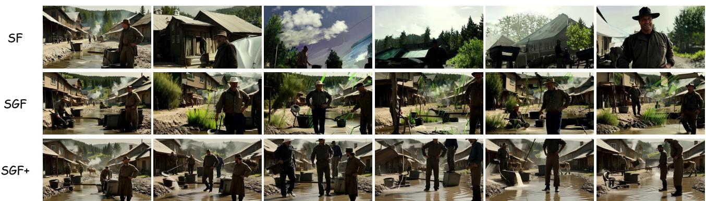  
Prompt: Historical footage style photograph, bustling 1850s California gold rush town, miners panning in a shallow stream, weathered faces, determined eyes, wooden shacks and canvas tents lining muddy streets, smoke rising from chimneys, man ...

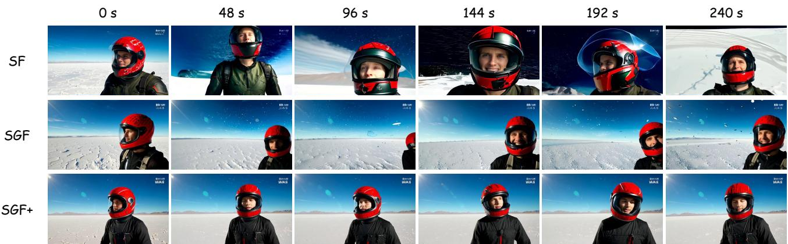  
Prompt: Classic cinematic movie trailer, a determined 30-year-old space explorer journeys across a vast salt desert under a boundless blue sky. He wears a striking red wool knitted motorcycle helmet that glints in the harsh sunlight, contrasting ...

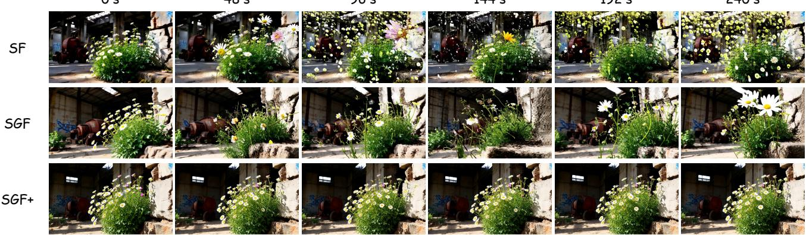  
Prompt: A dramatic surreal photograph in realistic style, capturing vibrant wild daisies and delicate roses blooming from cracked concrete walls in an abandoned warehouse. Diverse flowers burst with vivid colors, thriving amid shadows cast by ...  
Figure 5. Qualitative comparisons. The top two cases show chunkwise generation, and the bottom case shows framewise generation. Additional qualitative comparisons covering a wider variety of scenes are provided in Appendix F.

The 5s evaluation follows standard VBench [16], with full results in Appendix A. The main comparison evaluates 60s and 240s generation using VBench-Long prompts [17] and 128 MovieGen prompts [28], respectively. For both horizons, we report Subject Consistency, Background Consistency, Temporal Flickering, Motion Smoothness, Dynamic Degree,

Table 1. Framewise and chunkwise long-horizon metrics at 60s and 240s. The 60s setting uses VBench-Long prompts, and the 240s setting uses MovieGen-128 prompts. All methods share the same initialization, prompt set, and random seed within each setting.
<table><tr><td>Method</td><td>Subject</td><td>Background</td><td>Flickering</td><td>Motion</td><td>Dynamics</td><td>Aesthetics</td><td>Imaging</td></tr><tr><td colspan="8">60s Generation Horizon· Chunkwise</td></tr><tr><td>Self Forcing</td><td>94.97</td><td>94.85</td><td>98.88</td><td>96.69</td><td>93.46</td><td>58.09</td><td>68.12</td></tr><tr><td>Self Gradient Forcing</td><td>98.17</td><td>97.12</td><td>98.94</td><td>98.53</td><td>64.16</td><td>65.38</td><td>71.06</td></tr><tr><td>Self Gradient Forcing Plus</td><td>98.48</td><td>97.41</td><td>99.35</td><td>98.69</td><td>63.93</td><td>66.63</td><td>71.51</td></tr><tr><td colspan="8">60s Generation Horizon· Framewise</td></tr><tr><td>Self Forcing</td><td>97.62</td><td>97.42</td><td>99.08</td><td>98.55</td><td>63.89</td><td>64.80</td><td>70.50</td></tr><tr><td>Self Gradient Forcing</td><td>98.26</td><td>96.99</td><td>99.08</td><td>98.17</td><td>71.19</td><td>64.95</td><td>71.52</td></tr><tr><td>Self Gradient Forcing Plus</td><td>99.08</td><td>98.06</td><td>99.43</td><td>98.90</td><td>55.38</td><td>66.29</td><td>71.11</td></tr><tr><td colspan="8">240s Generation Horizon ·Chunkwise</td></tr><tr><td>Self Forcing</td><td>94.94</td><td>95.21</td><td>93.54</td><td>96.75</td><td>93.90</td><td>55.12</td><td>68.38</td></tr><tr><td>Self Gradient Forcing</td><td>97.72</td><td>96.90</td><td>97.03</td><td>98.50</td><td>56.97</td><td>62.54</td><td>71.11</td></tr><tr><td>Self Gradient Forcing Plus</td><td>98.21</td><td>97.31</td><td>97.57</td><td>98.63</td><td>56.92</td><td>64.74</td><td>71.39</td></tr><tr><td colspan="8">240s Generation Horizon · Framewise</td></tr><tr><td>Self Forcing</td><td>96.36</td><td>96.42</td><td>96.73</td><td>98.01</td><td>67.04</td><td>61.36</td><td>70.71</td></tr><tr><td>Self Gradient Forcing</td><td>97.07</td><td>96.81</td><td>96.85</td><td>98.24</td><td>65.68</td><td>61.89</td><td>70.89</td></tr><tr><td>Self Gradient Forcing Plus</td><td>98.74</td><td>97.81</td><td>98.24</td><td>98.94</td><td>53.96</td><td>63.95</td><td>70.90</td></tr></table>

Table 2. Ablation of modules for parameter separation. Attention only and FFN only apply parameter separation only to Attention and FFN modules, respectively. The full model applies role-specific separation to all model parameters.
<table><tr><td>Method</td><td>Subject</td><td>Background</td><td>Flickering</td><td>Motion</td><td>Dynamics</td><td>Aesthetics</td><td>Imaging</td></tr><tr><td>Attention only</td><td>95.37</td><td>95.43</td><td>99.30</td><td>97.40</td><td>93.41</td><td>58.49</td><td>68.18</td></tr><tr><td>FFN only</td><td>97.43</td><td>96.48</td><td>98.33</td><td>98.27</td><td>65.37</td><td>63.49</td><td>70.41</td></tr><tr><td>Full model (Ours)</td><td>98.48</td><td>97.41</td><td>99.35</td><td>98.69</td><td>63.93</td><td>66.63</td><td>71.51</td></tr></table>

Aesthetic Quality, and Imaging Quality. Scores are multiplied by 100, and higher is better. Further implementation details are provided in Appendix B.

## 4.2. Native Long-Horizon Extrapolation

Qualitative comparisons. Figure 5 compares SF, SGF, and SGF+ over 240s rollouts in chunkwise and framewise generation. In the gold-rush town scene, SGF+ preserves a more coherent rendering of buildings and miners, while SF exhibits background distortions and SGF develops conspicuous green streak artifacts. In the salt-desert scene, SGF+ better maintains the explorer’s appearance and desert setting, with fewer helmet distortions and sky artifacts than the baselines. In the warehouse-flower scene, SF produces floating flower-like artifacts and SGF exhibits pronounced changes in flower shape and scale, while SGF+ better preserves the flower cluster and surrounding scene. These examples illustrate improvements in both visual quality and long-horizon consistency. Additional qualitative comparisons in both generation settings are provided in Appendix F. Trained only on 5s video windows, SGF+ supports continuous generation for up to 24 hours, as shown in Figure 1 and Appendix D.

Quantitative comparisons. Table 1 compares the three methods at generation horizons of 12× and 48× the training window. Across both generation granularities and both long horizons, SGF+ outperforms SF and SGF on most quality and consistency metrics, with gains in subject consistency, background consistency, temporal flickering, motion smoothness, aesthetic quality, and imaging quality. These results indicate that separating the parameters of context writing and denoising to avoid conflicting gradients on shared weights helps preserve both visual quality and long-horizon consistency during extended generation. Dynamic Degree is the main exception, with SF or SGF achieving higher scores. This does not necessarily indicate better motion quality: scene jumps, object deformation, subject disappearance, or additional people appearing (as shown in Figures 1 and 5)

Table 3. Training and inference efficiency. Compared with SGF, SGF+ modestly increases training time per step, with a small increase in inference memory and nearly unchanged inference latency.
<table><tr><td>Method</td><td>Train Peak Memory</td><td>Train Stable Memory</td><td>Train Time / step</td><td>Infer Memory</td><td>Infer Time / 81 frames</td></tr><tr><td>Self Forcing</td><td>86.36 GB</td><td>86.19 GB</td><td>10.02 s</td><td>24.85 GB</td><td>4.963 s</td></tr><tr><td>Self Gradient Forcing</td><td>97.83 GB</td><td>70.06 GB</td><td>11.79 s</td><td>24.85 GB</td><td>4.962 s</td></tr><tr><td>Self Gradient Forcing Plus</td><td>98.15 GB</td><td>73.60 GB</td><td>12.76 s</td><td>27.96 GB</td><td>4.969 s</td></tr></table>

can produce large but incoherent apparent motion, inflating Dynamic Degree. In contrast, SGF+ maintains more stable visuals and more coherent motion, so its lower Dynamic Degree does not imply worse generation quality.

## 4.3. Ablation Study

The comparison between SGF and SGF+ in Section 4.2 demonstrates the benefits of parameter separation. We further ablate parameter separation in Attention and FFN. Table 2 considers these two main Transformer module families. Both partial-separation variants underperform the full model on quality and consistency metrics. Thus, an MoE-style design [7, 9, 19, 21] that introduces role experts only in FFN cannot fully eliminate the conflict, as conflicting gradients also arise in Attention. Attention-only separation achieves the highest Dynamic Degree but scores substantially lower than FFN-only separation and the full model on most other metrics, again showing that a higher Dynamic Degree does not necessarily indicate better generation quality.

## 4.4. Discussion

Efficiency. Table 3 shows that SGF+ doubles generator parameters from 1.4B to 2.8B while preserving SGF’s denoising and context-writing call schedule. Each token uses only its role-specific parameters within a forward pass, so computation does not double. For the evaluated 81-frame workload, inference time remains nearly unchanged at 4.969 seconds versus 4.962 seconds for SGF, while memory increases from 24.85 to 27.96 GB. Training peak and stable memory increase from 97.83 to 98.15 GB and from 70.06 to 73.60 GB, respectively; time per step rises from 11.79 to 12.76 seconds, an increase of approximately 8.2%. Thus, the additional parameter storage incurs only modest memory overhead, alongside an 8.2% increase in training time per step and nearly unchanged inference latency under the evaluated workload.

Role-specific gradient conflict at TF initialization. Rolespecific gradient differences and conflict are already observable at teacher-forcing (TF) initialization, before SGF training. Figure 6 shows a sharp directional change between diffusion timestep indices 0 and 1, at the transition from clean-context writing to noisy denoising. Appendix C further shows mean role-gradient angles exceeding 90◦ in both Attention and FFN, with the vast majority of paired cosine similarities being negative. These findings motivate investigating role-specific parameterization from the TF stage and its potential extension to world action models (WAMs) [23, 27, 36, 43] trained with teacher forcing, which use context KV representations for action prediction.

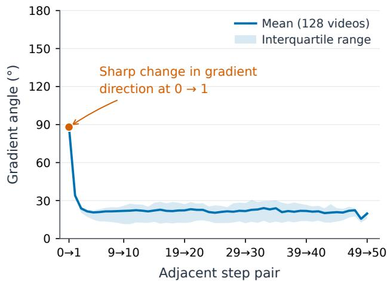  
Figure 6. Adjacent-timestep gradient directions at TF initialization. We measure gradient directions on 128 real videos over a 50-step diffusion schedule. The curve shows the mean angle between adjacent timesteps. The sharp 0 → 1 transition reveals distinct gradient directions for clean-context writing and denoising. Additional visualizations of context-writing and denoising gradients at TF initialization are provided in Appendix C.

Relation to autoregressive language models. Standard autoregressive LLMs [1, 11, 33, 34] encode discrete text tokens, write KV representations, and predict subsequent tokens in one forward pass; historical representations also receive gradients from future token losses during training. Autoregressive video diffusion alternates between clean-context encoding and noisy-latent denoising. These distinct input conditions and computational roles may help explain the observed gradient differences. Our results highlight rolespecific parameterization as an effective design principle for autoregressive video training: context writing and denoising remain jointly optimized under the original generation objective, without auxiliary losses, additional video training data, or long-video fine-tuning.

## 5. Conclusion

We identified an optimization conflict between context writing and denoising in shared-parameter Self Gradient Forcing. SGF+ resolves this conflict through role-specific parameter separation, improving visual quality and long-horizon consistency over SF and SGF in both framewise and chunkwise generation. It supports generation for up to 24 hours from 5s training rollouts. This role distinction is already evident at TF initialization, motivating role-aware parameterization throughout autoregressive video training.

## References

[1] Tom B. Brown, Benjamin Mann, Nick Ryder, Melanie Subbiah, Jared Kaplan, Prafulla Dhariwal, Arvind Neelakantan, Pranav Shyam, Girish Sastry, Amanda Askell, et al. Language models are few-shot learners. In NeurIPS, 2020. 8

[2] Boyuan Chen, Diego Marti Monso, Yilun Du, Max Simchowitz, Russ Tedrake, and Vincent Sitzmann. Diffusion Forcing: Next-token Prediction Meets Full-Sequence Diffusion. arXiv preprint arXiv:2407.01392, 2024. 3

[3] Guibin Chen, Dixuan Lin, Jiangping Yang, Chunze Lin, Junchen Zhu, Mingyuan Fan, Hao Zhang, Sheng Chen, Zheng Chen, Chengcheng Ma, et al. SkyReels-V2: Infinite-length film generative model. arXiv preprint arXiv:2504.13074, 2025. 3

[4] Mingyang Chen, Shengdong Chen, Xiaoxiao Fu, Bosheng Gong, Haoyuan Guo, Bowen Li, Jiawen Li, Kejun Li, Tianpeng Li, Yin Liu, Haoze Sun, Zeyang Tian, Meng Wang, Xinmiao Wu, Jiangqiao Yan, and Zining Zhao. Zing-0.5: Toward Playable Worlds with Real-Time Joint Action and Text Control. arXiv preprint arXiv:2609.17909, 2026. 3

[5] Siyi Chen, Shaowei Liu, Yixuan Jia, Zian Wang, Huan Ling, Qing Qu, and Jun Gao. Data-Forcing Distillation: Restoring Diversity and Fidelity in Few-Step Video Generation. arXiv preprint arXiv:2606.18478, 2026. 3

[6] Justin Cui, Jie Wu, Ming Li, Tao Yang, Xiaojie Li, Rui Wang, Andrew Bai, Yuanhao Ban, and Cho-Jui Hsieh. Self-Forcing++: Towards Minute-Scale High-Quality Video Generation. arXiv preprint arXiv:2510.02283, 2025. 4

[7] Nan Du, Yanping Huang, Andrew M. Dai, Simon Tong, Dmitry Lepikhin, Yuanzhong Xu, Maxim Krikun, Yanqi Zhou, Adams Wei Yu, Orhan Firat, et al. GLaM: Efficient scaling of language models with mixture-of-experts. In ICML, pages 5547–5569, 2022. 8

[8] Nan Duan, Haoyang Huang, Weiyang Jin, Haoran Li, Yaowei Li, Yuming Li, Yijun Liu, Xin Lu, Xiaoxiao Ma, Yanwen Ma, et al. Long-horizon audio-visual generation for persistent stories and interactive worlds. arXiv preprint arXiv:2608.23383, 2026. 2

[9] William Fedus, Barret Zoph, and Noam Shazeer. Switch transformers: Scaling to trillion parameter models with simple and efficient sparsity. JMLR, 23(120):1–39, 2022. 8

[10] Jiaqi Feng, Justin Cui, Yuanhao Ban, and Cho-Jui Hsieh. One-Forcing: Towards Stable One-Step Autoregressive Video Generation. arXiv preprint arXiv:2605.23458, 2026. 3

[11] Aaron Grattafiori, Abhimanyu Dubey, Abhinav Jauhri, Abhinav Pandey, Abhishek Kadian, Ahmad Al-Dahle, Aiesha Letman, Akhil Mathur, Alan Schelten, Alex Vaughan, et al. The Llama 3 herd of models. arXiv preprint arXiv:2407.21783, 2024. 8

[12] Yuwei Guo, Ceyuan Yang, Hao He, Yang Zhao, Meng Wei, Zhenheng Yang, Weilin Huang, and Dahua Lin. End-to-End Training for Autoregressive Video Diffusion via Self-Resampling. arXiv preprint arXiv:2512.15702, 2026. 3, 4

[13] Roberto Henschel, Levon Khachatryan, Hayk Poghosyan, Daniil Hayrapetyan, Vahram Tadevosyan, Zhangyang Wang, Shant Navasardyan, and Humphrey Shi. StreamingT2V: Consistent, dynamic, and extendable long video generation from text. In CVPR, pages 2568–2577, 2025. 4

[14] Junchao Huang, Guian Fang, Shengju Qian, Xianghao Kong, Zhuoran Zhao, Wei Huang, Yihua Du, Zixin Zhang, Justin Cui, Yuchao Gu, Yukang Chen, Xinting Hu, Tianyu He, Shaoshuai Shi, Zhuotao Tian, Xin Wang, Mike Zheng Shou, and Li Jiang. SolarWM: Open Data and Scalable Training for Long-Horizon Video World Models. arXiv preprint arXiv:2609.02886, 2026. 2, 3

[15] Xun Huang, Zhengqi Li, Guande He, Mingyuan Zhou, and Eli Shechtman. Self Forcing: Bridging the Train-Test Gap in Autoregressive Video Diffusion. arXiv preprint arXiv:2506.08009, 2025. 2, 3, 4

[16] Ziqi Huang, Yinan He, Jiashuo Yu, Fan Zhang, Chenyang Si, Yuming Jiang, Yuanhan Zhang, Tianxing Wu, Qingyang Jin, Nattapol Chanpaisit, Yaohui Wang, Xinyuan Chen, Limin Wang, Dahua Lin, Yu Qiao, and Ziwei Liu. VBench: Comprehensive benchmark suite for video generative models. In CVPR, 2024. 6

[17] Ziqi Huang, Fan Zhang, Xiaojie Xu, Yinan He, Jiashuo Yu, Ziyue Dong, Qianli Ma, Nattapol Chanpaisit, Chenyang Si, Yuming Jiang, Yaohui Wang, Xinyuan Chen, Ying-Cong Chen, Limin Wang, Dahua Lin, Yu Qiao, and Ziwei Liu. VBench++: Comprehensive and versatile benchmark suite for video generative models. IEEE TPAMI, 2025. 6

[18] Gabriel Ilharco, Marco Tulio Ribeiro, Mitchell Wortsman, Suchin Gururangan, Ludwig Schmidt, Hannaneh Hajishirzi, and Ali Farhadi. Editing models with task arithmetic. In ICLR, 2023. 5

[19] Albert Q. Jiang, Alexandre Sablayrolles, Antoine Roux, Arthur Mensch, Blanche Savary, Chris Bamford, Devendra Singh Chaplot, Diego de las Casas, Emma Bou Hanna, Florian Bressand, et al. Mixtral of experts. arXiv preprint arXiv:2401.04088, 2024. 8

[20] Youngrae Kim, Qixin Hu, C. C. Jay Kuo, and Peter A. Beerel. MemRoPE: Training-Free Infinite Video Generation via Evolving Memory Tokens. arXiv preprint arXiv:2603.12513, 2026. 4

[21] Dmitry Lepikhin, HyoukJoong Lee, Yuanzhong Xu, Dehao Chen, Orhan Firat, Yanping Huang, Maxim Krikun, Noam Shazeer, and Zhifeng Chen. GShard: Scaling giant models with conditional computation and automatic sharding. In ICLR, 2021. 8

[22] Jiatong Li, Leo Liang, Linghe Kong, and Yulun Zhang. Freq-Forcing: Autoregressive Long Video Generation via Spectral Self-Anchoring. arXiv preprint arXiv:2607.27110, 2026. 4

[23] Lin Li, Qihang Zhang, Yiming Luo, Shuai Yang, Ruilin Wang, Fei Han, Mingrui Yu, Zelin Gao, Nan Xue, Xing Zhu, Yujun Shen, and Yinghao Xu. Causal world modeling for robot control. arXiv preprint arXiv:2601.21998, 2026. 8, 25

[24] Xinyao Liao, Xianfang Zeng, Zhu Liang, Zhoujie Fu, Qianxun Xu, Jiachi Liu, Gang Yu, and Guosheng Lin. Precise editing and flexible referencing for interactable worlds. arXiv preprint arXiv:2609.34470, 2026. 3

[25] Kunhao Liu, Wenbo Hu, Jiale Xu, Ying Shan, and Shijian Lu. Rolling Forcing: Autoregressive Long Video Diffusion in Real Time. arXiv preprint arXiv:2509.25161, 2025. 2, 3, 4

[26] Yunhong Lu, Yanhong Zeng, Haobo Li, Hao Ouyang, Qiuyu Wang, Ka Leong Cheng, Jiapeng Zhu, Hengyuan Cao, Zhipeng Zhang, Xing Zhu, Yujun Shen, and Min Zhang. Reward Forcing: Efficient Streaming Video Generation with Rewarded Distribution Matching Distillation. arXiv preprint arXiv:2512.04678, 2025. 3

[27] Quanquan Peng, Yutong Liang, Rui Yan, Nicklas Hansen, and Xiaolong Wang. FACT: Failure-aware causal training for world-action models. arXiv preprint arXiv:2608.10232, 2026. 8, 25

[28] Adam Polyak, Amit Zohar, Andrew Brown, Andros Tjandra, Animesh Sinha, Ann Lee, Apoorv Vyas, Bowen Shi, Chih-Yao Ma, Ching-Yao Chuang, et al. Movie Gen: A Cast of Media Foundation Models. arXiv preprint arXiv:2410.13720, 2024. 6

[29] Sand.ai, Hansi Teng, Hongyu Jia, Lei Sun, Lingzhi Li, Maolin Li, Mingqiu Tang, Shuai Han, Tianning Zhang, W. Q. Zhang, et al. MAGI-1: Autoregressive video generation at scale. arXiv preprint arXiv:2505.13211, 2025. 3

[30] Georgy Savva, Oscar Michel, Daohan Lu, Suppakit Waiwitlikhit, Timothy Meehan, Dhairya Mishra, Srivats Poddar, Jack Lu, and Saining Xie. Solaris: Building a multiplayer video world model in minecraft. arXiv preprint arXiv:2602.22208, 2026. 2

[31] Kiwhan Song, Boyuan Chen, Max Simchowitz, Yilun Du, Russ Tedrake, and Vincent Sitzmann. History-guided video diffusion. In ICML, pages 56242–56280, 2025. 4

[32] Zihan Su, Siwen Lu, Junhao Zhuang, Zeyue Xue, Haoyang Huang, Guanghao Li, Xiaofeng Tan, Chun Yuan, and Nan Duan. Where and when to force: Routed forcing for streaming avatars. arXiv preprint arXiv:2609.30963, 2026. 2

[33] Hugo Touvron, Thibaut Lavril, Gautier Izacard, Xavier Martinet, Marie-Anne Lachaux, Timothee Lacroix, Baptiste´ Roziere, Naman Goyal, Eric Hambro, Faisal Azhar, et al.\` LLaMA: Open and efficient foundation language models. arXiv preprint arXiv:2302.13971, 2023. 8

[34] Hugo Touvron, Louis Martin, Kevin Stone, Peter Albert, Amjad Almahairi, Yasmine Babaei, Nikolay Bashlykov, Soumya Batra, Prajjwal Bhargava, Shruti Bhosale, et al. Llama 2: Open foundation and fine-tuned chat models. arXiv preprint arXiv:2307.09288, 2023. 8

[35] Wan Team et al. Wan: Open and Advanced Large-Scale Video Generative Models. arXiv preprint arXiv:2503.20314, 2025. 5

[36] Junke Wang, Qihang Zhang, Shuai Yang, Yiming Luo, Yujun Shen, Zuxuan Wu, Yu-Gang Jiang, and Yinghao Xu. Rep-

WAM: World action modeling with representation visualaction tokenizers. arXiv preprint arXiv:2606.13674, 2026. 8, 25

[37] Wenhao Wang and Yi Yang. VidProM: A million-scale real prompt-gallery dataset for text-to-video diffusion models. In NeurIPS, 2024. 5

[38] Jiacheng Wei, Jerry Bai, Xiaoyu Yue, Zidong Wang, Xiaoyang Guo, Cheng Chen, Fanqi Pu, Fan Wu, Zhixu Yue, Yizhuo Li, Feng Qiu, Bo Liu, Yuying Ge, Hui Zhou, Chenyi Chen, and Yixiao Ge. XPACE: Joint World and Action Modeling from Heterogeneous Experience. arXiv preprint arXiv:2609.17372, 2026. 3

[39] Yongxian Wei, Anke Tang, Li Shen, Zixuan Hu, Chun Yuan, and Xiaochun Cao. Modeling multi-task model merging as adaptive projective gradient descent. In ICML, pages 66178– 66193. PMLR, 2025. 5

[40] Gangwei Xu, Qihang Zhang, Jiaming Zhou, Xing Zhu, Yujun Shen, Xin Yang, and Yinghao Xu. Next Forcing: Causal World Modeling with Multi-Chunk Prediction. arXiv preprint arXiv:2606.11187, 2026. 3

[41] Prateek Yadav, Derek Tam, Leshem Choshen, Colin Raffel, and Mohit Bansal. TIES-Merging: Resolving interference when merging models. In NeurIPS, 2023. 5

[42] Shuai Yang, Wei Huang, Ruihang Chu, Yicheng Xiao, Yuyang Zhao, Xianbang Wang, Muyang Li, Enze Xie, Yingcong Chen, Yao Lu, Song Han, and Yukang Chen. LongLive: Real-time Interactive Long Video Generation. arXiv preprint arXiv:2509.22622, 2025. 2, 4

[43] Seonghyeon Ye, Yunhao Ge, Kaiyuan Zheng, Shenyuan Gao, Sihyun Yu, George Kurian, Suneel Indupuru, You Liang Tan, Chuning Zhu, Jiannan Xiang, et al. World action models are zero-shot policies. arXiv preprint arXiv:2602.15922, 2026. 8, 25

[44] Tianwei Yin, Qiang Zhang, Richard Zhang, William T. Freeman, Fredo Durand, Eli Shechtman, and Xun Huang. From Slow Bidirectional to Fast Autoregressive Video Diffusion Models. In CVPR, pages 22963–22974, 2025. 2, 3

[45] Le Yu, Bowen Yu, Haiyang Yu, Fei Huang, and Yongbin Li. Language models are super mario: Absorbing abilities from homologous models as a free lunch. In ICML, pages 57755–57775, 2024. 5

[46] Yonghao Yu, Lang Huang, Runyi Li, Zerun Wang, and Toshihiko Yamasaki. Video-Mirai: Autoregressive Video Diffusion Models Need Foresight. arXiv preprint arXiv:2606.03971, 2026. 3

[47] Jiahao Zhan, Yan Wang, Yongrui Ma, Qunliang Xing, Ruchang Yao, Runtao Liu, Shijie Zhao, and Tianfan Xue. DuoMatching: Joint-Marginal Distribution Matching for Few-Step Video Generation. arXiv preprint arXiv:2610.03543, 2026. 3

[48] Songchun Zhang, Yaowei Li, Junhao Zhuang, Weiyang Jin, Haoyu Wang, Xin Lu, Yilang Sun, Shiyi Zhang, Haoran Li, Xiaoxiao Ma, Yuming Li, Yijun Liu, Yaofeng Su, Yanwen Ma, Haoyu Wu, Zihan Su, Yue Ma, Lvmin Zhang, Haoyang Huang, Zeyue Xue, Anyi Rao, and Nan Duan. EchoWM: Open and Enterable Omnimodal World Models. arXiv preprint arXiv:2608.23189, 2026. 2, 3

[49] Min Zhao, Hongzhou Zhu, Kaiwen Zheng, Zihan Zhou, Bokai Yan, Xinyuan Li, Xiao Yang, Chongxuan Li, and Jun Zhu. Causal Forcing++: Scalable Few-Step Autoregressive Diffusion Distillation for Real-Time Interactive Video Generation. arXiv preprint arXiv:2605.15141, 2026. 3

[50] Zhuoran Zhao, Shengju Qian, Tongtong Liang, Xianghao Kong, Songchun Zhang, Junchao Huang, Guian Fang, Xin Wang, Pan Hui, and Anyi Rao. Mask Forcing: Improving Autoregressive Video Diffusion Distillation via Dual-Noise Masking Rollout. arXiv preprint arXiv:2609.09123, 2026. 3

[51] Hongzhou Zhu, Min Zhao, Guande He, Hang Su, Chongxuan Li, and Jun Zhu. Causal forcing: Autoregressive diffusion distillation done right for high-quality real-time interactive video generation. arXiv preprint arXiv:2602.02214, 2026. 3, 5

[52] Junhao Zhuang, Shiyi Zhang, Yuxuan Bian, Yaowei Li, Yawen Luo, Yijun Liu, Weiyang Jin, Songchun Zhang, Xianglong He, Xuying Zhang, Haoran Li, Haoyang Huang, Zeyue Xue, and Nan Duan. Self Gradient Forcing: Native Long Video Extrapolation. arXiv preprint arXiv:2607.20368, 2026. 2, 3, 5

# SGF+: Decoupling Gradient Flows for Autoregressive Video Generation Supplementary Material

We provide additional information in the supplementary material, as outlined below:

• Sec. A: Additional Short-Video Results.

• Sec. B: Additional Implementation Details.

• Sec. C: Gradient Role Separation at TF Initialization.

• Sec. D: 24-Hour Generation Results.

• Sec. E: Layer-wise Gradient Role Separation.

• Sec. F: Additional Qualitative Comparisons.

• Sec. G: Local Optimization Analysis of Role Separation.

• Sec. H: Future Work.

## A. Additional Short-Video Results

Table 4. Framewise and chunkwise VBench metrics at 5s. SF, SGF, and SGF+ are evaluated within the training horizon using standard VBench. Bold marks the best value within each generation mode.
<table><tr><td>Method</td><td>Subject</td><td>Background</td><td>Flickering</td><td>Motion</td><td>Dynamics</td><td>Aesthetics</td><td>Imaging</td></tr><tr><td colspan="8">Chunkwise</td></tr><tr><td>Self Forcing</td><td>93.74</td><td>94.74</td><td>97.83</td><td>97.58</td><td>89.72</td><td>66.35</td><td>69.46</td></tr><tr><td>Self Gradient Forcing</td><td>97.01</td><td>96.42</td><td>98.80</td><td>98.50</td><td>65.28</td><td>68.04</td><td>70.56</td></tr><tr><td>Self Gradient Forcing Plus</td><td>97.24</td><td>96.81</td><td>99.30</td><td>98.64</td><td>62.78</td><td>68.45</td><td>70.64</td></tr><tr><td colspan="8">Framewise</td></tr><tr><td>Self Forcing</td><td>96.06</td><td>96.15</td><td>98.81</td><td>98.54</td><td>63.89</td><td>67.11</td><td>69.83</td></tr><tr><td>Self Gradient Forcing</td><td>96.69</td><td>96.16</td><td>98.97</td><td>98.24</td><td>64.72</td><td>66.95</td><td>71.41</td></tr><tr><td>Self Gradient Forcing Plus</td><td>98.16</td><td>97.20</td><td>99.47</td><td>98.96</td><td>54.61</td><td>67.22</td><td>70.88</td></tr><tr><td colspan="8"></td></tr><tr><td>Method</td><td>Object</td><td>Multiple</td><td>Action Color</td><td>Spatial</td><td>Scene</td><td>Appearance</td><td>Temporal</td></tr><tr><td colspan="8">Chunkwise</td></tr><tr><td>Self Forcing</td><td>95.62</td><td>85.35</td><td>96.00 86.89</td><td>81.43</td><td>53.90</td><td>20.20</td><td>24.18</td></tr><tr><td>Self Gradient Forcing</td><td>96.20</td><td>86.60</td><td>96.00 87.41</td><td>78.96</td><td>54.06</td><td>20.34</td><td>24.16</td></tr><tr><td>Self Gradient Forcing Plus</td><td>96.57</td><td>88.95</td><td>97.40 88.90</td><td>82.35</td><td>54.68</td><td>20.40</td><td>24.25</td></tr><tr><td colspan="8">Framewise</td></tr><tr><td>Self Forcing</td><td>94.87</td><td>85.91</td><td>95.80</td><td>84.33</td><td>75.62 54.17</td><td>20.13</td><td>23.76</td></tr><tr><td>Self Gradient Forcing</td><td>94.46</td><td>85.50</td><td>96.00</td><td>87.87</td><td>73.69 54.88</td><td>20.37</td><td>23.87</td></tr><tr><td>Self Gradient Forcing Plus</td><td>96.04</td><td>87.36</td><td>94.40</td><td>87.12</td><td>78.23 55.67</td><td>20.49</td><td>23.92</td></tr></table>

## B. Additional Implementation Details

Within each generation mode, the compared methods share the same sink-plus-FIFO context policy. Framewise generation uses 4 sink latents, 16 recent latents in the FIFO cache, and 1 current latent, giving a total window of 21. Chunkwise generation uses 3 sink latents, 6 recent latents, and a current chunk of 3 latents, giving a total window of 12.

We optimize both the generator and the critic using AdamW with $\beta _ { 1 } = 0$ and $\beta _ { 2 } = 0 . 9 9 9$ . The learning rates are $2 \times 1 0 ^ { - 6 }$ for the generator and $4 \times 1 0 ^ { - 7 }$ for the critic. We perform one generator update for every five critic updates and use four denoising steps for generation.

## C. Gradient Role Separation at TF Initialization

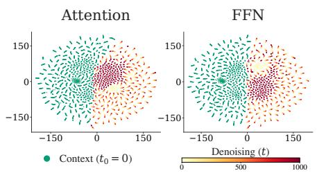  
(a) Gradient distributions

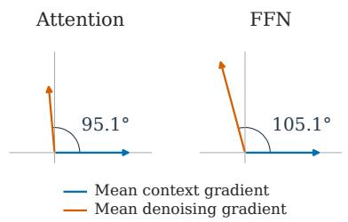  
(b) Mean gradient directions

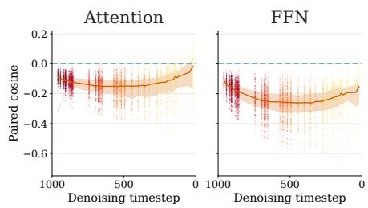  
(c) Conflict across timesteps  
Figure 7. Visualization of context–denoising gradients at TF initialization. We use 128 real videos and 50 randomly sampled denoising timesteps, with context fixed at t = 0. (a) Angular-distance t-SNE visualizes 6,400 context-writing and 6,400 denoising gradient samples per module family using coordinate-sampled gradient representations. Color indicates the denoising timestep. (b) Mean gradient directions and relative lengths are estimated from the sampled coordinates, with the context mean length normalized to one in each family. (c) Paired cosine similarities are computed from the full selected weight gradients. Points show video–timestep pairs, while lines and bands show the median and interquartile range across videos.

Figure 7 provides additional visualizations of the gradient relationships between context writing and denoising at TF initialization. The two roles exhibit distinct gradient distributions in Attention and FFN, with mean directions forming angles of 95.1◦ and 105.1◦, respectively, both exceeding 90◦. The vast majority of paired cosine similarities are negative, indicating that role separation and gradient conflict are already present at TF initialization and supporting separation of the two roles from the TF stage.

## D. 24-Hour Generation Results

Figure 8 presents four examples of continuous 24-hour generation by SGF+ trained on 5s video windows, without long-video fine-tuning.

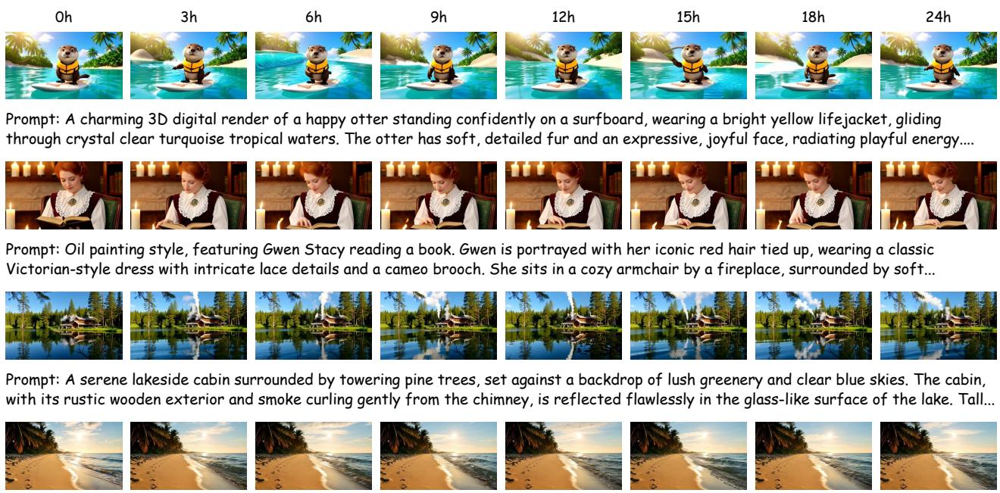  
Prompt: An idyllic coastal beach during springtime, depicted in an oil painting style. Soft, golden sunlight filters through wispy clouds, casting gentle shadows on the pristine sandy shore. Waves lap gently against the shoreline, their foamy crests breaking softly over the...

Figure 8. 24-hour generation results of SGF+. SGF+ is trained on 5s video windows without long-video fine-tuning.

## E. Layer-wise Gradient Role Separation

Layer-wise angular t-SNE of attention gradients

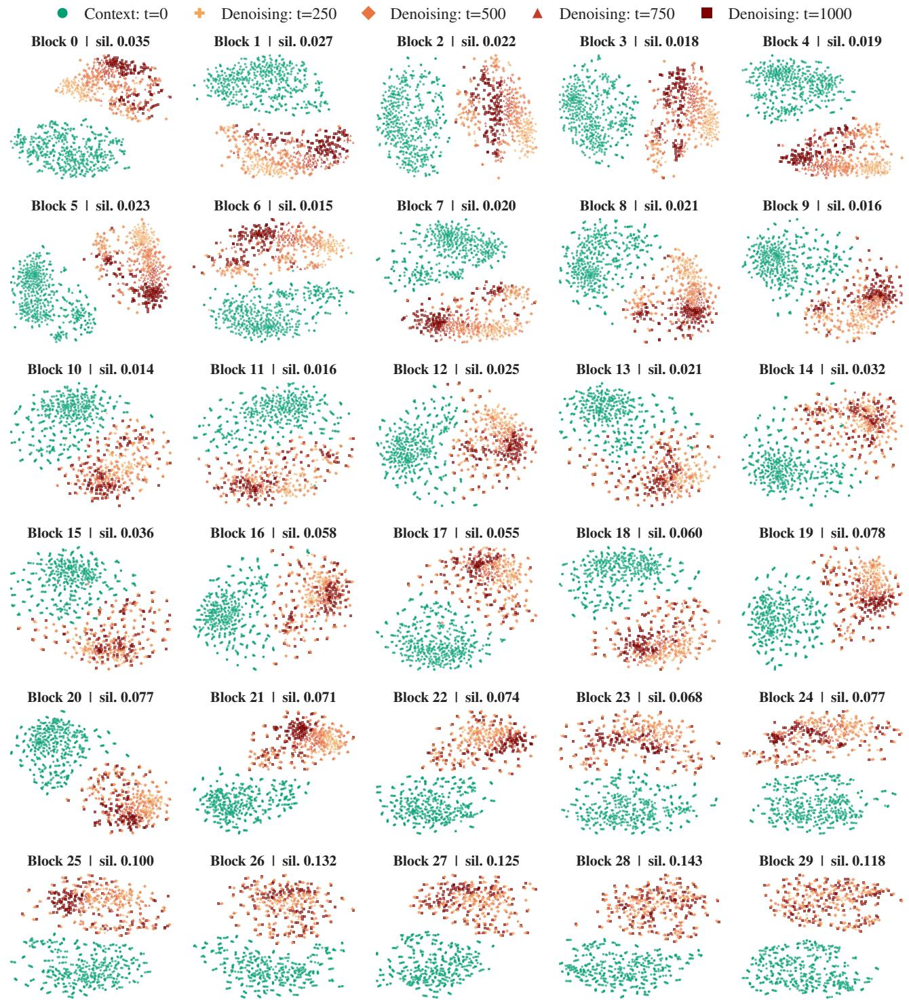  
Figure 9. Layer-wise gradient distributions in Attention. We analyze SGF gradients over 128 prompts and 4 denoising timesteps, concatenating the Q/K/V/O weight gradients within each block. Angular-distance t-SNE uses gradient sketches with perplexity 20. sil. is the role silhouette score computed from angular distances before projection. Higher scores indicate stronger role separation.

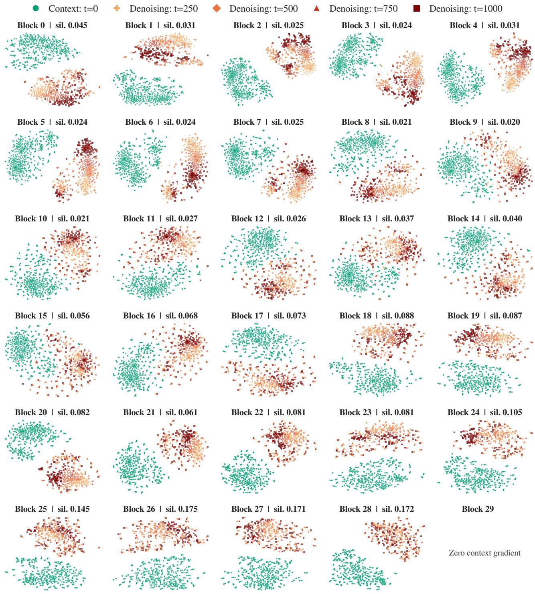  
Figure 10. Layer-wise gradient distributions in FFN. We concatenate the up/down weight gradients within each block and use the settings in Figure 9. Block 29 has zero context-writing gradients for all 512 prompt–timestep pairs, so its angular distances are undefined and no t-SNE is shown. sil. denotes the role silhouette score before projection, with higher values indicating stronger role separation.

## F. Additional Qualitative Comparisons

Figures 11–14 present twelve chunkwise cases, and Figures 15–16 present six framewise cases, with matched prompts across SF, SGF, and SGF+.

0 s  
48 s  
96 s  
144 s  
192 s  
240 s  
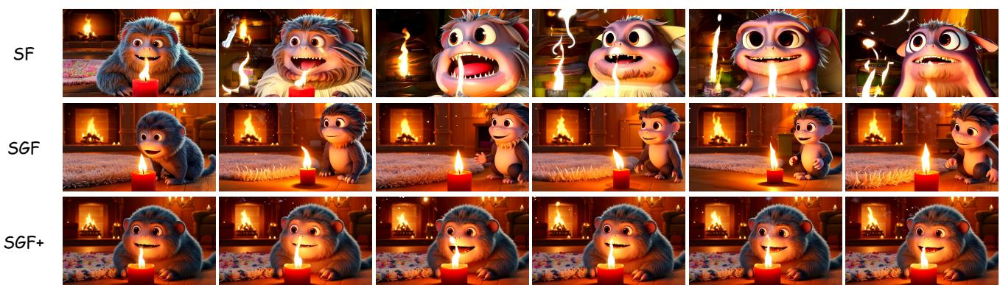  
Prompt: Close-up 3D animated scene of a short, fluffy monster with large, wide eyes and an open mouth, kneeling beside a melting red candle, gazing at the flickering flame in awe. The creature's soft, plush-like fur glows under warm, dramatic ...

0 s  
96 s  
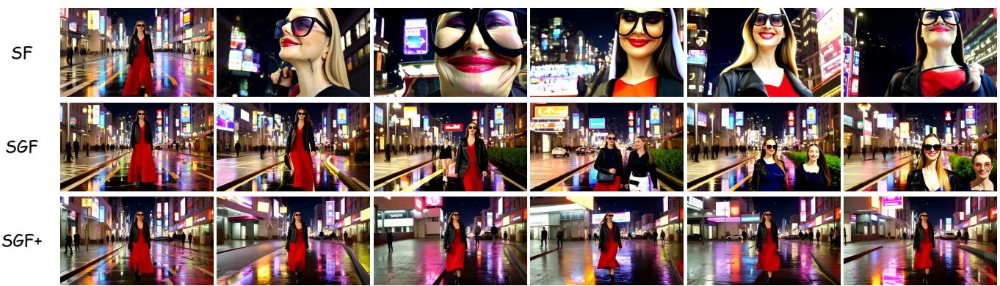  
Prompt: A stylish woman walks confidently down a bustling Tokyo street at night, neon lights and vibrant city signs glowing around her. She wears a sleek black leather jacket, a flowing red dress, and black boots, with a black purse slung over her ...

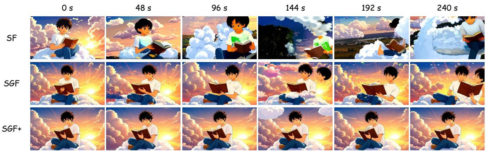  
Prompt: A vibrant anime-style illustration in thick, expressive brushwork depicting a young man in his 20s with short messy black hair and warm brown eyes, deeply engrossed in reading a classic leather-bound book. He sits casually on a fluffy white ...

Figure 11. Additional qualitative comparisons in chunkwise generation. SF, SGF, and SGF+ are compared in three scenes. From top to bottom: a fluffy monster gazing at a candle, a neon-lit Tokyo street, and a person reading.

0 s  
240 s  
0 s  
192 s  
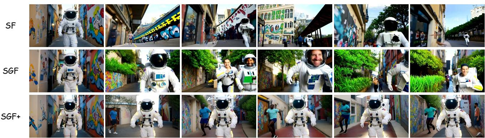  
Prompt: An astronaut in a bright white, reflective spacesuit adorned with technical patches sprints dynamically through a narrow, dimly lit alley in Rio de Janeiro, one hand on hip, the other reaching forward for balance. Sunlight glints off the ...

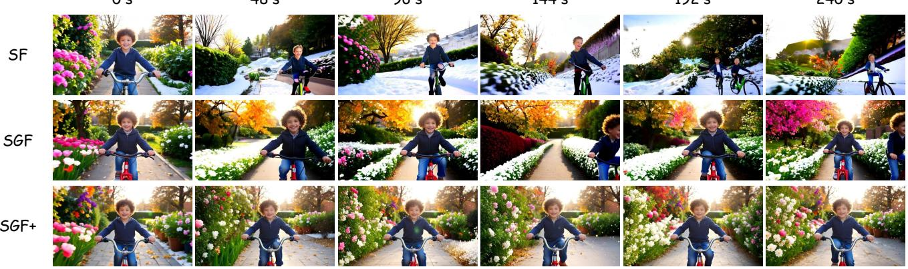  
Prompt: A dynamic documentary-style sequence of a curly-haired brown boy joyfully riding his bike through a magical garden cycling through seasons: starting wide in spring with blooming flowers, mid-shot in autumn amid falling leaves, ...

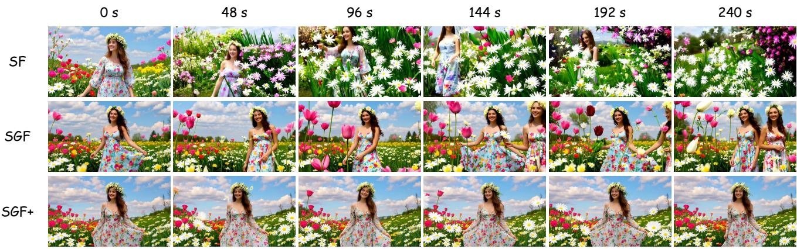  
Prompt: Romantic-style oil painting of a young woman in a flowing floral dress standing joyfully in a lush spring garden, surrounded by blooming roses, tulips, and daisies. Her hair is loosely tied with wildflowers, soft breeze gently swaying ...

Figure 12. Additional qualitative comparisons in chunkwise generation. SF, SGF, and SGF+ are compared in three scenes. From top to bottom: an astronaut, a boy riding a bicycle, and a woman in a flower garden.

96 s  
192 s  
240 s  
192 s  
240 s  
240 s  
48 s  
48 s  
144 s  
0 s  
48 s  
144 s  
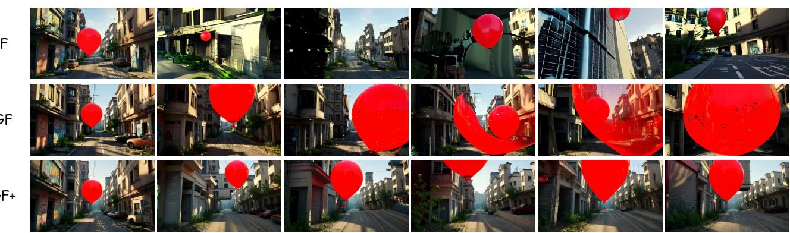  
Prompt: Handheld tracking shot following a vibrant red balloon drifting gracefully above an abandoned urban street, sunlight filtering through crumbling buildings casting dynamic shadows. The balloon floats playfully, rising and falling gently, ...

0 s  
96 s  
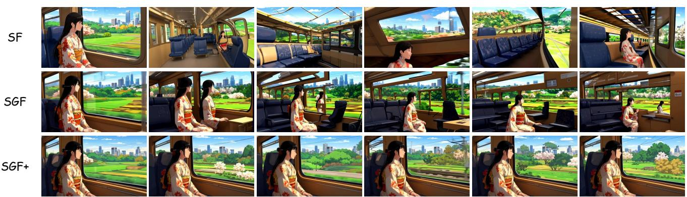  
Prompt: Realistic Japanese manga-style digital painting, a young woman with long black hair in a traditional kimono adorned with intricate floral patterns and a neat obi sash sits quietly inside a moving train. She gazes out the window with a ...

0 s  
96 s  
144 s  
192 s  
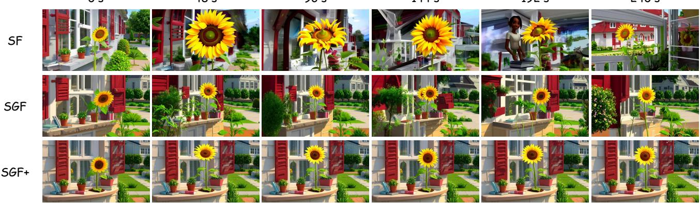  
Prompt: Stop motion animation in a charming hand-drawn style, a vibrant sunflower slowly grows from a windowsill on a cozy suburban house. The sunflower's petals unfurl gracefully as its stem bends and stretches upward, captured in a close-up ...  
Figure 13. Additional qualitative comparisons in chunkwise generation. SF, SGF, and SGF+ are compared in three scenes. From top to bottom: a red balloon drifting through an urban street, a woman aboard a train, and a sunflower by a windowsill.

240 s  
96 s  
48 s  
0 s  
48 s  
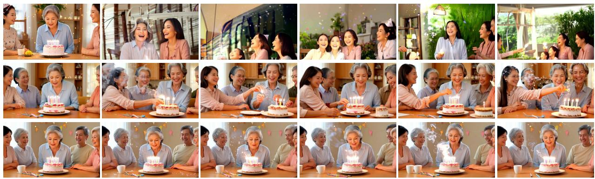  
96 s

144 s

0 s  
192 s  
Prompt: Cinematic warm family moment, a grandmother with neatly combed grey hair leans forward, blowing out pink frosted candles on a vibrant birthday cake, wearing a light blue floral blouse, soft joyful expression, sparkling eyes, surrounded by ...  
144 s  
192 s  
240 s  
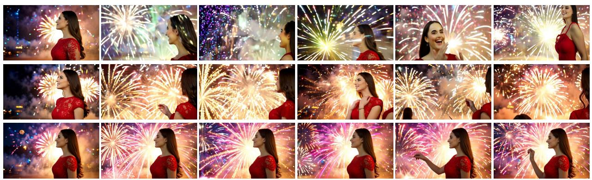  
Prompt: Side profile of a woman in an elegant red lace dress, gazing into the distance with wonder and excitement as vibrant fireworks explode behind her, illuminating her face with a magical glow. Her long hair flows softly in the wind, cascading ...

0 s  
48 s  
96 s  
144 s  
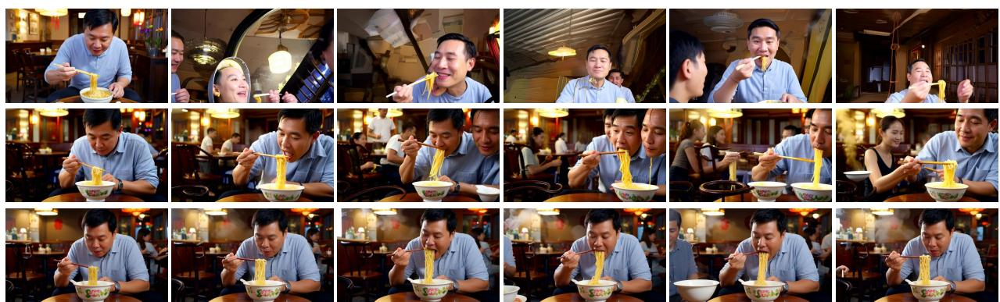  
192 s  
240 s  
Prompt: A dimly lit traditional Chinese restaurant scene, middle-aged Chinese man in a light blue casual shirt and black pants intently eating noodles with chopsticks at a small round table. His face shows deep contentment and focus, illuminated by ...

Figure 14. Additional qualitative comparisons in chunkwise generation. SF, SGF, and SGF+ are compared in three scenes. From top to bottom: a grandmother celebrating her birthday, a woman in front of fireworks, and a man eating noodles with chopsticks.

192 s  
240 s  
240 s  
48 s  
96 s  
144 s  
0 s  
12 s  
24 s  
36 s  
60 s  
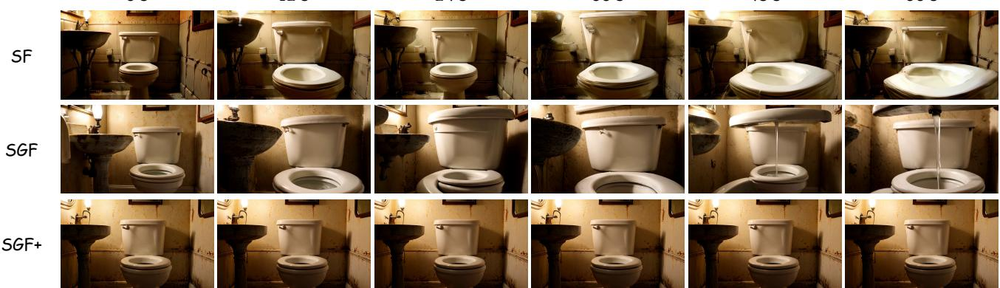  
Prompt: A frozen moment in time, showcasing an old-fashioned bathroom with a porcelain toilet centered in the frame. The toilet bowl is slightly lifted, as if someone just used it and quickly left. The water in the tank shows a paused drip, creating ...

0 s  
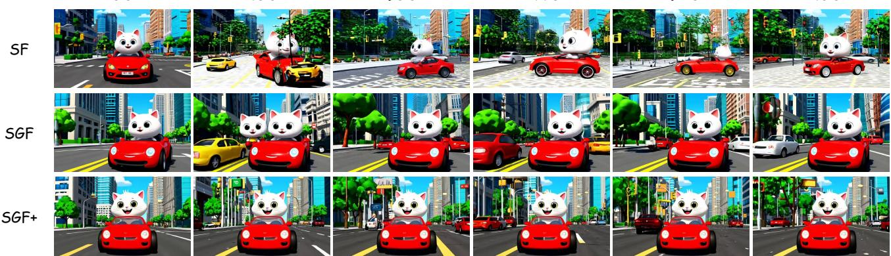  
Prompt: Cartoon-style vibrant illustration of a fluffy white cat with big round eyes and a mischievous grin, sitting in a red toy car, driving down a busy downtown street. The cat's ears flap in the wind as the car's wheels spin forward, zipping past ...

0 s  
96 s  
192 s  
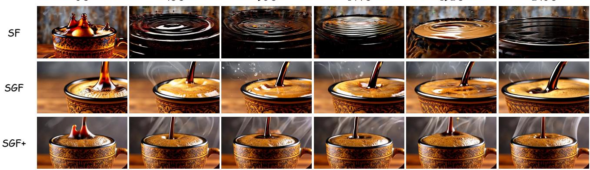  
Prompt: Macro shot of a volcanic eruption in a coffee cup, rich dark brown liquid erupting with explosive foam and steam. Intricate ceramic cup with detailed etched patterns, warm brown and gray blurred background. Dramatic low-angle ...

Figure 15. Additional qualitative comparisons in framewise generation. SF, SGF, and SGF+ are compared in three scenes. From top to bottom: a porcelain toilet in an old-fashioned bathroom, a white cat driving a red car, and a volcanic eruption in a coffee cup.

144 s  
96 s  
0 s  
48 s  
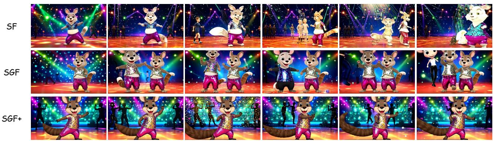  
Prompt: A vibrant cartoon-style illustration of a joyful kangaroo dancing disco with energetic fluidity, wearing a glittery sequined top and pants that sparkle under colorful lights. The kangaroo has large expressive eyes, a mischievous grin, and a ...

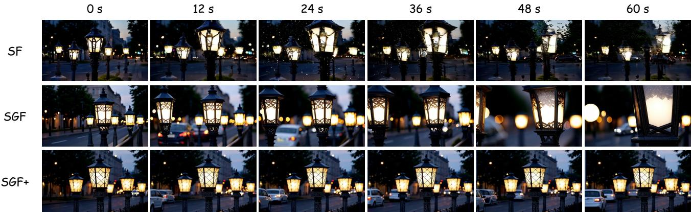  
Prompt: A serene scene featuring several Art Deco lampposts lined up along a quiet street at dusk. Each lamppost is adorned with intricate geometric patterns and features frosted glass shades, casting a soft, warm glow. The lampposts create a ...

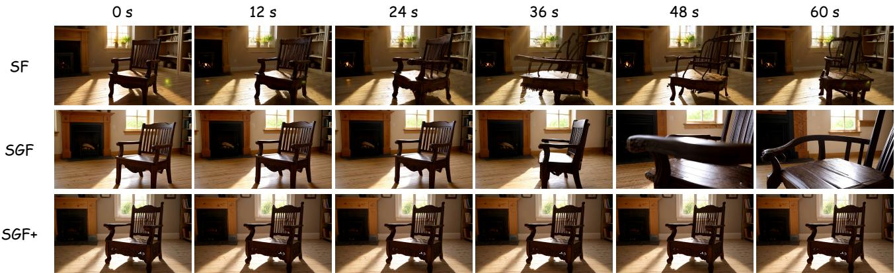  
Prompt: A serene and peaceful scene of an old wooden armchair placed in a quiet, cozy living room. The chair has a distressed, dark brown finish with slight scratches and dents, indicating its age and well-used nature. Soft morning ...

Figure 16. Additional qualitative comparisons in framewise generation. SF, SGF, and SGF+ are compared in three scenes. From top to bottom: a kangaroo dancing disco, Art Deco lampposts, and an old wooden armchair in a living room.

## G. Local Optimization Analysis of Role Separation

We analyze the local effect of separating context-writing and denoising parameters in SGF+. Two comparison protocols distinguish the restriction imposed by parameter sharing from its effect on a gradient-descent step: a common update budget and a common learning rate.

## G.1. Fixed-replay objective and comparison geometry

Fix the detached rollout latents, sampled denoising exits, DMD supervision, and all forward randomness. The resulting Pass-2 surrogate is

$$
F ( \theta _ { c } , \theta _ { d } ) = \ell ( \mathcal { D } _ { \theta _ { d } } \left( Z ^ { \star } , t ^ { \star } \mid \mathcal { C } _ { \theta _ { c } } ( \operatorname { s g } ( X ) , 0 ; \mathcal { M } _ { \mathrm { r e c } } ) , \mathcal { M } _ { \mathrm { r e c } } \right) )\tag{6}
$$

where ℓ uses the fixed supervision. Let $\theta _ { c } , \theta _ { d } \in \mathbb { R } ^ { p }$ have matching coordinates, such that tying them reproduces the shared forward computation. At $x _ { 0 } = ( \theta , \theta )$ , define the full role-wise partial derivatives

$$
g _ { \mathrm { C } } = \nabla _ { \theta _ { c } } F ( x _ { 0 } ) , \qquad g _ { \mathrm { D } } = \nabla _ { \theta _ { d } } F ( x _ { 0 } ) , \qquad g = \bigl ( g _ { \mathrm { C } } , g _ { \mathrm { D } } \bigr ) .\tag{7}
$$

The writer derivative passes through the differentiable KV state. Both derivatives belong to the same objective, and the tied objective $f ( \theta ) = F ( \theta , \theta )$ satisfies $\nabla f ( \theta ) = g _ { \mathrm { C } } + g _ { \mathrm { D } }$

At this common point, impose the Euclidean product-space budget $\left\| \delta _ { c } \right\| ^ { 2 } + \left\| \delta _ { d } \right\| ^ { 2 } \leq r ^ { 2 }$ , with $r > 0$ . A tied update $( u , u )$ therefore costs $2 \left\| u \right\| ^ { 2 }$ . For a subspace $V \subseteq \mathbb { R } ^ { 2 p }$ of admissible updates, define the maximum first-order decrease

$$
D _ { V } ( r ) = \operatorname* { m a x } _ { \delta \in V , \| \delta \| \leq r } - \langle g , \delta \rangle .\tag{8}
$$

This budget matches parameter displacement in the specified geometry; it does not match parameter count or computational cost.

## G.2. Descent lost under parameter sharing

Proposition G.1 (Shared-parameter descent restriction). Let F be differentiable at $x _ { 0 } .$ . For independent updates $V _ { \mathrm { s p l i t } } = \mathbb { R } ^ { 2 p }$ and tied updates $V _ { \mathrm { s h a r e d } } = \{ ( u , u ) : u \in \mathbb { R } ^ { p } \}$ ,

$$
D _ { \mathrm { s p l i t } } ( r ) = r \sqrt { \left\| g _ { \mathrm { C } } \right\| ^ { 2 } + \left\| g _ { \mathrm { D } } \right\| ^ { 2 } } ,\tag{9}
$$

$$
D _ { \mathrm { s h a r e d } } ( r ) = \frac { r } { \sqrt { 2 } } \left\| g _ { \mathrm { C } } + g _ { \mathrm { D } } \right\| .\tag{10}
$$

In particular,

$$
\boxed { D _ { \mathrm { s p l i t } } ( r ) ^ { 2 } - D _ { \mathrm { s h a r e d } } ( r ) ^ { 2 } = \frac { r ^ { 2 } } { 2 } \left\| g _ { \mathrm { C } } - g _ { \mathrm { D } } \right\| ^ { 2 } . }\tag{11}
$$

Proof. Cauchy–Schwarz gives $- \left. g , \delta \right. \leq r \left\| g \right\|$ , attained by $\delta = - r g / \left\| g \right\|$ when $g \neq 0$ . For tied updates, the budget becomes $\lVert u \rVert \leq r / \sqrt { 2 }$ and the linear decrease $\mathrm { i s } - \langle g _ { \mathrm { C } } + g _ { \mathrm { D } } , u \rangle$ , whose maximum is $r \left\| g _ { \mathrm { C } } + g _ { \mathrm { D } } \right\| / \sqrt { 2 }$ . When either maximizing gradient vanishes, the corresponding maximum is zero. Subtracting the squared expressions and expanding the norms gives Eq. (11). □

## G.3. Gradient cancellation and stationary points

The orthogonal decomposition into shared and role-dependent directions is

$$
P _ { \mathrm { s h a r e d } } g = \left( { \frac { g _ { \mathrm { C } } + g _ { \mathrm { D } } } { 2 } } , { \frac { g _ { \mathrm { C } } + g _ { \mathrm { D } } } { 2 } } \right) , \qquad g - P _ { \mathrm { s h a r e d } } g = \left( { \frac { g _ { \mathrm { C } } - g _ { \mathrm { D } } } { 2 } } , { \frac { g _ { \mathrm { D } } - g _ { \mathrm { C } } } { 2 } } \right) .\tag{12}
$$

The second component, with squared norm $\| g _ { \mathrm { C } } - g _ { \mathrm { D } } \| ^ { 2 } / 2$ , is excluded by parameter sharing.

When $E = \left\| g _ { \mathrm { C } } \right\| ^ { 2 } + \left\| g _ { \mathrm { D } } \right\| ^ { 2 } > 0$ , the fraction of squared gradient norm outside the tied-update subspace is

$$
\Gamma = \frac { \left\| g _ { \mathrm { C } } - g _ { \mathrm { D } } \right\| ^ { 2 } } { 2 E } = 1 - \frac { D _ { \mathrm { s h a r e d } } ( r ) ^ { 2 } } { D _ { \mathrm { s p l i t } } ( r ) ^ { 2 } } = \frac { 1 } { 2 } - \frac { \langle g _ { \mathrm { C } } , g _ { \mathrm { D } } \rangle } { E } .\tag{13}
$$

Thus $0 \leq \Gamma \leq 1$ , with $\Gamma = 0$ exactly when $g _ { \mathrm { C } } = g _ { \mathrm { D } }$ and $\Gamma = 1$ exactly when $g _ { \mathrm { C } } = - g _ { \mathrm { D } } \neq 0$ . Negative alignment implies $\Gamma > 1 / 2$ , but any unequal role gradients yield $\Gamma > 0$ . Hence Γ measures the sharing restriction, which is distinct from the negative-alignment criterion for gradient conflict.

For example, $g _ { \mathrm { C } } = ( 2 , 1 )$ and $g _ { \mathrm { D } } = ( 2 , - 1 )$ have cosine similarity $3 / 5$ , while their second coordinates cancel in the shared gradient $( 4 , 0 )$ . Nevertheless, $\Gamma = 1 / 5 > 0$ , illustrating a sharing restriction under positive overall alignment.

Corollary G.1 (Stationarity induced by cancellation). ${ \cal I } f g _ { \mathrm { C } } = - g _ { \mathrm { D } } \neq 0 a t x _ { 0 } = ( \theta , \theta )$ , then θ is a stationary point ofthe tied objective f, whereas $x _ { 0 }$ is not a stationary point ofF. If, additionally, $\nabla F$ is L-Lipschitz on a neighborhood containing the segment from $x _ { 0 }$ to $x _ { 0 } - \eta g$ , where $L > 0$ and $0 < \eta < 2 / L$ , then

$$
F ( x _ { 0 } - \eta g ) \leq F ( x _ { 0 } ) - \eta \left( 1 - \frac { L \eta } { 2 } \right) \left( \left. g _ { \mathrm { C } } \right. ^ { 2 } + \left. g _ { \mathrm { D } } \right. ^ { 2 } \right) < F ( x _ { 0 } ) .\tag{14}
$$

Proof. The chain rule gives $\nabla f ( \theta ) = 0$ , whereas $\nabla F ( x _ { 0 } ) = g \neq 0$ . The descent lemma along the update segment yields Eq. (14), whose decrease is strict for $0 < \eta < 2 / L$ □

Complete cancellation is a sufficient condition for this stationary-point separation; negative alignment alone does not imply stationarity.

## G.4. Finite-step descent under a common update budget

The first-order gap in Proposition G.1 yields a finite-step advantage for the corresponding normalized updates, without requiring negative alignment.

Corollary G.2 (Finite-step advantage under a common budget). Suppose $\nabla F$ is L-Lipschitz on an open neighborhood ofthe closed ball $B ( x _ { 0 } , \rho )$ , with $L , \rho > 0$ , and $g _ { \mathrm { C } } \neq g _ { \mathrm { D } }$ . Let

$$
a = \left\| g \right\| , \qquad b = \left\| P _ { \mathrm { s h a r e d } } g \right\| , \qquad a > b \geq 0 .\tag{15}
$$

For $0 < r \le \rho ,$ choose the updates that maximize first-order decrease under the product-space budget:

$$
\delta _ { \mathrm { s p l i t } } ^ { ( r ) } = - \frac { r } { a } g , \qquad \delta _ { \mathrm { s h a r e d } } ^ { ( r ) } = \left\{ \begin{array} { l l } { - \frac { r } { b } P _ { \mathrm { s h a r e d } } g , } & { b > 0 , } \\ { 0 , } & { b = 0 . } \end{array} \right.\tag{16}
$$

Then

$$
F ( x _ { 0 } + \delta _ { \mathrm { s h a r e d } } ^ { ( r ) } ) - F ( x _ { 0 } + \delta _ { \mathrm { s p l i t } } ^ { ( r ) } ) \geq r ( a - b ) - L r ^ { 2 } .\tag{17}
$$

Consequently, for

$$
0 < r < \operatorname* { m i n } \left\{ \rho , { \frac { a - b } { L } } \right\} ,\tag{18}
$$

the split update strictly outperforms the shared update and strictly decreases the surrogate:

$$
F ( x _ { 0 } + \delta _ { \mathrm { s p l i t } } ^ { ( r ) } ) < F ( x _ { 0 } + \delta _ { \mathrm { s h a r e d } } ^ { ( r ) } ) , \qquad F ( x _ { 0 } + \delta _ { \mathrm { s p l i t } } ^ { ( r ) } ) < F ( x _ { 0 } ) .\tag{19}
$$

Proof. Equation (12) gives $a ^ { 2 } - b ^ { 2 } = \left\| g _ { \mathrm { C } } - g _ { \mathrm { D } } \right\| ^ { 2 } / 2 > 0$ . For $\| \delta \| \leq \rho ,$ smoothness yields

$$
F ( x _ { 0 } + \delta ) = F ( x _ { 0 } ) + \langle g , \delta \rangle + R ( \delta ) , \qquad | R ( \delta ) | \leq \frac { L } { 2 } \left. \delta \right. ^ { 2 } .\tag{20}
$$

The two updates have norm at most r and linear terms −ra and $- r b ,$ respectively, including $b = 0$ . Subtracting their expansions bounds the remainder difference by $L r ^ { 2 }$ , giving Eq. (17). Equation (18) makes this bound positive and also ensures

$$
F ( x _ { 0 } + \delta _ { \mathrm { s p l i t } } ^ { ( r ) } ) \leq F ( x _ { 0 } ) - r a + \frac { L r ^ { 2 } } { 2 } < F ( x _ { 0 } ) ,\tag{21}
$$

because $r < ( a - b ) / L \leq a / L < 2 a / L$

For $b > 0$ , both steps have product-space norm $r ;$ for $b = 0$ , the shared step is zero. The comparison concerns the normalized updates in Eq. (16).

## G.5. Negative alignment under a common learning rate

We next compare ordinary gradient-descent steps with a common learning rate η for the shared parameter vector and each independent role vector.

Let $\dot { h } = g _ { \mathrm { C } } + g _ { \mathrm { D } } , E = \left\| g _ { \mathrm { C } } \right\| ^ { 2 } + \left\| g _ { \mathrm { D } } \right\| ^ { 2 }$ , and $S = \left\| h \right\| ^ { 2 }$ . In the product space, the updates are

$$
\delta _ { \mathrm { s h a r e d } } = - \eta ( h , h ) , \qquad \delta _ { \mathrm { s p l i t } } = - \eta ( g _ { \mathrm { C } } , g _ { \mathrm { D } } ) .\tag{22}
$$

Their squared norms are $2 \eta ^ { 2 } S$ and $\eta ^ { 2 } E ,$ , respectively, so this protocol generally uses different displacement budgets.

Proposition G.2 (One-step advantage under negative alignment). Suppose $\nabla F$ is L-Lipschitz on an open neighborhood ofthe closed ball $B ( x _ { 0 } , \rho )$ , with $L , \rho > 0 . \ : I f \left. g _ { \mathrm { C } } , g _ { \mathrm { D } } \right. = - \kappa < 0 ,$ , set $K = E + 2 S$ and $M = \operatorname* { m a x } \{ \sqrt { E } , \sqrt { 2 S } \}$ . For $\eta > 0$ with $\eta M \leq \rho ,$

$$
| F ( x _ { 0 } + \delta _ { \mathrm { s h a r e d } } ) - F ( x _ { 0 } + \delta _ { \mathrm { s p l i t } } ) - 2 \eta \kappa | \leq \frac { L \eta ^ { 2 } } { 2 } K .\tag{23}
$$

Consequently, whenever

$$
0 < \eta < \operatorname* { m i n } \left\{ \frac { \rho } { M } , \frac { 4 \kappa } { L K } , \frac { 2 } { L } \right\} ,\tag{24}
$$

the split update both outperforms the shared update and strictly decreases the surrogate:

$$
F ( x _ { 0 } + \delta _ { \mathrm { s p l i t } } ) < F ( x _ { 0 } + \delta _ { \mathrm { s h a r e d } } ) , \qquad F ( x _ { 0 } + \delta _ { \mathrm { s p l i t } } ) < F ( x _ { 0 } ) .\tag{25}
$$

Proof. Both updates lie in the smoothness ball, so the expansion in Eq. (20) applies. The linear terms are $- \eta S$ and −ηE, with difference $\eta ( E - S ) = - 2 \eta \left. g _ { \mathrm { C } } , g _ { \mathrm { D } } \right. = 2 \eta \kappa$ . The sum of the remainder bounds is $L \eta ^ { 2 } ( E + 2 S ) / 2$ , proving Eq. (23). In particular,

$$
F ( x _ { 0 } + \delta _ { \mathrm { s h a r e d } } ) - F ( x _ { 0 } + \delta _ { \mathrm { s p l i t } } ) \geq 2 \eta \kappa - \frac { L \eta ^ { 2 } } { 2 } K > 0\tag{26}
$$

when $\eta < 4 \kappa / ( L K )$ . Finally, $F ( x _ { 0 } + \delta _ { \mathrm { s p l i t } } ) \leq F ( x _ { 0 } ) - \eta ( 1 - L \eta / 2 ) E < F ( x _ { 0 } ) { \mathrm { f o r } } \eta < 2 / L$ . Negative alignment ensures $E , K , M > 0 .$ , so the interval in Eq. (24) is nonempty. □

Under the same smoothness assumptions, the common-learning-rate comparison has the general expansion

$$
F ( x _ { 0 } + \delta _ { \mathrm { s h a r e d } } ) - F ( x _ { 0 } + \delta _ { \mathrm { s p l i t } } ) = - 2 \eta \langle g _ { \mathrm { C } } , g _ { \mathrm { D } } \rangle + O ( \eta ^ { 2 } ) .\tag{27}
$$

A strictly positive inner product therefore favors the shared update for sufficiently small η, even if some coordinates cancel.   
This differs from Corollary G.2 because the common-learning-rate protocol does not normalize update lengths.

For a minibatch, the proposition requires negative alignment of the aggregated gradients. Negative alignment of individual samples or selected modules does not establish this condition for the full gradient. A selected-block comparison holds with all other parameters fixed.

## G.6. Partial separation across network modules

Partition the matching role parameters into B disjoint blocks, with gradients $g _ { \mathrm { C } } ^ { ( b ) }$ and $g _ { \mathrm { D } } ^ { ( b ) }$ . Blocks in ${ \cal S } \subseteq \{ 1 , \ldots , B \}$ have independent role updates; the remaining blocks are tied. All blocks share the same total product-space budget.

Corollary G.3 (Residual restriction under partial separation). At the common shared point, the maximum first-order decrease $D _ { \mathcal { S } } ( r )$ for this partially separated update space satisfies

$$
D _ { S } ( r ) ^ { 2 } = r ^ { 2 } \left[ \sum _ { b \in S } \left( \left\| g _ { \mathrm { C } } ^ { ( b ) } \right\| ^ { 2 } + \left\| g _ { \mathrm { D } } ^ { ( b ) } \right\| ^ { 2 } \right) + \frac { 1 } { 2 } \sum _ { b \notin S } \left\| g _ { \mathrm { C } } ^ { ( b ) } + g _ { \mathrm { D } } ^ { ( b ) } \right\| ^ { 2 } \right] .\tag{28}
$$

Consequently, relative to full separation,

$$
\boxed { D _ { \mathrm { f u l l } } ( r ) ^ { 2 } - D _ { S } ( r ) ^ { 2 } = \frac { r ^ { 2 } } { 2 } \sum _ { b \notin \mathcal { S } } \left\| g _ { \mathrm { C } } ^ { ( b ) } - g _ { \mathrm { D } } ^ { ( b ) } \right\| ^ { 2 } . }\tag{29}
$$

Proof. For any linear subspace V and orthogonal projection $P _ { V } , \langle g , \delta \rangle = \langle P _ { V } g , \delta \rangle$ for $\delta \in V$ . Thus $D _ { V } ( r ) = r \| P _ { V } g \|$ including the zero-projection case. In a separated block the projection retains both gradient components. In a tied block it replaces them by their average, as in Eq. (12), with squared norm $\left\| g _ { \mathrm { C } } ^ { ( b ) } + g _ { \mathrm { D } } ^ { ( b ) } \right\| ^ { 2 } / 2$ . Disjoint parameter blocks are orthogonal, so their squared projection norms add, giving Eq. (28). Subtracting from $\begin{array} { r } { D _ { \mathrm { f u l l } } ( r ) ^ { 2 } = r ^ { 2 } \sum _ { b } ( \left\| g _ { \mathrm { C } } ^ { ( b ) } \right\| ^ { 2 } + \left\| g _ { \mathrm { D } } ^ { ( b ) } \right\| ^ { 2 } ) } \end{array}$ and applying Eq. (11) blockwise proves the result. □

Separating only FFN leaves the Attention contribution in Eq. (29). This quantifies the residual sharing restriction in the partial-separation variants, provided that tying their matching parameters reproduces the same forward computation at $x _ { 0 }$

## H. Future Work

World action models. Our observation of gradient conflict at TF initialization motivates exploring role-specific parameterization from the teacher-forcing stage. World action models (WAMs) [23, 27, 36, 43], which commonly rely on teacher-forced training, provide a natural setting for this direction. Separating context writing from visual and action prediction may enable more effective learning of historical representations for subsequent predictions.

Efficient context writers and KV compression. Role-specific parameterization motivates asymmetric architectures, with model capacity tailored to the demands of context writing and denoising. A lightweight context writer could learn compressed KV representations from redundant video histories under a constrained cache budget. Such writer-side adaptation could be optimized through future generation losses while keeping the denoiser’s parameters and attention interface unchanged. The goal is to reduce parameter storage, cache memory, and attention cost while preserving the denoiser’s generative capabilities and long-horizon consistency.