# STRIKE: Learning Visual State Transitions for Physical World Modeling

Wenbin Teng1,2,∗, Tianshuo Xu1, Depu Meng1,§, Yuelei Li1, Quentin Herau1, Yihan Hu1, Yajie Zhao2, Wei Zhan1,3,†

1Applied Intuition 2University of Southern California 3University of California, Berkeley

∗Work done during an internship at Applied Intuition. §Project Lead. †Corresponding author: wei.zhan@applied.co Project Page: https://strike-applied.github.io

## Abstract

Physical world modeling requires predicting how interactions change a scene, not merely generating coherent motion. We propose STRIKE, a framework that separates visual state transition learning from dense video generation. We construct event-aligned supervision by extracting observed states from training videos and pairing them with transition descriptions and temporal ofsets. An image-based transition model learns to predict the next scene configuration from the current image, a local transition specification, and elapsed time. At inference, a pretrained vision-language planner predicts time transition specifications, and recursive application of the learned transition model produces a sequence of future visual states. A separately trained dynamic model then generates the complete rollout conditioned on these states and their temporal locations. Experiments on Physics-IQ Verified, PhyGenBench, Pisa-Experiments, and RoboTwin2.0 show improvements of STRIKE over the corresponding video-backbone baselines in benchmark measures of physical consistency and manipulation-video fidelity. These results support learned visual state transitions as an efective intermediate representation for physical world modeling.

## 1 Introduction

A central challenge in physical world modeling is predicting the consequences of interactions among objects and agents. For example, a successful grasp establishes attachment between an object and a gripper, while lift preserves that attachment and changes the object’s support conditions (Figure 1). We use visual states to denote configurations that express such interaction outcomes [44]. These states capture changes in object configurations and relations that constrain subsequent physical evolution. Preserving object appearance alone is therefore insuficient: the generated scene must also establish the relation of transition that make an interaction physically meaningful.

We consider a formulation that treats transitions between visual states as an explicit learning target. A state-transition model predicts the state reached after an interaction, given the current observation and an interaction specification. A conditional dynamics model then models how the scene evolves between the predicted states. For open-domain generation, a pretrained vision-language event planner provides the local transition specifications and their temporal locations. This formulation allows us to investigate whether explicitly learning state transitions improves the prediction of interaction outcomes and their subsequent physical consequences.

Learning state transitions is a general approach to predictive modeling for planning and control. Latent dynamics models support planning and behavior learning [10, 11], visual prediction supports robot manipulation [8], and language-conditioned video models represent task execution through visual plans [7]. Within this broader setting, we study a transition interface defined by the current image, a local description of a physical change, and elapsed time. Our focus is on learning this mapping from event-aligned state pairs and composing its predictions to guide dense visual evolution.

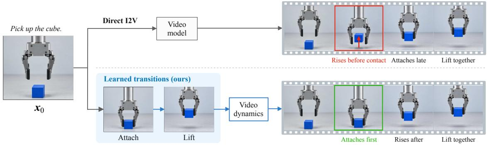  
Fig. 1. Overview. Given an initial image and task, STRIKE uses a timed event plan to recursively predict future visual states with a transition model learned from event-aligned state pairs. The predicted states and their temporal positions are applied as conditions of dense video generation.

In this work, we propose STRIKE, a novel framework that explicitly learns visual state transitions and uses the predicted states to condition dense video generation. We first instantiate the state-transition model as a conditional image model that predicts a future visual state from the current observation, an interaction specification, and the elapsed time. To construct its supervision, a VLM-assisted curation pipeline identifies events in training videos, selects informative visual states, and annotates the transitions between them. After structural and quality checks, adjacent selected states are paired with transition descriptions and elapsed times, yielding supervision grounded in observed changes rather than generic video-level captions. The selected images are extracted from training videos rather than synthesized by the annotator. We train the image model on these pairs, directly supervising how a specified interaction changes the scene’s object configurations and relations. During inference, the event planner instead predicts future transition conditions from the initial image and task context, without observing future reference frames. Each predicted state becomes the input for the next specified interaction, allowing the model to construct a sequence of successive visual states. These predictions provide explicit state and timing conditions for dense video generation. Second, the conditional dynamics model is implemented as a video difusion model trained to generate the motion and intermediate configurations connecting these states. Together, the two components model physical evolution through explicit interaction outcomes and the dynamics between them.

## Our contributions are as follows:

• We formulate visual state-transition prediction as an explicit event- and time-conditioned learning task, and construct event-aligned supervision from observed video states through a VLM-assisted annotation pipeline.

• We develop a compositional generation framework that combines timed event planning with recursive prediction of transition states. These states and their temporal locations provide soft conditions for separately trained video dynamics models, instantiated with CogVideoX and Wan.

• We evaluate the framework on Physics-IQ Verified, PhyGenBench, PisaBench, and RoboTwin2.0, demonstrating gains in physical-consistency and manipulation-video metrics over the corresponding backbone baselines.

## 2 Related Work

## 2.1 Physics-Aware Generative World Models.

Large-scale video generators, including CogVideoX [43], Wan [34], and Cosmos [1, 23], provide backbones for visual world modeling. IRASim [47] aligns action trajectories with video frames, while Unified World Models [46] jointly models video and action difusion for dynamics and policy learning. Complementary approaches target physical fidelity through physics-aware conditioning [36], simulation-based post-training [15], relational alignment [45], latent motion priors [13], and staged motion control [40]. These approaches primarily address video-level generation or control; we focus on explicitly predicting the outcomes of individual interactions.

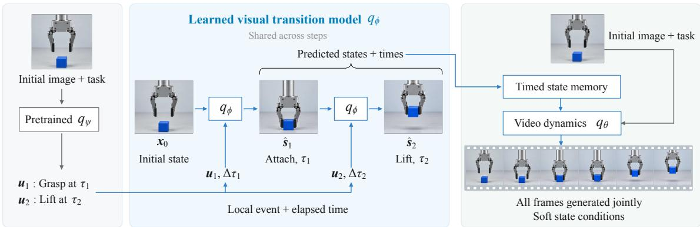  
Fig. 2. The overall framework of STRIKE. (a) A pretrained vision-language event planner receives the initial image $\pmb { x } _ { 0 }$ and task $^ { c , }$ and proposes local events ${ \pmb u } _ { k }$ and outcome times $\tau _ { k } .$ (b) A shared visual transition model $q _ { \phi }$ is applied successively using the current state, event, and elapsed time $\Delta \tau _ { k } = \tau _ { k } - \tau _ { k - 1 }$ . Observed event-aligned state pairs supervise its training. (c) A separately trained dynamics model $q _ { \theta }$ generates the dense rollout from the initial context and soft conditions supplied by the predicted states and their temporal locations.

## 2.2 Keyframe- and Event-Guided Generation.

KeyWorld [16] generates task-relevant keyframes from an initial observation and a global task description before reconstructing dense video. SKIP [12] learns event-preserving sparse rollouts with interpolation. DCARL [26] trains a keyframe generator to establish consistent structural anchors for long trajectory generation. RoboEnvision [41] decomposes manipulation tasks into atomic instructions, generates aligned boundary keyframes, and fills the intervening segments conditioned on those instructions. CausalMotion [48] uses VLM-planned keyframes and object trajectories to guide a pretrained video generator without additional training, while CoECT [38] constructs event keyframes through event-chain reasoning and iterative editing. We instead directly supervise a shared transition model on event-aligned state pairs, conditioned on the current visual state, one interaction specification, and elapsed time.

## 2.3 Visual Subgoal and State-Transition Prediction.

Visual state prediction also supports manipulation representation learning and policy guidance. MPI [44] pretrains representations through interaction-frame prediction and object localization. SuSIE [4] uses an image-editing difusion model to propose language-conditioned subgoals for a low-level policy, while TaKSIE [14] incorporates task progress for adaptive subgoal generation. Rather than learning representations or subgoals, we supervise interaction-conditioned transitions across physical phenomena and use the timed visual outcomes to condition dense video dynamics.

## 3 Preliminaries

## 3.1 Visual States and Transition Conditions

We consider generating a visual rollout $X = ( x _ { 0 } , x _ { 1 } , \dots , x _ { F - 1 } )$ from an initial visual condition $\pmb { x } _ { 0 }$ and task context �, such as a scene description or a manipulation instruction. For image-conditioned generation, $\pmb { x } _ { 0 }$ is an observed frame; text-only generation additionally requires synthesizing an initial image before this rollout stage.

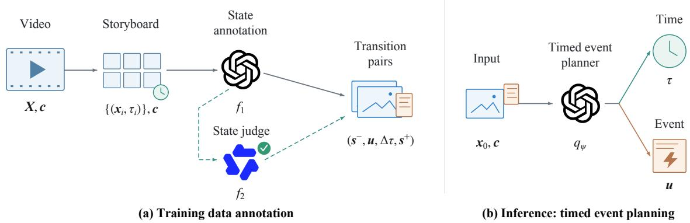  
Fig. 3. Data annotation and timed event planning. (a) A training video � and caption � are converted into a time-labeled storyboard. GPT-5.5 [25] $( f _ { 1 } )$ selects visual states and annotates their transitions. A Qwen3- $\mathrm { V L }$ state judge $( f _ { 2 } )$ checks image–description agreement, with the dashed branch indicating source-specific filtering. Selected video frames and their annotations form transition pairs $( s ^ { - } , u , \Delta \tau , s ^ { + } )$ . (b) During inference, the event planner $q _ { \psi }$ receives an initial image $\pmb { x } _ { 0 }$ and task context $^ { c , }$ and jointly predicts transition specifications � and their target times �, without observing future reference frames.

We use a visual state to denote an image depicting a scene configuration, including observable object properties and relations such as contact, support, and attachment. A state can depict either an interaction boundary or its persistent consequence, such as first contact with a surface or an object resting after landing. Unlike a complete simulator state, a visual state does not explicitly encode quantities such as velocity or occluded contacts.

We distinguish a visual state � from a transition specification �, which describes a local change and its anticipated visible outcome. For example, a release transition may specify that an object becomes detached from a gripper; the corresponding state image depicts how that outcome is realized in the particular scene. The global context � describes the overall task or process, whereas � specifies an individual step.

Let $\pmb { S } = ( s _ { 1 } , \dots , s _ { K } )$ denote � future visual states at ordered video timestamps $\tau _ { 1 } , \dots , \tau _ { K }$ . We set $\pmb { s } _ { 0 } = \pmb { x } _ { 0 }$ and $\tau _ { 0 } = 0$ , and define:

$$
0 = \tau _ { 0 } < \tau _ { 1 } < \cdots < \tau _ { K } , \qquad \Delta \tau _ { k } = \tau _ { k } - \tau _ { k - 1 } .\tag{1}
$$

Thus, $\tau _ { k }$ locates a state within the rollout, while $\Delta \tau _ { k }$ specifies the interval between successive states.   
The initial observation is not counted among the � future states.

## 3.2 Conditional Latent Generation

Conditional image and video generators operate on latent representations of their prediction targets. Let $z = { \mathcal { E } } ( X )$ denote the latent encoding of an image or video target �, and let � collect the available conditioning information. A general denoising formulation constructs:

$$
z _ { \lambda } = a _ { \lambda } z + b _ { \lambda } { \epsilon } , \qquad \epsilon \sim N ( 0 , I ) ,\tag{2}
$$

and optimizes

$$
\begin{array} { r } { \mathcal { L } _ { \mathrm { g e n } } ( \eta ) = \mathbb { E } _ { z , C , \lambda , \epsilon } \left[ w _ { \lambda } \left\| D _ { \eta } ( z _ { \lambda } , \lambda ; C ) - z _ { \lambda } ^ { \mathrm { t g t } } \right\| _ { 2 } ^ { 2 } \right] , } \end{array}\tag{3}
$$

where $a _ { \lambda }$ and $b _ { \lambda }$ define the corruption process, $D _ { \eta }$ is the conditional predictor, and $z _ { \lambda } ^ { \mathrm { t g t } }$ denotes the prediction target, which parameterizes the velocity for CogVideoX [43] and Wan [35]. $w _ { \lambda }$ is the

backbone-specific noise schedule weighting. The denoising coordinate � is distinct from both the video timestamp $\tau _ { k }$ and the transition interval $\Delta \tau _ { k }$

Our method retains these generative objectives and introduces structure through the prediction targets and conditioning interface: a transition model predicts sparse visual states under explicit transition and temporal conditions, a video model generates the dense rollout conditioned on those states.

## 4 Method

As illustrated in Figure 2, our framework contains two learned generative components: a visual state-transition model and a state-conditioned video dynamics model. A pretrained vision-language model [25] supplies the semantic and temporal conditions that organize their predictions.

## 4.1 Data Annotation and Timed Event Planning

We use a common transition interface in two settings: data annotation of training videos and prospective event planning for generation (Figure 3). Annotation describes observed changes to construct supervision; planning predicts the changes to realize from the available initial condition and task context.

Data annotation. For each training video � and its caption �, we sample candidate frames and construct a storyboard labeled with frame indices and timestamps. A first VLM pass identifies the main entities, visible events, and their chronological structure. A second pass selects informative state frames and describes the transitions between adjacent selected states. Selection favors clearly established relations and distinct outcomes, such as contact, deformation, or a settled configuration, rather than generic beginning, middle or end coverage.

We validate candidate identities and temporal order, resolving the selected frames and their timestamps against the candidate table. Quality screening considers event visibility, caption alignment, state coverage, and frame redundancy. Selected state images are extracted from the training videos, not synthesized by the VLM. Adjacent states produce the transition-pair corpus

$$
\mathcal { D } _ { \mathrm { t r a n s } } = \{ ( s ^ { - } , { \pmb u } , \Delta \tau , s ^ { + } ) \} ,\tag{4}
$$

where � describes the observed change and $\Delta \tau$ is derived from the selected frame indices on the video timeline. Pairs retain a common video-level grouping identifier for train/validation splitting. This corpus provides the event-aligned supervision in Section 4.2. The annotated video/state format also supports the timed-memory supervision in Section 4.3.

Timed event planning. For open-domain inference, a pretrained VLM instead receives only the initial visual condition $\pmb { x } _ { 0 }$ and task context � and predicts

$$
\hat { P } \sim q _ { \psi } ( P \mid x _ { 0 } , c ) , \qquad P = \{ ( u _ { k } , \tau _ { k } ) \} _ { k = 1 } ^ { K } .\tag{5}
$$

Each ${ \pmb u } _ { k }$ specifies a local change and its anticipated visible outcome, while $\tau _ { k }$ locates that outcome within the rollout. Unlike ofline annotation, this stage has no access to future reference frames. We convert the plan into the transition model’s instruction format, validate temporal order and horizon bounds, and compute $\Delta \tau _ { k } = \tau _ { k } - \tau _ { k - 1 }$ . The descriptions and relative intervals condition successive state predictions; the absolute timestamps position those predictions within the video model. The VLM components are not optimized jointly with either generator.

## 4.2 Learning and Composing Visual State Transitions

We instantiate the transition model $q _ { \phi }$ with Qwen-Image-Edit [39] and fine-tune it on examples $( s ^ { - } , u , \Delta \tau , s ^ { + } )$ . The source image � provides the current scene configuration, � specifies the local change, and $\Delta \tau$ supplies the prediction interval. The target $s ^ { + }$ directly supervises the visual configuration resulting from that change.

Relative-time conditioning. We encode elapsed time through the temporal coordinates of the image tokens’ rotary positional embeddings (RoPE) [32], retaining their spatial coordinates. Source and target image tokens receive temporal positions 0 and �, respectively. If a plan specifies frame indices $i _ { k - 1 }$ and $i _ { k }$ on a grid with frame rate $f _ { \mathrm { p l a n } }$ , we convert their diference to the canonical training-frame units:

$$
d _ { k } = { \mathrm { r o u n d } } \left( ( i _ { k } - i _ { k - 1 } ) { \frac { f _ { \mathrm { t r a i n } } } { f _ { \mathrm { p l a n } } } } \right) .\tag{6}
$$

Here, $d _ { k }$ maintains similar representation as $\Delta \tau _ { k }$ , not the denoising coordinate $\lambda .$ This temporalposition modification introduces no additional trainable parameters.

Transition supervision. Let $z ^ { + } = \mathcal { E } _ { I } ( s ^ { + } )$ be the target image latent. For Gaussian noise � and noise level $\lambda \in \left[ 0 , 1 \right]$ , we construct noisy target latent:

$$
z _ { \lambda } ^ { + } = ( 1 - \lambda ) z ^ { + } + \lambda \epsilon ,\tag{7}
$$

and the transition model $q _ { \phi }$ is trained to optimize the flow-matching objective

$$
\mathcal { L } _ { \mathrm { t r a n s } } ( \phi ) = \mathbb { E } \bigg [ \bigg \| \pmb { \nu } _ { \phi } ( z _ { \lambda } ^ { + } , \lambda ; \pmb { s } ^ { - } , \pmb { s } _ { 0 } , \pmb { u } , d ) - ( \epsilon - z ^ { + } ) \bigg \| _ { 2 } ^ { 2 } \bigg ] .\tag{8}
$$

The source image remains uncorrupted, and the loss is applied only to target outputs. We also introduce a first-frame $( \pmb { s } _ { 0 } )$ sink that keeps the latent of the first frame as a persistent visual reference. This helps preserve object identity, scene geometry and appearance over autoregressive transition state generation. We fine-tune the transformer while keeping the pretrained image and multi-modal conditioning encoders frozen.

Sequential composition. We reuse the learned transition model to materialize the plan:

$$
\hat { \boldsymbol { s } } _ { 0 } = \boldsymbol { x } _ { 0 } , \qquad \hat { \boldsymbol { s } } _ { k } \sim q _ { \phi } \biggl ( \boldsymbol { s } _ { k } \biggl | \hat { \boldsymbol { s } } _ { k - 1 } , \hat { \boldsymbol { s } } _ { 0 } , \boldsymbol { u } _ { k } , \Delta \tau _ { k } \biggr ) , \quad k = 1 , \ldots , K .\tag{9}
$$

The temporal interval is represented internally by $d _ { k }$ from Eqn. (6). Each prediction becomes the visual input to the next transition, with parameters shared across steps. Training uses dataset source images, whereas inference uses the preceding prediction. Although state-generation errors can accumulate during composition, we find adding the first frame as a sink input would efectively alleviate the exposure bias.

## 4.3 Video Dynamics Conditioned on Timed Visual States

The dynamics model generates the complete video from the predicted states and their temporal locations:

$$
\hat { X } \sim q _ { \theta } \big ( X \big | x _ { 0 } , c , \{ ( \hat { s } _ { k } , \tau _ { k } ) \} _ { k = 1 } ^ { K } \big ) .\tag{10}
$$

We instantiate this model with CogVideoX-5B-I2V [43] and Wan2.2-5B-TI2V [35], extending their conditioning interfaces to accept multiple state images. Each predicted state is encoded with the video backbone’s VAE and projected into spatial memory tokens. The timestamp $\tau _ { k }$ is mapped to the backbone’s temporal grid, so each memory token carries both spatial and video-time position. Unlike the transition model’s relative interval, this position locates the state within the full rollout.

Schematically, video attention accesses the concatenated sequence

$$
H _ { \mathrm { a t t n } } = [ M _ { 1 } ; \ldots ; M _ { K } ; H _ { \mathrm { v i d e o } } ] ,\tag{11}
$$

where $M _ { k }$ contains the tokens for state $\hat { \pmb { s } } _ { k }$ and $H _ { \mathrm { v i d e o } }$ contains the noisy video tokens. Backbonespecific implementations preserve the original text and initial-image conditioning interfaces.

Table 1. Physics-IQ Verified. Comparison of model size, generation cost (EFLOPs), and physical consistency across baselines. Bold and underlined denote best and second-best scores.
<table><tr><td>Model</td><td># params</td><td>EFLOPs</td><td>Score ↑</td><td>S-IoU ↑</td><td>ST-IoU ↑</td><td>WS-IoU ↑</td></tr><tr><td>Wan2.2 [35]</td><td>14B</td><td>49.100</td><td>34.2</td><td>50.3</td><td>25.2</td><td>29.9</td></tr><tr><td>Cosmos-Predict-2.5 [1]</td><td>2B</td><td>2.560</td><td>32.2</td><td>45.5</td><td>27.2</td><td>30.1</td></tr><tr><td>CogVideoX [43]</td><td>5B</td><td>6.640</td><td>30.5</td><td>40.4</td><td>30.3</td><td>24.1</td></tr><tr><td>Cosmos3-Nano [23]</td><td>16B</td><td>11.802</td><td>27.6</td><td>39.7</td><td>20.2</td><td>22.1</td></tr><tr><td>CoECT [38]</td><td>20B+5B</td><td>29.600</td><td>19.9</td><td>27.6</td><td>23.2</td><td>14.8</td></tr><tr><td>Wan2.2-5B [35]</td><td>5B</td><td>2.739</td><td>19.4</td><td>25.0</td><td>19.4</td><td>16.3</td></tr><tr><td>Open-Sora-v2 [28]</td><td>11B</td><td>5.035</td><td>19.0</td><td>27.0</td><td>21.2</td><td>10.1</td></tr><tr><td>LTX-Video [9]</td><td>13B</td><td>1.152</td><td>18.4</td><td>31.0</td><td>14.1</td><td>15.0</td></tr><tr><td>CausalMotion [48]</td><td>13B</td><td>0.395</td><td>12.7</td><td>19.0</td><td>15.0</td><td>8.1</td></tr><tr><td>Cosmos3-Super [23]</td><td>64B</td><td></td><td>42.7</td><td></td><td></td><td></td></tr><tr><td>MiniMax-H3 [19]</td><td>33B</td><td></td><td>39.8</td><td>-</td><td>-</td><td></td></tr><tr><td>Ours (CogVideoX-5B)</td><td>20B+5B</td><td>10.02</td><td>41.9</td><td>46.7</td><td>53.5</td><td>36.0</td></tr><tr><td>Ours (Wan2.2-5B)</td><td>20B+5B</td><td>4.19</td><td>39.7</td><td>45.2</td><td>53.0</td><td>35.4</td></tr></table>

CogVideoX processes a joint memory/video token stream, while Wan inserts fixed state memories into each block’s self-attention and retains separate text cross-attention. The denoising prediction is read out only from the video-token outputs.

We retain the backbones’ native prediction objectives: scheduler-based velocity prediction for CogVideoX and flow matching for Wan. State images act as soft conditions rather than hard constraints on the corresponding output frames. The model generates the full video window jointly, allowing motion between two states to depend on the wider sequence of predicted outcomes, rather than synthesizing each interval independently.

## 5 Experiments

## 5.1 Experiment Setup

We evaluate our proposed system on Physics-IQ Verified [20, 30], PhyGenBench [18], PISA Experiments [15], and our held-out RoboTwin 2.0 [6] split discussed in Section A.1. Physics-IQ Verified evaluates whether generated videos exhibit realistic physical dynamics across phenomena such as gravity, collisions, fluids, materials, lighting, and magnetism. PhyGenBench tests physical commonsense across 27 laws spanning mechanics, optics, thermal phenomena, and material properties, assessing key events, temporal order, and overall naturalness. PISA Experiments focuses on objectdropping scenarios in real and simulated environments, measuring whether generated object trajectories and interactions align with expected physical motion. To evaluate the results of Robotwin2.0 validation against baselines, we apply the EWMScore, a 15-metric adaptation of WorldArena [31], with more details provided in Section A.5.

## 5.2 Main Results

Physics-IQ Verified. As shown in Table 1, our method substantially improves physical consistency across both video backbones. It achieves scores of 41.9 with CogVideoX-5B and 39.7 with Wan2.2- 5B, surpassing their respective baselines by 11.4 and 20.3 points. Both variants outperform all baselines with reported component metrics on ST-IoU and WS-IoU, with our CogVideoX-based variant reaching 53.5 and 36.0, respectively. Although Wan2.2-14B retains the highest S-IoU, our variants

Table 2. PhyGenBench Results. Comparison of physical-consistency metrics across baselines. Bold and underlined denote best and second-best scores.
<table><tr><td>Method</td><td># param</td><td>Mechanics ↑</td><td>Optics ↑</td><td>Thermal ↑</td><td>Material ↑</td><td>Average ↑</td></tr><tr><td>VideoCrafter2 [5]</td><td>1.4B</td><td>40.00</td><td>58.00</td><td>28.89</td><td>34.17</td><td>42.08</td></tr><tr><td>LaVie [37]</td><td>0.91B</td><td>29.17</td><td>50.67</td><td>23.33</td><td>32.50</td><td>35.63</td></tr><tr><td>Open-Sora v2 [28]</td><td>11B</td><td>55.00</td><td>66.67</td><td>47.78</td><td>50.83</td><td>56.25</td></tr><tr><td>LTX-Video [9]</td><td>13B</td><td>45.83</td><td>65.33</td><td>43.33</td><td>37.50</td><td>49.37</td></tr><tr><td>DreamWorld [33]</td><td>1.3B</td><td>54.17</td><td>64.67</td><td>51.11</td><td>43.33</td><td>54.17</td></tr><tr><td>Cosmos3-Nano [23]</td><td>16B</td><td>57.50</td><td>75.33</td><td>48.89</td><td>46.67</td><td>58.75</td></tr><tr><td>Cosmos-Predict2.5 [1]</td><td>2B</td><td>60.00</td><td>68.00</td><td>52.22</td><td>43.33</td><td>56.87</td></tr><tr><td>PhysVid [27]</td><td>1.7B</td><td>44.17</td><td>60.00</td><td>38.89</td><td>33.33</td><td>45.42</td></tr><tr><td>CausalMotion [48]</td><td>13B</td><td>73.33</td><td>75.33</td><td>65.56</td><td>64.17</td><td>70.21</td></tr><tr><td>Wan2.2 [35]</td><td>5B</td><td>50.83</td><td>65.33</td><td>41.11</td><td>40.00</td><td>50.83</td></tr><tr><td>CogVideoX [43]</td><td>5B</td><td>50.00</td><td>67.33</td><td>44.44</td><td>51.67</td><td>54.79</td></tr><tr><td>VideoREPA [45]</td><td>5B</td><td>44.17</td><td>67.33</td><td>43.33</td><td>44.17</td><td>51.25</td></tr><tr><td>LaMo [13]</td><td>5B</td><td>45.83</td><td>65.33</td><td>46.67</td><td>44.17</td><td>51.67</td></tr><tr><td>Ours (CogVideoX-5B)</td><td>20B+5B</td><td>69.17</td><td>80.67</td><td>81.11</td><td>76.67</td><td>76.91</td></tr><tr><td>Ours (Wan2.2-5B)</td><td>20B+5B</td><td>67.50</td><td>79.33</td><td>82.22</td><td>74.17</td><td>75.62</td></tr></table>

achieve higher overall scores, highlighting improvements beyond spatial agreement alone. Our best variant also surpasses MiniMax-H3 and is only 0.8 points behind Cosmos3-Super. These results demonstrate that augmenting a 5B video backbone with our 20B auxiliary model provides a competitive alternative to increasing the video generator’s scale.

PhyGenBench. Table 2 shows that our method improves physical commonsense across all four domains for both video backbones. Our CogVideoX- and Wan-based variants achieve average scores of 76.91 and 75.62, respectively, improving over their corresponding baselines by 22.12 and 24.79 points. They also surpass the strongest baseline CausalMotion by 6.70 and 5.41 points. Our CogVideoX-based variant achieves the highest scores in optics and material properties, while the Wanbased variant leads in thermal phenomena. Although CausalMotion retains the highest mechanics score, these results demonstrate improvements across physical domains and efectiveness across diferent video backbones.

Table 3. Pisa-Experiments results. Results are aggregated over all 421 evaluation videos.
<table><tr><td>Method</td><td>L2↓</td><td>CD↓</td><td>IoU ↑</td></tr><tr><td>CausalMotion CogVideoX-5B Cosmos-Predict2.5 Cosmos3-Nano</td><td>0.1292 0.1180 0.1373 0.1250</td><td>0.3435 0.3017 0.3871</td><td>0.0966 0.1481 0.1467 0.1361</td></tr><tr><td>LaMo-5B LTX-Video OpenSoraV2</td><td>0.1113 0.1181</td><td>0.3437 0.2888 0.3071</td><td>0.1590 0.1017</td></tr><tr><td>Ours (CogVideoX-5B) Ours (Wan2.2-5B)</td><td>0.1293 0.0949</td><td>0.3310 0.2495</td><td>0.0846 0.1753 0.1485</td></tr></table>

Pisa-Experiments. As shown in Table 3, our CogVideoX-based variant achieves the lowest L2 and Chamfer Distance, reducing these errors by 19.6% and 17.3%, respectively, relative to CogVideoX 5B-I2V [43]. Our Wan-based variant ranks second on both distance metrics, and both variants outperform all evaluated baselines on L2 and CD. Our CogVideoX-based variant also achieves the highest IoU, improving over its CogVideoX-5B backbone. These results indicate that our approach improves geometric accuracy while maintaining competitive spatial overlap across the 421 evaluation videos.

Input  
Prediction  
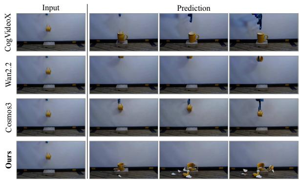  
The blue-black grabber releases the yellow ceramic mug over the concrete brick.

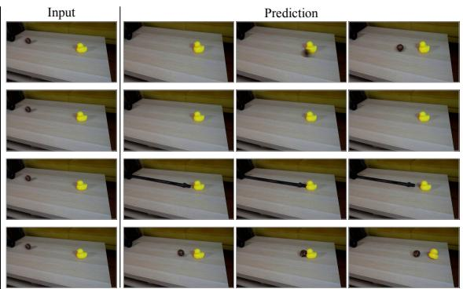  
The brown tennis ball rolls straight out of the black pipe and hits the rubber duck.

Fig. 4. Qualitative comparisons on Physics-IQ Verified. Visualizations of four time-aligned frames baselines and STRIKE, which depicts mug fracture after impact with a concrete brick (left) and duck displacement following contact with a rolling brown ball (right).  
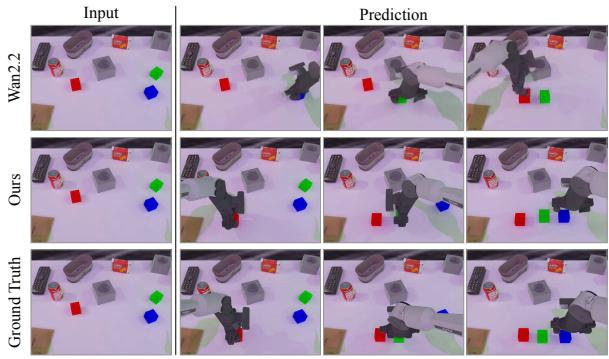  
Position red block, green block, and blue block on a surface from left to right in the order red, green, blue.

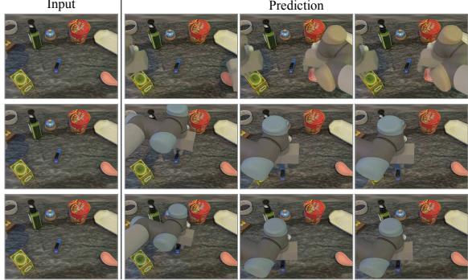  
Place the plastic blue stapler with metal parts directly on the small rectangular tea box's right.  
Fig. 5. Qualitative comparisons on RoboTwin2.0. Visualizations of Wan2.2 [35] and STRIKE in comparison against the ground truth.

Robotic Manipulation. On RoboTwin2 val500, comprising 500 held-out episodes across 50 tasks and five embodiments under an episode/seed-grouped split, both variants outperform all baselines on every displayed metric (Table 4 & Figure 5). Relative to their respective backbone baselines, our CogVideoX and Wan variants improve EWMScore-15 by 2.47 and 3.37 points, with trajectory-score gains of 43.7% and 42.0%. The Wan variant additionally improves interaction quality and instruction following by 18.2% and 31.8%, reaching 62.53 EWMScore-15. These consistent cross-backbone gains support explicit key-state conditioning for improving trajectory fidelity and task-aligned object interactions in generated manipulation videos.

Qualitative Results. Figure 4 compares our method with the baselines on two Physics-IQ Verified examples. In the mug-drop example, our method captures impact followed by fragmentation, whereas the baselines retain an intact mug or leave it suspended above the concrete block. In the ball–duck example, our sequence depicts the ball approaching the duck, making contact, and inducing displacement. The baselines instead exhibit inconsistent ball motion, missing interactions, or spurious changes to the pipe. By providing explicit intermediate states at planned event times, our method guides video generation toward the intended physical progression.

## 5.3 Ablation Studies

Learned Transition Model. We compare pretrained Qwen-Image-Edit (QIE) with our trained transition model through the event-planning and transition-state generation pipeline (Figure 6; Table 6).

Table 4. Comparison on the RoboTwin2 val500 benchmark. EWMScore-15 is the arithmetic mean of all 15 metrics. The best result is in bold, and the second-best result is underlined.
<table><tr><td>Method</td><td>EWMScore ↑</td><td>Trajectory ↑</td><td>Interaction ↑</td><td>Perspectivity ↑</td><td>Instruction ↑</td><td>Semantic ↑</td></tr><tr><td>OpenDW</td><td>44.26</td><td>0.0220</td><td>0.2556</td><td>0.6096</td><td>0.2080</td><td>0.8685</td></tr><tr><td>Ctrl-World</td><td>60.16</td><td>0.2217</td><td>0.5268</td><td>0.7776</td><td>0.4960</td><td>0.8782</td></tr><tr><td>CogVideoX-5B</td><td>58.04</td><td>0.2301</td><td>0.5432</td><td>0.7952</td><td>0.5180</td><td>0.8934</td></tr><tr><td>Wan2.2-5B</td><td>59.16</td><td>0.2372</td><td>0.5088</td><td>0.8040</td><td>0.4560</td><td>0.8866</td></tr><tr><td>Ours (CogVideoX-5B)</td><td>60.51</td><td>0.3306</td><td>0.5900</td><td>0.8160</td><td>0.5916</td><td>0.8975</td></tr><tr><td>Ours (Wan2.2-5B)</td><td>62.53</td><td>0.3368</td><td>0.6012</td><td>0.8448</td><td>0.6012</td><td>0.8943</td></tr></table>

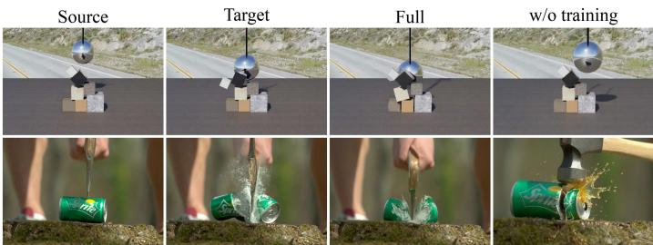  
Fig. 6. Qualitative comparison between our trained transition model and the pretrained Qwen Image Edit.

Table 5. Ablation on transition model design choices. Our full model achieves the best scores across diferent benchmarks
<table><tr><td>Variants</td><td>Physics-IQ↑ Pisa-IoU↑</td></tr><tr><td>w/o sink</td><td>40.60 0.1528</td></tr><tr><td>w/o time</td><td>41.63 0.1617</td></tr><tr><td>w/o synthetic</td><td>37.91 0.1523</td></tr><tr><td>Full model</td><td>41.93 0.1753</td></tr></table>

Table 6. Ablation Studies on learning transition model. Compared with generating transition states with the pre-trained Qwen Image Edit [39] model, our learned transition model achieves better performance in both validation sets and multiple benchmarks
<table><tr><td rowspan="2">Model</td><td colspan="4">State Transition Evaluation</td><td colspan="3">Video Generation Evaluation</td></tr><tr><td>PSNR↑</td><td>SSIM↑</td><td>LPIPS↓</td><td>L1↓</td><td>Physics-IQ↑</td><td>PhyGenBench↑</td><td>Pisa-IoU↑</td></tr><tr><td>w/o training</td><td>17.90</td><td>0.674</td><td>0.436</td><td>0.104</td><td>32.60</td><td>72.50</td><td>0.1224</td></tr><tr><td>Ours</td><td>24.88</td><td>0.863</td><td>0.185</td><td>0.038</td><td>41.93</td><td>76.91</td><td>0.1753</td></tr></table>

Metrics are computed against reference states, excluding the initial input image. On validation states, PSNR increases from 17.90 to 24.88 and SSIM from 0.674 to 0.863, while LPIPS and L1 decrease by 57.6% and 63.5%, respectively. Both perceptual similarity and pixel-level accuracy improve. These gains accompany improvements in downstream video generation: Physics-IQ rises from 32.60 to 41.93, PhyGenBench from 72.50 to 76.91, and Pisa-IoU from 0.1224 to 0.1753. Together, these results support learning task-specific transitions and using their predicted states to condition dense video synthesis.

Design Choice Analysis. Table 5 examines first-frame anchoring, temporal conditioning, and synthetic data. Removing the first-frame anchor lowers Physics-IQ/Pisa-IoU to 40.60/0.1528, supporting persistent conditioning on the initial visual reference during recursive prediction. Without time conditioning, Physics-IQ decreases modestly to 41.63, whereas Pisa-IoU falls to 0.1617, indicating benchmark-dependent benefits. Excluding synthetic data yields 37.91/0.1523 and the largest Physics-IQ drop of 4.02 points. These comparisons favor retaining all three design choices, although difer ences in training mixtures and budgets limit strict causal attribution to individual components.

## 6 Conclusion and Limitation

We presented a physical world modeling framework that explicitly learns visual state transitions and uses their timed predictions to condition dense video generation. VLM-assisted annotation constructs event-aligned supervision, while a pretrained event planner provides transition specifications for open-domain inference. Across physical-video and robotic manipulation benchmarks, the resulting intermediate-state representation improves physical-consistency and manipulation- video metrics over corresponding video backbones. However, the framework remains a learned visual predictor rather than an explicit physics simulator: plausible states do not guarantee correct trajectories, contact dynamics, or conservation laws. Since training uses observed states but inference conditions on recursively predicted states, errors may accumulate over long horizons. The pipeline also introduces additional planning and image-generation costs and depends on the quality of model-assisted annotations.

## References

[1] Arslan Ali, Junjie Bai, Maciej Bala, Yogesh Balaji, Aaron Blakeman, Tifany Cai, Jiaxin Cao, Tianshi Cao, Elizabeth Cha, Yu-Wei Chao, et al. 2025. World simulation with video foundation models for physical ai. arXiv preprint arXiv:2511.00062 (2025).

[2] Shuai Bai, Yuxuan Cai, Ruizhe Chen, Keqin Chen, Xionghui Chen, Zesen Cheng, Lianghao Deng, Wei Ding, Chang Gao, Chunjiang Ge, et al. 2025. Qwen3-vl technical report. arXiv preprint arXiv:2511.21631 (2025).

[3] Hritik Bansal, Zongyu Lin, Tianyi Xie, Zeshun Zong, Michal Yarom, Yonatan Bitton, Chenfanfu Jiang, Yizhou Sun, Kai-Wei Chang, and Aditya Grover. 2025. Videophy: Evaluating physical commonsense for video generation. In International Conference on Learning Representations, Vol. 2025. 102075–102121.

[4] Kevin Black, Mitsuhiko Nakamoto, Pranav Atreya, Homer Walke, Chelsea Finn, Aviral Kumar, and Sergey Levine. 2024. Zero-Shot Robotic Manipulation with Pre-Trained Image-Editing Difusion Models. In The Twelfth International Conference on Learning Representations.

[5] Haoxin Chen, Yong Zhang, Xiaodong Cun, Menghan Xia, Xintao Wang, Chao Weng, and Ying Shan. 2024. Videocrafter2: Overcoming data limitations for high-quality video difusion models. In 2024 IEEE/CVF Conference on Computer Vision and Pattern Recognition (CVPR). IEEE, 7310–7320.

[6] Tianxing Chen, Zanxin Chen, Baijun Chen, Zijian Cai, Yibin Liu, Zixuan Li, Qiwei Liang, Xianliang Lin, Yiheng Ge, Zhenyu Gu, et al. 2025. Robotwin 2.0: A scalable data generator and benchmark with strong domain randomization for robust bimanual robotic manipulation. arXiv preprint arXiv:2506.18088 (2025).

[7] Yilun Du, Sherry Yang, Bo Dai, Hanjun Dai, Ofir Nachum, Josh Tenenbaum, Dale Schuurmans, and Pieter Abbeel. 2023. Learning Universal Policies via Text-Guided Video Generation. In Advances in Neural Information Processing Systems, A. Oh, T. Naumann, A. Globerson, K. Saenko, M. Hardt, and S. Levine (Eds.), Vol. 36. Curran Associates, Inc., 9156–9172. doi:10.52202/075280-040

[8] Frederik Ebert, Chelsea Finn, Sudeep Dasari, Annie Xie, Alex Lee, and Sergey Levine. 2018. Visual Foresight: Model-Based Deep Reinforcement Learning for Vision-Based Robotic Control. arXiv:1812.00568 [cs.RO] https: //arxiv.org/abs/1812.00568

[9] Yoav HaCohen, Nisan Chiprut, Benny Brazowski, Daniel Shalem, Dudu Moshe, Eitan Richardson, Eran Levin, Guy Shiran, Nir Zabari, Ori Gordon, Poriya Panet, Sapir Weissbuch, Victor Kulikov, Yaki Bitterman, Zeev Melumian, and Ofir Bibi. 2024. LTX-Video: Realtime Video Latent Difusion. arXiv preprint arXiv:2501.00103 (2024).

[10] Danijar Hafner, Timothy Lillicrap, Jimmy Ba, and Mohammad Norouzi. 2020. Dream to Control: Learning Behaviors by Latent Imagination. In International Conference on Learning Representations. https://openreview.net/ forum?id=S1lOTC4tDS

[11] Danijar Hafner, Timothy Lillicrap, Ian Fischer, Ruben Villegas, David Ha, Honglak Lee, and James Davidson. 2019. Learning Latent Dynamics for Planning from Pixels. In Proceedings ofthe 36th International Conference on Machine Learning, Vol. 97. PMLR, 2555–2565. https://proceedings.mlr.press/v97/hafner19a.html

[12] Ziheng He, Yixiang Chen, Ning Yang, Zhanqian Wu, Qisen Ma, Yuan Xu, Jiabing Yang, Peiyan Li, Xiangnan Wu, Xiaofeng Wang, Zheng Zhu, Jing Liu, Nianfeng Liu, and Yan Huang. 2026. SKIP: Sparse Keyframe Interpolation Paradigm for Eficient Embodied World Models. arXiv:2606.00664 [cs.RO] https://arxiv.org/abs/2606.00664v1

[13] Bo Jiang, Depu Meng, Yihan Hu, Yichen Xie, Tianshuo Xu, and Wei Zhan. 2026. LaMo: Self-Supervised Latent Motion Priors for Physical Realism in Video Generation. arXiv preprint arXiv:2605.23878 (2026).

[14] Xuhui Kang and Yen-Ling Kuo. 2025. Incorporating Task Progress Knowledge for Subgoal Generation in Robotic Manipulation through Image Edits. In Proceedings ofthe IEEE/CVF Winter Conference on Applications ofComputer Vision. 7490–7499. doi:10.1109/WACV61041.2025.00728

[15] Chenyu Li, Oscar Michel, Xichen Pan, Sainan Liu, Mike Roberts, and Saining Xie. 2025. PISA Experiments: Exploring Physics Post-Training for Video Difusion Models by Watching Stuf Drop. In Proceedings of the 42nd International Conference on Machine Learning (Proceedings of Machine Learning Research, Vol. 267). PMLR, 35685–35709. https://proceedings.mlr.press/v267/li25bu.html

[16] Sibo Li, Qianyue Hao, Yu Shang, and Yong Li. 2025. KeyWorld: Key Frame Reasoning Enables Efective and Eficient World Models. arXiv:2509.21027 [cs.RO] https://arxiv.org/abs/2509.21027

[17] Ilya Loshchilov and Frank Hutter. 2019. Decoupled weight decay regularization. In International Conference on Learning Representations.

[18] Fanqing Meng, Jiaqi Liao, Xinyu Tan, Quanfeng Lu, Wenqi Shao, Kaipeng Zhang, Yu Cheng, Dianqi Li, and Ping Luo. 2025. Towards world simulator: Crafting physical commonsense-based benchmark for video generation. In Proceedings ofthe 42nd International Conference on Machine Learning (Proceedings ofMachine Learning Research, Vol. 267). PMLR, 43781–43806. https://proceedings.mlr.press/v267/meng25c.html

[19] MiniMax Research. 2026. MiniMax H3: An Open Model Breaking the Boundaries Between Tasks and Modalities. https://www.minimax.io/blog/minimax-h3.

[20] Saman Motamed, Laura Culp, Kevin Swersky, Priyank Jaini, and Robert Geirhos. 2026. Do generative video models understand physical principles?. In Proceedings of the IEEE/CVF Winter Conference on Applications of Computer Vision. 948–958. doi:10.1109/WACV61042.2026.00099

[21] Kepan Nan, Rui Xie, Penghao Zhou, Tiehan Fan, Zhenheng Yang, Zhijie Chen, Xiang Li, Jian Yang, and Ying Tai. 2025. OpenVid-1M: A Large-Scale High-Quality Dataset for Text-to-Video Generation. In International Conference on Learning Representations.

[22] Sriram Narayanan, Ziyu Jiang, Srinivasa G. Narasimhan, and Manmohan Chandraker. 2026. PhyCo: Learning Controllable Physical Priors for Generative Motion. In Proceedings of the IEEE/CVF Conference on Computer Vision and Pattern Recognition. 41892–41902.

[23] NVIDIA. 2026. Cosmos 3: Omnimodal World Models for Physical AI. arXiv preprint arXiv:2606.02800 (2026). https://arxiv.org/abs/2606.02800

[24] NVIDIA. 2026. PhysicalAI-WorldModel-Synthetic-Physical-Interaction-Scenes. https://huggingface.co/datasets/ nvidia/PhysicalAI-WorldModel-Synthetic-Physical-Interaction-Scenes

[25] OpenAI. 2026. GPT-5.5. https://openai.com/index/introducing-gpt-5-5/. Accessed: 2026-09-19.

[26] Junyi Ouyang, Wenbin Teng, Gonglin Chen, Yajie Zhao, and Haiwei Chen. 2026. Dcarl: A divide-and-conquer framework for autoregressive long-trajectory video generation. In European Conference on Computer Vision. Springer, 610–626.

[27] Saurabh Pathak, Elahe Arani, Mykola Pechenizkiy, and Bahram Zonooz. 2026. PhysVid: Physics Aware Local Conditioning for Generative Video Models. In Proceedings of the IEEE/CVF Conference on Computer Vision and Pattern Recognition. 41847–41858.

[28] Xiangyu Peng, Zangwei Zheng, Chenhui Shen, Tom Young, Xinying Guo, Binluo Wang, Hang Xu, Hongxin Liu, Mingyan Jiang, Wenjun Li, Yuhui Wang, Anbang Ye, Gang Ren, Qianran Ma, Wanying Liang, Xiang Lian, Xiwen Wu, Yuting Zhong, Zhuangyan Li, Chaoyu Gong, Guojun Lei, Leijun Cheng, Limin Zhang, Minghao Li, Ruijie Zhang, Silan Hu, Shijie Huang, Xiaokang Wang, Yuanheng Zhao, Yuqi Wang, Ziang Wei, and Yang You. 2025. Open-Sora 2.0: Training a Commercial-Level Video Generation Model in \$200k. arXiv preprint arXiv:2503.09642 (2025).

[29] Yuandong Pu, Le Zhuo, Songhao Han, Jinbo Xing, Kaiwen Zhu, Shuo Cao, Bin Fu, Si Liu, Hongsheng Li, Yu Qiao, Wenlong Zhang, Xi Chen, and Yihao Liu. 2026. PICABench: How Far are We from Physical Realistic Image Editing?. In The Fourteenth International Conference on Learning Representations.

[30] Tim Rädsch, Yuki M Asano, Hilde Kuehne, Stefan Bauer, Priyank Jaini, Robert Geirhos, and Carsten T Lüth. 2026. Physics-IQ Verified. arXiv preprint arXiv:2606.18943 (2026).

[31] Yu Shang, Zhuohang Li, Yiding Ma, Weikang Su, Xin Jin, Ziyou Wang, Lei Jin, Xin Zhang, Yinzhou Tang, Haisheng Su, et al. 2026. WorldArena: A Unified Benchmark for Evaluating Perception and Functional Utility of Embodied World Models. arXiv preprint arXiv:2602.08971 (2026).

[32] Jianlin Su, Yu Lu, Shengfeng Pan, Ahmed Murtadha, Bo Wen, and Yunfeng Liu. 2023. RoFormer: Enhanced Trans former with Rotary Position Embedding. arXiv:2104.09864 [cs.CL] https://arxiv.org/abs/2104.09864

[33] Boming Tan, Xiangdong Zhang, Ning Liao, Yuqing Zhang, Shaofeng Zhang, Xue Yang, Qi Fan, and Yanyong Zhang. 2026. DreamWorld: Unified World Modeling in Video Generation. arXiv preprint arXiv:2603.00466 (2026).

[34] Team Wan, Ang Wang, Baole Ai, Bin Wen, Chaojie Mao, Chen-Wei Xie, Di Chen, Feiwu Yu, Haiming Zhao, Jianxiao Yang, et al. 2025. Wan: Open and advanced large-scale video generative models. arXiv preprint arXiv:2503.20314 (2025).

[35] Wan Team. 2025. Wan2.2. Oficial model repository. https://github.com/Wan-Video/Wan2.2

[36] Jing Wang, Ao Ma, Ke Cao, Jun Zheng, Jiasong Feng, Zhanjie Zhang, Wanyuan Pang, and Xiaodan Liang. 2025. Wisa: World simulator assistant for physics-aware text-to-video generation. In Advances in Neural Information Processing Systems, Vol. 38. 5388–5416.

[37] Yaohui Wang, Xinyuan Chen, Xin Ma, Shangchen Zhou, Ziqi Huang, Yi Wang, Ceyuan Yang, Yinan He, Jiashuo Yu, Peiqing Yang, et al. 2025. Lavie: High-quality video generation with cascaded latent difusion models. International Journal ofComputer Vision 133, 5 (2025), 3059–3078.

[38] Zixuan Wang, Yixin Hu, Haolan Wang, Feng Chen, Yan Liu, Wen Li, and Yinjie Lei. 2026. Chain of Event-Centric Causal Thought for Physically Plausible Video Generation. In Proceedings of the IEEE/CVF Conference on Computer Vision and Pattern Recognition. 38122–38131.

[39] Chenfei Wu, Jiahao Li, Jingren Zhou, Junyang Lin, Kaiyuan Gao, Kun Yan, Sheng-ming Yin, Shuai Bai, Xiao Xu, Yilei Chen, et al. 2025. Qwen-image technical report. arXiv preprint arXiv:2508.02324 (2025).

[40] Tianshuo Xu, Zhifei Chen, Leyi Wu, Hao Lu, and Ying-cong Chen. 2026. Motion Forcing: A Decoupled Framework for Robust Video Generation in Motion Dynamics. arXiv:2603.10408 [cs.CV] https://arxiv.org/abs/2603.10408

[41] Liudi Yang, Yang Bai, George Eskandar, Fengyi Shen, Mohammad Altillawi, Dong Chen, Soumajit Majumder, Ziyuan Liu, Gitta Kutyniok, and Abhinav Valada. 2025. RoboEnvision: A Long-Horizon Video Generation Model for Multi-Task Robot Manipulation. In 2025 IEEE/RSJ International Conference on Intelligent Robots and Systems. 21281–21288. doi:10.1109/IROS60139.2025.11246352

[42] Zhuoyi Yang, Jiayan Teng, Wendi Zheng, Ming Ding, Shiyu Huang, Jiazheng Xu, Yuanming Yang, Wenyi Hong, Xiaohan Zhang, Guanyu Feng, et al. 2024. CogVideoX: Text-to-Video Difusion Models with An Expert Transformer. arXiv preprint arXiv:2408.06072 (2024).

[43] Zhuoyi Yang, Jiayan Teng, Wendi Zheng, Ming Ding, Shiyu Huang, Jiazheng Xu, Yuanming Yang, Wenyi Hong, Xiaohan Zhang, Guanyu Feng, et al. 2025. Cogvideox: Text-to-video difusion models with an expert transformer. In International Conference on Learning Representations.

[44] Jia Zeng, Qingwen Bu, Bangjun Wang, Wenke Xia, Li Chen, Hao Dong, Haoming Song, Dong Wang, Di Hu, Ping Luo, Heming Cui, Bin Zhao, Xuelong Li, Yu Qiao, and Hongyang Li. 2024. Learning manipulation by predicting interaction. In Proceedings ofRobotics: Science and Systems. doi:10.15607/RSS.2024.XX.123

[45] Xiangdong Zhang, Jiaqi Liao, Shaofeng Zhang, Fanqing Meng, Xiangpeng Wan, Junchi Yan, and Yu Cheng. 2025. Videorepa: Learning physics for video generation through relational alignment with foundation models. In Advances in Neural Information Processing Systems, Vol. 38. 122647–122676.

[46] Chuning Zhu, Raymond Yu, Siyuan Feng, Benjamin Burchfiel, Paarth Shah, and Abhishek Gupta. 2025. Unified World Models: Coupling Video and Action Difusion for Pretraining on Large Robotic Datasets. In Proceedings of Robotics: Science and Systems. doi:10.15607/RSS.2025.XXI.015

[47] Fangqi Zhu, Hongtao Wu, Song Guo, Yuxiao Liu, Chilam Cheang, and Tao Kong. 2025. IRASim: A Fine-Grained World Model for Robot Manipulation. In Proceedings of the IEEE/CVF International Conference on Computer Vision. 9834–9844.

[48] Sihan Zhuang, Xinyuan Chen, Tianfan Xue, and Yaohui Wang. 2026. CausalMotion: Structured Physical Reasoning as Keyframe and Trajectory Guidance for Training-Free Video Generation. arXiv:2606.14317 [cs.CV] https://arxiv. org/abs/2606.14317v1

## A Additional Training Details

## A.1 Datasets

We use complementary datasets for learning visual state transitions, training conditional video dynamics, and studying robotic manipulation. Table 7 summarizes the prepared corpora. The reported sizes refer to curated data before reserving internal validation samples, rather than to the nominal sizes of the upstream datasets.

WISA.. WISA [36] provides real-world videos covering diverse physical phenomena. Our transition corpus retains 59,298 episodes across 17 annotated categories, including collisions, elastic motion, deformation, liquid and gas motion, phase changes, combustion, reflection, and refraction. WISA contributes 160,672 adjacent-state pairs and is also a source for the separately curated videodynamics corpus described below.

NVIDIA PhysicalAI.. We use 39,873 episodes from NVIDIA PhysicalAI’s synthetic physicalinteraction scenes [24]. Our selected subset covers six scenario families: billiards, bowling, dominoes, falling objects, objects rolling on ramps, and wrecking-ball interactions. These simulated videos provide examples of contact, momentum transfer, falling, and chained rigid-body interactions that complement the visual diversity of WISA. Annotation produces 116,358 adjacent-state pairs from this source; we use the selected subset, not the entire upstream PhysicalAI collection.

PhyCo/Kubric. We additionally curate 31,109 episodes from PhyCo’s Kubric-based simulations [22]. The prepared subset comprises four scenario families: rigid ball drops, soft-body ball drops, ball–wall collisions, and deformable-cube interactions. It contributes 76,810 adjacent-state pairs, providing supervision for changes around impact, rebound, and deformation. Together, WISA, PhysicalAI, and PhyCo/Kubric supply 130,280 video episodes and 353,840 event-aligned transition pairs.

PICA-100K.. PICA-100K [29] supplies auxiliary instruction-based image-editing supervision. It consists of synthetic, video-derived editing examples rather than trajectories from a physics simulator. Our prepared manifest contains 105,085 source–target image pairs, each paired with an editing instruction. These examples extend supervision to instruction-driven changes without requiring a temporal annotation. We therefore use them as text-conditioned image pairs with the time condition omitted, rather than assigning an artificial elapsed time or counting them as additional video episodes.

OpenVid-1M and conditional video dynamics. OpenVid-1M [21] provides captioned, open-domain videos that complement WISA for training the conditional dynamics model. We annotate sparse states and retain WISA/OpenVid sequences for which all selected frames pass the state-description consistency check described in Section 4.1. This additional filtering is specific to this video-training path and is not shared by all transition-pair sources. The prepared CogVideoX [43] corpus contains 69,344 episodes (35,114 WISA and 34,230 OpenVid), represented as 49-frame clips at 720×480. The Wan2.2 [35] corpus contains same number of episodes, represented as 81-frame clips at 832×480. Each backbone reserves 2,000 episodes for internal validation. Training uses observed state images with their temporal locations as conditions and the corresponding full video as the target.

RoboTwin2.0. For robotic manipulation, we use 124,650 complete simulated episodes from RoboTwin2.0 [6], spanning 50 tasks and five robot embodiments: ALOHA-AgileX, ARX-X5, Franka, UR5, and Piper. This snapshot contains 11,150 clean and 113,500 domain-randomized episodes. We construct a deterministic 90/10 split into 112,185 training and 12,465 validation episodes, keeping episodes with the same task and simulation seed in the same split across embodiments and clean/randomized configurations. This prevents the same task–seed group from appearing on both sides. For the reported val500 evaluation, we select 500 held-out episodes covering all 50 tasks and all five embodiments; every selected episode is domain-randomized. Thus, the evaluation measures generalization to unseen episodes of known tasks, not to held-out task categories.

Table 7. Prepared datasets used in our experiments.
<table><tr><td>Dataset</td><td>Type</td><td>Size</td></tr><tr><td>Transition-model supervision</td><td></td><td></td></tr><tr><td>WISA-80K</td><td>Real</td><td>59,298 episodes</td></tr><tr><td>NVIDIA PhysicalAI</td><td>Simulation</td><td>39,873 episodes</td></tr><tr><td>PhyCo/Kubric</td><td>Simulation</td><td>31,109 episodes</td></tr><tr><td>PICA-100K</td><td>Synthetic</td><td>105,085 image pairs</td></tr><tr><td>Conditional video-dynamics supervision</td><td></td><td></td></tr><tr><td>WISA-80K</td><td>Real</td><td>35,114 episodes</td></tr><tr><td>OpenVid-1M</td><td>Real</td><td>34,230 episodes</td></tr><tr><td>Robotic manipulation</td><td></td><td></td></tr><tr><td>RoboTwin2.0</td><td>Simulation</td><td>112,185 train; 12,465 val</td></tr><tr><td>RoboTwin2.0 val500</td><td>Simulation</td><td>500 validation episodes</td></tr></table>

## A.2 Event Planning and Data Annotation Pipeline

We construct transition state frame annotations through a two-stage vision–language model (VLM) annotation pipeline, followed by VQA-based verification. For each video, candidate frames are arranged into a temporally ordered storyboard and provided alongside the video caption, available source metadata, and a candidate table specifying frame identifiers and timestamps.

Stage I: Event Planning. In (Table 8), the annotator identifies the main objects and physical or visual process, characterizes the event structure, and decomposes the observed progression into a minimal sequence of visible subevents. It then constructs a state plan grounded in candidate frames, prioritizing physical state changes while also allowing camera motion that reveals new content or distinct viewpoints. Clips without useful visible state or view progression are flagged as unsuitable for eventbased annotation.

Stage II: Transition State Frame Selection and Annotation. In (Table 10), the annotator uses this event plan to select a compact, chronologically ordered set of event-defining transition state frames, rather than generic beginning–middle–end coverage. Selection prioritizes the earliest frame in which a meaningful state or relation is clearly established, while avoiding near-duplicates and redundant intermediate frames. Each selected transition state frame receives a state description, a selection rationale, and a confidence score; adjacent transition state frames additionally receive a textual description of the intervening transition.

Stage III: Transition State Frame State Verification. In (Table 11) uses Qwen3-VL [2] as a separate VQA judge to assess whether each annotated state is supported by the visual evidence. The first transition state frame is evaluated on its own, whereas subsequent transition state frames are eval uated together with the immediately preceding transition state frame as a reference for changes or motion. Conditioned on the video caption, physical category, and claimed state, the judge returns a binary match verdict, a confidence score, and a short justification, rejecting claims that are not clearly visible. These verdicts are aggregated at the video level to support downstream annotation-quality filtering.

Table 8. Event planning prompt. Prompt used to identify the visible physical process, ordered subevents, and event-relevant states before transition state selection.  
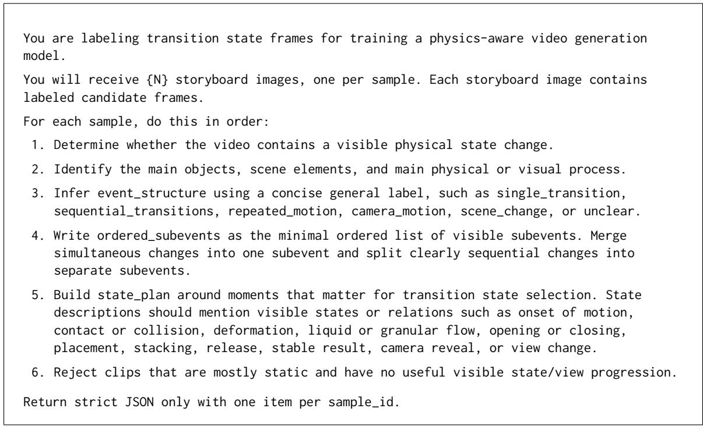

## A.3 Training Configurations

For transition model, we fine-tune Qwen-Image-Edit [39] as a time-conditioned Markov model using paired examples from the comprehensive multi-source training corpus. Each example consists of the previous ground-truth state image, the next state image, and a text instruction describing their transition. Images are encoded with a frozen VAE, while the frozen vision-language encoder processes the instruction and conditioning image. The transformer receives concatenated noisy target latents and clean source latents. Relative transition state frame timing is represented through temporal rotary positional embeddings, assigning positions zero and (Δ�) to source and target tokens, respectively. We optimize a flow-matching MSE objective on target tokens only, keeping the source image uncorrupted. The complete transformer is fine-tuned with AdamW [17] at a learning rate of $1 0 ^ { - 5 }$ , using 100 warm-up steps. During auto-regressive inference, each generated transition state images becomes the semantic condition for the next transition. For conditional dynamic model training, we fine-tune CogVideoX-5B-I2V [43] and Wan2.2-TI2V-5B [35] using AdamW [17] with learning rate equals to $1 0 ^ { - 5 }$ and weight decay 0.01, keeping the VAE and text encoder frozen. Transition states latents are patchified using the pretrained projection, and temporally aligned with video tokens. The tokens are prepended with video stream for joint text–frame–video attention. Only video outputs are supervised, using velocity prediction for CogVideoX and flow matching for Wan. The transition model is trained with 64 A100 GPUs for 5 epochs with per-GPU batch size of 1 and the conditional dynamics model is trained with 32 GPUs for 5000 steps with per-GPU batch size of 2.

Table 9. Results on VideoPhy. Model size, full-benchmark generation cost (EFLOPs), and semantic adherence and physical common sense metrics are compared across multiple baseline methods, with bold and underlined values indicating the best and second-best scores, respectively. Our results are reported with textto-video (T2V) setting.
<table><tr><td colspan="4"></td><td colspan="2">Solid-Solid</td><td colspan="2">Solid–Fluid</td><td colspan="2">Fluid–Fluid</td><td colspan="2">Overall</td></tr><tr><td>Method</td><td># params</td><td>EFLOPs↓</td><td>SA↑</td><td>PC↑</td><td>SA↑</td><td>PC↑</td><td>SA↑</td><td>PC↑</td><td>SA↑</td><td>PC↑</td></tr><tr><td>VideoCrafter2</td><td>1.4B</td><td>0.441</td><td>27.3</td><td>25.2</td><td>47.3</td><td>24.7</td><td>49.1</td><td>30.9</td><td>39.2</td><td>25.9</td></tr><tr><td>Open-Sora v2</td><td>11B</td><td>9.471</td><td>53.9</td><td>13.3</td><td>72.6</td><td>24.0</td><td>65.5</td><td>27.3</td><td>63.7</td><td>20.2</td></tr><tr><td>LTX-Video</td><td>13B</td><td>1.379</td><td>39.9</td><td>17.5</td><td>70.6</td><td>22.6</td><td>49.1</td><td>25.5</td><td>54.4</td><td>20.9</td></tr><tr><td>DreamWorld</td><td>1.3B</td><td>9.830</td><td>58.7</td><td>12.6</td><td>74.0</td><td>27.4</td><td>70.9</td><td>32.7</td><td>67.2</td><td>22.1</td></tr><tr><td>Cosmos3-Nano</td><td>16B</td><td>14.033</td><td>67.1</td><td>13.3</td><td>82.2</td><td>23.3</td><td>78.2</td><td>25.5</td><td>75.3</td><td>19.5</td></tr><tr><td>Cosmos-Predict2.5</td><td>2B</td><td>4.448</td><td>55.2</td><td>20.3</td><td>74.7</td><td>26.0</td><td>74.6</td><td>40.0</td><td>66.6</td><td>25.9</td></tr><tr><td>WISA</td><td>14B</td><td>59.272</td><td>58.0</td><td>14.7</td><td>78.8</td><td>18.5</td><td>80.0</td><td>25.5</td><td>70.5</td><td>18.0</td></tr><tr><td>PhysVid</td><td>1.7B</td><td>11.090</td><td>45.5</td><td>21.0</td><td>74.7</td><td>30.1</td><td>76.4</td><td>40.0</td><td>62.8</td><td>27.9</td></tr><tr><td>Wan2.2</td><td>5B</td><td>1.753</td><td>52.5</td><td>14.7</td><td>76.0</td><td>20.6</td><td>61.8</td><td>25.5</td><td>64.0</td><td>18.9</td></tr><tr><td>CausalMotion</td><td>13B</td><td>0.502</td><td>49.7</td><td>9.8</td><td>65.8</td><td>17.1</td><td>63.6</td><td>20.0</td><td>58.7</td><td>14.5</td></tr><tr><td>CoECT</td><td>20B+5B</td><td></td><td>61.5</td><td>9.8</td><td>80.1</td><td>17.8</td><td>69.1</td><td>27.3</td><td>70.6</td><td>16.0</td></tr><tr><td>CogVideoX</td><td>2B</td><td>4.236</td><td>51.8</td><td>14.7</td><td>75.3</td><td>30.1</td><td>70.9</td><td>54.6</td><td>64.8</td><td>27.6</td></tr><tr><td>VideoREPA</td><td>2B</td><td>4.236</td><td>51.8</td><td>12.6</td><td>76.0</td><td>29.5</td><td>67.3</td><td>56.4</td><td>64.5</td><td>26.7</td></tr><tr><td>LaMo</td><td>2B</td><td>4.236</td><td>58.7</td><td>16.8</td><td>74.7</td><td>32.2</td><td>69.1</td><td>67.3</td><td>67.2</td><td>31.4</td></tr><tr><td>Ours (CogVideoX-2B-T2V)</td><td>20B+2B</td><td>10.170</td><td>59.4</td><td>19.6</td><td>78.1</td><td>32.2</td><td>78.2</td><td>69.1</td><td>70.4</td><td>32.9</td></tr></table>

## A.4 Training and Inference Protocol

The transition and dynamics models are trained separately. For dynamics training, conditioning states are extracted from the training video and paired with their temporal indices; the dense video supplies the prediction target. At inference, these observed state conditions are replaced by the transition model’s generated states. Thus, the training and inference interfaces agree in their structure, while the quality of the state conditions can difer.

Inference consists of state event planning, successive state generation, and dense video sampling conditioned on the resulting timed memories. The original task context is retained by the video generator. Generated videos are subsequently formatted for benchmark evaluation. The benchmark evaluator is external to the generative model and supplies no gradients to either learned component.

## A.5 Robotic Manipulation Evaluation

We evaluate robotic manipulation videos using a 15-metric adaptation of WorldArena [31], denoted EWMScore-15. The retained metrics cover visual quality (image quality, aesthetic quality, and JEPA similarity), motion quality (dynamic degree, flow score, and motion smoothness), content consistency (subject, background, and photometric consistency), physics adherence (interaction quality and trajectory accuracy), 3D accuracy (depth accuracy and perspectivity), and controllability (instruction following and semantic alignment). We exclude Action Following, which requires generating videos under multiple alternative instructions from the same initial frame and is outside our singleinstruction evaluation protocol. Using the evaluator’s metric-specific normalization and aggregation rules, we obtain dataset-level scores $s _ { j } \in [ 0 , 1 ]$ , with higher values indicating better performance, and compute EWMScore- $\begin{array} { r } { 1 5 = \frac { 1 0 0 } { 1 5 } \sum _ { j = 1 } ^ { 1 5 } s _ { j } } \end{array}$ . All retained metrics receive equal weight. JEPA similarity is evaluated over the complete generated and reference video collections rather than averaged over individual episodes.

Table 10. Transition state frame selection prompt. Prompt used to select event-relevant transition state frame from candidate frames.

Select transition state frames from the candidate frames for each sample. Decision procedure:

• First read the caption, source metadata, event\_plan.event\_structure, event\_plan.ordered\_subevents, and event\_plan.state\_plan.

• Choose transition state frames for distinct visible states in the main event, not for generic beginning/middle/end coverage.

• For a single clear transition, choose the earliest candidate where the defining changed state is visible; include an earlier setup state only when it is needed to understand the change.

• For sequential transitions, select one frame per visible subevent at the earliest candidate where that subevent's state is clearly established.

• For contact, collision, attachment, containment, placement, stacking, opening, or closing, choose the first candidate where the relation is visibly established, not a later redundant proof frame.

• For deformation, breakage, spilling, pouring, smoke, fire, liquid, granular motion, or other continuous processes, cover the onset and the most informative result or peak state. Add an intermediate keyframe only when the process has a materially different middle state.

• For object motion, choose frames where the object's state or relation has changed meaningfully. Avoid frames that differ only by a small position shift unless that shift completes the event.

• For camera motion without object state change, choose frames that capture distinct viewpoints or newly revealed content.

## Rules:

• Choose only candidate\_id values in the sample's candidate table.

• Do not select static initial frames, near-duplicates, or redundant middle frames unless they represent a distinct visible state.

• A transition state frame should be an event-defining visual state: onset, contact, relation established, state transformed, view changed, peak action, or stable result.

• Selected frames must be chronological.

• Each selected frame must represent a distinct event-relevant visible state or relation.

• For each transition state frame provide: slot, candidate\_id, frame\_index, time\_sec, state\_text, selection\_reason, confidence.

• Also provide transition\_text between adjacent transition state frames.

• In coverage\_notes, explicitly write: event\_structure=<label>; selected\_subevents= <comma-separated selected visible states>; omitted= <why any expected state was not selected or \`none'>.

## B Additional Results on Benchmarks

Table 12 and table 9 demonstrate additional quantitative results on PhyGenBench [18] and Video-Phy [3], another benchmark that evaluates physical common-sence. Compared with other baseline methods, our method uses a substantially larger transition model (20B) together with only a lightweight 2B video backbone, yet remains competitive with, and often surpasses, baselines using 11– 16B video models. Since the 2B version of CogVideoX [42] doesn’t have an image-to-video (I2V) branch, our results are reported with text-to-video (T2V) setting. On PhyGenBench [18], it achieves

Table 11. Transition state frame verification prompt. Prompt used by Qwen3-VL to judge whether an extracted transition frame state visibly matches its annotated physical state.

System prompt   
You are a strict quality inspector for a physics-focused video dataset. Judge only what   
is actually visible in the given frame(s). Be skeptical: if the described state is not   
clearly visible, answer false. Always reply with a single JSON object and nothing else.   
User prompt for the first transition state frame   
This image is transition state frame {slot\_pos} of {total} extracted from a video.   
Video context: physical category = \`\`{label}''; caption = \`\`{caption}''   
The transition state frame annotation claims the scene has reached this state:   
\`\`{state\_text}''   
Question: does the image show that the scene has actually reached the claimed state?   
Judge the physical state of the scene, not image style or camera work.   
Reply with JSON only: {{\`\`match'': true or false, \`\`confidence'': 0.0--1.0, \`\`reason'':   
\`\`<at most 20 words>''}}   
User prompt for a subsequent transition state frame   
You are shown two transition state frames from the same video. Image 1 is the PREVIOUS   
transition state frame (reference only). Image 2 is the CURRENT transition state frame   
{slot\_pos} of {total}.   
Video context: physical category = \`\`{label}''; caption = \`\`{caption}''   
The annotation claims that by the CURRENT transition state frame the scene has reached   
this state: \`\`{state\_text}''   
Question: comparing against image 1 where the claim describes change or motion, does   
image 2 show that the scene has actually reached the claimed state? Judge the physical   
state of the scene, not image style or camera work.   
Reply with JSON only: {{\`\`match'': true or false, \`\`confidence'': 0.0--1.0, \`\`reason'':   
\`\`<at most 20 words>''}}

Table 12. Results on PhyGenBench. Model size, and diferent physical-consistency metrics are compared across multiple baseline methods, with bold and underlined values indicating the best and second-best scores, respectively. Our results are reported with text-to-video (T2V) setting.
<table><tr><td>Method</td><td># param</td><td>Mechanics ↑</td><td>Optics ↑</td><td>Thermal ↑</td><td>Material ↑</td><td>Average ↑</td></tr><tr><td>Open-Sora v2 [28]</td><td>11B</td><td>55.00</td><td>66.67</td><td>47.78</td><td>50.83</td><td>56.25</td></tr><tr><td>LTX-Video [9]</td><td>13B</td><td>45.83</td><td>65.33</td><td>43.33</td><td>37.50</td><td>49.37</td></tr><tr><td>Cosmos3-Nano [23]</td><td>16B</td><td>57.50</td><td>75.33</td><td>48.89</td><td>46.67</td><td>58.75</td></tr><tr><td>CausalMotion [48]</td><td>13B</td><td>73.33</td><td>75.33</td><td>65.56</td><td>64.17</td><td>70.21</td></tr><tr><td>Ours (CogVideoX-2B-T2V)</td><td>20B+2B</td><td>60.00</td><td>73.33</td><td>63.33</td><td>66.04</td><td>65.68</td></tr></table>

the second-best average score (65.68) and the best Material score (66.04). On VideoPhy [3], it obtains the best overall physical common-sense precision (32.9), the best Fluid–Fluid precision (69.1), and competitive overall semantic accuracy (70.4), while using a lightweight 2B video generator. This suggests that allocating capacity to explicit transition-state prediction can be more efective than scaling the video backbone alone: the transition model supplies structured, physically meaningful intermediate states, allowing a compact dynamics model to render temporally coherent videos at substantially lower model complexity. In addition, Figure 7 visualizes qualitative comparisons with our baseline methods.

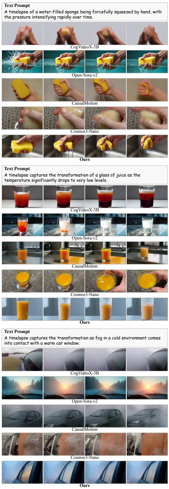

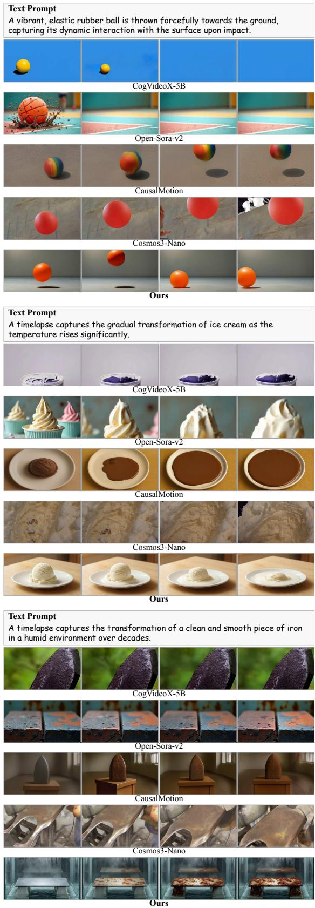  
Fig. 7. Qualitative comparisons on PhyGenBench. Each block shows the text prompt and four frames from CogVideoX-5B, Open-Sora-v2, CausalMotion, Cosmos3-Nano, and our method.