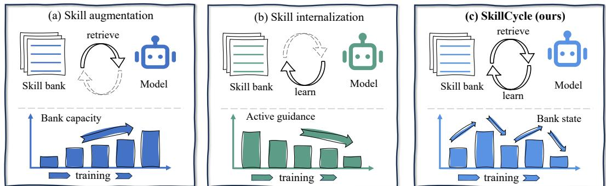
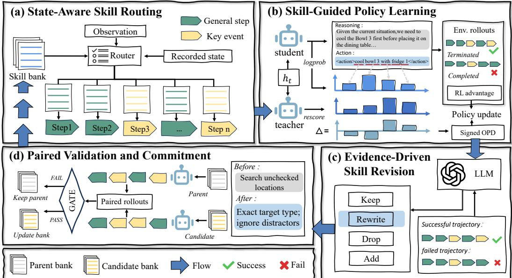
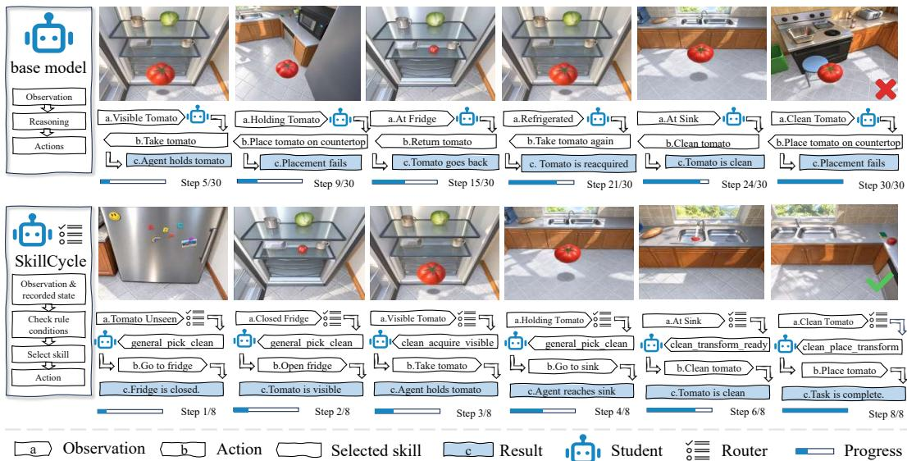
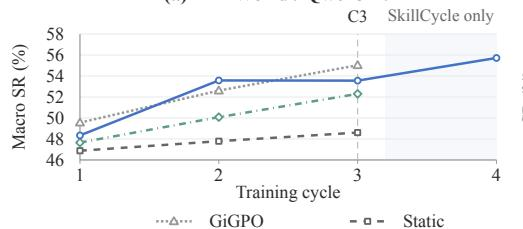
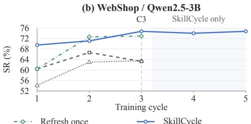
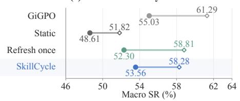
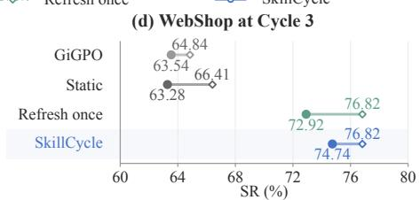
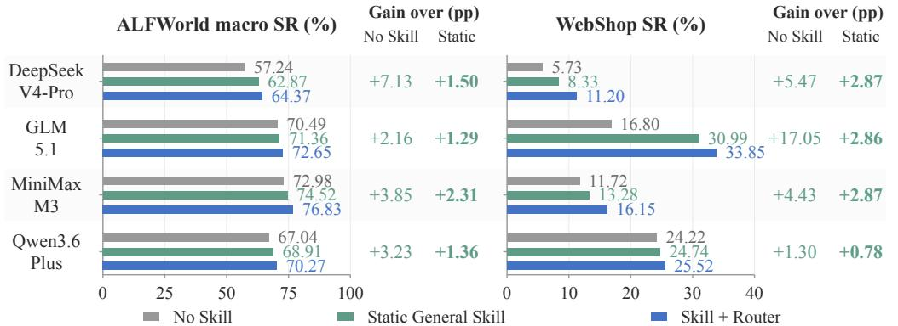

# SkillCycle: Evolving Skills through Internalization

Ling Li<sup>1</sup>, Qiuyu Shen<sup>2</sup>, Zheng Jiang<sup>1</sup>, Qinwei Ma<sup>1</sup>, Yuxuan Liu<sup>1</sup>, Zhidong Deng<sup>1</sup> <sup>1</sup>Tsinghua University <sup>2</sup>Northwestern Polytechnical University

## ABSTRACT

Internalizing external skills changes a language agent’s capabilities and, with them, the value of its remaining guidance: rules can become redundant, misleading, or insufficient for newly encountered decisions. This creates a coupled problem of learning from skills and adapting the skills that supervise further learning. We introduce SKILLCYCLE, a framework for co-evolving agent policies and skill banks through a feedback loop between skill internalization and rule revision. Our central contribution is to give distillation feedback a second role: token-level contextual differences help locate rules for inspection, while interaction outcomes guide edits to their content and applicability. SkillCycle alternates between two phases: policy learning with a fixed skill bank and router, and rule revision with a frozen policy. Candidate edits undergo rule-level and whole-bank environment comparisons before they guide the next learning cycle. On WebShop, SkillCycle with a 3B model achieves a success rate of 74.74% and a score of 88.37 without inference-time skill inputs, representing relative improvements of 0.73% and 3.96% over the state-of-the-art (SOTA) model, respectively. In Cycle 3 ablations on ALFWorld and WebShop, SkillCycle’s no-skill success rates improve by 10.18% and 18.11% relative to a static skill bank, and by 2.41% and 2.50% relative to a single bank update, respectively. These results show that continually revising skill guidance as the agent’s capabilities change helps transform external skills into policy capabilities that require no skill inputs at inference. We will release code, configurations, skill banks, and evaluation protocols.

## 1 INTRODUCTION

External skills help language agents act on observations (Yao et al., 2023) through executable libraries (Wang et al., 2024), induced workflows (Wang et al., 2025), and accumulated reflections (Shinn et al., 2023; Zhao et al., 2024). Skill augmentation supplies this guidance in context and can evolve alongside the policy (Xia et al., 2026; Shi et al., 2026); skill internalization transfers its benefits into parameters to reduce retrieval dependence. Skill0 withdraws context using on-policy helpfulness (Lu et al., 2026b), while Skill0.5 combines internalization with difficulty-aware skill utilization at inference time (Zhu et al., 2026).

Learning also changes what guidance the policy needs. A previously useful rule may become redundant, mislead the updated policy, or fail to cover newly encountered states. Withdrawing guidance addresses continued reliance on it, but does not determine how its content or applicability should evolve. We therefore ask: can feedback from internalization guide rule revisions that improve subsequent learning without inference-time skills? Figure 1 compares these approaches.

The key difficulty is distinguishing mastery from ineffective guidance. A shrinking Teacher–Student gap can reflect successful learning or a skill that helps neither policy. Contextual self-distillation (Zhao et al., 2026; Yang et al., 2026b) supplies token-level log-probability differences that locate where guidance changes a sampled response. These differences identify decisions to inspect; task outcomes establish whether behavior succeeds. Together, they enable finer diagnosis than an aggregate helpfulness score; rule-removal rescoring then identifies influential instructions.

We introduce SKILLCYCLE, a framework that co-evolves agent policies and skill banks through a feedback loop between skill internalization and rule revision. SkillCycle treats the bank as training memory that is continually revised as the agent’s capabilities change, alternating between two phases. During internalization, the bank and critical-first router remain fixed, while skill-conditioned supervision and environment rewards train a no-skill Student. During revision, the Student is frozen; token-level feedback, routing records, and interaction trajectories identify rules for inspection and guide candidate edits to their content and applicability. Verified edits are committed to the bank to supply updated guidance for the next learning cycle.

  
Figure 1: Comparison between skill augmentation and skill internalization. Existing approaches (a) augment the policy with an external skill bank or (b) internalize skills into the policy to reduce reliance on external guidance. (c) Our proposed SkillCycle couples skill internalization with evidence-driven skill-bank revision, co-evolving the policy and the bank for skill-free inference. Bars and arrows illustrate conceptual trends, not measured trajectories.

The central innovation is to give distillation feedback a second role: beyond supervising policy learning, it provides diagnostic evidence for improving the skill guidance itself. Token-level contextual differences locate decisions to inspect, rule-removal rescoring identifies the relevant rules, and interaction outcomes inform whether those rules are effective and how they should be revised. To assess candidate edits, SkillCycle holds the policy fixed and conducts paired environment comparisons first at the rule level and then at the whole-bank level, testing both local benefits and effects on the assembled guidance. Only edits that pass both levels of verification are accepted. This process turns feedback from policy learning into improved guidance for subsequent learning, allowing the bank to adapt to the agent’s changing capabilities and needs while supporting the transfer of external skills into policy capabilities that require no skill inputs at inference.

Our contributions are fourfold: (1) Policy–skill co-evolution. SkillCycle alternates skill internalization and rule revision, adapting supervision to the evolving policy for inference without skill inputs. (2) State-aware, critical-first routing. Our router matches applicable skills to observable states, prioritizes critical rules, and records routing decisions to support subsequent revision. (3) Feedback-driven, verified revision. Token-level distillation feedback and interaction outcomes guide rule diagnosis and editing; paired rule-level and whole-bank environment tests verify candidate changes. (4) Extensive experiments and superior performance. Comparisons, ablations, multicycle evaluations, and API-model studies on ALFWorld and WebShop validate SkillCycle, which surpasses WebShop SOTA in success rate and score without inference-time skills and outperforms static and single-refresh banks.

Related work is discussed in Appendix A.

## 2 METHOD: SKILLCYCLE

SKILLCYCLE treats the skill bank as an editable source of supervision for a policy that acts without skill context. Figure 2 summarizes the cycle: state-aware routing supplies guidance for policy learning (a,b), and trajectory evidence drives skill revision and paired validation (c,d). The validated bank supplies revised skill context for supervision in the next learning cycle.

## 2.1 PROBLEM SETUP

Given instruction-following tasks $x \sim \mathcal { D } , z$ language policy generates response $y _ { t }$ from observable history $h _ { t }$ , and the environment executes its parsed action. A bank B contains reusable skill documents with identifiable rules and applicability metadata. The router selects $k _ { t } = R ( h _ { t } ; B ) \in B \cup \{ \emptyset \}$ using only observable information; documents supply context, while rules and metadata can be revised. Following contextual self-distillation (Zhao et al., 2026), the no-skill Student $\pi _ { \theta } ^ { S }$ and skill-conditioned Teacher $\pi _ { \boldsymbol { \theta } } ^ { T }$ share parameters and differ only in whether $k _ { t }$ is included in context. The Teacher receives no hidden states, future observations, or task answers.

Let $U _ { x } ( \tau )$ denote trajectory success or task score. Starting from $( \theta _ { 0 } , B _ { 0 } , R _ { 0 } )$ , we seek to improve the final Student’s expected utility under a fixed training budget:

$$
J _ { \mathcal { D } } ^ { S } ( \theta _ { C } ) = \mathbb { E } _ { x \sim \mathcal { D } , \tau \sim \pi _ { \theta _ { C } } ^ { S } ( \cdot | x ) } [ U _ { x } ( \tau ) ] .\tag{1}
$$

The trajectory distribution here excludes skill context. Bank edits affect this objective through subsequent policy learning. Skill-conditioned evaluation separately measures guidance utility at a fixed checkpoint. Training tasks support learning and proposals; designated development tasks

  
Figure 2: SkillCycle architecture. (a) State-aware routing selects skill guidance from the bank. (b) With the bank and router frozen, a shared-weight, skill-conditioned Teacher rescores the no-skill Student’s responses; signed OPD signals and environment feedback guide policy learning. (c) OPD diagnostics and trajectory outcomes inform offline KEEP, REWRITE, DROP, and ADD proposals. (d) Paired rollouts under a frozen policy verify candidate revisions; accepted updates guide the next learning cycle. WebShop additionally uses verified selective Teacher demonstrations. Here, $h _ { t }$ denotes the task instruction and observable interaction history. Bars and trajectories are schematic

support acceptance and model selection, with final-test tasks excluded from both. Appendix C formalizes the interaction and performance measures.

Let $H _ { c } = \left( B _ { c } , R _ { c } \right)$ denote the committed bank and routing declarations after revision c. Given training and acceptance sets $\mathcal { D } _ { \mathrm { t r a i n } }$ and $\mathcal { D } _ { \mathrm { a c c } } .$ the cycle is

$$
\begin{array} { r l } & { ( \theta _ { c } , E _ { c } ) = \mathrm { I n t e r n a l i z e } _ { \omega } ( \theta _ { c - 1 } , H _ { c - 1 } ; \mathcal { D } _ { \mathrm { t r a i n } } ) , \quad 1 \leq c \leq C , } \\ & { \qquad H _ { c } = \mathrm { R e v i s e } _ { \omega } ( H _ { c - 1 } ; \theta _ { c } , E _ { c } , \mathcal { D } _ { \mathrm { a c c } } ) , \qquad 1 \leq c < C , } \end{array}\tag{2}
$$

where ω specifies update counts, budgets, and acceptance protocols, and $E _ { c }$ records the training evidence. Each segment learns with $H _ { c - 1 }$ fixed, then tests bank edits with $\theta _ { c }$ fixed. Each segment ends with a no-skill evaluation of Eq. (1); the last omits revision (Algorithm 1, Appendix F).

This alternation separates learning from changes to its supervision. Within a segment, the bank defines a stable source of skill context while the same-weight Teacher tracks the Student; it has no independent optimizer. Between segments, holding the policy fixed makes candidate comparisons specific to the proposed guidance change. A revision can therefore be tested before it influences further parameter updates. Acceptance measures immediate guidance utility at $\theta _ { c }$ , while the next no-skill evaluation measures whether training with the committed bank improves the learner.

## 2.2 SKILL INTERNALIZATION

At each decision, the router (Figure 2(a)) prioritizes applicable critical-event skills, falls back to general workflows when none is eligible, and abstains on unresolved ties. It uses observable facts to select Teacher guidance; the Student acts without skills. Routing code is fixed, while declarations can change between cycles. Eligibility, ranking, and repeat suppression are detailed in Appendix G.1.

Eligibility precedes priority: active documents must satisfy observable preconditions and pass blocking and repeat checks; unknown facts cannot establish applicability. Eligible documents are ranked by priority, then predicate specificity. A critical-event tie causes abstention rather than general fallback. Episode-local records suppress repeated bindings until confirmed progress; the policy selects the action rather than executing a router-prescribed command.

For policy learning (Figure 2(b)), at update u of cycle c, the no-skill Student samples trajectories $\mathcal { T } _ { c , u }$ using $\theta _ { c , u }$ . The same-weight Teacher rescores these responses with routed skills and identical response prefixes. For token j at interaction step t, the distillation signal is

$$
\begin{array} { r } { g _ { t , j } = \mathrm { s g } \left[ \log \pi _ { \theta _ { c , u } } ^ { T } ( y _ { t , j } \mid h _ { t } , k _ { t } , y _ { t , < j } ) - \log \pi _ { \theta _ { c , u } } ^ { S } ( y _ { t , j } \mid h _ { t } , y _ { t , < j } ) \right] . } \end{array}\tag{3}
$$

Here sg stops gradients. With matched weights and prefixes, $g _ { t , j } > 0$ means skill context increases the sampled token’s probability; $g _ { t , j } < 0$ means it decreases that probability. Both signs are retained. These preferences need not be correct; environment outcomes supply task-level feedback.

Rescoring aligns supervision with learner-visited states (Ross et al., 2011; Agarwal et al., 2024);   
routing abstention gives zero gap while environment feedback remains active.

Let $\ell _ { t , j } ( \theta )$ be the current no-skill Student log probability, and $m ^ { o }$ select OPD-applied response tokens, excluding appended demos. The objective separates advantage injection and auxiliary loss:

$$
\begin{array} { r l } & { A _ { t , j } ^ { \mathrm { m i x } } = \mathrm { s g } ( A _ { t } ^ { \mathrm { e n v } } ) + \eta m _ { t , j } ^ { o } \mathrm { c l i p } ( g _ { t , j } , - c _ { g } , c _ { g } ) , } \\ & { \qquad \mathscr { L } = \mathscr { L } _ { \mathrm { P P O } } ( A ^ { \mathrm { m i x } } ) + \lambda _ { o } \mathscr { L } _ { \mathrm { O P D } } + \lambda _ { d } \mathscr { L } _ { \mathrm { d e m o } } + \beta \mathscr { L } _ { \mathrm { r e f } } - \alpha \mathscr { H } , } \\ & { \qquad \mathscr { L } _ { \mathrm { O P D } } = - \mathscr { N } _ { m ^ { o } } \big ( g \ell ( \theta ) \big ) , \qquad \mathscr { L } _ { \mathrm { d e m o } } = - \mathscr { N } _ { m ^ { d } } \big ( \ell ^ { z } ( \theta ) \big ) . } \end{array}\tag{4}
$$

Here $\ell ^ { z }$ scores tokens of a verified alternative response z under the Student, $m ^ { d }$ selects supervision tokens, and $\mathcal { N }$ is the run-specific masked reduction. Gradients flow through the current Student log probabilities; g and the rollout policy remain fixed during optimization. PPO (Schulman et al., 2017) uses ratio bounds [0.8, 1.2] and dual clip $_ { 3 ; }$ demo rows are excluded from PPO and its reference/entropy regularizers. For WebShop Cycle $3 , \left( \eta , \lambda _ { o } , \lambda _ { d } \right)$ is (0, 0.001, 0.1) for 1.7B and (0, 0, 0.1) for 3B; the latter uses OPD to select supervision without an auxiliary OPD loss. The ALFWorld 3B Cycle 3 configuration injects signed gaps with $\eta = 0 . 1$ and no auxiliary loss. Table 5 lists audited configurations; Appendix E specifies group-centered environment advantages, token masks, reductions, synchronization, and configuration scope. Evidence $E _ { c }$ records sampled responses, log probabilities, routing decisions, token masks, and observed outcomes.

## 2.3 EVIDENCE-GUIDED SKILL REVISION

Outcomes identify success, while local probability comparisons help locate influential instructions (Figure 2(c)). With $\theta _ { c }$ fixed, diagnosis inspects action tokens: absolute OPD gaps prioritize decisions; invalid and successful terminal actions supply directional labels. Intermediate actions remain unlabeled. Rule influence compares the same response with and without exposed rule r:

$$
L _ { c } ( t ; k ) = \frac { 1 } { n _ { t } } \sum _ { i } m _ { t , j } ^ { a } \log \pi _ { \theta _ { c } } ^ { T } ( y _ { t , j } \mid h _ { t } , k , y _ { t , < j } ) , \qquad d _ { t , r } = L _ { c } ( t ; k _ { t } ) - L _ { c } ( t ; k _ { t } \setminus r ) .\tag{5}
$$

Here $m ^ { a } = m ^ { \mathrm { r e s p } } \odot m ^ { \mathrm { a p p l i e d } } \odot m ^ { \mathrm { a c t i o n } }$ selects action tokens with valid OPD scores, and $n _ { t } =$ $\textstyle \sum _ { j } m _ { t , j } ^ { a } \ > \ 0$ . The inspection score is $\begin{array} { r } { I _ { t } = n _ { t } ^ { - 1 } \sum _ { j } m _ { t , j } ^ { a } | g _ { t , j } | ; } \end{array}$ averaging over selected tokens prevents response length from inflating it. Both rule contexts use the same frozen scorer, so $d _ { t , r }$ measures the rule’s local influence on the sampled action. The full and rule-removed contexts are separately rendered and rescored with the post-segment checkpoint $\theta _ { c } . \ \mathrm { A }$ score cached earlier in training cannot substitute for either term when its parameter snapshot differs. Fixing the sampled response isolates the likelihood change due to rule context.

Signed gaps guide learning on valid response tokens; action-only magnitudes prioritize diagnosis without implying success. Diagnosis retains labeled decisions and selects high-disagreement unlabeled records with episode and task caps to limit repeated evidence. The proposer uses training-side records, without access to acceptance-task contents or final-test trajectories.

An offline proposer uses this evidence to suggest KEEP, REWRITE, DROP, or ADD operations. Failed decisions without a matching rule can motivate additions, allowing the bank to expand its coverage as well as correct existing guidance. For a rewrite $q ,$ let $\delta _ { t } ( q ) = L _ { c } ( t ; k _ { t } ^ { ( q ) } ) - L _ { c } ( t ; k _ { t } )$ be its change in action log likelihood, where $k _ { t } ^ { \left( q \right) }$ replaces the affected rule. Define $S ( \boldsymbol q ) = \mathrm { H M e a n } [ \ell _ { t } \delta _ { t } ( \boldsymbol q ) ]$ on labeled records and $A ( q ) = \mathrm { H M e a n } [ | \bar { \delta } _ { t } ( q ) | ]$ on all selected records. The labels $\mathrm { a r e } - 1$ for invalid actions and $+ 1$ for successful terminal actions; other actions contribute magnitude information only. HMean averages within tasks, then across tasks and seeds. Rewrites pass screening when $A ( q ) > \varepsilon { \mathrm { ~ a n d } }$ , where labels exist, $S ( q ) \geq 0 ;$ they must produce a nontrivial likelihood change with a nonnegative mean outcome-aligned effect on labeled actions. This average criterion permits individual regressions, which motivate subsequent environment verification. The scorer’s default is $\varepsilon = 1 0 ^ { - 4 } ;$ ranking and configurable evidence caps appear in Appendix H. Related text-revision methods include Self-Refine (Madaan et al., 2023) and TextGrad (Yuksekgonul et al., 2025). Here, revisions change a persistent source of training supervision and require environment verification. Appendices G.2 and H detail evidence selection and rescoring.

## 2.4 VERIFIED BANK UPDATES

Paired validation (Figure 2(d)) evaluates proposed changes before committing them to the bank. In sequential verification, $H ^ { ( 0 ) } = H _ { c - 1 }$ and each valid edit $q _ { i }$ produces a trial $\widetilde H ^ { ( i ) } = T _ { q _ { i } } ( H ^ { ( i - 1 ) } )$ ).

With the policy fixed, matched acceptance tasks and decoding seeds estimate its effect:

$$
\widehat { \Delta } ( q _ { i } ) = \sum _ { ( x , \xi ) \in \mathcal { P } _ { q _ { i } } } w _ { x , \xi } \left[ U _ { x } ( \tau _ { x , \xi } ^ { \widetilde { H } ^ { ( i ) } } ) - U _ { x } ( \tau _ { x , \xi } ^ { H ^ { ( i - 1 ) } } ) \right] .\tag{6}
$$

The nonnegative weights sum to one and implement the declared metric: equal episode weights give pooled performance, while equal family weights give ALFWorld macro SR (Appendix I). The targeted gate tests edits on relevant tasks. A whole-bank gate then compares the assembled revision with $H _ { c - 1 }$ checking for routing interactions or conflicting instructions. Passing commits $H _ { c } ;$ failure restores the previous bank and routing declarations. The WebShop 3B Cycle 2–3 bank gate requires strictly more successes, nondecreasing mean Score, no success-count regression in any monitored attribute group, and zero API errors or interface fallbacks on matched panels. ALFWorld’s task-specific edit tests require $\sum _ { f } ( G _ { f } - L _ { f } ) > 0$ and $G _ { f } - L _ { f } \geq 0$ in every affected family, where $G _ { f }$ and $L _ { f }$ count paired gains and losses. These are empirical acceptance criteria, not significance tests. Run-specific panels, thresholds, and candidate-removal comparisons appear in Appendix I.

Targeted acceptance is provisional: individually useful edits can interact through shared rules or routing declarations. The whole-bank test therefore compares the assembled revision with the previously committed state, restoring both text and routing metadata on rejection. The bank has no prescribed growth or shrinkage schedule; additions expand coverage, while rewrites and removals repair guidance for the current learner. Appendix L illustrates a rule revision.

## 3 EXPERIMENTS

We evaluate whether SKILLCYCLE improves policies without inference-time skills, whether repeated bank revision benefits learning, and where external guidance remains useful. Cycle 0 denotes the outcome-only base policy before SKILLCYCLE skill-guided training. The no-skill Student is the primary outcome for internalization; the same-weight Teacher measures the additional benefit of skill context. Bank-update controls assess revision during training; API-model comparisons assess routing with the language model parameters fixed throughout inference.

## 3.1 BENCHMARKS AND EVALUATION

We study Qwen3-1.7B (Yang et al., 2025) and Qwen2.5-3B (Yang et al., 2024) on ALFWorld’s six household task families (Shridhar et al., 2021) and the WebShop 1,000-product subset (Yao et al., 2022). ALFWorld reports family success rates (SR) and their unweighted macro average; WebShop reports SR and mean score, all on a 0–100 scale. We use the ALFWorld and WebShop benchmark datasets also evaluated by Yang et al. (2026b); Table 1 includes their published baseline scores. Main benchmark results aggregate three evaluation seeds on fixed 128-task panels, measuring performance across stochastic rollouts. The WebShop records use a train-side development panel; official-test evaluation remains outstanding. The bank-update ablations use a separate experiment series. Appendices D and J give initialization and evaluation details; the release will link configurations, task/seed manifests, and episode outcomes to policy checkpoints and skill banks.

Within each ablation, all settings other than the stated intervention are held fixed. Bank-update comparisons share the initial Student, training tasks, prompts, optimizer settings, policy-update and rollout budgets, and evaluation protocol. Skill-guided arms also share the initial bank and router. Refresh once and SKILLCYCLE use equal total proposal and verification budgets, allocated across different revision schedules. Table 2 reports this comparison (protocol: Appendix J.1).

## 3.2 MAIN RESULTS

Table 1 compares SKILLCYCLE with RL, self-distillation, and skill-based methods, including OPID, using the same model families. Table 2 isolates bank revision under matched controls. Tables 7–9 provide complete cycle-wise results and the 7B reference baselines.

On WebShop, the no-skill 3B Student reaches Score 88.37 and SR 74.74%, exceeding all corresponding published baselines listed, including OPID’s 85.00/74.20% (+3.37 points/+0.54 pp).   
The 1.7B Student also attains the highest listed Score at its scale: 84.65 versus Skill-SD’s 81.80.   
Section 3.1 specifies the evaluation protocol and baseline sources. Evaluation omits skill inputs.   
Across three seeds, 3B Student WebShop SR is 74.22–75.78% (Appendix J).

Across Cycles 0–3, the 1.7B Student gains 8.11 pp in ALFWorld macro SR and 4.95 pp in WebShop SR, reaching 54.00%/59.64%. From its first evaluated cycle, the 3B Student gains 15.12 pp on ALFWorld (Cycles 1–4) and 5.21 pp on WebShop (Cycles 1–3).

The 3B ALFWorld Student reaches 82.53% macro SR; Clean and Pick2 gain 21.16/31.28 pp. Its Pick2 SR of 89.36% exceeds the listed OPID/SDAR values of 70.00%/84.20%. Improvements vary by family: the 1.7B Look and Clean gains are 0.79/1.74 pp.

The 3B ALFWorld Teacher–Student gap narrows from 6.23 pp at Cycle 3 to 1.19 pp at Cycle 4. At Cycle 3, skills still add 4.07/10.67 pp on ALFWorld/WebShop for 1.7B and 2.08 pp on WebShop for 3B. These gaps characterize the guidance still available beyond the learned policy.  
Table 1: Comparison with RL and skill-distillation methods. C: training cycle; S: no-skill Student; T: skill-conditioned Teacher. Baseline scores follow Yang et al. (2026b); evaluation panels are specified in Section 3.1. Bold marks maxima within each reference block or local role; boxes mark final results. ∆: last-minus-first change (points). All metrics are on a 0–100 scale; – denotes missing results.
<table><tr><td colspan="2"></td><td colspan="7">ALFWorld</td><td colspan="2">WebShop</td></tr><tr><td>Method</td><td>C S/T</td><td>Pick</td><td>Look</td><td>Clean</td><td>Heat</td><td>Cool</td><td>Pick2</td><td>Avg.</td><td>Score</td><td>SR</td></tr><tr><td colspan="9">(a) Qwen3-1.7B-Instruct</td><td></td></tr><tr><td>Vanilla (Yang et al., 2025)</td><td></td><td>25.00</td><td>22.20</td><td>3.10</td><td>0.00</td><td>21.40</td><td>4.20</td><td>12.50 46.50</td><td>4.70</td><td></td></tr><tr><td>Skill-Prompt* (Yang et al., 2026b)</td><td></td><td>10.30</td><td>50.00</td><td>16.10</td><td>0.00</td><td>0.00</td><td>5.00</td><td>9.40</td><td>23.00</td><td>2.30</td></tr><tr><td>OPSD (Zhao et al., 2026)</td><td></td><td>26.30</td><td>33.30</td><td>9.10</td><td>0.00</td><td>4.50</td><td>5.30</td><td>14.10</td><td>47.40</td><td>9.30</td></tr><tr><td>GRPO (Shao et al., 2024)</td><td></td><td>71.10</td><td>41.70</td><td>36.40</td><td>40.00</td><td>31.80</td><td>31.60</td><td>46.10</td><td>67.30</td><td>38.30</td></tr><tr><td>Skill-GRPO (Yang et al., 2026b)</td><td></td><td>27.60</td><td>54.50</td><td>22.70</td><td>27.30</td><td>0.00</td><td>19.20</td><td>21.10</td><td>73.40</td><td>46.10</td></tr><tr><td>Skill-GRPO* (Yang et al., 2026b)</td><td></td><td>31.40</td><td>42.90</td><td>51.90</td><td>8.30</td><td>11.50</td><td>7.10</td><td>28.10</td><td>80.40</td><td>50.00</td></tr><tr><td>GRPO+OPSD (Yang et al., 2026b)</td><td></td><td>38.20</td><td>50.00</td><td>30.80</td><td>28.60</td><td>30.00</td><td>21.10</td><td>32.00</td><td>70.70</td><td>38.30</td></tr><tr><td>Skill-SD (Wang et al., 2026)</td><td></td><td>52.90</td><td>37.50</td><td>69.20</td><td>42.90</td><td>60.00</td><td>36.80</td><td>52.30</td><td>81.80</td><td>53.90</td></tr><tr><td>RLSD (Yang et al., 2026a)</td><td></td><td>50.00</td><td>37.50</td><td>61.50</td><td>19.00</td><td>50.00</td><td>21.10</td><td>42.20</td><td>74.00</td><td>50.80</td></tr><tr><td>SDAR (Lu et al., 2026a)</td><td></td><td>73.50</td><td>25.00</td><td>76.90</td><td>33.30</td><td>40.00</td><td>36.80</td><td>53.90</td><td>76.80</td><td>58.60</td></tr><tr><td>OPID (Yang et al., 2026b)</td><td></td><td>65.90</td><td>72.70</td><td>66.70</td><td>40.00</td><td>63.20</td><td>45.00</td><td>58.90</td><td>79.60</td><td>64.80</td></tr><tr><td rowspan="3">SKILLCYCLE</td><td>S 0 T</td><td>60.61</td><td>49.21 55.56</td><td>53.33 53.33</td><td>61.40 54.39</td><td>28.07 45.61</td><td>22.73 19.70</td><td>45.89 49.46</td><td>82.72 83.74</td><td>54.69</td></tr><tr><td>S</td><td>68.18 73.15</td><td>50.00</td><td>55.07</td><td>72.22</td><td>37.68</td><td>35.90</td><td>54.00</td><td>84.65</td><td></td><td>59.38 59.64</td></tr><tr><td>3 T</td><td>74.07</td><td>54.17</td><td>65.22</td><td>72.22</td><td>50.72</td><td>32.05</td><td>58.07</td><td>86.29</td><td></td><td>70.31</td></tr><tr><td>∆ last — first (points)</td><td>S T</td><td>+12.54 +5.89</td><td>+0.79 -1.39</td><td></td><td>+1.74 +11.89</td><td>+10.82 +17.83</td><td>+9.61 +5.11</td><td>+13.17 +12.35</td><td>+8.11 +8.61</td><td>+1.93 +2.55</td><td>+4.95 +10.94</td></tr><tr><td>(b) Qwen2.5-3B-Instruct</td><td></td><td></td><td></td><td></td><td></td><td></td><td></td><td></td><td></td><td></td><td></td></tr><tr><td>Vanilla (Yang et al., 2024)</td><td></td><td>44.40</td><td>11.10</td><td></td><td>6.20</td><td>15.40</td><td>28.60</td><td>12.50</td><td>21.90</td><td>6.70</td><td>0.80</td></tr><tr><td>Skill-Prompt* (Yang et al., 2026b)</td><td></td><td>51.70</td><td>66.70</td><td>48.40</td><td></td><td>0.00</td><td>4.30</td><td>10.00</td><td>28.90</td><td>0.20</td><td>0.80</td></tr><tr><td>OPSD (Zhao et al., 2026)</td><td></td><td>48.80</td><td>41.70</td><td>16.70</td><td></td><td>0.00</td><td>15.80</td><td>16.70</td><td>28.10</td><td>11.30</td><td>3.10</td></tr><tr><td>GRPO (Shao et al., 2024)</td><td></td><td>91.20</td><td>62.50</td><td></td><td>96.20</td><td>61.90</td><td>65.00</td><td>47.40</td><td>75.00</td><td>79.80</td><td>63.30</td></tr><tr><td>Skill-GRPO (Yang et al., 2026b)</td><td></td><td>88.90</td><td>71.40</td><td></td><td>58.80</td><td>70.60</td><td>40.70</td><td>29.20</td><td>60.20</td><td>77.30</td><td>60.90</td></tr><tr><td>Skill-GRPO* (Yang et al., 2026b)</td><td></td><td>94.30</td><td>57.10</td><td>100.00</td><td></td><td>66.70</td><td>73.10</td><td>57.10</td><td>80.50</td><td>76.30</td><td>66.40</td></tr><tr><td>GRPO+OPSD (Yang et al., 2026b)</td><td></td><td>100.00</td><td>82.40</td><td></td><td>85.70</td><td>75.00</td><td>70.00</td><td>60.00</td><td>81.20</td><td>77.80</td><td>66.40</td></tr><tr><td>Skill-SD (Wang et al., 2026)</td><td></td><td>88.20</td><td>50.00</td><td></td><td>96.20</td><td>52.40</td><td>65.00</td><td>57.90</td><td>73.40</td><td>75.90</td><td>64.00</td></tr><tr><td>RLSD (Yang et al., 2026a)</td><td></td><td>87.90</td><td>75.00</td><td></td><td>90.90</td><td>75.00</td><td>73.10</td><td>68.40</td><td>79.70</td><td>84.40</td><td>66.40</td></tr><tr><td>SDAR (Lu et al., 2026a)</td><td></td><td>97.10</td><td>62.50</td><td></td><td>100.00</td><td>61.90</td><td>75.00</td><td>84.20</td><td>84.40</td><td>85.00</td><td>68.00</td></tr><tr><td>OPID (Yang et al., 2026b)</td><td></td><td>92.70</td><td>100.00</td><td></td><td>88.90</td><td>70.00</td><td>84.20</td><td>70.00</td><td>84.30</td><td>85.00</td><td>74.20</td></tr><tr><td rowspan="5">SKILLCYCLE</td><td>1</td><td>S</td><td>89.12</td><td>72.35</td><td>68.47</td><td>64.28</td><td>52.16</td><td>58.08</td><td>67.41</td><td>85.50</td><td>69.53</td></tr><tr><td>T S</td><td></td><td>86.24 85.23</td><td>62.37 74.36</td><td>77.15 82.57</td><td>65.42 68.41</td><td>65.83 63.49</td><td>60.47</td><td>69.58</td><td>87.02</td><td>73.96</td></tr><tr><td>3 T</td><td>89.53</td><td></td><td>75.24</td><td>90.81</td><td>75.43</td><td>68.29</td><td>76.54 88.68</td><td>75.10 81.33</td><td>88.37 89.85</td><td>74.74 76.82</td></tr><tr><td>S</td><td>92.31</td><td></td><td>79.42</td><td>89.63</td><td>74.27</td><td>70.19</td><td>89.36</td><td>82.53</td><td></td><td>一</td></tr><tr><td>4 T</td><td>93.61</td><td>76.53</td><td>94.82</td><td>77.21</td><td>69.43</td><td></td><td>90.72</td><td>83.72</td><td>一</td><td></td></tr><tr><td rowspan="2">∆ last — first (points)</td><td></td><td>S</td><td>+3.19</td><td>+7.07</td><td>+21.16</td><td>+9.99</td><td>+18.03</td><td>+31.28</td><td>+15.12</td><td>+2.87</td><td>+5.21</td></tr><tr><td>T</td><td>+7.37</td><td>+14.16</td><td>+17.67</td><td>+11.79</td><td></td><td>+3.60 +30.25</td><td></td><td>+14.14</td><td>+2.83</td><td>+2.86</td></tr></table>

Figure 3 illustrates skill-conditioned execution on an ALFWorld cleaning task. The base model repeats retrieval and placement attempts; SKILLCYCLE changes its selected skills as the tomato becomes visible, is acquired, and is cleaned. This case illustrates state-dependent routing; separate no-skill Student evaluations measure internalization through policy learning. Table 13 reports seed-wise outcomes and action counts for two additional ALFWorld routing cases.

## 3.3 ABLATIONS AND LEARNING DYNAMICS

Cycle 0 anchors learning to the outcome-only initialization. At Cycle 3, Table 2 compares continued outcome-based RL (GiGPO), Static (fixed bank), Refresh once (one bank update), and SKILLCYCLE (iterative revision). ALFWorld uses Qwen3-1.7B; WebShop uses Qwen2.5-3B. The ALFWorld Cycle 3 Student result is 53.56% in this controlled series and 54.00% in the separate benchmark series of Table 1. Tables 10–12 report every cycle, task family, and interval for both roles.

Task: Clean the tomato and place it on the countertop  
  
Figure 3: Trajectory comparison on an ALFWorld cleaning task: the no-skill model fails at the 30-step limit (top), while the same model with SkillCycle’s routed skills succeeds in 8 steps (bottom). Snapshots show observations, actions, outcomes, and interaction progress; the bottom row also shows the selected skills.

Table 2: Bank-update ablations at Cycle 3. ALFWorld uses Qwen3-1.7B; WebShop uses Qwen2.5-3B. Student is evaluated without skills; Teacher uses routed skills. Cells show SR (%) with reported intervals below; ∆ denotes percentage-point differences. Bold marks column maxima. Interval reporting and full task/cycle results appear in Appendix K.
<table><tr><td colspan="3">ALFWorld Macro SR</td><td colspan="2">WebShop SR</td></tr><tr><td>Condition</td><td>Student</td><td>Teacher</td><td>Student</td><td>Teacher</td></tr><tr><td>GiGPO (Feng et al., 2025)</td><td>55.03 [50.03, 60.03]</td><td>61.29 [56.29, 66.29]</td><td>63.54 [58.62, 68.20]</td><td>64.84 [59.94, 69.45]</td></tr><tr><td>Static</td><td>48.61 [43.61, 53.61]</td><td>51.82 [46.82, 56.82]</td><td>63.28 [58.35, 67.95]</td><td>66.41 [61.54, 70.95]</td></tr><tr><td>Refresh once</td><td>52.30 [47.30, 57.30]</td><td>58.81 [53.81, 63.81]</td><td>72.92 [68.26, 77.12]</td><td>76.82 [72.35, 80.77]</td></tr><tr><td>SKILLCYCLE</td><td>53.56 [49.16, 63.81]</td><td>58.28 [53.24, 63.78]</td><td>74.74 [70.16, 78.83]</td><td>76.82 [72.35, 80.77]</td></tr><tr><td>∆ vs. Static</td><td>+4.95</td><td>+6.46</td><td>+11.46</td><td>+10.42</td></tr><tr><td>∆ vs. Refresh once</td><td>+1.26</td><td>-0.53</td><td>+1.82</td><td>0.00</td></tr></table>

SKILLCYCLE reaches 53.56%/74.74% no-skill Student SR on ALFWorld/WebShop, exceeding Static by 4.95/11.46 pp. A single refresh already adds 3.69/9.64 pp over Static; continued revision contributes a further 1.26/1.82 pp. Under matched budgets, this ordering supports both an initial revision and redistributing revision effort across later learning stages.

The outcome-only RL comparison clarifies when guidance helps. On ALFWorld, Static trails GiGPO by 6.42 pp; revision recovers 4.95 pp of this gap, leaving a 1.47-pp difference. On WebShop, Static is close to GiGPO (63.28% versus 63.54%), whereas SKILLCYCLE reaches 74.74%. Revision improves four of six ALFWorld families over both bank-update controls: Pick, Heat, Cool, and Pick2. Look and Clean remain lower. Together with the WebShop gains, this supports a benefit across multiple task types while identifying where skill supervision remains less effective.

Figure 4(c,d) contrasts learned and skill-conditioned performance. On WebShop, SKILLCYCLE and Refresh once have identical Teacher SR (76.82%), yet SKILLCYCLE achieves higher Student SR (74.74% versus 72.92%; panel d), distinguishing immediate guidance utility from learned capability. The Teacher–Student gap consequently contracts from 3.90 pp with one refresh to 2.08 pp with iterative revision. Because Teacher performance is unchanged in this comparison, the smaller gap accompanies improved no-skill behavior rather than a weaker Teacher. Together with the matched revision budgets, this supports revisiting guidance as the Student changes.

With a frozen policy, bank revision improves ALFWorld macro SR from 49.43% to 52.45%. The WebShop series reaches 68.23% and 67.97% with successive bank revisions (Table 3). These indices count bank updates at unchanged weights; Appendix K gives initial configurations. ALFWorld gains are largest for Pick2 (+8.12 pp) and Pick (+7.98 pp), while Cool decreases by 3.04 pp. The WebShop revisions solve 41 and 40 additional episodes out of 384. These gains measure guidance at fixed weights, not no-skill learning; successive WebShop revisions show nonmonotonic gains.

Table 3: Skill-bank revision with a frozen policy. Revision indexes bank updates with unchanged model weights. Rates are percentages; ∆ is the change from the first record (pp). Initial guidance settings and comparison scope are discussed in Appendix K.  
(a) ALFWorld: frozen Qwen3-1.7B
<table><tr><td>Revision</td><td>Pick</td><td>Look</td><td>Clean</td><td>Heat</td><td>Cool</td><td>Pick2</td><td>Macro SR</td><td>Δ</td></tr><tr><td>1</td><td>32.14</td><td>43.81</td><td>60.47</td><td>70.95</td><td>61.03</td><td>28.16</td><td>49.43</td><td></td></tr><tr><td>2</td><td>37.84</td><td>44.71</td><td>61.94</td><td>72.38</td><td>57.77</td><td>34.06</td><td>51.45</td><td>+2.02</td></tr><tr><td>3</td><td>40.12</td><td>44.93</td><td>63.25</td><td>72.10</td><td>57.99</td><td>36.28</td><td>52.45</td><td>+3.02</td></tr></table>

(b) WebShop: frozen Qwen2.5-3B
<table><tr><td>Revision</td><td>Seed 1</td><td>Seed 2</td><td>Seed 3</td><td>Mean SR</td><td>Successes / episodes</td><td>Δ</td></tr><tr><td>0</td><td>58.59</td><td>59.38</td><td>54.69</td><td>57.55</td><td>221/384</td><td></td></tr><tr><td>1</td><td>71.09</td><td>66.41</td><td>67.19</td><td>68.23</td><td>262/384</td><td>+10.68</td></tr><tr><td>2</td><td>69.53</td><td>69.53</td><td>64.84</td><td>67.97</td><td>261/384</td><td>+10.42</td></tr></table>

(a) ALFWorld / Qwen3-1.7B  
  
(c) ALFWorld at Cycle 3



  
Student (no skills)

  
Teacher (routed skills)  
Figure 4: Learning dynamics and skill-conditioned performance. (a,b) No-skill Student SR; dashed lines mark the common Cycle 3 endpoint, shading later SkillCycle-only training. (c,d) Cycle 3 Student (circles) and Teacher (diamonds) SR, paired by condition. Axes use separate ranges; Appendix K lists all condition-wise numerical results and their reported intervals.

In Figure 4(a,b), Student SR rises from 48.34% to 55.72% on ALFWorld (Cycles 1–4) and 69.53% to 74.74% on WebShop (Cycles 1–3). Later WebShop records plateau near 74.74%. Shaded regions add training for SKILLCYCLE only; comparisons use Cycle 3.

## 3.4 VERIFICATION OF SKILL REVISIONS

Table 4 evaluates verification in Figure 2(d). Each operation is compared with its removal under a frozen 3B policy on matched task–seed pairs. Gains and losses count failures changed to successes and the reverse. Acceptance requires positive total net gain and no affected-family net regression. Across three evaluation seeds, two of ten proposals pass, with pooled net gains of two and four successes. The cool-search rewrite is rejected despite three gains because it causes six losses. The invalid-action rewrite improves Look by one success but reduces Cool by two, motivating family-level guards. Verification filters measured regressions before edits become persistent guidance, although accepted edits can still harm individual trajectories. These conditional effects do not sum to whole-bank gains (Appendix I.2); Table 2 separately evaluates how bank revision affects subsequent no-skill Student learning. Together, these comparisons evaluate the framework at complementary levels: revision-schedule controls measure learned Student performance, while matched rule removals identify beneficial and harmful changes in the guidance itself. Figure 6 presents a rule-retirement case with the review prompt, trajectory evidence, and recorded rule-state change.

Table 4: ALFWorld-3B Cycle 3 operation verification at fixed weights. Matched-pair counts compare each operation’s inclusion with its removal. Net is Gains minus Losses; accepted edits are highlighted.
<table><tr><td>Operation</td><td>Pairs</td><td>Gains</td><td>Losses</td><td>Net Decision</td><td></td></tr><tr><td>Add simple-search recovery</td><td>48</td><td>1</td><td>1</td><td>0</td><td>Reject</td></tr><tr><td>Rewrite clean readiness</td><td>48</td><td>0</td><td>1</td><td>-1</td><td>Reject</td></tr><tr><td>Rewrite cool-search frontier</td><td>48</td><td>3</td><td>6</td><td>-3</td><td>Reject</td></tr><tr><td>Rewrite heat visible acquisition</td><td>48</td><td>0</td><td>1</td><td>-1</td><td>Reject</td></tr><tr><td>Rewrite heat retention</td><td>48</td><td>0</td><td>4</td><td>-4</td><td>Reject</td></tr><tr><td>Rewrite invalid-action contract</td><td>240</td><td>4</td><td>5</td><td>-1</td><td>Reject</td></tr><tr><td>Rewrite look-repeat recovery</td><td>48</td><td>7</td><td>5</td><td>+2</td><td>Accept</td></tr><tr><td>Rewrite Pick2 remaining acquisition</td><td>48</td><td>3</td><td>7</td><td>-4</td><td>Reject</td></tr><tr><td>Rewrite Pick2 held-object placement</td><td>48</td><td>7</td><td>3</td><td>+4</td><td>Accept</td></tr><tr><td>Rewrite Pick2 search recovery</td><td>48</td><td>3</td><td>6</td><td></td><td>-3 Reject</td></tr></table>

  
Figure 5: Skill routing across four API models. Bars show three-seed SR; columns give gains over No Skill and Static (pp). Axes start at zero with different ranges. Full results: Table 6.

## 3.5 SKILL ROUTING ON API MODELS

Figure 5 tests external guidance on four API models without parameter updates, using three evaluation seeds. Skill + Router improves over No Skill by 2.16–7.13 pp on ALFWorld macro SR and 1.30–17.05 pp on WebShop SR. Routing adds 1.29–2.31 pp and 0.78–2.87 pp, respectively, over Static General Skill. Both aggregate metrics improve over static guidance for all four models; Table 6 gives family-level and pooled results. The largest gains over No Skill occur for DeepSeek V4-Pro on ALFWorld (+7.13 pp) and GLM 5.1 on WebShop (+17.05 pp), showing that the benefit depends on both the model and environment. More consistently, routing improves over static guidance in all eight model–benchmark comparisons. This study isolates inference-time guidance without parameter updates; the Student ablation separately establishes the gains from training with an iteratively revised bank. Neither comparison implies that every task family benefits equally.

## 4 CONCLUSION

We present SKILLCYCLE, a framework that co-evolves agent policies and skill banks through skill internalization and verified revision. Distillation feedback serves two complementary purposes: improving the policy and identifying skills that need revision. State-aware routing supplies relevant guidance, while environment verification selects bank updates for subsequent learning cycles. Experiments on ALFWorld and WebShop show that continual revision improves skill-free performance over static banks and a single update. Without inference-time skills, the 3B model achieves 74.74% success and an 88.37 score on WebShop, yielding relative gains of 0.73% and 3.96% over SOTA. These findings support a reciprocal learning process in which policies internalize useful guidance and their feedback helps maintain the skills used in subsequent training.

## LIMITATIONS AND FUTURE WORK

Our study leaves open how the benefits of skill guidance translate into lasting policy capabilities and when revision is most useful. Future work could combine causal analysis with learning dynamics to guide adaptive revision schedules. We also focus on individual rules and their applicability; skill composition, hierarchical organization, and transfer across tasks remain to be studied. Extending SKILLCYCLE to these settings could improve knowledge reuse and retention in lifelong learning.

## AI USE STATEMENT

Generative AI tools were used to assist with manuscript preparation and language polishing. The authors take full responsibility for the content and accuracy of the final manuscript.

## ETHICS STATEMENT

This work evaluates language agents in household simulation and benchmark shopping environments; no human-subject study is reported. Use and redistribution of benchmark assets and pretrained models remain subject to their respective licenses and access conditions. Skills extracted from model outputs and interaction histories can preserve errors or biases, and improved task success does not establish safe behavior outside the evaluated settings. The verification gates test task performance under a fixed policy, rather than certify general safety. Physical or live-commerce deployment requires further safeguards for authorization, privacy, and unintended actions.

## REPRODUCIBILITY STATEMENT

Section 2 defines the problem and method; Appendices C–I detail interaction, initialization, training, pseudocode, and verification. Appendix J.1 specifies the controlled protocol; Appendices J–K provide evaluation and detailed results. We will release training code, executable configurations, skill/router versions, task manifests, training and decoding seed records, acceptance settings, episode-level outcomes, and aggregation scripts, linking results to their checkpoint and protocol identities.

## REFERENCES

Rishabh Agarwal, Nino Vieillard, Yongchao Zhou, Piotr Stanczyk, Sabela Ramos, Matthieu Geist, and Olivier Bachem. On-policy distillation of language models: Learning from self-generated mistakes. In International Conference on Learning Representations, 2024. URL https://arxiv.org/ abs/2306.13649.

Lakshya A Agrawal, Shangyin Tan, Dilara Soylu, Noah Ziems, Rishi Khare, Krista Opsahl-Ong, Arnav Singhvi, Herumb Shandilya, Michael J Ryan, Meng Jiang, Christopher Potts, Koushik Sen, Alex Dimakis, Ion Stoica, Dan Klein, Matei Zaharia, and Omar Khattab. GEPA: Reflective prompt evolution can outperform reinforcement learning. In International Conference on Learning Representations, 2026. URL https://proceedings.iclr.cc/paper files/paper/2026/hash/0e9e708b6f4 8e14fd0ac29e167413f76-Abstract-Conference.html.

Lang Feng, Zhenghai Xue, Tingcong Liu, and Bo An. Group-in-group policy optimization for LLM agent training. In Advances in Neural Information Processing Systems, volume 38, pp. 46375–46408. Curran Associates, Inc., 2025. doi: 10.52202/085713-1544.

Geoffrey Hinton, Oriol Vinyals, and Jeff Dean. Distilling the knowledge in a neural network. arXiv preprint arXiv:1503.02531, 2015.

Shengran Hu, Cong Lu, and Jeff Clune. Automated design of agentic systems. In International Conference on Learning Representations, 2025. URL https://proceedings.iclr.cc/paper files/paper /2025/hash/36b7acf6f6010652b3f2a433774a66fe-Abstract-Conference.html.

Zhengxi Lu, Zhiyuan Yao, Zhuowen Han, Zi-Han Wang, Jinyang Wu, Qi Gu, Xunliang Cai, Weiming Lu, Jun Xiao, Yueting Zhuang, and Yongliang Shen. Self-distilled agentic reinforcement learning. arXiv preprint arXiv:2605.15155, 2026a.

Zhengxi Lu, Zhiyuan Yao, Jinyang Wu, Chengcheng Han, Qi Gu, Xunliang Cai, Weiming Lu, Jun Xiao, Yueting Zhuang, and Yongliang Shen. Skill0: In-context agentic reinforcement learning for skill internalization. arXiv preprint arXiv:2604.02268, 2026b.

Aman Madaan, Niket Tandon, Prakhar Gupta, Skyler Hallinan, Luyu Gao, Sarah Wiegreffe, Uri Alon, Nouha Dziri, Shrimai Prabhumoye, Yiming Yang, Shashank Gupta, Bodhisattwa Prasad Majumder, Katherine Hermann, Sean Welleck, Amir Yazdanbakhsh, and Peter Clark. Self-Refine: Iterative refinement with self-feedback. In Advances in Neural Information Processing Systems, volume 36, pp. 46534–46594. Curran Associates, Inc., 2023. doi: 10.52202/075280-2019.

Joon Sung Park, Joseph O’Brien, Carrie Jun Cai, Meredith Ringel Morris, Percy Liang, and Michael S. Bernstein. Generative agents: Interactive simulacra of human behavior. In Proceedings ofthe 36th Annual ACM Symposium on User Interface Software and Technology, 2023. doi: 10.1145/358618 3.3606763.

Reid Pryzant, Dan Iter, Jerry Li, Yin Lee, Chenguang Zhu, and Michael Zeng. Automatic prompt optimization with “gradient descent” and beam search. In Proceedings of the 2023 Conference on Empirical Methods in Natural Language Processing, pp. 7957–7968. Association for Computational Linguistics, 2023. doi: 10.18653/v1/2023.emnlp-main.494.

Stephane Ross, Geoffrey Gordon, and Drew Bagnell. A reduction of imitation learning and structured prediction to no-regret online learning. In Proceedings of the Fourteenth International Conference on Artificial Intelligence and Statistics, volume 15 of Proceedings ofMachine Learning Research, pp. 627–635. PMLR, 2011. URL https://proceedings.mlr.press/v15/ross11a.html.

Timo Schick, Jane Dwivedi-Yu, Roberto Dessi, Roberta Raileanu, Maria Lomeli, Eric Hambro, Luke Zettlemoyer, Nicola Cancedda, and Thomas Scialom. Toolformer: Language models can teach themselves to use tools. In Advances in Neural Information Processing Systems, volume 36, pp. 68539–68551. Curran Associates, Inc., 2023. doi: 10.52202/075280-2997.

John Schulman, Filip Wolski, Prafulla Dhariwal, Alec Radford, and Oleg Klimov. Proximal policy optimization algorithms. arXiv preprint arXiv:1707.06347, 2017.

Zhihong Shao, Peiyi Wang, Qihao Zhu, Runxin Xu, Junxiao Song, Xiao Bi, Haowei Zhang, Mingchuan Zhang, Y. K. Li, Y. Wu, and Daya Guo. DeepSeekMath: Pushing the limits of mathematical reasoning in open language models. arXiv preprint arXiv:2402.03300, 2024.

Idan Shenfeld, Mehul Damani, Jonas Hubotter, and Pulkit Agrawal. Self-distillation enables continual¨ learning. arXiv preprint arXiv:2601.19897, 2026.

Yaorui Shi, Yuxin Chen, Zhengxi Lu, Yuchun Miao, Shugui Liu, Qi Gu, Xunliang Cai, Xiang Wang, and An Zhang. Skill1: Unified evolution of skill-augmented agents via reinforcement learning. arXiv preprint arXiv:2605.06130, 2026.

Noah Shinn, Federico Cassano, Ashwin Gopinath, Karthik Narasimhan, and Shunyu Yao. Reflexion: language agents with verbal reinforcement learning. In Advances in Neural Information Processing Systems, volume 36, pp. 8634–8652. Curran Associates, Inc., 2023. doi: 10.52202/075280-0377.

Mohit Shridhar, Xingdi Yuan, Marc-Alexandre Cotˆ e, Yonatan Bisk, Adam Trischler, and Matthew´ Hausknecht. ALFWorld: Aligning text and embodied environments for interactive learning. In International Conference on Learning Representations, 2021. URL https://openreview.net/forum ?id=OIX0YcCdTn.

Charlie Snell, Dan Klein, and Ruiqi Zhong. Learning by distilling context. arXiv preprint arXiv:2209.15189, 2022.

Richard S. Sutton, Doina Precup, and Satinder Singh. Between MDPs and semi-MDPs: A framework for temporal abstraction in reinforcement learning. Artificial Intelligence, 112(1–2):181–211, 1999. doi: 10.1016/S0004-3702(99)00052-1.

Songjun Tu, Chengdong Xu, Qichao Zhang, Yiwen Ma, Yaocheng Zhang, Linjing Li, Dong Li, Xiangyuan Lan, and Dongbin Zhao. UCOB: Learning to utilize and evolve agentic skills via credit-aware on-policy bidirectional self-distillation. arXiv preprint arXiv:2606.29502, 2026.

Guanzhi Wang, Yuqi Xie, Yunfan Jiang, Ajay Mandlekar, Chaowei Xiao, Yuke Zhu, Linxi Fan, and Anima Anandkumar. Voyager: An open-ended embodied agent with large language models. Transactions on Machine Learning Research, 2024. URL https://openreview.net/forum?id=ehFR iFOR3a.

Hao Wang, Guozhi Wang, Han Xiao, Yufeng Zhou, Yue Pan, Jichao Wang, Ke Xu, Yafei Wen, Xiaohu Ruan, Xiaoxin Chen, and Honggang Qi. Skill-SD: Skill-conditioned self-distillation for multi-turn LLM agents. arXiv preprint arXiv:2604.10674, 2026.

Zora Zhiruo Wang, Jiayuan Mao, Daniel Fried, and Graham Neubig. Agent workflow memory. In Proceedings of the 42nd International Conference on Machine Learning, volume 267 of Proceedings of Machine Learning Research, pp. 63897–63911. PMLR, 2025. URL https://procee dings.mlr.press/v267/wang25bx.html.

Peng Xia, Jianwen Chen, Hanyang Wang, Jiaqi Liu, Kaide Zeng, Yu Wang, Siwei Han, Yiyang Zhou, Xujiang Zhao, Haifeng Chen, Zeyu Zheng, Cihang Xie, and Huaxiu Yao. SkillRL: Evolving agents via recursive skill-augmented reinforcement learning. arXiv preprint arXiv:2602.08234, 2026.

Wujiang Xu, Zujie Liang, Kai Mei, Hang Gao, Juntao Tan, and Yongfeng Zhang. A-Mem: Agentic memory for LLM agents. In Advances in Neural Information Processing Systems, volume 38, pp. 17577–17604. Curran Associates, Inc., 2025. doi: 10.52202/085713-0593.

An Yang, Baosong Yang, Beichen Zhang, Binyuan Hui, Bo Zheng, Bowen Yu, Chengyuan Li, Dayiheng Liu, Fei Huang, Haoran Wei, et al. Qwen2.5 technical report. arXiv preprint arXiv:2412.15115, 2024.

An Yang, Anfeng Li, Baosong Yang, Beichen Zhang, Binyuan Hui, Bo Zheng, Bowen Yu, Chang Gao, Chengen Huang, Chenxu Lv, et al. Qwen3 technical report. arXiv preprint arXiv:2505.09388, 2025.

Chenxu Yang, Chuanyu Qin, Qingyi Si, Minghui Chen, Naibin Gu, Dingyu Yao, Zheng Lin, Weiping Wang, Jiaqi Wang, and Nan Duan. Self-distilled RLVR. arXiv preprint arXiv:2604.03128, 2026a.

Shuo Yang, Jinyang Wu, Zhengxi Lu, Yuhao Shen, Fan Zhang, Lang Feng, Shuai Zhang, Haoran Luo, Zheng Lian, Zhengqi Wen, and Jianhua Tao. OPID: On-policy skill distillation for agentic reinforcement learning. arXiv preprint arXiv:2606.26790, 2026b.

Shunyu Yao, Howard Chen, John Yang, and Karthik Narasimhan. WebShop: Towards scalable real-world web interaction with grounded language agents. In Advances in Neural Information Processing Systems, volume 35, pp. 20744–20757. Curran Associates, Inc., 2022. doi: 10.52202/0 68431-1508.

Shunyu Yao, Jeffrey Zhao, Dian Yu, Nan Du, Izhak Shafran, Karthik Narasimhan, and Yuan Cao. ReAct: Synergizing reasoning and acting in language models. In International Conference on Learning Representations, 2023. URL https://openreview.net/forum?id=WE vluYUL-X.

Mert Yuksekgonul, Federico Bianchi, Joseph Boen, Sheng Liu, Pan Lu, Zhi Huang, Carlos Guestrin, and James Zou. Optimizing generative AI by backpropagating language model feedback. Nature, 639:609–616, 2025. doi: 10.1038/s41586-025-08661-4.

Qizheng Zhang, Changran Hu, Shubhangi Upasani, Boyuan Ma, Fenglu Hong, Vamsidhar Kamanuru, Jay Rainton, Chen Wu, Mengmeng Ji, Hanchen Li, Urmish Thakker, James Zou, and Kunle Olukotun. Agentic context engineering: Evolving contexts for self-improving language models. arXiv preprint arXiv:2510.04618, 2025.

Andrew Zhao, Daniel Huang, Quentin Xu, Matthieu Lin, Yong-Jin Liu, and Gao Huang. ExpeL: LLM agents are experiential learners. In Proceedings ofthe AAAI Conference on Artificial Intelligence, volume 38, pp. 19632–19642, 2024. doi: 10.1609/aaai.v38i17.29936.

Siyan Zhao, Zhihui Xie, Mengchen Liu, Jing Huang, Guan Pang, Feiyu Chen, and Aditya Grover. Self-distilled reasoner: On-policy self-distillation for large language models. arXiv preprint arXiv:2601.18734, 2026.

Andy Zhou, Kai Yan, Michal Shlapentokh-Rothman, Haohan Wang, and Yu-Xiong Wang. Language agent tree search unifies reasoning, acting, and planning in language models. In Proceedings of the 41st International Conference on Machine Learning, volume 235 of Proceedings of Machine Learning Research, pp. 62138–62160. PMLR, 2024. URL https://proceedings.mlr.press/v235/zho u24r.html.

Jiapeng Zhu, Jianxiang Yu, Yibo Zhao, Chengcheng Han, Qi Gu, Xunliang Cai, Xiang Li, and Weining Qian. Skill0.5: Joint skill internalization and utilization for out-of-distribution generalization in agentic reinforcement learning. arXiv preprint arXiv:2605.28424, 2026.

## Appendix

## A RELATED WORK

External skills and agent memory. Temporally extended skills have a long history in reinforcement learning: the options framework models them as closed-loop policies with initiation and termination conditions (Sutton et al., 1999). Language agents also reuse external artifacts. Toolformer learns when and how to invoke tools through self-supervised training (Schick et al., 2023), while Voyager builds a library of executable programs and improves them through environment feedback and iterative prompting, without fine-tuning the underlying language model (Wang et al., 2024). Agent Workflow Memory induces reusable workflows from interaction experience (Wang et al., 2025). SKILLCYCLE studies a coupled setting in which the policy also changes: a skill bank supplies training supervision, and evidence from the updated policy informs later revisions. Unlike executable policies, its procedural rules condition action generation, and their utility depends on the policy.

Memory and context adaptation. Generative Agents combine experience retrieval with higher-level reflections to support subsequent behavior (Park et al., 2023). Reflexion retains linguistic feedback across attempts (Shinn et al., 2023), and ExpeL extracts reusable insights from experience (Zhao et al., 2024). A-Mem dynamically organizes memories through indexing and linking (Xu et al., 2025); Agentic Context Engineering maintains evolving playbooks through generation, reflection, and incremental curation (Zhang et al., 2025). These approaches motivate maintaining context as experience accumulates. Our focus is its changing utility during policy learning: the bank provides training-time guidance, and the updated policy supplies evidence for its next revision. Environment acceptance gates decide which candidate changes become persistent supervision, linking context maintenance to the requirements of the evolving policy.

Reinforcement learning and self-distillation. GRPO estimates relative advantages from groups of sampled responses (Shao et al., 2024); GiGPO extends group-based optimization to interactive agents through episode-level and anchor-state groups (Feng et al., 2025). These methods provide outcome-based learning signals. Knowledge distillation transfers teacher predictions to a student (Hinton et al., 2015); context distillation transfers behavior induced by additional context to a model that does not receive that context (Snell et al., 2022). On-policy distillation supplies teacher feedback on student-generated sequences, reducing the mismatch between training examples and the student’s own generations (Agarwal et al., 2024). Complementary self-distillation methods use contextual asymmetry to obtain token-level supervision from the policy itself. OPSD conditions a same-model teacher on privileged information while the student receives the original input (Zhao et al., 2026). RLSD uses teacher–student differences to modulate update magnitudes while retaining outcome-derived update directions (Yang et al., 2026a). SDAR instead regulates an auxiliary distillation objective with a bounded gate (Lu et al., 2026a). SKILLCYCLE builds on the same-model, different-context construction; it additionally maintains the procedural context as the policy learns. SDFT also uses a demonstration-conditioned teacher for on-policy self-distillation, studying continual acquisition and retention (Shenfeld et al., 2026). Our experiments instead examine the interaction between skill internalization and persistent bank revision.

Skill internalization and utilization. SkillRL recursively evolves a hierarchical skill bank alongside policy optimization (Xia et al., 2026). Skill1 jointly trains skill selection, utilization, and distillation under a shared task-outcome objective (Shi et al., 2026). These approaches establish policy–library co-evolution as a relevant setting. Our focus is the feedback produced during no-skill Student learning: it localizes decisions for rule inspection, followed by fixed-policy verification before revised guidance supervises another segment. Skill0 gradually withdraws skill context during RL and evaluates its on-policy helpfulness, aiming for autonomous inference without retrieval (Lu et al., 2026b). Skill0.5 combines general-skill internalization with task-specific skill utilization through difficulty-aware routing (Zhu et al., 2026). Skill-SD summarizes trajectories into skills that condition a training-time teacher, transferring their guidance through self-distillation (Wang et al., 2026). These studies motivate measuring both the no-skill policy and the benefit of retained external guidance. SKILLCYCLE fixes the bank within each learning segment and then revisits its rules with the resulting policy held fixed. Its evaluation consequently separates student improvement across segments from the contextual benefit of the bank at a given checkpoint.

On-policy skills and verified revision. Self-Refine iteratively revises outputs using model-generated feedback (Madaan et al., 2023). ProTeGi combines textual critiques with prompt search (Pryzant et al., 2023), and TextGrad propagates language feedback to optimize system components (Yuksekgonul et al., 2025). GEPA uses trajectory reflection and evaluation to evolve prompts (Agrawal et al., 2026); Meta Agent Search explores code-defined agent designs using an archive of prior discoveries (Hu et al., 2025). These methods optimize reusable agent components. SkillCycle revises the procedural context that supplies supervision to a changing Student, making the quality of an edit conditional on the current policy checkpoint. Language Agent Tree Search combines tree search, reflection, and environment feedback to improve action selection (Zhou et al., 2024). In SKILLCYCLE, feedback instead evaluates edits to a persistent skill bank: better wording alone does not establish that an edit improves the fixed policy’s behavior in the environment. OPID provides the underlying supervision mechanism: it extracts hierarchical hindsight skills from on-policy trajectories, routes critical-step guidance, and rescores the same response with and without skills to construct a dense training signal (Yang et al., 2026b). SKILLCYCLE adopts this supervision principle and investigates persistent, revisable guidance across training segments. Candidate rule changes are screened using policy evidence and subjected to paired environment comparisons before bank commitment; rejected changes preserve the previous bank. This separates the role of skills as distillation context from the decision to retain a particular revision. The resulting research question is whether internalization feedback can improve persistent guidance and, through it, subsequent no-skill learning. UCOB couples mixed skill/no-skill rollouts with bidirectional distillation, using anchor-state returns to choose the local teaching direction; its credit signals also update skill utilities and train a reflection-based skill writer (Tu et al., 2026). Both methods connect policy learning with skill evolution. SKILLCYCLE instead collects no-skill Student rollouts and treats revision as an explicit intervention on a persistent rule bank: after each learning segment, it fixes the policy, screens rule edits, and requires targeted and whole-bank environment acceptance before commitment. This separates the decision to change supervision from the policy updates that subsequently use it. Our controlled comparisons evaluate this revision schedule, while the main benchmark table compares reported performance with RL and distillation methods using the same model families. Our evaluations separate complementary comparisons. Cycle 0 is the outcome-only initialization before SKILLCYCLE training; continued GiGPO provides the outcome-only RL comparison at the training endpoint. Static, Refresh once, and SKILLCYCLE compare fixed, one-time, and iterative bank updates during skill-guided learning. The frozen-policy study separately examines changes in guidance utility. Together, these comparisons distinguish initialization, bank revision, and downstream Student learning (Section 3.3).

## B NOTATION

<table><tr><td>Symbol</td><td>Meaning</td></tr><tr><td> $x , D$ </td><td>Task instruction and task distribution.</td></tr><tr><td> $s _ { t } , o _ { t }$ </td><td>Latent environment state and exposed observation.</td></tr><tr><td> $h _ { t } , z _ { t }$ </td><td>Observable interaction history and constructed model context.</td></tr><tr><td> $C , { \mathcal { C } }$ </td><td>Number of training segments and the context constructor.</td></tr><tr><td> $y _ { t } , y _ { t , j }$ </td><td>Generated response and its token at position  $j .$ </td></tr><tr><td> $a _ { t } , \psi _ { x }$ </td><td>Executed action and response-to-action interface.</td></tr><tr><td> $B , k _ { t }$ </td><td>External skill bank and the selected document (or abstention).</td></tr><tr><td> $R$ </td><td>Fixed routing algorithm with the current declarative metadata.</td></tr><tr><td> $H _ { c } = \left( B _ { c } , R _ { c } \right)$ </td><td>Committed bank/router state after revision  $c .$ </td></tr><tr><td> $N _ { c } , \omega$ </td><td>Updates in segment c and declared protocols/budgets.</td></tr><tr><td> $\theta _ { c , u } , M _ { c }$ </td><td>Scoring snapshot within segment c and its final student.</td></tr><tr><td> $\pi ^ { S } , \pi ^ { T }$ </td><td>Same-weight no-skill and skill-conditioned policy views.</td></tr><tr><td> $_ { g _ { t , j } }$ </td><td>Signed log-probability difference on a sampled token.</td></tr><tr><td> $E _ { c }$ </td><td>Training evidence passed to skill revision.</td></tr><tr><td> $U _ { x } , J _ { \mathcal { D } }$ </td><td>Specified trajectory metric and its expectation.</td></tr><tr><td> $q , \widehat { \Delta } ( q )$ </td><td>Proposed rule edit and its paired estimated effect.</td></tr><tr><td> $L _ { c } ( t ; k ) , d _ { t , r }$ </td><td>Frozen-scorer action log likelihood and rule-removal influence.</td></tr><tr><td> $\Gamma _ { \omega } ^ { \mathrm { t a r } } , \Gamma _ { \omega } ^ { \mathrm { b a n k } }$ </td><td>Targeted and whole-bank acceptance gates on paired outcomes.</td></tr></table>

## C INTERACTION PROTOCOL

We consider instruction-following tasks in partially observable environments, as in skill-based language-agent learning (Lu et al., 2026b; Zhu et al., 2026). A task is specified by an instruction $x \sim \mathcal { D }$ and an associated environment initialized from $\rho _ { x } ( s _ { 1 } )$ . At interaction step $t ,$ the environment has a latent state $s _ { t } ,$ exposes an observation $o _ { t }$ , and accepts an action $a _ { t }$ . Its transition and observation kernels are $\textstyle P _ { x } ( s _ { t + 1 } \mid s _ { t } , a _ { t } )$ and $\Omega _ { x } ( o _ { t + 1 } \mid s _ { t + 1 } , a _ { t } )$ , respectively. The agent has no direct access to $s _ { t } .$ . An episode ends at environment termination or a fixed interaction budget $T _ { \mathrm { m a x } }$

Let $\mathcal { A } _ { t } ^ { \mathrm { o b s } }$ denote the action interface exposed to the agent, including admissible commands or action templates. The information available before acting is

$$
h _ { t } = ( x , o _ { 1 } , y _ { 1 } , a _ { 1 } , \ldots , o _ { t - 1 } , y _ { t - 1 } , a _ { t - 1 } , o _ { t } , \mathcal { A } _ { t } ^ { \mathrm { o b s } } ) ,\tag{7}
$$

where $y _ { i }$ is the agent’s generated response at an earlier step. A fixed context constructor produces the model input $z _ { t } = \mathcal { C } ( h _ { t } )$ , possibly retaining only a bounded history. The policy generates a response $y _ { t } = ( y _ { t , 1 } , \dots , y _ { t , L _ { t } } )$ over a vocabulary :

$$
p _ { \theta } ( y _ { t } \mid z _ { t } ) = \prod _ { j = 1 } ^ { L _ { t } } \pi _ { \theta } ( y _ { t , j } \mid z _ { t } , y _ { t , < j } ) , \qquad a _ { t } = \psi _ { x } ( y _ { t } , \mathcal { A } _ { t } ^ { \mathrm { o b s } } ) .\tag{8}
$$

Here $\psi _ { x }$ is the environment-specific action parser and execution interface, including its prescribed invalid-output handling. The response may contain reasoning or formatting tokens in addition to the action; only the parsed action affects the environment. Throughout, t indexes environment interactions, whereas j indexes tokens within a generated response.

## C.1 CONTEXTUAL POLICY VIEWS AND PERFORMANCE

The router selects at most one skill document, $k _ { t } = R ( h _ { t } ; B ) \in B \cup \{ \emptyset \}$ . The two policy views in Section 2.1 are defined over the same vocabulary and parameters:

$$
\begin{array} { r l } & { ~ \pi _ { \theta } ^ { S } ( v \mid h _ { t } , y _ { t , < j } ) = \pi _ { \theta } ( v \mid \mathcal { C } ( h _ { t } ) , y _ { t , < j } ) , } \\ & { ~ \pi _ { \theta } ^ { T } ( v \mid h _ { t } , k _ { t } , y _ { t , < j } ) = \pi _ { \theta } ( v \mid \mathcal { C } ( h _ { t } ; k _ { t } ) , y _ { t , < j } ) , \qquad v \in \mathcal { V } . } \end{array}\tag{9}
$$

Here $\mathcal { C } ( h _ { t } ; k _ { t } )$ inserts the selected skill and $\mathcal { C } ( h _ { t } ; \mathcal { O } ) = \mathcal { C } ( h _ { t } )$ . The Teacher’s additional context is procedural guidance; its predictions need not be better than the Student’s on every decision. For trajectory metric $U _ { x }$ (success or task score), let

$$
\begin{array} { r } { J _ { \mathcal { D } } ( \theta ; B , R ) = \mathbb { E } _ { x \sim \mathcal { D } } \mathbb { E } _ { \tau \sim p _ { \theta , B , R } ( \cdot | x ) } [ U _ { x } ( \tau ) ] , \qquad J _ { \mathcal { D } } ( \theta ; \mathcal { D } ) : = J _ { \mathcal { D } } ( \theta ; \mathcal { D } , R _ { \mathcal { O } } ) , } \end{array}\tag{10}
$$

where $p _ { \theta , B , R }$ is the induced trajectory distribution and $R _ { \mathcal { O } }$ always abstains. SkillCycle targets $J _ { \mathcal { D } } ( \theta _ { C } ; \mathcal { O } )$ ; skill-conditioned evaluation measures the remaining context benefit at fixed weights.

## D POLICY INITIALIZATION

Cycle 0 denotes the outcome-only base policy before SKILLCYCLE OPD updates. Subsequent cycle indices count skill-guided learning segments; the frozen-policy study instead indexes bank revisions. The standardized initialization protocol uses GiGPO (Feng et al., 2025). For a prompt group i, let $G _ { i , k }$ be the episode return of rollout k. The episode-relative advantage is

$$
A _ { i , k } ^ { \mathrm { e p i s o d e } } = \mathrm { N o r m } \big ( { G } _ { i , k } ; \{ G _ { i , k ^ { \prime } } \} _ { k ^ { \prime } = 1 } ^ { K } \big ) ,\tag{11}
$$

where Norm centers the return within the group and, if selected by the protocol, scales it by the group standard deviation. Within a prompt group, matching anchor observations define state groups. Normalizing step returns within each group yields $A _ { t } ^ { \mathrm { s t e p } }$ , giving

$$
A _ { t } = A _ { t } ^ { \mathrm { e p i s o d e } } + w _ { \mathrm { s t e p } } A _ { t } ^ { \mathrm { s t e p } } ,\tag{12}
$$

and is broadcast over valid response tokens for the PPO actor update. The current WebShop configuration uses $K \ : \ : \ : = \ : \ : 8 , w _ { \mathrm { s t e p } } \ : \ : = \ : \ : 1 . 0$ , and mean-centering (mean norm), explicitly $\begin{array} { r } { \mathrm { N o r m } ( v _ { i } ; \{ v _ { j } \} _ { j = 1 } ^ { K } ) = v _ { i } - K ^ { - 1 } \sum _ { j } v _ { j } } \end{array}$ . Anchor states are matched exactly in this configuration. ALFWorld uses benchmark-specific normalization and matching. Neither initializer uses skills.

The reference initialization configuration specifies 90 training updates, saves a checkpoint every two updates, retains four, and merges global step 90. The WebShop starting checkpoint was saved at step 90 of a nominal 150-update run. The benchmark starting checkpoints are listed below.

Benchmark starting points. The 1.7B ALFWorld Cycle 0 student is the locally evaluated Jinyang23/OPID-ALFWorld-1.7B checkpoint; the reported macro SR is 45.89%. The 1.7B WebShop Cycle 0 student is a clean GiGPO step-90 checkpoint. The 7B reference uses the public GiGPO checkpoints for ALFWorld and WebShop, with recorded revisions $8 9 5 \mathtt { C } 9 \mathtt { f } \mathtt { e } 1$ and $8 { \circ } 5 8 { \circ } 2 9 { \mathsf { c } }$ , respectively. The 3B benchmark trajectory begins at Cycle 1; its reported gain is measured from that checkpoint. Cross-model trajectories describe learning from their respective starting points. Matched initializations apply within each controlled ablation (Appendix J.1). The WebShop initialization configuration uses a learning rate of $1 0 ^ { - 6 }$ ; initialization and the subsequent eight-update Phase 1 segments are counted separately.

## E TRAINING PROCEDURE AND IMPLEMENTATION DETAILS

## E.1 DIFFERENTIABLE OBJECTIVE AND TOKEN REDUCTIONS

During an actor update, write $\bar { \theta } = \theta _ { c , u }$ for the frozen rollout/scoring snapshot and θ for the parameters being optimized. The current-weight Teacher uses <sup>¯</sup>θ with skill context; the old Student uses the same snapshot without that context. Both scores in Eq. (3) are detached. Thus the auxiliary OPD gradient is $- \mathcal { N } _ { m ^ { o } } ( g \nabla _ { \theta } \ell ( \theta ) )$ : a positive gap increases the sampled token’s probability and a negative gap decreases it. This signed sampled-token loss is not a full-vocabulary KL divergence. The next rollout and Teacher rescore use the updated Student snapshot. The verified alternative response $z _ { t }$ has no-skill Student log probability $\ell _ { t , j } ^ { z } ( \theta ) =$ log $\pi _ { \theta } ^ { S } ( z _ { t , j } \mid h _ { t } , z _ { t , < j } )$   
Let $d _ { t }$ identify appended demonstration rows. The masks are

$$
m ^ { \mathrm { R L } } = m ^ { \mathrm { r e s p } } ( 1 - d _ { t } ) , \qquad m ^ { o } = m ^ { \mathrm { R L } } m ^ { \mathrm { a p p l i e d } } , \qquad m ^ { d } = d _ { t } m ^ { \mathrm { s u p e r v i s i o n } } .\tag{13}
$$

Prompt, observation, skill-context, and padding tokens receive no direct loss. Demonstration rows have zero OPD-applied masks and are excluded from PPO, entropy, and reference regularization. In the WebShop 1.7B configuration, m<sup>supervision</sup> selects only the alternative action span; the WebShop 3B configuration selects all valid tokens in the verified alternative response. For microbatch $b ,$ define $\begin{array} { r } { \langle v \rangle _ { m , b } = \sum _ { ( t , j ) \in b } m _ { t , j } v _ { t , j } / n _ { b } , } \end{array}$ , with $\begin{array} { r } { n _ { b } = \sum _ { ( t , j ) \in b } m _ { t , j } } \end{array}$ and zero for an empty mask. For M microbatches in one local actor minibatch, the two reductions are

$$
\mathfrak { R } _ { m } ( v ) = \frac { 1 } { M } \sum _ { b } \langle v \rangle _ { m , b } , \qquad \mathfrak { T } _ { m } ( v ) = \sum _ { b } \frac { n _ { b } } { N } \langle v \rangle _ { m , b } , \quad N = \sum _ { b } n _ { b } .\tag{14}
$$

Set $\mathfrak { T } _ { m } = 0$ when $N = 0$ . PPO and its regularizers use R. WebShop 1.7B auxiliary losses use ${ \mathcal { N } } = { \mathfrak { T } } :$ each microbatch auxiliary loss is scaled by $M n _ { b } / N$ before the 1/M gradient-accumulation factor. This prevents sparse demo supervision from depending on its distribution across microbatches, including a smaller final minibatch. WebShop 3B demonstration supervision uses ${ \mathcal { N } } = { \mathfrak { R } }$ . Distributed workers average gradients; they do not reweight them by a global active-token count.

Let $\rho = \exp ( \ell ( \theta ) - \ell ( \bar { \theta } ) )$ ). The implemented dual-clipped PPO loss is

$$
b ( \rho , A ) = \operatorname* { m a x } \{ - \rho A , - \mathrm { c l i p } ( \rho , 0 . 8 , 1 . 2 ) A \} ,
$$

$$
f ( \rho , A ) = \left\{ \begin{array} { l l } { \operatorname* { m i n } \{ b ( \rho , A ) , - 3 A \} , } & { A < 0 , } \\ { b ( \rho , A ) , } & { A \geq 0 , } \end{array} \right. \quad \mathscr { L } _ { \mathrm { P P O } } ( A ) = \Re _ { m ^ { \mathrm { R L } } } ( f ( \rho , A ) ) .\tag{15}
$$

With the segment-frozen reference log ratio $v = \log \pi _ { \mathrm { r e f } } - \ell ( \theta )$ , the regularizers are

$$
\mathcal { L } _ { \mathrm { r e f } } = \mathfrak { R } _ { m ^ { \mathrm { R L } } } ( \mathrm { c l i p } ( e ^ { v } - v - 1 , - 1 0 , 1 0 ) ) , \qquad \mathcal { H } = \mathfrak { R } _ { m ^ { \mathrm { R L } } } \left( - \sum _ { a } \pi _ { \theta } ^ { S } ( a ) \log \pi _ { \theta } ^ { S } ( a ) \right) .\tag{16}
$$

The reference policy is distinct from the current-weight contextual Teacher. Actor parameters are updated with AdamW on Eq. (4), carrying its optimizer state:

$$
\begin{array} { r } { ( \theta ^ { + } , s ^ { + } ) = \mathrm { A d a m W } ( \theta , s , \nabla _ { \theta } \mathcal { L } ; \mathrm { l r } , \mathrm { w d } ) . } \end{array}\tag{17}
$$

The actor optimizer defaults are one PPO epoch, weight decay 0.01, and gradient-norm clipping at 1. These are distinct from PPO ratio clipping and gap clipping. Auxiliary OPD uses the raw detached gap (delta weighting, no clipping); $c _ { g }$ affects only the advantage injection, which is disabled at $\eta = 0$

## E.2 ENVIRONMENT ADVANTAGES AND VERIFIED ALTERNATIVES

WebShop hierarchical feedback. In the WebShop 1.7B configuration, each prompt group contains eight distinct trajectories. For each trajectory i, take the maximum recorded success, score, and progress values, giving $v _ { i } ^ { ( k ) }$ for $k = 1 , 2 , 3$ . Choose the first coordinate in that order whose within-group range exceeds $1 0 ^ { - 6 }$ , and compute the centered environment advantage

$$
A _ { i } ^ { \mathrm { e n v } } = s _ { k } \left( v _ { i } ^ { ( k ) } - { \frac { 1 } { 8 } } \sum _ { i ^ { \prime } = 1 } ^ { 8 } v _ { i ^ { \prime } } ^ { ( k ) } \right) , \qquad ( s _ { 1 } , s _ { 2 } , s _ { 3 } ) = ( 1 , 1 . 8 , 1 . 8 ) .\tag{18}
$$

If all coordinates are constant, the advantage is zero. Otherwise it is broadcast to the trajectory’s valid response tokens, without standard deviation normalization. This prioritizes success whenever it separates rollouts, using denser signals only when the preceding coordinates do not. Rollouts have distinct IDs and sampling-request seeds; exclude batches if all groups contain identical responses.

ALFWorld native grouping. The 3B Cycle 3 configuration uses episode mean normalization and zero state-group advantage weight. Let $r _ { i }$ be the sum of token rewards in response row i and $\mathcal { G } _ { i }$ contain rows with its prompt identity. The environment advantage is

$$
\begin{array} { r } { A _ { i } ^ { \mathrm { e n v } } = r _ { i } - b _ { i } , \qquad b _ { i } = \left\{ \begin{array} { l l } { | \mathcal { G } _ { i } | ^ { - 1 } \sum _ { j \in \mathcal { G } _ { i } } r _ { j } , } & { | \mathcal { G } _ { i } | > 1 , } \\ { 0 , } & { | \mathcal { G } _ { i } | = 1 . } \end{array} \right. } \end{array}\tag{19}
$$

The default groups response rows across interaction steps, without trajectory deduplication or standard deviation normalization; this is not leave-one-out centering. The configured invalid-action penalty is 0.01. Gap clipping uses the 95th percentile of g measured in a calibration pass with actor updates disabled, then held fixed for the eight formal updates.

WebShop 1.7B alternative-action verification. At a routed Student state, a valid original action with negative action-mean gap is eligible for replacement. Unique trajectory–step candidates are ordered by this gap, most negative first; the pool is 48 and at most eight alternatives are accepted per update. The proposed action must be syntactically valid, admissible, and different from the original. Each branch resets the same task and replays the same history before executing one action. Branches are compared by success first, then progress, using a progress margin greater than $1 0 ^ { - 8 }$ A better branch is accepted and a worse branch rejected. Only for tied outcomes does the verifier require the two-sided condition $\bar { g } _ { \mathrm { o r i g i n a l } } < 0 < \bar { g } _ { \mathrm { a l t e r n a t i v e } } .$ Replay or execution errors cause rejection. A shortfall retains the actual accepted count; no accepted action gives zero demo loss. The demonstration loss supervises action tokens under the bare Student prompt. A tied branch passing the probability check is preference supervision, not evidence of greater environment success.

## E.3 TRAINING CONFIGURATIONS

Table 5 specifies three configurations of Eq. (4): auxiliary OPD with verified demonstrations, verified demonstrations alone, and OPD advantage injection. Within each bank-update ablation, the optimization configuration is held fixed and only the revision schedule changes (Appendix J.1).

Table 5: Cycle 3 optimization configurations.
<table><tr><td>Setting</td><td>WebShop 1.7B</td><td>WebShop 3B</td><td>ALFWorld 3B</td></tr><tr><td> $( \eta , \lambda _ { o } , \lambda _ { d } )$ </td><td>(0, .001, .1)</td><td>(0, 0, .1)</td><td>(.1, 0, 0)</td></tr><tr><td>Demo tokens / reduction</td><td>Action / </td><td>Full response / R</td><td>Disabled</td></tr><tr><td>Formal actor updates</td><td>8</td><td>8</td><td>8</td></tr><tr><td>Learning rate</td><td> $1 0 ^ { - 6 }$ </td><td> $1 0 ^ { - 6 }$ </td><td> $1 0 ^ { - 6 }$ </td></tr><tr><td>Reference coefficient</td><td>.01</td><td>.01</td><td>.01</td></tr><tr><td>Configuration</td><td>Auxiliary + demo</td><td>Demo</td><td>Advantage injection</td></tr></table>

The WebShop 1.7B profile uses train batch 16, rollout group size 8, PPO minibatch 64, microbatch 4 per GPU, two GPUs, maximum prompt/response lengths 4096/512, horizon 15, history length 2, and entropy coefficient 0.001. WebShop 3B uses the same train batch, PPO minibatch, maximum sequence lengths, horizon, and history length, with microbatch 8 per GPU and four GPUs. Its OPD signal selects demonstration candidates and supports rule diagnosis; parameter updates use PPO and verified demonstration supervision without an auxiliary OPD term.

The ALFWorld 3B Cycle 3 configuration uses train batch 16, PPO minibatch 256, microbatch 16 per GPU, two $\mathrm { G P U s } ,$ , maximum lengths 2048/128, horizon 30, history length 5, and validation batch 160. The release will provide the per-result ALFWorld configuration assignments and checkpoints.

Teacher synchronization. The current-weight configuration in Eq. (3) synchronizes Teacher and Student at each rollout update. The segment-frozen variant holds Teacher parameters at $\theta _ { c , 0 }$ throughout a segment. The earlier ALFWorld 1.7B configuration uses this variant with $\eta = . 0 0 \dot { 1 }$ gap clip 5, learning rate $2 \times 1 0 ^ { - 7 } .$ , and reference coefficient .05. Configuration manifests distinguish these synchronization schedules and specify realized update counts for each reported result.

Supervision consistency. Supervision records retain response IDs, old Student and Teacher log probabilities, signed gaps, and aligned response/applied/action masks. They validate finite values, score-difference identities, and mask containment. Routing records retain document/rule versions and selection or abstention reasons. Repeated bindings are suppressed until observed progress. The Teacher has no independent optimizer. The release will link each result to its checkpoint, bank, complete resolved configuration, and training/scoring synchronization schedule.

Evaluation configuration. The ALFWorld evaluation configuration fixes 128 tasks, decoding seeds 1, 2, 3 , a 30-step horizon, a history length of five, and temperature 0.4. Evaluation checks episode completeness, requires active routes in the skill-conditioned arm, and rejects routed records in the no-skill arm. It computes success rates per seed and task family, keeping decoding variation separate from variation across independently trained policies. The WebShop GiGPO initializer specifies 90 updates, eight rollouts per task, a learning rate of $1 0 ^ { - 6 } , \gamma = 0 . \dot { 9 } \dot { 5 }$ , and mean norm with $w _ { \mathrm { s t e p } } = 1$ . These settings describe initialization, separately from the subsequent skill-guided segments. Run-specific task manifests, acceptance configurations, independent-training seed records, and interval-generation scripts will accompany the open-source release to document each comparison.

## F COMPLETE TRAINING PROCEDURE

Algorithm 1 gives the sequential-verification form of Section 2. The ALFWorld operation records in Appendix I.1 instead use candidate-removal controls for the targeted test. Equation (2) in the main text defines the alternating updates under training protocol and budgets ω. Segment c contains $N _ { c }$ updates, with $\theta _ { c , 0 } = \theta _ { c - 1 }$ and $\theta _ { c } = \theta _ { c , N _ { c } }$ . The no-skill Student generates trajectories as follows:

$$
y _ { t } \sim p _ { \theta _ { c , u } } ^ { S } ( \cdot \mid h _ { t } ) , \qquad k _ { t } = R _ { c - 1 } ( h _ { t } ; B _ { c - 1 } ) , \qquad a _ { t } = \psi _ { x } ( y _ { t } , \mathcal { A } _ { t } ^ { \mathrm { o b s } } ) .\tag{20}
$$

The router uses pre-action history. Teacher rescoring uses the same parameter snapshot and response prefixes; no independent Teacher optimizer is used.

```latex
Algorithm 1 Detailed SkillCycle training and verification
Input: $\theta _ { 0 } , H _ { 0 } = ( B _ { 0 } , R _ { 0 } ) , \mathcal { D } _ { \mathrm { t r a i n } } , \mathcal { D } _ { \mathrm { a c c } } , C ,$ update counts $\overline { { \{ N _ { c } \} } }$ , protocol ω.
Output: No-skill student $M _ { C } = \pi _ { \theta _ { C } }$ and last committed $H _ { C - 1 } $
1 for $c = 1 , \ldots , C$ do
2 $\theta _ { c , 0 }  \theta _ { c - 1 } ; E _ { c }  \varnothing$ Phase 1: fix $H _ { c - 1 }$
3 for $u = 0 , \ldots , N _ { c } - 1$ do
4 $x _ { b } \sim \mathcal { D } _ { \mathrm { t r a i n } } , \tau _ { b } \sim p _ { \theta _ { c , u } , \emptyset } ( \cdot \mid x _ { b } ) ; \mathcal { T } _ { c , u }  \{ \tau _ { b } \} _ { b }$
5 $k _ { t } \gets R _ { c - 1 } ( h _ { t } ; B _ { c - 1 } )$ for each decision $t \in \mathcal { T } _ { c , u }$
6 $g _ { t , j } \gets \mathrm { s g } [ \log \pi _ { \theta _ { c , u } } ^ { T } ( y _ { t , j } \mid h _ { t } , k _ { t } , y _ { t , < j } ) - \log \pi _ { \theta _ { c , u } } ^ { S } ( y _ { t , j } \mid h _ { t } , y _ { t , < j } ) ]$
7 $A _ { c , u } \gets \mathrm { A d v } _ { \omega } ( \mathcal { T } _ { c , u } ) ; Z _ { c , u } \gets \mathrm { A u x } _ { \omega } ( \mathcal { T } _ { c , u } )$
8 Optimize Eq. (4) with the masks and reductions in Appendix $\mathrm { E , }$ obtaining $\theta _ { c , u + 1 }$
9 $\bar { E _ { c } } \gets \bar { E _ { c } } \cup \mathrm { { L o g } } ( \mathcal T _ { c , u } , k , g , m , \theta _ { c , u } , H _ { c - 1 } )$
10 end for
11 $\theta _ { c } \gets \theta _ { c , N _ { c } } ; \mathbf { i f } c = C$ then break
12 $\widetilde { E } _ { c } \gets \mathrm { S e l e c t } _ { \omega } ( E _ { c } )$ [Eqs. (23)–(25)] Phase 2: fix $\theta _ { c }$
13 $d \gets \mathrm { I n f l u e n c e } _ { \theta _ { c } } ( \widetilde { E } _ { c } )$ [Eq. (5)]
14 $\mathcal { Q } \gets \mathrm { P r o p o s e } _ { \omega } ( H _ { c - 1 } , \widetilde { E } _ { c } , d )$
15 $( q _ { 1 } , \dots , q _ { m } ) \gets$ Screen<sub>ω</sub>(Q; θ<sub>c</sub>, Ee<sub>c</sub>); m ≤ K<sub>ω</sub>
16 $H ^ { ( 0 ) } \gets H _ { c - 1 }$
17 for $i = 1 , \ldots , m$ do
18 $H ^ { ( i ) }  H ^ { ( i - 1 ) }$
19 $\mathbf { i f } o ( q _ { i } ) = \mathsf { K }$ EEP then log retention; continue
20 if ¬ Valid $, ( q _ { i } , H ^ { ( i - 1 ) } )$ then log rejection; continue
21 $\widetilde { H } ^ { ( i ) }  T _ { q _ { i } } ( H ^ { ( i - 1 ) } )$
22 $V _ { i }  \mathcal { V } _ { c } ( \tilde { \widetilde { H } } ^ { ( i ) } , H ^ { ( i - 1 ) } ; \mathcal { P } _ { q _ { i } } )$
23 $\mathbf { i f } \Gamma _ { \omega } ^ { \mathrm { t a r } } ( V _ { i } ) = 1$ then $\hat { H } ^ { ( i ) }  \widetilde { H } ^ { ( i ) }$
24 $\mathrm { L o g } ( q _ { i } , \dot { V _ { i } } , H ^ { ( i - 1 ) } , H ^ { ( i ) } )$
25 end for
26 $V _ { \mathrm { b a n k } }  \mathcal { V } _ { c } ( H ^ { ( m ) } , H _ { c - 1 } ; \mathcal { P } _ { \mathrm { b a n k } } ) ; H _ { c }  H _ { c - 1 }$
27 if $\Gamma _ { \omega } ^ { \mathrm { b a n k } } ( V _ { \mathrm { b a n k } } ) = 1$ then ${ H _ { c } } \gets H ^ { ( m ) }$
28 $\mathrm { L o g } ( V _ { \mathrm { b a n k } } , H _ { c - 1 } , H _ { c } )$
29 end for
30 return $\left( \pi _ { \theta _ { C } } , H _ { C - 1 } \right)$
$\mathrm { A d v } _ { \omega }$ computes environment advantages; $\operatorname { A u x } _ { \omega }$ supplies verified auxiliary actions under the current
$( \theta _ { c , u } , H _ { c - 1 } )$ , or ∅ when disabled. In Log, m collects the response, applied, and action masks; records retain
scoring snapshots, bank and rule version identities, verification decisions, and interaction costs.
```

## G ROUTING, SCREENING, AND ACCEPTANCE DETAILS

## G.1 OBSERVABLE CRITICAL-FIRST SKILL ROUTING

Observable applicability. Write $B = B ^ { G } \dot { \cup } B ^ { K }$ for general-workflow and critical-event documents. Each document contains identifiable rules and declarative applicability, blocking, priority, and provenance metadata. The fact constructor $f _ { t } = F ( h _ { t } )$ uses the instruction, observations, exposed actions, and an episode-local record of confirmed progress and failed actions. Progress is confirmed by post-action observations; the record resets each episode.

For document b, let $W _ { b }$ and $V _ { b }$ be required and blocking predicates, and let $\beta _ { b } ( f _ { t } )$ indicate valid bindings, exposed-action checks, and repeat admissibility. Eligibility is

$$
e _ { b } ( f _ { t } ) = \mathbf { 1 } [ b \mathrm { a c t i v e } ] \beta _ { b } ( f _ { t } ) \prod _ { w \in W _ { b } } \mathbf { 1 } [ w ( f _ { t } ) = \mathrm { t r u e } ] \prod _ { v \in V _ { b } } \mathbf { 1 } [ v ( f _ { t } ) = \mathrm { f a l s e } ] .\tag{21}
$$

Unknown facts cannot satisfy these conditions. Neither hidden states nor future observations enter $F ;$ priority ranks only documents whose eligibility checks pass.

Selection and abstention. Define ${ \mathcal { K } } _ { t } = \{ b \in B ^ { K } : e _ { b } ( f _ { t } ) = 1 \}$ and $\mathcal { G } _ { t } = \{ b \in B ^ { G } : e _ { b } ( f _ { t } ) = 1 \}$ For eligible set , let $\boldsymbol { \mathcal { A } } ( \boldsymbol { S } , f )$ be the set of documents with maximal lexicographic rank (declared priority, then predicate specificity), with $\mathcal { A } ( \emptyset , f ) = \emptyset$ . The router is

$$
S _ { t } = \{ { \begin{array} { l l } { K _ { t } , } & { K _ { t } \neq \emptyset , } \\ { \mathcal { G } _ { t } , } & { K _ { t } = \emptyset , } \end{array} }  \qquad k _ { t } = \{ { b } , \quad { \mathcal { A } } ( S _ { t } , f _ { t } ) = \{ b \} ,\tag{22}
$$

A critical-document tie causes abstention; general fallback occurs only when no critical document is eligible. Eligibility is recomputed at each decision, and repeated bindings are suppressed until confirmed progress. The router supplies document text, while the model chooses the action. This design allows a critical-event instruction to interrupt a general workflow only when its observable preconditions hold. Abstention avoids injecting arbitrarily chosen guidance when those conditions leave an unresolved tie. Routing and implementation details appear in Appendix E.

## G.2 EVIDENCE-DRIVEN RULE AND CANDIDATE SCREENING

Screening maps $E _ { c }$ to a budgeted, ordered proposal list while holding $\theta _ { c }$ fixed. It uses training-side records; the proposer receives neither acceptance-task contents nor final-test trajectories.

Selecting informative decisions. After checking token alignment, masks, finite scores, and the identity in Eq. (3), define the diagnostic mask and disagreement as

$$
m _ { t , j } ^ { a } = m _ { t , j } ^ { \mathrm { r e s p } } m _ { t , j } ^ { \mathrm { a p p l i e d } } m _ { t , j } ^ { \mathrm { a c t i o n } } , \qquad n _ { t } = \sum _ { j } m _ { t , j } ^ { a } , \qquad I _ { t } = \frac { 1 } { n _ { t } } \sum _ { j } m _ { t , j } ^ { a } | g _ { t , j } | ,\tag{23}
$$

requiring $n _ { t } > 0$ . This action-content mask is used for diagnosis, whereas Eq. (17) supervises the full valid response. Observed feedback assigns

$$
\ell _ { t } = \left\{ \begin{array} { l l } { - 1 , } & { a _ { t } \mathrm { ~ i s ~ i n v a l i d } , } \\ { + 1 , } & { a _ { t } \mathrm { ~ i s ~ v a l i d ~ a n d ~ t e r m i n a t e s ~ t h e ~ e p i s o d e ~ s u c c e s s f u l l y } , } \\ { \perp , } & { \mathrm { ~ o t h e r w i s e } . } \end{array} \right.\tag{24}
$$

Intermediate actions remain unknown even in successful episodes. Let $E _ { c } ^ { L }$ and $E _ { c } ^ { U }$ denote valid labeled and unknown records. The selected set is

$$
\widetilde { E } _ { c } = E _ { c } ^ { L } \cup \mathrm { C a p } _ { \omega } \big ( \mathrm { T a i l } _ { \gamma , \omega } ( E _ { c } ^ { U } ) \big ) ,\tag{25}
$$

where $\mathrm { T a i l } _ { \gamma , \omega }$ selects high-disagreement records within each training-seed/task-family group. The implementation sorts by $( I _ { t } ,$ decision id) and retains the tail after the first $\lfloor \gamma N \rfloor$ records, where $N$ is the group size and $\gamma$ defaults to 0.8; this fixes tie handling at the boundary. Episode and task caps limit unknown records; labeled records bypass them. Disagreement prioritizes inspection; observed outcomes supply the direction of evidence. A large gap alone can arise from either useful guidance or a misleading rule, which is why it cannot serve as a positive action label.

Rule influence under a fixed scorer. Equation (5) defines the action-masked log likelihood and rule-removal influence for a selected record. Only exposed rules are compared. Both contexts are rendered separately and scored with the same frozen $\theta _ { c }$ and response; earlier cached scores are not reused. The influence $d _ { t , \tau }$ measures a likelihood change, not task-return improvement. Sparse rescoring and its validation are described in Appendix H.

Proposals and likelihood screening. An offline proposer maps $( H _ { c - 1 } , \widetilde { E } _ { c } , \{ d _ { t , r } \} )$ to edits q with operation o(q) KEEP, REWRITE, DROP, ADD . Each edit carries its target document and level, proposed text or metadata, and supporting evidence; edits to existing rules also identify their versions. An ADD proposal may address a failed decision with no matching rule, so it requires no parent-rule reference or rule-removal score. For a text rewrite, let $k _ { t } ^ { \left( q \right) }$ denote the edited context and define

$$
\begin{array} { r l } & { \delta _ { t } ( q ) = L _ { c } ( t ; k _ { t } ^ { ( q ) } ) - L _ { c } ( t ; k _ { t } ) , } \\ & { S ( q ) = \mathrm { H M e a n } _ { t \in \widetilde { E } _ { c } ^ { L } } [ \ell _ { t } \delta _ { t } ( q ) ] , \qquad A ( q ) = \mathrm { H M e a n } _ { t \in \widetilde { E } _ { c } } | \delta _ { t } ( q ) | . } \end{array}\tag{26}
$$

The hierarchical mean averages applicable records within tasks, then tasks within seeds, then seeds.   
Rewrites with $A ( q ) \leq \varepsilon _ { \omega }$ or negative $S ( q )$ are filtered out; $S ( q )$ is used only when labels exist.

Unknown records provide magnitude information only. Ranking retains at most $K _ { \omega }$ proposals for confirmation (Appendix H). These likelihood filters apply to text rewrites; all mutations, including additions and routing edits, require environment verification.

## G.3 PAIRED VERIFICATION AND SKILL BANK UPDATE

Rule-level interventions. Let $\left( q _ { 1 } , \ldots , q _ { m } \right)$ be the screened proposals in the declared order and $H ^ { ( 0 ) } = H _ { c - 1 }$ the working state. An edit operator $T _ { q }$ constructs a trial state from the current working state, subject to format, reference/version, and conflict checks. KEEP leaves the state unchanged; REWRITE, DROP, and ADD respectively replace, deactivate, or insert a rule. Verification compares each trial with the current state under the same frozen $\theta _ { c }$

For states $H ^ { \prime }$ and H and a nonempty matched panel ${ \mathcal P } ,$ define $\mathcal { V } _ { c } ( H ^ { \prime } , H ; \mathcal { P } )$ as the paired outcomes $\left( U _ { x } ( \tau _ { x , \xi } ^ { H ^ { \prime } } ) , U _ { x } ( \tau _ { x , \xi } ^ { H } ) \right) _ { ( x , \xi ) \in \mathcal { P } }$ , where both trajectories use $\theta _ { c }$ . For valid candidate $q _ { i }$ $\widetilde H ^ { ( i ) } = T _ { q _ { i } } ( H ^ { ( i - 1 ) } )$ yields the paired estimate in Eq. (6). The targeted panel $\mathcal { P } _ { q _ { i } }$ covers relevant development tasks, with matched task/reset identities, seeds, decoding, and environment interfaces. Rule deletion compares removal with retention; other edits compare the trial with the current state.

Targeted acceptance and bank commitment. Let $\Gamma _ { \omega } ^ { \mathrm { t a r } }$ and $\Gamma _ { \omega } ^ { \mathrm { b a n k } }$ be binary gates on paired outcomes. Their metrics, permissible regressions, uncertainty treatment, panels, and budgets are declared before evaluation (Appendix I). For valid non-KEEP edits, the sequential update is

$$
H ^ { ( i ) } = \left\{ \begin{array} { l l } { \widetilde { H } ^ { ( i ) } , } & { \Gamma _ { \omega } ^ { \mathrm { t a r } } \Big ( \mathcal { V } _ { c } ( \widetilde { H } ^ { ( i ) } , H ^ { ( i - 1 ) } ; \mathcal { P } _ { q _ { i } } ) \Big ) = 1 , } \\ { H ^ { ( i - 1 ) } , } & { \mathrm { o t h e r w i s e } . } \end{array} \right.\tag{27}
$$

KEEP and invalid or conflicting proposals leave $H ^ { ( i - 1 ) }$ unchanged and receive distinct decision records. Acceptance is provisional; the whole-bank pane $\mathcal { P } _ { \mathrm { b a n k } }$ from $\mathcal { D } _ { \mathrm { a c c } }$ determines

$$
H _ { c } = \left\{ H _ { c - 1 } ^ { ( m ) } , \quad \Gamma _ { \omega } ^ { \mathrm { b a n k } } \big ( \mathcal { V } _ { c } ( H ^ { ( m ) } , H _ { c - 1 } ; \mathcal { P } _ { \mathrm { b a n k } } ) \big ) = 1 , \right.\tag{28}
$$

Rejection restores both bank and router to $H _ { c - 1 }$ . The second gate checks interactions among accepted edits; likelihood scores alone cannot authorize commitment. Versions, paired outcomes, decisions, and costs are logged (Appendix I). Final tests never guide revision.

Bank size may grow or shrink, but only verified operations can change its state.

## H ALFWORLD CANDIDATE SCREENING

This section specifies the scoring procedure in Section 2.3. The default settings below define evidence selection and candidate filtering; per-run configurations specify any overrides.

Selecting evidence. The default unknown-action quantile is $0 . 8 ,$ with caps of two unknown records per episode and twelve per task instance (gamefile) within each training seed. An optional per-seed/skill cap further limits unknown records. Labeled records bypass these unknown-record caps. Stable decision identifiers break ties deterministically. Equation (23) normalizes within responses; grouping and caps limit repeated task evidence.

Sparse rule rescoring. For each selected action, the shortlist considers only rules actually injected in that decision. It combines normalized lexical token overlap with cosine similarity between mean input-embedding vectors, with equal weights. On a validation subset, the scorer evaluates every exposed rule and identifies the rule with the largest absolute influence in Eq. (5). It chooses the smallest $K \in \{ 1 , 2 , 3 \}$ whose 95% Wilson lower confidence bound on top-rule recall is at least 0.95. If no K passes, all exposed rules are rescored. This shortlist reduces diagnostic rescoring; the online router separately selects guidance for action generation.

Counterfactual prompts are rendered and tokenized separately with the selected rule removed. Deleting a token span from a previously tokenized full prompt need not reproduce that counterfactual, because token boundaries can change. The response tokens, scoring-model identity, and probability scale must match across both conditions. In the procedure formalized in Eq. (5), both conditions use the frozen post-segment checkpoint $\theta _ { c } ;$ cached Phase 1 scores from $\theta _ { c , u }$ cannot be reused as the full-context term unless their scorer identities match. Scoring batches retain evidence and checkpoint IDs.

Filtering rewrite candidates. For a candidate $q ,$ denote the labeled records for seed s and task x by $\mathcal { T } _ { s , x } ^ { L }$ . Expanding the hierarchical mean in $\operatorname { E q . } \left( 2 6 \right)$ , the reliable screening score is

$$
S ( q ) = \mathrm { M e a n } _ { s } \mathrm { M e a n } _ { x } \mathrm { M e a n } _ { t \in { \mathcal T } _ { s , x } ^ { L } } { \ell } _ { t } \delta _ { t } ( q ) ,\tag{29}
$$

where means omit groups without the relevant evidence. Unknown actions instead yield an auxiliary score based on $| \delta _ { t } ( q ) |$ . The no-op screen uses the hierarchically averaged absolute action effect and defaults to a floor of $1 0 ^ { - 4 }$ . Where reliable labels are available, candidates with negative reliable scores are ineligible. Remaining candidates rank first by reliable evidence, then auxiliary effect, with shorter candidate text and proposal index resolving subsequent ties. Incomplete generation, all-no-op proposals, or exclusively harmful reliable scores retain the current rule. Candidates outside the confirmation budget are deferred, not accepted. These filters select text-rewrite proposals; they do not constitute a universal likelihood test for additions or metadata-only interventions.

## I VERIFICATION PROTOCOL AND RULE-LEVEL RESULTS

Verification uses a targeted comparison for each proposed intervention and a whole-bank comparison before commitment. Each comparison fixes the policy, task/reset identities, decoding seeds, and environment interface; the edited bank and its routing declarations define the intervention.

Metric aggregation. For binary task success $b _ { x , s } \in \{ 0 , 1 \}$ , pooled SR is $\begin{array} { r } { 1 0 0 \sum _ { x , s } b _ { x , s } / N } \end{array}$ , where N counts task–seed pairs. ALFWorld macro SR averages first within each task family and seed, then equally across families and seeds. Thus, Eq. (6) uses $w _ { x , s } = 1 / N$ for pooled success and $w _ { x , s } = 1 / ( F S n _ { f ( x ) , s } )$ for macro success, where $\bar { F }$ is the number of families, S the number of seeds, and $n _ { f , s }$ the number of tasks in that family–seed group. Binary-success differences are multiplied by 100 to report percentage points. WebShop Score is mean task reward scaled to 0–100.

Paired outcomes and acceptance settings. For a matched panel, let G count parent failures changed to candidate successes, and L count parent successes changed to candidate failures. The pooled success difference is $1 0 0 ( G - L ) / N$ pp. Reporting both counts distinguishes a net gain from the regressions it may contain. The targeted and whole-bank gates apply the declared primary metric and regression constraints to these paired outcomes; their decisions are distinct from likelihood-based candidate screening. The numerical protocols below specify the thresholds and panels; complete per-run manifests, proposal ordering, and interaction budgets will accompany the open-source release. For each verification trial, we record the training/scoring checkpoint, tokenizer, context renderer, bank and router identities, episode/step and reset identity, exposed rule IDs, action masks, observed feedback, proposal operation and version, and paired outcomes. The rule edit history distinguishes unchanged, rejected, deferred, temporarily accepted, committed, and rolled-back states. Training interactions, diagnostic rescoring, proposal generation, and acceptance interactions are accounted for separately. Matched tasks and seeds need not yield equal states after trajectories diverge; equal step indices therefore do not define paired states. Routing edits may change both selection and downstream behavior. No rule is added or retired solely because its OPD signal becomes small.

## I.1 NUMERICAL ACCEPTANCE PROTOCOLS

Let $\Delta N$ and $\Delta Q$ denote candidate-minus-parent success count and mean WebShop Score on matched task–seed pairs, and let $\Delta N _ { a }$ be the success-count change in attribute group a. The WebShop 3B Cycle 2–3 gate retains the parent bank unless all conditions hold:

$$
\Gamma ^ { \mathrm { b a n k } } = { \bf 1 } \left[ \Delta N > 0 \wedge \Delta Q \ge 0 \wedge \bigwedge _ { a } \Delta N _ { a } \ge 0 \wedge e _ { \mathrm { A P I } } = 0 \wedge e _ { \mathrm { f a l b a c k } } = 0 \right] .\tag{30}
$$

The groups are color, fit, shape, and size, identified by case-insensitive literal task markers color:, fit type:, item shape:, and ${ \mathrm { ~ s ~ i ~ z e : ~ } }$ . Groups can overlap. Counts are aggregated across 128 tasks and decoding seeds 2026090221, 2026090222, 2026090223 , totaling 384 episodes per arm; the gate does not require improvement on every individual seed. Cycle 3 checks the frozen parent’s per-seed success counts and trajectory hashes against its reference, in addition to paired task identities. The Cycle 2 tolerance of $1 0 ^ { - 9 }$ checks parent-reference identity and does not permit Score regression. Cycle 3 candidate selection uses a separate 128-task validation panel with seed 2026090611, the same performance/error inequalities, and lexicographic ranking by success count then Score among passing candidates. This selects an edit for the subsequent three-seed bank test. The earlier Cycle 1 bank gate instead permits $\Delta N \geq 0$ and $\Delta Q \ge 0$ provided at least one is strict; it retains the four attribute guards and zero API errors but allows mean interface error rate up to 0.01. The acceptance criterion is therefore indexed by cycle. The WebShop acceptance panels are train-side development panels; the official test is not used for these gates.

ALFWorld task-specific operation tests. At 3B Cycle 3, each operation is tested against its removal from the candidate bank. For each affected family, the panel contains 48 task–seed pairs across decoding seeds 1, 2, 3 . With the Student frozen, the decision is

$$
\Gamma ^ { \mathrm { t a r } } ( q ) = \mathbf { 1 } \left[ \sum _ { f \in \mathcal { F } _ { q } } \left( G _ { f } - L _ { f } \right) > 0 \land \bigwedge _ { f \in \mathcal { F } _ { q } } \left( G _ { f } - L _ { f } \right) \geq 0 \right] .\tag{31}
$$

Candidate-removal controls estimate each operation’s conditional contribution within the tested bank. Interactions between operations require a separate whole-bank comparison rather than summing these effects. The sealed 128-task panel is excluded from the operation tests. The complete ALFWorld whole-bank acceptance configuration will accompany the release.

ALFWorld 1.7B family constraints. The v11.1 bank-promotion criterion requires no active-family regression, improvement in at least three families, overall improvement, no routing to retired rules, and identity behavior under null skills. A separate champion-retention decision permits up to 5 pp regression per active family, improvement in a majority of four active families, and an overall advantage over no-skill in the original and independent three-seed evaluation. The latter retains an existing bank. Bank promotion, bank retention, and the 3B operation test in Eq. (31) are distinct decisions with their respective criteria. The gates do not require statistical significance.

## I.2 RULE-LEVEL VERIFICATION SCOPE

The complete operation results now appear in Table 4 in Section 3.4. Each row aggregates paired gains and losses over the operation’s affected families. The generic invalid-action rewrite affects five families (240 task–seed pairs); each remaining operation affects one family (48 pairs). Gains and losses are episode counts, not percentage-point changes, and the rows have different denominators. These task-specific tests estimate an operation’s conditional contribution within the tested bank. They do not evaluate no-skill Student improvement or replace whole-bank acceptance. The matched-pair construction and family guards are specified in Eq. (31); Table 2 evaluates subsequent learning.

## J EVALUATION PROTOCOL AND DETAILED RESULTS

## J.1 CONTROLLED EXPERIMENTAL PROTOCOL

Each ablation changes only its declared intervention. The bank-update study compares continued outcome-based RL, a fixed skill bank, one refresh, and iterative revision. Its common endpoint is Cycle 3; additional cycles characterize learning dynamics separately. Table 2 compares the no-skill Student and skill-conditioned Teacher for Qwen3-1.7B on ALFWorld and Qwen2.5-3B on WebShop.

<table><tr><td>Control</td><td>Shared setting within an ablation</td></tr><tr><td>Policy initialization</td><td>Same starting Student checkpoint and tokenizer.</td></tr><tr><td>Training interface</td><td>Same task pool, prompts, observation/action interface, reward definition, and environment configuration.</td></tr><tr><td>Policy optimization</td><td>Same optimizer hyperparameters, policy-update count, rollout budget, and training-seed schedule, apart from the specified supervision intervention.</td></tr><tr><td>Initial guidance</td><td>Same initial bank and routing mechanism for the skill-guided arms; bank updates follow the assigned condition.</td></tr><tr><td>Revision resources</td><td>Same proposer and verification procedure for Refresh once and Full, with equal total proposal and verification budgets distributed across one or multiple revision</td></tr><tr><td>Evaluation</td><td>boundaries. Same task panel, reset identities, decoding seeds, horizon, decoding parameters, and metric aggregation. Student evaluation omits skill context; Teacher evaluation uses the bank associated with that condition.</td></tr></table>

The shared policy-training budget is separate from the cost of maintaining guidance. Static and outcome-only RL perform no bank revisions; revision costs apply to the refreshing conditions. Equal budgets specify comparable resource allowances, not identical realized trajectories or wall-clock time. The frozen-policy study instead holds weights fixed across bank versions. Its revisions do not count policy-training cycles, and its outcomes are analyzed within that study. Table 1 compares published benchmarks; this ablation tests revision schedules.

Run-level configurations and task manifests in the release will identify training, bank-acceptance, model-selection, and reporting panels, together with checkpoint/bank versions, seed lists, and actual resource counts. The reported development-panel results are not official-test estimates.

Table conventions. Blue rows identify SKILLCYCLE. Bold values indicate the column maximum within each published reference block; local Student and Teacher records are ranked separately across cycles, with darker cells marking their maxima. All ties are retained, and single-row references are not ranked. Published ALFWorld aggregates are preserved as reported rather than recomputed from the task-family columns. Table 1 retains the first evaluated cycle (Cycle 0 or 1), Cycle 3 for comparison across settings, and the final Cycle 4 for ALFWorld 3B; WebShop runs end at Cycle 3. Changes are computed from unrounded values. The detailed tables below include intermediate cycles. In Table 6, bold values denote the best of the three conditions within each API model, separately for each metric; ties are retained. Light blue distinguishes Static General Skill and Skill + Router rows; the latter’s maxima receive darker blue cells. An asterisk in reference method names denotes skil access; – and TBD denote unavailable and pending measurements.

Evaluation scope. The ALFWorld evaluation protocol uses a fixed 128-task in-distribution panel, decoding seeds 1, 2, 3, a 30-step interaction limit, a history length of five, and temperature 0.4. WebShop uses a fixed train-side panel of 128 tasks and three evaluation seeds, yielding 384 episodes per record. These repetitions sample alternative trajectories for a fixed policy; the task-family breakdown separately measures variation across task types. Together they characterize evaluation robustness at the reported checkpoints. Independent training runs assess training-seed variability. Final test tasks guide neither training, bank acceptance, nor checkpoint selection.

Seed-wise WebShop evaluation. For the 3B Cycle 3 checkpoint, the no-skill Student succeeds on 95, 97, and 95 of 128 tasks under seeds 2026090221, 2026090222, and 2026090223, respectively. The corresponding SRs are 74.22%, 75.78%, and 74.22%, and Scores are 88.20, 87.80, and 89.12. Aggregation gives 287/384 successes (74.74% SR) and Score 88.37. Thus, the reported Student performance is maintained across all three evaluation seeds. At the same checkpoint, the skill-conditioned Teacher achieves 96, 100, and 99 successes, improving contextual performance in each seed. These repetitions measure rollout variation for this checkpoint; the bank-update controls separately evaluate the effect of the revision schedule.

API-model comparisons. The API results aggregate three evaluation seeds for each of No Skill, Static General Skill, and Skill + Router. The updated three-seed DeepSeek-V4-Pro baseline supersedes the earlier single-seed measurement. Table 6 preserves all six ALFWorld family rates and both reported aggregates, overall SR and macro SR, together with WebShop score and SR. The aggregate records do not provide per-seed or per-episode outcomes, so we do not infer confidence intervals or statistical significance from them. Compared with Static General Skill, DeepSeek’s ALFWorld overall SR decreases from 67.71% to 66.41% with routing, despite its higher macro SR. Thus, macro-average gains do not imply improvement under every aggregation. These comparisons assess skill-conditioned inference rather than parameter internalization or iterative bank revision.

Table 6: Skill and routing comparisons on API models. Three evaluation seeds; all metrics are on a 0–100 scale ( ). ALFWorld includes overall and macro SR. Blue rows mark skill-conditioned inference, with stronger shading for Skill + Router; darker cells mark its within-model maxima. Bold denotes maxima across conditions, including ties.
<table><tr><td></td><td colspan="6">ALFWorld</td><td colspan="2">WebShop</td></tr><tr><td>Condition</td><td>Pick Look Clean</td><td></td><td>Heat</td><td>Cool Pick2 Overall Macro Score</td><td></td><td></td><td></td><td>SR</td></tr><tr><td>DeepSeek-V4-Pro</td><td></td><td></td><td></td><td></td><td></td><td></td><td></td><td></td></tr><tr><td>No Skill</td><td>86.1150.0069.5758.33 21.7457.69</td><td></td><td></td><td></td><td>60.94</td><td>57.24</td><td>7.54</td><td>5.73</td></tr><tr><td>Static General Skill</td><td>88.89 62.50</td><td>69.57 36.11 63.77 56.41</td><td></td><td></td><td>67.71</td><td>62.87</td><td>11.86</td><td>8.33</td></tr><tr><td>Skill + Router</td><td>86.11 75.00 69.57</td><td></td><td>50.00 47.83</td><td>57.69</td><td>66.41</td><td></td><td>64.37 15.59</td><td>11.20</td></tr><tr><td>GLM-5.1</td><td></td><td></td><td></td><td></td><td></td><td></td><td></td><td></td></tr><tr><td>No Skill</td><td>88.8962.50</td><td>69.57 58.33 78.2665.38</td><td></td><td></td><td>74.22</td><td></td><td>70.49</td><td>20.0816.80</td></tr><tr><td>Static General Skill</td><td>88.13 61.42</td><td>70.85 59.17 78.64 69.95</td><td></td><td></td><td>74.85</td><td></td><td>71.36 38.78 30.99</td><td></td></tr><tr><td>Skill + Router</td><td>87.1063.50</td><td>69.50</td><td></td><td>59.50 82.98 73.32</td><td>75.31</td><td></td><td></td><td>72.65 44.52 33.85</td></tr><tr><td>MiniMax-M3</td><td></td><td></td><td></td><td></td><td></td><td></td><td></td><td></td></tr><tr><td>No Skill</td><td>86.11 62.5073.91 72.22 73.9169.23</td><td></td><td></td><td></td><td>75.52</td><td></td><td>72.98</td><td>12.9011.72</td></tr><tr><td>Static General Skill</td><td>88.2063.5073.5074.2073.2274.50</td><td></td><td></td><td></td><td>76.12</td><td></td><td>74.52</td><td>18.3313.28</td></tr><tr><td>Skill + Router</td><td>89.2066.5076.50</td><td>72.50</td><td></td><td>77.28 79.00</td><td>77.45</td><td></td><td>76.83</td><td>21.32 16.15</td></tr><tr><td>Qwen3.6-Plus</td><td></td><td></td><td></td><td></td><td></td><td></td><td></td><td></td></tr><tr><td>No Skill</td><td>90.74 50.0081.1647.22 53.62</td><td></td><td></td><td>79.49</td><td>73.44</td><td></td><td>67.04</td><td>27.11 24.22</td></tr><tr><td>Static General Skill</td><td>91.2051.5079.5048.30 56.9885.98</td><td></td><td></td><td></td><td>74.23</td><td></td><td>68.91</td><td>32.06 24.74</td></tr><tr><td>Skill + Router</td><td>88.9655.04 82.50 49.00</td><td></td><td>56.12</td><td>90.00</td><td></td><td>75.35</td><td>70.27</td><td>33.30 25.52</td></tr></table>

Experiment series and aggregation. Tables 7 and 8 report task-family results and their unweighted macro average, separately from pooled episode success. The 3B benchmark trajectory covers Cycles 1–4 on ALFWorld and Cycles 1–3 on WebShop. The WebShop bank-update ablation in Table 12 extends to Cycles 4–5 as a separate training series. Similarly, the 1.7B ALFWorld Cycle 3 Student reaches 54.00% in the benchmark series and 53.56% in the bank-update ablation. Each table reports its own experiment series and corresponding checkpoints.

Complete benchmark trajectories. The following tables retain every recorded training cycle and all nine benchmark metrics, including the intermediate cycles omitted from Table 1. They also retain the separate initialization row and original reference-method citations.

Table 7: Benchmark results on Qwen3-1.7B-Instruct. Blue rows denote SKILLCYCLE; darker cells mark the best value across cycles for each role. Bold marks reference-block maxima.
<table><tr><td colspan="2"></td><td colspan="8">ALFWorld (↑)</td></tr><tr><td>Method</td><td>Cycle</td><td>Pick</td><td>Look</td><td>Clean</td><td>Heat</td><td>Cool</td><td>Pick2</td><td>Avg.</td><td>Score</td><td>SR</td></tr><tr><td>Vanilla (Yang et al., 2025)</td><td></td><td>25.00</td><td>22.20</td><td>3.10</td><td>0.00</td><td>21.40</td><td>4.20</td><td>12.50</td><td>46.50</td><td>4.70</td></tr><tr><td>Skill-Prompt* (Yang et al., 2026b)</td><td></td><td>10.30</td><td>50.00</td><td>16.10</td><td>0.00</td><td>0.00</td><td>5.00</td><td>9.40</td><td>23.00</td><td>2.30</td></tr><tr><td>OPSD (Zhao et al., 2026)</td><td></td><td>26.30</td><td>33.30</td><td>9.10</td><td>0.00</td><td>4.50</td><td>5.30</td><td>14.10</td><td>47.40</td><td>9.30</td></tr><tr><td>GRPO (Shao et al., 2024)</td><td></td><td>71.10</td><td>41.70</td><td>36.40</td><td>40.00</td><td>31.80</td><td>31.60</td><td>46.10</td><td>67.30</td><td>38.30</td></tr><tr><td>Skill-GRPO (Yang et al., 2026b)</td><td></td><td>27.60</td><td>54.50</td><td>22.70</td><td>27.30</td><td>0.00</td><td>19.20</td><td>21.10</td><td>73.40</td><td>46.10</td></tr><tr><td>Skill-GRPO* (Yang et al., 2026b)</td><td></td><td>31.40</td><td>42.90</td><td>51.90</td><td>8.30</td><td>11.50</td><td>7.10</td><td>28.10</td><td>80.40</td><td>50.00</td></tr><tr><td>GRPO+OPSD (Yang et al., 2026b)</td><td></td><td>38.20</td><td>50.00</td><td>30.80</td><td>28.60</td><td>30.00</td><td>21.10</td><td>32.00</td><td>70.70</td><td>38.30</td></tr><tr><td>Skill-SD (Wang et al., 2026)</td><td></td><td>52.90</td><td>37.50</td><td>69.20</td><td>42.90</td><td>60.00</td><td>36.80</td><td>52.30</td><td>81.80</td><td>53.90</td></tr><tr><td>RLSD (Yang et al., 2026a)</td><td></td><td>50.00</td><td>37.50</td><td>61.50</td><td>19.00</td><td>50.00</td><td>21.10</td><td>42.20</td><td>74.00</td><td>50.80</td></tr><tr><td>SDAR (Lu et al., 2026a)</td><td></td><td>73.50</td><td>25.00</td><td>76.90</td><td>33.30</td><td>40.00</td><td>36.80</td><td>53.90</td><td>76.80</td><td>58.60</td></tr><tr><td>OPID (Yang et al., 2026b)</td><td></td><td>65.90</td><td>72.70</td><td>66.70</td><td>40.00</td><td>63.20</td><td>45.00</td><td>58.90</td><td>79.60</td><td>64.80</td></tr><tr><td>OPID (init.) (Yang et al., 2026b)</td><td></td><td>60.61</td><td>49.21</td><td>53.33</td><td>61.40</td><td>28.07</td><td>22.73</td><td>45.89</td><td>TBD</td><td>TBD</td></tr><tr><td>SKILLCYCLE Student</td><td>0</td><td>60.61</td><td>49.21</td><td>53.33</td><td>61.40</td><td>28.07</td><td>22.73</td><td>45.89</td><td>82.72</td><td>54.69</td></tr><tr><td>SKILLCYCLE Teacher</td><td>0</td><td>68.18</td><td>55.56</td><td>53.33</td><td>54.39</td><td>45.61</td><td>19.70</td><td>49.46</td><td>83.74</td><td>59.38</td></tr><tr><td>SKILLCYCLE Student</td><td>1</td><td>59.26</td><td>41.67</td><td>52.17</td><td>69.44</td><td>33.33</td><td>33.33</td><td>48.20</td><td>83.72</td><td>58.33</td></tr><tr><td>SKILLCYCLE Teacher</td><td>1</td><td>69.44</td><td>41.67</td><td>56.52</td><td>69.44</td><td>40.58</td><td>35.90</td><td>52.26</td><td>84.87</td><td>62.76</td></tr><tr><td>SKILLCYCLE Student</td><td>2</td><td>66.67</td><td>54.17</td><td>55.07</td><td>72.22</td><td>37.68</td><td>34.62</td><td>53.41</td><td>84.11</td><td>59.38</td></tr><tr><td>SKILLCYCLE Teacher</td><td>2</td><td>70.37</td><td>62.50</td><td>53.62</td><td>69.44</td><td>52.17</td><td>35.90</td><td>57.33</td><td>86.45</td><td>71.09</td></tr><tr><td>SKILLCYCLE Student</td><td>3</td><td>73.15</td><td>50.00</td><td>55.07</td><td>72.22</td><td>37.68</td><td>35.90</td><td>54.00</td><td>84.65</td><td>59.64</td></tr><tr><td>SKILLCYCLE Teacher</td><td>3</td><td>74.07</td><td>54.17</td><td>65.22</td><td>72.22</td><td>50.72</td><td>32.05</td><td>58.07</td><td>86.29</td><td>70.31</td></tr></table>

7B reference results. Table 9 retains the Qwen2.5-7B reference baselines and Cycle 0 measurements. Skill context adds 1.15 pp on ALFWorld and 1.56 pp on WebShop at this checkpoint; these are context-utility comparisons and do not measure iterative training gains.  
Whole-bank rejection and initialization. The 3B WebShop Cycle 3 Phase 2 candidate and its parent both achieve 295/384 successes, but the candidate’s score is 89.7775 versus 89.8519 for the parent. The gate rejects this candidate and retains the parent bank for subsequent use. Published GiGPO results and our evaluation of a GiGPO checkpoint are separate measurements. The local 7B GiGPO evaluation appears as the Cycle 0 Student record. The 1.7B OPID initialization row repeats its ALFWorld Cycle 0 values and leaves WebShop pending; it is not an independent evaluation.

## K ADDITIONAL ABLATION RESULTS

Figure 4(a,b) in the main text shows the training trajectories, while panels (c,d) complement Table 2 with the Cycle 3 Student/Teacher comparisons. The tables below retain every task, cycle, and interval. Coverage and aggregation. Tables 10 and 11 retain all 26 ALFWorld records, including the six family rates and Overall for both roles. Every Overall point estimate agrees with the unweighted six-family mean to within 0.01 percentage points; we therefore describe this aggregate as macro SR. Table 12 retains all 14 WebShop condition/cycle pairs, each with a no-skill Student and a hierarchically routed Teacher. All fractions are converted to percentages. “Static”, “Refresh once”, and “Cycle count” correspond to the source groups static, update once, and cycle count. The last group is displayed as SKILLCYCLE with blue rows in the detailed tables. Bold identifies the highest point estimate at the same cycle and role, with ties retained; darker blue cells highlight

Table 8: Benchmark results on Qwen2.5-3B-Instruct. Highlighting follows Table 7. Dashes denote missing entries in this benchmark record; additional WebShop cycles appear in Table 12.
<table><tr><td colspan="2"></td><td colspan="8">ALFWorld (↑)</td><td colspan="2">WebShop (↑)</td></tr><tr><td>Method</td><td>Cycle</td><td>Pick</td><td>Look</td><td>Clean</td><td>Heat</td><td>Cool</td><td></td><td>Pick2</td><td>Avg.</td><td>Score</td><td>SR</td></tr><tr><td>Vanilla (Yang et al., 2024)</td><td></td><td>44.40</td><td>11.10</td><td>6.20</td><td>15.40</td><td>28.60</td><td>12.50</td><td></td><td>21.90</td><td>6.70</td><td>0.80</td></tr><tr><td>Skill-Prompt* (Yang et al., 2026b)</td><td></td><td>51.70</td><td>66.70</td><td>48.40</td><td>0.00</td><td></td><td>4.30</td><td>10.00</td><td>28.90</td><td>0.20</td><td>0.80</td></tr><tr><td>OPSD (Zhao et al., 2026)</td><td></td><td>48.80</td><td>41.70</td><td>16.70</td><td>0.00</td><td></td><td>15.80</td><td>16.70</td><td>28.10</td><td>11.30</td><td>3.10</td></tr><tr><td>GRPO (Shao et al., 2024)</td><td></td><td>91.20</td><td>62.50</td><td>96.20</td><td>61.90</td><td></td><td>65.00</td><td>47.40</td><td>75.00</td><td>79.80</td><td>63.30</td></tr><tr><td>Skill-GRPO (Yang et al., 2026b)</td><td></td><td>88.90</td><td>71.40</td><td>58.80</td><td>70.60</td><td></td><td>40.70</td><td>29.20</td><td>60.20</td><td>77.30</td><td>60.90</td></tr><tr><td>Skill-GRPO* (Yang et al., 2026b)</td><td></td><td>94.30</td><td>57.10</td><td>100.00</td><td>66.70</td><td></td><td>73.10</td><td>57.10</td><td>80.50</td><td>76.30</td><td>66.40</td></tr><tr><td>GRPO+OPSD (Yang et al., 2026b)</td><td></td><td>100.00</td><td>82.40</td><td>85.70</td><td>75.00</td><td></td><td>70.00</td><td>60.00</td><td>81.20</td><td>77.80</td><td>66.40</td></tr><tr><td>Skill-SD (Wang et al., 2026)</td><td></td><td>88.20</td><td>50.00</td><td>96.20</td><td>52.40</td><td></td><td>65.00</td><td>57.90</td><td>73.40</td><td>75.90</td><td>64.00</td></tr><tr><td>RLSD (Yang et al., 2026a)</td><td></td><td>87.90</td><td>75.00</td><td>90.90</td><td></td><td>75.00</td><td>73.10</td><td>68.40</td><td>79.70</td><td>84.40</td><td>66.40</td></tr><tr><td>SDAR (Lu et al., 2026a)</td><td></td><td>97.10</td><td>62.50</td><td>100.00</td><td>61.90</td><td></td><td>75.00</td><td>84.20</td><td>84.40</td><td>85.00</td><td>68.00</td></tr><tr><td>OPID (Yang et al., 2026b)</td><td></td><td>92.70</td><td>100.00</td><td>88.90</td><td>70.00</td><td></td><td>84.20</td><td>70.00</td><td>84.30</td><td>85.00</td><td>74.20</td></tr><tr><td>SKILLCYCLE Student</td><td>1</td><td>89.12</td><td>72.35</td><td>68.47</td><td></td><td>64.28</td><td>52.16</td><td>58.08</td><td>67.41</td><td>85.50</td><td>69.53</td></tr><tr><td>SKILLCYCLE Teacher</td><td>1</td><td>86.24</td><td>62.37</td><td>77.15</td><td></td><td>65.42</td><td>65.83</td><td>60.47</td><td>69.58</td><td>87.02</td><td>73.96</td></tr><tr><td>SKILLCYCLE Student</td><td>2</td><td>90.32</td><td>74.65</td><td>71.47</td><td>67.68</td><td></td><td>56.50</td><td>60.58</td><td>70.20</td><td>87.69</td><td>71.09</td></tr><tr><td>SKILLCYCLE Teacher</td><td>2</td><td>88.24</td><td>67.57</td><td>80.15</td><td></td><td>69.92</td><td>70.41</td><td>67.47</td><td>73.96</td><td>89.48</td><td>74.74</td></tr><tr><td>SKILLCYCLE Student</td><td>3</td><td>85.23</td><td>74.36</td><td>82.57</td><td></td><td>68.41</td><td>63.49</td><td>76.54</td><td>75.10</td><td>88.37</td><td>74.74</td></tr><tr><td>SKILLCYCLE Teacher</td><td>3</td><td>89.53</td><td>75.24</td><td>90.81</td><td></td><td>75.43</td><td>68.29</td><td>88.68</td><td>81.33</td><td>89.85</td><td>76.82</td></tr><tr><td>SKILLCYCLE Student</td><td>4</td><td>92.31</td><td>79.42</td><td></td><td>89.63</td><td>74.27</td><td>70.19</td><td>89.36</td><td>82.53</td><td>一</td><td></td></tr><tr><td>SKILLCYCLE Teacher</td><td>4</td><td>93.61</td><td>76.53</td><td></td><td>94.82</td><td>77.21</td><td>69.43</td><td>90.72</td><td>83.72</td><td></td><td></td></tr></table>

Table 9: Benchmark results on Qwen2.5-7B-Instruct. Blue rows denote SKILLCYCLE at Cycle 0. Bold values mark the best within the OPID reference block. API results: Table 6.
<table><tr><td colspan="2"></td><td colspan="6">ALFWorld (↑)</td><td colspan="2">WebShop (↑)</td></tr><tr><td>Method</td><td>Cycle</td><td>Pick</td><td>Look</td><td>Clean</td><td>Heat</td><td>Cool Pick2</td><td></td><td>Avg. Score</td><td>SR</td></tr><tr><td>Vanilla (Yang et al., 2024)</td><td></td><td>36.10</td><td>22.20</td><td>3.10</td><td>0.00</td><td>0.00</td><td>0.00 12.50</td><td>5.90</td><td>1.60</td></tr><tr><td>Skill-Prompt* (Yang et al., 2026b)</td><td></td><td>51.70</td><td>50.00</td><td>32.30</td><td>5.30</td><td>4.30</td><td>0.00 23.40</td><td>1.70</td><td>0.80</td></tr><tr><td>OPSD (Zhao et al., 2026)</td><td></td><td>50.00</td><td>60.00</td><td>22.70</td><td>21.40</td><td>17.60</td><td>9.50 32.80</td><td>4.50</td><td>2.30</td></tr><tr><td>GRPO (Shao et al., 2024)</td><td></td><td>91.20</td><td>87.50</td><td>96.20</td><td>81.00</td><td>65.00</td><td>57.90 81.20</td><td>80.90</td><td>72.60</td></tr><tr><td>Skill-GRPO (Yang et al., 2026b)</td><td></td><td>88.50</td><td>66.70</td><td>65.20</td><td>61.10 57.70</td><td></td><td>73.10 69.50</td><td>80.40</td><td>71.90</td></tr><tr><td>Skill-GRPO* (Yang et al., 2026b)</td><td></td><td>100.00</td><td>83.30</td><td>96.40</td><td>83.30 75.00</td><td></td><td>78.9088.30</td><td>87.00</td><td>81.20</td></tr><tr><td>GRPO+OPSD (Yang et al., 2026b)</td><td></td><td>91.40</td><td>61.50</td><td>100.00</td><td>87.50 76.50</td><td></td><td>52.20 80.40</td><td>86.80</td><td>76.50</td></tr><tr><td>Skill-SD (Wang et al., 2026)</td><td></td><td>93.90</td><td>93.80</td><td>90.90</td><td>100.00</td><td>69.20</td><td>68.40 85.10</td><td>86.10</td><td>76.50</td></tr><tr><td>RLSD (Yang et al., 2026a)</td><td></td><td>100.00</td><td>87.50</td><td>92.30</td><td>58.80 80.00</td><td></td><td>65.20 82.00</td><td>87.40</td><td>77.30</td></tr><tr><td>SDAR (Lu et al., 2026a)</td><td></td><td>94.70</td><td>75.00</td><td>100.00</td><td>86.70</td><td>68.20</td><td>78.90 85.90</td><td>89.40</td><td>82.80</td></tr><tr><td>OPID (Yang et al., 2026b)</td><td></td><td>100.00</td><td>81.80</td><td>97.10</td><td>100.00</td><td>80.80</td><td>80.00 90.00</td><td>85.30</td><td>79.70</td></tr><tr><td>GiGPO w/o std (Feng et al., 2025)</td><td>一</td><td>91.80</td><td>88.60</td><td>95.90</td><td>90.20</td><td>86.50</td><td>85.20 90.20</td><td>86.20</td><td>75.20</td></tr><tr><td>SKILLCYCLE Student</td><td>0</td><td>100.00</td><td>95.83</td><td>100.00</td><td>100.00 95.65</td><td></td><td>96.15</td><td>97.94 90.43</td><td>82.03</td></tr><tr><td>SKILLCYCLE Teacher</td><td>0</td><td>100.00100.00 100.00</td><td></td><td></td><td>100.0097.10</td><td></td><td>97.44 99.09</td><td>91.71</td><td>83.59</td></tr></table>

SKILLCYCLE attaining that maximum. Cycles with no competing condition are not ranked. The final two rows report SKILLCYCLE minus Static and Refresh once at Cycle 3 in percentage points; teal marks improvements over each control, and red marks declines.

Intervals and comparison scope. The ablations follow the matched controls in Appendix J.1. Tables retain the reported condition-wise intervals. Their confidence level, construction, and sampling unit will be specified with the run-level statistical records in the release; we do not interpret them as confidence intervals on paired differences. The repeated-evaluation means and family-level results support comparisons of performance and task coverage; statistical significance of a between-condition difference additionally requires its paired uncertainty estimate. Comparisons use the common Cycle 3 endpoint; additional records reach ALFWorld Cycle 4 and WebShop Cycle 5.

Table 10: ALFWorld ablations: Student, Qwen3-1.7B. Cells show SR (%) over reported intervals; Overall is the six-family macro mean. Highlighting and Cycle 3 differences: Appendix K.
<table><tr><td>Condition</td><td>Cycle</td><td>Pick</td><td>Look</td><td>Clean</td><td>Heat</td><td>Cool</td><td>Pick2</td><td>Overall</td></tr><tr><td rowspan="3">GiGPO</td><td>1</td><td>63.02</td><td>53.12</td><td>57.03 [58.07, 67.97] [42.97, 63.02][52.08, 61.98]</td><td>64.06 [59.11, 69.01] [21.09, 45.05]</td><td>33.07</td><td>27.08 [15.10, 39.06]</td><td>49.56 [44.56, 54.56]</td></tr><tr><td>2</td><td>65.89</td><td>54.95</td><td>59.90 [60.94, 71.09] [45.05, 65.10] [54.95, 65.10]</td><td>66.93</td><td>36.98 [61.98, 71.88] [25.00, 48.96]</td><td>30.99 [19.01, 42.97]</td><td>52.61 [47.61, 57.61]</td></tr><tr><td>3</td><td>67.97 [63.02, 72.92]</td><td>57.03 [46.88, 66.93]</td><td>61.98 [57.03, 66.93]</td><td>69.01</td><td>40.10 [64.06, 73.96][28.12, 52.08]</td><td>34.11 [21.88, 46.09]</td><td>55.03 [50.03, 60.03]</td></tr><tr><td rowspan="3">Static</td><td>1</td><td>61.46 [56.51, 66.41] [40.10, 59.90]</td><td>50.00</td><td>53.91 [48.96,59.11]</td><td>62.50 [57.55, 67.45][17.45, 41.41]</td><td>29.43</td><td>23.96 [11.98, 35.94]</td><td>46.88 [41.88, 51.88]</td></tr><tr><td>2</td><td>62.50</td><td>50.78 [57.55, 67.45][40.89,60.68] [49.74, 59.90] [58.07, 68.23] [18.49, 42.45][13.02,36.98][42.79,52.79]</td><td>54.69</td><td>63.28</td><td>30.47</td><td>25.00</td><td>47.79</td></tr><tr><td>3</td><td>63.02 [58.07, 67.97]</td><td>51.56 [41.41, 61.46]</td><td>55.47 [50.52, 60.42]</td><td>64.06 [59.11, 69.01]</td><td>31.51 [19.53, 43.49]</td><td>26.04 [14.06, 38.02]</td><td>48.61 [43.61, 53.61]</td></tr><tr><td rowspan="3">Refresh once</td><td>1</td><td>61.98</td><td>51.04 [57.03, 66.93] [40.89, 60.94] [50.00,59.90] [58.07, 67.97] [17.97, 41.93] [13.02, 36.98] [42.66,52.66]</td><td>54.95</td><td>63.02</td><td>29.95</td><td>25.00</td><td>47.66</td></tr><tr><td>2</td><td>64.06</td><td>53.12 [59.11, 69.01] [42.97, 63.02]</td><td>57.03 [52.08, 61.98]</td><td>65.10 [59.90, 70.05] [21.09, 45.05]</td><td>33.07</td><td>28.12</td><td>50.08</td></tr><tr><td>3</td><td>65.89 [60.94, 71.09]</td><td>54.95</td><td>59.11 [45.05, 65.10] [53.91, 64.06]</td><td>66.93</td><td>35.94 [61.98, 71.88] [23.96, 47.92][19.01,42.97]</td><td>[15.89, 40.10] 30.99</td><td>[45.08, 55.08] 52.30 [47.30,57.30]</td></tr><tr><td rowspan="4">SKILLCYCLE</td><td>1</td><td>59.42 [54.18, 64.79]</td><td>41.83 [31.24, 52.16][47.15, 57.68]</td><td>52.34</td><td>69.28</td><td>33.57</td><td>33.61</td><td>48.34</td></tr><tr><td>2</td><td>66.84 [61.32, 72.15]</td><td>54.35</td><td>55.28 [44.13, 64.89] [50.14, 60.73]</td><td>72.41</td><td>[64.13, 74.55] [23.15, 43.82] 37.82</td><td>[23.24, 44.15] 34.79</td><td>[43.12, 53.67] 53.58</td></tr><tr><td>3</td><td>73.32 [68.14, 78.65]</td><td>50.21 [40.13, 60.78][50.12, 60.83]</td><td>55.24</td><td>72.45 [67.15, 77.92]</td><td>[67.13, 77.85] [27.16, 48.31] 37.85 [27.14, 48.62]</td><td>[24.25, 45.38] 32.28</td><td>[48.15, 59.14] 53.56</td></tr><tr><td>4</td><td>74.18 [69.15, 79.42]</td><td>52.21 [42.14, 62.87]</td><td>57.34 [52.15, 62.91]</td><td>73.15 [68.21, 78.63]</td><td>40.24 [30.12, 50.83]</td><td>37.18 [27.13, 47.65]</td><td>[22.15,42.73][49.16, 63.81] 55.72 [50.14, 61.35]</td></tr><tr><td>∆ vs. Static (C3)</td><td></td><td>+10.30</td><td>-1.35</td><td>-0.23</td><td>+8.39</td><td>+6.34</td><td>+6.24</td><td>+4.95</td></tr><tr><td>∆ vs. Refresh once (C3)</td><td></td><td>+7.43</td><td>-4.74</td><td>-3.87</td><td>+5.52</td><td>+1.91</td><td>+1.29</td><td>+1.26</td></tr></table>

Table 11: ALFWorld ablations: Teacher, Qwen3-1.7B. Cells show SR (%) over reported intervals; Overall is the six-family macro mean. Highlighting and Cycle 3 differences: Appendix K.
<table><tr><td>Condition</td><td>Cycle</td><td>Pick</td><td>Look</td><td>Clean</td><td>Heat</td><td>Cool</td><td>Pick2</td><td>Overall</td></tr><tr><td rowspan="3">GiGPO</td><td>1</td><td>67.97 [63.02, 72.92]</td><td>58.07 [47.92, 67.97]</td><td>61.98 [57.03, 66.93]</td><td>67.97 [63.02, 72.92][28.12, 52.08]</td><td>40.10</td><td>34.11 [21.88, 46.09]</td><td>55.03 [50.03, 60.03]</td></tr><tr><td>2</td><td>71.88 [66.93, 77.08]</td><td>60.94</td><td>65.89 [51.04, 71.09] [60.94, 71.09]</td><td>71.09</td><td>45.05 [65.89, 76.04] [33.07, 57.03]</td><td>38.02 [26.04, 50.00]</td><td>58.81 [53.81, 63.81]</td></tr><tr><td>3</td><td>73.96 [69.01, 78.91]</td><td>63.02 [53.12, 72.92]</td><td>67.97 [63.02, 72.92]</td><td>72.92</td><td>47.92 [67.97, 78.12][35.94, 59.90]</td><td>41.93 [29.95,53.91]</td><td>61.29 [56.29, 66.29]</td></tr><tr><td rowspan="3">Static</td><td>1</td><td>65.10 [59.90, 70.05]</td><td>53.12 [42.97, 63.02]</td><td>57.03 [52.08, 61.98]</td><td>65.10 [59.90, 70.05] [21.88, 46.09]</td><td>34.11</td><td>28.12 [15.89, 40.10]</td><td>50.43 [45.43, 55.43]</td></tr><tr><td>2</td><td>65.10</td><td>53.91 [59.90, 70.05] [44.01, 64.06] [53.12, 63.02] [60.94, 71.09] [22.92, 46.88]</td><td>58.07</td><td>65.89</td><td>34.90</td><td>28.91</td><td>51.13 [16.93,40.89][46.13, 56.13]</td></tr><tr><td>3</td><td>65.62 [60.42, 70.57]</td><td>54.43 [44.53, 64.58]</td><td>58.59 [53.39, 63.54]</td><td>66.41</td><td>35.94 [61.46, 71.61][23.96, 47.92]</td><td>29.95 [17.97, 41.93]</td><td>51.82 [46.82, 56.82]</td></tr><tr><td rowspan="3">Refresh once</td><td>1</td><td>66.93</td><td>55.99 [61.98, 71.88] [46.09, 65.89] [54.95, 65.10] [63.02, 72.92] [25.00, 48.96]</td><td>59.90</td><td>67.97</td><td>36.98</td><td>30.99</td><td>53.13</td></tr><tr><td>2</td><td>70.05 [65.10, 75.00]</td><td>59.11 [48.96, 69.01]</td><td>63.02 [58.07, 67.97]</td><td>70.05 [65.10, 75.00]</td><td>41.93 [29.95,53.91]</td><td>34.90 [22.92, 46.88]</td><td>[19.01, 42.97][48.13, 58.13] 56.51 [51.51, 61.51]</td></tr><tr><td>3</td><td>71.88 [66.93, 77.08]</td><td>60.94 [51.04, 71.09]</td><td>65.10 [59.90, 70.05]</td><td>71.88 [66.93, 77.08]</td><td>45.05 [33.07,57.03]</td><td>38.02 [26.04, 50.00]</td><td>58.81 [53.81, 63.81]</td></tr><tr><td rowspan="4">SKILLCYCLE</td><td>1</td><td>69.63 [64.21, 74.89]</td><td>41.95 [31.34, 52.48]</td><td>56.74 [51.23, 62.18]</td><td>69.81 [64.15, 75.24]</td><td>40.72 [30.12, 51.35]</td><td>35.68</td><td>52.42 [47.15, 57.83]</td></tr><tr><td>2</td><td>70.54 [65.18, 75.91]</td><td>62.68 [52.13, 73.25]</td><td>53.81 [48.14, 59.36]</td><td>69.62 [64.21, 75.13]</td><td>52.39 [42.15, 62.84]</td><td>[25.13, 46.42] 35.74 [25.13, 46.58]</td><td>57.46</td></tr><tr><td>3</td><td>74.25 [69.13, 79.68]</td><td>54.36 [44.21,64.89] [60.15,71.24] [67.14,77.95]</td><td>65.41</td><td>72.48</td><td>50.91 [40.13, 61.45]</td><td>32.27</td><td>[52.14, 63.27] 58.28</td></tr><tr><td>4</td><td>76.23 [71.14, 81.52]</td><td>56.34 [46.13, 66.89]</td><td>67.21 [62.14, 72.75]</td><td>74.15 [69.24, 79.67]</td><td>53.18 [43.15, 63.84]</td><td>35.21 [25.13, 45.78]</td><td>[22.14, 42.91][53.24,63.78] 60.39 [55.23, 65.91]</td></tr><tr><td>∆ vs. Static (C3)</td><td></td><td>+8.63</td><td>-0.07</td><td>+6.82</td><td>+6.07</td><td>+14.97</td><td>+2.32</td><td>+6.46</td></tr><tr><td>∆ vs. Refresh once (C3)</td><td></td><td>+2.37</td><td>-6.58</td><td>+0.31</td><td>+0.60</td><td>+5.86</td><td>-5.75</td><td>-0.53</td></tr></table>

Ablation evidence for iterative internalization. The reported controls compare a fixed bank, a single refresh, and iterative revision while continuing Student training. At the common Cycle 3 endpoint, SKILLCYCLE improves no-skill Student SR over Static by 4.95/11.46 pp and over Refresh once by 1.26/1.82 pp on ALFWorld/WebShop. The complete Student trajectories track learning, while Teacher evaluations measure external guidance utility at each checkpoint.

Table 12: WebShop ablations, Qwen2.5-3B. SR (%) and source-reported intervals. Student uses no skills; Teacher uses routed skills. Highlighting and Cycle 3 differences follow Appendix K.
<table><tr><td>Condition</td><td>Cycle</td><td>Student SR (%)</td><td>Teacher SR (%)</td></tr><tr><td rowspan="3">GiGPO</td><td>1</td><td>54.17 [49.17, 59.08]</td><td>66.67 [61.81, 71.20]</td></tr><tr><td>2</td><td>63.02 [58.09, 67.70]</td><td>64.58 [59.68, 69.20]</td></tr><tr><td>3</td><td>63.54 [58.62, 68.20]</td><td>64.84 [59.94, 69.45]</td></tr><tr><td rowspan="3">Static</td><td>1</td><td>60.42 [55.45, 65.18]</td><td>65.89 [61.01, 70.45]</td></tr><tr><td>2</td><td>66.67 [61.81, 71.20]</td><td>66.67 [61.81, 71.20]</td></tr><tr><td>3</td><td>63.28 [58.35, 67.95]</td><td>66.41 [61.54, 70.95]</td></tr><tr><td rowspan="3">Refresh once</td><td>1</td><td>60.42 [55.45, 65.18]</td><td>65.89 [61.01, 70.45]</td></tr><tr><td>2 3</td><td>72.66 [67.99, 76.87]</td><td>77.34 [72.90, 81.25]</td></tr><tr><td></td><td>72.92 [68.26, 77.12]</td><td>76.82 [72.35, 80.77]</td></tr><tr><td rowspan="4">SKILLCYCLE</td><td>1</td><td>69.53 [64.75, 73.92]</td><td>73.96 [69.35, 78.10]</td></tr><tr><td>2</td><td>71.09 [66.37, 75.40]</td><td>74.74 [70.16, 78.83]</td></tr><tr><td>3</td><td>74.74 [70.16, 78.83]</td><td>76.82 [72.35, 80.77]</td></tr><tr><td>4 5</td><td>74.00 [69.00, 79.00] 74.74 [70.16, 78.83]</td><td>77.00 [72.00, 82.00] 78.13 [73.72, 81.97]</td></tr><tr><td rowspan="2">∆ vs. Static (C3) ∆ vs. Refresh once (C3)</td><td></td><td></td><td></td></tr><tr><td></td><td>+11.46 +1.82</td><td>+10.42 0.00</td></tr></table>

Frozen-policy skill revision. Table 3 reports a separate frozen-policy series. ALFWorld uses the unweighted six-family mean. WebShop averages three evaluation seeds and 384 episodes per record. Revision 0 has 221 successes (57.55%); revisions 1 and 2 have 262 (68.23%) and 261 (67.97%). The initial record’s skill-access configuration remains to be specified, so its contrast with revision 1 is not attributed solely to editing an existing bank. Comparisons are within this fixed-weight study, without assuming matched runs with the joint-training ablations. These indices count bank revisions.

Task-specific value of guidance. Tables 10 and 11 report the ALFWorld SkillCycle series by task and role. At Cycle 3, Teacher guidance adds 13.06 percentage points on Cool, but Pick2 is nearly tied (32.27% Teacher versus 32.28% Student). At Cycle 4, the Pick2 Student exceeds its Teacher by 1.97 points. External guidance can therefore remain useful for one task while providing little or negative benefit for another at the same checkpoint. These contextual gaps do not identify which rule caused a difference or establish that it should be retired.

## L RULE REVISION AND ROUTING CASE STUDIES

The ALFWorld revision-v11 cases illustrate how trajectory feedback motivates rule maintenance and how observable state determines routing eligibility. These cases are separate from the cycle ablations.

## L.1 RETIRING A PICK2 RULE

Figure 6 shows the trajectory feedback and rule state change for v8 pick2 place then repeat. A failed trajectory retrieved the same tissuebox after delivery despite the rule’s prohibition. The supplied review packet reports 15 control successes versus nine treatment successes across three seeds, despite positive local action-token influence in some examples. The LLM returns DROP; the recorded update sets the rule inactive while retaining its text in the archive. The prompt’s SPLIT option belongs to this historical review; the current lifecycle operators are defined in Section 2.3. Whole-bank acceptance is assessed separately from this local rule-state change.

<table><tr><td>Case study: retiring a Pick2 rule ALFWorld, revision v11</td><td></td></tr><tr><td colspan="2">1. LLM input: system prompt DeepSeek V4 Pro; verbatim</td></tr><tr><td>You are reviewing one SkillCycle rule for one ALFWorld task family after a rejected three-seed paired probe. Exact OPD measures local action-token influence; paired episode outcomes measure delayed trajectory harm. When they conflict, the repeated paired trajectory evidence is authoritative. Choose KEEP, REWRITE, SPLIT, or DROP. Prefer DROP when benefit cannot be isolated with</td><td></td></tr><tr><td>observable facts. SPLIT is allowed only for mutually exclusive observable progress states. For Pick2, distinguish zero versus exactly one confirmed delivered instance when useful. For Heat, do not preserve an early route merely because its local OPD is positive if it repeatedly harms episode completion. Every non-DROP variant must be short, immediate, and include the required family predicate.</td><td></td></tr><tr><td>a hidden expert, alter Clean/Cool, or optimize against task IDs. The API proposes; deterministic validation, exact LOO, and the paired probe decide acceptance. Return one JSON object and no prose.</td><td></td></tr><tr><td colspan="2">User input: target rule and task family</td></tr><tr><td>"source_rule_id":"v8-pick2-place_then_repeat" "target_family": "pick_two_obj-and_place"</td><td></td></tr><tr><td>"allowed_lifecycle_decisions": ["KEEP", "REWRITE", "SPLIT", "DROP"]</td><td></td></tr><tr><td></td><td></td></tr><tr><td>OPD evidence supplied in the user packet</td><td></td></tr><tr><td>validated_action</td><td>gain episode_success</td></tr><tr><td>move mug 1 to cabinet 1</td><td>false</td></tr><tr><td>move handtowel 1 to toilet 1</td><td>+0.132257</td></tr><tr><td>move soapbottle 4 to garbagecan 1</td><td>-0.091652</td></tr><tr><td>Packet field: selected_exact_opd (JSON array). Gain: mean validated-action token log probability with the rule minus that with the rule removed; displayed values rounded to six decimals.</td><td></td></tr><tr><td colspan="2"></td></tr><tr><td>Paired episode evidence supplied in the same packet</td><td></td></tr><tr><td>Control successes</td><td>Treatment successes</td></tr><tr><td></td><td>4</td></tr><tr><td></td><td>3</td></tr><tr><td></td><td>2</td></tr><tr><td></td><td>9</td></tr><tr><td>Trajectory example in the input packet. find two tissuebox and put them in coffeetable. The failed treatment includes these consecutive actions:</td><td></td></tr><tr><td>2. LLM output Decision and rationale</td><td></td></tr><tr><td>Field</td><td>Model output (verbatim)</td></tr><tr><td>source_rule_id</td><td>v8-pick2-place_then_repeat DROP</td></tr><tr><td>decision</td><td></td></tr><tr><td>variants</td><td>[] 0.9</td></tr><tr><td>confidence reason</td><td>Paired three-seed trajectory evidence shows consistent regression (delta -6)</td></tr><tr><td></td><td>despite positive local OPD on some steps. The rule repeatedly harms episode completion by causing the agent to take back delivered instances or stall, and no observable progress split can isolate the benefit without hidden state. Dropping is preferred because the benefit cannot be isolated with observable facts.</td></tr></table>

Figure 6: Pick2 rule retirement: input prompt, OPD evidence, and paired outcomes.

<table><tr><td colspan="2">3. Rule before and after the accepted update</td></tr><tr><td>Before: active rule</td><td>After: retired rule</td></tr><tr><td rowspan="3">Rule text (verbatim excerpts) Rule: Count each delivered instance once and</td><td>Stored state</td></tr><tr><td>lifecycle = DROP</td></tr><tr><td>active = false</td></tr><tr><td rowspan="3">Immediate intent: move the exact held matching instance to the concrete task destination, persist its ID as delivered, then seek a different target instance</td><td>Text</td></tr><tr><td>Unchanged and retained in the archive.</td></tr><tr><td>Routing consequence The retired rule is no longer selected. When no</td></tr><tr><td>Forbidden actions: - taking a delivered instance back out of the</td><td>active rule remains for the family, the Router abstains.</td></tr></table>

Accepted update: deactivate the rule and retain its text; no replacement rule is introduced.  
Figure 6 (continued): LLM decision and rule state before and after retirement.

## L.2 OBSERVABLE ROUTING AND AGENT ACTIONS

In Case A, repeated examination reveals no progress or target object; only search is eligible, despite its lower priority than take/open rules. In Case B, cooling is confirmed and the microwave is closed, leaving opening as the sole eligible rule. An earlier cooling candidate is followed by an opening action: router candidates provide guidance, not enforced commands. Table 13 retains all three seeds.

Table 13: Outcomes and action counts in two routing cases (F: failure; S: success).
<table><tr><td>Task</td><td>Seed</td><td>No Skill</td><td>Router + Skill</td></tr><tr><td rowspan="3">A: clean soapbar, place in cabinet</td><td>1</td><td>F/ 30</td><td>S / 10</td></tr><tr><td>2</td><td>F/ 30</td><td>S/ 11</td></tr><tr><td>3</td><td>F / 30</td><td>S/ 11</td></tr><tr><td rowspan="3">B: cool cup, place in microwave</td><td>1</td><td>F /30</td><td>S/8</td></tr><tr><td>2</td><td>F /30</td><td>S/8</td></tr><tr><td>3</td><td>S / 13</td><td>S/ 15</td></tr></table>

Case interpretation. Routing resolves the repeated failures in Case A and the first two seeds of Case B. In Case B’s third seed, both conditions succeed, but routing increases the action count from 13 to 15: useful guidance need not reduce interaction cost on every trajectory. Eligibility is reconstructed from the corresponding routing code. These case outcomes are descriptive; complete checkpoint and prompt identities are unavailable. Controlled revision comparisons appear in Table 2. The v11 bank failed whole-bank acceptance; a later combined revision passed its own criteria. Local rule retirement therefore differs from whole-bank commitment. Supplementary material contains 226 action–observation pairs and 11 skill documents.