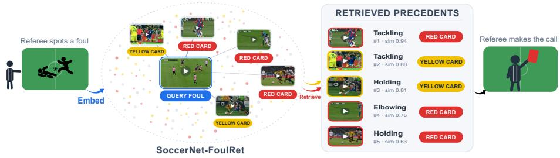
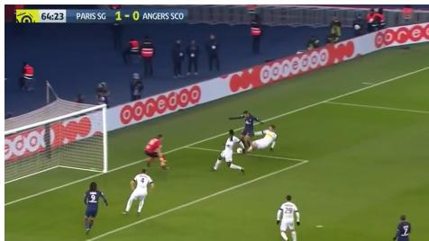
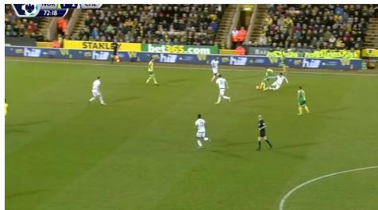
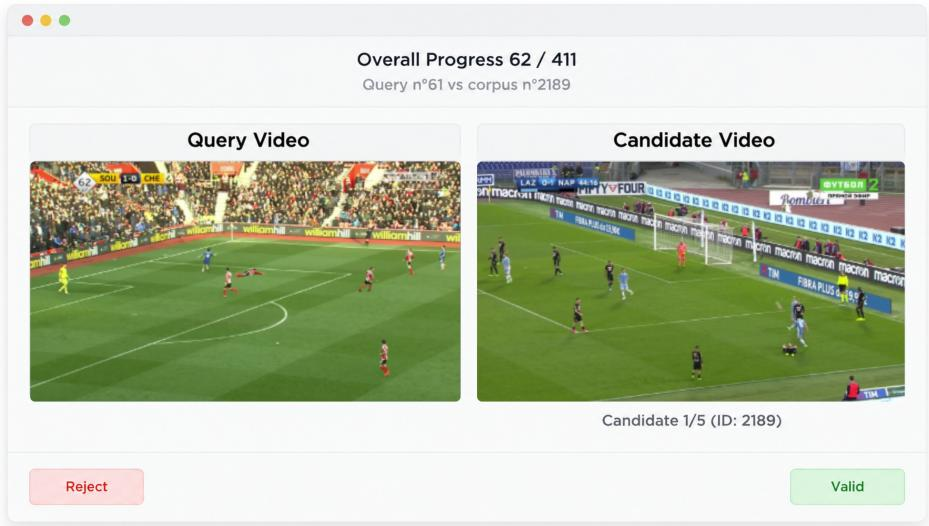
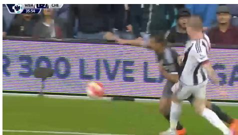
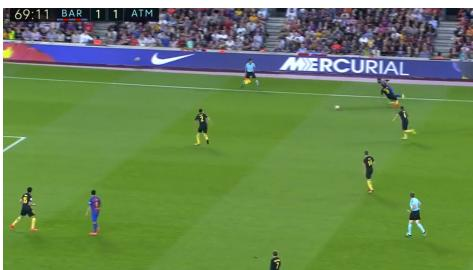
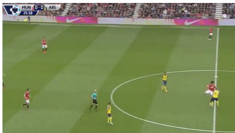

# SoccerNet-FoulRet: Retrieving Semantically Similar Soccer Foul Videos

Jacobus Arthur1\*, Ahmad Sait2\*, Batool Hani2, Merey Ramazanova2, Jan Held3, Marc Van Droogenbroeck1, Bernard Ghanem2, Anthony Cioppa1, and Silvio Giancola2

1 University of Liège {anthony.cioppa, m.vandroogenbroeck}@uliege.be, arthur.jacobus@student.uliege.be

2 KAUST {ahmed.sait, batool.hani, merey.ramazanova, bernard.ghanem, silvio.giancola}@kaust.edu.sa 3 SpAItial jan@spatial.ai

Equal contribution.

Abstract. Refereeing decisions in professional soccer remain inconsistent because referees cannot easily compare a contentious foul against similar past cases. We cast this as a retrieval problem and introduce SoccerNet-FoulRet, the first benchmark for semantic foul retrieval. Given a query foul, the task is to retrieve past fouls judged to be relevant precedents, regardless of camera angle, teams, or appearance. This difers from prior video-to-video retrieval, which matches clips by visual similarity or a shared event. Here, relevance is defined by refereeing interpretation. We build the benchmark from the SoccerNet-MVFoul dataset and evaluate retrieval ability of zero-shot video and vision–language embedders together with a task-specific fine-tuned baseline on 693 humanverified queries and category-relevance labels. Semantic foul retrieval remains challenging. The strongest zero-shot model achieves under 5% HitRate@10 on human-verified precedents, while category-supervised finetuning improves category relevance but transfers only modestly to precedent retrieval. We release SoccerNet-FoulRet to establish semantic foul retrieval as an open problem: https://github.com/SoccerNet/sn-foulret.

Keywords: Incident Video Retrieval · Soccer Video Understanding

## 1 Introduction

The modernization of soccer arbitration, notably through video assistant referee (VAR) technology, has provided referees with better visual evidence to judge complex situations. However, the interpretation of this evidence remains inherently subjective. Two referees may judge the same contact diferently based on personal criteria or viewing angles. As a consequence, similar actions may be judged diferently depending on the referee, leading to inconsistent decisions that vary from one match to another. The major limitation of the current decision process is the isolation of the decision process. Referees cannot easily access or compare the current incident with similar historical cases to ensure consistency.

  
Fig. 1: A memory bank for referees. We aim to augment referees rather than replace them. Automated classifiers and generative explainers emit a verdict directly, but can do so overconfidently and even hallucinate. Instead, our system takes a new foul (left) and retrieves semantically similar precedents together with the decisions that past referees reached on them (right). The referee reasons from these precedents and keeps the final call. We introduce a human-verified benchmark for this video-to-video retrieval task and find that of-the-shelf zero-shot video and vision-language retrievers fall well short, leaving it an open problem.

In this work, we develop a retrieval tool designed to assist referees by finding similar fouls (Fig. 1). Developing such a tool presents a dual challenge. First, from a methodological standpoint, the system must translate raw video pixels into high-level semantic concepts (e.g., “intent”, “severity”) to perform accurate retrieval. Second, from an experimental standpoint, there is currently no standard benchmark or ground truth for foul similarity, making it dificult to measure the efectiveness of such a tool.

We address these challenges by contributing a benchmark and evaluation protocol for foul retrieval, together with a study of how existing methods perform on it. Our central contribution is SoccerNet-FoulRet, the first benchmark for semantic foul retrieval. Since the source dataset, SoccerNet-MVFoul, provides no similarity links between foul incidents, we construct them ourselves. We build a search gallery by merging existing ground-truth annotations and develop a manual validation interface to construct a stare decisis precedent base, which is a collection of query–candidate pairs with human-verified precedent judgments. This allows us to evaluate retrieval against human judgments of precedent relevance.

On this benchmark, we evaluate a range of retrieval approaches, including a text-mediated VARS+XVARS pipeline, zero-shot video and vision–language embedders, and a task-specific fine-tuned baseline. This comparison tests whether current retrieval methods can retrieve human-verified foul precedents and whether category-level supervision transfers to precedent relevance. Framing refereeing consistency as a retrieval problem allows oficials to compare new incidents with similar historical fouls, supporting more consistent decision-making.

We summarize our contributions as follows. (i) We introduce the first benchmark for soccer foul retrieval, built from human-verified judgments of precedent relevance. (ii) We benchmark a text-mediated retrieval pipeline, zero-shot video and vision–language embedders, and a task-specific fine-tuned baseline, evaluating both human-verified precedent retrieval and category-level relevance. (iii) We show that category-level supervision improves retrieval by action, ofence, and severity, but transfers only modestly to human-verified precedent relevance, highlighting a gap between categorical similarity and human judgments of precedent relevance.

## 2 Related Work

We situate our work within two lines of research: sports video understanding and video-to-video retrieval.

## 2.1 Sports Video Understanding

Automated sports analysis has evolved from simple classification tasks to complex event understanding, driven by large-scale benchmarks spanning action spotting [5, 6], player tracking and re-identification [2–4], and more recently language-driven understanding such as dense captioning [17] and game state reconstruction [19].

Despite this breadth, refereeing assistance remains under-explored. Held et al. [7] introduced SoccerNet-MVFoul, the first multi-view dataset dedicated to foul classification, and SoccerNet-XFoul [8] extended it with explainable questionanswer pairs. Our work builds on both. We use SoccerNet-MVFoul’s structured foul annotations and SoccerNet-XFoul’s referee-oriented explanations to generate candidate pairs for human validation, while the MVFoul labels additionally support our category-level evaluation. Prior work uses SoccerNet-MVFoul for foul classification [7] and SoccerNet-XFoul for video description, question answering, and action recognition [8], whereas we repurpose them for retrieval. This enables the study of a diferent problem: retrieving historical fouls that serve as relevant precedents.

## 2.2 Video-to-Video Retrieval

Video-to-video retrieval has largely been framed around visual overlap, from near-duplicate copies [9, 20, 23] to shared real-world events. Table 1 provides a structured comparison of existing benchmarks alongside our proposed dataset.

Near-Duplicate Video Retrieval (NDVR). NDVR is the task of finding visually redundant copies of a query video within a large gallery, typically web videos that have been re-uploaded, re-encoded, or slightly edited. Benchmarks such as CC\_WEB\_VIDEO [23], UQ\_VIDEO [20], and SVD [9] have driven significant progress in this area. However, they are fundamentally ill-suited to our setting. Two soccer fouls may be visually near-identical yet jurisprudentially distinct, and conversely, two fouls judged to form a relevant precedent pair may appear visually dissimilar due to diferences in camera angle or player appearance.

Video Copy Detection. Copy detection targets a stricter variant of NDVR. It identifies whether a segment of one video is derived from another, possibly after transformations such as cropping, re-encoding, color changes, or frame-rate modifications [13]. The query and its ground-truth match necessarily originate from the same source recording. VCDB [10] provides manually annotated copied segment pairs from web videos, while TRECVID-CBCD [13] relies on synthetically generated queries (i.e., artificially transformed duplicates), making the task less reflective of naturally occurring video copies. Neither paradigm applies to our setting, where two similar fouls occur in entirely independent matches with no shared source footage.

Incident and Event Retrieval. These benchmarks move beyond visual redundancy by grouping videos around shared real-world incidents. FIVR-200K [12] retrieves videos depicting the same news event from diferent sources (e.g., multiple recordings of the same accident or protest), while EVVE [18] targets the same principle at the scale of large broadcast archives. Although this represents a step toward semantic retrieval, similarity remains anchored to a shared physical event. In our setting, no such shared event exists. Two fouls from diferent matches may instead form a relevant precedent pair based on human judgment, a criterion these benchmarks do not capture.

Concept-Based Semantic Retrieval. Closest to our setting, ConViS-Bench [15] ranks videos by shared semantic concepts rather than visual redundancy, and reports that this remains dificult for current large multimodal models. Its relevance is still defined by general-purpose concepts such as location or action, and it does not target soccer.

Across these settings, retrieval systems encode each video into a vector and rank by embedding distance. Near-duplicate and copy-detection methods train task-specific visual embeddings, whereas recent multimodal embedders learn general-purpose video-text spaces that support zero-shot retrieval. We evaluate several such zero-shot models together with a task-specific adaptation baseline (Sec. 4). Semantic relevance itself has also been studied in text-to-video retrieval, for example through caption correspondence [22]. We instead evaluate humanverified precedent relevance, where query—candidate pairs are judged as relevant or irrelevant precedents. No prior benchmark captures this human-judgment criterion.

## 3 The SoccerNet-FoulRet Benchmark

SoccerNet-FoulRet repurposes the SoccerNet-MVFoul [7] and SoccerNet-XFoul [8] datasets into the first benchmark for semantic foul retrieval. This section defines the task, describes the retrieval gallery, and details the two complementary evaluation targets: a human-verified set of precedent pairs, and a category-relevance evaluation.

<table><tr><td>Dataset</td><td>#Videos</td><td>#Queries</td><td>Query Origin</td><td>Domain</td><td>Task</td></tr><tr><td>CC_WEB_VIDEO [23]</td><td>13K</td><td>24</td><td>Real</td><td>Web (YouTube)</td><td>NDVR</td></tr><tr><td>UQ_VIDEO [20]</td><td>170K</td><td>24</td><td>Real</td><td>Web (YouTube)</td><td>NDVR</td></tr><tr><td>SVD [9]</td><td>562K</td><td>1,206</td><td>Real</td><td>Web (Douyin)</td><td>NDVR</td></tr><tr><td>VCDB [10]</td><td>100K</td><td>528</td><td>Real</td><td>Web (YouTube)</td><td>Copy Detection</td></tr><tr><td>TRECVID-CBCD [13]</td><td>11,503</td><td>11,256</td><td>Synthetic</td><td>Broadcast TV</td><td>Copy Detection</td></tr><tr><td>FIVR-200K [12]</td><td>226K</td><td>100</td><td>Real</td><td>Web (YouTube)</td><td>Fine-grained IR</td></tr><tr><td>EVVE [18]</td><td>102K</td><td>620</td><td>Real</td><td>Web (YouTube)</td><td>Event Retrieval</td></tr><tr><td>ConViS-Bench [15]</td><td>543</td><td>610</td><td>Real</td><td>Web (general)</td><td>Concept Similarity</td></tr><tr><td>SoccerNet-FoulRet (Ours)</td><td>2,916</td><td>693</td><td>Real</td><td>Sports (Soccer)</td><td>Semantic Retrieval</td></tr></table>

Table 1: Comparison of video-to-video retrieval datasets. Our benchmark is the first to target semantic similarity in Soccer.

  
(a) Tackle in the penalty area, stopping a goalscoring opportunity. Awarded as a penalty.

  
(b) Tackle in midfield, disrupting an attack with no immediate goal-scoring opportunity. Awarded as a free kick.  
Fig. 2: Two fouls with identical mechanics but vastly diferent sanctions depending on pitch location and context (penalty area vs. midfield).

## 3.1 Task Definition

The input is a query foul video $v _ { q } .$ . The task is to rank a gallery of candidate clips so that relevant foul precedents appear first. We evaluate this retrieval task using two complementary notions of relevance. Precedent relevance is determined by Similar/Not Similar referee judgments of query–candidate pairs (Tab. 3). Category relevance is determined from the SoccerNet-MVFoul labels, at increasingly strict levels: Action, Action+Ofence, and Action+Ofence+Severity (Tab. 4). These two targets are evaluated separately throughout the paper. A legal slide tackle and a red-card lunge may look near-identical yet count as dissimilar, while two elbowing ofences filmed from opposite ends of the pitch count as similar. This definition departs from every prior video-to-video retrieval benchmark (Tab. 1) which ties relevance to visual or shared-event overlap.

## 3.2 Retrieval Gallery

The gallery is built exclusively from the training splits of SoccerNet-MVFoul [7] and SoccerNet-XFoul [8], and comprises 2,916 actions. Alongside each action’s video we retain two annotation signals. First, its categorical attributes from MVFoul, including Action Class (e.g., Tackle, Push), Ofence, and Severity, which are used by the VARS+XVARS baseline for coarse filtering and in our category-level evaluation. Second, its XFoul question-answer (Q/A) pairs, which the VARS+XVARS baseline keeps as separate semantic units rather than concatenating into one string, so that similarity can be assessed dimension by dimension. The zero-shot video and vision-language retrievers use neither signal because they take the raw clip as input and produce their own embedding.

## 3.3 Human-Verified Precedent Pairs

The source datasets contain no similarity links between actions, so we build a verified stare decisis precedent base over the validation and test splits of [7] and [8]. We treat each validation/test action as a query against the training-split gallery, review its candidates as described below, and retain the 693 queries (293 test / 400 validation) for which at least one candidate is approved as a relevant precedent. These form the query set for our human-verified precedent evaluation. This subset is smaller than the full val+test pool (712 queries) because queries whose candidates are all rejected are dropped.

Oracle candidate generation. For each query we display five candidates for human review. More details about the candidate-generation procedure is in Sec. B. Figure 3 shows the graphical user interface annotators used to validate or reject each candidate clip as semantically similar to the query.

  
Fig. 3: Manual Validation Interface. The annotator reviews a query action (left) alongside a candidate precedent (right), labeling each pair as Valid or Rejected.

Human validation. Through a custom side-by-side interface, an annotator compares each query with its five candidates and labels every pair Valid (a relevant precedent) or Rejected. The full annotation criteria and protocol are provided in Sec. D. Because at most five candidates are reviewed per query, these judgments are a high-precision but incomplete sample of all relevant precedents in the gallery, a property that dictates our choice of metrics (Sec. 4.1). For each clip we additionally take its SoccerNet-MVFoul [7] attribute labels (Action type, Ofence, and Severity), which we use as a complementary relevance signal in evaluation (Sec. 4.1). The authors themselves served as annotators. Given their refereeing and soccer-video-understanding expertise, we found this suficient to reliably determine whether each query–candidate pair is a valid precedent. Additional agreement analysis is provided in Sec. E.

<table><tr><td>Action class</td><td>Gal.</td><td>Qry.</td><td>Prec.</td><td>Offence / Severity</td><td>Gal.</td><td>Qry.</td><td>Prec.</td></tr><tr><td>Standing tackling</td><td>1,264</td><td>291</td><td>1,183</td><td>Offence</td><td>2,495</td><td>613</td><td>2,490</td></tr><tr><td>Tackling</td><td>448</td><td>124</td><td>532</td><td>No offence</td><td>324</td><td>53</td><td>162</td></tr><tr><td>Challenge</td><td>383</td><td>89</td><td>302</td><td>Between</td><td>96</td><td>27</td><td>99</td></tr><tr><td>Holding</td><td>361</td><td>93</td><td>373</td><td></td><td></td><td></td><td></td></tr><tr><td>Elbowing</td><td>178</td><td>39</td><td>155</td><td>Sev. 1</td><td>1,402</td><td>355</td><td>1,399</td></tr><tr><td>High leg</td><td>103</td><td>24</td><td>104</td><td>Sev. 2</td><td>403</td><td>91</td><td>367</td></tr><tr><td>Pushing</td><td>88</td><td>20</td><td>65</td><td>Sev. 3</td><td>687</td><td>169</td><td>728</td></tr><tr><td>Don&#x27;t know</td><td>52</td><td>5</td><td>20</td><td>Sev. 4</td><td>44</td><td>11</td><td>40</td></tr><tr><td>Dive</td><td>28</td><td>5</td><td>13</td><td>Sev. 5</td><td>27</td><td>8</td><td>35</td></tr></table>

Table 2: SoccerNet-FoulRet composition. Gallery clips (Gal.), query fouls $\begin{array} { r } { ( \mathrm { Q r y . } ) . } \end{array}$ and approved precedent pairs (Prec.) across the three attribute types. All are longtailed: standing tackling is ∼44% of the gallery, 86% of clips are an ofence, and severities 4–5 are rare (<3%). Counts are over each attribute’s labelled subset (full gallery 2,916).

The complete SoccerNet-FoulRet benchmark comprises 693 query fouls, each paired with human-verified precedents (about four on average), evaluated against a gallery of 2,916 actions. Additional statistics on the benchmark’s relevance structure are provided in Sec. C. Table 2 summarises the benchmark.

## 4 Experiments

## 4.1 Evaluation Protocol

We use rank-based metrics for the sparse human-verified precedent pool and mAP for the dense category labels.

Human-verified precedent metrics. Let A be the approved set for a query and $R _ { K }$ the top-K retrieved clips. We report HitRate@K, the fraction of queries with at least one verified precedent in $R _ { K } ;$ ; Recall@ $K = | R _ { K } \cap A | / | A |$ the fraction of approved clips retrieved; nDCG@K, which measures the discounted ranking of approved clips using binary relevance; and MRR@10, the mean reciprocal rank of the first approved clip within the top 10. We evaluate HitRate and Recall at $K \in \{ 1 , 5 , 1 0 \}$ and nDCG at $K \in \{ 5 , 1 0 \}$ . Because only a small subset of gallery clips is judged for each query, the precedent pool is incomplete, which is a known challenge in retrieval evaluation [1]. As a result, retrieved clips outside the verified set may still be valid precedents, but they receive no credit under these metrics.

Category-relevance metric. For category relevance (Sec. 3) we report mean Average Precision, mAP@K, at each of the three strictness levels (Action, Action+Ofence, Action+Ofence+Severity).

Query sets. The human-verified precedent metrics are computed over the 693 queries with at least one verified precedent. The category-relevance metrics use all queries carrying the labels required at each strictness level.

## 4.2 Implementation Details

We evaluate two retrieval families: a text-mediated VARS+XVARS pipeline and video/vision–language embedding models. Within the latter, we evaluate both zero-shot models and a task-specific adaptation of Qwen3-VL-Embedding-2B. The embedding-based models operate directly on the video and rank gallery clips by cosine similarity, while the VARS+XVARS pipeline uses predicted foul attributes for filtering and generated question–answer pairs for semantic ranking. We detail these retrieval settings below.

Visual retrieval via generic vision-language encoders. For the zero-shot baselines, we use existing of-the-shelf large vision-language encoders without fine-tuning on soccer data, though these models have most likely been exposed to sports footage during pre-training. InternVideo2 [21] (1B and 6B) is a videonative foundation model trained with masked video modeling and cross-modal contrastive learning. It embeds a clip directly and takes no text prompt. VLM2Vec-V2 [11] and the Qwen3-VL-Embedding series [14] (2B and 8B) turn Qwen2-VL and Qwen3-VL into unified multimodal encoders, and LamRA [16] re-purposes a generative multimodal model for retrieval through lightweight adapters. We additionally adapt Qwen3-VL-Embedding-2B to SoccerNet-MVFoul using LoRA and symmetric hierarchical multi-positive InfoNCE objectives over Action, Action+Ofence, and Action+Ofence+Severity. Fine-tuning uses only the SoccerNet-MVFoul training split. The full objective and training details are provided in Sec. A.

Textual retrieval via automated referee system-generated text. This text-mediated baseline chains the SoccerNet models. VARS [7] predicts the Action and Ofence attributes for each query and gallery foul instance. We restrict the search space to gallery instances whose two predicted attributes exactly match those of the query. XVARS [8] then generates a textual profile using four of the original refereeing questions from [8], shown below:

XVARS Prompt   
You are an artificial intelligence assistant for visual football referee questions. Give   
short and helpful answers to the user’s questions:   
“What card would you give? Why?”;   
“Did the defender touch the ball?”;   
“Did the defender intend to play the ball?”;   
“Where was the point of contact?”

For each of the four question fields, we encode the generated answer of the query with BGE [24] (bge-large-en-v1.5) and compare it with the corresponding precomputed BGE answer embedding of each candidate. We average the four per-answer cosine similarities,

$$
\operatorname { S c o r e } ( Q , C ) = { \frac { 1 } { N } } \sum _ { i = 1 } ^ { N } { \frac { { \pmb v } _ { q _ { i } } \cdot { \pmb v } _ { c _ { i } } } { \| { \pmb v } _ { q _ { i } } \| \| { \pmb v } _ { c _ { i } } \| } } ,\tag{1}
$$

where ${ \pmb v } _ { q _ { i } }$ and ${ \pmb v } _ { c _ { i } }$ are the BGE embeddings of the generated answers for the i-th question field of query Q and candidate $C ,$ respectively, and N = 4. Averaging per answer, rather than embedding one concatenated description, forces agreement across multiple semantic dimensions instead of rewarding generic textual overlap.

Instruction protocol. The instruction-following embedders (VLM2Vec-V2, Qwen3-VL, LamRA) receive an identical query-side instruction, “Retrieve videos similar to the query video.”, each in its own native template. Following how these models are designed, it is applied to the query only, and gallery clips carry no task instruction (VLM2Vec-V2 and Qwen3-VL use their default prompt, LamRA uses its native “summarise in one word” template). InternVideo2 is video-native and uses no instruction. We ablate instruction specificity in Sec. 4.4.

## 4.3 Results

Gold precedents. We use this benchmark to quantify how well of-the-shelf retrievers perform on foul precedent retrieval and whether task-specific adaptation improves performance. We also evaluate the task-specific Qwen3-VL-Embedding-2B baseline described in Sec. 4.2. We therefore read every method against its random floor rather than in absolute terms.

Table 3 shows that InternVideo2-1B, a zero-shot model applied with no domain-specific training, is the strongest retriever overall. It leads at the shallow cutofs a user actually inspects (HR@5 2.60%, HR@10 4.62%), on Recall (R@5 0.66%, R@10 1.13%), on nDCG (nDCG@5 0.62%, nDCG@10 0.87%), and on MRR@10 (1.65).

The engineered VARS+XVARS pipeline leads on no metric. Most tellingly, at rank 1 the pipeline sits exactly on the random floor (HR@1 0.14%). This indicates that VARS’ coarse category filter can narrow the pool without reliably placing a human-verified precedent at the top, underscoring that category agreement alone

<table><tr><td></td><td></td><td colspan="3">HitRate@K</td><td colspan="3">Recall@K</td><td colspan="2">nDCG@K</td><td></td></tr><tr><td>Method</td><td>Params</td><td>@1</td><td>@5</td><td>@10</td><td>@1</td><td>@5</td><td>@10</td><td>@5</td><td>@10</td><td>MRR10</td></tr><tr><td>Random</td><td></td><td>0.14</td><td>0.68</td><td>1.35</td><td>0.03</td><td>0.17</td><td>0.34</td><td>0.16</td><td>0.24</td><td>0.40</td></tr><tr><td colspan="9">Text-mediated retrieval</td><td></td></tr><tr><td>VARS+XVARS</td><td></td><td>0.14</td><td>2.16</td><td>3.17</td><td>0.03</td><td>0.64</td><td>0.94</td><td>0.51 [0.00,0.43] [1.15,3.32] [1.88,4.47] [0.00,0.09] [0.32,1.00] [0.56,1.38] [0.26,0.81]</td><td>0.65</td><td>0.99 [0.38,0.96] [0.54,1.51]</td></tr><tr><td colspan="9">Video-native retrieval</td><td></td></tr><tr><td>InternVideo2-1B</td><td>1B</td><td>0.72</td><td>2.60</td><td>4.62</td><td>0.15</td><td>0.66</td><td>1.13</td><td>0.62</td><td>0.87</td><td>1.65</td></tr><tr><td>InternVideo2-6B</td><td>6B</td><td>0.29 [0.00,0.72] [0.72,2.60] [2.16,4.91] [0.00,0.17] [0.18,0.73] [0.60,1.55] [0.15,0.58]</td><td>1.59</td><td>3.46</td><td>0.06</td><td>0.43</td><td>1.03</td><td>[0.14,1.44] [1.44,3.90] [3.03,6.20] [0.03,0.30] [0.36,1.00] [0.74,1.55] [0.34,0.94] 0.35</td><td>0.61</td><td>[0.56,1.21] [0.96,2.44] 0.88 [0.36,0.89] [0.45,1.41]</td></tr><tr><td colspan="9">Instruction-following multimodal retrieval</td><td></td></tr><tr><td>Qwen3-VL-Emb-2B-FT</td><td>2B</td><td>0.58</td><td>2.02</td><td>3.75</td><td>0.18</td><td>0.57</td><td>1.06</td><td>0.55</td><td>0.77</td><td>1.24</td></tr><tr><td>Qwen3-VL-Emb-2B</td><td>2B</td><td>1.01</td><td>1.73</td><td>3.32</td><td>0.23</td><td>0.37</td><td>0.95</td><td>0.50</td><td>0.76</td><td>[0.14,1.15] [1.01,3.17] [2.45,5.19] [0.03,0.38] [0.28,0.92] [0.63,1.57] [0.26,0.89] [0.45,1.13] [0.66,1.92] 1.52 [0.29,1.73] [0.87,2.74] [2.02,4.76] [0.08,0.41] [0.17,0.60] [0.54,1.44] [0.23,0.82] [0.44,1.11] [0.78,2.37]</td></tr><tr><td>VLM2Vec-V2</td><td>2B</td><td>0.72</td><td>2.02</td><td>3.90</td><td>0.20</td><td>0.59</td><td>1.06</td><td>0.58</td><td>0.81</td><td>1.42 [0.14,1.44] [1.01,3.17] [2.45,5.34] [0.04,0.39] [0.26,1.01] [0.64,1.55] [0.28,0.94] [0.48,1.19] [0.76,2.17]</td></tr><tr><td>LamRA</td><td>7B</td><td>0.72</td><td>1.73</td><td>3.17</td><td>0.18</td><td>0.52</td><td>0.93</td><td>0.49</td><td>0.68</td><td>1.20 [0.14,1.44] [0.87,2.74] [1.88,4.47] [0.04,0.35] [0.21,0.93] [0.52,1.42] [0.22,0.80] [0.38,1.01] [0.59,1.92]</td></tr><tr><td>Qwen3-VL-Emb-8B</td><td>8B</td><td>0.43</td><td>1.73</td><td>3.17</td><td>0.11</td><td>0.65</td><td>1.00</td><td>0.51</td><td>0.69</td><td>1.08 [0.00,1.01] [0.87,2.74] [1.88,4.47] [0.00,0.26] [0.25,1.15] [0.53,1.56] [0.23,0.84] [0.38,1.04] [0.55,1.72]</td></tr></table>

Table 3: Retrieval performance on the human-verified precedent pool, pooled over the 693 queries that have at least one verified precedent. HitRate@K is the fraction of queries with at least one verified precedent in the top K; Recall@K is the fraction of verified precedents retrieved; nDCG@K measures the discounted ranking of the available verified precedents using binary relevance; and MRR@10 is the mean reciprocal rank of the first verified precedent within the top 10. All values are percentages. Because the relevance pool is incomplete, unjudged retrieved clips may also be valid precedents and receive no relevance gain under these metrics. Qwen3-VL-Emb-2B-FT is fine-tuned exclusively on SoccerNet-MVFoul’s train set. All other visual embedders are evaluated zero-shot.

Higher is better. Brackets report 95% percentile-bootstrap confidence intervals obtained from 20,000 resamples. Bold denotes the best result per column.

does not imply precedent relevance. The pipeline also returns no candidates for 17% of Test queries, which are scored as misses.

In contrast, the embedders place a verified precedent at rank 1 more often than VARS+XVARS, led by Qwen3-VL-2B (HR@1 1.01% and R@1 0.23%). Recall is consistently much lower than HitRate. For InternVideo2-1B, for example, HR@10 is 4.62% while R@10 is only 1.13%, indicating that even successful top-10 retrievals recover only a small fraction of the approximately four verified precedents available per query.

Among these zero-shot embedders, two further patterns emerge. First, scaling does not improve retrieval within either model family (InternVideo2 and Qwen3- VL-Emb). InternVideo2-6B trails InternVideo2-1B, while Qwen3-VL-Emb-8B does not outperform Qwen3-VL-Emb-2B. InternVideo2-1B remains the strongest overall zero-shot retriever, whereas InternVideo2-6B records the lowest MRR@10 among the zero-shot embedders (0.88%). This suggests that increasing model size alone does not yield better transfer to foul retrieval in our setting. Second, at HR@10 every method exceeds the random baseline, but only by 2.3–3.4×, showing how far the task remains from solved.

Task-specific fine-tuning produces mixed results on the human-verified precedent evaluation. Qwen3-VL-Emb-2B-FT improves HR, Recall, and nDCG at deeper cutofs, but reduces HR@1 and MRR@10 relative to its zero-shot initialization. Thus, category supervision improves deeper retrieval without improving the earliest result, suggesting that action, ofence, and severity do not fully capture precedent relevance.

Category relevance. The human-verified precedent results above should be interpreted in light of the sparse relevance pool. Only about five of the 2,916 gallery clips were reviewed per query, so unjudged retrieved clips may still be valid precedents but receive no credit under these metrics. To score relevance independently of this pool, we turn to the oficial SoccerNet-MVFoul [7] attribute labels, which cover the entire gallery and let us measure ranking quality at three nested strictness levels (Action, Action+Ofence, Action+Ofence+Severity), shown in Tab. 4.

Among the zero-shot embedders, InternVideo2-1B and Qwen3-VL-2B are the strongest overall on the category evaluation. Qwen3-VL-2B leads most Action and Action+Ofence metrics, while InternVideo2-1B is among the strongest zero-shot models at the strictest Action+Ofence+Severity level. InternVideo2- 1B also performs best on the human-verified precedent evaluation (Tab. 3), so the strongest zero-shot models are broadly consistent across both evaluations. Qwen3-VL-8B trails its 2B counterpart across all nine category metrics, suggesting that greater model scale does not improve zero-shot transfer in this setting.

Performance decreases as the category criterion becomes stricter. For Intern-Video2-1B, for example, mAP@10 drops from 23.1% on Action to 18.3% on +Offence and 7.4% on +Severity. Qwen3-VL-Emb-2B-FT improves on its zero-shot counterpart across all nine category metrics, showing that these labels provide a useful supervision signal. VARS+XVARS also performs particularly well on this evaluation, achieving the highest +Severity scores and tying Qwen3-VL-Emb-2B-FT on Action mAP@10 (29.0) and +Ofence mAP@10 (24.0). This advantage is expected because the pipeline explicitly filters candidates using VARS-predicted categories, which closely align with what these metrics reward.

However, these category-level gains do not translate directly to precedent retrieval. VARS+XVARS remains weak on the human-verified precedent evaluation (Tab. 3), while the task-specific baseline transfers only modestly despite its substantial category improvements. Together, these results show that action, ofence, and severity capture useful structure but do not fully determine human judgments of precedent relevance.

## 4.4 Ablation

The instruction-following embedders take a query-side instruction, so we test whether increasing task specificity afects retrieval. The prompts progressively add task-specific information, from the retrieval objective, to soccer-foul context, ∗Severity is annotated for only ∼88% of the gallery, so this tier contains fewer clips and queries. Higher is better. Brackets report 95% percentile-bootstrap confidence intervals obtained from 20,000 resamples. Bold denotes the best result per column.

<table><tr><td rowspan="2">Model</td><td rowspan="2"></td><td colspan="3">Action</td><td colspan="3">+Offence</td><td colspan="3">+Severity*</td></tr><tr><td>Params @1</td><td>@5</td><td>@10</td><td>@1</td><td>@5</td><td>@10</td><td>@1</td><td>@5</td><td>@10</td></tr><tr><td>Random</td><td></td><td>24.9</td><td>16.1</td><td>13.5</td><td>20.8</td><td>13.3</td><td>11.0</td><td>11.0</td><td>6.2</td><td>4.8</td></tr><tr><td></td><td>Text-mediated retrieval</td><td></td><td></td><td></td><td></td><td></td><td></td><td></td><td></td><td></td></tr><tr><td>VARS+XVARS†</td><td>[35.0,42.2] [27.1,31.7] [26.8,31.2] [29.2,36.2]</td><td>38.5</td><td>29.4</td><td>29.0</td><td>32.7</td><td>24.5</td><td>24.0 [22.4,26.7] [21.9,26.2]</td><td>20.6 [17.5,23.8] [11.8,15.2] [9.5,11.9]</td><td>13.5</td><td>10.7</td></tr><tr><td colspan="9">Video-native retrieval</td><td></td></tr><tr><td>InternVideo2-1B</td><td>1B</td><td>37.5</td><td>26.3</td><td>23.1</td><td>29.9</td><td>20.9</td><td>18.3</td><td>17.1</td><td>9.5</td><td>7.4</td></tr><tr><td>InternVideo2-6B</td><td>6B</td><td>37.8</td><td>25.9</td><td>22.2</td><td>30.7</td><td>20.4</td><td>17.5</td><td>[34.0,41.2] [24.3,28.4] [21.5,24.8] [26.7,33.3] [19.0,22.8] [16.8,20.0] [14.3,20.0] 17.7</td><td>[8.4,10.8] 8.9</td><td>[6.5,8.2] 7.0</td></tr><tr><td></td><td></td><td>Instruction-following multimodal retrieval</td><td></td><td></td><td></td><td></td><td></td><td>[34.3,41.3] [23.9,27.9] [20.5,23.9] [27.4,34.3] [18.5,22.3] [15.9,19.1] [14.8,20.8]</td><td>[7.8,10.0]</td><td>[6.3,7.9]</td></tr><tr><td></td><td></td><td>40.3</td><td>31.9</td><td>29.0</td><td>33.7</td><td>27.0</td><td>24.0</td><td>17.7</td><td>10.9</td><td>8.7</td></tr><tr><td>Qwen3-VL-Emb-2B-FT Qwen3-VL-Emb-2B</td><td>2B</td><td>37.9</td><td>27.1</td><td>23.0</td><td>32.4</td><td>22.6</td><td>18.9</td><td>[36.7,44.0] [29.5,34.3] [26.9,31.1] [30.2,37.1] [24.8,29.3] [22.1,26.0] [14.8,20.6] 16.5</td><td>[9.7,12.2] 9.2</td><td>[7.8,9.7] 7.1</td></tr><tr><td>VLM2Vec-V2</td><td>2B 2B</td><td>33.3</td><td>22.2</td><td>[34.4,41.5] [25.1,29.3] [21.4,24.7] [29.1,36.0] [20.6,24.6] [17.3,20.5] [13.7,19.4] 18.8</td><td>28.1</td><td>18.3</td><td>15.5</td><td>13.5</td><td>[8.1,10.4] 8.0</td><td>[6.3,7.9] 6.3</td></tr><tr><td>LamRA</td><td>7B</td><td>34.7</td><td>22.2</td><td>[29.8,36.7] [20.4,24.0] [17.4,20.3] [24.8,31.5] [16.6,20.0] [14.1,16.8] [10.9,16.2] 18.7</td><td>30.2</td><td>19.3</td><td>15.9</td><td>13.1</td><td>[7.0,9.1] 7.2</td><td>[5.5,7.1] 5.6</td></tr><tr><td>Qwen3-VL-Emb-8B</td><td>8B</td><td>35.3 [31.7,38.8] [22.0,25.6] [19.0,22.0] [26.1,32.9] [17.5,20.9] [15.0,17.7] [13.1,18.8]</td><td>23.8</td><td>[31.3,38.2] [20.4,24.1] [17.3,20.2] [26.8,33.4] [17.5,21.1] [14.5,17.3] [10.6,15.7] 20.5</td><td>29.5</td><td>19.1</td><td>16.3</td><td>15.8</td><td>[6.1,8.3] 8.3 [7.3,9.4]</td><td>[4.8,6.4] 6.4 [5.7,7.2]</td></tr></table>

Table 4: Category relevance, scored with the oficial SoccerNet-MVFoul attribute labels. A retrieved clip is relevant if it matches the query’s foul at one of three increasingly strict levels: Action, Action+Ofence, or Action+Ofence+Severity verdict. For each level, both the retrieval gallery and evaluated queries are restricted to clips carrying the required labels. Action and +Ofence use 2,905 gallery clips and 709 queries; +Severity uses 2,561 gallery clips and 650 queries. Values are mean Average Precision (mAP@K, %). Qwen3-VL-Emb-2B-FT is fine-tuned exclusively on SoccerNet-MVFoul’s train set, whereas the other visual embedders are evaluated zero-shot. VARS+XVARS† uses VARS-predicted categories for candidate filtering and is therefore excluded from the best-model comparison.

to explicit category labels, allowing us to test whether these cues afect zeroshot embeddings. We compare three levels of specificity, each applied in the model’s native template: Generic (“Retrieve videos similar to the query video.”), Domain (“Retrieve soccer foul videos similar to the query.”), and Detailed (“Retrieve soccer foul videos of the same action type, ofence, and severity as the query.”). InternVideo2 is video-native and takes no instruction, so it is excluded.

The Generic instruction is best or tied-best almost everywhere (Tab. 5), while adding soccer-specific context or explicit category attributes generally does not improve performance. Notably, the Detailed instruction names the evaluated category attributes yet never outperforms Generic on category mAP. Within this limited progression of increasingly task-specific prompts, we therefore use the Generic instruction for all main results. These results suggest that explicitly emphasizing the annotated foul categories in the instruction does not improve the zero-shot embedding space, indicating that useful retrieval signals are not captured by these attributes alone.

<table><tr><td colspan="2"></td><td>Gold Precedents</td><td colspan="3">Action</td></tr><tr><td>Model</td><td>Instruction</td><td>MRR@10</td><td>mAP@1</td><td>mAP@5</td><td>mAP@10</td></tr><tr><td rowspan="3">Qwen3-VL-Emb-2B</td><td>Generic</td><td>1.52</td><td>37.7</td><td>27.0</td><td>22.9</td></tr><tr><td>Domain</td><td>1.15</td><td>39.1</td><td>26.6</td><td>22.1</td></tr><tr><td>Detailed</td><td>0.82</td><td>36.1</td><td>25.8</td><td>21.7</td></tr><tr><td rowspan="3">Qwen3-VL-Emb-8B</td><td>Generic</td><td>1.08</td><td>35.3</td><td>23.7</td><td>20.5</td></tr><tr><td>Domain</td><td>0.66</td><td>30.3</td><td>19.7</td><td>16.6</td></tr><tr><td>Detailed</td><td>0.93</td><td>33.0</td><td>22.3</td><td>18.8</td></tr><tr><td rowspan="3">VLM2Vec-V2</td><td>Generic</td><td>1.42</td><td>33.3</td><td>22.0</td><td>18.7</td></tr><tr><td>Domain</td><td>1.33</td><td>29.6</td><td>19.8</td><td>16.9</td></tr><tr><td>Detailed</td><td>1.29</td><td>31.2</td><td>20.4</td><td>17.1</td></tr><tr><td rowspan="3">LamRA</td><td>Generic</td><td>1.20</td><td>34.4</td><td>22.0</td><td>18.6</td></tr><tr><td>Domain</td><td>0.32</td><td>25.4</td><td>17.9</td><td>15.1</td></tr><tr><td>Detailed</td><td>0.36</td><td>24.3</td><td>17.9</td><td>15.4</td></tr></table>

Table 5: Instruction-sensitivity ablation. Query-side instruction specificity for the four instruction-following embedders, from Generic to Detailed. We report refereegold MRR@10 and category mAP at the Action level (%); higher is better. Bold = best instruction per model and column. InternVideo2 is video-native and takes no instruction.

## 4.5 Qualitative Analysis

The two examples below illustrate a successful and a failed retrieval. Together, they highlight both what the task requires and why it remains challenging.

Figure 4 shows a successful retrieval. The query and retrieved clip form a human-verified precedent pair despite substantial diferences in camera angle, lighting, and team kits. This illustrates that successful precedent retrieval requires looking beyond visual appearance and that semantically relevant fouls can be matched across visually diferent clips.

  
(a) Query Video

  
(b) Retrieved Precedent  
Fig. 4: A successful retrieval: a human-verified precedent is retrieved despite diferences in camera zoom.

Figure 5 shows an illustrative failure of the text-mediated pipeline. The query is an elbowing ofence that VARS misclassifies as a challenge. Because the VARS categorical filter enforces strict category equality, valid elbowing precedents are removed before semantic ranking and cannot be recovered by later stages. This example highlights a limitation of the VARS filtering stage: an early classification error can eliminate otherwise relevant precedents.

  
Fig. 5: An illustrative failure: VARS misclassifies an elbowing as a challenge, removing relevant precedents before semantic ranking.

## 5 Conclusion

We introduced SoccerNet-FoulRet, the first benchmark for semantic foul retrieval, framing refereeing consistency as a video-to-video retrieval problem. Rather than automating the referee’s verdict, the goal is to retrieve relevant historical precedents while leaving the final decision to the referee. We evaluate this task using human-verified precedent judgments and category-relevance labels. Our experiments show that semantic foul retrieval remains challenging. Intern-Video2-1B is the strongest zero-shot retriever overall, yet achieves under 5% HitRate@10 on the human-verified precedent evaluation. Performance also degrades sharply as category relevance tightens from Action to Action + Offence + Severity, showing that current models are better at matching broad foul categories than distinguishing the finer details that afect refereeing decisions. Category-supervised fine-tuning improves category relevance substantially but shows only modest transfer to the human-verified precedent evaluation, further showing that the type of action, ofence, and severity of a foul does not fully capture precedent relevance. Several limitations remain. First, the human-verified relevance pool is incomplete. Only a small number of candidates are judged per query, so unjudged retrieved clips may themselves be valid precedents. Second, the precedent judgments come from a limited annotator pool and therefore do not establish broader agreement across referees. These limitations motivate denser precedent annotations and retrieval models that better capture refereeing semantics such as intent, point of contact, and severity. We hope SoccerNet-FoulRet provides a foundation for retrieval systems that can ultimately support more consistent football refereeing.

Acknowledgement. The research reported in this publication was supported by funding from KAUST CoE for Generative AI, under award number 5940.

## References

1. Buckley, C., Voorhees, E.M.: Retrieval evaluation with incomplete information. In: Proceedings of the 27th Annual International ACM SIGIR Conference on Research and Development in Information Retrieval. pp. 25–32 (2004). https://doi.org/ 10.1145/1008992.1009000

2. Cioppa, A., Deliège, A., Giancola, S., Ghanem, B., Van Droogenbroeck, M.: Scaling up SoccerNet with multi-view spatial localization and re-identification. Sci. Data 9(1), 1–9 (Jun 2022). https://doi.org/10.1038/s41597-022-01469-1

3. Cioppa, A., Giancola, S., Deliège, A., Kang, L., Zhou, X., Cheng, Z., Ghanem, B., Van Droogenbroeck, M.: SoccerNet-tracking: Multiple object tracking dataset and benchmark in soccer videos. In: IEEE Int. Conf. Comput. Vis. Pattern Recognit. Work. (CVPRW), CVsports. pp. 3490–3501. IEEE, New Orleans, LA, USA (Jun 2022). https://doi.org/10.1109/cvprw56347.2022.00393

4. Cui, Y., Zeng, C., Zhao, X., Yang, Y., Wu, G., Wang, L.: SportsMOT: A large multi-object tracking dataset in multiple sports scenes. In: IEEE/CVF Int. Conf. Comput. Vis. (ICCV). pp. 9887–9897. IEEE, Paris, Fr. (Oct 2023). https://doi. org/10.1109/iccv51070.2023.00910

5. Deliège, A., Cioppa, A., Giancola, S., Seikavandi, M.J., Dueholm, J.V., Nasrollahi, K., Ghanem, B., Moeslund, T.B., Van Droogenbroeck, M.: SoccerNet-v2: A dataset and benchmarks for holistic understanding of broadcast soccer videos. In: IEEE/CVF Conf. Comput. Vis. Pattern Recognit. Work. (CVPRW). pp. 4503–4514. IEEE, Nashville, TN, USA (Jun 2021). https://doi.org/10.1109/ cvprw53098.2021.00508

6. Giancola, S., Amine, M., Dghaily, T., Ghanem, B.: SoccerNet: A scalable dataset for action spotting in soccer videos. In: IEEE/CVF Conf. Comput. Vis. Pattern Recognit. Work. (CVPRW). pp. 1792–179210. IEEE, Salt Lake City, UT, USA (Jun 2018). https://doi.org/10.1109/cvprw.2018.00223

7. Held, J., Cioppa, A., Giancola, S., Hamdi, A., Ghanem, B., Van Droogenbroeck, M.: VARS: Video assistant referee system for automated soccer decision making from multiple views. In: IEEE/CVF Conf. Comput. Vis. Pattern Recognit. Work. (CVPRW). pp. 5086–5097. IEEE, Vancouver, Can. (Jun 2023). https://doi.org/ 10.1109/cvprw59228.2023.00537

8. Held, J., Itani, H., Cioppa, A., Giancola, S., Ghanem, B., Van Droogenbroeck, M.: X-VARS: Introducing explainability in football refereeing with multi-modal large language models. In: IEEE/CVF Conf. Comput. Vis. Pattern Recognit. Work. (CVPRW). pp. 3267–3279. IEEE, Seattle, WA, USA (Jun 2024). https://doi. org/10.1109/cvprw63382.2024.00332

9. Jiang, Q.Y., He, Y., Li, G., Lin, J., Li, L., Li, W.J.: SVD: A large-scale short video dataset for near-duplicate video retrieval. In: IEEE/CVF Int. Conf. Comput. Vis. (ICCV). pp. 5280–5288. IEEE, Seoul, South Korea (Oct 2019). https://doi.org/ 10.1109/iccv.2019.00538

10. Jiang, Y.G., Jiang, Y., Wang, J.: VCDB: A large-scale database for partial copy detection in videos. In: Eur. Conf. Comput. Vis. (ECCV). Lect. Notes Comput. Sci., vol. 8692, pp. 357–371. Springer Int. Publ. (2014). https://doi.org/10. 1007/978-3-319-10593-2\_24

11. Jiang, Z., Meng, R., Yang, X., Yavuz, S., Zhou, Y., Chen, W.: VLM2Vec: Training vision-language models for massive multimodal embedding tasks. In: Int. Conf. Learn. Represent. (ICLR). pp. 1–25. Singapore (Apr 2025)

12. Kordopatis-Zilos, G., Papadopoulos, S., Patras, I., Kompatsiaris, I.: FIVR: Finegrained incident video retrieval. IEEE Trans. Multimedia 21(10), 2638–2652 (Oct 2019). https://doi.org/10.1109/tmm.2019.2905741

13. Kraaij, W., Awad, G.: TRECVID 2011 content-based copy detection: Task overview. In: Proceedings of the TRECVID 2011 Workshop. pp. 1–36. Gaithersburg, MD, USA (Dec 2011)

14. Li, M., Zhang, Y., Long, D., Chen, K., Song, S., Bai, S., Yang, Z., Xie, P., Yang, A., Liu, D., Zhou, J., Lin, J.: Qwen3-VL-embedding and qwen3-VL-reranker: A unified framework for state-of-the-art multimodal retrieval and ranking. arXiv abs/2601.04720 (2026). https://doi.org/10.48550/arXiv.2601.04720

15. Liberatori, B., Conti, A., Vaquero, L., Wang, Y., Ricci, E., Rota, P.: ConViSbench: Estimating video similarity through semantic concepts. In: Adv. Neural Inf. Process. Syst. (NeurIPS). vol. 39, pp. 1–32. Curran Assoc. Inc., San Diego, CA, USA (Dec 2025)

16. Liu, Y., Zhang, Y., Cai, J., Jiang, X., Hu, Y., Yao, J., Wang, Y., Xie, W.: LamRA: Large multimodal model as your advanced retrieval assistant. In: IEEE/CVF Conf. Comput. Vis. Pattern Recognit. (CVPR). pp. 4015–4025. IEEE, Nashville, TN, USA (Jun 2025). https://doi.org/10.1109/cvpr52734.2025.00380

17. Mkhallati, H., Cioppa, A., Giancola, S., Ghanem, B., Van Droogenbroeck, M.: SoccerNet-caption: Dense video captioning for soccer broadcasts commentaries. In: IEEE/CVF Conf. Comput. Vis. Pattern Recognit. Work. (CVPRW). pp. 5074–5085. IEEE, Vancouver, Can. (Jun 2023). https://doi.org/10.1109/ cvprw59228.2023.00536

18. Revaud, J., Douze, M., Schmid, C., Jegou, H.: Event retrieval in large video collections with circulant temporal encoding. In: IEEE Conf. Comput. Vis. Pattern Recognit. (CVPR). pp. 2459–2466. IEEE, Portland, OR, USA (Jun 2013). https://doi.org/10.1109/cvpr.2013.318

19. Somers, V., Joos, V., Cioppa, A., Giancola, S., Ghasemzadeh, S.A., Magera, F., Standaert, B., Mansourian, A.M., Zhou, X., Kasaei, S., Ghanem, B., Alahi, A., Van Droogenbroeck, M., De Vleeschouwer, C.: SoccerNet game state reconstruction: End-to-end athlete tracking and identification on a minimap. In: IEEE/CVF Conf. Comput. Vis. Pattern Recognit. Work. (CVPRW). pp. 3293–3305. IEEE, Seattle, WA, USA (Jun 2024). https://doi.org/10.1109/cvprw63382.2024. 00334

20. Song, J., Yang, Y., Huang, Z., Shen, H.T., Hong, R.: Multiple feature hashing for real-time large scale near-duplicate video retrieval. In: ACM Int. Conf. Multimedia. pp. 423–432. ACM, Scottsdale, Arizona, USA (Nov 2011). https://doi.org/10. 1145/2072298.2072354

21. Wang, Y., Li, K., Li, X., Yu, J., He, Y., Chen, G., Pei, B., Zheng, R., Wang, Z., Shi, Y., Jiang, T., Li, S., Xu, J., Zhang, H., Huang, Y., Qiao, Y., Wang, Y., Wang, L.: InternVideo2: Scaling foundation models for multimodal video understanding. In: Eur. Conf. Comput. Vis. (ECCV). Lect. Notes Comput. Sci., vol. 15143, pp. 396–416. Springer Nat. Switz. (Nov 2024). https://doi.org/10.1007/978-3- 031-73013-9\_23

22. Wray, M., Doughty, H., Damen, D.: On semantic similarity in video retrieval. In: IEEE/CVF Conf. Comput. Vis. Pattern Recognit. (CVPR). pp. 3649–3659. IEEE, Nashville, TN, USA (Jun 2021). https://doi.org/10.1109/cvpr46437.2021. 00365

23. Wu, X., Hauptmann, A.G., Ngo, C.W.: Practical elimination of near-duplicates from web video search. In: ACM Int. Conf. Multimedia. pp. 218–227. ACM, Augsburg Germany (Sept 2007). https://doi.org/10.1145/1291233.1291280

24. Xiao, S., Liu, Z., Zhang, P., Muennighof, N., Lian, D., Nie, J.Y.: C-Pack: Packed resources for general Chinese embeddings. In: ACM Int. Conf. Res. Dev. Inf. Retr. (SIGIR). pp. 641–649. ACM, Washington, DC, USA (Jul 2024). https://doi. org/10.1145/3626772.3657878

# SoccerNet-FoulRet: Retrieving Semantically Similar Soccer Foul Videos Supplementary Material

## A Task-Specific Fine-Tuning

Fine-tuning objective. We fine-tune Qwen3-VL-Embedding-2B using supervised contrastive learning at three levels of similarity: Action, Action+Ofence, and Action+Ofence+Severity. At each level, diferent clips with matching labels are treated as positives, while clips with non-matching labels provide contrastive negatives. Self-pairs are excluded.

For an anchor i at level t, let $P _ { i } ^ { ( t ) }$ be the set of other clips with matching labels and $C _ { i } ^ { ( t ) }$ the set of all eligible non-self clips in the minibatch. Thus, $P _ { i } ^ { ( t ) } \subseteq C _ { i } ^ { ( t ) }$ The query-to-gallery loss is

$$
\ell _ { i } ^ { ( t ) } = - \log \frac { \sum _ { j \in P _ { i } ^ { ( t ) } } \exp \bigl ( q _ { i } ^ { \top } g _ { j } / \tau \bigr ) } { \sum _ { j \in C _ { i } ^ { ( t ) } } \exp \bigl ( q _ { i } ^ { \top } g _ { j } / \tau \bigr ) } ,
$$

where $q _ { i }$ and $g _ { j }$ are $\ell _ { 2 } { \mathrm { - n o r m a l i z e d } }$ query and gallery embeddings and $\tau = 0 . 0 5$ We also compute the corresponding loss in the reverse gallery-to-query direction, average the two directions, and then average the three label-level losses equally. Clips without severity annotations contribute to the Action and Action+Ofence losses but are omitted from the Action+Ofence+Severity loss. Training uses label-balanced batches of 12 clips, comprising six label groups with two distinct clips per group. For each anchor, the other clip in its group provides one guaranteed positive, while the clips from the remaining groups provide the candidate negatives at the strictest hierarchy level. At the coarser levels, clips from diferent groups become additional positives whenever they share the same Action or Action+Ofence labels.

Implementation details. We train for 10 epochs using AdamW with a learning rate of $1 0 ^ { - 5 }$ and weight decay of 0.05, applied only to the trainable LoRA parameters. We use a cosine learning-rate schedule with 10% warmup, gradient accumulation over eight steps, and gradient clipping at a maximum norm of 1.0. LoRA is configured with rank 16, scaling factor $\alpha = 1 6$ , and dropout 0.10. All experiments use a fixed random seed of 42.

## B Oracle Candidate Generation

To avoid auditing 2M+ pairs, candidates are filtered using SoccerNet-MVFoul labels (Action Class, Ofence, Contact, Body Part) and ranked by SBERT similarity over ground-truth referee-written XVARS [8] explanations (∼70 professional referees), averaging cosine similarities across three jurisprudential Q&A tracks (covering physical mechanics, rule interpretation, disciplinary severity) to preserve diversity. This reduces annotation overhead by 99.83% while concentrating review on plausible precedent candidates.

## C Relevance Structure

The benchmark natively features a query-conditioned, many-to-many relevance structure where multiple queries can share precedents, accurately reflecting sports jurisprudence. Each query–candidate pair was judged independently. Across the 693 evaluated queries, 2,751 approved pairs span 1,353 unique precedents. Of these 1,353 precedents, 691 precedents match multiple queries, and 652 queries share at least one precedent.

## D Annotation Protocol

Pairs were labeled Valid only if matching both "Form" (physical mechanics) and "Substance" (regulatory severity/tactical context), going beyond the fourattribute coarse filter (Action Class, Ofence, Contact, Body Part): pitch location matters, e.g. an identical tackle difers in midfield versus inside the box denying a clear goal-scoring opportunity 2. A single annotator with 18 years of soccer experience and IFAB knowledge annotated the 3,518 approved/rejected pairs (∼50 hours).

## E Inter-Annotator Agreement

To assess annotation consistency, a second annotator (one of the authors of this paper) independently reviewed a subset of 101 queries, corresponding to 502 query–candidate pairs. Of these, 99 queries have five judged candidates, while two have annotation pools of four and three candidates, respectively. Across these pairs, raw agreement was 67.13%, with Cohen’s κ = 0.238.

Agreement was higher for accepted precedents (76.46%) than for rejected candidates (45.54%). These results indicate that annotators agree more consistently on accepted precedents. This reflects the subjective nature of precedent relevance and motivates broader annotation with multiple refereeing perspectives in future work.