# TETRIS3D: 3D SCENE GENERATION WITH OBJECTS THAT FIT TOGETHER

Jaeyeong Kim Jinhyuk Jang Jongmin Lee Kyehong Park Seungryong Kim<sup>†</sup> KAIST AI Project page: https://cvlab-kaist.github.io/Tetris3D

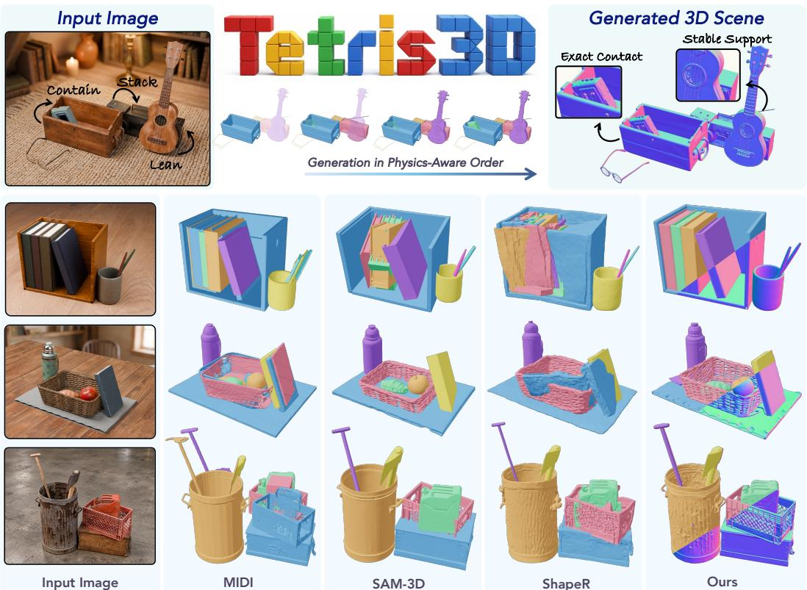  
Figure 1: Teaser. Tetris3D reconstructs 3D scenes by generating objects that fit together as a scene. We generate objects autoregressively, explicitly conditioning each on neighboring geometry and physical relations to achieve geometric and physical coherence among objects, even under occlusion.

## ABSTRACT

We propose Tetris3D, a generative framework for single-image 3D scene reconstruction that recovers objects which are physically and geometrically coherent as a scene. Existing methods often generate objects independently or couple them implicitly, providing limited guidance for ensuring fine-grained spatial compatibility between neighboring objects that interact with one another. To address this, we explicitly condition the generation of each object on the geometry of surrounding objects and their physical relationships, guiding its shape and pose to remain geometrically and physically plausible within the scene. Moreover, we introduce ComOb, a physics simulation-based dataset of 1.2M scenes featuring physical interactions across diverse object categories, with per-object meshes and pairwise physical relation annotations. Comprehensive experiments on synthetic and realworld scenes show that Tetris3D recovers coherent object shapes and poses even when interacting regions are occluded, and achieves state-of-the-art performance in both generation quality and physical stability.

## 1 INTRODUCTION

3D scene generation from an image reconstructs compositional scenes by recovering each object as a separate and complete 3D entity in a shared scene space. This enables the conversion of realworld observations into 3D assets for applications such as physical simulation, VR/AR, and robotic manipulation. To support these applications, scene reconstruction should recover not only plausible objects but also their physically and geometrically coherent composition. Interactions between objects—such as support and containment—depicted in the image require fine-grained spatial compatibility between neighboring objects. However, neighboring objects often occlude the very regions where they interact, making it challenging to recover this consistency from visible evidence alone.

Despite recent progress in 3D generation (Zhang et al., 2023; Li et al., 2025; Zhang et al., 2024; Xiang et al., 2026; 2025), recovering such inter-object spatial compatibility remains an open problem. Existing methods reconstruct scenes either by assembling individually generated objects (Chen et al., 2026b; Zhou et al., 2026; Li et al., 2026a; Siddiqui et al., 2026) or by jointly generating multiple objects or their poses through implicit feature aggregation (Huang et al., 2025; Meng et al., 2026; Shi et al., 2026). These approaches provide limited explicit guidance for the local spatial compatibility required to recover the depicted interactions.

Motivated by this, we propose Tetris3D, an object interaction-conditioned 3D generative framework for reconstructing scenes of objects that geometrically and physically fit together. Our key idea is to generate each object in relation to its neighbors rather than in isolation, by explicitly conditioning the generation of its shape and pose on neighboring geometry and physical relationships. Intuitively, when we interpret a scene, we use surrounding geometry to infer the space an object can occupy and physical relationships to reason how it should rest on or fit within its neighbors. Together, these cues help constrain possible object shapes and poses, even when the interacting regions are occluded.

Specifically, we reconstruct the scene by generating objects autoregressively, using previously generated neighbors as interaction context. We use a vision-language model (VLM) to infer a physical dependency hierarchy and derive the generation order by topologically sorting this hierarchy. For instance, given an image of a cup resting on a table, the table is generated first and its surface serves as the interaction context for the cup. For each object, we encode the neighboring geometry as spatial context, represented by surface distance and vectors indicating relative position, and the physical relationships with neighboring objects as relation type, represented by learnable embeddings. To inject these conditions in a manner spatially aligned with generation, we build on TRELLIS.2’s voxel-based generative backbone (Xiang et al., 2026). These interaction conditions are encoded on the same 3D grid used for generation and injected into the corresponding tokens, providing local guidance for generating each object shape that is spatially compatible with neighboring surfaces.

Training Tetris3D requires scenes that capture diverse object interactions with physical relation annotations. However, existing datasets are often restricted to specific environments (Wang et al., 2026; Ansari et al., 2026), or provide limited coverage of diverse physical interactions (Fu et al., 2021). To address these limitations, we introduce ComOb, a large-scale simulation-based scene dataset in which general objects are arranged according to diverse interaction types, such as stacking and containment, and settled into physically stable configurations through physics simulation (Todorov et al., 2012). It provides 1.2M scenes with per-object geometry, physical relation annotations, and occlusions that naturally arise from these arrangements. Finally, we conduct comprehensive experiments on synthetic (Stojanov et al., 2021) and real-world scenes (Ansari et al., 2026; Yu et al., 2026) to evaluate our framework. The results demonstrate that Tetris3D reconstructs plausible scenes that preserve object interactions even when the interacting regions are occluded, achieving superior performance in reconstruction and generation quality, and physical stability.

## 2 PRELIMINARIES: TRELLIS.2

We build our framework on TRELLIS.2 (Xiang et al., 2026), which generates a 3D shape through a two-stage pipeline. It first generates the sparse structure (SS), a binary occupancy grid $\mathbf { \breve { O } } \in \{ 0 , 1 \} ^ { N _ { s } ^ { - } \times \dot { N } _ { s } ^ { \bullet } \times N _ { s } }$ of resolution $N _ { s }$ in the canonical object space, whose L active voxels ${ \mathcal { S } } = \{ \bar { \bf p } _ { j } \} _ { j = 1 } ^ { L }$ , with $\mathbf { p } _ { j } \in \{ 0 , \dots , N _ { s } - 1 \} ^ { 3 }$ the coordinate of the j-th active voxel, outline the coarse geometry. It subsequently generates the Structured LATents $( \mathrm { S L A T } ) \ \mathbf { z } ^ { \mathrm { S L A T } } = \{ \mathbf { z } _ { j } \} _ { j = 1 } ^ { L }$ attached to these active voxels, which encode geometry and texture. SLAT is the latent encoding of the O-Voxel representation, a field-free sparse voxel structure that encodes geometry and appearance jointly as per-voxel feature tuples $\mathcal { F } = \{ ( \mathbf { f } _ { i } ^ { \mathrm { s h a p e } } , \mathbf { f } _ { j } ^ { \mathrm { m a t } } , \mathbf { p } _ { j } ) \} _ { j = 1 } ^ { L }$ , where $\mathbf { f } _ { i } ^ { \mathrm { s h a p e } }$ and $\mathbf { f } _ { j } ^ { \mathrm { m a t } }$ describe the local geometry and material of the j-th voxel, respectively. Each stage is modeled by a diffusion transformer (DiT) (Peebles & Xie, 2023) with flow-matching formulation (Lipman et al., 2022). The first, $v _ { \theta } ^ { \mathrm { S S } }$ , denoises a dense latent volume on a coarse grid of resolution $N _ { c } \bar { ( } < N _ { s } )$ , which is then decoded into O. The second, $v _ { \theta } ^ { \mathrm { S L A T } }$ , operates only on the L active voxels, treating them as tokens positionally embedded by their coordinates $\mathbf { p } _ { j }$ . Both are conditioned on the input image features from a frozen DINOv3 (Simeoni et al., 2025) encoder.´

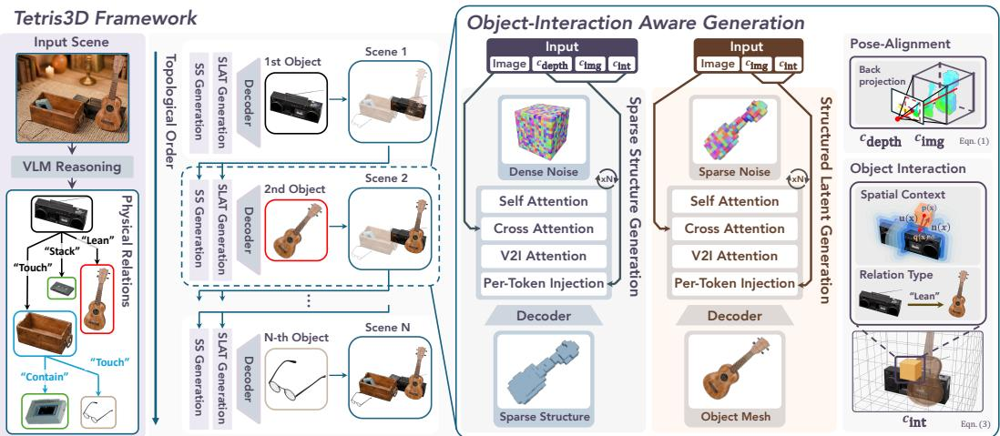  
Figure 2: Overview of Tetris3D. Tetris3D reconstructs scenes autoregressively in a topological order determined by VLM-inferred physical relations and dependencies (Sec. 3.5). Each object is generated through a two-stage pipeline consisting of sparse structure and structured latent generation, with two key components in each DiT: (1) Per-Token Injection (Sec. 3.2): We derive $c _ { \mathrm { d e p t h } }$ from the depth map, $c _ { \mathrm { i m g } }$ from back-projected image features, and $c _ { \mathrm { i n t } }$ from object interactions on the same 3D grid used for generation and these conditions are injected into the corresponding tokens. (2) V2I Attention (Sec. 3.3): Invisible tokens identified by object mask attend to visible tokens through cross-attention, using the aggregated information to complete occluded regions.

## 3 METHOD

## 3.1 OVERVIEW

We propose Tetris3D, a generative framework for object-centric 3D scene reconstruction from a single image. Our goal is to reconstruct a scene in which objects are physically and geometrically coherent with one another by explicitly conditioning generation on surrounding geometry and physical relationships. To achieve this, we incorporate object interactions into the generation process in two forms: spatial context and relation type. The spatial context captures the geometric arrangement of neighboring objects relative to the target object, helping recover geometry spatially compatible with the surroundings and avoid physically invalid configurations such as penetration. The relation type specifies the physical relationship between the target object and its neighbors, guiding the generated shape to reflect the interactions depicted in the input scene. Furthermore, to reconstruct the scene without a separate per-object pose-estimation stage, we generate each object directly in the pose observed in the scene image using the depth map and image feature back-projection. We also introduce a visible-to-invisible (V2I) cross-attention that guides the completion of occluded regions using information aggregated from visible tokens. To generate a scene, we generate objects autoregressively in a physical dependency order inferred by a VLM, so that each object is generated after the neighbors it depends on. We describe the overall pipeline in Fig. 2.

In the following, we first describe pose-aligned and interaction-aware object generation in the scene (Sec. 3.2). Next, we present visible-to-invisible cross-attention introduced for faithful completion of occluded parts (Sec. 3.3). Finally, we present ComOb, a physically consistent simulation-based scene dataset (Sec. 3.4), and describe the inference pipeline (Sec. 3.5).

## 3.2 TETRIS3D: GEOMETRICALLY AND PHYSICALLY COHERENT 3D SCENE GENERATION

## 3.2.1 POSE-ALIGNED OBJECT GENERATION IN THE SCENE

Unlike previous methods that separately estimate poses of generated shapes (Shi et al., 2026; Chen et al., 2026b) or require post-alignment (Li et al., 2026a; Zhou et al., 2026), we directly generate shapes in scene space with poses aligned with the input scene image. Here, scene space refers to the input camera’s 3D coordinate system, shared by all objects in the image. As shown in Fig. 3, we first define an object grid from the depth map (sensorcaptured or estimated), where the target object is generated. Inspired by Pixal3D (Li et al., 2026a), we backproject image features into this grid along camera rays to guide shape generation in alignment with the input scene image. Specifically, given the scene image, target object mask M, and depth map, we lift the pixels within M into a 3D partial point cloud $P$ using their depth. We then define the object grid G over a cube that encloses $P$ with an additional margin. To guide the position and orientation of the object in this grid, we construct a voxel-wise condition from the partial point cloud $P$ and the DINOv3 (Simeoni et al., 2025) feature map´ F. Let $\mathcal G _ { P } \subseteq \mathcal G$ denote the set of voxels containing at least one point from P. For each voxel $x \in { \mathcal { G } }$ , we define:

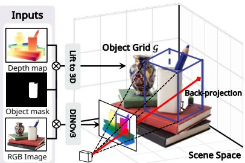  
Figure 3: Schematic of object grid $\mathcal { G }$ and pose-aligned generation.

$$
\begin{array} { r l } { c _ { \mathrm { d e p t h } } ( x ) = \left\{ \begin{array} { l l } { \mathbf { e } _ { \mathrm { d e p t h } } , } & { x \in \mathcal { G } _ { P } , } \\ { \mathbf { 0 } , } & { \mathrm { o t h e r w i s e } , } \end{array} \right. \quad } & { c _ { \mathrm { i m g } } ( x ) } \end{array} = F \big ( \pi ( x ) \big ) ,\tag{1}
$$

where $\mathbf { e } _ { \mathrm { d e p t h } }$ is a learnable embedding indicating observed surface occupancy, and π projects the voxel center from scene space to feature map coordinates along the camera ray. Together, these signals determine the object pose in the grid, so the generated shape is aligned with the scene space.

## 3.2.2 OBJECT INTERACTION-AWARE GENERATION

We incorporate two types of information into an object-interaction condition: (1) spatial context, which discourages interpenetration and floating for physical plausibility, and (2) relation type, which guides the generated shape to reflect the physical interactions depicted in the input scene image.

Spatial Context. To accommodate non-watertight meshes, we represent spatial context using an unsigned distance field (UDF), complemented with the direction to the nearest surface point and the surface normal at that point. Together, these quantities describe the voxel’s spatial relationship to the neighboring surfaces. Specifically, given a target object grid G and a set of neighboring objects $\mathcal { H } .$ let $\bar { \mathcal { H } } _ { \mathrm { u n i o n } }$ denote the union of the surfaces of the objects in $\mathcal { H } .$ For each voxel ${ \bar { x } } \in { \mathcal { G } }$ with its center coordinate ${ \mathbf p } ( x ) \in \mathbb R ^ { 3 }$ , let $\mathbf { q } ( x ) \in \mathcal { H } _ { \mathrm { u n i o n } }$ be its nearest surface point. We define the truncated unsigned distance $d ( x )$ , the direction vector $\mathbf { u } ( x )$ from the voxel center coordinate to the nearest surface point, and the surface normal of the nearest surface point n(x) as:

$$
d ( x ) = \operatorname* { m i n } { \big ( } \| \mathbf { p } ( x ) - \mathbf { q } ( x ) \| , \tau { \big ) } , \quad \mathbf { u } ( x ) = - { \frac { \mathbf { p } ( x ) - \mathbf { q } ( x ) } { \| \mathbf { p } ( x ) - \mathbf { q } ( x ) \| } } , \quad \mathbf { n } ( x ) = \mathbf { n } _ { \mathcal { H } _ { \operatorname { m i o n } } } { \big ( } \mathbf { q } ( x ) { \big ) } ,\tag{2}
$$

where τ is the truncation distance.

Relation Type. We encode the physical relation between the target object and each neighboring object using a learnable embedding from a predefined set of relation types, $\begin{array} { r l } { { \mathcal { R } } } & { { } = } \end{array}$ {stack, lean, contain, touch, none}. The relation types are either provided as input or inferred by a VLM together with the physical dependency reasoning described in Sec. 3.5. For each voxel $x ,$ let $r ( x ) \in \mathcal { R }$ denote the relation between the target object and the neighboring object to which the nearest surface point q(x) belongs.

Interaction Condition. We combine the spatial context and relation type into the per-voxel interaction condition as:

$$
c _ { \mathrm { i n t } } ( x ) = \left\{ \begin{array} { l l } { \mathrm { M L P } \left( \left[ \left( 1 - \frac { d ( x ) } { \tau } \right) \mathbf { e } _ { \mathrm { d i s t } } , ~ \mathrm { M L P } \left( [ \mathbf { u } ( x ) ; \mathbf { n } ( x ) ] \right) \right] \right) + \mathbf { W } _ { \mathrm { r e l } } \left[ r ( x ) \right] } & { \mathrm { i f ~ } d ( x ) < \tau , } \\ { \mathbf { 0 } } & { \mathrm { o t h e r w i s e } , } \end{array} \right.\tag{3}
$$

where $\mathbf { e } _ { \mathrm { d i s t } }$ is a learnable distance embedding, and $\mathbf { W } _ { \mathrm { r e l } }$ is a learnable relation embedding table. The proximity factor $( 1 - d ( x ) / \tau )$ assigns a larger weight to the distance embedding for voxels closer to a neighboring surface. Voxels at or beyond the truncation distance τ receive no condition.

## 3.2.3 VOXEL-ALIGNED CONDITION INJECTION

Since $c _ { \mathrm { i m g } } , c _ { \mathrm { d e p t h } }$ and $c _ { \mathrm { i n t } }$ are defined on the same object grid ${ \mathcal { G } } .$ , all generation and conditioning tokens are spatially aligned by construction. By exploiting this alignment, we inject those conditions directly into the corresponding tokens at every DiT layer of $v _ { \theta } ^ { \mathrm { S S } }$ and $v _ { \theta } ^ { \mathrm { S L A T } }$ . Specifically, at the l-th layer, these conditions are each projected by an MLP and added to the token feature:

$$
\begin{array} { r } { \mathbf { h } ^ { ( l ) } ( x ) \gets \mathbf { h } ^ { ( l ) } ( x ) + \mathrm { M L P } _ { \mathrm { i m g } } ^ { ( l ) } \left( c _ { \mathrm { i m g } } ( x ) \right) + \lambda _ { \mathrm { d e p t h } } \cdot \mathrm { M L P } _ { \mathrm { d e p t h } } ^ { ( l ) } \left( c _ { \mathrm { d e p t h } } ( x ) \right) + \lambda _ { \mathrm { i m t } } \cdot \mathrm { M L P } _ { \mathrm { i m t } } ^ { ( l ) } \left( c _ { \mathrm { i m t } } ( x ) \right) , } \end{array}\tag{4}
$$

where $\mathbf { h } ^ { ( l ) } ( x )$ denotes the feature of the token at voxel x, and $\lambda _ { \mathrm { d e p t h } } , \lambda _ { \mathrm { i n t } }$ are learnable scalar gates initialized to zero. This initialization leaves the original image-conditioned update unchanged at the start of finetuning, while allowing the model to adaptively incorporate the additional condition during training (Alayrac et al., 2022). This update is applied to all tokens of the dense latent volume in sparse structure generation, and only to tokens at active voxels in structured latent generation.

## 3.3 V2I ATTENTION: AMODAL COMPLETION VIA VISIBLE-TO-INVISIBLE ATTENTION

The main challenge in amodal generation from an occluded image is that the invisible region lacks conditional guidance. To mitigate this, inspired by completion and inpainting tasks (Li et al., 2023; Wei et al., 2023), we introduce visible-to-invisible (V2I) cross-attention, an explicit mechanism that updates the occluded part from the visible part. Specifically, since the tokens in the invisible region can be inferred from the tokens in the visible region, we adopt an additional cross-attention layer with the invisible tokens as queries and the visible tokens as keys and values. For the object grid G described in Sec. 3.2.1, let $\bar { \tau }$ denote a set of tokens corresponding to each voxel in G: all dense grid tokens for sparse structure generation, and the active-voxel tokens for structured latent generation. For a target object $o _ { i } .$ , we define the occlusion mask as $\begin{array} { r } { M _ { i } ^ { \mathrm { o c c } } = \bigcup _ { j \neq i } M _ { j } } \end{array}$ , treating all pixels occupied by other objects as potential occlusions of the target. The tokens whose voxels lie along the camera rays through these pixels form the invisible token set $\mathcal { T } _ { \mathrm { i n v i s } } ,$ and all remaining tokens form the visible token set ${ \mathcal { T } } _ { \mathrm { v i s } } = { \mathcal { T } } \backslash { \mathcal { T } } _ { \mathrm { i n v i s } }$ . At every DiT layer l of both $v _ { \theta } ^ { \mathrm { S S } }$ and $v _ { \theta } ^ { \mathrm { S L A T } }$ , we update the invisible tokens by cross-attending to the visible tokens:

$$
\mathbf { h } _ { \mathcal { T } _ { \mathrm { i n v i s } } } ^ { ( l ) }  \mathbf { h } _ { \mathcal { T } _ { \mathrm { i n v i s } } } ^ { ( l ) } + \lambda _ { \mathrm { V 2 I } } ^ { ( l ) } \cdot \mathrm { C r o s s A t t n } ( \mathbf { h } _ { \mathcal { T } _ { \mathrm { i n v i s } } } ^ { ( l ) } , \ \mathbf { h } _ { \mathcal { T } _ { \mathrm { v i s } } } ^ { ( l ) } ) ,\tag{5}
$$

where $\lambda _ { \mathrm { V 2 I } } ^ { ( l ) }$ is a learnable scalar initialized to zero.

## 3.4 COMOB: SIMULATION-BASED COMPOSITED OBJECT SCENE DATASET

We construct a large-scale simulation-based dataset in which diverse objects engage in physical interactions. Existing datasets are often restricted to specific environments, such as indoor scenes (Fu et al., 2021) or tabletops (Wang et al., 2026; Ansari et al., 2026), and provide limited coverage of complex physical interactions (Fu et al., 2021). These limitations make existing datasets less suitable for learning physical interactions among general objects. To address this, we introduce ComOb, a simulation-based physically consistent dataset of composite object scenes that captures physical interactions across diverse object categories, together with interaction-induced occlusions. To ensure that each scene contains direct physical interactions, we construct scenes around a predefined set of interaction types: {stack, lean, contain,pile, touch}. In each scene, target objects are arranged with respect to 3D primitives, such as cylinders and cones, according to the given interaction type, and are then settled into physically stable configurations through a physics engine (Todorov et al., 2012). Each target–primitive pair is annotated with its corresponding physical relation $r \in \mathcal { R }$ , as defined in Sec. 3.2.2. We use target objects from TRELLIS-500K (Xiang et al., 2025) and, in total, generate 1.2M scenes and 3.4M annotated samples from the generated scenes, comprising rendered RGB images, object masks, depth maps, object meshes, and physical relation labels. Further details are provided in Appendix B.3.

Table 1: Quantitative comparison on Toys4K (Stojanov et al., 2021). † denotes methods whose generated objects are aligned to the scene using FoundationPose (Wen et al., 2024).
<table><tr><td rowspan="2">Method</td><td colspan="6">Reconstruction Quality</td><td colspan="5">Generation Quality</td><td colspan="3">Physical Stability</td></tr><tr><td>CD-S ↓ CD-O ↓ F1-S ↑ F1-O ↑ IoU-B ↑</td><td></td><td></td><td></td><td></td><td></td><td>ICP-Rot ↓ MMD ↓ COV ↑ P-FID ↓ Uni3D ↑</td><td></td><td></td><td></td><td>ULIP↑ PD↓</td><td> $D _ { \mathrm { m e a n } }$ </td><td>↓  $E _ { \mathrm { p e a k } } \downarrow$ </td></tr><tr><td colspan="10">Scene Generation</td><td></td><td></td><td></td><td></td></tr><tr><td>SAM-3D</td><td>25.19</td><td>1.70</td><td>0.2462</td><td>0.6296</td><td>0.3817</td><td>20.37 10.65</td><td>2.840 71.24</td><td>5.222</td><td>0.6004</td><td>0.6314</td><td>1.354</td><td>192.4</td><td>0.8633</td></tr><tr><td>ShapeR WorldSculpt</td><td>5.72 8.68</td><td>1.61 1.98</td><td>0.6480 0.4302</td><td>0.6302</td><td>0.6408</td><td>2.590 2.973</td><td>71.61 70.56</td><td>12.45 4.816</td><td>0.5165 0.5454</td><td>0.5594 0.5776</td><td>0.8862 0.1177</td><td>115.1 103.5</td><td>0.4675 0.4812</td></tr><tr><td></td><td></td><td></td><td></td><td>0.5976</td><td>0.5369</td><td>17.31</td><td></td><td></td><td></td><td></td><td></td><td></td><td></td></tr><tr><td colspan="10">Amodal Generation + Pose Estimation</td><td colspan="3"></td></tr><tr><td>Amodal3R†</td><td>12.51</td><td>2.25</td><td>0.4455</td><td>0.5546</td><td>0.4634</td><td>22.97</td><td>3.331 65.66</td><td>6.998</td><td>0.5390</td><td>0.5720</td><td>0.5962</td><td>115.0</td><td>0.5457</td></tr><tr><td>GENA3D†</td><td>15.91</td><td>2.73</td><td>0.3812</td><td>0.5091</td><td>0.4126</td><td>27.63</td><td>3.928 62.46</td><td>8.280</td><td>0.4743</td><td>0.5015</td><td>0.9106</td><td>131.0</td><td>0.6193</td></tr><tr><td>Ours</td><td>3.68</td><td>0.97</td><td>0.8407</td><td>0.8084</td><td>0.7918</td><td>5.29</td><td>1.501 83.11</td><td>1.599</td><td>0.6884</td><td>0.7182</td><td>0.0036</td><td>38.91</td><td>0.1721</td></tr></table>

Table 2: Quantitative comparison on MessyKitchens (Ansari et al., 2026) and Picasso (Yu et al., 2026). † denotes methods whose generated objects are aligned to the scene using Foundation-Pose (Wen et al., 2024).
<table><tr><td rowspan="3">Method</td><td colspan="8">MessyKitchens</td><td colspan="8">Picasso</td></tr><tr><td colspan="4">Reconstruction Quality</td><td colspan="4">Physical Stability</td><td colspan="4">Reconstruction Quality</td><td colspan="4">Physical Stability</td></tr><tr><td colspan="17">CD-S ↓ CD-O ↓ F1-S ↑ F1-O ↑ IoU-B ↑ ICP-Rot ↓ PD ↓</td></tr><tr><td></td><td></td><td></td><td></td><td></td><td></td><td></td><td> $D _ { \mathrm { m e a n } } \downarrow E _ { \mathrm { p e a k } }$  Scene Generation</td><td>↓ CD-S ↓ CD-O ↓ F1-S ↑ F1-O ↑ IoU-B ↑ ICP-Rot ↓ PD ↓</td><td></td><td></td><td></td><td></td><td></td><td></td><td> $D _ { \mathrm { { m e a n } } } \downarrow E _ { \mathrm { { p e a k } } } \downarrow$ </td><td></td></tr><tr><td></td><td>0.64</td><td>0.8749 0.8187</td><td></td><td></td><td>9.43</td><td></td><td></td><td></td><td></td><td></td><td></td><td></td><td>12.87</td><td></td><td>1033.4</td><td>6.389</td></tr><tr><td>SAM-3D ShapeR</td><td>0.25 0.23</td><td>1.57</td><td>0.9089 0.6976</td><td>0.5417 0.6152</td><td>9.38</td><td>0.0270 0.0253</td><td>215.9</td><td>0.9949</td><td>0.66 0.65</td><td>1.12 1.90</td><td>0.7432 0.7254 0.7880 0.6293</td><td>0.5631 0.6887</td><td>12.04</td><td>0.1221 0.0666</td><td>932.2</td><td>4.335</td></tr><tr><td>WorldSculpt</td><td>0.32</td><td>1.19</td><td>0.8601 0.7445</td><td>0.5552</td><td>9.88</td><td>0.0012</td><td>388.8 266.3</td><td>1.825 1.291</td><td>0.54</td><td>1.69</td><td>0.7834 0.6975</td><td>0.5087</td><td>18.66</td><td>0.0111</td><td>900.3</td><td>4.125</td></tr><tr><td>MIDI</td><td>2.79</td><td>2.85</td><td>0.39660.5725</td><td>0.1361</td><td>36.10</td><td>1.606</td><td>488.4</td><td>2.669</td><td>1.60</td><td>2.47</td><td>0.6063 0.5398</td><td>0.3331</td><td>32.23</td><td>8.058</td><td>887.5</td><td>4.972</td></tr><tr><td>SceneGen</td><td>2.47</td><td>2.99</td><td>0.4232 0.5481</td><td>0.0682</td><td>25.70</td><td>27.21</td><td>2354.5</td><td>11.40 2.54</td><td>3.18</td><td></td><td>0.45090.4841</td><td>0.2132</td><td>40.04</td><td>30.83</td><td>2784.5</td><td>12.52</td></tr><tr><td>SceneMaker</td><td>1.35</td><td>2.00</td><td>0.5394 0.6113</td><td>0.2858</td><td>25.48</td><td>2.069</td><td>531.8</td><td>2.527 1.78</td><td>2.24</td><td></td><td>0.5395 0.5611</td><td>0.4222</td><td>24.62</td><td>4.636</td><td>915.3</td><td>4.488</td></tr><tr><td></td><td></td><td></td><td></td><td></td><td></td><td>Amodal Generation + Pose Estimation</td><td></td><td></td><td></td><td></td><td></td><td></td><td></td><td></td><td></td><td></td></tr><tr><td></td><td></td><td></td><td></td><td></td><td></td><td></td><td></td><td></td><td></td><td></td><td></td><td></td><td>17.01</td><td></td><td></td><td>4.060</td></tr><tr><td>Amodal3R† GENA3D†</td><td>0.32 0.46</td><td>1.66 2.08</td><td>0.8787 0.6996 0.8253 0.6636</td><td>0.5695 0.5315</td><td>9.52 11.61</td><td>0.0447 0.0265</td><td>267.5 290.1</td><td>1.407 1.668</td><td>0.66 1.27</td><td>1.75 2.61</td><td>0.78260.7121 0.6494 0.5233</td><td>0.6203 0.4384</td><td>32.87</td><td>0.1397 0.1416</td><td>875.5 1006.6</td><td>5.083</td></tr><tr><td>Ours</td><td>0.11</td><td>0.63</td><td>0.9620 0.8284</td><td>0.7113</td><td>5.19</td><td>0.0011</td><td>102.0</td><td>0.3347</td><td>0.27</td><td>1.06</td><td>0.9053 0.7325</td><td>0.7264</td><td>8.913</td><td>0.0016</td><td>434.4</td><td>2.147</td></tr></table>

## 3.5 INFERENCE PIPELINE

Our framework reconstructs a scene by sequentially generating objects conditioned on their interac tions with other objects in the same scene. At inference, when reconstructing a scene from scratch, no reconstructed object is initially available for interaction conditioning. Therefore, we generate ob jects autoregressively in an order that respects their physical dependencies. Specifically, following prior works (Li et al., 2026b; Chen et al., 2026a; Lin et al., 2026a), we use a VLM (Bai et al., 2025) to infer a directed physical dependency hierarchy, and derive the generation order by topologically sorting this hierarchy. Each node represents an object, and a directed edge from object k to object i indicates that i relies on k for physical support or stability and should therefore be generated after k. Each edge is additionally labeled with the corresponding physical relation $r \in \mathcal { R }$ . For example, a cup resting on a table depends on the table for support against gravity. We therefore generate the table first and use its reconstructed surface as physical context when generating the cup. By generating supporting objects before their dependents, the geometry required for interaction conditioning becomes available progressively throughout the autoregressive reconstruction. We provide further details in Appendix B.4.

## 4 EXPERIMENTS

We describe implementation details in Appendix B and evaluation details in Appendix C. We further provide additional analyses in Appendix D, including results with estimated depth and VLMbased relation reasoning. Finally, we compare our method with agentic generation using GPT-6 Astra (OpenAI, 2026) in Appendix D.3.

Baselines. We compare Tetris3D against scene generation methods, including SAM-3D (Chen et al., 2026b), ShapeR (Siddiqui et al., 2026), WorldSculpt (Niu et al., 2026), SceneMaker (Shi et al., 2026), SceneGen (Meng et al., 2026), and MIDI (Huang et al., 2025). We compare against amodal generation methods, Amodal3R (Wu et al., 2025) and GENA3D (Zhou & Tai, 2025), paired with FoundationPose (Wen et al., 2024) for placement in the scene.

Evaluation Protocol. We evaluate Tetris3D on Toys4K (Stojanov et al., 2021), whose object sources are disjoint from those used for training. To evaluate reconstruction under object interaction and occlusion, we compose evaluation scenes by arranging primitives around each Toys4K object with our ComOb generator. On these scenes, all methods receive the ground-truth depth maps; results with depth estimated by MoGe3 (Kong et al., 2026) are reported in Appendix D. We further compare Tetris3D against baselines on Picasso (Yu et al., 2026) and MessyKitchens (Ansari et al., 2026), which contain real and contact-rich scenes, to assess generalization beyond ComObgenerated settings. We use estimated depth from MoGe3 and physical relations inferred by a VLM (Bai et al., 2025) and follow our inference pipeline described in Sec. 3.5. We evaluate the reconstructed scenes from three perspectives: (i) scene-level quality, measuring how accurately object shapes and poses are jointly recovered in scene space; (ii) object-level quality, measuring the geometric fidelity of each object in the object canonical space; and (iii) physical stability, measuring the physical consistency of the reconstructed scene through inter-object penetration and post-simulation stability. The simulation stability evaluates whether objects remain in place without falling or drifting when the reconstructed scene is simulated in a physics engine (Todorov et al., 2012).

Metrics. We measure scene-level quality using scene-level Chamfer Distance (CD-S) and F-Score (F1-S), bounding-box IoU (IoU-B), and the residual rotation error after per-object ICP alignment (ICP-Rot), and object-level quality using object-level Chamfer Distance (CD-O) and F-Score (F1- O). CD is reported $\times 1 0 ^ { 2 }$ . For generative quality, we report MMD and COV (Achlioptas et al., 2018) against the ground-truth object distribution, P-FID (Nichol et al., 2022), the Frechet distance´ between point-cloud features of generated and ground-truth objects, and ULIP (Xue et al., 2024) and Uni3D (Zhou et al., 2024) similarities between the input image and generated point cloud as semantic measures. MMD is reported in units of $1 0 ^ { - 3 }$ , while COV is reported as a percentage. For physical stability, following (Lee et al., 2026; Li et al., 2026b), we report penetration depth (PD) to quantify interpenetration, mean displacement $( D _ { \mathrm { m e a n } } )$ to measure settling error, and peak kinetic energy per unit mass $( E _ { \mathrm { p e a k } } , \mathrm { i n J / k g } )$ to measure dynamic instability during simulation.

## 4.1 COMPARISONS

Quantitative Comparison. As shown in Tab. 1, Tetris3D outperforms both scene generation baselines and amodal generation methods combined with pose estimation across reconstruction quality, generative quality, and physical stability. These results indicate that Tetris3D recovers plausible shapes and well-aligned poses under occlusion, by leveraging surrounding spatial context to produce physically consistent scenes. Moreover, as shown in Tab. 2, Tetris3D maintains superior performance on real-world scene benchmarks with complex interactions and contacts, demonstrating its generalization beyond synthetic scenes. Across these comparisons, Tetris3D achieves substantial improvements in physical stability including PD and $D _ { \mathrm { m e a n } }$ , indicating the effectiveness of conditioning object generation on neighboring geometry and physical relationships.

Qualitative Comparison. We show qualitative comparisons on Toys4K in Fig. 4 and on MessyKitchens (Ansari et al., 2026) in Fig. 5. As shown in Fig. 4, Tetris3D reconstructs plausible object shapes and poses even under occlusion, while better preserving the physical interactions with surrounding primitive objects without penetration. Fig. 5 further shows that our method generalizes well to real scene images, producing more plausible reconstructions than the baselines and remaining stable after physics simulation. Note that Fig. 5 results are obtained by autoregressive generation using estimated depth and VLM-based physical relation reasoning.

## 4.2 ABLATION STUDY

We analyze the effects of the interaction conditioning signal and the visible-to-invisible (V2I) attention described in Sec. 3.3. Further training details for the ablation study are provided in Appendix B.

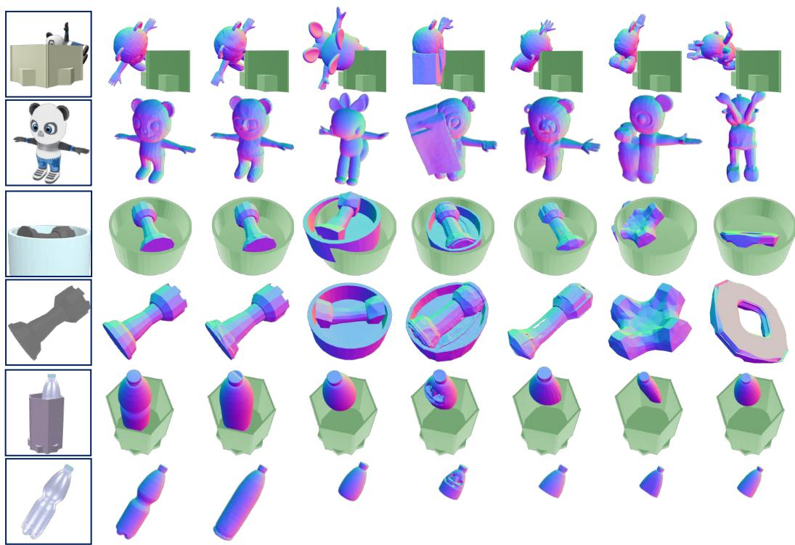  
Input  
GT  
Ours  
SAM-3D  
ShapeR  
WorldSculpt  
Amodal3R  
GENA3D

Figure 4: Qualitative comparison. Input scene images (top) and complete target images (bottom) are shown for reference. For each scene, the top row shows reconstructed shapes and poses in scene space, and the bottom row shows individual objects from a common viewpoint.  
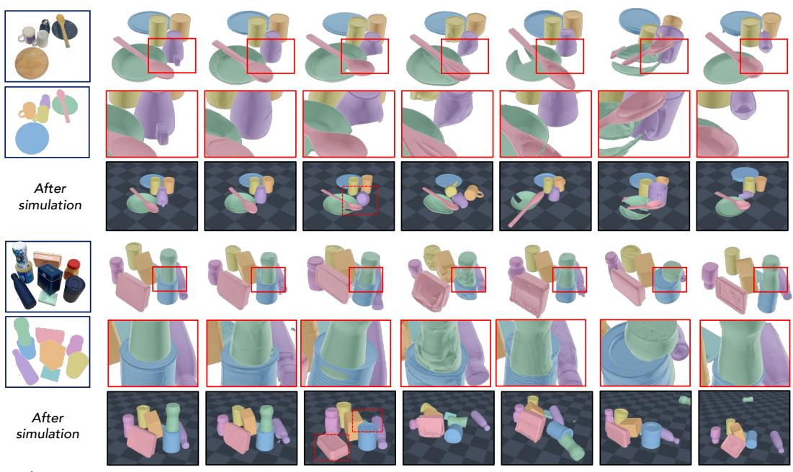  
Input  
GT & Initial State  
Ours  
SAM-3D  
ShapeR  
WorldSculpt  
SceneMaker  
Amodal3R

Figure 5: Qualitative comparison. The first column shows the scene image (top) and per-object masks (bottom), with colors matching the corresponding objects in the generated scenes. For each scene, we show the reconstruction and its final state after physics simulation (Todorov et al., 2012).

Table 3: Ablation study on interaction conditioning and amodal generation. We evaluate the effect of interaction conditions and architectural designs for amodal generation on Toys4K (Stojanov et al., 2021). For w/Amodal3R Attn, we replace our V2I attention with the occlusion-aware attention module of Amodal3R (Wu et al., 2025).
<table><tr><td rowspan="2">Configuration</td><td colspan="6">Reconstruction Quality</td><td colspan="5">Generation Quality</td><td colspan="3">Physical Stability</td></tr><tr><td>CD-S ↓</td><td>CD-O↓</td><td>F1-S↑</td><td>F1-O↑</td><td>IoU-B ↑</td><td>ICP-Rot ↓</td><td>MMD↓</td><td>COV↑</td><td>P-FID ↓</td><td>Uni3D ↑</td><td>ULIP↑</td><td>PD↓</td><td> $D _ { \mathrm { m e a n } } .$  1</td><td> $E _ { \mathrm { p e a k } } \downarrow$ </td></tr><tr><td>Full model (Ours)</td><td>3.90</td><td>1.28</td><td>0.7963</td><td>0.7691</td><td>0.7603</td><td>5.50</td><td>1.563</td><td>84.3</td><td>1.875</td><td>0.6704</td><td>0.7069</td><td>0.0192</td><td>39.22</td><td>0.1193</td></tr><tr><td>w/o Interaction Cond.</td><td>8.56</td><td>1.37</td><td>0.7599</td><td>0.7134</td><td>0.6918</td><td>8.66</td><td>1.841</td><td>80.66</td><td>1.938</td><td>0.6385</td><td>0.6766</td><td>0.4980</td><td>69.24</td><td>0.3240</td></tr><tr><td>w/o V2I Attn.</td><td>4.46</td><td>1.37</td><td>0.7905</td><td>0.7591</td><td>0.7506</td><td>6.00</td><td>1.629</td><td>84.01</td><td>1.949</td><td>0.6474</td><td>0.6897</td><td>0.0270</td><td>42.04</td><td>0.1396</td></tr><tr><td>w/ Amodal3R Attn.</td><td>4.29</td><td>1.34</td><td>0.7909</td><td>0.7659</td><td>0.7496</td><td>5.82</td><td>1.573</td><td>84.25</td><td>1.951</td><td>0.6615</td><td>0.7018</td><td>0.0281</td><td>40.67</td><td>0.1322</td></tr></table>

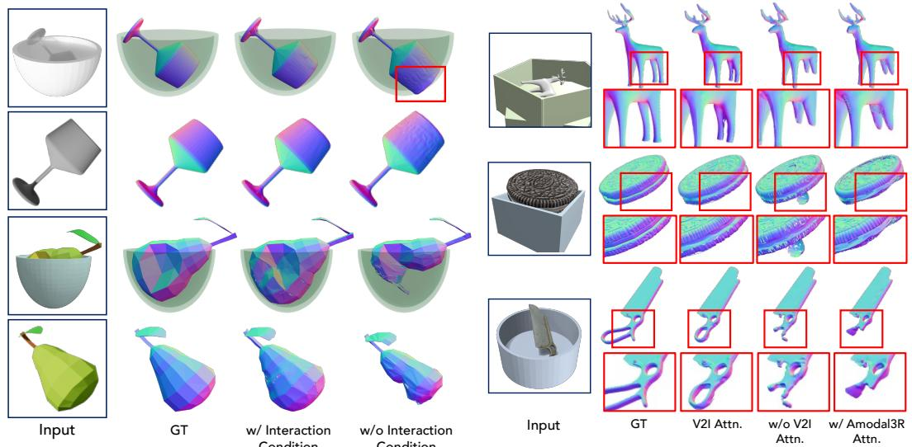  
Figure 6: Qualitative comparison on interaction Figure 7: Qualitative comparison of amodal conditioning. generation.

Analysis on Interaction Conditioning. To assess the effect of interaction conditioning, we compare against a variant of our model without the interaction condition. As shown in Tab. 3 and Fig. 6, this variant exhibits lower shape generation quality and reduced physical stability. In particular, penetration depth (PD) increases substantially, indicating more severe interpenetration between objects. These results suggest that interaction conditioning provides important cues not only for accurate reconstruction but also for generating physically plausible object configurations.

Attention Design for Amodal Generation. We compare different architectural designs for amodal generation to evaluate the effect of the visible-to-invisible (V2I) attention introduced in Sec. 3.3. As shown in Tab. 3, removing V2I attention reduces both generative and reconstruction quality. Replacing it with the occlusion-aware attention module of Amodal3R (Wu et al., 2025) yields a modest improvement over the variant without V2I attention, but performance remains below that of our design. These results suggest that explicitly aggregating information from visible tokens provides effective guidance for completing invisible regions under occlusion.

## 5 CONCLUSION

We propose Tetris3D, a generative framework for single-image 3D scene reconstruction that explicitly conditions object generation on neighboring geometry and physical relations. We also introduce ComOb, a large-scale simulation-based dataset of diverse objects in physically stable configurations with interaction annotations. Experiments on synthetic and real-world benchmarks demonstrate improved reconstruction quality and physical consistency, even when interacting regions are occluded. We believe Tetris3D provides a practical step toward versatile compositional 3D scene generation.

## AI USE STATEMENT

In this work, we used generative AI tools for polishing the writing of the manuscript and the preparation of the result visualizations. We did not use generative AI tools for research ideation, model and experimental design, or analysis. These tasks were performed by the authors. We reviewed all AI-assisted work. Specifically, we reviewed the text for technical accuracy and consistency with our intended meaning, and verified that the visualizations accurately represented our methods and experimental results. We take responsibility for the final content of this work, including text, claims, and artifacts produced with the aid of generative AI.

## REFERENCES

Panos Achlioptas, Olga Diamanti, Ioannis Mitliagkas, and Leonidas Guibas. Learning representations and generative models for 3d point clouds. In International conference on machine learning, pp. 40–49. PMLR, 2018.

Jean-Baptiste Alayrac, Jeff Donahue, Pauline Luc, Antoine Miech, Iain Barr, Yana Hasson, Karel Lenc, Arthur Mensch, Katherine Millican, Malcolm Reynolds, et al. Flamingo: a visual language model for few-shot learning. Advances in neural information processing systems, 35:23716– 23736, 2022.

Junaid Ahmed Ansari, Ran Ding, Fabio Pizzati, and Ivan Laptev. Messykitchens: Contact-rich object-level 3d scene reconstruction. arXiv preprint arXiv:2603.16868, 2026.

Jiayang Ao, Yanbei Jiang, Qiuhong Ke, and Krista A Ehinger. Open-world amodal appearance completion. In 2025 IEEE/CVF Conference on Computer Vision and Pattern Recognition (CVPR), pp. 6490–6499. IEEE, 2025.

Andreea Ardelean, Mert Ozer, and Bernhard Egger. Gen3dsr: Generalizable 3d scene reconstruction<sup>¨</sup> via divide and conquer from a single view. In 2025 International Conference on 3D Vision (3DV), pp. 616–626. IEEE, 2025.

Dejan Azinovic, Ricardo Martin-Brualla, Dan B Goldman, Matthias Nießner, and Justus Thies.´ Neural rgb-d surface reconstruction. In 2022 IEEE/CVF Conference on Computer Vision and Pattern Recognition (CVPR), pp. 6280–6291. IEEE, 2022.

Shuai Bai, Yuxuan Cai, Ruizhe Chen, Keqin Chen, Xionghui Chen, Zesen Cheng, Lianghao Deng, Wei Ding, Chang Gao, Chunjiang Ge, et al. Qwen3-vl technical report. arXiv preprint arXiv:2511.21631, 2025.

Nicolas Carion, Laura Gustafson, Yuan-Ting Hu, Shoubhik Debnath, Ronghang Hu, Didac Suris Coll-Vinent, Chaitanya Ryali, Kalyan Vasudev Alwala, Haitham Khedr, Andrew Huang, et al. Sam 3: Segment anything with concepts. In International conference on learning representations, volume 2026, pp. 138846–138923, 2026.

Weixing Chen, Zhuoqian Feng, Yang Liu, Yexin Zhang, Yifan Wen, Yinghong Liao, Weichao Qiu, Guanbin Li, and Liang Lin. Physcene3d: Physically consistent interactive 3d tabletop scene generation. arXiv preprint arXiv:2606.01649, 2026a.

Xingyu Chen, Fu-Jen Chu, Pierre Gleize, Kevin J Liang, Alexander Sax, Hao Tang, Weiyao Wang, Michelle Guo, Thibaut Hardin, Xiang Li, et al. Sam 3d: 3dfy anything in images. In Proceedings of the IEEE/CVF Conference on Computer Vision and Pattern Recognition, pp. 7220–7232, 2026b.

Yen-Chi Cheng, Hsin-Ying Lee, Sergey Tulyakov, Alexander G Schwing, and Liang-Yan Gui. Sdfusion: Multimodal 3d shape completion, reconstruction, and generation. In Proceedings of the IEEE/CVF conference on computer vision and pattern recognition, pp. 4456–4465, 2023.

Manuel Dahnert, Angela Dai, Norman Muller, and Matthias Nießner. Coherent 3d scene diffusion¨ from a single rgb image. Advances in Neural Information Processing Systems, 37:23435–23463, 2024.

Angela Dai, Angel X Chang, Manolis Savva, Maciej Halber, Thomas Funkhouser, and Matthias Nießner. Scannet: Richly-annotated 3d reconstructions of indoor scenes. In 2017 IEEE conference on computer vision and pattern recognition (CVPR), pp. 2432–2443. IEEE, 2017.

Tianyuan Dai, Josiah Wong, Yunfan Jiang, Chen Wang, Cem Gokmen, Ruohan Zhang, Jiajun Wu, and Li Fei-Fei. Automated creation of digital cousins for robust policy learning. arXiv preprint arXiv:2410.07408, 2024.

Matt Deitke, Ruoshi Liu, Matthew Wallingford, Huong Ngo, Oscar Michel, Aditya Kusupati, Alan Fan, Christian Laforte, Vikram Voleti, Samir Yitzhak Gadre, et al. Objaverse-xl: A universe of 10m+ 3d objects. Advances in Neural Information Processing Systems, 36:35799–35813, 2023a.

Matt Deitke, Dustin Schwenk, Jordi Salvador, Luca Weihs, Oscar Michel, Eli VanderBilt, Ludwig Schmidt, Kiana Ehsani, Aniruddha Kembhavi, and Ali Farhadi. Objaverse: A universe of annotated 3d objects. In Proceedings of the IEEE/CVF conference on computer vision and pattern recognition, pp. 13142–13153, 2023b.

Huan Fu, Bowen Cai, Lin Gao, Ling-Xiao Zhang, Jiaming Wang, Cao Li, Qixun Zeng, Chengyue Sun, Rongfei Jia, Binqiang Zhao, et al. 3d-front: 3d furnished rooms with layouts and semantics. In 2021 IEEE/CVF International Conference on Computer Vision (ICCV), pp. 10913–10922. IEEE, 2021.

Jonathan Ho and Tim Salimans. Classifier-free diffusion guidance. arXiv preprint arXiv:2207.12598, 2022.

Yicong Hong, Kai Zhang, Jiuxiang Gu, Sai Bi, Yang Zhou, Difan Liu, Feng Liu, Kalyan Sunkavalli, Trung Bui, and Hao Tan. Lrm: Large reconstruction model for single image to 3d. In International Conference on Learning Representations, volume 2024, pp. 50678–50702, 2024.

Anita Hu and Maria Shugrina. Axolotl3d: a unified framework for faithful 3d shape completion. arXiv preprint arXiv:2607.20660, 2026.

Zehuan Huang, Yuan-Chen Guo, Xingqiao An, Yunhan Yang, Yangguang Li, Zi-Xin Zou, Ding Liang, Xihui Liu, Yan-Pei Cao, and Lu Sheng. Midi: Multi-instance diffusion for single image to 3d scene generation. In 2025 IEEE/CVF Conference on Computer Vision and Pattern Recognition (CVPR), pp. 23646–23657. IEEE, 2025.

Lingyu Kong, Ruicheng Li, Ruicheng Wang, Sicheng Xu, Chengtang Yao, Jianfeng Xiang, and Jiaolong Yang. Moge-3: Fine-detail monocular geometry estimation with self-guided sparse volumetric refinement. arXiv e-prints, pp. arXiv–2607, 2026.

Inhee Lee, Sangwon Baik, Sungjoo Kim, Hyeonwoo Kim, Hyunsoo Cha, and Hanbyul Joo. Simuscene: Simulation-ready compositional 3d scene reconstruction from a single image. arXiv preprint arXiv:2606.03994, 2026.

Dong-Yang Li, Wang Zhao, Yuxin Chen, Wenbo Hu, Meng-Hao Guo, Fang-Lue Zhang, Ying Shan, and Shi-Min Hu. Pixal3d: Pixel-aligned 3d generation from images. In Proceedings ofthe Special Interest Group on Computer Graphics and Interactive Techniques Conference Conference Papers, pp. 1–12, 2026a.

Haodong Li, Lulu Shao, Haolin Lu, Yu Fu, Yen-Ru Chen, Seemandhar Jain, and Manmohan Chandraker. ϕ-scene: Physically grounded image-to-3d scene reconstruction. arXiv preprint arXiv:2606.21596, 2026b.

Minzhang Li, Kuixiang Shao, Xuebing Li, Yuyang Jiao, Yinuo Bai, Hengan Zhou, Sixian Shen, Jiayuan Gu, and Jingyi Yu. Spread: Spatial-physical reasoning via geometry aware diffusion. arXiv preprint arXiv:2603.27573, 2026c.

Shanshan Li, Pan Gao, Xiaoyang Tan, and Mingqiang Wei. Proxyformer: Proxy alignment assisted point cloud completion with missing part sensitive transformer. In 2023 IEEE/CVF Conference on Computer Vision and Pattern Recognition (CVPR), pp. 9466–9475. IEEE, 2023.

Yangguang Li, Zi-Xin Zou, Zexiang Liu, Dehu Wang, Yuan Liang, Zhipeng Yu, Xingchao Liu, Yuan-Chen Guo, Ding Liang, Wanli Ouyang, et al. Triposg: High-fidelity 3d shape synthesis using large-scale rectified flow models. IEEE Transactions on Pattern Analysis and Machine Intelligence, 2025.

Guying Lin, Kemeng Huang, Michael Liu, Ruihan Gao, Hanke Chen, Lyuhao Chen, Beijia Lu, Taku Komura, Yuan Liu, Jun-Yan Zhu, et al. Pat3d: Physics-augmented text-to-3d scene generation. In International Conference on Learning Representations, volume 2026, pp. 150281–150301, 2026a.

Yuchen Lin, Chenguo Lin, Panwang Pan, Honglei Yan, Feng Yiqiang, Yadong Mu, and Katerina Fragkiadaki. Partcrafter: Structured 3d mesh generation via compositional latent diffusion transformers. Advances in Neural Information Processing Systems, 38:35387–35415, 2026b.

Yaron Lipman, Ricky TQ Chen, Heli Ben-Hamu, Maximilian Nickel, and Matt Le. Flow matching for generative modeling. arXiv preprint arXiv:2210.02747, 2022.

Haolin Liu, Yujian Zheng, Guanying Chen, Shuguang Cui, and Xiaoguang Han. Towards highfidelity single-view holistic reconstruction of indoor scenes. In European Conference on Computer Vision, pp. 429–446. Springer, 2022.

Ilya Loshchilov and Frank Hutter. Decoupled weight decay regularization. arXiv preprint arXiv:1711.05101, 2017.

Yanxu Meng, Haoning Wu, Ya Zhang, and Weidi Xie. Scenegen: Single-image 3d scene generation in one feedforward pass. In 2026 International Conference on 3D Vision (3DV), pp. 543–553. IEEE, 2026.

Alex Nichol, Heewoo Jun, Prafulla Dhariwal, Pamela Mishkin, and Mark Chen. Point-e: A system for generating 3d point clouds from complex prompts. arXiv preprint arXiv:2212.08751, 2022.

Muyao Niu, Jixuan He, Ruihan Yu, Lian Fu, Yonghao Yu, Zheng-Hui Huang, Yifan Zhan, Fengbo Lan, Yongtao Ge, Yinqiang Zheng, et al. Worldsculpt: Generating compositional worlds from grounded videos. arXiv preprint arXiv:2609.05416, 2026.

OpenAI. GPT-6 Astra: A new generation of intelligence. https://openai.com/index/ gpt-6-astra/, September 2026.

Ege Ozguroglu, Ruoshi Liu, D´ıdac Sur´ıs, Dian Chen, Achal Dave, Pavel Tokmakov, and Carl Vondrick. pix2gestalt: Amodal segmentation by synthesizing wholes. In 2024 IEEE/CVF Conference on Computer Vision and Pattern Recognition (CVPR), pp. 3931–3940. IEEE Computer Society, 2024.

William Peebles and Saining Xie. Scalable diffusion models with transformers. In 2023 IEEE/CVF International Conference on Computer Vision (ICCV), pp. 4172–4182. IEEE, 2023.

Yansong Qu, Shaohui Dai, Xinyang Li, Yuze Wang, You Shen, Shengchuan Zhang, and Liujuan Cao. Deocc-1-to-3: 3d de-occlusion from a single image via self-supervised multi-view diffusion. In Proceedings of the AAAI Conference on Artificial Intelligence, volume 40, pp. 8677–8685, 2026.

Yukai Shi, Weiyu Li, Zihao Wang, Hongyang Li, Xingyu Chen, Ping Tan, and Lei Zhang. Scenemaker: Open-set 3d scene generation with decoupled de-occlusion and pose estimation model. In Proceedings of the IEEE/CVF Conference on Computer Vision and Pattern Recognition, pp. 27146–27156, 2026.

Yawar Siddiqui, Duncan Frost, Samir Aroudj, Armen Avetisyan, Henry Howard-Jenkins, Daniel DeTone, Pierre Moulon, Qirui Wu, Zhengqin Li, Julian Straub, et al. Shaper: Robust conditional 3d shape generation from casual captures. arXiv preprint arXiv:2601.11514, 2026.

Oriane Simeoni, Huy V Vo, Maximilian Seitzer, Federico Baldassarre, Maxime Oquab, Cijo Jose, ´ Vasil Khalidov, Marc Szafraniec, Seungeun Yi, Michael Ramamonjisoa, et al. Dinov3.¨ arXiv preprint arXiv:2508.10104, 2025.

Stefan Stojanov, Anh Thai, and James M Rehg. Using shape to categorize: Low-shot learning with an explicit shape bias. In 2021 IEEE/CVF Conference on Computer Vision and Pattern Recognition (CVPR), pp. 1798–1808. IEEE, 2021.

Jiapeng Tang, Yinyu Nie, Lev Markhasin, Angela Dai, Justus Thies, and Matthias Nießner. Diffuscene: Denoising diffusion models for generative indoor scene synthesis. In 2024 IEEE/CVF Conference on Computer Vision and Pattern Recognition (CVPR), pp. 20507–20518. IEEE, 2024.

Zhenggang Tang, Yuehao Wang, Yuchen Fan, Jun-Kun Chen, Yu-Ying Yeh, Kihyuk Sohn, Zhangyang Wang, Qixing Huang, Alexander Schwing, Rakesh Ranjan, et al. Co-generation of layout and shape from text via autoregressive 3d diffusion. arXiv preprint arXiv:2604.16552, 2026.

Emanuel Todorov, Tom Erez, and Yuval Tassa. Mujoco: A physics engine for model-based control. In 2012 IEEE/RSJ international conference on intelligent robots and systems, pp. 5026–5033. IEEE, 2012.

Boyuan Wang, Yue Zhang, Xutao Xue, Xueyu Song, and Yu Sun. Tableverse: A large-scale tabletop dataset with real-world grounded layouts for generalizable manipulation. arXiv preprint arXiv:2607.21017, 2026.

Chen Wei, Karttikeya Mangalam, Po-Yao Huang, Yanghao Li, Haoqi Fan, Hu Xu, Huiyu Wang, Cihang Xie, Alan Yuille, and Christoph Feichtenhofer. Diffusion models as masked autoencoders. In 2023 IEEE/CVF International Conference on Computer Vision (ICCV), pp. 16238–16248. IEEE, 2023.

Bowen Wen, Wei Yang, Jan Kautz, and Stan Birchfield. Foundationpose: Unified 6d pose estimation and tracking of novel objects. In 2024 IEEE/CVF Conference on Computer Vision and Pattern Recognition (CVPR), pp. 17868–17879. IEEE, 2024.

Shuang Wu, Youtian Lin, Feihu Zhang, Yifei Zeng, Yikang Yang, Jiachen Qian, Siyu Zhu, Xun Cao, Philip Torr, Yao Yao, et al. Direct3d-s2: Gigascale 3d generation made easy with spatial sparse attention. Advances in Neural Information Processing Systems, 38:170778–170804, 2026.

Tianhao Wu, Chuanxia Zheng, Frank Guan, Andrea Vedaldi, and Tat-Jen Cham. Amodal3r: Amodal 3d reconstruction from occluded 2d images. In 2025 IEEE/CVF International Conference on Computer Vision (ICCV), pp. 9181–9193. IEEE, 2025.

Jiatong Xia, Zicheng Duan, Anton van den Hengel, and Lingqiao Liu. Points-to-3d: Structure-aware 3d generation with point cloud priors. In Proceedings ofthe IEEE/CVF Conference on Computer Vision and Pattern Recognition, pp. 19928–19939, 2026.

Jianfeng Xiang, Zelong Lv, Sicheng Xu, Yu Deng, Ruicheng Wang, Bowen Zhang, Dong Chen, Xin Tong, and Jiaolong Yang. Structured 3d latents for scalable and versatile 3d generation. In 2025 IEEE/CVF Conference on Computer Vision and Pattern Recognition (CVPR), pp. 21469–21480. IEEE, 2025.

Jianfeng Xiang, Xiaoxue Chen, Sicheng Xu, Ruicheng Wang, Zelong Lv, Yu Deng, Hongyuan Zhu, Yue Dong, Hao Zhao, Nicholas Jing Yuan, et al. Native and compact structured latents for 3d generation. In Proceedings of the IEEE/CVF Conference on Computer Vision and Pattern Recognition, pp. 14419–14429, 2026.

Le Xue, Ning Yu, Shu Zhang, Artemis Panagopoulou, Junnan Li, Roberto Mart´ın-Mart´ın, Jiajun Wu, Caiming Xiong, Ran Xu, Juan Carlos Niebles, et al. Ulip-2: Towards scalable multimodal pretraining for 3d understanding. In 2024 IEEE/CVF Conference on Computer Vision and Pattern Recognition (CVPR), pp. 27081–27091. IEEE, 2024.

Kaixin Yao, Longwen Zhang, Xinhao Yan, Yan Zeng, Qixuan Zhang, Lan Xu, Wei Yang, Jiayuan Gu, and Jingyi Yu. Cast: Component-aligned 3d scene reconstruction from an rgb image. ACM Transactions on Graphics (TOG), 44(4):1–19, 2025.

Xihang Yu, Rajat Talak, Lorenzo Shaikewitz, and Luca Carlone. Picasso: Holistic scene reconstruction with physics-constrained sampling. arXiv preprint arXiv:2602.08058, 2026.

Biao Zhang, Jiapeng Tang, Matthias Niessner, and Peter Wonka. 3dshape2vecset: A 3d shape representation for neural fields and generative diffusion models. ACM Transactions On Graphics (TOG), 42(4):1–16, 2023.

Longwen Zhang, Ziyu Wang, Qixuan Zhang, Qiwei Qiu, Anqi Pang, Haoran Jiang, Wei Yang, Lan Xu, and Jingyi Yu. Clay: A controllable large-scale generative model for creating high-quality 3d assets. ACM Transactions On Graphics (TOG), 43(4):1–20, 2024.

Xiang Zhang, Sohyun Yoo, Hongrui Wu, Chuan Li, Jianwen Xie, and Zhuowen Tu. Pixarmesh: Autoregressive mesh-native single-view scene reconstruction. arXiv preprint arXiv:2603.05888, 2026.

Qingcheng Zhao, Xiang Zhang, Haiyang Xu, Zeyuan Chen, Jianwen Xie, Yuan Gao, and Zhuowen Tu. Depr: Depth guided single-view scene reconstruction with instance-level diffusion. In 2025 IEEE/CVF International Conference on Computer Vision (ICCV), pp. 5722–5733. IEEE, 2025a.

Zibo Zhao, Zeqiang Lai, Qingxiang Lin, Yunfei Zhao, Haolin Liu, Shuhui Yang, Yifei Feng, Mingxin Yang, Sheng Zhang, Xianghui Yang, et al. Hunyuan3d 2.0: Scaling diffusion models for high resolution textured 3d assets generation. arXiv preprint arXiv:2501.12202, 2025b.

Junsheng Zhou, Jinsheng Wang, Baorui Ma, Yu-Shen Liu, Tiejun Huang, and Xinlong Wang. Uni3d: Exploring unified 3d representation at scale. In International Conference on Learning Representations, volume 2024, pp. 46766–46782, 2024.

Junwei Zhou and Yu-Wing Tai. Gena3d: Generative amodal 3d modeling by bridging 2d priors and 3d coherence. arXiv preprint arXiv:2511.21945, 2025.

Zihan Zhou, Luxi Chen, Jingzhi Zhou, Yuhao Wan, Min Zhao, Baoyu Fan, and Chongxuan Li. Pose-aware diffusion for 3d generation. arXiv preprint arXiv:2605.00345, 2026.

## Appendix

A Related Works   
B Implementation Details   
B.1 Model Details   
B.2 Training Details   
B.3 Dataset Generator Details   
B.4 Inference Pipeline Details   
C Evaluation Details   
C.1 Evaluation Protocol Details   
C.2 Evaluation Metric Details   
D Additional Results   
D.1 Quantitative Results   
D.2 Qualitative Results   
D.3 Comparison with Agentic Scene Generation   
Discussion and Limitations   
F Prompt Examples   
A RELATED WORKS

3D generative models. With large-scale 3D datasets (Deitke et al., 2023b;a), 3D generation has shifted toward 3D-native models over compact latents: one line encodes a shape as an unordered set of latent vectors (Zhang et al., 2023; 2024; Li et al., 2025; Zhao et al., 2025b), while another line attaches latents to a sparse voxel grid and decodes them into 3D assets (Xiang et al., 2025; Wu et al., 2026; Xiang et al., 2026). Across both lines, the input image feature is typically injected via crossattention into a canonical-pose generator (Cheng et al., 2023; Hong et al., 2024; Li et al., 2025; Chen et al., 2026b). A complementary line instead grounds the condition in the generation space itself: Pixal3D (Li et al., 2026a) back-projects pixel features along camera rays and generates in the input camera frame, while 3D priors such as point cloud (Xia et al., 2026; Siddiqui et al., 2026) are also embedded into the latent rather than attended to. These models, however, assume a clean image of a single object, whereas objects in real scenes occlude one another. Amodal completion addresses this in image space (Ozguroglu et al., 2024; Ao et al., 2025; Qu et al., 2026), and recent works complete occluded objects in the 3D latent space, conditioning attention on visibility and occlusion cues (Wu et al., 2025; Hu & Shugrina, 2026; Zhou & Tai, 2025). All of these, however, complete each object from its own visible region alone, without leveraging cues from the surrounding scene. Motivated by this, we condition generation on the spatial context and physical relations of neighboring objects, and complete occluded regions by attending from hidden to visible tokens.

3D scene generation. Scenes have been built either by retrieving assets from offline libraries (Dai et al., 2024), which limits open-set diversity, or by learning scene-native generative models (Liu et al., 2022; Dahnert et al., 2024; Tang et al., 2024) from scene datasets (Fu et al., 2021; Dai et al., 2017; Azinovic et al., 2022), which confines them to specific domains such as indoor rooms. Object-´ native pipelines (Ardelean et al., 2025; Zhao et al., 2025a; Chen et al., 2026b) lift this restriction with generators trained on open-set data, generating each object before registering it into the scene. Concurrently, WorldSculpt (Niu et al., 2026) extends Pixal3D (Li et al., 2026a) to multi-view setting for scene-level generation. Since objects are generated independently, the composed scenes often exhibit physically implausible artifacts such as penetration or floating. To enforce physical plausibility, one line resolves these violations at test time, using VLM relation graphs to refine poses (Yao et al., 2025; Li et al., 2026b), or running a simulation in the loop (Lin et al., 2026a; Lee et al., 2026), while another builds physics into the generation process (Li et al., 2026c; Chen et al., 2026a). More recently, several methods generate multiple instances in a single pass, coupling shape and pose through attention (Huang et al., 2025; Meng et al., 2026; Lin et al., 2026b; Zhang et al., 2026) or autoregressive co-generation (Tang et al., 2026), while another line (Shi et al., 2026; Ansari et al., 2026) predicts object poses jointly, letting attention among them settle into a layout. In contrast to this family, where object interactions remain implicit in attention or confined to pose, we explicitly condition generation on the spatial context and physical relations between objects.

## B IMPLEMENTATION DETAILS

## B.1 MODEL DETAILS

Overall Model Architecture. We build Tetris3D on TRELLIS.2 (Xiang et al., 2026), which consists of a 30-block DiT backbone for each generation stage. With the added visible-to-invisible attention layers, the sparse structure and structured latent generation models contain approximately 1.83B and 1.68B parameters, respectively. Each block has a lightweight encoder for the per-token nearest-surface condition (Sec. 3.2.3).

Image Condition Masking. Following prior works (Wu et al., 2025; Zhou & Tai, 2025; Hu & Shugrina, 2026), we blend each DINOv3 (Simeoni et al., 2025) patch feature´ f with a learnable null embedding e<sub>empty</sub> according to its occlusion ratio $\rho \in [ 0 , 1 ]$

$$
\tilde { \mathbf { f } } = ( 1 - \rho ) \mathbf { f } + \rho \mathbf { e } _ { \mathrm { e m p t y } } .\tag{6}
$$

The same masking is applied to the projected image condition $c _ { \mathrm { i m g } }$ defined in Eqn. 1.

Visible-to-Invisible Attention. Within each sample, tokens with fully observed projected features are classified as visible, while those receiving any null contribution are classified as invisible. Tokens projecting outside the image crop are excluded from this attention branch. In each DiT block, we initialize the weights of the branch’s normalization and query/output projections from the pretrained cross-attention, and its key/value projections from self-attention. The residual output is applied only to invisible tokens through a zero-initialized gate, so the added branch initially leaves the original block update unchanged. When no invisible tokens are present, this layer is skipped.

## B.2 TRAINING DETAILS

We initialize the weights of TRELLIS.2 backbone and the back-projected image-feature conditioning components of Tetris3D from Pixal3D (Li et al., 2026a), and train the model on our ComOb dataset described in Sec. 3.4. We detail the dataset construction in Sec.B.3. We train the sparse structure generation model for 200K iterations and the structured latent generation model for 100K iterations. For both training, we use the AdamW optimizer (Loshchilov & Hutter, 2017) with a learning rate of $1 \times 1 0 ^ { - 4 }$ and a weight decay of 0.01. All models are trained on two NVIDIA H200 GPUs with a batch size of 16. Training takes approximately 7 days for the sparse structure DiT and 9 days for the structured latent DiT. Note that, for the ablation study, we train the sparse structure generation model for 100K iterations, while keeping the structured latent generation model unchanged. We also apply condition dropout for classifier-free guidance (Ho & Salimans, 2022). All conditions are jointly dropped with probability 0.1, while individual condition groups are independently dropped with probability 0.05. For sparse structure generation, these groups consist of the image features, depth condition, neighboring-surface geometry, and relation condition; for structured latent generation, they consist of the image, geometry, and relation conditions.

Curriculum Training with Occlusion. To improve robustness to diverse forms of occlusion while preserving the prior of the pretrained shape generator, we use three types of training images: complete images without occlusion, images occluded by the primitives, and images with synthetic occlusion. For synthetic occlusion, we follow the protocol of Axolotl3D (Hu & Shugrina, 2026),

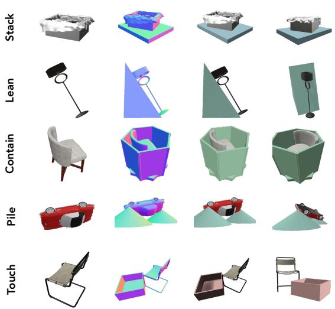  
Target  
3D Scene  
Rendered Images  
Target  
3D Scene  
Rendered Images

Figure 8: Examples of ComOb. We showcase scenes from the ComOb dataset. Each row corresponds to a different interaction type. From left to right, we show the complete target-object image, the normal map of the 3D scene, and images rendered from viewpoints used during training.

compositing synthetic occluders onto complete images. Following (Siddiqui et al., 2026), we adop a two-stage curriculum training strategy. In Stage 1, the model is trained only on complete images with all conditions provided. In Stage 2, we additionally include primitive-occluded and synthetically occluded images, sampling the three image types at a ratio of 1:2:1, respectively. Specifically, we train the sparse structure generation model for 50K iterations in Stage 1 and 150K iterations in Stage 2. For structured latent generation, we train for 30K and 70K iterations in Stage 1 and Stage 2, respectively. For the ablation study, we train 50K iterations in Stage 2 for the sparse structure generation model while keeping Stage 1 training iterations unchanged. The ablation study is conducted with models trained for the same number of iterations to exclude the effect of training configuration.

Depth Augmentation. To improve robustness to noisy depth estimates at inference time, we augment the depth condition during training. For sparse structure generation, with probability 0.3, we perturb observed depth points along their camera rays with Gaussian noise and re-voxelize them within a local neighborhood. We further randomly drop 10% of the observed depth voxels. These perturbations are applied only to the depth condition, leaving the image features unchanged.

## B.3 DATASET GENERATOR DETAILS

We construct our dataset, ComOb, to provide physically consistent scenes with explicit objectinteraction annotations. Each scene contains a single target object and one or more neighboring primitives. We choose and size the primitives according to the target geometry and intended interaction. We then run the simulation engine with the target while keeping the primitives fixed, and retain only scenes that pass the relation and geometry checks described below. Using approximately 400K unique target objects from TRELLIS-500K (Xiang et al., 2025), we generate 1.2M scenes. Examples of the generated scenes are shown in Fig. 8.

Primitive Selection. We use twelve parametric primitives: boxes, planks, cylinders, cones, spheres, wedges, tubes, tori, cups, open bins, polygonal bins, and bowls. The available primitive types depend on the intended interaction:

• Stacking: boxes, planks, and cylinders.

• Containment: cups, open bins, polygonal bins, tubes, and bowls.

• Leaning and touching: all twelve primitive types.

• Piling: cylinders, tubes, cones, wedges, boxes, and spheres.

Primitive Sizing. We sample the primitive’s longest dimension between half and twice that of the target object. For containment, we instead determine the primitive size based on the target diameter relative to the container opening, while enforcing the same bounds on its longest dimension.

Interaction-specific Placement. We generate scenes with 5 predefined interactions: {stack, lean, contain, pile, touch}. For each interaction type, we initialize each scene according to the intended interaction and check the resulting configuration after simulation:

• Stack. We release the target slightly above the supporting surface with a small horizontal perturbation. After settling, at least half of its footprint must overlap the support.

• Lean. We place a primitive on the side toward which the target is expected to topple. This direction is estimated from the projected center of mass relative to the center of its groundsupport region. After settling, we remove the primitive in a separate simulation. The scene is accepted as leaning only if the target falls without this support.

• Contain. We vary the target diameter relative to the container opening to obtain roomy, near-fit, and oversize configurations. Roomy targets are released near the cavity floor; the others are dropped just above the rim. We retain stable configurations in which the target is fully contained, partially inserted, or supported by the rim.

• Pile. We arrange two to four primitives, potentially of different types, in an inward-facing ring that forms a concave pocket. We drop the target into its center and discard configurations in which it falls out.

• Touch. We place the target beside a primitive with a small gap. Before the final stability check, we reduce this gap to establish contact. The resulting configuration must satisfy the penetration tolerance.

Physical Settling. We simulate each candidate scene in MuJoCo (Todorov et al., 2012), gradually reducing damping as the target settles. Containment and piling receive longer settling periods than the other interactions. We retain a candidate only if its linear and angular speeds remain below 0.025 m/s and 0.12 rad/s, respectively, throughout the final observation window.

Relation Annotations. We assign each accepted target–primitive pair a relation $r \in \mathcal { R }$ , following Sec. 3.2.2. The scene construction type does not necessarily become the pairwise relation label. In particular, pile describes how a scene is constructed, not an additional relation. Within a piling scene, primitives that contact the target are labeled stack, while the remaining primitives are labeled none.

Rendering Details. We render each settled scene in Blender using the EEVEE rasterizer, with the field of view randomly sampled from [35<sup>◦</sup>, 70<sup>◦</sup>]. To obtain a suitable level of occlusion, we generate candidate viewpoints over a predefined set of azimuth and elevation angles and retain those whose target-object visible ratio lies within [0.3, 0.9]. Other rendering configurations, including lighting, follow TRELLIS (Xiang et al., 2025).

## B.4 INFERENCE PIPELINE DETAILS

Data Preprocessing. At inference, our framework takes a monocular RGB image together with a depth map, camera parameters, and per-object segmentation masks. We obtain the depth map and camera parameters using the off-the-shelf depth estimation model MoGe3 (Kong et al., 2026), and extract object masks with SAM3 (Carion et al., 2026). To automatically identify the objects to segment, we use Qwen3-VL-30B (Bai et al., 2025) to extract the distinct object instances present in the input image. For each target object $o _ { i }$ with segmentation mask $M _ { i }$ , we define its occlusion mask as the union of the masks of all other objects:

$$
M _ { i } ^ { \mathrm { o c c } } = \bigcup _ { j \neq i } M _ { j } .\tag{7}
$$

By defining occlusion in this way, we do not assume or estimate the amodal extent of the target object in the image; instead, all regions occupied by other objects are treated as potential occlusions of the target.

Physical Dependency Graph Construc  
tion. Following prior works (Yao et al., Algorithm 1: Confidence-Weighted Physical Ordering   
2025; Li et al., 2026b; Chen et al., 2026a),   
Input: Objects V, ground root $r , \mathcal { E } _ { d } = \{ ( v _ { j }  v _ { i } , w ) \}$ with   
we employ a VLM to construct a graph   
confidence w, undirected relations $\mathcal { E } _ { u }$   
based on physical relations among ob-  
Output: Generation order π   
jects. Our procedure consists of a two-stage 1: N(v) ← vertices directly reachable from v by $\mathcal { E } _ { d }$ or $\mathcal { E } _ { u }$   
prompting pipeline designed to improve 2: $\mathcal { S }  \{ S \subseteq \mathcal { V } \mid r \in S \}$   
spatial grounding and reduce ambiguity in 3: D[S] $\therefore \overline { { \infty } } \forall \dot { S } \in \mathcal { S } ; ~ D [ \{ r \} ]  0$   
physical reasoning. In the first stage, we 4: for all $S \in \mathcal S$ in increasing order of |S| do   
provide Qwen3-VL-30B (Bai et al., 2025) 5: for all $v \in \mathcal { V } \setminus S$ such that $\mathcal { N } ( v ) \dot { \cap { } } S \neq \emptyset$ do   
with the input image and a colored seg- 6: $c ( v , S )  \quad \sum$ w   
mentation map to extract object metadata (v→u,w)∈E   
that associates each object with its visual u∈S   
7: if $D [ S ] + c ( v , S ) < D [ S \cup \{ v \} ]$ then   
attributes and unique RGB color in the seg- 8: $\dot { D } [ \dot { S } \cup \{ v \} ]  D [ \dot { S } ] + \dot { c ( v , S ) }$   
mentation map. This establishes a consis- 9: parent $[ \dot { S } \dot { \cup } \{ v \} ] \dot {  } \dot { ( S , v ) }$   
tent correspondence between each object 10: end if   
and its image region. In the second stage, 11: end for   
the resulting metadata, together with the 12: end for   
original image and segmentation map, is 13: π ← backtrack from V to $\{ r \}$ using parent   
provided to the VLM to infer physical rela- 14: return π   
tions with confidence between objects. We   
provide the in Prompt 1 and 2

provide the prompt examples for each stage in Prompt 1 and 2.

Specifically, we distinguish directed physical dependencies from undirected contact relations. A directed edge $o _ { j } ~  ~ o _ { i }$ indicates that $o _ { i }$ depends on $o _ { j }$ for its physical configuration, and thus $o _ { j }$ should be generated before $o _ { i } .$ . In contrast, a touch relation is treated as undirected. It does not prescribe an ordering, but requires at least one interacting neighbor to be available when the object is generated. Since VLM predictions may contain conflicting or cyclic dependencies, directly applying a topological sort does not always yield a valid generation order. We therefore employ a confidence-weighted ordering procedure, described in Alg. 1. The algorithm incrementally adds objects that have at least one physically related object already generated. Among all feasible orders, it minimizes the total confidence of directed edges that conflict with the resulting order, thereby preferentially preserving high-confidence physical dependencies while resolving cyclic predictions. Directed edges inconsistent with the selected order are discarded, resulting in an acyclic dependency graph. The final autoregressive generation follows this optimized ordering. Consequently, each object is generated only after relevant neighboring geometry has become available for interaction conditioning, while undirected contacts can still constrain which objects are eligible to be generated next.

## C EVALUATION DETAILS

## C.1 EVALUATION PROTOCOL DETAILS

For evaluation, all methods receive the same scene image, per-object masks, and depth map. When estimated depth is used, we apply median-based alignment. We evaluate per-object meshes in a shared world coordinate frame, with object position, orientation, and scale preserved in the mesh vertices. Since amodal generation baselines (Wu et al., 2025; Zhou & Tai, 2025) generate objects in canonical object space, we register their outputs to the scene coordinate frame using an off-the-shelf pose estimator (Wen et al., 2024). We evaluate reconstruction and generative quality using surface point clouds obtained through farthest point sampling (FPS). For scene-level evaluation, including CD-S, F1-S, IoU-B, and ICP-Rot, we first align the predicted scene to the ground-truth scene using a single rigid ICP transformation estimated from the combined surface points of all objects. This alignment preserves the relative arrangement of objects within the scene. For object-level metrics, including CD-O, F1-O, and generative quality metrics, we normalize each object to a common range and perform per-object ICP alignment, so that evaluation focuses on individual shape rather than scene placement. For physical stability, following prior work (Lee et al., 2026; Li et al., 2026b), we simulate the reconstructed scenes in MuJoCo (Todorov et al., 2012) and evaluate their stability during simulation. Penetration depth is measured in the initial configuration, before simulation.

## C.2 EVALUATION METRIC DETAILS

Throughout this section, let $\hat { Q }$ and $Q$ denote the predicted and ground-truth point sets, respectively, either for an individual object or for an entire scene obtained by concatenating the point sets of all objects. All point sets are sampled from the surface of the corresponding mesh.

Chamfer Distance (CD-S, CD-O). We measure the geometric discrepancy between $\hat { Q }$ and $Q$ using the symmetric mean of squared nearest-neighbor distances:

$$
\mathrm { C D } ( \hat { Q } , Q ) = \frac { 1 } { | \hat { Q } | } \sum _ { \hat { q } \in \hat { Q } } \operatorname* { m i n } _ { q \in Q } \| \hat { q } - q \| _ { 2 } ^ { 2 } + \frac { 1 } { | Q | } \sum _ { q \in Q } \operatorname* { m i n } _ { \hat { q } \in \hat { Q } } \| q - \hat { q } \| _ { 2 } ^ { 2 } .\tag{8}
$$

The first term measures the distance from the predicted geometry to the ground truth, while the second measures the distance from the ground truth to the prediction. We report CD-S at the scene level, where the point sets of all objects are concatenated, and CD-O at the individual-object level.

F-Score (F1-S, F1-O). Thresholding the same nearest-neighbour distances, this time Euclidean, at τ gives a precision and a recall:

$$
\mathrm { P r e c } _ { \tau } = \frac { 1 } { | P | } \sum _ { p \in P } \mathbb { 1 } \Big [ \operatorname* { m i n } _ { q \in Q } \lVert p - q \rVert < \tau \Big ] , \qquad \mathrm { R e c } _ { \tau } = \frac { 1 } { | Q | } \sum _ { q \in Q } \mathbb { 1 } \Big [ \operatorname* { m i n } _ { p \in P } \lVert q - p \rVert < \tau \Big ] ,\tag{9}
$$

and the F-Score is their harmonic mean. We use $\tau = 0 . 0 0 5$ , and report F1-S and F1-O at the scene and object level respectively.

Bounding-box IoU (IoU-B). We first align the predicted scene to the ground-truth scene using a single rigid ICP transformation. For each object, we then compute the volumetric intersection-overunion between the axis-aligned bounding boxes of the aligned predicted point set and the groundtruth point set.

Rotation Error (ICP-Rot). Let $R \in \mathrm { S O } ( 3 )$ denote the rotational component of the rigid transformation obtained by aligning a predicted object to its ground truth using ICP. We report the corresponding rotation angle,

$$
\theta = \operatorname { a r c c o s } \left( { \frac { \operatorname { t r } ( R ) - 1 } { 2 } } \right) ,\tag{10}
$$

in degrees.

Penetration Depth (PD). We measure interpenetration before simulation as:

$$
P D = \frac { 1 } { N } \sum _ { i = 1 } ^ { N } \sum _ { j } \operatorname* { m a x } \left\{ 0 , - \phi _ { j } ( \mathbf { x } _ { i } ) \right\} ,\tag{11}
$$

where $\mathbf { x } _ { i }$ is the world-space position of the i-th of $N = 2 0 { , } 4 8 0$ fixed, area-uniform target-surface samples, and $\phi _ { j }$ denotes the signed distance to neighboring object j at its initial pose, with negative values inside. Non-penetrating samples contribute zero.

Mean Displacement $D _ { \mathrm { m e a n } } .$ To quantify the change in object pose after simulation, we measure the mean displacement of the same fixed target-surface samples:

$$
D _ { \mathrm { m e a n } } = \frac { 1 } { N } \sum _ { i = 1 } ^ { N } \| \mathbf { x } _ { i } ( T ) - \mathbf { x } _ { i } ( 0 ) \| _ { 2 } ,\tag{12}
$$

where $N = 2 0 , 4 8 0 , \mathbf { x } _ { i } ( t )$ is the world-space position of the i-th surface sample, and $T = 3 0 0 { \mathrm { s } }$ is the simulation duration.

Peak Kinetic Energy $E _ { \mathrm { p e a k } }$ . To capture transient translational and rotational motion while reducing sensitivity to object mass, we report the peak kinetic energy per unit mass:

$$
E _ { \mathrm { p e a k } } = \operatorname* { m a x } _ { t \in \mathcal { T } } \frac { m \| \mathbf { v } _ { \mathrm { C O M } } ( t ) \| _ { 2 } ^ { 2 } + \omega ( t ) ^ { \top } \mathbf { I } _ { \mathrm { C O M } } ( t ) \omega ( t ) } { 2 m } ,\tag{13}
$$

where $m$ is the object mass, $\mathbf { v } _ { \mathrm { C O M } } ( t )$ is its center-of-mass velocity, $\omega ( t )$ is its angular velocity, and $\mathbf { I } _ { \mathrm { C O M } } ( t )$ is the inertia tensor about the center of mass. The set $\tau$ contains simulation states sampled at 1 ms intervals.

MMD and COV. We use Minimum Matching Distance (MMD) and Coverage (COV) (Achlioptas et al., 2018) to compare the set of generated objects with the set of ground-truth objects, using Chamfer Distance as the underlying distance measure. Let $\hat { \mathcal { Q } } = \{ \hat { Q } \}$ and $\mathcal { Q } = \{ Q \}$ denote the sets of generated and ground-truth objects, respectively. MMD averages, over each ground-truth object, the distance to its nearest generated object:

$$
\mathrm { M M D } = \frac { 1 } { | \mathcal { Q } | } \sum _ { Q \in \mathcal { Q } } \operatorname* { m i n } _ { \hat { Q } \in \hat { \mathcal { Q } } } \mathrm { C D } ( \hat { Q } , Q ) , \qquad \mathrm { C O V } = \frac  | \{ \begin{array} { l l } { \mathrm { a r g } \operatorname* { m i n } _ { Q \in \mathcal { Q } } \mathrm { C D } ( \hat { Q } , Q ) : \hat { Q } \in \hat { \mathcal { Q } } \} | } { | \mathcal { Q } | } . \end{array}\tag{14}
$$

COV is the fraction of ground-truth objects that are selected as the nearest neighbor of at least one generated object. We report MMD in units of $1 0 ^ { - 3 }$ and COV as a percentage.

P-FID. We compute the Frechet distance between the distributions of generated and ground-truth´ objects in the feature space of the point-cloud feature extractor released with Point-E (Nichol et al., 2022).

ULIP and Uni3D. We measure cross-modal consistency using ULIP (Xue et al., 2024) and Uni3D (Zhou et al., 2024). For each object, we compute the cosine similarity between the embedding of the generated point cloud and that of the corresponding input image crop used to condition its generation.

## D ADDITIONAL RESULTS

## D.1 QUANTITATIVE RESULTS

Evaluation with Estimated Depth. To assess sensitivity to depth estimation errors, we replace the ground-truth depth maps used in the main Toys4K (Stojanov et al., 2021) comparison with predictions from MoGe3 (Kong et al., 2026). All methods receive the same estimated depth maps following our evaluation protocol. As shown in Tab. 4, Tetris3D retains the best performance among the compared methods across all reconstruction and physical stability metrics. In particular, its lower penetration depth (PD) and mean displacement $( D _ { \mathrm { m e a n } } )$ indicate less interpenetration and greater stability during simulation. It also achieves the best MMD, COV, and P-FID, although SAM-3D obtains higher Uni3D and ULIP scores.

Evaluation with VLM-Inferred Relations. We evaluate the effect of replacing ground-truth physical relation annotations with relations inferred by a VLM (Bai et al., 2025) on Toys4K (Stojanov et al., 2021). This comparison examines whether automatically inferred relations provide sufficient guidance for interaction-conditioned generation. As shown in Tab. 5, the two settings yield similar reconstruction and generative quality. Scene-level and object-level reconstruction accuracy remain close, with only small changes in geometric and pose errors. Generative quality follows a similar pattern, with modest increases in MMD and P-FID and comparable coverage and semantic similarity scores. These results suggest that VLM-inferred relations can replace ground-truth annotations at inference time with only marginal changes in reconstruction and generative quality.

## D.2 QUALITATIVE RESULTS

We provide additional qualitative comparisons on Toys4K in Figs. 10–12. The examples include objects with thin structures and elongated parts that are partially occluded by surrounding primitives.

Table 4: Quantitative comparison on Toys4K (Stojanov et al., 2021) with estimated depth. We compare Tetris3D with baselines using depth maps estimated by MoGe3 (Kong et al., 2026). All methods requiring depth use the same depth maps. † denotes methods whose generated objects are aligned to the scene using FoundationPose (Wen et al., 2024).
<table><tr><td rowspan="2">Method</td><td colspan="6">Reconstruction Quality</td><td colspan="5">Generation Quality</td><td colspan="3">Physical Stability</td></tr><tr><td>CD-S ↓ CD-O ↓ F1-S ↑ F1-O ↑ IoU-B ↑</td><td></td><td></td><td></td><td></td><td>ICP-Rot ↓ MMD ↓</td><td></td><td>COV ↑ P-FID ↓ Uni3D ↑ ULIP ↑</td><td></td><td></td><td>PD↓</td><td> $D _ { \mathrm { m e a n } }$ </td><td>↓  $E _ { \mathrm { p e a k } } \downarrow$ </td></tr><tr><td colspan="10">Scene Generation</td><td></td><td></td><td></td><td></td></tr><tr><td>SAM-3D</td><td>24.80</td><td>1.73</td><td>0.2495</td><td>0.6250</td><td>0.3861</td><td>21.27 2.872 19.42</td><td>70.46</td><td>5.245</td><td>0.5981</td><td>0.6292</td><td>1.203</td><td>194.09</td><td>0.8269</td></tr><tr><td>ShapeR</td><td>10.54</td><td>2.28</td><td>0.4955</td><td>0.5241</td><td>0.4841</td><td>3.676</td><td>64.76</td><td>16.64</td><td>0.4453 0.5382</td><td>0.4831</td><td>0.8408</td><td>129.81</td><td>0.5989</td></tr><tr><td>WorldSculpt</td><td>12.53</td><td>2.11</td><td>0.3736</td><td>0.5818</td><td>0.4593</td><td>19.48 3.113</td><td>69.95</td><td>4.941</td><td></td><td>0.5683</td><td>0.2280</td><td>135.1</td><td>0.6655</td></tr><tr><td colspan="10">Amodal Generation + Pose Estimation</td><td colspan="3"></td></tr><tr><td>Amodal3R†</td><td>15.02</td><td>2.32</td><td>0.3756</td><td>0.5438</td><td>0.3875</td><td>27.27 3.468</td><td>64.89</td><td>7.102</td><td>0.5368</td><td>0.5692</td><td>0.5156</td><td>124.2</td><td>0.6172</td></tr><tr><td>GENA3D†</td><td>18.28</td><td>2.81</td><td>0.3247</td><td>0.4996</td><td>0.3521</td><td>31.66 4.107</td><td>60.80</td><td>8.599</td><td>0.4704</td><td>0.4977</td><td>0.8366</td><td>132.1</td><td>0.6417</td></tr><tr><td>Ours</td><td>7.56</td><td>1.58</td><td>0.6457</td><td>0.6679</td><td>0.6522</td><td>12.7</td><td>2.462 75.58</td><td>2.518</td><td>0.5795</td><td>0.6188</td><td>0.0047</td><td>50.49</td><td>0.2208</td></tr></table>

Table 5: Quantitative comparison on Toys4K (Stojanov et al., 2021) with VLM-based reasoning. We compare results using ground-truth physical relation annotations with those using relations inferred by a VLM (Bai et al., 2025). Tetris3D maintains comparable performance with VLMinferred relations.
<table><tr><td rowspan="2">Method</td><td colspan="6">Reconstruction Quality</td><td colspan="5">Generation Quality</td><td colspan="3">Physical Stability</td></tr><tr><td>CD-S ↓</td><td>CD-0↓</td><td>F1-S↑</td><td>F1-0↑</td><td>IoU-B ↑</td><td>ICP-Rot↓</td><td>MMD↓</td><td>COV↑</td><td>P-FID ↓</td><td>Uni3D ↑</td><td>ULIP↑</td><td>PD↓</td><td>Dmean ↓</td><td> $E _ { \mathrm { p e a k } } \downarrow$ </td></tr><tr><td>Ours (GT)</td><td>3.68</td><td>0.97</td><td>0.8407</td><td>0.8084</td><td>0.7918</td><td>5.29</td><td>1.501</td><td>83.11</td><td>1.599</td><td>0.6884</td><td>0.7182</td><td>0.0036</td><td>38.91</td><td>0.1721</td></tr><tr><td>Ours (VLM)</td><td>3.76</td><td>0.98</td><td>0.8399</td><td>0.8063</td><td>0.7905</td><td>5.37</td><td>1.538</td><td>83.38</td><td>1.651</td><td>0.6891</td><td>0.7195</td><td>0.0038</td><td>41.25</td><td>0.1780</td></tr></table>

For each example, we show both the reconstruction in scene space and the individual object from a common viewpoint, allowing shape completion and scene placement to be examined separately. By comparison, several baselines omit occluded parts, distort object proportions, or recover poses that differ from the ground truth. These examples complement the quantitative results by illustrating the benefit of considering neighboring objects when recovering both complete shapes and their spatial relationships within the scene.

## D.3 COMPARISON WITH AGENTIC SCENE GENERATION

We compare Tetris3D with an agentic scene generation approach based on a frontier large language model (OpenAI, 2026). As shown in Fig. 9, Tetris3D reconstructs object shapes and poses that more faithfully match the input image and depth. Although the agent-based approach produces broadly similar shapes and poses, it struggles to reproduce the scene configuration depicted in the image. We attribute these discrepancies in part to its reliance on constructing CAD meshes through generated scripts and 3D graphics tools, which can limit the recovery of fine, image-specific geometry. Moreover, the agent estimates object poses through spatial reasoning from the image but struggles to place objects precisely. The resulting scenes exhibit physically invalid configurations, including penetration (top row) and unsupported floating (middle and bottom rows). These results suggest that dedicated 3D generative models are better suited to recovering image-specific object geometry in this setting. They further suggest that explicitly conditioning shape and pose generation on neighboring geometry and physical relationships can yield more physically consistent scenes than relying on spatial reasoning for object placement alone. We provide the generation prompt in Prompt 3.

## E DISCUSSION AND LIMITATIONS

Our results suggest that physical interactions can serve as cues for recovering object shapes and poses, rather than only as criteria for evaluating a completed scene. By incorporating neighboring geometry and physical relations into generation, Tetris3D uses surrounding context to guide reconstruction even when interacting regions are occluded. However, these conditions provide learned


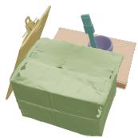

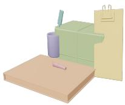

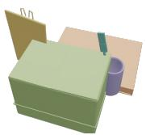

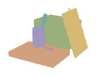

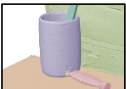

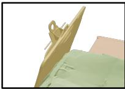

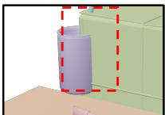

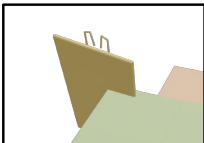  
Penetration  
Mismatched pose


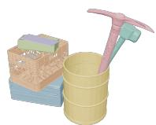


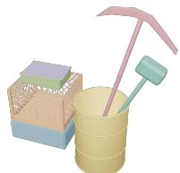

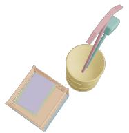

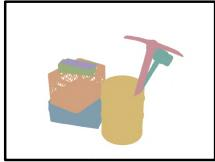

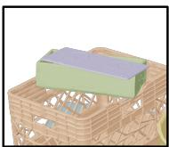

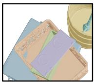

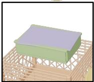  
Mismatched shape

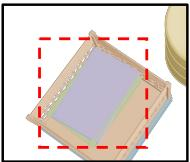  
Floating

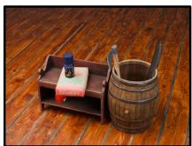

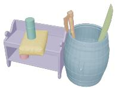

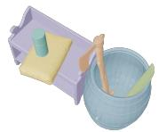

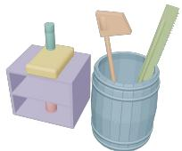

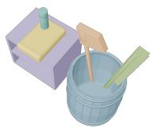

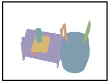  
Input Image & Mask

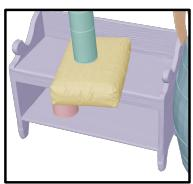

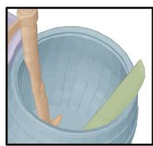  
Ours

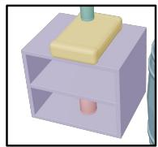  
Mismatched shape

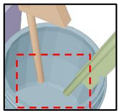  
Floating  
GPT 6 Astra

Figure 9: Qualitative comparison with agentic 3D generation. We compare Tetris3D with an LLM agent-based approach to 3D mesh generation (OpenAI, 2026). Although this approach can produce broadly similar shapes, it often fails to faithfully recover the object geometry depicted in the input image and struggles to generate physically consistent scene layouts.

guidance rather than hard physical constraints, and therefore do not guarantee physically valid configurations in every case. Our inference pipeline relies on off-the-shelf models for depth and camera estimation, object segmentation, and physical relation reasoning. Although these modules enable reconstruction from a single RGB image, their errors can affect the conditions used for generation. Inaccurate depth or segmentation can distort the object grid and projected features, while incorrect physical relations can lead to inappropriate interaction conditions or generation orders. Since previously generated objects provide context for subsequent objects, these errors may propagate through the autoregressive process. Reducing these dependencies and accounting for uncertainty in the estimated conditions are directions for future work.

# 中 月Input GT Ours SAM-3D ShapeR WorldSculpt Amodal3R GENA3D

Figure 10: Qualitative comparison with baselines on Toys4K (Stojanov et al., 2021)

GENA3D GENA3D

# 业 D L ■ m Input GT Ours SAM-3D ShapeR WorldSculpt Amodal3R

Figure 11: Qualitative comparison with baselines on Toys4K (Stojanov et al., 2021).

# OR Input GT Ours SAM-3D ShapeR WorldSculpt Amodal3R GENA3D

Figure 12: Qualitative comparison with baselines on Toys4K (Stojanov et al., 2021).

## F PROMPT EXAMPLES

Prompt 1: Prompt used for physical dependency reasoning   
You are a careful 3D scene reasoning assistant.   
You infer a physical dependency hierarchy: directed load-bearing edges and undirected   
contact edges among scene objects, including the ground plane.   
This hierarchy is used for sequential physical assembly, layered from the ground up.   
Each edge must be labeled with a pairwise physical relation from R = {stack, lean, contain   
, touch}.   
stack, lean, and contain are directed. touch is undirected.   
The generation order is determined by safely removing cycles from the original graphby   
deleting edge pairs with the minimum sum of confidenceand then following an order   
that satisfies topological sorting.   
The unique node with an in-degree of 0 is given as the root node, ’Plane’.   
Every listed object must appear in your output.   
Return strict JSON only. No markdown fences, no comments, no extra text.   
You are given:   
1. An original RGB scene image.   
2. A color instance-segmentation image, where each object instance is painted in a unique   
flat RGB color.   
3. An object inventory JSON. Each entry has a description and an instance RGB color [R, G,   
B].   
How to use the inputs:   
- Match each inventory name to its region by the instance\_rgb\_color in the segmentation   
image.   
- Then inspect the same region in the scene image, using the description as semantic   
context.   
Use object names exactly as given. Do not rename, merge, split, or invent objects.   
Task:   
Infer every pairwise physical relation that is visible or physically necessary, and emit   
it as an edge. Then run the Optimal Topological Sort below on those edges and emit   
the recovered generation order as the last field.   
Two kinds of edges (algorithm inputs):   
- Directed edges (stack, lean, contain): object A relies on object B for physical support   
or stability. Output from="B", to="A", i.e. B -> A. In the sort, B is a possible   
predecessor of A under a specific confidence level.   
- Undirected edges (touch): real physical contact that is not load-bearing support. Output   
one edge whose from/to merely name the pair; the from/to order is not generation   
order. In the sort, each endpoint is a possible predecessor of the other.   
- Do not let a touch edge reverse, cancel, or replace a stack, lean, or contain edge.   
How generation order is computed (Optimal Topological Sort). Your edges must be valid   
inputs to this procedure:   
1. Vertices N = all objects including Plane. Root = Plane.   
2. possiblePredecessors[v] starts empty for every vertex v.   
3. For every directed edge (u, v, confidence): add u to possiblePredecessors[v].   
4. For every undirected touch edge (u, v, confidence): add v to possiblePredecessors[u]   
and u to possiblePredecessors[v].   
5. startState = {Plane}. fullState = N. Every subset of N that contains Plane is a state.   
Cost of every state is infinity except cost(startState) = 0. Each state records a   
parent vertex or none.   
6. Process states from smaller subsets to larger. Skip a state S if its cost is still   
infinity.   
7. For each vertex v not in S: if S contains no possible predecessor of v, skip v.   
Otherwise deletionCost is the sum of confidences of directed edges v -> u with u   
already in S. Those directed edges are treated as deleted. nextState = S union {v}.   
If cost(S) + deletionCost is strictly cheaper than the current cost of nextState,   
update that cost and set parent(nextState) = v.   
8. Recover the order by walking backward from fullState to startState: repeatedly prepend   
parent(state) and remove it from the state. Plane is generated first; the recovered   
sequence is the generation order of the remaining objects. Emit that full sequence,   
Plane excluded, as "order".   
What this implies for the edges you emit:   
- An object can be generated only after at least one of its possible predecessors is   
already generated. An object with no possible predecessor can never be generated.   
Directed cycles are allowed. If two objects mutually load-bear, emit both directed edges   
with honest confidences. The sort keeps the cheaper growth path and deletes the   
conflicting directed edges of minimum total confidence.   
- Do not drop, reverse, or canonicalise a stack, lean, or contain edge just to make a DAG.   
Do not invent a tie-break direction for touch; it is undirected.

- Touch does participate in order eligibility: once either contacting object is generated,   
the other may become eligible even if no directed support between them exists. Touch   
does not prefer one order over the other.   
- Directed confidence is the cost of violating that ordering constraint. High confidence =   
clearly visible load-bearing that should be expensive to delete. Low confidence =   
occluded or guessed, cheaper to delete if it conflicts.   
Plane:   
The ground plane is a valid support object named "Plane". Never put "Plane" in "to".   
Include a Plane -> object directed edge whenever the object rests on, stands on, or is   
otherwise supported by the ground. Label that edge "stack" unless a more specific   
type applies.   
- Plane is the unique root: it is the startState, never a generated dependent, and never   
needs a predecessor.   
Relation types (use exactly these lowercase labels):   
- stack: the dependent object rests on, stands on, or is piled on the supporting object.   
The supporter load-bears from below, with substantial footprint overlap. This is the   
default for on-top support, including support by Plane. Directed: supporter ->   
dependent.   
- lean: the dependent object is not self-standing and would topple or fall without the   
supporting object’s lateral contact. After identifying a tilted or slanted object,   
add this directed edge from the object or Plane it leans against.   
contain: the dependent object is inside, partially inserted into, or rim-supported by a   
container. Directed: container -> contained.   
touch: there is real physical contact that is none of stack, lean, or contain (for   
example side-by-side contact). Use touch only when contact is visible or physically   
necessary, not for mere proximity, overlap, or shadow. Undirected.   
- Do not use "none" and do not emit an edge for incidental proximity with no physical   
dependence.   
Priority:   
- Label priority for a given pair: contain > lean > stack > touch. Pick the highest   
applicable label; do not emit a lower-priority label for the same contact.   
If stack, lean, or contain applies, do not label the same contact as touch.   
- Prefer physically plausible, gravity-consistent load-bearing support over mere visual   
adjacency.   
- One object may support many objects. One object may depend on many objects at once. If   
physically plausible, return all corresponding directed edges, including both   
directions when mutual load-bearing is real.   
Incidental proximity is not an edge. Symmetric touch is one undirected edge, not a pair   
of directed ordering constraints.   
Coverage and graph constraints:   
Every object except Plane must have at least one possible predecessor, so growth from {   
Plane} to the full set is possible. If the object is load-bearing-supported, that   
predecessor must include a directed stack, lean, or contain parent. If the support   
source is unknown or fully occluded, add Plane -> that object with relation "stack"   
"confidence" is a real number in 0.0-1.0. Use a high value when the relation is clearly   
visible. Use a low value when the object is occluded or the relation is guessed. For   
directed edges, this value is the deletion cost if the sort generates the dependent   
object before the supporter.   
- Directed 2-cycles are allowed: you may emit both A -> B and B -> A when both load  
bearing directions are physically true. Do not emit both orientations of the same   
touch pair; touch is one undirected edge.   
- Do not emit duplicate edges. Two edges are duplicates if they share the same from, to,   
and relation. A given directed pair (from, to) may have only one label: do not emit   
two edges with the same from and to even if the relations differ. For touch, emit   
exactly one edge per unordered pair; put the lexicographically smaller name in "from"   
only as a serialization convention, not as an ordering claim.   
"order" rules:   
Compute it only by the Optimal Topological Sort above, using the edges in this same JSON   
. Do not invent a separate assembly order.   
It is the sequence recovered in step 8. Walking backward prepends each parent, so the   
earliest generated object ends up at the front.   
- Every name in "objects" appears exactly once, and no other name appears.   
Return JSON with this schema. "order" is required and must be the last key:   
{   
"vertices": ["Plane", "object\_01", "object\_02"],   
"edges": [   
"from": "supporting\_or\_anchoring\_object\_name",   
"to": "dependent\_object\_name",   
"relation": "stack",   
"confidence": 0.85,   
"reason": "short explanation"

}   
],   
"order": ["object\_01", "object\_02"]   
}   
Allowed "relation" values: "stack" | "lean" | "contain" | "touch".

## Prompt 2: Object Inventory Prompt

You are a careful visual scene parser for 3D scene reconstruction.   
You inventory every instance-segmented object in a scene.   
Return strict JSON only. No markdown fences, no comments, no extra text.   
You are given:   
1. An original RGB scene image.   
2. A color instance-segmentation image, where each object instance is painted in a unique   
flat RGB color.   
Task:   
Identify every distinct object instance from the unique colors in the segmentation image.   
For each object:   
- Use the segmentation color only to locate the matching region in the original image.   
- Keep the two color sources separate. Do not confuse them:   
"description" appearance (shape, color, material) must come from the original RGB   
image. Never describe an object using its segmentation-mask paint color. A brown book   
painted green in the segmentation image is still a brown book, not a green book.   
- "instance\_rgb\_color" must be the exact flat mask color from the segmentation image. Do   
not copy the object’s real color from the original photo.   
- If a description refers to a nearby object, use that object’s real color from the   
original image, not its mask color.   
- Ignore unlabeled background (typically black, white, or near-zero colors that do not   
correspond to an object instance).   
- Do not merge two different colors into one object, and do not split one color into two   
objects.   
- Name objects sequentially as object\_01, object\_02, ... in raster order: sort unique   
object colors by the first occurrence of each color, top-to-bottom then left-to-right   
- Write a description that later physical-dependency reasoning can use. Pack all of the   
following into the single "description" string; do not add extra JSON fields:   
(a) category,   
(b) visual appearance from the original image (shape, color, material if visible),   
(c) approximate position in the scene,   
(d) occlusion.   
- Set instance\_rgb\_color to the exact integer [R, G, B] of that object’s flat color in the   
segmentation image. Do not guess the color from the original photo.   
Output constraints:   
Cover every unique object color. Do not invent objects that have no segmentation color.   
- Return JSON only.   
Return JSON following the exact format of this example:   
{   
"object\_01": {   
"description": "A desk lamp; brown metal with a curved stem, rounded base, and conical   
lampshade; standing on the left side of the desk; the shade is unoccluded.",   
"instance\_rgb\_color": [125, 237, 238]   
},   
"object\_02": {   
"description": "A book; brown, rectangular, and thick with a box-like shape; lying to   
the right of the lamp; the spine is partly occluded.",   
"instance\_rgb\_color": [46, 204, 113]   
}

## Prompt 3: Prompt used for agentic generation

```markdown
## Task
- Reconstruct an object-level 3D scene from the provided RGB image by authoring and
executing Blender Python scripts. The resulting scene must contain independently
addressable meshes corresponding to the distinct physical objects depicted in the
image. Use the provided RGB image and, when available, its associated depth map as
observational evidence.
```

## ## Generation mechanism

\- Construct the scene directly through agent-authored procedural modeling code in Blender. Do not invoke external image-to-3D systems, pretrained geometry-generation models, or asset-retrieval services. Create geometry using explicitly specified primitives, mesh operations, curves, modifiers, and procedural materials. Execute modeling and rendering on the CPU.

## ## Reconstruction objectives

\- Identify the visible objects and estimate their shapes, relative dimensions, orientations, and spatial relationships from the observations. Represent each semantic object as a separate mesh, combining its constituent components where appropriate. Reproduce the observed silhouettes, relative proportions, arrangement, support relationships, and material appearance. Infer plausible geometry for occluded or unobserved regions without consulting additional scene information. Treat absolute scale and unobserved structure as assumptions unless constrained by the permitted inputs. Estimate the camera configuration and lighting from the image to support visual comparison between the reconstruction and the reference.

## ## Iterative refinement

\- Render the reconstructed scene from the estimated reference viewpoint. Compare the rendering with the input image and revise object geometry, placement, materials, or camera parameters to reduce visible discrepancies. Validate that the exported scene preserves the intended object separation and contains usable mesh geometry.

## ## Deliverables

Provide an editable Blender scene, a complete scene export, individual object mesh exports, the executable generation scripts, and preview renderings. Include an object inventory and a provenance record identifying the inputs used.