# TILESKIPPER: REGION-ADAPTIVE TILE PRUNING FOR 3D GAUSSIAN SPLATTING

Jingxing Li, Yongjae Lee, Deliang Fan   
School of Electrical, Computer and Energy Engineering   
Arizona State University   
Tempe, AZ, USA   
{jingxing,ylee298,dfan}@asu.edu   
Abhay Kumar Yadav, Cheng Peng, Rama Chellappa   
Department of Electrical and Computer Engineering   
Johns Hopkins University   
Baltimore, MD, USA   
ayadav13@jh.edu, {cpeng26,rchella4}@jhu.edu

## ABSTRACT

Tiled 3D Gaussian Splatting rasterizers often use one scene-wide contribution cutoff for tile enumeration, although content differs in its sensitivity to support truncation. TileSkipper selects a static per-Gaussian cutoff policy for a frozen checkpoint. Calibration renders measure candidate pair savings and an isolatedremoval distortion proxy that accounts for front transmittance and background color. The method allocates cutoffs across 64 Gaussian groups and accepts policies only after complete renders on disjoint selection views. The exported policy uses one byte per Gaussian, with no parameter updates, additional kernel, or perframe policy inference. Across 13 scenes from Mip-NeRF 360, Tanks & Temples, and Deep Blending, a fixed-policy AccuTile sweep gives dataset-macro speedups of 1.088× at standard resolution and 1.238× at 3840 pixels wide, with −0.007/ − 0.023 dB mean PSNR change. Six integrations with existing opacityaware bounds yield 1.009×–1.121× compiler-only speedups. For four ports from 3σ rasterizers, we separately attribute the prior exact-bound transition and our incremental gain. Matched-quality ablations show modest gains over scene-global calibration and parity with per-Gaussian control; the standalone comparison with AdaGScale is regime-dependent.

## 1 INTRODUCTION

3D Gaussian Splatting (3DGS) (Kerbl et al., 2023) has become a dominant representation for realtime novel view synthesis. While fast in absolute terms, this pipeline pays a per-frame cost that scales with the number of (Gaussian, tile) pairs: a Gaussian with a large projected footprint is replicated across many tiles, and the binning, sorting, and rasterization kernels must process every resulting pair. Reducing this work matters particularly for stereo rendering and for mobile or XR hardware with limited throughput.

A natural way to shrink the work per frame is to test tile intersection against a tighter footprint than the one used for blending. AdR-Gaussian (Wang et al., 2024), Speedy-Splat (Hanson et al., 2025a), and FastGS (Ren et al., 2025) use an opacity level set to replace a conservative projected footprint by a tighter bound. We borrow this level-set construction; the formula itself is not our contribution. Our question begins after the bound is available: how far can the cutoff be raised, differently for each frozen Gaussian, under a measured image-error budget? Raising τ removes low-contribution tails, but their cumulative image error is not guaranteed to be negligible and must be measured. Several threshold-based paths expose only a single global τ; whether fixed by the implementation or tuned for a dataset, it cannot allocate an error budget among Gaussians. Flat backgrounds, distan geometry, and nearly opaque material patches tolerate aggressive tile skipping; sharp edges, fine textures, and specular highlights require a conservative threshold. A global rule is forced into a compromise that is too loose on the easy regions and too tight on the hard ones. We make this concrete in Section H: on a single playroom view, the largest locally safe threshold spans the full tested range from $\tau ^ { \star } = 1 / 2 5 5$ to 16/255 across regions of the same image.

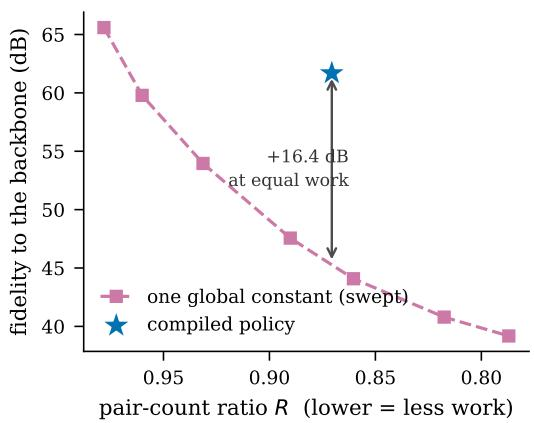

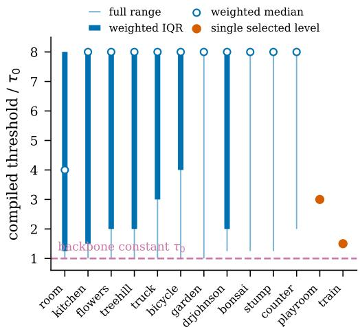  
(a) the constant traces a curve the policy is not on (b) and the compiled answer is usually spread out (flowers, the median scene by this margin) (work-weighted quantiles over 64 regions)  
Figure 1: A scene-global cutoff leaves allocation slack. (a) On this diagnostic work–fidelity frontier, the compiled regional policy reaches 16.4 dB higher teacher PSNR than the swept scene-global cutoff at the same pair count; this is the median scene by that margin. The number measures approximation fidelity to the same backbone under equal enumerated work, not a 16.4 dB improvement in ground-truth PSNR. At matched teacher PSNR, Regional is 1.040–1.046× faster than OURS-GLOBAL at standard resolution and 1.041–1.083× faster at 4K (Table 2); it ties the per-Gaussian variant. (b) Work-weighted quartiles (thick lines and dots) and full selected ranges (thin lines) over 64 regions. Eleven of thirteen scenes select more than one level; seven span the full $\tau _ { 0 } { - } 8 \tau _ { 0 }$ range, and two collapse to one level. This dispersion shows what a scene-global constant cannot represent; it does not by itself measure end-to-end speedup.

AdaGScale (Jo et al., 2026) is the closest prior method to this operation. It also performs lossy, viewpoint-adaptive scaling only for tile intersection, uses offline parameter search and a depth lookup table, and retains the original Gaussian during color accumulation. Consequently, trainingfree operation, a lookup table, and sub-Gaussian support control are not distinctive claims of TileSkipper. The difference is the decision principle: AdaGScale derives a current-view peripheral score from local Gaussian contribution and depth, whereas TileSkipper measures candidate deletion residuals over calibration views using the transmittance in front of the Gaussian and the composited color behind it, allocates a discrete error budget across Gaussian groups, and rejects proposed policies by complete renders on disjoint training views. TileSkipper trades AdaGScale’s runtime view adaptation for a scene-level, static one-byte policy with no per-frame policy inference. The policy is not indexed by precompiled camera poses: an arbitrary runtime camera is projected and rendered normally using the same level byte, so an interactive viewer requires no camera matching. The checkpoint-matched comparison in Table 3 is dataset-dependent and does not establish broad runtime dominance.

Figure 1 motivates heterogeneous allocation. Calibration renders measure pair savings and a compositing-aware isolated-removal residual for each cutoff. OURS-GLOBAL selects one scenewide value; OURS-REGIONAL allocates levels across risk-stratified spatial groups. Complete renders on disjoint training views validate every proposal. Regional allocation adds roughly 4–5% over Global at matched native-resolution quality (Table 2). The output is one uint8 level per Gaussian plus a lookup table, with no checkpoint update or per-frame policy inference. Table 5 evaluates the same exported policies across resolutions, while Section D.5 compares against fixed-threshold alternatives.

The method is deliberately a post-training systems adapter. Its measurements are scene-specific, but the resulting decision is static and portable: policies compiled on AccuTile transfer unchanged into SeeLe (Zhu et al., 2026) and FlashGS (Feng et al., 2025). A measured cost model furthe separates the pair-dependent work the policy can reduce from fixed work it cannot, and predicts when a complementary geometric pre-culler pays.

## Contributions.

• Compositing-aware support allocation for frozen checkpoints. For each discrete cutoff, TileSkipper measures exact pair savings and an isolated-removal residual that accounts for front transmittance and the composited color behind the Gaussian, then allocates the image-error budget across risk-stratified, workload-balanced regions. Complete renders on disjoint training views reject proxy failures. The technical distinction from AdaGScale is this measured compositing residual and the resulting error allocation; static one-byte export with no per-frame policy inference is a deployment tradeoff, not the claimed novelty.

• Evidence across model and rasterizer families. Six integrations isolate the compiler on paths that already expose an opacity-aware tile bound. Four additional ports begin from released 3σ rasterizers; for these rows we report the deployment-facing total and separately attribute the prior exact-bound transition and the incremental TileSkipper gain. They use the same nine Mip-NeRF 360 (Barron et al., 2022), two Tanks & Temples (Knapitsch et al., 2017), and two Deep Blending (Hedman et al., 2018) scenes. A standalone comparison with AdaGScale fixes the renderer, checkpoint-matched calibration table, selection views, test views, and timing protocol. A Speedy-Splat sweep varies $K _ { \mathrm { r e g } } ,$ the number of policy regions, from 1 to 1024 to separate scene calibration from regional allocation.

• A measured boundary on systems benefit. A latency model fitted from controlled sweeps predicts the pair-dependent ceiling and the complementary pre-culling regime. The optional pre-culler is image-bit-exact in all 52 measured runs, but is correctly disabled when its planning overhead exceeds the predicted saving.

## 2 RELATED WORK

We distinguish primitive, tile-pair, and fragment reduction; Appendix A summarizes their control units.

Per-Gaussian thresholds at the fragment level. Fragment Pruning (Ye et al., 2024) learns one truncation threshold per Gaussian via a sigmoid relaxation and controls per-pixel coverage after sorting. TileSkipper selects discrete tile-enumeration cutoffs without updating checkpoint parameters and acts before sorting, removing pairs from both sorting and blending. Section F evaluates TileSkipper on the checkpoint families used by Fragment Pruning; it tests checkpoint compatibility, not composition with learned fragment pruning.

System-level paths. SeeLe (Zhu et al., 2026) combines camera-cluster preprocessing with contribution-aware rasterization. Its tile-intersection test uses the support in Equation (1) with τ = 1/255 fixed at compile time. TileSkipper changes that cutoff policy, while our transfer experiment retains SeeLe’s other components and does not claim to reproduce its full mobile deployment pipeline.

Tile-pair reduction. AdR-Gaussian (Wang et al., 2024) derives the opacity level set at the renderer’s minimum splatting-opacity cutoff and bounds it with an adaptive radius and an axis-aligned box. We borrow that level-set construction rather than claim the support formula as new. Speedy-Splat (Hanson et al., 2025a) introduces accurate tile pruning, FastGS (Ren et al., 2025) combines it with a compact box, and FlashGS (Feng et al., 2025) and QuadBox (Li et al., 2026) further tighten geometric enumeration. These exact or fixed-threshold bounds are complementary to selecting heterogeneous lossy cutoffs.

View-adaptive tile support. AdaGScale (Jo et al., 2026) is the closest work in action space: it estimates a current-view peripheral contribution score, applies depth-dependent lookup-table calibration, and adjusts the scale used for tile intersection while retaining the original Gaussian for color accumulation. TileSkipper instead measures a compositing residual—including front transmittance and the composited color behind the Gaussian—for discrete candidate cutoffs over calibration views, allocates the resulting error budget across Gaussian groups, and accepts a static policy only after complete-image validation on disjoint training views. AdaGScale offers runtime view adaptation; TileSkipper incurs no per-frame policy inference and directly measures the compiled policy’s complete-render error. Table 3 compares the standalone methods inside AdaGScale’s released ren derer.

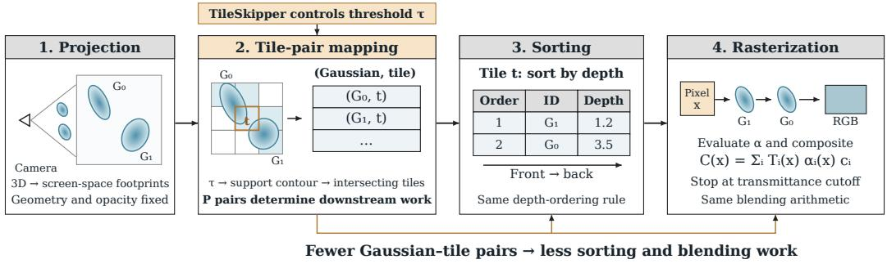  
Figure 2: TileSkipper changes pair enumeration at stage 2. The blue and orange outlines denote support under the baseline and compiled cutoffs. Tiles excluded by the compiled support generate no Gaussian–tile pair and therefore enter neither sorting nor blending. For tile t, the figure shows the resulting depth order and compositing expression; T is transmittance before contribution i.

## 3 METHOD

TileSkipper takes a converged 3DGS checkpoint and a tile rasterizer whose tile-intersection test uses one scene-wide contribution cutoff $\tau _ { 0 } .$ , then replaces that constant with a static per-Gaussian cutoff policy. No checkpoint parameter is retrained. At runtime the rasterizer reads one byte per Gaussian and a lookup table, with no camera-conditioned policy inference. Section 3.1 defines the cutoff and its geometric effect; Section 3.2 measures pair savings and compositing risk, groups Gaussians into workload-balanced regions, selects one cutoff level per region, and validates complete candidate renders. Appendix B provides the empirical cost model, optional pre-culler, and dispatch rule. Figure 3 summarizes the offline measurements, policy selection, and the one-byte runtime application.

Official-Fixed uses the published cutoff $\tau _ { 0 }$ for every Gaussian. OURS-GLOBAL selects one scenespecific multiplier shared by all Gaussians $( K _ { \mathrm { r e g } } = 1 )$ , whereas OURS-REGIONAL selects levels for $K _ { \mathrm { r e g } } = 6 4$ regions. Here $K _ { \mathrm { r e g } }$ is the number of independently selected policy regions, and $m _ { g }$ denotes Gaussian $\boldsymbol { g ^ { \prime } } \mathbf { s }$ multiplier on τ0; $m _ { g } = 1$ recovers Official-Fixed.

Rendering pipeline. Figure 2 shows the four stages relevant here. (1) Each visible Gaussian is projected to a screen-space footprint. (2) Every intersecting tile is enumerated, creating one (Gaussian, tile) pair per overlap. (3) Each tile’s assigned Gaussians are sorted front-to-back. (4) Pixels evaluate and alpha-blend the sorted Gaussians. Vanilla 3DGS (Kerbl et al., 2023) uses a conservative 3σ box, whereas Speedy-Splat (Hanson et al., 2025a), FastGS (Ren et al., 2025), and SeeLe (Zhu et al., 2026) derive tile support from a fixed contribution cutoff. TileSkipper changes only stage 2; Gaussian parameters, depth sorting, and blending arithmetic remain unchanged. At a fixed checkpoint and resolution, we empirically approximate frame latency as $T \approx F \dot { + } \beta P$ , where $P$ is the Gaussian–tile pair count, F is the fitted pair-independent cost, and $\beta$ is the fitted latency slope. This model explains why pair reduction need not translate proportionally into runtime improvement; Appendix B.1 gives the full model and validation.

(a) Ofline compilation  
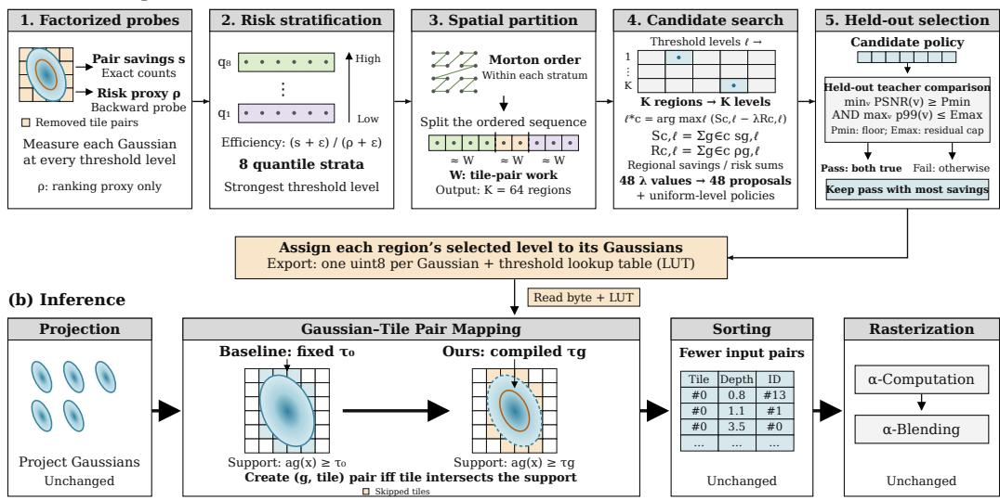  
Figure 3: Offline compilation and runtime application of TileSkipper. The diagram abbreviates the region-count symbol $K _ { \mathrm { r e g } }$ as K. (a) Once per scene, the compiler uses a frozen 3DGS checkpoint and calibration views to measure per-Gaussian pair savings s and isolated-removal risk proxies $\rho$ for each threshold level. The backward probe collects sensitivities without updating any model parameter. Gaussians are assigned to eight efficiency-quantile strata $q _ { 1 } , \ldots , q _ { 8 }$ (low to high). Within each stratum, Morton ordering and workload-balanced contiguous partitioning produce $K _ { \mathrm { r e g } } = 6 4$ regions in total; Gaussian counts may differ between regions. For region c and level $\begin{array} { r } { \ell , S _ { c , \ell } = \sum _ { g \in c } s _ { g , \ell } } \end{array}$ and $\begin{array} { r } { R _ { c , \ell } = \sum _ { q \in c } \rho _ { g , \ell } } \end{array}$ aggregate pair savings and risk. Each penalty λ selects one level for each of the $K _ { \mathrm { r e g } }$ regions. The 48 resulting proposals and uniform-level policies are rendered on disjoint held-out training views. A policy passes only if its minimum per-view teacher PSNR meets $P _ { \mathrm { m i n } }$ and its worst-view p99 absolute residual does not exceed $E _ { \mathrm { m a x } } ;$ among passing policies, the compiler selects the one with the greatest pair savings. Teacher comparisons use the unmodified backbone; p99 is computed from maximum absolute RGB-channel residuals on a fixed $4 \times$ spatial subsample. Test views are never used for selection. (b) Each Gaussian inherits its region’s selected level, exported as one uint8 per Gaussian plus a threshold lookup table. At inference, the default threshold is $\tau _ { g } = m _ { g } \tau _ { 0 }$ , where $m _ { g }$ is the selected multiplier and $\tau _ { 0 }$ is the baseline threshold. Backend-specific handling of opacity caps is described in Section E.1. The contribution field $a _ { g } ( x )$ defines the thresholded support $\{ x : a _ { g } ( x ) \geq \tau \}$ . A Gaussian–tile pair is created when the tile intersects this support, using $\tau _ { 0 }$ for the baseline and $\tau _ { g }$ for TileSkipper. The dashed blue contour denotes the original support, the orange contour the compiled support, and shaded orange tiles the skipped pairs. Gaussian parameters remain unchanged. The byte and lookup table are read inside tile enumeration, with no per-frame policy inference or additional kernel; projection, sorting, and blending remain unchanged. Footprints, partitions, and table entries are schematic.

## 3.1 TILE SUPPORT FROM A SCENE-WIDE CUTOFF

Vanilla 3DGS (Kerbl et al., 2023) enumerates the 3σ box of the projected Gaussian. We borrow the opacity level-set construction used by AdR-Gaussian (Wang et al., 2024): threshold-based rasterizers bound the τ-level support of the splat’s contribution. For $0 < \tau < \alpha _ { q } ,$ , the superlevel set $S _ { g } ( \tau ) = \{ x : \alpha _ { g } ( x ) \geq \tau \}$ is an elliptical region. With $\alpha _ { g } ( x ) = \alpha _ { g } \exp ( - \frac { 1 } { 2 } r ^ { 2 } )$ , its boundary $\alpha _ { g } ( x ) = \tau$ has squared Mahalanobis radius

$$
r _ { g } ^ { 2 } ( \tau ) = 2 \ln \bigl ( \alpha _ { g } / \tau \bigr ) .\tag{1}
$$

This is the normalized form of AdR-Gaussian’s adaptive-radius equation; the level-set formula is prior work, not a TileSkipper contribution. TileSkipper instead contributes the selection of heterogeneous, lossy $\tau _ { g }$ values from measured rendering risk. Raising τ shrinks the footprint and removes pairs. Although every discarded individual contribution is small, their cumulative image error has no such guarantee; this is why our compiler validates complete candidate renders.

The implementations on which we build fix τ to one hand-chosen constant, scene-independent and region-independent:
<table><tr><td>Rasterizer</td><td>Where the constant lives</td><td>Value</td></tr><tr><td>Speedy-Splat / AccuTile (Hanson et al., 2025a)</td><td>tile-intersection test</td><td> $\tau _ { 0 } = 1 / 2 5 5$ </td></tr><tr><td>FastGS (Ren et al., 2025)</td><td>tile-intersection test</td><td> $\tau _ { 0 } = 1 / 2 5 5$ </td></tr><tr><td>SeeLe (Zhu et al., 2026)</td><td>1owest_alpha_coeff= ln 255 (compile-time)</td><td> $\tau _ { 0 } = 1 \dot { / } 2 5 5$ </td></tr></table>

A single constant must protect the most sensitive content represented by its selection views. Section H shows that locally safe thresholds span 16× within one image, establishing that a scene-global value can leave slack in other regions. This diagnostic motivates heterogeneous control but does not quantify its deployed benefit; the matched-quality comparison in Table 2 measures that benefit directly. TileSkipper replaces the constant with a compiled, static, per-Gaussian value while leaving checkpoint parameters, sorting, and blending unchanged.

## 3.2 COMPILING A DISCRETE TAIL POLICY

The policy assigns every Gaussian one multiplier from a fixed discrete ladder $\begin{array} { r l } { \mathcal { M } } & { { } = } \end{array}$ {1, 1.05, 1.1, 1.15, 1.25, 1.5, 2, 3, 4, 6, 8}, applied as $\tau _ { g } = m _ { g } \tau _ { 0 }$ on the default Speedy-Splat path. If the threshold reaches Gaussian opacity, that Gaussian produces no tile pairs; its checkpoint parameters are retained. The FastGS port caps the threshold as detailed in Section E.1. Choosing $m _ { g }$ independently for millions of Gaussians is separable for a fixed Lagrange multiplier but exposes millions of independent decisions. Our default groups them into $K _ { \mathrm { r e g } } = 6 4$ decisions as a regularized search granularity, then exports the chosen level for every Gaussian. We compile in five steps.

(1) Factorized probes. For every Gaussian and ladder rung we collect two quantities on calibration views. A global render at rung ℓ records the exact change in enumerated pairs and attributes it to each Gaussian, $s _ { g , \ell } . \mathrm { A }$ custom backward pass classifies pair removal with the same tile predicate and accumulates $\begin{array} { r } { \rho _ { g , \ell } = \sum _ { v , x , c } ( \alpha _ { g , v } ( x ) \partial C _ { v , c } ( x ) / \partial \alpha _ { g , v } ( x ) ) ^ { 2 } } \end{array}$ over pixels in pairs removed at rung ℓ. This is an isolated-deletion RGB-energy statistic for removing one Gaussian–tile contribution while holding the others fixed, but it omits cross terms when many contributions are removed jointly. It is therefore a ranking proxy, not an exact prediction ofjoint image error. Both tables require $O ( | \dot { \boldsymbol { M } } | V )$ rasterizer passes rather than one render per Gaussian; the held-out stage below validates their joint effect.

(2) Risk stratification. At the most aggressive ladder rung, Gaussians are bucketed into $S = 8$ quantile strata by $\log ( ( s _ { g , \ell } + \epsilon ) / ( \rho _ { g , \ell } + \epsilon ) )$ . Gaussians whose tails are cheap to remove can therefore share a decision even when far apart.

(3) Workload-balanced spatial partition. Within each stratum we sort by Morton code and cut into contiguous blocks of equal measured tile-pair work, giving $K _ { \mathrm { r e g } }$ regions in total. Balancing on work rather than on volume prevents a few dense regions from consuming most of the decision budget: a uniform axis-aligned grid has a region-work coefficient of variation of 3.1–4.8, which our partition reduces to 0.026–0.060. Region membership is frozen after this step. This balancing is a conditioning choice rather than a claimed source of latency gain; Table 8 isolates its effect.

(4) Constrained search. Aggregating the probes per region gives $S _ { c , \ell }$ and $R _ { c , \ell }$ . For each of 48 penalties λ spaced geometrically over the observed efficiency range, we take the independent optimum

$$
\ell _ { c } ^ { \star } ( \lambda ) \ = \ \underset { \ell \in \mathcal { M } } { \arg \operatorname* { m a x } } \ \big ( S _ { c , \ell } - \lambda R _ { c , \ell } \big ) ,\tag{2}
$$

which costs one pass over a $K _ { \mathrm { r e g } } \times | \mathcal { M } |$ table. The resulting proposals, together with the uniform-ℓ policies that constitute the OURS-GLOBAL candidate set, form the candidate set. Including these uniform candidates lets OURS-REGIONAL fall back to a compiler-selected global cutoff when spatial heterogeneity does not pay.

(5) Held-out selection. Every candidate is rendered on a disjoint set of training views. Feasibility requires the minimum per-view teacher PSNR against the unmodified backbone to exceed a floor and the worst-view absolute p99 residual to be at most a fixed cap. The p99 statistic takes the maximum absolute RGB-channel residual on a fixed 4× spatial subsample. Among feasible candidates we keep the one that removes the most pairs. Test views are never used.

Export. The selected policy is written as one uint8 level per Gaussian plus a lookup table of at most 256 thresholds — one byte per Gaussian, under 1 KB of table. At render time the rasterizer reads the byte and indexes the table inside the tile-enumeration loop. There is no per-frame policy inference, no additional kernel, and no change to sorting or blending. For the default $K _ { \mathrm { r e g } } = 6 4 .$ , compilation averages 9.0 s per scene and takes at most 14.0 s, excluding checkpoint load (Section D.9). It requires only the checkpoint and the training views; the backward probe updates no parameter.

## 4 EXPERIMENTS

We evaluate ten model/backend integrations on the same thirteen scenes, then isolate policy granularity and compare with AdaGScale. Appendix experiments cover region construction, calibration sensitivity, temporal stability, transfer, and systems costs.

## 4.1 SETUP

Datasets. We use the standard 3DGS protocol on thirteen scenes: the nine MipNeRF360 scenes (Barron et al., 2022) (bicycle, flowers, garden, stump, treehill, bonsai, counter, kitchen, room), two Tanks & Temples scenes (Knapitsch et al., 2017) (train, truck), and two Deep Blending scenes (Hedman et al., 2018) (drjohnson, playroom). We use the official train/test splits and the standard image downsampling used by 3DGS. Standard-resolution test images range from 979×545 to 1559×1039 (0.53–1.62 megapixels); the 4K setting rescales the same views to 3840 pixels wide while preserving aspect ratio.

Backbones and thresholds. Vanilla 3DGS and Mini-Splatting use the same vanilla-compatible CUDA rasterizer; Mini-Splatting changes the surviving Gaussian set but retains the standard PLY representation. Their released 3σ tile box is replaced by the prior exact-1/255 bound before our compiled policy is applied. Speedy-Splat is the canonical fixed-threshold AccuTile backbone $( \tau _ { 0 } =$ $1 / 2 5 5 )$ . FastGS combines the same cutoff with its native compact-box rasterizer. We transfer a Speedy-Splat policy without recalibration into the native SeeLe and FlashGS rasterizers. 2DGS uses surfel–ray intersection, while Scaffold-GS generates view-dependent neural Gaussians from anchors; both released rasterizers enumerate a 3σ tile box, so their drop-in ports first supply the exact 1/255 bound. We separate that prior-work transition from our compiler contribution in Tables 14 and 15. Finally, LightGaussian and Taming-3DGS test pure checkpoints through the same AccuTile backend; the latter retains its native absolute-opacity activation.

Metrics and timing protocol. We report PSNR (Wang and Bovik, 2009), SSIM (Wang et al., 2004), LPIPS (Zhang et al., 2018), the (Gaussian, tile) pair ratio R against the unmodified backbone, and average per-frame render time on one NVIDIA RTX 5000 Ada. We distinguish ground-truth PSNR from teacher PSNR. The former compares a rendered image with the dataset image; SSIM and LPIPS use the standard 3DGS evaluation code, with VGG features for LPIPS, and are averaged over the same test views. For an approximate rendering I and the unmodified renderer $I _ { 0 } ,$ both on the [0, 1] RGB scale, teacher PSNR is

$$
P _ { \mathrm { t e a c h e r } } = - 1 0 \log _ { 1 0 } \left( \operatorname* { m e a n } _ { x , c } ( I ( x , c ) - I _ { 0 } ( x , c ) ) ^ { 2 } \right) .
$$

Thus the 60, 55, and 50 dB operating points correspond to teacher-MSE targets of $1 0 ^ { - 6 } , 1 0 ^ { - 5 . 5 }$ and $1 0 ^ { - 5 }$ , respectively; 50 dB permits 3.16× the approximation MSE of 55 dB. These targets do not denote PSNR against the dataset images. Every comparison is paired within one backbone and one process; arms are rotated, synchronized per frame, and use identical caching. Speedy-Splat caches its frozen per-Gaussian activations once in every arm. The 2DGS timing includes ray–surfe intersection; the Scaffold-GS timing includes its per-frame MLP Gaussian generation, which our policy cannot reduce. Image writing is disabled. Speedups are geometric means over scenes; crossrow absolute latency is not compared.

Table 1: Base model/backend versus the same path plus Ours $( K _ { \mathrm { r e g } } = 6 4 )$ . Every row has thirteen scenes and twelve balanced same-process timing cycles. All quality deltas are Ours minus the named base (higher PSNR/SSIM and lower LPIPS are better). R is the mean pair ratio; intervals bootstrap scenes and parentheses count wins. SeeLe and FlashGS transfer a Speedy-Splat policy unchanged into the named native rasterizer. LightGaussian and Taming-3DGS vary the checkpoint on one common AccuTile backend; Taming’s native absolute-opacity activation is preserved. The vanilla 3DGS, Mini-Splatting, 2DGS, and Scaffold-GS rows include the prior exact-bound transition, separated in Tables 14 and 15.
<table><tr><td>Base model/backend</td><td>Integration</td><td>Scenes</td><td>∆PSNR</td><td>∆SSIM</td><td>∆LPIPS↓</td><td>R</td><td>+Ours speedup [95% CI] (wins)</td><td></td></tr><tr><td colspan="9">Native and native-compatible rasterizer integrations</td></tr><tr><td>vanilla 3DGS (Kerbl et al., 2023)</td><td>3DGS CUDA</td><td>13</td><td>-0.003</td><td>-0.000069</td><td>-0.000092</td><td>0.330</td><td></td><td>1.493× [1.350, 1.656] (13/13)</td></tr><tr><td>Mini-Splatting (Fang and Wang, 2024)</td><td>3DGS CUDA</td><td>13</td><td>-0.008</td><td>-0.000104</td><td>-0.000172</td><td>0.435</td><td>1.346×</td><td>[1.260, 1.451] (13/13)</td></tr><tr><td>Speedy-Splat (Hanson et al., 2025a)</td><td>native</td><td>13</td><td>-0.007</td><td>-0.000109</td><td>-0.000202</td><td>0.825</td><td></td><td>1.096× [1.078, 1.116] (13/13)</td></tr><tr><td>FastGS (Ren et al., 2025)</td><td>native</td><td>13</td><td>-0.004</td><td>-0.000088</td><td>-0.000098</td><td>0.979</td><td></td><td>1.009× [1.005, 1.014] (11/13)</td></tr><tr><td>SeeLe (Zhu et al., 2026)</td><td>native transfer</td><td>13</td><td>-0.008</td><td>-0.000120</td><td>-0.000073</td><td>0.800</td><td></td><td>1.091× [1.070, 1.115] (13/13)</td></tr><tr><td>FlashGS (Feng et al., 2025)</td><td>native transfer</td><td>13</td><td>-0.005</td><td>-0.000254</td><td>-0.000386</td><td>0.821</td><td></td><td>1.121× [1.098, 1.145] (13/13)</td></tr><tr><td>2DGS (Huang et al., 2024)</td><td>native</td><td>13</td><td>-0.008</td><td>-0.000174</td><td>-0.000091</td><td>0.641</td><td></td><td>1.474× [1.370, 1.586] (13/13)</td></tr><tr><td>Scaffold-GS (Lu et al., 2024)</td><td>native</td><td>13</td><td>-0.008</td><td>-0.000132</td><td>-0.000115</td><td>0.408</td><td></td><td>1.320× [1.218, 1.443] (13/13)</td></tr><tr><td colspan="9">Checkpoint integrations on a common AccuTile backend</td></tr><tr><td>LightĠaussian (Fan et al., 2024)</td><td>AccuTile</td><td>13</td><td>-0.006</td><td>-0.000123</td><td>-0.000196</td><td>0.834</td><td></td><td>1.095× [1.072, 1.118] (13/13)</td></tr><tr><td>Taming-3DGS (Mallick et al., 2024)</td><td>AccuTile</td><td>13</td><td>-0.001</td><td>-0.000038</td><td>-0.000031</td><td>0.926</td><td></td><td>1.051× [1.032, 1.073] (13/13)</td></tr></table>

Compiler settings. Unless stated otherwise we use the ladder M {1, 1.05, 1.1, 1.15, 1.25, 1.5, 2, 3, 4, 6, 8}, S = 8 risk strata, $K _ { \mathrm { r e g } } ~ = ~ 6 4$ workload-balanced regions, 48 Lagrangian penalties, and 16 calibration plus 32 disjoint selection views drawn from the training split. Feasibility requires a minimum-view teacher PSNR of 48 dB and a worst-view absolute p99 residual of at most 0.012 on the [0, 1] RGB scale. The teacher is the unmodified base path for each row, except that vanilla 3DGS, Mini-Splatting, 2DGS, and Scaffold-GS use their exact-1/255 transition. Test views are never used for calibration or selection. The probe uses backward-mode differentiation but no checkpoint parameter or optimizer state is updated.

## 4.2 MAIN RESULTS

Table 1 reports deployment-facing “base versus base + Ours” comparisons, while the accompanying decomposition tables identify which portion is attributable to TileSkipper. On the six paths that already expose an opacity-aware tile bound, the reported gains are compiler-only: 1.096× on Speedy-Splat, 1.009× on FastGS, 1.091× on SeeLe, 1.121× on FlashGS, 1.095× on LightGaussian, and 1.051× on Taming-3DGS. The vanilla 3DGS, Mini-Splatting, 2DGS, and Scaffold-GS rows instead include a prior 3σ → 1/255 transition. For example, the 1.493× vanilla-3DGS total decomposes into a 1.454× exact-bound transition and a further 1.027× compiler gain; the corresponding Mini-Splatting factors are 1.266× and 1.063×. Tables 14 and 15 gives the full accounting. Across all ten integrations, the mean SSIM change is between $- 3 . 8 { \times } 1 0 ^ { - 5 }$ and $- 2 . 5 { \times } 1 0 ^ { - 4 }$ , while LPIPS changes by $= 3 . 1 \times 1 0 ^ { - 5 } ~ \mathrm { t o } - 3 . 9 \times 1 0 ^ { - 4 }$ (lower is better).

The 2DGS and Scaffold-GS ports improve by 1.474× and 1.320×. The larger 2DGS gain reflects expensive ray–surfel work per removed pair. On Scaffold-GS, the rasterizer itself improves by 2.10×, but the per-frame MLP occupies 35–65% of latency and limits the end-to-end result. Because both released paths start from a 3σ box, we expose rather than claim their exact-bound contribution in Table 14.

The gain grows with resolution in the measured regime (Table 5 and Figure 5a). Stage profiles show the duplicate-plus-sort share increasing from 21.4% to 34.2% on bicycle and from 31.6% to 41.6% on counter; thresholding also changes correlated blending work. Additional ablations, transfer breakdowns, temporal tests, and cost-model diagnostics are reported in the appendix.

Table 2: Strict matched-quality ablation of compiler granularity on thirteen scenes. Each variant’s own (distortion, latency) Pareto envelope is interpolated at a common teacher-PSNR target against the unmodified backbone. OURS-GLOBAL is our compiler with one decision $( K _ { \mathrm { r e g } } \ = \ 1 )$ , not an external baseline; Regional is the full $K _ { \mathrm { r e g } } = 6 4$ method. Brackets are 95% scene-bootstrap intervals. Regional improves on OURS-GLOBAL everywhere and ties the per-Gaussian variant. Thus $K _ { \mathrm { r e g } }$ is a decision regularizer and search granularity, not a demonstrated source of speed or storage reduction.
<table><tr><td colspan="4"></td><td rowspan="2">Per-G / Ours-Global</td><td rowspan="2">Regional / per-G</td><td rowspan="2">Wins</td></tr><tr><td>Resolution</td><td>Teacher PSNR</td><td></td><td>Ours-Global</td></tr><tr><td rowspan="3">Standard</td><td>60 dB</td><td></td><td>1.0397× [1.0290, 1.0508]</td><td>1.0435×</td><td>0.9963×</td><td>13/13</td></tr><tr><td>55 dB</td><td></td><td>1.0457× [1.0373, 1.0551]</td><td>1.0460×</td><td>0.9997×</td><td>13/13</td></tr><tr><td>50 dB</td><td>1.0401× [1.0313, 1.0504]</td><td></td><td>1.0332×</td><td>1.0067×</td><td>13/13</td></tr><tr><td rowspan="3">4K</td><td>60 dB</td><td></td><td>1.0413× [1.0208, 1.0612]</td><td>1.0556×</td><td>0.9864×</td><td>10/13</td></tr><tr><td>55 dB</td><td></td><td>1.0709× [1.0500, 1.0923]</td><td>1.0811×</td><td>0.9906×</td><td>13/13</td></tr><tr><td>50 dB</td><td>1.0825× [1.0632, 1.1029]</td><td></td><td>1.0816×</td><td>1.0008×</td><td>13/13</td></tr></table>

Table 3: Standalone comparison with AdaGScale at native and 4K resolution. Both methods use the same Speedy-Splat checkpoints and AdaGScale FlashGS renderer, with policies selected under common training-view quality constraints (details in Section C.2). Deltas are TileSkipper minus AdaGScale; R is the TileSkipper/AdaGScale pair ratio, and speedup is AdaGScale/TileSkipper latency. Brackets are 95% scene-bootstrap intervals; parentheses count speed wins. The two-scene intervals are descriptive.
<table><tr><td>Dataset</td><td>Scenes</td><td>∆PSNR</td><td>∆SSIM</td><td>∆LPIPS↓</td><td>R</td><td></td><td>TileSkipper speedup [95% CI] (wins)</td></tr><tr><td colspan="8">(a) Native resolution</td></tr><tr><td>All scenes</td><td>13</td><td>+0.0059</td><td>+0.000021</td><td>-0.000337</td><td>0.945</td><td></td><td>1.010× [0.990, 1.025] (10/13)</td></tr><tr><td>Mip-NeRF 360</td><td>9</td><td>+0.0056</td><td>+0.000066</td><td>-0.000349</td><td>0.934</td><td></td><td>1.017× [1.004, 1.030] (7/9)</td></tr><tr><td>Tanks &amp; Temples</td><td>2</td><td>-0.0001</td><td>-0.000032</td><td>-0.000161</td><td>1.008</td><td></td><td>0.960× [0.920, 1.002] (1/2)</td></tr><tr><td>Deep Blending</td><td>2</td><td>+0.0138</td><td>-0.000126</td><td>-0.000461</td><td>0.930</td><td></td><td>1.027× [1.024, 1.029] (2/2)</td></tr><tr><td colspan="8">(b) 4K</td></tr><tr><td>All scenes</td><td>13</td><td>+0.0366</td><td>+0.000151</td><td>-0.000342</td><td>0.929</td><td></td><td>1.076× [1.047, 1.102] (12/13)</td></tr><tr><td>Mip-NeRF 360</td><td>9</td><td>+0.0460</td><td>+0.000195</td><td>-0.000375</td><td>0.917</td><td></td><td>1.085× [1.061, 1.113] (9/9)</td></tr><tr><td>Tanks &amp; Temples</td><td>2</td><td>+0.0084</td><td>+0.000046</td><td>-0.000044</td><td>0.986</td><td>1.016×</td><td>[0.952, 1.084] (1/2)</td></tr><tr><td>Deep Blending</td><td>2</td><td>+0.0227</td><td>+0.000060</td><td>-0.000492</td><td>0.924</td><td>1.096×</td><td>[1.086, 1.106] (2/2)</td></tr></table>

## 4.3 WHAT REGIONAL ALLOCATION ADDS

Table 2 compares Global $( K _ { \mathrm { r e g } } = 1 )$ , Regional $( K _ { \mathrm { r e g } } = 6 4 )$ , and per-Gaussian control using the same probes. Each family’s measured curve is interpolated linearly in teacher MSE to 60/55/50 dB; these analytical points need not correspond to a single exported policy. Regional is 4.0–4.6% faster than Global at native resolution and up to 8.3% faster at 4K, but ties per-Gaussian control (0.986– 1.007×). Thus heterogeneous allocation improves over scene-level calibration, while region sharing has no demonstrated speed or storage advantage over per-Gaussian decisions. Both export one byte per Gaussian; Appendix C gives the full protocol.

## 4.4 CLOSEST-METHOD COMPARISON

Table 3 compares the two standalone methods under the same training-view quality constraints at native and 4K resolution. These constraints do not imply identical attained errors. At native resolution, the pooled 1.010× speedup has an interval of [0.990, 1.025]; this does not establish broad runtime dominance. At 4K, the pooled speedup is 1.076× [1.047, 1.102], with 12/13 scene wins. Dataset-specific results and all three quality metrics are reported in the same table; Section C.2 details the protocol.

## 5 CONCLUSION

Across ten model/backend integrations, a scene-wide tile-footprint threshold can be compiled into a heterogeneous static policy rather than hand-tuned. The one-byte-per-Gaussian result performs no training or per-frame policy inference and composes with compact checkpoints and independently optimized rasterizers. Detailed limitations and failure cases appear in Section D.10.

## REPRODUCIBILITY STATEMENT

The method section describes the policy construction and selection procedure. The experiments section specifies the datasets, evaluation metrics, compiler settings, and timing protocol. The appendices provide additional details on backend integration, threshold semantics, and experimental protocols to support reproduction of the reported results. We will publicly release the source code and evaluation scripts upon acceptance.

## AI USE STATEMENT

Generative AI tools assisted with language polishing. The authors take full responsibility for the entire content of this paper.

## REFERENCES

Jonathan T. Barron, Ben Mildenhall, Dor Verbin, Pratul P. Srinivasan, and Peter Hedman. Mip-nerf 360: Unbounded anti-aliased neural radiance fields. In Proceedings of the IEEE/CVF Conference on Computer Vision and Pattern Recognition (CVPR), pages 5470–5479, June 2022.

Zhiwen Fan, Kevin Wang, Kairun Wen, Zehao Zhu, Dejia Xu, and Zhangyang Wang. Lightgaussian: Unbounded 3d gaussian compression with 15x reduction and 200+ fps. In A. Globerson, L. Mackey, D. Belgrave, A. Fan, U. Paquet, J. Tomczak, and C. Zhang, editors, Advances in Neural Information Processing Systems, volume 37, pages 140138–140158. Curran Associates, Inc., 2024. doi: 10.52202/ 079017-4447. URL https://proceedings.neurips.cc/paper\_files/paper/ 2024/file/fd881d3b625437354d4421818f81058f-Paper-Conference.pdf.

Guangchi Fang and Bing Wang. Mini-splatting: Representing scenes with a constrained number of gaussians. In Ales Leonardis, Elisa Ricci, Stefan Roth, Olga Russakovsky, Torsten Sattler, andˇ Gul Varol, editors,¨ Computer Vision – ECCV 2024, pages 165–181, Cham, 2024. Springer Nature Switzerland. ISBN 978-3-031-72980-5.

Guofeng Feng, Siyan Chen, Rong Fu, Zimu Liao, Yi Wang, Tao Liu, Boni Hu, Linning Xu, Zhilin Pei, Hengjie Li, Xiuhong Li, Ninghui Sun, Xingcheng Zhang, and Bo Dai. FlashGS: Efficient 3d gaussian splatting for large-scale and high-resolution rendering. In Proceedings of the IEEE/CVF Conference on Computer Vision and Pattern Recognition (CVPR), pages 26652–26662, 2025.

Sharath Girish, Kamal Gupta, and Abhinav Shrivastava. Eagles: Efficient accelerated 3d gaussians with lightweight encodings. In Ales Leonardis, Elisa Ricci, Stefan Roth, Olga Russakovsky,ˇ Torsten Sattler, and Gul Varol, editors, ¨ Computer Vision – ECCV 2024, pages 54–71, Cham, 2025. Springer Nature Switzerland. ISBN 978-3-031-73036-8. doi: 10.1007/978-3-031-73036-8 4.

Alex Hanson, Allen Tu, Geng Lin, Vasu Singla, Matthias Zwicker, and Tom Goldstein. Speedysplat: Fast 3d gaussian splatting with sparse pixels and sparse primitives. In Proceedings of the IEEE/CVF Conference on Computer Vision and Pattern Recognition (CVPR), pages 21537– 21546, June 2025a.

Alex Hanson, Allen Tu, Vasu Singla, Mayuka Jayawardhana, Matthias Zwicker, and Tom Goldstein. Pup 3d-gs: Principled uncertainty pruning for 3d gaussian splatting. In Proceedings of the IEEE/CVF Conference on Computer Vision and Pattern Recognition (CVPR), pages 5949–5958, June 2025b.

Peter Hedman, Julien Philip, True Price, Jan-Michael Frahm, George Drettakis, and Gabriel Brostow. Deep blending for free-viewpoint image-based rendering. ACM Trans. Graph., 37(6), December 2018. ISSN 0730-0301. doi: 10.1145/3272127.3275084. URL https://doi.org/ 10.1145/3272127.3275084.

Binbin Huang, Zehao Yu, Anpei Chen, Andreas Geiger, and Shenghua Gao. 2d gaussian splatting for geometrically accurate radiance fields. In ACM SIGGRAPH 2024 Conference Papers, SIGGRAPH ’24, New York, NY, USA, 2024. Association for Computing Machinery. ISBN 9798400705250. doi: 10.1145/3641519.3657428. URL https://doi.org/10.1145/ 3641519.3657428.

Joongho Jo, Hyerin Lim, Hanjun Choi, and Jongsun Park. Adagscale: Viewpoint-adaptive gaussian scaling in 3d gaussian splatting to reduce gaussian-tile pairs, 2026. URL https://arxiv. org/abs/2604.18980.

Bernhard Kerbl, Georgios Kopanas, Thomas Leimkuehler, and George Drettakis. 3d gaussian splat ting for real-time radiance field rendering. ACM Trans. Graph., 42(4), July 2023. ISSN 0730- 0301. doi: 10.1145/3592433. URL https://doi.org/10.1145/3592433.

Arno Knapitsch, Jaesik Park, Qian-Yi Zhou, and Vladlen Koltun. Tanks and temples: benchmarking large-scale scene reconstruction. ACM Trans. Graph., 36(4), July 2017. ISSN 0730-0301. doi: 10.1145/3072959.3073599. URL https://doi.org/10.1145/3072959.3073599.

Joo Chan Lee, Daniel Rho, Xiangyu Sun, Jong Hwan Ko, and Eunbyung Park. Compact 3d gaussian representation for radiance field. In Proceedings ofthe IEEE/CVF Conference on Computer Vision and Pattern Recognition (CVPR), pages 21719–21728, June 2024.

Xinze Li, Bohan Yang, Pengxu Chen, Yiyuan Wang, Hongcheng Luo, Wentao Cheng, and Weifeng Su. Quadbox: Accelerating 3d gaussian splatting with geometry-aware boxes, 2026. URL https://arxiv.org/abs/2605.04844.

Tao Lu, Mulin Yu, Linning Xu, Yuanbo Xiangli, Limin Wang, Dahua Lin, and Bo Dai. Scaffold-gs: Structured 3d gaussians for view-adaptive rendering. In Proceedings of the IEEE/CVF Conference on Computer Vision and Pattern Recognition (CVPR), pages 20654–20664, June 2024.

Saswat Subhajyoti Mallick, Rahul Goel, Bernhard Kerbl, Markus Steinberger, Francisco Vicente Carrasco, and Fernando De La Torre. Taming 3dgs: High-quality radiance fields with limited resources. In SIGGRAPH Asia 2024 Conference Papers, SA ’24, New York, NY, USA, 2024. Association for Computing Machinery. ISBN 9798400711312. doi: 10.1145/3680528.3687694. URL https://doi.org/10.1145/3680528.3687694.

Michael Niemeyer, Fabian Manhardt, Marie-Julie Rakotosaona, Michael Oechsle, Daniel Duckworth, Rama Gosula, Keisuke Tateno, John Bates, Dominik Kaeser, and Federico Tombari. Radsplat: Radiance field-informed gaussian splatting for robust real- time rendering with 900+ fps. In 2025 International Conference on 3D Vision (3DV), pages 134–144, 2025. doi: 10.1109/3DV66043.2025.00018.

Lukas Radl, Michael Steiner, Mathias Parger, Alexander Weinrauch, Bernhard Kerbl, and Markus Steinberger. Stopthepop: Sorted gaussian splatting for view-consistent real-time rendering. ACM Trans. Graph., 43(4), July 2024. ISSN 0730-0301. doi: 10.1145/3658187. URL https:// doi.org/10.1145/3658187.

Shiwei Ren, Tianci Wen, Yongchun Fang, and Biao Lu. Fastgs: Training 3d gaussian splatting in 100 seconds, 2025. URL https://arxiv.org/abs/2511.04283.

Zachary Teed and Jia Deng. Raft: Recurrent all-pairs field transforms for optical flow. In Andrea Vedaldi, Horst Bischof, Thomas Brox, and Jan-Michael Frahm, editors, Computer Vision – ECCV 2020, pages 402–419, Cham, 2020. Springer International Publishing. ISBN 978-3-030-58536-5.

Xinzhe Wang, Ran Yi, and Lizhuang Ma. Adr-gaussian: Accelerating gaussian splatting with adaptive radius. In SIGGRAPH Asia 2024 Conference Papers, SA ’24, New York, NY, USA, 2024. Association for Computing Machinery. ISBN 9798400711312. doi: 10.1145/3680528.3687675. URL https://doi.org/10.1145/3680528.3687675.

Zhou Wang and Alan C. Bovik. Mean squared error: Love it or leave it? a new look at signal fidelity measures. IEEE Signal Processing Magazine, 26(1):98–117, 2009. doi: 10.1109/MSP. 2008.930649.

Zhou Wang, A.C. Bovik, H.R. Sheikh, and E.P. Simoncelli. Image quality assessment: from error visibility to structural similarity. IEEE Transactions on Image Processing, 13(4):600–612, 2004. doi: 10.1109/TIP.2003.819861.

Zhifan Ye, Chenxi Wan, Chaojian Li, Jihoon Hong, Sixu Li, Leshu Li, Yongan Zhang, and Yingyan (Celine) Lin. 3d gaussian rendering can be sparser: Efficient rendering via learned fragment pruning. In A. Globerson, L. Mackey, D. Belgrave, A. Fan, U. Paquet, J. Tomczak, and C. Zhang, editors, Advances in Neural Information Processing Systems, volume 37, pages 5850–5869. Curran Associates, Inc., 2024. doi: 10.52202/ 079017-0190. URL https://proceedings.neurips.cc/paper\_files/paper/ 2024/file/0b2de71212384ffcaf80ad9fd1a21fe3-Paper-Conference.pdf.

Zehao Yu, Anpei Chen, Binbin Huang, Torsten Sattler, and Andreas Geiger. Mip-splatting: Aliasfree 3d gaussian splatting. In Proceedings of the IEEE/CVF Conference on Computer Vision and Pattern Recognition (CVPR), pages 19447–19456, June 2024.

Richard Zhang, Phillip Isola, Alexei A. Efros, Eli Shechtman, and Oliver Wang. The unreasonable effectiveness of deep features as a perceptual metric. In 2018 IEEE/CVF Conference on Computer Vision and Pattern Recognition, pages 586–595, 2018. doi: 10.1109/CVPR.2018.00068.

He Zhu, Xiaotong Huang, Zihan Liu, Weikai Lin, Xiaohong Liu, Zhezhi He, Jingwen Leng, Minyi Guo, and Yu Feng. SeeLe: A unified acceleration framework for realtime gaussian splatting on mobile devices. In Proceedings of the IEEE/CVF Conference on Computer Vision and Pattern Recognition (CVPR), pages 25979–25989, 2026. URL https://openaccess.thecvf.com/content/CVPR2026/html/Zhu\_Seele\_A\_ Unified\_Acceleration\_Framework\_for\_Real-Time\_Gaussian\_Splatting\_ on\_CVPR\_2026\_paper.html.

Table 4: Positioning by rasterization stage and decision unit. TileSkipper compiles heterogeneous, static per-Gaussian cutoffs without checkpoint updates or a single hand-set scene-wide cutoff; com plete held-out renders validate each proposed policy.
<table><tr><td>Family</td><td>Stage</td><td>Control unit</td><td>Parameter updates</td></tr><tr><td>Speedy-Splat (AccuTile) / FastGS (Hanson et al., 2025a; Ren et al., 2025)</td><td>Tile-bounding</td><td>Whole scene, hand-set</td><td></td></tr><tr><td>AdR-Gaussian / FlashGS / QuadBox (Wang et al., 2024; Feng et al., 2025; Li et al., 2026)</td><td>Tile geometry</td><td>Per projected Gaussian</td><td></td></tr><tr><td>AdaGScale (Jo et al., 2026)</td><td>Tile-bounding</td><td>Per view, per Gaussian</td><td></td></tr><tr><td>SeeLe (Zhu et al., 2026)</td><td>View prefetch + blending</td><td>Camera cluster</td><td>fine-tuning</td></tr><tr><td>Fragment Pruning (Ye et al., 2024)</td><td>Per-pixel rasterization</td><td>Per-Gaussian</td><td>learned</td></tr><tr><td>Gaussian-set pruning (Lee et al., 2024; Girish et al., 2025; Niemeyer et al., 2025; Hanson et al., 2025b)</td><td>Gaussian set</td><td>Per-Gaussian</td><td>varies</td></tr><tr><td>View-adaptive scaling (Yu et al., 2024)</td><td>Footprint shape</td><td>Per-view</td><td></td></tr><tr><td>TileSkipper (ours)</td><td>Tile-bounding</td><td>Compiled per-Gaussian</td><td>none</td></tr></table>

## B COST MODEL AND OPTIONAL PRE-CULLING

These diagnostics explain the measured scope of pair reduction and the optional pre-culling extension. The core threshold policy in Section 3.2 can be used without pre-culling.

## B.1 A THREE-TERM COST MODEL

Following the Gaussian-, pair-, and pixel-level cost decomposition of AdR-Gaussian (Wang et al., 2024), we instantiate a measured affine model for the rasterizers studied here; the decomposition itself is borrowed rather than claimed as a contribution. Let T denote mean end-to-end frame latency, N the number of Gaussians processed per frame, P the number of enumerated Gaussian–tile pairs, and |Ω| the number of pixels. At a fixed checkpoint and resolution, a global-cutoff sweep changes P while N and |Ω| remain fixed, so we first fit the effective relation $T \overset { \vartriangle } { = } F + \beta P$ . Here $\beta \bar { P }$ denotes all latency that co-varies with pair count in this controlled sweep, including enumeration, sorting, and correlated downstream rasterization work; it is not a claim that every pair has an identical or context-independent cost. Separate visible-subset and resolution measurements model the remaining variation with N and |Ω|, yielding the empirical affine model

$$
T = \underbrace { a _ { \vphantom { \mathrm { d } } } N } _ { \mathrm { p e r - G a u s s i a n } } + \underbrace { \beta P } _ { \mathrm { p e r - p a i r } } + \underbrace { c _ { \vphantom { \mathrm { d } } } \Omega } _ { \mathrm { p e r - p i x e l } } .\tag{3}
$$

Coefficients are specific to the measured rasterizer, resolution, policy family, and GPU. We use the model for interpolation and dispatch within those controlled sweeps, rather than as a causal decomposition or a hardware-independent law. Figure 4 visualizes the measured stage shares and the terms addressed by thresholding and pre-culling.

Pair count predicts latency within cutoff sweeps. Across eight scene-global cutoff settings in each of nine diagnostic scene–backbone–resolution cells, the linear fit gives $R ^ { 2 } = 0 . 9 9 3 4 \mathrm { - 0 . { \dot { 9 } } 9 8 8 } ,$ where $R ^ { 2 }$ is the coefficient of determination. Thus pair count explains 99.34%–99.88% of the observed latency variance within these fixed-policy-family sweeps. This supports exactly counted pair removal as a one-dimensional workload surrogate for selecting cutoff policies in the measured regime. It does not establish equal cost per pair or sufficiency of pair count across different policy families, checkpoint densities, or pre-culling configurations.

The per-Gaussian term is invisible to any threshold policy. A cutoff sweep leaves N fixed and therefore cannot reduce per-Gaussian projection and preprocessing. On bicycle at native resolution, the preprocessing time has a fitted slope of −0.023 ns per pair and $R ^ { 2 } = \dot { 0 . 2 6 }$ . The low $R ^ { 2 }$ means that pair count explains only 26% of this stage’s small timing variation; it is not a hypothesis test that the slope equals zero. The fitted pair-independent preprocessing intercept is 35.1% of baseline frame latency on that checkpoint.

Resolution and density move the measured balance. Increasing resolution changes both P and |Ω| while leaving N fixed. In the two scenes with stage profiles, the duplicate-plus-sort share grows from 21.4% to 34.2% for bicycle and from 31.6% to 41.6% for counter; we do not mix the two scenes into one resolution estimate. Increasing checkpoint density can change both N and P, so Gaussian count alone is not a dispatch rule. We instead dispatch from the measured share aN/T.

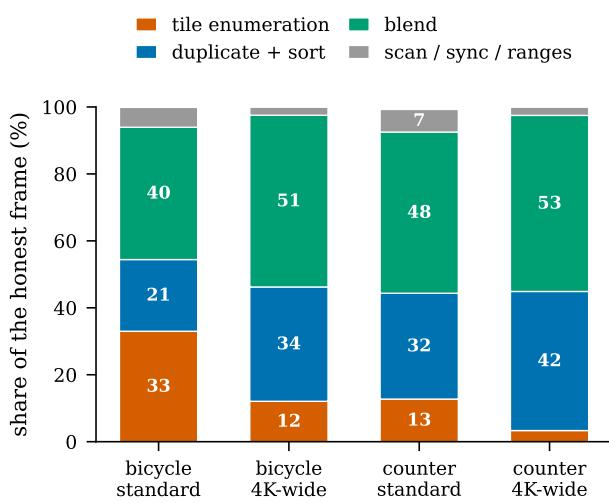  
(a) anatomy of the frame

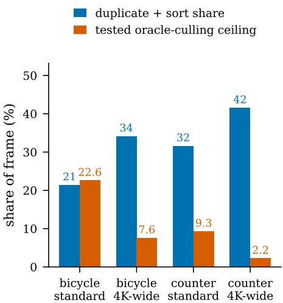  
(b) what each mechanism can reach  
Figure 4: Measured headroom under two controlled interventions. (a) Stage shares measured with the rasterizer’s own CUDA events. (b) The mechanisms have different primary targets, but their runtime effects are not assumed to be disjoint or additive. Thresholding changes tile enumeration, duplicate/sort work, and correlated blending; pre-culling avoids processing rejected Gaussian blocks and may also change downstream work. Within each profiled scene, the duplicate-plus-sort share grows with resolution: 21.4% → 34.2% for bicycle and 31.6% → 41.6% for counter. The estimated ceiling of the tested perfect, free visibility culler falls from 22.6% to 7.6% and from 9.3% to 2.2%, respectively. Dispatch uses measured net benefit, including planning overhead.

## B.2 CONSERVATIVE REGION PRE-CULLING

A threshold policy cannot prevent a Gaussian from entering projection and preprocessing. We therefore add a complementary mechanism that skips conservatively rejected Gaussian blocks before projection; its measured image effect is bit-exact rather than error-budgeted.

At export time the model is reordered once by Morton code and cut into fixed-size contiguous blocks, so that spatially adjacent Gaussians are adjacent in memory. For each block we precompute one axis-aligned box that contains the full τ0-support of every Gaussian it holds, inflated by a safety factor. Each frame, the $K _ { \mathrm { r e g } } ^ { \prime }$ block boxes are tested against the camera frustum and the surviving blocks are handed to the rasterizer as contiguous ranges; Gaussians in rejected blocks are never read, so they cost nothing in projection, prefix scan or duplication.

The inflated support boxes are designed to be conservative with respect to the backbone’s finitesupport predicate. Empirically, the resulting images are bit-identical to the unmodified backbone in all 52 evaluated runs. We therefore call the measured implementation image-bit-exact, while avoiding a claim of numerical exactness for arbitrary cameras or hardware. Planning time is included in every reported pre-culling timing.

## B.3 DISPATCH: WHICH MECHANISM, AND WHEN

The mechanisms have different primary targets, but their measured savings need not be disjoint or additive. We therefore use Equation (3) as an empirical dispatch model rather than as a causal partition of runtime. Fitting a from one oracle visible-subset comparison provides an estimated ceiling for the tested pre-culling design at that checkpoint, resolution, and hardware. Across thirteen scenes, this estimate matches the realized pre-culling ceiling to a mean absolute error of 0.004.

We enable pre-culling only when its predicted removable time exceeds its measured planning overhead. In our standard-resolution sweep, $a N / T > 2 0 \%$ is a reliable “on” regime and values below 10% are reliably “off”; intermediate cases use the measured inequality rather than a Gaussian-count heuristic. The policy itself remains enabled in both cases. Section 4 reports both arms.

## C ADDITIONAL COMPARISON PROTOCOLS AND RESOLUTION RESULTS

## C.1 COMPILER GRANULARITY PROTOCOL

Table 9 compares against constants a practitioner might plausibly pick. Table 2 instead compares three granularities of our compiler. OURS-GLOBAL $( K _ { \mathrm { r e g } } = 1 )$ automatically selects one scenelevel threshold under the same held-out constraints; OURS-REGIONAL $( K _ { \mathrm { r e g } } = 6 4 )$ and the per-Gaussian variant reuse the same measurements but expose more decisions. For each family we build its own (distortion, latency) Pareto envelope and read off latency at a common teacher-PSNR target, so the arms are compared at equal distortion rather than at equal work. The 60/55/50 dB labels are these teacher-distortion targets. For each method, we interpolate linearly in teacher MSE between adjacent measured policies; the interpolated point summarizes its measured curve and need not coincide with one exported discrete policy.

The full regional compiler improves on OURS-GLOBAL at every target and on 13/13 scenes at standard dataset resolution, by 4.0–4.6%, rising to 8.3% at 4K. This is the incremental contribution of heterogeneous allocation, not the total compiler gain reported against Official-Fixed in Table 1.

The same table carries an important negative result. Against a per-Gaussian policy compiled from the same probes, region sharing is a tie: 0.986–1.007× across three targets and two resolutions. The per-Gaussian Lagrangian search is separable and costs $O ( N | \mathcal { M } | )$ per penalty, not $| \mathcal { M } | ^ { N }$ . Regional sharing reduces the number of independently selected decisions to $K _ { \mathrm { r e g } } | \mathcal { M } |$ and acts as a regularizer, but both implementations currently export one level byte per Gaussian. Thus our evidence supports compilation and heterogeneous control, not a storage or speed advantage of $K _ { \mathrm { r e g } } = 6 4$ over per-Gaussian control. $K _ { \mathrm { r e g } } \stackrel { - } { = } 1 , 6 4$ , and N in Table 2 expose that policy-granularity spectrum directly.

## C.2 ADAGSCALE COMPARISON PROTOCOL

For Table 3, AdaGScale recalibrates its twenty-bin $T _ { \mathrm { u p p e r } }$ table for each checkpoint and resolution on sixteen training views (per-bin maxima; empty bins set to one), then searches $K _ { \mathrm { A d a } } \in [ 0 , 6 4 ]$ in eighteen steps. TileSkipper re-evaluates its frozen native-resolution $K _ { \mathrm { r e g } } = 6 4$ candidate family. Both select on the same 32 held-out training views, requiring minimum-view teacher $\mathrm { P S N R } \geq 4 8$ dB and worst-view $\mathsf { p 9 9 } \leq 0 . 0 1 2$ relative to the same renderer at cutoff $1 / 2 5 5$ . Here p99 is the 99th percentile of per-pixel maximum absolute RGB error on a stride-four grid, maximized over views. These constraints do not enforce equal attained quality. Policies are frozen before evaluation on all test views; timing uses twelve balanced same-process cycles with per-frame CUDA synchronization.

The 4K setting uses 3840-pixel width with the original aspect ratio and consistently scaled camera intrinsics. Reference images are Lanczos-resized from the native images, so this setting measures increased rendering workload, not newly captured image detail.

## D ADDITIONAL EXPERIMENTS

## D.1 FIXED-POLICY RESOLUTION STRESS TEST

Table 5 reports the source of the resolution numbers quoted in the abstract and introduction. It uses one timing protocol consistently at all widths and applies the same held-out-selected policy without recalibration. The standard-resolution geometric mean, 1.0955×, agrees with the independent twelve-cycle main-table retiming, 1.096×. We report both the equally weighted dataset macro and the thirteen-scene geometric mean so that the abstract’s 1.088/1.238× paired comparison is directly traceable. Because the higher-resolution inputs are resampled from the same test views, this experiment establishes scaling with raster workload rather than performance on newly captured 4K detail.

## D.2 REGION-COUNT ABLATION ON SPEEDY-SPLAT

Table 6 sweeps $K _ { \mathrm { r e g } }$ from 1 to 1024 on the same thirteen Speedy-Splat scenes, using the existing construction rule with $S _ { \mathrm { e f f } } = \mathrm { m i n } ( 8 , K _ { \mathrm { r e g } } )$ risk strata. The $K _ { \mathrm { r e g } } = 1$ compiler already gives 1.048× over the official fixed cutoff. The added $K _ { \mathrm { r e g } } = 2$ and 4 policies yield 1.0165× and 1.0351× over their same-process $K _ { \mathrm { r e g } } ~ = ~ 1$ controls; $K _ { \mathrm { r e g } } ~ = ~ 8 ~ \mathrm { y i e l d s ~ 1 . 0 4 1 2 \times }$ . A small number of groups therefore captures most of the observed benefit. For $\dot { K } _ { \mathrm { r e g } } = 6 4 , 1 2 8$ , and 256, the corresponding ratios are $1 . 0 4 7 2 \times , 1 . 0 4 6 8 \times$ , and 1.0451×. The added $K _ { \mathrm { r e g } } = 5 1 2$ and 1024 rows reach 1.0488× and 1.0519×, with mean pair ratios of 0.8158 and 0.8164 and mean compilation times of 11.2 and 15.0 seconds, compared with 9.0 seconds at $K _ { \mathrm { r e g } } ~ = ~ 6 4$ . Each ratio uses its own same-process global control; differences between separately timed regional configurations are not direct paired comparisons. These are common-constraint results rather than exact quality matching. We retain the globally fixed $K _ { \mathrm { r e g } } = 6 4$ rather than selecting the best $K _ { \mathrm { r e g } }$ per scene. This independent sweep’s $K _ { \mathrm { r e g } } = 6 4$ speedup $( \bar { 1 . 0 9 5 } \times )$ agrees with the independently repeated main operating-point retiming (1.096×).

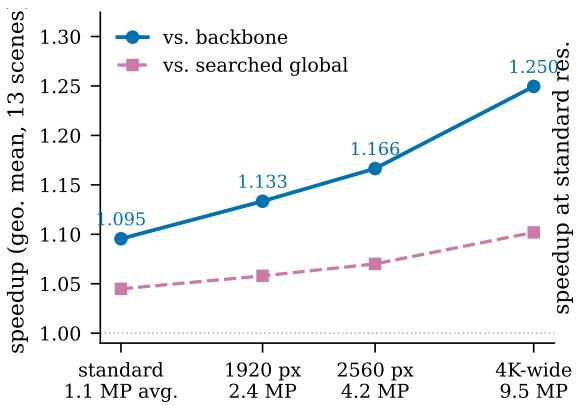  
(a) the policy scales with resolution

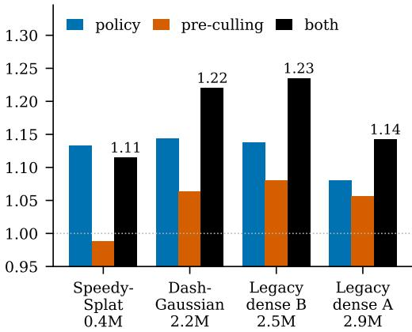  
(b) pre-culling needs density  
Figure 5: Each mechanism has a regime, and the cost model names it. (a) The compiled policy strengthens with resolution; both P and |Ω| change in this sweep. The separate stage profiles in Figure 4 show the within-scene changes and do not conflate the bicycle and counter endpoints. (b) Pre-culling strengthens as the measured $a N / T$ share grows. The dense bars are stress-test checkpoints; the two legacy packaged checkpoints are not used as evidence for any named model family. On Speedy-Splat’s 0.4M checkpoint the frustum test costs more than it saves and “both” is worse than the policy alone, which is the case the dispatch rule catches.

Table 5: Fixed-policy resolution stress test on AccuTile, all thirteen scenes. The same deployable $K _ { \mathrm { r e g } } = 6 4$ policies, selected using held-out training views at standard resolution, are applied unchanged at every width; test views are used only for evaluation. Higher-resolution rows bilinearly resample the same source views and therefore test workload scaling rather than natively captured high-resolution content. Frozen per-Gaussian attributes are cached once in both arms. Timing rotates AccuTile, OURS-GLOBAL, and OURS-REGIONAL in one process with three warmup and seven measured repetitions per view. Speedup is AccuTile/Regional latency; “dataset macro” equally weights the three dataset-level arithmetic means, while “scene $\mathrm { g e o m } . \ '$ is the geometric mean over all thirteen scenes. R and all quality deltas are arithmetic scene means over full official test sets; deltas are Regional minus AccuTile (higher PSNR/SSIM and lower LPIPS are better).
<table><tr><td>Width</td><td>MP/frame</td><td>R</td><td>∆PSNR</td><td>∆SSIM</td><td>∆LPIPS↓</td><td>Speedup (dataset macro / scene geom.)</td></tr><tr><td>Standard</td><td>1.15</td><td>0.8248</td><td>-0.0074</td><td>-0.000109</td><td>-0.000202</td><td> $1 . 0 8 7 9 \times / 1 . 0 9 5 5 \times$ </td></tr><tr><td>1920 px</td><td>2.38</td><td>0.8044</td><td>-0.0141</td><td>-0.000416</td><td>-0.000145</td><td> $1 . 1 2 8 3 \times \mathit { / 1 . 1 3 3 4 } \times$ </td></tr><tr><td>2560 px</td><td>4.23</td><td>0.7908</td><td>-0.0166</td><td>-0.000532</td><td>-0.000167</td><td> $1 . 1 6 1 5 \times / 1 . 1 6 6 5 \times$ </td></tr><tr><td>3840 px</td><td>9.51</td><td>0.7750</td><td>-0.0231</td><td>-0.000742</td><td>-0.000221</td><td> $1 . 2 3 8 4 \times / 1 . 2 4 9 5 \times$ </td></tr></table>

## D.3 REGION-COUNT ABLATION ON 2DGS

To test the region-count trend on a different representation, we repeat the ablation on frozen 2DGS checkpoints for the same thirteen scenes, with $K _ { \mathrm { r e g } } \in \{ 1 , 2 , 4 , \mathring { 8 , } 6 4 , 2 5 6 , 5 1 2 , 1 0 2 4 \}$ fixed before test evaluation. Table 7 uses the exact 1/255 opacity-bound path as its baseline, isolating policy selection from the earlier geometric-bound improvement. Under the same selection-view quality constraints, speedup rises from 1.0838× at $K _ { \mathrm { r e g } } ^ { \mathrm { ~ \tiny ~ - ~ } } = 1 { \mathrm { t o } } 1 . 1 2 0 0 \times$ at $K _ { \mathrm { r e g } } = 8 ,$ followed by 1.1216× and 1.1228× at $K _ { \mathrm { r e g } } ~ = ~ 6 4$ and 256. The direct paired 256-versus-64 ratio is $1 . 0 0 1 1 \times$ with a scene-bootstrap interval of [0.9988, 1.0037], while mean compilation time rises from 53.5 to 57.9 seconds. The added $K _ { \mathrm { r e g } } \doteq 2$ and 4 policies give 1.0144× and 1.0287× over their same-batch $K _ { \mathrm { r e g } } = 1$ controls. At the other end, $K _ { \mathrm { r e g } } = 5 1 2$ and 1024 give direct paired speedups of 0.9999× [0.9956, 1.0043] and $1 . 0 0 0 2 \times \ [ 0 . 9 9 3 8 , 1 . 0 0 6 6 ]$ over the same-batch $K _ { \mathrm { r e g } } = 6 \bar { 4 }$ control, with mean compilation times of 60.5 and 62.6 seconds. Thus increasing the region count beyond 64 has not established an additional runtime benefit in this experiment; this does not establish $K _ { \mathrm { r e g } } = 6 4$ as universally optimal. For small $K _ { \mathrm { r e g } } ,$ the existing construction uses min $_ { \mathrm { 1 } } ( 8 , K _ { \mathrm { r e g } } )$ risk strata, so the 2- and 4-group policies also use fewer strata. The policies attain different distortions under the common constraints, so we report PSNR, SSIM, and LPIPS changes rather than claim exact quality matching.

Table 6: Region-count ablation on Speedy-Splat, all thirteen scenes. $K _ { \mathrm { r e g } } = 1$ is our compiler restricted to one scene-level decision; larger $K _ { \mathrm { r e g } }$ increases the number of policy groups, with spatial workload balancing within each risk stratum. Every row uses the same ladder, calibration/selection views, and quality constraints; the existing construction uses $S _ { \mathrm { e f f } } = \mathrm { m i n } ( 8 , K _ { \mathrm { r e g } } )$ risk strata. Latency uses the same honest-cache, rotating three-arm protocol as Table 1; brackets are 95% scenebootstrap intervals. We retain the globally fixed $K _ { \mathrm { r e g } } \stackrel { \textstyle = } { = } 6 4 ;$ the added $K _ { \mathrm { r e g } } = 2 , 4 , 5 1 2$ , 1024 rows use the same three-arm evaluation protocol.
<table><tr><td> $K _ { \mathrm { r e g } }$ </td><td>mean ∆PSNR</td><td>R</td><td>vs. Official-Fixed</td><td>VS.</td><td> $K _ { \mathrm { r e g } } = 1 [ 9 5 \% \mathrm { C I } ]$ </td><td>compile (s)</td></tr><tr><td>1</td><td>-0.0041</td><td>0.9192</td><td>1.0484×</td><td></td><td>1.0000×</td><td>2.8</td></tr><tr><td>2</td><td>-0.0047</td><td>0.8868</td><td>1.0641×</td><td></td><td>1.0165× [1.0105, 1.0223]</td><td>3.8</td></tr><tr><td>4</td><td>-0.0051</td><td>0.8479</td><td>1.0843×</td><td>1.0351×</td><td>[1.0276, 1.0424]</td><td>4.9</td></tr><tr><td>8</td><td>-0.0067</td><td>0.8329</td><td>1.0894×</td><td>1.0412×</td><td>[1.0298, 1.0525]</td><td>7.0</td></tr><tr><td>16</td><td>-0.0054</td><td>0.8306</td><td>1.0921×</td><td>1.0422×</td><td>[1.0289, 1.0551]</td><td>7.7</td></tr><tr><td>32</td><td>-0.0064</td><td>0.8273</td><td>1.0949×</td><td>1.0436×</td><td>[1.0316, 1.0555]</td><td>8.7</td></tr><tr><td>64</td><td>-0.0080</td><td>0.8227</td><td>1.0949×</td><td>1.0472×</td><td>[1.0327, 1.0604]</td><td>9.0</td></tr><tr><td>128</td><td>-0.0082</td><td>0.8207</td><td>1.0973×</td><td>1.0468×</td><td>[1.0328, 1.0605]</td><td>9.4</td></tr><tr><td>256</td><td>-0.0083</td><td>0.8201</td><td>1.0957×</td><td>1.0451×</td><td>[1.0316, 1.0583]</td><td>9.9</td></tr><tr><td>512</td><td>-0.0093</td><td>0.8158</td><td>1.0981×</td><td>1.0488×</td><td>[1.0345, 1.0632]</td><td>11.2</td></tr><tr><td>1024</td><td>-0.0078</td><td>0.8164</td><td>1.0996×</td><td>1.0519×</td><td>[1.0380, 1.0667]</td><td>15.0</td></tr></table>

## D.4 REGION-CONSTRUCTION ABLATION

The $K _ { \mathrm { r e g } }$ sweep establishes the value of heterogeneous control; we next hold $K _ { \mathrm { r e g } } = 6 4$ fixed and change only how Gaussians are assigned to decisions. Random work-balanced groups and a robust $4 \times 4 \times 4$ uniform spatial grid test whether the gain comes merely from adding 64 free parameters. To avoid confounding construction with a different selected distortion, every family is interpolated to the same 55 dB teacher PSNR. Table 8 separates risk stratification, Morton spatial locality, and pair-workload balancing. Random and Uniform-grid retain 88.3%/88.2% of pairs and reach only $\mathrm { { 1 . 0 6 5 \times / 1 . 0 6 6 \times } } ;$ the full risk-aware construction retains 80.8% and reaches 1.103×. Full is faster than Random by $1 . 0 3 6 \times [ 1 . 0 2 9 , 1 . 0 4 6 ]$ and than Uniform-grid by $1 . 0 3 5 \times \ [ 1 . 0 2 9 , 1 . 0 4 1 ]$ ], winning all thirteen scenes in both comparisons. Spatial, work-balanced regions without risk stratification lie between them at 1.082×, and Full remains 1.020× faster [1.015, 1.024] (13/13). Thus the Pareto gain comes from grouping spatially coherent Gaussians by tail efficiency, rather than merely exposing 64 independent decisions.

Workload balancing does what it is designed to do—it lowers region-workload CV from 0.684 to 0.047—but does not add latency gain at matched quality: count-balanced risk strata reach 1.1034× versus the full method’s 1.1032×; their direct ratio is 0.9998× with a confidence interval that crosses one. We therefore treat workload balancing as a conditioning and region-resolution regularizer, not as an independent source of speedup.

Table 7: Region-count ablation on 2DGS, all thirteen scenes. All variants use the same frozen 30k-iteration 2DGS checkpoints at native resolution, the same 16 calibration and 32 disjoint selection views, the 11-level ladder, $S _ { \mathrm { e f f } } = \mathrm { m i n } ( 8 , K _ { \mathrm { r e g } } )$ risk strata, and 48 Lagrangian penalties with the same proposal-generation procedure. Selection requires minimum-view teacher $\mathrm { P S N R } \geq 4 8$ dB and worst-view ${ \mathfrak { p } } ^ { 9 9 } \leq 0 . 0 1 2 ;$ ; these are common constraints, not exact matching of attained distortion. The baseline is the 2DGS path with the exact 1/255 opacity bound, so the speedups exclude the prior $3 \sigma { - } \mathrm { t } 0 ^ { - }$ -exact-bound transition. Quality deltas and pair ratio R are relative to this baseline on the full test views. Each measurement batch has five arms with cached frozen activations and fifteen balanced same-process timing cycles. The added low- $K _ { \mathrm { r e g } }$ and high- $K _ { \mathrm { r e g } }$ batches each include the same frozen $\tilde { \cal K } _ { \mathrm { r e g } } = 1$ and 64 controls and the exact-bound baseline; each ratio uses its own batch’s timing. Speedups are scene geometric means; quality deltas, $R ,$ and compilation times are arithmetic scene means. Brackets are 95% scene-bootstrap intervals. Compilation time excludes checkpoint loading.
<table><tr><td> $K _ { \mathrm { r e g } }$ </td><td>∆PSNR</td><td>∆SSIM</td><td>∆LPIPS↓</td><td>R</td><td>vs. exact bound</td><td>vS.</td><td> $K _ { \mathrm { r e g } } = 1$  [95% CI]</td><td>compile (s)</td></tr><tr><td>1</td><td>-0.0049</td><td> $- 1 . 2 1 \times 1 0 ^ { - 4 }$ </td><td> $- 7 . 0 7 \times 1 0 ^ { - 5 }$ </td><td>0.9161</td><td>1.0838×</td><td></td><td>1.0000×</td><td>11.7</td></tr><tr><td>2</td><td>-0.0056</td><td> $- 1 . 3 4 \times 1 0 ^ { - 4 }$ </td><td> $- 8 . 9 4 \times 1 0 ^ { - 5 }$ </td><td>0.9027</td><td>1.0974×</td><td></td><td>1.0144× [1.0079, 1.0218]</td><td>18.0</td></tr><tr><td>4</td><td>-0.0068</td><td> $- 1 . 6 1 \times 1 0 ^ { - 4 }$ </td><td> $- 1 . 0 0 \times 1 0 ^ { - 4 }$ </td><td>0.8882</td><td>1.1129×</td><td>1.0287×</td><td>[1.0169, 1.0432]</td><td>24.8</td></tr><tr><td>8</td><td>-0.0075</td><td> $- 1 . 6 7 \times 1 0 ^ { - 4 }$ </td><td> $\cdot 1 . 1 1 \times 1 0 ^ { - 4 }$ </td><td>0.8801</td><td>1.1200×</td><td>1.0334×</td><td>[1.0197, 1.0485]</td><td>37.7</td></tr><tr><td>64</td><td>-0.0093</td><td> $- 1 . 8 3 \times 1 0 ^ { - 4 }$ </td><td> $- 1 . 0 6 \times 1 0 ^ { - 4 }$ </td><td>0.8787</td><td>1.1216×</td><td>1.0349×</td><td>[1.0215, 1.0496]</td><td>53.5</td></tr><tr><td>256</td><td>-0.0098</td><td> $- 1 . 9 3 \times 1 0 ^ { - 4 }$ </td><td> $- 1 . 0 9 \times 1 0 ^ { - 4 }$ </td><td>0.8782</td><td>1.1228×</td><td>1.0360×</td><td>[1.0214, 1.0520]</td><td>57.9</td></tr><tr><td>512</td><td>-0.0092</td><td> $- 1 . 7 0 \times 1 0 ^ { - 4 }$ </td><td> $- 1 . 1 1 \times 1 0 ^ { - 4 }$ </td><td>0.8797</td><td>1.1186×</td><td>1.0355×</td><td>[1.0232, 1.0504]</td><td>60.5</td></tr><tr><td>1024</td><td>-0.0104</td><td> $- 1 . 9 0 \times 1 0 ^ { - 4 }$ </td><td> $- 1 . 0 6 \times 1 0 ^ { - 4 }$ </td><td>0.8786</td><td>1.1188×</td><td>1.0357×</td><td>[1.0220, 1.0516]</td><td>62.6</td></tr></table>

Table 8: Region-construction ablation on all thirteen Speedy-Splat scenes. We fix $K _ { \mathrm { r e g } } = 6 4$ decisions and keep probes, ladder, and search unchanged. Each validation-selected Pareto curve is interpolated in teacher MSE to 55 dB, with only its two bracketing policies timed in a common balanced process. Random retains work balancing alone; Uniform grid retains spatial locality alone; No-risk keeps Morton locality and work balancing; No-workload keeps risk strata and Morton order but partitions by Gaussian count. Work CV measures the coefficient of variation in baseline pair workload across regions. Full/row above one indicates that Full is faster, and brackets give 95% scene-bootstrap intervals.
<table><tr><td>Grouping</td><td>Risk</td><td>Spatial</td><td>Work-bal.</td><td>Work CV</td><td></td><td>R vs. AccuTile</td><td>Full/row [95% CI] (wins)</td></tr><tr><td>Random</td><td>no</td><td>no</td><td>yes</td><td>0.005</td><td>0.8832</td><td>1.0649×</td><td>1.0360× [1.0285, 1.0458] (13/13)</td></tr><tr><td>Uniform grid</td><td>no</td><td>yes</td><td>no</td><td>3.652</td><td>0.8823</td><td>1.0658×</td><td>1.0351× [1.0293, 1.0408]</td></tr><tr><td>No risk strata</td><td>no</td><td>yes</td><td>yes</td><td>0.005</td><td>0.8480</td><td>1.0820×</td><td>] (13/13) 1.0196× [1.0151, 1.0243] (13/13)</td></tr><tr><td>No workload balance</td><td>yes</td><td>yes</td><td>no</td><td>0.684</td><td>0.8087</td><td>1.1034×</td><td>0.9998× [0.9985, 1.0011] (6/13)</td></tr><tr><td>Full</td><td>yes</td><td>yes</td><td>yes</td><td>0.047</td><td>0.8076</td><td>1.1032×</td><td></td></tr></table>

## D.5 WHY NOT SIMPLY RAISE THE CONSTANT?

The most direct objection to this paper is that our gain merely reflects $\tau _ { 0 } = 1 / 2 5 5$ being too conservative, and that setting it to $2 / 2 5 5$ or $4 / 2 5 5$ would capture it. We answer that first, because it determines what the rest of the section is worth.

Table 9 applies each fixed multiple of $\tau _ { 0 }$ to all thirteen scenes. Read by the mean, the objection looks correct: at $4 \tau _ { 0 }$ the average costs only −0.085 dB for 1.111×. Read by the worst scene it does not: the same $4 \tau _ { 0 }$ costs −0.426 dB on bonsai. And bonsai is the least favourable scene at every multiple, so a single constant is not free to sit at its own average — it must be clamped to whichever scene happens to be hardest.

Making that clamp explicit answers the objection quantitatively. A fixed constant matched to our worst-scene quality (−0.022 dB) can only reach $1 . 6 2 \tau _ { 0 }$ and 1.036×, against our 1.1009× in this dedicated sweep. A fixed constant matched to that speed must run at $3 . 6 \tau _ { 0 }$ , where the worst scene loses $0 . 3 3 4 \mathrm { d B - 1 5 } \times$ our worst-case error. Note also that our own worst scene is garden, not bonsai: the compiled policy specifically relieves the scene that constrains the global rule.

There is a second, quieter point. Choosing $2 \tau _ { 0 }$ or $4 \tau _ { 0 }$ safely presupposes knowing which scenes tolerate it, and the per-scene optimum found by our selector ranges over $1 . 5 \substack { - 3 . 0 \bar { \tau } _ { 0 } }$ . Recovering even that scalar requires scene measurements and rendered acceptance tests. We call the process compilation because it automatically emits a frozen deployment asset; it replaces manual threshold choice rather than claiming that no offline selection occurs.

Table 9: “Why not simply raise the constant?” Each row applies one fixed multiple of $\tau _ { 0 }$ to all thirteen scenes in one dedicated cutoff sweep. The mean is reassuring and the worst scene is not: the same scene (bonsai) is the least favourable at every multiple, so a single constant must be clamped to it. Matching OURS-REGIONAL’s worst-scene quality caps a fixed constant at 1.62τ0 and 1.036×; matching its 1.1009× speed in this sweep forces the constant to $3 . 6 \tau _ { 0 }$ , where the worst scene loses −0.334 dB against −0.022 dB. The independent all-view twelve-cycle main retiming is 1.096×. Choosing safely requires measuring the scene—the compilation step already present in OURS-GLOBAL.
<table><tr><td>Threshold</td><td>mean ∆PSNR</td><td>worst ∆PSNR</td><td>worst scene</td><td>vs. Official-Fixed</td></tr><tr><td>1.25T0</td><td>-0.0011</td><td>-0.0030</td><td>bonsai</td><td>1.0194×</td></tr><tr><td> $1 . 5 \tau _ { 0 }$ </td><td>-0.0038</td><td>-0.0126</td><td>bonsai</td><td>1.0305×</td></tr><tr><td> $2 \tau _ { 0 }$ </td><td>-0.0126</td><td>-0.0493</td><td>bonsai</td><td>1.0530×</td></tr><tr><td> $3 \tau _ { 0 }$ </td><td>-0.0425</td><td>-0.2005</td><td>bonsai</td><td>1.0855×</td></tr><tr><td> $4 \tau _ { 0 }$ </td><td>-0.0853</td><td>-0.4255</td><td>bonsai</td><td>1.1113×</td></tr><tr><td> $6 \tau _ { 0 }$ </td><td>-0.1900</td><td>-0.9404</td><td>bonsai</td><td>1.1497×</td></tr><tr><td> $8 \tau _ { 0 }$ </td><td>-0.2889</td><td>-1.3708</td><td>bonsai</td><td>1.1767×</td></tr><tr><td>Ours-Regional</td><td>-0.0074</td><td>-0.0218</td><td>garden</td><td>1.1009×</td></tr></table>

Table 10: Calibration-view sensitivity on all thirteen Speedy-Splat scenes. Each family uses $K _ { \mathrm { r e g } } = 6 4$ and 32 disjoint selection views; only the number of calibration views changes. Curves are interpolated to 55 dB teacher PSNR and their bracketing policies are timed together. Brackets bootstrap scenes and parentheses count wins.
<table><tr><td>Calibration views</td><td>∆PSNR</td><td>R</td><td></td><td>vs. AccuTile [95% CI] (wins)</td><td></td><td>16/row [95% CI] (wins)</td><td></td><td>Compile (s)</td></tr><tr><td>4</td><td>-0.0095</td><td>0.8661</td><td></td><td>1.0827× [1.0579, 1.1079]</td><td>(13/13)</td><td>1.0036× [0.9781, 1.0257]</td><td>](9/13)</td><td>12.0</td></tr><tr><td>8</td><td>-0.0109</td><td>0.8342</td><td></td><td>1.0774× [1.0260, 1.1197]</td><td>(11/13)</td><td>1.0085× [0.9831, 1.0358] (7/13)</td><td></td><td>15.4</td></tr><tr><td>16</td><td>-0.0099</td><td>0.8076</td><td></td><td>1.0866× [1.0542, 1.1160]</td><td>] (11/13)</td><td></td><td></td><td>9.0</td></tr><tr><td>32</td><td></td><td></td><td></td><td>-0.0074 0.8000 1.0889× [1.0523, 1.1238]</td><td>](11/13)</td><td></td><td>0.9979× [0.9792, 1.0229] (3/13) 17.2</td><td></td></tr></table>

Calibration-view sensitivity. Region count is swept on all thirteen scenes in Table 6; Table 10 likewise varies calibration views over 4/8/16/32 while matching every curve at 55 dB. All four settings have aggregate intervals above one versus AccuTile, while every direct interval against the 16-view default crosses one. Increasing from 16 to 32 views lowers R from 0.808 to 0.800 but yields statistically indistinguishable latency, so we retain 16 rather than tune this value per scene. Across three independent random 16/32 calibration/selection splits, speedup is 1.0945 × ±0.0010×, pair ratio is $0 . 8 2 9 9 \pm 0 . 0 0 2 3 .$ , and mean PSNR change is −0.0085 ± 0.0012 dB (Table 16).

## D.6 DENSE, FLOW-ALIGNED TEMPORAL EVALUATION

We construct a continuous path by inserting three SE(3)-interpolated cameras between every adjacent pair of official test poses. This yields 359 frames over bicycle, bonsai, and counter. For each method, let the pruning residual be its rendered image minus the unmodified AccuTile image. We estimate bidirectional RAFT-Small flow (Teed and Deng, 2020) between consecutive AccuTile frames, backward-warp the preceding residual, reject occlusions by forward–backward consistency, and measure the remaining residual change. The OURS-GLOBAL and OURS-REGIONAL policies are chosen closest to 55 dB using held-out training views; neither test images nor the interpolated path participate in selection.

Region adaptation lowers the geometric-mean aligned residual change to 0.789× the OURS-GLOBAL value while also reducing the pair ratio from 0.873 to 0.775. Because lower per-frame error alone can lower this temporal quantity, we also normalize each policy’s aligned change by its own frame RMSE. That ratio is 0.990× overall: no aggregate temporal regression, but no claim of an improvement either. The negative counter result (1.050× normalized) is retained in Table 11; the evidence supports aggregate stability on these paths, not a universal no-popping guarantee.

Table 11: Dense, flow-aligned temporal evaluation. Before constructing test-camera paths, we select OURS-GLOBAL and OURS-REGIONAL near 55 dB on held-out training views. We insert three SE(3)-interpolated views between adjacent test poses, masking occlusions with bidirectional RAFT-Small consistency. The flow-aligned residual-change RMSE is E $( \times 1 0 ^ { - 3 } ) ; E _ { n }$ normalizes it by each policy’s frame RMSE. Lower E and Regional/Global are better. Aggregates are geometric means, with valid flow weighted by transition.
<table><tr><td>Scene</td><td>Frames</td><td>Valid flow</td><td>R Global</td><td>R Regional</td><td>E Global</td><td>E Regional</td><td> $E _ { n }$  Regional/Global</td></tr><tr><td>Bicycle</td><td>97</td><td>45.8%</td><td>0.922</td><td>0.815</td><td>2.700</td><td>1.798</td><td>0.926×</td></tr><tr><td>Bonsai</td><td>145</td><td>77.4%</td><td>0.898</td><td>0.772</td><td>2.081</td><td>1.373</td><td>0.998×</td></tr><tr><td>Counter</td><td>117</td><td>79.6%</td><td>0.803</td><td>0.738</td><td>1.386</td><td>1.549</td><td>1.050×</td></tr><tr><td>Aggregate</td><td>359</td><td>69.6%</td><td>0.873</td><td>0.775</td><td>1.982</td><td>1.564</td><td>0.990×</td></tr></table>

Table 12: OURS-GLOBAL and OURS-REGIONAL policies compiled on AccuTile and transferred unchanged into two official optimized rasterizers. FlashGS retains its precise intersection and scheduling optimizations. R and teacher PSNR are measured against each rasterizer’s native path. Every row uses twelve balanced same-process timing cycles; no row recalibrates or fine-tunes either policy.
<table><tr><td>Rasterizer</td><td>Resolution</td><td>Scenes</td><td>R</td><td>Teacher PSNR</td><td>vs. Official-Fixed</td><td>vs. Ours-Global</td></tr><tr><td rowspan="2">SeeLe SeeLe</td><td>Standard</td><td>13</td><td>0.8003</td><td>54.75</td><td>1.0908×</td><td>1.0437×</td></tr><tr><td>4K (3840 px)</td><td>13</td><td>0.7539</td><td>56.41</td><td>1.2602×</td><td>1.1233×</td></tr><tr><td>FlashGS</td><td>Standard</td><td>13</td><td>0.8205</td><td>52.52</td><td>1.1214×</td><td>1.0605×</td></tr><tr><td>FlashGS</td><td>4K (3840 px)</td><td>13</td><td>0.7723</td><td>50.38</td><td>1.3166×</td><td>1.1379×</td></tr></table>

## D.7 TRANSFER TO INDEPENDENTLY OPTIMIZED RASTERIZERS

The strongest portability test is to run the Speedy-Splat policies underlying Table 1 inside software we did not write, without recalibration. We modify only the threshold lookup in the official SeeLe (Zhu et al., 2026) and FlashGS (Feng et al., 2025) rasterizers. SeeLe uses an axis-aligned footprint and a different blending path; FlashGS combines precise Gaussian intersection, adaptive scheduling, and pipelining.

Table 12 reports both transfers under the same twelve-cycle protocol as the main table. SeeLe becomes 1.091× faster at standard dataset resolution and 1.260× at 4K. FlashGS improves by 1.121× and 1.317×, and the regional policy beats transferred OURS-GLOBAL by 1.061× and 1.138×. The FlashGS result is especially useful because it shows the policy still removes work after a strong geometric tile-intersection optimization. These are transfer results, not claims against the full SeeLe camera-clustering pipeline or FlashGS’s published end-to-end benchmark.

## D.8 THE COST MODEL PREDICTS, AND ONE OF ITS PREDICTIONS IS NEGATIVE

Section B.1 fits an empirical affine model within controlled sweeps; here we test whether it is useful for dispatch. An oracle visible-subset comparison gives an estimated upper bound for the tested region pre-culler before implementing its runtime path. Across thirteen scenes, the estimate matches the realized ceiling to a mean absolute error of 0.004 (Figure 6a). The result is unfavourable: the per-Gaussian term is only 14.3% of the honest frame on average (3.3–26.3%), so the tested perfect, free oracle is capped near 1.17× and the implemented culler— conservative predicate and planning included—returns 1.010× overall. We report this as a negative result rather than omitting it, because it is the same model that produces the positive one.

The model also says where the negative result reverses. Dense stress-test checkpoints have a larger measured aN/T share, even though their pair count also changes. Table 13 and Figure 5b show that on the tested checkpoints above ∼2M Gaussians the two mechanisms compose nearly multiplicatively, reaching 1.235× at standard dataset resolution, and the pre-culling arm is image-bit-exact in all 52 runs. Two rows use legacy packaged checkpoints and are deliberately not attributed to named model families. Below ∼500K Gaussians pre-culling costs more than it saves (0.988× on Speedy-Splat) and the dispatch rule of Section B.3 switches it off. At 4K the measured per-Gaussian share falls to 3–12% of the frame, so the planning-cost test selects the policy alone.

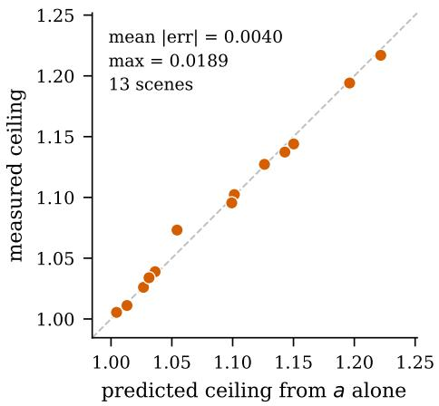  
(a) the model predicts the ceiling

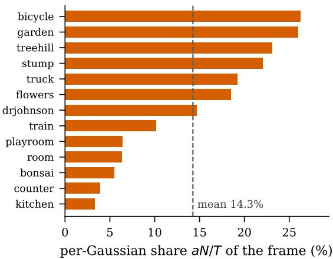  
(b) and says that ceiling is low  
Figure 6: A prediction made before the implementation, and then tested. (a) Fitting only a — from a single oracle-subset comparison taking seconds — predicts the measured ceiling of region pre-culling to a mean absolute error of 0.0040 over thirteen scenes. (b) The prediction is unfavourable: the per-Gaussian term is 14.3% of the honest frame on average, so the tested perfect, free oracle is capped near 1.17×. The estimate is specific to this checkpoint family, resolution, GPU, and pre-culling design.

Table 13: Policy truncation primarily reduces pair-correlated work; image-bit-exact region preculling skips conservatively rejected Gaussian blocks before projection. Standard dataset resolution, planning cost included. This five-arm stress microbenchmark uses at most twelve evenly spaced test views per scene, so its policy column is not a replacement for the all-view twelve-cycle main-table timing. The pre-culling arm’s maximum absolute pixel difference against the unmodified render is 0 in all 52 runs, so the quality cost of the combination is that of the policy alone. Legacy dense A/B are historical packaged checkpoints used only as density stress tests, not as evidence for a named model family. Below roughly 500K Gaussians the frustum test costs more than it saves and the dispatch rule of Section B.3 disables it.
<table><tr><td>Checkpoint</td><td>Mean Gaussians</td><td>Base (ms)</td><td>Policy</td><td>Pre-cull</td><td>Both</td><td>Gain from stacking</td></tr><tr><td>Legacy dense A</td><td>2,933,368</td><td>3.63</td><td>1.080×</td><td>1.056×</td><td>1.142×</td><td>1.058×</td></tr><tr><td>Legacy dense B</td><td>2,519,315</td><td>2.52</td><td>1.138×</td><td>1.080×</td><td>1.235×</td><td>1.085×</td></tr><tr><td>DashGaussian</td><td>2,167,600</td><td>2.47</td><td>1.144×</td><td>1.063×</td><td>1.220×</td><td>1.067×</td></tr><tr><td>Speedy-Splat</td><td>407,593</td><td>0.78</td><td>1.132×</td><td>0.988×</td><td>1.115×</td><td>0.984×</td></tr></table>

## D.9 COST

Compilation reads the checkpoint and calibration views, runs both probes, and solves selection in 9.0 s per scene on average for the default $K _ { \mathrm { r e g } } = 6 4$ (at most 14.0 s, excluding checkpoint load). The sensitivity probe invokes backward-mode differentiation but updates no checkpoint parameter and needs no optimizer state. The exported policy is one uint8 level per Gaussian plus a table of at most 256 thresholds: exactly N bytes for the indices and under 1 KB for the table. The compact Speedy-Splat checkpoints occupy 0.14–0.88 MB; dense ports scale linearly beyond that range. Inference reads the byte during tile enumeration, with no extra kernel or per-frame policy inference. The cost amortizes after roughly 16k rendered frames at 4K and 126k at standard dataset resolution.

Table 14: Attribution behind the simplified backbone comparison in Table 1. Exact-1/255 replaces a released 3σ tile box by the opacity-aware bound already established by prior work (Radl et al., 2024; Hanson et al., 2025a); we do not count that transition as a compiler contribution. $K _ { \mathrm { r e g } } =$ 1 and $K _ { \mathrm { r e g } } = 6 4$ are our compiler with one and 64 decisions. Values are speedups over the official released path except for the final incremental column.
<table><tr><td>Backbone</td><td>Exact-1/255</td><td>Ours  $( K _ { \mathrm { r e g } } = 1 )$ </td><td>Ours  $( K _ { \mathrm { r e g } } = 6 4 )$ </td><td> $K _ { \mathrm { r e g } } { = } 6 4 / K _ { \mathrm { r e g } } { = } 1$ </td></tr><tr><td>Speedy-Splat</td><td>1.000×</td><td>1.048×</td><td>1.095×</td><td>1.047×</td></tr><tr><td>2DGS</td><td>1.313×</td><td>1.422×</td><td>1.474×</td><td>1.037×</td></tr><tr><td>Scaffold-GS</td><td>1.252×</td><td>1.301×</td><td>1.320×</td><td>1.014×</td></tr></table>

## D.10 LIMITATIONS

Calibration needs the training views. Compilation measures pair savings and tail energy by rendering, so it needs the camera poses and images the checkpoint was fitted to. It is a per-scene calibration step, not a data-free transform of an arbitrary released .ply. It does not need the optimizer state or the training run, and it performs no parameter update.

Scope is threshold-based tile enumeration. The method assumes a rasterizer whose footprint is governed by a contribution threshold. It applies directly to AccuTile-style rasterizers, to SeeLe, and to 2DGS, Scaffold-GS, or vanilla 3DGS once their 3σ box is replaced by such a bound. Orientedbox, convex-hull and non-tiled rasterizers expose a different control surface and are out of scope.

Regions do not beat primitives. As Table 2 shows, $K _ { \mathrm { r e g } }$ region-shared thresholds tie per-Gaussian control on speed. They reduce the number of independent search decisions and may regularize selection, but our current packed format stores one byte per Gaussian for either policy. We make no compression or superiority claim for regional control.

Static policies and camera motion. The exported policy is fixed. Our dense flow-aligned test covers 359 frames on three scenes and has no aggregate regression, but counter regresses by 5.0% after normalization. Broader trajectories and a perceptual user study would be needed for a universal no-popping claim.

Held-out constraints are not test guarantees. Three random calibration/selection splits produce nearly identical aggregate speed and pair ratios, but the per-Gaussian multiplier vectors agree exactly only 49.5% of the time. On unseen test views, 18 of the 39 split–scene runs exceed the 0.012 selection cap, eight reach at least 0.015, and the maximum is 0.032. The cap controls held-out training views; it does not certify every unseen pose. Selection and test diagnostics both use floatingpoint residuals and the same 4× spatial subsample, so the excesses are not a dtype mismatch.

Tile-aligned residual structure. Lossy support truncation removes a Gaussian from a whole tile at once. In a three-scene, 92-test-view diagnostic, the residual finite-difference at the true 16-pixel tile phase is the largest of all 16 phases in every view. Its mean amplitude is only 0.19–0.31 of one 8-bit code value, but its mean boundary/non-boundary ratio is 5.86–6.18× (Section I). This establishes structured error, not perceptual visibility; a controlled user study remains absent.

One GPU class. All timings are from RTX 5000 Ada GPUs; the four locally available devices are the same model. The cost model suggests the balance between the two mechanisms shifts on hardware with a different memory-to-compute ratio, but a second desktop or mobile hardware class remains unmeasured.

## E BACKBONE-TRANSITION ATTRIBUTION

The main table intentionally presents the deployment-facing comparison “official model versus model + Ours.” Table 14 provides the accounting needed to interpret that compact presentation. Speedy-Splat already exposes the exact 1/255 footprint, so its full gain is due to our compiler. The public 2DGS and Scaffold-GS rasterizers start from 3σ; installing an exact opacity-aware bound contributes the first speedup stage and is prior work, while $K _ { \mathrm { r e g } } = 1$ and $K _ { \mathrm { r e g } } = 6 4$ are our compiler stages.

## E.1 THRESHOLD SEMANTICS AND LOW-OPACITY GAUSSIANS

The exported lookup table stores absolute thresholds $m _ { g } \tau _ { 0 }$ . The default Speedy-Splat path uses these thresholds directly, without an opacity-relative cap; a threshold at or above Gaussian opacity yields no tile pairs. The 2DGS and Scaffold-GS threshold-bound ports likewise reject primitives whose opacity cannot exceed the selected threshold. This changes their participation in a render, not the stored checkpoint parameters. The FastGS port instead applies min $( m _ { g } \tau _ { 0 } , 0 . 9 5 \alpha _ { g } )$ and subtracts $1 0 ^ { - 6 }$ when the cap binds before constructing its backend-specific extent. Thus preserving nonempty support is not a method-wide invariant, and an all-one policy should not be assumed to reproduce every backend’s native pair list merely from its multiplier values.

A synthetic check of the default Speedy-Splat path used five opacities spanning $0 . 5 \tau _ { 0 }$ to 0.5. Both scalar and packed all-one thresholds reproduced the baseline images bit-for-bit and preserved pair counts in these cases. For an opacity of $0 . 5 \tau _ { 0 } .$ , the baseline and both all-one paths emitted zero pairs; the capped FastGS scalar and packed all-one paths emitted four pairs versus zero for their native baseline, while pixel-level alpha rejection kept all three images identical. This distinguishes image equivalence from work equivalence; it is a bounded regression check, not a universal floating-point proof.

## F THE CHECKPOINT FAMILIES USED BY FRAGMENT PRUNING

Fragment Pruning (Ye et al., 2024) reports its learned per-Gaussian fragment cutoff on vanilla 3DGS and Mini-Splatting checkpoints. We therefore apply TileSkipper independently to clean officialstyle 30k 3DGS checkpoints and official Mini-Splatting outputs over the same thirteen scenes. This is a checkpoint-composition test, not an implementation of Fragment Pruning and not a crosshardware speed contest: their published FPS uses a Jetson Orin NX and an OpenGL renderer, whereas Table 15 uses our CUDA rasterizer on RTX 5000 Ada.

At standard dataset resolution, the deployment-facing totals are 1.493× for 3DGS and 1.346× for Mini-Splatting; at fixed 1080p they rise to 1.841× and 1.599×, with all thirteen scenes faster in both settings. Those totals must not be attributed entirely to our compiler: at standard resolution, installing the prior exact 1/255 bound already gives 1.454× and 1.266×, respectively. The regional policy contributes a further 1.027× and 1.063× (1.038× and 1.089× at 1080p). Thus the experiment supports compatibility with dense and aggressively pruned checkpoints, but it does not establish superiority to Fragment Pruning’s learned cutoff. Their reported dataset-level ratios are in a similar numerical range, but the hardware, renderer, and 60-FPS cap make direct ranking invalid.

Every selected policy passes the 48-dB and 0.012 p99 constraints on the disjoint held-out training views used by the compiler. On unseen test views, mean ground-truth PSNR changes remain only −0.010/ − 0.014 dB for 3DGS/Mini-Splatting, but at fixed 1080p Mini-Splatting’s worst test view reaches 45.76 dB teacher PSNR and 0.0259 p99. This is a concrete instance of the held-outversus-test limitation in Section D.10; we report it rather than treating the selection constraint as a certificate.

## G CALIBRATION-VIEW SPLIT STABILITY

To test whether the compiler depends on one favorable view partition, we repeat the full $K _ { \mathrm { r e g } } = 6 4$ Speedy-Splat experiment with random seeds 17, 43, and 89. Each seed independently samples 16 calibration and 32 disjoint selection views in every scene; the ladder, probes, constraints, and search are unchanged. The three policies are then evaluated and timed with AccuTile in the same four-arm process. Table 16 shows only 0.0010× standard deviation in the thirteen-scene speedup, and all three splits improve all thirteen scenes. The exact per-Gaussian multiplier agreement across spli pairs is 49.5%: different view samples find different near-equivalent policies, while their aggregate distortion, work, and latency remain stable. Mean compilation time is 9.1 seconds per scene. This aggregate stability does not extend to the test-view tail constraint: 18 of 39 split–scene runs exceed p99 0.012, eight reach at least 0.015, and the maximum is 0.032.

A scalar safety margin helps but does not solve view transfer. We reselect from each split’s already-rendered candidate table under validation $\mathsf { p } 9 9$ caps of 0.010 and 0.008, without consulting test views. As Table 17 shows, the tighter caps reduce violations from 18 to 5 and 3 of 39 runs, respectively, while increasing the retained-pair ratio from 0.830 to 0.877. All three failures at 0.008 are kitchen; its worst p99 remains 0.021–0.030 across the three splits. Thus a global margin trades work for robustness but does not address a view-coverage failure.

Table 15: TileSkipper on the two checkpoint families used by Fragment Pruning. Standardresolution and fixed 1920×1080 rendering on RTX 5000 Ada; each row uses the same patched vanilla-3DGS CUDA rasterizer and twelve balanced timing cycles. $\mathrm { ^ { * } \mathrm { \cdot B a s e } }  \mathrm { + O u r s ^ { , \bar { } \bar { } } }$ is the deployment-facing total; “AccuTile → +Ours” isolates our compiled policy after the prior 3σ → 1/255 exact-bound transition. Intervals bootstrap scenes and parentheses count wins. These are not head-to-head Jetson/OpenGL measurements against Fragment Pruning.
<table><tr><td>Checkpoint</td><td>Resolution</td><td>Dataset</td><td>Base → +Ours [95% CI] (wins)</td><td>AccuTile → +Ours</td><td>3σ →AccuTile</td><td>∆PSNR</td></tr><tr><td rowspan="5">3DGS</td><td>standard</td><td>All 13</td><td>1.493× [1.350, 1.656] (13/13)</td><td>1.027× [1.014, 1.042] (13/13)</td><td>1.454×</td><td>-0.003</td></tr><tr><td>1080p</td><td>Mip-NeRF 360</td><td>1.729× [1.532, 1.959] (9/9)</td><td>1.042× [1.023, 1.064] (9/9)</td><td>1.659×</td><td>-0.014</td></tr><tr><td></td><td>Tanks&amp;Temples</td><td>2.246× [2.013, 2.506] (2/2)</td><td>1.027× [1.020, 1.035] (2/2)</td><td>2.186×</td><td>-0.009</td></tr><tr><td>Deep Blending</td><td></td><td>2.003× [1.947, 2.060] (2/2)</td><td>1.028× [1.021, 1.036] (2/2)</td><td>1.948×</td><td>+0.003</td></tr><tr><td>All i3</td><td></td><td>1.841× [1.657, 2.035] (13/13)</td><td>1.038× [1.024, 1.054] (13/13)</td><td>1.774×</td><td>-0.010</td></tr><tr><td rowspan="5">Mini-Splatting</td><td rowspan="5">standard 1080p</td><td>All 13</td><td>1.346× [1.260, 1.451] (13/13)</td><td>1.063× [1.046, 1.081] (13/13)</td><td>1.266×</td><td>-0.008</td></tr><tr><td>Mip-NeRF 360</td><td>1.593× [1.477, 1.733] (9/9)</td><td>1.090× [1.069, 1.115] (9/9)</td><td>1.462×</td><td>-0.017</td></tr><tr><td>Tanks&amp;Temples</td><td>1.770× [1.748, 1.792] (2/2)</td><td>1.081× [1.071, 1.091] (2/2)</td><td>1.637×</td><td>-0.013</td></tr><tr><td>Deep Blending</td><td>1.473× [1.410, 1.538] (2/2)</td><td>1.095× [1.077, 1.114] (2/2)</td><td>1.345×</td><td>-0.004</td></tr><tr><td>All 13</td><td>1.599× [1.505, 1.703] (13/13)</td><td>1.089× [1.074, 1.107] (13/13)</td><td>1.468×</td><td>-0.014</td></tr></table>

Table 16: Calibration/selection split stability on all thirteen Speedy-Splat scenes. Each row independently samples 16 calibration and 32 disjoint selection views; $K _ { \mathrm { r e g } } = 6 4$ and all compiler settings are fixed. Speedup intervals bootstrap scenes.
<table><tr><td>Split seed</td><td>∆PSNR</td><td>R</td><td></td><td>vs. AccuTile</td><td>Wins</td><td>Compile (s)</td></tr><tr><td>17</td><td>-0.0097</td><td>0.8325</td><td></td><td>1.0934× [1.0709, 1.1176]</td><td>13/13</td><td>9.1</td></tr><tr><td>43</td><td>-0.0073</td><td>0.8283</td><td></td><td>1.0947× [1.0752, 1.1160]</td><td>13/13</td><td>9.1</td></tr><tr><td>89</td><td>-0.0084</td><td>0.8288</td><td></td><td>1.0953× [1.0762, 1.1178]</td><td>13/13</td><td>9.1</td></tr></table>

## H SPATIAL HETEROGENEITY OF SAFE GLOBAL THRESHOLDS

Figure 7 provides the pixel-level evidence behind the Introduction’s claim that a single global threshold is forced into a compromise: it is too loose on easy regions and too tight on hard ones. We partition a representative playroom view into a coarse spatial grid; for each region we sweep a global threshold $\bar { \tau } \in \{ 1 , 2 , 4 , 8 , 1 6 \} / 2 5 5$ and report the largest $\tau ^ { \star }$ whose local PSNR (computed over the region’s pixels only) stays within 0.03 dB of the 1/255 baseline. Each region is colored by its $\tau ^ { \star }$ The grid contains the full 16× spread from 1/255 to 16/255 on a single view. The four callouts are selected at distinct values: region 1 is a low-detail example at 16/255, region 2 a material patch at 8/255, region 3 a fine-detail example at 4/255, and region 4 an edge or boundary at 2/255. Cells at 1/255 appear in the map but are not among these four callouts. This diagnostic establishes local heterogeneity; it does not by itself measure how much of that heterogeneity a particular compiled partition captures. Indeed, playroom is one of two scenes whose selected Regional policy collapses to a single level; pixel-local heterogeneity is therefore not sufficient evidence of deployable regional gain.

## I TILE-BOUNDARY RESIDUAL STRUCTURE

Tile support is a discrete action: when a tail no longer intersects a tile, all of its fragments in that tile disappear together. We therefore test for the specific grid artifact that aggregate PSNR, SSIM, and LPIPS may hide. On bicycle, bonsai, and counter, we choose real Global, Regional, and per-Gaussian policies nearest 55 dB using validation metadata only, then render all 92 official test views. For each candidate-minus-backbone residual, we measure the RGB finite-difference magnitude at every pixel phase modulo 16.

Table 17: Validation-cap guard-band diagnostic over the same 39 randomized split–scene candidate tables. We reselect policies using held-out training-view measurements alone, then evaluate them on official test views. The original 0.012 row reproduces the reported policies. Tightening the validation cap reduces unseen-view violations at the cost of retaining more pairs, while kitchen failures persist. This post-hoc diagnostic is not used to select the paper’s primary operating point.
<table><tr><td>Validation p99 cap</td><td>Test  $\mathsf { p 9 9 > 0 . 0 1 2 }$ </td><td>Test  $\mathsf { p 9 9 } \geq 0 . 0 1 5$ </td><td>Worst test p99</td><td>Mean R</td><td>Mean worst-view teacher PSNR</td></tr><tr><td>0.012</td><td>18/39</td><td>8/39</td><td>0.0320</td><td>0.830</td><td>52.06 dB</td></tr><tr><td>0.010</td><td>5/39</td><td>5/39</td><td>0.0305</td><td>0.851</td><td>54.08 dB</td></tr><tr><td>0.008</td><td>3/39</td><td>3/39</td><td>0.0301</td><td>0.877</td><td>56.43 dB</td></tr></table>

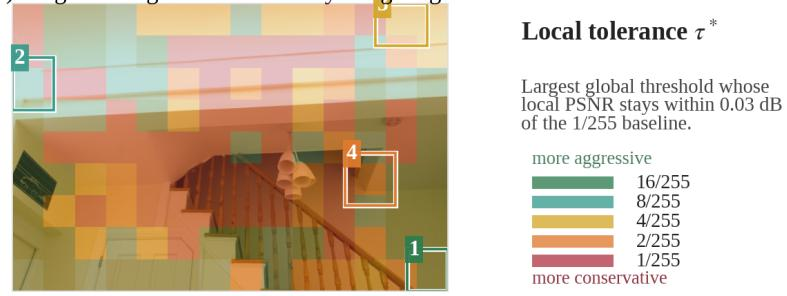  
Figure 7: Largest safe global tile threshold varies by 16× across regions of a single view. Each grid cell of a representative playroom render is colored by the largest $\tau ^ { \star } \in \{ 1 , \bar { 2 , } 4 , 8 , 1 6 \} / 2 5 5$ whose local PSNR stays within 0.03 dB of the 1/255 baseline. The four highlighted examples are at (1) 16/255 (low detail), (2) 8/255 (material patch), (3) 4/255 (fine detail), and (4) 2/255 (edge or boundary). Other grid cells include the conservative 1/255 value, giving the reported full spread. This is a local tolerance diagnostic rather than an evaluation of the compiled partition.

As shown in Figure 8, the true tile boundary (phase zero) is the largest of the 16 phases in all 92 views for every policy. The pooled mean boundary/non-boundary ratios are 5.86×, 6.18×, and 5.93× for Global, Regional, and per-Gaussian control, respectively. Their absolute mean boundary jumps are 0.192, 0.287, and 0.312 of one 8-bit code value. Thus lossy tile-support truncation does create grid-aligned residual structure, but this diagnostic alone does not establish that it is visible at normal magnification. The similar result for all three controls also shows that the effect is tied to the tile-level action rather than regional grouping specifically.

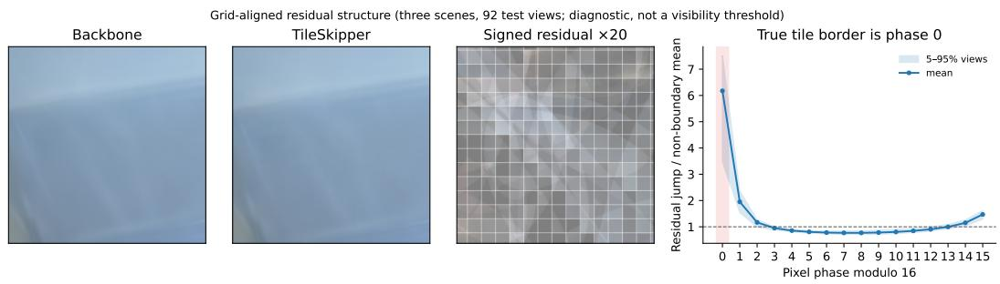

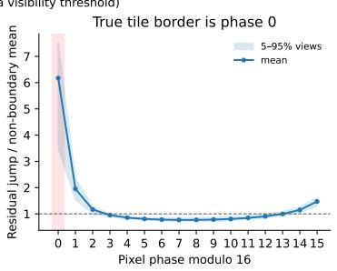  
Figure 8: Grid-aligned residual diagnostic. The crop is selected by maximum boundary-weighted residual energy and the signed residual is amplified 20×; white lines show the true tile grid. The phase plot pools the Regional policy over three scenes and 92 test views. The highlighted phase zero is the actual tile border. The plot diagnoses residual structure and is not a perceptual visibility threshold.

## J QUALITATIVE COMPARISON

Figure 9 shows the backbone and the compiled policy on four held-out kitchen test views. For each view we crop the 160 × 160 window where the two renders differ most, so the figure shows the hardest region rather than a representative one, and amplify the difference by 20× to make it visible at all. Per-view PSNR against ground truth changes by +0.00 to −0.02 dB and the largest single-pixel difference is 0.074 on a [0, 1] scale—roughly 19 quantization steps of an 8-bit channel, concentrated on the woven placemat and the specular edge of the window frame. Their concentration in high-frequency content shows where even a conservative allocation remains vulnerable; it should not be read as evidence that the compiler intentionally assigns a looser cutoff to those regions.

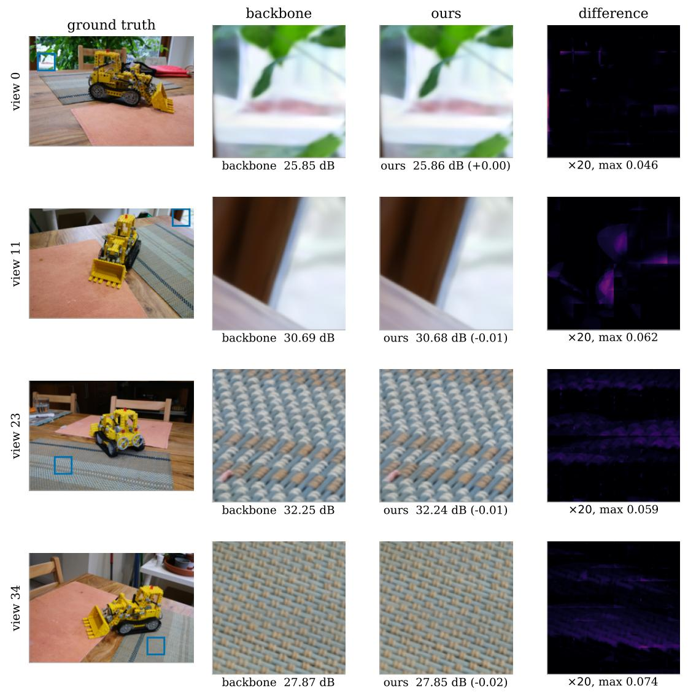  
Figure 9: Backbone versus the compiled policy on held-out kitchen views. Crops are placed automatically at the window of largest disagreement, not chosen by hand; the difference column is amplified 20×. PSNR is against ground truth, so it is comparable to Table 1.