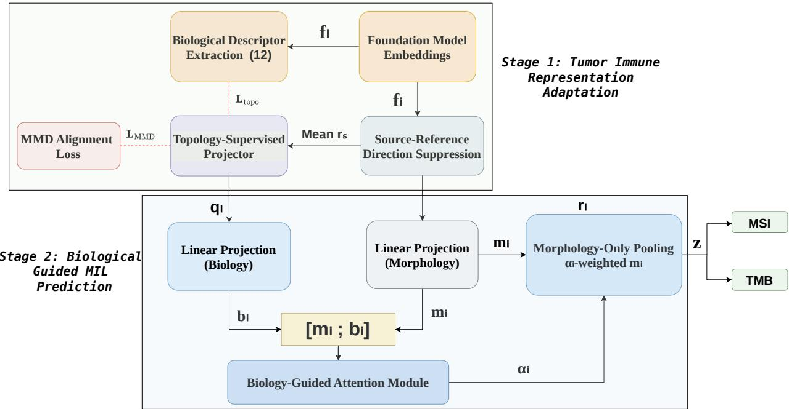
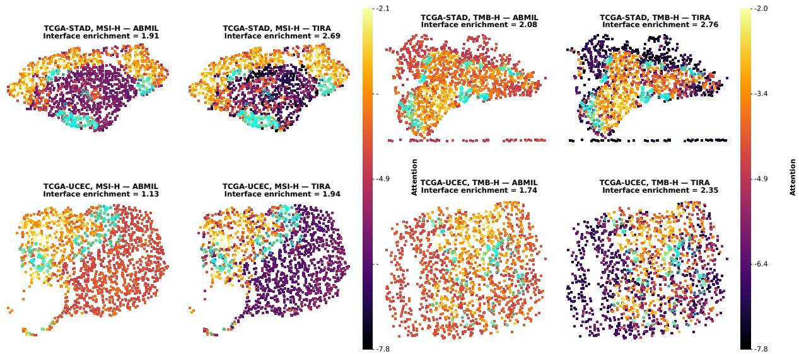
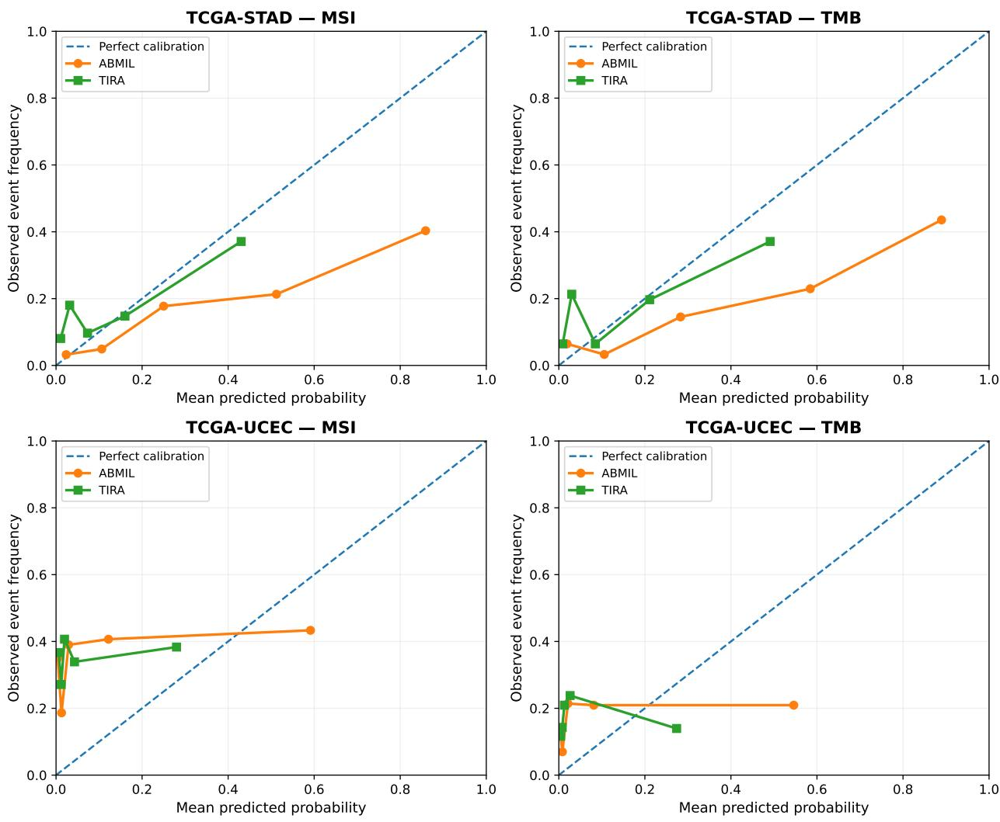
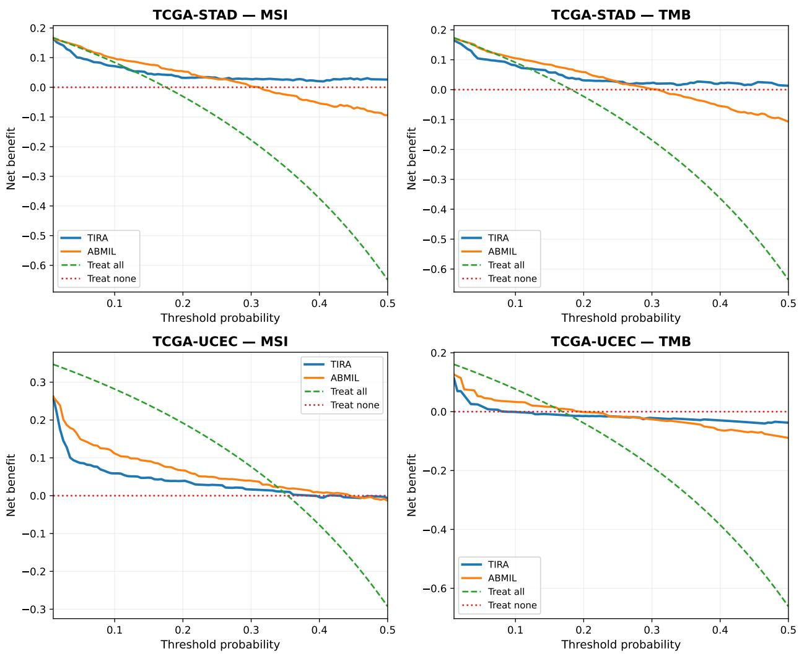

# TIRA: Tumor Immune Representation Adaptation for Zero-Shot Cross-Cancer MSI and TMB Prediction

Dasari Naga Raju

Independent Researcher, Andhra Pradesh, India

Corresponding Author: raajuuu1998@gmail.com

## Abstract

Microsatellite instability-high (MSI-H) and high tumor mutational burden (TMB-H) are clinically relevant biomarkers, yet their histopathological prediction remains challenging when models are transferred across morphologically distinct cancer types. Immune-associated spatial patterns can persist across cancers despite these morphological diferences, but foundation-model-based predictors trained on a single cancer do not explicitly use this information, limiting cross-cancer generalization. To address this limitation, we propose TIRA (Tumor Immune Representation Adaptation), a target-free framework that refines frozen foundation-model representations using spatial immune topology, without requiring target-domain data during model development or test-time adaptation. TIRA uses a topology-supervised biology representation to condition tile-level attention while pooling only morphological features for joint MSI and TMB prediction. We train TIRA on TCGA-COAD+READ and evaluate it zero-shot on CPTAC-COAD, TCGA-STAD, TCGA-UCEC, and CPTAC-UCEC, covering cross-site, cross-cancer, and combined cross-cancer–site distribution shifts under UNI2, CONCH, and Virchow2. With UNI2, TIRA improved zero-shot AUROC on TCGA-STAD from 0.633 to 0.766 for MSI and from 0.651 to 0.772 for TMB. Source-derived spatial immune topology improved the cross-cancer robustness of frozen pathology foundation-model representations.

## 1 Introduction

Microsatellite instability-high (MSI-H) and high tumor mutational burden (TMB-H) are established predictive biomarkers of response to immune-checkpoint blockade across multiple solid tumors. Both have been associated with durable responses to PD-1/PD-L1 inhibition across diferent histological origins [14, 23]. Clinical assessment of MSI relies on mismatch-repair immunohistochemistry, PCR, or sequencing, whereas TMB requires sequencing-based quantification, motivating computational methods that jointly predict MSI and TMB from routine hematoxylin and eosin whole-slide images to support cost-efective triage for confirmatory molecular testing [12]. Mismatch-repair deficiency can give rise to both microsatellite instability and elevated mutational burden, while TMB-H can also arise through other molecular mechanisms, reflecting the related but distinct biology of MSI and TMB [28, 29]. Their partially overlapping tumor–immune biology motivates joint prediction from a shared histological representation. The key challenge, however, is cross-cancer generalization: biomarker-relevant histological information learned from one cancer type must remain predictive when transferred to a morphologically distinct cancer without target-domain adaptation or model selection.

Large-scale pathology foundation models have enabled whole-slide analysis using transferable tile-level representations learned from diverse histological data. UNI2, CONCH, and Virchow2 employ diferent pretraining strategies and operate at diferent representation scales, providing complementary frozen feature spaces for downstream pathology tasks [2, 18, 17, 34]. These transferable feature spaces support cross-cancer prediction, but do not by themselves ensure that biomarker-relevant representations remain stable when tissue morphology changes across cancer types. Independent benchmarking has shown that the external performance of pathology foundation models can vary across encoders and evaluation cohorts [21]. Recent studies also show that their feature spaces can retain domain-specific signatures, which may compromise transfer when the deployment distribution difers from the training domain [8]. Beyond acquisition-related variation, cross-cancer deployment introduces diferences in organ morphology and tissue architecture, creating a representational mismatch that can limit zero-shot transfer. MSI-H tumors across diferent cancer types exhibit recurring immune-associated histological patterns. Lymphocytic infiltration, immune activation, and tumor-infiltrating lymphocyte accumulation have been reported in mismatch-repair-deficient colorectal, gastric, and endometrial cancers despite diferences in organ-specific morphology [26, 20, 3, 25]. Large-scale computational mapping of tumor-infiltrating lymphocytes from H&E images across The Cancer Genome Atlas further showed that spatial TIL organization correlates with molecular immune features across cancer types [22]. These findings motivate spatial immune organization as a biological prior for cross-cancer prediction. TMB-H reflects elevated somatic mutation burden and is also associated with tumor–immune interactions and response to immune-checkpoint blockade [23]. We therefore use source-cohort spatial immune topology as explicit supervision for representation adaptation in joint MSI/TMB prediction, without assuming identical underlying mechanisms.

Attention-based MIL (ABMIL) uses permutation-invariant attention-based aggregation for bag-level prediction [9]. CLAM-SB augments this framework with instance-level clustering constraints [16], while TransMIL models correlations among instances using a transformer-based architecture [24]. ILRA exploits low-rank structure in slide-level MIL representations [33], and CasNet-FM uses cascaded MIL for histopathology-based MSI and TMB prediction [32]. Although these methods improve slide-level aggregation, they do not explicitly address representation shift across cancer types. Domain-adaptation approaches can reduce distribution shift but often require access to target-domain samples during adaptation [8], limiting their applicability to zero-shot deployment. This leaves a gap for source-only methods that use recurring spatial immune patterns to improve the cross-cancer robustness of frozen foundation-model representations for joint MSI/TMB prediction.

The main contributions of this work are:

• We propose TIRA, a target-free representation adaptation framework for cross-cancer MSI and TMB prediction that uses biologically screened, source-derived spatial immune topology to refine frozen pathology foundation-model representations before deployment to unseen cancer types.

• We develop a biology-guided MIL strategy that separates the roles of biology and morphology by using a topology-informed representation to guide tile-level attention while pooling only morphological features for joint biomarker prediction.

## 2 Method

## 2.1 Overview

Let a WSI be represented by N tissue tiles $\{ t _ { i } \} _ { i = 1 } ^ { N }$ with spatial coordinates $\mathbf { c } _ { i } \in \mathbb { R } ^ { 2 }$ . A frozen pathology FM E maps each tile to $\mathbf { f } _ { i } = E ( t _ { i } ) \in \mathbb { R } ^ { d _ { E } }$ , where $d _ { E } \in \{ 1 5 3 6 , 5 1 2 , 2 5 6 0 \}$ for UNI2, CONCH, and Virchow2, respectively [2, 18, 17, 34]. TIRA consists of two stages. In Stage 1, a topology-supervised projector learns a biology-informed representation from slide-level mean direction-suppressed embeddings. In Stage 2, the frozen projector is applied tile-wise, and a biology-guided MIL predictor uses the resulting dual-stream representations for joint MSI/TMB prediction. Stage 1 learns the topology-informed representation without MSI/TMB supervision, while Stage 2 uses this frozen biology representation to guide the selection of morphological evidence for prediction.

  
Figure 1: Overview of TIRA. Stage 1 learns a topology-supervised biology representation from source data, and Stage 2 uses this representation to condition tile attention while pooling only morphological features for joint MSI/TMB prediction.

## 2.2 Source–Reference Direction Suppression

We first suppress source-specific variation encoded in the FM feature space by estimating a unit direction from pooled tile embeddings of the two source subsets. For a source configuration pairing cancer cohort C with READ as the reference,

$$
\mathbf { v } = \frac { \pmb { \mu } _ { C } - \pmb { \mu } _ { \mathrm { R E A D } } } { \| \pmb { \mu } _ { C } - \pmb { \mu } _ { \mathrm { R E A D } } \| _ { 2 } } ,\tag{1}
$$

where $\pmb { \mu } _ { C }$ and $\mu _ { \mathrm { R E A D } }$ are obtained by averaging all tile embeddings within the corresponding cohort subset. Each tile representation is then residualized by removing its component along v:

$$
\mathbf { r } _ { i } = \mathbf { f } _ { i } - ( \mathbf { f } _ { i } ^ { \top } \mathbf { v } ) \mathbf { v } .\tag{2}
$$

Once estimated, v is frozen and applied unchanged to all target cohorts.

## 2.3 Spatial Immune Topology

For each frozen FM, a lightweight MLP tissue classifier is trained on NCT-CRC-HE-100K [11, 10], an auxiliary labeled colorectal histology dataset matching the primary source-organ context. From the resulting tissue-class probabilities and normalized tile coordinates, we compute 18 candidate spatial descriptors spanning tissue abundance, lymphocyte confidence and variability, local immune organization, peripheral and core lymphocyte distribution, multiscale TIL density at neighborhood scales $k \in \{ 1 0 , 3 0 , 1 0 0 \}$ , immune mixing, stromal infiltration, and TLS-related features. Complete definitions are provided in Supplementary Section 1.

## 2.4 Biological Screening of Descriptors

We screen 18 candidate descriptors in 227 TCGA-COAD patients with matched bulk RNA-seq [28] using Spearman correlations with CD8A, CD3E, FOXP3, PRF1, and PDCD1. Descriptors with a

Table 1: Source-cohort RNA-concordance screening of 18 spatial immune descriptors in TCGA-COAD (n = 227). Columns report Spearman ρ with five immune genes and their mean for UNI2.
<table><tr><td></td><td colspan="5">RNA immune-gene correlation</td><td colspan="2"></td></tr><tr><td>Descriptor</td><td>CD8A</td><td>CD3E</td><td>FOXP3</td><td>PRF1</td><td>PDCD1</td><td>Mean ρ</td><td>Use</td></tr><tr><td>Lymphocyte abundance</td><td>0.161</td><td>0.188</td><td>0.064</td><td>0.013</td><td>0.164</td><td>0.118</td><td>√</td></tr><tr><td>Tumor abundance</td><td>-0.168</td><td>-0.200</td><td>-0.180</td><td>-0.174</td><td>-0.110</td><td>-0.166</td><td>X</td></tr><tr><td>Stromal abundance</td><td>0.171</td><td>0.146</td><td>0.192</td><td>0.146</td><td>0.124</td><td>0.156</td><td>√</td></tr><tr><td>Mean lymphocyte conf.</td><td>0.173</td><td>0.201</td><td>0.073</td><td>0.027</td><td>0.175</td><td>0.130</td><td>√</td></tr><tr><td>Lymphocyte variability</td><td>0.143</td><td>0.177</td><td>0.053</td><td>-0.005</td><td>0.151</td><td>0.104</td><td>√</td></tr><tr><td>Local immune nbhd.</td><td>0.208</td><td>0.253</td><td>0.168</td><td>0.106</td><td>0.169</td><td>0.181</td><td>√</td></tr><tr><td>Local immune heterog.</td><td>-0.065</td><td>-0.133</td><td>-0.204</td><td>-0.210</td><td>-0.093</td><td>-0.141</td><td>X</td></tr><tr><td>Peripheral lymphocytes</td><td>0.173</td><td>0.202</td><td>0.072</td><td>0.028</td><td>0.184</td><td>0.132</td><td>√</td></tr><tr><td>Core lymphocytes</td><td>0.168</td><td>0.199</td><td>0.076</td><td>0.031</td><td>0.167</td><td>0.128</td><td>√</td></tr><tr><td>Peripheral immune ratio</td><td>-0.018</td><td>-0.018</td><td>0.004</td><td>-0.016</td><td>-0.001</td><td>-0.010</td><td>X</td></tr><tr><td>TIL density (k = 10)</td><td>0.161</td><td>0.187</td><td>0.061</td><td>0.011</td><td>0.162</td><td>0.117</td><td>√</td></tr><tr><td>TIL density (k = 30)</td><td>0.164</td><td>0.190</td><td>0.066</td><td>0.010</td><td>0.166</td><td>0.119</td><td>√</td></tr><tr><td>TIL density (k = 100)</td><td>0.168</td><td>0.192</td><td>0.068</td><td>0.015</td><td>0.169</td><td>0.122</td><td>√</td></tr><tr><td>Immune mixing</td><td>0.183</td><td>0.206</td><td>0.074</td><td>0.040</td><td>0.182</td><td>0.137</td><td>√</td></tr><tr><td>Intra-tumoral TIL</td><td>-0.076</td><td>0.030</td><td>0.064</td><td>0.004</td><td>-0.017</td><td>0.001</td><td>X</td></tr><tr><td>Stromal TIL infiltr.</td><td>0.103</td><td>0.067</td><td>0.103</td><td>0.168</td><td>0.062</td><td>0.101</td><td>√</td></tr><tr><td>TLS count</td><td>0.094</td><td>0.126</td><td>0.011</td><td>-0.044</td><td>0.096</td><td>0.057</td><td>X</td></tr><tr><td>TLS fraction</td><td>0.106</td><td>0.130</td><td>0.002</td><td>-0.060</td><td>0.090</td><td>0.054</td><td>X</td></tr><tr><td colspan="8">Descriptors retained 12/18</td></tr></table>

mean correlation greater than 0.10 across the five genes are retained, following a minimum positiveconcordance criterion [27], yielding 12 topology-supervision targets. This screening uses no MSI or TMB labels. The selected descriptor identities are fixed across UNI2, CONCH, and Virchow2, with descriptor values recomputed from each FM-specific tissue classifier. Table 1 reports the UNI2 analysis, with CONCH and Virchow2 results provided in Supplementary Section 2.

## 2.5 Stage 1: Topology-Supervised Projector

The projector $\tau _ { E } : \mathbb { R } ^ { d _ { E } }  \mathbb { R } ^ { 5 1 2 }$ maps direction-suppressed embeddings to a compact biology representation:

$$
\tau _ { E } ( \mathbf { r } ) = \mathrm { L N } ( W _ { 2 } \mathrm { G E L U } ( \mathrm { L N } ( W _ { 1 } \mathbf { r } + \mathbf { b } _ { 1 } ) ) + \mathbf { b } _ { 2 } ) ,\tag{3}
$$

where $W _ { 1 } \in \mathbb { R } ^ { 1 0 2 4 \times d _ { E } }$ and $W _ { 2 } \in \mathbb { R } ^ { 5 1 2 \times 1 0 2 4 }$ . LN denotes layer normalization and GELU the Gaussian error linear unit [1, 7]. A topology head $\phi \ ( 5 1 2  2 5 6  1 2$ , ReLU, dropout 0.1) maps the projected representation to the 12 retained spatial descriptors.

Topology supervision. Stage 1 operates on slide-level mean residual embeddings, $\begin{array} { r } { \bar { \mathbf { r } } _ { s } = N _ { s } ^ { - 1 } \sum _ { i } \mathbf { r } _ { s i } , } \end{array}$ with $\bar { \mathbf q } _ { s } = \tau _ { E } ( \bar { \mathbf r } _ { s } )$ . The retained descriptors are standardized across the Stage 1 source cohort before

supervision. The topology loss is

$$
\mathcal { L } _ { \mathrm { t o p o } } = \frac { 1 } { | \cal { S } | } \sum _ { s \in \cal { S } } \| \phi ( \bar { \bf { q } } _ { s } ) - \mathbf { d } _ { s } \| _ { 2 } ^ { 2 } ,\tag{4}
$$

where $\mathbf { d } _ { s } \in \mathbb { R } ^ { 1 2 }$ denotes the standardized descriptor vector for slide $s .$

MMD regularization. To reduce separation between the two source subsets in the projected biology space, we align their slide-level distributions using the biased empirical squared MMD estimator with a multi-scale RBF kernel [6]:

$$
\begin{array} { l } { { \displaystyle { \mathcal { L } } _ { \mathrm { M M D } } = \frac { 1 } { n _ { C } ^ { 2 } } \sum _ { a , a ^ { \prime } } k ( \bar { \bf q } _ { a } , \bar { \bf q } _ { a ^ { \prime } } ) + \frac { 1 } { n _ { R } ^ { 2 } } \sum _ { b , b ^ { \prime } } k ( \bar { \bf q } _ { b } , \bar { \bf q } _ { b ^ { \prime } } ) } } \\ { { \displaystyle ~ - \frac { 2 } { n _ { C } n _ { R } } \sum _ { a , b } k ( \bar { \bf q } _ { a } , \bar { \bf q } _ { b } ) } , } \end{array}\tag{5}
$$

where

$$
\begin{array} { c } { \displaystyle { k ( \mathbf { x } , \mathbf { y } ) = \sum _ { \beta \in \mathcal { B } } \exp \left( - \frac { \| \mathbf { x } - \mathbf { y } \| _ { 2 } ^ { 2 } } { \beta } \right) , } } \\ { \displaystyle { B = \{ 0 . 5 , 1 , 5 , 1 0 , 2 5 , 5 0 \} . } } \end{array}\tag{6}
$$

The complete Stage 1 objective is

$$
\mathcal { L } _ { \mathrm { p r o j } } = \mathcal { L } _ { \mathrm { t o p o } } + 0 . 1 \mathcal { L } _ { \mathrm { M M D } } .\tag{7}
$$

The projector is optimized for 50 epochs using Adam [13] (lr $1 0 ^ { - 3 }$ , wd $1 0 ^ { - 4 } )$ , cosine annealing [15], and batch size 32. Stage 1 uses no MSI or TMB labels, and $\tau _ { E }$ is frozen after training.

## 2.6 Stage 2: Biology-Guided Attention MIL

Tile-level dual-stream representation. Although $\tau _ { E }$ is trained on slide-level mean embeddings, it is applied independently to each residual tile embedding to obtain

$$
\begin{array} { r } { \mathbf q _ { i } = \tau _ { E } ( \mathbf r _ { i } ) \in \mathbb { R } ^ { 5 1 2 } . } \end{array}\tag{8}
$$

The residual morphology feature $\mathbf { r } _ { i }$ and topology-informed feature $\mathbf { q } _ { i }$ are then independently projected to $\mathbf { m } _ { i } \in \mathbb { R } ^ { 2 5 6 }$ and $\mathbf { b } _ { i } \in \mathbb { R } ^ { 2 5 6 }$ using separate linear layers.

Biology-guided attention. Attention is conditioned jointly on the morphology and biology representations:

$$
e _ { i } = { { \mathbf { w } } _ { a } ^ { \top } } \operatorname { t a n h } ( { W _ { a } [ { \mathbf { m } } _ { i } ; { \mathbf { b } } _ { i } ] + { \mathbf { c } } _ { a } } ) , \quad \alpha _ { i } = \frac { { \exp ( e _ { i } ) } } { \sum _ { j } \exp ( e _ { j } ) } ,\tag{9}
$$

where $W _ { a } : \mathbb { R } ^ { 5 1 2 } \to \mathbb { R } ^ { 2 5 6 }$ . The resulting attention weights are used to pool only the morphological representation:

$$
\mathbf { z } = \sum _ { i = 1 } ^ { N } \alpha _ { i } \mathbf { m } _ { i } .\tag{10}
$$

Thus, unlike standard ABMIL [9], TIRA uses the topology-informed representation to guide tile selection while retaining morphology as the predictive representation.

Joint biomarker prediction. The pooled morphology vector is passed through a shared 256 →256 layer (ReLU, dropout 0.25), followed by separate MSI and TMB classification heads. The joint objective is

$$
\begin{array} { r } { \mathcal { L } _ { \mathrm { M I L } } = \ell _ { \mathrm { B C E } } \big ( \hat { y } _ { s } ^ { M } , y _ { s } ^ { M } \big ) + m _ { s } ^ { T } \ell _ { \mathrm { B C E } } \big ( \hat { y } _ { s } ^ { T } , y _ { s } ^ { T } \big ) , } \end{array}\tag{11}
$$

where $m _ { s } ^ { T }$ masks patients without an available TMB label. Both heads use unweighted binary cross-entropy.

Stage 2 is trained with Adam (lr $1 0 ^ { - 4 }$ , wd $1 0 ^ { - 4 } )$ and cosine annealing for at most 50 epochs using five MSI-stratified patient-level folds (seed 42) and early-stopping patience 15. For each fold, the checkpoint with the highest validation MSI AUROC is used for both biomarker heads, and source predictions are generated out-of-fold.

## 3 Experimental Setup

## 3.1 Cohorts and Labels

We train on TCGA-COAD+READ [28] and evaluate zero-shot on CPTAC-COAD [31], TCGA-STAD [30], TCGA-UCEC [29], and CPTAC-UCEC [4], covering cross-site, cross-cancer, and combined cross-cancer–site shifts. For reciprocal transfer, TCGA-STAD+READ and TCGA-UCEC+READ are used as alternative source configurations. The 12-descriptor topology set remains fixed from the initial TCGA-COAD RNA-concordance screening and is not reselected for these experiments.

MSI labels and TMB measurements are obtained from the corresponding TCGA and CPTAC molecular annotations [28, 30, 29, 31, 4]. TMB-H is defined as $\geq 1 0$ mutations/Mb [19].

## 3.2 Foundation Models, Baselines, and Evaluation

We evaluate frozen UNI2, CONCH, and Virchow2 representations [2, 18, 17, 34]. The MIL baselines are ABMIL [9], CLAM-SB [16], TransMIL [24], CasNet-FM [32], and ILRA [33]. All methods use the same patient partitions, frozen FM features, and a maximum input budget of 8,000 tiles per bag. Stage 2 and all MIL baselines are trained for at most 50 epochs with learning rate $1 0 ^ { - 4 }$ , early-stopping patience 15, and seed 42. Each patient is represented by one precomputed tile-embedding bag. Source predictions are generated from the held-out fold, whereas external predictions average the five source-fold models. Source results therefore reflect cross-validated Stage 2 performance rather than fully nested out-of-fold evaluation of the complete two-stage pipeline.

In the primary TCGA-COAD+READ setting, representation adaptation and model selection do not use target-domain information. No target cohort is used to estimate the suppression direction, train the projector or MIL model, or tune decision thresholds. The tissue classifier is pretrained independently on NCT-CRC-HE-100K, and the topology descriptor set is selected only from the TCGA-COAD RNA-concordance analysis. The primary metric is patient-level AUROC with nonparametric 95% confidence intervals estimated from 10,000 patient-level bootstrap resamples [5]. Paired model comparisons use 10,000 paired bootstrap resamples to estimate AUROC diferences and their 95% confidence intervals. Balanced accuracy results are provided in Supplementary Section 5.

## 4 Results

## 4.1 Three-Foundation-Model Benchmark

Performance across the three foundation models varied with both the encoder and target cohort (Tables 2 and 3). Baseline rankings on the source cohort and same-cancer cross-site setting were not preserved under cross-cancer transfer. No single MIL baseline consistently ranked highest across TCGA-STAD and TCGA-UCEC, indicating that transfer performance depends on both the foundation-model representation and the target cancer. TIRA improved over matched ABMIL on TCGA-STAD and TCGA-UCEC across all three feature spaces, indicating that the cross-cancer efect was not specific to a single foundation model.

Table 2: Patient-level MSI prediction AUROC (95% bootstrap CI) for models trained on TCGA-COAD+READ and evaluated zero-shot on external cohorts spanning cross-site, cross-cancer, and combined shift.
<table><tr><td rowspan="2">FM Method</td><td rowspan="2"></td><td rowspan="2">Source CV COAD+READ</td><td rowspan="2">Cross-site</td><td colspan="2">Cross-cancer</td><td rowspan="2">Cross-cancer + site CPTAC-UCEC</td></tr><tr><td>CPTAC-COAD TCGA-STAD</td><td>TCGA-UCEC (n=297, MSI-H=105)</td></tr><tr><td rowspan="6">UNI2</td><td>ABMIL</td><td>(n=443, MSI-H=64) 0.8778 (0.8244–0.9244)</td><td>(n=75, MSI-H=15) 0.8022 (0.6628–0.9184)</td><td>(n=308, MSI-H=54) 0.6333 (0.5458–0.7210)</td><td></td><td>(n=95, MSI-H=25) 0.4314 (0.2868–0.5822)</td></tr><tr><td>CLAM-SB</td><td>0.8715 (0.8136–0.9232)</td><td>0.7089 (0.5675–0.8364)</td><td>0.6490 (0.5628–0.7326)</td><td>0.5153 (0.4437–0.5870) 0.5061 (0.4358–0.5771)</td><td>0.4829 (0.3414–0.6260)</td></tr><tr><td>TransMIL</td><td>0.8861 (0.8369–0.9289)</td><td>0.7889 (0.6487–0.9100)</td><td>0.6395 (0.5489–0.7281)</td><td>0.5215 (0.4486–0.5937)</td><td>0.5069 (0.3721–0.6401)</td></tr><tr><td>CasNet-FM</td><td>0.8543 (0.7871–0.9151)</td><td>0.7489 (0.6094–0.8712)</td><td>0.6492 (0.5632–0.7340)</td><td>0.5116 (0.4427–0.5823)</td><td>0.4543 (0.3161–0.5948)</td></tr><tr><td>ILRA</td><td>0.8361 (0.7675–0.8975)</td><td>0.4489 (0.2804–0.6195)</td><td>0.6457 (0.5550–0.7324)</td><td>0.4887 (0.4187–0.5605)</td><td>0.5023 (0.3673–0.6370)</td></tr><tr><td>TIRA (Ours)</td><td>0.8928 (0.7821–0.9372)</td><td>0.7932 (0.5949–0.8888)</td><td>0.7664 (0.6934–0.8331)</td><td>0.5945 (0.5242–0.6352)</td><td>0.5606 (0.4198–0.5997)</td></tr><tr><td rowspan="6">CONCH</td><td>ABMIL</td><td>0.8883 (0.8314–0.9361)</td><td>0.6400 (0.4683–0.8036)</td><td>0.5365 (0.4469–0.6269)</td><td>0.5046 (0.4338–0.5746)</td><td>0.5811 (0.4508–0.7056)</td></tr><tr><td>CLAM-SB</td><td>0.8748 (0.8184–0.9224)</td><td>0.5978 (0.4133–0.7692)</td><td>0.5828 (0.4931–0.6716)</td><td>0.5246 (0.4555–0.5924)</td><td>0.6200 (0.4892–0.7430)</td></tr><tr><td>TransMIL</td><td>0.8340 (0.7739–0.8890)</td><td>0.6533 (0.5062–0.7904)</td><td>0.5996 (0.5103–0.6861)</td><td>0.5582 (0.4901–0.6275)</td><td>0.5069 (0.3871–0.6242)</td></tr><tr><td>CasNet-FM</td><td>0.8909 (0.8358–0.9369)</td><td>0.6811 (0.5322–0.8220)</td><td>0.5569 (0.4624–0.6491)</td><td>0.5362 (0.4663–0.6057)</td><td>0.6029 (0.4726–0.7260)</td></tr><tr><td>ILRA</td><td>0.8620 (0.7999–0.9169)</td><td>0.6122 (0.4597–0.7518)</td><td>0.5337 (0.4361–0.6320)</td><td>0.5281 (0.4572–0.5954)</td><td>0.4709 (0.3322–0.6089)</td></tr><tr><td>TIRA (Ours)</td><td>0.8886 (0.8402–0.9298)</td><td>0.7056 (0.5708–0.8266)</td><td>0.6116 (0.5257–0.6952)</td><td>0.5838 (0.5151–0.6525)</td><td>0.6291 (0.4994–0.6987)</td></tr><tr><td rowspan="6">Virchow2</td><td>ABMIL</td><td>0.8598 (0.8112–0.9037)</td><td>0.7833 (0.6376–0.9055)</td><td>0.6911 (0.6148–0.7653)</td><td>0.5393 (0.4683–0.6108)</td><td>0.4851 (0.3415–0.6280)</td></tr><tr><td>CLAM-SB</td><td>0.8672 (0.8134–0.9133)</td><td>0.8100 (0.6711–0.9200)</td><td>0.7068 (0.6266–0.7824)</td><td>0.5599 (0.4902–0.6292)</td><td>0.5714 (0.4394–0.7030)</td></tr><tr><td>TransMIL</td><td>0.7540 (0.6931–0.8108)</td><td>0.7867 (0.6734–0.8879)</td><td>0.5855 (0.4968–0.6713)</td><td>0.5823 (0.5136–0.6508)</td><td>0.4229 (0.2941–0.5538)</td></tr><tr><td>CasNet-FM</td><td>0.8636 (0.8081–0.9119)</td><td>0.7978 (0.6557–0.9127)</td><td>0.7097 (0.6338–0.7819)</td><td>0.5442 (0.4747–0.6124)</td><td>0.5200 (0.3853–0.6534)</td></tr><tr><td>ILRA</td><td>0.8409 (0.7813–0.8935)</td><td>0.7333 (0.5629–0.8761)</td><td>0.7006 (0.6262–0.7717)</td><td>0.5229 (0.4536–0.5920)</td><td>0.5657 (0.4363–0.6920)</td></tr><tr><td>TIRA (Ours)</td><td>0.8908 (0.8416–0.9328)</td><td>0.8367 (0.7035–0.9456)</td><td>0.7126 (0.6190–0.7829)</td><td>0.5901 (0.4492–0.6597)</td><td>0.5989 (0.4358–0.7598)</td></tr></table>

Table 3: Patient-level TMB prediction AUROC (95% bootstrap CI) for models trained on TCGA-COAD+READ and evaluated zero-shot on external cohorts spanning cross-site, cross-cancer, and combined shift.
<table><tr><td rowspan="2">FM</td><td rowspan="2">Method</td><td rowspan="2">Source CV COAD+READ</td><td rowspan="2">Cross-site CPTAC-COAD</td><td colspan="2">Cross-cancer</td><td rowspan="2">Cross-cancer + site CPTAC-UCEC</td></tr><tr><td>TCGA-STAD</td><td>TCGA-UCEC</td></tr><tr><td rowspan="6">UNI2</td><td>ABMIL</td><td>(n=428, TMB-H=62)</td><td>(n=75, TMB-H=15)</td><td>(n=308, TMB-H=56)</td><td>(n=213, TMB-H=36)</td><td>(n=95, TMB-H=32)</td></tr><tr><td>CLAM-SB</td><td>0.9180 (0.8721–0.9552) 0.9040 (0.8604–0.9414)</td><td>0.8244 (0.6862–0.9385) 0.7900 (0.6413–0.9176)</td><td>0.6509 (0.5658–0.7352) 0.6503 (0.5623–0.7365)</td><td>0.5279 (0.4275–0.6275)</td><td>0.4807 (0.3485–0.6097)</td></tr><tr><td>TransMIL</td><td>0.8832 (0.8329–0.9279)</td><td>0.8300 (0.7078–0.9289)</td><td>0.6451 (0.5558–0.7334)</td><td>0.5367 (0.4389–0.6347) 0.5323 (0.4282–0.6347)</td><td>0.5069 (0.3750–0.6371) 0.5184 (0.3883–0.6462)</td></tr><tr><td>CasNet-FM</td><td>0.9149 (0.8636–0.9577)</td><td>0.8200 (0.6902–0.9272)</td><td>0.6698 (0.5865–0.7509)</td><td>0.5430 (0.4436–0.6419)</td><td>0.4742 (0.3421–0.6057)</td></tr><tr><td>ILRA</td><td>0.8623 (0.8032–0.9138)</td><td>0.5189 (0.3561–0.6799)</td><td>0.6787 (0.5955–0.7580)</td><td>0.4735 (0.3725–0.5741)</td><td>0.4747 (0.3486–0.6035)</td></tr><tr><td>TIRA (Ours)</td><td>0.9218 (0.8816–0.9587)</td><td>0.8426 (0.7188–0.9472)</td><td>0.7724 (0.7035–0.8376)</td><td>0.5869 (0.4924–0.6788)</td><td>0.5315 (0.4035–0.6618)</td></tr><tr><td rowspan="6">CONCH</td><td>ABMIL</td><td>0.9053 (0.8618–0.9430)</td><td>0.7233 (0.5648–0.8616)</td><td>0.5979 (0.5105–0.6835)</td><td>0.4931 (0.3957–0.5906)</td><td>0.5962 (0.4717–0.7141)</td></tr><tr><td>CLAM-SB</td><td>0.8681 (0.8164–0.9156)</td><td>0.7022 (0.5578–0.8305)</td><td>0.7217 (0.6487–0.7907)</td><td>0.5556 (0.4622–0.6490)</td><td>0.6200 (0.4990–0.7365)</td></tr><tr><td>TransMIL</td><td>0.8383 (0.7779–0.8922)</td><td>0.6956 (0.5598–0.8201)</td><td>0.6636 (0.5834–0.7406)</td><td>0.5639 (0.4689–0.6563</td><td>0.5293 (0.4108–0.6494)</td></tr><tr><td>CasNet-FM</td><td>0.9017 (0.8605–0.9390)</td><td>0.7322 (0.5808–0.8651</td><td>0.6270 (0.5380–0.7147)</td><td>0.5077 (0.4089–0.6051)</td><td>0.6354 (0.5141–0.7506)</td></tr><tr><td>ILRA</td><td>0.8695 (0.8187–0.9152)</td><td>0.5678 (0.3884–0.7391)</td><td>0.6002 (0.5052–0.6944)</td><td>0.5278 (0.4311–0.6249)</td><td>0.5218 (0.3997–0.6466)</td></tr><tr><td>TIRA (Ours)</td><td>0.9084 (0.8693–0.9449)</td><td>0.7411 (0.5986–0.8618)</td><td>0.7295 (0.6578–0.7956)</td><td>0.5712 (0.4768–0.6632)</td><td>0.6423 (0.5219–0.7536)</td></tr><tr><td rowspan="6">Virchow2</td><td>ABMIL</td><td>0.8693 (0.8221–0.9123)</td><td>0.8011 (0.6774–0.9077)</td><td>0.7149 (0.6414–0.7860)</td><td>0.5692 (0.4735–0.6611)</td><td>0.5432 (0.4172–0.6688)</td></tr><tr><td>CLAM-SB</td><td>0.8743 (0.8235–0.9187)</td><td>0.8978 (0.7939–0.9767)</td><td>0.6995 (0.6223–0.7733)</td><td>0.5369 (0.4371–0.6344)</td><td>0.5481 (0.4203–0.6738)</td></tr><tr><td>TransMIL</td><td>0.7650 (0.7033–0.8227)</td><td>0.7767 (0.6600–0.8816)</td><td>0.6091 (0.5242–0.6914)</td><td>0.6384 (0.5438–0.7286)</td><td>0.4221 (0.3013–0.5468)</td></tr><tr><td>CasNet-FM</td><td>0.8895 (0.8447–0.9289)</td><td>0.8600 (0.7654–0.9368)</td><td>0.7015 (0.6233–0.7757)</td><td>0.5439 (0.4479–0.6382)</td><td>0.5412 (0.4135–0.6668)</td></tr><tr><td>ILRA</td><td>0.8538 (0.7982–0.9041)</td><td>0.7378 (0.5648–0.8825)</td><td>0.7343 (0.6650–0.8001)</td><td>0.5264 (0.4294–0.6239)</td><td>0.5967 (0.4790–0.7128)</td></tr><tr><td>TIRA (Ours)</td><td>0.9048 (0.8647–0.9419)</td><td>0.9051 (0.8128–0.9792)</td><td>0.7426 (0.6738–0.8067)</td><td>0.6442 (0.5508–0.7326)</td><td>0.6049 (0.4887–0.7168)</td></tr></table>

Under UNI2, the cross-cancer gains were larger on TCGA-STAD than on TCGA-UCEC. On TCGA-STAD, MSI AUROC increased from 0.633 with matched ABMIL to 0.766 with TIRA $\left( \Delta = + 0 . 1 3 3 \right)$ , while TMB AUROC increased from 0.651 to 0.772 (∆ = +0.121). On TCGA-UCEC, MSI increased from 0.515 to $0 . 5 9 5 \ ( \Delta = + 0 . 0 8 0 )$ and TMB from 0.528 to 0.587 $( \Delta = + 0 . 0 5 9 )$ The magnitude of improvement also varied across foundation models, indicating that the efect of representation adaptation depends on the underlying feature space. Together, these results indicate that TIRA improves robustness under cancer-type shift, with the extent of improvement depending

on both the foundation model and target cohort.

## 4.2 Reciprocal Cross-Cancer Transfer

Reciprocal transfer was asymmetric across source–target pairs (Table 4). For most pairs, MSI and TMB changed in the same direction relative to matched ABMIL. With UCEC+READ as the source, TIRA improved both biomarkers on TCGA-STAD but reduced both on TCGA-COAD, showing that the efect of representation adaptation depends on the target cancer. In contrast, transfer from UCEC+READ to CPTAC-UCEC improved MSI while producing only a small TMB change, indicating a diferent behavior under same-cancer cross-site shift. TIRA therefore improved cross-cancer transfer across several source configurations, while the magnitude and direction of change remained source–target dependent.

Table 4: Reciprocal robustness analysis under UNI2: patient-level AUROC for matched ABMIL and TIRA with paired 95% CIs. Descriptor identities are fixed from the primary TCGA-COAD RNA-concordance screening across all configurations.
<table><tr><td colspan="3"></td><td colspan="4">MSI</td><td colspan="4">TMB</td></tr><tr><td>Source</td><td>Target</td><td>Shift</td><td>ABMIL</td><td>TIRA</td><td></td><td>∆AUROC [95% CI]</td><td>ABMIL</td><td>TIRA</td><td>∆AUROC [95% CI]</td><td></td></tr><tr><td>COAD+READ</td><td>TCGA-STAD</td><td>Cross-cancer</td><td>0.633</td><td>0.766</td><td></td><td>+0.133 [0.076, 0.193]</td><td>0.651</td><td>0.772</td><td></td><td>+0.121 [0.063, 0.182]</td></tr><tr><td>COAD+READ</td><td>TCGA-UCEC</td><td>Cross-cancer</td><td>0.515</td><td>0.595</td><td></td><td>+0.080 [0.029, 0.131]</td><td>0.528</td><td>0.587</td><td>+0.059</td><td>[−0.026, 0.143]</td></tr><tr><td>COAD+READ</td><td>CPTAC-UCEC</td><td>Cross-cancer + site</td><td>0.431</td><td>0.561</td><td></td><td>+0.130 [−0.032, 0.297]</td><td>0.481</td><td>0.532</td><td>+0.051 </td><td>[−0.081, 0.185]</td></tr><tr><td>STAD+READ</td><td>TCGA-COAD</td><td>Cross-cancer</td><td>0.786</td><td>0.859</td><td></td><td>+0.073 [0.015, 0.137]</td><td>0.805</td><td>0.889</td><td></td><td>+0.084 [0.028, 0.145]</td></tr><tr><td>STAD+READ</td><td>TCGA-UCEC</td><td>Cross-cancer</td><td>0.519</td><td>0.678</td><td></td><td>+0.159 [0.094, 0.226]</td><td>0.550</td><td>0.646</td><td></td><td>+0.096 [−0.014, 0.204]</td></tr><tr><td>STAD+READ</td><td>CPTAC-UCEC</td><td>Cross-cancer + site</td><td>0.646</td><td>0.637</td><td></td><td>-0.009 [−0.087, 0.071]</td><td>0.584</td><td>0.584</td><td></td><td>0.000 [−0.067, 0.069]</td></tr><tr><td>UCEC+READ</td><td>TCGA-COAD</td><td>Cross-cancer</td><td>0.712</td><td>0.661</td><td></td><td>-0.051 [−0.110, 0.005]</td><td>0.798</td><td>0.727</td><td></td><td>−0.071 [−0.124, −0.021]</td></tr><tr><td>UCEC+READ</td><td>TCGA-STAD</td><td>Cross-cancer</td><td>0.598</td><td>0.704</td><td></td><td>+0.106 [0.052, 0.163]</td><td>0.625</td><td>0.726</td><td></td><td>+0.101 [0.043, 0.164]</td></tr><tr><td>UCEC+READ</td><td>CPTAC-UCEC</td><td>Cross-site</td><td>0.427</td><td>0.725</td><td></td><td>+0.298 [0.158, 0.437]</td><td>0.595</td><td>0.654</td><td></td><td>+0.059 [−0.040, 0.157]</td></tr></table>

## 4.3 Ablation Study

Component ablation. Removing topology supervision produced the largest reduction in crosscancer performance for both MSI and TMB (Table 5), indicating that the topology-derived biology representation is an important component of transfer across cancer types. Removing biologyguided attention also reduced cross-cancer performance, showing that the learned biological context contributes through the selection of morphological evidence rather than through direct feature pooling. Direction suppression showed a diferent pattern: its removal improved CPTAC-COAD MSI setting, direction suppression is more useful for cancer-type shift than for same-cancer site variation, while the full model combines these complementary mechanisms to improve cross-cancer robustness.

Table 5: Component ablation of TIRA (UNI2, COAD+READ source): patient-level AUROC across source and zero-shot cohorts, with CC Drop from Full denoting the reduction in mean STAD/UCEC AUROC relative to full TIRA.
<table><tr><td></td><td colspan="2">Source CV</td><td colspan="2">Cross-site</td><td colspan="4">Cross-cancer</td><td colspan="2">Cross-cancer + site</td><td colspan="2">Gen. Drop ↓</td><td colspan="2">CC Drop from Full</td></tr><tr><td>Model</td><td colspan="2">COAD+READ</td><td colspan="2">CPTAC-COAD</td><td colspan="2">TCGA-STAD</td><td colspan="2">TCGA-UCEC</td><td colspan="2">CPTAC-UCEC</td><td colspan="2">Source → CC</td><td colspan="2">Mean STAD/UCEC</td></tr><tr><td></td><td>MSI</td><td>TMB</td><td>MSI</td><td>TMB</td><td>MSI</td><td>TMB</td><td>MSI</td><td>TMB</td><td>MSI</td><td>TMB</td><td>MSI</td><td>TMB</td><td>MSI</td><td>TMB</td></tr><tr><td>ABMIL</td><td>0.878</td><td>0.918</td><td>0.802</td><td>0.824</td><td>0.633</td><td>0.651</td><td>0.515</td><td>0.528</td><td>0.431</td><td>0.481</td><td>0.304</td><td>0.329</td><td>0.106</td><td>0.090</td></tr><tr><td>TIRA Full</td><td>0.893</td><td>0.922</td><td>0.793</td><td>0.843</td><td>0.766</td><td>0.772</td><td>0.595</td><td>0.587</td><td>0.561</td><td>0.532</td><td>0.212</td><td>0.242</td><td></td><td></td></tr><tr><td>Biology-Guided Attention</td><td>0.876</td><td>0.913</td><td>0.782</td><td>0.802</td><td>0.665</td><td>0.673</td><td>0.526</td><td>0.525</td><td>0.533</td><td>0.554</td><td>0.281</td><td>0.314</td><td>0.085</td><td>0.081</td></tr><tr><td>Direction Suppression</td><td>0.891</td><td>0.918</td><td>0.823</td><td>0.841</td><td>0.682</td><td>0.690</td><td>0.520</td><td>0.540</td><td>0.498</td><td>0.523</td><td>0.290</td><td>0.303</td><td>0.080</td><td>0.065</td></tr><tr><td>MMD</td><td>0.886</td><td>0.917</td><td>0.799</td><td>0.809</td><td>0.670</td><td>0.681</td><td>0.522</td><td>0.535</td><td>0.477</td><td>0.509</td><td>0.290</td><td>0.309</td><td>0.085</td><td>0.072</td></tr><tr><td>Topology Supervision</td><td>0.865</td><td>0.896</td><td>0.770</td><td>0.801</td><td>0.632</td><td>0.634</td><td>0.509</td><td>0.530</td><td>0.471</td><td>0.517</td><td>0.295</td><td>0.314</td><td>0.110</td><td>0.098</td></tr></table>

but reduced performance on TCGA-STAD and TCGA-UCEC. This contrast indicates that, in this

Reference-choice ablation. Using READ to estimate the suppression direction yielded higher AUROC than both the matched random-COAD reference and no suppression across the STAD/UCEC endpoints (Table 6). This pattern indicates that the efect of direction suppression depends on the reference used to define the removed feature-space component, rather than on suppression alone. Because the comparison includes only one matched random-COAD reference, the analysis supports sensitivity to reference choice but does not establish READ as uniquely optimal.

Table 6: Reference-choice ablation under UNI2. READ is compared with matched random-COAD and no-suppression conditions; $\Delta$ and 95% CIs report READ versus random-COAD using 10,000 paired bootstrap resamples.
<table><tr><td>Dataset</td><td></td><td>Task No Supp. Random</td><td></td><td>READ</td><td>∆ READ-Random</td></tr><tr><td>TCGA-STAD</td><td>MSI</td><td>0.682</td><td>0.712</td><td>0.766</td><td>+0.054 [+0.010,+0.100]</td></tr><tr><td>TCGA-STAD</td><td>TMB</td><td>0.690</td><td>0.724</td><td>0.772</td><td>+0.048 [+0.000,+0.090]</td></tr><tr><td>TCGA-UCEC</td><td>MSI</td><td>0.520</td><td>0.553</td><td>0.595</td><td>+0.042 [+0.001,+0.055]</td></tr><tr><td>TCGA-UCEC</td><td>TMB</td><td>0.540</td><td>0.521</td><td>0.587</td><td>+0.066 [+0.001,+0.145]</td></tr></table>

## 4.4 Attention–Immune Alignment

Tumor–lymphocyte interface enrichment was used to quantify how biology-guided attention changes spatial evidence selection relative to morphology-only ABMIL on the UNI2 cross-cancer targets. Interface tiles are defined as tumor-classified tiles with at least one lymphocyte-classified neighbor among their 30 nearest spatial neighbors.

  
Figure 2: Representative UNI2 attention maps for MSI-H and TMB-H cases from TCGA-STAD and TCGA-UCEC. Tiles are colored by $\log _ { 1 0 }$ attention weight; cyan outlines denote tumor–lymphocyte interface tiles.

Enrichment is computed as the fraction of total attention assigned to interface tiles divided by their prevalence in the slide, with a value of 1 corresponding to uniform attention. TIRA showed higher tumor–lymphocyte interface enrichment in both target cohorts (Table 7, Fig. 2). Enrichment increased from 3.34 to 6.09 on TCGA-STAD and from 3.19 to 5.03 on TCGA-UCEC. Within the biomarker-specific groups, UCEC MSI-H showed the largest observed change, from 3.34 to 6.07, whereas the changes in STAD MSI-H and TMB-H were smaller. This pattern indicates that the topology-informed representation redistributes attention toward tumor–lymphocyte interfaces, with the extent of this redistribution varying across cohorts and biomarker subgroups. The representative maps show the corresponding spatial redistribution of attention.

Table 7: Tumor–lymphocyte interface attention enrichment on UNI2 zero-shot targets; 10,000 paired bootstrap resamples.
<table><tr><td>Cohort</td><td>Group</td><td>N</td><td>ABMIL</td><td>TIRA</td><td>Δ</td><td>95% CI</td></tr><tr><td>TCGA-STAD</td><td>Overall</td><td>308</td><td>3.34</td><td>6.09</td><td>+2.75</td><td>[+1.94, +3.72]</td></tr><tr><td>TCGA-STAD</td><td>MSI-H</td><td>54</td><td>2.03</td><td>2.39</td><td>+0.36</td><td>[-0.21, +0.82]</td></tr><tr><td>TCGA-STAD</td><td>TMB-H</td><td>56</td><td>2.02</td><td>2.35</td><td>+0.34</td><td>[-0.21, +0.78]</td></tr><tr><td>TCGA-UCEC</td><td>Overall</td><td>297</td><td>3.19</td><td>5.03</td><td>+1.84</td><td>[+0.84, +3.54]</td></tr><tr><td>TCGA-UCEC</td><td>MSI-H</td><td>105</td><td>3.34</td><td>6.07</td><td>+2.73</td><td>[+0.43, +6.96]</td></tr><tr><td>TCGA-UCEC</td><td>TMB-H</td><td>36</td><td>4.00</td><td>4.74</td><td>+0.74</td><td>[-0.001, +1.46]</td></tr></table>

## 4.5 Calibration Analysis

On TCGA-STAD, TIRA reduced both ECE and Brier score relative to matched ABMIL for MSI and TMB (Table 8). The reduction was larger for MSI, with ECE decreasing from 0.179 to 0.063 and Brier score from 0.184 to 0.134. On TCGA-UCEC, the calibration pattern difered by biomarker: TIRA improved TMB calibration, whereas ABMIL retained lower ECE and Brier score for MSI.

Table 8: Raw probability calibration for TIRA and ABMIL on UNI2 zero-shot target cohorts.
<table><tr><td>Cohort</td><td>Task</td><td>Model</td><td>n</td><td>ECE</td><td>Brier</td></tr><tr><td rowspan="2">TCGA-STAD</td><td>MSI</td><td>ABMIL TIRA</td><td>308 308</td><td>0.179 0.063</td><td>0.184 0.134</td></tr><tr><td>TMB</td><td>ABMIL TIRA</td><td>308 308</td><td>0.213 0.079</td><td>0.199 0.140</td></tr><tr><td rowspan="2">TCGA-UCEC</td><td>MSI</td><td>ABMIL TIRA</td><td>297 297</td><td>0.265 0.281</td><td>0.303 0.318</td></tr><tr><td>TMB</td><td>ABMIL TIRA</td><td>213 213</td><td>0.171 0.158</td><td>0.196 0.178</td></tr></table>

This variation shows that representation adaptation can improve probability calibration in some transfer settings without producing the same efect across all cancer types and biomarkers. The cohort-level calibration pattern also parallels the discrimination results, where the improvement on TCGA-STAD was larger than on TCGA-UCEC. However, the two properties do not change uniformly under target-domain shift, indicating that discrimination and calibration should be evaluated separately. Calibration is assessed using raw zero-shot probabilities without post-hoc target recalibration; additional calibration curves and decision-curve analyses are provided in the Supplementary Material.

## 5 Discussion

TIRA improved cross-cancer transfer across all three foundation-model representations, although the magnitude of improvement varied by encoder and target cohort. Direction suppression reduces source-associated variation, MMD aligns the projected source distributions, and topology supervision constrains the adapted representation using spatial immune descriptors screened for RNA concordance. Removing topology supervision produced the largest cross-cancer degradation, indicating that this biological constraint contributes to representation robustness under cancer-type shift. The referencechoice analysis further shows that the efect of direction suppression depends on the cohort used to estimate the suppression direction.

TIRA assigns more attention to tumor–lymphocyte interfaces in both TCGA-STAD and TCGA-UCEC, while only morphological features are pooled for MSI/TMB classification. Together with the RNA-concordance screening and topology ablation, this pattern supports the role of spatial immune topology in guiding the selection of morphological evidence rather than serving as a direct biomarker input. The variation in interface enrichment across biomarker subgroups further indicates that this attention guidance is context dependent and varies across cancer types and biomarker groups.

Reciprocal transfer showed source–target asymmetry. Using UCEC+READ as the source improved both biomarkers on TCGA-STAD but reduced performance on TCGA-COAD, showing that the efect of representation adaptation depends on the target cancer. This asymmetry may reflect diferences in organ morphology, immune context, and biomarker distribution between source and target cohorts, although the current experiments do not isolate their individual contributions. TIRA should therefore be interpreted as improving robustness across diverse transfer settings rather than producing cancer-invariant representations. These findings support biologically informed sourceonly adaptation as a strategy for improving cross-cancer transfer without requiring target-domain adaptation.

Limitations. The tissue classifier used to derive spatial descriptors is trained on colorectal histology and applied to gastric and endometrial cohorts; organ-specific morphology may therefore afect tissueclass probabilities and downstream topology estimates. The RNA-concordance analysis provides patient-level biological support, but bulk RNA-seq cannot directly validate the spatial localization of the inferred immune patterns; spatial transcriptomics or immunohistochemistry would provide more direct validation. Reference sensitivity is evaluated using a single matched random-COAD pseudo-reference, and additional reference configurations are needed to characterize its variability more fully. The topology descriptor set is biologically screened in TCGA-COAD and then held fixed across reciprocal source configurations; broader validation is needed to determine whether the same descriptors remain equally informative across diferent source cancers. In the primary UNI2 comparison, cross-cancer gains on TCGA-UCEC were smaller than on TCGA-STAD, and the paired AUROC-diference confidence interval for UCEC TMB included zero. Finally, prospective validation is required to establish clinical utility.

## 6 Conclusion

TIRA uses source-derived spatial immune topology to adapt frozen foundation-model representations without target-domain adaptation. Across three foundation models and multiple transfer settings,

TIRA improved the robustness of MSI and TMB prediction under cancer-type shift. Component ablations and attention analysis further show that topology-informed representations guide the selection of morphological evidence, particularly around tumor–immune interfaces. Spatial immune topology provides a source-derived biological constraint for improving foundation-model transfer across cancer types.

## Code Availability

The implementation of TIRA, including model training, evaluation, baseline implementations, and analysis scripts, is publicly available at https://github.com/raajuuu1998/TIRA.

## References

[1] Jimmy Lei Ba, Jamie Ryan Kiros, and Geofrey E. Hinton. Layer normalization. arXiv preprint arXiv:1607.06450, 2016.

[2] Richard J. Chen, Tong Ding, Ming Y. Lu, et al. Towards a general-purpose foundation model for computational pathology. Nature Medicine, 30:850–862, 2024. doi: 10.1038/s41591-024-02857-3.

[3] Simona De Rosa, Nora Sahnane, Maria Grazia Tibiletti, Francesca Magnoli, Alessandro Vanoli, Fausto Sessa, and Anna Maria Chiaravalli. Ebv+ and msi gastric cancers harbor high pd-l1/pd-1 expression and high cd8+ intratumoral lymphocytes. Cancers, 10(4):102, 2018. doi: 10.3390/cancers10040102.

[4] Yongchao Dou, Emily A. Kawaler, Daniel Cui Zhou, et al. Proteogenomic characterization of endometrial carcinoma. Cell, 180(4):729–748.e26, 2020. doi: 10.1016/j.cell.2020.01.026.

[5] Bradley Efron. Bootstrap methods: Another look at the jackknife. The Annals of Statistics, 7(1):1–26, 1979. doi: 10.1214/aos/1176344552.

[6] Arthur Gretton, Karsten M. Borgwardt, Malte J. Rasch, Bernhard Sch"olkopf, and Alexander Smola. A kernel two-sample test. Journal of Machine Learning Research, 13:723–773, 2012.

[7] Dan Hendrycks and Kevin Gimpel. Gaussian error linear units (gelus). arXiv preprint arXiv:1606.08415, 2016.

[8] Yanyan Huang, Weiqin Zhao, Zhengyu Zhang, Yihang Chen, Yu Fu, Feng Wu, Yuming Jiang, Li Liang, Shujun Wang, and Lequan Yu. Knowledge-guided adaptation of pathology foundation models efectively improves cross-domain generalization and demographic fairness. Nature Communications, 16:11485, 2025. doi: 10.1038/s41467-025-66300-y.

[9] Maximilian Ilse, Jakub M. Tomczak, and Max Welling. Attention-based deep multiple instance learning. In International Conference on Machine Learning, pages 2127–2136, 2018.

[10] Jakob Nikolas Kather, Niels Halama, and Alexander Marx. 100,000 histological images of human colorectal cancer and healthy tissue, 2018.

[11] Jakob Nikolas Kather, Johannes Krisam, Pornpimol Charoentong, et al. Predicting survival from colorectal cancer histology slides using deep learning: A retrospective multicenter study. PLOS Medicine, 16(1):e1002730, 2019. doi: 10.1371/journal.pmed.1002730.

[12] Jakob Nikolas Kather, Alexander T. Pearson, Niels Halama, et al. Deep learning can predict microsatellite instability directly from histology in gastrointestinal cancer. Nature Medicine, 25:1054–1056, 2019. doi: 10.1038/s41591-019-0462-y.

[13] Diederik P. Kingma and Jimmy Ba. Adam: A method for stochastic optimization. In International Conference on Learning Representations, 2015.

[14] Dung T. Le, Jennifer N. Durham, Kellie N. Smith, et al. Mismatch-repair deficiency predicts response of solid tumors to pd-1 blockade. Science, 357(6349):409–413, 2017. doi: 10.1126/science.aan6733.

[15] Ilya Loshchilov and Frank Hutter. Sgdr: Stochastic gradient descent with warm restarts. In International Conference on Learning Representations, 2017.

[16] Ming Y. Lu, Drew F. K. Williamson, Tifany Y. Chen, Richard J. Chen, Matteo Barbieri, and Faisal Mahmood. Data-eficient and weakly supervised computational pathology on whole-slide images. Nature Biomedical Engineering, 5:555–570, 2021. doi: 10.1038/s41551-020-00682-w.

[17] Ming Y. Lu, Bowen Chen, Drew F. K. Williamson, et al. A visual-language foundation model for computational pathology. Nature Medicine, 30:863–874, 2024. doi: 10.1038/s41591-024-02856-4.

[18] Mahmood Lab. Uni: Pathology foundation model; uni2-h model release. GitHub repository, 2025. UNI2-h released January 2025; https://github.com/mahmoodlab/UNI.

[19] Aurélien Marabelle, Marwan Fakih, Juanita Lopez, et al. Association of tumour mutational burden with outcomes in patients with advanced solid tumours treated with pembrolizumab: prospective biomarker analysis of the multicohort, open-label, phase 2 keynote-158 study. The Lancet Oncology, 21 (10):1353–1365, 2020. doi: 10.1016/S1470-2045(20)30445-9.

[20] Bernhard Mlecnik, Gabriela Bindea, Helen K. Angell, et al. Integrative analyses of colorectal cancer show immunoscore is a stronger predictor of patient survival than microsatellite instability. Immunity, 44(3):698–711, 2016. doi: 10.1016/j.immuni.2016.02.025.

[21] Philipp Neidlinger, Omar S. M. El Nahhas, Hannah S. Muti, et al. Benchmarking foundation models as feature extractors for weakly supervised computational pathology. Nature Biomedical Engineering, 10: 1113–1123, 2026. doi: 10.1038/s41551-025-01516-3.

[22] Joel Saltz, Rajarsi Gupta, Le Hou, et al. Spatial organization and molecular correlation of tumorinfiltrating lymphocytes using deep learning on pathology images. Cell Reports, 23(1):181–193.e7, 2018. doi: 10.1016/j.celrep.2018.03.086.

[23] Robert M. Samstein, Chung-Han Lee, Alexander N. Shoushtari, et al. Tumor mutational load predicts survival after immunotherapy across multiple cancer types. Nature Genetics, 51:202–206, 2019. doi: 10.1038/s41588-018-0312-8.

[24] Zhuchen Shao, Hao Bian, Yang Chen, Yifeng Wang, Jian Zhang, Xiangyang Ji, and Yongbing Zhang. Transmil: Transformer based correlated multiple instance learning for whole slide image classification. In Advances in Neural Information Processing Systems, volume 34, 2021.

[25] Jinru Shia, Destin Black, Amanda J. Hummer, Jef Boyd, and Robert A. Soslow. Routinely assessed morphological features correlate with microsatellite instability status in endometrial cancer. Human Pathology, 39(1):116–125, 2008. doi: 10.1016/j.humpath.2007.05.022.

[26] Thomas C. Smyrk, Patrice Watson, Karen Kaul, and Henry T. Lynch. Tumor-infiltrating lymphocytes are a marker for microsatellite instability in colorectal carcinoma. Cancer, 91(12):2417–2422, 2001. doi: 10.1002/1097-0142(20010615)91:12<2417::AID-CNCR1276>3.0.CO;2-U.

[27] Sheena Suthen, Chun Jye Lim, Phuong H. D. Nguyen, Charles-Antoine Dutertre, Hannah L. H. Lai, et al. Hypoxia-driven immunosuppression by treg and type-2 conventional dendritic cells in hcc. Hepatology, 76(5):1329–1344, 2022. doi: 10.1002/hep.32419.

[28] The Cancer Genome Atlas Network. Comprehensive molecular characterization of human colon and rectal cancer. Nature, 487:330–337, 2012. doi: 10.1038/nature11252.

[29] The Cancer Genome Atlas Research Network. Integrated genomic characterization of endometrial carcinoma. Nature, 497:67–73, 2013. doi: 10.1038/nature12113.

[30] The Cancer Genome Atlas Research Network. Comprehensive molecular characterization of gastric adenocarcinoma. Nature, 513:202–209, 2014. doi: 10.1038/nature13480.

[31] Suhas Vasaikar, Chen Huang, Xiaojing Wang, et al. Proteogenomic analysis of human colon cancer reveals new therapeutic opportunities. Cell, 177(4):1035–1049.e19, 2019. doi: 10.1016/j.cell.2019.03.030.

[32] Wenyan Wang, Wei Shi, Chuanqi Nie, Weipeng Xing, Hailong Yang, Feng Li, Jinyang Liu, Geng Tian, Bing Wang, and Jialiang Yang. Prediction of colorectal cancer microsatellite instability and tumor mutational burden from histopathological images using multiple instance learning. Biomedical Signal Processing and Control, 104:107608, 2025. doi: 10.1016/j.bspc.2025.107608.

[33] Jinxi Xiang, Xiyue Wang, Jun Zhang, Sen Yang, Xiao Han, and Wei Yang. Exploring low-rank property in multiple instance learning for whole slide image classification. In International Conference on Learning Representations, 2023.

[34] Eric Zimmermann, Eugene Vorontsov, Julian Viret, Adam Casson, Michal Zelechowski, George Shaikovski, Neil Tenenholtz, James Hall, David Klimstra, Razik Yousfi, Thomas Fuchs, Nicolo Fusi, Siqi Liu, and Kristen Severson. Virchow2: Scaling self-supervised mixed magnification models in pathology. arXiv preprint arXiv:2408.00738, 2024.

## Supplementary Material

## 1 Spatial Immune Topology Descriptor Definitions

Descriptor implementation details. Spatial immune descriptors are computed independently for each WSI from FM-specific tissue-classifier probabilities and tile coordinates. For tile i, let

$$
\mathbf { p } _ { i } = \mathrm { s o f t m a x } ( g _ { E } ( \mathbf { f } _ { i } ) )\tag{S1}
$$

denote the tissue-class probability vector produced by the classifier associated with foundation model $E ,$ and let

$$
y _ { i } = \arg \operatorname* { m a x } _ { c } p _ { i } ^ { ( c ) }\tag{S2}
$$

denote the corresponding hard tissue label. We use $p _ { i } ^ { \mathrm { L Y M } } , p _ { i } ^ { \mathrm { T U M } }$ , and $p _ { i } ^ { \mathrm { S T R } }$ for lymphocyte, tumour, and stromal probabilities, respectively.

Tile coordinates are min–max normalised independently within each slide, yielding $\mathbf { c } _ { i } \in [ 0 , 1 ] ^ { 2 }$ Let $\mathcal { N } _ { k } ( i )$ denote the k nearest spatial neighbours of tile i. For the local immune-neighbourhood descriptors,

$$
k _ { 0 } = \operatorname* { m i n } ( 1 0 , N - 1 ) ,\tag{S3}
$$

and

$$
\bar { p } _ { i , k _ { 0 } } ^ { ( q ) } = \frac { 1 } { k _ { 0 } } \sum _ { j \in \mathcal { N } _ { k _ { 0 } } ( i ) } p _ { j } ^ { ( q ) } , \qquad q \in \{ \mathrm { L Y M } , \mathrm { T U M } \} .\tag{S4}
$$

The multiscale TIL-density descriptors are evaluated at $k \in \{ 1 0 , 3 0 , 1 0 0 \}$ . Spatial tumour- and stroma-proximity descriptors use a normalised distance threshold of 0.05. The stromal-TIL descriptor is evaluated when more than five stromal tiles and at least one lymphocyte tile are available. These constants are fixed across cohorts and experiments.

The biological screening considers 18 candidate descriptors. Twelve are retained for topology supervision and are denoted $d _ { 1 } , \ldots , d _ { 1 2 }$ below. The remaining six candidates are defined separately in Section 1.7.

## 1.1 Lymphocyte and Stromal Abundance $\left( d _ { 1 } \ – d _ { 4 } \right)$

Lymphocyte abundance.

$$
d _ { 1 } = \frac { 1 } { N } \sum _ { i = 1 } ^ { N } \mathbf { 1 } [ y _ { i } = \mathrm { L Y M } ] .\tag{S5}
$$

Stromal abundance.

$$
d _ { 2 } = \frac { 1 } { N } \sum _ { i = 1 } ^ { N } \mathbf { 1 } [ y _ { i } = \mathrm { S T R } ] .\tag{S6}
$$

Mean lymphocyte confidence.

$$
d _ { 3 } = \frac { 1 } { N } \sum _ { i = 1 } ^ { N } p _ { i } ^ { \mathrm { L Y M } } .\tag{S7}
$$

Lymphocyte variability.

$$
d _ { 4 } = \sqrt { \frac { 1 } { N } \sum _ { i = 1 } ^ { N } \left( p _ { i } ^ { \mathrm { L Y M } } - d _ { 3 } \right) ^ { 2 } } .\tag{S8}
$$

## 1.2 Local Immune Neighbourhood Score $\left( d _ { 5 } \right)$

$$
q _ { i } = \log \left( \frac { \bar { p } _ { i , k _ { 0 } } ^ { ( \mathrm { L Y M } ) } + \epsilon } { \bar { p } _ { i , k _ { 0 } } ^ { ( \mathrm { T U M } ) } + \epsilon } \right) ,\tag{S9}
$$

where ϵ is a small constant for numerical stability. The slide-level descriptor is

$$
d _ { 5 } = \frac { 1 } { N } \sum _ { i = 1 } ^ { N } q _ { i } .\tag{S10}
$$

## 1.3 Peripheral and Core Lymphocyte Scores $( d _ { 6 } \mathrm { - } d _ { 7 } )$

Let $\begin{array} { r } { \bar { \mathbf { c } } = \frac { 1 } { N } \sum _ { i = 1 } ^ { N } \mathbf { c } _ { i } } \end{array}$ denote the slide centroid. The normalised radial distance of tile i is

$$
\rho _ { i } = \frac { \| \mathbf { c } _ { i } - \bar { \mathbf { c } } \| _ { 2 } } { \operatorname* { m a x } _ { j } \| \mathbf { c } _ { j } - \bar { \mathbf { c } } \| _ { 2 } } .\tag{S11}
$$

Peripheral lymphocytes.

$$
d _ { 6 } = \frac { 1 } { N } \sum _ { i = 1 } ^ { N } p _ { i } ^ { \mathrm { L Y M } } \rho _ { i } .\tag{S12}
$$

Core lymphocytes.

$$
d _ { 7 } = \frac { 1 } { N } \sum _ { i = 1 } ^ { N } p _ { i } ^ { \mathrm { L Y M } } ( 1 - \rho _ { i } ) .\tag{S13}
$$

## 1.4 Multiscale TIL Density $( d _ { 8 } \mathrm { - } d _ { 1 0 } )$

For each neighbourhood scale $k \ell \in \{ 1 0 , 3 0 , 1 0 0 \}$ $\ell \in \{ 1 , 2 , 3 \}$ , the local TIL proportion is

$$
u _ { i } ^ { ( k _ { \ell } ) } = \frac { 1 } { k _ { \ell } } \sum _ { j \in \mathcal { N } _ { k _ { \ell } } ( i ) } \mathbf { 1 } [ y _ { j } = \mathrm { L Y M } ] ,\tag{S14}
$$

and the slide-level descriptors are

$$
d _ { 7 + \ell } = \frac { 1 } { N } \sum _ { i = 1 } ^ { N } u _ { i } ^ { ( k _ { \ell } ) } , \qquad k _ { \ell } \in \{ 1 0 , 3 0 , 1 0 0 \} .\tag{S15}
$$

Thus $d _ { 8 } , d _ { 9 } , d _ { 1 0 }$ correspond to $k = 1 0 , 3 0$ , 100 respectively.

## 1.5 Immune Mixing Entropy (d11)

$$
u _ { i } = \frac { 1 } { k _ { 0 } } \sum _ { j \in \mathcal { N } _ { k _ { 0 } } ( i ) } \mathbf { 1 } [ y _ { j } = \mathrm { L Y M } ] .\tag{S16}
$$

Binary entropy: $H ( u ) = - u \log _ { 2 } u - ( 1 - u ) \log _ { 2 } ( 1 - u )$ , with $0 \log _ { 2 } 0 \equiv 0$

$$
d _ { 1 1 } = \frac { 1 } { N } \sum _ { i = 1 } ^ { N } H ( u _ { i } ) .\tag{S17}
$$

Higher values indicate greater local intermixing of lymphocyte- and non-lymphocyte-labelled tissue.

## 1.6 Stromal TIL Infiltration $\left( d _ { 1 2 } \right)$

Let $S _ { \mathrm { L Y M } } = \{ i : y _ { i } = \mathrm { L Y M } \}$ and $S _ { \mathrm { S T R } } = \{ i : y _ { i } = \mathrm { S T R } \}$ . Using the fixed normalised spatial-distance threshold $\delta _ { s } = 0 . 0 5$

$$
d _ { 1 2 } = \frac { \lvert \{ i \in \mathcal { S } _ { \mathrm { L Y M } } : \operatorname* { m i n } _ { j \in \mathcal { S } _ { \mathrm { S T R } } } \lvert \lvert \mathbf { c } _ { i } - \mathbf { c } _ { j } \rvert \rvert _ { 2 } < \delta _ { s } \} \rvert } { \lvert \mathcal { S } _ { \mathrm { L Y M } } \rvert + \epsilon } .\tag{S18}
$$

Evaluated when more than five stromal tiles and at least one lymphocyte tile are available.

## 1.7 Additional Candidate Descriptors Used in Screening

Six further candidates are computed during the initial biological screening but are not used as Stage 1 topology-supervision targets.

Tumour abundance.

$$
d _ { \mathrm { T U M } } = \frac { 1 } { N } \sum _ { i = 1 } ^ { N } \mathbf { 1 } [ y _ { i } = \mathrm { T U M } ] .\tag{S19}
$$

Local immune heterogeneity.

$$
d _ { \mathrm { L I N - s t d } } = \sqrt { \frac { 1 } { N } \sum _ { i = 1 } ^ { N } ( q _ { i } - d _ { 5 } ) ^ { 2 } } .\tag{S20}
$$

Peripheral immune ratio.

$$
d _ { \mathrm { P E R - r a t i o } } = \frac { d _ { 6 } } { d _ { 7 } + \epsilon } .\tag{S21}
$$

Intra-tumoral TIL density. Let $S _ { \mathrm { T U M } } = \{ i : y _ { i } = \mathrm { T U M } \}$

$$
d _ { \mathrm { i T I L } } = \frac { \lvert \{ i \in \mathcal { S } _ { \mathrm { L Y M } } : \operatorname* { m i n } _ { j \in \mathcal { S } _ { \mathrm { T U M } } } \lvert \lvert \mathbf { c } _ { i } - \mathbf { c } _ { j } \rvert \rvert _ { 2 } < 0 . 0 5 \} \rvert } { \lvert \mathcal { S } _ { \mathrm { L Y M } } \rvert + \epsilon } .\tag{S22}
$$

TLS count and TLS fraction. DBSCAN is applied with $\epsilon _ { \mathrm { D B S C A N } } = 0 . 0 5$ , min\_samples $= 5$ Let $\mathcal { C } _ { \mathrm { T L S } }$ denote the non-noise clusters and $S _ { \mathrm { L Y M } } ^ { \mathrm { c l u s t e r e d } }$ the clustered lymphocyte tiles.

$$
d _ { \mathrm { T L S - c o u n t } } = \vert { \mathcal C } _ { \mathrm { T L S } } \vert , \qquad d _ { \mathrm { T L S - f r a c } } = \frac { \vert { \mathcal S } _ { \mathrm { L Y M } } ^ { \mathrm { c l u s t e r e d } } \vert } { \vert { \mathcal S } _ { \mathrm { L Y M } } \vert + \epsilon } .\tag{S23}
$$

## 2 Biological Validation: CONCH and Virchow2

The 12 descriptors identified under UNI2 are used as topology-supervision targets across all three foundation models. Tables S1 and S2 report RNA concordance values for CONCH and Virchow2 on the same 18 candidates for validation purposes. Under CONCH, 12 of 18 descriptors independently exceeded the mean Spearman $\rho > 0 . 1 0$ concordance criterion; under Virchow2, 11 of 18 exceeded the criterion, with Stromal TIL infiltration falling below threshold $( \bar { \rho } = 0 . 0 4 8 )$ . The fixed UNI2-derived descriptor set is retained across all foundation models to ensure a consistent biological supervision signal. Across both CONCH and Virchow2, immune-related descriptors including immune mixing, lymphocyte-confidence measures, and multiscale TIL density showed positive concordance with the selected immune genes, indicating that biologically relevant spatial information is retained across diferent foundation-model representations.

For each descriptor $d ,$ we compute its Spearman correlation with each of the five immune genes,

$$
\begin{array} { r } { \rho _ { d , g } = \mathrm { S p e a r m a n } ( d , g ) , \qquad g \in \{ \mathrm { C D } 8 \mathrm { A } , \mathrm { C D } 3 \mathrm { E } , \mathrm { F O X P } 3 , \mathrm { P R F } 1 , \mathrm { P D C D } 1 \} . } \end{array}\tag{S24}
$$

The mean concordance score is

$$
\bar { \rho } _ { d } = \frac { 1 } { 5 } \sum _ { g = 1 } ^ { 5 } \rho _ { d , g } .\tag{S25}
$$

A descriptor passes when $\bar { \rho } _ { d } > 0 . 1 0$

Table S1: RNA-concordance for CONCH in TCGA-COAD $( n = 2 2 7 )$
<table><tr><td>Descriptor</td><td>CD8A</td><td>CD3E</td><td>FOXP3</td><td>PRF1</td><td>PDCD1</td><td>Mean  $\rho$ </td><td>Pass</td></tr><tr><td>Lymphocyte abundance</td><td>0.184</td><td>0.234</td><td>0.136</td><td>0.113</td><td>0.249</td><td>0.183</td><td>√</td></tr><tr><td>Tumor abundance</td><td>-0.049</td><td>-0.065</td><td>-0.098</td><td>-0.024</td><td>0.004</td><td>-0.047</td><td>×</td></tr><tr><td>Stromal abundance</td><td>0.063</td><td>0.053</td><td>0.119</td><td>0.049</td><td>0.028</td><td>0.062</td><td>X</td></tr><tr><td>Mean lymphocyte conf.</td><td>0.188</td><td>0.240</td><td>0.148</td><td>0.119</td><td>0.257</td><td>0.190</td><td>√</td></tr><tr><td>Lymphocyte variability</td><td>0.183</td><td>0.232</td><td>0.122</td><td>0.098</td><td>0.241</td><td>0.175</td><td>√</td></tr><tr><td>Local immune nbhd.</td><td>0.098</td><td>0.129</td><td>0.106</td><td>0.024</td><td>0.082</td><td>0.088</td><td>×</td></tr><tr><td>Local immune heterog.</td><td>-0.003</td><td>-0.026</td><td>-0.101</td><td>-0.096</td><td>0.022</td><td>-0.041</td><td>X</td></tr><tr><td>Peripheral lymphocytes</td><td>0.160</td><td>0.211</td><td>0.108</td><td>0.102</td><td>0.231</td><td>0.162</td><td>√</td></tr><tr><td>Core lymphocytes</td><td>0.195</td><td>0.243</td><td>0.159</td><td>0.122</td><td>0.258</td><td>0.195</td><td>√</td></tr><tr><td>Peripheral immune ratio</td><td>-0.137</td><td>-0.108</td><td>-0.115</td><td>-0.105</td><td>-0.115</td><td>-0.116</td><td>X</td></tr><tr><td>TIL density (k = 10)</td><td>0.183</td><td>0.233</td><td>0.130</td><td>0.102</td><td>0.244</td><td>0.178</td><td>√</td></tr><tr><td>TIL density (k = 30)</td><td>0.186</td><td>0.235</td><td>0.134</td><td>0.102</td><td>0.248</td><td>0.181</td><td>√</td></tr><tr><td>TIL density (k = 100)</td><td>0.195</td><td>0.241</td><td>0.139</td><td>0.107</td><td>0.255</td><td>0.187</td><td>√</td></tr><tr><td>Immune mixing</td><td>0.215</td><td>0.266</td><td>0.164</td><td>0.155</td><td>0.284</td><td>0.217</td><td>√</td></tr><tr><td>Intra-tumoral TIL</td><td>0.020</td><td>0.104</td><td>0.183</td><td>0.093</td><td>0.067</td><td>0.093</td><td>×</td></tr><tr><td>Stromal TIL infiltr.</td><td>0.177</td><td>0.091</td><td>0.089</td><td>0.141</td><td>0.139</td><td>0.127</td><td>√</td></tr><tr><td>TLS count</td><td>0.140</td><td>0.158</td><td>0.026</td><td>0.027</td><td>0.157</td><td>0.102</td><td>√</td></tr><tr><td>TLS fraction</td><td>0.179</td><td>0.200</td><td>0.064</td><td>0.035</td><td>0.194</td><td>0.134</td><td>√</td></tr></table>

Descriptors passing RNA concordance 12/18

Table S2: RNA-concordance for Virchow2 in TCGA-COAD $( n = 2 2 7 )$ .
<table><tr><td>Descriptor</td><td>CD8A</td><td>CD3E</td><td>FOXP3</td><td>PRF1</td><td>PDCD1</td><td>Mean  $\rho$ </td><td>Pass</td></tr><tr><td>Lymphocyte abundance</td><td>0.181</td><td>0.185</td><td>0.062</td><td>0.065</td><td>0.186</td><td>0.136</td><td>√</td></tr><tr><td>Tumor abundance</td><td>-0.101</td><td>-0.132</td><td>-0.168</td><td>-0.055</td><td>-0.038</td><td>-0.099</td><td>×</td></tr><tr><td>Stromal abundance</td><td>0.015</td><td>-0.010</td><td>0.050</td><td>-0.008</td><td>0.027</td><td>0.015</td><td>×</td></tr><tr><td>Mean lymphocyte conf.</td><td>0.205</td><td>0.202</td><td>0.074</td><td>0.076</td><td>0.205</td><td>0.153</td><td>√</td></tr><tr><td>Lymphocyte variability</td><td>0.160</td><td>0.170</td><td>0.040</td><td>0.036</td><td>0.168</td><td>0.115</td><td>√</td></tr><tr><td>Local immune nbhd.</td><td>0.181</td><td>0.208</td><td>0.157</td><td>0.068</td><td>0.123</td><td>0.147</td><td>√</td></tr><tr><td>Local immune heterog.</td><td>-0.095</td><td>-0.120</td><td>-0.217</td><td>-0.205</td><td>-0.073</td><td>-0.142</td><td>×</td></tr><tr><td>Peripheral lymphocytes</td><td>0.209</td><td>0.211</td><td>0.068</td><td>0.093</td><td>0.216</td><td>0.160</td><td>√</td></tr><tr><td>Core lymphocytes</td><td>0.183</td><td>0.179</td><td>0.072</td><td>0.052</td><td>0.177</td><td>0.133</td><td>√</td></tr><tr><td>Peripheral immune ratio</td><td>-0.071</td><td>0.028</td><td>0.048</td><td>0.022</td><td>-0.025</td><td>0.030</td><td>×</td></tr><tr><td>TIL density (k = 10)</td><td>0.175</td><td>0.179</td><td>0.056</td><td>0.056</td><td>0.180</td><td>0.129</td><td>√</td></tr><tr><td>TIL density (k = 30)</td><td>0.181</td><td>0.182</td><td>0.054</td><td>0.055</td><td>0.182</td><td>0.131</td><td>√</td></tr><tr><td>TIL density (k = 100)</td><td>0.182</td><td>0.182</td><td>0.053</td><td>0.054</td><td>0.184</td><td>0.131</td><td>√</td></tr><tr><td>Immune mixing</td><td>0.209</td><td>0.209</td><td>0.085</td><td>0.095</td><td>0.212</td><td>0.162</td><td>√</td></tr><tr><td>Intra-tumoral TIL</td><td>0.049</td><td>0.097</td><td>0.162</td><td>0.054</td><td>0.067</td><td>0.086</td><td>×</td></tr><tr><td>Stromal TIL infiltr.</td><td>0.028</td><td>0.050</td><td>0.086</td><td>0.035</td><td>0.040</td><td>0.048</td><td>×</td></tr><tr><td>TLS count</td><td>0.133</td><td>0.144</td><td>0.047</td><td>0.050</td><td>0.143</td><td>0.103</td><td>√</td></tr><tr><td>TLS fraction</td><td>0.105</td><td>0.114</td><td>0.066</td><td>-0.006</td><td>0.094</td><td>0.075</td><td>×</td></tr></table>

Descriptors passing RNA concordance 11/18

## 3 Zero-Shot Probability Calibration

We examine raw UNI2 probability calibration on the primary cross-cancer targets, TCGA-STAD and TCGA-UCEC, using the same patient-level predictions as the zero-shot evaluation. Calibration curves are constructed using five quantile-based bins without post-hoc target-cohort recalibration. For each bin, the horizontal axis represents the mean predicted probability and the vertical axis represents the observed event frequency. Predictions closer to the diagonal are better calibrated, whereas points below the diagonal indicate overestimation of risk and points above the diagonal indicate underestimation.

  
Figure S1: Zero-shot calibration of ABMIL and TIRA under UNI2 on TCGA-STAD and TCGA-UCEC. Curves use five quantile-based bins; the dashed diagonal denotes perfect calibration.

The calibration behavior difered across target cohorts and biomarkers. On TCGA-STAD, the TIRA curves for both MSI and TMB generally remained closer to the perfect-calibration diagonal than those of matched ABMIL, consistent with the lower ECE and Brier scores reported in the main paper. In particular, ABMIL tended to assign relatively high probabilities to bins with substantially lower observed event frequencies, whereas TIRA reduced this discrepancy. On TCGA-UCEC, the pattern was less consistent. For MSI, ABMIL showed better overall calibration than TIRA, while for

TMB, TIRA provided a modest improvement over ABMIL. Both UCEC panels nevertheless show substantial departures from the diagonal, indicating that probability estimates remain sensitive to cancer-type shift even when discrimination improves.

## 4 Decision-Curve Analysis

We further evaluate the clinical decision behavior of raw UNI2 predictions on TCGA-STAD and TCGA-UCEC using decision-curve analysis. TIRA and matched ABMIL are compared with treat-all and treat-none strategies across threshold probabilities from 0.01 to 0.50. Net benefit at threshold $p _ { t }$ is defined as

$$
\mathrm { N B } ( p _ { t } ) = \frac { \mathrm { T P } } { N } - \frac { \mathrm { F P } } { N } \frac { p _ { t } } { 1 - p _ { t } } .\tag{S26}
$$

  
Figure S2: Decision-curve analysis of ABMIL and TIRA under UNI2 on TCGA-STAD and TCGA-UCEC for MSI and TMB. Net benefit is shown across threshold probabilities from 0.01 to 0.50, with treat-all and treat-none strategies included as references.

On TCGA-STAD, TIRA maintained positive net benefit across a broader range of moderateto-high thresholds than ABMIL for both MSI and TMB. On TCGA-UCEC, net benefit was more limited and threshold dependent, with no consistent advantage across the evaluated range. These results indicate that decision-curve behavior under zero-shot transfer varies with the target cancer and decision threshold.

## 5 Additional Classification Metric

We additionally report balanced accuracy for MSI and TMB across all three foundation models.   
Source-derived decision thresholds are applied unchanged to the external cohorts.

Table S3: Balanced accuracy for MSI prediction across foundation models and evaluation cohorts.
<table><tr><td>FM</td><td>Model</td><td>COAD+READ</td><td>CPTAC-COAD</td><td>TCGA-STAD</td><td>TCGA-UCEC</td><td>CPTAC-UCEC</td></tr><tr><td rowspan="6">UNI2</td><td>ABMIL</td><td>0.823</td><td>0.500</td><td>0.566</td><td>0.496</td><td>0.477</td></tr><tr><td>CLAM-SB</td><td>0.833</td><td>0.492</td><td>0.582</td><td>0.513</td><td>0.511</td></tr><tr><td>TransMIL</td><td>0.814</td><td>0.608</td><td>0.566</td><td>0.514</td><td>0.543</td></tr><tr><td>CasNet-FM</td><td>0.844</td><td>0.617</td><td>0.544</td><td>0.510</td><td>0.489</td></tr><tr><td>ILRA</td><td>0.798</td><td>0.467</td><td>0.598</td><td>0.512</td><td>0.501</td></tr><tr><td>TIRA (Ours)</td><td>0.841</td><td>0.742</td><td>0.647</td><td>0.531</td><td>0.540</td></tr><tr><td rowspan="6">CONCH</td><td>ABMIL</td><td>0.854</td><td>0.550</td><td>0.500</td><td>0.516</td><td>0.577</td></tr><tr><td>CLAM-SB</td><td>0.830</td><td>0.558</td><td>0.566</td><td>0.522</td><td>0.589</td></tr><tr><td>TransMIL</td><td>0.779</td><td>0.500</td><td>0.552</td><td>0.518</td><td>0.459</td></tr><tr><td>CasNet-FM</td><td>0.839</td><td>0.525</td><td>0.559</td><td>0.514</td><td>0.557</td></tr><tr><td>ILRA</td><td>0.805</td><td>0.525</td><td>0.555</td><td>0.490</td><td>0.490</td></tr><tr><td>TIRA (Ours)</td><td>0.848</td><td>0.552</td><td>0.582</td><td>0.520</td><td>0.593</td></tr><tr><td rowspan="6">Virchow2</td><td>ABMIL</td><td>0.782</td><td>0.708</td><td>0.597</td><td>0.520</td><td>0.454</td></tr><tr><td>CLAM-SB</td><td>0.800</td><td>0.733</td><td>0.619</td><td>0.539</td><td>0.583</td></tr><tr><td>TransMIL</td><td>0.705</td><td>0.617</td><td>0.545</td><td>0.569</td><td>0.493</td></tr><tr><td>CasNet-FM</td><td>0.796</td><td>0.692</td><td>0.608</td><td>0.537</td><td>0.521</td></tr><tr><td>ILRA</td><td>0.772</td><td>0.667</td><td>0.610</td><td>0.513</td><td>0.573</td></tr><tr><td>TIRA (Ours)</td><td>0.810</td><td>0.724</td><td>0.623</td><td>0.561</td><td>0.579</td></tr></table>

Table S4: Balanced accuracy for TMB prediction across foundation models and evaluation cohorts.
<table><tr><td>FM</td><td>Model</td><td>COAD+READ</td><td>CPTAC-COAD</td><td>TCGA-STAD</td><td>TCGA-UCEC</td><td>CPTAC-UCEC</td></tr><tr><td rowspan="6">UNI2</td><td>ABMIL</td><td>0.866</td><td>0.625</td><td>0.557</td><td>0.473</td><td>0.501</td></tr><tr><td>CLAM-SB</td><td>0.833</td><td>0.742</td><td>0.571</td><td>0.531</td><td>0.485</td></tr><tr><td>TransMIL</td><td>0.815</td><td>0.708</td><td>0.565</td><td>0.543</td><td>0.494</td></tr><tr><td>CasNet-FM</td><td>0.881</td><td>0.558</td><td>0.574</td><td>0.468</td><td>0.478</td></tr><tr><td>ILRA</td><td>0.813</td><td>0.550</td><td>0.635</td><td>0.457</td><td>0.492</td></tr><tr><td>TIRA (Ours)</td><td>0.876</td><td>0.734</td><td>0.640</td><td>0.538</td><td>0.499</td></tr><tr><td rowspan="6">CONCH</td><td>ABMIL</td><td>0.851</td><td>0.667</td><td>0.546</td><td>0.490</td><td>0.605</td></tr><tr><td>CLAM-SB</td><td>0.812</td><td>0.542</td><td>0.668</td><td>0.457</td><td>0.612</td></tr><tr><td>TransMIL</td><td>0.784</td><td>0.517</td><td>0.601</td><td>0.494</td><td>0.520</td></tr><tr><td>CasNet-FM</td><td>0.832</td><td>0.600</td><td>0.613</td><td>0.488</td><td>0.590</td></tr><tr><td>ILRA</td><td>0.799</td><td>0.450</td><td>0.553</td><td>0.512</td><td>0.543</td></tr><tr><td>TIRA (Ours)</td><td>0.842</td><td>0.671</td><td>0.674</td><td>0.506</td><td>0.608</td></tr><tr><td rowspan="6">Virchow2</td><td>ABMIL</td><td>0.791</td><td>0.767</td><td>0.592</td><td>0.541</td><td>0.516</td></tr><tr><td>CLAM-SB</td><td>0.819</td><td>0.783</td><td>0.582</td><td>0.503</td><td>0.500</td></tr><tr><td>TransMIL</td><td>0.721</td><td>0.600</td><td>0.577</td><td>0.638</td><td>0.494</td></tr><tr><td>CasNet-FM</td><td>0.832</td><td>0.775</td><td>0.563</td><td>0.567</td><td>0.493</td></tr><tr><td>ILRA</td><td>0.812</td><td>0.658</td><td>0.644</td><td>0.511</td><td>0.612</td></tr><tr><td>TIRA (Ours)</td><td>0.827</td><td>0.787</td><td>0.637</td><td>0.642</td><td>0.603</td></tr></table>