# Hybrid Cinematography: Previsualizing and Managing Hallucination Risk in Generative Video Reshooting

Nhan (Nathan) Tran   
Cornell University   
Ithaca, NY, USA   
nhan@cs.cornell.edu

Neal Wadhwa Google New York, NY, USA nealw@google.com

Abe Davis   
Cornell University   
Ithaca, NY, USA   
abedavis@cornell.edu

Stefan Stojanov Google New York, NY, USA stojanov@google.com

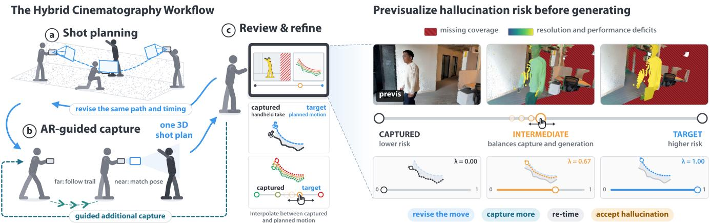  
Figure 1: We present Hybrid Cinematography, a workflow connecting capture and generative post-production, built around one editable 3D shot plan that every stage reads (left). We demonstrate the workflow in a mobile augmented reality (AR) app. (a) Before or after capture, filmmakers plan the target move as keyframes by walking the scene, then set its timing. (b) In capture, the same plan drives the AR guidance. (c) In review, a previsualization (previs) checks the recorded take against that plan and marks what the model would have to invent, its hallucination risk. Every move between the captured move and the target move is a possible reshoot, asking the model to invent what the take does not support. Filmmakers navigate that range with a slider and see the risk of each move before anything is generated (right). The can then revise the move, capture more, re-time, or knowingly accept hallucination, while still on set. U:1

Video and examples: https://hybridcinematography.github.io/

## Abstract

On a film set, the camera move is committed during a take. Generative video reshooting lets filmmakers change it afterward, but may require hallucinating unrecorded content, a gap sometimes discovered only after leaving the set. We present Hybrid Cinematography, a workflow that bridges physical capture and generative reshooting to manage hallucination risk while filmmakers can still act on it. Using an editable 3D shot plan and a proxy of the take, our previsualization evaluates hallucination risk in real time. Seeing where the take lacks support, filmmakers can iteratively adjust the plan, explore moves that balance capture and generation, shoot guided pickups, or knowingly accept hallucination. We demonstrate the workflow through a mobile augmented reality application for on-set planning, capture, and review, and an ofline pipeline for existing video. A study with experienced filmmakers reveals how previsual izing risk informs camera decisions and exposes tensions between creative intent and generative hallucination.

## CCS Concepts

• Human-centered computing → Interactive systems and tools.

## Keywords

filmmaking, previsualization, capture guidance, human–AI interaction

## 1 Introduction

Previsualization and planning tools have long played a critical role in creative domains that benefit from extensive amounts of attention to detail. Whether it is armature sketching for illustration, storyboarding or animatics for film, or wireframe renders for CGI, the goal is the same, to revise decisions before production becomes expensive. In filmmaking, that flexibility traditionally ends when the camera rolls. Executing a complex camera move, such as an orbit, crane, or push-in, requires meticulous choreography, specialized equipment, or skilled operators. Once a take is filmed, altering the camera move traditionally requires another take.

Generative video reshooting changes this. Given a recorded take, these models can render the same performance from a new camera trajectory chosen or revised after capture [2, 17, 36]. However, a target trajectory may require rendering things that were not visible at all, or not visible in suficient detail, in the captured trajectory, leaving parts of the shot for the model to hallucinate. We call this unrecorded demand the shot’s hallucination risk. A direct response is to capture additional takes covering alternative camera moves. Yet doing so consumes scarce production time and cannot reproduce the exact moment of a live performance. Moreover, filmmakers may discover that a diferent move is needed only when editing against adjacent footage. Generative reshooting ofers another response: infer the missing content from the recorded take. Research in this area has focused on improving that inference through advances in generative modeling and more extensive use of recorded footage. These improvements, however, do not by themselves help filmmakers decide what additional footage to capture or what content they are willing to let the model hallucinate. On one extreme we have the challenges of cinematography, and on the other extreme we have the risks of hallucination. Navigating that spectrum is going to define a lot of cinematography in the future.

In this work, we present Hybrid Cinematography, a workflow that connects physical camera capture and generative reshooting around an editable 3D shot plan. While the plan specifies the camera move the filmmaker wants, a lightweight 3D proxy represents what the take recorded. Evaluating views along a camera move against this proxy produces a previsualization (previs) of hallucination risk that updates in real time as filmmakers revise the move. This lets filmmakers rapidly explore moves between the captured and target trajectories, inspecting trade-ofs between physical capture and hallucination without waiting for the generative model.

We demonstrate this workflow both on set and during editing. On set, a mobile augmented reality (AR) application brings the previsualization into shot planning, guided capture, and review, letting filmmakers revise the move or capture additional footage while the physical scene is still available (Figure 1). During editing, an ofline pipeline applies the same previsualization to existing video, letting filmmakers explore alternative camera moves and decide what hallucination they are willing to accept before committing to generation (Figure 7).

We evaluated Hybrid Cinematography in a two-part study with seven experienced filmmakers across cinematography, directing, and video production. Participants used the previs to revise camera moves and choose targeted capture responses, reporting less pressure to execute a perfect take on set. Their decisions revealed tensions between reducing hallucination risk and preserving creative intent, as well as between accepting plausible generated content and maintaining the authenticity of the recorded take.

Our contributions include:

• Hybrid Cinematography, a workflow for navigating trade-ofs along the continuum between captured and target camera moves, balancing physical capture against generative hallucination (Sec tion 3).

• Strategies for visualizing hallucination risk that expose where and why a recorded take lacks support for a target camera move, pairing distinct deficits with targeted responses before generation (Section 4).

• A prototype mobile AR application and an ofline pipeline that demonstrate this workflow across on-set capture and post production editing (Section 5).

• Findings from a study with seven experienced filmmakers on how they use previsualized hallucination risk to make camera decisions and negotiate tensions between hallucination, creative intent, and the authenticity of recorded performance (Section 6).

## 2 Related Work

Prior work in camera planning and video reshooting largely separates capture from generation. Reshooting models treat the take as fixed and hallucinate whatever a target move asks for that the take does not contain. Capture guidance and previsualization, conversely, help filmmakers plan and execute camera moves without anticipating computational synthesis. Neither tells a filmmaker, while the scene is still standing, what a move would leave to the model.

## 2.1 Generative Video Reshooting

Generative reshooting models re-render a recorded take from a new camera trajectory, conditioning directly on the source video [2] or anchoring generation to geometry rendered from the target camera [17, 24, 25, 34, 36]. Geometry-based pipelines pass a rendered proxy and a support mask to the model. This proxy is typically a 3D point cloud or a time-varying 4D representation, but the mask records only where it has holes. It does not distinguish a surface that was never observed from one sampled too coarsely for the requested framing, nor does it describe whether performance evidence is valid at the requested time. Prior work treats synthesis across those gaps as a capability: the ReCapture reshooting model [36], for example, reports that the model can plausibly hallucinate scene content outside the source view. For a capture workflow, however, that capability is also an unrecorded production decision: neither the mask nor the generated pixels tell the filmmaker whether the hallucination was avoidable.

Recent work reduces unsupported generations by routing more ofthe take into the result [17, 24], completing unseen geometry with additional models [3, 12], separating supported from unsupported regions during generation [10], or supplying appearance from reference images while tying performance to recorded time [22]. Completion may improve a render, but for a performer it is not recovery: a face no camera ever recorded cannot be recovered by a model that never saw it either. Vista4D [17], which we adopt as our downstream reshooting model, can incorporate additional scene takes to reduce hallucination, but it does not tell a filmmaker which observations a particular reshoot requires. These methods make increasingly sophisticated use of evidence, but only after capture. None of them evaluate hallucination risk while a filmmaker can still record the missing support.

## 2.2 Shot Authoring and Previsualization

Previsualization lets filmmakers evaluate framing, camera movement, and performance before committing production resources. In virtual cinematography, early work automated camera placement and pacing by encoding film idioms as procedural rules [7], while subsequent tools gave authors interactive control over viewpoint selection through geometric constraints [18, 19]. CollageVis brings recorded acting into this process, arranging segmented performers as video layers on a virtual stage [13]. This preserves the performance without requiring character animation, but showing the acting from another direction requires another take. Generative reshooting ofers a way to view a recorded performance from new directions, but raises the opposite problem: asking for views the take never recorded.

PrevizWhiz uses rough 3D scenes and video references to guide generative video previsualization [9], providing resemblance controls to steer adherence to the authored scene and motion controls to adjust performance detail. But PrevizWhiz begins from virtual designs and text prompts, where hallucinated details are part of ideation. In a live-action take, hallucination can compromise the authenticity of a recorded performance. Other systems connect shot authoring directly to physical capture and subsequent editing through shared representations. CineCraft uses a persistent storyboard-derived shot plan to coordinate AR guidance, focus and zoom automation, and rough-cut assembly [30]. Hybrid Tours frames a spectrum between all-real and all-virtual workflows, letting users pick a point on it by filtering and combining short captured clips into longer camera trajectories [20]. We take that spectrum as an interaction target. Where Hybrid Tours has users choose among clips they captured, we make the range between the captured move and the target move continuously navigable within a single take, attaching a real-time readout of the hallucination risk each stop incurs. More broadly, while these systems carry one representation across production stages, the take is always what a later stage consumes. It is never what the plan is measured against. Our previs makes that measurement visible as filmmakers change the camera path and its timing.

## 2.3 Capture Guidance

View synthesis and reconstruction methods prescribe where to capture and how densely to sample a scene [6, 21, 33]. For camera operation, ARCAM visualizes camera movement in the physical scene so novices can reproduce a move demonstrated in a sample video [15], and LookOut combines planned framing with responsive gimbal control during a take [26]. A second group guides a user back to a view that was already recorded: the ReCapture AR timelapse system [32] returns users to earlier viewpoints so hand-held time-lapse can be shot one frame at a time, and Personal Time-Lapse adds interactive feedback for re-establishing a viewpoint, body pose, and lighting condition [29].

In all of this work the view to acquire is known before guidance begins, derived from a sampling rule, a reference video, or a frame the user already shot. Our workflow has to derive it first: the target move and the support it lacks determine which view or performance is needed, and only then does guidance have somewhere to point. This derivation also turns execution into a choice, because the filmmaker can revise the move, capture more, or accept hallucination. Camera departures from the plan during capture are not errors. Instead, they provide opportunistic coverage that can support alternative moves. When capture is chosen, the new recording is checked against the same target move, keeping both the move and its supporting evidence open to revision.

## 2.4 Steering and Inspecting Generative Assistance

Mixed-initiative interfaces allow computational systems to assist without usurping user control, proposing rather than acting and keeping the basis for each proposal open to inspection [8]. Human– AI interaction guidelines similarly emphasize that a system should make clear what it can do and how well it can do it, ensuring reliance tracks competence rather than aesthetic appearance [1]. Generative reshooting makes this unusually dificult: the output is a finished-looking video, and nothing in it separates the parts that reproduce the take from the parts the model hallucinated.

Creative tools have responded with controls over where delegation happens. In virtual cinematography, XCam lets operators adjust automation separately for object tracking, camera motion, and scene transitions [23]. Others provide structures for inspecting and revising AI assistance, either through interconnected representations across narrative planning and timeline editing [4], or by aligning alternative AI-assisted edits so diferences can be compared without reviewing unchanged content [11]. Our workflow similarly leaves decisions about what to generate to the filmmaker. But whereas these systems evaluate or constrain the model’s output after generation, our previs acts on its input: filmmakers adjust what the model will receive, seeing the consequence on an interactive proxy before a single frame is generated.

## 3 Hybrid Cinematography Workflow

We call Hybrid Cinematography a workflow rather than an interactive system because it changes the process of reshooting, not one tool within it. Today a filmmaker records a take, leaves the set, chooses a target move, generates, and inspects the result for what the model had to hallucinate. Hybrid Cinematography checks the take’s support for a move before generation, from a proxy of the take, which makes the check cheap enough to repeat and early enough to capture more:

Filmmakers already have conventions for deciding what to shoot and what to leave to post. Camera overlays such as zebra stripes and focus peaking report what the sensor recorded and leave the judgment to the operator. Editors cut on low-resolution proxies because the full render is the expensive step. Crews shoot pickups to cover what a take missed, block to a shot list and marks on the floor, and record what will be fixed in post.

Our design goals ground Hybrid Cinematography in these conventions, in the capture deficits defined in Section 4 (coverage, resolution, and performance, Figure 2), and in the cost of generating a shot, which is too slow to iterate with on set or in editing:

• DG1: Previsualize hallucination risk before generating. Before anything is generated, the previs should show where in the frame and when in the shot the take fails to support a move, and why, computed from the take rather than from the model’s output.

• DG2: Make the range between the captured and target moves navigable. Between the captured move and the target move lies a range of possible moves, each asking the model to hallucinate more or less. The filmmaker should be able to navigate quickly through that range and see the hallucination risk for every move in it, on set or in editing, without calling the model.

• DG3: Map each deficit to its own previs signal and its own response. Filmmakers should be able to tell each kind of deficit apart and pair it with the response that fixes it.

• DG4: Keep one editable shot plan throughout. The shot plan, the target move as keyframes and timing, should be the one object every step works from. It guides the take, it is what the take is measured against in review, it routes a pickup, and it is what the model receives. It should stay editable at each of these points, with every change updating the previs.

<table><tr><td>Workflow</td><td>Missing evidence found</td><td>Cost of a check</td><td>Responses</td></tr><tr><td>Generate and inspect</td><td>After generation</td><td>One generation</td><td>Revise the move, regenerate</td></tr><tr><td>Hybrid Cinematography, on set</td><td>Before generation</td><td>A proxy render</td><td>Revise, capture more, accept</td></tr><tr><td>Hybrid Cinematography, in editing</td><td>Before generation</td><td>A proxy render</td><td>Revise, accept</td></tr></table>

• DG5: Let the filmmaker decide what to leave to the model. Whether a region may be left to the model depends on what it means to the shot, which the geometry cannot tell. The filmmaker should make that call knowingly.

Section 4 formalizes these capture deficits and their computation on a 3D proxy, and Section 5 demonstrates the resulting workflow in a mobile application (Figure 1) and on ordinary video.

## 4 Previsualizing Hallucination Risk

Evaluating hallucination risk requires measuring what a move asks for that the recorded take cannot support. Our previs checks this support directly against a lightweight 3D proxy of the take in milliseconds, before running any generative model (DG1). In this section, we define the three distinct deficits that arise between a move and a take, formalize the continuous range of moves between the captured move and the target move, and describe how these deficits are computed and visualized.

## 4.1 What a Take Must Supply for a Move

Hallucination risk depends on both the viewpoint a move requests and the visual evidence a take provides. At output time �, the target camera $C _ { \bf { 0 } } ( t )$ asks for a view of the scene and performance at source time $t _ { s } .$ . We decouple camera timing from performance timing while keeping the source clock unchanged $( t _ { s } = t ) \colon$ editing camera pacing changes when the camera reaches each viewpoint, while the recorded performance proceeds at its original speed.

In our experiments with recent generative reshooting models, holding a take fixed and varying viewpoint, framing, or timing reveals three recurring capture deficits (Figure 2). First, a surface may never have been observed from a compatible viewing direction (coverage). Second, even when observed, it may be sampled too coarsely for the requested framing (resolution). Third, while static scene evidence accumulates across the entire take, a moving performer’s appearance is tied to a specific instant. A diferent frame of an actor does not record the same physical action (performance).

## 4.2 From Deficits to a Previs

To evaluate these deficits without running the generative model, we construct a 3D proxy of the take consisting of an accumulated static point cloud and time-indexed performer point clouds (DG1). Rendering this proxy along a move produces target-view point projections and binary support masks that match the conditioning representations required by downstream reshooting models such as Vista4D [17]. The previs then tests the observations backing each rendered point against our three deficits in milliseconds, enabling instant feedback as filmmakers edit a move.

To make the continuum between the captured move and target move navigable (DG2), we interpolate between the captured camera $C _ { \mathrm { c } } ( t )$ and target camera $C _ { 0 } ( t )$ at each output time �:

$$
C _ { \lambda } ( t ) = \operatorname* { m i x } \bigl ( C _ { \mathrm { c } } ( t ) , C _ { 0 } ( t ) , \lambda \bigr ) , \qquad \lambda \in [ 0 , 1 ] ,\tag{1}
$$

where mix interpolates 6-DoF camera pose and focal length. At $\lambda = 0 ,$ , the camera traces the captured move, where deficits reflect only sensor occlusions or dropouts, and at $\lambda = 1$ , it reaches the full target move.

For each projected point rendered from $C _ { \lambda } ( t )$ , the previs evaluates support:

• Coverage holds when at least one source observation falls within an angular cone around the target viewing direction.

• Resolution evaluates the ratio between the requested sampling density (which increases as the camera approaches or the lens tightens) and the densest compatible source observation. A ratio exceeding one requires the model to hallucinate detail absent from the take.

• Performance is evaluated per instant rather than per pixel. It measures the fraction of visible performer samples in the target view supported by source observations at instant � from a compatible angle.

Where tracking drops out or depth is missing, the previs explicitly reports unknown rather than false support.

The resulting signals appear as overlays in the target view and as summary lanes along the timeline (DG3, Figure 6). In addition, a 3D map colors the interpolated trajectory manifold by hallucination risk, letting filmmakers compare alternatives across � with a slider. Figure 3 compares these diagnostic signals with Vista4D’s conditioning masks and generated outputs across three orbit angles. The signals locate missing support rather than predict how convincingly the model will hallucinate.

Keeping these signals distinct is critical because each maps to a diferent production decision (DG3): capturing more through a later pickup can supply static coverage or resolution, but cannot reconstruct an unrecorded moment of live performance. Section 5.3 translates these diagnostic distinctions into actionable controls on set (DG5).

## 5 Workflow Implementation: App and Ofline Pipeline

We demonstrate Hybrid Cinematography across two settings: a mobile AR application for on-set production and an ofline pipeline for ordinary video (Figure 1). Following the principle that one shared representation should coordinate production stages [20, 30], the workflow anchors each stage in the editable 3D shot plan checked against a 3D proxy of the take (DG4). We describe the on-set workflow below, and detail the end-to-end data pipeline in Appendix A (Figure 10).

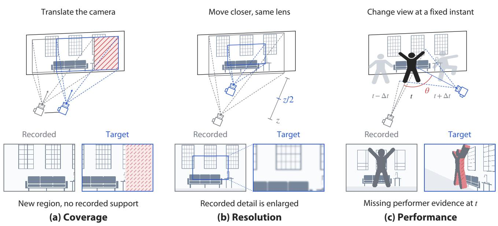  
Figure 2: Our hallucination risk previs estimates three deficits that vary with edits to the target camera move and indicate what downstream reshooting models must synthesize: (a) coverage for surfaces unseen from a compatible direction, (b) resolution for insuficient detail for the target framing, and (c) performance for missing performer evidence from a compatible viewpoint at the target instant.

## 5.1 Planning the Move in the Scene

To keep the shot plan editable throughout production (DG4), the filmmaker authors it directly in the physical scene. Walking through the environment, the filmmaker frames key viewpoints and saves AR camera poses (Figure 1a and Figure 4, left). The app interpolates a smooth camera path with �1 continuity in position and velocity (Appendix B) through freeform keyframes or shot presets (orbit, crane, push, dolly-zoom), previewing planned views with pointbased rendering before rolling.

Timing is controlled independently (Figure 4, right). A timing curve defines camera velocity and holds along the path, initialized from the pacing of the filmmaker’s rehearsal walk. Decoupling path from timing allows retiming the move against the recorded performance without re-walking the shot (Section 4.1). During post-capture review, keyframes can be adjusted in the interface or re-anchored by standing in the scene and saving a new AR pose.

## 5.2 Capturing With the Plan as Guidance

During a take, the shot plan acts as virtual marks on the floor, guid ing camera execution in 3D space (DG4, Figure 1b). To prevent visual clutter during capture, the interface employs progressive disclosure (Figure 5). When the operator is far from the next keyframe, coarse guidance projects breadcrumb arrows on the ground indicat ing where to move. As the operator approaches, these arrows give way to fine guidance: the target camera’s frustum, distance readouts, and framing cues to settle the shot. Guidance applies equally to rehearsal walks and pickup tasks (Section 5.3).

Importantly, guidance does not enforce rigid adherence. If the operator departs from the planned path, the take is not discarded. Instead, review evaluates whatever evidence the camera recorded.

This allows operators to focus on capturing the scene rather than chasing mechanical precision. During capture, the device records RGB video, hardware LiDAR depth, and ARKit 6-DoF camera poses, while tracking performers in real time using EdgeTAM [37]. These streams populate the static and dynamic stores of the proxy for immediate on-device review.

## 5.3 Reviewing and Responding on Set

Review brings the target view, timeline, compromise slider, and 3D risk map together on a single screen (DG1, DG2, Figure 6). Tapping a flagged region opens an actionable response card tailored to that deficit (DG3, Figure 6E–F). Rather than prescribing an automated fix, the interface supports three explicit production actions (DG5):

• Revise the move. The filmmaker can edit keyframes, adjust the timing curve, or inspect two automated proposals. Reduce move pulls the slider back toward the captured move until the flagged region is supported. Retime searches for a camera velocity schedule that slows down where the take provides support and accelerates through unsupported spans, while preserving authored holds (Appendix D). Proposals are visualized with their trade-ofs and never applied automatically (DG5).

• Capture more. For coverage or resolution deficits, tapping the card creates a targeted pickup task. The app freezes the unsupported region and time span and extracts one or two guidance viewpoints. The operator then captures a briefpickup take, which is folded into the proxy and immediately re-evaluated to verify that the gap has been closed.

• Accept hallucination. When a missing region is deemed artistically inconsequential or easily synthesized (such as an unfeatured background wall), the filmmaker explicitly confirms it (DG5). The interface records an acceptance mask tied to the current shot plan. Any subsequent edit to the move or take clears the acceptance, ensuring that only deliberate decisions reach post-production.

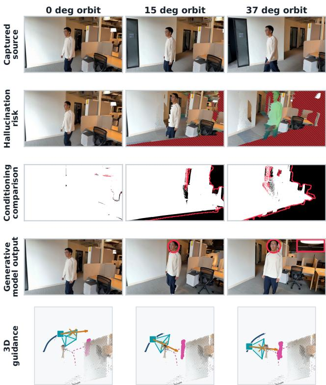  
Figure 3: Comparing the previs, model conditioning, and generated output. Columns show the same take reshot as 0◦, $1 5 ^ { \circ }$ and $3 7 ^ { \circ }$ orbits. From top to bottom: the source frame, the previs showing hallucination risk (hatched red where no frame of the take saw the pixel, Viridis tint where resolution or performance falls short, brighter as the shortfall grows), Vista4D’s conditioning mask (white is conditioned) with our coverage estimate outlined in red, the generated output with synthesized regions circled, and pickup guidance. Wider orbits expose more missing content. The previs locates missing support before generation. It does not predict the quality of the synthesized content.

What leaves the set is the finalized camera move, verified pickup takes, and confirmed acceptance masks for the generative reshooting model.

## 5.4 The Previs on Ordinary Video

The previs does not require custom AR hardware during capture. An ofline pipeline ingests ordinary video, estimates camera poses and dense depth using $\pi ^ { 3 }$ [31] or Depth Anything 3 [16], and extracts performer masks using SAM 3 [5]. From these inputs, it constructs the 3D proxy and serves it to a browser-based viewer with the same slider, timeline lanes, and diagnostic overlays (DG2). An interactive build of this viewer is included in the supplemental material, allowing users to scrub the compromise slider and inspect diagnostic overlays across sample sequences.

Figure 7 demonstrates seven ordinary video sequences with edited camera moves revealing unseen angles of performers. When the original scene and actors are no longer available for physical pickups, filmmakers rely on the previs to balance creative intent against hallucination risk, choosing whether to revise the move or accept hallucination before running the generative model.

## 6 Evaluation

We evaluated the Hybrid Cinematography workflow with seven experienced filmmakers to examine how practitioners read hal lucination risk and navigate production trade-ofs. Because this approach introduces an unprecedented coupling between physical camera capture and generative reshooting, no direct baseline exists. Following prior evaluations of interactive creative tools without direct counterparts [9, 13, 14, 28, 30], we report qualitative sessions examining how filmmakers reason about shot planning, guided capture, and hallucination risk across production and post-production.

## 6.1 Participants

We recruited seven experienced filmmakers (5 male, 2 female, Table 1) through professional networks and filmmaking communities, with four to fifteen years of production experience. Three work as directors of photography (DPs, or cinematographers) on narrative and independent films, one produces advertising video, one shoots brand content, one directs and shoots documentaries and shorts, and one directs commercial campaigns and music videos. Prior use of generative models ranged from none to regular production use. Sessions lasted 45 to 60 minutes, and participants were compensated for their time.

## 6.2 Study Design

Part 1 introduces participants to hallucination risk in a browser viewer using an ofline take before working on set. Participants first rate how comfortable they would be using a generative model to add a new camera move to their own recorded takes, providing the baseline for Figure 8A. A tutorial sequence introduces the interactive slider and previs. An initial inspection task pairs a take filmed from the side with a front view synthesized by a reshooting model, asking participants to place pins where they believe the model had to invent content (Figure 9a). A reveal then overlays the diagnostic map of what the camera never recorded, confirming their intuition by highlighting unobserved background surfaces in red and the performer’s face in yellow (Figure 9b). The second scene moves participants into the previs reconstructed from the take, using an orbit around the performer as the target move (Figure 9c). The slider lets them move between the captured move and target move to inspect support. After modifying the target move and exploring the previs, participants stop at an acceptable slider position and explain the trade-of. Finally, they rate their comfort a second time.

Part 2 moves participants onto the set, where our mobile application demonstrates the full workflow combining shot planning, guided capture, and review against the previs. Following a fifteenminute tutorial, participants plan concatenated paths in augmented reality and customize timing along each. They capture three scenes, including one with a performer and one with a prop. For each take, the experimenter acts as director and requests a change after cap ture, such as speeding through one stretch and slowing through another. Participants refine the shot in the app, editing path and timing, and navigating between revising the move, retiming, capturing more, or accepting synthesis via the slider while thinking aloud throughout. Finally, they complete a questionnaire on planning, capture, review, and the workflow as a whole (Figure 8C).

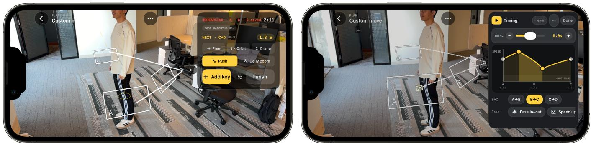

Figure 4: Authoring a move in AR. Left: path. The filmmaker walks to each viewpoint and drops an AR keyframe. Each stretch between keyframes is a free move by default. Tapping a common shot-type preset, such as an orbit, crane, push, or dolly zoom, instead generates the keyframes for that move, and the system joins consecutive stretches into one continuous path. Right: timing. A speed curve over the same path defines camera velocity and holds. A double tap adds a control point, dragging it up or down speeds up or slows that stretch, and pulling it to the axis holds the camera still. Presets such as ease in-out apply a common profile to a stretch.  
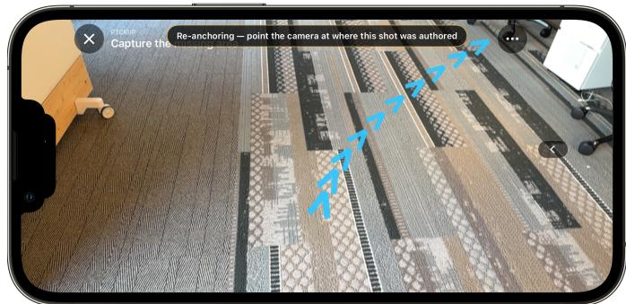

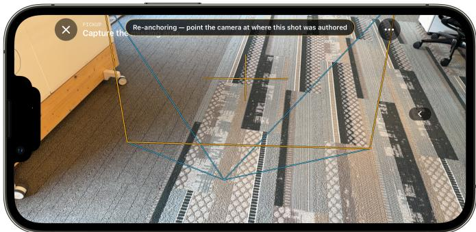  
Figure 5: Coarse-to-fine AR guidance for capture, shown during a pickup. Left: coarse guidance. A trail of arrows on the floor leads the operator toward the saved viewpoint. Right: fine guidance. The saved camera’s frustum and a central crosshair help the operator match its position and framing. The same guidance supports rehearsal, the take, and pickup views saved during review.

Table 1: Film and video production backgrounds of the participants.
<table><tr><td>ID</td><td>Gender</td><td>Experience</td><td>Primary Roles</td><td>Production Domain</td><td>VFX and Generative AI</td></tr><tr><td>P1</td><td>M</td><td>9 years</td><td>Photographer, videographer</td><td>Social and brand content</td><td>Prior VFX collab with Disney, Pixar, ILM/Lucasfilm. Gen AI: Veo, Nano Banana</td></tr><tr><td>P2</td><td>M</td><td>6.5 years</td><td>Cinematographer (DP), grip, editor</td><td>Student and indie films</td><td>Rare VFX. Gen AI: open-source generative video models</td></tr><tr><td>P3</td><td>F</td><td>4 years</td><td>Video producer</td><td>Commercial and advertising</td><td>Occasional VFX, 3D modeling. Gen AI: Midjourney</td></tr><tr><td>P4</td><td>M</td><td>8 years</td><td>Cinematographer (DP), AC, gaffer, grip</td><td>Narrative short films</td><td>Never VFX. Gen AI: Midjourney, Topaz</td></tr><tr><td>P5</td><td>F</td><td>13 years</td><td>Cinematographer (DP), Assistant Camera (AC)</td><td>Narrative and indie films</td><td>No VFX. Gen AI: ChatGPT, Adobe AI tools</td></tr><tr><td>P6</td><td>M</td><td>7 years</td><td>Cinematographer (DP), Assistant Camera (AC)</td><td>Film, commercial shorts, documentaries, dance videos</td><td>VFX for extensions and cleanup. Gen AI: Seedance</td></tr><tr><td>P7</td><td>M</td><td>15 years</td><td>Director, teaching professor</td><td>Commercials, music videos, installations</td><td>VFX in post with editors and VFX teams. Gen AI: Veo, Runway, Nano Banana, ComfyUI, Google Flow</td></tr></table>

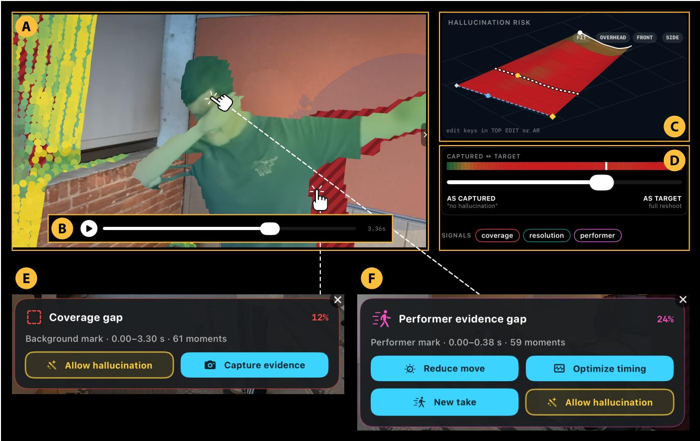  
Figure 6: Review and Refine view. (A) The previs overlays the 3D proxy with hallucination risk: red hatching marks missing coverage, while a heatmap shows resolution and performance deficits. (B) controls playback. Toggling signals updates the overall risk map. (C) shows the captured and target trajectories and the interpolated moves selected with the compromise slider (D). Tapping a flagged region opens a popup with remedy strategies for (E) coverage or resolution gaps and (F) performance evidence gaps

## 6.3 Findings

We organize our findings around four themes that reflect the production workflow: (1) authoring and guided capture with a unified shot plan, (2) diagnosing hallucination risk and navigating tradeofs before generation, (3) selecting targeted responses for distinct deficits, and (4) how filmmaker comfort grew with active agency and control.

6.3.1 Carrying a Unified Shot Plan from Preproduction Through Capture. Planning a camera path with AR keyframes was rated easy, with a median of 7 of 7 (Figure 8C). P4 observed that walking keyframes felt “directly transferable” to how a DP plans a scene by placing the camera where a move starts and ends. On set, guidance replaced marks on the floor (P5), was more precise than a verbal walkthrough (P1), and made physically dificult moves feasible (P2).

Diferent production backgrounds shaped distinct mental models for camera planning. While cinematographers like P4 anchored planning to physical marks on set, P3 (who brought a 3D animation background, rating guidance 4 of 7) expected keyframes to follow 3D timeline conventions, noting that guidance meant she would “only need to capture key frames instead of get the precise movement.” Beyond individual operation, unifying authoring and capture into an editable plan (DG4) provided a shared reference for crew communication (P1, P2, P6). P1 described the AR path as “almost like a 3D storyboard” that makes it “much easier to convey the vision and timing for a shot across a small-production crew,” replacing verbal walkthroughs (P6) and helping crews get on board with complex moves (P2).

(a) Studio performer  
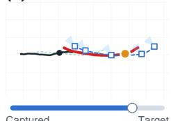

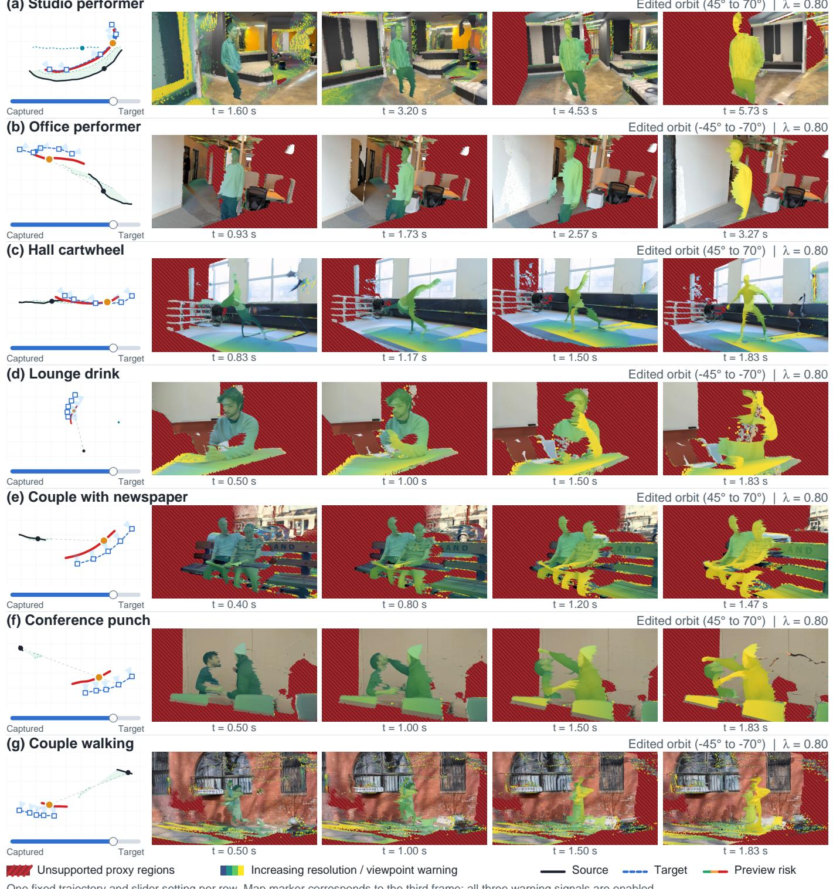

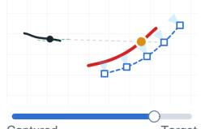

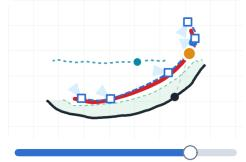  
Edited orbit (45° to 70°) | λ = 0.80

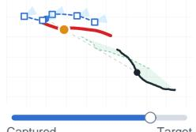

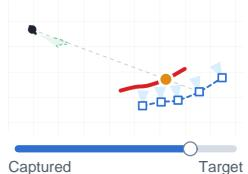

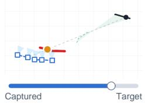  
One fixed trajectory and slider setting per row. Map marker corresponds to the third frame; all three warning signals are enabled

Figure 7: The previs on ordinary video. Seven scenes recorded as RGB video without our application and reconstructed ofline, with camera poses and depth from monocular estimation (Pi3X) and performer masks from video segmentation (SAM3), then reviewed in a browser viewer with the same map, keyframes, and slider as the app. Each row shows the captured path in black, an edited orbit as the target in dashed blue, the preview risk of the selected move at � = 0.8, and four successive frames of the previs for that move. Every orbit swings toward a side of the performer the take never filmed, so the performer wash rises toward yellow as the arc passes that side, while red hatching marks background the take never recorded and the same ramp on the background marks detail it sampled too coarsely. These are renders of what the take supports, not generated reshoots.

(A) Comfort with generative reshooting P1 P2 P3 P4 P5 P6 P7  
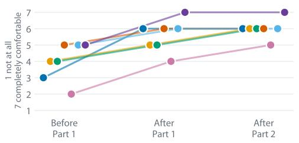

(B) Hallucination-risk trade-off accepted  
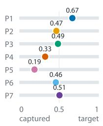  
(C) On-set workflow ratings 1 strongly disagree, 7 strongly agree  
Easy to plan by walking, saving viewpoints Easy to tune timing apart from the path Guidance freed attention for the live scene Clearly saw where and why AI must invent Slider helped explore acceptable trade-offs Warnings helped choose pickup, retake, or AI Felt in control of creative decisions On-set feedback worth the extra time Confident wrapping, knowing footage support

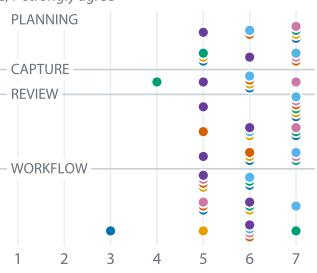

Figure 8: Study results, one color per participant. (A) Comfort with generative video reshooting before Part 1, after Part 1, and after Part 2. (B) Where each participant stopped on the Part 1 slider, between the captured move at 0 and the target move at 1. (C) Ratings of the on-set workflow after Part 2, one row per item. Item wording is abbreviated. The questions as asked are in Appendix E.  
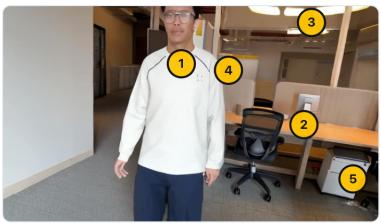  
(a) Pin what the model invented

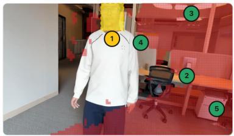  
(b) Reveal of the never-recorded regions

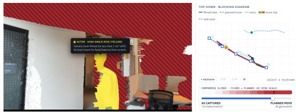  
(c) Second scene: overlays, map with keyframes, slider

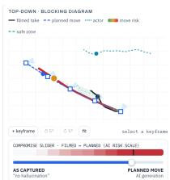  
Figure 9: Part 1 interactive browser exercise. (a) Participants pin what they think a reshooting model invented in a generated view. (b) The reveal marks what the camera never recorded. (c) Participants navigate the range of possible reshoots with the previs, the map, and the slider. The green shaded region in the map marks the range of camera trajectories estimated to remain below the shot-support risk threshold.

Having pickups available changed how participants shot takes. Relieved of single-take pressure, operators felt freer moving the camera (P2) and, as P5 put it, “more free to make mistakes,” because the workflow “allows for preplanning to occur without too much pressure for the actual moment.” Operators prioritized live performance over background coverage (P2), used the visual path to rehearse marks (P3), and noted its value for unrepeatable documentary moments (P5).

6.3.2 Reading Hallucination Risk and Navigating Trade-ofs Before Generation. Previsualizing hallucination risk before generation (DG1) made model dependencies immediately interpretable. All participants correctly identified the hallucinated face in the initial inspection task before overlays were explained, and rated the previs a median of 7 of 7 for showing where and why the model must in vent content (Figure 8C). Participants valued knowing on set what the footage supported (P2, P3, P4, P5, P6, P7). P2 was “immediately aware what the tools in post will and will not hallucinate,” while P3 appreciated knowing “what needs to be AI-generated instead of burning tokens and leave it up to fate.”

Participants rated the previs and slider a median of 6 of 7 for exploring acceptable trade-ofs (DG2). When navigating between the captured move and target move, stopping points reflected qualitative judgments about scene content rather than a numerical threshold (Figure 8B). Participants stopped where performer identity or facial fidelity degraded (P2, P3), where the intended move survived with the actor at low risk (P6), or where, as P5 cautioned, “you might as well have AI make the whole movie.”

Rather than passively accepting generation costs, participants actively reshaped the input by revising the target move (DG4, P5, P6, P7). Both modifying keyframes and adjusting the slider to alter model conditioning, updating the previs interactively. Session logs revealed participants iteratively alternating between both controls: adjusting keyframes, sweeping the slider to inspect updated support, and refining the path again. P7 edited keyframes 25 times to “limit the visibility of generated wall at the end,” and P6 made 20 adjustments until the path retained “the efect I wanted to achieve and there is less hallucination occurred.”

6.3.3 Selecting Targeted Responses for Distinct Deficits. Selecting a highlighted deficit in the previs opens a response card with tailored remedy actions (DG3, DG5), letting participants preview solutions before deciding how to respond. For static background gaps, participants could launch a guided pickup or pull back the slider. For unobserved performer angles, where static pickups cannot recover live action, the interface ofered retiming proposals, path edits, or replacement takes. With capture available on set in Part 2, participants prioritized filming targeted pickups for static deficits over exhausting the crew on repeated full takes (P1, P2, P3, P4, P6). P3 noted that getting “pickup shots just for missing info instead of trying to do one perfect shot over and over again” helps most with “budgeting and choose the important shots to keep.” P5 valued knowing “what wiggle room we’d have on a shot” on tight schedules, and P6 noted that deciding on set “is better than regretting a decision later on when discovering a problem in editing.” Ratings for whether on-set warnings helped decide between a pickup, a retake, and synthesis yielded a median of 6 of 7.

When addressing performance deficits or director requests to alter pacing, participants explored both interactive timing adjust ments and automated proposals. Decoupling camera pacing from the spatial path made tuning timing easy (median 6 of 7, with P4, P5, and P6 rating 7 of 7). P6 observed that “with the timing tool I don’t need to follow the plan exactly and still achieve the timing efect I want.” When evaluating automated retiming proposals that linger in supported views and accelerate through unobserved angles (Appendix D), participants appreciated the proposal as a structural reference, but exercised caution in dynamic scenes. Retiming modifies only camera progress along its path while the recorded performer continues at natural speed on an unchanged clock. Even so, because camera speed guides emotional rhythm and audience attention, automated accelerations risked clashing with the performer’s dramatic beats (P4, P5). As P4 noted, for a scene “where an actor is performing because the performance changes every time,” preserving dramatic intent took precedence over automated schedules. Participants therefore preferred manually sculpting camera timing, shortening the move spatially via keyframes and the compromise slider, or filming an intentional retake.

No participant was willing to delegate the performer to the model in either Part 1 or Part 2. Across all seven participants, facial fidelity marked the strict boundary where slider exploration stopped. P4 insisted that “nothing to be hallucinated on the face,” P7 remained cautious about generating human faces consistently, and P5 emphasized that synthetic infill compromises authentic performance, noting that “false emotions, and dialogue also would leave me uncomfortable.”

Beyond faces and performance, participants drew boundaries wherever the production had invested creative efort. These included key props (P6), dressed sets (P2), critical story beats (P4), and on-screen text (P3, P6). These decisions reflected narrative importance rather than pixel area. As P1 observed, “the amount of infill is less concerning than the quality of the regions that need infill.” Deciding what to leave to the model was recognized as a shared crew decision, with P5 likening real-time diagnostic checks to “the existence of the script supervisor” when agreeing on boundaries with the director.

6.3.4 Filmmaker Comfort Grew with Active Agency and Control. Evaluating whether footage is suficient to move on is an essential step on set. Confidence to wrap a scene knowing how well the take supported the target shot received a median rating of 6 of 7 (Figure 8C). P1 gave a more conservative rating (3 of 7), noting that on-set wrap confidence assumes the target path is already known: “The biggest hurdle is it relies on knowing some aspects of re-shooting while shooting. If I knew what the desired paths would be, I would have used those to begin with.” When camera moves are chosen during editing rather than planned on set, P1 valued the feedback for understanding scene limitations during post-production handofs rather than declaring a scene wrapped.

Across the entire workflow, filmmaker comfort with generative reshooting increased for all participants (Figure 8A), rising from a median of 4 before the study to 6 after experiencing the on-set system. Participants attributed this increase to a sense of agency and transparency rather than uncritical trust in generative models (P2, P3, P4, P5, P6, P7). P5 shifted from viewing generative tools as “unfaithful to my profession” to concluding that “now it feels like a helper.” P6’s comfort grew even as he became “more cautious about AI generated shots,” because diagnostic feedback allowed him to actively prevent hallucinations “by controlling my shot angles.” Three participants anticipated attempting camera moves they would not have risked before (P1, P2, P7). P7 explained that previsualizing support provides the evidence needed to secure “buy-in from DP and their department,” enabling crews to plan “unusual, ambitious shots and maximizing the likelihood of a positive outcome.”

## 7 Discussion

We reflect on how previsualizing hallucination risk can change how filmmakers work with generative models, and discuss several design tensions and considerations for generative tools that reach beyond filmmaking.

## 7.1 Seeing Hallucination Risk Changes How Filmmakers Shoot

Filmmaking is an iterative loop: crews plan a shot, rehearse it, roll a take, and repeat until the result is good enough to move on. Moving on is a production call that balances creative goals against time and budget. Under tight schedules, crews often move on and rely on post-production to salvage unresolved defects (P3, P5). Generative reshooting expands what post-production can fix, and with it, what a crew might be willing to leave uncaptured. Yet what the model will actually have to invent remains unknown until the set is struck and it is too late to capture more. The previs brings that check directly into the production loop, before the call to move on.

On set, this visibility relieved the pressure of single-take perfection. In conventional filming, any physical departure from the planned trajectory or timing risks ruining the take. When filmmakers can inspect how departures map onto model support, single-take perfection gives way to capturing coverage. Operators can focus on capturing the live performance, knowing that secondary angles or background surfaces can be supplemented through quick pickups (P1, P2, P3). Rather than surrendering creative control to an automated model, filmmakers use diagnostic feedback to decide where physical capture is necessary and where synthetic infill is acceptable. Comfort grew because filmmakers retained active agency over what the model received, rather than relying on blind trust in generative tools (P5, P6).

We note that not every shot warrants this workflow. For routine setups, traditional in-camera filming and quick retakes remain the fastest approach. Our workflow instead targets complex or physically constrained moves where repeated takes are costly. On set, this is only feasible because the proxy decouples interactive decision-making from generative computation. Running a full video difusion model live would introduce latency and compute demands that immediately stall an active crew. Instead, evaluating physical coverage in milliseconds on device provides just enough structural feedback for crews to decide whether to revise the move, capture more, or accept synthesis. This architectural separation suggests a broader pattern for creative tools that integrate large generative models, such as 3D environment design, virtual production, and animation. In settings where creators rely on rapid, interactive iteration, providing fast structural proxies allows immediate steering without forcing users to wait on slow model inference.

## 7.2 Tension Between Hallucination Risk and Creative Intent

Generative reshooting spans a spectrum between the challenges of cinematography on one end, and the risks of hallucination on the other. Decoupling camera path from camera timing gives filmmakers a clean way to plan moves along this spectrum, walking the spatial path first and sculpting its rhythm separately. It also enables automated optimization for dynamic subjects (Section 5.3, Appendix D). While static background geometry can always be supplemented with later pickups, a live performance happens only once. Because creators cannot film extra takes to patch a fleeting performance, our space-time search finds schedules that synchronize the authored path with the take, holding when the performer was recorded and hurrying through unobserved angles. Yet camera timing also shapes dramatic pacing and emotional tension, which an automated schedule can easily disrupt. In our study, participants valued having the search surface well-supported timing options, but preferred to sweep the slider and adjust keyframes themselves to protect their dramatic intent (DG5).

Filmmakers navigated this tension directly through the compromise slider. Rather than forcing a binary choice between the recorded take and an ungrounded hallucination, the slider lets creators explore a continuous design space. In post-production, where reshooting is impossible (Part 1), participants used the slider to find a balance where a camera move gained cinematic sweep while “the footage still held” (P2). This turned camera selection into an authored trade-of between visual ambition and model support. On set (Part 2), seeing this trade-of in real time changed how participants approached capture. When the previs revealed that an ambitious target move required unseen background coverage, filmmakers did not have to pull the move back to the recorded take. Instead, guided pickups gave them a third option: capturing targeted physical evidence to support the full move they envisioned (DG2, DG4).

This dynamic suggests a transferable design strategy for creative human-AI tools, from generative CAD and animation to synthesized audio. When interactive systems frame AI as an all-or-nothing handof, users often feel their authorial intent is compromised. By factorizing user intent into separable components, such as isolating spatial path from temporal rhythm, and providing continuous controls between raw input and generative completion, tools can support collaborative steering. Practitioners can then author the expressive core of a work themselves while delegating routine infill to the model.

## 7.3 Tension Between Plausibility and Authenticity

Future improvements in generative models will reduce visual glitches and generation times. Even with higher visual fidelity, the risk of hallucination remains. Photorealistic pixels simply make inventions harder to detect. An advanced model can generate convincing facial expressions and background geometry that appear natural while bearing no relation to the physical scene. This exposes the tension between plausibility and authenticity: balancing visual enhancement against the risk of fabricating details that were never recorded. While filmmakers may accept generative synthesis for secondary background elements, our participants drew a firm line at human performance. For cinematographers, capturing a scene is the joy of the craft, not a passive handof to post-production. Cinematographers cautioned against generative delegation that displaces the operator’s role on set (P5), emphasizing that reshooting must remain “faithful to the footage that I shot” (P4). For both practitioners, an authentic take captures deliberate choices made on set that a generative model should not rewrite.

Previsualizing hallucination risk establishes a clear boundary of visual responsibility. Showing captured evidence clarifies where a model reconstructs recorded reality and where it invents new content. In our study, participants readily allowed generative infill on textureless background walls, while strictly protecting human faces, emotional expressions, and story-critical props. This selective delegation ofers a model for other domains where visual authenticity is critical, such as cultural heritage preservation, scientific visualization, and forensic documentation. In these settings, photorealistic outputs can easily mask synthetic inventions as recorded facts. Visualizing where a model lacks evidentiary support enables domain experts to selectively delegate routine synthesis while protecting the integrity of what was recorded.

## 7.4 Limitations and Future Work

Bounded by current model capabilities: Capture and previsualization run entirely on the mobile device, while final generation occurs ofline in post-production. The rendered result is therefore bounded by downstream model constraints. Current video models generate only a few seconds per call due to GPU memory limits, and slow render speeds require creators to iterate on the lightweight proxy. Splitting longer trajectories into chunks creates visual discontinuities at boundaries because current architectures do not share attention across separate generative passes. While our pipeline bridges these seams by regenerating short transitional clips (Appendix C), doing so requires additional post-processing time.

Preview quality and model uncertainty: The previs visualizes physical support rather than final render appearance. Like editing proxies that enable fast playback before 4K conforming, our point cloud decouples interactive review from slow generative renders. Because point-cloud conditioning is standard across recent reshooting architectures [3, 17, 36], our diagnostic pipeline functions as a model-agnostic, plug-and-play front end. This physical coverage provides a conservative bound for what unobserved angles must hallucinate, but models difer in how efectively they borrow distant frames or synthesize texture. Future work could train lightweight networks to translate our geometric signals into model-specific uncertainty estimates without running heavy difusion passes on set.

Camera form factors and on-device compute: Live tracking, 3D reconstruction, performer segmentation, and diagnostic evaluation all execute on a single mobile device. While mobile devices provide a convenient all-in-one platform for on-set demonstration, extended sessions cause thermal throttling that degrades processing performance, afecting video segmentation first. Furthermore, professional productions rely on specialized camera packages and external monitoring ecosystems. Future work could decouple these roles across diferent camera types, pairing handheld mobile directors’ monitors with cinema camera rigs or drones, while optimizing on-device pipelines to maintain interactive frame rates under sustained production use.

## 8 Conclusion

We have presented Hybrid Cinematography, a workflow that lets filmmakers see what a generative reshoot would have to hallucinate before anything is generated, and decide on set whether to revise the move, retime, capture more, or accept synthesis. Our key contribution is the previs of hallucination risk, rendered from the same proxy the model consumes, which makes that decision cheap enough to revisit after every edit and available wherever a take can be reconstructed. In our study, experienced filmmakers grew more comfortable with generative reshooting once they could evaluate hallucination risk on set and retain active control over what the model receives. Navigating the spectrum between the physical challenges of cinematography and the risks of hallucination will define the future of the craft. We expect shared representations like this proxy, which creators can visually steer and generative models can consume as conditioning, to become essential as practitioners navigate that spectrum in production.

## References

[1] Saleema Amershi, Dan Weld, Mihaela Vorvoreanu, Adam Fourney, Besmira Nushi, Penny Collisson, Jina Suh, Shamsi Iqbal, Paul N. Bennett, Kori Inkpen, Jaime Teevan, Ruth Kikin-Gil, and Eric Horvitz. 2019. Guidelines for Human AI Interaction. In Proceedings ofthe 2019 CHI Conference on Human Factors in Computing Systems (Glasgow, Scotland Uk) (CHI’19). Association for Computing Machinery, New York, NY, USA, Article 3, 13 pages. https://doi.org/10.1145/ 3290605.3300233

[2] Jianhong Bai, Menghan Xia, Xiao Fu, Xintao Wang, Lianrui Mu, Jinwen Cao, Zuozhu Liu, Haoji Hu, Xiang Bai, Pengfei Wan, et al. 2025. Recammaster: Camera controlled generative rendering from a single video. In 2025 IEEE/CVF International Conference on Computer Vision (ICCV). IEEE, 14834–14844.

[3] Wei Cao, Hao Zhang, Fengrui Tian, Yulun Wu, Yingying Li, Shenlong Wang, Ning Yu, and Yaoyao Liu. 2026. FreeOrbit4D: Training-Free Arbitrary Camera Redirection for Monocular Videos via Foreground-Complete 4D Reconstruction. In Proceedings ofthe Special Interest Group on Computer Graphics and Interactive Techniques Conference Conference Papers. 1–12.

[4] Yining Cao, Yiyi Huang, Anh Truong, Hijung Valentina Shin, and Haijun Xia. 2025. Compositional Structures as Substrates for Human-AI Co-creation En vironment: A Design Approach and A Case Study. In Proceedings ofthe 2025 CHI Conference on Human Factors in Computing Systems (CHI ’25). Association for Computing Machinery, New York, NY, USA, Article 188, 25 pages. https://doi.org/10.1145/3706598.3713401

[5] Nicolas Carion, Laura Gustafson, Yuan-Ting Hu, Shoubhik Debnath, Ronghang Hu, Didac Suris Coll-Vinent, Chaitanya Ryali, Kalyan Vasudev Alwala, Haitham Khedr, Andrew Huang, et al. 2026. Sam 3: Segment anything with concepts. In International conference on learning representations, Vol. 2026. 138846–138923.

[6] Abe Davis, Marc Levoy, and Fredo Durand. 2012. Unstructured light fields. In Computer Graphics Forum, Vol. 31. Wiley Online Library, 305–314.

[7] Li-wei He, Michael F. Cohen, and David H. Salesin. 1996. The virtual cinematog rapher: a paradigm for automatic real-time camera control and directing. In Proceedings ofthe 23rd Annual Conference on Computer Graphics and Interactive Techniques (SIGGRAPH ’96). Association for Computing Machinery, New York, NY, USA, 217–224. https://doi.org/10.1145/237170.237259

[8] Eric Horvitz. 1999. Principles of Mixed-Initiative User Interfaces. In Proceedings ofthe SIGCHI Conference on Human Factors in Computing Systems (Pittsburgh, Pennsylvania, USA) (CHI ’99). Association for Computing Machinery, New York, NY, USA, 159–166. https://doi.org/10.1145/302979.303030

[9] Erzhen Hu, Frederik Brudy, David Ledo, George Fitzmaurice, and Fraser Anderson. 2026. PrevizWhiz: Combining Rough 3D Scenes and 2D Video to Guide Generative Video Previsualization. In Proceedings ofthe 2026 CHI Conference on Human Factors in Computing Systems (CHI ’26). Association for Computing Machinery, New York, NY, USA, Article 437, 21 pages. https: //doi.org/10.1145/3772318.3790534

[10] Zhangchi Hu, Wenzhang Sun, Xiangchen Yin, Jiahui Yuan, Chunfeng Wang, Hao Li, Kun Zhan, and Xiaoyan Sun. 2026. Preserve, Reveal, Expand: Faithful 4D Video Editing with Region-Aware Conditioning. arXiv:2605.20961 [cs.CV] https://arxiv.org/abs/2605.20961

[11] Mina Huh, Ding Li, Kim Pimmel, Hijung Valentina Shin, Amy Pavel, and Mira Dontcheva. 2025. VideoDif: Human-AI Video Co-Creation with Alternatives. In Proceedings of the 2025 CHI Conference on Human Factors in Computing Systems (CHI ’25). Association for Computing Machinery, New York, NY, USA, Article 1143, 19 pages. https://doi.org/10.1145/3706598.3713417

[12] Yudong Jin, Tao Xie, Qihang Zhang, Zehong Shen, Zhen Xu, Yujun Shen, Hujun Bao, Xiaowei Zhou, and Yinghao Xu. 2026. 4DAnyone: Create Anyone in 4D from a Casual Monocular Video. arXiv:2608.20335 [cs.CV] https://arxiv.org/abs/ 2608.20335

[13] Hye-Young Jo, Ryo Suzuki, and Yoonji Kim. 2024. CollageVis: Rapid Previsualization Tool for Indie Filmmaking using Video Collages. In Proceedings ofthe 2024 CHI Conference on Human Factors in Computing Systems (Honolulu, HI, USA) (CHI ’24). Association for Computing Machinery, New York, NY, USA, Article 164, 16 pages. https://doi.org/10.1145/3613904.3642575

[14] Germán Leiva, Cuong Nguyen, Rubaiat Habib Kazi, and Paul Asente. 2020. Pronto: Rapid Augmented Reality Video Prototyping Using Sketches and Enaction. In Proceedings ofthe 2020 CHI Conference on Human Factors in Computing Systems (Honolulu, HI, USA) (CHI ’20). Association for Computing Machinery, New York, NY, USA, 1–13. https://doi.org/10.1145/3313831.3376160

[15] Jiefeng Li, Yingying She, Fang Liu, Chun Yu, Xiaoli Wang, and Yuxin Xu. 2022. Augmented Reality Based Video Shooting Guidance for Novice Users. Proc. ACM Hum.-Comput. Interact. 6, MHCI, Article 215 (Sept. 2022), 20 pages. https: //doi.org/10.1145/3546750

[16] Haotong Lin, Sili Chen, Junhao Liew, Donny Y Chen, Zhenyu Li, Guang Shi, Jiashi Feng, and Bingyi Kang. 2025. Depth anything 3: Recovering the visual space from any views. arXiv preprint arXiv:2511.10647 (2025).

[17] Kuan Heng Lin, Zhizheng Liu, Pablo Salamanca, Yash Kant, Ryan Burgert, Yuancheng Xu, Koichi Namekata, Yiwei Zhao, Bolei Zhou, Micah Goldblum, et al. 2026. Vista4d: Video reshooting with 4d point clouds. In Proceedings ofthe IEEE/CVF Conference on Computer Vision and Pattern Recognition. 32671–32682.

[18] Christophe Lino and Marc Christie. 2015. Intuitive and eficient camera control with the toric space. ACM Trans. Graph. 34, 4, Article 82 (July 2015), 12 pages. https://doi.org/10.1145/2766965

[19] Christophe Lino, Marc Christie, Roberto Ranon, and William Bares. 2011. The director’s lens: an intelligent assistant for virtual cinematography. In Proceedings ofthe 19th ACM International Conference on Multimedia (Scottsdale, Arizona, USA) (MM ’11). Association for Computing Machinery, New York, NY, USA, 323–332. https://doi.org/10.1145/2072298.2072341

[20] Xinrui Liu, Longxiulin Deng, and Abe Davis. 2025. Hybrid Tours: A Clip-based System for Authoring Long-take Touring Shots. ACM Trans. Graph. 44, 4, Article 36 (July 2025), 13 pages. https://doi.org/10.1145/3731423

[21] Ben Mildenhall, Pratul P. Srinivasan, Rodrigo Ortiz-Cayon, Nima Khademi Kalantari, Ravi Ramamoorthi, Ren Ng, and Abhishek Kar. 2019. Local light field fusion: practical view synthesis with prescriptive sampling guidelines. ACM Trans. Graph. 38, 4, Article 29 (July 2019), 14 pages. https://doi.org/10.1145/3306346. 3322980

[22] Koichi Namekata, Yash Kant, Zhizheng Liu, Ryan Burgert, Yuancheng Xu, Kuan Heng Lin, Emmett Steven, Julien Philip, Li Ma, Andrea Vedaldi, Paul Debevec, and Ning Yu. 2026. Go-with-the-Track: Video Compositing and Motion Control with Point Tracking. In Proceedings ofthe Special Interest Group on Computer Graphics and Interactive Techniques Conference Conference Papers (SIGGRAPH Conference Papers ’26). Association for Computing Machinery, New York, NY, USA, Article 63, 12 pages. https://doi.org/10.1145/3799902.3811093

[23] Michael Nebeling, Liwei Wu, and Hanuma Teja Maddali. 2025. XCam: Mixed-Initiative Virtual Cinematography for Live Production of Virtual Reality Experiences. In Proceedings of the 2025 CHI Conference on Human Factors in Computing Systems (CHI ’25). Association for Computing Machinery, New York, NY, USA, Article 192, 16 pages. https://doi.org/10.1145/3706598.3713305

[24] Avinash Paliwal, Adithya Iyer, Shivin Yadav, Muhammad Afridi, and Midhun Harikumar. 2026. Reshoot-anything: A self-supervised model for in-the-wild video reshooting. In Proceedings ofthe IEEE/CVF Conference on Computer Vision and Pattern Recognition. 11596–11606

[25] Xuanchi Ren, Tianchang Shen, Jiahui Huang, Huan Ling, Yifan Lu, Merlin Nimier-David, Thomas Müller, Alexander Keller, Sanja Fidler, and Jun Gao. 2025. Gen3c: 3d-informed world-consistent video generation with precise camera control. In 2025 IEEE/CVF Conference on Computer Vision and Pattern Recognition (CVPR). IEEE, 6121–6132.

[26] Mohamed Sayed, Robert Cinca, Enrico Costanza, and Gabriel Brostow. 2022. LookOut! Interactive Camera Gimbal Controller for Filming Long Takes. ACM Trans. Graph. 41, 3, Article 30 (March 2022), 16 pages. https://doi.org/10.1145/ 3506693

[27] Ken Shoemake. 1987. Quaternion Calculus and Fast Animation. In SIGGRAPH ’87 Course Notes #10: Computer Animation: 3-D Motion Specification and Control. ACM, 101–121.

[28] Ryo Suzuki, Rubaiat Habib Kazi, Li-yi Wei, Stephen DiVerdi, Wilmot Li, and Daniel Leithinger. 2020. RealitySketch: Embedding Responsive Graphics and Visualizations in AR through Dynamic Sketching. In Proceedings ofthe 33rd Annual ACM Symposium on User Interface Software and Technology (Virtual Event, USA) (UIST ’20). Association for Computing Machinery, New York, NY, USA, 166–181. https://doi.org/10.1145/3379337.3415892

[29] Nhan Tran, Ethan Yang, Angelique Taylor, and Abe Davis. 2024. Personal Time-Lapse. In Proceedings of the 37th Annual ACM Symposium on User Interface Software and Technology (Pittsburgh, PA, USA) (UIST ’24). Association for Computing Machinery, New York, NY, USA, Article 56, 13 pages. https://doi.org/10.1145/3654777.3676383

[30] Nhan (Nathan) Tran, Sam Belliveau, Zixin Xu, and Abe Davis. 2026. CineCraft: Unified Shot Planning, Capture, and Post-Processing for Mobile Cinematography. In Proceedings ofthe 2026 CHIConference on Human Factors in Computing Systems (CHI ’26). Association for Computing Machinery, New York, NY, USA, Article 1028, 15 pages. https://doi.org/10.1145/3772318.3791532

[31] Yifan Wang, Jianjun Zhou, Haoyi Zhu, Wenzheng Chang, Yang Zhou, Zizun Li, Junyi Chen, Jiangmiao Pang, Chunhua Shen, and Tong He. 2026. \piˆ3: Permutation-Equivariant Visual Geometry Learning. In International Conference on Learning Representations, C. Vondrick, B. Hariharan, C. Rafel, L. Pinto, D. Yang, and A. Faust (Eds.), Vol. 2026. 10481–10497. https://proceedings.iclr.cc/paper\_files/paper/2026/file 11a09e0aaa74867c6b0719c639fc09f8-Paper-Conference.pdf

[32] Ruyu Yan, Jiatian Sun, Longxiulin Deng, and Abe Davis. 2022. ReCapture: AR-Guided Time-lapse Photography. In Proceedings of the 35th Annual ACM Symposium on User Interface Software and Technology (Bend, OR, USA) (UIST ’22). Association for Computing Machinery, New York, NY, USA, Article 36, 14 pages. https://doi.org/10.1145/3526113.3545641

[33] Ayaka Yasunaga, Hideo Saito, Dieter Schmalstieg, and Shohei Mori. 2025. Intelli-Cap: Intelligent guidance for consistent view sampling. In 2025 IEEE International Symposium on Mixed and Augmented Reality (ISMAR). IEEE, 760–769.

[34] Mark Yu, Wenbo Hu, Jinbo Xing, and Ying Shan. 2025. Trajectorycrafter: Redirecting camera trajectory for monocular videos via difusion models. In 2025 IEEE/CVF International Conference on Computer Vision (ICCV). IEEE, 100–111.

[35] Cem Yuksel, Scott Schaefer, and John Keyser. 2011. Parameterization and appli cations of Catmull–Rom curves. Computer-Aided Design 43, 7 (2011), 747–755.

[36] David Junhao Zhang, Roni Paiss, Shiran Zada, Nikhil Karnad, David E Jacobs, Yael Pritch, Inbar Mosseri, Mike Zheng Shou, Neal Wadhwa, and Nataniel Ruiz. 2025. Recapture: Generative video camera controls for user-provided videos using masked video fine-tuning. In 2025 IEEE/CVF Conference on Computer Vision and Pattern Recognition (CVPR). IEEE, 2050–2062.

[37] Chong Zhou, Chenchen Zhu, Yunyang Xiong, Saksham Suri, Fanyi Xiao, Lemeng Wu, Raghuraman Krishnamoorthi, Bo Dai, Chen Change Loy, Vikas Chandra, et al. 2025. Edgetam: On-device track anything model. In 2025 IEEE/CVF Conference on Computer Vision and Pattern Recognition (CVPR). IEEE, 13832–13842.

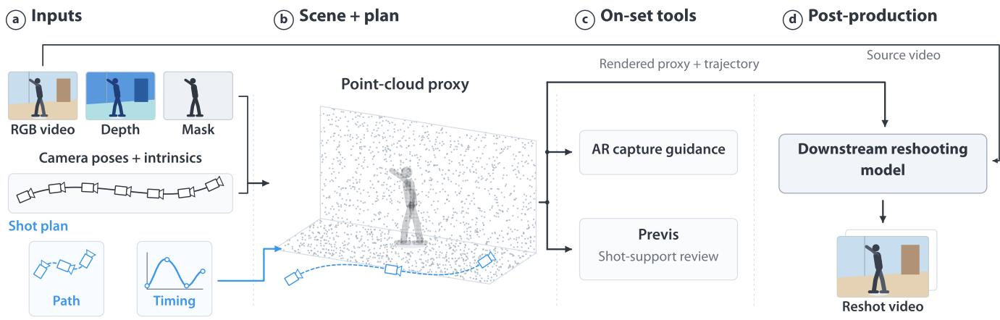  
Figure 10: Inputs, shared representations, and outputs of the workflow. (a) Video, depth, camera poses and intrinsics, and performer masks provide the recorded evidence; path and timing specify the editable shot plan. (b) The plan is placed in a point-cloud proxy of the scene and performer. (c) This shared scene and plan support AR capture guidance and shot-support review before generation. (d) After review, the source video, proxy, and selected camera trajectory provide the inputs for downstream conditioning and ofline reshooting. The proxy is rendered along the selected trajectory to prepare model-specific conditioning views and masks. All illustrations are schematic.

## A Inputs and Outputs of the Workflow

Figure 10 summarizes how the prototype connects recorded evidence, the editable shot plan, and downstream generation. On set, the mobile device records camera poses via visual-inertial odometry, scene depth with hardware LiDAR, and performer masks via EdgeTAM [37]. For ordinary video, depth, camera poses, and performer masks are estimated ofline with �3 [31] (or Depth Anything 3 [16]) and SAM 3 [5] (Section 5.4). Both routes support the same review of moves between the captured and target moves before the selected move is passed to ofline reshooting.

## B Path Representation

The path must pass through every keyframe the filmmaker placed, since each one is a framing they stood in and approved, and it must be smooth enough that following it produces no jerky guidance. We therefore interpolate rather than approximate, and choose splines that are continuous in velocity. Position uses a centripetal Catmull-Rom spline [35], which passes through every keyframe and, unlike the uniform variant, does not overshoot or loop when two keyframes are close together. The first and last segments need a tangent from a neighbor that does not exist, so we reflect the adjacent keyframe across each end to supply one. Orientation is interpolated separately, because rotations do not live in the same space as positions and averaging them directly produces wobble; we use squad [27], the spherical counterpart of Catmull-Rom, which turns the camera smoothly through each keyframe’s orientation with tangents adjusted for uneven keyframe spacing. A shot-type preset adds interior keyframes to this same fit about a pivot cho sen when it is declared (a tapped point, else the subject, else the viewfinder raycast), so a preset and a free stretch are the same kind of thing to the path. Progress along the path only increases with output time, so a retiming can hold or slow the camera but never send it backward.

## C Bridging Chunk Seams

We use Vista4D [17] as the downstream model because it was the most recent reshooting model with open weights at the time and conditions on exactly what the workflow exports, the source video and a point cloud rendered from the target camera. It generates 49 frames per call, so a 192-frame move is generated as four chunks, and because each chunk fills in the unobserved scene diferently, each join shows as a jump cut. We generate one more clip of native length centered on the join, held to the existing video at both ends and free in the middle, so the join falls inside a single generation. The ends are held by nudging the clip toward the existing video at every step, strongly at the edges and not at all near the join, in the manner of RePaint-style inpainting. The result replaces the frames around the join directly, with no blending, no training, and one extra generation per join.

## D Searching over Timing and Extent

Because timing is authored separately (Section 5.1), the system can search over it. The Retime proposal treats retiming as synchronizing the authored path with the recorded take. On a grid ofpath progress against take time, a schedule is a curve that only moves forward in both, a hold is a horizontal run, and each cell costs by how far the authored camera is from where the real camera was at that instant, how under-resolved the room is from there, and how much of the performer that view fails to see. Dynamic programming returns the cheapest schedule, with holds and hand-authored spans frozen so a search cannot undo a deliberate decision. The search may also stop short of the path’s end, and a combined search finds the least shortening that leaves the performer supported throughout. Either result is shown as a proposal with its consequences and applied only if the filmmaker accepts it (DG5), and nothing is ofered when any instant would remain unsupported or unknown. Figure 11 shows a combined proposal that holds in a supported view, then advances through the lower-cost part of the grid to a reduced endpoint.

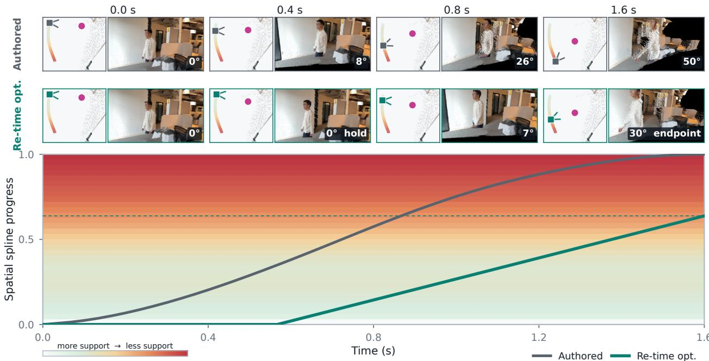  
Figure 11: Space–time search for a better-supported move. The grid plots path progress against output time, with the background running from better-supported (bottom) to less-supported (top) views. The authored schedule (gray) reaches the unsupported end of the path and $\mathrm { ~ a ~ } 5 0 ^ { \circ }$ view. The proposal (teal) begins with a hold, advances more slowly to linger in supported views, and stops at a 30◦ endpoint, lowering hallucination risk. Equal-time samples above show the views requested by each schedule.

Figure 12 compares generated reshoots with original and revised timing along the same full camera path.

## E Evaluation Materials and Individual Responses

This appendix documents the study responses summarized in Section 6. Part 1 comprised an introductory sequence and a second scene in an interactive browser viewer. In Part 2, participants used the mobile AR application that demonstrates Hybrid Cinematography and answered questions about their experience and its use in future productions. The two parts and questionnaire sections followed a fixed order.

## E.1 Part 1 Tasks and Scoring

The initial pin task paired the source take with a generated image at frame 42. Participants were told that the source camera had filmed the actor from the side and asked to click content the camera had never seen. The reveal showed the reference mask and a separately annotated face region. A coverage lesson then compared the reconstructed proxy with a generated result, followed by a slider demonstration. This was an instructed exercise, not an unaided test of detecting generated content.

The second scene used the orbit target at frame 86 in the recorded sessions. Participants first pinned missing content in the proxy with overlays hidden, then viewed coverage and performer warnings, chose a slider stop, completed two checks, and explored the viewer while answering closing questions. The resolution overlay was disabled. The checks assessed interpretation of the performer heat scale and comparison of generation needs between two camera stops.

Each participant started the acceptance task at � = 0.5, and the accepted stop is the submitted response.

Participants explained their chosen stop with a prompt suggesting actor-face versus background-room tradeofs. Closing items asked about comfort with generative video reshooting, preferred preview timing (on set, editing, both, or neither), reasons for those answers, and one desired change. P1 and P4 asked to edit the camera path directly, P2 wanted a limit on viewpoint departure, P3 asked for a preview of a paused frame, P5 for a preview of the generated options, P6 for an automatic pan that surveys the scene while shooting, and P7 for integration with editing software such as Adobe Premiere. These requests are individual suggestions, not shared themes.

The initial and post-exercise items assessed comfort with generative video reshooting on the same seven-point scale, from 1 (not at all comfortable) to 7 (completely comfortable).

## E.2 Part 2 Ratings

The Part 2 questionnaire asked participants to reflect on their use of the mobile AR application. Questions covered planning, guidance, review, and future workflow integration in that order. The questionnaire included interface illustrations and examples of moves

3.500 s

2.625 s

1.750 s

0.000 s  
0.875 s  
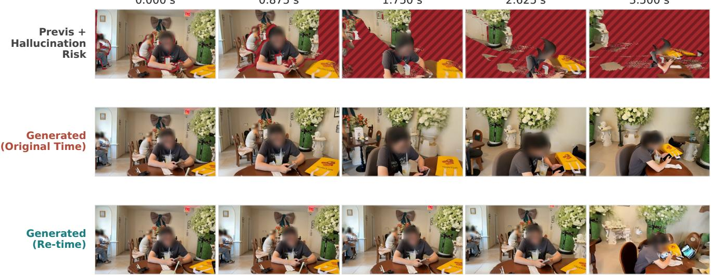

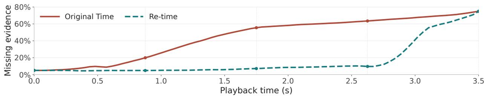  
Figure 12: Original and retimed reshoots at matched playback times. Previs reveals substantial missing coverage along the target path. Original timing prolongs views the generator must hallucinate; retiming preserves the full path and 3.5-second duration, lingering where evidence is stronger and whip-panning through poorly supported views to reduce hallucination. The plot shows the fraction of projected point-cloud pixels without evidence, not measured hallucination error. Faces are blurred for anonymity. Video is provided in the supplemental material.

dificult or expensive to execute physically, such as robotic camera movement and dolly crews. Table 2 summarizes all Part 2 ratings. Agreement items used 1 (strongly disagree), 4 (neutral), and 7 (strongly agree). The comfort item used 1 (not at all comfortable) and 7 (completely comfortable). Item numbers in the table match the questionnaire.

The storytelling question additionally suggested actors, key props, faces, and emotions versus background geometry, ceilings, and distant walls. The guidance and review questions also described expected benefits. Accordingly, the responses should be read in the context of these examples and framings.

Table 2: All Part 2 ratings after using the mobile AR application, with abbreviated labels for the questionnaire items. The final column gives the median and observed minimum–maximum.
<table><tr><td>Item</td><td>Statement topic</td><td>P1</td><td>P2</td><td>P3</td><td>P4</td><td>P5</td><td>P6</td><td>P7</td><td>Median (min-max)</td></tr><tr><td colspan="2">Planning and capture</td><td></td><td></td><td></td><td></td><td></td><td></td><td></td><td></td></tr><tr><td>1.1</td><td>Easy to plan by walking, saving viewpoints</td><td>7</td><td>7</td><td>7</td><td>6</td><td>7</td><td>6</td><td>5</td><td>7 (5-7)</td></tr><tr><td>1.2</td><td>Easy to tune timing apart from the path</td><td>5</td><td>5</td><td>5</td><td>7</td><td>7</td><td>7</td><td>6</td><td>6 (5-7)</td></tr><tr><td>2.1</td><td>Guidance freed attention for the live scene</td><td>6</td><td>6</td><td>4</td><td>6</td><td>7</td><td>6</td><td>5</td><td>6 (4-7)</td></tr><tr><td colspan="2">Review and decisions</td><td></td><td></td><td></td><td></td><td></td><td></td><td></td><td></td></tr><tr><td>3.1</td><td>Clearly saw where and why AI must invent</td><td>7</td><td>7</td><td>7</td><td>7</td><td>7</td><td>7</td><td>5</td><td>7 (5-7)</td></tr><tr><td>3.2</td><td>Slider helped explore acceptable trade-offs</td><td>7</td><td>6</td><td>7</td><td>5</td><td>7</td><td>6</td><td>6</td><td>6 (5-7)</td></tr><tr><td>3.3</td><td>Warnings helped choose pickup, retake, or AI</td><td>6</td><td>6</td><td>7</td><td>6</td><td>7</td><td>7</td><td>5</td><td>6 (5-7)</td></tr><tr><td colspan="2">Overall workflow</td><td></td><td></td><td></td><td></td><td></td><td></td><td></td><td></td></tr><tr><td>4.1</td><td>Comfort using reshooting in editing</td><td>6</td><td>6</td><td>6</td><td>6</td><td>5</td><td>6</td><td>7</td><td>6 (5-7)</td></tr><tr><td>4.3</td><td>Felt in control of creative decisions</td><td>6</td><td>5</td><td>6</td><td>5</td><td>5</td><td>6</td><td>5</td><td>5 (5-6)</td></tr><tr><td>4.4</td><td>On-set feedback worth the extra time</td><td>5</td><td>6</td><td>6</td><td>5</td><td>5</td><td>7</td><td>6</td><td>6 (5-7)</td></tr><tr><td>4.5</td><td>Confident wrapping, knowing footage support</td><td>3</td><td>5</td><td>7</td><td>6</td><td>6</td><td>6</td><td>6</td><td>6 (3-7)</td></tr></table>