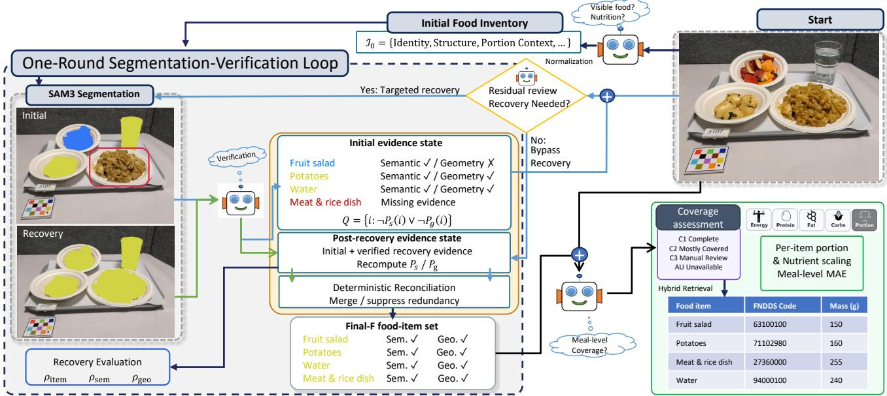
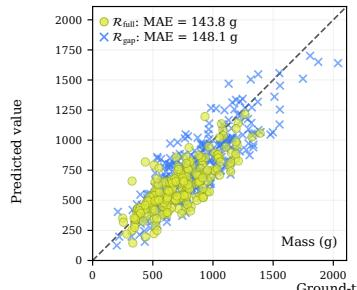
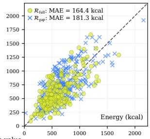

# IMPROVING IMAGE-BASED NUTRITION ESTIMATION THROUGH MULTIMODAL FOOD-ITEM VERIFICATION AND RECOVERY

Jingbo Yue, Bruce Coburn, Jinge Ma, Jui-Feng Chi, Fengqing Zhu

Elmore Family School of Electrical and Computer Engineering, Purdue University West Lafayette, IN, USA {yue53, coburn6, ma859, chi96, zhu0}@purdue.edu

## ABSTRACT

Single-image nutrition estimation can fail silently when visible foods are missed. Even when a food is correctly identified, its proposed region may not support portion estimation. We propose a framework that uses multimodal large language models (MLLMs) to inventory visible foods and separately verify food identity and whether each proposed 2D region supports portion estimation. One whole-image review uses these verification results to identify unresolved gaps and omitted foods, triggering at most one targeted recovery pass. Recovered regions are re-verified without access to the recovery prompt, then reconciled into a final item set for nutrition estimation. The framework requires no task-specific fine-tuning. Matched evaluation on common valid-output samples shows that item-level grounding improves mass accuracy across all tested settings and energy accuracy relative to an adapted retrieval baseline, with item-identity precision and recall also improving, while post-recovery visual coverage is assessed separately at inference time without ground-truth annotations.

Index Terms— image-based nutrition estimation, multimodal large language models, food segmentation, visual grounding, portion estimation

## 1. INTRODUCTION

Meal images rarely present foods as isolated, well-separated objects. Touching foods, small side items, liquids with weak visual cues for portion estimation, and mixed dishes with components that are not independently portionable make single-view dietary assessment particularly challenging. Multimodal large language models (MLLMs) offer a natural interface for jointly interpreting food appearance and contextual cues. However, a single holistic pass can miss fine or contextually difficult visual evidence; guided visual search has shown benefits in visually crowded scenes [1]. In dietary assessment, missed visible foods can remain unaccounted for in downstream portion and nutrition estimation.

Recent systems improve nutrition estimation by structuring intermediate reasoning or grounding meal descriptions to nutritional databases [2, 3]. However, for single-view 2D dietary images, downstream nutrition estimation requires two different types of evidence for each visible food: reliable semantic identity for database grounding and usable image-space evidence for portion reasoning. These requirements are not equivalent: a region may support food identity while being too partial for portion estimation, whereas a welllocalized region may still have ambiguous food identity. Our framework explicitly audits both before downstream nutrition estimation.

Our central design principle is that each segmentation proposal used to localize an inventory item isfallible evidence, not item truth. Each proposal is independently verified along these two evidence axes, and two explicit support checks identify initial food inventory items lacking either type of evidence. One whole-image review, conditioned on the verified evidence state, then addresses these gaps while also identifying visible foods omitted from the initial food inventory. Unsupported initial food hypotheses can be suppressed or left unresolved, while visually supported gaps receive at most one targeted recovery attempt. Recovery comprises one round of targeted re-segmentation and independent re-verification without recovery phrases or target provenance. The resulting evidence is reconciled deterministically into the final item set used for downstream food-code and portion estimation.

Our contributions are twofold. First, we introduce a singleround item-grounded verification and recovery framework that audits semantic and geometric evidence before downstream estimation, without task-specific fine-tuning. Second, we establish a multi-level protocol spanning pre-reconciliation evidence, post-reconciliation identity quality, and matched downstream nutrition accuracy to test whether grounding improves nutrition estimates, with post-recovery visual coverage assessed separately without ground-truth labels.

## 2. RELATED WORK

Dietary MLLMs and nutrition grounding. Recent dietary MLLM systems increasingly structure intermediate reasoning rather than directly estimating nutrition from an image. A nutritionist-inspired two-step approach separates food analysis from numerical estimation [2], while DietAI24 grounds meal descriptions to the Food and Nutrient Database for Dietary Studies (FNDDS) through retrieval before portion and nutrient inference [3]. DietDelta further performs food-item-level reasoning from paired before-and-after images to estimate consumed amounts [4]. Unlike these systems, we explicitly verify and, when necessary, recover the visual food-item representation before downstream grounding and portion inference.

Active visual search and verification. Guided visual search can recover evidence missed by holistic perception [1], while Deep-Eyes, VLM-R3, and Woodpecker further explore active or post-hoc visual verification [5, 6, 7]. Dietary estimation differs because recovered evidence must support both food identity for database grounding and geometry for portion reasoning. We therefore use one wholeimage re-inspection driven by explicit evidence gaps and hide recovery provenance before re-verification.

Food segmentation and portion evidence. FoodSeg103 provides large-scale food segmentation supervision [8], while earlier dietary systems used recognition feedback to refine segmentation hypotheses [9, 10, 11]. We instead use open-vocabulary MLLM/SAM evidence to recover missing foods and reconcile food identity with geometry for portion estimation. Accurate food isolation is central to volume-oriented pipelines such as VolTex [12], while monocular approaches use 3D scaling or point-cloud reconstruction [13, 14]. Accordingly, segmentation serves as evidence for item-level verification and recovery within the downstream nutrition pipeline.

  
Fig. 1. One-round item-grounded recovery. Verified initial and recovery evidence are re-audited and reconciled into $F .$ Coverage assessment and nutrition estimation follow. The example shows fruit-salad geometry repair and meat-and-rice evidence recovery.

## 3. METHODOLOGY

## 3.1. Item proposals and evidence audit

Fig. 1 shows our framework. Given a meal image I, an MLLM produces a structured initial food inventory. Each nutrition item must be semantically meaningful, independently localizable, and independently portionable; inseparable mixed foods remain atomic. Deterministic normalization preserves uncertainty and portion cues, assigns stable IDs, and flags parent/component overlap risks.

Proposal generation and verification: For each normalized item $t _ { i } .$ , SAM 3 [15] receives a deterministic short phrase at confidence threshold 0.50; thereafter, scores serve only as provenance. Each proposal is shown to an MLLM verifier as a gray-background masked target with a 15%-padded context crop. The verifier independently assesses food identity, inventory assignment, segmentation quality, target scope, and portion geometry; the SAM prompt does not determine assignment. Geometry denotes 2D image-space region evidence, not explicit depth or volume reconstruction.

Item-level evidence audit: Proposal-level verification results are summarized into two item-level indicators:

$$
P _ { s } ( i ) = \mathbf { 1 } [ \mathrm { v e r i f i e d ~ s e m a n t i c ~ s u p p o r t ~ e x i s t s } ] ,\tag{1}
$$

$$
P _ { g } ( i ) = \mathbf { 1 } [ \mathrm { g r o u p e d \ g e o m e t r y ~ i s ~ p r o v i s i o n a l l y ~ r e a d y } ] ,\tag{2}
$$

where $\mathbf { 1 } [ \cdot ]$ is the indicator function. $P _ { s } ( i ) = 1$ if at least one successfully verified proposal is assigned to item i; this indicates semantic support, not final semantic readiness.

To determine $P _ { g } ( i )$ , we retain successfully verified, in-scope proposals with correct or partial segmentation and a resolved geometry type. At least one must have correct segmentation and portionusable geometry. Any other proposal with mask A must overlap at least one such supporting mask B with $\mathrm { I o U } 2 0 . 8 0$ or IoM= $| A \cap B | / \operatorname* { m i n } ( | A | , | { \\bar { B } } | ) \geq 0 . 9 0 .$ . For each $A ,$ let $U _ { A }$ be the union of supporting masks B satisfying either overlap threshold; we additionally require $| A \cap U _ { A } | / | A | \geq 0 . 9 0$ . The known-item gap set is

$$
\boxed { Q = \{ i : \neg P _ { s } ( i ) \lor \neg P _ { g } ( i ) \} . }\tag{3}
$$

Since $Q$ is restricted to initial inventory items, entirely omitted foods require nomination by the whole-image residual review.

## 3.2. Residual review, recovery and reconciliation

Every meal receives one whole-image residual review conditioned on the verified evidence state. It receives the unmodified image, initial food inventory, $Q ,$ and accepted-proposal summaries, but no nutrition-database information, ground truth, or proposal-source identity. For each known gap it may recover, suppress unsupported, or abstain unresolved, and it may nominate omitted visible foods.

Residual review retains the original image: subtracting fallible proposal masks could irreversibly remove neighboring or overlapping visual evidence. Recovery lowers the SAM threshold from 0.50 to 0.10; verification and reconciliation criteria remain unchanged. Within one recovery round, each target is segmented once and reverified without recovery provenance.

After source-blind re-verification, verified initial and recovery proposals are combined and re-audited. Deterministic reconciliation merges evidence sharing the same identity, suppresses parent/component redundancy, and leaves ambiguous geometry unresolved. Mask count does not determine serving count.

The resulting representation is

$$
\boxed { F = \{ f _ { i } \} _ { i = 1 } ^ { K } , \qquad f _ { i } = \{ i d _ { i } , s _ { i } , G _ { i } , r _ { i } ^ { \mathrm { s e m } } , r _ { i } ^ { \mathrm { g e o } } , \Pi _ { i } \} , }\tag{4}
$$

where $i d _ { i } , s _ { i } , G _ { i }$ , and Πi denote ID, semantics, union geometry, and provenance; $r _ { i } ^ { \mathrm { s e m } } , r _ { i } ^ { \mathrm { g e o } }$ indicate semantic and geometric readiness.

After $F$ is frozen, a ground-truth-free whole-image MLLM assigns meal-level Coverage: C1 (visually complete), C2 (mostly covered), or C3 (needs manual review); AU denotes unavailable assessment. C1 does not imply full semantic and geometric readiness for every item. Coverage is read-only, uses no numerical threshold, and cannot modify $\dot { F }$ or trigger further recovery. C1+C2 forms the broader downstream visual cohort, while C1 denotes the visually complete subset used for the primary matched nutrition comparison.

## 3.3. Food-code grounding and nutrition

A deterministic adapter maps each eligible Final-F item to a peritem query while preserving idi and provenance $\Pi _ { i }$ . Each item is independently grounded to FNDDS using the hybrid retrieval and constrained food-code selection in Sec. 4.1. The selected code is immutable; legal portions are obtained by exact-code lookup with no semantic retrieval or cross-code fallback and presented with itemlocal geometry and preserved portion cues.

The portion model selects a legal portion and a positive multiplier or abstains. Abstention is terminal: no default weight is imputed, and missing grams for a required Final-F item mark the meal incomplete. Let ${ \mathit { F } } _ { \mathrm { e f f } } \subseteq { \mathit { F } }$ contain items with a valid code, legal portion, and positive multiplier. For $i \in F _ { \mathrm { e f f } } , \hat { g } _ { i } = w ( p _ { i } ) m _ { i }$ $\hat { y } _ { i , q } ~ = ~ \hat { g } _ { i } v _ { c _ { i } , q } / 1 0 0$ , and $\begin{array} { r } { \hat { Y } _ { \mathrm { m e a l } , q } ~ = ~ \sum _ { i \in F _ { \mathrm { e f f } } } \hat { y } _ { i , q } , } \end{array}$ where $c _ { i } , \ p _ { i } ,$ $w ( p _ { i } )$ , and mi denote the code, portion, portion weight, and multiplier; $v _ { c _ { i } , q }$ is nutrient q per 100 g. Meal mass is $\textstyle \sum _ { i \in F _ { \mathrm { e f f } } } { \hat { g } } _ { i }$

## 4. EXPERIMENTAL SETUP

## 4.1. Datasets, models, and implementation

The main experiments use 1,658 Nutrition5k (N5k) images obtained with the public DietAI24 preprocessing code [16, 3], retaining the full preprocessed pool rather than the 1,000-image evaluation subset reported in DietAI24, and 790 ACETADA (ACE) images [17], totaling 2,448 meals. Nutrition5k supplies fine-grained ingredient/component metadata, not a one-to-one visible-food item ontology [16]; a recent manual validation also documented omissions in its original labels [18]. Because our inventory unit is an independently localizable and portionable visible food item, we denote its recovery results $\mathrm { N } 5 \mathrm { k } ^ { \ast }$ and use the fixed 12,491 component references only as a normalization denominator, not as item-level ground truth. ACE uses 4,589 structured food-item references directly. Thus the $\rho$ metrics are reference-normalized evidence-state rates instead of identity recall. The “plate only” sentinel is excluded from item and numerical evaluation, consistent with prior Nutrition5k curation [19].

We evaluate two representative open-weight MLLMs from distinct families, Gemma 4 26B A4B (G26B) [20] and Qwen3.5-35B-A3B (Q35B) [21], under the same FNDDS 2021–2023 grounding pipeline [22]. Dataset-agnostic prompts, verification contracts, and SAM thresholds are frozen before formal evaluation and shared across datasets and models, without tuning on evaluation annotations. Visual grounding receives no reference labels or item counts, FNDDS codes, or nutrient values.

For food-code grounding, BGE-based dense retrieval (BAAI/bgesmall-en-v1.5 [23]) and BM25 rankings are combined using weighted reciprocal-rank fusion [24]: $\begin{array} { r } { \mathrm { R R F } ( c ) = \sum _ { r \in { \mathcal R } } w _ { r } / ( k + \mathrm { r a n k } _ { r } ( c ) ) } \end{array}$ with $k = 6 0$ and equal dense/sparse family weights. Retrieval depth is 50 per branch.

## 4.2. Item-recovery evaluation

Recovery is evaluated on two evidence states, independently for each model–dataset pair. Initial is the state after initial proposal verification and before residual review. Post-recovery combines the initial verified evidence with source-blind verified recovery evidence, before deterministic reconciliation. Existing initial inventory identities remain represented regardless of their support state; a novel residual target is added only when recovery yields a successfully verified novel-item assignment. The same semantic and grouped-geometry audits from Sec. 3.1 are then recomputed on the combined evidence.

Let $N _ { \mathrm { r e f } }$ denote the fixed dataset normalization count, $N _ { \mathrm { r e p } }$ the number of represented item identities, $N _ { s }$ the number with $P _ { s } = 1$ and $N _ { g }$ the number with $P _ { g } = 1$ . We report

$$
\rho _ { \mathrm { i t e m } } = { \frac { N _ { \mathrm { r e p } } } { N _ { \mathrm { r e f } } } } , \qquad \rho _ { \mathrm { s e m } } = { \frac { N _ { s } } { N _ { \mathrm { r e f } } } } , \qquad \rho _ { \mathrm { g e o } } = { \frac { N _ { g } } { N _ { \mathrm { r e f } } } } .\tag{5}
$$

For N5k∗, $N _ { \mathrm { r e f } } ~ = ~ 1 2 { , } 4 9 1 ;$ ; for ACE, $N _ { \mathrm { r e f } } ~ = ~ 4 { , } 5 8 9$ . These are reference-normalized representation and verifier-assessed support rates, not ground-truth identity or segmentation scores.

Manual food-identity audit: Separately from pre-reconciliation recovery evaluation, we manually audit a fixed sample of 150 randomly selected, reference-screened ACETADA C1 meals per model, from G26B/Q35B C1 cohorts of 472/680 meals. Because N5k∗ component references do not map one-to-one to visible-food items (Sec. 4.1), identity precision and recall are reported only on ACE. The initial inventory and Final- $. F$ are evaluated on the same meals against the same reference foods under strict one-to-one semantic matching. We report micro-averaged precision and recall,

$$
\begin{array} { r } { P _ { \mathrm { m i c r o } } = \frac { \sum _ { n } T P _ { n } } { \sum _ { n } \left( T P _ { n } + F P _ { n } \right) } \mathrm { a n d } R _ { \mathrm { m i c r o } } = \frac { \sum _ { n } T P _ { n } } { \sum _ { n } \left( T P _ { n } + F N _ { n } \right) } . } \end{array}
$$

## 4.3. Nutrition baselines and matched evaluation

For controlled end-to-end comparison, we use Direct, a wholeimage nutrition estimate from the same MLLM without item-level grounding, and an adapted DietAI24 reimplementation [3]. Following its meal-level retrieval design, adapted DietAI24 expands one holistic meal description into multiple queries and infers food codes from a shared FNDDS candidate pool; our method instead retrieves independently for each grounded Final-F item. All three methods use the same evaluated MLLM; adapted DietAI24 and ours also share embeddings and the FNDDS release. Together, the two baselines provide controlled whole-image and retrieval-grounded comparisons; methods with different input, training, or 3D-resource assumptions are discussed qualitatively.

Because valid-output subsets differ across methods, the primary nutrition comparison for model m and dataset d uses the common C1 intersection

$$
S _ { \cap } ^ { ( m , d ) } = S _ { \mathrm { D i r e c t } } ^ { ( m , d ) } \cap S _ { \mathrm { A d a p t e d } } ^ { ( m , d ) } \cap S _ { \mathrm { O u r s , C 1 } } ^ { ( m , d ) } ,\tag{6}
$$

where $S _ { \mathrm { O u r s , C 1 } } ^ { ( m , d ) }$ contains complete-output C1 meals and the baseline sets contain valid outputs. Direct returns valid outputs for all meals, so adapted DietAI24 determines the intersection with our completeoutput C1 set. C1+C2 provides broader-cohort context. We report meal-level mass and energy mean absolute error (MAE),

$$
\begin{array} { r } { \mathrm { M A E } _ { q } = N ^ { - 1 } \sum _ { j = 1 } ^ { N } | \hat { Y } _ { j , q } - Y _ { j , q } | , \mathrm { f o r } q \in \{ \mathrm { m a s s } , \mathrm { e n e r g y } \} . } \end{array}
$$

Fig. 2 uses Q35B/ACE C1 predictions without restriction to the baseline intersection. ${ \mathcal { R } } _ { \mathrm { f u l l } }$ contains meals with $r _ { i } ^ { \mathrm { s e m } } = r _ { i } ^ { \mathrm { g e o } } = 1$ for every $i \in F _ { \mathrm { e f f } } ; \mathcal { R } _ { \mathrm { g a p } }$ contains the remainder.

Table 1. Pre-reconciliation recovery on N5k∗/ACE: reference-normalized rates (%); parentheses show changes from Initial (pp).
<table><tr><td>Model</td><td>Evidence state</td><td> $\rho _ { \mathrm { i t e m } }$  N5k*/ACE</td><td> $\rho _ { \mathrm { s e m } }$  N5k*/ACE</td><td> $\rho _ { \mathrm { g e o } } \mathrm { N } 5 \mathrm { k ^ { * } / A C E }$ </td></tr><tr><td rowspan="2">G26B</td><td>Initial</td><td>35.38/93.01</td><td>27.08/77.86</td><td> $2 6 . 5 0 / 7 6 . 1 4$ </td></tr><tr><td>Post-recovery (ours)</td><td>35.44/93.07 (+0.06/+0.07 pp)</td><td>31.41/86.01 (+4.33/+8.15 pp)</td><td>30.85/84.24 (+4.36/+8.11 pp)</td></tr><tr><td>Q35B</td><td>Initial Post-recovery (ours)</td><td>35.80/90.98 35.94/91.00 (+0.14/+0.02 pp)</td><td>27.70/80.67 32.77/87.60 (+5.07/+6.93 pp)</td><td>27.52/80.58 32.45/87.49 (+4.93/+6.91 pp)</td></tr></table>

Table 2. Manual food-identity audit on 150 ACETADA C1 meals per model. Values are micro precision/recall (%); superscripts show changes from Initial (pp).
<table><tr><td rowspan="2">Representation</td><td colspan="2">G26B</td><td colspan="2">Q35B</td></tr><tr><td> $P _ { \mathrm { m i c r o } }$ </td><td> $R _ { \mathrm { m i c r o } }$ </td><td> $P _ { \mathrm { m i c r o } }$ </td><td> $R _ { \mathrm { m i c r o } }$ </td></tr><tr><td>Initial inventory</td><td>98.35</td><td>93.02</td><td>90.54</td><td>87.19</td></tr><tr><td>Final-F (Ours)</td><td> $\mathbf { 9 8 . 6 2 } \uparrow 0 . 2 7 $ </td><td> $\mathbf { 9 4 . 3 4 } ^ { \uparrow 1 . 3 2 }$ </td><td> $9 3 . 7 3 \mathrm { \uparrow 3 . 1 9 }$ </td><td> $\mathbf { 8 7 . 8 7 } \mathrm { \uparrow 0 . 6 8 }$ </td></tr></table>

## 5. RESULTS AND DISCUSSION

## 5.1. Item-level recovery

Table 1 compares the initial and post-recovery pre-reconciliation evidence states for G26B and Q35B. Across N5k∗ and ACE, recovery increases $\rho _ { \mathrm { i t e m } }$ by 0.02–0.14 percentage points (pp), $\rho _ { \mathrm { s e m } }$ by 4.33– 8.15 pp, and $\rho _ { \mathrm { g e o } }$ by 4.36–8.11 pp. These gains mainly reflect repaired semantic and geometric support for represented items, with limited additions of verified omitted foods.

Because N5k∗ uses component-level references, its absolute rates are not directly comparable with ACE; within-dataset changes are the relevant recovery signal.

## 5.2. Final-F identity quality

Table 2 reports a manual audit of 150 ACETADA C1 meals per model using strict one-to-one semantic matching. Final-F raises micro P/R from 98.35/93.02% to 98.62/94.34% for G26B and from 90.54/87.19% to 93.73/87.87% for Q35B, improving both precision and recall. G26B begins near the precision ceiling (98.35%). This audit evaluates the complete inventory-to-F transformation, whereas Table 1 measures pre-reconciliation evidence support instead of identity correctness.

## 5.3. Matched-sample nutrition accuracy

Table 3 compares Direct, adapted DietAI24, and our method on matched C1 cohorts. Ours achieves the lowest mass MAE in all four model–dataset settings and lower energy MAE than adapted DietAI24 in all four, while the energy comparison with Direct is dataset-dependent. These are end-to-end results, not isolated recovery effects. C1 denotes visual completeness but does not guarantee nutrition accuracy.

Across both datasets, the post-recovery C1 pools contain 1,351/2,448 meals (55.2%) for G26B and 1,875/2,448 (76.6%) for Q35B; the corresponding C1+C2 pools contain 2,262 (92.4%) and 2,220 (90.7%), respectively. The matched C1 intersections contain n∩ = 719 (G26B) / 904 (Q35B) on N5k and 383 (G26B) / 494 (Q35B) on ACE. ACE C1+C2 meals route roughly twice as many effective Final-F items as N5k (5.1 vs. 2.5 per meal), consistent with the larger adapted DietAI24 gap on ACE, where a shared meal-level retrieval context must disambiguate more foods.

Table 3. Meal-level MAE (mass g / energy kcal; lower is better). Direct, Adapted DietAI24, and Ours (C1) use the same matched C1 samples; Ours (C1+C2) reports our broader-cohort result.
<table><tr><td>Model</td><td>Direct</td><td>Adapted DietAI24</td><td>Ours (C1)</td><td>Ours (C1+C2)</td></tr><tr><td colspan="5">Nutrition5k (N5k)</td></tr><tr><td>G26B</td><td>81.1/119.3</td><td>123.7/164.9</td><td>74.3/107.4</td><td>80.8/111.2</td></tr><tr><td>Q35B</td><td>114.3/138.8</td><td>150.8/189.1</td><td>74.2/96.9</td><td>77.1/97.1</td></tr><tr><td colspan="5">ACETADA (ACE)</td></tr><tr><td>G26B</td><td>217.8/168.1</td><td>368.7/250.6</td><td>140.5/177.1</td><td>159.4/180.4</td></tr><tr><td>Q35B</td><td>192.5/166.2</td><td>438.4/262.9</td><td>144.8/172.5</td><td>148.1/173.8</td></tr></table>

  
Fig. 2. Q35B/ACETADA C1 mass and energy predictions without baseline-intersection filtering, grouped by $\mathcal { R } _ { \mathrm { f u l l } }$ and $\mathcal { R } _ { \mathrm { g a p } }$

Within Q35B/ACE C1 meals, Fig. 2 shows lower MAE for the fully semantic- and geometry-ready group $\mathcal { R } _ { \mathrm { f u l l } }$ than for ${ \mathcal { R } } _ { \mathrm { g a p } }$ in both mass (143.8 vs. 148.1 g) and energy (164.4 vs. 181.3 kcal).

## 5.4. Limitations and future work

Visual completeness does not eliminate ambiguity in low-contrast adjacent foods or mixed dishes. Verification adds inference overhead. Motivated by the item-density and readiness patterns, future work will quantify this cost and explore adaptive recovery for unresolved items while preserving bounded inference for typical meals.

## 6. CONCLUSION

We presented a food-item verification and recovery framework for image-based nutrition estimation without task-specific fine-tuning. Recovery primarily strengthens semantic and geometric support while changing represented-item rates by at most 0.14 percentage points. On matched C1 cohorts, our method achieves the lowest mass MAE across all four model–dataset settings and lower energy MAE than adapted DietAI24 in all four, while energy gains over Direct are dataset-dependent. These results reinforce the distinction between visual evidence quality and downstream nutrition accuracy.

## 7. COMPLIANCE WITH ETHICAL STANDARDS

This study uses existing Nutrition5k and ACETADA data [16, 17] for computational evaluation. No new human or animal experiments were conducted.

## 8. REFERENCES

[1] Penghao Wu and Saining Xie, “V\*: Guided visual search as a core mechanism in multimodal LLMs,” in Proc. IEEE/CVF CVPR, 2024, pp. 13084–13094.

[2] Pitikorn Khlaisamniang, Kun Kerdthaisong, Supasate Vorathammathorn, Nutchanon Yongsatianchot, Hirunkul Phimsiri, Amrest Chinkamol, Teermade Thitseesaeng, Kanyakorn Veerakanjana, Kaisorn Kachai, Piyalitt Ittichaiwong, and Tossaporn Saengja, “Decomposing food images for better nutrition analysis: A nutritionist-inspired two-step multimodal LLM approach,” in Proc. IEEE/CVF CVPR Workshops, 2025, pp. 482– 491.

[3] Runze Yan, Hanqi Luo, Jiaying Lu, Darren Liu, Hannah Posluszny, Mehak Preet Dhaliwal, Janice MacLeod, Yao Qin, Carl Yang, Terry J. Hartman, and Xiao Hu, “DietAI24 as a framework for comprehensive nutrition estimation using multimodal large language models,” Communications Medicine, vol. 5, pp. 458, 2025.

[4] Gautham Vinod, Siddeshwar Raghavan, Bruce Coburn, and Fengqing Zhu, “DietDelta: A vision-language approach for dietary assessment via before-and-after images,” in Proc. IEEE/CVF CVPR Workshops, 2026, pp. 9591–9600.

[5] Ziwei Zheng, Minghao Yang, Jack Hong, Chenxiao Zhao, Guohai Xu, Le Yang, Chao Shen, and Xing Yu, “DeepEyes: Incentivizing “thinking with images” via reinforcement learning,” in Proc. ICLR, 2026.

[6] Chaoya Jiang, Yongrui Heng, Wei Ye, Haiyang Xu, Ming Yan, Ji Zhang, Fei Huang, and Shikun Zhang, “VLM-R3: Region recognition, reasoning, and refinement for enhanced multimodal chain-of-thought,” in Adv. Neural Inf. Process. Syst., 2025, vol. 38.

[7] Shukang Yin, Chaoyou Fu, Sirui Zhao, Tong Xu, Hao Wang, Dianbo Sui, Yunhang Shen, Ke Li, Xing Sun, and Enhong Chen, “Woodpecker: Hallucination correction for multimodal large language models,” Science China Information Sciences, vol. 67, pp. 220105, 2024.

[8] Xiongwei Wu, Xin Fu, Ying Liu, Ee-Peng Lim, Steven C. H. Hoi, and Qianru Sun, “A large-scale benchmark for food image segmentation,” in Proc. ACM Multimedia, 2021.

[9] Fengqing Zhu, Marc Bosch, Tusa Rebecca Schap, Nitin Khanna, David S. Ebert, Carol J. Boushey, and Edward J. Delp, “Segmentation assisted food classification for dietary assessment,” in Proc. SPIE, Computational Imaging IX, 2011, vol. 7873, p. 78730B.

[10] Fengqing Zhu, Marc Bosch, Nitin Khanna, Carol J. Boushey, and Edward J. Delp, “Multiple hypotheses image segmentation and classification with application to dietary assessment,” IEEE Journal of Biomedical and Health Informatics, vol. 19, no. 1, pp. 377–388, 2015.

[11] Yu Wang, Ye He, Carol J. Boushey, Fengqing Zhu, and Edward J. Delp, “Context based image analysis with application in dietary assessment and evaluation,” Multimedia Tools and Applications, vol. 77, no. 15, pp. 19769–19794, 2018.

[12] Ahmad AlMughrabi, Umair Haroon, Ricardo Marques, and Petia Radeva, “VolTex: Food volume estimation using textguided segmentation and neural surface reconstruction,” in Proc. IEEE/CVF CVPR Workshops, 2025, pp. 450–457.

[13] Gautham Vinod, Jiangpeng He, Zeman Shao, and Fengqing Zhu, “Food portion estimation via 3D object scaling,” in Proc. IEEE/CVF CVPR Workshops, 2024, pp. 3741–3749.

[14] Jinge Ma, Xiaoyan Zhang, Gautham Vinod, Siddeshwar Raghavan, Jiangpeng He, and Fengqing Zhu, “MFP3D: Monocular food portion estimation leveraging 3D point clouds,” in Pattern Recognition. ICPR 2024 International Workshops and Challenges. 2025, pp. 49–62, Springer.

[15] Nicolas Carion, Laura Gustafson, Yuan-Ting Hu, Shoubhik Debnath, Ronghang Hu, Didac Suris Coll-Vinent, et al., “SAM 3: Segment anything with concepts,” in Proc. ICLR, 2026.

[16] Quin Thames, Arjun Karpur, Wade Norris, Fangting Xia, Liviu Panait, Tobias Weyand, and Jack Sim, “Nutrition5k: Towards automatic nutritional understanding of generic food,” in Proc. IEEE/CVF CVPR, 2021, pp. 8899–8907.

[17] Bruce Coburn, Jiangpeng He, Megan E. Rollo, Satvinder S. Dhaliwal, Deborah A. Kerr, and Fengqing Zhu, “Evaluating large multimodal models for nutrition analysis: A new benchmark enriched with contextual metadata,” in Proc. IEEE-EMBS BHI, 2025.

[18] Sam Sterling, Lauren T. Berube, Andrea J. Glenn, Aasma Shaukat, Souptik Barua, Morgan E. Grams, and Aristotelis Tsirigos, “Vision-language models for image-based dietary assessment: A benchmark of accuracy, cost, and prompt strategies across ten models,” bioRxiv, 2026, Preprint 2026.07.26.740845.

[19] Rachele Bianco, Michela Marinoni, Sergio Coluccia, Giulia Carioni, Federica Fiori, Patrizia Gnagnarella, Valeria Edefonti, and Maria Parpinel, “Tailoring the nutritional composition of Italian foods to the US Nutrition5k dataset for food image recognition: Challenges and a comparative analysis,” Nutrients, vol. 16, no. 19, pp. 3339, 2024.

[20] Gemma Team, Google DeepMind, “Gemma 4 model card,” 2026, Google AI for Developers.

[21] Qwen Team, “Qwen3.5 model release,” 2026, Qwen3.5-35B-A3B.

[22] U.S. Department of Agriculture, Agricultural Research Service, “Food and nutrient database for dietary studies (FNDDS) 2021–2023,” 2024, Food Surveys Research Group.

[23] Shitao Xiao, Zheng Liu, Peitian Zhang, Niklas Muennighoff, Defu Lian, and Jian-Yun Nie, “C-Pack: Packed resources for general Chinese embeddings,” in Proc. ACM SIGIR, 2024, pp. 641–649.

[24] Gordon V. Cormack, Charles L. A. Clarke, and Stefan Buettcher, “Reciprocal rank fusion outperforms Condorcet and individual rank learning methods,” in Proc. ACM SIGIR, 2009, pp. 758–759.