# INTRINSYNC: JOINT INTRINSIC DECOMPOSITION AND RECIPROCAL RENDERING

Zheng Gu1 Rui Huang1 Xilu Zhang1 Jingbo Zhang2 Min Lu1 Zhida Sun1 Dani Lischinski3 Daniel Cohen-Or4 Hui Huang1∗

1Shenzhen University 2Robotics X Lab, Tencent 3Hebrew University of Jerusalem 4Tel Aviv University

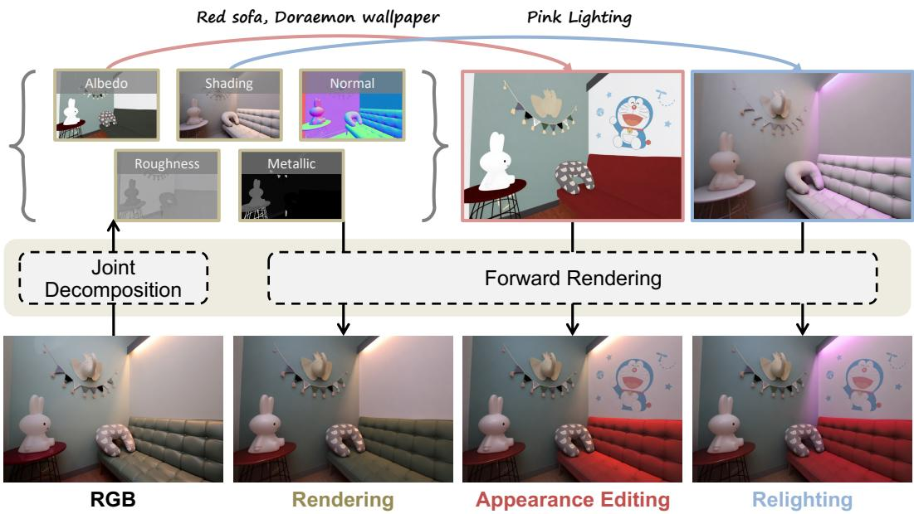  
Figure 1: IntrinSync jointly decomposes an input image into mutually dependent intrinsic components, enabling cross-channel information exchange and more coherent scene representations, while reciprocal forward rendering supports diverse applications such as material editing and relighting.

## ABSTRACT

Inverse rendering decomposes an image into intrinsic properties such as appearance, illumination, geometry, and material, yet these properties are inherently interdependent. A reliable decomposition should produce intrinsic maps that are not only individually plausible, but also mutually compatible in explaining the image. However, existing methods either model intrinsic channels in isolation or treat inverse and forward rendering as separate processes, leaving the interdependence underexploited. In this paper, we introduce IntrinSync, a unified framework that captures this interdependence through joint-channel modeling and reciprocal inverse–forward rendering. At the channel level, we jointly decompose an input RGB into albedo, shading, surface normal, roughness, and metallic maps through a 1-to-N mapping, enabling information exchange across channels throughout generation. At the process level, we establish inverse–forward reciprocity through a dual cycle-consistent objective that aligns corresponding predictions across a closed loop. Experiments on three datasets demonstrate that our method achieves competitive intrinsic estimation and forward rendering performance, improving coherence and physical consistency. Beyond decomposition, IntrinSync provides a physically grounded interface for image editing, allowing intrinsic properties to be explicitly manipulated and rendered back into RGB images.

## 1 INTRODUCTION

An RGB image of a scene entangles surface color, illumination, geometry, and material properties. Recovering these factors from a single image, commonly known as intrinsic image decomposition or inverse rendering, is a long-standing problem in computer vision and graphics (Barrow et al., 1978). A fundamental challenge of this problem is that these intrinsic properties are interdependent– different combinations of these intrinsic properties can explain the same observed appearance.

Such interdependence could be captured through two levels of interaction: among the intrinsic channels themselves, and between decomposition and its reverse process–forward rendering. Recent diffusion-based approaches have made substantial progress in modeling these intrinsic channels (Zeng et al., 2024; Liang et al., 2025). However, these two levels of interaction are explored separately. Methods that jointly model intrinsic channels (Luo et al., 2024; Dirik et al., 2026a) leave decomposition and rendering uncoupled, while those that close the loop between the two processes (Sun et al., 2025; Zheng et al., 2025) still estimate each intrinsic channel independently. Consequently, the predicted channels may individually appear plausible or even reconstruct the input well, yet still remain mutually inconsistent (Figure 2). Therefore, we argue that intrinsic maps should be learned with both cross-channel interaction promoting mutual consistency, and reciprocal rendering providing feedback on how the intrinsic maps jointly explain the observed image.

In this paper, we turn this argument into a unified framework, named IntrinSync, which combines cross-channel interaction with cross-process reciprocity for intrinsic decomposition and forward rendering. We encode an RGB image and its intrinsic maps as a joint sequence of tokens within a Multimodal Diffusion Transformer (MMDiT) (Yin et al., 2025). For inverse rendering, the model jointly denoises all intrinsic tokens conditioned on the RGB image, producing albedo, shading, surface normal, roughness, and metallic maps through a 1-to-N mapping. Attention across these tokens allows each channel to use information from the others during generation. For forward rendering, the same architecture conditions on the intrinsic maps to synthesize the corresponding RGB image through an N-to-1 mapping.

To further couple the joint intrinsic representation with the forward process, we introduce a dual cycle-consistent objective. We construct two reciprocal paths: one decomposes an RGB image and renders it back, while the other renders intrinsic maps and decomposes the resulting image. In addition to direct supervision, the cycle objective aligns corresponding predictions across these paths, allowing the forward and inverse processes to mutually constrain the learned scene representation. To improve generalization to real-world scenes, we also curate indoor and outdoor photographs along with synthetic training data. This allows the model to learn from real-world appearances without ground-truth intrinsic annotations.

We evaluate our method on large-scale benchmarks HyperSim (Roberts et al., 2021), Interior-Verse (Zhu et al., 2022), and MatrixCity (Li et al., 2023), covering both indoor and outdoor scenes. Across intrinsic estimation and forward rendering benchmarks, our unified model achieves competitive or improved performance while producing more coherent and physically consistent intrinsic decompositions. Beyond decomposition, our reciprocal formulation enables intrinsic-guided image editing (Figure 1). We can first decompose an input image into editable intrinsic maps, manipulate the material, illumination, or geometry properties, and render them back into RGB through Intrin-Sync. This enables fine-grained image manipulation through explicit control of physical properties, while preserving the content of the scene.

## 2 RELATED WORK

## 2.1 IMAGE DIFFUSION MODELS

Diffusion models (Ho et al., 2020; Labs, 2024) have enabled high-quality image synthesis and have also been adapted to image decomposition. For semantic concept decomposition, Break-A-Scene (Avrahami et al., 2023) and Inspiration-Tree (Vinker et al., 2023) learn representations of visual concepts for reuse and exploration, while UnZipLoRA (Liu et al., 2025) separates subject and style. For layered image decomposition, previous approaches explore transparent layer generation (Yang et al., 2025) and image decomposition into editable RGBA components (Zhang & Agrawala, 2024), alongside work on layered vector representations (Wang et al., 2025; Wu et al.,

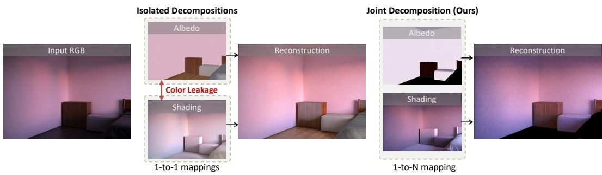  
Figure 2: Joint intrinsic decomposition. Traditional approaches predict intrinsic channels independently, leading to physically inconsistent estimations such as appearance leaking between intrinsic channels. Our joint 1-to-N decomposition allows information to be exchanged across channels, encouraging mutually coherent intrinsic maps that better explain the observed RGB image.

2025b). Qwen-Image-Layered (Yin et al., 2025) jointly decomposes an input image into multiple RGBA layers through inter-layer attention within an MMDiT. Building upon its multilayer modeling capability, we target physical scene properties rather than semantic or compositing layers, and learn their estimation together with forward rendering. This enables interactions among intrinsic properties within a unified representation.

## 2.2 INTRINSIC DECOMPOSITION

Early optimization-based methods constrain intrinsic decomposition using priors on shading and reflectance (Barron & Malik, 2012; 2014). Additional observations such as depth and multiple views (Philip et al., 2019; Ye et al., 2023) have also been used to reduce ambiguity. With the availability of large-scale annotated synthetic datasets, data-driven intrinsic estimation approaches have been developed subsequently. Datasets such as Hypersim (Roberts et al., 2021), InteriorVerse (Zhu et al., 2022), and MatrixCity (Li et al., 2023) provide dense annotations for various scene properties. Neural approaches learn decomposition from data (Wang et al., 2023; Liu et al., 2020). Careaga & Aksoy (2023) introduces ordinal shading estimation, while the subsequent work (Careaga & Aksoy, 2024) extends the decomposition to colored diffuse shading.

More recently, the generative priors of pretrained diffusion models have offered a powerful alternative for intrinsic decomposition. RGB↔X (Zeng et al., 2024) uses separate models for per-channel intrinsic prediction and image synthesis from intrinsic maps. Ouroboros (Sun et al., 2025) fine tunes inverse and forward models with bidirectional cycle losses, while DNF-Intrinsic (Zheng et al., 2025) learns deterministic image-to-intrinsic mappings. IntrinsicDiffusion (Luo et al., 2024) and PRISM (Dirik et al., 2026a) learn multiple intrinsic modalities through shared representation and modality-specific prompts. ReasonX (Dirik et al., 2026b) uses relative intrinsic judgments from a VLM as rewards to fine-tune existing predictors. Some frontier work have also extended the intrinsic properties to the video domain (Liang et al., 2025; Chen et al., 2026).

Different from prior work, we explicitly model the interdependence of intrinsic properties at two complementary levels within a unified reciprocal rendering framework. (a) At the channel level, we jointly denoise all intrinsic channels within a shared contextual sequence, allowing each channel to exchange information with the others. (b) At the process level, instead of treating decomposition and rendering as isolated tasks, we couple them within a unified framework. Together, these reciprocal processes provide consistency feedback in addition to direct supervision.

## 3 METHOD

In this section, we introduce our method for joint intrinsic decomposition and reciprocal forward rendering. We clarify our problem formulation in Section 3.1, illustrate our unified framework for channel-level joint modeling of intrinsic maps in Section 3.2, and introduce our process level reciprocal rendering with dual cycle-consistency in Section 3.3.

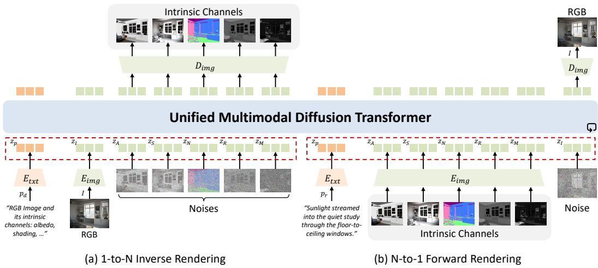  
Figure 3: Overview of joint-channel intrinsic decomposition with reciprocal rendering. For inverse rendering, the input RGB image conditions a joint 1-to-N denoising process that predicts multiple intrinsic channels simultaneously. For forward rendering, the predicted intrinsic channels jointly condition an N-to-1 process to synthesize the corresponding RGB image.

## 3.1 PROBLEM FORMULATION

We study inverse and forward rendering between an RGB image $I \in \mathbb { R } ^ { H \times W \times 3 }$ and its intrinsic maps $\overset { \cdot } { \lambda } \overset { \cdot } { = } \left\{ A , S , N , R , M \right\}$ . Here, $A , \breve { S } , N \in \mathbb { R } ^ { H \times W \times 3 }$ denote albedo, shading, and camera-space surface normals, respectively, while $R , \dot { M } \in \mathbb { R } ^ { H \times W \times 1 }$ denote roughness and metallic maps. All intrinsic maps are spatially aligned with the RGB image. Inverse rendering estimates the full set X from I, whereas forward rendering synthesizes an RGB image conditioned on the intrinsic maps. Our goal is to learn both directions within a unified framework, while encouraging the predicted intrinsic maps to form a consistent explanation for image reconstruction.

## 3.2 JOINT-CHANNEL INTRINSIC MODELING

We build our model on Qwen-Image-Layered (Yin et al., 2025), retaining its 3D RoPE (Su et al., 2024) to represent spatial and layer positions. We organize the intrinsic channel tokens in a fixed order, which helps to preserve the spatial alignment. Inverse rendering jointly generates intrinsic maps conditioned on the RGB image, while forward rendering generates RGB conditioned on the intrinsic maps. We use the image encoder $E _ { \mathrm { i m g } }$ to encode the RGB image and each intrinsic map into latent space first. For roughness and metallic maps, we expand the input into three channels before encoding. Then, the visual latents are patchified into token sequences. Each intrinsic component retains its own latent representation, while attention allows its features to interact with those of the other components.

Inverse Rendering For inverse rendering, we estimate the full intrinsic set X from an RGB image I. Per-channel approaches such as RGB↔X (Zeng et al., 2024) and Ouroboros (Sun et al., 2025) generate each intrinsic map in an isolated denoising process with a channel-specific prompt p as a “switch” to specify the target. Such a formulation treats the generated channels as conditionally independent. Each channel is sampled without reference to the interpretations of the others, yielding incompatible explanations of the same RGB observation.

In contrast, we model the joint conditional distribution $p _ { \Phi } ( \mathcal { X } \mid I , p _ { d } )$ directly, without imposing the channel-wise factorization. Here $p _ { d }$ denotes a fixed prompt specifying all of the target intrinsic channels. As shown in Figure 3, during decomposition, the target latents are initialized from Gaussian noise and denoised together. Therefore, the update of each channel can depend on the evolving features of the entire intrinsic set, allowing cross-channel dependencies captured throughout the generation process. The final latents are decoded by $D _ { \mathrm { i m g } }$ into the five intrinsic maps.

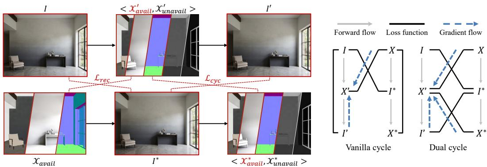  
Figure 4: Dual cycle-consistent training. We couple decomposition and rendering through two reciprocal paths. The vanilla cycle constrains only endpoint reconstruction, whereas our dual cycle aligns corresponding predictions across the two paths, enforcing process-level reciprocity. Direct supervision is applied to available intrinsic channels for heterogeneous training data.

Forward Rendering For forward rendering, we exchange the roles of conditions and targets, modeling the conditional distribution $p _ { \Phi } ( I \mid \mathcal { X } , p _ { r } )$ . As shown in Figure 3, the rendering process uses the same representation and backbone. While prior works also explore the X→RGB problem under a diffusion framework, our approach is unique in that we employ the exact same architecture used for the inverse task without any architecture modification. This reciprocity narrows the gap between inverse and forward rendering. We retain all five conditioning slots and fill unavailable channels with zeros, allowing training on heterogeneous datasets with different annotations. This N-to-1 mapping connects the jointly predicted intrinsic maps back to the RGB domain, forming the reciprocal paths in our cycle consistency objective.

## 3.3 DUAL CYCLE-CONSISTENT TRAINING

Direct supervision Following the rectified flow formulation, given paired data consisting of an RGB image I and its intrinsic channels $x ,$ , we first define a supervised reconstruction loss $\bar { \mathcal { L } } _ { r e c }$ to learn the bidirectional mappings:

$$
\mathcal { L } _ { r e c } = \mathbb { E } _ { t } \left[ | | v _ { \Phi } ( z _ { \mathcal { X } } ^ { t } , t , z _ { I } , p _ { d } ) - v _ { \mathcal { X } } | | ^ { 2 } + | | v _ { \Phi } ( z _ { I } ^ { t } , t , z _ { \mathcal { X } } , p _ { r } ) - v _ { I } | | ^ { 2 } \right] ,\tag{1}
$$

where t denotes timestep, $\{ z _ { \mathcal { X } } ^ { t } , z _ { I } ^ { t } \}$ are noised latents, $\{ z _ { I } , z _ { \mathcal { X } } \}$ are clean latents, and $\{ v _ { \mathcal { X } } , v _ { I } \}$ denote target velocity. This supervision makes both directions learn the correct mapping. However, the two processes are still optimized separately. The decomposition output is not directly checked by the rendering process, and vice versa.

Dual Cycle-Consistent Tuning A natural way to connect the two directions is introducing a cycle consistency loss. As illustrated in Figure 4, we construct two reciprocal paths: $I  \mathcal { X } ^ { \prime } \stackrel { \smile } {  } I ^ { \prime }$ and $\mathcal { X } \to I ^ { * } \to \mathcal { X } ^ { * }$ . A vanilla cycle enforces $I ^ { \prime } \approx I$ and ${ \mathcal { X } } ^ { * } \approx { \mathcal { X } }$ . This constrains the final output of the composed mappings, but does not directly constrain the intermediate prediction. Thus, the model may find shortcuts, reconstruct the input well even if the predicted intrinsic maps are inaccurate.

Instead of only matching the cycle endpoints, we constrain the corresponding prediction processes along the two reciprocal paths. For decomposition, the prediction from the rendered image $I ^ { * }$ is aligned with the directly supervised decomposition from I. For rendering, the prediction conditioned on ${ \bar { \boldsymbol { \chi } } } ^ { \prime }$ is aligned with the directly supervised rendering from X:

$$
\begin{array} { r l r } & { } & { \mathcal { L } _ { c y c } = \mathbb { E } _ { t _ { 1 } } \left[ | | v _ { \Phi } ( z _ { \mathcal { X } ^ { * } } ^ { t _ { 1 } } , t _ { 1 } , z _ { I ^ { * } } , p _ { d } ) - v _ { \Phi } ( z _ { \mathcal { X } } ^ { t _ { 1 } } , t _ { 1 } , z _ { I } , p _ { d } ) | | \right] } \\ & { } & { + \mathbb { E } _ { t _ { 2 } } \left[ | | v _ { \Phi } ( z _ { I ^ { \prime } } ^ { t _ { 2 } } , t _ { 2 } , z _ { \mathcal { X } ^ { \prime } } , p _ { r } ) - v _ { \Phi } ( z _ { I } ^ { t _ { 2 } } , t _ { 2 } , z _ { \mathcal { X } } , p _ { r } ) | | \right] , } \end{array}\tag{2}
$$

where $\{ t _ { 1 } , t _ { 2 } \}$ are two different timesteps. Through this dual cycle design, the model is encouraged to keep the same decomposition and rendering behavior after crossing to the other process. We jointly optimize inverse and forward rendering using a combination of the direct supervision and dual cycle-consistency losses in our training.

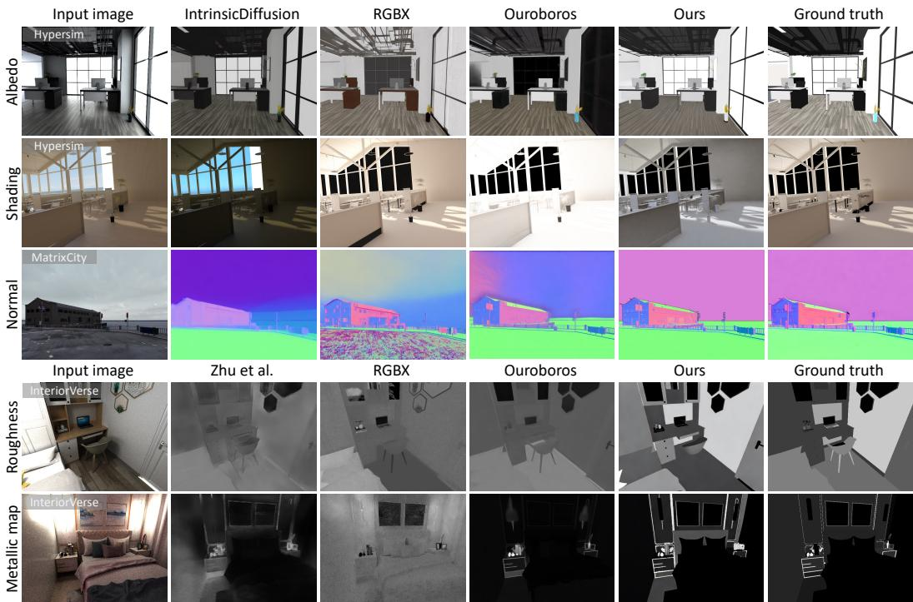  
Figure 5: Qualitative Comparison of inverse rendering. We visualize qualitative comparison with baseline methods on Hypersim (Roberts et al., 2021), InteriorVerse (Zhu et al., 2022), and MatrixCity (Li et al., 2023). Each row shows an input image and decomposed intrinsic channels from different methods. More results are shown in the appendix.

## 4 EXPERIMENTS

## 4.1 IMPLEMENTATION

We curate our training data by collecting 20K images from Hypersim (Roberts et al., 2021), 15K images from InteriorVerse (Zhu et al., 2022), and 20K images from MatrixCity (Li et al., 2023), making a total of 55K $\langle I , \mathcal { X } _ { a v a i l } \rangle$ pairs. Following previous work (Fang et al., 2026), we also leverage real-world RGB images to improve generalization to in-the-wild images. Specifically, we include 45K real-world images from MIDIntrinsics (Murmann et al., 2019), ScanNet++ (Yeshwanth et al., 2023), DL3DV (Ling et al., 2024), and Adobe FiveK (Bychkovsky et al., 2011). We use a joint and fixed prompt template $p _ { d }$ for decomposition as “Albedo, Shading, Camera-space Normal, Roughness, Metallic”, and utilize Qwen-VL (Wu et al., 2025a) to obtain image captions $p _ { r }$ of the RGB images. See the appendix for further details.

## 4.2 EVALUATION SETUP

We evaluate our method on test subsets of Hypersim (Roberts et al., 2021), InteriorVerse (Zhu et al., 2022), and MatrixCity (Li et al., 2023). We compare our approach to Zhu et al. (2022), Careaga et al. (2024), RGB↔X (Zeng et al., 2024), DiffusionRenderer (Liang et al., 2025), IntrinsicDiffusion (Luo et al., 2024), and Ouroboros (Sun et al., 2025). We use their officially provided checkpoints of these baselines and run inference on the same test data. To evaluate the intrinsic maps predicted for inverse rendering, we adopt PSNR and LPIPS metrics. Furthermore, Root Mean Square Error (RMSE) and SSIM are utilized specifically for albedo estimation. For normal estimation, we measure the mean angular error and the percentage of pixels with an angular error below 11.25◦. For forward rendering and RGB reconstruction, we assess the overall reconstruction quality using PSNR, LPIPS, and SSIM.

Table 1: Quantitative comparison with baseline methods on synthetic datasets. The best and second-best results are highlighted in bold and underlined, respectively. “–” denotes unavailable results.
<table><tr><td rowspan="2">Method</td><td colspan="4">Albedo</td><td colspan="2">Normal</td><td colspan="2">Roughness</td><td colspan="2">Metallic</td><td colspan="2">Fwd. Rendering</td><td colspan="2">RGB Recon.</td></tr><tr><td>PSNR↑ LPIPS↓ SSIM↑</td><td></td><td></td><td>RMSE↓</td><td>Mean↓</td><td>11.25°↑</td><td>PSNR↑ LPIPS↓</td><td>PSNR↑ LPIPS↓</td><td></td><td></td><td>PSNR↑ LPIPS↓</td><td></td><td>PSNR↑ LPIPS↓</td><td></td></tr><tr><td colspan="10">Hypersim</td><td></td><td></td><td></td><td></td><td></td></tr><tr><td>Zhu et al.</td><td>17.360</td><td>0.517</td><td>0.542</td><td>0.165</td><td>25.079</td><td>46.69</td><td></td><td></td><td></td><td></td><td></td><td></td><td></td><td></td></tr><tr><td>Careaga et al.</td><td>18.131</td><td>0.321</td><td>0.709</td><td>0.137</td><td></td><td></td><td></td><td></td><td></td><td></td><td>1</td><td></td><td></td><td></td></tr><tr><td>IntrinsicDiffusion</td><td>19.264</td><td>0.336</td><td>0.641</td><td>0.131</td><td>22.089</td><td>48.90</td><td></td><td></td><td></td><td></td><td></td><td></td><td></td><td></td></tr><tr><td>DiffusionRenderer</td><td>19.919</td><td>0.344</td><td>0.661</td><td>0.124</td><td>16.465</td><td>71.75</td><td></td><td></td><td></td><td></td><td></td><td></td><td></td><td></td></tr><tr><td>RGB↔X</td><td>18.921</td><td>0.223</td><td>0.641</td><td>0.122</td><td>14.167</td><td>76.51</td><td></td><td></td><td></td><td></td><td>15.364</td><td>0.341</td><td>17.635</td><td>0.236</td></tr><tr><td>Ouroboros</td><td>21.511</td><td>0.291</td><td>0.684</td><td>0.101</td><td>13.293</td><td>78.77</td><td></td><td></td><td></td><td></td><td>17.968</td><td>0.346</td><td>16.726</td><td>0.373</td></tr><tr><td>IntrinSync (Ours)</td><td>22.445</td><td>0.215</td><td>0.779</td><td>0.090</td><td>18.758</td><td>48.48</td><td></td><td>I</td><td>一</td><td></td><td>17.235</td><td>0.228</td><td>17.148</td><td>0.236</td></tr><tr><td colspan="10">InteriorVerse</td><td colspan="3"></td><td colspan="3"></td></tr><tr><td>Zhu et al.</td><td>12.106</td><td>0.439</td><td>0.626</td><td>0.262</td><td>12.487</td><td>74.02</td><td>14.127</td><td>0.410</td><td>14.868</td><td>0.406</td><td>一</td><td></td><td></td><td></td></tr><tr><td>Careaga et al.</td><td>11.737</td><td>0.468</td><td>0.544</td><td>0.273</td><td></td><td></td><td></td><td></td><td></td><td></td><td></td><td></td><td></td><td></td></tr><tr><td>IntrinsicDiffusion</td><td>13.345</td><td>0.317</td><td>0.679</td><td>0.229</td><td>14.895</td><td>64.15</td><td></td><td></td><td></td><td></td><td></td><td></td><td></td><td></td></tr><tr><td>DiffusionRenderer</td><td>12.108</td><td>0.527</td><td>0.484</td><td>0.273</td><td>11.701</td><td>79.02</td><td>11.033</td><td>0.467</td><td>13.558</td><td>0.493</td><td></td><td></td><td></td><td></td></tr><tr><td>RGB↔X</td><td>12.681</td><td>0.523</td><td>0.505</td><td>0.245</td><td>25.002</td><td>63.26</td><td>11.331</td><td>0.674</td><td>7.252</td><td>0.800</td><td>10.180</td><td>0.625</td><td>12.307</td><td>0.413</td></tr><tr><td>Ouroboros</td><td>16.345</td><td>0.246</td><td>0.778</td><td>0.171</td><td>8.714</td><td>84.73</td><td>16.202</td><td>0.325</td><td>19.740</td><td>0.269</td><td>11.256</td><td>0.656</td><td>12.780</td><td>0.579</td></tr><tr><td>IntrinSync (Ours)</td><td>16.408</td><td>0.227</td><td>0.783</td><td>0.164</td><td>11.190</td><td>79.82</td><td>14.947</td><td>0.299</td><td>17.184</td><td>0.272</td><td>12.637</td><td>0.444</td><td>16.636</td><td>0.350</td></tr><tr><td colspan="10">MatrixCity</td><td colspan="3"></td><td colspan="3"></td></tr><tr><td>Careaga et al.</td><td>21.583</td><td>0.324</td><td>0.371</td><td>0.095</td><td></td><td></td><td>一</td><td>一</td><td>一</td><td></td><td></td><td>一</td><td></td><td></td></tr><tr><td>IntrinsicDiffusion</td><td>18.681</td><td>0.535</td><td>0.332</td><td>0.135</td><td>22.359</td><td>46.39</td><td></td><td></td><td></td><td></td><td></td><td>一</td><td></td><td>一</td></tr><tr><td>DiffusionRenderer</td><td>19.332</td><td>0.450</td><td>0.376</td><td>0.123</td><td>24.355</td><td>48.26</td><td>8.593</td><td>0.593</td><td>13.578</td><td>0.429</td><td></td><td></td><td></td><td></td></tr><tr><td>RGB↔X</td><td>20.115</td><td>0.364</td><td>0.451</td><td>0.112</td><td>43.151</td><td>22.79</td><td>7.839</td><td>0.585</td><td>7.284</td><td>0.870</td><td>9.733</td><td>0.501</td><td>10.019</td><td>0.462</td></tr><tr><td>Ouroboros</td><td>22.034</td><td>0.366</td><td>0.503</td><td>0.088</td><td>23.803</td><td>53.28</td><td>12.012</td><td>0.529</td><td>19.218</td><td>0.272</td><td>17.566</td><td>0.311</td><td>13.187</td><td>0.516</td></tr><tr><td>IntrinSync (Ours)</td><td>27.867</td><td>0.136</td><td>0.816</td><td>0.047</td><td>13.254</td><td>68.60</td><td>20.881</td><td>0.288</td><td>24.429</td><td>0.147</td><td>22.104</td><td>0.196</td><td>21.320</td><td>0.198</td></tr></table>

## 4.3 QUALITATIVE RESULTS

We present qualitative comparison in Figure 5 with baseline methods IntrinsicDiffusion (Luo et al., 2024), Zhu et al. (2022), RGB↔X (Zeng et al., 2024), and Ouroboros (Sun et al., 2025) on multiple inverse rendering datasets and tasks. Our approach demonstrates competitive decomposition performance across diverse datasets and multiple tasks. Notably, our method is capable of predicting intrinsic physical properties that are not finely annotated in the datasets. For instance, in the second row, our method recovers the illumination of unlabeled dark regions on the floor in the Hypersim dataset (Roberts et al., 2021). Another example is shown in the fifth row, where our method clearly reconstructs blurry metal connectors above and below the wall-mounted lamps. Additional results are shown in the appendix.

## 4.4 QUANTITATIVE RESULTS

We quantitatively compare our method with state-of-the-art approaches on Hypersim (Roberts et al., 2021), InteriorVerse (Zhu et al., 2022), and MatrixCity (Li et al., 2023). As summarized in Table 1, our method achieves strong performance across diverse scene domains and intrinsic properties, while jointly supporting both inverse and forward rendering within the same framework. For intrinsic decomposition, our method consistently improves albedo estimation across all three benchmarks, also achieving competitive results in normal, roughness, and metallic estimation, particularly on MatrixCity (Li et al., 2023). These results suggest that jointly reasoning over multiple intrinsic channels is particularly beneficial when handling the diverse geometry, materials, and illumination found in complex scenes. Moreover, our method also performs strongly in the forward direction. These results demonstrate that the predicted intrinsic channels are not only individually accurate, but also form a mutually compatible scene representation that supports faithful reconstruction and neural rendering.

## 4.5 ABLATION STUDY

We conduct an ablation study to evaluate the contributions of the two key components. We use a subset of the whole training data for the ablation study. Two baselines are trained for (a) promptconditioned 1-to-1 intrinsic decomposition and (b) N-to-1 forward rendering, without joint-channel modeling and cycle constraints. Then, we train variants using the same data and evaluate them on the Hypersim subset.

Table 2: Ablation study. All the variants are trained on a subset of the training data from Hypersim.
<table><tr><td rowspan="2"></td><td colspan="2">Albedo</td><td colspan="2">Irradiance</td><td colspan="2">Normal</td><td colspan="2">Fwd. Rendering</td><td colspan="2">RGB Recon.</td></tr><tr><td>PSNR↑ LPIPS↓</td><td></td><td>PSNR↑ LPIPS↓</td><td></td><td>Mean↓</td><td>11.25°↑</td><td>PSNR↑ LPIPS↓</td><td></td><td></td><td>PSNR↑ LPIPS↓</td></tr><tr><td>(a) 1-to-1 decomp.</td><td>17.915</td><td>0.285</td><td>17.402</td><td>0.294</td><td>25.712</td><td>37.74</td><td></td><td></td><td></td><td></td></tr><tr><td>(b) N-to-1 rendering</td><td></td><td></td><td></td><td></td><td></td><td></td><td>17.714</td><td>0.235</td><td>16.664</td><td>0.288</td></tr><tr><td>(c) Joint decomp.</td><td>19.184</td><td>0.235</td><td>18.307</td><td>0.254</td><td>23.390</td><td>41.23</td><td></td><td></td><td></td><td></td></tr><tr><td>(d) Joint + vanilla cycle</td><td>18.781</td><td>0.206</td><td>18.211</td><td>0.239</td><td>19.365</td><td>50.19</td><td>18.025</td><td>0.219</td><td>19.767</td><td>0.145</td></tr><tr><td>(e) Joint + dual cycle</td><td>19.250</td><td>0.229</td><td>18.633</td><td>0.248</td><td>19.039</td><td>54.87</td><td>18.092</td><td>0.217</td><td>18.132</td><td>0.236</td></tr></table>

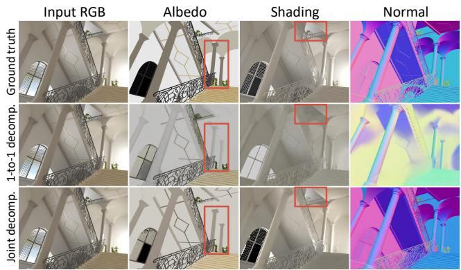

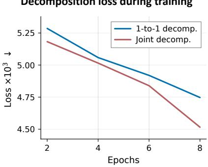  
Figure 6: Ablation on joint-channel decomposition. Compared with 1-to-1 decomposition, joint decomposition produces cleaner, more coherent intrinsic maps and consistently achieves lower training loss, demonstrating the benefit of cross-channel interaction.

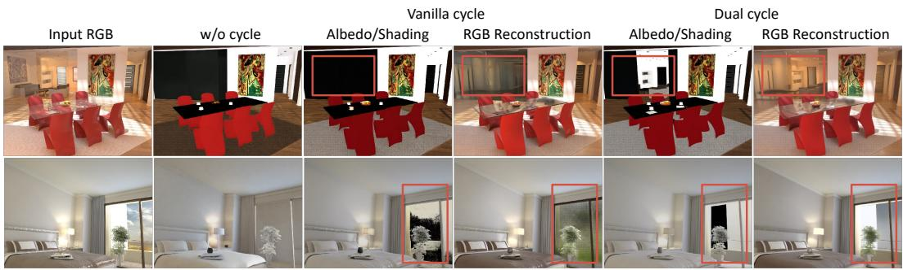  
Figure 7: Ablation on cycle consistency. Compared with the vanilla cycle, our dual cycle better preserves the semantic roles of intrinsic channels while maintaining faithful RGB reconstruction.

Joint-channel decomposition We first examine the effect ofjoint-channel decomposition by comparing the 1-to-1 decomposition baseline (a) with the joint variant (c) in Table 2. Neither of them uses the cycle constraint. Joint prediction improves all six reported decomposition metrics: albedo and irradiance PSNR improve by 1.27 dB and 0.91 dB, respectively, while the mean angular error for normals decreases by 2.32◦. These consistent improvements across appearance, illumination, and geometry support the benefit of jointly modeling intrinsic channels over per-channel generation. Figure 6 further shows that joint decomposition achieves cleaner intrinsic maps and lower training loss, as cross-channel interaction provides complementary cues to reduce the ambiguity of individual prediction.

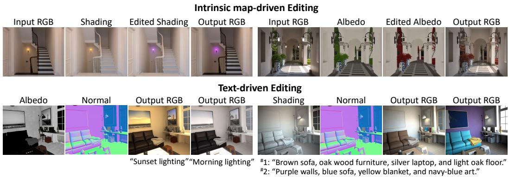  
Figure 8: Intrinsic-guided image editing. Our framework enables controllable image editing by either directly manipulating intrinsic channels or using text prompts to modify selected properties.

Cycle Consistency We further compare joint decomposition without cycle supervision (c), with a vanilla cycle loss (d), and with our dual cycle loss (e) in Table 2. Introducing the vanilla cycle improves normal estimation, perceptual quality, and RGB reconstruction, while reducing the PSNR of albedo and irradiance compared with (c). We attribute this result to a shortcut introduced by the input-reconstruction supervision. To cycle back to the original RGB image, the model may leak information across intrinsic channels. Such leakage can benefit reconstruction without contributing to a better physical decomposition. In contrast, our dual cycle further achieves better albedo and irradiance PSNR, normal accuracy, and forward-rendering performance.

## 4.6 APPLICATIONS

Our reciprocal framework supports controllable image editing through the intermediate intrinsic representation. As shown in Figure 8, we explore two types of intrinsic-guided image editing. First, the decomposed intrinsic maps can be edited individually and then rendered back to RGB. This enables explicit control over scene properties such as illumination and surface materials. Second, our forward renderer can synthesize images from a subset of intrinsic channels, with text prompts specifying the unconstrained properties. These results demonstrate the flexibility of IntrinSync for fine-grained image manipulation through explicit control of physical scene properties. Additional results are shown in the appendix.

## 5 CONCLUSION, LIMITATIONS AND FUTURE WORK

In this work, we presented IntrinSync, a unified framework for joint intrinsic decomposition and reciprocal forward rendering. Rather than treating intrinsic decomposition and rendering as separate tasks, our framework models them as two reciprocal views of the same physical image formation process. Our results suggest that jointly reasoning across intrinsic channels while coupling decomposition with forward rendering provides an effective way to promote physically coherent scene representations, with improved interdependence across intrinsic channels. This interdependence operates at two levels: cross-channel interaction jointly models intrinsic properties, and cross-process interaction links inverse and forward rendering. Together, they reduce feature leakage and encourage decompositions that are accurate at the channel level and consistent at the process level.

Our current implementation still has several limitations. First, inference remains relatively expensive, requiring approximately 90 seconds to decompose a single 1024 × 768 image into five intrinsic channels using 30 denoising steps. Second, available intrinsic datasets vary substantially in their channel availability and scene distributions, limiting the completeness and diversity of physical supervision. Going further, the scarcity of accurate intrinsic annotations for real scenes still leaves a sim-to-real gap for complex geometry and illumination. Our future work includes exploring more efficient sampling and larger-scale training to further improve the efficiency and generalization.

## REFERENCES

Omri Avrahami, Kfir Aberman, Ohad Fried, Daniel Cohen-Or, and Dani Lischinski. Break-a-scene: Extracting multiple concepts from a single image. In ACM SIGGRAPH Conference and Exhibition on Computer Graphics and Interactive Techniques in Asia (SIGGRAPH Asia), pp. 1–12, 2023.

Jonathan T Barron and Jitendra Malik. Shape, albedo, and illumination from a single image of an unknown object. In IEEE/CVF Conference on Computer Vision and Pattern Recognition (CVPR), pp. 334–341. IEEE, 2012.

Jonathan T Barron and Jitendra Malik. Shape, illumination, and reflectance from shading. IEEE Transactions on Pattern Analysis and Machine Intelligence (TPAMI), 37(8):1670–1687, 2014.

Harry Barrow, J Tenenbaum, A Hanson, and E Riseman. Recovering intrinsic scene characteristics. Computer Vision Systems, 2(3-26):2, 1978.

Vladimir Bychkovsky, Sylvain Paris, Eric Chan, and Fredo Durand. Learning photographic global´ tonal adjustment with a database of input / output image pairs. In IEEE/CVF Conference on Computer Vision and Pattern Recognition (CVPR), pp. 97–104, 2011.

Chris Careaga and Yagız Aksoy. Intrinsic image decomposition via ordinal shading.˘ ACM Transactions on Graphics (TOG), 43(1):1–24, 2023.

Chris Careaga and Yagız Aksoy. Colorful diffuse intrinsic image decomposition in the wild. ˘ ACM Transactions on Graphics (TOG), 43(6):1–12, 2024.

Houyuan Chen, Hong Li, Xianghao Kong, Tianrui Zhu, Shaocong Xu, Weiqing Xiao, Yuwei Guo, Chongjie Ye, Lvmin Zhang, Hao Zhao, and Anyi Rao. Unividx: A unified multimodal framework for versatile video generation via diffusion priors. ACM Transactions on Graphics (TOG), 45(4), 2026. ISSN 0730-0301.

Alara Dirik, Tuanfeng Wang, Duygu Ceylan, Stefanos Zafeiriou, and Anna Fruhst¨ uck. Prism: A¨ unified framework for photorealistic reconstruction and intrinsic scene modeling. In International Conference on Pattern Recognition (ICPR), pp. 635–650, 2026a.

Alara Dirik, Tuanfeng Yang Wang, Duygu Ceylan, Stefanos Zafeiriou, and Anna Fruhst¨ uck. Rea-¨ sonx: Mllm-guided intrinsic image decomposition. In IEEE/CVF Conference on Computer Vision and Pattern Recognition (CVPR), pp. 30802–30812, 2026b.

Ye Fang, Tong Wu, Valentin Deschaintre, Duygu Ceylan, Iliyan Georgiev, Chun-Hao Paul Huang, Yiwei Hu, Xuelin Chen, and Tuanfeng Yang Wang. V-rgbx: Video editing with accurate controls over intrinsic properties. In IEEE/CVF Conference on Computer Vision and Pattern Recognition (CVPR), pp. 23182–23192, 2026.

Jonathan Ho, Ajay Jain, and Pieter Abbeel. Denoising diffusion probabilistic models. Conference on Neural Information Processing Systems (NeurIPS), 33:6840–6851, 2020.

Black Forest Labs. Flux. https://github.com/black-forest-labs/flux, 2024.

Yixuan Li, Lihan Jiang, Linning Xu, Yuanbo Xiangli, Zhenzhi Wang, Dahua Lin, and Bo Dai. Matrixcity: A large-scale city dataset for city-scale neural rendering and beyond. In IEEE International Conference on Computer Vision (ICCV), pp. 3205–3215, 2023.

Ruofan Liang, Zan Gojcic, Huan Ling, Jacob Munkberg, Jon Hasselgren, Chih-Hao Lin, Jun Gao, Alexander Keller, Nandita Vijaykumar, Sanja Fidler, et al. Diffusion renderer: Neural inverse and forward rendering with video diffusion models. In IEEE/CVF Conference on Computer Vision and Pattern Recognition (CVPR), pp. 26069–26080, 2025.

Lu Ling, Yichen Sheng, Zhi Tu, Wentian Zhao, Cheng Xin, Kun Wan, Lantao Yu, Qianyu Guo, Zixun Yu, Yawen Lu, et al. Dl3dv-10k: A large-scale scene dataset for deep learning-based 3d vision. In IEEE/CVF Conference on Computer Vision and Pattern Recognition (CVPR), pp. 22160–22169, 2024.

Chang Liu, Viraj Shah, Aiyu Cui, and Svetlana Lazebnik. Unziplora: Separating content and style from a single image. In IEEE International Conference on Computer Vision (ICCV), pp. 16776– 16785, 2025.

Yunfei Liu, Yu Li, Shaodi You, and Feng Lu. Unsupervised learning for intrinsic image decomposition from a single image. In IEEE/CVF Conference on Computer Vision and Pattern Recognition (CVPR), pp. 3248–3257, 2020.

Jundan Luo, Duygu Ceylan, Jae Shin Yoon, Nanxuan Zhao, Julien Philip, Anna Fruhst¨ uck, Wenbin¨ Li, Christian Richardt, and Tuanfeng Wang. Intrinsicdiffusion: Joint intrinsic layers from latent diffusion models. In ACM SIGGRAPH Conference and Exhibition on Computer Graphics and Interactive Techniques in Asia (SIGGRAPH Asia), pp. 1–11, 2024.

Lukas Murmann, Michael Gharbi, Miika Aittala, and Fredo Durand. A multi-illumination dataset of indoor object appearance. In IEEE International Conference on Computer Vision (ICCV), volume 2, 2019.

Julien Philip, Michael Gharbi, Tinghui Zhou, Alexei A Efros, and George Drettakis. Multi-view ¨ relighting using a geometry-aware network. ACM Transactions on Graphics (TOG), 38(4):78–1, 2019.

Mike Roberts, Jason Ramapuram, Anurag Ranjan, Atulit Kumar, Miguel Angel Bautista, Nathan Paczan, Russ Webb, and Joshua M Susskind. Hypersim: A photorealistic synthetic dataset for holistic indoor scene understanding. In IEEE International Conference on Computer Vision (ICCV), pp. 10912–10922, 2021.

Jianlin Su, Murtadha Ahmed, Yu Lu, Shengfeng Pan, Wen Bo, and Yunfeng Liu. Roformer: Enhanced transformer with rotary position embedding. Neurocomputing, 568:127063, 2024.

Shanlin Sun, Yifan Wang, Hanwen Zhang, Yifeng Xiong, Qin Ren, Ruogu Fang, Xiaohui Xie, and Chenyu You. Ouroboros: Single-step diffusion models for cycle-consistent forward and inverse rendering. In IEEE International Conference on Computer Vision (ICCV), pp. 10386–10397, 2025.

Yael Vinker, Andrey Voynov, Daniel Cohen-Or, and Ariel Shamir. Concept decomposition for visual exploration and inspiration. ACM Transactions on Graphics (TOG), 42(6):1–13, 2023.

Zhenyu Wang, Jianxi Huang, Zhida Sun, Yuanhao Gong, Daniel Cohen-Or, and Min Lu. Layered image vectorization via semantic simplification. In IEEE/CVF Conference on Computer Vision and Pattern Recognition (CVPR), pp. 7728–7738, 2025.

Zongji Wang, Yunfei Liu, and Feng Lu. Discriminative feature encoding for intrinsic image decomposition. Computational Visual Media (CVM), 9(3):597–618, 2023.

Chenfei Wu, Jiahao Li, Jingren Zhou, Junyang Lin, Kaiyuan Gao, Kun Yan, Sheng-ming Yin, Shuai Bai, Xiao Xu, Yilei Chen, et al. Qwen-image technical report. arXiv preprint arXiv:2508.02324, 2025a.

Ronghuan Wu, Wanchao Su, and Jing Liao. Layerpeeler: Autoregressive peeling for layer-wise image vectorization. In ACM SIGGRAPH Conference and Exhibition on Computer Graphics and Interactive Techniques in Asia (SIGGRAPH Asia), pp. 1–20, 2025b.

Jinrui Yang, Qing Liu, Yijun Li, Soo Ye Kim, Daniil Pakhomov, Mengwei Ren, Jianming Zhang, Zhe Lin, Cihang Xie, and Yuyin Zhou. Generative image layer decomposition with visual effects. In IEEE/CVF Conference on Computer Vision and Pattern Recognition (CVPR), pp. 7643–7653, 2025.

Weicai Ye, Shuo Chen, Chong Bao, Hujun Bao, Marc Pollefeys, Zhaopeng Cui, and Guofeng Zhang. Intrinsicnerf: Learning intrinsic neural radiance fields for editable novel view synthesis. In IEEE International Conference on Computer Vision (ICCV), pp. 339–351, 2023.

Chandan Yeshwanth, Yueh-Cheng Liu, Matthias Nießner, and Angela Dai. ScanNet++: A highfidelity dataset of 3D indoor scenes. In IEEE International Conference on Computer Vision (ICCV), pp. 12–22, 2023.

Shengming Yin, Zekai Zhang, Zecheng Tang, Kaiyuan Gao, Xiao Xu, Kun Yan, Jiahao Li, Yilei Chen, Yuxiang Chen, Heung-Yeung Shum, et al. Qwen-image-layered: Towards inherent editability via layer decomposition. arXiv preprint arXiv:2512.15603, 2025.

Zheng Zeng, Valentin Deschaintre, Iliyan Georgiev, Yannick Hold-Geoffroy, Yiwei Hu, Fujun Luan, Ling-Qi Yan, and Milos Haˇ san. Rgbx: Image decomposition and synthesis using material- andˇ lighting-aware diffusion models. In ACM Special Interest Group on Computer Graphics and Interactive Techniques Conference (SIGGRAPH), 2024.

Lvmin Zhang and Maneesh Agrawala. Transparent image layer diffusion using latent transparency. ACM Transactions on Graphics (TOG), 43(4):1–15, 2024.

Rongjia Zheng, Qing Zhang, Chengjiang Long, and Wei-Shi Zheng. Dnf-intrinsic: Deterministic noise-free diffusion for indoor inverse rendering. In IEEE International Conference on Computer Vision (ICCV), pp. 10342–10352, 2025.

Jingsen Zhu, Fujun Luan, Yuchi Huo, Zihao Lin, Zhihua Zhong, Dianbing Xi, Rui Wang, Hujun Bao, Jiaxiang Zheng, and Rui Tang. Learning-based inverse rendering of complex indoor scenes with differentiable monte carlo raytracing. In ACM SIGGRAPH Conference and Exhibition on Computer Graphics and Interactive Techniques in Asia (SIGGRAPH Asia), pp. 1–8, 2022.

## APPENDIX

## A IMPLEMENTATION DETAILS

As shown in Table 3, our training set comprises about 100K images collected from three synthetic datasets and four real-image datasets. Since the real-image datasets do not provide ground-truth intrinsic annotations, we employ Ouroboros to provide pseudo labels for supervision. During training, dataset i is sampled with probability: $\begin{array} { r } { p _ { i } = \frac { \sqrt { N _ { i } } } { \sum _ { i } \sqrt { N _ { j } } } } \end{array}$ , where $N _ { i }$ denotes the number of training samples in dataset i. We use a fixed ordering for both input and output slots: albedo, shading, normal, roughness, metallic. During the decomposition stage, missing intrinsic channels were set to zerovalued latents and masked out from loss calculation. During the composition stage, each available intrinsic condition is independently dropped out with a probability of 0.05. The direct decomposition and composition losses both have a weight of 1.0, while the decomposition loss on real images is weighted by 0.5. For the cycle consistency loss, we average the losses from the two directions and linearly increase the weight from 0 to 0.5 in the first 1,000 steps. We use separate LoRA adapters for decomposition and composition while sharing the pretrained MMDiT backbone between the two directions. The LoRA rank and alpha are set to 32. Training is performed on 5 NVIDIA Pro6000 GPUs for 35K iterations and takes about 72 hours.

Table 3: Summary of training dataset.
<table><tr><td>Dataset</td><td># of Images</td><td>Resolution</td><td>Scene Type</td><td>Ground truth Intrinsic Types</td></tr><tr><td>Hypersim (Roberts et al., 2021)</td><td>20,000</td><td>1024 × 768</td><td>Synthetic, Indoor</td><td>Albedo, Shading, Normal</td></tr><tr><td>InteriorVerse (Zhu et al., 2022)</td><td>15,000</td><td>640 × 480</td><td>Synthetic, Indoor</td><td>Albedo, Normal, Roughness, Metallic</td></tr><tr><td>MatrixCity (Li et al., 2023)</td><td>20,000</td><td>768 × 768</td><td>Synthetic, Outdoor</td><td>Albedo, Normal, Roughness, Metallic</td></tr><tr><td>MIDIntrinsics (Murmann et al., 2019)</td><td>10,000</td><td>768 × 768</td><td>Real, Indoor</td><td></td></tr><tr><td>DL3DV_960p (Ling et al., 2024)</td><td>12,800</td><td>768 × 432</td><td>Real, Indoor</td><td></td></tr><tr><td>ScanNet++ (Yeshwanth et al., 2023)</td><td>20,000</td><td>512 × 512</td><td>Real, Indoor</td><td></td></tr><tr><td>Adobe FiveK (Bychkovsky et al., 2011)</td><td>1,453</td><td>X × 768</td><td>Real, Outdoor</td><td></td></tr></table>

## B ADDITIONAL RESULTS

We provide additional results to further evaluate generalization and controllability of our method. We first report comparisons on synthetic datasets with ground-truth in Section B.1. We then assess its performance on real-world scenes using indoor and outdoor images from the test dataset, as well as out-of-distribution (OOD) images collected from publicly available photography websites in Section B.2. Finally, we demonstrate intrinsic-guided image editing by manipulating individual intrinsic channels while keeping the remaining components fixed in Section B.3.

## B.1 COMPARISON ON SYNTHETIC IMAGES

We present additional comparisons on the test sets of Hypersim, InteriorVerse, and MatrixCity in Figures 9 to 12. Since the available annotations vary across datasets, each method is evaluated only on the intrinsic components for which ground-truth annotations are available. Overall, our method achieves the best decomposition quality across the three datasets, producing intrinsic maps that most closely match the ground truth in both structure and appearance. In particular, it more effectively disentangles reflectance from illumination in the albedo and shading components, preserves geometric details in the predicted normals, and recovers more accurate and spatially coherent roughness and metallicity.

## B.2 COMPARISON ON REAL IMAGES

We further compare the methods on real-world indoor and outdoor images in Figures 13 to 16. Because ground-truth intrinsic annotations are unavailable for those images, we focus on their visual plausibility, consistency with the given inputs and cross-intrinsic leakage. All methods are evaluated under the same input images and text prompts. Compared with existing methods, our approach produces more visually plausible results while better preserving the content and structure of the input images. Moreover, the predicted intrinsic components exhibit less cross-intrinsic leakage, indicating improved interdependence among different intrinsic properties.

## B.3 INTRINSIC-GUIDED IMAGE EDITING

Beyond intrinsic decomposition and RGB reconstruction, we examine whether the learned intrinsic representations provide continuous and interpretable control over the reconstruction results. Given an input image, we first decompose it into five intrinsic channels and then independently manipulate either albedo or shading component while keeping the remaining components and text condition fixed. Specifically, we vary the albedo saturation using factors of 1.0, 1.5, 2.0, and 3.0. For shading, the brightness factors are 0.25, 0.5, 1.0, 1.5, and 2.0.

As shown in Figures 18 and 19, increasing or decreasing the albedo saturation produces smooth and corresponding changes in surface colorfulness, while largely preserving the original illumination and scene structure. Similarly, adjusting the shading brightness continuously changes the perceived illumination intensity without introducing noticeable changes to surface reflectance or scene content. These results demonstrate that the learned intrinsic representations enable smooth and interpretable control while maintaining a clear separation between albedo and shading.

Input RGB  
IntrinsicDiffusion  
RGBX  
DiffusionRenderer  
Ouroboros  
Ours  
Ground truth  
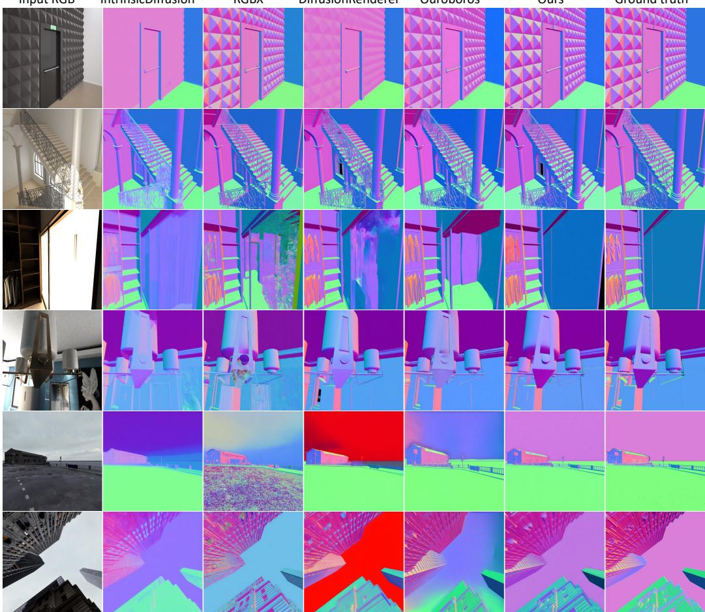  
Figure 9: Qualitative comparison of normal estimation on synthetic images.

Input RGB  
IntrinsicDiffusion  
RGBX  
DiffusionRenderer  
Ouroboros  
Ours  
Ground truth  
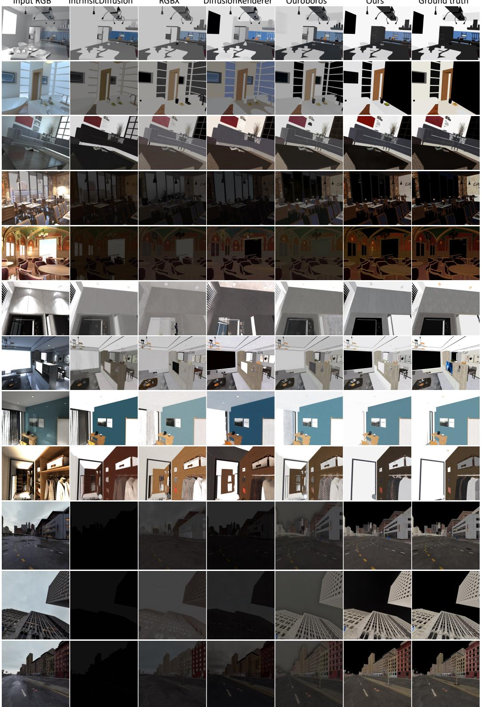  
Figure 10: Qualitative comparison of albedo estimation on synthetic images. We show additional results across diverse synthetic scenes, comparing the predicted albedo maps of our method with existing approaches and the corresponding ground truth.

Input RGB  
IntrinsicDiffusion  
RGBX  
Ouroboros  
Ours  
Ground truth  
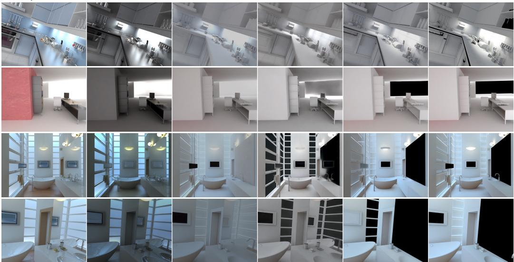  
Figure 11: Qualitative comparison of shading estimation on synthetic images.

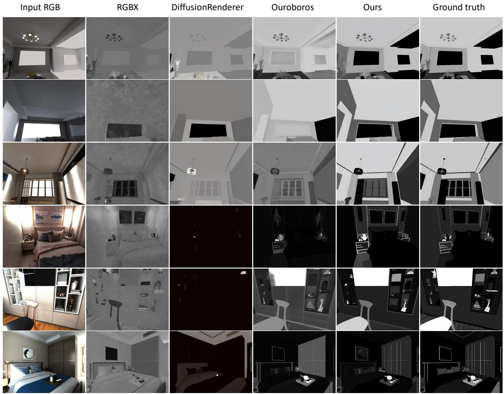  
Figure 12: Qualitative comparison of roughness and metallic estimation on synthetic images.

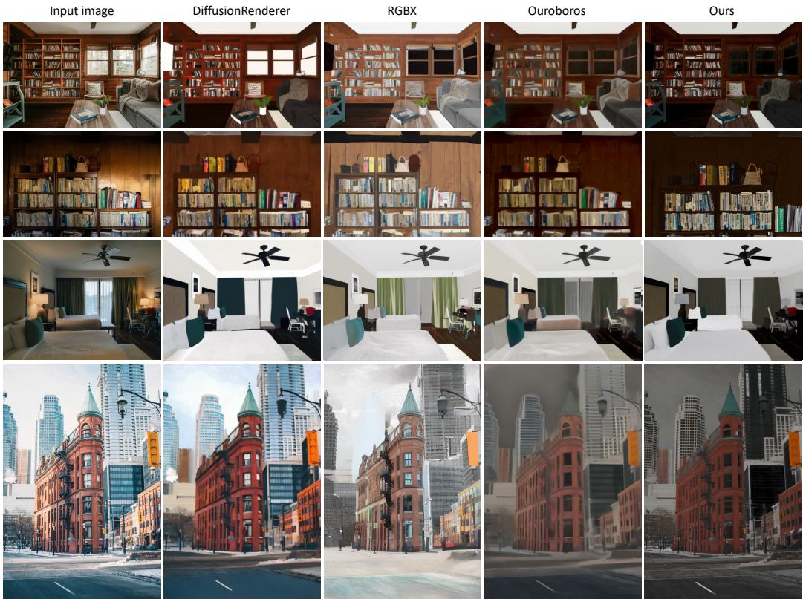  
Figure 13: Qualitative comparison of albedo estimation on real images.

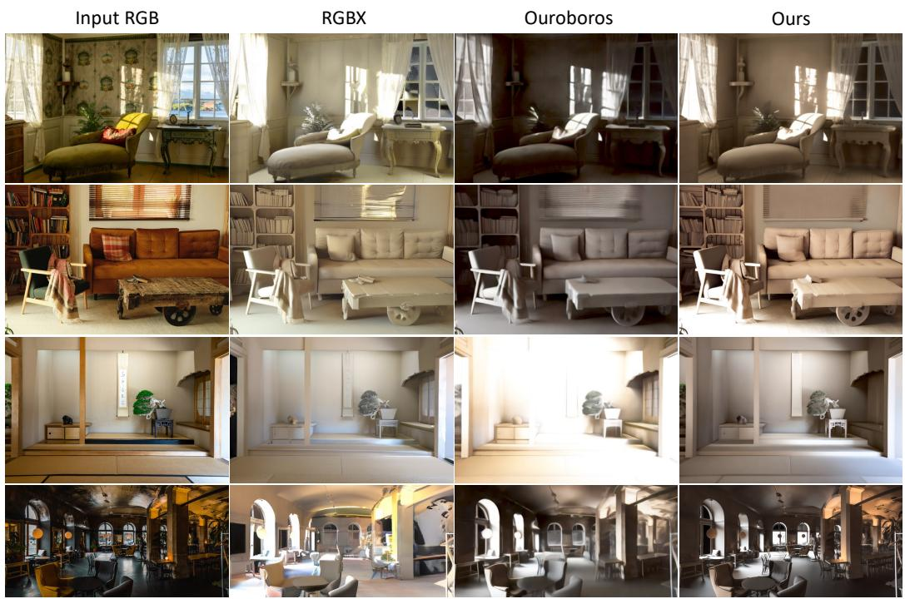  
Figure 14: Qualitative comparison of shading estimation on real images.

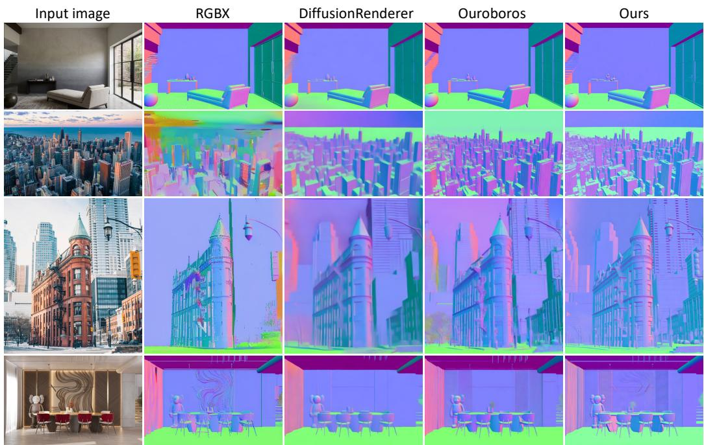  
Figure 15: Qualitative comparison of normal estimation on real images.

Input image  
RGBX  
Ouroboros  
Ours  
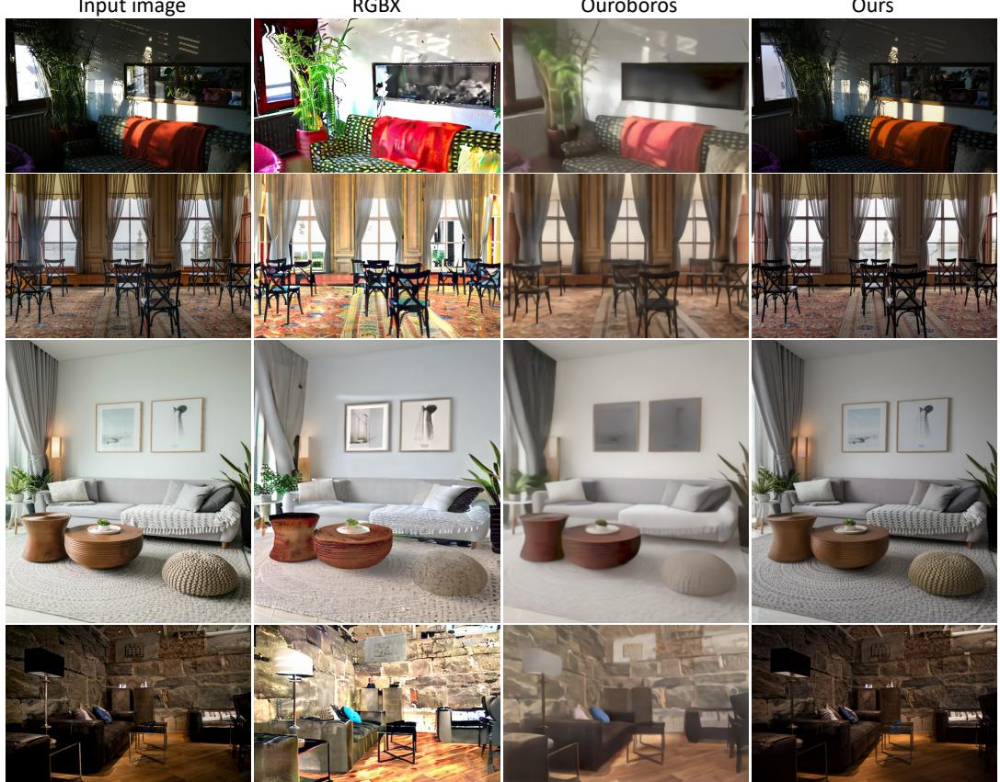  
Figure 16: Qualitative comparison of RGB reconstruction on real images.

Input RGB  
Albedo  
Shading  
Normal  
Roughness  
Metallic  
RGB Recon  
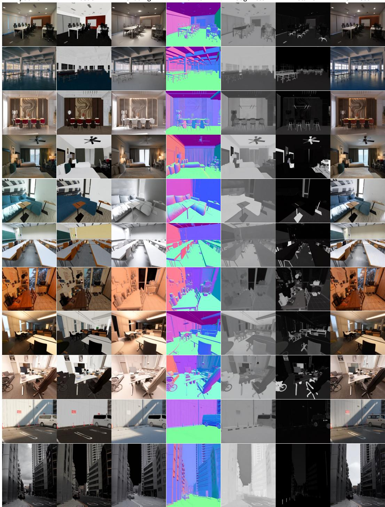  
Figure 17: Results of Inverse and forward rendering on real images. We evaluate our method on diverse real-world scenes, demonstrating its ability to jointly estimate clean and physically consistent intrinsic channels and rendering the input RGB images.

Scaled albedos  
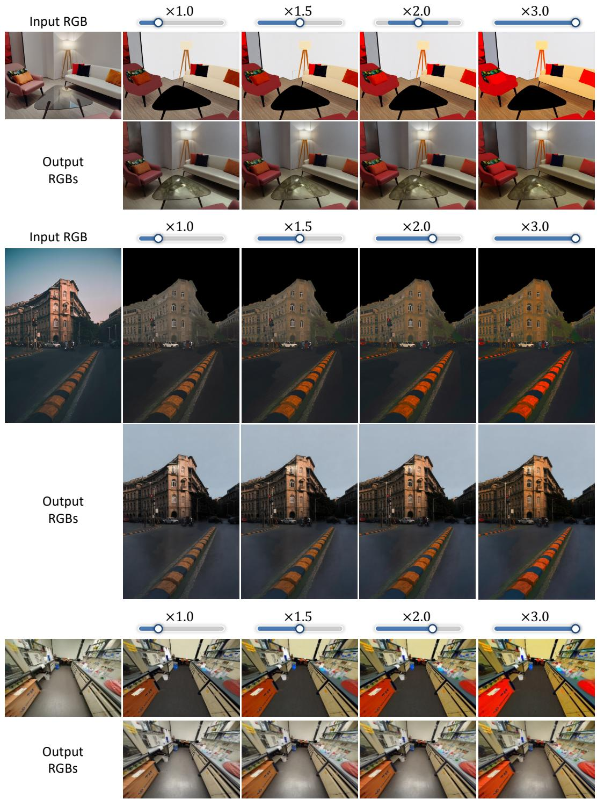  
Figure 18: Results of global albedo scaling. We show additional examples of globally scaling the decomposed albedo and rendering the modified intrinsic maps back to RGB, demonstrating controllable changes in surface appearance.

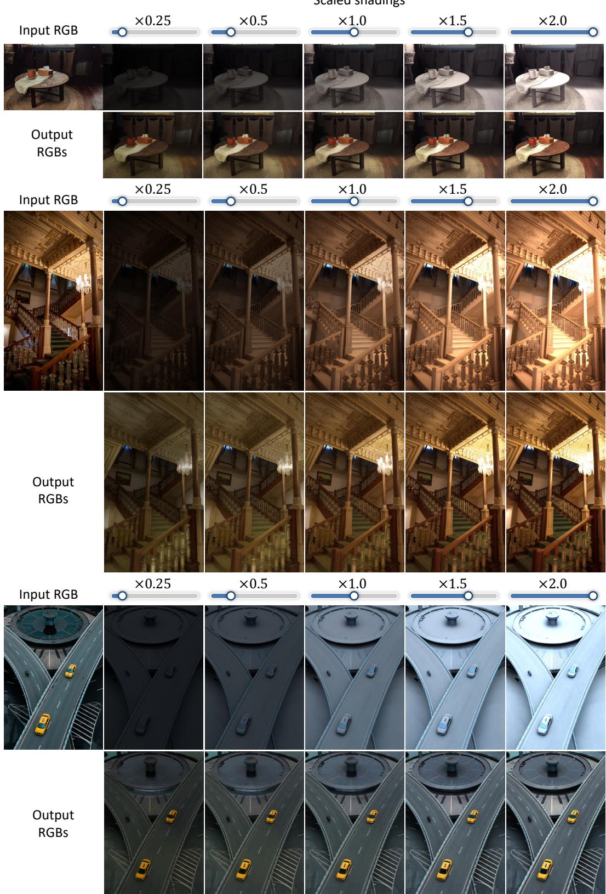  
Figure 19: Results of global relighting. We show additional examples of global relighting, where the illumination is modified while preserving the underlying scene content and intrinsic properties.