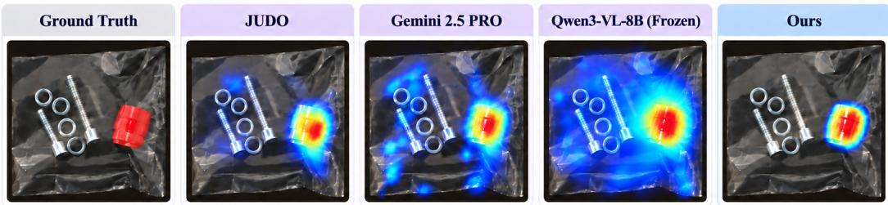
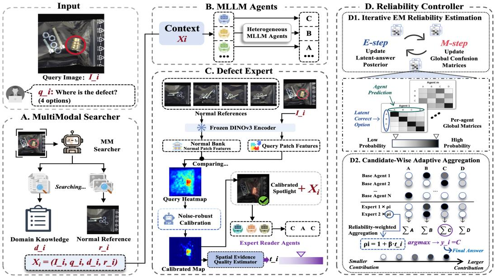
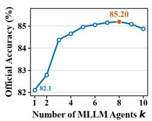
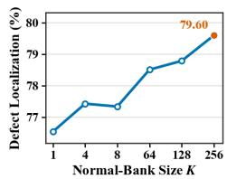
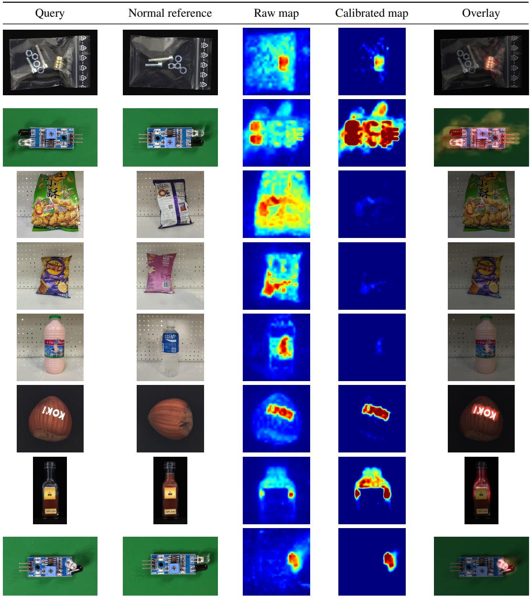
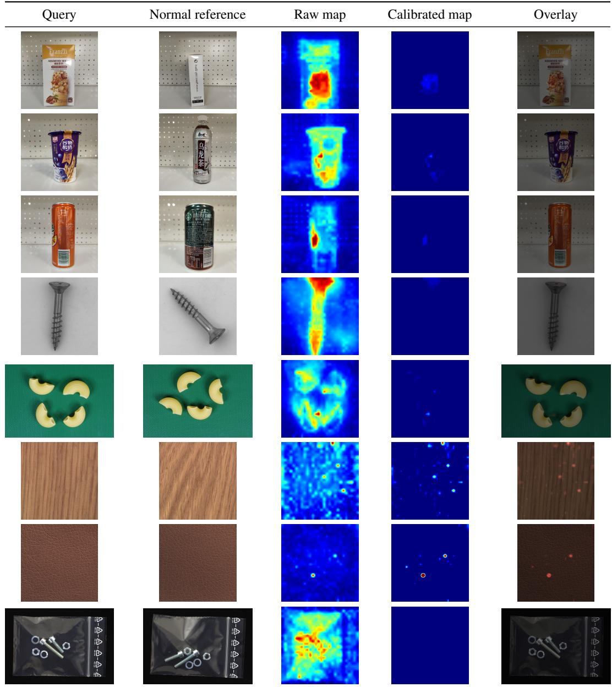

# IS IN-DOMAIN TRAINING ENOUGH FOR FINE-GRAINED INDUSTRIAL ANOMALY UNDERSTANDING?

Xingwu Zhang1\* , Duanyang Du2\* , Huiling Zhu3\* , Jiayue Dai2, Yixiao Liu1, Guozhi Liu4, Zhihan Zhang3, Zijun Long1†

1Hunan University 2University of Aberdeen 3South China Normal University

4South China University of Technology

## ABSTRACT

A single multimodal large language model (MLLM) struggles to excel simultaneously at detection, localization, description, and reasoning in multimodal industrial anomaly understanding (MM-IAU). We show that in-domain training does not close this gap. On MMAD, a widely adopted MM-IAU benchmark, trained specialists reach at most 75.5% accuracy in defect localization, against 92.3% for human experts, and even detect anomalies less accurately than their untrained base model. Meanwhile, different MLLMs offer complementary strengths but share this weakness in fine-grained perception, so combining them alone cannot remove it. We therefore propose SiGMA, a spatially grounded multi-agent framework that divides labor between heterogeneous MLLM agents and a dedicated visual defect expert. A multimodal searcher supplies industrial knowledge and normal references, the defect expert turns query–reference comparison into calibrated anomaly evidence, and a label-free reliability controller weighs each source by task-wise competence and query-level evidence quality. SiGMA reaches 85.2% average accuracy on MMAD, 4.0% above the strongest trained specialist and Gemini-2.5- Pro and within 1.5% of human experts. Even with three agents of at most 9B parameters, it reaches 84.4%, and new MLLMs join without retraining.

## 1 INTRODUCTION

Multimodal industrial anomaly understanding (MM-IAU) requires detecting whether a product is defective, localizing the defect, describing its appearance, and reasoning about its potential impact (Jiang et al., 2025). Together, these tasks demand a breadth of perceptual and reasoning capabilities that a single multimodal large language model (MLLM) struggles to master (Jiang et al., 2025; Li et al., 2025). Defects such as small scratches or missing components often occupy only a small fraction of the image (Bergmann et al., 2019; Zou et al., 2022), so detecting and localizing them requires fine-grained comparison with a normal reference, whereas describing and analyzing them relies on semantic knowledge and reasoning. The prevailing remedy is to specialize a single MLLM through in-domain supervised fine-tuning or reinforcement learning (Chao et al., 2025; Zhao et al., 2025; Guan et al., 2025; Kang et al., 2026; Wang et al., 2026). This raises a basic question of whether in-domain training is enough for fine-grained industrial anomaly understanding.

Our analysis of 39,670 questions from MMAD (Jiang et al., 2025), a widely adopted MM-IAU benchmark covering seven tasks, suggests that it is not (Table 1). Specialization improves particular capabilities but leaves models uneven across tasks. Although OmniAD (Zhao et al., 2025) and JUDO (Kang et al., 2026) are both trained from Qwen2.5-VL-7B (Bai et al., 2025b), JUDO outperforms OmniAD by 17.4% in defect description, whereas OmniAD leads in defect classification, localization, and anomaly detection. More importantly, training leaves a pronounced shortfall in fine-grained perception. The strongest trained method for defect localization reaches only 75.5% accuracy, compared with 92.3% for human experts (Jiang et al., 2025), and both OmniAD and JUDO detect anomalies less accurately than their untrained base model (68.8% and 65.0% vs. 70.5%). In domain training thus leaves a substantial gap in the capability most central to industrial inspection.

  
Figure 1: Fine-grained defect visualization on MMAD shows that SiGMA concentrates its response on the defect while the baselines show diffuse background activations.

Different MLLMs nevertheless offer complementary strengths, which multi-model methods can combine (Jiang et al., 2023; Wang et al., 2025; Ong et al., 2025). Among the ten compact MLLMs in Table 1, Qwen3-VL-4B (Bai et al., 2025a) performs best on anomaly detection and defect localization, whereas GLM-4.1V-9B-Thinking (Hong et al., 2025) leads defect description, defect analysis, and object classification while ranking only eighth of ten in anomaly detection. This complementarity, however, does not extend to fine-grained perception, where the weakness is shared across models. Defect localization averages only 55.94% across the ten models, and even selecting the best model for each task leaves detection and localization at 74.1% and 63.6%. Nor does scale remove this weakness. Within the Qwen3-VL family, the 8B model localizes defects less accurately than the 4B model (60.8% vs. 63.6%), and even Gemini-2.5-Pro (Comanici et al., 2025) reaches only 67.2% in defect localization. Because combining predictions can only recover errors on which models disagree (Krogh & Vedelsby, 1994), composing MLLMs alone cannot close this gap.

We therefore pursue a division of labor that brings heterogeneous MLLM agents and a dedicated visual defect expert into the same framework. The agents contribute complementary judgments across inspection tasks, while the defect expert supplies localized defect evidence through explicit comparison with normal references (Zhang et al., 2026), a source that does not rely on MLLM perception. This evidence must be used with care, since naively overlaying anomaly maps on MLLM inputs lowers anomaly-detection accuracy by up to 12.62%, partly because detectors respond spuriously on normal images (Jiang et al., 2025). The expert’s evidence therefore needs calibration, and its influence should depend on the task and on the evidence quality of each query.

To this end, we introduce SiGMA, a spatially grounded multi-agent framework following a search– reason–ground–aggregate workflow. A multimodal searcher retrieves industrial knowledge and a normal reference as shared context, and heterogeneous MLLM agents answer independently. In parallel, a defect expert calibrates query–reference discrepancies against normal statistics and converts them into answers through expert reader agents. A label-free reliability controller then weighs each source by task-wise competence and query-level evidence quality. Figure 1 illustrates the resulting fine-grained defect localization. All model parameters remain frozen, so new MLLMs can join the team without retraining.

Our contributions are as follows. (i) We show that in-domain training is not enough for fine-grained industrial anomaly understanding, since trained MLLMs remain uneven across tasks and share a perceptual weakness, which motivates a division of labor between complementary MLLMs and a visual defect expert. (ii) We introduce SiGMA, which combines heterogeneous MLLM predictions with calibrated reference-based defect evidence through a label-free reliability controller that accounts for task-wise source competence and query-specific evidence quality. (iii) On MMAD, SiGMA reaches 85.2% average accuracy, 4.0% above both JUDO and Gemini-2.5-Pro, with its largest gains over trained methods in anomaly detection (13.8% ↑) and defect localization (4.1% ↑).

## 2 RELATED WORK

Industrial anomaly understanding. MLLM-based methods for MM-IAU (Jiang et al., 2025) mostly specialize a single model through supervised fine-tuning or reinforcement learning (Chao et al., 2025; Zhao et al., 2025; Guan et al., 2025; Kang et al., 2026), learned comparison with normal templates (Jiang et al., 2026), internal expert modules (Wang et al., 2026), or trained tool use (Miao et al., 2025). Others keep one MLLM frozen and guide it with retrieved knowledge and normal images (Jiang et al., 2025; Chen et al., 2025), a design our searcher adopts, or with test-time latent optimization (Chen et al., 2026). In both cases one model carries every capability, so the system’s perception rests on that model. SiGMA instead divides these capabilities among heterogeneous frozen MLLMs and a reference-based visual defect expert.

  
Figure 2: Overview of the search–reason–ground–aggregate workflow in SiGMA.

Multi-MLLM composition. Combining models helps when their errors differ (Krogh & Vedelsby, 1994). Existing methods rank and fuse responses (Jiang et al., 2023), route queries (Ong et al., 2025), or synthesize outputs with an aggregator model (Wang et al., 2025). Ranking and routing learn their selectors from labeled or preference data, which industrial settings rarely provide, while aggregator-based synthesis adds model calls and relies on a single aggregator to judge which responses to trust. More fundamentally, these methods cannot fix a weakness shared by the whole pool. Label-free reliability estimation (Dawid & Skene, 1979; Whitehill et al., 2009) removes the need for labels but typically assigns each source one competence across all items and uses no evidence beyond the votes. Our SiGMA extends this estimation with task-wise competence and admits an external visual expert, weighted by query-level evidence quality.

Visual evidence for MLLMs. Other methods feed vision-expert evidence to a single MLLM, either by training it to consume anomaly maps or expert tokens (Gu et al., 2024; Li et al., 2023; 2025; Xu et al., 2025) or without training through map overlays (Jiang et al., 2025) and confidencegated attention guidance (Peng et al., 2026). Trained variants tie the evidence to one model, overlays can mislead the MLLM with spurious responses on normal images, and attention guidance requires access to the MLLM’s internal attention. Our SiGMA instead calibrates reference-based evidence (Zhang et al., 2026) against normal residual statistics, lets several MLLM readers interpret it, and weighs their answers by label-free reliability and evidence quality.

## 3 METHOD

## 3.1 PROBLEM FORMULATION AND MOTIVATION

Each MM-IAU instance consists of a query image, an inspection question, and a set of candidate answers. Section 1 identified three properties of this task. Capabilities are distributed across MLLMs, fine-grained perception is a weakness they share, and the value of expert evidence varies across tasks and queries. SiGMA therefore divides labor among three roles within a search–reason–ground– aggregate workflow (Figure 2).

## 3.2 MULTIMODAL SEARCHER

Judging whether a product is defective requires knowing what it should look like, which generalpurpose MLLMs cannot infer from the query image alone. Following prior work that guides MLLMs with retrieved domain knowledge and normal images (Jiang et al., 2025; Chen et al., 2025), we construct query-specific context by multimodal retrieval. For the i-th MM-IAU instance, let $I _ { i }$ denote the query image and $q _ { i }$ the complete multiple-choice prompt, including the question and candidate-answer contents. The searcher encodes $I _ { i }$ with a frozen CLIP model (Radford et al., 2021). Its text branch retrieves industrial knowledge $d _ { i }$ , including product semantics, normal structures, and defect-related descriptions, and its visual branch selects the most similar normal reference $r _ { i }$ from a category-specific gallery. The knowledge $d _ { i }$ grounds the heterogeneous agents semantically, whereas $r _ { i }$ anchors normal appearance for both the agents and the defect expert. The sources of the textual knowledge and normal references are specified in Appendix B.

## 3.3 HETEROGENEOUS MLLM AGENTS

The selected off-the-shelf MLLMs exhibit distinct task-wise strengths and solve partially different subsets of MM-IAU instances (Section 1). Rather than collapsing this diversity into a single specialized model, we retain them as heterogeneous frozen agents that generate complementary candidate predictions. Let $\mathcal { A } = \{ \mathrm { A } , \mathrm { B } , \mathrm { C } , \mathrm { D } \}$ denote the shared option-label set. For a pool of N frozen MLLM agents, agent m independently produces $o _ { i m } = f _ { m } ( I _ { i } , q _ { i } , \mathcal { A } , d _ { i } , r _ { i } )$ , for $m = 1 , \ldots , N$ where $f _ { m }$ denotes the frozen inference process of agent $m ,$ , and $o _ { i m } \in \mathcal { A }$ is its prediction for instance i.

## 3.4 FINE-GRAINED DEFECT EXPERT

Composing heterogeneous agents cannot recover perceptual errors that all of them share. Small scratches, missing components, and subtle structural deformations may occupy only a limited portion of the image and can be overlooked during holistic visual reasoning by every agent. We therefore introduce a fine-grained defect expert that localizes query–reference discrepancies without relying on MLLM perception, calibrates the resulting evidence to suppress unreliable responses, and passes the calibrated map to expert readers agents, that we call readers for short. The readers need not find a subtle defect themselves, since they only interpret explicitly highlighted evidence and map it to an answer option.

Spatially grounded anomaly localization. To expose localized defect cues that may not be directly captured by general-purpose MLLMs, we adopt a RAD-style training-free detector (Zhang et al., 2026), whose reference-based patch matching naturally aligns with our goal of grounding anomaly reasoning in spatial deviations from normal appearance. Specifically, a frozen DINOv3 encoder (Simeoni et al., 2025) extracts patch-level features from the query image´ $I _ { i }$ and the retrieved normal reference $\boldsymbol { r } _ { i }$ . Local discrepancies between their patch features are used to construct a dense anomaly map $\mathbf { H } _ { i } = \{ h _ { i } ( p ) \} _ { p \in \Omega _ { i } }$ , where $\Omega _ { i }$ denotes the spatial domain of the map and $h _ { i } ( p )$ is the anomaly response at location p. Unlike a global anomaly score, $\mathbf { H } _ { i }$ retains where the query deviates from normal appearance, which defect localization requires. The calibrated map defined below is rendered as an overlay on the query image for the readers.

Noise-robust calibration. Per-image normalization rescales each raw map by its own response range, so weak query–reference variations can be amplified into salient responses even on normal images. On MMAD, visualizing detector maps for MLLMs improves defect localization but lowers anomaly-detection accuracy by up to 12.62%, partly because of such spurious responses (Jiang et al., 2025). We therefore calibrate the map against normal residual statistics.

To establish an absolute anomaly scale, the multimodal searcher first retrieves a set $\mathcal { G } _ { i }$ of K categorymatched normal references most similar to $I _ { i } .$ . We then apply the same query–reference detector to all distinct references in $\mathcal { G } _ { i }$ and collect their residual responses into the normal residual pool $\mathcal { R } _ { i } ^ { \mathrm { N } }$ Using this pool, let $p _ { \mathrm { l o w } }$ denote a high calibration quantile and let $\kappa > 0$ denote an expansion coefficient. The lower and upper calibration bounds are defined as

$$
\theta _ { i , \mathrm { l o w } } = \mathrm { Q u a n t i l e } _ { p _ { \mathrm { l o w } } } \left( \mathcal { R } _ { i } ^ { \mathrm { N } } \right) , \quad \theta _ { i , \mathrm { h i g h } } = \theta _ { i , \mathrm { l o w } } + \kappa \operatorname* { m a x } \left\{ \theta _ { i , \mathrm { l o w } } - \mathrm { M e d i a n } \left( \mathcal { R } _ { i } ^ { \mathrm { N } } \right) , 0 \right\} .\tag{1}
$$

Using these category-calibrated bounds, we normalize the anomaly response as

$$
\widetilde { h } _ { i } ( p ) = \mathrm { c l i p } \left( \frac { h _ { i } ( p ) - \theta _ { i , \mathrm { l o w } } } { \operatorname* { m a x } \{ \theta _ { i , \mathrm { h i g h } } - \theta _ { i , \mathrm { l o w } } , \epsilon \} } , 0 , 1 \right) , \qquad p \in \Omega _ { i } ,\tag{2}
$$

where $\epsilon \ : = \ : 1 0 ^ { - 8 }$ prevents division by zero when the bounds coincide, yielding the calibrated anomaly map $\widetilde { \mathbf { H } } _ { i } = \left\{ \widetilde { h } _ { i } ( p ) \right\} _ { p \in \Omega _ { i } }$

This anchors the anomaly scale to normal query–reference variation rather than to per-query extrema. Responses below $\theta _ { i , \mathrm { l o w } }$ are suppressed, whereas stronger deviations are retained with comparable intensity across queries. However, pixel-wise calibration alone cannot distinguish a spatially coherent defect from isolated high-response noise. We therefore define the high-response region $\Gamma _ { i } = \{ p \in \Omega _ { i } : h _ { i } ( p ) > \theta _ { i , \mathrm { l o w } } \}$ and measure its spatial coherence using the area fraction of its largest connected component, $b _ { i } = | \mathrm { L C C } ( \Gamma _ { i } ) | / | \Omega _ { i } |$ , where $\mathrm { L C C } ( \cdot )$ returns the largest connected component and $| \cdot |$ denotes spatial area. Applying the same statistic to the normal–normal residual maps used to construct $\mathcal { R } _ { i } ^ { \mathrm { N } }$ yields a set of normal area fractions $B _ { i } ^ { \mathrm { N } }$ . Given a high calibration quantile $p _ { \mathrm { a r e a } }$ and a nonnegative margin $\delta ,$ we define the spatial-coherence threshold as $\theta _ { i , \mathrm { a r e a } } = \mathrm { \bar { Q } u a n t i l e } _ { p _ { \mathrm { a r e a } } } ( B _ { i } ^ { \mathrm { N } } ) + \delta .$ . The spatial-coherence condition controls whether expert readers are admitted for anomaly detection. For localization, readers receive the calibrated overlay without this admission gate, so they can interpret the spatial pattern together with the original image. The controller below specifies the task-dependent use of these reader predictions.

Expert reader agents. The calibrated anomaly map exposes fine-grained defect cues that are difficult to capture through holistic MLLM reasoning alone. We use frozen expert reader agents to inject this localized evidence into the answer-generation process, thereby augmenting general-purpose MLLMs with explicit defect perception and spatial grounding. Let $\mathcal { E } _ { i }$ denote the set of expert readers that produce valid predictions for instance $i ,$ and let $e \in { \mathcal { E } } _ { i }$ index an individual reader. Given the query image and its calibrated overlay, reader e produces $o _ { i e } = g _ { e } ( I _ { i } , \widetilde { \mathbf { H } } _ { i } , q _ { i } , \mathcal { A } ) \in \mathcal { A } .$ , where $g _ { e }$ denotes the frozen inference process of reader e. By jointly observing the original query image and its calibrated spatial overlay, the readers can relate localized deviations to the semantic requirements of the question, specifically deciding whether a defect is present and identifying its location. This evidence-to-answer translation preserves the spatial grounding introduced by the defect expert while placing its output in the same prediction space as the base-agent answers. The reliability controller can therefore evaluate spatially grounded reader predictions alongside the complementary MLLM predictions and adaptively determine how strongly localized anomaly evidence should influence the final decision.

## 3.5 RELIABILITY CONTROLLER AND ADAPTIVE AGGREGATION

The preceding modules provide complementary answer predictions, but their contributions depend on both the question type and the spatial evidence available for a query. The reliability controller accounts for these two factors by estimating global and task-wise source competence and modulating reader influence using spatial evidence. It operates on the predictions of frozen models; only the controller’s aggregation statistics are estimated. The controller estimates these statistics from the unlabeled predictions of a batch of test queries, which in our experiments is the full MMAD evaluation set, so it operates transductively (Appendix B).

Query-level spatial evidence. Let $\tau ( i )$ denote the question type. Expert readers are used for defect localization and anomaly detection. Localization readers are queried whenever a calibrated map is available, including maps with no positive response. Detection readers are queried only when $b _ { i } > 0$ and $b _ { i } \geq \theta _ { i , \mathrm { a r e a } }$ . In either case, only valid option predictions enter $\mathcal { E } _ { i } { \mathrm { : } }$ ; unavailable or invalid reader outputs are omitted. For all other question types, $\mathcal { E } _ { i } ~ = ~ \mathcal { D }$ , and the controller aggregates the base agents alone. For instances with at least one valid reader prediction, we define $u _ { i } = \operatorname* { m a x } _ { p \in \Omega _ { i } } \widetilde { h } _ { i } ( p )$ for defect localization and $u _ { i } = b _ { i }$ for anomaly detection, measuring response strength and spatial extent, respectively. To place them on a common relative scale, let $\bar { \nu } _ { \tau } = \{ j$

$\tau ( j ) = \tau , \mathcal { E } _ { j } \neq \emptyset \}$ and define

$$
t _ { i } = \left\{ \begin{array} { l l } { \displaystyle \frac { 1 } { | \mathcal { V } _ { \tau ( i ) } | } \sum _ { j \in \mathcal { V } _ { \tau ( i ) } } \mathbf { 1 } [ u _ { j } \leq u _ { i } ] , } & { \displaystyle \mathscr { E } _ { i } \neq \emptyset , } \\ { 0 , } & { \displaystyle \mathscr { E } _ { i } = \emptyset . } \end{array} \right.\tag{3}
$$

The first branch is well defined because its reference set contains i. Equal statistics receive the same upper empirical rank. We then set $\rho _ { i } = 1 + \beta t _ { i } , \beta \geq 0$ . Thus $\rho _ { i } \in [ 1 , 1 + \beta ]$ amplifies admitted reader predictions according to relative evidence strength. The rank is a weighting statistic, not an estimate of the probability that an expert is correct. It is computed once and held fixed during reliability estimation.

Label-free source reliability. Let $\mathcal { M } = \{ 1 , \ldots , N \}$ and $\mathcal { E } _ { i }$ use disjoint source identifiers, and write $\mathcal { P } _ { i } = \mathcal { M } \cup \mathcal { E } _ { i }$ . All base agents provide valid predictions; reader abstentions contribute no observation. For each source $v ,$ a row-stochastic matrix $\mathbf { C } _ { v }$ describes its option-confusion pattern: $[ \mathbf { C } _ { v } ] _ { \ell , z }$ associates a latent correct option ℓ with an observed prediction z. These indices refer to answer positions, not shared semantic classes across questions. Following the Dawid–Skene construction (Dawid & Skene, 1979), we combine source emissions multiplicatively, with a fixed uniform prior over the available answers $\mathcal { A } _ { i } \subseteq \mathcal { A }$

To incorporate spatial evidence consistently into both reliability estimation and answer inference, define $a _ { i v } \ = 1$ for base agents and $a _ { i v } ~ = ~ \rho _ { i }$ for admitted readers. For an estimation set D, we maximize the regularized aggregation objective

$$
\mathcal { I } _ { \mathcal { D } } ( \mathbf { C } ) = \sum _ { i \in \mathcal { D } } \log \left[ \frac { 1 } { | \mathcal { A } _ { i } | } \sum _ { \ell \in \mathcal { A } _ { i } } \exp \left( \sum _ { v \in \mathcal { P } _ { i } } a _ { i v } \log [ \mathbf { C } _ { v } ] _ { \ell , o _ { i v } } \right) \right] + \lambda \sum _ { v } \sum _ { \ell , z \in \mathcal { A } } \log [ \mathbf { C } _ { v } ] _ { \ell , z } , \qquad \lambda > 0 .\tag{4}
$$

This is an evidence-weighted surrogate for Dawid–Skene aggregation. With unit weights it recovers the corresponding regularized latent-label likelihood; with nonunit weights, the powered emissions define aggregation scores rather than normalized observation probabilities. The regularizer keeps every confusion-matrix entry positive.

Writing $\begin{array} { r } { s _ { i } ( \ell ) = \sum _ { v \in \mathcal { P } _ { i } } a _ { i v } \log [ \mathbf { C } _ { v } ] _ { \ell , o _ { i v } } } \end{array}$ , the log-sum-exp identity expresses Eq. (4) as $\mathcal { I } _ { \mathcal { D } } ( \mathbf { C } ) =$ max ${ } _ { \pi } \mathcal { F } _ { \mathcal { D } } ( \pi , \mathbf { C } )$ , where

$$
\mathcal { F } _ { \mathcal { D } } ( \pi , \mathbf { C } ) = \sum _ { i \in \mathcal { D } } \left[ \sum _ { \ell \in A _ { i } } \pi _ { i } ( \ell ) s _ { i } ( \ell ) + H ( \pi _ { i } ) - \log | \mathcal { A } _ { i } | \right] + \lambda \sum _ { v } \sum _ { \ell , z \in \mathcal { A } } \log [ \mathbf { C } _ { v } ] _ { \ell , z } .\tag{5}
$$

Here each $\pi _ { i }$ lies on the probability simplex over $A _ { i } ,$ and $\begin{array} { r } { H ( \pi _ { i } ) = - \sum _ { \ell \in \mathcal { A } _ { i } } \pi _ { i } ( \ell ) } \end{array}$ log $\pi _ { i } ( \ell )$ is its entropy. This formulation yields closed-form coordinate updates for the answer distributions and source matrices.

Let $n _ { i } ( \ell )$ count valid votes for option $\ell .$ We initialize the latent-answer distribution by smoothed voting,

$$
\pi _ { i } ^ { ( 0 ) } ( \ell ) = \frac { n _ { i } ( \ell ) + \lambda } { \sum _ { z \in { \mathcal { A } } _ { i } } ( n _ { i } ( z ) + \lambda ) } , \qquad \ell \in { \mathcal { A } } _ { i } ,\tag{6}
$$

and set $\pi _ { i } ( \ell ) = 0$ for $\ell \notin { \cal A } _ { i }$ . We then alternate the following updates.

Reliability update. Let $\mathcal { T } _ { v } = \{ j \in \mathcal { D } : v \in \mathcal { P } _ { j } \}$ . For fixed π, the coefficient of log $[ \mathbf { C } _ { v } ] _ { \ell , z }$ in Eq. (5) is $\begin{array} { r } { \lambda + \sum _ { j \in \mathcal { Z } _ { v } } a _ { j v } \pi _ { j } ( \ell ) \mathbf { 1 } [ o _ { j v } = z ] } \end{array}$ . Maximizing each row under its unit-sum constraint therefore gives

$$
[ \mathbf { C } _ { v } ] _ { \ell , z } = \frac { \lambda + \sum _ { j \in \mathbb { Z } _ { v } } a _ { j v } \pi _ { j } ( \ell ) \mathbf { 1 } [ o _ { j v } = z ] } { | \mathbf { \mathcal { A } } | \lambda + \sum _ { j \in \mathbb { Z } _ { v } } a _ { j v } \pi _ { j } ( \ell ) } .\tag{7}
$$

The same evidence weight used in answer inference therefore also weights that observation when estimating source competence. A row with no expected observations reduces to the uniform distribution.

<table><tr><td rowspan="2">Method</td><td>Anomaly</td><td colspan="4">Defect</td><td colspan="2">Object</td><td rowspan="2">Average</td></tr><tr><td>Detection</td><td>Classification</td><td>Localization</td><td>Description</td><td>Analysis</td><td>Classification</td><td>Analysis</td></tr><tr><td>Human (Expert)</td><td>95.2</td><td>75.0</td><td>92.3</td><td>83.3</td><td>94.2</td><td>86.1</td><td>80.4</td><td>86.7</td></tr><tr><td colspan="9">Large-scale MLLMs</td></tr><tr><td>InternVL2-76B (Chen et al., 2024)</td><td>68.3</td><td>54.2</td><td>56.7</td><td>66.3</td><td>80.5</td><td>86.4</td><td>82.9</td><td>70.8</td></tr><tr><td>GPT-4o (Hurst et al., 2024)</td><td>68.6</td><td>65.8</td><td>55.6</td><td>73.2</td><td>83.4</td><td>95.0</td><td>82.8</td><td>74.9</td></tr><tr><td>GPT-5-mini (Singh et al., 2025)</td><td>64.1</td><td>67.4</td><td>69.1</td><td>79.0</td><td>86.7</td><td>94.0</td><td>83.4</td><td>77.7</td></tr><tr><td>Gemini-2.5-Flash (Comanici et al., 2025)</td><td>83.4</td><td>69.9</td><td>63.3</td><td>76.4</td><td>81.6</td><td>94.0</td><td>82.0</td><td>78.7</td></tr><tr><td>Gemini-2.5-Pro (Comanici et al., 2025)</td><td>83.1</td><td>73.9</td><td>67.2</td><td>80.0</td><td>86.3</td><td>94.9</td><td>83.1</td><td>81.2</td></tr><tr><td colspan="9">Individual frozen MLLMs (Selected)</td></tr><tr><td>Phi-3.5-vision (Abdin et al., 2024)</td><td>55.8</td><td>38.0</td><td>44.6</td><td>58.8</td><td>77.6</td><td>77.3</td><td>75.2</td><td>61.0</td></tr><tr><td>LLaVA-OneVision-7B (Li et al., 2024)</td><td>56.1</td><td>55.6</td><td>45.8</td><td>65.8</td><td>75.5</td><td>91.3</td><td>81.5</td><td>67.4</td></tr><tr><td>Qwen3-VL-4B-Thinking (Bai et al., 2025a)</td><td>66.7</td><td>53.4</td><td>54.5</td><td>64.5</td><td>72.5</td><td>88.5</td><td>78.9</td><td>68.4</td></tr><tr><td>InternVL3-8B (Zhu et al., 2025)</td><td>66.3</td><td>56.4</td><td>51.2</td><td>67.7</td><td>80.3</td><td>87.8</td><td>83.7</td><td>70.5</td></tr><tr><td>MiMo-VL-7B-RL (Yue et al., 2025)</td><td>68.7</td><td>56.0</td><td>57.3</td><td>70.1</td><td>77.1</td><td>88.5</td><td>77.8</td><td>70.8</td></tr><tr><td>Qwen2.5-VL-7B (Bai et al., 2025b)</td><td>70.5</td><td>56.5</td><td>60.1</td><td>64.3</td><td>79.1</td><td>92.3</td><td>84.1</td><td>72.4</td></tr><tr><td>GLM-4.1V-9B-Thinking (Hong et al., 2025)</td><td>61.6</td><td>60.6</td><td>62.2</td><td>74.0</td><td>82.4</td><td>93.7</td><td>83.1</td><td>73.9</td></tr><tr><td>Qwen3-VL-8B (Bai et al., 2025a)</td><td>73.5</td><td>62.4</td><td>60.8</td><td>68.8</td><td>79.5</td><td>92.7</td><td>83.9</td><td>74.5</td></tr><tr><td>Qwen3.5-9B (Qwen Team, 2026)</td><td>68.7</td><td>62.4</td><td>59.3</td><td>73.8</td><td>81.7</td><td>91.5</td><td>85.5</td><td>74.7</td></tr><tr><td>Qwen3-VL-4B (Bai et al., 2025a)</td><td>74.1</td><td>59.7</td><td>63.6</td><td>70.1</td><td>80.0</td><td>92.4</td><td>83.4</td><td>74.8</td></tr><tr><td colspan="9">Training-based methods</td></tr><tr><td>AnomalyGPT (Gu et al., 2024)</td><td>65.6</td><td>27.5</td><td>28.0</td><td>36.9</td><td>32.1</td><td>29.8</td><td>35.8</td><td>36.5</td></tr><tr><td>AnomalyR1 (Chao et al., 2025)</td><td>60.6</td><td>63.6</td><td>70.1</td><td>80.5</td><td>85.3</td><td>92.5</td><td>86.2</td><td>77.0</td></tr><tr><td>OmniAD (Zhao et al., 2025)</td><td>68.8</td><td>78.8</td><td>75.5</td><td>67.2</td><td>86.4</td><td>96.0</td><td>86.4</td><td>79.9</td></tr><tr><td>JUDO (Kang et al., 2026)</td><td>65.0</td><td>74.7</td><td>73.0</td><td>84.6</td><td>89.4</td><td>94.0</td><td>87.6</td><td>81.2</td></tr><tr><td colspan="9">Optimization-based methods</td></tr><tr><td>Reason-IAD (Chen et al., 2026)</td><td>75.2</td><td>75.1</td><td>62.8</td><td>76.4</td><td>85.6</td><td>96.3</td><td>84.6</td><td>79.4</td></tr><tr><td>SiGMA (Ours, Training-free)</td><td>82.6</td><td>79.2</td><td>79.6</td><td>83.2</td><td>86.4</td><td>97.3</td><td>88.1</td><td>85.2</td></tr><tr><td>Gap to best trained</td><td>13.8↑</td><td>0.4↑</td><td>4.1↑</td><td>1.4↓</td><td>3.0↓</td><td>1.3↑</td><td>0.5↑</td><td>4.0↑</td></tr></table>

Table 1: MMAD performance comparison (accuracy, %). In the one-shot setting, each MLLM receives one normal reference image alongside the query. Bold and underlined values mark the best and second-best results.

Answer update. For fixed source matrices, maximizing the expected score plus entropy in Eq. (5) under the answer-simplex constraint gives

$$
s _ { i } ( \ell ) = \sum _ { m \in \mathcal { M } } \log [ \mathbf { C } _ { m } ] _ { \ell , o _ { i m } } + \rho _ { i } \sum _ { e \in \mathcal { E } _ { i } } \log [ \mathbf { C } _ { e } ] _ { \ell , o _ { i e } } , \quad \pi _ { i } ( \ell ) = \frac { \exp s _ { i } ( \ell ) } { \sum _ { z \in \mathcal { A } _ { i } } \exp s _ { i } ( z ) } , \quad \ell \in \mathcal { A } _ { i } .\tag{8}
$$

Each step thus maximizes one block of the same objective. With fixed evidence weights, $\mathcal { F } _ { \mathcal { D } }$ is nondecreasing and bounded above by zero, since $H ( \bar { \pi } _ { i } ) \leq \log | \mathcal { A } _ { i } |$ and every log matrix entry is nonpositive. Its values therefore converge, without a guarantee of global optimality (Appendix C). The stopping criteria and controller hyperparameters are specified in Appendix A.

Task-wise competence and final aggregation. We apply the same estimation procedure to the full batch to obtain $\pi _ { i } ^ { \mathrm { g l o b a l } }$ , and separately to each question type to obtain $\pi _ { i } ^ { \tau ( i ) }$ . The global estimate pools observations across tasks, whereas the task-wise estimate captures differences in source competence. For types with fewer than $n _ { \mathrm { m i n } }$ instances, we use only the global estimate. Otherwise, we combine the two distributions using the normalized logarithmic pool

$$
\pi _ { i } ^ { \mathrm { f i n a l } } ( \ell ) = \frac { [ \pi _ { i } ^ { \mathrm { g l o b a l } } ( \ell ) ] ^ { 1 - w } [ \pi _ { i } ^ { \tau ( i ) } ( \ell ) ] ^ { w } } { \sum _ { z \in A _ { i } } [ \pi _ { i } ^ { \mathrm { g l o b a l } } ( z ) ] ^ { 1 - w } [ \pi _ { i } ^ { \tau ( i ) } ( z ) ] ^ { w } } , \qquad w \in [ 0 , 1 ] .\tag{9}
$$

This pool interpolates the two log scores; it does not treat their overlapping observations as independent evidence. The final answer is $\hat { y } _ { i } = \arg \operatorname* { m a x } _ { \ell \in \mathcal { A } _ { i } } \pi _ { i } ^ { \mathrm { f i n a l } } ( \ell )$ , with ties resolved by option order. Together, task-wise estimation and query-dependent evidence weighting adapt the aggregation to complementary semantic and spatial predictions while leaving the underlying models frozen.

## 4 EXPERIMENTS AND ANALYSIS

Our experiments test the argument of Section 1 in turn. Section 4.2 asks whether in-domain training is enough by comparing SiGMA with trained specialists and large-scale MLLMs. Section 4.3 isolates what composition and the defect expert each contribute and tests whether composing MLLMs alone can close the perception gap. Section 4.4 examines how expert evidence should be calibrated and weighted, and Section 4.5 reports the trade-off between accuracy and cost.

## 4.1 EXPERIMENTAL SETUP

We evaluate on MMAD (Jiang et al., 2025) (39,670 multiple-choice questions across seven types), reporting accuracy per type and the unweighted mean; stated gains and losses are absolute differences, denoted by %. Appendix A enumerates the ten candidate MLLMs and identifies the eight base agents and three expert readers in the main configuration. It also specifies the constituent datasets, baselines, one-shot protocol, and hyperparameters. The team and hyperparameters were selected on MMAD answers, so we also report the full ten-agent pool without subset selection. For a fixed configuration, the controller uses no labels and is fit transductively on the unlabeled evaluation predictions (Appendix B). Each MLLM receives one retrieved normal reference, while the expert uses a category-specific bank of at most 256 images.

## 4.2 IS IN-DOMAIN TRAINING ENOUGH?

Gains concentrate where training falls short. Table 1 compares SiGMA with trained specialists. SiGMA improves most on the two perception-centric tasks, raising anomaly detection by 13.8%↑ and defect localization by 4.1%↑ over the best training-based methods. The contrast is sharpest in anomaly detection, where all four training-based methods (60.6–68.8%) fall below the frozen Qwen2.5-VL-7B (70.5%), the base model of OmniAD and JUDO, whereas SiGMA reaches 82.6%. On the other five tasks SiGMA ranges from 3.0%↓ below to 1.3%↑ above the best training-based method, and on average it exceeds the strongest one, JUDO, by 4.0%↑. SiGMA trails JUDO only in defect description (1.4%↓) and defect analysis (3.0%↓), the two tasks that rely most on domainspecific expression and reasoning. These results suggest that in-domain training mainly improves domain-specific language, while perceptual limitations persist.

Scale does not close the gap either. Among large-scale MLLMs, the best defect-localization accuracy is 69.1% (GPT-5-mini), 10.5%↓ below SiGMA. In anomaly detection, SiGMA comes within 0.8% of Gemini-2.5-Flash and 0.5% of Gemini-2.5-Pro while using open models of at most 9B parameters, and all three remain at least 11.8%↓ below human experts (95.2%). SiGMA exceed Gemini-2.5-Pro by 4.0%↑ on average and achieves the best result among all methods on four of the seven tasks. Relative to human experts, it is 1.5%↓ lower on average and higher on defect classification, object classification, and object analysis. The largest remaining gaps are anomaly detection (12.6%↓) and defect localization (12.7%↓), the capabilities that Section 1 identified as the shared weakness of MLLMs.

Selection, retrieval and references do not explain the gains. We test each alternative explanation in turn. First, the full ten-agent pool (Figure 3(a)), which involves no subset selection, reaches 84.9%, which is 3.7%↑ above JUDO and Gemini-2.5-Pro. Second, retrieval alone does not explain the gains, since adding the multimodal searcher to the best single MLLM yields 78.9% (Table 2), below both JUDO and Gemini-2.5-Pro (81.2%). Third, limiting the defect expert to a single normal image (K=1), so that every component uses one normal reference as the one-shot baselines do, reaches 76.6% in defect localization, still above the best training-based method (75.5%).

## 4.3 WHAT DOES EACH ROLE CONTRIBUTE?

Table 2 adds components cumulatively to the best single MLLM and ablates expert evidence and base-agent diversity. Relative to the best single MLLM, SiGMA gains 10.4%↑ on average and improves every task. The per-task breakdown shows how these gains divide between the two roles.

Composition lifts semantic tasks but not perception. Composing heterogeneous agents (row c versus row b) improves the five tasks other than anomaly detection and defect localization by 3.2%↑ on average, but improves these two tasks by only 0.4%↑ and 0.6%↑. Shared errors limit what aggregation can recover (Krogh & Vedelsby, 1994). Removing the defect expert (row f) largely erases the perception gains; Appendix E details the effects of removing each role.

<table><tr><td>Configuration</td><td>AD DL</td><td>Others</td><td>Avg.</td></tr><tr><td>(a) Best single (Qwen3-VL-4B)</td><td>74.1 63.6</td><td>77.1</td><td>74.8</td></tr><tr><td>(b) + Multimodal searcher</td><td>74.3 64.8</td><td>82.6</td><td>78.9</td></tr><tr><td>(c) + Heterogeneous agents (MV)</td><td>74.7 65.4</td><td></td><td>85.8 81.3</td></tr><tr><td>(d) + Defect expert (MV)</td><td>80.573.6</td><td></td><td>85.8 83.3</td></tr><tr><td>(e) + Reliability controller</td><td>82.6 79.6</td><td>86.8</td><td>85.2</td></tr><tr><td>(f) SiGMA without defect expert</td><td>75.1 65.8</td><td></td><td>86.7 82.0</td></tr><tr><td>(g) SiGMA with one base agent</td><td>82.079.5</td><td></td><td>82.6 82.1</td></tr></table>

Table 2: Component ablation result of SiGMA (accuracy, %). AD, anomaly detection; DL, defect localization; Others, mean of the other five tasks on MMAD; MV, majority vote.

## The defect expert targets the shared weakness.

Adding the defect expert (row d versus row c)

raises average accuracy by 2.0%↑, entirely through anomaly detection and defect localization; Appendix E gives the per-task gains. Conversely, keeping the expert but reducing the base team to one agent (row g) preserves most of the perception gains but lowers the other five tasks by 4.2%↓ on average. Neither role substitutes for the other, consistent with the division of labor motivated in Section 1. The reliability controller (row e) adds a further 1.9%↑, which Section 4.4 analyzes.

## 4.4 DOES EXPERT EVIDENCE NEED CALIBRATION?

Section 1 argued that expert evidence helps only if it is calibrated and weighted by task and query. Table 6 in Appendix F tests both requirements.

Calibration. With the base agents, controller, and reader route fixed, noise-robust calibration raises anomaly-detection accuracy from 73.5% to 80.9% and reduces the false-positive rate from 24.2% to 12.8% (Table 6(a)). Adding the coherence gate further raises accuracy to 82.6% and lowers the false-positive rate to 9.4%. Qualitative examples appear in Appendix H.

  
(a)

  
(b)  
Figure 3: Scaling behavior of SiGMA. (a) Bestsubset accuracy by agent count k (Appendix B). (b) Defect localization by normal-bank size K.

Normal-bank size. Figure 3(b) varies the ex-

pert’s normal-bank size K while each MLLM receives one reference (Appendix B). Defect localization rises from 76.6% at K=1, where RAD shares the MLLMs’ reference and skips noise-robust calibration, to 79.6% at K=256 with calibration. This comparison changes both bank size and calibration availability.

Task- and query-dependent weighting. Table 6(b) varies the aggregation rule with all prediction sources fixed. Replacing majority voting with label-free Dawid–Skene estimation adds 0.7%↑ on average, task-wise competence adds 0.8%↑, and query-level evidence weighting adds 0.4%↑, mainly in anomaly detection (1.7%↑).

## 4.5 HOW MANY AGENTS ARE ENOUGH?

Figure 3(a) reports the best subset found for each team size k. A three-agent team reaches 84.4%, 0.8%↓ below the eight-agent peak and 3.2%↑ above JUDO and Gemini-2.5-Pro. Accuracy declines slightly beyond eight agents, to 85.1% at k=9 and 84.9% at k=10. Appendix B specifies the corresponding model additions and unrounded results. Thus, enlarging the base-agent pool does not necessarily improve accuracy. Each configuration retains the three-reader route selected in Appendix D, so the point k=1 can involve up to four MLLM calls when expert readers are admitted. Appendix G records the available historical cost information. New MLLMs can join the pool without retraining, and the controller re-estimates their task-wise competence from unlabeled predictions.

## 5 CONCLUSION AND LIMITATIONS

This work asked whether in-domain training is enough for fine-grained industrial anomaly understanding, and our results on MMAD suggest that it is not. Trained specialists trail human experts most in anomaly detection and defect localization, a perceptual weakness that different MLLMs share and that composing them does not remove. SiGMA therefore pairs heterogeneous frozen MLLM agents, which improve the semantic tasks, with a defect expert whose calibrated evidence improves detection and localization, and weighs each source by task and query without labels. It reaches 85.2% average accuracy, 4.0% above the strongest trained specialist and Gemini-2.5-Pro, and 84.4% with three agents of at most 9B parameters.

Several limitations remain. Although our experiments use only MMAD, the benchmark spans four source datasets and seven tasks, offering some evidence of generalization across industrial settings. SiGMA requires no model training, and its source-reliability parameters can be estimated automatically from unlabeled predictions on new data. Our controller estimates source reliability from the unlabeled evaluation batch, making the full result transductive. Even without batch-level statistics, majority voting over the same sources reaches 83.3% (Table 2, row d), exceeding every baseline in Table 1. Aggregation cannot correct errors that every source shares, which SiGMA mitigates with a defect expert independent of MLLM perception, and without it defect localization drops by 13.8% (Table 2). SiGMA still trails human experts by 12.6% in anomaly detection and 12.7% in defect localization, though by less than any trained method. Finally, several MLLMs add inference cost, but a three-agent team retains 84.4% at 1.5 s per question, against 1.2 s for JUDO, and new MLLMs can join the team without retraining the existing models.

## REFERENCES

Marah Abdin, Jyoti Aneja, Hany Awadalla, Ahmed Awadallah, Ammar Ahmad Awan, Nguyen Bach, Amit Bahree, Arash Bakhtiari, Jianmin Bao, Harkirat Behl, et al. Phi-3 technical report: A highly capable language model locally on your phone. arXiv preprint arXiv:2404.14219, 2024.

Shuai Bai, Yuxuan Cai, Ruizhe Chen, Keqin Chen, Xionghui Chen, Zesen Cheng, Lianghao Deng, Wei Ding, Chang Gao, Chunjiang Ge, et al. Qwen3-VL technical report. arXiv preprint arXiv:2511.21631, 2025a.

Shuai Bai, Keqin Chen, Xuejing Liu, Jialin Wang, Wenbin Ge, Sibo Song, Kai Dang, Peng Wang, Shijie Wang, Jun Tang, et al. Qwen2.5-VL technical report. arXiv preprint arXiv:2502.13923, 2025b.

Paul Bergmann, Michael Fauser, David Sattlegger, and Carsten Steger. MVTec AD – a comprehensive real-world dataset for unsupervised anomaly detection. In Proceedings of the IEEE/CVF Conference on Computer Vision and Pattern Recognition, pp. 9584–9592, 2019. doi: 10.1109/CVPR.2019.00982.

Paul Bergmann, Kilian Batzner, Michael Fauser, David Sattlegger, and Carsten Steger. Beyond dents and scratches: Logical constraints in unsupervised anomaly detection and localization. International Journal ofComputer Vision, 130(4):947–969, 2022. doi: 10.1007/s11263-022-01578-9.

Yuhao Chao, Jie Liu, Jie Tang, and Gangshan Wu. AnomalyR1: A GRPO-based end-to-end MLLM for industrial anomaly detection. arXiv preprint arXiv:2504.11914, 2025.

Peng Chen, Chao Huang, Yunkang Cao, Chengliang Liu, Wei Wang, Wenqiang Wang, Mingbo Yang, Li Shen, Wenqi Ren, and Xiaochun Cao. Towards explainable industrial anomaly detection via knowledge-guided latent reasoning. arXiv preprint arXiv:2602.09850, 2026.

Zhe Chen, Jiannan Wu, Wenhai Wang, Weijie Su, Guo Chen, Sen Xing, Muyan Zhong, Qinglong Zhang, Xizhou Zhu, Lewei Lu, Bin Li, Ping Luo, Tong Lu, Yu Qiao, and Jifeng Dai. InternVL: Scaling up vision foundation models and aligning for generic visual-linguistic tasks. In Proceedings of the IEEE/CVF Conference on Computer Vision and Pattern Recognition (CVPR), pp. 24185–24198, 2024.

Zhiling Chen, Hanning Chen, Mohsen Imani, and Farhad Imani. Can multimodal large language models be guided to improve industrial anomaly detection? In International Design Engineering Technical Conferences and Computers and Information in Engineering Conference, volume 89213, pp. V02BT02A051. American Society of Mechanical Engineers, 2025. doi: 10.1115/DETC2025-168875.

Gheorghe Comanici, Eric Bieber, Mike Schaekermann, Ice Pasupat, Noveen Sachdeva, Inderjit Dhillon, Marcel Blistein, Ori Ram, Dan Zhang, Evan Rosen, et al. Gemini 2.5: Pushing the frontier with advanced reasoning, multimodality, long context, and next generation agentic capabilities. arXiv preprint arXiv:2507.06261, 2025.

A. P. Dawid and A. M. Skene. Maximum likelihood estimation of observer error-rates using the EM algorithm. Journal of the Royal Statistical Society: Series C (Applied Statistics), 28(1):20–28, 1979. doi: 10.2307/2346806.

Zhaopeng Gu, Bingke Zhu, Guibo Zhu, Yingying Chen, Ming Tang, and Jinqiao Wang. AnomalyGPT: Detecting industrial anomalies using large vision-language models. In Proceedings of the AAAI Conference on Artificial Intelligence, volume 38, pp. 1932–1940, 2024. doi: 10.1609/aaai.v38i3.27963.

Wei Guan, Jun Lan, Jian Cao, Hao Tan, Huijia Zhu, and Weiqiang Wang. EMIT: Enhancing MLLMs for industrial anomaly detection via difficulty-aware GRPO. arXiv preprint arXiv:2507.21619, 2025.

Wenyi Hong, Wenmeng Yu, Xiaotao Gu, Guo Wang, Guobing Gan, Haomiao Tang, Jiale Cheng, Ji Qi, Junhui Ji, Lihang Pan, et al. GLM-4.5V and GLM-4.1V-Thinking: Towards versatile multimodal reasoning with scalable reinforcement learning. arXiv preprint arXiv:2507.01006, 2025.

Aaron Hurst, Adam Lerer, Adam P. Goucher, Adam Perelman, Aditya Ramesh, Aidan Clark, AJ Ostrow, Akila Welihinda, Alan Hayes, Alec Radford, et al. GPT-4o system card. arXiv preprint arXiv:2410.21276, 2024.

Dongfu Jiang, Xiang Ren, and Bill Yuchen Lin. LLM-Blender: Ensembling large language models with pairwise ranking and generative fusion. In Proceedings of the 61st Annual Meeting of the Association for Computational Linguistics (Volume 1: Long Papers), pp. 14165–14178, 2023. doi: 10.18653/v1/2023.acl-long.792.

Xi Jiang, Jian Li, Hanqiu Deng, Yong Liu, Bin-Bin Gao, Yifeng Zhou, Jialin Li, Chengjie Wang, and Feng Zheng. MMAD: A comprehensive benchmark for multimodal large language models in industrial anomaly detection. In International Conference on Learning Representations, volume 2025, pp. 87273–87295, 2025.

Xi Jiang, Yue Guo, Jian Li, Yong Liu, Bin-Bin Gao, Hanqiu Deng, Jun Liu, Heng Zhao, Chengjie Wang, and Feng Zheng. AD-Copilot: A vision-language assistant for industrial anomaly detection via visual in-context comparison. arXiv preprint arXiv:2603.13779, 2026.

Hyunju Kang, Woohyun Lee, Jaewon Kim, and Hogun Park. JUDO: A juxtaposed domain-oriented multimodal reasoner for industrial anomaly QA. arXiv preprint arXiv:2605.20284, 2026.

Anders Krogh and Jesper Vedelsby. Neural network ensembles, cross validation, and active learning. In Advances in Neural Information Processing Systems, volume 7, pp. 231–238, 1994.

Woosuk Kwon, Zhuohan Li, Siyuan Zhuang, Ying Sheng, Lianmin Zheng, Cody Hao Yu, Joseph E. Gonzalez, Hao Zhang, and Ion Stoica. Efficient memory management for large language model serving with PagedAttention. In Proceedings ofthe 29th Symposium on Operating Systems Principles, pp. 611–626, 2023. doi: 10.1145/3600006.3613165.

Bo Li, Yuanhan Zhang, Dong Guo, Renrui Zhang, Feng Li, Hao Zhang, Kaichen Zhang, Peiyuan Zhang, Yanwei Li, Ziwei Liu, and Chunyuan Li. LLaVA-OneVision: Easy visual task transfer. arXiv preprint arXiv:2408.03326, 2024.

Yuanze Li, Haolin Wang, Shihao Yuan, Ming Liu, Debin Zhao, Yiwen Guo, Chen Xu, Guangming Shi, and Wangmeng Zuo. Myriad: Large multimodal model by applying vision experts for industrial anomaly detection. arXiv preprint arXiv:2310.19070, 2023.

Yuanze Li, Shihao Yuan, Haolin Wang, Qizhang Li, Ming Liu, Chen Xu, Guangming Shi, and Wangmeng Zuo. Triad: Empowering LMM-based anomaly detection with expert-guided regionof-interest tokenizer and manufacturing process. In Proceedings of the IEEE/CVF International Conference on Computer Vision, pp. 21917–21926, 2025.

Junwen Miao, Penghui Du, Yingying Fan, Yi Liu, Yu Wang, Runze He, Lida Huang, and Yan Wang. AgentIAD: Agentic industrial anomaly detection via adaptive memory augmentation. arXiv preprint arXiv:2512.13671, 2025.

Isaac Ong, Amjad Almahairi, Vincent Wu, Wei-Lin Chiang, Tianhao Wu, Joseph E. Gonzalez, M. Waleed Kadous, and Ion Stoica. RouteLLM: Learning to route LLMs from preference data. In International Conference on Learning Representations, volume 2025, pp. 34433–34448, 2025.

Xiaomeng Peng, Xilang Huang, and Seon Han Choi. EAGLE: Expert-augmented attention guidance for tuning-free industrial anomaly detection in multimodal large language models. arXiv preprint arXiv:2602.17419, 2026.

Qwen Team. Qwen3.5: Towards native multimodal agents, February 2026.

Alec Radford, Jong Wook Kim, Chris Hallacy, Aditya Ramesh, Gabriel Goh, Sandhini Agarwal, Girish Sastry, Amanda Askell, Pamela Mishkin, Jack Clark, Gretchen Krueger, and Ilya Sutskever. Learning transferable visual models from natural language supervision. In Proceedings of the 38th International Conference on Machine Learning, volume 139 of Proceedings of Machine Learning Research, pp. 8748–8763. PMLR, 2021.

Oriane Simeoni, Huy V. Vo, Maximilian Seitzer, Federico Baldassarre, Maxime Oquab, Cijo Jose,´ Vasil Khalidov, Marc Szafraniec, Seungeun Yi, Michael Ramamonjisoa, et al. DINOv3.¨ arXiv preprint arXiv:2508.10104, 2025.

Aaditya Singh, Adam Fry, Adam Perelman, Adam Tart, Adi Ganesh, Ahmed El-Kishky, Aidan McLaughlin, Aiden Low, AJ Ostrow, Akhila Ananthram, et al. OpenAI GPT-5 System Card. arXiv preprint arXiv:2601.03267, 2025.

Junlin Wang, Jue Wang, Ben Athiwaratkun, Ce Zhang, and James Y. Zou. Mixture-of-agents enhances large language model capabilities. In International Conference on Learning Representations, volume 2025, pp. 33944–33963, 2025.

Zhuonan Wang, Zhenxuan Fan, Siwen Tan, Yu Zhong, Yuqian Yuan, Haoyuan Li, Hao Jiang, Wenqiao Zhang, Feifei Shao, Hongwei Wang, and Jun Xiao. MAU-GPT: Enhancing multi-type industrial anomaly understanding via anomaly-aware and generalist experts adaptation. In Proceedings of the AAAI Conference on Artificial Intelligence, volume 40, pp. 26787–26795, 2026. doi: 10.1609/aaai.v40i31.39889.

Jacob Whitehill, Tingfan Wu, Jacob Bergsma, Javier Movellan, and Paul Ruvolo. Whose vote should count more: Optimal integration of labels from labelers of unknown expertise. In Advances in Neural Information Processing Systems, volume 22, pp. 2035–2043, 2009.

Jiacong Xu, Shao-Yuan Lo, Bardia Safaei, Vishal M. Patel, and Isht Dwivedi. Towards zero-shot anomaly detection and reasoning with multimodal large language models. In Proceedings of the IEEE/CVF Conference on Computer Vision and Pattern Recognition (CVPR), pp. 20370–20382, 2025.

Zihao Yue, Zhenru Lin, Yifan Song, Weikun Wang, Shuhuai Ren, Shuhao Gu, Shicheng Li, Peidian Li, Liang Zhao, Lei Li, et al. MiMo-VL technical report. arXiv preprint arXiv:2506.03569, 2025.

Jian Zhang, Runwei Ding, Miaoju Ban, and Linhui Dai. PKU-GoodsAD: A supermarket goods dataset for unsupervised anomaly detection and segmentation. IEEE Robotics and Automation Letters, 9(3):2008–2015, 2024. doi: 10.1109/lra.2024.3352358.

Xingwu Zhang, Guanxuan Li, Paul Henderson, Gerardo Aragon-Camarasa, and Zijun Long. Is task-specific training necessary for anomaly detection? In International Conference on Machine Learning, 2026.

Shifang Zhao, Yiheng Lin, Lu Han, Yao Zhao, and Yunchao Wei. OmniAD: Detect and understand industrial anomaly via multimodal reasoning. arXiv preprint arXiv:2505.22039, 2025.

Jinguo Zhu, Weiyun Wang, Zhe Chen, Zhaoyang Liu, Shenglong Ye, Lixin Gu, Hao Tian, Yuchen Duan, Weijie Su, Jie Shao, et al. InternVL3: Exploring advanced training and test-time recipes for open-source multimodal models. arXiv preprint arXiv:2504.10479, 2025.

Yang Zou, Jongheon Jeong, Latha Pemula, Dongqing Zhang, and Onkar Dabeer. SPot-the-Difference self-supervised pre-training for anomaly detection and segmentation. In Computer Vision – ECCV 2022, pp. 392–408. Springer, 2022. doi: 10.1007/978-3-031-20056-4 23.

## APPENDIX

## A EXPERIMENTAL SETUP DETAILS

Benchmark. MMAD (Jiang et al., 2025) covers seven question types, namely anomaly detection, four defect-level tasks (classification, localization, description, and analysis), and two object-level tasks (classification and analysis). Its images are drawn from MVTec-AD (Bergmann et al., 2019), VisA (Zou et al., 2022), MVTec-LOCO (Bergmann et al., 2022), and GoodsAD (Zhang et al., 2024). We evaluate 39,670 questions and report accuracy per question type together with the unweighted mean over the seven types.

MLLM pool and team. The candidate pool contains ten open-source MLLMs from eight model series, namely three Qwen3-VL variants (8B, 4B, and 4B-Thinking) (Bai et al., 2025a), Qwen3.5- 9B (Qwen Team, 2026), GLM-4.1V-9B-Thinking (Hong et al., 2025), Qwen2.5-VL-7B (Bai et al., 2025b), MiMo-VL-7B-RL (Yue et al., 2025), InternVL3-8B (Zhu et al., 2025), LLaVA-OneVision 7B (Li et al., 2024), and Phi-3.5-vision (Abdin et al., 2024). The main configuration uses eight base agents: GLM-4.1V-9B-Thinking, LLaVA-OneVision-7B, MiMo-VL-7B-RL-2508, Phi-3.5-visioninstruct, Qwen2.5-VL-7B-Instruct, Qwen3-VL-4B-Instruct, Qwen3-VL-8B-Instruct, and Qwen3.5- 9B, selected as described in Appendix B. Its three expert readers are Qwen3-VL-8B, GLM-4.1V-9B-Thinking, and InternVL3-8B, chosen by the team-size study in Appendix D. Readers add inference calls; InternVL3-8B is used as a reader but is not part of the eight-base-agent team. All MLLMs are served with vLLM (Kwon et al., 2023) in bfloat16, and the defect expert uses a frozen DINOv3 (Simeoni et al., 2025) backbone.´

Baselines. The large-scale MLLMs are InternVL2-76B (Chen et al., 2024), GPT-4o (Hurst et al., 2024), GPT-5-mini (Singh et al., 2025), and Gemini-2.5-Flash and Gemini-2.5-Pro (Comanici et al., 2025). The training-based methods are AnomalyGPT (Gu et al., 2024), AnomalyR1 (Chao et al., 2025), OmniAD (Zhao et al., 2025), and JUDO (Kang et al., 2026), and the optimization-based method is Reason-IAD (Chen et al., 2026). The ten pool models are also evaluated individually under the MMAD one-shot protocol, in which each model receives one normal reference alongside the query image.

Hyperparameters. Table 3 lists all hyperparameters. They were selected on MMAD answers together with the agent team (Appendix B) and are fixed for all reported questions.
<table><tr><td>Component</td><td>Symbol</td><td>Value</td><td>Role</td></tr><tr><td>Base agents</td><td></td><td>1</td><td>Retrieved normal references per agent input</td></tr><tr><td>Defect expert</td><td></td><td> $\leq 2 5 6$ </td><td>Size of the category-specific normal bank</td></tr><tr><td>Noise-robust calibration</td><td> $p _ { \mathrm { l o w } }$ </td><td>0.99</td><td>Quantile of normal residuals defining  $\theta _ { i , \mathrm { l o w } }$ </td></tr><tr><td></td><td>κ</td><td>3</td><td>Expansion coefficient defining  $\theta _ { i , \mathrm { h i g h } }$ </td></tr><tr><td></td><td> $p _ { \mathrm { a r e a } }$ </td><td>0.99</td><td>Quantile of normal area fractions defining  $\theta _ { i , \mathrm { a r e a } }$ </td></tr><tr><td></td><td>δ</td><td>0.01</td><td>Margin of the spatial-coherence threshold</td></tr><tr><td></td><td>€</td><td> $1 0 ^ { - 8 }$ </td><td>Numerical floor in map normalization</td></tr><tr><td>Reliability controller</td><td>λ</td><td>0.35</td><td>Smoothing of vote initialization and confusion matrices</td></tr><tr><td></td><td> $\beta$ </td><td>8</td><td>Evidence-weight scale in  $\rho _ { i } = 1 + \beta t _ { i }$ </td></tr><tr><td></td><td>w</td><td>0.35</td><td>Weight of the task-wise posterior in the logarithmic pool</td></tr><tr><td></td><td>Nmin</td><td>400</td><td>Minimum instances for a task-wise fit</td></tr><tr><td></td><td></td><td>40</td><td>Maximum number of coordinate updates</td></tr><tr><td></td><td></td><td> $1 0 ^ { - 6 }$ </td><td>Tolerance on the mean posterior l1 change</td></tr></table>

Table 3: Hyperparameters of SiGMA, fixed for all reported results.

## B REFERENCE DATA AND EVALUATION PROTOCOL

Textual domain knowledge. The text branch of the multimodal searcher uses the domain knowledge provided with MMAD (Jiang et al., 2025) as its knowledge database. This resource supplies the product semantics, normal-structure descriptions, and defect-related descriptions used to construct the retrieved context $d _ { i }$ . It is separate from the normal-image reference gallery described below and does not include evaluation answers.

Normal-reference gallery. For each product category, we construct the reference gallery from normal images in the training partition of its source dataset. MMAD draws its one-shot normal templates from these same underlying image pools (Jiang et al., 2025). Our gallery is assembled from the category-level pool rather than restricted to MMAD’s query-specific template lists, and contains at most 256 images per category. Evaluation query images are excluded from the gallery. Each MLLM receives one retrieved normal reference. At $K = 1$ , that image also constitutes the spatial expert’s entire normal bank, and Noise-Robust Calibration is skipped. For $K > 1$ , the expert uses the larger bank for calibration while each MLLM still receives one reference.

Agent-subset analysis. To study the accuracy–cost trade-off, we evaluated candidate subsets of the ten base MLLMs on MMAD and report the highest-accuracy subset for each team size in Figure 3(a). The MMAD evaluation answers were used to compare these subsets, including the eightagent team yielding 85.2% in Table 1. This benchmark-level choice of team is separate from the reliability controller: once a team is fixed, its source statistics and per-question predictions are com puted without answer labels. The agent-count curve describes the evaluated combinations rather than an automatic team-selection procedure for unseen data. The archived SiGMA averages for k=8, 9, 10 are 85.2%, 85.1%, and 84.9%, respectively. Relative to the eight-agent team, $k { = } 9$ adds InternVL3-8B and k=10 also includes Qwen3-VL-4B-Thinking.

Hyperparameter selection. We selected the reported hyperparameters by comparing candidate settings using the MMAD evaluation answers, following the same benchmark-level selection protocol as the agent subsets above. This includes the noise-robust calibration and spatial-coherence gate settings, together with the reliability controller settings listed in Appendix A. Once selected, these values are fixed for all reported questions; answer labels are not used when estimating source reliability or aggregating predictions for a fixed configuration. Thus, the reported accuracy reflects configuration choices made on MMAD and should not be interpreted as performance under labelfree hyperparameter selection on an unseen benchmark.

Unlabeled batch estimation. The empirical CDF used to normalize spatial-evidence statistics and the global and task-wise source-reliability estimates are computed from the unlabeled predictions and valid spatial statistics of the MMAD evaluation questions. We use no separate query calibration split. Ground-truth answers enter the team and hyperparameter comparisons above and the final accuracy calculation, but not the controller estimates for a fixed configuration. The reported controller therefore operates on the evaluation set as a transductive batch, rather than on isolated queries.

Reusing statistics for sequential inference. The controller can also be applied to incoming queries using statistics estimated from a preceding unlabeled batch, provided that the prediction sources and question types are the same. Let $\mathcal { D } _ { \mathrm { h i s t } }$ denote that historical batch. After fitting the controller on $\mathcal { D } _ { \mathrm { h i s t } }$ , we retain its global and available task-wise source matrices, together with the empirical CDF $\widehat { F } _ { \tau } ^ { \mathrm { h i s t } }$ of valid spatial-evidence statistics for each question type τ . For a new query i, the searcher, base agents, and applicable expert readers run as usual. When an expert prediction is admitted and a historical CDF exists for $\tau ( i )$ , we set $t _ { i } = { \widehat { F } } _ { \tau ( i ) } ^ { \mathrm { h i s t } } ( u _ { i } )$ and $\rho _ { i } = 1 + \beta t _ { i } ;$ otherwise we use $t _ { i } = 0$ (and hence $\rho _ { i } = 1$ if an expert is admitted). We then compute the answer distributions with the stored source matrices using Eq. (8), apply the global–task-wise pool in Eq. (9) when a task-wise fit is available, and do not update the matrices or CDF with the new query. This makes the controller’s aggregation of a new query independent of other incoming queries after the historical statistics have been fitted. It does not change the normal-reference gallery or its query-specific spatial calibration. We have not evaluated this frozen-statistics protocol; the reported MMAD accuracies use the transductive batch protocol described above, and should not be interpreted as measured sequential-inference results.

## C RELIABILITY CONTROLLER: DERIVATION AND PROPERTIES

Variational identity and answer update. For a fixed estimation set D, the observed votes, source availability, and weights $a _ { i v }$ remain fixed throughout optimization. Let $\Delta ( \mathcal { A } _ { i } )$ denote the probability simplex over the available answers and define $\begin{array} { r } { \bar { \pi } _ { i } ( \ell ; { \bf C } ) = \exp s _ { i } ( \ell ) / \sum _ { z \in \mathcal { A } _ { i } } } \end{array}$ exp si(z). Substituting this definition into the KL divergence yields the exact gap between the objective and the variational bound in Eqs. (4)–(5):

$$
\mathcal { I } _ { \mathcal { D } } ( \mathbf { C } ) - \mathcal { F } _ { \mathcal { D } } ( { \boldsymbol \pi } , \mathbf { C } ) = \sum _ { i \in \mathcal { D } } \mathrm { K L } ( \pi _ { i } \| \bar { \pi } _ { i } ( \cdot ; \mathbf { C } ) ) \geq 0 .\tag{10}
$$

Equality holds exactly when each $\pi _ { i } ~ = ~ \bar { \pi } _ { i } .$ . Thus $\begin{array} { r } { \mathcal { I } _ { \mathcal { D } } ( \mathbf { C } ) \ = \ \operatorname* { m a x } _ { \pi _ { i } \in \Delta ( \mathcal { A } _ { i } ) } \mathcal { F } _ { \mathcal { D } } ( \pi , \mathbf { C } ) } \end{array}$ , and the answer update in Eq. (8) is the unique maximizer for fixed C. The uniform prior contributes the same constant to every available answer and cancels in the softmax normalization.

Reliability update. For fixed $\pi ,$ define $\begin{array} { r } { N _ { v \ell z } = \sum _ { j \in \mathcal { T } _ { v } } a _ { j v } \pi _ { j } ( \ell ) \mathbf { 1 } [ o _ { j v } = z ] } \end{array}$ . Each confusionmatrix row solves

$$
\operatorname* { m a x } _ { c _ { z } > 0 , \sum _ { z } c _ { z } = 1 } \sum _ { z \in \mathcal { A } } ( N _ { v \ell z } + \lambda ) \log c _ { z } .\tag{11}
$$

The Lagrange equations give $c _ { z } = ( N _ { v \ell z } + \lambda ) / \sum _ { z ^ { \prime } } ( N _ { v \ell z ^ { \prime } } + \lambda )$ , which is Eq. (7). Here $\lambda \sum z$ log $c _ { z }$ corresponds to a symmetric Dirichlet regularizer with concentration $1 + \lambda$ . In particular, expert weights must appear in both the numerator and denominator of the expected-count update. Using weighted answer scores with unweighted counts would not constitute coordinate maximization of Eq. (5).

Optimization properties and termination. Positive smoothing makes every updated matrix entry strictly positive, so all log scores are finite. Each block update maximizes $\mathcal { F } _ { \mathcal { D } }$ with the other block fixed. Moreover, $H ( \pi _ { i } ) \stackrel { \textstyle \cdot } { \leq } \log | \mathcal { A } _ { i } |$ , all source weights are nonnegative, and every log matrix entry is nonpositive; hence $\mathcal { F } _ { \mathcal { D } } ~ \leq ~ 0 .$ . Its values therefore converge monotonically in exact arithmetic. After each answer update the variational bound is tight, so the corresponding values of $\mathcal { I } _ { D }$ are also nondecreasing. These statements concern objective values, not uniqueness of the solution or convergence to a global maximum. We stop after at most 40 updates, or earlier when the mean change $\begin{array} { r } { | \mathcal { D } | ^ { - 1 } \sum _ { i \in \mathcal { D } } \| \pi _ { i } ^ { ( r + 1 ) } - \pi _ { i } ^ { ( r ) } \| _ { 1 } } \end{array}$ is below $1 0 ^ { - 6 }$

Interpretation. When $a _ { i v } = 1$ , the updates reduce to regularized Dawid–Skene estimation with a fixed uniform answer prior, known candidate sets, and missing expert observations omitted. For nonunit weights, our objective uses powers of source emissions as evidence-dependent scores. It is not the likelihood obtained by normalizing each powered emission over possible observations; that alternative introduces parameter-dependent normalization terms and would require a different reliability update. Accordingly, $\pi _ { i }$ is a normalized aggregation distribution, and we do not interpret it as a calibrated probability of correctness. The factorized score is a working approximation: sources can share errors, particularly when they use related models or common visual evidence. Smoothedvote initialization anchors the latent options to observed answer positions, but does not guarantee recovery of the correct answers from unlabeled agreement.

Global–task-wise pooling. For a task with at least $n _ { \mathrm { m i n } } = 4 0 0$ instances, Eq. (9) is the unique minimizer

$$
\begin{array} { r l } & { \underset { q \in \Delta ( \mathcal { A } _ { i } ) } { \mathrm { a r g m i n } } ( 1 - w ) \mathrm { K L } ( q \| \pi _ { i } ^ { \mathrm { g l o b a l } } ) + w \mathrm { K L } ( q \| \pi _ { i } ^ { \tau ( i ) } ) . } \end{array}\tag{12}
$$

Expanding the two divergences and applying a simplex Lagrange multiplier yields the normalized geometric mean. This characterizes the pool as a compromise between two positive distributions estimated at different levels of granularity. For smaller tasks no task-specific fit is used. Evidence ranks are computed once over the relevant valid instances of each question type and reused in both fits.

Evidence-rank boundaries. No empirical CDF is evaluated for a task with no admitted expert predictions. If all valid statistics for a task are identical, Eq. (3) assigns them all rank one; it then provides no query-level discrimination. In particular, clipping can produce ties in the localization peak statistic. The empirical rank encodes relative response strength and does not certify evidence correctness.

## D EXPERT-READER TEAM SIZE

We assess how many expert readers are needed to translate calibrated spatial evidence into answer predictions. Starting from a ten-reader candidate pool, we compare fixed nested teams of different sizes on the full 39,670-question MMAD evaluation. The eight base MLLM agents, retrieved domain knowledge, reliability controller, and treatment of missing reader outputs are held fixed. We evaluate two one-shot normal-reference settings: Similar reference uses a category-matched normal image selected by the multimodal searcher according to query–reference visual similarity, whereas Random reference uses a randomly selected category-matched normal image. Thus, the table columns distinguish reference-selection strategies, and the rows vary the number of expert readers. The selected three-reader team comprises Qwen3-VL-8B, GLM-4.1V-9B-Thinking, and InternVL3-8B.

<table><tr><td>Readers</td><td>Similar reference accuracy (%)</td><td>Random reference accuracy (%)</td></tr><tr><td>1</td><td>84.7</td><td>84.7</td></tr><tr><td>3</td><td>85.2</td><td>85.2</td></tr><tr><td>4</td><td>85.1</td><td>85.0</td></tr><tr><td>5</td><td>85.2</td><td>85.1</td></tr><tr><td>10</td><td>85.2</td><td>85.0</td></tr></table>

Table 4: Expert-reader team-size ablation under a fixed nested expansion. Accuracy is measured on the full MMAD Benchmark.

With similarity-based references, increasing the team from one to three readers raises accuracy from 84.7% to 85.2%, a 0.5%↑ gain at the reported precision. The random-reference setting shows the same rounded change, from 84.7% to 85.2%. Performance then saturates: with similaritybased references, the three-, five-, and ten-reader teams all report 85.2% after rounding, while three readers achieve the highest unrounded accuracy in both reference settings. Additional readers do not produce a consistent gain. We use three readers as the best tested choice under this nested expansion; this does not establish optimality among all possible three-reader subsets.

## E PER-TASK COMPONENT ABLATION

Table 5 reports all seven question types for the configurations summarized in Table 2. Rows (b) to (g) use the same retrieved context, and every row that includes the defect expert uses the same three readers and calibration settings (Appendix A). Rows (c) and (d) aggregate predictions by unweighted majority vote, whereas rows (e) to (g) use the reliability controller.

Cumulative additions. Retrieval and composition act mainly on the five tasks other than anomaly detection and defect localization. Together they raise these tasks by 8.7%↑ on average, led by defect classification (17.9%↑) and defect description (12.3%↑), but raise anomaly detection and defect localization by only 0.6%↑ and 1.8%↑. The defect expert shows the opposite pattern. It raises anomaly detection by 5.8%↑ and defect localization by 8.2%↑ and, because the readers act only on these two tasks, leaves the other five unchanged. The reliability controller then improves every task. Its largest gains are in defect localization (6.0%↑) and anomaly detection (2.1%↑), the two tasks on which it also weights reader predictions by evidence quality, and its gains elsewhere range from 0.8%↑ to 1.6%↑.

Removing one role. Removing the defect expert from the full system (row f) lowers anomaly detection by 7.5%↓ and defect localization by 13.8%↓, while the other five tasks change by at most 0.3%. These small changes arise because the global reliability estimate pools observations across tasks. Reducing the base team to one agent (row g) has the reverse effect. Anomaly detection and defect localization fall by only 0.6%↓ and 0.1%↓, whereas the other five tasks fall by 2.5%↓ to 7.2%↓, most in defect classification. On these five tasks row (g) equals row (b), because the single base agent is then the only prediction source. The base agents and the defect expert therefore cover complementary tasks, and neither can replace the other.

<table><tr><td></td><td></td><td>Anomaly</td><td colspan="4">Defect</td><td colspan="2">Object</td><td></td></tr><tr><td></td><td>Configuration</td><td>Det.</td><td>Cls.</td><td>Loc.</td><td>Desc.</td><td>Anal.</td><td>Cls.</td><td>Anal.</td><td>Avg.</td></tr><tr><td>(a)</td><td>Best single MLLM (Qwen3-VL-4B)</td><td>74.1</td><td>59.7</td><td>63.6</td><td>70.1</td><td>80.0</td><td>92.4</td><td>83.4</td><td>74.8</td></tr><tr><td>(b)</td><td>+ Multimodal searcher</td><td>74.3</td><td>72.0</td><td>64.8</td><td>78.8</td><td>82.1</td><td>94.8</td><td>85.5</td><td>78.9</td></tr><tr><td>(c)</td><td>+ Heterogeneous agents (majority vote)</td><td>74.7</td><td>77.6</td><td>65.4</td><td>82.4</td><td>85.6</td><td>96.3</td><td>87.1</td><td>81.3</td></tr><tr><td>(d)</td><td>+ Defect expert (majority vote)</td><td>80.5</td><td>77.6</td><td>73.6</td><td>82.4</td><td>85.6</td><td>96.3</td><td>87.1</td><td>83.3</td></tr><tr><td>(e)</td><td>+ Reliability controller (SiGMA)</td><td>82.6</td><td>79.2</td><td>79.6</td><td>83.2</td><td>86.4</td><td>97.3</td><td>88.1</td><td>85.2</td></tr><tr><td>(f)</td><td>SiGMA without the defect expert</td><td>75.1</td><td>78.9</td><td>65.8</td><td>83.0</td><td>86.2</td><td>97.2</td><td>88.0</td><td>82.0</td></tr><tr><td>(g)</td><td>SiGMA with one base agent</td><td>82.0</td><td>72.0</td><td>79.5</td><td>78.8</td><td>82.1</td><td>94.8</td><td>85.5</td><td>82.1</td></tr></table>

Table 5: Per-task ablation on MMAD (accuracy, %). Rows (a) to (e) add components cumulatively, while rows (f) and (g) ablate expert evidence and base-agent diversity, respectively. Expert readers act only on anomaly detection and defect localization, so row (d) equals row (c) on the other five tasks. Row (g) uses Qwen3-VL-4B and retains the three expert readers.

## F USING EXPERT EVIDENCE

Table 6 provides the detailed comparisons analyzed in Section 4.4: part (a) varies evidence routing, map calibration, and the coherence gate; part (b) varies aggregation with the prediction sources fixed.
<table><tr><td>Use of expert evidence</td><td>AD</td><td>DL</td><td>FPR↓</td></tr><tr><td>No defect expert</td><td>75.1</td><td>65.8</td><td>17.8</td></tr><tr><td>Raw overlay on agent inputs</td><td>69.8</td><td>75.0</td><td>30.6</td></tr><tr><td>Raw map through readers</td><td>73.5</td><td>76.8</td><td>24.2</td></tr><tr><td>Calibrated map through readers</td><td>80.9</td><td>79.6</td><td>12.8</td></tr><tr><td>+ Coherence gate (SiGMA)</td><td>82.6</td><td>79.6</td><td>9.4</td></tr></table>

(a) Supplying expert evidence

<table><tr><td>Aggregation rule</td><td>AD</td><td>DL</td><td>Avg.</td></tr><tr><td>Majority vote</td><td>80.5</td><td>73.6</td><td>83.3</td></tr><tr><td>Dawid-Skene, global</td><td>80.7</td><td>76.3</td><td>84.0</td></tr><tr><td>+ Task-wise competence</td><td>80.9</td><td>79.1</td><td>84.8</td></tr><tr><td>+ Evidence weight (SiGMA)</td><td>82.6</td><td>79.6</td><td>85.2</td></tr></table>

(b) Aggregating predictions  
Table 6: Using expert evidence (accuracy, %). (a) Ways of supplying anomaly maps, with the base agents and controller fixed. FPR is the fraction of normal images judged defective in anomalydetection questions. (b) Aggregation rules, with all prediction sources fixed. AD and DL denote anomaly detection and defect localization.

Routing raw evidence. Table 6(a) shows why a localization signal cannot simply be overlaid on the base-agent inputs. Relative to no expert, the raw overlay raises defect-localization accuracy from 65.8% to 75.0%, but lowers anomaly-detection accuracy from 75.1% to 69.8% and raises the falsepositive rate on normal images from 17.8% to 30.6%. Passing the raw map through expert readers instead improves detection to 73.5% and reduces false positives to 24.2%. Routing limits the harm, yet raw evidence still performs worse than no expert on these two detection measures.

Calibration and gating. Calibrating the reader map raises detection by 7.4% and localization by 2.8% relative to the raw-reader row, while reducing the false-positive rate by 11.4%. The spatialcoherence gate then raises detection from 80.9% to 82.6% and reduces false positives from 12.8% to 9.4%; localization remains at 79.6%. This pattern matches the task-dependent design in Section 3.5: the gate controls reader admission for anomaly detection, while localization can use the calibrated overlay without that test. Relative to no expert, the complete route gains 7.5% in detection and 13.8% in localization, and reduces the false-positive rate by 8.4%.

Combining fixed prediction sources. Table 6(b) fixes the prediction sources and varies only aggregation. Global Dawid–Skene estimation raises average accuracy from 83.3% under majority vote to 84.0%, and task-wise competence raises it to 84.8%. Query-level evidence weighting brings the average to 85.2%, with a 1.7% detection gain over task-wise competence. The two table parts therefore test distinct choices; their intermediate rows should be compared within each part. These gains are measured on MMAD with a team and hyperparameters selected using MMAD answers (Appendix B), rather than on a held-out benchmark.

## G TRAINING, INFERENCE, AND SERVING COST

Table 7 compares reported accuracy, in-domain training requirements, and inference cost across retrieval-guided, optimization-based, and trained agentic approaches.
<table><tr><td>Method</td><td>Accuracy (%)</td><td>In-domain training/ optimizing</td><td>Inference and token cost</td><td>Latency (s/sample)</td></tr><tr><td>Echo</td><td>77.3</td><td>X</td><td>Retrieval and expert-guided MLLM reasoning</td><td>1.51</td></tr><tr><td>Reason-IAD</td><td>79.4</td><td>√</td><td>10 latent-reasoning iterations</td><td></td></tr><tr><td>JUDO</td><td>81.2</td><td>√</td><td>Single-pass inference with a specialized MLLM</td><td>1.23</td></tr><tr><td>AgentIAD</td><td>82.9</td><td>√</td><td>Multi-round reasoning with adaptive tool use</td><td>2.90</td></tr><tr><td>SiGMA</td><td>85.2</td><td>X</td><td>Parallel agent inference and CPU-based reliability aggregation; 25.04–228.44 tokens/question</td><td>1.88</td></tr></table>

Table 7: Accuracy and computational cost. ✓/× indicate whether in-domain model-parameter training is required. Baseline accuracies follow the original studies (Chen et al., 2025; 2026; Kang et al., 2026; Miao et al., 2025): Echo reports five tasks on MVTec-AD and VisA, and AgentIAD uses a 6,400-sample MMAD evaluation split. Latencies for Echo, JUDO, and SiGMA, and token usage for SiGMA, are measured in our evaluation. AgentIAD’s latency is reported on 1,600 Brain Tumor MRI samples at batch size one. Evaluation settings differ across rows. A dash denotes an unavailable measurement.

SiGMA avoids in-domain parameter updates, while its inference cost scales with the number of participating models. The full configuration uses eight base agents and up to three expert readers, with a normal bank of at most 256 images. Controller statistics are estimated from the unlabeled evaluation batch (Appendix B). These operations, along with reference retrieval and spatial calibration, account for its test-time cost.
<table><tr><td>Configuration</td><td>MLLM calls</td><td>Latency (s)</td><td>Peak mem. (GiB)</td><td>Avg. acc. (%)</td></tr><tr><td>Single 7B MLLM</td><td>1</td><td>1.2</td><td>15.2</td><td>81.2</td></tr><tr><td>SiGMA, three base agents</td><td>3 + up to 3</td><td>1.5</td><td>85</td><td>84.4</td></tr><tr><td>SiGMA, eight base agents</td><td>8 + up to 3</td><td>1.88</td><td>105</td><td>85.2</td></tr></table>

Table 8: Inference cost per question on 4× NVIDIA L20 GPUs. Peak memory is reported across the four GPUs, not per device. Reader calls occur only for admitted anomaly-detection and defectlocalization questions. Latency includes retrieval and the defect expert.

Four-GPU serving and cost controls. On four L20 GPUs, eight base agents reach 85.2% accuracy at 1.88 s per question and 105 GiB peak memory; three agents reach 84.4% at 1.5 s and 85 GiB (Table 8). The smaller team saves 0.38 s and 20 GiB for a 0.8-point accuracy decrease. Both retain up to three readers for applicable detection and localization questions; the spatial-coherence gate further limits detection calls. Parallel base-agent inference and conditional readers are included in these measurements. Caching normal-reference features and quantizing MLLM weights remain unevaluated cost-reduction options.

## H QUALITATIVE EFFECTS OF NOISE-ROBUST CALIBRATION

This section complements the calibration analysis in Section 4.4. Figures 4 and 5 visualize noiserobust map calibration on defective and normal queries, respectively; the task-dependent use of the resulting evidence follows Section 3.5.

Defective queries. Figure 4 illustrates calibration on eight defect-bearing queries. A categorymatched normal reference can differ from the query in pose, object placement, texture, or illumination, so raw query–reference residuals need not coincide with the defect. Calibrating against the category-specific normal bank suppresses responses typical of normal variation and retains more localized evidence for the expert readers. Each row shows the same query through the five stages of this comparison.

  
Figure 4: Effect of Noise-Robust Calibration on defect-bearing queries. Raw residual maps include query–reference differences beyond the defect; the calibrated maps and final overlays concentrate the evidence supplied to expert readers.

Normal queries. Figure 5 shows the complementary behavior on eight normal queries. Per-image normalization can turn benign differences between a query and its category-matched reference into conspicuous raw responses. The Noise-Robust Calibration attenuates these responses before the expert-reader route is considered. For anomaly-detection questions, the spatial-coherence gate in Section 3.5 determines whether expert readers are queried. The visual comparison illustrates suppression of spurious evidence; it does not by itself establish the final answer for each query.

  
Figure 5: Normal queries under raw per-image normalization and normal-bank calibration. The calibrated maps attenuate responses caused by benign query–reference variation before the expertreader query gate.