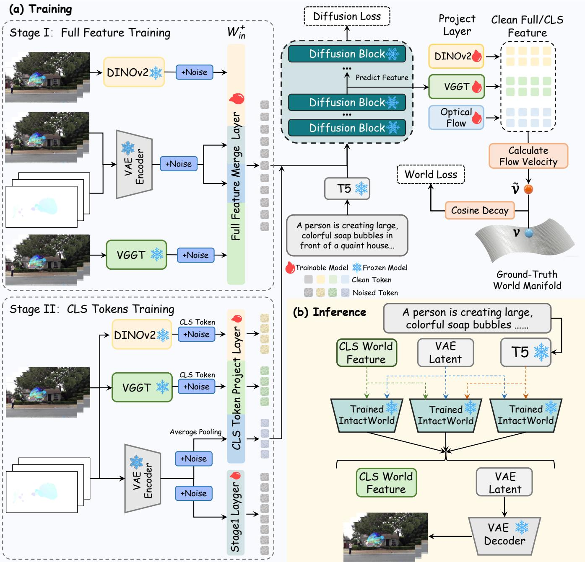
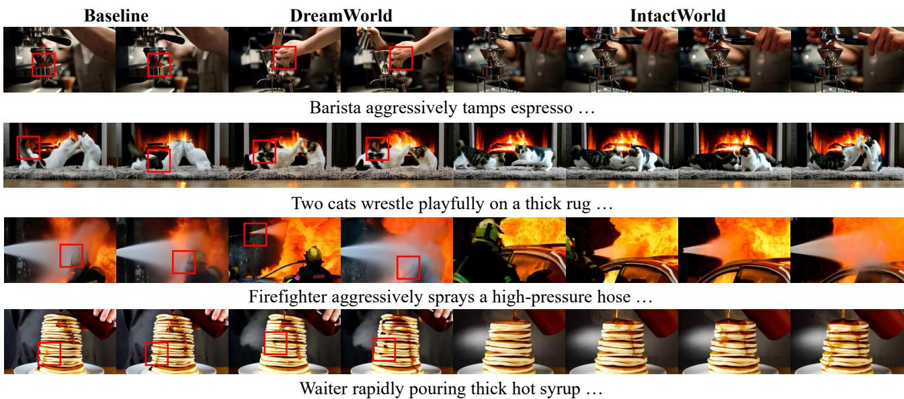
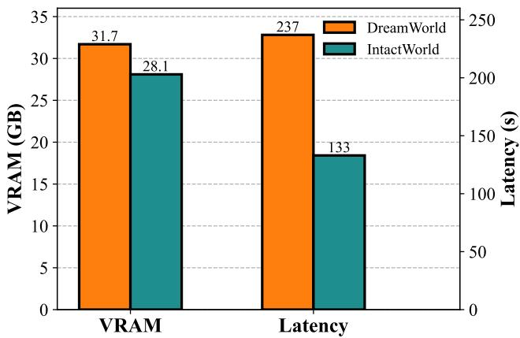
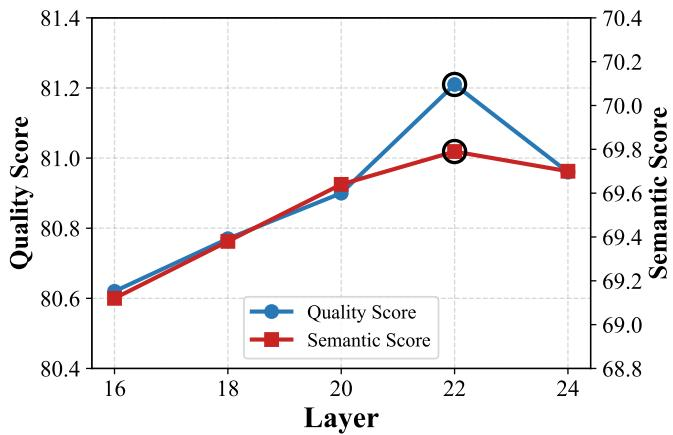

# IntactWorld: Joint World Modeling with Intact Features

Boming Tan1, Xiangdong Zhang2, Yan Xia1, Qi Zhu3, Deyi Ji3, Xue Yang2, Shaofeng Zhang1∗

1University of Science and Technology of China, 2Shanghai Jiao Tong University, 3KOKONI 3D, Moxin Technology bomingtan@foxmail.com, sfzhang@ustc.edu.cn

## Abstract

While recent video generation models synthesize highly realistic visuals, they lack a genuine understanding of intrinsic real-world logic. Existing methods attempt to understand the world by internalizing diverse world knowledge, yet constrained by computational overhead or dimensionality alignment, their learning processes inevitably compress features, causing a severe loss of structural information. To address this, we propose IntactWorld, a Joint World Modeling Architecture utilizing uncompressed Intact Features. Since data naturally reside on a low-dimensional manifold within a highdimensional space, predicting the flow velocity v within this uncompressed high-dimensional space induces a severe manifold gap. To successfully eliminate this optimization bottleneck, our framework instead predicts the clean feature x at intermediate layers. Furthermore, to mitigate the computational overhead of incorporating complete world knowledge, we introduce a Full-to-Compact Training Paradigm. By replacing raw full features with highly refined CLS tokens, this paradigm enables eficient single-branch guidance, reducing spatial memory consumption by 11.4% and cutting inference latency by 43.8%. Extensive evaluations demonstrate the ef fectiveness of IntactWorld, outperforming established baselines by 2.46 points on the VBench 2.0 benchmark.

## 1 Introduction

Recent advancements in Latent Difusion Models (LDMs) (Rombach et al. 2022) and Difusion Transformers (DiT) (Peebles and Xie 2023) have significantly propelled video generation. Foundation models such as CogVideoX (Yang et al. 2025), HunyuanVideo (Kong et al. 2025), and Wan2.1 (Wan et al. 2025) can now synthesize highly realistic visual sequences. Despite this impressive visual fidelity, these architectures usually operate as pixel-level pattern matchers. Optimized primarily for surface-level statistical distributions, they often struggle to capture the intrinsic logic of the real world. This fundamental limitation is reflected by their performance on world-centric benchmarks such as VBench 2.0 (Zheng et al. 2025). These limitations suggest that generative frameworks should move beyond pixel-level dependencies and incorporate richer world knowledge.

Existing methods (Lin et al. 2025; Brooks et al. 2024; Yuan et al. 2026; Yang et al. 2026; Zhu et al. 2024) have sought to equip video generators with external priors to facilitate genuine world modeling. Approaches like DreamWorld (Tan et al. 2026) extend projection layers to explicitly internalize multi-modal knowledge. To manage the resulting computational overhead, they heavily rely on dimensionality reduction techniques such as Principal Component Analysis (PCA) (Kouzelis et al. 2026). However, this compression erases structural details, specifically spatial and motion information, causing the model to overfit to generalized semantics. Alternatively, discarding PCA to train directly on uncompressed full features introduces a critical optimization bottleneck. Difusion models typically predict the velocity vector v. According to the manifold hypothesis (Li and He 2026), data naturally resides on a low-dimensional manifold within a high-dimensional space. Therefore, directly predicting v in this uncompressed high-dimensional space induces significant optimization loss, which degrades the overall generative capacity of the model (as detailed in Section 4.4).

To address this gap, we propose IntactWorld, a Joint World Modeling Architecture utilizing Intact Features. Inspired by DreamWorld, we extend projection layers to internalize knowledge, but incorporate uncompressed full DI-NOv2 (Oquab et al. 2023) and VGGT (Wang et al. 2025a) features. To circumvent the manifold gap bottleneck caused by directly predicting v in a high-dimensional space (Li and He 2026), our model avoids directly predicting velocity for the world features. Instead, it predicts clean world features x0 while retaining velocity prediction for the VAE latents, and computes the training loss in velocity space. Furthermore, since intermediate network layers preserve richer structural information, we predict x from these intermediate layers rather than the final layer.

However, incorporating external world knowledge inevitably increases inference costs. For instance, DreamWorld employs a Multi-Source Inner-Guidance mechanism, which requires constructing multiple auxiliary branches on top of standard classifier-free guidance(CFG) (Vincent 2011; Ho and Salimans 2022). To address this, we propose a Full-to-Compact Training Paradigm. Building upon the full-feature learning of Stage I, Stage II uses compact CLS tokens and concatenates them with the VAE latents in the hidden layers. Since these CLS tokens have already internalized the world knowledge and are highly condensed, they inherently provide strong guidance. Consequently, instead of requiring multiple branches, we only need to construct a single additional CLS feature branch alongside standard CFG, which drastically reduces inference overhead. Our main contributions are as follows:

1) We propose IntactWorld, a Joint World Modeling Architecture utilizing Intact Features. By predicting the clean features $x _ { 0 }$ and computing the loss in the velocity space, it alleviates the bottleneck of the manifold gap and successfully internalizes complete world features.

2) We drastically reduce inference costs through a novel Full-to-Compact Training Paradigm and Compact Inner-Guidance mechanism. By abstracting world knowledge into compact CLS tokens, we achieve highly eficient generation with only a single additional branch atop standard CFG.

3) Extensive experiments demonstrate that IntactWorld significantly outperforms baselines and DreamWorld, establishing new records on the VBench and VBench 2.0.

## 2 Related Works

Video Difusion Models The development of video generation builds upon latent difusion models (LDMs) (Rombach et al. 2022; Zhang et al. 2025; Ma et al. 2025), which operate in a compressed latent space to enable eficient synthesis while preserving perceptual quality. Early approaches such as VideoCrafter1 (Chen et al. 2023) and ModelScope (Wang et al. 2023) extend UNet-based architectures with interleaved spatial and temporal attention modules to capture frame dependencies. Subsequently, the field has shifted toward Difusion Transformers (DiT) (Peebles and Xie 2023), replacing convolutional U-Nets with pure transformer backbones that better scale with model size and sequence length. Foundational models including Sora (Brooks et al. 2024), CogVideoX (Yang et al. 2025) , HunyuanVideo (Kong et al. 2025) and Wan2.1 (Wan et al. 2025) leverage large-scale DiT architectures, often combined with Flow Matching (Lipman et al. 2023) frameworks, which enables straighter and faster generation while maintaining high fidelity.

World Modeling World models (Ha and Schmidhuber 2018) are already being developed in the field of video generation. The JEPA family (Bardes et al. 2024; Huang 2026; Garrido et al. 2024; Assran et al. 2025; Bardes et al. 2024; Maes et al. 2026) shifts from pixel reconstruction to prediction in a learned latent space, enabling zero-shot robotic planning at scale. Meanwhile, action-conditioned generative models such as Genie (Bruce et al. 2024), Genie2 (Parker-Holder et al. 2024) and the VideoWorld series (Ren et al. 2025, 2026) learn transferable knowledge from unlabeled videos by decoupling action dynamics from visual appearance. Moving beyond single-source knowledge, DreamWorld (Tan et al. 2026) proposes a unified joint world modeling paradigm that simultaneously integrates multiple world knowledge. To further address compounding errors in long-horizon generation, retrieval-augmented strategies (Chen et al. 2026; Wang et al. 2026; Wu et al. 2025b; Xiao et al. 2026; Lin et al. 2025) have been proposed, alongside a unified mechanistic view of state and dynamics. These world modeling principles have also been successfully extended to autonomous driving (Li et al. 2025; Min et al. 2024), demonstrating broad applicability beyond simulated environments.

Manifold Gap The manifold hypothesis posits that natural data reside on a low-dimensional manifold embedded in a high-dimensional space, whereas noise or noised quantities lie of this manifold. Drawing on this perspective, JiT (Li and He 2026) proposes directly predicting clean data (xprediction), demonstrating that even networks with limited capacity can handle high-dimensional patches when the prediction respects manifold structure. Enforcing bottleneck or sparse structures is a common strategy for learning such low-dimensional representations (Tishby, Pereira, and Bialek 2000; Alemi et al. 2016; Rifai et al. 2011; Makhzani and Frey 2014). This principle has since been extended to address geometric interference, manifold-guided distillation, concept manifolds in sparse autoencoders, and manifold-aware video generation (Kumar and Patel 2026; Farghly et al. 2025; Roy et al. 2026; Bhalla et al. 2026; Zheng et al. 2026; Weng et al. 2026). Together, these works highlight the importance of respecting data geometry in generative modeling.

## 3 Method

In this section, we present IntactWorld, a Joint World Modeling Architecture with intact features, which is illustrated in Figure 1. Sections 3.1 and 3.2 introduce Flow Matching preliminaries and feature preprocessing. Section 3.3 details the Stage I joint modeling with intact features to overcome the manifold gap. Section 3.4 outlines the Stage II feature abstraction into compact CLS tokens using a position-isolated RoPE strategy. Finally, Section 3.5 presents the Compact Inner-Guidance mechanism for highly eficient inference.

## 3.1 Preliminaries

Flow Matching. Flow Matching (Lipman et al. 2023) has emerged as a highly eficient continuous-time generative paradigm, powering recent state-of-the-art video models such as Wan2.1 (Wan et al. 2025). Let $z _ { 0 } \sim p _ { d a t a }$ denote the real video latent and $z _ { 1 } \sim \mathcal { N } ( 0 , I )$ be the standard Gaussian prior. Flow Matching constructs a continuous probability path $z _ { t } = t z _ { 1 } + ( 1 - t ) z _ { 0 } { \mathrm { f o r } } t \in [ 0 , 1 ]$ , and optimizes a neural network vθ to predict the constant flow velocity $z _ { 1 } - z _ { 0 }$ The standard objective is defined as:

$$
\mathcal { L } _ { F M } = \mathbb { E } _ { t , z _ { 0 } , z _ { 1 } , c } \left[ \| v _ { \theta } ( z _ { t } , t , c ) - ( z _ { 1 } - z _ { 0 } ) \| ^ { 2 } \right]\tag{1}
$$

where c represents the textual condition. During inference, the video latent is recovered by numerically solving the ODE from $t = 1 \mathrm { t o } t = 0$

Data Manifold and Prediction Targets. While standard difusion models typically predict noise or velocity, these targets struggle in high-dimensional dense feature spaces(Li and He 2026). Under the manifold assumption, structured data $x _ { 0 }$ resides on a low-dimensional manifold $\mathcal { M } \subset \mathbb { R } ^ { D }$ $( d \ll D )$ . In contrast, Gaussian noise ϵ and flow velocity $v = x _ { 0 } - \epsilon$ span the entire high-dimensional space $\mathbb { R } ^ { \bar { D } }$ Consequently, predicting clean data $( x _ { 0 } )$ is highly tractable since it only requires retaining low-dimensional structural information. Conversely, predicting of-manifold quantities (v) forces limited-capacity networks to model the full highdimensional distribution, inevitably leading to severe optimization conflicts when injecting dense external features.

  
Figure 1: Overview of the IntactWorld Framework. (a) Training: We employ a Full-to-Compact Training Paradigm. Stage I utilizes lossless full features, predicting the clean target $x _ { 0 }$ to compute the World Loss in the v-space. Stage II trains exclusively on compact CLS tokens for semantic abstraction. (b) Inference: These condensed tokens enable Compact Inner-Guidance, achieving eficient generation via a single additional branch atop standard CFG.

## 3.2 Preprocessing

Motion Representation Transformation. To explicitly capture temporal dynamics, we extract Optical Flow (Teed and Deng 2020) fields $( u , v )$ and transform them into a 3-

channel RGB format for standard video encoders. The motion magnitude m and direction α are formulated as:

$$
m = \operatorname * { m i n } \left( 1 , \frac { \sqrt { u ^ { 2 } + v ^ { 2 } } } { \gamma \sqrt { H ^ { 2 } + W ^ { 2 } } } \right) , \quad \alpha = \arctan 2 ( v , u )\tag{2}
$$

where $\gamma$ scales magnitude sensitivity. These components modulate pixel-wise intensity and hue, respectively. A frozen

3D VAE then encodes these frames into a temporal latent ztemporal, efectively projecting the motion prior into the visual latent space.

Feature Distribution Alignment. A distributional discrepancy exists between the generative VAE latent space and dense expert features from models like VGGT (Wang et al. 2025a) and DINOv2 (Oquab et al. 2023). To mitigate this, we first match their resolutions to the video latents via spatial interpolation and temporal pooling. Next, we apply channelwise standardization (zero mean, unit variance) to the full features. This aligns the heterogeneous representations onto a unified statistical manifold, critically mitigating the manifold gap and ensuring optimization stability during joint modeling. Without normalization, features from diferent experts can dominate the joint representation unevenly, which destabilizes training and weakens efective cross-modal fusion.

## 3.3 Stage I: Full Feature Training

Joint Modeling with Full Features. Building a robust world model requires internalizing semantic, spatial, and temporal dynamics. While previous alignment paradigms compress multi-source features to reduce compute, this dimensional reduction inevitably erases precise spatial geometry and nuanced motion details. To preserve these world priors, we bypass compression and utilize the full dense features from DINOv2 and VGGT. Let $Z _ { w o r l d } = [ z _ { s e m } , z _ { s p a } , z _ { t e m p } ]$ denote the concatenated uncompressed world representations. The clean joint state is defined as ${ Z _ { 0 } } = [ { z _ { v a e } } , { \bar { \cal Z } _ { w o r l d } } ]$ Following the unified modeling paradigm (Tan et al. 2026), we integrate this composite tensor by expanding the input projection layer $W _ { i n }$ into $W _ { i n } ^ { + } .$ , where the extended weights are zero-initialized:

$$
F _ { i n } = Z _ { t } \cdot W _ { i n } ^ { + } = \left[ \tilde { z } _ { v a e } , \tilde { Z } _ { w o r l d } \right] \cdot \left[ W _ { i n } , \mathbf { 0 } \right]\tag{3}
$$

where $Z _ { t }$ denotes the noised joint state at time step t. In practice, this design provides a smooth adaptation path from the pre-trained video generator to the joint world-modeling regime. It prevents the newly introduced feature channels from abruptly perturbing the original latent distribution at the beginning of training.

Manifold Gap. Integrating full expert features drastically inflates the dimensionality of $Z _ { t } ,$ , introducing a profound optimization dilemma known as the manifold gap (Li and He 2026). Standard Flow Matching models typically predict flow velocity v. However, v is an of-manifold quantity that spans the high-dimensional space. Regressing these targets causes optimization conflicts and structural collapse. Conversely, the clean world feature $Z _ { w o r l d }$ intrinsically resides on a lowdimensional manifold. Driven by this insight, we introduce a decoupled prediction mechanism. We retain v-prediction for VAE latents but reparameterize the network to directly predict the on-manifold data for the world priors:

$$
[ \hat { v } _ { v a e } , \hat { Z } _ { w o r l d } ] = n e t _ { \theta } ( [ \tilde { z } _ { v a e } , \tilde { Z } _ { w o r l d } ] , t , c )\tag{4}
$$

By shifting the target to the structured world reality, the network acts as a bottleneck that suppresses high-dimensional noise and concentrates model capacity on recovering the fine-grained structure of world knowledge.

Optimization in Velocity Space. While predicting $\hat { Z } _ { w o r l d }$ facilitates optimization, computing the regression loss directly in the data space severs the connection to the ordinary diferential equation (ODE) framework. To preserve this connection, we project the prediction back into the velocity space. For the world features, the ground-truth velocity $v _ { w o r l d }$ and implied predicted velocity $\hat { v } _ { w o r l d }$ are derived as:

$$
v _ { w o r l d } = \frac { \tilde { Z } _ { w o r l d } - Z _ { w o r l d } } { t } , \quad \hat { v } _ { w o r l d } = \frac { \tilde { Z } _ { w o r l d } - \hat { Z } _ { w o r l d } } { t }\tag{5}
$$

Additionally, to prevent the strong structural constraints from overwhelming the pixel-level visual generation, we introduce a Cosine Decay mechanism λ. The joint objective is defined as:

$$
\mathcal { L } _ { t o t a l } = \mathbb { E } \left[ \| \hat { v } _ { v a e } - v _ { v a e } \| ^ { 2 } + \lambda \cdot \frac { 1 } { t ^ { 2 } } \| \hat { Z } _ { w o r l d } - Z _ { w o r l d } \| ^ { 2 } \right]\tag{6}
$$

This formulation naturally induces a $1 / t ^ { 2 }$ reweighting, which penalizes structural errors more heavily when noise is low as $t  0 ,$ , forcing the model to refine local details. Meanwhile, the Cosine Decay factor λ gradually reduces this world guidance as training proceeds, ensuring the model internalizes world knowledge early while prioritizing high-fidelity visual generation in later stages.

## 3.4 Stage II: CLS Tokens Training

Compact Internalization. Existing world-guided generation frameworks typically require multiple expert guidance branches during inference (Tan et al. 2026), resulting in substantial computational overhead. To address this issue, we extend classifier-free guidance (CFG) (Vincent 2011; Dhariwal and Nichol 2021; Ho and Salimans 2022) with a single additional CLS branch. Since the compact CLS tokens $\bar { Z } _ { c l s }$ already internalize the multi-source structural knowledge learned in Stage I in a highly condensed form, the model no longer requires separate semantic, spatial, and motion guidance branches during inference. This significantly reduces the number of forward passes while retaining efective world-guided generation capability.

Token Construction. In this stage, we transition the network from full feature alignment to compact knowledge integration. The dense spatial and semantic features from VGGT (Wang et al. 2025a) and DINOv2 (Oquab et al. 2023) are explicitly replaced by their CLS tokens, $z _ { s p a } ^ { c l s }$ and $z _ { s e m } ^ { c l s } .$ Specifically, both models extract T CLS tokens, where $T$ corresponds to the temporal dimension of the latents. For the temporal prior, we apply spatial average pooling to the dense optical flow latents to obtain $T$ corresponding pseudo-CLS tokens. For the i-th temporal feature, this token is computed as:

$$
z _ { t e m p } ^ { c l s , ( i ) } = \frac { 1 } { H \times W } \sum _ { x , y } Z _ { t e m p } ^ { ( i , x , y ) }
$$

where $i \in \{ 1 , 2 , \ldots , T \}$ , and $H , W$ represent the spatial height and width of the latent representations.Let the concatenated world tokens be $Z _ { c l s } ^ { \prime } \ \stackrel { . } { = } \ [ z _ { s e m } ^ { c l s } , z _ { s p a } ^ { c l s } , z _ { t e m p } ^ { c l s } ]$ . To map these tokens into the transformer’s hidden dimension

<table><tr><td rowspan="2">Method</td><td colspan="3">Temporal</td><td colspan="3">Semantic</td><td>Spatial</td><td colspan="2">Summary</td><td rowspan="2">Overall Score</td></tr><tr><td>Subject Consistency Consistency</td><td>Background Dynamic Object Human</td><td>Degree</td><td>Class Action</td><td></td><td>Scene</td><td>Spatial Relationship</td><td>Quality Semantic Score</td><td>Score</td></tr><tr><td>Wan2.1-T2V-1.3B</td><td>91.83</td><td>94.71</td><td>65.00</td><td>76.09</td><td>74.60</td><td>20.03</td><td>62.37</td><td>79.81</td><td>65.43</td><td>76.93</td></tr><tr><td>Baseline</td><td>93.59</td><td>95.81</td><td>54.08</td><td>79.90</td><td>78.98</td><td>28.55</td><td>63.31</td><td>81.26</td><td>68.47</td><td>78.71</td></tr><tr><td>DreamWorld</td><td>93.62</td><td>94.95</td><td>79.16</td><td>81.32</td><td>81.20</td><td>29.71</td><td>70.47</td><td>83.49</td><td>70.89</td><td>80.97</td></tr><tr><td>IntactWorld (Ours)</td><td>93.60</td><td>97.44</td><td>78.94</td><td>82.63</td><td>83.40</td><td>31.34</td><td>69.78</td><td>83.76</td><td>72.19</td><td>81.45</td></tr></table>

Table 1: Quantitative comparison on VBench. Bold and underline indicate the best and second best results, respectively. IntactWorld achieves the best performance, clearly outperforming existing methods.
<table><tr><td rowspan="2">Method</td><td colspan="3">VBench 2.0 Dimensions</td><td rowspan="2">Overall</td></tr><tr><td>Com. Control. Hum. Fid. Physics</td><td></td><td></td></tr><tr><td>Wan2.1-T2V-1.3B</td><td>59.17 16.81</td><td>76.09</td><td>55.85</td><td>50.77</td></tr><tr><td>Baseline</td><td>62.80</td><td>18.41 77.09</td><td>54.51</td><td>51.18</td></tr><tr><td>DreamWorld</td><td>61.82</td><td>16.95 80.11</td><td>55.07</td><td>52.97</td></tr><tr><td>IntactWorld (Ours) 64.83</td><td>18.38</td><td>77.72</td><td>57.91</td><td>53.64</td></tr></table>

Table 2: VBench-2.0 quantitative results. Com.: Commonsense; Control.: Controllability; Hum. Fid.: Human Fidelity. Bold and underline denote the best and second-best results.

C, we introduce a new projection layer $W _ { c l s }$ . To ensure a stable transition, the projection weights for the VAE latents are strictly inherited from Stage I, whereas $W _ { c l s }$ is rigorously zero-initialized:

$$
Z _ { c l s } = Z _ { c l s } ^ { \prime } \cdot W _ { c l s }\tag{7}
$$

This zero-initialization ensures that the model progressively learns the compact representations without abruptly disrupting the visual backbone established in Stage I.

Sequence Concatenate and Positional Isolation. After projection, the VAE hidden states $H _ { v a e } \in \mathbb { R } ^ { L _ { v a e } \times C }$ and the world tokens $Z _ { c l s } ~ \in ~ \mathbb { R } ^ { N _ { c l s } \times C }$ are concatenated along the sequence dimension to form the joint hidden state $H _ { j o i n t } \ ' \in \mathbb { R } ^ { ( L _ { v a e } + N _ { c l s } ) \times C }$ . However, applying standard Rotary Positional Embeddings (RoPE) directly to this joint sequence would erroneously assign artificial spatial-temporal coordinates to the global $Z _ { c l s }$ tokens. To prevent this positional interference, we design a novel position-isolated RoPE strategy. Let $\Theta _ { v a e }$ denote the original rotary embedding tensor for the visual latents. (Wu et al. 2025a). We construct a position-neutral embedding for the CLS tokens using a tensor of ones, $\mathbf { 1 } _ { c l s }$ , matching the sequence length $N _ { c l s }$ . The new full rotary embedding is formulated by concatenating them along the sequence dimension:

$$
\Theta _ { f u l l } = [ \Theta _ { v a e } , \mathbf { 1 } _ { c l s } ]\tag{8}
$$

This modification disables the rotational coordinate shifts for the CLS tokens. It ensures that the self-attention mechanism processes the compact world knowledge purely based on its inherent content, entirely free from spatial-temporal coordinate constraints.

<table><tr><td rowspan="2">Method</td><td colspan="6">Solid-Solid Solid-Fluid Fluid-Fluid Overall</td></tr><tr><td>SA</td><td>PC SA</td><td>PC</td><td>SA</td><td>PC</td><td>SA PC</td></tr><tr><td>Wan2.1-T2V-1.3B</td><td>51.1</td><td>22.3</td><td>45.2</td><td>19.1 45.4</td><td>23.6</td><td>47.7 21.2</td></tr><tr><td>Baseline</td><td>46.2 18.2</td><td>47.8</td><td>22.6</td><td>50.9</td><td>23.6</td><td>45.1 20.9</td></tr><tr><td>DreamWorld</td><td>54.5 24.5</td><td>48.6</td><td>25.4</td><td>60.1</td><td>32.6</td><td>52.9 26.2</td></tr><tr><td>IntactWorld (Ours) 55.9</td><td>25.8</td><td>53.4</td><td>27.3</td><td>58.1</td><td>32.7</td><td>55.2 27.6</td></tr></table>

Table 3: Quantitative comparison on VideoPhy. We report Semantic Adherence (SA) and Physical Commonsense (PC) scores. The best results are highlighted in bold.

## 3.5 Compact Inner-Guidance

Standard classifier-free guidance (Vincent 2011; Dhariwal and Nichol 2021; Ho and Salimans 2022) requires two forward branches. DreamWorld (Tan et al. 2026) extends this to a five-branch Multi-Source Inner-Guidance, which incurs prohibitive inference costs.

To address this, we introduce Compact Inner-Guidance. Since the unified tokens $Z _ { c l s }$ successfully internalize multisource structural priors during Stage II training, they can act as a holistic world prior. By eliminating redundant modal branches, we achieve robust self-guidance using only three branches:

$$
\begin{array} { r } { \hat { v } _ { o u r s } = v _ { j o i n t } + w _ { t x t } \left( v _ { j o i n t } - v _ { \neg t x t } \right) + w _ { c l s } \left( v _ { j o i n t } - v _ { \neg c l s } \right) } \\ { ( 9 ) } \end{array}
$$

Replacing fragmented features with the consolidated $Z _ { c l s }$ reduces the forward passes per denoising step from five to three. This drastically cuts inference memory and latency while strictly preserving world dynamics.

## 4 Experimental Results

## 4.1 Implementation Details

Dataset Details. We conduct our experiments on a 30K subset of the open-source WISA-80K (Wang et al. 2025b) dataset. All video clips are uniformly sampled to 81 frames at a spatial resolution of 480 × 832. Optical flow features are extracted for the entire 30K subset (Chefer et al. 2025). To support our Full-to-Compact Training Paradigm, we extract uncompressed full DINOv2 (Oquab et al. 2023) and VGGT (Wang et al. 2025a) features for 24K videos to train

  
Figure 2: Qualitative comparison. Comparison of IntactWorld with Baseline and DreamWorld where red boxes denote structura errors and artifacts. Notably, IntactWorld achieves superior visual quality with fewer artifacts.

Stage I, while extracting only the compact CLS tokens for the remaining 6K videos specifically for Stage II.

Training Configuration. We fine-tune the foundational Wan2.1-T2V-1.3B (Wan et al. 2025) model using 8 NVIDIA A100 (80GB) GPUs. The optimization utilizes a learning rate of 1e-5 with a per-device batch size of 2. Following our Full-to-Compact Training Paradigm, Stage I is trained for 1,500 steps, after which the learned LoRA weights are saved. Stage II is then initialized directly from these Stage I LoRA weights and trained for an additional 750 steps with batch size of 1.

Baseline Methods. We employ the Wan2.1-T2V-1.3B model as our primary baseline, which is directly fine-tuned on the aforementioned 30K dataset using the finetrainers framework. This serves as a standard reference to evaluate the efectiveness of our proposed framework.

## 4.2 Quantitative Results

To evaluate the world modeling efectiveness and overall generation quality of IntactWorld, we conduct quantitative experiments on the authoritative benchmarks VBench (Huang et al. 2023) and VBench-2.0 (Zheng et al. 2025), as well as VideoPhy (Bansal et al. 2024) specifically for assessing physical commonsense. All text prompts used for video generation are directly sourced from their oficial repositories.

VBench. We evaluate general video synthesis quality using VBench (Huang et al. 2023). As shown in Table 1, IntactWorld achieves a state-of-the-art overall score of 81.45, outperforming the Wan2.1-T2V-1.3B baseline and Dream-World. Our model particularly excels in the Semantic and Spatial dimensions (e.g., Object Class and Spatial Relationship). This demonstrates that fully utilizing uncompressed features efectively prevents the loss of crucial structural information common in compression-based approaches.

VBench-2.0. Moving beyond surface-level visual aesthetics, VBench-2.0 (Zheng et al. 2025) rigorously evaluates the holistic world-modeling capabilities of generative models. On this benchmark, IntactWorld achieves a new state-of-theart overall score of 53.64, significantly surpassing existing baselines (Table 2). This demonstrates that by predicting the clean world features x0 and bridging the manifold gap, IntactWorld goes beyond superficial video synthesis; it successfully internalizes comprehensive structural priors to accurately simulate the underlying rules of the real world.

VideoPhy. VideoPhy (Bansal et al. 2024) evaluates physical commonsense across diverse material interactions (solid and fluid scenarios). Table 3 shows that IntactWorld achieves the highest Semantic Adherence (55.2) and Physical Commonsense (27.6) scores, consistently outperforming the baselines. This confirms that our intact feature approach successfully internalizes robust physical priors, allowing the model to simulate genuine material dynamics rather than merely memorizing superficial visual patterns.

Inference Cost. Compared with the multi-source guidance in DreamWorld, our Compact Inner-Guidance significantly optimizes computational eficiency, as shown in Figure 3. By eliminating redundant branches, the GPU memory footprint is reduced by 3.6 GB, representing an 11.4% decrease in memory overhead. Furthermore, the generation time per video is cut from 237 to 133 seconds, achieving a substantial 43.8% reduction in inference latency. These results demonstrate that IntactWorld provides a more eficient solution for high-fidelity world modeling.

  
Figure 3: Inference Cost. Comparison of inference latency and VRAM usage between IntactWorld and DreamWorld.

## 4.3 Qualitative Results

Figure 2 demonstrates the qualitative performance of Intact-World compared to the Baseline and DreamWorld in various dynamic settings. The red boxes highlight where prior methods sufer from shape deformation and unnatural artifacts during rapid movement or complex interaction. Intact-World exhibits robust world-modeling capability by preserving object structure and temporal coherence throughout the sequence. These results indicate that our approach can generate high-fidelity content while alleviating common visual failures observed in prior methods.

## 4.4 Ablation Studies

Efectiveness of Full Feature Training. We evaluate the impact of Stage I by bypassing full feature learning and directly training exclusively with CLS tokens. As shown in Table 4, omitting this foundational stage degrades both video quality and semantic alignment. This confirms that initial full feature training is critical for establishing a robust structural prior before transitioning to the CLS token abstraction.

Efectiveness of CLS Token Abstraction. To verify the necessity of CLS token training, we ablate our method by merging the three raw full features into a 3-branch inference structure without CLS abstraction. As Table 4 illustrates, this variant underperforms across all metrics. This indicates that naively merging high-dimensional raw features causes interference during denoising. In contrast, IntactWorld’s refined CLS tokens eliminate inter-feature conflicts, achieving superior intrinsic faithfulness through eficient guidance.

Efectiveness of Predicting x0. We investigate the prediction target by substituting the clean signal $x _ { 0 }$ with the flow velocity v during intermediate prediction. Although predicting velocity is standard in flow matching, results in Table 4 show a clear performance drop compared to the standard IntactWorld. This suggests that directly supervising $x _ { 0 }$ provides a more reliable and deterministic signal, which is crucial for preserving structural integrity during feature joint modeling.

  
Figure 4: Influence of Prediction Depth. The best generation quality is achieved at layer 22.

<table><tr><td>Method</td><td>Quality</td><td>Semantic</td><td>Total</td></tr><tr><td>w/o full feature</td><td>83.60</td><td>71.80</td><td>81.24</td></tr><tr><td>w/o cls tokens</td><td>83.64</td><td>72.02</td><td>81.31</td></tr><tr><td>pred_v</td><td>83.16</td><td>70.50</td><td>80.63</td></tr><tr><td>IntactWorld</td><td>83.76</td><td>72.19</td><td>81.45</td></tr></table>

Table 4: Ablation Study. Quantitative evaluation on VBench for full feature training, CLS token abstraction, and the prediction target of x0 versus flow velocity v.

Influence of Prediction Depth. The choice of the layer for intermediate feature prediction is crucial. We evaluate IntactWorld on a 10K dataset across various prediction depths (layers 16, 18, 20, 22, and 24). As depicted in Figure 4, generation quality consistently improves as prediction moves deeper, peaking at layer 22 before degrading at layer 24. This trend suggests that moderately deep layers strike the best balance between preserving fine-grained structure and capturing semantically meaningful world representations.

## 5 Conclusion

In this paper, we present IntactWorld, a Joint World Modeling Architecture that efectively internalizes intact world features. To overcome the manifold gap bottleneck in highdimensional spaces, our method predicts the clean feature x0 at intermediate network layers and computes the optimization loss within the v-space. Furthermore, we drastically reduce inference costs by introducing a Full-to-Compact Training Paradigm and a Compact Inner-Guidance mechanism. By abstracting complex world knowledge into highly condensed CLS tokens, our model achieves highly eficient generation requiring only a single additional feature branch alongside standard classifier-free guidance. Extensive experiments demonstrate that IntactWorld successfully eliminates redundant computational overhead while establishing new records on both VBench and VBench-2.0 benchmarks.

## References

Alemi, A. A.; Fischer, I.; Dillon, J. V.; and Murphy, K. 2016. Deep variational information bottleneck. arXiv preprint arXiv:1612.00410.

Assran, M.; Bardes, A.; Fan, D.; Garrido, Q.; Howes, R.; Mojtaba; Komeili; Muckley, M.; Rizvi, A.; Roberts, C.; Sinha, K.; Zholus, A.; Arnaud, S.; Gejji, A.; Martin, A.; Hogan, F. R.; Dugas, D.; Bojanowski, P.; Khalidov, V.; Labatut, P.; Massa, F.; Szafraniec, M.; Krishnakumar, K.; Li, Y.; Ma, X.; Chandar, S.; Meier, F.; LeCun, Y.; Rabbat, M.; and Ballas, N. 2025. V-JEPA 2: Self-Supervised Video Models Enable Understanding, Prediction and Planning. arXiv:2506.09985.

Bansal, H.; Lin, Z.; Xie, T.; Zong, Z.; Yarom, M.; Bitton, Y.; Jiang, C.; Sun, Y.; Chang, K.-W.; and Grover, A. 2024. Video-Phy: Evaluating Physical Commonsense for Video Generation. arXiv:2406.03520.

Bardes, A.; Garrido, Q.; Ponce, J.; Chen, X.; Rabbat, M.; LeCun, Y.; Assran, M.; and Ballas, N. 2024. Revisiting Feature Prediction for Learning Visual Representations from Video. arXiv:2404.08471.

Bhalla, U.; Fel, T.; Rager, C.; Feucht, S.; Haklay, T.; Wurgaft, D.; Boppana, S.; Kowal, M.; Shyam, V.; Merullo, J.; Geiger, A.; and Lubana, E. S. 2026. Do Sparse Autoencoders Capture Concept Manifolds? arXiv:2604.28119.

Brooks, T.; Peebles, B.; Holmes, C.; DePue, W.; Guo, Y.; Jing, L.; Schnurr, D.; Taylor, J.; Luhman, T.; Luhman, E.; Ng, C.; Wang, R.; and Ramesh, A. 2024. Video generation models as world simulators.

Bruce, J.; Dennis, M.; Edwards, A.; Parker-Holder, J.; Shi, Y.; Hughes, E.; Lai, M.; Mavalankar, A.; Steigerwald, R.; Apps, C.; Aytar, Y.; Bechtle, S.; Behbahani, F.; Chan, S.; Heess, N.; Gonzalez, L.; Osindero, S.; Ozair, S.; Reed, S.; Zhang, J.; Zolna, K.; Clune, J.; de Freitas, N.; Singh, S.; and Rocktäschel, T. 2024. Genie: Generative Interactive Environments. arXiv:2402.15391.

Chefer, H.; Singer, U.; Zohar, A.; Kirstain, Y.; Polyak, A.; Taigman, Y.; Wolf, L.; and Sheynin, S. 2025. VideoJAM: Joint Appearance-Motion Representations for Enhanced Motion Generation in Video Models. arXiv:2502.02492.

Chen, H.; Xia, M.; He, Y.; Zhang, Y.; Cun, X.; Yang, S.; Xing, J.; Liu, Y.; Chen, Q.; Wang, X.; Weng, C.; and Shan, Y. 2023. VideoCrafter1: Open Difusion Models for High-Quality Video Generation. arXiv:2310.19512.

Chen, T.; Hu, X.; Ding, Z.; and Jin, C. 2026. Learning World Models for Interactive Video Generation. arXiv:2505.21996.

Dhariwal, P.; and Nichol, A. 2021. Difusion Models Beat GANs on Image Synthesis. arXiv:2105.05233.

Farghly, T.; Potaptchik, P.; Howard, S.; Deligiannidis, G.; and Pidstrigach, J. 2025. Difusion Models and the Manifold Hypothesis: Log-Domain Smoothing is Geometry Adaptive. arXiv:2510.02305.

Garrido, Q.; Assran, M.; Ballas, N.; Bardes, A.; Najman, L.; and LeCun, Y. 2024. Learning and Leveraging World Models in Visual Representation Learning. arXiv:2403.00504.

Ha, D.; and Schmidhuber, J. 2018. World Models.

Ho, J.; and Salimans, T. 2022. Classifier-Free Difusion Guidance. arXiv:2207.12598.

Huang, Y. 2026. VJEPA: Variational Joint Embedding Predictive Architectures as Probabilistic World Models. arXiv:2601.14354.

Huang, Z.; He, Y.; Yu, J.; Zhang, F.; Si, C.; Jiang, Y.; Zhang, Y.; Wu, T.; Jin, Q.; Chanpaisit, N.; Wang, Y.; Chen, X.; Wang, L.; Lin, D.; Qiao, Y.; and Liu, Z. 2023. VBench: Comprehensive Benchmark Suite for Video Generative Models. arXiv:2311.17982.

Kong, W.; Tian, Q.; Zhang, Z.; Min, R.; Dai, Z.; Zhou, J.; Xiong, J.; Li, X.; Wu, B.; Zhang, J.; Wu, K.; Lin, Q.; Yuan, J.; Long, Y.; Wang, A.; Wang, A.; Li, C.; Huang, D.; Yang, F.; Tan, H.; Wang, H.; Song, J.; Bai, J.; Wu, J.; Xue, J.; Wang, J.; Wang, K.; Liu, M.; Li, P.; Li, S.; Wang, W.; Yu, W.; Deng, X.; Li, Y.; Chen, Y.; Cui, Y.; Peng, Y.; Yu, Z.; He, Z.; Xu, Z.; Zhou, Z.; Xu, Z.; Tao, Y.; Lu, Q.; Liu, S.; Zhou, D.; Wang, H.; Yang, Y.; Wang, D.; Liu, Y.; Jiang, J.; and Zhong, C. 2025. HunyuanVideo: A Systematic Framework For Large Video Generative Models. arXiv:2412.03603.

Kouzelis, T.; Karypidis, E.; Kakogeorgiou, I.; Gidaris, S.; and Komodakis, N. 2026. Boosting Generative Image Modeling via Joint Image-Feature Synthesis. arXiv:2504.16064.

Kumar, A.; and Patel, V. M. 2026. Learning on the Manifold: Unlocking Standard Difusion Transformers with Representation Encoders. arXiv:2602.10099.

Li, T.; and He, K. 2026. Back to Basics: Let Denoising Generative Models Denoise. arXiv:2511.13720.

Li, Y.; Fan, L.; He, J.; Wang, Y.; Chen, Y.; Zhang, Z.; and Tan, T. 2025. Enhancing End-to-End Autonomous Driving with Latent World Model. arXiv:2406.08481.

Lin, B.; Li, Z.; Cheng, X.; Niu, Y.; Ye, Y.; He, X.; Yuan, S.; Yu, W.; Wang, S.; Ge, Y.; et al. 2025. UniWorld: High-Resolution Semantic Encoders for Unified Visual Understanding and Generation. arXiv preprint arXiv:2506.03147.

Lipman, Y.; Chen, R. T. Q.; Ben-Hamu, H.; Nickel, M.; and Le, M. 2023. Flow Matching for Generative Modeling. arXiv:2210.02747.

Ma, X.; Wang, Y.; Chen, X.; Jia, G.; Liu, Z.; Li, Y.-F.; Chen, C.; and Qiao, Y. 2025. Latte: Latent Difusion Transformer for Video Generation. arXiv:2401.03048.

Maes, L.; Lidec, Q. L.; Scieur, D.; LeCun, Y.; and Balestriero, R. 2026. LeWorldModel: Stable End-to-End Joint-Embedding Predictive Architecture from Pixels. arXiv:2603.19312.

Makhzani, A.; and Frey, B. 2014. k-Sparse Autoencoders. arXiv:1312.5663.

Min, C.; Zhao, D.; Xiao, L.; Zhao, J.; Xu, X.; Zhu, Z.; Jin, L.; Li, J.; Guo, Y.; Xing, J.; Jing, L.; Nie, Y.; and Dai, B. 2024. DriveWorld: 4D Pre-trained Scene Understanding via World Models for Autonomous Driving. arXiv:2405.04390.

Oquab, M.; Darcet, T.; Moutakanni, T.; Vo, H.; Szafraniec, M.; Khalidov, V.; Fernandez, P.; Haziza, D.; Massa, F.; El-Nouby, A.; Assran, M.; Ballas, N.; Galuba, W.; Howes, R.; Huang, P.-Y.; Li, S.-W.; Misra, I.; Rabbat, M.; Sharma,

V.; Synnaeve, G.; Xu, H.; Jegou, H.; Mairal, J.; Labatut, P.; Joulin, A.; and Bojanowski, P. 2023. DI-NOv2: Learning Robust Visual Features without Supervision. arXiv:2304.07193.

Parker-Holder, J.; Ball, P.; Bruce, J.; Dasagi, V.; Holsheimer, K.; Kaplanis, C.; Moufarek, A.; Scully, G.; Shar, J.; Shi, J.; Spencer, S.; Yung, J.; Dennis, M.; Kenjeyev, S.; Long, S.; Mnih, V.; Chan, H.; Gazeau, M.; Li, B.; Pardo, F.; Wang, L.; Zhang, L.; Besse, F.; Harley, T.; Mitenkova, A.; Wang, J.; Clune, J.; Hassabis, D.; Hadsell, R.; Bolton, A.; Singh, S.; and Rocktäschel, T. 2024. Genie 2: A Large-Scale Foundation World Model.

Peebles, W.; and Xie, S. 2023. Scalable Difusion Models with Transformers. arXiv:2212.09748.

Ren, Z.; Wei, Y.; Guo, X.; Zhao, Y.; Kang, B.; Feng, J.; and Jin, X. 2025. VideoWorld: Exploring Knowledge Learning from Unlabeled Videos. arXiv:2501.09781.

Ren, Z.; Wei, Y.; Yu, X.; Luo, G.; Zhao, Y.; Kang, B.; Feng, J.; and Jin, X. 2026. VideoWorld 2: Learning Transferable Knowledge from Real-world Videos. arXiv:2602.10102.

Rifai, S.; Vincent, P.; Muller, X.; Glorot, X.; and Bengio, Y. 2011. Contractive auto-encoders: Explicit invariance during feature extraction. In Proceedings of the 28th international conference on international conference on machine learning, 833–840.

Rombach, R.; Blattmann, A.; Lorenz, D.; Esser, P.; and Ommer, B. 2022. High-Resolution Image Synthesis with Latent Difusion Models. arXiv:2112.10752.

Roy, A.; Lee, W.-Y. A.; Chakraborty, R.; and Lokhande, V. S. 2026. ManifoldGD: Training-Free Hierarchical Manifold Guidance for Difusion-Based Dataset Distillation. arXiv:2602.23295.

Tan, B.; Zhang, X.; Liao, N.; Zhang, Y.; Zhang, S.; Yang, X.; Fan, Q.; and Zhang, Y. 2026. DreamWorld: Unified World Modeling in Video Generation. arXiv:2603.00466.

Teed, Z.; and Deng, J. 2020. RAFT: Recurrent All-Pairs Field Transforms for Optical Flow. arXiv:2003.12039.

Tishby, N.; Pereira, F. C.; and Bialek, W. 2000. The information bottleneck method. arXiv:physics/0004057.

Vincent, P. 2011. A connection between score matching and denoising autoencoders. Neural computation, 23(7): 1661– 1674.

Wan, T.; Wang, A.; Ai, B.; Wen, B.; Mao, C.; Xie, C.-W.; Chen, D.; Yu, F.; Zhao, H.; Yang, J.; Zeng, J.; Wang, J.; Zhang, J.; Zhou, J.; Wang, J.; Chen, J.; Zhu, K.; Zhao, K.; Yan, K.; Huang, L.; Feng, M.; Zhang, N.; Li, P.; Wu, P.; Chu, R.; Feng, R.; Zhang, S.; Sun, S.; Fang, T.; Wang, T.; Gui, T.; Weng, T.; Shen, T.; Lin, W.; Wang, W.; Wang, W.; Zhou, W.; Wang, W.; Shen, W.; Yu, W.; Shi, X.; Huang, X.; Xu, X.; Kou, Y.; Lv, Y.; Li, Y.; Liu, Y.; Wang, Y.; Zhang, Y.; Huang, Y.; Li, Y.; Wu, Y.; Liu, Y.; Pan, Y.; Zheng, Y.; Hong, Y.; Shi, Y.; Feng, Y.; Jiang, Z.; Han, Z.; Wu, Z.-F.; and Liu, Z. 2025. Wan: Open and Advanced Large-Scale Video Generative Models. arXiv:2503.20314.

Wang, J.; Chen, M.; Karaev, N.; Vedaldi, A.; Rupprecht, C.; and Novotny, D. 2025a. VGGT: Visual Geometry Grounded Transformer. arXiv:2503.11651.

Wang, J.; Ma, A.; Cao, K.; Zheng, J.; Zhang, Z.; Feng, J.; Liu, S.; Ma, Y.; Cheng, B.; Leng, D.; Yin, Y.; and Liang, X. 2025b. WISA: World Simulator Assistant for Physics-Aware Text-to-Video Generation. arXiv:2502.08153.

Wang, J.; Yuan, H.; Chen, D.; Zhang, Y.; Wang, X.; and Zhang, S. 2023. ModelScope Text-to-Video Technical Report. arXiv:2308.06571.

Wang, L.; Chen, Z.; Du, Y.; Yan, D.; Ge, W.; Shen, G.; Xu, X.; Wu, L.; Chen, M.; Xu, T.; Ren, P.; Tao, X.; Wan, P.; and Chen, Y.-C. 2026. A Mechanistic View on Video Generation as World Models: State and Dynamics. arXiv:2601.17067.

Weng, S.-E.; Liao, Y.-C.; Xu, Y.-S.; Chiu, W.-C.; and Huang, C.-C. 2026. Bridging Restoration and Generation Manifolds in One-Step Difusion for Real-World Super-Resolution. arXiv:2604.24136.

Wu, G.; Zhang, S.; Shi, R.; Gao, S.; Chen, Z.; Wang, L.; Chen, Z.; Gao, H.; Tang, Y.; Yang, J.; Cheng, M.-M.; and Li, X. 2025a. Representation Entanglement for Generation: Training Difusion Transformers Is Much Easier Than You Think. arXiv:2507.01467.

Wu, H.; Wu, D.; He, T.; Guo, J.; Ye, Y.; Duan, Y.; and Bian, J. 2025b. Geometry Forcing: Marrying Video Difusion and 3D Representation for Consistent World Modeling. arXiv:2507.07982.

Xiao, Z.; Lan, Y.; Zhou, Y.; Ouyang, W.; Yang, S.; Zeng, Y.; and Pan, X. 2026. WorldMem: Long-term Consistent World Simulation with Memory. arXiv:2504.12369.

Yang, H.; Tan, Z.; Gong, J.; Qin, L.; Chen, H.; Yang, X.; Sun, Y.; Lin, Y.; Yang, M.; and Li, H. 2026. Omni-Video 2: Scaling MLLM-Conditioned Difusion for Unified Video Generation and Editing. arXiv:2602.08820.

Yang, Z.; Teng, J.; Zheng, W.; Ding, M.; Huang, S.; Xu, J.; Yang, Y.; Hong, W.; Zhang, X.; Feng, G.; Yin, D.; Zhang, Y.;

Wang, W.; Cheng, Y.; Xu, B.; Gu, X.; Dong, Y.; and Tang, J. 2025. CogVideoX: Text-to-Video Difusion Models with An Expert Transformer. arXiv:2408.06072.

Yuan, J.; Zhang, X.; Friedrich, F.; Beltran-Velez, N.; Hall, M.; Askari-Hemmat, R.; Han, X.; Ballas, N.; Drozdzal, M.; and Romero-Soriano, A. 2026. Inference-time Physics Alignment ofVideo Generative Models with Latent World Models. arXiv:2601.10553.

Zhang, D. J.; Wu, J. Z.; Liu, J.-W.; Zhao, R.; Ran, L.; Gu, Y.; Gao, D.; and Shou, M. Z. 2025. Show-1: Marrying Pixel and Latent Difusion Models for Text-to-Video Generation. arXiv:2309.15818.

Zheng, D.; Huang, Z.; Liu, H.; Zou, K.; He, Y.; Zhang, F.; Gu, L.; Zhang, Y.; He, J.; Zheng, W.-S.; Qiao, Y.; and Liu, Z. 2025. VBench-2.0: Advancing Video Generation Benchmark Suite for Intrinsic Faithfulness. arXiv:2503.21755.

Zheng, M.; Kong, W.; Wu, Y.; Jiang, D.; Ma, Y.; He, X.; Lin, B.; Gong, K.; Zhong, Z.; Bo, L.; Chen, Q.; and Yang, H. 2026. Manifold-Aware Exploration for Reinforcement Learning in Video Generation. arXiv:2603.21872.

Zhu, Z.; Feng, X.; Chen, D.; Yuan, J.; Qiao, C.; and Hua, G. 2024. Exploring Pre-trained Text-to-Video Diffusion Models for Referring Video Object Segmentation. arXiv:2403.12042.